Linux in France - Tested Hardware & Statistics (Notebooks)
----------------------------------------------------------

A project to collect tested hardware configurations for Linux in France.

Anyone can contribute to this report by the [hw-probe](https://github.com/linuxhw/hw-probe) tool:

    sudo -E hw-probe -all -upload

Please contribute! Especially if your hardware is rare.

Contents
--------

* [ Test Cases ](#test-cases)

* [ System ](#system)
  - [ OS                       ](#os)
  - [ OS Family                ](#os-family)
  - [ Kernel                   ](#kernel)
  - [ Kernel Family            ](#kernel-family)
  - [ Kernel Major Ver.        ](#kernel-major-ver)
  - [ Arch                     ](#arch)
  - [ DE                       ](#de)
  - [ Display Server           ](#display-server)
  - [ Display Manager          ](#display-manager)
  - [ OS Lang                  ](#os-lang)
  - [ Boot Mode                ](#boot-mode)
  - [ Filesystem               ](#filesystem)
  - [ Part. scheme             ](#part-scheme)
  - [ Dual Boot with Linux/BSD ](#dual-boot-with-linuxbsd)
  - [ Dual Boot (Win)          ](#dual-boot-win)

* [ Board ](#board)
  - [ Vendor                   ](#vendor)
  - [ Model                    ](#model)
  - [ Model Family             ](#model-family)
  - [ MFG Year                 ](#mfg-year)
  - [ Form Factor              ](#form-factor)
  - [ Secure Boot              ](#secure-boot)
  - [ Coreboot                 ](#coreboot)
  - [ RAM Size                 ](#ram-size)
  - [ RAM Used                 ](#ram-used)
  - [ Total Drives             ](#total-drives)
  - [ Has CD-ROM               ](#has-cd-rom)
  - [ Has Ethernet             ](#has-ethernet)
  - [ Has WiFi                 ](#has-wifi)
  - [ Has Bluetooth            ](#has-bluetooth)

* [ Location ](#location)
  - [ Country                  ](#country)
  - [ City                     ](#city)

* [ Drives ](#drives)
  - [ Drive Vendor             ](#drive-vendor)
  - [ Drive Model              ](#drive-model)
  - [ HDD Vendor               ](#hdd-vendor)
  - [ SSD Vendor               ](#ssd-vendor)
  - [ Drive Kind               ](#drive-kind)
  - [ Drive Connector          ](#drive-connector)
  - [ Drive Size               ](#drive-size)
  - [ Space Total              ](#space-total)
  - [ Space Used               ](#space-used)
  - [ Malfunc. Drives          ](#malfunc-drives)
  - [ Malfunc. Drive Vendor    ](#malfunc-drive-vendor)
  - [ Malfunc. HDD Vendor      ](#malfunc-hdd-vendor)
  - [ Malfunc. Drive Kind      ](#malfunc-drive-kind)
  - [ Failed Drives            ](#failed-drives)
  - [ Failed Drive Vendor      ](#failed-drive-vendor)
  - [ Drive Status             ](#drive-status)

* [ Storage controller ](#storage-controller)
  - [ Storage Vendor           ](#storage-vendor)
  - [ Storage Model            ](#storage-model)
  - [ Storage Kind             ](#storage-kind)

* [ Processor ](#processor)
  - [ CPU Vendor               ](#cpu-vendor)
  - [ CPU Model                ](#cpu-model)
  - [ CPU Model Family         ](#cpu-model-family)
  - [ CPU Cores                ](#cpu-cores)
  - [ CPU Sockets              ](#cpu-sockets)
  - [ CPU Threads              ](#cpu-threads)
  - [ CPU Op-Modes             ](#cpu-op-modes)
  - [ CPU Microcode            ](#cpu-microcode)
  - [ CPU Microarch            ](#cpu-microarch)

* [ Graphics ](#graphics)
  - [ GPU Vendor               ](#gpu-vendor)
  - [ GPU Model                ](#gpu-model)
  - [ GPU Combo                ](#gpu-combo)
  - [ GPU Driver               ](#gpu-driver)
  - [ GPU Memory               ](#gpu-memory)

* [ Monitor ](#monitor)
  - [ Monitor Vendor           ](#monitor-vendor)
  - [ Monitor Model            ](#monitor-model)
  - [ Monitor Resolution       ](#monitor-resolution)
  - [ Monitor Diagonal         ](#monitor-diagonal)
  - [ Monitor Width            ](#monitor-width)
  - [ Aspect Ratio             ](#aspect-ratio)
  - [ Monitor Area             ](#monitor-area)
  - [ Pixel Density            ](#pixel-density)
  - [ Multiple Monitors        ](#multiple-monitors)

* [ Network ](#network)
  - [ Net Controller Vendor    ](#net-controller-vendor)
  - [ Net Controller Model     ](#net-controller-model)
  - [ Wireless Vendor          ](#wireless-vendor)
  - [ Wireless Model           ](#wireless-model)
  - [ Ethernet Vendor          ](#ethernet-vendor)
  - [ Ethernet Model           ](#ethernet-model)
  - [ Net Controller Kind      ](#net-controller-kind)
  - [ Used Controller          ](#used-controller)
  - [ NICs                     ](#nics)
  - [ IPv6                     ](#ipv6)

* [ Bluetooth ](#bluetooth)
  - [ Bluetooth Vendor         ](#bluetooth-vendor)
  - [ Bluetooth Model          ](#bluetooth-model)

* [ Sound ](#sound)
  - [ Sound Vendor             ](#sound-vendor)
  - [ Sound Model              ](#sound-model)

* [ Memory ](#memory)
  - [ Memory Vendor            ](#memory-vendor)
  - [ Memory Model             ](#memory-model)
  - [ Memory Kind              ](#memory-kind)
  - [ Memory Form Factor       ](#memory-form-factor)
  - [ Memory Size              ](#memory-size)
  - [ Memory Speed             ](#memory-speed)

* [ Printers & scanners ](#printers--scanners)
  - [ Printer Vendor           ](#printer-vendor)
  - [ Printer Model            ](#printer-model)
  - [ Scanner Vendor           ](#scanner-vendor)
  - [ Scanner Model            ](#scanner-model)

* [ Camera ](#camera)
  - [ Camera Vendor            ](#camera-vendor)
  - [ Camera Model             ](#camera-model)

* [ Security ](#security)
  - [ Fingerprint Vendor       ](#fingerprint-vendor)
  - [ Fingerprint Model        ](#fingerprint-model)
  - [ Chipcard Vendor          ](#chipcard-vendor)
  - [ Chipcard Model           ](#chipcard-model)

* [ Unsupported ](#unsupported)
  - [ Unsupported Devices      ](#unsupported-devices)
  - [ Unsupported Device Types ](#unsupported-device-types)

Test Cases
----------

Total: 12774

| Vendor        | Model                       | Probe                                                      | Date         |
|---------------|-----------------------------|------------------------------------------------------------|--------------|
| ASUSTek       | G751JT                      | [7c05d16afe](https://linux-hardware.org/?probe=7c05d16afe) | Jan 03, 2026 |
| Dell          | Inspiron 3501               | [713a78d096](https://linux-hardware.org/?probe=713a78d096) | Jan 03, 2026 |
| Dell          | Latitude 7490               | [42472aa091](https://linux-hardware.org/?probe=42472aa091) | Jan 03, 2026 |
| Dell          | Inspiron 15 7510            | [afbf561791](https://linux-hardware.org/?probe=afbf561791) | Jan 03, 2026 |
| Qilive        | QW2214FR                    | [220eb6b8d1](https://linux-hardware.org/?probe=220eb6b8d1) | Jan 03, 2026 |
| Lenovo        | G50-45 80MQ                 | [c60710bb2b](https://linux-hardware.org/?probe=c60710bb2b) | Jan 03, 2026 |
| Acer          | Aspire AV16-51P             | [df8809cb63](https://linux-hardware.org/?probe=df8809cb63) | Jan 03, 2026 |
| Acer          | Aspire AV16-51P             | [7453e9e7d4](https://linux-hardware.org/?probe=7453e9e7d4) | Jan 03, 2026 |
| ASUSTek       | VivoBook_ASUSLaptop X140... | [b4c446b91a](https://linux-hardware.org/?probe=b4c446b91a) | Dec 31, 2025 |
| Toshiba       | PORTEGE R930                | [c424552903](https://linux-hardware.org/?probe=c424552903) | Dec 31, 2025 |
| Fujitsu       | LIFEBOOK U7411              | [ee1179e852](https://linux-hardware.org/?probe=ee1179e852) | Dec 31, 2025 |
| Dell          | Latitude 5480               | [3a37b7158b](https://linux-hardware.org/?probe=3a37b7158b) | Dec 31, 2025 |
| Dell          | Latitude 5520               | [46759fdbbc](https://linux-hardware.org/?probe=46759fdbbc) | Dec 31, 2025 |
| HP            | Notebook                    | [d4980f7b08](https://linux-hardware.org/?probe=d4980f7b08) | Dec 30, 2025 |
| HP            | ENVY Notebook               | [8c03af484c](https://linux-hardware.org/?probe=8c03af484c) | Dec 30, 2025 |
| ASUSTek       | X705UA                      | [46b3aaca9a](https://linux-hardware.org/?probe=46b3aaca9a) | Dec 30, 2025 |
| ASUSTek       | UL30A                       | [f53a318199](https://linux-hardware.org/?probe=f53a318199) | Dec 30, 2025 |
| ASUSTek       | ASUS Vivobook 15 X1504VA... | [97d15f34ef](https://linux-hardware.org/?probe=97d15f34ef) | Dec 30, 2025 |
| Dell          | Pro 14 Plus PB14250         | [436aef9d4e](https://linux-hardware.org/?probe=436aef9d4e) | Dec 30, 2025 |
| Toshiba       | Satellite P200              | [a892011c79](https://linux-hardware.org/?probe=a892011c79) | Dec 29, 2025 |
| Toshiba       | TECRA Z50-A                 | [32c23759c8](https://linux-hardware.org/?probe=32c23759c8) | Dec 29, 2025 |
| Dell          | Latitude E6230              | [04f348dd14](https://linux-hardware.org/?probe=04f348dd14) | Dec 29, 2025 |
| ASUSTek       | ASUS TUF Gaming A16 FA60... | [13923006a0](https://linux-hardware.org/?probe=13923006a0) | Dec 29, 2025 |
| ASUSTek       | G551JX                      | [f05fff7a33](https://linux-hardware.org/?probe=f05fff7a33) | Dec 29, 2025 |
| Acer          | Aspire S5-391               | [4161fa464a](https://linux-hardware.org/?probe=4161fa464a) | Dec 29, 2025 |
| ASUSTek       | ASUS Vivobook 15 X1504VA... | [5ad8ef0444](https://linux-hardware.org/?probe=5ad8ef0444) | Dec 29, 2025 |
| Lenovo        | ThinkPad X270 20HMS2C003    | [70c0c049ac](https://linux-hardware.org/?probe=70c0c049ac) | Dec 28, 2025 |
| MSI           | GF63 Thin 11UC              | [8e34722e5b](https://linux-hardware.org/?probe=8e34722e5b) | Dec 28, 2025 |
| HP            | OMEN Laptop 15-en1xxx       | [d98da89237](https://linux-hardware.org/?probe=d98da89237) | Dec 28, 2025 |
| Framework     | Laptop 13 (AMD Ryzen 704... | [e66be4f12a](https://linux-hardware.org/?probe=e66be4f12a) | Dec 28, 2025 |
| Lenovo        | IdeaPad Slim 3 15ABR8 82... | [e4c160aa4f](https://linux-hardware.org/?probe=e4c160aa4f) | Dec 28, 2025 |
| Lenovo        | ThinkPad L580 20LXS45K00    | [5a0e3a41be](https://linux-hardware.org/?probe=5a0e3a41be) | Dec 27, 2025 |
| Acer          | Aspire E5-575               | [b3a8db8149](https://linux-hardware.org/?probe=b3a8db8149) | Dec 27, 2025 |
| Lenovo        | ThinkPad X270 20HMS2C003    | [08f72fcc9d](https://linux-hardware.org/?probe=08f72fcc9d) | Dec 27, 2025 |
| Dell          | Latitude 7480               | [b539bba001](https://linux-hardware.org/?probe=b539bba001) | Dec 27, 2025 |
| Lenovo        | G50-45 80E3                 | [f56a01e94e](https://linux-hardware.org/?probe=f56a01e94e) | Dec 27, 2025 |
| UNIQCELL      | Q15.6                       | [1c0d52f9ab](https://linux-hardware.org/?probe=1c0d52f9ab) | Dec 27, 2025 |
| Dell          | XPS 13 9370                 | [627cce2a13](https://linux-hardware.org/?probe=627cce2a13) | Dec 27, 2025 |
| HP            | Laptop 15-da0xxx            | [cae56fe6e7](https://linux-hardware.org/?probe=cae56fe6e7) | Dec 27, 2025 |
| HP            | Victus by Laptop 16-d0xx... | [66c69f98e8](https://linux-hardware.org/?probe=66c69f98e8) | Dec 26, 2025 |
| Acer          | Aspire V3-772               | [3f4baae57a](https://linux-hardware.org/?probe=3f4baae57a) | Dec 26, 2025 |
| Acer          | Aspire AG14-22P             | [2f0c2b653d](https://linux-hardware.org/?probe=2f0c2b653d) | Dec 26, 2025 |
| UNIQCELL      | Q15.6                       | [38ccdda885](https://linux-hardware.org/?probe=38ccdda885) | Dec 26, 2025 |
| Lenovo        | ThinkPad X1 Carbon Gen 9... | [7059532656](https://linux-hardware.org/?probe=7059532656) | Dec 26, 2025 |
| Lenovo        | IdeaPad Slim 3 15ABR8 82... | [732b8b021d](https://linux-hardware.org/?probe=732b8b021d) | Dec 26, 2025 |
| HP            | ProBook 445 G8 Notebook ... | [914c552027](https://linux-hardware.org/?probe=914c552027) | Dec 26, 2025 |
| Dell          | Latitude 7490               | [76b26b7cff](https://linux-hardware.org/?probe=76b26b7cff) | Dec 25, 2025 |
| Apple         | MacBookPro8,1               | [5c77a53c22](https://linux-hardware.org/?probe=5c77a53c22) | Dec 25, 2025 |
| Acer          | Aspire E5-575G              | [52e6e48a01](https://linux-hardware.org/?probe=52e6e48a01) | Dec 25, 2025 |
| Acer          | Aspire E5-575G              | [2039c9fd23](https://linux-hardware.org/?probe=2039c9fd23) | Dec 25, 2025 |
| Acer          | Aspire AG15-42P             | [657798edfc](https://linux-hardware.org/?probe=657798edfc) | Dec 25, 2025 |
| ASUSTek       | K93SV                       | [45c8a2efd7](https://linux-hardware.org/?probe=45c8a2efd7) | Dec 25, 2025 |
| Dell          | Inspiron 7591               | [9a71c0819e](https://linux-hardware.org/?probe=9a71c0819e) | Dec 25, 2025 |
| Notebook      | NV4xPZ                      | [dc5fc860fb](https://linux-hardware.org/?probe=dc5fc860fb) | Dec 25, 2025 |
| Lenovo        | G50-45 80MQ                 | [502063be57](https://linux-hardware.org/?probe=502063be57) | Dec 25, 2025 |
| Toshiba       | Satellite C70-B             | [1eff34cef8](https://linux-hardware.org/?probe=1eff34cef8) | Dec 25, 2025 |
| ASUSTek       | GL552VW                     | [6259836cc1](https://linux-hardware.org/?probe=6259836cc1) | Dec 25, 2025 |
| ASUSTek       | GL552VW                     | [0c83f8f18f](https://linux-hardware.org/?probe=0c83f8f18f) | Dec 24, 2025 |
| ASUSTek       | GL552VW                     | [bb24bbab6b](https://linux-hardware.org/?probe=bb24bbab6b) | Dec 24, 2025 |
| Dell          | Precision M6500             | [8a883b6743](https://linux-hardware.org/?probe=8a883b6743) | Dec 24, 2025 |
| HP            | Notebook                    | [dc6e7e7a26](https://linux-hardware.org/?probe=dc6e7e7a26) | Dec 24, 2025 |
| Dell          | Inspiron 3501               | [82d745d566](https://linux-hardware.org/?probe=82d745d566) | Dec 24, 2025 |
| Dell          | Precision 3510              | [de2316403c](https://linux-hardware.org/?probe=de2316403c) | Dec 24, 2025 |
| Dell          | Precision 3510              | [c735197c85](https://linux-hardware.org/?probe=c735197c85) | Dec 24, 2025 |
| Sony          | VPCF11C5E                   | [57e5d4302c](https://linux-hardware.org/?probe=57e5d4302c) | Dec 24, 2025 |
| ASUSTek       | VivoBook_ASUSLaptop M340... | [863d2d4941](https://linux-hardware.org/?probe=863d2d4941) | Dec 24, 2025 |
| ASUSTek       | VivoBook_ASUSLaptop M340... | [7214ae46be](https://linux-hardware.org/?probe=7214ae46be) | Dec 24, 2025 |
| Apple         | MacBookPro9,2               | [43ff95faab](https://linux-hardware.org/?probe=43ff95faab) | Dec 23, 2025 |
| ASUSTek       | K93SV                       | [468f690e44](https://linux-hardware.org/?probe=468f690e44) | Dec 23, 2025 |
| Dell          | Latitude 7490               | [ececad4e3f](https://linux-hardware.org/?probe=ececad4e3f) | Dec 23, 2025 |
| ASUSTek       | X401U                       | [5a35ce4c60](https://linux-hardware.org/?probe=5a35ce4c60) | Dec 23, 2025 |
| Lenovo        | ThinkPad X1 Carbon Gen 9... | [df03b3bde2](https://linux-hardware.org/?probe=df03b3bde2) | Dec 23, 2025 |
| Dell          | Latitude 3380               | [4f6130fc1c](https://linux-hardware.org/?probe=4f6130fc1c) | Dec 23, 2025 |
| ASUSTek       | X401U                       | [db78059e33](https://linux-hardware.org/?probe=db78059e33) | Dec 23, 2025 |
| ASUSTek       | ROG Strix G532LWS_G532LW... | [1d4014bda0](https://linux-hardware.org/?probe=1d4014bda0) | Dec 23, 2025 |
| HP            | Dragonfly 13.5 inch G4 N... | [42d2295945](https://linux-hardware.org/?probe=42d2295945) | Dec 22, 2025 |
| HP            | ProBook 650 G8 Notebook ... | [49ad50d2a1](https://linux-hardware.org/?probe=49ad50d2a1) | Dec 22, 2025 |
| HP            | ProBook 650 G8 Notebook ... | [cd6b12b70f](https://linux-hardware.org/?probe=cd6b12b70f) | Dec 22, 2025 |
| Dell          | Latitude E6400              | [d22ea9166b](https://linux-hardware.org/?probe=d22ea9166b) | Dec 22, 2025 |
| Dell          | Latitude E6400              | [c576d6ccc0](https://linux-hardware.org/?probe=c576d6ccc0) | Dec 22, 2025 |
| Acer          | Aspire 7741                 | [057e78bbc6](https://linux-hardware.org/?probe=057e78bbc6) | Dec 22, 2025 |
| ASUSTek       | UX32VD                      | [834dce9cde](https://linux-hardware.org/?probe=834dce9cde) | Dec 21, 2025 |
| ASUSTek       | Zenbook 15 UM3504DA_UM35... | [1da2c06097](https://linux-hardware.org/?probe=1da2c06097) | Dec 21, 2025 |
| HP            | ENVY Laptop 17-ae0xx        | [f82fccec01](https://linux-hardware.org/?probe=f82fccec01) | Dec 21, 2025 |
| HP            | ProBook 470 G3              | [ca3a48b2f0](https://linux-hardware.org/?probe=ca3a48b2f0) | Dec 21, 2025 |
| Lenovo        | 14w Gen 2 82N9              | [c0c572434d](https://linux-hardware.org/?probe=c0c572434d) | Dec 21, 2025 |
| Toshiba       | NB520                       | [9ed62aa4b7](https://linux-hardware.org/?probe=9ed62aa4b7) | Dec 21, 2025 |
| Lenovo        | G50-70 20351                | [6aa1d5d59c](https://linux-hardware.org/?probe=6aa1d5d59c) | Dec 21, 2025 |
| HP            | ProBook 6560b               | [94636bbecf](https://linux-hardware.org/?probe=94636bbecf) | Dec 21, 2025 |
| Lenovo        | ThinkPad P16s Gen 4 21QV... | [bb5bb12e42](https://linux-hardware.org/?probe=bb5bb12e42) | Dec 21, 2025 |
| Toshiba       | QOSMIO X70-A                | [c0dd7c1b6f](https://linux-hardware.org/?probe=c0dd7c1b6f) | Dec 21, 2025 |
| Toshiba       | Satellite Pro L870-14G      | [d5ca96de73](https://linux-hardware.org/?probe=d5ca96de73) | Dec 21, 2025 |
| HP            | ProBook 6560b               | [827d801943](https://linux-hardware.org/?probe=827d801943) | Dec 21, 2025 |
| Lenovo        | ThinkPad X270 20HMS3GP00    | [569829dbef](https://linux-hardware.org/?probe=569829dbef) | Dec 21, 2025 |
| MSI           | Stealth GS77 12UGS          | [6c1fdec02c](https://linux-hardware.org/?probe=6c1fdec02c) | Dec 20, 2025 |
| TongFang      | GX5HRXL                     | [99faa2a422](https://linux-hardware.org/?probe=99faa2a422) | Dec 20, 2025 |
| Toshiba       | Satellite L300              | [2ad94c4385](https://linux-hardware.org/?probe=2ad94c4385) | Dec 20, 2025 |
| Hampoo        | C3W6_AP108_4GB Reserved     | [ca282449a7](https://linux-hardware.org/?probe=ca282449a7) | Dec 20, 2025 |
| Dell          | Latitude E6230              | [6aa39f5ba0](https://linux-hardware.org/?probe=6aa39f5ba0) | Dec 20, 2025 |
| HP            | ZBook Power 16 inch G11 ... | [32c4284b92](https://linux-hardware.org/?probe=32c4284b92) | Dec 20, 2025 |
| Acer          | Nitro ANV16-42              | [151ac5fa42](https://linux-hardware.org/?probe=151ac5fa42) | Dec 19, 2025 |
| Teclast       | Cherry Trail CR             | [a38c8128c5](https://linux-hardware.org/?probe=a38c8128c5) | Dec 19, 2025 |
| MSI           | Z170A GAMING PRO CARBON     | [de0e51f66d](https://linux-hardware.org/?probe=de0e51f66d) | Dec 19, 2025 |
| HP            | ENVY 15                     | [b2196f5828](https://linux-hardware.org/?probe=b2196f5828) | Dec 19, 2025 |
| ASUSTek       | ASUS TUF Gaming A16 FA60... | [dc683e4c3c](https://linux-hardware.org/?probe=dc683e4c3c) | Dec 19, 2025 |
| Alienware     | 17                          | [553687f0b1](https://linux-hardware.org/?probe=553687f0b1) | Dec 19, 2025 |
| Acer          | Unknown                     | [0f5d44f1c0](https://linux-hardware.org/?probe=0f5d44f1c0) | Dec 18, 2025 |
| Dell          | Latitude 7380               | [7ff3e5e001](https://linux-hardware.org/?probe=7ff3e5e001) | Dec 18, 2025 |
| Dell          | Pro 14 Premium PA14250      | [6471e97b1d](https://linux-hardware.org/?probe=6471e97b1d) | Dec 18, 2025 |
| ASUSTek       | ASUS TUF Gaming A17 FA70... | [218520c67e](https://linux-hardware.org/?probe=218520c67e) | Dec 18, 2025 |
| Lenovo        | IdeaPad 100-15IBY 80MJ      | [14a83d68df](https://linux-hardware.org/?probe=14a83d68df) | Dec 18, 2025 |
| Lenovo        | IdeaPad Gaming 3 15IHU6 ... | [8d696c75fb](https://linux-hardware.org/?probe=8d696c75fb) | Dec 18, 2025 |
| Apple         | MacBookPro11,1              | [df8461eb0e](https://linux-hardware.org/?probe=df8461eb0e) | Dec 17, 2025 |
| Lenovo        | IdeaPad 3 15ARE05 81W4      | [6d2634ea7b](https://linux-hardware.org/?probe=6d2634ea7b) | Dec 17, 2025 |
| MSI           | MS-16G7                     | [f5561e4850](https://linux-hardware.org/?probe=f5561e4850) | Dec 17, 2025 |
| ASUSTek       | ROG Strix G512LV_G512LV     | [499f40caf5](https://linux-hardware.org/?probe=499f40caf5) | Dec 17, 2025 |
| Dell          | Latitude 5490               | [10ba12bec6](https://linux-hardware.org/?probe=10ba12bec6) | Dec 17, 2025 |
| MSI           | GT72S 6QD                   | [31df30217c](https://linux-hardware.org/?probe=31df30217c) | Dec 17, 2025 |
| Lenovo        | Legion Slim 5 14APH8 82Y... | [ff470ec7e5](https://linux-hardware.org/?probe=ff470ec7e5) | Dec 17, 2025 |
| Dell          | XPS 15 9530                 | [285632098f](https://linux-hardware.org/?probe=285632098f) | Dec 17, 2025 |
| HP            | Compaq CQ58                 | [853da8d20f](https://linux-hardware.org/?probe=853da8d20f) | Dec 17, 2025 |
| Acer          | Aspire ES1-731              | [ce1d9a3399](https://linux-hardware.org/?probe=ce1d9a3399) | Dec 17, 2025 |
| HP            | ProBook 4540s               | [c32de14444](https://linux-hardware.org/?probe=c32de14444) | Dec 17, 2025 |
| Toshiba       | Satellite Pro L500          | [ec41269973](https://linux-hardware.org/?probe=ec41269973) | Dec 16, 2025 |
| Framework     | Laptop 13 (AMD Ryzen AI ... | [6248e5282a](https://linux-hardware.org/?probe=6248e5282a) | Dec 16, 2025 |
| Framework     | Laptop 13 (AMD Ryzen AI ... | [d4384698d2](https://linux-hardware.org/?probe=d4384698d2) | Dec 16, 2025 |
| Google        | Laser14                     | [91aa82c6dc](https://linux-hardware.org/?probe=91aa82c6dc) | Dec 16, 2025 |
| ASUSTek       | VivoBook_ASUSLaptop M370... | [20df968610](https://linux-hardware.org/?probe=20df968610) | Dec 16, 2025 |
| HP            | Laptop 15-fd0xxx            | [fab07a93c9](https://linux-hardware.org/?probe=fab07a93c9) | Dec 16, 2025 |
| ASUSTek       | ASUS Zenbook S 16 UM5606... | [8c97347e43](https://linux-hardware.org/?probe=8c97347e43) | Dec 16, 2025 |
| Lenovo        | IdeaPad Slim 3 15AMN8 82... | [75ba37bfd7](https://linux-hardware.org/?probe=75ba37bfd7) | Dec 16, 2025 |
| PC Special... | Lafite Pro IV 14            | [ee71857098](https://linux-hardware.org/?probe=ee71857098) | Dec 16, 2025 |
| ASUSTek       | GL502VT                     | [7b6340ce1f](https://linux-hardware.org/?probe=7b6340ce1f) | Dec 16, 2025 |
| HP            | ProBook 650 G1              | [f216877adb](https://linux-hardware.org/?probe=f216877adb) | Dec 15, 2025 |
| SLIMBOOK      | Executive                   | [d0c296939d](https://linux-hardware.org/?probe=d0c296939d) | Dec 15, 2025 |
| Lenovo        | Legion 5 Pro 16ACH6H 82J... | [b901c8aad2](https://linux-hardware.org/?probe=b901c8aad2) | Dec 15, 2025 |
| Lenovo        | Legion 5 Pro 16ACH6H 82J... | [5558c516ed](https://linux-hardware.org/?probe=5558c516ed) | Dec 15, 2025 |
| ASUSTek       | GL503VD                     | [b269117396](https://linux-hardware.org/?probe=b269117396) | Dec 14, 2025 |
| Lenovo        | ThinkPad P14s Gen 5 AMD ... | [8389661442](https://linux-hardware.org/?probe=8389661442) | Dec 14, 2025 |
| Corsair       | Voyager a1600               | [d7b2de5211](https://linux-hardware.org/?probe=d7b2de5211) | Dec 14, 2025 |
| ASUSTek       | VivoBook_ASUSLaptop X515... | [a314dd4f4d](https://linux-hardware.org/?probe=a314dd4f4d) | Dec 14, 2025 |
| ASUSTek       | GL553VD                     | [fc7ae1a093](https://linux-hardware.org/?probe=fc7ae1a093) | Dec 14, 2025 |
| HP            | Pavilion 17                 | [0cbc400fce](https://linux-hardware.org/?probe=0cbc400fce) | Dec 14, 2025 |
| ASUSTek       | GL553VD                     | [79d07eaf30](https://linux-hardware.org/?probe=79d07eaf30) | Dec 14, 2025 |
| Lenovo        | ThinkPad E14 Gen 3 20YDS... | [01b8e60563](https://linux-hardware.org/?probe=01b8e60563) | Dec 13, 2025 |
| Apple         | MacBookPro14,1              | [0642c7e97f](https://linux-hardware.org/?probe=0642c7e97f) | Dec 13, 2025 |
| Schenker      | XMG APEX (Mid 2021)         | [21206a0fe8](https://linux-hardware.org/?probe=21206a0fe8) | Dec 13, 2025 |
| Dell          | Latitude E5470              | [e5400c2e38](https://linux-hardware.org/?probe=e5400c2e38) | Dec 13, 2025 |
| MSI           | Katana GF76 11UD            | [c837bdf10f](https://linux-hardware.org/?probe=c837bdf10f) | Dec 13, 2025 |
| Apple         | MacBookPro10,1              | [62f8c64ede](https://linux-hardware.org/?probe=62f8c64ede) | Dec 12, 2025 |
| Dell          | Precision 5540              | [cd5a6eb3d7](https://linux-hardware.org/?probe=cd5a6eb3d7) | Dec 12, 2025 |
| Lenovo        | IdeaPad 3 15ADA05 81W1      | [a2313d85e6](https://linux-hardware.org/?probe=a2313d85e6) | Dec 12, 2025 |
| Acer          | Aspire A315-59              | [012d70bf81](https://linux-hardware.org/?probe=012d70bf81) | Dec 12, 2025 |
| ASUSTek       | ASUS TUF Gaming A15 FA50... | [0f6f8712a6](https://linux-hardware.org/?probe=0f6f8712a6) | Dec 12, 2025 |
| ASUSTek       | ASUS TUF Gaming A15 FA50... | [b574936852](https://linux-hardware.org/?probe=b574936852) | Dec 12, 2025 |
| Lenovo        | ThinkPad L580 20LXS45K00    | [96de3860d9](https://linux-hardware.org/?probe=96de3860d9) | Dec 11, 2025 |
| ASUSTek       | K52Je                       | [545d7add56](https://linux-hardware.org/?probe=545d7add56) | Dec 11, 2025 |
| Lenovo        | ThinkPad E15 20RD0016MB     | [a53ce1f7e7](https://linux-hardware.org/?probe=a53ce1f7e7) | Dec 11, 2025 |
| HP            | Pavilion dv7                | [c11f7bfa7f](https://linux-hardware.org/?probe=c11f7bfa7f) | Dec 11, 2025 |
| Lenovo        | G50-45 80E3                 | [ad1a09a421](https://linux-hardware.org/?probe=ad1a09a421) | Dec 11, 2025 |
| ASUSTek       | X550CC                      | [a93185bcd1](https://linux-hardware.org/?probe=a93185bcd1) | Dec 11, 2025 |
| ASUSTek       | ROG Strix G512LV_G512LV     | [54da521c65](https://linux-hardware.org/?probe=54da521c65) | Dec 11, 2025 |
| ASUSTek       | X751YI                      | [18f7571f23](https://linux-hardware.org/?probe=18f7571f23) | Dec 11, 2025 |
| HP            | Laptop 17-by0xxx            | [277dace6b2](https://linux-hardware.org/?probe=277dace6b2) | Dec 10, 2025 |
| Apple         | MacBookPro14,1              | [1ca15aa6cd](https://linux-hardware.org/?probe=1ca15aa6cd) | Dec 10, 2025 |
| HP            | Pavilion Notebook           | [0e8c468146](https://linux-hardware.org/?probe=0e8c468146) | Dec 10, 2025 |
| HP            | Pavilion Notebook           | [fb43f8ef19](https://linux-hardware.org/?probe=fb43f8ef19) | Dec 10, 2025 |
| HP            | Pavilion Notebook           | [f6a9d6a127](https://linux-hardware.org/?probe=f6a9d6a127) | Dec 10, 2025 |
| Lenovo        | IdeaPad Pro 5 14AKP10 83... | [cdc34b5d89](https://linux-hardware.org/?probe=cdc34b5d89) | Dec 10, 2025 |
| Medion        | NPxxRNA                     | [e9344c9092](https://linux-hardware.org/?probe=e9344c9092) | Dec 09, 2025 |
| MSI           | GT72S 6QD                   | [2b5bdee59a](https://linux-hardware.org/?probe=2b5bdee59a) | Dec 09, 2025 |
| Gigabyte      | GAMING A16 CWH              | [2c5d92676e](https://linux-hardware.org/?probe=2c5d92676e) | Dec 09, 2025 |
| Dell          | Inspiron 7348               | [28c142c834](https://linux-hardware.org/?probe=28c142c834) | Dec 09, 2025 |
| ASUSTek       | VivoBook_ASUSLaptop X712... | [da74174297](https://linux-hardware.org/?probe=da74174297) | Dec 09, 2025 |
| Acer          | Nitro ANV15-51              | [136a7a0f57](https://linux-hardware.org/?probe=136a7a0f57) | Dec 08, 2025 |
| HP            | Laptop 17-by0xxx            | [fae8ac6d77](https://linux-hardware.org/?probe=fae8ac6d77) | Dec 08, 2025 |
| Dell          | XPS 16 9640                 | [8190e5843a](https://linux-hardware.org/?probe=8190e5843a) | Dec 08, 2025 |
| HP            | ProBook 6570b               | [d7001cb8ee](https://linux-hardware.org/?probe=d7001cb8ee) | Dec 08, 2025 |
| ASUSTek       | ASUS TUF Gaming A17 FA70... | [b753c6e61e](https://linux-hardware.org/?probe=b753c6e61e) | Dec 08, 2025 |
| HP            | EliteBook 840 G2            | [427de3b667](https://linux-hardware.org/?probe=427de3b667) | Dec 08, 2025 |
| ASUSTek       | Zenbook UX3402ZA_UX3402Z... | [0899cca7ba](https://linux-hardware.org/?probe=0899cca7ba) | Dec 07, 2025 |
| Dell          | Vostro 1500                 | [252795720f](https://linux-hardware.org/?probe=252795720f) | Dec 07, 2025 |
| HP            | OMEN Laptop 15-en0xxx       | [2665fab320](https://linux-hardware.org/?probe=2665fab320) | Dec 07, 2025 |
| ASUSTek       | ASUS TUF Gaming A18 FA80... | [dae591f86e](https://linux-hardware.org/?probe=dae591f86e) | Dec 07, 2025 |
| ASUSTek       | ASUS TUF Gaming A18 FA80... | [ead03efd0d](https://linux-hardware.org/?probe=ead03efd0d) | Dec 07, 2025 |
| ASUSTek       | ASUS TUF Gaming A18 FA80... | [9b0ef03824](https://linux-hardware.org/?probe=9b0ef03824) | Dec 07, 2025 |
| ASUSTek       | VivoBook_ASUSLaptop X170... | [0e9f0d0732](https://linux-hardware.org/?probe=0e9f0d0732) | Dec 07, 2025 |
| ASUSTek       | VivoBook 15_ASUS Laptop ... | [ff37fb3460](https://linux-hardware.org/?probe=ff37fb3460) | Dec 07, 2025 |
| ASUSTek       | G750JH                      | [1b010af049](https://linux-hardware.org/?probe=1b010af049) | Dec 07, 2025 |
| ASUSTek       | P7P55D DELUXE               | [7c5e870b04](https://linux-hardware.org/?probe=7c5e870b04) | Dec 07, 2025 |
| Acer          | Swift SF514-52T             | [5bad7ddd5d](https://linux-hardware.org/?probe=5bad7ddd5d) | Dec 07, 2025 |
| ASUSTek       | VivoBook_ASUSLaptop M150... | [12c8e9ab8a](https://linux-hardware.org/?probe=12c8e9ab8a) | Dec 07, 2025 |
| Acer          | Aspire 5738                 | [2dfd56d516](https://linux-hardware.org/?probe=2dfd56d516) | Dec 06, 2025 |
| Acer          | Aspire 5738                 | [de6d6c40d5](https://linux-hardware.org/?probe=de6d6c40d5) | Dec 06, 2025 |
| TUXEDO        | InfinityBook S 15/17 Gen... | [c59c8363c6](https://linux-hardware.org/?probe=c59c8363c6) | Dec 06, 2025 |
| HP            | Notebook                    | [89deac9388](https://linux-hardware.org/?probe=89deac9388) | Dec 06, 2025 |
| TUXEDO        | InfinityBook Pro AMD Gen... | [c34d4ca62e](https://linux-hardware.org/?probe=c34d4ca62e) | Dec 06, 2025 |
| ASUSTek       | VivoBook_ASUSLaptop X571... | [4921e7016f](https://linux-hardware.org/?probe=4921e7016f) | Dec 06, 2025 |
| Dell          | Inspiron 3551               | [1c69019e9f](https://linux-hardware.org/?probe=1c69019e9f) | Dec 06, 2025 |
| Acer          | Aspire 5736Z                | [896e139c76](https://linux-hardware.org/?probe=896e139c76) | Dec 05, 2025 |
| Dell          | Inspiron 3551               | [f61cbb3df9](https://linux-hardware.org/?probe=f61cbb3df9) | Dec 05, 2025 |
| ASUSTek       | ZenBook Pro Duo UX582HS_... | [bfd95e5bca](https://linux-hardware.org/?probe=bfd95e5bca) | Dec 05, 2025 |
| Acer          | Aspire 7741                 | [3e4788d329](https://linux-hardware.org/?probe=3e4788d329) | Dec 05, 2025 |
| ASUSTek       | TUF Gaming FX505DT_FX505... | [cf9d6e8a2b](https://linux-hardware.org/?probe=cf9d6e8a2b) | Dec 05, 2025 |
| Lenovo        | IdeaPad 1 15ALC7 82R4       | [ccddec71ee](https://linux-hardware.org/?probe=ccddec71ee) | Dec 04, 2025 |
| ASUSTek       | K72F                        | [2c1cf09861](https://linux-hardware.org/?probe=2c1cf09861) | Dec 04, 2025 |
| HP            | Pavilion dv7                | [32b9d89ccb](https://linux-hardware.org/?probe=32b9d89ccb) | Dec 04, 2025 |
| HP            | EliteBook 840 G7 Noteboo... | [945d21794f](https://linux-hardware.org/?probe=945d21794f) | Dec 04, 2025 |
| Dell          | System XPS L702X            | [f1ed7ccb57](https://linux-hardware.org/?probe=f1ed7ccb57) | Dec 03, 2025 |
| HP            | ZBook 15 G5                 | [b0097df53d](https://linux-hardware.org/?probe=b0097df53d) | Dec 03, 2025 |
| Lenovo        | ThinkPad L15 Gen 2 20X30... | [d05a506d42](https://linux-hardware.org/?probe=d05a506d42) | Dec 03, 2025 |
| Dell          | 14 Plus DB14250             | [ff580720f5](https://linux-hardware.org/?probe=ff580720f5) | Dec 03, 2025 |
| Dell          | Inspiron 16 7610            | [353a57c8ec](https://linux-hardware.org/?probe=353a57c8ec) | Dec 03, 2025 |
| HP            | spectre x360                | [41f45ab21b](https://linux-hardware.org/?probe=41f45ab21b) | Dec 03, 2025 |
| Lenovo        | IdeaPad 3 17ADA05 81W2      | [89ee23c92b](https://linux-hardware.org/?probe=89ee23c92b) | Dec 03, 2025 |
| Toshiba       | PORTEGE M780                | [0da14fb5ed](https://linux-hardware.org/?probe=0da14fb5ed) | Dec 03, 2025 |
| HP            | Presario CQ56               | [5cb8fafd23](https://linux-hardware.org/?probe=5cb8fafd23) | Dec 03, 2025 |
| HP            | Presario CQ56               | [2d6998b303](https://linux-hardware.org/?probe=2d6998b303) | Dec 03, 2025 |
| Dell          | Latitude 5480               | [480455bb11](https://linux-hardware.org/?probe=480455bb11) | Dec 03, 2025 |
| Dell          | Latitude 5480               | [e7893478a6](https://linux-hardware.org/?probe=e7893478a6) | Dec 03, 2025 |
| Lenovo        | ThinkPad X220 4291CF3       | [3dbf7f1b45](https://linux-hardware.org/?probe=3dbf7f1b45) | Dec 03, 2025 |
| Lenovo        | IdeaPad 1 15ALC7 82R4       | [94c51cdb38](https://linux-hardware.org/?probe=94c51cdb38) | Dec 02, 2025 |
| ASUSTek       | VivoBook_ASUSLaptop X170... | [6d635995e9](https://linux-hardware.org/?probe=6d635995e9) | Dec 02, 2025 |
| ASUSTek       | ET2321I                     | [345b10c040](https://linux-hardware.org/?probe=345b10c040) | Dec 02, 2025 |
| Dell          | Latitude 7450               | [8e31a8dd1f](https://linux-hardware.org/?probe=8e31a8dd1f) | Dec 02, 2025 |
| HP            | Pavilion 17                 | [46fff5dec5](https://linux-hardware.org/?probe=46fff5dec5) | Dec 02, 2025 |
| Lenovo        | IdeaPad 320-14IAP 80XQ      | [e162338a65](https://linux-hardware.org/?probe=e162338a65) | Dec 02, 2025 |
| Framework     | Laptop 16 (AMD Ryzen 704... | [6cddb5814e](https://linux-hardware.org/?probe=6cddb5814e) | Dec 01, 2025 |
| Toshiba       | Satellite C55D-A-14U        | [d3692b4167](https://linux-hardware.org/?probe=d3692b4167) | Dec 01, 2025 |
| ASUSTek       | UX303UA                     | [124456c402](https://linux-hardware.org/?probe=124456c402) | Dec 01, 2025 |
| HP            | OMEN by Laptop              | [40347a4775](https://linux-hardware.org/?probe=40347a4775) | Dec 01, 2025 |
| MSI           | X670E GAMING PLUS WIFI      | [adba6e7cee](https://linux-hardware.org/?probe=adba6e7cee) | Nov 30, 2025 |
| DANEW         | Dbook141C                   | [3755429d2e](https://linux-hardware.org/?probe=3755429d2e) | Nov 30, 2025 |
| HP            | ProBook 430 G2              | [3a49463cd0](https://linux-hardware.org/?probe=3a49463cd0) | Nov 30, 2025 |
| HP            | ProBook 450 G3              | [565d18454d](https://linux-hardware.org/?probe=565d18454d) | Nov 30, 2025 |
| Acer          | Aspire A515-56              | [253dfadcc9](https://linux-hardware.org/?probe=253dfadcc9) | Nov 30, 2025 |
| HP            | Victus by Gaming Laptop ... | [12ee252028](https://linux-hardware.org/?probe=12ee252028) | Nov 30, 2025 |
| Apple         | MacBook9,1                  | [e322c86018](https://linux-hardware.org/?probe=e322c86018) | Nov 29, 2025 |
| HP            | Laptop 17-by4xxx            | [7f855ad3d1](https://linux-hardware.org/?probe=7f855ad3d1) | Nov 29, 2025 |
| ASUSTek       | X751NA                      | [3f20e6f1b8](https://linux-hardware.org/?probe=3f20e6f1b8) | Nov 29, 2025 |
| ASUSTek       | VivoBook_ASUSLaptop M370... | [e265161006](https://linux-hardware.org/?probe=e265161006) | Nov 29, 2025 |
| HP            | Pavilion dv7                | [05a6a38589](https://linux-hardware.org/?probe=05a6a38589) | Nov 28, 2025 |
| HP            | ENVY 17                     | [8af889ca92](https://linux-hardware.org/?probe=8af889ca92) | Nov 28, 2025 |
| Lenovo        | ThinkPad P14s Gen 1 20Y1... | [c74ea93427](https://linux-hardware.org/?probe=c74ea93427) | Nov 28, 2025 |
| Sony          | SVF1521E2EW                 | [62e16a26fa](https://linux-hardware.org/?probe=62e16a26fa) | Nov 28, 2025 |
| Sony          | SVF1521E2EW                 | [c0d1ba2c99](https://linux-hardware.org/?probe=c0d1ba2c99) | Nov 28, 2025 |
| Dell          | Precision M6800             | [7794f3d6e9](https://linux-hardware.org/?probe=7794f3d6e9) | Nov 28, 2025 |
| ASUSTek       | N501VW                      | [218eecb3bb](https://linux-hardware.org/?probe=218eecb3bb) | Nov 28, 2025 |
| Lenovo        | ThinkPad T490s 20NYS7C00... | [8ca4c8ac08](https://linux-hardware.org/?probe=8ca4c8ac08) | Nov 28, 2025 |
| Lenovo        | ThinkPad L15 Gen 1 20U8S... | [4274fbc9a6](https://linux-hardware.org/?probe=4274fbc9a6) | Nov 28, 2025 |
| Lenovo        | ThinkPad T480 20L50002MD    | [5461fe7dbb](https://linux-hardware.org/?probe=5461fe7dbb) | Nov 28, 2025 |
| Packard Be... | EasyNote ENLG71BM           | [86fc426e2d](https://linux-hardware.org/?probe=86fc426e2d) | Nov 28, 2025 |
| HP            | ProBook 430 G2              | [3be0184f5d](https://linux-hardware.org/?probe=3be0184f5d) | Nov 28, 2025 |
| Dell          | Precision 5510              | [4a983cb038](https://linux-hardware.org/?probe=4a983cb038) | Nov 27, 2025 |
| Lenovo        | ThinkPad R500 2716W91       | [c0076b9b13](https://linux-hardware.org/?probe=c0076b9b13) | Nov 27, 2025 |
| HP            | EliteBook 745 G4            | [62c33666ee](https://linux-hardware.org/?probe=62c33666ee) | Nov 27, 2025 |
| Dell          | Precision 3550              | [417aebbb59](https://linux-hardware.org/?probe=417aebbb59) | Nov 27, 2025 |
| Notebook      | NL5xRU                      | [a651458834](https://linux-hardware.org/?probe=a651458834) | Nov 27, 2025 |
| HP            | EliteBook 840 G7 Noteboo... | [366ff37b51](https://linux-hardware.org/?probe=366ff37b51) | Nov 27, 2025 |
| Lenovo        | Yoga Slim 7 14AKP10 83JY    | [4d6d1bdba4](https://linux-hardware.org/?probe=4d6d1bdba4) | Nov 26, 2025 |
| Toshiba       | Satellite Pro C50-A-1C8     | [3ec1d66678](https://linux-hardware.org/?probe=3ec1d66678) | Nov 26, 2025 |
| Dell          | XPS 16 9640                 | [f027786840](https://linux-hardware.org/?probe=f027786840) | Nov 26, 2025 |
| Unknown       | Apple MacBook Pro (13-in... | [5dade98d0d](https://linux-hardware.org/?probe=5dade98d0d) | Nov 26, 2025 |
| TUXEDO        | Book XP14 Gen12             | [c8e3e8cd95](https://linux-hardware.org/?probe=c8e3e8cd95) | Nov 26, 2025 |
| Acer          | Aspire 7735                 | [d157e872a7](https://linux-hardware.org/?probe=d157e872a7) | Nov 26, 2025 |
| Acer          | Aspire A315-59              | [8e8d8ce788](https://linux-hardware.org/?probe=8e8d8ce788) | Nov 25, 2025 |
| Dell          | Precision 7750              | [4961e891de](https://linux-hardware.org/?probe=4961e891de) | Nov 25, 2025 |
| Dell          | Precision 5520              | [dd48eb4042](https://linux-hardware.org/?probe=dd48eb4042) | Nov 25, 2025 |
| Packard Be... | ENLE11BZ                    | [45086bee5c](https://linux-hardware.org/?probe=45086bee5c) | Nov 25, 2025 |
| Toshiba       | Satellite L70-C-148         | [a6e1ebf6c0](https://linux-hardware.org/?probe=a6e1ebf6c0) | Nov 25, 2025 |
| ASUSTek       | K42Jv                       | [8c3bd13d46](https://linux-hardware.org/?probe=8c3bd13d46) | Nov 25, 2025 |
| ASUSTek       | X556UQ                      | [08e513a7b1](https://linux-hardware.org/?probe=08e513a7b1) | Nov 25, 2025 |
| ASUSTek       | K42Jv                       | [0869199de2](https://linux-hardware.org/?probe=0869199de2) | Nov 25, 2025 |
| ASUSTek       | K42JY                       | [e46937f124](https://linux-hardware.org/?probe=e46937f124) | Nov 25, 2025 |
| Dell          | Latitude E7440              | [11e97d9785](https://linux-hardware.org/?probe=11e97d9785) | Nov 24, 2025 |
| MSI           | Cyborg 14 A13VF             | [c1e58de1e9](https://linux-hardware.org/?probe=c1e58de1e9) | Nov 24, 2025 |
| Toshiba       | Satellite Pro R50-C         | [2e51ba1001](https://linux-hardware.org/?probe=2e51ba1001) | Nov 24, 2025 |
| Packard Be... | EasyNote TJ65               | [53fa3aa8a9](https://linux-hardware.org/?probe=53fa3aa8a9) | Nov 24, 2025 |
| Acer          | Aspire ES1-571              | [a07407b6f4](https://linux-hardware.org/?probe=a07407b6f4) | Nov 24, 2025 |
| ASUSTek       | VivoBook_ASUSLaptop X515... | [c6e0fcc378](https://linux-hardware.org/?probe=c6e0fcc378) | Nov 24, 2025 |
| ASUSTek       | X556URK                     | [75e3bb2217](https://linux-hardware.org/?probe=75e3bb2217) | Nov 23, 2025 |
| HP            | EliteBook 8540w             | [097dfd1895](https://linux-hardware.org/?probe=097dfd1895) | Nov 23, 2025 |
| ASUSTek       | UX31A                       | [5a5f19d11e](https://linux-hardware.org/?probe=5a5f19d11e) | Nov 23, 2025 |
| Apple         | MacBookAir6,2               | [ab6d60244c](https://linux-hardware.org/?probe=ab6d60244c) | Nov 23, 2025 |
| Gigabyte      | X670E AORUS MASTER          | [91a3986e20](https://linux-hardware.org/?probe=91a3986e20) | Nov 23, 2025 |
| HP            | OMEN by Laptop 17-cb0xxx    | [03e5648f2a](https://linux-hardware.org/?probe=03e5648f2a) | Nov 23, 2025 |
| Dell          | Latitude D630               | [adeea110c5](https://linux-hardware.org/?probe=adeea110c5) | Nov 23, 2025 |
| Acer          | Aspire A315-21              | [bfcb48ab68](https://linux-hardware.org/?probe=bfcb48ab68) | Nov 22, 2025 |
| Toshiba       | Satellite L670D             | [3ce6eb665c](https://linux-hardware.org/?probe=3ce6eb665c) | Nov 22, 2025 |
| Toshiba       | Satellite L670D             | [c0b59e0bec](https://linux-hardware.org/?probe=c0b59e0bec) | Nov 22, 2025 |
| AMI           | Intel                       | [26ede2ed00](https://linux-hardware.org/?probe=26ede2ed00) | Nov 22, 2025 |
| HP            | Victus by Gaming Laptop ... | [53b15b0a19](https://linux-hardware.org/?probe=53b15b0a19) | Nov 22, 2025 |
| Lenovo        | Z50-70 20354                | [9da51aadeb](https://linux-hardware.org/?probe=9da51aadeb) | Nov 22, 2025 |
| Acer          | Aspire 5733                 | [f57f4535dd](https://linux-hardware.org/?probe=f57f4535dd) | Nov 22, 2025 |
| HP            | OMEN Gaming Laptop 16-ap... | [7dfc0bb8cb](https://linux-hardware.org/?probe=7dfc0bb8cb) | Nov 22, 2025 |
| Toshiba       | Satellite M70               | [b1e2efb1e9](https://linux-hardware.org/?probe=b1e2efb1e9) | Nov 21, 2025 |
| ASUSTek       | UX430UNR                    | [4a6cbe034b](https://linux-hardware.org/?probe=4a6cbe034b) | Nov 21, 2025 |
| ASUSTek       | UX430UNR                    | [f599980604](https://linux-hardware.org/?probe=f599980604) | Nov 21, 2025 |
| ASUSTek       | X555LAB                     | [dbc999799a](https://linux-hardware.org/?probe=dbc999799a) | Nov 21, 2025 |
| MSI           | GF65 Thin 9SEXR             | [68bce8f2f4](https://linux-hardware.org/?probe=68bce8f2f4) | Nov 21, 2025 |
| Acer          | Aspire 9300                 | [0c3b561d43](https://linux-hardware.org/?probe=0c3b561d43) | Nov 21, 2025 |
| Dell          | Precision 3591              | [40ce38eb1c](https://linux-hardware.org/?probe=40ce38eb1c) | Nov 21, 2025 |
| HP            | Compaq 6510b (KE130ET#AB... | [5749fa2951](https://linux-hardware.org/?probe=5749fa2951) | Nov 21, 2025 |
| Packard Be... | EasyNote LJ65               | [9e3aab2fe0](https://linux-hardware.org/?probe=9e3aab2fe0) | Nov 21, 2025 |
| HP            | 240R 14 inch G9 Notebook... | [10482f7797](https://linux-hardware.org/?probe=10482f7797) | Nov 21, 2025 |
| HP            | Compaq Presario 000         | [72131bef70](https://linux-hardware.org/?probe=72131bef70) | Nov 20, 2025 |
| HUAWEI        | HVY-WXX9                    | [edfbec132e](https://linux-hardware.org/?probe=edfbec132e) | Nov 20, 2025 |
| HUAWEI        | HVY-WXX9                    | [2f4558ef4f](https://linux-hardware.org/?probe=2f4558ef4f) | Nov 20, 2025 |
| Framework     | Laptop 13 (AMD Ryzen 704... | [a9a2b4d778](https://linux-hardware.org/?probe=a9a2b4d778) | Nov 20, 2025 |
| Dell          | Latitude 7300               | [c09446cd0a](https://linux-hardware.org/?probe=c09446cd0a) | Nov 20, 2025 |
| Dell          | Latitude 7300               | [f30c2d3686](https://linux-hardware.org/?probe=f30c2d3686) | Nov 20, 2025 |
| MSI           | Pulse 15 B13VFK             | [500c34e7af](https://linux-hardware.org/?probe=500c34e7af) | Nov 20, 2025 |
| HP            | 255 G1                      | [c6565d7200](https://linux-hardware.org/?probe=c6565d7200) | Nov 20, 2025 |
| ASUSTek       | N76VB                       | [3b96127bc8](https://linux-hardware.org/?probe=3b96127bc8) | Nov 19, 2025 |
| Apple         | MacBookPro9,2               | [bb1ee40b28](https://linux-hardware.org/?probe=bb1ee40b28) | Nov 19, 2025 |
| ASUSTek       | X705UV                      | [62271b6a51](https://linux-hardware.org/?probe=62271b6a51) | Nov 19, 2025 |
| Acer          | Aspire A717-71G             | [54453e2354](https://linux-hardware.org/?probe=54453e2354) | Nov 19, 2025 |
| Lenovo        | ThinkPad T520 4243CJ2       | [9b28025027](https://linux-hardware.org/?probe=9b28025027) | Nov 19, 2025 |
| Lenovo        | ThinkPad T410 2537C17       | [2d6cd06fdf](https://linux-hardware.org/?probe=2d6cd06fdf) | Nov 19, 2025 |
| ASUSTek       | X550EP                      | [fb0034af80](https://linux-hardware.org/?probe=fb0034af80) | Nov 18, 2025 |
| Dell          | Latitude 5590               | [8150565d79](https://linux-hardware.org/?probe=8150565d79) | Nov 18, 2025 |
| HP            | Compaq Presario 000         | [dd75ac02cd](https://linux-hardware.org/?probe=dd75ac02cd) | Nov 18, 2025 |
| Fujitsu       | AMILO Pi 3660               | [3b85e6e452](https://linux-hardware.org/?probe=3b85e6e452) | Nov 18, 2025 |
| HP            | 15                          | [6265a90e60](https://linux-hardware.org/?probe=6265a90e60) | Nov 17, 2025 |
| HP            | ProBook 6570b               | [445f74db55](https://linux-hardware.org/?probe=445f74db55) | Nov 17, 2025 |
| Lenovo        | LOQ 15IRH8 82XV             | [d6d8510af5](https://linux-hardware.org/?probe=d6d8510af5) | Nov 17, 2025 |
| Dell          | Precision M4500             | [8c09335252](https://linux-hardware.org/?probe=8c09335252) | Nov 17, 2025 |
| HP            | ProBook 6570b               | [5294c39f37](https://linux-hardware.org/?probe=5294c39f37) | Nov 17, 2025 |
| Packard Be... | EasyNote TJ65               | [bf828a8988](https://linux-hardware.org/?probe=bf828a8988) | Nov 17, 2025 |
| HONOR         | BRI-XX                      | [d6aaf300d7](https://linux-hardware.org/?probe=d6aaf300d7) | Nov 17, 2025 |
| ASUSTek       | K53SC                       | [57e4b85f60](https://linux-hardware.org/?probe=57e4b85f60) | Nov 17, 2025 |
| TUXEDO        | InfinityBook Pro Gen7 (M... | [b832a71b6c](https://linux-hardware.org/?probe=b832a71b6c) | Nov 17, 2025 |
| ASUSTek       | K53SC                       | [480d7bccd5](https://linux-hardware.org/?probe=480d7bccd5) | Nov 16, 2025 |
| Toshiba       | TECRA Z50-A                 | [2a407e60e0](https://linux-hardware.org/?probe=2a407e60e0) | Nov 16, 2025 |
| Acer          | Aspire ES1-711              | [eeefed4f65](https://linux-hardware.org/?probe=eeefed4f65) | Nov 16, 2025 |
| HONOR         | BRI-XX                      | [85790a3d32](https://linux-hardware.org/?probe=85790a3d32) | Nov 16, 2025 |
| Lenovo        | LOQ 15ARP9 83JC             | [20a402ca93](https://linux-hardware.org/?probe=20a402ca93) | Nov 15, 2025 |
| Apple         | MacBookPro14,1              | [1bfb110a2d](https://linux-hardware.org/?probe=1bfb110a2d) | Nov 15, 2025 |
| Lenovo        | ThinkPad X240 20AMS5AN10    | [d1fbda801f](https://linux-hardware.org/?probe=d1fbda801f) | Nov 15, 2025 |
| Dell          | Precision 5570              | [4766560590](https://linux-hardware.org/?probe=4766560590) | Nov 15, 2025 |
| Apple         | MacBook9,1                  | [e5e3399317](https://linux-hardware.org/?probe=e5e3399317) | Nov 15, 2025 |
| Lenovo        | ThinkPad X1 Carbon 2nd 2... | [1b27cc3839](https://linux-hardware.org/?probe=1b27cc3839) | Nov 15, 2025 |
| Lenovo        | ThinkPad T14 Gen 5 21MMS... | [c031064744](https://linux-hardware.org/?probe=c031064744) | Nov 14, 2025 |
| Valve         | Galileo                     | [8f1ae541ca](https://linux-hardware.org/?probe=8f1ae541ca) | Nov 14, 2025 |
| HP            | Notebook                    | [43a0199b31](https://linux-hardware.org/?probe=43a0199b31) | Nov 14, 2025 |
| Acer          | Nitro AN515-55              | [73a2b05885](https://linux-hardware.org/?probe=73a2b05885) | Nov 14, 2025 |
| Notebook      | W54_55SU1,SUW               | [a3324060f6](https://linux-hardware.org/?probe=a3324060f6) | Nov 13, 2025 |
| Intel Clie... | LAPBC710                    | [657fc4aeee](https://linux-hardware.org/?probe=657fc4aeee) | Nov 13, 2025 |
| Dell          | Inspiron 5580               | [2f4c5aeb8f](https://linux-hardware.org/?probe=2f4c5aeb8f) | Nov 12, 2025 |
| ASUSTek       | VivoBook_ASUSLaptop M150... | [5c098a8f9d](https://linux-hardware.org/?probe=5c098a8f9d) | Nov 12, 2025 |
| HP            | EliteBook 660 16 inch G1... | [bd3ab40dff](https://linux-hardware.org/?probe=bd3ab40dff) | Nov 12, 2025 |
| Acer          | TravelMate P253             | [3c2e9349db](https://linux-hardware.org/?probe=3c2e9349db) | Nov 12, 2025 |
| Schenker      | XMG EVO (E25)               | [493d45ac0d](https://linux-hardware.org/?probe=493d45ac0d) | Nov 12, 2025 |
| Toshiba       | Satellite C50D-A-137        | [e0a4041dd2](https://linux-hardware.org/?probe=e0a4041dd2) | Nov 12, 2025 |
| Toshiba       | Satellite C50D-A-137        | [fd2f734a2e](https://linux-hardware.org/?probe=fd2f734a2e) | Nov 12, 2025 |
| Dell          | Precision 3490              | [e9e2146824](https://linux-hardware.org/?probe=e9e2146824) | Nov 11, 2025 |
| Acer          | Aspire A515-51              | [07b68fc560](https://linux-hardware.org/?probe=07b68fc560) | Nov 11, 2025 |
| Packard Be... | EasyNote TE11HC             | [47c19b2c85](https://linux-hardware.org/?probe=47c19b2c85) | Nov 11, 2025 |
| Acer          | Aspire A515-51              | [a228ad3b75](https://linux-hardware.org/?probe=a228ad3b75) | Nov 11, 2025 |
| Acer          | Aspire 5733                 | [b397d98343](https://linux-hardware.org/?probe=b397d98343) | Nov 11, 2025 |
| Toshiba       | Satellite Pro L500          | [920d0cb861](https://linux-hardware.org/?probe=920d0cb861) | Nov 11, 2025 |
| Dell          | Latitude E5570              | [114ac76631](https://linux-hardware.org/?probe=114ac76631) | Nov 11, 2025 |
| ASUSTek       | X550LA                      | [2432c7e982](https://linux-hardware.org/?probe=2432c7e982) | Nov 10, 2025 |
| ASUSTek       | N61Jv                       | [006b548243](https://linux-hardware.org/?probe=006b548243) | Nov 10, 2025 |
| ASUSTek       | N61Jv                       | [73b4117b96](https://linux-hardware.org/?probe=73b4117b96) | Nov 10, 2025 |
| ASUSTek       | K55VD                       | [0ae53dfd03](https://linux-hardware.org/?probe=0ae53dfd03) | Nov 10, 2025 |
| Lenovo        | ThinkPad X230 2325SU3       | [56984b5e17](https://linux-hardware.org/?probe=56984b5e17) | Nov 09, 2025 |
| Acer          | Aspire 4820TG               | [18dfece4cf](https://linux-hardware.org/?probe=18dfece4cf) | Nov 09, 2025 |
| Dell          | Latitude E5470              | [82a483c87b](https://linux-hardware.org/?probe=82a483c87b) | Nov 09, 2025 |
| MSI           | Thin 15 B13VE               | [a12ff57c59](https://linux-hardware.org/?probe=a12ff57c59) | Nov 09, 2025 |
| ASUSTek       | UX303LN                     | [7cc1a66d94](https://linux-hardware.org/?probe=7cc1a66d94) | Nov 08, 2025 |
| ASUSTek       | P751JA                      | [11675d931e](https://linux-hardware.org/?probe=11675d931e) | Nov 08, 2025 |
| ASUSTek       | PRIME B650-PLUS             | [9f4cff4936](https://linux-hardware.org/?probe=9f4cff4936) | Nov 08, 2025 |
| MSI           | Katana 17 B12UDXK           | [23e4c4f009](https://linux-hardware.org/?probe=23e4c4f009) | Nov 08, 2025 |
| ASUSTek       | UX303LN                     | [95937e22ad](https://linux-hardware.org/?probe=95937e22ad) | Nov 08, 2025 |
| Acer          | Aspire A715-71G             | [fa5575f39f](https://linux-hardware.org/?probe=fa5575f39f) | Nov 08, 2025 |
| Acer          | Aspire A715-71G             | [60834db2ba](https://linux-hardware.org/?probe=60834db2ba) | Nov 07, 2025 |
| ASUSTek       | ET2321I                     | [9e2583d77b](https://linux-hardware.org/?probe=9e2583d77b) | Nov 07, 2025 |
| Toshiba       | Satellite L70-B             | [0186d429ce](https://linux-hardware.org/?probe=0186d429ce) | Nov 07, 2025 |
| Acer          | Aspire A517-51              | [ee9d4faa34](https://linux-hardware.org/?probe=ee9d4faa34) | Nov 07, 2025 |
| Lenovo        | G50-80 80L0                 | [4d34d9cc93](https://linux-hardware.org/?probe=4d34d9cc93) | Nov 06, 2025 |
| HP            | Pavilion dv7                | [1fb6d2e865](https://linux-hardware.org/?probe=1fb6d2e865) | Nov 06, 2025 |
| Toshiba       | Satellite P200              | [04945159eb](https://linux-hardware.org/?probe=04945159eb) | Nov 05, 2025 |
| Unknown       | X133                        | [6c90dd5515](https://linux-hardware.org/?probe=6c90dd5515) | Nov 05, 2025 |
| Unknown       | X133                        | [6fcb3d3c90](https://linux-hardware.org/?probe=6fcb3d3c90) | Nov 05, 2025 |
| Lenovo        | ThinkPad P14s Gen 6 AMD ... | [6d8e4ee286](https://linux-hardware.org/?probe=6d8e4ee286) | Nov 05, 2025 |
| HP            | EliteBook 840 14 inch G1... | [439585a188](https://linux-hardware.org/?probe=439585a188) | Nov 05, 2025 |
| Lenovo        | ThinkPad T15 Gen 1 20S7S... | [238a1d6e91](https://linux-hardware.org/?probe=238a1d6e91) | Nov 04, 2025 |
| Acer          | Swift SF314-54              | [c6f58155b9](https://linux-hardware.org/?probe=c6f58155b9) | Nov 04, 2025 |
| HP            | 15                          | [60b292ec81](https://linux-hardware.org/?probe=60b292ec81) | Nov 04, 2025 |
| Lenovo        | ThinkPad X1 Carbon Gen 1... | [61727921d6](https://linux-hardware.org/?probe=61727921d6) | Nov 04, 2025 |
| HP            | Pavilion Laptop 14-ce0xx... | [ff0e616292](https://linux-hardware.org/?probe=ff0e616292) | Nov 04, 2025 |
| HP            | EliteBook 830 G6            | [d23874869c](https://linux-hardware.org/?probe=d23874869c) | Nov 03, 2025 |
| Notebook      | NL4x_NL5xLU                 | [e869cad1ba](https://linux-hardware.org/?probe=e869cad1ba) | Nov 03, 2025 |
| HP            | ENVY Laptop 13-aq1xxx       | [55aadb8deb](https://linux-hardware.org/?probe=55aadb8deb) | Nov 03, 2025 |
| Apple         | MacBookAir9,1               | [7de974ccce](https://linux-hardware.org/?probe=7de974ccce) | Nov 03, 2025 |
| HP            | EliteBook 860 16 inch G1... | [3b3e4e8737](https://linux-hardware.org/?probe=3b3e4e8737) | Nov 03, 2025 |
| Lenovo        | IdeaPad 510-15ISK 80SR      | [411616bad5](https://linux-hardware.org/?probe=411616bad5) | Nov 03, 2025 |
| Lenovo        | ThinkPad T14s Gen 6 21N1... | [9427adc4c9](https://linux-hardware.org/?probe=9427adc4c9) | Nov 03, 2025 |
| Packard Be... | EasyNote TE11HC             | [04d5c3b470](https://linux-hardware.org/?probe=04d5c3b470) | Nov 03, 2025 |
| Dell          | 14 Plus DB14250             | [51c8cdabd7](https://linux-hardware.org/?probe=51c8cdabd7) | Nov 03, 2025 |
| Packard Be... | EasyNote TE11HC             | [ddeb2e04ba](https://linux-hardware.org/?probe=ddeb2e04ba) | Nov 03, 2025 |
| Samsung       | 950XED                      | [de6ce06a0d](https://linux-hardware.org/?probe=de6ce06a0d) | Nov 02, 2025 |
| Dell          | Inspiron 5593               | [2be04683a3](https://linux-hardware.org/?probe=2be04683a3) | Nov 02, 2025 |
| ASUSTek       | ASUS TUF Gaming A17 FA70... | [9db821ce2e](https://linux-hardware.org/?probe=9db821ce2e) | Nov 02, 2025 |
| ASUSTek       | ASUS Vivobook Go 15 E150... | [03fb731618](https://linux-hardware.org/?probe=03fb731618) | Nov 02, 2025 |
| Lenovo        | 14w 81MQS09C00              | [ffb2efe158](https://linux-hardware.org/?probe=ffb2efe158) | Nov 02, 2025 |
| Dynabook      | PORTEGE X30L-J              | [910021ccb2](https://linux-hardware.org/?probe=910021ccb2) | Nov 02, 2025 |
| Thomson       | N14C4WH64                   | [1c383dd8ff](https://linux-hardware.org/?probe=1c383dd8ff) | Nov 02, 2025 |
| HP            | Victus by Gaming Laptop ... | [b94e873a94](https://linux-hardware.org/?probe=b94e873a94) | Nov 02, 2025 |
| HP            | Pavilion dv7                | [dd81840103](https://linux-hardware.org/?probe=dd81840103) | Nov 02, 2025 |
| Medion        | Defender P30                | [a8755c1c63](https://linux-hardware.org/?probe=a8755c1c63) | Nov 02, 2025 |
| Lenovo        | Y50-70 20378                | [6bec1c6fd6](https://linux-hardware.org/?probe=6bec1c6fd6) | Nov 01, 2025 |
| Acer          | Aspire A315-51              | [84bbbd3bf1](https://linux-hardware.org/?probe=84bbbd3bf1) | Nov 01, 2025 |
| ASUSTek       | UX430UNR                    | [99d51c0dba](https://linux-hardware.org/?probe=99d51c0dba) | Nov 01, 2025 |
| Dell          | Latitude E5420              | [4096961fa9](https://linux-hardware.org/?probe=4096961fa9) | Nov 01, 2025 |
| Dell          | Latitude E5420              | [bf9e44a2cf](https://linux-hardware.org/?probe=bf9e44a2cf) | Nov 01, 2025 |
| Acer          | Aspire 7736                 | [19bd6430d0](https://linux-hardware.org/?probe=19bd6430d0) | Nov 01, 2025 |
| HP            | ZBook Fury 15 G7 Mobile ... | [5fe0ff2694](https://linux-hardware.org/?probe=5fe0ff2694) | Nov 01, 2025 |
| Acer          | Aspire A315-21G             | [f40d9f3878](https://linux-hardware.org/?probe=f40d9f3878) | Nov 01, 2025 |
| ASUSTek       | X555LAB                     | [c707e7767e](https://linux-hardware.org/?probe=c707e7767e) | Nov 01, 2025 |
| Fujitsu Si... | ESPRIMO Mobile U9210        | [8736c1621d](https://linux-hardware.org/?probe=8736c1621d) | Nov 01, 2025 |
| Toshiba       | Satellite C50D-A-12M        | [e3dbd799a3](https://linux-hardware.org/?probe=e3dbd799a3) | Nov 01, 2025 |
| Medion        | Crawler E30e                | [a487cad53c](https://linux-hardware.org/?probe=a487cad53c) | Nov 01, 2025 |
| Toshiba       | Satellite C50D-A-12M        | [a0eec34984](https://linux-hardware.org/?probe=a0eec34984) | Nov 01, 2025 |
| Unknown       | Apple MacBook Pro (13-in... | [3192dda645](https://linux-hardware.org/?probe=3192dda645) | Nov 01, 2025 |
| ASUSTek       | X555LAB                     | [941d644fe6](https://linux-hardware.org/?probe=941d644fe6) | Nov 01, 2025 |
| Toshiba       | Satellite C50D-A-12M        | [a57dd88d14](https://linux-hardware.org/?probe=a57dd88d14) | Nov 01, 2025 |
| Dell          | Latitude E7470              | [7625d9b2b6](https://linux-hardware.org/?probe=7625d9b2b6) | Nov 01, 2025 |
| HP            | EliteBook 820 G1            | [15d3dc0f42](https://linux-hardware.org/?probe=15d3dc0f42) | Nov 01, 2025 |
| HP            | Pavilion Gaming Laptop 1... | [db28e3c497](https://linux-hardware.org/?probe=db28e3c497) | Nov 01, 2025 |
| Medion        | Crawler E30e                | [cad65708be](https://linux-hardware.org/?probe=cad65708be) | Nov 01, 2025 |
| Sony          | VPCEB3S1E                   | [4843a86fef](https://linux-hardware.org/?probe=4843a86fef) | Oct 31, 2025 |
| Sony          | VPCEB3S1E                   | [551783e8ea](https://linux-hardware.org/?probe=551783e8ea) | Oct 31, 2025 |
| ASUSTek       | UX303UA                     | [3a42c35103](https://linux-hardware.org/?probe=3a42c35103) | Oct 31, 2025 |
| HP            | Pavilion Laptop 15-eh1xx... | [37c65858d3](https://linux-hardware.org/?probe=37c65858d3) | Oct 31, 2025 |
| Lenovo        | IdeaPad 320S-14IKB 81BN     | [4c42e24120](https://linux-hardware.org/?probe=4c42e24120) | Oct 31, 2025 |
| Dell          | Latitude 5330               | [98d442ff0b](https://linux-hardware.org/?probe=98d442ff0b) | Oct 31, 2025 |
| Lenovo        | ThinkPad P1 20MES1V800      | [c94523d810](https://linux-hardware.org/?probe=c94523d810) | Oct 30, 2025 |
| Dell          | Latitude E7470              | [6dbf6b7118](https://linux-hardware.org/?probe=6dbf6b7118) | Oct 30, 2025 |
| Apple         | MacBookPro8,1               | [cb1f3b706e](https://linux-hardware.org/?probe=cb1f3b706e) | Oct 30, 2025 |
| Apple         | MacBookPro8,1               | [9fdff90cbd](https://linux-hardware.org/?probe=9fdff90cbd) | Oct 30, 2025 |
| Apple         | MacBookAir6,2               | [dcc74b1b16](https://linux-hardware.org/?probe=dcc74b1b16) | Oct 30, 2025 |
| Acer          | Aspire A315-21              | [894b678fa1](https://linux-hardware.org/?probe=894b678fa1) | Oct 30, 2025 |
| ASUSTek       | ROG Strix G713PV_G713PV     | [52518d0e0b](https://linux-hardware.org/?probe=52518d0e0b) | Oct 30, 2025 |
| ASUSTek       | ROG Strix G713PV_G713PV     | [745dd4fe08](https://linux-hardware.org/?probe=745dd4fe08) | Oct 30, 2025 |
| LG Electro... | 14Z90S-G.AD78F              | [4e5cdda9ee](https://linux-hardware.org/?probe=4e5cdda9ee) | Oct 30, 2025 |
| HP            | ProBook                     | [281f15b568](https://linux-hardware.org/?probe=281f15b568) | Oct 30, 2025 |
| ASUSTek       | VivoBook_ASUSLaptop X571... | [5b74347fe1](https://linux-hardware.org/?probe=5b74347fe1) | Oct 30, 2025 |
| Dell          | Vostro 3300                 | [2431bda764](https://linux-hardware.org/?probe=2431bda764) | Oct 29, 2025 |
| HP            | ENVY Laptop 17-bw0xxx       | [af9b6e7bcc](https://linux-hardware.org/?probe=af9b6e7bcc) | Oct 29, 2025 |
| ASUSTek       | ROG Strix G512LV_G512LV     | [10c7f52e27](https://linux-hardware.org/?probe=10c7f52e27) | Oct 29, 2025 |
| Lenovo        | ThinkBook 15 G4 ABA 21DL    | [7736dfa152](https://linux-hardware.org/?probe=7736dfa152) | Oct 29, 2025 |
| DANEW         | Dbook141C                   | [f3528dcde9](https://linux-hardware.org/?probe=f3528dcde9) | Oct 29, 2025 |
| MSI           | PRO B650M-P                 | [41c89f7d32](https://linux-hardware.org/?probe=41c89f7d32) | Oct 29, 2025 |
| HP            | EliteBook 840 G3            | [074ec0faf3](https://linux-hardware.org/?probe=074ec0faf3) | Oct 29, 2025 |
| Acer          | Swift SF314-54              | [84b4636582](https://linux-hardware.org/?probe=84b4636582) | Oct 28, 2025 |
| Acer          | Swift SF314-54              | [f78f9a17e6](https://linux-hardware.org/?probe=f78f9a17e6) | Oct 28, 2025 |
| Dell          | Latitude E5530 non-vPro     | [d36b3156ef](https://linux-hardware.org/?probe=d36b3156ef) | Oct 28, 2025 |
| Wortmann      | TERRA_MOBILE_1460P          | [815e11abd5](https://linux-hardware.org/?probe=815e11abd5) | Oct 28, 2025 |
| Dell          | Precision 3561              | [aeef41ee88](https://linux-hardware.org/?probe=aeef41ee88) | Oct 28, 2025 |
| Samsung       | R580                        | [97323954cf](https://linux-hardware.org/?probe=97323954cf) | Oct 28, 2025 |
| MSI           | GS65 Stealth 9SF            | [da3c3f87fc](https://linux-hardware.org/?probe=da3c3f87fc) | Oct 27, 2025 |
| Toshiba       | Satellite Pro L500          | [774d1258ed](https://linux-hardware.org/?probe=774d1258ed) | Oct 27, 2025 |
| HP            | ZBook 17                    | [d63c93ec1b](https://linux-hardware.org/?probe=d63c93ec1b) | Oct 27, 2025 |
| HP            | Pavilion 17                 | [170dbfd849](https://linux-hardware.org/?probe=170dbfd849) | Oct 26, 2025 |
| ASUSTek       | Z170 PRO GAMING             | [170bd0e71c](https://linux-hardware.org/?probe=170bd0e71c) | Oct 26, 2025 |
| HP            | ProBook 4710s               | [53f5989086](https://linux-hardware.org/?probe=53f5989086) | Oct 26, 2025 |
| HP            | ProBook 640 G1              | [03408ce93f](https://linux-hardware.org/?probe=03408ce93f) | Oct 26, 2025 |
| ASUSTek       | T101MT                      | [17bf7d09e7](https://linux-hardware.org/?probe=17bf7d09e7) | Oct 25, 2025 |
| ASUSTek       | K70AF                       | [3276141743](https://linux-hardware.org/?probe=3276141743) | Oct 25, 2025 |
| Dell          | Latitude 7280               | [d1734cd05b](https://linux-hardware.org/?probe=d1734cd05b) | Oct 25, 2025 |
| HP            | Pavilion dv6                | [bc384c4e09](https://linux-hardware.org/?probe=bc384c4e09) | Oct 25, 2025 |
| ASUSTek       | N76VB                       | [909189b355](https://linux-hardware.org/?probe=909189b355) | Oct 25, 2025 |
| HP            | Laptop 14s-fq0xxx           | [8d7796c3a8](https://linux-hardware.org/?probe=8d7796c3a8) | Oct 25, 2025 |
| HP            | Laptop 14s-fq0xxx           | [a89c2deb4c](https://linux-hardware.org/?probe=a89c2deb4c) | Oct 25, 2025 |
| Packard Be... | EasyNote LM98               | [235f38f7bf](https://linux-hardware.org/?probe=235f38f7bf) | Oct 25, 2025 |
| Lenovo        | IdeaPad 330-15AST 81D6      | [fd7081cfd7](https://linux-hardware.org/?probe=fd7081cfd7) | Oct 24, 2025 |
| ASUSTek       | X540YA                      | [fc3d8ef10a](https://linux-hardware.org/?probe=fc3d8ef10a) | Oct 24, 2025 |
| HP            | 650                         | [5da7a77a2b](https://linux-hardware.org/?probe=5da7a77a2b) | Oct 24, 2025 |
| HP            | Laptop 15-db0xxx            | [b1f95af97a](https://linux-hardware.org/?probe=b1f95af97a) | Oct 24, 2025 |
| Acer          | Aspire AG15-42P             | [a289e1108c](https://linux-hardware.org/?probe=a289e1108c) | Oct 24, 2025 |
| ASUSTek       | VivoBook_ASUSLaptop X150... | [a59632724f](https://linux-hardware.org/?probe=a59632724f) | Oct 24, 2025 |
| Alienware     | Area-51m                    | [61b695d0d3](https://linux-hardware.org/?probe=61b695d0d3) | Oct 24, 2025 |
| Apple         | MacBookAir6,2               | [5ec8441ef3](https://linux-hardware.org/?probe=5ec8441ef3) | Oct 24, 2025 |
| Fujitsu Si... | LIFEBOOK S6410              | [e0bd401164](https://linux-hardware.org/?probe=e0bd401164) | Oct 23, 2025 |
| Dell          | Vostro 5590                 | [ed8143ebef](https://linux-hardware.org/?probe=ed8143ebef) | Oct 23, 2025 |
| Acer          | Nitro ANV15-41              | [962b347570](https://linux-hardware.org/?probe=962b347570) | Oct 23, 2025 |
| Toshiba       | PORTEGE R930                | [327e839b73](https://linux-hardware.org/?probe=327e839b73) | Oct 23, 2025 |
| HP            | Pavilion Notebook           | [36e092c0a7](https://linux-hardware.org/?probe=36e092c0a7) | Oct 22, 2025 |
| HP            | Pavilion Notebook           | [23e525d7ec](https://linux-hardware.org/?probe=23e525d7ec) | Oct 22, 2025 |
| Acer          | Swift SF514-54T             | [d3866b83f5](https://linux-hardware.org/?probe=d3866b83f5) | Oct 22, 2025 |
| HUAWEI        | ENZH-XX                     | [64b57c295c](https://linux-hardware.org/?probe=64b57c295c) | Oct 22, 2025 |
| Lenovo        | ThinkPad P16 Gen 3 21RQC... | [1c16472656](https://linux-hardware.org/?probe=1c16472656) | Oct 22, 2025 |
| TUXEDO        | InfinityBook Pro AMD Gen... | [79a912fa90](https://linux-hardware.org/?probe=79a912fa90) | Oct 22, 2025 |
| Apple         | MacBookPro8,1               | [f0c8272a9d](https://linux-hardware.org/?probe=f0c8272a9d) | Oct 22, 2025 |
| ASUSTek       | ASUS TUF Gaming F15 FX50... | [09c10df57c](https://linux-hardware.org/?probe=09c10df57c) | Oct 22, 2025 |
| ASUSTek       | ASUS TUF Gaming F15 FX50... | [29ab89b5c7](https://linux-hardware.org/?probe=29ab89b5c7) | Oct 22, 2025 |
| HP            | Pavilion 15                 | [6b49b5d9a3](https://linux-hardware.org/?probe=6b49b5d9a3) | Oct 21, 2025 |
| Dell          | Latitude XT3                | [553fd03858](https://linux-hardware.org/?probe=553fd03858) | Oct 21, 2025 |
| HP            | 15                          | [40a5f2ded3](https://linux-hardware.org/?probe=40a5f2ded3) | Oct 21, 2025 |
| HP            | ZBook 15 G4                 | [96bcb686d3](https://linux-hardware.org/?probe=96bcb686d3) | Oct 21, 2025 |
| ASUSTek       | X756UJ                      | [8d9ceb06ac](https://linux-hardware.org/?probe=8d9ceb06ac) | Oct 21, 2025 |
| Lenovo        | ThinkPad P14s Gen 3 21J5... | [34c6c44deb](https://linux-hardware.org/?probe=34c6c44deb) | Oct 21, 2025 |
| UNOWHY        | Y13G011S4EI                 | [9dc1135074](https://linux-hardware.org/?probe=9dc1135074) | Oct 20, 2025 |
| Packard Be... | EasyNote ENTG81BA           | [563e50cdef](https://linux-hardware.org/?probe=563e50cdef) | Oct 20, 2025 |
| ASUSTek       | VivoBook_ASUSLaptop M150... | [647cf0e45c](https://linux-hardware.org/?probe=647cf0e45c) | Oct 20, 2025 |
| ASUSTek       | VivoBook E14 E402WAS        | [90b332a077](https://linux-hardware.org/?probe=90b332a077) | Oct 20, 2025 |
| Dell          | Precision 5490              | [b882f288f6](https://linux-hardware.org/?probe=b882f288f6) | Oct 20, 2025 |
| Notebook      | X170SM                      | [723e2f83d5](https://linux-hardware.org/?probe=723e2f83d5) | Oct 20, 2025 |
| Dell          | Latitude 5490               | [dad426b8b0](https://linux-hardware.org/?probe=dad426b8b0) | Oct 19, 2025 |
| Dell          | Latitude 5490               | [0b4afcca61](https://linux-hardware.org/?probe=0b4afcca61) | Oct 19, 2025 |
| Notebook      | W54_55SU1,SUW               | [cf6b282798](https://linux-hardware.org/?probe=cf6b282798) | Oct 19, 2025 |
| Lenovo        | ThinkPad T14s Gen 6 21TB... | [6973d64a48](https://linux-hardware.org/?probe=6973d64a48) | Oct 19, 2025 |
| ASUSTek       | X751LK                      | [b3e089a2da](https://linux-hardware.org/?probe=b3e089a2da) | Oct 19, 2025 |
| Dell          | Precision 7530              | [62924ae961](https://linux-hardware.org/?probe=62924ae961) | Oct 19, 2025 |
| MSI           | GT72S 6QD                   | [366f31c55e](https://linux-hardware.org/?probe=366f31c55e) | Oct 19, 2025 |
| Thomson       | NEO15C-4BK500               | [5f83b452c9](https://linux-hardware.org/?probe=5f83b452c9) | Oct 19, 2025 |
| Framework     | Laptop (12th Gen Intel C... | [30876722a5](https://linux-hardware.org/?probe=30876722a5) | Oct 19, 2025 |
| HP            | Pavilion dv9000 (RP923EA... | [b763514d04](https://linux-hardware.org/?probe=b763514d04) | Oct 19, 2025 |
| HP            | EliteBook 8 G1i 14 inch ... | [5c24b24959](https://linux-hardware.org/?probe=5c24b24959) | Oct 18, 2025 |
| Lenovo        | ThinkPad P14s Gen 4 21HF... | [739a158f26](https://linux-hardware.org/?probe=739a158f26) | Oct 18, 2025 |
| Dell          | Vostro 3700                 | [1151abe9b2](https://linux-hardware.org/?probe=1151abe9b2) | Oct 18, 2025 |
| HP            | ZBook Fury 16 G10 Mobile... | [0d1e21ed35](https://linux-hardware.org/?probe=0d1e21ed35) | Oct 18, 2025 |
| Lenovo        | G700 20251                  | [c2335d6e55](https://linux-hardware.org/?probe=c2335d6e55) | Oct 18, 2025 |
| Lenovo        | Z710 20250                  | [a4b568e533](https://linux-hardware.org/?probe=a4b568e533) | Oct 18, 2025 |
| ASUSTek       | S551LN                      | [5ca6f779fe](https://linux-hardware.org/?probe=5ca6f779fe) | Oct 17, 2025 |
| Lenovo        | ThinkPad T530 24296JG       | [693610eb66](https://linux-hardware.org/?probe=693610eb66) | Oct 17, 2025 |
| ASUSTek       | X751LK                      | [9bea134c14](https://linux-hardware.org/?probe=9bea134c14) | Oct 17, 2025 |
| HP            | Victus by Gaming Laptop ... | [50ca7bf54d](https://linux-hardware.org/?probe=50ca7bf54d) | Oct 17, 2025 |
| Dell          | Latitude E4310              | [0506509c8c](https://linux-hardware.org/?probe=0506509c8c) | Oct 17, 2025 |
| Dell          | Latitude 7390               | [779cd16ca0](https://linux-hardware.org/?probe=779cd16ca0) | Oct 16, 2025 |
| ASUSTek       | VivoBook_ASUSLaptop X712... | [1ea563530b](https://linux-hardware.org/?probe=1ea563530b) | Oct 16, 2025 |
| Gigabyte      | Unknown                     | [f0c279b388](https://linux-hardware.org/?probe=f0c279b388) | Oct 16, 2025 |
| LG Electro... | 16Z90TL-G.AU88F             | [caf8e767ee](https://linux-hardware.org/?probe=caf8e767ee) | Oct 16, 2025 |
| LG Electro... | 16Z90TL-G.AU88F             | [71fccfcfbb](https://linux-hardware.org/?probe=71fccfcfbb) | Oct 15, 2025 |
| Dell          | Precision 5570              | [9badb8c4be](https://linux-hardware.org/?probe=9badb8c4be) | Oct 15, 2025 |
| Sony          | SVE1513K1EW                 | [535278be32](https://linux-hardware.org/?probe=535278be32) | Oct 15, 2025 |
| Apple         | MacBookPro9,2               | [5306c45ba2](https://linux-hardware.org/?probe=5306c45ba2) | Oct 15, 2025 |
| HP            | G72                         | [66b1692a45](https://linux-hardware.org/?probe=66b1692a45) | Oct 15, 2025 |
| Apple         | MacBookAir9,1               | [976ff4c40b](https://linux-hardware.org/?probe=976ff4c40b) | Oct 15, 2025 |
| Apple         | MacBookAir9,1               | [416fa22701](https://linux-hardware.org/?probe=416fa22701) | Oct 15, 2025 |
| Dell          | 14 Plus DB14250             | [207d3eaa36](https://linux-hardware.org/?probe=207d3eaa36) | Oct 15, 2025 |
| Dell          | Latitude E5410              | [1991ed30d0](https://linux-hardware.org/?probe=1991ed30d0) | Oct 15, 2025 |
| Dell          | XPS 13 9305                 | [f364481d2d](https://linux-hardware.org/?probe=f364481d2d) | Oct 15, 2025 |
| Dell          | Precision 5560              | [4e5d82046b](https://linux-hardware.org/?probe=4e5d82046b) | Oct 15, 2025 |
| Dell          | Vostro 3700                 | [52374ca1c9](https://linux-hardware.org/?probe=52374ca1c9) | Oct 15, 2025 |
| TUXEDO        | InfinityBook Pro Gen8 (M... | [05e2452a7e](https://linux-hardware.org/?probe=05e2452a7e) | Oct 15, 2025 |
| Toshiba       | Satellite C70D-B            | [f04ef742f1](https://linux-hardware.org/?probe=f04ef742f1) | Oct 14, 2025 |
| HP            | Laptop 15-bs0xx             | [699a6f48d9](https://linux-hardware.org/?probe=699a6f48d9) | Oct 14, 2025 |
| Lenovo        | 14w Gen 2 82N9              | [b3fef720dc](https://linux-hardware.org/?probe=b3fef720dc) | Oct 14, 2025 |
| MSI           | GT72S 6QD                   | [36fdf21914](https://linux-hardware.org/?probe=36fdf21914) | Oct 14, 2025 |
| Lenovo        | 14w Gen 2 82N9              | [6bc925de98](https://linux-hardware.org/?probe=6bc925de98) | Oct 14, 2025 |
| Lenovo        | 14w Gen 2 82N9              | [7405452bf1](https://linux-hardware.org/?probe=7405452bf1) | Oct 14, 2025 |
| Dell          | Precision 3591              | [ba08ee27f4](https://linux-hardware.org/?probe=ba08ee27f4) | Oct 14, 2025 |
| Dell          | Precision 3591              | [dc163d1f3f](https://linux-hardware.org/?probe=dc163d1f3f) | Oct 14, 2025 |
| Dell          | Latitude 5510               | [10bfdd9d60](https://linux-hardware.org/?probe=10bfdd9d60) | Oct 14, 2025 |
| TUXEDO        | InfinityBook Pro Gen8 (M... | [1fbebf12a0](https://linux-hardware.org/?probe=1fbebf12a0) | Oct 14, 2025 |
| Unknown       | NY-02                       | [ced27709b2](https://linux-hardware.org/?probe=ced27709b2) | Oct 13, 2025 |
| HP            | Notebook                    | [fa372862a1](https://linux-hardware.org/?probe=fa372862a1) | Oct 13, 2025 |
| HP            | ProBook 450 G5              | [439be6fa8c](https://linux-hardware.org/?probe=439be6fa8c) | Oct 13, 2025 |
| Toshiba       | QOSMIO X300                 | [60857d5cde](https://linux-hardware.org/?probe=60857d5cde) | Oct 13, 2025 |
| Apple         | MacBookAir6,2               | [cb0f50d7ce](https://linux-hardware.org/?probe=cb0f50d7ce) | Oct 13, 2025 |
| Apple         | MacBookPro10,2              | [b122f3358a](https://linux-hardware.org/?probe=b122f3358a) | Oct 13, 2025 |
| MSI           | GF63 Thin 10SC              | [32dcb7c9b7](https://linux-hardware.org/?probe=32dcb7c9b7) | Oct 13, 2025 |
| Dell          | Vostro 15-3568              | [b8f4e3be19](https://linux-hardware.org/?probe=b8f4e3be19) | Oct 13, 2025 |
| HP            | Pavilion g6                 | [f214890ddd](https://linux-hardware.org/?probe=f214890ddd) | Oct 12, 2025 |
| HP            | Pavilion g6                 | [74d81b7ff4](https://linux-hardware.org/?probe=74d81b7ff4) | Oct 12, 2025 |
| HP            | Dragonfly 13.5 inch G4 N... | [9e1a59b628](https://linux-hardware.org/?probe=9e1a59b628) | Oct 12, 2025 |
| Apple         | MacBookAir7,2               | [e59ea2d283](https://linux-hardware.org/?probe=e59ea2d283) | Oct 12, 2025 |
| MSI           | Katana GF76 11UC            | [5232443c80](https://linux-hardware.org/?probe=5232443c80) | Oct 11, 2025 |
| Lenovo        | ThinkPad P50 20EQS27Q00     | [261ed47ce0](https://linux-hardware.org/?probe=261ed47ce0) | Oct 11, 2025 |
| Dell          | XPS 13 9380                 | [189f6b45be](https://linux-hardware.org/?probe=189f6b45be) | Oct 11, 2025 |
| HP            | ProBook 640 G1              | [36d3321552](https://linux-hardware.org/?probe=36d3321552) | Oct 11, 2025 |
| HP            | ProBook 640 G1              | [9bed1e6ace](https://linux-hardware.org/?probe=9bed1e6ace) | Oct 11, 2025 |
| HP            | Notebook                    | [c8d1e233b9](https://linux-hardware.org/?probe=c8d1e233b9) | Oct 11, 2025 |
| HP            | Pavilion Sleekbook 15       | [7f9cfeeaa8](https://linux-hardware.org/?probe=7f9cfeeaa8) | Oct 10, 2025 |
| Apple         | MacBookPro3,1               | [52901a1cdf](https://linux-hardware.org/?probe=52901a1cdf) | Oct 10, 2025 |
| Samsung       | 750XED                      | [a583163d98](https://linux-hardware.org/?probe=a583163d98) | Oct 10, 2025 |
| Dell          | XPS 15 9510                 | [af7e36f0d4](https://linux-hardware.org/?probe=af7e36f0d4) | Oct 10, 2025 |
| Lenovo        | ThinkPad L380 20M6S1KK00    | [7def96fa95](https://linux-hardware.org/?probe=7def96fa95) | Oct 10, 2025 |
| Lenovo        | Flex 2-14 20404             | [6abc2ffad1](https://linux-hardware.org/?probe=6abc2ffad1) | Oct 10, 2025 |
| HP            | Pavilion Sleekbook 15       | [dec82f0a16](https://linux-hardware.org/?probe=dec82f0a16) | Oct 10, 2025 |
| HP            | Pavilion dv7                | [3bbaec83f1](https://linux-hardware.org/?probe=3bbaec83f1) | Oct 10, 2025 |
| ASUSTek       | N53SN                       | [eca9f43444](https://linux-hardware.org/?probe=eca9f43444) | Oct 10, 2025 |
| Dell          | Latitude E5530 non-vPro     | [0d653e50de](https://linux-hardware.org/?probe=0d653e50de) | Oct 10, 2025 |
| Lenovo        | ThinkBook 15 G2 ITL 20VE    | [d425083b79](https://linux-hardware.org/?probe=d425083b79) | Oct 10, 2025 |
| Acer          | Aspire 5732Z                | [3027f01e76](https://linux-hardware.org/?probe=3027f01e76) | Oct 10, 2025 |
| ASUSTek       | K53SD                       | [4aeafc2354](https://linux-hardware.org/?probe=4aeafc2354) | Oct 09, 2025 |
| ASUSTek       | X751LX                      | [384822453d](https://linux-hardware.org/?probe=384822453d) | Oct 09, 2025 |
| ASUSTek       | X751LX                      | [7e4b3d7db0](https://linux-hardware.org/?probe=7e4b3d7db0) | Oct 09, 2025 |
| Acer          | Swift SF314-57              | [db701a16fb](https://linux-hardware.org/?probe=db701a16fb) | Oct 09, 2025 |
| Dell          | Precision 7680              | [aa463dcf99](https://linux-hardware.org/?probe=aa463dcf99) | Oct 09, 2025 |
| Dell          | Latitude 7390               | [1a8eaedec5](https://linux-hardware.org/?probe=1a8eaedec5) | Oct 08, 2025 |
| ASUSTek       | ASUS EXPERTBOOK B9403CVA... | [92b17b95fd](https://linux-hardware.org/?probe=92b17b95fd) | Oct 08, 2025 |
| Lenovo        | IdeaPad Gaming 3 15ARH7 ... | [ae9b81e209](https://linux-hardware.org/?probe=ae9b81e209) | Oct 08, 2025 |
| Schenker      | XMG CORE 16 (L23)           | [cb6f8808a7](https://linux-hardware.org/?probe=cb6f8808a7) | Oct 07, 2025 |
| ASUSTek       | VivoBook_ASUSLaptop M150... | [6e27bedba7](https://linux-hardware.org/?probe=6e27bedba7) | Oct 07, 2025 |
| HP            | Victus by Gaming Laptop ... | [e48fd0885d](https://linux-hardware.org/?probe=e48fd0885d) | Oct 07, 2025 |
| HP            | ZBook Fury 16 G11 Mobile... | [73679338f3](https://linux-hardware.org/?probe=73679338f3) | Oct 06, 2025 |
| Lenovo        | IdeaPad Gaming 3 15ACH6 ... | [b5536f020f](https://linux-hardware.org/?probe=b5536f020f) | Oct 06, 2025 |
| ASUSTek       | X751MD                      | [ffaf2d52c1](https://linux-hardware.org/?probe=ffaf2d52c1) | Oct 06, 2025 |
| MSI           | GF65 Thin 9SEXR             | [9990d53b4b](https://linux-hardware.org/?probe=9990d53b4b) | Oct 06, 2025 |
| Notebook      | N230WU                      | [1963dfdc81](https://linux-hardware.org/?probe=1963dfdc81) | Oct 06, 2025 |
| ASUSTek       | X550LA                      | [571eaf4c03](https://linux-hardware.org/?probe=571eaf4c03) | Oct 05, 2025 |
| MSI           | Katana 17 HX B14WGK         | [a86eff4ae1](https://linux-hardware.org/?probe=a86eff4ae1) | Oct 05, 2025 |
| Sony          | VPCSB1Z9E                   | [ae74124ac2](https://linux-hardware.org/?probe=ae74124ac2) | Oct 05, 2025 |
| Acer          | TravelMate 6293             | [d4cbd32a4a](https://linux-hardware.org/?probe=d4cbd32a4a) | Oct 05, 2025 |
| Fujitsu       | LIFEBOOK T580               | [3b95bd0b87](https://linux-hardware.org/?probe=3b95bd0b87) | Oct 05, 2025 |
| MSI           | CR61 2M/CX61 2OC/CX61 2O... | [09f729998b](https://linux-hardware.org/?probe=09f729998b) | Oct 05, 2025 |
| Lenovo        | IdeaPad Slim 3 14IAH8 83... | [da6c2342bc](https://linux-hardware.org/?probe=da6c2342bc) | Oct 04, 2025 |
| Dell          | Latitude D630               | [fb0c4b26c2](https://linux-hardware.org/?probe=fb0c4b26c2) | Oct 04, 2025 |
| ASUSTek       | X751BP                      | [c6e808572a](https://linux-hardware.org/?probe=c6e808572a) | Oct 04, 2025 |
| HP            | EliteBook 840 G2            | [e318a42770](https://linux-hardware.org/?probe=e318a42770) | Oct 04, 2025 |
| Lenovo        | IdeaPad 330-17IKB 81DM      | [442b3ae465](https://linux-hardware.org/?probe=442b3ae465) | Oct 04, 2025 |
| Lenovo        | ThinkPad T15 Gen 2i 20W4... | [2f894d834c](https://linux-hardware.org/?probe=2f894d834c) | Oct 04, 2025 |
| Apple         | MacBookPro14,1              | [8e3129a05c](https://linux-hardware.org/?probe=8e3129a05c) | Oct 04, 2025 |
| Dell          | 14 Plus DB14250             | [160fb8c1be](https://linux-hardware.org/?probe=160fb8c1be) | Oct 03, 2025 |
| OEM           | Unknown                     | [59dca1dde4](https://linux-hardware.org/?probe=59dca1dde4) | Oct 03, 2025 |
| Framework     | Laptop 13 (AMD Ryzen 704... | [fb7fa2bad9](https://linux-hardware.org/?probe=fb7fa2bad9) | Oct 03, 2025 |
| LDLC          | SPC-N                       | [afc7c2cd83](https://linux-hardware.org/?probe=afc7c2cd83) | Oct 03, 2025 |
| HP            | OmniBook Ultra Laptop 14... | [3c21cfa5bc](https://linux-hardware.org/?probe=3c21cfa5bc) | Oct 03, 2025 |
| Alienware     | 14                          | [e278340397](https://linux-hardware.org/?probe=e278340397) | Oct 02, 2025 |
| ASUSTek       | N750JK                      | [546d8d0beb](https://linux-hardware.org/?probe=546d8d0beb) | Oct 02, 2025 |
| Dell          | Precision 5490              | [002e31b040](https://linux-hardware.org/?probe=002e31b040) | Oct 02, 2025 |
| Dell          | XPS 15 9510                 | [1dd617c088](https://linux-hardware.org/?probe=1dd617c088) | Oct 02, 2025 |
| Dell          | XPS 13 9310                 | [6e0e3434b7](https://linux-hardware.org/?probe=6e0e3434b7) | Oct 02, 2025 |
| Lenovo        | ThinkPad L530 24792U5       | [6c53a94b92](https://linux-hardware.org/?probe=6c53a94b92) | Oct 01, 2025 |
| HP            | Laptop 15-dw0xxx            | [b965ed451f](https://linux-hardware.org/?probe=b965ed451f) | Oct 01, 2025 |
| Lenovo        | ThinkPad T430 23496M2       | [913dab8125](https://linux-hardware.org/?probe=913dab8125) | Oct 01, 2025 |
| ASUSTek       | VivoBook_ASUSLaptop X515... | [d5ade82cec](https://linux-hardware.org/?probe=d5ade82cec) | Oct 01, 2025 |
| Acer          | Aspire V5-121               | [095471cea8](https://linux-hardware.org/?probe=095471cea8) | Oct 01, 2025 |
| Lenovo        | IdeaPad 3 15IML05 81WB      | [1de03f54a1](https://linux-hardware.org/?probe=1de03f54a1) | Oct 01, 2025 |
| ASUSTek       | X556UJ                      | [00309b9461](https://linux-hardware.org/?probe=00309b9461) | Sep 30, 2025 |
| WHYOPENCOM... | NS5x_NS7xAU                 | [096955f4b1](https://linux-hardware.org/?probe=096955f4b1) | Sep 30, 2025 |
| Acer          | Aspire ES1-572              | [bda3fb1286](https://linux-hardware.org/?probe=bda3fb1286) | Sep 30, 2025 |
| Lenovo        | ThinkPad P53 20QQS37000     | [d6f02dae7a](https://linux-hardware.org/?probe=d6f02dae7a) | Sep 30, 2025 |
| Acer          | Aspire A315-24P             | [badd0a1389](https://linux-hardware.org/?probe=badd0a1389) | Sep 29, 2025 |
| Dell          | Latitude E5540              | [627546ef36](https://linux-hardware.org/?probe=627546ef36) | Sep 29, 2025 |
| Dell          | XPS 15 9510                 | [4ea379bba1](https://linux-hardware.org/?probe=4ea379bba1) | Sep 29, 2025 |
| Acer          | Aspire S5-391               | [7f99c9aace](https://linux-hardware.org/?probe=7f99c9aace) | Sep 28, 2025 |
| Dell          | Inspiron 5515               | [4ebfb1bd24](https://linux-hardware.org/?probe=4ebfb1bd24) | Sep 28, 2025 |
| Dell          | Precision 3560              | [119247a6d9](https://linux-hardware.org/?probe=119247a6d9) | Sep 28, 2025 |
| ASUSTek       | X751LAB                     | [689d08acec](https://linux-hardware.org/?probe=689d08acec) | Sep 28, 2025 |
| ASUSTek       | UX32VD                      | [10e6f611dc](https://linux-hardware.org/?probe=10e6f611dc) | Sep 28, 2025 |
| Dell          | Latitude 7212 Rugged Ext... | [d2f673770c](https://linux-hardware.org/?probe=d2f673770c) | Sep 27, 2025 |
| ASUSTek       | Vivobook Go E1404GA_E140... | [8010d19a42](https://linux-hardware.org/?probe=8010d19a42) | Sep 27, 2025 |
| Samsung       | 940XHA                      | [ab05a1502f](https://linux-hardware.org/?probe=ab05a1502f) | Sep 27, 2025 |
| HP            | Pavilion dv3500             | [68a0066e8e](https://linux-hardware.org/?probe=68a0066e8e) | Sep 27, 2025 |
| Acer          | Aspire ES1-572              | [1764c295e9](https://linux-hardware.org/?probe=1764c295e9) | Sep 27, 2025 |
| Lenovo        | ThinkPad T470s 20HGS22D0... | [6597378035](https://linux-hardware.org/?probe=6597378035) | Sep 26, 2025 |
| Lenovo        | ThinkPad T470s 20HGS22D0... | [e85065f24f](https://linux-hardware.org/?probe=e85065f24f) | Sep 26, 2025 |
| Samsung       | 950XGK                      | [17b088fa40](https://linux-hardware.org/?probe=17b088fa40) | Sep 26, 2025 |
| Lenovo        | ThinkPad X270 20HN0014FR    | [8f500449f3](https://linux-hardware.org/?probe=8f500449f3) | Sep 26, 2025 |
| Lenovo        | ThinkPad X270 20HN0014FR    | [64ff7e54f5](https://linux-hardware.org/?probe=64ff7e54f5) | Sep 26, 2025 |
| Apple         | MacBook5,1                  | [2ae8722b75](https://linux-hardware.org/?probe=2ae8722b75) | Sep 26, 2025 |
| Apple         | MacBook5,1                  | [b45d8858f1](https://linux-hardware.org/?probe=b45d8858f1) | Sep 26, 2025 |
| HP            | EliteBook 640 14 inch G1... | [7fd580b8af](https://linux-hardware.org/?probe=7fd580b8af) | Sep 25, 2025 |
| Apple         | MacBookPro14,1              | [9b73198b51](https://linux-hardware.org/?probe=9b73198b51) | Sep 25, 2025 |
| Apple         | MacBookPro12,1              | [f990880f69](https://linux-hardware.org/?probe=f990880f69) | Sep 25, 2025 |
| Dell          | XPS 13 9340                 | [58b1b46d06](https://linux-hardware.org/?probe=58b1b46d06) | Sep 25, 2025 |
| Acer          | TravelMate 6293             | [17522c75d9](https://linux-hardware.org/?probe=17522c75d9) | Sep 25, 2025 |
| ASUSTek       | K55VD                       | [9c1d23cf22](https://linux-hardware.org/?probe=9c1d23cf22) | Sep 24, 2025 |
| ASUSTek       | E203NAS                     | [08813a7da6](https://linux-hardware.org/?probe=08813a7da6) | Sep 24, 2025 |
| HP            | ENVY 15                     | [e7b2a0685e](https://linux-hardware.org/?probe=e7b2a0685e) | Sep 24, 2025 |
| HP            | ENVY 15                     | [3e0bdd8c87](https://linux-hardware.org/?probe=3e0bdd8c87) | Sep 24, 2025 |
| HP            | Victus by Gaming Laptop ... | [f06815c153](https://linux-hardware.org/?probe=f06815c153) | Sep 24, 2025 |
| ASUSTek       | VivoBook_ASUSLaptop X340... | [af4b8cdbf6](https://linux-hardware.org/?probe=af4b8cdbf6) | Sep 23, 2025 |
| Unknown       | NY-02                       | [d21c082b71](https://linux-hardware.org/?probe=d21c082b71) | Sep 23, 2025 |
| Unknown       | NY-02                       | [0958e38a8a](https://linux-hardware.org/?probe=0958e38a8a) | Sep 22, 2025 |
| HP            | EliteBook 660 16 inch G1... | [2959dcb47d](https://linux-hardware.org/?probe=2959dcb47d) | Sep 22, 2025 |
| Lenovo        | IdeaPad S145-14IIL 81W6     | [7b9a9d1918](https://linux-hardware.org/?probe=7b9a9d1918) | Sep 21, 2025 |
| Dell          | Latitude 7490               | [facc52f61d](https://linux-hardware.org/?probe=facc52f61d) | Sep 21, 2025 |
| Gigabyte      | AORUS Elite 16 BWH          | [48666d9445](https://linux-hardware.org/?probe=48666d9445) | Sep 21, 2025 |
| HP            | Victus by Gaming Laptop ... | [5e19244c5c](https://linux-hardware.org/?probe=5e19244c5c) | Sep 21, 2025 |
| UNOWHY        | Y13G012S4EI                 | [ef878048c4](https://linux-hardware.org/?probe=ef878048c4) | Sep 21, 2025 |
| HP            | ProBook 455 G1              | [ecced6d261](https://linux-hardware.org/?probe=ecced6d261) | Sep 21, 2025 |
| ASUSTek       | X75VCP                      | [5463b0cc85](https://linux-hardware.org/?probe=5463b0cc85) | Sep 21, 2025 |
| Framework     | Laptop 16 (AMD Ryzen 704... | [12e9e006a1](https://linux-hardware.org/?probe=12e9e006a1) | Sep 20, 2025 |
| Google        | Akali360                    | [b883fc240c](https://linux-hardware.org/?probe=b883fc240c) | Sep 20, 2025 |
| UNOWHY        | Y13G012S4EI                 | [9636fc0e87](https://linux-hardware.org/?probe=9636fc0e87) | Sep 20, 2025 |
| Dell          | 14 Plus DB14250             | [489dc9d63d](https://linux-hardware.org/?probe=489dc9d63d) | Sep 20, 2025 |
| Dell          | 14 Plus DB14250             | [16c32b1146](https://linux-hardware.org/?probe=16c32b1146) | Sep 20, 2025 |
| Apple         | MacBookPro9,2               | [705f2e5340](https://linux-hardware.org/?probe=705f2e5340) | Sep 19, 2025 |
| HP            | OMEN by Laptop              | [79aa905087](https://linux-hardware.org/?probe=79aa905087) | Sep 19, 2025 |
| HP            | EliteBook 840 G2            | [21ef567111](https://linux-hardware.org/?probe=21ef567111) | Sep 19, 2025 |
| ASUSTek       | VivoBook_ASUSLaptop X415... | [33d4211fda](https://linux-hardware.org/?probe=33d4211fda) | Sep 19, 2025 |
| HP            | ZBook Firefly 14 inch G1... | [bfe8947fa6](https://linux-hardware.org/?probe=bfe8947fa6) | Sep 19, 2025 |
| HP            | ZBook Firefly 14 inch G1... | [acbe5021d7](https://linux-hardware.org/?probe=acbe5021d7) | Sep 19, 2025 |
| Notebook      | V5x0EU                      | [8109605103](https://linux-hardware.org/?probe=8109605103) | Sep 18, 2025 |
| HP            | ProBook 470 G5              | [20558b9095](https://linux-hardware.org/?probe=20558b9095) | Sep 18, 2025 |
| Lenovo        | ThinkPad P14s Gen 4 21HG... | [c5f4b37d83](https://linux-hardware.org/?probe=c5f4b37d83) | Sep 18, 2025 |
| Valve         | Jupiter                     | [bc4bcca10c](https://linux-hardware.org/?probe=bc4bcca10c) | Sep 18, 2025 |
| Gigabyte      | GAMING A16 CWH              | [9284516f7b](https://linux-hardware.org/?probe=9284516f7b) | Sep 18, 2025 |
| Lenovo        | IdeaPad Slim 3 14IRH10 8... | [25f4015c2d](https://linux-hardware.org/?probe=25f4015c2d) | Sep 18, 2025 |
| Lenovo        | IdeaPad 1 14IGL7 82V6       | [2d81b3b4fc](https://linux-hardware.org/?probe=2d81b3b4fc) | Sep 17, 2025 |
| MSI           | Pulse 16 AI C1VGKG          | [a0b759453c](https://linux-hardware.org/?probe=a0b759453c) | Sep 17, 2025 |
| Insyde        | Braswell                    | [48addeba9d](https://linux-hardware.org/?probe=48addeba9d) | Sep 17, 2025 |
| LG Electro... | 16Z90RS-G.AD77F             | [9a9b422007](https://linux-hardware.org/?probe=9a9b422007) | Sep 17, 2025 |
| Dell          | Inspiron 3505               | [f3accaf366](https://linux-hardware.org/?probe=f3accaf366) | Sep 16, 2025 |
| HP            | G72                         | [32d2e4b484](https://linux-hardware.org/?probe=32d2e4b484) | Sep 16, 2025 |
| Dell          | Precision 5480              | [0f33566f1e](https://linux-hardware.org/?probe=0f33566f1e) | Sep 16, 2025 |
| MSI           | Thin GF63 12UCX             | [d8ad5fa46d](https://linux-hardware.org/?probe=d8ad5fa46d) | Sep 16, 2025 |
| Dell          | Precision 5680              | [b2fd023a25](https://linux-hardware.org/?probe=b2fd023a25) | Sep 16, 2025 |
| HP            | EliteBook Ultra G1i 14 i... | [a830992945](https://linux-hardware.org/?probe=a830992945) | Sep 16, 2025 |
| Lenovo        | G500 20236                  | [c82083209d](https://linux-hardware.org/?probe=c82083209d) | Sep 16, 2025 |
| HP            | Dragonfly 13.5 inch G4 N... | [db66a318f5](https://linux-hardware.org/?probe=db66a318f5) | Sep 16, 2025 |
| Medion        | Crawler E30e                | [2ca6470278](https://linux-hardware.org/?probe=2ca6470278) | Sep 16, 2025 |
| TECNO Mobi... | MEGABOOK K16SDA             | [5128b557ac](https://linux-hardware.org/?probe=5128b557ac) | Sep 15, 2025 |
| Medion        | E15223                      | [c062b348d1](https://linux-hardware.org/?probe=c062b348d1) | Sep 15, 2025 |
| Acer          | Aspire E1-532G              | [fb24632bce](https://linux-hardware.org/?probe=fb24632bce) | Sep 14, 2025 |
| Acer          | Aspire A315-59              | [b9e2424700](https://linux-hardware.org/?probe=b9e2424700) | Sep 14, 2025 |
| HP            | Laptop 14-dk1xxx            | [b5066ba2a8](https://linux-hardware.org/?probe=b5066ba2a8) | Sep 14, 2025 |
| ASUSTek       | VivoBook_ASUSLaptop M170... | [5b5ee311f1](https://linux-hardware.org/?probe=5b5ee311f1) | Sep 14, 2025 |
| HP            | Pavilion g6                 | [fd3053f503](https://linux-hardware.org/?probe=fd3053f503) | Sep 14, 2025 |
| HP            | EliteBook 840 G3            | [c1b569c879](https://linux-hardware.org/?probe=c1b569c879) | Sep 14, 2025 |
| Dell          | XPS 13 9370                 | [c1edfa051a](https://linux-hardware.org/?probe=c1edfa051a) | Sep 13, 2025 |
| ASUSTek       | VivoBook E14 E402WAS        | [fc391525b1](https://linux-hardware.org/?probe=fc391525b1) | Sep 12, 2025 |
| ASUSTek       | UX303LN                     | [4ab1facd09](https://linux-hardware.org/?probe=4ab1facd09) | Sep 12, 2025 |
| ASUSTek       | VivoBook E14 E402WAS        | [d0dd417ed9](https://linux-hardware.org/?probe=d0dd417ed9) | Sep 12, 2025 |
| Lenovo        | IdeaPad 3 15ALC6 82KU       | [fca82d34a4](https://linux-hardware.org/?probe=fca82d34a4) | Sep 11, 2025 |
| Dell          | G15 5530                    | [cfb386b971](https://linux-hardware.org/?probe=cfb386b971) | Sep 11, 2025 |
| Apple         | MacBookPro10,1              | [e175b10cb7](https://linux-hardware.org/?probe=e175b10cb7) | Sep 11, 2025 |
| ASUSTek       | N750JV                      | [f45924f183](https://linux-hardware.org/?probe=f45924f183) | Sep 11, 2025 |
| Toshiba       | Satellite Pro L500          | [493ce2cb52](https://linux-hardware.org/?probe=493ce2cb52) | Sep 11, 2025 |
| HP            | EliteBook 660 16 inch G1... | [a491b599e5](https://linux-hardware.org/?probe=a491b599e5) | Sep 11, 2025 |
| Sony          | VGN-NW24MG                  | [52c5f7c921](https://linux-hardware.org/?probe=52c5f7c921) | Sep 11, 2025 |
| HP            | Compaq CQ58                 | [d2578eb000](https://linux-hardware.org/?probe=d2578eb000) | Sep 11, 2025 |
| Apple         | MacBookAir7,2               | [688f1d7db2](https://linux-hardware.org/?probe=688f1d7db2) | Sep 11, 2025 |
| Fujitsu       | LIFEBOOK U7511              | [2574299f49](https://linux-hardware.org/?probe=2574299f49) | Sep 10, 2025 |
| Sony          | VGN-NW24MG                  | [0e059452de](https://linux-hardware.org/?probe=0e059452de) | Sep 10, 2025 |
| ASUSTek       | N750JV                      | [9386c7c8da](https://linux-hardware.org/?probe=9386c7c8da) | Sep 10, 2025 |
| Unknown       | N10(M1N1)                   | [b2a6de37e2](https://linux-hardware.org/?probe=b2a6de37e2) | Sep 10, 2025 |
| Dell          | 14 Plus DB14250             | [aa7a71724d](https://linux-hardware.org/?probe=aa7a71724d) | Sep 10, 2025 |
| Packard Be... | EasyNote TE11HC             | [815583d96e](https://linux-hardware.org/?probe=815583d96e) | Sep 09, 2025 |
| HP            | EliteBook 830 G7 Noteboo... | [c9254c2284](https://linux-hardware.org/?probe=c9254c2284) | Sep 09, 2025 |
| Teclast       | F6 Pro                      | [fe7fd741fc](https://linux-hardware.org/?probe=fe7fd741fc) | Sep 09, 2025 |
| Teclast       | F6 Pro                      | [81b4882954](https://linux-hardware.org/?probe=81b4882954) | Sep 09, 2025 |
| Apple         | MacBookPro12,1              | [4f0cec14e0](https://linux-hardware.org/?probe=4f0cec14e0) | Sep 08, 2025 |
| Medion        | Crawler E30e                | [0908c0786d](https://linux-hardware.org/?probe=0908c0786d) | Sep 08, 2025 |
| Lenovo        | ThinkPad E15 Gen 2 20TES... | [c063a131e2](https://linux-hardware.org/?probe=c063a131e2) | Sep 08, 2025 |
| Medion        | Crawler E30e                | [019aafb2de](https://linux-hardware.org/?probe=019aafb2de) | Sep 08, 2025 |
| Lenovo        | ThinkPad E14 Gen 6 21M3C... | [4317cb9f1a](https://linux-hardware.org/?probe=4317cb9f1a) | Sep 08, 2025 |
| HP            | Pavilion 17                 | [72a930b2e2](https://linux-hardware.org/?probe=72a930b2e2) | Sep 08, 2025 |
| Unknown       | SCHNEIDER                   | [1a0806941c](https://linux-hardware.org/?probe=1a0806941c) | Sep 08, 2025 |
| ASUSTek       | ASUS TUF Gaming F17 FX70... | [d67f326ddb](https://linux-hardware.org/?probe=d67f326ddb) | Sep 07, 2025 |
| Lenovo        | ThinkPad X1 Carbon 3448C... | [9cf749e86f](https://linux-hardware.org/?probe=9cf749e86f) | Sep 07, 2025 |
| Acer          | Aspire AG14-31P             | [84d5f7581b](https://linux-hardware.org/?probe=84d5f7581b) | Sep 07, 2025 |
| Lenovo        | ThinkPad T480 20L6SCMD00    | [9d4aec8272](https://linux-hardware.org/?probe=9d4aec8272) | Sep 07, 2025 |
| Lenovo        | ThinkPad T480 20L6SCMD00    | [f345f5c7d8](https://linux-hardware.org/?probe=f345f5c7d8) | Sep 07, 2025 |
| ASUSTek       | N76VB                       | [529f288924](https://linux-hardware.org/?probe=529f288924) | Sep 07, 2025 |
| Dell          | 16 Plus DB16250             | [5eb06d164f](https://linux-hardware.org/?probe=5eb06d164f) | Sep 07, 2025 |
| ASUSTek       | VivoBook_ASUS Laptop E40... | [6c2a3dc215](https://linux-hardware.org/?probe=6c2a3dc215) | Sep 07, 2025 |
| MSI           | Prestige 13Evo A13M         | [ec49ac37ae](https://linux-hardware.org/?probe=ec49ac37ae) | Sep 07, 2025 |
| Dell          | Latitude 7490               | [26e1842791](https://linux-hardware.org/?probe=26e1842791) | Sep 07, 2025 |
| Dell          | Latitude 7490               | [4dbd82c39d](https://linux-hardware.org/?probe=4dbd82c39d) | Sep 07, 2025 |
| ASUSTek       | VivoBook_ASUSLaptop X570... | [c76cbc56cd](https://linux-hardware.org/?probe=c76cbc56cd) | Sep 07, 2025 |
| ASUSTek       | K53SV                       | [00fd388f75](https://linux-hardware.org/?probe=00fd388f75) | Sep 07, 2025 |
| Toshiba       | Satellite Pro L630          | [cf7df38c20](https://linux-hardware.org/?probe=cf7df38c20) | Sep 07, 2025 |
| Acer          | Aspire A515-52              | [6dee8ac82c](https://linux-hardware.org/?probe=6dee8ac82c) | Sep 07, 2025 |
| ASUSTek       | ZenBook UX391FA_UX391FA     | [5ab36930b3](https://linux-hardware.org/?probe=5ab36930b3) | Sep 06, 2025 |
| Valve         | Galileo                     | [73e9067db7](https://linux-hardware.org/?probe=73e9067db7) | Sep 06, 2025 |
| ASUSTek       | ASUS TUF Gaming A17 FA70... | [48df13d4c8](https://linux-hardware.org/?probe=48df13d4c8) | Sep 06, 2025 |
| Dell          | XPS 15 9570                 | [565b954190](https://linux-hardware.org/?probe=565b954190) | Sep 06, 2025 |
| PC Special... | Lafite Pro 16 AMD           | [02180bd31f](https://linux-hardware.org/?probe=02180bd31f) | Sep 06, 2025 |
| Acer          | Aspire E1-532G              | [3b6cfe69bb](https://linux-hardware.org/?probe=3b6cfe69bb) | Sep 06, 2025 |
| MSI           | Vector 16 HX AI A2XWHG      | [4b7b1bcab2](https://linux-hardware.org/?probe=4b7b1bcab2) | Sep 06, 2025 |
| Dell          | Latitude E7470              | [4c9cdffc25](https://linux-hardware.org/?probe=4c9cdffc25) | Sep 05, 2025 |
| Valve         | Galileo                     | [8a625329bf](https://linux-hardware.org/?probe=8a625329bf) | Sep 05, 2025 |
| Valve         | Galileo                     | [da87336f06](https://linux-hardware.org/?probe=da87336f06) | Sep 05, 2025 |
| Lenovo        | ThinkPad P53 20QQS5WG00     | [235cc79b75](https://linux-hardware.org/?probe=235cc79b75) | Sep 05, 2025 |
| HP            | ProBook 450 G3              | [71e0222d7a](https://linux-hardware.org/?probe=71e0222d7a) | Sep 05, 2025 |
| ASUSTek       | VivoBook_ASUSLaptop X140... | [8cd0a19fb6](https://linux-hardware.org/?probe=8cd0a19fb6) | Sep 05, 2025 |
| HP            | EliteBook 840 G8 Noteboo... | [b2a5de6a0d](https://linux-hardware.org/?probe=b2a5de6a0d) | Sep 05, 2025 |
| Lenovo        | ThinkPad T14 Gen 6 21QJC... | [d4f21d1b81](https://linux-hardware.org/?probe=d4f21d1b81) | Sep 05, 2025 |
| Toshiba       | Satellite L755              | [b1f8ab1d30](https://linux-hardware.org/?probe=b1f8ab1d30) | Sep 05, 2025 |
| HP            | Pavilion 11 x360 PC         | [2fd0de15a3](https://linux-hardware.org/?probe=2fd0de15a3) | Sep 04, 2025 |
| Dell          | Precision 5490              | [e751e5b5fa](https://linux-hardware.org/?probe=e751e5b5fa) | Sep 04, 2025 |
| Acer          | Aspire V3-112P              | [cd47bdc800](https://linux-hardware.org/?probe=cd47bdc800) | Sep 04, 2025 |
| Framework     | Laptop 13 (AMD Ryzen 704... | [eabd370636](https://linux-hardware.org/?probe=eabd370636) | Sep 04, 2025 |
| HP            | EliteBook 645 14 inch G1... | [c4397c1f41](https://linux-hardware.org/?probe=c4397c1f41) | Sep 04, 2025 |
| HP            | EliteBook 645 14 inch G1... | [ef6c3e64ea](https://linux-hardware.org/?probe=ef6c3e64ea) | Sep 04, 2025 |
| Acer          | Aspire V3-771               | [de2460939a](https://linux-hardware.org/?probe=de2460939a) | Sep 04, 2025 |
| Acer          | TravelMate P278-MG          | [058ec8b965](https://linux-hardware.org/?probe=058ec8b965) | Sep 04, 2025 |
| Lenovo        | ThinkPad L580 20LXS45K00    | [d8d41aa4ae](https://linux-hardware.org/?probe=d8d41aa4ae) | Sep 04, 2025 |
| HP            | EliteBook 840 14 inch G1... | [bc4e699515](https://linux-hardware.org/?probe=bc4e699515) | Sep 03, 2025 |
| Lenovo        | IdeaPad 3 15IML05 81WB      | [6dc70535b4](https://linux-hardware.org/?probe=6dc70535b4) | Sep 03, 2025 |
| Dell          | Latitude E5520              | [06d29c0e82](https://linux-hardware.org/?probe=06d29c0e82) | Sep 03, 2025 |
| Dell          | System Vostro 3750          | [30b80b2df2](https://linux-hardware.org/?probe=30b80b2df2) | Sep 03, 2025 |
| Notebook      | NJ50_70CU                   | [903cfc59a0](https://linux-hardware.org/?probe=903cfc59a0) | Sep 03, 2025 |
| HP            | Pavilion TS Sleekbook 15    | [5bc78d4d72](https://linux-hardware.org/?probe=5bc78d4d72) | Sep 03, 2025 |
| Lenovo        | IdeaPad Z500 5931           | [165743d1af](https://linux-hardware.org/?probe=165743d1af) | Sep 02, 2025 |
| ASUSTek       | K55VD                       | [e68d4fd1a9](https://linux-hardware.org/?probe=e68d4fd1a9) | Sep 02, 2025 |
| Dell          | Latitude E5520              | [4fb9331cb5](https://linux-hardware.org/?probe=4fb9331cb5) | Sep 02, 2025 |
| Dell          | Precision 5490              | [51ebed33dd](https://linux-hardware.org/?probe=51ebed33dd) | Sep 02, 2025 |
| ASUSTek       | ASUS Vivobook Pro 15 N65... | [87f972fe70](https://linux-hardware.org/?probe=87f972fe70) | Sep 02, 2025 |
| HP            | Notebook                    | [a3eeb4e6ed](https://linux-hardware.org/?probe=a3eeb4e6ed) | Sep 02, 2025 |
| HP            | EliteBook 830 G5            | [56cd3ce901](https://linux-hardware.org/?probe=56cd3ce901) | Sep 02, 2025 |
| Dell          | XPS 13 9310                 | [1c5c9e8da8](https://linux-hardware.org/?probe=1c5c9e8da8) | Sep 02, 2025 |
| Lenovo        | 14w Gen 2 82N9              | [0e8f3ba5be](https://linux-hardware.org/?probe=0e8f3ba5be) | Sep 01, 2025 |
| Lenovo        | 14w Gen 2 82N9              | [3bf82990fe](https://linux-hardware.org/?probe=3bf82990fe) | Sep 01, 2025 |
| Lenovo        | ThinkPad P16s Gen 4 AMD ... | [a1a594f79f](https://linux-hardware.org/?probe=a1a594f79f) | Sep 01, 2025 |
| GPD           | G1688-08                    | [b1e0ab8d38](https://linux-hardware.org/?probe=b1e0ab8d38) | Sep 01, 2025 |
| Lenovo        | Y520-15IKBM 80YY            | [ec3b476444](https://linux-hardware.org/?probe=ec3b476444) | Aug 31, 2025 |
| Apple         | MacBook5,1                  | [5c8d94137f](https://linux-hardware.org/?probe=5c8d94137f) | Aug 31, 2025 |
| ASUSTek       | VivoBook_ASUSLaptop K360... | [c031786898](https://linux-hardware.org/?probe=c031786898) | Aug 31, 2025 |
| Acer          | Aspire E1-571               | [eed0c9e72a](https://linux-hardware.org/?probe=eed0c9e72a) | Aug 31, 2025 |
| Dell          | XPS 15 9550                 | [55779bc966](https://linux-hardware.org/?probe=55779bc966) | Aug 30, 2025 |
| Lenovo        | Yoga Slim 7 14IMH9 83CV     | [58a2478b00](https://linux-hardware.org/?probe=58a2478b00) | Aug 30, 2025 |
| HP            | OMEN Gaming Laptop 16-am... | [ff2a45dcc5](https://linux-hardware.org/?probe=ff2a45dcc5) | Aug 30, 2025 |
| HP            | OMEN Gaming Laptop 16-am... | [c8e2ff283c](https://linux-hardware.org/?probe=c8e2ff283c) | Aug 30, 2025 |
| Dell          | Latitude 5540               | [955bd1990c](https://linux-hardware.org/?probe=955bd1990c) | Aug 30, 2025 |
| ASUSTek       | X202E                       | [65cc207f2f](https://linux-hardware.org/?probe=65cc207f2f) | Aug 30, 2025 |
| HP            | ProBook 640 G1              | [bff26285b3](https://linux-hardware.org/?probe=bff26285b3) | Aug 30, 2025 |
| HP            | ProBook 640 G1              | [ed2d804aef](https://linux-hardware.org/?probe=ed2d804aef) | Aug 30, 2025 |
| Lenovo        | ThinkPad L520 5017W87       | [79f77a3729](https://linux-hardware.org/?probe=79f77a3729) | Aug 30, 2025 |
| Dell          | G7 7790                     | [f15c313935](https://linux-hardware.org/?probe=f15c313935) | Aug 29, 2025 |
| HP            | ZBook 17 G3                 | [94181a63aa](https://linux-hardware.org/?probe=94181a63aa) | Aug 29, 2025 |
| HP            | ProBook 460 16 inch G11 ... | [73aabf983f](https://linux-hardware.org/?probe=73aabf983f) | Aug 29, 2025 |
| ASUSTek       | T100TAF                     | [fd8295e4ae](https://linux-hardware.org/?probe=fd8295e4ae) | Aug 29, 2025 |
| ASUSTek       | K93SV                       | [85d6b2af57](https://linux-hardware.org/?probe=85d6b2af57) | Aug 29, 2025 |
| Lenovo        | ThinkPad X1 Carbon 6th 2... | [7e277c5fa7](https://linux-hardware.org/?probe=7e277c5fa7) | Aug 28, 2025 |
| HP            | EliteBook 8770w             | [287a50baa8](https://linux-hardware.org/?probe=287a50baa8) | Aug 28, 2025 |
| HP            | ENVY Notebook               | [df07dcc0fd](https://linux-hardware.org/?probe=df07dcc0fd) | Aug 28, 2025 |
| ASUSTek       | VivoBook_ASUSLaptop M350... | [0af0c25a0e](https://linux-hardware.org/?probe=0af0c25a0e) | Aug 28, 2025 |
| Dell          | Latitude D530               | [3bc38d16b0](https://linux-hardware.org/?probe=3bc38d16b0) | Aug 28, 2025 |
| Acer          | Aspire ES1-572              | [d2249f6847](https://linux-hardware.org/?probe=d2249f6847) | Aug 27, 2025 |
| Lenovo        | Z51-70 80K6                 | [b70fefe4d7](https://linux-hardware.org/?probe=b70fefe4d7) | Aug 27, 2025 |
| ASUSTek       | ASUS TUF Gaming F17 FX70... | [cb046046ba](https://linux-hardware.org/?probe=cb046046ba) | Aug 27, 2025 |
| Acer          | Aspire VN7-791              | [38f577610c](https://linux-hardware.org/?probe=38f577610c) | Aug 26, 2025 |
| UNIQCELL      | Q15.6                       | [1b6b4a971c](https://linux-hardware.org/?probe=1b6b4a971c) | Aug 26, 2025 |
| HP            | 250 G8 Notebook PC          | [e8330e8df4](https://linux-hardware.org/?probe=e8330e8df4) | Aug 26, 2025 |
| Lenovo        | LOQ 15IAX9 83GS             | [da9ad1e52b](https://linux-hardware.org/?probe=da9ad1e52b) | Aug 26, 2025 |
| Lenovo        | Yoga Pro 9 16IMH9 83DN      | [301028254a](https://linux-hardware.org/?probe=301028254a) | Aug 26, 2025 |
| Lenovo        | ThinkPad X280 20KES3QK0N    | [0e0848a061](https://linux-hardware.org/?probe=0e0848a061) | Aug 26, 2025 |
| HP            | OMEN by Laptop 15-dc1xxx    | [86a8977fb0](https://linux-hardware.org/?probe=86a8977fb0) | Aug 26, 2025 |
| HP            | OMEN by Laptop 15-dc1xxx    | [6255d9ce1b](https://linux-hardware.org/?probe=6255d9ce1b) | Aug 26, 2025 |
| Lenovo        | Flex 2-14 20404             | [db7fc41efc](https://linux-hardware.org/?probe=db7fc41efc) | Aug 25, 2025 |
| Lenovo        | LOQ 15ARP9 83JC             | [a93a6df758](https://linux-hardware.org/?probe=a93a6df758) | Aug 25, 2025 |
| Lenovo        | LOQ 15ARP9 83JC             | [19cc5c702f](https://linux-hardware.org/?probe=19cc5c702f) | Aug 25, 2025 |
| MSI           | Modern 14 B11MOU            | [400d26fa5d](https://linux-hardware.org/?probe=400d26fa5d) | Aug 25, 2025 |
| Dell          | Precision 7680              | [15ec1929a7](https://linux-hardware.org/?probe=15ec1929a7) | Aug 25, 2025 |
| ASUSTek       | VivoBook_ASUSLaptop X571... | [b3ecde8ee5](https://linux-hardware.org/?probe=b3ecde8ee5) | Aug 25, 2025 |
| HP            | OMEN Laptop 15-en1xxx       | [6f05943edf](https://linux-hardware.org/?probe=6f05943edf) | Aug 24, 2025 |
| Dell          | System XPS L702X            | [2411c2fd86](https://linux-hardware.org/?probe=2411c2fd86) | Aug 24, 2025 |
| MSI           | Bravo 15 A4DDR              | [e2a8d8b46a](https://linux-hardware.org/?probe=e2a8d8b46a) | Aug 24, 2025 |
| Teclast       | F6 Pro                      | [bf94ad3727](https://linux-hardware.org/?probe=bf94ad3727) | Aug 23, 2025 |
| Dell          | XPS 15 9550                 | [7b55a18861](https://linux-hardware.org/?probe=7b55a18861) | Aug 23, 2025 |
| Acer          | Aspire A315-44P             | [b5a20ccf55](https://linux-hardware.org/?probe=b5a20ccf55) | Aug 23, 2025 |
| Alienware     | 14                          | [6ddedfd070](https://linux-hardware.org/?probe=6ddedfd070) | Aug 23, 2025 |
| Dell          | Latitude E6230              | [e5eda492e5](https://linux-hardware.org/?probe=e5eda492e5) | Aug 23, 2025 |
| Lenovo        | Legion Pro 5 16ARX8 82WM    | [80794477db](https://linux-hardware.org/?probe=80794477db) | Aug 23, 2025 |
| Samsung       | 770Z5E/780Z5E               | [fa98c0df94](https://linux-hardware.org/?probe=fa98c0df94) | Aug 23, 2025 |
| Dell          | XPS 15 9560                 | [03edd91283](https://linux-hardware.org/?probe=03edd91283) | Aug 22, 2025 |
| HP            | 245 G8 Notebook PC          | [a176306dfb](https://linux-hardware.org/?probe=a176306dfb) | Aug 22, 2025 |
| HP            | 245 G8 Notebook PC          | [f917e70ad2](https://linux-hardware.org/?probe=f917e70ad2) | Aug 22, 2025 |
| Lenovo        | ThinkPad X1 Carbon Gen 1... | [02209495a9](https://linux-hardware.org/?probe=02209495a9) | Aug 22, 2025 |
| HP            | EliteBook 840 G2            | [d606eb7826](https://linux-hardware.org/?probe=d606eb7826) | Aug 22, 2025 |
| ASUSTek       | N751JK                      | [87d7429f3f](https://linux-hardware.org/?probe=87d7429f3f) | Aug 22, 2025 |
| HP            | ZBook 17 G6                 | [fab79df18d](https://linux-hardware.org/?probe=fab79df18d) | Aug 22, 2025 |
| Acer          | Predator G3-572             | [5eff42dbcb](https://linux-hardware.org/?probe=5eff42dbcb) | Aug 21, 2025 |
| Valve         | Jupiter                     | [6f35e10b0b](https://linux-hardware.org/?probe=6f35e10b0b) | Aug 21, 2025 |
| Acer          | Aspire A315-59              | [8a07e89635](https://linux-hardware.org/?probe=8a07e89635) | Aug 21, 2025 |
| Acer          | Aspire V5-123               | [b82548455e](https://linux-hardware.org/?probe=b82548455e) | Aug 20, 2025 |
| Acer          | Aspire V5-123               | [245d0e8c6b](https://linux-hardware.org/?probe=245d0e8c6b) | Aug 20, 2025 |
| HP            | Notebook                    | [3e0b1c0c14](https://linux-hardware.org/?probe=3e0b1c0c14) | Aug 20, 2025 |
| Lenovo        | ThinkPad L15 Gen 2 20X4S... | [52cf2c68ab](https://linux-hardware.org/?probe=52cf2c68ab) | Aug 20, 2025 |
| HP            | Notebook                    | [fdd9a0bb0f](https://linux-hardware.org/?probe=fdd9a0bb0f) | Aug 20, 2025 |
| Lenovo        | IdeaPad 3 15IML05 81WB      | [d55677fe6e](https://linux-hardware.org/?probe=d55677fe6e) | Aug 20, 2025 |
| ASUSTek       | X751LN                      | [487943c818](https://linux-hardware.org/?probe=487943c818) | Aug 20, 2025 |
| Lenovo        | ThinkPad T400 6475D69       | [b639efaf54](https://linux-hardware.org/?probe=b639efaf54) | Aug 20, 2025 |
| Lenovo        | IdeaPad S510p 20298         | [13396187b1](https://linux-hardware.org/?probe=13396187b1) | Aug 20, 2025 |
| ASUSTek       | K52Jc                       | [74c3e7e1f6](https://linux-hardware.org/?probe=74c3e7e1f6) | Aug 20, 2025 |
| Lenovo        | ThinkPad T450 20BUS39E04    | [d32d1454b5](https://linux-hardware.org/?probe=d32d1454b5) | Aug 20, 2025 |
| Lenovo        | IdeaPad S510p 20298         | [e9a2b427b2](https://linux-hardware.org/?probe=e9a2b427b2) | Aug 19, 2025 |
| Lenovo        | LOQ 15AHP9 83DX             | [2d29aba453](https://linux-hardware.org/?probe=2d29aba453) | Aug 19, 2025 |
| ASUSTek       | X751LK                      | [def4914f51](https://linux-hardware.org/?probe=def4914f51) | Aug 19, 2025 |
| Dell          | Latitude 5400               | [372bb484e3](https://linux-hardware.org/?probe=372bb484e3) | Aug 19, 2025 |
| Timi          | RedmiBook 16                | [0edc253b8a](https://linux-hardware.org/?probe=0edc253b8a) | Aug 19, 2025 |
| HUAWEI        | BOHK-WAX9X                  | [b03640cf4f](https://linux-hardware.org/?probe=b03640cf4f) | Aug 19, 2025 |
| Lenovo        | ThinkPad X220 Tablet 429... | [2e67ed127a](https://linux-hardware.org/?probe=2e67ed127a) | Aug 19, 2025 |
| Timi          | RedmiBook 16                | [bb51fefb73](https://linux-hardware.org/?probe=bb51fefb73) | Aug 19, 2025 |
| Dell          | Latitude 7300               | [4c67d13ae1](https://linux-hardware.org/?probe=4c67d13ae1) | Aug 19, 2025 |
| Dell          | Latitude 7300               | [ab29f99006](https://linux-hardware.org/?probe=ab29f99006) | Aug 19, 2025 |
| Lenovo        | ThinkPad T480s 20L7001PF... | [06900a9567](https://linux-hardware.org/?probe=06900a9567) | Aug 18, 2025 |
| MSI           | GL75 Leopard 10SER          | [1fbb731982](https://linux-hardware.org/?probe=1fbb731982) | Aug 18, 2025 |
| Lenovo        | IdeaPad S145-14IIL 81W6     | [65b3442e6c](https://linux-hardware.org/?probe=65b3442e6c) | Aug 18, 2025 |
| MSI           | GL75 Leopard 10SER          | [5bc124024e](https://linux-hardware.org/?probe=5bc124024e) | Aug 18, 2025 |
| Lenovo        | V110-15ISK 80TL             | [a8b3032afa](https://linux-hardware.org/?probe=a8b3032afa) | Aug 18, 2025 |
| Acer          | Aspire V5-121               | [71a8f800ef](https://linux-hardware.org/?probe=71a8f800ef) | Aug 18, 2025 |
| Dell          | XPS 15 9510                 | [e2a086b7d2](https://linux-hardware.org/?probe=e2a086b7d2) | Aug 18, 2025 |
| PC Special... | Lafite Pro IV 14            | [fcc8a3ea6c](https://linux-hardware.org/?probe=fcc8a3ea6c) | Aug 18, 2025 |
| Lenovo        | IdeaPad 120S-11IAP 81A4     | [29088a0b80](https://linux-hardware.org/?probe=29088a0b80) | Aug 18, 2025 |
| HP            | EliteBook 840 G2            | [500e3f8af0](https://linux-hardware.org/?probe=500e3f8af0) | Aug 17, 2025 |
| MSI           | GE62 2QF                    | [d7f7fecb75](https://linux-hardware.org/?probe=d7f7fecb75) | Aug 17, 2025 |
| Lenovo        | ThinkPad T590 20N5S31U02    | [7a8f8ba626](https://linux-hardware.org/?probe=7a8f8ba626) | Aug 17, 2025 |
| HP            | Laptop 15s-eq1xxx           | [6d90f82ef6](https://linux-hardware.org/?probe=6d90f82ef6) | Aug 17, 2025 |
| HP            | EliteBook 830 G6            | [299e8b16f7](https://linux-hardware.org/?probe=299e8b16f7) | Aug 17, 2025 |
| ASUSTek       | VivoBook_ASUSLaptop K360... | [2d45e022b9](https://linux-hardware.org/?probe=2d45e022b9) | Aug 17, 2025 |
| HP            | EliteBook 850 G8 Noteboo... | [25945dcdce](https://linux-hardware.org/?probe=25945dcdce) | Aug 17, 2025 |
| HP            | EliteBook 830 G6            | [d4f154a368](https://linux-hardware.org/?probe=d4f154a368) | Aug 17, 2025 |
| Lenovo        | IdeaPad 5 14ALC05 82LM      | [c25e92abae](https://linux-hardware.org/?probe=c25e92abae) | Aug 17, 2025 |
| ASUSTek       | ZenBook UX425EA_UX425EA     | [ea50c2211b](https://linux-hardware.org/?probe=ea50c2211b) | Aug 17, 2025 |
| MSI           | CX61 2QF                    | [9a60e200c1](https://linux-hardware.org/?probe=9a60e200c1) | Aug 16, 2025 |
| Apple         | MacBookPro5,5               | [16a488a589](https://linux-hardware.org/?probe=16a488a589) | Aug 16, 2025 |
| HP            | EliteBook 850 G8 Noteboo... | [116b11c9de](https://linux-hardware.org/?probe=116b11c9de) | Aug 16, 2025 |
| ASUSTek       | UX310UA                     | [fae1252caf](https://linux-hardware.org/?probe=fae1252caf) | Aug 16, 2025 |
| PC Special... | Lafite Pro 16 AMD           | [ad1cf8d952](https://linux-hardware.org/?probe=ad1cf8d952) | Aug 16, 2025 |
| Dell          | XPS 15 9550                 | [11f7c41cd0](https://linux-hardware.org/?probe=11f7c41cd0) | Aug 16, 2025 |
| Dell          | Inspiron 16 Plus 7620       | [0b2f0685db](https://linux-hardware.org/?probe=0b2f0685db) | Aug 16, 2025 |
| Dell          | Inspiron 7559               | [3e9a0a27bf](https://linux-hardware.org/?probe=3e9a0a27bf) | Aug 15, 2025 |
| Intel         | Unknown                     | [63356bb49a](https://linux-hardware.org/?probe=63356bb49a) | Aug 15, 2025 |
| ASUSTek       | VivoBook_ASUSLaptop M150... | [dabd76e2e7](https://linux-hardware.org/?probe=dabd76e2e7) | Aug 15, 2025 |
| Lenovo        | IdeaPad S145-14IIL 81W6     | [2eb726353f](https://linux-hardware.org/?probe=2eb726353f) | Aug 14, 2025 |
| Acer          | Nitro AN515-54              | [bf2d7bd423](https://linux-hardware.org/?probe=bf2d7bd423) | Aug 14, 2025 |
| Lenovo        | Z50-70 20354                | [b884179237](https://linux-hardware.org/?probe=b884179237) | Aug 13, 2025 |
| Valve         | Jupiter                     | [60ac526adf](https://linux-hardware.org/?probe=60ac526adf) | Aug 13, 2025 |
| Dell          | 14 Plus DB14250             | [52c1a4cf06](https://linux-hardware.org/?probe=52c1a4cf06) | Aug 13, 2025 |
| ASUSTek       | ASUS TUF Gaming F17 FX70... | [0f7d4a7f6d](https://linux-hardware.org/?probe=0f7d4a7f6d) | Aug 13, 2025 |
| Dell          | Vostro 7500                 | [4bebc0c210](https://linux-hardware.org/?probe=4bebc0c210) | Aug 13, 2025 |
| Lenovo        | Legion 5 15ARH05H 82B1      | [fcaa7d851d](https://linux-hardware.org/?probe=fcaa7d851d) | Aug 12, 2025 |
| Lenovo        | IdeaPad Gaming 3 15ACH6 ... | [46406bedaf](https://linux-hardware.org/?probe=46406bedaf) | Aug 12, 2025 |
| Lenovo        | IdeaPad 710S-13ISK 80SW     | [d0229eef6d](https://linux-hardware.org/?probe=d0229eef6d) | Aug 12, 2025 |
| Framework     | Laptop 16 (AMD Ryzen 704... | [af2e8f4161](https://linux-hardware.org/?probe=af2e8f4161) | Aug 12, 2025 |
| Dell          | Inspiron 14 Plus 7440       | [8c7c152cc0](https://linux-hardware.org/?probe=8c7c152cc0) | Aug 12, 2025 |
| Lenovo        | Legion 5 15ACH6H 82JU       | [cc52603147](https://linux-hardware.org/?probe=cc52603147) | Aug 11, 2025 |
| Lenovo        | LOQ 15IRX9 83DV             | [de7da4f157](https://linux-hardware.org/?probe=de7da4f157) | Aug 11, 2025 |
| ASUSTek       | UX310UA                     | [94ab2dab13](https://linux-hardware.org/?probe=94ab2dab13) | Aug 11, 2025 |
| Lenovo        | IdeaPad 5 14IIL05 81YH      | [9b8416227e](https://linux-hardware.org/?probe=9b8416227e) | Aug 11, 2025 |
| Dell          | Latitude E7250              | [7afa433adf](https://linux-hardware.org/?probe=7afa433adf) | Aug 11, 2025 |
| HP            | Laptop 15s-eq2xxx           | [c18f760266](https://linux-hardware.org/?probe=c18f760266) | Aug 10, 2025 |
| Dell          | XPS 13 9310                 | [fd7bd9dd5c](https://linux-hardware.org/?probe=fd7bd9dd5c) | Aug 10, 2025 |
| HP            | Victus by Gaming Laptop ... | [50bb95b8fe](https://linux-hardware.org/?probe=50bb95b8fe) | Aug 10, 2025 |
| Dell          | Latitude E6420              | [d560015c03](https://linux-hardware.org/?probe=d560015c03) | Aug 10, 2025 |
| Fujitsu       | LIFEBOOK A555               | [2f3e8e1e42](https://linux-hardware.org/?probe=2f3e8e1e42) | Aug 10, 2025 |
| MSI           | GT73EVR 7RD                 | [258be46bb7](https://linux-hardware.org/?probe=258be46bb7) | Aug 10, 2025 |
| Lenovo        | IdeaPad 100-15IBD 80QQ      | [0460827dac](https://linux-hardware.org/?probe=0460827dac) | Aug 10, 2025 |
| MSI           | GT72S 6QD                   | [aaddd71917](https://linux-hardware.org/?probe=aaddd71917) | Aug 10, 2025 |
| Toshiba       | Satellite L670              | [a3ff948941](https://linux-hardware.org/?probe=a3ff948941) | Aug 10, 2025 |
| HP            | ProBook 455 G5              | [129b9cdbed](https://linux-hardware.org/?probe=129b9cdbed) | Aug 09, 2025 |
| Dell          | Latitude 7390               | [03f85a6299](https://linux-hardware.org/?probe=03f85a6299) | Aug 09, 2025 |
| Samsung       | 550P5C/550P7C               | [134cf18bd4](https://linux-hardware.org/?probe=134cf18bd4) | Aug 09, 2025 |
| ASUSTek       | X550CC                      | [0e62287784](https://linux-hardware.org/?probe=0e62287784) | Aug 09, 2025 |
| Acer          | Swift SF114-32              | [82a8000f23](https://linux-hardware.org/?probe=82a8000f23) | Aug 08, 2025 |
| Toshiba       | QOSMIO X70-A                | [41e517aaf2](https://linux-hardware.org/?probe=41e517aaf2) | Aug 08, 2025 |
| Acer          | TravelMate P215-54          | [e14684361c](https://linux-hardware.org/?probe=e14684361c) | Aug 08, 2025 |
| Acer          | Swift SF114-32              | [19ab43e5ca](https://linux-hardware.org/?probe=19ab43e5ca) | Aug 08, 2025 |
| ASUSTek       | ASUS TUF Gaming F17 FX70... | [42abf64ee9](https://linux-hardware.org/?probe=42abf64ee9) | Aug 08, 2025 |
| Acer          | TravelMate P215-54          | [dbf9a46580](https://linux-hardware.org/?probe=dbf9a46580) | Aug 08, 2025 |
| Dell          | Latitude 7420               | [e788c861ac](https://linux-hardware.org/?probe=e788c861ac) | Aug 08, 2025 |
| Toshiba       | QOSMIO X70-A                | [19394e3aaf](https://linux-hardware.org/?probe=19394e3aaf) | Aug 07, 2025 |
| Gigabyte      | AORUS 16X ASG               | [03a4805405](https://linux-hardware.org/?probe=03a4805405) | Aug 07, 2025 |
| ASUSTek       | X510UAR                     | [c8d8d1459c](https://linux-hardware.org/?probe=c8d8d1459c) | Aug 07, 2025 |
| PC Special... | Ionico 16                   | [7ad585df74](https://linux-hardware.org/?probe=7ad585df74) | Aug 07, 2025 |
| Razer         | Blade 14 (2022) - RZ09-0... | [0594f3a27b](https://linux-hardware.org/?probe=0594f3a27b) | Aug 07, 2025 |
| Dell          | Pro 14 PC14255              | [935dee7a0e](https://linux-hardware.org/?probe=935dee7a0e) | Aug 06, 2025 |
| Lenovo        | ThinkPad Edge E530 62722... | [8cf3bde852](https://linux-hardware.org/?probe=8cf3bde852) | Aug 06, 2025 |
| Lenovo        | LOQ 15IRH8 82XV             | [5afadfbba1](https://linux-hardware.org/?probe=5afadfbba1) | Aug 06, 2025 |
| Lenovo        | LOQ 15IRH8 82XV             | [ca513f000a](https://linux-hardware.org/?probe=ca513f000a) | Aug 06, 2025 |
| ASUSTek       | VivoBook_ASUSLaptop X350... | [116af734c9](https://linux-hardware.org/?probe=116af734c9) | Aug 06, 2025 |
| MSI           | GT72S 6QD                   | [8e222e5244](https://linux-hardware.org/?probe=8e222e5244) | Aug 06, 2025 |
| Lenovo        | Legion 5 Pro 16IAH7H 82R... | [c1f254e03b](https://linux-hardware.org/?probe=c1f254e03b) | Aug 06, 2025 |
| Medion        | Defender P30                | [712cbfeb21](https://linux-hardware.org/?probe=712cbfeb21) | Aug 05, 2025 |
| ASUSTek       | VivoBook_ASUSLaptop M150... | [7a296b477e](https://linux-hardware.org/?probe=7a296b477e) | Aug 05, 2025 |
| HP            | EliteBook Folio 1040 G1     | [7dff1772ae](https://linux-hardware.org/?probe=7dff1772ae) | Aug 05, 2025 |
| MSI           | GS60 2QE                    | [cdd2a8e563](https://linux-hardware.org/?probe=cdd2a8e563) | Aug 05, 2025 |
| HP            | EliteBook Folio 1040 G1     | [3301b647e9](https://linux-hardware.org/?probe=3301b647e9) | Aug 05, 2025 |
| Medion        | Defender P30                | [29d9e1ee6e](https://linux-hardware.org/?probe=29d9e1ee6e) | Aug 05, 2025 |
| Lenovo        | Legion Slim 5 16AHP9 83D... | [e4a6bdea8d](https://linux-hardware.org/?probe=e4a6bdea8d) | Aug 05, 2025 |
| HP            | ENVY Notebook               | [e7b150db06](https://linux-hardware.org/?probe=e7b150db06) | Aug 04, 2025 |
| Acer          | Aspire S5-391               | [cb9821f1ed](https://linux-hardware.org/?probe=cb9821f1ed) | Aug 04, 2025 |
| TUXEDO        | InfinityBook Pro Gen7 (M... | [a7eb3dd4b5](https://linux-hardware.org/?probe=a7eb3dd4b5) | Aug 03, 2025 |
| Lenovo        | ThinkPad L380 20M6S2YE00    | [69986b734a](https://linux-hardware.org/?probe=69986b734a) | Aug 03, 2025 |
| Acer          | Aspire 7750G                | [02f21aa4f1](https://linux-hardware.org/?probe=02f21aa4f1) | Aug 03, 2025 |
| ASUSTek       | VivoBook 15_ASUS Laptop ... | [e21daac819](https://linux-hardware.org/?probe=e21daac819) | Aug 03, 2025 |
| Acer          | Aspire A315-59              | [5f6996f574](https://linux-hardware.org/?probe=5f6996f574) | Aug 03, 2025 |
| Razer         | Blade 14 (2022) - RZ09-0... | [5892666159](https://linux-hardware.org/?probe=5892666159) | Aug 03, 2025 |
| Lenovo        | ThinkPad X1 Carbon Gen 9... | [166ddb2123](https://linux-hardware.org/?probe=166ddb2123) | Aug 03, 2025 |
| HP            | ProBook 450 G7              | [ae934ce71a](https://linux-hardware.org/?probe=ae934ce71a) | Aug 03, 2025 |
| Dell          | Inspiron 16 Plus 7620       | [a56c2bd176](https://linux-hardware.org/?probe=a56c2bd176) | Aug 02, 2025 |
| Acer          | TravelMate P216-51-G2-TC... | [9fa3395d04](https://linux-hardware.org/?probe=9fa3395d04) | Aug 02, 2025 |
| Dell          | Latitude E5510              | [40d2478a7b](https://linux-hardware.org/?probe=40d2478a7b) | Aug 02, 2025 |
| Fujitsu       | LIFEBOOK E558               | [55b7de12a8](https://linux-hardware.org/?probe=55b7de12a8) | Aug 02, 2025 |
| Dell          | Latitude 7390               | [50249c66b4](https://linux-hardware.org/?probe=50249c66b4) | Aug 02, 2025 |
| Dell          | XPS 15 9550                 | [4ddb5c4436](https://linux-hardware.org/?probe=4ddb5c4436) | Aug 02, 2025 |
| Toshiba       | Satellite Pro C50-A-1L6     | [baf5073f0d](https://linux-hardware.org/?probe=baf5073f0d) | Aug 02, 2025 |
| Acer          | TravelMate P216-51-G2-TC... | [8124f73595](https://linux-hardware.org/?probe=8124f73595) | Aug 02, 2025 |
| Apple         | MacBook5,1                  | [54f03ee6a0](https://linux-hardware.org/?probe=54f03ee6a0) | Aug 02, 2025 |
| Lenovo        | Yoga Pro 7 14IAH10 83KF     | [eb3905dbc1](https://linux-hardware.org/?probe=eb3905dbc1) | Aug 02, 2025 |
| Lenovo        | ThinkPad T14 Gen 1 20S1S... | [2cd430fb3b](https://linux-hardware.org/?probe=2cd430fb3b) | Aug 01, 2025 |
| HP            | Notebook                    | [fe6696c167](https://linux-hardware.org/?probe=fe6696c167) | Aug 01, 2025 |
| ASUSTek       | VivoBook_ASUSLaptop X512... | [b5500677b4](https://linux-hardware.org/?probe=b5500677b4) | Aug 01, 2025 |
| ASUSTek       | Zenbook UX3402VA_UX3402V... | [10e8bb2247](https://linux-hardware.org/?probe=10e8bb2247) | Aug 01, 2025 |
| Acer          | Aspire A315-59              | [09fa5d58f1](https://linux-hardware.org/?probe=09fa5d58f1) | Jul 31, 2025 |
| Acer          | Aspire A317-53              | [646a704921](https://linux-hardware.org/?probe=646a704921) | Jul 31, 2025 |
| ASUSTek       | K93SV                       | [972fc344be](https://linux-hardware.org/?probe=972fc344be) | Jul 31, 2025 |
| Alienware     | 16X Aurora AC16251          | [8877f4e027](https://linux-hardware.org/?probe=8877f4e027) | Jul 31, 2025 |
| ASUSTek       | N73SV                       | [db19450a14](https://linux-hardware.org/?probe=db19450a14) | Jul 31, 2025 |
| ASUSTek       | X540LA                      | [53a3b5dd55](https://linux-hardware.org/?probe=53a3b5dd55) | Jul 31, 2025 |
| ASUSTek       | Z170 PRO GAMING/AURA        | [3c9034c47e](https://linux-hardware.org/?probe=3c9034c47e) | Jul 31, 2025 |
| Acer          | Aspire A515-56              | [3de6130ee8](https://linux-hardware.org/?probe=3de6130ee8) | Jul 30, 2025 |

...

See full list of test cases in the file [Test_Cases.md](</Location/France/Notebook/Test_Cases.md>).

System
------

OS
--

Installed operating systems

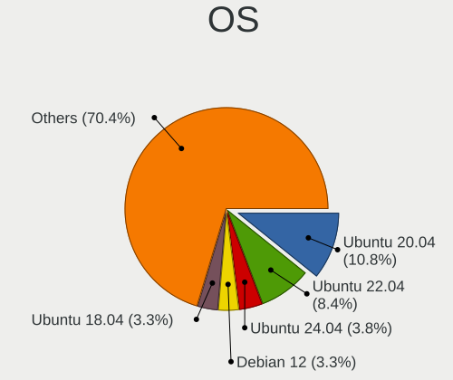

| Name                         | Notebooks | Percent |
|------------------------------|-----------|---------|
| Ubuntu 20.04                 | 1043      | 10.8%   |
| Ubuntu 22.04                 | 816       | 8.45%   |
| Ubuntu 24.04                 | 363       | 3.76%   |
| Debian 12                    | 323       | 3.34%   |
| Ubuntu 18.04                 | 319       | 3.3%    |
| Debian 11                    | 238       | 2.46%   |
| Arch Rolling                 | 232       | 2.4%    |
| OpenMandriva 4.2             | 194       | 2.01%   |
| OpenMandriva 4.3             | 160       | 1.66%   |
| Linux Mint 20.3              | 133       | 1.38%   |
| Pop!_OS 22.04                | 127       | 1.31%   |
| Zorin 17                     | 119       | 1.23%   |
| Xubuntu 20.04                | 114       | 1.18%   |
| OpenMandriva 25.90           | 99        | 1.02%   |
| Linux Mint 21.1              | 98        | 1.01%   |
| Linux Mint 22.1              | 92        | 0.95%   |
| Zorin 16                     | 87        | 0.9%    |
| Fedora 41                    | 86        | 0.89%   |
| Linux Mint 21.3              | 83        | 0.86%   |
| OpenMandriva 23.01           | 81        | 0.84%   |
| Fedora 40                    | 81        | 0.84%   |
| Arch                         | 80        | 0.83%   |
| OpenMandriva 24.12           | 79        | 0.82%   |
| Fedora 42                    | 79        | 0.82%   |
| Xubuntu 22.04                | 77        | 0.8%    |
| Linux Mint 22.2              | 77        | 0.8%    |
| Debian 10                    | 72        | 0.75%   |
| Ubuntu 21.10                 | 71        | 0.73%   |
| OpenMandriva 23.08           | 71        | 0.73%   |
| Manjaro                      | 71        | 0.73%   |
| Linux Mint 20.2              | 69        | 0.71%   |
| Fedora 38                    | 67        | 0.69%   |
| Fedora 39                    | 66        | 0.68%   |
| OpenMandriva 23.03           | 65        | 0.67%   |
| Ubuntu 23.04                 | 64        | 0.66%   |
| Debian 13                    | 62        | 0.64%   |
| Linux Mint 21.2              | 61        | 0.63%   |
| openSUSE Tumbleweed-XXXXXXXX | 60        | 0.62%   |
| Ubuntu 19.10                 | 59        | 0.61%   |
| Ubuntu 21.04                 | 57        | 0.59%   |

OS Family
---------

OS without a version

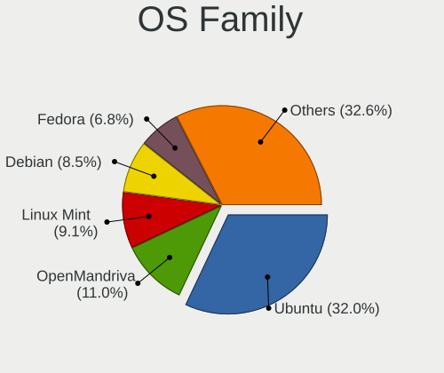

| Name          | Notebooks | Percent |
|---------------|-----------|---------|
| Ubuntu        | 2899      | 32.03%  |
| OpenMandriva  | 992       | 10.96%  |
| Linux Mint    | 827       | 9.14%   |
| Debian        | 772       | 8.53%   |
| Fedora        | 615       | 6.79%   |
| Arch          | 307       | 3.39%   |
| Xubuntu       | 297       | 3.28%   |
| Zorin         | 270       | 2.98%   |
| Pop!_OS       | 236       | 2.61%   |
| Kubuntu       | 198       | 2.19%   |
| Manjaro       | 196       | 2.17%   |
| Lubuntu       | 133       | 1.47%   |
| Ubuntu MATE   | 107       | 1.18%   |
| ROSA          | 93        | 1.03%   |
| openSUSE      | 83        | 0.92%   |
| KDE neon      | 82        | 0.91%   |
| Kali          | 75        | 0.83%   |
| SteamOS       | 62        | 0.68%   |
| Elementary    | 58        | 0.64%   |
| ArcoLinux     | 54        | 0.6%    |
| Gentoo        | 52        | 0.57%   |
| EndeavourOS   | 50        | 0.55%   |
| LMDE          | 46        | 0.51%   |
| Endless       | 45        | 0.5%    |
| Ubuntu Budgie | 38        | 0.42%   |
| Ubuntu Unity  | 33        | 0.36%   |
| MX            | 33        | 0.36%   |
| NixOS         | 27        | 0.3%    |
| Parrot        | 24        | 0.27%   |
| Bazzite       | 22        | 0.24%   |
| Ubuntu Studio | 20        | 0.22%   |
| BlackPanther  | 20        | 0.22%   |
| Mageia        | 17        | 0.19%   |
| Garuda Linux  | 16        | 0.18%   |
| CachyOS       | 14        | 0.15%   |
| Nobara        | 13        | 0.14%   |
| TUXEDO OS     | 12        | 0.13%   |
| Xero          | 11        | 0.12%   |
| Clear Linux   | 11        | 0.12%   |
| CentOS        | 11        | 0.12%   |

Kernel
------

Version of the Linux kernel

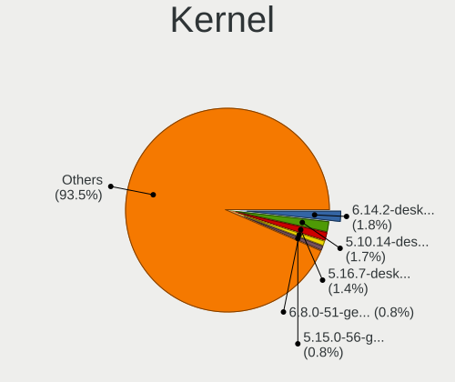

| Version                  | Notebooks | Percent |
|--------------------------|-----------|---------|
| 6.14.2-desktop-3omv2590  | 185       | 1.75%   |
| 5.10.14-desktop-1omv4002 | 182       | 1.72%   |
| 5.16.7-desktop-1omv4003  | 147       | 1.39%   |
| 6.8.0-51-generic         | 89        | 0.84%   |
| 5.15.0-56-generic        | 82        | 0.78%   |
| 5.4.0-42-generic         | 73        | 0.69%   |
| 6.1.1-desktop-1omv2290   | 71        | 0.67%   |
| 6.12.1-desktop-1omv2490  | 70        | 0.66%   |
| 6.4.11-desktop-1omv2390  | 61        | 0.58%   |
| 6.2.6-desktop-1omv2390   | 60        | 0.57%   |
| 5.15.0-58-generic        | 60        | 0.57%   |
| 6.6.2-desktop-1omv2390   | 59        | 0.56%   |
| 6.8.0-45-generic         | 54        | 0.51%   |
| 5.15.0-52-generic        | 54        | 0.51%   |
| 6.8.0-52-generic         | 51        | 0.48%   |
| 5.11.0-38-generic        | 51        | 0.48%   |
| 6.2.0-26-generic         | 48        | 0.45%   |
| 5.4.0-52-generic         | 44        | 0.42%   |
| 5.15.0-48-generic        | 44        | 0.42%   |
| 5.11.0-27-generic        | 44        | 0.42%   |
| 6.8.0-40-generic         | 43        | 0.41%   |
| 5.4.0-58-generic         | 43        | 0.41%   |
| 6.2.0-39-generic         | 42        | 0.4%    |
| 5.15.0-91-generic        | 42        | 0.4%    |
| 6.14.0-29-generic        | 41        | 0.39%   |
| 6.14.0-36-generic        | 40        | 0.38%   |
| 5.4.0-26-generic         | 40        | 0.38%   |
| 6.14.0-33-generic        | 39        | 0.37%   |
| 6.8.0-41-generic         | 36        | 0.34%   |
| 6.10.0-desktop-1omv2490  | 36        | 0.34%   |
| 5.4.0-48-generic         | 36        | 0.34%   |
| 5.15.0-46-generic        | 36        | 0.34%   |
| 6.1.0-18-amd64           | 35        | 0.33%   |
| 6.1.0-16-amd64           | 35        | 0.33%   |
| 5.8.0-50-generic         | 35        | 0.33%   |
| 5.11.0-37-generic        | 35        | 0.33%   |
| 6.8.0-31-generic         | 34        | 0.32%   |
| 5.8.0-43-generic         | 34        | 0.32%   |
| 5.15.0-43-generic        | 34        | 0.32%   |
| 5.13.0-30-generic        | 34        | 0.32%   |

Kernel Family
-------------

Linux kernel without a distro release

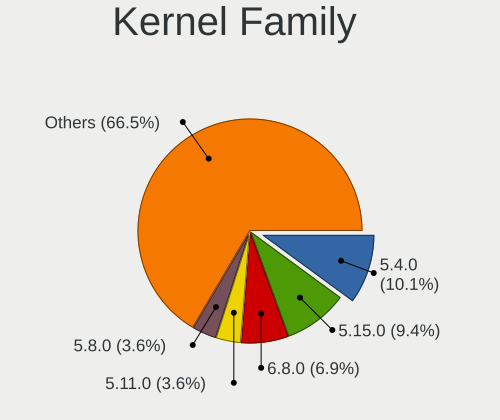

| Version | Notebooks | Percent |
|---------|-----------|---------|
| 5.4.0   | 1003      | 10.07%  |
| 5.15.0  | 934       | 9.37%   |
| 6.8.0   | 683       | 6.85%   |
| 5.11.0  | 362       | 3.63%   |
| 5.8.0   | 354       | 3.55%   |
| 6.1.0   | 339       | 3.4%    |
| 5.13.0  | 320       | 3.21%   |
| 6.5.0   | 315       | 3.16%   |
| 6.2.0   | 287       | 2.88%   |
| 6.14.0  | 281       | 2.82%   |
| 5.10.0  | 280       | 2.81%   |
| 5.19.0  | 259       | 2.6%    |
| 4.15.0  | 242       | 2.43%   |
| 6.14.2  | 196       | 1.97%   |
| 5.10.14 | 183       | 1.84%   |
| 5.3.0   | 176       | 1.77%   |
| 6.11.0  | 147       | 1.48%   |
| 5.16.7  | 147       | 1.48%   |
| 5.0.0   | 99        | 0.99%   |
| 6.12.1  | 81        | 0.81%   |
| 6.1.1   | 81        | 0.81%   |
| 6.2.6   | 69        | 0.69%   |
| 4.18.0  | 68        | 0.68%   |
| 6.4.11  | 67        | 0.67%   |
| 4.19.0  | 66        | 0.66%   |
| 6.6.2   | 65        | 0.65%   |
| 5.14.0  | 40        | 0.4%    |
| 6.10.0  | 38        | 0.38%   |
| 6.9.3   | 34        | 0.34%   |
| 6.12.57 | 30        | 0.3%    |
| 6.0.0   | 30        | 0.3%    |
| 6.17.0  | 23        | 0.23%   |
| 6.12.48 | 23        | 0.23%   |
| 6.12.10 | 23        | 0.23%   |
| 5.17.5  | 21        | 0.21%   |
| 5.11.12 | 21        | 0.21%   |
| 5.16.13 | 20        | 0.2%    |
| 6.9.7   | 19        | 0.19%   |
| 5.16.0  | 19        | 0.19%   |
| 4.18.16 | 19        | 0.19%   |

Kernel Major Ver.
-----------------

Linux kernel major version

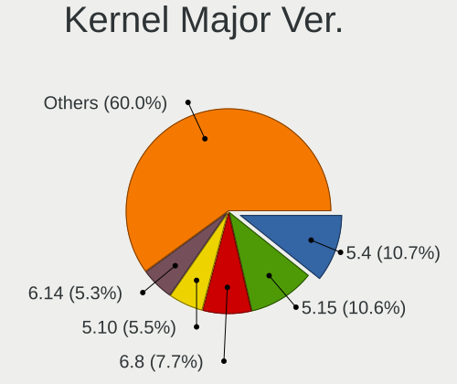

| Version | Notebooks | Percent |
|---------|-----------|---------|
| 5.4     | 1055      | 10.72%  |
| 5.15    | 1048      | 10.65%  |
| 6.8     | 762       | 7.74%   |
| 5.10    | 546       | 5.55%   |
| 6.14    | 523       | 5.31%   |
| 6.1     | 523       | 5.31%   |
| 6.2     | 420       | 4.27%   |
| 5.11    | 415       | 4.22%   |
| 6.5     | 399       | 4.05%   |
| 5.8     | 395       | 4.01%   |
| 5.13    | 357       | 3.63%   |
| 5.19    | 313       | 3.18%   |
| 6.12    | 283       | 2.88%   |
| 4.15    | 242       | 2.46%   |
| 5.16    | 223       | 2.27%   |
| 6.11    | 221       | 2.25%   |
| 6.6     | 210       | 2.13%   |
| 5.3     | 201       | 2.04%   |
| 6.4     | 147       | 1.49%   |
| 5.0     | 103       | 1.05%   |
| 6.10    | 101       | 1.03%   |
| 5.14    | 101       | 1.03%   |
| 6.9     | 98        | 1%      |
| 6.0     | 95        | 0.97%   |
| 6.17    | 91        | 0.92%   |
| 4.18    | 89        | 0.9%    |
| 6.15    | 73        | 0.74%   |
| 4.19    | 73        | 0.74%   |
| 5.9     | 71        | 0.72%   |
| 6.13    | 70        | 0.71%   |
| 5.18    | 67        | 0.68%   |
| 6.3     | 65        | 0.66%   |
| 5.17    | 65        | 0.66%   |
| 6.16    | 61        | 0.62%   |
| 5.6     | 50        | 0.51%   |
| 6.7     | 48        | 0.49%   |
| 4.9     | 48        | 0.49%   |
| 5.7     | 42        | 0.43%   |
| 5.12    | 38        | 0.39%   |
| 5.5     | 23        | 0.23%   |

Arch
----

OS architecture (x86_64, i586, etc.)

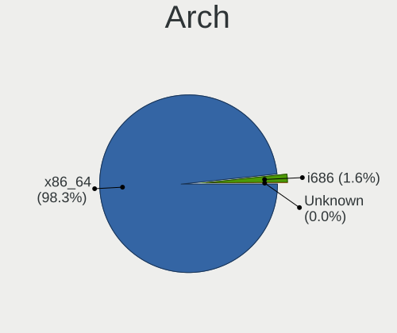

| Name    | Notebooks | Percent |
|---------|-----------|---------|
| x86_64  | 8603      | 98.31%  |
| i686    | 141       | 1.61%   |
| aarch64 | 5         | 0.06%   |
| armv7l  | 1         | 0.01%   |
| Unknown | 1         | 0.01%   |

DE
--

Desktop Environment

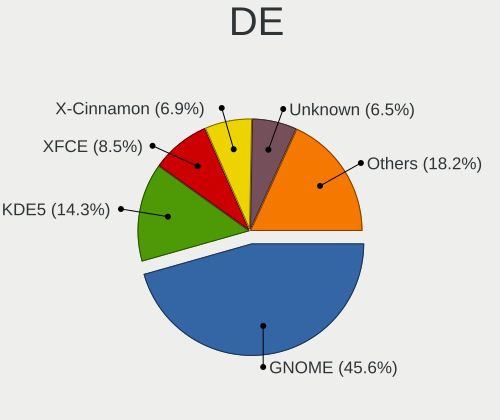

| Name              | Notebooks | Percent |
|-------------------|-----------|---------|
| GNOME             | 4175      | 45.61%  |
| KDE5              | 1308      | 14.29%  |
| XFCE              | 781       | 8.53%   |
| X-Cinnamon        | 629       | 6.87%   |
| Unknown           | 594       | 6.49%   |
| KDE6              | 489       | 5.34%   |
| MATE              | 301       | 3.29%   |
| LXQt              | 197       | 2.15%   |
| Cinnamon          | 101       | 1.1%    |
| KDE               | 96        | 1.05%   |
| i3                | 88        | 0.96%   |
| KDE4              | 63        | 0.69%   |
| Pantheon          | 60        | 0.66%   |
| Budgie            | 50        | 0.55%   |
| Unity             | 34        | 0.37%   |
| LXDE              | 28        | 0.31%   |
| Hyprland          | 26        | 0.28%   |
| GNOME Flashback   | 26        | 0.28%   |
| sway              | 14        | 0.15%   |
| Deepin            | 14        | 0.15%   |
| GNOME Classic     | 13        | 0.14%   |
| Enlightenment     | 8         | 0.09%   |
| COSMIC            | 8         | 0.09%   |
| awesome           | 8         | 0.09%   |
| Trinity           | 6         | 0.07%   |
| none+i3           | 3         | 0.03%   |
| niri              | 3         | 0.03%   |
| lightdm-xsession  | 3         | 0.03%   |
| icewm             | 3         | 0.03%   |
| i3-with-shmlog    | 3         | 0.03%   |
| bspwm             | 3         | 0.03%   |
| openbox           | 2         | 0.02%   |
| dwm               | 2         | 0.02%   |
| Yaru:ubuntu:GNOME | 1         | 0.01%   |
| xmonad-user       | 1         | 0.01%   |
| xmonad            | 1         | 0.01%   |
| wmaker-common     | 1         | 0.01%   |
| wlroots           | 1         | 0.01%   |
| qtile             | 1         | 0.01%   |
| Lubuntu           | 1         | 0.01%   |

Display Server
--------------

X11 or Wayland

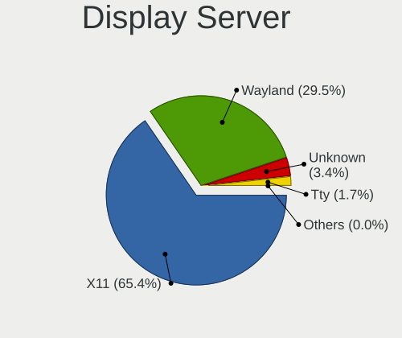

| Name    | Notebooks | Percent |
|---------|-----------|---------|
| X11     | 5947      | 65.42%  |
| Wayland | 2679      | 29.47%  |
| Unknown | 307       | 3.38%   |
| Tty     | 156       | 1.72%   |
| Xcb     | 1         | 0.01%   |
| Web     | 1         | 0.01%   |

Display Manager
---------------

SDDM, LightDM, etc.

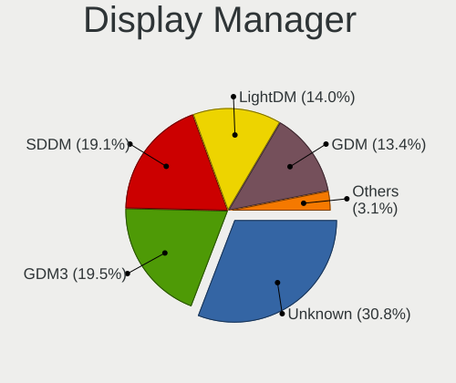

| Name           | Notebooks | Percent |
|----------------|-----------|---------|
| Unknown        | 2819      | 30.82%  |
| GDM3           | 1788      | 19.55%  |
| SDDM           | 1745      | 19.08%  |
| LightDM        | 1283      | 14.03%  |
| GDM            | 1228      | 13.43%  |
| TDM            | 185       | 2.02%   |
| KDM            | 52        | 0.57%   |
| XDM            | 11        | 0.12%   |
| SLiM           | 9         | 0.1%    |
| GREETD         | 8         | 0.09%   |
| Ly             | 4         | 0.04%   |
| SLIMSKI        | 3         | 0.03%   |
| LXDM           | 3         | 0.03%   |
| COSMIC-GREETER | 3         | 0.03%   |
| NODM           | 2         | 0.02%   |
| LY-DM          | 2         | 0.02%   |
| WDM            | 1         | 0.01%   |
| MDM            | 1         | 0.01%   |

OS Lang
-------

Language

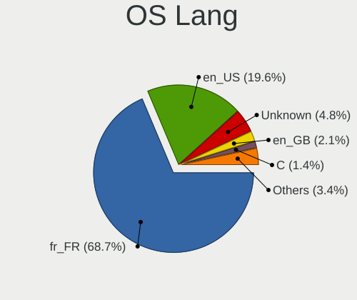

| Lang       | Notebooks | Percent |
|------------|-----------|---------|
| fr_FR      | 6132      | 68.65%  |
| en_US      | 1752      | 19.61%  |
| Unknown    | 429       | 4.8%    |
| en_GB      | 187       | 2.09%   |
| C          | 127       | 1.42%   |
| it_IT      | 97        | 1.09%   |
| de_DE      | 31        | 0.35%   |
| ru_RU      | 17        | 0.19%   |
| es_ES      | 16        | 0.18%   |
| pl_PL      | 11        | 0.12%   |
| fr_BE      | 11        | 0.12%   |
| fr_CH      | 10        | 0.11%   |
| fr_CA      | 10        | 0.11%   |
| POSIX      | 9         | 0.1%    |
| en_IE      | 8         | 0.09%   |
| pt_BR      | 6         | 0.07%   |
| pt_PT      | 5         | 0.06%   |
| nl_NL      | 5         | 0.06%   |
| en_AU      | 5         | 0.06%   |
| ru_UA      | 4         | 0.04%   |
| en_IN      | 4         | 0.04%   |
| en_DK      | 4         | 0.04%   |
| en_CA      | 4         | 0.04%   |
| fr_LU      | 3         | 0.03%   |
| cs_CZ      | 3         | 0.03%   |
| C.UTF8     | 3         | 0.03%   |
| zh_CN      | 2         | 0.02%   |
| uk_UA      | 2         | 0.02%   |
| sv_SE      | 2         | 0.02%   |
| sk_SK      | 2         | 0.02%   |
| ro_RO      | 2         | 0.02%   |
| hu_HU      | 2         | 0.02%   |
| fr_FR.UTF8 | 2         | 0.02%   |
| es_AR      | 2         | 0.02%   |
| en_AG      | 2         | 0.02%   |
| de_CH      | 2         | 0.02%   |
| da_DK      | 2         | 0.02%   |
| UTF-8      | 1         | 0.01%   |
| tr_TR      | 1         | 0.01%   |
| oc_FR      | 1         | 0.01%   |

Boot Mode
---------

EFI or BIOS

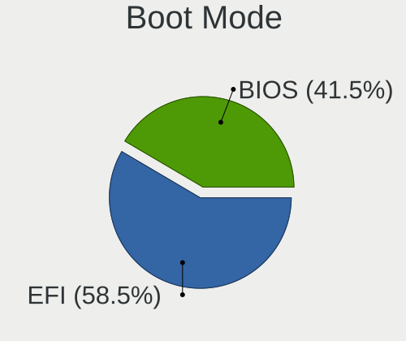

| Mode | Notebooks | Percent |
|------|-----------|---------|
| EFI  | 5230      | 58.47%  |
| BIOS | 3715      | 41.53%  |

Filesystem
----------

Type of filesystem

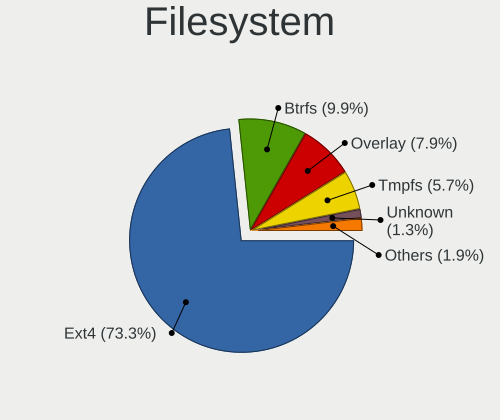

| Type     | Notebooks | Percent |
|----------|-----------|---------|
| Ext4     | 6636      | 73.34%  |
| Btrfs    | 894       | 9.88%   |
| Overlay  | 718       | 7.94%   |
| Tmpfs    | 515       | 5.69%   |
| Unknown  | 116       | 1.28%   |
| Xfs      | 69        | 0.76%   |
| Zfs      | 48        | 0.53%   |
| F2fs     | 20        | 0.22%   |
| Ext3     | 14        | 0.15%   |
| Ext2     | 11        | 0.12%   |
| Rootfs   | 4         | 0.04%   |
| Jfs      | 2         | 0.02%   |
| Reiserfs | 1         | 0.01%   |

Part. scheme
------------

Scheme of partitioning

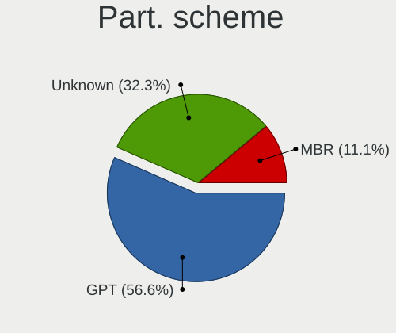

| Type    | Notebooks | Percent |
|---------|-----------|---------|
| GPT     | 5090      | 56.58%  |
| Unknown | 2910      | 32.35%  |
| MBR     | 996       | 11.07%  |

Dual Boot with Linux/BSD
------------------------

Hosting more than one Linux/BSD

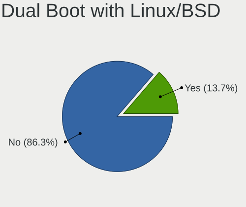

| Dual boot | Notebooks | Percent |
|-----------|-----------|---------|
| No        | 7701      | 86.33%  |
| Yes       | 1219      | 13.67%  |

Dual Boot (Win)
---------------

Hosting Linux and Windows

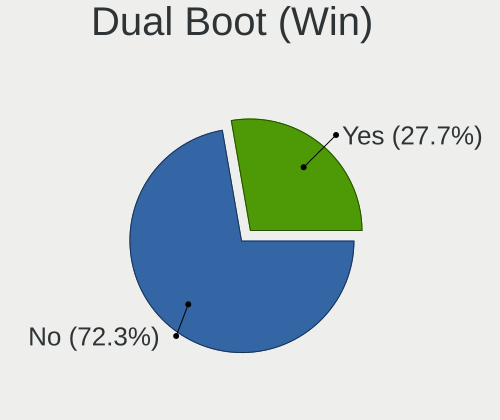

| Dual boot | Notebooks | Percent |
|-----------|-----------|---------|
| No        | 6422      | 72.26%  |
| Yes       | 2465      | 27.74%  |

Board
-----

Vendor
------

Motherboard manufacturer

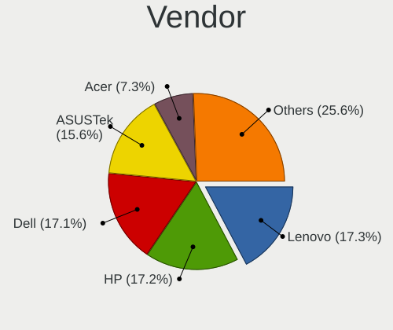

| Name                | Notebooks | Percent |
|---------------------|-----------|---------|
| Lenovo              | 1510      | 17.26%  |
| Hewlett-Packard     | 1505      | 17.2%   |
| Dell                | 1493      | 17.06%  |
| ASUSTek Computer    | 1362      | 15.57%  |
| Acer                | 638       | 7.29%   |
| MSI                 | 318       | 3.63%   |
| Toshiba             | 260       | 2.97%   |
| Apple               | 223       | 2.55%   |
| Notebook            | 144       | 1.65%   |
| HUAWEI              | 124       | 1.42%   |
| Samsung Electronics | 105       | 1.2%    |
| Packard Bell        | 95        | 1.09%   |
| Sony                | 93        | 1.06%   |
| Valve               | 60        | 0.69%   |
| UNOWHY              | 51        | 0.58%   |
| TUXEDO              | 48        | 0.55%   |
| Unknown             | 48        | 0.55%   |
| Framework           | 43        | 0.49%   |
| Thomson             | 40        | 0.46%   |
| Fujitsu             | 38        | 0.43%   |
| Gigabyte Technology | 35        | 0.4%    |
| Google              | 34        | 0.39%   |
| Medion              | 33        | 0.38%   |
| eMachines           | 32        | 0.37%   |
| PC Specialist       | 30        | 0.34%   |
| Alienware           | 29        | 0.33%   |
| Timi                | 28        | 0.32%   |
| Fujitsu Siemens     | 27        | 0.31%   |
| Clevo               | 27        | 0.31%   |
| Chuwi               | 19        | 0.22%   |
| Razer               | 17        | 0.19%   |
| Teclast             | 14        | 0.16%   |
| HONOR               | 13        | 0.15%   |
| LG Electronics      | 12        | 0.14%   |
| Schenker            | 11        | 0.13%   |
| LDLC                | 9         | 0.1%    |
| Intel               | 9         | 0.1%    |
| System76            | 8         | 0.09%   |
| Danew               | 8         | 0.09%   |
| BESSTAR Tech        | 8         | 0.09%   |

Model
-----

Motherboard model

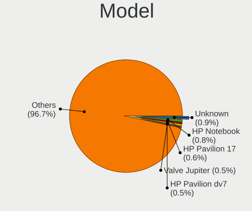

| Name                                       | Notebooks | Percent |
|--------------------------------------------|-----------|---------|
| Unknown                                    | 81        | 0.93%   |
| HP Notebook                                | 74        | 0.85%   |
| HP Pavilion 17                             | 49        | 0.56%   |
| Valve Jupiter                              | 47        | 0.54%   |
| HP Pavilion dv7                            | 41        | 0.47%   |
| HP Pavilion dv6                            | 39        | 0.45%   |
| HP Pavilion g7                             | 26        | 0.3%    |
| ASUS S551LN                                | 26        | 0.3%    |
| Dell XPS 13 9310                           | 25        | 0.29%   |
| Dell Latitude 7490                         | 25        | 0.29%   |
| HP EliteBook 840 G3                        | 23        | 0.26%   |
| HP Pavilion g6                             | 21        | 0.24%   |
| HP EliteBook 840 G2                        | 21        | 0.24%   |
| HP ProBook 650 G1                          | 20        | 0.23%   |
| HP Pavilion Notebook                       | 20        | 0.23%   |
| HP Pavilion 15                             | 20        | 0.23%   |
| Dell XPS 15 9570                           | 20        | 0.23%   |
| Dell Latitude 5420                         | 20        | 0.23%   |
| Apple MacBookPro8,1                        | 20        | 0.23%   |
| Framework Laptop 13 (AMD Ryzen 7040Series) | 19        | 0.22%   |
| Dell XPS 13 9380                           | 19        | 0.22%   |
| Dell Latitude E6420                        | 19        | 0.22%   |
| Apple MacBookPro9,2                        | 19        | 0.22%   |
| Dell Latitude 5400                         | 18        | 0.21%   |
| HUAWEI HVY-WXX9                            | 17        | 0.19%   |
| HP EliteBook 840 G1                        | 17        | 0.19%   |
| Dell XPS 15 7590                           | 17        | 0.19%   |
| Dell XPS 13 7390                           | 17        | 0.19%   |
| Dell XPS 15 9500                           | 16        | 0.18%   |
| UNOWHY Y13G012S4EI                         | 15        | 0.17%   |
| Lenovo G50-45 80E3                         | 15        | 0.17%   |
| HP Laptop 15-db0xxx                        | 15        | 0.17%   |
| HP EliteBook 840 G8 Notebook PC            | 15        | 0.17%   |
| UNOWHY Y13G010S4EI                         | 14        | 0.16%   |
| Lenovo Legion 5 15ACH6H 82JU               | 14        | 0.16%   |
| HP OMEN by Laptop                          | 14        | 0.16%   |
| Dell XPS 13 9370                           | 14        | 0.16%   |
| Dell Precision 5570                        | 14        | 0.16%   |
| Dell Latitude E6400                        | 14        | 0.16%   |
| Apple MacBookAir6,2                        | 14        | 0.16%   |

Model Family
------------

Motherboard model prefix

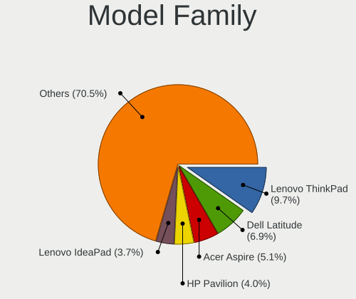

| Name                  | Notebooks | Percent |
|-----------------------|-----------|---------|
| Lenovo ThinkPad       | 851       | 9.73%   |
| Dell Latitude         | 608       | 6.95%   |
| Acer Aspire           | 444       | 5.07%   |
| HP Pavilion           | 351       | 4.01%   |
| Lenovo IdeaPad        | 325       | 3.71%   |
| HP EliteBook          | 308       | 3.52%   |
| Dell Precision        | 260       | 2.97%   |
| Dell XPS              | 251       | 2.87%   |
| HP ProBook            | 236       | 2.7%    |
| ASUS VivoBook         | 234       | 2.67%   |
| Toshiba Satellite     | 215       | 2.46%   |
| Dell Inspiron         | 203       | 2.32%   |
| HP Laptop             | 142       | 1.62%   |
| ASUS ASUS             | 105       | 1.2%    |
| ASUS ZenBook          | 103       | 1.18%   |
| Packard Bell EasyNote | 83        | 0.95%   |
| HP ZBook              | 82        | 0.94%   |
| Unknown               | 81        | 0.93%   |
| Lenovo Legion         | 76        | 0.87%   |
| ASUS ROG              | 76        | 0.87%   |
| HP Notebook           | 74        | 0.85%   |
| Acer Swift            | 72        | 0.82%   |
| Dell Vostro           | 67        | 0.77%   |
| HP Compaq             | 51        | 0.58%   |
| Acer Nitro            | 51        | 0.58%   |
| Valve Jupiter         | 47        | 0.54%   |
| HP ENVY               | 44        | 0.5%    |
| Framework Laptop      | 43        | 0.49%   |
| HP OMEN               | 42        | 0.48%   |
| Lenovo Yoga           | 39        | 0.45%   |
| Fujitsu LIFEBOOK      | 34        | 0.39%   |
| Lenovo ThinkBook      | 32        | 0.37%   |
| HP Victus             | 30        | 0.34%   |
| Acer TravelMate       | 29        | 0.33%   |
| MSI Modern            | 28        | 0.32%   |
| ASUS TUF              | 28        | 0.32%   |
| Apple MacBookPro8     | 27        | 0.31%   |
| ASUS S551LN           | 26        | 0.3%    |
| Apple MacBookPro9     | 25        | 0.29%   |
| TUXEDO InfinityBook   | 23        | 0.26%   |

MFG Year
--------

Motherboard manufacture year

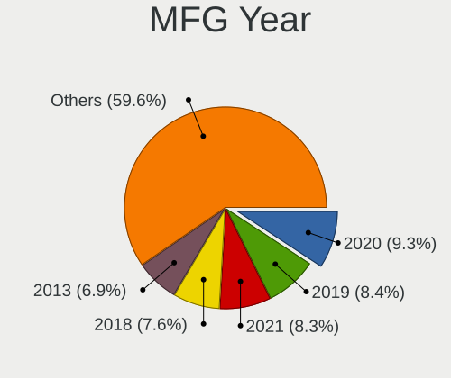

| Year    | Notebooks | Percent |
|---------|-----------|---------|
| 2020    | 811       | 9.27%   |
| 2019    | 736       | 8.41%   |
| 2021    | 722       | 8.25%   |
| 2018    | 661       | 7.56%   |
| 2013    | 607       | 6.94%   |
| 2012    | 537       | 6.14%   |
| 2015    | 502       | 5.74%   |
| 2022    | 489       | 5.59%   |
| 2011    | 478       | 5.46%   |
| 2017    | 463       | 5.29%   |
| 2016    | 449       | 5.13%   |
| 2014    | 433       | 4.95%   |
| 2023    | 387       | 4.42%   |
| 2010    | 365       | 4.17%   |
| 2008    | 361       | 4.13%   |
| 2009    | 269       | 3.07%   |
| 2024    | 209       | 2.39%   |
| 2007    | 136       | 1.55%   |
| 2006    | 53        | 0.61%   |
| 2025    | 48        | 0.55%   |
| 2005    | 21        | 0.24%   |
| Unknown | 7         | 0.08%   |
| 2004    | 3         | 0.03%   |
| 2003    | 1         | 0.01%   |
| 2002    | 1         | 0.01%   |

Form Factor
-----------

Physical design of the computer

| Name     | Notebooks | Percent |
|----------|-----------|---------|
| Notebook | 8749      | 100%    |

Secure Boot
-----------

Enabled or disabled

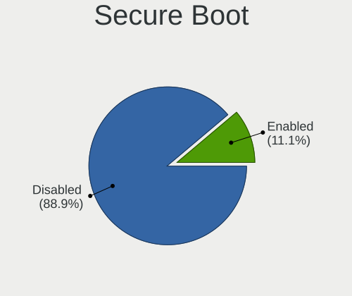

| State    | Notebooks | Percent |
|----------|-----------|---------|
| Disabled | 7843      | 88.86%  |
| Enabled  | 983       | 11.14%  |

Coreboot
--------

Have coreboot on board

| Used | Notebooks | Percent |
|------|-----------|---------|
| No   | 8700      | 99.43%  |
| Yes  | 50        | 0.57%   |

RAM Size
--------

Total RAM memory

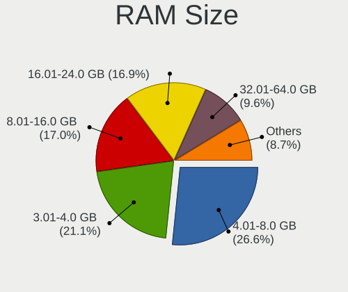

| Size in GB  | Notebooks | Percent |
|-------------|-----------|---------|
| 4.01-8.0    | 2363      | 26.61%  |
| 3.01-4.0    | 1878      | 21.15%  |
| 8.01-16.0   | 1508      | 16.98%  |
| 16.01-24.0  | 1504      | 16.94%  |
| 32.01-64.0  | 855       | 9.63%   |
| 1.01-2.0    | 275       | 3.1%    |
| 64.01-256.0 | 159       | 1.79%   |
| 24.01-32.0  | 148       | 1.67%   |
| 2.01-3.0    | 138       | 1.55%   |
| 0.51-1.0    | 43        | 0.48%   |
| 0.01-0.5    | 7         | 0.08%   |
| Unknown     | 2         | 0.02%   |

RAM Used
--------

Used RAM memory

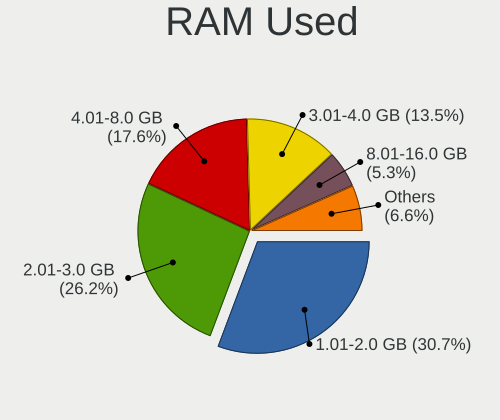

| Used GB    | Notebooks | Percent |
|------------|-----------|---------|
| 1.01-2.0   | 2972      | 30.72%  |
| 2.01-3.0   | 2538      | 26.23%  |
| 4.01-8.0   | 1704      | 17.61%  |
| 3.01-4.0   | 1303      | 13.47%  |
| 8.01-16.0  | 516       | 5.33%   |
| 0.51-1.0   | 482       | 4.98%   |
| 16.01-24.0 | 69        | 0.71%   |
| 0.01-0.5   | 66        | 0.68%   |
| 24.01-32.0 | 19        | 0.2%    |
| 32.01-64.0 | 4         | 0.04%   |
| Unknown    | 2         | 0.02%   |

Total Drives
------------

Number of drives on board

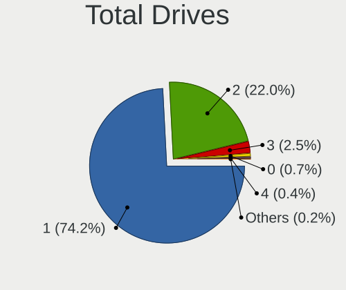

| Drives | Notebooks | Percent |
|--------|-----------|---------|
| 1      | 6617      | 74.19%  |
| 2      | 1962      | 22%     |
| 3      | 222       | 2.49%   |
| 0      | 63        | 0.71%   |
| 4      | 40        | 0.45%   |
| 5      | 9         | 0.1%    |
| 6      | 3         | 0.03%   |
| 7      | 2         | 0.02%   |
| 8      | 1         | 0.01%   |

Has CD-ROM
----------

Has CD-ROM on board

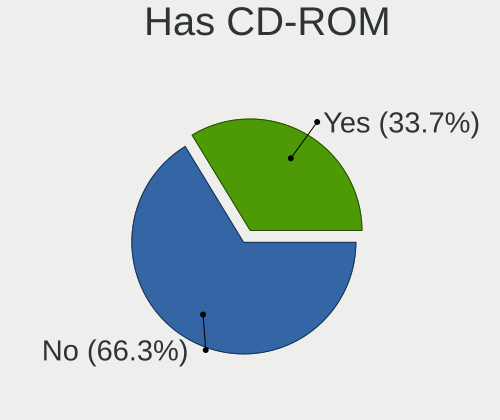

| Presented | Notebooks | Percent |
|-----------|-----------|---------|
| No        | 5821      | 66.29%  |
| Yes       | 2960      | 33.71%  |

Has Ethernet
------------

Has Ethernet on board

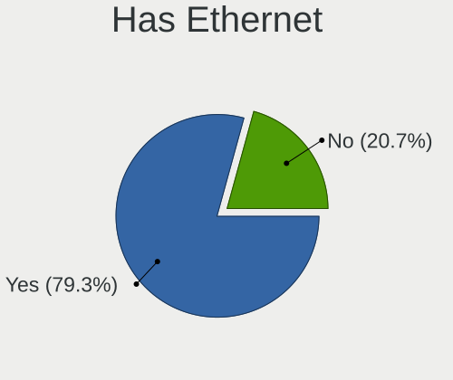

| Presented | Notebooks | Percent |
|-----------|-----------|---------|
| Yes       | 6972      | 79.26%  |
| No        | 1824      | 20.74%  |

Has WiFi
--------

Has WiFi module

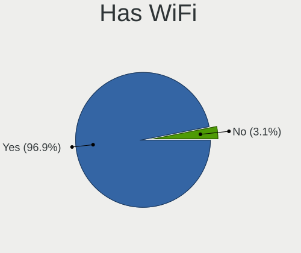

| Presented | Notebooks | Percent |
|-----------|-----------|---------|
| Yes       | 8492      | 96.92%  |
| No        | 270       | 3.08%   |

Has Bluetooth
-------------

Has Bluetooth module

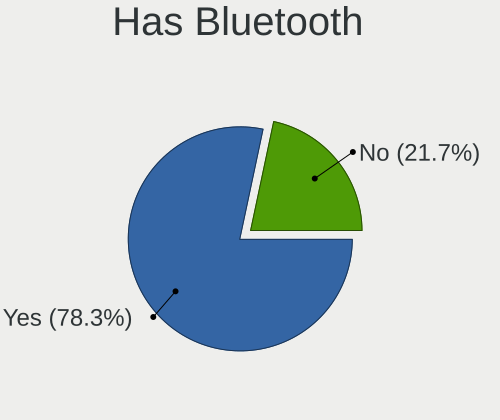

| Presented | Notebooks | Percent |
|-----------|-----------|---------|
| Yes       | 6938      | 78.32%  |
| No        | 1920      | 21.68%  |

Location
--------

Country
-------

Geographic location (country)

| Country | Notebooks | Percent |
|---------|-----------|---------|
| France  | 8749      | 100%    |

City
----

Geographic location (city)

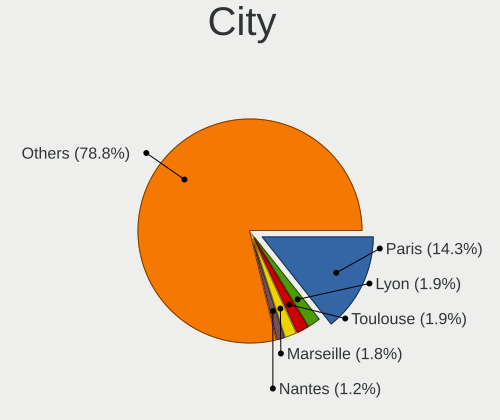

| City             | Notebooks | Percent |
|------------------|-----------|---------|
| Paris            | 1377      | 14.34%  |
| Lyon             | 187       | 1.95%   |
| Toulouse         | 179       | 1.86%   |
| Marseille        | 174       | 1.81%   |
| Nantes           | 117       | 1.22%   |
| Rennes           | 106       | 1.1%    |
| Bordeaux         | 103       | 1.07%   |
| Montpellier      | 102       | 1.06%   |
| Strasbourg       | 96        | 1%      |
| Grenoble         | 86        | 0.9%    |
| Lille            | 78        | 0.81%   |
| Roubaix          | 71        | 0.74%   |
| Rosny-sous-Bois  | 58        | 0.6%    |
| Nice             | 53        | 0.55%   |
| Brest            | 51        | 0.53%   |
| Villeurbanne     | 48        | 0.5%    |
| Cergy            | 40        | 0.42%   |
| Caen             | 40        | 0.42%   |
| Argenteuil       | 39        | 0.41%   |
| Nancy            | 35        | 0.36%   |
| Rouen            | 34        | 0.35%   |
| Saint-Denis      | 33        | 0.34%   |
| Angers           | 33        | 0.34%   |
| Toulon           | 32        | 0.33%   |
| Orléans         | 32        | 0.33%   |
| Dijon            | 32        | 0.33%   |
| Clichy-sous-Bois | 32        | 0.33%   |
| Clermont-Ferrand | 32        | 0.33%   |
| Versailles       | 31        | 0.32%   |
| Limoges          | 31        | 0.32%   |
| Poitiers         | 29        | 0.3%    |
| Valenciennes     | 28        | 0.29%   |
| Besançon        | 28        | 0.29%   |
| Aix-en-Provence  | 28        | 0.29%   |
| Tours            | 27        | 0.28%   |
| Nanterre         | 27        | 0.28%   |
| Metz             | 26        | 0.27%   |
| Le Mans          | 26        | 0.27%   |
| Ivry-sur-Seine   | 26        | 0.27%   |
| Vitry-sur-Seine  | 25        | 0.26%   |

Drives
------

Drive Vendor
------------

Hard drive vendors

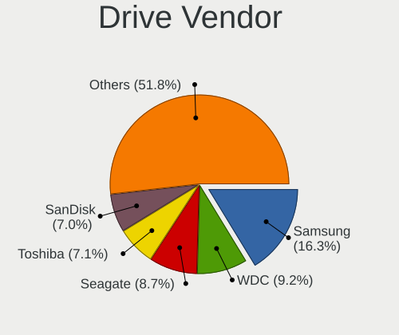

| Vendor                      | Notebooks | Drives | Percent |
|-----------------------------|-----------|--------|---------|
| Samsung Electronics         | 1762      | 2414   | 16.29%  |
| WDC                         | 991       | 1263   | 9.16%   |
| Seagate                     | 943       | 1198   | 8.72%   |
| Toshiba                     | 766       | 959    | 7.08%   |
| SanDisk                     | 752       | 948    | 6.95%   |
| Crucial                     | 592       | 796    | 5.47%   |
| SK hynix                    | 575       | 726    | 5.32%   |
| Unknown                     | 506       | 663    | 4.68%   |
| Kingston                    | 481       | 574    | 4.45%   |
| Micron Technology           | 428       | 514    | 3.96%   |
| HGST                        | 376       | 461    | 3.48%   |
| Intel                       | 350       | 429    | 3.24%   |
| Hitachi                     | 270       | 311    | 2.5%    |
| KIOXIA                      | 207       | 241    | 1.91%   |
| PNY                         | 117       | 139    | 1.08%   |
| Apple                       | 113       | 152    | 1.04%   |
| Micron/Crucial Technology   | 86        | 105    | 0.8%    |
| China                       | 80        | 99     | 0.74%   |
| Phison Electronics          | 72        | 94     | 0.67%   |
| Kingston Technology Company | 70        | 85     | 0.65%   |
| SPCC                        | 67        | 82     | 0.62%   |
| LITEON                      | 63        | 72     | 0.58%   |
| LDLC                        | 62        | 87     | 0.57%   |
| Transcend                   | 59        | 72     | 0.55%   |
| Fujitsu                     | 54        | 66     | 0.5%    |
| Phison                      | 52        | 55     | 0.48%   |
| Unknown                     | 50        | 56     | 0.46%   |
| JMicron Technology          | 47        | 52     | 0.43%   |
| Silicon Motion              | 34        | 39     | 0.31%   |
| LITEONIT                    | 33        | 41     | 0.31%   |
| Emtec                       | 30        | 36     | 0.28%   |
| Fanxiang                    | 27        | 29     | 0.25%   |
| A-DATA Technology           | 25        | 33     | 0.23%   |
| MAXIO Technology (Hangzhou) | 24        | 27     | 0.22%   |
| KingSpec                    | 22        | 28     | 0.2%    |
| Corsair                     | 22        | 27     | 0.2%    |
| Verbatim                    | 18        | 19     | 0.17%   |
| SSSTC                       | 18        | 21     | 0.17%   |
| Intenso                     | 18        | 21     | 0.17%   |
| Union Memory                | 16        | 17     | 0.15%   |

Drive Model
-----------

Hard drive models

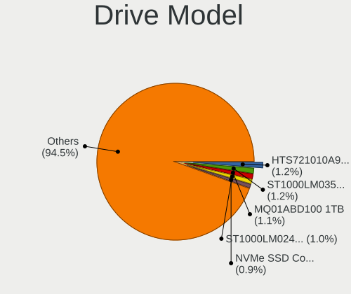

| Model                                              | Notebooks | Percent |
|----------------------------------------------------|-----------|---------|
| HGST HTS721010A9E630 1TB                           | 140       | 1.25%   |
| Seagate ST1000LM035-1RK172 1TB                     | 137       | 1.22%   |
| Toshiba MQ01ABD100 1TB                             | 126       | 1.12%   |
| Seagate ST1000LM024 HN-M101MBB 1TB                 | 115       | 1.03%   |
| Samsung NVMe SSD Controller SM981/PM981/PM983 1TB  | 98        | 0.87%   |
| Crucial CT500MX500SSD1 500GB                       | 98        | 0.87%   |
| Crucial CT240BX500SSD1 240GB                       | 94        | 0.84%   |
| Unknown MMC Card  64GB                             | 91        | 0.81%   |
| Unknown MMC Card  32GB                             | 83        | 0.74%   |
| Samsung NVMe SSD Controller PM9A1/PM9A3/980PRO 1TB | 83        | 0.74%   |
| Toshiba MQ04ABF100 1TB                             | 80        | 0.71%   |
| SanDisk NVMe SSD Drive 512GB                       | 73        | 0.65%   |
| HGST HTS541010A9E680 1TB                           | 73        | 0.65%   |
| Kingston SA400S37240G 240GB SSD                    | 70        | 0.62%   |
| Samsung SSD 860 EVO 500GB                          | 64        | 0.57%   |
| Seagate ST9500325AS 500GB                          | 57        | 0.51%   |
| Crucial CT1000MX500SSD1 1TB                        | 56        | 0.5%    |
| Toshiba MQ01ABF050 500GB                           | 53        | 0.47%   |
| Seagate ST500LT012-1DG142 500GB                    | 50        | 0.45%   |
| Unknown                                            | 50        | 0.45%   |
| Intel SSDPEKNU512GZ 512GB                          | 49        | 0.44%   |
| Crucial CT480BX500SSD1 480GB                       | 46        | 0.41%   |
| Unknown MMC Card  128GB                            | 45        | 0.4%    |
| SanDisk NVMe SSD Drive 1TB                         | 45        | 0.4%    |
| Samsung SSD 870 QVO 1TB                            | 44        | 0.39%   |
| Samsung SSD 850 EVO 500GB                          | 44        | 0.39%   |
| Kingston SA400S37480G 480GB SSD                    | 44        | 0.39%   |
| KIOXIA KBG40ZNS512G NVMe 512GB                     | 42        | 0.37%   |
| HGST HTS725050A7E630 500GB                         | 41        | 0.37%   |
| Seagate ST1000LM048-2E7172 1TB                     | 39        | 0.35%   |
| Samsung SSD 980 1TB                                | 39        | 0.35%   |
| Samsung SSD 850 EVO 250GB                          | 39        | 0.35%   |
| Samsung NVMe SSD Drive 512GB                       | 38        | 0.34%   |
| WDC WD10JPVX-22JC3T0 1TB                           | 37        | 0.33%   |
| Micron/Crucial P2 NVMe PCIe SSD 2TB                | 37        | 0.33%   |
| Seagate ST500LM021-1KJ152 500GB                    | 32        | 0.29%   |
| Samsung SSD 860 EVO 1TB                            | 32        | 0.29%   |
| PNY CS900 240GB SSD                                | 32        | 0.29%   |
| Crucial CT120BX500SSD1 120GB                       | 32        | 0.29%   |
| Crucial CT1000BX500SSD1 1TB                        | 32        | 0.29%   |

HDD Vendor
----------

Hard disk drive vendors

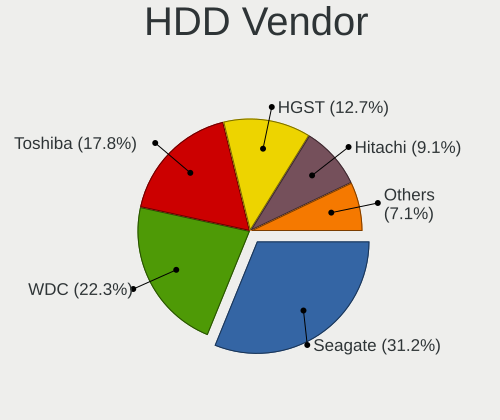

| Vendor              | Notebooks | Drives | Percent |
|---------------------|-----------|--------|---------|
| Seagate             | 925       | 1170   | 31.16%  |
| WDC                 | 661       | 863    | 22.26%  |
| Toshiba             | 527       | 644    | 17.75%  |
| HGST                | 376       | 461    | 12.66%  |
| Hitachi             | 270       | 311    | 9.09%   |
| Fujitsu             | 53        | 65     | 1.79%   |
| Samsung Electronics | 51        | 80     | 1.72%   |
| Unknown             | 25        | 27     | 0.84%   |
| JMicron Technology  | 14        | 16     | 0.47%   |
| Apple               | 9         | 9      | 0.3%    |
| ASMT                | 6         | 8      | 0.2%    |
| LaCie               | 5         | 5      | 0.17%   |
| Inateck             | 5         | 6      | 0.17%   |
| IBM/Hitachi         | 5         | 6      | 0.17%   |
| HGST HTS            | 4         | 7      | 0.13%   |
| ASMedia             | 4         | 4      | 0.13%   |
| TO Exter            | 3         | 3      | 0.1%    |
| KESU                | 3         | 3      | 0.1%    |
| Intenso             | 3         | 3      | 0.1%    |
| External            | 3         | 3      | 0.1%    |
| USB3.0              | 2         | 2      | 0.07%   |
| Shenzhen            | 2         | 2      | 0.07%   |
| XrayDisk            | 1         | 1      | 0.03%   |
| USB                 | 1         | 1      | 0.03%   |
| SILICONMOTION       | 1         | 1      | 0.03%   |
| SABRENT             | 1         | 1      | 0.03%   |
| Maxone              | 1         | 1      | 0.03%   |
| Magnetic Data       | 1         | 1      | 0.03%   |
| JetFlash            | 1         | 1      | 0.03%   |
| Initio              | 1         | 1      | 0.03%   |
| IB-AC703            | 1         | 1      | 0.03%   |
| Generic-            | 1         | 1      | 0.03%   |
| EAGET               | 1         | 1      | 0.03%   |
| APPLE HD            | 1         | 1      | 0.03%   |
| Unknown             | 1         | 1      | 0.03%   |

SSD Vendor
----------

Solid state drive vendors

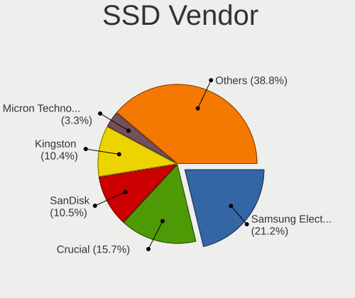

| Vendor              | Notebooks | Drives | Percent |
|---------------------|-----------|--------|---------|
| Samsung Electronics | 705       | 956    | 21.23%  |
| Crucial             | 520       | 702    | 15.66%  |
| SanDisk             | 349       | 453    | 10.51%  |
| Kingston            | 346       | 409    | 10.42%  |
| Micron Technology   | 111       | 142    | 3.34%   |
| SK hynix            | 108       | 139    | 3.25%   |
| PNY                 | 105       | 125    | 3.16%   |
| WDC                 | 83        | 93     | 2.5%    |
| Apple               | 82        | 101    | 2.47%   |
| Intel               | 78        | 83     | 2.35%   |
| China               | 78        | 97     | 2.35%   |
| SPCC                | 63        | 78     | 1.9%    |
| Toshiba             | 60        | 77     | 1.81%   |
| LITEON              | 57        | 64     | 1.72%   |
| Transcend           | 56        | 64     | 1.69%   |
| LDLC                | 52        | 72     | 1.57%   |
| LITEONIT            | 33        | 41     | 0.99%   |
| Emtec               | 29        | 35     | 0.87%   |
| A-DATA Technology   | 20        | 28     | 0.6%    |
| KingSpec            | 19        | 23     | 0.57%   |
| Verbatim            | 17        | 18     | 0.51%   |
| BHT                 | 15        | 20     | 0.45%   |
| OCZ                 | 14        | 18     | 0.42%   |
| Fanxiang            | 14        | 15     | 0.42%   |
| Intenso             | 13        | 16     | 0.39%   |
| Corsair             | 13        | 17     | 0.39%   |
| SABRENT             | 12        | 12     | 0.36%   |
| JMicron Technology  | 12        | 13     | 0.36%   |
| Netac               | 11        | 13     | 0.33%   |
| Dogfish             | 11        | 18     | 0.33%   |
| Unknown             | 11        | 14     | 0.33%   |
| Patriot             | 10        | 10     | 0.3%    |
| Lexar               | 10        | 13     | 0.3%    |
| Teclast             | 9         | 11     | 0.27%   |
| BAITITON            | 8         | 8      | 0.24%   |
| Plextor             | 7         | 22     | 0.21%   |
| ASMT                | 7         | 7      | 0.21%   |
| KingDian            | 6         | 10     | 0.18%   |
| HS-SSD-E100         | 6         | 6      | 0.18%   |
| Seagate             | 5         | 5      | 0.15%   |

Drive Kind
----------

HDD or SSD

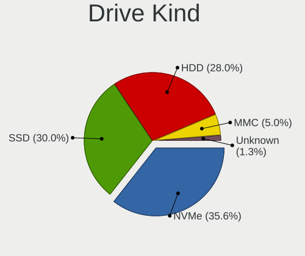

| Kind    | Notebooks | Drives | Percent |
|---------|-----------|--------|---------|
| NVMe    | 3633      | 4935   | 35.6%   |
| SSD     | 3063      | 4239   | 30.02%  |
| HDD     | 2860      | 3711   | 28.03%  |
| MMC     | 511       | 683    | 5.01%   |
| Unknown | 137       | 159    | 1.34%   |

Drive Connector
---------------

SATA, SAS, NVMe, etc.

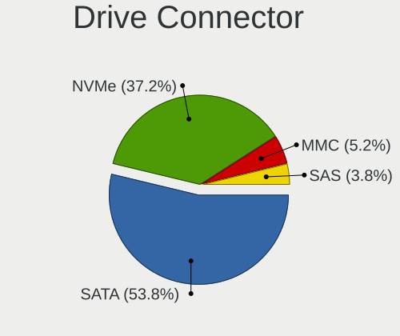

| Type | Notebooks | Drives | Percent |
|------|-----------|--------|---------|
| SATA | 5244      | 7646   | 53.75%  |
| NVMe | 3629      | 4903   | 37.2%   |
| MMC  | 511       | 683    | 5.24%   |
| SAS  | 372       | 495    | 3.81%   |

Drive Size
----------

Size of hard drive

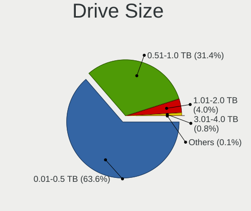

| Size in TB | Notebooks | Drives | Percent |
|------------|-----------|--------|---------|
| 0.01-0.5   | 3762      | 5120   | 63.64%  |
| 0.51-1.0   | 1857      | 2455   | 31.42%  |
| 1.01-2.0   | 236       | 310    | 3.99%   |
| 3.01-4.0   | 45        | 51     | 0.76%   |
| 4.01-10.0  | 8         | 10     | 0.14%   |
| 20.01-50.0 | 1         | 1      | 0.02%   |
| 2.01-3.0   | 1         | 1      | 0.02%   |
| 10.01-20.0 | 1         | 2      | 0.02%   |

Space Total
-----------

Amount of disk space available on the file system

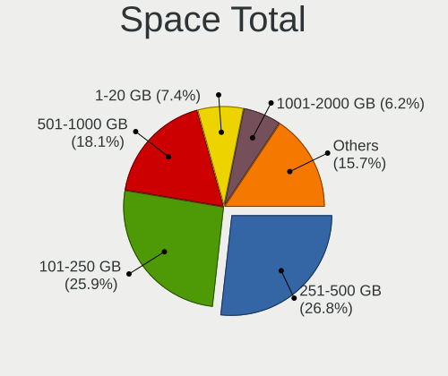

| Size in GB     | Notebooks | Percent |
|----------------|-----------|---------|
| 251-500        | 2479      | 26.77%  |
| 101-250        | 2396      | 25.87%  |
| 501-1000       | 1674      | 18.08%  |
| 1-20           | 688       | 7.43%   |
| 1001-2000      | 573       | 6.19%   |
| 51-100         | 522       | 5.64%   |
| 21-50          | 323       | 3.49%   |
| Unknown        | 278       | 3%      |
| More than 3000 | 167       | 1.8%    |
| 2001-3000      | 160       | 1.73%   |

Space Used
----------

Amount of used disk space

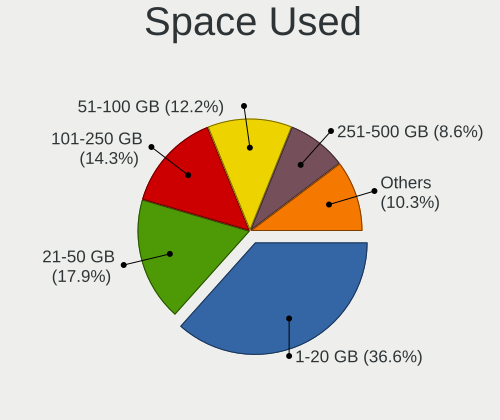

| Used GB        | Notebooks | Percent |
|----------------|-----------|---------|
| 1-20           | 3527      | 36.61%  |
| 21-50          | 1725      | 17.91%  |
| 101-250        | 1381      | 14.34%  |
| 51-100         | 1179      | 12.24%  |
| 251-500        | 830       | 8.62%   |
| 501-1000       | 453       | 4.7%    |
| Unknown        | 278       | 2.89%   |
| 1001-2000      | 159       | 1.65%   |
| 2001-3000      | 47        | 0.49%   |
| More than 3000 | 37        | 0.38%   |
| 0              | 17        | 0.18%   |

Malfunc. Drives
---------------

Drive models with a malfunction

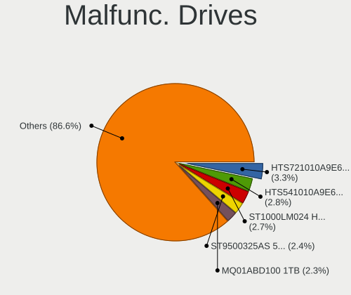

| Model                                            | Notebooks | Drives | Percent |
|--------------------------------------------------|-----------|--------|---------|
| HGST HTS721010A9E630 1TB                         | 26        | 30     | 3.29%   |
| HGST HTS541010A9E680 1TB                         | 22        | 25     | 2.78%   |
| Seagate ST1000LM024 HN-M101MBB 1TB               | 21        | 23     | 2.65%   |
| Seagate ST9500325AS 500GB                        | 19        | 20     | 2.4%    |
| Toshiba MQ01ABD100 1TB                           | 18        | 20     | 2.28%   |
| Seagate ST500LM021-1KJ152 500GB                  | 15        | 17     | 1.9%    |
| Seagate ST1000LM035-1RK172 1TB                   | 12        | 12     | 1.52%   |
| Seagate ST500LT012-1DG142 500GB                  | 11        | 11     | 1.39%   |
| HGST HTS725050A7E630 500GB                       | 10        | 10     | 1.26%   |
| Toshiba MQ01ABD050 500GB                         | 9         | 9      | 1.14%   |
| Toshiba MQ01ACF050 500GB                         | 8         | 9      | 1.01%   |
| Toshiba MQ01ABF050 500GB                         | 8         | 9      | 1.01%   |
| Hitachi HTS547575A9E384 752GB                    | 8         | 8      | 1.01%   |
| HGST HTS545050A7E380 500GB                       | 8         | 8      | 1.01%   |
| WDC WD10JPVX-22JC3T0 1TB                         | 7         | 8      | 0.88%   |
| Seagate ST320LT007-9ZV142 320GB                  | 7         | 8      | 0.88%   |
| HGST HTS545050A7E680 500GB                       | 7         | 8      | 0.88%   |
| SK hynix PC711 HFS512GDE9X073N 512GB             | 6         | 7      | 0.76%   |
| SK hynix HFS256G39TND-N210A 256GB SSD            | 6         | 6      | 0.76%   |
| SK hynix HFS128G39TND-N210A 128GB SSD            | 6         | 6      | 0.76%   |
| LITEON CV8-8E128-HP 128GB SSD                    | 6         | 6      | 0.76%   |
| Hitachi HTS545050A7E380 500GB                    | 6         | 6      | 0.76%   |
| Toshiba MQ04ABF100 1TB                           | 5         | 5      | 0.63%   |
| Samsung Electronics MZNLH128HBHQ-000H1 128GB SSD | 5         | 5      | 0.63%   |
| Kingston RBU-SMSM151S324GD 24GB SSD              | 5         | 5      | 0.63%   |
| Hitachi HTS727575A9E364 752GB                    | 5         | 5      | 0.63%   |
| Hitachi HTS545032B9A300 320GB                    | 5         | 5      | 0.63%   |
| Crucial CT525MX300SSD1 528GB                     | 5         | 5      | 0.63%   |
| Toshiba MK3265GSX 320GB                          | 4         | 5      | 0.51%   |
| Toshiba MK3261GSYN 320GB                         | 4         | 4      | 0.51%   |
| Seagate ST9500420AS 500GB                        | 4         | 4      | 0.51%   |
| Seagate ST9320325AS 320GB                        | 4         | 4      | 0.51%   |
| Seagate ST9320320AS 320GB                        | 4         | 5      | 0.51%   |
| Seagate ST9250827AS 250GB                        | 4         | 5      | 0.51%   |
| Seagate ST1000LX015-1U7172 1TB                   | 4         | 4      | 0.51%   |
| Samsung Electronics SSD 980 1TB                  | 4         | 5      | 0.51%   |
| Hitachi HTS723232A7A364 320GB                    | 4         | 4      | 0.51%   |
| Hitachi HTS547550A9E384 500GB                    | 4         | 4      | 0.51%   |
| Hitachi HTS545050B9A300 500GB                    | 4         | 4      | 0.51%   |
| Hitachi HTS543232A7A384 320GB                    | 4         | 6      | 0.51%   |

Malfunc. Drive Vendor
---------------------

Vendors of faulty drives

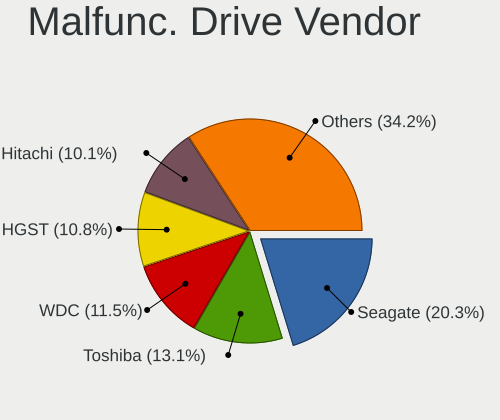

| Vendor                | Notebooks | Drives | Percent |
|-----------------------|-----------|--------|---------|
| Seagate               | 160       | 177    | 20.28%  |
| Toshiba               | 103       | 113    | 13.05%  |
| WDC                   | 91        | 98     | 11.53%  |
| HGST                  | 85        | 94     | 10.77%  |
| Hitachi               | 80        | 82     | 10.14%  |
| Samsung Electronics   | 45        | 52     | 5.7%    |
| SK hynix              | 35        | 42     | 4.44%   |
| SanDisk               | 29        | 35     | 3.68%   |
| Crucial               | 23        | 24     | 2.92%   |
| Kingston              | 22        | 24     | 2.79%   |
| Intel                 | 21        | 22     | 2.66%   |
| Fujitsu               | 12        | 14     | 1.52%   |
| Micron Technology     | 7         | 7      | 0.89%   |
| LDLC                  | 7         | 9      | 0.89%   |
| LITEONIT              | 6         | 9      | 0.76%   |
| LITEON                | 6         | 6      | 0.76%   |
| JMicron Technology    | 4         | 4      | 0.51%   |
| China                 | 4         | 4      | 0.51%   |
| SSSTC                 | 3         | 3      | 0.38%   |
| Dogfish               | 3         | 4      | 0.38%   |
| BAITITON              | 3         | 3      | 0.38%   |
| Apple                 | 3         | 4      | 0.38%   |
| A-DATA Technology     | 3         | 3      | 0.38%   |
| Unknown               | 2         | 2      | 0.25%   |
| Transcend             | 2         | 2      | 0.25%   |
| SPCC                  | 2         | 2      | 0.25%   |
| Netac                 | 2         | 2      | 0.25%   |
| Intenso               | 2         | 3      | 0.25%   |
| Corsair               | 2         | 3      | 0.25%   |
| Apacer                | 2         | 2      | 0.25%   |
| XrayDisk              | 1         | 1      | 0.13%   |
| Verbatim              | 1         | 1      | 0.13%   |
| TakeMS                | 1         | 1      | 0.13%   |
| SED                   | 1         | 1      | 0.13%   |
| SD                    | 1         | 1      | 0.13%   |
| Realtek Semiconductor | 1         | 1      | 0.13%   |
| PNY                   | 1         | 1      | 0.13%   |
| Phison Electronics    | 1         | 1      | 0.13%   |
| Phison                | 1         | 1      | 0.13%   |
| OCZ                   | 1         | 1      | 0.13%   |

Malfunc. HDD Vendor
-------------------

Vendors of faulty HDD drives

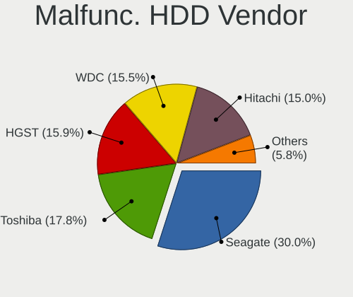

| Vendor              | Notebooks | Drives | Percent |
|---------------------|-----------|--------|---------|
| Seagate             | 160       | 177    | 29.96%  |
| Toshiba             | 95        | 103    | 17.79%  |
| HGST                | 85        | 94     | 15.92%  |
| WDC                 | 83        | 90     | 15.54%  |
| Hitachi             | 80        | 82     | 14.98%  |
| Samsung Electronics | 12        | 12     | 2.25%   |
| Fujitsu             | 12        | 14     | 2.25%   |
| Unknown             | 2         | 2      | 0.37%   |
| JMicron Technology  | 2         | 2      | 0.37%   |
| Magnetic Data       | 1         | 1      | 0.19%   |
| IBM/Hitachi         | 1         | 1      | 0.19%   |
| ASMT                | 1         | 1      | 0.19%   |

Malfunc. Drive Kind
-------------------

Kinds of faulty drives

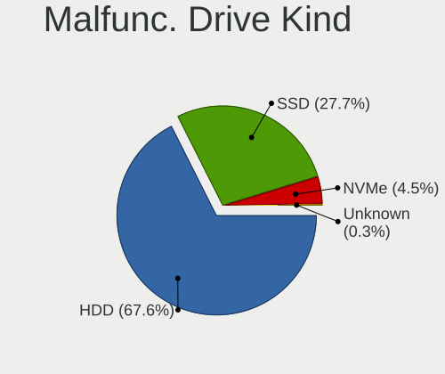

| Kind    | Notebooks | Drives | Percent |
|---------|-----------|--------|---------|
| HDD     | 529       | 579    | 67.56%  |
| SSD     | 217       | 251    | 27.71%  |
| NVMe    | 35        | 40     | 4.47%   |
| Unknown | 2         | 2      | 0.26%   |

Failed Drives
-------------

Failed drive models

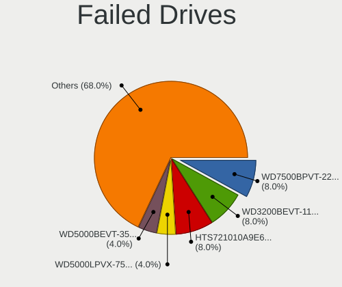

| Model                                       | Notebooks | Drives | Percent |
|---------------------------------------------|-----------|--------|---------|
| WDC WD7500BPVT-22HXZT1 752GB                | 2         | 5      | 8%      |
| WDC WD3200BEVT-11ZCT0 320GB                 | 2         | 2      | 8%      |
| HGST HTS721010A9E630 1TB                    | 2         | 2      | 8%      |
| WDC WD5000LPVX-75V0TT0 500GB                | 1         | 1      | 4%      |
| WDC WD5000BEVT-35A0RT0 500GB                | 1         | 1      | 4%      |
| WDC WD1600BEVT-75ZCT1 160GB                 | 1         | 1      | 4%      |
| WDC WD10SPZX-21Z10T0 1TB                    | 1         | 1      | 4%      |
| Toshiba MQ04ABF100 1TB                      | 1         | 1      | 4%      |
| Toshiba MQ02ABF050H 500GB                   | 1         | 1      | 4%      |
| Toshiba MQ01ABF050 500GB                    | 1         | 1      | 4%      |
| Toshiba MQ01ABD075 752GB                    | 1         | 1      | 4%      |
| Toshiba MK5055GSX 500GB                     | 1         | 1      | 4%      |
| Toshiba MK3259GSXP 320GB                    | 1         | 2      | 4%      |
| SK hynix SC308 SATA 512GB SSD               | 1         | 1      | 4%      |
| SK hynix HFS128G39TND-N210A 128GB SSD       | 1         | 1      | 4%      |
| SK hynix BC501 NVMe Solid State Drive 512GB | 1         | 1      | 4%      |
| SK hynix BC501 HFM256GDJTNG-8310A 256GB     | 1         | 2      | 4%      |
| Seagate ST332062 0AS 320GB                  | 1         | 1      | 4%      |
| Seagate ST1000LM048-2E7172 1TB              | 1         | 1      | 4%      |
| Samsung Electronics SSD 980 500GB           | 1         | 1      | 4%      |
| Samsung Electronics HM251JI 250GB           | 1         | 1      | 4%      |
| HGST HTS545050A7E380 500GB                  | 1         | 1      | 4%      |

Failed Drive Vendor
-------------------

Failed drive vendors

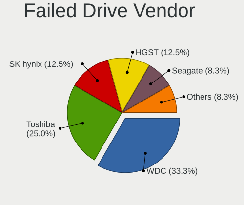

| Vendor              | Notebooks | Drives | Percent |
|---------------------|-----------|--------|---------|
| WDC                 | 8         | 11     | 33.33%  |
| Toshiba             | 6         | 7      | 25%     |
| SK hynix            | 3         | 5      | 12.5%   |
| HGST                | 3         | 3      | 12.5%   |
| Seagate             | 2         | 2      | 8.33%   |
| Samsung Electronics | 2         | 2      | 8.33%   |

Drive Status
------------

Number of failed and malfunc. drives

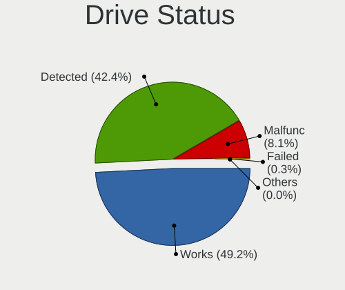

| Status   | Notebooks | Drives | Percent |
|----------|-----------|--------|---------|
| Works    | 4619      | 6365   | 49.2%   |
| Detected | 3980      | 6456   | 42.39%  |
| Malfunc  | 761       | 872    | 8.11%   |
| Failed   | 24        | 30     | 0.26%   |
| Fixed    | 3         | 3      | 0.03%   |
| Limited  | 1         | 1      | 0.01%   |

Storage controller
------------------

Storage Vendor
--------------

Storage controller vendors

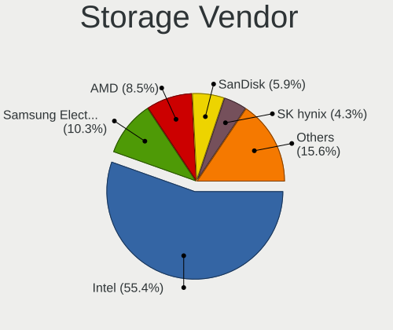

| Vendor                                  | Notebooks | Percent |
|-----------------------------------------|-----------|---------|
| Intel                                   | 5822      | 55.43%  |
| Samsung Electronics                     | 1077      | 10.25%  |
| AMD                                     | 895       | 8.52%   |
| SanDisk                                 | 622       | 5.92%   |
| SK hynix                                | 454       | 4.32%   |
| Micron Technology                       | 323       | 3.08%   |
| Toshiba America Info Systems            | 202       | 1.92%   |
| Kingston Technology Company             | 201       | 1.91%   |
| KIOXIA                                  | 195       | 1.86%   |
| Micron/Crucial Technology               | 147       | 1.4%    |
| Phison Electronics                      | 142       | 1.35%   |
| Nvidia                                  | 84        | 0.8%    |
| Silicon Motion                          | 44        | 0.42%   |
| MAXIO Technology (Hangzhou)             | 32        | 0.3%    |
| Union Memory (Shenzhen)                 | 27        | 0.26%   |
| Marvell Technology Group                | 21        | 0.2%    |
| Apple                                   | 20        | 0.19%   |
| Lite-On Technology                      | 19        | 0.18%   |
| Solidigm                                | 18        | 0.17%   |
| Solid State Storage Technology          | 18        | 0.17%   |
| Silicon Integrated Systems [SiS]        | 17        | 0.16%   |
| Shenzhen Longsys Electronics            | 16        | 0.15%   |
| JMicron Technology                      | 15        | 0.14%   |
| Lenovo                                  | 14        | 0.13%   |
| Yangtze Memory Technologies             | 13        | 0.12%   |
| Realtek Semiconductor                   | 10        | 0.1%    |
| ADATA Technology                        | 9         | 0.09%   |
| Shenzhen Unionmemory Information System | 7         | 0.07%   |
| Seagate Technology                      | 6         | 0.06%   |
| O2 Micro                                | 6         | 0.06%   |
| Biwin Storage Technology                | 6         | 0.06%   |
| ASMedia Technology                      | 6         | 0.06%   |
| VIA Technologies                        | 4         | 0.04%   |
| Silicon Image                           | 3         | 0.03%   |
| ULi Electronics                         | 2         | 0.02%   |
| Transcend                               | 2         | 0.02%   |
| INNOGRIT                                | 2         | 0.02%   |
| YEESTOR Microelectronics                | 1         | 0.01%   |
| Hosin Global Electronics                | 1         | 0.01%   |
| Broadcom / LSI                          | 1         | 0.01%   |

Storage Model
-------------

Storage controller models

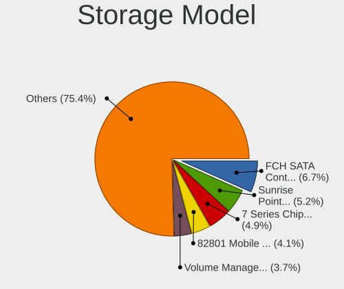

| Model                                                                          | Notebooks | Percent |
|--------------------------------------------------------------------------------|-----------|---------|
| AMD FCH SATA Controller [AHCI mode]                                            | 745       | 6.67%   |
| Intel Sunrise Point-LP SATA Controller [AHCI mode]                             | 580       | 5.19%   |
| Intel 7 Series Chipset Family 6-port SATA Controller [AHCI mode]               | 551       | 4.93%   |
| Intel 82801 Mobile SATA Controller [RAID mode]                                 | 459       | 4.11%   |
| Intel Volume Management Device NVMe RAID Controller                            | 410       | 3.67%   |
| Samsung NVMe SSD Controller SM981/PM981/PM983                                  | 357       | 3.2%    |
| Intel 6 Series/C200 Series Chipset Family 6 port Mobile SATA AHCI Controller   | 353       | 3.16%   |
| Intel 82801IBM/IEM (ICH9M/ICH9M-E) 4 port SATA Controller [AHCI mode]          | 302       | 2.7%    |
| Intel 8 Series/C220 Series Chipset Family 6-port SATA Controller 1 [AHCI mode] | 294       | 2.63%   |
| Samsung NVMe SSD Controller 980 (DRAM-less)                                    | 292       | 2.61%   |
| Intel 8 Series SATA Controller 1 [AHCI mode]                                   | 279       | 2.5%    |
| Intel Cannon Lake Mobile PCH SATA AHCI Controller                              | 278       | 2.49%   |
| Intel Wildcat Point-LP SATA Controller [AHCI Mode]                             | 247       | 2.21%   |
| Intel 5 Series/3400 Series Chipset 4 port SATA AHCI Controller                 | 204       | 1.83%   |
| Intel HM170/QM170 Chipset SATA Controller [AHCI Mode]                          | 201       | 1.8%    |
| Samsung NVMe SSD Controller PM9A1/PM9A3/980PRO                                 | 198       | 1.77%   |
| Intel Celeron/Pentium Silver Processor SATA Controller                         | 162       | 1.45%   |
| SK hynix Gold P31/BC711/PC711 NVMe Solid State Drive                           | 146       | 1.31%   |
| Intel 82801HM/HEM (ICH8M/ICH8M-E) IDE Controller                               | 136       | 1.22%   |
| Intel 82801HM/HEM (ICH8M/ICH8M-E) SATA Controller [AHCI mode]                  | 117       | 1.05%   |
| Intel Tiger Lake-LP SATA Controller                                            | 116       | 1.04%   |
| SanDisk Extreme Pro / WD Black SN750 / PC SN730 / Red SN700 NVMe SSD           | 115       | 1.03%   |
| AMD SB7x0/SB8x0/SB9x0 SATA Controller [AHCI mode]                              | 112       | 1%      |
| KIOXIA NVMe SSD Controller BG4 (DRAM-less)                                     | 111       | 0.99%   |
| Intel Comet Lake SATA AHCI Controller                                          | 109       | 0.98%   |
| Intel SSD 670p Series [Keystone Harbor]                                        | 102       | 0.91%   |
| Toshiba America Info Systems XG6 NVMe SSD Controller                           | 99        | 0.89%   |
| Intel Atom Processor E3800 Series SATA AHCI Controller                         | 99        | 0.89%   |
| SanDisk Ultra 3D / WD PC SN530, IX SN530, Blue SN550 NVMe SSD (DRAM-less)      | 92        | 0.82%   |
| Intel Cannon Point-LP SATA Controller [AHCI Mode]                              | 91        | 0.81%   |
| Intel Q170/Q150/B150/H170/H110/Z170/CM236 Chipset SATA Controller [AHCI Mode]  | 86        | 0.77%   |
| Intel SSD 660P Series                                                          | 85        | 0.76%   |
| SanDisk WD SN560/SN740/SN770/SN5000 NVMe SSD                                   | 84        | 0.75%   |
| Intel Celeron N3350/Pentium N4200/Atom E3900 Series SATA AHCI Controller       | 83        | 0.74%   |
| Micron/Crucial P2 [Nick P2] / P3 / P3 Plus NVMe PCIe SSD (DRAM-less)           | 81        | 0.73%   |
| Intel 5 Series/3400 Series Chipset 6 port SATA AHCI Controller                 | 81        | 0.73%   |
| Samsung NVMe SSD Controller SM961/PM961/SM963                                  | 79        | 0.71%   |
| Intel RST Volume Management Device Controller                                  | 73        | 0.65%   |
| Intel 400 Series Chipset Family SATA AHCI Controller                           | 73        | 0.65%   |
| SanDisk WD Blue SN500 / PC SN520 x2 M.2 2280 NVMe SSD                          | 71        | 0.64%   |

Storage Kind
------------

Kind of storage controller (IDE, SATA, NVMe, SAS, ...)

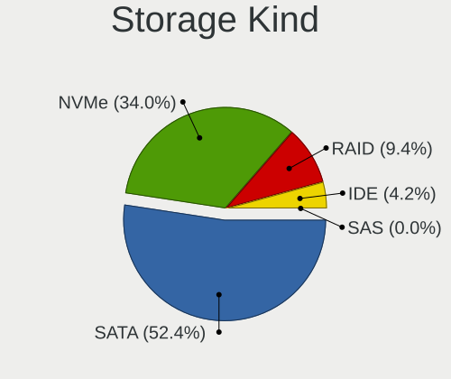

| Kind | Notebooks | Percent |
|------|-----------|---------|
| SATA | 5620      | 52.4%   |
| NVMe | 3646      | 34%     |
| RAID | 1005      | 9.37%   |
| IDE  | 453       | 4.22%   |
| SAS  | 1         | 0.01%   |

Processor
---------

CPU Vendor
----------

Processor vendors

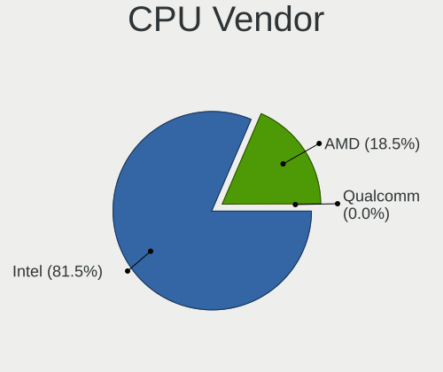

| Vendor   | Notebooks | Percent |
|----------|-----------|---------|
| Intel    | 7128      | 81.47%  |
| AMD      | 1615      | 18.46%  |
| ARM      | 3         | 0.03%   |
| Unknown  | 2         | 0.02%   |
| Qualcomm | 1         | 0.01%   |

CPU Model
---------

Processor models

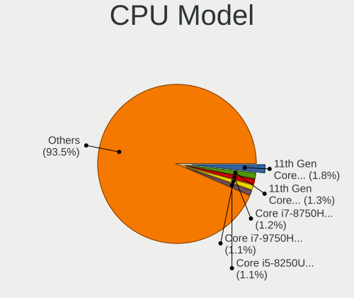

| Model                                         | Notebooks | Percent |
|-----------------------------------------------|-----------|---------|
| Intel 11th Gen Core i7-1165G7 @ 2.80GHz       | 155       | 1.77%   |
| Intel 11th Gen Core i5-1135G7 @ 2.40GHz       | 111       | 1.27%   |
| Intel Core i7-8750H CPU @ 2.20GHz             | 107       | 1.22%   |
| Intel Core i7-9750H CPU @ 2.60GHz             | 98        | 1.12%   |
| Intel Core i5-8250U CPU @ 1.60GHz             | 98        | 1.12%   |
| Intel Core i5-7200U CPU @ 2.50GHz             | 93        | 1.06%   |
| Intel Core i5-6200U CPU @ 2.30GHz             | 86        | 0.98%   |
| Intel Core i5-6300U CPU @ 2.40GHz             | 84        | 0.96%   |
| Intel Core i7-8550U CPU @ 1.80GHz             | 81        | 0.92%   |
| Intel Core i7-10510U CPU @ 1.80GHz            | 80        | 0.91%   |
| Intel Core i7-8565U CPU @ 1.80GHz             | 78        | 0.89%   |
| Intel Core i7-6700HQ CPU @ 2.60GHz            | 78        | 0.89%   |
| Intel Core i5-8265U CPU @ 1.60GHz             | 78        | 0.89%   |
| Intel Core i5-2520M CPU @ 2.50GHz             | 75        | 0.86%   |
| Intel Core i7-7700HQ CPU @ 2.80GHz            | 72        | 0.82%   |
| Intel Core i5-10210U CPU @ 1.60GHz            | 72        | 0.82%   |
| AMD Ryzen 5 3500U with Radeon Vega Mobile Gfx | 71        | 0.81%   |
| Intel Core i5-3320M CPU @ 2.60GHz             | 68        | 0.78%   |
| Intel Core i5-3210M CPU @ 2.50GHz             | 67        | 0.77%   |
| Intel Core i5-5200U CPU @ 2.20GHz             | 64        | 0.73%   |
| Intel 11th Gen Core i7-1185G7 @ 3.00GHz       | 61        | 0.7%    |
| AMD Ryzen 7 5700U with Radeon Graphics        | 61        | 0.7%    |
| Intel Core i5-3230M CPU @ 2.60GHz             | 60        | 0.69%   |
| Intel 12th Gen Core i7-12700H                 | 59        | 0.67%   |
| Intel Core i7-10750H CPU @ 2.60GHz            | 57        | 0.65%   |
| Intel Core i5-4210U CPU @ 1.70GHz             | 57        | 0.65%   |
| Intel 11th Gen Core i7-11800H @ 2.30GHz       | 57        | 0.65%   |
| Intel Core i3-6006U CPU @ 2.00GHz             | 53        | 0.61%   |
| Intel Core i3-4030U CPU @ 1.90GHz             | 53        | 0.61%   |
| Intel Core i5-8300H CPU @ 2.30GHz             | 52        | 0.59%   |
| Intel Core i5-5300U CPU @ 2.30GHz             | 52        | 0.59%   |
| AMD Ryzen 5 4600H with Radeon Graphics        | 52        | 0.59%   |
| Intel Core i5-7300HQ CPU @ 2.50GHz            | 50        | 0.57%   |
| Intel Core i3-5005U CPU @ 2.00GHz             | 49        | 0.56%   |
| AMD Ryzen 7 5800H with Radeon Graphics        | 49        | 0.56%   |
| AMD Custom APU 0405                           | 49        | 0.56%   |
| Intel Core i5-1035G1 CPU @ 1.00GHz            | 48        | 0.55%   |
| Intel Core i7-7500U CPU @ 2.70GHz             | 46        | 0.53%   |
| AMD Ryzen 5 5600H with Radeon Graphics        | 46        | 0.53%   |
| AMD Ryzen 5 5500U with Radeon Graphics        | 46        | 0.53%   |

CPU Model Family
----------------

Processor model prefix

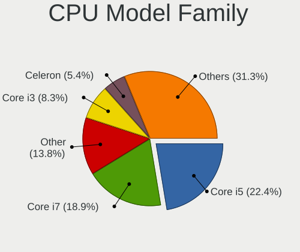

| Model                   | Notebooks | Percent |
|-------------------------|-----------|---------|
| Intel Core i5           | 1960      | 22.39%  |
| Intel Core i7           | 1652      | 18.87%  |
| Other                   | 1207      | 13.79%  |
| Intel Core i3           | 729       | 8.33%   |
| Intel Celeron           | 471       | 5.38%   |
| Intel Core 2 Duo        | 390       | 4.45%   |
| AMD Ryzen 5             | 374       | 4.27%   |
| AMD Ryzen 7             | 373       | 4.26%   |
| Intel Pentium           | 225       | 2.57%   |
| Intel Atom              | 135       | 1.54%   |
| Intel Core              | 125       | 1.43%   |
| AMD E1                  | 84        | 0.96%   |
| Intel Pentium Dual-Core | 81        | 0.93%   |
| AMD Ryzen 9             | 69        | 0.79%   |
| AMD Ryzen 7 PRO         | 66        | 0.75%   |
| AMD A4                  | 62        | 0.71%   |
| AMD A6                  | 61        | 0.7%    |
| AMD Ryzen 5 PRO         | 49        | 0.56%   |
| AMD E2                  | 48        | 0.55%   |
| Intel Pentium Dual      | 43        | 0.49%   |
| Intel Core i9           | 43        | 0.49%   |
| Intel Genuine           | 40        | 0.46%   |
| AMD E                   | 36        | 0.41%   |
| AMD A8                  | 36        | 0.41%   |
| Intel Core 2            | 35        | 0.4%    |
| AMD Ryzen 3             | 35        | 0.4%    |
| Intel Pentium Silver    | 32        | 0.37%   |
| AMD Athlon              | 25        | 0.29%   |
| Intel Xeon              | 23        | 0.26%   |
| AMD Athlon X2           | 19        | 0.22%   |
| AMD Athlon II           | 19        | 0.22%   |
| Intel Celeron Dual-Core | 15        | 0.17%   |
| Intel Pentium M         | 14        | 0.16%   |
| AMD A10                 | 14        | 0.16%   |
| AMD Turion 64 X2 Mobile | 13        | 0.15%   |
| Intel Core m3           | 12        | 0.14%   |
| AMD A12                 | 12        | 0.14%   |
| Intel Celeron M         | 9         | 0.1%    |
| AMD Athlon II Dual-Core | 9         | 0.1%    |
| AMD PRO A10             | 8         | 0.09%   |

CPU Cores
---------

Number of processor cores

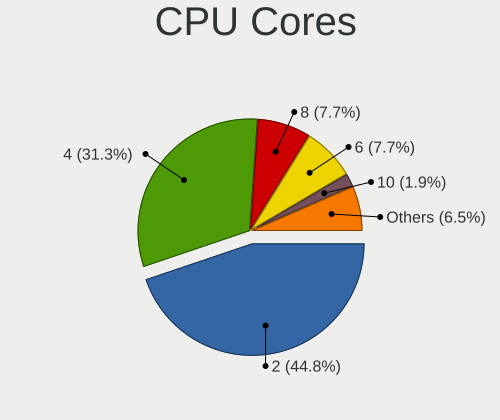

| Number  | Notebooks | Percent |
|---------|-----------|---------|
| 2       | 3924      | 44.81%  |
| 4       | 2741      | 31.3%   |
| 8       | 677       | 7.73%   |
| 6       | 674       | 7.7%    |
| 10      | 169       | 1.93%   |
| 14      | 165       | 1.88%   |
| 1       | 151       | 1.72%   |
| 12      | 138       | 1.58%   |
| 16      | 79        | 0.9%    |
| 24      | 20        | 0.23%   |
| Unknown | 9         | 0.1%    |
| 20      | 6         | 0.07%   |
| 5       | 3         | 0.03%   |
| 3       | 1         | 0.01%   |

CPU Sockets
-----------

Number of sockets

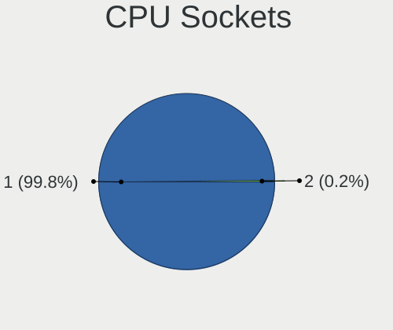

| Number | Notebooks | Percent |
|--------|-----------|---------|
| 1      | 8735      | 99.83%  |
| 2      | 15        | 0.17%   |

CPU Threads
-----------

Threads per core (Hyper-Threading)

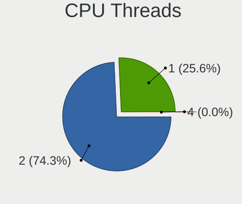

| Number  | Notebooks | Percent |
|---------|-----------|---------|
| 2       | 6510      | 74.28%  |
| 1       | 2243      | 25.59%  |
| Unknown | 9         | 0.1%    |
| 4       | 2         | 0.02%   |

CPU Op-Modes
------------

CPU Operation Modes (32-bit, 64-bit)

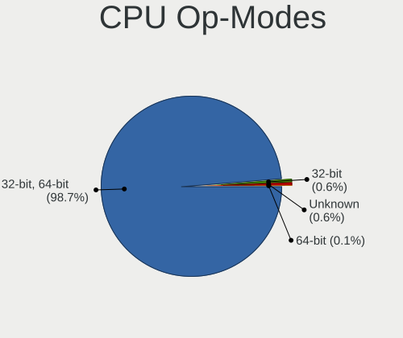

| Op mode        | Notebooks | Percent |
|----------------|-----------|---------|
| 32-bit, 64-bit | 8646      | 98.72%  |
| 32-bit         | 56        | 0.64%   |
| Unknown        | 51        | 0.58%   |
| 64-bit         | 5         | 0.06%   |

CPU Microcode
-------------

Microcode number

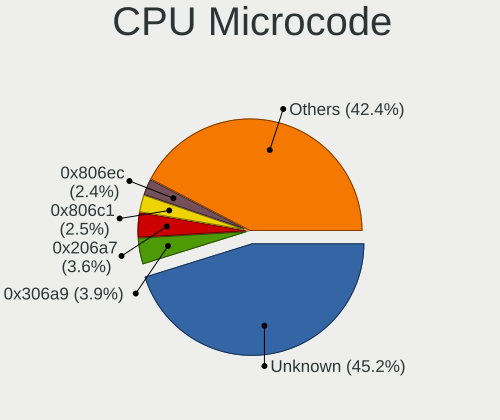

| Number     | Notebooks | Percent |
|------------|-----------|---------|
| Unknown    | 4117      | 45.19%  |
| 0x306a9    | 352       | 3.86%   |
| 0x206a7    | 331       | 3.63%   |
| 0x806c1    | 232       | 2.55%   |
| 0x806ec    | 218       | 2.39%   |
| 0x1067a    | 207       | 2.27%   |
| 0x406e3    | 200       | 2.2%    |
| 0x906ea    | 190       | 2.09%   |
| 0x40651    | 190       | 2.09%   |
| 0x806ea    | 175       | 1.92%   |
| 0x306c3    | 173       | 1.9%    |
| 0x306d4    | 167       | 1.83%   |
| 0x806e9    | 139       | 1.53%   |
| 0x20655    | 137       | 1.5%    |
| 0x6fd      | 109       | 1.2%    |
| 0x506e3    | 102       | 1.12%   |
| 0xa0652    | 88        | 0.97%   |
| 0x08108109 | 82        | 0.9%    |
| 0x906e9    | 80        | 0.88%   |
| 0x08600106 | 80        | 0.88%   |
| 0x906a3    | 73        | 0.8%    |
| 0x30678    | 73        | 0.8%    |
| 0x0a50000c | 72        | 0.79%   |
| 0x806d1    | 65        | 0.71%   |
| 0x10676    | 63        | 0.69%   |
| 0x706e5    | 56        | 0.61%   |
| 0x08608103 | 54        | 0.59%   |
| 0x406c4    | 53        | 0.58%   |
| 0x08108102 | 50        | 0.55%   |
| 0x07030105 | 50        | 0.55%   |
| 0x806eb    | 49        | 0.54%   |
| 0x706a8    | 49        | 0.54%   |
| 0x406c3    | 47        | 0.52%   |
| 0x506c9    | 46        | 0.5%    |
| 0x06006705 | 45        | 0.49%   |
| 0x706a1    | 44        | 0.48%   |
| 0x20652    | 43        | 0.47%   |
| 0x05000119 | 41        | 0.45%   |
| 0x906ed    | 36        | 0.4%    |
| 0x0700010f | 34        | 0.37%   |

CPU Microarch
-------------

Microarchitecture

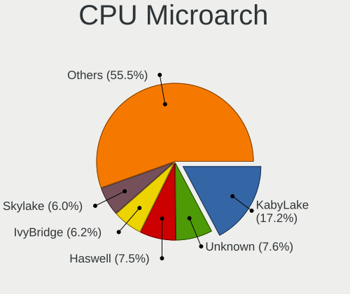

| Name               | Notebooks | Percent |
|--------------------|-----------|---------|
| KabyLake           | 1511      | 17.22%  |
| Unknown            | 669       | 7.62%   |
| Haswell            | 656       | 7.47%   |
| IvyBridge          | 545       | 6.21%   |
| Skylake            | 529       | 6.03%   |
| SandyBridge        | 502       | 5.72%   |
| TigerLake          | 438       | 4.99%   |
| Penryn             | 401       | 4.57%   |
| Alderlake Hybrid   | 365       | 4.16%   |
| Westmere           | 299       | 3.41%   |
| Broadwell          | 290       | 3.3%    |
| Silvermont         | 270       | 3.08%   |
| Core               | 229       | 2.61%   |
| Zen 3              | 218       | 2.48%   |
| Zen 2              | 205       | 2.34%   |
| IceLake            | 205       | 2.34%   |
| Zen+               | 188       | 2.14%   |
| CometLake          | 182       | 2.07%   |
| Goldmont plus      | 170       | 1.94%   |
| Excavator          | 114       | 1.3%    |
| Puma               | 106       | 1.21%   |
| Bobcat             | 89        | 1.01%   |
| Goldmont           | 88        | 1%      |
| Zen                | 65        | 0.74%   |
| Jaguar             | 63        | 0.72%   |
| Meteorlake Hybrid  | 55        | 0.63%   |
| Bonnell            | 54        | 0.62%   |
| K10                | 49        | 0.56%   |
| K8 Hammer          | 33        | 0.38%   |
| P6                 | 32        | 0.36%   |
| Nehalem            | 29        | 0.33%   |
| K8 & K10 hybrid    | 26        | 0.3%    |
| Piledriver         | 21        | 0.24%   |
| K10 Llano          | 20        | 0.23%   |
| Lunarlake Hybrid   | 17        | 0.19%   |
| Gracemont          | 17        | 0.19%   |
| Tremont            | 15        | 0.17%   |
| Steamroller        | 4         | 0.05%   |
| NetBurst           | 4         | 0.05%   |
| ArrowLake-H Hybrid | 3         | 0.03%   |

Graphics
--------

GPU Vendor
----------

Vendors of graphics cards

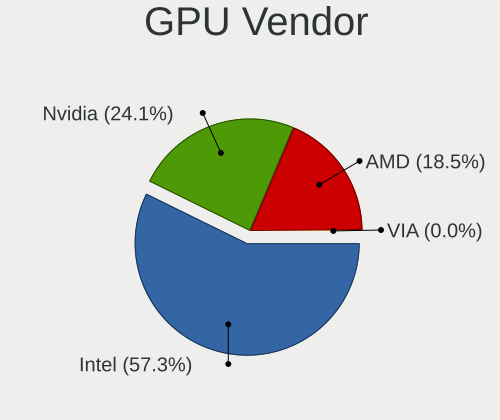

| Vendor                           | Notebooks | Percent |
|----------------------------------|-----------|---------|
| Intel                            | 6460      | 57.27%  |
| Nvidia                           | 2718      | 24.1%   |
| AMD                              | 2089      | 18.52%  |
| Silicon Integrated Systems [SiS] | 11        | 0.1%    |
| VIA Technologies                 | 2         | 0.02%   |

GPU Model
---------

Graphics card models

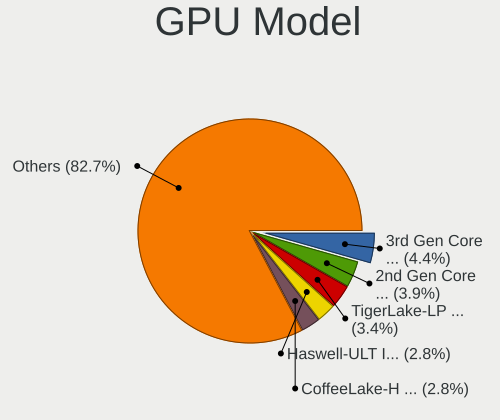

| Model                                                                                    | Notebooks | Percent |
|------------------------------------------------------------------------------------------|-----------|---------|
| Intel 3rd Gen Core processor Graphics Controller                                         | 508       | 4.39%   |
| Intel 2nd Generation Core Processor Family Integrated Graphics Controller                | 447       | 3.86%   |
| Intel TigerLake-LP GT2 [Iris Xe Graphics]                                                | 396       | 3.42%   |
| Intel Haswell-ULT Integrated Graphics Controller                                         | 325       | 2.81%   |
| Intel CoffeeLake-H GT2 [UHD Graphics 630]                                                | 325       | 2.81%   |
| Intel Skylake-U GT2 [HD Graphics 520]                                                    | 321       | 2.77%   |
| Intel 4th Gen Core Processor Integrated Graphics Controller                              | 272       | 2.35%   |
| Intel Kaby Lake-R GT2 [UHD Graphics 620]                                                 | 267       | 2.31%   |
| Intel Broadwell-U GT2 [HD Graphics 5500]                                                 | 246       | 2.13%   |
| Intel Mobile 4 Series Chipset Integrated Graphics Controller                             | 235       | 2.03%   |
| Intel WhiskeyLake-U GT2 [UHD Graphics 620]                                               | 231       | 2%      |
| Intel Kaby Lake-U GT2 [HD Graphics 620]                                                  | 220       | 1.9%    |
| Intel CometLake-U GT2 [UHD Graphics]                                                     | 215       | 1.86%   |
| AMD Picasso/Raven 2 [Radeon Vega Series / Radeon Vega Mobile Series]                     | 205       | 1.77%   |
| AMD Renoir [Radeon Vega Series / Radeon Vega Mobile Series]                              | 201       | 1.74%   |
| Intel Core Processor Integrated Graphics Controller                                      | 190       | 1.64%   |
| AMD Cezanne [Radeon Vega Series / Radeon Vega Mobile Series]                             | 151       | 1.3%    |
| Intel Skylake-H GT2 [HD Graphics 530]                                                    | 150       | 1.3%    |
| Intel CometLake-H GT2 [UHD Graphics]                                                     | 148       | 1.28%   |
| Nvidia GP107M [GeForce GTX 1050 Mobile]                                                  | 144       | 1.24%   |
| Intel GeminiLake [UHD Graphics 600]                                                      | 143       | 1.24%   |
| Intel Atom/Celeron/Pentium Processor x5-E8000/J3xxx/N3xxx Integrated Graphics Controller | 139       | 1.2%    |
| Intel Alder Lake-P GT2 [Iris Xe Graphics]                                                | 139       | 1.2%    |
| Intel Raptor Lake-P [Iris Xe Graphics]                                                   | 131       | 1.13%   |
| Intel Atom Processor Z36xxx/Z37xxx Series Graphics & Display                             | 130       | 1.12%   |
| Intel TigerLake-H GT1 [UHD Graphics]                                                     | 129       | 1.11%   |
| Intel Kaby Lake-H GT2 [HD Graphics 630]                                                  | 128       | 1.11%   |
| Nvidia TU117M [GeForce GTX 1650 Mobile / Max-Q]                                          | 123       | 1.06%   |
| AMD Lucienne                                                                             | 111       | 0.96%   |
| Nvidia GA106M [GeForce RTX 3060 Mobile / Max-Q]                                          | 103       | 0.89%   |
| Nvidia GF117M [GeForce 610M/710M/810M/820M / GT 620M/625M/630M/720M]                     | 87        | 0.75%   |
| Intel Mobile GM965/GL960 Integrated Graphics Controller (secondary)                      | 86        | 0.74%   |
| Intel Mobile GM965/GL960 Integrated Graphics Controller (primary)                        | 86        | 0.74%   |
| AMD Stoney [Radeon R2/R3/R4/R5 Graphics]                                                 | 82        | 0.71%   |
| AMD Rembrandt [Radeon 680M]                                                              | 80        | 0.69%   |
| Nvidia GM107M [GeForce GTX 950M]                                                         | 71        | 0.61%   |
| Nvidia GM107M [GeForce GTX 960M]                                                         | 70        | 0.6%    |
| Intel Apollo Lake GT1 [HD Graphics 500]                                                  | 69        | 0.6%    |
| AMD Sun XT [Radeon HD 8670A/8670M/8690M / R5 M330 / M430 / Radeon 520 Mobile]            | 68        | 0.59%   |
| Nvidia GM108M [GeForce 840M]                                                             | 65        | 0.56%   |

GPU Combo
---------

Combinations of graphics cards

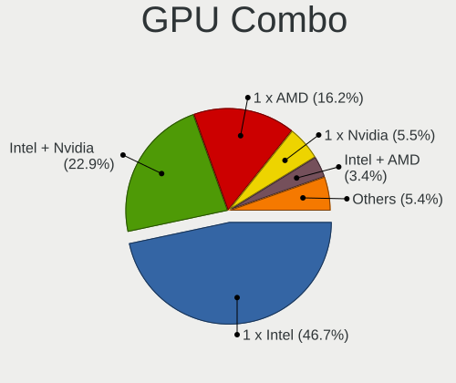

| Name                     | Notebooks | Percent |
|--------------------------|-----------|---------|
| 1 x Intel                | 4096      | 46.67%  |
| Intel + Nvidia           | 2007      | 22.87%  |
| 1 x AMD                  | 1423      | 16.21%  |
| 1 x Nvidia               | 481       | 5.48%   |
| Intel + AMD              | 297       | 3.38%   |
| AMD + Nvidia             | 214       | 2.44%   |
| 2 x AMD                  | 156       | 1.78%   |
| 2 x Intel                | 57        | 0.65%   |
| Other                    | 13        | 0.15%   |
| 2 x Nvidia               | 13        | 0.15%   |
| 1 x SiS                  | 11        | 0.13%   |
| Intel + AMD + 1 x Nvidia | 3         | 0.03%   |
| 1 x VIA                  | 2         | 0.02%   |
| Intel + 2 x Nvidia       | 2         | 0.02%   |
| 2 x AMD + 1 x Nvidia     | 1         | 0.01%   |

GPU Driver
----------

Free vs proprietary

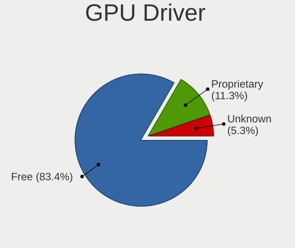

| Driver      | Notebooks | Percent |
|-------------|-----------|---------|
| Free        | 7402      | 83.38%  |
| Proprietary | 1007      | 11.34%  |
| Unknown     | 468       | 5.27%   |

GPU Memory
----------

Total video memory

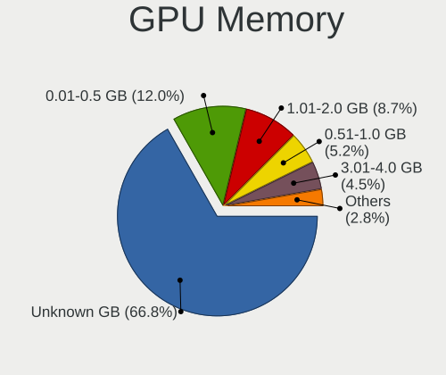

| Size in GB | Notebooks | Percent |
|------------|-----------|---------|
| Unknown    | 5987      | 66.76%  |
| 0.01-0.5   | 1074      | 11.98%  |
| 1.01-2.0   | 784       | 8.74%   |
| 0.51-1.0   | 469       | 5.23%   |
| 3.01-4.0   | 407       | 4.54%   |
| 5.01-6.0   | 125       | 1.39%   |
| 7.01-8.0   | 82        | 0.91%   |
| 2.01-3.0   | 28        | 0.31%   |
| 8.01-16.0  | 12        | 0.13%   |

Monitor
-------

Monitor Vendor
--------------

Monitor vendors

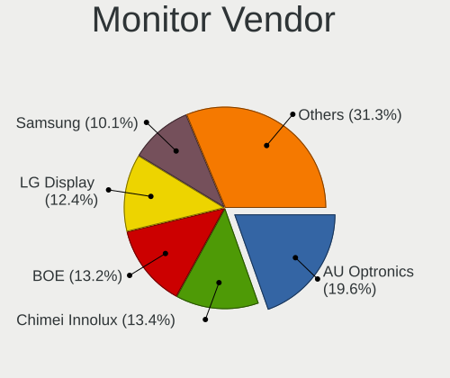

| Vendor                  | Notebooks | Percent |
|-------------------------|-----------|---------|
| AU Optronics            | 1984      | 19.59%  |
| Chimei Innolux          | 1356      | 13.39%  |
| BOE                     | 1342      | 13.25%  |
| LG Display              | 1261      | 12.45%  |
| Samsung Electronics     | 1020      | 10.07%  |
| Sharp                   | 301       | 2.97%   |
| Dell                    | 301       | 2.97%   |
| Apple                   | 220       | 2.17%   |
| Chi Mei Optoelectronics | 218       | 2.15%   |
| Iiyama                  | 191       | 1.89%   |
| Lenovo                  | 174       | 1.72%   |
| Hewlett-Packard         | 138       | 1.36%   |
| Goldstar                | 136       | 1.34%   |
| PANDA                   | 129       | 1.27%   |
| InfoVision              | 115       | 1.14%   |
| Acer                    | 110       | 1.09%   |
| LG Philips              | 91        | 0.9%    |
| AOC                     | 80        | 0.79%   |
| Philips                 | 75        | 0.74%   |
| Ancor Communications    | 72        | 0.71%   |
| BenQ                    | 67        | 0.66%   |
| ASUSTek Computer        | 53        | 0.52%   |
| ViewSonic               | 49        | 0.48%   |
| CSO                     | 48        | 0.47%   |
| Valve                   | 46        | 0.45%   |
| Sony                    | 26        | 0.26%   |
| HannStar                | 24        | 0.24%   |
| Toshiba                 | 23        | 0.23%   |
| CPT                     | 22        | 0.22%   |
| JDZ                     | 20        | 0.2%    |
| HKC                     | 19        | 0.19%   |
| Unknown                 | 18        | 0.18%   |
| CSW                     | 18        | 0.18%   |
| Vestel Elektronik       | 17        | 0.17%   |
| Fujitsu Siemens         | 16        | 0.16%   |
| MSI                     | 15        | 0.15%   |
| CSOT                    | 15        | 0.15%   |
| Panasonic               | 12        | 0.12%   |
| Analogix                | 11        | 0.11%   |
| Eizo                    | 10        | 0.1%    |

Monitor Model
-------------

Monitor models

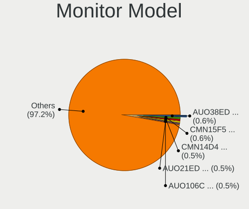

| Model                                                                     | Notebooks | Percent |
|---------------------------------------------------------------------------|-----------|---------|
| AU Optronics LCD Monitor AUO38ED 1920x1080 344x193mm 15.5-inch            | 64        | 0.62%   |
| Chimei Innolux LCD Monitor CMN15F5 1920x1080 344x193mm 15.5-inch          | 62        | 0.6%    |
| Chimei Innolux LCD Monitor CMN14D4 1920x1080 309x173mm 13.9-inch          | 54        | 0.53%   |
| AU Optronics LCD Monitor AUO21ED 1920x1080 344x193mm 15.5-inch            | 54        | 0.53%   |
| AU Optronics LCD Monitor AUO106C 1366x768 276x155mm 12.5-inch             | 53        | 0.52%   |
| Samsung Electronics LCD Monitor SEC5441 1280x800 331x207mm 15.4-inch      | 49        | 0.48%   |
| Chimei Innolux LCD Monitor CMN1521 1920x1080 344x193mm 15.5-inch          | 43        | 0.42%   |
| AU Optronics LCD Monitor AUO403D 1920x1080 309x174mm 14.0-inch            | 41        | 0.4%    |
| AU Optronics LCD Monitor AUO26EC 1366x768 344x193mm 15.5-inch             | 40        | 0.39%   |
| Samsung Electronics LCD Monitor SEC544B 1600x900 382x214mm 17.2-inch      | 37        | 0.36%   |
| Chimei Innolux LCD Monitor CMN14D5 1920x1080 309x173mm 13.9-inch          | 37        | 0.36%   |
| Chi Mei Optoelectronics LCD Monitor CMO1720 1920x1080 382x215mm 17.3-inch | 36        | 0.35%   |
| Chimei Innolux LCD Monitor CMN15DC 1366x768 344x193mm 15.5-inch           | 35        | 0.34%   |
| AU Optronics LCD Monitor AUO159E 1600x900 382x214mm 17.2-inch             | 35        | 0.34%   |
| AU Optronics LCD Monitor AUO139E 1600x900 382x214mm 17.2-inch             | 35        | 0.34%   |
| AU Optronics LCD Monitor AUO5B2D 1920x1080 293x162mm 13.2-inch            | 33        | 0.32%   |
| Valve ANX7530 U VLV3001 800x1280 100x150mm 7.1-inch                       | 32        | 0.31%   |
| Chimei Innolux LCD Monitor CMN1728 1600x900 382x215mm 17.3-inch           | 32        | 0.31%   |
| Chimei Innolux LCD Monitor CMN15E8 1920x1080 344x193mm 15.5-inch          | 32        | 0.31%   |
| Chimei Innolux LCD Monitor CMN15E7 1920x1080 344x193mm 15.5-inch          | 32        | 0.31%   |
| Chimei Innolux LCD Monitor CMN15DB 1366x768 344x193mm 15.5-inch           | 32        | 0.31%   |
| AU Optronics LCD Monitor AUO45EC 1366x768 344x193mm 15.5-inch             | 32        | 0.31%   |
| Chimei Innolux LCD Monitor CMN1734 1600x900 382x214mm 17.2-inch           | 31        | 0.3%    |
| AU Optronics LCD Monitor AUO61ED 1920x1080 344x194mm 15.5-inch            | 31        | 0.3%    |
| AU Optronics LCD Monitor AUO36ED 1920x1080 344x193mm 15.5-inch            | 31        | 0.3%    |
| Chimei Innolux LCD Monitor CMN1747 1920x1080 381x214mm 17.2-inch          | 28        | 0.27%   |
| LG Display LCD Monitor LGD06B3 1920x1200 336x210mm 15.6-inch              | 27        | 0.26%   |
| LG Display LCD Monitor LGD033A 1366x768 344x194mm 15.5-inch               | 27        | 0.26%   |
| Chimei Innolux LCD Monitor CMN1735 1920x1080 381x214mm 17.2-inch          | 26        | 0.25%   |
| LG Display LCD Monitor LGD02DC 1366x768 344x194mm 15.5-inch               | 25        | 0.24%   |
| BOE LCD Monitor BOE0812 1920x1080 344x194mm 15.5-inch                     | 25        | 0.24%   |
| AU Optronics LCD Monitor AUO22EC 1366x768 344x193mm 15.5-inch             | 25        | 0.24%   |
| Chi Mei Optoelectronics LCD Monitor CMO15A7 1366x768 344x193mm 15.5-inch  | 24        | 0.23%   |
| BOE LCD Monitor BOE0872 1920x1080 344x194mm 15.5-inch                     | 24        | 0.23%   |
| PANDA LCD Monitor NCP004D 1920x1080 344x194mm 15.5-inch                   | 23        | 0.22%   |
| Chimei Innolux LCD Monitor CMN15CA 1366x768 344x193mm 15.5-inch           | 23        | 0.22%   |
| AU Optronics LCD Monitor AUO71EC 1366x768 344x193mm 15.5-inch             | 23        | 0.22%   |
| AU Optronics LCD Monitor AUO219E 1600x900 382x214mm 17.2-inch             | 23        | 0.22%   |
| AU Optronics LCD Monitor AUO119E 1600x900 382x214mm 17.2-inch             | 23        | 0.22%   |
| AU Optronics LCD Monitor AUO109E 1600x900 382x214mm 17.2-inch             | 23        | 0.22%   |

Monitor Resolution
------------------

Monitor screen resolution

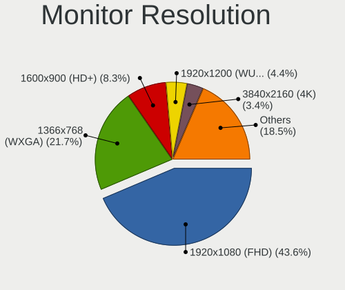

| Resolution         | Notebooks | Percent |
|--------------------|-----------|---------|
| 1920x1080 (FHD)    | 4114      | 43.63%  |
| 1366x768 (WXGA)    | 2049      | 21.73%  |
| 1600x900 (HD+)     | 779       | 8.26%   |
| 1920x1200 (WUXGA)  | 417       | 4.42%   |
| 3840x2160 (4K)     | 323       | 3.43%   |
| 1280x800 (WXGA)    | 284       | 3.01%   |
| 2560x1440 (QHD)    | 280       | 2.97%   |
| 1440x900 (WXGA+)   | 210       | 2.23%   |
| 2560x1600          | 151       | 1.6%    |
| 2880x1800          | 126       | 1.34%   |
| 1680x1050 (WSXGA+) | 93        | 0.99%   |
| 3440x1440          | 58        | 0.62%   |
| 800x1280           | 55        | 0.58%   |
| 3840x2400          | 44        | 0.47%   |
| 1280x1024 (SXGA)   | 43        | 0.46%   |
| 1024x600           | 41        | 0.43%   |
| 2160x1440          | 35        | 0.37%   |
| 2256x1504          | 31        | 0.33%   |
| 2560x1080          | 24        | 0.25%   |
| Unknown            | 21        | 0.22%   |
| 3200x1800 (QHD+)   | 16        | 0.17%   |
| 3840x1080          | 15        | 0.16%   |
| 2880x1620          | 15        | 0.16%   |
| 2288x1287          | 15        | 0.16%   |
| 3072x1920          | 14        | 0.15%   |
| 3200x2000          | 13        | 0.14%   |
| 1680x945           | 13        | 0.14%   |
| 1360x768           | 13        | 0.14%   |
| 1920x1280          | 12        | 0.13%   |
| 1920x540           | 11        | 0.12%   |
| 1600x1200          | 11        | 0.12%   |
| 3000x2000          | 10        | 0.11%   |
| 2520x1680          | 10        | 0.11%   |
| 3456x2160          | 9         | 0.1%    |
| 1024x768 (XGA)     | 9         | 0.1%    |
| 2880x1920          | 7         | 0.07%   |
| 1920x515           | 6         | 0.06%   |
| 1400x1050          | 5         | 0.05%   |
| 3840x1600          | 4         | 0.04%   |
| 3840x1200          | 4         | 0.04%   |

Monitor Diagonal
----------------

Diagonal size in inches

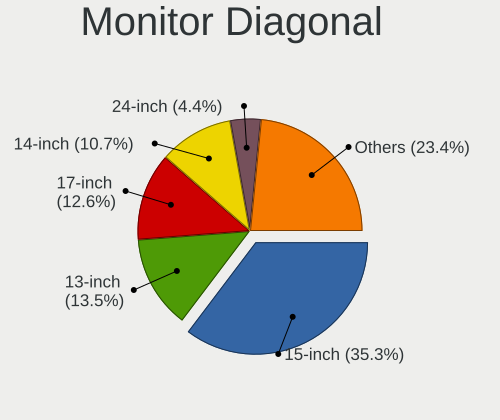

| Inches  | Notebooks | Percent |
|---------|-----------|---------|
| 15      | 3570      | 35.31%  |
| 13      | 1361      | 13.46%  |
| 17      | 1279      | 12.65%  |
| 14      | 1086      | 10.74%  |
| 24      | 445       | 4.4%    |
| 27      | 374       | 3.7%    |
| 23      | 292       | 2.89%   |
| 16      | 283       | 2.8%    |
| 12      | 257       | 2.54%   |
| 21      | 218       | 2.16%   |
| 11      | 114       | 1.13%   |
| Unknown | 105       | 1.04%   |
| 31      | 77        | 0.76%   |
| 34      | 72        | 0.71%   |
| 18      | 72        | 0.71%   |
| 22      | 65        | 0.64%   |
| 10      | 62        | 0.61%   |
| 19      | 55        | 0.54%   |
| 7       | 45        | 0.45%   |
| 84      | 34        | 0.34%   |
| 20      | 29        | 0.29%   |
| 72      | 21        | 0.21%   |
| 32      | 16        | 0.16%   |
| 25      | 16        | 0.16%   |
| 40      | 15        | 0.15%   |
| 142     | 12        | 0.12%   |
| 52      | 12        | 0.12%   |
| 54      | 11        | 0.11%   |
| 3       | 11        | 0.11%   |
| 49      | 9         | 0.09%   |
| 26      | 9         | 0.09%   |
| 63      | 8         | 0.08%   |
| 33      | 8         | 0.08%   |
| 86      | 7         | 0.07%   |
| 48      | 7         | 0.07%   |
| 39      | 7         | 0.07%   |
| 65      | 5         | 0.05%   |
| 42      | 5         | 0.05%   |
| 36      | 4         | 0.04%   |
| 35      | 4         | 0.04%   |

Monitor Width
-------------

Physical width

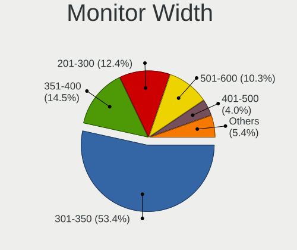

| Width in mm    | Notebooks | Percent |
|----------------|-----------|---------|
| 301-350        | 5344      | 53.43%  |
| 351-400        | 1446      | 14.46%  |
| 201-300        | 1236      | 12.36%  |
| 501-600        | 1031      | 10.31%  |
| 401-500        | 402       | 4.02%   |
| Unknown        | 105       | 1.05%   |
| 601-700        | 103       | 1.03%   |
| 701-800        | 97        | 0.97%   |
| 1001-1500      | 69        | 0.69%   |
| 1501-2000      | 57        | 0.57%   |
| 1-100          | 55        | 0.55%   |
| 801-900        | 33        | 0.33%   |
| More than 2000 | 12        | 0.12%   |
| 901-1000       | 6         | 0.06%   |
| 101-200        | 5         | 0.05%   |

Aspect Ratio
------------

Proportional relationship between the width and the height

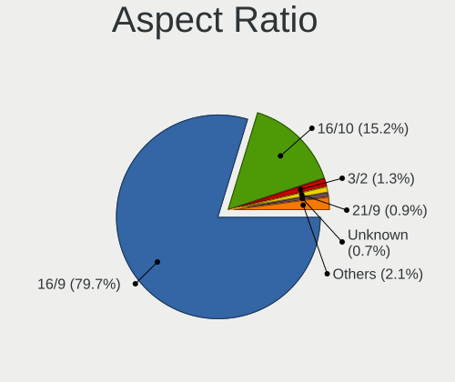

| Ratio   | Notebooks | Percent |
|---------|-----------|---------|
| 16/9    | 7097      | 79.71%  |
| 16/10   | 1356      | 15.23%  |
| 3/2     | 119       | 1.34%   |
| 21/9    | 84        | 0.94%   |
| Unknown | 61        | 0.69%   |
| 5/4     | 46        | 0.52%   |
| 0.67    | 32        | 0.36%   |
| 4/3     | 31        | 0.35%   |
| 32/9    | 16        | 0.18%   |
| 0.62    | 14        | 0.16%   |
| 1.00    | 13        | 0.15%   |
| 6/5     | 12        | 0.13%   |
| 0.56    | 8         | 0.09%   |
| 3.73    | 5         | 0.06%   |
| 3.20    | 3         | 0.03%   |
| 3.40    | 2         | 0.02%   |
| 3.88    | 1         | 0.01%   |
| 2.70    | 1         | 0.01%   |
| 2.00    | 1         | 0.01%   |
| 0.63    | 1         | 0.01%   |
| 0.58    | 1         | 0.01%   |

Monitor Area
------------

Area in inch²

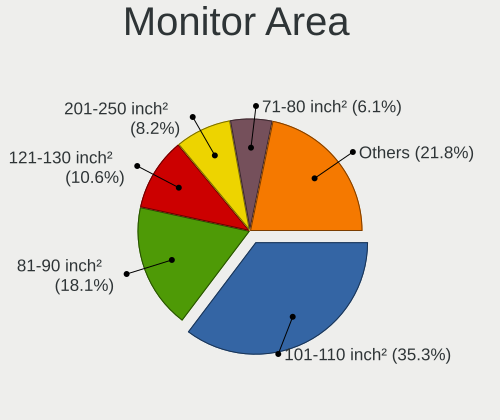

| Area in inch² | Notebooks | Percent |
|----------------|-----------|---------|
| 101-110        | 3555      | 35.3%   |
| 81-90          | 1824      | 18.11%  |
| 121-130        | 1066      | 10.58%  |
| 201-250        | 822       | 8.16%   |
| 71-80          | 612       | 6.08%   |
| 301-350        | 383       | 3.8%    |
| 111-120        | 280       | 2.78%   |
| 61-70          | 244       | 2.42%   |
| 131-140        | 206       | 2.05%   |
| 351-500        | 180       | 1.79%   |
| 251-300        | 138       | 1.37%   |
| 151-200        | 128       | 1.27%   |
| 51-60          | 117       | 1.16%   |
| More than 1000 | 115       | 1.14%   |
| Unknown        | 105       | 1.04%   |
| 141-150        | 87        | 0.86%   |
| 41-50          | 62        | 0.62%   |
| 1-40           | 59        | 0.59%   |
| 501-1000       | 56        | 0.56%   |
| 91-100         | 33        | 0.33%   |

Pixel Density
-------------

Pixels per inch

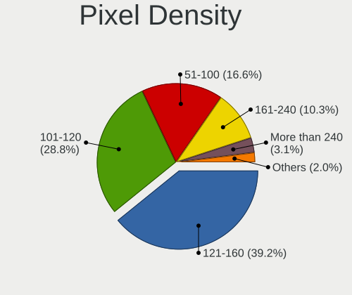

| Density       | Notebooks | Percent |
|---------------|-----------|---------|
| 121-160       | 3867      | 39.15%  |
| 101-120       | 2848      | 28.83%  |
| 51-100        | 1644      | 16.64%  |
| 161-240       | 1020      | 10.33%  |
| More than 240 | 302       | 3.06%   |
| Unknown       | 106       | 1.07%   |
| 1-50          | 90        | 0.91%   |

Multiple Monitors
-----------------

Total monitors connected

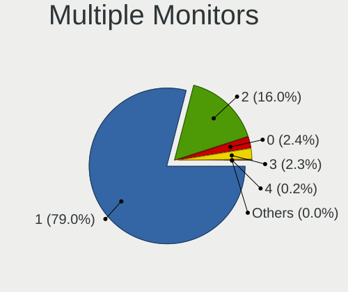

| Total | Notebooks | Percent |
|-------|-----------|---------|
| 1     | 7105      | 79.01%  |
| 2     | 1438      | 15.99%  |
| 0     | 217       | 2.41%   |
| 3     | 211       | 2.35%   |
| 4     | 20        | 0.22%   |
| 6     | 1         | 0.01%   |
| 5     | 1         | 0.01%   |

Network
-------

Net Controller Vendor
---------------------

Controller vendors

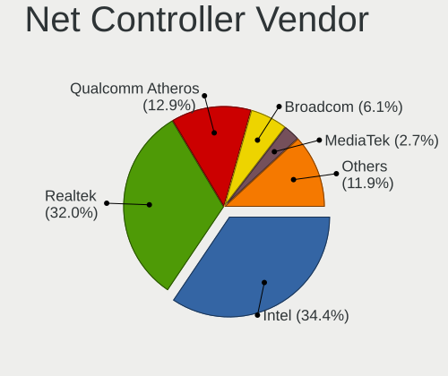

| Vendor                                 | Notebooks | Percent |
|----------------------------------------|-----------|---------|
| Intel                                  | 4794      | 34.43%  |
| Realtek Semiconductor                  | 4457      | 32.01%  |
| Qualcomm Atheros                       | 1802      | 12.94%  |
| Broadcom                               | 843       | 6.05%   |
| MediaTek                               | 376       | 2.7%    |
| Broadcom Limited                       | 190       | 1.36%   |
| ASIX Electronics                       | 147       | 1.06%   |
| Marvell Technology Group               | 141       | 1.01%   |
| Ralink                                 | 133       | 0.96%   |
| Shenzhen Goodix Technology             | 82        | 0.59%   |
| Dell                                   | 72        | 0.52%   |
| Qualcomm                               | 71        | 0.51%   |
| Samsung Electronics                    | 67        | 0.48%   |
| TP-Link                                | 57        | 0.41%   |
| Nvidia                                 | 55        | 0.4%    |
| DisplayLink                            | 52        | 0.37%   |
| Xiaomi                                 | 51        | 0.37%   |
| Ericsson Business Mobile Networks      | 48        | 0.34%   |
| Lenovo                                 | 43        | 0.31%   |
| Sierra Wireless                        | 37        | 0.27%   |
| JMicron Technology                     | 31        | 0.22%   |
| NetGear                                | 29        | 0.21%   |
| Huawei Technologies                    | 27        | 0.19%   |
| Ralink Technology                      | 26        | 0.19%   |
| Hewlett-Packard                        | 25        | 0.18%   |
| OPPO Electronics                       | 22        | 0.16%   |
| Google                                 | 20        | 0.14%   |
| Attansic Technology                    | 18        | 0.13%   |
| Silicon Integrated Systems [SiS]       | 14        | 0.1%    |
| D-Link                                 | 14        | 0.1%    |
| Qualcomm Atheros Communications        | 10        | 0.07%   |
| Toshiba                                | 9         | 0.06%   |
| Fibocom                                | 9         | 0.06%   |
| D-Link System                          | 9         | 0.06%   |
| Suzhou Motorcomm Electronic Technology | 7         | 0.05%   |
| Qualcomm Technologies                  | 7         | 0.05%   |
| Apple                                  | 7         | 0.05%   |
| Motorola PCS                           | 6         | 0.04%   |
| ASUSTek Computer                       | 6         | 0.04%   |
| U-Blox                                 | 5         | 0.04%   |

Net Controller Model
--------------------

Controller models

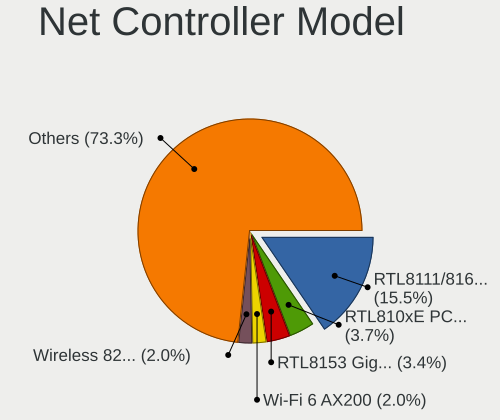

| Model                                                                  | Notebooks | Percent |
|------------------------------------------------------------------------|-----------|---------|
| Realtek RTL8111/8168/8211/8411 PCI Express Gigabit Ethernet Controller | 2589      | 15.48%  |
| Realtek RTL810xE PCI Express Fast Ethernet controller                  | 621       | 3.71%   |
| Realtek RTL8153 Gigabit Ethernet Adapter                               | 574       | 3.43%   |
| Intel Wi-Fi 6 AX200                                                    | 342       | 2.05%   |
| Intel Wireless 8265 / 8275                                             | 335       | 2%      |
| Intel Wi-Fi 6 AX201                                                    | 325       | 1.94%   |
| Intel Wireless 7265                                                    | 296       | 1.77%   |
| Qualcomm Atheros QCA9377 802.11ac Wireless Network Adapter             | 285       | 1.7%    |
| Intel Wireless 8260                                                    | 265       | 1.58%   |
| Qualcomm Atheros AR9285 Wireless Network Adapter (PCI-Express)         | 263       | 1.57%   |
| Intel Alder Lake-P PCH CNVi WiFi                                       | 252       | 1.51%   |
| Intel 82579LM Gigabit Network Connection (Lewisville)                  | 251       | 1.5%    |
| Realtek RTL8821CE 802.11ac PCIe Wireless Network Adapter               | 250       | 1.5%    |
| Intel Wireless 7260                                                    | 250       | 1.5%    |
| Qualcomm Atheros AR9485 Wireless Network Adapter                       | 240       | 1.44%   |
| Qualcomm Atheros QCA9565 / AR9565 Wireless Network Adapter             | 225       | 1.35%   |
| Realtek RTL8822CE 802.11ac PCIe Wireless Network Adapter               | 215       | 1.29%   |
| Intel Cannon Lake PCH CNVi WiFi                                        | 208       | 1.24%   |
| Qualcomm Atheros QCA6174 802.11ac Wireless Network Adapter             | 193       | 1.15%   |
| Intel Comet Lake PCH-LP CNVi WiFi                                      | 186       | 1.11%   |
| MediaTek MT7921 802.11ax PCIe Wireless Network Adapter [Filogic 330]   | 174       | 1.04%   |
| Intel Centrino Advanced-N 6205 [Taylor Peak]                           | 172       | 1.03%   |
| Realtek RTL8723BE PCIe Wireless Network Adapter                        | 161       | 0.96%   |
| Intel Cannon Point-LP CNVi [Wireless-AC]                               | 152       | 0.91%   |
| Intel Comet Lake PCH CNVi WiFi                                         | 147       | 0.88%   |
| Intel Raptor Lake PCH CNVi WiFi                                        | 142       | 0.85%   |
| Intel Ethernet Connection (4) I219-LM                                  | 142       | 0.85%   |
| Broadcom BCM4313 802.11bgn Wireless Network Adapter                    | 138       | 0.83%   |
| Intel Wireless 3165                                                    | 137       | 0.82%   |
| ASIX AX88179 Gigabit Ethernet                                          | 137       | 0.82%   |
| Broadcom BCM43142 802.11b/g/n                                          | 119       | 0.71%   |
| MediaTek MT7922 802.11ax PCI Express Wireless Network Adapter          | 118       | 0.71%   |
| Intel Ethernet Connection I219-LM                                      | 111       | 0.66%   |
| Realtek RTL8188CE 802.11b/g/n WiFi Adapter                             | 104       | 0.62%   |
| Intel Wi-Fi 6E(802.11ax) AX210/AX1675* 2x2 [Typhoon Peak]              | 104       | 0.62%   |
| Intel Tiger Lake PCH CNVi WiFi                                         | 101       | 0.6%    |
| Qualcomm Atheros AR8151 v2.0 Gigabit Ethernet                          | 94        | 0.56%   |
| Intel Ethernet Connection I218-LM                                      | 91        | 0.54%   |
| Intel WiFi Link 5100                                                   | 89        | 0.53%   |
| Intel Ethernet Connection (3) I218-LM                                  | 85        | 0.51%   |

Wireless Vendor
---------------

Wireless vendors

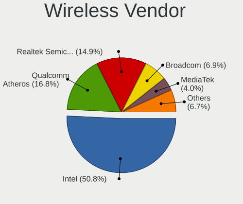

| Vendor                                | Notebooks | Percent |
|---------------------------------------|-----------|---------|
| Intel                                 | 4483      | 50.75%  |
| Qualcomm Atheros                      | 1483      | 16.79%  |
| Realtek Semiconductor                 | 1313      | 14.86%  |
| Broadcom                              | 612       | 6.93%   |
| MediaTek                              | 349       | 3.95%   |
| Broadcom Limited                      | 135       | 1.53%   |
| Ralink                                | 133       | 1.51%   |
| Qualcomm                              | 57        | 0.65%   |
| TP-Link                               | 49        | 0.55%   |
| Sierra Wireless                       | 37        | 0.42%   |
| Dell                                  | 37        | 0.42%   |
| Ralink Technology                     | 26        | 0.29%   |
| NetGear                               | 26        | 0.29%   |
| D-Link                                | 13        | 0.15%   |
| Qualcomm Atheros Communications       | 10        | 0.11%   |
| Hewlett-Packard                       | 10        | 0.11%   |
| Fibocom                               | 9         | 0.1%    |
| D-Link System                         | 9         | 0.1%    |
| Microsoft                             | 5         | 0.06%   |
| Edimax Technology                     | 5         | 0.06%   |
| ASUSTek Computer                      | 5         | 0.06%   |
| Belkin Components                     | 4         | 0.05%   |
| Quectel Wireless Solutions            | 3         | 0.03%   |
| Qualcomm Technologies                 | 3         | 0.03%   |
| Guillemot                             | 3         | 0.03%   |
| Realtek                               | 2         | 0.02%   |
| Ericsson Business Mobile Networks     | 2         | 0.02%   |
| 802.11g Adapter [Linksys WUSB54GC v3] | 2         | 0.02%   |
| ZyXEL Communications                  | 1         | 0.01%   |
| ZyDAS                                 | 1         | 0.01%   |
| Texas Instruments                     | 1         | 0.01%   |
| Sagem                                 | 1         | 0.01%   |
| Memorex                               | 1         | 0.01%   |
| Fujitsu Siemens Computers             | 1         | 0.01%   |
| Cypress Semiconductor                 | 1         | 0.01%   |
| Accton Technology                     | 1         | 0.01%   |

Wireless Model
--------------

Wireless models

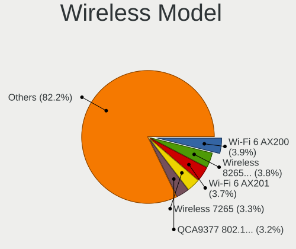

| Model                                                                   | Notebooks | Percent |
|-------------------------------------------------------------------------|-----------|---------|
| Intel Wi-Fi 6 AX200                                                     | 342       | 3.85%   |
| Intel Wireless 8265 / 8275                                              | 335       | 3.77%   |
| Intel Wi-Fi 6 AX201                                                     | 325       | 3.66%   |
| Intel Wireless 7265                                                     | 296       | 3.33%   |
| Qualcomm Atheros QCA9377 802.11ac Wireless Network Adapter              | 285       | 3.21%   |
| Intel Wireless 8260                                                     | 265       | 2.99%   |
| Qualcomm Atheros AR9285 Wireless Network Adapter (PCI-Express)          | 263       | 2.96%   |
| Realtek RTL8821CE 802.11ac PCIe Wireless Network Adapter                | 250       | 2.82%   |
| Intel Wireless 7260                                                     | 250       | 2.82%   |
| Qualcomm Atheros AR9485 Wireless Network Adapter                        | 240       | 2.7%    |
| Qualcomm Atheros QCA9565 / AR9565 Wireless Network Adapter              | 225       | 2.53%   |
| Realtek RTL8822CE 802.11ac PCIe Wireless Network Adapter                | 215       | 2.42%   |
| Intel Cannon Lake PCH CNVi WiFi                                         | 208       | 2.34%   |
| Qualcomm Atheros QCA6174 802.11ac Wireless Network Adapter              | 193       | 2.17%   |
| Intel Comet Lake PCH-LP CNVi WiFi                                       | 186       | 2.1%    |
| Intel Alder Lake-P PCH CNVi WiFi                                        | 176       | 1.98%   |
| MediaTek MT7921 802.11ax PCIe Wireless Network Adapter [Filogic 330]    | 174       | 1.96%   |
| Intel Centrino Advanced-N 6205 [Taylor Peak]                            | 172       | 1.94%   |
| Realtek RTL8723BE PCIe Wireless Network Adapter                         | 161       | 1.81%   |
| Intel Cannon Point-LP CNVi [Wireless-AC]                                | 152       | 1.71%   |
| Intel Comet Lake PCH CNVi WiFi                                          | 147       | 1.66%   |
| Intel Raptor Lake PCH CNVi WiFi                                         | 139       | 1.57%   |
| Broadcom BCM4313 802.11bgn Wireless Network Adapter                     | 138       | 1.55%   |
| Intel Wireless 3165                                                     | 137       | 1.54%   |
| Broadcom BCM43142 802.11b/g/n                                           | 119       | 1.34%   |
| Realtek RTL8188CE 802.11b/g/n WiFi Adapter                              | 104       | 1.17%   |
| MediaTek MT7922 802.11ax PCI Express Wireless Network Adapter           | 104       | 1.17%   |
| Intel Wi-Fi 6E(802.11ax) AX210/AX1675* 2x2 [Typhoon Peak]               | 104       | 1.17%   |
| Intel Tiger Lake PCH CNVi WiFi                                          | 101       | 1.14%   |
| Intel WiFi Link 5100                                                    | 89        | 1%      |
| Qualcomm Atheros AR928X Wireless Network Adapter (PCI-Express)          | 84        | 0.95%   |
| Intel Wireless 3160                                                     | 83        | 0.94%   |
| Intel Wi-Fi 5(802.11ac) Wireless-AC 9x6x [Thunder Peak]                 | 79        | 0.89%   |
| Intel PRO/Wireless 3945ABG [Golan] Network Connection                   | 79        | 0.89%   |
| Realtek RTL8723DE Wireless Network Adapter                              | 69        | 0.78%   |
| Qualcomm Atheros AR9462 Wireless Network Adapter                        | 69        | 0.78%   |
| Realtek RTL8188EE Wireless Network Adapter                              | 66        | 0.74%   |
| Qualcomm Atheros AR242x / AR542x Wireless Network Adapter (PCI-Express) | 66        | 0.74%   |
| Intel Meteor Lake PCH CNVi WiFi                                         | 66        | 0.74%   |
| Intel Centrino Wireless-N 2230                                          | 65        | 0.73%   |

Ethernet Vendor
---------------

Ethernet vendors

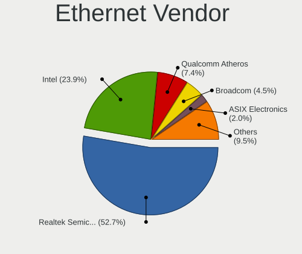

| Vendor                                 | Notebooks | Percent |
|----------------------------------------|-----------|---------|
| Realtek Semiconductor                  | 3937      | 52.73%  |
| Intel                                  | 1782      | 23.87%  |
| Qualcomm Atheros                       | 551       | 7.38%   |
| Broadcom                               | 338       | 4.53%   |
| ASIX Electronics                       | 147       | 1.97%   |
| Marvell Technology Group               | 141       | 1.89%   |
| Samsung Electronics                    | 65        | 0.87%   |
| Broadcom Limited                       | 58        | 0.78%   |
| Nvidia                                 | 55        | 0.74%   |
| DisplayLink                            | 52        | 0.7%    |
| Xiaomi                                 | 51        | 0.68%   |
| Lenovo                                 | 43        | 0.58%   |
| JMicron Technology                     | 31        | 0.42%   |
| MediaTek                               | 26        | 0.35%   |
| OPPO Electronics                       | 22        | 0.29%   |
| Huawei Technologies                    | 20        | 0.27%   |
| Google                                 | 20        | 0.27%   |
| Attansic Technology                    | 18        | 0.24%   |
| Silicon Integrated Systems [SiS]       | 14        | 0.19%   |
| Qualcomm                               | 13        | 0.17%   |
| TP-Link                                | 8         | 0.11%   |
| Hewlett-Packard                        | 8         | 0.11%   |
| Suzhou Motorcomm Electronic Technology | 7         | 0.09%   |
| Apple                                  | 7         | 0.09%   |
| Motorola PCS                           | 6         | 0.08%   |
| ICS Advent                             | 5         | 0.07%   |
| Qualcomm Technologies                  | 4         | 0.05%   |
| Linksys                                | 4         | 0.05%   |
| Aquantia                               | 4         | 0.05%   |
| NetGear                                | 3         | 0.04%   |
| Cypress Semiconductor                  | 3         | 0.04%   |
| VIA Technologies                       | 2         | 0.03%   |
| ULi Electronics                        | 2         | 0.03%   |
| T & A Mobile Phones                    | 2         | 0.03%   |
| Spreadtrum Communications              | 2         | 0.03%   |
| OnePlus Technology (Shenzhen)          | 2         | 0.03%   |
| Motorcomm Microelectronics.            | 2         | 0.03%   |
| Microchip Technology                   | 2         | 0.03%   |
| Hisense                                | 2         | 0.03%   |
| ZTE WCDMA Technologies MSM             | 1         | 0.01%   |

Ethernet Model
--------------

Ethernet models

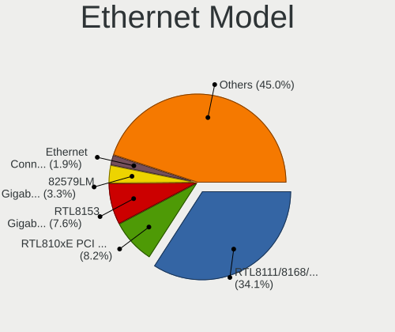

| Model                                                                  | Notebooks | Percent |
|------------------------------------------------------------------------|-----------|---------|
| Realtek RTL8111/8168/8211/8411 PCI Express Gigabit Ethernet Controller | 2589      | 34.12%  |
| Realtek RTL810xE PCI Express Fast Ethernet controller                  | 621       | 8.18%   |
| Realtek RTL8153 Gigabit Ethernet Adapter                               | 574       | 7.56%   |
| Intel 82579LM Gigabit Network Connection (Lewisville)                  | 251       | 3.31%   |
| Intel Ethernet Connection (4) I219-LM                                  | 142       | 1.87%   |
| ASIX AX88179 Gigabit Ethernet                                          | 137       | 1.81%   |
| Intel Ethernet Connection I219-LM                                      | 111       | 1.46%   |
| Qualcomm Atheros AR8151 v2.0 Gigabit Ethernet                          | 94        | 1.24%   |
| Intel Ethernet Connection I218-LM                                      | 91        | 1.2%    |
| Intel Ethernet Connection (3) I218-LM                                  | 85        | 1.12%   |
| Qualcomm Atheros AR8161 Gigabit Ethernet                               | 83        | 1.09%   |
| Intel Ethernet Connection I217-LM                                      | 80        | 1.05%   |
| Intel Alder Lake-P PCH CNVi WiFi                                       | 76        | 1%      |
| Intel 82577LM Gigabit Network Connection                               | 65        | 0.86%   |
| Intel Ethernet Connection I219-V                                       | 64        | 0.84%   |
| Realtek RTL8152 Fast Ethernet Adapter                                  | 63        | 0.83%   |
| Intel 82567LM Gigabit Network Connection                               | 59        | 0.78%   |
| Qualcomm Atheros QCA8171 Gigabit Ethernet                              | 55        | 0.72%   |
| Intel Ethernet Connection (7) I219-LM                                  | 54        | 0.71%   |
| Samsung Galaxy series, misc. (tethering mode)                          | 52        | 0.69%   |
| Intel Ethernet Connection (4) I219-V                                   | 52        | 0.69%   |
| Broadcom NetXtreme BCM57765 Gigabit Ethernet PCIe                      | 52        | 0.69%   |
| Qualcomm Atheros Killer E2400 Gigabit Ethernet Controller              | 51        | 0.67%   |
| Intel Ethernet Connection (6) I219-LM                                  | 51        | 0.67%   |
| Broadcom NetLink BCM57780 Gigabit Ethernet PCIe                        | 50        | 0.66%   |
| Intel Ethernet Connection I217-V                                       | 49        | 0.65%   |
| Qualcomm Atheros Killer E220x Gigabit Ethernet Controller              | 46        | 0.61%   |
| Intel Ethernet Connection (6) I219-V                                   | 46        | 0.61%   |
| Intel Ethernet Connection (2) I219-LM                                  | 46        | 0.61%   |
| Realtek RTL8125 2.5GbE Controller                                      | 45        | 0.59%   |
| Qualcomm Atheros AR8131 Gigabit Ethernet                               | 45        | 0.59%   |
| Intel Ethernet Connection (13) I219-V                                  | 42        | 0.55%   |
| Xiaomi Mi/Redmi series (RNDIS)                                         | 41        | 0.54%   |
| Realtek Killer E2600 GbE Controller                                    | 39        | 0.51%   |
| Intel Ethernet Connection (13) I219-LM                                 | 39        | 0.51%   |
| Nvidia MCP79 Ethernet                                                  | 38        | 0.5%    |
| Broadcom NetXtreme BCM5764M Gigabit Ethernet PCIe                      | 37        | 0.49%   |
| Broadcom NetLink BCM57785 Gigabit Ethernet PCIe                        | 36        | 0.47%   |
| Qualcomm Atheros AR8132 Fast Ethernet                                  | 34        | 0.45%   |
| Broadcom NetLink BCM5784M Gigabit Ethernet PCIe                        | 33        | 0.43%   |

Net Controller Kind
-------------------

Ethernet, WiFi or modem

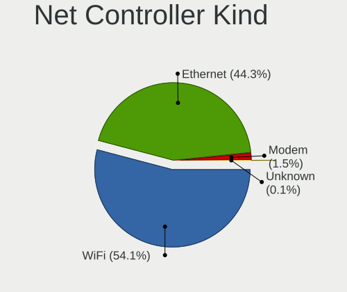

| Kind     | Notebooks | Percent |
|----------|-----------|---------|
| WiFi     | 8490      | 54.09%  |
| Ethernet | 6950      | 44.28%  |
| Modem    | 238       | 1.52%   |
| Unknown  | 17        | 0.11%   |

Used Controller
---------------

Currently used network controller

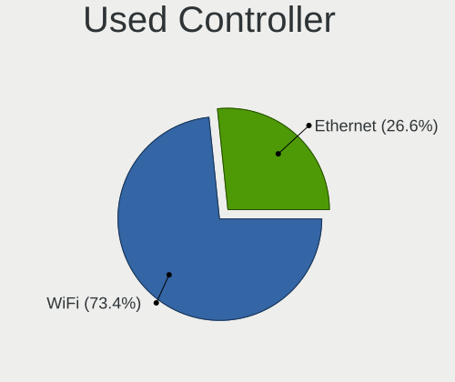

| Kind     | Notebooks | Percent |
|----------|-----------|---------|
| WiFi     | 6842      | 73.36%  |
| Ethernet | 2485      | 26.64%  |

NICs
----

Total network controllers on board

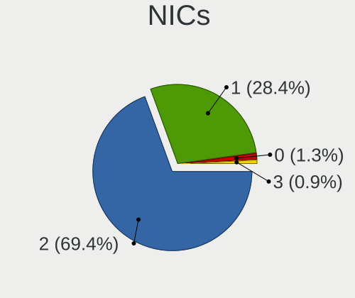

| Total | Notebooks | Percent |
|-------|-----------|---------|
| 2     | 6084      | 69.44%  |
| 1     | 2485      | 28.36%  |
| 0     | 117       | 1.34%   |
| 3     | 76        | 0.87%   |

IPv6
----

IPv6 vs IPv4

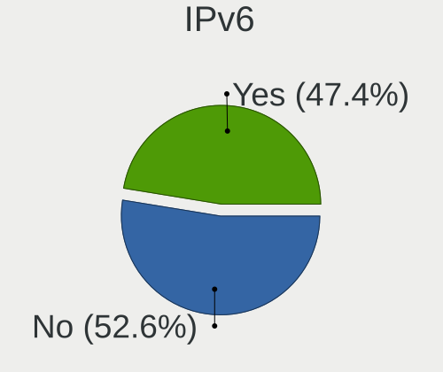

| Used | Notebooks | Percent |
|------|-----------|---------|
| No   | 4773      | 52.57%  |
| Yes  | 4306      | 47.43%  |

Bluetooth
---------

Bluetooth Vendor
----------------

Controller vendors

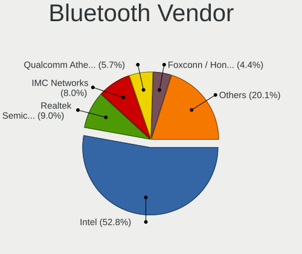

| Vendor                          | Notebooks | Percent |
|---------------------------------|-----------|---------|
| Intel                           | 3697      | 52.83%  |
| Realtek Semiconductor           | 627       | 8.96%   |
| IMC Networks                    | 557       | 7.96%   |
| Qualcomm Atheros Communications | 402       | 5.74%   |
| Foxconn / Hon Hai               | 307       | 4.39%   |
| Broadcom                        | 292       | 4.17%   |
| Lite-On Technology              | 236       | 3.37%   |
| Apple                           | 200       | 2.86%   |
| Dell                            | 142       | 2.03%   |
| Cambridge Silicon Radio         | 83        | 1.19%   |
| Realtek                         | 65        | 0.93%   |
| Toshiba                         | 64        | 0.91%   |
| Hewlett-Packard                 | 64        | 0.91%   |
| Ralink                          | 55        | 0.79%   |
| MediaTek                        | 52        | 0.74%   |
| ASUSTek Computer                | 36        | 0.51%   |
| Ralink Technology               | 27        | 0.39%   |
| USI                             | 22        | 0.31%   |
| Alps Electric                   | 20        | 0.29%   |
| Foxconn International           | 17        | 0.24%   |
| TP-Link                         | 10        | 0.14%   |
| Chicony Electronics             | 8         | 0.11%   |
| Unknown                         | 3         | 0.04%   |
| Taiyo Yuden                     | 2         | 0.03%   |
| Askey Computer                  | 2         | 0.03%   |
| Syntek                          | 1         | 0.01%   |
| Qcom                            | 1         | 0.01%   |
| Integrated System Solution      | 1         | 0.01%   |
| Fujitsu                         | 1         | 0.01%   |
| Edimax Technology               | 1         | 0.01%   |
| D-Link System                   | 1         | 0.01%   |
| Corsair                         | 1         | 0.01%   |
| AICSemi                         | 1         | 0.01%   |

Bluetooth Model
---------------

Controller models

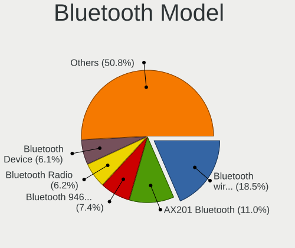

| Model                                               | Notebooks | Percent |
|-----------------------------------------------------|-----------|---------|
| Intel Bluetooth wireless interface                  | 1293      | 18.46%  |
| Intel AX201 Bluetooth                               | 772       | 11.02%  |
| Intel Bluetooth 9460/9560 Jefferson Peak (JfP)      | 518       | 7.4%    |
| Realtek Bluetooth Radio                             | 436       | 6.23%   |
| Intel Bluetooth Device                              | 427       | 6.1%    |
| Intel AX200 Bluetooth                               | 328       | 4.68%   |
| Qualcomm Atheros  Bluetooth Device                  | 167       | 2.38%   |
| IMC Networks Bluetooth Radio                        | 164       | 2.34%   |
| IMC Networks Bluetooth Device                       | 153       | 2.18%   |
| IMC Networks Wireless_Device                        | 138       | 1.97%   |
| Realtek  Bluetooth 4.2 Adapter                      | 124       | 1.77%   |
| Apple Bluetooth Host Controller                     | 111       | 1.58%   |
| Intel Centrino Bluetooth Wireless Transceiver       | 109       | 1.56%   |
| Intel AX210 Bluetooth                               | 92        | 1.31%   |
| Foxconn / Hon Hai Bluetooth Device                  | 92        | 1.31%   |
| Cambridge Silicon Radio Bluetooth Dongle (HCI mode) | 83        | 1.19%   |
| Foxconn / Hon Hai Wireless_Device                   | 76        | 1.09%   |
| Lite-On Qualcomm Atheros QCA9377 Bluetooth          | 75        | 1.07%   |
| Qualcomm Atheros QCA61x4 Bluetooth 4.0              | 72        | 1.03%   |
| Qualcomm Atheros AR3012 Bluetooth 4.0               | 71        | 1.01%   |
| Intel Wireless-AC 9260 Bluetooth Adapter            | 67        | 0.96%   |
| Realtek Bluetooth Radio                             | 65        | 0.93%   |
| Apple Bluetooth USB Host Controller                 | 65        | 0.93%   |
| Qualcomm Atheros AR3011 Bluetooth                   | 64        | 0.91%   |
| Lite-On Bluetooth Device                            | 63        | 0.9%    |
| Foxconn / Hon Hai MediaTek Bluetooth Adapter        | 61        | 0.87%   |
| Dell DW375 Bluetooth Module                         | 60        | 0.86%   |
| Ralink RT3290 Bluetooth                             | 55        | 0.79%   |
| Intel Wireless-AC 3168 Bluetooth                    | 50        | 0.71%   |
| MediaTek Wireless_Device                            | 46        | 0.66%   |
| Broadcom BCM20702 Bluetooth 4.0 [ThinkPad]          | 45        | 0.64%   |
| Broadcom BCM2045B (BDC-2.1)                         | 45        | 0.64%   |
| Intel Centrino Advanced-N 6230 Bluetooth adapter    | 39        | 0.56%   |
| Lite-On Atheros AR3012 Bluetooth                    | 38        | 0.54%   |
| HP Broadcom 2070 Bluetooth Combo                    | 38        | 0.54%   |
| IMC Networks Atheros AR3012 Bluetooth 4.0 Adapter   | 37        | 0.53%   |
| Dell BCM20702A0 Bluetooth Module                    | 36        | 0.51%   |
| Broadcom BCM43142A0 Bluetooth Device                | 33        | 0.47%   |
| Realtek RTL8723B Bluetooth                          | 28        | 0.4%    |
| Toshiba Bluetooth Device                            | 27        | 0.39%   |

Sound
-----

Sound Vendor
------------

Sound card vendors

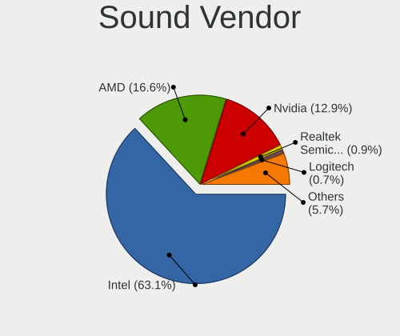

| Vendor                                       | Notebooks | Percent |
|----------------------------------------------|-----------|---------|
| Intel                                        | 6957      | 63.13%  |
| AMD                                          | 1832      | 16.62%  |
| Nvidia                                       | 1422      | 12.9%   |
| Realtek Semiconductor                        | 101       | 0.92%   |
| Logitech                                     | 75        | 0.68%   |
| GN Netcom                                    | 68        | 0.62%   |
| Hewlett-Packard                              | 48        | 0.44%   |
| C-Media Electronics                          | 48        | 0.44%   |
| Lenovo                                       | 39        | 0.35%   |
| Plantronics                                  | 35        | 0.32%   |
| JMTek                                        | 31        | 0.28%   |
| Kingston Technology                          | 23        | 0.21%   |
| Texas Instruments                            | 19        | 0.17%   |
| Corsair                                      | 18        | 0.16%   |
| Sony                                         | 17        | 0.15%   |
| Silicon Integrated Systems [SiS]             | 16        | 0.15%   |
| Generalplus Technology                       | 16        | 0.15%   |
| ASUSTek Computer                             | 14        | 0.13%   |
| SteelSeries ApS                              | 13        | 0.12%   |
| DSEA A/S                                     | 13        | 0.12%   |
| Apple                                        | 12        | 0.11%   |
| Razer USA                                    | 11        | 0.1%    |
| Focusrite-Novation                           | 11        | 0.1%    |
| Jieli Technology                             | 9         | 0.08%   |
| Conexant Systems                             | 6         | 0.05%   |
| Walmart                                      | 5         | 0.05%   |
| RODE Microphones                             | 5         | 0.05%   |
| PreSonus Audio Electronics                   | 5         | 0.05%   |
| Creative Technology                          | 5         | 0.05%   |
| Zoran Co. Personal Media Division (Nogatech) | 4         | 0.04%   |
| VIA Technologies                             | 4         | 0.04%   |
| JBL                                          | 4         | 0.04%   |
| Blue Microphones                             | 4         | 0.04%   |
| Roland                                       | 3         | 0.03%   |
| ROCCAT                                       | 3         | 0.03%   |
| No brand                                     | 3         | 0.03%   |
| Microsoft                                    | 3         | 0.03%   |
| M-Audio                                      | 3         | 0.03%   |
| KTMicro                                      | 3         | 0.03%   |
| Elitegroup Computer Systems (ECS)            | 3         | 0.03%   |

Sound Model
-----------

Sound card models

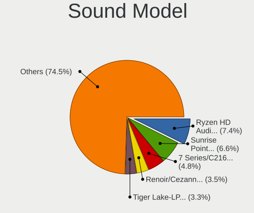

| Model                                                                      | Notebooks | Percent |
|----------------------------------------------------------------------------|-----------|---------|
| AMD Ryzen HD Audio Controller                                              | 987       | 7.39%   |
| Intel Sunrise Point-LP HD Audio                                            | 879       | 6.58%   |
| Intel 7 Series/C216 Chipset Family High Definition Audio Controller        | 639       | 4.79%   |
| AMD Renoir/Cezanne HDMI/DP Audio Controller                                | 467       | 3.5%    |
| Intel Tiger Lake-LP Smart Sound Technology Audio Controller                | 436       | 3.27%   |
| Intel 6 Series/C200 Series Chipset Family High Definition Audio Controller | 407       | 3.05%   |
| Intel Cannon Lake PCH cAVS                                                 | 373       | 2.79%   |
| Intel 82801I (ICH9 Family) HD Audio Controller                             | 370       | 2.77%   |
| Intel 8 Series/C220 Series Chipset High Definition Audio Controller        | 331       | 2.48%   |
| Intel 8 Series HD Audio Controller                                         | 328       | 2.46%   |
| Intel 5 Series/3400 Series Chipset High Definition Audio                   | 328       | 2.46%   |
| Intel Haswell-ULT HD Audio Controller                                      | 325       | 2.43%   |
| Intel Broadwell-U Audio Controller                                         | 290       | 2.17%   |
| Intel Wildcat Point-LP High Definition Audio Controller                    | 284       | 2.13%   |
| Intel Alder Lake PCH-P High Definition Audio Controller                    | 283       | 2.12%   |
| Intel Xeon E3-1200 v3/4th Gen Core Processor HD Audio Controller           | 275       | 2.06%   |
| AMD Radeon High Definition Audio Controller                                | 267       | 2%      |
| AMD FCH Azalia Controller                                                  | 257       | 1.93%   |
| Intel Cannon Point-LP High Definition Audio Controller                     | 239       | 1.79%   |
| AMD Raven/Raven2/Fenghuang HDMI/DP Audio Controller                        | 233       | 1.75%   |
| Intel Comet Lake PCH-LP cAVS                                               | 229       | 1.72%   |
| AMD Kabini HDMI/DP Audio                                                   | 202       | 1.51%   |
| Intel Celeron/Pentium Silver Processor High Definition Audio               | 170       | 1.27%   |
| Intel 100 Series/C230 Series Chipset Family HD Audio Controller            | 169       | 1.27%   |
| Intel Comet Lake PCH cAVS                                                  | 167       | 1.25%   |
| Intel Raptor Lake-P/U/H cAVS                                               | 164       | 1.23%   |
| Intel CM238 HD Audio Controller                                            | 158       | 1.18%   |
| Intel 82801H (ICH8 Family) HD Audio Controller                             | 147       | 1.1%    |
| Intel Tiger Lake-H HD Audio Controller                                     | 137       | 1.03%   |
| AMD SBx00 Azalia (Intel HDA)                                               | 129       | 0.97%   |
| Nvidia TU107 GeForce GTX 1650 High Definition Audio Controller             | 123       | 0.92%   |
| AMD Family 15h (Models 60h-6fh) Audio Controller                           | 114       | 0.85%   |
| Nvidia GP107GL High Definition Audio Controller                            | 106       | 0.79%   |
| Nvidia GF108 High Definition Audio Controller                              | 106       | 0.79%   |
| Nvidia GA106 High Definition Audio Controller                              | 103       | 0.77%   |
| Intel NM10/ICH7 Family High Definition Audio Controller                    | 102       | 0.76%   |
| Intel Atom Processor Z36xxx/Z37xxx Series High Definition Audio Controller | 102       | 0.76%   |
| Nvidia TU106 High Definition Audio Controller                              | 100       | 0.75%   |
| Intel Ice Lake-LP Smart Sound Technology Audio Controller                  | 100       | 0.75%   |
| Realtek Semiconductor USB Audio                                            | 99        | 0.74%   |

Memory
------

Memory Vendor
-------------

Memory module vendors

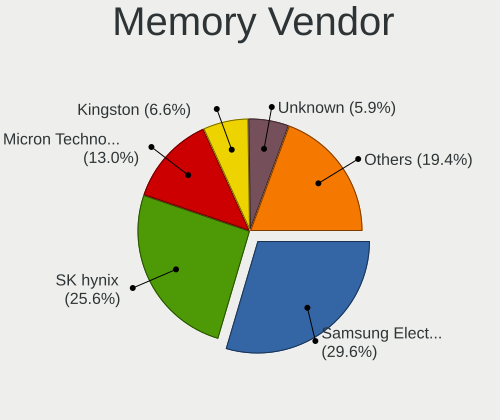

| Vendor              | Notebooks | Percent |
|---------------------|-----------|---------|
| Samsung Electronics | 2074      | 29.57%  |
| SK hynix            | 1798      | 25.63%  |
| Micron Technology   | 912       | 13%     |
| Kingston            | 461       | 6.57%   |
| Unknown             | 411       | 5.86%   |
| Crucial             | 349       | 4.98%   |
| Elpida              | 135       | 1.92%   |
| Ramaxel Technology  | 120       | 1.71%   |
| Corsair             | 115       | 1.64%   |
| A-DATA Technology   | 103       | 1.47%   |
| Unknown (ABCD)      | 96        | 1.37%   |
| Nanya Technology    | 91        | 1.3%    |
| G.Skill             | 90        | 1.28%   |
| Unknown             | 90        | 1.28%   |
| Transcend           | 17        | 0.24%   |
| Timetec             | 10        | 0.14%   |
| ASint Technology    | 9         | 0.13%   |
| TEXTORM             | 7         | 0.1%    |
| Team                | 7         | 0.1%    |
| Patriot             | 7         | 0.1%    |
| Apacer              | 7         | 0.1%    |
| Qimonda             | 5         | 0.07%   |
| PNY                 | 5         | 0.07%   |
| Toshiba             | 4         | 0.06%   |
| Neo Forza           | 4         | 0.06%   |
| Lexar               | 4         | 0.06%   |
| 8CFD000080AD        | 4         | 0.06%   |
| V-Color             | 3         | 0.04%   |
| Unknown (0x0C97)    | 3         | 0.04%   |
| Silicon Power       | 3         | 0.04%   |
| SHARETRONIC         | 3         | 0.04%   |
| 48spaces            | 3         | 0.04%   |
| Wilk                | 2         | 0.03%   |
| Unknown (0x0E9D)    | 2         | 0.03%   |
| Unknown (0x0080)    | 2         | 0.03%   |
| Lexar Co Limited    | 2         | 0.03%   |
| Kllisre             | 2         | 0.03%   |
| Goldkey             | 2         | 0.03%   |
| ff                  | 2         | 0.03%   |
| ChangXin Memory     | 2         | 0.03%   |

Memory Model
------------

Memory module models

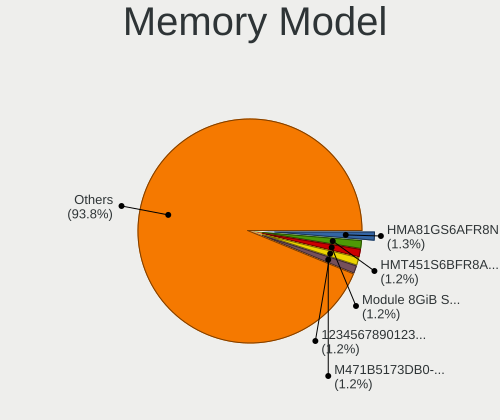

| Model                                                            | Notebooks | Percent |
|------------------------------------------------------------------|-----------|---------|
| SK hynix RAM HMA81GS6AFR8N-UH 8GB SODIMM DDR4 2667MT/s           | 96        | 1.3%    |
| SK hynix RAM HMT451S6BFR8A-PB 4GB SODIMM DDR3 1600MT/s           | 92        | 1.25%   |
| Unknown                                                          | 90        | 1.22%   |
| Unknown (ABCD) RAM 123456789012345678 2GB SODIMM LPDDR4 2400MT/s | 89        | 1.21%   |
| Samsung RAM M471B5173DB0-YK0 4GB SODIMM DDR3 1600MT/s            | 89        | 1.21%   |
| Samsung RAM M471A5244CB0-CTD 4GB SODIMM DDR4 3266MT/s            | 89        | 1.21%   |
| Samsung RAM M471A1G44AB0-CWE 8GiB SODIMM DDR4 3200MT/s           | 88        | 1.19%   |
| Samsung RAM M471B5173QH0-YK0 4GB SODIMM DDR3 1600MT/s            | 80        | 1.09%   |
| Samsung RAM M471B5273DH0-CH9 4GB SODIMM DDR3 1600MT/s            | 68        | 0.92%   |
| Samsung RAM M471B5173EB0-YK0 4GB SODIMM DDR3 1600MT/s            | 65        | 0.88%   |
| SK hynix RAM HMT351S6CFR8C-PB 4GB SODIMM DDR3 1600MT/s           | 60        | 0.81%   |
| SK hynix RAM HMAA1GS6CJR6N-XN 8GB SODIMM DDR4 3200MT/s           | 59        | 0.8%    |
| Samsung RAM M471A1K43DB1-CWE 8GB SODIMM DDR4 3200MT/s            | 59        | 0.8%    |
| Samsung RAM M471B1G73DB0-YK0 8GB SODIMM DDR3 1600MT/s            | 57        | 0.77%   |
| Samsung RAM M471A1K43EB1-CWE 8GB SODIMM DDR4 3200MT/s            | 57        | 0.77%   |
| SK hynix RAM HMA81GS6DJR8N-XN 8GB SODIMM DDR4 3200MT/s           | 54        | 0.73%   |
| Samsung RAM M471A1K43CB1-CRC 8GB SODIMM DDR4 8400MT/s            | 54        | 0.73%   |
| Samsung RAM M471B5273CH0-CH9 4GB SODIMM DDR3 1334MT/s            | 53        | 0.72%   |
| Samsung RAM M471A1K43CB1-CTD 8GB SODIMM DDR4 3200MT/s            | 53        | 0.72%   |
| SK hynix RAM HMT41GS6BFR8A-PB 8GB SODIMM DDR3 2667MT/s           | 50        | 0.68%   |
| SK hynix RAM HMT451S6AFR8A-PB 4GB SODIMM DDR3 1600MT/s           | 46        | 0.62%   |
| SK hynix RAM HMA81GS6JJR8N-VK 8GB SODIMM DDR4 2667MT/s           | 46        | 0.62%   |
| SK hynix RAM HMAA2GS6CJR8N-XN 16GB SODIMM DDR4 3200MT/s          | 42        | 0.57%   |
| Samsung RAM M471A5244CB0-CWE 4GB SODIMM DDR4 3200MT/s            | 40        | 0.54%   |
| Unknown RAM Module 2GB SODIMM DDR2 667MT/s                       | 36        | 0.49%   |
| Samsung RAM M471A5244CB0-CRC 4GB SODIMM DDR4 2667MT/s            | 36        | 0.49%   |
| Samsung RAM M471A1G44BB0-CWE 8GB SODIMM DDR4 3200MT/s            | 36        | 0.49%   |
| Samsung RAM M471B1G73QH0-YK0 8GB SODIMM DDR3 1600MT/s            | 35        | 0.48%   |
| Samsung RAM M471A1K43DB1-CTD 8GB SODIMM DDR4 2667MT/s            | 33        | 0.45%   |
| SK hynix RAM HMA81GS6CJR8N-VK 8GB SODIMM DDR4 2667MT/s           | 30        | 0.41%   |
| SK hynix RAM HMA41GS6AFR8N-TF 8GB SODIMM DDR4 2667MT/s           | 30        | 0.41%   |
| SK hynix RAM HMT351S6EFR8A-PB 4GB SODIMM DDR3 1600MT/s           | 29        | 0.39%   |
| Micron RAM Module 4GB SODIMM DDR3 1600MT/s                       | 29        | 0.39%   |
| Micron RAM 4ATF1G64HZ-3G2E1 8GB Row Of Chips DDR4 3200MT/s       | 29        | 0.39%   |
| SK hynix RAM HMA82GS6CJR8N-VK 16GB SODIMM DDR4 2667MT/s          | 28        | 0.38%   |
| Samsung RAM M471B1G73EB0-YK0 8192MB SODIMM DDR3 1600MT/s         | 28        | 0.38%   |
| Samsung RAM M471A2K43CB1-CRC 16GB SODIMM DDR4 2667MT/s           | 28        | 0.38%   |
| Micron RAM 4ATF51264HZ-3G2J1 4GB SODIMM DDR4 3200MT/s            | 28        | 0.38%   |
| Micron RAM 4ATF51264HZ-2G6E1 4GB SODIMM DDR4 2667MT/s            | 28        | 0.38%   |
| Micron RAM 4ATF1G64HZ-3G2E1 8GB SODIMM DDR4 3200MT/s             | 28        | 0.38%   |

Memory Kind
-----------

Memory module kinds

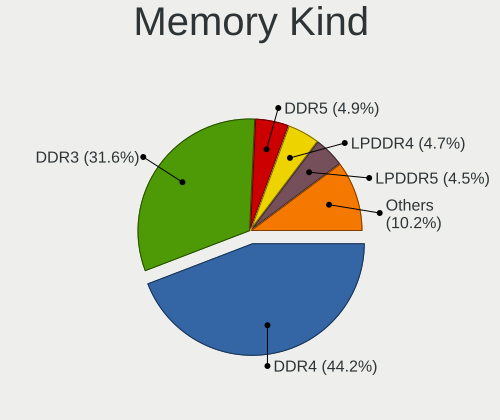

| Kind    | Notebooks | Percent |
|---------|-----------|---------|
| DDR4    | 2664      | 44.17%  |
| DDR3    | 1904      | 31.57%  |
| DDR5    | 294       | 4.87%   |
| LPDDR4  | 283       | 4.69%   |
| LPDDR5  | 270       | 4.48%   |
| DDR2    | 253       | 4.19%   |
| LPDDR3  | 151       | 2.5%    |
| SDRAM   | 141       | 2.34%   |
| Unknown | 42        | 0.7%    |
| DDR     | 20        | 0.33%   |
| DRAM    | 9         | 0.15%   |

Memory Form Factor
------------------

Physical design of the memory module

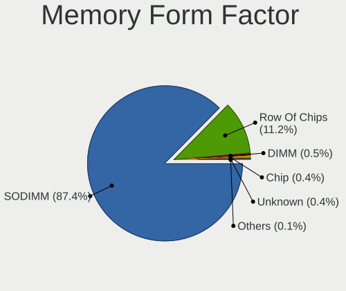

| Name            | Notebooks | Percent |
|-----------------|-----------|---------|
| SODIMM          | 5264      | 87.41%  |
| Row Of Chips    | 673       | 11.18%  |
| DIMM            | 29        | 0.48%   |
| Chip            | 27        | 0.45%   |
| Unknown         | 25        | 0.42%   |
| Proprietary Car | 4         | 0.07%   |

Memory Size
-----------

Memory module size

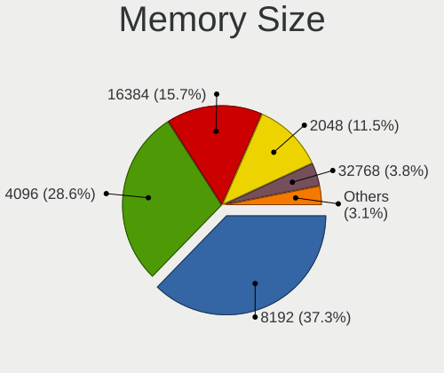

| Size  | Notebooks | Percent |
|-------|-----------|---------|
| 8192  | 2448      | 37.27%  |
| 4096  | 1882      | 28.65%  |
| 16384 | 1029      | 15.66%  |
| 2048  | 756       | 11.51%  |
| 32768 | 249       | 3.79%   |
| 1024  | 176       | 2.68%   |
| 512   | 12        | 0.18%   |
| 49152 | 8         | 0.12%   |
| 3072  | 3         | 0.05%   |
| 12288 | 2         | 0.03%   |
| 256   | 2         | 0.03%   |
| 65536 | 1         | 0.02%   |
| 6144  | 1         | 0.02%   |

Memory Speed
------------

Memory module speed

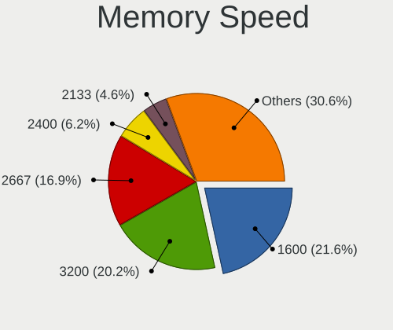

| Speed   | Notebooks | Percent |
|---------|-----------|---------|
| 1600    | 1400      | 21.59%  |
| 3200    | 1308      | 20.17%  |
| 2667    | 1095      | 16.89%  |
| 2400    | 402       | 6.2%    |
| 2133    | 296       | 4.56%   |
| 1334    | 219       | 3.38%   |
| 5600    | 174       | 2.68%   |
| 1333    | 170       | 2.62%   |
| 6400    | 163       | 2.51%   |
| 667     | 132       | 2.04%   |
| 4800    | 130       | 2%      |
| 4267    | 103       | 1.59%   |
| Unknown | 94        | 1.45%   |
| 3266    | 89        | 1.37%   |
| 1067    | 82        | 1.26%   |
| 4199    | 80        | 1.23%   |
| 800     | 77        | 1.19%   |
| 8400    | 71        | 1.09%   |
| 1867    | 68        | 1.05%   |
| 2048    | 50        | 0.77%   |
| 7500    | 40        | 0.62%   |
| 1066    | 34        | 0.52%   |
| 975     | 30        | 0.46%   |
| 8533    | 29        | 0.45%   |
| 4266    | 26        | 0.4%    |
| 7467    | 24        | 0.37%   |
| 533     | 23        | 0.35%   |
| 2933    | 15        | 0.23%   |
| 1866    | 9         | 0.14%   |
| 1639    | 8         | 0.12%   |
| 3733    | 7         | 0.11%   |
| 333     | 7         | 0.11%   |
| 5500    | 5         | 0.08%   |
| 8600    | 4         | 0.06%   |
| 3000    | 4         | 0.06%   |
| 7400    | 3         | 0.05%   |
| 2267    | 2         | 0.03%   |
| 400     | 2         | 0.03%   |
| 266     | 2         | 0.03%   |
| 8000    | 1         | 0.02%   |

Printers & scanners
-------------------

Printer Vendor
--------------

Printer device vendors

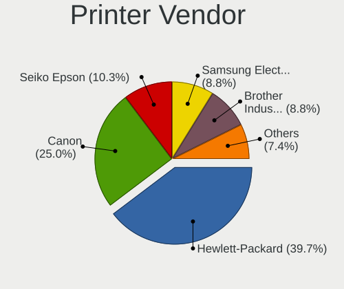

| Vendor              | Notebooks | Percent |
|---------------------|-----------|---------|
| Hewlett-Packard     | 27        | 39.71%  |
| Canon               | 17        | 25%     |
| Seiko Epson         | 7         | 10.29%  |
| Samsung Electronics | 6         | 8.82%   |
| Brother Industries  | 6         | 8.82%   |
| STMicroelectronics  | 2         | 2.94%   |
| Xiaomi              | 1         | 1.47%   |
| QinHeng Electronics | 1         | 1.47%   |
| Dymo-CoStar         | 1         | 1.47%   |

Printer Model
-------------

Printer device models

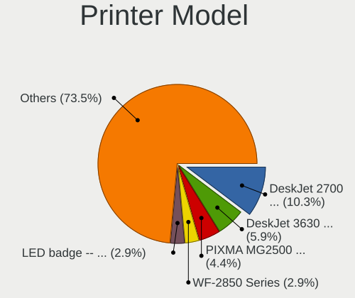

| Model                                                     | Notebooks | Percent |
|-----------------------------------------------------------|-----------|---------|
| HP DeskJet 2700 series                                    | 7         | 10.29%  |
| HP DeskJet 3630 series                                    | 4         | 5.88%   |
| Canon PIXMA MG2500 Series                                 | 3         | 4.41%   |
| STMicroelectronics LED badge -- mini LED display -- 11x44 | 2         | 2.94%   |
| Seiko Epson WF-2850 Series                                | 2         | 2.94%   |
| HP ENVY Photo 6200 series                                 | 2         | 2.94%   |
| Canon PIXMA MG3600 Series                                 | 2         | 2.94%   |
| Canon LiDE 400                                            | 2         | 2.94%   |
| Xiaomi MiMouse 2                                          | 1         | 1.47%   |
| Seiko Epson XP-255 257 Series                             | 1         | 1.47%   |
| Seiko Epson XP-2150 Series                                | 1         | 1.47%   |
| Seiko Epson Stylus NX230/SX235W Series                    | 1         | 1.47%   |
| Seiko Epson ME 340 Series/Stylus NX130 Series             | 1         | 1.47%   |
| Seiko Epson EPSON WF-3520 Series                          | 1         | 1.47%   |
| Samsung SCX-3200 Series                                   | 1         | 1.47%   |
| Samsung ML-2010P Mono Laser Printer                       | 1         | 1.47%   |
| Samsung M2070 Series                                      | 1         | 1.47%   |
| Samsung M2020 Series                                      | 1         | 1.47%   |
| Samsung CLX-3180 Series                                   | 1         | 1.47%   |
| Samsung C460 Series                                       | 1         | 1.47%   |
| QinHeng CH340S                                            | 1         | 1.47%   |
| HP Smart Tank 510 series                                  | 1         | 1.47%   |
| HP Printing Support                                       | 1         | 1.47%   |
| HP Photosmart B010 series                                 | 1         | 1.47%   |
| HP OfficeJet Pro 6970                                     | 1         | 1.47%   |
| HP OfficeJet 3830 series                                  | 1         | 1.47%   |
| HP LaserJet P2055 series                                  | 1         | 1.47%   |
| HP LaserJet M14-M17                                       | 1         | 1.47%   |
| HP LaserJet 1200                                          | 1         | 1.47%   |
| HP ENVY Photo 7800 series                                 | 1         | 1.47%   |
| HP ENVY 5540 series                                       | 1         | 1.47%   |
| HP ENVY 4500 series                                       | 1         | 1.47%   |
| HP Deskjet F4500 series                                   | 1         | 1.47%   |
| HP DeskJet 2800 series                                    | 1         | 1.47%   |
| HP DeskJet 2600 series                                    | 1         | 1.47%   |
| Dymo-CoStar LabelWriter 450                               | 1         | 1.47%   |
| Canon TS6300 series                                       | 1         | 1.47%   |
| Canon TS6100 series                                       | 1         | 1.47%   |
| Canon TS3100 series                                       | 1         | 1.47%   |
| Canon TR4700 series                                       | 1         | 1.47%   |

Scanner Vendor
--------------

Scanner device vendors

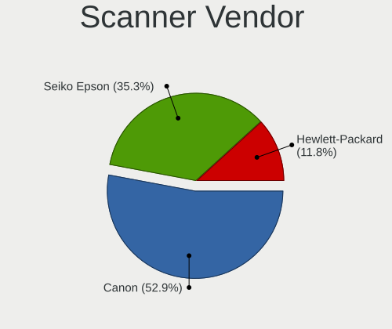

| Vendor          | Notebooks | Percent |
|-----------------|-----------|---------|
| Canon           | 9         | 52.94%  |
| Seiko Epson     | 6         | 35.29%  |
| Hewlett-Packard | 2         | 11.76%  |

Scanner Model
-------------

Scanner device models

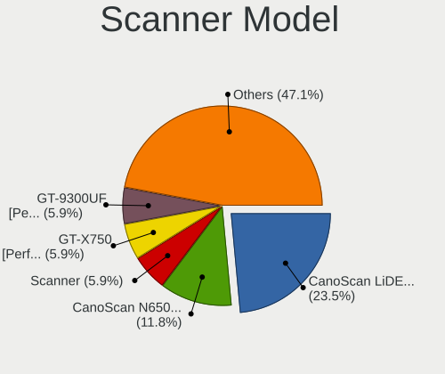

| Model                                             | Notebooks | Percent |
|---------------------------------------------------|-----------|---------|
| Canon CanoScan LiDE 110                           | 4         | 23.53%  |
| Canon CanoScan N650U/N656U                        | 2         | 11.76%  |
| Seiko Epson Scanner                               | 1         | 5.88%   |
| Seiko Epson GT-X750 [Perfection 4490 Photo]       | 1         | 5.88%   |
| Seiko Epson GT-9300UF [Perfection 2400 PHOTO]     | 1         | 5.88%   |
| Seiko Epson GT-7700U [Perfection 1240U]           | 1         | 5.88%   |
| Seiko Epson GT-7300U [Perfection 1260/1260 PHOTO] | 1         | 5.88%   |
| Seiko Epson ES-2000 [Expression 1600U]            | 1         | 5.88%   |
| HP ScanJet 82x0C                                  | 1         | 5.88%   |
| HP ScanJet 3570c                                  | 1         | 5.88%   |
| Canon CanoScan N670U/N676U/LiDE 20                | 1         | 5.88%   |
| Canon CanoScan N1240U/LiDE 30                     | 1         | 5.88%   |
| Canon CanoScan 8800F                              | 1         | 5.88%   |

Camera
------

Camera Vendor
-------------

Camera device vendors

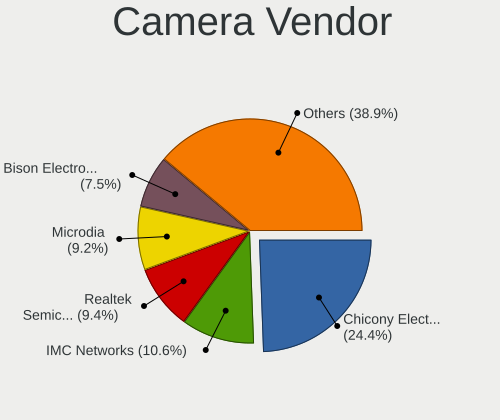

| Vendor                                 | Notebooks | Percent |
|----------------------------------------|-----------|---------|
| Chicony Electronics                    | 1909      | 24.42%  |
| IMC Networks                           | 827       | 10.58%  |
| Realtek Semiconductor                  | 731       | 9.35%   |
| Microdia                               | 716       | 9.16%   |
| Bison Electronics                      | 590       | 7.55%   |
| Sunplus Innovation Technology          | 432       | 5.53%   |
| Quanta                                 | 347       | 4.44%   |
| Cheng Uei Precision Industry (Foxlink) | 320       | 4.09%   |
| Suyin                                  | 272       | 3.48%   |
| Lite-On Technology                     | 202       | 2.58%   |
| Apple                                  | 188       | 2.41%   |
| Luxvisions Innotech Limited            | 187       | 2.39%   |
| Syntek                                 | 178       | 2.28%   |
| Alcor Micro                            | 104       | 1.33%   |
| Logitech                               | 100       | 1.28%   |
| Sonix Technology                       | 84        | 1.07%   |
| Ricoh                                  | 66        | 0.84%   |
| Silicon Motion                         | 55        | 0.7%    |
| ShineTech                              | 54        | 0.69%   |
| Samsung Electronics                    | 49        | 0.63%   |
| Acer                                   | 44        | 0.56%   |
| Primax Electronics                     | 31        | 0.4%    |
| Lenovo                                 | 26        | 0.33%   |
| SunplusIT                              | 24        | 0.31%   |
| Importek                               | 23        | 0.29%   |
| Z-Star Microelectronics                | 22        | 0.28%   |
| DigiTech                               | 21        | 0.27%   |
| ALi                                    | 20        | 0.26%   |
| icSpring                               | 19        | 0.24%   |
| Y Media                                | 13        | 0.17%   |
| kingcome                               | 11        | 0.14%   |
| GEMBIRD                                | 10        | 0.13%   |
| OmniVision Technologies                | 8         | 0.1%    |
| Microsoft                              | 8         | 0.1%    |
| Unknown                                | 8         | 0.1%    |
| Sunplus Technology                     | 7         | 0.09%   |
| Shine-optics                           | 6         | 0.08%   |
| Generalplus Technology                 | 6         | 0.08%   |
| Denron                                 | 6         | 0.08%   |
| Google                                 | 5         | 0.06%   |

Camera Model
------------

Camera device models

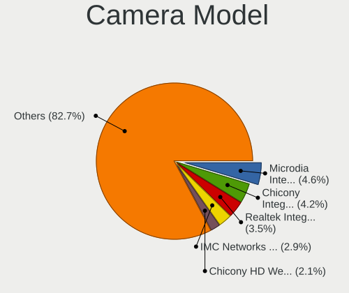

| Model                                    | Notebooks | Percent |
|------------------------------------------|-----------|---------|
| Microdia Integrated_Webcam_HD            | 365       | 4.65%   |
| Chicony Integrated Camera                | 329       | 4.19%   |
| Realtek Integrated_Webcam_HD             | 273       | 3.48%   |
| IMC Networks USB2.0 HD UVC WebCam        | 227       | 2.89%   |
| Chicony HD WebCam                        | 161       | 2.05%   |
| IMC Networks Integrated Camera           | 150       | 1.91%   |
| Bison Integrated Camera                  | 126       | 1.61%   |
| IMC Networks USB2.0 VGA UVC WebCam       | 120       | 1.53%   |
| Sunplus Integrated_Webcam_HD             | 114       | 1.45%   |
| Syntek Integrated Camera                 | 113       | 1.44%   |
| Bison HD Webcam                          | 99        | 1.26%   |
| Chicony HP HD Camera                     | 95        | 1.21%   |
| Realtek USB Camera                       | 93        | 1.18%   |
| Microdia Integrated Webcam               | 77        | 0.98%   |
| Chicony Chicony USB2.0 Camera            | 75        | 0.96%   |
| Chicony USB2.0 VGA UVC WebCam            | 72        | 0.92%   |
| Chicony USB2.0 HD UVC WebCam             | 67        | 0.85%   |
| Chicony TOSHIBA Web Camera - HD          | 67        | 0.85%   |
| Chicony HP Truevision HD                 | 66        | 0.84%   |
| Chicony HP TrueVision HD Camera          | 65        | 0.83%   |
| Apple iPhone 5/5C/5S/6/SE/7/8/X          | 64        | 0.82%   |
| Bison BisonCam,NB Pro                    | 63        | 0.8%    |
| Lite-On Integrated Camera                | 61        | 0.78%   |
| Chicony USB 2.0 Camera                   | 56        | 0.71%   |
| Sunplus Asus Webcam                      | 55        | 0.7%    |
| Suyin Acer/HP Integrated Webcam [CN0314] | 54        | 0.69%   |
| Sonix USB2.0 HD UVC WebCam               | 54        | 0.69%   |
| Quanta HP HD Camera                      | 54        | 0.69%   |
| Apple FaceTime HD Camera                 | 53        | 0.68%   |
| Chicony HP HD Webcam                     | 52        | 0.66%   |
| Quanta HD User Facing                    | 50        | 0.64%   |
| Lite-On HP HD Camera                     | 50        | 0.64%   |
| Apple Built-in iSight                    | 50        | 0.64%   |
| Samsung Galaxy series, misc. (MTP mode)  | 49        | 0.62%   |
| Alcor Micro USB 2.0 Camera               | 48        | 0.61%   |
| Realtek USB2.0 HD UVC WebCam             | 45        | 0.57%   |
| Luxvisions Innotech Limited HP HD Camera | 45        | 0.57%   |
| Bison Lenovo EasyCamera                  | 45        | 0.57%   |
| Bison BisonCam, NB Pro                   | 45        | 0.57%   |
| Microdia Integrated_Webcam_FHD           | 44        | 0.56%   |

Security
--------

Fingerprint Vendor
------------------

Fingerprint sensor vendors

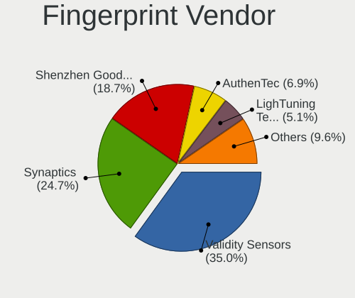

| Vendor                             | Notebooks | Percent |
|------------------------------------|-----------|---------|
| Validity Sensors                   | 453       | 34.98%  |
| Synaptics                          | 320       | 24.71%  |
| Shenzhen Goodix Technology         | 242       | 18.69%  |
| AuthenTec                          | 90        | 6.95%   |
| LighTuning Technology              | 66        | 5.1%    |
| Elan Microelectronics              | 63        | 4.86%   |
| Upek                               | 43        | 3.32%   |
| STMicroelectronics                 | 11        | 0.85%   |
| Realtek USB2.0 Finger Print Bridge | 3         | 0.23%   |
| Focal-systems.Corp                 | 3         | 0.23%   |
| HOLTEK                             | 1         | 0.08%   |

Fingerprint Model
-----------------

Fingerprint sensor models

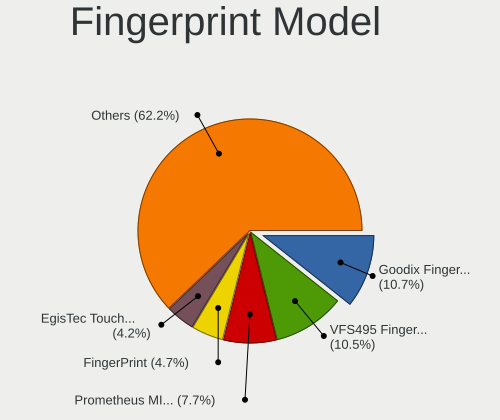

| Model                                                                      | Notebooks | Percent |
|----------------------------------------------------------------------------|-----------|---------|
| Shenzhen Goodix  Fingerprint Device                                        | 138       | 10.66%  |
| Validity Sensors VFS495 Fingerprint Reader                                 | 136       | 10.5%   |
| Synaptics Prometheus MIS Touch Fingerprint Reader                          | 100       | 7.72%   |
| Shenzhen Goodix FingerPrint                                                | 61        | 4.71%   |
| LighTuning EgisTec Touch Fingerprint Sensor                                | 55        | 4.25%   |
| Synaptics Metallica MIS Touch Fingerprint Reader                           | 45        | 3.47%   |
| Synaptics FS7604 Touch Fingerprint Sensor with PurePrint                   | 43        | 3.32%   |
| Shenzhen Goodix Fingerprint Reader                                         | 43        | 3.32%   |
| Validity Sensors VFS 5011 fingerprint sensor                               | 41        | 3.17%   |
| Elan ELAN:Fingerprint                                                      | 40        | 3.09%   |
| Upek Biometric Touchchip/Touchstrip Fingerprint Sensor                     | 38        | 2.93%   |
| AuthenTec AES2810                                                          | 32        | 2.47%   |
| Validity Sensors VFS491                                                    | 30        | 2.32%   |
| Validity Sensors VFS471 Fingerprint Reader                                 | 29        | 2.24%   |
| Validity Sensors Fingerprint scanner                                       | 29        | 2.24%   |
| Validity Sensors VFS5011 Fingerprint Reader                                | 28        | 2.16%   |
| Validity Sensors Synaptics WBDI                                            | 27        | 2.08%   |
| Validity Sensors VFS301 Fingerprint Reader                                 | 22        | 1.7%    |
| Synaptics WBDI Fingerprint Reader USB 086                                  | 22        | 1.7%    |
| Validity Sensors VFS7500 Touch Fingerprint Sensor                          | 21        | 1.62%   |
| Validity Sensors Swipe Fingerprint Sensor                                  | 21        | 1.62%   |
| Synaptics Prometheus Fingerprint Reader                                    | 21        | 1.62%   |
| Elan ELAN:ARM-M4                                                           | 21        | 1.62%   |
| Validity Sensors VFS451 Fingerprint Reader                                 | 20        | 1.54%   |
| Validity Sensors Synaptics VFS7552 Touch Fingerprint Sensor with PurePrint | 19        | 1.47%   |
| Synaptics UWP WBDI Device                                                  | 19        | 1.47%   |
| Synaptics Fingerprint reader [HP G6]                                       | 19        | 1.47%   |
| AuthenTec Fingerprint Sensor                                               | 19        | 1.47%   |
| AuthenTec AES1600                                                          | 19        | 1.47%   |
| Validity Sensors VFS Fingerprint sensor                                    | 14        | 1.08%   |
| AuthenTec AES2501 Fingerprint Sensor                                       | 12        | 0.93%   |
| Unknown                                                                    | 12        | 0.93%   |
| Synaptics  FS7604 Touch Fingerprint Sensor with PurePrint                  | 11        | 0.85%   |
| STMicroelectronics Fingerprint Reader                                      | 11        | 0.85%   |
| Validity Sensors VFS101 Fingerprint Reader                                 | 8         | 0.62%   |
| Validity Sensors VFS300 Fingerprint Reader                                 | 7         | 0.54%   |
| Synaptics WBDI Device                                                      | 6         | 0.46%   |
| LighTuning ES603 Swipe Fingerprint Sensor                                  | 6         | 0.46%   |
| Upek TCS5B Fingerprint sensor                                              | 5         | 0.39%   |
| Synaptics TouchPad                                                         | 5         | 0.39%   |

Chipcard Vendor
---------------

Chipcard module vendors

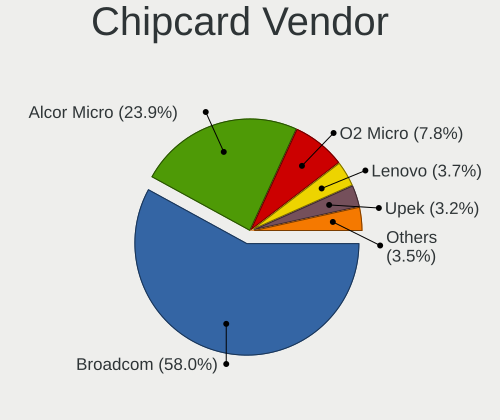

| Vendor                            | Notebooks | Percent |
|-----------------------------------|-----------|---------|
| Broadcom                          | 418       | 57.98%  |
| Alcor Micro                       | 172       | 23.86%  |
| O2 Micro                          | 56        | 7.77%   |
| Lenovo                            | 27        | 3.74%   |
| Upek                              | 23        | 3.19%   |
| Yubico.com                        | 5         | 0.69%   |
| Hewlett-Packard                   | 5         | 0.69%   |
| Gemalto (was Gemplus)             | 4         | 0.55%   |
| Clay Logic                        | 2         | 0.28%   |
| Aladdin Knowledge Systems         | 2         | 0.28%   |
| Advanced Card Systems             | 2         | 0.28%   |
| VASCO Data Security International | 1         | 0.14%   |
| SpringCard                        | 1         | 0.14%   |
| OmniKey                           | 1         | 0.14%   |
| Chicony Electronics               | 1         | 0.14%   |
| Bit4id                            | 1         | 0.14%   |

Chipcard Model
--------------

Chipcard module models

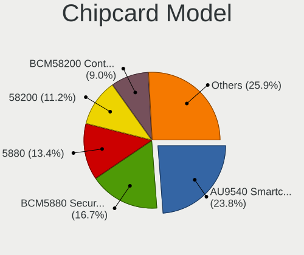

| Model                                                                        | Notebooks | Percent |
|------------------------------------------------------------------------------|-----------|---------|
| Alcor Micro AU9540 Smartcard Reader                                          | 172       | 23.79%  |
| Broadcom BCM5880 Secure Applications Processor                               | 121       | 16.74%  |
| Broadcom 5880                                                                | 97        | 13.42%  |
| Broadcom 58200                                                               | 81        | 11.2%   |
| Broadcom BCM58200 ControlVault 3 (FingerPrint sensor + Contacted SmartCard)  | 65        | 8.99%   |
| Broadcom BCM5880 Secure Applications Processor with fingerprint swipe sensor | 54        | 7.47%   |
| O2 Micro OZ776 CCID Smartcard Reader                                         | 52        | 7.19%   |
| Lenovo Integrated Smart Card Reader                                          | 26        | 3.6%    |
| Upek TouchChip Fingerprint Coprocessor (WBF advanced mode)                   | 23        | 3.18%   |
| Yubico.com Yubikey 4/5 U2F+CCID                                              | 5         | 0.69%   |
| Hewlett-Packard SC Keyboard - Apollo (Liteon)                                | 5         | 0.69%   |
| O2 Micro Oz776 SmartCard Reader                                              | 4         | 0.55%   |
| Gemalto (was Gemplus) GemPC Twin SmartCard Reader                            | 2         | 0.28%   |
| Aladdin Knowledge Systems Token JC                                           | 2         | 0.28%   |
| Advanced Card Systems ACR122U                                                | 2         | 0.28%   |
| Yubico.com Yubikey 4/5 CCID                                                  | 1         | 0.14%   |
| VASCO Data Security International Digipass 905 SmartCard Reader              | 1         | 0.14%   |
| SpringCard Two                                                               | 1         | 0.14%   |
| OmniKey 3x21 Smart Card Reader                                               | 1         | 0.14%   |
| Lenovo Smartcard Keyboard                                                    | 1         | 0.14%   |
| Gemalto (was Gemplus) GemPC Key SmartCard Reader                             | 1         | 0.14%   |
| Gemalto (was Gemplus) Compact Smart Card Reader Writer                       | 1         | 0.14%   |
| Clay Logic Nitrokey Start                                                    | 1         | 0.14%   |
| Clay Logic Nitrokey Pro                                                      | 1         | 0.14%   |
| Chicony Electronics HP Skylab USB Smartcard Keyboard                         | 1         | 0.14%   |
| Broadcom BCM5880 Secure Applications Processor with fingerprint touch sensor | 1         | 0.14%   |
| Bit4id miniLector EVO                                                        | 1         | 0.14%   |

Unsupported
-----------

Unsupported Devices
-------------------

Total unsupported devices on board

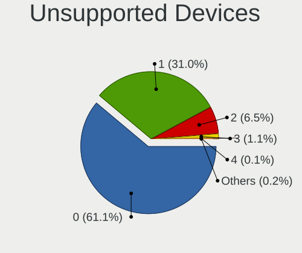

| Total | Notebooks | Percent |
|-------|-----------|---------|
| 0     | 5517      | 61.13%  |
| 1     | 2799      | 31.01%  |
| 2     | 589       | 6.53%   |
| 3     | 96        | 1.06%   |
| 4     | 10        | 0.11%   |
| 5     | 6         | 0.07%   |
| 6     | 4         | 0.04%   |
| 7     | 3         | 0.03%   |
| 8     | 1         | 0.01%   |

Unsupported Device Types
------------------------

Types of unsupported devices

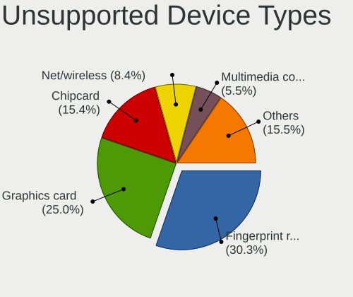

| Type                     | Notebooks | Percent |
|--------------------------|-----------|---------|
| Fingerprint reader       | 1278      | 30.3%   |
| Graphics card            | 1053      | 24.96%  |
| Chipcard                 | 649       | 15.39%  |
| Net/wireless             | 353       | 8.37%   |
| Multimedia controller    | 230       | 5.45%   |
| Camera                   | 156       | 3.7%    |
| Bluetooth                | 117       | 2.77%   |
| Storage                  | 85        | 2.02%   |
| Communication controller | 83        | 1.97%   |
| Card reader              | 72        | 1.71%   |
| Sound                    | 42        | 1%      |
| Net/ethernet             | 36        | 0.85%   |
| Modem                    | 31        | 0.73%   |
| Network                  | 14        | 0.33%   |
| Flash memory             | 5         | 0.12%   |
| Wireless                 | 2         | 0.05%   |
| Unclassified device      | 2         | 0.05%   |
| Unassigned class         | 2         | 0.05%   |
| Storage/ata              | 2         | 0.05%   |
| Dvb card                 | 2         | 0.05%   |
| Tv card                  | 1         | 0.02%   |
| Storage/raid             | 1         | 0.02%   |
| Storage/nvme             | 1         | 0.02%   |
| Firewire controller      | 1         | 0.02%   |

