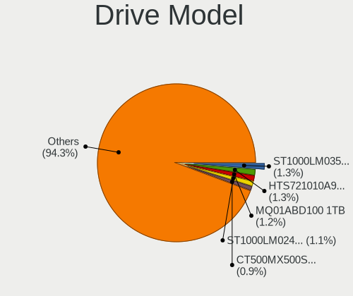
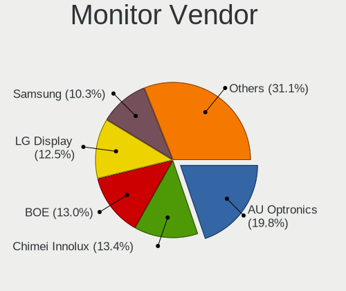
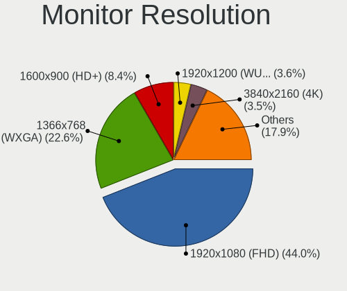
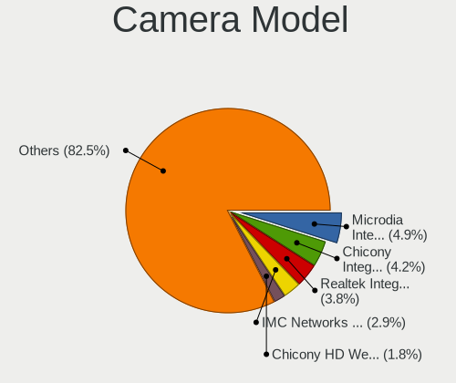

Linux in France - Tested Hardware & Statistics (Notebooks)
----------------------------------------------------------

A project to collect tested hardware configurations for Linux in France.

Anyone can contribute to this report by the [hw-probe](https://github.com/linuxhw/hw-probe) tool:

    sudo -E hw-probe -all -upload

Please contribute! Especially if your hardware is rare.

Contents
--------

* [ Test Cases ](#test-cases)

* [ System ](#system)
  - [ OS                       ](#os)
  - [ OS Family                ](#os-family)
  - [ Kernel                   ](#kernel)
  - [ Kernel Family            ](#kernel-family)
  - [ Kernel Major Ver.        ](#kernel-major-ver)
  - [ Arch                     ](#arch)
  - [ DE                       ](#de)
  - [ Display Server           ](#display-server)
  - [ Display Manager          ](#display-manager)
  - [ OS Lang                  ](#os-lang)
  - [ Boot Mode                ](#boot-mode)
  - [ Filesystem               ](#filesystem)
  - [ Part. scheme             ](#part-scheme)
  - [ Dual Boot with Linux/BSD ](#dual-boot-with-linuxbsd)
  - [ Dual Boot (Win)          ](#dual-boot-win)

* [ Board ](#board)
  - [ Vendor                   ](#vendor)
  - [ Model                    ](#model)
  - [ Model Family             ](#model-family)
  - [ MFG Year                 ](#mfg-year)
  - [ Form Factor              ](#form-factor)
  - [ Secure Boot              ](#secure-boot)
  - [ Coreboot                 ](#coreboot)
  - [ RAM Size                 ](#ram-size)
  - [ RAM Used                 ](#ram-used)
  - [ Total Drives             ](#total-drives)
  - [ Has CD-ROM               ](#has-cd-rom)
  - [ Has Ethernet             ](#has-ethernet)
  - [ Has WiFi                 ](#has-wifi)
  - [ Has Bluetooth            ](#has-bluetooth)

* [ Location ](#location)
  - [ Country                  ](#country)
  - [ City                     ](#city)

* [ Drives ](#drives)
  - [ Drive Vendor             ](#drive-vendor)
  - [ Drive Model              ](#drive-model)
  - [ HDD Vendor               ](#hdd-vendor)
  - [ SSD Vendor               ](#ssd-vendor)
  - [ Drive Kind               ](#drive-kind)
  - [ Drive Connector          ](#drive-connector)
  - [ Drive Size               ](#drive-size)
  - [ Space Total              ](#space-total)
  - [ Space Used               ](#space-used)
  - [ Malfunc. Drives          ](#malfunc-drives)
  - [ Malfunc. Drive Vendor    ](#malfunc-drive-vendor)
  - [ Malfunc. HDD Vendor      ](#malfunc-hdd-vendor)
  - [ Malfunc. Drive Kind      ](#malfunc-drive-kind)
  - [ Failed Drives            ](#failed-drives)
  - [ Failed Drive Vendor      ](#failed-drive-vendor)
  - [ Drive Status             ](#drive-status)

* [ Storage controller ](#storage-controller)
  - [ Storage Vendor           ](#storage-vendor)
  - [ Storage Model            ](#storage-model)
  - [ Storage Kind             ](#storage-kind)

* [ Processor ](#processor)
  - [ CPU Vendor               ](#cpu-vendor)
  - [ CPU Model                ](#cpu-model)
  - [ CPU Model Family         ](#cpu-model-family)
  - [ CPU Cores                ](#cpu-cores)
  - [ CPU Sockets              ](#cpu-sockets)
  - [ CPU Threads              ](#cpu-threads)
  - [ CPU Op-Modes             ](#cpu-op-modes)
  - [ CPU Microcode            ](#cpu-microcode)
  - [ CPU Microarch            ](#cpu-microarch)

* [ Graphics ](#graphics)
  - [ GPU Vendor               ](#gpu-vendor)
  - [ GPU Model                ](#gpu-model)
  - [ GPU Combo                ](#gpu-combo)
  - [ GPU Driver               ](#gpu-driver)
  - [ GPU Memory               ](#gpu-memory)

* [ Monitor ](#monitor)
  - [ Monitor Vendor           ](#monitor-vendor)
  - [ Monitor Model            ](#monitor-model)
  - [ Monitor Resolution       ](#monitor-resolution)
  - [ Monitor Diagonal         ](#monitor-diagonal)
  - [ Monitor Width            ](#monitor-width)
  - [ Aspect Ratio             ](#aspect-ratio)
  - [ Monitor Area             ](#monitor-area)
  - [ Pixel Density            ](#pixel-density)
  - [ Multiple Monitors        ](#multiple-monitors)

* [ Network ](#network)
  - [ Net Controller Vendor    ](#net-controller-vendor)
  - [ Net Controller Model     ](#net-controller-model)
  - [ Wireless Vendor          ](#wireless-vendor)
  - [ Wireless Model           ](#wireless-model)
  - [ Ethernet Vendor          ](#ethernet-vendor)
  - [ Ethernet Model           ](#ethernet-model)
  - [ Net Controller Kind      ](#net-controller-kind)
  - [ Used Controller          ](#used-controller)
  - [ NICs                     ](#nics)
  - [ IPv6                     ](#ipv6)

* [ Bluetooth ](#bluetooth)
  - [ Bluetooth Vendor         ](#bluetooth-vendor)
  - [ Bluetooth Model          ](#bluetooth-model)

* [ Sound ](#sound)
  - [ Sound Vendor             ](#sound-vendor)
  - [ Sound Model              ](#sound-model)

* [ Memory ](#memory)
  - [ Memory Vendor            ](#memory-vendor)
  - [ Memory Model             ](#memory-model)
  - [ Memory Kind              ](#memory-kind)
  - [ Memory Form Factor       ](#memory-form-factor)
  - [ Memory Size              ](#memory-size)
  - [ Memory Speed             ](#memory-speed)

* [ Printers & scanners ](#printers--scanners)
  - [ Printer Vendor           ](#printer-vendor)
  - [ Printer Model            ](#printer-model)
  - [ Scanner Vendor           ](#scanner-vendor)
  - [ Scanner Model            ](#scanner-model)

* [ Camera ](#camera)
  - [ Camera Vendor            ](#camera-vendor)
  - [ Camera Model             ](#camera-model)

* [ Security ](#security)
  - [ Fingerprint Vendor       ](#fingerprint-vendor)
  - [ Fingerprint Model        ](#fingerprint-model)
  - [ Chipcard Vendor          ](#chipcard-vendor)
  - [ Chipcard Model           ](#chipcard-model)

* [ Unsupported ](#unsupported)
  - [ Unsupported Devices      ](#unsupported-devices)
  - [ Unsupported Device Types ](#unsupported-device-types)

Test Cases
----------

Total: 10552

| Vendor        | Model                       | Probe                                                      | Date         |
|---------------|-----------------------------|------------------------------------------------------------|--------------|
| Samsung       | 940XGK                      | [7e994928cf](https://linux-hardware.org/?probe=7e994928cf) | Jan 06, 2025 |
| ASUSTek       | ROG Strix G712LV_G712LV     | [98506e2506](https://linux-hardware.org/?probe=98506e2506) | Jan 06, 2025 |
| Dell          | Latitude E6230              | [638ece1f17](https://linux-hardware.org/?probe=638ece1f17) | Jan 05, 2025 |
| Toshiba       | Satellite C670-14M          | [9e54cf257c](https://linux-hardware.org/?probe=9e54cf257c) | Jan 05, 2025 |
| Lenovo        | ThinkPad W530 2441AG6       | [20e239cb8a](https://linux-hardware.org/?probe=20e239cb8a) | Jan 05, 2025 |
| Lenovo        | 14w Gen 2 82N9              | [733559df9e](https://linux-hardware.org/?probe=733559df9e) | Jan 05, 2025 |
| Dell          | Latitude D630               | [2c3411042a](https://linux-hardware.org/?probe=2c3411042a) | Jan 05, 2025 |
| UNOWHY        | Y13G113S4EI                 | [8d772f9e5a](https://linux-hardware.org/?probe=8d772f9e5a) | Jan 05, 2025 |
| Dell          | Latitude E5470              | [57a956fe26](https://linux-hardware.org/?probe=57a956fe26) | Jan 04, 2025 |
| MSI           | Katana GF66 11UC            | [aca2d91d26](https://linux-hardware.org/?probe=aca2d91d26) | Jan 04, 2025 |
| MSI           | GP60 2PE                    | [85033de0ee](https://linux-hardware.org/?probe=85033de0ee) | Jan 04, 2025 |
| Lenovo        | G50-70 20351                | [666751867c](https://linux-hardware.org/?probe=666751867c) | Jan 04, 2025 |
| Acer          | Aspire 7530G                | [eaf2bcc73a](https://linux-hardware.org/?probe=eaf2bcc73a) | Jan 04, 2025 |
| HP            | Laptop 15-db0xxx            | [15039e5101](https://linux-hardware.org/?probe=15039e5101) | Jan 04, 2025 |
| Unknown       | Unknown                     | [4a568ea48d](https://linux-hardware.org/?probe=4a568ea48d) | Jan 03, 2025 |
| Dell          | G16 7630                    | [f98a9a65e0](https://linux-hardware.org/?probe=f98a9a65e0) | Jan 03, 2025 |
| Dell          | Inspiron 14 5425            | [573be124f2](https://linux-hardware.org/?probe=573be124f2) | Jan 03, 2025 |
| Dell          | G16 7630                    | [11b2b5a832](https://linux-hardware.org/?probe=11b2b5a832) | Jan 03, 2025 |
| Dell          | Inspiron 5405               | [e6c57490c8](https://linux-hardware.org/?probe=e6c57490c8) | Jan 02, 2025 |
| Lenovo        | IdeaPad 700-15ISK 80RU      | [b26f854f97](https://linux-hardware.org/?probe=b26f854f97) | Jan 02, 2025 |
| Toshiba       | PORTABLE-CD2017             | [addbecd45d](https://linux-hardware.org/?probe=addbecd45d) | Jan 02, 2025 |
| ASUSTek       | 1002HA                      | [c1ab481b80](https://linux-hardware.org/?probe=c1ab481b80) | Jan 02, 2025 |
| Packard Be... | EasyNote TK87               | [468680be46](https://linux-hardware.org/?probe=468680be46) | Jan 02, 2025 |
| Packard Be... | EasyNote TK87               | [d0bb5660e7](https://linux-hardware.org/?probe=d0bb5660e7) | Jan 02, 2025 |
| ASUSTek       | 1002HA                      | [6720866a96](https://linux-hardware.org/?probe=6720866a96) | Jan 02, 2025 |
| Dell          | Latitude E6230              | [8611ea969f](https://linux-hardware.org/?probe=8611ea969f) | Jan 01, 2025 |
| ASUSTek       | ZenBook UX482EG_UX482EG     | [708ed8d150](https://linux-hardware.org/?probe=708ed8d150) | Jan 01, 2025 |
| Sony          | VGN-CS11Z_T                 | [28f8386e8f](https://linux-hardware.org/?probe=28f8386e8f) | Jan 01, 2025 |
| Dell          | XPS 9315                    | [1620c81455](https://linux-hardware.org/?probe=1620c81455) | Jan 01, 2025 |
| HP            | ProBook 6560b               | [c2ae1365c2](https://linux-hardware.org/?probe=c2ae1365c2) | Dec 31, 2024 |
| Toshiba       | Satellite P200              | [a07857c808](https://linux-hardware.org/?probe=a07857c808) | Dec 31, 2024 |
| HP            | Laptop 14-cm0xxx            | [045aa245db](https://linux-hardware.org/?probe=045aa245db) | Dec 31, 2024 |
| Framework     | Laptop 13 (AMD Ryzen 704... | [8b846a3158](https://linux-hardware.org/?probe=8b846a3158) | Dec 31, 2024 |
| Framework     | Laptop 13 (AMD Ryzen 704... | [0793ac2320](https://linux-hardware.org/?probe=0793ac2320) | Dec 31, 2024 |
| Framework     | Laptop 13 (AMD Ryzen 704... | [23175f9255](https://linux-hardware.org/?probe=23175f9255) | Dec 31, 2024 |
| Lenovo        | ThinkPad T495s 20QKS12J1... | [40610d9582](https://linux-hardware.org/?probe=40610d9582) | Dec 31, 2024 |
| Lenovo        | IdeaPad 1 15IAU7 82QD       | [3d855d3f86](https://linux-hardware.org/?probe=3d855d3f86) | Dec 30, 2024 |
| Lenovo        | ThinkPad T430 2349TFK       | [976885ff78](https://linux-hardware.org/?probe=976885ff78) | Dec 30, 2024 |
| ASUSTek       | GL703VM                     | [1121e5f4ca](https://linux-hardware.org/?probe=1121e5f4ca) | Dec 30, 2024 |
| HP            | ENVY 17                     | [99fa04f0ca](https://linux-hardware.org/?probe=99fa04f0ca) | Dec 30, 2024 |
| ASUSTek       | ASUS TUF Gaming A15 FA50... | [b16417fac3](https://linux-hardware.org/?probe=b16417fac3) | Dec 30, 2024 |
| Dell          | G16 7630                    | [e7329668b8](https://linux-hardware.org/?probe=e7329668b8) | Dec 29, 2024 |
| ASUSTek       | VivoBook_ASUSLaptop X712... | [7b7d782202](https://linux-hardware.org/?probe=7b7d782202) | Dec 29, 2024 |
| Lenovo        | ThinkBook 14 G5+ APO 21J... | [1ee446218a](https://linux-hardware.org/?probe=1ee446218a) | Dec 29, 2024 |
| HP            | Notebook                    | [2fe95580ce](https://linux-hardware.org/?probe=2fe95580ce) | Dec 29, 2024 |
| Toshiba       | Satellite C70-B             | [5014d7827e](https://linux-hardware.org/?probe=5014d7827e) | Dec 29, 2024 |
| MSI           | MS-16F1                     | [9906c1fa28](https://linux-hardware.org/?probe=9906c1fa28) | Dec 28, 2024 |
| Dell          | System Inspiron N7110       | [2607b61b02](https://linux-hardware.org/?probe=2607b61b02) | Dec 27, 2024 |
| Lenovo        | ThinkPad P1 20MES1V800      | [1241156e04](https://linux-hardware.org/?probe=1241156e04) | Dec 27, 2024 |
| ASUSTek       | S551LB                      | [a6d62182b2](https://linux-hardware.org/?probe=a6d62182b2) | Dec 27, 2024 |
| Lenovo        | ThinkPad P1 20MES1V800      | [0bd80b0050](https://linux-hardware.org/?probe=0bd80b0050) | Dec 27, 2024 |
| Fujitsu Si... | ESPRIMO Mobile U9210        | [67cd7236db](https://linux-hardware.org/?probe=67cd7236db) | Dec 27, 2024 |
| Lenovo        | ThinkPad X1 Carbon Gen 1... | [47b5606cc6](https://linux-hardware.org/?probe=47b5606cc6) | Dec 27, 2024 |
| Valve         | Galileo                     | [c1ae30e981](https://linux-hardware.org/?probe=c1ae30e981) | Dec 27, 2024 |
| Lenovo        | ThinkPad T470 20HES0EV0Q    | [df7447ad48](https://linux-hardware.org/?probe=df7447ad48) | Dec 26, 2024 |
| Dell          | Latitude E6230              | [cd5bf9b8fb](https://linux-hardware.org/?probe=cd5bf9b8fb) | Dec 26, 2024 |
| ASUSTek       | N750JV                      | [39dd282ac2](https://linux-hardware.org/?probe=39dd282ac2) | Dec 26, 2024 |
| HUAWEI        | KLVL-WXX9                   | [ace84142e7](https://linux-hardware.org/?probe=ace84142e7) | Dec 26, 2024 |
| HP            | Pavilion Gaming Laptop 1... | [d811ae85fd](https://linux-hardware.org/?probe=d811ae85fd) | Dec 26, 2024 |
| Apple         | MacBookPro14,3              | [a6f60e20a6](https://linux-hardware.org/?probe=a6f60e20a6) | Dec 26, 2024 |
| ASUSTek       | G53SW                       | [89009e0426](https://linux-hardware.org/?probe=89009e0426) | Dec 26, 2024 |
| Shuttle       | NC03U                       | [7262526f1a](https://linux-hardware.org/?probe=7262526f1a) | Dec 26, 2024 |
| Dell          | Inspiron 5490               | [b8810650b5](https://linux-hardware.org/?probe=b8810650b5) | Dec 26, 2024 |
| Lenovo        | ThinkPad X390 20Q0CTO1WW    | [618303b5f9](https://linux-hardware.org/?probe=618303b5f9) | Dec 26, 2024 |
| ASUSTek       | K72Jr                       | [1d7e1a872d](https://linux-hardware.org/?probe=1d7e1a872d) | Dec 25, 2024 |
| ASUSTek       | K53SD                       | [ae48bfb917](https://linux-hardware.org/?probe=ae48bfb917) | Dec 25, 2024 |
| ASUSTek       | K53SD                       | [f20d270b1c](https://linux-hardware.org/?probe=f20d270b1c) | Dec 25, 2024 |
| Dell          | Precision M6800             | [7d37225503](https://linux-hardware.org/?probe=7d37225503) | Dec 25, 2024 |
| Lenovo        | IdeaPad Slim 5 14AHP9 83... | [d1227bd0de](https://linux-hardware.org/?probe=d1227bd0de) | Dec 25, 2024 |
| Lenovo        | ThinkPad P53 20QQS5WG00     | [8afcf6a4e5](https://linux-hardware.org/?probe=8afcf6a4e5) | Dec 25, 2024 |
| Dell          | Precision M6800             | [d5733504f6](https://linux-hardware.org/?probe=d5733504f6) | Dec 25, 2024 |
| ASUSTek       | G771JM                      | [47eab19f76](https://linux-hardware.org/?probe=47eab19f76) | Dec 25, 2024 |
| ASUSTek       | G771JM                      | [0e03d4ac45](https://linux-hardware.org/?probe=0e03d4ac45) | Dec 25, 2024 |
| ASUSTek       | ASUS Zenbook 14 UM3406HA... | [15d4c80d32](https://linux-hardware.org/?probe=15d4c80d32) | Dec 25, 2024 |
| HP            | Pavilion dv6                | [db20c486f1](https://linux-hardware.org/?probe=db20c486f1) | Dec 24, 2024 |
| Samsung       | R530/R730/P530              | [88983f374b](https://linux-hardware.org/?probe=88983f374b) | Dec 24, 2024 |
| Dell          | XPS 13 9300                 | [496f49c231](https://linux-hardware.org/?probe=496f49c231) | Dec 24, 2024 |
| HUAWEI        | KPL-W0X                     | [6bcb7835d8](https://linux-hardware.org/?probe=6bcb7835d8) | Dec 24, 2024 |
| HP            | Pavilion g7                 | [349ddf33a4](https://linux-hardware.org/?probe=349ddf33a4) | Dec 23, 2024 |
| ASUSTek       | VivoBook_ASUSLaptop M370... | [86f9503271](https://linux-hardware.org/?probe=86f9503271) | Dec 23, 2024 |
| HP            | EliteBook 855 G8 Noteboo... | [1d6bf9301c](https://linux-hardware.org/?probe=1d6bf9301c) | Dec 23, 2024 |
| Sony          | SVP1321C5E                  | [7dfbac17e9](https://linux-hardware.org/?probe=7dfbac17e9) | Dec 23, 2024 |
| MSI           | GS65 Stealth Thin 8RE       | [fe90399850](https://linux-hardware.org/?probe=fe90399850) | Dec 23, 2024 |
| Lenovo        | IdeaPad 1 15ALC7 82R4       | [20dc00eb37](https://linux-hardware.org/?probe=20dc00eb37) | Dec 23, 2024 |
| MSI           | GS65 Stealth Thin 8RE       | [3772b141b1](https://linux-hardware.org/?probe=3772b141b1) | Dec 23, 2024 |
| Dell          | Precision 7750              | [f7d88f943d](https://linux-hardware.org/?probe=f7d88f943d) | Dec 22, 2024 |
| Fujitsu       | LIFEBOOK E734               | [2009db3bc5](https://linux-hardware.org/?probe=2009db3bc5) | Dec 22, 2024 |
| ASUSTek       | X555YI                      | [220480564a](https://linux-hardware.org/?probe=220480564a) | Dec 22, 2024 |
| Unknown       | Unknown                     | [ee3d394ad4](https://linux-hardware.org/?probe=ee3d394ad4) | Dec 22, 2024 |
| Gigabyte      | P55V5                       | [5a6d2df08d](https://linux-hardware.org/?probe=5a6d2df08d) | Dec 22, 2024 |
| Dell          | Inspiron 7591               | [640a616ad8](https://linux-hardware.org/?probe=640a616ad8) | Dec 22, 2024 |
| Lenovo        | ThinkPad X1 Carbon Gen 1... | [bb6b07c2e4](https://linux-hardware.org/?probe=bb6b07c2e4) | Dec 22, 2024 |
| ASUSTek       | Vivobook Go E1404FA_E140... | [117beaf6ca](https://linux-hardware.org/?probe=117beaf6ca) | Dec 22, 2024 |
| ASUSTek       | X550CC                      | [e00f7a5c68](https://linux-hardware.org/?probe=e00f7a5c68) | Dec 22, 2024 |
| TUXEDO        | Sirius 16 Gen2              | [97191ccd49](https://linux-hardware.org/?probe=97191ccd49) | Dec 21, 2024 |
| Lenovo        | ThinkPad W541 20EGS1FB00    | [6f758495b3](https://linux-hardware.org/?probe=6f758495b3) | Dec 21, 2024 |
| MSI           | GP73 Leopard 8RE            | [57edeb7f2e](https://linux-hardware.org/?probe=57edeb7f2e) | Dec 21, 2024 |
| MSI           | CR61 2M/CX61 2OC/CX61 2O... | [7c8e20f877](https://linux-hardware.org/?probe=7c8e20f877) | Dec 21, 2024 |
| Lenovo        | IdeaPad 120S-14IAP 81A5     | [b458c0587b](https://linux-hardware.org/?probe=b458c0587b) | Dec 21, 2024 |
| Lenovo        | ThinkPad T490 20N3S2XL00    | [dd701f3856](https://linux-hardware.org/?probe=dd701f3856) | Dec 20, 2024 |
| ASUSTek       | ASUS TUF Gaming F17 FX70... | [7b099519b9](https://linux-hardware.org/?probe=7b099519b9) | Dec 20, 2024 |
| ASUSTek       | X550CL                      | [ca719e1a32](https://linux-hardware.org/?probe=ca719e1a32) | Dec 20, 2024 |
| ASUSTek       | VivoBook_ASUSLaptop X512... | [7c5e051820](https://linux-hardware.org/?probe=7c5e051820) | Dec 19, 2024 |
| HP            | Laptop 14-dk1xxx            | [e723e253d2](https://linux-hardware.org/?probe=e723e253d2) | Dec 19, 2024 |
| Acer          | TravelMate 6292             | [a81468385b](https://linux-hardware.org/?probe=a81468385b) | Dec 19, 2024 |
| Dell          | Latitude E5440              | [5adb2abeb6](https://linux-hardware.org/?probe=5adb2abeb6) | Dec 19, 2024 |
| Lenovo        | Legion 5 Pro 16ACH6H 82J... | [539c61eb30](https://linux-hardware.org/?probe=539c61eb30) | Dec 19, 2024 |
| Dell          | XPS 11 9P33                 | [ef92bd82b7](https://linux-hardware.org/?probe=ef92bd82b7) | Dec 18, 2024 |
| Lenovo        | ThinkPad A485 20RUTOEIIT    | [dc1b85e281](https://linux-hardware.org/?probe=dc1b85e281) | Dec 18, 2024 |
| Lenovo        | ThinkPad X121e 3045CTO      | [ec4cf64022](https://linux-hardware.org/?probe=ec4cf64022) | Dec 18, 2024 |
| Lenovo        | ThinkPad T400 6473D2G       | [2c03096475](https://linux-hardware.org/?probe=2c03096475) | Dec 18, 2024 |
| Dell          | Precision 3540              | [a4da59e831](https://linux-hardware.org/?probe=a4da59e831) | Dec 18, 2024 |
| ASUSTek       | UX305FA                     | [cbe75c3d89](https://linux-hardware.org/?probe=cbe75c3d89) | Dec 18, 2024 |
| ASUSTek       | X540LJ                      | [dff11ceadc](https://linux-hardware.org/?probe=dff11ceadc) | Dec 18, 2024 |
| Lenovo        | ThinkPad L580 20LXS45K00    | [59222bec94](https://linux-hardware.org/?probe=59222bec94) | Dec 18, 2024 |
| Dell          | Latitude 7400               | [ed35bf7fb4](https://linux-hardware.org/?probe=ed35bf7fb4) | Dec 18, 2024 |
| ASUSTek       | UX390UAK                    | [795d742aff](https://linux-hardware.org/?probe=795d742aff) | Dec 18, 2024 |
| ASUSTek       | ASUS Zenbook 14 UM3406HA... | [fb3afaa6bb](https://linux-hardware.org/?probe=fb3afaa6bb) | Dec 17, 2024 |
| Acer          | Aspire AV15-53P             | [c0fd375335](https://linux-hardware.org/?probe=c0fd375335) | Dec 17, 2024 |
| Valve         | Galileo                     | [92b2090648](https://linux-hardware.org/?probe=92b2090648) | Dec 17, 2024 |
| Valve         | Galileo                     | [860b42a1d3](https://linux-hardware.org/?probe=860b42a1d3) | Dec 17, 2024 |
| Lenovo        | IdeaPad 5 14ALC05 82LM      | [97f04be17e](https://linux-hardware.org/?probe=97f04be17e) | Dec 17, 2024 |
| Lenovo        | ThinkPad X270 20HMS2C003    | [d713ec0e9b](https://linux-hardware.org/?probe=d713ec0e9b) | Dec 17, 2024 |
| Toshiba       | Satellite C70-B             | [c1d411bf64](https://linux-hardware.org/?probe=c1d411bf64) | Dec 17, 2024 |
| ASUSTek       | ZenBook UX435EA_UX435EA     | [55b8b860be](https://linux-hardware.org/?probe=55b8b860be) | Dec 16, 2024 |
| Dell          | Precision 3570              | [f7ddcad19a](https://linux-hardware.org/?probe=f7ddcad19a) | Dec 16, 2024 |
| Lenovo        | ThinkPad X390 20Q0CTO1WW    | [bcd9527a31](https://linux-hardware.org/?probe=bcd9527a31) | Dec 16, 2024 |
| ASUSTek       | ASUS TUF Gaming A16 FA61... | [efacc3d2bf](https://linux-hardware.org/?probe=efacc3d2bf) | Dec 16, 2024 |
| HP            | ProBook 450 15.6 inch G9... | [8f16da3f2f](https://linux-hardware.org/?probe=8f16da3f2f) | Dec 16, 2024 |
| Lenovo        | ThinkPad R500 2714AAG       | [d4c46ae3a8](https://linux-hardware.org/?probe=d4c46ae3a8) | Dec 16, 2024 |
| HUAWEI        | KLVL-WXX9                   | [3d5e444772](https://linux-hardware.org/?probe=3d5e444772) | Dec 16, 2024 |
| Fujitsu       | LIFEBOOK E734               | [1fe6aaa34e](https://linux-hardware.org/?probe=1fe6aaa34e) | Dec 16, 2024 |
| Acer          | Aspire 5733                 | [edc4741bd8](https://linux-hardware.org/?probe=edc4741bd8) | Dec 15, 2024 |
| Sony          | SVF1521A1EW                 | [7ffea3b7db](https://linux-hardware.org/?probe=7ffea3b7db) | Dec 15, 2024 |
| Acer          | Aspire 5733                 | [b7af1c256d](https://linux-hardware.org/?probe=b7af1c256d) | Dec 15, 2024 |
| Lenovo        | Legion 5 15IMH05H 81Y6      | [4ed1aefa4d](https://linux-hardware.org/?probe=4ed1aefa4d) | Dec 14, 2024 |
| HP            | 8590                        | [5afa506c7d](https://linux-hardware.org/?probe=5afa506c7d) | Dec 14, 2024 |
| Toshiba       | Satellite Pro A50-C         | [a972bd60ee](https://linux-hardware.org/?probe=a972bd60ee) | Dec 14, 2024 |
| Acer          | Aspire A515-57              | [6f894427d4](https://linux-hardware.org/?probe=6f894427d4) | Dec 14, 2024 |
| Acer          | Aspire A315-44P             | [f9db13ebf7](https://linux-hardware.org/?probe=f9db13ebf7) | Dec 14, 2024 |
| Acer          | Aspire A315-44P             | [6f14280852](https://linux-hardware.org/?probe=6f14280852) | Dec 14, 2024 |
| Toshiba       | Satellite C50D-A-12M        | [e2983df3e5](https://linux-hardware.org/?probe=e2983df3e5) | Dec 13, 2024 |
| MSI           | GT70                        | [518f6c347b](https://linux-hardware.org/?probe=518f6c347b) | Dec 13, 2024 |
| Valve         | Galileo                     | [79f765f659](https://linux-hardware.org/?probe=79f765f659) | Dec 13, 2024 |
| Notebook      | NS50_70MU                   | [aabccaca04](https://linux-hardware.org/?probe=aabccaca04) | Dec 13, 2024 |
| Acer          | Predator PH315-51           | [e0925f342c](https://linux-hardware.org/?probe=e0925f342c) | Dec 13, 2024 |
| Toshiba       | Satellite C50D-A-12M        | [2d76f9c438](https://linux-hardware.org/?probe=2d76f9c438) | Dec 13, 2024 |
| Lenovo        | ThinkPad W530 2441AG6       | [1cae0ac2bd](https://linux-hardware.org/?probe=1cae0ac2bd) | Dec 13, 2024 |
| Dell          | Latitude 7490               | [94a563e506](https://linux-hardware.org/?probe=94a563e506) | Dec 13, 2024 |
| Lenovo        | IdeaPad Gaming 3 15ARH7 ... | [2407d824e5](https://linux-hardware.org/?probe=2407d824e5) | Dec 13, 2024 |
| HP            | Pavilion dm4                | [74c6e0eb54](https://linux-hardware.org/?probe=74c6e0eb54) | Dec 12, 2024 |
| Lenovo        | Yoga Slim 7 Pro 14ACH5 8... | [974059596f](https://linux-hardware.org/?probe=974059596f) | Dec 12, 2024 |
| HP            | 620                         | [152ec63b24](https://linux-hardware.org/?probe=152ec63b24) | Dec 12, 2024 |
| Dell          | Inspiron 5567               | [ed32d0cd28](https://linux-hardware.org/?probe=ed32d0cd28) | Dec 12, 2024 |
| Notebook      | W65_W67RZ1                  | [2d537d4d2f](https://linux-hardware.org/?probe=2d537d4d2f) | Dec 12, 2024 |
| Notebook      | W65_67SZ                    | [56e6117d69](https://linux-hardware.org/?probe=56e6117d69) | Dec 12, 2024 |
| Dell          | Inspiron 1545               | [d21ea3aaac](https://linux-hardware.org/?probe=d21ea3aaac) | Dec 12, 2024 |
| HP            | Pavilion 15                 | [6dc4f10c86](https://linux-hardware.org/?probe=6dc4f10c86) | Dec 12, 2024 |
| Framework     | Laptop                      | [ff03f6aa77](https://linux-hardware.org/?probe=ff03f6aa77) | Dec 11, 2024 |
| Lenovo        | Legion Pro 7 16ARX8H 82W... | [dd80038de7](https://linux-hardware.org/?probe=dd80038de7) | Dec 11, 2024 |
| Acer          | Swift SF314-54              | [0985707ec6](https://linux-hardware.org/?probe=0985707ec6) | Dec 11, 2024 |
| HP            | ProBook 4530s               | [e8e3959577](https://linux-hardware.org/?probe=e8e3959577) | Dec 11, 2024 |
| Dell          | Inspiron 16 5645            | [0437f5d57e](https://linux-hardware.org/?probe=0437f5d57e) | Dec 11, 2024 |
| Notebook      | NS50_70MU                   | [90e8ea0ef1](https://linux-hardware.org/?probe=90e8ea0ef1) | Dec 11, 2024 |
| ASUSTek       | X555QG                      | [4dadfdc86a](https://linux-hardware.org/?probe=4dadfdc86a) | Dec 10, 2024 |
| Lenovo        | G700 20251                  | [86190f176c](https://linux-hardware.org/?probe=86190f176c) | Dec 10, 2024 |
| ASUSTek       | UX550VD                     | [ec8a75d03e](https://linux-hardware.org/?probe=ec8a75d03e) | Dec 09, 2024 |
| Lenovo        | ThinkPad P51 20HJS16Q0K     | [ecd4468e9c](https://linux-hardware.org/?probe=ecd4468e9c) | Dec 09, 2024 |
| Acer          | Aspire A317-53              | [c1daa8622b](https://linux-hardware.org/?probe=c1daa8622b) | Dec 09, 2024 |
| ASUSTek       | UX310UA                     | [dbceea77c6](https://linux-hardware.org/?probe=dbceea77c6) | Dec 09, 2024 |
| Packard Be... | EasyNote MH36               | [f7069c0d8b](https://linux-hardware.org/?probe=f7069c0d8b) | Dec 09, 2024 |
| ASUSTek       | TUF Gaming FX504GD_FX80G... | [32b4864422](https://linux-hardware.org/?probe=32b4864422) | Dec 09, 2024 |
| MSI           | Modern 15 A11M              | [c8f5bf1e23](https://linux-hardware.org/?probe=c8f5bf1e23) | Dec 08, 2024 |
| Dell          | Inspiron 14 Plus 7440       | [b0c9087a18](https://linux-hardware.org/?probe=b0c9087a18) | Dec 08, 2024 |
| Dell          | Latitude 7280               | [7b850c81c1](https://linux-hardware.org/?probe=7b850c81c1) | Dec 08, 2024 |
| HP            | ProBook 4720s               | [9c2ccd6664](https://linux-hardware.org/?probe=9c2ccd6664) | Dec 08, 2024 |
| HP            | ProBook 4720s               | [108d0cdec6](https://linux-hardware.org/?probe=108d0cdec6) | Dec 08, 2024 |
| Dell          | Inspiron 14 Plus 7440       | [253c2d74fb](https://linux-hardware.org/?probe=253c2d74fb) | Dec 08, 2024 |
| TUXEDO        | Aura 15 Gen1                | [34f734e369](https://linux-hardware.org/?probe=34f734e369) | Dec 08, 2024 |
| Acer          | Aspire A315-24P             | [68fa0e7660](https://linux-hardware.org/?probe=68fa0e7660) | Dec 08, 2024 |
| Fujitsu Si... | ESPRIMO Mobile V6555        | [291861d530](https://linux-hardware.org/?probe=291861d530) | Dec 08, 2024 |
| Acer          | Aspire A317-54              | [bdb1888389](https://linux-hardware.org/?probe=bdb1888389) | Dec 07, 2024 |
| Dell          | XPS 15 9530                 | [181a07929f](https://linux-hardware.org/?probe=181a07929f) | Dec 07, 2024 |
| Dell          | XPS 15 9530                 | [d37a70d3c2](https://linux-hardware.org/?probe=d37a70d3c2) | Dec 07, 2024 |
| ASUSTek       | ASUS TUF Gaming F17 FX70... | [cb5e7488d1](https://linux-hardware.org/?probe=cb5e7488d1) | Dec 07, 2024 |
| Medion        | Crawler E30e                | [58ff5ef538](https://linux-hardware.org/?probe=58ff5ef538) | Dec 07, 2024 |
| HP            | Victus by Gaming Laptop ... | [b05f7c1be0](https://linux-hardware.org/?probe=b05f7c1be0) | Dec 07, 2024 |
| Lenovo        | Yoga Slim 6 14IRH8 83E0     | [04288afd41](https://linux-hardware.org/?probe=04288afd41) | Dec 07, 2024 |
| Lenovo        | Yoga Slim 6 14IRH8 83E0     | [15a58c5a9c](https://linux-hardware.org/?probe=15a58c5a9c) | Dec 07, 2024 |
| ASUSTek       | Zenbook UX3402ZA_UX3402Z... | [f0d77fead4](https://linux-hardware.org/?probe=f0d77fead4) | Dec 06, 2024 |
| HP            | EliteBook 830 G8 Noteboo... | [63ac6e048e](https://linux-hardware.org/?probe=63ac6e048e) | Dec 06, 2024 |
| Lenovo        | ThinkPad E14 Gen 2 20TA0... | [a324fb8617](https://linux-hardware.org/?probe=a324fb8617) | Dec 06, 2024 |
| Acer          | Aspire V3-771               | [44298e427a](https://linux-hardware.org/?probe=44298e427a) | Dec 06, 2024 |
| Acer          | Aspire V3-771               | [75d53f2ee5](https://linux-hardware.org/?probe=75d53f2ee5) | Dec 06, 2024 |
| Toshiba       | Satellite Pro L630          | [ea76280b19](https://linux-hardware.org/?probe=ea76280b19) | Dec 06, 2024 |
| Valve         | Galileo                     | [cabb8134bf](https://linux-hardware.org/?probe=cabb8134bf) | Dec 06, 2024 |
| HP            | EliteBook 640 14 inch G1... | [56139d2a69](https://linux-hardware.org/?probe=56139d2a69) | Dec 06, 2024 |
| TUXEDO        | InfinityBook S 15 Gen6      | [4e73bb1e03](https://linux-hardware.org/?probe=4e73bb1e03) | Dec 06, 2024 |
| ASUSTek       | GL502VS                     | [f0af5bd510](https://linux-hardware.org/?probe=f0af5bd510) | Dec 06, 2024 |
| Dell          | Precision 3591              | [af761ba6a9](https://linux-hardware.org/?probe=af761ba6a9) | Dec 05, 2024 |
| ASUSTek       | VivoBook_ASUSLaptop K660... | [d1cf3d5b2b](https://linux-hardware.org/?probe=d1cf3d5b2b) | Dec 05, 2024 |
| Lenovo        | ThinkPad E14 Gen 3 20Y70... | [48f660fc68](https://linux-hardware.org/?probe=48f660fc68) | Dec 04, 2024 |
| Lenovo        | IdeaPad 110-15ISK 80UD      | [41f2901c17](https://linux-hardware.org/?probe=41f2901c17) | Dec 04, 2024 |
| Lenovo        | ThinkBook 15 G4 ABA 21DL    | [efe5d109c6](https://linux-hardware.org/?probe=efe5d109c6) | Dec 04, 2024 |
| Apple         | MacBookPro7,1               | [c3faa55c34](https://linux-hardware.org/?probe=c3faa55c34) | Dec 04, 2024 |
| HP            | EliteBook 645 14 inch G1... | [4b12beb5b9](https://linux-hardware.org/?probe=4b12beb5b9) | Dec 04, 2024 |
| HP            | EliteBook 640 14 inch G1... | [8379915764](https://linux-hardware.org/?probe=8379915764) | Dec 04, 2024 |
| Framework     | Laptop 13 (AMD Ryzen 704... | [c12683833e](https://linux-hardware.org/?probe=c12683833e) | Dec 03, 2024 |
| Dell          | Precision 5490              | [39951259df](https://linux-hardware.org/?probe=39951259df) | Dec 03, 2024 |
| Dell          | Vostro 3491                 | [361da1df64](https://linux-hardware.org/?probe=361da1df64) | Dec 03, 2024 |
| Dell          | Precision 5540              | [9e16a34662](https://linux-hardware.org/?probe=9e16a34662) | Dec 03, 2024 |
| Apple         | MacBookPro7,1               | [a806223e92](https://linux-hardware.org/?probe=a806223e92) | Dec 03, 2024 |
| SKIKK         | Midgard                     | [f38ad9c736](https://linux-hardware.org/?probe=f38ad9c736) | Dec 03, 2024 |
| ASUSTek       | Strix GL704GM_GL704GM       | [620d235bf6](https://linux-hardware.org/?probe=620d235bf6) | Dec 03, 2024 |
| Dell          | Latitude 5540               | [671915a3df](https://linux-hardware.org/?probe=671915a3df) | Dec 02, 2024 |
| Dell          | Precision 3551              | [d04bd63889](https://linux-hardware.org/?probe=d04bd63889) | Dec 02, 2024 |
| Lenovo        | ThinkPad T495 20NJCTO1WW    | [8ad6c56f00](https://linux-hardware.org/?probe=8ad6c56f00) | Dec 02, 2024 |
| Dell          | XPS 15 9520                 | [1c01a47dcd](https://linux-hardware.org/?probe=1c01a47dcd) | Dec 02, 2024 |
| Dell          | Inspiron 15-3567            | [fffcdca9f4](https://linux-hardware.org/?probe=fffcdca9f4) | Dec 01, 2024 |
| HP            | Compaq Mini 311-1000        | [da25f2f11a](https://linux-hardware.org/?probe=da25f2f11a) | Dec 01, 2024 |
| Lenovo        | ThinkPad X1 Carbon Gen 1... | [83800e0dd2](https://linux-hardware.org/?probe=83800e0dd2) | Dec 01, 2024 |
| Acer          | Aspire V3-371               | [cfe5b2b181](https://linux-hardware.org/?probe=cfe5b2b181) | Dec 01, 2024 |
| Acer          | Aspire A315-54K             | [6b2b116a91](https://linux-hardware.org/?probe=6b2b116a91) | Dec 01, 2024 |
| HP            | ProBook 4720s               | [64ba29b9f2](https://linux-hardware.org/?probe=64ba29b9f2) | Dec 01, 2024 |
| HP            | ProBook 4720s               | [9cf24341ad](https://linux-hardware.org/?probe=9cf24341ad) | Dec 01, 2024 |
| Lenovo        | IdeaPad 3 15IML05 81WB      | [dd0f8beb36](https://linux-hardware.org/?probe=dd0f8beb36) | Dec 01, 2024 |
| Acer          | Aspire A515-56              | [fc032f32ca](https://linux-hardware.org/?probe=fc032f32ca) | Dec 01, 2024 |
| Lenovo        | IdeaPad 3 17ABA7 82RQ       | [f518a2fbc3](https://linux-hardware.org/?probe=f518a2fbc3) | Nov 30, 2024 |
| ASUSTek       | K93SV                       | [53af6a8e17](https://linux-hardware.org/?probe=53af6a8e17) | Nov 30, 2024 |
| Dell          | Latitude E6330              | [f95099755e](https://linux-hardware.org/?probe=f95099755e) | Nov 30, 2024 |
| Dell          | Latitude E6330              | [416ede7598](https://linux-hardware.org/?probe=416ede7598) | Nov 30, 2024 |
| ASUSTek       | K50IE                       | [6b1d699417](https://linux-hardware.org/?probe=6b1d699417) | Nov 30, 2024 |
| Framework     | Laptop 13 (AMD Ryzen 704... | [a4a7031be1](https://linux-hardware.org/?probe=a4a7031be1) | Nov 29, 2024 |
| HP            | ProBook 440 14 inch G9 N... | [ae8591ed7e](https://linux-hardware.org/?probe=ae8591ed7e) | Nov 29, 2024 |
| Acer          | Aspire A517-51              | [414d68892f](https://linux-hardware.org/?probe=414d68892f) | Nov 29, 2024 |
| HP            | Laptop 15s-fq0xxx           | [b9916368be](https://linux-hardware.org/?probe=b9916368be) | Nov 29, 2024 |
| HP            | Notebook                    | [f6aaab07ba](https://linux-hardware.org/?probe=f6aaab07ba) | Nov 29, 2024 |
| Dell          | Latitude 3190               | [adeae90473](https://linux-hardware.org/?probe=adeae90473) | Nov 28, 2024 |
| Dell          | Latitude E6320              | [1fbfc5b7ac](https://linux-hardware.org/?probe=1fbfc5b7ac) | Nov 28, 2024 |
| Acer          | Aspire 3830T                | [60fd51eaff](https://linux-hardware.org/?probe=60fd51eaff) | Nov 28, 2024 |
| HP            | ProBook 430 G8 Notebook ... | [4be4c4776e](https://linux-hardware.org/?probe=4be4c4776e) | Nov 27, 2024 |
| Lenovo        | ThinkPad P15 Gen 2i 20YQ... | [7e022f0097](https://linux-hardware.org/?probe=7e022f0097) | Nov 27, 2024 |
| Toshiba       | Satellite L300              | [5f14b73409](https://linux-hardware.org/?probe=5f14b73409) | Nov 27, 2024 |
| Dell          | G16 7630                    | [c5c762f132](https://linux-hardware.org/?probe=c5c762f132) | Nov 27, 2024 |
| Lenovo        | ThinkPad X1 Carbon 6th 2... | [5f5ae67cd6](https://linux-hardware.org/?probe=5f5ae67cd6) | Nov 27, 2024 |
| ASUSTek       | T100TA                      | [8c6076c6c9](https://linux-hardware.org/?probe=8c6076c6c9) | Nov 27, 2024 |
| Dell          | Latitude E6420              | [f38a40bedf](https://linux-hardware.org/?probe=f38a40bedf) | Nov 27, 2024 |
| Samsung       | 960XGL                      | [60544dead7](https://linux-hardware.org/?probe=60544dead7) | Nov 26, 2024 |
| HP            | ENVY Notebook               | [8f8d1df803](https://linux-hardware.org/?probe=8f8d1df803) | Nov 26, 2024 |
| Packard Be... | EasyNote ML65               | [f73a0dc2f2](https://linux-hardware.org/?probe=f73a0dc2f2) | Nov 26, 2024 |
| Acer          | Nitro AN515-44              | [5d0c074a0f](https://linux-hardware.org/?probe=5d0c074a0f) | Nov 26, 2024 |
| Dell          | Latitude 7300               | [0b6efce6e2](https://linux-hardware.org/?probe=0b6efce6e2) | Nov 26, 2024 |
| ASUSTek       | VivoBook_ASUSLaptop K650... | [d58ccbdbd5](https://linux-hardware.org/?probe=d58ccbdbd5) | Nov 25, 2024 |
| Apple         | MacBook5,1                  | [c9bc1374b3](https://linux-hardware.org/?probe=c9bc1374b3) | Nov 25, 2024 |
| Lenovo        | ThinkPad P53 20QQS5WG00     | [1fcd89b3c9](https://linux-hardware.org/?probe=1fcd89b3c9) | Nov 24, 2024 |
| Dell          | Inspiron 5480               | [ce8745ed99](https://linux-hardware.org/?probe=ce8745ed99) | Nov 24, 2024 |
| Acer          | Aspire 3830T                | [50275fc28d](https://linux-hardware.org/?probe=50275fc28d) | Nov 24, 2024 |
| Acer          | Swift SF114-32              | [388ad0b976](https://linux-hardware.org/?probe=388ad0b976) | Nov 24, 2024 |
| HP            | OMEN by Gaming Laptop 16... | [424de7c996](https://linux-hardware.org/?probe=424de7c996) | Nov 24, 2024 |
| HP            | Notebook                    | [b00a743ec2](https://linux-hardware.org/?probe=b00a743ec2) | Nov 24, 2024 |
| HP            | Notebook                    | [f69f443717](https://linux-hardware.org/?probe=f69f443717) | Nov 24, 2024 |
| Valve         | Jupiter                     | [4bf52db455](https://linux-hardware.org/?probe=4bf52db455) | Nov 23, 2024 |
| HP            | Laptop 15-bs0xx             | [a3855fbdfb](https://linux-hardware.org/?probe=a3855fbdfb) | Nov 23, 2024 |
| HP            | Laptop 15-bs0xx             | [7db016c5fb](https://linux-hardware.org/?probe=7db016c5fb) | Nov 23, 2024 |
| Notebook      | W65_67SC                    | [310f0e36ad](https://linux-hardware.org/?probe=310f0e36ad) | Nov 23, 2024 |
| Lenovo        | IdeaPad 3 15ALC6 82KU       | [9e6d368a29](https://linux-hardware.org/?probe=9e6d368a29) | Nov 23, 2024 |
| MSI           | GE72 2QC                    | [18bcf97e52](https://linux-hardware.org/?probe=18bcf97e52) | Nov 23, 2024 |
| Toshiba       | Satellite L500              | [e84f351148](https://linux-hardware.org/?probe=e84f351148) | Nov 23, 2024 |
| HP            | Notebook                    | [d7db4f31e7](https://linux-hardware.org/?probe=d7db4f31e7) | Nov 23, 2024 |
| Apple         | MacBookPro5,5               | [2ccd8e4d15](https://linux-hardware.org/?probe=2ccd8e4d15) | Nov 23, 2024 |
| ASUSTek       | VivoBook_ASUSLaptop S560... | [c80e9bcd59](https://linux-hardware.org/?probe=c80e9bcd59) | Nov 22, 2024 |
| ASUSTek       | N550JV                      | [9601e6c7a2](https://linux-hardware.org/?probe=9601e6c7a2) | Nov 22, 2024 |
| HP            | ZBook 14 G2                 | [82774b98d1](https://linux-hardware.org/?probe=82774b98d1) | Nov 22, 2024 |
| HP            | Notebook                    | [bb9e0faf8f](https://linux-hardware.org/?probe=bb9e0faf8f) | Nov 22, 2024 |
| Unknown       | AX16PRO                     | [97a667e749](https://linux-hardware.org/?probe=97a667e749) | Nov 21, 2024 |
| Dell          | Precision 5490              | [32bacf2696](https://linux-hardware.org/?probe=32bacf2696) | Nov 21, 2024 |
| Valve         | Jupiter                     | [3011f248cc](https://linux-hardware.org/?probe=3011f248cc) | Nov 21, 2024 |
| Lenovo        | ThinkPad X270 W10DG 20K5... | [65b049cc4d](https://linux-hardware.org/?probe=65b049cc4d) | Nov 20, 2024 |
| Notebook      | NJx0PU                      | [08850b8a76](https://linux-hardware.org/?probe=08850b8a76) | Nov 20, 2024 |
| HP            | Pavilion dv7                | [bad29ac9c4](https://linux-hardware.org/?probe=bad29ac9c4) | Nov 20, 2024 |
| Dell          | Latitude 7300               | [f4e36dc49a](https://linux-hardware.org/?probe=f4e36dc49a) | Nov 20, 2024 |
| Dell          | Latitude 7300               | [9d34bce80e](https://linux-hardware.org/?probe=9d34bce80e) | Nov 20, 2024 |
| ASUSTek       | ZenBook UX325EA_UX325EA     | [7a54d6e427](https://linux-hardware.org/?probe=7a54d6e427) | Nov 20, 2024 |
| Toshiba       | Satellite Pro C50-A-1L6     | [aef1b82a78](https://linux-hardware.org/?probe=aef1b82a78) | Nov 20, 2024 |
| Lenovo        | ThinkPad T14s Gen 6 21M1... | [a3efffbb86](https://linux-hardware.org/?probe=a3efffbb86) | Nov 20, 2024 |
| Lenovo        | ThinkPad L430 24662N5       | [3f365656fe](https://linux-hardware.org/?probe=3f365656fe) | Nov 20, 2024 |
| Dell          | Inspiron 7591               | [850f3ea624](https://linux-hardware.org/?probe=850f3ea624) | Nov 20, 2024 |
| Lenovo        | ThinkPad P50 20EQS3FS00     | [a4e3b80ed2](https://linux-hardware.org/?probe=a4e3b80ed2) | Nov 19, 2024 |
| eMachines     | E527                        | [8551ba8117](https://linux-hardware.org/?probe=8551ba8117) | Nov 19, 2024 |
| Lenovo        | IdeaPad Slim 5 16ABR8 82... | [2720f635d1](https://linux-hardware.org/?probe=2720f635d1) | Nov 19, 2024 |
| ASUSTek       | ROG Zephyrus G14 GA401IV... | [b2a47cfa3d](https://linux-hardware.org/?probe=b2a47cfa3d) | Nov 18, 2024 |
| Apple         | MacBookPro5,5               | [3f2eff0083](https://linux-hardware.org/?probe=3f2eff0083) | Nov 18, 2024 |
| Dell          | Latitude E6330              | [8cac9a5ccf](https://linux-hardware.org/?probe=8cac9a5ccf) | Nov 18, 2024 |
| HP            | EliteBook 840 14 inch G1... | [3781e48de2](https://linux-hardware.org/?probe=3781e48de2) | Nov 18, 2024 |
| HP            | Notebook                    | [9ec4cde8a4](https://linux-hardware.org/?probe=9ec4cde8a4) | Nov 18, 2024 |
| Apple         | MacBook5,1                  | [fc4768f63d](https://linux-hardware.org/?probe=fc4768f63d) | Nov 17, 2024 |
| Apple         | MacBookPro5,5               | [001f8b1280](https://linux-hardware.org/?probe=001f8b1280) | Nov 17, 2024 |
| Dell          | Precision 3591              | [801c1e1581](https://linux-hardware.org/?probe=801c1e1581) | Nov 17, 2024 |
| Acer          | Aspire A515-54              | [a9a266274e](https://linux-hardware.org/?probe=a9a266274e) | Nov 17, 2024 |
| Dell          | Latitude 7390 2-in-1        | [7fc5d657c4](https://linux-hardware.org/?probe=7fc5d657c4) | Nov 16, 2024 |
| Lenovo        | ThinkPad R500 2718WYZ       | [3fdd5bf502](https://linux-hardware.org/?probe=3fdd5bf502) | Nov 16, 2024 |
| Apple         | MacBookPro2,2               | [37e593aa38](https://linux-hardware.org/?probe=37e593aa38) | Nov 16, 2024 |
| Gigabyte      | P55V5                       | [e9fe9007e0](https://linux-hardware.org/?probe=e9fe9007e0) | Nov 16, 2024 |
| Gigabyte      | P55V5                       | [4ff2bec916](https://linux-hardware.org/?probe=4ff2bec916) | Nov 16, 2024 |
| HP            | Victus by Gaming Laptop ... | [85f56f1048](https://linux-hardware.org/?probe=85f56f1048) | Nov 16, 2024 |
| Dell          | Latitude E6230              | [3140077cf6](https://linux-hardware.org/?probe=3140077cf6) | Nov 16, 2024 |
| Lenovo        | G50-30 80G0                 | [070edd2e48](https://linux-hardware.org/?probe=070edd2e48) | Nov 16, 2024 |
| ASUSTek       | ROG Zephyrus G14 GA401IV... | [5523dee900](https://linux-hardware.org/?probe=5523dee900) | Nov 15, 2024 |
| Acer          | Swift SF314-51              | [2b64cd4ec9](https://linux-hardware.org/?probe=2b64cd4ec9) | Nov 15, 2024 |
| Thomson       | NEO17C-8B1TCO               | [b5896a8529](https://linux-hardware.org/?probe=b5896a8529) | Nov 15, 2024 |
| ASUSTek       | X555LN                      | [3ec27c0daf](https://linux-hardware.org/?probe=3ec27c0daf) | Nov 15, 2024 |
| ASUSTek       | X555LN                      | [d7aa77de0d](https://linux-hardware.org/?probe=d7aa77de0d) | Nov 15, 2024 |
| HP            | Victus by Gaming Laptop ... | [315e6340af](https://linux-hardware.org/?probe=315e6340af) | Nov 15, 2024 |
| Lenovo        | ThinkPad T495s 20QKS0LG0... | [b9ac22acde](https://linux-hardware.org/?probe=b9ac22acde) | Nov 15, 2024 |
| Dell          | Inspiron 5415               | [8a5f56cb22](https://linux-hardware.org/?probe=8a5f56cb22) | Nov 15, 2024 |
| Apple         | MacBook5,1                  | [846e661f87](https://linux-hardware.org/?probe=846e661f87) | Nov 15, 2024 |
| Dell          | Inspiron 7590               | [c5273da3b8](https://linux-hardware.org/?probe=c5273da3b8) | Nov 14, 2024 |
| PC Special... | NS50MU                      | [65a6da58c1](https://linux-hardware.org/?probe=65a6da58c1) | Nov 14, 2024 |
| Fujitsu       | LIFEBOOK U727               | [0c0e1567a8](https://linux-hardware.org/?probe=0c0e1567a8) | Nov 14, 2024 |
| Apple         | MacBookPro2,2               | [e15a7c3ce8](https://linux-hardware.org/?probe=e15a7c3ce8) | Nov 14, 2024 |
| Lenovo        | ThinkPad P16s Gen 2 21HK... | [2df4516c17](https://linux-hardware.org/?probe=2df4516c17) | Nov 14, 2024 |
| Dell          | Latitude 7420               | [38595a466f](https://linux-hardware.org/?probe=38595a466f) | Nov 14, 2024 |
| HP            | EliteBook 840 G3            | [c9a14a76c9](https://linux-hardware.org/?probe=c9a14a76c9) | Nov 13, 2024 |
| Dell          | Latitude D630               | [e5a395e42a](https://linux-hardware.org/?probe=e5a395e42a) | Nov 13, 2024 |
| Dell          | Latitude 7340               | [ad73fedd66](https://linux-hardware.org/?probe=ad73fedd66) | Nov 13, 2024 |
| ASUSTek       | Zenbook UX3402ZA_UX3402Z... | [84bc4d51e7](https://linux-hardware.org/?probe=84bc4d51e7) | Nov 13, 2024 |
| Dell          | Latitude 7310               | [582bf55df3](https://linux-hardware.org/?probe=582bf55df3) | Nov 12, 2024 |
| Lenovo        | ThinkPad P51 20HJS16Q0K     | [2fe6978b43](https://linux-hardware.org/?probe=2fe6978b43) | Nov 12, 2024 |
| Lenovo        | ThinkPad X270 20HMS24F00    | [190463db3c](https://linux-hardware.org/?probe=190463db3c) | Nov 12, 2024 |
| Dell          | Latitude 7300               | [4afea027f2](https://linux-hardware.org/?probe=4afea027f2) | Nov 12, 2024 |
| ASUSTek       | VivoBook_ASUSLaptop M370... | [d655b85ff6](https://linux-hardware.org/?probe=d655b85ff6) | Nov 12, 2024 |
| TUXEDO        | Pulse 15 Gen2               | [4f8fa011cd](https://linux-hardware.org/?probe=4f8fa011cd) | Nov 12, 2024 |
| Framework     | Laptop 16 (AMD Ryzen 704... | [193f9b2369](https://linux-hardware.org/?probe=193f9b2369) | Nov 12, 2024 |
| ASUSTek       | G750JX                      | [f7a395b103](https://linux-hardware.org/?probe=f7a395b103) | Nov 12, 2024 |
| Dell          | Latitude 7310               | [6b3e5aa3ba](https://linux-hardware.org/?probe=6b3e5aa3ba) | Nov 12, 2024 |
| ASUSTek       | VivoBook_ASUSLaptop X350... | [bb36db3f35](https://linux-hardware.org/?probe=bb36db3f35) | Nov 11, 2024 |
| eMachines     | eME730                      | [babe1a68da](https://linux-hardware.org/?probe=babe1a68da) | Nov 11, 2024 |
| ASUSTek       | VivoBook_ASUSLaptop K360... | [c236922dba](https://linux-hardware.org/?probe=c236922dba) | Nov 11, 2024 |
| ASUSTek       | VivoBook_ASUSLaptop X509... | [a94e54ceca](https://linux-hardware.org/?probe=a94e54ceca) | Nov 11, 2024 |
| Fujitsu       | LIFEBOOK E780               | [b41da32715](https://linux-hardware.org/?probe=b41da32715) | Nov 11, 2024 |
| Win elemen... | M8S                         | [3b972b3f72](https://linux-hardware.org/?probe=3b972b3f72) | Nov 11, 2024 |
| RuggedPC      | RuggedBookR15               | [aa3abb03d5](https://linux-hardware.org/?probe=aa3abb03d5) | Nov 10, 2024 |
| ASUSTek       | GL553VD                     | [e47176986c](https://linux-hardware.org/?probe=e47176986c) | Nov 10, 2024 |
| XIAOMI        | Redmi Book Pro 14 2024      | [677a093651](https://linux-hardware.org/?probe=677a093651) | Nov 10, 2024 |
| UNOWHY        | Y13G012S4EI                 | [bfaec6f29f](https://linux-hardware.org/?probe=bfaec6f29f) | Nov 10, 2024 |
| Acer          | Swift SFX16-52G             | [42a63cb4c1](https://linux-hardware.org/?probe=42a63cb4c1) | Nov 10, 2024 |
| Dell          | Inspiron 7591               | [f571fee698](https://linux-hardware.org/?probe=f571fee698) | Nov 09, 2024 |
| UNOWHY        | Y13G012S4EI                 | [3578d7c78f](https://linux-hardware.org/?probe=3578d7c78f) | Nov 09, 2024 |
| Lenovo        | ThinkPad L440 20ASS11T00    | [9e63659c87](https://linux-hardware.org/?probe=9e63659c87) | Nov 09, 2024 |
| UNOWHY        | Y13G012S4EI                 | [fa37732bbf](https://linux-hardware.org/?probe=fa37732bbf) | Nov 08, 2024 |
| HP            | EliteBook 650 15.6 inch ... | [e1ec5115cc](https://linux-hardware.org/?probe=e1ec5115cc) | Nov 08, 2024 |
| HP            | ZBook 15u G6                | [e1bcd5f5b3](https://linux-hardware.org/?probe=e1bcd5f5b3) | Nov 08, 2024 |
| Lenovo        | ThinkPad X200 7458AU2       | [37097fba8e](https://linux-hardware.org/?probe=37097fba8e) | Nov 07, 2024 |
| HP            | EliteBook 840 G3            | [1c1ee8b2f3](https://linux-hardware.org/?probe=1c1ee8b2f3) | Nov 07, 2024 |
| MSI           | Thin GF63 12UCX             | [20bee02e0a](https://linux-hardware.org/?probe=20bee02e0a) | Nov 07, 2024 |
| Acer          | Aspire A315-42              | [ca4ae3882e](https://linux-hardware.org/?probe=ca4ae3882e) | Nov 06, 2024 |
| MSI           | Stealth 16Studio A13VG      | [91aabef817](https://linux-hardware.org/?probe=91aabef817) | Nov 06, 2024 |
| Unknown       | Unknown                     | [e10825d9a4](https://linux-hardware.org/?probe=e10825d9a4) | Nov 06, 2024 |
| Unknown       | Unknown                     | [385ca86468](https://linux-hardware.org/?probe=385ca86468) | Nov 06, 2024 |
| Lenovo        | IdeaPad 5 15ITL05 82FG      | [a03f229cb3](https://linux-hardware.org/?probe=a03f229cb3) | Nov 06, 2024 |
| Lenovo        | ThinkPad T530 2429F37       | [6652f755d1](https://linux-hardware.org/?probe=6652f755d1) | Nov 05, 2024 |
| Toshiba       | Satellite Pro L500          | [efb17c8184](https://linux-hardware.org/?probe=efb17c8184) | Nov 05, 2024 |
| HP            | ProBook 430 G7              | [b26cf16938](https://linux-hardware.org/?probe=b26cf16938) | Nov 05, 2024 |
| Toshiba       | Satellite Pro L500          | [747cde8aa1](https://linux-hardware.org/?probe=747cde8aa1) | Nov 05, 2024 |
| Lenovo        | Yoga Slim 7 ProX 14IAH7 ... | [90b574e0b2](https://linux-hardware.org/?probe=90b574e0b2) | Nov 04, 2024 |
| Dynabook      | PORTEGE X30L-J              | [7583dc6621](https://linux-hardware.org/?probe=7583dc6621) | Nov 04, 2024 |
| ASUSTek       | VivoBook_ASUSLaptop M340... | [ef2d7b43c2](https://linux-hardware.org/?probe=ef2d7b43c2) | Nov 03, 2024 |
| ASUSTek       | VivoBook_ASUSLaptop M350... | [afa4d2407a](https://linux-hardware.org/?probe=afa4d2407a) | Nov 03, 2024 |
| Acer          | Aspire 8930                 | [539b9d9106](https://linux-hardware.org/?probe=539b9d9106) | Nov 03, 2024 |
| Lenovo        | ThinkPad E16 Gen 2 21M5C... | [f3e016edaa](https://linux-hardware.org/?probe=f3e016edaa) | Nov 03, 2024 |
| Dell          | XPS 13 9360                 | [97905cfbdf](https://linux-hardware.org/?probe=97905cfbdf) | Nov 03, 2024 |
| Lenovo        | ThinkPad X270 W10DG 20K5... | [355fdb65ca](https://linux-hardware.org/?probe=355fdb65ca) | Nov 03, 2024 |
| Lenovo        | ThinkPad X270 W10DG 20K5... | [6a6e58c0fd](https://linux-hardware.org/?probe=6a6e58c0fd) | Nov 03, 2024 |
| Apple         | MacBookPro10,2              | [e989c51a4a](https://linux-hardware.org/?probe=e989c51a4a) | Nov 02, 2024 |
| Lenovo        | ThinkPad P52 20M9S1QS00     | [fd716d5a78](https://linux-hardware.org/?probe=fd716d5a78) | Nov 02, 2024 |
| Apple         | MacBookPro10,2              | [8899f70eb4](https://linux-hardware.org/?probe=8899f70eb4) | Nov 02, 2024 |
| Dell          | XPS 15 9510                 | [f5ed137e6d](https://linux-hardware.org/?probe=f5ed137e6d) | Nov 02, 2024 |
| HP            | ProBook 450 G1              | [1534dbb5c0](https://linux-hardware.org/?probe=1534dbb5c0) | Nov 02, 2024 |
| HP            | ZBook Studio 16 inch G10... | [43132006f7](https://linux-hardware.org/?probe=43132006f7) | Nov 02, 2024 |
| HP            | ENVY Notebook               | [2c49b001b6](https://linux-hardware.org/?probe=2c49b001b6) | Nov 01, 2024 |
| Lenovo        | ThinkPad X270 W10DG 20K5... | [8bc6139269](https://linux-hardware.org/?probe=8bc6139269) | Nov 01, 2024 |
| Lenovo        | ThinkPad E490 20N8000RFR    | [8ea6d50c56](https://linux-hardware.org/?probe=8ea6d50c56) | Nov 01, 2024 |
| Apple         | MacBookPro10,1              | [d993d0ced3](https://linux-hardware.org/?probe=d993d0ced3) | Nov 01, 2024 |
| HP            | Laptop 17-ca1xxx            | [860ef2c633](https://linux-hardware.org/?probe=860ef2c633) | Nov 01, 2024 |
| Lenovo        | ThinkPad X270 W10DG 20K5... | [cc0eb110eb](https://linux-hardware.org/?probe=cc0eb110eb) | Nov 01, 2024 |
| LG Electro... | 16Z90R-G.AD78F              | [3d07b1124e](https://linux-hardware.org/?probe=3d07b1124e) | Nov 01, 2024 |
| Lenovo        | IdeaPad 3 15IML05 81WB      | [7534458357](https://linux-hardware.org/?probe=7534458357) | Nov 01, 2024 |
| Toshiba       | Satellite C70-B             | [8493b462b6](https://linux-hardware.org/?probe=8493b462b6) | Nov 01, 2024 |
| Toshiba       | Satellite C70-B             | [f1938f4ca3](https://linux-hardware.org/?probe=f1938f4ca3) | Nov 01, 2024 |
| HP            | Compaq Presario CQ71        | [170e0ba845](https://linux-hardware.org/?probe=170e0ba845) | Oct 31, 2024 |
| Lenovo        | ThinkPad P53 20QQS5WG00     | [a80fc08b83](https://linux-hardware.org/?probe=a80fc08b83) | Oct 31, 2024 |
| System76      | Darter Pro                  | [47e11617c9](https://linux-hardware.org/?probe=47e11617c9) | Oct 31, 2024 |
| Lenovo        | ThinkPad E570 20H50070FR    | [44e59be57f](https://linux-hardware.org/?probe=44e59be57f) | Oct 31, 2024 |
| ASUSTek       | VivoBook_ASUSLaptop X170... | [83b6747c5a](https://linux-hardware.org/?probe=83b6747c5a) | Oct 30, 2024 |
| Dell          | Latitude 5480               | [f4440bc36a](https://linux-hardware.org/?probe=f4440bc36a) | Oct 30, 2024 |
| Lenovo        | ThinkPad E15 Gen 2 20TD0... | [a4e50510d5](https://linux-hardware.org/?probe=a4e50510d5) | Oct 30, 2024 |
| Dell          | Inspiron 5567               | [cff441fb06](https://linux-hardware.org/?probe=cff441fb06) | Oct 30, 2024 |
| Dell          | XPS 13 9340                 | [5291abd8bd](https://linux-hardware.org/?probe=5291abd8bd) | Oct 30, 2024 |
| Lenovo        | IdeaPad 510-15ISK 80SR      | [1ad2d26ee7](https://linux-hardware.org/?probe=1ad2d26ee7) | Oct 30, 2024 |
| Lenovo        | ThinkPad T530 2429A94       | [65b19adb3c](https://linux-hardware.org/?probe=65b19adb3c) | Oct 30, 2024 |
| Dell          | XPS 15 9510                 | [30d0451aa4](https://linux-hardware.org/?probe=30d0451aa4) | Oct 30, 2024 |
| Acer          | Nitro AN515-52              | [009c07413d](https://linux-hardware.org/?probe=009c07413d) | Oct 29, 2024 |
| HP            | EliteBook 660 16 inch G1... | [7de8e9c733](https://linux-hardware.org/?probe=7de8e9c733) | Oct 29, 2024 |
| Acer          | Swift SF514-52T             | [0016aee5fe](https://linux-hardware.org/?probe=0016aee5fe) | Oct 29, 2024 |
| Lenovo        | IdeaPad 520-15IKB 81BF      | [e738c30646](https://linux-hardware.org/?probe=e738c30646) | Oct 29, 2024 |
| Dell          | Precision 7510              | [eaa22e1a44](https://linux-hardware.org/?probe=eaa22e1a44) | Oct 29, 2024 |
| UNOWHY        | Y13G010S4EI                 | [d2bca198d0](https://linux-hardware.org/?probe=d2bca198d0) | Oct 28, 2024 |
| ASUSTek       | ASUS Zenbook 14 UM3406HA... | [90926b7b7e](https://linux-hardware.org/?probe=90926b7b7e) | Oct 28, 2024 |
| Dell          | Latitude 7320               | [fb78ccfe3a](https://linux-hardware.org/?probe=fb78ccfe3a) | Oct 28, 2024 |
| Lenovo        | ThinkPad T540p 20BFS1QE0... | [864093dd81](https://linux-hardware.org/?probe=864093dd81) | Oct 28, 2024 |
| UNOWHY        | Y13G010S4EI                 | [1868b677e5](https://linux-hardware.org/?probe=1868b677e5) | Oct 28, 2024 |
| Dell          | XPS 13 9380                 | [dd27d8ca66](https://linux-hardware.org/?probe=dd27d8ca66) | Oct 27, 2024 |
| ASUSTek       | Zenbook UX3402ZA_UX3402Z... | [7619571919](https://linux-hardware.org/?probe=7619571919) | Oct 27, 2024 |
| Dell          | XPS 13 9380                 | [6608f69cd8](https://linux-hardware.org/?probe=6608f69cd8) | Oct 27, 2024 |
| HP            | ProBook 4730s               | [8c5e435a6b](https://linux-hardware.org/?probe=8c5e435a6b) | Oct 27, 2024 |
| Dell          | XPS 15 9500                 | [26b8d8ffba](https://linux-hardware.org/?probe=26b8d8ffba) | Oct 27, 2024 |
| Framework     | Laptop (13th Gen Intel C... | [87db71f6fe](https://linux-hardware.org/?probe=87db71f6fe) | Oct 27, 2024 |
| Framework     | Laptop (13th Gen Intel C... | [9521917abe](https://linux-hardware.org/?probe=9521917abe) | Oct 27, 2024 |
| HP            | ProBook 4730s               | [98b5e041d8](https://linux-hardware.org/?probe=98b5e041d8) | Oct 27, 2024 |
| HP            | 245 G8 Notebook PC          | [8a3413b200](https://linux-hardware.org/?probe=8a3413b200) | Oct 26, 2024 |
| Dell          | XPS 9315                    | [c6a200692a](https://linux-hardware.org/?probe=c6a200692a) | Oct 26, 2024 |
| Lenovo        | ThinkPad E16 Gen 2 21M5C... | [5a31a97e2b](https://linux-hardware.org/?probe=5a31a97e2b) | Oct 26, 2024 |
| HP            | EliteBook 640 14 inch G1... | [4fd62e953d](https://linux-hardware.org/?probe=4fd62e953d) | Oct 26, 2024 |
| TUXEDO        | InfinityBook Pro Gen8 (M... | [e9d44b2dd7](https://linux-hardware.org/?probe=e9d44b2dd7) | Oct 26, 2024 |
| Toshiba       | Satellite C55-A-1N2         | [50b704bb4c](https://linux-hardware.org/?probe=50b704bb4c) | Oct 26, 2024 |
| HP            | EliteBook 640 14 inch G1... | [986a8ed166](https://linux-hardware.org/?probe=986a8ed166) | Oct 25, 2024 |
| TUXEDO        | Pulse 15 Gen2               | [c3eb35c1d9](https://linux-hardware.org/?probe=c3eb35c1d9) | Oct 25, 2024 |
| Lenovo        | ThinkPad L470 W10DG 20JV... | [d6c9338ed8](https://linux-hardware.org/?probe=d6c9338ed8) | Oct 25, 2024 |
| HUAWEI        | HVY-WXX9                    | [9dcb081b32](https://linux-hardware.org/?probe=9dcb081b32) | Oct 25, 2024 |
| ASUSTek       | VivoBook_ASUSLaptop X150... | [45a740a773](https://linux-hardware.org/?probe=45a740a773) | Oct 25, 2024 |
| HUAWEI        | HVY-WXX9                    | [04f2f2787e](https://linux-hardware.org/?probe=04f2f2787e) | Oct 25, 2024 |
| MSI           | PS42 Modern 8MO             | [c3940240fd](https://linux-hardware.org/?probe=c3940240fd) | Oct 24, 2024 |
| HP            | EliteBook 840 G1            | [f909cd8627](https://linux-hardware.org/?probe=f909cd8627) | Oct 23, 2024 |
| MSI           | Prestige 13Evo A13M         | [44ba69e924](https://linux-hardware.org/?probe=44ba69e924) | Oct 23, 2024 |
| Lenovo        | ThinkPad X270 20HMS2C002    | [3bd05e0ee9](https://linux-hardware.org/?probe=3bd05e0ee9) | Oct 23, 2024 |
| HP            | Notebook                    | [00a772808d](https://linux-hardware.org/?probe=00a772808d) | Oct 23, 2024 |
| Apple         | MacBookPro11,2              | [20b9bf9240](https://linux-hardware.org/?probe=20b9bf9240) | Oct 23, 2024 |
| Dell          | Latitude 5440               | [e312fca55b](https://linux-hardware.org/?probe=e312fca55b) | Oct 23, 2024 |
| HP            | ENVY Notebook               | [01f8794d83](https://linux-hardware.org/?probe=01f8794d83) | Oct 23, 2024 |
| Dell          | Latitude 7390               | [f229559ac3](https://linux-hardware.org/?probe=f229559ac3) | Oct 22, 2024 |
| HP            | ProBook 4520s               | [352aa6f393](https://linux-hardware.org/?probe=352aa6f393) | Oct 22, 2024 |
| Lenovo        | ThinkPad X200 7458AU2       | [745f05ce6d](https://linux-hardware.org/?probe=745f05ce6d) | Oct 22, 2024 |
| ASUSTek       | UX410UQK                    | [b62953d3d6](https://linux-hardware.org/?probe=b62953d3d6) | Oct 21, 2024 |
| ASUSTek       | UX410UQK                    | [213d3d1334](https://linux-hardware.org/?probe=213d3d1334) | Oct 21, 2024 |
| Dell          | Precision 5560              | [6da5c6991c](https://linux-hardware.org/?probe=6da5c6991c) | Oct 21, 2024 |
| ASUSTek       | VivoBook_ASUS Laptop E41... | [2e20d6628f](https://linux-hardware.org/?probe=2e20d6628f) | Oct 21, 2024 |
| Dell          | Latitude 7310               | [17f4afbab2](https://linux-hardware.org/?probe=17f4afbab2) | Oct 21, 2024 |
| Dell          | Latitude E6320              | [766dcd0eaf](https://linux-hardware.org/?probe=766dcd0eaf) | Oct 21, 2024 |
| ASUSTek       | VivoBook_ASUSLaptop M350... | [97936e2c62](https://linux-hardware.org/?probe=97936e2c62) | Oct 21, 2024 |
| Dell          | Latitude 5510               | [98036add3f](https://linux-hardware.org/?probe=98036add3f) | Oct 21, 2024 |
| Lenovo        | ThinkPad T470s W10DG 20J... | [e39d6b6b51](https://linux-hardware.org/?probe=e39d6b6b51) | Oct 21, 2024 |
| HP            | EliteBook 840 G3            | [057b9a1a7f](https://linux-hardware.org/?probe=057b9a1a7f) | Oct 20, 2024 |
| ASUSTek       | N61Vg                       | [70e0fa41e5](https://linux-hardware.org/?probe=70e0fa41e5) | Oct 20, 2024 |
| Lenovo        | IdeaPad S145-14AST 81ST     | [8c2770483a](https://linux-hardware.org/?probe=8c2770483a) | Oct 20, 2024 |
| Dell          | Latitude 5310               | [fe94159d92](https://linux-hardware.org/?probe=fe94159d92) | Oct 20, 2024 |
| Acer          | Aspire VN7-593G             | [c90ad8b9c3](https://linux-hardware.org/?probe=c90ad8b9c3) | Oct 20, 2024 |
| Lenovo        | G40-45 80E1                 | [2a52d92541](https://linux-hardware.org/?probe=2a52d92541) | Oct 20, 2024 |
| ASUSTek       | VivoBook_ASUSLaptop X415... | [1224637f0c](https://linux-hardware.org/?probe=1224637f0c) | Oct 20, 2024 |
| ASUSTek       | VivoBook_ASUSLaptop X570... | [9c7e01ed96](https://linux-hardware.org/?probe=9c7e01ed96) | Oct 20, 2024 |
| Gigabyte      | AORUS 16X ASG               | [2d585acb5b](https://linux-hardware.org/?probe=2d585acb5b) | Oct 19, 2024 |
| HP            | EliteBook 840 G2            | [2ddfce8e17](https://linux-hardware.org/?probe=2ddfce8e17) | Oct 19, 2024 |
| ASUSTek       | Unknown                     | [054ba0e2b8](https://linux-hardware.org/?probe=054ba0e2b8) | Oct 19, 2024 |
| Chuwi         | GemiBook Pro                | [be2a9177cc](https://linux-hardware.org/?probe=be2a9177cc) | Oct 19, 2024 |
| Thomson       | NEO17C-8B1TCO               | [a1bac51e95](https://linux-hardware.org/?probe=a1bac51e95) | Oct 18, 2024 |
| HP            | ENVY Notebook               | [e0bd44840f](https://linux-hardware.org/?probe=e0bd44840f) | Oct 18, 2024 |
| Lenovo        | ThinkPad P51 20HJS16Q0K     | [07f65e3a24](https://linux-hardware.org/?probe=07f65e3a24) | Oct 17, 2024 |
| HP            | EliteBook 850 G5            | [d890bc333d](https://linux-hardware.org/?probe=d890bc333d) | Oct 17, 2024 |
| Fujitsu       | LIFEBOOK U759               | [fed82bdfb6](https://linux-hardware.org/?probe=fed82bdfb6) | Oct 17, 2024 |
| Samsung       | 940XGK                      | [e6b94cea06](https://linux-hardware.org/?probe=e6b94cea06) | Oct 17, 2024 |
| HP            | Pavilion 17                 | [fca03e7072](https://linux-hardware.org/?probe=fca03e7072) | Oct 16, 2024 |
| Acer          | Aspire A715-71G             | [9490e36ffe](https://linux-hardware.org/?probe=9490e36ffe) | Oct 16, 2024 |
| HP            | 15                          | [8ce1183eef](https://linux-hardware.org/?probe=8ce1183eef) | Oct 16, 2024 |
| eMachines     | eM350                       | [2e70a62535](https://linux-hardware.org/?probe=2e70a62535) | Oct 16, 2024 |
| Lenovo        | ThinkPad P15s Gen 2i 20W... | [fa8a6774f1](https://linux-hardware.org/?probe=fa8a6774f1) | Oct 16, 2024 |
| Dell          | Precision 5680              | [ea110640b3](https://linux-hardware.org/?probe=ea110640b3) | Oct 16, 2024 |
| HP            | Pavilion dm4                | [d0b7c568a6](https://linux-hardware.org/?probe=d0b7c568a6) | Oct 15, 2024 |
| Dell          | Latitude 5490               | [4c35ed41b5](https://linux-hardware.org/?probe=4c35ed41b5) | Oct 15, 2024 |
| Lenovo        | ThinkPad P51 20HJS16Q0K     | [5a9b9eee7c](https://linux-hardware.org/?probe=5a9b9eee7c) | Oct 15, 2024 |
| Dell          | Inspiron 15 3525            | [f04084f8c7](https://linux-hardware.org/?probe=f04084f8c7) | Oct 15, 2024 |
| Acer          | Aspire A515-57              | [d4dc8ab1d6](https://linux-hardware.org/?probe=d4dc8ab1d6) | Oct 14, 2024 |
| Acer          | Aspire A515-57              | [f0ff48441e](https://linux-hardware.org/?probe=f0ff48441e) | Oct 14, 2024 |
| MSI           | Prestige 15 A10SC           | [f3ec091495](https://linux-hardware.org/?probe=f3ec091495) | Oct 14, 2024 |
| Dell          | Latitude 5440               | [d138b315bf](https://linux-hardware.org/?probe=d138b315bf) | Oct 14, 2024 |
| HP            | Notebook                    | [95c80ab8a1](https://linux-hardware.org/?probe=95c80ab8a1) | Oct 14, 2024 |
| HP            | EliteBook 840 G8 Noteboo... | [f49b7f8dc4](https://linux-hardware.org/?probe=f49b7f8dc4) | Oct 14, 2024 |
| HP            | EliteBook 830 G8 Noteboo... | [170c2f4b48](https://linux-hardware.org/?probe=170c2f4b48) | Oct 14, 2024 |
| Dell          | Latitude 7300               | [3378116445](https://linux-hardware.org/?probe=3378116445) | Oct 14, 2024 |
| HP            | 470 17 inch G10 Notebook... | [683678539d](https://linux-hardware.org/?probe=683678539d) | Oct 14, 2024 |
| Apple         | MacBookPro11,1              | [1f97e18753](https://linux-hardware.org/?probe=1f97e18753) | Oct 14, 2024 |
| Lenovo        | ThinkPad P50 20EQS3FS00     | [db43dd398a](https://linux-hardware.org/?probe=db43dd398a) | Oct 14, 2024 |
| HP            | Victus by Gaming Laptop ... | [102f87d310](https://linux-hardware.org/?probe=102f87d310) | Oct 14, 2024 |
| Lenovo        | ThinkPad P50 20EQS3FS00     | [80b91ee338](https://linux-hardware.org/?probe=80b91ee338) | Oct 13, 2024 |
| Lenovo        | ThinkPad P50 20EQS3FS00     | [3beb269230](https://linux-hardware.org/?probe=3beb269230) | Oct 13, 2024 |
| Timi          | TM1701                      | [831d041bf4](https://linux-hardware.org/?probe=831d041bf4) | Oct 13, 2024 |
| Dell          | Precision 5490              | [e8d341bdf0](https://linux-hardware.org/?probe=e8d341bdf0) | Oct 13, 2024 |
| HP            | EliteBook 820 G2            | [d7e122a28c](https://linux-hardware.org/?probe=d7e122a28c) | Oct 13, 2024 |
| TUXEDO        | Pulse 14 Gen3               | [a33d03b342](https://linux-hardware.org/?probe=a33d03b342) | Oct 13, 2024 |
| Toshiba       | Satellite Pro R50-B         | [0e6c2bcf30](https://linux-hardware.org/?probe=0e6c2bcf30) | Oct 12, 2024 |
| Apple         | MacBookPro8,1               | [a9762329ed](https://linux-hardware.org/?probe=a9762329ed) | Oct 12, 2024 |
| HP            | EliteBook 845 G8 Noteboo... | [8dc9ff9d77](https://linux-hardware.org/?probe=8dc9ff9d77) | Oct 12, 2024 |
| Lenovo        | ThinkPad X270 20HMS2C002    | [1718617fcc](https://linux-hardware.org/?probe=1718617fcc) | Oct 12, 2024 |
| Acer          | Nitro AN517-41              | [e8785d4819](https://linux-hardware.org/?probe=e8785d4819) | Oct 12, 2024 |
| Acer          | Nitro AN517-41              | [8e0ea36f8b](https://linux-hardware.org/?probe=8e0ea36f8b) | Oct 12, 2024 |
| Dell          | Latitude E4310              | [8dd49df323](https://linux-hardware.org/?probe=8dd49df323) | Oct 12, 2024 |
| HP            | Pavilion g6                 | [2639353fe7](https://linux-hardware.org/?probe=2639353fe7) | Oct 11, 2024 |
| ASUSTek       | K95VJ                       | [a3388fefc3](https://linux-hardware.org/?probe=a3388fefc3) | Oct 11, 2024 |
| Notebook      | W65_67SC                    | [817e0905d2](https://linux-hardware.org/?probe=817e0905d2) | Oct 11, 2024 |
| Apple         | MacBookPro8,1               | [d34f97dac6](https://linux-hardware.org/?probe=d34f97dac6) | Oct 11, 2024 |
| Dell          | XPS 9315                    | [006dddc7f7](https://linux-hardware.org/?probe=006dddc7f7) | Oct 11, 2024 |
| ASUSTek       | UX303UA                     | [7151dfd4cb](https://linux-hardware.org/?probe=7151dfd4cb) | Oct 11, 2024 |
| Dell          | Latitude E6500              | [79b47fa7fc](https://linux-hardware.org/?probe=79b47fa7fc) | Oct 10, 2024 |
| HP            | ENVY Laptop 16-h0xxx        | [0e5cca17fe](https://linux-hardware.org/?probe=0e5cca17fe) | Oct 10, 2024 |
| ASUSTek       | ZenBook Pro Duo UX582HS_... | [b1844ad84f](https://linux-hardware.org/?probe=b1844ad84f) | Oct 10, 2024 |
| GPD           | G1619-01                    | [fe3fdb0240](https://linux-hardware.org/?probe=fe3fdb0240) | Oct 10, 2024 |
| Dell          | XPS 15 9500                 | [5e34cafa29](https://linux-hardware.org/?probe=5e34cafa29) | Oct 10, 2024 |
| MSI           | Raider GE78HX SmartTP 13... | [0e81f2c4f0](https://linux-hardware.org/?probe=0e81f2c4f0) | Oct 10, 2024 |
| HP            | Notebook                    | [9b4f294b5a](https://linux-hardware.org/?probe=9b4f294b5a) | Oct 10, 2024 |
| HP            | Notebook                    | [f679ad478f](https://linux-hardware.org/?probe=f679ad478f) | Oct 10, 2024 |
| HONOR         | NMH-WCX9                    | [03f4ff2833](https://linux-hardware.org/?probe=03f4ff2833) | Oct 09, 2024 |
| HONOR         | NMH-WCX9                    | [e167d1430c](https://linux-hardware.org/?probe=e167d1430c) | Oct 09, 2024 |
| Dell          | Latitude 7490               | [a689c0627d](https://linux-hardware.org/?probe=a689c0627d) | Oct 09, 2024 |
| Dell          | Latitude 7490               | [e713df2998](https://linux-hardware.org/?probe=e713df2998) | Oct 09, 2024 |
| ASUSTek       | Strix GL704GV_GL704GV       | [516473e02a](https://linux-hardware.org/?probe=516473e02a) | Oct 08, 2024 |
| HP            | Pavilion dv7                | [a5042d7214](https://linux-hardware.org/?probe=a5042d7214) | Oct 08, 2024 |
| Apple         | MacBookPro8,1               | [9618fb14d2](https://linux-hardware.org/?probe=9618fb14d2) | Oct 08, 2024 |
| Lenovo        | IdeaPad 1 14ADA05 82GW      | [4e2fadbded](https://linux-hardware.org/?probe=4e2fadbded) | Oct 08, 2024 |
| Lenovo        | ThinkPad X260 20F5S8AB00    | [5876807d2f](https://linux-hardware.org/?probe=5876807d2f) | Oct 08, 2024 |
| Lenovo        | ThinkPad P51 20HJS16Q0K     | [58aaef22a8](https://linux-hardware.org/?probe=58aaef22a8) | Oct 07, 2024 |
| ASUSTek       | ASUS Vivobook S 14 M5406... | [b8741972d4](https://linux-hardware.org/?probe=b8741972d4) | Oct 07, 2024 |
| ASUSTek       | ASUS Vivobook S 14 M5406... | [56c7195dfd](https://linux-hardware.org/?probe=56c7195dfd) | Oct 07, 2024 |
| Dell          | Precision 3540              | [1d54e8d4da](https://linux-hardware.org/?probe=1d54e8d4da) | Oct 07, 2024 |
| Acer          | Nitro ANV15-41              | [40cfbd1ca1](https://linux-hardware.org/?probe=40cfbd1ca1) | Oct 07, 2024 |
| Dell          | XPS 16 9640                 | [6231edae3d](https://linux-hardware.org/?probe=6231edae3d) | Oct 07, 2024 |
| Lenovo        | IdeaPad 5 14ALC05 82LM      | [87da8f0384](https://linux-hardware.org/?probe=87da8f0384) | Oct 06, 2024 |
| ASUSTek       | VivoBook_ASUSLaptop M350... | [00b9740996](https://linux-hardware.org/?probe=00b9740996) | Oct 06, 2024 |
| Acer          | Aspire E5-575G              | [105a9e11b0](https://linux-hardware.org/?probe=105a9e11b0) | Oct 06, 2024 |
| Dell          | XPS 15 9550                 | [0cd4ce348c](https://linux-hardware.org/?probe=0cd4ce348c) | Oct 06, 2024 |
| ASUSTek       | K95VJ                       | [aa0447d14b](https://linux-hardware.org/?probe=aa0447d14b) | Oct 06, 2024 |
| ASUSTek       | X751LD                      | [4dd82e5a32](https://linux-hardware.org/?probe=4dd82e5a32) | Oct 06, 2024 |
| Dell          | XPS 13 9340                 | [fb7b934db8](https://linux-hardware.org/?probe=fb7b934db8) | Oct 06, 2024 |
| Dell          | Precision 7540              | [46bfb92493](https://linux-hardware.org/?probe=46bfb92493) | Oct 05, 2024 |
| Thomson       | N15C                        | [3a3dbb4a48](https://linux-hardware.org/?probe=3a3dbb4a48) | Oct 05, 2024 |
| Notebook      | W65_W67RZ                   | [5c9fecb639](https://linux-hardware.org/?probe=5c9fecb639) | Oct 04, 2024 |
| HP            | Pavilion m6                 | [e0b07f3f5b](https://linux-hardware.org/?probe=e0b07f3f5b) | Oct 04, 2024 |
| Lenovo        | IdeaPad S145-15API 81UT     | [76c9e1e6ac](https://linux-hardware.org/?probe=76c9e1e6ac) | Oct 04, 2024 |
| Dell          | Latitude E6230              | [1f3d6bea9f](https://linux-hardware.org/?probe=1f3d6bea9f) | Oct 04, 2024 |
| HUAWEI        | KLVL-WXX9                   | [d6b18ca125](https://linux-hardware.org/?probe=d6b18ca125) | Oct 04, 2024 |
| HP            | 625 (VW697EC)               | [ae4660d758](https://linux-hardware.org/?probe=ae4660d758) | Oct 04, 2024 |
| Dell          | XPS 14 9440                 | [eeae16fc5d](https://linux-hardware.org/?probe=eeae16fc5d) | Oct 04, 2024 |
| Dell          | Precision 7540              | [e77f5beae9](https://linux-hardware.org/?probe=e77f5beae9) | Oct 03, 2024 |
| HP            | 625 (VW697EC)               | [933fa4ee91](https://linux-hardware.org/?probe=933fa4ee91) | Oct 03, 2024 |
| Framework     | Laptop (12th Gen Intel C... | [dd84c0fff7](https://linux-hardware.org/?probe=dd84c0fff7) | Oct 03, 2024 |
| Framework     | Laptop 16 (AMD Ryzen 704... | [cc51cc1dfe](https://linux-hardware.org/?probe=cc51cc1dfe) | Oct 03, 2024 |
| Dell          | Inspiron 15 3511            | [e4ae88eaec](https://linux-hardware.org/?probe=e4ae88eaec) | Oct 03, 2024 |
| ASUSTek       | ZenBook UX425EA_UX425EA     | [17286ddcf5](https://linux-hardware.org/?probe=17286ddcf5) | Oct 03, 2024 |
| Dell          | XPS 9315                    | [dcdbe4b153](https://linux-hardware.org/?probe=dcdbe4b153) | Oct 02, 2024 |
| Dell          | Latitude 7300               | [d8d77e5804](https://linux-hardware.org/?probe=d8d77e5804) | Oct 02, 2024 |
| Dell          | Vostro 3560                 | [e156004a52](https://linux-hardware.org/?probe=e156004a52) | Oct 01, 2024 |
| MSI           | GL73 8RE                    | [f8ea57ec02](https://linux-hardware.org/?probe=f8ea57ec02) | Oct 01, 2024 |
| UNOWHY        | Y13G010S4EI                 | [94201090b9](https://linux-hardware.org/?probe=94201090b9) | Oct 01, 2024 |
| Acer          | Aspire 5810T                | [01c5df47a1](https://linux-hardware.org/?probe=01c5df47a1) | Oct 01, 2024 |
| Dell          | Latitude 5400               | [47a7720c7f](https://linux-hardware.org/?probe=47a7720c7f) | Oct 01, 2024 |
| HP            | Pavilion dv6                | [bb87685b8b](https://linux-hardware.org/?probe=bb87685b8b) | Oct 01, 2024 |
| Toshiba       | Satellite C660              | [1ce63743fd](https://linux-hardware.org/?probe=1ce63743fd) | Oct 01, 2024 |
| Acer          | Aspire A314-23P             | [d620d3c718](https://linux-hardware.org/?probe=d620d3c718) | Oct 01, 2024 |
| Acer          | Aspire A314-23P             | [71ebf39163](https://linux-hardware.org/?probe=71ebf39163) | Oct 01, 2024 |
| Acer          | Aspire A515-55              | [38c3405231](https://linux-hardware.org/?probe=38c3405231) | Oct 01, 2024 |
| Thomson       | N14C4WH64                   | [8959ef684f](https://linux-hardware.org/?probe=8959ef684f) | Oct 01, 2024 |
| Lenovo        | ThinkPad L470 W10DG 20JV... | [21ac7f08c9](https://linux-hardware.org/?probe=21ac7f08c9) | Sep 30, 2024 |
| MSI           | GL72 7QF                    | [32d98fa04d](https://linux-hardware.org/?probe=32d98fa04d) | Sep 30, 2024 |
| HP            | ProBook 650 G1              | [1f9ae56804](https://linux-hardware.org/?probe=1f9ae56804) | Sep 30, 2024 |
| Framework     | Laptop 13 (AMD Ryzen 704... | [40d8a53907](https://linux-hardware.org/?probe=40d8a53907) | Sep 29, 2024 |
| Lenovo        | ThinkPad P16s Gen 2 21K9... | [4f4ec89b3a](https://linux-hardware.org/?probe=4f4ec89b3a) | Sep 29, 2024 |
| Notebook      | NJx0MU                      | [292a3746c0](https://linux-hardware.org/?probe=292a3746c0) | Sep 29, 2024 |
| UNOWHY        | Y13G010S4EI                 | [8b9768888f](https://linux-hardware.org/?probe=8b9768888f) | Sep 29, 2024 |
| Toshiba       | Satellite C870-1GD          | [515b2dadd3](https://linux-hardware.org/?probe=515b2dadd3) | Sep 29, 2024 |
| Medion        | Akoya P7632                 | [4a73c4ece4](https://linux-hardware.org/?probe=4a73c4ece4) | Sep 29, 2024 |
| Gigabyte      | P55V5                       | [de51bd9d80](https://linux-hardware.org/?probe=de51bd9d80) | Sep 29, 2024 |
| Packard Be... | EasyNote LM98               | [57cb2df498](https://linux-hardware.org/?probe=57cb2df498) | Sep 29, 2024 |
| Emdoor        | AG958                       | [17ced8f305](https://linux-hardware.org/?probe=17ced8f305) | Sep 28, 2024 |
| Framework     | Laptop 16 (AMD Ryzen 704... | [9a41d58075](https://linux-hardware.org/?probe=9a41d58075) | Sep 28, 2024 |
| Framework     | Laptop 16 (AMD Ryzen 704... | [a310cf32f4](https://linux-hardware.org/?probe=a310cf32f4) | Sep 28, 2024 |
| Acer          | Aspire P3-171               | [f46264728e](https://linux-hardware.org/?probe=f46264728e) | Sep 28, 2024 |
| HP            | ProBook 650 G1              | [d010c9c143](https://linux-hardware.org/?probe=d010c9c143) | Sep 28, 2024 |
| MSI           | GF63 8RC                    | [c253b7d772](https://linux-hardware.org/?probe=c253b7d772) | Sep 27, 2024 |
| Valve         | Galileo                     | [c82a27eaec](https://linux-hardware.org/?probe=c82a27eaec) | Sep 27, 2024 |
| HUAWEI        | CREM-WXX9                   | [ad69ef1f81](https://linux-hardware.org/?probe=ad69ef1f81) | Sep 27, 2024 |
| Lenovo        | ThinkPad E15 Gen 3 20YG0... | [c9b5f7505e](https://linux-hardware.org/?probe=c9b5f7505e) | Sep 27, 2024 |
| HP            | ZBook Power 15.6 inch G9... | [d9bcbc56a3](https://linux-hardware.org/?probe=d9bcbc56a3) | Sep 27, 2024 |
| Dell          | Precision 3591              | [0aed78d6f7](https://linux-hardware.org/?probe=0aed78d6f7) | Sep 27, 2024 |
| Lenovo        | ThinkPad P15s Gen 2i 20W... | [2238665970](https://linux-hardware.org/?probe=2238665970) | Sep 27, 2024 |
| HP            | EliteBook 725 G3            | [59140deeed](https://linux-hardware.org/?probe=59140deeed) | Sep 26, 2024 |
| HP            | 15                          | [aaa5139e28](https://linux-hardware.org/?probe=aaa5139e28) | Sep 26, 2024 |
| ASUSTek       | ROG Strix G513IM_G513IM     | [4422a8ed1b](https://linux-hardware.org/?probe=4422a8ed1b) | Sep 26, 2024 |
| HP            | Victus by Gaming Laptop ... | [166b85b6e1](https://linux-hardware.org/?probe=166b85b6e1) | Sep 26, 2024 |
| Apple         | MacBookPro7,1               | [7c8e2bc804](https://linux-hardware.org/?probe=7c8e2bc804) | Sep 26, 2024 |
| ASUSTek       | K73SD                       | [f177a48833](https://linux-hardware.org/?probe=f177a48833) | Sep 26, 2024 |
| Lenovo        | ThinkPad E490 20N8000RFR    | [c45671a7d1](https://linux-hardware.org/?probe=c45671a7d1) | Sep 25, 2024 |
| ASUSTek       | N75SL                       | [20a792d09d](https://linux-hardware.org/?probe=20a792d09d) | Sep 25, 2024 |
| Sony          | VGN-NS38E_S                 | [db875e0eb6](https://linux-hardware.org/?probe=db875e0eb6) | Sep 25, 2024 |
| Lenovo        | ThinkPad T14 Gen 3 21AJS... | [037ee78729](https://linux-hardware.org/?probe=037ee78729) | Sep 25, 2024 |
| ASUSTek       | GL553VD                     | [5b45923481](https://linux-hardware.org/?probe=5b45923481) | Sep 25, 2024 |
| Acer          | Aspire A315-24P             | [b21060fe3a](https://linux-hardware.org/?probe=b21060fe3a) | Sep 25, 2024 |
| HP            | EliteBook 820 G2            | [08fb815f85](https://linux-hardware.org/?probe=08fb815f85) | Sep 25, 2024 |
| Valve         | Jupiter                     | [d9d44448bb](https://linux-hardware.org/?probe=d9d44448bb) | Sep 25, 2024 |
| Acer          | Aspire A317-53              | [473080cef7](https://linux-hardware.org/?probe=473080cef7) | Sep 25, 2024 |
| UNOWHY        | Y13G010S4EI                 | [8bc1a2e515](https://linux-hardware.org/?probe=8bc1a2e515) | Sep 25, 2024 |
| HP            | Victus by Gaming Laptop ... | [f560a69945](https://linux-hardware.org/?probe=f560a69945) | Sep 25, 2024 |
| Framework     | Laptop 13 (AMD Ryzen 704... | [efa6b3bc8d](https://linux-hardware.org/?probe=efa6b3bc8d) | Sep 24, 2024 |
| ASUSTek       | ZenBook UX434FAC_UX433FA... | [76bce69bcf](https://linux-hardware.org/?probe=76bce69bcf) | Sep 24, 2024 |
| ASUSTek       | G551JM                      | [c8c3537498](https://linux-hardware.org/?probe=c8c3537498) | Sep 24, 2024 |
| Acer          | Aspire 8735                 | [1e9253098c](https://linux-hardware.org/?probe=1e9253098c) | Sep 24, 2024 |
| Lenovo        | ThinkPad P51 20HJS16Q0K     | [1000ce7d88](https://linux-hardware.org/?probe=1000ce7d88) | Sep 24, 2024 |
| HP            | Victus by Laptop 16-d0xx... | [a92e602f4a](https://linux-hardware.org/?probe=a92e602f4a) | Sep 24, 2024 |
| Dell          | Inspiron 5405               | [2bef67a454](https://linux-hardware.org/?probe=2bef67a454) | Sep 24, 2024 |
| HP            | ZBook 15 G2                 | [a20035f37b](https://linux-hardware.org/?probe=a20035f37b) | Sep 23, 2024 |
| HP            | EliteBook 840 G2            | [3702cf8035](https://linux-hardware.org/?probe=3702cf8035) | Sep 23, 2024 |
| Toshiba       | Satellite P50t-A-11D        | [3280843b6f](https://linux-hardware.org/?probe=3280843b6f) | Sep 22, 2024 |
| ASUSTek       | GL553VD                     | [ec59f74422](https://linux-hardware.org/?probe=ec59f74422) | Sep 22, 2024 |
| Apple         | MacBookPro9,2               | [d02c3ea8d2](https://linux-hardware.org/?probe=d02c3ea8d2) | Sep 22, 2024 |
| Apple         | MacBookPro9,2               | [de3ad3dcb2](https://linux-hardware.org/?probe=de3ad3dcb2) | Sep 22, 2024 |
| Dell          | Precision 3540              | [dedc845956](https://linux-hardware.org/?probe=dedc845956) | Sep 22, 2024 |
| Notebook      | NV4XMB,ME,MZ                | [a3a268a691](https://linux-hardware.org/?probe=a3a268a691) | Sep 22, 2024 |
| HP            | EliteBook 840 G2            | [78e3642c86](https://linux-hardware.org/?probe=78e3642c86) | Sep 22, 2024 |
| GPD           | G1621-02                    | [64bdd36dae](https://linux-hardware.org/?probe=64bdd36dae) | Sep 21, 2024 |
| ASUSTek       | VivoBook_ASUSLaptop X515... | [19d7e49d05](https://linux-hardware.org/?probe=19d7e49d05) | Sep 21, 2024 |
| ASUSTek       | VivoBook_ASUSLaptop X415... | [12fa634e0d](https://linux-hardware.org/?probe=12fa634e0d) | Sep 21, 2024 |
| Dell          | Latitude 7450               | [dc7ae63ea3](https://linux-hardware.org/?probe=dc7ae63ea3) | Sep 21, 2024 |
| Notebook      | NJ50_70CU                   | [9e2e247732](https://linux-hardware.org/?probe=9e2e247732) | Sep 21, 2024 |
| HP            | ZBook 15 G2                 | [79bdd4a9d0](https://linux-hardware.org/?probe=79bdd4a9d0) | Sep 21, 2024 |
| HP            | Pavilion g7                 | [ceb5f143d2](https://linux-hardware.org/?probe=ceb5f143d2) | Sep 21, 2024 |
| Dell          | Latitude E6230              | [87d36bc939](https://linux-hardware.org/?probe=87d36bc939) | Sep 21, 2024 |
| ASUSTek       | UX303UA                     | [8cb4bb7e08](https://linux-hardware.org/?probe=8cb4bb7e08) | Sep 20, 2024 |
| ASUSTek       | X550CC                      | [da1359e0a0](https://linux-hardware.org/?probe=da1359e0a0) | Sep 20, 2024 |
| ASUSTek       | X55VD                       | [2a0a9453d0](https://linux-hardware.org/?probe=2a0a9453d0) | Sep 20, 2024 |
| Notebook      | W65_67SC                    | [db7afe2e6b](https://linux-hardware.org/?probe=db7afe2e6b) | Sep 20, 2024 |
| ASUSTek       | X55VD                       | [a628854e4a](https://linux-hardware.org/?probe=a628854e4a) | Sep 20, 2024 |
| Lenovo        | Y520-15IKBN 80WK            | [db35613f93](https://linux-hardware.org/?probe=db35613f93) | Sep 19, 2024 |
| Apple         | MacBookPro8,1               | [03c92f2ac0](https://linux-hardware.org/?probe=03c92f2ac0) | Sep 19, 2024 |
| Acer          | Aspire 5733                 | [1a96d093f6](https://linux-hardware.org/?probe=1a96d093f6) | Sep 19, 2024 |
| Acer          | Aspire 5733                 | [369078d11f](https://linux-hardware.org/?probe=369078d11f) | Sep 19, 2024 |
| HP            | Pavilion Laptop 14-bf0xx    | [50f4a3104a](https://linux-hardware.org/?probe=50f4a3104a) | Sep 19, 2024 |
| Dell          | Latitude 5580               | [84da47bab6](https://linux-hardware.org/?probe=84da47bab6) | Sep 18, 2024 |
| Dell          | Inspiron 7577               | [e2c637e67b](https://linux-hardware.org/?probe=e2c637e67b) | Sep 18, 2024 |
| TUXEDO        | InfinityBook Pro Gen7 (M... | [a3f44fecb0](https://linux-hardware.org/?probe=a3f44fecb0) | Sep 18, 2024 |
| ASUSTek       | VivoBook_ASUSLaptop X140... | [d01f1aaf10](https://linux-hardware.org/?probe=d01f1aaf10) | Sep 18, 2024 |
| HP            | Victus by Laptop 16-e1xx... | [2b87bb3b60](https://linux-hardware.org/?probe=2b87bb3b60) | Sep 18, 2024 |
| Dell          | Precision 5550              | [775065384e](https://linux-hardware.org/?probe=775065384e) | Sep 18, 2024 |
| Dell          | Precision 5550              | [2a828c52b9](https://linux-hardware.org/?probe=2a828c52b9) | Sep 18, 2024 |
| MSI           | GP63 Leopard 8RE            | [985f70b492](https://linux-hardware.org/?probe=985f70b492) | Sep 18, 2024 |
| HP            | Laptop 17-by0xxx            | [ea7e5b0a9a](https://linux-hardware.org/?probe=ea7e5b0a9a) | Sep 17, 2024 |
| Dell          | Precision 5490              | [f8c99d8473](https://linux-hardware.org/?probe=f8c99d8473) | Sep 17, 2024 |
| ASUSTek       | ZenBook UX334FL_UX334FL     | [2de2d71afa](https://linux-hardware.org/?probe=2de2d71afa) | Sep 17, 2024 |
| Apple         | MacBookPro5,5               | [ff464123a8](https://linux-hardware.org/?probe=ff464123a8) | Sep 17, 2024 |
| HP            | ProBook 640 G8 Notebook ... | [baed1e9059](https://linux-hardware.org/?probe=baed1e9059) | Sep 17, 2024 |
| Dell          | Inspiron 3505               | [cfc5cce54a](https://linux-hardware.org/?probe=cfc5cce54a) | Sep 17, 2024 |
| ASUSTek       | TUF Gaming FX705DY_FX705... | [e5ab781986](https://linux-hardware.org/?probe=e5ab781986) | Sep 17, 2024 |
| Apple         | MacBookPro5,5               | [8633822abd](https://linux-hardware.org/?probe=8633822abd) | Sep 17, 2024 |
| Lenovo        | ThinkPad P15s Gen 1 20T4... | [877ed9d300](https://linux-hardware.org/?probe=877ed9d300) | Sep 17, 2024 |
| Notebook      | NJx0PU                      | [fe58ff4619](https://linux-hardware.org/?probe=fe58ff4619) | Sep 17, 2024 |
| Lenovo        | ThinkPad T550 20CJS1XB00    | [9146d15a3b](https://linux-hardware.org/?probe=9146d15a3b) | Sep 16, 2024 |
| HP            | ProBook 640 G8 Notebook ... | [0ecccff1eb](https://linux-hardware.org/?probe=0ecccff1eb) | Sep 16, 2024 |
| Dell          | Latitude 5440               | [0118c98393](https://linux-hardware.org/?probe=0118c98393) | Sep 16, 2024 |
| Acer          | Aspire V5-571P              | [e717f7e021](https://linux-hardware.org/?probe=e717f7e021) | Sep 16, 2024 |
| Notebook      | W54_55SU1,SUW               | [5942cdc899](https://linux-hardware.org/?probe=5942cdc899) | Sep 16, 2024 |
| Packard Be... | EasyNote LJ65               | [89b681de9c](https://linux-hardware.org/?probe=89b681de9c) | Sep 15, 2024 |
| ASUSTek       | Strix GL504GS               | [f0c1524131](https://linux-hardware.org/?probe=f0c1524131) | Sep 15, 2024 |
| ASUSTek       | Strix GL504GS               | [c484b885c0](https://linux-hardware.org/?probe=c484b885c0) | Sep 15, 2024 |
| Acer          | Aspire A315-59              | [af848409fc](https://linux-hardware.org/?probe=af848409fc) | Sep 15, 2024 |
| HP            | ProBook 450 15.6 inch G9... | [06a9408594](https://linux-hardware.org/?probe=06a9408594) | Sep 15, 2024 |
| Samsung       | 940XGK                      | [1be7f39bff](https://linux-hardware.org/?probe=1be7f39bff) | Sep 15, 2024 |
| HP            | Notebook                    | [4484f4c288](https://linux-hardware.org/?probe=4484f4c288) | Sep 14, 2024 |
| Chuwi         | GemiBook Pro                | [c7426d1005](https://linux-hardware.org/?probe=c7426d1005) | Sep 14, 2024 |
| Dell          | Inspiron 14 Plus 7430       | [554f3d4550](https://linux-hardware.org/?probe=554f3d4550) | Sep 14, 2024 |
| Dell          | Inspiron 14 Plus 7430       | [43db33b847](https://linux-hardware.org/?probe=43db33b847) | Sep 14, 2024 |
| Lenovo        | LOQ 15AHP9 83DX             | [81f496eec3](https://linux-hardware.org/?probe=81f496eec3) | Sep 14, 2024 |
| Lenovo        | ThinkPad X250 20CLS87P00    | [f555873e62](https://linux-hardware.org/?probe=f555873e62) | Sep 14, 2024 |
| MSI           | PS42 Modern 8MO             | [eccd7870d8](https://linux-hardware.org/?probe=eccd7870d8) | Sep 13, 2024 |
| Lenovo        | LOQ 15AHP9 83DX             | [25617a4eb3](https://linux-hardware.org/?probe=25617a4eb3) | Sep 13, 2024 |
| ASUSTek       | ROG Strix G531GU_G531GU     | [8efae527ee](https://linux-hardware.org/?probe=8efae527ee) | Sep 13, 2024 |
| Dell          | Latitude E7470              | [c844701a60](https://linux-hardware.org/?probe=c844701a60) | Sep 13, 2024 |
| Notebook      | NLx0MU                      | [b2f408a54b](https://linux-hardware.org/?probe=b2f408a54b) | Sep 12, 2024 |
| Lenovo        | ThinkPad P50 20EQS3FS00     | [b45b1641df](https://linux-hardware.org/?probe=b45b1641df) | Sep 12, 2024 |
| MSI           | PS42 Modern 8MO             | [ba057a179b](https://linux-hardware.org/?probe=ba057a179b) | Sep 12, 2024 |
| ASUSTek       | VivoBook_ASUSLaptop X170... | [5fd39b626d](https://linux-hardware.org/?probe=5fd39b626d) | Sep 12, 2024 |
| UNOWHY        | Y13G012S4EI                 | [b458801a83](https://linux-hardware.org/?probe=b458801a83) | Sep 11, 2024 |
| Acer          | Aspire A315-59              | [60a485333f](https://linux-hardware.org/?probe=60a485333f) | Sep 11, 2024 |
| ASUSTek       | N750JK                      | [252c8fc0d1](https://linux-hardware.org/?probe=252c8fc0d1) | Sep 11, 2024 |
| Dell          | Precision 5480              | [afae911341](https://linux-hardware.org/?probe=afae911341) | Sep 11, 2024 |
| Lenovo        | Legion Pro 5 16ARX8 82WM    | [03a4958257](https://linux-hardware.org/?probe=03a4958257) | Sep 11, 2024 |
| Dell          | XPS 15 9500                 | [58404164b9](https://linux-hardware.org/?probe=58404164b9) | Sep 11, 2024 |
| ASUSTek       | ASUS TUF Gaming F17 FX70... | [1711226aa3](https://linux-hardware.org/?probe=1711226aa3) | Sep 11, 2024 |
| MSI           | Bravo 15 B5ED               | [c35283718a](https://linux-hardware.org/?probe=c35283718a) | Sep 11, 2024 |
| Notebook      | NS5x_NS7xAU                 | [d8c7bfeb10](https://linux-hardware.org/?probe=d8c7bfeb10) | Sep 10, 2024 |
| Lenovo        | ThinkPad X1 Carbon Gen 1... | [4c190d8f8d](https://linux-hardware.org/?probe=4c190d8f8d) | Sep 10, 2024 |
| Toshiba       | Satellite Pro A50-C         | [69d2a61b64](https://linux-hardware.org/?probe=69d2a61b64) | Sep 09, 2024 |
| Toshiba       | Satellite Pro A50-C         | [85bc6a73e1](https://linux-hardware.org/?probe=85bc6a73e1) | Sep 09, 2024 |
| ASUSTek       | VivoBook_ASUSLaptop X140... | [8cb22dd22a](https://linux-hardware.org/?probe=8cb22dd22a) | Sep 09, 2024 |
| HP            | ZBook Fury 16 G10 Mobile... | [7c0d7e1242](https://linux-hardware.org/?probe=7c0d7e1242) | Sep 09, 2024 |
| Dell          | XPS 9315                    | [a44bb80795](https://linux-hardware.org/?probe=a44bb80795) | Sep 09, 2024 |
| Dell          | XPS 15 9510                 | [1798e2816b](https://linux-hardware.org/?probe=1798e2816b) | Sep 09, 2024 |
| Dell          | XPS 13 9310                 | [38f0a1d2cc](https://linux-hardware.org/?probe=38f0a1d2cc) | Sep 09, 2024 |
| MSI           | Prestige 13Evo A13M         | [a3ebf39881](https://linux-hardware.org/?probe=a3ebf39881) | Sep 09, 2024 |
| Lenovo        | ThinkPad P14s Gen 4 21K5... | [062d642cdc](https://linux-hardware.org/?probe=062d642cdc) | Sep 09, 2024 |
| Acer          | Aspire A115-32              | [6076b2d98e](https://linux-hardware.org/?probe=6076b2d98e) | Sep 09, 2024 |
| Acer          | Aspire A115-32              | [54c4b17b0f](https://linux-hardware.org/?probe=54c4b17b0f) | Sep 09, 2024 |
| Razer         | Blade                       | [660d84cc87](https://linux-hardware.org/?probe=660d84cc87) | Sep 08, 2024 |
| Lenovo        | 14w Gen 2 82N9              | [d0a1020436](https://linux-hardware.org/?probe=d0a1020436) | Sep 08, 2024 |
| Dell          | Inspiron 3501               | [d222cf3cd9](https://linux-hardware.org/?probe=d222cf3cd9) | Sep 07, 2024 |
| ASUSTek       | ASUS TUF Gaming A15 FA50... | [5feacd5f9e](https://linux-hardware.org/?probe=5feacd5f9e) | Sep 07, 2024 |
| Valve         | Galileo                     | [405c8c012c](https://linux-hardware.org/?probe=405c8c012c) | Sep 07, 2024 |
| ASUSTek       | VivoBook_ASUSLaptop K360... | [90887c7486](https://linux-hardware.org/?probe=90887c7486) | Sep 06, 2024 |
| HP            | Pavilion dv7                | [3d7f0838c5](https://linux-hardware.org/?probe=3d7f0838c5) | Sep 06, 2024 |
| Acer          | Aspire ES1-572              | [78f470444b](https://linux-hardware.org/?probe=78f470444b) | Sep 06, 2024 |
| Lenovo        | IdeaPad S145-15API 81UT     | [bb53f353b7](https://linux-hardware.org/?probe=bb53f353b7) | Sep 06, 2024 |
| Samsung       | R530/R730                   | [ca05ca0a68](https://linux-hardware.org/?probe=ca05ca0a68) | Sep 06, 2024 |
| Framework     | Laptop 13 (AMD Ryzen 704... | [353a57593a](https://linux-hardware.org/?probe=353a57593a) | Sep 06, 2024 |
| Dell          | Latitude E6530              | [30443b8741](https://linux-hardware.org/?probe=30443b8741) | Sep 05, 2024 |
| Apple         | MacBookPro9,2               | [17b9716907](https://linux-hardware.org/?probe=17b9716907) | Sep 05, 2024 |
| Dell          | Latitude 5580               | [dc0f01dc48](https://linux-hardware.org/?probe=dc0f01dc48) | Sep 04, 2024 |
| Acer          | Aspire 5920G                | [611ba26507](https://linux-hardware.org/?probe=611ba26507) | Sep 04, 2024 |
| ASUSTek       | VivoBook_ASUSLaptop K650... | [b1bf11cd0f](https://linux-hardware.org/?probe=b1bf11cd0f) | Sep 04, 2024 |
| HP            | EliteBook 755 G5            | [d941c3b3c9](https://linux-hardware.org/?probe=d941c3b3c9) | Sep 04, 2024 |
| Dell          | Latitude 5490               | [66119c757a](https://linux-hardware.org/?probe=66119c757a) | Sep 04, 2024 |
| Dell          | Latitude 5410               | [bca93a5a5a](https://linux-hardware.org/?probe=bca93a5a5a) | Sep 04, 2024 |
| Dell          | Latitude 5300               | [2bb6cd074d](https://linux-hardware.org/?probe=2bb6cd074d) | Sep 04, 2024 |
| HP            | ProBook 455 G7              | [87b1c1ab4c](https://linux-hardware.org/?probe=87b1c1ab4c) | Sep 04, 2024 |
| HP            | Pavilion dm4                | [cadd83c1c1](https://linux-hardware.org/?probe=cadd83c1c1) | Sep 04, 2024 |
| ASUSTek       | ROG Strix G513QM_G513QM     | [8c9b872c4a](https://linux-hardware.org/?probe=8c9b872c4a) | Sep 03, 2024 |
| Lenovo        | IdeaPad Gaming 3 15IHU6 ... | [a36abd39fd](https://linux-hardware.org/?probe=a36abd39fd) | Sep 03, 2024 |
| MSI           | GP62 7QF                    | [299601cb93](https://linux-hardware.org/?probe=299601cb93) | Sep 03, 2024 |
| HP            | Notebook                    | [c13973119c](https://linux-hardware.org/?probe=c13973119c) | Sep 03, 2024 |
| Thomson       | NEO17C-8B1TCO               | [b75988800d](https://linux-hardware.org/?probe=b75988800d) | Sep 02, 2024 |
| ASUSTek       | VivoBook_ASUSLaptop K550... | [4bce37e6ff](https://linux-hardware.org/?probe=4bce37e6ff) | Sep 02, 2024 |
| ASUSTek       | VivoBook_ASUSLaptop K550... | [b26ade6a20](https://linux-hardware.org/?probe=b26ade6a20) | Sep 02, 2024 |
| Valve         | Jupiter                     | [c8cb9ebca0](https://linux-hardware.org/?probe=c8cb9ebca0) | Sep 01, 2024 |
| Lenovo        | ThinkPad Edge E530 3259C... | [e794e76d0c](https://linux-hardware.org/?probe=e794e76d0c) | Sep 01, 2024 |
| ASUSTek       | ASUS TUF Gaming F15 FX50... | [eaaf96e1bf](https://linux-hardware.org/?probe=eaaf96e1bf) | Aug 31, 2024 |
| ASUSTek       | ASUS TUF Gaming F15 FX50... | [f512c83b60](https://linux-hardware.org/?probe=f512c83b60) | Aug 31, 2024 |
| HP            | EliteBook 840 G6            | [eb051e4627](https://linux-hardware.org/?probe=eb051e4627) | Aug 30, 2024 |
| Notebook      | P7xxDM(-G)                  | [ddc60ba2b7](https://linux-hardware.org/?probe=ddc60ba2b7) | Aug 30, 2024 |
| Acer          | Aspire A517-53G             | [48f3724015](https://linux-hardware.org/?probe=48f3724015) | Aug 29, 2024 |
| Lenovo        | ThinkPad T400 6473D2G       | [dc1863924d](https://linux-hardware.org/?probe=dc1863924d) | Aug 29, 2024 |
| HP            | Laptop 17-ca1xxx            | [1e94fd61d3](https://linux-hardware.org/?probe=1e94fd61d3) | Aug 29, 2024 |
| Notebook      | P7xxDM(-G)                  | [730c54d8ed](https://linux-hardware.org/?probe=730c54d8ed) | Aug 29, 2024 |
| HP            | EliteBook 840 14 inch G1... | [354ff3614a](https://linux-hardware.org/?probe=354ff3614a) | Aug 29, 2024 |
| Lenovo        | ThinkPad X1 Carbon Gen 1... | [4430342ff1](https://linux-hardware.org/?probe=4430342ff1) | Aug 29, 2024 |
| Acer          | Nitro AN515-55              | [bb374eb912](https://linux-hardware.org/?probe=bb374eb912) | Aug 28, 2024 |
| Packard Be... | EasyNote SB87               | [42bd3d165c](https://linux-hardware.org/?probe=42bd3d165c) | Aug 28, 2024 |
| Lenovo        | ThinkPad T480 20L6S7AY00    | [bcfbff8893](https://linux-hardware.org/?probe=bcfbff8893) | Aug 28, 2024 |
| Lenovo        | ThinkPad T470 W10DG 20JN... | [8bd92d8eb7](https://linux-hardware.org/?probe=8bd92d8eb7) | Aug 28, 2024 |
| Apple         | MacBook10,1                 | [31660a66ff](https://linux-hardware.org/?probe=31660a66ff) | Aug 28, 2024 |
| Packard Be... | EasyNote SB87               | [e43949aaa9](https://linux-hardware.org/?probe=e43949aaa9) | Aug 28, 2024 |
| ASUSTek       | ASUS TUF Gaming F17 FX70... | [caa9426f01](https://linux-hardware.org/?probe=caa9426f01) | Aug 28, 2024 |
| Dell          | Latitude E7470              | [cd0b24759b](https://linux-hardware.org/?probe=cd0b24759b) | Aug 27, 2024 |
| HP            | ENVY Laptop 15-ep1xxx       | [e2365fcd35](https://linux-hardware.org/?probe=e2365fcd35) | Aug 27, 2024 |
| ASUSTek       | X555LPB                     | [024c3b441f](https://linux-hardware.org/?probe=024c3b441f) | Aug 27, 2024 |
| XIAOMI        | Redmi Book Pro 16 2024      | [fa9ec8c4bf](https://linux-hardware.org/?probe=fa9ec8c4bf) | Aug 27, 2024 |
| ASUSTek       | X550CC                      | [e1474cc65c](https://linux-hardware.org/?probe=e1474cc65c) | Aug 27, 2024 |
| ASUSTek       | X555LPB                     | [84824d27ab](https://linux-hardware.org/?probe=84824d27ab) | Aug 27, 2024 |
| MSI           | PS42 8M                     | [587b57bd84](https://linux-hardware.org/?probe=587b57bd84) | Aug 26, 2024 |
| HP            | EliteBook 840 G1            | [6cadd10363](https://linux-hardware.org/?probe=6cadd10363) | Aug 26, 2024 |
| Fujitsu       | LIFEBOOK A555               | [7b4fbc6849](https://linux-hardware.org/?probe=7b4fbc6849) | Aug 26, 2024 |
| Dell          | Latitude 7400               | [4890f3d93e](https://linux-hardware.org/?probe=4890f3d93e) | Aug 26, 2024 |
| HP            | EliteBook 830 G8 Noteboo... | [0c0416ca1e](https://linux-hardware.org/?probe=0c0416ca1e) | Aug 26, 2024 |
| ASUSTek       | X550CC                      | [50093aec55](https://linux-hardware.org/?probe=50093aec55) | Aug 26, 2024 |
| Thomson       | N14C4WH64                   | [3cb54f2fac](https://linux-hardware.org/?probe=3cb54f2fac) | Aug 25, 2024 |
| eMachines     | E520 V1.06                  | [5324543b62](https://linux-hardware.org/?probe=5324543b62) | Aug 25, 2024 |
| ASUSTek       | K50IE                       | [ae660ff800](https://linux-hardware.org/?probe=ae660ff800) | Aug 25, 2024 |
| Apple         | MacBookPro14,1              | [43ef764a33](https://linux-hardware.org/?probe=43ef764a33) | Aug 25, 2024 |
| Fujitsu       | LIFEBOOK A555               | [0e7587f9eb](https://linux-hardware.org/?probe=0e7587f9eb) | Aug 25, 2024 |
| Dell          | Latitude 5580               | [7abba973e1](https://linux-hardware.org/?probe=7abba973e1) | Aug 25, 2024 |
| ASUSTek       | ROG Strix G512LV_G512LV     | [49be3fb790](https://linux-hardware.org/?probe=49be3fb790) | Aug 25, 2024 |
| Dell          | XPS 13 9380                 | [58eed71d02](https://linux-hardware.org/?probe=58eed71d02) | Aug 25, 2024 |
| ASUSTek       | K50IE                       | [9da678f67a](https://linux-hardware.org/?probe=9da678f67a) | Aug 25, 2024 |
| Dell          | Precision 3561              | [970dd88b41](https://linux-hardware.org/?probe=970dd88b41) | Aug 24, 2024 |
| ASUSTek       | G53SX                       | [a833162828](https://linux-hardware.org/?probe=a833162828) | Aug 24, 2024 |
| MSI           | GP60 2QE                    | [fe42ba85a4](https://linux-hardware.org/?probe=fe42ba85a4) | Aug 24, 2024 |
| Lenovo        | ThinkPad T400 6473D2G       | [a3f3ab59d7](https://linux-hardware.org/?probe=a3f3ab59d7) | Aug 24, 2024 |
| BESSTAR Te... | U820                        | [68ab9ad547](https://linux-hardware.org/?probe=68ab9ad547) | Aug 24, 2024 |
| Dell          | Latitude 5580               | [86f7df4fcb](https://linux-hardware.org/?probe=86f7df4fcb) | Aug 24, 2024 |
| Lenovo        | ThinkPad P52 20MAS3Q601     | [9f7516a089](https://linux-hardware.org/?probe=9f7516a089) | Aug 23, 2024 |
| ASUSTek       | VivoBook_ASUSLaptop X510... | [3a9f0d0675](https://linux-hardware.org/?probe=3a9f0d0675) | Aug 23, 2024 |
| Lenovo        | ThinkPad T460s 20FAS31A0... | [39c4e62d41](https://linux-hardware.org/?probe=39c4e62d41) | Aug 23, 2024 |
| Timi          | TM1612                      | [13e15a0392](https://linux-hardware.org/?probe=13e15a0392) | Aug 23, 2024 |
| HP            | EliteBook 850 G6            | [502c2bda82](https://linux-hardware.org/?probe=502c2bda82) | Aug 23, 2024 |
| Lenovo        | ThinkPad X250 20CLS05Q11    | [6617e4ca26](https://linux-hardware.org/?probe=6617e4ca26) | Aug 23, 2024 |
| HP            | Pavilion dv6                | [8745b6a8a6](https://linux-hardware.org/?probe=8745b6a8a6) | Aug 22, 2024 |
| Lenovo        | IdeaPad 3 15IIL05 81WE      | [fda381da20](https://linux-hardware.org/?probe=fda381da20) | Aug 22, 2024 |
| ASUSTek       | ASUS TUF Gaming F17 FX70... | [a09d630406](https://linux-hardware.org/?probe=a09d630406) | Aug 22, 2024 |
| ASUSTek       | ASUS TUF Gaming F17 FX70... | [28879068f1](https://linux-hardware.org/?probe=28879068f1) | Aug 22, 2024 |
| HP            | Notebook                    | [7725921369](https://linux-hardware.org/?probe=7725921369) | Aug 22, 2024 |
| ASUSTek       | G751JM                      | [bafbd19de7](https://linux-hardware.org/?probe=bafbd19de7) | Aug 22, 2024 |
| UNOWHY        | Y13G010S4EI                 | [6aacc43067](https://linux-hardware.org/?probe=6aacc43067) | Aug 21, 2024 |
| Dell          | Inspiron 5415               | [387e7e3da6](https://linux-hardware.org/?probe=387e7e3da6) | Aug 21, 2024 |
| Lenovo        | ThinkPad P52 20MAS1720G     | [f24bfa57c9](https://linux-hardware.org/?probe=f24bfa57c9) | Aug 21, 2024 |
| HP            | Pavilion g6                 | [7e16cfcd82](https://linux-hardware.org/?probe=7e16cfcd82) | Aug 21, 2024 |
| Dell          | Precision 5490              | [fa00da7264](https://linux-hardware.org/?probe=fa00da7264) | Aug 20, 2024 |
| HP            | 245 G8 Notebook PC          | [08f3bc9cfe](https://linux-hardware.org/?probe=08f3bc9cfe) | Aug 19, 2024 |
| ASUSTek       | UX410UQK                    | [9a9b2a5ed2](https://linux-hardware.org/?probe=9a9b2a5ed2) | Aug 19, 2024 |
| Dell          | Studio 1737                 | [e38fc1cde0](https://linux-hardware.org/?probe=e38fc1cde0) | Aug 19, 2024 |
| HP            | 245 G8 Notebook PC          | [1d1051ed96](https://linux-hardware.org/?probe=1d1051ed96) | Aug 19, 2024 |
| Lenovo        | IdeaPad Gaming 3 15ACH6 ... | [9036a54202](https://linux-hardware.org/?probe=9036a54202) | Aug 19, 2024 |
| Dell          | Vostro 1510                 | [4a396ec81d](https://linux-hardware.org/?probe=4a396ec81d) | Aug 19, 2024 |
| Gigabyte      | AORUS 15X ASF               | [b876e98585](https://linux-hardware.org/?probe=b876e98585) | Aug 19, 2024 |
| Apple         | MacBookPro11,1              | [373ebf324f](https://linux-hardware.org/?probe=373ebf324f) | Aug 18, 2024 |
| Lenovo        | ThinkPad X200 7458AU2       | [6dd809e19a](https://linux-hardware.org/?probe=6dd809e19a) | Aug 18, 2024 |
| HP            | ProBook 6570b               | [742d48f2c5](https://linux-hardware.org/?probe=742d48f2c5) | Aug 18, 2024 |
| Schenker      | VIA_14_SVI14E20             | [793478c236](https://linux-hardware.org/?probe=793478c236) | Aug 18, 2024 |
| Acer          | Aspire E5-571               | [e804efc22d](https://linux-hardware.org/?probe=e804efc22d) | Aug 18, 2024 |
| Lenovo        | IdeaPad 530S-14IKB 81EU     | [0c38e6b246](https://linux-hardware.org/?probe=0c38e6b246) | Aug 17, 2024 |
| Lenovo        | IdeaPad Pro 5 14AHP9 83D... | [42bb06547d](https://linux-hardware.org/?probe=42bb06547d) | Aug 17, 2024 |
| HONOR         | NBD-WXX9                    | [4b349bb538](https://linux-hardware.org/?probe=4b349bb538) | Aug 17, 2024 |
| HONOR         | NBD-WXX9                    | [1ecc78df54](https://linux-hardware.org/?probe=1ecc78df54) | Aug 17, 2024 |
| Acer          | Aspire ES1-331              | [a304721cfd](https://linux-hardware.org/?probe=a304721cfd) | Aug 17, 2024 |
| Lenovo        | Yoga Slim 7 Pro 14IHU5 8... | [b541253c40](https://linux-hardware.org/?probe=b541253c40) | Aug 16, 2024 |
| Notebook      | NBxxTA                      | [158de2cea0](https://linux-hardware.org/?probe=158de2cea0) | Aug 16, 2024 |
| Acer          | Aspire ES1-331              | [738c1b5ee7](https://linux-hardware.org/?probe=738c1b5ee7) | Aug 16, 2024 |
| HP            | Pavilion Notebook           | [6afb0b816f](https://linux-hardware.org/?probe=6afb0b816f) | Aug 16, 2024 |
| HP            | Pavilion Laptop 15-eh3xx... | [d9373606d1](https://linux-hardware.org/?probe=d9373606d1) | Aug 16, 2024 |
| ASUSTek       | UX31A                       | [3ac4d4c85f](https://linux-hardware.org/?probe=3ac4d4c85f) | Aug 16, 2024 |
| ASUSTek       | UX31A                       | [d0b3cfb2e3](https://linux-hardware.org/?probe=d0b3cfb2e3) | Aug 16, 2024 |
| Lenovo        | ThinkPad L540 20AUS00200    | [0b79a3ce43](https://linux-hardware.org/?probe=0b79a3ce43) | Aug 16, 2024 |
| ASUSTek       | Zenbook S 13 UX5304VA_UX... | [c97ceda149](https://linux-hardware.org/?probe=c97ceda149) | Aug 16, 2024 |
| Dell          | XPS MXC062                  | [46f9c80883](https://linux-hardware.org/?probe=46f9c80883) | Aug 16, 2024 |
| Hampoo        | M1W6_AP135 Reserved         | [0893eb7f93](https://linux-hardware.org/?probe=0893eb7f93) | Aug 16, 2024 |
| HP            | Laptop 15-da0xxx            | [2353af4087](https://linux-hardware.org/?probe=2353af4087) | Aug 15, 2024 |
| Acer          | Swift SFG14-72              | [7e3e6d1705](https://linux-hardware.org/?probe=7e3e6d1705) | Aug 15, 2024 |
| Lenovo        | IdeaPad L340-15IRH Gamin... | [76488f2345](https://linux-hardware.org/?probe=76488f2345) | Aug 15, 2024 |
| Dell          | Inspiron 13-7359            | [dba9c7bc8c](https://linux-hardware.org/?probe=dba9c7bc8c) | Aug 14, 2024 |
| Acer          | Aspire ES1-572              | [a55b4f8cfd](https://linux-hardware.org/?probe=a55b4f8cfd) | Aug 14, 2024 |
| Panasonic     | CF-53MAU82F3                | [a2dfe6d528](https://linux-hardware.org/?probe=a2dfe6d528) | Aug 14, 2024 |
| Acer          | Aspire ES1-711G             | [6cebec2d99](https://linux-hardware.org/?probe=6cebec2d99) | Aug 14, 2024 |
| Lenovo        | ThinkPad L13 Gen 4 21FGS... | [b661535c6d](https://linux-hardware.org/?probe=b661535c6d) | Aug 14, 2024 |
| ASUSTek       | K54HR                       | [97ecb55434](https://linux-hardware.org/?probe=97ecb55434) | Aug 14, 2024 |
| ASUSTek       | ASUS Vivobook 17 X1704VA... | [a08f766647](https://linux-hardware.org/?probe=a08f766647) | Aug 13, 2024 |
| ASUSTek       | K54HR                       | [840ca0e8e6](https://linux-hardware.org/?probe=840ca0e8e6) | Aug 13, 2024 |
| Samsung       | 300E4A/300E5A/300E7A/343... | [ecf1f5843f](https://linux-hardware.org/?probe=ecf1f5843f) | Aug 13, 2024 |
| Samsung       | 350V5C/351V5C/3540VC/344... | [676a351dde](https://linux-hardware.org/?probe=676a351dde) | Aug 13, 2024 |
| Lenovo        | ThinkPad P53 20QQS5WG00     | [9ddba0ba82](https://linux-hardware.org/?probe=9ddba0ba82) | Aug 13, 2024 |
| Lenovo        | ThinkPad X1 Carbon 7th 2... | [9dc61a80ec](https://linux-hardware.org/?probe=9dc61a80ec) | Aug 12, 2024 |
| HP            | 15                          | [a1f14f42dc](https://linux-hardware.org/?probe=a1f14f42dc) | Aug 12, 2024 |
| ASUSTek       | ROG Zephyrus G15 GA503QR... | [fb15f8622e](https://linux-hardware.org/?probe=fb15f8622e) | Aug 11, 2024 |
| Fujitsu Si... | AMILO M3438 Series          | [22891b2f71](https://linux-hardware.org/?probe=22891b2f71) | Aug 10, 2024 |
| ASUSTek       | G551JM                      | [7490b04255](https://linux-hardware.org/?probe=7490b04255) | Aug 10, 2024 |
| ASUSTek       | VivoBook_ASUSLaptop X532... | [b5414efc9b](https://linux-hardware.org/?probe=b5414efc9b) | Aug 10, 2024 |
| Lenovo        | IdeaPad Gaming 3 15IAH7 ... | [32a29957a4](https://linux-hardware.org/?probe=32a29957a4) | Aug 10, 2024 |
| Dell          | Inspiron 1750               | [8a54086262](https://linux-hardware.org/?probe=8a54086262) | Aug 10, 2024 |
| ASUSTek       | VivoBook_ASUSLaptop X512... | [996b0f8fb5](https://linux-hardware.org/?probe=996b0f8fb5) | Aug 09, 2024 |
| Google        | Blorb                       | [e78979a7d6](https://linux-hardware.org/?probe=e78979a7d6) | Aug 09, 2024 |
| Dell          | Latitude 7480               | [4b3df98ff0](https://linux-hardware.org/?probe=4b3df98ff0) | Aug 09, 2024 |
| Dell          | Latitude D630               | [f6500899bb](https://linux-hardware.org/?probe=f6500899bb) | Aug 09, 2024 |
| ASUSTek       | X550CC                      | [8478f8a8a8](https://linux-hardware.org/?probe=8478f8a8a8) | Aug 09, 2024 |
| Lenovo        | IdeaPad 1 14ADA05 82GW      | [3a87ebad75](https://linux-hardware.org/?probe=3a87ebad75) | Aug 08, 2024 |
| Lenovo        | Legion Slim 7 16APH8 82Y... | [6b4b54be9c](https://linux-hardware.org/?probe=6b4b54be9c) | Aug 08, 2024 |
| Dell          | Precision 7680              | [d813bb85f4](https://linux-hardware.org/?probe=d813bb85f4) | Aug 08, 2024 |
| Lenovo        | ThinkPad P1 Gen 5 21DC00... | [d618d12218](https://linux-hardware.org/?probe=d618d12218) | Aug 08, 2024 |
| Dell          | Precision 7680              | [00fdad7a3e](https://linux-hardware.org/?probe=00fdad7a3e) | Aug 08, 2024 |
| Acer          | Nitro ANV15-41              | [edc39e3b63](https://linux-hardware.org/?probe=edc39e3b63) | Aug 08, 2024 |
| Acer          | Aspire A315-44P             | [5b3c906f5a](https://linux-hardware.org/?probe=5b3c906f5a) | Aug 07, 2024 |
| ASUSTek       | VivoBook_ASUSLaptop M150... | [8ef861a7c1](https://linux-hardware.org/?probe=8ef861a7c1) | Aug 07, 2024 |
| Schenker      | VIA 14 Pro (L23)            | [35f930a919](https://linux-hardware.org/?probe=35f930a919) | Aug 07, 2024 |
| Dell          | Precision 5490              | [bf2ae22798](https://linux-hardware.org/?probe=bf2ae22798) | Aug 07, 2024 |
| Dell          | Precision 5490              | [cb7ae45d75](https://linux-hardware.org/?probe=cb7ae45d75) | Aug 07, 2024 |
| HP            | Victus by Laptop 16-e0xx... | [801fc7231c](https://linux-hardware.org/?probe=801fc7231c) | Aug 07, 2024 |
| Samsung       | 950XED                      | [5f06e00601](https://linux-hardware.org/?probe=5f06e00601) | Aug 07, 2024 |
| Lenovo        | Yoga Slim 7 Pro 14ACH5 O... | [f5b7613e5f](https://linux-hardware.org/?probe=f5b7613e5f) | Aug 06, 2024 |
| Fujitsu       | LIFEBOOK E780               | [bc8134d353](https://linux-hardware.org/?probe=bc8134d353) | Aug 06, 2024 |
| HP            | Laptop 15s-fq1xxx           | [c3c8ae02b7](https://linux-hardware.org/?probe=c3c8ae02b7) | Aug 06, 2024 |
| ASUSTek       | G551JM                      | [920d73fc60](https://linux-hardware.org/?probe=920d73fc60) | Aug 05, 2024 |
| Dell          | Latitude 5500               | [485418a281](https://linux-hardware.org/?probe=485418a281) | Aug 05, 2024 |
| PC Special... | Ionico Ii 15                | [715bc42b73](https://linux-hardware.org/?probe=715bc42b73) | Aug 05, 2024 |
| Lenovo        | ThinkPad T410 2537H89       | [8702d6d8c0](https://linux-hardware.org/?probe=8702d6d8c0) | Aug 05, 2024 |
| Valve         | Galileo                     | [e184b99807](https://linux-hardware.org/?probe=e184b99807) | Aug 05, 2024 |
| HP            | ENVY Notebook               | [d3add0417e](https://linux-hardware.org/?probe=d3add0417e) | Aug 05, 2024 |
| HP            | ENVY Notebook               | [fc8be39f6d](https://linux-hardware.org/?probe=fc8be39f6d) | Aug 05, 2024 |
| MSI           | PS42 Modern 8MO             | [be40d900fe](https://linux-hardware.org/?probe=be40d900fe) | Aug 04, 2024 |
| ASUSTek       | ASUS TUF Gaming A15 FA50... | [78b65eefb8](https://linux-hardware.org/?probe=78b65eefb8) | Aug 04, 2024 |
| Lenovo        | ThinkPad P50 20EQS09W00     | [b2f5a7a26e](https://linux-hardware.org/?probe=b2f5a7a26e) | Aug 04, 2024 |
| Lenovo        | ThinkPad T460 20FMS2FV00    | [685055d4b7](https://linux-hardware.org/?probe=685055d4b7) | Aug 04, 2024 |
| Lenovo        | IdeaPad 1 15IGL7 82V7       | [279f658a28](https://linux-hardware.org/?probe=279f658a28) | Aug 03, 2024 |
| Acer          | Aspire E5-571PG             | [8c666a36b5](https://linux-hardware.org/?probe=8c666a36b5) | Aug 03, 2024 |
| Dell          | Latitude 5490               | [cc68b3c7f8](https://linux-hardware.org/?probe=cc68b3c7f8) | Aug 03, 2024 |
| Lenovo        | ThinkPad X1 Carbon 7th 2... | [133a365ced](https://linux-hardware.org/?probe=133a365ced) | Aug 02, 2024 |
| Acer          | Nitro AN517-54              | [4dd3ce4485](https://linux-hardware.org/?probe=4dd3ce4485) | Aug 02, 2024 |
| Lenovo        | IdeaPad Pro 5 14IMH9 83D... | [eb670fab2f](https://linux-hardware.org/?probe=eb670fab2f) | Aug 02, 2024 |
| Gigabyte      | P55V5                       | [a211bb272a](https://linux-hardware.org/?probe=a211bb272a) | Aug 02, 2024 |
| Lenovo        | G50-80 80L0                 | [5a0b49994f](https://linux-hardware.org/?probe=5a0b49994f) | Aug 01, 2024 |
| Valve         | Galileo                     | [aeffe451a6](https://linux-hardware.org/?probe=aeffe451a6) | Aug 01, 2024 |
| Lenovo        | IdeaPad 100-15IBY 80MJ      | [c10e613a60](https://linux-hardware.org/?probe=c10e613a60) | Aug 01, 2024 |
| HP            | ProBook 450 G4              | [605b44286e](https://linux-hardware.org/?probe=605b44286e) | Aug 01, 2024 |
| ASUSTek       | X550CL                      | [4db2953828](https://linux-hardware.org/?probe=4db2953828) | Aug 01, 2024 |
| ASUSTek       | Zenbook S 13 UX5304VA_UX... | [3e4a1b333e](https://linux-hardware.org/?probe=3e4a1b333e) | Aug 01, 2024 |
| HP            | Laptop 15-rb0xx             | [c1316462ab](https://linux-hardware.org/?probe=c1316462ab) | Aug 01, 2024 |
| Lenovo        | ThinkPad X240 20AMS1QA00    | [a00fde9f7a](https://linux-hardware.org/?probe=a00fde9f7a) | Jul 31, 2024 |
| HP            | EliteBook 840 G8 Noteboo... | [498ab61203](https://linux-hardware.org/?probe=498ab61203) | Jul 31, 2024 |
| HP            | EliteBook 8560w             | [a0d197459b](https://linux-hardware.org/?probe=a0d197459b) | Jul 31, 2024 |
| Lenovo        | ThinkPad T14 Gen 4 21HD0... | [a36137c5fb](https://linux-hardware.org/?probe=a36137c5fb) | Jul 31, 2024 |
| Lenovo        | IdeaPad S145-15AST 81N3     | [c685cf8914](https://linux-hardware.org/?probe=c685cf8914) | Jul 31, 2024 |
| ASUSTek       | X550CL                      | [15dfecb276](https://linux-hardware.org/?probe=15dfecb276) | Jul 30, 2024 |
| Lenovo        | ThinkPad X200 7458AU2       | [a631664b1f](https://linux-hardware.org/?probe=a631664b1f) | Jul 30, 2024 |
| Apple         | MacBookAir7,2               | [ff967a0a44](https://linux-hardware.org/?probe=ff967a0a44) | Jul 30, 2024 |
| Sony          | VPCEJ1E1E                   | [d4f667801b](https://linux-hardware.org/?probe=d4f667801b) | Jul 30, 2024 |
| ASUSTek       | N71Vg                       | [607e593dde](https://linux-hardware.org/?probe=607e593dde) | Jul 29, 2024 |
| HUAWEI        | BOHK-WAX9X                  | [7c2e75f1ab](https://linux-hardware.org/?probe=7c2e75f1ab) | Jul 29, 2024 |
| ASUSTek       | N71Vg                       | [37fdd6ec09](https://linux-hardware.org/?probe=37fdd6ec09) | Jul 29, 2024 |
| Dell          | Latitude 5591               | [c5a5a8b1b8](https://linux-hardware.org/?probe=c5a5a8b1b8) | Jul 28, 2024 |
| SLIMBOOK      | Executive                   | [221fe0b207](https://linux-hardware.org/?probe=221fe0b207) | Jul 28, 2024 |
| Lenovo        | ThinkPad X1 Carbon Gen 1... | [1038ccd86b](https://linux-hardware.org/?probe=1038ccd86b) | Jul 28, 2024 |
| Wortmann      | FR1220578_1470116           | [45c3f64216](https://linux-hardware.org/?probe=45c3f64216) | Jul 28, 2024 |
| Dell          | Latitude 7490               | [4053c575bd](https://linux-hardware.org/?probe=4053c575bd) | Jul 27, 2024 |
| Lenovo        | ThinkPad X1 Carbon Gen 1... | [a158056c57](https://linux-hardware.org/?probe=a158056c57) | Jul 27, 2024 |
| HUAWEI        | NBLB-WAX9N                  | [b111acf253](https://linux-hardware.org/?probe=b111acf253) | Jul 27, 2024 |
| ASUSTek       | Vivobook Go E1504FA_E150... | [bc2b62ae1b](https://linux-hardware.org/?probe=bc2b62ae1b) | Jul 27, 2024 |
| ASUSTek       | ASUS TUF Gaming F15 FX50... | [a9ab299017](https://linux-hardware.org/?probe=a9ab299017) | Jul 27, 2024 |
| Dell          | Latitude 7280               | [576d22c76f](https://linux-hardware.org/?probe=576d22c76f) | Jul 26, 2024 |
| Dell          | Latitude 7280               | [20a7e7d7f4](https://linux-hardware.org/?probe=20a7e7d7f4) | Jul 26, 2024 |
| Acer          | Swift SF113-31              | [6c63a7574e](https://linux-hardware.org/?probe=6c63a7574e) | Jul 26, 2024 |
| Lenovo        | Legion Y530-15ICH 81FV      | [f09ea36a8b](https://linux-hardware.org/?probe=f09ea36a8b) | Jul 26, 2024 |
| Dell          | Latitude E4300              | [c4a12fa858](https://linux-hardware.org/?probe=c4a12fa858) | Jul 26, 2024 |
| Lenovo        | 14w Gen 2 82N9              | [32f1313bbc](https://linux-hardware.org/?probe=32f1313bbc) | Jul 25, 2024 |
| HP            | Notebook                    | [efbc0dafcf](https://linux-hardware.org/?probe=efbc0dafcf) | Jul 25, 2024 |
| NEC Comput... | Packard Bell EasyNote       | [acf178871e](https://linux-hardware.org/?probe=acf178871e) | Jul 25, 2024 |
| Acer          | Aspire 5742                 | [7240a255ca](https://linux-hardware.org/?probe=7240a255ca) | Jul 24, 2024 |
| Lenovo        | ThinkPad X270 W10DG 20K5... | [981986e34f](https://linux-hardware.org/?probe=981986e34f) | Jul 24, 2024 |
| ASUSTek       | ZenBook UX425EA_UX425EA     | [b431830472](https://linux-hardware.org/?probe=b431830472) | Jul 24, 2024 |
| Lenovo        | IdeaPad S145-14IWL 81MU     | [0b60161050](https://linux-hardware.org/?probe=0b60161050) | Jul 24, 2024 |
| Packard Be... | EasyNote TE11HC             | [e8584d4bd8](https://linux-hardware.org/?probe=e8584d4bd8) | Jul 24, 2024 |
| XIAOMI        | Redmi Book Pro 16 2024      | [d4f2167efe](https://linux-hardware.org/?probe=d4f2167efe) | Jul 24, 2024 |
| ASUSTek       | K50IN                       | [707377026f](https://linux-hardware.org/?probe=707377026f) | Jul 24, 2024 |
| Dell          | Latitude 7490               | [b5a207dd53](https://linux-hardware.org/?probe=b5a207dd53) | Jul 24, 2024 |
| Acer          | Aspire 7520                 | [9f8dce58cf](https://linux-hardware.org/?probe=9f8dce58cf) | Jul 23, 2024 |
| Sony          | VPCEB3F4E                   | [5b1e21f008](https://linux-hardware.org/?probe=5b1e21f008) | Jul 23, 2024 |
| Dell          | XPS 15 7590                 | [b9c5320ff6](https://linux-hardware.org/?probe=b9c5320ff6) | Jul 23, 2024 |
| Dell          | XPS 15 7590                 | [9da647b9ac](https://linux-hardware.org/?probe=9da647b9ac) | Jul 23, 2024 |
| Lenovo        | ThinkPad E15 Gen 2 20TD0... | [4ccd848092](https://linux-hardware.org/?probe=4ccd848092) | Jul 23, 2024 |
| Sony          | VPCYB3V1E                   | [e34ef837a0](https://linux-hardware.org/?probe=e34ef837a0) | Jul 23, 2024 |
| ASUSTek       | G75VX                       | [54bea2fd99](https://linux-hardware.org/?probe=54bea2fd99) | Jul 23, 2024 |
| HP            | Compaq 15                   | [5ba4efee5d](https://linux-hardware.org/?probe=5ba4efee5d) | Jul 23, 2024 |
| Lenovo        | Legion Y530-15ICH 81FV      | [06075a571b](https://linux-hardware.org/?probe=06075a571b) | Jul 23, 2024 |
| Lenovo        | ThinkPad T480 20L6S7AY00    | [1c8091f3c5](https://linux-hardware.org/?probe=1c8091f3c5) | Jul 23, 2024 |
| Lenovo        | ThinkPad L15 Gen 4 21H7C... | [f86c6ceb10](https://linux-hardware.org/?probe=f86c6ceb10) | Jul 22, 2024 |
| Lenovo        | ThinkPad L15 Gen 4 21H7C... | [95fb661c37](https://linux-hardware.org/?probe=95fb661c37) | Jul 22, 2024 |
| VANT          | AGILE_v2                    | [ac3495cfba](https://linux-hardware.org/?probe=ac3495cfba) | Jul 22, 2024 |
| ASUSTek       | N750JV                      | [e0773aea62](https://linux-hardware.org/?probe=e0773aea62) | Jul 22, 2024 |
| HP            | EliteBook 840 G1            | [482daa9545](https://linux-hardware.org/?probe=482daa9545) | Jul 22, 2024 |
| Dell          | Inspiron 5515               | [428e862b13](https://linux-hardware.org/?probe=428e862b13) | Jul 22, 2024 |
| MSI           | GE60 2OC\2OE                | [6950b59fb3](https://linux-hardware.org/?probe=6950b59fb3) | Jul 22, 2024 |
| ASUSTek       | X55A                        | [db363010ca](https://linux-hardware.org/?probe=db363010ca) | Jul 22, 2024 |
| ASUSTek       | X75VC                       | [56c70bcca4](https://linux-hardware.org/?probe=56c70bcca4) | Jul 21, 2024 |
| Dell          | Inspiron N7010              | [ab762b5148](https://linux-hardware.org/?probe=ab762b5148) | Jul 21, 2024 |
| Dell          | Latitude E6430              | [99ef00f0cc](https://linux-hardware.org/?probe=99ef00f0cc) | Jul 21, 2024 |
| ASUSTek       | ZenBook UX334FL_UX334FL     | [c6b22a591b](https://linux-hardware.org/?probe=c6b22a591b) | Jul 21, 2024 |
| Thomson       | NEO17C-8B1TCO               | [57196a3352](https://linux-hardware.org/?probe=57196a3352) | Jul 20, 2024 |
| HP            | Notebook                    | [fd74bd44b2](https://linux-hardware.org/?probe=fd74bd44b2) | Jul 20, 2024 |
| Lenovo        | ThinkPad X270 W10DG 20K6... | [e58e575fb6](https://linux-hardware.org/?probe=e58e575fb6) | Jul 20, 2024 |
| MSI           | GE75 Raider 10SFS           | [37f55b4718](https://linux-hardware.org/?probe=37f55b4718) | Jul 20, 2024 |
| Dell          | Latitude 7490               | [618941109f](https://linux-hardware.org/?probe=618941109f) | Jul 20, 2024 |
| Lenovo        | ThinkPad T480 20L6S52C0L    | [fca13041d5](https://linux-hardware.org/?probe=fca13041d5) | Jul 20, 2024 |
| Lenovo        | Legion Pro 5 16ARX8 82WM    | [a8a25153b0](https://linux-hardware.org/?probe=a8a25153b0) | Jul 19, 2024 |
| Apple         | MacBookPro9,1               | [42cf0b2779](https://linux-hardware.org/?probe=42cf0b2779) | Jul 19, 2024 |
| ASUSTek       | Zenbook UX3402VA_UX3402V... | [ae87762cd6](https://linux-hardware.org/?probe=ae87762cd6) | Jul 19, 2024 |
| Dell          | Latitude E4300              | [8a938d1b3a](https://linux-hardware.org/?probe=8a938d1b3a) | Jul 19, 2024 |
| HP            | ENVY Laptop 17-cw0xxx       | [9362f348da](https://linux-hardware.org/?probe=9362f348da) | Jul 19, 2024 |
| Toshiba       | Satellite C70-B             | [829e107038](https://linux-hardware.org/?probe=829e107038) | Jul 19, 2024 |
| ASUSTek       | ZenBook UX431FA             | [2235d4a7e1](https://linux-hardware.org/?probe=2235d4a7e1) | Jul 17, 2024 |
| ASUSTek       | VivoBook_ASUSLaptop S540... | [617a74009b](https://linux-hardware.org/?probe=617a74009b) | Jul 17, 2024 |
| Dell          | XPS 9320                    | [4661111086](https://linux-hardware.org/?probe=4661111086) | Jul 17, 2024 |
| ASUSTek       | ASUS TUF Gaming A17 FA70... | [faa30b73ba](https://linux-hardware.org/?probe=faa30b73ba) | Jul 17, 2024 |
| Thomson       | NEO17C-8B1TCO               | [1f664168bd](https://linux-hardware.org/?probe=1f664168bd) | Jul 16, 2024 |
| Acer          | Aspire 8730                 | [b1904ce50a](https://linux-hardware.org/?probe=b1904ce50a) | Jul 16, 2024 |
| ASUSTek       | ASUS TUF Gaming A15 FA50... | [e86521c365](https://linux-hardware.org/?probe=e86521c365) | Jul 16, 2024 |
| Gigabyte      | G5 GE                       | [57c3f657ae](https://linux-hardware.org/?probe=57c3f657ae) | Jul 16, 2024 |
| Lenovo        | IdeaPad L340-17IRH Gamin... | [a9eefefa68](https://linux-hardware.org/?probe=a9eefefa68) | Jul 15, 2024 |
| ASUSTek       | ASUS TUF Gaming A16 FA61... | [d7b2736c42](https://linux-hardware.org/?probe=d7b2736c42) | Jul 15, 2024 |
| Dell          | System Vostro 3750          | [8012dbeda4](https://linux-hardware.org/?probe=8012dbeda4) | Jul 15, 2024 |
| SLIMBOOK      | Executive                   | [4d71bb4844](https://linux-hardware.org/?probe=4d71bb4844) | Jul 15, 2024 |
| Lenovo        | Y720-15IKB 80VR             | [38d28a9225](https://linux-hardware.org/?probe=38d28a9225) | Jul 15, 2024 |
| HP            | EliteBook 830 13 inch G1... | [ab7440ce73](https://linux-hardware.org/?probe=ab7440ce73) | Jul 15, 2024 |
| HP            | ProBook 450 G5              | [114f593d2e](https://linux-hardware.org/?probe=114f593d2e) | Jul 14, 2024 |
| HP            | ProBook 470 G5              | [89b217be22](https://linux-hardware.org/?probe=89b217be22) | Jul 14, 2024 |
| HP            | ProBook 650 G2              | [c648e96fc2](https://linux-hardware.org/?probe=c648e96fc2) | Jul 14, 2024 |
| MSI           | Prestige 13 AI Evo A1MG     | [f201feeb20](https://linux-hardware.org/?probe=f201feeb20) | Jul 14, 2024 |
| Dell          | G5 5505                     | [592a42428c](https://linux-hardware.org/?probe=592a42428c) | Jul 14, 2024 |
| HP            | ProBook 470 G5              | [2ad49c9bf7](https://linux-hardware.org/?probe=2ad49c9bf7) | Jul 14, 2024 |
| Lenovo        | ThinkPad P51 20HJS16Q0K     | [88a65dbd7c](https://linux-hardware.org/?probe=88a65dbd7c) | Jul 14, 2024 |
| HP            | ProBook 6570b               | [c930a22fe1](https://linux-hardware.org/?probe=c930a22fe1) | Jul 13, 2024 |
| Toshiba       | Satellite C850D-134         | [c02034ba74](https://linux-hardware.org/?probe=c02034ba74) | Jul 13, 2024 |
| Toshiba       | Satellite C55-C             | [ac3912d7ee](https://linux-hardware.org/?probe=ac3912d7ee) | Jul 13, 2024 |
| HP            | Pavilion Laptop 15-cw0xx... | [b518a0f0b8](https://linux-hardware.org/?probe=b518a0f0b8) | Jul 13, 2024 |
| Lenovo        | IdeaPad Slim 5 15IRH9 83... | [38b3716bcb](https://linux-hardware.org/?probe=38b3716bcb) | Jul 12, 2024 |
| ASUSTek       | VivoBook_ASUSLaptop X512... | [8ff6b9cfb8](https://linux-hardware.org/?probe=8ff6b9cfb8) | Jul 12, 2024 |
| Dell          | XPS 13 9310                 | [6c87a68ace](https://linux-hardware.org/?probe=6c87a68ace) | Jul 12, 2024 |
| Lenovo        | ThinkPad E14 Gen 5 21JR0... | [bea1dd4b4f](https://linux-hardware.org/?probe=bea1dd4b4f) | Jul 12, 2024 |
| HP            | OMEN Laptop 15-en1xxx       | [d4f046ae2c](https://linux-hardware.org/?probe=d4f046ae2c) | Jul 12, 2024 |
| Dell          | Latitude E7240              | [bc840545ea](https://linux-hardware.org/?probe=bc840545ea) | Jul 12, 2024 |
| Acer          | Aspire ES1-533              | [2486b4cc11](https://linux-hardware.org/?probe=2486b4cc11) | Jul 12, 2024 |
| Acer          | Aspire ES1-533              | [c96e97f04c](https://linux-hardware.org/?probe=c96e97f04c) | Jul 11, 2024 |
| HP            | ENVY Laptop 17-cw0xxx       | [0163f1316d](https://linux-hardware.org/?probe=0163f1316d) | Jul 11, 2024 |
| HP            | Pavilion g7                 | [d977f2c99c](https://linux-hardware.org/?probe=d977f2c99c) | Jul 11, 2024 |
| Lenovo        | ThinkPad T495 20NKS2JD00    | [c4c6fededf](https://linux-hardware.org/?probe=c4c6fededf) | Jul 11, 2024 |

...

See full list of test cases in the file [Test_Cases.md](</Location/France/Notebook/Test_Cases.md>).

System
------

OS
--

Installed operating systems

| Name               | Notebooks | Percent |
|--------------------|-----------|---------|
| Ubuntu 20.04       | 1033      | 13.05%  |
| Ubuntu 22.04       | 758       | 9.57%   |
| Ubuntu 18.04       | 317       | 4%      |
| Debian 12          | 240       | 3.03%   |
| Debian 11          | 233       | 2.94%   |
| OpenMandriva 4.2   | 189       | 2.39%   |
| Arch Rolling       | 184       | 2.32%   |
| Ubuntu 24.04       | 166       | 2.1%    |
| OpenMandriva 4.3   | 159       | 2.01%   |
| Linux Mint 20.3    | 131       | 1.65%   |
| Xubuntu 20.04      | 113       | 1.43%   |
| Linux Mint 21.1    | 97        | 1.23%   |
| Pop!_OS 22.04      | 94        | 1.19%   |
| Zorin 16           | 87        | 1.1%    |
| OpenMandriva 23.01 | 80        | 1.01%   |
| Fedora 40          | 80        | 1.01%   |
| Arch               | 80        | 1.01%   |
| Xubuntu 22.04      | 74        | 0.93%   |
| Ubuntu 21.10       | 71        | 0.9%    |
| Debian 10          | 71        | 0.9%    |
| OpenMandriva 23.08 | 69        | 0.87%   |
| Linux Mint 20.2    | 69        | 0.87%   |
| Linux Mint 21.3    | 68        | 0.86%   |
| Fedora 38          | 67        | 0.85%   |
| Manjaro            | 66        | 0.83%   |
| Fedora 39          | 65        | 0.82%   |
| Ubuntu 23.04       | 64        | 0.81%   |
| OpenMandriva 23.03 | 63        | 0.8%    |
| Zorin 17           | 60        | 0.76%   |
| Ubuntu 19.10       | 59        | 0.75%   |
| Linux Mint 21.2    | 59        | 0.75%   |
| Ubuntu 21.04       | 57        | 0.72%   |
| Ubuntu 20.10       | 53        | 0.67%   |
| Linux Mint 21      | 52        | 0.66%   |
| Linux Mint 19.3    | 52        | 0.66%   |
| ArcoLinux Rolling  | 52        | 0.66%   |
| Xubuntu 18.04      | 51        | 0.64%   |
| Ubuntu 22.10       | 49        | 0.62%   |
| Fedora 33          | 49        | 0.62%   |
| Fedora 37          | 48        | 0.61%   |

OS Family
---------

OS without a version

| Name          | Notebooks | Percent |
|---------------|-----------|---------|
| Ubuntu        | 2597      | 34.91%  |
| OpenMandriva  | 703       | 9.45%   |
| Linux Mint    | 633       | 8.51%   |
| Debian        | 613       | 8.24%   |
| Fedora        | 468       | 6.29%   |
| Xubuntu       | 272       | 3.66%   |
| Arch          | 259       | 3.48%   |
| Pop!_OS       | 198       | 2.66%   |
| Manjaro       | 177       | 2.38%   |
| Zorin         | 175       | 2.35%   |
| Kubuntu       | 166       | 2.23%   |
| Lubuntu       | 109       | 1.47%   |
| Ubuntu MATE   | 89        | 1.2%    |
| ROSA          | 84        | 1.13%   |
| KDE neon      | 75        | 1.01%   |
| openSUSE      | 67        | 0.9%    |
| Kali          | 60        | 0.81%   |
| ArcoLinux     | 53        | 0.71%   |
| SteamOS       | 50        | 0.67%   |
| Gentoo        | 49        | 0.66%   |
| Elementary    | 47        | 0.63%   |
| Endless       | 44        | 0.59%   |
| EndeavourOS   | 36        | 0.48%   |
| Ubuntu Budgie | 35        | 0.47%   |
| LMDE          | 30        | 0.4%    |
| Ubuntu Unity  | 29        | 0.39%   |
| MX            | 23        | 0.31%   |
| Parrot        | 22        | 0.3%    |
| BlackPanther  | 20        | 0.27%   |
| NixOS         | 19        | 0.26%   |
| Ubuntu Studio | 16        | 0.22%   |
| Mageia        | 12        | 0.16%   |
| Xero          | 11        | 0.15%   |
| Clear Linux   | 11        | 0.15%   |
| CentOS        | 11        | 0.15%   |
| Garuda Linux  | 10        | 0.13%   |
| Kaisen        | 9         | 0.12%   |
| Nobara        | 8         | 0.11%   |
| Linux Lite    | 8         | 0.11%   |
| Peppermint    | 7         | 0.09%   |

Kernel
------

Version of the Linux kernel

| Version                  | Notebooks | Percent |
|--------------------------|-----------|---------|
| 5.10.14-desktop-1omv4002 | 177       | 2.04%   |
| 5.16.7-desktop-1omv4003  | 146       | 1.68%   |
| 5.15.0-56-generic        | 82        | 0.95%   |
| 5.4.0-42-generic         | 73        | 0.84%   |
| 6.1.1-desktop-1omv2290   | 70        | 0.81%   |
| 6.4.11-desktop-1omv2390  | 61        | 0.7%    |
| 5.15.0-58-generic        | 60        | 0.69%   |
| 6.2.6-desktop-1omv2390   | 58        | 0.67%   |
| 6.8.0-45-generic         | 53        | 0.61%   |
| 5.15.0-52-generic        | 53        | 0.61%   |
| 5.11.0-38-generic        | 51        | 0.59%   |
| 6.2.0-26-generic         | 48        | 0.55%   |
| 6.6.2-desktop-1omv2390   | 46        | 0.53%   |
| 5.4.0-52-generic         | 44        | 0.51%   |
| 5.15.0-48-generic        | 44        | 0.51%   |
| 5.11.0-27-generic        | 44        | 0.51%   |
| 5.4.0-58-generic         | 43        | 0.5%    |
| 5.15.0-91-generic        | 42        | 0.48%   |
| 6.2.0-39-generic         | 41        | 0.47%   |
| 6.8.0-40-generic         | 40        | 0.46%   |
| 5.4.0-26-generic         | 40        | 0.46%   |
| 5.4.0-48-generic         | 36        | 0.42%   |
| 5.15.0-46-generic        | 36        | 0.42%   |
| 6.1.0-18-amd64           | 35        | 0.4%    |
| 6.1.0-16-amd64           | 35        | 0.4%    |
| 5.8.0-50-generic         | 35        | 0.4%    |
| 5.11.0-37-generic        | 35        | 0.4%    |
| 5.8.0-43-generic         | 34        | 0.39%   |
| 5.15.0-43-generic        | 34        | 0.39%   |
| 5.13.0-30-generic        | 34        | 0.39%   |
| 6.8.0-31-generic         | 33        | 0.38%   |
| 6.5.0-14-generic         | 33        | 0.38%   |
| 5.4.0-91-generic         | 33        | 0.38%   |
| 5.4.0-65-generic         | 33        | 0.38%   |
| 5.15.0-47-generic        | 33        | 0.38%   |
| 6.8.0-41-generic         | 32        | 0.37%   |
| 6.10.0-desktop-1omv2490  | 32        | 0.37%   |
| 5.8.0-44-generic         | 32        | 0.37%   |
| 5.19.0-35-generic        | 32        | 0.37%   |
| 5.11.0-43-generic        | 32        | 0.37%   |

Kernel Family
-------------

Linux kernel without a distro release

| Version | Notebooks | Percent |
|---------|-----------|---------|
| 5.4.0   | 995       | 12.18%  |
| 5.15.0  | 891       | 10.91%  |
| 5.11.0  | 360       | 4.41%   |
| 5.8.0   | 354       | 4.33%   |
| 6.8.0   | 328       | 4.01%   |
| 5.13.0  | 320       | 3.92%   |
| 6.5.0   | 308       | 3.77%   |
| 6.2.0   | 286       | 3.5%    |
| 5.10.0  | 276       | 3.38%   |
| 5.19.0  | 258       | 3.16%   |
| 6.1.0   | 256       | 3.13%   |
| 4.15.0  | 237       | 2.9%    |
| 5.10.14 | 178       | 2.18%   |
| 5.3.0   | 176       | 2.15%   |
| 5.16.7  | 146       | 1.79%   |
| 5.0.0   | 99        | 1.21%   |
| 6.1.1   | 80        | 0.98%   |
| 6.4.11  | 67        | 0.82%   |
| 6.2.6   | 67        | 0.82%   |
| 4.18.0  | 67        | 0.82%   |
| 4.19.0  | 66        | 0.81%   |
| 6.6.2   | 52        | 0.64%   |
| 5.14.0  | 39        | 0.48%   |
| 6.12.1  | 35        | 0.43%   |
| 6.10.0  | 34        | 0.42%   |
| 6.11.0  | 32        | 0.39%   |
| 6.0.0   | 30        | 0.37%   |
| 6.9.3   | 24        | 0.29%   |
| 5.17.5  | 21        | 0.26%   |
| 5.11.12 | 21        | 0.26%   |
| 5.16.13 | 20        | 0.24%   |
| 5.16.0  | 19        | 0.23%   |
| 4.18.16 | 19        | 0.23%   |
| 6.9.7   | 18        | 0.22%   |
| 6.8.9   | 17        | 0.21%   |
| 6.5.6   | 17        | 0.21%   |
| 5.18.0  | 17        | 0.21%   |
| 6.6.8   | 16        | 0.2%    |
| 6.5.5   | 16        | 0.2%    |
| 6.1.52  | 16        | 0.2%    |

Kernel Major Ver.
-----------------

Linux kernel major version

| Version | Notebooks | Percent |
|---------|-----------|---------|
| 5.4     | 1047      | 12.98%  |
| 5.15    | 1005      | 12.46%  |
| 5.10    | 536       | 6.65%   |
| 6.1     | 437       | 5.42%   |
| 6.2     | 417       | 5.17%   |
| 5.11    | 413       | 5.12%   |
| 6.8     | 404       | 5.01%   |
| 5.8     | 395       | 4.9%    |
| 6.5     | 392       | 4.86%   |
| 5.13    | 357       | 4.43%   |
| 5.19    | 312       | 3.87%   |
| 4.15    | 237       | 2.94%   |
| 5.16    | 222       | 2.75%   |
| 5.3     | 201       | 2.49%   |
| 6.6     | 184       | 2.28%   |
| 6.4     | 141       | 1.75%   |
| 5.0     | 103       | 1.28%   |
| 5.14    | 100       | 1.24%   |
| 6.10    | 95        | 1.18%   |
| 6.0     | 93        | 1.15%   |
| 4.18    | 88        | 1.09%   |
| 6.9     | 87        | 1.08%   |
| 6.11    | 86        | 1.07%   |
| 4.19    | 73        | 0.91%   |
| 5.9     | 71        | 0.88%   |
| 5.18    | 67        | 0.83%   |
| 6.3     | 65        | 0.81%   |
| 5.17    | 65        | 0.81%   |
| 6.12    | 54        | 0.67%   |
| 5.6     | 50        | 0.62%   |
| 6.7     | 48        | 0.6%    |
| 4.9     | 48        | 0.6%    |
| 5.7     | 42        | 0.52%   |
| 5.12    | 38        | 0.47%   |
| 5.5     | 23        | 0.29%   |
| 4.4     | 17        | 0.21%   |
| 4.1     | 11        | 0.14%   |
| 4.14    | 9         | 0.11%   |
| 5.2     | 7         | 0.09%   |
| 4.13    | 5         | 0.06%   |

Arch
----

OS architecture (x86_64, i586, etc.)

| Name    | Notebooks | Percent |
|---------|-----------|---------|
| x86_64  | 7066      | 98.07%  |
| i686    | 135       | 1.87%   |
| aarch64 | 2         | 0.03%   |
| armv7l  | 1         | 0.01%   |
| Unknown | 1         | 0.01%   |

DE
--

Desktop Environment

| Name              | Notebooks | Percent |
|-------------------|-----------|---------|
| GNOME             | 3525      | 46.91%  |
| KDE5              | 1227      | 16.33%  |
| XFCE              | 657       | 8.74%   |
| Unknown           | 570       | 7.59%   |
| X-Cinnamon        | 459       | 6.11%   |
| MATE              | 263       | 3.5%    |
| LXQt              | 156       | 2.08%   |
| Cinnamon          | 95        | 1.26%   |
| i3                | 84        | 1.12%   |
| KDE6              | 74        | 0.98%   |
| KDE               | 73        | 0.97%   |
| KDE4              | 57        | 0.76%   |
| Pantheon          | 49        | 0.65%   |
| Budgie            | 47        | 0.63%   |
| Unity             | 30        | 0.4%    |
| LXDE              | 24        | 0.32%   |
| GNOME Flashback   | 23        | 0.31%   |
| Hyprland          | 18        | 0.24%   |
| Deepin            | 13        | 0.17%   |
| sway              | 11        | 0.15%   |
| GNOME Classic     | 9         | 0.12%   |
| awesome           | 8         | 0.11%   |
| Enlightenment     | 7         | 0.09%   |
| Trinity           | 5         | 0.07%   |
| none+i3           | 3         | 0.04%   |
| icewm             | 3         | 0.04%   |
| i3-with-shmlog    | 3         | 0.04%   |
| bspwm             | 3         | 0.04%   |
| openbox           | 2         | 0.03%   |
| lightdm-xsession  | 2         | 0.03%   |
| COSMIC            | 2         | 0.03%   |
| Yaru:ubuntu:GNOME | 1         | 0.01%   |
| xmonad            | 1         | 0.01%   |
| wmaker-common     | 1         | 0.01%   |
| qtile             | 1         | 0.01%   |
| Lubuntu           | 1         | 0.01%   |
| LeftWM            | 1         | 0.01%   |
| GNUstep           | 1         | 0.01%   |
| GNOME-Classic     | 1         | 0.01%   |
| Endless:GNOME     | 1         | 0.01%   |

Display Server
--------------

X11 or Wayland

| Name    | Notebooks | Percent |
|---------|-----------|---------|
| X11     | 5155      | 68.95%  |
| Wayland | 1932      | 25.84%  |
| Unknown | 273       | 3.65%   |
| Tty     | 115       | 1.54%   |
| Xcb     | 1         | 0.01%   |

Display Manager
---------------

SDDM, LightDM, etc.

| Name    | Notebooks | Percent |
|---------|-----------|---------|
| Unknown | 2383      | 31.68%  |
| GDM3    | 1406      | 18.69%  |
| SDDM    | 1325      | 17.61%  |
| GDM     | 1102      | 14.65%  |
| LightDM | 1032      | 13.72%  |
| TDM     | 185       | 2.46%   |
| KDM     | 51        | 0.68%   |
| XDM     | 10        | 0.13%   |
| SLiM    | 8         | 0.11%   |
| GREETD  | 7         | 0.09%   |
| LXDM    | 3         | 0.04%   |
| SLIMSKI | 2         | 0.03%   |
| NODM    | 2         | 0.03%   |
| LY-DM   | 2         | 0.03%   |
| Ly      | 2         | 0.03%   |
| WDM     | 1         | 0.01%   |
| MDM     | 1         | 0.01%   |

OS Lang
-------

Language

| Lang       | Notebooks | Percent |
|------------|-----------|---------|
| fr_FR      | 5047      | 68.69%  |
| en_US      | 1439      | 19.58%  |
| Unknown    | 419       | 5.7%    |
| en_GB      | 135       | 1.84%   |
| C          | 90        | 1.22%   |
| it_IT      | 48        | 0.65%   |
| de_DE      | 26        | 0.35%   |
| ru_RU      | 16        | 0.22%   |
| es_ES      | 11        | 0.15%   |
| pl_PL      | 10        | 0.14%   |
| fr_CA      | 9         | 0.12%   |
| POSIX      | 8         | 0.11%   |
| fr_CH      | 8         | 0.11%   |
| fr_BE      | 6         | 0.08%   |
| pt_PT      | 5         | 0.07%   |
| nl_NL      | 5         | 0.07%   |
| en_IE      | 5         | 0.07%   |
| en_AU      | 5         | 0.07%   |
| en_IN      | 4         | 0.05%   |
| ru_UA      | 3         | 0.04%   |
| pt_BR      | 3         | 0.04%   |
| en_DK      | 3         | 0.04%   |
| en_CA      | 3         | 0.04%   |
| cs_CZ      | 3         | 0.04%   |
| C.UTF8     | 3         | 0.04%   |
| sv_SE      | 2         | 0.03%   |
| sk_SK      | 2         | 0.03%   |
| ro_RO      | 2         | 0.03%   |
| hu_HU      | 2         | 0.03%   |
| fr_LU      | 2         | 0.03%   |
| es_AR      | 2         | 0.03%   |
| en_AG      | 2         | 0.03%   |
| zh_CN      | 1         | 0.01%   |
| UTF-8      | 1         | 0.01%   |
| uk_UA      | 1         | 0.01%   |
| tr_TR      | 1         | 0.01%   |
| oc_FR      | 1         | 0.01%   |
| nb_NO      | 1         | 0.01%   |
| fr_FR@euro | 1         | 0.01%   |
| fr_FR.UTF8 | 1         | 0.01%   |

Boot Mode
---------

EFI or BIOS

| Mode | Notebooks | Percent |
|------|-----------|---------|
| EFI  | 4313      | 58.54%  |
| BIOS | 3055      | 41.46%  |

Filesystem
----------

Type of filesystem

| Type     | Notebooks | Percent |
|----------|-----------|---------|
| Ext4     | 5601      | 75.35%  |
| Btrfs    | 663       | 8.92%   |
| Overlay  | 564       | 7.59%   |
| Tmpfs    | 351       | 4.72%   |
| Unknown  | 113       | 1.52%   |
| Xfs      | 57        | 0.77%   |
| Zfs      | 42        | 0.57%   |
| F2fs     | 16        | 0.22%   |
| Ext3     | 13        | 0.17%   |
| Ext2     | 9         | 0.12%   |
| Jfs      | 2         | 0.03%   |
| Rootfs   | 1         | 0.01%   |
| Reiserfs | 1         | 0.01%   |

Part. scheme
------------

Scheme of partitioning

| Type    | Notebooks | Percent |
|---------|-----------|---------|
| GPT     | 4016      | 54.22%  |
| Unknown | 2503      | 33.79%  |
| MBR     | 888       | 11.99%  |

Dual Boot with Linux/BSD
------------------------

Hosting more than one Linux/BSD

| Dual boot | Notebooks | Percent |
|-----------|-----------|---------|
| No        | 6336      | 86.35%  |
| Yes       | 1002      | 13.65%  |

Dual Boot (Win)
---------------

Hosting Linux and Windows

| Dual boot | Notebooks | Percent |
|-----------|-----------|---------|
| No        | 5217      | 71.32%  |
| Yes       | 2098      | 28.68%  |

Board
-----

Vendor
------

Motherboard manufacturer

| Name                | Notebooks | Percent |
|---------------------|-----------|---------|
| Dell                | 1256      | 17.43%  |
| Hewlett-Packard     | 1226      | 17.02%  |
| Lenovo              | 1218      | 16.91%  |
| ASUSTek Computer    | 1131      | 15.7%   |
| Acer                | 521       | 7.23%   |
| MSI                 | 260       | 3.61%   |
| Toshiba             | 221       | 3.07%   |
| Apple               | 166       | 2.3%    |
| Notebook            | 127       | 1.76%   |
| HUAWEI              | 110       | 1.53%   |
| Samsung Electronics | 89        | 1.24%   |
| Sony                | 81        | 1.12%   |
| Packard Bell        | 80        | 1.11%   |
| Valve               | 51        | 0.71%   |
| UNOWHY              | 42        | 0.58%   |
| Unknown             | 37        | 0.51%   |
| TUXEDO              | 35        | 0.49%   |
| Thomson             | 35        | 0.49%   |
| Google              | 31        | 0.43%   |
| Fujitsu             | 30        | 0.42%   |
| eMachines           | 30        | 0.42%   |
| Framework           | 29        | 0.4%    |
| Timi                | 27        | 0.37%   |
| Gigabyte Technology | 27        | 0.37%   |
| Fujitsu Siemens     | 26        | 0.36%   |
| Clevo               | 25        | 0.35%   |
| Medion              | 22        | 0.31%   |
| Alienware           | 22        | 0.31%   |
| PC Specialist       | 19        | 0.26%   |
| Chuwi               | 18        | 0.25%   |
| Teclast             | 13        | 0.18%   |
| Razer               | 13        | 0.18%   |
| HONOR               | 11        | 0.15%   |
| LG Electronics      | 9         | 0.12%   |
| BESSTAR Tech        | 8         | 0.11%   |
| System76            | 7         | 0.1%    |
| Schenker            | 7         | 0.1%    |
| Intel               | 7         | 0.1%    |
| SLIMBOOK            | 6         | 0.08%   |
| Panasonic           | 6         | 0.08%   |

Model
-----

Motherboard model

| Name                                       | Notebooks | Percent |
|--------------------------------------------|-----------|---------|
| Unknown                                    | 60        | 0.83%   |
| HP Notebook                                | 59        | 0.82%   |
| Valve Jupiter                              | 41        | 0.57%   |
| HP Pavilion 17                             | 40        | 0.56%   |
| HP Pavilion dv6                            | 35        | 0.49%   |
| HP Pavilion dv7                            | 31        | 0.43%   |
| HP Pavilion g7                             | 24        | 0.33%   |
| ASUS S551LN                                | 24        | 0.33%   |
| HP EliteBook 840 G3                        | 20        | 0.28%   |
| Dell XPS 13 9310                           | 20        | 0.28%   |
| HP ProBook 650 G1                          | 18        | 0.25%   |
| HP Pavilion 15                             | 18        | 0.25%   |
| HP EliteBook 840 G1                        | 18        | 0.25%   |
| Dell XPS 15 9570                           | 18        | 0.25%   |
| Dell Latitude 7490                         | 18        | 0.25%   |
| HP Pavilion Notebook                       | 17        | 0.24%   |
| HP Pavilion g6                             | 17        | 0.24%   |
| Dell XPS 13 9380                           | 17        | 0.24%   |
| HUAWEI HVY-WXX9                            | 16        | 0.22%   |
| HP EliteBook 840 G2                        | 16        | 0.22%   |
| Dell XPS 15 9500                           | 16        | 0.22%   |
| Dell XPS 15 7590                           | 16        | 0.22%   |
| Dell XPS 13 7390                           | 16        | 0.22%   |
| Dell Latitude E6420                        | 16        | 0.22%   |
| Dell Latitude 5420                         | 16        | 0.22%   |
| Dell Latitude 5400                         | 16        | 0.22%   |
| Framework Laptop 13 (AMD Ryzen 7040Series) | 15        | 0.21%   |
| HP EliteBook 840 G8 Notebook PC            | 14        | 0.19%   |
| UNOWHY Y13G010S4EI                         | 13        | 0.18%   |
| HP Laptop 15-db0xxx                        | 13        | 0.18%   |
| Dell Latitude E6400                        | 13        | 0.18%   |
| Dell Latitude E6320                        | 13        | 0.18%   |
| ASUS X550CC                                | 13        | 0.18%   |
| Lenovo Legion 5 15ACH6H 82JU               | 12        | 0.17%   |
| HUAWEI NBLK-WAX9X                          | 12        | 0.17%   |
| HP OMEN by Laptop                          | 12        | 0.17%   |
| Dell XPS 13 9360                           | 12        | 0.17%   |
| Apple MacBookPro8,1                        | 12        | 0.17%   |
| UNOWHY Y13G011S4EI                         | 11        | 0.15%   |
| Toshiba Satellite C660                     | 11        | 0.15%   |

Model Family
------------

Motherboard model prefix

| Name                  | Notebooks | Percent |
|-----------------------|-----------|---------|
| Lenovo ThinkPad       | 706       | 9.8%    |
| Dell Latitude         | 506       | 7.02%   |
| Acer Aspire           | 357       | 4.96%   |
| HP Pavilion           | 299       | 4.15%   |
| HP EliteBook          | 257       | 3.57%   |
| Lenovo IdeaPad        | 251       | 3.48%   |
| Dell XPS              | 220       | 3.05%   |
| Dell Precision        | 206       | 2.86%   |
| HP ProBook            | 192       | 2.67%   |
| Toshiba Satellite     | 187       | 2.6%    |
| ASUS VivoBook         | 180       | 2.5%    |
| Dell Inspiron         | 175       | 2.43%   |
| HP Laptop             | 113       | 1.57%   |
| ASUS ZenBook          | 90        | 1.25%   |
| Packard Bell EasyNote | 71        | 0.99%   |
| ASUS ASUS             | 69        | 0.96%   |
| Lenovo Legion         | 65        | 0.9%    |
| Acer Swift            | 65        | 0.9%    |
| ASUS ROG              | 64        | 0.89%   |
| HP ZBook              | 63        | 0.87%   |
| Dell Vostro           | 60        | 0.83%   |
| Unknown               | 60        | 0.83%   |
| HP Notebook           | 59        | 0.82%   |
| HP Compaq             | 45        | 0.62%   |
| Acer Nitro            | 42        | 0.58%   |
| Valve Jupiter         | 41        | 0.57%   |
| HP ENVY               | 36        | 0.5%    |
| HP OMEN               | 31        | 0.43%   |
| Framework Laptop      | 29        | 0.4%    |
| Fujitsu LIFEBOOK      | 28        | 0.39%   |
| Lenovo Yoga           | 27        | 0.37%   |
| Lenovo ThinkBook      | 27        | 0.37%   |
| ASUS TUF              | 25        | 0.35%   |
| ASUS S551LN           | 24        | 0.33%   |
| MSI Modern            | 23        | 0.32%   |
| Dell G5               | 22        | 0.31%   |
| Acer TravelMate       | 21        | 0.29%   |
| HP Victus             | 20        | 0.28%   |
| Apple MacBookPro5     | 19        | 0.26%   |
| HP 250                | 18        | 0.25%   |

MFG Year
--------

Motherboard manufacture year

| Year    | Notebooks | Percent |
|---------|-----------|---------|
| 2020    | 685       | 9.51%   |
| 2019    | 643       | 8.93%   |
| 2021    | 622       | 8.63%   |
| 2018    | 568       | 7.88%   |
| 2013    | 513       | 7.12%   |
| 2012    | 445       | 6.18%   |
| 2015    | 419       | 5.82%   |
| 2011    | 404       | 5.61%   |
| 2017    | 383       | 5.32%   |
| 2016    | 383       | 5.32%   |
| 2022    | 382       | 5.3%    |
| 2014    | 358       | 4.97%   |
| 2008    | 320       | 4.44%   |
| 2010    | 317       | 4.4%    |
| 2023    | 261       | 3.62%   |
| 2009    | 232       | 3.22%   |
| 2007    | 127       | 1.76%   |
| 2024    | 73        | 1.01%   |
| 2006    | 40        | 0.56%   |
| 2005    | 19        | 0.26%   |
| Unknown | 5         | 0.07%   |
| 2004    | 3         | 0.04%   |
| 2003    | 1         | 0.01%   |
| 2002    | 1         | 0.01%   |

Form Factor
-----------

Physical design of the computer

| Name     | Notebooks | Percent |
|----------|-----------|---------|
| Notebook | 7204      | 100%    |

Secure Boot
-----------

Enabled or disabled

| State    | Notebooks | Percent |
|----------|-----------|---------|
| Disabled | 6431      | 88.47%  |
| Enabled  | 838       | 11.53%  |

Coreboot
--------

Have coreboot on board

| Used | Notebooks | Percent |
|------|-----------|---------|
| No   | 7160      | 99.38%  |
| Yes  | 45        | 0.62%   |

RAM Size
--------

Total RAM memory

| Size in GB  | Notebooks | Percent |
|-------------|-----------|---------|
| 4.01-8.0    | 1961      | 26.87%  |
| 3.01-4.0    | 1614      | 22.11%  |
| 16.01-24.0  | 1246      | 17.07%  |
| 8.01-16.0   | 1221      | 16.73%  |
| 32.01-64.0  | 626       | 8.58%   |
| 1.01-2.0    | 256       | 3.51%   |
| 2.01-3.0    | 120       | 1.64%   |
| 64.01-256.0 | 115       | 1.58%   |
| 24.01-32.0  | 94        | 1.29%   |
| 0.51-1.0    | 38        | 0.52%   |
| 0.01-0.5    | 6         | 0.08%   |
| Unknown     | 2         | 0.03%   |

RAM Used
--------

Used RAM memory

| Used GB    | Notebooks | Percent |
|------------|-----------|---------|
| 1.01-2.0   | 2538      | 31.92%  |
| 2.01-3.0   | 2090      | 26.29%  |
| 4.01-8.0   | 1320      | 16.6%   |
| 3.01-4.0   | 1071      | 13.47%  |
| 0.51-1.0   | 426       | 5.36%   |
| 8.01-16.0  | 386       | 4.86%   |
| 0.01-0.5   | 53        | 0.67%   |
| 16.01-24.0 | 48        | 0.6%    |
| 24.01-32.0 | 14        | 0.18%   |
| 32.01-64.0 | 2         | 0.03%   |
| Unknown    | 2         | 0.03%   |

Total Drives
------------

Number of drives on board

| Drives | Notebooks | Percent |
|--------|-----------|---------|
| 1      | 5410      | 73.74%  |
| 2      | 1657      | 22.58%  |
| 3      | 176       | 2.4%    |
| 0      | 48        | 0.65%   |
| 4      | 32        | 0.44%   |
| 5      | 8         | 0.11%   |
| 6      | 3         | 0.04%   |
| 7      | 2         | 0.03%   |
| 8      | 1         | 0.01%   |

Has CD-ROM
----------

Has CD-ROM on board

| Presented | Notebooks | Percent |
|-----------|-----------|---------|
| No        | 4697      | 64.9%   |
| Yes       | 2540      | 35.1%   |

Has Ethernet
------------

Has Ethernet on board

| Presented | Notebooks | Percent |
|-----------|-----------|---------|
| Yes       | 5763      | 79.57%  |
| No        | 1480      | 20.43%  |

Has WiFi
--------

Has WiFi module

| Presented | Notebooks | Percent |
|-----------|-----------|---------|
| Yes       | 7034      | 97.55%  |
| No        | 177       | 2.45%   |

Has Bluetooth
-------------

Has Bluetooth module

| Presented | Notebooks | Percent |
|-----------|-----------|---------|
| Yes       | 5661      | 77.65%  |
| No        | 1629      | 22.35%  |

Location
--------

Country
-------

Geographic location (country)

| Country | Notebooks | Percent |
|---------|-----------|---------|
| France  | 7204      | 100%    |

City
----

Geographic location (city)

| City                 | Notebooks | Percent |
|----------------------|-----------|---------|
| Paris                | 1180      | 14.96%  |
| Lyon                 | 159       | 2.02%   |
| Toulouse             | 145       | 1.84%   |
| Marseille            | 141       | 1.79%   |
| Nantes               | 96        | 1.22%   |
| Montpellier          | 90        | 1.14%   |
| Rennes               | 80        | 1.01%   |
| Strasbourg           | 78        | 0.99%   |
| Bordeaux             | 77        | 0.98%   |
| Roubaix              | 70        | 0.89%   |
| Grenoble             | 70        | 0.89%   |
| Lille                | 66        | 0.84%   |
| Nice                 | 46        | 0.58%   |
| Villeurbanne         | 43        | 0.54%   |
| Brest                | 42        | 0.53%   |
| Rosny-sous-Bois      | 37        | 0.47%   |
| Caen                 | 35        | 0.44%   |
| Cergy                | 33        | 0.42%   |
| Rouen                | 32        | 0.41%   |
| Clichy-sous-Bois     | 31        | 0.39%   |
| Argenteuil           | 31        | 0.39%   |
| Saint-Denis          | 30        | 0.38%   |
| Poitiers             | 27        | 0.34%   |
| Dijon                | 27        | 0.34%   |
| Versailles           | 26        | 0.33%   |
| Nancy                | 26        | 0.33%   |
| Clermont-Ferrand     | 26        | 0.33%   |
| Ivry-sur-Seine       | 25        | 0.32%   |
| Valenciennes         | 24        | 0.3%    |
| Besanon            | 24        | 0.3%    |
| Aix-en-Provence      | 24        | 0.3%    |
| Tours                | 23        | 0.29%   |
| Toulon               | 23        | 0.29%   |
| Orlans             | 23        | 0.29%   |
| Limoges              | 22        | 0.28%   |
| Vitry-sur-Seine      | 21        | 0.27%   |
| Metz                 | 21        | 0.27%   |
| Champs-sur-Marne     | 21        | 0.27%   |
| Boulogne-Billancourt | 21        | 0.27%   |
| Angers               | 21        | 0.27%   |

Drives
------

Drive Vendor
------------

Hard drive vendors

| Vendor                      | Notebooks | Drives | Percent |
|-----------------------------|-----------|--------|---------|
| Samsung Electronics         | 1450      | 1985   | 16.26%  |
| WDC                         | 879       | 1112   | 9.86%   |
| Seagate                     | 833       | 1065   | 9.34%   |
| Toshiba                     | 669       | 833    | 7.5%    |
| SanDisk                     | 580       | 728    | 6.51%   |
| Crucial                     | 484       | 652    | 5.43%   |
| SK hynix                    | 476       | 598    | 5.34%   |
| Unknown                     | 446       | 586    | 5%      |
| Kingston                    | 402       | 476    | 4.51%   |
| HGST                        | 328       | 407    | 3.68%   |
| Micron Technology           | 307       | 361    | 3.44%   |
| Intel                       | 296       | 357    | 3.32%   |
| Hitachi                     | 235       | 271    | 2.64%   |
| KIOXIA                      | 148       | 173    | 1.66%   |
| Apple                       | 78        | 103    | 0.87%   |
| PNY                         | 76        | 90     | 0.85%   |
| China                       | 60        | 76     | 0.67%   |
| Micron/Crucial Technology   | 57        | 65     | 0.64%   |
| LDLC                        | 56        | 79     | 0.63%   |
| LITEON                      | 53        | 60     | 0.59%   |
| Transcend                   | 52        | 59     | 0.58%   |
| Phison Electronics          | 52        | 63     | 0.58%   |
| SPCC                        | 50        | 61     | 0.56%   |
| Phison                      | 48        | 51     | 0.54%   |
| Fujitsu                     | 48        | 58     | 0.54%   |
| Kingston Technology Company | 40        | 51     | 0.45%   |
| JMicron Technology          | 40        | 45     | 0.45%   |
| Unknown                     | 40        | 46     | 0.45%   |
| LITEONIT                    | 29        | 34     | 0.33%   |
| Silicon Motion              | 23        | 27     | 0.26%   |
| Fanxiang                    | 22        | 24     | 0.25%   |
| A-DATA Technology           | 22        | 28     | 0.25%   |
| Corsair                     | 20        | 24     | 0.22%   |
| Emtec                       | 19        | 22     | 0.21%   |
| SSSTC                       | 16        | 19     | 0.18%   |
| KingSpec                    | 16        | 20     | 0.18%   |
| Lenovo                      | 13        | 25     | 0.15%   |
| Verbatim                    | 12        | 12     | 0.13%   |
| Netac                       | 12        | 14     | 0.13%   |
| ASMT                        | 12        | 14     | 0.13%   |

Drive Model
-----------

Hard drive models

| Model                                                | Notebooks | Percent |
|------------------------------------------------------|-----------|---------|
| Seagate ST1000LM035-1RK172 1TB                       | 120       | 1.3%    |
| HGST HTS721010A9E630 1TB                             | 118       | 1.28%   |
| Toshiba MQ01ABD100 1TB                               | 107       | 1.16%   |
| Seagate ST1000LM024 HN-M101MBB 1TB                   | 99        | 1.07%   |
| Crucial CT500MX500SSD1 500GB                         | 84        | 0.91%   |
| Crucial CT240BX500SSD1 240GB                         | 81        | 0.88%   |
| Unknown MMC Card  32GB                               | 78        | 0.84%   |
| Unknown MMC Card  64GB                               | 76        | 0.82%   |
| Toshiba MQ04ABF100 1TB                               | 73        | 0.79%   |
| Samsung NVMe SSD Controller SM981/PM981/PM983 512GB  | 73        | 0.79%   |
| Kingston SA400S37240G 240GB SSD                      | 63        | 0.68%   |
| SanDisk NVMe SSD Drive 512GB                         | 61        | 0.66%   |
| HGST HTS541010A9E680 1TB                             | 61        | 0.66%   |
| Samsung SSD 860 EVO 500GB                            | 59        | 0.64%   |
| Samsung NVMe SSD Controller PM9A1/PM9A3/980PRO 512GB | 57        | 0.62%   |
| Seagate ST9500325AS 500GB                            | 51        | 0.55%   |
| Seagate ST500LT012-1DG142 500GB                      | 46        | 0.5%    |
| Crucial CT1000MX500SSD1 1TB                          | 45        | 0.49%   |
| Toshiba MQ01ABF050 500GB                             | 44        | 0.48%   |
| Samsung SSD 870 QVO 1TB                              | 40        | 0.43%   |
| Unknown                                              | 40        | 0.43%   |
| Intel SSDPEKNU512GZ 512GB                            | 39        | 0.42%   |
| Seagate ST1000LM048-2E7172 1TB                       | 38        | 0.41%   |
| Samsung SSD 850 EVO 500GB                            | 38        | 0.41%   |
| HGST HTS725050A7E630 500GB                           | 38        | 0.41%   |
| Unknown MMC Card  128GB                              | 37        | 0.4%    |
| Samsung NVMe SSD Drive 512GB                         | 37        | 0.4%    |
| Kingston SA400S37480G 480GB SSD                      | 35        | 0.38%   |
| WDC WD10JPVX-22JC3T0 1TB                             | 33        | 0.36%   |
| Samsung SSD 850 EVO 250GB                            | 33        | 0.36%   |
| KIOXIA KBG40ZNS512G NVMe 512GB                       | 33        | 0.36%   |
| Crucial CT480BX500SSD1 480GB                         | 33        | 0.36%   |
| Samsung SSD 980 1TB                                  | 32        | 0.35%   |
| SanDisk NVMe SSD Drive 1TB                           | 30        | 0.32%   |
| Samsung SSD 860 EVO 1TB                              | 30        | 0.32%   |
| Seagate ST500LM021-1KJ152 500GB                      | 29        | 0.31%   |
| Micron/Crucial P2 NVMe PCIe SSD 500GB                | 29        | 0.31%   |
| HGST HTS545050A7E680 500GB                           | 29        | 0.31%   |
| Crucial CT120BX500SSD1 120GB                         | 29        | 0.31%   |
| Seagate ST1000LM049-2GH172 1TB                       | 28        | 0.3%    |

HDD Vendor
----------

Hard disk drive vendors

| Vendor              | Notebooks | Drives | Percent |
|---------------------|-----------|--------|---------|
| Seagate             | 817       | 1040   | 31.14%  |
| WDC                 | 587       | 756    | 22.37%  |
| Toshiba             | 466       | 566    | 17.76%  |
| HGST                | 328       | 407    | 12.5%   |
| Hitachi             | 235       | 271    | 8.96%   |
| Fujitsu             | 47        | 57     | 1.79%   |
| Samsung Electronics | 46        | 72     | 1.75%   |
| Unknown             | 20        | 21     | 0.76%   |
| JMicron Technology  | 13        | 15     | 0.5%    |
| SABRENT             | 10        | 10     | 0.38%   |
| ASMT                | 8         | 10     | 0.3%    |
| Apple               | 8         | 8      | 0.3%    |
| Inateck             | 5         | 6      | 0.19%   |
| IBM/Hitachi         | 5         | 6      | 0.19%   |
| LaCie               | 4         | 4      | 0.15%   |
| HGST HTS            | 4         | 7      | 0.15%   |
| ASMedia             | 4         | 4      | 0.15%   |
| External            | 3         | 3      | 0.11%   |
| TO Exter            | 2         | 2      | 0.08%   |
| KESU                | 2         | 2      | 0.08%   |
| XrayDisk            | 1         | 1      | 0.04%   |
| USB3.0              | 1         | 1      | 0.04%   |
| USB                 | 1         | 1      | 0.04%   |
| SILICONMOTION       | 1         | 1      | 0.04%   |
| Magnetic Data       | 1         | 1      | 0.04%   |
| Intenso             | 1         | 1      | 0.04%   |
| Initio              | 1         | 1      | 0.04%   |
| Generic-            | 1         | 1      | 0.04%   |
| EAGET               | 1         | 1      | 0.04%   |
| APPLE HD            | 1         | 1      | 0.04%   |

SSD Vendor
----------

Solid state drive vendors

| Vendor              | Notebooks | Drives | Percent |
|---------------------|-----------|--------|---------|
| Samsung Electronics | 616       | 828    | 22.48%  |
| Crucial             | 429       | 577    | 15.66%  |
| SanDisk             | 302       | 390    | 11.02%  |
| Kingston            | 293       | 343    | 10.69%  |
| Micron Technology   | 93        | 120    | 3.39%   |
| SK hynix            | 91        | 118    | 3.32%   |
| WDC                 | 69        | 77     | 2.52%   |
| PNY                 | 67        | 80     | 2.45%   |
| Intel               | 67        | 71     | 2.45%   |
| China               | 58        | 74     | 2.12%   |
| Apple               | 56        | 72     | 2.04%   |
| Transcend           | 50        | 57     | 1.82%   |
| LITEON              | 47        | 52     | 1.72%   |
| LDLC                | 47        | 65     | 1.72%   |
| Toshiba             | 46        | 54     | 1.68%   |
| SPCC                | 46        | 57     | 1.68%   |
| LITEONIT            | 29        | 34     | 1.06%   |
| Emtec               | 18        | 21     | 0.66%   |
| A-DATA Technology   | 17        | 23     | 0.62%   |
| KingSpec            | 16        | 20     | 0.58%   |
| Fanxiang            | 14        | 15     | 0.51%   |
| Verbatim            | 11        | 11     | 0.4%    |
| OCZ                 | 11        | 15     | 0.4%    |
| Netac               | 11        | 13     | 0.4%    |
| Dogfish             | 11        | 15     | 0.4%    |
| Corsair             | 11        | 14     | 0.4%    |
| BHT                 | 11        | 16     | 0.4%    |
| JMicron Technology  | 10        | 11     | 0.36%   |
| Teclast             | 9         | 11     | 0.33%   |
| Unknown             | 9         | 12     | 0.33%   |
| Intenso             | 8         | 10     | 0.29%   |
| Plextor             | 7         | 21     | 0.26%   |
| Patriot             | 7         | 7      | 0.26%   |
| KingDian            | 6         | 10     | 0.22%   |
| Lexar               | 5         | 5      | 0.18%   |
| Unknown             | 4         | 5      | 0.15%   |
| SSSTC               | 4         | 6      | 0.15%   |
| Seagate             | 4         | 4      | 0.15%   |
| HS-SSD-E100         | 4         | 4      | 0.15%   |
| Gigabyte Technology | 4         | 6      | 0.15%   |

Drive Kind
----------

HDD or SSD

| Kind    | Notebooks | Drives | Percent |
|---------|-----------|--------|---------|
| NVMe    | 2840      | 3784   | 33.59%  |
| HDD     | 2530      | 3277   | 29.92%  |
| SSD     | 2520      | 3491   | 29.8%   |
| MMC     | 450       | 604    | 5.32%   |
| Unknown | 115       | 130    | 1.36%   |

Drive Connector
---------------

SATA, SAS, NVMe, etc.

| Type | Notebooks | Drives | Percent |
|------|-----------|--------|---------|
| SATA | 4470      | 6506   | 55.4%   |
| NVMe | 2838      | 3764   | 35.18%  |
| MMC  | 450       | 604    | 5.58%   |
| SAS  | 310       | 412    | 3.84%   |

Drive Size
----------

Size of hard drive

| Size in TB | Notebooks | Drives | Percent |
|------------|-----------|--------|---------|
| 0.01-0.5   | 3215      | 4356   | 63.68%  |
| 0.51-1.0   | 1628      | 2147   | 32.24%  |
| 1.01-2.0   | 159       | 211    | 3.15%   |
| 3.01-4.0   | 21        | 24     | 0.42%   |
| 10.01-20.0 | 14        | 16     | 0.28%   |
| 4.01-10.0  | 10        | 12     | 0.2%    |
| 2.01-3.0   | 2         | 2      | 0.04%   |

Space Total
-----------

Amount of disk space available on the file system

| Size in GB     | Notebooks | Percent |
|----------------|-----------|---------|
| 251-500        | 2086      | 27.46%  |
| 101-250        | 1993      | 26.24%  |
| 501-1000       | 1335      | 17.58%  |
| 1-20           | 574       | 7.56%   |
| 1001-2000      | 442       | 5.82%   |
| 51-100         | 440       | 5.79%   |
| 21-50          | 281       | 3.7%    |
| Unknown        | 186       | 2.45%   |
| More than 3000 | 130       | 1.71%   |
| 2001-3000      | 129       | 1.7%    |

Space Used
----------

Amount of used disk space

| Used GB        | Notebooks | Percent |
|----------------|-----------|---------|
| 1-20           | 2948      | 37.32%  |
| 21-50          | 1407      | 17.81%  |
| 101-250        | 1157      | 14.65%  |
| 51-100         | 989       | 12.52%  |
| 251-500        | 667       | 8.44%   |
| 501-1000       | 346       | 4.38%   |
| Unknown        | 186       | 2.35%   |
| 1001-2000      | 118       | 1.49%   |
| 2001-3000      | 42        | 0.53%   |
| More than 3000 | 31        | 0.39%   |
| 0              | 9         | 0.11%   |

Malfunc. Drives
---------------

Drive models with a malfunction

| Model                                            | Notebooks | Drives | Percent |
|--------------------------------------------------|-----------|--------|---------|
| HGST HTS721010A9E630 1TB                         | 23        | 27     | 3.52%   |
| Seagate ST9500325AS 500GB                        | 18        | 19     | 2.75%   |
| Seagate ST1000LM024 HN-M101MBB 1TB               | 18        | 19     | 2.75%   |
| HGST HTS541010A9E680 1TB                         | 16        | 18     | 2.45%   |
| Seagate ST500LM021-1KJ152 500GB                  | 14        | 16     | 2.14%   |
| Toshiba MQ01ABD100 1TB                           | 13        | 15     | 1.99%   |
| Seagate ST1000LM035-1RK172 1TB                   | 11        | 11     | 1.68%   |
| Seagate ST500LT012-1DG142 500GB                  | 10        | 10     | 1.53%   |
| HGST HTS725050A7E630 500GB                       | 8         | 8      | 1.22%   |
| HGST HTS545050A7E380 500GB                       | 8         | 8      | 1.22%   |
| WDC WD10JPVX-22JC3T0 1TB                         | 7         | 8      | 1.07%   |
| Toshiba MQ01ABF050 500GB                         | 7         | 7      | 1.07%   |
| Toshiba MQ01ABD050 500GB                         | 7         | 7      | 1.07%   |
| Seagate ST320LT007-9ZV142 320GB                  | 7         | 8      | 1.07%   |
| Hitachi HTS547575A9E384 752GB                    | 7         | 7      | 1.07%   |
| Toshiba MQ01ACF050 500GB                         | 6         | 6      | 0.92%   |
| HGST HTS545050A7E680 500GB                       | 6         | 7      | 0.92%   |
| SK hynix HFS256G39TND-N210A 256GB SSD            | 5         | 5      | 0.76%   |
| Samsung Electronics MZNLH128HBHQ-000H1 128GB SSD | 5         | 5      | 0.76%   |
| Kingston RBU-SMSM151S324GD 24GB SSD              | 5         | 5      | 0.76%   |
| Hitachi HTS727575A9E364 752GB                    | 5         | 5      | 0.76%   |
| Hitachi HTS545050A7E380 500GB                    | 5         | 5      | 0.76%   |
| Crucial CT525MX300SSD1 528GB                     | 5         | 5      | 0.76%   |
| Toshiba MQ04ABF100 1TB                           | 4         | 4      | 0.61%   |
| Toshiba MK3265GSX 320GB                          | 4         | 5      | 0.61%   |
| Toshiba MK3261GSYN 320GB                         | 4         | 4      | 0.61%   |
| SK hynix PC711 HFS512GDE9X073N 512GB             | 4         | 5      | 0.61%   |
| SK hynix HFS128G39TND-N210A 128GB SSD            | 4         | 4      | 0.61%   |
| Seagate ST9500420AS 500GB                        | 4         | 4      | 0.61%   |
| Seagate ST9250827AS 250GB                        | 4         | 5      | 0.61%   |
| Hitachi HTS547550A9E384 500GB                    | 4         | 4      | 0.61%   |
| Hitachi HTS545050B9A300 500GB                    | 4         | 4      | 0.61%   |
| Hitachi HTS543232A7A384 320GB                    | 4         | 6      | 0.61%   |
| HGST HTS541075A9E680 752GB                       | 4         | 4      | 0.61%   |
| Toshiba MK7575GSX 752GB                          | 3         | 4      | 0.46%   |
| Toshiba MK5055GSX 500GB                          | 3         | 3      | 0.46%   |
| SSSTC CV8-8E128-HP 128GB SSD                     | 3         | 3      | 0.46%   |
| Seagate ST9320325AS 320GB                        | 3         | 3      | 0.46%   |
| Seagate ST1000LM048-2E7172 1TB                   | 3         | 3      | 0.46%   |
| SanDisk SSD PLUS 240GB                           | 3         | 5      | 0.46%   |

Malfunc. Drive Vendor
---------------------

Vendors of faulty drives

| Vendor              | Notebooks | Drives | Percent |
|---------------------|-----------|--------|---------|
| Seagate             | 137       | 150    | 20.98%  |
| Toshiba             | 87        | 92     | 13.32%  |
| WDC                 | 80        | 85     | 12.25%  |
| HGST                | 72        | 80     | 11.03%  |
| Hitachi             | 67        | 69     | 10.26%  |
| Samsung Electronics | 37        | 44     | 5.67%   |
| SanDisk             | 28        | 34     | 4.29%   |
| SK hynix            | 27        | 34     | 4.13%   |
| Kingston            | 20        | 21     | 3.06%   |
| Crucial             | 18        | 19     | 2.76%   |
| Intel               | 16        | 17     | 2.45%   |
| Fujitsu             | 8         | 8      | 1.23%   |
| Micron Technology   | 6         | 6      | 0.92%   |
| LDLC                | 5         | 7      | 0.77%   |
| SSSTC               | 3         | 3      | 0.46%   |
| LITEONIT            | 3         | 3      | 0.46%   |
| LITEON              | 3         | 3      | 0.46%   |
| Dogfish             | 3         | 3      | 0.46%   |
| China               | 3         | 3      | 0.46%   |
| A-DATA Technology   | 3         | 3      | 0.46%   |
| Netac               | 2         | 2      | 0.31%   |
| JMicron Technology  | 2         | 2      | 0.31%   |
| Intenso             | 2         | 3      | 0.31%   |
| Corsair             | 2         | 3      | 0.31%   |
| Apple               | 2         | 3      | 0.31%   |
| Apacer              | 2         | 2      | 0.31%   |
| Unknown             | 1         | 1      | 0.15%   |
| Transcend           | 1         | 1      | 0.15%   |
| TakeMS              | 1         | 1      | 0.15%   |
| SPCC                | 1         | 1      | 0.15%   |
| SED                 | 1         | 1      | 0.15%   |
| Phison              | 1         | 1      | 0.15%   |
| OCZ                 | 1         | 1      | 0.15%   |
| Magnetic Data       | 1         | 1      | 0.15%   |
| KingSpec            | 1         | 1      | 0.15%   |
| IBM/Hitachi         | 1         | 1      | 0.15%   |
| Hypertec            | 1         | 1      | 0.15%   |
| BAITITON            | 1         | 1      | 0.15%   |
| ASMT                | 1         | 1      | 0.15%   |
| ASENNO              | 1         | 2      | 0.15%   |

Malfunc. HDD Vendor
-------------------

Vendors of faulty HDD drives

| Vendor              | Notebooks | Drives | Percent |
|---------------------|-----------|--------|---------|
| Seagate             | 137       | 150    | 30.18%  |
| Toshiba             | 81        | 86     | 17.84%  |
| WDC                 | 75        | 80     | 16.52%  |
| HGST                | 72        | 80     | 15.86%  |
| Hitachi             | 67        | 69     | 14.76%  |
| Samsung Electronics | 11        | 11     | 2.42%   |
| Fujitsu             | 8         | 8      | 1.76%   |
| Unknown             | 1         | 1      | 0.22%   |
| Magnetic Data       | 1         | 1      | 0.22%   |
| IBM/Hitachi         | 1         | 1      | 0.22%   |

Malfunc. Drive Kind
-------------------

Kinds of faulty drives

| Kind    | Notebooks | Drives | Percent |
|---------|-----------|--------|---------|
| HDD     | 450       | 487    | 69.55%  |
| SSD     | 172       | 199    | 26.58%  |
| NVMe    | 23        | 28     | 3.55%   |
| Unknown | 2         | 2      | 0.31%   |

Failed Drives
-------------

Failed drive models

| Model                                   | Notebooks | Drives | Percent |
|-----------------------------------------|-----------|--------|---------|
| WDC WD7500BPVT-22HXZT1 752GB            | 2         | 4      | 9.09%   |
| WDC WD3200BEVT-11ZCT0 320GB             | 2         | 2      | 9.09%   |
| HGST HTS721010A9E630 1TB                | 2         | 2      | 9.09%   |
| WDC WD5000LPVX-75V0TT0 500GB            | 1         | 1      | 4.55%   |
| WDC WD5000BEVT-35A0RT0 500GB            | 1         | 1      | 4.55%   |
| WDC WD1600BEVT-75ZCT1 160GB             | 1         | 1      | 4.55%   |
| WDC WD10SPZX-21Z10T0 1TB                | 1         | 1      | 4.55%   |
| Toshiba MQ04ABF100 1TB                  | 1         | 1      | 4.55%   |
| Toshiba MQ02ABF050H 500GB               | 1         | 1      | 4.55%   |
| Toshiba MQ01ABF050 500GB                | 1         | 1      | 4.55%   |
| Toshiba MQ01ABD075 752GB                | 1         | 1      | 4.55%   |
| Toshiba MK5055GSX 500GB                 | 1         | 1      | 4.55%   |
| Toshiba MK3259GSXP 320GB                | 1         | 2      | 4.55%   |
| SK hynix HFS128G39TND-N210A 128GB SSD   | 1         | 1      | 4.55%   |
| SK hynix BC501 HFM256GDJTNG-8310A 256GB | 1         | 2      | 4.55%   |
| Seagate ST1000LM048-2E7172 1TB          | 1         | 1      | 4.55%   |
| Samsung Electronics SSD 980 500GB       | 1         | 1      | 4.55%   |
| Samsung Electronics HM251JI 250GB       | 1         | 1      | 4.55%   |
| HGST HTS545050A7E380 500GB              | 1         | 1      | 4.55%   |

Failed Drive Vendor
-------------------

Failed drive vendors

| Vendor              | Notebooks | Drives | Percent |
|---------------------|-----------|--------|---------|
| WDC                 | 8         | 10     | 36.36%  |
| Toshiba             | 6         | 7      | 27.27%  |
| HGST                | 3         | 3      | 13.64%  |
| SK hynix            | 2         | 3      | 9.09%   |
| Samsung Electronics | 2         | 2      | 9.09%   |
| Seagate             | 1         | 1      | 4.55%   |

Drive Status
------------

Number of failed and malfunc. drives

| Status   | Notebooks | Drives | Percent |
|----------|-----------|--------|---------|
| Works    | 3753      | 5151   | 48.46%  |
| Detected | 3336      | 5389   | 43.08%  |
| Malfunc  | 629       | 716    | 8.12%   |
| Failed   | 22        | 26     | 0.28%   |
| Fixed    | 3         | 3      | 0.04%   |
| Limited  | 1         | 1      | 0.01%   |

Storage controller
------------------

Storage Vendor
--------------

Storage controller vendors

| Vendor                                  | Notebooks | Percent |
|-----------------------------------------|-----------|---------|
| Intel                                   | 4922      | 57.23%  |
| Samsung Electronics                     | 849       | 9.87%   |
| AMD                                     | 743       | 8.64%   |
| SanDisk                                 | 478       | 5.56%   |
| SK hynix                                | 374       | 4.35%   |
| Micron Technology                       | 217       | 2.52%   |
| Toshiba America Info Systems            | 180       | 2.09%   |
| Kingston Technology Company             | 148       | 1.72%   |
| KIOXIA                                  | 137       | 1.59%   |
| Phison Electronics                      | 114       | 1.33%   |
| Micron/Crucial Technology               | 106       | 1.23%   |
| Nvidia                                  | 76        | 0.88%   |
| Silicon Motion                          | 31        | 0.36%   |
| Union Memory (Shenzhen)                 | 21        | 0.24%   |
| Marvell Technology Group                | 18        | 0.21%   |
| Lite-On Technology                      | 18        | 0.21%   |
| Silicon Integrated Systems [SiS]        | 16        | 0.19%   |
| Solid State Storage Technology          | 15        | 0.17%   |
| Apple                                   | 14        | 0.16%   |
| Solidigm                                | 13        | 0.15%   |
| Shenzhen Longsys Electronics            | 13        | 0.15%   |
| JMicron Technology                      | 13        | 0.15%   |
| MAXIO Technology (Hangzhou)             | 12        | 0.14%   |
| Lenovo                                  | 12        | 0.14%   |
| Yangtze Memory Technologies             | 11        | 0.13%   |
| Realtek Semiconductor                   | 8         | 0.09%   |
| ADATA Technology                        | 7         | 0.08%   |
| O2 Micro                                | 5         | 0.06%   |
| Biwin Storage Technology                | 5         | 0.06%   |
| ASMedia Technology                      | 5         | 0.06%   |
| VIA Technologies                        | 4         | 0.05%   |
| Seagate Technology                      | 4         | 0.05%   |
| Silicon Image                           | 3         | 0.03%   |
| Shenzhen Unionmemory Information System | 3         | 0.03%   |
| ULi Electronics                         | 2         | 0.02%   |
| INNOGRIT                                | 1         | 0.01%   |
| Hosin Global Electronics                | 1         | 0.01%   |
| Broadcom / LSI                          | 1         | 0.01%   |

Storage Model
-------------

Storage controller models

| Model                                                                            | Notebooks | Percent |
|----------------------------------------------------------------------------------|-----------|---------|
| AMD FCH SATA Controller [AHCI mode]                                              | 615       | 6.72%   |
| Intel Sunrise Point-LP SATA Controller [AHCI mode]                               | 501       | 5.47%   |
| Intel 7 Series Chipset Family 6-port SATA Controller [AHCI mode]                 | 473       | 5.17%   |
| Intel 82801 Mobile SATA Controller [RAID mode]                                   | 387       | 4.23%   |
| Intel Volume Management Device NVMe RAID Controller                              | 337       | 3.68%   |
| Samsung NVMe SSD Controller SM981/PM981/PM983                                    | 318       | 3.47%   |
| Intel 6 Series/C200 Series Chipset Family 6 port Mobile SATA AHCI Controller     | 301       | 3.29%   |
| Intel 82801IBM/IEM (ICH9M/ICH9M-E) 4 port SATA Controller [AHCI mode]            | 260       | 2.84%   |
| Intel Cannon Lake Mobile PCH SATA AHCI Controller                                | 253       | 2.76%   |
| Intel 8 Series/C220 Series Chipset Family 6-port SATA Controller 1 [AHCI mode]   | 252       | 2.75%   |
| Samsung NVMe SSD Controller 980 (DRAM-less)                                      | 236       | 2.58%   |
| Intel 8 Series SATA Controller 1 [AHCI mode]                                     | 230       | 2.51%   |
| Intel Wildcat Point-LP SATA Controller [AHCI Mode]                               | 211       | 2.31%   |
| Intel HM170/QM170 Chipset SATA Controller [AHCI Mode]                            | 171       | 1.87%   |
| Intel 5 Series/3400 Series Chipset 4 port SATA AHCI Controller                   | 169       | 1.85%   |
| Samsung NVMe SSD Controller PM9A1/PM9A3/980PRO                                   | 155       | 1.69%   |
| Intel Celeron/Pentium Silver Processor SATA Controller                           | 137       | 1.5%    |
| SK hynix Gold P31/BC711/PC711 NVMe Solid State Drive                             | 129       | 1.41%   |
| Intel 82801HM/HEM (ICH8M/ICH8M-E) IDE Controller                                 | 122       | 1.33%   |
| Intel 82801HM/HEM (ICH8M/ICH8M-E) SATA Controller [AHCI mode]                    | 108       | 1.18%   |
| AMD SB7x0/SB8x0/SB9x0 SATA Controller [AHCI mode]                                | 100       | 1.09%   |
| SanDisk Extreme Pro / WD Black SN750 / PC SN730 / Red SN700 NVMe SSD             | 98        | 1.07%   |
| Intel Tiger Lake-LP SATA Controller                                              | 91        | 0.99%   |
| Toshiba America Info Systems XG6 NVMe SSD Controller                             | 89        | 0.97%   |
| KIOXIA NVMe SSD Controller BG4 (DRAM-less)                                       | 88        | 0.96%   |
| Intel Comet Lake SATA AHCI Controller                                            | 87        | 0.95%   |
| Intel Atom Processor E3800 Series SATA AHCI Controller                           | 86        | 0.94%   |
| Intel SSD 670p Series [Keystone Harbor]                                          | 83        | 0.91%   |
| Intel Cannon Point-LP SATA Controller [AHCI Mode]                                | 81        | 0.88%   |
| SanDisk Ultra 3D / WD PC SN530, IX SN530, Blue SN550 NVMe SSD (DRAM-less)        | 78        | 0.85%   |
| Intel SSD 660P Series                                                            | 73        | 0.8%    |
| Intel 5 Series/3400 Series Chipset 6 port SATA AHCI Controller                   | 72        | 0.79%   |
| Samsung NVMe SSD Controller SM961/PM961/SM963                                    | 70        | 0.76%   |
| Intel Q170/Q150/B150/H170/H110/Z170/CM236 Chipset SATA Controller [AHCI Mode]    | 68        | 0.74%   |
| Micron/Crucial P2 [Nick P2] / P3 / P3 Plus NVMe PCIe SSD (DRAM-less)             | 66        | 0.72%   |
| Intel Celeron N3350/Pentium N4200/Atom E3900 Series SATA AHCI Controller         | 66        | 0.72%   |
| SanDisk WD Blue SN500 / PC SN520 x2 M.2 2280 NVMe SSD                            | 61        | 0.67%   |
| Intel Volume Management Device NVMe RAID Controller Intel Corporation            | 59        | 0.64%   |
| Intel 400 Series Chipset Family SATA AHCI Controller                             | 59        | 0.64%   |
| Intel Atom/Celeron/Pentium Processor x5-E8000/J3xxx/N3xxx Series SATA Controller | 58        | 0.63%   |

Storage Kind
------------

Kind of storage controller (IDE, SATA, NVMe, SAS, ...)

| Kind | Notebooks | Percent |
|------|-----------|---------|
| SATA | 4761      | 53.94%  |
| NVMe | 2855      | 32.34%  |
| RAID | 807       | 9.14%   |
| IDE  | 403       | 4.57%   |
| SAS  | 1         | 0.01%   |

Processor
---------

CPU Vendor
----------

Processor vendors

| Vendor | Notebooks | Percent |
|--------|-----------|---------|
| Intel  | 5925      | 82.25%  |
| AMD    | 1276      | 17.71%  |
| ARM    | 3         | 0.04%   |

CPU Model
---------

Processor models

| Model                                         | Notebooks | Percent |
|-----------------------------------------------|-----------|---------|
| Intel 11th Gen Core i7-1165G7 @ 2.80GHz       | 135       | 1.87%   |
| Intel Core i7-8750H CPU @ 2.20GHz             | 91        | 1.26%   |
| Intel 11th Gen Core i5-1135G7 @ 2.40GHz       | 89        | 1.23%   |
| Intel Core i7-9750H CPU @ 2.60GHz             | 88        | 1.22%   |
| Intel Core i5-8250U CPU @ 1.60GHz             | 85        | 1.18%   |
| Intel Core i5-7200U CPU @ 2.50GHz             | 83        | 1.15%   |
| Intel Core i5-6300U CPU @ 2.40GHz             | 73        | 1.01%   |
| Intel Core i5-6200U CPU @ 2.30GHz             | 73        | 1.01%   |
| Intel Core i7-8565U CPU @ 1.80GHz             | 72        | 1%      |
| Intel Core i7-8550U CPU @ 1.80GHz             | 69        | 0.96%   |
| Intel Core i5-8265U CPU @ 1.60GHz             | 69        | 0.96%   |
| Intel Core i7-10510U CPU @ 1.80GHz            | 67        | 0.93%   |
| Intel Core i7-6700HQ CPU @ 2.60GHz            | 66        | 0.92%   |
| Intel Core i5-2520M CPU @ 2.50GHz             | 65        | 0.9%    |
| Intel Core i7-7700HQ CPU @ 2.80GHz            | 63        | 0.87%   |
| AMD Ryzen 5 3500U with Radeon Vega Mobile Gfx | 62        | 0.86%   |
| Intel Core i5-3320M CPU @ 2.60GHz             | 61        | 0.85%   |
| Intel Core i5-10210U CPU @ 1.60GHz            | 60        | 0.83%   |
| Intel Core i5-3210M CPU @ 2.50GHz             | 59        | 0.82%   |
| Intel Core i5-5200U CPU @ 2.20GHz             | 56        | 0.78%   |
| Intel 11th Gen Core i7-1185G7 @ 3.00GHz       | 52        | 0.72%   |
| Intel Core i5-3230M CPU @ 2.60GHz             | 51        | 0.71%   |
| Intel Core i7-10750H CPU @ 2.60GHz            | 49        | 0.68%   |
| Intel Core i5-8300H CPU @ 2.30GHz             | 49        | 0.68%   |
| Intel Core i5-4210U CPU @ 1.70GHz             | 48        | 0.67%   |
| Intel 12th Gen Core i7-12700H                 | 48        | 0.67%   |
| Intel 11th Gen Core i7-11800H @ 2.30GHz       | 47        | 0.65%   |
| AMD Ryzen 7 5700U with Radeon Graphics        | 47        | 0.65%   |
| Intel Core i3-6006U CPU @ 2.00GHz             | 46        | 0.64%   |
| AMD Ryzen 5 4600H with Radeon Graphics        | 45        | 0.62%   |
| Intel Core i5-5300U CPU @ 2.30GHz             | 44        | 0.61%   |
| Intel Core i3-4030U CPU @ 1.90GHz             | 44        | 0.61%   |
| AMD Custom APU 0405                           | 43        | 0.6%    |
| Intel Core i7-7500U CPU @ 2.70GHz             | 42        | 0.58%   |
| Intel Core i5-7300HQ CPU @ 2.50GHz            | 40        | 0.55%   |
| AMD Ryzen 7 5800H with Radeon Graphics        | 39        | 0.54%   |
| Intel Core i3-5005U CPU @ 2.00GHz             | 38        | 0.53%   |
| AMD Ryzen 7 4800H with Radeon Graphics        | 38        | 0.53%   |
| Intel Core i5-1035G1 CPU @ 1.00GHz            | 37        | 0.51%   |
| Intel Core i7-3630QM CPU @ 2.40GHz            | 36        | 0.5%    |

CPU Model Family
----------------

Processor model prefix

| Model                   | Notebooks | Percent |
|-------------------------|-----------|---------|
| Intel Core i5           | 1662      | 23.06%  |
| Intel Core i7           | 1407      | 19.52%  |
| Other                   | 926       | 12.85%  |
| Intel Core i3           | 602       | 8.35%   |
| Intel Celeron           | 402       | 5.58%   |
| Intel Core 2 Duo        | 341       | 4.73%   |
| AMD Ryzen 5             | 293       | 4.06%   |
| AMD Ryzen 7             | 291       | 4.04%   |
| Intel Pentium           | 187       | 2.59%   |
| Intel Atom              | 123       | 1.71%   |
| Intel Pentium Dual-Core | 71        | 0.99%   |
| AMD E1                  | 67        | 0.93%   |
| AMD A4                  | 53        | 0.74%   |
| AMD Ryzen 9             | 51        | 0.71%   |
| AMD Ryzen 7 PRO         | 51        | 0.71%   |
| AMD A6                  | 44        | 0.61%   |
| AMD E2                  | 42        | 0.58%   |
| AMD Ryzen 5 PRO         | 41        | 0.57%   |
| Intel Pentium Dual      | 40        | 0.55%   |
| Intel Core i9           | 38        | 0.53%   |
| Intel Core              | 38        | 0.53%   |
| AMD E                   | 34        | 0.47%   |
| Intel Genuine           | 33        | 0.46%   |
| Intel Core 2            | 33        | 0.46%   |
| AMD A8                  | 29        | 0.4%    |
| Intel Pentium Silver    | 26        | 0.36%   |
| AMD Ryzen 3             | 26        | 0.36%   |
| Intel Xeon              | 21        | 0.29%   |
| AMD Athlon              | 21        | 0.29%   |
| AMD Athlon II           | 18        | 0.25%   |
| Intel Celeron Dual-Core | 15        | 0.21%   |
| AMD Athlon X2           | 15        | 0.21%   |
| Intel Pentium M         | 13        | 0.18%   |
| AMD Turion 64 X2 Mobile | 12        | 0.17%   |
| Intel Core m3           | 11        | 0.15%   |
| AMD A12                 | 11        | 0.15%   |
| AMD A10                 | 10        | 0.14%   |
| Intel Celeron M         | 9         | 0.12%   |
| AMD PRO A10             | 8         | 0.11%   |
| AMD Athlon II Dual-Core | 8         | 0.11%   |

CPU Cores
---------

Number of processor cores

| Number  | Notebooks | Percent |
|---------|-----------|---------|
| 2       | 3330      | 46.19%  |
| 4       | 2308      | 32.02%  |
| 6       | 547       | 7.59%   |
| 8       | 497       | 6.89%   |
| 1       | 137       | 1.9%    |
| 10      | 115       | 1.6%    |
| 14      | 113       | 1.57%   |
| 12      | 100       | 1.39%   |
| 16      | 36        | 0.5%    |
| 24      | 10        | 0.14%   |
| Unknown | 9         | 0.12%   |
| 20      | 4         | 0.06%   |
| 5       | 2         | 0.03%   |
| 3       | 1         | 0.01%   |

CPU Sockets
-----------

Number of sockets

| Number | Notebooks | Percent |
|--------|-----------|---------|
| 1      | 7200      | 99.93%  |
| 2      | 5         | 0.07%   |

CPU Threads
-----------

Threads per core (Hyper-Threading)

| Number  | Notebooks | Percent |
|---------|-----------|---------|
| 2       | 5341      | 74.01%  |
| 1       | 1865      | 25.84%  |
| Unknown | 9         | 0.12%   |
| 4       | 2         | 0.03%   |

CPU Op-Modes
------------

CPU Operation Modes (32-bit, 64-bit)

| Op mode        | Notebooks | Percent |
|----------------|-----------|---------|
| 32-bit, 64-bit | 7110      | 98.57%  |
| 32-bit         | 52        | 0.72%   |
| Unknown        | 49        | 0.68%   |
| 64-bit         | 2         | 0.03%   |

CPU Microcode
-------------

Microcode number

| Number     | Notebooks | Percent |
|------------|-----------|---------|
| Unknown    | 2657      | 35.39%  |
| 0x306a9    | 344       | 4.58%   |
| 0x206a7    | 323       | 4.3%    |
| 0x806c1    | 226       | 3.01%   |
| 0x806ec    | 211       | 2.81%   |
| 0x1067a    | 201       | 2.68%   |
| 0x406e3    | 198       | 2.64%   |
| 0x906ea    | 187       | 2.49%   |
| 0x40651    | 182       | 2.42%   |
| 0x306c3    | 168       | 2.24%   |
| 0x806ea    | 166       | 2.21%   |
| 0x306d4    | 163       | 2.17%   |
| 0x806e9    | 134       | 1.78%   |
| 0x20655    | 132       | 1.76%   |
| 0x6fd      | 107       | 1.43%   |
| 0x506e3    | 98        | 1.31%   |
| 0xa0652    | 87        | 1.16%   |
| 0x08108109 | 81        | 1.08%   |
| 0x08600106 | 80        | 1.07%   |
| 0x906e9    | 77        | 1.03%   |
| 0x906a3    | 70        | 0.93%   |
| 0x0a50000c | 70        | 0.93%   |
| 0x30678    | 69        | 0.92%   |
| 0x806d1    | 65        | 0.87%   |
| 0x10676    | 60        | 0.8%    |
| 0x706e5    | 55        | 0.73%   |
| 0x08608103 | 54        | 0.72%   |
| 0x406c4    | 52        | 0.69%   |
| 0x07030105 | 50        | 0.67%   |
| 0x08108102 | 49        | 0.65%   |
| 0x806eb    | 48        | 0.64%   |
| 0x706a8    | 48        | 0.64%   |
| 0x506c9    | 45        | 0.6%    |
| 0x406c3    | 45        | 0.6%    |
| 0x706a1    | 44        | 0.59%   |
| 0x06006705 | 44        | 0.59%   |
| 0x20652    | 42        | 0.56%   |
| 0x05000119 | 41        | 0.55%   |
| 0x906ed    | 36        | 0.48%   |
| 0x0700010f | 33        | 0.44%   |

CPU Microarch
-------------

Microarchitecture

| Name              | Notebooks | Percent |
|-------------------|-----------|---------|
| KabyLake          | 1298      | 17.97%  |
| Haswell           | 548       | 7.59%   |
| IvyBridge         | 469       | 6.49%   |
| Skylake           | 449       | 6.22%   |
| Unknown           | 430       | 5.95%   |
| SandyBridge       | 428       | 5.92%   |
| TigerLake         | 362       | 5.01%   |
| Penryn            | 350       | 4.84%   |
| Alderlake Hybrid  | 265       | 3.67%   |
| Westmere          | 249       | 3.45%   |
| Broadwell         | 241       | 3.34%   |
| Silvermont        | 238       | 3.29%   |
| Core              | 207       | 2.87%   |
| Zen 2             | 174       | 2.41%   |
| IceLake           | 174       | 2.41%   |
| Zen 3             | 173       | 2.39%   |
| Zen+              | 162       | 2.24%   |
| CometLake         | 150       | 2.08%   |
| Goldmont plus     | 143       | 1.98%   |
| Excavator         | 92        | 1.27%   |
| Puma              | 85        | 1.18%   |
| Bobcat            | 76        | 1.05%   |
| Goldmont          | 70        | 0.97%   |
| Zen               | 55        | 0.76%   |
| Jaguar            | 50        | 0.69%   |
| Bonnell           | 49        | 0.68%   |
| K10               | 43        | 0.6%    |
| K8 Hammer         | 31        | 0.43%   |
| P6                | 29        | 0.4%    |
| Meteorlake Hybrid | 25        | 0.35%   |
| Nehalem           | 24        | 0.33%   |
| K8 & K10 hybrid   | 23        | 0.32%   |
| Piledriver        | 18        | 0.25%   |
| K10 Llano         | 16        | 0.22%   |
| Tremont           | 14        | 0.19%   |
| Gracemont         | 6         | 0.08%   |
| NetBurst          | 4         | 0.06%   |
| Steamroller       | 3         | 0.04%   |
| K6                | 1         | 0.01%   |

Graphics
--------

GPU Vendor
----------

Vendors of graphics cards

| Vendor                           | Notebooks | Percent |
|----------------------------------|-----------|---------|
| Intel                            | 5352      | 57.6%   |
| Nvidia                           | 2250      | 24.21%  |
| AMD                              | 1677      | 18.05%  |
| Silicon Integrated Systems [SiS] | 11        | 0.12%   |
| VIA Technologies                 | 2         | 0.02%   |

GPU Model
---------

Graphics card models

| Model                                                                                    | Notebooks | Percent |
|------------------------------------------------------------------------------------------|-----------|---------|
| Intel 3rd Gen Core processor Graphics Controller                                         | 436       | 4.57%   |
| Intel 2nd Generation Core Processor Family Integrated Graphics Controller                | 381       | 3.99%   |
| Intel TigerLake-LP GT2 [Iris Xe Graphics]                                                | 332       | 3.48%   |
| Intel CoffeeLake-H GT2 [UHD Graphics 630]                                                | 290       | 3.04%   |
| Intel Skylake GT2 [HD Graphics 520]                                                      | 276       | 2.89%   |
| Intel Haswell-ULT Integrated Graphics Controller                                         | 264       | 2.77%   |
| Intel 4th Gen Core Processor Integrated Graphics Controller                              | 235       | 2.46%   |
| Intel UHD Graphics 620                                                                   | 222       | 2.33%   |
| Intel Mobile 4 Series Chipset Integrated Graphics Controller                             | 211       | 2.21%   |
| Intel HD Graphics 5500                                                                   | 211       | 2.21%   |
| Intel WhiskeyLake-U GT2 [UHD Graphics 620]                                               | 205       | 2.15%   |
| Intel HD Graphics 620                                                                    | 195       | 2.04%   |
| Intel CometLake-U GT2 [UHD Graphics]                                                     | 177       | 1.86%   |
| AMD Picasso/Raven 2 [Radeon Vega Series / Radeon Vega Mobile Series]                     | 172       | 1.8%    |
| AMD Renoir [Radeon Vega Series / Radeon Vega Mobile Series]                              | 170       | 1.78%   |
| Intel Core Processor Integrated Graphics Controller                                      | 156       | 1.64%   |
| Intel HD Graphics 530                                                                    | 128       | 1.34%   |
| Intel Atom/Celeron/Pentium Processor x5-E8000/J3xxx/N3xxx Integrated Graphics Controller | 124       | 1.3%    |
| Nvidia GP107M [GeForce GTX 1050 Mobile]                                                  | 122       | 1.28%   |
| Intel CometLake-H GT2 [UHD Graphics]                                                     | 122       | 1.28%   |
| AMD Cezanne [Radeon Vega Series / Radeon Vega Mobile Series]                             | 122       | 1.28%   |
| Intel GeminiLake [UHD Graphics 600]                                                      | 121       | 1.27%   |
| Intel Atom Processor Z36xxx/Z37xxx Series Graphics & Display                             | 114       | 1.2%    |
| Intel Alder Lake-P GT2 [Iris Xe Graphics]                                                | 112       | 1.17%   |
| Intel TigerLake-H GT1 [UHD Graphics]                                                     | 111       | 1.16%   |
| Intel HD Graphics 630                                                                    | 108       | 1.13%   |
| Nvidia TU117M [GeForce GTX 1650 Mobile / Max-Q]                                          | 106       | 1.11%   |
| Nvidia GA106M [GeForce RTX 3060 Mobile / Max-Q]                                          | 91        | 0.95%   |
| Intel Raptor Lake-P [Iris Xe Graphics]                                                   | 89        | 0.93%   |
| AMD Lucienne                                                                             | 87        | 0.91%   |
| Intel Mobile GM965/GL960 Integrated Graphics Controller (secondary)                      | 78        | 0.82%   |
| Intel Mobile GM965/GL960 Integrated Graphics Controller (primary)                        | 78        | 0.82%   |
| Nvidia GF117M [GeForce 610M/710M/810M/820M / GT 620M/625M/630M/720M]                     | 75        | 0.79%   |
| AMD Stoney [Radeon R2/R3/R4/R5 Graphics]                                                 | 65        | 0.68%   |
| Nvidia GM107M [GeForce GTX 950M]                                                         | 64        | 0.67%   |
| Nvidia GM108M [GeForce 840M]                                                             | 58        | 0.61%   |
| Nvidia GM107M [GeForce GTX 960M]                                                         | 58        | 0.61%   |
| AMD Rembrandt [Radeon 680M]                                                              | 58        | 0.61%   |
| AMD Sun XT [Radeon HD 8670A/8670M/8690M / R5 M330 / M430 / Radeon 520 Mobile]            | 57        | 0.6%    |
| Nvidia TU106M [GeForce RTX 2060 Mobile]                                                  | 56        | 0.59%   |

GPU Combo
---------

Combinations of graphics cards

| Name                     | Notebooks | Percent |
|--------------------------|-----------|---------|
| 1 x Intel                | 3398      | 47.02%  |
| Intel + Nvidia           | 1673      | 23.15%  |
| 1 x AMD                  | 1152      | 15.94%  |
| 1 x Nvidia               | 407       | 5.63%   |
| Intel + AMD              | 247       | 3.42%   |
| AMD + Nvidia             | 157       | 2.17%   |
| 2 x AMD                  | 120       | 1.66%   |
| 2 x Intel                | 35        | 0.48%   |
| 2 x Nvidia               | 12        | 0.17%   |
| 1 x SiS                  | 11        | 0.15%   |
| Other                    | 9         | 0.12%   |
| 1 x VIA                  | 2         | 0.03%   |
| Intel + AMD + 1 x Nvidia | 2         | 0.03%   |
| 2 x AMD + 1 x Nvidia     | 1         | 0.01%   |
| Intel + 2 x Nvidia       | 1         | 0.01%   |

GPU Driver
----------

Free vs proprietary

| Driver      | Notebooks | Percent |
|-------------|-----------|---------|
| Free        | 6092      | 83.42%  |
| Proprietary | 959       | 13.13%  |
| Unknown     | 252       | 3.45%   |

GPU Memory
----------

Total video memory

| Size in GB | Notebooks | Percent |
|------------|-----------|---------|
| Unknown    | 4771      | 64.61%  |
| 0.01-0.5   | 909       | 12.31%  |
| 1.01-2.0   | 713       | 9.66%   |
| 0.51-1.0   | 403       | 5.46%   |
| 3.01-4.0   | 371       | 5.02%   |
| 5.01-6.0   | 115       | 1.56%   |
| 7.01-8.0   | 68        | 0.92%   |
| 2.01-3.0   | 26        | 0.35%   |
| 8.01-16.0  | 8         | 0.11%   |

Monitor
-------

Monitor Vendor
--------------

Monitor vendors

| Vendor                  | Notebooks | Percent |
|-------------------------|-----------|---------|
| AU Optronics            | 1641      | 19.78%  |
| Chimei Innolux          | 1110      | 13.38%  |
| BOE                     | 1078      | 13%     |
| LG Display              | 1039      | 12.53%  |
| Samsung Electronics     | 851       | 10.26%  |
| Sharp                   | 257       | 3.1%    |
| Dell                    | 243       | 2.93%   |
| Chi Mei Optoelectronics | 190       | 2.29%   |
| Iiyama                  | 168       | 2.03%   |
| Apple                   | 163       | 1.97%   |
| Lenovo                  | 125       | 1.51%   |
| PANDA                   | 112       | 1.35%   |
| Goldstar                | 107       | 1.29%   |
| Hewlett-Packard         | 103       | 1.24%   |
| InfoVision              | 97        | 1.17%   |
| Acer                    | 95        | 1.15%   |
| LG Philips              | 82        | 0.99%   |
| Philips                 | 63        | 0.76%   |
| AOC                     | 63        | 0.76%   |
| BenQ                    | 62        | 0.75%   |
| Ancor Communications    | 62        | 0.75%   |
| CSO                     | 48        | 0.58%   |
| ViewSonic               | 44        | 0.53%   |
| ASUSTek Computer        | 39        | 0.47%   |
| Valve                   | 36        | 0.43%   |
| Sony                    | 23        | 0.28%   |
| Toshiba                 | 22        | 0.27%   |
| CPT                     | 22        | 0.27%   |
| HannStar                | 19        | 0.23%   |
| Fujitsu Siemens         | 14        | 0.17%   |
| Vestel Elektronik       | 13        | 0.16%   |
| JDZ                     | 12        | 0.14%   |
| Unknown                 | 11        | 0.13%   |
| Analogix                | 11        | 0.13%   |
| MSI                     | 10        | 0.12%   |
| Seiko/Epson             | 9         | 0.11%   |
| Panasonic               | 9         | 0.11%   |
| LGD                     | 9         | 0.11%   |
| TMX                     | 8         | 0.1%    |
| InnoLux Display         | 7         | 0.08%   |

Monitor Model
-------------

Monitor models

| Model                                                                     | Notebooks | Percent |
|---------------------------------------------------------------------------|-----------|---------|
| AU Optronics LCD Monitor AUO38ED 1920x1080 344x193mm 15.5-inch            | 57        | 0.68%   |
| Chimei Innolux LCD Monitor CMN14D4 1920x1080 309x173mm 13.9-inch          | 48        | 0.57%   |
| AU Optronics LCD Monitor AUO106C 1366x768 277x156mm 12.5-inch             | 47        | 0.56%   |
| AU Optronics LCD Monitor AUO21ED 1920x1080 344x193mm 15.5-inch            | 46        | 0.55%   |
| Samsung Electronics LCD Monitor SEC5441 1280x800 286x179mm 13.3-inch      | 44        | 0.52%   |
| Chimei Innolux LCD Monitor CMN15F5 1920x1080 344x193mm 15.5-inch          | 44        | 0.52%   |
| AU Optronics LCD Monitor AUO403D 1920x1080 309x174mm 14.0-inch            | 37        | 0.44%   |
| Chimei Innolux LCD Monitor CMN14D5 1920x1080 309x173mm 13.9-inch          | 36        | 0.43%   |
| AU Optronics LCD Monitor AUO26EC 1366x768 344x193mm 15.5-inch             | 36        | 0.43%   |
| Samsung Electronics LCD Monitor SEC544B 1600x900 382x215mm 17.3-inch      | 32        | 0.38%   |
| Chimei Innolux LCD Monitor CMN1521 1920x1080 344x193mm 15.5-inch          | 32        | 0.38%   |
| Chi Mei Optoelectronics LCD Monitor CMO1720 1920x1080 382x215mm 17.3-inch | 30        | 0.36%   |
| AU Optronics LCD Monitor AUO5B2D 1920x1080 293x162mm 13.2-inch            | 30        | 0.36%   |
| AU Optronics LCD Monitor AUO139E 1600x900 382x214mm 17.2-inch             | 30        | 0.36%   |
| Chimei Innolux LCD Monitor CMN1728 1600x900 382x215mm 17.3-inch           | 29        | 0.35%   |
| AU Optronics LCD Monitor AUO159E 1600x900 382x214mm 17.2-inch             | 29        | 0.35%   |
| Chimei Innolux LCD Monitor CMN15E8 1920x1080 344x193mm 15.5-inch          | 27        | 0.32%   |
| Chimei Innolux LCD Monitor CMN15DB 1366x768 344x193mm 15.5-inch           | 27        | 0.32%   |
| AU Optronics LCD Monitor AUO45EC 1366x768 344x193mm 15.5-inch             | 27        | 0.32%   |
| AU Optronics LCD Monitor AUO36ED 1920x1080 344x193mm 15.5-inch            | 27        | 0.32%   |
| Valve ANX7530 U VLV3001 800x1280 100x150mm 7.1-inch                       | 26        | 0.31%   |
| Chimei Innolux LCD Monitor CMN1735 1920x1080 382x215mm 17.3-inch          | 25        | 0.3%    |
| Chimei Innolux LCD Monitor CMN1734 1600x900 382x214mm 17.2-inch           | 24        | 0.29%   |
| Chimei Innolux LCD Monitor CMN15DC 1366x768 344x193mm 15.5-inch           | 24        | 0.29%   |
| AU Optronics LCD Monitor AUO61ED 1920x1080 344x194mm 15.5-inch            | 24        | 0.29%   |
| LG Display LCD Monitor LGD033A 1366x768 340x190mm 15.3-inch               | 23        | 0.27%   |
| LG Display LCD Monitor LGD02DC 1366x768 344x194mm 15.5-inch               | 23        | 0.27%   |
| Chimei Innolux LCD Monitor CMN1747 1920x1080 381x214mm 17.2-inch          | 23        | 0.27%   |
| Chi Mei Optoelectronics LCD Monitor CMO15A7 1366x768 344x193mm 15.5-inch  | 22        | 0.26%   |
| BOE LCD Monitor BOE0812 1920x1080 344x194mm 15.5-inch                     | 22        | 0.26%   |
| Sharp LCD Monitor SHP14D1 1920x1200 336x210mm 15.6-inch                   | 21        | 0.25%   |
| LG Display LCD Monitor LGD06B3 1920x1200 336x210mm 15.6-inch              | 21        | 0.25%   |
| Chimei Innolux LCD Monitor CMN15E7 1920x1080 344x193mm 15.5-inch          | 21        | 0.25%   |
| BOE LCD Monitor BOE0872 1920x1080 344x194mm 15.5-inch                     | 21        | 0.25%   |
| PANDA LCD Monitor NCP004D 1920x1080 344x194mm 15.5-inch                   | 20        | 0.24%   |
| LG Display LCD Monitor LGD046F 1920x1080 344x194mm 15.5-inch              | 19        | 0.23%   |
| Chimei Innolux LCD Monitor CMN15CA 1366x768 344x193mm 15.5-inch           | 19        | 0.23%   |
| BOE LCD Monitor BOE0877 1920x1080 309x173mm 13.9-inch                     | 19        | 0.23%   |
| AU Optronics LCD Monitor AUO71EC 1366x768 344x193mm 15.5-inch             | 19        | 0.23%   |
| AU Optronics LCD Monitor AUO6287 1440x900 367x229mm 17.0-inch             | 19        | 0.23%   |

Monitor Resolution
------------------

Monitor screen resolution

| Resolution         | Notebooks | Percent |
|--------------------|-----------|---------|
| 1920x1080 (FHD)    | 3392      | 44.01%  |
| 1366x768 (WXGA)    | 1745      | 22.64%  |
| 1600x900 (HD+)     | 647       | 8.39%   |
| 1920x1200 (WUXGA)  | 275       | 3.57%   |
| 3840x2160 (4K)     | 271       | 3.52%   |
| 1280x800 (WXGA)    | 244       | 3.17%   |
| 2560x1440 (QHD)    | 220       | 2.85%   |
| 1440x900 (WXGA+)   | 174       | 2.26%   |
| 2560x1600          | 95        | 1.23%   |
| 2880x1800          | 87        | 1.13%   |
| 1680x1050 (WSXGA+) | 78        | 1.01%   |
| 800x1280           | 46        | 0.6%    |
| 3440x1440          | 40        | 0.52%   |
| 1280x1024 (SXGA)   | 39        | 0.51%   |
| 3840x2400          | 37        | 0.48%   |
| 1024x600           | 37        | 0.48%   |
| 2160x1440          | 26        | 0.34%   |
| 2256x1504          | 23        | 0.3%    |
| 2560x1080          | 19        | 0.25%   |
| 3200x1800 (QHD+)   | 16        | 0.21%   |
| 1360x768           | 13        | 0.17%   |
| Unknown            | 13        | 0.17%   |
| 3840x1080          | 12        | 0.16%   |
| 3072x1920          | 11        | 0.14%   |
| 2880x1620          | 11        | 0.14%   |
| 1920x540           | 11        | 0.14%   |
| 1680x945           | 11        | 0.14%   |
| 1600x1200          | 11        | 0.14%   |
| 3000x2000          | 9         | 0.12%   |
| 3456x2160          | 8         | 0.1%    |
| 3200x2000          | 8         | 0.1%    |
| 2520x1680          | 8         | 0.1%    |
| 2288x1287          | 8         | 0.1%    |
| 1024x768 (XGA)     | 7         | 0.09%   |
| 1920x515           | 6         | 0.08%   |
| 1920x1280          | 5         | 0.06%   |
| 3840x1200          | 4         | 0.05%   |
| 1400x1050          | 4         | 0.05%   |
| 3840x1600          | 3         | 0.04%   |
| 2240x1400          | 3         | 0.04%   |

Monitor Diagonal
----------------

Diagonal size in inches

| Inches  | Notebooks | Percent |
|---------|-----------|---------|
| 15      | 2995      | 36.16%  |
| 13      | 1132      | 13.67%  |
| 17      | 1063      | 12.84%  |
| 14      | 846       | 10.21%  |
| 24      | 366       | 4.42%   |
| 27      | 299       | 3.61%   |
| 23      | 243       | 2.93%   |
| 12      | 229       | 2.77%   |
| 16      | 185       | 2.23%   |
| 21      | 160       | 1.93%   |
| 11      | 92        | 1.11%   |
| Unknown | 89        | 1.07%   |
| 31      | 62        | 0.75%   |
| 18      | 59        | 0.71%   |
| 34      | 56        | 0.68%   |
| 10      | 55        | 0.66%   |
| 22      | 50        | 0.6%    |
| 19      | 48        | 0.58%   |
| 7       | 36        | 0.43%   |
| 20      | 26        | 0.31%   |
| 84      | 25        | 0.3%    |
| 72      | 19        | 0.23%   |
| 32      | 14        | 0.17%   |
| 25      | 12        | 0.14%   |
| 40      | 11        | 0.13%   |
| 3       | 11        | 0.13%   |
| 52      | 10        | 0.12%   |
| 26      | 10        | 0.12%   |
| 54      | 9         | 0.11%   |
| 86      | 7         | 0.08%   |
| 142     | 6         | 0.07%   |
| 49      | 6         | 0.07%   |
| 39      | 6         | 0.07%   |
| 33      | 6         | 0.07%   |
| 48      | 5         | 0.06%   |
| 65      | 3         | 0.04%   |
| 46      | 3         | 0.04%   |
| 43      | 3         | 0.04%   |
| 36      | 3         | 0.04%   |
| 35      | 3         | 0.04%   |

Monitor Width
-------------

Physical width

| Width in mm    | Notebooks | Percent |
|----------------|-----------|---------|
| 301-350        | 4377      | 53.4%   |
| 351-400        | 1207      | 14.73%  |
| 201-300        | 1024      | 12.49%  |
| 501-600        | 843       | 10.29%  |
| 401-500        | 316       | 3.86%   |
| Unknown        | 89        | 1.09%   |
| 601-700        | 85        | 1.04%   |
| 701-800        | 78        | 0.95%   |
| 1001-1500      | 48        | 0.59%   |
| 1501-2000      | 46        | 0.56%   |
| 1-100          | 46        | 0.56%   |
| 801-900        | 24        | 0.29%   |
| More than 2000 | 6         | 0.07%   |
| 101-200        | 4         | 0.05%   |
| 901-1000       | 3         | 0.04%   |

Aspect Ratio
------------

Proportional relationship between the width and the height

| Ratio   | Notebooks | Percent |
|---------|-----------|---------|
| 16/9    | 5898      | 81.18%  |
| 16/10   | 1004      | 13.82%  |
| 3/2     | 91        | 1.25%   |
| 21/9    | 64        | 0.88%   |
| Unknown | 51        | 0.7%    |
| 5/4     | 42        | 0.58%   |
| 4/3     | 28        | 0.39%   |
| 0.67    | 26        | 0.36%   |
| 32/9    | 12        | 0.17%   |
| 6/5     | 11        | 0.15%   |
| 0.62    | 11        | 0.15%   |
| 1.00    | 7         | 0.1%    |
| 0.56    | 7         | 0.1%    |
| 3.73    | 5         | 0.07%   |
| 3.20    | 3         | 0.04%   |
| 3.40    | 2         | 0.03%   |
| 3.88    | 1         | 0.01%   |
| 0.63    | 1         | 0.01%   |
| 0.58    | 1         | 0.01%   |

Monitor Area
------------

Area in inch

| Area in inch | Notebooks | Percent |
|----------------|-----------|---------|
| 101-110        | 3002      | 36.34%  |
| 81-90          | 1456      | 17.63%  |
| 121-130        | 879       | 10.64%  |
| 201-250        | 666       | 8.06%   |
| 71-80          | 515       | 6.23%   |
| 301-350        | 307       | 3.72%   |
| 61-70          | 216       | 2.62%   |
| 131-140        | 177       | 2.14%   |
| 111-120        | 164       | 1.99%   |
| 351-500        | 143       | 1.73%   |
| 251-300        | 111       | 1.34%   |
| 151-200        | 108       | 1.31%   |
| 51-60          | 94        | 1.14%   |
| Unknown        | 89        | 1.08%   |
| More than 1000 | 85        | 1.03%   |
| 141-150        | 72        | 0.87%   |
| 41-50          | 56        | 0.68%   |
| 1-40           | 50        | 0.61%   |
| 501-1000       | 41        | 0.5%    |
| 91-100         | 29        | 0.35%   |

Pixel Density
-------------

Pixels per inch

| Density       | Notebooks | Percent |
|---------------|-----------|---------|
| 121-160       | 3193      | 39.48%  |
| 101-120       | 2346      | 29.01%  |
| 51-100        | 1381      | 17.07%  |
| 161-240       | 758       | 9.37%   |
| More than 240 | 250       | 3.09%   |
| Unknown       | 90        | 1.11%   |
| 1-50          | 70        | 0.87%   |

Multiple Monitors
-----------------

Total monitors connected

| Total | Notebooks | Percent |
|-------|-----------|---------|
| 1     | 5821      | 78.75%  |
| 2     | 1201      | 16.25%  |
| 0     | 190       | 2.57%   |
| 3     | 163       | 2.21%   |
| 4     | 15        | 0.2%    |
| 6     | 1         | 0.01%   |
| 5     | 1         | 0.01%   |

Network
-------

Net Controller Vendor
---------------------

Controller vendors

| Vendor                            | Notebooks | Percent |
|-----------------------------------|-----------|---------|
| Intel                             | 3961      | 34.69%  |
| Realtek Semiconductor             | 3642      | 31.9%   |
| Qualcomm Atheros                  | 1551      | 13.59%  |
| Broadcom                          | 716       | 6.27%   |
| MediaTek                          | 254       | 2.22%   |
| Broadcom Limited                  | 158       | 1.38%   |
| Marvell Technology Group          | 127       | 1.11%   |
| ASIX Electronics                  | 110       | 0.96%   |
| Ralink                            | 108       | 0.95%   |
| Dell                              | 64        | 0.56%   |
| Samsung Electronics               | 55        | 0.48%   |
| Nvidia                            | 49        | 0.43%   |
| Qualcomm                          | 48        | 0.42%   |
| DisplayLink                       | 48        | 0.42%   |
| Xiaomi                            | 45        | 0.39%   |
| Ericsson Business Mobile Networks | 43        | 0.38%   |
| TP-Link                           | 41        | 0.36%   |
| Lenovo                            | 34        | 0.3%    |
| Sierra Wireless                   | 33        | 0.29%   |
| NetGear                           | 26        | 0.23%   |
| Huawei Technologies               | 25        | 0.22%   |
| JMicron Technology                | 24        | 0.21%   |
| Hewlett-Packard                   | 23        | 0.2%    |
| Ralink Technology                 | 21        | 0.18%   |
| OPPO Electronics                  | 17        | 0.15%   |
| Attansic Technology               | 17        | 0.15%   |
| Google                            | 16        | 0.14%   |
| D-Link                            | 14        | 0.12%   |
| Silicon Integrated Systems [SiS]  | 13        | 0.11%   |
| Fibocom                           | 7         | 0.06%   |
| D-Link System                     | 7         | 0.06%   |
| Toshiba                           | 6         | 0.05%   |
| Qualcomm Atheros Communications   | 6         | 0.05%   |
| ASUSTek Computer                  | 6         | 0.05%   |
| Apple                             | 6         | 0.05%   |
| ICS Advent                        | 5         | 0.04%   |
| U-Blox                            | 4         | 0.04%   |
| Qualcomm Technologies             | 4         | 0.04%   |
| OnePlus Technology (Shenzhen)     | 4         | 0.04%   |
| Edimax Technology                 | 4         | 0.04%   |

Net Controller Model
--------------------

Controller models

| Model                                                                  | Notebooks | Percent |
|------------------------------------------------------------------------|-----------|---------|
| Realtek RTL8111/8168/8211/8411 PCI Express Gigabit Ethernet Controller | 2106      | 15.34%  |
| Realtek RTL810xE PCI Express Fast Ethernet controller                  | 533       | 3.88%   |
| Realtek RTL8153 Gigabit Ethernet Adapter                               | 450       | 3.28%   |
| Intel Wi-Fi 6 AX200                                                    | 300       | 2.19%   |
| Intel Wireless 8265 / 8275                                             | 279       | 2.03%   |
| Intel Wi-Fi 6 AX201                                                    | 272       | 1.98%   |
| Intel Wireless 7265                                                    | 252       | 1.84%   |
| Qualcomm Atheros QCA9377 802.11ac Wireless Network Adapter             | 245       | 1.78%   |
| Intel Wireless 8260                                                    | 228       | 1.66%   |
| Qualcomm Atheros AR9285 Wireless Network Adapter (PCI-Express)         | 227       | 1.65%   |
| Intel 82579LM Gigabit Network Connection (Lewisville)                  | 217       | 1.58%   |
| Qualcomm Atheros AR9485 Wireless Network Adapter                       | 212       | 1.54%   |
| Intel Wireless 7260                                                    | 211       | 1.54%   |
| Intel Alder Lake-P PCH CNVi WiFi                                       | 196       | 1.43%   |
| Realtek RTL8821CE 802.11ac PCIe Wireless Network Adapter               | 188       | 1.37%   |
| Realtek RTL8822CE 802.11ac PCIe Wireless Network Adapter               | 186       | 1.35%   |
| Intel Cannon Lake PCH CNVi WiFi                                        | 186       | 1.35%   |
| Qualcomm Atheros QCA9565 / AR9565 Wireless Network Adapter             | 183       | 1.33%   |
| Qualcomm Atheros QCA6174 802.11ac Wireless Network Adapter             | 160       | 1.17%   |
| Intel Comet Lake PCH-LP CNVi WiFi                                      | 149       | 1.09%   |
| Intel Centrino Advanced-N 6205 [Taylor Peak]                           | 148       | 1.08%   |
| Intel Cannon Point-LP CNVi [Wireless-AC]                               | 135       | 0.98%   |
| Realtek RTL8723BE PCIe Wireless Network Adapter                        | 127       | 0.93%   |
| Intel Comet Lake PCH CNVi WiFi                                         | 123       | 0.9%    |
| MediaTek MT7921 802.11ax PCI Express Wireless Network Adapter          | 121       | 0.88%   |
| Intel Wireless 3165                                                    | 120       | 0.87%   |
| Broadcom BCM4313 802.11bgn Wireless Network Adapter                    | 118       | 0.86%   |
| Broadcom BCM43142 802.11b/g/n                                          | 110       | 0.8%    |
| Intel Ethernet Connection (4) I219-LM                                  | 108       | 0.79%   |
| ASIX AX88179 Gigabit Ethernet                                          | 104       | 0.76%   |
| Intel Raptor Lake PCH CNVi WiFi                                        | 96        | 0.7%    |
| Realtek RTL8188CE 802.11b/g/n WiFi Adapter                             | 95        | 0.69%   |
| Intel Ethernet Connection I219-LM                                      | 94        | 0.68%   |
| MediaTek MT7922 802.11ax PCI Express Wireless Network Adapter          | 88        | 0.64%   |
| Intel Tiger Lake PCH CNVi WiFi                                         | 85        | 0.62%   |
| Qualcomm Atheros AR8151 v2.0 Gigabit Ethernet                          | 84        | 0.61%   |
| Intel Ethernet Connection (3) I218-LM                                  | 77        | 0.56%   |
| Qualcomm Atheros AR8161 Gigabit Ethernet                               | 76        | 0.55%   |
| Intel WiFi Link 5100                                                   | 76        | 0.55%   |
| Intel Ethernet Connection I218-LM                                      | 76        | 0.55%   |

Wireless Vendor
---------------

Wireless vendors

| Vendor                                | Notebooks | Percent |
|---------------------------------------|-----------|---------|
| Intel                                 | 3764      | 51.42%  |
| Qualcomm Atheros                      | 1269      | 17.34%  |
| Realtek Semiconductor                 | 1082      | 14.78%  |
| Broadcom                              | 523       | 7.14%   |
| MediaTek                              | 203       | 2.77%   |
| Broadcom Limited                      | 113       | 1.54%   |
| Ralink                                | 108       | 1.48%   |
| Qualcomm                              | 39        | 0.53%   |
| TP-Link                               | 35        | 0.48%   |
| Sierra Wireless                       | 33        | 0.45%   |
| Dell                                  | 33        | 0.45%   |
| NetGear                               | 23        | 0.31%   |
| Ralink Technology                     | 21        | 0.29%   |
| D-Link                                | 13        | 0.18%   |
| Hewlett-Packard                       | 9         | 0.12%   |
| Fibocom                               | 7         | 0.1%    |
| D-Link System                         | 7         | 0.1%    |
| Qualcomm Atheros Communications       | 6         | 0.08%   |
| ASUSTek Computer                      | 5         | 0.07%   |
| Qualcomm Technologies                 | 4         | 0.05%   |
| Edimax Technology                     | 4         | 0.05%   |
| Microsoft                             | 3         | 0.04%   |
| Guillemot                             | 3         | 0.04%   |
| Belkin Components                     | 3         | 0.04%   |
| 802.11g Adapter [Linksys WUSB54GC v3] | 2         | 0.03%   |
| ZyXEL Communications                  | 1         | 0.01%   |
| ZyDAS                                 | 1         | 0.01%   |
| Texas Instruments                     | 1         | 0.01%   |
| Sagem                                 | 1         | 0.01%   |
| Realtek                               | 1         | 0.01%   |
| Memorex                               | 1         | 0.01%   |
| Fujitsu Siemens Computers             | 1         | 0.01%   |
| Accton Technology                     | 1         | 0.01%   |

Wireless Model
--------------

Wireless models

| Model                                                                   | Notebooks | Percent |
|-------------------------------------------------------------------------|-----------|---------|
| Intel Wi-Fi 6 AX200                                                     | 300       | 4.08%   |
| Intel Wireless 8265 / 8275                                              | 279       | 3.79%   |
| Intel Wi-Fi 6 AX201                                                     | 272       | 3.7%    |
| Intel Wireless 7265                                                     | 252       | 3.43%   |
| Qualcomm Atheros QCA9377 802.11ac Wireless Network Adapter              | 245       | 3.33%   |
| Intel Wireless 8260                                                     | 228       | 3.1%    |
| Qualcomm Atheros AR9285 Wireless Network Adapter (PCI-Express)          | 227       | 3.09%   |
| Qualcomm Atheros AR9485 Wireless Network Adapter                        | 212       | 2.88%   |
| Intel Wireless 7260                                                     | 211       | 2.87%   |
| Intel Alder Lake-P PCH CNVi WiFi                                        | 196       | 2.66%   |
| Realtek RTL8821CE 802.11ac PCIe Wireless Network Adapter                | 188       | 2.56%   |
| Realtek RTL8822CE 802.11ac PCIe Wireless Network Adapter                | 186       | 2.53%   |
| Intel Cannon Lake PCH CNVi WiFi                                         | 186       | 2.53%   |
| Qualcomm Atheros QCA9565 / AR9565 Wireless Network Adapter              | 183       | 2.49%   |
| Qualcomm Atheros QCA6174 802.11ac Wireless Network Adapter              | 160       | 2.18%   |
| Intel Comet Lake PCH-LP CNVi WiFi                                       | 149       | 2.03%   |
| Intel Centrino Advanced-N 6205 [Taylor Peak]                            | 148       | 2.01%   |
| Intel Cannon Point-LP CNVi [Wireless-AC]                                | 135       | 1.84%   |
| Realtek RTL8723BE PCIe Wireless Network Adapter                         | 127       | 1.73%   |
| Intel Comet Lake PCH CNVi WiFi                                          | 123       | 1.67%   |
| MediaTek MT7921 802.11ax PCI Express Wireless Network Adapter           | 121       | 1.65%   |
| Intel Wireless 3165                                                     | 120       | 1.63%   |
| Broadcom BCM4313 802.11bgn Wireless Network Adapter                     | 118       | 1.6%    |
| Broadcom BCM43142 802.11b/g/n                                           | 110       | 1.5%    |
| Intel Raptor Lake PCH CNVi WiFi                                         | 96        | 1.31%   |
| Realtek RTL8188CE 802.11b/g/n WiFi Adapter                              | 95        | 1.29%   |
| Intel Tiger Lake PCH CNVi WiFi                                          | 85        | 1.16%   |
| Intel WiFi Link 5100                                                    | 76        | 1.03%   |
| Qualcomm Atheros AR928X Wireless Network Adapter (PCI-Express)          | 74        | 1.01%   |
| Intel Wi-Fi 6E(802.11ax) AX210/AX1675* 2x2 [Typhoon Peak]               | 73        | 0.99%   |
| Intel Wi-Fi 5(802.11ac) Wireless-AC 9x6x [Thunder Peak]                 | 71        | 0.97%   |
| Intel PRO/Wireless 3945ABG [Golan] Network Connection                   | 71        | 0.97%   |
| Intel Wireless 3160                                                     | 66        | 0.9%    |
| Qualcomm Atheros AR242x / AR542x Wireless Network Adapter (PCI-Express) | 62        | 0.84%   |
| Intel Centrino Wireless-N 2230                                          | 61        | 0.83%   |
| Realtek RTL8723DE Wireless Network Adapter                              | 59        | 0.8%    |
| Realtek RTL8188EE Wireless Network Adapter                              | 55        | 0.75%   |
| Qualcomm Atheros AR9462 Wireless Network Adapter                        | 54        | 0.73%   |
| Intel Ice Lake-LP PCH CNVi WiFi                                         | 49        | 0.67%   |
| Intel Centrino Advanced-N 6235                                          | 49        | 0.67%   |

Ethernet Vendor
---------------

Ethernet vendors

| Vendor                                 | Notebooks | Percent |
|----------------------------------------|-----------|---------|
| Realtek Semiconductor                  | 3215      | 52.44%  |
| Intel                                  | 1438      | 23.45%  |
| Qualcomm Atheros                       | 476       | 7.76%   |
| Broadcom                               | 275       | 4.49%   |
| Marvell Technology Group               | 127       | 2.07%   |
| ASIX Electronics                       | 110       | 1.79%   |
| MediaTek                               | 51        | 0.83%   |
| Nvidia                                 | 49        | 0.8%    |
| DisplayLink                            | 48        | 0.78%   |
| Broadcom Limited                       | 48        | 0.78%   |
| Xiaomi                                 | 45        | 0.73%   |
| Samsung Electronics                    | 43        | 0.7%    |
| Lenovo                                 | 34        | 0.55%   |
| JMicron Technology                     | 24        | 0.39%   |
| Huawei Technologies                    | 18        | 0.29%   |
| OPPO Electronics                       | 17        | 0.28%   |
| Attansic Technology                    | 17        | 0.28%   |
| Google                                 | 15        | 0.24%   |
| Silicon Integrated Systems [SiS]       | 13        | 0.21%   |
| Qualcomm                               | 9         | 0.15%   |
| Hewlett-Packard                        | 7         | 0.11%   |
| TP-Link                                | 6         | 0.1%    |
| Apple                                  | 6         | 0.1%    |
| ICS Advent                             | 5         | 0.08%   |
| Aquantia                               | 4         | 0.07%   |
| NetGear                                | 3         | 0.05%   |
| Motorola PCS                           | 3         | 0.05%   |
| Linksys                                | 3         | 0.05%   |
| VIA Technologies                       | 2         | 0.03%   |
| ULi Electronics                        | 2         | 0.03%   |
| T & A Mobile Phones                    | 2         | 0.03%   |
| OnePlus Technology (Shenzhen)          | 2         | 0.03%   |
| Microchip Technology                   | 2         | 0.03%   |
| Hisense                                | 2         | 0.03%   |
| Cypress Semiconductor                  | 2         | 0.03%   |
| ZTE WCDMA Technologies MSM             | 1         | 0.02%   |
| TOMTOM                                 | 1         | 0.02%   |
| Suzhou Motorcomm Electronic Technology | 1         | 0.02%   |
| Sony Ericsson Mobile Communications AB | 1         | 0.02%   |
| Davicom Semiconductor                  | 1         | 0.02%   |

Ethernet Model
--------------

Ethernet models

| Model                                                                  | Notebooks | Percent |
|------------------------------------------------------------------------|-----------|---------|
| Realtek RTL8111/8168/8211/8411 PCI Express Gigabit Ethernet Controller | 2106      | 33.91%  |
| Realtek RTL810xE PCI Express Fast Ethernet controller                  | 533       | 8.58%   |
| Realtek RTL8153 Gigabit Ethernet Adapter                               | 450       | 7.25%   |
| Intel 82579LM Gigabit Network Connection (Lewisville)                  | 217       | 3.49%   |
| Intel Ethernet Connection (4) I219-LM                                  | 108       | 1.74%   |
| ASIX AX88179 Gigabit Ethernet                                          | 104       | 1.67%   |
| Intel Ethernet Connection I219-LM                                      | 94        | 1.51%   |
| Qualcomm Atheros AR8151 v2.0 Gigabit Ethernet                          | 84        | 1.35%   |
| Intel Ethernet Connection (3) I218-LM                                  | 77        | 1.24%   |
| Qualcomm Atheros AR8161 Gigabit Ethernet                               | 76        | 1.22%   |
| Intel Ethernet Connection I218-LM                                      | 76        | 1.22%   |
| Intel Ethernet Connection I217-LM                                      | 72        | 1.16%   |
| Intel Ethernet Connection I219-V                                       | 57        | 0.92%   |
| Intel 82577LM Gigabit Network Connection                               | 55        | 0.89%   |
| Intel 82567LM Gigabit Network Connection                               | 52        | 0.84%   |
| Realtek RTL8152 Fast Ethernet Adapter                                  | 51        | 0.82%   |
| Qualcomm Atheros QCA8171 Gigabit Ethernet                              | 49        | 0.79%   |
| Intel Ethernet Connection (7) I219-LM                                  | 46        | 0.74%   |
| Intel Ethernet Connection I217-V                                       | 45        | 0.72%   |
| MediaTek MT7922 802.11ax PCI Express Wireless Network Adapter          | 44        | 0.71%   |
| Samsung Galaxy series, misc. (tethering mode)                          | 43        | 0.69%   |
| Qualcomm Atheros Killer E2400 Gigabit Ethernet Controller              | 43        | 0.69%   |
| Intel Ethernet Connection (6) I219-LM                                  | 43        | 0.69%   |
| Qualcomm Atheros AR8131 Gigabit Ethernet                               | 42        | 0.68%   |
| Broadcom NetLink BCM57780 Gigabit Ethernet PCIe                        | 42        | 0.68%   |
| Intel Ethernet Connection (6) I219-V                                   | 41        | 0.66%   |
| Intel Ethernet Connection (4) I219-V                                   | 41        | 0.66%   |
| Qualcomm Atheros Killer E220x Gigabit Ethernet Controller              | 38        | 0.61%   |
| Intel Ethernet Connection (2) I219-LM                                  | 37        | 0.6%    |
| Xiaomi Mi/Redmi series (RNDIS)                                         | 36        | 0.58%   |
| Intel Ethernet Connection (13) I219-V                                  | 36        | 0.58%   |
| Nvidia MCP79 Ethernet                                                  | 34        | 0.55%   |
| Realtek Killer E2600 GbE Controller                                    | 33        | 0.53%   |
| Broadcom NetXtreme BCM57765 Gigabit Ethernet PCIe                      | 33        | 0.53%   |
| Broadcom NetXtreme BCM5764M Gigabit Ethernet PCIe                      | 33        | 0.53%   |
| Realtek RTL8125 2.5GbE Controller                                      | 31        | 0.5%    |
| Marvell Group 88E8040 PCI-E Fast Ethernet Controller                   | 31        | 0.5%    |
| Intel Ethernet Connection (13) I219-LM                                 | 31        | 0.5%    |
| Broadcom NetLink BCM57785 Gigabit Ethernet PCIe                        | 31        | 0.5%    |
| Qualcomm Atheros AR8132 Fast Ethernet                                  | 27        | 0.43%   |

Net Controller Kind
-------------------

Ethernet, WiFi or modem

| Kind     | Notebooks | Percent |
|----------|-----------|---------|
| WiFi     | 7033      | 54.37%  |
| Ethernet | 5742      | 44.39%  |
| Modem    | 151       | 1.17%   |
| Unknown  | 10        | 0.08%   |

Used Controller
---------------

Currently used network controller

| Kind     | Notebooks | Percent |
|----------|-----------|---------|
| WiFi     | 5668      | 73.75%  |
| Ethernet | 2015      | 26.22%  |
| Modem    | 2         | 0.03%   |

NICs
----

Total network controllers on board

| Total | Notebooks | Percent |
|-------|-----------|---------|
| 2     | 5061      | 70.16%  |
| 1     | 1983      | 27.49%  |
| 0     | 104       | 1.44%   |
| 3     | 65        | 0.9%    |

IPv6
----

IPv6 vs IPv4

| Used | Notebooks | Percent |
|------|-----------|---------|
| No   | 4211      | 56.32%  |
| Yes  | 3266      | 43.68%  |

Bluetooth
---------

Bluetooth Vendor
----------------

Controller vendors

| Vendor                          | Notebooks | Percent |
|---------------------------------|-----------|---------|
| Intel                           | 3026      | 53.04%  |
| Realtek Semiconductor           | 490       | 8.59%   |
| IMC Networks                    | 445       | 7.8%    |
| Qualcomm Atheros Communications | 341       | 5.98%   |
| Broadcom                        | 265       | 4.65%   |
| Foxconn / Hon Hai               | 233       | 4.08%   |
| Lite-On Technology              | 196       | 3.44%   |
| Apple                           | 150       | 2.63%   |
| Dell                            | 120       | 2.1%    |
| Cambridge Silicon Radio         | 75        | 1.31%   |
| Realtek                         | 60        | 1.05%   |
| Hewlett-Packard                 | 57        | 1%      |
| Toshiba                         | 53        | 0.93%   |
| Ralink                          | 41        | 0.72%   |
| MediaTek                        | 32        | 0.56%   |
| ASUSTek Computer                | 32        | 0.56%   |
| Ralink Technology               | 25        | 0.44%   |
| Alps Electric                   | 18        | 0.32%   |
| Foxconn International           | 15        | 0.26%   |
| USI                             | 10        | 0.18%   |
| Chicony Electronics             | 7         | 0.12%   |
| TP-Link                         | 5         | 0.09%   |
| Taiyo Yuden                     | 1         | 0.02%   |
| Syntek                          | 1         | 0.02%   |
| Qcom                            | 1         | 0.02%   |
| Integrated System Solution      | 1         | 0.02%   |
| Fujitsu                         | 1         | 0.02%   |
| Edimax Technology               | 1         | 0.02%   |
| Corsair                         | 1         | 0.02%   |
| Askey Computer                  | 1         | 0.02%   |
| Unknown                         | 1         | 0.02%   |

Bluetooth Model
---------------

Controller models

| Model                                               | Notebooks | Percent |
|-----------------------------------------------------|-----------|---------|
| Intel Bluetooth wireless interface                  | 1093      | 19.15%  |
| Intel AX201 Bluetooth                               | 639       | 11.19%  |
| Intel Bluetooth 9460/9560 Jefferson Peak (JfP)      | 442       | 7.74%   |
| Realtek Bluetooth Radio                             | 299       | 5.24%   |
| Intel AX200 Bluetooth                               | 286       | 5.01%   |
| Intel AX211 Bluetooth                               | 254       | 4.45%   |
| Qualcomm Atheros  Bluetooth Device                  | 144       | 2.52%   |
| IMC Networks Bluetooth Radio                        | 132       | 2.31%   |
| IMC Networks Bluetooth Device                       | 127       | 2.22%   |
| Realtek  Bluetooth 4.2 Adapter                      | 102       | 1.79%   |
| Intel Centrino Bluetooth Wireless Transceiver       | 95        | 1.66%   |
| IMC Networks Wireless_Device                        | 94        | 1.65%   |
| Apple Bluetooth Host Controller                     | 84        | 1.47%   |
| Foxconn / Hon Hai Bluetooth Device                  | 76        | 1.33%   |
| Cambridge Silicon Radio Bluetooth Dongle (HCI mode) | 75        | 1.31%   |
| Lite-On Qualcomm Atheros QCA9377 Bluetooth          | 64        | 1.12%   |
| Intel AX210 Bluetooth                               | 64        | 1.12%   |
| Realtek Bluetooth Radio                             | 60        | 1.05%   |
| Intel Wireless-AC 9260 Bluetooth Adapter            | 60        | 1.05%   |
| Qualcomm Atheros QCA61x4 Bluetooth 4.0              | 59        | 1.03%   |
| Qualcomm Atheros AR3011 Bluetooth                   | 56        | 0.98%   |
| Qualcomm Atheros AR3012 Bluetooth 4.0               | 55        | 0.96%   |
| Foxconn / Hon Hai Wireless_Device                   | 55        | 0.96%   |
| Lite-On Bluetooth Device                            | 51        | 0.89%   |
| Dell DW375 Bluetooth Module                         | 50        | 0.88%   |
| Apple Bluetooth USB Host Controller                 | 45        | 0.79%   |
| Intel Wireless-AC 3168 Bluetooth                    | 43        | 0.75%   |
| Ralink RT3290 Bluetooth                             | 41        | 0.72%   |
| Broadcom BCM20702 Bluetooth 4.0 [ThinkPad]          | 41        | 0.72%   |
| Broadcom BCM2045B (BDC-2.1)                         | 37        | 0.65%   |
| Intel Centrino Advanced-N 6230 Bluetooth adapter    | 36        | 0.63%   |
| Foxconn / Hon Hai MediaTek Bluetooth Adapter        | 36        | 0.63%   |
| Realtek 802.11ac WLAN Adapter                       | 35        | 0.61%   |
| HP Broadcom 2070 Bluetooth Combo                    | 34        | 0.6%    |
| Lite-On Atheros AR3012 Bluetooth                    | 33        | 0.58%   |
| IMC Networks Atheros AR3012 Bluetooth 4.0 Adapter   | 33        | 0.58%   |
| Broadcom BCM43142A0 Bluetooth Device                | 31        | 0.54%   |
| Dell BCM20702A0 Bluetooth Module                    | 28        | 0.49%   |
| MediaTek Wireless_Device                            | 26        | 0.46%   |
| Broadcom BCM43142A0 Bluetooth 4.0                   | 24        | 0.42%   |

Sound
-----

Sound Vendor
------------

Sound card vendors

| Vendor                                       | Notebooks | Percent |
|----------------------------------------------|-----------|---------|
| Intel                                        | 5771      | 63.7%   |
| AMD                                          | 1456      | 16.07%  |
| Nvidia                                       | 1160      | 12.8%   |
| Realtek Semiconductor                        | 86        | 0.95%   |
| Logitech                                     | 64        | 0.71%   |
| GN Netcom                                    | 59        | 0.65%   |
| C-Media Electronics                          | 41        | 0.45%   |
| Hewlett-Packard                              | 35        | 0.39%   |
| Lenovo                                       | 33        | 0.36%   |
| Plantronics                                  | 32        | 0.35%   |
| JMTek                                        | 26        | 0.29%   |
| Kingston Technology                          | 20        | 0.22%   |
| Corsair                                      | 17        | 0.19%   |
| Texas Instruments                            | 16        | 0.18%   |
| Silicon Integrated Systems [SiS]             | 15        | 0.17%   |
| Generalplus Technology                       | 13        | 0.14%   |
| ASUSTek Computer                             | 13        | 0.14%   |
| Focusrite-Novation                           | 10        | 0.11%   |
| Apple                                        | 10        | 0.11%   |
| SteelSeries ApS                              | 9         | 0.1%    |
| Sony                                         | 9         | 0.1%    |
| Razer USA                                    | 9         | 0.1%    |
| DSEA A/S                                     | 7         | 0.08%   |
| RODE Microphones                             | 5         | 0.06%   |
| Jieli Technology                             | 5         | 0.06%   |
| Creative Technology                          | 5         | 0.06%   |
| Conexant Systems                             | 5         | 0.06%   |
| VIA Technologies                             | 4         | 0.04%   |
| PreSonus Audio Electronics                   | 4         | 0.04%   |
| Zoran Co. Personal Media Division (Nogatech) | 3         | 0.03%   |
| Walmart                                      | 3         | 0.03%   |
| Sennheiser Communications                    | 3         | 0.03%   |
| No brand                                     | 3         | 0.03%   |
| Microsoft                                    | 3         | 0.03%   |
| M-Audio                                      | 3         | 0.03%   |
| JBL                                          | 3         | 0.03%   |
| Elitegroup Computer Systems (ECS)            | 3         | 0.03%   |
| Dell                                         | 3         | 0.03%   |
| Bose                                         | 3         | 0.03%   |
| Blue Microphones                             | 3         | 0.03%   |

Sound Model
-----------

Sound card models

| Model                                                                      | Notebooks | Percent |
|----------------------------------------------------------------------------|-----------|---------|
| AMD Family 17h/19h/1ah HD Audio Controller                                 | 747       | 6.84%   |
| Intel Sunrise Point-LP HD Audio                                            | 745       | 6.82%   |
| Intel 7 Series/C216 Chipset Family High Definition Audio Controller        | 549       | 5.03%   |
| AMD Renoir Radeon High Definition Audio Controller                         | 380       | 3.48%   |
| Intel Tiger Lake-LP Smart Sound Technology Audio Controller                | 360       | 3.3%    |
| Intel 6 Series/C200 Series Chipset Family High Definition Audio Controller | 348       | 3.19%   |
| Intel Cannon Lake PCH cAVS                                                 | 332       | 3.04%   |
| Intel 82801I (ICH9 Family) HD Audio Controller                             | 322       | 2.95%   |
| Intel 8 Series/C220 Series Chipset High Definition Audio Controller        | 282       | 2.58%   |
| Intel 5 Series/3400 Series Chipset High Definition Audio                   | 273       | 2.5%    |
| Intel 8 Series HD Audio Controller                                         | 267       | 2.45%   |
| Intel Haswell-ULT HD Audio Controller                                      | 264       | 2.42%   |
| Intel Broadwell-U Audio Controller                                         | 241       | 2.21%   |
| Intel Wildcat Point-LP High Definition Audio Controller                    | 238       | 2.18%   |
| Intel Xeon E3-1200 v3/4th Gen Core Processor HD Audio Controller           | 237       | 2.17%   |
| Intel Alder Lake PCH-P High Definition Audio Controller                    | 214       | 1.96%   |
| Intel Cannon Point-LP High Definition Audio Controller                     | 212       | 1.94%   |
| AMD FCH Azalia Controller                                                  | 205       | 1.88%   |
| AMD Raven/Raven2/Fenghuang HDMI/DP Audio Controller                        | 199       | 1.82%   |
| Intel Comet Lake PCH-LP cAVS                                               | 188       | 1.72%   |
| AMD Rembrandt Radeon High Definition Audio Controller                      | 166       | 1.52%   |
| AMD Kabini HDMI/DP Audio                                                   | 163       | 1.49%   |
| Intel Celeron/Pentium Silver Processor High Definition Audio               | 143       | 1.31%   |
| Intel Comet Lake PCH cAVS                                                  | 139       | 1.27%   |
| Intel 100 Series/C230 Series Chipset Family HD Audio Controller            | 139       | 1.27%   |
| Intel CM238 HD Audio Controller                                            | 135       | 1.24%   |
| Intel 82801H (ICH8 Family) HD Audio Controller                             | 132       | 1.21%   |
| Intel Tiger Lake-H HD Audio Controller                                     | 119       | 1.09%   |
| AMD SBx00 Azalia (Intel HDA)                                               | 115       | 1.05%   |
| Nvidia TU107 GeForce GTX 1650 High Definition Audio Controller             | 107       | 0.98%   |
| Intel Raptor Lake-P/U/H cAVS                                               | 105       | 0.96%   |
| Intel NM10/ICH7 Family High Definition Audio Controller                    | 94        | 0.86%   |
| Nvidia GP107GL High Definition Audio Controller                            | 92        | 0.84%   |
| AMD Family 15h (Models 60h-6fh) Audio Controller                           | 92        | 0.84%   |
| Nvidia GA106 High Definition Audio Controller                              | 91        | 0.83%   |
| Nvidia GF108 High Definition Audio Controller                              | 90        | 0.82%   |
| Intel Atom Processor Z36xxx/Z37xxx Series High Definition Audio Controller | 89        | 0.82%   |
| Nvidia TU106 High Definition Audio Controller                              | 85        | 0.78%   |
| Realtek Semiconductor USB Audio                                            | 84        | 0.77%   |
| Intel Ice Lake-LP Smart Sound Technology Audio Controller                  | 81        | 0.74%   |

Memory
------

Memory Vendor
-------------

Memory module vendors

| Vendor              | Notebooks | Percent |
|---------------------|-----------|---------|
| Samsung Electronics | 1704      | 29.6%   |
| SK hynix            | 1496      | 25.99%  |
| Micron Technology   | 736       | 12.78%  |
| Kingston            | 389       | 6.76%   |
| Unknown             | 344       | 5.98%   |
| Crucial             | 290       | 5.04%   |
| Elpida              | 109       | 1.89%   |
| Ramaxel Technology  | 104       | 1.81%   |
| Corsair             | 85        | 1.48%   |
| Unknown (ABCD)      | 79        | 1.37%   |
| A-DATA Technology   | 79        | 1.37%   |
| Nanya Technology    | 75        | 1.3%    |
| G.Skill             | 74        | 1.29%   |
| Unknown             | 58        | 1.01%   |
| Transcend           | 13        | 0.23%   |
| ASint Technology    | 9         | 0.16%   |
| Timetec             | 8         | 0.14%   |
| Patriot             | 6         | 0.1%    |
| Apacer              | 6         | 0.1%    |
| Team                | 5         | 0.09%   |
| Qimonda             | 5         | 0.09%   |
| PNY                 | 5         | 0.09%   |
| Toshiba             | 4         | 0.07%   |
| TEXTORM             | 4         | 0.07%   |
| V-Color             | 3         | 0.05%   |
| Unknown (0x0C97)    | 3         | 0.05%   |
| SHARETRONIC         | 3         | 0.05%   |
| Neo Forza           | 3         | 0.05%   |
| Lexar               | 3         | 0.05%   |
| Goldkey             | 2         | 0.03%   |
| ff                  | 2         | 0.03%   |
| ChangXin Memory     | 2         | 0.03%   |
| Axiom               | 2         | 0.03%   |
| A Force             | 2         | 0.03%   |
| 8CFD000080AD        | 2         | 0.03%   |
| 4ea5                | 2         | 0.03%   |
| 48spaces            | 2         | 0.03%   |
| Wilk                | 1         | 0.02%   |
| Unknown (F301)      | 1         | 0.02%   |
| Unknown (268C)      | 1         | 0.02%   |

Memory Model
------------

Memory module models

| Model                                                            | Notebooks | Percent |
|------------------------------------------------------------------|-----------|---------|
| SK hynix RAM HMA81GS6AFR8N-UH 8GB SODIMM DDR4 2667MT/s           | 81        | 1.34%   |
| Samsung RAM M471A5244CB0-CTD 4GB SODIMM DDR4 3266MT/s            | 80        | 1.32%   |
| Samsung RAM M471B5173DB0-YK0 4GB SODIMM DDR3 1600MT/s            | 79        | 1.31%   |
| Unknown (ABCD) RAM 123456789012345678 2GB SODIMM LPDDR3 2400MT/s | 74        | 1.22%   |
| Samsung RAM M471A1G44AB0-CWE 8GB SODIMM DDR4 3200MT/s            | 72        | 1.19%   |
| SK hynix RAM HMT351S6CFR8C-PB 4GB SODIMM DDR3 1600MT/s           | 69        | 1.14%   |
| Samsung RAM M471B5173QH0-YK0 4GB SODIMM DDR3 1600MT/s            | 66        | 1.09%   |
| Samsung RAM M471B5273DH0-CH9 4GB SODIMM DDR3 1334MT/s            | 61        | 1.01%   |
| Unknown                                                          | 58        | 0.96%   |
| Samsung RAM M471B5173EB0-YK0 4GB SODIMM DDR3 1600MT/s            | 56        | 0.93%   |
| SK hynix RAM HMT451S6BFR8A-PB 4096MB SODIMM DDR3 1600MT/s        | 55        | 0.91%   |
| SK hynix RAM HMT41GS6BFR8A-PB 8GB SODIMM DDR3 1600MT/s           | 51        | 0.84%   |
| SK hynix RAM HMA81GS6DJR8N-XN 8GB SODIMM DDR4 3200MT/s           | 50        | 0.83%   |
| SK hynix RAM HMAA1GS6CJR6N-XN 8GB SODIMM DDR4 3200MT/s           | 49        | 0.81%   |
| Samsung RAM M471B1G73DB0-YK0 8GB SODIMM DDR3 1600MT/s            | 47        | 0.78%   |
| Samsung RAM M471A1K43DB1-CWE 8GB SODIMM DDR4 3200MT/s            | 47        | 0.78%   |
| Samsung RAM M471A1K43CB1-CTD 8GB SODIMM DDR4 2667MT/s            | 47        | 0.78%   |
| Samsung RAM M471A1K43CB1-CRC 8GB SODIMM DDR4 2667MT/s            | 47        | 0.78%   |
| Samsung RAM M471B5273CH0-CH9 4GB SODIMM DDR3 1334MT/s            | 46        | 0.76%   |
| SK hynix RAM HMA81GS6JJR8N-VK 8GB SODIMM DDR4 2667MT/s           | 43        | 0.71%   |
| Samsung RAM M471A1K43EB1-CWE 8GB SODIMM DDR4 3200MT/s            | 43        | 0.71%   |
| SK hynix RAM HMAA2GS6CJR8N-XN 16GB SODIMM DDR4 3200MT/s          | 37        | 0.61%   |
| SK hynix RAM HMT451S6AFR8A-PB 4GB SODIMM DDR3 1600MT/s           | 36        | 0.6%    |
| Samsung RAM M471A5244CB0-CRC 4GB SODIMM DDR4 2667MT/s            | 32        | 0.53%   |
| Samsung RAM M471A1G44BB0-CWE 8GB SODIMM DDR4 3200MT/s            | 30        | 0.5%    |
| Unknown RAM Module 2GB SODIMM DDR2 667MT/s                       | 29        | 0.48%   |
| Samsung RAM M471B1G73QH0-YK0 8GB SODIMM DDR3 1600MT/s            | 29        | 0.48%   |
| Samsung RAM M471A1K43DB1-CTD 8GB SODIMM DDR4 2667MT/s            | 27        | 0.45%   |
| Micron RAM 4ATF51264HZ-2G6E1 4GB SODIMM DDR4 2667MT/s            | 27        | 0.45%   |
| Micron RAM 4ATF1G64HZ-3G2E1 8GB Row Of Chips DDR4 3200MT/s       | 27        | 0.45%   |
| SK hynix RAM HMA81GS6CJR8N-VK 8GB SODIMM DDR4 2667MT/s           | 26        | 0.43%   |
| SK hynix RAM HMA41GS6AFR8N-TF 8GB SODIMM DDR4 2667MT/s           | 26        | 0.43%   |
| Samsung RAM M471B1G73EB0-YK0 8GB SODIMM DDR3 1600MT/s            | 26        | 0.43%   |
| Samsung RAM M471A5244CB0-CWE 4096MB SODIMM DDR4 3200MT/s         | 25        | 0.41%   |
| Micron RAM Module 4GB SODIMM DDR3 1600MT/s                       | 25        | 0.41%   |
| Micron RAM 4ATF1G64HZ-3G2E1 8GB SODIMM DDR4 3200MT/s             | 25        | 0.41%   |
| SK hynix RAM Module 16GB SODIMM DDR4 3200MT/s                    | 24        | 0.4%    |
| SK hynix RAM HMA82GS6CJR8N-VK 16GB SODIMM DDR4 2667MT/s          | 24        | 0.4%    |
| SK hynix RAM HMT351S6CFR8C-H9 4GB SODIMM DDR3 1333MT/s           | 23        | 0.38%   |
| Samsung RAM M471A2K43CB1-CRC 16GB SODIMM DDR4 2667MT/s           | 23        | 0.38%   |

Memory Kind
-----------

Memory module kinds

| Kind    | Notebooks | Percent |
|---------|-----------|---------|
| DDR4    | 2242      | 45.41%  |
| DDR3    | 1619      | 32.79%  |
| LPDDR4  | 229       | 4.64%   |
| DDR2    | 218       | 4.42%   |
| LPDDR5  | 173       | 3.5%    |
| DDR5    | 161       | 3.26%   |
| LPDDR3  | 134       | 2.71%   |
| SDRAM   | 99        | 2.01%   |
| Unknown | 35        | 0.71%   |
| DDR     | 18        | 0.36%   |
| DRAM    | 9         | 0.18%   |

Memory Form Factor
------------------

Physical design of the memory module

| Name            | Notebooks | Percent |
|-----------------|-----------|---------|
| SODIMM          | 4348      | 88.28%  |
| Row Of Chips    | 511       | 10.38%  |
| Chip            | 23        | 0.47%   |
| DIMM            | 21        | 0.43%   |
| Unknown         | 20        | 0.41%   |
| Proprietary Car | 2         | 0.04%   |

Memory Size
-----------

Memory module size

| Size  | Notebooks | Percent |
|-------|-----------|---------|
| 8192  | 2002      | 37.26%  |
| 4096  | 1579      | 29.39%  |
| 16384 | 835       | 15.54%  |
| 2048  | 638       | 11.87%  |
| 1024  | 153       | 2.85%   |
| 32768 | 147       | 2.74%   |
| 512   | 10        | 0.19%   |
| 3072  | 3         | 0.06%   |
| 49152 | 2         | 0.04%   |
| 256   | 2         | 0.04%   |
| 12288 | 1         | 0.02%   |
| 6144  | 1         | 0.02%   |

Memory Speed
------------

Memory module speed

| Speed   | Notebooks | Percent |
|---------|-----------|---------|
| 1600    | 1154      | 21.87%  |
| 3200    | 1009      | 19.12%  |
| 2667    | 964       | 18.27%  |
| 2400    | 346       | 6.56%   |
| 1334    | 255       | 4.83%   |
| 2133    | 254       | 4.81%   |
| 1333    | 145       | 2.75%   |
| 6400    | 123       | 2.33%   |
| 667     | 116       | 2.2%    |
| 4800    | 99        | 1.88%   |
| 4267    | 82        | 1.55%   |
| 3266    | 80        | 1.52%   |
| Unknown | 78        | 1.48%   |
| 1067    | 73        | 1.38%   |
| 5600    | 69        | 1.31%   |
| 1867    | 60        | 1.14%   |
| 800     | 60        | 1.14%   |
| 4199    | 51        | 0.97%   |
| 2048    | 42        | 0.8%    |
| 1066    | 33        | 0.63%   |
| 975     | 30        | 0.57%   |
| 4266    | 23        | 0.44%   |
| 7500    | 21        | 0.4%    |
| 533     | 20        | 0.38%   |
| 8400    | 16        | 0.3%    |
| 7467    | 15        | 0.28%   |
| 2933    | 10        | 0.19%   |
| 1866    | 8         | 0.15%   |
| 3733    | 7         | 0.13%   |
| 333     | 6         | 0.11%   |
| 8600    | 4         | 0.08%   |
| 8533    | 4         | 0.08%   |
| 3000    | 4         | 0.08%   |
| 1639    | 3         | 0.06%   |
| 5500    | 2         | 0.04%   |
| 2267    | 2         | 0.04%   |
| 400     | 2         | 0.04%   |
| 266     | 2         | 0.04%   |
| 7400    | 1         | 0.02%   |
| 4000    | 1         | 0.02%   |

Printers & scanners
-------------------

Printer Vendor
--------------

Printer device vendors

| Vendor              | Notebooks | Percent |
|---------------------|-----------|---------|
| Hewlett-Packard     | 23        | 39.66%  |
| Canon               | 14        | 24.14%  |
| Seiko Epson         | 6         | 10.34%  |
| Samsung Electronics | 6         | 10.34%  |
| Brother Industries  | 4         | 6.9%    |
| STMicroelectronics  | 2         | 3.45%   |
| Xiaomi              | 1         | 1.72%   |
| QinHeng Electronics | 1         | 1.72%   |
| Dymo-CoStar         | 1         | 1.72%   |

Printer Model
-------------

Printer device models

| Model                                                     | Notebooks | Percent |
|-----------------------------------------------------------|-----------|---------|
| HP DeskJet 2700 series                                    | 6         | 10.34%  |
| HP DeskJet 3630 series                                    | 4         | 6.9%    |
| Canon PIXMA MG2500 Series                                 | 3         | 5.17%   |
| STMicroelectronics LED badge -- mini LED display -- 11x44 | 2         | 3.45%   |
| Seiko Epson WF-2830 Series                                | 2         | 3.45%   |
| Canon PIXMA MG3600 Series                                 | 2         | 3.45%   |
| Xiaomi MiMouse 2                                          | 1         | 1.72%   |
| Seiko Epson XP-255 257 Series                             | 1         | 1.72%   |
| Seiko Epson XP-2150 Series                                | 1         | 1.72%   |
| Seiko Epson WF-3520 Series                                | 1         | 1.72%   |
| Seiko Epson Stylus NX230/SX235W Series                    | 1         | 1.72%   |
| Samsung SCX-3200 Series                                   | 1         | 1.72%   |
| Samsung ML-2010P Mono Laser Printer                       | 1         | 1.72%   |
| Samsung M2070 Series                                      | 1         | 1.72%   |
| Samsung M2020 Series                                      | 1         | 1.72%   |
| Samsung CLX-3180 Series                                   | 1         | 1.72%   |
| Samsung C460 Series                                       | 1         | 1.72%   |
| QinHeng CH340S                                            | 1         | 1.72%   |
| HP Printing Support                                       | 1         | 1.72%   |
| HP Photosmart B010 series                                 | 1         | 1.72%   |
| HP OfficeJet Pro 6970                                     | 1         | 1.72%   |
| HP OfficeJet 3830 series                                  | 1         | 1.72%   |
| HP LaserJet P2055 series                                  | 1         | 1.72%   |
| HP LaserJet 1200                                          | 1         | 1.72%   |
| HP HP LaserJet M14-M17                                    | 1         | 1.72%   |
| HP ENVY Photo 6200 series                                 | 1         | 1.72%   |
| HP ENVY 5540 series                                       | 1         | 1.72%   |
| HP ENVY 4500 series                                       | 1         | 1.72%   |
| HP Deskjet F4500 series                                   | 1         | 1.72%   |
| HP DeskJet 2800 series                                    | 1         | 1.72%   |
| HP DeskJet 2620 All-in-One Printer                        | 1         | 1.72%   |
| Dymo-CoStar LabelWriter 450                               | 1         | 1.72%   |
| Canon TS6100 series                                       | 1         | 1.72%   |
| Canon TS3100 series                                       | 1         | 1.72%   |
| Canon TR4700 series                                       | 1         | 1.72%   |
| Canon PIXMA MP495                                         | 1         | 1.72%   |
| Canon PIXMA MP270 All-In-One Printer                      | 1         | 1.72%   |
| Canon PIXMA MG3500 Series                                 | 1         | 1.72%   |
| Canon MG2100 series                                       | 1         | 1.72%   |
| Canon LiDE 400                                            | 1         | 1.72%   |

Scanner Vendor
--------------

Scanner device vendors

| Vendor          | Notebooks | Percent |
|-----------------|-----------|---------|
| Canon           | 7         | 50%     |
| Seiko Epson     | 5         | 35.71%  |
| Hewlett-Packard | 2         | 14.29%  |

Scanner Model
-------------

Scanner device models

| Model                                             | Notebooks | Percent |
|---------------------------------------------------|-----------|---------|
| Canon CanoScan LiDE 110                           | 3         | 21.43%  |
| Seiko Epson Scanner                               | 1         | 7.14%   |
| Seiko Epson GT-X750 [Perfection 4490 Photo]       | 1         | 7.14%   |
| Seiko Epson GT-9300UF [Perfection 2400 PHOTO]     | 1         | 7.14%   |
| Seiko Epson GT-7700U [Perfection 1240U]           | 1         | 7.14%   |
| Seiko Epson GT-7300U [Perfection 1260/1260 PHOTO] | 1         | 7.14%   |
| HP ScanJet 82x0C                                  | 1         | 7.14%   |
| HP ScanJet 3570c                                  | 1         | 7.14%   |
| Canon CanoScan N670U/N676U/LiDE 20                | 1         | 7.14%   |
| Canon CanoScan N650U/N656U                        | 1         | 7.14%   |
| Canon CanoScan N1240U/LiDE 30                     | 1         | 7.14%   |
| Canon CanoScan 8800F                              | 1         | 7.14%   |

Camera
------

Camera Vendor
-------------

Camera device vendors

| Vendor                                 | Notebooks | Percent |
|----------------------------------------|-----------|---------|
| Chicony Electronics                    | 1572      | 24.37%  |
| IMC Networks                           | 697       | 10.81%  |
| Microdia                               | 607       | 9.41%   |
| Realtek Semiconductor                  | 600       | 9.3%    |
| Bison Electronics                      | 401       | 6.22%   |
| Sunplus Innovation Technology          | 371       | 5.75%   |
| Quanta                                 | 276       | 4.28%   |
| Cheng Uei Precision Industry (Foxlink) | 271       | 4.2%    |
| Suyin                                  | 239       | 3.71%   |
| Lite-On Technology                     | 177       | 2.74%   |
| Apple                                  | 150       | 2.33%   |
| Luxvisions Innotech Limited            | 135       | 2.09%   |
| Syntek                                 | 131       | 2.03%   |
| Acer                                   | 131       | 2.03%   |
| Alcor Micro                            | 93        | 1.44%   |
| Logitech                               | 90        | 1.4%    |
| Sonix Technology                       | 59        | 0.91%   |
| Ricoh                                  | 58        | 0.9%    |
| Silicon Motion                         | 48        | 0.74%   |
| Samsung Electronics                    | 43        | 0.67%   |
| Shinetech                              | 28        | 0.43%   |
| Lenovo                                 | 26        | 0.4%    |
| Primax Electronics                     | 25        | 0.39%   |
| Importek                               | 20        | 0.31%   |
| Z-Star Microelectronics                | 19        | 0.29%   |
| DigiTech                               | 19        | 0.29%   |
| ALi                                    | 18        | 0.28%   |
| SunplusIT                              | 16        | 0.25%   |
| icSpring                               | 13        | 0.2%    |
| Y Media                                | 11        | 0.17%   |
| GEMBIRD                                | 9         | 0.14%   |
| Microsoft                              | 8         | 0.12%   |
| OmniVision Technologies                | 7         | 0.11%   |
| Generalplus Technology                 | 5         | 0.08%   |
| Denron                                 | 5         | 0.08%   |
| Sunplus Technology                     | 4         | 0.06%   |
| Intel                                  | 4         | 0.06%   |
| Unknown                                | 4         | 0.06%   |
| Xiaomi                                 | 3         | 0.05%   |
| Trust                                  | 3         | 0.05%   |

Camera Model
------------

Camera device models

| Model                                    | Notebooks | Percent |
|------------------------------------------|-----------|---------|
| Microdia Integrated_Webcam_HD            | 316       | 4.88%   |
| Chicony Integrated Camera                | 269       | 4.15%   |
| Realtek Integrated_Webcam_HD             | 243       | 3.75%   |
| IMC Networks USB2.0 HD UVC WebCam        | 186       | 2.87%   |
| Chicony HD WebCam                        | 119       | 1.84%   |
| IMC Networks Integrated Camera           | 118       | 1.82%   |
| IMC Networks USB2.0 VGA UVC WebCam       | 105       | 1.62%   |
| Bison Integrated Camera                  | 105       | 1.62%   |
| Sunplus Integrated_Webcam_HD             | 99        | 1.53%   |
| Bison HD Webcam                          | 84        | 1.3%    |
| Syntek Integrated Camera                 | 79        | 1.22%   |
| Realtek USB Camera                       | 79        | 1.22%   |
| Chicony HP HD Camera                     | 76        | 1.17%   |
| Microdia Integrated Webcam               | 64        | 0.99%   |
| Chicony USB2.0 Camera                    | 62        | 0.96%   |
| Chicony USB2.0 VGA UVC WebCam            | 61        | 0.94%   |
| Chicony USB2.0 HD UVC WebCam             | 61        | 0.94%   |
| Apple iPhone 5/5C/5S/6/SE/7/8/X/XR       | 59        | 0.91%   |
| Chicony TOSHIBA Web Camera - HD          | 58        | 0.9%    |
| Lite-On Integrated Camera                | 56        | 0.86%   |
| Chicony HP TrueVision HD Camera          | 54        | 0.83%   |
| Chicony HP Truevision HD                 | 52        | 0.8%    |
| Acer BisonCam,NB Pro                     | 52        | 0.8%    |
| Sunplus Asus Webcam                      | 51        | 0.79%   |
| Suyin Acer/HP Integrated Webcam [CN0314] | 47        | 0.73%   |
| Quanta HP HD Camera                      | 47        | 0.73%   |
| Chicony USB 2.0 Camera                   | 47        | 0.73%   |
| Samsung Galaxy series, misc. (MTP mode)  | 43        | 0.66%   |
| Chicony HP HD Webcam                     | 42        | 0.65%   |
| Apple Built-in iSight                    | 42        | 0.65%   |
| Realtek USB2.0 HD UVC WebCam             | 41        | 0.63%   |
| Quanta HD User Facing                    | 41        | 0.63%   |
| Sunplus HD WebCam                        | 40        | 0.62%   |
| Sonix USB2.0 HD UVC WebCam               | 40        | 0.62%   |
| IMC Networks HD Camera                   | 40        | 0.62%   |
| Lite-On HP HD Camera                     | 39        | 0.6%    |
| Lite-On HP HD Webcam                     | 38        | 0.59%   |
| Luxvisions Innotech Limited HP HD Camera | 37        | 0.57%   |
| Chicony VGA Webcam                       | 34        | 0.52%   |
| Apple FaceTime HD Camera                 | 34        | 0.52%   |

Security
--------

Fingerprint Vendor
------------------

Fingerprint sensor vendors

| Vendor                             | Notebooks | Percent |
|------------------------------------|-----------|---------|
| Validity Sensors                   | 390       | 35.29%  |
| Synaptics                          | 259       | 23.44%  |
| Shenzhen Goodix Technology         | 208       | 18.82%  |
| AuthenTec                          | 76        | 6.88%   |
| Elan Microelectronics              | 57        | 5.16%   |
| LighTuning Technology              | 56        | 5.07%   |
| Upek                               | 42        | 3.8%    |
| STMicroelectronics                 | 11        | 1%      |
| Realtek USB2.0 Finger Print Bridge | 3         | 0.27%   |
| Focal-systems.Corp                 | 3         | 0.27%   |

Fingerprint Model
-----------------

Fingerprint sensor models

| Model                                                                      | Notebooks | Percent |
|----------------------------------------------------------------------------|-----------|---------|
| Shenzhen Goodix  Fingerprint Device                                        | 116       | 10.5%   |
| Validity Sensors VFS495 Fingerprint Reader                                 | 115       | 10.41%  |
| Synaptics Prometheus MIS Touch Fingerprint Reader                          | 88        | 7.96%   |
| Shenzhen Goodix FingerPrint                                                | 54        | 4.89%   |
| LighTuning EgisTec Touch Fingerprint Sensor                                | 48        | 4.34%   |
| Validity Sensors VFS 5011 fingerprint sensor                               | 38        | 3.44%   |
| Shenzhen Goodix Fingerprint Reader                                         | 38        | 3.44%   |
| Upek Biometric Touchchip/Touchstrip Fingerprint Sensor                     | 37        | 3.35%   |
| Synaptics Metallica MIS Touch Fingerprint Reader                           | 36        | 3.26%   |
| Synaptics FS7604 Touch Fingerprint Sensor with PurePrint                   | 36        | 3.26%   |
| Validity Sensors VFS491                                                    | 27        | 2.44%   |
| Elan ELAN:Fingerprint                                                      | 27        | 2.44%   |
| AuthenTec AES2810                                                          | 27        | 2.44%   |
| Validity Sensors Fingerprint scanner                                       | 26        | 2.35%   |
| Validity Sensors VFS5011 Fingerprint Reader                                | 25        | 2.26%   |
| Validity Sensors VFS471 Fingerprint Reader                                 | 24        | 2.17%   |
| Validity Sensors Synaptics WBDI                                            | 24        | 2.17%   |
| Synaptics WBDI Fingerprint Reader USB 086                                  | 22        | 1.99%   |
| Validity Sensors VFS451 Fingerprint Reader                                 | 19        | 1.72%   |
| Validity Sensors VFS7500 Touch Fingerprint Sensor                          | 18        | 1.63%   |
| Validity Sensors VFS301 Fingerprint Reader                                 | 18        | 1.63%   |
| Validity Sensors Swipe Fingerprint Sensor                                  | 18        | 1.63%   |
| Synaptics Fingerprint reader [HP G6]                                       | 18        | 1.63%   |
| Elan ELAN:ARM-M4                                                           | 18        | 1.63%   |
| AuthenTec AES1600                                                          | 17        | 1.54%   |
| Validity Sensors Synaptics VFS7552 Touch Fingerprint Sensor with PurePrint | 15        | 1.36%   |
| AuthenTec Fingerprint Sensor                                               | 15        | 1.36%   |
| Synaptics Prometheus Fingerprint Reader                                    | 13        | 1.18%   |
| Validity Sensors VFS Fingerprint sensor                                    | 12        | 1.09%   |
| STMicroelectronics Fingerprint Reader                                      | 11        | 1%      |
| AuthenTec AES2501 Fingerprint Sensor                                       | 11        | 1%      |
| Elan WBF Fingerprint Sensor                                                | 10        | 0.9%    |
| Unknown                                                                    | 9         | 0.81%   |
| Synaptics UWP WBDI Device                                                  | 7         | 0.63%   |
| Validity Sensors VFS101 Fingerprint Reader                                 | 6         | 0.54%   |
| Synaptics  FS7604 Touch Fingerprint Sensor with PurePrint                  | 6         | 0.54%   |
| Upek TCS5B Fingerprint sensor                                              | 5         | 0.45%   |
| Synaptics WBDI Device                                                      | 5         | 0.45%   |
| Synaptics TouchPad                                                         | 5         | 0.45%   |
| Synaptics  WBDI                                                            | 5         | 0.45%   |

Chipcard Vendor
---------------

Chipcard module vendors

| Vendor                            | Notebooks | Percent |
|-----------------------------------|-----------|---------|
| Broadcom                          | 351       | 58.79%  |
| Alcor Micro                       | 134       | 22.45%  |
| O2 Micro                          | 47        | 7.87%   |
| Lenovo                            | 23        | 3.85%   |
| Upek                              | 20        | 3.35%   |
| Hewlett-Packard                   | 5         | 0.84%   |
| Yubico.com                        | 4         | 0.67%   |
| Gemalto (was Gemplus)             | 4         | 0.67%   |
| Clay Logic                        | 2         | 0.34%   |
| Aladdin Knowledge Systems         | 2         | 0.34%   |
| VASCO Data Security International | 1         | 0.17%   |
| SpringCard                        | 1         | 0.17%   |
| OmniKey                           | 1         | 0.17%   |
| Chicony Electronics               | 1         | 0.17%   |
| Advanced Card Systems             | 1         | 0.17%   |

Chipcard Model
--------------

Chipcard module models

| Model                                                                        | Notebooks | Percent |
|------------------------------------------------------------------------------|-----------|---------|
| Alcor Micro AU9540 Smartcard Reader                                          | 134       | 22.45%  |
| Broadcom 58200                                                               | 116       | 19.43%  |
| Broadcom BCM5880 Secure Applications Processor                               | 107       | 17.92%  |
| Broadcom 5880                                                                | 80        | 13.4%   |
| Broadcom BCM5880 Secure Applications Processor with fingerprint swipe sensor | 47        | 7.87%   |
| O2 Micro OZ776 CCID Smartcard Reader                                         | 43        | 7.2%    |
| Lenovo Integrated Smart Card Reader                                          | 22        | 3.69%   |
| Upek TouchChip Fingerprint Coprocessor (WBF advanced mode)                   | 20        | 3.35%   |
| Hewlett-Packard SC Keyboard - Apollo (Liteon)                                | 5         | 0.84%   |
| Yubico.com Yubikey 4/5 U2F+CCID                                              | 4         | 0.67%   |
| O2 Micro Oz776 SmartCard Reader                                              | 4         | 0.67%   |
| Gemalto (was Gemplus) GemPC Twin SmartCard Reader                            | 2         | 0.34%   |
| Aladdin Knowledge Systems Token JC                                           | 2         | 0.34%   |
| VASCO Data Security International Digipass 905 SmartCard Reader              | 1         | 0.17%   |
| SpringCard Two                                                               | 1         | 0.17%   |
| OmniKey 3x21 Smart Card Reader                                               | 1         | 0.17%   |
| Lenovo Smartcard Keyboard                                                    | 1         | 0.17%   |
| Gemalto (was Gemplus) GemPC Key SmartCard Reader                             | 1         | 0.17%   |
| Gemalto (was Gemplus) Compact Smart Card Reader Writer                       | 1         | 0.17%   |
| Clay Logic Nitrokey Start                                                    | 1         | 0.17%   |
| Clay Logic Nitrokey Pro                                                      | 1         | 0.17%   |
| Chicony Electronics HP Skylab USB Smartcard Keyboard                         | 1         | 0.17%   |
| Broadcom BCM5880 Secure Applications Processor with fingerprint touch sensor | 1         | 0.17%   |
| Advanced Card Systems ACR122U                                                | 1         | 0.17%   |

Unsupported
-----------

Unsupported Devices
-------------------

Total unsupported devices on board

| Total | Notebooks | Percent |
|-------|-----------|---------|
| 0     | 4552      | 61.25%  |
| 1     | 2282      | 30.71%  |
| 2     | 491       | 6.61%   |
| 3     | 83        | 1.12%   |
| 4     | 11        | 0.15%   |
| 5     | 6         | 0.08%   |
| 6     | 4         | 0.05%   |
| 7     | 3         | 0.04%   |

Unsupported Device Types
------------------------

Types of unsupported devices

| Type                     | Notebooks | Percent |
|--------------------------|-----------|---------|
| Fingerprint reader       | 1093      | 31.33%  |
| Graphics card            | 834       | 23.9%   |
| Chipcard                 | 542       | 15.53%  |
| Net/wireless             | 300       | 8.6%    |
| Multimedia controller    | 180       | 5.16%   |
| Camera                   | 138       | 3.96%   |
| Bluetooth                | 94        | 2.69%   |
| Storage                  | 75        | 2.15%   |
| Communication controller | 57        | 1.63%   |
| Card reader              | 54        | 1.55%   |
| Sound                    | 37        | 1.06%   |
| Modem                    | 29        | 0.83%   |
| Net/ethernet             | 28        | 0.8%    |
| Network                  | 11        | 0.32%   |
| Flash memory             | 5         | 0.14%   |
| Wireless                 | 2         | 0.06%   |
| Unclassified device      | 2         | 0.06%   |
| Unassigned class         | 2         | 0.06%   |
| Dvb card                 | 2         | 0.06%   |
| Storage/raid             | 1         | 0.03%   |
| Storage/nvme             | 1         | 0.03%   |
| Storage/ata              | 1         | 0.03%   |
| Firewire controller      | 1         | 0.03%   |

