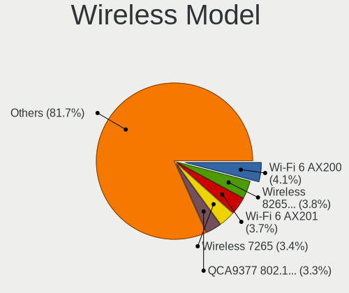
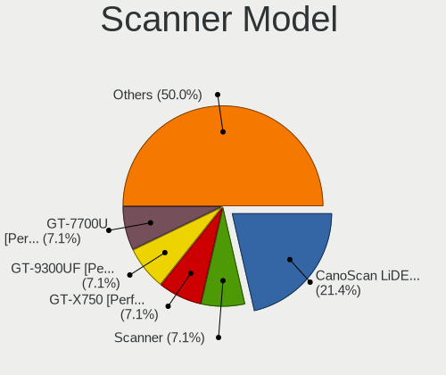

Linux in France - Tested Hardware & Statistics (Notebooks)
----------------------------------------------------------

A project to collect tested hardware configurations for Linux in France.

Anyone can contribute to this report by the [hw-probe](https://github.com/linuxhw/hw-probe) tool:

    sudo -E hw-probe -all -upload

Please contribute! Especially if your hardware is rare.

Contents
--------

* [ Test Cases ](#test-cases)

* [ System ](#system)
  - [ OS                       ](#os)
  - [ OS Family                ](#os-family)
  - [ Kernel                   ](#kernel)
  - [ Kernel Family            ](#kernel-family)
  - [ Kernel Major Ver.        ](#kernel-major-ver)
  - [ Arch                     ](#arch)
  - [ DE                       ](#de)
  - [ Display Server           ](#display-server)
  - [ Display Manager          ](#display-manager)
  - [ OS Lang                  ](#os-lang)
  - [ Boot Mode                ](#boot-mode)
  - [ Filesystem               ](#filesystem)
  - [ Part. scheme             ](#part-scheme)
  - [ Dual Boot with Linux/BSD ](#dual-boot-with-linuxbsd)
  - [ Dual Boot (Win)          ](#dual-boot-win)

* [ Board ](#board)
  - [ Vendor                   ](#vendor)
  - [ Model                    ](#model)
  - [ Model Family             ](#model-family)
  - [ MFG Year                 ](#mfg-year)
  - [ Form Factor              ](#form-factor)
  - [ Secure Boot              ](#secure-boot)
  - [ Coreboot                 ](#coreboot)
  - [ RAM Size                 ](#ram-size)
  - [ RAM Used                 ](#ram-used)
  - [ Total Drives             ](#total-drives)
  - [ Has CD-ROM               ](#has-cd-rom)
  - [ Has Ethernet             ](#has-ethernet)
  - [ Has WiFi                 ](#has-wifi)
  - [ Has Bluetooth            ](#has-bluetooth)

* [ Location ](#location)
  - [ Country                  ](#country)
  - [ City                     ](#city)

* [ Drives ](#drives)
  - [ Drive Vendor             ](#drive-vendor)
  - [ Drive Model              ](#drive-model)
  - [ HDD Vendor               ](#hdd-vendor)
  - [ SSD Vendor               ](#ssd-vendor)
  - [ Drive Kind               ](#drive-kind)
  - [ Drive Connector          ](#drive-connector)
  - [ Drive Size               ](#drive-size)
  - [ Space Total              ](#space-total)
  - [ Space Used               ](#space-used)
  - [ Malfunc. Drives          ](#malfunc-drives)
  - [ Malfunc. Drive Vendor    ](#malfunc-drive-vendor)
  - [ Malfunc. HDD Vendor      ](#malfunc-hdd-vendor)
  - [ Malfunc. Drive Kind      ](#malfunc-drive-kind)
  - [ Failed Drives            ](#failed-drives)
  - [ Failed Drive Vendor      ](#failed-drive-vendor)
  - [ Drive Status             ](#drive-status)

* [ Storage controller ](#storage-controller)
  - [ Storage Vendor           ](#storage-vendor)
  - [ Storage Model            ](#storage-model)
  - [ Storage Kind             ](#storage-kind)

* [ Processor ](#processor)
  - [ CPU Vendor               ](#cpu-vendor)
  - [ CPU Model                ](#cpu-model)
  - [ CPU Model Family         ](#cpu-model-family)
  - [ CPU Cores                ](#cpu-cores)
  - [ CPU Sockets              ](#cpu-sockets)
  - [ CPU Threads              ](#cpu-threads)
  - [ CPU Op-Modes             ](#cpu-op-modes)
  - [ CPU Microcode            ](#cpu-microcode)
  - [ CPU Microarch            ](#cpu-microarch)

* [ Graphics ](#graphics)
  - [ GPU Vendor               ](#gpu-vendor)
  - [ GPU Model                ](#gpu-model)
  - [ GPU Combo                ](#gpu-combo)
  - [ GPU Driver               ](#gpu-driver)
  - [ GPU Memory               ](#gpu-memory)

* [ Monitor ](#monitor)
  - [ Monitor Vendor           ](#monitor-vendor)
  - [ Monitor Model            ](#monitor-model)
  - [ Monitor Resolution       ](#monitor-resolution)
  - [ Monitor Diagonal         ](#monitor-diagonal)
  - [ Monitor Width            ](#monitor-width)
  - [ Aspect Ratio             ](#aspect-ratio)
  - [ Monitor Area             ](#monitor-area)
  - [ Pixel Density            ](#pixel-density)
  - [ Multiple Monitors        ](#multiple-monitors)

* [ Network ](#network)
  - [ Net Controller Vendor    ](#net-controller-vendor)
  - [ Net Controller Model     ](#net-controller-model)
  - [ Wireless Vendor          ](#wireless-vendor)
  - [ Wireless Model           ](#wireless-model)
  - [ Ethernet Vendor          ](#ethernet-vendor)
  - [ Ethernet Model           ](#ethernet-model)
  - [ Net Controller Kind      ](#net-controller-kind)
  - [ Used Controller          ](#used-controller)
  - [ NICs                     ](#nics)
  - [ IPv6                     ](#ipv6)

* [ Bluetooth ](#bluetooth)
  - [ Bluetooth Vendor         ](#bluetooth-vendor)
  - [ Bluetooth Model          ](#bluetooth-model)

* [ Sound ](#sound)
  - [ Sound Vendor             ](#sound-vendor)
  - [ Sound Model              ](#sound-model)

* [ Memory ](#memory)
  - [ Memory Vendor            ](#memory-vendor)
  - [ Memory Model             ](#memory-model)
  - [ Memory Kind              ](#memory-kind)
  - [ Memory Form Factor       ](#memory-form-factor)
  - [ Memory Size              ](#memory-size)
  - [ Memory Speed             ](#memory-speed)

* [ Printers & scanners ](#printers--scanners)
  - [ Printer Vendor           ](#printer-vendor)
  - [ Printer Model            ](#printer-model)
  - [ Scanner Vendor           ](#scanner-vendor)
  - [ Scanner Model            ](#scanner-model)

* [ Camera ](#camera)
  - [ Camera Vendor            ](#camera-vendor)
  - [ Camera Model             ](#camera-model)

* [ Security ](#security)
  - [ Fingerprint Vendor       ](#fingerprint-vendor)
  - [ Fingerprint Model        ](#fingerprint-model)
  - [ Chipcard Vendor          ](#chipcard-vendor)
  - [ Chipcard Model           ](#chipcard-model)

* [ Unsupported ](#unsupported)
  - [ Unsupported Devices      ](#unsupported-devices)
  - [ Unsupported Device Types ](#unsupported-device-types)

Test Cases
----------

Total: 5216

| Vendor        | Model                       | Probe                                                      | Date         |
|---------------|-----------------------------|------------------------------------------------------------|--------------|
| Acidanther... | MacBookPro13,1              | [5c8158f059](https://linux-hardware.org/?probe=5c8158f059) | Aug 01, 2022 |
| Dell          | XPS 13 9380                 | [d4524b40db](https://linux-hardware.org/?probe=d4524b40db) | Aug 01, 2022 |
| ASUSTek       | ROG Strix G713RM_G713RM     | [41b26f984c](https://linux-hardware.org/?probe=41b26f984c) | Aug 01, 2022 |
| ASUSTek       | GL553VE                     | [d67cc48957](https://linux-hardware.org/?probe=d67cc48957) | Aug 01, 2022 |
| HP            | Laptop 14s-dq2xxx           | [7137ca1923](https://linux-hardware.org/?probe=7137ca1923) | Aug 01, 2022 |
| HP            | Laptop 14s-dq2xxx           | [9a5e39bf87](https://linux-hardware.org/?probe=9a5e39bf87) | Aug 01, 2022 |
| Acer          | Aspire 7741                 | [4e266f6d7f](https://linux-hardware.org/?probe=4e266f6d7f) | Jul 31, 2022 |
| Lenovo        | IdeaPad 3 15ITL6 82H8       | [7ae6c1826c](https://linux-hardware.org/?probe=7ae6c1826c) | Jul 31, 2022 |
| Acer          | Aspire 7741                 | [932a460553](https://linux-hardware.org/?probe=932a460553) | Jul 31, 2022 |
| HP            | Pavilion Notebook           | [f312865dc0](https://linux-hardware.org/?probe=f312865dc0) | Jul 31, 2022 |
| ASUSTek       | E200HA                      | [86ef744d76](https://linux-hardware.org/?probe=86ef744d76) | Jul 31, 2022 |
| HP            | EliteBook 840 G6            | [1a2713a2b0](https://linux-hardware.org/?probe=1a2713a2b0) | Jul 31, 2022 |
| Lenovo        | Legion Y540-17IRH 81Q4      | [5dcf2bfdbd](https://linux-hardware.org/?probe=5dcf2bfdbd) | Jul 30, 2022 |
| Lenovo        | IdeaPad S340-15API 81NC     | [76083d81dc](https://linux-hardware.org/?probe=76083d81dc) | Jul 30, 2022 |
| Sony          | SVE1511Y1ESI                | [7e5ced1b91](https://linux-hardware.org/?probe=7e5ced1b91) | Jul 30, 2022 |
| HP            | Pavilion dm4                | [2bde69365c](https://linux-hardware.org/?probe=2bde69365c) | Jul 29, 2022 |
| ASUSTek       | T100TAM                     | [fca54dfc19](https://linux-hardware.org/?probe=fca54dfc19) | Jul 29, 2022 |
| ASUSTek       | T100TAM                     | [4321f0776b](https://linux-hardware.org/?probe=4321f0776b) | Jul 29, 2022 |
| Dell          | Latitude E6410              | [f2220a772e](https://linux-hardware.org/?probe=f2220a772e) | Jul 29, 2022 |
| Lenovo        | ThinkPad S5 Yoga 15 20DR... | [147d305ac1](https://linux-hardware.org/?probe=147d305ac1) | Jul 29, 2022 |
| HP            | Pavilion Aero Laptop 13-... | [74626c2a4d](https://linux-hardware.org/?probe=74626c2a4d) | Jul 29, 2022 |
| Dell          | Latitude 9420               | [1ee70bdfc6](https://linux-hardware.org/?probe=1ee70bdfc6) | Jul 29, 2022 |
| Lenovo        | IdeaPad C340-14API 81N6     | [4158c1696a](https://linux-hardware.org/?probe=4158c1696a) | Jul 29, 2022 |
| Lenovo        | IdeaPad C340-14API 81N6     | [1a5b34b200](https://linux-hardware.org/?probe=1a5b34b200) | Jul 29, 2022 |
| Dell          | Latitude 5480               | [2e2d540cb0](https://linux-hardware.org/?probe=2e2d540cb0) | Jul 29, 2022 |
| Dell          | Vostro 3700                 | [0a4b552d69](https://linux-hardware.org/?probe=0a4b552d69) | Jul 28, 2022 |
| ASUSTek       | X75A                        | [646a5239a8](https://linux-hardware.org/?probe=646a5239a8) | Jul 28, 2022 |
| HP            | 245 G8 Notebook PC          | [7922ab1018](https://linux-hardware.org/?probe=7922ab1018) | Jul 28, 2022 |
| Notebook      | NL4x_NL5xLU                 | [12d6dbed8b](https://linux-hardware.org/?probe=12d6dbed8b) | Jul 28, 2022 |
| Acer          | Aspire 5755G                | [ba944df1b9](https://linux-hardware.org/?probe=ba944df1b9) | Jul 28, 2022 |
| HP            | EliteBook 820 G2            | [0735a357ee](https://linux-hardware.org/?probe=0735a357ee) | Jul 28, 2022 |
| Lenovo        | Legion 7 16ACHg6 82N6       | [7356bc9abc](https://linux-hardware.org/?probe=7356bc9abc) | Jul 28, 2022 |
| Dell          | Latitude E5500              | [ba214335da](https://linux-hardware.org/?probe=ba214335da) | Jul 28, 2022 |
| ASUSTek       | VivoBook_ASUSLaptop X705... | [e82d2e1076](https://linux-hardware.org/?probe=e82d2e1076) | Jul 28, 2022 |
| Lenovo        | ThinkPad X1 Carbon Gen 8... | [50da53281b](https://linux-hardware.org/?probe=50da53281b) | Jul 28, 2022 |
| Toshiba       | Satellite C850D-11K         | [544f2db462](https://linux-hardware.org/?probe=544f2db462) | Jul 28, 2022 |
| Dell          | Latitude E6430              | [f04523ef5a](https://linux-hardware.org/?probe=f04523ef5a) | Jul 27, 2022 |
| HP            | Pavilion dv5                | [5e73f42d72](https://linux-hardware.org/?probe=5e73f42d72) | Jul 27, 2022 |
| Acer          | Aspire V3-371               | [0da78400c9](https://linux-hardware.org/?probe=0da78400c9) | Jul 27, 2022 |
| Lenovo        | V145-15AST 81MT             | [ee800b1d9e](https://linux-hardware.org/?probe=ee800b1d9e) | Jul 27, 2022 |
| Notebook      | P7xxDM(-G)                  | [5ec2e8ed2b](https://linux-hardware.org/?probe=5ec2e8ed2b) | Jul 27, 2022 |
| HP            | Pavilion Gaming Laptop 1... | [f4f4bdfefd](https://linux-hardware.org/?probe=f4f4bdfefd) | Jul 27, 2022 |
| HP            | Notebook                    | [9a4fc65b6a](https://linux-hardware.org/?probe=9a4fc65b6a) | Jul 26, 2022 |
| ASUSTek       | K50IJ                       | [0d908da71a](https://linux-hardware.org/?probe=0d908da71a) | Jul 26, 2022 |
| Dell          | Latitude E6540              | [d5f66c66fa](https://linux-hardware.org/?probe=d5f66c66fa) | Jul 26, 2022 |
| HP            | Pavilion Gaming Laptop 1... | [3073b497ce](https://linux-hardware.org/?probe=3073b497ce) | Jul 26, 2022 |
| Lenovo        | ThinkPad P15 Gen 2i 20YQ... | [a1605eaae0](https://linux-hardware.org/?probe=a1605eaae0) | Jul 26, 2022 |
| Lenovo        | IdeaPad 330-15IKB 81DC      | [3451f0e8b5](https://linux-hardware.org/?probe=3451f0e8b5) | Jul 26, 2022 |
| ASUSTek       | X751LD                      | [0c7a0b98b4](https://linux-hardware.org/?probe=0c7a0b98b4) | Jul 25, 2022 |
| Lenovo        | G50-30 80G0                 | [c380d02bbf](https://linux-hardware.org/?probe=c380d02bbf) | Jul 25, 2022 |
| Notebook      | N150ZU                      | [6956315543](https://linux-hardware.org/?probe=6956315543) | Jul 25, 2022 |
| HP            | Pavilion Notebook           | [660665c762](https://linux-hardware.org/?probe=660665c762) | Jul 25, 2022 |
| MSI           | Modern 14 B10MW             | [b9cde08864](https://linux-hardware.org/?probe=b9cde08864) | Jul 25, 2022 |
| HP            | Laptop 17-ca1xxx            | [64dad58b71](https://linux-hardware.org/?probe=64dad58b71) | Jul 25, 2022 |
| ASUSTek       | GL502VMZ                    | [5fbc1992e5](https://linux-hardware.org/?probe=5fbc1992e5) | Jul 25, 2022 |
| ASUSTek       | K55VJ                       | [7c0ae7deec](https://linux-hardware.org/?probe=7c0ae7deec) | Jul 25, 2022 |
| HP            | EliteBook 2560p             | [6493da2069](https://linux-hardware.org/?probe=6493da2069) | Jul 23, 2022 |
| HP            | Compaq CQ58                 | [73199f32a4](https://linux-hardware.org/?probe=73199f32a4) | Jul 23, 2022 |
| Notebook      | NLx0MU                      | [7cb795f428](https://linux-hardware.org/?probe=7cb795f428) | Jul 22, 2022 |
| Toshiba       | Satellite Pro L500          | [5dd6e66215](https://linux-hardware.org/?probe=5dd6e66215) | Jul 22, 2022 |
| Dell          | XPS 15 9510                 | [6b6e8fd2da](https://linux-hardware.org/?probe=6b6e8fd2da) | Jul 21, 2022 |
| Dell          | Latitude 5420               | [51cf24b119](https://linux-hardware.org/?probe=51cf24b119) | Jul 21, 2022 |
| HP            | ZBook 15 G3                 | [758ce4f6b4](https://linux-hardware.org/?probe=758ce4f6b4) | Jul 21, 2022 |
| Lenovo        | ThinkPad E570 20H5006TFR    | [1a1220dc79](https://linux-hardware.org/?probe=1a1220dc79) | Jul 21, 2022 |
| HP            | ProBook 450 G8 Notebook ... | [c1204438f8](https://linux-hardware.org/?probe=c1204438f8) | Jul 20, 2022 |
| HP            | Pavilion Laptop 14-ce0xx... | [29847a6864](https://linux-hardware.org/?probe=29847a6864) | Jul 20, 2022 |
| Dell          | XPS 13 9370                 | [3222136926](https://linux-hardware.org/?probe=3222136926) | Jul 19, 2022 |
| ASUSTek       | FX503VM                     | [47c70e3628](https://linux-hardware.org/?probe=47c70e3628) | Jul 19, 2022 |
| ASUSTek       | K50IJ                       | [cda673cd62](https://linux-hardware.org/?probe=cda673cd62) | Jul 19, 2022 |
| ASUSTek       | K50IJ                       | [c1d4ce2667](https://linux-hardware.org/?probe=c1d4ce2667) | Jul 19, 2022 |
| HP            | EliteBook 850 G5            | [753ec36553](https://linux-hardware.org/?probe=753ec36553) | Jul 18, 2022 |
| HUAWEI        | HVY-WXX9                    | [82966b0f63](https://linux-hardware.org/?probe=82966b0f63) | Jul 18, 2022 |
| HP            | ProBook 6570b               | [db3db082b6](https://linux-hardware.org/?probe=db3db082b6) | Jul 18, 2022 |
| Apple         | MacBookPro9,1               | [ced057bb18](https://linux-hardware.org/?probe=ced057bb18) | Jul 17, 2022 |
| Lenovo        | Yoga Slim 7 15ITL05 82AC    | [f9f25bbbfe](https://linux-hardware.org/?probe=f9f25bbbfe) | Jul 17, 2022 |
| Lenovo        | ThinkPad Edge 0328A11       | [4305889043](https://linux-hardware.org/?probe=4305889043) | Jul 17, 2022 |
| Dell          | System Vostro 3450          | [8c0f346c80](https://linux-hardware.org/?probe=8c0f346c80) | Jul 17, 2022 |
| Valve         | Jupiter                     | [7f27efe00e](https://linux-hardware.org/?probe=7f27efe00e) | Jul 17, 2022 |
| ASUSTek       | N73SV                       | [db493240aa](https://linux-hardware.org/?probe=db493240aa) | Jul 17, 2022 |
| Toshiba       | PORTEGE R930                | [0e8e3b5a24](https://linux-hardware.org/?probe=0e8e3b5a24) | Jul 17, 2022 |
| Google        | Coral                       | [ebf34e57e6](https://linux-hardware.org/?probe=ebf34e57e6) | Jul 17, 2022 |
| Acer          | Nitro AN515-55              | [c9e61ec6c4](https://linux-hardware.org/?probe=c9e61ec6c4) | Jul 16, 2022 |
| HP            | Laptop 17-cp0xxx            | [17803a39aa](https://linux-hardware.org/?probe=17803a39aa) | Jul 16, 2022 |
| Acer          | Aspire A317-53              | [020dfc5580](https://linux-hardware.org/?probe=020dfc5580) | Jul 16, 2022 |
| Acer          | Aspire A317-53              | [d8838cbae7](https://linux-hardware.org/?probe=d8838cbae7) | Jul 16, 2022 |
| HP            | 350 G1                      | [a95c89dfa1](https://linux-hardware.org/?probe=a95c89dfa1) | Jul 16, 2022 |
| HP            | 350 G1                      | [9a154ddcf2](https://linux-hardware.org/?probe=9a154ddcf2) | Jul 16, 2022 |
| Lenovo        | ThinkPad T420 4236C92       | [40d837716b](https://linux-hardware.org/?probe=40d837716b) | Jul 16, 2022 |
| ASUSTek       | X751MA                      | [e8c8c0d6ec](https://linux-hardware.org/?probe=e8c8c0d6ec) | Jul 16, 2022 |
| Toshiba       | Satellite Pro C660          | [9196a0ceb8](https://linux-hardware.org/?probe=9196a0ceb8) | Jul 16, 2022 |
| Toshiba       | Satellite Pro C660          | [fe173bf190](https://linux-hardware.org/?probe=fe173bf190) | Jul 15, 2022 |
| HP            | Laptop 17-ca1xxx            | [68e5da78cd](https://linux-hardware.org/?probe=68e5da78cd) | Jul 15, 2022 |
| MSI           | GE72 6QL                    | [7c22c38989](https://linux-hardware.org/?probe=7c22c38989) | Jul 15, 2022 |
| Dell          | Latitude E6530              | [67eec0ba19](https://linux-hardware.org/?probe=67eec0ba19) | Jul 15, 2022 |
| Acer          | Aspire 7740                 | [243f8e0be2](https://linux-hardware.org/?probe=243f8e0be2) | Jul 14, 2022 |
| Lenovo        | V145-15AST 81MT             | [8b3e5af205](https://linux-hardware.org/?probe=8b3e5af205) | Jul 14, 2022 |
| Chuwi         | LarkBook                    | [501967d2e1](https://linux-hardware.org/?probe=501967d2e1) | Jul 14, 2022 |
| HP            | 250 G6 Notebook PC          | [00deb1f759](https://linux-hardware.org/?probe=00deb1f759) | Jul 13, 2022 |
| Lenovo        | G50-45 80E3                 | [10f3f2b135](https://linux-hardware.org/?probe=10f3f2b135) | Jul 13, 2022 |
| Notebook      | NL40_50GU                   | [d4e652dc65](https://linux-hardware.org/?probe=d4e652dc65) | Jul 13, 2022 |
| Toshiba       | Satellite Pro R50-C         | [25d6e4de23](https://linux-hardware.org/?probe=25d6e4de23) | Jul 13, 2022 |
| Lenovo        | Yoga 500-15IBD 80N6         | [b9a6630267](https://linux-hardware.org/?probe=b9a6630267) | Jul 12, 2022 |
| HP            | ProBook 640 G1              | [bc5945b570](https://linux-hardware.org/?probe=bc5945b570) | Jul 11, 2022 |
| HP            | ProBook 640 G1              | [f25593cec7](https://linux-hardware.org/?probe=f25593cec7) | Jul 11, 2022 |
| HP            | ProBook 6570b               | [5796920cf8](https://linux-hardware.org/?probe=5796920cf8) | Jul 11, 2022 |
| Jumper        | EZbook                      | [4b0935af93](https://linux-hardware.org/?probe=4b0935af93) | Jul 11, 2022 |
| Lenovo        | IdeaPad 320-15IAP 80XR      | [1599e9e013](https://linux-hardware.org/?probe=1599e9e013) | Jul 11, 2022 |
| Dell          | Latitude E5440              | [2b94e70ac9](https://linux-hardware.org/?probe=2b94e70ac9) | Jul 11, 2022 |
| ASUSTek       | UX310UAK                    | [2574834337](https://linux-hardware.org/?probe=2574834337) | Jul 10, 2022 |
| ASUSTek       | UX310UAK                    | [9cc9bae948](https://linux-hardware.org/?probe=9cc9bae948) | Jul 10, 2022 |
| Dell          | Latitude 5420               | [1cc724cf75](https://linux-hardware.org/?probe=1cc724cf75) | Jul 10, 2022 |
| HP            | Pavilion dv7                | [0dcf6b98e8](https://linux-hardware.org/?probe=0dcf6b98e8) | Jul 10, 2022 |
| HP            | ProBook 470 G2              | [318374978e](https://linux-hardware.org/?probe=318374978e) | Jul 10, 2022 |
| HP            | ProBook 6570b               | [4b10924d6a](https://linux-hardware.org/?probe=4b10924d6a) | Jul 10, 2022 |
| Lenovo        | V15-ADA 82C7                | [3324f369f7](https://linux-hardware.org/?probe=3324f369f7) | Jul 09, 2022 |
| Toshiba       | Satellite L655              | [d8990c4f88](https://linux-hardware.org/?probe=d8990c4f88) | Jul 09, 2022 |
| HP            | ProBook 6570b               | [b90b75215d](https://linux-hardware.org/?probe=b90b75215d) | Jul 09, 2022 |
| Packard Be... | EasyNote TS44HR             | [2961959421](https://linux-hardware.org/?probe=2961959421) | Jul 09, 2022 |
| Toshiba       | TECRA S11                   | [c33fa181ba](https://linux-hardware.org/?probe=c33fa181ba) | Jul 08, 2022 |
| ASUSTek       | VivoBook_ASUSLaptop X705... | [82ddcf66ec](https://linux-hardware.org/?probe=82ddcf66ec) | Jul 08, 2022 |
| HP            | ProBook 4510s               | [ae51b4e466](https://linux-hardware.org/?probe=ae51b4e466) | Jul 08, 2022 |
| ASUSTek       | S551LN                      | [1e64e5d64e](https://linux-hardware.org/?probe=1e64e5d64e) | Jul 08, 2022 |
| ASUSTek       | X550CC                      | [a57dba854b](https://linux-hardware.org/?probe=a57dba854b) | Jul 08, 2022 |
| ASUSTek       | VivoBook_ASUSLaptop X513... | [4f02f261b3](https://linux-hardware.org/?probe=4f02f261b3) | Jul 08, 2022 |
| ASUSTek       | ROG Flow X13 GV301QE_GV3... | [24cd72e0bf](https://linux-hardware.org/?probe=24cd72e0bf) | Jul 08, 2022 |
| HP            | Notebook                    | [0c64a91465](https://linux-hardware.org/?probe=0c64a91465) | Jul 07, 2022 |
| Dell          | Vostro 5625                 | [b2fde3bdef](https://linux-hardware.org/?probe=b2fde3bdef) | Jul 07, 2022 |
| ASUSTek       | X705UAP                     | [cf63a63e99](https://linux-hardware.org/?probe=cf63a63e99) | Jul 07, 2022 |
| ASUSTek       | GL553VD                     | [6b5e1735a7](https://linux-hardware.org/?probe=6b5e1735a7) | Jul 07, 2022 |
| Lenovo        | IdeaPad 3 17ADA05 81W2      | [e8806ee656](https://linux-hardware.org/?probe=e8806ee656) | Jul 07, 2022 |
| HP            | ProBook 455 G7              | [ddb273e392](https://linux-hardware.org/?probe=ddb273e392) | Jul 07, 2022 |
| ASUSTek       | ROG Strix G733ZS_G733ZS     | [3df6db337d](https://linux-hardware.org/?probe=3df6db337d) | Jul 06, 2022 |
| HP            | Laptop 17-cp0xxx            | [82b34535ae](https://linux-hardware.org/?probe=82b34535ae) | Jul 06, 2022 |
| Acer          | Aspire E1-531               | [ead9f24980](https://linux-hardware.org/?probe=ead9f24980) | Jul 06, 2022 |
| Alienware     | x17 R2                      | [1ab946220b](https://linux-hardware.org/?probe=1ab946220b) | Jul 05, 2022 |
| Dell          | Inspiron 3558               | [09fd55b256](https://linux-hardware.org/?probe=09fd55b256) | Jul 05, 2022 |
| Acer          | Aspire F5-573G              | [c1978d81c7](https://linux-hardware.org/?probe=c1978d81c7) | Jul 05, 2022 |
| HP            | EliteBook 8570p             | [8782b09be9](https://linux-hardware.org/?probe=8782b09be9) | Jul 05, 2022 |
| ASUSTek       | FX503VD                     | [3f26062c31](https://linux-hardware.org/?probe=3f26062c31) | Jul 04, 2022 |
| ASUSTek       | FX503VD                     | [3749a75218](https://linux-hardware.org/?probe=3749a75218) | Jul 04, 2022 |
| Packard Be... | H17HV                       | [8b05e7f955](https://linux-hardware.org/?probe=8b05e7f955) | Jul 04, 2022 |
| Lenovo        | IdeaPad 700-15ISK 80RU      | [582d281a5c](https://linux-hardware.org/?probe=582d281a5c) | Jul 04, 2022 |
| Thomson       | N17CSL512                   | [11d0b3229b](https://linux-hardware.org/?probe=11d0b3229b) | Jul 04, 2022 |
| Lenovo        | ThinkPad Edge E320 1298A... | [842be4aea2](https://linux-hardware.org/?probe=842be4aea2) | Jul 04, 2022 |
| Acer          | Predator PT516-52s          | [3992d41a65](https://linux-hardware.org/?probe=3992d41a65) | Jul 04, 2022 |
| HP            | 470 G7 Notebook PC          | [49d49283d6](https://linux-hardware.org/?probe=49d49283d6) | Jul 04, 2022 |
| Samsung       | RV411/RV511/E3511/S3511/... | [eb23a7916c](https://linux-hardware.org/?probe=eb23a7916c) | Jul 03, 2022 |
| Thomson       | N17V3C8WH512                | [118835a499](https://linux-hardware.org/?probe=118835a499) | Jul 03, 2022 |
| Lenovo        | IdeaPad 320S-14IKB 80X4     | [172847b24c](https://linux-hardware.org/?probe=172847b24c) | Jul 03, 2022 |
| Dell          | Venue 10 Pro 5056           | [7676cdf093](https://linux-hardware.org/?probe=7676cdf093) | Jul 02, 2022 |
| Dell          | Inspiron 5415               | [d906735fe5](https://linux-hardware.org/?probe=d906735fe5) | Jul 02, 2022 |
| Lenovo        | ThinkBook 15 G2 ITL 20VE    | [7cdf221ced](https://linux-hardware.org/?probe=7cdf221ced) | Jul 01, 2022 |
| HP            | Pavilion 17                 | [1efb06e77e](https://linux-hardware.org/?probe=1efb06e77e) | Jul 01, 2022 |
| Framework     | Laptop                      | [1089f37daf](https://linux-hardware.org/?probe=1089f37daf) | Jul 01, 2022 |
| Dell          | G5 5500                     | [edfdebf28d](https://linux-hardware.org/?probe=edfdebf28d) | Jun 30, 2022 |
| Thomson       | N17V3C8WH512                | [518a227ae9](https://linux-hardware.org/?probe=518a227ae9) | Jun 30, 2022 |
| Lenovo        | ThinkPad E14 Gen 3 20Y70... | [03854f8307](https://linux-hardware.org/?probe=03854f8307) | Jun 29, 2022 |
| Notebook      | P7xxDM3(-G)                 | [6abdc9b40d](https://linux-hardware.org/?probe=6abdc9b40d) | Jun 29, 2022 |
| HP            | EliteBook 840 G6            | [faaa7b9c81](https://linux-hardware.org/?probe=faaa7b9c81) | Jun 29, 2022 |
| HP            | EliteBook 840 G2            | [79a978476b](https://linux-hardware.org/?probe=79a978476b) | Jun 28, 2022 |
| Dell          | Latitude 5420               | [58838b9e58](https://linux-hardware.org/?probe=58838b9e58) | Jun 28, 2022 |
| Acer          | Aspire E5-722               | [eda8e07df0](https://linux-hardware.org/?probe=eda8e07df0) | Jun 28, 2022 |
| Acer          | Aspire E5-722               | [7270206115](https://linux-hardware.org/?probe=7270206115) | Jun 28, 2022 |
| Lenovo        | IdeaPad 330S-15IKB 81F5     | [372d361276](https://linux-hardware.org/?probe=372d361276) | Jun 28, 2022 |
| MSI           | VR630                       | [097cd732b3](https://linux-hardware.org/?probe=097cd732b3) | Jun 27, 2022 |
| HP            | Pavilion Laptop 15-eg0xx... | [3fd9c5042f](https://linux-hardware.org/?probe=3fd9c5042f) | Jun 27, 2022 |
| HP            | Pavilion Laptop 15-eg0xx... | [bde3725b5d](https://linux-hardware.org/?probe=bde3725b5d) | Jun 27, 2022 |
| HP            | ProBook 450 G8 Notebook ... | [409ca4eba4](https://linux-hardware.org/?probe=409ca4eba4) | Jun 27, 2022 |
| Dell          | Latitude 5510               | [06199cdfe6](https://linux-hardware.org/?probe=06199cdfe6) | Jun 27, 2022 |
| Lenovo        | ThinkPad X1 Carbon 4th 2... | [aa51c70192](https://linux-hardware.org/?probe=aa51c70192) | Jun 27, 2022 |
| HP            | Pavilion dv5                | [4d0e23962a](https://linux-hardware.org/?probe=4d0e23962a) | Jun 27, 2022 |
| ASUSTek       | VivoBook_ASUSLaptop X515... | [78d7beacec](https://linux-hardware.org/?probe=78d7beacec) | Jun 27, 2022 |
| ASUSTek       | VivoBook_ASUSLaptop X515... | [c4351d9d15](https://linux-hardware.org/?probe=c4351d9d15) | Jun 27, 2022 |
| Intel Clie... | LAPKC71F                    | [11d7e1ecc7](https://linux-hardware.org/?probe=11d7e1ecc7) | Jun 26, 2022 |
| Intel Clie... | LAPKC71F                    | [6452ae1060](https://linux-hardware.org/?probe=6452ae1060) | Jun 26, 2022 |
| Toshiba       | Satellite C855-2CF          | [9e062a8425](https://linux-hardware.org/?probe=9e062a8425) | Jun 26, 2022 |
| Acer          | Aspire A114-31              | [8fd4467dfd](https://linux-hardware.org/?probe=8fd4467dfd) | Jun 25, 2022 |
| MSI           | Stealth GS66 12UHS          | [4cee5507af](https://linux-hardware.org/?probe=4cee5507af) | Jun 25, 2022 |
| Dell          | Latitude D630               | [9b1cf4028b](https://linux-hardware.org/?probe=9b1cf4028b) | Jun 25, 2022 |
| Dell          | Latitude D630               | [b3eef0f278](https://linux-hardware.org/?probe=b3eef0f278) | Jun 25, 2022 |
| Lenovo        | Legion 5 Pro 16ACH6H 82J... | [8a6b59bd5d](https://linux-hardware.org/?probe=8a6b59bd5d) | Jun 25, 2022 |
| Lenovo        | Legion 5 Pro 16ACH6H 82J... | [9d53805c9a](https://linux-hardware.org/?probe=9d53805c9a) | Jun 25, 2022 |
| HP            | Pavilion dv7                | [a0c6c78c33](https://linux-hardware.org/?probe=a0c6c78c33) | Jun 25, 2022 |
| ASUSTek       | ROG Strix G513QM_G513QM     | [3b78b34416](https://linux-hardware.org/?probe=3b78b34416) | Jun 24, 2022 |
| Samsung       | 300E5EV/300E4EV/270E5EV/... | [ce17a478c3](https://linux-hardware.org/?probe=ce17a478c3) | Jun 24, 2022 |
| HP            | Pavilion dv7                | [334a6079e5](https://linux-hardware.org/?probe=334a6079e5) | Jun 24, 2022 |
| Fujitsu       | LIFEBOOK U7411              | [2bbef77636](https://linux-hardware.org/?probe=2bbef77636) | Jun 23, 2022 |
| Sony          | SVS1312J3EW                 | [95e0cb21c4](https://linux-hardware.org/?probe=95e0cb21c4) | Jun 23, 2022 |
| TUXEDO        | Pulse 15 Gen1               | [69e0965863](https://linux-hardware.org/?probe=69e0965863) | Jun 23, 2022 |
| HP            | Pavilion Laptop 15-cs3xx... | [13d9478b12](https://linux-hardware.org/?probe=13d9478b12) | Jun 22, 2022 |
| Dell          | XPS 13 9360                 | [d5d7479c46](https://linux-hardware.org/?probe=d5d7479c46) | Jun 22, 2022 |
| Dell          | Precision 7560              | [760bb908b9](https://linux-hardware.org/?probe=760bb908b9) | Jun 22, 2022 |
| Toshiba       | Satellite Pro L500          | [e745bcf24b](https://linux-hardware.org/?probe=e745bcf24b) | Jun 22, 2022 |
| Dell          | G15 5510                    | [cfd6e8f4d6](https://linux-hardware.org/?probe=cfd6e8f4d6) | Jun 21, 2022 |
| Dell          | Latitude E7270              | [5b1c572f56](https://linux-hardware.org/?probe=5b1c572f56) | Jun 21, 2022 |
| HP            | ProBook 440 G6              | [eeeee7321e](https://linux-hardware.org/?probe=eeeee7321e) | Jun 20, 2022 |
| Samsung       | 300E5EV/300E4EV/270E5EV/... | [926b001aa9](https://linux-hardware.org/?probe=926b001aa9) | Jun 20, 2022 |
| TUXEDO        | InfinityBook S 15 Gen6      | [ff5ed1835c](https://linux-hardware.org/?probe=ff5ed1835c) | Jun 20, 2022 |
| ASUSTek       | ROG Zephyrus G14 GA401IU... | [87abe6b88c](https://linux-hardware.org/?probe=87abe6b88c) | Jun 20, 2022 |
| MSI           | GL62 6QF                    | [39e2d35166](https://linux-hardware.org/?probe=39e2d35166) | Jun 20, 2022 |
| Notebook      | NL40_50CU                   | [b0b1068b47](https://linux-hardware.org/?probe=b0b1068b47) | Jun 20, 2022 |
| MSI           | Pulse GL66 12UEK            | [9bffffd652](https://linux-hardware.org/?probe=9bffffd652) | Jun 20, 2022 |
| MSI           | Pulse GL66 12UEK            | [a8d859700b](https://linux-hardware.org/?probe=a8d859700b) | Jun 20, 2022 |
| Dell          | XPS 17 9720                 | [2a36b8d90d](https://linux-hardware.org/?probe=2a36b8d90d) | Jun 20, 2022 |
| MSI           | CR70 2M/CX70 2OC/CX70 2O... | [e6bb96869e](https://linux-hardware.org/?probe=e6bb96869e) | Jun 19, 2022 |
| Toshiba       | Satellite Click 10 LX5W-... | [b8f87c8ede](https://linux-hardware.org/?probe=b8f87c8ede) | Jun 19, 2022 |
| MSI           | GE75 Raider 10SF            | [eee0889229](https://linux-hardware.org/?probe=eee0889229) | Jun 19, 2022 |
| ASUSTek       | N550JV                      | [d1d647724c](https://linux-hardware.org/?probe=d1d647724c) | Jun 19, 2022 |
| Packard Be... | H17HV                       | [daa945363e](https://linux-hardware.org/?probe=daa945363e) | Jun 19, 2022 |
| Dell          | Latitude 5420               | [14f75e40fd](https://linux-hardware.org/?probe=14f75e40fd) | Jun 18, 2022 |
| Dell          | Latitude E6540              | [e023336620](https://linux-hardware.org/?probe=e023336620) | Jun 18, 2022 |
| MSI           | Creator Z16 A11UET          | [0a6d214b2e](https://linux-hardware.org/?probe=0a6d214b2e) | Jun 18, 2022 |
| Packard Be... | EasyNote TS44HR             | [bc731a2920](https://linux-hardware.org/?probe=bc731a2920) | Jun 18, 2022 |
| ASUSTek       | N71Vg                       | [6926193d76](https://linux-hardware.org/?probe=6926193d76) | Jun 18, 2022 |
| Dell          | G3 3500                     | [396a536231](https://linux-hardware.org/?probe=396a536231) | Jun 17, 2022 |
| Dell          | Inspiron 7590               | [2e4fc22b64](https://linux-hardware.org/?probe=2e4fc22b64) | Jun 17, 2022 |
| Lenovo        | ThinkPad X1 Carbon 5th 2... | [cb6bf6ab7c](https://linux-hardware.org/?probe=cb6bf6ab7c) | Jun 17, 2022 |
| Lenovo        | ThinkPad T460s 20FAS76R0... | [21d6816b13](https://linux-hardware.org/?probe=21d6816b13) | Jun 17, 2022 |
| ASUSTek       | ROG Flow X13 GV301QE_GV3... | [2a28e582b5](https://linux-hardware.org/?probe=2a28e582b5) | Jun 17, 2022 |
| Samsung       | RV411/RV511/E3511/S3511/... | [bf18000c3c](https://linux-hardware.org/?probe=bf18000c3c) | Jun 17, 2022 |
| MSI           | Raider GE66 12UGS           | [d69dc59622](https://linux-hardware.org/?probe=d69dc59622) | Jun 16, 2022 |
| ASUSTek       | X411UA                      | [da7deca26c](https://linux-hardware.org/?probe=da7deca26c) | Jun 16, 2022 |
| TUXEDO        | Aura 15 Gen1                | [cc3a77a798](https://linux-hardware.org/?probe=cc3a77a798) | Jun 16, 2022 |
| Lenovo        | ThinkPad X1 Carbon 6th 2... | [d2ec826b81](https://linux-hardware.org/?probe=d2ec826b81) | Jun 16, 2022 |
| Lenovo        | ThinkPad X1 Carbon 6th 2... | [e889572d35](https://linux-hardware.org/?probe=e889572d35) | Jun 16, 2022 |
| HP            | Stream Laptop 11-y0XX       | [5a762627ab](https://linux-hardware.org/?probe=5a762627ab) | Jun 16, 2022 |
| Dell          | Vostro 3525                 | [97e8f44feb](https://linux-hardware.org/?probe=97e8f44feb) | Jun 15, 2022 |
| Lenovo        | ThinkPad E490 20N8002APB    | [3a17ac0192](https://linux-hardware.org/?probe=3a17ac0192) | Jun 15, 2022 |
| HP            | ProBook 430 G6              | [c7b3318ac4](https://linux-hardware.org/?probe=c7b3318ac4) | Jun 14, 2022 |
| Acer          | Aspire E5-722               | [3085e9b7ad](https://linux-hardware.org/?probe=3085e9b7ad) | Jun 14, 2022 |
| ASUSTek       | VivoBook E14 E402WAS        | [2570d889fd](https://linux-hardware.org/?probe=2570d889fd) | Jun 14, 2022 |
| ASUSTek       | UX51VZ                      | [d58122ba72](https://linux-hardware.org/?probe=d58122ba72) | Jun 13, 2022 |
| HP            | ENVY m6                     | [f8a6325caa](https://linux-hardware.org/?probe=f8a6325caa) | Jun 13, 2022 |
| ASUSTek       | ROG Flow X13 GV301QE_GV3... | [221099208b](https://linux-hardware.org/?probe=221099208b) | Jun 13, 2022 |
| ASUSTek       | UX303LN                     | [9ce42e1b01](https://linux-hardware.org/?probe=9ce42e1b01) | Jun 12, 2022 |
| MSI           | Raider GE76 12UH            | [c29e79e22d](https://linux-hardware.org/?probe=c29e79e22d) | Jun 12, 2022 |
| MSI           | Raider GE76 12UH            | [02e4c63249](https://linux-hardware.org/?probe=02e4c63249) | Jun 12, 2022 |
| Acer          | Aspire ES1-523              | [89fbabafb5](https://linux-hardware.org/?probe=89fbabafb5) | Jun 12, 2022 |
| Packard Be... | EasyNote TK11BZ             | [f9c69ea1c6](https://linux-hardware.org/?probe=f9c69ea1c6) | Jun 11, 2022 |
| Lenovo        | G505 20240                  | [0b0d5e5252](https://linux-hardware.org/?probe=0b0d5e5252) | Jun 11, 2022 |
| ASUSTek       | ROG Flow X13 GV301QE_GV3... | [14e32dc3cb](https://linux-hardware.org/?probe=14e32dc3cb) | Jun 10, 2022 |
| HP            | Pavilion Sleekbook 15 PC    | [1a41b08f4f](https://linux-hardware.org/?probe=1a41b08f4f) | Jun 10, 2022 |
| HP            | Laptop 17-bs0xx             | [a4587cc1de](https://linux-hardware.org/?probe=a4587cc1de) | Jun 10, 2022 |
| HUAWEI        | HN-WX9X                     | [d57d295c58](https://linux-hardware.org/?probe=d57d295c58) | Jun 10, 2022 |
| Dell          | Latitude 5290               | [930e34a606](https://linux-hardware.org/?probe=930e34a606) | Jun 10, 2022 |
| TUXEDO        | Pulse 15 Gen1               | [2c789d1a84](https://linux-hardware.org/?probe=2c789d1a84) | Jun 10, 2022 |
| ASUSTek       | ROG Strix G513QR_G513QR     | [e33e73a70f](https://linux-hardware.org/?probe=e33e73a70f) | Jun 10, 2022 |
| ASUSTek       | TUF Gaming FX505DY_FX505... | [e20ce4899d](https://linux-hardware.org/?probe=e20ce4899d) | Jun 09, 2022 |
| Dell          | Latitude 7389               | [88dad6a75c](https://linux-hardware.org/?probe=88dad6a75c) | Jun 09, 2022 |
| ASUSTek       | N56VZ                       | [3c1a5025f1](https://linux-hardware.org/?probe=3c1a5025f1) | Jun 09, 2022 |
| Acer          | Aspire V5-531               | [3a462d28a4](https://linux-hardware.org/?probe=3a462d28a4) | Jun 08, 2022 |
| Lenovo        | G50-30 80G0                 | [0de0854560](https://linux-hardware.org/?probe=0de0854560) | Jun 08, 2022 |
| MSI           | GP76 Leopard 11UH           | [8a3c021b8a](https://linux-hardware.org/?probe=8a3c021b8a) | Jun 08, 2022 |
| Lenovo        | ThinkPad X1 Carbon 4th 2... | [6d9c3da618](https://linux-hardware.org/?probe=6d9c3da618) | Jun 08, 2022 |
| HP            | ProBook 640 G1              | [34ecb184f9](https://linux-hardware.org/?probe=34ecb184f9) | Jun 08, 2022 |
| Fujitsu       | CELSIUS H730                | [734b6c125f](https://linux-hardware.org/?probe=734b6c125f) | Jun 08, 2022 |
| ASUSTek       | ASUS TUF Gaming F17 FX70... | [7e3c31382f](https://linux-hardware.org/?probe=7e3c31382f) | Jun 08, 2022 |
| Acer          | Aspire E5-722               | [a096ce91cf](https://linux-hardware.org/?probe=a096ce91cf) | Jun 08, 2022 |
| Acer          | Aspire E5-722               | [10fbd3326b](https://linux-hardware.org/?probe=10fbd3326b) | Jun 08, 2022 |
| HP            | EliteBook 8740w             | [a835c8f6c8](https://linux-hardware.org/?probe=a835c8f6c8) | Jun 07, 2022 |
| Lenovo        | ThinkPad T495 20NJ0007US    | [2b3ee11cad](https://linux-hardware.org/?probe=2b3ee11cad) | Jun 07, 2022 |
| Sony          | VGN-SZ71WN_C                | [aece18b520](https://linux-hardware.org/?probe=aece18b520) | Jun 06, 2022 |
| Toshiba       | Satellite C850D-115         | [35f95dcc1c](https://linux-hardware.org/?probe=35f95dcc1c) | Jun 06, 2022 |
| Dell          | Latitude E5530 non-vPro     | [e4ba25767a](https://linux-hardware.org/?probe=e4ba25767a) | Jun 06, 2022 |
| Notebook      | NS50MU                      | [d54906a6c5](https://linux-hardware.org/?probe=d54906a6c5) | Jun 06, 2022 |
| ASUSTek       | TUF Gaming FX705DT_FX705... | [9400ad4984](https://linux-hardware.org/?probe=9400ad4984) | Jun 06, 2022 |
| MSI           | Bravo 15 A4DDR              | [3281dce7d5](https://linux-hardware.org/?probe=3281dce7d5) | Jun 06, 2022 |
| Lenovo        | G580 2689PWG                | [e7e658bc95](https://linux-hardware.org/?probe=e7e658bc95) | Jun 06, 2022 |
| HP            | Pavilion g7                 | [b31de17368](https://linux-hardware.org/?probe=b31de17368) | Jun 06, 2022 |
| Lenovo        | G580 2689PWG                | [e51b9086bd](https://linux-hardware.org/?probe=e51b9086bd) | Jun 06, 2022 |
| Notebook      | NS50MU                      | [bf6d177bf1](https://linux-hardware.org/?probe=bf6d177bf1) | Jun 06, 2022 |
| Lenovo        | ThinkPad E15 Gen 2 20TD0... | [91abfe378e](https://linux-hardware.org/?probe=91abfe378e) | Jun 06, 2022 |
| Lenovo        | ThinkPad P14s Gen 2a 21A... | [228fe8f3f1](https://linux-hardware.org/?probe=228fe8f3f1) | Jun 06, 2022 |
| MSI           | Bravo 15 A4DDR              | [f1bad1050e](https://linux-hardware.org/?probe=f1bad1050e) | Jun 06, 2022 |
| Fujitsu Si... | ESPRIMO Mobile V5535        | [2e08398c9a](https://linux-hardware.org/?probe=2e08398c9a) | Jun 06, 2022 |
| Fujitsu Si... | ESPRIMO Mobile V5535        | [8edffcde03](https://linux-hardware.org/?probe=8edffcde03) | Jun 06, 2022 |
| Dell          | G3 3500                     | [edbd452524](https://linux-hardware.org/?probe=edbd452524) | Jun 05, 2022 |
| AZW           | GT-R                        | [d86ab00f24](https://linux-hardware.org/?probe=d86ab00f24) | Jun 05, 2022 |
| Lenovo        | ThinkPad T14 Gen 1 20S1S... | [721f0da2de](https://linux-hardware.org/?probe=721f0da2de) | Jun 05, 2022 |
| HP            | Pavilion 17                 | [b2a29d34f0](https://linux-hardware.org/?probe=b2a29d34f0) | Jun 05, 2022 |
| HP            | OMEN by Laptop 15-dc0xxx    | [f2ca17eb5d](https://linux-hardware.org/?probe=f2ca17eb5d) | Jun 05, 2022 |
| HP            | Pavilion dv6                | [8e20121256](https://linux-hardware.org/?probe=8e20121256) | Jun 04, 2022 |
| Valve         | Jupiter                     | [2fb1bfad12](https://linux-hardware.org/?probe=2fb1bfad12) | Jun 04, 2022 |
| HP            | ProBook 6550b               | [005fa13ca2](https://linux-hardware.org/?probe=005fa13ca2) | Jun 04, 2022 |
| Lenovo        | ThinkPad X230 23259T0       | [d0bb09f4ee](https://linux-hardware.org/?probe=d0bb09f4ee) | Jun 04, 2022 |
| Lenovo        | ThinkPad E470 20H2S01A00    | [b98fdbbd2b](https://linux-hardware.org/?probe=b98fdbbd2b) | Jun 04, 2022 |
| Packard Be... | EasyNote LS11HR             | [78cae55082](https://linux-hardware.org/?probe=78cae55082) | Jun 04, 2022 |
| Lenovo        | Z51-70 80K6                 | [b29848facc](https://linux-hardware.org/?probe=b29848facc) | Jun 03, 2022 |
| Lenovo        | IdeaPad 3 15ADA05 81W1      | [befecc30e3](https://linux-hardware.org/?probe=befecc30e3) | Jun 03, 2022 |
| Dell          | XPS 13 9360                 | [73746e5672](https://linux-hardware.org/?probe=73746e5672) | Jun 03, 2022 |
| ASUSTek       | 1001PX                      | [097a218d03](https://linux-hardware.org/?probe=097a218d03) | Jun 03, 2022 |
| Lenovo        | ThinkPad W510 431963G       | [dfe3e4b66b](https://linux-hardware.org/?probe=dfe3e4b66b) | Jun 02, 2022 |
| Lenovo        | ThinkPad W510 431963G       | [d620bac2cb](https://linux-hardware.org/?probe=d620bac2cb) | Jun 02, 2022 |
| Lenovo        | IdeaPad L340-15API 81LW     | [b47b9118af](https://linux-hardware.org/?probe=b47b9118af) | Jun 02, 2022 |
| Lenovo        | ThinkPad X230 23259T0       | [54fffce502](https://linux-hardware.org/?probe=54fffce502) | Jun 02, 2022 |
| HP            | Pavilion 17                 | [426dba3868](https://linux-hardware.org/?probe=426dba3868) | Jun 01, 2022 |
| Toshiba       | Satellite C660              | [927caeb015](https://linux-hardware.org/?probe=927caeb015) | Jun 01, 2022 |
| Dell          | Precision 3530              | [0371c8be1b](https://linux-hardware.org/?probe=0371c8be1b) | Jun 01, 2022 |
| ASUSTek       | ASUS EXPERTBOOK P3540FA_... | [46c75dbe1d](https://linux-hardware.org/?probe=46c75dbe1d) | Jun 01, 2022 |
| Dell          | XPS 13 9310                 | [726e3b4cd7](https://linux-hardware.org/?probe=726e3b4cd7) | May 31, 2022 |
| HP            | EliteBook 2570p             | [dabb678748](https://linux-hardware.org/?probe=dabb678748) | May 31, 2022 |
| Lenovo        | ThinkPad W510 431963G       | [e46a1497d8](https://linux-hardware.org/?probe=e46a1497d8) | May 31, 2022 |
| Toshiba       | Satellite C850D-115         | [fca373e327](https://linux-hardware.org/?probe=fca373e327) | May 31, 2022 |
| Packard Be... | EasyNote TE11HC             | [8350bd6d87](https://linux-hardware.org/?probe=8350bd6d87) | May 30, 2022 |
| Dell          | Latitude 5400               | [0440362644](https://linux-hardware.org/?probe=0440362644) | May 30, 2022 |
| Lenovo        | ThinkPad X1 Carbon 7th 2... | [6e43e1d4f1](https://linux-hardware.org/?probe=6e43e1d4f1) | May 30, 2022 |
| Timi          | TM1604                      | [cd9b839800](https://linux-hardware.org/?probe=cd9b839800) | May 29, 2022 |
| Dell          | Latitude E6420              | [e109444519](https://linux-hardware.org/?probe=e109444519) | May 29, 2022 |
| Lenovo        | Legion 5 Pro 16ACH6H 82J... | [b9eae1074f](https://linux-hardware.org/?probe=b9eae1074f) | May 29, 2022 |
| Samsung       | RV410/RV510/S3510/E3510     | [d7800ffe07](https://linux-hardware.org/?probe=d7800ffe07) | May 29, 2022 |
| MSI           | GF63 Thin 10SCXR            | [0d556408f3](https://linux-hardware.org/?probe=0d556408f3) | May 29, 2022 |
| Valve         | Jupiter                     | [0af4b9c805](https://linux-hardware.org/?probe=0af4b9c805) | May 29, 2022 |
| ASUSTek       | ASUS EXPERTBOOK P5440FA_... | [a0e5cf5b03](https://linux-hardware.org/?probe=a0e5cf5b03) | May 29, 2022 |
| Dell          | XPS 15 9500                 | [ec336b7bfb](https://linux-hardware.org/?probe=ec336b7bfb) | May 28, 2022 |
| ASUSTek       | VivoBook E14 E402WAS        | [9f3d329e42](https://linux-hardware.org/?probe=9f3d329e42) | May 28, 2022 |
| HP            | EliteBook 840 G2            | [eeab3d23c4](https://linux-hardware.org/?probe=eeab3d23c4) | May 27, 2022 |
| Dell          | Vostro 15-3568              | [ee23f2618c](https://linux-hardware.org/?probe=ee23f2618c) | May 27, 2022 |
| ASUSTek       | VivoBook E14 E402WAS        | [8234e83675](https://linux-hardware.org/?probe=8234e83675) | May 27, 2022 |
| Lenovo        | Legion 5 Pro 16ACH6H 82J... | [de0614be43](https://linux-hardware.org/?probe=de0614be43) | May 26, 2022 |
| Lenovo        | Legion 5 Pro 16ACH6H 82J... | [30eed68f77](https://linux-hardware.org/?probe=30eed68f77) | May 26, 2022 |
| ASUSTek       | X205TA                      | [9fa4c6beef](https://linux-hardware.org/?probe=9fa4c6beef) | May 26, 2022 |
| ASUSTek       | ZenBook S UX391UA           | [aa6a60a379](https://linux-hardware.org/?probe=aa6a60a379) | May 25, 2022 |
| HP            | ZBook 15 G2                 | [42ebc7f075](https://linux-hardware.org/?probe=42ebc7f075) | May 25, 2022 |
| Acer          | Aspire E5-571               | [b43bf0505e](https://linux-hardware.org/?probe=b43bf0505e) | May 25, 2022 |
| Lenovo        | ThinkPad L540 20AUS39X00    | [6a294d74f4](https://linux-hardware.org/?probe=6a294d74f4) | May 25, 2022 |
| Clevo         | W55xEU                      | [c5fd2417f4](https://linux-hardware.org/?probe=c5fd2417f4) | May 25, 2022 |
| Dell          | Inspiron 7501               | [81f3b14e0a](https://linux-hardware.org/?probe=81f3b14e0a) | May 25, 2022 |
| ASUSTek       | X540LA                      | [2015df99d9](https://linux-hardware.org/?probe=2015df99d9) | May 25, 2022 |
| ASUSTek       | X540LJ                      | [dbbcdcd2b5](https://linux-hardware.org/?probe=dbbcdcd2b5) | May 25, 2022 |
| Lenovo        | ThinkPad P14s Gen 1 20Y1... | [0a468b99d2](https://linux-hardware.org/?probe=0a468b99d2) | May 25, 2022 |
| HP            | EliteBook 2560p             | [00b2e6d758](https://linux-hardware.org/?probe=00b2e6d758) | May 24, 2022 |
| Lenovo        | ThinkPad P14s Gen 1 20Y1... | [8b214b9114](https://linux-hardware.org/?probe=8b214b9114) | May 24, 2022 |
| Dell          | XPS 13 9305                 | [c06270a534](https://linux-hardware.org/?probe=c06270a534) | May 24, 2022 |
| Apple         | MacBookAir3,2               | [d53c4aa502](https://linux-hardware.org/?probe=d53c4aa502) | May 24, 2022 |
| ASUSTek       | 1001PXD                     | [8c3e0451e1](https://linux-hardware.org/?probe=8c3e0451e1) | May 24, 2022 |
| Dell          | Precision 3561              | [71657d24c1](https://linux-hardware.org/?probe=71657d24c1) | May 24, 2022 |
| Dell          | Precision 3561              | [385a286d0d](https://linux-hardware.org/?probe=385a286d0d) | May 24, 2022 |
| Dell          | XPS 13 9360                 | [41f966f459](https://linux-hardware.org/?probe=41f966f459) | May 24, 2022 |
| Lenovo        | ThinkPad P14s Gen 1 20Y1... | [a59234d081](https://linux-hardware.org/?probe=a59234d081) | May 24, 2022 |
| Acer          | Aspire 5736Z                | [78318327dd](https://linux-hardware.org/?probe=78318327dd) | May 23, 2022 |
| Acer          | Aspire 5736Z                | [621183d005](https://linux-hardware.org/?probe=621183d005) | May 23, 2022 |
| HUAWEI        | BOHB-WAX9                   | [64a3f31676](https://linux-hardware.org/?probe=64a3f31676) | May 23, 2022 |
| Timi          | TM1612                      | [50c4a534fb](https://linux-hardware.org/?probe=50c4a534fb) | May 23, 2022 |
| Timi          | TM1612                      | [8eb7ad8654](https://linux-hardware.org/?probe=8eb7ad8654) | May 23, 2022 |
| Lenovo        | ThinkPad T440p 20AWS17N0... | [0a9f7ecc76](https://linux-hardware.org/?probe=0a9f7ecc76) | May 23, 2022 |
| ASUSTek       | X705UAP                     | [bd15f53ec3](https://linux-hardware.org/?probe=bd15f53ec3) | May 22, 2022 |
| ASUSTek       | X510UA                      | [51d57b9e53](https://linux-hardware.org/?probe=51d57b9e53) | May 22, 2022 |
| Lenovo        | IdeaPad 320S-14IKB 80X4     | [aa6aefb86a](https://linux-hardware.org/?probe=aa6aefb86a) | May 21, 2022 |
| MSI           | Modern 14 A10M              | [97a0996658](https://linux-hardware.org/?probe=97a0996658) | May 21, 2022 |
| Toshiba       | Satellite L655              | [3ea531093a](https://linux-hardware.org/?probe=3ea531093a) | May 21, 2022 |
| ASUSTek       | F7L                         | [f5bcd583ac](https://linux-hardware.org/?probe=f5bcd583ac) | May 21, 2022 |
| ASUSTek       | K73SD                       | [8c77e10639](https://linux-hardware.org/?probe=8c77e10639) | May 21, 2022 |
| HP            | Notebook                    | [a1be02b2d6](https://linux-hardware.org/?probe=a1be02b2d6) | May 21, 2022 |
| PC Special... | NP5x_NP6x_NP7xPNK_PNH_PN... | [e002072665](https://linux-hardware.org/?probe=e002072665) | May 21, 2022 |
| eMachines     | E525                        | [ca296b06c9](https://linux-hardware.org/?probe=ca296b06c9) | May 21, 2022 |
| Acer          | Aspire 7750G                | [0fd6c8569c](https://linux-hardware.org/?probe=0fd6c8569c) | May 20, 2022 |
| Lenovo        | ThinkPad X1 Carbon 4th 2... | [e876753143](https://linux-hardware.org/?probe=e876753143) | May 20, 2022 |
| Lenovo        | ThinkPad E14 Gen 2 20TA0... | [2972e28673](https://linux-hardware.org/?probe=2972e28673) | May 19, 2022 |
| ASUSTek       | VivoBook E14 E402WAS        | [df0ca9457c](https://linux-hardware.org/?probe=df0ca9457c) | May 18, 2022 |
| Unknown       | Unknown                     | [f3395963a9](https://linux-hardware.org/?probe=f3395963a9) | May 18, 2022 |
| Dell          | Inspiron 14 7420 2-in-1     | [6ce320a4ac](https://linux-hardware.org/?probe=6ce320a4ac) | May 18, 2022 |
| Dell          | Inspiron 14 7420 2-in-1     | [63e24c7f2d](https://linux-hardware.org/?probe=63e24c7f2d) | May 18, 2022 |
| ASUSTek       | UX305FA                     | [5ec0821cdf](https://linux-hardware.org/?probe=5ec0821cdf) | May 18, 2022 |
| ASUSTek       | X556URK                     | [b217fd2c65](https://linux-hardware.org/?probe=b217fd2c65) | May 18, 2022 |
| Dell          | Latitude D610               | [2e945626d4](https://linux-hardware.org/?probe=2e945626d4) | May 17, 2022 |
| Dell          | Latitude D610               | [9ee1df5d0e](https://linux-hardware.org/?probe=9ee1df5d0e) | May 17, 2022 |
| ASUSTek       | ROG Strix G513RM_G513RM     | [331099a3da](https://linux-hardware.org/?probe=331099a3da) | May 17, 2022 |
| Lenovo        | Legion 5 Pro 16ACH6H 82J... | [1ccddf153e](https://linux-hardware.org/?probe=1ccddf153e) | May 17, 2022 |
| Dell          | XPS 13 7390                 | [395da9a242](https://linux-hardware.org/?probe=395da9a242) | May 17, 2022 |
| Dell          | XPS 13 7390                 | [b2543f26eb](https://linux-hardware.org/?probe=b2543f26eb) | May 17, 2022 |
| Toshiba       | Satellite L655              | [7709c37037](https://linux-hardware.org/?probe=7709c37037) | May 17, 2022 |
| Toshiba       | Satellite L655              | [1d12d6b59a](https://linux-hardware.org/?probe=1d12d6b59a) | May 17, 2022 |
| Lenovo        | ThinkPad X1 Carbon 4th 2... | [1454db93a0](https://linux-hardware.org/?probe=1454db93a0) | May 16, 2022 |
| Lenovo        | ThinkPad T420 4236JV8       | [93ea3c3211](https://linux-hardware.org/?probe=93ea3c3211) | May 16, 2022 |
| Dell          | Latitude E6400              | [d89696196c](https://linux-hardware.org/?probe=d89696196c) | May 16, 2022 |
| HP            | EliteBook 2560p             | [04c60d52d9](https://linux-hardware.org/?probe=04c60d52d9) | May 16, 2022 |
| ASUSTek       | VivoBook E14 E402WAS        | [4961cf3603](https://linux-hardware.org/?probe=4961cf3603) | May 16, 2022 |
| Lenovo        | ThinkPad T400 276521G       | [9a2f5118c5](https://linux-hardware.org/?probe=9a2f5118c5) | May 15, 2022 |
| Lenovo        | ThinkPad L540 20AUA27UFR    | [4a6dd68139](https://linux-hardware.org/?probe=4a6dd68139) | May 15, 2022 |
| Acer          | Aspire A317-32              | [8a8e910ffc](https://linux-hardware.org/?probe=8a8e910ffc) | May 15, 2022 |
| Acer          | Swift SF314-54              | [1624fff74b](https://linux-hardware.org/?probe=1624fff74b) | May 15, 2022 |
| Thomson       | NEO14SBK                    | [2ae5fbd212](https://linux-hardware.org/?probe=2ae5fbd212) | May 15, 2022 |
| ASUSTek       | GL552VW                     | [ef37144b46](https://linux-hardware.org/?probe=ef37144b46) | May 14, 2022 |
| Lenovo        | ThinkPad L14 Gen 2 20X10... | [bf7abc840c](https://linux-hardware.org/?probe=bf7abc840c) | May 14, 2022 |
| Lenovo        | ThinkPad L14 Gen 2 20X10... | [107ca55bd4](https://linux-hardware.org/?probe=107ca55bd4) | May 14, 2022 |
| Fujitsu       | LIFEBOOK E746               | [dd9eac2f81](https://linux-hardware.org/?probe=dd9eac2f81) | May 14, 2022 |
| Lenovo        | ThinkPad T14 Gen 1 20UDC... | [d8cfc5384f](https://linux-hardware.org/?probe=d8cfc5384f) | May 13, 2022 |
| Lenovo        | ThinkPad L520 5017W5C       | [7e841df590](https://linux-hardware.org/?probe=7e841df590) | May 13, 2022 |
| Dell          | G3 3779                     | [c1da54a43b](https://linux-hardware.org/?probe=c1da54a43b) | May 13, 2022 |
| Apple         | MacBookPro5,2               | [0a3017f333](https://linux-hardware.org/?probe=0a3017f333) | May 13, 2022 |
| Dell          | Inspiron 16 5620            | [b42e1cf95b](https://linux-hardware.org/?probe=b42e1cf95b) | May 13, 2022 |
| HUAWEI        | WRTB-WXX9                   | [7f2b79a6fa](https://linux-hardware.org/?probe=7f2b79a6fa) | May 12, 2022 |
| Lenovo        | Yoga 2 13 20344             | [bdd61986c1](https://linux-hardware.org/?probe=bdd61986c1) | May 12, 2022 |
| HP            | ProBook 4330s               | [52494be83b](https://linux-hardware.org/?probe=52494be83b) | May 12, 2022 |
| Fujitsu       | LIFEBOOK E746               | [8551aac5e5](https://linux-hardware.org/?probe=8551aac5e5) | May 12, 2022 |
| Dell          | Latitude E5570              | [ec640c6644](https://linux-hardware.org/?probe=ec640c6644) | May 12, 2022 |
| Lenovo        | ThinkPad E595 20NFS05500    | [8656f72354](https://linux-hardware.org/?probe=8656f72354) | May 11, 2022 |
| ASUSTek       | A7K                         | [29ca1c7e33](https://linux-hardware.org/?probe=29ca1c7e33) | May 11, 2022 |
| HP            | ENVY Laptop 13-ba1xxx       | [2591f59c80](https://linux-hardware.org/?probe=2591f59c80) | May 11, 2022 |
| MSI           | GT60 2OC/2OD                | [aa055927a2](https://linux-hardware.org/?probe=aa055927a2) | May 11, 2022 |
| HUAWEI        | NBLK-WAX9X                  | [d5df500fa3](https://linux-hardware.org/?probe=d5df500fa3) | May 10, 2022 |
| Dell          | Latitude 5290               | [f83f9858f3](https://linux-hardware.org/?probe=f83f9858f3) | May 10, 2022 |
| MSI           | Modern 15 A11M              | [8fe60eb961](https://linux-hardware.org/?probe=8fe60eb961) | May 10, 2022 |
| Toshiba       | Satellite C55-A-1N0         | [c64d31da4e](https://linux-hardware.org/?probe=c64d31da4e) | May 10, 2022 |
| ASUSTek       | VivoBook_ASUSLaptop X412... | [e6d579fd5b](https://linux-hardware.org/?probe=e6d579fd5b) | May 10, 2022 |
| Dell          | XPS 13 9310                 | [cae0934838](https://linux-hardware.org/?probe=cae0934838) | May 10, 2022 |
| Lenovo        | Flex 2-14 20404             | [92ea1dc23f](https://linux-hardware.org/?probe=92ea1dc23f) | May 10, 2022 |
| HP            | ProBook 4510s               | [1464ea43d3](https://linux-hardware.org/?probe=1464ea43d3) | May 09, 2022 |
| MSI           | Modern 15 A10M              | [88c226c079](https://linux-hardware.org/?probe=88c226c079) | May 09, 2022 |
| HP            | Pavilion Notebook           | [637a04a2d1](https://linux-hardware.org/?probe=637a04a2d1) | May 09, 2022 |
| ASUSTek       | K95VJ                       | [5e07819ad6](https://linux-hardware.org/?probe=5e07819ad6) | May 09, 2022 |
| Dell          | Inspiron 5482               | [fb9b420ea8](https://linux-hardware.org/?probe=fb9b420ea8) | May 08, 2022 |
| Samsung       | 350V5C/351V5C/3540VC/344... | [877b9a8dea](https://linux-hardware.org/?probe=877b9a8dea) | May 08, 2022 |
| Apple         | MacBookAir6,2               | [1e1f4caa54](https://linux-hardware.org/?probe=1e1f4caa54) | May 08, 2022 |
| Chuwi         | GemiBook Pro                | [b5145fe094](https://linux-hardware.org/?probe=b5145fe094) | May 08, 2022 |
| Acer          | Aspire 5253G                | [6f6b26ee56](https://linux-hardware.org/?probe=6f6b26ee56) | May 08, 2022 |
| Lenovo        | ThinkPad X250 20CLS2TQ22    | [8fa9fd80a0](https://linux-hardware.org/?probe=8fa9fd80a0) | May 07, 2022 |
| MSI           | Katana GF76 12UEK           | [10e7f811ff](https://linux-hardware.org/?probe=10e7f811ff) | May 07, 2022 |
| Timi          | TM1604                      | [bc97206a3a](https://linux-hardware.org/?probe=bc97206a3a) | May 07, 2022 |
| Dell          | Latitude 3540               | [e4dd2ae509](https://linux-hardware.org/?probe=e4dd2ae509) | May 06, 2022 |
| Toshiba       | Satellite C70D-B            | [fa4a4b7ffc](https://linux-hardware.org/?probe=fa4a4b7ffc) | May 06, 2022 |
| Dell          | Inspiron 15 5510            | [c927d230e7](https://linux-hardware.org/?probe=c927d230e7) | May 06, 2022 |
| Acer          | Aspire A317-32              | [ae2c984a96](https://linux-hardware.org/?probe=ae2c984a96) | May 06, 2022 |
| Acer          | Nitro AN515-45              | [aefe7a52e0](https://linux-hardware.org/?probe=aefe7a52e0) | May 06, 2022 |
| Packard Be... | EasyNote TSX66HR            | [becf9e42b8](https://linux-hardware.org/?probe=becf9e42b8) | May 05, 2022 |
| Dell          | Latitude 7420               | [384325350c](https://linux-hardware.org/?probe=384325350c) | May 05, 2022 |
| ASUSTek       | K55VD                       | [8ff47b2a2c](https://linux-hardware.org/?probe=8ff47b2a2c) | May 05, 2022 |
| Dell          | Inspiron 14 5410            | [8cf21cf03f](https://linux-hardware.org/?probe=8cf21cf03f) | May 05, 2022 |
| Toshiba       | Satellite C670D-12N         | [f6bd692d1f](https://linux-hardware.org/?probe=f6bd692d1f) | May 05, 2022 |
| Teclast       | F7 Plus                     | [6aedd4e799](https://linux-hardware.org/?probe=6aedd4e799) | May 05, 2022 |
| HP            | ProBook 450 G5              | [cfa52783d2](https://linux-hardware.org/?probe=cfa52783d2) | May 05, 2022 |
| Acer          | Aspire 7740                 | [b7f708e626](https://linux-hardware.org/?probe=b7f708e626) | May 05, 2022 |
| HUAWEI        | WRTB-WXX9                   | [9af4db58d6](https://linux-hardware.org/?probe=9af4db58d6) | May 05, 2022 |
| ASUSTek       | GL552VX                     | [d153ef27fa](https://linux-hardware.org/?probe=d153ef27fa) | May 04, 2022 |
| eMachines     | E525                        | [dfc36c2ea0](https://linux-hardware.org/?probe=dfc36c2ea0) | May 04, 2022 |
| TUXEDO        | Pulse 15 Gen1               | [eeb6685345](https://linux-hardware.org/?probe=eeb6685345) | May 04, 2022 |
| Dell          | Inspiron 5502               | [ccc57cd99e](https://linux-hardware.org/?probe=ccc57cd99e) | May 04, 2022 |
| HP            | ProBook 470 G0              | [17a1e97761](https://linux-hardware.org/?probe=17a1e97761) | May 04, 2022 |
| Lenovo        | Legion Y540-15IRH 81SX      | [5a36e4d0fc](https://linux-hardware.org/?probe=5a36e4d0fc) | May 04, 2022 |
| Lenovo        | G50-70 20351                | [95a85a5620](https://linux-hardware.org/?probe=95a85a5620) | May 03, 2022 |
| Lenovo        | Legion Y540-15IRH 81SX      | [840bfcee31](https://linux-hardware.org/?probe=840bfcee31) | May 03, 2022 |
| Lenovo        | ThinkPad T490 20N2CTO1WW    | [79491af642](https://linux-hardware.org/?probe=79491af642) | May 03, 2022 |
| Valve         | Jupiter                     | [771539d18d](https://linux-hardware.org/?probe=771539d18d) | May 03, 2022 |
| Notebook      | NL40_50CU                   | [6cbd46444f](https://linux-hardware.org/?probe=6cbd46444f) | May 02, 2022 |
| Dell          | Latitude E6440              | [d2ab063048](https://linux-hardware.org/?probe=d2ab063048) | May 02, 2022 |
| ASUSTek       | E403SA                      | [c59815fc46](https://linux-hardware.org/?probe=c59815fc46) | May 02, 2022 |
| ASUSTek       | E403SA                      | [1036fd29cb](https://linux-hardware.org/?probe=1036fd29cb) | May 02, 2022 |
| Sony          | VPCS13V9E                   | [0b565d3fac](https://linux-hardware.org/?probe=0b565d3fac) | May 02, 2022 |
| Dell          | Precision 7530              | [ef011e846b](https://linux-hardware.org/?probe=ef011e846b) | May 02, 2022 |
| Dell          | Precision 3520              | [caae9a5055](https://linux-hardware.org/?probe=caae9a5055) | May 02, 2022 |
| HP            | ZBook 15 G5                 | [334e009f9c](https://linux-hardware.org/?probe=334e009f9c) | May 02, 2022 |
| Lenovo        | IdeaPad 5 15ALC05 82LN      | [f937431614](https://linux-hardware.org/?probe=f937431614) | May 01, 2022 |
| Dell          | Inspiron 7577               | [e039fa0209](https://linux-hardware.org/?probe=e039fa0209) | May 01, 2022 |
| HP            | Laptop 14-dk0xxx            | [c59146fbec](https://linux-hardware.org/?probe=c59146fbec) | May 01, 2022 |
| HP            | EliteBook 8570p             | [2dffdad8a4](https://linux-hardware.org/?probe=2dffdad8a4) | May 01, 2022 |
| Dell          | Inspiron 7577               | [132a55cc40](https://linux-hardware.org/?probe=132a55cc40) | Apr 30, 2022 |
| Dell          | Precision M6500             | [a3d82a4f1a](https://linux-hardware.org/?probe=a3d82a4f1a) | Apr 30, 2022 |
| Dell          | Precision M6500             | [cb7e68eb50](https://linux-hardware.org/?probe=cb7e68eb50) | Apr 30, 2022 |
| Dell          | G5 5590                     | [4738729947](https://linux-hardware.org/?probe=4738729947) | Apr 30, 2022 |
| Acer          | Aspire ES1-512              | [642d72d06d](https://linux-hardware.org/?probe=642d72d06d) | Apr 30, 2022 |
| HP            | Pavilion dv7                | [f66df9ca5b](https://linux-hardware.org/?probe=f66df9ca5b) | Apr 30, 2022 |
| HP            | Pavilion dv7                | [150931746e](https://linux-hardware.org/?probe=150931746e) | Apr 30, 2022 |
| Lenovo        | ThinkPad T530 2394CTO       | [73ee1262a6](https://linux-hardware.org/?probe=73ee1262a6) | Apr 30, 2022 |
| Dell          | Latitude 5480               | [ba1ff8183e](https://linux-hardware.org/?probe=ba1ff8183e) | Apr 30, 2022 |
| HP            | ZBook 15 G5                 | [aac5097e2a](https://linux-hardware.org/?probe=aac5097e2a) | Apr 29, 2022 |
| ASUSTek       | S551LN                      | [a5f0e1cee7](https://linux-hardware.org/?probe=a5f0e1cee7) | Apr 29, 2022 |
| Lenovo        | IdeaPad 100-15IBD 80QQ      | [4af637024a](https://linux-hardware.org/?probe=4af637024a) | Apr 29, 2022 |
| HP            | Pavilion Gaming Laptop 1... | [bd2dda1d8a](https://linux-hardware.org/?probe=bd2dda1d8a) | Apr 29, 2022 |
| HP            | Pavilion Gaming Laptop 1... | [cfc9c5dbf7](https://linux-hardware.org/?probe=cfc9c5dbf7) | Apr 29, 2022 |
| Apple         | MacBookPro8,2               | [50c8a02c35](https://linux-hardware.org/?probe=50c8a02c35) | Apr 29, 2022 |
| HP            | Pavilion Laptop 15-cs3xx... | [ac2800ef82](https://linux-hardware.org/?probe=ac2800ef82) | Apr 28, 2022 |
| HP            | Pavilion 17                 | [d865ef2ed1](https://linux-hardware.org/?probe=d865ef2ed1) | Apr 28, 2022 |
| ASUSTek       | VivoBook_ASUSLaptop X521... | [e8349bba13](https://linux-hardware.org/?probe=e8349bba13) | Apr 28, 2022 |
| Dell          | Latitude 5310               | [b4e7215e3b](https://linux-hardware.org/?probe=b4e7215e3b) | Apr 28, 2022 |
| Acer          | Nitro AN515-57              | [3206e0f075](https://linux-hardware.org/?probe=3206e0f075) | Apr 27, 2022 |
| HP            | EliteBook 840 G2            | [8c0c59e517](https://linux-hardware.org/?probe=8c0c59e517) | Apr 27, 2022 |
| Lenovo        | IdeaPad S340-15API 81NC     | [1a773927c4](https://linux-hardware.org/?probe=1a773927c4) | Apr 27, 2022 |
| Lenovo        | ThinkPad P14s Gen 1 20Y1... | [3314e78ec8](https://linux-hardware.org/?probe=3314e78ec8) | Apr 27, 2022 |
| Samsung       | 350V5C/351V5C/3540VC/344... | [6e793edd01](https://linux-hardware.org/?probe=6e793edd01) | Apr 27, 2022 |
| ASUSTek       | ROG Zephyrus G14 GA401IH... | [863612cc05](https://linux-hardware.org/?probe=863612cc05) | Apr 27, 2022 |
| Acer          | Aspire A515-55              | [fa33f58948](https://linux-hardware.org/?probe=fa33f58948) | Apr 27, 2022 |
| Lenovo        | ThinkPad T530 2394CTO       | [9fffc0babc](https://linux-hardware.org/?probe=9fffc0babc) | Apr 26, 2022 |
| Lenovo        | ThinkPad T530 2394CTO       | [b5f175a650](https://linux-hardware.org/?probe=b5f175a650) | Apr 26, 2022 |
| ASUSTek       | X705UA                      | [8c12b4587e](https://linux-hardware.org/?probe=8c12b4587e) | Apr 26, 2022 |
| ASUSTek       | G750JS                      | [24dab87910](https://linux-hardware.org/?probe=24dab87910) | Apr 26, 2022 |
| Dell          | Latitude 7480               | [7e85baf2f4](https://linux-hardware.org/?probe=7e85baf2f4) | Apr 26, 2022 |
| Lenovo        | ThinkPad T14 Gen 2i 20W0... | [37a92322aa](https://linux-hardware.org/?probe=37a92322aa) | Apr 25, 2022 |
| MSI           | GF65 Thin 10UE              | [b099b2ab43](https://linux-hardware.org/?probe=b099b2ab43) | Apr 25, 2022 |
| MSI           | GF65 Thin 10UE              | [79fc46c6f0](https://linux-hardware.org/?probe=79fc46c6f0) | Apr 25, 2022 |
| Toshiba       | Satellite C50t-B            | [d2a6276ca3](https://linux-hardware.org/?probe=d2a6276ca3) | Apr 25, 2022 |
| ASUSTek       | VivoBook_ASUSLaptop X513... | [a33d02fb0e](https://linux-hardware.org/?probe=a33d02fb0e) | Apr 25, 2022 |
| Lenovo        | G50-30 80G0                 | [c7ea70f7ba](https://linux-hardware.org/?probe=c7ea70f7ba) | Apr 25, 2022 |
| Dell          | Latitude E7270              | [d8dedbd4f6](https://linux-hardware.org/?probe=d8dedbd4f6) | Apr 25, 2022 |
| Dell          | Precision 3561              | [251f19b464](https://linux-hardware.org/?probe=251f19b464) | Apr 25, 2022 |
| TUXEDO        | Pulse 15 Gen1               | [5b54f10afa](https://linux-hardware.org/?probe=5b54f10afa) | Apr 24, 2022 |
| ASUSTek       | S551LN                      | [779fe5a429](https://linux-hardware.org/?probe=779fe5a429) | Apr 24, 2022 |
| Alienware     | 17 R2                       | [93cc7785c3](https://linux-hardware.org/?probe=93cc7785c3) | Apr 24, 2022 |
| ASUSTek       | X540LA                      | [370a60692a](https://linux-hardware.org/?probe=370a60692a) | Apr 24, 2022 |
| ASUSTek       | X550CC                      | [4f77777c97](https://linux-hardware.org/?probe=4f77777c97) | Apr 24, 2022 |
| Dell          | G3 3500                     | [e3f0210b87](https://linux-hardware.org/?probe=e3f0210b87) | Apr 24, 2022 |
| HP            | EliteBook 850 G6            | [438ad440d0](https://linux-hardware.org/?probe=438ad440d0) | Apr 24, 2022 |
| Dell          | Latitude E4300              | [0bc4953a89](https://linux-hardware.org/?probe=0bc4953a89) | Apr 23, 2022 |
| Dell          | Precision 3551              | [e1921eba79](https://linux-hardware.org/?probe=e1921eba79) | Apr 23, 2022 |
| Dell          | XPS 13 9305                 | [51daefb9d3](https://linux-hardware.org/?probe=51daefb9d3) | Apr 22, 2022 |
| Lenovo        | ThinkBook 15p Gen 2 21B1    | [ce0b6939ac](https://linux-hardware.org/?probe=ce0b6939ac) | Apr 22, 2022 |
| Timi          | RedmiBook 14-APCS           | [32cb202a0e](https://linux-hardware.org/?probe=32cb202a0e) | Apr 22, 2022 |
| Lenovo        | Legion Y530-15ICH 81FV      | [2c17462cda](https://linux-hardware.org/?probe=2c17462cda) | Apr 22, 2022 |
| Acer          | Nitro AN515-57              | [848b9d8f5c](https://linux-hardware.org/?probe=848b9d8f5c) | Apr 22, 2022 |
| Acer          | Nitro AN515-57              | [da630d58cf](https://linux-hardware.org/?probe=da630d58cf) | Apr 22, 2022 |
| Dell          | Inspiron 15 5510            | [73a8933099](https://linux-hardware.org/?probe=73a8933099) | Apr 22, 2022 |
| MSI           | Pulse GL76 11UEK            | [beff2fb2f8](https://linux-hardware.org/?probe=beff2fb2f8) | Apr 22, 2022 |
| Dell          | XPS 15 7590                 | [5266d4c66b](https://linux-hardware.org/?probe=5266d4c66b) | Apr 21, 2022 |
| Dell          | XPS 15 7590                 | [70d107a754](https://linux-hardware.org/?probe=70d107a754) | Apr 21, 2022 |
| Lenovo        | ThinkBook 15 G2 ITL 20VE    | [85b1934bfd](https://linux-hardware.org/?probe=85b1934bfd) | Apr 21, 2022 |
| Dell          | Latitude 5400               | [b9d83d936e](https://linux-hardware.org/?probe=b9d83d936e) | Apr 21, 2022 |
| Sony          | SVE1713V1EB                 | [84441dd32d](https://linux-hardware.org/?probe=84441dd32d) | Apr 21, 2022 |
| Dell          | Precision 3561              | [26fa0f202c](https://linux-hardware.org/?probe=26fa0f202c) | Apr 20, 2022 |
| ASUSTek       | X540LJ                      | [33a74b2070](https://linux-hardware.org/?probe=33a74b2070) | Apr 20, 2022 |
| Lenovo        | Legion 5 15ITH6H 82JH       | [b9f3f2d21f](https://linux-hardware.org/?probe=b9f3f2d21f) | Apr 20, 2022 |
| HP            | G72                         | [255c100d4f](https://linux-hardware.org/?probe=255c100d4f) | Apr 20, 2022 |
| Lenovo        | IdeaPad 3 15ADA05 81W1      | [ee565a2f35](https://linux-hardware.org/?probe=ee565a2f35) | Apr 19, 2022 |
| Lenovo        | ThinkPad X1 Extreme Gen ... | [4047b55bcf](https://linux-hardware.org/?probe=4047b55bcf) | Apr 19, 2022 |
| ASUSTek       | VivoBook_ASUSLaptop X340... | [b5e3c59f45](https://linux-hardware.org/?probe=b5e3c59f45) | Apr 18, 2022 |
| Toshiba       | Satellite Pro C660          | [6af3fd0dea](https://linux-hardware.org/?probe=6af3fd0dea) | Apr 18, 2022 |
| HUAWEI        | HVY-WXX9                    | [9629510a6c](https://linux-hardware.org/?probe=9629510a6c) | Apr 18, 2022 |
| ASUSTek       | ASUS TUF Gaming F17 FX70... | [885a3f046f](https://linux-hardware.org/?probe=885a3f046f) | Apr 18, 2022 |
| Acer          | Aspire 7730ZG               | [4129ff8d3a](https://linux-hardware.org/?probe=4129ff8d3a) | Apr 18, 2022 |
| MSI           | Modern 14 B10MW             | [b5d0d5b10b](https://linux-hardware.org/?probe=b5d0d5b10b) | Apr 17, 2022 |
| HP            | Pavilion Gaming Laptop 1... | [c5e6eae8d7](https://linux-hardware.org/?probe=c5e6eae8d7) | Apr 16, 2022 |
| ASUSTek       | G752VY                      | [a497ac3b95](https://linux-hardware.org/?probe=a497ac3b95) | Apr 16, 2022 |
| HP            | 250 G7 Notebook PC          | [2b3ac63766](https://linux-hardware.org/?probe=2b3ac63766) | Apr 16, 2022 |
| HP            | EliteBook 820 G2            | [65c9ced61d](https://linux-hardware.org/?probe=65c9ced61d) | Apr 16, 2022 |
| HP            | EliteBook Folio 1040 G2     | [53eb30d6a6](https://linux-hardware.org/?probe=53eb30d6a6) | Apr 16, 2022 |
| HP            | Pavilion dv7                | [60eee202a1](https://linux-hardware.org/?probe=60eee202a1) | Apr 16, 2022 |
| Fujitsu       | LIFEBOOK E746               | [ae8fe4a156](https://linux-hardware.org/?probe=ae8fe4a156) | Apr 16, 2022 |
| Google        | Squawks                     | [a6dc68bba1](https://linux-hardware.org/?probe=a6dc68bba1) | Apr 15, 2022 |
| HP            | Pavilion Laptop 15-eg0xx... | [e9a5e187ad](https://linux-hardware.org/?probe=e9a5e187ad) | Apr 15, 2022 |
| Notebook      | NH5x_NH7x_HHx_HJx_HKx       | [c14702d147](https://linux-hardware.org/?probe=c14702d147) | Apr 15, 2022 |
| Sony          | VGN-NS38E_S                 | [1b8177c97a](https://linux-hardware.org/?probe=1b8177c97a) | Apr 14, 2022 |
| Dell          | XPS 13 9300                 | [0f845854f8](https://linux-hardware.org/?probe=0f845854f8) | Apr 14, 2022 |
| Clevo         | W240EU/W250EUQ/W270EUQ      | [799b4d2e08](https://linux-hardware.org/?probe=799b4d2e08) | Apr 14, 2022 |
| Dell          | Inspiron MP061              | [2e9f19b2e7](https://linux-hardware.org/?probe=2e9f19b2e7) | Apr 14, 2022 |
| Lenovo        | ThinkPad X1 Extreme 2nd ... | [8b693a6221](https://linux-hardware.org/?probe=8b693a6221) | Apr 14, 2022 |
| TUXEDO        | InfinityBook Pro 14 Gen6    | [4d46d1ce45](https://linux-hardware.org/?probe=4d46d1ce45) | Apr 14, 2022 |
| TUXEDO        | InfinityBook Pro 14 Gen6    | [f3d294f808](https://linux-hardware.org/?probe=f3d294f808) | Apr 14, 2022 |
| Lenovo        | ThinkPad W510 4391DK3       | [d73ef83ae7](https://linux-hardware.org/?probe=d73ef83ae7) | Apr 14, 2022 |
| HP            | Pavilion dv6500             | [31d34f3d2d](https://linux-hardware.org/?probe=31d34f3d2d) | Apr 13, 2022 |
| HP            | OMEN by Laptop              | [3775d7e528](https://linux-hardware.org/?probe=3775d7e528) | Apr 13, 2022 |
| HP            | EliteBook 845 G8 Noteboo... | [eff12a28fd](https://linux-hardware.org/?probe=eff12a28fd) | Apr 13, 2022 |
| Lenovo        | ThinkPad T490s 20NXCTO1W... | [2edcc0aefa](https://linux-hardware.org/?probe=2edcc0aefa) | Apr 13, 2022 |
| Dell          | Latitude 5310               | [5b0e8b3b6a](https://linux-hardware.org/?probe=5b0e8b3b6a) | Apr 13, 2022 |
| Lenovo        | IdeaPad 330-15AST 81D6      | [280c9288d4](https://linux-hardware.org/?probe=280c9288d4) | Apr 13, 2022 |
| Lenovo        | ThinkPad X1 Carbon 4th 2... | [c6e4cb5abf](https://linux-hardware.org/?probe=c6e4cb5abf) | Apr 13, 2022 |
| MSI           | PS42 Modern 8RA             | [ed7332a282](https://linux-hardware.org/?probe=ed7332a282) | Apr 13, 2022 |
| HP            | ProBook 640 G8 Notebook ... | [0357e04d4f](https://linux-hardware.org/?probe=0357e04d4f) | Apr 13, 2022 |
| Acer          | Aspire A114-32              | [3c048f588e](https://linux-hardware.org/?probe=3c048f588e) | Apr 12, 2022 |
| Dell          | Vostro 3700                 | [32c9c08613](https://linux-hardware.org/?probe=32c9c08613) | Apr 11, 2022 |
| Acer          | Aspire E5-721               | [abdc523e93](https://linux-hardware.org/?probe=abdc523e93) | Apr 11, 2022 |
| Fujitsu       | LIFEBOOK E746               | [9380c2aaf9](https://linux-hardware.org/?probe=9380c2aaf9) | Apr 11, 2022 |
| HP            | Pavilion Notebook           | [51c96e48de](https://linux-hardware.org/?probe=51c96e48de) | Apr 10, 2022 |
| Dell          | G7 7790                     | [6cdb296d8e](https://linux-hardware.org/?probe=6cdb296d8e) | Apr 10, 2022 |
| Lenovo        | ThinkPad X260 20F5S6QV00    | [315f7326a1](https://linux-hardware.org/?probe=315f7326a1) | Apr 10, 2022 |
| HP            | OMEN by Laptop              | [f83f7f076a](https://linux-hardware.org/?probe=f83f7f076a) | Apr 10, 2022 |
| Dell          | Precision 7560              | [f8641cc115](https://linux-hardware.org/?probe=f8641cc115) | Apr 10, 2022 |
| HP            | Notebook                    | [85a43844c8](https://linux-hardware.org/?probe=85a43844c8) | Apr 09, 2022 |
| HP            | Pavilion dv7                | [031ac42e46](https://linux-hardware.org/?probe=031ac42e46) | Apr 09, 2022 |
| eMachines     | eM350                       | [13c805d75b](https://linux-hardware.org/?probe=13c805d75b) | Apr 09, 2022 |
| System76      | Gazelle                     | [9edcac1b2c](https://linux-hardware.org/?probe=9edcac1b2c) | Apr 09, 2022 |
| Lenovo        | IdeaPad 5 14ALC05 82LM      | [225f8e5c86](https://linux-hardware.org/?probe=225f8e5c86) | Apr 09, 2022 |
| Lenovo        | ThinkBook 15p Gen 2 21B1    | [e76eb71b7f](https://linux-hardware.org/?probe=e76eb71b7f) | Apr 09, 2022 |
| Lenovo        | ThinkPad T440p 20AWS3AG0... | [b995f1fe33](https://linux-hardware.org/?probe=b995f1fe33) | Apr 09, 2022 |
| MSI           | GS70 6QE                    | [8e387655c0](https://linux-hardware.org/?probe=8e387655c0) | Apr 08, 2022 |
| Dell          | Inspiron N7010              | [c0ce083329](https://linux-hardware.org/?probe=c0ce083329) | Apr 08, 2022 |
| HP            | ENVY 17                     | [dc478e704e](https://linux-hardware.org/?probe=dc478e704e) | Apr 08, 2022 |
| HP            | ENVY 17                     | [41b4c812c5](https://linux-hardware.org/?probe=41b4c812c5) | Apr 08, 2022 |
| System76      | Gazelle                     | [e22baecee4](https://linux-hardware.org/?probe=e22baecee4) | Apr 07, 2022 |
| ASUSTek       | X556UQ                      | [ee38be8ddd](https://linux-hardware.org/?probe=ee38be8ddd) | Apr 07, 2022 |
| HP            | EliteBook 840 G8 Noteboo... | [8ab4c1618d](https://linux-hardware.org/?probe=8ab4c1618d) | Apr 07, 2022 |
| Lenovo        | ThinkPad T450s 20BWS0PF0... | [e73d2ba91e](https://linux-hardware.org/?probe=e73d2ba91e) | Apr 07, 2022 |
| Lenovo        | ThinkPad L440 20ASS34K00    | [357d9151c6](https://linux-hardware.org/?probe=357d9151c6) | Apr 07, 2022 |
| Dell          | XPS 13 9310                 | [a497a79602](https://linux-hardware.org/?probe=a497a79602) | Apr 07, 2022 |
| Dell          | XPS 13 9310                 | [f5d617af1b](https://linux-hardware.org/?probe=f5d617af1b) | Apr 07, 2022 |
| ASUSTek       | ROG Strix G731GU_G731GU     | [c4ed41947f](https://linux-hardware.org/?probe=c4ed41947f) | Apr 07, 2022 |
| Dell          | Studio 1747                 | [e1e79d7825](https://linux-hardware.org/?probe=e1e79d7825) | Apr 07, 2022 |
| Dell          | Studio 1747                 | [4c452dc4f5](https://linux-hardware.org/?probe=4c452dc4f5) | Apr 06, 2022 |
| Packard Be... | EasyNote MH45               | [5e33894ebd](https://linux-hardware.org/?probe=5e33894ebd) | Apr 06, 2022 |
| Dell          | G5 5590                     | [86d53d1c79](https://linux-hardware.org/?probe=86d53d1c79) | Apr 06, 2022 |
| Lenovo        | ThinkBook 15p Gen 2 21B1    | [dbb3f589ad](https://linux-hardware.org/?probe=dbb3f589ad) | Apr 06, 2022 |
| Samsung       | RV411/RV511/E3511/S3511/... | [fd62bf7f91](https://linux-hardware.org/?probe=fd62bf7f91) | Apr 05, 2022 |
| Star Labs     | Lite                        | [7a49876efc](https://linux-hardware.org/?probe=7a49876efc) | Apr 05, 2022 |
| Valve         | Jupiter                     | [6129b15fb5](https://linux-hardware.org/?probe=6129b15fb5) | Apr 05, 2022 |
| ASUSTek       | VivoBook_ASUSLaptop X412... | [9b7950cd38](https://linux-hardware.org/?probe=9b7950cd38) | Apr 05, 2022 |
| Dell          | XPS 13 9370                 | [a2dd193a18](https://linux-hardware.org/?probe=a2dd193a18) | Apr 05, 2022 |
| Dell          | Precision 7730              | [df577a297b](https://linux-hardware.org/?probe=df577a297b) | Apr 05, 2022 |
| MSI           | Prestige 14Evo A11M         | [29b43c3e27](https://linux-hardware.org/?probe=29b43c3e27) | Apr 05, 2022 |
| Dell          | Precision 7520              | [7404842400](https://linux-hardware.org/?probe=7404842400) | Apr 05, 2022 |
| Acer          | Swift SF314-41              | [564cfd1f31](https://linux-hardware.org/?probe=564cfd1f31) | Apr 04, 2022 |
| Lenovo        | G50-45 80E3                 | [5eac45729d](https://linux-hardware.org/?probe=5eac45729d) | Apr 04, 2022 |
| Unknown       | Unknown                     | [9ec92432e1](https://linux-hardware.org/?probe=9ec92432e1) | Apr 04, 2022 |
| HP            | 250 G7 Notebook PC          | [9170392920](https://linux-hardware.org/?probe=9170392920) | Apr 04, 2022 |
| PC Special... | Standard                    | [4584680506](https://linux-hardware.org/?probe=4584680506) | Apr 04, 2022 |
| Dell          | Latitude D820               | [d07a035b7b](https://linux-hardware.org/?probe=d07a035b7b) | Apr 04, 2022 |
| Sony          | VGN-FZ31M                   | [5e1ef6c19a](https://linux-hardware.org/?probe=5e1ef6c19a) | Apr 03, 2022 |
| Dell          | Inspiron N5110              | [cd682e107d](https://linux-hardware.org/?probe=cd682e107d) | Apr 03, 2022 |
| Dell          | Latitude 7490               | [2e43979827](https://linux-hardware.org/?probe=2e43979827) | Apr 03, 2022 |
| eMachines     | eM350                       | [0c2afeefb3](https://linux-hardware.org/?probe=0c2afeefb3) | Apr 03, 2022 |
| Dell          | Precision 5530              | [96b22b6124](https://linux-hardware.org/?probe=96b22b6124) | Apr 03, 2022 |
| Lenovo        | ThinkPad L470 W10DG 20JV... | [597f814e58](https://linux-hardware.org/?probe=597f814e58) | Apr 03, 2022 |
| Dell          | Latitude E6420              | [41c4a5b886](https://linux-hardware.org/?probe=41c4a5b886) | Apr 02, 2022 |
| LincPlus      | LINNCPLUS P1                | [22406313dc](https://linux-hardware.org/?probe=22406313dc) | Apr 02, 2022 |
| ASUSTek       | TUF Gaming FX505GE_FX505... | [3c89c6c9d8](https://linux-hardware.org/?probe=3c89c6c9d8) | Apr 02, 2022 |
| Dell          | Inspiron 14 5401            | [d357bf876a](https://linux-hardware.org/?probe=d357bf876a) | Apr 02, 2022 |
| Lenovo        | ThinkPad L470 W10DG 20JV... | [b022cbc8be](https://linux-hardware.org/?probe=b022cbc8be) | Apr 02, 2022 |
| Lenovo        | ThinkPad X240 20AMS00J00    | [f8d2abf5f9](https://linux-hardware.org/?probe=f8d2abf5f9) | Apr 01, 2022 |
| HP            | ProBook 450 G8 Notebook ... | [712ca55ca9](https://linux-hardware.org/?probe=712ca55ca9) | Apr 01, 2022 |
| Dell          | Inspiron 14 5401            | [995691e022](https://linux-hardware.org/?probe=995691e022) | Apr 01, 2022 |
| HP            | EliteBook 850 G8 Noteboo... | [24fe7f7148](https://linux-hardware.org/?probe=24fe7f7148) | Apr 01, 2022 |
| Lenovo        | IdeaPad 510S-13IKB 80V0     | [97505bf353](https://linux-hardware.org/?probe=97505bf353) | Apr 01, 2022 |
| Samsung       | 305U1A                      | [f69394d574](https://linux-hardware.org/?probe=f69394d574) | Apr 01, 2022 |
| HUAWEI        | HVY-WXX9                    | [6eb9c66f7d](https://linux-hardware.org/?probe=6eb9c66f7d) | Mar 31, 2022 |
| Dell          | XPS 13 9310                 | [cbdf6cd38b](https://linux-hardware.org/?probe=cbdf6cd38b) | Mar 31, 2022 |
| Dell          | XPS 13 9310                 | [54ebfbd580](https://linux-hardware.org/?probe=54ebfbd580) | Mar 31, 2022 |
| Sony          | VGN-NS38E_S                 | [e55061b0ab](https://linux-hardware.org/?probe=e55061b0ab) | Mar 31, 2022 |
| Sony          | VGN-NS38E_S                 | [a6fad3260a](https://linux-hardware.org/?probe=a6fad3260a) | Mar 31, 2022 |
| ASUSTek       | VivoBook_ASUSLaptop X435... | [0cfca0c3f1](https://linux-hardware.org/?probe=0cfca0c3f1) | Mar 30, 2022 |
| Lenovo        | B550 20053                  | [e3c65a5e44](https://linux-hardware.org/?probe=e3c65a5e44) | Mar 30, 2022 |
| HP            | Pavilion g7                 | [a162ae9ffa](https://linux-hardware.org/?probe=a162ae9ffa) | Mar 30, 2022 |
| Dell          | Latitude 5520               | [19ae38fc11](https://linux-hardware.org/?probe=19ae38fc11) | Mar 30, 2022 |
| Lenovo        | ThinkPad X230 23259S9       | [a461555ba9](https://linux-hardware.org/?probe=a461555ba9) | Mar 30, 2022 |
| Samsung       | 300E4A/300E5A/300E7A/343... | [7abb97f630](https://linux-hardware.org/?probe=7abb97f630) | Mar 30, 2022 |
| TUXEDO        | Polaris Intel Gen3 (TGL)    | [c6e30abf8c](https://linux-hardware.org/?probe=c6e30abf8c) | Mar 29, 2022 |
| MSI           | GP62 7QF                    | [c15ac1cd59](https://linux-hardware.org/?probe=c15ac1cd59) | Mar 29, 2022 |
| HUAWEI        | BOHB-WAX9                   | [f398041b40](https://linux-hardware.org/?probe=f398041b40) | Mar 29, 2022 |
| Dell          | Inspiron N5110              | [ce630f6abb](https://linux-hardware.org/?probe=ce630f6abb) | Mar 29, 2022 |
| Lenovo        | ThinkPad E15 Gen 2 20T80... | [ee491ed7f4](https://linux-hardware.org/?probe=ee491ed7f4) | Mar 29, 2022 |
| HP            | Pavilion dv6                | [560cb55002](https://linux-hardware.org/?probe=560cb55002) | Mar 29, 2022 |
| Acer          | Aspire 1640                 | [93f44fda5e](https://linux-hardware.org/?probe=93f44fda5e) | Mar 28, 2022 |
| Lenovo        | IdeaPad 310-15ABR 80ST      | [60aa56878d](https://linux-hardware.org/?probe=60aa56878d) | Mar 28, 2022 |
| Thomson       | NEO14-2.32BS                | [7d8d2dd456](https://linux-hardware.org/?probe=7d8d2dd456) | Mar 28, 2022 |
| Samsung       | R530/R730/R540              | [186f96a5a1](https://linux-hardware.org/?probe=186f96a5a1) | Mar 27, 2022 |
| SHENZHEN Y... | A8S PRO                     | [b4a38330e4](https://linux-hardware.org/?probe=b4a38330e4) | Mar 27, 2022 |
| HP            | EliteBook 850 G6            | [084d60ff3b](https://linux-hardware.org/?probe=084d60ff3b) | Mar 27, 2022 |
| HP            | Compaq 615                  | [906354c0ce](https://linux-hardware.org/?probe=906354c0ce) | Mar 27, 2022 |
| Lenovo        | ThinkPad T495 20NKS13Q00    | [95d0d1e82a](https://linux-hardware.org/?probe=95d0d1e82a) | Mar 27, 2022 |
| HP            | EliteBook 2560p             | [124d170dc9](https://linux-hardware.org/?probe=124d170dc9) | Mar 27, 2022 |
| MSI           | GP62 7QF                    | [f05a7cf0e8](https://linux-hardware.org/?probe=f05a7cf0e8) | Mar 26, 2022 |
| MSI           | GE72 2QF                    | [3966a755c3](https://linux-hardware.org/?probe=3966a755c3) | Mar 26, 2022 |
| Packard Be... | ENLE11BZ                    | [4fb836698c](https://linux-hardware.org/?probe=4fb836698c) | Mar 26, 2022 |
| Notebook      | NV4XMB,ME,MZ                | [8c3ffc28b7](https://linux-hardware.org/?probe=8c3ffc28b7) | Mar 26, 2022 |
| SHENZHEN Y... | A8S PRO                     | [90d0fd195b](https://linux-hardware.org/?probe=90d0fd195b) | Mar 26, 2022 |
| ASUSTek       | N76VJ                       | [53ec863214](https://linux-hardware.org/?probe=53ec863214) | Mar 26, 2022 |
| HUAWEI        | HVY-WXX9                    | [cc9e9e5839](https://linux-hardware.org/?probe=cc9e9e5839) | Mar 25, 2022 |
| HP            | Compaq 615                  | [28368f4366](https://linux-hardware.org/?probe=28368f4366) | Mar 25, 2022 |
| ASUSTek       | K70IJ                       | [90b9aed933](https://linux-hardware.org/?probe=90b9aed933) | Mar 25, 2022 |
| Dell          | Latitude E5440              | [1aa586207c](https://linux-hardware.org/?probe=1aa586207c) | Mar 25, 2022 |
| Dell          | XPS 15 9570                 | [43c9e3966a](https://linux-hardware.org/?probe=43c9e3966a) | Mar 25, 2022 |
| Lenovo        | G500 20236                  | [bb5a60710e](https://linux-hardware.org/?probe=bb5a60710e) | Mar 24, 2022 |
| ASUSTek       | U31SD                       | [00cff36d3f](https://linux-hardware.org/?probe=00cff36d3f) | Mar 24, 2022 |
| HUAWEI        | HVY-WXX9                    | [aa7427e650](https://linux-hardware.org/?probe=aa7427e650) | Mar 23, 2022 |
| ASUSTek       | G752VY                      | [2b82008ffc](https://linux-hardware.org/?probe=2b82008ffc) | Mar 23, 2022 |
| MSI           | GE72VR 6RF                  | [b957669e37](https://linux-hardware.org/?probe=b957669e37) | Mar 23, 2022 |
| HP            | ZBook Firefly 15 G7 Mobi... | [c923ffc942](https://linux-hardware.org/?probe=c923ffc942) | Mar 23, 2022 |
| MSI           | GL63 8RC                    | [21ffd75625](https://linux-hardware.org/?probe=21ffd75625) | Mar 23, 2022 |
| Teclast       | F15Plus 2                   | [0aa346d34a](https://linux-hardware.org/?probe=0aa346d34a) | Mar 23, 2022 |
| HP            | ProBook 430 G3              | [71a1efb495](https://linux-hardware.org/?probe=71a1efb495) | Mar 23, 2022 |
| HP            | ProBook 430 G1              | [e62a0f9e56](https://linux-hardware.org/?probe=e62a0f9e56) | Mar 23, 2022 |
| HP            | Pavilion dv5                | [22ae3dae3d](https://linux-hardware.org/?probe=22ae3dae3d) | Mar 22, 2022 |
| Acer          | Aspire 5830TG               | [681005049f](https://linux-hardware.org/?probe=681005049f) | Mar 22, 2022 |
| ASUSTek       | G752VY                      | [ffc0cdf0bd](https://linux-hardware.org/?probe=ffc0cdf0bd) | Mar 22, 2022 |
| ASUSTek       | G75VW                       | [202d109eb5](https://linux-hardware.org/?probe=202d109eb5) | Mar 22, 2022 |
| Thomson       | N17C8SR1T                   | [cbdfe9edf6](https://linux-hardware.org/?probe=cbdfe9edf6) | Mar 22, 2022 |
| Thomson       | N17C8SR1T                   | [1e426be12c](https://linux-hardware.org/?probe=1e426be12c) | Mar 22, 2022 |
| Acer          | Aspire 5100                 | [87b141a6ce](https://linux-hardware.org/?probe=87b141a6ce) | Mar 22, 2022 |
| Samsung       | RV410/RV510/S3510/E3510     | [c6af42491f](https://linux-hardware.org/?probe=c6af42491f) | Mar 22, 2022 |
| Dell          | XPS 15 9570                 | [d4b19324b2](https://linux-hardware.org/?probe=d4b19324b2) | Mar 22, 2022 |
| Dell          | Latitude E6400              | [49b4e17d7a](https://linux-hardware.org/?probe=49b4e17d7a) | Mar 22, 2022 |
| MSI           | GE72VR 6RF                  | [73be3ca633](https://linux-hardware.org/?probe=73be3ca633) | Mar 22, 2022 |
| MSI           | GP76 Leopard 11UH           | [d398e3284e](https://linux-hardware.org/?probe=d398e3284e) | Mar 22, 2022 |
| ASUSTek       | VivoBook_ASUSLaptop X570... | [4c23faece4](https://linux-hardware.org/?probe=4c23faece4) | Mar 21, 2022 |
| Dell          | Latitude 5510               | [d83be08c5d](https://linux-hardware.org/?probe=d83be08c5d) | Mar 21, 2022 |
| Dell          | Latitude E6420              | [dd8dd6e0fa](https://linux-hardware.org/?probe=dd8dd6e0fa) | Mar 21, 2022 |
| ASUSTek       | X705UA                      | [5b05567a86](https://linux-hardware.org/?probe=5b05567a86) | Mar 21, 2022 |
| HP            | ProBook 450 G5              | [8ff982fca7](https://linux-hardware.org/?probe=8ff982fca7) | Mar 21, 2022 |
| Thomson       | N14C4WH64                   | [9b3b9c113d](https://linux-hardware.org/?probe=9b3b9c113d) | Mar 20, 2022 |
| Acer          | Aspire A515-41G             | [50fe287748](https://linux-hardware.org/?probe=50fe287748) | Mar 20, 2022 |
| HP            | ENVY dv7                    | [b15a265c66](https://linux-hardware.org/?probe=b15a265c66) | Mar 20, 2022 |
| Lenovo        | ThinkPad T520 4243M75       | [d7a393fd7b](https://linux-hardware.org/?probe=d7a393fd7b) | Mar 20, 2022 |
| Chuwi         | GemiBook                    | [f7e06f0d6a](https://linux-hardware.org/?probe=f7e06f0d6a) | Mar 20, 2022 |
| Acer          | Acadia V1.21                | [e6541adef3](https://linux-hardware.org/?probe=e6541adef3) | Mar 20, 2022 |
| ASUSTek       | K73SV                       | [515f3d895e](https://linux-hardware.org/?probe=515f3d895e) | Mar 19, 2022 |
| ASUSTek       | K73SV                       | [34bd1f29eb](https://linux-hardware.org/?probe=34bd1f29eb) | Mar 19, 2022 |
| Lenovo        | Legion 5 17ACH6H 82JY       | [8e148f567b](https://linux-hardware.org/?probe=8e148f567b) | Mar 19, 2022 |
| Lenovo        | Legion 5 17ACH6H 82JY       | [52558a7cc2](https://linux-hardware.org/?probe=52558a7cc2) | Mar 19, 2022 |
| ASUSTek       | X705UAR                     | [c84459b828](https://linux-hardware.org/?probe=c84459b828) | Mar 19, 2022 |
| Timi          | TM1701                      | [5127044e2a](https://linux-hardware.org/?probe=5127044e2a) | Mar 19, 2022 |
| HP            | EliteBook 8470p             | [3c40b29b63](https://linux-hardware.org/?probe=3c40b29b63) | Mar 19, 2022 |
| Lenovo        | ThinkPad P14s Gen 2a 21A... | [35e488d04a](https://linux-hardware.org/?probe=35e488d04a) | Mar 19, 2022 |
| Acer          | Aspire A717-71G             | [0c30cab21d](https://linux-hardware.org/?probe=0c30cab21d) | Mar 18, 2022 |
| Notebook      | NL4x_NL5xLU                 | [3a2af88613](https://linux-hardware.org/?probe=3a2af88613) | Mar 18, 2022 |
| Samsung       | R530/R730/R540              | [17c8c47d7b](https://linux-hardware.org/?probe=17c8c47d7b) | Mar 18, 2022 |
| HP            | Laptop 17-cp0xxx            | [a736b9986e](https://linux-hardware.org/?probe=a736b9986e) | Mar 18, 2022 |
| ASUSTek       | U31SD                       | [63c0093cea](https://linux-hardware.org/?probe=63c0093cea) | Mar 18, 2022 |
| Lenovo        | Legion Y530-15ICH 81FV      | [3e5b21240c](https://linux-hardware.org/?probe=3e5b21240c) | Mar 17, 2022 |
| MSI           | GT80 2QE                    | [d49ae40664](https://linux-hardware.org/?probe=d49ae40664) | Mar 17, 2022 |
| HP            | Pavilion dv6                | [e039f6eb58](https://linux-hardware.org/?probe=e039f6eb58) | Mar 17, 2022 |
| HUAWEI        | MACHD-WXX9                  | [5813e3000a](https://linux-hardware.org/?probe=5813e3000a) | Mar 17, 2022 |
| Toshiba       | Satellite C75-A             | [3a690077f0](https://linux-hardware.org/?probe=3a690077f0) | Mar 16, 2022 |
| Lenovo        | ThinkPad T14 Gen 1 20S1S... | [5ac68bc542](https://linux-hardware.org/?probe=5ac68bc542) | Mar 16, 2022 |
| Acer          | Aspire V5-531               | [35a2f77398](https://linux-hardware.org/?probe=35a2f77398) | Mar 16, 2022 |
| Acer          | Aspire 7741                 | [abbf6e7e7b](https://linux-hardware.org/?probe=abbf6e7e7b) | Mar 16, 2022 |
| MSI           | GE72VR 6RF                  | [b64205ca2e](https://linux-hardware.org/?probe=b64205ca2e) | Mar 15, 2022 |
| Dell          | Inspiron 7437               | [83eed6eaef](https://linux-hardware.org/?probe=83eed6eaef) | Mar 14, 2022 |
| Lenovo        | ThinkPad L15 Gen 2a 20X7... | [1829c59f64](https://linux-hardware.org/?probe=1829c59f64) | Mar 14, 2022 |
| Dell          | Latitude D830               | [d1059491da](https://linux-hardware.org/?probe=d1059491da) | Mar 14, 2022 |
| Acer          | TravelMate 420              | [13cae0e399](https://linux-hardware.org/?probe=13cae0e399) | Mar 14, 2022 |
| HP            | EliteBook 840 G8 Noteboo... | [b51f3eeab9](https://linux-hardware.org/?probe=b51f3eeab9) | Mar 14, 2022 |
| Lenovo        | ThinkPad P15v Gen 1 20TQ... | [2ea48b8569](https://linux-hardware.org/?probe=2ea48b8569) | Mar 14, 2022 |
| Dell          | Latitude E5440              | [cc385d8327](https://linux-hardware.org/?probe=cc385d8327) | Mar 14, 2022 |
| Acer          | Aspire V5-531               | [29bb11a9da](https://linux-hardware.org/?probe=29bb11a9da) | Mar 14, 2022 |
| Lenovo        | IdeaPad 5 14ALC05 82LM      | [6e3228111a](https://linux-hardware.org/?probe=6e3228111a) | Mar 14, 2022 |
| Acer          | Aspire 5720Z                | [722af64178](https://linux-hardware.org/?probe=722af64178) | Mar 13, 2022 |
| Dell          | Inspiron 1545               | [e20996ff36](https://linux-hardware.org/?probe=e20996ff36) | Mar 13, 2022 |
| Lenovo        | ThinkPad X230 23252EG       | [6acfb59dd3](https://linux-hardware.org/?probe=6acfb59dd3) | Mar 13, 2022 |
| Dell          | Precision 5540              | [99b2435d7a](https://linux-hardware.org/?probe=99b2435d7a) | Mar 12, 2022 |
| Samsung       | RV411/RV511/E3511/S3511/... | [7f9721781e](https://linux-hardware.org/?probe=7f9721781e) | Mar 12, 2022 |
| Lenovo        | ThinkPad T420 4236JY2       | [bc5d95b759](https://linux-hardware.org/?probe=bc5d95b759) | Mar 12, 2022 |
| Dell          | Latitude E5440              | [ba08290ab8](https://linux-hardware.org/?probe=ba08290ab8) | Mar 11, 2022 |
| Dell          | Latitude E5440              | [3aed7a6e34](https://linux-hardware.org/?probe=3aed7a6e34) | Mar 11, 2022 |
| ASUSTek       | N752VX                      | [5e4484efd4](https://linux-hardware.org/?probe=5e4484efd4) | Mar 11, 2022 |
| Acer          | Nitro AN515-56              | [39cdee5411](https://linux-hardware.org/?probe=39cdee5411) | Mar 11, 2022 |
| Lenovo        | ThinkPad T14s Gen 2i 20W... | [afa82246d8](https://linux-hardware.org/?probe=afa82246d8) | Mar 11, 2022 |
| eMachines     | eM350                       | [bfcb30a68a](https://linux-hardware.org/?probe=bfcb30a68a) | Mar 11, 2022 |
| ASUSTek       | VivoBook_ASUSLaptop M350... | [14237b32d9](https://linux-hardware.org/?probe=14237b32d9) | Mar 11, 2022 |
| Dell          | Latitude 5500               | [37d1e90c32](https://linux-hardware.org/?probe=37d1e90c32) | Mar 11, 2022 |
| Dell          | Inspiron 1525               | [83a319f258](https://linux-hardware.org/?probe=83a319f258) | Mar 11, 2022 |
| Toshiba       | QOSMIO X770                 | [86f68b585b](https://linux-hardware.org/?probe=86f68b585b) | Mar 10, 2022 |
| Toshiba       | Satellite C870-1F3          | [14ac6c1f51](https://linux-hardware.org/?probe=14ac6c1f51) | Mar 10, 2022 |
| Dell          | Precision M4500             | [e7bec31798](https://linux-hardware.org/?probe=e7bec31798) | Mar 10, 2022 |
| Dell          | Precision M4500             | [7df433d476](https://linux-hardware.org/?probe=7df433d476) | Mar 10, 2022 |
| Dell          | Inspiron 3531               | [5b544e4af7](https://linux-hardware.org/?probe=5b544e4af7) | Mar 10, 2022 |
| HUAWEI        | HVY-WXX9                    | [e9eeb0b8c7](https://linux-hardware.org/?probe=e9eeb0b8c7) | Mar 09, 2022 |
| Lenovo        | IdeaPadFlex 15D 20334       | [ad1c61d29f](https://linux-hardware.org/?probe=ad1c61d29f) | Mar 09, 2022 |
| HP            | OMEN by Laptop              | [3b338f456b](https://linux-hardware.org/?probe=3b338f456b) | Mar 09, 2022 |
| ASUSTek       | 1011PX                      | [776d052837](https://linux-hardware.org/?probe=776d052837) | Mar 09, 2022 |
| Dell          | Vostro 3583                 | [3c0c1d1ec2](https://linux-hardware.org/?probe=3c0c1d1ec2) | Mar 09, 2022 |
| HP            | Pavilion dv7                | [708bc5f491](https://linux-hardware.org/?probe=708bc5f491) | Mar 09, 2022 |
| Dell          | XPS 15 9570                 | [3f8fe40793](https://linux-hardware.org/?probe=3f8fe40793) | Mar 08, 2022 |
| Acer          | Aspire A114-32              | [1260b41068](https://linux-hardware.org/?probe=1260b41068) | Mar 08, 2022 |
| Dell          | Latitude E6400              | [bcacefe427](https://linux-hardware.org/?probe=bcacefe427) | Mar 08, 2022 |
| Toshiba       | Satellite C70               | [d8f6f051b3](https://linux-hardware.org/?probe=d8f6f051b3) | Mar 07, 2022 |
| Dell          | Latitude E6400              | [4e626b238b](https://linux-hardware.org/?probe=4e626b238b) | Mar 07, 2022 |
| Dell          | Latitude E5430 non-vPro     | [2d2bd57c8b](https://linux-hardware.org/?probe=2d2bd57c8b) | Mar 06, 2022 |
| Lenovo        | ThinkPad T420 4236JY2       | [caa5c3eef1](https://linux-hardware.org/?probe=caa5c3eef1) | Mar 06, 2022 |
| Lenovo        | G50-30 80G0                 | [efc41b55f4](https://linux-hardware.org/?probe=efc41b55f4) | Mar 06, 2022 |
| Packard Be... | EasyNote TK11BZ             | [d52d456239](https://linux-hardware.org/?probe=d52d456239) | Mar 06, 2022 |
| Lenovo        | IdeaPad 3 14ITL6 82H7       | [bad433fa2f](https://linux-hardware.org/?probe=bad433fa2f) | Mar 06, 2022 |
| ASUSTek       | ASUS EXPERTBOOK B1400CEA... | [052e483cb5](https://linux-hardware.org/?probe=052e483cb5) | Mar 06, 2022 |
| Lenovo        | IdeaPadFlex 15D 20334       | [f5724fa5f6](https://linux-hardware.org/?probe=f5724fa5f6) | Mar 06, 2022 |
| Lenovo        | IdeaPadFlex 15D 20334       | [8955525fc5](https://linux-hardware.org/?probe=8955525fc5) | Mar 06, 2022 |
| HP            | Laptop 15-bs0xx             | [e1ae6c63f7](https://linux-hardware.org/?probe=e1ae6c63f7) | Mar 05, 2022 |
| HP            | Laptop 15-bs0xx             | [d95b517604](https://linux-hardware.org/?probe=d95b517604) | Mar 05, 2022 |
| ASUSTek       | ASUS EXPERTBOOK B1400CEA... | [7a52c91d68](https://linux-hardware.org/?probe=7a52c91d68) | Mar 05, 2022 |
| ASUSTek       | VivoBook_ASUSLaptop X571... | [85f724141f](https://linux-hardware.org/?probe=85f724141f) | Mar 05, 2022 |
| Teclast       | F15Plus 2                   | [35e76a0681](https://linux-hardware.org/?probe=35e76a0681) | Mar 05, 2022 |
| ASUSTek       | ZenBook UX325EA_UX325EA     | [c97d8d1ccb](https://linux-hardware.org/?probe=c97d8d1ccb) | Mar 05, 2022 |
| Dell          | Inspiron 3501               | [b3ed851b52](https://linux-hardware.org/?probe=b3ed851b52) | Mar 05, 2022 |
| Dell          | Inspiron 3501               | [3422206208](https://linux-hardware.org/?probe=3422206208) | Mar 05, 2022 |
| ASUSTek       | X705UA                      | [90b627cc35](https://linux-hardware.org/?probe=90b627cc35) | Mar 04, 2022 |
| HP            | ProBook 445 G7              | [b0b810cf14](https://linux-hardware.org/?probe=b0b810cf14) | Mar 04, 2022 |
| HP            | x360 310 G2 PC              | [699c6bfcf4](https://linux-hardware.org/?probe=699c6bfcf4) | Mar 04, 2022 |
| Lenovo        | ThinkPad X260 20F5S5QU00    | [a715e66cac](https://linux-hardware.org/?probe=a715e66cac) | Mar 03, 2022 |
| HP            | EliteBook 2560p             | [bfe5a63158](https://linux-hardware.org/?probe=bfe5a63158) | Mar 03, 2022 |
| ASUSTek       | X450CC                      | [835313a116](https://linux-hardware.org/?probe=835313a116) | Mar 03, 2022 |
| Lenovo        | ThinkPad L14 Gen 1 20U10... | [7ff30fc453](https://linux-hardware.org/?probe=7ff30fc453) | Mar 03, 2022 |
| UNOWHY        | Y14G101S2E                  | [1c7bb4416a](https://linux-hardware.org/?probe=1c7bb4416a) | Mar 02, 2022 |
| Lenovo        | IdeaPadFlex 15D 20334       | [b33617ac92](https://linux-hardware.org/?probe=b33617ac92) | Mar 02, 2022 |
| UNOWHY        | Y14G101S2E                  | [1b4f96aec6](https://linux-hardware.org/?probe=1b4f96aec6) | Mar 02, 2022 |
| HP            | Laptop 17-bs0xx             | [86ed155040](https://linux-hardware.org/?probe=86ed155040) | Mar 01, 2022 |
| Lenovo        | ThinkPad T490 20N2CTO1WW    | [7b1b6a2873](https://linux-hardware.org/?probe=7b1b6a2873) | Mar 01, 2022 |
| Chuwi         | GemiBook                    | [bb9f45273a](https://linux-hardware.org/?probe=bb9f45273a) | Mar 01, 2022 |
| Dell          | Inspiron N5110              | [4206238fce](https://linux-hardware.org/?probe=4206238fce) | Mar 01, 2022 |
| Toshiba       | Satellite C850D-11R         | [b9c2500ba7](https://linux-hardware.org/?probe=b9c2500ba7) | Feb 28, 2022 |
| Lenovo        | ThinkPad X1 Carbon 4th 2... | [b8d4561ffd](https://linux-hardware.org/?probe=b8d4561ffd) | Feb 28, 2022 |
| ASUSTek       | N501VW                      | [86c422e545](https://linux-hardware.org/?probe=86c422e545) | Feb 28, 2022 |
| Toshiba       | Satellite C50D-A-138        | [06b11bf254](https://linux-hardware.org/?probe=06b11bf254) | Feb 28, 2022 |
| Dell          | Latitude 3510               | [3dbf4851ac](https://linux-hardware.org/?probe=3dbf4851ac) | Feb 28, 2022 |
| ASUSTek       | X705UA                      | [7259618c61](https://linux-hardware.org/?probe=7259618c61) | Feb 27, 2022 |
| eMachines     | E525                        | [3dcd8ced36](https://linux-hardware.org/?probe=3dcd8ced36) | Feb 27, 2022 |
| Lenovo        | IdeaPadFlex 15D 20334       | [242c8f311b](https://linux-hardware.org/?probe=242c8f311b) | Feb 27, 2022 |
| Lenovo        | IdeaPadFlex 15D 20334       | [8c46fef09b](https://linux-hardware.org/?probe=8c46fef09b) | Feb 27, 2022 |
| Lenovo        | ThinkPad T510 4384VJM       | [19e8d8425e](https://linux-hardware.org/?probe=19e8d8425e) | Feb 26, 2022 |
| Dell          | Latitude 5520               | [734b05475a](https://linux-hardware.org/?probe=734b05475a) | Feb 26, 2022 |
| Lenovo        | IdeaPad 530S-14ARR 81H1     | [408821b06e](https://linux-hardware.org/?probe=408821b06e) | Feb 25, 2022 |
| ASUSTek       | X751LK                      | [231b6d4413](https://linux-hardware.org/?probe=231b6d4413) | Feb 24, 2022 |
| Dell          | Inspiron 3541               | [efd2dc8d13](https://linux-hardware.org/?probe=efd2dc8d13) | Feb 24, 2022 |
| Dell          | Inspiron 3541               | [a37855e3e8](https://linux-hardware.org/?probe=a37855e3e8) | Feb 24, 2022 |
| Dell          | Latitude E5500              | [1b8d8ffa33](https://linux-hardware.org/?probe=1b8d8ffa33) | Feb 24, 2022 |
| ASUSTek       | ASUS EXPERTBOOK B1500CEA... | [ffa7218795](https://linux-hardware.org/?probe=ffa7218795) | Feb 24, 2022 |
| ASUSTek       | VivoBook_ASUSLaptop X515... | [8160f79ae0](https://linux-hardware.org/?probe=8160f79ae0) | Feb 23, 2022 |
| ASUSTek       | UX303UA                     | [0ed28fa881](https://linux-hardware.org/?probe=0ed28fa881) | Feb 23, 2022 |
| Dell          | Inspiron N5050              | [88c13620a2](https://linux-hardware.org/?probe=88c13620a2) | Feb 23, 2022 |
| Toshiba       | Satellite Pro R50-C         | [37ebd6d5b2](https://linux-hardware.org/?probe=37ebd6d5b2) | Feb 23, 2022 |
| Lenovo        | ThinkPad T430 23495P8       | [03266eea0a](https://linux-hardware.org/?probe=03266eea0a) | Feb 23, 2022 |
| HP            | Notebook                    | [93a85593c3](https://linux-hardware.org/?probe=93a85593c3) | Feb 23, 2022 |
| Lenovo        | ThinkPad W540 20BG001KUK    | [ae867aeab0](https://linux-hardware.org/?probe=ae867aeab0) | Feb 23, 2022 |
| Lenovo        | ThinkPad P14s Gen 2a 21A... | [59846bd87b](https://linux-hardware.org/?probe=59846bd87b) | Feb 22, 2022 |
| Dell          | Vostro V130                 | [75b7360134](https://linux-hardware.org/?probe=75b7360134) | Feb 22, 2022 |
| Dell          | G15 5515                    | [820ff78ebe](https://linux-hardware.org/?probe=820ff78ebe) | Feb 22, 2022 |
| ASUSTek       | GL753VD                     | [e1e83bde9c](https://linux-hardware.org/?probe=e1e83bde9c) | Feb 22, 2022 |
| Lenovo        | ThinkPad P14s Gen 2a 21A... | [10d9500000](https://linux-hardware.org/?probe=10d9500000) | Feb 22, 2022 |
| Apple         | MacBookPro3,1               | [43d4159da3](https://linux-hardware.org/?probe=43d4159da3) | Feb 21, 2022 |
| HP            | ProBook 4720s               | [532e0a288f](https://linux-hardware.org/?probe=532e0a288f) | Feb 21, 2022 |
| Notebook      | NP5x_NP7xHH_HJ_HK           | [04622692c4](https://linux-hardware.org/?probe=04622692c4) | Feb 21, 2022 |
| Timi          | RedmiBook 16                | [cca94f2eda](https://linux-hardware.org/?probe=cca94f2eda) | Feb 21, 2022 |
| Apple         | MacBookPro5,5               | [2ef0397f90](https://linux-hardware.org/?probe=2ef0397f90) | Feb 20, 2022 |
| Apple         | MacBookPro5,5               | [33c341d85e](https://linux-hardware.org/?probe=33c341d85e) | Feb 20, 2022 |
| HP            | Compaq Presario CQ61        | [a9e075e530](https://linux-hardware.org/?probe=a9e075e530) | Feb 20, 2022 |
| Chuwi         | GemiBook Pro                | [2b35ab322f](https://linux-hardware.org/?probe=2b35ab322f) | Feb 20, 2022 |
| ASUSTek       | G771JM                      | [309615910e](https://linux-hardware.org/?probe=309615910e) | Feb 20, 2022 |
| Dell          | G3 3779                     | [a5eae29522](https://linux-hardware.org/?probe=a5eae29522) | Feb 19, 2022 |
| Lenovo        | G50-70 20351                | [9c8c1d0b8d](https://linux-hardware.org/?probe=9c8c1d0b8d) | Feb 19, 2022 |
| HP            | Pavilion g6                 | [792465ee85](https://linux-hardware.org/?probe=792465ee85) | Feb 19, 2022 |
| Timi          | RedmiBook 16                | [558cad8df9](https://linux-hardware.org/?probe=558cad8df9) | Feb 19, 2022 |
| Lenovo        | IdeaPad L340-15API 81LW     | [45f481bc37](https://linux-hardware.org/?probe=45f481bc37) | Feb 19, 2022 |
| Lenovo        | Legion 5 15ARH05 82B5       | [7757b90e55](https://linux-hardware.org/?probe=7757b90e55) | Feb 19, 2022 |
| Samsung       | R519/R719                   | [33c8e55a2e](https://linux-hardware.org/?probe=33c8e55a2e) | Feb 19, 2022 |
| Toshiba       | Satellite L775-11N          | [497c03b2e2](https://linux-hardware.org/?probe=497c03b2e2) | Feb 19, 2022 |
| Apple         | MacBookPro10,1              | [bce5253028](https://linux-hardware.org/?probe=bce5253028) | Feb 19, 2022 |
| Dell          | Inspiron 5593               | [f4bce4423f](https://linux-hardware.org/?probe=f4bce4423f) | Feb 19, 2022 |
| MSI           | GE60 2OC\2OD\2OE            | [9a1b100a82](https://linux-hardware.org/?probe=9a1b100a82) | Feb 19, 2022 |
| Lenovo        | IdeaPad 530S-14ARR 81H1     | [831a8be43b](https://linux-hardware.org/?probe=831a8be43b) | Feb 19, 2022 |
| Lenovo        | IdeaPad 530S-14ARR 81H1     | [b799f689a4](https://linux-hardware.org/?probe=b799f689a4) | Feb 19, 2022 |
| ASUSTek       | ROG Strix G731GU_G731GU     | [f358f74d41](https://linux-hardware.org/?probe=f358f74d41) | Feb 18, 2022 |
| Dell          | Latitude E6440              | [c9fdefcaa6](https://linux-hardware.org/?probe=c9fdefcaa6) | Feb 18, 2022 |
| Acer          | Aspire F5-771G              | [056c9c48f6](https://linux-hardware.org/?probe=056c9c48f6) | Feb 18, 2022 |
| Lenovo        | Yoga Slim 7 Pro 14ACH5 O... | [24ec19a092](https://linux-hardware.org/?probe=24ec19a092) | Feb 17, 2022 |
| ASUSTek       | A2D                         | [6fbba6195d](https://linux-hardware.org/?probe=6fbba6195d) | Feb 17, 2022 |
| MSI           | Stealth GS66 12UHS          | [bb8ef51c23](https://linux-hardware.org/?probe=bb8ef51c23) | Feb 17, 2022 |
| Lenovo        | ThinkPad R500 2716A54       | [9aa87e9270](https://linux-hardware.org/?probe=9aa87e9270) | Feb 17, 2022 |
| MSI           | Stealth GS66 12UHS          | [76d8378c4f](https://linux-hardware.org/?probe=76d8378c4f) | Feb 17, 2022 |
| Chuwi         | GemiBook                    | [25f5f358cb](https://linux-hardware.org/?probe=25f5f358cb) | Feb 17, 2022 |
| ASUSTek       | N76VZ                       | [924a8f6b7f](https://linux-hardware.org/?probe=924a8f6b7f) | Feb 16, 2022 |
| MSI           | Stealth GS66 12UHS          | [5272f7aa5b](https://linux-hardware.org/?probe=5272f7aa5b) | Feb 16, 2022 |
| ASUSTek       | GL702VMK                    | [a87200e9ba](https://linux-hardware.org/?probe=a87200e9ba) | Feb 16, 2022 |
| Lenovo        | ThinkPad T470 W10DG 20JN... | [a62793c371](https://linux-hardware.org/?probe=a62793c371) | Feb 16, 2022 |
| ASUSTek       | X550JX                      | [9f76eff077](https://linux-hardware.org/?probe=9f76eff077) | Feb 16, 2022 |
| HP            | Laptop 15s-fq2xxx           | [1d89d4df7c](https://linux-hardware.org/?probe=1d89d4df7c) | Feb 16, 2022 |
| Lenovo        | ThinkPad T450s 20BXCTO1W... | [ee898ad2ba](https://linux-hardware.org/?probe=ee898ad2ba) | Feb 16, 2022 |
| Toshiba       | Satellite Pro NB10-A-109    | [c3049f32df](https://linux-hardware.org/?probe=c3049f32df) | Feb 15, 2022 |
| Lenovo        | ThinkPad P14s Gen 2a 21A... | [9dda4043d1](https://linux-hardware.org/?probe=9dda4043d1) | Feb 15, 2022 |
| ASUSTek       | UX303UB                     | [ef498b262a](https://linux-hardware.org/?probe=ef498b262a) | Feb 15, 2022 |
| HP            | Pavilion TS 15              | [6248023e72](https://linux-hardware.org/?probe=6248023e72) | Feb 15, 2022 |
| Dell          | XPS 13 9305                 | [8a191d5b66](https://linux-hardware.org/?probe=8a191d5b66) | Feb 15, 2022 |
| Lenovo        | ThinkPad X1 Carbon 4th 2... | [f899917050](https://linux-hardware.org/?probe=f899917050) | Feb 15, 2022 |
| ASUSTek       | ZenBook UX434DA_UM433DA     | [2210f1c17c](https://linux-hardware.org/?probe=2210f1c17c) | Feb 15, 2022 |
| Lenovo        | G70-35 80Q5                 | [bdf84bbcc1](https://linux-hardware.org/?probe=bdf84bbcc1) | Feb 14, 2022 |
| Acer          | Swift SF114-32              | [92d9e3e1eb](https://linux-hardware.org/?probe=92d9e3e1eb) | Feb 14, 2022 |
| Acer          | Swift SF114-32              | [031e61417a](https://linux-hardware.org/?probe=031e61417a) | Feb 14, 2022 |
| HP            | OMEN by Laptop              | [863340bab2](https://linux-hardware.org/?probe=863340bab2) | Feb 14, 2022 |
| Lenovo        | ThinkPad T470 20HES18S0F    | [5af61cca75](https://linux-hardware.org/?probe=5af61cca75) | Feb 14, 2022 |
| Lenovo        | IdeaPad 5 15ALC05 82LN      | [b64b02ec69](https://linux-hardware.org/?probe=b64b02ec69) | Feb 14, 2022 |
| ASUSTek       | UX490UA                     | [5e40078555](https://linux-hardware.org/?probe=5e40078555) | Feb 14, 2022 |
| Dell          | Inspiron 3793               | [108edf2064](https://linux-hardware.org/?probe=108edf2064) | Feb 13, 2022 |
| Dell          | Precision M6600             | [e9737d434f](https://linux-hardware.org/?probe=e9737d434f) | Feb 13, 2022 |
| HP            | Stream Notebook PC 13       | [33d5b7046b](https://linux-hardware.org/?probe=33d5b7046b) | Feb 13, 2022 |
| Samsung       | 900X1B                      | [c609dfc310](https://linux-hardware.org/?probe=c609dfc310) | Feb 13, 2022 |
| HP            | Compaq 6530b (NA755ES#AB... | [5bc4fdcfb0](https://linux-hardware.org/?probe=5bc4fdcfb0) | Feb 13, 2022 |
| HP            | Pavilion dv7                | [937e0f27c0](https://linux-hardware.org/?probe=937e0f27c0) | Feb 13, 2022 |
| MSI           | GS73VR 7RF                  | [132f615f1d](https://linux-hardware.org/?probe=132f615f1d) | Feb 13, 2022 |
| Lenovo        | ThinkPad R500 2716A54       | [dd6737fb25](https://linux-hardware.org/?probe=dd6737fb25) | Feb 12, 2022 |
| ASUSTek       | X202E                       | [74bdbf8e59](https://linux-hardware.org/?probe=74bdbf8e59) | Feb 12, 2022 |
| Dell          | Inspiron 1525               | [673daa75d1](https://linux-hardware.org/?probe=673daa75d1) | Feb 12, 2022 |
| Toshiba       | Satellite C70-C-18E         | [c9ca181b40](https://linux-hardware.org/?probe=c9ca181b40) | Feb 12, 2022 |
| ASUSTek       | X756UXM                     | [d4ecf98490](https://linux-hardware.org/?probe=d4ecf98490) | Feb 12, 2022 |
| Sony          | VGN-SZ71WN_C                | [677d24e366](https://linux-hardware.org/?probe=677d24e366) | Feb 11, 2022 |
| HP            | Compaq Presario CQ71        | [5061491140](https://linux-hardware.org/?probe=5061491140) | Feb 11, 2022 |
| HP            | Compaq Presario CQ71        | [cd89130dcd](https://linux-hardware.org/?probe=cd89130dcd) | Feb 11, 2022 |
| ASUSTek       | ROG Strix G513QY_G513QY     | [7b71e39aa7](https://linux-hardware.org/?probe=7b71e39aa7) | Feb 11, 2022 |
| ASUSTek       | X540SAA                     | [ba2f0c614d](https://linux-hardware.org/?probe=ba2f0c614d) | Feb 11, 2022 |
| Lenovo        | Y520-15IKBM 80YY            | [41b701725d](https://linux-hardware.org/?probe=41b701725d) | Feb 11, 2022 |
| Notebook      | NK50S5_SZ                   | [c5a3485d32](https://linux-hardware.org/?probe=c5a3485d32) | Feb 11, 2022 |
| Toshiba       | Satellite A200              | [fcc19d0759](https://linux-hardware.org/?probe=fcc19d0759) | Feb 11, 2022 |
| Toshiba       | Satellite A200              | [1a59a757f0](https://linux-hardware.org/?probe=1a59a757f0) | Feb 11, 2022 |
| Dell          | Inspiron 16 7610            | [337d8cd616](https://linux-hardware.org/?probe=337d8cd616) | Feb 10, 2022 |
| Apple         | MacBookPro5,5               | [75ee9c8a17](https://linux-hardware.org/?probe=75ee9c8a17) | Feb 10, 2022 |
| HP            | Laptop 17-ca0xxx            | [9be0b91a9a](https://linux-hardware.org/?probe=9be0b91a9a) | Feb 10, 2022 |
| Lenovo        | IdeaPad S145-15API 81UT     | [aba110f180](https://linux-hardware.org/?probe=aba110f180) | Feb 10, 2022 |
| ASUSTek       | X580VD                      | [5826f694e9](https://linux-hardware.org/?probe=5826f694e9) | Feb 10, 2022 |
| Acer          | Swift SF314-57              | [4f72a85e69](https://linux-hardware.org/?probe=4f72a85e69) | Feb 10, 2022 |
| Lenovo        | ThinkPad X230 2325CZ1       | [77b71981b3](https://linux-hardware.org/?probe=77b71981b3) | Feb 10, 2022 |
| Notebook      | W65_67SZ                    | [747ffa0acc](https://linux-hardware.org/?probe=747ffa0acc) | Feb 09, 2022 |
| Dell          | Latitude E5530 non-vPro     | [953a03517c](https://linux-hardware.org/?probe=953a03517c) | Feb 09, 2022 |
| Lenovo        | IdeaPad 3 14IIL05 81WD      | [bde2ec769e](https://linux-hardware.org/?probe=bde2ec769e) | Feb 09, 2022 |
| Dell          | Inspiron 5379               | [f6ed0f4fdc](https://linux-hardware.org/?probe=f6ed0f4fdc) | Feb 09, 2022 |
| ASUSTek       | X555LD                      | [bdda853706](https://linux-hardware.org/?probe=bdda853706) | Feb 09, 2022 |
| HP            | Pavilion Aero Laptop 13-... | [d596970450](https://linux-hardware.org/?probe=d596970450) | Feb 09, 2022 |
| Toshiba       | Satellite C855-139          | [0f6b738eb8](https://linux-hardware.org/?probe=0f6b738eb8) | Feb 09, 2022 |
| Packard Be... | EasyNote TE69CX             | [fb1073cdd0](https://linux-hardware.org/?probe=fb1073cdd0) | Feb 08, 2022 |
| Clevo         | W251ESQ/W270ESQ             | [ece30938ed](https://linux-hardware.org/?probe=ece30938ed) | Feb 08, 2022 |
| HP            | Pavilion 17                 | [3d6c666b77](https://linux-hardware.org/?probe=3d6c666b77) | Feb 08, 2022 |
| Dell          | Latitude 5480               | [a57eb8e517](https://linux-hardware.org/?probe=a57eb8e517) | Feb 08, 2022 |
| HP            | Laptop 17-ak0xx             | [fe99f0793f](https://linux-hardware.org/?probe=fe99f0793f) | Feb 08, 2022 |
| ASUSTek       | ROG Strix G513QY_G513QY     | [7a7ec8b299](https://linux-hardware.org/?probe=7a7ec8b299) | Feb 07, 2022 |
| Lenovo        | V130-15IGM 81HL             | [c2ea636dd2](https://linux-hardware.org/?probe=c2ea636dd2) | Feb 07, 2022 |
| Acer          | Aspire A515-51G             | [2e9e49a246](https://linux-hardware.org/?probe=2e9e49a246) | Feb 07, 2022 |
| HP            | Pavilion dm3                | [d8c2f04630](https://linux-hardware.org/?probe=d8c2f04630) | Feb 07, 2022 |
| SLIMBOOK      | ESSENTIAL15-AMD             | [609b645899](https://linux-hardware.org/?probe=609b645899) | Feb 07, 2022 |
| Acer          | Aspire 7730G                | [2da9bdb8af](https://linux-hardware.org/?probe=2da9bdb8af) | Feb 07, 2022 |
| HP            | Notebook                    | [be3e049297](https://linux-hardware.org/?probe=be3e049297) | Feb 07, 2022 |
| HP            | ProBook 4730s               | [cba8e2a121](https://linux-hardware.org/?probe=cba8e2a121) | Feb 07, 2022 |
| Toshiba       | Satellite C855-22N          | [e8a4451a9d](https://linux-hardware.org/?probe=e8a4451a9d) | Feb 06, 2022 |
| HUAWEI        | NBLK-WAX9X                  | [73db0d90e9](https://linux-hardware.org/?probe=73db0d90e9) | Feb 06, 2022 |
| Acer          | Aspire 7735                 | [38d97cd9da](https://linux-hardware.org/?probe=38d97cd9da) | Feb 06, 2022 |
| HP            | Pavilion dv7                | [28bb1241de](https://linux-hardware.org/?probe=28bb1241de) | Feb 06, 2022 |
| HP            | Notebook                    | [810d680c8b](https://linux-hardware.org/?probe=810d680c8b) | Feb 06, 2022 |
| Samsung       | 300E4C/300E5C/300E7C        | [338f25a016](https://linux-hardware.org/?probe=338f25a016) | Feb 06, 2022 |
| HONOR         | HLYL-WXX9                   | [9cb5307823](https://linux-hardware.org/?probe=9cb5307823) | Feb 06, 2022 |
| Toshiba       | PORTEGE Z30-C               | [bcd18d223c](https://linux-hardware.org/?probe=bcd18d223c) | Feb 06, 2022 |
| HP            | Notebook                    | [66cbbf48ac](https://linux-hardware.org/?probe=66cbbf48ac) | Feb 05, 2022 |
| Dell          | Latitude D630               | [b2d5d4aa5a](https://linux-hardware.org/?probe=b2d5d4aa5a) | Feb 05, 2022 |
| Apple         | MacBookPro5,5               | [cc840b5085](https://linux-hardware.org/?probe=cc840b5085) | Feb 05, 2022 |
| Lenovo        | ThinkPad X395 20NLCTO1WW    | [ce23fdbead](https://linux-hardware.org/?probe=ce23fdbead) | Feb 05, 2022 |
| Dell          | Latitude E5430 non-vPro     | [e5c9f58792](https://linux-hardware.org/?probe=e5c9f58792) | Feb 05, 2022 |
| Lenovo        | IdeaPad 330S-14AST 81F8     | [895bbcb050](https://linux-hardware.org/?probe=895bbcb050) | Feb 05, 2022 |
| Lenovo        | ThinkPad T15 Gen 2i 20W4... | [c2d57771a1](https://linux-hardware.org/?probe=c2d57771a1) | Feb 04, 2022 |
| HP            | Pavilion 17                 | [f0d4a99870](https://linux-hardware.org/?probe=f0d4a99870) | Feb 04, 2022 |
| Chuwi         | GemiBook Pro                | [39298baf68](https://linux-hardware.org/?probe=39298baf68) | Feb 04, 2022 |
| Dell          | Precision 5550              | [2853896d4c](https://linux-hardware.org/?probe=2853896d4c) | Feb 04, 2022 |
| HP            | ProBook 640 G1              | [5d9fd312b4](https://linux-hardware.org/?probe=5d9fd312b4) | Feb 03, 2022 |
| ASUSTek       | ROG Zephyrus G14 GA401QM... | [862367b523](https://linux-hardware.org/?probe=862367b523) | Feb 03, 2022 |
| Lenovo        | IdeaPad Gaming 3 15ARH05... | [1423dee02a](https://linux-hardware.org/?probe=1423dee02a) | Feb 03, 2022 |
| Clevo         | P150HMx                     | [8f04d16711](https://linux-hardware.org/?probe=8f04d16711) | Feb 03, 2022 |
| Dell          | Inspiron 7400               | [81a8943847](https://linux-hardware.org/?probe=81a8943847) | Feb 03, 2022 |
| MSI           | GF63 Thin 9SC               | [22c4c38de5](https://linux-hardware.org/?probe=22c4c38de5) | Feb 02, 2022 |
| ASUSTek       | X200MA                      | [993f670034](https://linux-hardware.org/?probe=993f670034) | Feb 02, 2022 |
| ASUSTek       | X200MA                      | [3208b602d6](https://linux-hardware.org/?probe=3208b602d6) | Feb 02, 2022 |
| MSI           | GP73 Leopard 8RE            | [98271a4acb](https://linux-hardware.org/?probe=98271a4acb) | Feb 02, 2022 |
| HP            | EliteBook 840 G8 Noteboo... | [d22073c454](https://linux-hardware.org/?probe=d22073c454) | Feb 02, 2022 |
| Toshiba       | Satellite Pro C660          | [8be575e86a](https://linux-hardware.org/?probe=8be575e86a) | Feb 01, 2022 |
| MSI           | GP73 Leopard 8RE            | [9638de228d](https://linux-hardware.org/?probe=9638de228d) | Feb 01, 2022 |
| ASUSTek       | VivoBook_ASUSLaptop X515... | [bba0be98c7](https://linux-hardware.org/?probe=bba0be98c7) | Feb 01, 2022 |
| HP            | 250 G7 Notebook PC          | [b8f0614b9c](https://linux-hardware.org/?probe=b8f0614b9c) | Feb 01, 2022 |
| Lenovo        | IdeaPad 5 Pro 16ACH6 82L... | [3ecb394afb](https://linux-hardware.org/?probe=3ecb394afb) | Feb 01, 2022 |
| Lenovo        | ThinkPad T540p 20BE00B8F... | [ce5123c914](https://linux-hardware.org/?probe=ce5123c914) | Feb 01, 2022 |
| Apple         | MacBook5,1                  | [c1a6e6796d](https://linux-hardware.org/?probe=c1a6e6796d) | Jan 31, 2022 |
| Dell          | Precision 5530              | [3bb85a7897](https://linux-hardware.org/?probe=3bb85a7897) | Jan 31, 2022 |
| ASUSTek       | ZenBook 13 UX331UAL         | [1202dc6569](https://linux-hardware.org/?probe=1202dc6569) | Jan 31, 2022 |
| Dell          | Vostro 2520                 | [a78ce3401f](https://linux-hardware.org/?probe=a78ce3401f) | Jan 31, 2022 |
| Fujitsu Si... | ESPRIMO Mobile V6535        | [460a295f83](https://linux-hardware.org/?probe=460a295f83) | Jan 30, 2022 |
| Dell          | XPS 13 9310                 | [7632d43439](https://linux-hardware.org/?probe=7632d43439) | Jan 30, 2022 |
| Apple         | MacBookPro5,5               | [34a7deb292](https://linux-hardware.org/?probe=34a7deb292) | Jan 30, 2022 |
| Lenovo        | Legion 5 15ARH05H 82B1      | [e41e701a15](https://linux-hardware.org/?probe=e41e701a15) | Jan 30, 2022 |
| Apple         | MacBookPro5,5               | [add488b5fe](https://linux-hardware.org/?probe=add488b5fe) | Jan 30, 2022 |
| Lenovo        | ThinkPad T490 20N2000LFR    | [0c7293a8ec](https://linux-hardware.org/?probe=0c7293a8ec) | Jan 30, 2022 |
| Lenovo        | ThinkPad X390 20Q1S9RB00    | [9970037d9d](https://linux-hardware.org/?probe=9970037d9d) | Jan 30, 2022 |
| HP            | Pavilion dv6700             | [ca3c205049](https://linux-hardware.org/?probe=ca3c205049) | Jan 30, 2022 |
| Lenovo        | Legion Y540-15IRH-PG0 81... | [91f859c774](https://linux-hardware.org/?probe=91f859c774) | Jan 30, 2022 |
| Dell          | XPS 15 9500                 | [ac78806c22](https://linux-hardware.org/?probe=ac78806c22) | Jan 30, 2022 |
| Dell          | XPS 15 9500                 | [657fbc0f6d](https://linux-hardware.org/?probe=657fbc0f6d) | Jan 30, 2022 |
| Lenovo        | ThinkPad X1 Carbon 6th 2... | [b4793addec](https://linux-hardware.org/?probe=b4793addec) | Jan 30, 2022 |
| Dell          | Precision M6800             | [616f865a0b](https://linux-hardware.org/?probe=616f865a0b) | Jan 29, 2022 |
| Lenovo        | ThinkPad X230 2324CH6       | [6dd5aee076](https://linux-hardware.org/?probe=6dd5aee076) | Jan 29, 2022 |
| Apple         | MacBookAir6,2               | [2440be23b6](https://linux-hardware.org/?probe=2440be23b6) | Jan 29, 2022 |
| Lenovo        | ThinkPad T430 2350B58       | [9c867cc4a8](https://linux-hardware.org/?probe=9c867cc4a8) | Jan 29, 2022 |
| ASUSTek       | X555YI                      | [cd204fc648](https://linux-hardware.org/?probe=cd204fc648) | Jan 29, 2022 |
| Toshiba       | Satellite Pro P200          | [2edecbff69](https://linux-hardware.org/?probe=2edecbff69) | Jan 29, 2022 |
| Packard Be... | EasyNote LM98               | [92ea2431b4](https://linux-hardware.org/?probe=92ea2431b4) | Jan 29, 2022 |
| Apple         | MacBookPro11,1              | [c6bbc9eee8](https://linux-hardware.org/?probe=c6bbc9eee8) | Jan 29, 2022 |
| Toshiba       | Satellite C855-28Z          | [ad84e5fbf7](https://linux-hardware.org/?probe=ad84e5fbf7) | Jan 29, 2022 |
| HP            | ProBook 440 G7              | [e97cf8f315](https://linux-hardware.org/?probe=e97cf8f315) | Jan 28, 2022 |
| Dell          | XPS 15 9570                 | [cd1ab231e7](https://linux-hardware.org/?probe=cd1ab231e7) | Jan 28, 2022 |
| ASUSTek       | TUF Gaming FX505DY_FX505... | [2309c1e501](https://linux-hardware.org/?probe=2309c1e501) | Jan 28, 2022 |
| HP            | OMEN Laptop 15-ek0xxx       | [b2461c5213](https://linux-hardware.org/?probe=b2461c5213) | Jan 27, 2022 |
| Dell          | Vostro 15-3568              | [e5664c23d0](https://linux-hardware.org/?probe=e5664c23d0) | Jan 26, 2022 |
| Acer          | Nitro AN515-52              | [34c8096b74](https://linux-hardware.org/?probe=34c8096b74) | Jan 26, 2022 |
| ASUSTek       | S551LN                      | [934ebdf176](https://linux-hardware.org/?probe=934ebdf176) | Jan 26, 2022 |
| Lenovo        | G50-45 80E3                 | [f7fafa6976](https://linux-hardware.org/?probe=f7fafa6976) | Jan 26, 2022 |
| MSI           | GP73 Leopard 8RE            | [908e003892](https://linux-hardware.org/?probe=908e003892) | Jan 26, 2022 |
| Dell          | Precision 3551              | [35e4b29c99](https://linux-hardware.org/?probe=35e4b29c99) | Jan 26, 2022 |
| HP            | Pavilion dv5                | [62a18fa26b](https://linux-hardware.org/?probe=62a18fa26b) | Jan 26, 2022 |
| HP            | Pavilion dv6700             | [998dbc252c](https://linux-hardware.org/?probe=998dbc252c) | Jan 26, 2022 |
| HP            | EliteBook 840 G3            | [fe9fed2a45](https://linux-hardware.org/?probe=fe9fed2a45) | Jan 26, 2022 |
| Lenovo        | IdeaPad 320-15AST 80XV      | [4df21e66db](https://linux-hardware.org/?probe=4df21e66db) | Jan 25, 2022 |
| Lenovo        | ThinkPad E15 Gen 3 20YGC... | [d1bc8d2e34](https://linux-hardware.org/?probe=d1bc8d2e34) | Jan 25, 2022 |
| HP            | ProBook 650 G1              | [446b36de5b](https://linux-hardware.org/?probe=446b36de5b) | Jan 25, 2022 |
| Acer          | Aspire 1640                 | [f46c03801f](https://linux-hardware.org/?probe=f46c03801f) | Jan 24, 2022 |
| Dell          | Latitude E6420              | [027f726453](https://linux-hardware.org/?probe=027f726453) | Jan 24, 2022 |
| Lenovo        | IdeaPad 330-15IKB 81DE      | [3db7f38137](https://linux-hardware.org/?probe=3db7f38137) | Jan 24, 2022 |
| Toshiba       | Satellite Pro C660          | [49c83041f3](https://linux-hardware.org/?probe=49c83041f3) | Jan 24, 2022 |
| Dell          | XPS 17 9700                 | [b14a462835](https://linux-hardware.org/?probe=b14a462835) | Jan 23, 2022 |
| Dell          | XPS 15 9570                 | [1ccb1fd970](https://linux-hardware.org/?probe=1ccb1fd970) | Jan 23, 2022 |
| Acer          | Swift SF514-54T             | [bcd7543bdf](https://linux-hardware.org/?probe=bcd7543bdf) | Jan 23, 2022 |
| SCHNEIDER     | SCL141CTP                   | [ff14e3fa97](https://linux-hardware.org/?probe=ff14e3fa97) | Jan 23, 2022 |
| ASUSTek       | X580VD                      | [299f1c8cca](https://linux-hardware.org/?probe=299f1c8cca) | Jan 23, 2022 |
| Lenovo        | IdeaPad S340-15API 81NC     | [529d021548](https://linux-hardware.org/?probe=529d021548) | Jan 22, 2022 |
| ASUSTek       | K55VJ                       | [562262b9eb](https://linux-hardware.org/?probe=562262b9eb) | Jan 22, 2022 |
| Lenovo        | IdeaPad 3 15IML05 81WB      | [eebb00a00f](https://linux-hardware.org/?probe=eebb00a00f) | Jan 22, 2022 |
| TUXEDO        | Pulse 15 Gen1               | [909aca1407](https://linux-hardware.org/?probe=909aca1407) | Jan 22, 2022 |
| ASUSTek       | VivoBook_ASUSLaptop X412... | [73b2a2c79c](https://linux-hardware.org/?probe=73b2a2c79c) | Jan 21, 2022 |
| Unknown       | Unknown                     | [05e17dc297](https://linux-hardware.org/?probe=05e17dc297) | Jan 21, 2022 |
| Lenovo        | B590 37612MG                | [cc8d1271b0](https://linux-hardware.org/?probe=cc8d1271b0) | Jan 21, 2022 |
| Lenovo        | ThinkPad T480s 20L7CTO1W... | [1d478097a3](https://linux-hardware.org/?probe=1d478097a3) | Jan 21, 2022 |
| Dell          | Precision 5550              | [d918e1f390](https://linux-hardware.org/?probe=d918e1f390) | Jan 21, 2022 |
| Lenovo        | IdeaPad 530S-14IKB 81EU     | [c63c055197](https://linux-hardware.org/?probe=c63c055197) | Jan 21, 2022 |
| HP            | EliteBook 840 G8 Noteboo... | [5801a84f9e](https://linux-hardware.org/?probe=5801a84f9e) | Jan 20, 2022 |
| Dell          | Precision 5550              | [66ccaaa19f](https://linux-hardware.org/?probe=66ccaaa19f) | Jan 20, 2022 |
| Google        | Magolor                     | [c310bf0eba](https://linux-hardware.org/?probe=c310bf0eba) | Jan 20, 2022 |
| Clevo         | W35_37ET                    | [f8858fd0c3](https://linux-hardware.org/?probe=f8858fd0c3) | Jan 20, 2022 |
| Apple         | MacBook6,1                  | [6907df60fb](https://linux-hardware.org/?probe=6907df60fb) | Jan 20, 2022 |
| Chuwi         | HeroBook                    | [67990dbe7f](https://linux-hardware.org/?probe=67990dbe7f) | Jan 19, 2022 |
| Dell          | Precision 3561              | [05b06d8c48](https://linux-hardware.org/?probe=05b06d8c48) | Jan 19, 2022 |
| ASUSTek       | G74Sx                       | [3e5038609a](https://linux-hardware.org/?probe=3e5038609a) | Jan 19, 2022 |
| Lenovo        | G50-45 80E3                 | [e45b9230c9](https://linux-hardware.org/?probe=e45b9230c9) | Jan 19, 2022 |
| Sony          | VPCF12C5E                   | [7c8ee2ed3b](https://linux-hardware.org/?probe=7c8ee2ed3b) | Jan 19, 2022 |
| Dell          | Inspiron 7501               | [6d72c9d945](https://linux-hardware.org/?probe=6d72c9d945) | Jan 19, 2022 |
| HP            | ProBook 6550b               | [d4ab3277b0](https://linux-hardware.org/?probe=d4ab3277b0) | Jan 19, 2022 |
| ASUSTek       | G74Sx                       | [ad3f9e91a5](https://linux-hardware.org/?probe=ad3f9e91a5) | Jan 18, 2022 |
| Acer          | Aspire V3-771               | [2bf1416bf5](https://linux-hardware.org/?probe=2bf1416bf5) | Jan 18, 2022 |
| Clevo         | W251ESQ/W270ESQ             | [50380c8301](https://linux-hardware.org/?probe=50380c8301) | Jan 18, 2022 |
| ASUSTek       | K93SV                       | [30f5830a2d](https://linux-hardware.org/?probe=30f5830a2d) | Jan 18, 2022 |
| Dell          | Latitude 7520               | [57f285f50a](https://linux-hardware.org/?probe=57f285f50a) | Jan 18, 2022 |
| HP            | EliteBook 840 G1            | [743d1b6641](https://linux-hardware.org/?probe=743d1b6641) | Jan 18, 2022 |
| eMachines     | G640                        | [3d750908c7](https://linux-hardware.org/?probe=3d750908c7) | Jan 17, 2022 |
| Lenovo        | G50-45 80E3                 | [98ff0f7580](https://linux-hardware.org/?probe=98ff0f7580) | Jan 17, 2022 |
| ASUSTek       | F7SR                        | [986fe60df0](https://linux-hardware.org/?probe=986fe60df0) | Jan 17, 2022 |
| ASUSTek       | F7SR                        | [0b18b5e31b](https://linux-hardware.org/?probe=0b18b5e31b) | Jan 17, 2022 |
| Dell          | Inspiron 3501               | [898eb7ce85](https://linux-hardware.org/?probe=898eb7ce85) | Jan 16, 2022 |
| ASUSTek       | X751YI                      | [7b3834fb55](https://linux-hardware.org/?probe=7b3834fb55) | Jan 16, 2022 |
| Apple         | MacBookPro5,5               | [05a41ad625](https://linux-hardware.org/?probe=05a41ad625) | Jan 16, 2022 |
| ASUSTek       | UX430UNR                    | [00396e230d](https://linux-hardware.org/?probe=00396e230d) | Jan 16, 2022 |
| Apple         | MacBookPro10,2              | [804b4adedc](https://linux-hardware.org/?probe=804b4adedc) | Jan 15, 2022 |
| ASUSTek       | VivoBook_ASUSLaptop X515... | [047f9adb4a](https://linux-hardware.org/?probe=047f9adb4a) | Jan 15, 2022 |
| Lenovo        | ThinkPad E15 Gen 2 20TD0... | [e37b97a3e7](https://linux-hardware.org/?probe=e37b97a3e7) | Jan 15, 2022 |
| Toshiba       | Satellite Pro L500          | [987c5a92d0](https://linux-hardware.org/?probe=987c5a92d0) | Jan 15, 2022 |
| Toshiba       | TECRA R850                  | [cd13f4b4ab](https://linux-hardware.org/?probe=cd13f4b4ab) | Jan 15, 2022 |
| Dell          | Inspiron 14 5410            | [4baf66d9cd](https://linux-hardware.org/?probe=4baf66d9cd) | Jan 15, 2022 |
| Toshiba       | TECRA R850                  | [445c000697](https://linux-hardware.org/?probe=445c000697) | Jan 15, 2022 |
| Insyde        | Braswell                    | [a5bca1e5e8](https://linux-hardware.org/?probe=a5bca1e5e8) | Jan 14, 2022 |
| Lenovo        | G50-70 20351                | [0e27bd03c9](https://linux-hardware.org/?probe=0e27bd03c9) | Jan 14, 2022 |
| ASUSTek       | X550CC                      | [aa8734376b](https://linux-hardware.org/?probe=aa8734376b) | Jan 14, 2022 |
| Acer          | Aspire A515-44              | [85b27e6814](https://linux-hardware.org/?probe=85b27e6814) | Jan 14, 2022 |
| HUAWEI        | NBLB-WAX9N                  | [5e11c31117](https://linux-hardware.org/?probe=5e11c31117) | Jan 14, 2022 |
| HP            | EliteBook 840 G8 Noteboo... | [d376565476](https://linux-hardware.org/?probe=d376565476) | Jan 14, 2022 |
| Dell          | Latitude 7520               | [a2457e4b1f](https://linux-hardware.org/?probe=a2457e4b1f) | Jan 14, 2022 |
| PC Special... | N150CU                      | [c323ee1b7d](https://linux-hardware.org/?probe=c323ee1b7d) | Jan 14, 2022 |
| ASUSTek       | VivoBook_ASUSLaptop X515... | [a0574d0765](https://linux-hardware.org/?probe=a0574d0765) | Jan 14, 2022 |
| HP            | ProBook 440 G7              | [7801a14800](https://linux-hardware.org/?probe=7801a14800) | Jan 14, 2022 |
| Clevo         | W251ESQ/W270ESQ             | [69cd1a1ecd](https://linux-hardware.org/?probe=69cd1a1ecd) | Jan 14, 2022 |
| Acer          | Predator PH317-52           | [1de1d4e14c](https://linux-hardware.org/?probe=1de1d4e14c) | Jan 14, 2022 |
| ASUSTek       | GL752VW                     | [2bc7b76882](https://linux-hardware.org/?probe=2bc7b76882) | Jan 13, 2022 |
| Lenovo        | Legion 5 15ACH6H 82JU       | [dd4336aeba](https://linux-hardware.org/?probe=dd4336aeba) | Jan 13, 2022 |
| ASUSTek       | ASUS EXPERTBOOK B1400CEP... | [d57b07dcea](https://linux-hardware.org/?probe=d57b07dcea) | Jan 13, 2022 |
| ASUSTek       | ASUS EXPERTBOOK B1400CEP... | [7e5c6d4e15](https://linux-hardware.org/?probe=7e5c6d4e15) | Jan 13, 2022 |
| ASUSTek       | TUF Gaming FX505DT_TUF50... | [b694d6fa5f](https://linux-hardware.org/?probe=b694d6fa5f) | Jan 13, 2022 |
| ASUSTek       | TUF Gaming FX505DT_TUF50... | [0f2222fc06](https://linux-hardware.org/?probe=0f2222fc06) | Jan 13, 2022 |
| Lenovo        | ThinkPad T440p 20AWS17N0... | [43f8f76683](https://linux-hardware.org/?probe=43f8f76683) | Jan 13, 2022 |
| Lenovo        | ThinkPad T440p 20AWS17N0... | [328af2e60a](https://linux-hardware.org/?probe=328af2e60a) | Jan 13, 2022 |
| Clevo         | W251ESQ/W270ESQ             | [9ff58d4725](https://linux-hardware.org/?probe=9ff58d4725) | Jan 12, 2022 |
| Toshiba       | Satellite Pro L770-15L      | [e69ea4b4d3](https://linux-hardware.org/?probe=e69ea4b4d3) | Jan 12, 2022 |
| HP            | ProBook 6470b               | [1d463f955b](https://linux-hardware.org/?probe=1d463f955b) | Jan 12, 2022 |
| Dell          | Latitude 5510               | [cde48eb685](https://linux-hardware.org/?probe=cde48eb685) | Jan 12, 2022 |
| HP            | 250 G7 Notebook PC          | [3c1a0039d7](https://linux-hardware.org/?probe=3c1a0039d7) | Jan 11, 2022 |
| Lenovo        | IdeaPad 120S-14IAP 81A5     | [45e02e5604](https://linux-hardware.org/?probe=45e02e5604) | Jan 11, 2022 |
| Dell          | G5 5590                     | [a90d8e8f73](https://linux-hardware.org/?probe=a90d8e8f73) | Jan 10, 2022 |
| Dell          | Latitude E6540              | [fcc3620eca](https://linux-hardware.org/?probe=fcc3620eca) | Jan 10, 2022 |
| Dell          | Precision 7550              | [278c6860e3](https://linux-hardware.org/?probe=278c6860e3) | Jan 10, 2022 |
| Dell          | Inspiron 15-3567            | [acd9a0596c](https://linux-hardware.org/?probe=acd9a0596c) | Jan 10, 2022 |
| Dell          | XPS 17 9700                 | [9fec61c0c6](https://linux-hardware.org/?probe=9fec61c0c6) | Jan 10, 2022 |
| Lenovo        | ThinkPad E595 20NF0000GE    | [c78518f0ac](https://linux-hardware.org/?probe=c78518f0ac) | Jan 10, 2022 |
| HP            | Pavilion 15                 | [6f97aded30](https://linux-hardware.org/?probe=6f97aded30) | Jan 09, 2022 |
| Acer          | Aspire E5-571G              | [3265422783](https://linux-hardware.org/?probe=3265422783) | Jan 09, 2022 |
| Toshiba       | Satellite C50D-A-12M        | [5d477f988f](https://linux-hardware.org/?probe=5d477f988f) | Jan 09, 2022 |
| Dell          | Inspiron 15-3567            | [bd9f3dfc93](https://linux-hardware.org/?probe=bd9f3dfc93) | Jan 09, 2022 |
| Lenovo        | ThinkPad E550 20DF00CNFR    | [39e59be820](https://linux-hardware.org/?probe=39e59be820) | Jan 09, 2022 |
| ASUSTek       | VivoBook_ASUSLaptop X515... | [3bf9ad038a](https://linux-hardware.org/?probe=3bf9ad038a) | Jan 09, 2022 |
| HP            | EliteBook 840 G2            | [5de9fddbf7](https://linux-hardware.org/?probe=5de9fddbf7) | Jan 09, 2022 |
| ASUSTek       | X756UVK                     | [47ab0d62c0](https://linux-hardware.org/?probe=47ab0d62c0) | Jan 09, 2022 |
| Dell          | Latitude E6430              | [55794dd17d](https://linux-hardware.org/?probe=55794dd17d) | Jan 08, 2022 |
| IBM           | ThinkPad T43 1872W26        | [b5cf237473](https://linux-hardware.org/?probe=b5cf237473) | Jan 08, 2022 |
| Acer          | Predator PH317-52           | [4596b71283](https://linux-hardware.org/?probe=4596b71283) | Jan 08, 2022 |
| HP            | Pavilion dv6                | [fa4b3f600d](https://linux-hardware.org/?probe=fa4b3f600d) | Jan 08, 2022 |
| HP            | Pavilion dv6                | [98357f61a1](https://linux-hardware.org/?probe=98357f61a1) | Jan 08, 2022 |
| System76      | Serval WS                   | [3c09405e80](https://linux-hardware.org/?probe=3c09405e80) | Jan 07, 2022 |
| HP            | ENVY 15                     | [ee0d28a571](https://linux-hardware.org/?probe=ee0d28a571) | Jan 07, 2022 |
| Notebook      | W65_67SZ                    | [a38592dcaf](https://linux-hardware.org/?probe=a38592dcaf) | Jan 06, 2022 |
| Dell          | Latitude 5480               | [25e067d7cd](https://linux-hardware.org/?probe=25e067d7cd) | Jan 06, 2022 |
| Dell          | Latitude 5480               | [d53f380ad3](https://linux-hardware.org/?probe=d53f380ad3) | Jan 06, 2022 |
| ASUSTek       | All Series                  | [951c8c3ffc](https://linux-hardware.org/?probe=951c8c3ffc) | Jan 06, 2022 |
| HUAWEI        | HVY-WXX9                    | [0089d749e5](https://linux-hardware.org/?probe=0089d749e5) | Jan 05, 2022 |
| UNOWHY        | Y13G010S4EI                 | [66d00e2cd5](https://linux-hardware.org/?probe=66d00e2cd5) | Jan 05, 2022 |
| UNOWHY        | Y13G010S4EI                 | [7cf1327087](https://linux-hardware.org/?probe=7cf1327087) | Jan 05, 2022 |
| ASUSTek       | N752VX                      | [073f2c3d43](https://linux-hardware.org/?probe=073f2c3d43) | Jan 05, 2022 |
| HP            | ENVY Laptop 13-ah0xxx       | [0e938bc906](https://linux-hardware.org/?probe=0e938bc906) | Jan 05, 2022 |
| Dell          | Latitude D520               | [be135c2ebd](https://linux-hardware.org/?probe=be135c2ebd) | Jan 05, 2022 |
| ASUSTek       | UX490UA                     | [d8024aef8a](https://linux-hardware.org/?probe=d8024aef8a) | Jan 05, 2022 |
| Dell          | XPS L322X                   | [97388c82c7](https://linux-hardware.org/?probe=97388c82c7) | Jan 04, 2022 |
| Dell          | Latitude 7310               | [67a55c60e6](https://linux-hardware.org/?probe=67a55c60e6) | Jan 04, 2022 |
| Lenovo        | ThinkPad E15 20RDCTO1WW     | [cfb624ad9d](https://linux-hardware.org/?probe=cfb624ad9d) | Jan 04, 2022 |
| Lenovo        | ThinkPad E15 Gen 2 20TD0... | [91bf5fbf1c](https://linux-hardware.org/?probe=91bf5fbf1c) | Jan 04, 2022 |
| Packard Be... | EasyNote MH36               | [fb546da831](https://linux-hardware.org/?probe=fb546da831) | Jan 04, 2022 |
| Lenovo        | ThinkPad E15 Gen 2 20TD0... | [4dbb6731ed](https://linux-hardware.org/?probe=4dbb6731ed) | Jan 04, 2022 |
| Dell          | Latitude D520               | [9f5c582fb8](https://linux-hardware.org/?probe=9f5c582fb8) | Jan 04, 2022 |
| ASUSTek       | VivoBook_ASUSLaptop X509... | [11fd76f8e3](https://linux-hardware.org/?probe=11fd76f8e3) | Jan 04, 2022 |
| Toshiba       | Satellite Pro C660          | [4d080d5d7a](https://linux-hardware.org/?probe=4d080d5d7a) | Jan 03, 2022 |
| HP            | EliteBook 2540p             | [12ce36d52f](https://linux-hardware.org/?probe=12ce36d52f) | Jan 03, 2022 |
| HP            | Pavilion Gaming Laptop 1... | [cdc07b4295](https://linux-hardware.org/?probe=cdc07b4295) | Jan 03, 2022 |
| Sony          | VGN-AR61E                   | [3068c7aa95](https://linux-hardware.org/?probe=3068c7aa95) | Jan 03, 2022 |
| ASUSTek       | X75VCP                      | [7f4c66b96a](https://linux-hardware.org/?probe=7f4c66b96a) | Jan 03, 2022 |
| Dell          | Latitude 7490               | [8d2ea0eb2c](https://linux-hardware.org/?probe=8d2ea0eb2c) | Jan 03, 2022 |
| Lenovo        | IdeaPad 5 15ARE05 81YQ      | [c9d1e057c3](https://linux-hardware.org/?probe=c9d1e057c3) | Jan 03, 2022 |
| HP            | EliteBook 8570p             | [89e8a067b2](https://linux-hardware.org/?probe=89e8a067b2) | Jan 02, 2022 |
| Toshiba       | Satellite P300              | [7540ebe059](https://linux-hardware.org/?probe=7540ebe059) | Jan 02, 2022 |
| Lenovo        | ThinkPad E14 Gen 3 20Y7C... | [b93cc280ea](https://linux-hardware.org/?probe=b93cc280ea) | Jan 02, 2022 |
| HP            | Pavilion dv7                | [c8e2178f07](https://linux-hardware.org/?probe=c8e2178f07) | Jan 02, 2022 |
| Dell          | Precision 7560              | [158ff657e7](https://linux-hardware.org/?probe=158ff657e7) | Jan 02, 2022 |
| Dell          | Inspiron 3721               | [f3a7112e5f](https://linux-hardware.org/?probe=f3a7112e5f) | Jan 01, 2022 |
| HUAWEI        | BOHK-WAX9X                  | [d5e6362672](https://linux-hardware.org/?probe=d5e6362672) | Jan 01, 2022 |
| Lenovo        | ThinkPad E15 Gen 3 20YGC... | [3b65c20517](https://linux-hardware.org/?probe=3b65c20517) | Dec 31, 2021 |
| HP            | Laptop 14-dk1xxx            | [28705ffd61](https://linux-hardware.org/?probe=28705ffd61) | Dec 31, 2021 |
| Sony          | VPCEB3D4E                   | [284e5c371d](https://linux-hardware.org/?probe=284e5c371d) | Dec 31, 2021 |
| UNOWHY        | Y13G010S4EI                 | [5f302f16e2](https://linux-hardware.org/?probe=5f302f16e2) | Dec 31, 2021 |
| ASUSTek       | X756UVK                     | [abf08232c4](https://linux-hardware.org/?probe=abf08232c4) | Dec 31, 2021 |
| Dell          | XPS 13 9380                 | [30f398ec1c](https://linux-hardware.org/?probe=30f398ec1c) | Dec 30, 2021 |
| Google        | Akemi                       | [a691fb7115](https://linux-hardware.org/?probe=a691fb7115) | Dec 30, 2021 |
| Lenovo        | V510-15IKB 80WQ             | [6c9b6a80bd](https://linux-hardware.org/?probe=6c9b6a80bd) | Dec 30, 2021 |
| Lenovo        | V510-15IKB 80WQ             | [b9180c6589](https://linux-hardware.org/?probe=b9180c6589) | Dec 30, 2021 |
| Lenovo        | ThinkPad E15 Gen 2 20TD0... | [4ee18a044c](https://linux-hardware.org/?probe=4ee18a044c) | Dec 30, 2021 |
| Lenovo        | ThinkPad E15 Gen 2 20TD0... | [b6fc9edaaf](https://linux-hardware.org/?probe=b6fc9edaaf) | Dec 30, 2021 |
| HP            | Pavilion dv6                | [d39214a966](https://linux-hardware.org/?probe=d39214a966) | Dec 29, 2021 |
| Dell          | G3 3579                     | [873c470afd](https://linux-hardware.org/?probe=873c470afd) | Dec 29, 2021 |
| Dell          | Inspiron 3721               | [31b2b27c56](https://linux-hardware.org/?probe=31b2b27c56) | Dec 29, 2021 |
| Dell          | Latitude E4310              | [8b6976bdd2](https://linux-hardware.org/?probe=8b6976bdd2) | Dec 28, 2021 |
| HP            | Pavilion dv6700             | [ce62bcd9b0](https://linux-hardware.org/?probe=ce62bcd9b0) | Dec 28, 2021 |
| Dell          | XPS 15 9500                 | [59d2f4a4da](https://linux-hardware.org/?probe=59d2f4a4da) | Dec 28, 2021 |
| Sony          | VPCEJ1E1E                   | [0211323709](https://linux-hardware.org/?probe=0211323709) | Dec 28, 2021 |
| Dell          | Latitude 5500               | [33ec1bce93](https://linux-hardware.org/?probe=33ec1bce93) | Dec 28, 2021 |
| Toshiba       | Satellite Pro R50-C         | [012f2de3d5](https://linux-hardware.org/?probe=012f2de3d5) | Dec 28, 2021 |
| ASUSTek       | TUF Gaming FX505DY_FX505... | [18f0151a7b](https://linux-hardware.org/?probe=18f0151a7b) | Dec 28, 2021 |
| HP            | ProBook 6450b               | [3b1bcce13d](https://linux-hardware.org/?probe=3b1bcce13d) | Dec 28, 2021 |
| ASUSTek       | ZenBook UX482EA_UX482EA     | [0bfbd2adc1](https://linux-hardware.org/?probe=0bfbd2adc1) | Dec 28, 2021 |
| Dell          | XPS 15 9510                 | [5f594735cc](https://linux-hardware.org/?probe=5f594735cc) | Dec 28, 2021 |
| ASUSTek       | N75SF                       | [6587985fe7](https://linux-hardware.org/?probe=6587985fe7) | Dec 28, 2021 |
| Dell          | Precision 7560              | [bfb31f5a6c](https://linux-hardware.org/?probe=bfb31f5a6c) | Dec 27, 2021 |
| Dell          | XPS 13 9305                 | [fcf909bf7b](https://linux-hardware.org/?probe=fcf909bf7b) | Dec 27, 2021 |
| Dell          | Latitude 5420               | [9cface9ae3](https://linux-hardware.org/?probe=9cface9ae3) | Dec 27, 2021 |
| ASUSTek       | TUF Gaming FX505DY_FX505... | [712f1bf709](https://linux-hardware.org/?probe=712f1bf709) | Dec 27, 2021 |
| Dell          | Studio 1737                 | [6b5362714f](https://linux-hardware.org/?probe=6b5362714f) | Dec 27, 2021 |
| Samsung       | 900X3G                      | [2fb7be579f](https://linux-hardware.org/?probe=2fb7be579f) | Dec 27, 2021 |
| Toshiba       | Satellite C50-A-19U         | [6a61931dde](https://linux-hardware.org/?probe=6a61931dde) | Dec 26, 2021 |
| Dell          | Inspiron 15 3515            | [8d130910ab](https://linux-hardware.org/?probe=8d130910ab) | Dec 26, 2021 |
| HP            | Laptop 15-db0xxx            | [02aa67904d](https://linux-hardware.org/?probe=02aa67904d) | Dec 26, 2021 |
| Toshiba       | Satellite Pro R50-C         | [2e716df6c6](https://linux-hardware.org/?probe=2e716df6c6) | Dec 26, 2021 |
| Dell          | Latitude 7490               | [614767fe9b](https://linux-hardware.org/?probe=614767fe9b) | Dec 26, 2021 |
| HP            | ENVY Laptop 17-ch0xxx       | [d1aceeb32d](https://linux-hardware.org/?probe=d1aceeb32d) | Dec 26, 2021 |
| Lenovo        | IdeaPad 330-17AST 81D7      | [f5924cb8b4](https://linux-hardware.org/?probe=f5924cb8b4) | Dec 25, 2021 |
| Dell          | XPS 13 9310                 | [eb095b1264](https://linux-hardware.org/?probe=eb095b1264) | Dec 25, 2021 |
| Lenovo        | V145-15AST 81MT             | [24ba3bb7a0](https://linux-hardware.org/?probe=24ba3bb7a0) | Dec 25, 2021 |
| HP            | ENVY Laptop 17-ch0xxx       | [1c92087fe8](https://linux-hardware.org/?probe=1c92087fe8) | Dec 25, 2021 |
| Dell          | XPS 17 9700                 | [f82235d02f](https://linux-hardware.org/?probe=f82235d02f) | Dec 25, 2021 |
| Lenovo        | ThinkPad T14s 20UJ0014FR    | [e7ccf2fa85](https://linux-hardware.org/?probe=e7ccf2fa85) | Dec 25, 2021 |
| HUAWEI        | NBLK-WAX9X                  | [1e8ce2ec6d](https://linux-hardware.org/?probe=1e8ce2ec6d) | Dec 25, 2021 |
| HP            | Pavilion Notebook           | [eea6113710](https://linux-hardware.org/?probe=eea6113710) | Dec 25, 2021 |
| Lenovo        | ThinkPad T420 4236B28       | [1c9b796c43](https://linux-hardware.org/?probe=1c9b796c43) | Dec 25, 2021 |
| Dell          | Latitude 7410               | [71a96bfc8f](https://linux-hardware.org/?probe=71a96bfc8f) | Dec 25, 2021 |
| Dell          | Latitude 3440               | [e80fdcee0c](https://linux-hardware.org/?probe=e80fdcee0c) | Dec 25, 2021 |
| Apple         | MacBookAir6,2               | [35772aa50a](https://linux-hardware.org/?probe=35772aa50a) | Dec 25, 2021 |
| Toshiba       | Satellite Pro L670          | [f3e7e35222](https://linux-hardware.org/?probe=f3e7e35222) | Dec 24, 2021 |
| Acer          | Aspire E5-521G              | [e39d6256d4](https://linux-hardware.org/?probe=e39d6256d4) | Dec 24, 2021 |
| Sony          | VPCEJ1E1E                   | [d8d2b553bf](https://linux-hardware.org/?probe=d8d2b553bf) | Dec 24, 2021 |
| Dell          | Latitude E4310              | [e5b46c1542](https://linux-hardware.org/?probe=e5b46c1542) | Dec 24, 2021 |
| HP            | Pav Gaming Laptop 15-dk1... | [b0f9889c91](https://linux-hardware.org/?probe=b0f9889c91) | Dec 24, 2021 |
| ASUSTek       | X705UAR                     | [4c77d5fe30](https://linux-hardware.org/?probe=4c77d5fe30) | Dec 24, 2021 |
| Samsung       | 350V5C/351V5C/3540VC/344... | [82c8ca7bce](https://linux-hardware.org/?probe=82c8ca7bce) | Dec 24, 2021 |
| Dell          | Latitude E4310              | [c82f146aa6](https://linux-hardware.org/?probe=c82f146aa6) | Dec 24, 2021 |
| Samsung       | 3570R/370R/470R/450R/510... | [8e6899196e](https://linux-hardware.org/?probe=8e6899196e) | Dec 24, 2021 |
| Apple         | MacBookAir6,2               | [41d30a91a2](https://linux-hardware.org/?probe=41d30a91a2) | Dec 24, 2021 |
| Apple         | MacBookPro3,1               | [e4e2085912](https://linux-hardware.org/?probe=e4e2085912) | Dec 23, 2021 |
| ASUSTek       | ZenBook UX433FN_UX433FN     | [082e803629](https://linux-hardware.org/?probe=082e803629) | Dec 23, 2021 |
| Apple         | MacBookPro3,1               | [1dd9331f30](https://linux-hardware.org/?probe=1dd9331f30) | Dec 23, 2021 |
| Teclast       | F15S                        | [8be33fb7e2](https://linux-hardware.org/?probe=8be33fb7e2) | Dec 23, 2021 |
| Dell          | Inspiron 3501               | [a3b29a5a75](https://linux-hardware.org/?probe=a3b29a5a75) | Dec 23, 2021 |
| HP            | ProBook 6450b               | [da7840b49c](https://linux-hardware.org/?probe=da7840b49c) | Dec 23, 2021 |
| HP            | ProBook 6450b               | [0bad0405df](https://linux-hardware.org/?probe=0bad0405df) | Dec 23, 2021 |
| HP            | ENVY Laptop 17-ch0xxx       | [d95c689189](https://linux-hardware.org/?probe=d95c689189) | Dec 23, 2021 |
| Lenovo        | ThinkPad P51 20HJS16Q0K     | [5390e6662b](https://linux-hardware.org/?probe=5390e6662b) | Dec 22, 2021 |
| ASUSTek       | K53SC                       | [b47180ca0f](https://linux-hardware.org/?probe=b47180ca0f) | Dec 22, 2021 |
| HP            | Pavilion Gaming Laptop 1... | [60aac1eeb0](https://linux-hardware.org/?probe=60aac1eeb0) | Dec 22, 2021 |
| ASUSTek       | VivoBook_ASUSLaptop X712... | [36431daa99](https://linux-hardware.org/?probe=36431daa99) | Dec 22, 2021 |
| Dell          | Latitude E6510              | [e637c26490](https://linux-hardware.org/?probe=e637c26490) | Dec 21, 2021 |
| Lenovo        | ThinkPad P14s Gen 1 20Y1... | [897aac29d2](https://linux-hardware.org/?probe=897aac29d2) | Dec 21, 2021 |
| Dell          | Vostro 3500                 | [91efbf7a41](https://linux-hardware.org/?probe=91efbf7a41) | Dec 20, 2021 |
| MSI           | GS70 6QE                    | [7b24bd01d3](https://linux-hardware.org/?probe=7b24bd01d3) | Dec 20, 2021 |
| Lenovo        | ThinkPad X1 Carbon 4th 2... | [c337fc0730](https://linux-hardware.org/?probe=c337fc0730) | Dec 20, 2021 |
| Sony          | VGN-AW41JF_H                | [81075bb34d](https://linux-hardware.org/?probe=81075bb34d) | Dec 20, 2021 |
| Sony          | VGN-AW41JF_H                | [093a892d37](https://linux-hardware.org/?probe=093a892d37) | Dec 20, 2021 |
| ASUSTek       | 1015CX                      | [e146dc65ee](https://linux-hardware.org/?probe=e146dc65ee) | Dec 19, 2021 |
| Acer          | Aspire V3-571               | [5189bf7726](https://linux-hardware.org/?probe=5189bf7726) | Dec 19, 2021 |
| ASUSTek       | TUF Gaming FX505DY_FX505... | [2b4333b426](https://linux-hardware.org/?probe=2b4333b426) | Dec 18, 2021 |
| ASUSTek       | ROG Strix G713QM_G713QM     | [2f9bd4cca2](https://linux-hardware.org/?probe=2f9bd4cca2) | Dec 18, 2021 |
| ASUSTek       | X751YI                      | [ad5655f899](https://linux-hardware.org/?probe=ad5655f899) | Dec 17, 2021 |
| ASUSTek       | VivoBook_ASUSLaptop X515... | [93a290de09](https://linux-hardware.org/?probe=93a290de09) | Dec 17, 2021 |
| ASUSTek       | ZenBook UX331FA_UX331FA     | [0239a8682e](https://linux-hardware.org/?probe=0239a8682e) | Dec 17, 2021 |
| Lenovo        | ThinkPad W541 20EGS07C01    | [5852ad7bef](https://linux-hardware.org/?probe=5852ad7bef) | Dec 17, 2021 |
| Sony          | VPCEF3E1E                   | [f26bff938f](https://linux-hardware.org/?probe=f26bff938f) | Dec 17, 2021 |
| Lenovo        | ThinkPad T470 20HES0KW0B    | [cfd8c36a80](https://linux-hardware.org/?probe=cfd8c36a80) | Dec 17, 2021 |
| Dell          | Latitude 5590               | [a4e08f05eb](https://linux-hardware.org/?probe=a4e08f05eb) | Dec 17, 2021 |
| Lenovo        | ThinkPad T510 4349A49       | [109add4bfe](https://linux-hardware.org/?probe=109add4bfe) | Dec 17, 2021 |
| ASUSTek       | UX410UAK                    | [39dcbe0f57](https://linux-hardware.org/?probe=39dcbe0f57) | Dec 17, 2021 |
| Unknown       | Unknown                     | [1892cdff8d](https://linux-hardware.org/?probe=1892cdff8d) | Dec 17, 2021 |
| Dell          | Latitude 7389               | [9c25379d7d](https://linux-hardware.org/?probe=9c25379d7d) | Dec 16, 2021 |
| Acer          | Swift SF114-32              | [87041f9c2d](https://linux-hardware.org/?probe=87041f9c2d) | Dec 16, 2021 |
| ASUSTek       | ZenBook UX433FN_UX433FN     | [7cb6974555](https://linux-hardware.org/?probe=7cb6974555) | Dec 16, 2021 |
| Lenovo        | ThinkPad P14s Gen 1 20Y1... | [9bfacb8a1c](https://linux-hardware.org/?probe=9bfacb8a1c) | Dec 16, 2021 |
| Lenovo        | ThinkPad P14s Gen 1 20Y1... | [c5fdc87e48](https://linux-hardware.org/?probe=c5fdc87e48) | Dec 16, 2021 |
| NEC Comput... | Packard Bell EasyNote       | [3f56973b16](https://linux-hardware.org/?probe=3f56973b16) | Dec 15, 2021 |
| Sony          | VPCEA3S1E                   | [87a583d203](https://linux-hardware.org/?probe=87a583d203) | Dec 15, 2021 |
| NEC Comput... | Packard Bell EasyNote       | [6ff5b1b0cf](https://linux-hardware.org/?probe=6ff5b1b0cf) | Dec 15, 2021 |
| Acer          | Aspire E5-774G              | [59984816e6](https://linux-hardware.org/?probe=59984816e6) | Dec 15, 2021 |
| Lenovo        | ThinkPad T530 24296JG       | [e8d6ff471a](https://linux-hardware.org/?probe=e8d6ff471a) | Dec 15, 2021 |
| Acer          | Aspire ES1-523              | [66a8186276](https://linux-hardware.org/?probe=66a8186276) | Dec 15, 2021 |
| ASUSTek       | ZenBook UX433FN_UX433FN     | [c0e72732c6](https://linux-hardware.org/?probe=c0e72732c6) | Dec 14, 2021 |
| Notebook      | W65_W670SZ                  | [f91ee1991b](https://linux-hardware.org/?probe=f91ee1991b) | Dec 14, 2021 |
| Dell          | Latitude 7490               | [ae8a45bc5a](https://linux-hardware.org/?probe=ae8a45bc5a) | Dec 14, 2021 |
| Acer          | Aspire A315-54K             | [56741904bd](https://linux-hardware.org/?probe=56741904bd) | Dec 13, 2021 |
| MSI           | GL72M 7REX                  | [6ada534c8b](https://linux-hardware.org/?probe=6ada534c8b) | Dec 13, 2021 |
| Packard Be... | EasyNote LS11HR             | [6acd743eb4](https://linux-hardware.org/?probe=6acd743eb4) | Dec 13, 2021 |
| Lenovo        | Flex 2-15 20405             | [ccc85b0783](https://linux-hardware.org/?probe=ccc85b0783) | Dec 13, 2021 |
| Acer          | Aspire 7730G                | [9fbca311de](https://linux-hardware.org/?probe=9fbca311de) | Dec 13, 2021 |
| HP            | EliteBook 8530w             | [ca82257ff8](https://linux-hardware.org/?probe=ca82257ff8) | Dec 13, 2021 |
| Toshiba       | Satellite L755              | [62e66068da](https://linux-hardware.org/?probe=62e66068da) | Dec 13, 2021 |
| Dell          | Latitude E6430              | [aadf9bd175](https://linux-hardware.org/?probe=aadf9bd175) | Dec 13, 2021 |
| HP            | EliteBook 725 G3            | [88a4be9c2e](https://linux-hardware.org/?probe=88a4be9c2e) | Dec 12, 2021 |
| Dell          | G3 3500                     | [d431b25755](https://linux-hardware.org/?probe=d431b25755) | Dec 12, 2021 |
| ASUSTek       | ROG Zephyrus G14 GA401IV... | [1dae2fa1e7](https://linux-hardware.org/?probe=1dae2fa1e7) | Dec 12, 2021 |
| Dell          | XPS 13 9370                 | [b6b4424229](https://linux-hardware.org/?probe=b6b4424229) | Dec 12, 2021 |
| Dell          | Precision 5550              | [9e88f6034f](https://linux-hardware.org/?probe=9e88f6034f) | Dec 12, 2021 |
| HP            | Pavilion TS 11              | [1617abd2f4](https://linux-hardware.org/?probe=1617abd2f4) | Dec 12, 2021 |
| Dell          | XPS 17 9700                 | [babaaa8280](https://linux-hardware.org/?probe=babaaa8280) | Dec 12, 2021 |
| Dell          | Latitude E5450              | [df3a889eab](https://linux-hardware.org/?probe=df3a889eab) | Dec 12, 2021 |
| Dell          | Latitude E5450              | [26872b847f](https://linux-hardware.org/?probe=26872b847f) | Dec 12, 2021 |
| Dell          | Inspiron 3501               | [3b33dbdc6b](https://linux-hardware.org/?probe=3b33dbdc6b) | Dec 12, 2021 |
| Acer          | Swift SF314-41              | [4e9e6b5c99](https://linux-hardware.org/?probe=4e9e6b5c99) | Dec 11, 2021 |
| ASUSTek       | ASUS TUF Gaming A17 FA70... | [1eabca6907](https://linux-hardware.org/?probe=1eabca6907) | Dec 11, 2021 |
| Dell          | Inspiron 15 3510            | [7d97420d98](https://linux-hardware.org/?probe=7d97420d98) | Dec 11, 2021 |
| Dell          | Inspiron 3501               | [61e912c283](https://linux-hardware.org/?probe=61e912c283) | Dec 11, 2021 |
| Acer          | Aspire A314-22              | [96d81f3199](https://linux-hardware.org/?probe=96d81f3199) | Dec 11, 2021 |
| Acer          | Aspire E5-575G              | [37cd7ae0c0](https://linux-hardware.org/?probe=37cd7ae0c0) | Dec 10, 2021 |
| Sony          | SVE1513B1EW                 | [094d9138e5](https://linux-hardware.org/?probe=094d9138e5) | Dec 10, 2021 |
| Toshiba       | PORTEGE A600                | [7a5e987cb3](https://linux-hardware.org/?probe=7a5e987cb3) | Dec 10, 2021 |
| TUXEDO        | Pulse 15 Gen1               | [e261e82842](https://linux-hardware.org/?probe=e261e82842) | Dec 10, 2021 |
| ASUSTek       | X751YI                      | [59993760f8](https://linux-hardware.org/?probe=59993760f8) | Dec 10, 2021 |
| ASUSTek       | VivoBook_ASUSLaptop X412... | [fd5ad714f1](https://linux-hardware.org/?probe=fd5ad714f1) | Dec 10, 2021 |
| ASUSTek       | VivoBook_ASUSLaptop X435... | [4fe4d7393e](https://linux-hardware.org/?probe=4fe4d7393e) | Dec 10, 2021 |
| MSI           | GL73 8RC                    | [b4f620dd63](https://linux-hardware.org/?probe=b4f620dd63) | Dec 10, 2021 |
| HP            | EliteBook 840 G1            | [f04d152dbc](https://linux-hardware.org/?probe=f04d152dbc) | Dec 10, 2021 |
| Dell          | Precision M6500             | [eff4bd68bc](https://linux-hardware.org/?probe=eff4bd68bc) | Dec 10, 2021 |
| Lenovo        | Legion 5 Pro 16ITH6 82JF    | [0a616e7228](https://linux-hardware.org/?probe=0a616e7228) | Dec 10, 2021 |
| Lenovo        | ThinkPad X13 Gen 1 20UGS... | [87d91182e5](https://linux-hardware.org/?probe=87d91182e5) | Dec 09, 2021 |
| ASUSTek       | K95VJ                       | [bc3a33333a](https://linux-hardware.org/?probe=bc3a33333a) | Dec 09, 2021 |
| Lenovo        | G585 2181                   | [392cee4b42](https://linux-hardware.org/?probe=392cee4b42) | Dec 09, 2021 |
| HP            | EliteBook Folio 9470m       | [c505dc1521](https://linux-hardware.org/?probe=c505dc1521) | Dec 09, 2021 |
| Lenovo        | Y520-15IKBM 80YY            | [abe258b7ec](https://linux-hardware.org/?probe=abe258b7ec) | Dec 09, 2021 |
| Lenovo        | Y520-15IKBM 80YY            | [ddc7b8c96f](https://linux-hardware.org/?probe=ddc7b8c96f) | Dec 09, 2021 |
| Dell          | Latitude 5500               | [d293fa8753](https://linux-hardware.org/?probe=d293fa8753) | Dec 09, 2021 |
| Dell          | Latitude 5500               | [a2b09ae92d](https://linux-hardware.org/?probe=a2b09ae92d) | Dec 09, 2021 |
| MSI           | Katana GF76 11UC            | [73fd53a50c](https://linux-hardware.org/?probe=73fd53a50c) | Dec 08, 2021 |
| Unknown       | Unknown                     | [a07a7dd038](https://linux-hardware.org/?probe=a07a7dd038) | Dec 08, 2021 |
| Toshiba       | PORTEGE A600                | [2ecaddef09](https://linux-hardware.org/?probe=2ecaddef09) | Dec 08, 2021 |
| ASUSTek       | VivoBook_ASUSLaptop X515... | [2ac4810e93](https://linux-hardware.org/?probe=2ac4810e93) | Dec 08, 2021 |
| TUXEDO        | Pulse 15 Gen1               | [d11e027c87](https://linux-hardware.org/?probe=d11e027c87) | Dec 08, 2021 |
| HP            | EliteBook 840 G2            | [fbc33ca9af](https://linux-hardware.org/?probe=fbc33ca9af) | Dec 08, 2021 |
| ASUSTek       | VivoBook_ASUSLaptop X515... | [5f9f761ed0](https://linux-hardware.org/?probe=5f9f761ed0) | Dec 08, 2021 |
| ASUSTek       | VivoBook_ASUSLaptop X515... | [669a87825e](https://linux-hardware.org/?probe=669a87825e) | Dec 08, 2021 |
| Dell          | Latitude 7490               | [187ce36374](https://linux-hardware.org/?probe=187ce36374) | Dec 07, 2021 |
| Lenovo        | G585 2181                   | [c03b3fab75](https://linux-hardware.org/?probe=c03b3fab75) | Dec 07, 2021 |
| ASUSTek       | VivoBook_ASUSLaptop X415... | [04fc6209b4](https://linux-hardware.org/?probe=04fc6209b4) | Dec 07, 2021 |
| ASUSTek       | ZenBook UX425QA_UM425QA     | [208868fbae](https://linux-hardware.org/?probe=208868fbae) | Dec 07, 2021 |
| ASUSTek       | X751BP                      | [e1acc83725](https://linux-hardware.org/?probe=e1acc83725) | Dec 06, 2021 |
| Lenovo        | ThinkPad W540 20BG001KUK    | [68023d22af](https://linux-hardware.org/?probe=68023d22af) | Dec 06, 2021 |
| Dell          | Latitude E5570              | [38032eae74](https://linux-hardware.org/?probe=38032eae74) | Dec 06, 2021 |
| Lenovo        | ThinkBook 14 G2 ITL 20VD    | [4bccf8e78e](https://linux-hardware.org/?probe=4bccf8e78e) | Dec 06, 2021 |
| Dell          | Latitude E5570              | [9314738bbb](https://linux-hardware.org/?probe=9314738bbb) | Dec 06, 2021 |
| UNOWHY        | Y13G002S4EI                 | [d3328717de](https://linux-hardware.org/?probe=d3328717de) | Dec 06, 2021 |
| HP            | Laptop 17-ca2xxx            | [be9501862a](https://linux-hardware.org/?probe=be9501862a) | Dec 05, 2021 |
| Toshiba       | PORTEGE Z10T-A              | [5257d76a92](https://linux-hardware.org/?probe=5257d76a92) | Dec 05, 2021 |
| Dell          | Vostro 3460                 | [a85777f80f](https://linux-hardware.org/?probe=a85777f80f) | Dec 05, 2021 |
| HP            | Notebook                    | [d7c2bef552](https://linux-hardware.org/?probe=d7c2bef552) | Dec 05, 2021 |
| Lenovo        | ThinkPad T530 2429FA9       | [95ab90b0da](https://linux-hardware.org/?probe=95ab90b0da) | Dec 05, 2021 |
| Lenovo        | ThinkPad T450 20BUS46900    | [980d2b1409](https://linux-hardware.org/?probe=980d2b1409) | Dec 04, 2021 |
| HUAWEI        | KLVL-WXX9                   | [c32e5cdf4e](https://linux-hardware.org/?probe=c32e5cdf4e) | Dec 04, 2021 |
| Google        | Rammus                      | [5cdd87fe56](https://linux-hardware.org/?probe=5cdd87fe56) | Dec 04, 2021 |
| Clevo         | W2xxHSQ                     | [46aa39258c](https://linux-hardware.org/?probe=46aa39258c) | Dec 04, 2021 |
| ASUSTek       | K72Jr                       | [10bd6955bd](https://linux-hardware.org/?probe=10bd6955bd) | Dec 04, 2021 |
| Lenovo        | ThinkBook 15-IIL 20SM       | [93cefb0cce](https://linux-hardware.org/?probe=93cefb0cce) | Dec 04, 2021 |
| Lenovo        | ThinkPad T530 2429FA9       | [6add05a1be](https://linux-hardware.org/?probe=6add05a1be) | Dec 04, 2021 |
| HP            | Pavilion g7                 | [795980ab4c](https://linux-hardware.org/?probe=795980ab4c) | Dec 04, 2021 |
| HP            | 250 G5 Notebook PC          | [c977d7c465](https://linux-hardware.org/?probe=c977d7c465) | Dec 04, 2021 |
| Clevo         | W2xxHSQ                     | [11c73cfc5c](https://linux-hardware.org/?probe=11c73cfc5c) | Dec 03, 2021 |
| Notebook      | NV4XMB,ME,MZ                | [ec05196354](https://linux-hardware.org/?probe=ec05196354) | Dec 03, 2021 |
| Packard Be... | EasyNote ENLG81BA           | [65df411fac](https://linux-hardware.org/?probe=65df411fac) | Dec 03, 2021 |
| Dell          | XPS 13 9310                 | [9139950324](https://linux-hardware.org/?probe=9139950324) | Dec 03, 2021 |
| Dell          | XPS 13 9310                 | [4d1d806bf8](https://linux-hardware.org/?probe=4d1d806bf8) | Dec 02, 2021 |
| Lenovo        | IdeaPad Gaming 3 15ACH6 ... | [6ef4706e82](https://linux-hardware.org/?probe=6ef4706e82) | Dec 02, 2021 |
| Dell          | Latitude E7440              | [413a4f9017](https://linux-hardware.org/?probe=413a4f9017) | Dec 02, 2021 |
| ASUSTek       | ASUS EXPERTBOOK B1400CEA... | [37d28d8425](https://linux-hardware.org/?probe=37d28d8425) | Dec 02, 2021 |
| Lenovo        | ThinkPad L390 20NSS43600    | [e9aae12812](https://linux-hardware.org/?probe=e9aae12812) | Dec 02, 2021 |
| HUAWEI        | KLVL-WXX9                   | [eed6b1cd5d](https://linux-hardware.org/?probe=eed6b1cd5d) | Dec 02, 2021 |
| eMachines     | E527                        | [a38a6f82d8](https://linux-hardware.org/?probe=a38a6f82d8) | Dec 01, 2021 |
| MSI           | CR61 2M/CX61 2OC/CX61 2O... | [a42ba12bea](https://linux-hardware.org/?probe=a42ba12bea) | Dec 01, 2021 |
| ASUSTek       | GL553VW                     | [4ad555a692](https://linux-hardware.org/?probe=4ad555a692) | Dec 01, 2021 |
| Apple         | MacBookPro9,2               | [4b1e061cf3](https://linux-hardware.org/?probe=4b1e061cf3) | Nov 30, 2021 |
| ASUSTek       | E203NAS                     | [c400f4df81](https://linux-hardware.org/?probe=c400f4df81) | Nov 30, 2021 |
| HP            | ProBook 440 G5              | [ca5415d694](https://linux-hardware.org/?probe=ca5415d694) | Nov 30, 2021 |
| ASUSTek       | N56VM                       | [4ae50a5146](https://linux-hardware.org/?probe=4ae50a5146) | Nov 30, 2021 |
| Dell          | XPS 15 7590                 | [22d048c93d](https://linux-hardware.org/?probe=22d048c93d) | Nov 30, 2021 |
| ASUSTek       | ZenBook UX482EA_UX482EA     | [fbeac79b31](https://linux-hardware.org/?probe=fbeac79b31) | Nov 30, 2021 |
| Lenovo        | ThinkPad T490 20N2CTO1WW    | [cca6a99387](https://linux-hardware.org/?probe=cca6a99387) | Nov 29, 2021 |
| Lenovo        | ThinkPad T440p 20AWS0KK0... | [ba677dbc9e](https://linux-hardware.org/?probe=ba677dbc9e) | Nov 29, 2021 |
| ASUSTek       | 1015CX                      | [d1c7a213b8](https://linux-hardware.org/?probe=d1c7a213b8) | Nov 29, 2021 |
| ASUSTek       | 1015CX                      | [a8922b1da6](https://linux-hardware.org/?probe=a8922b1da6) | Nov 29, 2021 |
| HP            | Pavilion 15                 | [83d0016188](https://linux-hardware.org/?probe=83d0016188) | Nov 29, 2021 |
| MSI           | MS-N014                     | [f98cf89699](https://linux-hardware.org/?probe=f98cf89699) | Nov 29, 2021 |
| MSI           | MS-N014                     | [a90d5979be](https://linux-hardware.org/?probe=a90d5979be) | Nov 29, 2021 |
| Notebook      | NB50TL                      | [15a716161c](https://linux-hardware.org/?probe=15a716161c) | Nov 28, 2021 |
| Notebook      | NH5x_NH7x_HHx_HJx_HKx       | [8e5c4cc27b](https://linux-hardware.org/?probe=8e5c4cc27b) | Nov 28, 2021 |
| HP            | Notebook                    | [4a3ecf085e](https://linux-hardware.org/?probe=4a3ecf085e) | Nov 28, 2021 |
| HUAWEI        | KLVL-WXX9                   | [34898be259](https://linux-hardware.org/?probe=34898be259) | Nov 28, 2021 |
| HP            | ProBook 4720s               | [5bac723b10](https://linux-hardware.org/?probe=5bac723b10) | Nov 28, 2021 |
| ASUSTek       | X550LA                      | [831f0654c4](https://linux-hardware.org/?probe=831f0654c4) | Nov 27, 2021 |
| Dell          | Inspiron 15 5518            | [55fe449c8d](https://linux-hardware.org/?probe=55fe449c8d) | Nov 27, 2021 |
| Packard Be... | EasyNote ENLG81BA           | [3fcadd0f73](https://linux-hardware.org/?probe=3fcadd0f73) | Nov 27, 2021 |
| Dell          | Vostro 3700                 | [18f091832c](https://linux-hardware.org/?probe=18f091832c) | Nov 27, 2021 |
| Samsung       | N130                        | [1a88380af6](https://linux-hardware.org/?probe=1a88380af6) | Nov 27, 2021 |
| Lenovo        | ThinkBook 15 G2 ITL 20VE    | [0e12642e78](https://linux-hardware.org/?probe=0e12642e78) | Nov 27, 2021 |
| Lenovo        | ThinkPad T440p 20AWS0KK0... | [b1f9c5861a](https://linux-hardware.org/?probe=b1f9c5861a) | Nov 27, 2021 |
| Lenovo        | ThinkPad T440p 20AWS0KK0... | [50087315d8](https://linux-hardware.org/?probe=50087315d8) | Nov 27, 2021 |
| Notebook      | L140CU                      | [59021b2a31](https://linux-hardware.org/?probe=59021b2a31) | Nov 27, 2021 |
| Dell          | XPS 13 9310                 | [c3abf33b86](https://linux-hardware.org/?probe=c3abf33b86) | Nov 27, 2021 |
| Dell          | XPS 13 9310                 | [87c80403ae](https://linux-hardware.org/?probe=87c80403ae) | Nov 27, 2021 |
| Acer          | Aspire 6920                 | [ecd71d1bde](https://linux-hardware.org/?probe=ecd71d1bde) | Nov 26, 2021 |
| Dell          | Latitude D830               | [080fac6354](https://linux-hardware.org/?probe=080fac6354) | Nov 26, 2021 |
| Lenovo        | ThinkPad T460 20FMS0B400    | [0304c067bd](https://linux-hardware.org/?probe=0304c067bd) | Nov 26, 2021 |
| Lenovo        | IdeaPad 100-15IBY 80MJ      | [71d58a102c](https://linux-hardware.org/?probe=71d58a102c) | Nov 26, 2021 |
| Lenovo        | IdeaPad 100-15IBY 80MJ      | [d9b3bd7851](https://linux-hardware.org/?probe=d9b3bd7851) | Nov 26, 2021 |
| Samsung       | RV410/RV510/S3510/E3510     | [9240ce23bd](https://linux-hardware.org/?probe=9240ce23bd) | Nov 26, 2021 |
| ASUSTek       | UX550VE                     | [7da1de80ed](https://linux-hardware.org/?probe=7da1de80ed) | Nov 26, 2021 |
| Dell          | XPS 13 9310                 | [2e9f47c5fb](https://linux-hardware.org/?probe=2e9f47c5fb) | Nov 26, 2021 |
| MSI           | GE62VR 6RF                  | [48db051c10](https://linux-hardware.org/?probe=48db051c10) | Nov 26, 2021 |
| Acer          | Aspire 7740                 | [b4e964d2fe](https://linux-hardware.org/?probe=b4e964d2fe) | Nov 25, 2021 |
| Lenovo        | IdeaPad S145-15API 81UT     | [dea62ab6ef](https://linux-hardware.org/?probe=dea62ab6ef) | Nov 25, 2021 |
| Dell          | Latitude 5520               | [6fae6c9e46](https://linux-hardware.org/?probe=6fae6c9e46) | Nov 25, 2021 |
| HP            | ProBook 640 G1              | [311cb04cc5](https://linux-hardware.org/?probe=311cb04cc5) | Nov 25, 2021 |
| Dell          | Latitude 5420               | [71dd86d113](https://linux-hardware.org/?probe=71dd86d113) | Nov 25, 2021 |
| HP            | Pavilion 17                 | [43944b4f78](https://linux-hardware.org/?probe=43944b4f78) | Nov 24, 2021 |
| ASUSTek       | K50IN                       | [b3baa5bea0](https://linux-hardware.org/?probe=b3baa5bea0) | Nov 24, 2021 |
| Lenovo        | ThinkPad W540 20BG0042FR    | [02b8528d76](https://linux-hardware.org/?probe=02b8528d76) | Nov 24, 2021 |
| Dell          | XPS 17 9710                 | [c97bbaf0c5](https://linux-hardware.org/?probe=c97bbaf0c5) | Nov 24, 2021 |
| HP            | Laptop 17-ca2xxx            | [8e483cf65c](https://linux-hardware.org/?probe=8e483cf65c) | Nov 24, 2021 |
| Lenovo        | Legion Y540-15IRH 81SX      | [e409895033](https://linux-hardware.org/?probe=e409895033) | Nov 24, 2021 |
| HP            | EliteBook 855 G8 Noteboo... | [7893bf2643](https://linux-hardware.org/?probe=7893bf2643) | Nov 24, 2021 |
| HP            | OMEN by Laptop 15-dc0xxx    | [f473a174c6](https://linux-hardware.org/?probe=f473a174c6) | Nov 24, 2021 |
| HP            | ProBook x360 11 G1 EE       | [df1011f2fc](https://linux-hardware.org/?probe=df1011f2fc) | Nov 24, 2021 |
| HP            | OMEN by Laptop 15-dc0xxx    | [698d70a723](https://linux-hardware.org/?probe=698d70a723) | Nov 24, 2021 |
| Dell          | XPS 17 9710                 | [fb1cce8ab4](https://linux-hardware.org/?probe=fb1cce8ab4) | Nov 24, 2021 |
| Clevo         | W240EU/W250EUQ/W270EUQ      | [2ee3a41100](https://linux-hardware.org/?probe=2ee3a41100) | Nov 24, 2021 |
| Toshiba       | Satellite Pro C50-A-154     | [6fb1dbf0e0](https://linux-hardware.org/?probe=6fb1dbf0e0) | Nov 23, 2021 |
| Toshiba       | Satellite P200              | [7d116b80a2](https://linux-hardware.org/?probe=7d116b80a2) | Nov 23, 2021 |
| HP            | EliteBook 840 G1            | [1422e1e009](https://linux-hardware.org/?probe=1422e1e009) | Nov 23, 2021 |
| Lenovo        | ThinkPad P52s 20LB000AFR    | [a677c12001](https://linux-hardware.org/?probe=a677c12001) | Nov 23, 2021 |
| ASUSTek       | K70IC                       | [a84273ed9d](https://linux-hardware.org/?probe=a84273ed9d) | Nov 22, 2021 |
| Dell          | G5 5590                     | [cd847db99e](https://linux-hardware.org/?probe=cd847db99e) | Nov 22, 2021 |
| Lenovo        | Flex 2-15 20405             | [d191e3f97f](https://linux-hardware.org/?probe=d191e3f97f) | Nov 22, 2021 |
| Lenovo        | Flex 2-15 20405             | [6381b11078](https://linux-hardware.org/?probe=6381b11078) | Nov 22, 2021 |
| HUAWEI        | BOHK-WAX9X                  | [3079189f6d](https://linux-hardware.org/?probe=3079189f6d) | Nov 22, 2021 |
| Samsung       | RV420/RV520/RV720/E3530/... | [d279b3f946](https://linux-hardware.org/?probe=d279b3f946) | Nov 22, 2021 |
| Dell          | Latitude 5421               | [21f7411827](https://linux-hardware.org/?probe=21f7411827) | Nov 22, 2021 |
| Lenovo        | Legion Y540-15IRH 81SX      | [216cb27097](https://linux-hardware.org/?probe=216cb27097) | Nov 22, 2021 |
| Acer          | Aspire 7740                 | [220e9b62b2](https://linux-hardware.org/?probe=220e9b62b2) | Nov 22, 2021 |
| Lenovo        | ThinkPad L540 20AV0051FR    | [2deafbfdcb](https://linux-hardware.org/?probe=2deafbfdcb) | Nov 21, 2021 |
| Packard Be... | EasyNote_ST85-M-010FR       | [867419b410](https://linux-hardware.org/?probe=867419b410) | Nov 21, 2021 |
| Dell          | Latitude E5470              | [75736bccbe](https://linux-hardware.org/?probe=75736bccbe) | Nov 21, 2021 |
| ASUSTek       | ZenBook UX482EG_UX482EG     | [2e109e9059](https://linux-hardware.org/?probe=2e109e9059) | Nov 21, 2021 |
| ASUSTek       | X71SL                       | [dafa5d33ce](https://linux-hardware.org/?probe=dafa5d33ce) | Nov 21, 2021 |
| ASUSTek       | X71SL                       | [fbc7485402](https://linux-hardware.org/?probe=fbc7485402) | Nov 21, 2021 |
| Toshiba       | Satellite NB10t-A-102       | [cc3c046ba9](https://linux-hardware.org/?probe=cc3c046ba9) | Nov 21, 2021 |
| Lenovo        | IdeaPad 320-15IKB 80XL      | [933eda02dc](https://linux-hardware.org/?probe=933eda02dc) | Nov 21, 2021 |
| MSI           | GP73 Leopard 8RD            | [5bafb43f78](https://linux-hardware.org/?probe=5bafb43f78) | Nov 21, 2021 |
| Lenovo        | IdeaPad 120S-14IAP 81A5     | [09569b7a42](https://linux-hardware.org/?probe=09569b7a42) | Nov 21, 2021 |
| MSI           | GL65 9SE                    | [153bfebb8e](https://linux-hardware.org/?probe=153bfebb8e) | Nov 20, 2021 |
| HP            | ProBook 470 G3              | [8c647fdf61](https://linux-hardware.org/?probe=8c647fdf61) | Nov 20, 2021 |
| Lenovo        | IdeaPad 120S-14IAP 81A5     | [059be1d157](https://linux-hardware.org/?probe=059be1d157) | Nov 20, 2021 |
| Lenovo        | Legion 5 15ACH6H 82JU       | [543c242614](https://linux-hardware.org/?probe=543c242614) | Nov 20, 2021 |
| Dell          | Precision 5520              | [0ca00fe3e9](https://linux-hardware.org/?probe=0ca00fe3e9) | Nov 20, 2021 |
| Lenovo        | ThinkPad T450 20BUS03M00    | [585e1732f5](https://linux-hardware.org/?probe=585e1732f5) | Nov 20, 2021 |
| Alienware     | m15 R4                      | [32c71e4245](https://linux-hardware.org/?probe=32c71e4245) | Nov 20, 2021 |
| HP            | EliteBook 8460p             | [518ecd1329](https://linux-hardware.org/?probe=518ecd1329) | Nov 19, 2021 |
| HP            | ProBook 640 G1              | [b75a64f96a](https://linux-hardware.org/?probe=b75a64f96a) | Nov 19, 2021 |
| Dell          | Latitude E6410              | [867adcb040](https://linux-hardware.org/?probe=867adcb040) | Nov 19, 2021 |
| Dell          | Latitude 7370               | [13a9acb8b9](https://linux-hardware.org/?probe=13a9acb8b9) | Nov 19, 2021 |
| HP            | 15                          | [09be55672e](https://linux-hardware.org/?probe=09be55672e) | Nov 19, 2021 |
| Toshiba       | Satellite C50-A-1G2         | [1ac8ec3b66](https://linux-hardware.org/?probe=1ac8ec3b66) | Nov 19, 2021 |
| Lenovo        | Legion 5 15ACH6H 82JU       | [6cffd04481](https://linux-hardware.org/?probe=6cffd04481) | Nov 19, 2021 |
| ASUSTek       | K73SD                       | [75b029cf30](https://linux-hardware.org/?probe=75b029cf30) | Nov 19, 2021 |
| Dell          | Precision 5510              | [1d46cced08](https://linux-hardware.org/?probe=1d46cced08) | Nov 19, 2021 |
| Dell          | Latitude E6540              | [ef3f0bbd7f](https://linux-hardware.org/?probe=ef3f0bbd7f) | Nov 18, 2021 |
| Samsung       | 305U1A                      | [c602ad4903](https://linux-hardware.org/?probe=c602ad4903) | Nov 18, 2021 |
| Dell          | Latitude 5480               | [0812afa273](https://linux-hardware.org/?probe=0812afa273) | Nov 18, 2021 |
| HP            | Compaq CQ58                 | [9523e1fbb6](https://linux-hardware.org/?probe=9523e1fbb6) | Nov 18, 2021 |
| Toshiba       | Satellite C50-A-1G2         | [aabda89a33](https://linux-hardware.org/?probe=aabda89a33) | Nov 18, 2021 |
| Dell          | Latitude 5590               | [8bef1790bd](https://linux-hardware.org/?probe=8bef1790bd) | Nov 18, 2021 |
| MSI           | GS73 Stealth 8RF            | [6808d215ec](https://linux-hardware.org/?probe=6808d215ec) | Nov 17, 2021 |
| HP            | EliteBook 850 G8 Noteboo... | [2a47b54df2](https://linux-hardware.org/?probe=2a47b54df2) | Nov 17, 2021 |
| Dell          | Latitude E5570              | [16117a945a](https://linux-hardware.org/?probe=16117a945a) | Nov 17, 2021 |
| HP            | 15                          | [0bebc1fe98](https://linux-hardware.org/?probe=0bebc1fe98) | Nov 17, 2021 |
| Dell          | XPS 15 9500                 | [33bae5fe01](https://linux-hardware.org/?probe=33bae5fe01) | Nov 17, 2021 |
| Dell          | XPS 15 9500                 | [31c87c9fb0](https://linux-hardware.org/?probe=31c87c9fb0) | Nov 17, 2021 |
| Acer          | Predator PH315-51           | [77c52e9cd3](https://linux-hardware.org/?probe=77c52e9cd3) | Nov 17, 2021 |
| ASUSTek       | X510UAR                     | [c0b8fbf2da](https://linux-hardware.org/?probe=c0b8fbf2da) | Nov 17, 2021 |
| ASUSTek       | X540YA                      | [c26ac34fcd](https://linux-hardware.org/?probe=c26ac34fcd) | Nov 17, 2021 |
| Dell          | Latitude E5520              | [4cdf5273ab](https://linux-hardware.org/?probe=4cdf5273ab) | Nov 16, 2021 |
| HP            | ProBook 4520s               | [1d9f0ec825](https://linux-hardware.org/?probe=1d9f0ec825) | Nov 16, 2021 |
| HP            | ProBook 4520s               | [1fb5221e00](https://linux-hardware.org/?probe=1fb5221e00) | Nov 16, 2021 |
| ASUSTek       | VivoBook E14 E402YA_E402... | [5b90bc1ed9](https://linux-hardware.org/?probe=5b90bc1ed9) | Nov 16, 2021 |
| MSI           | GF63 Thin 10SCXR            | [890e8ec1d4](https://linux-hardware.org/?probe=890e8ec1d4) | Nov 16, 2021 |
| Dell          | Latitude 7370               | [b43fadb11c](https://linux-hardware.org/?probe=b43fadb11c) | Nov 16, 2021 |
| Apple         | MacBookPro9,2               | [4a66b579ae](https://linux-hardware.org/?probe=4a66b579ae) | Nov 16, 2021 |
| Dell          | Latitude 5421               | [ce996eacde](https://linux-hardware.org/?probe=ce996eacde) | Nov 15, 2021 |
| Toshiba       | Satellite NB10t-A-102       | [81b679850b](https://linux-hardware.org/?probe=81b679850b) | Nov 15, 2021 |
| TUXEDO        | InfinityBook S 15 Gen6      | [90b63564bb](https://linux-hardware.org/?probe=90b63564bb) | Nov 15, 2021 |
| Acer          | Swift SF114-32              | [008cd729a5](https://linux-hardware.org/?probe=008cd729a5) | Nov 14, 2021 |
| Lenovo        | ThinkPad Yoga 260 20FES2... | [e881f41269](https://linux-hardware.org/?probe=e881f41269) | Nov 14, 2021 |
| ASUSTek       | 1015BX                      | [51933ea3ac](https://linux-hardware.org/?probe=51933ea3ac) | Nov 14, 2021 |
| Dell          | Precision 3541              | [a21fd45ac3](https://linux-hardware.org/?probe=a21fd45ac3) | Nov 14, 2021 |
| HP            | Pavilion Notebook           | [d2eb7d0dc2](https://linux-hardware.org/?probe=d2eb7d0dc2) | Nov 14, 2021 |
| Acer          | Aspire A317-52              | [f42c8a05a7](https://linux-hardware.org/?probe=f42c8a05a7) | Nov 14, 2021 |
| HP            | Pavilion Notebook           | [1b93110fd9](https://linux-hardware.org/?probe=1b93110fd9) | Nov 13, 2021 |
| Dell          | Precision 7520              | [55077aa291](https://linux-hardware.org/?probe=55077aa291) | Nov 13, 2021 |
| ASUSTek       | ASUS EXPERTBOOK B1500CEA... | [c1a976d644](https://linux-hardware.org/?probe=c1a976d644) | Nov 13, 2021 |
| HP            | ZBook 15 G6                 | [a23fa06de5](https://linux-hardware.org/?probe=a23fa06de5) | Nov 13, 2021 |
| ASUSTek       | 1002HA                      | [2eb3d438b2](https://linux-hardware.org/?probe=2eb3d438b2) | Nov 12, 2021 |
| Acer          | Aspire 5250                 | [cc25c5b2f9](https://linux-hardware.org/?probe=cc25c5b2f9) | Nov 12, 2021 |
| HP            | Pavilion TS 11              | [746f0808f4](https://linux-hardware.org/?probe=746f0808f4) | Nov 12, 2021 |
| Acer          | Aspire 5250                 | [7be8d3dc3d](https://linux-hardware.org/?probe=7be8d3dc3d) | Nov 12, 2021 |
| Dell          | Inspiron 5515               | [c4f55dcfb7](https://linux-hardware.org/?probe=c4f55dcfb7) | Nov 12, 2021 |
| Lenovo        | ThinkPad T430 2349S6S       | [ae13a6eb9a](https://linux-hardware.org/?probe=ae13a6eb9a) | Nov 12, 2021 |
| Dell          | Precision 5510              | [80bbc48bce](https://linux-hardware.org/?probe=80bbc48bce) | Nov 12, 2021 |
| Dell          | Precision 7540              | [321b2a1ab3](https://linux-hardware.org/?probe=321b2a1ab3) | Nov 12, 2021 |
| ASUSTek       | GL553VD                     | [d152d41284](https://linux-hardware.org/?probe=d152d41284) | Nov 12, 2021 |
| Dell          | System Inspiron N4110       | [4f3af77a00](https://linux-hardware.org/?probe=4f3af77a00) | Nov 12, 2021 |
| Toshiba       | Satellite S50-B             | [cec0dd749a](https://linux-hardware.org/?probe=cec0dd749a) | Nov 12, 2021 |
| Dell          | Inspiron 3543               | [008e241f39](https://linux-hardware.org/?probe=008e241f39) | Nov 11, 2021 |
| ASUSTek       | N750JV                      | [113e7a90e0](https://linux-hardware.org/?probe=113e7a90e0) | Nov 11, 2021 |
| HP            | Notebook                    | [edc2933fa1](https://linux-hardware.org/?probe=edc2933fa1) | Nov 11, 2021 |
| Acer          | Aspire E5-571G              | [7856462a4f](https://linux-hardware.org/?probe=7856462a4f) | Nov 11, 2021 |
| TUXEDO        | InfinityBook S 14 v5        | [fe64477039](https://linux-hardware.org/?probe=fe64477039) | Nov 11, 2021 |
| Notebook      | P64_HJ,HK1                  | [f15a333240](https://linux-hardware.org/?probe=f15a333240) | Nov 11, 2021 |
| Toshiba       | Satellite NB10t-A-102       | [1e07fc1b9d](https://linux-hardware.org/?probe=1e07fc1b9d) | Nov 10, 2021 |
| ASUSTek       | X58L                        | [c3df58b13b](https://linux-hardware.org/?probe=c3df58b13b) | Nov 10, 2021 |
| ASUSTek       | X58L                        | [e1425f037e](https://linux-hardware.org/?probe=e1425f037e) | Nov 10, 2021 |
| HP            | ZBook 15                    | [835fb0e921](https://linux-hardware.org/?probe=835fb0e921) | Nov 10, 2021 |
| Lenovo        | ThinkPad T400 276812G       | [f118ccc696](https://linux-hardware.org/?probe=f118ccc696) | Nov 10, 2021 |
| Lenovo        | ThinkPad T400 276812G       | [fc96e3965e](https://linux-hardware.org/?probe=fc96e3965e) | Nov 10, 2021 |
| Dell          | Precision 5520              | [c48f47a337](https://linux-hardware.org/?probe=c48f47a337) | Nov 10, 2021 |
| ASUSTek       | X58L                        | [f64ba3a9e4](https://linux-hardware.org/?probe=f64ba3a9e4) | Nov 10, 2021 |
| HP            | ProBook 640 G1              | [31d983a217](https://linux-hardware.org/?probe=31d983a217) | Nov 10, 2021 |
| Lenovo        | ThinkPad L450 20DTCTO1WW    | [ad9b4ec784](https://linux-hardware.org/?probe=ad9b4ec784) | Nov 09, 2021 |
| Lenovo        | ThinkPad E14 Gen 3 20Y7C... | [81605538eb](https://linux-hardware.org/?probe=81605538eb) | Nov 09, 2021 |
| ASUSTek       | ROG Strix G731GU_G731GU     | [86ba55d67a](https://linux-hardware.org/?probe=86ba55d67a) | Nov 09, 2021 |
| ASUSTek       | ROG Strix G712LV_G712LV     | [9154e175ad](https://linux-hardware.org/?probe=9154e175ad) | Nov 09, 2021 |
| Lenovo        | ThinkPad E15 Gen 3 20YGC... | [f8888515f4](https://linux-hardware.org/?probe=f8888515f4) | Nov 09, 2021 |
| Lenovo        | ThinkPad X250 20CLS7R400    | [55f197a179](https://linux-hardware.org/?probe=55f197a179) | Nov 09, 2021 |
| Acer          | Swift SF114-32              | [9ebb713a28](https://linux-hardware.org/?probe=9ebb713a28) | Nov 09, 2021 |
| Acer          | AO725                       | [e39e3a5527](https://linux-hardware.org/?probe=e39e3a5527) | Nov 08, 2021 |
| HP            | Stream Laptop 11-y0XX       | [1bd1ac9ae2](https://linux-hardware.org/?probe=1bd1ac9ae2) | Nov 08, 2021 |
| Fujitsu Si... | AMILO Si 2636               | [ca32959cf7](https://linux-hardware.org/?probe=ca32959cf7) | Nov 08, 2021 |
| Dell          | Latitude 7480               | [db025270b7](https://linux-hardware.org/?probe=db025270b7) | Nov 08, 2021 |
| ASUSTek       | UX303LAB                    | [7237b03c4b](https://linux-hardware.org/?probe=7237b03c4b) | Nov 08, 2021 |
| Dell          | XPS 13 9310                 | [0c99cea4ba](https://linux-hardware.org/?probe=0c99cea4ba) | Nov 07, 2021 |
| Notebook      | W54_55SU1,SUW               | [a0e93f5294](https://linux-hardware.org/?probe=a0e93f5294) | Nov 07, 2021 |
| Dell          | Vostro 3460                 | [ea23bde227](https://linux-hardware.org/?probe=ea23bde227) | Nov 07, 2021 |
| Lenovo        | ThinkPad T560 20FJS47K00    | [ccaedbd5cf](https://linux-hardware.org/?probe=ccaedbd5cf) | Nov 07, 2021 |
| Lenovo        | ThinkPad T495s 20QJCTO1W... | [305cca4bc8](https://linux-hardware.org/?probe=305cca4bc8) | Nov 06, 2021 |
| ASUSTek       | E402SA                      | [345438c3cd](https://linux-hardware.org/?probe=345438c3cd) | Nov 06, 2021 |
| Lenovo        | ThinkPad E14 Gen 3 20Y7C... | [28363f1eea](https://linux-hardware.org/?probe=28363f1eea) | Nov 05, 2021 |
| Lenovo        | ThinkPad T14 Gen 1 20S1S... | [e95d2fa980](https://linux-hardware.org/?probe=e95d2fa980) | Nov 05, 2021 |
| Lenovo        | ThinkPad T460 20FMS3MA01    | [7533e922dd](https://linux-hardware.org/?probe=7533e922dd) | Nov 04, 2021 |
| HP            | Laptop 14-ck0xxx            | [8d24d56a03](https://linux-hardware.org/?probe=8d24d56a03) | Nov 04, 2021 |
| HUAWEI        | HVY-WXX9                    | [c338e7c775](https://linux-hardware.org/?probe=c338e7c775) | Nov 04, 2021 |
| Lenovo        | ThinkPad T460 20FNCTO1WW    | [6ee78bd50a](https://linux-hardware.org/?probe=6ee78bd50a) | Nov 04, 2021 |
| Toshiba       | Satellite C70D-B            | [9fd353eaff](https://linux-hardware.org/?probe=9fd353eaff) | Nov 04, 2021 |
| Timi          | TM1613                      | [92fcd1ae43](https://linux-hardware.org/?probe=92fcd1ae43) | Nov 03, 2021 |
| Dell          | Precision 5510              | [eb702ce1e6](https://linux-hardware.org/?probe=eb702ce1e6) | Nov 03, 2021 |
| Lenovo        | Yoga S740-14IIL 81RS        | [833500916c](https://linux-hardware.org/?probe=833500916c) | Nov 03, 2021 |
| HUAWEI        | HVY-WXX9                    | [fdb3a089a2](https://linux-hardware.org/?probe=fdb3a089a2) | Nov 03, 2021 |
| Lenovo        | ThinkPad X1 Carbon 7th 2... | [ce0c5aa1d8](https://linux-hardware.org/?probe=ce0c5aa1d8) | Nov 03, 2021 |
| Dell          | Latitude 7490               | [0d88552a3f](https://linux-hardware.org/?probe=0d88552a3f) | Nov 03, 2021 |
| Dell          | Latitude 5590               | [5bc1ed5978](https://linux-hardware.org/?probe=5bc1ed5978) | Nov 03, 2021 |
| HP            | EliteBook 850 G8 Noteboo... | [04290ed7d8](https://linux-hardware.org/?probe=04290ed7d8) | Nov 03, 2021 |
| HP            | Pavilion dm3                | [b5ad1d85a6](https://linux-hardware.org/?probe=b5ad1d85a6) | Nov 03, 2021 |
| Lenovo        | ThinkPad X1 Carbon 6th 2... | [810980b4bd](https://linux-hardware.org/?probe=810980b4bd) | Nov 03, 2021 |
| Dell          | Inspiron 16 7610            | [896b145390](https://linux-hardware.org/?probe=896b145390) | Nov 02, 2021 |
| Notebook      | W65_W67RZ                   | [6eddddd430](https://linux-hardware.org/?probe=6eddddd430) | Nov 02, 2021 |
| Timi          | RedmiBook 16                | [9c25707942](https://linux-hardware.org/?probe=9c25707942) | Nov 02, 2021 |
| HP            | Pavilion Laptop 15-eg0xx... | [f466debd1a](https://linux-hardware.org/?probe=f466debd1a) | Nov 02, 2021 |
| ASUSTek       | ROG Zephyrus G14 GA401IV... | [834d5535cd](https://linux-hardware.org/?probe=834d5535cd) | Nov 02, 2021 |
| ASUSTek       | UX310UA                     | [35b437bca5](https://linux-hardware.org/?probe=35b437bca5) | Nov 02, 2021 |
| Dell          | G3 3579                     | [a616f7e8bb](https://linux-hardware.org/?probe=a616f7e8bb) | Nov 02, 2021 |
| Dell          | Latitude D600               | [024dd9fbc7](https://linux-hardware.org/?probe=024dd9fbc7) | Nov 02, 2021 |
| ASUSTek       | ROG Strix G731GU_G731GU     | [bf52b0246d](https://linux-hardware.org/?probe=bf52b0246d) | Nov 02, 2021 |
| HP            | Pavilion TS 11              | [29af280c0e](https://linux-hardware.org/?probe=29af280c0e) | Nov 01, 2021 |
| HP            | G72                         | [367da84264](https://linux-hardware.org/?probe=367da84264) | Nov 01, 2021 |
| HP            | Laptop 15-dw0xxx            | [4d8974fd86](https://linux-hardware.org/?probe=4d8974fd86) | Nov 01, 2021 |
| HP            | Laptop 15-dw0xxx            | [d4f0abda94](https://linux-hardware.org/?probe=d4f0abda94) | Nov 01, 2021 |
| Dell          | Latitude 5520               | [af56dd8795](https://linux-hardware.org/?probe=af56dd8795) | Nov 01, 2021 |
| ASUSTek       | K52Dr                       | [de71378888](https://linux-hardware.org/?probe=de71378888) | Nov 01, 2021 |
| Packard Be... | EasyNote TV44HC             | [2f4f78d547](https://linux-hardware.org/?probe=2f4f78d547) | Nov 01, 2021 |
| Dell          | Latitude 5520               | [49a6b5ef90](https://linux-hardware.org/?probe=49a6b5ef90) | Nov 01, 2021 |
| Dell          | Latitude E6320              | [b16c13810f](https://linux-hardware.org/?probe=b16c13810f) | Nov 01, 2021 |
| Fujitsu       | LIFEBOOK U747               | [2b68c16c68](https://linux-hardware.org/?probe=2b68c16c68) | Nov 01, 2021 |
| MSI           | Prestige 14Evo A11M         | [4bf23ff82d](https://linux-hardware.org/?probe=4bf23ff82d) | Oct 31, 2021 |
| Apple         | MacBookPro8,1               | [6e17fb6ea4](https://linux-hardware.org/?probe=6e17fb6ea4) | Oct 31, 2021 |
| ASUSTek       | N61Ja                       | [e3fc4e0622](https://linux-hardware.org/?probe=e3fc4e0622) | Oct 31, 2021 |
| ASUSTek       | N61Ja                       | [3861fce83e](https://linux-hardware.org/?probe=3861fce83e) | Oct 31, 2021 |
| HP            | Pavilion dv6                | [e84cd86eb0](https://linux-hardware.org/?probe=e84cd86eb0) | Oct 31, 2021 |
| Synology      | DS1019+                     | [403e735c43](https://linux-hardware.org/?probe=403e735c43) | Oct 31, 2021 |
| Dell          | Inspiron 5502               | [e58d33df6b](https://linux-hardware.org/?probe=e58d33df6b) | Oct 31, 2021 |
| Dell          | Inspiron MM061              | [fa750dafe2](https://linux-hardware.org/?probe=fa750dafe2) | Oct 31, 2021 |
| Lenovo        | ThinkPad P51 W10DG 20MNS... | [f45b082c14](https://linux-hardware.org/?probe=f45b082c14) | Oct 31, 2021 |
| Lenovo        | ThinkPad E14 Gen 3 20Y7C... | [8d45d9544e](https://linux-hardware.org/?probe=8d45d9544e) | Oct 31, 2021 |
| Lenovo        | Unknown                     | [497bf56cc6](https://linux-hardware.org/?probe=497bf56cc6) | Oct 31, 2021 |
| Acer          | Aspire E5-575G              | [89135238fe](https://linux-hardware.org/?probe=89135238fe) | Oct 30, 2021 |
| HP            | Pavilion Notebook           | [85a55f5c3c](https://linux-hardware.org/?probe=85a55f5c3c) | Oct 30, 2021 |
| ASUSTek       | N10Jh                       | [9d10643a15](https://linux-hardware.org/?probe=9d10643a15) | Oct 30, 2021 |
| ASUSTek       | X756UX                      | [2f027fcbc2](https://linux-hardware.org/?probe=2f027fcbc2) | Oct 30, 2021 |
| Dell          | Inspiron 16 7610            | [27aff8dcbd](https://linux-hardware.org/?probe=27aff8dcbd) | Oct 30, 2021 |
| Lenovo        | ThinkPad X1 Carbon 4th 2... | [0d5a10fb39](https://linux-hardware.org/?probe=0d5a10fb39) | Oct 30, 2021 |
| Lenovo        | Z70-80 80FG                 | [1db80a4db5](https://linux-hardware.org/?probe=1db80a4db5) | Oct 30, 2021 |
| Dell          | XPS 17 9700                 | [5e25d50915](https://linux-hardware.org/?probe=5e25d50915) | Oct 30, 2021 |
| Lenovo        | ThinkPad E14 Gen 3 20Y7C... | [73f2c9ee59](https://linux-hardware.org/?probe=73f2c9ee59) | Oct 30, 2021 |
| Lenovo        | Z70-80 80FG                 | [545eb61311](https://linux-hardware.org/?probe=545eb61311) | Oct 30, 2021 |
| Lenovo        | ThinkPad T490 20N2CTO1WW    | [a01e524a66](https://linux-hardware.org/?probe=a01e524a66) | Oct 29, 2021 |
| Lenovo        | ThinkPad E14 Gen 3 20Y7C... | [86608a9461](https://linux-hardware.org/?probe=86608a9461) | Oct 29, 2021 |
| Dell          | G15 5510                    | [95595df5c1](https://linux-hardware.org/?probe=95595df5c1) | Oct 29, 2021 |
| HUAWEI        | KLVL-WXX9                   | [3fcea4d382](https://linux-hardware.org/?probe=3fcea4d382) | Oct 29, 2021 |
| HP            | ProBook 430 G2              | [8d5a256374](https://linux-hardware.org/?probe=8d5a256374) | Oct 28, 2021 |
| Dell          | Latitude E7240              | [dbf0fd04c3](https://linux-hardware.org/?probe=dbf0fd04c3) | Oct 28, 2021 |
| HP            | 245 G8 Notebook PC          | [a94d17f64b](https://linux-hardware.org/?probe=a94d17f64b) | Oct 28, 2021 |
| HP            | Presario CQ58               | [60d72bdce7](https://linux-hardware.org/?probe=60d72bdce7) | Oct 28, 2021 |
| HP            | Presario CQ58               | [8989debda6](https://linux-hardware.org/?probe=8989debda6) | Oct 27, 2021 |
| Dell          | Inspiron 3502               | [2f836bc22f](https://linux-hardware.org/?probe=2f836bc22f) | Oct 27, 2021 |
| ASUSTek       | X750JB                      | [90fd9f38fc](https://linux-hardware.org/?probe=90fd9f38fc) | Oct 27, 2021 |
| Dell          | Inspiron 3502               | [252d07f9f5](https://linux-hardware.org/?probe=252d07f9f5) | Oct 27, 2021 |
| Dell          | Latitude 7520               | [ee28f23b26](https://linux-hardware.org/?probe=ee28f23b26) | Oct 27, 2021 |
| Packard Be... | EasyNote TV44HC             | [560c50a9f0](https://linux-hardware.org/?probe=560c50a9f0) | Oct 27, 2021 |
| HP            | 470 G8 Notebook PC          | [a0a111a38e](https://linux-hardware.org/?probe=a0a111a38e) | Oct 27, 2021 |
| Lenovo        | ThinkPad X230 23259L3       | [801c1d8af3](https://linux-hardware.org/?probe=801c1d8af3) | Oct 27, 2021 |
| ASUSTek       | ZenBook UX425QA_UM425QA     | [4f64b2aeff](https://linux-hardware.org/?probe=4f64b2aeff) | Oct 27, 2021 |
| HP            | Pavilion Notebook           | [4b691f2884](https://linux-hardware.org/?probe=4b691f2884) | Oct 27, 2021 |
| ASUSTek       | ZenBook UX425QA_UM425QA     | [ef955bcb31](https://linux-hardware.org/?probe=ef955bcb31) | Oct 26, 2021 |
| ASUSTek       | E402MA                      | [4c2453c6a2](https://linux-hardware.org/?probe=4c2453c6a2) | Oct 26, 2021 |
| ASUSTek       | E202SA                      | [df9e8736c9](https://linux-hardware.org/?probe=df9e8736c9) | Oct 26, 2021 |
| HP            | Pavilion Notebook           | [cd2454732b](https://linux-hardware.org/?probe=cd2454732b) | Oct 25, 2021 |
| Lenovo        | ThinkPad X250 20CLS7R400    | [22a87cb141](https://linux-hardware.org/?probe=22a87cb141) | Oct 25, 2021 |
| TUXEDO        | InfinityBook S 15 Gen6      | [a3ab1b4a11](https://linux-hardware.org/?probe=a3ab1b4a11) | Oct 25, 2021 |
| Dell          | Precision 5510              | [bc0bfcd534](https://linux-hardware.org/?probe=bc0bfcd534) | Oct 24, 2021 |
| Dell          | Precision 3520              | [cf720e50db](https://linux-hardware.org/?probe=cf720e50db) | Oct 24, 2021 |
| Lenovo        | ThinkPad X270 W10DG 20K5... | [e0ae7283fb](https://linux-hardware.org/?probe=e0ae7283fb) | Oct 24, 2021 |
| Lenovo        | G50-45 80MQ                 | [0d0aa3b82b](https://linux-hardware.org/?probe=0d0aa3b82b) | Oct 24, 2021 |
| Thomson       | N17C512                     | [20abb09d3a](https://linux-hardware.org/?probe=20abb09d3a) | Oct 24, 2021 |
| HP            | EliteBook 840 G3            | [6e10691b76](https://linux-hardware.org/?probe=6e10691b76) | Oct 24, 2021 |
| ASUSTek       | VivoBook_ASUSLaptop X412... | [fe1e002cb0](https://linux-hardware.org/?probe=fe1e002cb0) | Oct 23, 2021 |
| HP            | G70                         | [9ed49ae55e](https://linux-hardware.org/?probe=9ed49ae55e) | Oct 23, 2021 |
| ASUSTek       | ZenBook UX425QA_UM425QA     | [c8f19e95d8](https://linux-hardware.org/?probe=c8f19e95d8) | Oct 23, 2021 |
| Intel         | H81U                        | [7f5e602975](https://linux-hardware.org/?probe=7f5e602975) | Oct 23, 2021 |
| Dell          | Vostro 3559                 | [cbb0dc67de](https://linux-hardware.org/?probe=cbb0dc67de) | Oct 22, 2021 |
| ASUSTek       | K55VD                       | [5163f83320](https://linux-hardware.org/?probe=5163f83320) | Oct 22, 2021 |
| Acer          | Swift SF315-52              | [f71f43206c](https://linux-hardware.org/?probe=f71f43206c) | Oct 22, 2021 |
| ASUSTek       | UX310UA                     | [6185a37b2b](https://linux-hardware.org/?probe=6185a37b2b) | Oct 22, 2021 |
| Acer          | Aspire VN7-592G             | [f2c465dcbe](https://linux-hardware.org/?probe=f2c465dcbe) | Oct 22, 2021 |
| Dell          | Latitude 5500               | [6d764db257](https://linux-hardware.org/?probe=6d764db257) | Oct 22, 2021 |
| ASUSTek       | ZenBook UX425QA_UM425QA     | [55dcb690c5](https://linux-hardware.org/?probe=55dcb690c5) | Oct 22, 2021 |
| HP            | Compaq CQ58                 | [43eefcbf97](https://linux-hardware.org/?probe=43eefcbf97) | Oct 22, 2021 |
| Acer          | Aspire ES1-111              | [98323be6f8](https://linux-hardware.org/?probe=98323be6f8) | Oct 22, 2021 |
| HP            | Compaq CQ58                 | [553a61003f](https://linux-hardware.org/?probe=553a61003f) | Oct 21, 2021 |
| Notebook      | W54_55SU1,SUW               | [bcc786cfb9](https://linux-hardware.org/?probe=bcc786cfb9) | Oct 21, 2021 |
| TUXEDO        | Aura 15 Gen1                | [769328e65e](https://linux-hardware.org/?probe=769328e65e) | Oct 21, 2021 |
| HONOR         | HLYL-WXX9                   | [4749210cdc](https://linux-hardware.org/?probe=4749210cdc) | Oct 21, 2021 |
| HONOR         | HLYL-WXX9                   | [ae63837a37](https://linux-hardware.org/?probe=ae63837a37) | Oct 21, 2021 |
| Lenovo        | ThinkPad S1 Yoga 20C0004... | [9facbd3d72](https://linux-hardware.org/?probe=9facbd3d72) | Oct 21, 2021 |
| ASUSTek       | VivoBook_ASUSLaptop X515... | [f55ca527be](https://linux-hardware.org/?probe=f55ca527be) | Oct 21, 2021 |
| Gigabyte      | AERO 15 XD                  | [6f4b47bf70](https://linux-hardware.org/?probe=6f4b47bf70) | Oct 20, 2021 |
| HP            | ZBook 14u G6                | [ba581c25b0](https://linux-hardware.org/?probe=ba581c25b0) | Oct 20, 2021 |
| HP            | ProBook 450 G7              | [c86d75dbbb](https://linux-hardware.org/?probe=c86d75dbbb) | Oct 20, 2021 |
| Notebook      | NB50TL                      | [8a9f3dc154](https://linux-hardware.org/?probe=8a9f3dc154) | Oct 20, 2021 |
| Acer          | Aspire V5-571PG             | [7302dc6be1](https://linux-hardware.org/?probe=7302dc6be1) | Oct 19, 2021 |
| HP            | Notebook                    | [fa33bfd7bc](https://linux-hardware.org/?probe=fa33bfd7bc) | Oct 19, 2021 |
| Dell          | Latitude E6440              | [3020581460](https://linux-hardware.org/?probe=3020581460) | Oct 19, 2021 |
| HP            | EliteBook 840 G3            | [9e1eec86b1](https://linux-hardware.org/?probe=9e1eec86b1) | Oct 19, 2021 |
| Lenovo        | ThinkPad X240 20ALS00200    | [c8f2959fdc](https://linux-hardware.org/?probe=c8f2959fdc) | Oct 19, 2021 |
| HP            | 14                          | [9c2ac2713a](https://linux-hardware.org/?probe=9c2ac2713a) | Oct 19, 2021 |
| ASUSTek       | UX410UAR                    | [8a9ad530dc](https://linux-hardware.org/?probe=8a9ad530dc) | Oct 19, 2021 |
| Lenovo        | IdeaPad 330S-15IKB 81F5     | [8735c1e718](https://linux-hardware.org/?probe=8735c1e718) | Oct 19, 2021 |
| Dell          | Latitude 5520               | [455e97df4c](https://linux-hardware.org/?probe=455e97df4c) | Oct 19, 2021 |
| Lenovo        | ThinkPad 20CD00AVUS         | [406d37b908](https://linux-hardware.org/?probe=406d37b908) | Oct 18, 2021 |
| Samsung       | R520/R522/R620              | [5d579f23df](https://linux-hardware.org/?probe=5d579f23df) | Oct 18, 2021 |
| MSI           | GF75 Thin 10SER             | [eaef417be9](https://linux-hardware.org/?probe=eaef417be9) | Oct 18, 2021 |
| ASUSTek       | ROG Strix G731GU_G731GU     | [eda72ab2ff](https://linux-hardware.org/?probe=eda72ab2ff) | Oct 18, 2021 |
| HP            | EliteBook Folio 9470m       | [1a6ff4210f](https://linux-hardware.org/?probe=1a6ff4210f) | Oct 18, 2021 |
| Notebook      | NH5x_NH7x_HHx_HJx_HKx       | [9135995c0d](https://linux-hardware.org/?probe=9135995c0d) | Oct 18, 2021 |
| Medion        | X681X                       | [e36fa3ed65](https://linux-hardware.org/?probe=e36fa3ed65) | Oct 18, 2021 |
| ASUSTek       | X71SL                       | [4a33d58873](https://linux-hardware.org/?probe=4a33d58873) | Oct 18, 2021 |
| Samsung       | 350V5C/351V5C/3540VC/344... | [dbf7a80e6c](https://linux-hardware.org/?probe=dbf7a80e6c) | Oct 18, 2021 |
| Samsung       | 350V5C/351V5C/3540VC/344... | [b3c6130ead](https://linux-hardware.org/?probe=b3c6130ead) | Oct 18, 2021 |
| Samsung       | R520/R522/R620              | [47e0ae891c](https://linux-hardware.org/?probe=47e0ae891c) | Oct 17, 2021 |
| ASUSTek       | GL553VW                     | [df6d62524f](https://linux-hardware.org/?probe=df6d62524f) | Oct 17, 2021 |
| TUXEDO        | Pulse 15 Gen1               | [60e26c388c](https://linux-hardware.org/?probe=60e26c388c) | Oct 17, 2021 |
| Lenovo        | ThinkPad T14 Gen 1 20S1S... | [2d3f367fa7](https://linux-hardware.org/?probe=2d3f367fa7) | Oct 17, 2021 |
| TUXEDO        | Pulse 15 Gen1               | [b02ac47d33](https://linux-hardware.org/?probe=b02ac47d33) | Oct 17, 2021 |
| Timi          | A35                         | [fc77f73aaf](https://linux-hardware.org/?probe=fc77f73aaf) | Oct 17, 2021 |
| eMachines     | E520 V1.06                  | [2d22d1c64a](https://linux-hardware.org/?probe=2d22d1c64a) | Oct 17, 2021 |
| Lenovo        | IdeaPad 330-17IKB 81DM      | [60456eb59b](https://linux-hardware.org/?probe=60456eb59b) | Oct 16, 2021 |
| Acer          | Extensa 2519                | [5b33aac7c5](https://linux-hardware.org/?probe=5b33aac7c5) | Oct 16, 2021 |
| ASUSTek       | ASUS Gaming FX570UD         | [680fcc27c4](https://linux-hardware.org/?probe=680fcc27c4) | Oct 16, 2021 |
| Dell          | Precision 5510              | [abde438309](https://linux-hardware.org/?probe=abde438309) | Oct 16, 2021 |
| ASUSTek       | ROG Strix G713QM_G713QM     | [a4d3e13675](https://linux-hardware.org/?probe=a4d3e13675) | Oct 16, 2021 |
| Lenovo        | ThinkPad T420 4236A71       | [002840ea37](https://linux-hardware.org/?probe=002840ea37) | Oct 16, 2021 |
| ASUSTek       | ROG Strix G713QM_G713QM     | [19105d9255](https://linux-hardware.org/?probe=19105d9255) | Oct 16, 2021 |
| Lenovo        | ThinkPad X60 17068GG        | [2f3b34aac4](https://linux-hardware.org/?probe=2f3b34aac4) | Oct 15, 2021 |
| Lenovo        | G700 20251                  | [a1e8a47b13](https://linux-hardware.org/?probe=a1e8a47b13) | Oct 15, 2021 |
| Lenovo        | G550 2958                   | [570b8131d1](https://linux-hardware.org/?probe=570b8131d1) | Oct 15, 2021 |
| HUAWEI        | NBLK-WAX9X                  | [b9218a0347](https://linux-hardware.org/?probe=b9218a0347) | Oct 15, 2021 |
| Dell          | Latitude D600               | [c4a1e26625](https://linux-hardware.org/?probe=c4a1e26625) | Oct 15, 2021 |
| Dell          | Latitude D600               | [994b244534](https://linux-hardware.org/?probe=994b244534) | Oct 15, 2021 |
| Lenovo        | ThinkPad X61 76744NG        | [ee90608b54](https://linux-hardware.org/?probe=ee90608b54) | Oct 15, 2021 |
| Dell          | Vostro 5515                 | [d35349e075](https://linux-hardware.org/?probe=d35349e075) | Oct 15, 2021 |
| Lenovo        | IdeaPad 320S-14IKB 81BN     | [92a4ba4aa3](https://linux-hardware.org/?probe=92a4ba4aa3) | Oct 15, 2021 |
| ASUSTek       | GL753VD                     | [a63eee78d3](https://linux-hardware.org/?probe=a63eee78d3) | Oct 14, 2021 |
| Dell          | Latitude E5430 vPro         | [f3f6a0f78c](https://linux-hardware.org/?probe=f3f6a0f78c) | Oct 14, 2021 |
| Dell          | Latitude E5430 vPro         | [fdc9ea5db1](https://linux-hardware.org/?probe=fdc9ea5db1) | Oct 14, 2021 |
| Dell          | XPS 15 9500                 | [1443087847](https://linux-hardware.org/?probe=1443087847) | Oct 14, 2021 |
| HP            | Pavilion Notebook           | [ccee8afb23](https://linux-hardware.org/?probe=ccee8afb23) | Oct 14, 2021 |
| HP            | ProBook 650 G1              | [15e5c85b3b](https://linux-hardware.org/?probe=15e5c85b3b) | Oct 14, 2021 |
| HP            | Pavilion Notebook           | [6a8a9af008](https://linux-hardware.org/?probe=6a8a9af008) | Oct 14, 2021 |
| Dell          | G5 5500                     | [1fda01a947](https://linux-hardware.org/?probe=1fda01a947) | Oct 13, 2021 |
| HP            | 14                          | [0b81380209](https://linux-hardware.org/?probe=0b81380209) | Oct 13, 2021 |
| Toshiba       | Satellite A100              | [ef126ad790](https://linux-hardware.org/?probe=ef126ad790) | Oct 13, 2021 |
| Lenovo        | IdeaPad 5 15ITL05 82FG      | [6cd76dfa2a](https://linux-hardware.org/?probe=6cd76dfa2a) | Oct 13, 2021 |
| ASUSTek       | N76VZ                       | [1d158dc1f0](https://linux-hardware.org/?probe=1d158dc1f0) | Oct 13, 2021 |
| Dell          | XPS 13 9310                 | [e4c6fc4231](https://linux-hardware.org/?probe=e4c6fc4231) | Oct 13, 2021 |
| ASUSTek       | S551LN                      | [fdeccae58a](https://linux-hardware.org/?probe=fdeccae58a) | Oct 13, 2021 |
| HP            | OMEN by Laptop              | [6163de66f1](https://linux-hardware.org/?probe=6163de66f1) | Oct 12, 2021 |
| Lenovo        | ThinkPad E15 Gen 3 20YGC... | [d890b30fce](https://linux-hardware.org/?probe=d890b30fce) | Oct 12, 2021 |
| Acer          | Swift SF315-52              | [da75e62659](https://linux-hardware.org/?probe=da75e62659) | Oct 12, 2021 |
| Acer          | Swift SF315-52              | [33adf162f2](https://linux-hardware.org/?probe=33adf162f2) | Oct 12, 2021 |
| Packard Be... | EasyNote ML65               | [4eb6918c25](https://linux-hardware.org/?probe=4eb6918c25) | Oct 12, 2021 |
| Packard Be... | EasyNote ML65               | [4719a391d4](https://linux-hardware.org/?probe=4719a391d4) | Oct 12, 2021 |
| Lenovo        | IdeaPad 3 15IIL05 81WE      | [26453872b1](https://linux-hardware.org/?probe=26453872b1) | Oct 12, 2021 |
| HUAWEI        | KPL-W0X                     | [a1d0b6cfa5](https://linux-hardware.org/?probe=a1d0b6cfa5) | Oct 11, 2021 |
| Chuwi         | GemiBook Pro                | [f4cbdf70ef](https://linux-hardware.org/?probe=f4cbdf70ef) | Oct 11, 2021 |
| BESSTAR Te... | T3 MRD                      | [a510831606](https://linux-hardware.org/?probe=a510831606) | Oct 11, 2021 |
| ASUSTek       | X58L                        | [41130a006f](https://linux-hardware.org/?probe=41130a006f) | Oct 11, 2021 |
| ASUSTek       | X58L                        | [d2a76fcd0f](https://linux-hardware.org/?probe=d2a76fcd0f) | Oct 11, 2021 |
| Lenovo        | ThinkPad Edge 031928G       | [04895faef4](https://linux-hardware.org/?probe=04895faef4) | Oct 10, 2021 |
| Teclast       | F7 Plus                     | [6c92e67a11](https://linux-hardware.org/?probe=6c92e67a11) | Oct 10, 2021 |
| MSI           | Katana GF66 11UC            | [7bb2ed90c8](https://linux-hardware.org/?probe=7bb2ed90c8) | Oct 10, 2021 |
| Samsung       | RV410/RV510/S3510/E3510     | [0ca3ca1067](https://linux-hardware.org/?probe=0ca3ca1067) | Oct 10, 2021 |
| Toshiba       | Satellite Pro C660          | [14a96b5cec](https://linux-hardware.org/?probe=14a96b5cec) | Oct 10, 2021 |
| MSI           | GF65 Thin 10SDR             | [9bfb12d72a](https://linux-hardware.org/?probe=9bfb12d72a) | Oct 10, 2021 |
| Dell          | XPS 13 9310                 | [dfacb48739](https://linux-hardware.org/?probe=dfacb48739) | Oct 09, 2021 |
| MSI           | GL63 8RD                    | [b2a1bd6d76](https://linux-hardware.org/?probe=b2a1bd6d76) | Oct 09, 2021 |
| Lenovo        | ThinkPad X230 2324FV6       | [eaf1bb2c45](https://linux-hardware.org/?probe=eaf1bb2c45) | Oct 09, 2021 |
| Lenovo        | ThinkPad T430s 2355HKU      | [a95f439b8e](https://linux-hardware.org/?probe=a95f439b8e) | Oct 09, 2021 |
| Apple         | MacBookPro11,2              | [04fe0b66df](https://linux-hardware.org/?probe=04fe0b66df) | Oct 09, 2021 |
| Apple         | MacBookPro11,2              | [5f15eeee9f](https://linux-hardware.org/?probe=5f15eeee9f) | Oct 09, 2021 |
| Lenovo        | G50-45 80E3                 | [a0bc3d8be0](https://linux-hardware.org/?probe=a0bc3d8be0) | Oct 09, 2021 |
| HP            | Notebook                    | [eb823bf260](https://linux-hardware.org/?probe=eb823bf260) | Oct 09, 2021 |
| HP            | Notebook                    | [8051753f57](https://linux-hardware.org/?probe=8051753f57) | Oct 09, 2021 |
| ASUSTek       | GL553VE                     | [cbbb88337f](https://linux-hardware.org/?probe=cbbb88337f) | Oct 09, 2021 |
| Lenovo        | ThinkPad X200 7458VL3       | [c3769f3b77](https://linux-hardware.org/?probe=c3769f3b77) | Oct 08, 2021 |
| Dell          | Precision 5540              | [b59369e8e7](https://linux-hardware.org/?probe=b59369e8e7) | Oct 08, 2021 |
| Dell          | Latitude E7470              | [2b63473d5b](https://linux-hardware.org/?probe=2b63473d5b) | Oct 08, 2021 |
| HP            | Pavilion dv7                | [ba21dd1dd0](https://linux-hardware.org/?probe=ba21dd1dd0) | Oct 08, 2021 |
| ASUSTek       | N501VW                      | [40231fbffa](https://linux-hardware.org/?probe=40231fbffa) | Oct 08, 2021 |
| ASUSTek       | ASUS EXPERTBOOK B1400CEP... | [9b53c63fcb](https://linux-hardware.org/?probe=9b53c63fcb) | Oct 08, 2021 |
| HP            | ProBook 4530s               | [1e0b067117](https://linux-hardware.org/?probe=1e0b067117) | Oct 07, 2021 |
| Apple         | MacBook4,1                  | [157ad8cce8](https://linux-hardware.org/?probe=157ad8cce8) | Oct 07, 2021 |
| Apple         | MacBook4,1                  | [645d89bb66](https://linux-hardware.org/?probe=645d89bb66) | Oct 07, 2021 |
| Dell          | Latitude E7470              | [3ba3c3d691](https://linux-hardware.org/?probe=3ba3c3d691) | Oct 07, 2021 |
| Dell          | Latitude E5430 non-vPro     | [470f30ff2e](https://linux-hardware.org/?probe=470f30ff2e) | Oct 07, 2021 |
| Dell          | Latitude E5440              | [30a45fe2ee](https://linux-hardware.org/?probe=30a45fe2ee) | Oct 07, 2021 |
| Dell          | Latitude 5510               | [1541c11d54](https://linux-hardware.org/?probe=1541c11d54) | Oct 07, 2021 |
| Lenovo        | ThinkPad E15 Gen 3 20YGC... | [d95a437845](https://linux-hardware.org/?probe=d95a437845) | Oct 07, 2021 |
| Dell          | Inspiron 15-3567            | [414e52d7a4](https://linux-hardware.org/?probe=414e52d7a4) | Oct 06, 2021 |
| ASUSTek       | N76VB                       | [0936816a3f](https://linux-hardware.org/?probe=0936816a3f) | Oct 06, 2021 |
| HUAWEI        | NBLB-WAX9N                  | [9638a69b00](https://linux-hardware.org/?probe=9638a69b00) | Oct 06, 2021 |
| Dell          | Latitude E6420              | [3518feb297](https://linux-hardware.org/?probe=3518feb297) | Oct 06, 2021 |
| Packard Be... | EasyNote TJ66               | [3f34b3e11b](https://linux-hardware.org/?probe=3f34b3e11b) | Oct 06, 2021 |
| Lenovo        | ThinkPad T490s 20NYS7K90... | [042f9bec29](https://linux-hardware.org/?probe=042f9bec29) | Oct 06, 2021 |
| Apple         | MacBookPro11,1              | [df0e5b92e1](https://linux-hardware.org/?probe=df0e5b92e1) | Oct 05, 2021 |
| ASUSTek       | VivoBook_ASUSLaptop X509... | [0ea95296c3](https://linux-hardware.org/?probe=0ea95296c3) | Oct 05, 2021 |
| ASUSTek       | VivoBook_ASUSLaptop X509... | [9620b94a87](https://linux-hardware.org/?probe=9620b94a87) | Oct 05, 2021 |
| ASUSTek       | X550LD                      | [9ac52a1161](https://linux-hardware.org/?probe=9ac52a1161) | Oct 05, 2021 |
| ASUSTek       | X550LD                      | [bfb75ef441](https://linux-hardware.org/?probe=bfb75ef441) | Oct 05, 2021 |
| Medion        | X681X                       | [88b5078a3e](https://linux-hardware.org/?probe=88b5078a3e) | Oct 05, 2021 |
| Medion        | X681X                       | [c5eaecc577](https://linux-hardware.org/?probe=c5eaecc577) | Oct 05, 2021 |
| Samsung       | 350V5C/351V5C/3540VC/344... | [c9b430fff1](https://linux-hardware.org/?probe=c9b430fff1) | Oct 05, 2021 |
| Lenovo        | ThinkPad T490 20N3S37900    | [d863d4a930](https://linux-hardware.org/?probe=d863d4a930) | Oct 05, 2021 |
| Dell          | Latitude 5420               | [47bb7c8ef3](https://linux-hardware.org/?probe=47bb7c8ef3) | Oct 05, 2021 |
| ASUSTek       | ROG Strix G512LV_G512LV     | [9c8c59d923](https://linux-hardware.org/?probe=9c8c59d923) | Oct 05, 2021 |
| ASUSTek       | ROG Strix G512LV_G512LV     | [c4eb768046](https://linux-hardware.org/?probe=c4eb768046) | Oct 04, 2021 |
| TUXEDO        | InfinityBook S 15 Gen6      | [1af27d6451](https://linux-hardware.org/?probe=1af27d6451) | Oct 04, 2021 |
| Acer          | Nitro AN515-45              | [51a2674731](https://linux-hardware.org/?probe=51a2674731) | Oct 04, 2021 |
| Dell          | XPS 15 9510                 | [fb94b38f6d](https://linux-hardware.org/?probe=fb94b38f6d) | Oct 04, 2021 |
| Lenovo        | ThinkPad E14 Gen 3 20Y70... | [d9dcb6b432](https://linux-hardware.org/?probe=d9dcb6b432) | Oct 04, 2021 |
| ASUSTek       | VivoBook_ASUSLaptop X512... | [5a12912901](https://linux-hardware.org/?probe=5a12912901) | Oct 04, 2021 |
| ASUSTek       | GL503VD                     | [107be5cbd2](https://linux-hardware.org/?probe=107be5cbd2) | Oct 03, 2021 |
| Dell          | Precision 3561              | [6863dde9cf](https://linux-hardware.org/?probe=6863dde9cf) | Oct 03, 2021 |
| HP            | EliteBook 8440p             | [5dc072178f](https://linux-hardware.org/?probe=5dc072178f) | Oct 03, 2021 |
| Lenovo        | ThinkPad T440 20B7S1X108    | [0ad6768049](https://linux-hardware.org/?probe=0ad6768049) | Oct 02, 2021 |
| Packard Be... | EasyNote TJ66               | [262fcfbb8b](https://linux-hardware.org/?probe=262fcfbb8b) | Oct 02, 2021 |
| ASUSTek       | VivoBook_ASUSLaptop X705... | [392ff94983](https://linux-hardware.org/?probe=392ff94983) | Oct 02, 2021 |
| Apple         | MacBookPro12,1              | [18e31a37c1](https://linux-hardware.org/?probe=18e31a37c1) | Oct 02, 2021 |
| ASUSTek       | VivoBook_ASUSLaptop X705... | [7f7aceca53](https://linux-hardware.org/?probe=7f7aceca53) | Oct 02, 2021 |
| HUAWEI        | HVY-WXX9                    | [f0b874d4f2](https://linux-hardware.org/?probe=f0b874d4f2) | Oct 02, 2021 |
| TUXEDO        | InfinityBook S 15 Gen6      | [b665ef94e7](https://linux-hardware.org/?probe=b665ef94e7) | Oct 01, 2021 |
| Sony          | VGN-NR38E_S                 | [8cb5fc39c1](https://linux-hardware.org/?probe=8cb5fc39c1) | Oct 01, 2021 |
| MSI           | GP63 Leopard 8RD            | [21189bb3e0](https://linux-hardware.org/?probe=21189bb3e0) | Oct 01, 2021 |
| Apple         | MacBook7,1                  | [fc165a022b](https://linux-hardware.org/?probe=fc165a022b) | Oct 01, 2021 |
| HP            | Stream Laptop 14-ax0XX      | [14e2bfc6fb](https://linux-hardware.org/?probe=14e2bfc6fb) | Sep 30, 2021 |
| HONOR         | BOD-WXX9                    | [aa91f5be6e](https://linux-hardware.org/?probe=aa91f5be6e) | Sep 30, 2021 |
| Lenovo        | ThinkPad X1 Carbon Gen 9... | [8e49254c26](https://linux-hardware.org/?probe=8e49254c26) | Sep 30, 2021 |
| HP            | Compaq 6730b (GW687AV)      | [ae3ecaef4f](https://linux-hardware.org/?probe=ae3ecaef4f) | Sep 29, 2021 |
| ASUSTek       | VivoBook_ASUSLaptop X421... | [de90177ee4](https://linux-hardware.org/?probe=de90177ee4) | Sep 29, 2021 |
| Lenovo        | ThinkPad X220 4289AH7       | [ac589845b2](https://linux-hardware.org/?probe=ac589845b2) | Sep 29, 2021 |
| MSI           | GE75 Raider 10SFS           | [a7cf4e7fcf](https://linux-hardware.org/?probe=a7cf4e7fcf) | Sep 29, 2021 |
| Dell          | Latitude E5570              | [e4f58df5dc](https://linux-hardware.org/?probe=e4f58df5dc) | Sep 29, 2021 |
| Dell          | Precision 7520              | [1df01859c9](https://linux-hardware.org/?probe=1df01859c9) | Sep 29, 2021 |
| Dell          | Latitude 7490               | [8baaa9f52d](https://linux-hardware.org/?probe=8baaa9f52d) | Sep 28, 2021 |
| MSI           | Modern 15 A11M              | [bc3527775f](https://linux-hardware.org/?probe=bc3527775f) | Sep 28, 2021 |
| ASUSTek       | ZenBook UX325EA_UX325EA     | [9fef1cf40f](https://linux-hardware.org/?probe=9fef1cf40f) | Sep 28, 2021 |
| Dell          | Latitude E5530 non-vPro     | [eeebd38220](https://linux-hardware.org/?probe=eeebd38220) | Sep 27, 2021 |
| Dell          | Latitude E5530 non-vPro     | [f3f3ae86b8](https://linux-hardware.org/?probe=f3f3ae86b8) | Sep 27, 2021 |
| Lenovo        | ThinkPad X240 20AMS1LN00    | [71d301cc84](https://linux-hardware.org/?probe=71d301cc84) | Sep 26, 2021 |
| Apple         | MacBook4,1                  | [5bc8dc0a34](https://linux-hardware.org/?probe=5bc8dc0a34) | Sep 26, 2021 |
| Dell          | XPS 13 9310                 | [39d644c56a](https://linux-hardware.org/?probe=39d644c56a) | Sep 26, 2021 |
| Packard Be... | EasyNote LJ71               | [f7aab7c233](https://linux-hardware.org/?probe=f7aab7c233) | Sep 26, 2021 |
| HUAWEI        | NBLL-WXX9                   | [282b0f41f7](https://linux-hardware.org/?probe=282b0f41f7) | Sep 26, 2021 |
| Lenovo        | ThinkPad L420 7827AW9       | [6c7308609b](https://linux-hardware.org/?probe=6c7308609b) | Sep 26, 2021 |
| Dell          | Latitude E4300              | [dfb70246d8](https://linux-hardware.org/?probe=dfb70246d8) | Sep 25, 2021 |
| Acer          | Swift SF314-56              | [73eca9fd70](https://linux-hardware.org/?probe=73eca9fd70) | Sep 25, 2021 |
| Notebook      | W54_55SU1,SUW               | [cf35d2a29a](https://linux-hardware.org/?probe=cf35d2a29a) | Sep 25, 2021 |
| Notebook      | W54_55SU1,SUW               | [d7b66d8e54](https://linux-hardware.org/?probe=d7b66d8e54) | Sep 25, 2021 |
| ASUSTek       | TUF Gaming FX505GE_FX505... | [0c67accead](https://linux-hardware.org/?probe=0c67accead) | Sep 25, 2021 |
| ASUSTek       | VivoBook_ASUSLaptop X512... | [4c54bf9df2](https://linux-hardware.org/?probe=4c54bf9df2) | Sep 25, 2021 |
| Acer          | Swift SF114-32              | [60ee9cd152](https://linux-hardware.org/?probe=60ee9cd152) | Sep 25, 2021 |
| Toshiba       | Satellite NB10t-A-102       | [fb0850ebcd](https://linux-hardware.org/?probe=fb0850ebcd) | Sep 25, 2021 |
| Acer          | TravelMate 4330 V1.24       | [a90e78f4ad](https://linux-hardware.org/?probe=a90e78f4ad) | Sep 24, 2021 |
| Acer          | Swift SF314-42              | [d11ed6f97d](https://linux-hardware.org/?probe=d11ed6f97d) | Sep 24, 2021 |
| Toshiba       | PORTEGE Z30-A               | [a65f8af3ac](https://linux-hardware.org/?probe=a65f8af3ac) | Sep 24, 2021 |
| ASUSTek       | X550VX                      | [77f00dd06f](https://linux-hardware.org/?probe=77f00dd06f) | Sep 24, 2021 |
| Lenovo        | ThinkPad E14 Gen 2 20TAC... | [7745647936](https://linux-hardware.org/?probe=7745647936) | Sep 24, 2021 |
| HP            | EliteBook 845 G7 Noteboo... | [f8f4c193d1](https://linux-hardware.org/?probe=f8f4c193d1) | Sep 24, 2021 |
| HP            | EliteBook 845 G7 Noteboo... | [9cb8c2ae27](https://linux-hardware.org/?probe=9cb8c2ae27) | Sep 24, 2021 |
| Dell          | XPS 15 9500                 | [e975dc486c](https://linux-hardware.org/?probe=e975dc486c) | Sep 24, 2021 |
| Clevo         | W55xEU                      | [a01214e2a0](https://linux-hardware.org/?probe=a01214e2a0) | Sep 24, 2021 |
| MSI           | Modern 15 A11M              | [fe99af6254](https://linux-hardware.org/?probe=fe99af6254) | Sep 23, 2021 |
| MSI           | GL63 8RC                    | [fe1dfbca7a](https://linux-hardware.org/?probe=fe1dfbca7a) | Sep 22, 2021 |
| Unknown       | Unknown                     | [d353a25e33](https://linux-hardware.org/?probe=d353a25e33) | Sep 22, 2021 |
| MSI           | GS73 Stealth 8RF            | [c5e6cd2079](https://linux-hardware.org/?probe=c5e6cd2079) | Sep 22, 2021 |
| Dell          | Precision M4800             | [736b482dc3](https://linux-hardware.org/?probe=736b482dc3) | Sep 22, 2021 |
| Dell          | Latitude XT3                | [e139a9a623](https://linux-hardware.org/?probe=e139a9a623) | Sep 22, 2021 |
| MSI           | GE72 2QC                    | [bd83fdcf26](https://linux-hardware.org/?probe=bd83fdcf26) | Sep 21, 2021 |
| eMachines     | G525                        | [8e8d037369](https://linux-hardware.org/?probe=8e8d037369) | Sep 21, 2021 |
| ASUSTek       | UX430UAR                    | [57d695a843](https://linux-hardware.org/?probe=57d695a843) | Sep 21, 2021 |
| Acer          | Aspire one 1-431            | [3ff4be2b55](https://linux-hardware.org/?probe=3ff4be2b55) | Sep 21, 2021 |
| Dell          | Precision M6700             | [0d8cf3bf1c](https://linux-hardware.org/?probe=0d8cf3bf1c) | Sep 21, 2021 |
| MSI           | GE72 2QC                    | [8fe111c838](https://linux-hardware.org/?probe=8fe111c838) | Sep 21, 2021 |
| Dell          | Inspiron 3793               | [7334b969a1](https://linux-hardware.org/?probe=7334b969a1) | Sep 21, 2021 |
| UNOWHY        | Y13G011S4EI                 | [70511c9675](https://linux-hardware.org/?probe=70511c9675) | Sep 21, 2021 |
| ASUSTek       | 1215B                       | [c45de8d3b1](https://linux-hardware.org/?probe=c45de8d3b1) | Sep 21, 2021 |
| ASUSTek       | K50IN                       | [7cdaef32aa](https://linux-hardware.org/?probe=7cdaef32aa) | Sep 20, 2021 |
| Packard Be... | EasyNote LS11HR             | [ed2292ba97](https://linux-hardware.org/?probe=ed2292ba97) | Sep 20, 2021 |
| Packard Be... | EasyNote LS11HR             | [f6a3747282](https://linux-hardware.org/?probe=f6a3747282) | Sep 20, 2021 |
| Lenovo        | IdeaPad S145-15AST 81N3     | [3aa96d3823](https://linux-hardware.org/?probe=3aa96d3823) | Sep 20, 2021 |
| HP            | Stream Notebook PC 13       | [193b294617](https://linux-hardware.org/?probe=193b294617) | Sep 20, 2021 |
| Acer          | Aspire 7740                 | [dda5431cbb](https://linux-hardware.org/?probe=dda5431cbb) | Sep 20, 2021 |
| Lenovo        | IdeaPad 3 17ADA05 81W2      | [6e359ce5af](https://linux-hardware.org/?probe=6e359ce5af) | Sep 20, 2021 |
| Lenovo        | ThinkPad E14 Gen 3 20Y7C... | [76f8dfd499](https://linux-hardware.org/?probe=76f8dfd499) | Sep 20, 2021 |
| HP            | Pavilion Laptop 15-eh0xx... | [92131ac653](https://linux-hardware.org/?probe=92131ac653) | Sep 20, 2021 |
| HP            | Pavilion Laptop 15-eh0xx... | [f4dc112976](https://linux-hardware.org/?probe=f4dc112976) | Sep 20, 2021 |
| Dell          | Latitude 7520               | [afa6eff758](https://linux-hardware.org/?probe=afa6eff758) | Sep 20, 2021 |
| Apple         | MacBook4,1                  | [6253408f79](https://linux-hardware.org/?probe=6253408f79) | Sep 20, 2021 |
| UNOWHY        | Y13G010S4EI                 | [ac834bec82](https://linux-hardware.org/?probe=ac834bec82) | Sep 20, 2021 |
| Lenovo        | Yoga 900-13ISK 80MK         | [7166b839d8](https://linux-hardware.org/?probe=7166b839d8) | Sep 19, 2021 |
| Lenovo        | Yoga 900-13ISK 80MK         | [937cdf5686](https://linux-hardware.org/?probe=937cdf5686) | Sep 19, 2021 |
| Lenovo        | ThinkPad E15 Gen 2 20TD0... | [387a44ab7c](https://linux-hardware.org/?probe=387a44ab7c) | Sep 19, 2021 |
| HP            | Pavilion dm4                | [e860b20b4d](https://linux-hardware.org/?probe=e860b20b4d) | Sep 19, 2021 |
| ASUSTek       | K73SJ                       | [ac01f64caa](https://linux-hardware.org/?probe=ac01f64caa) | Sep 19, 2021 |
| Toshiba       | Satellite NB10t-A-102       | [5182b3bdc4](https://linux-hardware.org/?probe=5182b3bdc4) | Sep 18, 2021 |
| Toshiba       | Satellite NB10t-A-102       | [a26998d493](https://linux-hardware.org/?probe=a26998d493) | Sep 18, 2021 |
| Lenovo        | IdeaPad 330-17ICH 81FL      | [e8896678e9](https://linux-hardware.org/?probe=e8896678e9) | Sep 18, 2021 |
| Lenovo        | ThinkPad X250 20CLS32H00    | [15981e12f3](https://linux-hardware.org/?probe=15981e12f3) | Sep 18, 2021 |
| Lenovo        | ThinkPad X250 20CLS32H00    | [bcdb4d552d](https://linux-hardware.org/?probe=bcdb4d552d) | Sep 18, 2021 |
| ASUSTek       | K73SV                       | [3a380949ba](https://linux-hardware.org/?probe=3a380949ba) | Sep 18, 2021 |
| ASUSTek       | VivoBook_ASUSLaptop X580... | [824a26d7e0](https://linux-hardware.org/?probe=824a26d7e0) | Sep 18, 2021 |
| ASUSTek       | U50Vg                       | [8a8cd9fece](https://linux-hardware.org/?probe=8a8cd9fece) | Sep 18, 2021 |
| Dell          | Latitude 5410               | [e6ccab6e7e](https://linux-hardware.org/?probe=e6ccab6e7e) | Sep 18, 2021 |
| ASUSTek       | UX303LN                     | [9c8bb62a98](https://linux-hardware.org/?probe=9c8bb62a98) | Sep 17, 2021 |
| Fujitsu       | LIFEBOOK A555               | [b13a831913](https://linux-hardware.org/?probe=b13a831913) | Sep 17, 2021 |
| Dell          | Latitude 5491               | [766d38b3fb](https://linux-hardware.org/?probe=766d38b3fb) | Sep 17, 2021 |
| Lenovo        | G70-35 80Q5                 | [6ce6f8e7f7](https://linux-hardware.org/?probe=6ce6f8e7f7) | Sep 17, 2021 |
| IP3 Tech      | AP1                         | [ffa208873d](https://linux-hardware.org/?probe=ffa208873d) | Sep 17, 2021 |
| Dell          | Precision 5760              | [4afa36e435](https://linux-hardware.org/?probe=4afa36e435) | Sep 17, 2021 |
| Dell          | Precision 3551              | [43d19c6f59](https://linux-hardware.org/?probe=43d19c6f59) | Sep 16, 2021 |
| Lenovo        | IdeaPad 510-15ISK 80SR      | [ecb9711c99](https://linux-hardware.org/?probe=ecb9711c99) | Sep 16, 2021 |
| Lenovo        | ThinkPad T430u 62733CG      | [0ed65b5a9c](https://linux-hardware.org/?probe=0ed65b5a9c) | Sep 16, 2021 |
| HP            | OMEN by Laptop 15-dc0xxx    | [4c18c08616](https://linux-hardware.org/?probe=4c18c08616) | Sep 15, 2021 |
| PC Special... | Standard                    | [1454a60100](https://linux-hardware.org/?probe=1454a60100) | Sep 15, 2021 |
| ASUSTek       | U50Vg                       | [7d12a66551](https://linux-hardware.org/?probe=7d12a66551) | Sep 15, 2021 |
| HP            | OMEN by Laptop 15-dc0xxx    | [d406b31a3a](https://linux-hardware.org/?probe=d406b31a3a) | Sep 15, 2021 |
| ASUSTek       | N751JK                      | [9d34ea25cd](https://linux-hardware.org/?probe=9d34ea25cd) | Sep 14, 2021 |
| Acer          | Aspire A515-56              | [feb39c40ff](https://linux-hardware.org/?probe=feb39c40ff) | Sep 14, 2021 |
| Acer          | Aspire A515-56              | [fcbea61e0b](https://linux-hardware.org/?probe=fcbea61e0b) | Sep 14, 2021 |
| Lenovo        | ThinkPad T480 20L5CTO1WW    | [620fd14b92](https://linux-hardware.org/?probe=620fd14b92) | Sep 14, 2021 |
| Lenovo        | IdeaPad 5 15ARE05 81YQ      | [6aeae42410](https://linux-hardware.org/?probe=6aeae42410) | Sep 14, 2021 |
| Lenovo        | IdeaPad 5 15ARE05 81YQ      | [320f66acb3](https://linux-hardware.org/?probe=320f66acb3) | Sep 14, 2021 |
| ASUSTek       | ROG Flow X13 GV301QE_GV3... | [d58f229004](https://linux-hardware.org/?probe=d58f229004) | Sep 14, 2021 |
| Notebook      | W54_55SU1,SUW               | [7d4ed6e466](https://linux-hardware.org/?probe=7d4ed6e466) | Sep 13, 2021 |
| ASUSTek       | U50Vg                       | [f5d7593025](https://linux-hardware.org/?probe=f5d7593025) | Sep 13, 2021 |
| Dell          | Latitude 5520               | [48f5704d3a](https://linux-hardware.org/?probe=48f5704d3a) | Sep 13, 2021 |
| Teclast       | F15S                        | [b6fcd1a34d](https://linux-hardware.org/?probe=b6fcd1a34d) | Sep 13, 2021 |
| Teclast       | F15S                        | [93d4fafebd](https://linux-hardware.org/?probe=93d4fafebd) | Sep 13, 2021 |
| Lenovo        | ThinkPad T590 20N4000BFR    | [834ddc5e6a](https://linux-hardware.org/?probe=834ddc5e6a) | Sep 13, 2021 |
| Dell          | Latitude 5401               | [b1e4ac0a68](https://linux-hardware.org/?probe=b1e4ac0a68) | Sep 13, 2021 |
| ASUSTek       | U50Vg                       | [8013b7cbcf](https://linux-hardware.org/?probe=8013b7cbcf) | Sep 13, 2021 |
| Dell          | XPS 13 9300                 | [789f34e59b](https://linux-hardware.org/?probe=789f34e59b) | Sep 13, 2021 |
| Acer          | Swift SF514-54T             | [ecead70bc9](https://linux-hardware.org/?probe=ecead70bc9) | Sep 13, 2021 |
| ASUSTek       | X71SL                       | [3d07308843](https://linux-hardware.org/?probe=3d07308843) | Sep 13, 2021 |
| Lenovo        | ThinkBook 13s G2 ITL 20V... | [7a59962016](https://linux-hardware.org/?probe=7a59962016) | Sep 13, 2021 |
| Dell          | Latitude E6430              | [3626675792](https://linux-hardware.org/?probe=3626675792) | Sep 12, 2021 |
| ASUSTek       | TUF Gaming FA506IV_TUF56... | [9cdec29684](https://linux-hardware.org/?probe=9cdec29684) | Sep 12, 2021 |
| Lenovo        | ThinkBook 15 G2 ITL 20VE    | [0bba3925b9](https://linux-hardware.org/?probe=0bba3925b9) | Sep 12, 2021 |
| Dell          | XPS 13 9380                 | [e972359bdf](https://linux-hardware.org/?probe=e972359bdf) | Sep 12, 2021 |
| Dell          | Latitude E6400              | [11bc8e47ec](https://linux-hardware.org/?probe=11bc8e47ec) | Sep 12, 2021 |
| HP            | Pavilion dv3                | [30958f802d](https://linux-hardware.org/?probe=30958f802d) | Sep 12, 2021 |
| Acer          | Nitro AN515-45              | [dce5e5911d](https://linux-hardware.org/?probe=dce5e5911d) | Sep 12, 2021 |
| Acer          | Nitro AN515-45              | [97d333d564](https://linux-hardware.org/?probe=97d333d564) | Sep 12, 2021 |
| Lenovo        | ThinkPad P50 20EQS3BT2E     | [cd882d5f13](https://linux-hardware.org/?probe=cd882d5f13) | Sep 11, 2021 |
| HP            | Pavilion dm4                | [a10c76835b](https://linux-hardware.org/?probe=a10c76835b) | Sep 11, 2021 |
| Apple         | MacBookPro8,1               | [d838530236](https://linux-hardware.org/?probe=d838530236) | Sep 11, 2021 |
| Dell          | Latitude E7450              | [012bae3aa2](https://linux-hardware.org/?probe=012bae3aa2) | Sep 11, 2021 |
| TUXEDO        | InfinityBook Pro 15 v5      | [717f62803b](https://linux-hardware.org/?probe=717f62803b) | Sep 11, 2021 |
| HP            | 240 G7 Notebook PC          | [ed4c6315e5](https://linux-hardware.org/?probe=ed4c6315e5) | Sep 10, 2021 |
| Lenovo        | ThinkPad T15 Gen 1 20S6C... | [d12c25b997](https://linux-hardware.org/?probe=d12c25b997) | Sep 10, 2021 |
| HP            | OMEN by Laptop 15-dc0xxx    | [9dcddb807d](https://linux-hardware.org/?probe=9dcddb807d) | Sep 10, 2021 |
| HP            | OMEN by Laptop 15-dc0xxx    | [572c0c5198](https://linux-hardware.org/?probe=572c0c5198) | Sep 10, 2021 |
| Gigabyte      | Sabre 17                    | [da4548ddc7](https://linux-hardware.org/?probe=da4548ddc7) | Sep 10, 2021 |
| Notebook      | W54_55SU1,SUW               | [e1a0cf3cfc](https://linux-hardware.org/?probe=e1a0cf3cfc) | Sep 10, 2021 |
| Dell          | G5 5587                     | [943e12f3e8](https://linux-hardware.org/?probe=943e12f3e8) | Sep 10, 2021 |
| ASUSTek       | X751NV                      | [c950527ee9](https://linux-hardware.org/?probe=c950527ee9) | Sep 10, 2021 |
| Toshiba       | Satellite C850D-11R         | [34dcaf597d](https://linux-hardware.org/?probe=34dcaf597d) | Sep 10, 2021 |
| TUXEDO        | Book XP14 Gen12             | [b46d8841d0](https://linux-hardware.org/?probe=b46d8841d0) | Sep 10, 2021 |
| Gigabyte      | Sabre 17KV8                 | [c6c64577d9](https://linux-hardware.org/?probe=c6c64577d9) | Sep 10, 2021 |
| PC Special... | Standard                    | [5db42ad932](https://linux-hardware.org/?probe=5db42ad932) | Sep 10, 2021 |
| Lenovo        | ThinkPad T520 4243AP1       | [3abbaccc90](https://linux-hardware.org/?probe=3abbaccc90) | Sep 09, 2021 |
| PC Special... | Standard                    | [d2721605f6](https://linux-hardware.org/?probe=d2721605f6) | Sep 09, 2021 |
| Dell          | Latitude 6430U              | [0e5ec4122f](https://linux-hardware.org/?probe=0e5ec4122f) | Sep 09, 2021 |
| Gigabyte      | Sabre 17GV8                 | [e25eb8f4fb](https://linux-hardware.org/?probe=e25eb8f4fb) | Sep 09, 2021 |
| TUXEDO        | Book_XA1510                 | [611957e5f1](https://linux-hardware.org/?probe=611957e5f1) | Sep 09, 2021 |
| Dell          | Vostro 1700                 | [3ca698d670](https://linux-hardware.org/?probe=3ca698d670) | Sep 09, 2021 |
| Dell          | Vostro 1700                 | [37bd4db385](https://linux-hardware.org/?probe=37bd4db385) | Sep 09, 2021 |
| Intel         | A133L                       | [5958280b38](https://linux-hardware.org/?probe=5958280b38) | Sep 09, 2021 |
| HP            | ProBook 450 G8 Notebook ... | [b3dbb6d660](https://linux-hardware.org/?probe=b3dbb6d660) | Sep 08, 2021 |
| HP            | EliteBook 8560p             | [6bff88fb9e](https://linux-hardware.org/?probe=6bff88fb9e) | Sep 08, 2021 |
| Dell          | Latitude E7270              | [45041abc28](https://linux-hardware.org/?probe=45041abc28) | Sep 08, 2021 |
| Dell          | XPS 13 9305                 | [15595ccb7f](https://linux-hardware.org/?probe=15595ccb7f) | Sep 08, 2021 |
| Dell          | XPS 13 9305                 | [c907108187](https://linux-hardware.org/?probe=c907108187) | Sep 08, 2021 |
| MSI           | GL73 8RE                    | [9e72ff0e7f](https://linux-hardware.org/?probe=9e72ff0e7f) | Sep 08, 2021 |
| HP            | ProBook 430 G6              | [56f6e80ac3](https://linux-hardware.org/?probe=56f6e80ac3) | Sep 07, 2021 |
| MSI           | GF75 Thin 9SC               | [0d7a92e9fa](https://linux-hardware.org/?probe=0d7a92e9fa) | Sep 07, 2021 |
| Gigabyte      | P15FV7                      | [2e5a4132f5](https://linux-hardware.org/?probe=2e5a4132f5) | Sep 07, 2021 |
| TUXEDO        | Pulse 15 Gen1               | [0ab8136443](https://linux-hardware.org/?probe=0ab8136443) | Sep 07, 2021 |
| ASUSTek       | N551JX                      | [dc9ef5d177](https://linux-hardware.org/?probe=dc9ef5d177) | Sep 07, 2021 |
| Acer          | Swift SF514-51              | [6ab5bc3174](https://linux-hardware.org/?probe=6ab5bc3174) | Sep 06, 2021 |
| Acer          | Swift SF514-51              | [1bf499eb80](https://linux-hardware.org/?probe=1bf499eb80) | Sep 06, 2021 |
| Dell          | Precision 7550              | [d5d4d4b217](https://linux-hardware.org/?probe=d5d4d4b217) | Sep 06, 2021 |
| Lenovo        | ThinkPad T530 2429B14       | [c7e0c71a2b](https://linux-hardware.org/?probe=c7e0c71a2b) | Sep 06, 2021 |
| Dell          | Precision 7560              | [03d7773132](https://linux-hardware.org/?probe=03d7773132) | Sep 06, 2021 |
| Dell          | Latitude 5480               | [1e82ac1334](https://linux-hardware.org/?probe=1e82ac1334) | Sep 06, 2021 |
| Samsung       | NC10                        | [98ba59d155](https://linux-hardware.org/?probe=98ba59d155) | Sep 06, 2021 |
| Dell          | XPS 15 7590                 | [2e4363f1bc](https://linux-hardware.org/?probe=2e4363f1bc) | Sep 05, 2021 |
| Lenovo        | IdeaPad 5 15ALC05 82LN      | [e5a1539353](https://linux-hardware.org/?probe=e5a1539353) | Sep 05, 2021 |
| ASUSTek       | TUF Gaming FA506IV_TUF56... | [7366162a3e](https://linux-hardware.org/?probe=7366162a3e) | Sep 05, 2021 |
| Acer          | Aspire V5-122               | [7edead7532](https://linux-hardware.org/?probe=7edead7532) | Sep 04, 2021 |
| Dell          | Latitude E6520              | [49385b6000](https://linux-hardware.org/?probe=49385b6000) | Sep 04, 2021 |
| Apple         | MacBook4,1                  | [eb5532ec9c](https://linux-hardware.org/?probe=eb5532ec9c) | Sep 04, 2021 |
| Dell          | Latitude E5550              | [974759ecdb](https://linux-hardware.org/?probe=974759ecdb) | Sep 04, 2021 |
| Dell          | Latitude E5550              | [6933d0f060](https://linux-hardware.org/?probe=6933d0f060) | Sep 04, 2021 |
| ONE-NETBOO... | A1                          | [c5030917e3](https://linux-hardware.org/?probe=c5030917e3) | Sep 03, 2021 |
| HP            | Pavilion Gaming Laptop 1... | [d26d6327b1](https://linux-hardware.org/?probe=d26d6327b1) | Sep 03, 2021 |
| HP            | Pavilion dv6                | [194d0a6b6d](https://linux-hardware.org/?probe=194d0a6b6d) | Sep 02, 2021 |
| Lenovo        | ThinkPad S1 Yoga 20C0004... | [e278b5da62](https://linux-hardware.org/?probe=e278b5da62) | Sep 01, 2021 |
| HP            | ProBook 450 G3              | [a8fc49871d](https://linux-hardware.org/?probe=a8fc49871d) | Sep 01, 2021 |
| Dell          | Latitude 5420               | [44892c1043](https://linux-hardware.org/?probe=44892c1043) | Sep 01, 2021 |
| Dell          | Latitude E6400              | [5d425c277d](https://linux-hardware.org/?probe=5d425c277d) | Aug 31, 2021 |
| HP            | x360 310 G2 PC              | [429d94dd0f](https://linux-hardware.org/?probe=429d94dd0f) | Aug 31, 2021 |
| Notebook      | W250EGQ / W270EGQ           | [7b879eb296](https://linux-hardware.org/?probe=7b879eb296) | Aug 31, 2021 |
| MSI           | CR70 2M/CX70 2OC/CX70 2O... | [5ee9ab86d7](https://linux-hardware.org/?probe=5ee9ab86d7) | Aug 31, 2021 |
| Dell          | Inspiron 3593               | [5f9f37c33b](https://linux-hardware.org/?probe=5f9f37c33b) | Aug 30, 2021 |
| HP            | Pavilion Gaming Laptop 1... | [8f1d313043](https://linux-hardware.org/?probe=8f1d313043) | Aug 30, 2021 |
| Acer          | Aspire A317-32              | [ac16970b49](https://linux-hardware.org/?probe=ac16970b49) | Aug 30, 2021 |
| ASUSTek       | VivoBook_ASUSLaptop X415... | [16eb1bc24c](https://linux-hardware.org/?probe=16eb1bc24c) | Aug 30, 2021 |
| HP            | EliteBook 850 G5            | [68149f9864](https://linux-hardware.org/?probe=68149f9864) | Aug 30, 2021 |
| Lenovo        | B50-70 80EU                 | [33ac3a2c18](https://linux-hardware.org/?probe=33ac3a2c18) | Aug 29, 2021 |
| ASUSTek       | K72Jr                       | [4bce4d50a0](https://linux-hardware.org/?probe=4bce4d50a0) | Aug 29, 2021 |
| HP            | OMEN by Laptop              | [0631958800](https://linux-hardware.org/?probe=0631958800) | Aug 29, 2021 |
| Dell          | XPS L412Z                   | [3d88b07802](https://linux-hardware.org/?probe=3d88b07802) | Aug 29, 2021 |
| Dell          | XPS L412Z                   | [e2cb7e745e](https://linux-hardware.org/?probe=e2cb7e745e) | Aug 29, 2021 |
| Lenovo        | ThinkPad T61 6464AS3        | [2d21956a4a](https://linux-hardware.org/?probe=2d21956a4a) | Aug 29, 2021 |
| Notebook      | NL40_50GU                   | [977812d04b](https://linux-hardware.org/?probe=977812d04b) | Aug 29, 2021 |
| eMachines     | G525                        | [d64e29475f](https://linux-hardware.org/?probe=d64e29475f) | Aug 29, 2021 |
| HP            | Notebook                    | [fa651d2327](https://linux-hardware.org/?probe=fa651d2327) | Aug 28, 2021 |
| MSI           | CR61 2M/CX61 2OC/CX61 2O... | [c5bbffbd8f](https://linux-hardware.org/?probe=c5bbffbd8f) | Aug 28, 2021 |
| HP            | Laptop 15-dw0xxx            | [53d712fdcb](https://linux-hardware.org/?probe=53d712fdcb) | Aug 28, 2021 |
| Dell          | Latitude 5400               | [9e1492ee0e](https://linux-hardware.org/?probe=9e1492ee0e) | Aug 28, 2021 |
| Notebook      | NK50S5_SZ                   | [6cba599e57](https://linux-hardware.org/?probe=6cba599e57) | Aug 27, 2021 |
| ASUSTek       | 1001PX                      | [1b8954cf9f](https://linux-hardware.org/?probe=1b8954cf9f) | Aug 27, 2021 |
| ASUSTek       | VivoBook_ASUSLaptop X515... | [e805810785](https://linux-hardware.org/?probe=e805810785) | Aug 27, 2021 |
| HP            | Pavilion 17                 | [ec4b5b1377](https://linux-hardware.org/?probe=ec4b5b1377) | Aug 26, 2021 |
| Dell          | Precision M6700             | [191db00b83](https://linux-hardware.org/?probe=191db00b83) | Aug 26, 2021 |
| Packard Be... | EasyNote TS44HR             | [fa287e0453](https://linux-hardware.org/?probe=fa287e0453) | Aug 26, 2021 |
| Dell          | Latitude 7400               | [6e2e8a9de0](https://linux-hardware.org/?probe=6e2e8a9de0) | Aug 26, 2021 |
| Samsung       | 350V5C/351V5C/3540VC/344... | [41663f4fb2](https://linux-hardware.org/?probe=41663f4fb2) | Aug 26, 2021 |
| ASUSTek       | UX430UAR                    | [88f301b39f](https://linux-hardware.org/?probe=88f301b39f) | Aug 26, 2021 |
| HUAWEI        | NBLK-WAX9X                  | [2c4c7620cc](https://linux-hardware.org/?probe=2c4c7620cc) | Aug 26, 2021 |
| HP            | Pavilion g6                 | [5d6726e11f](https://linux-hardware.org/?probe=5d6726e11f) | Aug 25, 2021 |
| ASUSTek       | UX305FA                     | [91b4275b9b](https://linux-hardware.org/?probe=91b4275b9b) | Aug 25, 2021 |
| Toshiba       | PORTEGE R700                | [36bdc09e2c](https://linux-hardware.org/?probe=36bdc09e2c) | Aug 25, 2021 |
| Acer          | Aspire E5-551               | [154250f58d](https://linux-hardware.org/?probe=154250f58d) | Aug 25, 2021 |
| HP            | EliteBook 850 G6            | [e9fbc2c540](https://linux-hardware.org/?probe=e9fbc2c540) | Aug 25, 2021 |
| ASUSTek       | P751JA                      | [0ba110ae45](https://linux-hardware.org/?probe=0ba110ae45) | Aug 25, 2021 |
| Lenovo        | ThinkPad E14 20RA0016FR     | [94091b0705](https://linux-hardware.org/?probe=94091b0705) | Aug 24, 2021 |
| Notebook      | W970SUW                     | [231346d40a](https://linux-hardware.org/?probe=231346d40a) | Aug 24, 2021 |
| Lenovo        | ThinkPad T480s 20L7CTO1W... | [4362c6ef79](https://linux-hardware.org/?probe=4362c6ef79) | Aug 24, 2021 |
| Lenovo        | G50-30 80G0                 | [27cdfce14b](https://linux-hardware.org/?probe=27cdfce14b) | Aug 24, 2021 |
| ASUSTek       | X71SL                       | [16a883a800](https://linux-hardware.org/?probe=16a883a800) | Aug 24, 2021 |
| HUAWEI        | HVY-WXX9                    | [428295be2a](https://linux-hardware.org/?probe=428295be2a) | Aug 24, 2021 |
| HUAWEI        | NBLL-WXX9                   | [11b752eb71](https://linux-hardware.org/?probe=11b752eb71) | Aug 23, 2021 |
| eMachines     | eMachiens G443              | [dcb360fa9d](https://linux-hardware.org/?probe=dcb360fa9d) | Aug 23, 2021 |
| Toshiba       | Satellite P300              | [03ec6b77ae](https://linux-hardware.org/?probe=03ec6b77ae) | Aug 23, 2021 |
| Toshiba       | Satellite P300              | [f223413e91](https://linux-hardware.org/?probe=f223413e91) | Aug 23, 2021 |
| TUXEDO        | InfinityBook Pro 15 v5      | [0414a1e49b](https://linux-hardware.org/?probe=0414a1e49b) | Aug 23, 2021 |
| HP            | Pavilion g6                 | [3ef5f1d13c](https://linux-hardware.org/?probe=3ef5f1d13c) | Aug 23, 2021 |
| ASUSTek       | X751LJ                      | [4d57138896](https://linux-hardware.org/?probe=4d57138896) | Aug 22, 2021 |
| HP            | EliteBook 840 G4            | [ebe40b3244](https://linux-hardware.org/?probe=ebe40b3244) | Aug 22, 2021 |
| Lenovo        | ThinkPad L420 7827AW9       | [d18b84f4e1](https://linux-hardware.org/?probe=d18b84f4e1) | Aug 22, 2021 |
| Lenovo        | ThinkPad L420 7827AW9       | [7e1de8f6ba](https://linux-hardware.org/?probe=7e1de8f6ba) | Aug 22, 2021 |
| ASUSTek       | G771JM                      | [57b847b12c](https://linux-hardware.org/?probe=57b847b12c) | Aug 22, 2021 |
| ASUSTek       | G771JM                      | [db4b9878fa](https://linux-hardware.org/?probe=db4b9878fa) | Aug 22, 2021 |
| Dell          | XPS 17 9710                 | [2ec395c6ca](https://linux-hardware.org/?probe=2ec395c6ca) | Aug 22, 2021 |
| ASUSTek       | ROG Strix G533QS_G533QS     | [cae806f49d](https://linux-hardware.org/?probe=cae806f49d) | Aug 22, 2021 |
| HP            | EliteBook 735 G6            | [4168e4f738](https://linux-hardware.org/?probe=4168e4f738) | Aug 22, 2021 |
| Dell          | Latitude E6400              | [89bdf7b44a](https://linux-hardware.org/?probe=89bdf7b44a) | Aug 21, 2021 |
| Lenovo        | G50-30 80G0                 | [afbefeb6d3](https://linux-hardware.org/?probe=afbefeb6d3) | Aug 21, 2021 |
| Apple         | MacBookPro5,2               | [d7a956af53](https://linux-hardware.org/?probe=d7a956af53) | Aug 21, 2021 |
| Lenovo        | ThinkPad P52s 20LB0009FR    | [d2c417c68b](https://linux-hardware.org/?probe=d2c417c68b) | Aug 21, 2021 |
| ASUSTek       | ROG Strix G513QR_G513QR     | [d9a6f9c739](https://linux-hardware.org/?probe=d9a6f9c739) | Aug 21, 2021 |
| Acer          | Aspire S5-371               | [5e3fcc0daa](https://linux-hardware.org/?probe=5e3fcc0daa) | Aug 21, 2021 |
| Packard Be... | NC-ENLG81BA-C2N6            | [2b49e11ef2](https://linux-hardware.org/?probe=2b49e11ef2) | Aug 21, 2021 |
| Packard Be... | EasyNote SL65               | [934368dd02](https://linux-hardware.org/?probe=934368dd02) | Aug 20, 2021 |
| Lenovo        | ThinkPad T15 Gen 2i 20W4... | [bad0ffd0e2](https://linux-hardware.org/?probe=bad0ffd0e2) | Aug 20, 2021 |
| GPD           | MicroPC                     | [7fa0c4e3c4](https://linux-hardware.org/?probe=7fa0c4e3c4) | Aug 20, 2021 |
| Lenovo        | ThinkPad T490 20N20048GE    | [614cf0cb7e](https://linux-hardware.org/?probe=614cf0cb7e) | Aug 20, 2021 |
| TUXEDO        | InfinityBook S 15 Gen6      | [aabe23e7a8](https://linux-hardware.org/?probe=aabe23e7a8) | Aug 20, 2021 |
| Lenovo        | ThinkPad T490 20N20048GE    | [dd1cd6553e](https://linux-hardware.org/?probe=dd1cd6553e) | Aug 20, 2021 |
| ASUSTek       | ZenBook UX425EA_BX425EA     | [4a5fc5deaf](https://linux-hardware.org/?probe=4a5fc5deaf) | Aug 20, 2021 |
| HP            | Presario CQ56               | [35c9d58492](https://linux-hardware.org/?probe=35c9d58492) | Aug 20, 2021 |
| Lenovo        | ThinkPad X230 23301C8       | [311c6f08e5](https://linux-hardware.org/?probe=311c6f08e5) | Aug 19, 2021 |
| HP            | Pavilion g7                 | [2e884bf0f0](https://linux-hardware.org/?probe=2e884bf0f0) | Aug 19, 2021 |
| Notebook      | N150CU                      | [8d2621da6a](https://linux-hardware.org/?probe=8d2621da6a) | Aug 19, 2021 |
| HP            | ZBook 14u G6                | [8a9c2319a6](https://linux-hardware.org/?probe=8a9c2319a6) | Aug 18, 2021 |
| Lenovo        | IdeaPad S145-14API 81UV     | [b9f7569d62](https://linux-hardware.org/?probe=b9f7569d62) | Aug 18, 2021 |
| Dell          | XPS 13 9310                 | [26f97341d4](https://linux-hardware.org/?probe=26f97341d4) | Aug 18, 2021 |
| Lenovo        | ThinkPad X250 20CM0050FR    | [eb47ac2326](https://linux-hardware.org/?probe=eb47ac2326) | Aug 18, 2021 |
| Dell          | Vostro 3500                 | [a5b305d6f5](https://linux-hardware.org/?probe=a5b305d6f5) | Aug 18, 2021 |
| MSI           | CX61 2QF                    | [e546333f8f](https://linux-hardware.org/?probe=e546333f8f) | Aug 17, 2021 |
| Acer          | S7-392                      | [1251d42538](https://linux-hardware.org/?probe=1251d42538) | Aug 17, 2021 |
| Dell          | Latitude 5410               | [f50e482c55](https://linux-hardware.org/?probe=f50e482c55) | Aug 17, 2021 |
| ASUSTek       | X541UAK                     | [170ee6aece](https://linux-hardware.org/?probe=170ee6aece) | Aug 17, 2021 |
| ASUSTek       | 1225B                       | [1dd6877b22](https://linux-hardware.org/?probe=1dd6877b22) | Aug 17, 2021 |
| Lenovo        | ThinkPad X260 20F5S64V00    | [9e923f8f12](https://linux-hardware.org/?probe=9e923f8f12) | Aug 17, 2021 |
| ASUSTek       | ROG Strix G533QS_G533QS     | [b8aa2e41d5](https://linux-hardware.org/?probe=b8aa2e41d5) | Aug 16, 2021 |
| Lenovo        | ThinkPad T15 Gen 2i 20W4... | [7a6c5d1f4b](https://linux-hardware.org/?probe=7a6c5d1f4b) | Aug 16, 2021 |
| ASUSTek       | X71SL                       | [925fe2ccb2](https://linux-hardware.org/?probe=925fe2ccb2) | Aug 16, 2021 |
| Lenovo        | ThinkPad T400 6474B84       | [3e08075fe1](https://linux-hardware.org/?probe=3e08075fe1) | Aug 16, 2021 |
| Lenovo        | IdeaPad 100S-14IBR 80R9     | [e4ab15ad86](https://linux-hardware.org/?probe=e4ab15ad86) | Aug 16, 2021 |
| Notebook      | W94_95_97JU                 | [816ddae34c](https://linux-hardware.org/?probe=816ddae34c) | Aug 16, 2021 |
| Apple         | MacBookPro11,1              | [fa8856c5eb](https://linux-hardware.org/?probe=fa8856c5eb) | Aug 15, 2021 |
| ASUSTek       | X71SL                       | [4e1af92d80](https://linux-hardware.org/?probe=4e1af92d80) | Aug 15, 2021 |
| Acer          | Aspire 7736                 | [2957040d52](https://linux-hardware.org/?probe=2957040d52) | Aug 15, 2021 |
| ASUSTek       | X751LJ                      | [46c8c62bc9](https://linux-hardware.org/?probe=46c8c62bc9) | Aug 14, 2021 |
| Lenovo        | ThinkPad T15 Gen 2i 20W4... | [3a83d976d0](https://linux-hardware.org/?probe=3a83d976d0) | Aug 14, 2021 |
| ASUSTek       | G75VW                       | [7f7b93d0d8](https://linux-hardware.org/?probe=7f7b93d0d8) | Aug 14, 2021 |
| ASUSTek       | G75VW                       | [00d161c43d](https://linux-hardware.org/?probe=00d161c43d) | Aug 14, 2021 |
| ASUSTek       | VivoBook_ASUSLaptop X415... | [57a3b0f9b7](https://linux-hardware.org/?probe=57a3b0f9b7) | Aug 14, 2021 |
| ASUSTek       | ROG Strix G533QS_G533QS     | [612dda8fba](https://linux-hardware.org/?probe=612dda8fba) | Aug 13, 2021 |
| ASUSTek       | ROG Strix G533QS_G533QS     | [1eb6008b88](https://linux-hardware.org/?probe=1eb6008b88) | Aug 13, 2021 |
| Acer          | Swift SF314-54              | [6f0560208a](https://linux-hardware.org/?probe=6f0560208a) | Aug 13, 2021 |
| Acer          | Swift SF314-54              | [dd9cb2a559](https://linux-hardware.org/?probe=dd9cb2a559) | Aug 13, 2021 |
| HP            | EliteBook 850 G3            | [b70e406c33](https://linux-hardware.org/?probe=b70e406c33) | Aug 12, 2021 |
| Lenovo        | ThinkPad X200 7458VL3       | [5014b8a8e5](https://linux-hardware.org/?probe=5014b8a8e5) | Aug 12, 2021 |
| Dell          | G5 5587                     | [204e0318ab](https://linux-hardware.org/?probe=204e0318ab) | Aug 12, 2021 |
| MSI           | Alpha 15 A3DDK              | [afbc046f43](https://linux-hardware.org/?probe=afbc046f43) | Aug 11, 2021 |
| Clevo         | W240EU/W250EUQ/W270EUQ      | [1536f481a9](https://linux-hardware.org/?probe=1536f481a9) | Aug 11, 2021 |
| Dell          | Latitude E6330              | [cc6a9823e1](https://linux-hardware.org/?probe=cc6a9823e1) | Aug 10, 2021 |
| ASUSTek       | VivoBook_ASUSLaptop X415... | [49fa556a52](https://linux-hardware.org/?probe=49fa556a52) | Aug 10, 2021 |
| Lenovo        | ThinkPad X1 Carbon Gen 8... | [adee49adad](https://linux-hardware.org/?probe=adee49adad) | Aug 10, 2021 |
| Acer          | Aspire 9420                 | [68d3ee8de1](https://linux-hardware.org/?probe=68d3ee8de1) | Aug 10, 2021 |
| MSI           | GF65 Thin 9SE               | [28ad31a4de](https://linux-hardware.org/?probe=28ad31a4de) | Aug 10, 2021 |
| Sony          | VGN-NW21MF_W                | [70c5caef39](https://linux-hardware.org/?probe=70c5caef39) | Aug 10, 2021 |
| Dell          | Latitude E7450              | [8df4eb74d0](https://linux-hardware.org/?probe=8df4eb74d0) | Aug 10, 2021 |
| ASUSTek       | T100HAN                     | [8b463c7abb](https://linux-hardware.org/?probe=8b463c7abb) | Aug 10, 2021 |
| HP            | Pavilion Notebook           | [f8742367c3](https://linux-hardware.org/?probe=f8742367c3) | Aug 10, 2021 |
| HP            | ProBook 6550b               | [748ed5112b](https://linux-hardware.org/?probe=748ed5112b) | Aug 09, 2021 |
| Sony          | VGN-NW21MF_W                | [4581a38435](https://linux-hardware.org/?probe=4581a38435) | Aug 09, 2021 |
| HP            | Pavilion Notebook           | [7401df03e4](https://linux-hardware.org/?probe=7401df03e4) | Aug 09, 2021 |
| HP            | Laptop 15-da0xxx            | [22fa8558fa](https://linux-hardware.org/?probe=22fa8558fa) | Aug 09, 2021 |
| ASUSTek       | K72Jr                       | [02bdf9e250](https://linux-hardware.org/?probe=02bdf9e250) | Aug 08, 2021 |
| Dell          | Latitude E7270              | [1bf80e2fcd](https://linux-hardware.org/?probe=1bf80e2fcd) | Aug 08, 2021 |
| Acer          | TravelMate 5720             | [43aae04fa6](https://linux-hardware.org/?probe=43aae04fa6) | Aug 08, 2021 |
| HP            | Pavilion 17                 | [b67c01f6e2](https://linux-hardware.org/?probe=b67c01f6e2) | Aug 07, 2021 |
| Lenovo        | ThinkPad P17 Gen 1 20SNZ... | [669874ee19](https://linux-hardware.org/?probe=669874ee19) | Aug 07, 2021 |
| ASUSTek       | X75VB                       | [bc26a9b439](https://linux-hardware.org/?probe=bc26a9b439) | Aug 07, 2021 |
| Apple         | MacBookPro5,4               | [6ec15abd38](https://linux-hardware.org/?probe=6ec15abd38) | Aug 06, 2021 |
| Lenovo        | ThinkPad T470s 20HGS2PL0... | [dd4f65c66d](https://linux-hardware.org/?probe=dd4f65c66d) | Aug 06, 2021 |
| Dell          | Latitude 5400               | [3e938fadf4](https://linux-hardware.org/?probe=3e938fadf4) | Aug 06, 2021 |
| UNOWHY        | Y13G010S4EI                 | [a642818617](https://linux-hardware.org/?probe=a642818617) | Aug 06, 2021 |
| ASUSTek       | VivoBook_ASUS Laptop E41... | [9b893159ef](https://linux-hardware.org/?probe=9b893159ef) | Aug 06, 2021 |
| Dell          | Precision 3540              | [1b8206cd29](https://linux-hardware.org/?probe=1b8206cd29) | Aug 06, 2021 |
| Lenovo        | ThinkPad W520 4284CY1       | [5e1c9e9e30](https://linux-hardware.org/?probe=5e1c9e9e30) | Aug 06, 2021 |
| Lenovo        | Legion 5 15ACH6H 82JU       | [7a8625559f](https://linux-hardware.org/?probe=7a8625559f) | Aug 06, 2021 |
| Dell          | Latitude E7240              | [4dd840f3dd](https://linux-hardware.org/?probe=4dd840f3dd) | Aug 06, 2021 |
| HUAWEI        | KLVC-WXX9                   | [a2eb52ef08](https://linux-hardware.org/?probe=a2eb52ef08) | Aug 06, 2021 |
| Dell          | Latitude 7410               | [013122833c](https://linux-hardware.org/?probe=013122833c) | Aug 05, 2021 |
| HUAWEI        | KLVC-WXX9                   | [ebae7488a0](https://linux-hardware.org/?probe=ebae7488a0) | Aug 05, 2021 |
| Clevo         | W240HU/W250HUQ              | [f71032cd7f](https://linux-hardware.org/?probe=f71032cd7f) | Aug 05, 2021 |
| Notebook      | N24_25GU                    | [2e67e53ad7](https://linux-hardware.org/?probe=2e67e53ad7) | Aug 05, 2021 |
| Dell          | XPS 15 9560                 | [2dee4232d5](https://linux-hardware.org/?probe=2dee4232d5) | Aug 05, 2021 |
| Dell          | System Inspiron N7110       | [57caac7a11](https://linux-hardware.org/?probe=57caac7a11) | Aug 04, 2021 |
| Dell          | Latitude E4310              | [75a9aa20f2](https://linux-hardware.org/?probe=75a9aa20f2) | Aug 03, 2021 |
| HP            | Pavilion g7                 | [cf595e76a8](https://linux-hardware.org/?probe=cf595e76a8) | Aug 03, 2021 |
| Dell          | XPS 13 7390                 | [3f857761fa](https://linux-hardware.org/?probe=3f857761fa) | Aug 03, 2021 |
| HP            | EliteBook 850 G6            | [70e98e9b9e](https://linux-hardware.org/?probe=70e98e9b9e) | Aug 02, 2021 |
| Razer         | Blade 14 - RZ09-0370        | [88adf1f929](https://linux-hardware.org/?probe=88adf1f929) | Aug 02, 2021 |
| Toshiba       | Satellite L50-B             | [c95950bb09](https://linux-hardware.org/?probe=c95950bb09) | Aug 02, 2021 |
| ASUSTek       | TUF Gaming FX505DY_FX505... | [45e1e743b0](https://linux-hardware.org/?probe=45e1e743b0) | Aug 01, 2021 |
| ASUSTek       | E200HA                      | [2b732e43eb](https://linux-hardware.org/?probe=2b732e43eb) | Aug 01, 2021 |
| Lenovo        | IdeaPad 3 17ADA05 81W2      | [fb4efe3736](https://linux-hardware.org/?probe=fb4efe3736) | Aug 01, 2021 |
| ASUSTek       | E200HA                      | [68b431bc45](https://linux-hardware.org/?probe=68b431bc45) | Aug 01, 2021 |
| Lenovo        | IdeaPad 3 17ADA05 81W2      | [ec65d6706f](https://linux-hardware.org/?probe=ec65d6706f) | Aug 01, 2021 |
| Gigabyte      | P57                         | [7a9fa5b7d1](https://linux-hardware.org/?probe=7a9fa5b7d1) | Jul 31, 2021 |
| ASUSTek       | GL753VD                     | [eabe6a8723](https://linux-hardware.org/?probe=eabe6a8723) | Jul 31, 2021 |
| HUAWEI        | NBLL-WXX9                   | [2cc3a3c1d9](https://linux-hardware.org/?probe=2cc3a3c1d9) | Jul 31, 2021 |
| ASUSTek       | N76VZ                       | [2659536413](https://linux-hardware.org/?probe=2659536413) | Jul 31, 2021 |
| HUAWEI        | NBLL-WXX9                   | [e38e82c69a](https://linux-hardware.org/?probe=e38e82c69a) | Jul 31, 2021 |
| Dell          | Latitude E5470              | [49a982e381](https://linux-hardware.org/?probe=49a982e381) | Jul 31, 2021 |
| Acer          | Aspire V3-571G              | [29cbb92fff](https://linux-hardware.org/?probe=29cbb92fff) | Jul 31, 2021 |
| Acer          | TravelMate 4320             | [04031ab433](https://linux-hardware.org/?probe=04031ab433) | Jul 31, 2021 |
| MSI           | Prestige 14 A10SC           | [fb4032692a](https://linux-hardware.org/?probe=fb4032692a) | Jul 30, 2021 |
| Notebook      | NV4XMB,ME,MZ                | [f29d9ce9e4](https://linux-hardware.org/?probe=f29d9ce9e4) | Jul 30, 2021 |
| Dell          | Latitude E7470              | [e306044d0c](https://linux-hardware.org/?probe=e306044d0c) | Jul 29, 2021 |
| HP            | EliteBook 8570w             | [37e72494a5](https://linux-hardware.org/?probe=37e72494a5) | Jul 29, 2021 |
| Sony          | SVF1521H2EW                 | [025ae9003b](https://linux-hardware.org/?probe=025ae9003b) | Jul 29, 2021 |
| ASUSTek       | G551JM                      | [8d55ab37cf](https://linux-hardware.org/?probe=8d55ab37cf) | Jul 29, 2021 |
| HP            | EliteBook 850 G6            | [6933a56e5a](https://linux-hardware.org/?probe=6933a56e5a) | Jul 29, 2021 |
| HP            | EliteBook 850 G6            | [d95d409e75](https://linux-hardware.org/?probe=d95d409e75) | Jul 28, 2021 |
| ASUSTek       | X555LDB                     | [d992d20a67](https://linux-hardware.org/?probe=d992d20a67) | Jul 28, 2021 |
| HP            | ProBook 635 Aero G7 Note... | [e6ee486690](https://linux-hardware.org/?probe=e6ee486690) | Jul 27, 2021 |
| HP            | EliteBook 850 G3            | [07a8573585](https://linux-hardware.org/?probe=07a8573585) | Jul 26, 2021 |
| Dell          | Latitude 7400               | [ebff4f557c](https://linux-hardware.org/?probe=ebff4f557c) | Jul 26, 2021 |
| Acer          | Aspire V5-531P              | [b236b9b9d9](https://linux-hardware.org/?probe=b236b9b9d9) | Jul 26, 2021 |
| Lenovo        | ThinkPad P14s Gen 1 20Y1... | [4454739a42](https://linux-hardware.org/?probe=4454739a42) | Jul 25, 2021 |
| ASUSTek       | K95VB                       | [c759b2490f](https://linux-hardware.org/?probe=c759b2490f) | Jul 25, 2021 |
| Dell          | Vostro 1500                 | [f78b977663](https://linux-hardware.org/?probe=f78b977663) | Jul 25, 2021 |
| ASUSTek       | ZenBook UX333FA_UX333FA     | [043c5815ee](https://linux-hardware.org/?probe=043c5815ee) | Jul 25, 2021 |
| Acer          | Aspire A515-51G             | [490727e945](https://linux-hardware.org/?probe=490727e945) | Jul 25, 2021 |
| Dell          | XPS L322X                   | [6b0ab2e22d](https://linux-hardware.org/?probe=6b0ab2e22d) | Jul 25, 2021 |
| MSI           | Modern 15 A11M              | [9f9e11470d](https://linux-hardware.org/?probe=9f9e11470d) | Jul 25, 2021 |
| HP            | Laptop 14-ck0xxx            | [814f91322d](https://linux-hardware.org/?probe=814f91322d) | Jul 25, 2021 |
| HP            | EliteBook 850 G6            | [7db52d6ed3](https://linux-hardware.org/?probe=7db52d6ed3) | Jul 25, 2021 |
| HP            | EliteBook 850 G6            | [cb16699eb1](https://linux-hardware.org/?probe=cb16699eb1) | Jul 25, 2021 |
| MSI           | Modern 15 A11M              | [acfcaa9077](https://linux-hardware.org/?probe=acfcaa9077) | Jul 25, 2021 |
| Lenovo        | ThinkPad T430 2347FF9       | [cdc7a6e9c8](https://linux-hardware.org/?probe=cdc7a6e9c8) | Jul 25, 2021 |
| Dell          | XPS 13 7390                 | [02e6821b40](https://linux-hardware.org/?probe=02e6821b40) | Jul 24, 2021 |
| Lenovo        | IdeaPad S145-14AST 81ST     | [4cf2681a8c](https://linux-hardware.org/?probe=4cf2681a8c) | Jul 24, 2021 |
| Lenovo        | ThinkPad X220 4291CF7       | [259e7f5b9c](https://linux-hardware.org/?probe=259e7f5b9c) | Jul 24, 2021 |
| Lenovo        | G710 20252                  | [dcb1218096](https://linux-hardware.org/?probe=dcb1218096) | Jul 24, 2021 |
| Sony          | VGN-TZ21WN_B                | [972677ceab](https://linux-hardware.org/?probe=972677ceab) | Jul 24, 2021 |
| Lenovo        | IdeaPad 330-15ARR 81D2      | [d77a8cde0f](https://linux-hardware.org/?probe=d77a8cde0f) | Jul 23, 2021 |
| Lenovo        | IdeaPad 320-17IKB 80XM      | [5fc8681d3c](https://linux-hardware.org/?probe=5fc8681d3c) | Jul 23, 2021 |
| Dell          | Latitude 5420               | [d7f1e63c7f](https://linux-hardware.org/?probe=d7f1e63c7f) | Jul 23, 2021 |
| Lenovo        | IdeaPad 320-17IKB 80XM      | [6ae13fb0c7](https://linux-hardware.org/?probe=6ae13fb0c7) | Jul 23, 2021 |
| ASUSTek       | X75VD                       | [dd510ad73b](https://linux-hardware.org/?probe=dd510ad73b) | Jul 23, 2021 |
| ASUSTek       | X75VD                       | [714eedbf24](https://linux-hardware.org/?probe=714eedbf24) | Jul 23, 2021 |
| Apple         | MacBookPro2,1               | [cd3e5ff739](https://linux-hardware.org/?probe=cd3e5ff739) | Jul 22, 2021 |
| Acer          | Aspire A315-31              | [73353f35f1](https://linux-hardware.org/?probe=73353f35f1) | Jul 22, 2021 |
| Notebook      | N75_77GU                    | [79ae35f464](https://linux-hardware.org/?probe=79ae35f464) | Jul 22, 2021 |
| HUAWEI        | NBLL-WXX9                   | [f42c1709be](https://linux-hardware.org/?probe=f42c1709be) | Jul 21, 2021 |
| ASUSTek       | GL752VW                     | [50d9d36655](https://linux-hardware.org/?probe=50d9d36655) | Jul 21, 2021 |
| HP            | Pavilion dv6                | [0814f9bb87](https://linux-hardware.org/?probe=0814f9bb87) | Jul 21, 2021 |
| ASUSTek       | G551JW                      | [c57578cc06](https://linux-hardware.org/?probe=c57578cc06) | Jul 21, 2021 |
| Dell          | Latitude 5480               | [93b5467cb1](https://linux-hardware.org/?probe=93b5467cb1) | Jul 21, 2021 |
| ASUSTek       | VivoBook_ASUSLaptop X509... | [1abb08da83](https://linux-hardware.org/?probe=1abb08da83) | Jul 21, 2021 |
| HP            | Unknown                     | [3f71deefd5](https://linux-hardware.org/?probe=3f71deefd5) | Jul 20, 2021 |
| Acer          | Aspire E5-573G              | [752b78a545](https://linux-hardware.org/?probe=752b78a545) | Jul 20, 2021 |
| ASUSTek       | TUF Gaming FX504GM_FX80G... | [0fc8d7ad2d](https://linux-hardware.org/?probe=0fc8d7ad2d) | Jul 20, 2021 |
| Acer          | Aspire A317-52              | [d2cf394833](https://linux-hardware.org/?probe=d2cf394833) | Jul 20, 2021 |
| Lenovo        | IdeaPad 320S-14IKB 81BN     | [b957a1327b](https://linux-hardware.org/?probe=b957a1327b) | Jul 19, 2021 |
| Dell          | Precision M6800             | [72c4959318](https://linux-hardware.org/?probe=72c4959318) | Jul 19, 2021 |
| HP            | ProBook 455 G7              | [6d38ca57eb](https://linux-hardware.org/?probe=6d38ca57eb) | Jul 19, 2021 |
| HP            | EliteBook 830 G5            | [cac4d3b024](https://linux-hardware.org/?probe=cac4d3b024) | Jul 19, 2021 |
| Dell          | Precision 5510              | [62987d66d1](https://linux-hardware.org/?probe=62987d66d1) | Jul 18, 2021 |
| Clevo         | P170HMx                     | [ec390083cc](https://linux-hardware.org/?probe=ec390083cc) | Jul 18, 2021 |
| HP            | Laptop 17-ca1xxx            | [70224ff941](https://linux-hardware.org/?probe=70224ff941) | Jul 18, 2021 |
| Dell          | Latitude E5500              | [14cc4ad1ba](https://linux-hardware.org/?probe=14cc4ad1ba) | Jul 18, 2021 |
| ASUSTek       | N56VB                       | [f2fc85b211](https://linux-hardware.org/?probe=f2fc85b211) | Jul 18, 2021 |
| Lenovo        | ThinkPad X270 W10DG 20K5... | [d83fe28604](https://linux-hardware.org/?probe=d83fe28604) | Jul 18, 2021 |
| Lenovo        | IdeaPad 310-15IKB 80TV      | [86c7696d39](https://linux-hardware.org/?probe=86c7696d39) | Jul 18, 2021 |
| Notebook      | L14xMU                      | [90d627350d](https://linux-hardware.org/?probe=90d627350d) | Jul 17, 2021 |
| Apple         | MacBookPro5,4               | [eccae07243](https://linux-hardware.org/?probe=eccae07243) | Jul 17, 2021 |
| TUXEDO        | N13xWU                      | [a900db3c44](https://linux-hardware.org/?probe=a900db3c44) | Jul 16, 2021 |
| HP            | Pavilion x2 Detachable P... | [2e067f7e31](https://linux-hardware.org/?probe=2e067f7e31) | Jul 16, 2021 |
| MSI           | Modern 14 B4MW              | [9ca490ae55](https://linux-hardware.org/?probe=9ca490ae55) | Jul 16, 2021 |
| Lenovo        | IdeaPad C340-14API 81N6     | [0f518d6dd3](https://linux-hardware.org/?probe=0f518d6dd3) | Jul 16, 2021 |
| Lenovo        | IdeaPad C340-14API 81N6     | [3b38895b98](https://linux-hardware.org/?probe=3b38895b98) | Jul 16, 2021 |
| Clevo         | P170HMx                     | [344949086b](https://linux-hardware.org/?probe=344949086b) | Jul 16, 2021 |
| Lenovo        | Legion 5 15ACH6H 82JU       | [1c12640b47](https://linux-hardware.org/?probe=1c12640b47) | Jul 15, 2021 |
| Dell          | Precision 3540              | [383ebf30aa](https://linux-hardware.org/?probe=383ebf30aa) | Jul 14, 2021 |
| Dell          | XPS 13 9310                 | [f1669a1464](https://linux-hardware.org/?probe=f1669a1464) | Jul 13, 2021 |
| Dell          | XPS 13 9310                 | [f7b068f86e](https://linux-hardware.org/?probe=f7b068f86e) | Jul 13, 2021 |
| Toshiba       | TECRA R950                  | [2072bec6ea](https://linux-hardware.org/?probe=2072bec6ea) | Jul 13, 2021 |
| Dell          | Latitude 5400               | [1bd1188c17](https://linux-hardware.org/?probe=1bd1188c17) | Jul 13, 2021 |
| Dell          | Latitude 5400               | [1cfa4431df](https://linux-hardware.org/?probe=1cfa4431df) | Jul 13, 2021 |
| Notebook      | W250EGQ / W270EGQ           | [6e71e2fc09](https://linux-hardware.org/?probe=6e71e2fc09) | Jul 13, 2021 |
| Acer          | TravelMate P259-M           | [eab29c5706](https://linux-hardware.org/?probe=eab29c5706) | Jul 13, 2021 |
| HUAWEI        | MACHC-WAX9                  | [a099a70aec](https://linux-hardware.org/?probe=a099a70aec) | Jul 13, 2021 |
| HP            | Pavilion Gaming Laptop 1... | [9b7dbef6d8](https://linux-hardware.org/?probe=9b7dbef6d8) | Jul 12, 2021 |
| HUAWEI        | HLYL-WXX9                   | [272fc722c0](https://linux-hardware.org/?probe=272fc722c0) | Jul 12, 2021 |
| Lenovo        | IdeaPad 320-17IKB 80XM      | [bf4d083f6d](https://linux-hardware.org/?probe=bf4d083f6d) | Jul 12, 2021 |
| HP            | Pavilion 17                 | [628e42055f](https://linux-hardware.org/?probe=628e42055f) | Jul 12, 2021 |
| Acer          | Aspire 6935                 | [81c94983aa](https://linux-hardware.org/?probe=81c94983aa) | Jul 12, 2021 |
| MSI           | GP63 Leopard 8RE            | [8763a23aec](https://linux-hardware.org/?probe=8763a23aec) | Jul 12, 2021 |
| Apple         | MacBookPro10,2              | [0f8c7a6b66](https://linux-hardware.org/?probe=0f8c7a6b66) | Jul 12, 2021 |
| ASUSTek       | VivoBook_ASUSLaptop X512... | [277f6a1374](https://linux-hardware.org/?probe=277f6a1374) | Jul 12, 2021 |
| Lenovo        | ThinkBook 13s G2 ITL 20V... | [285df457fe](https://linux-hardware.org/?probe=285df457fe) | Jul 11, 2021 |
| Acer          | Aspire ES1-523              | [9d4197598c](https://linux-hardware.org/?probe=9d4197598c) | Jul 11, 2021 |
| Acer          | Aspire ES1-523              | [85600eb602](https://linux-hardware.org/?probe=85600eb602) | Jul 11, 2021 |
| Lenovo        | ThinkPad L430 24641J9       | [368b6ae06f](https://linux-hardware.org/?probe=368b6ae06f) | Jul 11, 2021 |
| Lenovo        | Yoga Slim 7 14IIL05 82A1    | [1d90298835](https://linux-hardware.org/?probe=1d90298835) | Jul 11, 2021 |
| Lenovo        | ThinkPad T14s Gen 1 20UJ... | [25fd3802fd](https://linux-hardware.org/?probe=25fd3802fd) | Jul 11, 2021 |
| ASUSTek       | ROG Zephyrus G14 GA401IU... | [4b10f54ff4](https://linux-hardware.org/?probe=4b10f54ff4) | Jul 11, 2021 |
| ASUSTek       | ROG Zephyrus G14 GA401IU... | [294cf848cf](https://linux-hardware.org/?probe=294cf848cf) | Jul 11, 2021 |
| Lenovo        | ThinkPad T400 6475WFP       | [1482143d0f](https://linux-hardware.org/?probe=1482143d0f) | Jul 11, 2021 |
| Acer          | Aspire V3-771               | [9371836e3e](https://linux-hardware.org/?probe=9371836e3e) | Jul 10, 2021 |
| TUXEDO        | Pulse 15 Gen1               | [56668451b0](https://linux-hardware.org/?probe=56668451b0) | Jul 10, 2021 |
| Lenovo        | IdeaPad 3 14ADA05 81W0      | [b765cb1fc2](https://linux-hardware.org/?probe=b765cb1fc2) | Jul 09, 2021 |
| Dell          | Latitude 5410               | [1e85a8fd8d](https://linux-hardware.org/?probe=1e85a8fd8d) | Jul 09, 2021 |
| ASUSTek       | X751LN                      | [8c0efa94e8](https://linux-hardware.org/?probe=8c0efa94e8) | Jul 08, 2021 |
| HP            | Pavilion 15                 | [d0d9cbbbb3](https://linux-hardware.org/?probe=d0d9cbbbb3) | Jul 08, 2021 |
| Dell          | Inspiron 5502               | [b411b8fd4e](https://linux-hardware.org/?probe=b411b8fd4e) | Jul 08, 2021 |
| Dell          | XPS 13 9380                 | [b31688ecfa](https://linux-hardware.org/?probe=b31688ecfa) | Jul 08, 2021 |
| Acer          | Aspire A315-42              | [2c32c8423e](https://linux-hardware.org/?probe=2c32c8423e) | Jul 07, 2021 |
| Samsung       | 300E4C/300E5C/300E7C        | [f485424ae4](https://linux-hardware.org/?probe=f485424ae4) | Jul 07, 2021 |
| MSI           | GL62M 7RDX                  | [83baf2f2d5](https://linux-hardware.org/?probe=83baf2f2d5) | Jul 07, 2021 |
| Acer          | Aspire A317-52              | [fdd39dc001](https://linux-hardware.org/?probe=fdd39dc001) | Jul 06, 2021 |
| Dell          | Latitude E5450              | [b3795b1178](https://linux-hardware.org/?probe=b3795b1178) | Jul 06, 2021 |
| MSI           | GL62M 7RDX                  | [7f782b90e4](https://linux-hardware.org/?probe=7f782b90e4) | Jul 06, 2021 |
| Lenovo        | ThinkPad T15 Gen 2i 20W4... | [70348a2035](https://linux-hardware.org/?probe=70348a2035) | Jul 06, 2021 |
| Lenovo        | ThinkPad T580 20L9002GFR    | [cbfd94a6c1](https://linux-hardware.org/?probe=cbfd94a6c1) | Jul 05, 2021 |
| HP            | Pavilion dv6                | [99dfba7a44](https://linux-hardware.org/?probe=99dfba7a44) | Jul 05, 2021 |
| Dell          | Inspiron 5415               | [62cc9ea224](https://linux-hardware.org/?probe=62cc9ea224) | Jul 05, 2021 |
| Dell          | Inspiron 5580               | [7876b6c7a5](https://linux-hardware.org/?probe=7876b6c7a5) | Jul 05, 2021 |
| Dell          | Latitude E6420              | [25d805634a](https://linux-hardware.org/?probe=25d805634a) | Jul 05, 2021 |
| Lenovo        | ThinkPad L590 20Q7CTO1WW    | [ec305ddc45](https://linux-hardware.org/?probe=ec305ddc45) | Jul 05, 2021 |
| Apple         | MacBookPro9,2               | [282a2e2926](https://linux-hardware.org/?probe=282a2e2926) | Jul 04, 2021 |
| Lenovo        | ThinkPad L590 20Q7CTO1WW    | [c20ceeea94](https://linux-hardware.org/?probe=c20ceeea94) | Jul 04, 2021 |
| HUAWEI        | MACHD-WXX9                  | [217cedb6ab](https://linux-hardware.org/?probe=217cedb6ab) | Jul 04, 2021 |
| HUAWEI        | MACHD-WXX9                  | [6c81924dac](https://linux-hardware.org/?probe=6c81924dac) | Jul 04, 2021 |
| Samsung       | RV410/RV510/S3510/E3510     | [867e24050a](https://linux-hardware.org/?probe=867e24050a) | Jul 04, 2021 |
| HP            | Notebook                    | [0119b93460](https://linux-hardware.org/?probe=0119b93460) | Jul 03, 2021 |
| Dell          | Latitude 7490               | [c669795b35](https://linux-hardware.org/?probe=c669795b35) | Jul 03, 2021 |
| ASUSTek       | K501UX                      | [e475a649d7](https://linux-hardware.org/?probe=e475a649d7) | Jul 03, 2021 |
| HP            | ProBook 6570b               | [7b0d0e900b](https://linux-hardware.org/?probe=7b0d0e900b) | Jul 03, 2021 |
| ASUSTek       | S551LN                      | [dc682f3aa6](https://linux-hardware.org/?probe=dc682f3aa6) | Jul 02, 2021 |
| ASUSTek       | S551LN                      | [fca2998afc](https://linux-hardware.org/?probe=fca2998afc) | Jul 02, 2021 |
| Lenovo        | Legion 5 Pro 16ACH6H 82J... | [d1fef5f2de](https://linux-hardware.org/?probe=d1fef5f2de) | Jul 02, 2021 |
| Lenovo        | Legion 5 Pro 16ACH6H 82J... | [f23be94d69](https://linux-hardware.org/?probe=f23be94d69) | Jul 02, 2021 |
| Dell          | Latitude 5424 Rugged        | [a586062f83](https://linux-hardware.org/?probe=a586062f83) | Jul 02, 2021 |
| Packard Be... | EasyNote TE69BM             | [b1113dfd2c](https://linux-hardware.org/?probe=b1113dfd2c) | Jul 01, 2021 |
| Packard Be... | EasyNote TE69BM             | [86c12f4dc4](https://linux-hardware.org/?probe=86c12f4dc4) | Jul 01, 2021 |
| Dell          | Latitude 5520               | [83edc6ad35](https://linux-hardware.org/?probe=83edc6ad35) | Jun 30, 2021 |
| Dell          | Precision 7550              | [79a56a6b22](https://linux-hardware.org/?probe=79a56a6b22) | Jun 30, 2021 |
| Lenovo        | ThinkBook 15 G2 ITL 20VE    | [3ec309cb24](https://linux-hardware.org/?probe=3ec309cb24) | Jun 30, 2021 |
| ASUSTek       | X751LJC                     | [21244c74f8](https://linux-hardware.org/?probe=21244c74f8) | Jun 29, 2021 |
| Fujitsu       | LIFEBOOK U759               | [46cbfcbb39](https://linux-hardware.org/?probe=46cbfcbb39) | Jun 29, 2021 |
| Acer          | Aspire V3-771               | [44ea4016b6](https://linux-hardware.org/?probe=44ea4016b6) | Jun 29, 2021 |
| Acer          | Aspire V3-771               | [3f2438194e](https://linux-hardware.org/?probe=3f2438194e) | Jun 29, 2021 |
| HP            | Notebook                    | [e3329ec9e5](https://linux-hardware.org/?probe=e3329ec9e5) | Jun 28, 2021 |
| HP            | Notebook                    | [d752a97327](https://linux-hardware.org/?probe=d752a97327) | Jun 28, 2021 |
| Dell          | Latitude E6400              | [8d3183f3b8](https://linux-hardware.org/?probe=8d3183f3b8) | Jun 27, 2021 |
| HP            | Laptop 17-by0xxx            | [cd7abafd73](https://linux-hardware.org/?probe=cd7abafd73) | Jun 27, 2021 |
| Dell          | Inspiron 5515               | [271dba19a1](https://linux-hardware.org/?probe=271dba19a1) | Jun 27, 2021 |
| HP            | Pavilion dv7                | [064b374188](https://linux-hardware.org/?probe=064b374188) | Jun 27, 2021 |
| ASUSTek       | 1215T                       | [f013c5e70e](https://linux-hardware.org/?probe=f013c5e70e) | Jun 27, 2021 |
| ASUSTek       | K53SD                       | [6e8a57b8cf](https://linux-hardware.org/?probe=6e8a57b8cf) | Jun 26, 2021 |
| Dell          | Inspiron MM061              | [b28ac0c857](https://linux-hardware.org/?probe=b28ac0c857) | Jun 26, 2021 |
| Dell          | Latitude E6320              | [ea72d912cc](https://linux-hardware.org/?probe=ea72d912cc) | Jun 26, 2021 |
| Dell          | Inspiron 3580               | [b505c58766](https://linux-hardware.org/?probe=b505c58766) | Jun 25, 2021 |
| Lenovo        | ThinkPad T14 Gen 1 20S0C... | [2ebba9b2b1](https://linux-hardware.org/?probe=2ebba9b2b1) | Jun 25, 2021 |
| HP            | Pavilion g6                 | [c305b9e000](https://linux-hardware.org/?probe=c305b9e000) | Jun 24, 2021 |
| HP            | EliteBook 745 G5            | [5b2fd462f9](https://linux-hardware.org/?probe=5b2fd462f9) | Jun 24, 2021 |
| Sony          | VGN-TZ21WN_B                | [bdfd41a20f](https://linux-hardware.org/?probe=bdfd41a20f) | Jun 24, 2021 |
| HP            | Compaq Mini 110c-1100       | [9ba35acb61](https://linux-hardware.org/?probe=9ba35acb61) | Jun 24, 2021 |
| HP            | Compaq Mini 110c-1100       | [399e422d5b](https://linux-hardware.org/?probe=399e422d5b) | Jun 24, 2021 |
| Dell          | Latitude 5410               | [ac9c91b55b](https://linux-hardware.org/?probe=ac9c91b55b) | Jun 24, 2021 |
| Razer         | Blade 14 - RZ09-0370        | [e3bdba9944](https://linux-hardware.org/?probe=e3bdba9944) | Jun 24, 2021 |
| HP            | ProBook 440 G8 Notebook ... | [5b83d26a06](https://linux-hardware.org/?probe=5b83d26a06) | Jun 23, 2021 |
| Notebook      | NL40_50CU                   | [7cd69980e7](https://linux-hardware.org/?probe=7cd69980e7) | Jun 23, 2021 |
| Acer          | V7-710                      | [fe9a84f137](https://linux-hardware.org/?probe=fe9a84f137) | Jun 23, 2021 |
| Razer         | Blade 14 - RZ09-0370        | [54311d58e1](https://linux-hardware.org/?probe=54311d58e1) | Jun 23, 2021 |
| Acer          | Aspire 7250                 | [e0311af549](https://linux-hardware.org/?probe=e0311af549) | Jun 23, 2021 |
| Lenovo        | ThinkPad T14 Gen 1 20UDC... | [c68f31590c](https://linux-hardware.org/?probe=c68f31590c) | Jun 22, 2021 |
| Lenovo        | ThinkPad W500 4063CJ5       | [89bbafa02e](https://linux-hardware.org/?probe=89bbafa02e) | Jun 22, 2021 |
| Razer         | Blade 14 - RZ09-0370        | [b680753e5b](https://linux-hardware.org/?probe=b680753e5b) | Jun 22, 2021 |
| Lenovo        | Legion Y540-15IRH 81SX      | [f52276d111](https://linux-hardware.org/?probe=f52276d111) | Jun 22, 2021 |
| HP            | Pavilion dv7                | [ea8f4d340f](https://linux-hardware.org/?probe=ea8f4d340f) | Jun 22, 2021 |
| ASUSTek       | K501UX                      | [0292523378](https://linux-hardware.org/?probe=0292523378) | Jun 21, 2021 |
| ASUSTek       | K501UX                      | [78f1b02bde](https://linux-hardware.org/?probe=78f1b02bde) | Jun 21, 2021 |
| Lenovo        | ThinkPad L412 44034KG       | [5834d217ea](https://linux-hardware.org/?probe=5834d217ea) | Jun 21, 2021 |
| Acer          | Aspire 8920                 | [45db15f437](https://linux-hardware.org/?probe=45db15f437) | Jun 21, 2021 |
| Dell          | Precision 3560              | [81efcf647c](https://linux-hardware.org/?probe=81efcf647c) | Jun 21, 2021 |
| Dell          | Inspiron 5515               | [c4d06ec7ab](https://linux-hardware.org/?probe=c4d06ec7ab) | Jun 21, 2021 |
| ASUSTek       | T100TA                      | [8a1c5e9daf](https://linux-hardware.org/?probe=8a1c5e9daf) | Jun 21, 2021 |
| HP            | ProBook 430 G3              | [107983f5e1](https://linux-hardware.org/?probe=107983f5e1) | Jun 20, 2021 |
| Dell          | Latitude 5424 Rugged        | [2401d01099](https://linux-hardware.org/?probe=2401d01099) | Jun 20, 2021 |
| ASUSTek       | X542UAR                     | [98ca3c9970](https://linux-hardware.org/?probe=98ca3c9970) | Jun 20, 2021 |
| ASUSTek       | X542UAR                     | [548f6aafec](https://linux-hardware.org/?probe=548f6aafec) | Jun 20, 2021 |
| ASUSTek       | VivoBook_ASUSLaptop X412... | [e7d5852e47](https://linux-hardware.org/?probe=e7d5852e47) | Jun 20, 2021 |
| Samsung       | RV410/RV510/S3510/E3510     | [a3b81cc44c](https://linux-hardware.org/?probe=a3b81cc44c) | Jun 20, 2021 |
| ASUSTek       | F7Se                        | [f2620cdc7b](https://linux-hardware.org/?probe=f2620cdc7b) | Jun 19, 2021 |
| Dell          | Latitude 5424 Rugged        | [d5a023de41](https://linux-hardware.org/?probe=d5a023de41) | Jun 19, 2021 |
| Apple         | MacBook6,1                  | [22fea1ee05](https://linux-hardware.org/?probe=22fea1ee05) | Jun 19, 2021 |
| HP            | Pavilion g7                 | [193028c082](https://linux-hardware.org/?probe=193028c082) | Jun 19, 2021 |
| Lenovo        | ThinkPad X240 20AMS26F00    | [f74e9b1255](https://linux-hardware.org/?probe=f74e9b1255) | Jun 19, 2021 |
| Lenovo        | ThinkPad X240 20AMS26F00    | [68fd6d65fe](https://linux-hardware.org/?probe=68fd6d65fe) | Jun 19, 2021 |
| ASRock        | Golden Series               | [1de0fb3d4d](https://linux-hardware.org/?probe=1de0fb3d4d) | Jun 19, 2021 |
| Acer          | Swift SF114-34              | [5554ad17a7](https://linux-hardware.org/?probe=5554ad17a7) | Jun 19, 2021 |
| Dell          | Latitude 5424 Rugged        | [e1f004e730](https://linux-hardware.org/?probe=e1f004e730) | Jun 19, 2021 |
| Lenovo        | ThinkPad X270 W10DG 20K5... | [842c53b8e2](https://linux-hardware.org/?probe=842c53b8e2) | Jun 18, 2021 |
| Lenovo        | ThinkPad X1 Carbon Gen 8... | [0cfbaaded5](https://linux-hardware.org/?probe=0cfbaaded5) | Jun 18, 2021 |
| Dynabook      | Satellite Pro L50-G-11H     | [4d76bad792](https://linux-hardware.org/?probe=4d76bad792) | Jun 18, 2021 |
| Dell          | Latitude 5410               | [d2e12e5e84](https://linux-hardware.org/?probe=d2e12e5e84) | Jun 18, 2021 |
| Dell          | Latitude XT3                | [1c523898cb](https://linux-hardware.org/?probe=1c523898cb) | Jun 18, 2021 |
| Dell          | Latitude XT3                | [80e1b1d818](https://linux-hardware.org/?probe=80e1b1d818) | Jun 18, 2021 |
| MSI           | GX60 3CC                    | [edb1b1ecd2](https://linux-hardware.org/?probe=edb1b1ecd2) | Jun 18, 2021 |
| Notebook      | W65_W67RZ1                  | [2a40ac68da](https://linux-hardware.org/?probe=2a40ac68da) | Jun 18, 2021 |
| Lenovo        | ThinkPad T60p 2008UJU       | [dfb71e6e4e](https://linux-hardware.org/?probe=dfb71e6e4e) | Jun 17, 2021 |
| Acer          | Aspire 7740                 | [9e3833e68d](https://linux-hardware.org/?probe=9e3833e68d) | Jun 17, 2021 |
| Acer          | Aspire 7740                 | [c085133cf6](https://linux-hardware.org/?probe=c085133cf6) | Jun 17, 2021 |
| Lenovo        | ThinkPad X270 W10DG 20K5... | [7729db091d](https://linux-hardware.org/?probe=7729db091d) | Jun 17, 2021 |
| Dell          | Latitude E5570              | [6134f58e73](https://linux-hardware.org/?probe=6134f58e73) | Jun 17, 2021 |
| HP            | ProBook 450 G7              | [dac3d6b5f5](https://linux-hardware.org/?probe=dac3d6b5f5) | Jun 17, 2021 |
| HP            | Pavilion dv6                | [d069f181ac](https://linux-hardware.org/?probe=d069f181ac) | Jun 16, 2021 |
| HP            | EliteBook 840 G3            | [e49426e07b](https://linux-hardware.org/?probe=e49426e07b) | Jun 16, 2021 |
| Samsung       | 300E4A/300E5A/300E7A/343... | [748ef126fe](https://linux-hardware.org/?probe=748ef126fe) | Jun 16, 2021 |
| Lenovo        | ThinkPad P52 20MAS39S00     | [909ef2b524](https://linux-hardware.org/?probe=909ef2b524) | Jun 15, 2021 |
| Dell          | Latitude 5590               | [ddf8c05b96](https://linux-hardware.org/?probe=ddf8c05b96) | Jun 15, 2021 |
| Dell          | Latitude D830               | [da56e3e55c](https://linux-hardware.org/?probe=da56e3e55c) | Jun 15, 2021 |
| Lenovo        | Yoga 3 11 80J8              | [32d3dd3d0c](https://linux-hardware.org/?probe=32d3dd3d0c) | Jun 15, 2021 |
| Dell          | Latitude 5590               | [7426bd2bfa](https://linux-hardware.org/?probe=7426bd2bfa) | Jun 14, 2021 |
| Dell          | Vostro 1220                 | [c951207d24](https://linux-hardware.org/?probe=c951207d24) | Jun 14, 2021 |
| Acer          | AOD255E                     | [fb9d6e173e](https://linux-hardware.org/?probe=fb9d6e173e) | Jun 14, 2021 |
| Fujitsu       | LIFEBOOK E782               | [be2a32c3f5](https://linux-hardware.org/?probe=be2a32c3f5) | Jun 14, 2021 |
| Lenovo        | ThinkPad X270 W10DG 20K5... | [aea22f2fcb](https://linux-hardware.org/?probe=aea22f2fcb) | Jun 13, 2021 |
| Notebook      | NH5x_7xDPx                  | [0f4817a280](https://linux-hardware.org/?probe=0f4817a280) | Jun 13, 2021 |
| Notebook      | NH5x_7xDPx                  | [1ffaea82ea](https://linux-hardware.org/?probe=1ffaea82ea) | Jun 13, 2021 |
| UNOWHY        | Y13G002S4EI                 | [3d25dc9f69](https://linux-hardware.org/?probe=3d25dc9f69) | Jun 13, 2021 |
| Apple         | MacBookPro16,2              | [4baf6d10dc](https://linux-hardware.org/?probe=4baf6d10dc) | Jun 13, 2021 |
| ASRock        | Golden Series               | [965c3a2851](https://linux-hardware.org/?probe=965c3a2851) | Jun 13, 2021 |
| Lenovo        | ThinkPad X270 W10DG 20K5... | [1b2cda6c08](https://linux-hardware.org/?probe=1b2cda6c08) | Jun 12, 2021 |
| HP            | Compaq Presario CQ71        | [37a87224fb](https://linux-hardware.org/?probe=37a87224fb) | Jun 12, 2021 |
| Clevo         | W240EU/W250EUQ/W270EUQ      | [82e660e88d](https://linux-hardware.org/?probe=82e660e88d) | Jun 12, 2021 |
| ASUSTek       | GL553VD                     | [63d04a2120](https://linux-hardware.org/?probe=63d04a2120) | Jun 12, 2021 |
| HUAWEI        | NBLK-WAX9X                  | [f70719c970](https://linux-hardware.org/?probe=f70719c970) | Jun 12, 2021 |
| Dell          | Precision 5510              | [afb07c1b1a](https://linux-hardware.org/?probe=afb07c1b1a) | Jun 12, 2021 |
| ASUSTek       | M70Vn                       | [14482c30ac](https://linux-hardware.org/?probe=14482c30ac) | Jun 12, 2021 |
| Dell          | Precision M4500             | [a14f3b5e4a](https://linux-hardware.org/?probe=a14f3b5e4a) | Jun 12, 2021 |
| UNOWHY        | Y13G002S4EI                 | [805e3de988](https://linux-hardware.org/?probe=805e3de988) | Jun 11, 2021 |
| ASUSTek       | N551JX                      | [f1dbaeb115](https://linux-hardware.org/?probe=f1dbaeb115) | Jun 11, 2021 |
| ASUSTek       | X550EP                      | [1abf54b1c2](https://linux-hardware.org/?probe=1abf54b1c2) | Jun 10, 2021 |
| Acer          | Aspire A715-71G             | [64db1224d0](https://linux-hardware.org/?probe=64db1224d0) | Jun 10, 2021 |
| Acer          | Aspire A715-71G             | [961bf4c8e2](https://linux-hardware.org/?probe=961bf4c8e2) | Jun 10, 2021 |
| ASUSTek       | VivoBook_ASUSLaptop X510... | [cc4dcb8e2e](https://linux-hardware.org/?probe=cc4dcb8e2e) | Jun 10, 2021 |
| Toshiba       | Satellite Pro L500          | [c77e3be3fb](https://linux-hardware.org/?probe=c77e3be3fb) | Jun 10, 2021 |
| HP            | ZBook 15 G5                 | [e6ce1d2d6a](https://linux-hardware.org/?probe=e6ce1d2d6a) | Jun 10, 2021 |
| Apple         | MacBookPro9,1               | [ab4a09b221](https://linux-hardware.org/?probe=ab4a09b221) | Jun 09, 2021 |
| Lenovo        | ThinkPad X270 W10DG 20K5... | [f14555d2b6](https://linux-hardware.org/?probe=f14555d2b6) | Jun 09, 2021 |
| Acer          | Aspire ES1-512              | [ca026e3930](https://linux-hardware.org/?probe=ca026e3930) | Jun 09, 2021 |
| Medion        | Erazer P7643 MD99977        | [1001ac215a](https://linux-hardware.org/?probe=1001ac215a) | Jun 09, 2021 |
| HP            | Pavilion 17                 | [b234c99d47](https://linux-hardware.org/?probe=b234c99d47) | Jun 08, 2021 |
| Apple         | MacBookAir6,2               | [66f7c33d00](https://linux-hardware.org/?probe=66f7c33d00) | Jun 08, 2021 |
| Acer          | TravelMate P253             | [f15f0992a6](https://linux-hardware.org/?probe=f15f0992a6) | Jun 08, 2021 |
| Dell          | Precision 3541              | [984db774ed](https://linux-hardware.org/?probe=984db774ed) | Jun 08, 2021 |
| ASUSTek       | F50Z                        | [cf099f4a72](https://linux-hardware.org/?probe=cf099f4a72) | Jun 08, 2021 |
| Alienware     | 13 R2                       | [47544527b7](https://linux-hardware.org/?probe=47544527b7) | Jun 07, 2021 |
| Lenovo        | Legion Y530-15ICH-1060 8... | [055351be31](https://linux-hardware.org/?probe=055351be31) | Jun 06, 2021 |
| Dell          | Inspiron 3505               | [6465d2df64](https://linux-hardware.org/?probe=6465d2df64) | Jun 06, 2021 |
| Dell          | G5 5587                     | [548f2e4007](https://linux-hardware.org/?probe=548f2e4007) | Jun 06, 2021 |
| Sony          | VGN-BX51VN                  | [debf4b3290](https://linux-hardware.org/?probe=debf4b3290) | Jun 06, 2021 |
| ASUSTek       | ROG Zephyrus G14 GA401IU... | [53b3f56f7e](https://linux-hardware.org/?probe=53b3f56f7e) | Jun 06, 2021 |
| Razer         | Blade                       | [e6ee630e9b](https://linux-hardware.org/?probe=e6ee630e9b) | Jun 06, 2021 |
| MSI           | GP62 6QE                    | [dbe956716b](https://linux-hardware.org/?probe=dbe956716b) | Jun 06, 2021 |
| MSI           | GP62 6QE                    | [1fae57c7b3](https://linux-hardware.org/?probe=1fae57c7b3) | Jun 06, 2021 |
| Samsung       | 300E4A/300E5A/300E7A/343... | [480cb6efbb](https://linux-hardware.org/?probe=480cb6efbb) | Jun 06, 2021 |
| HP            | Pavilion dv6                | [a22da50b18](https://linux-hardware.org/?probe=a22da50b18) | Jun 05, 2021 |
| HP            | ProBook x360 11 G1 EE       | [8047806178](https://linux-hardware.org/?probe=8047806178) | Jun 05, 2021 |
| HP            | Pavilion g6                 | [2c18c9ca1c](https://linux-hardware.org/?probe=2c18c9ca1c) | Jun 05, 2021 |
| Dell          | Latitude E6220              | [417833d46e](https://linux-hardware.org/?probe=417833d46e) | Jun 05, 2021 |
| Apple         | MacBook6,1                  | [1ec39b7821](https://linux-hardware.org/?probe=1ec39b7821) | Jun 05, 2021 |
| MSI           | MS-16G1                     | [76d2e68f9f](https://linux-hardware.org/?probe=76d2e68f9f) | Jun 05, 2021 |
| ASUSTek       | K73SJ                       | [cb0f042995](https://linux-hardware.org/?probe=cb0f042995) | Jun 04, 2021 |
| Dell          | Latitude E6330              | [eaef8796a5](https://linux-hardware.org/?probe=eaef8796a5) | Jun 04, 2021 |
| ASUSTek       | ROG Strix G533QR_G533QR     | [4befd5f360](https://linux-hardware.org/?probe=4befd5f360) | Jun 04, 2021 |
| ASUSTek       | ROG Strix G533QR_G533QR     | [99de24cb78](https://linux-hardware.org/?probe=99de24cb78) | Jun 04, 2021 |
| HUAWEI        | HLYL-WXX9                   | [0d2cfdc2d8](https://linux-hardware.org/?probe=0d2cfdc2d8) | Jun 04, 2021 |
| Packard Be... | EasyNote_ST86-U-026FR       | [18349e277a](https://linux-hardware.org/?probe=18349e277a) | Jun 03, 2021 |
| Dell          | Latitude E6330              | [4a51b670ac](https://linux-hardware.org/?probe=4a51b670ac) | Jun 03, 2021 |
| Lenovo        | IdeaPad L340-17IRH Gamin... | [94cc1922de](https://linux-hardware.org/?probe=94cc1922de) | Jun 03, 2021 |
| Lenovo        | IdeaPad 330-15ARR 81D2      | [c1492eba42](https://linux-hardware.org/?probe=c1492eba42) | Jun 02, 2021 |
| ASUSTek       | X550CC                      | [53844af9b1](https://linux-hardware.org/?probe=53844af9b1) | Jun 02, 2021 |
| Lenovo        | ThinkPad T430 2350B58       | [61b78ffc77](https://linux-hardware.org/?probe=61b78ffc77) | Jun 02, 2021 |
| Lenovo        | IdeaPad 330S-15ARR 81FB     | [7cfb53e5f2](https://linux-hardware.org/?probe=7cfb53e5f2) | Jun 01, 2021 |
| Sony          | VGN-BX51VN                  | [055903703c](https://linux-hardware.org/?probe=055903703c) | Jun 01, 2021 |
| Acer          | Aspire E5-772G              | [fdb63cb152](https://linux-hardware.org/?probe=fdb63cb152) | May 31, 2021 |
| Fujitsu       | LIFEBOOK E782               | [b2d4a08d24](https://linux-hardware.org/?probe=b2d4a08d24) | May 31, 2021 |
| ASUSTek       | TUF Gaming FX505DD_TUF50... | [d8a3297ab9](https://linux-hardware.org/?probe=d8a3297ab9) | May 30, 2021 |
| HP            | 240 G7 Notebook PC          | [9535977041](https://linux-hardware.org/?probe=9535977041) | May 30, 2021 |
| Medion        | P7621                       | [b41629f18a](https://linux-hardware.org/?probe=b41629f18a) | May 30, 2021 |
| Lenovo        | G50-45 80E3                 | [779bfc3b47](https://linux-hardware.org/?probe=779bfc3b47) | May 30, 2021 |
| Lenovo        | ThinkPad T430 2349GCG       | [c9503690d6](https://linux-hardware.org/?probe=c9503690d6) | May 30, 2021 |
| ASUSTek       | F7Se                        | [624b2168ac](https://linux-hardware.org/?probe=624b2168ac) | May 30, 2021 |
| Lenovo        | ThinkPad W510 431963G       | [4ff6dae64c](https://linux-hardware.org/?probe=4ff6dae64c) | May 29, 2021 |
| Lenovo        | ThinkPad X230 2325V2Y       | [50d562cab5](https://linux-hardware.org/?probe=50d562cab5) | May 29, 2021 |
| Dell          | XPS 13 9310                 | [7a13082af6](https://linux-hardware.org/?probe=7a13082af6) | May 29, 2021 |
| Dell          | Latitude E6530              | [2e9b8200a9](https://linux-hardware.org/?probe=2e9b8200a9) | May 29, 2021 |
| Dell          | Latitude E6530              | [eaf1c46fce](https://linux-hardware.org/?probe=eaf1c46fce) | May 29, 2021 |
| Apple         | MacBookPro5,4               | [f982a2f6cc](https://linux-hardware.org/?probe=f982a2f6cc) | May 29, 2021 |
| Dell          | Latitude 5520               | [f301495b9c](https://linux-hardware.org/?probe=f301495b9c) | May 29, 2021 |
| HUAWEI        | MACH-WX9                    | [5c4244e4ee](https://linux-hardware.org/?probe=5c4244e4ee) | May 29, 2021 |
| HP            | Pavilion g6                 | [8082b08ce8](https://linux-hardware.org/?probe=8082b08ce8) | May 28, 2021 |
| Unknown       | Unknown                     | [498362846a](https://linux-hardware.org/?probe=498362846a) | May 28, 2021 |
| Unknown       | Unknown                     | [600d8092aa](https://linux-hardware.org/?probe=600d8092aa) | May 28, 2021 |
| ASUSTek       | N73SV                       | [7dc7d11be2](https://linux-hardware.org/?probe=7dc7d11be2) | May 28, 2021 |
| ASUSTek       | ZenBook Pro 15 UX550GDX_... | [00041cc413](https://linux-hardware.org/?probe=00041cc413) | May 27, 2021 |
| Lenovo        | ThinkPad T420s 4174PEG      | [7ad266c3a2](https://linux-hardware.org/?probe=7ad266c3a2) | May 27, 2021 |
| ASUSTek       | GL553VD                     | [5c45dfb686](https://linux-hardware.org/?probe=5c45dfb686) | May 26, 2021 |
| Lenovo        | IdeaPad 110-15IBR 80T7      | [b6e65e9047](https://linux-hardware.org/?probe=b6e65e9047) | May 26, 2021 |
| ASUSTek       | GL553VD                     | [5177972753](https://linux-hardware.org/?probe=5177972753) | May 26, 2021 |
| Notebook      | NL40_50CU                   | [bef33bdd29](https://linux-hardware.org/?probe=bef33bdd29) | May 26, 2021 |
| Toshiba       | TECRA R950                  | [43a653b86d](https://linux-hardware.org/?probe=43a653b86d) | May 25, 2021 |
| Dell          | Latitude E5500              | [679f6f3259](https://linux-hardware.org/?probe=679f6f3259) | May 25, 2021 |
| MSI           | MEGA BOOK GX720             | [e3c5f7a96f](https://linux-hardware.org/?probe=e3c5f7a96f) | May 25, 2021 |
| Dell          | Latitude 5501               | [61548c9b96](https://linux-hardware.org/?probe=61548c9b96) | May 25, 2021 |
| HP            | Compaq Presario C700        | [75719d651a](https://linux-hardware.org/?probe=75719d651a) | May 25, 2021 |
| Dynabook      | Satellite Pro L50-G-11H     | [c93e875db7](https://linux-hardware.org/?probe=c93e875db7) | May 25, 2021 |
| HP            | Pavilion dv6700             | [b30d13bbba](https://linux-hardware.org/?probe=b30d13bbba) | May 25, 2021 |
| MSI           | GS60 2QE                    | [7ef8c79c08](https://linux-hardware.org/?probe=7ef8c79c08) | May 24, 2021 |
| HUAWEI        | NBLK-WAX9X                  | [7a8bb7eb07](https://linux-hardware.org/?probe=7a8bb7eb07) | May 24, 2021 |
| Samsung       | 350V5C/350V5X/350V4C/350... | [1be3bd155e](https://linux-hardware.org/?probe=1be3bd155e) | May 24, 2021 |
| Samsung       | 350V5C/350V5X/350V4C/350... | [44f7ae72e0](https://linux-hardware.org/?probe=44f7ae72e0) | May 24, 2021 |
| MSI           | GS60 2QE                    | [1660ac34ec](https://linux-hardware.org/?probe=1660ac34ec) | May 24, 2021 |
| ASUSTek       | ROG Strix G533QR_G533QR     | [f6856776e4](https://linux-hardware.org/?probe=f6856776e4) | May 24, 2021 |
| ASUSTek       | ROG Strix G533QR_G533QR     | [ab23274f14](https://linux-hardware.org/?probe=ab23274f14) | May 24, 2021 |
| HP            | ProBook 450 G2              | [22512c7ea2](https://linux-hardware.org/?probe=22512c7ea2) | May 24, 2021 |
| HP            | Pavilion g7                 | [ebd48b2742](https://linux-hardware.org/?probe=ebd48b2742) | May 24, 2021 |
| Lenovo        | G500 20236                  | [1d15b8d109](https://linux-hardware.org/?probe=1d15b8d109) | May 23, 2021 |
| ASUSTek       | K50C                        | [40f5c93523](https://linux-hardware.org/?probe=40f5c93523) | May 23, 2021 |
| ASUSTek       | X751SA                      | [a1b6970890](https://linux-hardware.org/?probe=a1b6970890) | May 22, 2021 |
| MSI           | GE73 Raider RGB 8RE         | [5aedb75ad8](https://linux-hardware.org/?probe=5aedb75ad8) | May 21, 2021 |
| MSI           | GL62 6QF                    | [de64f90482](https://linux-hardware.org/?probe=de64f90482) | May 21, 2021 |
| Acer          | Swift SF314-51              | [a666be1df5](https://linux-hardware.org/?probe=a666be1df5) | May 21, 2021 |
| Dell          | Latitude 5410               | [6b5502593e](https://linux-hardware.org/?probe=6b5502593e) | May 21, 2021 |
| Dell          | Precision 5530              | [a5c63380d6](https://linux-hardware.org/?probe=a5c63380d6) | May 21, 2021 |
| Razer         | Blade Stealth               | [274e57be67](https://linux-hardware.org/?probe=274e57be67) | May 21, 2021 |
| ASUSTek       | X71A                        | [2633f89303](https://linux-hardware.org/?probe=2633f89303) | May 21, 2021 |
| Lenovo        | ThinkPad X201 3626FAG       | [715de94e2c](https://linux-hardware.org/?probe=715de94e2c) | May 20, 2021 |
| HP            | Pavilion Notebook           | [d63952115c](https://linux-hardware.org/?probe=d63952115c) | May 20, 2021 |
| HP            | Laptop 14s-fq0xxx           | [952edb064b](https://linux-hardware.org/?probe=952edb064b) | May 20, 2021 |
| Unknown       | Unknown                     | [bfd4c742c4](https://linux-hardware.org/?probe=bfd4c742c4) | May 20, 2021 |
| ASUSTek       | N501JW                      | [e71097ea3f](https://linux-hardware.org/?probe=e71097ea3f) | May 20, 2021 |
| MSI           | GE60 2OC\2OD\2OE            | [ba8d4405be](https://linux-hardware.org/?probe=ba8d4405be) | May 19, 2021 |
| MSI           | GE60 2OC\2OD\2OE            | [9ec7a6436d](https://linux-hardware.org/?probe=9ec7a6436d) | May 19, 2021 |
| MSI           | GE72 6QD                    | [7637f1ad9c](https://linux-hardware.org/?probe=7637f1ad9c) | May 19, 2021 |
| Packard Be... | ENLE11BZ                    | [d1fa781182](https://linux-hardware.org/?probe=d1fa781182) | May 19, 2021 |
| ASUSTek       | T100HAN                     | [bb0d60af3d](https://linux-hardware.org/?probe=bb0d60af3d) | May 19, 2021 |
| UNOWHY        | Y13G010S4EI                 | [62d883cffd](https://linux-hardware.org/?probe=62d883cffd) | May 18, 2021 |
| HP            | Laptop 17-ca1xxx            | [039df57583](https://linux-hardware.org/?probe=039df57583) | May 18, 2021 |
| Fujitsu Si... | AMILO A1645                 | [bffeeede0d](https://linux-hardware.org/?probe=bffeeede0d) | May 18, 2021 |
| Lenovo        | ThinkPad X250 20CLS4CM00    | [e12c82d1be](https://linux-hardware.org/?probe=e12c82d1be) | May 18, 2021 |
| Lenovo        | ThinkPad Edge E530 3259C... | [87ef82748d](https://linux-hardware.org/?probe=87ef82748d) | May 18, 2021 |
| Apple         | MacBookPro8,1               | [6d52dd638e](https://linux-hardware.org/?probe=6d52dd638e) | May 17, 2021 |
| Acer          | TravelMate 7740G            | [89fd9a3518](https://linux-hardware.org/?probe=89fd9a3518) | May 17, 2021 |
| HP            | Compaq Presario C700        | [91a939ce16](https://linux-hardware.org/?probe=91a939ce16) | May 16, 2021 |
| Dell          | Latitude E6420              | [3627e6bb56](https://linux-hardware.org/?probe=3627e6bb56) | May 16, 2021 |
| HP            | Pavilion dv7                | [7c0105251d](https://linux-hardware.org/?probe=7c0105251d) | May 16, 2021 |
| HP            | Pavilion dv7                | [7db930d4b5](https://linux-hardware.org/?probe=7db930d4b5) | May 16, 2021 |
| HP            | ENVY 17                     | [0f6a907976](https://linux-hardware.org/?probe=0f6a907976) | May 16, 2021 |
| Dell          | G3 3579                     | [927f243cbc](https://linux-hardware.org/?probe=927f243cbc) | May 16, 2021 |
| Dell          | XPS 13 9370                 | [9b05fb9e1f](https://linux-hardware.org/?probe=9b05fb9e1f) | May 16, 2021 |
| Dell          | XPS 13 9370                 | [0d397cf104](https://linux-hardware.org/?probe=0d397cf104) | May 16, 2021 |
| ASUSTek       | X553MA                      | [1fa3e8b296](https://linux-hardware.org/?probe=1fa3e8b296) | May 15, 2021 |
| ASUSTek       | X553MA                      | [9a24e516ed](https://linux-hardware.org/?probe=9a24e516ed) | May 15, 2021 |
| HP            | ENVY 17                     | [2d3e66c46c](https://linux-hardware.org/?probe=2d3e66c46c) | May 15, 2021 |
| Toshiba       | Satellite L70-B             | [aba62024a7](https://linux-hardware.org/?probe=aba62024a7) | May 15, 2021 |
| Fujitsu Si... | AMILO Xi 3650               | [4982da1fe4](https://linux-hardware.org/?probe=4982da1fe4) | May 15, 2021 |
| Dell          | Latitude E6430              | [e230cc1f02](https://linux-hardware.org/?probe=e230cc1f02) | May 15, 2021 |
| Sony          | VPCSB1V9E                   | [5682d68364](https://linux-hardware.org/?probe=5682d68364) | May 14, 2021 |
| Lenovo        | ThinkPad X260 20F5S5QT00    | [a84514b117](https://linux-hardware.org/?probe=a84514b117) | May 14, 2021 |
| ASUSTek       | N56VZ                       | [16d1cff353](https://linux-hardware.org/?probe=16d1cff353) | May 14, 2021 |
| Lenovo        | ThinkPad E15 20RD0016FR     | [7db821ea6e](https://linux-hardware.org/?probe=7db821ea6e) | May 14, 2021 |
| Lenovo        | ThinkPad T420s 4174PEG      | [42a303f256](https://linux-hardware.org/?probe=42a303f256) | May 14, 2021 |
| Lenovo        | ThinkPad E550 20DF00CPFR    | [0afb5fd49d](https://linux-hardware.org/?probe=0afb5fd49d) | May 14, 2021 |
| Lenovo        | ThinkPad E550 20DF00CPFR    | [af28d9b401](https://linux-hardware.org/?probe=af28d9b401) | May 14, 2021 |
| Lenovo        | ThinkPad W540 20BG001KUK    | [ce71038513](https://linux-hardware.org/?probe=ce71038513) | May 14, 2021 |
| Lenovo        | IdeaPad S145-15API 81UT     | [ea47dfa580](https://linux-hardware.org/?probe=ea47dfa580) | May 13, 2021 |
| HP            | ProBook 6550b               | [47bcdf1bc3](https://linux-hardware.org/?probe=47bcdf1bc3) | May 13, 2021 |
| Lenovo        | ThinkPad X240 20AMS2P400    | [9f6e7024d4](https://linux-hardware.org/?probe=9f6e7024d4) | May 13, 2021 |
| Sony          | VPCSB1V9E                   | [d044706f11](https://linux-hardware.org/?probe=d044706f11) | May 13, 2021 |
| Acer          | Aspire ES1-731              | [f0df9a9794](https://linux-hardware.org/?probe=f0df9a9794) | May 13, 2021 |
| Dell          | Latitude E6330              | [11ae9c15ac](https://linux-hardware.org/?probe=11ae9c15ac) | May 13, 2021 |
| HP            | Pavilion g7                 | [fc8f06de95](https://linux-hardware.org/?probe=fc8f06de95) | May 13, 2021 |
| Dell          | G5 5587                     | [b9bcf82aa9](https://linux-hardware.org/?probe=b9bcf82aa9) | May 12, 2021 |
| ATARI         | VCS 800 Classic             | [260c706166](https://linux-hardware.org/?probe=260c706166) | May 12, 2021 |
| ATARI         | VCS 800 Classic             | [45d07e8d60](https://linux-hardware.org/?probe=45d07e8d60) | May 12, 2021 |
| Sony          | VPCSB1V9E                   | [25eb899222](https://linux-hardware.org/?probe=25eb899222) | May 12, 2021 |
| HP            | OMEN by Laptop 17-cb1xxx    | [ca2397cddf](https://linux-hardware.org/?probe=ca2397cddf) | May 12, 2021 |
| TUXEDO        | Aura 15 Gen1                | [052ed9c216](https://linux-hardware.org/?probe=052ed9c216) | May 12, 2021 |
| TUXEDO        | Aura 15 Gen1                | [7aa1f41d1e](https://linux-hardware.org/?probe=7aa1f41d1e) | May 12, 2021 |
| HP            | EliteBook 850 G4            | [2502c3d7e7](https://linux-hardware.org/?probe=2502c3d7e7) | May 11, 2021 |
| Shuttle       | DS437                       | [731d58819a](https://linux-hardware.org/?probe=731d58819a) | May 11, 2021 |
| Lenovo        | ThinkPad T450s 20BWS0YF0... | [7b1e0f2693](https://linux-hardware.org/?probe=7b1e0f2693) | May 11, 2021 |
| HP            | Laptop 15-da0xxx            | [0a27be4d75](https://linux-hardware.org/?probe=0a27be4d75) | May 11, 2021 |
| Toshiba       | Satellite L300              | [fb6a95c937](https://linux-hardware.org/?probe=fb6a95c937) | May 11, 2021 |
| ASUSTek       | VivoBook_ASUSLaptop X521... | [242be2d91c](https://linux-hardware.org/?probe=242be2d91c) | May 11, 2021 |
| HP            | ProBook 4520s               | [71aa34895c](https://linux-hardware.org/?probe=71aa34895c) | May 11, 2021 |
| Dell          | Precision M4500             | [407d9c0748](https://linux-hardware.org/?probe=407d9c0748) | May 10, 2021 |
| Dell          | G5 5505                     | [706d306b5e](https://linux-hardware.org/?probe=706d306b5e) | May 10, 2021 |
| Essentiel ... | SmartMOUV series            | [f638dd69f0](https://linux-hardware.org/?probe=f638dd69f0) | May 09, 2021 |
| ASUSTek       | VivoBook_ASUS Laptop X40... | [085d40790e](https://linux-hardware.org/?probe=085d40790e) | May 09, 2021 |
| Packard Be... | ENLE11BZ                    | [1a9a592576](https://linux-hardware.org/?probe=1a9a592576) | May 09, 2021 |
| Notebook      | W54_55SU1,SUW               | [e27efc414a](https://linux-hardware.org/?probe=e27efc414a) | May 08, 2021 |
| Notebook      | NL40_50GU                   | [baa8447288](https://linux-hardware.org/?probe=baa8447288) | May 08, 2021 |
| Samsung       | R540/R580/R780/SA41/E452... | [d0fb43caf0](https://linux-hardware.org/?probe=d0fb43caf0) | May 08, 2021 |
| Dell          | Vostro 1220                 | [e69a5a0142](https://linux-hardware.org/?probe=e69a5a0142) | May 08, 2021 |
| ASUSTek       | TUF Gaming FX505DT_TUF50... | [345246a394](https://linux-hardware.org/?probe=345246a394) | May 08, 2021 |
| Lenovo        | ThinkPad X200 7459ZEJ       | [a4f7ad5736](https://linux-hardware.org/?probe=a4f7ad5736) | May 07, 2021 |
| HP            | Pavilion 17                 | [32ea31fd5f](https://linux-hardware.org/?probe=32ea31fd5f) | May 07, 2021 |
| Acer          | Aspire 7740                 | [4d813ae570](https://linux-hardware.org/?probe=4d813ae570) | May 07, 2021 |
| HP            | EliteBook 840 G3            | [f7e15e3e29](https://linux-hardware.org/?probe=f7e15e3e29) | May 07, 2021 |
| HP            | Laptop 15-da0xxx            | [3084883e0d](https://linux-hardware.org/?probe=3084883e0d) | May 07, 2021 |
| ASUSTek       | X556URK                     | [58432dab54](https://linux-hardware.org/?probe=58432dab54) | May 06, 2021 |
| HP            | EliteBook 840 G2            | [b822f3d04e](https://linux-hardware.org/?probe=b822f3d04e) | May 06, 2021 |
| Apple         | MacBookPro8,2               | [39fe2aaa22](https://linux-hardware.org/?probe=39fe2aaa22) | May 06, 2021 |
| Dell          | Latitude E5510              | [eacacaf351](https://linux-hardware.org/?probe=eacacaf351) | May 06, 2021 |
| HP            | EliteBook 8440p             | [1e6116284f](https://linux-hardware.org/?probe=1e6116284f) | May 06, 2021 |
| Lenovo        | ThinkPad W540 20BG001KUK    | [8dad1422da](https://linux-hardware.org/?probe=8dad1422da) | May 06, 2021 |
| Notebook      | NL40_50CU                   | [f3f13603e2](https://linux-hardware.org/?probe=f3f13603e2) | May 06, 2021 |
| Notebook      | NL40_50CU                   | [2f83b33af5](https://linux-hardware.org/?probe=2f83b33af5) | May 06, 2021 |
| Samsung       | R520/R522/R620              | [bf28931c58](https://linux-hardware.org/?probe=bf28931c58) | May 05, 2021 |
| Dell          | G3 3500                     | [f6624959c4](https://linux-hardware.org/?probe=f6624959c4) | May 05, 2021 |
| ASUSTek       | ASUS TUF Gaming A17 FA70... | [dbad55c117](https://linux-hardware.org/?probe=dbad55c117) | May 05, 2021 |
| Lenovo        | ThinkPad T450s 20BWS0NS0... | [6c0c3b3ea0](https://linux-hardware.org/?probe=6c0c3b3ea0) | May 05, 2021 |
| Sony          | SVE1112M1EW                 | [56587e791b](https://linux-hardware.org/?probe=56587e791b) | May 04, 2021 |
| ASUSTek       | X556URK                     | [3f689f02b6](https://linux-hardware.org/?probe=3f689f02b6) | May 04, 2021 |
| Dell          | XPS 15 7590                 | [3e825fa951](https://linux-hardware.org/?probe=3e825fa951) | May 04, 2021 |
| ASUSTek       | N56VM                       | [b08edb12bf](https://linux-hardware.org/?probe=b08edb12bf) | May 04, 2021 |
| ASUSTek       | N56VM                       | [c387fd3d02](https://linux-hardware.org/?probe=c387fd3d02) | May 04, 2021 |
| ASUSTek       | VivoBook_ASUSLaptop X420... | [f7a167fc53](https://linux-hardware.org/?probe=f7a167fc53) | May 03, 2021 |
| Toshiba       | TECRA A11                   | [bd61ccc317](https://linux-hardware.org/?probe=bd61ccc317) | May 03, 2021 |
| Lenovo        | ThinkPad W500 4063CJ5       | [85def78a94](https://linux-hardware.org/?probe=85def78a94) | May 02, 2021 |
| MSI           | Bravo 15 A4DDR              | [649dbceeff](https://linux-hardware.org/?probe=649dbceeff) | May 02, 2021 |
| ASUSTek       | X751SA                      | [74bae77b22](https://linux-hardware.org/?probe=74bae77b22) | May 02, 2021 |
| ASUSTek       | K52Je                       | [37419e7b56](https://linux-hardware.org/?probe=37419e7b56) | May 02, 2021 |
| HP            | Notebook                    | [ca99bba8dc](https://linux-hardware.org/?probe=ca99bba8dc) | May 02, 2021 |
| Dell          | G7 7700                     | [b9bdfabacd](https://linux-hardware.org/?probe=b9bdfabacd) | May 02, 2021 |
| HP            | ProBook 6460b               | [24fab4aa05](https://linux-hardware.org/?probe=24fab4aa05) | May 02, 2021 |
| Samsung       | R520/R522/R620              | [95581f21a3](https://linux-hardware.org/?probe=95581f21a3) | May 01, 2021 |
| Dell          | XPS 13 9300                 | [56f147ebba](https://linux-hardware.org/?probe=56f147ebba) | May 01, 2021 |
| Dell          | Vostro V131                 | [d5b6ed9e9f](https://linux-hardware.org/?probe=d5b6ed9e9f) | May 01, 2021 |
| HP            | ProBook 4710s               | [dee47f3a95](https://linux-hardware.org/?probe=dee47f3a95) | May 01, 2021 |
| HP            | ProBook 4710s               | [e5e86c8c5e](https://linux-hardware.org/?probe=e5e86c8c5e) | May 01, 2021 |
| HP            | Laptop 15-db1xxx            | [67c4f975b8](https://linux-hardware.org/?probe=67c4f975b8) | May 01, 2021 |
| HP            | Pavilion Gaming Laptop 1... | [3d1ea8cdcf](https://linux-hardware.org/?probe=3d1ea8cdcf) | May 01, 2021 |
| ASUSTek       | ASUS TUF Gaming A15 FA50... | [285dfaddb2](https://linux-hardware.org/?probe=285dfaddb2) | May 01, 2021 |
| Dell          | XPS 15 9550                 | [e52ccce52e](https://linux-hardware.org/?probe=e52ccce52e) | May 01, 2021 |
| Dell          | Precision 7540              | [93fae8cdd3](https://linux-hardware.org/?probe=93fae8cdd3) | May 01, 2021 |
| Dell          | Precision 5750              | [f6d1eb0921](https://linux-hardware.org/?probe=f6d1eb0921) | Apr 30, 2021 |
| Dell          | Latitude E6400              | [c7bf47c450](https://linux-hardware.org/?probe=c7bf47c450) | Apr 30, 2021 |
| Acer          | Nitro AN515-54              | [2ff5ed4710](https://linux-hardware.org/?probe=2ff5ed4710) | Apr 30, 2021 |
| HP            | EliteBook 840 G2            | [aa55e0ae92](https://linux-hardware.org/?probe=aa55e0ae92) | Apr 30, 2021 |
| HP            | Pavilion 17                 | [7bb6b560e5](https://linux-hardware.org/?probe=7bb6b560e5) | Apr 29, 2021 |
| Acer          | Nitro AN517-52              | [681ad7e6e1](https://linux-hardware.org/?probe=681ad7e6e1) | Apr 29, 2021 |
| Dell          | Latitude E6220              | [fd37893324](https://linux-hardware.org/?probe=fd37893324) | Apr 29, 2021 |
| HP            | Pavilion g7                 | [1a51255edf](https://linux-hardware.org/?probe=1a51255edf) | Apr 29, 2021 |
| Lenovo        | ThinkPad T460 20FMS46500    | [8dcee64e26](https://linux-hardware.org/?probe=8dcee64e26) | Apr 29, 2021 |
| HP            | Compaq 6530b (GB974ET#AB... | [32465fed2e](https://linux-hardware.org/?probe=32465fed2e) | Apr 28, 2021 |
| Radxa         | ROCK Pi X v1.4              | [d8a9ecfd31](https://linux-hardware.org/?probe=d8a9ecfd31) | Apr 28, 2021 |
| Dell          | Inspiron 7375               | [a7731aec0c](https://linux-hardware.org/?probe=a7731aec0c) | Apr 28, 2021 |
| Dell          | Latitude 5410               | [fe286c16db](https://linux-hardware.org/?probe=fe286c16db) | Apr 28, 2021 |
| ASUSTek       | K55VJ                       | [6fa86f9d25](https://linux-hardware.org/?probe=6fa86f9d25) | Apr 27, 2021 |
| ASUSTek       | TUF Gaming FX505DY_FX505... | [eddf5cc5e7](https://linux-hardware.org/?probe=eddf5cc5e7) | Apr 27, 2021 |
| HP            | Pavilion Gaming Laptop 1... | [209887e993](https://linux-hardware.org/?probe=209887e993) | Apr 27, 2021 |
| Notebook      | N750BU                      | [7649ad2493](https://linux-hardware.org/?probe=7649ad2493) | Apr 27, 2021 |
| ASUSTek       | ASUS TUF Gaming A17 FA70... | [2f4026fc95](https://linux-hardware.org/?probe=2f4026fc95) | Apr 27, 2021 |
| Dell          | Precision 7550              | [11171ff8cb](https://linux-hardware.org/?probe=11171ff8cb) | Apr 27, 2021 |
| HP            | Laptop 17-ak0xx             | [329a04378c](https://linux-hardware.org/?probe=329a04378c) | Apr 27, 2021 |
| Apple         | MacBook4,1                  | [b1179ba5e5](https://linux-hardware.org/?probe=b1179ba5e5) | Apr 27, 2021 |
| Lenovo        | IdeaPad 330S-15ARR 81FB     | [aa0795e1e6](https://linux-hardware.org/?probe=aa0795e1e6) | Apr 27, 2021 |
| ASUSTek       | TUF Gaming FX505DY_FX505... | [d31f87d280](https://linux-hardware.org/?probe=d31f87d280) | Apr 26, 2021 |
| HP            | EliteBook 850 G7 Noteboo... | [8940e3204a](https://linux-hardware.org/?probe=8940e3204a) | Apr 26, 2021 |
| Acer          | Aspire V5-591G              | [05f9813606](https://linux-hardware.org/?probe=05f9813606) | Apr 26, 2021 |
| HP            | ZBook 15                    | [8d0f088800](https://linux-hardware.org/?probe=8d0f088800) | Apr 26, 2021 |
| HP            | Laptop 15-bw0xx             | [e660235017](https://linux-hardware.org/?probe=e660235017) | Apr 26, 2021 |
| ASUSTek       | 1005HA                      | [0afa50b53a](https://linux-hardware.org/?probe=0afa50b53a) | Apr 26, 2021 |
| Toshiba       | Satellite A350              | [5da06fd6b1](https://linux-hardware.org/?probe=5da06fd6b1) | Apr 26, 2021 |
| ASUSTek       | X756UV                      | [3e73dfe85d](https://linux-hardware.org/?probe=3e73dfe85d) | Apr 26, 2021 |
| ASUSTek       | X102BA                      | [de8b267423](https://linux-hardware.org/?probe=de8b267423) | Apr 25, 2021 |
| ASUSTek       | X102BA                      | [c660d95c3f](https://linux-hardware.org/?probe=c660d95c3f) | Apr 25, 2021 |
| ASUSTek       | K95VB                       | [8d5edaf0bc](https://linux-hardware.org/?probe=8d5edaf0bc) | Apr 25, 2021 |
| Lenovo        | Z50-75 80EC                 | [9a80269b81](https://linux-hardware.org/?probe=9a80269b81) | Apr 25, 2021 |
| HP            | Stream Notebook PC 13       | [2b2eff602d](https://linux-hardware.org/?probe=2b2eff602d) | Apr 25, 2021 |
| ASUSTek       | N76VB                       | [16f7bdfb42](https://linux-hardware.org/?probe=16f7bdfb42) | Apr 25, 2021 |
| Samsung       | R520/R522/R620              | [61612bc318](https://linux-hardware.org/?probe=61612bc318) | Apr 24, 2021 |
| ASUSTek       | ZenBook UX334FAC_UX333FA... | [1d83fd7f16](https://linux-hardware.org/?probe=1d83fd7f16) | Apr 24, 2021 |
| GPD           | MicroPC                     | [1169a84e36](https://linux-hardware.org/?probe=1169a84e36) | Apr 24, 2021 |
| HP            | Pavilion dv7                | [b8ddcf6f1e](https://linux-hardware.org/?probe=b8ddcf6f1e) | Apr 23, 2021 |
| Lenovo        | ThinkPad X250 20CLS55S00    | [5dc10377ab](https://linux-hardware.org/?probe=5dc10377ab) | Apr 23, 2021 |
| Dell          | Latitude 5580               | [8da437be1f](https://linux-hardware.org/?probe=8da437be1f) | Apr 23, 2021 |
| HP            | Compaq nx7400 (RH401ET#A... | [204f122174](https://linux-hardware.org/?probe=204f122174) | Apr 23, 2021 |
| ONE-NETBOO... | A1                          | [86c38b0aca](https://linux-hardware.org/?probe=86c38b0aca) | Apr 23, 2021 |
| HP            | Pavilion 17                 | [b5353a5537](https://linux-hardware.org/?probe=b5353a5537) | Apr 22, 2021 |
| MSI           | CX61 2PC                    | [5430109f6d](https://linux-hardware.org/?probe=5430109f6d) | Apr 22, 2021 |
| MSI           | CR61 2M/CX61 2OC/CX61 2O... | [dd26ab05a5](https://linux-hardware.org/?probe=dd26ab05a5) | Apr 22, 2021 |
| HP            | Pavilion dv6                | [1c16a5af8e](https://linux-hardware.org/?probe=1c16a5af8e) | Apr 22, 2021 |
| Lenovo        | Yoga Slim 7 15ITL05 82AC    | [f4ffa2fa57](https://linux-hardware.org/?probe=f4ffa2fa57) | Apr 21, 2021 |
| Notebook      | NL40_50GU                   | [09d6da314d](https://linux-hardware.org/?probe=09d6da314d) | Apr 21, 2021 |
| ASUSTek       | GL552JX                     | [b2d0ddd950](https://linux-hardware.org/?probe=b2d0ddd950) | Apr 21, 2021 |
| Dell          | XPS 15 9550                 | [584d11d05d](https://linux-hardware.org/?probe=584d11d05d) | Apr 21, 2021 |
| MSI           | CX61 2PC                    | [a109904ae8](https://linux-hardware.org/?probe=a109904ae8) | Apr 21, 2021 |
| HP            | Pavilion Gaming Laptop 1... | [a2fb983241](https://linux-hardware.org/?probe=a2fb983241) | Apr 21, 2021 |
| HP            | OMEN by Laptop 17-an0xx     | [c7f4fb028b](https://linux-hardware.org/?probe=c7f4fb028b) | Apr 20, 2021 |
| HUAWEI        | NBLK-WAX9X                  | [ce5e3cecc1](https://linux-hardware.org/?probe=ce5e3cecc1) | Apr 20, 2021 |
| HP            | ProBook 440 G7              | [33df615e9c](https://linux-hardware.org/?probe=33df615e9c) | Apr 20, 2021 |
| Acer          | Swift SF314-52              | [763cd9b744](https://linux-hardware.org/?probe=763cd9b744) | Apr 20, 2021 |
| ASUSTek       | G752VT                      | [1f3b7909cd](https://linux-hardware.org/?probe=1f3b7909cd) | Apr 20, 2021 |
| ASUSTek       | ZenBook UX481FAY_UX481FA    | [0ec748b06e](https://linux-hardware.org/?probe=0ec748b06e) | Apr 20, 2021 |
| ASUSTek       | ZenBook UX481FAY_UX481FA    | [79ae1f5b0c](https://linux-hardware.org/?probe=79ae1f5b0c) | Apr 20, 2021 |
| Lenovo        | ThinkPad X200 Tablet 745... | [f06373428b](https://linux-hardware.org/?probe=f06373428b) | Apr 20, 2021 |
| Dell          | Latitude 5420               | [79cce3e7fb](https://linux-hardware.org/?probe=79cce3e7fb) | Apr 19, 2021 |
| Toshiba       | Satellite C850D-119         | [f6e30349e9](https://linux-hardware.org/?probe=f6e30349e9) | Apr 19, 2021 |
| ASUSTek       | K73SD                       | [be5a2ce631](https://linux-hardware.org/?probe=be5a2ce631) | Apr 19, 2021 |
| Lenovo        | ThinkPad T540p 20BFS03V0... | [54e1027e45](https://linux-hardware.org/?probe=54e1027e45) | Apr 19, 2021 |
| ASUSTek       | VivoBook_ASUSLaptop X512... | [eb6394158d](https://linux-hardware.org/?probe=eb6394158d) | Apr 19, 2021 |
| ASUSTek       | X550VX                      | [238f810d2c](https://linux-hardware.org/?probe=238f810d2c) | Apr 19, 2021 |
| Dell          | XPS 13 7390                 | [48cef251ff](https://linux-hardware.org/?probe=48cef251ff) | Apr 19, 2021 |
| HP            | Pavilion 17                 | [eb45979ba4](https://linux-hardware.org/?probe=eb45979ba4) | Apr 19, 2021 |
| Acer          | Aspire ES1-521              | [6e75e7c288](https://linux-hardware.org/?probe=6e75e7c288) | Apr 19, 2021 |
| Lenovo        | G500 20236                  | [83d782ece6](https://linux-hardware.org/?probe=83d782ece6) | Apr 18, 2021 |
| HP            | ProBook 4540s               | [196f7f7f6d](https://linux-hardware.org/?probe=196f7f7f6d) | Apr 18, 2021 |
| HP            | EliteBook 2570p             | [9310b6289f](https://linux-hardware.org/?probe=9310b6289f) | Apr 18, 2021 |
| HP            | ZBook Studio G7 Mobile W... | [f36e9854ee](https://linux-hardware.org/?probe=f36e9854ee) | Apr 18, 2021 |
| Acer          | Aspire ES1-523              | [fdfa81c2e5](https://linux-hardware.org/?probe=fdfa81c2e5) | Apr 18, 2021 |
| Lenovo        | IdeaPad 320-15IKB 80XL      | [6a22991dbe](https://linux-hardware.org/?probe=6a22991dbe) | Apr 18, 2021 |
| Lenovo        | ThinkPad L430 2466BT2       | [06618b54b9](https://linux-hardware.org/?probe=06618b54b9) | Apr 18, 2021 |
| BESSTAR Te... | X300                        | [91a74c8bd0](https://linux-hardware.org/?probe=91a74c8bd0) | Apr 18, 2021 |
| Lenovo        | ThinkPad X250 20CLS3SD00    | [3335c91dd5](https://linux-hardware.org/?probe=3335c91dd5) | Apr 18, 2021 |
| Acer          | Acadia V1.40                | [46bad3ecf2](https://linux-hardware.org/?probe=46bad3ecf2) | Apr 17, 2021 |
| ASUSTek       | K55VJ                       | [aef1b6c71f](https://linux-hardware.org/?probe=aef1b6c71f) | Apr 17, 2021 |
| Lenovo        | IdeaPad Z580                | [757a310b4a](https://linux-hardware.org/?probe=757a310b4a) | Apr 17, 2021 |
| HP            | Pavilion Gaming Laptop 1... | [f8ad35bc66](https://linux-hardware.org/?probe=f8ad35bc66) | Apr 17, 2021 |
| HP            | Pavilion Gaming Laptop 1... | [85d4ecb831](https://linux-hardware.org/?probe=85d4ecb831) | Apr 17, 2021 |
| Lenovo        | ThinkPad X200 Tablet 745... | [1375897cb9](https://linux-hardware.org/?probe=1375897cb9) | Apr 16, 2021 |
| Lenovo        | G50-80 80L0                 | [45f62e0b22](https://linux-hardware.org/?probe=45f62e0b22) | Apr 16, 2021 |
| HUAWEI        | KPL-W0X                     | [1797098345](https://linux-hardware.org/?probe=1797098345) | Apr 16, 2021 |
| Lenovo        | ThinkPad T14s Gen 1 20T0... | [868df33c64](https://linux-hardware.org/?probe=868df33c64) | Apr 16, 2021 |
| MSI           | CR61 2M/CX61 2OC/CX61 2O... | [e2c46e5654](https://linux-hardware.org/?probe=e2c46e5654) | Apr 16, 2021 |
| ASUSTek       | ZenBook UX431DA_UM431DA     | [1133f762f5](https://linux-hardware.org/?probe=1133f762f5) | Apr 15, 2021 |
| Dell          | Latitude 5411               | [5ba751ef3a](https://linux-hardware.org/?probe=5ba751ef3a) | Apr 15, 2021 |
| Toshiba       | Satellite Pro C660          | [56f574d446](https://linux-hardware.org/?probe=56f574d446) | Apr 14, 2021 |
| HP            | Laptop 15-db0xxx            | [215a18ed7f](https://linux-hardware.org/?probe=215a18ed7f) | Apr 14, 2021 |
| Acer          | Lugano                      | [edf0363afe](https://linux-hardware.org/?probe=edf0363afe) | Apr 14, 2021 |
| Acer          | Lugano                      | [783cd87967](https://linux-hardware.org/?probe=783cd87967) | Apr 14, 2021 |
| Lenovo        | IdeaPad Z580                | [3089a9a333](https://linux-hardware.org/?probe=3089a9a333) | Apr 14, 2021 |
| Acer          | Aspire E5-771               | [29547a7cb8](https://linux-hardware.org/?probe=29547a7cb8) | Apr 14, 2021 |
| Toshiba       | Satellite C55-A-1T6         | [8e968fff5d](https://linux-hardware.org/?probe=8e968fff5d) | Apr 14, 2021 |
| Lenovo        | IdeaPad 120S-14IAP 81A5     | [d64e397173](https://linux-hardware.org/?probe=d64e397173) | Apr 13, 2021 |
| MSI           | Bravo 15 A4DDR              | [e3366f6f80](https://linux-hardware.org/?probe=e3366f6f80) | Apr 13, 2021 |
| Dell          | XPS 13 7390                 | [b6b5c110ce](https://linux-hardware.org/?probe=b6b5c110ce) | Apr 13, 2021 |
| TUXEDO        | Pulse 15 Gen1               | [3d6835b04f](https://linux-hardware.org/?probe=3d6835b04f) | Apr 13, 2021 |
| Samsung       | 300E4C/300E5C/300E7C        | [9814e0394f](https://linux-hardware.org/?probe=9814e0394f) | Apr 13, 2021 |
| Acer          | Aspire V5-591G              | [7662b626dc](https://linux-hardware.org/?probe=7662b626dc) | Apr 12, 2021 |
| eMachines     | E727                        | [048da4f23b](https://linux-hardware.org/?probe=048da4f23b) | Apr 12, 2021 |
| Lenovo        | ThinkPad T470 W10DG 20JN... | [80eb7bbfd6](https://linux-hardware.org/?probe=80eb7bbfd6) | Apr 12, 2021 |
| Samsung       | 300E4C/300E5C/300E7C        | [e9883541cb](https://linux-hardware.org/?probe=e9883541cb) | Apr 12, 2021 |
| Lenovo        | ThinkPad T400 6475PP9       | [71b26c0a42](https://linux-hardware.org/?probe=71b26c0a42) | Apr 12, 2021 |
| ASUSTek       | K50IE                       | [b0bcc6c31c](https://linux-hardware.org/?probe=b0bcc6c31c) | Apr 12, 2021 |
| Acer          | Aspire V5-591G              | [2bdf83cb2e](https://linux-hardware.org/?probe=2bdf83cb2e) | Apr 11, 2021 |
| ASUSTek       | G53JW                       | [dd1c553b36](https://linux-hardware.org/?probe=dd1c553b36) | Apr 11, 2021 |
| ASUSTek       | K53BE                       | [bcc71ca8dd](https://linux-hardware.org/?probe=bcc71ca8dd) | Apr 11, 2021 |
| Dell          | XPS 13 7390                 | [94d4928b3c](https://linux-hardware.org/?probe=94d4928b3c) | Apr 11, 2021 |
| Lenovo        | ThinkPad L430 24641J9       | [58b8840dc7](https://linux-hardware.org/?probe=58b8840dc7) | Apr 11, 2021 |
| ASUSTek       | N750JK                      | [38117d02be](https://linux-hardware.org/?probe=38117d02be) | Apr 11, 2021 |
| ASUSTek       | VivoBook_ASUSLaptop X509... | [81dd8d3541](https://linux-hardware.org/?probe=81dd8d3541) | Apr 11, 2021 |
| HP            | EliteBook 8560p             | [79e98f6f59](https://linux-hardware.org/?probe=79e98f6f59) | Apr 11, 2021 |
| HP            | Pavilion Notebook           | [5159073240](https://linux-hardware.org/?probe=5159073240) | Apr 11, 2021 |
| HP            | Pavilion Notebook           | [99daea7567](https://linux-hardware.org/?probe=99daea7567) | Apr 11, 2021 |
| Acer          | Aspire A315-53              | [332f1a26f7](https://linux-hardware.org/?probe=332f1a26f7) | Apr 10, 2021 |
| Notebook      | NL40_50GU                   | [c3ceb2c40a](https://linux-hardware.org/?probe=c3ceb2c40a) | Apr 10, 2021 |
| Dell          | G3 3500                     | [3510f864f1](https://linux-hardware.org/?probe=3510f864f1) | Apr 10, 2021 |
| HP            | EliteBook 850 G2            | [202e089362](https://linux-hardware.org/?probe=202e089362) | Apr 10, 2021 |
| HP            | EliteBook 850 G2            | [dac8a332ba](https://linux-hardware.org/?probe=dac8a332ba) | Apr 10, 2021 |
| HP            | Notebook                    | [f9958108a0](https://linux-hardware.org/?probe=f9958108a0) | Apr 10, 2021 |
| HP            | Pavilion dv6500             | [d7be62bfcb](https://linux-hardware.org/?probe=d7be62bfcb) | Apr 10, 2021 |
| Lenovo        | U41-70 80JV                 | [13c2c5f1f6](https://linux-hardware.org/?probe=13c2c5f1f6) | Apr 10, 2021 |
| ASUSTek       | X541NC                      | [70c53fa7b5](https://linux-hardware.org/?probe=70c53fa7b5) | Apr 10, 2021 |
| ASUSTek       | VivoBook_ASUSLaptop X570... | [82b38fb1dc](https://linux-hardware.org/?probe=82b38fb1dc) | Apr 10, 2021 |
| Dell          | XPS 13 9380                 | [8ceda587e7](https://linux-hardware.org/?probe=8ceda587e7) | Apr 09, 2021 |
| HP            | Pavilion dv6500             | [4ed04c8d2b](https://linux-hardware.org/?probe=4ed04c8d2b) | Apr 09, 2021 |
| HP            | Pavilion dv9500             | [c03e14a199](https://linux-hardware.org/?probe=c03e14a199) | Apr 09, 2021 |
| Toshiba       | Satellite Pro C850-113      | [24bbedfbe6](https://linux-hardware.org/?probe=24bbedfbe6) | Apr 09, 2021 |
| Toshiba       | Satellite Pro C850-113      | [9c5659a85a](https://linux-hardware.org/?probe=9c5659a85a) | Apr 09, 2021 |
| ASUSTek       | TUF Gaming FX504GE_FX80G... | [89be30fcbc](https://linux-hardware.org/?probe=89be30fcbc) | Apr 09, 2021 |
| HP            | Pavilion dv6                | [bf634bb665](https://linux-hardware.org/?probe=bf634bb665) | Apr 09, 2021 |
| ASUSTek       | VivoBook_ASUSLaptop X712... | [92add3a413](https://linux-hardware.org/?probe=92add3a413) | Apr 08, 2021 |
| LDLC          | Mercure MH                  | [ceca521875](https://linux-hardware.org/?probe=ceca521875) | Apr 08, 2021 |
| HP            | Pavilion dv7                | [7049957ca3](https://linux-hardware.org/?probe=7049957ca3) | Apr 08, 2021 |
| Dell          | XPS 13 9305                 | [d1699d16d0](https://linux-hardware.org/?probe=d1699d16d0) | Apr 08, 2021 |
| Acer          | Aspire A314-22              | [50f65ed348](https://linux-hardware.org/?probe=50f65ed348) | Apr 08, 2021 |
| Lenovo        | ThinkPad X230 2325QT2       | [f1bd96921b](https://linux-hardware.org/?probe=f1bd96921b) | Apr 07, 2021 |
| Samsung       | R520/R522/R620              | [a91e2553bc](https://linux-hardware.org/?probe=a91e2553bc) | Apr 07, 2021 |
| HP            | Pavilion Laptop 15-eh0xx... | [4792d19dd2](https://linux-hardware.org/?probe=4792d19dd2) | Apr 07, 2021 |
| HP            | Presario CQ57               | [6b12018a7b](https://linux-hardware.org/?probe=6b12018a7b) | Apr 06, 2021 |
| ASUSTek       | X556URK                     | [0fe23f914d](https://linux-hardware.org/?probe=0fe23f914d) | Apr 06, 2021 |
| Samsung       | R520/R522/R620              | [a7f2749d3b](https://linux-hardware.org/?probe=a7f2749d3b) | Apr 06, 2021 |
| MSI           | GE66 Raider 10SF            | [8a524e07cf](https://linux-hardware.org/?probe=8a524e07cf) | Apr 06, 2021 |
| ASUSTek       | X302LA                      | [e04bda26da](https://linux-hardware.org/?probe=e04bda26da) | Apr 06, 2021 |
| ASUSTek       | X302LA                      | [e1432d67a7](https://linux-hardware.org/?probe=e1432d67a7) | Apr 06, 2021 |
| HP            | Pavilion Laptop 14-bf0xx    | [d0f483046c](https://linux-hardware.org/?probe=d0f483046c) | Apr 06, 2021 |
| ASUSTek       | VivoBook_ASUSLaptop X712... | [b5c78adb27](https://linux-hardware.org/?probe=b5c78adb27) | Apr 05, 2021 |
| HP            | Pavilion 17                 | [899d68cbbc](https://linux-hardware.org/?probe=899d68cbbc) | Apr 05, 2021 |
| Lenovo        | ThinkPad E15 Gen 2 20TD0... | [d5ef8a76d0](https://linux-hardware.org/?probe=d5ef8a76d0) | Apr 05, 2021 |
| HP            | Pavilion dm4                | [eb66df9804](https://linux-hardware.org/?probe=eb66df9804) | Apr 05, 2021 |
| HP            | Pavilion 17                 | [a1490fcc70](https://linux-hardware.org/?probe=a1490fcc70) | Apr 04, 2021 |
| Acer          | Aspire A715-75G             | [f7a69f2819](https://linux-hardware.org/?probe=f7a69f2819) | Apr 04, 2021 |
| HP            | EliteBook 2170p             | [c45b758d6c](https://linux-hardware.org/?probe=c45b758d6c) | Apr 04, 2021 |
| Lenovo        | Flex 2-14D 20376            | [054a0904b4](https://linux-hardware.org/?probe=054a0904b4) | Apr 04, 2021 |
| Notebook      | NJ5x_NJ7xLU                 | [11e4f772a9](https://linux-hardware.org/?probe=11e4f772a9) | Apr 04, 2021 |
| Toshiba       | Satellite C70D-B            | [f3e45414fa](https://linux-hardware.org/?probe=f3e45414fa) | Apr 04, 2021 |
| Toshiba       | Satellite C70D-B            | [eacca5eceb](https://linux-hardware.org/?probe=eacca5eceb) | Apr 04, 2021 |
| Lenovo        | ThinkPad X200T 7453CTO      | [0e029ba8c4](https://linux-hardware.org/?probe=0e029ba8c4) | Apr 03, 2021 |
| ASUSTek       | UX303UA                     | [fb33764025](https://linux-hardware.org/?probe=fb33764025) | Apr 03, 2021 |
| ASUSTek       | UX303UA                     | [9c8c52cca9](https://linux-hardware.org/?probe=9c8c52cca9) | Apr 03, 2021 |
| Lenovo        | ThinkPad T480 20L6S27S0P    | [6fc0f5a4b6](https://linux-hardware.org/?probe=6fc0f5a4b6) | Apr 03, 2021 |
| ASUSTek       | N501JW                      | [e2aacc82df](https://linux-hardware.org/?probe=e2aacc82df) | Apr 03, 2021 |
| Sony          | VGN-AR61M                   | [2444fc03b0](https://linux-hardware.org/?probe=2444fc03b0) | Apr 03, 2021 |
| Lenovo        | IdeaPad Z580                | [5af64d1099](https://linux-hardware.org/?probe=5af64d1099) | Apr 02, 2021 |
| Lenovo        | IdeaPad Z580                | [7dc56a24a6](https://linux-hardware.org/?probe=7dc56a24a6) | Apr 02, 2021 |
| ASUSTek       | X751LN                      | [09afc59907](https://linux-hardware.org/?probe=09afc59907) | Apr 02, 2021 |
| Dell          | Latitude E6330              | [ba3e536b64](https://linux-hardware.org/?probe=ba3e536b64) | Apr 02, 2021 |
| Dell          | Latitude E7250              | [d88e8eb416](https://linux-hardware.org/?probe=d88e8eb416) | Mar 31, 2021 |
| Toshiba       | Satellite C55-A-1N0         | [53fe8e1c6c](https://linux-hardware.org/?probe=53fe8e1c6c) | Mar 31, 2021 |
| Acer          | NG-VN7-571G-599B            | [c47774cc75](https://linux-hardware.org/?probe=c47774cc75) | Mar 30, 2021 |
| Dell          | Latitude 7310               | [9f4c2f64a5](https://linux-hardware.org/?probe=9f4c2f64a5) | Mar 30, 2021 |
| MSI           | GS60 2PC Ghost              | [3585ad85a3](https://linux-hardware.org/?probe=3585ad85a3) | Mar 30, 2021 |
| ASUSTek       | X510UQ                      | [5bac66fa67](https://linux-hardware.org/?probe=5bac66fa67) | Mar 29, 2021 |
| HP            | Pavilion g6                 | [40c758b664](https://linux-hardware.org/?probe=40c758b664) | Mar 29, 2021 |
| Dell          | Precision 5550              | [76fb436ef0](https://linux-hardware.org/?probe=76fb436ef0) | Mar 29, 2021 |
| Lenovo        | ThinkPad X1 Carbon 7th 2... | [3c1d98dce9](https://linux-hardware.org/?probe=3c1d98dce9) | Mar 29, 2021 |
| HP            | G62                         | [4ae17e3e52](https://linux-hardware.org/?probe=4ae17e3e52) | Mar 29, 2021 |
| Lenovo        | ThinkPad X200T 7453CTO      | [815692ace4](https://linux-hardware.org/?probe=815692ace4) | Mar 28, 2021 |
| Dell          | Latitude E5450              | [4382f7f583](https://linux-hardware.org/?probe=4382f7f583) | Mar 28, 2021 |
| eMachines     | eME644G                     | [737ef04411](https://linux-hardware.org/?probe=737ef04411) | Mar 28, 2021 |
| Lenovo        | ThinkPad E15 Gen 2 20TD0... | [92f5dfda22](https://linux-hardware.org/?probe=92f5dfda22) | Mar 28, 2021 |
| Dell          | Latitude E7250              | [d1716d96f2](https://linux-hardware.org/?probe=d1716d96f2) | Mar 28, 2021 |
| Clevo         | W830T/W840T                 | [0b95a73fbb](https://linux-hardware.org/?probe=0b95a73fbb) | Mar 27, 2021 |
| Notebook      | NJ5x_NJ7xLU                 | [4d0b64cd52](https://linux-hardware.org/?probe=4d0b64cd52) | Mar 27, 2021 |
| HP            | Laptop 15-bs0xx             | [2d8b321f6a](https://linux-hardware.org/?probe=2d8b321f6a) | Mar 27, 2021 |
| Toshiba       | Satellite L70-B             | [4f1445876a](https://linux-hardware.org/?probe=4f1445876a) | Mar 27, 2021 |
| MSI           | GS63 7RD                    | [c24792bd77](https://linux-hardware.org/?probe=c24792bd77) | Mar 27, 2021 |
| HP            | Pavilion Laptop 15-eh0xx... | [dc5e67af5a](https://linux-hardware.org/?probe=dc5e67af5a) | Mar 27, 2021 |
| Unknown       | Unknown                     | [94f00d3697](https://linux-hardware.org/?probe=94f00d3697) | Mar 27, 2021 |
| Dell          | Latitude 5480               | [3857e1b72c](https://linux-hardware.org/?probe=3857e1b72c) | Mar 27, 2021 |
| HP            | Laptop 17-ca1xxx            | [fa30c6cf3c](https://linux-hardware.org/?probe=fa30c6cf3c) | Mar 26, 2021 |
| HP            | Notebook                    | [76fe9a4416](https://linux-hardware.org/?probe=76fe9a4416) | Mar 26, 2021 |
| Acer          | Aspire E5-722               | [cb6fc2e1f0](https://linux-hardware.org/?probe=cb6fc2e1f0) | Mar 26, 2021 |
| ASUSTek       | K53BE                       | [430c50638e](https://linux-hardware.org/?probe=430c50638e) | Mar 26, 2021 |
| HP            | EliteBook 8770w             | [eb0bbe863a](https://linux-hardware.org/?probe=eb0bbe863a) | Mar 26, 2021 |
| HP            | Mini 110-1100               | [05039f09e2](https://linux-hardware.org/?probe=05039f09e2) | Mar 26, 2021 |
| ASUSTek       | X550EP                      | [1bdb168fef](https://linux-hardware.org/?probe=1bdb168fef) | Mar 26, 2021 |
| HP            | Mini 110-1100               | [5192a10f03](https://linux-hardware.org/?probe=5192a10f03) | Mar 26, 2021 |
| ASUSTek       | UX305FA                     | [4a9ff479d0](https://linux-hardware.org/?probe=4a9ff479d0) | Mar 24, 2021 |
| Sony          | VGN-TZ21WN_B                | [a13a9def52](https://linux-hardware.org/?probe=a13a9def52) | Mar 23, 2021 |
| Toshiba       | Satellite Pro L500          | [bdc5747738](https://linux-hardware.org/?probe=bdc5747738) | Mar 23, 2021 |
| ASUSTek       | X540UV                      | [990f3a0afa](https://linux-hardware.org/?probe=990f3a0afa) | Mar 22, 2021 |
| Dell          | G3 3500                     | [35c0ed58f4](https://linux-hardware.org/?probe=35c0ed58f4) | Mar 22, 2021 |
| Toshiba       | Satellite C660              | [617fa5a19b](https://linux-hardware.org/?probe=617fa5a19b) | Mar 22, 2021 |
| Toshiba       | Satellite L50-B             | [113518334a](https://linux-hardware.org/?probe=113518334a) | Mar 22, 2021 |
| Toshiba       | Satellite C660              | [9971bcbc6c](https://linux-hardware.org/?probe=9971bcbc6c) | Mar 22, 2021 |
| HP            | Notebook                    | [03910716c4](https://linux-hardware.org/?probe=03910716c4) | Mar 22, 2021 |
| HP            | Notebook                    | [a4b81d3558](https://linux-hardware.org/?probe=a4b81d3558) | Mar 22, 2021 |
| ASUSTek       | X540UV                      | [9bcfdd1d9f](https://linux-hardware.org/?probe=9bcfdd1d9f) | Mar 21, 2021 |
| Toshiba       | Satellite L70-B             | [961ef41a18](https://linux-hardware.org/?probe=961ef41a18) | Mar 21, 2021 |
| Lenovo        | ThinkPad E15 Gen 2 20TD0... | [d619bbb0af](https://linux-hardware.org/?probe=d619bbb0af) | Mar 21, 2021 |
| HP            | OMEN by Laptop              | [3efe2bfa0b](https://linux-hardware.org/?probe=3efe2bfa0b) | Mar 20, 2021 |
| Dell          | Latitude E7270              | [8d9950cfcd](https://linux-hardware.org/?probe=8d9950cfcd) | Mar 20, 2021 |
| Lenovo        | IdeaPad 330-17IKB 81DM      | [7bedfda98f](https://linux-hardware.org/?probe=7bedfda98f) | Mar 20, 2021 |
| ASUSTek       | VivoBook 15_ASUS Laptop ... | [04a237b1eb](https://linux-hardware.org/?probe=04a237b1eb) | Mar 20, 2021 |
| Dell          | Latitude E5520              | [9c6dc4286d](https://linux-hardware.org/?probe=9c6dc4286d) | Mar 20, 2021 |
| MSI           | GS63 7RD                    | [5a79fc947c](https://linux-hardware.org/?probe=5a79fc947c) | Mar 20, 2021 |
| HP            | Unknown                     | [2f594364bb](https://linux-hardware.org/?probe=2f594364bb) | Mar 20, 2021 |
| ASUSTek       | X411UA                      | [076339c09d](https://linux-hardware.org/?probe=076339c09d) | Mar 20, 2021 |
| HP            | Laptop 15-db0xxx            | [8f0e48372b](https://linux-hardware.org/?probe=8f0e48372b) | Mar 19, 2021 |
| HP            | ENVY m6                     | [0db62c6f95](https://linux-hardware.org/?probe=0db62c6f95) | Mar 19, 2021 |
| Apple         | MacBookAir4,2               | [8a1a88952c](https://linux-hardware.org/?probe=8a1a88952c) | Mar 19, 2021 |
| Notebook      | N130BU                      | [8b7dc6713d](https://linux-hardware.org/?probe=8b7dc6713d) | Mar 19, 2021 |
| Fujitsu       | LIFEBOOK E782               | [fb5fdbf9f6](https://linux-hardware.org/?probe=fb5fdbf9f6) | Mar 19, 2021 |
| HP            | ProBook 650 G1              | [276e3393cc](https://linux-hardware.org/?probe=276e3393cc) | Mar 18, 2021 |
| Apple         | MacBookPro11,1              | [a0d69e06a7](https://linux-hardware.org/?probe=a0d69e06a7) | Mar 18, 2021 |
| Dell          | Inspiron 5502               | [f82797555a](https://linux-hardware.org/?probe=f82797555a) | Mar 18, 2021 |
| HP            | EliteBook 840 G2            | [946190bdea](https://linux-hardware.org/?probe=946190bdea) | Mar 18, 2021 |
| Dell          | Latitude 5510               | [de7de8821b](https://linux-hardware.org/?probe=de7de8821b) | Mar 18, 2021 |
| ASUSTek       | GL502VSK                    | [90f97500b8](https://linux-hardware.org/?probe=90f97500b8) | Mar 17, 2021 |
| ASUSTek       | GL502VSK                    | [9932790579](https://linux-hardware.org/?probe=9932790579) | Mar 17, 2021 |
| Lenovo        | G500 20236                  | [06be48148d](https://linux-hardware.org/?probe=06be48148d) | Mar 17, 2021 |
| Dell          | Studio XPS 1645             | [3664956b06](https://linux-hardware.org/?probe=3664956b06) | Mar 16, 2021 |
| HP            | Pavilion dv5                | [eb325228e6](https://linux-hardware.org/?probe=eb325228e6) | Mar 16, 2021 |
| Dell          | XPS 13 9370                 | [71fb2bf86d](https://linux-hardware.org/?probe=71fb2bf86d) | Mar 16, 2021 |
| Apple         | MacBookPro5,4               | [da54f61d9b](https://linux-hardware.org/?probe=da54f61d9b) | Mar 16, 2021 |
| Dell          | G5 5505                     | [8d7fb0b0d3](https://linux-hardware.org/?probe=8d7fb0b0d3) | Mar 16, 2021 |
| Apple         | MacBookPro5,4               | [78978fede4](https://linux-hardware.org/?probe=78978fede4) | Mar 16, 2021 |
| Dell          | Inspiron 5570               | [0647be1285](https://linux-hardware.org/?probe=0647be1285) | Mar 16, 2021 |
| Dell          | Inspiron 5570               | [433b6f4a80](https://linux-hardware.org/?probe=433b6f4a80) | Mar 16, 2021 |
| Google        | Coral                       | [6cd9280b52](https://linux-hardware.org/?probe=6cd9280b52) | Mar 15, 2021 |
| Lenovo        | IdeaPad Z580                | [2dac59a075](https://linux-hardware.org/?probe=2dac59a075) | Mar 15, 2021 |
| Dell          | Latitude 2120               | [f9a8becd58](https://linux-hardware.org/?probe=f9a8becd58) | Mar 15, 2021 |
| Dell          | Latitude 2120               | [896a6e81a2](https://linux-hardware.org/?probe=896a6e81a2) | Mar 15, 2021 |
| ASUSTek       | X542UAR                     | [4a2b4a2f3d](https://linux-hardware.org/?probe=4a2b4a2f3d) | Mar 15, 2021 |
| ASUSTek       | X542UAR                     | [824a5703c6](https://linux-hardware.org/?probe=824a5703c6) | Mar 15, 2021 |
| ASUSTek       | N750JV                      | [39a80dc7d2](https://linux-hardware.org/?probe=39a80dc7d2) | Mar 14, 2021 |
| Apple         | MacBookAir5,2               | [b1f0990b67](https://linux-hardware.org/?probe=b1f0990b67) | Mar 14, 2021 |
| Lenovo        | ThinkPad X230 2320HNU       | [6086a15046](https://linux-hardware.org/?probe=6086a15046) | Mar 14, 2021 |
| Acer          | Aspire A114-31              | [be31133c49](https://linux-hardware.org/?probe=be31133c49) | Mar 14, 2021 |
| ASUSTek       | E402SA                      | [eec3171b5f](https://linux-hardware.org/?probe=eec3171b5f) | Mar 13, 2021 |
| Acer          | Aspire E5-571               | [f3aa33b66a](https://linux-hardware.org/?probe=f3aa33b66a) | Mar 13, 2021 |
| Acer          | Aspire V3-731               | [f77966afbe](https://linux-hardware.org/?probe=f77966afbe) | Mar 12, 2021 |
| HP            | Pavilion dv6                | [369f0a0cdb](https://linux-hardware.org/?probe=369f0a0cdb) | Mar 12, 2021 |
| Dell          | XPS 15 9500                 | [c1d1245ddf](https://linux-hardware.org/?probe=c1d1245ddf) | Mar 12, 2021 |
| Dell          | XPS 15 9500                 | [1404edc0cf](https://linux-hardware.org/?probe=1404edc0cf) | Mar 12, 2021 |
| Acer          | Nitro AN515-52              | [84d11c6201](https://linux-hardware.org/?probe=84d11c6201) | Mar 12, 2021 |
| Dell          | Inspiron 5720               | [197a35356a](https://linux-hardware.org/?probe=197a35356a) | Mar 11, 2021 |
| ASUSTek       | UX305CA                     | [59e93a7668](https://linux-hardware.org/?probe=59e93a7668) | Mar 11, 2021 |
| Razer         | Blade Stealth               | [a604957ad9](https://linux-hardware.org/?probe=a604957ad9) | Mar 11, 2021 |
| Acer          | Aspire 5738                 | [b0206d4cae](https://linux-hardware.org/?probe=b0206d4cae) | Mar 11, 2021 |
| Sony          | VGN-FE41M                   | [e530adcb85](https://linux-hardware.org/?probe=e530adcb85) | Mar 11, 2021 |
| HP            | Mini 210-1000               | [31655b89d1](https://linux-hardware.org/?probe=31655b89d1) | Mar 10, 2021 |
| HP            | Pavilion 17                 | [c74bd609b2](https://linux-hardware.org/?probe=c74bd609b2) | Mar 10, 2021 |
| ASUSTek       | X540LA                      | [7c8f5f2dc7](https://linux-hardware.org/?probe=7c8f5f2dc7) | Mar 10, 2021 |
| Dell          | Latitude E6320              | [fa02ae0919](https://linux-hardware.org/?probe=fa02ae0919) | Mar 10, 2021 |
| ASUSTek       | X751SA                      | [f13fa2d68b](https://linux-hardware.org/?probe=f13fa2d68b) | Mar 10, 2021 |
| Lenovo        | ThinkBook 13s-IML 20RR      | [022ab6decb](https://linux-hardware.org/?probe=022ab6decb) | Mar 10, 2021 |
| Lenovo        | ThinkPad X200 Tablet 745... | [3064788fc5](https://linux-hardware.org/?probe=3064788fc5) | Mar 10, 2021 |
| Gigabyte      | GB-BSi3A-6100               | [f818695382](https://linux-hardware.org/?probe=f818695382) | Mar 09, 2021 |
| Sony          | VGN-FW11M                   | [07cc586801](https://linux-hardware.org/?probe=07cc586801) | Mar 09, 2021 |
| Lenovo        | ThinkPad Edge E145 20BC0... | [de3f595990](https://linux-hardware.org/?probe=de3f595990) | Mar 09, 2021 |
| HP            | EliteBook 820 G3            | [2802515b4d](https://linux-hardware.org/?probe=2802515b4d) | Mar 09, 2021 |
| Lenovo        | ThinkPad T400 2768BM2       | [b9aea0e95e](https://linux-hardware.org/?probe=b9aea0e95e) | Mar 08, 2021 |
| ASUSTek       | VivoBook_ASUSLaptop X509... | [cfcad21ae3](https://linux-hardware.org/?probe=cfcad21ae3) | Mar 08, 2021 |
| Lenovo        | ThinkPad T400 2768BM2       | [906ea1b277](https://linux-hardware.org/?probe=906ea1b277) | Mar 08, 2021 |
| ASUSTek       | VivoBook_ASUSLaptop X509... | [b45966bc99](https://linux-hardware.org/?probe=b45966bc99) | Mar 08, 2021 |
| ASUSTek       | ZenBook UX434FLC_UX433FL... | [5c003fe1e6](https://linux-hardware.org/?probe=5c003fe1e6) | Mar 08, 2021 |
| ASUSTek       | X75VD                       | [6125ac8fd6](https://linux-hardware.org/?probe=6125ac8fd6) | Mar 08, 2021 |
| Notebook      | W54_55_94_95_97AU,AUQ       | [1a4c02ee0c](https://linux-hardware.org/?probe=1a4c02ee0c) | Mar 08, 2021 |
| HP            | Pavilion 17                 | [4c4d69f2f4](https://linux-hardware.org/?probe=4c4d69f2f4) | Mar 08, 2021 |
| Acer          | Aspire 7741                 | [64f2faa50a](https://linux-hardware.org/?probe=64f2faa50a) | Mar 08, 2021 |
| Thomson       | HERO9.32B                   | [457b2884fc](https://linux-hardware.org/?probe=457b2884fc) | Mar 07, 2021 |
| Acer          | Aspire 5720Z                | [98dd59a71a](https://linux-hardware.org/?probe=98dd59a71a) | Mar 07, 2021 |
| HP            | Compaq 15                   | [1ce25a2590](https://linux-hardware.org/?probe=1ce25a2590) | Mar 07, 2021 |
| ASUSTek       | VivoBook 15_ASUS Laptop ... | [35545c4f92](https://linux-hardware.org/?probe=35545c4f92) | Mar 07, 2021 |
| Lenovo        | IdeaPad 320-17IKB 80XM      | [dda381a011](https://linux-hardware.org/?probe=dda381a011) | Mar 07, 2021 |
| ASUSTek       | K75VM                       | [23716112ba](https://linux-hardware.org/?probe=23716112ba) | Mar 07, 2021 |
| Acer          | Aspire 7730G                | [6780fc2a44](https://linux-hardware.org/?probe=6780fc2a44) | Mar 07, 2021 |
| Lenovo        | ThinkPad T560 20FHS0A100    | [05340a8f24](https://linux-hardware.org/?probe=05340a8f24) | Mar 07, 2021 |
| Lenovo        | ThinkPad X200 7459KM3       | [15ccb74794](https://linux-hardware.org/?probe=15ccb74794) | Mar 07, 2021 |
| Lenovo        | IdeaPad 320S-14IKB 81BN     | [6047349679](https://linux-hardware.org/?probe=6047349679) | Mar 07, 2021 |
| Gigabyte      | MMLP5AP-00                  | [9fd6fa6ab2](https://linux-hardware.org/?probe=9fd6fa6ab2) | Mar 06, 2021 |
| Lenovo        | ThinkPad X200 7459KM3       | [85e3dc0a82](https://linux-hardware.org/?probe=85e3dc0a82) | Mar 06, 2021 |
| Lenovo        | ThinkPad T400 6475P1G       | [76141e47dd](https://linux-hardware.org/?probe=76141e47dd) | Mar 06, 2021 |
| MSI           | MS-1727                     | [cb6654e18b](https://linux-hardware.org/?probe=cb6654e18b) | Mar 06, 2021 |
| Lenovo        | IdeaPad Z580                | [8ae98877cf](https://linux-hardware.org/?probe=8ae98877cf) | Mar 06, 2021 |
| Acer          | Aspire V5-591G              | [98a381aa96](https://linux-hardware.org/?probe=98a381aa96) | Mar 06, 2021 |
| Lenovo        | IdeaPad 310-15IKB 80TV      | [96fabea171](https://linux-hardware.org/?probe=96fabea171) | Mar 06, 2021 |
| ASUSTek       | X550JX                      | [28b0925433](https://linux-hardware.org/?probe=28b0925433) | Mar 06, 2021 |
| ASUSTek       | VivoBook_ASUSLaptop X421... | [7d0cb9787f](https://linux-hardware.org/?probe=7d0cb9787f) | Mar 06, 2021 |
| Dell          | XPS 13 7390                 | [198abea621](https://linux-hardware.org/?probe=198abea621) | Mar 06, 2021 |
| Acer          | Aspire 5720Z                | [3e15cd55ac](https://linux-hardware.org/?probe=3e15cd55ac) | Mar 05, 2021 |
| Lenovo        | ThinkPad X1 Carbon 7th 2... | [ff64809dc3](https://linux-hardware.org/?probe=ff64809dc3) | Mar 05, 2021 |
| ASUSTek       | N750JV                      | [ee1876990a](https://linux-hardware.org/?probe=ee1876990a) | Mar 05, 2021 |
| Samsung       | R530/R730/R540              | [14df80ea45](https://linux-hardware.org/?probe=14df80ea45) | Mar 05, 2021 |
| Samsung       | 300E4A/300E5A/300E7A/343... | [a86ee13929](https://linux-hardware.org/?probe=a86ee13929) | Mar 05, 2021 |
| ASUSTek       | N73SV                       | [bd07b1d2fa](https://linux-hardware.org/?probe=bd07b1d2fa) | Mar 05, 2021 |
| HP            | ProBook 640 G1              | [7edb86e9d5](https://linux-hardware.org/?probe=7edb86e9d5) | Mar 05, 2021 |
| ASUSTek       | X75A                        | [fc3924ccd2](https://linux-hardware.org/?probe=fc3924ccd2) | Mar 05, 2021 |
| MSI           | Modern 15 A10M              | [2d0010caf1](https://linux-hardware.org/?probe=2d0010caf1) | Mar 05, 2021 |
| ASUSTek       | 1005PE                      | [cf56373ebc](https://linux-hardware.org/?probe=cf56373ebc) | Mar 04, 2021 |
| HP            | Pavilion g7                 | [cc361e0dbf](https://linux-hardware.org/?probe=cc361e0dbf) | Mar 04, 2021 |
| MSI           | GF63 8RD                    | [1b79aa7c57](https://linux-hardware.org/?probe=1b79aa7c57) | Mar 04, 2021 |
| MSI           | Modern 15 A11SB             | [85497a3000](https://linux-hardware.org/?probe=85497a3000) | Mar 04, 2021 |
| MSI           | Modern 15 A11SB             | [3ace3b1fad](https://linux-hardware.org/?probe=3ace3b1fad) | Mar 04, 2021 |
| Lenovo        | ThinkPad T470s W10DG 20J... | [862964d148](https://linux-hardware.org/?probe=862964d148) | Mar 04, 2021 |
| HP            | Pavilion Notebook           | [18e2e1ba5d](https://linux-hardware.org/?probe=18e2e1ba5d) | Mar 04, 2021 |
| Dell          | Vostro 3559                 | [b219913ffb](https://linux-hardware.org/?probe=b219913ffb) | Mar 03, 2021 |
| Archos        | 133 FLIP                    | [ef3888a7d1](https://linux-hardware.org/?probe=ef3888a7d1) | Mar 03, 2021 |
| Lenovo        | ThinkPad T480s 20L7001LM... | [e2c8500631](https://linux-hardware.org/?probe=e2c8500631) | Mar 03, 2021 |
| HP            | ENVY 15                     | [4544548687](https://linux-hardware.org/?probe=4544548687) | Mar 03, 2021 |
| HP            | ENVY 15                     | [d63ecef338](https://linux-hardware.org/?probe=d63ecef338) | Mar 03, 2021 |
| ASUSTek       | N56JN                       | [1c713d12cc](https://linux-hardware.org/?probe=1c713d12cc) | Mar 03, 2021 |
| Lenovo        | ThinkPad Edge E531 6885D... | [6cd9b0b493](https://linux-hardware.org/?probe=6cd9b0b493) | Mar 03, 2021 |
| HP            | Stream Laptop 11-y0XX       | [8acf3984e8](https://linux-hardware.org/?probe=8acf3984e8) | Mar 03, 2021 |
| MSI           | P65 Creator 9SD             | [8cabd1eaa2](https://linux-hardware.org/?probe=8cabd1eaa2) | Mar 03, 2021 |
| MSI           | P65 Creator 9SD             | [217f63acba](https://linux-hardware.org/?probe=217f63acba) | Mar 03, 2021 |
| Packard Be... | EasyNote TS11HR             | [1dd110c458](https://linux-hardware.org/?probe=1dd110c458) | Mar 02, 2021 |
| MSI           | GL65 9SD                    | [033c2ecf07](https://linux-hardware.org/?probe=033c2ecf07) | Mar 02, 2021 |
| Acer          | Swift SF315-52G             | [61b9802df3](https://linux-hardware.org/?probe=61b9802df3) | Mar 02, 2021 |
| Dell          | Vostro 5590                 | [f4012c5b38](https://linux-hardware.org/?probe=f4012c5b38) | Mar 02, 2021 |
| ASUSTek       | GL553VW                     | [8c24385a63](https://linux-hardware.org/?probe=8c24385a63) | Mar 02, 2021 |
| HP            | Laptop 15-dw1xxx            | [3c33325ae3](https://linux-hardware.org/?probe=3c33325ae3) | Mar 02, 2021 |
| ASUSTek       | GL553VW                     | [f543b2f80a](https://linux-hardware.org/?probe=f543b2f80a) | Mar 02, 2021 |
| Dell          | Latitude 5480               | [32f67215e0](https://linux-hardware.org/?probe=32f67215e0) | Mar 02, 2021 |
| Lenovo        | ThinkPad Edge E531 6885D... | [2d9206b274](https://linux-hardware.org/?probe=2d9206b274) | Mar 02, 2021 |
| Acer          | Aspire 7720Z                | [755bba01df](https://linux-hardware.org/?probe=755bba01df) | Mar 02, 2021 |
| HP            | ProBook 650 G5              | [92c7db10e5](https://linux-hardware.org/?probe=92c7db10e5) | Mar 01, 2021 |
| MSI           | MS-7A39                     | [ae2ad389da](https://linux-hardware.org/?probe=ae2ad389da) | Mar 01, 2021 |
| Acer          | Aspire E5-573               | [1f37e57600](https://linux-hardware.org/?probe=1f37e57600) | Mar 01, 2021 |
| HP            | Compaq Presario CQ71        | [fba2e0f27a](https://linux-hardware.org/?probe=fba2e0f27a) | Mar 01, 2021 |
| HP            | Compaq Presario CQ71        | [65e004cebd](https://linux-hardware.org/?probe=65e004cebd) | Mar 01, 2021 |
| Dell          | XPS 15 7590                 | [af75639d61](https://linux-hardware.org/?probe=af75639d61) | Mar 01, 2021 |
| ASUSTek       | 1005PE                      | [aaa3f1a655](https://linux-hardware.org/?probe=aaa3f1a655) | Feb 28, 2021 |
| Dell          | Vostro 1220                 | [6e9b921e81](https://linux-hardware.org/?probe=6e9b921e81) | Feb 28, 2021 |
| Lenovo        | IdeaPad 110-15ACL 80TJ      | [17d3b7c54c](https://linux-hardware.org/?probe=17d3b7c54c) | Feb 28, 2021 |
| Dell          | Latitude E6540              | [a68c9b3ed5](https://linux-hardware.org/?probe=a68c9b3ed5) | Feb 28, 2021 |
| Acer          | Aspire V3-771               | [082bb1e501](https://linux-hardware.org/?probe=082bb1e501) | Feb 28, 2021 |
| Toshiba       | Satellite Pro P300          | [0c65bf8163](https://linux-hardware.org/?probe=0c65bf8163) | Feb 28, 2021 |
| Dell          | Latitude E6530              | [0ba85198bb](https://linux-hardware.org/?probe=0ba85198bb) | Feb 28, 2021 |
| Lenovo        | ThinkPad Edge 03193TG       | [a3404ec50b](https://linux-hardware.org/?probe=a3404ec50b) | Feb 28, 2021 |
| Dell          | G3 3500                     | [784b943c30](https://linux-hardware.org/?probe=784b943c30) | Feb 28, 2021 |
| HP            | EliteBook 850 G7 Noteboo... | [d589c2b2c9](https://linux-hardware.org/?probe=d589c2b2c9) | Feb 27, 2021 |
| Dell          | Latitude E7250              | [3900450df8](https://linux-hardware.org/?probe=3900450df8) | Feb 27, 2021 |
| ASUSTek       | X55A                        | [d6a685ca85](https://linux-hardware.org/?probe=d6a685ca85) | Feb 27, 2021 |
| Lenovo        | ThinkPad S5-S540 20B3CTO... | [501f921177](https://linux-hardware.org/?probe=501f921177) | Feb 27, 2021 |
| Dell          | Inspiron 7720               | [f3b0e7fa47](https://linux-hardware.org/?probe=f3b0e7fa47) | Feb 27, 2021 |
| Dell          | Inspiron 7720               | [fc75967cc8](https://linux-hardware.org/?probe=fc75967cc8) | Feb 27, 2021 |
| Dell          | Inspiron 7720               | [710cabf71f](https://linux-hardware.org/?probe=710cabf71f) | Feb 27, 2021 |
| ASUSTek       | X510UNR                     | [c4c2506a7c](https://linux-hardware.org/?probe=c4c2506a7c) | Feb 27, 2021 |
| HP            | Pavilion g7                 | [41d55a3dd7](https://linux-hardware.org/?probe=41d55a3dd7) | Feb 26, 2021 |
| ASUSTek       | X71Q                        | [ce509a59a7](https://linux-hardware.org/?probe=ce509a59a7) | Feb 26, 2021 |
| Lenovo        | ThinkPad T480 20L5000AFR    | [8b1b96af72](https://linux-hardware.org/?probe=8b1b96af72) | Feb 26, 2021 |
| Dell          | Inspiron 15-3567            | [5a06566e39](https://linux-hardware.org/?probe=5a06566e39) | Feb 26, 2021 |
| Acer          | Aspire E1-571G              | [20b9bce748](https://linux-hardware.org/?probe=20b9bce748) | Feb 25, 2021 |
| Dell          | XPS 15 7590                 | [d0e4257032](https://linux-hardware.org/?probe=d0e4257032) | Feb 25, 2021 |
| Toshiba       | PORTEGE X30-D               | [c9da047751](https://linux-hardware.org/?probe=c9da047751) | Feb 24, 2021 |
| ASUSTek       | X756UVK                     | [1174eb44eb](https://linux-hardware.org/?probe=1174eb44eb) | Feb 24, 2021 |
| ASUSTek       | X756UVK                     | [591fc4e93f](https://linux-hardware.org/?probe=591fc4e93f) | Feb 24, 2021 |
| Toshiba       | Satellite C870-1HH          | [4e0bf8aec2](https://linux-hardware.org/?probe=4e0bf8aec2) | Feb 24, 2021 |
| ASUSTek       | X751LN                      | [0bb2c11bdc](https://linux-hardware.org/?probe=0bb2c11bdc) | Feb 24, 2021 |
| Lenovo        | G50-45 80E3                 | [e4fb438978](https://linux-hardware.org/?probe=e4fb438978) | Feb 24, 2021 |
| Lenovo        | ThinkPad T510 4384WJP       | [4bde66317f](https://linux-hardware.org/?probe=4bde66317f) | Feb 23, 2021 |
| Acer          | Aspire 8730                 | [645b14b1ed](https://linux-hardware.org/?probe=645b14b1ed) | Feb 23, 2021 |
| Dell          | Inspiron 1525               | [6fae9ff164](https://linux-hardware.org/?probe=6fae9ff164) | Feb 22, 2021 |
| Dell          | Precision 7510              | [06b48a3636](https://linux-hardware.org/?probe=06b48a3636) | Feb 22, 2021 |
| ASUSTek       | K53SC                       | [d64661ce51](https://linux-hardware.org/?probe=d64661ce51) | Feb 22, 2021 |
| Acer          | Aspire 5253G                | [3e9149fc62](https://linux-hardware.org/?probe=3e9149fc62) | Feb 22, 2021 |
| Lenovo        | ThinkPad X1 Carbon 6th 2... | [b18e02d79a](https://linux-hardware.org/?probe=b18e02d79a) | Feb 22, 2021 |
| HP            | ENVY Laptop 13-ad1xx        | [4299d44910](https://linux-hardware.org/?probe=4299d44910) | Feb 22, 2021 |
| Acer          | Aspire ES1-521              | [4d9a43cd2c](https://linux-hardware.org/?probe=4d9a43cd2c) | Feb 22, 2021 |
| HP            | X360 310 G1 PC              | [54bafd995a](https://linux-hardware.org/?probe=54bafd995a) | Feb 21, 2021 |
| Fujitsu Si... | LIFEBOOK S7220              | [18b623cc86](https://linux-hardware.org/?probe=18b623cc86) | Feb 21, 2021 |
| HP            | Laptop 17-ca1xxx            | [9515acaae6](https://linux-hardware.org/?probe=9515acaae6) | Feb 21, 2021 |
| Lenovo        | G50-45 80E3                 | [be7b526a67](https://linux-hardware.org/?probe=be7b526a67) | Feb 21, 2021 |
| Lenovo        | ThinkPad X270 W10DG 20K5... | [6e30a8723b](https://linux-hardware.org/?probe=6e30a8723b) | Feb 20, 2021 |
| ASUSTek       | T100HAN                     | [0296918782](https://linux-hardware.org/?probe=0296918782) | Feb 20, 2021 |
| ASUSTek       | T100HAN                     | [9a2897ae46](https://linux-hardware.org/?probe=9a2897ae46) | Feb 20, 2021 |
| HP            | TouchSmart tm2              | [c8a07708a1](https://linux-hardware.org/?probe=c8a07708a1) | Feb 20, 2021 |
| HP            | TouchSmart tm2              | [0abfb17600](https://linux-hardware.org/?probe=0abfb17600) | Feb 20, 2021 |
| ASUSTek       | UX303UB                     | [0898a9109d](https://linux-hardware.org/?probe=0898a9109d) | Feb 20, 2021 |
| Fujitsu Si... | LIFEBOOK S7220              | [0d13fc4c47](https://linux-hardware.org/?probe=0d13fc4c47) | Feb 19, 2021 |
| Medion        | E7212                       | [8e65f78632](https://linux-hardware.org/?probe=8e65f78632) | Feb 19, 2021 |
| Lenovo        | IdeaPad 110-15ACL 80TJ      | [5363ed9bbf](https://linux-hardware.org/?probe=5363ed9bbf) | Feb 19, 2021 |
| Lenovo        | IdeaPad 330S-15IKB 81F5     | [3a32460b92](https://linux-hardware.org/?probe=3a32460b92) | Feb 19, 2021 |
| Acer          | Aspire ES1-523              | [f08fc17da4](https://linux-hardware.org/?probe=f08fc17da4) | Feb 19, 2021 |
| Notebook      | N550RC                      | [827e242128](https://linux-hardware.org/?probe=827e242128) | Feb 19, 2021 |
| Dell          | Precision M4600             | [604ce1460f](https://linux-hardware.org/?probe=604ce1460f) | Feb 19, 2021 |
| HP            | EliteBook 840 G5            | [7dcd57c137](https://linux-hardware.org/?probe=7dcd57c137) | Feb 19, 2021 |
| HP            | EliteBook 840 G5            | [cbae4fb440](https://linux-hardware.org/?probe=cbae4fb440) | Feb 19, 2021 |
| Dell          | XPS 15 9570                 | [084be10f62](https://linux-hardware.org/?probe=084be10f62) | Feb 19, 2021 |
| ASUSTek       | X705UAR                     | [f485e73a0c](https://linux-hardware.org/?probe=f485e73a0c) | Feb 19, 2021 |
| Lenovo        | ThinkPad Edge E330 3354D... | [ca7ef03f44](https://linux-hardware.org/?probe=ca7ef03f44) | Feb 18, 2021 |
| Dell          | Latitude E4310              | [0788974429](https://linux-hardware.org/?probe=0788974429) | Feb 18, 2021 |
| HP            | ProBook 640 G1              | [aaecc8e5a5](https://linux-hardware.org/?probe=aaecc8e5a5) | Feb 18, 2021 |
| Lenovo        | G710 20252                  | [54a3697ba4](https://linux-hardware.org/?probe=54a3697ba4) | Feb 18, 2021 |
| Archos        | 133 FLIP                    | [881d596c4e](https://linux-hardware.org/?probe=881d596c4e) | Feb 18, 2021 |
| HP            | Pavilion dv7                | [88fa01f233](https://linux-hardware.org/?probe=88fa01f233) | Feb 18, 2021 |
| MSI           | CX61 2QF                    | [d2c1298231](https://linux-hardware.org/?probe=d2c1298231) | Feb 18, 2021 |
| Lenovo        | ThinkPad W500 4063CJ5       | [b25144d80b](https://linux-hardware.org/?probe=b25144d80b) | Feb 18, 2021 |
| Lenovo        | G780                        | [1e173c3095](https://linux-hardware.org/?probe=1e173c3095) | Feb 17, 2021 |
| Apple         | MacBookPro5,1               | [238564a9fc](https://linux-hardware.org/?probe=238564a9fc) | Feb 17, 2021 |
| Dell          | Latitude D630               | [760e7377cc](https://linux-hardware.org/?probe=760e7377cc) | Feb 17, 2021 |
| Sony          | VGN-NS31M_W                 | [dcc1660569](https://linux-hardware.org/?probe=dcc1660569) | Feb 17, 2021 |
| ASUSTek       | VivoBook_ASUSLaptop X580... | [29d8b861d4](https://linux-hardware.org/?probe=29d8b861d4) | Feb 17, 2021 |
| HP            | Pavilion 17                 | [46033bbdfd](https://linux-hardware.org/?probe=46033bbdfd) | Feb 17, 2021 |
| MSI           | Modern 14 B4MW              | [c2317efc1b](https://linux-hardware.org/?probe=c2317efc1b) | Feb 17, 2021 |
| ASUSTek       | VivoBook 17_ASUS Laptop ... | [1792317698](https://linux-hardware.org/?probe=1792317698) | Feb 16, 2021 |
| Lenovo        | ThinkPad P50 20EQS1MY00     | [bc68ad3dfe](https://linux-hardware.org/?probe=bc68ad3dfe) | Feb 16, 2021 |
| ASUSTek       | 1225B                       | [01e22a2fb9](https://linux-hardware.org/?probe=01e22a2fb9) | Feb 16, 2021 |
| ASUSTek       | VivoBook 17_ASUS Laptop ... | [c65e207171](https://linux-hardware.org/?probe=c65e207171) | Feb 16, 2021 |
| HP            | ProBook 4740s               | [6006fcf894](https://linux-hardware.org/?probe=6006fcf894) | Feb 16, 2021 |
| HP            | ProBook 4730s               | [918a27bb3c](https://linux-hardware.org/?probe=918a27bb3c) | Feb 16, 2021 |
| ASUSTek       | K72Dr                       | [ca92b67c9c](https://linux-hardware.org/?probe=ca92b67c9c) | Feb 16, 2021 |
| ASUSTek       | T100HAN                     | [5249191f0e](https://linux-hardware.org/?probe=5249191f0e) | Feb 16, 2021 |
| Dell          | G5 5505                     | [4d23cc9f25](https://linux-hardware.org/?probe=4d23cc9f25) | Feb 16, 2021 |
| Lenovo        | IdeaPad 100-15IBY 80MJ      | [ad80e13de1](https://linux-hardware.org/?probe=ad80e13de1) | Feb 15, 2021 |
| ASUSTek       | N56VB                       | [4c01f76fd6](https://linux-hardware.org/?probe=4c01f76fd6) | Feb 15, 2021 |
| MSI           | GF75 Thin 10UEK             | [64d0a95bee](https://linux-hardware.org/?probe=64d0a95bee) | Feb 15, 2021 |
| Lenovo        | IdeaPad S145-15API 81UT     | [9994b75c38](https://linux-hardware.org/?probe=9994b75c38) | Feb 15, 2021 |
| Dell          | Latitude XT3                | [4430a96d73](https://linux-hardware.org/?probe=4430a96d73) | Feb 15, 2021 |
| HP            | ProBook 4530s               | [b5ce7133ec](https://linux-hardware.org/?probe=b5ce7133ec) | Feb 15, 2021 |
| HP            | EliteBook 840 G2            | [299705d145](https://linux-hardware.org/?probe=299705d145) | Feb 15, 2021 |
| Dell          | Latitude 7410               | [ff54e08073](https://linux-hardware.org/?probe=ff54e08073) | Feb 15, 2021 |
| Acer          | Aspire ES1-521              | [a8669fea8d](https://linux-hardware.org/?probe=a8669fea8d) | Feb 15, 2021 |
| HP            | Compaq 15                   | [5d773b3eee](https://linux-hardware.org/?probe=5d773b3eee) | Feb 14, 2021 |
| Packard Be... | EasyNote_ST86-U-026FR       | [304724296f](https://linux-hardware.org/?probe=304724296f) | Feb 14, 2021 |
| Notebook      | N230WU                      | [8b8fbae51f](https://linux-hardware.org/?probe=8b8fbae51f) | Feb 14, 2021 |
| Lenovo        | V145-15AST 81MT             | [f60b949558](https://linux-hardware.org/?probe=f60b949558) | Feb 14, 2021 |
| Lenovo        | V145-15AST 81MT             | [48ef485e40](https://linux-hardware.org/?probe=48ef485e40) | Feb 14, 2021 |
| ASUSTek       | X751LD                      | [15fce53028](https://linux-hardware.org/?probe=15fce53028) | Feb 14, 2021 |
| Lenovo        | ThinkPad W500 4063CJ5       | [838f747450](https://linux-hardware.org/?probe=838f747450) | Feb 14, 2021 |
| Acer          | Aspire 5741G                | [822eaa3e23](https://linux-hardware.org/?probe=822eaa3e23) | Feb 13, 2021 |
| Acer          | Aspire 5741G                | [e8df86336e](https://linux-hardware.org/?probe=e8df86336e) | Feb 13, 2021 |
| Microtech     | e-tab Pro                   | [f05c249d38](https://linux-hardware.org/?probe=f05c249d38) | Feb 13, 2021 |
| Unknown       | Unknown                     | [211a145f5c](https://linux-hardware.org/?probe=211a145f5c) | Feb 13, 2021 |
| Acer          | Aspire 5732Z                | [7ad83acc43](https://linux-hardware.org/?probe=7ad83acc43) | Feb 13, 2021 |
| Dell          | Latitude 5290               | [b4114d74e2](https://linux-hardware.org/?probe=b4114d74e2) | Feb 13, 2021 |
| ASUSTek       | X510UA                      | [2e06c63654](https://linux-hardware.org/?probe=2e06c63654) | Feb 13, 2021 |
| Dell          | XPS 13 9333                 | [36304b11e5](https://linux-hardware.org/?probe=36304b11e5) | Feb 13, 2021 |
| Dell          | XPS 13 9333                 | [671970d2d6](https://linux-hardware.org/?probe=671970d2d6) | Feb 13, 2021 |
| Dell          | Latitude 5290               | [baa7099a44](https://linux-hardware.org/?probe=baa7099a44) | Feb 13, 2021 |
| Apple         | MacBookPro6,1               | [00d8a66f75](https://linux-hardware.org/?probe=00d8a66f75) | Feb 13, 2021 |
| ASUSTek       | K53BR                       | [316b808f51](https://linux-hardware.org/?probe=316b808f51) | Feb 13, 2021 |
| Lenovo        | ThinkPad W500 4063CJ5       | [214d72ae23](https://linux-hardware.org/?probe=214d72ae23) | Feb 12, 2021 |
| MSI           | Modern 14 B4MW              | [5c51e139e0](https://linux-hardware.org/?probe=5c51e139e0) | Feb 12, 2021 |
| MSI           | Modern 14 B4MW              | [67abd4509a](https://linux-hardware.org/?probe=67abd4509a) | Feb 12, 2021 |
| Lenovo        | B50-30 80ES                 | [937c8cca6a](https://linux-hardware.org/?probe=937c8cca6a) | Feb 12, 2021 |
| Lenovo        | B50-30 80ES                 | [a52643eafd](https://linux-hardware.org/?probe=a52643eafd) | Feb 12, 2021 |
| HP            | EliteBook 840 G2            | [ba7fbc3051](https://linux-hardware.org/?probe=ba7fbc3051) | Feb 12, 2021 |
| Dell          | Latitude E6540              | [cbec431a37](https://linux-hardware.org/?probe=cbec431a37) | Feb 11, 2021 |
| ASUSTek       | ZenBook UX425JA_BX425JA     | [8136a1fb27](https://linux-hardware.org/?probe=8136a1fb27) | Feb 11, 2021 |
| Lenovo        | ThinkPad X1 Carbon 3rd 2... | [e0fbc98ec0](https://linux-hardware.org/?probe=e0fbc98ec0) | Feb 11, 2021 |
| HP            | Mini 110-3500               | [08a18f48b4](https://linux-hardware.org/?probe=08a18f48b4) | Feb 11, 2021 |
| MSI           | GL63 8RC                    | [b368b719f4](https://linux-hardware.org/?probe=b368b719f4) | Feb 10, 2021 |
| Toshiba       | Satellite C660              | [ce2a341425](https://linux-hardware.org/?probe=ce2a341425) | Feb 10, 2021 |
| TUXEDO        | InfinityBook S 14 v5        | [ff5b29cd06](https://linux-hardware.org/?probe=ff5b29cd06) | Feb 10, 2021 |
| Dell          | XPS 13 9310                 | [97e14d7021](https://linux-hardware.org/?probe=97e14d7021) | Feb 10, 2021 |
| Dell          | Vostro 7590                 | [0d19885ab4](https://linux-hardware.org/?probe=0d19885ab4) | Feb 10, 2021 |
| HP            | ZBook 17 G3                 | [5fd3256852](https://linux-hardware.org/?probe=5fd3256852) | Feb 09, 2021 |
| Fujitsu Si... | ESPRIMO Mobile V6535        | [f8b57e588f](https://linux-hardware.org/?probe=f8b57e588f) | Feb 09, 2021 |
| ASUSTek       | ZenBook 13 UX331UAL         | [e12a93fd9a](https://linux-hardware.org/?probe=e12a93fd9a) | Feb 09, 2021 |
| MSI           | GE60 2OC\2OD\2OE            | [952ca96633](https://linux-hardware.org/?probe=952ca96633) | Feb 09, 2021 |
| Notebook      | W310CZ/CZ-T                 | [2b60fc9e91](https://linux-hardware.org/?probe=2b60fc9e91) | Feb 09, 2021 |
| Lenovo        | ThinkPad X390 20Q0CTO1WW    | [c77ec688d3](https://linux-hardware.org/?probe=c77ec688d3) | Feb 08, 2021 |
| HP            | EliteBook Folio 1040 G2     | [1437c564ee](https://linux-hardware.org/?probe=1437c564ee) | Feb 08, 2021 |
| Clevo         | W240HU/W250HUQ              | [f6f7f158da](https://linux-hardware.org/?probe=f6f7f158da) | Feb 07, 2021 |
| Apple         | MacBook6,1                  | [80c9b9aa98](https://linux-hardware.org/?probe=80c9b9aa98) | Feb 07, 2021 |
| Dell          | Latitude 7490               | [2e6d8a7fac](https://linux-hardware.org/?probe=2e6d8a7fac) | Feb 07, 2021 |
| Apple         | MacBookPro11,1              | [69bd9bfae3](https://linux-hardware.org/?probe=69bd9bfae3) | Feb 07, 2021 |
| Lenovo        | ThinkPad W700 2753WG1       | [6888dc89cb](https://linux-hardware.org/?probe=6888dc89cb) | Feb 07, 2021 |
| Lenovo        | ThinkPad W700 2753WG1       | [f3f0c57726](https://linux-hardware.org/?probe=f3f0c57726) | Feb 07, 2021 |
| MSI           | GF65 Thin 10UE              | [5cee7ce1bf](https://linux-hardware.org/?probe=5cee7ce1bf) | Feb 07, 2021 |
| HP            | ZBook 15 G6                 | [e1ec119993](https://linux-hardware.org/?probe=e1ec119993) | Feb 07, 2021 |
| ASUSTek       | K56CM                       | [cdb06fd1e3](https://linux-hardware.org/?probe=cdb06fd1e3) | Feb 06, 2021 |
| ASUSTek       | K56CM                       | [177d8987e5](https://linux-hardware.org/?probe=177d8987e5) | Feb 06, 2021 |
| Lenovo        | ThinkPad L470 W10DG 20JV... | [2001618423](https://linux-hardware.org/?probe=2001618423) | Feb 06, 2021 |
| HP            | Pavilion dm4                | [5210761cd2](https://linux-hardware.org/?probe=5210761cd2) | Feb 06, 2021 |

...

See full list of test cases in the file [Test_Cases.md](</Location/France/Notebook/Test_Cases.md>).

System
------

OS
--

Installed operating systems

| Name                         | Notebooks | Percent |
|------------------------------|-----------|---------|
| Ubuntu 20.04                 | 899       | 23.3%   |
| Ubuntu 18.04                 | 300       | 7.77%   |
| OpenMandriva 4.2             | 164       | 4.25%   |
| Debian 11                    | 98        | 2.54%   |
| Xubuntu 20.04                | 97        | 2.51%   |
| Linux Mint 20.3              | 90        | 2.33%   |
| OpenMandriva 4.3             | 88        | 2.28%   |
| Ubuntu 21.10                 | 71        | 1.84%   |
| Arch                         | 70        | 1.81%   |
| Debian 10                    | 68        | 1.76%   |
| Linux Mint 20.2              | 61        | 1.58%   |
| Ubuntu 22.04                 | 60        | 1.55%   |
| Ubuntu 19.10                 | 59        | 1.53%   |
| Ubuntu 21.04                 | 56        | 1.45%   |
| Ubuntu 20.10                 | 52        | 1.35%   |
| Fedora 33                    | 48        | 1.24%   |
| Xubuntu 18.04                | 47        | 1.22%   |
| Linux Mint 19.3              | 47        | 1.22%   |
| Arch Rolling                 | 46        | 1.19%   |
| Manjaro                      | 45        | 1.17%   |
| Fedora 34                    | 43        | 1.11%   |
| Linux Mint 20.1              | 40        | 1.04%   |
| Fedora 32                    | 40        | 1.04%   |
| Ubuntu 19.04                 | 39        | 1.01%   |
| Kubuntu 20.04                | 39        | 1.01%   |
| Pop!_OS 20.04                | 36        | 0.93%   |
| Linux Mint 20                | 36        | 0.93%   |
| Fedora 35                    | 34        | 0.88%   |
| KDE neon 20.04               | 33        | 0.86%   |
| Lubuntu 20.04                | 32        | 0.83%   |
| Zorin 16                     | 30        | 0.78%   |
| Ubuntu MATE 20.04            | 30        | 0.78%   |
| Pop!_OS 20.10                | 29        | 0.75%   |
| Pop!_OS 21.04                | 28        | 0.73%   |
| Fedora 31                    | 27        | 0.7%    |
| ROSA R11                     | 24        | 0.62%   |
| Debian Testing               | 24        | 0.62%   |
| Zorin 15                     | 23        | 0.6%    |
| ArcoLinux Rolling            | 23        | 0.6%    |
| openSUSE Tumbleweed-XXXXXXXX | 21        | 0.54%   |
| Ubuntu 16.04                 | 18        | 0.47%   |
| BlackPanther 18.1            | 18        | 0.47%   |
| ROSA R9                      | 17        | 0.44%   |
| Fedora 36                    | 16        | 0.41%   |
| Pop!_OS 21.10                | 15        | 0.39%   |
| ROSA R10                     | 14        | 0.36%   |
| Pop!_OS 22.04                | 14        | 0.36%   |
| Gentoo 2.7                   | 14        | 0.36%   |
| Debian Unstable              | 14        | 0.36%   |
| EndeavourOS Rolling          | 13        | 0.34%   |
| Linux Mint 19.2              | 12        | 0.31%   |
| Ubuntu MATE 18.04            | 11        | 0.29%   |
| Ubuntu Budgie 20.04          | 11        | 0.29%   |
| OpenMandriva 4.50            | 11        | 0.29%   |
| Linux Mint 19.1              | 11        | 0.29%   |
| Kubuntu 21.10                | 11        | 0.29%   |
| Gentoo 2.6                   | 11        | 0.29%   |
| Kubuntu 20.10                | 10        | 0.26%   |
| Debian 9                     | 10        | 0.26%   |
| Manjaro 20.2                 | 9         | 0.23%   |

OS Family
---------

OS without a version

| Name             | Notebooks | Percent |
|------------------|-----------|---------|
| Ubuntu           | 1508      | 40.93%  |
| Linux Mint       | 295       | 8.01%   |
| OpenMandriva     | 271       | 7.36%   |
| Debian           | 212       | 5.75%   |
| Fedora           | 187       | 5.08%   |
| Xubuntu          | 165       | 4.48%   |
| Pop!_OS          | 117       | 3.18%   |
| Arch             | 114       | 3.09%   |
| Manjaro          | 113       | 3.07%   |
| Kubuntu          | 84        | 2.28%   |
| ROSA             | 70        | 1.9%    |
| Zorin            | 54        | 1.47%   |
| Ubuntu MATE      | 48        | 1.3%    |
| Lubuntu          | 48        | 1.3%    |
| Endless          | 39        | 1.06%   |
| KDE neon         | 38        | 1.03%   |
| openSUSE         | 34        | 0.92%   |
| Kali             | 28        | 0.76%   |
| Gentoo           | 25        | 0.68%   |
| ArcoLinux        | 24        | 0.65%   |
| Elementary       | 20        | 0.54%   |
| Ubuntu Budgie    | 18        | 0.49%   |
| BlackPanther     | 18        | 0.49%   |
| EndeavourOS      | 14        | 0.38%   |
| Parrot           | 11        | 0.3%    |
| LMDE             | 11        | 0.3%    |
| Ubuntu Studio    | 9         | 0.24%   |
| Kaisen           | 9         | 0.24%   |
| CentOS           | 8         | 0.22%   |
| Clear Linux      | 6         | 0.16%   |
| RHEL             | 5         | 0.14%   |
| Peppermint       | 5         | 0.14%   |
| MX               | 5         | 0.14%   |
| SteamOS          | 4         | 0.11%   |
| Mageia           | 4         | 0.11%   |
| LinuxFX          | 4         | 0.11%   |
| Linux Lite       | 4         | 0.11%   |
| Xero             | 3         | 0.08%   |
| Solus            | 3         | 0.08%   |
| Slackware        | 3         | 0.08%   |
| GNOME OS         | 3         | 0.08%   |
| Artix            | 3         | 0.08%   |
| AlmaLinux        | 3         | 0.08%   |
| UbuntuDDE        | 2         | 0.05%   |
| Sparky           | 2         | 0.05%   |
| NixOS            | 2         | 0.05%   |
| GalliumOS        | 2         | 0.05%   |
| Exherbo          | 2         | 0.05%   |
| Calculate        | 2         | 0.05%   |
| BunsenLabs       | 2         | 0.05%   |
| Void Linux       | 1         | 0.03%   |
| Trisquel         | 1         | 0.03%   |
| SystemRescue     | 1         | 0.03%   |
| Siduction        | 1         | 0.03%   |
| Q4OS             | 1         | 0.03%   |
| PureOS           | 1         | 0.03%   |
| Pearl            | 1         | 0.03%   |
| Pear OS          | 1         | 0.03%   |
| PCLinuxOS        | 1         | 0.03%   |
| org.kde.Platform | 1         | 0.03%   |

Kernel
------

Version of the Linux kernel

| Version                  | Notebooks | Percent |
|--------------------------|-----------|---------|
| 5.10.14-desktop-1omv4002 | 154       | 3.66%   |
| 5.16.7-desktop-1omv4003  | 85        | 2.02%   |
| 5.4.0-42-generic         | 73        | 1.74%   |
| 5.11.0-38-generic        | 48        | 1.14%   |
| 5.4.0-58-generic         | 44        | 1.05%   |
| 5.4.0-52-generic         | 43        | 1.02%   |
| 5.11.0-27-generic        | 40        | 0.95%   |
| 5.4.0-26-generic         | 39        | 0.93%   |
| 5.4.0-48-generic         | 36        | 0.86%   |
| 5.8.0-50-generic         | 35        | 0.83%   |
| 5.11.0-37-generic        | 35        | 0.83%   |
| 5.8.0-43-generic         | 33        | 0.78%   |
| 5.4.0-65-generic         | 33        | 0.78%   |
| 5.8.0-44-generic         | 32        | 0.76%   |
| 5.4.0-91-generic         | 32        | 0.76%   |
| 5.11.0-43-generic        | 32        | 0.76%   |
| 5.4.0-37-generic         | 31        | 0.74%   |
| 5.11.0-40-generic        | 31        | 0.74%   |
| 5.13.0-40-generic        | 30        | 0.71%   |
| 5.13.0-30-generic        | 30        | 0.71%   |
| 5.11.0-34-generic        | 29        | 0.69%   |
| 5.8.0-59-generic         | 28        | 0.67%   |
| 5.8.0-48-generic         | 28        | 0.67%   |
| 5.4.0-54-generic         | 27        | 0.64%   |
| 5.13.0-28-generic        | 27        | 0.64%   |
| 5.4.0-31-generic         | 26        | 0.62%   |
| 5.13.0-39-generic        | 25        | 0.59%   |
| 5.8.0-55-generic         | 24        | 0.57%   |
| 5.8.0-41-generic         | 24        | 0.57%   |
| 5.4.0-81-generic         | 24        | 0.57%   |
| 5.4.0-47-generic         | 24        | 0.57%   |
| 5.3.0-40-generic         | 24        | 0.57%   |
| 5.10.0-8-amd64           | 24        | 0.57%   |
| 5.8.0-53-generic         | 23        | 0.55%   |
| 5.4.0-56-generic         | 23        | 0.55%   |
| 5.4.0-29-generic         | 23        | 0.55%   |
| 5.4.0-40-generic         | 22        | 0.52%   |
| 5.10.0-9-amd64           | 22        | 0.52%   |
| 5.4.0-80-generic         | 21        | 0.5%    |
| 5.3.0-46-generic         | 21        | 0.5%    |
| 5.15.0-41-generic        | 21        | 0.5%    |
| 5.13.0-27-generic        | 21        | 0.5%    |
| 5.4.0-66-generic         | 20        | 0.48%   |
| 5.13.0-35-generic        | 20        | 0.48%   |
| 5.4.0-90-generic         | 19        | 0.45%   |
| 5.4.0-73-generic         | 19        | 0.45%   |
| 5.4.0-33-generic         | 19        | 0.45%   |
| 5.0.0-23-generic         | 19        | 0.45%   |
| 5.4.0-72-generic         | 18        | 0.43%   |
| 5.11.0-41-generic        | 18        | 0.43%   |
| 5.4.0-122-generic        | 17        | 0.4%    |
| 5.3.0-45-generic         | 17        | 0.4%    |
| 5.3.0-42-generic         | 17        | 0.4%    |
| 5.3.0-28-generic         | 17        | 0.4%    |
| 5.13.0-44-generic        | 17        | 0.4%    |
| 5.0.0-37-generic         | 17        | 0.4%    |
| 4.18.16-desktop-1bP      | 17        | 0.4%    |
| 5.8.0-38-generic         | 16        | 0.38%   |
| 5.4.0-88-generic         | 15        | 0.36%   |
| 5.4.0-74-generic         | 15        | 0.36%   |

Kernel Family
-------------

Linux kernel without a distro release

| Version | Notebooks | Percent |
|---------|-----------|---------|
| 5.4.0   | 882       | 22.28%  |
| 5.8.0   | 347       | 8.76%   |
| 5.11.0  | 347       | 8.76%   |
| 5.13.0  | 290       | 7.33%   |
| 4.15.0  | 212       | 5.35%   |
| 5.3.0   | 176       | 4.45%   |
| 5.10.14 | 155       | 3.92%   |
| 5.10.0  | 131       | 3.31%   |
| 5.15.0  | 108       | 2.73%   |
| 5.0.0   | 99        | 2.5%    |
| 5.16.7  | 85        | 2.15%   |
| 4.18.0  | 66        | 1.67%   |
| 4.19.0  | 63        | 1.59%   |
| 5.14.0  | 24        | 0.61%   |
| 5.16.0  | 19        | 0.48%   |
| 5.11.12 | 19        | 0.48%   |
| 5.17.5  | 18        | 0.45%   |
| 4.18.16 | 17        | 0.43%   |
| 4.9.20  | 15        | 0.38%   |
| 5.9.0   | 14        | 0.35%   |
| 5.6.0   | 14        | 0.35%   |
| 5.9.11  | 13        | 0.33%   |
| 4.4.0   | 12        | 0.3%    |
| 5.14.9  | 11        | 0.28%   |
| 4.9.0   | 11        | 0.28%   |
| 5.9.16  | 10        | 0.25%   |
| 5.7.0   | 10        | 0.25%   |
| 5.17.1  | 10        | 0.25%   |
| 5.12.4  | 10        | 0.25%   |
| 5.8.18  | 9         | 0.23%   |
| 5.9.14  | 8         | 0.2%    |
| 5.15.10 | 8         | 0.2%    |
| 5.14.14 | 8         | 0.2%    |
| 5.13.12 | 8         | 0.2%    |
| 5.9.1   | 7         | 0.18%   |
| 5.18.12 | 7         | 0.18%   |
| 5.15.5  | 7         | 0.18%   |
| 5.13.19 | 7         | 0.18%   |
| 5.11.16 | 7         | 0.18%   |
| 4.9.60  | 7         | 0.18%   |
| 4.1.38  | 7         | 0.18%   |
| 5.6.7   | 6         | 0.15%   |
| 5.3.7   | 6         | 0.15%   |
| 5.17.0  | 6         | 0.15%   |
| 5.16.16 | 6         | 0.15%   |
| 5.16.15 | 6         | 0.15%   |
| 5.15.6  | 6         | 0.15%   |
| 5.15.32 | 6         | 0.15%   |
| 5.15.15 | 6         | 0.15%   |
| 5.15.12 | 6         | 0.15%   |
| 5.11.11 | 6         | 0.15%   |
| 5.10.74 | 6         | 0.15%   |
| 4.9.155 | 6         | 0.15%   |
| 5.9.13  | 5         | 0.13%   |
| 5.7.17  | 5         | 0.13%   |
| 5.6.6   | 5         | 0.13%   |
| 5.6.15  | 5         | 0.13%   |
| 5.3.18  | 5         | 0.13%   |
| 5.15.8  | 5         | 0.13%   |
| 5.15.4  | 5         | 0.13%   |

Kernel Major Ver.
-----------------

Linux kernel major version

| Version | Notebooks | Percent |
|---------|-----------|---------|
| 5.4     | 929       | 23.77%  |
| 5.11    | 398       | 10.18%  |
| 5.8     | 388       | 9.93%   |
| 5.10    | 361       | 9.24%   |
| 5.13    | 327       | 8.37%   |
| 4.15    | 212       | 5.42%   |
| 5.3     | 200       | 5.12%   |
| 5.15    | 193       | 4.94%   |
| 5.16    | 146       | 3.73%   |
| 5.0     | 103       | 2.63%   |
| 4.18    | 85        | 2.17%   |
| 5.14    | 78        | 2%      |
| 5.9     | 71        | 1.82%   |
| 4.19    | 69        | 1.77%   |
| 5.17    | 51        | 1.3%    |
| 5.6     | 50        | 1.28%   |
| 4.9     | 46        | 1.18%   |
| 5.7     | 42        | 1.07%   |
| 5.12    | 38        | 0.97%   |
| 5.18    | 35        | 0.9%    |
| 5.5     | 23        | 0.59%   |
| 4.4     | 14        | 0.36%   |
| 4.1     | 11        | 0.28%   |
| 4.14    | 8         | 0.2%    |
| 5.2     | 7         | 0.18%   |
| 4.13    | 5         | 0.13%   |
| 4.12    | 5         | 0.13%   |
| 4.10    | 4         | 0.1%    |
| 5.1     | 2         | 0.05%   |
| 4.20    | 2         | 0.05%   |
| 3.10    | 2         | 0.05%   |
| 5.19    | 1         | 0.03%   |
| 4.8     | 1         | 0.03%   |
| 4.17    | 1         | 0.03%   |
| Unknown | 1         | 0.03%   |

Arch
----

OS architecture (x86_64, i586, etc.)

| Name    | Notebooks | Percent |
|---------|-----------|---------|
| x86_64  | 3485      | 96.91%  |
| i686    | 108       | 3%      |
| aarch64 | 2         | 0.06%   |
| Unknown | 1         | 0.03%   |

DE
--

Desktop Environment

| Name              | Notebooks | Percent |
|-------------------|-----------|---------|
| GNOME             | 1778      | 47.65%  |
| KDE5              | 526       | 14.1%   |
| Unknown           | 375       | 10.05%  |
| XFCE              | 348       | 9.33%   |
| X-Cinnamon        | 180       | 4.82%   |
| MATE              | 133       | 3.56%   |
| Cinnamon          | 64        | 1.72%   |
| KDE               | 60        | 1.61%   |
| LXQt              | 50        | 1.34%   |
| KDE4              | 50        | 1.34%   |
| i3                | 42        | 1.13%   |
| Unity             | 25        | 0.67%   |
| Budgie            | 23        | 0.62%   |
| Pantheon          | 20        | 0.54%   |
| LXDE              | 16        | 0.43%   |
| GNOME Flashback   | 12        | 0.32%   |
| Deepin            | 7         | 0.19%   |
| i3-with-shmlog    | 3         | 0.08%   |
| GNOME Classic     | 3         | 0.08%   |
| trinity           | 2         | 0.05%   |
| bspwm             | 2         | 0.05%   |
| awesome           | 2         | 0.05%   |
| Yaru:ubuntu:GNOME | 1         | 0.03%   |
| xmonad            | 1         | 0.03%   |
| wmaker-common     | 1         | 0.03%   |
| sway              | 1         | 0.03%   |
| qtile             | 1         | 0.03%   |
| openbox           | 1         | 0.03%   |
| lightdm-xsession  | 1         | 0.03%   |
| ICEWM             | 1         | 0.03%   |
| Enlightenment     | 1         | 0.03%   |
| dwm-sc            | 1         | 0.03%   |

Display Server
--------------

X11 or Wayland

| Name    | Notebooks | Percent |
|---------|-----------|---------|
| X11     | 3019      | 81.88%  |
| Wayland | 424       | 11.5%   |
| Unknown | 194       | 5.26%   |
| Tty     | 50        | 1.36%   |

Display Manager
---------------

SDDM, LightDM, etc.

| Name    | Notebooks | Percent |
|---------|-----------|---------|
| Unknown | 1615      | 43.39%  |
| GDM     | 760       | 20.42%  |
| SDDM    | 543       | 14.59%  |
| LightDM | 332       | 8.92%   |
| GDM3    | 228       | 6.13%   |
| TDM     | 182       | 4.89%   |
| KDM     | 48        | 1.29%   |
| XDM     | 8         | 0.21%   |
| SLiM    | 3         | 0.08%   |
| NODM    | 1         | 0.03%   |
| MDM     | 1         | 0.03%   |
| Ly      | 1         | 0.03%   |

OS Lang
-------

Language

| Lang       | Notebooks | Percent |
|------------|-----------|---------|
| fr_FR      | 2469      | 67.44%  |
| en_US      | 616       | 16.83%  |
| Unknown    | 386       | 10.54%  |
| en_GB      | 57        | 1.56%   |
| C          | 34        | 0.93%   |
| ru_RU      | 9         | 0.25%   |
| pl_PL      | 9         | 0.25%   |
| it_IT      | 9         | 0.25%   |
| es_ES      | 8         | 0.22%   |
| de_DE      | 8         | 0.22%   |
| fr_CH      | 7         | 0.19%   |
| nl_NL      | 5         | 0.14%   |
| POSIX      | 4         | 0.11%   |
| fr_CA      | 4         | 0.11%   |
| pt_PT      | 3         | 0.08%   |
| pt_BR      | 3         | 0.08%   |
| fr_BE      | 3         | 0.08%   |
| hu_HU      | 2         | 0.05%   |
| en_IN      | 2         | 0.05%   |
| en_IE      | 2         | 0.05%   |
| en_AU      | 2         | 0.05%   |
| cs_CZ      | 2         | 0.05%   |
| sv_SE      | 1         | 0.03%   |
| sk_SK      | 1         | 0.03%   |
| ru_UA      | 1         | 0.03%   |
| ro_RO      | 1         | 0.03%   |
| nb_NO      | 1         | 0.03%   |
| fr_LU      | 1         | 0.03%   |
| fr_FR.UTF8 | 1         | 0.03%   |
| es_VE      | 1         | 0.03%   |
| es_UY      | 1         | 0.03%   |
| es_AR      | 1         | 0.03%   |
| en_ZA      | 1         | 0.03%   |
| en_FR      | 1         | 0.03%   |
| en_CA      | 1         | 0.03%   |
| de_BE      | 1         | 0.03%   |
| de_AT      | 1         | 0.03%   |
| da_DK      | 1         | 0.03%   |
| C.UTF8     | 1         | 0.03%   |

Boot Mode
---------

EFI or BIOS

| Mode | Notebooks | Percent |
|------|-----------|---------|
| EFI  | 2041      | 55.77%  |
| BIOS | 1619      | 44.23%  |

Filesystem
----------

Type of filesystem

| Type     | Notebooks | Percent |
|----------|-----------|---------|
| Ext4     | 3011      | 82.4%   |
| Overlay  | 265       | 7.25%   |
| Btrfs    | 205       | 5.61%   |
| Unknown  | 109       | 2.98%   |
| Xfs      | 27        | 0.74%   |
| Zfs      | 17        | 0.47%   |
| Ext2     | 8         | 0.22%   |
| F2fs     | 5         | 0.14%   |
| Ext3     | 5         | 0.14%   |
| Reiserfs | 1         | 0.03%   |
| Jfs      | 1         | 0.03%   |

Part. scheme
------------

Scheme of partitioning

| Type    | Notebooks | Percent |
|---------|-----------|---------|
| Unknown | 1764      | 48.28%  |
| GPT     | 1415      | 38.72%  |
| MBR     | 475       | 13%     |

Dual Boot with Linux/BSD
------------------------

Hosting more than one Linux/BSD

| Dual boot | Notebooks | Percent |
|-----------|-----------|---------|
| No        | 3148      | 86.2%   |
| Yes       | 504       | 13.8%   |

Dual Boot (Win)
---------------

Hosting Linux and Windows

| Dual boot | Notebooks | Percent |
|-----------|-----------|---------|
| No        | 2530      | 69.43%  |
| Yes       | 1114      | 30.57%  |

Board
-----

Vendor
------

Motherboard manufacturer

| Name                        | Notebooks | Percent |
|-----------------------------|-----------|---------|
| Dell                        | 643       | 17.89%  |
| Hewlett-Packard             | 605       | 16.83%  |
| ASUSTek Computer            | 592       | 16.47%  |
| Lenovo                      | 586       | 16.3%   |
| Acer                        | 266       | 7.4%    |
| MSI                         | 137       | 3.81%   |
| Toshiba                     | 124       | 3.45%   |
| Apple                       | 82        | 2.28%   |
| Notebook                    | 69        | 1.92%   |
| Samsung Electronics         | 57        | 1.59%   |
| HUAWEI                      | 48        | 1.34%   |
| Sony                        | 47        | 1.31%   |
| Packard Bell                | 46        | 1.28%   |
| TUXEDO                      | 22        | 0.61%   |
| Clevo                       | 20        | 0.56%   |
| Timi                        | 18        | 0.5%    |
| eMachines                   | 17        | 0.47%   |
| Unknown                     | 16        | 0.45%   |
| Gigabyte Technology         | 14        | 0.39%   |
| Fujitsu Siemens             | 14        | 0.39%   |
| Thomson                     | 13        | 0.36%   |
| Razer                       | 11        | 0.31%   |
| PC Specialist               | 11        | 0.31%   |
| Fujitsu                     | 11        | 0.31%   |
| UNOWHY                      | 10        | 0.28%   |
| Medion                      | 9         | 0.25%   |
| Chuwi                       | 9         | 0.25%   |
| Alienware                   | 9         | 0.25%   |
| Teclast                     | 8         | 0.22%   |
| Google                      | 8         | 0.22%   |
| Intel                       | 5         | 0.14%   |
| Valve                       | 4         | 0.11%   |
| BESSTAR Tech                | 4         | 0.11%   |
| SCHNEIDER                   | 3         | 0.08%   |
| NEC Computers               | 3         | 0.08%   |
| HONOR                       | 3         | 0.08%   |
| Essentiel B                 | 3         | 0.08%   |
| AZW                         | 3         | 0.08%   |
| AMI                         | 3         | 0.08%   |
| System76                    | 2         | 0.06%   |
| Schenker                    | 2         | 0.06%   |
| LDLC                        | 2         | 0.06%   |
| Insyde                      | 2         | 0.06%   |
| IBM                         | 2         | 0.06%   |
| THUNDEROBOT                 | 1         | 0.03%   |
| Synology                    | 1         | 0.03%   |
| Star Labs                   | 1         | 0.03%   |
| Standard                    | 1         | 0.03%   |
| SLIMBOOK                    | 1         | 0.03%   |
| Shuttle                     | 1         | 0.03%   |
| SHENZHEN YOUDISI E-COMMERCE | 1         | 0.03%   |
| Selecline                   | 1         | 0.03%   |
| Radxa                       | 1         | 0.03%   |
| Pine Microsystems           | 1         | 0.03%   |
| Panasonic                   | 1         | 0.03%   |
| ONE-NETBOOK TECHNOLOGY      | 1         | 0.03%   |
| OEGStone                    | 1         | 0.03%   |
| Microtech                   | 1         | 0.03%   |
| LIVEFAN                     | 1         | 0.03%   |
| LincPlus                    | 1         | 0.03%   |

Model
-----

Motherboard model

| Name                                       | Notebooks | Percent |
|--------------------------------------------|-----------|---------|
| Unknown                                    | 29        | 0.81%   |
| HP Notebook                                | 26        | 0.72%   |
| HP Pavilion dv6                            | 24        | 0.67%   |
| HP Pavilion dv7                            | 21        | 0.58%   |
| Dell XPS 13 9310                           | 17        | 0.47%   |
| HP Pavilion g7                             | 16        | 0.45%   |
| HP Pavilion 17                             | 15        | 0.42%   |
| Dell XPS 13 7390                           | 14        | 0.39%   |
| Dell XPS 15 7590                           | 13        | 0.36%   |
| HP Pavilion Notebook                       | 12        | 0.33%   |
| HP EliteBook 840 G2                        | 12        | 0.33%   |
| Dell XPS 15 9570                           | 12        | 0.33%   |
| Dell XPS 13 9380                           | 12        | 0.33%   |
| HP Pavilion g6                             | 11        | 0.31%   |
| Dell Latitude E6420                        | 11        | 0.31%   |
| HP ProBook 650 G1                          | 10        | 0.28%   |
| HP Pavilion 15                             | 10        | 0.28%   |
| Dell Latitude E6400                        | 10        | 0.28%   |
| ASUS S551LN                                | 10        | 0.28%   |
| Lenovo G50-30 80G0                         | 9         | 0.25%   |
| HUAWEI NBLK-WAX9X                          | 9         | 0.25%   |
| HUAWEI HVY-WXX9                            | 9         | 0.25%   |
| Lenovo G50-45 80E3                         | 8         | 0.22%   |
| HP ProBook 640 G1                          | 8         | 0.22%   |
| HP OMEN by Laptop                          | 8         | 0.22%   |
| HP EliteBook 840 G3                        | 8         | 0.22%   |
| Dell XPS 15 9500                           | 8         | 0.22%   |
| Dell Latitude 7490                         | 8         | 0.22%   |
| Dell Latitude 5420                         | 8         | 0.22%   |
| ASUS VivoBook_ASUSLaptop X570ZD_X570ZD     | 8         | 0.22%   |
| Acer Aspire ES1-523                        | 8         | 0.22%   |
| Samsung 300E4A/300E5A/300E7A/3430EA/3530EA | 7         | 0.19%   |
| HP Laptop 15-db0xxx                        | 7         | 0.19%   |
| HP EliteBook 840 G1                        | 7         | 0.19%   |
| Dell XPS 13 9370                           | 7         | 0.19%   |
| Dell XPS 13 9360                           | 7         | 0.19%   |
| Dell Latitude E5500                        | 7         | 0.19%   |
| Dell Latitude D630                         | 7         | 0.19%   |
| Dell Latitude 5410                         | 7         | 0.19%   |
| Dell Latitude 5400                         | 7         | 0.19%   |
| Dell G5 5587                               | 7         | 0.19%   |
| ASUS VivoBook_ASUSLaptop X509JA_X509JA     | 7         | 0.19%   |
| UNOWHY Y13G010S4EI                         | 6         | 0.17%   |
| TUXEDO Pulse 15 Gen1                       | 6         | 0.17%   |
| Toshiba Satellite C660                     | 6         | 0.17%   |
| Samsung 350V5C/351V5C/3540VC/3440VC        | 6         | 0.17%   |
| Notebook W54_55SU1,SUW                     | 6         | 0.17%   |
| Dell XPS 13 9305                           | 6         | 0.17%   |
| Dell Precision 5540                        | 6         | 0.17%   |
| Dell Latitude E6440                        | 6         | 0.17%   |
| Dell Latitude E6430                        | 6         | 0.17%   |
| Dell Latitude E5440                        | 6         | 0.17%   |
| Dell Latitude 5520                         | 6         | 0.17%   |
| Dell Latitude 5510                         | 6         | 0.17%   |
| Dell Inspiron 1525                         | 6         | 0.17%   |
| Dell G5 5590                               | 6         | 0.17%   |
| ASUS X550CC                                | 6         | 0.17%   |
| Apple MacBook4,1                           | 6         | 0.17%   |
| Acer Aspire V3-771                         | 6         | 0.17%   |
| Toshiba Satellite Pro C660                 | 5         | 0.14%   |

Model Family
------------

Motherboard model prefix

| Name                    | Notebooks | Percent |
|-------------------------|-----------|---------|
| Lenovo ThinkPad         | 339       | 9.43%   |
| Dell Latitude           | 260       | 7.23%   |
| Acer Aspire             | 185       | 5.15%   |
| HP Pavilion             | 180       | 5.01%   |
| Dell XPS                | 126       | 3.5%    |
| Lenovo IdeaPad          | 111       | 3.09%   |
| HP ProBook              | 108       | 3%      |
| HP EliteBook            | 108       | 3%      |
| Toshiba Satellite       | 106       | 2.95%   |
| Dell Inspiron           | 89        | 2.48%   |
| Dell Precision          | 87        | 2.42%   |
| ASUS VivoBook           | 82        | 2.28%   |
| HP Laptop               | 48        | 1.34%   |
| Packard Bell EasyNote   | 39        | 1.08%   |
| Acer Swift              | 35        | 0.97%   |
| Dell Vostro             | 33        | 0.92%   |
| ASUS ZenBook            | 30        | 0.83%   |
| Unknown                 | 29        | 0.81%   |
| Lenovo Legion           | 28        | 0.78%   |
| ASUS ROG                | 28        | 0.78%   |
| HP Notebook             | 26        | 0.72%   |
| HP Compaq               | 25        | 0.7%    |
| HP ZBook                | 20        | 0.56%   |
| Dell G5                 | 17        | 0.47%   |
| HP OMEN                 | 16        | 0.45%   |
| HP ENVY                 | 16        | 0.45%   |
| Acer Nitro              | 16        | 0.45%   |
| ASUS TUF                | 15        | 0.42%   |
| MSI Modern              | 13        | 0.36%   |
| ASUS ASUS               | 13        | 0.36%   |
| Dell G3                 | 12        | 0.33%   |
| Acer TravelMate         | 12        | 0.33%   |
| Razer Blade             | 11        | 0.31%   |
| Lenovo ThinkBook        | 11        | 0.31%   |
| Fujitsu LIFEBOOK        | 10        | 0.28%   |
| ASUS S551LN             | 10        | 0.28%   |
| Notebook NL40           | 9         | 0.25%   |
| Lenovo Yoga             | 9         | 0.25%   |
| Lenovo G50-45           | 9         | 0.25%   |
| Lenovo G50-30           | 9         | 0.25%   |
| HUAWEI NBLK-WAX9X       | 9         | 0.25%   |
| HUAWEI HVY-WXX9         | 9         | 0.25%   |
| Apple MacBookPro8       | 9         | 0.25%   |
| Apple MacBookPro5       | 9         | 0.25%   |
| Samsung R530            | 8         | 0.22%   |
| Notebook W54            | 8         | 0.22%   |
| TUXEDO InfinityBook     | 7         | 0.19%   |
| Toshiba PORTEGE         | 7         | 0.19%   |
| Timi RedmiBook          | 7         | 0.19%   |
| Samsung 350V5C          | 7         | 0.19%   |
| Samsung 300E4A          | 7         | 0.19%   |
| Notebook W65            | 7         | 0.19%   |
| MSI GL63                | 7         | 0.19%   |
| HP Stream               | 7         | 0.19%   |
| UNOWHY Y13G010S4EI      | 6         | 0.17%   |
| TUXEDO Pulse            | 6         | 0.17%   |
| MSI Prestige            | 6         | 0.17%   |
| MSI GF63                | 6         | 0.17%   |
| HP 250                  | 6         | 0.17%   |
| Fujitsu Siemens ESPRIMO | 6         | 0.17%   |

MFG Year
--------

Motherboard manufacture year

| Year    | Notebooks | Percent |
|---------|-----------|---------|
| 2019    | 403       | 11.21%  |
| 2020    | 372       | 10.35%  |
| 2018    | 343       | 9.54%   |
| 2012    | 281       | 7.82%   |
| 2013    | 252       | 7.01%   |
| 2011    | 250       | 6.95%   |
| 2015    | 237       | 6.59%   |
| 2017    | 218       | 6.06%   |
| 2021    | 206       | 5.73%   |
| 2016    | 196       | 5.45%   |
| 2010    | 186       | 5.17%   |
| 2014    | 185       | 5.15%   |
| 2008    | 178       | 4.95%   |
| 2009    | 141       | 3.92%   |
| 2007    | 76        | 2.11%   |
| 2006    | 29        | 0.81%   |
| 2022    | 20        | 0.56%   |
| 2005    | 13        | 0.36%   |
| Unknown | 4         | 0.11%   |
| 2004    | 3         | 0.08%   |
| 2003    | 1         | 0.03%   |
| 2002    | 1         | 0.03%   |

Form Factor
-----------

Physical design of the computer

| Name     | Notebooks | Percent |
|----------|-----------|---------|
| Notebook | 3595      | 100%    |

Secure Boot
-----------

Enabled or disabled

| State    | Notebooks | Percent |
|----------|-----------|---------|
| Disabled | 3195      | 88.19%  |
| Enabled  | 428       | 11.81%  |

Coreboot
--------

Have coreboot on board

| Used | Notebooks | Percent |
|------|-----------|---------|
| No   | 3582      | 99.61%  |
| Yes  | 14        | 0.39%   |

RAM Size
--------

Total RAM memory

| Size in GB  | Notebooks | Percent |
|-------------|-----------|---------|
| 4.01-8.0    | 985       | 27.17%  |
| 3.01-4.0    | 919       | 25.35%  |
| 16.01-24.0  | 642       | 17.71%  |
| 8.01-16.0   | 535       | 14.76%  |
| 32.01-64.0  | 205       | 5.66%   |
| 1.01-2.0    | 172       | 4.74%   |
| 2.01-3.0    | 72        | 1.99%   |
| 64.01-256.0 | 33        | 0.91%   |
| 0.51-1.0    | 29        | 0.8%    |
| 24.01-32.0  | 25        | 0.69%   |
| 0.01-0.5    | 6         | 0.17%   |
| Unknown     | 2         | 0.06%   |

RAM Used
--------

Used RAM memory

| Used GB    | Notebooks | Percent |
|------------|-----------|---------|
| 1.01-2.0   | 1462      | 37.38%  |
| 2.01-3.0   | 984       | 25.16%  |
| 4.01-8.0   | 515       | 13.17%  |
| 3.01-4.0   | 481       | 12.3%   |
| 0.51-1.0   | 269       | 6.88%   |
| 8.01-16.0  | 145       | 3.71%   |
| 0.01-0.5   | 38        | 0.97%   |
| 16.01-24.0 | 10        | 0.26%   |
| 24.01-32.0 | 4         | 0.1%    |
| Unknown    | 2         | 0.05%   |
| 32.01-64.0 | 1         | 0.03%   |

Total Drives
------------

Number of drives on board

| Drives | Notebooks | Percent |
|--------|-----------|---------|
| 1      | 2683      | 73.59%  |
| 2      | 819       | 22.46%  |
| 3      | 90        | 2.47%   |
| 0      | 34        | 0.93%   |
| 4      | 13        | 0.36%   |
| 5      | 5         | 0.14%   |
| 7      | 1         | 0.03%   |
| 6      | 1         | 0.03%   |

Has CD-ROM
----------

Has CD-ROM on board

| Presented | Notebooks | Percent |
|-----------|-----------|---------|
| No        | 2134      | 59.1%   |
| Yes       | 1477      | 40.9%   |

Has Ethernet
------------

Has Ethernet on board

| Presented | Notebooks | Percent |
|-----------|-----------|---------|
| Yes       | 2985      | 82.8%   |
| No        | 620       | 17.2%   |

Has WiFi
--------

Has WiFi module

| Presented | Notebooks | Percent |
|-----------|-----------|---------|
| Yes       | 3530      | 98.11%  |
| No        | 68        | 1.89%   |

Has Bluetooth
-------------

Has Bluetooth module

| Presented | Notebooks | Percent |
|-----------|-----------|---------|
| Yes       | 2699      | 74.15%  |
| No        | 941       | 25.85%  |

Location
--------

Country
-------

Geographic location (country)

| Country | Notebooks | Percent |
|---------|-----------|---------|
| France  | 3595      | 100%    |

City
----

Geographic location (city)

| City                 | Notebooks | Percent |
|----------------------|-----------|---------|
| Paris                | 619       | 16%     |
| Lyon                 | 88        | 2.27%   |
| Toulouse             | 77        | 1.99%   |
| Marseille            | 64        | 1.65%   |
| Nantes               | 51        | 1.32%   |
| Lille                | 40        | 1.03%   |
| Montpellier          | 37        | 0.96%   |
| Rennes               | 36        | 0.93%   |
| Strasbourg           | 35        | 0.9%    |
| Grenoble             | 31        | 0.8%    |
| Bordeaux             | 30        | 0.78%   |
| Clichy-sous-Bois     | 28        | 0.72%   |
| Brest                | 23        | 0.59%   |
| Roubaix              | 21        | 0.54%   |
| Villeurbanne         | 20        | 0.52%   |
| Nice                 | 19        | 0.49%   |
| Caen                 | 17        | 0.44%   |
| Nancy                | 16        | 0.41%   |
| Rouen                | 15        | 0.39%   |
| Poitiers             | 15        | 0.39%   |
| Tours                | 14        | 0.36%   |
| Metz                 | 14        | 0.36%   |
| Cergy                | 14        | 0.36%   |
| Besanon            | 14        | 0.36%   |
| Orlans             | 13        | 0.34%   |
| Clermont-Ferrand     | 13        | 0.34%   |
| Aix-en-Provence      | 13        | 0.34%   |
| Villejuif            | 12        | 0.31%   |
| Versailles           | 12        | 0.31%   |
| Toulon               | 12        | 0.31%   |
| Saint-Denis          | 12        | 0.31%   |
| Le Mans              | 12        | 0.31%   |
| La Rochelle          | 12        | 0.31%   |
| Ivry-sur-Seine       | 12        | 0.31%   |
| Colmar               | 12        | 0.31%   |
| Bziers             | 11        | 0.28%   |
| Reims                | 10        | 0.26%   |
| Perpignan            | 10        | 0.26%   |
| Guyancourt           | 10        | 0.26%   |
| Argenteuil           | 10        | 0.26%   |
| Violes               | 9         | 0.23%   |
| Tarbes               | 9         | 0.23%   |
| Pau                  | 9         | 0.23%   |
| Palaiseau            | 9         | 0.23%   |
| Mieuxce              | 9         | 0.23%   |
| Meylan               | 9         | 0.23%   |
| Annecy               | 9         | 0.23%   |
| Talence              | 8         | 0.21%   |
| Saint-Brieuc         | 8         | 0.21%   |
| Nmes               | 8         | 0.21%   |
| Limoges              | 8         | 0.21%   |
| Chtenay-Malabry    | 8         | 0.21%   |
| Boulogne-Billancourt | 8         | 0.21%   |
| Angers               | 8         | 0.21%   |
| Ajaccio              | 8         | 0.21%   |
| Valence              | 7         | 0.18%   |
| Montauban            | 7         | 0.18%   |
| Mrignac            | 7         | 0.18%   |
| Melun                | 7         | 0.18%   |
| Maisons-Alfort       | 7         | 0.18%   |

Drives
------

Drive Vendor
------------

Hard drive vendors

| Vendor                    | Notebooks | Drives | Percent |
|---------------------------|-----------|--------|---------|
| Samsung Electronics       | 637       | 855    | 14.45%  |
| Seagate                   | 513       | 649    | 11.64%  |
| WDC                       | 506       | 624    | 11.48%  |
| Toshiba                   | 399       | 502    | 9.05%   |
| SanDisk                   | 271       | 331    | 6.15%   |
| Crucial                   | 265       | 325    | 6.01%   |
| SK hynix                  | 221       | 265    | 5.01%   |
| Kingston                  | 211       | 251    | 4.79%   |
| Unknown                   | 205       | 268    | 4.65%   |
| HGST                      | 203       | 248    | 4.6%    |
| Hitachi                   | 155       | 175    | 3.52%   |
| Intel                     | 120       | 141    | 2.72%   |
| Micron Technology         | 112       | 129    | 2.54%   |
| KIOXIA                    | 48        | 53     | 1.09%   |
| Apple                     | 39        | 51     | 0.88%   |
| Fujitsu                   | 36        | 44     | 0.82%   |
| PNY                       | 34        | 36     | 0.77%   |
| LDLC                      | 34        | 48     | 0.77%   |
| Transcend                 | 30        | 33     | 0.68%   |
| LITEON                    | 30        | 34     | 0.68%   |
| Phison                    | 19        | 21     | 0.43%   |
| China                     | 19        | 22     | 0.43%   |
| LITEONIT                  | 17        | 17     | 0.39%   |
| Corsair                   | 16        | 19     | 0.36%   |
| JMicron Technology        | 13        | 15     | 0.29%   |
| A-DATA Technology         | 12        | 17     | 0.27%   |
| SPCC                      | 11        | 12     | 0.25%   |
| Micron/Crucial Technology | 11        | 11     | 0.25%   |
| Silicon Motion            | 9         | 10     | 0.2%    |
| Lite-On                   | 9         | 13     | 0.2%    |
| Unknown                   | 9         | 10     | 0.2%    |
| BHT                       | 8         | 9      | 0.18%   |
| Patriot                   | 7         | 8      | 0.16%   |
| OCZ                       | 7         | 11     | 0.16%   |
| Netac                     | 7         | 8      | 0.16%   |
| Lenovo                    | 7         | 9      | 0.16%   |
| SSSTC                     | 6         | 8      | 0.14%   |
| Dogfish                   | 6         | 6      | 0.14%   |
| YMTC                      | 5         | 6      | 0.11%   |
| Union Memory              | 5         | 5      | 0.11%   |
| KingSpec                  | 5         | 6      | 0.11%   |
| IBM/Hitachi               | 5         | 6      | 0.11%   |
| Gigabyte Technology       | 5         | 6      | 0.11%   |
| ASMT                      | 5         | 6      | 0.11%   |
| UMIS                      | 4         | 5      | 0.09%   |
| SABRENT                   | 4         | 4      | 0.09%   |
| Plextor                   | 4         | 5      | 0.09%   |
| KingDian                  | 4         | 4      | 0.09%   |
| Hewlett-Packard           | 4         | 4      | 0.09%   |
| EMTEC                     | 4         | 4      | 0.09%   |
| Union Memory (Shenzhen)   | 3         | 4      | 0.07%   |
| Teclast                   | 3         | 5      | 0.07%   |
| TCSUNBOW                  | 3         | 4      | 0.07%   |
| LaCie                     | 3         | 3      | 0.07%   |
| Intenso                   | 3         | 3      | 0.07%   |
| BAITITON                  | 3         | 3      | 0.07%   |
| ASMedia                   | 3         | 3      | 0.07%   |
| XPG                       | 2         | 3      | 0.05%   |
| Verbatim                  | 2         | 2      | 0.05%   |
| Vaseky                    | 2         | 2      | 0.05%   |

Drive Model
-----------

Hard drive models

| Model                               | Notebooks | Percent |
|-------------------------------------|-----------|---------|
| Seagate ST1000LM035-1RK172 1TB      | 82        | 1.8%    |
| HGST HTS721010A9E630 1TB            | 80        | 1.76%   |
| Seagate ST1000LM024 HN-M101MBB 1TB  | 69        | 1.52%   |
| Toshiba MQ01ABD100 1TB              | 67        | 1.47%   |
| Crucial CT500MX500SSD1 500GB        | 49        | 1.08%   |
| Toshiba MQ04ABF100 1TB              | 45        | 0.99%   |
| Samsung SSD 860 EVO 500GB           | 45        | 0.99%   |
| Crucial CT240BX500SSD1 240GB        | 45        | 0.99%   |
| Unknown MMC Card  32GB              | 41        | 0.9%    |
| HGST HTS541010A9E680 1TB            | 38        | 0.83%   |
| Samsung NVMe SSD Drive 512GB        | 32        | 0.7%    |
| SanDisk NVMe SSD Drive 512GB        | 31        | 0.68%   |
| Seagate ST500LT012-1DG142 500GB     | 29        | 0.64%   |
| Kingston SA400S37240G 240GB SSD     | 29        | 0.64%   |
| Seagate ST9500325AS 500GB           | 28        | 0.61%   |
| Unknown MMC Card  64GB              | 27        | 0.59%   |
| Toshiba NVMe SSD Drive 512GB        | 25        | 0.55%   |
| Seagate ST1000LM048-2E7172 1TB      | 24        | 0.53%   |
| HGST HTS725050A7E630 500GB          | 24        | 0.53%   |
| Samsung NVMe SSD Drive 256GB        | 23        | 0.51%   |
| Intel NVMe SSD Drive 512GB          | 23        | 0.51%   |
| SK hynix NVMe SSD Drive 512GB       | 22        | 0.48%   |
| WDC WD10JPVX-22JC3T0 1TB            | 21        | 0.46%   |
| Toshiba MQ01ABF050 500GB            | 21        | 0.46%   |
| Seagate ST1000LM049-2GH172 1TB      | 21        | 0.46%   |
| Crucial CT1000MX500SSD1 1TB         | 21        | 0.46%   |
| Samsung SSD 870 QVO 1TB             | 20        | 0.44%   |
| Samsung SSD 860 EVO 1TB             | 20        | 0.44%   |
| Crucial CT120BX500SSD1 120GB        | 20        | 0.44%   |
| SanDisk NVMe SSD Drive 256GB        | 19        | 0.42%   |
| Samsung NVMe SSD Drive 1TB          | 19        | 0.42%   |
| Samsung SSD 850 EVO 250GB           | 18        | 0.4%    |
| KIOXIA KBG40ZNS512G NVMe 512GB      | 18        | 0.4%    |
| Crucial CT480BX500SSD1 480GB        | 18        | 0.4%    |
| Samsung SSD 850 EVO 500GB           | 17        | 0.37%   |
| Kingston SA400S37120G 120GB SSD     | 17        | 0.37%   |
| Seagate ST500LM021-1KJ152 500GB     | 16        | 0.35%   |
| Seagate Expansion 1TB               | 16        | 0.35%   |
| Hitachi HTS547575A9E384 752GB       | 16        | 0.35%   |
| SK hynix NVMe SSD Drive 256GB       | 15        | 0.33%   |
| Unknown MMC Card  128GB             | 14        | 0.31%   |
| Intel SSDPEKNW512G8 512GB           | 14        | 0.31%   |
| HGST HTS545050A7E680 500GB          | 14        | 0.31%   |
| Toshiba NVMe SSD Drive 256GB        | 13        | 0.29%   |
| Seagate ST1000LX015-1U7172 1TB      | 13        | 0.29%   |
| SanDisk SSD PLUS 240GB              | 13        | 0.29%   |
| WDC WD3200BEVT-22ZCT0 320GB         | 12        | 0.26%   |
| Seagate ST500LM000-1EJ162 500GB     | 12        | 0.26%   |
| SanDisk SSD U100 24GB               | 12        | 0.26%   |
| Samsung SSD 860 EVO 250GB           | 12        | 0.26%   |
| PNY CS900 240GB SSD                 | 12        | 0.26%   |
| PNY CS900 120GB SSD                 | 12        | 0.26%   |
| Kingston SA400S37480G 480GB SSD     | 12        | 0.26%   |
| Toshiba MQ01ABD075 752GB            | 11        | 0.24%   |
| Seagate ST500LM012 HN-M500MBB 500GB | 11        | 0.24%   |
| Samsung SSD 860 QVO 1TB             | 11        | 0.24%   |
| Kingston SV300S37A240G 240GB SSD    | 11        | 0.24%   |
| Hitachi HTS545050B9A300 500GB       | 11        | 0.24%   |
| Crucial CT250MX500SSD1 250GB        | 11        | 0.24%   |
| WDC WD10SPZX-24Z10 1TB              | 10        | 0.22%   |

HDD Vendor
----------

Hard disk drive vendors

| Vendor              | Notebooks | Drives | Percent |
|---------------------|-----------|--------|---------|
| Seagate             | 508       | 639    | 31.85%  |
| WDC                 | 348       | 434    | 21.82%  |
| Toshiba             | 278       | 338    | 17.43%  |
| HGST                | 203       | 248    | 12.73%  |
| Hitachi             | 155       | 175    | 9.72%   |
| Fujitsu             | 35        | 43     | 2.19%   |
| Samsung Electronics | 34        | 46     | 2.13%   |
| Apple               | 7         | 7      | 0.44%   |
| Unknown             | 6         | 7      | 0.38%   |
| IBM/Hitachi         | 5         | 6      | 0.31%   |
| SABRENT             | 4         | 4      | 0.25%   |
| JMicron Technology  | 2         | 3      | 0.13%   |
| HGST HTS            | 2         | 2      | 0.13%   |
| ASMT                | 2         | 2      | 0.13%   |
| SILICONMOTION       | 1         | 1      | 0.06%   |
| PHD 3.0             | 1         | 1      | 0.06%   |
| Intenso             | 1         | 1      | 0.06%   |
| Generic-            | 1         | 1      | 0.06%   |
| ASMedia             | 1         | 1      | 0.06%   |
| APPLE HD            | 1         | 1      | 0.06%   |

SSD Vendor
----------

Solid state drive vendors

| Vendor              | Notebooks | Drives | Percent |
|---------------------|-----------|--------|---------|
| Samsung Electronics | 329       | 432    | 22.91%  |
| Crucial             | 248       | 307    | 17.27%  |
| SanDisk             | 183       | 221    | 12.74%  |
| Kingston            | 160       | 191    | 11.14%  |
| Micron Technology   | 53        | 67     | 3.69%   |
| SK hynix            | 52        | 63     | 3.62%   |
| WDC                 | 34        | 40     | 2.37%   |
| Intel               | 33        | 34     | 2.3%    |
| Apple               | 30        | 41     | 2.09%   |
| PNY                 | 29        | 31     | 2.02%   |
| Transcend           | 28        | 31     | 1.95%   |
| LDLC                | 28        | 40     | 1.95%   |
| LITEON              | 25        | 27     | 1.74%   |
| Toshiba             | 21        | 28     | 1.46%   |
| China               | 18        | 21     | 1.25%   |
| LITEONIT            | 17        | 17     | 1.18%   |
| SPCC                | 10        | 11     | 0.7%    |
| A-DATA Technology   | 9         | 14     | 0.63%   |
| Corsair             | 8         | 10     | 0.56%   |
| BHT                 | 8         | 9      | 0.56%   |
| OCZ                 | 7         | 11     | 0.49%   |
| Patriot             | 6         | 6      | 0.42%   |
| Dogfish             | 6         | 6      | 0.42%   |
| Netac               | 5         | 6      | 0.35%   |
| KingSpec            | 5         | 6      | 0.35%   |
| Unknown             | 5         | 6      | 0.35%   |
| Plextor             | 4         | 5      | 0.28%   |
| KingDian            | 4         | 4      | 0.28%   |
| EMTEC               | 4         | 4      | 0.28%   |
| Unknown             | 3         | 4      | 0.21%   |
| Teclast             | 3         | 5      | 0.21%   |
| TCSUNBOW            | 3         | 4      | 0.21%   |
| BAITITON            | 3         | 3      | 0.21%   |
| ASMT                | 3         | 4      | 0.21%   |
| Verbatim            | 2         | 2      | 0.14%   |
| Union Memory        | 2         | 2      | 0.14%   |
| Seagate             | 2         | 2      | 0.14%   |
| ORICO               | 2         | 2      | 0.14%   |
| NMICRO              | 2         | 2      | 0.14%   |
| JMicron Technology  | 2         | 2      | 0.14%   |
| Intenso             | 2         | 2      | 0.14%   |
| Inateck             | 2         | 2      | 0.14%   |
| Gigabyte Technology | 2         | 3      | 0.14%   |
| Drevo               | 2         | 2      | 0.14%   |
| ASMedia             | 2         | 2      | 0.14%   |
| WDC WDS1            | 1         | 1      | 0.07%   |
| Vaseky              | 1         | 1      | 0.07%   |
| TYPEC 1T            | 1         | 1      | 0.07%   |
| TO Exter            | 1         | 1      | 0.07%   |
| tigo                | 1         | 1      | 0.07%   |
| TEXTORM             | 1         | 1      | 0.07%   |
| TakeMS              | 1         | 2      | 0.07%   |
| Skill               | 1         | 1      | 0.07%   |
| PNY CS90            | 1         | 1      | 0.07%   |
| ORTIAL              | 1         | 1      | 0.07%   |
| OCZ-VERT            | 1         | 1      | 0.07%   |
| N600                | 1         | 1      | 0.07%   |
| Micron_1            | 1         | 1      | 0.07%   |
| MicroDream          | 1         | 1      | 0.07%   |
| MENGMI              | 1         | 1      | 0.07%   |

Drive Kind
----------

HDD or SSD

| Kind    | Notebooks | Drives | Percent |
|---------|-----------|--------|---------|
| HDD     | 1548      | 1960   | 36.44%  |
| SSD     | 1335      | 1766   | 31.43%  |
| NVMe    | 1109      | 1393   | 26.11%  |
| MMC     | 206       | 276    | 4.85%   |
| Unknown | 50        | 55     | 1.18%   |

Drive Connector
---------------

SATA, SAS, NVMe, etc.

| Type | Notebooks | Drives | Percent |
|------|-----------|--------|---------|
| SATA | 2561      | 3618   | 63.93%  |
| NVMe | 1104      | 1387   | 27.56%  |
| MMC  | 206       | 276    | 5.14%   |
| SAS  | 135       | 169    | 3.37%   |

Drive Size
----------

Size of hard drive

| Size in TB | Notebooks | Drives | Percent |
|------------|-----------|--------|---------|
| 0.01-0.5   | 1837      | 2421   | 64.05%  |
| 0.51-1.0   | 960       | 1206   | 33.47%  |
| 1.01-2.0   | 61        | 85     | 2.13%   |
| 3.01-4.0   | 6         | 7      | 0.21%   |
| 10.01-20.0 | 2         | 3      | 0.07%   |
| 2.01-3.0   | 1         | 1      | 0.03%   |
| 4.01-10.0  | 1         | 3      | 0.03%   |

Space Total
-----------

Amount of disk space available on the file system

| Size in GB     | Notebooks | Percent |
|----------------|-----------|---------|
| 101-250        | 1073      | 28.58%  |
| 251-500        | 982       | 26.15%  |
| 501-1000       | 625       | 16.64%  |
| 1-20           | 282       | 7.51%   |
| 51-100         | 239       | 6.36%   |
| 1001-2000      | 191       | 5.09%   |
| 21-50          | 170       | 4.53%   |
| Unknown        | 98        | 2.61%   |
| 2001-3000      | 51        | 1.36%   |
| More than 3000 | 44        | 1.17%   |

Space Used
----------

Amount of used disk space

| Used GB        | Notebooks | Percent |
|----------------|-----------|---------|
| 1-20           | 1561      | 40.06%  |
| 21-50          | 691       | 17.73%  |
| 101-250        | 526       | 13.5%   |
| 51-100         | 500       | 12.83%  |
| 251-500        | 285       | 7.31%   |
| 501-1000       | 157       | 4.03%   |
| Unknown        | 98        | 2.51%   |
| 1001-2000      | 47        | 1.21%   |
| 2001-3000      | 21        | 0.54%   |
| More than 3000 | 9         | 0.23%   |
| 0              | 2         | 0.05%   |

Malfunc. Drives
---------------

Drive models with a malfunction

| Model                                            | Notebooks | Drives | Percent |
|--------------------------------------------------|-----------|--------|---------|
| HGST HTS721010A9E630 1TB                         | 15        | 17     | 4.69%   |
| HGST HTS541010A9E680 1TB                         | 10        | 10     | 3.13%   |
| Seagate ST9500325AS 500GB                        | 8         | 9      | 2.5%    |
| Toshiba MQ01ABD100 1TB                           | 7         | 9      | 2.19%   |
| Seagate ST1000LM024 HN-M101MBB 1TB               | 7         | 7      | 2.19%   |
| WDC WD10JPVX-22JC3T0 1TB                         | 6         | 6      | 1.88%   |
| Seagate ST500LM021-1KJ152 500GB                  | 6         | 8      | 1.88%   |
| Toshiba MQ01ABD050 500GB                         | 5         | 5      | 1.56%   |
| Seagate ST1000LM035-1RK172 1TB                   | 5         | 5      | 1.56%   |
| Toshiba MK3265GSX 320GB                          | 4         | 5      | 1.25%   |
| SK hynix HFS256G39TND-N210A 256GB SSD            | 4         | 4      | 1.25%   |
| Hitachi HTS547575A9E384 752GB                    | 4         | 4      | 1.25%   |
| Hitachi HTS545050B9A300 500GB                    | 4         | 4      | 1.25%   |
| Hitachi HTS545050A7E380 500GB                    | 4         | 4      | 1.25%   |
| Hitachi HTS543232A7A384 320GB                    | 4         | 6      | 1.25%   |
| HGST HTS725050A7E630 500GB                       | 4         | 4      | 1.25%   |
| Toshiba MK5055GSX 500GB                          | 3         | 3      | 0.94%   |
| Toshiba MK3261GSYN 320GB                         | 3         | 3      | 0.94%   |
| Seagate ST500LT012-1DG142 500GB                  | 3         | 3      | 0.94%   |
| Seagate ST320LT007-9ZV142 320GB                  | 3         | 3      | 0.94%   |
| Hitachi HTS727575A9E364 752GB                    | 3         | 3      | 0.94%   |
| Hitachi HTS547550A9E384 500GB                    | 3         | 3      | 0.94%   |
| Crucial CT525MX300SSD1 528GB                     | 3         | 3      | 0.94%   |
| WDC WD5000BEKT-75KA9T0 500GB                     | 2         | 2      | 0.63%   |
| WDC WD3200BPVT-80ZEST0 320GB                     | 2         | 2      | 0.63%   |
| Toshiba MQ01ABF050 500GB                         | 2         | 2      | 0.63%   |
| Toshiba MK8052GSX 80GB                           | 2         | 2      | 0.63%   |
| Toshiba MK7575GSX 752GB                          | 2         | 2      | 0.63%   |
| Toshiba MK5059GSXP 500GB                         | 2         | 2      | 0.63%   |
| Toshiba MK3252GSX 320GB                          | 2         | 2      | 0.63%   |
| Seagate ST9500420AS 500GB                        | 2         | 2      | 0.63%   |
| Seagate ST750LM022 HN-M750MBB 752GB              | 2         | 2      | 0.63%   |
| Seagate ST320LT012-9WS14C 320GB                  | 2         | 2      | 0.63%   |
| Seagate ST1000LM048-2E7172 1TB                   | 2         | 2      | 0.63%   |
| SanDisk SD7SB3Q128G1002 128GB SSD                | 2         | 2      | 0.63%   |
| Samsung Electronics MZNLH128HBHQ-000H1 128GB SSD | 2         | 2      | 0.63%   |
| LITEON CV8-8E128-HP 128GB SSD                    | 2         | 2      | 0.63%   |
| Kingston RBU-SNS8350DES3128GP 128GB SSD          | 2         | 2      | 0.63%   |
| Intel SSDSCKKF180H6H 180GB                       | 2         | 2      | 0.63%   |
| Hitachi HTS723232A7A364 320GB                    | 2         | 2      | 0.63%   |
| Hitachi HTS722012K9A300 120GB                    | 2         | 2      | 0.63%   |
| Hitachi HTS547564A9E384 640GB                    | 2         | 2      | 0.63%   |
| Hitachi HTS541010A9E680 1TB                      | 2         | 2      | 0.63%   |
| HGST HTS545050A7E680 500GB                       | 2         | 2      | 0.63%   |
| HGST HTS545050A7E380 500GB                       | 2         | 2      | 0.63%   |
| HGST HTS541075A9E680 752GB                       | 2         | 2      | 0.63%   |
| Dogfish SSD 250GB                                | 2         | 2      | 0.63%   |
| Crucial CT120M500SSD1 120GB                      | 2         | 2      | 0.63%   |
| WDC WDS100T2B0A 1TB SSD                          | 1         | 1      | 0.31%   |
| WDC WD7500BPVT-80HXZT3 752GB                     | 1         | 1      | 0.31%   |
| WDC WD7500BPVT-60HXZT1 752GB                     | 1         | 1      | 0.31%   |
| WDC WD7500BPVT-22A1YT0 752GB                     | 1         | 1      | 0.31%   |
| WDC WD7500BPKT-75PK4T0 752GB                     | 1         | 1      | 0.31%   |
| WDC WD5000LUCT-62C26Y0 500GB                     | 1         | 1      | 0.31%   |
| WDC WD5000LPVX-22V0TT0 500GB                     | 1         | 1      | 0.31%   |
| WDC WD5000LPCX-60VHAT1 500GB                     | 1         | 1      | 0.31%   |
| WDC WD5000LPCX-21VHAT0 500GB                     | 1         | 1      | 0.31%   |
| WDC WD5000LPCX-00VHAT0 500GB                     | 1         | 1      | 0.31%   |
| WDC WD5000BPVT-60HXZT3 500GB                     | 1         | 1      | 0.31%   |
| WDC WD5000BEVT-80A0RT1 500GB                     | 1         | 1      | 0.31%   |

Malfunc. Drive Vendor
---------------------

Vendors of faulty drives

| Vendor              | Notebooks | Drives | Percent |
|---------------------|-----------|--------|---------|
| Seagate             | 65        | 74     | 20.38%  |
| Hitachi             | 43        | 45     | 13.48%  |
| Toshiba             | 40        | 44     | 12.54%  |
| WDC                 | 37        | 38     | 11.6%   |
| HGST                | 36        | 38     | 11.29%  |
| Samsung Electronics | 16        | 19     | 5.02%   |
| SK hynix            | 12        | 13     | 3.76%   |
| SanDisk             | 12        | 13     | 3.76%   |
| Crucial             | 12        | 12     | 3.76%   |
| Kingston            | 9         | 9      | 2.82%   |
| Intel               | 8         | 8      | 2.51%   |
| Fujitsu             | 6         | 6      | 1.88%   |
| Micron Technology   | 2         | 2      | 0.63%   |
| LITEON              | 2         | 2      | 0.63%   |
| LDLC                | 2         | 4      | 0.63%   |
| Dogfish             | 2         | 2      | 0.63%   |
| Corsair             | 2         | 2      | 0.63%   |
| Unknown             | 1         | 1      | 0.31%   |
| TakeMS              | 1         | 1      | 0.31%   |
| Phison              | 1         | 1      | 0.31%   |
| OCZ                 | 1         | 1      | 0.31%   |
| LITEONIT            | 1         | 1      | 0.31%   |
| KingSpec            | 1         | 1      | 0.31%   |
| Intenso             | 1         | 1      | 0.31%   |
| IBM/Hitachi         | 1         | 1      | 0.31%   |
| China               | 1         | 1      | 0.31%   |
| ASENNO              | 1         | 1      | 0.31%   |
| Apple               | 1         | 1      | 0.31%   |
| Apacer              | 1         | 1      | 0.31%   |
| A-DATA Technology   | 1         | 1      | 0.31%   |

Malfunc. HDD Vendor
-------------------

Vendors of faulty HDD drives

| Vendor              | Notebooks | Drives | Percent |
|---------------------|-----------|--------|---------|
| Seagate             | 65        | 74     | 27.78%  |
| Hitachi             | 43        | 45     | 18.38%  |
| Toshiba             | 39        | 43     | 16.67%  |
| WDC                 | 36        | 37     | 15.38%  |
| HGST                | 36        | 38     | 15.38%  |
| Samsung Electronics | 7         | 7      | 2.99%   |
| Fujitsu             | 6         | 6      | 2.56%   |
| Unknown             | 1         | 1      | 0.43%   |
| IBM/Hitachi         | 1         | 1      | 0.43%   |

Malfunc. Drive Kind
-------------------

Kinds of faulty drives

| Kind | Notebooks | Drives | Percent |
|------|-----------|--------|---------|
| HDD  | 231       | 252    | 73.33%  |
| SSD  | 77        | 82     | 24.44%  |
| NVMe | 7         | 10     | 2.22%   |

Failed Drives
-------------

Failed drive models

| Model                                 | Notebooks | Drives | Percent |
|---------------------------------------|-----------|--------|---------|
| WDC WD7500BPVT-22HXZT1 752GB          | 2         | 2      | 14.29%  |
| WDC WD3200BEVT-11ZCT0 320GB           | 2         | 2      | 14.29%  |
| WDC WD5000BEVT-35A0RT0 500GB          | 1         | 1      | 7.14%   |
| WDC WD10SPZX-21Z10T0 1TB              | 1         | 1      | 7.14%   |
| Toshiba MQ02ABF050H 500GB             | 1         | 1      | 7.14%   |
| Toshiba MQ01ABF050 500GB              | 1         | 1      | 7.14%   |
| Toshiba MQ01ABD075 752GB              | 1         | 1      | 7.14%   |
| Toshiba MK5055GSX 500GB               | 1         | 1      | 7.14%   |
| Toshiba MK3259GSXP 320GB              | 1         | 1      | 7.14%   |
| SK hynix HFS128G39TND-N210A 128GB SSD | 1         | 1      | 7.14%   |
| Seagate ST1000LM048-2E7172 1TB        | 1         | 1      | 7.14%   |
| HGST HTS545050A7E380 500GB            | 1         | 1      | 7.14%   |

Failed Drive Vendor
-------------------

Failed drive vendors

| Vendor   | Notebooks | Drives | Percent |
|----------|-----------|--------|---------|
| WDC      | 6         | 6      | 42.86%  |
| Toshiba  | 5         | 5      | 35.71%  |
| SK hynix | 1         | 1      | 7.14%   |
| Seagate  | 1         | 1      | 7.14%   |
| HGST     | 1         | 1      | 7.14%   |

Drive Status
------------

Number of failed and malfunc. drives

| Status   | Notebooks | Drives | Percent |
|----------|-----------|--------|---------|
| Detected | 1898      | 2951   | 49.4%   |
| Works    | 1619      | 2140   | 42.14%  |
| Malfunc  | 310       | 344    | 8.07%   |
| Failed   | 14        | 14     | 0.36%   |
| Limited  | 1         | 1      | 0.03%   |

Storage controller
------------------

Storage Vendor
--------------

Storage controller vendors

| Vendor                           | Notebooks | Percent |
|----------------------------------|-----------|---------|
| Intel                            | 2598      | 62.36%  |
| AMD                              | 418       | 10.03%  |
| Samsung Electronics              | 310       | 7.44%   |
| SanDisk                          | 199       | 4.78%   |
| SK hynix                         | 164       | 3.94%   |
| Toshiba America Info Systems     | 117       | 2.81%   |
| Micron Technology                | 60        | 1.44%   |
| Kingston Technology Company      | 52        | 1.25%   |
| KIOXIA                           | 43        | 1.03%   |
| Nvidia                           | 39        | 0.94%   |
| Phison Electronics               | 34        | 0.82%   |
| Micron/Crucial Technology        | 28        | 0.67%   |
| Lite-On Technology               | 13        | 0.31%   |
| Union Memory (Shenzhen)          | 12        | 0.29%   |
| Silicon Motion                   | 12        | 0.29%   |
| Silicon Integrated Systems [SiS] | 11        | 0.26%   |
| JMicron Technology               | 9         | 0.22%   |
| Marvell Technology Group         | 8         | 0.19%   |
| Solid State Storage Technology   | 7         | 0.17%   |
| Yangtze Memory Technologies      | 6         | 0.14%   |
| Lenovo                           | 6         | 0.14%   |
| ADATA Technology                 | 4         | 0.1%    |
| VIA Technologies                 | 3         | 0.07%   |
| Silicon Image                    | 3         | 0.07%   |
| Seagate Technology               | 3         | 0.07%   |
| Apple                            | 3         | 0.07%   |
| ASMedia Technology               | 2         | 0.05%   |
| ULi Electronics                  | 1         | 0.02%   |
| Realtek Semiconductor            | 1         | 0.02%   |

Storage Model
-------------

Storage controller models

| Model                                                                            | Notebooks | Percent |
|----------------------------------------------------------------------------------|-----------|---------|
| AMD FCH SATA Controller [AHCI mode]                                              | 341       | 7.65%   |
| Intel 7 Series Chipset Family 6-port SATA Controller [AHCI mode]                 | 276       | 6.2%    |
| Intel Sunrise Point-LP SATA Controller [AHCI mode]                               | 251       | 5.63%   |
| Intel 82801 Mobile SATA Controller [RAID mode]                                   | 220       | 4.94%   |
| Intel 6 Series/C200 Series Chipset Family 6 port Mobile SATA AHCI Controller     | 175       | 3.93%   |
| Intel Cannon Lake Mobile PCH SATA AHCI Controller                                | 170       | 3.82%   |
| Intel 82801IBM/IEM (ICH9M/ICH9M-E) 4 port SATA Controller [AHCI mode]            | 154       | 3.46%   |
| Samsung NVMe SSD Controller SM981/PM981/PM983                                    | 149       | 3.34%   |
| Intel 8 Series/C220 Series Chipset Family 6-port SATA Controller 1 [AHCI mode]   | 133       | 2.99%   |
| Intel Wildcat Point-LP SATA Controller [AHCI Mode]                               | 112       | 2.51%   |
| Intel 8 Series SATA Controller 1 [AHCI mode]                                     | 108       | 2.42%   |
| Intel HM170/QM170 Chipset SATA Controller [AHCI Mode]                            | 104       | 2.33%   |
| Intel 5 Series/3400 Series Chipset 4 port SATA AHCI Controller                   | 93        | 2.09%   |
| Intel Volume Management Device NVMe RAID Controller                              | 89        | 2%      |
| Intel 82801HM/HEM (ICH8M/ICH8M-E) IDE Controller                                 | 88        | 1.98%   |
| Samsung NVMe SSD Controller 980                                                  | 77        | 1.73%   |
| Intel 82801HM/HEM (ICH8M/ICH8M-E) SATA Controller [AHCI mode]                    | 75        | 1.68%   |
| SanDisk WD Black SN750 / PC SN730 NVMe SSD                                       | 63        | 1.41%   |
| Micron Non-Volatile memory controller                                            | 60        | 1.35%   |
| Toshiba America Info Systems XG6 NVMe SSD Controller                             | 58        | 1.3%    |
| AMD SB7x0/SB8x0/SB9x0 SATA Controller [AHCI mode]                                | 58        | 1.3%    |
| Intel Celeron/Pentium Silver Processor SATA Controller                           | 54        | 1.21%   |
| Intel Atom Processor E3800 Series SATA AHCI Controller                           | 51        | 1.14%   |
| SK hynix Non-Volatile memory controller                                          | 50        | 1.12%   |
| Intel 5 Series/3400 Series Chipset 6 port SATA AHCI Controller                   | 50        | 1.12%   |
| Intel Comet Lake SATA AHCI Controller                                            | 46        | 1.03%   |
| SK hynix Gold P31 SSD                                                            | 40        | 0.9%    |
| SanDisk WD Blue SN550 NVMe SSD                                                   | 40        | 0.9%    |
| SanDisk WD Blue SN500 / PC SN520 NVMe SSD                                        | 40        | 0.9%    |
| Samsung NVMe SSD Controller SM961/PM961/SM963                                    | 40        | 0.9%    |
| Intel Cannon Point-LP SATA Controller [AHCI Mode]                                | 40        | 0.9%    |
| Intel Atom/Celeron/Pentium Processor x5-E8000/J3xxx/N3xxx Series SATA Controller | 40        | 0.9%    |
| KIOXIA NVMe SSD Controller BG4                                                   | 39        | 0.88%   |
| Intel SSD 660P Series                                                            | 37        | 0.83%   |
| Intel Q170/Q150/B150/H170/H110/Z170/CM236 Chipset SATA Controller [AHCI Mode]    | 32        | 0.72%   |
| Toshiba America Info Systems Toshiba America Info Non-Volatile memory controller | 31        | 0.7%    |
| SK hynix BC511                                                                   | 31        | 0.7%    |
| Intel Celeron N3350/Pentium N4200/Atom E3900 Series SATA AHCI Controller         | 31        | 0.7%    |
| Intel Tiger Lake-LP SATA Controller                                              | 30        | 0.67%   |
| SK hynix BC501 NVMe Solid State Drive                                            | 29        | 0.65%   |
| Intel 82801IBM/IEM (ICH9M/ICH9M-E) 2 port SATA Controller [IDE mode]             | 29        | 0.65%   |
| Samsung NVMe SSD Controller PM9A1/PM9A3/980PRO                                   | 28        | 0.63%   |
| Intel 400 Series Chipset Family SATA AHCI Controller                             | 28        | 0.63%   |
| SanDisk Non-Volatile memory controller                                           | 26        | 0.58%   |
| Intel 82801GBM/GHM (ICH7-M Family) SATA Controller [IDE mode]                    | 25        | 0.56%   |
| Nvidia MCP79 AHCI Controller                                                     | 24        | 0.54%   |
| Intel NM10/ICH7 Family SATA Controller [AHCI mode]                               | 24        | 0.54%   |
| Toshiba America Info Systems BG3 NVMe SSD Controller                             | 20        | 0.45%   |
| Intel Non-Volatile memory controller                                             | 20        | 0.45%   |
| Phison E12 NVMe Controller                                                       | 19        | 0.43%   |
| SanDisk PC SN520 NVMe SSD                                                        | 18        | 0.4%    |
| Intel SSD Pro 7600p/760p/E 6100p Series                                          | 18        | 0.4%    |
| Intel Ice Lake-LP SATA Controller [AHCI mode]                                    | 18        | 0.4%    |
| Intel 500 Series Chipset Family SATA AHCI Controller                             | 18        | 0.4%    |
| Kingston Company U-SNS8154P3 NVMe SSD                                            | 17        | 0.38%   |
| Kingston Company Company Non-Volatile memory controller                          | 17        | 0.38%   |
| Intel 7 Series Chipset Family 4-port SATA Controller [IDE mode]                  | 17        | 0.38%   |
| Intel 7 Series Chipset Family 2-port SATA Controller [IDE mode]                  | 17        | 0.38%   |
| Intel 82801HM/HEM (ICH8M/ICH8M-E) SATA Controller [IDE mode]                     | 16        | 0.36%   |
| AMD SB7x0/SB8x0/SB9x0 IDE Controller                                             | 16        | 0.36%   |

Storage Kind
------------

Kind of storage controller (IDE, SATA, NVMe, SAS, ...)

| Kind | Notebooks | Percent |
|------|-----------|---------|
| SATA | 2597      | 60.13%  |
| NVMe | 1121      | 25.96%  |
| RAID | 324       | 7.5%    |
| IDE  | 277       | 6.41%   |

Processor
---------

CPU Vendor
----------

Processor vendors

| Vendor | Notebooks | Percent |
|--------|-----------|---------|
| Intel  | 3034      | 84.39%  |
| AMD    | 559       | 15.55%  |
| ARM    | 2         | 0.06%   |

CPU Model
---------

Processor models

| Model                                         | Notebooks | Percent |
|-----------------------------------------------|-----------|---------|
| Intel 11th Gen Core i7-1165G7 @ 2.80GHz       | 72        | 2%      |
| Intel Core i7-8750H CPU @ 2.20GHz             | 62        | 1.72%   |
| Intel Core i7-9750H CPU @ 2.60GHz             | 57        | 1.58%   |
| Intel Core i5-7200U CPU @ 2.50GHz             | 53        | 1.47%   |
| Intel Core i5-8250U CPU @ 1.60GHz             | 50        | 1.39%   |
| Intel Core i7-8565U CPU @ 1.80GHz             | 46        | 1.28%   |
| Intel Core i7-8550U CPU @ 1.80GHz             | 44        | 1.22%   |
| Intel Core i7-10510U CPU @ 1.80GHz            | 44        | 1.22%   |
| Intel Core i7-6700HQ CPU @ 2.60GHz            | 43        | 1.19%   |
| AMD Ryzen 5 3500U with Radeon Vega Mobile Gfx | 41        | 1.14%   |
| Intel Core i5-3210M CPU @ 2.50GHz             | 40        | 1.11%   |
| Intel Core i5-3320M CPU @ 2.60GHz             | 38        | 1.06%   |
| Intel Core i5-2520M CPU @ 2.50GHz             | 38        | 1.06%   |
| Intel Core i5-8265U CPU @ 1.60GHz             | 37        | 1.03%   |
| Intel Core i7-7700HQ CPU @ 2.80GHz            | 35        | 0.97%   |
| Intel Core i5-6200U CPU @ 2.30GHz             | 35        | 0.97%   |
| Intel Core i5-8300H CPU @ 2.30GHz             | 33        | 0.92%   |
| Intel Core i5-10210U CPU @ 1.60GHz            | 33        | 0.92%   |
| Intel Core i5-5200U CPU @ 2.20GHz             | 32        | 0.89%   |
| Intel 11th Gen Core i5-1135G7 @ 2.40GHz       | 32        | 0.89%   |
| Intel Core i7-10750H CPU @ 2.60GHz            | 29        | 0.81%   |
| Intel Core i5-6300U CPU @ 2.40GHz             | 27        | 0.75%   |
| Intel Core i7-3630QM CPU @ 2.40GHz            | 26        | 0.72%   |
| Intel Core i5-7300HQ CPU @ 2.50GHz            | 26        | 0.72%   |
| Intel Core i5-4210U CPU @ 1.70GHz             | 26        | 0.72%   |
| Intel Core i5-3230M CPU @ 2.60GHz             | 24        | 0.67%   |
| Intel Core i3 CPU M 380 @ 2.53GHz             | 24        | 0.67%   |
| AMD Ryzen 5 2500U with Radeon Vega Mobile Gfx | 24        | 0.67%   |
| Intel Core i7-7500U CPU @ 2.70GHz             | 23        | 0.64%   |
| Intel Core i5-5300U CPU @ 2.30GHz             | 23        | 0.64%   |
| Intel 11th Gen Core i7-1185G7 @ 3.00GHz       | 23        | 0.64%   |
| Intel Core i5-1035G1 CPU @ 1.00GHz            | 22        | 0.61%   |
| Intel Atom x5-Z8350 CPU @ 1.44GHz             | 22        | 0.61%   |
| Intel Core i5-2410M CPU @ 2.30GHz             | 21        | 0.58%   |
| AMD Ryzen 5 4600H with Radeon Graphics        | 21        | 0.58%   |
| Intel Core i7-2670QM CPU @ 2.20GHz            | 20        | 0.56%   |
| Intel Core i3-5005U CPU @ 2.00GHz             | 20        | 0.56%   |
| Intel 11th Gen Core i7-11800H @ 2.30GHz       | 20        | 0.56%   |
| AMD Ryzen 7 4800H with Radeon Graphics        | 20        | 0.56%   |
| AMD Ryzen 7 3700U with Radeon Vega Mobile Gfx | 20        | 0.56%   |
| Intel Core i3-4030U CPU @ 1.90GHz             | 19        | 0.53%   |
| Intel Core i3-2350M CPU @ 2.30GHz             | 19        | 0.53%   |
| Intel Core 2 Duo CPU T7250 @ 2.00GHz          | 19        | 0.53%   |
| Intel Core 2 Duo CPU P8600 @ 2.40GHz          | 19        | 0.53%   |
| Intel Core i7-6500U CPU @ 2.50GHz             | 18        | 0.5%    |
| Intel Core i7-1065G7 CPU @ 1.30GHz            | 18        | 0.5%    |
| Intel Core i5-9300H CPU @ 2.40GHz             | 18        | 0.5%    |
| Intel Core i3-6006U CPU @ 2.00GHz             | 18        | 0.5%    |
| Intel Core i7-8665U CPU @ 1.90GHz             | 17        | 0.47%   |
| Intel Core i5-6300HQ CPU @ 2.30GHz            | 17        | 0.47%   |
| Intel Core i5-2450M CPU @ 2.50GHz             | 17        | 0.47%   |
| Intel Core i3-3110M CPU @ 2.40GHz             | 17        | 0.47%   |
| Intel Celeron N4100 CPU @ 1.10GHz             | 17        | 0.47%   |
| Intel Celeron CPU N3060 @ 1.60GHz             | 17        | 0.47%   |
| Intel Celeron CPU N3050 @ 1.60GHz             | 17        | 0.47%   |
| Intel Celeron CPU N2840 @ 2.16GHz             | 17        | 0.47%   |
| Intel Core 2 Duo CPU P8700 @ 2.53GHz          | 16        | 0.44%   |
| Intel Celeron CPU N3350 @ 1.10GHz             | 16        | 0.44%   |
| Intel Core i7-6600U CPU @ 2.60GHz             | 15        | 0.42%   |
| Intel Core i7-3632QM CPU @ 2.20GHz            | 15        | 0.42%   |

CPU Model Family
----------------

Processor model prefix

| Model                                | Notebooks | Percent |
|--------------------------------------|-----------|---------|
| Intel Core i5                        | 896       | 24.91%  |
| Intel Core i7                        | 819       | 22.77%  |
| Intel Core i3                        | 316       | 8.79%   |
| Other                                | 224       | 6.23%   |
| Intel Core 2 Duo                     | 212       | 5.89%   |
| Intel Celeron                        | 204       | 5.67%   |
| AMD Ryzen 5                          | 124       | 3.45%   |
| Intel Pentium                        | 111       | 3.09%   |
| AMD Ryzen 7                          | 91        | 2.53%   |
| Intel Atom                           | 82        | 2.28%   |
| Intel Pentium Dual-Core              | 41        | 1.14%   |
| AMD E1                               | 41        | 1.14%   |
| AMD A4                               | 32        | 0.89%   |
| AMD E2                               | 30        | 0.83%   |
| AMD A6                               | 29        | 0.81%   |
| Intel Pentium Dual                   | 25        | 0.7%    |
| Intel Core i9                        | 23        | 0.64%   |
| AMD Ryzen 9                          | 22        | 0.61%   |
| AMD E                                | 22        | 0.61%   |
| Intel Core 2                         | 21        | 0.58%   |
| AMD Ryzen 7 PRO                      | 21        | 0.58%   |
| Intel Genuine                        | 19        | 0.53%   |
| AMD A8                               | 14        | 0.39%   |
| AMD Ryzen 3                          | 13        | 0.36%   |
| AMD Athlon                           | 12        | 0.33%   |
| Intel Pentium Silver                 | 11        | 0.31%   |
| Intel Celeron Dual-Core              | 10        | 0.28%   |
| AMD Ryzen 5 PRO                      | 10        | 0.28%   |
| Intel Pentium M                      | 9         | 0.25%   |
| AMD Athlon II                        | 9         | 0.25%   |
| Intel Celeron M                      | 8         | 0.22%   |
| Intel Xeon                           | 7         | 0.19%   |
| Intel Core m3                        | 7         | 0.19%   |
| AMD Athlon X2                        | 7         | 0.19%   |
| AMD Athlon II Dual-Core              | 7         | 0.19%   |
| AMD Athlon 64 X2                     | 7         | 0.19%   |
| AMD A12                              | 7         | 0.19%   |
| AMD Turion 64 X2 Mobile              | 6         | 0.17%   |
| AMD A10                              | 6         | 0.17%   |
| Intel Pentium 4                      | 3         | 0.08%   |
| AMD Turion 64 Mobile                 | 3         | 0.08%   |
| AMD C-60                             | 3         | 0.08%   |
| AMD C-50                             | 3         | 0.08%   |
| Intel Core m7                        | 2         | 0.06%   |
| Intel Core m5                        | 2         | 0.06%   |
| Intel Core M                         | 2         | 0.06%   |
| Intel Core 2 Solo                    | 2         | 0.06%   |
| AMD V140                             | 2         | 0.06%   |
| AMD Turion X2 Ultra Dual-Core Mobile | 2         | 0.06%   |
| AMD Sempron                          | 2         | 0.06%   |
| AMD Mobile Sempron                   | 2         | 0.06%   |
| AMD C-30                             | 2         | 0.06%   |
| Intel Core 2 Extreme                 | 1         | 0.03%   |
| AMD V120                             | 1         | 0.03%   |
| AMD Turion II                        | 1         | 0.03%   |
| AMD Ryzen Embedded                   | 1         | 0.03%   |
| AMD QC                               | 1         | 0.03%   |
| AMD PRO A10                          | 1         | 0.03%   |
| AMD Phenom II                        | 1         | 0.03%   |
| AMD FX                               | 1         | 0.03%   |

CPU Cores
---------

Number of processor cores

| Number  | Notebooks | Percent |
|---------|-----------|---------|
| 2       | 1830      | 50.89%  |
| 4       | 1232      | 34.26%  |
| 6       | 252       | 7.01%   |
| 8       | 161       | 4.48%   |
| 1       | 97        | 2.7%    |
| 14      | 9         | 0.25%   |
| Unknown | 9         | 0.25%   |
| 12      | 3         | 0.08%   |
| 10      | 3         | 0.08%   |

CPU Sockets
-----------

Number of sockets

| Number | Notebooks | Percent |
|--------|-----------|---------|
| 1      | 3593      | 99.92%  |
| 2      | 3         | 0.08%   |

CPU Threads
-----------

Threads per core (Hyper-Threading)

| Number  | Notebooks | Percent |
|---------|-----------|---------|
| 2       | 2541      | 70.56%  |
| 1       | 1051      | 29.19%  |
| Unknown | 9         | 0.25%   |

CPU Op-Modes
------------

CPU Operation Modes (32-bit, 64-bit)

| Op mode        | Notebooks | Percent |
|----------------|-----------|---------|
| 32-bit, 64-bit | 3513      | 97.53%  |
| Unknown        | 48        | 1.33%   |
| 32-bit         | 39        | 1.08%   |
| 64-bit         | 2         | 0.06%   |

CPU Microcode
-------------

Microcode number

| Number     | Notebooks | Percent |
|------------|-----------|---------|
| Unknown    | 591       | 15.99%  |
| 0x206a7    | 236       | 6.39%   |
| 0x306a9    | 234       | 6.33%   |
| 0x906ea    | 157       | 4.25%   |
| 0x806ec    | 153       | 4.14%   |
| 0x1067a    | 139       | 3.76%   |
| 0x806c1    | 126       | 3.41%   |
| 0x306c3    | 117       | 3.17%   |
| 0x806ea    | 115       | 3.11%   |
| 0x306d4    | 115       | 3.11%   |
| 0x406e3    | 111       | 3%      |
| 0x40651    | 104       | 2.81%   |
| 0x20655    | 101       | 2.73%   |
| 0x806e9    | 100       | 2.71%   |
| 0x6fd      | 75        | 2.03%   |
| 0x506e3    | 63        | 1.71%   |
| 0x906e9    | 60        | 1.62%   |
| 0xa0652    | 55        | 1.49%   |
| 0x08108109 | 53        | 1.43%   |
| 0x10676    | 48        | 1.3%    |
| 0x706e5    | 46        | 1.24%   |
| 0x08600106 | 46        | 1.24%   |
| 0x406c4    | 44        | 1.19%   |
| 0x30678    | 43        | 1.16%   |
| 0x406c3    | 37        | 1%      |
| 0x08108102 | 37        | 1%      |
| 0x706a1    | 34        | 0.92%   |
| 0x07030105 | 34        | 0.92%   |
| 0x806eb    | 33        | 0.89%   |
| 0x05000119 | 31        | 0.84%   |
| 0x806d1    | 30        | 0.81%   |
| 0x20652    | 30        | 0.81%   |
| 0x506c9    | 27        | 0.73%   |
| 0x06006705 | 26        | 0.7%    |
| 0x0a50000c | 24        | 0.65%   |
| 0x906ed    | 22        | 0.6%    |
| 0x0810100b | 21        | 0.57%   |
| 0x08600104 | 20        | 0.54%   |
| 0x0700010f | 20        | 0.54%   |
| 0x106ca    | 18        | 0.49%   |
| 0x706a8    | 15        | 0.41%   |
| 0x6f6      | 15        | 0.41%   |
| 0x08608103 | 15        | 0.41%   |
| 0x106e5    | 14        | 0.38%   |
| 0x08600103 | 14        | 0.38%   |
| 0x010000c8 | 14        | 0.38%   |
| 0x10661    | 12        | 0.32%   |
| 0x6fb      | 11        | 0.3%    |
| 0x6d8      | 11        | 0.3%    |
| 0x30673    | 10        | 0.27%   |
| 0x06001119 | 10        | 0.27%   |
| 0x906a3    | 9         | 0.24%   |
| 0x0a50000b | 9         | 0.24%   |
| 0x03000027 | 9         | 0.24%   |
| 0x6e8      | 8         | 0.22%   |
| 0x106c2    | 8         | 0.22%   |
| 0x0500010d | 8         | 0.22%   |
| 0x30661    | 7         | 0.19%   |
| 0x08600102 | 7         | 0.19%   |
| 0x07030106 | 7         | 0.19%   |

CPU Microarch
-------------

Microarchitecture

| Name             | Notebooks | Percent |
|------------------|-----------|---------|
| KabyLake         | 758       | 21.07%  |
| Haswell          | 272       | 7.56%   |
| IvyBridge        | 270       | 7.51%   |
| SandyBridge      | 261       | 7.26%   |
| Penryn           | 212       | 5.89%   |
| Skylake          | 210       | 5.84%   |
| TigerLake        | 151       | 4.2%    |
| Silvermont       | 150       | 4.17%   |
| Westmere         | 147       | 4.09%   |
| Core             | 132       | 3.67%   |
| Broadwell        | 129       | 3.59%   |
| Zen 2            | 101       | 2.81%   |
| Zen+             | 100       | 2.78%   |
| Icelake          | 82        | 2.28%   |
| CometLake        | 74        | 2.06%   |
| Goldmont plus    | 54        | 1.5%    |
| Bobcat           | 53        | 1.47%   |
| Puma             | 52        | 1.45%   |
| Excavator        | 46        | 1.28%   |
| Unknown          | 42        | 1.17%   |
| Zen 3            | 41        | 1.14%   |
| Bonnell          | 36        | 1%      |
| Goldmont         | 33        | 0.92%   |
| Zen              | 30        | 0.83%   |
| Jaguar           | 27        | 0.75%   |
| K8 Hammer        | 23        | 0.64%   |
| K10              | 23        | 0.64%   |
| P6               | 20        | 0.56%   |
| Nehalem          | 16        | 0.44%   |
| Piledriver       | 14        | 0.39%   |
| K10 Llano        | 11        | 0.31%   |
| K8 & K10 hybrid  | 9         | 0.25%   |
| Alderlake Hybrid | 9         | 0.25%   |
| Tremont          | 3         | 0.08%   |
| NetBurst         | 3         | 0.08%   |
| Steamroller      | 2         | 0.06%   |
| K6               | 1         | 0.03%   |

Graphics
--------

GPU Vendor
----------

Vendors of graphics cards

| Vendor                           | Notebooks | Percent |
|----------------------------------|-----------|---------|
| Intel                            | 2699      | 58.21%  |
| Nvidia                           | 1126      | 24.28%  |
| AMD                              | 803       | 17.32%  |
| Silicon Integrated Systems [SiS] | 7         | 0.15%   |
| VIA Technologies                 | 2         | 0.04%   |

GPU Model
---------

Graphics card models

| Model                                                                                    | Notebooks | Percent |
|------------------------------------------------------------------------------------------|-----------|---------|
| Intel 3rd Gen Core processor Graphics Controller                                         | 249       | 5.21%   |
| Intel 2nd Generation Core Processor Family Integrated Graphics Controller                | 233       | 4.88%   |
| Intel CoffeeLake-H GT2 [UHD Graphics 630]                                                | 192       | 4.02%   |
| Intel TigerLake-LP GT2 [Iris Xe Graphics]                                                | 146       | 3.06%   |
| Intel 4th Gen Core Processor Integrated Graphics Controller                              | 126       | 2.64%   |
| Intel Mobile 4 Series Chipset Integrated Graphics Controller                             | 125       | 2.62%   |
| Intel UHD Graphics 620                                                                   | 122       | 2.55%   |
| Intel Haswell-ULT Integrated Graphics Controller                                         | 122       | 2.55%   |
| Intel Skylake GT2 [HD Graphics 520]                                                      | 119       | 2.49%   |
| Intel WhiskeyLake-U GT2 [UHD Graphics 620]                                               | 115       | 2.41%   |
| Intel HD Graphics 5500                                                                   | 113       | 2.37%   |
| Intel HD Graphics 620                                                                    | 105       | 2.2%    |
| Intel CometLake-U GT2 [UHD Graphics]                                                     | 104       | 2.18%   |
| AMD Picasso/Raven 2 [Radeon Vega Series / Radeon Vega Mobile Series]                     | 101       | 2.11%   |
| AMD Renoir                                                                               | 98        | 2.05%   |
| Intel Core Processor Integrated Graphics Controller                                      | 93        | 1.95%   |
| Intel Atom/Celeron/Pentium Processor x5-E8000/J3xxx/N3xxx Integrated Graphics Controller | 86        | 1.8%    |
| Nvidia GP107M [GeForce GTX 1050 Mobile]                                                  | 80        | 1.67%   |
| Intel HD Graphics 530                                                                    | 70        | 1.47%   |
| Intel HD Graphics 630                                                                    | 66        | 1.38%   |
| Intel Atom Processor Z36xxx/Z37xxx Series Graphics & Display                             | 64        | 1.34%   |
| Intel CometLake-H GT2 [UHD Graphics]                                                     | 59        | 1.24%   |
| Intel Mobile GM965/GL960 Integrated Graphics Controller (secondary)                      | 55        | 1.15%   |
| Intel Mobile GM965/GL960 Integrated Graphics Controller (primary)                        | 55        | 1.15%   |
| Nvidia GF117M [GeForce 610M/710M/810M/820M / GT 620M/625M/630M/720M]                     | 44        | 0.92%   |
| Intel GeminiLake [UHD Graphics 600]                                                      | 44        | 0.92%   |
| Nvidia TU117M [GeForce GTX 1650 Mobile / Max-Q]                                          | 42        | 0.88%   |
| Nvidia GP107M [GeForce GTX 1050 Ti Mobile]                                               | 41        | 0.86%   |
| Nvidia GM107M [GeForce GTX 950M]                                                         | 39        | 0.82%   |
| AMD Stoney [Radeon R2/R3/R4/R5 Graphics]                                                 | 36        | 0.75%   |
| AMD Cezanne                                                                              | 36        | 0.75%   |
| Nvidia TU106M [GeForce RTX 2060 Mobile]                                                  | 34        | 0.71%   |
| Intel TigerLake-H GT1 [UHD Graphics]                                                     | 34        | 0.71%   |
| AMD Park [Mobility Radeon HD 5430/5450/5470]                                             | 33        | 0.69%   |
| Nvidia GP106M [GeForce GTX 1060 Mobile]                                                  | 32        | 0.67%   |
| Nvidia GM107M [GeForce GTX 960M]                                                         | 31        | 0.65%   |
| Intel Iris Plus Graphics G1 (Ice Lake)                                                   | 29        | 0.61%   |
| Nvidia GM108M [GeForce 840M]                                                             | 28        | 0.59%   |
| AMD Sun XT [Radeon HD 8670A/8670M/8690M / R5 M330 / M430 / Radeon 520 Mobile]            | 28        | 0.59%   |
| AMD Seymour [Radeon HD 6400M/7400M Series]                                               | 28        | 0.59%   |
| AMD Raven Ridge [Radeon Vega Series / Radeon Vega Mobile Series]                         | 28        | 0.59%   |
| Intel HD Graphics 500                                                                    | 26        | 0.54%   |
| Nvidia GA106M [GeForce RTX 3060 Mobile / Max-Q]                                          | 25        | 0.52%   |
| AMD Topaz XT [Radeon R7 M260/M265 / M340/M360 / M440/M445 / 530/535 / 620/625 Mobile]    | 24        | 0.5%    |
| AMD RV710/M92 [Mobility Radeon HD 4530/4570/545v]                                        | 24        | 0.5%    |
| AMD Mullins [Radeon R2 Graphics]                                                         | 24        | 0.5%    |
| Nvidia TU116M [GeForce GTX 1660 Ti Mobile]                                               | 21        | 0.44%   |
| Nvidia GF108M [GeForce GT 620M/630M/635M/640M LE]                                        | 21        | 0.44%   |
| Nvidia GP108M [GeForce MX150]                                                            | 20        | 0.42%   |
| Intel Mobile 945GM/GMS/GME, 943/940GML Express Integrated Graphics Controller            | 20        | 0.42%   |
| Intel Atom Processor D4xx/D5xx/N4xx/N5xx Integrated Graphics Controller                  | 20        | 0.42%   |
| Intel Iris Plus Graphics G7                                                              | 19        | 0.4%    |
| AMD Mullins [Radeon R4/R5 Graphics]                                                      | 19        | 0.4%    |
| AMD Lucienne                                                                             | 19        | 0.4%    |
| Nvidia TU117M [GeForce GTX 1650 Ti Mobile]                                               | 18        | 0.38%   |
| Nvidia C79 [GeForce 9400M]                                                               | 17        | 0.36%   |
| Nvidia GF119M [GeForce 610M]                                                             | 16        | 0.33%   |
| AMD Thames [Radeon HD 7500M/7600M Series]                                                | 16        | 0.33%   |
| Nvidia TU117GLM [Quadro T2000 Mobile / Max-Q]                                            | 15        | 0.31%   |
| AMD Wrestler [Radeon HD 6310]                                                            | 15        | 0.31%   |

GPU Combo
---------

Combinations of graphics cards

| Name           | Notebooks | Percent |
|----------------|-----------|---------|
| 1 x Intel      | 1718      | 47.67%  |
| Intel + Nvidia | 838       | 23.25%  |
| 1 x AMD        | 542       | 15.04%  |
| 1 x Nvidia     | 226       | 6.27%   |
| Intel + AMD    | 144       | 4%      |
| 2 x AMD        | 60        | 1.66%   |
| AMD + Nvidia   | 58        | 1.61%   |
| 1 x SiS        | 7         | 0.19%   |
| 2 x Nvidia     | 5         | 0.14%   |
| Other          | 4         | 0.11%   |
| 1 x VIA        | 2         | 0.06%   |

GPU Driver
----------

Free vs proprietary

| Driver      | Notebooks | Percent |
|-------------|-----------|---------|
| Free        | 3068      | 84.52%  |
| Proprietary | 470       | 12.95%  |
| Unknown     | 92        | 2.53%   |

GPU Memory
----------

Total video memory

| Size in GB | Notebooks | Percent |
|------------|-----------|---------|
| Unknown    | 2157      | 58.92%  |
| 0.01-0.5   | 508       | 13.88%  |
| 1.01-2.0   | 451       | 12.32%  |
| 0.51-1.0   | 220       | 6.01%   |
| 3.01-4.0   | 211       | 5.76%   |
| 5.01-6.0   | 63        | 1.72%   |
| 7.01-8.0   | 32        | 0.87%   |
| 2.01-3.0   | 17        | 0.46%   |
| 8.01-16.0  | 2         | 0.05%   |

Monitor
-------

Monitor Vendor
--------------

Monitor vendors

| Vendor                  | Notebooks | Percent |
|-------------------------|-----------|---------|
| AU Optronics            | 833       | 20.41%  |
| LG Display              | 547       | 13.4%   |
| Chimei Innolux          | 544       | 13.33%  |
| BOE                     | 456       | 11.17%  |
| Samsung Electronics     | 448       | 10.98%  |
| Sharp                   | 141       | 3.45%   |
| Chi Mei Optoelectronics | 121       | 2.96%   |
| Dell                    | 102       | 2.5%    |
| Iiyama                  | 88        | 2.16%   |
| Apple                   | 79        | 1.94%   |
| Lenovo                  | 69        | 1.69%   |
| PANDA                   | 56        | 1.37%   |
| Acer                    | 56        | 1.37%   |
| LG Philips              | 53        | 1.3%    |
| Hewlett-Packard         | 49        | 1.2%    |
| InfoVision              | 40        | 0.98%   |
| Goldstar                | 39        | 0.96%   |
| BenQ                    | 37        | 0.91%   |
| Ancor Communications    | 35        | 0.86%   |
| AOC                     | 32        | 0.78%   |
| Philips                 | 28        | 0.69%   |
| ViewSonic               | 18        | 0.44%   |
| CPT                     | 17        | 0.42%   |
| HannStar                | 14        | 0.34%   |
| CSO                     | 14        | 0.34%   |
| Sony                    | 13        | 0.32%   |
| ASUSTek Computer        | 11        | 0.27%   |
| Fujitsu Siemens         | 10        | 0.24%   |
| Seiko/Epson             | 8         | 0.2%    |
| Vestel Elektronik       | 7         | 0.17%   |
| Toshiba                 | 7         | 0.17%   |
| TMX                     | 5         | 0.12%   |
| LPL                     | 5         | 0.12%   |
| LGD                     | 5         | 0.12%   |
| Unknown                 | 4         | 0.1%    |
| Panasonic               | 4         | 0.1%    |
| JDI                     | 4         | 0.1%    |
| ANX                     | 4         | 0.1%    |
| ___                     | 3         | 0.07%   |
| Quanta Display          | 3         | 0.07%   |
| Packard Bell            | 3         | 0.07%   |
| MSI                     | 3         | 0.07%   |
| Medion                  | 3         | 0.07%   |
| InnoLux Display         | 3         | 0.07%   |
| Denver                  | 3         | 0.07%   |
| AGO                     | 3         | 0.07%   |
| SGT                     | 2         | 0.05%   |
| Olevia                  | 2         | 0.05%   |
| Nvidia                  | 2         | 0.05%   |
| LG Electronics          | 2         | 0.05%   |
| Lenovo Group Limited    | 2         | 0.05%   |
| IBM                     | 2         | 0.05%   |
| HKC                     | 2         | 0.05%   |
| Hitachi                 | 2         | 0.05%   |
| Eizo                    | 2         | 0.05%   |
| DENON                   | 2         | 0.05%   |
| CHD                     | 2         | 0.05%   |
| AUS                     | 2         | 0.05%   |
| Unknown                 | 2         | 0.05%   |
| Unknown (XXX)           | 1         | 0.02%   |

Monitor Model
-------------

Monitor models

| Model                                                                     | Notebooks | Percent |
|---------------------------------------------------------------------------|-----------|---------|
| AU Optronics LCD Monitor AUO38ED 1920x1080 344x193mm 15.5-inch            | 40        | 0.97%   |
| Samsung Electronics LCD Monitor SEC5441 1366x768 344x194mm 15.5-inch      | 29        | 0.7%    |
| Chimei Innolux LCD Monitor CMN14D4 1920x1080 309x173mm 13.9-inch          | 27        | 0.65%   |
| AU Optronics LCD Monitor AUO21ED 1920x1080 344x194mm 15.5-inch            | 27        | 0.65%   |
| Samsung Electronics LCD Monitor SEC544B 1600x900 310x174mm 14.0-inch      | 23        | 0.56%   |
| AU Optronics LCD Monitor AUO61ED 1920x1080 344x193mm 15.5-inch            | 22        | 0.53%   |
| AU Optronics LCD Monitor AUO5B2D 1920x1080 293x162mm 13.2-inch            | 22        | 0.53%   |
| Chimei Innolux LCD Monitor CMN15F5 1920x1080 344x193mm 15.5-inch          | 21        | 0.51%   |
| Chi Mei Optoelectronics LCD Monitor CMO1720 1920x1080 382x215mm 17.3-inch | 21        | 0.51%   |
| AU Optronics LCD Monitor AUO26EC 1366x768 344x193mm 15.5-inch             | 20        | 0.48%   |
| AU Optronics LCD Monitor AUO106C 1366x768 277x156mm 12.5-inch             | 20        | 0.48%   |
| LG Display LCD Monitor LGD033A 1366x768 344x194mm 15.5-inch               | 18        | 0.44%   |
| Chimei Innolux LCD Monitor CMN1728 1600x900 382x215mm 17.3-inch           | 18        | 0.44%   |
| Chimei Innolux LCD Monitor CMN14D5 1920x1080 309x173mm 13.9-inch          | 18        | 0.44%   |
| Chimei Innolux LCD Monitor CMN1735 1920x1080 381x214mm 17.2-inch          | 17        | 0.41%   |
| Chi Mei Optoelectronics LCD Monitor CMO15A7 1366x768 344x193mm 15.5-inch  | 16        | 0.39%   |
| LG Display LCD Monitor LGD02DC 1366x768 344x194mm 15.5-inch               | 15        | 0.36%   |
| Chi Mei Optoelectronics LCD Monitor CMO1592 1366x768 344x193mm 15.5-inch  | 15        | 0.36%   |
| AU Optronics LCD Monitor AUO403D 1920x1080 309x174mm 14.0-inch            | 15        | 0.36%   |
| AU Optronics LCD Monitor AUO159E 1600x900 382x214mm 17.2-inch             | 15        | 0.36%   |
| Sharp LCD Monitor SHP14F9 1920x1200 288x180mm 13.4-inch                   | 14        | 0.34%   |
| Sharp LCD Monitor SHP149A 1920x1080 344x194mm 15.5-inch                   | 14        | 0.34%   |
| Chimei Innolux LCD Monitor CMN1734 1600x900 382x214mm 17.2-inch           | 14        | 0.34%   |
| Chimei Innolux LCD Monitor CMN15DC 1366x768 344x193mm 15.5-inch           | 14        | 0.34%   |
| AU Optronics LCD Monitor AUO139E 1600x900 382x214mm 17.2-inch             | 14        | 0.34%   |
| Chimei Innolux LCD Monitor CMN1747 1920x1080 381x214mm 17.2-inch          | 13        | 0.31%   |
| AU Optronics LCD Monitor AUO45EC 1366x768 344x193mm 15.5-inch             | 13        | 0.31%   |
| AU Optronics LCD Monitor AUO109E 1600x900 380x210mm 17.1-inch             | 13        | 0.31%   |
| Samsung Electronics LCD Monitor SDC4852 1366x768 344x194mm 15.5-inch      | 12        | 0.29%   |
| Chimei Innolux LCD Monitor CMN1738 1920x1080 381x214mm 17.2-inch          | 12        | 0.29%   |
| Chimei Innolux LCD Monitor CMN15E8 1920x1080 344x193mm 15.5-inch          | 12        | 0.29%   |
| Chimei Innolux LCD Monitor CMN15DB 1366x768 344x193mm 15.5-inch           | 12        | 0.29%   |
| BOE LCD Monitor BOE069C 1920x1080 344x193mm 15.5-inch                     | 12        | 0.29%   |
| AU Optronics LCD Monitor AUO22EC 1366x768 344x193mm 15.5-inch             | 12        | 0.29%   |
| Sharp LCD Monitor SHP14D1 1920x1200 336x210mm 15.6-inch                   | 11        | 0.27%   |
| Sharp LCD Monitor SHP14BA 1920x1080 344x194mm 15.5-inch                   | 11        | 0.27%   |
| LG Display LCD Monitor LGD04E8 1920x1080 382x215mm 17.3-inch              | 11        | 0.27%   |
| LG Display LCD Monitor LGD0395 1366x768 344x194mm 15.5-inch               | 11        | 0.27%   |
| Chimei Innolux LCD Monitor CMN14D2 1920x1080 309x173mm 13.9-inch          | 11        | 0.27%   |
| BOE LCD Monitor BOE0685 1600x900 382x215mm 17.3-inch                      | 11        | 0.27%   |
| AU Optronics LCD Monitor AUO70EC 1366x768 344x193mm 15.5-inch             | 11        | 0.27%   |
| AU Optronics LCD Monitor AUO6287 1440x900 367x229mm 17.0-inch             | 11        | 0.27%   |
| AU Optronics LCD Monitor AUO219E 1600x900 382x214mm 17.2-inch             | 11        | 0.27%   |
| AU Optronics LCD Monitor AUO219D 1920x1080 381x214mm 17.2-inch            | 11        | 0.27%   |
| AU Optronics LCD Monitor AUO129E 1600x900 382x214mm 17.2-inch             | 11        | 0.27%   |
| Samsung Electronics LCD Monitor SEC314F 1600x900 382x215mm 17.3-inch      | 10        | 0.24%   |
| LG Display LCD Monitor LGD046F 1920x1080 345x194mm 15.6-inch              | 10        | 0.24%   |
| Lenovo LCD Monitor LEN40B0 1366x768 344x194mm 15.5-inch                   | 10        | 0.24%   |
| Chimei Innolux LCD Monitor CMN14D6 1366x768 309x173mm 13.9-inch           | 10        | 0.24%   |
| BOE LCD Monitor BOE0812 1920x1080 344x194mm 15.5-inch                     | 10        | 0.24%   |
| BOE LCD Monitor BOE07F6 1920x1080 309x174mm 14.0-inch                     | 10        | 0.24%   |
| BOE LCD Monitor BOE0747 1920x1080 344x194mm 15.5-inch                     | 10        | 0.24%   |
| AU Optronics LCD Monitor AUO312C 1366x768 293x164mm 13.2-inch             | 10        | 0.24%   |
| AU Optronics LCD Monitor AUO119E 1600x900 382x214mm 17.2-inch             | 10        | 0.24%   |
| Sharp LCD Monitor SHP1453 1920x1080 346x194mm 15.6-inch                   | 9         | 0.22%   |
| Samsung Electronics LCD Monitor SEC5541 1366x768 344x193mm 15.5-inch      | 9         | 0.22%   |
| LG Display LCD Monitor LGD027A 1600x900 382x215mm 17.3-inch               | 9         | 0.22%   |
| Chimei Innolux LCD Monitor CMN15D5 1920x1080 344x193mm 15.5-inch          | 9         | 0.22%   |
| Chimei Innolux LCD Monitor CMN15AB 1366x768 344x193mm 15.5-inch           | 9         | 0.22%   |
| BOE LCD Monitor BOE0877 1920x1080 309x173mm 13.9-inch                     | 9         | 0.22%   |

Monitor Resolution
------------------

Monitor screen resolution

| Resolution         | Notebooks | Percent |
|--------------------|-----------|---------|
| 1920x1080 (FHD)    | 1627      | 42.87%  |
| 1366x768 (WXGA)    | 981       | 25.85%  |
| 1600x900 (HD+)     | 374       | 9.86%   |
| 1280x800 (WXGA)    | 155       | 4.08%   |
| 3840x2160 (4K)     | 121       | 3.19%   |
| 1440x900 (WXGA+)   | 93        | 2.45%   |
| 1920x1200 (WUXGA)  | 84        | 2.21%   |
| 2560x1440 (QHD)    | 77        | 2.03%   |
| 1680x1050 (WSXGA+) | 48        | 1.26%   |
| 1024x600           | 29        | 0.76%   |
| 1280x1024 (SXGA)   | 26        | 0.69%   |
| 2560x1600          | 19        | 0.5%    |
| 3440x1440          | 15        | 0.4%    |
| 2160x1440          | 14        | 0.37%   |
| 2880x1800          | 13        | 0.34%   |
| 3840x2400          | 12        | 0.32%   |
| 3200x1800 (QHD+)   | 10        | 0.26%   |
| 2560x1080          | 10        | 0.26%   |
| Unknown            | 10        | 0.26%   |
| 1920x540           | 7         | 0.18%   |
| 1360x768           | 7         | 0.18%   |
| 3000x2000          | 6         | 0.16%   |
| 1680x945           | 6         | 0.16%   |
| 1024x768 (XGA)     | 5         | 0.13%   |
| 800x1280           | 4         | 0.11%   |
| 3840x1080          | 4         | 0.11%   |
| 1920x515           | 4         | 0.11%   |
| 3840x1200          | 3         | 0.08%   |
| 2288x1287          | 3         | 0.08%   |
| 1600x1200          | 3         | 0.08%   |
| 1400x1050          | 3         | 0.08%   |
| 5760x2160          | 2         | 0.05%   |
| 3840x1600          | 2         | 0.05%   |
| 3286x1080          | 2         | 0.05%   |
| 3072x1920          | 2         | 0.05%   |
| 2048x1152          | 2         | 0.05%   |
| 720x1280           | 1         | 0.03%   |
| 4480x1600          | 1         | 0.03%   |
| 4480x1440          | 1         | 0.03%   |
| 3456x2160          | 1         | 0.03%   |
| 3360x1080          | 1         | 0.03%   |
| 3200x2000          | 1         | 0.03%   |
| 3120x1050          | 1         | 0.03%   |
| 2256x1504          | 1         | 0.03%   |
| 1720x1440          | 1         | 0.03%   |
| 1280x768           | 1         | 0.03%   |
| 1280x720 (HD)      | 1         | 0.03%   |
| 1024x576           | 1         | 0.03%   |

Monitor Diagonal
----------------

Diagonal size in inches

| Inches  | Notebooks | Percent |
|---------|-----------|---------|
| 15      | 1537      | 37.72%  |
| 17      | 580       | 14.23%  |
| 13      | 569       | 13.96%  |
| 14      | 383       | 9.4%    |
| 24      | 167       | 4.1%    |
| 23      | 130       | 3.19%   |
| 12      | 113       | 2.77%   |
| 27      | 104       | 2.55%   |
| 21      | 85        | 2.09%   |
| Unknown | 64        | 1.57%   |
| 11      | 61        | 1.5%    |
| 10      | 40        | 0.98%   |
| 18      | 36        | 0.88%   |
| 16      | 30        | 0.74%   |
| 22      | 29        | 0.71%   |
| 19      | 27        | 0.66%   |
| 34      | 25        | 0.61%   |
| 31      | 15        | 0.37%   |
| 20      | 15        | 0.37%   |
| 72      | 13        | 0.32%   |
| 84      | 9         | 0.22%   |
| 25      | 8         | 0.2%    |
| 54      | 5         | 0.12%   |
| 32      | 5         | 0.12%   |
| 33      | 4         | 0.1%    |
| 52      | 2         | 0.05%   |
| 49      | 2         | 0.05%   |
| 46      | 2         | 0.05%   |
| 43      | 2         | 0.05%   |
| 40      | 2         | 0.05%   |
| 26      | 2         | 0.05%   |
| 142     | 1         | 0.02%   |
| 50      | 1         | 0.02%   |
| 48      | 1         | 0.02%   |
| 47      | 1         | 0.02%   |
| 38      | 1         | 0.02%   |
| 37      | 1         | 0.02%   |
| 35      | 1         | 0.02%   |
| 28      | 1         | 0.02%   |
| 8       | 1         | 0.02%   |

Monitor Width
-------------

Physical width

| Width in mm    | Notebooks | Percent |
|----------------|-----------|---------|
| 301-350        | 2150      | 53.2%   |
| 351-400        | 654       | 16.18%  |
| 201-300        | 517       | 12.79%  |
| 501-600        | 373       | 9.23%   |
| 401-500        | 177       | 4.38%   |
| Unknown        | 64        | 1.58%   |
| 701-800        | 33        | 0.82%   |
| 601-700        | 27        | 0.67%   |
| 1501-2000      | 22        | 0.54%   |
| 1001-1500      | 16        | 0.4%    |
| 801-900        | 6         | 0.15%   |
| More than 2000 | 1         | 0.02%   |
| 101-200        | 1         | 0.02%   |

Aspect Ratio
------------

Proportional relationship between the width and the height

| Ratio   | Notebooks | Percent |
|---------|-----------|---------|
| 16/9    | 3021      | 84.2%   |
| 16/10   | 409       | 11.4%   |
| Unknown | 38        | 1.06%   |
| 3/2     | 31        | 0.86%   |
| 21/9    | 28        | 0.78%   |
| 5/4     | 27        | 0.75%   |
| 4/3     | 17        | 0.47%   |
| 0.62    | 5         | 0.14%   |
| 32/9    | 3         | 0.08%   |
| 3.73    | 3         | 0.08%   |
| 3.20    | 3         | 0.08%   |
| 3.88    | 1         | 0.03%   |
| 1.00    | 1         | 0.03%   |
| 0.56    | 1         | 0.03%   |

Monitor Area
------------

Area in inch

| Area in inch | Notebooks | Percent |
|----------------|-----------|---------|
| 101-110        | 1548      | 38.04%  |
| 81-90          | 698       | 17.15%  |
| 121-130        | 480       | 11.8%   |
| 201-250        | 339       | 8.33%   |
| 71-80          | 256       | 6.29%   |
| 61-70          | 107       | 2.63%   |
| 301-350        | 106       | 2.61%   |
| 131-140        | 89        | 2.19%   |
| 151-200        | 67        | 1.65%   |
| Unknown        | 64        | 1.57%   |
| 51-60          | 61        | 1.5%    |
| 251-300        | 53        | 1.3%    |
| 351-500        | 51        | 1.25%   |
| 141-150        | 41        | 1.01%   |
| 41-50          | 40        | 0.98%   |
| More than 1000 | 32        | 0.79%   |
| 111-120        | 14        | 0.34%   |
| 501-1000       | 11        | 0.27%   |
| 91-100         | 10        | 0.25%   |
| 1-40           | 2         | 0.05%   |

Pixel Density
-------------

Pixels per inch

| Density       | Notebooks | Percent |
|---------------|-----------|---------|
| 121-160       | 1562      | 39.02%  |
| 101-120       | 1282      | 32.03%  |
| 51-100        | 724       | 18.09%  |
| 161-240       | 244       | 6.1%    |
| More than 240 | 100       | 2.5%    |
| Unknown       | 64        | 1.6%    |
| 1-50          | 27        | 0.67%   |

Multiple Monitors
-----------------

Total monitors connected

| Total | Notebooks | Percent |
|-------|-----------|---------|
| 1     | 2928      | 79.67%  |
| 2     | 573       | 15.59%  |
| 0     | 102       | 2.78%   |
| 3     | 67        | 1.82%   |
| 4     | 3         | 0.08%   |
| 6     | 1         | 0.03%   |
| 5     | 1         | 0.03%   |

Network
-------

Net Controller Vendor
---------------------

Controller vendors

| Vendor                                 | Notebooks | Percent |
|----------------------------------------|-----------|---------|
| Intel                                  | 1940      | 33.84%  |
| Realtek Semiconductor                  | 1827      | 31.87%  |
| Qualcomm Atheros                       | 941       | 16.41%  |
| Broadcom                               | 394       | 6.87%   |
| Marvell Technology Group               | 83        | 1.45%   |
| Broadcom Limited                       | 79        | 1.38%   |
| Ralink                                 | 66        | 1.15%   |
| MediaTek                               | 40        | 0.7%    |
| Dell                                   | 36        | 0.63%   |
| Nvidia                                 | 27        | 0.47%   |
| ASIX Electronics                       | 26        | 0.45%   |
| Samsung Electronics                    | 23        | 0.4%    |
| Ericsson Business Mobile Networks      | 22        | 0.38%   |
| Xiaomi                                 | 17        | 0.3%    |
| TP-Link                                | 16        | 0.28%   |
| JMicron Technology                     | 16        | 0.28%   |
| Sierra Wireless                        | 15        | 0.26%   |
| DisplayLink                            | 15        | 0.26%   |
| Huawei Technologies                    | 14        | 0.24%   |
| Attansic Technology                    | 13        | 0.23%   |
| NetGear                                | 11        | 0.19%   |
| Silicon Integrated Systems [SiS]       | 10        | 0.17%   |
| Ralink Technology                      | 10        | 0.17%   |
| Lenovo                                 | 10        | 0.17%   |
| Hewlett-Packard                        | 9         | 0.16%   |
| Qualcomm                               | 8         | 0.14%   |
| Google                                 | 5         | 0.09%   |
| OnePlus Technology (Shenzhen)          | 4         | 0.07%   |
| Fibocom                                | 4         | 0.07%   |
| Apple                                  | 4         | 0.07%   |
| VIA Technologies                       | 3         | 0.05%   |
| U-Blox                                 | 3         | 0.05%   |
| Toshiba                                | 3         | 0.05%   |
| OPPO Electronics                       | 3         | 0.05%   |
| D-Link                                 | 3         | 0.05%   |
| Belkin Components                      | 3         | 0.05%   |
| Arduino SA                             | 3         | 0.05%   |
| Shenzhen Goodix Technology             | 2         | 0.03%   |
| ICS Advent                             | 2         | 0.03%   |
| D-Link System                          | 2         | 0.03%   |
| Cypress Semiconductor                  | 2         | 0.03%   |
| ZyDAS                                  | 1         | 0.02%   |
| ZTE WCDMA Technologies MSM             | 1         | 0.02%   |
| ULi Electronics                        | 1         | 0.02%   |
| Texas Instruments                      | 1         | 0.02%   |
| Sony Ericsson Mobile Communications AB | 1         | 0.02%   |
| Sagem                                  | 1         | 0.02%   |
| Qualcomm Atheros Communications        | 1         | 0.02%   |
| Motorola PCS                           | 1         | 0.02%   |
| Microsoft                              | 1         | 0.02%   |
| Linksys                                | 1         | 0.02%   |
| Hisense                                | 1         | 0.02%   |
| Guillemot                              | 1         | 0.02%   |
| Edimax Technology                      | 1         | 0.02%   |
| Davicom Semiconductor                  | 1         | 0.02%   |
| ASUSTek Computer                       | 1         | 0.02%   |
| Archos                                 | 1         | 0.02%   |
| AMD                                    | 1         | 0.02%   |
| Accton Technology                      | 1         | 0.02%   |
| 802.11g Adapter [Linksys WUSB54GC v3]  | 1         | 0.02%   |

Net Controller Model
--------------------

Controller models

| Model                                                                   | Notebooks | Percent |
|-------------------------------------------------------------------------|-----------|---------|
| Realtek RTL8111/8168/8411 PCI Express Gigabit Ethernet Controller       | 1126      | 16.29%  |
| Realtek RTL810xE PCI Express Fast Ethernet controller                   | 304       | 4.4%    |
| Realtek RTL8153 Gigabit Ethernet Adapter                                | 185       | 2.68%   |
| Intel Wi-Fi 6 AX200                                                     | 181       | 2.62%   |
| Intel Wireless 8265 / 8275                                              | 157       | 2.27%   |
| Qualcomm Atheros QCA9377 802.11ac Wireless Network Adapter              | 155       | 2.24%   |
| Intel Wireless 7265                                                     | 142       | 2.05%   |
| Qualcomm Atheros AR9285 Wireless Network Adapter (PCI-Express)          | 136       | 1.97%   |
| Intel 82579LM Gigabit Network Connection (Lewisville)                   | 130       | 1.88%   |
| Qualcomm Atheros AR9485 Wireless Network Adapter                        | 126       | 1.82%   |
| Intel Cannon Lake PCH CNVi WiFi                                         | 121       | 1.75%   |
| Intel Wi-Fi 6 AX201                                                     | 119       | 1.72%   |
| Qualcomm Atheros QCA9565 / AR9565 Wireless Network Adapter              | 115       | 1.66%   |
| Intel Wireless 7260                                                     | 101       | 1.46%   |
| Intel Wireless 8260                                                     | 95        | 1.37%   |
| Qualcomm Atheros QCA6174 802.11ac Wireless Network Adapter              | 91        | 1.32%   |
| Intel Centrino Advanced-N 6205 [Taylor Peak]                            | 90        | 1.3%    |
| Realtek RTL8821CE 802.11ac PCIe Wireless Network Adapter                | 81        | 1.17%   |
| Intel Comet Lake PCH-LP CNVi WiFi                                       | 80        | 1.16%   |
| Realtek RTL8723BE PCIe Wireless Network Adapter                         | 78        | 1.13%   |
| Broadcom BCM4313 802.11bgn Wireless Network Adapter                     | 78        | 1.13%   |
| Intel Cannon Point-LP CNVi [Wireless-AC]                                | 72        | 1.04%   |
| Realtek RTL8822CE 802.11ac PCIe Wireless Network Adapter                | 64        | 0.93%   |
| Intel Comet Lake PCH CNVi WiFi                                          | 62        | 0.9%    |
| Realtek RTL8188CE 802.11b/g/n WiFi Adapter                              | 59        | 0.85%   |
| Intel Wireless 3165                                                     | 55        | 0.8%    |
| Qualcomm Atheros AR8151 v2.0 Gigabit Ethernet                           | 53        | 0.77%   |
| Qualcomm Atheros AR8161 Gigabit Ethernet                                | 51        | 0.74%   |
| Intel Ethernet Connection (4) I219-LM                                   | 49        | 0.71%   |
| Broadcom BCM43142 802.11b/g/n                                           | 48        | 0.69%   |
| Intel Wireless-AC 9260                                                  | 47        | 0.68%   |
| Intel PRO/Wireless 3945ABG [Golan] Network Connection                   | 46        | 0.67%   |
| Intel WiFi Link 5100                                                    | 45        | 0.65%   |
| Intel Ethernet Connection (3) I218-LM                                   | 45        | 0.65%   |
| Qualcomm Atheros AR928X Wireless Network Adapter (PCI-Express)          | 44        | 0.64%   |
| Qualcomm Atheros AR242x / AR542x Wireless Network Adapter (PCI-Express) | 40        | 0.58%   |
| Intel Ethernet Connection I217-LM                                       | 40        | 0.58%   |
| Intel Ethernet Connection I219-LM                                       | 38        | 0.55%   |
| Intel Wireless 3160                                                     | 36        | 0.52%   |
| Intel Centrino Wireless-N 2230                                          | 35        | 0.51%   |
| Qualcomm Atheros AR9462 Wireless Network Adapter                        | 34        | 0.49%   |
| Intel Ice Lake-LP PCH CNVi WiFi                                         | 33        | 0.48%   |
| Intel 82577LM Gigabit Network Connection                                | 33        | 0.48%   |
| Intel 82567LM Gigabit Network Connection                                | 33        | 0.48%   |
| Realtek RTL8723DE Wireless Network Adapter                              | 32        | 0.46%   |
| Qualcomm Atheros Killer E2400 Gigabit Ethernet Controller               | 30        | 0.43%   |
| Intel PRO/Wireless 4965 AG or AGN [Kedron] Network Connection           | 29        | 0.42%   |
| Intel Ethernet Connection I218-LM                                       | 29        | 0.42%   |
| Broadcom BCM43224 802.11a/b/g/n                                         | 29        | 0.42%   |
| Realtek RTL8188EE Wireless Network Adapter                              | 28        | 0.41%   |
| Ralink RT3290 Wireless 802.11n 1T/1R PCIe                               | 27        | 0.39%   |
| Intel Ethernet Connection (6) I219-V                                    | 27        | 0.39%   |
| Intel Dual Band Wireless-AC 3165 Plus Bluetooth                         | 27        | 0.39%   |
| Intel Centrino Advanced-N 6200                                          | 27        | 0.39%   |
| Intel Centrino Advanced-N 6235                                          | 26        | 0.38%   |
| Intel Tiger Lake PCH CNVi WiFi                                          | 25        | 0.36%   |
| Broadcom BCM43228 802.11a/b/g/n                                         | 25        | 0.36%   |
| Qualcomm Atheros AR8131 Gigabit Ethernet                                | 24        | 0.35%   |
| Intel PRO/Wireless 5100 AGN [Shiloh] Network Connection                 | 24        | 0.35%   |
| Qualcomm Atheros QCA8171 Gigabit Ethernet                               | 23        | 0.33%   |

Wireless Vendor
---------------

Wireless vendors

| Vendor                                | Notebooks | Percent |
|---------------------------------------|-----------|---------|
| Intel                                 | 1835      | 50.19%  |
| Qualcomm Atheros                      | 775       | 21.2%   |
| Realtek Semiconductor                 | 513       | 14.03%  |
| Broadcom                              | 288       | 7.88%   |
| Ralink                                | 66        | 1.81%   |
| Broadcom Limited                      | 53        | 1.45%   |
| MediaTek                              | 34        | 0.93%   |
| Dell                                  | 17        | 0.46%   |
| Sierra Wireless                       | 15        | 0.41%   |
| TP-Link                               | 13        | 0.36%   |
| Ralink Technology                     | 10        | 0.27%   |
| NetGear                               | 8         | 0.22%   |
| Qualcomm                              | 4         | 0.11%   |
| Hewlett-Packard                       | 4         | 0.11%   |
| Fibocom                               | 4         | 0.11%   |
| Belkin Components                     | 3         | 0.08%   |
| D-Link System                         | 2         | 0.05%   |
| D-Link                                | 2         | 0.05%   |
| ZyDAS                                 | 1         | 0.03%   |
| Texas Instruments                     | 1         | 0.03%   |
| Sagem                                 | 1         | 0.03%   |
| Qualcomm Atheros Communications       | 1         | 0.03%   |
| Microsoft                             | 1         | 0.03%   |
| Guillemot                             | 1         | 0.03%   |
| Edimax Technology                     | 1         | 0.03%   |
| ASUSTek Computer                      | 1         | 0.03%   |
| Accton Technology                     | 1         | 0.03%   |
| 802.11g Adapter [Linksys WUSB54GC v3] | 1         | 0.03%   |

Wireless Model
--------------

Wireless models

| Model                                                                   | Notebooks | Percent |
|-------------------------------------------------------------------------|-----------|---------|
| Intel Wi-Fi 6 AX200                                                     | 181       | 4.92%   |
| Intel Wireless 8265 / 8275                                              | 157       | 4.27%   |
| Qualcomm Atheros QCA9377 802.11ac Wireless Network Adapter              | 155       | 4.21%   |
| Intel Wireless 7265                                                     | 142       | 3.86%   |
| Qualcomm Atheros AR9285 Wireless Network Adapter (PCI-Express)          | 136       | 3.7%    |
| Qualcomm Atheros AR9485 Wireless Network Adapter                        | 126       | 3.43%   |
| Intel Cannon Lake PCH CNVi WiFi                                         | 121       | 3.29%   |
| Intel Wi-Fi 6 AX201                                                     | 119       | 3.24%   |
| Qualcomm Atheros QCA9565 / AR9565 Wireless Network Adapter              | 115       | 3.13%   |
| Intel Wireless 7260                                                     | 101       | 2.75%   |
| Intel Wireless 8260                                                     | 95        | 2.58%   |
| Qualcomm Atheros QCA6174 802.11ac Wireless Network Adapter              | 91        | 2.47%   |
| Intel Centrino Advanced-N 6205 [Taylor Peak]                            | 90        | 2.45%   |
| Realtek RTL8821CE 802.11ac PCIe Wireless Network Adapter                | 81        | 2.2%    |
| Intel Comet Lake PCH-LP CNVi WiFi                                       | 80        | 2.18%   |
| Realtek RTL8723BE PCIe Wireless Network Adapter                         | 78        | 2.12%   |
| Broadcom BCM4313 802.11bgn Wireless Network Adapter                     | 78        | 2.12%   |
| Intel Cannon Point-LP CNVi [Wireless-AC]                                | 72        | 1.96%   |
| Realtek RTL8822CE 802.11ac PCIe Wireless Network Adapter                | 64        | 1.74%   |
| Intel Comet Lake PCH CNVi WiFi                                          | 62        | 1.69%   |
| Realtek RTL8188CE 802.11b/g/n WiFi Adapter                              | 59        | 1.6%    |
| Intel Wireless 3165                                                     | 55        | 1.5%    |
| Broadcom BCM43142 802.11b/g/n                                           | 48        | 1.31%   |
| Intel Wireless-AC 9260                                                  | 47        | 1.28%   |
| Intel PRO/Wireless 3945ABG [Golan] Network Connection                   | 46        | 1.25%   |
| Intel WiFi Link 5100                                                    | 45        | 1.22%   |
| Qualcomm Atheros AR928X Wireless Network Adapter (PCI-Express)          | 44        | 1.2%    |
| Qualcomm Atheros AR242x / AR542x Wireless Network Adapter (PCI-Express) | 40        | 1.09%   |
| Intel Wireless 3160                                                     | 36        | 0.98%   |
| Intel Centrino Wireless-N 2230                                          | 35        | 0.95%   |
| Qualcomm Atheros AR9462 Wireless Network Adapter                        | 34        | 0.92%   |
| Intel Ice Lake-LP PCH CNVi WiFi                                         | 33        | 0.9%    |
| Realtek RTL8723DE Wireless Network Adapter                              | 32        | 0.87%   |
| Intel PRO/Wireless 4965 AG or AGN [Kedron] Network Connection           | 29        | 0.79%   |
| Broadcom BCM43224 802.11a/b/g/n                                         | 29        | 0.79%   |
| Realtek RTL8188EE Wireless Network Adapter                              | 28        | 0.76%   |
| Ralink RT3290 Wireless 802.11n 1T/1R PCIe                               | 27        | 0.73%   |
| Intel Dual Band Wireless-AC 3165 Plus Bluetooth                         | 27        | 0.73%   |
| Intel Centrino Advanced-N 6200                                          | 27        | 0.73%   |
| Intel Centrino Advanced-N 6235                                          | 26        | 0.71%   |
| Intel Tiger Lake PCH CNVi WiFi                                          | 25        | 0.68%   |
| Broadcom BCM43228 802.11a/b/g/n                                         | 25        | 0.68%   |
| Intel PRO/Wireless 5100 AGN [Shiloh] Network Connection                 | 24        | 0.65%   |
| Qualcomm Atheros AR9287 Wireless Network Adapter (PCI-Express)          | 22        | 0.6%    |
| Realtek RTL8822BE 802.11a/b/g/n/ac WiFi adapter                         | 21        | 0.57%   |
| Realtek RTL8723AE PCIe Wireless Network Adapter                         | 21        | 0.57%   |
| Realtek RTL8191SEvB Wireless LAN Controller                             | 21        | 0.57%   |
| Intel Centrino Wireless-N 1000 [Condor Peak]                            | 21        | 0.57%   |
| MediaTek MT7921 802.11ax PCI Express Wireless Network Adapter           | 19        | 0.52%   |
| Intel Wi-Fi 6 AX210/AX211/AX411 160MHz                                  | 19        | 0.52%   |
| Realtek RTL8821AE 802.11ac PCIe Wireless Network Adapter                | 18        | 0.49%   |
| Intel Centrino Ultimate-N 6300                                          | 18        | 0.49%   |
| Broadcom Limited BCM4312 802.11b/g LP-PHY                               | 18        | 0.49%   |
| Broadcom BCM4312 802.11b/g LP-PHY                                       | 18        | 0.49%   |
| Broadcom BCM4322 802.11a/b/g/n Wireless LAN Controller                  | 17        | 0.46%   |
| Intel Gemini Lake PCH CNVi WiFi                                         | 16        | 0.44%   |
| Broadcom BCM4331 802.11a/b/g/n                                          | 16        | 0.44%   |
| Intel Dual Band Wireless-AC 3168NGW [Stone Peak]                        | 14        | 0.38%   |
| Realtek 802.11ac NIC                                                    | 13        | 0.35%   |
| Ralink RT3090 Wireless 802.11n 1T/1R PCIe                               | 13        | 0.35%   |

Ethernet Vendor
---------------

Ethernet vendors

| Vendor                           | Notebooks | Percent |
|----------------------------------|-----------|---------|
| Realtek Semiconductor            | 1660      | 53.21%  |
| Intel                            | 698       | 22.37%  |
| Qualcomm Atheros                 | 293       | 9.39%   |
| Broadcom                         | 149       | 4.78%   |
| Marvell Technology Group         | 83        | 2.66%   |
| Broadcom Limited                 | 28        | 0.9%    |
| Nvidia                           | 27        | 0.87%   |
| ASIX Electronics                 | 26        | 0.83%   |
| Samsung Electronics              | 22        | 0.71%   |
| Xiaomi                           | 17        | 0.54%   |
| JMicron Technology               | 16        | 0.51%   |
| DisplayLink                      | 15        | 0.48%   |
| Attansic Technology              | 13        | 0.42%   |
| Silicon Integrated Systems [SiS] | 10        | 0.32%   |
| Lenovo                           | 10        | 0.32%   |
| Huawei Technologies              | 8         | 0.26%   |
| MediaTek                         | 6         | 0.19%   |
| Google                           | 5         | 0.16%   |
| Qualcomm                         | 4         | 0.13%   |
| Apple                            | 4         | 0.13%   |
| TP-Link                          | 3         | 0.1%    |
| OPPO Electronics                 | 3         | 0.1%    |
| NetGear                          | 3         | 0.1%    |
| VIA Technologies                 | 2         | 0.06%   |
| OnePlus Technology (Shenzhen)    | 2         | 0.06%   |
| ICS Advent                       | 2         | 0.06%   |
| Cypress Semiconductor            | 2         | 0.06%   |
| ZTE WCDMA Technologies MSM       | 1         | 0.03%   |
| ULi Electronics                  | 1         | 0.03%   |
| Motorola PCS                     | 1         | 0.03%   |
| Linksys                          | 1         | 0.03%   |
| Hisense                          | 1         | 0.03%   |
| Hewlett-Packard                  | 1         | 0.03%   |
| Davicom Semiconductor            | 1         | 0.03%   |
| D-Link                           | 1         | 0.03%   |
| Archos                           | 1         | 0.03%   |

Ethernet Model
--------------

Ethernet models

| Model                                                             | Notebooks | Percent |
|-------------------------------------------------------------------|-----------|---------|
| Realtek RTL8111/8168/8411 PCI Express Gigabit Ethernet Controller | 1126      | 35.75%  |
| Realtek RTL810xE PCI Express Fast Ethernet controller             | 304       | 9.65%   |
| Realtek RTL8153 Gigabit Ethernet Adapter                          | 185       | 5.87%   |
| Intel 82579LM Gigabit Network Connection (Lewisville)             | 130       | 4.13%   |
| Qualcomm Atheros AR8151 v2.0 Gigabit Ethernet                     | 53        | 1.68%   |
| Qualcomm Atheros AR8161 Gigabit Ethernet                          | 51        | 1.62%   |
| Intel Ethernet Connection (4) I219-LM                             | 49        | 1.56%   |
| Intel Ethernet Connection (3) I218-LM                             | 45        | 1.43%   |
| Intel Ethernet Connection I217-LM                                 | 40        | 1.27%   |
| Intel Ethernet Connection I219-LM                                 | 38        | 1.21%   |
| Intel 82577LM Gigabit Network Connection                          | 33        | 1.05%   |
| Intel 82567LM Gigabit Network Connection                          | 33        | 1.05%   |
| Qualcomm Atheros Killer E2400 Gigabit Ethernet Controller         | 30        | 0.95%   |
| Intel Ethernet Connection I218-LM                                 | 29        | 0.92%   |
| Intel Ethernet Connection (6) I219-V                              | 27        | 0.86%   |
| Qualcomm Atheros AR8131 Gigabit Ethernet                          | 24        | 0.76%   |
| Qualcomm Atheros QCA8171 Gigabit Ethernet                         | 23        | 0.73%   |
| Intel Ethernet Connection I219-V                                  | 23        | 0.73%   |
| Intel Ethernet Connection (7) I219-LM                             | 23        | 0.73%   |
| Intel Ethernet Connection (6) I219-LM                             | 23        | 0.73%   |
| Broadcom NetLink BCM57785 Gigabit Ethernet PCIe                   | 23        | 0.73%   |
| Intel Ethernet Connection I217-V                                  | 22        | 0.7%    |
| ASIX AX88179 Gigabit Ethernet                                     | 22        | 0.7%    |
| Qualcomm Atheros AR8132 Fast Ethernet                             | 21        | 0.67%   |
| Marvell Group 88E8040 PCI-E Fast Ethernet Controller              | 21        | 0.67%   |
| Intel Ethernet Connection (4) I219-V                              | 21        | 0.67%   |
| Broadcom NetLink BCM57780 Gigabit Ethernet PCIe                   | 21        | 0.67%   |
| Qualcomm Atheros Killer E220x Gigabit Ethernet Controller         | 20        | 0.63%   |
| Realtek RTL8152 Fast Ethernet Adapter                             | 18        | 0.57%   |
| Qualcomm Atheros QCA8172 Fast Ethernet                            | 17        | 0.54%   |
| Nvidia MCP79 Ethernet                                             | 17        | 0.54%   |
| Marvell Group 88E8055 PCI-E Gigabit Ethernet Controller           | 17        | 0.54%   |
| Intel Ethernet Connection (13) I219-V                             | 17        | 0.54%   |
| Samsung Galaxy series, misc. (tethering mode)                     | 16        | 0.51%   |
| JMicron JMC250 PCI Express Gigabit Ethernet Controller            | 16        | 0.51%   |
| Broadcom NetXtreme BCM57765 Gigabit Ethernet PCIe                 | 15        | 0.48%   |
| Realtek RTL-8100/8101L/8139 PCI Fast Ethernet Adapter             | 14        | 0.44%   |
| Intel Ethernet Connection (10) I219-V                             | 13        | 0.41%   |
| Intel Ethernet Connection (10) I219-LM                            | 13        | 0.41%   |
| Broadcom NetXtreme BCM5764M Gigabit Ethernet PCIe                 | 13        | 0.41%   |
| Broadcom NetLink BCM5784M Gigabit Ethernet PCIe                   | 13        | 0.41%   |
| Attansic AR8152 v2.0 Fast Ethernet                                | 13        | 0.41%   |
| Xiaomi Mi/Redmi series (RNDIS)                                    | 12        | 0.38%   |
| Qualcomm Atheros Killer E2500 Gigabit Ethernet Controller         | 12        | 0.38%   |
| Intel Ethernet Connection (5) I219-LM                             | 12        | 0.38%   |
| Intel Ethernet Connection (13) I219-LM                            | 12        | 0.38%   |
| Realtek Killer E2600 Gigabit Ethernet Controller                  | 11        | 0.35%   |
| Realtek Killer E2500 Gigabit Ethernet Controller                  | 11        | 0.35%   |
| Qualcomm Atheros AR8121/AR8113/AR8114 Gigabit or Fast Ethernet    | 11        | 0.35%   |
| Marvell Group 88E8058 PCI-E Gigabit Ethernet Controller           | 11        | 0.35%   |
| Intel Ethernet Connection (2) I219-LM                             | 11        | 0.35%   |
| Intel Ethernet Connection (11) I219-LM                            | 11        | 0.35%   |
| Intel 82579V Gigabit Network Connection                           | 11        | 0.35%   |
| Broadcom NetXtreme BCM5761 Gigabit Ethernet PCIe                  | 11        | 0.35%   |
| Broadcom NetLink BCM5787M Gigabit Ethernet PCI Express            | 11        | 0.35%   |
| Intel Ethernet Connection (14) I219-LM                            | 10        | 0.32%   |
| Qualcomm Atheros AR8162 Fast Ethernet                             | 9         | 0.29%   |
| Qualcomm Atheros AR8152 v2.0 Fast Ethernet                        | 9         | 0.29%   |
| Realtek RTL8125 2.5GbE Controller                                 | 8         | 0.25%   |
| Realtek Killer E3000 2.5GbE Controller                            | 8         | 0.25%   |

Net Controller Kind
-------------------

Ethernet, WiFi or modem

| Kind     | Notebooks | Percent |
|----------|-----------|---------|
| WiFi     | 3530      | 53.53%  |
| Ethernet | 2980      | 45.19%  |
| Modem    | 80        | 1.21%   |
| Unknown  | 5         | 0.08%   |

Used Controller
---------------

Currently used network controller

| Kind     | Notebooks | Percent |
|----------|-----------|---------|
| WiFi     | 2858      | 75.13%  |
| Ethernet | 946       | 24.87%  |

NICs
----

Total network controllers on board

| Total | Notebooks | Percent |
|-------|-----------|---------|
| 2     | 2713      | 75.4%   |
| 1     | 805       | 22.37%  |
| 0     | 49        | 1.36%   |
| 3     | 31        | 0.86%   |

IPv6
----

IPv6 vs IPv4

| Used | Notebooks | Percent |
|------|-----------|---------|
| No   | 2623      | 70.99%  |
| Yes  | 1072      | 29.01%  |

Bluetooth
---------

Bluetooth Vendor
----------------

Controller vendors

| Vendor                          | Notebooks | Percent |
|---------------------------------|-----------|---------|
| Intel                           | 1393      | 51.31%  |
| Realtek Semiconductor           | 219       | 8.07%   |
| Qualcomm Atheros Communications | 201       | 7.4%    |
| IMC Networks                    | 196       | 7.22%   |
| Broadcom                        | 146       | 5.38%   |
| Lite-On Technology              | 102       | 3.76%   |
| Foxconn / Hon Hai               | 82        | 3.02%   |
| Apple                           | 80        | 2.95%   |
| Dell                            | 65        | 2.39%   |
| Cambridge Silicon Radio         | 42        | 1.55%   |
| Hewlett-Packard                 | 33        | 1.22%   |
| Realtek                         | 32        | 1.18%   |
| Toshiba                         | 31        | 1.14%   |
| Ralink                          | 27        | 0.99%   |
| Ralink Technology               | 18        | 0.66%   |
| ASUSTek Computer                | 16        | 0.59%   |
| Foxconn International           | 10        | 0.37%   |
| Alps Electric                   | 10        | 0.37%   |
| MediaTek                        | 5         | 0.18%   |
| Chicony Electronics             | 5         | 0.18%   |
| TP-Link                         | 1         | 0.04%   |
| Integrated System Solution      | 1         | 0.04%   |

Bluetooth Model
---------------

Controller models

| Model                                               | Notebooks | Percent |
|-----------------------------------------------------|-----------|---------|
| Intel Bluetooth wireless interface                  | 555       | 20.43%  |
| Intel AX201 Bluetooth                               | 273       | 10.05%  |
| Intel Bluetooth 9460/9560 Jefferson Peak (JfP)      | 234       | 8.62%   |
| Intel AX200 Bluetooth                               | 173       | 6.37%   |
| Realtek Bluetooth Radio                             | 127       | 4.68%   |
| Qualcomm Atheros  Bluetooth Device                  | 112       | 4.12%   |
| IMC Networks Bluetooth Device                       | 90        | 3.31%   |
| Intel Bluetooth Device                              | 74        | 2.72%   |
| Realtek  Bluetooth 4.2 Adapter                      | 61        | 2.25%   |
| Intel Centrino Bluetooth Wireless Transceiver       | 54        | 1.99%   |
| IMC Networks Bluetooth Radio                        | 46        | 1.69%   |
| Apple Bluetooth Host Controller                     | 43        | 1.58%   |
| Qualcomm Atheros AR3012 Bluetooth 4.0               | 42        | 1.55%   |
| Foxconn / Hon Hai Bluetooth Device                  | 42        | 1.55%   |
| Cambridge Silicon Radio Bluetooth Dongle (HCI mode) | 42        | 1.55%   |
| Lite-On Qualcomm Atheros QCA9377 Bluetooth          | 38        | 1.4%    |
| Realtek Bluetooth Radio                             | 32        | 1.18%   |
| Qualcomm Atheros AR3011 Bluetooth                   | 31        | 1.14%   |
| Lite-On Bluetooth Device                            | 31        | 1.14%   |
| Ralink RT3290 Bluetooth                             | 27        | 0.99%   |
| Dell DW375 Bluetooth Module                         | 26        | 0.96%   |
| Broadcom BCM2045B (BDC-2.1)                         | 23        | 0.85%   |
| Broadcom BCM20702 Bluetooth 4.0 [ThinkPad]          | 22        | 0.81%   |
| IMC Networks Atheros AR3012 Bluetooth 4.0 Adapter   | 21        | 0.77%   |
| Apple Bluetooth USB Host Controller                 | 21        | 0.77%   |
| Lite-On Atheros AR3012 Bluetooth                    | 19        | 0.7%    |
| HP Broadcom 2070 Bluetooth Combo                    | 18        | 0.66%   |
| Realtek RTL8723B Bluetooth                          | 16        | 0.59%   |
| Intel AX210 Bluetooth                               | 16        | 0.59%   |
| Intel Wireless-AC 3168 Bluetooth                    | 14        | 0.52%   |
| Broadcom BCM2045B (BDC-2.1) [Bluetooth Controller]  | 14        | 0.52%   |
| IMC Networks Bluetooth                              | 13        | 0.48%   |
| Dell BCM20702A0 Bluetooth Module                    | 13        | 0.48%   |
| Broadcom HP Portable Bumble Bee                     | 13        | 0.48%   |
| Toshiba Bluetooth Device                            | 12        | 0.44%   |
| Ralink Motorola BC4 Bluetooth 3.0+HS Adapter        | 12        | 0.44%   |
| HP Bluetooth 2.0 Interface [Broadcom BCM2045]       | 12        | 0.44%   |
| Broadcom HP Portable SoftSailing                    | 12        | 0.44%   |
| Broadcom BCM43142A0 Bluetooth 4.0                   | 12        | 0.44%   |
| Apple Bluetooth HCI                                 | 12        | 0.44%   |
| Realtek RTL8821A Bluetooth                          | 11        | 0.41%   |
| IMC Networks Wireless_Device                        | 11        | 0.41%   |
| Foxconn International BCM43142A0 Bluetooth module   | 10        | 0.37%   |
| Foxconn / Hon Hai Wireless_Device                   | 9         | 0.33%   |
| Broadcom BCM43142A0 Bluetooth Device                | 9         | 0.33%   |
| Broadcom BCM2070 Bluetooth 2.1 + EDR                | 8         | 0.29%   |
| Foxconn / Hon Hai BT                                | 7         | 0.26%   |
| Broadcom BCM2070 Bluetooth Device                   | 7         | 0.26%   |
| ASUS BT-253 Bluetooth Adapter                       | 7         | 0.26%   |
| Toshiba RT Bluetooth Radio                          | 6         | 0.22%   |
| Ralink CSR BS8510                                   | 6         | 0.22%   |
| Qualcomm Atheros AR3012 Bluetooth                   | 6         | 0.22%   |
| Foxconn / Hon Hai Bluetooth USB Host Controller     | 6         | 0.22%   |
| Foxconn / Hon Hai BCM20702A0                        | 6         | 0.22%   |
| Dell Wireless 365 Bluetooth                         | 6         | 0.22%   |
| Dell Wireless 360 Bluetooth                         | 6         | 0.22%   |
| Dell Wireless 355 Bluetooth                         | 6         | 0.22%   |
| Broadcom BCM43142 Bluetooth 4.0                     | 6         | 0.22%   |
| Toshiba Integrated Bluetooth HCI                    | 5         | 0.18%   |
| Qualcomm Atheros Bluetooth                          | 5         | 0.18%   |

Sound
-----

Sound Vendor
------------

Sound card vendors

| Vendor                             | Notebooks | Percent |
|------------------------------------|-----------|---------|
| Intel                              | 2945      | 66.25%  |
| AMD                                | 672       | 15.12%  |
| Nvidia                             | 542       | 12.19%  |
| Realtek Semiconductor              | 46        | 1.03%   |
| GN Netcom                          | 27        | 0.61%   |
| Logitech                           | 24        | 0.54%   |
| C-Media Electronics                | 22        | 0.49%   |
| Plantronics                        | 18        | 0.4%    |
| JMTek                              | 17        | 0.38%   |
| Kingston Technology                | 14        | 0.31%   |
| Silicon Integrated Systems [SiS]   | 11        | 0.25%   |
| Lenovo                             | 11        | 0.25%   |
| Corsair                            | 6         | 0.13%   |
| SteelSeries ApS                    | 5         | 0.11%   |
| Sennheiser Communications          | 5         | 0.11%   |
| Hewlett-Packard                    | 5         | 0.11%   |
| Texas Instruments                  | 4         | 0.09%   |
| VIA Technologies                   | 3         | 0.07%   |
| M-Audio                            | 3         | 0.07%   |
| Focusrite-Novation                 | 3         | 0.07%   |
| Elitegroup Computer Systems (ECS)  | 3         | 0.07%   |
| Apple                              | 3         | 0.07%   |
| ZOOM                               | 2         | 0.04%   |
| Sony                               | 2         | 0.04%   |
| OnePlus Technology (Shenzhen)      | 2         | 0.04%   |
| No brand                           | 2         | 0.04%   |
| Generalplus Technology             | 2         | 0.04%   |
| Dell                               | 2         | 0.04%   |
| Conexant Systems                   | 2         | 0.04%   |
| Cambridge Audio                    | 2         | 0.04%   |
| Blue Microphones                   | 2         | 0.04%   |
| Barco Display Systems              | 2         | 0.04%   |
| Avid Technology                    | 2         | 0.04%   |
| Yealink Network Technology         | 1         | 0.02%   |
| XMOS                               | 1         | 0.02%   |
| ULi Electronics                    | 1         | 0.02%   |
| Trust                              | 1         | 0.02%   |
| TC Electronic                      | 1         | 0.02%   |
| Shenzhen Riitek Technology         | 1         | 0.02%   |
| Roland                             | 1         | 0.02%   |
| ROCCAT                             | 1         | 0.02%   |
| Razer USA                          | 1         | 0.02%   |
| PreSonus Audio Electronics         | 1         | 0.02%   |
| Polycom                            | 1         | 0.02%   |
| Orbbec 3D Technology International | 1         | 0.02%   |
| Microsoft                          | 1         | 0.02%   |
| Micronas                           | 1         | 0.02%   |
| Medeli Electronics                 | 1         | 0.02%   |
| Magic Control Technology           | 1         | 0.02%   |
| Mad Catz                           | 1         | 0.02%   |
| Linux Foundation                   | 1         | 0.02%   |
| Lautsprecher Teufel                | 1         | 0.02%   |
| Jieli Technology                   | 1         | 0.02%   |
| GYROCOM C&C                        | 1         | 0.02%   |
| Google                             | 1         | 0.02%   |
| FiiO Electronics Technology        | 1         | 0.02%   |
| Elite Silicon                      | 1         | 0.02%   |
| Cooler Master                      | 1         | 0.02%   |
| Cambridge Silicon Radio            | 1         | 0.02%   |
| Bose                               | 1         | 0.02%   |

Sound Model
-----------

Sound card models

| Model                                                                                             | Notebooks | Percent |
|---------------------------------------------------------------------------------------------------|-----------|---------|
| Intel Sunrise Point-LP HD Audio                                                                   | 379       | 7.12%   |
| Intel 7 Series/C216 Chipset Family High Definition Audio Controller                               | 323       | 6.07%   |
| AMD Family 17h/19h HD Audio Controller                                                            | 279       | 5.24%   |
| Intel Cannon Lake PCH cAVS                                                                        | 213       | 4%      |
| Intel 6 Series/C200 Series Chipset Family High Definition Audio Controller                        | 208       | 3.91%   |
| Intel 82801I (ICH9 Family) HD Audio Controller                                                    | 193       | 3.62%   |
| Intel 5 Series/3400 Series Chipset High Definition Audio                                          | 163       | 3.06%   |
| Intel Tiger Lake-LP Smart Sound Technology Audio Controller                                       | 151       | 2.84%   |
| Intel 8 Series/C220 Series Chipset High Definition Audio Controller                               | 150       | 2.82%   |
| AMD Renoir Radeon High Definition Audio Controller                                                | 136       | 2.55%   |
| AMD FCH Azalia Controller                                                                         | 131       | 2.46%   |
| Intel Broadwell-U Audio Controller                                                                | 129       | 2.42%   |
| Intel Xeon E3-1200 v3/4th Gen Core Processor HD Audio Controller                                  | 128       | 2.4%    |
| Intel Wildcat Point-LP High Definition Audio Controller                                           | 128       | 2.4%    |
| Intel 8 Series HD Audio Controller                                                                | 123       | 2.31%   |
| Intel Haswell-ULT HD Audio Controller                                                             | 121       | 2.27%   |
| AMD Raven/Raven2/Fenghuang HDMI/DP Audio Controller                                               | 121       | 2.27%   |
| Intel Cannon Point-LP High Definition Audio Controller                                            | 115       | 2.16%   |
| Intel Comet Lake PCH-LP cAVS                                                                      | 111       | 2.08%   |
| Intel 82801H (ICH8 Family) HD Audio Controller                                                    | 91        | 1.71%   |
| AMD Kabini HDMI/DP Audio                                                                          | 90        | 1.69%   |
| Intel CM238 HD Audio Controller                                                                   | 77        | 1.45%   |
| Intel 100 Series/C230 Series Chipset Family HD Audio Controller                                   | 75        | 1.41%   |
| AMD SBx00 Azalia (Intel HDA)                                                                      | 69        | 1.3%    |
| Intel NM10/ICH7 Family High Definition Audio Controller                                           | 66        | 1.24%   |
| Intel Comet Lake PCH cAVS                                                                         | 66        | 1.24%   |
| Nvidia GF108 High Definition Audio Controller                                                     | 61        | 1.15%   |
| Nvidia GP107GL High Definition Audio Controller                                                   | 58        | 1.09%   |
| Nvidia TU107 GeForce GTX 1650 High Definition Audio Controller                                    | 54        | 1.01%   |
| Intel Celeron/Pentium Silver Processor High Definition Audio                                      | 54        | 1.01%   |
| Intel Atom Processor Z36xxx/Z37xxx Series High Definition Audio Controller                        | 53        | 1%      |
| Intel Atom/Celeron/Pentium Processor x5-E8000/J3xxx/N3xxx Series High Definition Audio Controller | 52        | 0.98%   |
| Intel Ice Lake-LP Smart Sound Technology Audio Controller                                         | 49        | 0.92%   |
| AMD Wrestler HDMI Audio                                                                           | 49        | 0.92%   |
| Nvidia TU106 High Definition Audio Controller                                                     | 47        | 0.88%   |
| AMD Family 15h (Models 60h-6fh) Audio Controller                                                  | 46        | 0.86%   |
| Realtek Semiconductor USB Audio                                                                   | 45        | 0.85%   |
| Intel Tiger Lake-H HD Audio Controller                                                            | 37        | 0.69%   |
| AMD High Definition Audio Controller                                                              | 36        | 0.68%   |
| AMD Cedar HDMI Audio [Radeon HD 5400/6300/7300 Series]                                            | 36        | 0.68%   |
| Intel Celeron N3350/Pentium N4200/Atom E3900 Series Audio Cluster                                 | 33        | 0.62%   |
| AMD RV710/730 HDMI Audio [Radeon HD 4000 series]                                                  | 33        | 0.62%   |
| Nvidia GP106 High Definition Audio Controller                                                     | 29        | 0.54%   |
| Nvidia GK107 HDMI Audio Controller                                                                | 28        | 0.53%   |
| Nvidia MCP79 High Definition Audio                                                                | 25        | 0.47%   |
| Nvidia GA106 High Definition Audio Controller                                                     | 25        | 0.47%   |
| Nvidia High Definition Audio Controller                                                           | 24        | 0.45%   |
| Nvidia GA104 High Definition Audio Controller                                                     | 23        | 0.43%   |
| Nvidia GK208 HDMI/DP Audio Controller                                                             | 21        | 0.39%   |
| Nvidia GT216 HDMI Audio Controller                                                                | 20        | 0.38%   |
| Nvidia TU116 High Definition Audio Controller                                                     | 18        | 0.34%   |
| Nvidia GM107 High Definition Audio Controller [GeForce 940MX]                                     | 18        | 0.34%   |
| Nvidia GF119 HDMI Audio Controller                                                                | 14        | 0.26%   |
| AMD Trinity HDMI Audio Controller                                                                 | 14        | 0.26%   |
| AMD Redwood HDMI Audio [Radeon HD 5000 Series]                                                    | 14        | 0.26%   |
| JMTek USB PnP Audio Device                                                                        | 13        | 0.24%   |
| AMD Turks HDMI Audio [Radeon HD 6500/6600 / 6700M Series]                                         | 13        | 0.24%   |
| Intel Alder Lake PCH-P High Definition Audio Controller                                           | 12        | 0.23%   |
| AMD BeaverCreek HDMI Audio [Radeon HD 6500D and 6400G-6600G series]                               | 11        | 0.21%   |
| Nvidia GK106 HDMI Audio Controller                                                                | 10        | 0.19%   |

Memory
------

Memory Vendor
-------------

Memory module vendors

| Vendor                                           | Notebooks | Percent |
|--------------------------------------------------|-----------|---------|
| Samsung Electronics                              | 775       | 29.92%  |
| SK hynix                                         | 696       | 26.87%  |
| Micron Technology                                | 302       | 11.66%  |
| Unknown                                          | 188       | 7.26%   |
| Kingston                                         | 177       | 6.83%   |
| Crucial                                          | 128       | 4.94%   |
| Elpida                                           | 57        | 2.2%    |
| Corsair                                          | 44        | 1.7%    |
| Ramaxel Technology                               | 42        | 1.62%   |
| A-DATA Technology                                | 34        | 1.31%   |
| Nanya Technology                                 | 32        | 1.24%   |
| G.Skill                                          | 29        | 1.12%   |
| Unknown (ABCD)                                   | 24        | 0.93%   |
| Transcend                                        | 10        | 0.39%   |
| ASint Technology                                 | 5         | 0.19%   |
| V-Color                                          | 3         | 0.12%   |
| Toshiba                                          | 3         | 0.12%   |
| SHARETRONIC                                      | 3         | 0.12%   |
| PNY                                              | 3         | 0.12%   |
| Patriot                                          | 3         | 0.12%   |
| Apacer                                           | 3         | 0.12%   |
| TEXTORM                                          | 2         | 0.08%   |
| Team                                             | 2         | 0.08%   |
| Goldkey                                          | 2         | 0.08%   |
| Unknown (F301)                                   | 1         | 0.04%   |
| Unknown (0x8634)                                 | 1         | 0.04%   |
| Unknown (0x7301)                                 | 1         | 0.04%   |
| Unknown (0x4D3420373054353636334548332D43463720) | 1         | 0.04%   |
| Unknown (0x4D342037305432383634515A332D43463720) | 1         | 0.04%   |
| Unknown (0x36345431323830323145444C335342322020) | 1         | 0.04%   |
| Unknown (07FB)                                   | 1         | 0.04%   |
| Unknown (01F3)                                   | 1         | 0.04%   |
| Silicon Power                                    | 1         | 0.04%   |
| PKI                                              | 1         | 0.04%   |
| OnBoard                                          | 1         | 0.04%   |
| Netlist                                          | 1         | 0.04%   |
| Neo Forza                                        | 1         | 0.04%   |
| Lexar                                            | 1         | 0.04%   |
| KingFast                                         | 1         | 0.04%   |
| HMD                                              | 1         | 0.04%   |
| Essencore Limited                                | 1         | 0.04%   |
| Essencore                                        | 1         | 0.04%   |
| DSL                                              | 1         | 0.04%   |
| Dane-Elec                                        | 1         | 0.04%   |
| Axiom                                            | 1         | 0.04%   |
| AMD                                              | 1         | 0.04%   |
| 48spaces                                         | 1         | 0.04%   |

Memory Model
------------

Memory module models

| Model                                                               | Notebooks | Percent |
|---------------------------------------------------------------------|-----------|---------|
| SK hynix RAM HMA81GS6AFR8N-UH 8GB SODIMM DDR4 2667MT/s              | 40        | 1.47%   |
| SK hynix RAM HMT351S6CFR8C-PB 4GB SODIMM DDR3 1600MT/s              | 39        | 1.43%   |
| Samsung RAM M471B5173DB0-YK0 4GB SODIMM DDR3 1600MT/s               | 39        | 1.43%   |
| Samsung RAM M471A5244CB0-CTD 4096MB SODIMM DDR4 3266MT/s            | 39        | 1.43%   |
| Samsung RAM M471A1G44AB0-CWE 8192MB SODIMM DDR4 3200MT/s            | 36        | 1.32%   |
| SK hynix RAM HMT451S6BFR8A-PB 4GB SODIMM DDR3 1600MT/s              | 33        | 1.21%   |
| Samsung RAM M471B5273DH0-CH9 4GB SODIMM DDR3 1334MT/s               | 29        | 1.07%   |
| Samsung RAM M471A1K43CB1-CRC 8GB SODIMM DDR4 2667MT/s               | 29        | 1.07%   |
| Samsung RAM M471B1G73DB0-YK0 8GB SODIMM DDR3 1600MT/s               | 28        | 1.03%   |
| Samsung RAM M471A1K43DB1-CWE 8GB SODIMM DDR4 3200MT/s               | 28        | 1.03%   |
| SK hynix RAM HMT41GS6BFR8A-PB 8GB SODIMM DDR3 1600MT/s              | 27        | 0.99%   |
| SK hynix RAM HMA81GS6JJR8N-VK 8GB SODIMM DDR4 2667MT/s              | 27        | 0.99%   |
| Samsung RAM M471B5273CH0-CH9 4GB SODIMM DDR3 1334MT/s               | 27        | 0.99%   |
| Samsung RAM M471A1K43CB1-CTD 8GB SODIMM DDR4 2667MT/s               | 27        | 0.99%   |
| Samsung RAM M471B5173EB0-YK0 4GB SODIMM DDR3 1600MT/s               | 26        | 0.96%   |
| Unknown (ABCD) RAM 123456789012345678 4GB SODIMM LPDDR4 2400MT/s    | 24        | 0.88%   |
| SK hynix RAM HMA81GS6DJR8N-XN 8GB SODIMM DDR4 3200MT/s              | 24        | 0.88%   |
| Samsung RAM M471B5173QH0-YK0 4GB SODIMM DDR3 1600MT/s               | 24        | 0.88%   |
| SK hynix RAM HMAA1GS6CJR6N-XN 8GB SODIMM DDR4 3200MT/s              | 22        | 0.81%   |
| Samsung RAM M471A5244CB0-CRC 4GB SODIMM DDR4 2667MT/s               | 22        | 0.81%   |
| Samsung RAM M471A1K43DB1-CTD 8192MB SODIMM DDR4 2667MT/s            | 21        | 0.77%   |
| SK hynix RAM HMA81GS6CJR8N-VK 8GB SODIMM DDR4 2667MT/s              | 18        | 0.66%   |
| SK hynix RAM HMT41GS6AFR8A-PB 8GB SODIMM DDR3 1600MT/s              | 16        | 0.59%   |
| SK hynix RAM HMA82GS6DJR8N-XN 16GB SODIMM DDR4 3200MT/s             | 15        | 0.55%   |
| SK hynix RAM H9CCNNNCLGALAR-NVD 8192MB Row Of Chips LPDDR3 2133MT/s | 15        | 0.55%   |
| Micron RAM 4ATF51264HZ-2G6E1 4GB SODIMM DDR4 2667MT/s               | 15        | 0.55%   |
| Samsung RAM M471A2K43DB1-CWE 16GB SODIMM DDR4 3200MT/s              | 14        | 0.51%   |
| Samsung RAM M471A2K43CB1-CRC 16384MB SODIMM DDR4 2667MT/s           | 14        | 0.51%   |
| SK hynix RAM HMAA2GS6CJR8N-XN 16GB SODIMM DDR4 3200MT/s             | 13        | 0.48%   |
| SK hynix RAM HMT451S6AFR8A-PB 4GB SODIMM DDR3 1600MT/s              | 12        | 0.44%   |
| SK hynix RAM HMA851S6CJR6N-VK 4GB Row Of Chips DDR4 2667MT/s        | 12        | 0.44%   |
| SK hynix RAM HMA41GS6AFR8N-TF 8192MB SODIMM DDR4 2667MT/s           | 12        | 0.44%   |
| Samsung RAM M471A4G43AB1-CWE 32GB SODIMM DDR4 3200MT/s              | 12        | 0.44%   |
| Samsung RAM M4 70T5663EH3-CF7 2GB SODIMM DDR 975MT/s                | 12        | 0.44%   |
| Crucial RAM CT102464BF160B.M16 8GB SODIMM DDR3 1600MT/s             | 12        | 0.44%   |
| SK hynix RAM HMT351S6EFR8A-PB 4GB SODIMM DDR3 1600MT/s              | 11        | 0.4%    |
| SK hynix RAM HMT351S6CFR8C-H9 4GB SODIMM DDR3 1333MT/s              | 11        | 0.4%    |
| SK hynix RAM HMA851S6CJR6N-VK 4GB SODIMM DDR4 2667MT/s              | 11        | 0.4%    |
| Samsung RAM M471B5773DH0-CH9 2GB SODIMM DDR3 1600MT/s               | 11        | 0.4%    |
| Samsung RAM M471A1K43BB0-CPB 8GB SODIMM DDR4 2133MT/s               | 11        | 0.4%    |
| Micron RAM 8KTF51264HZ-1G6E1 4GB SODIMM DDR3 1600MT/s               | 11        | 0.4%    |
| Micron RAM 8ATF1G64HZ-3G2J1 8GB SODIMM DDR4 3200MT/s                | 11        | 0.4%    |
| Micron RAM 4ATS2G64HZ-3G2B1 16384MB SODIMM DDR4 3200MT/s            | 11        | 0.4%    |
| Micron RAM 4ATF51264HZ-3G2J1 4GB SODIMM DDR4 3200MT/s               | 11        | 0.4%    |
| SK hynix RAM HMA82GS6CJR8N-VK 16384MB SODIMM DDR4 2667MT/s          | 10        | 0.37%   |
| Samsung RAM Module 16384MB SODIMM DDR4 2667MT/s                     | 10        | 0.37%   |
| Samsung RAM M471B5273DH0-CK0 4GB SODIMM DDR3 1600MT/s               | 10        | 0.37%   |
| Samsung RAM M471B1G73QH0-YK0 8GB SODIMM DDR3 1600MT/s               | 10        | 0.37%   |
| Nanya RAM NT4GC64B8HG0NS-CG 4GB SODIMM DDR3 1334MT/s                | 10        | 0.37%   |
| Micron RAM Module 4GB SODIMM DDR3 1600MT/s                          | 10        | 0.37%   |
| Micron RAM 4ATF1G64HZ-3G2E1 8GB SODIMM DDR4 3200MT/s                | 10        | 0.37%   |
| Micron RAM 4ATF1G64HZ-3G2E1 8GB Row Of Chips DDR4 3200MT/s          | 10        | 0.37%   |
| Crucial RAM CT51264BF160B.C16F 4GB SODIMM DDR3 1600MT/s             | 10        | 0.37%   |
| Unknown RAM Module 2GB Row Of Chips LPDDR4 4267MT/s                 | 9         | 0.33%   |
| Unknown RAM Module 2048MB SODIMM DDR2 667MT/s                       | 9         | 0.33%   |
| SK hynix RAM HMA82GS6AFR8N-UH 16GB SODIMM DDR4 2667MT/s             | 9         | 0.33%   |
| SK hynix RAM HMA81GS6DJR8N-VK 8192MB SODIMM DDR4 2667MT/s           | 9         | 0.33%   |
| Samsung RAM M471B5773CHS-CH9 2GB SODIMM DDR3 4199MT/s               | 9         | 0.33%   |
| Samsung RAM M471B5673FH0-CF8 2GB SODIMM DDR3 1067MT/s               | 9         | 0.33%   |
| Samsung RAM M471B1G73EB0-YK0 8GB SODIMM DDR3 1600MT/s               | 9         | 0.33%   |

Memory Kind
-----------

Memory module kinds

| Kind    | Notebooks | Percent |
|---------|-----------|---------|
| DDR4    | 1029      | 46.37%  |
| DDR3    | 815       | 36.73%  |
| DDR2    | 112       | 5.05%   |
| LPDDR4  | 96        | 4.33%   |
| LPDDR3  | 82        | 3.7%    |
| SDRAM   | 47        | 2.12%   |
| Unknown | 20        | 0.9%    |
| DDR     | 12        | 0.54%   |
| DRAM    | 5         | 0.23%   |
| DDR5    | 1         | 0.05%   |

Memory Form Factor
------------------

Physical design of the memory module

| Name         | Notebooks | Percent |
|--------------|-----------|---------|
| SODIMM       | 2000      | 90.25%  |
| Row Of Chips | 191       | 8.62%   |
| Chip         | 10        | 0.45%   |
| DIMM         | 9         | 0.41%   |
| Unknown      | 6         | 0.27%   |

Memory Size
-----------

Memory module size

| Size  | Notebooks | Percent |
|-------|-----------|---------|
| 8192  | 845       | 35.39%  |
| 4096  | 804       | 33.67%  |
| 2048  | 325       | 13.61%  |
| 16384 | 284       | 11.89%  |
| 1024  | 79        | 3.31%   |
| 32768 | 42        | 1.76%   |
| 512   | 8         | 0.34%   |
| 256   | 1         | 0.04%   |

Memory Speed
------------

Memory module speed

| Speed   | Notebooks | Percent |
|---------|-----------|---------|
| 1600    | 579       | 24.33%  |
| 2667    | 517       | 21.72%  |
| 3200    | 351       | 14.75%  |
| 2400    | 167       | 7.02%   |
| 1334    | 132       | 5.55%   |
| 2133    | 127       | 5.34%   |
| 1333    | 84        | 3.53%   |
| 667     | 60        | 2.52%   |
| 4267    | 48        | 2.02%   |
| Unknown | 44        | 1.85%   |
| 1067    | 40        | 1.68%   |
| 3266    | 39        | 1.64%   |
| 1867    | 34        | 1.43%   |
| 800     | 28        | 1.18%   |
| 4199    | 22        | 0.92%   |
| 2048    | 21        | 0.88%   |
| 1066    | 19        | 0.8%    |
| 975     | 11        | 0.46%   |
| 533     | 11        | 0.46%   |
| 4800    | 9         | 0.38%   |
| 8400    | 7         | 0.29%   |
| 4266    | 7         | 0.29%   |
| 2933    | 4         | 0.17%   |
| 3000    | 3         | 0.13%   |
| 1866    | 3         | 0.13%   |
| 333     | 3         | 0.13%   |
| 1777    | 2         | 0.08%   |
| 1639    | 2         | 0.08%   |
| 400     | 2         | 0.08%   |
| 6400    | 1         | 0.04%   |
| 3733    | 1         | 0.04%   |
| 933     | 1         | 0.04%   |
| 266     | 1         | 0.04%   |

Printers & scanners
-------------------

Printer Vendor
--------------

Printer device vendors

| Vendor              | Notebooks | Percent |
|---------------------|-----------|---------|
| Hewlett-Packard     | 14        | 37.84%  |
| Canon               | 9         | 24.32%  |
| Seiko Epson         | 4         | 10.81%  |
| Samsung Electronics | 4         | 10.81%  |
| Brother Industries  | 3         | 8.11%   |
| Xiaomi              | 1         | 2.7%    |
| STMicroelectronics  | 1         | 2.7%    |
| QinHeng Electronics | 1         | 2.7%    |

Printer Model
-------------

Printer device models

| Model                                                     | Notebooks | Percent |
|-----------------------------------------------------------|-----------|---------|
| HP DeskJet 2700 series                                    | 4         | 10.81%  |
| HP DeskJet 3630 series                                    | 3         | 8.11%   |
| Seiko Epson WF-2830 Series                                | 2         | 5.41%   |
| Canon PIXMA MG3600 Series                                 | 2         | 5.41%   |
| Canon PIXMA MG2500 Series                                 | 2         | 5.41%   |
| Xiaomi MiMouse 2                                          | 1         | 2.7%    |
| STMicroelectronics LED badge -- mini LED display -- 11x44 | 1         | 2.7%    |
| Seiko Epson XP-255 257 Series                             | 1         | 2.7%    |
| Seiko Epson XP-2150 Series                                | 1         | 2.7%    |
| Samsung SCX-3200 Series                                   | 1         | 2.7%    |
| Samsung ML-2010P Mono Laser Printer                       | 1         | 2.7%    |
| Samsung M2070 Series                                      | 1         | 2.7%    |
| Samsung M2020 Series                                      | 1         | 2.7%    |
| QinHeng CH340S                                            | 1         | 2.7%    |
| HP Photosmart B010 series                                 | 1         | 2.7%    |
| HP OfficeJet Pro 69                                       | 1         | 2.7%    |
| HP OfficeJet 3830 series                                  | 1         | 2.7%    |
| HP ENVY 5540 series                                       | 1         | 2.7%    |
| HP ENVY 4500 series                                       | 1         | 2.7%    |
| HP Deskjet F4500 series                                   | 1         | 2.7%    |
| HP DeskJet 2620 All-in-One Printer                        | 1         | 2.7%    |
| Canon TS6100 series                                       | 1         | 2.7%    |
| Canon PIXMA MP495                                         | 1         | 2.7%    |
| Canon PIXMA MP270 All-In-One Printer                      | 1         | 2.7%    |
| Canon PIXMA MG3500 Series                                 | 1         | 2.7%    |
| Canon MG2100 series                                       | 1         | 2.7%    |
| Brother MFC-L2710DW series                                | 1         | 2.7%    |
| Brother MFC-1810                                          | 1         | 2.7%    |
| Brother DCP-L3550CDW series                               | 1         | 2.7%    |

Scanner Vendor
--------------

Scanner device vendors

| Vendor          | Notebooks | Percent |
|-----------------|-----------|---------|
| Canon           | 5         | 50%     |
| Seiko Epson     | 4         | 40%     |
| Hewlett-Packard | 1         | 10%     |

Scanner Model
-------------

Scanner device models

| Model                                         | Notebooks | Percent |
|-----------------------------------------------|-----------|---------|
| Canon CanoScan LiDE 110                       | 2         | 20%     |
| Seiko Epson Scanner                           | 1         | 10%     |
| Seiko Epson GT-X750 [Perfection 4490 Photo]   | 1         | 10%     |
| Seiko Epson GT-9300UF [Perfection 2400 PHOTO] | 1         | 10%     |
| Seiko Epson GT-7700U [Perfection 1240U]       | 1         | 10%     |
| HP ScanJet 3570c                              | 1         | 10%     |
| Canon CanoScan N670U/N676U/LiDE 20            | 1         | 10%     |
| Canon CanoScan N650U/N656U                    | 1         | 10%     |
| Canon CanoScan N1240U/LiDE 30                 | 1         | 10%     |

Camera
------

Camera Vendor
-------------

Camera device vendors

| Vendor                                 | Notebooks | Percent |
|----------------------------------------|-----------|---------|
| Chicony Electronics                    | 793       | 24.71%  |
| IMC Networks                           | 384       | 11.97%  |
| Microdia                               | 321       | 10%     |
| Realtek Semiconductor                  | 293       | 9.13%   |
| Acer                                   | 289       | 9.01%   |
| Sunplus Innovation Technology          | 194       | 6.05%   |
| Suyin                                  | 139       | 4.33%   |
| Cheng Uei Precision Industry (Foxlink) | 137       | 4.27%   |
| Quanta                                 | 100       | 3.12%   |
| Lite-On Technology                     | 95        | 2.96%   |
| Apple                                  | 74        | 2.31%   |
| Syntek                                 | 54        | 1.68%   |
| Alcor Micro                            | 44        | 1.37%   |
| Silicon Motion                         | 40        | 1.25%   |
| Ricoh                                  | 37        | 1.15%   |
| Logitech                               | 33        | 1.03%   |
| Samsung Electronics                    | 22        | 0.69%   |
| Luxvisions Innotech Limited            | 20        | 0.62%   |
| Primax Electronics                     | 17        | 0.53%   |
| Lenovo                                 | 17        | 0.53%   |
| Importek                               | 12        | 0.37%   |
| DigiTech                               | 12        | 0.37%   |
| Z-Star Microelectronics                | 11        | 0.34%   |
| ALi                                    | 9         | 0.28%   |
| GEMBIRD                                | 7         | 0.22%   |
| OmniVision Technologies                | 6         | 0.19%   |
| Sonix Technology                       | 3         | 0.09%   |
| Pixart Imaging                         | 3         | 0.09%   |
| Intel                                  | 3         | 0.09%   |
| DJJHNA29IE70D3                         | 3         | 0.09%   |
| Y Media                                | 2         | 0.06%   |
| Sunplus Technology                     | 2         | 0.06%   |
| Novatek Microelectronics               | 2         | 0.06%   |
| Microsoft                              | 2         | 0.06%   |
| Jieli Technology                       | 2         | 0.06%   |
| icSpring                               | 2         | 0.06%   |
| Guillemot                              | 2         | 0.06%   |
| Generalplus Technology                 | 2         | 0.06%   |
| Denron                                 | 2         | 0.06%   |
| ARC International                      | 2         | 0.06%   |
| Xiaomi                                 | 1         | 0.03%   |
| WCM_USB                                | 1         | 0.03%   |
| Tobii AB                               | 1         | 0.03%   |
| SJ-180517-N                            | 1         | 0.03%   |
| Orbbec 3D Technology International     | 1         | 0.03%   |
| OPPO Electronics                       | 1         | 0.03%   |
| Nebraska Furniture Mart                | 1         | 0.03%   |
| LG Electronics                         | 1         | 0.03%   |
| kingcome                               | 1         | 0.03%   |
| Hisense                                | 1         | 0.03%   |
| Hewlett-Packard                        | 1         | 0.03%   |
| Genesys Logic                          | 1         | 0.03%   |
| Foxconn / Hon Hai                      | 1         | 0.03%   |
| eMPIA Technology                       | 1         | 0.03%   |
| Elecom                                 | 1         | 0.03%   |
| AVer Information                       | 1         | 0.03%   |
| 2M UVC CAMERA                          | 1         | 0.03%   |

Camera Model
------------

Camera device models

| Model                                                                      | Notebooks | Percent |
|----------------------------------------------------------------------------|-----------|---------|
| Microdia Integrated_Webcam_HD                                              | 175       | 5.43%   |
| Realtek Integrated_Webcam_HD                                               | 132       | 4.1%    |
| Chicony Integrated Camera                                                  | 112       | 3.48%   |
| IMC Networks USB2.0 HD UVC WebCam                                          | 86        | 2.67%   |
| Chicony HD WebCam                                                          | 84        | 2.61%   |
| IMC Networks USB2.0 VGA UVC WebCam                                         | 72        | 2.23%   |
| IMC Networks Integrated Camera                                             | 70        | 2.17%   |
| Acer Integrated Camera                                                     | 60        | 1.86%   |
| Sunplus Integrated_Webcam_HD                                               | 58        | 1.8%    |
| Acer HD Webcam                                                             | 42        | 1.3%    |
| Chicony USB2.0 VGA UVC WebCam                                              | 37        | 1.15%   |
| Chicony USB2.0 Camera                                                      | 37        | 1.15%   |
| Chicony USB2.0 HD UVC WebCam                                               | 36        | 1.12%   |
| Realtek USB Camera                                                         | 33        | 1.02%   |
| Chicony TOSHIBA Web Camera - HD                                            | 33        | 1.02%   |
| Acer BisonCam,NB Pro                                                       | 32        | 0.99%   |
| Microdia Integrated Webcam                                                 | 31        | 0.96%   |
| Chicony HP HD Webcam                                                       | 30        | 0.93%   |
| Sunplus ASUS USB2.0 Webcam                                                 | 29        | 0.9%    |
| Lite-On Integrated Camera                                                  | 29        | 0.9%    |
| Chicony USB 2.0 Camera                                                     | 29        | 0.9%    |
| Chicony HP HD Camera                                                       | 29        | 0.9%    |
| Realtek USB2.0 HD UVC WebCam                                               | 27        | 0.84%   |
| Chicony HP Truevision HD                                                   | 27        | 0.84%   |
| Acer BisonCam, NB Pro                                                      | 27        | 0.84%   |
| Apple Built-in iSight                                                      | 26        | 0.81%   |
| Apple iPhone 5/5C/5S/6/SE                                                  | 25        | 0.78%   |
| Acer Lenovo EasyCamera                                                     | 25        | 0.78%   |
| Suyin Acer/HP Integrated Webcam [CN0314]                                   | 24        | 0.74%   |
| Lite-On HP HD Camera                                                       | 23        | 0.71%   |
| IMC Networks UVC VGA Webcam                                                | 23        | 0.71%   |
| Samsung Galaxy A5 (MTP)                                                    | 22        | 0.68%   |
| Chicony VGA Webcam                                                         | 22        | 0.68%   |
| Syntek Integrated Camera                                                   | 20        | 0.62%   |
| Sunplus HD Webcam                                                          | 20        | 0.62%   |
| Chicony HP Truevision HD camera                                            | 20        | 0.62%   |
| IMC Networks ov9734_azurewave_camera                                       | 19        | 0.59%   |
| Chicony EasyCamera                                                         | 18        | 0.56%   |
| Cheng Uei Precision Industry (Foxlink) HD Camera                           | 17        | 0.53%   |
| Realtek USB2.0 VGA UVC WebCam                                              | 16        | 0.5%    |
| Quanta HP HD Camera                                                        | 16        | 0.5%    |
| IMC Networks USB2.0 UVC HD Webcam                                          | 16        | 0.5%    |
| Chicony Integrated Camera (1280x720@30)                                    | 16        | 0.5%    |
| Cheng Uei Precision Industry (Foxlink) Webcam                              | 16        | 0.5%    |
| Cheng Uei Precision Industry (Foxlink) HP Wide Vision HD Integrated Webcam | 15        | 0.47%   |
| Apple FaceTime HD Camera                                                   | 15        | 0.47%   |
| IMC Networks USB2.0 HD IR UVC WebCam                                       | 14        | 0.43%   |
| Acer EasyCamera                                                            | 14        | 0.43%   |
| Syntek Lenovo EasyCamera                                                   | 13        | 0.4%    |
| Realtek Lenovo EasyCamera                                                  | 13        | 0.4%    |
| Quanta HP Webcam                                                           | 13        | 0.4%    |
| Quanta HD User Facing                                                      | 13        | 0.4%    |
| Lite-On HP Wide Vision HD Camera                                           | 13        | 0.4%    |
| IMC Networks VGA UVC WebCam                                                | 13        | 0.4%    |
| IMC Networks Integrated Webcam                                             | 13        | 0.4%    |
| Chicony HD WebCam (Asus N-series)                                          | 13        | 0.4%    |
| Chicony CNF9055 Toshiba Webcam                                             | 13        | 0.4%    |
| Cheng Uei Precision Industry (Foxlink) HP Webcam                           | 13        | 0.4%    |
| Cheng Uei Precision Industry (Foxlink) HP HD Webcam                        | 13        | 0.4%    |
| Suyin HP TrueVision HD                                                     | 12        | 0.37%   |

Security
--------

Fingerprint Vendor
------------------

Fingerprint sensor vendors

| Vendor                     | Notebooks | Percent |
|----------------------------|-----------|---------|
| Validity Sensors           | 222       | 37.69%  |
| Synaptics                  | 121       | 20.54%  |
| Shenzhen Goodix Technology | 111       | 18.85%  |
| AuthenTec                  | 44        | 7.47%   |
| LighTuning Technology      | 31        | 5.26%   |
| Elan Microelectronics      | 31        | 5.26%   |
| Upek                       | 23        | 3.9%    |
| STMicroelectronics         | 5         | 0.85%   |
| Focal-systems.Corp         | 1         | 0.17%   |

Fingerprint Model
-----------------

Fingerprint sensor models

| Model                                                                      | Notebooks | Percent |
|----------------------------------------------------------------------------|-----------|---------|
| Validity Sensors VFS495 Fingerprint Reader                                 | 62        | 10.53%  |
| Shenzhen Goodix  FingerPrint Device                                        | 51        | 8.66%   |
| Synaptics Prometheus MIS Touch Fingerprint Reader                          | 50        | 8.49%   |
| Shenzhen Goodix FingerPrint                                                | 34        | 5.77%   |
| LighTuning EgisTec Touch Fingerprint Sensor                                | 29        | 4.92%   |
| Shenzhen Goodix Fingerprint Reader                                         | 26        | 4.41%   |
| Elan ELAN:Fingerprint                                                      | 26        | 4.41%   |
| Unknown                                                                    | 25        | 4.24%   |
| Validity Sensors VFS 5011 fingerprint sensor                               | 24        | 4.07%   |
| Synaptics Metallica MIS Touch Fingerprint Reader                           | 21        | 3.57%   |
| Validity Sensors VFS491                                                    | 19        | 3.23%   |
| Upek Biometric Touchchip/Touchstrip Fingerprint Sensor                     | 19        | 3.23%   |
| AuthenTec AES2810                                                          | 17        | 2.89%   |
| Validity Sensors VFS301 Fingerprint Reader                                 | 16        | 2.72%   |
| Validity Sensors VFS5011 Fingerprint Reader                                | 15        | 2.55%   |
| Validity Sensors VFS471 Fingerprint Reader                                 | 15        | 2.55%   |
| Validity Sensors Fingerprint scanner                                       | 15        | 2.55%   |
| Validity Sensors VFS451 Fingerprint Reader                                 | 12        | 2.04%   |
| Validity Sensors Swipe Fingerprint Sensor                                  | 10        | 1.7%    |
| AuthenTec AES1600                                                          | 10        | 1.7%    |
| Synaptics  VFS7552 Touch Fingerprint Sensor with PurePrint                 | 9         | 1.53%   |
| AuthenTec Fingerprint Sensor                                               | 9         | 1.53%   |
| Validity Sensors Synaptics WBDI                                            | 8         | 1.36%   |
| Validity Sensors Synaptics VFS7552 Touch Fingerprint Sensor with PurePrint | 8         | 1.36%   |
| Synaptics  FS7604 Touch Fingerprint Sensor with PurePrint                  | 6         | 1.02%   |
| Validity Sensors VFS7500 Touch Fingerprint Sensor                          | 5         | 0.85%   |
| Validity Sensors VFS101 Fingerprint Reader                                 | 5         | 0.85%   |
| Synaptics WBDI Device                                                      | 5         | 0.85%   |
| STMicroelectronics Fingerprint Reader                                      | 5         | 0.85%   |
| Elan ELAN:ARM-M4                                                           | 5         | 0.85%   |
| Validity Sensors VFS Fingerprint sensor                                    | 4         | 0.68%   |
| Upek TCS5B Fingerprint sensor                                              | 4         | 0.68%   |
| AuthenTec AES2501 Fingerprint Sensor                                       | 4         | 0.68%   |
| Validity Sensors VFS300 Fingerprint Reader                                 | 3         | 0.51%   |
| Synaptics  WBDI                                                            | 3         | 0.51%   |
| AuthenTec AES1660 Fingerprint Sensor                                       | 3         | 0.51%   |
| Synaptics Metallica MOH Touch Fingerprint Reader                           | 2         | 0.34%   |
| Validity Sensors VFS7552 Touch Fingerprint Sensor                          | 1         | 0.17%   |
| LighTuning Fingerprint Reader                                              | 1         | 0.17%   |
| LighTuning ES603 Swipe Fingerprint Sensor                                  | 1         | 0.17%   |
| Focal-systems.Corp FT9201Fingerprint.                                      | 1         | 0.17%   |
| AuthenTec AES2550 Fingerprint Sensor                                       | 1         | 0.17%   |

Chipcard Vendor
---------------

Chipcard module vendors

| Vendor                    | Notebooks | Percent |
|---------------------------|-----------|---------|
| Broadcom                  | 168       | 56.38%  |
| Alcor Micro               | 61        | 20.47%  |
| O2 Micro                  | 29        | 9.73%   |
| Upek                      | 14        | 4.7%    |
| Lenovo                    | 11        | 3.69%   |
| Hewlett-Packard           | 5         | 1.68%   |
| Gemalto (was Gemplus)     | 4         | 1.34%   |
| Clay Logic                | 2         | 0.67%   |
| Yubico.com                | 1         | 0.34%   |
| SpringCard                | 1         | 0.34%   |
| OmniKey                   | 1         | 0.34%   |
| Aladdin Knowledge Systems | 1         | 0.34%   |

Chipcard Model
--------------

Chipcard module models

| Model                                                                        | Notebooks | Percent |
|------------------------------------------------------------------------------|-----------|---------|
| Alcor Micro AU9540 Smartcard Reader                                          | 61        | 20.47%  |
| Broadcom BCM5880 Secure Applications Processor                               | 60        | 20.13%  |
| Broadcom 58200                                                               | 44        | 14.77%  |
| Broadcom 5880                                                                | 38        | 12.75%  |
| O2 Micro OZ776 CCID Smartcard Reader                                         | 26        | 8.72%   |
| Broadcom BCM5880 Secure Applications Processor with fingerprint swipe sensor | 25        | 8.39%   |
| Upek TouchChip Fingerprint Coprocessor (WBF advanced mode)                   | 14        | 4.7%    |
| Lenovo Integrated Smart Card Reader                                          | 11        | 3.69%   |
| Hewlett-Packard SC Keyboard - Apollo (Liteon)                                | 5         | 1.68%   |
| O2 Micro Oz776 SmartCard Reader                                              | 3         | 1.01%   |
| Gemalto (was Gemplus) GemPC Twin SmartCard Reader                            | 2         | 0.67%   |
| Yubico.com Yubikey 4/5 U2F+CCID                                              | 1         | 0.34%   |
| SpringCard Two                                                               | 1         | 0.34%   |
| OmniKey 3x21 Smart Card Reader                                               | 1         | 0.34%   |
| Gemalto (was Gemplus) GemPC Key SmartCard Reader                             | 1         | 0.34%   |
| Gemalto (was Gemplus) Compact Smart Card Reader Writer                       | 1         | 0.34%   |
| Clay Logic Nitrokey Start                                                    | 1         | 0.34%   |
| Clay Logic Nitrokey Pro                                                      | 1         | 0.34%   |
| Broadcom BCM5880 Secure Applications Processor with fingerprint touch sensor | 1         | 0.34%   |
| Aladdin Knowledge Systems Token JC                                           | 1         | 0.34%   |

Unsupported
-----------

Unsupported Devices
-------------------

Total unsupported devices on board

| Total | Notebooks | Percent |
|-------|-----------|---------|
| 0     | 2320      | 62.92%  |
| 1     | 1101      | 29.86%  |
| 2     | 210       | 5.7%    |
| 3     | 39        | 1.06%   |
| 4     | 6         | 0.16%   |
| 5     | 5         | 0.14%   |
| 7     | 3         | 0.08%   |
| 6     | 3         | 0.08%   |

Unsupported Device Types
------------------------

Types of unsupported devices

| Type                     | Notebooks | Percent |
|--------------------------|-----------|---------|
| Fingerprint reader       | 581       | 35.11%  |
| Graphics card            | 310       | 18.73%  |
| Chipcard                 | 279       | 16.86%  |
| Net/wireless             | 150       | 9.06%   |
| Multimedia controller    | 68        | 4.11%   |
| Camera                   | 52        | 3.14%   |
| Bluetooth                | 51        | 3.08%   |
| Storage                  | 43        | 2.6%    |
| Communication controller | 34        | 2.05%   |
| Card reader              | 26        | 1.57%   |
| Sound                    | 19        | 1.15%   |
| Modem                    | 14        | 0.85%   |
| Net/ethernet             | 13        | 0.79%   |
| Network                  | 4         | 0.24%   |
| Flash memory             | 3         | 0.18%   |
| Unclassified device      | 2         | 0.12%   |
| Wireless                 | 1         | 0.06%   |
| Unassigned class         | 1         | 0.06%   |
| Storage/nvme             | 1         | 0.06%   |
| Storage/ata              | 1         | 0.06%   |
| Firewire controller      | 1         | 0.06%   |
| Dvb card                 | 1         | 0.06%   |

