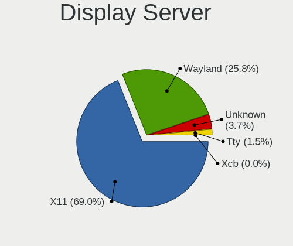
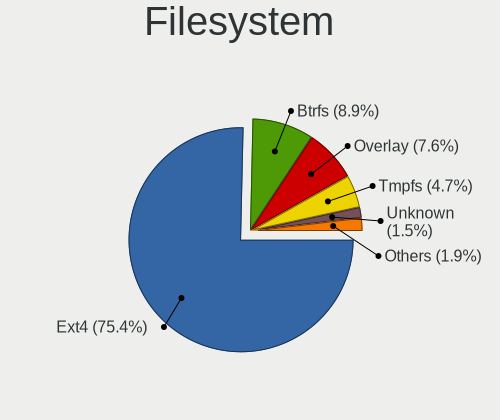
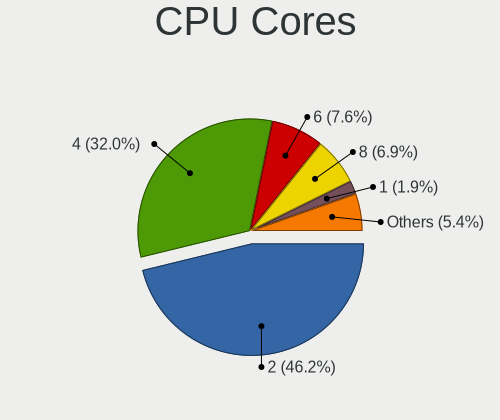
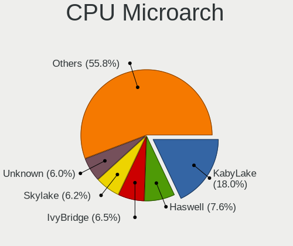
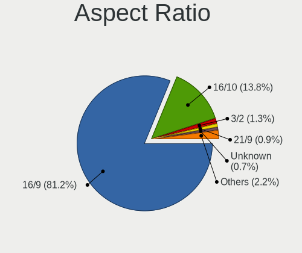
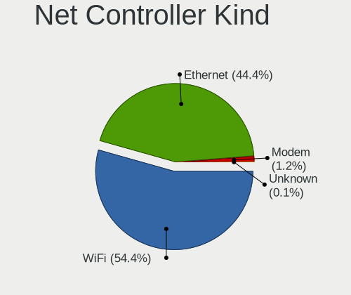
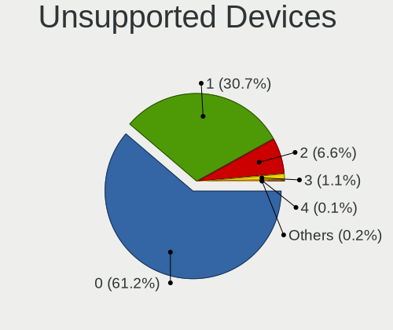

Linux in France - Tested Hardware & Statistics (Notebooks)
----------------------------------------------------------

A project to collect tested hardware configurations for Linux in France.

Anyone can contribute to this report by the [hw-probe](https://github.com/linuxhw/hw-probe) tool:

    sudo -E hw-probe -all -upload

Please contribute! Especially if your hardware is rare.

Contents
--------

* [ Test Cases ](#test-cases)

* [ System ](#system)
  - [ OS                       ](#os)
  - [ OS Family                ](#os-family)
  - [ Kernel                   ](#kernel)
  - [ Kernel Family            ](#kernel-family)
  - [ Kernel Major Ver.        ](#kernel-major-ver)
  - [ Arch                     ](#arch)
  - [ DE                       ](#de)
  - [ Display Server           ](#display-server)
  - [ Display Manager          ](#display-manager)
  - [ OS Lang                  ](#os-lang)
  - [ Boot Mode                ](#boot-mode)
  - [ Filesystem               ](#filesystem)
  - [ Part. scheme             ](#part-scheme)
  - [ Dual Boot with Linux/BSD ](#dual-boot-with-linuxbsd)
  - [ Dual Boot (Win)          ](#dual-boot-win)

* [ Board ](#board)
  - [ Vendor                   ](#vendor)
  - [ Model                    ](#model)
  - [ Model Family             ](#model-family)
  - [ MFG Year                 ](#mfg-year)
  - [ Form Factor              ](#form-factor)
  - [ Secure Boot              ](#secure-boot)
  - [ Coreboot                 ](#coreboot)
  - [ RAM Size                 ](#ram-size)
  - [ RAM Used                 ](#ram-used)
  - [ Total Drives             ](#total-drives)
  - [ Has CD-ROM               ](#has-cd-rom)
  - [ Has Ethernet             ](#has-ethernet)
  - [ Has WiFi                 ](#has-wifi)
  - [ Has Bluetooth            ](#has-bluetooth)

* [ Location ](#location)
  - [ Country                  ](#country)
  - [ City                     ](#city)

* [ Drives ](#drives)
  - [ Drive Vendor             ](#drive-vendor)
  - [ Drive Model              ](#drive-model)
  - [ HDD Vendor               ](#hdd-vendor)
  - [ SSD Vendor               ](#ssd-vendor)
  - [ Drive Kind               ](#drive-kind)
  - [ Drive Connector          ](#drive-connector)
  - [ Drive Size               ](#drive-size)
  - [ Space Total              ](#space-total)
  - [ Space Used               ](#space-used)
  - [ Malfunc. Drives          ](#malfunc-drives)
  - [ Malfunc. Drive Vendor    ](#malfunc-drive-vendor)
  - [ Malfunc. HDD Vendor      ](#malfunc-hdd-vendor)
  - [ Malfunc. Drive Kind      ](#malfunc-drive-kind)
  - [ Failed Drives            ](#failed-drives)
  - [ Failed Drive Vendor      ](#failed-drive-vendor)
  - [ Drive Status             ](#drive-status)

* [ Storage controller ](#storage-controller)
  - [ Storage Vendor           ](#storage-vendor)
  - [ Storage Model            ](#storage-model)
  - [ Storage Kind             ](#storage-kind)

* [ Processor ](#processor)
  - [ CPU Vendor               ](#cpu-vendor)
  - [ CPU Model                ](#cpu-model)
  - [ CPU Model Family         ](#cpu-model-family)
  - [ CPU Cores                ](#cpu-cores)
  - [ CPU Sockets              ](#cpu-sockets)
  - [ CPU Threads              ](#cpu-threads)
  - [ CPU Op-Modes             ](#cpu-op-modes)
  - [ CPU Microcode            ](#cpu-microcode)
  - [ CPU Microarch            ](#cpu-microarch)

* [ Graphics ](#graphics)
  - [ GPU Vendor               ](#gpu-vendor)
  - [ GPU Model                ](#gpu-model)
  - [ GPU Combo                ](#gpu-combo)
  - [ GPU Driver               ](#gpu-driver)
  - [ GPU Memory               ](#gpu-memory)

* [ Monitor ](#monitor)
  - [ Monitor Vendor           ](#monitor-vendor)
  - [ Monitor Model            ](#monitor-model)
  - [ Monitor Resolution       ](#monitor-resolution)
  - [ Monitor Diagonal         ](#monitor-diagonal)
  - [ Monitor Width            ](#monitor-width)
  - [ Aspect Ratio             ](#aspect-ratio)
  - [ Monitor Area             ](#monitor-area)
  - [ Pixel Density            ](#pixel-density)
  - [ Multiple Monitors        ](#multiple-monitors)

* [ Network ](#network)
  - [ Net Controller Vendor    ](#net-controller-vendor)
  - [ Net Controller Model     ](#net-controller-model)
  - [ Wireless Vendor          ](#wireless-vendor)
  - [ Wireless Model           ](#wireless-model)
  - [ Ethernet Vendor          ](#ethernet-vendor)
  - [ Ethernet Model           ](#ethernet-model)
  - [ Net Controller Kind      ](#net-controller-kind)
  - [ Used Controller          ](#used-controller)
  - [ NICs                     ](#nics)
  - [ IPv6                     ](#ipv6)

* [ Bluetooth ](#bluetooth)
  - [ Bluetooth Vendor         ](#bluetooth-vendor)
  - [ Bluetooth Model          ](#bluetooth-model)

* [ Sound ](#sound)
  - [ Sound Vendor             ](#sound-vendor)
  - [ Sound Model              ](#sound-model)

* [ Memory ](#memory)
  - [ Memory Vendor            ](#memory-vendor)
  - [ Memory Model             ](#memory-model)
  - [ Memory Kind              ](#memory-kind)
  - [ Memory Form Factor       ](#memory-form-factor)
  - [ Memory Size              ](#memory-size)
  - [ Memory Speed             ](#memory-speed)

* [ Printers & scanners ](#printers--scanners)
  - [ Printer Vendor           ](#printer-vendor)
  - [ Printer Model            ](#printer-model)
  - [ Scanner Vendor           ](#scanner-vendor)
  - [ Scanner Model            ](#scanner-model)

* [ Camera ](#camera)
  - [ Camera Vendor            ](#camera-vendor)
  - [ Camera Model             ](#camera-model)

* [ Security ](#security)
  - [ Fingerprint Vendor       ](#fingerprint-vendor)
  - [ Fingerprint Model        ](#fingerprint-model)
  - [ Chipcard Vendor          ](#chipcard-vendor)
  - [ Chipcard Model           ](#chipcard-model)

* [ Unsupported ](#unsupported)
  - [ Unsupported Devices      ](#unsupported-devices)
  - [ Unsupported Device Types ](#unsupported-device-types)

Test Cases
----------

Total: 5729

| Vendor        | Model                       | Probe                                                      | Date         |
|---------------|-----------------------------|------------------------------------------------------------|--------------|
| Toshiba       | Satellite C70D-A            | [7a421ed810](https://linux-hardware.org/?probe=7a421ed810) | Nov 02, 2022 |
| Toshiba       | Satellite C70D-A            | [d82227846b](https://linux-hardware.org/?probe=d82227846b) | Nov 02, 2022 |
| Dell          | G3 3500                     | [c595a16f59](https://linux-hardware.org/?probe=c595a16f59) | Nov 02, 2022 |
| Dell          | Latitude 5420               | [679fbcb14f](https://linux-hardware.org/?probe=679fbcb14f) | Nov 02, 2022 |
| Lenovo        | IdeaPad 320-17AST 80XW      | [9fa0489d64](https://linux-hardware.org/?probe=9fa0489d64) | Nov 01, 2022 |
| Lenovo        | IdeaPad 320-17AST 80XW      | [411a5da53c](https://linux-hardware.org/?probe=411a5da53c) | Nov 01, 2022 |
| Acer          | Swift SF314-42              | [6a0d7d5f39](https://linux-hardware.org/?probe=6a0d7d5f39) | Nov 01, 2022 |
| HP            | Pavilion dv5                | [fb23cec1a6](https://linux-hardware.org/?probe=fb23cec1a6) | Nov 01, 2022 |
| Toshiba       | Satellite C70D-B            | [ccf4e200fb](https://linux-hardware.org/?probe=ccf4e200fb) | Nov 01, 2022 |
| Valve         | Jupiter                     | [cf9998e9b9](https://linux-hardware.org/?probe=cf9998e9b9) | Nov 01, 2022 |
| ASUSTek       | S551LN                      | [67e15a659d](https://linux-hardware.org/?probe=67e15a659d) | Oct 31, 2022 |
| Valve         | Jupiter                     | [9d237f0d30](https://linux-hardware.org/?probe=9d237f0d30) | Oct 31, 2022 |
| Acer          | Swift SF314-54              | [71cf98e6e8](https://linux-hardware.org/?probe=71cf98e6e8) | Oct 31, 2022 |
| HP            | Compaq nc6320 (EV073AV)     | [b73f359ded](https://linux-hardware.org/?probe=b73f359ded) | Oct 31, 2022 |
| Acer          | Extensa 5635Z               | [35ce596e08](https://linux-hardware.org/?probe=35ce596e08) | Oct 31, 2022 |
| Dell          | Latitude E5500              | [c64399793c](https://linux-hardware.org/?probe=c64399793c) | Oct 31, 2022 |
| HP            | Compaq Presario CQ71        | [ea057ea9b9](https://linux-hardware.org/?probe=ea057ea9b9) | Oct 31, 2022 |
| Lenovo        | ThinkPad T16 Gen 1 21BVC... | [ce59648f62](https://linux-hardware.org/?probe=ce59648f62) | Oct 31, 2022 |
| HUAWEI        | BOHK-WAX9X                  | [e993af2670](https://linux-hardware.org/?probe=e993af2670) | Oct 31, 2022 |
| Acer          | Aspire E5-573G              | [acfa0d90d6](https://linux-hardware.org/?probe=acfa0d90d6) | Oct 31, 2022 |
| Lenovo        | ThinkPad X270 20HN0014FR    | [d6fc7c48a1](https://linux-hardware.org/?probe=d6fc7c48a1) | Oct 30, 2022 |
| Lenovo        | ThinkPad T16 Gen 1 21BVC... | [e8a1f8f6bf](https://linux-hardware.org/?probe=e8a1f8f6bf) | Oct 30, 2022 |
| ASUSTek       | G74Sx                       | [c24c24ab27](https://linux-hardware.org/?probe=c24c24ab27) | Oct 30, 2022 |
| Dell          | XPS L322X                   | [cacebfe41e](https://linux-hardware.org/?probe=cacebfe41e) | Oct 30, 2022 |
| Samsung       | RV410/RV510/S3510/E3510     | [d4552d84d5](https://linux-hardware.org/?probe=d4552d84d5) | Oct 30, 2022 |
| Acer          | Swift SF314-42              | [6873e5b579](https://linux-hardware.org/?probe=6873e5b579) | Oct 30, 2022 |
| Valve         | Jupiter                     | [d4c562a178](https://linux-hardware.org/?probe=d4c562a178) | Oct 30, 2022 |
| Acer          | Swift SF314-42              | [da1b668449](https://linux-hardware.org/?probe=da1b668449) | Oct 30, 2022 |
| ASUSTek       | E200HA                      | [18ca81370b](https://linux-hardware.org/?probe=18ca81370b) | Oct 29, 2022 |
| ASUSTek       | E200HA                      | [0a95698cb6](https://linux-hardware.org/?probe=0a95698cb6) | Oct 29, 2022 |
| HP            | Compaq 615                  | [ae90fa3742](https://linux-hardware.org/?probe=ae90fa3742) | Oct 29, 2022 |
| HP            | OMEN by Laptop              | [610be75cca](https://linux-hardware.org/?probe=610be75cca) | Oct 29, 2022 |
| ASUSTek       | X751NV                      | [9ef2717db0](https://linux-hardware.org/?probe=9ef2717db0) | Oct 29, 2022 |
| IP3 Tech      | AP1                         | [0562a6a46d](https://linux-hardware.org/?probe=0562a6a46d) | Oct 28, 2022 |
| Notebook      | NV4xPZ                      | [86e7370778](https://linux-hardware.org/?probe=86e7370778) | Oct 28, 2022 |
| IP3 Tech      | AP1                         | [2a9c0ff1c5](https://linux-hardware.org/?probe=2a9c0ff1c5) | Oct 28, 2022 |
| Lenovo        | ThinkPad T560 20FHCTO1WW    | [05ff2d32fa](https://linux-hardware.org/?probe=05ff2d32fa) | Oct 28, 2022 |
| Lenovo        | ThinkPad T560 20FHCTO1WW    | [403a99d8b2](https://linux-hardware.org/?probe=403a99d8b2) | Oct 28, 2022 |
| Lenovo        | ThinkPad P15 Gen 2i 20YR... | [0c6a68368c](https://linux-hardware.org/?probe=0c6a68368c) | Oct 27, 2022 |
| ASUSTek       | N501VW                      | [07f7d43f09](https://linux-hardware.org/?probe=07f7d43f09) | Oct 27, 2022 |
| Acer          | Extensa 2509                | [a27b3d38a9](https://linux-hardware.org/?probe=a27b3d38a9) | Oct 27, 2022 |
| Alienware     | m17 R4                      | [14770101cf](https://linux-hardware.org/?probe=14770101cf) | Oct 27, 2022 |
| Acer          | Swift SF314-42              | [8c9d6eb128](https://linux-hardware.org/?probe=8c9d6eb128) | Oct 27, 2022 |
| Dell          | Latitude 5310               | [10b8371dbd](https://linux-hardware.org/?probe=10b8371dbd) | Oct 27, 2022 |
| Acer          | Swift SF314-42              | [6aaeaf667c](https://linux-hardware.org/?probe=6aaeaf667c) | Oct 27, 2022 |
| ASUSTek       | ASUS EXPERTBOOK B1400CEP... | [9564d50ef8](https://linux-hardware.org/?probe=9564d50ef8) | Oct 27, 2022 |
| Acer          | Swift SF314-512             | [951c734c1b](https://linux-hardware.org/?probe=951c734c1b) | Oct 27, 2022 |
| Valve         | Jupiter                     | [088235cbff](https://linux-hardware.org/?probe=088235cbff) | Oct 26, 2022 |
| Dell          | Precision 7560              | [c82d6a32a5](https://linux-hardware.org/?probe=c82d6a32a5) | Oct 26, 2022 |
| Dell          | XPS 13 9305                 | [6062baa35c](https://linux-hardware.org/?probe=6062baa35c) | Oct 26, 2022 |
| Lenovo        | IdeaPad 3 15ADA05 81W1      | [34be38a48b](https://linux-hardware.org/?probe=34be38a48b) | Oct 26, 2022 |
| Toshiba       | Satellite C660              | [6b0380ea4c](https://linux-hardware.org/?probe=6b0380ea4c) | Oct 26, 2022 |
| ASUSTek       | GL753VD                     | [08b067d2cf](https://linux-hardware.org/?probe=08b067d2cf) | Oct 25, 2022 |
| ASUSTek       | ZenBook UX333FN_UX333FN     | [a128f79c0a](https://linux-hardware.org/?probe=a128f79c0a) | Oct 25, 2022 |
| ASUSTek       | VivoBook E14 E402WAS        | [eadb224c05](https://linux-hardware.org/?probe=eadb224c05) | Oct 25, 2022 |
| Dell          | Inspiron 7737               | [727b48a339](https://linux-hardware.org/?probe=727b48a339) | Oct 25, 2022 |
| Lenovo        | ThinkBook 15 G3 ACL 21A4    | [8f246bccb1](https://linux-hardware.org/?probe=8f246bccb1) | Oct 25, 2022 |
| Lenovo        | ThinkBook 15 G3 ACL 21A4    | [bc5adf7f4b](https://linux-hardware.org/?probe=bc5adf7f4b) | Oct 25, 2022 |
| Valve         | Jupiter                     | [6ed87cbcfb](https://linux-hardware.org/?probe=6ed87cbcfb) | Oct 25, 2022 |
| ASUSTek       | ZenBook UX333FN_UX333FN     | [ec7f3834d1](https://linux-hardware.org/?probe=ec7f3834d1) | Oct 25, 2022 |
| Toshiba       | Satellite A505              | [41dafcbfb9](https://linux-hardware.org/?probe=41dafcbfb9) | Oct 25, 2022 |
| Lenovo        | ThinkPad P16s Gen 1 21CK... | [814da05eec](https://linux-hardware.org/?probe=814da05eec) | Oct 25, 2022 |
| Lenovo        | G50-45 80MQ                 | [1c6d041ce2](https://linux-hardware.org/?probe=1c6d041ce2) | Oct 25, 2022 |
| Valve         | Jupiter                     | [fe664e172e](https://linux-hardware.org/?probe=fe664e172e) | Oct 24, 2022 |
| Dell          | Studio 1737                 | [d6e17c05b2](https://linux-hardware.org/?probe=d6e17c05b2) | Oct 24, 2022 |
| Packard Be... | H17HV                       | [2e94cfdd84](https://linux-hardware.org/?probe=2e94cfdd84) | Oct 24, 2022 |
| MSI           | Pulse GL76 12UEK            | [bb06dc4756](https://linux-hardware.org/?probe=bb06dc4756) | Oct 24, 2022 |
| Toshiba       | Satellite C660              | [646b07cc4c](https://linux-hardware.org/?probe=646b07cc4c) | Oct 24, 2022 |
| Packard Be... | EasyNote ENTE70BH           | [2135a5aed7](https://linux-hardware.org/?probe=2135a5aed7) | Oct 23, 2022 |
| Sony          | VGN-SZ3XP_C                 | [72f83141a0](https://linux-hardware.org/?probe=72f83141a0) | Oct 23, 2022 |
| Dell          | Inspiron 5567               | [42280c6145](https://linux-hardware.org/?probe=42280c6145) | Oct 23, 2022 |
| Dell          | Precision 7750              | [dd51bb7ccd](https://linux-hardware.org/?probe=dd51bb7ccd) | Oct 23, 2022 |
| Lenovo        | ThinkPad X240 20AMS01M00    | [2f1c7b7716](https://linux-hardware.org/?probe=2f1c7b7716) | Oct 23, 2022 |
| Dell          | Latitude E6510              | [73cd1082f8](https://linux-hardware.org/?probe=73cd1082f8) | Oct 22, 2022 |
| Dell          | Latitude 5420               | [dd9b95a216](https://linux-hardware.org/?probe=dd9b95a216) | Oct 22, 2022 |
| Acer          | TravelMate P256-M           | [7ca952de68](https://linux-hardware.org/?probe=7ca952de68) | Oct 22, 2022 |
| ASUSTek       | ZenBook UX534FAC_UX534FA    | [928997f65c](https://linux-hardware.org/?probe=928997f65c) | Oct 22, 2022 |
| Dell          | Latitude E6520              | [88af6c857c](https://linux-hardware.org/?probe=88af6c857c) | Oct 22, 2022 |
| Dell          | Latitude E6520              | [246517ceab](https://linux-hardware.org/?probe=246517ceab) | Oct 22, 2022 |
| Lenovo        | IdeaPad 3 15ALC6 82KU       | [57bfd1e0e9](https://linux-hardware.org/?probe=57bfd1e0e9) | Oct 22, 2022 |
| HP            | ProBook 6550b               | [cc300bedc8](https://linux-hardware.org/?probe=cc300bedc8) | Oct 21, 2022 |
| Lenovo        | ThinkPad T16 Gen 1 21CHC... | [a22e54462c](https://linux-hardware.org/?probe=a22e54462c) | Oct 21, 2022 |
| HP            | Stream Notebook             | [685271f268](https://linux-hardware.org/?probe=685271f268) | Oct 21, 2022 |
| Lenovo        | IdeaPad 120S-14IAP 81A5     | [45d7e6a1aa](https://linux-hardware.org/?probe=45d7e6a1aa) | Oct 21, 2022 |
| MAXDATA       | obook2-1                    | [c7e03dae2f](https://linux-hardware.org/?probe=c7e03dae2f) | Oct 21, 2022 |
| Radxa         | ROCK Pi X v1.4              | [133d713246](https://linux-hardware.org/?probe=133d713246) | Oct 21, 2022 |
| Lenovo        | ThinkPad R61 8935AC7        | [94d73589fc](https://linux-hardware.org/?probe=94d73589fc) | Oct 21, 2022 |
| HP            | EliteBook 830 G8 Noteboo... | [47ca27793e](https://linux-hardware.org/?probe=47ca27793e) | Oct 21, 2022 |
| HP            | Pavilion Gaming Laptop 1... | [7acb5493d7](https://linux-hardware.org/?probe=7acb5493d7) | Oct 21, 2022 |
| MAXDATA       | obook2-1                    | [0f73d884ff](https://linux-hardware.org/?probe=0f73d884ff) | Oct 21, 2022 |
| ASUSTek       | G75VW                       | [194959e65e](https://linux-hardware.org/?probe=194959e65e) | Oct 20, 2022 |
| Valve         | Jupiter                     | [ea0d3e9186](https://linux-hardware.org/?probe=ea0d3e9186) | Oct 20, 2022 |
| Gigabyte      | X7X7                        | [f2c35e3917](https://linux-hardware.org/?probe=f2c35e3917) | Oct 20, 2022 |
| HP            | ProBook 6550b               | [176fc347d2](https://linux-hardware.org/?probe=176fc347d2) | Oct 20, 2022 |
| HP            | EliteBook 840 Aero G8 No... | [80738ede80](https://linux-hardware.org/?probe=80738ede80) | Oct 20, 2022 |
| Lenovo        | IdeaPad 320-15IKB 80XL      | [c8e47b28fe](https://linux-hardware.org/?probe=c8e47b28fe) | Oct 20, 2022 |
| HP            | EliteBook 840 G5            | [ef1acaa7da](https://linux-hardware.org/?probe=ef1acaa7da) | Oct 20, 2022 |
| HP            | EliteBook 840 G5            | [3ec2887574](https://linux-hardware.org/?probe=3ec2887574) | Oct 20, 2022 |
| Dell          | Precision 5510              | [bb7788ce01](https://linux-hardware.org/?probe=bb7788ce01) | Oct 20, 2022 |
| Alienware     | x15 R2                      | [39d9f7988a](https://linux-hardware.org/?probe=39d9f7988a) | Oct 20, 2022 |
| Dell          | Latitude 5420               | [a6ef44d08a](https://linux-hardware.org/?probe=a6ef44d08a) | Oct 20, 2022 |
| HP            | EliteBook 840 G8 Noteboo... | [5a8ac06ce5](https://linux-hardware.org/?probe=5a8ac06ce5) | Oct 19, 2022 |
| Dell          | Latitude 7300               | [5674456b5d](https://linux-hardware.org/?probe=5674456b5d) | Oct 19, 2022 |
| HP            | 620                         | [263e2a0ba9](https://linux-hardware.org/?probe=263e2a0ba9) | Oct 19, 2022 |
| Notebook      | NS50_70MU                   | [0f13ae1769](https://linux-hardware.org/?probe=0f13ae1769) | Oct 19, 2022 |
| Notebook      | NS50_70MU                   | [2df95e6892](https://linux-hardware.org/?probe=2df95e6892) | Oct 19, 2022 |
| HP            | 620                         | [ad17206515](https://linux-hardware.org/?probe=ad17206515) | Oct 18, 2022 |
| Dell          | Precision 7750              | [93dcf0527b](https://linux-hardware.org/?probe=93dcf0527b) | Oct 18, 2022 |
| Dell          | Precision 7750              | [d32782f149](https://linux-hardware.org/?probe=d32782f149) | Oct 18, 2022 |
| ASUSTek       | G75VW                       | [5ee12be257](https://linux-hardware.org/?probe=5ee12be257) | Oct 18, 2022 |
| Insyde        | WindTab89                   | [8eb81874bb](https://linux-hardware.org/?probe=8eb81874bb) | Oct 18, 2022 |
| UNOWHY        | Y13G010S4EI                 | [f7f13866aa](https://linux-hardware.org/?probe=f7f13866aa) | Oct 18, 2022 |
| Dell          | Latitude 7300               | [c9bc03da26](https://linux-hardware.org/?probe=c9bc03da26) | Oct 18, 2022 |
| HP            | ZBook 14 G2                 | [fde830d956](https://linux-hardware.org/?probe=fde830d956) | Oct 18, 2022 |
| Sony          | VPCEH3U1E                   | [aff8f19a59](https://linux-hardware.org/?probe=aff8f19a59) | Oct 18, 2022 |
| Sony          | VPCEH3U1E                   | [c33d20c223](https://linux-hardware.org/?probe=c33d20c223) | Oct 18, 2022 |
| HP            | Pavilion dv7                | [bb650e8400](https://linux-hardware.org/?probe=bb650e8400) | Oct 18, 2022 |
| Dell          | Precision 3570              | [90711415f5](https://linux-hardware.org/?probe=90711415f5) | Oct 18, 2022 |
| ASUSTek       | F9S                         | [c8df776935](https://linux-hardware.org/?probe=c8df776935) | Oct 17, 2022 |
| Lenovo        | ThinkBook 15 G2 ITL 20VE    | [bbff53957f](https://linux-hardware.org/?probe=bbff53957f) | Oct 17, 2022 |
| Dell          | G3 3500                     | [64698d52bb](https://linux-hardware.org/?probe=64698d52bb) | Oct 17, 2022 |
| Dell          | G3 3500                     | [902fc2d51b](https://linux-hardware.org/?probe=902fc2d51b) | Oct 17, 2022 |
| ASUSTek       | G75VW                       | [10bcc184e7](https://linux-hardware.org/?probe=10bcc184e7) | Oct 17, 2022 |
| UNOWHY        | Y13G010S4EI                 | [fca234fc49](https://linux-hardware.org/?probe=fca234fc49) | Oct 17, 2022 |
| Lenovo        | IdeaPad Gaming 3 15ACH6 ... | [a4ebad3748](https://linux-hardware.org/?probe=a4ebad3748) | Oct 17, 2022 |
| HP            | Pavilion Laptop 15-cs0xx... | [9e37b60507](https://linux-hardware.org/?probe=9e37b60507) | Oct 16, 2022 |
| ASUSTek       | G75VW                       | [a88a291921](https://linux-hardware.org/?probe=a88a291921) | Oct 16, 2022 |
| ASUSTek       | M70Vn                       | [e9301bdee2](https://linux-hardware.org/?probe=e9301bdee2) | Oct 16, 2022 |
| Dell          | Latitude 3500               | [d578b45420](https://linux-hardware.org/?probe=d578b45420) | Oct 16, 2022 |
| Dell          | Latitude E5420              | [dcc7463646](https://linux-hardware.org/?probe=dcc7463646) | Oct 16, 2022 |
| HP            | ENVY 17                     | [ab25d54223](https://linux-hardware.org/?probe=ab25d54223) | Oct 16, 2022 |
| UNOWHY        | Y13G011S4EI                 | [c210cda35b](https://linux-hardware.org/?probe=c210cda35b) | Oct 16, 2022 |
| Lenovo        | V145-15AST 81MT             | [d73a82b798](https://linux-hardware.org/?probe=d73a82b798) | Oct 15, 2022 |
| Valve         | Jupiter                     | [7559400f9a](https://linux-hardware.org/?probe=7559400f9a) | Oct 15, 2022 |
| ASUSTek       | X751NV                      | [174ee8f3e7](https://linux-hardware.org/?probe=174ee8f3e7) | Oct 15, 2022 |
| Dell          | Latitude 5400               | [645c7a01da](https://linux-hardware.org/?probe=645c7a01da) | Oct 15, 2022 |
| Acer          | AOD257                      | [41a717913c](https://linux-hardware.org/?probe=41a717913c) | Oct 15, 2022 |
| Acer          | Aspire 7730ZG               | [4796b36078](https://linux-hardware.org/?probe=4796b36078) | Oct 15, 2022 |
| Acer          | Aspire 7740                 | [a68780a6fd](https://linux-hardware.org/?probe=a68780a6fd) | Oct 15, 2022 |
| Lenovo        | ThinkPad L420 78545EG       | [d2c975644c](https://linux-hardware.org/?probe=d2c975644c) | Oct 15, 2022 |
| Lenovo        | ThinkPad T420 4236JY2       | [fd260f87a9](https://linux-hardware.org/?probe=fd260f87a9) | Oct 14, 2022 |
| Dell          | G3 3500                     | [f7cc47bb67](https://linux-hardware.org/?probe=f7cc47bb67) | Oct 13, 2022 |
| Lenovo        | Yoga S740-15IRH 81NX        | [e4c404552a](https://linux-hardware.org/?probe=e4c404552a) | Oct 13, 2022 |
| HP            | EliteBook 840 G1            | [fe9dde997d](https://linux-hardware.org/?probe=fe9dde997d) | Oct 13, 2022 |
| MSI           | GE70 2QE                    | [2825343a52](https://linux-hardware.org/?probe=2825343a52) | Oct 13, 2022 |
| Lenovo        | ThinkPad X1 Carbon 4th 2... | [d1c1c4adea](https://linux-hardware.org/?probe=d1c1c4adea) | Oct 13, 2022 |
| Lenovo        | ThinkPad X1 Carbon 34481... | [adce18affa](https://linux-hardware.org/?probe=adce18affa) | Oct 13, 2022 |
| UNOWHY        | Y13G011S4EI                 | [2be4dc3fc2](https://linux-hardware.org/?probe=2be4dc3fc2) | Oct 13, 2022 |
| Lenovo        | ThinkPad X1 Carbon 3rd 2... | [dfc5a5f754](https://linux-hardware.org/?probe=dfc5a5f754) | Oct 13, 2022 |
| Dell          | Latitude E5550              | [fc1fa79f81](https://linux-hardware.org/?probe=fc1fa79f81) | Oct 13, 2022 |
| Dell          | Inspiron 5759               | [2656af4553](https://linux-hardware.org/?probe=2656af4553) | Oct 13, 2022 |
| HP            | Stream Notebook PC 13       | [173cd34bf9](https://linux-hardware.org/?probe=173cd34bf9) | Oct 12, 2022 |
| ASUSTek       | M70Vn                       | [62cb9744e6](https://linux-hardware.org/?probe=62cb9744e6) | Oct 12, 2022 |
| Thomson       | N14C4WH64                   | [bfc16b9ded](https://linux-hardware.org/?probe=bfc16b9ded) | Oct 12, 2022 |
| ASUSTek       | N53Jg                       | [0b4302ed6c](https://linux-hardware.org/?probe=0b4302ed6c) | Oct 11, 2022 |
| Dell          | Latitude E6410              | [9ed4124073](https://linux-hardware.org/?probe=9ed4124073) | Oct 11, 2022 |
| Acer          | Aspire 7750G                | [e0c71d09bb](https://linux-hardware.org/?probe=e0c71d09bb) | Oct 11, 2022 |
| Acer          | Aspire 7750G                | [4eacf977db](https://linux-hardware.org/?probe=4eacf977db) | Oct 11, 2022 |
| Lenovo        | G50-30 80G0                 | [f96c4889db](https://linux-hardware.org/?probe=f96c4889db) | Oct 10, 2022 |
| Letni         | Z156                        | [994c588906](https://linux-hardware.org/?probe=994c588906) | Oct 10, 2022 |
| Dell          | Latitude 5400               | [ff8eb160c9](https://linux-hardware.org/?probe=ff8eb160c9) | Oct 10, 2022 |
| HP            | Notebook                    | [2fd3bd5ee0](https://linux-hardware.org/?probe=2fd3bd5ee0) | Oct 10, 2022 |
| Alienware     | m15 R7                      | [79aa2b2dd4](https://linux-hardware.org/?probe=79aa2b2dd4) | Oct 10, 2022 |
| Chuwi         | GemiBook Pro                | [02170aab85](https://linux-hardware.org/?probe=02170aab85) | Oct 09, 2022 |
| Notebook      | NLx0MU                      | [900e75392f](https://linux-hardware.org/?probe=900e75392f) | Oct 09, 2022 |
| Dell          | Inspiron 16 7610            | [fddf8f17bd](https://linux-hardware.org/?probe=fddf8f17bd) | Oct 08, 2022 |
| ASUSTek       | VivoBook_ASUSLaptop M740... | [1b90e3cfa5](https://linux-hardware.org/?probe=1b90e3cfa5) | Oct 08, 2022 |
| Chuwi         | GemiBook Pro                | [1a165faedb](https://linux-hardware.org/?probe=1a165faedb) | Oct 08, 2022 |
| Lenovo        | IdeaPad 3 17IML05 81WC      | [1b720b4302](https://linux-hardware.org/?probe=1b720b4302) | Oct 08, 2022 |
| Dell          | Latitude E6410              | [0b617be9dd](https://linux-hardware.org/?probe=0b617be9dd) | Oct 08, 2022 |
| HP            | EliteBook 840 G3            | [2643af430d](https://linux-hardware.org/?probe=2643af430d) | Oct 08, 2022 |
| HP            | EliteBook 840 G3            | [f8bf937f1e](https://linux-hardware.org/?probe=f8bf937f1e) | Oct 08, 2022 |
| Apple         | MacBookAir6,2               | [9f434d86be](https://linux-hardware.org/?probe=9f434d86be) | Oct 08, 2022 |
| ASUSTek       | VivoBook_ASUSLaptop M740... | [9bb8f8e33b](https://linux-hardware.org/?probe=9bb8f8e33b) | Oct 07, 2022 |
| Acer          | Swift SF314-51              | [cfc56878f0](https://linux-hardware.org/?probe=cfc56878f0) | Oct 07, 2022 |
| HP            | Laptop 15s-fq2xxx           | [69e60dfe44](https://linux-hardware.org/?probe=69e60dfe44) | Oct 07, 2022 |
| Clevo         | W2xxHSQ                     | [3a05b61e0b](https://linux-hardware.org/?probe=3a05b61e0b) | Oct 07, 2022 |
| Lenovo        | ThinkPad P50 20EQS1WW00     | [e6eac5c882](https://linux-hardware.org/?probe=e6eac5c882) | Oct 07, 2022 |
| Lenovo        | ThinkPad X1 Carbon 7th 2... | [8901403de4](https://linux-hardware.org/?probe=8901403de4) | Oct 07, 2022 |
| MSI           | Modern 14 A10M              | [ae56e506c3](https://linux-hardware.org/?probe=ae56e506c3) | Oct 06, 2022 |
| Dell          | Latitude 7300               | [3eb18574b3](https://linux-hardware.org/?probe=3eb18574b3) | Oct 06, 2022 |
| ASUSTek       | X550LA                      | [c0c98c2051](https://linux-hardware.org/?probe=c0c98c2051) | Oct 06, 2022 |
| Dell          | Latitude 7480               | [aa3f8d08a6](https://linux-hardware.org/?probe=aa3f8d08a6) | Oct 06, 2022 |
| Toshiba       | Satellite NB10t-A-102       | [0bf17a1e92](https://linux-hardware.org/?probe=0bf17a1e92) | Oct 06, 2022 |
| PC Special... | PCX0DX                      | [35e44699ff](https://linux-hardware.org/?probe=35e44699ff) | Oct 06, 2022 |
| Sony          | VGN-SZ3XP_C                 | [f4fd751216](https://linux-hardware.org/?probe=f4fd751216) | Oct 05, 2022 |
| Dell          | Latitude 7300               | [a57bc6e1a5](https://linux-hardware.org/?probe=a57bc6e1a5) | Oct 05, 2022 |
| HP            | Compaq 15                   | [bba22531ad](https://linux-hardware.org/?probe=bba22531ad) | Oct 05, 2022 |
| Lenovo        | IdeaPad 320-15IKB 80XL      | [e4df51e64f](https://linux-hardware.org/?probe=e4df51e64f) | Oct 05, 2022 |
| Dell          | XPS 17 9710                 | [7590ca8bff](https://linux-hardware.org/?probe=7590ca8bff) | Oct 05, 2022 |
| Lenovo        | ThinkPad L430 24641J9       | [4f4932300b](https://linux-hardware.org/?probe=4f4932300b) | Oct 05, 2022 |
| HP            | Compaq 15                   | [0f48335990](https://linux-hardware.org/?probe=0f48335990) | Oct 05, 2022 |
| ASUSTek       | UX32VD                      | [0bea9d8673](https://linux-hardware.org/?probe=0bea9d8673) | Oct 05, 2022 |
| ASUSTek       | S551LN                      | [bdb441bda7](https://linux-hardware.org/?probe=bdb441bda7) | Oct 04, 2022 |
| ASUSTek       | S551LN                      | [b56c08cbcf](https://linux-hardware.org/?probe=b56c08cbcf) | Oct 04, 2022 |
| Dell          | Latitude E5430 non-vPro     | [33b42f3ed1](https://linux-hardware.org/?probe=33b42f3ed1) | Oct 04, 2022 |
| HP            | ZBook 14u G6                | [87437a85a7](https://linux-hardware.org/?probe=87437a85a7) | Oct 04, 2022 |
| MSI           | CR61 3M                     | [496910c25b](https://linux-hardware.org/?probe=496910c25b) | Oct 04, 2022 |
| Medion        | E7214                       | [c4ee9367cf](https://linux-hardware.org/?probe=c4ee9367cf) | Oct 04, 2022 |
| Medion        | E7214                       | [e8e78221ca](https://linux-hardware.org/?probe=e8e78221ca) | Oct 04, 2022 |
| Dell          | Latitude E6230              | [a4af37beac](https://linux-hardware.org/?probe=a4af37beac) | Oct 04, 2022 |
| UNOWHY        | Y13G010S4EI                 | [38f5b56e5d](https://linux-hardware.org/?probe=38f5b56e5d) | Oct 04, 2022 |
| Notebook      | W54_55SU1,SUW               | [54083a4f07](https://linux-hardware.org/?probe=54083a4f07) | Oct 04, 2022 |
| Lenovo        | Yoga S740-15IRH 81NX        | [eb1ee8ad1f](https://linux-hardware.org/?probe=eb1ee8ad1f) | Oct 04, 2022 |
| HP            | Victus by Laptop 16-e0xx... | [84fbbaf62c](https://linux-hardware.org/?probe=84fbbaf62c) | Oct 04, 2022 |
| Lenovo        | B590 62743BG                | [8c120b5fea](https://linux-hardware.org/?probe=8c120b5fea) | Oct 03, 2022 |
| Apple         | MacBookPro5,5               | [5a5aada87f](https://linux-hardware.org/?probe=5a5aada87f) | Oct 03, 2022 |
| Dell          | Latitude E6420              | [cc0d33aedb](https://linux-hardware.org/?probe=cc0d33aedb) | Oct 03, 2022 |
| Dell          | Latitude E5430 non-vPro     | [81ac41d8b9](https://linux-hardware.org/?probe=81ac41d8b9) | Oct 03, 2022 |
| HP            | EliteBook 840 G1            | [5bcba21765](https://linux-hardware.org/?probe=5bcba21765) | Oct 03, 2022 |
| Dell          | Latitude 7300               | [d9acb6ec9c](https://linux-hardware.org/?probe=d9acb6ec9c) | Oct 03, 2022 |
| Dell          | Precision 5560              | [168025b691](https://linux-hardware.org/?probe=168025b691) | Oct 03, 2022 |
| Sony          | VPCSB1S1E                   | [b85b92339b](https://linux-hardware.org/?probe=b85b92339b) | Oct 03, 2022 |
| HP            | EliteBook 850 G8 Noteboo... | [2f9e023d1e](https://linux-hardware.org/?probe=2f9e023d1e) | Oct 03, 2022 |
| Dell          | Latitude 7490               | [872aafeb50](https://linux-hardware.org/?probe=872aafeb50) | Oct 02, 2022 |
| Dell          | Latitude E6410              | [7f89aefd99](https://linux-hardware.org/?probe=7f89aefd99) | Oct 02, 2022 |
| Lenovo        | ThinkPad R500 27148UG       | [1c968e44cb](https://linux-hardware.org/?probe=1c968e44cb) | Oct 02, 2022 |
| Lenovo        | Legion Y540-15IRH 81SX      | [80a2948ff1](https://linux-hardware.org/?probe=80a2948ff1) | Oct 02, 2022 |
| Sony          | VGN-SZ3XP_C                 | [6e9671dd1a](https://linux-hardware.org/?probe=6e9671dd1a) | Oct 02, 2022 |
| ASUSTek       | X550JX                      | [43694e5952](https://linux-hardware.org/?probe=43694e5952) | Oct 02, 2022 |
| Acer          | Aspire 7750G                | [ccf9b69093](https://linux-hardware.org/?probe=ccf9b69093) | Oct 02, 2022 |
| Acer          | Aspire 7750G                | [7b89b5d0cf](https://linux-hardware.org/?probe=7b89b5d0cf) | Oct 02, 2022 |
| Dell          | Latitude E6510              | [71b8d3743e](https://linux-hardware.org/?probe=71b8d3743e) | Oct 02, 2022 |
| HP            | ZBook 14 G2                 | [ac14cbda52](https://linux-hardware.org/?probe=ac14cbda52) | Oct 02, 2022 |
| HP            | ZBook 14 G2                 | [d0a30f35b6](https://linux-hardware.org/?probe=d0a30f35b6) | Oct 02, 2022 |
| HP            | ZBook 14 G2                 | [e192869dc8](https://linux-hardware.org/?probe=e192869dc8) | Oct 02, 2022 |
| ASUSTek       | X71Q                        | [830c8ab6d2](https://linux-hardware.org/?probe=830c8ab6d2) | Oct 02, 2022 |
| UNOWHY        | Y13G012S4EI                 | [5c4c517651](https://linux-hardware.org/?probe=5c4c517651) | Oct 02, 2022 |
| HP            | EliteBook 840 G1            | [3f70868547](https://linux-hardware.org/?probe=3f70868547) | Oct 02, 2022 |
| MSI           | CR61 3M                     | [818a721825](https://linux-hardware.org/?probe=818a721825) | Oct 02, 2022 |
| HP            | Pavilion dv7                | [2da8f083a7](https://linux-hardware.org/?probe=2da8f083a7) | Oct 01, 2022 |
| MSI           | GF65 Thin 9SEXR             | [537828a21f](https://linux-hardware.org/?probe=537828a21f) | Oct 01, 2022 |
| UNOWHY        | Y13G012S4EI                 | [014d8c23f8](https://linux-hardware.org/?probe=014d8c23f8) | Oct 01, 2022 |
| ASUSTek       | VivoBook_ASUSLaptop E410... | [462f9bbdbe](https://linux-hardware.org/?probe=462f9bbdbe) | Oct 01, 2022 |
| Lenovo        | B70-80 80MR                 | [69aec9e100](https://linux-hardware.org/?probe=69aec9e100) | Oct 01, 2022 |
| Dell          | XPS 13 9300                 | [1fade0f247](https://linux-hardware.org/?probe=1fade0f247) | Oct 01, 2022 |
| ASUSTek       | Zenbook UM5302TA_UM5302T... | [1cfda531dd](https://linux-hardware.org/?probe=1cfda531dd) | Oct 01, 2022 |
| ASUSTek       | ASUS EXPERTBOOK B1500CEA... | [24aefc4138](https://linux-hardware.org/?probe=24aefc4138) | Oct 01, 2022 |
| MSI           | Modern 14 A10M              | [571271ed93](https://linux-hardware.org/?probe=571271ed93) | Sep 30, 2022 |
| MSI           | Modern 14 A10M              | [9da1f3fe66](https://linux-hardware.org/?probe=9da1f3fe66) | Sep 30, 2022 |
| Dell          | Inspiron 15 7510            | [263276babe](https://linux-hardware.org/?probe=263276babe) | Sep 30, 2022 |
| HP            | ProBook 6570b               | [d9be946342](https://linux-hardware.org/?probe=d9be946342) | Sep 30, 2022 |
| Toshiba       | Satellite NB10t-A-102       | [5a8032ee05](https://linux-hardware.org/?probe=5a8032ee05) | Sep 30, 2022 |
| Dell          | Inspiron 15 7510            | [86e1da35ba](https://linux-hardware.org/?probe=86e1da35ba) | Sep 30, 2022 |
| Toshiba       | Satellite NB10t-A-102       | [4e9248b1eb](https://linux-hardware.org/?probe=4e9248b1eb) | Sep 30, 2022 |
| Lenovo        | ThinkPad P50 20EQS1WW00     | [786e0c1f5d](https://linux-hardware.org/?probe=786e0c1f5d) | Sep 30, 2022 |
| HUAWEI        | VLT-WX0                     | [1669dae0a6](https://linux-hardware.org/?probe=1669dae0a6) | Sep 30, 2022 |
| Toshiba       | Satellite L670              | [3b3e7965a5](https://linux-hardware.org/?probe=3b3e7965a5) | Sep 29, 2022 |
| HP            | Laptop 14s-fq1xxx           | [3990ec6cb0](https://linux-hardware.org/?probe=3990ec6cb0) | Sep 29, 2022 |
| TUXEDO        | Book_XA1510                 | [f39b64916d](https://linux-hardware.org/?probe=f39b64916d) | Sep 29, 2022 |
| Lenovo        | ThinkPad X1C 5th W10DG 2... | [0cbacebb95](https://linux-hardware.org/?probe=0cbacebb95) | Sep 29, 2022 |
| Lenovo        | Yoga S740-15IRH 81NX        | [defae2e862](https://linux-hardware.org/?probe=defae2e862) | Sep 28, 2022 |
| ASUSTek       | TUF Gaming FX505DT_TUF50... | [f758c22d98](https://linux-hardware.org/?probe=f758c22d98) | Sep 28, 2022 |
| ASUSTek       | TUF Gaming FX505DT_TUF50... | [b08fc47990](https://linux-hardware.org/?probe=b08fc47990) | Sep 28, 2022 |
| Dell          | XPS 15 9570                 | [564eb3b439](https://linux-hardware.org/?probe=564eb3b439) | Sep 28, 2022 |
| Dell          | XPS 15 9570                 | [085bd81d5b](https://linux-hardware.org/?probe=085bd81d5b) | Sep 28, 2022 |
| Dell          | Latitude E6540              | [27c854b1a0](https://linux-hardware.org/?probe=27c854b1a0) | Sep 27, 2022 |
| Samsung       | RV411/RV511/E3511/S3511/... | [ec59847e5b](https://linux-hardware.org/?probe=ec59847e5b) | Sep 27, 2022 |
| Dell          | Latitude E5250              | [6116460e52](https://linux-hardware.org/?probe=6116460e52) | Sep 27, 2022 |
| Timi          | TM1604                      | [2ee795db1a](https://linux-hardware.org/?probe=2ee795db1a) | Sep 27, 2022 |
| MSI           | GS73 Stealth 8RF            | [37d9172163](https://linux-hardware.org/?probe=37d9172163) | Sep 26, 2022 |
| ASUSTek       | X580VD                      | [378e1d3133](https://linux-hardware.org/?probe=378e1d3133) | Sep 26, 2022 |
| Packard Be... | EasyNote LS44SB             | [184a0768bd](https://linux-hardware.org/?probe=184a0768bd) | Sep 26, 2022 |
| Insyde        | WindTab89                   | [0073af9597](https://linux-hardware.org/?probe=0073af9597) | Sep 26, 2022 |
| Insyde        | WindTab89                   | [6935ebecaa](https://linux-hardware.org/?probe=6935ebecaa) | Sep 26, 2022 |
| HP            | Spectre Pro x360 G2         | [d9248f7b2e](https://linux-hardware.org/?probe=d9248f7b2e) | Sep 26, 2022 |
| Lenovo        | ThinkPad T14s Gen 3 21CQ... | [109d0ef34c](https://linux-hardware.org/?probe=109d0ef34c) | Sep 26, 2022 |
| Acer          | Aspire 3810T                | [de19c5a7e9](https://linux-hardware.org/?probe=de19c5a7e9) | Sep 25, 2022 |
| Lenovo        | ThinkPad P50 20EQS1WW00     | [2d7ce63bce](https://linux-hardware.org/?probe=2d7ce63bce) | Sep 25, 2022 |
| Acer          | Aspire SW5-012              | [ed8f3f7403](https://linux-hardware.org/?probe=ed8f3f7403) | Sep 25, 2022 |
| Packard Be... | EasyNote MH45               | [c312580997](https://linux-hardware.org/?probe=c312580997) | Sep 24, 2022 |
| Unknown       | Unknown                     | [63b1596d63](https://linux-hardware.org/?probe=63b1596d63) | Sep 24, 2022 |
| Dell          | Inspiron 3721               | [7411a700cf](https://linux-hardware.org/?probe=7411a700cf) | Sep 24, 2022 |
| ASUSTek       | G501VW                      | [550d6e5438](https://linux-hardware.org/?probe=550d6e5438) | Sep 24, 2022 |
| HP            | Laptop 17-bs0xx             | [33398b1a21](https://linux-hardware.org/?probe=33398b1a21) | Sep 23, 2022 |
| Acer          | Aspire ES1-732              | [d6ccc5301b](https://linux-hardware.org/?probe=d6ccc5301b) | Sep 23, 2022 |
| Dell          | XPS 9320                    | [959d1406dd](https://linux-hardware.org/?probe=959d1406dd) | Sep 23, 2022 |
| Dell          | Precision 3561              | [78b8d776ed](https://linux-hardware.org/?probe=78b8d776ed) | Sep 23, 2022 |
| Notebook      | NL40_50GU                   | [da07f4c223](https://linux-hardware.org/?probe=da07f4c223) | Sep 23, 2022 |
| Dell          | Inspiron 5537               | [7e3170527c](https://linux-hardware.org/?probe=7e3170527c) | Sep 22, 2022 |
| Dell          | Precision 5540              | [0f09e447ea](https://linux-hardware.org/?probe=0f09e447ea) | Sep 22, 2022 |
| Lenovo        | ThinkPad P51s 20HCS00F00    | [5f0dc19f55](https://linux-hardware.org/?probe=5f0dc19f55) | Sep 22, 2022 |
| Lenovo        | ThinkPad X1 Extreme 20MF... | [7fc4cdb860](https://linux-hardware.org/?probe=7fc4cdb860) | Sep 22, 2022 |
| ASUSTek       | UX510UXK                    | [baa57d8e16](https://linux-hardware.org/?probe=baa57d8e16) | Sep 21, 2022 |
| Lenovo        | ThinkPad Edge E320 1298A... | [869b076838](https://linux-hardware.org/?probe=869b076838) | Sep 21, 2022 |
| Acer          | Aspire E1-572               | [ba47323a29](https://linux-hardware.org/?probe=ba47323a29) | Sep 21, 2022 |
| ASUSTek       | ZenBook UX533FD_UX533FD     | [f185fff0a3](https://linux-hardware.org/?probe=f185fff0a3) | Sep 21, 2022 |
| Dell          | Precision 7540              | [fb7472fe87](https://linux-hardware.org/?probe=fb7472fe87) | Sep 21, 2022 |
| HP            | Laptop 15-da0xxx            | [e234a2b52a](https://linux-hardware.org/?probe=e234a2b52a) | Sep 21, 2022 |
| HUAWEI        | BOHB-WAX9                   | [982931b71f](https://linux-hardware.org/?probe=982931b71f) | Sep 21, 2022 |
| Dell          | XPS 13 9370                 | [facc4c1755](https://linux-hardware.org/?probe=facc4c1755) | Sep 21, 2022 |
| Lenovo        | IdeaPad 100-15IBD 80QQ      | [98d21fb774](https://linux-hardware.org/?probe=98d21fb774) | Sep 21, 2022 |
| Lenovo        | Yoga S740-15IRH 81NX        | [6d0a2986ad](https://linux-hardware.org/?probe=6d0a2986ad) | Sep 21, 2022 |
| HP            | Laptop 15-da0xxx            | [a454bf3aa7](https://linux-hardware.org/?probe=a454bf3aa7) | Sep 20, 2022 |
| Valve         | Jupiter                     | [3aeb184ce4](https://linux-hardware.org/?probe=3aeb184ce4) | Sep 20, 2022 |
| Lenovo        | ThinkPad T61 7659AB7        | [aa07f9c271](https://linux-hardware.org/?probe=aa07f9c271) | Sep 20, 2022 |
| ASUSTek       | ZenBook UX433FN_UX433FN     | [5d42a6abab](https://linux-hardware.org/?probe=5d42a6abab) | Sep 20, 2022 |
| Toshiba       | Satellite L875-11M          | [42f3498e9e](https://linux-hardware.org/?probe=42f3498e9e) | Sep 20, 2022 |
| Lenovo        | ThinkPad T61p 6457A24       | [d98e9a64bd](https://linux-hardware.org/?probe=d98e9a64bd) | Sep 20, 2022 |
| Valve         | Jupiter                     | [83ed33f7e6](https://linux-hardware.org/?probe=83ed33f7e6) | Sep 20, 2022 |
| PC Special... | NS50MU                      | [1843dfbb66](https://linux-hardware.org/?probe=1843dfbb66) | Sep 19, 2022 |
| HP            | Pavilion Laptop 14-ce3xx... | [89894daeb7](https://linux-hardware.org/?probe=89894daeb7) | Sep 19, 2022 |
| Dell          | Precision 7750              | [ced8b5a7b2](https://linux-hardware.org/?probe=ced8b5a7b2) | Sep 19, 2022 |
| Lenovo        | ThinkPad X1 Carbon Gen 9... | [be279328b1](https://linux-hardware.org/?probe=be279328b1) | Sep 19, 2022 |
| HP            | 470 G7 Notebook PC          | [a9f6ad0c32](https://linux-hardware.org/?probe=a9f6ad0c32) | Sep 19, 2022 |
| Lenovo        | ThinkPad X200 7458VL3       | [700ff6630e](https://linux-hardware.org/?probe=700ff6630e) | Sep 18, 2022 |
| Lenovo        | ThinkPad P50 20EQS1WW00     | [b94564300a](https://linux-hardware.org/?probe=b94564300a) | Sep 18, 2022 |
| HP            | Victus by Laptop 16-d0xx... | [aa3908e5fc](https://linux-hardware.org/?probe=aa3908e5fc) | Sep 17, 2022 |
| MSI           | Katana GF66 12UD            | [c0c6c57498](https://linux-hardware.org/?probe=c0c6c57498) | Sep 17, 2022 |
| MSI           | Katana GF66 12UD            | [fde2d03f98](https://linux-hardware.org/?probe=fde2d03f98) | Sep 17, 2022 |
| Dell          | Latitude E5540              | [8e44a11e6c](https://linux-hardware.org/?probe=8e44a11e6c) | Sep 16, 2022 |
| Dell          | Latitude E5540              | [c2d57deba4](https://linux-hardware.org/?probe=c2d57deba4) | Sep 16, 2022 |
| Valve         | Jupiter                     | [47ac328960](https://linux-hardware.org/?probe=47ac328960) | Sep 16, 2022 |
| Lenovo        | Legion 5 15ACH6H 82JU       | [7a390e81b1](https://linux-hardware.org/?probe=7a390e81b1) | Sep 16, 2022 |
| HP            | ZBook Firefly 14 inch G9... | [f543e0852f](https://linux-hardware.org/?probe=f543e0852f) | Sep 16, 2022 |
| Lenovo        | ThinkPad T440s 20ARS0CN1... | [2f9eaf5711](https://linux-hardware.org/?probe=2f9eaf5711) | Sep 16, 2022 |
| ASUSTek       | ROG Zephyrus G14 GA402RK... | [382325db11](https://linux-hardware.org/?probe=382325db11) | Sep 16, 2022 |
| ASUSTek       | X550JK                      | [5c399f4fb0](https://linux-hardware.org/?probe=5c399f4fb0) | Sep 15, 2022 |
| ASUSTek       | X550JK                      | [59df382a23](https://linux-hardware.org/?probe=59df382a23) | Sep 15, 2022 |
| HP            | ENVY Laptop 17-ch0xxx       | [1a1ae1e398](https://linux-hardware.org/?probe=1a1ae1e398) | Sep 15, 2022 |
| Acer          | Aspire A515-51G             | [bc275a0476](https://linux-hardware.org/?probe=bc275a0476) | Sep 15, 2022 |
| ASUSTek       | VivoBook E14 E402WAS        | [84dee7df6c](https://linux-hardware.org/?probe=84dee7df6c) | Sep 15, 2022 |
| Dell          | Precision 3571              | [01f5d7f7f8](https://linux-hardware.org/?probe=01f5d7f7f8) | Sep 15, 2022 |
| HUAWEI        | HVY-WXX9                    | [000eb38ea7](https://linux-hardware.org/?probe=000eb38ea7) | Sep 15, 2022 |
| HP            | OMEN by Laptop              | [282afe0352](https://linux-hardware.org/?probe=282afe0352) | Sep 15, 2022 |
| Fujitsu       | LIFEBOOK A512               | [2d33f80fbd](https://linux-hardware.org/?probe=2d33f80fbd) | Sep 15, 2022 |
| Dell          | Latitude E7470              | [9d15a7c8a2](https://linux-hardware.org/?probe=9d15a7c8a2) | Sep 14, 2022 |
| Dell          | Precision 7550              | [f6a8b38020](https://linux-hardware.org/?probe=f6a8b38020) | Sep 14, 2022 |
| Dell          | Inspiron 15 3520            | [1d74f86789](https://linux-hardware.org/?probe=1d74f86789) | Sep 14, 2022 |
| Dell          | Precision 3571              | [72e1a27ea7](https://linux-hardware.org/?probe=72e1a27ea7) | Sep 14, 2022 |
| Lenovo        | ThinkPad E15 Gen 2 20T80... | [8935b3f204](https://linux-hardware.org/?probe=8935b3f204) | Sep 14, 2022 |
| HP            | Laptop 17-cp0xxx            | [c05d80959b](https://linux-hardware.org/?probe=c05d80959b) | Sep 14, 2022 |
| Lenovo        | ThinkPad X1 Carbon Gen 1... | [5784c0a7e3](https://linux-hardware.org/?probe=5784c0a7e3) | Sep 14, 2022 |
| Dell          | Precision 7520              | [b83fea6b96](https://linux-hardware.org/?probe=b83fea6b96) | Sep 14, 2022 |
| HP            | Pavilion dv7                | [f94d6a4e8f](https://linux-hardware.org/?probe=f94d6a4e8f) | Sep 14, 2022 |
| Dell          | Latitude E5550              | [90674e3069](https://linux-hardware.org/?probe=90674e3069) | Sep 13, 2022 |
| ASUSTek       | X750JB                      | [dd6137189b](https://linux-hardware.org/?probe=dd6137189b) | Sep 13, 2022 |
| ASUSTek       | ASUS EXPERTBOOK P5440FA_... | [d441c68f40](https://linux-hardware.org/?probe=d441c68f40) | Sep 13, 2022 |
| Samsung       | 950XED                      | [f8a15210f0](https://linux-hardware.org/?probe=f8a15210f0) | Sep 13, 2022 |
| Apple         | MacBookPro5,3               | [3e00c86066](https://linux-hardware.org/?probe=3e00c86066) | Sep 13, 2022 |
| HUAWEI        | HVY-WXX9                    | [999cbe4e8f](https://linux-hardware.org/?probe=999cbe4e8f) | Sep 13, 2022 |
| Apple         | MacBookPro5,3               | [9211f5de76](https://linux-hardware.org/?probe=9211f5de76) | Sep 13, 2022 |
| ASUSTek       | VivoBook_ASUSLaptop X412... | [0e6413e94b](https://linux-hardware.org/?probe=0e6413e94b) | Sep 13, 2022 |
| ASUSTek       | ROG Zephyrus G15 GA503RM... | [82b9d1247e](https://linux-hardware.org/?probe=82b9d1247e) | Sep 13, 2022 |
| HP            | 470 G7 Notebook PC          | [f1c4e72e54](https://linux-hardware.org/?probe=f1c4e72e54) | Sep 12, 2022 |
| Dell          | Vostro 5620                 | [6c88032385](https://linux-hardware.org/?probe=6c88032385) | Sep 12, 2022 |
| ASUSTek       | ROG Zephyrus G15 GA503RM... | [3d1d8301c3](https://linux-hardware.org/?probe=3d1d8301c3) | Sep 12, 2022 |
| Dell          | Vostro 3400                 | [06c0b65315](https://linux-hardware.org/?probe=06c0b65315) | Sep 11, 2022 |
| Dell          | Vostro 3400                 | [59d8ed6557](https://linux-hardware.org/?probe=59d8ed6557) | Sep 11, 2022 |
| Dell          | Latitude E7240              | [72a8c650c5](https://linux-hardware.org/?probe=72a8c650c5) | Sep 11, 2022 |
| Lenovo        | Legion 5 15ACH6H 82JU       | [46c51b7097](https://linux-hardware.org/?probe=46c51b7097) | Sep 11, 2022 |
| Apple         | MacBookPro13,1              | [4b7f579852](https://linux-hardware.org/?probe=4b7f579852) | Sep 11, 2022 |
| HP            | Laptop 17-bs0xx             | [512a6bd927](https://linux-hardware.org/?probe=512a6bd927) | Sep 11, 2022 |
| Framework     | Laptop                      | [b0b7801b11](https://linux-hardware.org/?probe=b0b7801b11) | Sep 10, 2022 |
| ASUSTek       | ROG Zephyrus G15 GA503RM... | [8df1767beb](https://linux-hardware.org/?probe=8df1767beb) | Sep 10, 2022 |
| Lenovo        | IdeaPad 5 15ALC05 82LN      | [4911a898bd](https://linux-hardware.org/?probe=4911a898bd) | Sep 09, 2022 |
| ASUSTek       | VivoBook 15_ASUS Laptop ... | [d946b5e886](https://linux-hardware.org/?probe=d946b5e886) | Sep 09, 2022 |
| Dell          | Precision 7560              | [3e2d1a120c](https://linux-hardware.org/?probe=3e2d1a120c) | Sep 09, 2022 |
| Lenovo        | ThinkBook 15p 20V3          | [e42f779622](https://linux-hardware.org/?probe=e42f779622) | Sep 09, 2022 |
| ASUSTek       | GL702VSK                    | [5001a76a0e](https://linux-hardware.org/?probe=5001a76a0e) | Sep 09, 2022 |
| HP            | EliteBook 840 G8 Noteboo... | [c8f2e1da45](https://linux-hardware.org/?probe=c8f2e1da45) | Sep 08, 2022 |
| HP            | ZBook 15                    | [89a1ed226b](https://linux-hardware.org/?probe=89a1ed226b) | Sep 08, 2022 |
| System76      | Lemur                       | [5993c130bc](https://linux-hardware.org/?probe=5993c130bc) | Sep 07, 2022 |
| Dell          | Precision M4800             | [280ca4dce2](https://linux-hardware.org/?probe=280ca4dce2) | Sep 07, 2022 |
| Dell          | Precision M4800             | [9d494c5486](https://linux-hardware.org/?probe=9d494c5486) | Sep 07, 2022 |
| Dell          | Latitude 9520               | [04188fb6c2](https://linux-hardware.org/?probe=04188fb6c2) | Sep 06, 2022 |
| HP            | EliteBook 850 G6            | [7c202a088d](https://linux-hardware.org/?probe=7c202a088d) | Sep 06, 2022 |
| Lenovo        | ThinkPad L440 20ASS11T00    | [526d97c730](https://linux-hardware.org/?probe=526d97c730) | Sep 06, 2022 |
| HP            | ProBook 450 G1              | [d9a3103936](https://linux-hardware.org/?probe=d9a3103936) | Sep 05, 2022 |
| ASUSTek       | X302LA                      | [bc5ccb7df4](https://linux-hardware.org/?probe=bc5ccb7df4) | Sep 04, 2022 |
| Lenovo        | ThinkPad E15 Gen 3 20YGC... | [e61768b292](https://linux-hardware.org/?probe=e61768b292) | Sep 04, 2022 |
| Lenovo        | ThinkPad T440p 20AWS17N0... | [0a729ebdd9](https://linux-hardware.org/?probe=0a729ebdd9) | Sep 04, 2022 |
| Lenovo        | ThinkPad X1 Extreme 2nd ... | [e30f86bc30](https://linux-hardware.org/?probe=e30f86bc30) | Sep 03, 2022 |
| Lenovo        | ThinkPad L390 20NSS11E00    | [d5dbbd658f](https://linux-hardware.org/?probe=d5dbbd658f) | Sep 03, 2022 |
| ASUSTek       | X756UAM                     | [23f0391963](https://linux-hardware.org/?probe=23f0391963) | Sep 02, 2022 |
| Lenovo        | ThinkPad P14s Gen 2a 21A... | [7c04c344cb](https://linux-hardware.org/?probe=7c04c344cb) | Sep 02, 2022 |
| Lenovo        | ThinkPad P14s Gen 2a 21A... | [cd935b0146](https://linux-hardware.org/?probe=cd935b0146) | Sep 02, 2022 |
| ASUSTek       | ASUS TUF Gaming A17 FA70... | [be1fece9bd](https://linux-hardware.org/?probe=be1fece9bd) | Sep 02, 2022 |
| ASUSTek       | ASUS TUF Gaming A17 FA70... | [8e1f677318](https://linux-hardware.org/?probe=8e1f677318) | Sep 02, 2022 |
| HP            | EliteBook 855 G8 Noteboo... | [c8bf09dd8d](https://linux-hardware.org/?probe=c8bf09dd8d) | Sep 02, 2022 |
| HP            | 250 G7 Notebook PC          | [45ff2a4622](https://linux-hardware.org/?probe=45ff2a4622) | Sep 02, 2022 |
| Acer          | Aspire 5715Z                | [82086ce1c6](https://linux-hardware.org/?probe=82086ce1c6) | Sep 01, 2022 |
| HP            | ZBook 17 G2                 | [e2fc506c38](https://linux-hardware.org/?probe=e2fc506c38) | Sep 01, 2022 |
| Dell          | XPS 9320                    | [525a1bd6b6](https://linux-hardware.org/?probe=525a1bd6b6) | Sep 01, 2022 |
| HP            | Laptop 14s-fq1xxx           | [1a173c5ea0](https://linux-hardware.org/?probe=1a173c5ea0) | Sep 01, 2022 |
| Acer          | Aspire V3-571G              | [8f4a2b603a](https://linux-hardware.org/?probe=8f4a2b603a) | Aug 31, 2022 |
| HP            | Notebook                    | [573d359faf](https://linux-hardware.org/?probe=573d359faf) | Aug 31, 2022 |
| Toshiba       | Satellite Pro L500          | [7f523718cf](https://linux-hardware.org/?probe=7f523718cf) | Aug 31, 2022 |
| Dell          | Inspiron 7720               | [97883c54a3](https://linux-hardware.org/?probe=97883c54a3) | Aug 31, 2022 |
| Dell          | Precision 3551              | [c9ffa625ad](https://linux-hardware.org/?probe=c9ffa625ad) | Aug 31, 2022 |
| HUAWEI        | HVY-WXX9                    | [193310218d](https://linux-hardware.org/?probe=193310218d) | Aug 31, 2022 |
| Samsung       | RV410/RV510/S3510/E3510     | [d36b7bb077](https://linux-hardware.org/?probe=d36b7bb077) | Aug 31, 2022 |
| HP            | 250 G8 Notebook PC          | [c0a39342c3](https://linux-hardware.org/?probe=c0a39342c3) | Aug 31, 2022 |
| HP            | Compaq nc6400 (RU626ET#A... | [e94cb8e943](https://linux-hardware.org/?probe=e94cb8e943) | Aug 30, 2022 |
| ASUSTek       | X550CC                      | [f9a9be3a35](https://linux-hardware.org/?probe=f9a9be3a35) | Aug 30, 2022 |
| Dell          | Latitude E5530 non-vPro     | [7e839a0ef4](https://linux-hardware.org/?probe=7e839a0ef4) | Aug 30, 2022 |
| ASUSTek       | K501LX                      | [993e5d9848](https://linux-hardware.org/?probe=993e5d9848) | Aug 29, 2022 |
| Acer          | TravelMate P215-53          | [4ba2e9fbba](https://linux-hardware.org/?probe=4ba2e9fbba) | Aug 29, 2022 |
| Dell          | Precision 3570              | [7f7a44c923](https://linux-hardware.org/?probe=7f7a44c923) | Aug 29, 2022 |
| ASUSTek       | X751LJC                     | [36c35406c9](https://linux-hardware.org/?probe=36c35406c9) | Aug 29, 2022 |
| ASUSTek       | N71Jv                       | [b30a3030ae](https://linux-hardware.org/?probe=b30a3030ae) | Aug 28, 2022 |
| ASUSTek       | ZenBook UX333FA_UX333FA     | [a66f7c7a3a](https://linux-hardware.org/?probe=a66f7c7a3a) | Aug 28, 2022 |
| Apple         | MacBookAir6,2               | [0454b1e087](https://linux-hardware.org/?probe=0454b1e087) | Aug 27, 2022 |
| Dell          | Inspiron N5010              | [b9953ab67e](https://linux-hardware.org/?probe=b9953ab67e) | Aug 27, 2022 |
| HUAWEI        | NBLBZ-WAX9N                 | [3d1138a71c](https://linux-hardware.org/?probe=3d1138a71c) | Aug 27, 2022 |
| Dell          | Latitude E5470              | [7d49878b0d](https://linux-hardware.org/?probe=7d49878b0d) | Aug 27, 2022 |
| Lenovo        | IdeaPad 3 15ALC6 82KU       | [8231da35ed](https://linux-hardware.org/?probe=8231da35ed) | Aug 27, 2022 |
| ASUSTek       | VivoBook_ASUSLaptop M340... | [3f94d521d4](https://linux-hardware.org/?probe=3f94d521d4) | Aug 26, 2022 |
| SLIMBOOK      | PROX15-AMD                  | [73c598ebe7](https://linux-hardware.org/?probe=73c598ebe7) | Aug 26, 2022 |
| Apple         | MacBookPro9,2               | [49b01e516c](https://linux-hardware.org/?probe=49b01e516c) | Aug 26, 2022 |
| Lenovo        | ThinkPad T400 2768BM2       | [f2d91055c9](https://linux-hardware.org/?probe=f2d91055c9) | Aug 26, 2022 |
| Lenovo        | ThinkPad T440p 20AWS17N0... | [a624a45cda](https://linux-hardware.org/?probe=a624a45cda) | Aug 26, 2022 |
| Lenovo        | Yoga S740-15IRH 81NX        | [b56c1d75a6](https://linux-hardware.org/?probe=b56c1d75a6) | Aug 25, 2022 |
| Notebook      | W65_67SZ                    | [0bf839f496](https://linux-hardware.org/?probe=0bf839f496) | Aug 25, 2022 |
| Lenovo        | ThinkPad P70 20ERCTO1WW     | [d269aaa456](https://linux-hardware.org/?probe=d269aaa456) | Aug 25, 2022 |
| Dell          | Precision M4800             | [b00f73e4a3](https://linux-hardware.org/?probe=b00f73e4a3) | Aug 24, 2022 |
| HP            | Compaq CQ58                 | [c4f7e439a9](https://linux-hardware.org/?probe=c4f7e439a9) | Aug 24, 2022 |
| Dell          | Latitude E7240              | [0e15063cb3](https://linux-hardware.org/?probe=0e15063cb3) | Aug 24, 2022 |
| HP            | ZBook 15 G6                 | [e51675ce88](https://linux-hardware.org/?probe=e51675ce88) | Aug 24, 2022 |
| ASUSTek       | X751LD                      | [4306baa541](https://linux-hardware.org/?probe=4306baa541) | Aug 24, 2022 |
| HP            | ProBook 4540s               | [f082a7566a](https://linux-hardware.org/?probe=f082a7566a) | Aug 24, 2022 |
| HP            | ProBook 4540s               | [de08e9b296](https://linux-hardware.org/?probe=de08e9b296) | Aug 24, 2022 |
| Dell          | XPS L421X                   | [227df9dc9e](https://linux-hardware.org/?probe=227df9dc9e) | Aug 24, 2022 |
| Lenovo        | Yoga S740-15IRH 81NX        | [fc9bb1e6fa](https://linux-hardware.org/?probe=fc9bb1e6fa) | Aug 23, 2022 |
| Dell          | XPS L421X                   | [80a474140e](https://linux-hardware.org/?probe=80a474140e) | Aug 22, 2022 |
| HP            | EliteBook 840 G8 Noteboo... | [2aa681b773](https://linux-hardware.org/?probe=2aa681b773) | Aug 22, 2022 |
| HP            | EliteBook 840 G8 Noteboo... | [a51a82210b](https://linux-hardware.org/?probe=a51a82210b) | Aug 22, 2022 |
| ASUSTek       | X751LN                      | [68cd0152fb](https://linux-hardware.org/?probe=68cd0152fb) | Aug 22, 2022 |
| Apple         | MacBookPro6,1               | [52a1f16ef3](https://linux-hardware.org/?probe=52a1f16ef3) | Aug 22, 2022 |
| Apple         | MacBookPro6,1               | [ae19610f33](https://linux-hardware.org/?probe=ae19610f33) | Aug 21, 2022 |
| Fujitsu       | LIFEBOOK UH552              | [15a1f49654](https://linux-hardware.org/?probe=15a1f49654) | Aug 21, 2022 |
| Acer          | AO725                       | [5eed64f77d](https://linux-hardware.org/?probe=5eed64f77d) | Aug 21, 2022 |
| MSI           | GE60 0NC/GE60 0ND           | [838dcef1f9](https://linux-hardware.org/?probe=838dcef1f9) | Aug 21, 2022 |
| ASUSTek       | K53SD                       | [1b2c4f25a7](https://linux-hardware.org/?probe=1b2c4f25a7) | Aug 21, 2022 |
| HP            | Compaq CQ58                 | [59fadaa084](https://linux-hardware.org/?probe=59fadaa084) | Aug 20, 2022 |
| HP            | EliteBook 840 G8 Noteboo... | [45bfdfa985](https://linux-hardware.org/?probe=45bfdfa985) | Aug 19, 2022 |
| Packard Be... | EasyNote TJ66               | [96c3144e93](https://linux-hardware.org/?probe=96c3144e93) | Aug 19, 2022 |
| Lenovo        | ThinkPad T520 4239CTO       | [c88fbf8cc5](https://linux-hardware.org/?probe=c88fbf8cc5) | Aug 19, 2022 |
| HP            | EliteBook 840 G8 Noteboo... | [e6003f393e](https://linux-hardware.org/?probe=e6003f393e) | Aug 19, 2022 |
| Lenovo        | ThinkPad X1 Carbon 4th 2... | [bdb88a532f](https://linux-hardware.org/?probe=bdb88a532f) | Aug 19, 2022 |
| Dell          | Latitude 5500               | [1c7c8639aa](https://linux-hardware.org/?probe=1c7c8639aa) | Aug 19, 2022 |
| ASUSTek       | VivoBook_ASUSLaptop X509... | [f9ec8eaac3](https://linux-hardware.org/?probe=f9ec8eaac3) | Aug 18, 2022 |
| Packard Be... | EasyNote TJ65               | [df3b457c00](https://linux-hardware.org/?probe=df3b457c00) | Aug 18, 2022 |
| ASUSTek       | K70IJ                       | [99bb1459e7](https://linux-hardware.org/?probe=99bb1459e7) | Aug 17, 2022 |
| Lenovo        | ThinkPad E14 Gen 2 20TAC... | [ee7cbda038](https://linux-hardware.org/?probe=ee7cbda038) | Aug 17, 2022 |
| Notebook      | NLx0MU                      | [0e2658915d](https://linux-hardware.org/?probe=0e2658915d) | Aug 17, 2022 |
| Packard Be... | EasyNote TK37               | [996a14d9f4](https://linux-hardware.org/?probe=996a14d9f4) | Aug 17, 2022 |
| ASUSTek       | X556UQ                      | [cc792932e6](https://linux-hardware.org/?probe=cc792932e6) | Aug 17, 2022 |
| Lenovo        | IdeaPad 3 15ALC6 82KU       | [e9d1b72a88](https://linux-hardware.org/?probe=e9d1b72a88) | Aug 17, 2022 |
| Toshiba       | Satellite C870-1F3          | [6738afe025](https://linux-hardware.org/?probe=6738afe025) | Aug 17, 2022 |
| HP            | Victus by Laptop 16-e0xx... | [dd79ae2b92](https://linux-hardware.org/?probe=dd79ae2b92) | Aug 17, 2022 |
| MSI           | PS63 Modern 8RD             | [ad3134e010](https://linux-hardware.org/?probe=ad3134e010) | Aug 17, 2022 |
| HP            | Laptop 14s-fq1xxx           | [92c0a6fe2a](https://linux-hardware.org/?probe=92c0a6fe2a) | Aug 17, 2022 |
| ASUSTek       | UX303LN                     | [63d5525864](https://linux-hardware.org/?probe=63d5525864) | Aug 16, 2022 |
| Dell          | Inspiron 5547               | [84a3ba511d](https://linux-hardware.org/?probe=84a3ba511d) | Aug 16, 2022 |
| Lenovo        | IdeaPad 3 17ADA05 81W2      | [da0503d5dd](https://linux-hardware.org/?probe=da0503d5dd) | Aug 15, 2022 |
| ASUSTek       | X541UV                      | [d5b4217f4a](https://linux-hardware.org/?probe=d5b4217f4a) | Aug 15, 2022 |
| Dell          | G3 3500                     | [6a860d7c0f](https://linux-hardware.org/?probe=6a860d7c0f) | Aug 15, 2022 |
| Notebook      | N15_17RD                    | [eef224fc6b](https://linux-hardware.org/?probe=eef224fc6b) | Aug 15, 2022 |
| Lenovo        | V110-15ISK 80TL             | [757de6f4df](https://linux-hardware.org/?probe=757de6f4df) | Aug 15, 2022 |
| UNOWHY        | Y13G010S4EI                 | [b7352cd745](https://linux-hardware.org/?probe=b7352cd745) | Aug 14, 2022 |
| Lenovo        | ThinkPad W540 20BHS0F206    | [7f24672b73](https://linux-hardware.org/?probe=7f24672b73) | Aug 14, 2022 |
| Toshiba       | Satellite C55-C             | [44a8059d13](https://linux-hardware.org/?probe=44a8059d13) | Aug 14, 2022 |
| Lenovo        | ThinkBook 14 G2 ITL 20VD    | [644fbe551a](https://linux-hardware.org/?probe=644fbe551a) | Aug 13, 2022 |
| HP            | 470 G7 Notebook PC          | [adae536639](https://linux-hardware.org/?probe=adae536639) | Aug 13, 2022 |
| MSI           | GE75 Raider 10SF            | [0fafeaaa76](https://linux-hardware.org/?probe=0fafeaaa76) | Aug 13, 2022 |
| Panasonic     | CF-31XEUAXMF                | [914e54f984](https://linux-hardware.org/?probe=914e54f984) | Aug 13, 2022 |
| HP            | 15                          | [30a35c4e04](https://linux-hardware.org/?probe=30a35c4e04) | Aug 12, 2022 |
| HP            | ProBook 6570b               | [d67ec558d4](https://linux-hardware.org/?probe=d67ec558d4) | Aug 12, 2022 |
| Lenovo        | ThinkPad T61 64665DG        | [ff1be50f8c](https://linux-hardware.org/?probe=ff1be50f8c) | Aug 12, 2022 |
| ASUSTek       | ZenBook UX534FAC            | [419660b78b](https://linux-hardware.org/?probe=419660b78b) | Aug 12, 2022 |
| HP            | EliteBook 820 G3            | [c1b14847f1](https://linux-hardware.org/?probe=c1b14847f1) | Aug 12, 2022 |
| Panasonic     | CF-53JSWZGFF                | [88c83a7e28](https://linux-hardware.org/?probe=88c83a7e28) | Aug 11, 2022 |
| Dell          | System XPS 15Z              | [45a22d4855](https://linux-hardware.org/?probe=45a22d4855) | Aug 11, 2022 |
| Dell          | XPS 9320                    | [2c76534231](https://linux-hardware.org/?probe=2c76534231) | Aug 11, 2022 |
| ASUSTek       | GL502VT                     | [5e95e514a4](https://linux-hardware.org/?probe=5e95e514a4) | Aug 11, 2022 |
| Notebook      | N141CU                      | [4d96f7358c](https://linux-hardware.org/?probe=4d96f7358c) | Aug 10, 2022 |
| Toshiba       | Satellite L875-11M          | [5a01928c94](https://linux-hardware.org/?probe=5a01928c94) | Aug 10, 2022 |
| HP            | Laptop 17-ca1xxx            | [f57b28ff2c](https://linux-hardware.org/?probe=f57b28ff2c) | Aug 10, 2022 |
| ASUSTek       | X751LJ                      | [5c3767ccc2](https://linux-hardware.org/?probe=5c3767ccc2) | Aug 10, 2022 |
| Dell          | XPS 9320                    | [f1ce1578ed](https://linux-hardware.org/?probe=f1ce1578ed) | Aug 10, 2022 |
| Dell          | Inspiron 5523               | [6a6928a8a5](https://linux-hardware.org/?probe=6a6928a8a5) | Aug 10, 2022 |
| Lenovo        | ThinkPad T460p 20FWCTO1W... | [2ac0968200](https://linux-hardware.org/?probe=2ac0968200) | Aug 09, 2022 |
| ASUSTek       | X751LJ                      | [e35689c8f1](https://linux-hardware.org/?probe=e35689c8f1) | Aug 09, 2022 |
| Toshiba       | Satellite L875-11M          | [1b423f639e](https://linux-hardware.org/?probe=1b423f639e) | Aug 09, 2022 |
| HUAWEI        | KLVC-WXX9                   | [fa0e4ba168](https://linux-hardware.org/?probe=fa0e4ba168) | Aug 09, 2022 |
| Notebook      | N230WU                      | [f00a446001](https://linux-hardware.org/?probe=f00a446001) | Aug 09, 2022 |
| Sony          | VPCYB3V1E                   | [a6cd208cf2](https://linux-hardware.org/?probe=a6cd208cf2) | Aug 09, 2022 |
| OEM           | Unknown                     | [d95f8f1502](https://linux-hardware.org/?probe=d95f8f1502) | Aug 09, 2022 |
| Lenovo        | ThinkPad P14s Gen 2i 20V... | [66235597aa](https://linux-hardware.org/?probe=66235597aa) | Aug 09, 2022 |
| Lenovo        | ThinkPad X230 23259T0       | [04b33f4a65](https://linux-hardware.org/?probe=04b33f4a65) | Aug 08, 2022 |
| ASUSTek       | X751LD                      | [e9d631e886](https://linux-hardware.org/?probe=e9d631e886) | Aug 08, 2022 |
| Lenovo        | Yoga S740-15IRH 81NX        | [d1215796fb](https://linux-hardware.org/?probe=d1215796fb) | Aug 08, 2022 |
| HP            | ZBook 15 G6                 | [f833eca9da](https://linux-hardware.org/?probe=f833eca9da) | Aug 08, 2022 |
| Lenovo        | IdeaPad 330s-15ARR 81FB     | [4546912e7b](https://linux-hardware.org/?probe=4546912e7b) | Aug 08, 2022 |
| Dell          | Precision 5510              | [02dd64eff3](https://linux-hardware.org/?probe=02dd64eff3) | Aug 08, 2022 |
| Lenovo        | ThinkPad E15 Gen 2 20TD0... | [21e646de39](https://linux-hardware.org/?probe=21e646de39) | Aug 08, 2022 |
| Intel         | JV10_CS                     | [07ca100ab3](https://linux-hardware.org/?probe=07ca100ab3) | Aug 08, 2022 |
| Acer          | Swift SF113-31              | [1c4298ff33](https://linux-hardware.org/?probe=1c4298ff33) | Aug 08, 2022 |
| Acer          | Swift SF113-31              | [0f1ad8ccf7](https://linux-hardware.org/?probe=0f1ad8ccf7) | Aug 08, 2022 |
| HP            | Compaq 15                   | [de4b6e0511](https://linux-hardware.org/?probe=de4b6e0511) | Aug 07, 2022 |
| HP            | OMEN Laptop 15-ek0xxx       | [19b3f7fe4b](https://linux-hardware.org/?probe=19b3f7fe4b) | Aug 07, 2022 |
| ASUSTek       | VivoBook 15_ASUS Laptop ... | [977159d1d8](https://linux-hardware.org/?probe=977159d1d8) | Aug 07, 2022 |
| ASUSTek       | VivoBook_ASUSLaptop X421... | [f9850e0a1e](https://linux-hardware.org/?probe=f9850e0a1e) | Aug 07, 2022 |
| ASUSTek       | VivoBook_ASUSLaptop X712... | [13a118ae0b](https://linux-hardware.org/?probe=13a118ae0b) | Aug 06, 2022 |
| Lenovo        | ThinkPad T440p 20AWS17N0... | [89b2da04d8](https://linux-hardware.org/?probe=89b2da04d8) | Aug 06, 2022 |
| Acer          | Aspire V3-372T              | [9dc2882992](https://linux-hardware.org/?probe=9dc2882992) | Aug 06, 2022 |
| Lenovo        | ThinkPad R500 27148UG       | [1b7557ac14](https://linux-hardware.org/?probe=1b7557ac14) | Aug 05, 2022 |
| HP            | ZBook 15 G6                 | [034cd98301](https://linux-hardware.org/?probe=034cd98301) | Aug 05, 2022 |
| Lenovo        | Yoga 300-11IBY 80M0         | [237cf11989](https://linux-hardware.org/?probe=237cf11989) | Aug 05, 2022 |
| Lenovo        | Yoga 300-11IBY 80M0         | [aec2ac880f](https://linux-hardware.org/?probe=aec2ac880f) | Aug 05, 2022 |
| Notebook      | NJ50_70CU                   | [fc31dfa99e](https://linux-hardware.org/?probe=fc31dfa99e) | Aug 04, 2022 |
| ASUSTek       | X75VC                       | [f293c53dec](https://linux-hardware.org/?probe=f293c53dec) | Aug 04, 2022 |
| Dell          | Latitude E5520              | [1e3f6832b1](https://linux-hardware.org/?probe=1e3f6832b1) | Aug 04, 2022 |
| HP            | Pavilion 17                 | [cbbaa8f0db](https://linux-hardware.org/?probe=cbbaa8f0db) | Aug 03, 2022 |
| HUAWEI        | NBLBZ-WAX9N                 | [0aa70716b7](https://linux-hardware.org/?probe=0aa70716b7) | Aug 03, 2022 |
| HP            | ZBook 15 G3                 | [06e06f9c67](https://linux-hardware.org/?probe=06e06f9c67) | Aug 03, 2022 |
| Dell          | Latitude E7440              | [4d132a5fd7](https://linux-hardware.org/?probe=4d132a5fd7) | Aug 03, 2022 |
| ASUSTek       | 1225B                       | [a5fb38b287](https://linux-hardware.org/?probe=a5fb38b287) | Aug 03, 2022 |
| Lenovo        | ThinkPad SL510 28477NG      | [5ddf195177](https://linux-hardware.org/?probe=5ddf195177) | Aug 03, 2022 |
| ASUSTek       | K50IE                       | [0472e4609b](https://linux-hardware.org/?probe=0472e4609b) | Aug 03, 2022 |
| HP            | Notebook                    | [5320991330](https://linux-hardware.org/?probe=5320991330) | Aug 02, 2022 |
| Toshiba       | PORTEGE R30-A               | [89d09548e4](https://linux-hardware.org/?probe=89d09548e4) | Aug 02, 2022 |
| ASUSTek       | X751LJC                     | [e71a9f6a85](https://linux-hardware.org/?probe=e71a9f6a85) | Aug 02, 2022 |
| Acidanther... | MacBookPro13,1              | [5c8158f059](https://linux-hardware.org/?probe=5c8158f059) | Aug 01, 2022 |
| Dell          | XPS 13 9380                 | [d4524b40db](https://linux-hardware.org/?probe=d4524b40db) | Aug 01, 2022 |
| ASUSTek       | ROG Strix G713RM_G713RM     | [41b26f984c](https://linux-hardware.org/?probe=41b26f984c) | Aug 01, 2022 |
| ASUSTek       | GL553VE                     | [d67cc48957](https://linux-hardware.org/?probe=d67cc48957) | Aug 01, 2022 |
| HP            | Laptop 14s-dq2xxx           | [7137ca1923](https://linux-hardware.org/?probe=7137ca1923) | Aug 01, 2022 |
| HP            | Laptop 14s-dq2xxx           | [9a5e39bf87](https://linux-hardware.org/?probe=9a5e39bf87) | Aug 01, 2022 |
| Acer          | Aspire 7741                 | [4e266f6d7f](https://linux-hardware.org/?probe=4e266f6d7f) | Jul 31, 2022 |
| Lenovo        | IdeaPad 3 15ITL6 82H8       | [7ae6c1826c](https://linux-hardware.org/?probe=7ae6c1826c) | Jul 31, 2022 |
| Acer          | Aspire 7741                 | [932a460553](https://linux-hardware.org/?probe=932a460553) | Jul 31, 2022 |
| HP            | Pavilion Notebook           | [f312865dc0](https://linux-hardware.org/?probe=f312865dc0) | Jul 31, 2022 |
| ASUSTek       | E200HA                      | [86ef744d76](https://linux-hardware.org/?probe=86ef744d76) | Jul 31, 2022 |
| HP            | EliteBook 840 G6            | [1a2713a2b0](https://linux-hardware.org/?probe=1a2713a2b0) | Jul 31, 2022 |
| Lenovo        | Legion Y540-17IRH 81Q4      | [5dcf2bfdbd](https://linux-hardware.org/?probe=5dcf2bfdbd) | Jul 30, 2022 |
| Lenovo        | IdeaPad S340-15API 81NC     | [76083d81dc](https://linux-hardware.org/?probe=76083d81dc) | Jul 30, 2022 |
| Sony          | SVE1511Y1ESI                | [7e5ced1b91](https://linux-hardware.org/?probe=7e5ced1b91) | Jul 30, 2022 |
| HP            | Pavilion dm4                | [2bde69365c](https://linux-hardware.org/?probe=2bde69365c) | Jul 29, 2022 |
| ASUSTek       | T100TAM                     | [fca54dfc19](https://linux-hardware.org/?probe=fca54dfc19) | Jul 29, 2022 |
| ASUSTek       | T100TAM                     | [4321f0776b](https://linux-hardware.org/?probe=4321f0776b) | Jul 29, 2022 |
| Dell          | Latitude E6410              | [f2220a772e](https://linux-hardware.org/?probe=f2220a772e) | Jul 29, 2022 |
| Lenovo        | ThinkPad S5 Yoga 15 20DR... | [147d305ac1](https://linux-hardware.org/?probe=147d305ac1) | Jul 29, 2022 |
| HP            | Pavilion Aero Laptop 13-... | [74626c2a4d](https://linux-hardware.org/?probe=74626c2a4d) | Jul 29, 2022 |
| Dell          | Latitude 9420               | [1ee70bdfc6](https://linux-hardware.org/?probe=1ee70bdfc6) | Jul 29, 2022 |
| Lenovo        | IdeaPad C340-14API 81N6     | [4158c1696a](https://linux-hardware.org/?probe=4158c1696a) | Jul 29, 2022 |
| Lenovo        | IdeaPad C340-14API 81N6     | [1a5b34b200](https://linux-hardware.org/?probe=1a5b34b200) | Jul 29, 2022 |
| Dell          | Latitude 5480               | [2e2d540cb0](https://linux-hardware.org/?probe=2e2d540cb0) | Jul 29, 2022 |
| Dell          | Vostro 3700                 | [0a4b552d69](https://linux-hardware.org/?probe=0a4b552d69) | Jul 28, 2022 |
| ASUSTek       | X75A                        | [646a5239a8](https://linux-hardware.org/?probe=646a5239a8) | Jul 28, 2022 |
| HP            | 245 G8 Notebook PC          | [7922ab1018](https://linux-hardware.org/?probe=7922ab1018) | Jul 28, 2022 |
| Notebook      | NL4x_NL5xLU                 | [12d6dbed8b](https://linux-hardware.org/?probe=12d6dbed8b) | Jul 28, 2022 |
| Acer          | Aspire 5755G                | [ba944df1b9](https://linux-hardware.org/?probe=ba944df1b9) | Jul 28, 2022 |
| HP            | EliteBook 820 G2            | [0735a357ee](https://linux-hardware.org/?probe=0735a357ee) | Jul 28, 2022 |
| Lenovo        | Legion 7 16ACHg6 82N6       | [7356bc9abc](https://linux-hardware.org/?probe=7356bc9abc) | Jul 28, 2022 |
| Dell          | Latitude E5500              | [ba214335da](https://linux-hardware.org/?probe=ba214335da) | Jul 28, 2022 |
| ASUSTek       | VivoBook_ASUSLaptop X705... | [e82d2e1076](https://linux-hardware.org/?probe=e82d2e1076) | Jul 28, 2022 |
| Lenovo        | ThinkPad X1 Carbon Gen 8... | [50da53281b](https://linux-hardware.org/?probe=50da53281b) | Jul 28, 2022 |
| Toshiba       | Satellite C850D-11K         | [544f2db462](https://linux-hardware.org/?probe=544f2db462) | Jul 28, 2022 |
| Dell          | Latitude E6430              | [f04523ef5a](https://linux-hardware.org/?probe=f04523ef5a) | Jul 27, 2022 |
| HP            | Pavilion dv5                | [5e73f42d72](https://linux-hardware.org/?probe=5e73f42d72) | Jul 27, 2022 |
| Acer          | Aspire V3-371               | [0da78400c9](https://linux-hardware.org/?probe=0da78400c9) | Jul 27, 2022 |
| Lenovo        | V145-15AST 81MT             | [ee800b1d9e](https://linux-hardware.org/?probe=ee800b1d9e) | Jul 27, 2022 |
| Notebook      | P7xxDM(-G)                  | [5ec2e8ed2b](https://linux-hardware.org/?probe=5ec2e8ed2b) | Jul 27, 2022 |
| HP            | Pavilion Gaming Laptop 1... | [f4f4bdfefd](https://linux-hardware.org/?probe=f4f4bdfefd) | Jul 27, 2022 |
| HP            | Notebook                    | [9a4fc65b6a](https://linux-hardware.org/?probe=9a4fc65b6a) | Jul 26, 2022 |
| ASUSTek       | K50IJ                       | [0d908da71a](https://linux-hardware.org/?probe=0d908da71a) | Jul 26, 2022 |
| Dell          | Latitude E6540              | [d5f66c66fa](https://linux-hardware.org/?probe=d5f66c66fa) | Jul 26, 2022 |
| HP            | Pavilion Gaming Laptop 1... | [3073b497ce](https://linux-hardware.org/?probe=3073b497ce) | Jul 26, 2022 |
| Lenovo        | ThinkPad P15 Gen 2i 20YQ... | [a1605eaae0](https://linux-hardware.org/?probe=a1605eaae0) | Jul 26, 2022 |
| Lenovo        | IdeaPad 330-15IKB 81DC      | [3451f0e8b5](https://linux-hardware.org/?probe=3451f0e8b5) | Jul 26, 2022 |
| ASUSTek       | X751LD                      | [0c7a0b98b4](https://linux-hardware.org/?probe=0c7a0b98b4) | Jul 25, 2022 |
| Lenovo        | G50-30 80G0                 | [c380d02bbf](https://linux-hardware.org/?probe=c380d02bbf) | Jul 25, 2022 |
| Notebook      | N150ZU                      | [6956315543](https://linux-hardware.org/?probe=6956315543) | Jul 25, 2022 |
| HP            | Pavilion Notebook           | [660665c762](https://linux-hardware.org/?probe=660665c762) | Jul 25, 2022 |
| MSI           | Modern 14 B10MW             | [b9cde08864](https://linux-hardware.org/?probe=b9cde08864) | Jul 25, 2022 |
| HP            | Laptop 17-ca1xxx            | [64dad58b71](https://linux-hardware.org/?probe=64dad58b71) | Jul 25, 2022 |
| ASUSTek       | GL502VMZ                    | [5fbc1992e5](https://linux-hardware.org/?probe=5fbc1992e5) | Jul 25, 2022 |
| ASUSTek       | K55VJ                       | [7c0ae7deec](https://linux-hardware.org/?probe=7c0ae7deec) | Jul 25, 2022 |
| HP            | EliteBook 2560p             | [6493da2069](https://linux-hardware.org/?probe=6493da2069) | Jul 23, 2022 |
| HP            | Compaq CQ58                 | [73199f32a4](https://linux-hardware.org/?probe=73199f32a4) | Jul 23, 2022 |
| Notebook      | NLx0MU                      | [7cb795f428](https://linux-hardware.org/?probe=7cb795f428) | Jul 22, 2022 |
| Toshiba       | Satellite Pro L500          | [5dd6e66215](https://linux-hardware.org/?probe=5dd6e66215) | Jul 22, 2022 |
| Dell          | XPS 15 9510                 | [6b6e8fd2da](https://linux-hardware.org/?probe=6b6e8fd2da) | Jul 21, 2022 |
| Dell          | Latitude 5420               | [51cf24b119](https://linux-hardware.org/?probe=51cf24b119) | Jul 21, 2022 |
| HP            | ZBook 15 G3                 | [758ce4f6b4](https://linux-hardware.org/?probe=758ce4f6b4) | Jul 21, 2022 |
| Lenovo        | ThinkPad E570 20H5006TFR    | [1a1220dc79](https://linux-hardware.org/?probe=1a1220dc79) | Jul 21, 2022 |
| HP            | ProBook 450 G8 Notebook ... | [c1204438f8](https://linux-hardware.org/?probe=c1204438f8) | Jul 20, 2022 |
| HP            | Pavilion Laptop 14-ce0xx... | [29847a6864](https://linux-hardware.org/?probe=29847a6864) | Jul 20, 2022 |
| Dell          | XPS 13 9370                 | [3222136926](https://linux-hardware.org/?probe=3222136926) | Jul 19, 2022 |
| ASUSTek       | FX503VM                     | [47c70e3628](https://linux-hardware.org/?probe=47c70e3628) | Jul 19, 2022 |
| ASUSTek       | K50IJ                       | [c1d4ce2667](https://linux-hardware.org/?probe=c1d4ce2667) | Jul 19, 2022 |
| HP            | EliteBook 850 G5            | [753ec36553](https://linux-hardware.org/?probe=753ec36553) | Jul 18, 2022 |
| HUAWEI        | HVY-WXX9                    | [82966b0f63](https://linux-hardware.org/?probe=82966b0f63) | Jul 18, 2022 |
| HP            | ProBook 6570b               | [db3db082b6](https://linux-hardware.org/?probe=db3db082b6) | Jul 18, 2022 |
| Apple         | MacBookPro9,1               | [ced057bb18](https://linux-hardware.org/?probe=ced057bb18) | Jul 17, 2022 |
| Lenovo        | Yoga Slim 7 15ITL05 82AC    | [f9f25bbbfe](https://linux-hardware.org/?probe=f9f25bbbfe) | Jul 17, 2022 |
| Lenovo        | ThinkPad Edge 0328A11       | [4305889043](https://linux-hardware.org/?probe=4305889043) | Jul 17, 2022 |
| Dell          | System Vostro 3450          | [8c0f346c80](https://linux-hardware.org/?probe=8c0f346c80) | Jul 17, 2022 |
| Valve         | Jupiter                     | [7f27efe00e](https://linux-hardware.org/?probe=7f27efe00e) | Jul 17, 2022 |
| ASUSTek       | N73SV                       | [db493240aa](https://linux-hardware.org/?probe=db493240aa) | Jul 17, 2022 |
| Toshiba       | PORTEGE R930                | [0e8e3b5a24](https://linux-hardware.org/?probe=0e8e3b5a24) | Jul 17, 2022 |
| Google        | Coral                       | [ebf34e57e6](https://linux-hardware.org/?probe=ebf34e57e6) | Jul 17, 2022 |
| Acer          | Nitro AN515-55              | [c9e61ec6c4](https://linux-hardware.org/?probe=c9e61ec6c4) | Jul 16, 2022 |
| HP            | Laptop 17-cp0xxx            | [17803a39aa](https://linux-hardware.org/?probe=17803a39aa) | Jul 16, 2022 |
| Acer          | Aspire A317-53              | [020dfc5580](https://linux-hardware.org/?probe=020dfc5580) | Jul 16, 2022 |
| Acer          | Aspire A317-53              | [d8838cbae7](https://linux-hardware.org/?probe=d8838cbae7) | Jul 16, 2022 |
| HP            | 350 G1                      | [a95c89dfa1](https://linux-hardware.org/?probe=a95c89dfa1) | Jul 16, 2022 |
| HP            | 350 G1                      | [9a154ddcf2](https://linux-hardware.org/?probe=9a154ddcf2) | Jul 16, 2022 |
| Lenovo        | ThinkPad T420 4236C92       | [40d837716b](https://linux-hardware.org/?probe=40d837716b) | Jul 16, 2022 |
| ASUSTek       | X751MA                      | [e8c8c0d6ec](https://linux-hardware.org/?probe=e8c8c0d6ec) | Jul 16, 2022 |
| Toshiba       | Satellite Pro C660          | [9196a0ceb8](https://linux-hardware.org/?probe=9196a0ceb8) | Jul 16, 2022 |
| Toshiba       | Satellite Pro C660          | [fe173bf190](https://linux-hardware.org/?probe=fe173bf190) | Jul 15, 2022 |
| HP            | Laptop 17-ca1xxx            | [68e5da78cd](https://linux-hardware.org/?probe=68e5da78cd) | Jul 15, 2022 |
| MSI           | GE72 6QL                    | [7c22c38989](https://linux-hardware.org/?probe=7c22c38989) | Jul 15, 2022 |
| Dell          | Latitude E6530              | [67eec0ba19](https://linux-hardware.org/?probe=67eec0ba19) | Jul 15, 2022 |
| Acer          | Aspire 7740                 | [243f8e0be2](https://linux-hardware.org/?probe=243f8e0be2) | Jul 14, 2022 |
| Chuwi         | LarkBook                    | [501967d2e1](https://linux-hardware.org/?probe=501967d2e1) | Jul 14, 2022 |
| HP            | 250 G6 Notebook PC          | [00deb1f759](https://linux-hardware.org/?probe=00deb1f759) | Jul 13, 2022 |
| Lenovo        | G50-45 80E3                 | [10f3f2b135](https://linux-hardware.org/?probe=10f3f2b135) | Jul 13, 2022 |
| Notebook      | NL40_50GU                   | [d4e652dc65](https://linux-hardware.org/?probe=d4e652dc65) | Jul 13, 2022 |
| Toshiba       | Satellite Pro R50-C         | [25d6e4de23](https://linux-hardware.org/?probe=25d6e4de23) | Jul 13, 2022 |
| Lenovo        | Yoga 500-15IBD 80N6         | [b9a6630267](https://linux-hardware.org/?probe=b9a6630267) | Jul 12, 2022 |
| HP            | ProBook 640 G1              | [bc5945b570](https://linux-hardware.org/?probe=bc5945b570) | Jul 11, 2022 |
| HP            | ProBook 640 G1              | [f25593cec7](https://linux-hardware.org/?probe=f25593cec7) | Jul 11, 2022 |
| HP            | ProBook 6570b               | [5796920cf8](https://linux-hardware.org/?probe=5796920cf8) | Jul 11, 2022 |
| Jumper        | EZbook                      | [4b0935af93](https://linux-hardware.org/?probe=4b0935af93) | Jul 11, 2022 |
| Lenovo        | IdeaPad 320-15IAP 80XR      | [1599e9e013](https://linux-hardware.org/?probe=1599e9e013) | Jul 11, 2022 |
| Dell          | Latitude E5440              | [2b94e70ac9](https://linux-hardware.org/?probe=2b94e70ac9) | Jul 11, 2022 |
| ASUSTek       | UX310UAK                    | [2574834337](https://linux-hardware.org/?probe=2574834337) | Jul 10, 2022 |
| ASUSTek       | UX310UAK                    | [9cc9bae948](https://linux-hardware.org/?probe=9cc9bae948) | Jul 10, 2022 |
| Dell          | Latitude 5420               | [1cc724cf75](https://linux-hardware.org/?probe=1cc724cf75) | Jul 10, 2022 |
| HP            | Pavilion dv7                | [0dcf6b98e8](https://linux-hardware.org/?probe=0dcf6b98e8) | Jul 10, 2022 |
| HP            | ProBook 470 G2              | [318374978e](https://linux-hardware.org/?probe=318374978e) | Jul 10, 2022 |
| Lenovo        | V15-ADA 82C7                | [3324f369f7](https://linux-hardware.org/?probe=3324f369f7) | Jul 09, 2022 |
| Toshiba       | Satellite L655              | [d8990c4f88](https://linux-hardware.org/?probe=d8990c4f88) | Jul 09, 2022 |
| HP            | ProBook 6570b               | [b90b75215d](https://linux-hardware.org/?probe=b90b75215d) | Jul 09, 2022 |
| Packard Be... | EasyNote TS44HR             | [2961959421](https://linux-hardware.org/?probe=2961959421) | Jul 09, 2022 |
| Toshiba       | TECRA S11                   | [c33fa181ba](https://linux-hardware.org/?probe=c33fa181ba) | Jul 08, 2022 |
| ASUSTek       | VivoBook_ASUSLaptop X705... | [82ddcf66ec](https://linux-hardware.org/?probe=82ddcf66ec) | Jul 08, 2022 |
| HP            | ProBook 4510s               | [ae51b4e466](https://linux-hardware.org/?probe=ae51b4e466) | Jul 08, 2022 |
| ASUSTek       | S551LN                      | [1e64e5d64e](https://linux-hardware.org/?probe=1e64e5d64e) | Jul 08, 2022 |
| ASUSTek       | X550CC                      | [a57dba854b](https://linux-hardware.org/?probe=a57dba854b) | Jul 08, 2022 |
| ASUSTek       | VivoBook_ASUSLaptop X513... | [4f02f261b3](https://linux-hardware.org/?probe=4f02f261b3) | Jul 08, 2022 |
| ASUSTek       | ROG Flow X13 GV301QE_GV3... | [24cd72e0bf](https://linux-hardware.org/?probe=24cd72e0bf) | Jul 08, 2022 |
| HP            | Notebook                    | [0c64a91465](https://linux-hardware.org/?probe=0c64a91465) | Jul 07, 2022 |
| Dell          | Vostro 5625                 | [b2fde3bdef](https://linux-hardware.org/?probe=b2fde3bdef) | Jul 07, 2022 |
| ASUSTek       | X705UAP                     | [cf63a63e99](https://linux-hardware.org/?probe=cf63a63e99) | Jul 07, 2022 |
| ASUSTek       | GL553VD                     | [6b5e1735a7](https://linux-hardware.org/?probe=6b5e1735a7) | Jul 07, 2022 |
| Lenovo        | IdeaPad 3 17ADA05 81W2      | [e8806ee656](https://linux-hardware.org/?probe=e8806ee656) | Jul 07, 2022 |
| HP            | ProBook 455 G7              | [ddb273e392](https://linux-hardware.org/?probe=ddb273e392) | Jul 07, 2022 |
| ASUSTek       | ROG Strix G733ZS_G733ZS     | [3df6db337d](https://linux-hardware.org/?probe=3df6db337d) | Jul 06, 2022 |
| HP            | Laptop 17-cp0xxx            | [82b34535ae](https://linux-hardware.org/?probe=82b34535ae) | Jul 06, 2022 |
| Acer          | Aspire E1-531               | [ead9f24980](https://linux-hardware.org/?probe=ead9f24980) | Jul 06, 2022 |
| Alienware     | x17 R2                      | [1ab946220b](https://linux-hardware.org/?probe=1ab946220b) | Jul 05, 2022 |
| Dell          | Inspiron 3558               | [09fd55b256](https://linux-hardware.org/?probe=09fd55b256) | Jul 05, 2022 |
| Acer          | Aspire F5-573G              | [c1978d81c7](https://linux-hardware.org/?probe=c1978d81c7) | Jul 05, 2022 |
| HP            | EliteBook 8570p             | [8782b09be9](https://linux-hardware.org/?probe=8782b09be9) | Jul 05, 2022 |
| ASUSTek       | FX503VD                     | [3f26062c31](https://linux-hardware.org/?probe=3f26062c31) | Jul 04, 2022 |
| ASUSTek       | FX503VD                     | [3749a75218](https://linux-hardware.org/?probe=3749a75218) | Jul 04, 2022 |
| Packard Be... | H17HV                       | [8b05e7f955](https://linux-hardware.org/?probe=8b05e7f955) | Jul 04, 2022 |
| Lenovo        | IdeaPad 700-15ISK 80RU      | [582d281a5c](https://linux-hardware.org/?probe=582d281a5c) | Jul 04, 2022 |
| Thomson       | N17CSL512                   | [11d0b3229b](https://linux-hardware.org/?probe=11d0b3229b) | Jul 04, 2022 |
| Lenovo        | ThinkPad Edge E320 1298A... | [842be4aea2](https://linux-hardware.org/?probe=842be4aea2) | Jul 04, 2022 |
| Acer          | Predator PT516-52s          | [3992d41a65](https://linux-hardware.org/?probe=3992d41a65) | Jul 04, 2022 |
| HP            | 470 G7 Notebook PC          | [49d49283d6](https://linux-hardware.org/?probe=49d49283d6) | Jul 04, 2022 |
| Samsung       | RV411/RV511/E3511/S3511/... | [eb23a7916c](https://linux-hardware.org/?probe=eb23a7916c) | Jul 03, 2022 |
| Thomson       | N17V3C8WH512                | [118835a499](https://linux-hardware.org/?probe=118835a499) | Jul 03, 2022 |
| Lenovo        | IdeaPad 320S-14IKB 80X4     | [172847b24c](https://linux-hardware.org/?probe=172847b24c) | Jul 03, 2022 |
| Dell          | Venue 10 Pro 5056           | [7676cdf093](https://linux-hardware.org/?probe=7676cdf093) | Jul 02, 2022 |
| Dell          | Inspiron 5415               | [d906735fe5](https://linux-hardware.org/?probe=d906735fe5) | Jul 02, 2022 |
| Lenovo        | ThinkBook 15 G2 ITL 20VE    | [7cdf221ced](https://linux-hardware.org/?probe=7cdf221ced) | Jul 01, 2022 |
| HP            | Pavilion 17                 | [1efb06e77e](https://linux-hardware.org/?probe=1efb06e77e) | Jul 01, 2022 |
| Framework     | Laptop                      | [1089f37daf](https://linux-hardware.org/?probe=1089f37daf) | Jul 01, 2022 |
| Dell          | G5 5500                     | [edfdebf28d](https://linux-hardware.org/?probe=edfdebf28d) | Jun 30, 2022 |
| Thomson       | N17V3C8WH512                | [518a227ae9](https://linux-hardware.org/?probe=518a227ae9) | Jun 30, 2022 |
| Lenovo        | ThinkPad E14 Gen 3 20Y70... | [03854f8307](https://linux-hardware.org/?probe=03854f8307) | Jun 29, 2022 |
| Notebook      | P7xxDM3(-G)                 | [6abdc9b40d](https://linux-hardware.org/?probe=6abdc9b40d) | Jun 29, 2022 |
| HP            | EliteBook 840 G6            | [faaa7b9c81](https://linux-hardware.org/?probe=faaa7b9c81) | Jun 29, 2022 |
| HP            | EliteBook 840 G2            | [79a978476b](https://linux-hardware.org/?probe=79a978476b) | Jun 28, 2022 |
| Dell          | Latitude 5420               | [58838b9e58](https://linux-hardware.org/?probe=58838b9e58) | Jun 28, 2022 |
| Acer          | Aspire E5-722               | [eda8e07df0](https://linux-hardware.org/?probe=eda8e07df0) | Jun 28, 2022 |
| Lenovo        | IdeaPad 330S-15IKB 81F5     | [372d361276](https://linux-hardware.org/?probe=372d361276) | Jun 28, 2022 |
| MSI           | VR630                       | [097cd732b3](https://linux-hardware.org/?probe=097cd732b3) | Jun 27, 2022 |
| HP            | Pavilion Laptop 15-eg0xx... | [3fd9c5042f](https://linux-hardware.org/?probe=3fd9c5042f) | Jun 27, 2022 |
| HP            | Pavilion Laptop 15-eg0xx... | [bde3725b5d](https://linux-hardware.org/?probe=bde3725b5d) | Jun 27, 2022 |
| HP            | ProBook 450 G8 Notebook ... | [409ca4eba4](https://linux-hardware.org/?probe=409ca4eba4) | Jun 27, 2022 |
| Dell          | Latitude 5510               | [06199cdfe6](https://linux-hardware.org/?probe=06199cdfe6) | Jun 27, 2022 |
| Lenovo        | ThinkPad X1 Carbon 4th 2... | [aa51c70192](https://linux-hardware.org/?probe=aa51c70192) | Jun 27, 2022 |
| HP            | Pavilion dv5                | [4d0e23962a](https://linux-hardware.org/?probe=4d0e23962a) | Jun 27, 2022 |
| ASUSTek       | VivoBook_ASUSLaptop X515... | [78d7beacec](https://linux-hardware.org/?probe=78d7beacec) | Jun 27, 2022 |
| Intel Clie... | LAPKC71F                    | [11d7e1ecc7](https://linux-hardware.org/?probe=11d7e1ecc7) | Jun 26, 2022 |
| Intel Clie... | LAPKC71F                    | [6452ae1060](https://linux-hardware.org/?probe=6452ae1060) | Jun 26, 2022 |
| Toshiba       | Satellite C855-2CF          | [9e062a8425](https://linux-hardware.org/?probe=9e062a8425) | Jun 26, 2022 |
| Acer          | Aspire A114-31              | [8fd4467dfd](https://linux-hardware.org/?probe=8fd4467dfd) | Jun 25, 2022 |
| MSI           | Stealth GS66 12UHS          | [4cee5507af](https://linux-hardware.org/?probe=4cee5507af) | Jun 25, 2022 |
| Dell          | Latitude D630               | [9b1cf4028b](https://linux-hardware.org/?probe=9b1cf4028b) | Jun 25, 2022 |
| Dell          | Latitude D630               | [b3eef0f278](https://linux-hardware.org/?probe=b3eef0f278) | Jun 25, 2022 |
| Lenovo        | Legion 5 Pro 16ACH6H 82J... | [8a6b59bd5d](https://linux-hardware.org/?probe=8a6b59bd5d) | Jun 25, 2022 |
| Lenovo        | Legion 5 Pro 16ACH6H 82J... | [9d53805c9a](https://linux-hardware.org/?probe=9d53805c9a) | Jun 25, 2022 |
| HP            | Pavilion dv7                | [a0c6c78c33](https://linux-hardware.org/?probe=a0c6c78c33) | Jun 25, 2022 |
| ASUSTek       | ROG Strix G513QM_G513QM     | [3b78b34416](https://linux-hardware.org/?probe=3b78b34416) | Jun 24, 2022 |
| Samsung       | 300E5EV/300E4EV/270E5EV/... | [ce17a478c3](https://linux-hardware.org/?probe=ce17a478c3) | Jun 24, 2022 |
| HP            | Pavilion dv7                | [334a6079e5](https://linux-hardware.org/?probe=334a6079e5) | Jun 24, 2022 |
| Fujitsu       | LIFEBOOK U7411              | [2bbef77636](https://linux-hardware.org/?probe=2bbef77636) | Jun 23, 2022 |
| Sony          | SVS1312J3EW                 | [95e0cb21c4](https://linux-hardware.org/?probe=95e0cb21c4) | Jun 23, 2022 |
| TUXEDO        | Pulse 15 Gen1               | [69e0965863](https://linux-hardware.org/?probe=69e0965863) | Jun 23, 2022 |
| HP            | Pavilion Laptop 15-cs3xx... | [13d9478b12](https://linux-hardware.org/?probe=13d9478b12) | Jun 22, 2022 |
| Dell          | XPS 13 9360                 | [d5d7479c46](https://linux-hardware.org/?probe=d5d7479c46) | Jun 22, 2022 |
| Dell          | Precision 7560              | [760bb908b9](https://linux-hardware.org/?probe=760bb908b9) | Jun 22, 2022 |
| Toshiba       | Satellite Pro L500          | [e745bcf24b](https://linux-hardware.org/?probe=e745bcf24b) | Jun 22, 2022 |
| Dell          | G15 5510                    | [cfd6e8f4d6](https://linux-hardware.org/?probe=cfd6e8f4d6) | Jun 21, 2022 |
| Dell          | Latitude E7270              | [5b1c572f56](https://linux-hardware.org/?probe=5b1c572f56) | Jun 21, 2022 |
| HP            | ProBook 440 G6              | [eeeee7321e](https://linux-hardware.org/?probe=eeeee7321e) | Jun 20, 2022 |
| Samsung       | 300E5EV/300E4EV/270E5EV/... | [926b001aa9](https://linux-hardware.org/?probe=926b001aa9) | Jun 20, 2022 |
| TUXEDO        | InfinityBook S 15 Gen6      | [ff5ed1835c](https://linux-hardware.org/?probe=ff5ed1835c) | Jun 20, 2022 |
| ASUSTek       | ROG Zephyrus G14 GA401IU... | [87abe6b88c](https://linux-hardware.org/?probe=87abe6b88c) | Jun 20, 2022 |
| MSI           | GL62 6QF                    | [39e2d35166](https://linux-hardware.org/?probe=39e2d35166) | Jun 20, 2022 |
| Notebook      | NL40_50CU                   | [b0b1068b47](https://linux-hardware.org/?probe=b0b1068b47) | Jun 20, 2022 |
| MSI           | Pulse GL66 12UEK            | [9bffffd652](https://linux-hardware.org/?probe=9bffffd652) | Jun 20, 2022 |
| MSI           | Pulse GL66 12UEK            | [a8d859700b](https://linux-hardware.org/?probe=a8d859700b) | Jun 20, 2022 |
| Dell          | XPS 17 9720                 | [2a36b8d90d](https://linux-hardware.org/?probe=2a36b8d90d) | Jun 20, 2022 |
| MSI           | CR70 2M/CX70 2OC/CX70 2O... | [e6bb96869e](https://linux-hardware.org/?probe=e6bb96869e) | Jun 19, 2022 |
| Toshiba       | Satellite Click 10 LX5W-... | [b8f87c8ede](https://linux-hardware.org/?probe=b8f87c8ede) | Jun 19, 2022 |
| MSI           | GE75 Raider 10SF            | [eee0889229](https://linux-hardware.org/?probe=eee0889229) | Jun 19, 2022 |
| ASUSTek       | N550JV                      | [d1d647724c](https://linux-hardware.org/?probe=d1d647724c) | Jun 19, 2022 |
| Packard Be... | H17HV                       | [daa945363e](https://linux-hardware.org/?probe=daa945363e) | Jun 19, 2022 |
| Dell          | Latitude 5420               | [14f75e40fd](https://linux-hardware.org/?probe=14f75e40fd) | Jun 18, 2022 |
| Dell          | Latitude E6540              | [e023336620](https://linux-hardware.org/?probe=e023336620) | Jun 18, 2022 |
| MSI           | Creator Z16 A11UET          | [0a6d214b2e](https://linux-hardware.org/?probe=0a6d214b2e) | Jun 18, 2022 |
| Packard Be... | EasyNote TS44HR             | [bc731a2920](https://linux-hardware.org/?probe=bc731a2920) | Jun 18, 2022 |
| ASUSTek       | N71Vg                       | [6926193d76](https://linux-hardware.org/?probe=6926193d76) | Jun 18, 2022 |
| Dell          | G3 3500                     | [396a536231](https://linux-hardware.org/?probe=396a536231) | Jun 17, 2022 |
| Dell          | Inspiron 7590               | [2e4fc22b64](https://linux-hardware.org/?probe=2e4fc22b64) | Jun 17, 2022 |
| Lenovo        | ThinkPad X1 Carbon 5th 2... | [cb6bf6ab7c](https://linux-hardware.org/?probe=cb6bf6ab7c) | Jun 17, 2022 |
| Lenovo        | ThinkPad T460s 20FAS76R0... | [21d6816b13](https://linux-hardware.org/?probe=21d6816b13) | Jun 17, 2022 |
| ASUSTek       | ROG Flow X13 GV301QE_GV3... | [2a28e582b5](https://linux-hardware.org/?probe=2a28e582b5) | Jun 17, 2022 |
| Samsung       | RV411/RV511/E3511/S3511/... | [bf18000c3c](https://linux-hardware.org/?probe=bf18000c3c) | Jun 17, 2022 |
| MSI           | Raider GE66 12UGS           | [d69dc59622](https://linux-hardware.org/?probe=d69dc59622) | Jun 16, 2022 |
| ASUSTek       | X411UA                      | [da7deca26c](https://linux-hardware.org/?probe=da7deca26c) | Jun 16, 2022 |
| TUXEDO        | Aura 15 Gen1                | [cc3a77a798](https://linux-hardware.org/?probe=cc3a77a798) | Jun 16, 2022 |
| Lenovo        | ThinkPad X1 Carbon 6th 2... | [d2ec826b81](https://linux-hardware.org/?probe=d2ec826b81) | Jun 16, 2022 |
| Lenovo        | ThinkPad X1 Carbon 6th 2... | [e889572d35](https://linux-hardware.org/?probe=e889572d35) | Jun 16, 2022 |
| HP            | Stream Laptop 11-y0XX       | [5a762627ab](https://linux-hardware.org/?probe=5a762627ab) | Jun 16, 2022 |
| Dell          | Vostro 3525                 | [97e8f44feb](https://linux-hardware.org/?probe=97e8f44feb) | Jun 15, 2022 |
| Lenovo        | ThinkPad E490 20N8002APB    | [3a17ac0192](https://linux-hardware.org/?probe=3a17ac0192) | Jun 15, 2022 |
| HP            | ProBook 430 G6              | [c7b3318ac4](https://linux-hardware.org/?probe=c7b3318ac4) | Jun 14, 2022 |
| Acer          | Aspire E5-722               | [3085e9b7ad](https://linux-hardware.org/?probe=3085e9b7ad) | Jun 14, 2022 |
| ASUSTek       | VivoBook E14 E402WAS        | [2570d889fd](https://linux-hardware.org/?probe=2570d889fd) | Jun 14, 2022 |
| ASUSTek       | UX51VZ                      | [d58122ba72](https://linux-hardware.org/?probe=d58122ba72) | Jun 13, 2022 |
| HP            | ENVY m6                     | [f8a6325caa](https://linux-hardware.org/?probe=f8a6325caa) | Jun 13, 2022 |
| ASUSTek       | ROG Flow X13 GV301QE_GV3... | [221099208b](https://linux-hardware.org/?probe=221099208b) | Jun 13, 2022 |
| ASUSTek       | UX303LN                     | [9ce42e1b01](https://linux-hardware.org/?probe=9ce42e1b01) | Jun 12, 2022 |
| MSI           | Raider GE76 12UH            | [c29e79e22d](https://linux-hardware.org/?probe=c29e79e22d) | Jun 12, 2022 |
| MSI           | Raider GE76 12UH            | [02e4c63249](https://linux-hardware.org/?probe=02e4c63249) | Jun 12, 2022 |
| Acer          | Aspire ES1-523              | [89fbabafb5](https://linux-hardware.org/?probe=89fbabafb5) | Jun 12, 2022 |
| Packard Be... | EasyNote TK11BZ             | [f9c69ea1c6](https://linux-hardware.org/?probe=f9c69ea1c6) | Jun 11, 2022 |
| Lenovo        | G505 20240                  | [0b0d5e5252](https://linux-hardware.org/?probe=0b0d5e5252) | Jun 11, 2022 |
| ASUSTek       | ROG Flow X13 GV301QE_GV3... | [14e32dc3cb](https://linux-hardware.org/?probe=14e32dc3cb) | Jun 10, 2022 |
| HP            | Pavilion Sleekbook 15 PC    | [1a41b08f4f](https://linux-hardware.org/?probe=1a41b08f4f) | Jun 10, 2022 |
| HP            | Laptop 17-bs0xx             | [a4587cc1de](https://linux-hardware.org/?probe=a4587cc1de) | Jun 10, 2022 |
| HUAWEI        | HN-WX9X                     | [d57d295c58](https://linux-hardware.org/?probe=d57d295c58) | Jun 10, 2022 |
| Dell          | Latitude 5290               | [930e34a606](https://linux-hardware.org/?probe=930e34a606) | Jun 10, 2022 |
| TUXEDO        | Pulse 15 Gen1               | [2c789d1a84](https://linux-hardware.org/?probe=2c789d1a84) | Jun 10, 2022 |
| ASUSTek       | ROG Strix G513QR_G513QR     | [e33e73a70f](https://linux-hardware.org/?probe=e33e73a70f) | Jun 10, 2022 |
| ASUSTek       | TUF Gaming FX505DY_FX505... | [e20ce4899d](https://linux-hardware.org/?probe=e20ce4899d) | Jun 09, 2022 |
| Dell          | Latitude 7389               | [88dad6a75c](https://linux-hardware.org/?probe=88dad6a75c) | Jun 09, 2022 |
| ASUSTek       | N56VZ                       | [3c1a5025f1](https://linux-hardware.org/?probe=3c1a5025f1) | Jun 09, 2022 |
| Acer          | Aspire V5-531               | [3a462d28a4](https://linux-hardware.org/?probe=3a462d28a4) | Jun 08, 2022 |
| Lenovo        | G50-30 80G0                 | [0de0854560](https://linux-hardware.org/?probe=0de0854560) | Jun 08, 2022 |
| MSI           | GP76 Leopard 11UH           | [8a3c021b8a](https://linux-hardware.org/?probe=8a3c021b8a) | Jun 08, 2022 |
| Lenovo        | ThinkPad X1 Carbon 4th 2... | [6d9c3da618](https://linux-hardware.org/?probe=6d9c3da618) | Jun 08, 2022 |
| HP            | ProBook 640 G1              | [34ecb184f9](https://linux-hardware.org/?probe=34ecb184f9) | Jun 08, 2022 |
| Fujitsu       | CELSIUS H730                | [734b6c125f](https://linux-hardware.org/?probe=734b6c125f) | Jun 08, 2022 |
| ASUSTek       | ASUS TUF Gaming F17 FX70... | [7e3c31382f](https://linux-hardware.org/?probe=7e3c31382f) | Jun 08, 2022 |
| Acer          | Aspire E5-722               | [10fbd3326b](https://linux-hardware.org/?probe=10fbd3326b) | Jun 08, 2022 |
| HP            | EliteBook 8740w             | [a835c8f6c8](https://linux-hardware.org/?probe=a835c8f6c8) | Jun 07, 2022 |
| Lenovo        | ThinkPad T495 20NJ0007US    | [2b3ee11cad](https://linux-hardware.org/?probe=2b3ee11cad) | Jun 07, 2022 |
| Sony          | VGN-SZ71WN_C                | [aece18b520](https://linux-hardware.org/?probe=aece18b520) | Jun 06, 2022 |
| Toshiba       | Satellite C850D-115         | [35f95dcc1c](https://linux-hardware.org/?probe=35f95dcc1c) | Jun 06, 2022 |
| Dell          | Latitude E5530 non-vPro     | [e4ba25767a](https://linux-hardware.org/?probe=e4ba25767a) | Jun 06, 2022 |
| Notebook      | NS50MU                      | [d54906a6c5](https://linux-hardware.org/?probe=d54906a6c5) | Jun 06, 2022 |
| ASUSTek       | TUF Gaming FX705DT_FX705... | [9400ad4984](https://linux-hardware.org/?probe=9400ad4984) | Jun 06, 2022 |
| MSI           | Bravo 15 A4DDR              | [3281dce7d5](https://linux-hardware.org/?probe=3281dce7d5) | Jun 06, 2022 |
| Lenovo        | G580 2689PWG                | [e7e658bc95](https://linux-hardware.org/?probe=e7e658bc95) | Jun 06, 2022 |
| HP            | Pavilion g7                 | [b31de17368](https://linux-hardware.org/?probe=b31de17368) | Jun 06, 2022 |
| Lenovo        | G580 2689PWG                | [e51b9086bd](https://linux-hardware.org/?probe=e51b9086bd) | Jun 06, 2022 |
| Notebook      | NS50MU                      | [bf6d177bf1](https://linux-hardware.org/?probe=bf6d177bf1) | Jun 06, 2022 |
| Lenovo        | ThinkPad E15 Gen 2 20TD0... | [91abfe378e](https://linux-hardware.org/?probe=91abfe378e) | Jun 06, 2022 |
| Lenovo        | ThinkPad P14s Gen 2a 21A... | [228fe8f3f1](https://linux-hardware.org/?probe=228fe8f3f1) | Jun 06, 2022 |
| MSI           | Bravo 15 A4DDR              | [f1bad1050e](https://linux-hardware.org/?probe=f1bad1050e) | Jun 06, 2022 |
| Fujitsu Si... | ESPRIMO Mobile V5535        | [2e08398c9a](https://linux-hardware.org/?probe=2e08398c9a) | Jun 06, 2022 |
| Fujitsu Si... | ESPRIMO Mobile V5535        | [8edffcde03](https://linux-hardware.org/?probe=8edffcde03) | Jun 06, 2022 |
| Dell          | G3 3500                     | [edbd452524](https://linux-hardware.org/?probe=edbd452524) | Jun 05, 2022 |
| AZW           | GT-R                        | [d86ab00f24](https://linux-hardware.org/?probe=d86ab00f24) | Jun 05, 2022 |
| Lenovo        | ThinkPad T14 Gen 1 20S1S... | [721f0da2de](https://linux-hardware.org/?probe=721f0da2de) | Jun 05, 2022 |
| HP            | Pavilion 17                 | [b2a29d34f0](https://linux-hardware.org/?probe=b2a29d34f0) | Jun 05, 2022 |
| HP            | OMEN by Laptop 15-dc0xxx    | [f2ca17eb5d](https://linux-hardware.org/?probe=f2ca17eb5d) | Jun 05, 2022 |
| HP            | Pavilion dv6                | [8e20121256](https://linux-hardware.org/?probe=8e20121256) | Jun 04, 2022 |
| Valve         | Jupiter                     | [2fb1bfad12](https://linux-hardware.org/?probe=2fb1bfad12) | Jun 04, 2022 |
| HP            | ProBook 6550b               | [005fa13ca2](https://linux-hardware.org/?probe=005fa13ca2) | Jun 04, 2022 |
| Lenovo        | ThinkPad X230 23259T0       | [d0bb09f4ee](https://linux-hardware.org/?probe=d0bb09f4ee) | Jun 04, 2022 |
| Lenovo        | ThinkPad E470 20H2S01A00    | [b98fdbbd2b](https://linux-hardware.org/?probe=b98fdbbd2b) | Jun 04, 2022 |
| Packard Be... | EasyNote LS11HR             | [78cae55082](https://linux-hardware.org/?probe=78cae55082) | Jun 04, 2022 |
| Lenovo        | Z51-70 80K6                 | [b29848facc](https://linux-hardware.org/?probe=b29848facc) | Jun 03, 2022 |
| Lenovo        | IdeaPad 3 15ADA05 81W1      | [befecc30e3](https://linux-hardware.org/?probe=befecc30e3) | Jun 03, 2022 |
| Dell          | XPS 13 9360                 | [73746e5672](https://linux-hardware.org/?probe=73746e5672) | Jun 03, 2022 |
| ASUSTek       | 1001PX                      | [097a218d03](https://linux-hardware.org/?probe=097a218d03) | Jun 03, 2022 |
| Lenovo        | ThinkPad W510 431963G       | [dfe3e4b66b](https://linux-hardware.org/?probe=dfe3e4b66b) | Jun 02, 2022 |
| Lenovo        | ThinkPad W510 431963G       | [d620bac2cb](https://linux-hardware.org/?probe=d620bac2cb) | Jun 02, 2022 |
| Lenovo        | IdeaPad L340-15API 81LW     | [b47b9118af](https://linux-hardware.org/?probe=b47b9118af) | Jun 02, 2022 |
| Lenovo        | ThinkPad X230 23259T0       | [54fffce502](https://linux-hardware.org/?probe=54fffce502) | Jun 02, 2022 |
| HP            | Pavilion 17                 | [426dba3868](https://linux-hardware.org/?probe=426dba3868) | Jun 01, 2022 |
| Toshiba       | Satellite C660              | [927caeb015](https://linux-hardware.org/?probe=927caeb015) | Jun 01, 2022 |
| Dell          | Precision 3530              | [0371c8be1b](https://linux-hardware.org/?probe=0371c8be1b) | Jun 01, 2022 |
| ASUSTek       | ASUS EXPERTBOOK P3540FA_... | [46c75dbe1d](https://linux-hardware.org/?probe=46c75dbe1d) | Jun 01, 2022 |
| Dell          | XPS 13 9310                 | [726e3b4cd7](https://linux-hardware.org/?probe=726e3b4cd7) | May 31, 2022 |
| HP            | EliteBook 2570p             | [dabb678748](https://linux-hardware.org/?probe=dabb678748) | May 31, 2022 |
| Lenovo        | ThinkPad W510 431963G       | [e46a1497d8](https://linux-hardware.org/?probe=e46a1497d8) | May 31, 2022 |
| Toshiba       | Satellite C850D-115         | [fca373e327](https://linux-hardware.org/?probe=fca373e327) | May 31, 2022 |
| Packard Be... | EasyNote TE11HC             | [8350bd6d87](https://linux-hardware.org/?probe=8350bd6d87) | May 30, 2022 |
| Dell          | Latitude 5400               | [0440362644](https://linux-hardware.org/?probe=0440362644) | May 30, 2022 |
| Lenovo        | ThinkPad X1 Carbon 7th 2... | [6e43e1d4f1](https://linux-hardware.org/?probe=6e43e1d4f1) | May 30, 2022 |
| Timi          | TM1604                      | [cd9b839800](https://linux-hardware.org/?probe=cd9b839800) | May 29, 2022 |
| Dell          | Latitude E6420              | [e109444519](https://linux-hardware.org/?probe=e109444519) | May 29, 2022 |
| Lenovo        | Legion 5 Pro 16ACH6H 82J... | [b9eae1074f](https://linux-hardware.org/?probe=b9eae1074f) | May 29, 2022 |
| Samsung       | RV410/RV510/S3510/E3510     | [d7800ffe07](https://linux-hardware.org/?probe=d7800ffe07) | May 29, 2022 |
| MSI           | GF63 Thin 10SCXR            | [0d556408f3](https://linux-hardware.org/?probe=0d556408f3) | May 29, 2022 |
| Valve         | Jupiter                     | [0af4b9c805](https://linux-hardware.org/?probe=0af4b9c805) | May 29, 2022 |
| ASUSTek       | ASUS EXPERTBOOK P5440FA_... | [a0e5cf5b03](https://linux-hardware.org/?probe=a0e5cf5b03) | May 29, 2022 |
| Dell          | XPS 15 9500                 | [ec336b7bfb](https://linux-hardware.org/?probe=ec336b7bfb) | May 28, 2022 |
| ASUSTek       | VivoBook E14 E402WAS        | [9f3d329e42](https://linux-hardware.org/?probe=9f3d329e42) | May 28, 2022 |
| HP            | EliteBook 840 G2            | [eeab3d23c4](https://linux-hardware.org/?probe=eeab3d23c4) | May 27, 2022 |
| Dell          | Vostro 15-3568              | [ee23f2618c](https://linux-hardware.org/?probe=ee23f2618c) | May 27, 2022 |
| Lenovo        | Legion 5 Pro 16ACH6H 82J... | [de0614be43](https://linux-hardware.org/?probe=de0614be43) | May 26, 2022 |
| Lenovo        | Legion 5 Pro 16ACH6H 82J... | [30eed68f77](https://linux-hardware.org/?probe=30eed68f77) | May 26, 2022 |
| ASUSTek       | X205TA                      | [9fa4c6beef](https://linux-hardware.org/?probe=9fa4c6beef) | May 26, 2022 |
| ASUSTek       | ZenBook S UX391UA           | [aa6a60a379](https://linux-hardware.org/?probe=aa6a60a379) | May 25, 2022 |
| HP            | ZBook 15 G2                 | [42ebc7f075](https://linux-hardware.org/?probe=42ebc7f075) | May 25, 2022 |
| Acer          | Aspire E5-571               | [b43bf0505e](https://linux-hardware.org/?probe=b43bf0505e) | May 25, 2022 |
| Lenovo        | ThinkPad L540 20AUS39X00    | [6a294d74f4](https://linux-hardware.org/?probe=6a294d74f4) | May 25, 2022 |
| Clevo         | W55xEU                      | [c5fd2417f4](https://linux-hardware.org/?probe=c5fd2417f4) | May 25, 2022 |
| Dell          | Inspiron 7501               | [81f3b14e0a](https://linux-hardware.org/?probe=81f3b14e0a) | May 25, 2022 |
| ASUSTek       | X540LA                      | [2015df99d9](https://linux-hardware.org/?probe=2015df99d9) | May 25, 2022 |
| ASUSTek       | X540LJ                      | [dbbcdcd2b5](https://linux-hardware.org/?probe=dbbcdcd2b5) | May 25, 2022 |
| Lenovo        | ThinkPad P14s Gen 1 20Y1... | [0a468b99d2](https://linux-hardware.org/?probe=0a468b99d2) | May 25, 2022 |
| HP            | EliteBook 2560p             | [00b2e6d758](https://linux-hardware.org/?probe=00b2e6d758) | May 24, 2022 |
| Lenovo        | ThinkPad P14s Gen 1 20Y1... | [8b214b9114](https://linux-hardware.org/?probe=8b214b9114) | May 24, 2022 |
| Dell          | XPS 13 9305                 | [c06270a534](https://linux-hardware.org/?probe=c06270a534) | May 24, 2022 |
| Apple         | MacBookAir3,2               | [d53c4aa502](https://linux-hardware.org/?probe=d53c4aa502) | May 24, 2022 |
| ASUSTek       | 1001PXD                     | [8c3e0451e1](https://linux-hardware.org/?probe=8c3e0451e1) | May 24, 2022 |
| Dell          | Precision 3561              | [71657d24c1](https://linux-hardware.org/?probe=71657d24c1) | May 24, 2022 |
| Dell          | Precision 3561              | [385a286d0d](https://linux-hardware.org/?probe=385a286d0d) | May 24, 2022 |
| Dell          | XPS 13 9360                 | [41f966f459](https://linux-hardware.org/?probe=41f966f459) | May 24, 2022 |
| Lenovo        | ThinkPad P14s Gen 1 20Y1... | [a59234d081](https://linux-hardware.org/?probe=a59234d081) | May 24, 2022 |
| Acer          | Aspire 5736Z                | [78318327dd](https://linux-hardware.org/?probe=78318327dd) | May 23, 2022 |
| Acer          | Aspire 5736Z                | [621183d005](https://linux-hardware.org/?probe=621183d005) | May 23, 2022 |
| HUAWEI        | BOHB-WAX9                   | [64a3f31676](https://linux-hardware.org/?probe=64a3f31676) | May 23, 2022 |
| Timi          | TM1612                      | [50c4a534fb](https://linux-hardware.org/?probe=50c4a534fb) | May 23, 2022 |
| Timi          | TM1612                      | [8eb7ad8654](https://linux-hardware.org/?probe=8eb7ad8654) | May 23, 2022 |
| Lenovo        | ThinkPad T440p 20AWS17N0... | [0a9f7ecc76](https://linux-hardware.org/?probe=0a9f7ecc76) | May 23, 2022 |
| ASUSTek       | X705UAP                     | [bd15f53ec3](https://linux-hardware.org/?probe=bd15f53ec3) | May 22, 2022 |
| ASUSTek       | X510UA                      | [51d57b9e53](https://linux-hardware.org/?probe=51d57b9e53) | May 22, 2022 |
| Lenovo        | IdeaPad 320S-14IKB 80X4     | [aa6aefb86a](https://linux-hardware.org/?probe=aa6aefb86a) | May 21, 2022 |
| MSI           | Modern 14 A10M              | [97a0996658](https://linux-hardware.org/?probe=97a0996658) | May 21, 2022 |
| Toshiba       | Satellite L655              | [3ea531093a](https://linux-hardware.org/?probe=3ea531093a) | May 21, 2022 |
| ASUSTek       | F7L                         | [f5bcd583ac](https://linux-hardware.org/?probe=f5bcd583ac) | May 21, 2022 |
| ASUSTek       | K73SD                       | [8c77e10639](https://linux-hardware.org/?probe=8c77e10639) | May 21, 2022 |
| HP            | Notebook                    | [a1be02b2d6](https://linux-hardware.org/?probe=a1be02b2d6) | May 21, 2022 |
| PC Special... | NP5x_NP6x_NP7xPNK_PNH_PN... | [e002072665](https://linux-hardware.org/?probe=e002072665) | May 21, 2022 |
| eMachines     | E525                        | [ca296b06c9](https://linux-hardware.org/?probe=ca296b06c9) | May 21, 2022 |
| Acer          | Aspire 7750G                | [0fd6c8569c](https://linux-hardware.org/?probe=0fd6c8569c) | May 20, 2022 |
| Lenovo        | ThinkPad X1 Carbon 4th 2... | [e876753143](https://linux-hardware.org/?probe=e876753143) | May 20, 2022 |
| Lenovo        | ThinkPad E14 Gen 2 20TA0... | [2972e28673](https://linux-hardware.org/?probe=2972e28673) | May 19, 2022 |
| Unknown       | Unknown                     | [f3395963a9](https://linux-hardware.org/?probe=f3395963a9) | May 18, 2022 |
| Dell          | Inspiron 14 7420 2-in-1     | [6ce320a4ac](https://linux-hardware.org/?probe=6ce320a4ac) | May 18, 2022 |
| Dell          | Inspiron 14 7420 2-in-1     | [63e24c7f2d](https://linux-hardware.org/?probe=63e24c7f2d) | May 18, 2022 |
| ASUSTek       | UX305FA                     | [5ec0821cdf](https://linux-hardware.org/?probe=5ec0821cdf) | May 18, 2022 |
| ASUSTek       | X556URK                     | [b217fd2c65](https://linux-hardware.org/?probe=b217fd2c65) | May 18, 2022 |
| Dell          | Latitude D610               | [2e945626d4](https://linux-hardware.org/?probe=2e945626d4) | May 17, 2022 |
| Dell          | Latitude D610               | [9ee1df5d0e](https://linux-hardware.org/?probe=9ee1df5d0e) | May 17, 2022 |
| ASUSTek       | ROG Strix G513RM_G513RM     | [331099a3da](https://linux-hardware.org/?probe=331099a3da) | May 17, 2022 |
| Lenovo        | Legion 5 Pro 16ACH6H 82J... | [1ccddf153e](https://linux-hardware.org/?probe=1ccddf153e) | May 17, 2022 |
| Dell          | XPS 13 7390                 | [395da9a242](https://linux-hardware.org/?probe=395da9a242) | May 17, 2022 |
| Dell          | XPS 13 7390                 | [b2543f26eb](https://linux-hardware.org/?probe=b2543f26eb) | May 17, 2022 |
| Toshiba       | Satellite L655              | [7709c37037](https://linux-hardware.org/?probe=7709c37037) | May 17, 2022 |
| Toshiba       | Satellite L655              | [1d12d6b59a](https://linux-hardware.org/?probe=1d12d6b59a) | May 17, 2022 |
| Lenovo        | ThinkPad X1 Carbon 4th 2... | [1454db93a0](https://linux-hardware.org/?probe=1454db93a0) | May 16, 2022 |
| Lenovo        | ThinkPad T420 4236JV8       | [93ea3c3211](https://linux-hardware.org/?probe=93ea3c3211) | May 16, 2022 |
| Dell          | Latitude E6400              | [d89696196c](https://linux-hardware.org/?probe=d89696196c) | May 16, 2022 |
| HP            | EliteBook 2560p             | [04c60d52d9](https://linux-hardware.org/?probe=04c60d52d9) | May 16, 2022 |
| ASUSTek       | VivoBook E14 E402WAS        | [4961cf3603](https://linux-hardware.org/?probe=4961cf3603) | May 16, 2022 |
| Lenovo        | ThinkPad T400 276521G       | [9a2f5118c5](https://linux-hardware.org/?probe=9a2f5118c5) | May 15, 2022 |
| Lenovo        | ThinkPad L540 20AUA27UFR    | [4a6dd68139](https://linux-hardware.org/?probe=4a6dd68139) | May 15, 2022 |
| Acer          | Aspire A317-32              | [8a8e910ffc](https://linux-hardware.org/?probe=8a8e910ffc) | May 15, 2022 |
| Acer          | Swift SF314-54              | [1624fff74b](https://linux-hardware.org/?probe=1624fff74b) | May 15, 2022 |
| Thomson       | NEO14SBK                    | [2ae5fbd212](https://linux-hardware.org/?probe=2ae5fbd212) | May 15, 2022 |
| ASUSTek       | GL552VW                     | [ef37144b46](https://linux-hardware.org/?probe=ef37144b46) | May 14, 2022 |
| Lenovo        | ThinkPad L14 Gen 2 20X10... | [bf7abc840c](https://linux-hardware.org/?probe=bf7abc840c) | May 14, 2022 |
| Lenovo        | ThinkPad L14 Gen 2 20X10... | [107ca55bd4](https://linux-hardware.org/?probe=107ca55bd4) | May 14, 2022 |
| Fujitsu       | LIFEBOOK E746               | [dd9eac2f81](https://linux-hardware.org/?probe=dd9eac2f81) | May 14, 2022 |
| Lenovo        | ThinkPad T14 Gen 1 20UDC... | [d8cfc5384f](https://linux-hardware.org/?probe=d8cfc5384f) | May 13, 2022 |
| Lenovo        | ThinkPad L520 5017W5C       | [7e841df590](https://linux-hardware.org/?probe=7e841df590) | May 13, 2022 |
| Dell          | G3 3779                     | [c1da54a43b](https://linux-hardware.org/?probe=c1da54a43b) | May 13, 2022 |
| Apple         | MacBookPro5,2               | [0a3017f333](https://linux-hardware.org/?probe=0a3017f333) | May 13, 2022 |
| Dell          | Inspiron 16 5620            | [b42e1cf95b](https://linux-hardware.org/?probe=b42e1cf95b) | May 13, 2022 |
| HUAWEI        | WRTB-WXX9                   | [7f2b79a6fa](https://linux-hardware.org/?probe=7f2b79a6fa) | May 12, 2022 |
| Lenovo        | Yoga 2 13 20344             | [bdd61986c1](https://linux-hardware.org/?probe=bdd61986c1) | May 12, 2022 |
| HP            | ProBook 4330s               | [52494be83b](https://linux-hardware.org/?probe=52494be83b) | May 12, 2022 |
| Fujitsu       | LIFEBOOK E746               | [8551aac5e5](https://linux-hardware.org/?probe=8551aac5e5) | May 12, 2022 |
| Dell          | Latitude E5570              | [ec640c6644](https://linux-hardware.org/?probe=ec640c6644) | May 12, 2022 |
| Lenovo        | ThinkPad E595 20NFS05500    | [8656f72354](https://linux-hardware.org/?probe=8656f72354) | May 11, 2022 |
| ASUSTek       | A7K                         | [29ca1c7e33](https://linux-hardware.org/?probe=29ca1c7e33) | May 11, 2022 |
| HP            | ENVY Laptop 13-ba1xxx       | [2591f59c80](https://linux-hardware.org/?probe=2591f59c80) | May 11, 2022 |
| MSI           | GT60 2OC/2OD                | [aa055927a2](https://linux-hardware.org/?probe=aa055927a2) | May 11, 2022 |
| HUAWEI        | NBLK-WAX9X                  | [d5df500fa3](https://linux-hardware.org/?probe=d5df500fa3) | May 10, 2022 |
| Dell          | Latitude 5290               | [f83f9858f3](https://linux-hardware.org/?probe=f83f9858f3) | May 10, 2022 |
| MSI           | Modern 15 A11M              | [8fe60eb961](https://linux-hardware.org/?probe=8fe60eb961) | May 10, 2022 |
| Toshiba       | Satellite C55-A-1N0         | [c64d31da4e](https://linux-hardware.org/?probe=c64d31da4e) | May 10, 2022 |
| ASUSTek       | VivoBook_ASUSLaptop X412... | [e6d579fd5b](https://linux-hardware.org/?probe=e6d579fd5b) | May 10, 2022 |
| Dell          | XPS 13 9310                 | [cae0934838](https://linux-hardware.org/?probe=cae0934838) | May 10, 2022 |
| Lenovo        | Flex 2-14 20404             | [92ea1dc23f](https://linux-hardware.org/?probe=92ea1dc23f) | May 10, 2022 |
| HP            | ProBook 4510s               | [1464ea43d3](https://linux-hardware.org/?probe=1464ea43d3) | May 09, 2022 |
| MSI           | Modern 15 A10M              | [88c226c079](https://linux-hardware.org/?probe=88c226c079) | May 09, 2022 |
| HP            | Pavilion Notebook           | [637a04a2d1](https://linux-hardware.org/?probe=637a04a2d1) | May 09, 2022 |
| ASUSTek       | K95VJ                       | [5e07819ad6](https://linux-hardware.org/?probe=5e07819ad6) | May 09, 2022 |
| Dell          | Inspiron 5482               | [fb9b420ea8](https://linux-hardware.org/?probe=fb9b420ea8) | May 08, 2022 |
| Samsung       | 350V5C/351V5C/3540VC/344... | [877b9a8dea](https://linux-hardware.org/?probe=877b9a8dea) | May 08, 2022 |
| Apple         | MacBookAir6,2               | [1e1f4caa54](https://linux-hardware.org/?probe=1e1f4caa54) | May 08, 2022 |
| Chuwi         | GemiBook Pro                | [b5145fe094](https://linux-hardware.org/?probe=b5145fe094) | May 08, 2022 |
| Acer          | Aspire 5253G                | [6f6b26ee56](https://linux-hardware.org/?probe=6f6b26ee56) | May 08, 2022 |
| Lenovo        | ThinkPad X250 20CLS2TQ22    | [8fa9fd80a0](https://linux-hardware.org/?probe=8fa9fd80a0) | May 07, 2022 |
| MSI           | Katana GF76 12UEK           | [10e7f811ff](https://linux-hardware.org/?probe=10e7f811ff) | May 07, 2022 |
| Timi          | TM1604                      | [bc97206a3a](https://linux-hardware.org/?probe=bc97206a3a) | May 07, 2022 |
| Dell          | Latitude 3540               | [e4dd2ae509](https://linux-hardware.org/?probe=e4dd2ae509) | May 06, 2022 |
| Toshiba       | Satellite C70D-B            | [fa4a4b7ffc](https://linux-hardware.org/?probe=fa4a4b7ffc) | May 06, 2022 |
| Dell          | Inspiron 15 5510            | [c927d230e7](https://linux-hardware.org/?probe=c927d230e7) | May 06, 2022 |
| Acer          | Aspire A317-32              | [ae2c984a96](https://linux-hardware.org/?probe=ae2c984a96) | May 06, 2022 |
| Acer          | Nitro AN515-45              | [aefe7a52e0](https://linux-hardware.org/?probe=aefe7a52e0) | May 06, 2022 |
| Packard Be... | EasyNote TSX66HR            | [becf9e42b8](https://linux-hardware.org/?probe=becf9e42b8) | May 05, 2022 |
| Dell          | Latitude 7420               | [384325350c](https://linux-hardware.org/?probe=384325350c) | May 05, 2022 |
| ASUSTek       | K55VD                       | [8ff47b2a2c](https://linux-hardware.org/?probe=8ff47b2a2c) | May 05, 2022 |
| Dell          | Inspiron 14 5410            | [8cf21cf03f](https://linux-hardware.org/?probe=8cf21cf03f) | May 05, 2022 |
| Toshiba       | Satellite C670D-12N         | [f6bd692d1f](https://linux-hardware.org/?probe=f6bd692d1f) | May 05, 2022 |
| Teclast       | F7 Plus                     | [6aedd4e799](https://linux-hardware.org/?probe=6aedd4e799) | May 05, 2022 |
| HP            | ProBook 450 G5              | [cfa52783d2](https://linux-hardware.org/?probe=cfa52783d2) | May 05, 2022 |
| Acer          | Aspire 7740                 | [b7f708e626](https://linux-hardware.org/?probe=b7f708e626) | May 05, 2022 |
| HUAWEI        | WRTB-WXX9                   | [9af4db58d6](https://linux-hardware.org/?probe=9af4db58d6) | May 05, 2022 |
| ASUSTek       | GL552VX                     | [d153ef27fa](https://linux-hardware.org/?probe=d153ef27fa) | May 04, 2022 |
| eMachines     | E525                        | [dfc36c2ea0](https://linux-hardware.org/?probe=dfc36c2ea0) | May 04, 2022 |
| TUXEDO        | Pulse 15 Gen1               | [eeb6685345](https://linux-hardware.org/?probe=eeb6685345) | May 04, 2022 |
| Dell          | Inspiron 5502               | [ccc57cd99e](https://linux-hardware.org/?probe=ccc57cd99e) | May 04, 2022 |
| HP            | ProBook 470 G0              | [17a1e97761](https://linux-hardware.org/?probe=17a1e97761) | May 04, 2022 |
| Lenovo        | Legion Y540-15IRH 81SX      | [5a36e4d0fc](https://linux-hardware.org/?probe=5a36e4d0fc) | May 04, 2022 |
| Lenovo        | G50-70 20351                | [95a85a5620](https://linux-hardware.org/?probe=95a85a5620) | May 03, 2022 |
| Lenovo        | Legion Y540-15IRH 81SX      | [840bfcee31](https://linux-hardware.org/?probe=840bfcee31) | May 03, 2022 |
| Lenovo        | ThinkPad T490 20N2CTO1WW    | [79491af642](https://linux-hardware.org/?probe=79491af642) | May 03, 2022 |
| Valve         | Jupiter                     | [771539d18d](https://linux-hardware.org/?probe=771539d18d) | May 03, 2022 |
| Notebook      | NL40_50CU                   | [6cbd46444f](https://linux-hardware.org/?probe=6cbd46444f) | May 02, 2022 |
| Dell          | Latitude E6440              | [d2ab063048](https://linux-hardware.org/?probe=d2ab063048) | May 02, 2022 |
| ASUSTek       | E403SA                      | [c59815fc46](https://linux-hardware.org/?probe=c59815fc46) | May 02, 2022 |
| ASUSTek       | E403SA                      | [1036fd29cb](https://linux-hardware.org/?probe=1036fd29cb) | May 02, 2022 |
| Sony          | VPCS13V9E                   | [0b565d3fac](https://linux-hardware.org/?probe=0b565d3fac) | May 02, 2022 |
| Dell          | Precision 7530              | [ef011e846b](https://linux-hardware.org/?probe=ef011e846b) | May 02, 2022 |
| Dell          | Precision 3520              | [caae9a5055](https://linux-hardware.org/?probe=caae9a5055) | May 02, 2022 |
| HP            | ZBook 15 G5                 | [334e009f9c](https://linux-hardware.org/?probe=334e009f9c) | May 02, 2022 |
| Lenovo        | IdeaPad 5 15ALC05 82LN      | [f937431614](https://linux-hardware.org/?probe=f937431614) | May 01, 2022 |
| Dell          | Inspiron 7577               | [e039fa0209](https://linux-hardware.org/?probe=e039fa0209) | May 01, 2022 |
| HP            | Laptop 14-dk0xxx            | [c59146fbec](https://linux-hardware.org/?probe=c59146fbec) | May 01, 2022 |
| HP            | EliteBook 8570p             | [2dffdad8a4](https://linux-hardware.org/?probe=2dffdad8a4) | May 01, 2022 |
| Dell          | Inspiron 7577               | [132a55cc40](https://linux-hardware.org/?probe=132a55cc40) | Apr 30, 2022 |
| Dell          | Precision M6500             | [a3d82a4f1a](https://linux-hardware.org/?probe=a3d82a4f1a) | Apr 30, 2022 |
| Dell          | Precision M6500             | [cb7e68eb50](https://linux-hardware.org/?probe=cb7e68eb50) | Apr 30, 2022 |
| Dell          | G5 5590                     | [4738729947](https://linux-hardware.org/?probe=4738729947) | Apr 30, 2022 |
| Acer          | Aspire ES1-512              | [642d72d06d](https://linux-hardware.org/?probe=642d72d06d) | Apr 30, 2022 |
| HP            | Pavilion dv7                | [f66df9ca5b](https://linux-hardware.org/?probe=f66df9ca5b) | Apr 30, 2022 |
| HP            | Pavilion dv7                | [150931746e](https://linux-hardware.org/?probe=150931746e) | Apr 30, 2022 |
| Lenovo        | ThinkPad T530 2394CTO       | [73ee1262a6](https://linux-hardware.org/?probe=73ee1262a6) | Apr 30, 2022 |
| Dell          | Latitude 5480               | [ba1ff8183e](https://linux-hardware.org/?probe=ba1ff8183e) | Apr 30, 2022 |
| HP            | ZBook 15 G5                 | [aac5097e2a](https://linux-hardware.org/?probe=aac5097e2a) | Apr 29, 2022 |
| ASUSTek       | S551LN                      | [a5f0e1cee7](https://linux-hardware.org/?probe=a5f0e1cee7) | Apr 29, 2022 |
| Lenovo        | IdeaPad 100-15IBD 80QQ      | [4af637024a](https://linux-hardware.org/?probe=4af637024a) | Apr 29, 2022 |
| HP            | Pavilion Gaming Laptop 1... | [bd2dda1d8a](https://linux-hardware.org/?probe=bd2dda1d8a) | Apr 29, 2022 |
| HP            | Pavilion Gaming Laptop 1... | [cfc9c5dbf7](https://linux-hardware.org/?probe=cfc9c5dbf7) | Apr 29, 2022 |
| Apple         | MacBookPro8,2               | [50c8a02c35](https://linux-hardware.org/?probe=50c8a02c35) | Apr 29, 2022 |
| HP            | Pavilion Laptop 15-cs3xx... | [ac2800ef82](https://linux-hardware.org/?probe=ac2800ef82) | Apr 28, 2022 |
| HP            | Pavilion 17                 | [d865ef2ed1](https://linux-hardware.org/?probe=d865ef2ed1) | Apr 28, 2022 |
| ASUSTek       | VivoBook_ASUSLaptop X521... | [e8349bba13](https://linux-hardware.org/?probe=e8349bba13) | Apr 28, 2022 |
| Dell          | Latitude 5310               | [b4e7215e3b](https://linux-hardware.org/?probe=b4e7215e3b) | Apr 28, 2022 |
| Acer          | Nitro AN515-57              | [3206e0f075](https://linux-hardware.org/?probe=3206e0f075) | Apr 27, 2022 |
| HP            | EliteBook 840 G2            | [8c0c59e517](https://linux-hardware.org/?probe=8c0c59e517) | Apr 27, 2022 |
| Lenovo        | IdeaPad S340-15API 81NC     | [1a773927c4](https://linux-hardware.org/?probe=1a773927c4) | Apr 27, 2022 |
| Lenovo        | ThinkPad P14s Gen 1 20Y1... | [3314e78ec8](https://linux-hardware.org/?probe=3314e78ec8) | Apr 27, 2022 |
| Samsung       | 350V5C/351V5C/3540VC/344... | [6e793edd01](https://linux-hardware.org/?probe=6e793edd01) | Apr 27, 2022 |
| ASUSTek       | ROG Zephyrus G14 GA401IH... | [863612cc05](https://linux-hardware.org/?probe=863612cc05) | Apr 27, 2022 |
| Acer          | Aspire A515-55              | [fa33f58948](https://linux-hardware.org/?probe=fa33f58948) | Apr 27, 2022 |
| Lenovo        | ThinkPad T530 2394CTO       | [9fffc0babc](https://linux-hardware.org/?probe=9fffc0babc) | Apr 26, 2022 |
| Lenovo        | ThinkPad T530 2394CTO       | [b5f175a650](https://linux-hardware.org/?probe=b5f175a650) | Apr 26, 2022 |
| ASUSTek       | X705UA                      | [8c12b4587e](https://linux-hardware.org/?probe=8c12b4587e) | Apr 26, 2022 |
| ASUSTek       | G750JS                      | [24dab87910](https://linux-hardware.org/?probe=24dab87910) | Apr 26, 2022 |

...

See full list of test cases in the file [Test_Cases.md](</Location/France/Notebook/Test_Cases.md>).

System
------

OS
--

Installed operating systems

| Name              | Notebooks | Percent |
|-------------------|-----------|---------|
| Ubuntu 20.04      | 916       | 21.61%  |
| Ubuntu 18.04      | 302       | 7.12%   |
| OpenMandriva 4.2  | 167       | 3.94%   |
| Ubuntu 22.04      | 139       | 3.28%   |
| Debian 11         | 130       | 3.07%   |
| OpenMandriva 4.3  | 116       | 2.74%   |
| Linux Mint 20.3   | 104       | 2.45%   |
| Xubuntu 20.04     | 103       | 2.43%   |
| Arch              | 80        | 1.89%   |
| Ubuntu 21.10      | 70        | 1.65%   |
| Debian 10         | 69        | 1.63%   |
| Linux Mint 20.2   | 61        | 1.44%   |
| Ubuntu 19.10      | 59        | 1.39%   |
| Ubuntu 21.04      | 56        | 1.32%   |
| Ubuntu 20.10      | 53        | 1.25%   |
| Arch Rolling      | 52        | 1.23%   |
| Xubuntu 18.04     | 48        | 1.13%   |
| Linux Mint 19.3   | 48        | 1.13%   |
| Fedora 33         | 48        | 1.13%   |
| Manjaro           | 45        | 1.06%   |
| Fedora 34         | 43        | 1.01%   |
| Linux Mint 20.1   | 42        | 0.99%   |
| Kubuntu 20.04     | 41        | 0.97%   |
| Fedora 32         | 40        | 0.94%   |
| Ubuntu 19.04      | 39        | 0.92%   |
| KDE neon 20.04    | 37        | 0.87%   |
| Zorin 16          | 36        | 0.85%   |
| Pop!_OS 20.04     | 36        | 0.85%   |
| Linux Mint 20     | 36        | 0.85%   |
| Fedora 35         | 34        | 0.8%    |
| Ubuntu MATE 20.04 | 33        | 0.78%   |
| Lubuntu 20.04     | 32        | 0.75%   |
| Fedora 36         | 32        | 0.75%   |
| Pop!_OS 20.10     | 29        | 0.68%   |
| Pop!_OS 21.04     | 28        | 0.66%   |
| Debian Testing    | 28        | 0.66%   |
| Fedora 31         | 27        | 0.64%   |
| Zorin 15          | 24        | 0.57%   |
| ROSA R11          | 24        | 0.57%   |
| Linux Mint 21     | 24        | 0.57%   |

OS Family
---------

OS without a version

| Name          | Notebooks | Percent |
|---------------|-----------|---------|
| Ubuntu        | 1591      | 39.44%  |
| Linux Mint    | 332       | 8.23%   |
| OpenMandriva  | 314       | 7.78%   |
| Debian        | 252       | 6.25%   |
| Fedora        | 206       | 5.11%   |
| Xubuntu       | 178       | 4.41%   |
| Arch          | 130       | 3.22%   |
| Pop!_OS       | 124       | 3.07%   |
| Manjaro       | 115       | 2.85%   |
| Kubuntu       | 92        | 2.28%   |
| ROSA          | 73        | 1.81%   |
| Zorin         | 61        | 1.51%   |
| Ubuntu MATE   | 56        | 1.39%   |
| Lubuntu       | 50        | 1.24%   |
| KDE neon      | 43        | 1.07%   |
| Endless       | 39        | 0.97%   |
| openSUSE      | 35        | 0.87%   |
| Kali          | 30        | 0.74%   |
| Gentoo        | 28        | 0.69%   |
| ArcoLinux     | 25        | 0.62%   |
| Elementary    | 23        | 0.57%   |
| Ubuntu Budgie | 22        | 0.55%   |
| Ubuntu Unity  | 20        | 0.5%    |
| BlackPanther  | 18        | 0.45%   |
| EndeavourOS   | 15        | 0.37%   |
| Parrot        | 13        | 0.32%   |
| SteamOS       | 12        | 0.3%    |
| LMDE          | 12        | 0.3%    |
| Ubuntu Studio | 9         | 0.22%   |
| Kaisen        | 9         | 0.22%   |
| CentOS        | 8         | 0.2%    |
| MX            | 7         | 0.17%   |
| Clear Linux   | 7         | 0.17%   |
| RHEL          | 5         | 0.12%   |
| Peppermint    | 5         | 0.12%   |
| NixOS         | 5         | 0.12%   |
| Linux Lite    | 5         | 0.12%   |
| Xero          | 4         | 0.1%    |
| Mageia        | 4         | 0.1%    |
| LinuxFX       | 4         | 0.1%    |

Kernel
------

Version of the Linux kernel

| Version                  | Notebooks | Percent |
|--------------------------|-----------|---------|
| 5.10.14-desktop-1omv4002 | 157       | 3.4%    |
| 5.16.7-desktop-1omv4003  | 112       | 2.42%   |
| 5.4.0-42-generic         | 73        | 1.58%   |
| 5.11.0-38-generic        | 49        | 1.06%   |
| 5.4.0-58-generic         | 44        | 0.95%   |
| 5.15.0-48-generic        | 44        | 0.95%   |
| 5.4.0-52-generic         | 43        | 0.93%   |
| 5.11.0-27-generic        | 41        | 0.89%   |
| 5.4.0-26-generic         | 39        | 0.84%   |
| 5.4.0-48-generic         | 36        | 0.78%   |
| 5.8.0-50-generic         | 35        | 0.76%   |
| 5.15.0-46-generic        | 35        | 0.76%   |
| 5.11.0-37-generic        | 35        | 0.76%   |
| 5.8.0-43-generic         | 33        | 0.71%   |
| 5.4.0-65-generic         | 33        | 0.71%   |
| 5.8.0-44-generic         | 32        | 0.69%   |
| 5.4.0-91-generic         | 32        | 0.69%   |
| 5.11.0-43-generic        | 32        | 0.69%   |
| 5.4.0-37-generic         | 31        | 0.67%   |
| 5.11.0-40-generic        | 31        | 0.67%   |
| 5.13.0-40-generic        | 30        | 0.65%   |
| 5.13.0-30-generic        | 30        | 0.65%   |
| 5.15.0-47-generic        | 29        | 0.63%   |
| 5.11.0-34-generic        | 29        | 0.63%   |
| 5.8.0-59-generic         | 28        | 0.61%   |
| 5.8.0-48-generic         | 28        | 0.61%   |
| 5.4.0-54-generic         | 27        | 0.58%   |
| 5.13.0-28-generic        | 27        | 0.58%   |
| 5.4.0-31-generic         | 26        | 0.56%   |
| 5.15.0-41-generic        | 26        | 0.56%   |
| 5.4.0-81-generic         | 25        | 0.54%   |
| 5.13.0-39-generic        | 25        | 0.54%   |
| 5.8.0-55-generic         | 24        | 0.52%   |
| 5.8.0-41-generic         | 24        | 0.52%   |
| 5.4.0-47-generic         | 24        | 0.52%   |
| 5.3.0-40-generic         | 24        | 0.52%   |
| 5.15.0-43-generic        | 24        | 0.52%   |
| 5.10.0-8-amd64           | 24        | 0.52%   |
| 5.8.0-53-generic         | 23        | 0.5%    |
| 5.4.0-56-generic         | 23        | 0.5%    |

Kernel Family
-------------

Linux kernel without a distro release

| Version | Notebooks | Percent |
|---------|-----------|---------|
| 5.4.0   | 912       | 20.97%  |
| 5.8.0   | 349       | 8.02%   |
| 5.11.0  | 349       | 8.02%   |
| 5.13.0  | 298       | 6.85%   |
| 5.15.0  | 269       | 6.19%   |
| 4.15.0  | 215       | 4.94%   |
| 5.3.0   | 176       | 4.05%   |
| 5.10.0  | 164       | 3.77%   |
| 5.10.14 | 158       | 3.63%   |
| 5.16.7  | 112       | 2.58%   |
| 5.0.0   | 99        | 2.28%   |
| 4.18.0  | 66        | 1.52%   |
| 4.19.0  | 64        | 1.47%   |
| 5.14.0  | 26        | 0.6%    |
| 5.19.0  | 22        | 0.51%   |
| 5.17.5  | 19        | 0.44%   |
| 5.16.0  | 19        | 0.44%   |
| 5.11.12 | 19        | 0.44%   |
| 4.18.16 | 17        | 0.39%   |
| 4.9.20  | 15        | 0.34%   |
| 5.9.0   | 14        | 0.32%   |
| 5.6.0   | 14        | 0.32%   |
| 5.18.12 | 14        | 0.32%   |
| 5.9.11  | 13        | 0.3%    |
| 5.18.0  | 12        | 0.28%   |
| 4.4.0   | 12        | 0.28%   |
| 5.14.9  | 11        | 0.25%   |
| 4.9.0   | 11        | 0.25%   |
| 5.9.16  | 10        | 0.23%   |
| 5.7.0   | 10        | 0.23%   |
| 5.17.1  | 10        | 0.23%   |
| 5.12.4  | 10        | 0.23%   |
| 5.8.18  | 9         | 0.21%   |
| 5.10.74 | 9         | 0.21%   |
| 5.9.14  | 8         | 0.18%   |
| 5.17.0  | 8         | 0.18%   |
| 5.15.10 | 8         | 0.18%   |
| 5.14.14 | 8         | 0.18%   |
| 5.13.12 | 8         | 0.18%   |
| 5.9.1   | 7         | 0.16%   |

Kernel Major Ver.
-----------------

Linux kernel major version

| Version | Notebooks | Percent |
|---------|-----------|---------|
| 5.4     | 960       | 22.36%  |
| 5.10    | 402       | 9.36%   |
| 5.11    | 400       | 9.32%   |
| 5.8     | 390       | 9.08%   |
| 5.15    | 364       | 8.48%   |
| 5.13    | 335       | 7.8%    |
| 4.15    | 215       | 5.01%   |
| 5.3     | 200       | 4.66%   |
| 5.16    | 174       | 4.05%   |
| 5.0     | 103       | 2.4%    |
| 4.18    | 85        | 1.98%   |
| 5.14    | 81        | 1.89%   |
| 5.9     | 71        | 1.65%   |
| 4.19    | 70        | 1.63%   |
| 5.19    | 62        | 1.44%   |
| 5.18    | 60        | 1.4%    |
| 5.17    | 54        | 1.26%   |
| 5.6     | 50        | 1.16%   |
| 4.9     | 46        | 1.07%   |
| 5.7     | 42        | 0.98%   |
| 5.12    | 38        | 0.88%   |
| 5.5     | 23        | 0.54%   |
| 4.4     | 14        | 0.33%   |
| 4.1     | 11        | 0.26%   |
| 4.14    | 8         | 0.19%   |
| 5.2     | 7         | 0.16%   |
| 6.0     | 6         | 0.14%   |
| 4.13    | 5         | 0.12%   |
| 4.12    | 5         | 0.12%   |
| 4.10    | 4         | 0.09%   |
| 5.1     | 2         | 0.05%   |
| 4.20    | 2         | 0.05%   |
| 3.10    | 2         | 0.05%   |
| 4.8     | 1         | 0.02%   |
| 4.17    | 1         | 0.02%   |
| Unknown | 1         | 0.02%   |

Arch
----

OS architecture (x86_64, i586, etc.)

| Name    | Notebooks | Percent |
|---------|-----------|---------|
| x86_64  | 3822      | 97.1%   |
| i686    | 111       | 2.82%   |
| aarch64 | 2         | 0.05%   |
| Unknown | 1         | 0.03%   |

DE
--

Desktop Environment

| Name              | Notebooks | Percent |
|-------------------|-----------|---------|
| GNOME             | 1923      | 47.13%  |
| KDE5              | 611       | 14.98%  |
| Unknown           | 393       | 9.63%   |
| XFCE              | 381       | 9.34%   |
| X-Cinnamon        | 208       | 5.1%    |
| MATE              | 151       | 3.7%    |
| Cinnamon          | 72        | 1.76%   |
| KDE               | 61        | 1.5%    |
| LXQt              | 52        | 1.27%   |
| KDE4              | 50        | 1.23%   |
| i3                | 46        | 1.13%   |
| Budgie            | 27        | 0.66%   |
| Pantheon          | 23        | 0.56%   |
| Unity             | 21        | 0.51%   |
| LXDE              | 17        | 0.42%   |
| GNOME Flashback   | 12        | 0.29%   |
| Deepin            | 8         | 0.2%    |
| i3-with-shmlog    | 3         | 0.07%   |
| GNOME Classic     | 3         | 0.07%   |
| Trinity           | 2         | 0.05%   |
| sway              | 2         | 0.05%   |
| bspwm             | 2         | 0.05%   |
| awesome           | 2         | 0.05%   |
| Yaru:ubuntu:GNOME | 1         | 0.02%   |
| xmonad            | 1         | 0.02%   |
| wmaker-common     | 1         | 0.02%   |
| qtile             | 1         | 0.02%   |
| openbox           | 1         | 0.02%   |
| Lubuntu           | 1         | 0.02%   |
| lightdm-xsession  | 1         | 0.02%   |
| ICEWM             | 1         | 0.02%   |
| Enlightenment     | 1         | 0.02%   |
| dwm-sc            | 1         | 0.02%   |

Display Server
--------------

X11 or Wayland

| Name    | Notebooks | Percent |
|---------|-----------|---------|
| X11     | 3259      | 80.61%  |
| Wayland | 525       | 12.99%  |
| Unknown | 202       | 5%      |
| Tty     | 57        | 1.41%   |

Display Manager
---------------

SDDM, LightDM, etc.

| Name    | Notebooks | Percent |
|---------|-----------|---------|
| Unknown | 1683      | 41.29%  |
| GDM     | 803       | 19.7%   |
| SDDM    | 617       | 15.14%  |
| LightDM | 405       | 9.94%   |
| GDM3    | 324       | 7.95%   |
| TDM     | 182       | 4.47%   |
| KDM     | 48        | 1.18%   |
| XDM     | 8         | 0.2%    |
| SLiM    | 3         | 0.07%   |
| NODM    | 1         | 0.02%   |
| MDM     | 1         | 0.02%   |
| Ly      | 1         | 0.02%   |

OS Lang
-------

Language

| Lang       | Notebooks | Percent |
|------------|-----------|---------|
| fr_FR      | 2712      | 67.75%  |
| en_US      | 693       | 17.31%  |
| Unknown    | 388       | 9.69%   |
| en_GB      | 66        | 1.65%   |
| C          | 37        | 0.92%   |
| ru_RU      | 11        | 0.27%   |
| pl_PL      | 10        | 0.25%   |
| it_IT      | 10        | 0.25%   |
| es_ES      | 8         | 0.2%    |
| de_DE      | 8         | 0.2%    |
| fr_CH      | 7         | 0.17%   |
| nl_NL      | 5         | 0.12%   |
| POSIX      | 4         | 0.1%    |
| fr_CA      | 4         | 0.1%    |
| fr_BE      | 4         | 0.1%    |
| pt_PT      | 3         | 0.07%   |
| pt_BR      | 3         | 0.07%   |
| en_IN      | 3         | 0.07%   |
| hu_HU      | 2         | 0.05%   |
| en_IE      | 2         | 0.05%   |
| en_CA      | 2         | 0.05%   |
| en_AU      | 2         | 0.05%   |
| cs_CZ      | 2         | 0.05%   |
| sv_SE      | 1         | 0.02%   |
| sk_SK      | 1         | 0.02%   |
| ru_UA      | 1         | 0.02%   |
| ro_RO      | 1         | 0.02%   |
| nb_NO      | 1         | 0.02%   |
| fr_LU      | 1         | 0.02%   |
| fr_FR.UTF8 | 1         | 0.02%   |
| es_VE      | 1         | 0.02%   |
| es_UY      | 1         | 0.02%   |
| es_AR      | 1         | 0.02%   |
| en_ZA      | 1         | 0.02%   |
| en_FR      | 1         | 0.02%   |
| de_CH      | 1         | 0.02%   |
| de_BE      | 1         | 0.02%   |
| de_AT      | 1         | 0.02%   |
| da_DK      | 1         | 0.02%   |
| C.UTF8     | 1         | 0.02%   |

Boot Mode
---------

EFI or BIOS

| Mode | Notebooks | Percent |
|------|-----------|---------|
| EFI  | 2247      | 56.05%  |
| BIOS | 1762      | 43.95%  |

Filesystem
----------

Type of filesystem

| Type     | Notebooks | Percent |
|----------|-----------|---------|
| Ext4     | 3274      | 81.89%  |
| Overlay  | 307       | 7.68%   |
| Btrfs    | 237       | 5.93%   |
| Unknown  | 109       | 2.73%   |
| Xfs      | 29        | 0.73%   |
| Zfs      | 18        | 0.45%   |
| Ext2     | 8         | 0.2%    |
| F2fs     | 7         | 0.18%   |
| Ext3     | 7         | 0.18%   |
| Reiserfs | 1         | 0.03%   |
| Jfs      | 1         | 0.03%   |

Part. scheme
------------

Scheme of partitioning

| Type    | Notebooks | Percent |
|---------|-----------|---------|
| Unknown | 1849      | 46.11%  |
| GPT     | 1634      | 40.75%  |
| MBR     | 527       | 13.14%  |

Dual Boot with Linux/BSD
------------------------

Hosting more than one Linux/BSD

| Dual boot | Notebooks | Percent |
|-----------|-----------|---------|
| No        | 3441      | 86.09%  |
| Yes       | 556       | 13.91%  |

Dual Boot (Win)
---------------

Hosting Linux and Windows

| Dual boot | Notebooks | Percent |
|-----------|-----------|---------|
| No        | 2771      | 69.54%  |
| Yes       | 1214      | 30.46%  |

Board
-----

Vendor
------

Motherboard manufacturer

| Name                | Notebooks | Percent |
|---------------------|-----------|---------|
| Dell                | 710       | 18.04%  |
| Hewlett-Packard     | 658       | 16.72%  |
| Lenovo              | 649       | 16.49%  |
| ASUSTek Computer    | 641       | 16.29%  |
| Acer                | 287       | 7.29%   |
| MSI                 | 146       | 3.71%   |
| Toshiba             | 132       | 3.35%   |
| Apple               | 88        | 2.24%   |
| Notebook            | 77        | 1.96%   |
| Samsung Electronics | 58        | 1.47%   |
| HUAWEI              | 56        | 1.42%   |
| Packard Bell        | 52        | 1.32%   |
| Sony                | 51        | 1.3%    |
| TUXEDO              | 22        | 0.56%   |
| Clevo               | 20        | 0.51%   |
| Timi                | 18        | 0.46%   |
| eMachines           | 17        | 0.43%   |
| Unknown             | 17        | 0.43%   |
| UNOWHY              | 15        | 0.38%   |
| Gigabyte Technology | 15        | 0.38%   |
| Thomson             | 14        | 0.36%   |
| Fujitsu Siemens     | 14        | 0.36%   |
| Valve               | 13        | 0.33%   |
| PC Specialist       | 13        | 0.33%   |
| Fujitsu             | 13        | 0.33%   |
| Alienware           | 12        | 0.3%    |
| Razer               | 11        | 0.28%   |
| Medion              | 10        | 0.25%   |
| Chuwi               | 10        | 0.25%   |
| Teclast             | 8         | 0.2%    |
| Google              | 8         | 0.2%    |
| Intel               | 6         | 0.15%   |
| BESSTAR Tech        | 4         | 0.1%    |
| System76            | 3         | 0.08%   |
| SCHNEIDER           | 3         | 0.08%   |
| Panasonic           | 3         | 0.08%   |
| NEC Computers       | 3         | 0.08%   |
| Insyde              | 3         | 0.08%   |
| HONOR               | 3         | 0.08%   |
| Essentiel B         | 3         | 0.08%   |

Model
-----

Motherboard model

| Name                                       | Notebooks | Percent |
|--------------------------------------------|-----------|---------|
| Unknown                                    | 31        | 0.79%   |
| HP Notebook                                | 29        | 0.74%   |
| HP Pavilion dv6                            | 24        | 0.61%   |
| HP Pavilion dv7                            | 22        | 0.56%   |
| Dell XPS 13 9310                           | 17        | 0.43%   |
| HP Pavilion g7                             | 16        | 0.41%   |
| HP Pavilion 17                             | 16        | 0.41%   |
| Dell XPS 13 7390                           | 14        | 0.36%   |
| Valve Jupiter                              | 13        | 0.33%   |
| Dell XPS 15 7590                           | 13        | 0.33%   |
| HP Pavilion Notebook                       | 12        | 0.3%    |
| HP EliteBook 840 G2                        | 12        | 0.3%    |
| Dell XPS 15 9570                           | 12        | 0.3%    |
| Dell XPS 13 9380                           | 12        | 0.3%    |
| Dell Latitude E6420                        | 12        | 0.3%    |
| ASUS S551LN                                | 12        | 0.3%    |
| HUAWEI HVY-WXX9                            | 11        | 0.28%   |
| HP Pavilion g6                             | 11        | 0.28%   |
| Lenovo G50-30 80G0                         | 10        | 0.25%   |
| HP ProBook 650 G1                          | 10        | 0.25%   |
| HP Pavilion 15                             | 10        | 0.25%   |
| HP OMEN by Laptop                          | 10        | 0.25%   |
| Dell Latitude E6400                        | 10        | 0.25%   |
| Dell Latitude 5420                         | 10        | 0.25%   |
| HUAWEI NBLK-WAX9X                          | 9         | 0.23%   |
| HP EliteBook 840 G3                        | 9         | 0.23%   |
| Dell Latitude 5400                         | 9         | 0.23%   |
| UNOWHY Y13G010S4EI                         | 8         | 0.2%    |
| Lenovo G50-45 80E3                         | 8         | 0.2%    |
| HP ProBook 640 G1                          | 8         | 0.2%    |
| HP EliteBook 840 G1                        | 8         | 0.2%    |
| Dell XPS 15 9500                           | 8         | 0.2%    |
| Dell XPS 13 9370                           | 8         | 0.2%    |
| Dell Latitude E5500                        | 8         | 0.2%    |
| Dell Latitude 7490                         | 8         | 0.2%    |
| ASUS VivoBook_ASUSLaptop X570ZD_X570ZD     | 8         | 0.2%    |
| Acer Aspire ES1-523                        | 8         | 0.2%    |
| Toshiba Satellite C660                     | 7         | 0.18%   |
| Samsung 300E4A/300E5A/300E7A/3430EA/3530EA | 7         | 0.18%   |
| Notebook W54_55SU1,SUW                     | 7         | 0.18%   |

Model Family
------------

Motherboard model prefix

| Name                  | Notebooks | Percent |
|-----------------------|-----------|---------|
| Lenovo ThinkPad       | 377       | 9.58%   |
| Dell Latitude         | 286       | 7.27%   |
| Acer Aspire           | 196       | 4.98%   |
| HP Pavilion           | 184       | 4.68%   |
| Dell XPS              | 134       | 3.41%   |
| Lenovo IdeaPad        | 121       | 3.07%   |
| HP EliteBook          | 120       | 3.05%   |
| Toshiba Satellite     | 113       | 2.87%   |
| HP ProBook            | 110       | 2.8%    |
| Dell Precision        | 105       | 2.67%   |
| Dell Inspiron         | 100       | 2.54%   |
| ASUS VivoBook         | 89        | 2.26%   |
| HP Laptop             | 56        | 1.42%   |
| Packard Bell EasyNote | 45        | 1.14%   |
| Acer Swift            | 39        | 0.99%   |
| ASUS ZenBook          | 37        | 0.94%   |
| Dell Vostro           | 35        | 0.89%   |
| Lenovo Legion         | 31        | 0.79%   |
| HP Compaq             | 31        | 0.79%   |
| Unknown               | 31        | 0.79%   |
| ASUS ROG              | 30        | 0.76%   |
| HP Notebook           | 29        | 0.74%   |
| HP ZBook              | 26        | 0.66%   |
| HP OMEN               | 19        | 0.48%   |
| HP ENVY               | 17        | 0.43%   |
| Dell G5               | 17        | 0.43%   |
| ASUS TUF              | 16        | 0.41%   |
| Acer Nitro            | 16        | 0.41%   |
| MSI Modern            | 15        | 0.38%   |
| Lenovo ThinkBook      | 15        | 0.38%   |
| ASUS ASUS             | 15        | 0.38%   |
| Acer TravelMate       | 14        | 0.36%   |
| Valve Jupiter         | 13        | 0.33%   |
| Fujitsu LIFEBOOK      | 12        | 0.3%    |
| Dell G3               | 12        | 0.3%    |
| ASUS S551LN           | 12        | 0.3%    |
| Razer Blade           | 11        | 0.28%   |
| Lenovo Yoga           | 11        | 0.28%   |
| HUAWEI HVY-WXX9       | 11        | 0.28%   |
| Apple MacBookPro5     | 11        | 0.28%   |

MFG Year
--------

Motherboard manufacture year

| Year    | Notebooks | Percent |
|---------|-----------|---------|
| 2019    | 427       | 10.85%  |
| 2020    | 408       | 10.37%  |
| 2018    | 363       | 9.22%   |
| 2012    | 298       | 7.57%   |
| 2013    | 280       | 7.12%   |
| 2011    | 262       | 6.66%   |
| 2015    | 260       | 6.61%   |
| 2021    | 254       | 6.45%   |
| 2017    | 231       | 5.87%   |
| 2016    | 213       | 5.41%   |
| 2010    | 203       | 5.16%   |
| 2014    | 202       | 5.13%   |
| 2008    | 189       | 4.8%    |
| 2009    | 150       | 3.81%   |
| 2007    | 84        | 2.13%   |
| 2022    | 58        | 1.47%   |
| 2006    | 31        | 0.79%   |
| 2005    | 13        | 0.33%   |
| Unknown | 4         | 0.1%    |
| 2004    | 3         | 0.08%   |
| 2003    | 1         | 0.03%   |
| 2002    | 1         | 0.03%   |

Form Factor
-----------

Physical design of the computer

| Name     | Notebooks | Percent |
|----------|-----------|---------|
| Notebook | 3935      | 100%    |

Secure Boot
-----------

Enabled or disabled

| State    | Notebooks | Percent |
|----------|-----------|---------|
| Disabled | 3502      | 88.3%   |
| Enabled  | 464       | 11.7%   |

Coreboot
--------

Have coreboot on board

| Used | Notebooks | Percent |
|------|-----------|---------|
| No   | 3922      | 99.64%  |
| Yes  | 14        | 0.36%   |

RAM Size
--------

Total RAM memory

| Size in GB  | Notebooks | Percent |
|-------------|-----------|---------|
| 4.01-8.0    | 1079      | 27.19%  |
| 3.01-4.0    | 990       | 24.94%  |
| 16.01-24.0  | 695       | 17.51%  |
| 8.01-16.0   | 597       | 15.04%  |
| 32.01-64.0  | 241       | 6.07%   |
| 1.01-2.0    | 185       | 4.66%   |
| 2.01-3.0    | 75        | 1.89%   |
| 64.01-256.0 | 39        | 0.98%   |
| 24.01-32.0  | 30        | 0.76%   |
| 0.51-1.0    | 30        | 0.76%   |
| 0.01-0.5    | 6         | 0.15%   |
| Unknown     | 2         | 0.05%   |

RAM Used
--------

Used RAM memory

| Used GB    | Notebooks | Percent |
|------------|-----------|---------|
| 1.01-2.0   | 1571      | 36.67%  |
| 2.01-3.0   | 1087      | 25.37%  |
| 4.01-8.0   | 582       | 13.59%  |
| 3.01-4.0   | 530       | 12.37%  |
| 0.51-1.0   | 287       | 6.7%    |
| 8.01-16.0  | 166       | 3.87%   |
| 0.01-0.5   | 42        | 0.98%   |
| 16.01-24.0 | 11        | 0.26%   |
| 24.01-32.0 | 5         | 0.12%   |
| Unknown    | 2         | 0.05%   |
| 32.01-64.0 | 1         | 0.02%   |

Total Drives
------------

Number of drives on board

| Drives | Notebooks | Percent |
|--------|-----------|---------|
| 1      | 2934      | 73.52%  |
| 2      | 906       | 22.7%   |
| 3      | 96        | 2.41%   |
| 0      | 35        | 0.88%   |
| 4      | 13        | 0.33%   |
| 5      | 5         | 0.13%   |
| 7      | 1         | 0.03%   |
| 6      | 1         | 0.03%   |

Has CD-ROM
----------

Has CD-ROM on board

| Presented | Notebooks | Percent |
|-----------|-----------|---------|
| No        | 2369      | 59.9%   |
| Yes       | 1586      | 40.1%   |

Has Ethernet
------------

Has Ethernet on board

| Presented | Notebooks | Percent |
|-----------|-----------|---------|
| Yes       | 3257      | 82.5%   |
| No        | 691       | 17.5%   |

Has WiFi
--------

Has WiFi module

| Presented | Notebooks | Percent |
|-----------|-----------|---------|
| Yes       | 3866      | 98.15%  |
| No        | 73        | 1.85%   |

Has Bluetooth
-------------

Has Bluetooth module

| Presented | Notebooks | Percent |
|-----------|-----------|---------|
| Yes       | 2980      | 74.82%  |
| No        | 1003      | 25.18%  |

Location
--------

Country
-------

Geographic location (country)

| Country | Notebooks | Percent |
|---------|-----------|---------|
| France  | 3935      | 100%    |

City
----

Geographic location (city)

| City             | Notebooks | Percent |
|------------------|-----------|---------|
| Paris            | 673       | 15.89%  |
| Lyon             | 94        | 2.22%   |
| Toulouse         | 79        | 1.87%   |
| Marseille        | 73        | 1.72%   |
| Nantes           | 57        | 1.35%   |
| Montpellier      | 46        | 1.09%   |
| Lille            | 44        | 1.04%   |
| Rennes           | 37        | 0.87%   |
| Strasbourg       | 36        | 0.85%   |
| Bordeaux         | 36        | 0.85%   |
| Grenoble         | 32        | 0.76%   |
| Clichy-sous-Bois | 28        | 0.66%   |
| Brest            | 25        | 0.59%   |
| Roubaix          | 24        | 0.57%   |
| Villeurbanne     | 23        | 0.54%   |
| Nice             | 21        | 0.5%    |
| Caen             | 19        | 0.45%   |
| Rouen            | 17        | 0.4%    |
| Nancy            | 16        | 0.38%   |
| Cergy            | 16        | 0.38%   |
| Tours            | 15        | 0.35%   |
| Poitiers         | 15        | 0.35%   |
| Besanon        | 15        | 0.35%   |
| Aix-en-Provence  | 15        | 0.35%   |
| Metz             | 14        | 0.33%   |
| La Rochelle      | 14        | 0.33%   |
| Toulon           | 13        | 0.31%   |
| Saint-Denis      | 13        | 0.31%   |
| Orlans         | 13        | 0.31%   |
| Colmar           | 13        | 0.31%   |
| Clermont-Ferrand | 13        | 0.31%   |
| Villejuif        | 12        | 0.28%   |
| Versailles       | 12        | 0.28%   |
| Palaiseau        | 12        | 0.28%   |
| Le Mans          | 12        | 0.28%   |
| Ivry-sur-Seine   | 12        | 0.28%   |
| Perpignan        | 11        | 0.26%   |
| Limoges          | 11        | 0.26%   |
| Bziers         | 11        | 0.26%   |
| Argenteuil       | 11        | 0.26%   |

Drives
------

Drive Vendor
------------

Hard drive vendors

| Vendor                    | Notebooks | Drives | Percent |
|---------------------------|-----------|--------|---------|
| Samsung Electronics       | 712       | 967    | 14.77%  |
| WDC                       | 545       | 673    | 11.31%  |
| Seagate                   | 537       | 686    | 11.14%  |
| Toshiba                   | 428       | 539    | 8.88%   |
| SanDisk                   | 298       | 364    | 6.18%   |
| Crucial                   | 298       | 372    | 6.18%   |
| SK hynix                  | 237       | 285    | 4.92%   |
| Kingston                  | 231       | 273    | 4.79%   |
| Unknown                   | 229       | 303    | 4.75%   |
| HGST                      | 214       | 262    | 4.44%   |
| Hitachi                   | 163       | 183    | 3.38%   |
| Intel                     | 136       | 164    | 2.82%   |
| Micron Technology         | 132       | 154    | 2.74%   |
| KIOXIA                    | 60        | 68     | 1.24%   |
| Apple                     | 41        | 55     | 0.85%   |
| PNY                       | 40        | 42     | 0.83%   |
| Fujitsu                   | 37        | 45     | 0.77%   |
| LDLC                      | 36        | 51     | 0.75%   |
| Transcend                 | 31        | 34     | 0.64%   |
| LITEON                    | 31        | 36     | 0.64%   |
| Phison                    | 21        | 23     | 0.44%   |
| China                     | 20        | 23     | 0.41%   |
| LITEONIT                  | 19        | 19     | 0.39%   |
| Corsair                   | 16        | 19     | 0.33%   |
| JMicron Technology        | 15        | 17     | 0.31%   |
| SPCC                      | 14        | 16     | 0.29%   |
| A-DATA Technology         | 14        | 19     | 0.29%   |
| Micron/Crucial Technology | 13        | 13     | 0.27%   |
| Unknown                   | 12        | 13     | 0.25%   |
| Silicon Motion            | 10        | 12     | 0.21%   |
| Lite-On                   | 9         | 13     | 0.19%   |
| Netac                     | 8         | 9      | 0.17%   |
| BHT                       | 8         | 11     | 0.17%   |
| SSSTC                     | 7         | 9      | 0.15%   |
| Patriot                   | 7         | 8      | 0.15%   |
| OCZ                       | 7         | 11     | 0.15%   |
| Lenovo                    | 7         | 9      | 0.15%   |
| KingSpec                  | 7         | 8      | 0.15%   |
| Dogfish                   | 7         | 9      | 0.15%   |
| YMTC                      | 6         | 7      | 0.12%   |

Drive Model
-----------

Hard drive models

| Model                                  | Notebooks | Percent |
|----------------------------------------|-----------|---------|
| Seagate ST1000LM035-1RK172 1TB         | 86        | 1.72%   |
| HGST HTS721010A9E630 1TB               | 84        | 1.68%   |
| Seagate ST1000LM024 HN-M101MBB 1TB     | 72        | 1.44%   |
| Toshiba MQ01ABD100 1TB                 | 69        | 1.38%   |
| Crucial CT500MX500SSD1 500GB           | 59        | 1.18%   |
| Crucial CT240BX500SSD1 240GB           | 53        | 1.06%   |
| Toshiba MQ04ABF100 1TB                 | 48        | 0.96%   |
| Unknown MMC Card  32GB                 | 47        | 0.94%   |
| Samsung SSD 860 EVO 500GB              | 46        | 0.92%   |
| HGST HTS541010A9E680 1TB               | 39        | 0.78%   |
| Samsung NVMe SSD Drive 512GB           | 37        | 0.74%   |
| SanDisk NVMe SSD Drive 512GB           | 36        | 0.72%   |
| Kingston SA400S37240G 240GB SSD        | 34        | 0.68%   |
| Unknown MMC Card  64GB                 | 33        | 0.66%   |
| Seagate ST500LT012-1DG142 500GB        | 32        | 0.64%   |
| Seagate ST9500325AS 500GB              | 28        | 0.56%   |
| Seagate ST1000LM048-2E7172 1TB         | 27        | 0.54%   |
| Toshiba NVMe SSD Drive 512GB           | 25        | 0.5%    |
| Toshiba MQ01ABF050 500GB               | 25        | 0.5%    |
| HGST HTS725050A7E630 500GB             | 25        | 0.5%    |
| Samsung SM963 2.5" NVMe PCIe SSD 256GB | 24        | 0.48%   |
| Crucial CT1000MX500SSD1 1TB            | 24        | 0.48%   |
| Intel NVMe SSD Drive 512GB             | 23        | 0.46%   |
| WDC WD10JPVX-22JC3T0 1TB               | 22        | 0.44%   |
| SK hynix NVMe SSD Drive 512GB          | 22        | 0.44%   |
| KIOXIA KBG40ZNS512G NVMe 512GB         | 22        | 0.44%   |
| Seagate ST1000LM049-2GH172 1TB         | 21        | 0.42%   |
| Samsung SSD 870 QVO 1TB                | 21        | 0.42%   |
| Crucial CT120BX500SSD1 120GB           | 21        | 0.42%   |
| Samsung SSD 860 EVO 1TB                | 20        | 0.4%    |
| Samsung SSD 850 EVO 250GB              | 20        | 0.4%    |
| Samsung NVMe SSD Drive 1TB             | 20        | 0.4%    |
| Crucial CT480BX500SSD1 480GB           | 20        | 0.4%    |
| SanDisk NVMe SSD Drive 256GB           | 19        | 0.38%   |
| Samsung SSD 850 EVO 500GB              | 19        | 0.38%   |
| Kingston SA400S37120G 120GB SSD        | 18        | 0.36%   |
| Intel SSDPEKNW512G8 512GB              | 18        | 0.36%   |
| Unknown MMC Card  128GB                | 16        | 0.32%   |
| Seagate ST500LM021-1KJ152 500GB        | 16        | 0.32%   |
| Seagate Expansion 2TB                  | 16        | 0.32%   |

HDD Vendor
----------

Hard disk drive vendors

| Vendor              | Notebooks | Drives | Percent |
|---------------------|-----------|--------|---------|
| Seagate             | 531       | 675    | 31.48%  |
| WDC                 | 371       | 460    | 21.99%  |
| Toshiba             | 295       | 359    | 17.49%  |
| HGST                | 214       | 262    | 12.69%  |
| Hitachi             | 163       | 183    | 9.66%   |
| Samsung Electronics | 36        | 51     | 2.13%   |
| Fujitsu             | 36        | 44     | 2.13%   |
| Unknown             | 8         | 9      | 0.47%   |
| Apple               | 7         | 7      | 0.41%   |
| IBM/Hitachi         | 5         | 6      | 0.3%    |
| SABRENT             | 4         | 4      | 0.24%   |
| JMicron Technology  | 3         | 4      | 0.18%   |
| Inateck             | 2         | 2      | 0.12%   |
| HGST HTS            | 2         | 2      | 0.12%   |
| ASMT                | 2         | 3      | 0.12%   |
| SILICONMOTION       | 1         | 1      | 0.06%   |
| PHD 3.0             | 1         | 1      | 0.06%   |
| Magnetic Data       | 1         | 1      | 0.06%   |
| LaCie               | 1         | 1      | 0.06%   |
| Intenso             | 1         | 1      | 0.06%   |
| Generic-            | 1         | 1      | 0.06%   |
| ASMedia             | 1         | 1      | 0.06%   |
| APPLE HD            | 1         | 1      | 0.06%   |

SSD Vendor
----------

Solid state drive vendors

| Vendor              | Notebooks | Drives | Percent |
|---------------------|-----------|--------|---------|
| Samsung Electronics | 357       | 470    | 22.75%  |
| Crucial             | 279       | 352    | 17.78%  |
| SanDisk             | 197       | 240    | 12.56%  |
| Kingston            | 175       | 208    | 11.15%  |
| Micron Technology   | 56        | 74     | 3.57%   |
| SK hynix            | 54        | 68     | 3.44%   |
| Intel               | 39        | 40     | 2.49%   |
| WDC                 | 36        | 42     | 2.29%   |
| PNY                 | 35        | 37     | 2.23%   |
| Apple               | 31        | 43     | 1.98%   |
| LDLC                | 30        | 43     | 1.91%   |
| Transcend           | 29        | 32     | 1.85%   |
| LITEON              | 26        | 29     | 1.66%   |
| Toshiba             | 23        | 30     | 1.47%   |
| LITEONIT            | 19        | 19     | 1.21%   |
| China               | 19        | 22     | 1.21%   |
| SPCC                | 13        | 15     | 0.83%   |
| A-DATA Technology   | 11        | 16     | 0.7%    |
| Corsair             | 8         | 10     | 0.51%   |
| BHT                 | 8         | 11     | 0.51%   |
| OCZ                 | 7         | 11     | 0.45%   |
| KingSpec            | 7         | 8      | 0.45%   |
| Dogfish             | 7         | 9      | 0.45%   |
| Patriot             | 6         | 6      | 0.38%   |
| Netac               | 6         | 7      | 0.38%   |
| Emtec               | 6         | 6      | 0.38%   |
| Unknown             | 6         | 7      | 0.38%   |
| Plextor             | 5         | 6      | 0.32%   |
| KingDian            | 4         | 4      | 0.25%   |
| Unknown             | 3         | 4      | 0.19%   |
| Teclast             | 3         | 5      | 0.19%   |
| TCSUNBOW            | 3         | 4      | 0.19%   |
| BAITITON            | 3         | 3      | 0.19%   |
| ASMT                | 3         | 3      | 0.19%   |
| Verbatim            | 2         | 2      | 0.13%   |
| Union Memory        | 2         | 2      | 0.13%   |
| Seagate             | 2         | 2      | 0.13%   |
| ORICO               | 2         | 2      | 0.13%   |
| NMICRO              | 2         | 2      | 0.13%   |
| JMicron Technology  | 2         | 2      | 0.13%   |

Drive Kind
----------

HDD or SSD

| Kind    | Notebooks | Drives | Percent |
|---------|-----------|--------|---------|
| HDD     | 1637      | 2079   | 35.33%  |
| SSD     | 1452      | 1945   | 31.33%  |
| NVMe    | 1261      | 1600   | 27.21%  |
| MMC     | 230       | 312    | 4.96%   |
| Unknown | 54        | 59     | 1.17%   |

Drive Connector
---------------

SATA, SAS, NVMe, etc.

| Type | Notebooks | Drives | Percent |
|------|-----------|--------|---------|
| SATA | 2749      | 3905   | 62.73%  |
| NVMe | 1256      | 1594   | 28.66%  |
| MMC  | 230       | 312    | 5.25%   |
| SAS  | 147       | 184    | 3.35%   |

Drive Size
----------

Size of hard drive

| Size in TB | Notebooks | Drives | Percent |
|------------|-----------|--------|---------|
| 0.01-0.5   | 1980      | 2624   | 64.2%   |
| 0.51-1.0   | 1001      | 1261   | 32.46%  |
| 1.01-2.0   | 89        | 120    | 2.89%   |
| 3.01-4.0   | 8         | 10     | 0.26%   |
| 4.01-10.0  | 3         | 5      | 0.1%    |
| 10.01-20.0 | 2         | 3      | 0.06%   |
| 2.01-3.0   | 1         | 1      | 0.03%   |

Space Total
-----------

Amount of disk space available on the file system

| Size in GB     | Notebooks | Percent |
|----------------|-----------|---------|
| 101-250        | 1166      | 28.39%  |
| 251-500        | 1081      | 26.32%  |
| 501-1000       | 684       | 16.65%  |
| 1-20           | 317       | 7.72%   |
| 51-100         | 255       | 6.21%   |
| 1001-2000      | 206       | 5.02%   |
| 21-50          | 183       | 4.46%   |
| Unknown        | 107       | 2.61%   |
| 2001-3000      | 55        | 1.34%   |
| More than 3000 | 53        | 1.29%   |

Space Used
----------

Amount of used disk space

| Used GB        | Notebooks | Percent |
|----------------|-----------|---------|
| 1-20           | 1692      | 39.65%  |
| 21-50          | 755       | 17.69%  |
| 101-250        | 590       | 13.83%  |
| 51-100         | 547       | 12.82%  |
| 251-500        | 317       | 7.43%   |
| 501-1000       | 171       | 4.01%   |
| Unknown        | 107       | 2.51%   |
| 1001-2000      | 51        | 1.2%    |
| 2001-3000      | 25        | 0.59%   |
| More than 3000 | 10        | 0.23%   |
| 0              | 2         | 0.05%   |

Malfunc. Drives
---------------

Drive models with a malfunction

| Model                                            | Notebooks | Drives | Percent |
|--------------------------------------------------|-----------|--------|---------|
| HGST HTS721010A9E630 1TB                         | 16        | 19     | 4.57%   |
| HGST HTS541010A9E680 1TB                         | 10        | 10     | 2.86%   |
| Seagate ST9500325AS 500GB                        | 8         | 9      | 2.29%   |
| Toshiba MQ01ABD100 1TB                           | 7         | 9      | 2%      |
| Seagate ST1000LM024 HN-M101MBB 1TB               | 7         | 7      | 2%      |
| WDC WD10JPVX-22JC3T0 1TB                         | 6         | 6      | 1.71%   |
| Seagate ST500LM021-1KJ152 500GB                  | 6         | 8      | 1.71%   |
| Seagate ST1000LM035-1RK172 1TB                   | 6         | 6      | 1.71%   |
| Toshiba MQ01ABD050 500GB                         | 5         | 5      | 1.43%   |
| Toshiba MK3265GSX 320GB                          | 4         | 5      | 1.14%   |
| SK hynix HFS256G39TND-N210A 256GB SSD            | 4         | 4      | 1.14%   |
| Seagate ST500LT012-1DG142 500GB                  | 4         | 4      | 1.14%   |
| Hitachi HTS727575A9E364 752GB                    | 4         | 4      | 1.14%   |
| Hitachi HTS547575A9E384 752GB                    | 4         | 4      | 1.14%   |
| Hitachi HTS545050B9A300 500GB                    | 4         | 4      | 1.14%   |
| Hitachi HTS545050A7E380 500GB                    | 4         | 4      | 1.14%   |
| Hitachi HTS543232A7A384 320GB                    | 4         | 6      | 1.14%   |
| HGST HTS725050A7E630 500GB                       | 4         | 4      | 1.14%   |
| Toshiba MQ01ABF050 500GB                         | 3         | 3      | 0.86%   |
| Toshiba MK5055GSX 500GB                          | 3         | 3      | 0.86%   |
| Toshiba MK3261GSYN 320GB                         | 3         | 3      | 0.86%   |
| Seagate ST9250827AS 250GB                        | 3         | 3      | 0.86%   |
| Seagate ST320LT007-9ZV142 320GB                  | 3         | 4      | 0.86%   |
| Seagate ST1000LM048-2E7172 1TB                   | 3         | 3      | 0.86%   |
| Hitachi HTS547550A9E384 500GB                    | 3         | 3      | 0.86%   |
| Crucial CT525MX300SSD1 528GB                     | 3         | 3      | 0.86%   |
| WDC WD5000BEKT-75KA9T0 500GB                     | 2         | 2      | 0.57%   |
| WDC WD3200BPVT-80ZEST0 320GB                     | 2         | 2      | 0.57%   |
| WDC WD10JPCX-24UE4T0 1TB                         | 2         | 2      | 0.57%   |
| Toshiba MK8052GSX 80GB                           | 2         | 2      | 0.57%   |
| Toshiba MK7575GSX 752GB                          | 2         | 2      | 0.57%   |
| Toshiba MK5059GSXP 500GB                         | 2         | 2      | 0.57%   |
| Toshiba MK3252GSX 320GB                          | 2         | 2      | 0.57%   |
| Seagate ST9500420AS 500GB                        | 2         | 2      | 0.57%   |
| Seagate ST9250410AS 250GB                        | 2         | 2      | 0.57%   |
| Seagate ST750LM022 HN-M750MBB 752GB              | 2         | 2      | 0.57%   |
| Seagate ST320LT012-9WS14C 320GB                  | 2         | 2      | 0.57%   |
| SanDisk SD7SB3Q128G1002 128GB SSD                | 2         | 2      | 0.57%   |
| Samsung Electronics MZNLH128HBHQ-000H1 128GB SSD | 2         | 2      | 0.57%   |
| Samsung Electronics HM320JI 320GB                | 2         | 2      | 0.57%   |

Malfunc. Drive Vendor
---------------------

Vendors of faulty drives

| Vendor              | Notebooks | Drives | Percent |
|---------------------|-----------|--------|---------|
| Seagate             | 71        | 81     | 20.34%  |
| Hitachi             | 46        | 48     | 13.18%  |
| Toshiba             | 44        | 48     | 12.61%  |
| WDC                 | 41        | 42     | 11.75%  |
| HGST                | 38        | 41     | 10.89%  |
| Samsung Electronics | 17        | 20     | 4.87%   |
| SK hynix            | 13        | 15     | 3.72%   |
| Crucial             | 13        | 13     | 3.72%   |
| SanDisk             | 12        | 13     | 3.44%   |
| Intel               | 11        | 11     | 3.15%   |
| Kingston            | 9         | 9      | 2.58%   |
| Fujitsu             | 6         | 6      | 1.72%   |
| Micron Technology   | 3         | 3      | 0.86%   |
| LITEONIT            | 2         | 2      | 0.57%   |
| LITEON              | 2         | 2      | 0.57%   |
| LDLC                | 2         | 4      | 0.57%   |
| Dogfish             | 2         | 2      | 0.57%   |
| Corsair             | 2         | 2      | 0.57%   |
| Unknown             | 1         | 1      | 0.29%   |
| TakeMS              | 1         | 1      | 0.29%   |
| Phison              | 1         | 1      | 0.29%   |
| OCZ                 | 1         | 1      | 0.29%   |
| Netac               | 1         | 1      | 0.29%   |
| Magnetic Data       | 1         | 1      | 0.29%   |
| KingSpec            | 1         | 1      | 0.29%   |
| JMicron Technology  | 1         | 1      | 0.29%   |
| Intenso             | 1         | 1      | 0.29%   |
| IBM/Hitachi         | 1         | 1      | 0.29%   |
| China               | 1         | 1      | 0.29%   |
| ASENNO              | 1         | 1      | 0.29%   |
| Apple               | 1         | 1      | 0.29%   |
| Apacer              | 1         | 1      | 0.29%   |
| A-DATA Technology   | 1         | 1      | 0.29%   |

Malfunc. HDD Vendor
-------------------

Vendors of faulty HDD drives

| Vendor              | Notebooks | Drives | Percent |
|---------------------|-----------|--------|---------|
| Seagate             | 71        | 81     | 28.06%  |
| Hitachi             | 46        | 48     | 18.18%  |
| Toshiba             | 41        | 45     | 16.21%  |
| WDC                 | 40        | 41     | 15.81%  |
| HGST                | 38        | 41     | 15.02%  |
| Samsung Electronics | 8         | 8      | 3.16%   |
| Fujitsu             | 6         | 6      | 2.37%   |
| Unknown             | 1         | 1      | 0.4%    |
| Magnetic Data       | 1         | 1      | 0.4%    |
| IBM/Hitachi         | 1         | 1      | 0.4%    |

Malfunc. Drive Kind
-------------------

Kinds of faulty drives

| Kind    | Notebooks | Drives | Percent |
|---------|-----------|--------|---------|
| HDD     | 250       | 273    | 72.46%  |
| SSD     | 86        | 92     | 24.93%  |
| NVMe    | 8         | 11     | 2.32%   |
| Unknown | 1         | 1      | 0.29%   |

Failed Drives
-------------

Failed drive models

| Model                                 | Notebooks | Drives | Percent |
|---------------------------------------|-----------|--------|---------|
| WDC WD7500BPVT-22HXZT1 752GB          | 2         | 2      | 13.33%  |
| WDC WD3200BEVT-11ZCT0 320GB           | 2         | 2      | 13.33%  |
| WDC WD5000BEVT-35A0RT0 500GB          | 1         | 1      | 6.67%   |
| WDC WD10SPZX-21Z10T0 1TB              | 1         | 1      | 6.67%   |
| Toshiba MQ02ABF050H 500GB             | 1         | 1      | 6.67%   |
| Toshiba MQ01ABF050 500GB              | 1         | 1      | 6.67%   |
| Toshiba MQ01ABD075 752GB              | 1         | 1      | 6.67%   |
| Toshiba MK5055GSX 500GB               | 1         | 1      | 6.67%   |
| Toshiba MK3259GSXP 320GB              | 1         | 1      | 6.67%   |
| SK hynix HFS128G39TND-N210A 128GB SSD | 1         | 1      | 6.67%   |
| Seagate ST1000LM048-2E7172 1TB        | 1         | 1      | 6.67%   |
| Samsung Electronics HM251JI 250GB     | 1         | 1      | 6.67%   |
| HGST HTS545050A7E380 500GB            | 1         | 1      | 6.67%   |

Failed Drive Vendor
-------------------

Failed drive vendors

| Vendor              | Notebooks | Drives | Percent |
|---------------------|-----------|--------|---------|
| WDC                 | 6         | 6      | 40%     |
| Toshiba             | 5         | 5      | 33.33%  |
| SK hynix            | 1         | 1      | 6.67%   |
| Seagate             | 1         | 1      | 6.67%   |
| Samsung Electronics | 1         | 1      | 6.67%   |
| HGST                | 1         | 1      | 6.67%   |

Drive Status
------------

Number of failed and malfunc. drives

| Status   | Notebooks | Drives | Percent |
|----------|-----------|--------|---------|
| Detected | 2018      | 3166   | 48.01%  |
| Works    | 1831      | 2436   | 43.56%  |
| Malfunc  | 338       | 377    | 8.04%   |
| Failed   | 15        | 15     | 0.36%   |
| Limited  | 1         | 1      | 0.02%   |

Storage controller
------------------

Storage Vendor
--------------

Storage controller vendors

| Vendor                           | Notebooks | Percent |
|----------------------------------|-----------|---------|
| Intel                            | 2826      | 61.72%  |
| AMD                              | 449       | 9.81%   |
| Samsung Electronics              | 356       | 7.77%   |
| SanDisk                          | 225       | 4.91%   |
| SK hynix                         | 178       | 3.89%   |
| Toshiba America Info Systems     | 127       | 2.77%   |
| Micron Technology                | 77        | 1.68%   |
| Kingston Technology Company      | 60        | 1.31%   |
| KIOXIA                           | 55        | 1.2%    |
| Nvidia                           | 42        | 0.92%   |
| Phison Electronics               | 39        | 0.85%   |
| Micron/Crucial Technology        | 32        | 0.7%    |
| Silicon Motion                   | 13        | 0.28%   |
| Lite-On Technology               | 13        | 0.28%   |
| Union Memory (Shenzhen)          | 12        | 0.26%   |
| Silicon Integrated Systems [SiS] | 11        | 0.24%   |
| Marvell Technology Group         | 11        | 0.24%   |
| JMicron Technology               | 9         | 0.2%    |
| Solid State Storage Technology   | 8         | 0.17%   |
| Yangtze Memory Technologies      | 7         | 0.15%   |
| Lenovo                           | 6         | 0.13%   |
| Apple                            | 4         | 0.09%   |
| ADATA Technology                 | 4         | 0.09%   |
| VIA Technologies                 | 3         | 0.07%   |
| Silicon Image                    | 3         | 0.07%   |
| Seagate Technology               | 3         | 0.07%   |
| ASMedia Technology               | 3         | 0.07%   |
| ULi Electronics                  | 1         | 0.02%   |
| Realtek Semiconductor            | 1         | 0.02%   |
| O2 Micro                         | 1         | 0.02%   |

Storage Model
-------------

Storage controller models

| Model                                                                            | Notebooks | Percent |
|----------------------------------------------------------------------------------|-----------|---------|
| AMD FCH SATA Controller [AHCI mode]                                              | 366       | 7.48%   |
| Intel 7 Series Chipset Family 6-port SATA Controller [AHCI mode]                 | 295       | 6.03%   |
| Intel Sunrise Point-LP SATA Controller [AHCI mode]                               | 273       | 5.58%   |
| Intel 82801 Mobile SATA Controller [RAID mode]                                   | 239       | 4.89%   |
| Intel 6 Series/C200 Series Chipset Family 6 port Mobile SATA AHCI Controller     | 184       | 3.76%   |
| Intel Cannon Lake Mobile PCH SATA AHCI Controller                                | 174       | 3.56%   |
| Intel 82801IBM/IEM (ICH9M/ICH9M-E) 4 port SATA Controller [AHCI mode]            | 169       | 3.45%   |
| Samsung NVMe SSD Controller SM981/PM981/PM983                                    | 165       | 3.37%   |
| Intel 8 Series/C220 Series Chipset Family 6-port SATA Controller 1 [AHCI mode]   | 146       | 2.98%   |
| Intel 8 Series SATA Controller 1 [AHCI mode]                                     | 123       | 2.51%   |
| Intel Wildcat Point-LP SATA Controller [AHCI Mode]                               | 121       | 2.47%   |
| Intel Volume Management Device NVMe RAID Controller                              | 115       | 2.35%   |
| Intel HM170/QM170 Chipset SATA Controller [AHCI Mode]                            | 110       | 2.25%   |
| Intel 5 Series/3400 Series Chipset 4 port SATA AHCI Controller                   | 102       | 2.09%   |
| Samsung NVMe SSD Controller 980                                                  | 97        | 1.98%   |
| Intel 82801HM/HEM (ICH8M/ICH8M-E) IDE Controller                                 | 91        | 1.86%   |
| Intel 82801HM/HEM (ICH8M/ICH8M-E) SATA Controller [AHCI mode]                    | 78        | 1.59%   |
| Micron Non-Volatile memory controller                                            | 77        | 1.57%   |
| SanDisk WD Black SN750 / PC SN730 NVMe SSD                                       | 67        | 1.37%   |
| AMD SB7x0/SB8x0/SB9x0 SATA Controller [AHCI mode]                                | 62        | 1.27%   |
| Intel Celeron/Pentium Silver Processor SATA Controller                           | 61        | 1.25%   |
| Toshiba America Info Systems XG6 NVMe SSD Controller                             | 60        | 1.23%   |
| Intel Atom Processor E3800 Series SATA AHCI Controller                           | 54        | 1.1%    |
| SK hynix Non-Volatile memory controller                                          | 52        | 1.06%   |
| Intel Comet Lake SATA AHCI Controller                                            | 52        | 1.06%   |
| Intel 5 Series/3400 Series Chipset 6 port SATA AHCI Controller                   | 52        | 1.06%   |
| KIOXIA NVMe SSD Controller BG4                                                   | 50        | 1.02%   |
| SK hynix Gold P31 SSD                                                            | 47        | 0.96%   |
| SanDisk WD Blue SN550 NVMe SSD                                                   | 44        | 0.9%    |
| SanDisk WD Blue SN500 / PC SN520 NVMe SSD                                        | 44        | 0.9%    |
| Intel Cannon Point-LP SATA Controller [AHCI Mode]                                | 44        | 0.9%    |
| Samsung NVMe SSD Controller SM961/PM961/SM963                                    | 40        | 0.82%   |
| Samsung NVMe SSD Controller PM9A1/PM9A3/980PRO                                   | 40        | 0.82%   |
| Intel SSD 660P Series                                                            | 40        | 0.82%   |
| Intel Atom/Celeron/Pentium Processor x5-E8000/J3xxx/N3xxx Series SATA Controller | 40        | 0.82%   |
| Intel Q170/Q150/B150/H170/H110/Z170/CM236 Chipset SATA Controller [AHCI Mode]    | 37        | 0.76%   |
| Intel Tiger Lake-LP SATA Controller                                              | 36        | 0.74%   |
| Intel Celeron N3350/Pentium N4200/Atom E3900 Series SATA AHCI Controller         | 35        | 0.72%   |
| Toshiba America Info Systems Toshiba America Info Non-Volatile memory controller | 34        | 0.7%    |
| SK hynix BC511                                                                   | 33        | 0.67%   |

Storage Kind
------------

Kind of storage controller (IDE, SATA, NVMe, SAS, ...)

| Kind | Notebooks | Percent |
|------|-----------|---------|
| SATA | 2808      | 59.2%   |
| NVMe | 1273      | 26.84%  |
| RAID | 370       | 7.8%    |
| IDE  | 292       | 6.16%   |

Processor
---------

CPU Vendor
----------

Processor vendors

| Vendor | Notebooks | Percent |
|--------|-----------|---------|
| Intel  | 3313      | 84.19%  |
| AMD    | 620       | 15.76%  |
| ARM    | 2         | 0.05%   |

CPU Model
---------

Processor models

| Model                                         | Notebooks | Percent |
|-----------------------------------------------|-----------|---------|
| Intel 11th Gen Core i7-1165G7 @ 2.80GHz       | 82        | 2.08%   |
| Intel Core i7-8750H CPU @ 2.20GHz             | 64        | 1.62%   |
| Intel Core i7-9750H CPU @ 2.60GHz             | 59        | 1.5%    |
| Intel Core i5-7200U CPU @ 2.50GHz             | 55        | 1.4%    |
| Intel Core i5-8250U CPU @ 1.60GHz             | 54        | 1.37%   |
| Intel Core i7-8565U CPU @ 1.80GHz             | 52        | 1.32%   |
| Intel Core i7-6700HQ CPU @ 2.60GHz            | 48        | 1.22%   |
| Intel Core i7-10510U CPU @ 1.80GHz            | 47        | 1.19%   |
| Intel Core i7-8550U CPU @ 1.80GHz             | 46        | 1.17%   |
| AMD Ryzen 5 3500U with Radeon Vega Mobile Gfx | 44        | 1.12%   |
| Intel Core i5-3210M CPU @ 2.50GHz             | 42        | 1.07%   |
| Intel Core i5-8265U CPU @ 1.60GHz             | 41        | 1.04%   |
| Intel Core i5-3320M CPU @ 2.60GHz             | 40        | 1.02%   |
| Intel Core i5-2520M CPU @ 2.50GHz             | 40        | 1.02%   |
| Intel Core i5-6200U CPU @ 2.30GHz             | 39        | 0.99%   |
| Intel Core i5-10210U CPU @ 1.60GHz            | 39        | 0.99%   |
| Intel 11th Gen Core i5-1135G7 @ 2.40GHz       | 38        | 0.96%   |
| Intel Core i7-7700HQ CPU @ 2.80GHz            | 36        | 0.91%   |
| Intel Core i5-5200U CPU @ 2.20GHz             | 36        | 0.91%   |
| Intel Core i5-8300H CPU @ 2.30GHz             | 33        | 0.84%   |
| Intel Core i7-10750H CPU @ 2.60GHz            | 30        | 0.76%   |
| Intel Core i5-4210U CPU @ 1.70GHz             | 30        | 0.76%   |
| Intel Core i5-6300U CPU @ 2.40GHz             | 29        | 0.74%   |
| Intel Core i7-7500U CPU @ 2.70GHz             | 27        | 0.69%   |
| Intel 11th Gen Core i7-1185G7 @ 3.00GHz       | 27        | 0.69%   |
| Intel Core i7-3630QM CPU @ 2.40GHz            | 26        | 0.66%   |
| Intel Core i5-7300HQ CPU @ 2.50GHz            | 26        | 0.66%   |
| Intel Core i5-5300U CPU @ 2.30GHz             | 25        | 0.63%   |
| Intel Core i5-3230M CPU @ 2.60GHz             | 25        | 0.63%   |
| AMD Ryzen 5 2500U with Radeon Vega Mobile Gfx | 25        | 0.63%   |
| Intel Core i5-1035G1 CPU @ 1.00GHz            | 24        | 0.61%   |
| Intel Core i3 CPU M 380 @ 2.53GHz             | 24        | 0.61%   |
| Intel Atom x5-Z8350 CPU @ 1.44GHz             | 24        | 0.61%   |
| AMD Ryzen 5 4600H with Radeon Graphics        | 24        | 0.61%   |
| Intel 11th Gen Core i7-11800H @ 2.30GHz       | 23        | 0.58%   |
| Intel Core i5-2410M CPU @ 2.30GHz             | 22        | 0.56%   |
| Intel Core i7-2670QM CPU @ 2.20GHz            | 21        | 0.53%   |
| Intel Core i3-5005U CPU @ 2.00GHz             | 21        | 0.53%   |
| AMD Ryzen 7 4800H with Radeon Graphics        | 21        | 0.53%   |
| Intel Core i7-6500U CPU @ 2.50GHz             | 20        | 0.51%   |

CPU Model Family
----------------

Processor model prefix

| Model                   | Notebooks | Percent |
|-------------------------|-----------|---------|
| Intel Core i5           | 972       | 24.69%  |
| Intel Core i7           | 888       | 22.56%  |
| Intel Core i3           | 336       | 8.53%   |
| Other                   | 285       | 7.24%   |
| Intel Core 2 Duo        | 225       | 5.72%   |
| Intel Celeron           | 222       | 5.64%   |
| AMD Ryzen 5             | 138       | 3.51%   |
| Intel Pentium           | 118       | 3%      |
| AMD Ryzen 7             | 104       | 2.64%   |
| Intel Atom              | 88        | 2.24%   |
| Intel Pentium Dual-Core | 48        | 1.22%   |
| AMD E1                  | 46        | 1.17%   |
| AMD A4                  | 34        | 0.86%   |
| AMD E2                  | 30        | 0.76%   |
| AMD A6                  | 29        | 0.74%   |
| Intel Pentium Dual      | 28        | 0.71%   |
| AMD Ryzen 7 PRO         | 26        | 0.66%   |
| Intel Core i9           | 23        | 0.58%   |
| Intel Core 2            | 23        | 0.58%   |
| AMD Ryzen 9             | 23        | 0.58%   |
| AMD E                   | 23        | 0.58%   |
| Intel Genuine           | 20        | 0.51%   |
| AMD A8                  | 16        | 0.41%   |
| AMD Ryzen 3             | 15        | 0.38%   |
| Intel Pentium Silver    | 12        | 0.3%    |
| AMD Athlon              | 12        | 0.3%    |
| Intel Xeon              | 11        | 0.28%   |
| Intel Celeron Dual-Core | 10        | 0.25%   |
| AMD Ryzen 5 PRO         | 10        | 0.25%   |
| Intel Pentium M         | 9         | 0.23%   |
| AMD Athlon II           | 9         | 0.23%   |
| Intel Celeron M         | 8         | 0.2%    |
| AMD Athlon X2           | 8         | 0.2%    |
| AMD Athlon II Dual-Core | 8         | 0.2%    |
| Intel Core m3           | 7         | 0.18%   |
| AMD Turion 64 X2 Mobile | 7         | 0.18%   |
| AMD Athlon 64 X2        | 7         | 0.18%   |
| AMD A12                 | 7         | 0.18%   |
| AMD A10                 | 6         | 0.15%   |
| AMD C-60                | 5         | 0.13%   |

CPU Cores
---------

Number of processor cores

| Number  | Notebooks | Percent |
|---------|-----------|---------|
| 2       | 1977      | 50.23%  |
| 4       | 1352      | 34.35%  |
| 6       | 271       | 6.89%   |
| 8       | 192       | 4.88%   |
| 1       | 102       | 2.59%   |
| 12      | 16        | 0.41%   |
| 14      | 12        | 0.3%    |
| Unknown | 9         | 0.23%   |
| 10      | 5         | 0.13%   |

CPU Sockets
-----------

Number of sockets

| Number | Notebooks | Percent |
|--------|-----------|---------|
| 1      | 3933      | 99.92%  |
| 2      | 3         | 0.08%   |

CPU Threads
-----------

Threads per core (Hyper-Threading)

| Number  | Notebooks | Percent |
|---------|-----------|---------|
| 2       | 2799      | 71%     |
| 1       | 1134      | 28.77%  |
| Unknown | 9         | 0.23%   |

CPU Op-Modes
------------

CPU Operation Modes (32-bit, 64-bit)

| Op mode        | Notebooks | Percent |
|----------------|-----------|---------|
| 32-bit, 64-bit | 3852      | 97.72%  |
| Unknown        | 48        | 1.22%   |
| 32-bit         | 40        | 1.01%   |
| 64-bit         | 2         | 0.05%   |

CPU Microcode
-------------

Microcode number

| Number     | Notebooks | Percent |
|------------|-----------|---------|
| Unknown    | 676       | 16.7%   |
| 0x306a9    | 254       | 6.27%   |
| 0x206a7    | 245       | 6.05%   |
| 0x806ec    | 165       | 4.08%   |
| 0x906ea    | 159       | 3.93%   |
| 0x1067a    | 153       | 3.78%   |
| 0x806c1    | 148       | 3.66%   |
| 0x306c3    | 128       | 3.16%   |
| 0x406e3    | 123       | 3.04%   |
| 0x806ea    | 121       | 2.99%   |
| 0x306d4    | 121       | 2.99%   |
| 0x40651    | 118       | 2.92%   |
| 0x20655    | 108       | 2.67%   |
| 0x806e9    | 105       | 2.59%   |
| 0x6fd      | 78        | 1.93%   |
| 0x506e3    | 71        | 1.75%   |
| 0xa0652    | 63        | 1.56%   |
| 0x906e9    | 62        | 1.53%   |
| 0x08108109 | 56        | 1.38%   |
| 0x10676    | 50        | 1.24%   |
| 0x08600106 | 50        | 1.24%   |
| 0x706e5    | 47        | 1.16%   |
| 0x30678    | 46        | 1.14%   |
| 0x406c4    | 45        | 1.11%   |
| 0x806eb    | 38        | 0.94%   |
| 0x806d1    | 37        | 0.91%   |
| 0x406c3    | 37        | 0.91%   |
| 0x08108102 | 37        | 0.91%   |
| 0x07030105 | 37        | 0.91%   |
| 0x706a1    | 36        | 0.89%   |
| 0x20652    | 32        | 0.79%   |
| 0x05000119 | 31        | 0.77%   |
| 0x506c9    | 30        | 0.74%   |
| 0x0a50000c | 30        | 0.74%   |
| 0x06006705 | 28        | 0.69%   |
| 0x906ed    | 25        | 0.62%   |
| 0x906a3    | 23        | 0.57%   |
| 0x0700010f | 23        | 0.57%   |
| 0x08608103 | 21        | 0.52%   |
| 0x0810100b | 21        | 0.52%   |

CPU Microarch
-------------

Microarchitecture

| Name             | Notebooks | Percent |
|------------------|-----------|---------|
| KabyLake         | 812       | 20.62%  |
| Haswell          | 304       | 7.72%   |
| IvyBridge        | 293       | 7.44%   |
| SandyBridge      | 272       | 6.91%   |
| Skylake          | 233       | 5.92%   |
| Penryn           | 230       | 5.84%   |
| TigerLake        | 175       | 4.45%   |
| Silvermont       | 158       | 4.01%   |
| Westmere         | 157       | 3.99%   |
| Core             | 142       | 3.61%   |
| Broadwell        | 139       | 3.53%   |
| Zen 2            | 108       | 2.74%   |
| Zen+             | 104       | 2.64%   |
| Icelake          | 91        | 2.31%   |
| CometLake        | 83        | 2.11%   |
| Unknown          | 71        | 1.8%    |
| Goldmont plus    | 61        | 1.55%   |
| Bobcat           | 56        | 1.42%   |
| Puma             | 55        | 1.4%    |
| Zen 3            | 50        | 1.27%   |
| Excavator        | 48        | 1.22%   |
| Bonnell          | 38        | 0.97%   |
| Goldmont         | 37        | 0.94%   |
| Jaguar           | 32        | 0.81%   |
| Zen              | 31        | 0.79%   |
| K8 Hammer        | 24        | 0.61%   |
| K10              | 24        | 0.61%   |
| Alderlake Hybrid | 24        | 0.61%   |
| P6               | 21        | 0.53%   |
| Nehalem          | 18        | 0.46%   |
| Piledriver       | 14        | 0.36%   |
| K10 Llano        | 12        | 0.3%    |
| K8 & K10 hybrid  | 10        | 0.25%   |
| Tremont          | 4         | 0.1%    |
| NetBurst         | 3         | 0.08%   |
| Steamroller      | 2         | 0.05%   |
| K6               | 1         | 0.03%   |

Graphics
--------

GPU Vendor
----------

Vendors of graphics cards

| Vendor                           | Notebooks | Percent |
|----------------------------------|-----------|---------|
| Intel                            | 2954      | 58.21%  |
| Nvidia                           | 1234      | 24.32%  |
| AMD                              | 878       | 17.3%   |
| Silicon Integrated Systems [SiS] | 7         | 0.14%   |
| VIA Technologies                 | 2         | 0.04%   |

GPU Model
---------

Graphics card models

| Model                                                                                    | Notebooks | Percent |
|------------------------------------------------------------------------------------------|-----------|---------|
| Intel 3rd Gen Core processor Graphics Controller                                         | 270       | 5.17%   |
| Intel 2nd Generation Core Processor Family Integrated Graphics Controller                | 241       | 4.61%   |
| Intel CoffeeLake-H GT2 [UHD Graphics 630]                                                | 199       | 3.81%   |
| Intel TigerLake-LP GT2 [Iris Xe Graphics]                                                | 168       | 3.21%   |
| Intel Haswell-ULT Integrated Graphics Controller                                         | 140       | 2.68%   |
| Intel Mobile 4 Series Chipset Integrated Graphics Controller                             | 138       | 2.64%   |
| Intel 4th Gen Core Processor Integrated Graphics Controller                              | 138       | 2.64%   |
| Intel Skylake GT2 [HD Graphics 520]                                                      | 131       | 2.51%   |
| Intel UHD Graphics 620                                                                   | 129       | 2.47%   |
| Intel WhiskeyLake-U GT2 [UHD Graphics 620]                                               | 128       | 2.45%   |
| Intel HD Graphics 5500                                                                   | 123       | 2.35%   |
| Intel HD Graphics 620                                                                    | 115       | 2.2%    |
| Intel CometLake-U GT2 [UHD Graphics]                                                     | 115       | 2.2%    |
| AMD Renoir                                                                               | 105       | 2.01%   |
| AMD Picasso/Raven 2 [Radeon Vega Series / Radeon Vega Mobile Series]                     | 105       | 2.01%   |
| Intel Core Processor Integrated Graphics Controller                                      | 101       | 1.93%   |
| Intel Atom/Celeron/Pentium Processor x5-E8000/J3xxx/N3xxx Integrated Graphics Controller | 89        | 1.7%    |
| Nvidia GP107M [GeForce GTX 1050 Mobile]                                                  | 81        | 1.55%   |
| Intel HD Graphics 530                                                                    | 78        | 1.49%   |
| Intel Atom Processor Z36xxx/Z37xxx Series Graphics & Display                             | 69        | 1.32%   |
| Intel HD Graphics 630                                                                    | 66        | 1.26%   |
| Intel CometLake-H GT2 [UHD Graphics]                                                     | 66        | 1.26%   |
| Intel Mobile GM965/GL960 Integrated Graphics Controller (secondary)                      | 59        | 1.13%   |
| Intel Mobile GM965/GL960 Integrated Graphics Controller (primary)                        | 59        | 1.13%   |
| Intel GeminiLake [UHD Graphics 600]                                                      | 50        | 0.96%   |
| Nvidia TU117M [GeForce GTX 1650 Mobile / Max-Q]                                          | 47        | 0.9%    |
| Nvidia GF117M [GeForce 610M/710M/810M/820M / GT 620M/625M/630M/720M]                     | 47        | 0.9%    |
| AMD Cezanne                                                                              | 45        | 0.86%   |
| Intel TigerLake-H GT1 [UHD Graphics]                                                     | 43        | 0.82%   |
| Nvidia GP107M [GeForce GTX 1050 Ti Mobile]                                               | 42        | 0.8%    |
| Nvidia GM107M [GeForce GTX 950M]                                                         | 42        | 0.8%    |
| Nvidia TU106M [GeForce RTX 2060 Mobile]                                                  | 38        | 0.73%   |
| AMD Stoney [Radeon R2/R3/R4/R5 Graphics]                                                 | 38        | 0.73%   |
| Nvidia GM107M [GeForce GTX 960M]                                                         | 35        | 0.67%   |
| AMD Park [Mobility Radeon HD 5430/5450/5470]                                             | 35        | 0.67%   |
| Nvidia GP106M [GeForce GTX 1060 Mobile]                                                  | 32        | 0.61%   |
| Nvidia GA106M [GeForce RTX 3060 Mobile / Max-Q]                                          | 32        | 0.61%   |
| AMD Sun XT [Radeon HD 8670A/8670M/8690M / R5 M330 / M430 / Radeon 520 Mobile]            | 32        | 0.61%   |
| Nvidia GM108M [GeForce 840M]                                                             | 31        | 0.59%   |
| Intel Iris Plus Graphics G1 (Ice Lake)                                                   | 31        | 0.59%   |

GPU Combo
---------

Combinations of graphics cards

| Name           | Notebooks | Percent |
|----------------|-----------|---------|
| 1 x Intel      | 1881      | 47.67%  |
| Intel + Nvidia | 920       | 23.31%  |
| 1 x AMD        | 597       | 15.13%  |
| 1 x Nvidia     | 245       | 6.21%   |
| Intel + AMD    | 152       | 3.85%   |
| 2 x AMD        | 65        | 1.65%   |
| AMD + Nvidia   | 65        | 1.65%   |
| 1 x SiS        | 7         | 0.18%   |
| 2 x Nvidia     | 6         | 0.15%   |
| Other          | 4         | 0.1%    |
| 2 x Intel      | 2         | 0.05%   |
| 1 x VIA        | 2         | 0.05%   |

GPU Driver
----------

Free vs proprietary

| Driver      | Notebooks | Percent |
|-------------|-----------|---------|
| Free        | 3351      | 84.3%   |
| Proprietary | 522       | 13.13%  |
| Unknown     | 102       | 2.57%   |

GPU Memory
----------

Total video memory

| Size in GB | Notebooks | Percent |
|------------|-----------|---------|
| Unknown    | 2391      | 59.64%  |
| 0.01-0.5   | 549       | 13.69%  |
| 1.01-2.0   | 477       | 11.9%   |
| 0.51-1.0   | 236       | 5.89%   |
| 3.01-4.0   | 233       | 5.81%   |
| 5.01-6.0   | 67        | 1.67%   |
| 7.01-8.0   | 35        | 0.87%   |
| 2.01-3.0   | 19        | 0.47%   |
| 8.01-16.0  | 2         | 0.05%   |

Monitor
-------

Monitor Vendor
--------------

Monitor vendors

| Vendor                  | Notebooks | Percent |
|-------------------------|-----------|---------|
| AU Optronics            | 921       | 20.59%  |
| Chimei Innolux          | 588       | 13.15%  |
| LG Display              | 587       | 13.12%  |
| BOE                     | 519       | 11.6%   |
| Samsung Electronics     | 482       | 10.78%  |
| Sharp                   | 149       | 3.33%   |
| Chi Mei Optoelectronics | 128       | 2.86%   |
| Dell                    | 114       | 2.55%   |
| Iiyama                  | 95        | 2.12%   |
| Apple                   | 86        | 1.92%   |
| Lenovo                  | 79        | 1.77%   |
| PANDA                   | 60        | 1.34%   |
| Acer                    | 59        | 1.32%   |
| LG Philips              | 57        | 1.27%   |
| Hewlett-Packard         | 52        | 1.16%   |
| Goldstar                | 46        | 1.03%   |
| InfoVision              | 45        | 1.01%   |
| BenQ                    | 38        | 0.85%   |
| Ancor Communications    | 37        | 0.83%   |
| AOC                     | 34        | 0.76%   |
| Philips                 | 31        | 0.69%   |
| ViewSonic               | 23        | 0.51%   |
| CPT                     | 18        | 0.4%    |
| HannStar                | 14        | 0.31%   |
| CSO                     | 14        | 0.31%   |
| Sony                    | 13        | 0.29%   |
| Fujitsu Siemens         | 12        | 0.27%   |
| ASUSTek Computer        | 12        | 0.27%   |
| Vestel Elektronik       | 9         | 0.2%    |
| Toshiba                 | 8         | 0.18%   |
| Seiko/Epson             | 8         | 0.18%   |
| ANX                     | 7         | 0.16%   |
| LGD                     | 6         | 0.13%   |
| Analogix                | 6         | 0.13%   |
| TMX                     | 5         | 0.11%   |
| Panasonic               | 5         | 0.11%   |
| LPL                     | 5         | 0.11%   |
| Unknown                 | 4         | 0.09%   |
| Packard Bell            | 4         | 0.09%   |
| JDI                     | 4         | 0.09%   |

Monitor Model
-------------

Monitor models

| Model                                                                     | Notebooks | Percent |
|---------------------------------------------------------------------------|-----------|---------|
| AU Optronics LCD Monitor AUO38ED 1920x1080 344x193mm 15.5-inch            | 40        | 0.88%   |
| Samsung Electronics LCD Monitor SEC5441 1366x768 344x194mm 15.5-inch      | 32        | 0.71%   |
| Chimei Innolux LCD Monitor CMN14D4 1920x1080 309x173mm 13.9-inch          | 31        | 0.69%   |
| AU Optronics LCD Monitor AUO21ED 1920x1080 344x193mm 15.5-inch            | 28        | 0.62%   |
| Samsung Electronics LCD Monitor SEC544B 1600x900 344x194mm 15.5-inch      | 24        | 0.53%   |
| AU Optronics LCD Monitor AUO61ED 1920x1080 344x194mm 15.5-inch            | 24        | 0.53%   |
| Chi Mei Optoelectronics LCD Monitor CMO1720 1920x1080 382x215mm 17.3-inch | 23        | 0.51%   |
| AU Optronics LCD Monitor AUO5B2D 1920x1080 293x162mm 13.2-inch            | 23        | 0.51%   |
| AU Optronics LCD Monitor AUO106C 1366x768 276x155mm 12.5-inch             | 23        | 0.51%   |
| AU Optronics LCD Monitor AUO26EC 1366x768 344x193mm 15.5-inch             | 22        | 0.49%   |
| Chimei Innolux LCD Monitor CMN15F5 1920x1080 344x193mm 15.5-inch          | 21        | 0.46%   |
| Chimei Innolux LCD Monitor CMN1728 1600x900 382x215mm 17.3-inch           | 20        | 0.44%   |
| Chimei Innolux LCD Monitor CMN14D5 1920x1080 309x173mm 13.9-inch          | 19        | 0.42%   |
| LG Display LCD Monitor LGD033A 1366x768 344x194mm 15.5-inch               | 18        | 0.4%    |
| Chimei Innolux LCD Monitor CMN1735 1920x1080 382x215mm 17.3-inch          | 18        | 0.4%    |
| AU Optronics LCD Monitor AUO403D 1920x1080 309x173mm 13.9-inch            | 18        | 0.4%    |
| AU Optronics LCD Monitor AUO139E 1600x900 382x214mm 17.2-inch             | 18        | 0.4%    |
| Chi Mei Optoelectronics LCD Monitor CMO15A7 1366x768 344x193mm 15.5-inch  | 17        | 0.38%   |
| AU Optronics LCD Monitor AUO159E 1600x900 382x214mm 17.2-inch             | 17        | 0.38%   |
| Chimei Innolux LCD Monitor CMN1734 1600x900 382x214mm 17.2-inch           | 16        | 0.35%   |
| Chi Mei Optoelectronics LCD Monitor CMO1592 1366x768 344x193mm 15.5-inch  | 16        | 0.35%   |
| LG Display LCD Monitor LGD02DC 1366x768 344x194mm 15.5-inch               | 15        | 0.33%   |
| Chimei Innolux LCD Monitor CMN15DC 1366x768 344x193mm 15.5-inch           | 15        | 0.33%   |
| AU Optronics LCD Monitor AUO45EC 1366x768 344x193mm 15.5-inch             | 15        | 0.33%   |
| AU Optronics LCD Monitor AUO109E 1600x900 382x214mm 17.2-inch             | 15        | 0.33%   |
| Sharp LCD Monitor SHP14F9 1920x1200 288x180mm 13.4-inch                   | 14        | 0.31%   |
| Sharp LCD Monitor SHP149A 1920x1080 344x194mm 15.5-inch                   | 14        | 0.31%   |
| Samsung Electronics LCD Monitor SDC4852 1366x768 344x194mm 15.5-inch      | 13        | 0.29%   |
| Chimei Innolux LCD Monitor CMN1747 1920x1080 381x214mm 17.2-inch          | 13        | 0.29%   |
| Chimei Innolux LCD Monitor CMN15E8 1920x1080 344x193mm 15.5-inch          | 13        | 0.29%   |
| Chimei Innolux LCD Monitor CMN15DB 1366x768 344x193mm 15.5-inch           | 13        | 0.29%   |
| AU Optronics LCD Monitor AUO70EC 1366x768 344x193mm 15.5-inch             | 13        | 0.29%   |
| AU Optronics LCD Monitor AUO22EC 1366x768 344x193mm 15.5-inch             | 13        | 0.29%   |
| LG Display LCD Monitor LGD0395 1366x768 344x194mm 15.5-inch               | 12        | 0.27%   |
| Chimei Innolux LCD Monitor CMN1738 1920x1080 381x214mm 17.2-inch          | 12        | 0.27%   |
| Chimei Innolux LCD Monitor CMN15D5 1920x1080 344x193mm 15.5-inch          | 12        | 0.27%   |
| BOE LCD Monitor BOE069C 1920x1080 344x193mm 15.5-inch                     | 12        | 0.27%   |
| AU Optronics LCD Monitor AUO6287 1440x900 367x229mm 17.0-inch             | 12        | 0.27%   |
| AU Optronics LCD Monitor AUO219E 1600x900 382x214mm 17.2-inch             | 12        | 0.27%   |
| Sharp LCD Monitor SHP14D1 1920x1200 336x210mm 15.6-inch                   | 11        | 0.24%   |

Monitor Resolution
------------------

Monitor screen resolution

| Resolution         | Notebooks | Percent |
|--------------------|-----------|---------|
| 1920x1080 (FHD)    | 1787      | 43.01%  |
| 1366x768 (WXGA)    | 1058      | 25.46%  |
| 1600x900 (HD+)     | 403       | 9.7%    |
| 1280x800 (WXGA)    | 166       | 4%      |
| 3840x2160 (4K)     | 134       | 3.23%   |
| 1440x900 (WXGA+)   | 104       | 2.5%    |
| 1920x1200 (WUXGA)  | 95        | 2.29%   |
| 2560x1440 (QHD)    | 87        | 2.09%   |
| 1680x1050 (WSXGA+) | 50        | 1.2%    |
| 1024x600           | 30        | 0.72%   |
| 1280x1024 (SXGA)   | 28        | 0.67%   |
| 2560x1600          | 22        | 0.53%   |
| 2880x1800          | 17        | 0.41%   |
| 2160x1440          | 16        | 0.39%   |
| 3440x1440          | 15        | 0.36%   |
| 800x1280           | 13        | 0.31%   |
| 3840x2400          | 13        | 0.31%   |
| 3200x1800 (QHD+)   | 11        | 0.26%   |
| 2560x1080          | 11        | 0.26%   |
| Unknown            | 10        | 0.24%   |
| 1920x540           | 8         | 0.19%   |
| 1360x768           | 8         | 0.19%   |
| 3840x1080          | 6         | 0.14%   |
| 3000x2000          | 6         | 0.14%   |
| 1680x945           | 6         | 0.14%   |
| 1600x1200          | 6         | 0.14%   |
| 1024x768 (XGA)     | 5         | 0.12%   |
| 3840x1200          | 4         | 0.1%    |
| 1920x515           | 4         | 0.1%    |
| 1400x1050          | 4         | 0.1%    |
| 3072x1920          | 3         | 0.07%   |
| 2288x1287          | 3         | 0.07%   |
| 5760x2160          | 2         | 0.05%   |
| 3840x1600          | 2         | 0.05%   |
| 3286x1080          | 2         | 0.05%   |
| 2256x1504          | 2         | 0.05%   |
| 2048x1152          | 2         | 0.05%   |
| 720x1280           | 1         | 0.02%   |
| 4480x1600          | 1         | 0.02%   |
| 4480x1440          | 1         | 0.02%   |

Monitor Diagonal
----------------

Diagonal size in inches

| Inches  | Notebooks | Percent |
|---------|-----------|---------|
| 15      | 1681      | 37.65%  |
| 17      | 628       | 14.06%  |
| 13      | 622       | 13.93%  |
| 14      | 427       | 9.56%   |
| 24      | 182       | 4.08%   |
| 23      | 138       | 3.09%   |
| 27      | 121       | 2.71%   |
| 12      | 120       | 2.69%   |
| 21      | 93        | 2.08%   |
| Unknown | 76        | 1.7%    |
| 11      | 60        | 1.34%   |
| 10      | 41        | 0.92%   |
| 16      | 40        | 0.9%    |
| 18      | 39        | 0.87%   |
| 22      | 30        | 0.67%   |
| 19      | 30        | 0.67%   |
| 34      | 26        | 0.58%   |
| 20      | 19        | 0.43%   |
| 31      | 15        | 0.34%   |
| 72      | 13        | 0.29%   |
| 84      | 11        | 0.25%   |
| 25      | 8         | 0.18%   |
| 32      | 6         | 0.13%   |
| 54      | 5         | 0.11%   |
| 33      | 4         | 0.09%   |
| 52      | 3         | 0.07%   |
| 49      | 3         | 0.07%   |
| 43      | 3         | 0.07%   |
| 40      | 3         | 0.07%   |
| 26      | 3         | 0.07%   |
| 48      | 2         | 0.04%   |
| 46      | 2         | 0.04%   |
| 142     | 1         | 0.02%   |
| 74      | 1         | 0.02%   |
| 64      | 1         | 0.02%   |
| 50      | 1         | 0.02%   |
| 47      | 1         | 0.02%   |
| 38      | 1         | 0.02%   |
| 37      | 1         | 0.02%   |
| 35      | 1         | 0.02%   |

Monitor Width
-------------

Physical width

| Width in mm    | Notebooks | Percent |
|----------------|-----------|---------|
| 301-350        | 2355      | 53.22%  |
| 351-400        | 713       | 16.11%  |
| 201-300        | 559       | 12.63%  |
| 501-600        | 410       | 9.27%   |
| 401-500        | 195       | 4.41%   |
| Unknown        | 76        | 1.72%   |
| 701-800        | 35        | 0.79%   |
| 601-700        | 27        | 0.61%   |
| 1501-2000      | 25        | 0.56%   |
| 1001-1500      | 20        | 0.45%   |
| 801-900        | 7         | 0.16%   |
| 101-200        | 2         | 0.05%   |
| More than 2000 | 1         | 0.02%   |

Aspect Ratio
------------

Proportional relationship between the width and the height

| Ratio   | Notebooks | Percent |
|---------|-----------|---------|
| 16/9    | 3288      | 83.77%  |
| 16/10   | 455       | 11.59%  |
| Unknown | 40        | 1.02%   |
| 3/2     | 34        | 0.87%   |
| 21/9    | 29        | 0.74%   |
| 5/4     | 28        | 0.71%   |
| 4/3     | 22        | 0.56%   |
| 0.62    | 14        | 0.36%   |
| 32/9    | 5         | 0.13%   |
| 3.20    | 4         | 0.1%    |
| 3.73    | 3         | 0.08%   |
| 3.88    | 1         | 0.03%   |
| 1.00    | 1         | 0.03%   |
| 0.56    | 1         | 0.03%   |

Monitor Area
------------

Area in inch

| Area in inch | Notebooks | Percent |
|----------------|-----------|---------|
| 101-110        | 1697      | 38.07%  |
| 81-90          | 763       | 17.12%  |
| 121-130        | 521       | 11.69%  |
| 201-250        | 362       | 8.12%   |
| 71-80          | 286       | 6.42%   |
| 301-350        | 123       | 2.76%   |
| 61-70          | 114       | 2.56%   |
| 131-140        | 96        | 2.15%   |
| 151-200        | 79        | 1.77%   |
| Unknown        | 76        | 1.7%    |
| 51-60          | 60        | 1.35%   |
| 251-300        | 58        | 1.3%    |
| 351-500        | 53        | 1.19%   |
| 141-150        | 44        | 0.99%   |
| 41-50          | 42        | 0.94%   |
| More than 1000 | 36        | 0.81%   |
| 111-120        | 19        | 0.43%   |
| 501-1000       | 15        | 0.34%   |
| 91-100         | 12        | 0.27%   |
| 1-40           | 2         | 0.04%   |

Pixel Density
-------------

Pixels per inch

| Density       | Notebooks | Percent |
|---------------|-----------|---------|
| 121-160       | 1702      | 38.82%  |
| 101-120       | 1382      | 31.52%  |
| 51-100        | 798       | 18.2%   |
| 161-240       | 285       | 6.5%    |
| More than 240 | 112       | 2.55%   |
| Unknown       | 76        | 1.73%   |
| 1-50          | 29        | 0.66%   |

Multiple Monitors
-----------------

Total monitors connected

| Total | Notebooks | Percent |
|-------|-----------|---------|
| 1     | 3209      | 79.67%  |
| 2     | 629       | 15.62%  |
| 0     | 111       | 2.76%   |
| 3     | 73        | 1.81%   |
| 4     | 4         | 0.1%    |
| 6     | 1         | 0.02%   |
| 5     | 1         | 0.02%   |

Network
-------

Net Controller Vendor
---------------------

Controller vendors

| Vendor                            | Notebooks | Percent |
|-----------------------------------|-----------|---------|
| Intel                             | 2139      | 34.13%  |
| Realtek Semiconductor             | 2006      | 32.01%  |
| Qualcomm Atheros                  | 999       | 15.94%  |
| Broadcom                          | 429       | 6.85%   |
| Broadcom Limited                  | 86        | 1.37%   |
| Marvell Technology Group          | 85        | 1.36%   |
| Ralink                            | 69        | 1.1%    |
| MediaTek                          | 48        | 0.77%   |
| Dell                              | 38        | 0.61%   |
| ASIX Electronics                  | 33        | 0.53%   |
| Nvidia                            | 29        | 0.46%   |
| Samsung Electronics               | 24        | 0.38%   |
| Ericsson Business Mobile Networks | 23        | 0.37%   |
| Xiaomi                            | 20        | 0.32%   |
| DisplayLink                       | 19        | 0.3%    |
| TP-Link                           | 18        | 0.29%   |
| Sierra Wireless                   | 18        | 0.29%   |
| JMicron Technology                | 16        | 0.26%   |
| Huawei Technologies               | 16        | 0.26%   |
| Ralink Technology                 | 13        | 0.21%   |
| Qualcomm                          | 13        | 0.21%   |
| Attansic Technology               | 13        | 0.21%   |
| NetGear                           | 12        | 0.19%   |
| Silicon Integrated Systems [SiS]  | 10        | 0.16%   |
| Lenovo                            | 10        | 0.16%   |
| Hewlett-Packard                   | 9         | 0.14%   |
| Google                            | 5         | 0.08%   |
| OPPO Electronics                  | 4         | 0.06%   |
| ICS Advent                        | 4         | 0.06%   |
| FIBOCOM                           | 4         | 0.06%   |
| Apple                             | 4         | 0.06%   |
| VIA Technologies                  | 3         | 0.05%   |
| U-Blox                            | 3         | 0.05%   |
| Toshiba                           | 3         | 0.05%   |
| D-Link System                     | 3         | 0.05%   |
| D-Link                            | 3         | 0.05%   |
| Belkin Components                 | 3         | 0.05%   |
| Arduino SA                        | 3         | 0.05%   |
| Shenzhen Goodix Technology        | 2         | 0.03%   |
| OnePlus Technology (Shenzhen)     | 2         | 0.03%   |

Net Controller Model
--------------------

Controller models

| Model                                                                   | Notebooks | Percent |
|-------------------------------------------------------------------------|-----------|---------|
| Realtek RTL8111/8168/8411 PCI Express Gigabit Ethernet Controller       | 1221      | 16.16%  |
| Realtek RTL810xE PCI Express Fast Ethernet controller                   | 329       | 4.35%   |
| Realtek RTL8153 Gigabit Ethernet Adapter                                | 213       | 2.82%   |
| Intel Wi-Fi 6 AX200                                                     | 197       | 2.61%   |
| Qualcomm Atheros QCA9377 802.11ac Wireless Network Adapter              | 163       | 2.16%   |
| Intel Wireless 8265 / 8275                                              | 163       | 2.16%   |
| Intel Wireless 7265                                                     | 151       | 2%      |
| Qualcomm Atheros AR9285 Wireless Network Adapter (PCI-Express)          | 144       | 1.91%   |
| Intel 82579LM Gigabit Network Connection (Lewisville)                   | 136       | 1.8%    |
| Intel Wi-Fi 6 AX201                                                     | 135       | 1.79%   |
| Qualcomm Atheros AR9485 Wireless Network Adapter                        | 134       | 1.77%   |
| Intel Cannon Lake PCH CNVi WiFi                                         | 126       | 1.67%   |
| Qualcomm Atheros QCA9565 / AR9565 Wireless Network Adapter              | 123       | 1.63%   |
| Intel Wireless 7260                                                     | 113       | 1.5%    |
| Intel Wireless 8260                                                     | 112       | 1.48%   |
| Qualcomm Atheros QCA6174 802.11ac Wireless Network Adapter              | 96        | 1.27%   |
| Intel Centrino Advanced-N 6205 [Taylor Peak]                            | 95        | 1.26%   |
| Realtek RTL8821CE 802.11ac PCIe Wireless Network Adapter                | 94        | 1.24%   |
| Intel Comet Lake PCH-LP CNVi WiFi                                       | 90        | 1.19%   |
| Intel Cannon Point-LP CNVi [Wireless-AC]                                | 84        | 1.11%   |
| Realtek RTL8723BE PCIe Wireless Network Adapter                         | 82        | 1.09%   |
| Broadcom BCM4313 802.11bgn Wireless Network Adapter                     | 81        | 1.07%   |
| Realtek RTL8822CE 802.11ac PCIe Wireless Network Adapter                | 78        | 1.03%   |
| Intel Comet Lake PCH CNVi WiFi                                          | 69        | 0.91%   |
| Realtek RTL8188CE 802.11b/g/n WiFi Adapter                              | 62        | 0.82%   |
| Intel Wireless 3165                                                     | 60        | 0.79%   |
| Qualcomm Atheros AR8151 v2.0 Gigabit Ethernet                           | 58        | 0.77%   |
| Broadcom BCM43142 802.11b/g/n                                           | 55        | 0.73%   |
| Qualcomm Atheros AR8161 Gigabit Ethernet                                | 54        | 0.71%   |
| Intel Ethernet Connection (4) I219-LM                                   | 52        | 0.69%   |
| Intel PRO/Wireless 3945ABG [Golan] Network Connection                   | 51        | 0.67%   |
| Qualcomm Atheros AR928X Wireless Network Adapter (PCI-Express)          | 49        | 0.65%   |
| Intel Ethernet Connection (3) I218-LM                                   | 49        | 0.65%   |
| Intel Wireless-AC 9260                                                  | 48        | 0.64%   |
| Intel WiFi Link 5100                                                    | 47        | 0.62%   |
| Intel Ethernet Connection I217-LM                                       | 45        | 0.6%    |
| Intel Wireless 3160                                                     | 42        | 0.56%   |
| Qualcomm Atheros AR242x / AR542x Wireless Network Adapter (PCI-Express) | 41        | 0.54%   |
| Intel Ethernet Connection I219-LM                                       | 40        | 0.53%   |
| Intel Centrino Wireless-N 2230                                          | 39        | 0.52%   |

Wireless Vendor
---------------

Wireless vendors

| Vendor                                | Notebooks | Percent |
|---------------------------------------|-----------|---------|
| Intel                                 | 2027      | 50.6%   |
| Qualcomm Atheros                      | 822       | 20.52%  |
| Realtek Semiconductor                 | 570       | 14.23%  |
| Broadcom                              | 310       | 7.74%   |
| Ralink                                | 69        | 1.72%   |
| Broadcom Limited                      | 57        | 1.42%   |
| MediaTek                              | 42        | 1.05%   |
| Dell                                  | 19        | 0.47%   |
| Sierra Wireless                       | 18        | 0.45%   |
| TP-Link                               | 15        | 0.37%   |
| Ralink Technology                     | 13        | 0.32%   |
| NetGear                               | 9         | 0.22%   |
| Qualcomm                              | 8         | 0.2%    |
| Hewlett-Packard                       | 4         | 0.1%    |
| FIBOCOM                               | 4         | 0.1%    |
| D-Link System                         | 3         | 0.07%   |
| Belkin Components                     | 3         | 0.07%   |
| D-Link                                | 2         | 0.05%   |
| ASUSTek Computer                      | 2         | 0.05%   |
| ZyDAS                                 | 1         | 0.02%   |
| Texas Instruments                     | 1         | 0.02%   |
| Sagem                                 | 1         | 0.02%   |
| Qualcomm Atheros Communications       | 1         | 0.02%   |
| Microsoft                             | 1         | 0.02%   |
| Guillemot                             | 1         | 0.02%   |
| Edimax Technology                     | 1         | 0.02%   |
| Accton Technology                     | 1         | 0.02%   |
| 802.11g Adapter [Linksys WUSB54GC v3] | 1         | 0.02%   |

Wireless Model
--------------

Wireless models

| Model                                                                   | Notebooks | Percent |
|-------------------------------------------------------------------------|-----------|---------|
| Intel Wi-Fi 6 AX200                                                     | 197       | 4.89%   |
| Qualcomm Atheros QCA9377 802.11ac Wireless Network Adapter              | 163       | 4.05%   |
| Intel Wireless 8265 / 8275                                              | 163       | 4.05%   |
| Intel Wireless 7265                                                     | 151       | 3.75%   |
| Qualcomm Atheros AR9285 Wireless Network Adapter (PCI-Express)          | 144       | 3.57%   |
| Intel Wi-Fi 6 AX201                                                     | 135       | 3.35%   |
| Qualcomm Atheros AR9485 Wireless Network Adapter                        | 134       | 3.33%   |
| Intel Cannon Lake PCH CNVi WiFi                                         | 126       | 3.13%   |
| Qualcomm Atheros QCA9565 / AR9565 Wireless Network Adapter              | 123       | 3.05%   |
| Intel Wireless 7260                                                     | 113       | 2.8%    |
| Intel Wireless 8260                                                     | 112       | 2.78%   |
| Qualcomm Atheros QCA6174 802.11ac Wireless Network Adapter              | 96        | 2.38%   |
| Intel Centrino Advanced-N 6205 [Taylor Peak]                            | 95        | 2.36%   |
| Realtek RTL8821CE 802.11ac PCIe Wireless Network Adapter                | 94        | 2.33%   |
| Intel Comet Lake PCH-LP CNVi WiFi                                       | 90        | 2.23%   |
| Intel Cannon Point-LP CNVi [Wireless-AC]                                | 84        | 2.08%   |
| Realtek RTL8723BE PCIe Wireless Network Adapter                         | 82        | 2.04%   |
| Broadcom BCM4313 802.11bgn Wireless Network Adapter                     | 81        | 2.01%   |
| Realtek RTL8822CE 802.11ac PCIe Wireless Network Adapter                | 78        | 1.94%   |
| Intel Comet Lake PCH CNVi WiFi                                          | 69        | 1.71%   |
| Realtek RTL8188CE 802.11b/g/n WiFi Adapter                              | 62        | 1.54%   |
| Intel Wireless 3165                                                     | 60        | 1.49%   |
| Broadcom BCM43142 802.11b/g/n                                           | 55        | 1.37%   |
| Intel PRO/Wireless 3945ABG [Golan] Network Connection                   | 51        | 1.27%   |
| Qualcomm Atheros AR928X Wireless Network Adapter (PCI-Express)          | 49        | 1.22%   |
| Intel Wireless-AC 9260                                                  | 48        | 1.19%   |
| Intel WiFi Link 5100                                                    | 47        | 1.17%   |
| Intel Wireless 3160                                                     | 42        | 1.04%   |
| Qualcomm Atheros AR242x / AR542x Wireless Network Adapter (PCI-Express) | 41        | 1.02%   |
| Intel Centrino Wireless-N 2230                                          | 39        | 0.97%   |
| Qualcomm Atheros AR9462 Wireless Network Adapter                        | 37        | 0.92%   |
| Realtek RTL8723DE Wireless Network Adapter                              | 35        | 0.87%   |
| Intel Ice Lake-LP PCH CNVi WiFi                                         | 35        | 0.87%   |
| Intel Tiger Lake PCH CNVi WiFi                                          | 31        | 0.77%   |
| Intel PRO/Wireless 4965 AG or AGN [Kedron] Network Connection           | 31        | 0.77%   |
| Intel Alder Lake-P PCH CNVi WiFi                                        | 30        | 0.74%   |
| Broadcom BCM43224 802.11a/b/g/n                                         | 30        | 0.74%   |
| Realtek RTL8188EE Wireless Network Adapter                              | 29        | 0.72%   |
| Ralink RT3290 Wireless 802.11n 1T/1R PCIe                               | 29        | 0.72%   |
| Intel Centrino Advanced-N 6235                                          | 29        | 0.72%   |

Ethernet Vendor
---------------

Ethernet vendors

| Vendor                           | Notebooks | Percent |
|----------------------------------|-----------|---------|
| Realtek Semiconductor            | 1812      | 53.15%  |
| Intel                            | 768       | 22.53%  |
| Qualcomm Atheros                 | 313       | 9.18%   |
| Broadcom                         | 165       | 4.84%   |
| Marvell Technology Group         | 85        | 2.49%   |
| ASIX Electronics                 | 33        | 0.97%   |
| Broadcom Limited                 | 32        | 0.94%   |
| Nvidia                           | 29        | 0.85%   |
| Samsung Electronics              | 23        | 0.67%   |
| Xiaomi                           | 20        | 0.59%   |
| DisplayLink                      | 19        | 0.56%   |
| JMicron Technology               | 16        | 0.47%   |
| Attansic Technology              | 13        | 0.38%   |
| Silicon Integrated Systems [SiS] | 10        | 0.29%   |
| Lenovo                           | 10        | 0.29%   |
| Huawei Technologies              | 10        | 0.29%   |
| MediaTek                         | 6         | 0.18%   |
| Qualcomm                         | 5         | 0.15%   |
| Google                           | 5         | 0.15%   |
| OPPO Electronics                 | 4         | 0.12%   |
| ICS Advent                       | 4         | 0.12%   |
| Apple                            | 4         | 0.12%   |
| TP-Link                          | 3         | 0.09%   |
| NetGear                          | 3         | 0.09%   |
| VIA Technologies                 | 2         | 0.06%   |
| OnePlus                          | 2         | 0.06%   |
| Cypress Semiconductor            | 2         | 0.06%   |
| ZTE WCDMA Technologies MSM       | 1         | 0.03%   |
| ULi Electronics                  | 1         | 0.03%   |
| Motorola PCS                     | 1         | 0.03%   |
| Microchip Technology             | 1         | 0.03%   |
| Linksys                          | 1         | 0.03%   |
| Hisense                          | 1         | 0.03%   |
| Hewlett-Packard                  | 1         | 0.03%   |
| Davicom Semiconductor            | 1         | 0.03%   |
| D-Link                           | 1         | 0.03%   |
| Archos                           | 1         | 0.03%   |
| Aquantia                         | 1         | 0.03%   |

Ethernet Model
--------------

Ethernet models

| Model                                                             | Notebooks | Percent |
|-------------------------------------------------------------------|-----------|---------|
| Realtek RTL8111/8168/8411 PCI Express Gigabit Ethernet Controller | 1221      | 35.48%  |
| Realtek RTL810xE PCI Express Fast Ethernet controller             | 329       | 9.56%   |
| Realtek RTL8153 Gigabit Ethernet Adapter                          | 213       | 6.19%   |
| Intel 82579LM Gigabit Network Connection (Lewisville)             | 136       | 3.95%   |
| Qualcomm Atheros AR8151 v2.0 Gigabit Ethernet                     | 58        | 1.69%   |
| Qualcomm Atheros AR8161 Gigabit Ethernet                          | 54        | 1.57%   |
| Intel Ethernet Connection (4) I219-LM                             | 52        | 1.51%   |
| Intel Ethernet Connection (3) I218-LM                             | 49        | 1.42%   |
| Intel Ethernet Connection I217-LM                                 | 45        | 1.31%   |
| Intel Ethernet Connection I219-LM                                 | 40        | 1.16%   |
| Intel 82577LM Gigabit Network Connection                          | 36        | 1.05%   |
| Intel Ethernet Connection I218-LM                                 | 34        | 0.99%   |
| Intel 82567LM Gigabit Network Connection                          | 33        | 0.96%   |
| Intel Ethernet Connection (6) I219-V                              | 31        | 0.9%    |
| Qualcomm Atheros Killer E2400 Gigabit Ethernet Controller         | 30        | 0.87%   |
| Qualcomm Atheros AR8131 Gigabit Ethernet                          | 30        | 0.87%   |
| ASIX AX88179 Gigabit Ethernet                                     | 29        | 0.84%   |
| Intel Ethernet Connection I219-V                                  | 26        | 0.76%   |
| Intel Ethernet Connection (7) I219-LM                             | 25        | 0.73%   |
| Intel Ethernet Connection I217-V                                  | 24        | 0.7%    |
| Broadcom NetLink BCM57785 Gigabit Ethernet PCIe                   | 24        | 0.7%    |
| Qualcomm Atheros QCA8171 Gigabit Ethernet                         | 23        | 0.67%   |
| Intel Ethernet Connection (6) I219-LM                             | 23        | 0.67%   |
| Qualcomm Atheros Killer E220x Gigabit Ethernet Controller         | 22        | 0.64%   |
| Intel Ethernet Connection (4) I219-V                              | 22        | 0.64%   |
| Broadcom NetLink BCM57780 Gigabit Ethernet PCIe                   | 22        | 0.64%   |
| Realtek RTL8152 Fast Ethernet Adapter                             | 21        | 0.61%   |
| Qualcomm Atheros AR8132 Fast Ethernet                             | 21        | 0.61%   |
| Marvell Group 88E8040 PCI-E Fast Ethernet Controller              | 21        | 0.61%   |
| Intel Ethernet Connection (13) I219-V                             | 20        | 0.58%   |
| Nvidia MCP79 Ethernet                                             | 19        | 0.55%   |
| Qualcomm Atheros QCA8172 Fast Ethernet                            | 17        | 0.49%   |
| Marvell Group 88E8055 PCI-E Gigabit Ethernet Controller           | 17        | 0.49%   |
| Samsung Galaxy series, misc. (tethering mode)                     | 16        | 0.46%   |
| JMicron JMC250 PCI Express Gigabit Ethernet Controller            | 16        | 0.46%   |
| Intel Ethernet Connection (11) I219-LM                            | 16        | 0.46%   |
| Broadcom NetXtreme BCM57765 Gigabit Ethernet PCIe                 | 16        | 0.46%   |
| Broadcom NetLink BCM5784M Gigabit Ethernet PCIe                   | 16        | 0.46%   |
| Intel Ethernet Connection (2) I219-LM                             | 15        | 0.44%   |
| Broadcom NetXtreme BCM5764M Gigabit Ethernet PCIe                 | 15        | 0.44%   |

Net Controller Kind
-------------------

Ethernet, WiFi or modem

| Kind     | Notebooks | Percent |
|----------|-----------|---------|
| WiFi     | 3866      | 53.66%  |
| Ethernet | 3252      | 45.14%  |
| Modem    | 81        | 1.12%   |
| Unknown  | 5         | 0.07%   |

Used Controller
---------------

Currently used network controller

| Kind     | Notebooks | Percent |
|----------|-----------|---------|
| WiFi     | 3109      | 74.61%  |
| Ethernet | 1058      | 25.39%  |

NICs
----

Total network controllers on board

| Total | Notebooks | Percent |
|-------|-----------|---------|
| 2     | 2939      | 74.61%  |
| 1     | 912       | 23.15%  |
| 0     | 53        | 1.35%   |
| 3     | 35        | 0.89%   |

IPv6
----

IPv6 vs IPv4

| Used | Notebooks | Percent |
|------|-----------|---------|
| No   | 2781      | 68.73%  |
| Yes  | 1265      | 31.27%  |

Bluetooth
---------

Bluetooth Vendor
----------------

Controller vendors

| Vendor                          | Notebooks | Percent |
|---------------------------------|-----------|---------|
| Intel                           | 1554      | 51.82%  |
| Realtek Semiconductor           | 244       | 8.14%   |
| IMC Networks                    | 223       | 7.44%   |
| Qualcomm Atheros Communications | 212       | 7.07%   |
| Broadcom                        | 153       | 5.1%    |
| Lite-On Technology              | 109       | 3.63%   |
| Foxconn / Hon Hai               | 91        | 3.03%   |
| Apple                           | 85        | 2.83%   |
| Dell                            | 73        | 2.43%   |
| Cambridge Silicon Radio         | 47        | 1.57%   |
| Hewlett-Packard                 | 35        | 1.17%   |
| Toshiba                         | 33        | 1.1%    |
| Realtek                         | 33        | 1.1%    |
| Ralink                          | 29        | 0.97%   |
| ASUSTek Computer                | 20        | 0.67%   |
| Ralink Technology               | 19        | 0.63%   |
| Foxconn International           | 12        | 0.4%    |
| Alps Electric                   | 12        | 0.4%    |
| MediaTek                        | 5         | 0.17%   |
| Chicony Electronics             | 5         | 0.17%   |
| USI                             | 2         | 0.07%   |
| TP-Link                         | 1         | 0.03%   |
| Syntek                          | 1         | 0.03%   |
| Integrated System Solution      | 1         | 0.03%   |

Bluetooth Model
---------------

Controller models

| Model                                               | Notebooks | Percent |
|-----------------------------------------------------|-----------|---------|
| Intel Bluetooth wireless interface                  | 609       | 20.3%   |
| Intel AX201 Bluetooth                               | 312       | 10.4%   |
| Intel Bluetooth 9460/9560 Jefferson Peak (JfP)      | 260       | 8.67%   |
| Intel AX200 Bluetooth                               | 189       | 6.3%    |
| Realtek Bluetooth Radio                             | 146       | 4.87%   |
| IMC Networks Bluetooth Device                       | 94        | 3.13%   |
| Qualcomm Atheros  Bluetooth Device                  | 84        | 2.8%    |
| Realtek  Bluetooth 4.2 Adapter                      | 65        | 2.17%   |
| IMC Networks Bluetooth Radio                        | 61        | 2.03%   |
| Intel Centrino Bluetooth Wireless Transceiver       | 60        | 2%      |
| Cambridge Silicon Radio Bluetooth Dongle (HCI mode) | 47        | 1.57%   |
| Apple Bluetooth Host Controller                     | 46        | 1.53%   |
| Foxconn / Hon Hai Bluetooth Device                  | 45        | 1.5%    |
| Qualcomm Atheros AR3012 Bluetooth 4.0               | 42        | 1.4%    |
| Lite-On Qualcomm Atheros QCA9377 Bluetooth          | 40        | 1.33%   |
| Intel Wireless-AC 9260 Bluetooth Adapter            | 40        | 1.33%   |
| Qualcomm Atheros QCA61x4 Bluetooth 4.0              | 35        | 1.17%   |
| Realtek Bluetooth Radio                             | 33        | 1.1%    |
| Lite-On Bluetooth Device                            | 33        | 1.1%    |
| Qualcomm Atheros AR3011 Bluetooth                   | 32        | 1.07%   |
| Dell DW375 Bluetooth Module                         | 30        | 1%      |
| Ralink RT3290 Bluetooth                             | 29        | 0.97%   |
| Intel Centrino Advanced-N 6230 Bluetooth adapter    | 26        | 0.87%   |
| Broadcom BCM2045B (BDC-2.1)                         | 24        | 0.8%    |
| IMC Networks Atheros AR3012 Bluetooth 4.0 Adapter   | 23        | 0.77%   |
| Broadcom BCM20702 Bluetooth 4.0 [ThinkPad]          | 23        | 0.77%   |
| Apple Bluetooth USB Host Controller                 | 23        | 0.77%   |
| Intel Bluetooth Device                              | 22        | 0.73%   |
| Intel AX210 Bluetooth                               | 21        | 0.7%    |
| Lite-On Atheros AR3012 Bluetooth                    | 20        | 0.67%   |
| HP Broadcom 2070 Bluetooth Combo                    | 19        | 0.63%   |
| Realtek RTL8723B Bluetooth                          | 17        | 0.57%   |
| Dell BCM20702A0 Bluetooth Module                    | 16        | 0.53%   |
| Broadcom BCM2045B (BDC-2.1) [Bluetooth Controller]  | 16        | 0.53%   |
| Intel Wireless-AC 3168 Bluetooth                    | 15        | 0.5%    |
| IMC Networks Wireless_Device                        | 15        | 0.5%    |
| IMC Networks Bluetooth                              | 14        | 0.47%   |
| Toshiba Bluetooth Device                            | 13        | 0.43%   |
| Ralink Motorola BC4 Bluetooth 3.0+HS Adapter        | 13        | 0.43%   |
| HP Bluetooth 2.0 Interface [Broadcom BCM2045]       | 13        | 0.43%   |

Sound
-----

Sound Vendor
------------

Sound card vendors

| Vendor                                       | Notebooks | Percent |
|----------------------------------------------|-----------|---------|
| Intel                                        | 3216      | 66.08%  |
| AMD                                          | 737       | 15.14%  |
| Nvidia                                       | 600       | 12.33%  |
| Realtek Semiconductor                        | 50        | 1.03%   |
| GN Netcom                                    | 30        | 0.62%   |
| C-Media Electronics                          | 26        | 0.53%   |
| Logitech                                     | 24        | 0.49%   |
| Plantronics                                  | 18        | 0.37%   |
| Kingston Technology                          | 18        | 0.37%   |
| JMTek                                        | 17        | 0.35%   |
| Lenovo                                       | 12        | 0.25%   |
| Silicon Integrated Systems [SiS]             | 11        | 0.23%   |
| Corsair                                      | 9         | 0.18%   |
| Hewlett-Packard                              | 8         | 0.16%   |
| SteelSeries ApS                              | 6         | 0.12%   |
| Texas Instruments                            | 4         | 0.08%   |
| Sennheiser Communications                    | 4         | 0.08%   |
| Focusrite-Novation                           | 4         | 0.08%   |
| VIA Technologies                             | 3         | 0.06%   |
| M-Audio                                      | 3         | 0.06%   |
| Elitegroup Computer Systems (ECS)            | 3         | 0.06%   |
| Conexant Systems                             | 3         | 0.06%   |
| Blue Microphones                             | 3         | 0.06%   |
| Apple                                        | 3         | 0.06%   |
| ZOOM                                         | 2         | 0.04%   |
| Sony                                         | 2         | 0.04%   |
| OnePlus Technology (Shenzhen)                | 2         | 0.04%   |
| No brand                                     | 2         | 0.04%   |
| Generalplus Technology                       | 2         | 0.04%   |
| Dell                                         | 2         | 0.04%   |
| Cambridge Audio                              | 2         | 0.04%   |
| Barco Display Systems                        | 2         | 0.04%   |
| Avid Technology                              | 2         | 0.04%   |
| Zoran Co. Personal Media Division (Nogatech) | 1         | 0.02%   |
| Yealink Network Technology                   | 1         | 0.02%   |
| XMOS                                         | 1         | 0.02%   |
| ULi Electronics                              | 1         | 0.02%   |
| Trust                                        | 1         | 0.02%   |
| TC Electronic                                | 1         | 0.02%   |
| Shenzhen Riitek Technology                   | 1         | 0.02%   |

Sound Model
-----------

Sound card models

| Model                                                                                             | Notebooks | Percent |
|---------------------------------------------------------------------------------------------------|-----------|---------|
| Intel Sunrise Point-LP HD Audio                                                                   | 410       | 7.03%   |
| Intel 7 Series/C216 Chipset Family High Definition Audio Controller                               | 346       | 5.93%   |
| AMD Family 17h/19h HD Audio Controller                                                            | 312       | 5.35%   |
| Intel Cannon Lake PCH cAVS                                                                        | 222       | 3.8%    |
| Intel 6 Series/C200 Series Chipset Family High Definition Audio Controller                        | 219       | 3.75%   |
| Intel 82801I (ICH9 Family) HD Audio Controller                                                    | 210       | 3.6%    |
| Intel 5 Series/3400 Series Chipset High Definition Audio                                          | 175       | 3%      |
| Intel Tiger Lake-LP Smart Sound Technology Audio Controller                                       | 174       | 2.98%   |
| Intel 8 Series/C220 Series Chipset High Definition Audio Controller                               | 164       | 2.81%   |
| AMD Renoir Radeon High Definition Audio Controller                                                | 158       | 2.71%   |
| Intel 8 Series HD Audio Controller                                                                | 141       | 2.42%   |
| AMD FCH Azalia Controller                                                                         | 141       | 2.42%   |
| Intel Xeon E3-1200 v3/4th Gen Core Processor HD Audio Controller                                  | 139       | 2.38%   |
| Intel Haswell-ULT HD Audio Controller                                                             | 139       | 2.38%   |
| Intel Broadwell-U Audio Controller                                                                | 139       | 2.38%   |
| Intel Wildcat Point-LP High Definition Audio Controller                                           | 138       | 2.36%   |
| Intel Cannon Point-LP High Definition Audio Controller                                            | 129       | 2.21%   |
| AMD Raven/Raven2/Fenghuang HDMI/DP Audio Controller                                               | 125       | 2.14%   |
| Intel Comet Lake PCH-LP cAVS                                                                      | 122       | 2.09%   |
| AMD Kabini HDMI/DP Audio                                                                          | 98        | 1.68%   |
| Intel 82801H (ICH8 Family) HD Audio Controller                                                    | 97        | 1.66%   |
| Intel 100 Series/C230 Series Chipset Family HD Audio Controller                                   | 84        | 1.44%   |
| Intel CM238 HD Audio Controller                                                                   | 80        | 1.37%   |
| Intel Comet Lake PCH cAVS                                                                         | 75        | 1.29%   |
| AMD SBx00 Azalia (Intel HDA)                                                                      | 73        | 1.25%   |
| Intel NM10/ICH7 Family High Definition Audio Controller                                           | 71        | 1.22%   |
| Nvidia GF108 High Definition Audio Controller                                                     | 63        | 1.08%   |
| Nvidia TU107 GeForce GTX 1650 High Definition Audio Controller                                    | 62        | 1.06%   |
| Intel Celeron/Pentium Silver Processor High Definition Audio                                      | 61        | 1.05%   |
| Nvidia GP107GL High Definition Audio Controller                                                   | 59        | 1.01%   |
| Intel Atom Processor Z36xxx/Z37xxx Series High Definition Audio Controller                        | 57        | 0.98%   |
| Nvidia TU106 High Definition Audio Controller                                                     | 52        | 0.89%   |
| Intel Atom/Celeron/Pentium Processor x5-E8000/J3xxx/N3xxx Series High Definition Audio Controller | 52        | 0.89%   |
| AMD Wrestler HDMI Audio                                                                           | 52        | 0.89%   |
| Intel Ice Lake-LP Smart Sound Technology Audio Controller                                         | 51        | 0.87%   |
| Realtek Semiconductor USB Audio                                                                   | 49        | 0.84%   |
| AMD Family 15h (Models 60h-6fh) Audio Controller                                                  | 48        | 0.82%   |
| Intel Tiger Lake-H HD Audio Controller                                                            | 46        | 0.79%   |
| AMD High Definition Audio Controller                                                              | 38        | 0.65%   |
| AMD Cedar HDMI Audio [Radeon HD 5400/6300/7300 Series]                                            | 38        | 0.65%   |

Memory
------

Memory Vendor
-------------

Memory module vendors

| Vendor                                           | Notebooks | Percent |
|--------------------------------------------------|-----------|---------|
| Samsung Electronics                              | 852       | 29.45%  |
| SK hynix                                         | 781       | 27%     |
| Micron Technology                                | 346       | 11.96%  |
| Unknown                                          | 207       | 7.16%   |
| Kingston                                         | 192       | 6.64%   |
| Crucial                                          | 146       | 5.05%   |
| Elpida                                           | 62        | 2.14%   |
| Corsair                                          | 52        | 1.8%    |
| Ramaxel Technology                               | 46        | 1.59%   |
| A-DATA Technology                                | 38        | 1.31%   |
| Nanya Technology                                 | 36        | 1.24%   |
| G.Skill                                          | 35        | 1.21%   |
| Unknown (ABCD)                                   | 28        | 0.97%   |
| Transcend                                        | 10        | 0.35%   |
| Unknown                                          | 6         | 0.21%   |
| ASint Technology                                 | 5         | 0.17%   |
| Patriot                                          | 4         | 0.14%   |
| V-Color                                          | 3         | 0.1%    |
| Toshiba                                          | 3         | 0.1%    |
| SHARETRONIC                                      | 3         | 0.1%    |
| PNY                                              | 3         | 0.1%    |
| Apacer                                           | 3         | 0.1%    |
| TEXTORM                                          | 2         | 0.07%   |
| Team                                             | 2         | 0.07%   |
| Goldkey                                          | 2         | 0.07%   |
| Unknown (F301)                                   | 1         | 0.03%   |
| Unknown (0x8634)                                 | 1         | 0.03%   |
| Unknown (0x7301)                                 | 1         | 0.03%   |
| Unknown (0x4D3420373054353636334548332D43463720) | 1         | 0.03%   |
| Unknown (0x4D342037305432383634515A332D43463720) | 1         | 0.03%   |
| Unknown (0x36345431323830323145444C335342322020) | 1         | 0.03%   |
| Unknown (07FB)                                   | 1         | 0.03%   |
| Unknown (01F3)                                   | 1         | 0.03%   |
| Silicon Power                                    | 1         | 0.03%   |
| Qimonda                                          | 1         | 0.03%   |
| PKI                                              | 1         | 0.03%   |
| OnBoard                                          | 1         | 0.03%   |
| Netlist                                          | 1         | 0.03%   |
| Neo Forza                                        | 1         | 0.03%   |
| Lexar                                            | 1         | 0.03%   |

Memory Model
------------

Memory module models

| Model                                                               | Notebooks | Percent |
|---------------------------------------------------------------------|-----------|---------|
| Samsung RAM M471A5244CB0-CTD 4GB SODIMM DDR4 3266MT/s               | 44        | 1.45%   |
| SK hynix RAM HMA81GS6AFR8N-UH 8GB SODIMM DDR4 2667MT/s              | 43        | 1.41%   |
| Samsung RAM M471B5173DB0-YK0 4GB SODIMM DDR3 1600MT/s               | 43        | 1.41%   |
| SK hynix RAM HMT351S6CFR8C-PB 4GB SODIMM DDR3 1600MT/s              | 40        | 1.32%   |
| Samsung RAM M471A1G44AB0-CWE 8GB SODIMM DDR4 3200MT/s               | 38        | 1.25%   |
| SK hynix RAM HMT41GS6BFR8A-PB 8GB SODIMM DDR3 1600MT/s              | 31        | 1.02%   |
| Samsung RAM M471B5273DH0-CH9 4GB SODIMM DDR3 1334MT/s               | 31        | 1.02%   |
| SK hynix RAM HMT451S6BFR8A-PB 4GB SODIMM DDR3 1600MT/s              | 30        | 0.99%   |
| SK hynix RAM HMA81GS6DJR8N-XN 8GB SODIMM DDR4 3200MT/s              | 30        | 0.99%   |
| Samsung RAM M471B5173EB0-YK0 4GB SODIMM DDR3 1600MT/s               | 30        | 0.99%   |
| Samsung RAM M471A1K43DB1-CWE 8GB SODIMM DDR4 3200MT/s               | 30        | 0.99%   |
| Samsung RAM M471A1K43CB1-CRC 8GB SODIMM DDR4 2667MT/s               | 30        | 0.99%   |
| Samsung RAM M471B5173QH0-YK0 4GB SODIMM DDR3 1600MT/s               | 29        | 0.95%   |
| Unknown (ABCD) RAM 123456789012345678 2GB SODIMM LPDDR4 2400MT/s    | 28        | 0.92%   |
| Samsung RAM M471B5273CH0-CH9 4GB SODIMM DDR3 1334MT/s               | 28        | 0.92%   |
| Samsung RAM M471B1G73DB0-YK0 8GB SODIMM DDR3 1600MT/s               | 28        | 0.92%   |
| Samsung RAM M471A1K43CB1-CTD 8GB SODIMM DDR4 2667MT/s               | 28        | 0.92%   |
| SK hynix RAM HMA81GS6JJR8N-VK 8GB SODIMM DDR4 2667MT/s              | 27        | 0.89%   |
| SK hynix RAM HMAA1GS6CJR6N-XN 8GB SODIMM DDR4 3200MT/s              | 22        | 0.72%   |
| SK hynix RAM HMA81GS6CJR8N-VK 8GB SODIMM DDR4 2667MT/s              | 22        | 0.72%   |
| Samsung RAM M471A5244CB0-CRC 4GB SODIMM DDR4 2667MT/s               | 22        | 0.72%   |
| SK hynix RAM HMT451S6AFR8A-PB 4GB SODIMM DDR3 1600MT/s              | 21        | 0.69%   |
| Samsung RAM M471A1K43DB1-CTD 8GB SODIMM DDR4 2667MT/s               | 21        | 0.69%   |
| SK hynix RAM HMT41GS6AFR8A-PB 8GB SODIMM DDR3 1600MT/s              | 17        | 0.56%   |
| Micron RAM 4ATF51264HZ-2G6E1 4GB SODIMM DDR4 2667MT/s               | 17        | 0.56%   |
| SK hynix RAM HMAA2GS6CJR8N-XN 16GB SODIMM DDR4 3200MT/s             | 16        | 0.53%   |
| SK hynix RAM HMA82GS6DJR8N-XN 16GB SODIMM DDR4 3200MT/s             | 16        | 0.53%   |
| SK hynix RAM H9CCNNNCLGALAR-NVD 8192MB Row Of Chips LPDDR3 2133MT/s | 16        | 0.53%   |
| Samsung RAM M471A2K43DB1-CWE 16GB SODIMM DDR4 3200MT/s              | 15        | 0.49%   |
| Samsung RAM M471A2K43CB1-CRC 16GB SODIMM DDR4 2667MT/s              | 15        | 0.49%   |
| SK hynix RAM HMT351S6CFR8C-H9 4GB SODIMM DDR3 1333MT/s              | 14        | 0.46%   |
| Samsung RAM M471A1K43BB0-CPB 8GB SODIMM DDR4 2133MT/s               | 14        | 0.46%   |
| Crucial RAM CT102464BF160B.M16 8GB SODIMM DDR3 1600MT/s             | 14        | 0.46%   |
| Micron RAM 8ATF1G64HZ-3G2J1 8GB SODIMM DDR4 3200MT/s                | 13        | 0.43%   |
| Crucial RAM CT51264BF160B.C16F 4GB SODIMM DDR3 1600MT/s             | 13        | 0.43%   |
| SK hynix RAM HMA851S6CJR6N-VK 4GB SODIMM DDR4 2667MT/s              | 12        | 0.39%   |
| SK hynix RAM HMA851S6CJR6N-VK 4GB Row Of Chips DDR4 2667MT/s        | 12        | 0.39%   |
| SK hynix RAM HMA82GS6CJR8N-VK 16GB SODIMM DDR4 2667MT/s             | 12        | 0.39%   |
| SK hynix RAM HMA41GS6AFR8N-TF 8192MB SODIMM DDR4 2667MT/s           | 12        | 0.39%   |
| Samsung RAM M471B5773DH0-CH9 2GB SODIMM DDR3 1600MT/s               | 12        | 0.39%   |

Memory Kind
-----------

Memory module kinds

| Kind    | Notebooks | Percent |
|---------|-----------|---------|
| DDR4    | 1137      | 45.88%  |
| DDR3    | 901       | 36.36%  |
| DDR2    | 126       | 5.08%   |
| LPDDR4  | 110       | 4.44%   |
| LPDDR3  | 92        | 3.71%   |
| SDRAM   | 51        | 2.06%   |
| Unknown | 22        | 0.89%   |
| DDR     | 13        | 0.52%   |
| DDR5    | 11        | 0.44%   |
| LPDDR5  | 10        | 0.4%    |
| DRAM    | 5         | 0.2%    |

Memory Form Factor
------------------

Physical design of the memory module

| Name         | Notebooks | Percent |
|--------------|-----------|---------|
| SODIMM       | 2227      | 89.91%  |
| Row Of Chips | 220       | 8.88%   |
| Chip         | 14        | 0.57%   |
| DIMM         | 10        | 0.4%    |
| Unknown      | 6         | 0.24%   |

Memory Size
-----------

Memory module size

| Size  | Notebooks | Percent |
|-------|-----------|---------|
| 8192  | 933       | 34.97%  |
| 4096  | 902       | 33.81%  |
| 2048  | 351       | 13.16%  |
| 16384 | 336       | 12.59%  |
| 1024  | 87        | 3.26%   |
| 32768 | 50        | 1.87%   |
| 512   | 8         | 0.3%    |
| 256   | 1         | 0.04%   |

Memory Speed
------------

Memory module speed

| Speed   | Notebooks | Percent |
|---------|-----------|---------|
| 1600    | 639       | 24%     |
| 2667    | 551       | 20.7%   |
| 3200    | 418       | 15.7%   |
| 2400    | 184       | 6.91%   |
| 2133    | 144       | 5.41%   |
| 1334    | 142       | 5.33%   |
| 1333    | 94        | 3.53%   |
| 667     | 70        | 2.63%   |
| 4267    | 53        | 1.99%   |
| Unknown | 47        | 1.77%   |
| 3266    | 44        | 1.65%   |
| 1067    | 44        | 1.65%   |
| 1867    | 36        | 1.35%   |
| 800     | 33        | 1.24%   |
| 4199    | 25        | 0.94%   |
| 2048    | 22        | 0.83%   |
| 1066    | 20        | 0.75%   |
| 4800    | 16        | 0.6%    |
| 975     | 15        | 0.56%   |
| 533     | 13        | 0.49%   |
| 6400    | 11        | 0.41%   |
| 4266    | 10        | 0.38%   |
| 8400    | 8         | 0.3%    |
| 2933    | 4         | 0.15%   |
| 1866    | 4         | 0.15%   |
| 3000    | 3         | 0.11%   |
| 333     | 3         | 0.11%   |
| 1777    | 2         | 0.08%   |
| 1639    | 2         | 0.08%   |
| 400     | 2         | 0.08%   |
| 3733    | 1         | 0.04%   |
| 933     | 1         | 0.04%   |
| 266     | 1         | 0.04%   |

Printers & scanners
-------------------

Printer Vendor
--------------

Printer device vendors

| Vendor              | Notebooks | Percent |
|---------------------|-----------|---------|
| Hewlett-Packard     | 14        | 37.84%  |
| Canon               | 9         | 24.32%  |
| Seiko Epson         | 4         | 10.81%  |
| Samsung Electronics | 4         | 10.81%  |
| Brother Industries  | 3         | 8.11%   |
| Xiaomi              | 1         | 2.7%    |
| STMicroelectronics  | 1         | 2.7%    |
| QinHeng Electronics | 1         | 2.7%    |

Printer Model
-------------

Printer device models

| Model                                                     | Notebooks | Percent |
|-----------------------------------------------------------|-----------|---------|
| HP DeskJet 2700 series                                    | 4         | 10.81%  |
| HP DeskJet 3630 series                                    | 3         | 8.11%   |
| Seiko Epson WF-2830 Series                                | 2         | 5.41%   |
| Canon PIXMA MG3600 Series                                 | 2         | 5.41%   |
| Canon PIXMA MG2500 Series                                 | 2         | 5.41%   |
| Xiaomi MiMouse 2                                          | 1         | 2.7%    |
| STMicroelectronics LED badge -- mini LED display -- 11x44 | 1         | 2.7%    |
| Seiko Epson XP-255 257 Series                             | 1         | 2.7%    |
| Seiko Epson XP-2150 Series                                | 1         | 2.7%    |
| Samsung SCX-3200 Series                                   | 1         | 2.7%    |
| Samsung ML-2010P Mono Laser Printer                       | 1         | 2.7%    |
| Samsung M2070 Series                                      | 1         | 2.7%    |
| Samsung M2020 Series                                      | 1         | 2.7%    |
| QinHeng CH340S                                            | 1         | 2.7%    |
| HP Photosmart B010 series                                 | 1         | 2.7%    |
| HP OfficeJet Pro 69                                       | 1         | 2.7%    |
| HP OfficeJet 3830 series                                  | 1         | 2.7%    |
| HP ENVY 5540 series                                       | 1         | 2.7%    |
| HP ENVY 4500 series                                       | 1         | 2.7%    |
| HP Deskjet F4500 series                                   | 1         | 2.7%    |
| HP DeskJet 2620 All-in-One Printer                        | 1         | 2.7%    |
| Canon TS6100 series                                       | 1         | 2.7%    |
| Canon PIXMA MP495                                         | 1         | 2.7%    |
| Canon PIXMA MP270 All-In-One Printer                      | 1         | 2.7%    |
| Canon PIXMA MG3500 Series                                 | 1         | 2.7%    |
| Canon MG2100 series                                       | 1         | 2.7%    |
| Brother MFC-L2710DW series                                | 1         | 2.7%    |
| Brother MFC-1810                                          | 1         | 2.7%    |
| Brother DCP-L3550CDW                                      | 1         | 2.7%    |

Scanner Vendor
--------------

Scanner device vendors

| Vendor          | Notebooks | Percent |
|-----------------|-----------|---------|
| Canon           | 5         | 50%     |
| Seiko Epson     | 4         | 40%     |
| Hewlett-Packard | 1         | 10%     |

Scanner Model
-------------

Scanner device models

| Model                                         | Notebooks | Percent |
|-----------------------------------------------|-----------|---------|
| Canon CanoScan LiDE 110                       | 2         | 20%     |
| Seiko Epson Scanner                           | 1         | 10%     |
| Seiko Epson GT-X750 [Perfection 4490 Photo]   | 1         | 10%     |
| Seiko Epson GT-9300UF [Perfection 2400 PHOTO] | 1         | 10%     |
| Seiko Epson GT-7700U [Perfection 1240U]       | 1         | 10%     |
| HP ScanJet 3570c                              | 1         | 10%     |
| Canon CanoScan N670U/N676U/LiDE 20            | 1         | 10%     |
| Canon CanoScan N650U/N656U                    | 1         | 10%     |
| Canon CanoScan N1240U/LiDE 30                 | 1         | 10%     |

Camera
------

Camera Vendor
-------------

Camera device vendors

| Vendor                                 | Notebooks | Percent |
|----------------------------------------|-----------|---------|
| Chicony Electronics                    | 863       | 24.65%  |
| IMC Networks                           | 418       | 11.94%  |
| Microdia                               | 352       | 10.05%  |
| Realtek Semiconductor                  | 324       | 9.25%   |
| Acer                                   | 305       | 8.71%   |
| Sunplus Innovation Technology          | 215       | 6.14%   |
| Suyin                                  | 150       | 4.28%   |
| Cheng Uei Precision Industry (Foxlink) | 147       | 4.2%    |
| Quanta                                 | 113       | 3.23%   |
| Lite-On Technology                     | 101       | 2.88%   |
| Apple                                  | 79        | 2.26%   |
| Syntek                                 | 65        | 1.86%   |
| Alcor Micro                            | 48        | 1.37%   |
| Ricoh                                  | 42        | 1.2%    |
| Silicon Motion                         | 40        | 1.14%   |
| Logitech                               | 35        | 1%      |
| Luxvisions Innotech Limited            | 32        | 0.91%   |
| Samsung Electronics                    | 22        | 0.63%   |
| Lenovo                                 | 20        | 0.57%   |
| Primax Electronics                     | 17        | 0.49%   |
| Importek                               | 13        | 0.37%   |
| DigiTech                               | 12        | 0.34%   |
| Z-Star Microelectronics                | 11        | 0.31%   |
| ALi                                    | 10        | 0.29%   |
| GEMBIRD                                | 7         | 0.2%    |
| OmniVision Technologies                | 6         | 0.17%   |
| Sonix Technology                       | 4         | 0.11%   |
| Y Media                                | 3         | 0.09%   |
| Pixart Imaging                         | 3         | 0.09%   |
| Intel                                  | 3         | 0.09%   |
| icSpring                               | 3         | 0.09%   |
| Xiaomi                                 | 2         | 0.06%   |
| Sunplus Technology                     | 2         | 0.06%   |
| Novatek Microelectronics               | 2         | 0.06%   |
| Microsoft                              | 2         | 0.06%   |
| Jieli Technology                       | 2         | 0.06%   |
| Guillemot                              | 2         | 0.06%   |
| Generalplus Technology                 | 2         | 0.06%   |
| Denron                                 | 2         | 0.06%   |
| ARC International                      | 2         | 0.06%   |

Camera Model
------------

Camera device models

| Model                                    | Notebooks | Percent |
|------------------------------------------|-----------|---------|
| Microdia Integrated_Webcam_HD            | 192       | 5.46%   |
| Realtek Integrated_Webcam_HD             | 143       | 4.07%   |
| Chicony Integrated Camera                | 131       | 3.73%   |
| IMC Networks USB2.0 HD UVC WebCam        | 93        | 2.65%   |
| Chicony HD WebCam                        | 90        | 2.56%   |
| IMC Networks USB2.0 VGA UVC WebCam       | 76        | 2.16%   |
| IMC Networks Integrated Camera           | 74        | 2.11%   |
| Acer Integrated Camera                   | 66        | 1.88%   |
| Sunplus Integrated_Webcam_HD             | 53        | 1.51%   |
| Acer HD Webcam                           | 46        | 1.31%   |
| Chicony USB2.0 VGA UVC WebCam            | 41        | 1.17%   |
| Chicony USB2.0 Camera                    | 41        | 1.17%   |
| Chicony USB2.0 HD UVC WebCam             | 38        | 1.08%   |
| Realtek USB Camera                       | 37        | 1.05%   |
| Sunplus ASUS Webcam                      | 35        | 1%      |
| Chicony TOSHIBA Web Camera - HD          | 35        | 1%      |
| Acer BisonCam,NB Pro                     | 35        | 1%      |
| Microdia Integrated Webcam               | 34        | 0.97%   |
| Chicony HP HD Webcam                     | 32        | 0.91%   |
| Chicony USB 2.0 Camera                   | 31        | 0.88%   |
| Chicony HP HD Camera                     | 31        | 0.88%   |
| Lite-On Integrated Camera                | 30        | 0.85%   |
| Realtek USB2.0 HD UVC WebCam             | 28        | 0.8%    |
| Chicony HP Truevision HD                 | 28        | 0.8%    |
| Apple Built-in iSight                    | 28        | 0.8%    |
| Acer BisonCam, NB Pro                    | 28        | 0.8%    |
| Syntek Integrated Camera                 | 27        | 0.77%   |
| Apple iPhone 5/5C/5S/6/SE                | 26        | 0.74%   |
| Suyin Acer/HP Integrated Webcam [CN0314] | 25        | 0.71%   |
| Acer Lenovo EasyCamera                   | 25        | 0.71%   |
| IMC Networks UVC VGA Webcam              | 24        | 0.68%   |
| Chicony VGA Webcam                       | 23        | 0.65%   |
| Sunplus HD WebCam                        | 22        | 0.63%   |
| Samsung Galaxy series, misc. (MTP mode)  | 22        | 0.63%   |
| Chicony HP Truevision HD camera          | 22        | 0.63%   |
| Quanta HP HD Camera                      | 20        | 0.57%   |
| Lite-On HP HD Webcam                     | 20        | 0.57%   |
| IMC Networks USB2.0 HD IR UVC WebCam     | 19        | 0.54%   |
| Chicony EasyCamera                       | 19        | 0.54%   |
| Realtek USB2.0 VGA UVC WebCam            | 18        | 0.51%   |

Security
--------

Fingerprint Vendor
------------------

Fingerprint sensor vendors

| Vendor                     | Notebooks | Percent |
|----------------------------|-----------|---------|
| Validity Sensors           | 237       | 36.63%  |
| Synaptics                  | 135       | 20.87%  |
| Shenzhen Goodix Technology | 121       | 18.7%   |
| AuthenTec                  | 51        | 7.88%   |
| LighTuning Technology      | 34        | 5.26%   |
| Elan Microelectronics      | 34        | 5.26%   |
| Upek                       | 26        | 4.02%   |
| STMicroelectronics         | 8         | 1.24%   |
| Focal-systems.Corp         | 1         | 0.15%   |

Fingerprint Model
-----------------

Fingerprint sensor models

| Model                                                                      | Notebooks | Percent |
|----------------------------------------------------------------------------|-----------|---------|
| Validity Sensors VFS495 Fingerprint Reader                                 | 67        | 10.36%  |
| Shenzhen Goodix  Fingerprint Device                                        | 60        | 9.27%   |
| Synaptics Prometheus MIS Touch Fingerprint Reader                          | 55        | 8.5%    |
| Shenzhen Goodix FingerPrint                                                | 35        | 5.41%   |
| Unknown                                                                    | 33        | 5.1%    |
| LighTuning EgisTec Touch Fingerprint Sensor                                | 31        | 4.79%   |
| Validity Sensors VFS 5011 fingerprint sensor                               | 27        | 4.17%   |
| Shenzhen Goodix Fingerprint Reader                                         | 26        | 4.02%   |
| Elan ELAN:Fingerprint                                                      | 25        | 3.86%   |
| Upek Biometric Touchchip/Touchstrip Fingerprint Sensor                     | 22        | 3.4%    |
| Synaptics Metallica MIS Touch Fingerprint Reader                           | 21        | 3.25%   |
| Validity Sensors VFS491                                                    | 20        | 3.09%   |
| AuthenTec AES2810                                                          | 20        | 3.09%   |
| Validity Sensors VFS301 Fingerprint Reader                                 | 16        | 2.47%   |
| Validity Sensors VFS5011 Fingerprint Reader                                | 15        | 2.32%   |
| Validity Sensors VFS471 Fingerprint Reader                                 | 15        | 2.32%   |
| Validity Sensors Fingerprint scanner                                       | 15        | 2.32%   |
| Validity Sensors VFS451 Fingerprint Reader                                 | 12        | 1.85%   |
| AuthenTec AES1600                                                          | 12        | 1.85%   |
| Validity Sensors Swipe Fingerprint Sensor                                  | 11        | 1.7%    |
| Validity Sensors Synaptics WBDI                                            | 10        | 1.55%   |
| Synaptics  VFS7552 Touch Fingerprint Sensor with PurePrint                 | 10        | 1.55%   |
| AuthenTec Fingerprint Sensor                                               | 9         | 1.39%   |
| Validity Sensors VFS7500 Touch Fingerprint Sensor                          | 8         | 1.24%   |
| Validity Sensors Synaptics VFS7552 Touch Fingerprint Sensor with PurePrint | 8         | 1.24%   |
| STMicroelectronics Fingerprint Reader                                      | 8         | 1.24%   |
| Elan ELAN:ARM-M4                                                           | 8         | 1.24%   |
| Synaptics  FS7604 Touch Fingerprint Sensor with PurePrint                  | 6         | 0.93%   |
| AuthenTec AES2501 Fingerprint Sensor                                       | 6         | 0.93%   |
| Validity Sensors VFS101 Fingerprint Reader                                 | 5         | 0.77%   |
| Synaptics WBDI Device                                                      | 5         | 0.77%   |
| Validity Sensors VFS Fingerprint sensor                                    | 4         | 0.62%   |
| Upek TCS5B Fingerprint sensor                                              | 4         | 0.62%   |
| Validity Sensors VFS300 Fingerprint Reader                                 | 3         | 0.46%   |
| Synaptics  WBDI                                                            | 3         | 0.46%   |
| AuthenTec AES1660 Fingerprint Sensor                                       | 3         | 0.46%   |
| Synaptics Metallica MOH Touch Fingerprint Reader                           | 2         | 0.31%   |
| LighTuning EgisTec_ES603                                                   | 2         | 0.31%   |
| Validity Sensors VFS7552 Touch Fingerprint Sensor                          | 1         | 0.15%   |
| LighTuning Fingerprint Reader                                              | 1         | 0.15%   |

Chipcard Vendor
---------------

Chipcard module vendors

| Vendor                    | Notebooks | Percent |
|---------------------------|-----------|---------|
| Broadcom                  | 188       | 56.97%  |
| Alcor Micro               | 69        | 20.91%  |
| O2 Micro                  | 30        | 9.09%   |
| Upek                      | 15        | 4.55%   |
| Lenovo                    | 12        | 3.64%   |
| Hewlett-Packard           | 5         | 1.52%   |
| Gemalto (was Gemplus)     | 4         | 1.21%   |
| Yubico.com                | 2         | 0.61%   |
| Clay Logic                | 2         | 0.61%   |
| SpringCard                | 1         | 0.3%    |
| OmniKey                   | 1         | 0.3%    |
| Aladdin Knowledge Systems | 1         | 0.3%    |

Chipcard Model
--------------

Chipcard module models

| Model                                                                        | Notebooks | Percent |
|------------------------------------------------------------------------------|-----------|---------|
| Alcor Micro AU9540 Smartcard Reader                                          | 69        | 20.91%  |
| Broadcom BCM5880 Secure Applications Processor                               | 68        | 20.61%  |
| Broadcom 58200                                                               | 52        | 15.76%  |
| Broadcom 5880                                                                | 40        | 12.12%  |
| O2 Micro OZ776 CCID Smartcard Reader                                         | 27        | 8.18%   |
| Broadcom BCM5880 Secure Applications Processor with fingerprint swipe sensor | 27        | 8.18%   |
| Upek TouchChip Fingerprint Coprocessor (WBF advanced mode)                   | 15        | 4.55%   |
| Lenovo Integrated Smart Card Reader                                          | 12        | 3.64%   |
| Hewlett-Packard SC Keyboard - Apollo (Liteon)                                | 5         | 1.52%   |
| O2 Micro Oz776 SmartCard Reader                                              | 3         | 0.91%   |
| Yubico.com Yubikey 4/5 U2F+CCID                                              | 2         | 0.61%   |
| Gemalto (was Gemplus) GemPC Twin SmartCard Reader                            | 2         | 0.61%   |
| SpringCard Two                                                               | 1         | 0.3%    |
| OmniKey 3x21 Smart Card Reader                                               | 1         | 0.3%    |
| Gemalto (was Gemplus) GemPC Key SmartCard Reader                             | 1         | 0.3%    |
| Gemalto (was Gemplus) Compact Smart Card Reader Writer                       | 1         | 0.3%    |
| Clay Logic Nitrokey Start                                                    | 1         | 0.3%    |
| Clay Logic Nitrokey Pro                                                      | 1         | 0.3%    |
| Broadcom BCM5880 Secure Applications Processor with fingerprint touch sensor | 1         | 0.3%    |
| Aladdin Knowledge Systems Token JC                                           | 1         | 0.3%    |

Unsupported
-----------

Unsupported Devices
-------------------

Total unsupported devices on board

| Total | Notebooks | Percent |
|-------|-----------|---------|
| 0     | 2523      | 62.4%   |
| 1     | 1215      | 30.05%  |
| 2     | 243       | 6.01%   |
| 3     | 46        | 1.14%   |
| 5     | 5         | 0.12%   |
| 4     | 5         | 0.12%   |
| 7     | 3         | 0.07%   |
| 6     | 3         | 0.07%   |

Unsupported Device Types
------------------------

Types of unsupported devices

| Type                     | Notebooks | Percent |
|--------------------------|-----------|---------|
| Fingerprint reader       | 638       | 34.66%  |
| Graphics card            | 360       | 19.55%  |
| Chipcard                 | 309       | 16.78%  |
| Net/wireless             | 164       | 8.91%   |
| Multimedia controller    | 74        | 4.02%   |
| Camera                   | 63        | 3.42%   |
| Bluetooth                | 57        | 3.1%    |
| Storage                  | 46        | 2.5%    |
| Communication controller | 37        | 2.01%   |
| Card reader              | 27        | 1.47%   |
| Sound                    | 21        | 1.14%   |
| Modem                    | 15        | 0.81%   |
| Net/ethernet             | 14        | 0.76%   |
| Network                  | 5         | 0.27%   |
| Flash memory             | 3         | 0.16%   |
| Unclassified device      | 2         | 0.11%   |
| Wireless                 | 1         | 0.05%   |
| Unassigned class         | 1         | 0.05%   |
| Storage/nvme             | 1         | 0.05%   |
| Storage/ata              | 1         | 0.05%   |
| Firewire controller      | 1         | 0.05%   |
| Dvb card                 | 1         | 0.05%   |

