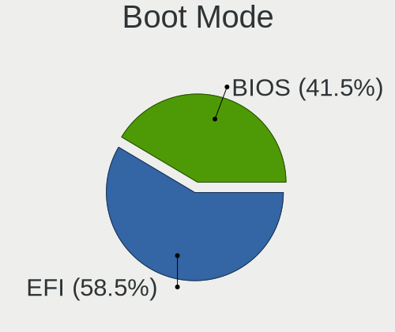
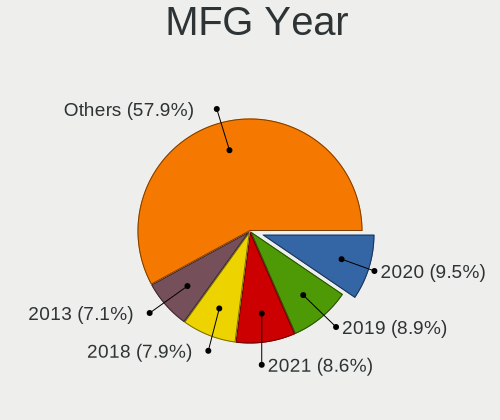
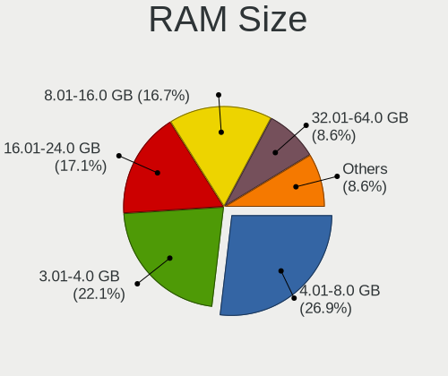
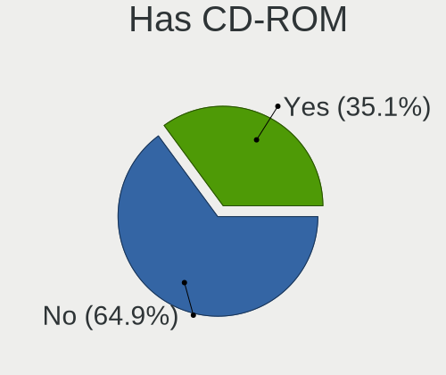
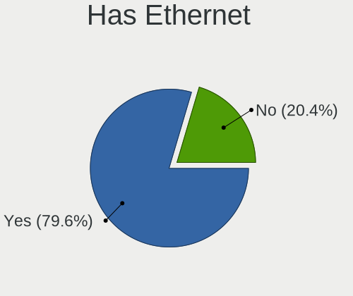
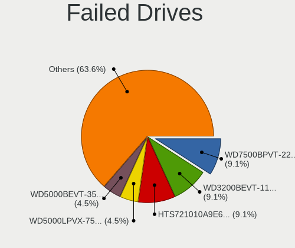
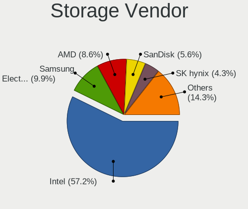
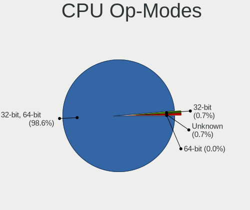
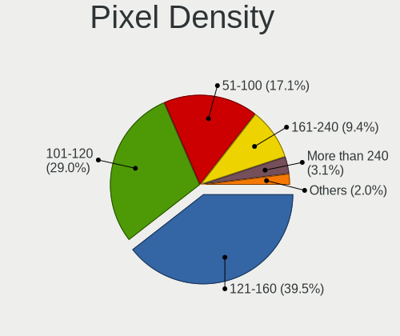

Linux in France - Tested Hardware & Statistics (Notebooks)
----------------------------------------------------------

A project to collect tested hardware configurations for Linux in France.

Anyone can contribute to this report by the [hw-probe](https://github.com/linuxhw/hw-probe) tool:

    sudo -E hw-probe -all -upload

Please contribute! Especially if your hardware is rare.

Contents
--------

* [ Test Cases ](#test-cases)

* [ System ](#system)
  - [ OS                       ](#os)
  - [ OS Family                ](#os-family)
  - [ Kernel                   ](#kernel)
  - [ Kernel Family            ](#kernel-family)
  - [ Kernel Major Ver.        ](#kernel-major-ver)
  - [ Arch                     ](#arch)
  - [ DE                       ](#de)
  - [ Display Server           ](#display-server)
  - [ Display Manager          ](#display-manager)
  - [ OS Lang                  ](#os-lang)
  - [ Boot Mode                ](#boot-mode)
  - [ Filesystem               ](#filesystem)
  - [ Part. scheme             ](#part-scheme)
  - [ Dual Boot with Linux/BSD ](#dual-boot-with-linuxbsd)
  - [ Dual Boot (Win)          ](#dual-boot-win)

* [ Board ](#board)
  - [ Vendor                   ](#vendor)
  - [ Model                    ](#model)
  - [ Model Family             ](#model-family)
  - [ MFG Year                 ](#mfg-year)
  - [ Form Factor              ](#form-factor)
  - [ Secure Boot              ](#secure-boot)
  - [ Coreboot                 ](#coreboot)
  - [ RAM Size                 ](#ram-size)
  - [ RAM Used                 ](#ram-used)
  - [ Total Drives             ](#total-drives)
  - [ Has CD-ROM               ](#has-cd-rom)
  - [ Has Ethernet             ](#has-ethernet)
  - [ Has WiFi                 ](#has-wifi)
  - [ Has Bluetooth            ](#has-bluetooth)

* [ Location ](#location)
  - [ Country                  ](#country)
  - [ City                     ](#city)

* [ Drives ](#drives)
  - [ Drive Vendor             ](#drive-vendor)
  - [ Drive Model              ](#drive-model)
  - [ HDD Vendor               ](#hdd-vendor)
  - [ SSD Vendor               ](#ssd-vendor)
  - [ Drive Kind               ](#drive-kind)
  - [ Drive Connector          ](#drive-connector)
  - [ Drive Size               ](#drive-size)
  - [ Space Total              ](#space-total)
  - [ Space Used               ](#space-used)
  - [ Malfunc. Drives          ](#malfunc-drives)
  - [ Malfunc. Drive Vendor    ](#malfunc-drive-vendor)
  - [ Malfunc. HDD Vendor      ](#malfunc-hdd-vendor)
  - [ Malfunc. Drive Kind      ](#malfunc-drive-kind)
  - [ Failed Drives            ](#failed-drives)
  - [ Failed Drive Vendor      ](#failed-drive-vendor)
  - [ Drive Status             ](#drive-status)

* [ Storage controller ](#storage-controller)
  - [ Storage Vendor           ](#storage-vendor)
  - [ Storage Model            ](#storage-model)
  - [ Storage Kind             ](#storage-kind)

* [ Processor ](#processor)
  - [ CPU Vendor               ](#cpu-vendor)
  - [ CPU Model                ](#cpu-model)
  - [ CPU Model Family         ](#cpu-model-family)
  - [ CPU Cores                ](#cpu-cores)
  - [ CPU Sockets              ](#cpu-sockets)
  - [ CPU Threads              ](#cpu-threads)
  - [ CPU Op-Modes             ](#cpu-op-modes)
  - [ CPU Microcode            ](#cpu-microcode)
  - [ CPU Microarch            ](#cpu-microarch)

* [ Graphics ](#graphics)
  - [ GPU Vendor               ](#gpu-vendor)
  - [ GPU Model                ](#gpu-model)
  - [ GPU Combo                ](#gpu-combo)
  - [ GPU Driver               ](#gpu-driver)
  - [ GPU Memory               ](#gpu-memory)

* [ Monitor ](#monitor)
  - [ Monitor Vendor           ](#monitor-vendor)
  - [ Monitor Model            ](#monitor-model)
  - [ Monitor Resolution       ](#monitor-resolution)
  - [ Monitor Diagonal         ](#monitor-diagonal)
  - [ Monitor Width            ](#monitor-width)
  - [ Aspect Ratio             ](#aspect-ratio)
  - [ Monitor Area             ](#monitor-area)
  - [ Pixel Density            ](#pixel-density)
  - [ Multiple Monitors        ](#multiple-monitors)

* [ Network ](#network)
  - [ Net Controller Vendor    ](#net-controller-vendor)
  - [ Net Controller Model     ](#net-controller-model)
  - [ Wireless Vendor          ](#wireless-vendor)
  - [ Wireless Model           ](#wireless-model)
  - [ Ethernet Vendor          ](#ethernet-vendor)
  - [ Ethernet Model           ](#ethernet-model)
  - [ Net Controller Kind      ](#net-controller-kind)
  - [ Used Controller          ](#used-controller)
  - [ NICs                     ](#nics)
  - [ IPv6                     ](#ipv6)

* [ Bluetooth ](#bluetooth)
  - [ Bluetooth Vendor         ](#bluetooth-vendor)
  - [ Bluetooth Model          ](#bluetooth-model)

* [ Sound ](#sound)
  - [ Sound Vendor             ](#sound-vendor)
  - [ Sound Model              ](#sound-model)

* [ Memory ](#memory)
  - [ Memory Vendor            ](#memory-vendor)
  - [ Memory Model             ](#memory-model)
  - [ Memory Kind              ](#memory-kind)
  - [ Memory Form Factor       ](#memory-form-factor)
  - [ Memory Size              ](#memory-size)
  - [ Memory Speed             ](#memory-speed)

* [ Printers & scanners ](#printers--scanners)
  - [ Printer Vendor           ](#printer-vendor)
  - [ Printer Model            ](#printer-model)
  - [ Scanner Vendor           ](#scanner-vendor)
  - [ Scanner Model            ](#scanner-model)

* [ Camera ](#camera)
  - [ Camera Vendor            ](#camera-vendor)
  - [ Camera Model             ](#camera-model)

* [ Security ](#security)
  - [ Fingerprint Vendor       ](#fingerprint-vendor)
  - [ Fingerprint Model        ](#fingerprint-model)
  - [ Chipcard Vendor          ](#chipcard-vendor)
  - [ Chipcard Model           ](#chipcard-model)

* [ Unsupported ](#unsupported)
  - [ Unsupported Devices      ](#unsupported-devices)
  - [ Unsupported Device Types ](#unsupported-device-types)

Test Cases
----------

Total: 8102

| Vendor        | Model                       | Probe                                                      | Date         |
|---------------|-----------------------------|------------------------------------------------------------|--------------|
| ASUSTek       | X751MA                      | [d5e1758d4e](https://linux-hardware.org/?probe=d5e1758d4e) | Nov 06, 2023 |
| Dell          | Venue 11 Pro 5130           | [5d63a1487d](https://linux-hardware.org/?probe=5d63a1487d) | Nov 06, 2023 |
| Dell          | Venue 11 Pro 5130           | [0facd311dc](https://linux-hardware.org/?probe=0facd311dc) | Nov 05, 2023 |
| Dell          | Latitude 7280               | [3f1419b0ea](https://linux-hardware.org/?probe=3f1419b0ea) | Nov 05, 2023 |
| Dell          | Venue 11 Pro 5130           | [27740d5118](https://linux-hardware.org/?probe=27740d5118) | Nov 05, 2023 |
| MSI           | Bravo 15 B5DD               | [72b02cceec](https://linux-hardware.org/?probe=72b02cceec) | Nov 05, 2023 |
| MSI           | Bravo 15 B5DD               | [8a35411be4](https://linux-hardware.org/?probe=8a35411be4) | Nov 05, 2023 |
| Lenovo        | G50-45 80E3                 | [2ac9878b30](https://linux-hardware.org/?probe=2ac9878b30) | Nov 05, 2023 |
| ASUSTek       | G75VW                       | [94bc809d57](https://linux-hardware.org/?probe=94bc809d57) | Nov 05, 2023 |
| ASUSTek       | K55VJ                       | [47851a05e9](https://linux-hardware.org/?probe=47851a05e9) | Nov 05, 2023 |
| Samsung       | 305E4A/305E5A/305E7A        | [257e40f6bd](https://linux-hardware.org/?probe=257e40f6bd) | Nov 05, 2023 |
| Lenovo        | ThinkPad T14s Gen 3 21CQ... | [c235d90592](https://linux-hardware.org/?probe=c235d90592) | Nov 05, 2023 |
| HP            | Pavilion dv7                | [6a44cc2c3c](https://linux-hardware.org/?probe=6a44cc2c3c) | Nov 04, 2023 |
| ASUSTek       | X550LC                      | [bd59b07dbf](https://linux-hardware.org/?probe=bd59b07dbf) | Nov 04, 2023 |
| ASUSTek       | X550LC                      | [b7fa2bbb0b](https://linux-hardware.org/?probe=b7fa2bbb0b) | Nov 04, 2023 |
| Apple         | MacBook5,2                  | [1d8dad6600](https://linux-hardware.org/?probe=1d8dad6600) | Nov 04, 2023 |
| Unknown       | Unknown                     | [662c88776a](https://linux-hardware.org/?probe=662c88776a) | Nov 04, 2023 |
| Dell          | Latitude E5450              | [1f23c5fd7c](https://linux-hardware.org/?probe=1f23c5fd7c) | Nov 04, 2023 |
| ASUSTek       | UX32VD                      | [7c4eefbe35](https://linux-hardware.org/?probe=7c4eefbe35) | Nov 04, 2023 |
| HP            | OMEN by Laptop 17-ck2xxx    | [e34a0ab109](https://linux-hardware.org/?probe=e34a0ab109) | Nov 03, 2023 |
| Thomson       | N14C4WH64                   | [51c94bc00f](https://linux-hardware.org/?probe=51c94bc00f) | Nov 03, 2023 |
| Lenovo        | G50-45 80E3                 | [a816b34b9e](https://linux-hardware.org/?probe=a816b34b9e) | Nov 03, 2023 |
| HUAWEI        | HLYL-WXX9                   | [993a2b9f3e](https://linux-hardware.org/?probe=993a2b9f3e) | Nov 03, 2023 |
| Timi          | A35                         | [1baa5932cc](https://linux-hardware.org/?probe=1baa5932cc) | Nov 03, 2023 |
| Dell          | Latitude 7280               | [b795f0157b](https://linux-hardware.org/?probe=b795f0157b) | Nov 03, 2023 |
| Star Labs     | StarBook                    | [288fdf6f55](https://linux-hardware.org/?probe=288fdf6f55) | Nov 02, 2023 |
| Lenovo        | ThinkPad L560 20F2S0DA00    | [3030ad2bc8](https://linux-hardware.org/?probe=3030ad2bc8) | Nov 02, 2023 |
| Acer          | Predator PH717-71           | [a72ab29450](https://linux-hardware.org/?probe=a72ab29450) | Nov 02, 2023 |
| ASUSTek       | T100TAF                     | [ea9f809740](https://linux-hardware.org/?probe=ea9f809740) | Nov 02, 2023 |
| Dell          | Inspiron 1750               | [0250d0fe82](https://linux-hardware.org/?probe=0250d0fe82) | Nov 02, 2023 |
| Dell          | Inspiron 1750               | [39bb893e18](https://linux-hardware.org/?probe=39bb893e18) | Nov 02, 2023 |
| Dell          | Latitude E6530              | [878bc8ec66](https://linux-hardware.org/?probe=878bc8ec66) | Nov 02, 2023 |
| ASUSTek       | VivoBook_ASUSLaptop X411... | [8ac5fd2789](https://linux-hardware.org/?probe=8ac5fd2789) | Nov 02, 2023 |
| HUAWEI        | BOHK-WAX9X                  | [4372a2d9eb](https://linux-hardware.org/?probe=4372a2d9eb) | Nov 02, 2023 |
| HP            | Notebook                    | [3e766ed947](https://linux-hardware.org/?probe=3e766ed947) | Nov 01, 2023 |
| HP            | Notebook                    | [47c0e83dcc](https://linux-hardware.org/?probe=47c0e83dcc) | Nov 01, 2023 |
| Lenovo        | ThinkPad L15 Gen 2 20X4S... | [ac563e5542](https://linux-hardware.org/?probe=ac563e5542) | Nov 01, 2023 |
| Apple         | MacBookPro11,5              | [99e5155c24](https://linux-hardware.org/?probe=99e5155c24) | Nov 01, 2023 |
| ASUSTek       | ZenBook UX325EA_UX325EA     | [6afebfd732](https://linux-hardware.org/?probe=6afebfd732) | Nov 01, 2023 |
| Dell          | Latitude E7450              | [5e39e2bc88](https://linux-hardware.org/?probe=5e39e2bc88) | Nov 01, 2023 |
| ASUSTek       | G53JW                       | [fcc18f3b68](https://linux-hardware.org/?probe=fcc18f3b68) | Nov 01, 2023 |
| Dell          | Precision 5550              | [87a9861125](https://linux-hardware.org/?probe=87a9861125) | Nov 01, 2023 |
| Teclast       | F6 Pro                      | [27dd740e4c](https://linux-hardware.org/?probe=27dd740e4c) | Nov 01, 2023 |
| HP            | EliteBook 840 G3            | [a09d649781](https://linux-hardware.org/?probe=a09d649781) | Nov 01, 2023 |
| ASUSTek       | UX430UA                     | [d99926d970](https://linux-hardware.org/?probe=d99926d970) | Nov 01, 2023 |
| Lenovo        | IdeaPad S300 9803           | [543dfc0b4e](https://linux-hardware.org/?probe=543dfc0b4e) | Oct 31, 2023 |
| HP            | Notebook                    | [b1491b73ae](https://linux-hardware.org/?probe=b1491b73ae) | Oct 31, 2023 |
| ASUSTek       | G53JW                       | [6795430efa](https://linux-hardware.org/?probe=6795430efa) | Oct 31, 2023 |
| Dell          | G15 5510                    | [12bd3f99da](https://linux-hardware.org/?probe=12bd3f99da) | Oct 31, 2023 |
| ASUSTek       | VivoBook_ASUSLaptop X515... | [97ae72d7b7](https://linux-hardware.org/?probe=97ae72d7b7) | Oct 31, 2023 |
| Dell          | XPS 15 9530                 | [148857cc51](https://linux-hardware.org/?probe=148857cc51) | Oct 31, 2023 |
| HP            | Laptop 15-db0xxx            | [cf7f0c142e](https://linux-hardware.org/?probe=cf7f0c142e) | Oct 31, 2023 |
| HP            | Victus by Gaming Laptop ... | [0f4fa9169b](https://linux-hardware.org/?probe=0f4fa9169b) | Oct 31, 2023 |
| OFF GLOBAL    | Nokia PureBook Pro 17       | [5bc799ab5a](https://linux-hardware.org/?probe=5bc799ab5a) | Oct 30, 2023 |
| Acer          | Aspire E5-576G              | [c0626d553b](https://linux-hardware.org/?probe=c0626d553b) | Oct 30, 2023 |
| HP            | ZBook Fury 15.6 inch G8 ... | [56f24de5ff](https://linux-hardware.org/?probe=56f24de5ff) | Oct 30, 2023 |
| HP            | EliteBook 830 G8 Noteboo... | [0e7bb14862](https://linux-hardware.org/?probe=0e7bb14862) | Oct 30, 2023 |
| HP            | ProBook 640 G1              | [cf78ef09d2](https://linux-hardware.org/?probe=cf78ef09d2) | Oct 30, 2023 |
| Dell          | Precision 3551              | [4f054a63ef](https://linux-hardware.org/?probe=4f054a63ef) | Oct 30, 2023 |
| HUAWEI        | BOHB-WAX9                   | [5da6238372](https://linux-hardware.org/?probe=5da6238372) | Oct 30, 2023 |
| Acer          | Aspire A315-21              | [48785f697c](https://linux-hardware.org/?probe=48785f697c) | Oct 29, 2023 |
| Sony          | VPCEH1L0E                   | [2a5fa0340e](https://linux-hardware.org/?probe=2a5fa0340e) | Oct 29, 2023 |
| Sony          | VPCEH1L0E                   | [103e485a0f](https://linux-hardware.org/?probe=103e485a0f) | Oct 29, 2023 |
| ASUSTek       | VivoBook_ASUSLaptop X421... | [7301c9b3df](https://linux-hardware.org/?probe=7301c9b3df) | Oct 29, 2023 |
| Notebook      | NS5x_NS7xAU                 | [151d6e2c69](https://linux-hardware.org/?probe=151d6e2c69) | Oct 29, 2023 |
| Dell          | Precision 3550              | [f07af59705](https://linux-hardware.org/?probe=f07af59705) | Oct 29, 2023 |
| HP            | Pavilion 17                 | [2ef396fb9c](https://linux-hardware.org/?probe=2ef396fb9c) | Oct 29, 2023 |
| Dell          | Precision 5480              | [5df408828c](https://linux-hardware.org/?probe=5df408828c) | Oct 29, 2023 |
| Acer          | Aspire ES1-572              | [12b1df4e2b](https://linux-hardware.org/?probe=12b1df4e2b) | Oct 29, 2023 |
| HUAWEI        | NBLB-WAX9N                  | [1ad2b79950](https://linux-hardware.org/?probe=1ad2b79950) | Oct 28, 2023 |
| HUAWEI        | NBLB-WAX9N                  | [ab6e0c5094](https://linux-hardware.org/?probe=ab6e0c5094) | Oct 28, 2023 |
| HUAWEI        | NBLB-WAX9N                  | [67a82dac1b](https://linux-hardware.org/?probe=67a82dac1b) | Oct 28, 2023 |
| MSI           | Modern 15 A5M               | [903418110a](https://linux-hardware.org/?probe=903418110a) | Oct 28, 2023 |
| Lenovo        | IdeaPad Gaming 3 15IAH7 ... | [d8bfe77d00](https://linux-hardware.org/?probe=d8bfe77d00) | Oct 27, 2023 |
| ASUSTek       | ROG Strix G513QY_G513QY     | [334f8582b0](https://linux-hardware.org/?probe=334f8582b0) | Oct 27, 2023 |
| Dell          | Inspiron MM061              | [d4b3f62ecb](https://linux-hardware.org/?probe=d4b3f62ecb) | Oct 27, 2023 |
| Lenovo        | Yoga Slim 7 14ARE05 82A2    | [a899ecd171](https://linux-hardware.org/?probe=a899ecd171) | Oct 27, 2023 |
| MSI           | GL73 8RD                    | [62d3ea64dd](https://linux-hardware.org/?probe=62d3ea64dd) | Oct 27, 2023 |
| Dell          | XPS 15 9530                 | [dbc8a87975](https://linux-hardware.org/?probe=dbc8a87975) | Oct 27, 2023 |
| Lenovo        | IdeaPad 3 17IIL05 81WF      | [3a2901251b](https://linux-hardware.org/?probe=3a2901251b) | Oct 27, 2023 |
| HP            | Laptop 17-cp2xxx            | [788d8538b6](https://linux-hardware.org/?probe=788d8538b6) | Oct 27, 2023 |
| Dell          | Latitude E5470              | [fbbcdd8d9f](https://linux-hardware.org/?probe=fbbcdd8d9f) | Oct 26, 2023 |
| HP            | ProBook 4530s               | [b86df6ad72](https://linux-hardware.org/?probe=b86df6ad72) | Oct 26, 2023 |
| HP            | G61                         | [d184a33522](https://linux-hardware.org/?probe=d184a33522) | Oct 26, 2023 |
| MSI           | Stealth 16Studio A13VG      | [2009a0a84b](https://linux-hardware.org/?probe=2009a0a84b) | Oct 26, 2023 |
| Valve         | Jupiter                     | [eda569093f](https://linux-hardware.org/?probe=eda569093f) | Oct 25, 2023 |
| Lenovo        | ThinkPad X1C 5th W10DG 2... | [c66ebc8e70](https://linux-hardware.org/?probe=c66ebc8e70) | Oct 25, 2023 |
| Acer          | Aspire VN7-572G             | [979741d1d0](https://linux-hardware.org/?probe=979741d1d0) | Oct 25, 2023 |
| Dell          | Latitude E5470              | [cac52e6eaf](https://linux-hardware.org/?probe=cac52e6eaf) | Oct 25, 2023 |
| Lenovo        | ThinkPad S1 Yoga 20CD000... | [4e393023d7](https://linux-hardware.org/?probe=4e393023d7) | Oct 25, 2023 |
| Samsung       | 305E4A/305E5A/305E7A        | [3ce0f8310d](https://linux-hardware.org/?probe=3ce0f8310d) | Oct 25, 2023 |
| HP            | Pavilion dv7                | [6c8a64fc73](https://linux-hardware.org/?probe=6c8a64fc73) | Oct 24, 2023 |
| HP            | ZBook Fury 15.6 inch G8 ... | [05a3492143](https://linux-hardware.org/?probe=05a3492143) | Oct 24, 2023 |
| ASUSTek       | UX303LB                     | [1fdfa51ddc](https://linux-hardware.org/?probe=1fdfa51ddc) | Oct 24, 2023 |
| ASUSTek       | G551JX                      | [db16c87fe8](https://linux-hardware.org/?probe=db16c87fe8) | Oct 24, 2023 |
| MSI           | GT62VR 6RD                  | [0d10c5251c](https://linux-hardware.org/?probe=0d10c5251c) | Oct 23, 2023 |
| HP            | ProBook 450 G6              | [5dc90618a7](https://linux-hardware.org/?probe=5dc90618a7) | Oct 23, 2023 |
| Fujitsu       | LIFEBOOK E754               | [17e7fcc400](https://linux-hardware.org/?probe=17e7fcc400) | Oct 23, 2023 |
| Google        | Bobba                       | [3a660aaaef](https://linux-hardware.org/?probe=3a660aaaef) | Oct 23, 2023 |
| UNOWHY        | Y13G012S4EI                 | [37680f1ed6](https://linux-hardware.org/?probe=37680f1ed6) | Oct 22, 2023 |
| Toshiba       | Satellite C70D-B            | [7f1637fdb9](https://linux-hardware.org/?probe=7f1637fdb9) | Oct 22, 2023 |
| Dell          | Precision 3571              | [a2ba806246](https://linux-hardware.org/?probe=a2ba806246) | Oct 22, 2023 |
| Dell          | Precision 3571              | [efedaee27d](https://linux-hardware.org/?probe=efedaee27d) | Oct 22, 2023 |
| ASUSTek       | Zenbook UX7602VI_UX7602V... | [96e2577624](https://linux-hardware.org/?probe=96e2577624) | Oct 22, 2023 |
| Acer          | Aspire V3-111P              | [3c17975c8c](https://linux-hardware.org/?probe=3c17975c8c) | Oct 22, 2023 |
| HP            | EliteBook 840 G8 Noteboo... | [b7b860ac67](https://linux-hardware.org/?probe=b7b860ac67) | Oct 22, 2023 |
| Acer          | Aspire ES1-572              | [b4e1647054](https://linux-hardware.org/?probe=b4e1647054) | Oct 21, 2023 |
| Thomson       | X15I5-8TU512                | [68099cb005](https://linux-hardware.org/?probe=68099cb005) | Oct 21, 2023 |
| HP            | Dragonfly 13.5 inch G4 N... | [eb4d59cc70](https://linux-hardware.org/?probe=eb4d59cc70) | Oct 21, 2023 |
| HP            | Pavilion dm1                | [74c8fce8f0](https://linux-hardware.org/?probe=74c8fce8f0) | Oct 21, 2023 |
| Lenovo        | IdeaPad 330-17AST 81D7      | [314c39b6d1](https://linux-hardware.org/?probe=314c39b6d1) | Oct 21, 2023 |
| ASUSTek       | GL553VD                     | [87210c3d86](https://linux-hardware.org/?probe=87210c3d86) | Oct 21, 2023 |
| ASUSTek       | VivoBook_ASUSLaptop X515... | [130d199934](https://linux-hardware.org/?probe=130d199934) | Oct 21, 2023 |
| Dell          | Latitude 7440               | [e0997ac78c](https://linux-hardware.org/?probe=e0997ac78c) | Oct 20, 2023 |
| ASUSTek       | VivoBook_ASUSLaptop X705... | [148be53a91](https://linux-hardware.org/?probe=148be53a91) | Oct 20, 2023 |
| ASUSTek       | ASUS TUF Dash F15 FX517Z... | [d9a8c7946e](https://linux-hardware.org/?probe=d9a8c7946e) | Oct 20, 2023 |
| ASUSTek       | ASUS TUF Dash F15 FX517Z... | [5cac857cd9](https://linux-hardware.org/?probe=5cac857cd9) | Oct 20, 2023 |
| Toshiba       | Satellite C660              | [483998d7de](https://linux-hardware.org/?probe=483998d7de) | Oct 20, 2023 |
| ASUSTek       | X540LJ                      | [2aea2077db](https://linux-hardware.org/?probe=2aea2077db) | Oct 20, 2023 |
| Toshiba       | Satellite C70D-B            | [793d71f1d2](https://linux-hardware.org/?probe=793d71f1d2) | Oct 20, 2023 |
| HP            | Compaq 15                   | [992044ca80](https://linux-hardware.org/?probe=992044ca80) | Oct 20, 2023 |
| Dell          | Latitude E6430s             | [ce1c3a6c86](https://linux-hardware.org/?probe=ce1c3a6c86) | Oct 20, 2023 |
| Acer          | Aspire S3                   | [612caa1082](https://linux-hardware.org/?probe=612caa1082) | Oct 20, 2023 |
| Lenovo        | ThinkPad L540 20AUA044FR    | [70d42f0667](https://linux-hardware.org/?probe=70d42f0667) | Oct 20, 2023 |
| Lenovo        | G50-45 80E3                 | [41f9f44ee1](https://linux-hardware.org/?probe=41f9f44ee1) | Oct 20, 2023 |
| Lenovo        | G50-45 80E3                 | [98f1b28357](https://linux-hardware.org/?probe=98f1b28357) | Oct 20, 2023 |
| HP            | Pavilion 17                 | [855c6109eb](https://linux-hardware.org/?probe=855c6109eb) | Oct 20, 2023 |
| HP            | Pavilion 17                 | [36613b2f1f](https://linux-hardware.org/?probe=36613b2f1f) | Oct 19, 2023 |
| Dell          | XPS 15 9520                 | [dd0f8dcb86](https://linux-hardware.org/?probe=dd0f8dcb86) | Oct 19, 2023 |
| ASUSTek       | X542UR                      | [72390695fd](https://linux-hardware.org/?probe=72390695fd) | Oct 19, 2023 |
| ASUSTek       | Zenbook 15 UM3504DA_UM35... | [2e7d97492d](https://linux-hardware.org/?probe=2e7d97492d) | Oct 19, 2023 |
| ASUSTek       | N501JW                      | [a61bad1bae](https://linux-hardware.org/?probe=a61bad1bae) | Oct 19, 2023 |
| ASUSTek       | X540LJ                      | [a0c126c4ce](https://linux-hardware.org/?probe=a0c126c4ce) | Oct 19, 2023 |
| UNOWHY        | Y13G012S4EI                 | [70032c78d7](https://linux-hardware.org/?probe=70032c78d7) | Oct 18, 2023 |
| Apple         | MacBookPro9,2               | [d9d804297d](https://linux-hardware.org/?probe=d9d804297d) | Oct 18, 2023 |
| HP            | EliteBook 840 G3            | [726f0ecc0b](https://linux-hardware.org/?probe=726f0ecc0b) | Oct 18, 2023 |
| Apple         | MacBookPro9,2               | [90413e0c45](https://linux-hardware.org/?probe=90413e0c45) | Oct 18, 2023 |
| Dell          | Latitude E6320              | [91e5128fd5](https://linux-hardware.org/?probe=91e5128fd5) | Oct 18, 2023 |
| HP            | EliteBook 655 15.6 inch ... | [ebf8cac9b8](https://linux-hardware.org/?probe=ebf8cac9b8) | Oct 18, 2023 |
| HP            | EliteBook 860 16 inch G1... | [bde071302f](https://linux-hardware.org/?probe=bde071302f) | Oct 18, 2023 |
| HP            | EliteBook 850 G3            | [58831524ae](https://linux-hardware.org/?probe=58831524ae) | Oct 18, 2023 |
| MSI           | CX61 2PC                    | [67442a53f9](https://linux-hardware.org/?probe=67442a53f9) | Oct 18, 2023 |
| HP            | ProBook 450 G6              | [b3c36f8233](https://linux-hardware.org/?probe=b3c36f8233) | Oct 17, 2023 |
| ASUSTek       | K55VJ                       | [f5cfc1c08e](https://linux-hardware.org/?probe=f5cfc1c08e) | Oct 17, 2023 |
| ASUSTek       | EP121                       | [9c01d196e1](https://linux-hardware.org/?probe=9c01d196e1) | Oct 17, 2023 |
| Google        | Bobba                       | [f8cdd51f65](https://linux-hardware.org/?probe=f8cdd51f65) | Oct 17, 2023 |
| HP            | Pavilion Notebook           | [5981bba0dd](https://linux-hardware.org/?probe=5981bba0dd) | Oct 17, 2023 |
| HP            | Pavilion Gaming Laptop 1... | [d63ed71e40](https://linux-hardware.org/?probe=d63ed71e40) | Oct 17, 2023 |
| Acer          | Aspire A314-23P             | [99490448ae](https://linux-hardware.org/?probe=99490448ae) | Oct 16, 2023 |
| Acer          | Aspire A314-23P             | [431b672bf5](https://linux-hardware.org/?probe=431b672bf5) | Oct 16, 2023 |
| Acer          | Aspire ES1-523              | [6f80d0517c](https://linux-hardware.org/?probe=6f80d0517c) | Oct 16, 2023 |
| Apple         | MacBookPro16,1              | [6417009f82](https://linux-hardware.org/?probe=6417009f82) | Oct 16, 2023 |
| Lenovo        | ThinkPad R61 8935AC7        | [fc4f024a54](https://linux-hardware.org/?probe=fc4f024a54) | Oct 16, 2023 |
| Lenovo        | IdeaPad S340-15API 81NC     | [9aaa4cdee5](https://linux-hardware.org/?probe=9aaa4cdee5) | Oct 16, 2023 |
| HP            | ProBook 4730s               | [42a7295a49](https://linux-hardware.org/?probe=42a7295a49) | Oct 15, 2023 |
| Lenovo        | ThinkPad E595 20NFCTO1WW    | [0d80ec0e27](https://linux-hardware.org/?probe=0d80ec0e27) | Oct 15, 2023 |
| HP            | Pavilion Gaming Laptop 1... | [6e4a6a34cd](https://linux-hardware.org/?probe=6e4a6a34cd) | Oct 15, 2023 |
| Lenovo        | ThinkPad X240 20AMS7X300    | [0cc0243579](https://linux-hardware.org/?probe=0cc0243579) | Oct 15, 2023 |
| Lenovo        | ThinkPad X230 23259T0       | [a9d4c1b781](https://linux-hardware.org/?probe=a9d4c1b781) | Oct 15, 2023 |
| Acer          | Aspire ES1-523              | [2dfea2666c](https://linux-hardware.org/?probe=2dfea2666c) | Oct 15, 2023 |
| Acer          | Aspire A317-51K             | [b342c56fc5](https://linux-hardware.org/?probe=b342c56fc5) | Oct 15, 2023 |
| HP            | Pavilion Aero Laptop 13-... | [85e073cb44](https://linux-hardware.org/?probe=85e073cb44) | Oct 15, 2023 |
| Lenovo        | ThinkPad T420 4236EJ3       | [d1eebbe97a](https://linux-hardware.org/?probe=d1eebbe97a) | Oct 14, 2023 |
| UNOWHY        | Y13G011S4EI                 | [15ee1d73bb](https://linux-hardware.org/?probe=15ee1d73bb) | Oct 14, 2023 |
| UNOWHY        | Y13G011S4EI                 | [ea84658524](https://linux-hardware.org/?probe=ea84658524) | Oct 14, 2023 |
| Clevo         | W150ER                      | [e119814a32](https://linux-hardware.org/?probe=e119814a32) | Oct 14, 2023 |
| Dell          | Latitude 5400               | [26c8a94f7f](https://linux-hardware.org/?probe=26c8a94f7f) | Oct 14, 2023 |
| Framework     | Laptop (13th Gen Intel C... | [98ebe6766d](https://linux-hardware.org/?probe=98ebe6766d) | Oct 14, 2023 |
| Notebook      | NJ50_70CU                   | [885120121b](https://linux-hardware.org/?probe=885120121b) | Oct 13, 2023 |
| Lenovo        | ThinkPad X1 Carbon Gen 1... | [7ee4351584](https://linux-hardware.org/?probe=7ee4351584) | Oct 13, 2023 |
| HUAWEI        | BOM-WXX9                    | [7310efb29d](https://linux-hardware.org/?probe=7310efb29d) | Oct 13, 2023 |
| Thomson       | NEO14-4W64                  | [f68e52a8a1](https://linux-hardware.org/?probe=f68e52a8a1) | Oct 12, 2023 |
| Lenovo        | V145-15AST 81MT             | [47c6aaf7b8](https://linux-hardware.org/?probe=47c6aaf7b8) | Oct 12, 2023 |
| Dell          | XPS 13 9360                 | [d227c42e18](https://linux-hardware.org/?probe=d227c42e18) | Oct 12, 2023 |
| MSI           | GF63 8RC                    | [6fcc7aa3b0](https://linux-hardware.org/?probe=6fcc7aa3b0) | Oct 12, 2023 |
| HP            | EliteBook 840 G6 HC         | [e1b3f5dbeb](https://linux-hardware.org/?probe=e1b3f5dbeb) | Oct 11, 2023 |
| Dell          | Latitude E7470              | [7bf3b8f1ae](https://linux-hardware.org/?probe=7bf3b8f1ae) | Oct 11, 2023 |
| Lenovo        | Legion Pro 5 16ARX8 82WM    | [be6e7011cc](https://linux-hardware.org/?probe=be6e7011cc) | Oct 11, 2023 |
| Notebook      | W510LU                      | [7b46aa1486](https://linux-hardware.org/?probe=7b46aa1486) | Oct 11, 2023 |
| Samsung       | 305E4A/305E5A/305E7A        | [cca48ceee9](https://linux-hardware.org/?probe=cca48ceee9) | Oct 11, 2023 |
| Lenovo        | ThinkPad E15 Gen 4 21E60... | [ea3f6440b2](https://linux-hardware.org/?probe=ea3f6440b2) | Oct 11, 2023 |
| Framework     | Laptop (13th Gen Intel C... | [4f5f1c9eea](https://linux-hardware.org/?probe=4f5f1c9eea) | Oct 11, 2023 |
| Samsung       | 305E4A/305E5A/305E7A        | [22df79ec5d](https://linux-hardware.org/?probe=22df79ec5d) | Oct 11, 2023 |
| Acer          | Aspire A315-24P             | [30640ecf17](https://linux-hardware.org/?probe=30640ecf17) | Oct 10, 2023 |
| Clevo         | W240HU/W250HUQ              | [deb84129fb](https://linux-hardware.org/?probe=deb84129fb) | Oct 10, 2023 |
| Samsung       | 350V5C/351V5C/3540VC/344... | [62325b0861](https://linux-hardware.org/?probe=62325b0861) | Oct 10, 2023 |
| ASUSTek       | G750JM                      | [62af3377c2](https://linux-hardware.org/?probe=62af3377c2) | Oct 10, 2023 |
| EUROCOM       | RAPTOR X17                  | [468a885ee9](https://linux-hardware.org/?probe=468a885ee9) | Oct 10, 2023 |
| Dell          | Precision 5570              | [3b9cb31d2f](https://linux-hardware.org/?probe=3b9cb31d2f) | Oct 10, 2023 |
| Dell          | XPS 15 9550                 | [a5ef1797e7](https://linux-hardware.org/?probe=a5ef1797e7) | Oct 09, 2023 |
| Dell          | XPS 9320                    | [1cd3d3eb22](https://linux-hardware.org/?probe=1cd3d3eb22) | Oct 09, 2023 |
| Toshiba       | Satellite C660D             | [1106658f2c](https://linux-hardware.org/?probe=1106658f2c) | Oct 09, 2023 |
| Extra Terr... | Unknown                     | [505b2e0823](https://linux-hardware.org/?probe=505b2e0823) | Oct 08, 2023 |
| Dell          | Latitude E5440              | [a039ff25ef](https://linux-hardware.org/?probe=a039ff25ef) | Oct 08, 2023 |
| Lenovo        | ThinkPad P50 20EQS1WW00     | [91f26dd2c7](https://linux-hardware.org/?probe=91f26dd2c7) | Oct 08, 2023 |
| MSI           | GT73EVR 7RE                 | [b68e25b341](https://linux-hardware.org/?probe=b68e25b341) | Oct 08, 2023 |
| Dell          | Latitude E7440              | [40ffa6c211](https://linux-hardware.org/?probe=40ffa6c211) | Oct 08, 2023 |
| Lenovo        | ThinkPad P50 20EQS1WW00     | [a830045a2a](https://linux-hardware.org/?probe=a830045a2a) | Oct 07, 2023 |
| ASUSTek       | Zenbook UX7602VI_UX7602V... | [93faa713c7](https://linux-hardware.org/?probe=93faa713c7) | Oct 07, 2023 |
| Lenovo        | ThinkPad T480 20L6S2LK0J    | [cae6954f11](https://linux-hardware.org/?probe=cae6954f11) | Oct 07, 2023 |
| Lenovo        | ThinkPad T480 20L6S2LK0J    | [ca68af85fb](https://linux-hardware.org/?probe=ca68af85fb) | Oct 07, 2023 |
| EUROCOM       | RAPTOR X17                  | [b720194674](https://linux-hardware.org/?probe=b720194674) | Oct 06, 2023 |
| Dell          | XPS 15 7590                 | [f4c0266602](https://linux-hardware.org/?probe=f4c0266602) | Oct 06, 2023 |
| Dell          | XPS 15 7590                 | [8978850a77](https://linux-hardware.org/?probe=8978850a77) | Oct 06, 2023 |
| Lenovo        | ThinkBook 15 G3 ACL 21A4    | [75690ff16c](https://linux-hardware.org/?probe=75690ff16c) | Oct 06, 2023 |
| Lenovo        | ThinkBook 15 G3 ACL 21A4    | [642e50dbfd](https://linux-hardware.org/?probe=642e50dbfd) | Oct 06, 2023 |
| HUAWEI        | BOHB-WAX9                   | [7add8932c3](https://linux-hardware.org/?probe=7add8932c3) | Oct 06, 2023 |
| Dell          | Precision 5480              | [3a87c7a065](https://linux-hardware.org/?probe=3a87c7a065) | Oct 05, 2023 |
| ASUSTek       | Vivobook Go E1504FA_E150... | [bfe115219f](https://linux-hardware.org/?probe=bfe115219f) | Oct 05, 2023 |
| Acer          | Aspire A317-53              | [523e4c1ed6](https://linux-hardware.org/?probe=523e4c1ed6) | Oct 05, 2023 |
| Dell          | Latitude 7490               | [fd6fe204ae](https://linux-hardware.org/?probe=fd6fe204ae) | Oct 05, 2023 |
| Fujitsu Si... | AMILO Li 2727               | [a95e5535f4](https://linux-hardware.org/?probe=a95e5535f4) | Oct 05, 2023 |
| Dell          | Latitude 3420               | [c5a2d75e6c](https://linux-hardware.org/?probe=c5a2d75e6c) | Oct 05, 2023 |
| Fujitsu Si... | AMILO Li 2727               | [fd0dc36129](https://linux-hardware.org/?probe=fd0dc36129) | Oct 05, 2023 |
| HP            | Pavilion Laptop 15-cs3xx... | [763ef47e79](https://linux-hardware.org/?probe=763ef47e79) | Oct 05, 2023 |
| Lenovo        | ThinkPad P16 Gen 1 21D6C... | [dfb6b7140d](https://linux-hardware.org/?probe=dfb6b7140d) | Oct 05, 2023 |
| Lenovo        | IdeaPad 3 15ADA05 81W1      | [2a4f34aeb4](https://linux-hardware.org/?probe=2a4f34aeb4) | Oct 05, 2023 |
| ASUSTek       | VivoBook_ASUSLaptop K650... | [258d726766](https://linux-hardware.org/?probe=258d726766) | Oct 04, 2023 |
| MSI           | GE63 Raider RGB 9SF         | [6eaabebb19](https://linux-hardware.org/?probe=6eaabebb19) | Oct 04, 2023 |
| Lenovo        | ThinkPad P51 20HJS0RE02     | [892c35359f](https://linux-hardware.org/?probe=892c35359f) | Oct 04, 2023 |
| Lenovo        | Legion 5 15IAH7H 82RB       | [48ee75db0b](https://linux-hardware.org/?probe=48ee75db0b) | Oct 03, 2023 |
| Fujitsu Si... | ESPRIMO Mobile V6535        | [12331db1c1](https://linux-hardware.org/?probe=12331db1c1) | Oct 03, 2023 |
| Dell          | Latitude 7310               | [1c6453acbe](https://linux-hardware.org/?probe=1c6453acbe) | Oct 03, 2023 |
| ASUSTek       | Zenbook UX535QA_UM535QA     | [ffd1d0957b](https://linux-hardware.org/?probe=ffd1d0957b) | Oct 03, 2023 |
| Valve         | Jupiter                     | [35dc2f9bbd](https://linux-hardware.org/?probe=35dc2f9bbd) | Oct 02, 2023 |
| Acer          | Swift SF515-51T             | [2452e6e54f](https://linux-hardware.org/?probe=2452e6e54f) | Oct 02, 2023 |
| Lenovo        | IdeaPad 700-15ISK 80RU      | [9b38690634](https://linux-hardware.org/?probe=9b38690634) | Oct 02, 2023 |
| ASUSTek       | UX303UA                     | [657233bb53](https://linux-hardware.org/?probe=657233bb53) | Oct 02, 2023 |
| Dell          | Precision 5480              | [21bd104767](https://linux-hardware.org/?probe=21bd104767) | Oct 02, 2023 |
| Dell          | G15 5511                    | [8510f95ae4](https://linux-hardware.org/?probe=8510f95ae4) | Oct 02, 2023 |
| Lenovo        | ThinkPad E15 Gen 2 20TD0... | [45dc056bee](https://linux-hardware.org/?probe=45dc056bee) | Oct 02, 2023 |
| Dell          | Inspiron 16 7610            | [ae7655427a](https://linux-hardware.org/?probe=ae7655427a) | Oct 02, 2023 |
| Apple         | MacBookAir6,2               | [25d2225829](https://linux-hardware.org/?probe=25d2225829) | Oct 02, 2023 |
| GPD           | G1621-02                    | [10ca9df59f](https://linux-hardware.org/?probe=10ca9df59f) | Oct 01, 2023 |
| Dell          | Latitude E6320              | [58713ab6bf](https://linux-hardware.org/?probe=58713ab6bf) | Oct 01, 2023 |
| Packard Be... | EasyNote LM98               | [8fdf8eee6c](https://linux-hardware.org/?probe=8fdf8eee6c) | Oct 01, 2023 |
| Lenovo        | ThinkPad P50 20EQS2U20N     | [4dc6dfbc84](https://linux-hardware.org/?probe=4dc6dfbc84) | Oct 01, 2023 |
| HP            | Victus by Laptop 16-d0xx... | [5ee355215f](https://linux-hardware.org/?probe=5ee355215f) | Oct 01, 2023 |
| Medion        | Deputy P40                  | [7e0fc5b52d](https://linux-hardware.org/?probe=7e0fc5b52d) | Sep 30, 2023 |
| UNOWHY        | Y13G012S4EI                 | [2b60435562](https://linux-hardware.org/?probe=2b60435562) | Sep 30, 2023 |
| Lenovo        | ThinkPad Edge E530 62722... | [681d3e6c86](https://linux-hardware.org/?probe=681d3e6c86) | Sep 30, 2023 |
| Samsung       | 305E4A/305E5A/305E7A        | [89d519a3f5](https://linux-hardware.org/?probe=89d519a3f5) | Sep 30, 2023 |
| Dell          | Latitude 5500               | [ea091dbcf2](https://linux-hardware.org/?probe=ea091dbcf2) | Sep 29, 2023 |
| Timi          | Xiaomi Book Pro 16 2022     | [7392f9db3b](https://linux-hardware.org/?probe=7392f9db3b) | Sep 29, 2023 |
| SLIMBOOK      | PROX-AMD5                   | [96fa5ddfa8](https://linux-hardware.org/?probe=96fa5ddfa8) | Sep 29, 2023 |
| ASUSTek       | K72Jr                       | [9167494336](https://linux-hardware.org/?probe=9167494336) | Sep 28, 2023 |
| HP            | EliteBook 840 G2            | [bec979fcd0](https://linux-hardware.org/?probe=bec979fcd0) | Sep 28, 2023 |
| HUAWEI        | NBLB-WAX9N                  | [7cbed3fca6](https://linux-hardware.org/?probe=7cbed3fca6) | Sep 28, 2023 |
| Dell          | XPS 17 9700                 | [38196b3712](https://linux-hardware.org/?probe=38196b3712) | Sep 28, 2023 |
| Dell          | G3 3590                     | [3523165978](https://linux-hardware.org/?probe=3523165978) | Sep 27, 2023 |
| Lenovo        | ThinkPad T430 2349S6S       | [e9b81983f2](https://linux-hardware.org/?probe=e9b81983f2) | Sep 27, 2023 |
| HP            | EliteBook 840 G8 Noteboo... | [593ddb6105](https://linux-hardware.org/?probe=593ddb6105) | Sep 27, 2023 |
| Clevo         | W240EU/W250EUQ/W270EUQ      | [cd5d2fae9e](https://linux-hardware.org/?probe=cd5d2fae9e) | Sep 27, 2023 |
| Dell          | XPS 17 9700                 | [c341826b7a](https://linux-hardware.org/?probe=c341826b7a) | Sep 27, 2023 |
| Notebook      | PCx0Dx                      | [53dd8cbd0d](https://linux-hardware.org/?probe=53dd8cbd0d) | Sep 27, 2023 |
| ASUSTek       | K72Jr                       | [9f32819945](https://linux-hardware.org/?probe=9f32819945) | Sep 26, 2023 |
| Dell          | G5 5590                     | [c7e7205fff](https://linux-hardware.org/?probe=c7e7205fff) | Sep 26, 2023 |
| Dell          | G5 5590                     | [0e80b66cb6](https://linux-hardware.org/?probe=0e80b66cb6) | Sep 26, 2023 |
| HP            | EliteBook 745 G6            | [bb5a7f8b2c](https://linux-hardware.org/?probe=bb5a7f8b2c) | Sep 26, 2023 |
| PC Special... | PCX0DX                      | [935fe5ddb0](https://linux-hardware.org/?probe=935fe5ddb0) | Sep 26, 2023 |
| Dell          | Inspiron 7577               | [a90c8128d1](https://linux-hardware.org/?probe=a90c8128d1) | Sep 26, 2023 |
| Samsung       | 305E4A/305E5A/305E7A        | [24a1d008e6](https://linux-hardware.org/?probe=24a1d008e6) | Sep 26, 2023 |
| Notebook      | N2x0WU                      | [49046ef274](https://linux-hardware.org/?probe=49046ef274) | Sep 26, 2023 |
| Dell          | XPS 9315                    | [11411507e8](https://linux-hardware.org/?probe=11411507e8) | Sep 26, 2023 |
| HP            | Laptop 15s-eq1xxx           | [8142da7d40](https://linux-hardware.org/?probe=8142da7d40) | Sep 25, 2023 |
| Dell          | Precision M6800             | [027ed86f53](https://linux-hardware.org/?probe=027ed86f53) | Sep 25, 2023 |
| Acer          | Swift SF314-41              | [ef8b479649](https://linux-hardware.org/?probe=ef8b479649) | Sep 25, 2023 |
| Acer          | Swift SF314-44              | [6f5d49e16f](https://linux-hardware.org/?probe=6f5d49e16f) | Sep 25, 2023 |
| Acer          | Swift SF314-44              | [12f4ab85f3](https://linux-hardware.org/?probe=12f4ab85f3) | Sep 25, 2023 |
| HP            | EliteBook 840 G3            | [4e0f83e1fe](https://linux-hardware.org/?probe=4e0f83e1fe) | Sep 25, 2023 |
| HP            | EliteBook 840 G3            | [60ff167d14](https://linux-hardware.org/?probe=60ff167d14) | Sep 25, 2023 |
| Lenovo        | Yoga 2 13 20344             | [6a06543ed3](https://linux-hardware.org/?probe=6a06543ed3) | Sep 25, 2023 |
| Toshiba       | Satellite C50-B             | [92a5c3605c](https://linux-hardware.org/?probe=92a5c3605c) | Sep 25, 2023 |
| Fujitsu       | LIFEBOOK E734               | [61f61b1b63](https://linux-hardware.org/?probe=61f61b1b63) | Sep 25, 2023 |
| Fujitsu       | LIFEBOOK E734               | [ffb5ff9359](https://linux-hardware.org/?probe=ffb5ff9359) | Sep 25, 2023 |
| Dell          | Precision 5550              | [5a4d44b194](https://linux-hardware.org/?probe=5a4d44b194) | Sep 24, 2023 |
| Dell          | Latitude E6330              | [1375d355a5](https://linux-hardware.org/?probe=1375d355a5) | Sep 24, 2023 |
| Acer          | Swift SF314-44              | [b7f58e92a0](https://linux-hardware.org/?probe=b7f58e92a0) | Sep 24, 2023 |
| Lenovo        | ThinkPad P50 20EQS3FS00     | [a3ee3b9ca3](https://linux-hardware.org/?probe=a3ee3b9ca3) | Sep 24, 2023 |
| HP            | ZBook 14 G2                 | [1f29f31860](https://linux-hardware.org/?probe=1f29f31860) | Sep 24, 2023 |
| HP            | EliteBook 2560p             | [5072a3a6d5](https://linux-hardware.org/?probe=5072a3a6d5) | Sep 24, 2023 |
| Lenovo        | ThinkPad W550s 20E1S0VW0... | [e5c12ca1ce](https://linux-hardware.org/?probe=e5c12ca1ce) | Sep 23, 2023 |
| Unknown       | Unknown                     | [940b1d1eeb](https://linux-hardware.org/?probe=940b1d1eeb) | Sep 23, 2023 |
| Lenovo        | G50-80 80L0                 | [f08b8528da](https://linux-hardware.org/?probe=f08b8528da) | Sep 23, 2023 |
| UNOWHY        | Y13G002S4EI                 | [c3f95beccb](https://linux-hardware.org/?probe=c3f95beccb) | Sep 23, 2023 |
| Toshiba       | Satellite C70-B             | [904a43b77e](https://linux-hardware.org/?probe=904a43b77e) | Sep 23, 2023 |
| ASUSTek       | X750JB                      | [b9db8f6f02](https://linux-hardware.org/?probe=b9db8f6f02) | Sep 23, 2023 |
| HP            | EliteBook 845 G8 Noteboo... | [1e9774c53c](https://linux-hardware.org/?probe=1e9774c53c) | Sep 22, 2023 |
| Acer          | Aspire 7530G                | [37d34804dd](https://linux-hardware.org/?probe=37d34804dd) | Sep 22, 2023 |
| ASUSTek       | VivoBook_ASUSLaptop X515... | [bab5438645](https://linux-hardware.org/?probe=bab5438645) | Sep 22, 2023 |
| ASUSTek       | VivoBook_ASUSLaptop X515... | [ad1f9f63c0](https://linux-hardware.org/?probe=ad1f9f63c0) | Sep 22, 2023 |
| HP            | OMEN by Laptop 15-dc1xxx    | [57c3bb43f5](https://linux-hardware.org/?probe=57c3bb43f5) | Sep 22, 2023 |
| Lenovo        | ThinkPad X230 23259T0       | [20286ecb4c](https://linux-hardware.org/?probe=20286ecb4c) | Sep 22, 2023 |
| Acer          | Aspire E5-575G              | [01f346ff26](https://linux-hardware.org/?probe=01f346ff26) | Sep 22, 2023 |
| Acer          | Aspire E5-575G              | [ba1ec3eb6d](https://linux-hardware.org/?probe=ba1ec3eb6d) | Sep 22, 2023 |
| Acer          | Nitro AN515-57              | [05c9cbc8e5](https://linux-hardware.org/?probe=05c9cbc8e5) | Sep 22, 2023 |
| Valve         | Jupiter                     | [dcc631e0fd](https://linux-hardware.org/?probe=dcc631e0fd) | Sep 22, 2023 |
| Lenovo        | ThinkPad X200 74595FG       | [c5cda29091](https://linux-hardware.org/?probe=c5cda29091) | Sep 21, 2023 |
| Dell          | Latitude D500               | [1861582ebd](https://linux-hardware.org/?probe=1861582ebd) | Sep 21, 2023 |
| ASUSTek       | X550CC                      | [265f8a4dcd](https://linux-hardware.org/?probe=265f8a4dcd) | Sep 21, 2023 |
| ASUSTek       | ROG Strix G513IC_G513IC     | [9a1d56bda1](https://linux-hardware.org/?probe=9a1d56bda1) | Sep 20, 2023 |
| Notebook      | NV4XMB,ME,MZ                | [43e04cf99c](https://linux-hardware.org/?probe=43e04cf99c) | Sep 20, 2023 |
| ASUSTek       | ROG Zephyrus G15 GA503QM... | [2846c7bbed](https://linux-hardware.org/?probe=2846c7bbed) | Sep 20, 2023 |
| Dell          | Latitude D500               | [19ccfd47c6](https://linux-hardware.org/?probe=19ccfd47c6) | Sep 20, 2023 |
| Chuwi         | LapBook Pro                 | [c3ff4d2f56](https://linux-hardware.org/?probe=c3ff4d2f56) | Sep 20, 2023 |
| Dell          | Latitude E5540              | [759aeff4ee](https://linux-hardware.org/?probe=759aeff4ee) | Sep 19, 2023 |
| Apple         | MacBookPro11,1              | [26f998fafb](https://linux-hardware.org/?probe=26f998fafb) | Sep 19, 2023 |
| Lenovo        | IdeaPad 5 14ALC05 82LM      | [a5f79b33f4](https://linux-hardware.org/?probe=a5f79b33f4) | Sep 19, 2023 |
| Acer          | Aspire 7715Z                | [7abea387dc](https://linux-hardware.org/?probe=7abea387dc) | Sep 19, 2023 |
| Dell          | Inspiron 7537               | [f3e268a82d](https://linux-hardware.org/?probe=f3e268a82d) | Sep 19, 2023 |
| Lenovo        | IdeaPad 110-15IBR 80T7      | [8b2701d6c7](https://linux-hardware.org/?probe=8b2701d6c7) | Sep 19, 2023 |
| ASUSTek       | Zenbook UM3402YA_UM3402Y... | [f9e5656f54](https://linux-hardware.org/?probe=f9e5656f54) | Sep 19, 2023 |
| Acer          | Aspire A317-53              | [7dfeb3f7ff](https://linux-hardware.org/?probe=7dfeb3f7ff) | Sep 19, 2023 |
| KUU           | Andes II                    | [a104ad8142](https://linux-hardware.org/?probe=a104ad8142) | Sep 18, 2023 |
| Lenovo        | ThinkPad T61 7661AU5        | [af39839071](https://linux-hardware.org/?probe=af39839071) | Sep 18, 2023 |
| TUXEDO        | InfinityBook Pro Gen7 (M... | [c1070eb99b](https://linux-hardware.org/?probe=c1070eb99b) | Sep 18, 2023 |
| Acer          | Swift SF314-42              | [1519801016](https://linux-hardware.org/?probe=1519801016) | Sep 18, 2023 |
| HUAWEI        | KLVDZ-WXX9                  | [a4964c1b7a](https://linux-hardware.org/?probe=a4964c1b7a) | Sep 18, 2023 |
| Lenovo        | ThinkPad P43s 20RHCTO1WW    | [4b1c4ae225](https://linux-hardware.org/?probe=4b1c4ae225) | Sep 18, 2023 |
| HP            | ProBook 4540s               | [12465042c9](https://linux-hardware.org/?probe=12465042c9) | Sep 17, 2023 |
| Lenovo        | ThinkPad T470 W10DG 20JN... | [1212656ddf](https://linux-hardware.org/?probe=1212656ddf) | Sep 16, 2023 |
| Lenovo        | IdeaPad Gaming 3 15IAH7 ... | [87f26cde55](https://linux-hardware.org/?probe=87f26cde55) | Sep 16, 2023 |
| HP            | EliteBook 840 G1            | [71bcb4c527](https://linux-hardware.org/?probe=71bcb4c527) | Sep 16, 2023 |
| MSI           | Stealth 14Studio A13VE      | [e57ab86521](https://linux-hardware.org/?probe=e57ab86521) | Sep 16, 2023 |
| Lenovo        | IdeaPad Gaming 3 15IAH7 ... | [00fd2287c0](https://linux-hardware.org/?probe=00fd2287c0) | Sep 16, 2023 |
| HP            | EliteBook 725 G3            | [6086fd0180](https://linux-hardware.org/?probe=6086fd0180) | Sep 16, 2023 |
| ASUSTek       | Zenbook 15 UM3504DA_UM35... | [fa207e873a](https://linux-hardware.org/?probe=fa207e873a) | Sep 15, 2023 |
| HP            | Laptop 17-ak0xx             | [b6c9c0ab68](https://linux-hardware.org/?probe=b6c9c0ab68) | Sep 15, 2023 |
| Dell          | Latitude 7310               | [afeaddd126](https://linux-hardware.org/?probe=afeaddd126) | Sep 15, 2023 |
| Dell          | Latitude 7310               | [ab616edf3b](https://linux-hardware.org/?probe=ab616edf3b) | Sep 15, 2023 |
| Dell          | Precision 5570              | [8b3c21b110](https://linux-hardware.org/?probe=8b3c21b110) | Sep 15, 2023 |
| Toshiba       | Satellite L875-11M          | [3774a26687](https://linux-hardware.org/?probe=3774a26687) | Sep 14, 2023 |
| Dell          | Latitude E6420              | [3aa2a92dbe](https://linux-hardware.org/?probe=3aa2a92dbe) | Sep 14, 2023 |
| ASUSTek       | Zenbook 15 UM3504DA_UM35... | [756eff685a](https://linux-hardware.org/?probe=756eff685a) | Sep 14, 2023 |
| Dell          | Latitude 5440               | [93a296a628](https://linux-hardware.org/?probe=93a296a628) | Sep 14, 2023 |
| KUU           | Andes II                    | [6270750e1e](https://linux-hardware.org/?probe=6270750e1e) | Sep 14, 2023 |
| ASUSTek       | K53SC                       | [814e80310b](https://linux-hardware.org/?probe=814e80310b) | Sep 13, 2023 |
| Dell          | XPS 15 9570                 | [b8932f0fbd](https://linux-hardware.org/?probe=b8932f0fbd) | Sep 13, 2023 |
| Dell          | Latitude 7480               | [82ba4e9fde](https://linux-hardware.org/?probe=82ba4e9fde) | Sep 13, 2023 |
| ASUSTek       | N75SF                       | [cff971fa54](https://linux-hardware.org/?probe=cff971fa54) | Sep 13, 2023 |
| Dell          | Vostro 14 3435              | [edbdf685d6](https://linux-hardware.org/?probe=edbdf685d6) | Sep 13, 2023 |
| Sony          | VPCEB1E1E                   | [cbd095ee01](https://linux-hardware.org/?probe=cbd095ee01) | Sep 12, 2023 |
| ASUSTek       | X550JK                      | [0965a776b0](https://linux-hardware.org/?probe=0965a776b0) | Sep 12, 2023 |
| Dell          | Latitude E5420              | [3d9680f20d](https://linux-hardware.org/?probe=3d9680f20d) | Sep 12, 2023 |
| ASUSTek       | X550JK                      | [00a34c8719](https://linux-hardware.org/?probe=00a34c8719) | Sep 12, 2023 |
| Google        | Droid                       | [7b7eb437c6](https://linux-hardware.org/?probe=7b7eb437c6) | Sep 12, 2023 |
| Framework     | Laptop (13th Gen Intel C... | [de7acf45a6](https://linux-hardware.org/?probe=de7acf45a6) | Sep 12, 2023 |
| Dell          | Latitude E6410              | [14c3b0cdeb](https://linux-hardware.org/?probe=14c3b0cdeb) | Sep 12, 2023 |
| ASUSTek       | ASUSPRO P3540FA_P3540FA     | [9506117d6f](https://linux-hardware.org/?probe=9506117d6f) | Sep 12, 2023 |
| Dell          | Precision 3571              | [cf2bec0e5b](https://linux-hardware.org/?probe=cf2bec0e5b) | Sep 12, 2023 |
| Dell          | Precision 7520              | [35bbdb93c9](https://linux-hardware.org/?probe=35bbdb93c9) | Sep 11, 2023 |
| Dell          | Latitude E6230              | [fa184bbd98](https://linux-hardware.org/?probe=fa184bbd98) | Sep 11, 2023 |
| Acer          | Aspire VX5-591G             | [70b8cb408c](https://linux-hardware.org/?probe=70b8cb408c) | Sep 11, 2023 |
| Framework     | Laptop (13th Gen Intel C... | [5ac44fe5ec](https://linux-hardware.org/?probe=5ac44fe5ec) | Sep 11, 2023 |
| Dell          | Latitude 5420               | [d561f541f6](https://linux-hardware.org/?probe=d561f541f6) | Sep 10, 2023 |
| Dell          | Latitude 5420               | [982a0e5ce2](https://linux-hardware.org/?probe=982a0e5ce2) | Sep 10, 2023 |
| Dell          | Latitude 5414               | [9fff061209](https://linux-hardware.org/?probe=9fff061209) | Sep 10, 2023 |
| ASUSTek       | ZenBook UX393EA_UX393EA     | [21d20fbd09](https://linux-hardware.org/?probe=21d20fbd09) | Sep 10, 2023 |
| Dell          | Precision 3571              | [0790a2726f](https://linux-hardware.org/?probe=0790a2726f) | Sep 10, 2023 |
| Dell          | Precision 3571              | [2d92d73c33](https://linux-hardware.org/?probe=2d92d73c33) | Sep 10, 2023 |
| HP            | Dragonfly 13.5 inch G4 N... | [8121162f41](https://linux-hardware.org/?probe=8121162f41) | Sep 10, 2023 |
| Dell          | Latitude E6540              | [7bd2661f03](https://linux-hardware.org/?probe=7bd2661f03) | Sep 10, 2023 |
| Dell          | Latitude 5540               | [cb3d385ed5](https://linux-hardware.org/?probe=cb3d385ed5) | Sep 09, 2023 |
| Lenovo        | ThinkPad L580 20LW000VFR    | [a7dfc5e0f5](https://linux-hardware.org/?probe=a7dfc5e0f5) | Sep 09, 2023 |
| Lenovo        | ThinkPad L580 20LW000VFR    | [e224a5dc53](https://linux-hardware.org/?probe=e224a5dc53) | Sep 09, 2023 |
| Dell          | Inspiron 7580               | [9705f02462](https://linux-hardware.org/?probe=9705f02462) | Sep 09, 2023 |
| ASUSTek       | ZenBook UX333FA_UX333FA     | [8bbba91a69](https://linux-hardware.org/?probe=8bbba91a69) | Sep 09, 2023 |
| HP            | Laptop 17-ak0xx             | [d5220131ff](https://linux-hardware.org/?probe=d5220131ff) | Sep 09, 2023 |
| ASUSTek       | ASUS TUF Gaming F15 FX50... | [65c3a9e2d5](https://linux-hardware.org/?probe=65c3a9e2d5) | Sep 09, 2023 |
| Thomson       | N14C4WH64                   | [1e817297bb](https://linux-hardware.org/?probe=1e817297bb) | Sep 08, 2023 |
| Thomson       | N14C4WH64                   | [c1dae32be6](https://linux-hardware.org/?probe=c1dae32be6) | Sep 08, 2023 |
| Dell          | Vostro 5502                 | [a131efa36e](https://linux-hardware.org/?probe=a131efa36e) | Sep 08, 2023 |
| ASUSTek       | VivoBook 15_ASUS Laptop ... | [ee89a78be0](https://linux-hardware.org/?probe=ee89a78be0) | Sep 08, 2023 |
| HP            | EliteBook 830 G8 Noteboo... | [4159e1ea16](https://linux-hardware.org/?probe=4159e1ea16) | Sep 08, 2023 |
| Dell          | Inspiron 15 5510            | [c7e4b4dfc1](https://linux-hardware.org/?probe=c7e4b4dfc1) | Sep 07, 2023 |
| Lenovo        | IdeaPad S145-15API 81UT     | [8a05090057](https://linux-hardware.org/?probe=8a05090057) | Sep 07, 2023 |
| HP            | ProBook 650 G8 Notebook ... | [b11a7b69f0](https://linux-hardware.org/?probe=b11a7b69f0) | Sep 07, 2023 |
| Dell          | Latitude 7420               | [77df1805f6](https://linux-hardware.org/?probe=77df1805f6) | Sep 07, 2023 |
| Dell          | XPS 15 9550                 | [c9f30a2b26](https://linux-hardware.org/?probe=c9f30a2b26) | Sep 06, 2023 |
| ASUSTek       | VivoBook_ASUSLaptop X571... | [2505f514b1](https://linux-hardware.org/?probe=2505f514b1) | Sep 06, 2023 |
| MSI           | GS60 2PC Ghost              | [0b971b067a](https://linux-hardware.org/?probe=0b971b067a) | Sep 06, 2023 |
| Lenovo        | Yoga S740-15IRH 81NX        | [c31e15f2ba](https://linux-hardware.org/?probe=c31e15f2ba) | Sep 05, 2023 |
| Dell          | Inspiron 14 5420            | [70d0d79f77](https://linux-hardware.org/?probe=70d0d79f77) | Sep 05, 2023 |
| Samsung       | 950XED                      | [3d8ba5a34c](https://linux-hardware.org/?probe=3d8ba5a34c) | Sep 04, 2023 |
| HUAWEI        | NBLK-WAX9X                  | [02c4374b47](https://linux-hardware.org/?probe=02c4374b47) | Sep 04, 2023 |
| eMachines     | Rhine V1.42                 | [c18c4d64bd](https://linux-hardware.org/?probe=c18c4d64bd) | Sep 04, 2023 |
| ASUSTek       | ASUS TUF Gaming A17 FA70... | [d5f8d13304](https://linux-hardware.org/?probe=d5f8d13304) | Sep 04, 2023 |
| Dell          | Vostro 14 3435              | [d35ddd8539](https://linux-hardware.org/?probe=d35ddd8539) | Sep 04, 2023 |
| Dell          | Vostro 14 3435              | [34a27b9c29](https://linux-hardware.org/?probe=34a27b9c29) | Sep 04, 2023 |
| Dell          | Precision 3581              | [739b270d83](https://linux-hardware.org/?probe=739b270d83) | Sep 04, 2023 |
| Lenovo        | ThinkPad X250 20CLS2TQ0E    | [c5cdf73aa5](https://linux-hardware.org/?probe=c5cdf73aa5) | Sep 04, 2023 |
| Dell          | XPS 13 9310                 | [e30eaf0d9a](https://linux-hardware.org/?probe=e30eaf0d9a) | Sep 03, 2023 |
| Acer          | Nitro AN515-57              | [95b036ac9a](https://linux-hardware.org/?probe=95b036ac9a) | Sep 03, 2023 |
| Dell          | Latitude E6400              | [88a04ab4b8](https://linux-hardware.org/?probe=88a04ab4b8) | Sep 03, 2023 |
| Dell          | Latitude E6400              | [56cc7d7a27](https://linux-hardware.org/?probe=56cc7d7a27) | Sep 03, 2023 |
| Samsung       | R510/P510                   | [fa457144d5](https://linux-hardware.org/?probe=fa457144d5) | Sep 03, 2023 |
| Notebook      | PCx0Dx                      | [89d5a9b606](https://linux-hardware.org/?probe=89d5a9b606) | Sep 03, 2023 |
| Acer          | Swift SF314-42              | [89dcb5988f](https://linux-hardware.org/?probe=89dcb5988f) | Sep 03, 2023 |
| HP            | Pavilion x2 Detachable      | [c98b2d5aba](https://linux-hardware.org/?probe=c98b2d5aba) | Sep 03, 2023 |
| MSI           | GF63 Thin 9SC               | [510641439b](https://linux-hardware.org/?probe=510641439b) | Sep 03, 2023 |
| ASUSTek       | X550CC                      | [1468567e45](https://linux-hardware.org/?probe=1468567e45) | Sep 03, 2023 |
| Acer          | Swift SF314-42              | [8552bc9508](https://linux-hardware.org/?probe=8552bc9508) | Sep 03, 2023 |
| HP            | Stream Laptop 14-cb0XX      | [8146fce36b](https://linux-hardware.org/?probe=8146fce36b) | Sep 03, 2023 |
| HP            | Stream Laptop 14-cb0XX      | [7ebd20a049](https://linux-hardware.org/?probe=7ebd20a049) | Sep 03, 2023 |
| Dell          | Latitude E6400              | [9903b0fbea](https://linux-hardware.org/?probe=9903b0fbea) | Sep 03, 2023 |
| EUROCOM       | RAPTOR X17                  | [93827ff6f1](https://linux-hardware.org/?probe=93827ff6f1) | Sep 03, 2023 |
| Thomson       | N14C4WH64                   | [3a5fd5b62b](https://linux-hardware.org/?probe=3a5fd5b62b) | Sep 03, 2023 |
| Dell          | Latitude E6400              | [d669a79662](https://linux-hardware.org/?probe=d669a79662) | Sep 03, 2023 |
| HP            | Laptop 15s-eq2xxx           | [88673d4088](https://linux-hardware.org/?probe=88673d4088) | Sep 03, 2023 |
| HP            | Laptop 15s-eq2xxx           | [6ed47558ae](https://linux-hardware.org/?probe=6ed47558ae) | Sep 03, 2023 |
| Apple         | MacBookAir5,1               | [57bb5d91ab](https://linux-hardware.org/?probe=57bb5d91ab) | Sep 03, 2023 |
| ASUSTek       | ZenBook UX325EA_UX325EA     | [c5787921e3](https://linux-hardware.org/?probe=c5787921e3) | Sep 03, 2023 |
| Thomson       | N14C4WH64                   | [cdfa5060e6](https://linux-hardware.org/?probe=cdfa5060e6) | Sep 03, 2023 |
| Acer          | Aspire A517-51G             | [762498a914](https://linux-hardware.org/?probe=762498a914) | Sep 02, 2023 |
| Timi          | TM1612                      | [b78b28d40d](https://linux-hardware.org/?probe=b78b28d40d) | Sep 02, 2023 |
| Schenker      | VIA 15 Pro                  | [4a31ab4d2b](https://linux-hardware.org/?probe=4a31ab4d2b) | Sep 02, 2023 |
| MSI           | GP70 2OD                    | [4bc109f9a0](https://linux-hardware.org/?probe=4bc109f9a0) | Sep 02, 2023 |
| Sony          | SVE1513I4E                  | [a1009ff0be](https://linux-hardware.org/?probe=a1009ff0be) | Sep 02, 2023 |
| Dell          | Latitude 7480               | [6c5351c835](https://linux-hardware.org/?probe=6c5351c835) | Sep 01, 2023 |
| Dell          | Latitude 7480               | [41fb46fed8](https://linux-hardware.org/?probe=41fb46fed8) | Sep 01, 2023 |
| HP            | EliteBook 820 G3            | [24d0eafc15](https://linux-hardware.org/?probe=24d0eafc15) | Sep 01, 2023 |
| ASUSTek       | N550JV                      | [b2effdc956](https://linux-hardware.org/?probe=b2effdc956) | Sep 01, 2023 |
| Apple         | MacBookPro5,2               | [35df364c39](https://linux-hardware.org/?probe=35df364c39) | Sep 01, 2023 |
| Sony          | SVE1513I4E                  | [404c008e41](https://linux-hardware.org/?probe=404c008e41) | Sep 01, 2023 |
| Apple         | MacBookPro11,4              | [406d9fd5fc](https://linux-hardware.org/?probe=406d9fd5fc) | Sep 01, 2023 |
| HP            | ProBook 650 G1              | [b0f558c0a2](https://linux-hardware.org/?probe=b0f558c0a2) | Aug 31, 2023 |
| HP            | ZBook 17 G3                 | [43c2d13a44](https://linux-hardware.org/?probe=43c2d13a44) | Aug 31, 2023 |
| MSI           | Modern 15 A5M               | [a6619c179c](https://linux-hardware.org/?probe=a6619c179c) | Aug 31, 2023 |
| Framework     | Laptop (13th Gen Intel C... | [cb84df3a99](https://linux-hardware.org/?probe=cb84df3a99) | Aug 31, 2023 |
| Framework     | Laptop (13th Gen Intel C... | [b4eb252e8f](https://linux-hardware.org/?probe=b4eb252e8f) | Aug 31, 2023 |
| ASUSTek       | K501LX                      | [ca56f1b803](https://linux-hardware.org/?probe=ca56f1b803) | Aug 30, 2023 |
| HP            | EliteBook 840 G3            | [b8492993cf](https://linux-hardware.org/?probe=b8492993cf) | Aug 30, 2023 |
| HP            | Laptop 15-db0xxx            | [76eb125a56](https://linux-hardware.org/?probe=76eb125a56) | Aug 30, 2023 |
| ASUSTek       | Zenbook UX6404VV_UX6404V... | [b7be264a8d](https://linux-hardware.org/?probe=b7be264a8d) | Aug 30, 2023 |
| ASUSTek       | X75VD                       | [cab1480dc6](https://linux-hardware.org/?probe=cab1480dc6) | Aug 30, 2023 |
| Toshiba       | Satellite P50-B-113         | [a9f21477c8](https://linux-hardware.org/?probe=a9f21477c8) | Aug 30, 2023 |
| ASUSTek       | VivoBook_ASUSLaptop X515... | [ab3c1508f9](https://linux-hardware.org/?probe=ab3c1508f9) | Aug 30, 2023 |
| ASUSTek       | VivoBook_ASUSLaptop X515... | [2906fc34f6](https://linux-hardware.org/?probe=2906fc34f6) | Aug 30, 2023 |
| Dell          | Latitude E5510              | [61f6df7426](https://linux-hardware.org/?probe=61f6df7426) | Aug 29, 2023 |
| HP            | Pavilion 17                 | [ba077d7ea1](https://linux-hardware.org/?probe=ba077d7ea1) | Aug 29, 2023 |
| Dell          | Precision 5480              | [5fd5bf187d](https://linux-hardware.org/?probe=5fd5bf187d) | Aug 29, 2023 |
| Lenovo        | ThinkPad T430 2349H86       | [6ed258911c](https://linux-hardware.org/?probe=6ed258911c) | Aug 29, 2023 |
| HP            | Dragonfly 13.5 inch G4 N... | [9450749b35](https://linux-hardware.org/?probe=9450749b35) | Aug 29, 2023 |
| Toshiba       | PORTEGE Z930                | [b4acaedb21](https://linux-hardware.org/?probe=b4acaedb21) | Aug 29, 2023 |
| Lenovo        | ThinkPad T470s W10DG 20J... | [0f3d530e12](https://linux-hardware.org/?probe=0f3d530e12) | Aug 29, 2023 |
| Lenovo        | IdeaPad Slim 3 14ABR8 82... | [4fa3f56511](https://linux-hardware.org/?probe=4fa3f56511) | Aug 29, 2023 |
| Lenovo        | IdeaPad Slim 3 14ABR8 82... | [9bf240bf4d](https://linux-hardware.org/?probe=9bf240bf4d) | Aug 29, 2023 |
| Dell          | Latitude E4310              | [03b37a1c55](https://linux-hardware.org/?probe=03b37a1c55) | Aug 28, 2023 |
| Packard Be... | EasyNote TJ65               | [f37ab96772](https://linux-hardware.org/?probe=f37ab96772) | Aug 28, 2023 |
| Dell          | Precision 3520              | [a87048ecac](https://linux-hardware.org/?probe=a87048ecac) | Aug 28, 2023 |
| Dell          | Precision 3520              | [6afb6bacac](https://linux-hardware.org/?probe=6afb6bacac) | Aug 28, 2023 |
| Corsair       | Voyager a1600               | [405bce7897](https://linux-hardware.org/?probe=405bce7897) | Aug 27, 2023 |
| ASUSTek       | ASUS TUF Gaming A17 FA70... | [90474aa183](https://linux-hardware.org/?probe=90474aa183) | Aug 27, 2023 |
| Lenovo        | ThinkPad P15 Gen 2i 20YQ... | [97caef0e98](https://linux-hardware.org/?probe=97caef0e98) | Aug 27, 2023 |
| HP            | Victus by Laptop 16-d0xx... | [3176d728c4](https://linux-hardware.org/?probe=3176d728c4) | Aug 27, 2023 |
| Lenovo        | ThinkPad L13 Gen 3 21BAS... | [cc91bf6584](https://linux-hardware.org/?probe=cc91bf6584) | Aug 27, 2023 |
| Dell          | Inspiron 16 Plus 7620       | [4a3a5eb408](https://linux-hardware.org/?probe=4a3a5eb408) | Aug 27, 2023 |
| Corsair       | Voyager a1600               | [97a1c576f7](https://linux-hardware.org/?probe=97a1c576f7) | Aug 26, 2023 |
| HP            | Pavilion 17                 | [1d04c114d6](https://linux-hardware.org/?probe=1d04c114d6) | Aug 26, 2023 |
| ASUSTek       | ASUS TUF Gaming A17 FA70... | [211472aacc](https://linux-hardware.org/?probe=211472aacc) | Aug 26, 2023 |
| ASUSTek       | X550CL                      | [88ab580175](https://linux-hardware.org/?probe=88ab580175) | Aug 26, 2023 |
| ASUSTek       | X550CL                      | [c957b259a2](https://linux-hardware.org/?probe=c957b259a2) | Aug 26, 2023 |
| HP            | Pavilion dv7                | [6fbf874054](https://linux-hardware.org/?probe=6fbf874054) | Aug 26, 2023 |
| HP            | Laptop 15-bs0xx             | [7a522c6b71](https://linux-hardware.org/?probe=7a522c6b71) | Aug 25, 2023 |
| Lenovo        | ThinkPad L580 20LXS1D100    | [f30a161506](https://linux-hardware.org/?probe=f30a161506) | Aug 25, 2023 |
| Lenovo        | ThinkPad T460 20FN003LFR    | [b6a67bea6a](https://linux-hardware.org/?probe=b6a67bea6a) | Aug 25, 2023 |
| Lenovo        | ThinkPad L470 W10DG 20JV... | [7726b35ef6](https://linux-hardware.org/?probe=7726b35ef6) | Aug 25, 2023 |
| HP            | Notebook                    | [c3ae6b2ed1](https://linux-hardware.org/?probe=c3ae6b2ed1) | Aug 25, 2023 |
| Toshiba       | Satellite C70-B             | [2647e2edd8](https://linux-hardware.org/?probe=2647e2edd8) | Aug 24, 2023 |
| Dell          | Inspiron 5770               | [caecc0c140](https://linux-hardware.org/?probe=caecc0c140) | Aug 24, 2023 |
| Dell          | Inspiron 5770               | [0aaf8b7985](https://linux-hardware.org/?probe=0aaf8b7985) | Aug 24, 2023 |
| HP            | ZBook 14 G2                 | [d3efd68f2f](https://linux-hardware.org/?probe=d3efd68f2f) | Aug 24, 2023 |
| LDLC          | SPC-I                       | [bb114215e6](https://linux-hardware.org/?probe=bb114215e6) | Aug 24, 2023 |
| Lenovo        | Yoga710-14ISK 80TY          | [17525a9aef](https://linux-hardware.org/?probe=17525a9aef) | Aug 24, 2023 |
| Dell          | XPS 13 9310                 | [6f0e38b5e8](https://linux-hardware.org/?probe=6f0e38b5e8) | Aug 23, 2023 |
| MSI           | Stealth 17Studio A13VF      | [ca952946e9](https://linux-hardware.org/?probe=ca952946e9) | Aug 23, 2023 |
| HP            | Laptop 17-cp0xxx            | [be00a84105](https://linux-hardware.org/?probe=be00a84105) | Aug 22, 2023 |
| HP            | Laptop 17-cp0xxx            | [65747a7530](https://linux-hardware.org/?probe=65747a7530) | Aug 22, 2023 |
| Lenovo        | ThinkPad P15 Gen 2i 20YR... | [9ad109a4df](https://linux-hardware.org/?probe=9ad109a4df) | Aug 22, 2023 |
| Apple         | MacBookPro13,1              | [73c6fa6546](https://linux-hardware.org/?probe=73c6fa6546) | Aug 22, 2023 |
| Toshiba       | Satellite P500              | [41efb0cb7b](https://linux-hardware.org/?probe=41efb0cb7b) | Aug 22, 2023 |
| Lenovo        | G50-45 80E3                 | [044deb0ad2](https://linux-hardware.org/?probe=044deb0ad2) | Aug 22, 2023 |
| Dell          | Latitude E7270              | [9eaaeb2503](https://linux-hardware.org/?probe=9eaaeb2503) | Aug 22, 2023 |
| Dell          | Latitude 5400               | [2036f8dd50](https://linux-hardware.org/?probe=2036f8dd50) | Aug 21, 2023 |
| ASUSTek       | ZenBook UX325EA_UX325EA     | [210e9d3b38](https://linux-hardware.org/?probe=210e9d3b38) | Aug 21, 2023 |
| Dell          | Latitude 7310               | [f32da77ac4](https://linux-hardware.org/?probe=f32da77ac4) | Aug 21, 2023 |
| Lenovo        | Legion 5 15ACH6H 82JU       | [43d120af0e](https://linux-hardware.org/?probe=43d120af0e) | Aug 21, 2023 |
| HP            | EliteBook 840 G3            | [87c6b8d057](https://linux-hardware.org/?probe=87c6b8d057) | Aug 21, 2023 |
| HP            | ProBook 4730s               | [5b4d88bc67](https://linux-hardware.org/?probe=5b4d88bc67) | Aug 21, 2023 |
| Acer          | Aspire 7750G                | [0bf0d8e338](https://linux-hardware.org/?probe=0bf0d8e338) | Aug 21, 2023 |
| Toshiba       | Satellite C70-B             | [d4f90e5eff](https://linux-hardware.org/?probe=d4f90e5eff) | Aug 21, 2023 |
| Acer          | Aspire E1-570               | [8cdca3eca4](https://linux-hardware.org/?probe=8cdca3eca4) | Aug 20, 2023 |
| ASUSTek       | X555YI                      | [76b5b9e85d](https://linux-hardware.org/?probe=76b5b9e85d) | Aug 20, 2023 |
| Dell          | Inspiron 15 3520            | [bd2639e592](https://linux-hardware.org/?probe=bd2639e592) | Aug 20, 2023 |
| ASUSTek       | VivoBook_ASUSLaptop X515... | [d355f1941a](https://linux-hardware.org/?probe=d355f1941a) | Aug 20, 2023 |
| Lenovo        | Legion Y540-15IRH 81SX      | [30b645c7f4](https://linux-hardware.org/?probe=30b645c7f4) | Aug 20, 2023 |
| Lenovo        | Legion Y540-15IRH 81SX      | [47ed3b6bc8](https://linux-hardware.org/?probe=47ed3b6bc8) | Aug 20, 2023 |
| Dell          | Latitude E5520              | [35f02a2ea2](https://linux-hardware.org/?probe=35f02a2ea2) | Aug 19, 2023 |
| Danew         | Dbook 131                   | [35ea124809](https://linux-hardware.org/?probe=35ea124809) | Aug 19, 2023 |
| HP            | Dragonfly 13.5 inch G4 N... | [f8c85e442f](https://linux-hardware.org/?probe=f8c85e442f) | Aug 19, 2023 |
| Samsung       | 350V5C/351V5C/3540VC/344... | [fdc761a52c](https://linux-hardware.org/?probe=fdc761a52c) | Aug 18, 2023 |
| Toshiba       | Satellite Pro C850-10N      | [590ac28f26](https://linux-hardware.org/?probe=590ac28f26) | Aug 18, 2023 |
| Dell          | Latitude 5420               | [6a758f4880](https://linux-hardware.org/?probe=6a758f4880) | Aug 18, 2023 |
| Dell          | Latitude 7300               | [607cb8c677](https://linux-hardware.org/?probe=607cb8c677) | Aug 18, 2023 |
| Dell          | Inspiron 7591               | [2e09db6501](https://linux-hardware.org/?probe=2e09db6501) | Aug 18, 2023 |
| HUAWEI        | NBLB-WAX9N                  | [6fb9870620](https://linux-hardware.org/?probe=6fb9870620) | Aug 18, 2023 |
| ASUSTek       | X75VD                       | [b07665aa45](https://linux-hardware.org/?probe=b07665aa45) | Aug 17, 2023 |
| Lenovo        | ThinkPad T430 2349TFK       | [390899a281](https://linux-hardware.org/?probe=390899a281) | Aug 17, 2023 |
| Apple         | MacBookAir6,1               | [ed669d11d8](https://linux-hardware.org/?probe=ed669d11d8) | Aug 17, 2023 |
| Dell          | XPS 13 9310                 | [680fae2274](https://linux-hardware.org/?probe=680fae2274) | Aug 17, 2023 |
| Google        | Coral                       | [f8ed9b3bda](https://linux-hardware.org/?probe=f8ed9b3bda) | Aug 17, 2023 |
| Dell          | Latitude 7440               | [e56c46e8fe](https://linux-hardware.org/?probe=e56c46e8fe) | Aug 17, 2023 |
| ASUSTek       | VivoBook_ASUSLaptop X515... | [f626ffa833](https://linux-hardware.org/?probe=f626ffa833) | Aug 17, 2023 |
| Toshiba       | Satellite L670              | [915e37b55d](https://linux-hardware.org/?probe=915e37b55d) | Aug 17, 2023 |
| ASUSTek       | Zenbook 15 UM3504DA_UM35... | [1b29161809](https://linux-hardware.org/?probe=1b29161809) | Aug 16, 2023 |
| Dell          | Latitude E5430 non-vPro     | [fd91c311ff](https://linux-hardware.org/?probe=fd91c311ff) | Aug 16, 2023 |
| HP            | Laptop 15-db0xxx            | [73640f7f83](https://linux-hardware.org/?probe=73640f7f83) | Aug 16, 2023 |
| Dell          | Precision 7530              | [dfaa8829e1](https://linux-hardware.org/?probe=dfaa8829e1) | Aug 16, 2023 |
| Dell          | Latitude 7300               | [07c0414596](https://linux-hardware.org/?probe=07c0414596) | Aug 16, 2023 |
| HUAWEI        | CREM-WXX9                   | [24cd5deaa3](https://linux-hardware.org/?probe=24cd5deaa3) | Aug 16, 2023 |
| HUAWEI        | CREM-WXX9                   | [b42d5dec8e](https://linux-hardware.org/?probe=b42d5dec8e) | Aug 16, 2023 |
| Packard Be... | EasyNote TSX66HR            | [f1b16023fd](https://linux-hardware.org/?probe=f1b16023fd) | Aug 15, 2023 |
| Lenovo        | ThinkPad E14 Gen 3 20Y7C... | [d6925a9c7a](https://linux-hardware.org/?probe=d6925a9c7a) | Aug 15, 2023 |
| Lenovo        | ThinkPad T480s 20L7CTO1W... | [1f27d0f994](https://linux-hardware.org/?probe=1f27d0f994) | Aug 14, 2023 |
| ASUSTek       | UX303UA                     | [a34dfca1e3](https://linux-hardware.org/?probe=a34dfca1e3) | Aug 14, 2023 |
| Lenovo        | ThinkPad W520 4284CY1       | [61edf8f5ee](https://linux-hardware.org/?probe=61edf8f5ee) | Aug 14, 2023 |
| Lenovo        | ThinkPad P50 20EQS1WW00     | [57af1d89d6](https://linux-hardware.org/?probe=57af1d89d6) | Aug 14, 2023 |
| Acer          | Swift SF515-51T             | [9271029425](https://linux-hardware.org/?probe=9271029425) | Aug 13, 2023 |
| Tactus        | GeoBook 110                 | [b6897622f2](https://linux-hardware.org/?probe=b6897622f2) | Aug 13, 2023 |
| Packard Be... | EasyNote LE69KB             | [42772eba76](https://linux-hardware.org/?probe=42772eba76) | Aug 13, 2023 |
| Lenovo        | ThinkPad L13 Gen 3 21BAS... | [e934dcd506](https://linux-hardware.org/?probe=e934dcd506) | Aug 13, 2023 |
| HP            | EliteBook 840 G6            | [bcf7b9bd8f](https://linux-hardware.org/?probe=bcf7b9bd8f) | Aug 13, 2023 |
| Sony          | SVE1112M1EW                 | [353fb8c6ff](https://linux-hardware.org/?probe=353fb8c6ff) | Aug 13, 2023 |
| Thomson       | X6-4.32GR                   | [454fdb4295](https://linux-hardware.org/?probe=454fdb4295) | Aug 13, 2023 |
| Dell          | XPS 13 9310                 | [11a7488d83](https://linux-hardware.org/?probe=11a7488d83) | Aug 12, 2023 |
| Lenovo        | ThinkPad P16s Gen 1 21CK... | [1bb5ae3f67](https://linux-hardware.org/?probe=1bb5ae3f67) | Aug 12, 2023 |
| Lenovo        | ThinkPad T460p 20FXS1C30... | [08542d994e](https://linux-hardware.org/?probe=08542d994e) | Aug 12, 2023 |
| ASUSTek       | K55VD                       | [05024005e4](https://linux-hardware.org/?probe=05024005e4) | Aug 12, 2023 |
| Lenovo        | ThinkPad L13 Gen 3 21BAS... | [67f821bd4d](https://linux-hardware.org/?probe=67f821bd4d) | Aug 12, 2023 |
| Acer          | Aspire 5733Z                | [977c66cbc0](https://linux-hardware.org/?probe=977c66cbc0) | Aug 12, 2023 |
| Unknown       | Unknown                     | [2e76349d2c](https://linux-hardware.org/?probe=2e76349d2c) | Aug 12, 2023 |
| Lenovo        | IdeaPad 310-15IAP 80TT      | [361e073b5c](https://linux-hardware.org/?probe=361e073b5c) | Aug 11, 2023 |
| Sony          | SVE1513I4E                  | [6b8cb6d520](https://linux-hardware.org/?probe=6b8cb6d520) | Aug 11, 2023 |
| Lenovo        | ThinkPad T520 42405FG       | [fad80ecff3](https://linux-hardware.org/?probe=fad80ecff3) | Aug 11, 2023 |
| Acer          | Aspire ES1-431              | [171fd219cc](https://linux-hardware.org/?probe=171fd219cc) | Aug 10, 2023 |
| Acer          | Aspire ES1-431              | [6802a19338](https://linux-hardware.org/?probe=6802a19338) | Aug 10, 2023 |
| Lenovo        | IdeaPad 320-15AST 80XV      | [0caf17e079](https://linux-hardware.org/?probe=0caf17e079) | Aug 10, 2023 |
| HP            | Pavilion 17                 | [65733120b0](https://linux-hardware.org/?probe=65733120b0) | Aug 09, 2023 |
| Lenovo        | V145-15AST 81MT             | [304b175b3c](https://linux-hardware.org/?probe=304b175b3c) | Aug 09, 2023 |
| ASUSTek       | ASUS TUF Gaming F17 FX70... | [bf81bbf7b4](https://linux-hardware.org/?probe=bf81bbf7b4) | Aug 09, 2023 |
| Acer          | Aspire A317-53              | [de8d362cb8](https://linux-hardware.org/?probe=de8d362cb8) | Aug 09, 2023 |
| HP            | EliteBook 830 G8 Noteboo... | [5e79da69ed](https://linux-hardware.org/?probe=5e79da69ed) | Aug 09, 2023 |
| HP            | EliteBook 830 G8 Noteboo... | [c761edfea1](https://linux-hardware.org/?probe=c761edfea1) | Aug 09, 2023 |
| Dell          | XPS 15 9520                 | [0620b6b11a](https://linux-hardware.org/?probe=0620b6b11a) | Aug 09, 2023 |
| Dell          | Latitude 7310               | [19646f8e46](https://linux-hardware.org/?probe=19646f8e46) | Aug 08, 2023 |
| Lenovo        | ThinkPad P50 20EQS0T800     | [8316628b28](https://linux-hardware.org/?probe=8316628b28) | Aug 08, 2023 |
| Lenovo        | ThinkPad P50 20EQS0T800     | [05d33f11b5](https://linux-hardware.org/?probe=05d33f11b5) | Aug 08, 2023 |
| Notebook      | W65_W67RZ1                  | [ab4b3c8f47](https://linux-hardware.org/?probe=ab4b3c8f47) | Aug 08, 2023 |
| Lenovo        | ThinkPad L13 Gen 3 21BAS... | [187ac2792a](https://linux-hardware.org/?probe=187ac2792a) | Aug 08, 2023 |
| HP            | EliteBook 840 G3            | [bf56c08196](https://linux-hardware.org/?probe=bf56c08196) | Aug 08, 2023 |
| HP            | ZBook 14 G2                 | [c52b1e963f](https://linux-hardware.org/?probe=c52b1e963f) | Aug 08, 2023 |
| Lenovo        | ThinkPad T14 Gen 2a 20XL... | [4148b505d6](https://linux-hardware.org/?probe=4148b505d6) | Aug 08, 2023 |
| HP            | ZBook 14 G2                 | [211978450c](https://linux-hardware.org/?probe=211978450c) | Aug 08, 2023 |
| HP            | EliteBook 840 G3            | [132603d7e2](https://linux-hardware.org/?probe=132603d7e2) | Aug 08, 2023 |
| Dell          | Latitude 7310               | [baab866835](https://linux-hardware.org/?probe=baab866835) | Aug 08, 2023 |
| HP            | ZBook 14 G2                 | [23dd3e572c](https://linux-hardware.org/?probe=23dd3e572c) | Aug 08, 2023 |
| Lenovo        | ThinkPad L13 Gen 3 21BAS... | [b00519fee7](https://linux-hardware.org/?probe=b00519fee7) | Aug 08, 2023 |
| Acer          | AO756                       | [1ea1658ac0](https://linux-hardware.org/?probe=1ea1658ac0) | Aug 07, 2023 |
| Notebook      | NLx0MU                      | [bb99f6f69e](https://linux-hardware.org/?probe=bb99f6f69e) | Aug 07, 2023 |
| HP            | G60                         | [7f3b9aec85](https://linux-hardware.org/?probe=7f3b9aec85) | Aug 07, 2023 |
| Lenovo        | ThinkPad L13 Gen 3 21BAS... | [a1b9b9fc2c](https://linux-hardware.org/?probe=a1b9b9fc2c) | Aug 07, 2023 |
| MSI           | GL72 7QF                    | [73f4a3b852](https://linux-hardware.org/?probe=73f4a3b852) | Aug 07, 2023 |
| Lenovo        | ThinkPad X1 Carbon Gen 1... | [a3dd4fadf3](https://linux-hardware.org/?probe=a3dd4fadf3) | Aug 07, 2023 |
| Lenovo        | ThinkPad X200 74595FG       | [fe977cc0fe](https://linux-hardware.org/?probe=fe977cc0fe) | Aug 07, 2023 |
| Notebook      | NHxxRZQ                     | [0cd17c8b5c](https://linux-hardware.org/?probe=0cd17c8b5c) | Aug 07, 2023 |
| Micro Comp... | NUCXI7                      | [96d3ade9eb](https://linux-hardware.org/?probe=96d3ade9eb) | Aug 07, 2023 |
| HP            | ZBook Firefly 15.6 inch ... | [a3c7d29211](https://linux-hardware.org/?probe=a3c7d29211) | Aug 06, 2023 |
| Dell          | Latitude E5440              | [326ba9627a](https://linux-hardware.org/?probe=326ba9627a) | Aug 06, 2023 |
| Dell          | Latitude 5400               | [e788e3a534](https://linux-hardware.org/?probe=e788e3a534) | Aug 05, 2023 |
| Lenovo        | Yoga Slim 7 Pro 16ACH6 8... | [8c56195933](https://linux-hardware.org/?probe=8c56195933) | Aug 05, 2023 |
| Lenovo        | Y520-15IKBN 80WK            | [ae5361d56f](https://linux-hardware.org/?probe=ae5361d56f) | Aug 05, 2023 |
| ASUSTek       | K52Je                       | [34fa8887dd](https://linux-hardware.org/?probe=34fa8887dd) | Aug 05, 2023 |
| HP            | Notebook                    | [d86cc7b5ba](https://linux-hardware.org/?probe=d86cc7b5ba) | Aug 05, 2023 |
| Notebook      | NP5x_NP6x_NP7xRNJ_RNH       | [f4f8099774](https://linux-hardware.org/?probe=f4f8099774) | Aug 05, 2023 |
| Lenovo        | IdeaPad S340-15API 81NC     | [f1e284ec93](https://linux-hardware.org/?probe=f1e284ec93) | Aug 04, 2023 |
| Dell          | G5 5587                     | [320fffbb49](https://linux-hardware.org/?probe=320fffbb49) | Aug 04, 2023 |
| Acer          | Aspire 5738                 | [f5df04e0e6](https://linux-hardware.org/?probe=f5df04e0e6) | Aug 04, 2023 |
| ASUSTek       | VivoBook_ASUSLaptop X509... | [87febc0242](https://linux-hardware.org/?probe=87febc0242) | Aug 04, 2023 |
| Dell          | Latitude 5480               | [c52baac4e0](https://linux-hardware.org/?probe=c52baac4e0) | Aug 03, 2023 |
| MSI           | Titan GT77HX 13VH           | [3acda608a1](https://linux-hardware.org/?probe=3acda608a1) | Aug 03, 2023 |
| Sony          | VGN-NS38E_S                 | [a21051f2a8](https://linux-hardware.org/?probe=a21051f2a8) | Aug 03, 2023 |
| Notebook      | N9x0TD_TF                   | [033c07e1d3](https://linux-hardware.org/?probe=033c07e1d3) | Aug 03, 2023 |
| Notebook      | N9x0TD_TF                   | [3ab98d3af1](https://linux-hardware.org/?probe=3ab98d3af1) | Aug 03, 2023 |
| HP            | EliteBook 8570p             | [9b2c783e20](https://linux-hardware.org/?probe=9b2c783e20) | Aug 03, 2023 |
| Toshiba       | Satellite C70-B             | [877d855f27](https://linux-hardware.org/?probe=877d855f27) | Aug 02, 2023 |
| TUXEDO        | Book XA15 / XA17 Gen10      | [18e29b97ac](https://linux-hardware.org/?probe=18e29b97ac) | Aug 02, 2023 |
| Dell          | Inspiron 14 Plus 7420       | [251b811e9b](https://linux-hardware.org/?probe=251b811e9b) | Aug 02, 2023 |
| Dell          | XPS 15 9500                 | [5c8ad99a3c](https://linux-hardware.org/?probe=5c8ad99a3c) | Aug 02, 2023 |
| ASUSTek       | VivoBook_ASUSLaptop M350... | [5f2529e42b](https://linux-hardware.org/?probe=5f2529e42b) | Aug 02, 2023 |
| HP            | Pavilion 15                 | [257fe62454](https://linux-hardware.org/?probe=257fe62454) | Aug 02, 2023 |
| ASUSTek       | GL502VSK                    | [0ed7feaa05](https://linux-hardware.org/?probe=0ed7feaa05) | Aug 01, 2023 |
| Dell          | Precision 7520              | [b5addbb003](https://linux-hardware.org/?probe=b5addbb003) | Aug 01, 2023 |
| Acer          | AOD255                      | [bdaffcb2ef](https://linux-hardware.org/?probe=bdaffcb2ef) | Jul 31, 2023 |
| Packard Be... | H17HV                       | [de2003d390](https://linux-hardware.org/?probe=de2003d390) | Jul 31, 2023 |
| Lenovo        | ThinkPad L440 20ASS19B03    | [560cd8b4fb](https://linux-hardware.org/?probe=560cd8b4fb) | Jul 31, 2023 |
| Dell          | G15 5510                    | [8ab77abc2e](https://linux-hardware.org/?probe=8ab77abc2e) | Jul 30, 2023 |
| Dell          | Latitude E5430 non-vPro     | [3daec696c7](https://linux-hardware.org/?probe=3daec696c7) | Jul 30, 2023 |
| MSI           | GS73VR 7RF                  | [9df7170f38](https://linux-hardware.org/?probe=9df7170f38) | Jul 29, 2023 |
| MSI           | GT70 2PE                    | [d0ef2177c3](https://linux-hardware.org/?probe=d0ef2177c3) | Jul 29, 2023 |
| MSI           | GT70 2PE                    | [bc059e2204](https://linux-hardware.org/?probe=bc059e2204) | Jul 29, 2023 |
| Acer          | Swift SF315-52G             | [413fcf8114](https://linux-hardware.org/?probe=413fcf8114) | Jul 29, 2023 |
| Acer          | Swift SF315-52G             | [aca997f2b5](https://linux-hardware.org/?probe=aca997f2b5) | Jul 29, 2023 |
| Acer          | AOD255                      | [53c73b6ad3](https://linux-hardware.org/?probe=53c73b6ad3) | Jul 29, 2023 |
| HP            | ProBook 4525s               | [f1f6309860](https://linux-hardware.org/?probe=f1f6309860) | Jul 29, 2023 |
| ASUSTek       | Zenbook UM5302TA_UM5302T... | [579d4eebb8](https://linux-hardware.org/?probe=579d4eebb8) | Jul 29, 2023 |
| ASUSTek       | X102BA                      | [488aa4c5b4](https://linux-hardware.org/?probe=488aa4c5b4) | Jul 29, 2023 |
| Sony          | VGN-NS38E_S                 | [703b459140](https://linux-hardware.org/?probe=703b459140) | Jul 28, 2023 |
| Chitech Sh... | Tibuta_MasterPad-W100       | [202a9be7b7](https://linux-hardware.org/?probe=202a9be7b7) | Jul 28, 2023 |
| Acer          | Aspire 4810T                | [4d3abb525e](https://linux-hardware.org/?probe=4d3abb525e) | Jul 28, 2023 |
| Dell          | Precision 3520              | [bc2e0ff018](https://linux-hardware.org/?probe=bc2e0ff018) | Jul 28, 2023 |
| Lenovo        | ThinkPad P15 Gen 2i 20YQ... | [6e7d094f7f](https://linux-hardware.org/?probe=6e7d094f7f) | Jul 27, 2023 |
| Toshiba       | Satellite C70-B             | [56489a32b2](https://linux-hardware.org/?probe=56489a32b2) | Jul 27, 2023 |
| Dell          | Precision 3520              | [2502fbaef2](https://linux-hardware.org/?probe=2502fbaef2) | Jul 26, 2023 |
| Acer          | AOD255                      | [4f96dbf750](https://linux-hardware.org/?probe=4f96dbf750) | Jul 25, 2023 |
| HP            | Laptop 17-cp0xxx            | [f8720bbd07](https://linux-hardware.org/?probe=f8720bbd07) | Jul 25, 2023 |
| Lenovo        | ThinkPad P16s Gen 2 21HK... | [f22f51832b](https://linux-hardware.org/?probe=f22f51832b) | Jul 25, 2023 |
| Dell          | Studio 1537                 | [803a98f7e6](https://linux-hardware.org/?probe=803a98f7e6) | Jul 25, 2023 |
| HP            | 250 G5 Notebook PC          | [007f2e5957](https://linux-hardware.org/?probe=007f2e5957) | Jul 25, 2023 |
| Dell          | Inspiron 15-3552            | [3b317edaf6](https://linux-hardware.org/?probe=3b317edaf6) | Jul 25, 2023 |
| MSI           | GF63 Thin 10SCXR            | [b34b7fa5fb](https://linux-hardware.org/?probe=b34b7fa5fb) | Jul 25, 2023 |
| Acer          | Nitro AN515-57              | [d4b572d070](https://linux-hardware.org/?probe=d4b572d070) | Jul 24, 2023 |
| Dell          | Precision 7520              | [66922483cf](https://linux-hardware.org/?probe=66922483cf) | Jul 24, 2023 |
| Acer          | AOD255                      | [3543f0800e](https://linux-hardware.org/?probe=3543f0800e) | Jul 24, 2023 |
| Dell          | Inspiron 15 3511            | [980ed56abe](https://linux-hardware.org/?probe=980ed56abe) | Jul 24, 2023 |
| Valve         | Jupiter                     | [59b11daded](https://linux-hardware.org/?probe=59b11daded) | Jul 24, 2023 |
| Acer          | Aspire 5738                 | [3cc1d4a0cd](https://linux-hardware.org/?probe=3cc1d4a0cd) | Jul 23, 2023 |
| HP            | ProBook 640 G1              | [de254aad44](https://linux-hardware.org/?probe=de254aad44) | Jul 23, 2023 |
| Dell          | Inspiron 3541               | [0a146a40d9](https://linux-hardware.org/?probe=0a146a40d9) | Jul 23, 2023 |
| Lenovo        | ThinkPad L460 20FVS01J00    | [96fe0142cd](https://linux-hardware.org/?probe=96fe0142cd) | Jul 23, 2023 |
| Acer          | AO756                       | [23e3fc369f](https://linux-hardware.org/?probe=23e3fc369f) | Jul 23, 2023 |
| Dell          | Precision M2400             | [86913a26b4](https://linux-hardware.org/?probe=86913a26b4) | Jul 22, 2023 |
| Lenovo        | ThinkPad T420s 4174PEG      | [3bedb2ae12](https://linux-hardware.org/?probe=3bedb2ae12) | Jul 22, 2023 |
| ASUSTek       | B53E                        | [08012052d5](https://linux-hardware.org/?probe=08012052d5) | Jul 21, 2023 |
| ASUSTek       | K72Jr                       | [cdb9b29f94](https://linux-hardware.org/?probe=cdb9b29f94) | Jul 21, 2023 |
| ASUSTek       | VivoBook_ASUS Laptop X50... | [3db32d6c63](https://linux-hardware.org/?probe=3db32d6c63) | Jul 21, 2023 |
| Lenovo        | ThinkPad T540p 20BFA06B0... | [15e3320bb0](https://linux-hardware.org/?probe=15e3320bb0) | Jul 21, 2023 |
| Toshiba       | Satellite C70-B             | [cf2d22469b](https://linux-hardware.org/?probe=cf2d22469b) | Jul 20, 2023 |
| ASUSTek       | VivoBook_ASUSLaptop X712... | [5c4d93901b](https://linux-hardware.org/?probe=5c4d93901b) | Jul 20, 2023 |
| ASUSTek       | UX303LB                     | [901f80bb60](https://linux-hardware.org/?probe=901f80bb60) | Jul 20, 2023 |
| MSI           | CR700                       | [5cde06d6b9](https://linux-hardware.org/?probe=5cde06d6b9) | Jul 20, 2023 |
| MSI           | CR700                       | [2b2e403f78](https://linux-hardware.org/?probe=2b2e403f78) | Jul 20, 2023 |
| Lenovo        | ThinkPad P73 20QRCTO1WW     | [7527ca0197](https://linux-hardware.org/?probe=7527ca0197) | Jul 20, 2023 |
| HP            | Pavilion 15                 | [e1bfe97e63](https://linux-hardware.org/?probe=e1bfe97e63) | Jul 19, 2023 |
| Acer          | Aspire E1-771               | [9d53aeea5a](https://linux-hardware.org/?probe=9d53aeea5a) | Jul 19, 2023 |
| Thomson       | N15C8BK2T                   | [2e04333da5](https://linux-hardware.org/?probe=2e04333da5) | Jul 19, 2023 |
| HP            | Pavilion 15                 | [a5485bb7e0](https://linux-hardware.org/?probe=a5485bb7e0) | Jul 18, 2023 |
| Acer          | Nitro AN515-57              | [9853a8cf46](https://linux-hardware.org/?probe=9853a8cf46) | Jul 18, 2023 |
| Thomson       | X15I5-8TU512                | [f2d5a7b0d5](https://linux-hardware.org/?probe=f2d5a7b0d5) | Jul 17, 2023 |
| Dell          | Inspiron 16 7610            | [6d77ef17a0](https://linux-hardware.org/?probe=6d77ef17a0) | Jul 17, 2023 |
| ASUSTek       | G551JM                      | [393e57db0c](https://linux-hardware.org/?probe=393e57db0c) | Jul 17, 2023 |
| HP            | Stream Laptop 14-ax0XX      | [e2075c4a1e](https://linux-hardware.org/?probe=e2075c4a1e) | Jul 17, 2023 |
| Alienware     | m16 R1 AMD                  | [7ca76c0d32](https://linux-hardware.org/?probe=7ca76c0d32) | Jul 17, 2023 |
| Teclast       | F6 Plus                     | [c18a0b61ae](https://linux-hardware.org/?probe=c18a0b61ae) | Jul 16, 2023 |
| Teclast       | F6 Plus                     | [c95b1bb4f5](https://linux-hardware.org/?probe=c95b1bb4f5) | Jul 16, 2023 |
| Dell          | Latitude E6440              | [c1de0cf4d1](https://linux-hardware.org/?probe=c1de0cf4d1) | Jul 16, 2023 |
| Dell          | Latitude E6320              | [0087a8e5cf](https://linux-hardware.org/?probe=0087a8e5cf) | Jul 16, 2023 |
| Toshiba       | Satellite P500              | [c72cbade9e](https://linux-hardware.org/?probe=c72cbade9e) | Jul 16, 2023 |
| MSI           | Modern 15 A10RBS            | [fde24c2a13](https://linux-hardware.org/?probe=fde24c2a13) | Jul 15, 2023 |
| Lenovo        | ThinkPad X260 20F5S04B00    | [8d3168b6c4](https://linux-hardware.org/?probe=8d3168b6c4) | Jul 15, 2023 |
| HP            | EliteBook 840 G1            | [420ffaec41](https://linux-hardware.org/?probe=420ffaec41) | Jul 15, 2023 |
| HP            | Pavilion 17                 | [c8775bcc36](https://linux-hardware.org/?probe=c8775bcc36) | Jul 15, 2023 |
| Acer          | Aspire E5-773G              | [a4a4102548](https://linux-hardware.org/?probe=a4a4102548) | Jul 15, 2023 |
| ASUSTek       | VivoBook 12_ASUS Laptop ... | [c36495481b](https://linux-hardware.org/?probe=c36495481b) | Jul 15, 2023 |
| SLIMBOOK      | PROX15-AMD                  | [7e088e838b](https://linux-hardware.org/?probe=7e088e838b) | Jul 15, 2023 |
| Dell          | Inspiron MP061              | [0a26ffe33b](https://linux-hardware.org/?probe=0a26ffe33b) | Jul 15, 2023 |
| BESSTAR Te... | U820                        | [6e79cbdccc](https://linux-hardware.org/?probe=6e79cbdccc) | Jul 15, 2023 |
| BESSTAR Te... | U820                        | [1c9da1be8b](https://linux-hardware.org/?probe=1c9da1be8b) | Jul 15, 2023 |
| Notebook      | NS5x_NS7xPU                 | [41283a1f4e](https://linux-hardware.org/?probe=41283a1f4e) | Jul 15, 2023 |
| Dell          | Latitude 7490               | [6811ebe45a](https://linux-hardware.org/?probe=6811ebe45a) | Jul 15, 2023 |
| BESSTAR Te... | U820                        | [274b5bed12](https://linux-hardware.org/?probe=274b5bed12) | Jul 15, 2023 |
| Toshiba       | Satellite Pro L500          | [605c123888](https://linux-hardware.org/?probe=605c123888) | Jul 15, 2023 |
| Toshiba       | Satellite C70-B             | [9727ab2451](https://linux-hardware.org/?probe=9727ab2451) | Jul 14, 2023 |
| Samsung       | 530U3BI/530U4BI/530U4BH     | [2f552150c5](https://linux-hardware.org/?probe=2f552150c5) | Jul 14, 2023 |
| Lenovo        | ThinkPad X260 20F5S04B00    | [ae8ecf10e7](https://linux-hardware.org/?probe=ae8ecf10e7) | Jul 13, 2023 |
| Unknown       | Unknown                     | [a67315ae3e](https://linux-hardware.org/?probe=a67315ae3e) | Jul 13, 2023 |
| Lenovo        | ThinkPad P15 Gen 1 20SUS... | [a5cdc8bb58](https://linux-hardware.org/?probe=a5cdc8bb58) | Jul 13, 2023 |
| ASUSTek       | X456UV                      | [b0a9e3905f](https://linux-hardware.org/?probe=b0a9e3905f) | Jul 13, 2023 |
| Lenovo        | ThinkPad X280 20KES73S06    | [b301164e01](https://linux-hardware.org/?probe=b301164e01) | Jul 13, 2023 |
| Dell          | XPS 13 9343                 | [0ae6ff1386](https://linux-hardware.org/?probe=0ae6ff1386) | Jul 13, 2023 |
| HP            | ProBook 4525s               | [6bae89bb98](https://linux-hardware.org/?probe=6bae89bb98) | Jul 13, 2023 |
| Sony          | VPCEF4E1E                   | [32f1860a65](https://linux-hardware.org/?probe=32f1860a65) | Jul 12, 2023 |
| Acer          | Swift SF515-51T             | [9f8a8c63e6](https://linux-hardware.org/?probe=9f8a8c63e6) | Jul 12, 2023 |
| HP            | EliteBook 8440p             | [3ffdc0cd08](https://linux-hardware.org/?probe=3ffdc0cd08) | Jul 12, 2023 |
| ASUSTek       | GL553VW                     | [9946c63986](https://linux-hardware.org/?probe=9946c63986) | Jul 12, 2023 |
| Samsung       | 950XED                      | [2f8f9d9277](https://linux-hardware.org/?probe=2f8f9d9277) | Jul 12, 2023 |
| Dell          | Inspiron 1545               | [738fd58ef5](https://linux-hardware.org/?probe=738fd58ef5) | Jul 11, 2023 |
| HP            | Compaq 6730s                | [1c3f1f1005](https://linux-hardware.org/?probe=1c3f1f1005) | Jul 11, 2023 |
| HP            | EliteBook 845 14 inch G9... | [c2a5a3534e](https://linux-hardware.org/?probe=c2a5a3534e) | Jul 10, 2023 |
| HP            | ENVY 17                     | [0d1714007f](https://linux-hardware.org/?probe=0d1714007f) | Jul 09, 2023 |
| Acer          | Aspire A515-51G             | [044dd1e5a7](https://linux-hardware.org/?probe=044dd1e5a7) | Jul 09, 2023 |
| Lenovo        | ThinkPad P51 20HJS16Q0K     | [866af72fb6](https://linux-hardware.org/?probe=866af72fb6) | Jul 09, 2023 |
| TR            | ST Plus-KN                  | [3d549b50a3](https://linux-hardware.org/?probe=3d549b50a3) | Jul 09, 2023 |
| ASUSTek       | VivoBook S14 X430UA         | [fdb15c83de](https://linux-hardware.org/?probe=fdb15c83de) | Jul 09, 2023 |
| Dell          | Latitude 5320               | [55d5b4447a](https://linux-hardware.org/?probe=55d5b4447a) | Jul 09, 2023 |
| HP            | EliteBook 840 G5            | [8a798fe917](https://linux-hardware.org/?probe=8a798fe917) | Jul 09, 2023 |
| MSI           | Katana GF76 11UE            | [05c77752ce](https://linux-hardware.org/?probe=05c77752ce) | Jul 08, 2023 |
| MSI           | Katana GF76 11UE            | [be128325f8](https://linux-hardware.org/?probe=be128325f8) | Jul 08, 2023 |
| Acer          | Aspire A315-21              | [d6a3964ff7](https://linux-hardware.org/?probe=d6a3964ff7) | Jul 08, 2023 |
| Dell          | Latitude E5470              | [e04195b0f7](https://linux-hardware.org/?probe=e04195b0f7) | Jul 08, 2023 |
| Acer          | Aspire E5-523G              | [6535e7c6d1](https://linux-hardware.org/?probe=6535e7c6d1) | Jul 08, 2023 |
| Toshiba       | Satellite C870D-108         | [90207c9016](https://linux-hardware.org/?probe=90207c9016) | Jul 08, 2023 |
| Dell          | Vostro 1720                 | [0bd2fdf8a5](https://linux-hardware.org/?probe=0bd2fdf8a5) | Jul 08, 2023 |
| Sony          | VGN-NS38E_S                 | [eac09b82f8](https://linux-hardware.org/?probe=eac09b82f8) | Jul 07, 2023 |
| Sony          | VGN-NS38E_S                 | [4302a878d3](https://linux-hardware.org/?probe=4302a878d3) | Jul 07, 2023 |
| HP            | EliteBook 830 G8 Noteboo... | [25e1dec3b8](https://linux-hardware.org/?probe=25e1dec3b8) | Jul 07, 2023 |
| Thomson       | N15C4SL128                  | [96909a5157](https://linux-hardware.org/?probe=96909a5157) | Jul 07, 2023 |
| Lenovo        | ThinkPad X1 Carbon Gen 1... | [0b4200c1e4](https://linux-hardware.org/?probe=0b4200c1e4) | Jul 07, 2023 |
| ASUSTek       | ROG Strix G713PV_G713PV     | [702534e040](https://linux-hardware.org/?probe=702534e040) | Jul 07, 2023 |
| Medion        | Erazer P7643 MD60299        | [2c74ffe58f](https://linux-hardware.org/?probe=2c74ffe58f) | Jul 07, 2023 |
| Toshiba       | Satellite L670              | [fdc3192779](https://linux-hardware.org/?probe=fdc3192779) | Jul 06, 2023 |
| ASUSTek       | K55VJ                       | [cb30ecfbff](https://linux-hardware.org/?probe=cb30ecfbff) | Jul 06, 2023 |
| Toshiba       | Satellite L670              | [1db76edeb5](https://linux-hardware.org/?probe=1db76edeb5) | Jul 06, 2023 |
| HP            | 240 G7 Notebook PC          | [9a3f397986](https://linux-hardware.org/?probe=9a3f397986) | Jul 06, 2023 |
| Notebook      | NLx0MU                      | [b3530f3e0e](https://linux-hardware.org/?probe=b3530f3e0e) | Jul 05, 2023 |
| Timi          | TM1612                      | [843293c28d](https://linux-hardware.org/?probe=843293c28d) | Jul 05, 2023 |
| Thomson       | N15C4SL128                  | [8ba4bb3685](https://linux-hardware.org/?probe=8ba4bb3685) | Jul 05, 2023 |
| Dell          | Latitude 5480               | [ac446902dd](https://linux-hardware.org/?probe=ac446902dd) | Jul 05, 2023 |
| Lenovo        | IdeaPad 3 15ALC6 82KU       | [a3a67ab04c](https://linux-hardware.org/?probe=a3a67ab04c) | Jul 05, 2023 |
| ASUSTek       | TP300LA                     | [0954f1ace0](https://linux-hardware.org/?probe=0954f1ace0) | Jul 05, 2023 |
| eMachines     | Padus                       | [008b3a48cd](https://linux-hardware.org/?probe=008b3a48cd) | Jul 04, 2023 |
| Samsung       | 950XED                      | [e81ef31b14](https://linux-hardware.org/?probe=e81ef31b14) | Jul 03, 2023 |
| Dell          | Precision 3561              | [c7bd236006](https://linux-hardware.org/?probe=c7bd236006) | Jul 03, 2023 |
| HP            | Pavilion Laptop 15-eh1xx... | [f14a5888b6](https://linux-hardware.org/?probe=f14a5888b6) | Jul 03, 2023 |
| Dell          | Vostro 1220                 | [293d95dec2](https://linux-hardware.org/?probe=293d95dec2) | Jul 03, 2023 |
| HP            | Pavilion 17                 | [e6daccb5b9](https://linux-hardware.org/?probe=e6daccb5b9) | Jul 02, 2023 |
| Lenovo        | G50-45 80E3                 | [aae865deb7](https://linux-hardware.org/?probe=aae865deb7) | Jul 02, 2023 |
| Dell          | Latitude E6320              | [6f9335ddfd](https://linux-hardware.org/?probe=6f9335ddfd) | Jul 02, 2023 |
| Lenovo        | G50-45 80E3                 | [89db1a9656](https://linux-hardware.org/?probe=89db1a9656) | Jul 02, 2023 |
| HP            | Pavilion Gaming Notebook    | [0e9e13c4b5](https://linux-hardware.org/?probe=0e9e13c4b5) | Jul 02, 2023 |
| Samsung       | RV410/RV510/S3510/E3510     | [d703fd9378](https://linux-hardware.org/?probe=d703fd9378) | Jul 02, 2023 |
| Lenovo        | ThinkPad X260 20F5S4BY00    | [f252a559f2](https://linux-hardware.org/?probe=f252a559f2) | Jul 02, 2023 |
| Fujitsu Si... | ESPRIMO Mobile V6535        | [b9d71582c0](https://linux-hardware.org/?probe=b9d71582c0) | Jul 01, 2023 |
| MSI           | GF63 Thin 11UC              | [5270a5ddc7](https://linux-hardware.org/?probe=5270a5ddc7) | Jul 01, 2023 |
| HP            | Pavilion dv7                | [e10b64716f](https://linux-hardware.org/?probe=e10b64716f) | Jul 01, 2023 |
| Lenovo        | Yoga S740-15IRH 81NX        | [46508a63f2](https://linux-hardware.org/?probe=46508a63f2) | Jul 01, 2023 |
| Lenovo        | IdeaPad 3 15ABA7 82RN       | [1cc2f89c1a](https://linux-hardware.org/?probe=1cc2f89c1a) | Jul 01, 2023 |
| HP            | Compaq 6830s                | [9a777f4318](https://linux-hardware.org/?probe=9a777f4318) | Jul 01, 2023 |
| Acer          | Aspire E5-772               | [b33f11c7c9](https://linux-hardware.org/?probe=b33f11c7c9) | Jul 01, 2023 |
| ASUSTek       | K52Dr                       | [f97425ba5f](https://linux-hardware.org/?probe=f97425ba5f) | Jun 30, 2023 |
| Sony          | VGN-NS38E_S                 | [270e8b9fb7](https://linux-hardware.org/?probe=270e8b9fb7) | Jun 30, 2023 |
| Sony          | VGN-NS38E_S                 | [ca33cfbc67](https://linux-hardware.org/?probe=ca33cfbc67) | Jun 30, 2023 |
| HP            | EliteBook 830 G6            | [6c6741deb9](https://linux-hardware.org/?probe=6c6741deb9) | Jun 30, 2023 |
| Acer          | Aspire A517-52              | [954ac9a8e4](https://linux-hardware.org/?probe=954ac9a8e4) | Jun 30, 2023 |
| ASUSTek       | X555LAB                     | [99e1623ea0](https://linux-hardware.org/?probe=99e1623ea0) | Jun 29, 2023 |
| HP            | ProBook 4530s               | [d1c3bf37ff](https://linux-hardware.org/?probe=d1c3bf37ff) | Jun 29, 2023 |
| MSI           | GT70                        | [7471aab8f7](https://linux-hardware.org/?probe=7471aab8f7) | Jun 29, 2023 |
| MSI           | GF75 Thin 9SC               | [1f2cf12e26](https://linux-hardware.org/?probe=1f2cf12e26) | Jun 29, 2023 |
| HP            | Pavilion 17                 | [01c3ae7698](https://linux-hardware.org/?probe=01c3ae7698) | Jun 28, 2023 |
| Dell          | Precision 3560              | [d7dfa3c472](https://linux-hardware.org/?probe=d7dfa3c472) | Jun 28, 2023 |
| HP            | ProBook 470 G3              | [1025bf4027](https://linux-hardware.org/?probe=1025bf4027) | Jun 28, 2023 |
| HP            | ProBook 470 G3              | [b8453a6830](https://linux-hardware.org/?probe=b8453a6830) | Jun 28, 2023 |
| ASUSTek       | N75SF                       | [eda2a0d726](https://linux-hardware.org/?probe=eda2a0d726) | Jun 28, 2023 |
| Lenovo        | ThinkPad Z13 Gen 1 21D2C... | [90a10ed8ed](https://linux-hardware.org/?probe=90a10ed8ed) | Jun 28, 2023 |
| Dell          | Latitude E6530              | [f015f73aef](https://linux-hardware.org/?probe=f015f73aef) | Jun 27, 2023 |
| UNOWHY        | Y13G002S4EI                 | [dae5fc72df](https://linux-hardware.org/?probe=dae5fc72df) | Jun 27, 2023 |
| UNOWHY        | Y13G002S4EI                 | [c91c09307d](https://linux-hardware.org/?probe=c91c09307d) | Jun 27, 2023 |
| Toshiba       | Satellite L300              | [8b04801d40](https://linux-hardware.org/?probe=8b04801d40) | Jun 27, 2023 |
| Lenovo        | ThinkPad A485 20MUCTO1WW    | [465cc8968f](https://linux-hardware.org/?probe=465cc8968f) | Jun 27, 2023 |
| Lenovo        | ThinkPad X13 Gen 1 20UGS... | [3928ad0893](https://linux-hardware.org/?probe=3928ad0893) | Jun 27, 2023 |
| LG Electro... | 17Z90R-G.AD79F              | [0d641b84fe](https://linux-hardware.org/?probe=0d641b84fe) | Jun 26, 2023 |
| Lenovo        | IdeaPad 3 15ABA7 82RN       | [b8a3042b9d](https://linux-hardware.org/?probe=b8a3042b9d) | Jun 26, 2023 |
| Timi          | TM1613                      | [e6b5bc59c2](https://linux-hardware.org/?probe=e6b5bc59c2) | Jun 26, 2023 |
| Lenovo        | ThinkPad Helix 36986DG      | [ba30e1369c](https://linux-hardware.org/?probe=ba30e1369c) | Jun 25, 2023 |
| Toshiba       | Satellite Pro L500          | [44e57dc97b](https://linux-hardware.org/?probe=44e57dc97b) | Jun 25, 2023 |
| Notebook      | PCX0DX                      | [d02e6a9fa6](https://linux-hardware.org/?probe=d02e6a9fa6) | Jun 25, 2023 |
| Acer          | Aspire F5-573G              | [b7bbc8246f](https://linux-hardware.org/?probe=b7bbc8246f) | Jun 24, 2023 |
| Dell          | Latitude E6410              | [7d1989fd84](https://linux-hardware.org/?probe=7d1989fd84) | Jun 24, 2023 |
| Dell          | Precision 5510              | [38d61a4475](https://linux-hardware.org/?probe=38d61a4475) | Jun 24, 2023 |
| Toshiba       | Satellite Pro L300          | [96f79c634a](https://linux-hardware.org/?probe=96f79c634a) | Jun 24, 2023 |
| HP            | Pavilion dv7                | [ab7310809d](https://linux-hardware.org/?probe=ab7310809d) | Jun 24, 2023 |
| Toshiba       | Satellite L655              | [6ed0182e96](https://linux-hardware.org/?probe=6ed0182e96) | Jun 24, 2023 |
| Alienware     | 17                          | [63b34ffc64](https://linux-hardware.org/?probe=63b34ffc64) | Jun 24, 2023 |
| Toshiba       | Satellite P200              | [19350653f7](https://linux-hardware.org/?probe=19350653f7) | Jun 23, 2023 |
| eMachines     | eMG520                      | [2a33e0b985](https://linux-hardware.org/?probe=2a33e0b985) | Jun 23, 2023 |
| Lenovo        | ThinkBook 14 G3 ACL 21A2    | [649bcffd26](https://linux-hardware.org/?probe=649bcffd26) | Jun 23, 2023 |
| Packard Be... | EN Butterfly m              | [70bae75df2](https://linux-hardware.org/?probe=70bae75df2) | Jun 23, 2023 |
| Dell          | Precision 3581              | [2e960d89db](https://linux-hardware.org/?probe=2e960d89db) | Jun 23, 2023 |
| Dell          | XPS 15 9500                 | [36dc72c683](https://linux-hardware.org/?probe=36dc72c683) | Jun 23, 2023 |
| Notebook      | W54_55SU1,SUW               | [622462c1d1](https://linux-hardware.org/?probe=622462c1d1) | Jun 23, 2023 |
| Notebook      | W54_55SU1,SUW               | [117e92a397](https://linux-hardware.org/?probe=117e92a397) | Jun 23, 2023 |
| Lenovo        | ThinkPad E460 20ETCTO1WW    | [762add0eb1](https://linux-hardware.org/?probe=762add0eb1) | Jun 22, 2023 |
| UNOWHY        | Y13G010S4EI                 | [b36de255fe](https://linux-hardware.org/?probe=b36de255fe) | Jun 22, 2023 |
| UNOWHY        | Y13G010S4EI                 | [f8f4049a95](https://linux-hardware.org/?probe=f8f4049a95) | Jun 22, 2023 |
| Acer          | Nitro AN515-57              | [fc54744449](https://linux-hardware.org/?probe=fc54744449) | Jun 22, 2023 |
| Lenovo        | ThinkPad L440 20ASS19B03    | [3acd887212](https://linux-hardware.org/?probe=3acd887212) | Jun 21, 2023 |
| Timi          | RedmiBook Pro 14S           | [e6b0f20906](https://linux-hardware.org/?probe=e6b0f20906) | Jun 21, 2023 |
| Dell          | Latitude 5430               | [458a2111da](https://linux-hardware.org/?probe=458a2111da) | Jun 21, 2023 |
| ASUSTek       | K73SD                       | [2dcb7bb5c9](https://linux-hardware.org/?probe=2dcb7bb5c9) | Jun 21, 2023 |
| Lenovo        | IdeaPad L340-17IRH Gamin... | [386c32d302](https://linux-hardware.org/?probe=386c32d302) | Jun 21, 2023 |
| Dell          | Inspiron 5737               | [a7e4d1a6bd](https://linux-hardware.org/?probe=a7e4d1a6bd) | Jun 21, 2023 |
| Dell          | Latitude E5520              | [4c041a09f6](https://linux-hardware.org/?probe=4c041a09f6) | Jun 20, 2023 |
| Samsung       | 300E4A/300E5A/300E7A/343... | [f84ddd7cac](https://linux-hardware.org/?probe=f84ddd7cac) | Jun 20, 2023 |
| HP            | Laptop 14s-dq2xxx           | [68d3aeda15](https://linux-hardware.org/?probe=68d3aeda15) | Jun 20, 2023 |
| Lenovo        | IdeaPad 3 15ABA7 82RN       | [5daecd88f5](https://linux-hardware.org/?probe=5daecd88f5) | Jun 19, 2023 |
| Lenovo        | ThinkPad L440 20ASS19B03    | [a881db7c2b](https://linux-hardware.org/?probe=a881db7c2b) | Jun 19, 2023 |
| Dell          | XPS 15 9510                 | [27bfb2de7d](https://linux-hardware.org/?probe=27bfb2de7d) | Jun 19, 2023 |
| Dell          | Vostro 1520                 | [bc371b62c9](https://linux-hardware.org/?probe=bc371b62c9) | Jun 19, 2023 |
| Dell          | Vostro 1520                 | [8086cf1231](https://linux-hardware.org/?probe=8086cf1231) | Jun 19, 2023 |
| Dell          | Inspiron 5415               | [ade4d4c90c](https://linux-hardware.org/?probe=ade4d4c90c) | Jun 19, 2023 |
| HP            | Pavilion 17                 | [46ae665800](https://linux-hardware.org/?probe=46ae665800) | Jun 18, 2023 |
| Notebook      | NLx0MU                      | [733af664a4](https://linux-hardware.org/?probe=733af664a4) | Jun 18, 2023 |
| Dell          | Latitude 5430               | [7c591ed7d8](https://linux-hardware.org/?probe=7c591ed7d8) | Jun 18, 2023 |
| Lenovo        | ThinkPad P15 Gen 1 20SUS... | [4d509da42f](https://linux-hardware.org/?probe=4d509da42f) | Jun 18, 2023 |
| HP            | Pavilion 17                 | [f0e1e5aae8](https://linux-hardware.org/?probe=f0e1e5aae8) | Jun 18, 2023 |
| HP            | ProBook 650 G2              | [37b1f672d0](https://linux-hardware.org/?probe=37b1f672d0) | Jun 18, 2023 |
| Lenovo        | ThinkPad T480 20L6S7PE0G    | [591e97398c](https://linux-hardware.org/?probe=591e97398c) | Jun 18, 2023 |
| HP            | ProBook 650 G2              | [8dc64586cc](https://linux-hardware.org/?probe=8dc64586cc) | Jun 18, 2023 |
| Lenovo        | Yoga S740-15IRH 81NX        | [6fb60cf84a](https://linux-hardware.org/?probe=6fb60cf84a) | Jun 18, 2023 |
| Toshiba       | Satellite Pro L500          | [14765b8284](https://linux-hardware.org/?probe=14765b8284) | Jun 18, 2023 |
| Lenovo        | ThinkPad P50 20EQS4840B     | [a60f1ae93e](https://linux-hardware.org/?probe=a60f1ae93e) | Jun 17, 2023 |
| Dell          | XPS 13 9370                 | [f008a78339](https://linux-hardware.org/?probe=f008a78339) | Jun 17, 2023 |
| Dell          | Latitude 7370               | [5c2378adc5](https://linux-hardware.org/?probe=5c2378adc5) | Jun 17, 2023 |
| Gigabyte      | AORUS 15P XC                | [bc59248a6c](https://linux-hardware.org/?probe=bc59248a6c) | Jun 17, 2023 |
| Dell          | Latitude 7370               | [44dba24aed](https://linux-hardware.org/?probe=44dba24aed) | Jun 17, 2023 |
| MSI           | GT70                        | [3ccbd6cfb4](https://linux-hardware.org/?probe=3ccbd6cfb4) | Jun 17, 2023 |
| HP            | Laptop 17-bs0xx             | [bbb32d23be](https://linux-hardware.org/?probe=bbb32d23be) | Jun 17, 2023 |
| Dell          | Precision M2800             | [e9f259595a](https://linux-hardware.org/?probe=e9f259595a) | Jun 17, 2023 |
| Toshiba       | Satellite C870-199          | [cc18b4ff53](https://linux-hardware.org/?probe=cc18b4ff53) | Jun 16, 2023 |
| Lenovo        | ThinkBook 14 G3 ACL 21A2    | [63cf4a0f41](https://linux-hardware.org/?probe=63cf4a0f41) | Jun 16, 2023 |
| HP            | EliteBook 820 G1            | [4c6361a099](https://linux-hardware.org/?probe=4c6361a099) | Jun 16, 2023 |
| HP            | Victus by Laptop 16-e0xx... | [ec46ef5f36](https://linux-hardware.org/?probe=ec46ef5f36) | Jun 15, 2023 |
| Samsung       | 350V5C/351V5C/3540VC/344... | [41d5c8b913](https://linux-hardware.org/?probe=41d5c8b913) | Jun 15, 2023 |
| Lenovo        | Legion 5 15ACH6H 82JU       | [67b278ea0e](https://linux-hardware.org/?probe=67b278ea0e) | Jun 15, 2023 |
| Dell          | Precision 5570              | [76bbf6a26f](https://linux-hardware.org/?probe=76bbf6a26f) | Jun 15, 2023 |
| HUAWEI        | BOHB-WAX9                   | [1858e12df4](https://linux-hardware.org/?probe=1858e12df4) | Jun 15, 2023 |
| MSI           | Modern 14 B10MW             | [c488929cdc](https://linux-hardware.org/?probe=c488929cdc) | Jun 15, 2023 |
| HP            | EliteBook 840 G5            | [a3990bdddb](https://linux-hardware.org/?probe=a3990bdddb) | Jun 15, 2023 |
| Lenovo        | V15 G2 ALC 82KD             | [23a8eeaa23](https://linux-hardware.org/?probe=23a8eeaa23) | Jun 15, 2023 |
| Lenovo        | ThinkPad L420 78545EG       | [bb42ee1009](https://linux-hardware.org/?probe=bb42ee1009) | Jun 14, 2023 |
| ASUSTek       | X541UAK                     | [5540ea0d6f](https://linux-hardware.org/?probe=5540ea0d6f) | Jun 14, 2023 |
| HP            | EliteBook 840 G5            | [ea8e583821](https://linux-hardware.org/?probe=ea8e583821) | Jun 14, 2023 |
| Dell          | Latitude E5570              | [43171e0f19](https://linux-hardware.org/?probe=43171e0f19) | Jun 14, 2023 |
| Sony          | SVS1312J3EW                 | [6668ed0dbe](https://linux-hardware.org/?probe=6668ed0dbe) | Jun 14, 2023 |
| HUAWEI        | BOHB-WAX9                   | [40ec446343](https://linux-hardware.org/?probe=40ec446343) | Jun 14, 2023 |
| HP            | ENVY Notebook               | [6e714661f6](https://linux-hardware.org/?probe=6e714661f6) | Jun 14, 2023 |
| MSI           | GT75 Titan 8RG              | [9e25159fb6](https://linux-hardware.org/?probe=9e25159fb6) | Jun 14, 2023 |
| ASUSTek       | N73SV                       | [b3b70ef13b](https://linux-hardware.org/?probe=b3b70ef13b) | Jun 14, 2023 |
| Dell          | Venue 11 Pro 5130           | [e1bb6b17b8](https://linux-hardware.org/?probe=e1bb6b17b8) | Jun 14, 2023 |
| Fujitsu       | LIFEBOOK U747               | [aea3f705ed](https://linux-hardware.org/?probe=aea3f705ed) | Jun 13, 2023 |
| HP            | Laptop 17-bs0xx             | [1cddf187c5](https://linux-hardware.org/?probe=1cddf187c5) | Jun 13, 2023 |
| Samsung       | R540/R538/SA41/E452         | [678c5510d3](https://linux-hardware.org/?probe=678c5510d3) | Jun 13, 2023 |
| Apple         | MacBookAir6,2               | [6a1f1e134c](https://linux-hardware.org/?probe=6a1f1e134c) | Jun 13, 2023 |
| ASUSTek       | ZenBook UX425EA_BX425EA     | [a0b003c3b1](https://linux-hardware.org/?probe=a0b003c3b1) | Jun 13, 2023 |
| Alienware     | m15 R7                      | [c4a2634a83](https://linux-hardware.org/?probe=c4a2634a83) | Jun 13, 2023 |
| Alienware     | m15 R7                      | [7b53840b8b](https://linux-hardware.org/?probe=7b53840b8b) | Jun 13, 2023 |
| Apple         | MacBookPro12,1              | [a515b0dbf7](https://linux-hardware.org/?probe=a515b0dbf7) | Jun 12, 2023 |
| ASUSTek       | ASUSPRO P5440FA_P5440FA     | [20b91b813f](https://linux-hardware.org/?probe=20b91b813f) | Jun 12, 2023 |
| Dell          | Precision 7560              | [fc461aad87](https://linux-hardware.org/?probe=fc461aad87) | Jun 12, 2023 |
| HP            | EliteBook 640 14 inch G9... | [69f20a331c](https://linux-hardware.org/?probe=69f20a331c) | Jun 12, 2023 |
| Dell          | Latitude 5520               | [f0fc9a8003](https://linux-hardware.org/?probe=f0fc9a8003) | Jun 11, 2023 |
| ASUSTek       | ASUS TUF Gaming A17 FA70... | [cacba08c72](https://linux-hardware.org/?probe=cacba08c72) | Jun 11, 2023 |
| Dell          | Precision 5570              | [32975fdf08](https://linux-hardware.org/?probe=32975fdf08) | Jun 11, 2023 |
| NEC Comput... | PC-LM550LS6R                | [695f9825a6](https://linux-hardware.org/?probe=695f9825a6) | Jun 11, 2023 |
| ASUSTek       | X751LD                      | [89aee96c82](https://linux-hardware.org/?probe=89aee96c82) | Jun 10, 2023 |
| Lenovo        | ThinkPad X240 20AMS5XY00    | [3b98c592e0](https://linux-hardware.org/?probe=3b98c592e0) | Jun 10, 2023 |
| Lenovo        | ThinkPad P16s Gen 1 21CK... | [c768cfa03d](https://linux-hardware.org/?probe=c768cfa03d) | Jun 10, 2023 |
| Lenovo        | ThinkPad T550 20CJS1XB00    | [3d3375df75](https://linux-hardware.org/?probe=3d3375df75) | Jun 10, 2023 |
| Dell          | XPS 13 9370                 | [c605e51eca](https://linux-hardware.org/?probe=c605e51eca) | Jun 09, 2023 |
| Dell          | XPS 9320                    | [c9f26e18c2](https://linux-hardware.org/?probe=c9f26e18c2) | Jun 09, 2023 |
| Dell          | Precision 3551              | [0e484bd6a5](https://linux-hardware.org/?probe=0e484bd6a5) | Jun 08, 2023 |
| Dell          | Precision 5510              | [24317d94ff](https://linux-hardware.org/?probe=24317d94ff) | Jun 08, 2023 |
| HP            | EliteBook 840 G3            | [cd3bb98a1e](https://linux-hardware.org/?probe=cd3bb98a1e) | Jun 08, 2023 |
| HUAWEI        | MACHD-WXX9                  | [f87fe0fe34](https://linux-hardware.org/?probe=f87fe0fe34) | Jun 08, 2023 |
| MSI           | CreatorPro X17 A12UKS       | [ee827c186c](https://linux-hardware.org/?probe=ee827c186c) | Jun 07, 2023 |
| Dell          | Latitude 5530               | [1e3452635f](https://linux-hardware.org/?probe=1e3452635f) | Jun 07, 2023 |
| Lenovo        | ThinkPad P15s Gen 2i 20W... | [53341e2d0d](https://linux-hardware.org/?probe=53341e2d0d) | Jun 07, 2023 |
| HP            | Pavilion g7                 | [f8cccf0fec](https://linux-hardware.org/?probe=f8cccf0fec) | Jun 06, 2023 |
| Dell          | Latitude 5530               | [44aa9db289](https://linux-hardware.org/?probe=44aa9db289) | Jun 06, 2023 |
| MSI           | Crosshair 15 C12VF          | [6cd11169d0](https://linux-hardware.org/?probe=6cd11169d0) | Jun 05, 2023 |
| HP            | ENVY Laptop 13-ba0xxx       | [22143d333a](https://linux-hardware.org/?probe=22143d333a) | Jun 05, 2023 |
| Acer          | Aspire ES1-711              | [5534470ef5](https://linux-hardware.org/?probe=5534470ef5) | Jun 05, 2023 |
| ASUSTek       | VivoBook_ASUSLaptop X515... | [a06e6ab7ad](https://linux-hardware.org/?probe=a06e6ab7ad) | Jun 05, 2023 |
| ASUSTek       | G750JM                      | [cdb3539c93](https://linux-hardware.org/?probe=cdb3539c93) | Jun 05, 2023 |
| ASUSTek       | K95VJ                       | [9bbcec82c6](https://linux-hardware.org/?probe=9bbcec82c6) | Jun 05, 2023 |
| ASUSTek       | UX303UA                     | [41514924ed](https://linux-hardware.org/?probe=41514924ed) | Jun 04, 2023 |
| Jumper        | EZbook                      | [950179fe29](https://linux-hardware.org/?probe=950179fe29) | Jun 04, 2023 |
| Toshiba       | Satellite L655              | [1b9656a4a1](https://linux-hardware.org/?probe=1b9656a4a1) | Jun 04, 2023 |
| ASUSTek       | G750JM                      | [f492ab6829](https://linux-hardware.org/?probe=f492ab6829) | Jun 04, 2023 |
| UNOWHY        | Y13G002S4EI                 | [f1b932f397](https://linux-hardware.org/?probe=f1b932f397) | Jun 04, 2023 |
| IP3 Tech      | AP1                         | [d24ecf10e2](https://linux-hardware.org/?probe=d24ecf10e2) | Jun 04, 2023 |
| Toshiba       | Satellite Pro L300          | [968005c798](https://linux-hardware.org/?probe=968005c798) | Jun 04, 2023 |
| ASUSTek       | ROG Strix G713RM_G713RM     | [d45c069b9f](https://linux-hardware.org/?probe=d45c069b9f) | Jun 04, 2023 |
| Samsung       | 950XED                      | [185834c02e](https://linux-hardware.org/?probe=185834c02e) | Jun 04, 2023 |
| Schenker      | XMG FOCUS (M22)             | [31203c3645](https://linux-hardware.org/?probe=31203c3645) | Jun 03, 2023 |
| HONOR         | HGF-WX6                     | [13d0d7b145](https://linux-hardware.org/?probe=13d0d7b145) | Jun 03, 2023 |
| HUAWEI        | CREM-WXX9                   | [75ba9fba2f](https://linux-hardware.org/?probe=75ba9fba2f) | Jun 03, 2023 |
| Acer          | Aspire E5-772G              | [5bd684bed6](https://linux-hardware.org/?probe=5bd684bed6) | Jun 02, 2023 |
| Acer          | Aspire E5-772G              | [f454cdf394](https://linux-hardware.org/?probe=f454cdf394) | Jun 02, 2023 |
| Toshiba       | Satellite L655              | [9b83a4575b](https://linux-hardware.org/?probe=9b83a4575b) | Jun 02, 2023 |
| Lenovo        | IdeaPad 5 14ALC05 82LM      | [d856669333](https://linux-hardware.org/?probe=d856669333) | Jun 02, 2023 |
| Valve         | Jupiter                     | [d1fec35ece](https://linux-hardware.org/?probe=d1fec35ece) | Jun 02, 2023 |
| Gigabyte      | G5 GE                       | [558ee7e63f](https://linux-hardware.org/?probe=558ee7e63f) | Jun 02, 2023 |
| Lenovo        | Legion 5 15ACH6H 82JU       | [4d170e024e](https://linux-hardware.org/?probe=4d170e024e) | Jun 02, 2023 |
| Acer          | Aspire 7745G                | [7739f949e1](https://linux-hardware.org/?probe=7739f949e1) | Jun 02, 2023 |
| UNOWHY        | Y13G002S4EI                 | [0bb0a8be66](https://linux-hardware.org/?probe=0bb0a8be66) | Jun 01, 2023 |
| HP            | Laptop 14s-dq0xxx           | [0017659aa2](https://linux-hardware.org/?probe=0017659aa2) | Jun 01, 2023 |
| Dell          | Latitude E5510              | [4a0bc9e53f](https://linux-hardware.org/?probe=4a0bc9e53f) | Jun 01, 2023 |
| ASUSTek       | X751MA                      | [1b1a5c05ac](https://linux-hardware.org/?probe=1b1a5c05ac) | Jun 01, 2023 |
| HP            | EliteBook 650 15.6 inch ... | [3ca0d2f1a7](https://linux-hardware.org/?probe=3ca0d2f1a7) | Jun 01, 2023 |
| Lenovo        | Legion Y540-15IRH 81SX      | [ffc6b5e345](https://linux-hardware.org/?probe=ffc6b5e345) | Jun 01, 2023 |
| ASUSTek       | VivoBook_ASUSLaptop X580... | [f66667b7fb](https://linux-hardware.org/?probe=f66667b7fb) | Jun 01, 2023 |
| Dell          | Latitude E5510              | [9457826049](https://linux-hardware.org/?probe=9457826049) | Jun 01, 2023 |
| Samsung       | N150/N210/N220              | [449400ebe9](https://linux-hardware.org/?probe=449400ebe9) | May 31, 2023 |
| Acer          | Aspire 3830TG               | [abd7d9a412](https://linux-hardware.org/?probe=abd7d9a412) | May 31, 2023 |
| Packard Be... | EasyNote LJ75               | [95c733d00f](https://linux-hardware.org/?probe=95c733d00f) | May 31, 2023 |
| Lenovo        | IdeaPad 5 Pro 16ARH7 82S... | [ceaf9120eb](https://linux-hardware.org/?probe=ceaf9120eb) | May 31, 2023 |
| MSI           | GE70 2QE                    | [a075b8b77d](https://linux-hardware.org/?probe=a075b8b77d) | May 31, 2023 |
| Lenovo        | ThinkPad T480 20L6S7PE0G    | [239faf8c55](https://linux-hardware.org/?probe=239faf8c55) | May 31, 2023 |
| Dell          | Inspiron 3502               | [3c734d2900](https://linux-hardware.org/?probe=3c734d2900) | May 31, 2023 |
| ASUSTek       | K52Jc                       | [ad0b57d7c6](https://linux-hardware.org/?probe=ad0b57d7c6) | May 31, 2023 |
| ASUSTek       | K52Jc                       | [7709d9fd16](https://linux-hardware.org/?probe=7709d9fd16) | May 31, 2023 |
| Dell          | Latitude E5510              | [52e1023195](https://linux-hardware.org/?probe=52e1023195) | May 31, 2023 |
| Dell          | Latitude E5510              | [aa0f6a81b6](https://linux-hardware.org/?probe=aa0f6a81b6) | May 30, 2023 |
| Acer          | Aspire V3-574G              | [728459dd4a](https://linux-hardware.org/?probe=728459dd4a) | May 30, 2023 |
| Samsung       | R610                        | [4e3be533ba](https://linux-hardware.org/?probe=4e3be533ba) | May 30, 2023 |
| Lenovo        | Legion 5 15ACH6H 82JU       | [86e04155f2](https://linux-hardware.org/?probe=86e04155f2) | May 30, 2023 |
| Dell          | Latitude 3480               | [56d1834385](https://linux-hardware.org/?probe=56d1834385) | May 30, 2023 |
| ASUSTek       | VivoBook_ASUSLaptop M350... | [cddd43859b](https://linux-hardware.org/?probe=cddd43859b) | May 30, 2023 |
| HP            | Victus by Laptop 16-e0xx... | [d4cc055d3a](https://linux-hardware.org/?probe=d4cc055d3a) | May 30, 2023 |
| HP            | Elite Dragonfly 13.5 inc... | [1e0fbe86da](https://linux-hardware.org/?probe=1e0fbe86da) | May 29, 2023 |
| ASUSTek       | VivoBook_ASUSLaptop X712... | [509bb7aae7](https://linux-hardware.org/?probe=509bb7aae7) | May 29, 2023 |
| Lenovo        | ThinkPad T440p 20AWS19P0... | [8d25da413c](https://linux-hardware.org/?probe=8d25da413c) | May 29, 2023 |
| Acer          | Aspire E5-772G              | [ae0b46c29f](https://linux-hardware.org/?probe=ae0b46c29f) | May 28, 2023 |
| Dell          | XPS 9320                    | [33e7d964ad](https://linux-hardware.org/?probe=33e7d964ad) | May 28, 2023 |
| Shuttle       | X50V5                       | [277cc7ca36](https://linux-hardware.org/?probe=277cc7ca36) | May 28, 2023 |
| Lenovo        | IdeaPad L3 15IML05 81Y3     | [d62f60891d](https://linux-hardware.org/?probe=d62f60891d) | May 27, 2023 |
| HP            | Pavilion dv6                | [9f96328490](https://linux-hardware.org/?probe=9f96328490) | May 27, 2023 |
| Dell          | Precision 3581              | [9fb00fd492](https://linux-hardware.org/?probe=9fb00fd492) | May 27, 2023 |
| Dell          | Inspiron 5567               | [9dc73257dc](https://linux-hardware.org/?probe=9dc73257dc) | May 27, 2023 |
| ASUSTek       | ASUS TUF Gaming A17 FA70... | [efe0b55153](https://linux-hardware.org/?probe=efe0b55153) | May 27, 2023 |
| Dell          | Latitude 3520               | [bfa8a18cb5](https://linux-hardware.org/?probe=bfa8a18cb5) | May 26, 2023 |
| Dell          | G15 5510                    | [f9e862a5dd](https://linux-hardware.org/?probe=f9e862a5dd) | May 26, 2023 |
| ASUSTek       | ROG Strix G513QR_G513QR     | [76a373f9dd](https://linux-hardware.org/?probe=76a373f9dd) | May 26, 2023 |
| ASUSTek       | ASUS EXPERTBOOK B1400CEA... | [4c3aa6334b](https://linux-hardware.org/?probe=4c3aa6334b) | May 26, 2023 |
| Lenovo        | ThinkPad T450 20BUS06B00    | [d86873ceab](https://linux-hardware.org/?probe=d86873ceab) | May 26, 2023 |
| Toshiba       | Satellite L300              | [10adda3362](https://linux-hardware.org/?probe=10adda3362) | May 25, 2023 |
| ASUSTek       | N75SF                       | [38840055c8](https://linux-hardware.org/?probe=38840055c8) | May 25, 2023 |
| ASUSTek       | ASUS TUF Gaming A17 FA70... | [ab42ac444e](https://linux-hardware.org/?probe=ab42ac444e) | May 24, 2023 |
| Dell          | Precision 5470              | [e0a145106b](https://linux-hardware.org/?probe=e0a145106b) | May 24, 2023 |
| HP            | Pavilion Notebook 15-bc5... | [933989a15b](https://linux-hardware.org/?probe=933989a15b) | May 24, 2023 |
| HP            | Victus by Laptop 16-e0xx... | [d92b2ec905](https://linux-hardware.org/?probe=d92b2ec905) | May 24, 2023 |
| ASUSTek       | K55VJ                       | [2b12b33767](https://linux-hardware.org/?probe=2b12b33767) | May 24, 2023 |
| Dell          | Inspiron 14 5401            | [16d8b1c945](https://linux-hardware.org/?probe=16d8b1c945) | May 24, 2023 |
| HP            | Laptop 17-by3xxx            | [dcafbb2a69](https://linux-hardware.org/?probe=dcafbb2a69) | May 23, 2023 |
| HP            | Laptop 17-by3xxx            | [cbe27885cb](https://linux-hardware.org/?probe=cbe27885cb) | May 23, 2023 |
| Lenovo        | ThinkPad P73 20QRCTO1WW     | [f8ef460648](https://linux-hardware.org/?probe=f8ef460648) | May 23, 2023 |
| HP            | ProBook 450 G3              | [4400f1205b](https://linux-hardware.org/?probe=4400f1205b) | May 23, 2023 |
| Lenovo        | ThinkPad W520 4284CY1       | [91945b5bb5](https://linux-hardware.org/?probe=91945b5bb5) | May 23, 2023 |
| Apple         | MacBookPro8,1               | [fadd25f4c5](https://linux-hardware.org/?probe=fadd25f4c5) | May 23, 2023 |
| HP            | Pavilion 17                 | [eb6c222cf7](https://linux-hardware.org/?probe=eb6c222cf7) | May 23, 2023 |
| UNOWHY        | Y13G011S4EI                 | [3642f34cd6](https://linux-hardware.org/?probe=3642f34cd6) | May 23, 2023 |
| ASUSTek       | K73SD                       | [063e42ac60](https://linux-hardware.org/?probe=063e42ac60) | May 22, 2023 |
| ASUSTek       | UX301LAB                    | [69f7b4ae4f](https://linux-hardware.org/?probe=69f7b4ae4f) | May 22, 2023 |
| HUAWEI        | HLYL-WXX9                   | [28a8978593](https://linux-hardware.org/?probe=28a8978593) | May 22, 2023 |
| HP            | Laptop 15-da0xxx            | [82f235bfbb](https://linux-hardware.org/?probe=82f235bfbb) | May 22, 2023 |
| Dell          | Latitude E4200              | [f352cc3ee4](https://linux-hardware.org/?probe=f352cc3ee4) | May 22, 2023 |
| HP            | ProBook 4310s               | [1a32d434c0](https://linux-hardware.org/?probe=1a32d434c0) | May 21, 2023 |
| MSI           | PS63 Modern 8MO             | [5d6f78bfbb](https://linux-hardware.org/?probe=5d6f78bfbb) | May 21, 2023 |
| Fujitsu Si... | ESPRIMO Mobile V6535        | [bfaa8e099f](https://linux-hardware.org/?probe=bfaa8e099f) | May 21, 2023 |
| ASUSTek       | G752VY                      | [2762dac255](https://linux-hardware.org/?probe=2762dac255) | May 21, 2023 |
| HP            | EliteBook 640 14 inch G9... | [32e623c724](https://linux-hardware.org/?probe=32e623c724) | May 21, 2023 |
| Lenovo        | ThinkPad S1 Yoga 12 20DK... | [473ea193d5](https://linux-hardware.org/?probe=473ea193d5) | May 21, 2023 |
| Toshiba       | Satellite P300              | [ed99950768](https://linux-hardware.org/?probe=ed99950768) | May 20, 2023 |
| Lenovo        | ThinkPad P14s Gen 1 20Y1... | [c5fee7bb50](https://linux-hardware.org/?probe=c5fee7bb50) | May 20, 2023 |
| Lenovo        | ThinkPad W510 4391DK3       | [ac8db768ce](https://linux-hardware.org/?probe=ac8db768ce) | May 20, 2023 |
| ASUSTek       | VivoBook_ASUSLaptop M350... | [de162ff16c](https://linux-hardware.org/?probe=de162ff16c) | May 20, 2023 |
| Timi          | Xiaomi Book Pro 16 2022     | [c1089ff84e](https://linux-hardware.org/?probe=c1089ff84e) | May 20, 2023 |
| Dell          | Precision 5470              | [e600af2d5a](https://linux-hardware.org/?probe=e600af2d5a) | May 19, 2023 |
| ASUSTek       | VivoBook_ASUSLaptop X512... | [73aafcfb9c](https://linux-hardware.org/?probe=73aafcfb9c) | May 19, 2023 |
| ASUSTek       | F7Se                        | [1cd79e84fd](https://linux-hardware.org/?probe=1cd79e84fd) | May 19, 2023 |
| Toshiba       | PORTEGE Z830                | [f4548ca81b](https://linux-hardware.org/?probe=f4548ca81b) | May 18, 2023 |
| Toshiba       | Satellite C855-22N          | [f5ccfb46ea](https://linux-hardware.org/?probe=f5ccfb46ea) | May 18, 2023 |
| Lenovo        | ThinkPad T550 20CJS1XB00    | [d1569df0f6](https://linux-hardware.org/?probe=d1569df0f6) | May 18, 2023 |
| HP            | Compaq Presario CQ60        | [5b51a121e2](https://linux-hardware.org/?probe=5b51a121e2) | May 18, 2023 |
| Dell          | Precision 5520              | [6e4c751579](https://linux-hardware.org/?probe=6e4c751579) | May 18, 2023 |
| HP            | ProBook 4310s               | [dfcb51e697](https://linux-hardware.org/?probe=dfcb51e697) | May 17, 2023 |
| Dell          | Latitude 7490               | [392cde1432](https://linux-hardware.org/?probe=392cde1432) | May 17, 2023 |
| Lenovo        | ThinkPad Edge E530 62722... | [baa1b942cf](https://linux-hardware.org/?probe=baa1b942cf) | May 17, 2023 |
| Dell          | Inspiron 5580               | [7ced5f9473](https://linux-hardware.org/?probe=7ced5f9473) | May 17, 2023 |
| Acer          | TravelMate X514-51          | [24465d2184](https://linux-hardware.org/?probe=24465d2184) | May 17, 2023 |
| Acer          | Aspire 5742G                | [04a6fe63c1](https://linux-hardware.org/?probe=04a6fe63c1) | May 17, 2023 |
| Apple         | MacBookAir7,2               | [add6bcd4f7](https://linux-hardware.org/?probe=add6bcd4f7) | May 16, 2023 |
| Apple         | MacBookAir7,2               | [2616bd6b98](https://linux-hardware.org/?probe=2616bd6b98) | May 16, 2023 |
| Fujitsu Si... | AMILO A1645                 | [d825262368](https://linux-hardware.org/?probe=d825262368) | May 16, 2023 |
| Fujitsu Si... | AMILO A1645                 | [18ca79ef29](https://linux-hardware.org/?probe=18ca79ef29) | May 16, 2023 |
| SLIMBOOK      | Executive                   | [0a70f31ce9](https://linux-hardware.org/?probe=0a70f31ce9) | May 16, 2023 |
| Dell          | Precision 5530              | [16366ef886](https://linux-hardware.org/?probe=16366ef886) | May 16, 2023 |
| HUAWEI        | NBLB-WAX9N                  | [05441101a8](https://linux-hardware.org/?probe=05441101a8) | May 16, 2023 |
| Lenovo        | ThinkPad T440 20B7S1MF0D    | [6173458650](https://linux-hardware.org/?probe=6173458650) | May 16, 2023 |
| ASUSTek       | T100TA                      | [050d9ad83f](https://linux-hardware.org/?probe=050d9ad83f) | May 16, 2023 |
| Toshiba       | Satellite L655              | [2fa63538ef](https://linux-hardware.org/?probe=2fa63538ef) | May 15, 2023 |

...

See full list of test cases in the file [Test_Cases.md](</Location/France/Notebook/Test_Cases.md>).

System
------

OS
--

Installed operating systems

| Name               | Notebooks | Percent |
|--------------------|-----------|---------|
| Ubuntu 20.04       | 995       | 16.49%  |
| Ubuntu 22.04       | 512       | 8.49%   |
| Ubuntu 18.04       | 313       | 5.19%   |
| Debian 11          | 219       | 3.63%   |
| OpenMandriva 4.2   | 178       | 2.95%   |
| OpenMandriva 4.3   | 156       | 2.59%   |
| Linux Mint 20.3    | 126       | 2.09%   |
| Arch Rolling       | 111       | 1.84%   |
| Xubuntu 20.04      | 108       | 1.79%   |
| Linux Mint 21.1    | 89        | 1.48%   |
| Arch               | 80        | 1.33%   |
| OpenMandriva 23.01 | 77        | 1.28%   |
| Zorin 16           | 74        | 1.23%   |
| Ubuntu 21.10       | 71        | 1.18%   |
| Debian 10          | 69        | 1.14%   |
| Linux Mint 20.2    | 66        | 1.09%   |
| Ubuntu 19.10       | 59        | 0.98%   |
| OpenMandriva 23.03 | 59        | 0.98%   |
| Fedora 38          | 59        | 0.98%   |
| Ubuntu 21.04       | 57        | 0.94%   |
| Manjaro            | 57        | 0.94%   |
| Debian 12          | 57        | 0.94%   |
| Pop!_OS 22.04      | 56        | 0.93%   |
| Ubuntu 23.04       | 53        | 0.88%   |
| Ubuntu 20.10       | 53        | 0.88%   |
| Linux Mint 19.3    | 51        | 0.85%   |
| Xubuntu 18.04      | 49        | 0.81%   |
| Fedora 33          | 49        | 0.81%   |
| Ubuntu 22.10       | 48        | 0.8%    |
| Linux Mint 21      | 47        | 0.78%   |
| Fedora 37          | 47        | 0.78%   |
| Fedora 34          | 45        | 0.75%   |
| Xubuntu 22.04      | 43        | 0.71%   |
| Linux Mint 20.1    | 43        | 0.71%   |
| Kubuntu 20.04      | 42        | 0.7%    |
| Fedora 32          | 40        | 0.66%   |
| Ubuntu 19.04       | 39        | 0.65%   |
| Linux Mint 20      | 39        | 0.65%   |
| Fedora 36          | 39        | 0.65%   |
| KDE neon 20.04     | 38        | 0.63%   |

OS Family
---------

OS without a version

| Name          | Notebooks | Percent |
|---------------|-----------|---------|
| Ubuntu        | 2119      | 37.16%  |
| OpenMandriva  | 533       | 9.35%   |
| Linux Mint    | 496       | 8.7%    |
| Debian        | 400       | 7.02%   |
| Fedora        | 308       | 5.4%    |
| Xubuntu       | 224       | 3.93%   |
| Arch          | 188       | 3.3%    |
| Pop!_OS       | 158       | 2.77%   |
| Manjaro       | 150       | 2.63%   |
| Kubuntu       | 131       | 2.3%    |
| Zorin         | 103       | 1.81%   |
| Ubuntu MATE   | 77        | 1.35%   |
| Lubuntu       | 77        | 1.35%   |
| ROSA          | 75        | 1.32%   |
| KDE neon      | 61        | 1.07%   |
| openSUSE      | 53        | 0.93%   |
| Kali          | 48        | 0.84%   |
| Endless       | 43        | 0.75%   |
| Gentoo        | 41        | 0.72%   |
| ArcoLinux     | 39        | 0.68%   |
| Elementary    | 34        | 0.6%    |
| Ubuntu Budgie | 31        | 0.54%   |
| SteamOS       | 28        | 0.49%   |
| Ubuntu Unity  | 26        | 0.46%   |
| EndeavourOS   | 21        | 0.37%   |
| BlackPanther  | 20        | 0.35%   |
| Parrot        | 19        | 0.33%   |
| LMDE          | 19        | 0.33%   |
| Ubuntu Studio | 12        | 0.21%   |
| MX            | 12        | 0.21%   |
| CentOS        | 11        | 0.19%   |
| Kaisen        | 9         | 0.16%   |
| Xero          | 8         | 0.14%   |
| Linux Lite    | 8         | 0.14%   |
| Clear Linux   | 8         | 0.14%   |
| NixOS         | 7         | 0.12%   |
| Peppermint    | 6         | 0.11%   |
| Mageia        | 6         | 0.11%   |
| RHEL          | 5         | 0.09%   |
| Garuda Linux  | 5         | 0.09%   |

Kernel
------

Version of the Linux kernel

| Version                  | Notebooks | Percent |
|--------------------------|-----------|---------|
| 5.10.14-desktop-1omv4002 | 168       | 2.55%   |
| 5.16.7-desktop-1omv4003  | 143       | 2.17%   |
| 5.15.0-56-generic        | 83        | 1.26%   |
| 5.4.0-42-generic         | 73        | 1.11%   |
| 6.1.1-desktop-1omv2290   | 68        | 1.03%   |
| 5.15.0-58-generic        | 60        | 0.91%   |
| 6.2.6-desktop-1omv2390   | 54        | 0.82%   |
| 5.15.0-52-generic        | 53        | 0.8%    |
| 5.11.0-38-generic        | 51        | 0.77%   |
| 5.4.0-58-generic         | 44        | 0.67%   |
| 5.4.0-52-generic         | 44        | 0.67%   |
| 5.15.0-48-generic        | 44        | 0.67%   |
| 5.11.0-27-generic        | 43        | 0.65%   |
| 5.4.0-26-generic         | 40        | 0.61%   |
| 6.2.0-26-generic         | 37        | 0.56%   |
| 5.4.0-48-generic         | 36        | 0.55%   |
| 5.8.0-50-generic         | 35        | 0.53%   |
| 5.15.0-46-generic        | 35        | 0.53%   |
| 5.11.0-37-generic        | 35        | 0.53%   |
| 5.8.0-43-generic         | 33        | 0.5%    |
| 5.4.0-91-generic         | 33        | 0.5%    |
| 5.4.0-65-generic         | 33        | 0.5%    |
| 5.15.0-47-generic        | 33        | 0.5%    |
| 5.8.0-44-generic         | 32        | 0.49%   |
| 5.19.0-35-generic        | 32        | 0.49%   |
| 5.13.0-30-generic        | 32        | 0.49%   |
| 5.11.0-43-generic        | 32        | 0.49%   |
| 5.4.0-37-generic         | 31        | 0.47%   |
| 5.15.0-43-generic        | 31        | 0.47%   |
| 5.11.0-40-generic        | 31        | 0.47%   |
| 5.19.0-41-generic        | 30        | 0.46%   |
| 5.15.0-60-generic        | 30        | 0.46%   |
| 5.13.0-40-generic        | 30        | 0.46%   |
| 5.19.0-38-generic        | 29        | 0.44%   |
| 5.15.0-53-generic        | 29        | 0.44%   |
| 5.11.0-34-generic        | 29        | 0.44%   |
| 5.8.0-59-generic         | 28        | 0.43%   |
| 5.8.0-48-generic         | 28        | 0.43%   |
| 5.4.0-54-generic         | 27        | 0.41%   |
| 5.15.0-41-generic        | 27        | 0.41%   |

Kernel Family
-------------

Linux kernel without a distro release

| Version | Notebooks | Percent |
|---------|-----------|---------|
| 5.4.0   | 969       | 15.62%  |
| 5.15.0  | 727       | 11.72%  |
| 5.11.0  | 358       | 5.77%   |
| 5.8.0   | 351       | 5.66%   |
| 5.13.0  | 317       | 5.11%   |
| 5.19.0  | 257       | 4.14%   |
| 5.10.0  | 256       | 4.13%   |
| 4.15.0  | 229       | 3.69%   |
| 6.2.0   | 176       | 2.84%   |
| 5.3.0   | 176       | 2.84%   |
| 5.10.14 | 169       | 2.72%   |
| 5.16.7  | 143       | 2.3%    |
| 5.0.0   | 99        | 1.6%    |
| 6.1.1   | 78        | 1.26%   |
| 4.18.0  | 66        | 1.06%   |
| 6.1.0   | 65        | 1.05%   |
| 4.19.0  | 64        | 1.03%   |
| 6.2.6   | 61        | 0.98%   |
| 5.14.0  | 35        | 0.56%   |
| 6.0.0   | 29        | 0.47%   |
| 6.4.11  | 23        | 0.37%   |
| 5.17.5  | 20        | 0.32%   |
| 5.16.13 | 20        | 0.32%   |
| 5.16.0  | 19        | 0.31%   |
| 5.11.12 | 19        | 0.31%   |
| 4.18.16 | 19        | 0.31%   |
| 5.18.0  | 17        | 0.27%   |
| 5.17.0  | 16        | 0.26%   |
| 5.18.12 | 15        | 0.24%   |
| 4.9.20  | 15        | 0.24%   |
| 6.5.5   | 14        | 0.23%   |
| 5.9.0   | 14        | 0.23%   |
| 5.6.0   | 14        | 0.23%   |
| 4.4.0   | 14        | 0.23%   |
| 6.3.5   | 13        | 0.21%   |
| 5.9.11  | 13        | 0.21%   |
| 5.19.12 | 13        | 0.21%   |
| 6.2.8   | 12        | 0.19%   |
| 6.4.8   | 11        | 0.18%   |
| 6.0.9   | 11        | 0.18%   |

Kernel Major Ver.
-----------------

Linux kernel major version

| Version | Notebooks | Percent |
|---------|-----------|---------|
| 5.4     | 1019      | 16.65%  |
| 5.15    | 836       | 13.66%  |
| 5.10    | 505       | 8.25%   |
| 5.11    | 409       | 6.68%   |
| 5.8     | 392       | 6.4%    |
| 5.13    | 354       | 5.78%   |
| 5.19    | 310       | 5.06%   |
| 6.2     | 301       | 4.92%   |
| 4.15    | 229       | 3.74%   |
| 6.1     | 220       | 3.59%   |
| 5.16    | 219       | 3.58%   |
| 5.3     | 201       | 3.28%   |
| 5.0     | 103       | 1.68%   |
| 5.14    | 95        | 1.55%   |
| 6.0     | 91        | 1.49%   |
| 4.18    | 87        | 1.42%   |
| 6.4     | 85        | 1.39%   |
| 5.9     | 71        | 1.16%   |
| 4.19    | 71        | 1.16%   |
| 5.18    | 67        | 1.09%   |
| 5.17    | 65        | 1.06%   |
| 6.3     | 63        | 1.03%   |
| 6.5     | 57        | 0.93%   |
| 5.6     | 50        | 0.82%   |
| 4.9     | 47        | 0.77%   |
| 5.7     | 42        | 0.69%   |
| 5.12    | 38        | 0.62%   |
| 5.5     | 23        | 0.38%   |
| 4.4     | 16        | 0.26%   |
| 4.1     | 11        | 0.18%   |
| 4.14    | 9         | 0.15%   |
| 5.2     | 7         | 0.11%   |
| 4.13    | 5         | 0.08%   |
| 4.12    | 5         | 0.08%   |
| 4.10    | 4         | 0.07%   |
| 6.6     | 3         | 0.05%   |
| 3.10    | 3         | 0.05%   |
| 5.1     | 2         | 0.03%   |
| 4.20    | 2         | 0.03%   |
| 6.3.3   | 1         | 0.02%   |

Arch
----

OS architecture (x86_64, i586, etc.)

| Name    | Notebooks | Percent |
|---------|-----------|---------|
| x86_64  | 5418      | 97.76%  |
| i686    | 120       | 2.17%   |
| aarch64 | 2         | 0.04%   |
| armv7l  | 1         | 0.02%   |
| Unknown | 1         | 0.02%   |

DE
--

Desktop Environment

| Name              | Notebooks | Percent |
|-------------------|-----------|---------|
| GNOME             | 2682      | 46.59%  |
| KDE5              | 998       | 17.34%  |
| XFCE              | 520       | 9.03%   |
| Unknown           | 446       | 7.75%   |
| X-Cinnamon        | 342       | 5.94%   |
| MATE              | 220       | 3.82%   |
| LXQt              | 91        | 1.58%   |
| Cinnamon          | 86        | 1.49%   |
| i3                | 64        | 1.11%   |
| KDE               | 63        | 1.09%   |
| KDE4              | 51        | 0.89%   |
| Budgie            | 41        | 0.71%   |
| Pantheon          | 35        | 0.61%   |
| Unity             | 27        | 0.47%   |
| LXDE              | 21        | 0.36%   |
| GNOME Flashback   | 19        | 0.33%   |
| Deepin            | 9         | 0.16%   |
| sway              | 6         | 0.1%    |
| GNOME Classic     | 6         | 0.1%    |
| awesome           | 5         | 0.09%   |
| i3-with-shmlog    | 3         | 0.05%   |
| Hyprland          | 3         | 0.05%   |
| trinity           | 2         | 0.03%   |
| Enlightenment     | 2         | 0.03%   |
| bspwm             | 2         | 0.03%   |
| Yaru:ubuntu:GNOME | 1         | 0.02%   |
| xmonad            | 1         | 0.02%   |
| wmaker-common     | 1         | 0.02%   |
| qtile             | 1         | 0.02%   |
| openbox           | 1         | 0.02%   |
| Lubuntu           | 1         | 0.02%   |
| lightdm-xsession  | 1         | 0.02%   |
| ICEWM             | 1         | 0.02%   |
| GNUstep           | 1         | 0.02%   |
| dwm-sc            | 1         | 0.02%   |
| DDE               | 1         | 0.02%   |
| BunsenLabs        | 1         | 0.02%   |

Display Server
--------------

X11 or Wayland

| Name    | Notebooks | Percent |
|---------|-----------|---------|
| X11     | 4316      | 75.28%  |
| Wayland | 1096      | 19.12%  |
| Unknown | 236       | 4.12%   |
| Tty     | 84        | 1.47%   |
| Xcb     | 1         | 0.02%   |

Display Manager
---------------

SDDM, LightDM, etc.

| Name    | Notebooks | Percent |
|---------|-----------|---------|
| Unknown | 1994      | 34.55%  |
| SDDM    | 983       | 17.03%  |
| GDM     | 982       | 17.01%  |
| GDM3    | 829       | 14.36%  |
| LightDM | 726       | 12.58%  |
| TDM     | 182       | 3.15%   |
| KDM     | 49        | 0.85%   |
| XDM     | 9         | 0.16%   |
| SLiM    | 8         | 0.14%   |
| NODM    | 2         | 0.03%   |
| Ly      | 2         | 0.03%   |
| LXDM    | 2         | 0.03%   |
| GREETD  | 2         | 0.03%   |
| MDM     | 1         | 0.02%   |
| LY-DM   | 1         | 0.02%   |

OS Lang
-------

Language

| Lang        | Notebooks | Percent |
|-------------|-----------|---------|
| fr_FR       | 3888      | 68.84%  |
| en_US       | 1063      | 18.82%  |
| Unknown     | 402       | 7.12%   |
| en_GB       | 97        | 1.72%   |
| C           | 53        | 0.94%   |
| ru_RU       | 14        | 0.25%   |
| de_DE       | 14        | 0.25%   |
| it_IT       | 12        | 0.21%   |
| pl_PL       | 10        | 0.18%   |
| es_ES       | 9         | 0.16%   |
| fr_CH       | 8         | 0.14%   |
| POSIX       | 5         | 0.09%   |
| nl_NL       | 5         | 0.09%   |
| fr_CA       | 5         | 0.09%   |
| en_IE       | 5         | 0.09%   |
| fr_BE       | 4         | 0.07%   |
| en_IN       | 4         | 0.07%   |
| ru_UA       | 3         | 0.05%   |
| pt_PT       | 3         | 0.05%   |
| pt_BR       | 3         | 0.05%   |
| en_CA       | 3         | 0.05%   |
| en_AU       | 3         | 0.05%   |
| sv_SE       | 2         | 0.04%   |
| ro_RO       | 2         | 0.04%   |
| hu_HU       | 2         | 0.04%   |
| fr_LU       | 2         | 0.04%   |
| en_DK       | 2         | 0.04%   |
| en_AG       | 2         | 0.04%   |
| cs_CZ       | 2         | 0.04%   |
| C.UTF8      | 2         | 0.04%   |
| zh_CN       | 1         | 0.02%   |
| UTF-8       | 1         | 0.02%   |
| tr_TR       | 1         | 0.02%   |
| sk_SK       | 1         | 0.02%   |
| oc_FR       | 1         | 0.02%   |
| nb_NO       | 1         | 0.02%   |
| fr_FR@euro  | 1         | 0.02%   |
| fr_FR.UTF8  | 1         | 0.02%   |
| fr_FR.utf-8 | 1         | 0.02%   |
| es_VE       | 1         | 0.02%   |

Boot Mode
---------

EFI or BIOS

| Mode | Notebooks | Percent |
|------|-----------|---------|
| EFI  | 3279      | 57.94%  |
| BIOS | 2380      | 42.06%  |

Filesystem
----------

Type of filesystem

| Type     | Notebooks | Percent |
|----------|-----------|---------|
| Ext4     | 4495      | 79.08%  |
| Overlay  | 432       | 7.6%    |
| Btrfs    | 411       | 7.23%   |
| Tmpfs    | 123       | 2.16%   |
| Unknown  | 111       | 1.95%   |
| Xfs      | 48        | 0.84%   |
| Zfs      | 31        | 0.55%   |
| F2fs     | 12        | 0.21%   |
| Ext3     | 10        | 0.18%   |
| Ext2     | 9         | 0.16%   |
| Reiserfs | 1         | 0.02%   |
| Jfs      | 1         | 0.02%   |

Part. scheme
------------

Scheme of partitioning

| Type    | Notebooks | Percent |
|---------|-----------|---------|
| GPT     | 2801      | 49.24%  |
| Unknown | 2149      | 37.77%  |
| MBR     | 739       | 12.99%  |

Dual Boot with Linux/BSD
------------------------

Hosting more than one Linux/BSD

| Dual boot | Notebooks | Percent |
|-----------|-----------|---------|
| No        | 4873      | 86.42%  |
| Yes       | 766       | 13.58%  |

Dual Boot (Win)
---------------

Hosting Linux and Windows

| Dual boot | Notebooks | Percent |
|-----------|-----------|---------|
| No        | 3933      | 69.99%  |
| Yes       | 1686      | 30.01%  |

Board
-----

Vendor
------

Motherboard manufacturer

| Name                | Notebooks | Percent |
|---------------------|-----------|---------|
| Dell                | 997       | 17.99%  |
| Hewlett-Packard     | 925       | 16.69%  |
| Lenovo              | 904       | 16.31%  |
| ASUSTek Computer    | 893       | 16.12%  |
| Acer                | 413       | 7.45%   |
| MSI                 | 207       | 3.74%   |
| Toshiba             | 182       | 3.28%   |
| Apple               | 117       | 2.11%   |
| Notebook            | 99        | 1.79%   |
| HUAWEI              | 91        | 1.64%   |
| Samsung Electronics | 72        | 1.3%    |
| Sony                | 69        | 1.25%   |
| Packard Bell        | 61        | 1.1%    |
| Valve               | 30        | 0.54%   |
| TUXEDO              | 30        | 0.54%   |
| Thomson             | 28        | 0.51%   |
| UNOWHY              | 27        | 0.49%   |
| Unknown             | 27        | 0.49%   |
| Timi                | 26        | 0.47%   |
| eMachines           | 23        | 0.42%   |
| Clevo               | 23        | 0.42%   |
| Gigabyte Technology | 21        | 0.38%   |
| Fujitsu Siemens     | 20        | 0.36%   |
| Fujitsu             | 20        | 0.36%   |
| Alienware           | 20        | 0.36%   |
| Google              | 17        | 0.31%   |
| PC Specialist       | 15        | 0.27%   |
| Medion              | 13        | 0.23%   |
| Chuwi               | 13        | 0.23%   |
| Razer               | 12        | 0.22%   |
| Teclast             | 11        | 0.2%    |
| Intel               | 7         | 0.13%   |
| HONOR               | 7         | 0.13%   |
| BESSTAR Tech        | 7         | 0.13%   |
| Framework           | 6         | 0.11%   |
| System76            | 5         | 0.09%   |
| Schenker            | 5         | 0.09%   |
| LDLC                | 5         | 0.09%   |
| SLIMBOOK            | 4         | 0.07%   |
| Panasonic           | 4         | 0.07%   |

Model
-----

Motherboard model

| Name                            | Notebooks | Percent |
|---------------------------------|-----------|---------|
| Unknown                         | 45        | 0.81%   |
| HP Notebook                     | 44        | 0.79%   |
| HP Pavilion 17                  | 34        | 0.61%   |
| Valve Jupiter                   | 30        | 0.54%   |
| HP Pavilion dv7                 | 28        | 0.51%   |
| HP Pavilion dv6                 | 28        | 0.51%   |
| ASUS S551LN                     | 22        | 0.4%    |
| HP Pavilion g7                  | 18        | 0.32%   |
| HP EliteBook 840 G3             | 18        | 0.32%   |
| Dell XPS 13 9310                | 18        | 0.32%   |
| Dell Latitude E6420             | 16        | 0.29%   |
| HP Pavilion Notebook            | 15        | 0.27%   |
| Dell XPS 15 9570                | 15        | 0.27%   |
| Dell XPS 13 9380                | 15        | 0.27%   |
| Dell XPS 13 7390                | 15        | 0.27%   |
| Dell Latitude 5420              | 15        | 0.27%   |
| Dell Latitude 5400              | 15        | 0.27%   |
| HUAWEI HVY-WXX9                 | 14        | 0.25%   |
| HP Pavilion 15                  | 14        | 0.25%   |
| HP EliteBook 840 G2             | 14        | 0.25%   |
| Dell XPS 15 7590                | 14        | 0.25%   |
| HP Pavilion g6                  | 13        | 0.23%   |
| Dell XPS 15 9500                | 13        | 0.23%   |
| Dell Latitude E6400             | 13        | 0.23%   |
| Dell Latitude 7490              | 13        | 0.23%   |
| HUAWEI NBLK-WAX9X               | 12        | 0.22%   |
| HP EliteBook 840 G8 Notebook PC | 12        | 0.22%   |
| HP ProBook 650 G1               | 11        | 0.2%    |
| HP OMEN by Laptop               | 11        | 0.2%    |
| Dell Precision 5570             | 11        | 0.2%    |
| Toshiba Satellite C660          | 10        | 0.18%   |
| Lenovo G50-30 80G0              | 10        | 0.18%   |
| HP ProBook 640 G1               | 10        | 0.18%   |
| HP EliteBook 840 G1             | 10        | 0.18%   |
| Dell XPS 13 9370                | 10        | 0.18%   |
| Dell Latitude E6410             | 10        | 0.18%   |
| ASUS X550CC                     | 10        | 0.18%   |
| Acer Aspire ES1-523             | 10        | 0.18%   |
| UNOWHY Y13G010S4EI              | 9         | 0.16%   |
| Lenovo Legion 5 15ACH6H 82JU    | 9         | 0.16%   |

Model Family
------------

Motherboard model prefix

| Name                  | Notebooks | Percent |
|-----------------------|-----------|---------|
| Lenovo ThinkPad       | 528       | 9.53%   |
| Dell Latitude         | 398       | 7.18%   |
| Acer Aspire           | 280       | 5.05%   |
| HP Pavilion           | 242       | 4.37%   |
| HP EliteBook          | 190       | 3.43%   |
| Lenovo IdeaPad        | 180       | 3.25%   |
| Dell XPS              | 175       | 3.16%   |
| Dell Precision        | 159       | 2.87%   |
| Toshiba Satellite     | 151       | 2.73%   |
| Dell Inspiron         | 144       | 2.6%    |
| ASUS VivoBook         | 137       | 2.47%   |
| HP ProBook            | 136       | 2.45%   |
| HP Laptop             | 87        | 1.57%   |
| ASUS ZenBook          | 62        | 1.12%   |
| Acer Swift            | 54        | 0.97%   |
| Packard Bell EasyNote | 53        | 0.96%   |
| Dell Vostro           | 47        | 0.85%   |
| Unknown               | 45        | 0.81%   |
| Lenovo Legion         | 44        | 0.79%   |
| HP Notebook           | 44        | 0.79%   |
| ASUS ROG              | 44        | 0.79%   |
| HP ZBook              | 40        | 0.72%   |
| HP Compaq             | 38        | 0.69%   |
| ASUS ASUS             | 36        | 0.65%   |
| Valve Jupiter         | 30        | 0.54%   |
| Acer Nitro            | 30        | 0.54%   |
| HP OMEN               | 26        | 0.47%   |
| HP ENVY               | 24        | 0.43%   |
| ASUS S551LN           | 22        | 0.4%    |
| MSI Modern            | 20        | 0.36%   |
| Lenovo Yoga           | 20        | 0.36%   |
| Lenovo ThinkBook      | 19        | 0.34%   |
| Dell G5               | 19        | 0.34%   |
| Fujitsu LIFEBOOK      | 18        | 0.32%   |
| ASUS TUF              | 18        | 0.32%   |
| Acer TravelMate       | 18        | 0.32%   |
| Dell G3               | 17        | 0.31%   |
| Toshiba PORTEGE       | 15        | 0.27%   |
| HUAWEI HVY-WXX9       | 14        | 0.25%   |
| Apple MacBookPro5     | 14        | 0.25%   |

MFG Year
--------

Motherboard manufacture year

| Year    | Notebooks | Percent |
|---------|-----------|---------|
| 2020    | 568       | 10.25%  |
| 2019    | 536       | 9.67%   |
| 2018    | 464       | 8.37%   |
| 2021    | 459       | 8.28%   |
| 2013    | 381       | 6.88%   |
| 2012    | 380       | 6.86%   |
| 2015    | 353       | 6.37%   |
| 2011    | 339       | 6.12%   |
| 2017    | 304       | 5.49%   |
| 2016    | 300       | 5.41%   |
| 2014    | 298       | 5.38%   |
| 2010    | 261       | 4.71%   |
| 2008    | 244       | 4.4%    |
| 2022    | 241       | 4.35%   |
| 2009    | 195       | 3.52%   |
| 2007    | 100       | 1.8%    |
| 2023    | 56        | 1.01%   |
| 2006    | 35        | 0.63%   |
| 2005    | 17        | 0.31%   |
| Unknown | 5         | 0.09%   |
| 2004    | 3         | 0.05%   |
| 2003    | 1         | 0.02%   |
| 2002    | 1         | 0.02%   |

Form Factor
-----------

Physical design of the computer

| Name     | Notebooks | Percent |
|----------|-----------|---------|
| Notebook | 5541      | 100%    |

Secure Boot
-----------

Enabled or disabled

| State    | Notebooks | Percent |
|----------|-----------|---------|
| Disabled | 4941      | 88.42%  |
| Enabled  | 647       | 11.58%  |

Coreboot
--------

Have coreboot on board

| Used | Notebooks | Percent |
|------|-----------|---------|
| No   | 5517      | 99.55%  |
| Yes  | 25        | 0.45%   |

RAM Size
--------

Total RAM memory

| Size in GB  | Notebooks | Percent |
|-------------|-----------|---------|
| 4.01-8.0    | 1536      | 27.44%  |
| 3.01-4.0    | 1316      | 23.51%  |
| 16.01-24.0  | 969       | 17.31%  |
| 8.01-16.0   | 890       | 15.9%   |
| 32.01-64.0  | 398       | 7.11%   |
| 1.01-2.0    | 220       | 3.93%   |
| 2.01-3.0    | 102       | 1.82%   |
| 64.01-256.0 | 71        | 1.27%   |
| 24.01-32.0  | 52        | 0.93%   |
| 0.51-1.0    | 35        | 0.63%   |
| 0.01-0.5    | 6         | 0.11%   |
| Unknown     | 2         | 0.04%   |

RAM Used
--------

Used RAM memory

| Used GB    | Notebooks | Percent |
|------------|-----------|---------|
| 1.01-2.0   | 2067      | 34%     |
| 2.01-3.0   | 1574      | 25.89%  |
| 4.01-8.0   | 918       | 15.1%   |
| 3.01-4.0   | 806       | 13.26%  |
| 0.51-1.0   | 362       | 5.95%   |
| 8.01-16.0  | 263       | 4.33%   |
| 0.01-0.5   | 48        | 0.79%   |
| 16.01-24.0 | 30        | 0.49%   |
| 24.01-32.0 | 8         | 0.13%   |
| 32.01-64.0 | 2         | 0.03%   |
| Unknown    | 2         | 0.03%   |

Total Drives
------------

Number of drives on board

| Drives | Notebooks | Percent |
|--------|-----------|---------|
| 1      | 4119      | 73.15%  |
| 2      | 1307      | 23.21%  |
| 3      | 132       | 2.34%   |
| 0      | 45        | 0.8%    |
| 4      | 17        | 0.3%    |
| 5      | 6         | 0.11%   |
| 6      | 3         | 0.05%   |
| 8      | 1         | 0.02%   |
| 7      | 1         | 0.02%   |

Has CD-ROM
----------

Has CD-ROM on board

| Presented | Notebooks | Percent |
|-----------|-----------|---------|
| No        | 3491      | 62.74%  |
| Yes       | 2073      | 37.26%  |

Has Ethernet
------------

Has Ethernet on board

| Presented | Notebooks | Percent |
|-----------|-----------|---------|
| Yes       | 4486      | 80.61%  |
| No        | 1079      | 19.39%  |

Has WiFi
--------

Has WiFi module

| Presented | Notebooks | Percent |
|-----------|-----------|---------|
| Yes       | 5444      | 98.14%  |
| No        | 103       | 1.86%   |

Has Bluetooth
-------------

Has Bluetooth module

| Presented | Notebooks | Percent |
|-----------|-----------|---------|
| Yes       | 4297      | 76.61%  |
| No        | 1312      | 23.39%  |

Location
--------

Country
-------

Geographic location (country)

| Country | Notebooks | Percent |
|---------|-----------|---------|
| France  | 5541      | 100%    |

City
----

Geographic location (city)

| City                 | Notebooks | Percent |
|----------------------|-----------|---------|
| Paris                | 927       | 15.34%  |
| Lyon                 | 126       | 2.08%   |
| Toulouse             | 114       | 1.89%   |
| Marseille            | 111       | 1.84%   |
| Nantes               | 78        | 1.29%   |
| Montpellier          | 71        | 1.17%   |
| Rennes               | 58        | 0.96%   |
| Bordeaux             | 57        | 0.94%   |
| Lille                | 54        | 0.89%   |
| Strasbourg           | 52        | 0.86%   |
| Grenoble             | 48        | 0.79%   |
| Villeurbanne         | 35        | 0.58%   |
| Roubaix              | 34        | 0.56%   |
| Brest                | 32        | 0.53%   |
| Nice                 | 31        | 0.51%   |
| Clichy-sous-Bois     | 31        | 0.51%   |
| Caen                 | 27        | 0.45%   |
| Rouen                | 26        | 0.43%   |
| Poitiers             | 24        | 0.4%    |
| Argenteuil           | 23        | 0.38%   |
| Cergy                | 21        | 0.35%   |
| Tours                | 19        | 0.31%   |
| Orlans             | 19        | 0.31%   |
| La Rochelle          | 19        | 0.31%   |
| Clermont-Ferrand     | 19        | 0.31%   |
| Toulon               | 18        | 0.3%    |
| Saint-Denis          | 18        | 0.3%    |
| Nancy                | 18        | 0.3%    |
| Metz                 | 18        | 0.3%    |
| Champs-sur-Marne     | 18        | 0.3%    |
| Aix-en-Provence      | 18        | 0.3%    |
| Versailles           | 17        | 0.28%   |
| Valenciennes         | 17        | 0.28%   |
| Perpignan            | 17        | 0.28%   |
| Pau                  | 17        | 0.28%   |
| Palaiseau            | 17        | 0.28%   |
| Limoges              | 17        | 0.28%   |
| Le Mans              | 17        | 0.28%   |
| Boulogne-Billancourt | 17        | 0.28%   |
| Besanon            | 17        | 0.28%   |

Drives
------

Drive Vendor
------------

Hard drive vendors

| Vendor                      | Notebooks | Drives | Percent |
|-----------------------------|-----------|--------|---------|
| Samsung Electronics         | 1084      | 1482   | 15.86%  |
| WDC                         | 728       | 916    | 10.65%  |
| Seagate                     | 689       | 881    | 10.08%  |
| Toshiba                     | 555       | 692    | 8.12%   |
| SanDisk                     | 412       | 528    | 6.03%   |
| Crucial                     | 396       | 515    | 5.8%    |
| SK hynix                    | 357       | 432    | 5.22%   |
| Unknown                     | 345       | 450    | 5.05%   |
| Kingston                    | 311       | 367    | 4.55%   |
| HGST                        | 285       | 344    | 4.17%   |
| Micron Technology           | 214       | 245    | 3.13%   |
| Intel                       | 212       | 260    | 3.1%    |
| Hitachi                     | 199       | 230    | 2.91%   |
| KIOXIA                      | 103       | 121    | 1.51%   |
| PNY                         | 57        | 63     | 0.83%   |
| Apple                       | 55        | 70     | 0.8%    |
| LDLC                        | 47        | 65     | 0.69%   |
| China                       | 44        | 53     | 0.64%   |
| LITEON                      | 42        | 48     | 0.61%   |
| Fujitsu                     | 42        | 50     | 0.61%   |
| Transcend                   | 40        | 46     | 0.59%   |
| Phison                      | 36        | 39     | 0.53%   |
| JMicron Technology          | 33        | 36     | 0.48%   |
| SPCC                        | 32        | 37     | 0.47%   |
| Micron/Crucial Technology   | 26        | 30     | 0.38%   |
| LITEONIT                    | 25        | 29     | 0.37%   |
| Unknown                     | 25        | 26     | 0.37%   |
| Kingston Technology Company | 21        | 24     | 0.31%   |
| Phison Electronics          | 19        | 20     | 0.28%   |
| Corsair                     | 19        | 23     | 0.28%   |
| A-DATA Technology           | 17        | 23     | 0.25%   |
| Emtec                       | 15        | 17     | 0.22%   |
| SSSTC                       | 14        | 17     | 0.2%    |
| Silicon Motion              | 13        | 16     | 0.19%   |
| Netac                       | 12        | 14     | 0.18%   |
| BHT                         | 11        | 15     | 0.16%   |
| YMTC                        | 9         | 10     | 0.13%   |
| OCZ                         | 9         | 13     | 0.13%   |
| Lite-On                     | 9         | 13     | 0.13%   |
| KingSpec                    | 9         | 10     | 0.13%   |

Drive Model
-----------

Hard drive models

| Model                                              | Notebooks | Percent |
|----------------------------------------------------|-----------|---------|
| Seagate ST1000LM035-1RK172 1TB                     | 107       | 1.51%   |
| HGST HTS721010A9E630 1TB                           | 107       | 1.51%   |
| Toshiba MQ01ABD100 1TB                             | 91        | 1.28%   |
| Seagate ST1000LM024 HN-M101MBB 1TB                 | 84        | 1.18%   |
| Crucial CT240BX500SSD1 240GB                       | 70        | 0.99%   |
| Crucial CT500MX500SSD1 500GB                       | 69        | 0.97%   |
| Unknown MMC Card  32GB                             | 65        | 0.92%   |
| Toshiba MQ04ABF100 1TB                             | 64        | 0.9%    |
| Unknown MMC Card  64GB                             | 57        | 0.8%    |
| Samsung SSD 860 EVO 500GB                          | 55        | 0.78%   |
| HGST HTS541010A9E680 1TB                           | 54        | 0.76%   |
| Kingston SA400S37240G 240GB SSD                    | 46        | 0.65%   |
| SanDisk NVMe SSD Drive 512GB                       | 45        | 0.63%   |
| Seagate ST500LT012-1DG142 500GB                    | 41        | 0.58%   |
| Seagate ST9500325AS 500GB                          | 37        | 0.52%   |
| Samsung NVMe SSD Drive 512GB                       | 37        | 0.52%   |
| Crucial CT1000MX500SSD1 1TB                        | 37        | 0.52%   |
| Toshiba MQ01ABF050 500GB                           | 34        | 0.48%   |
| Seagate ST1000LM048-2E7172 1TB                     | 34        | 0.48%   |
| Samsung SSD 850 EVO 500GB                          | 33        | 0.47%   |
| Samsung SSD 870 QVO 1TB                            | 31        | 0.44%   |
| HGST HTS725050A7E630 500GB                         | 31        | 0.44%   |
| WDC WD10JPVX-22JC3T0 1TB                           | 30        | 0.42%   |
| Samsung NVMe SSD Controller PM9A1/PM9A3/980PRO 1TB | 29        | 0.41%   |
| KIOXIA KBG40ZNS512G NVMe 512GB                     | 29        | 0.41%   |
| Kingston SA400S37480G 480GB SSD                    | 28        | 0.39%   |
| Unknown MMC Card  128GB                            | 27        | 0.38%   |
| Samsung SSD 850 EVO 250GB                          | 27        | 0.38%   |
| Samsung NVMe SSD Controller SM981/PM981/PM983 1TB  | 27        | 0.38%   |
| Crucial CT480BX500SSD1 480GB                       | 26        | 0.37%   |
| Crucial CT120BX500SSD1 120GB                       | 26        | 0.37%   |
| Toshiba NVMe SSD Drive 512GB                       | 25        | 0.35%   |
| Unknown                                            | 25        | 0.35%   |
| Samsung SSD 980 1TB                                | 24        | 0.34%   |
| Samsung SSD 860 EVO 1TB                            | 24        | 0.34%   |
| Samsung PM963 2.5" NVMe PCIe SSD 256GB             | 24        | 0.34%   |
| Intel SSDPEKNW512G8 512GB                          | 24        | 0.34%   |
| Seagate ST500LM021-1KJ152 500GB                    | 23        | 0.32%   |
| Seagate ST1000LM049-2GH172 1TB                     | 23        | 0.32%   |
| Intel NVMe SSD Drive 512GB                         | 23        | 0.32%   |

HDD Vendor
----------

Hard disk drive vendors

| Vendor              | Notebooks | Drives | Percent |
|---------------------|-----------|--------|---------|
| Seagate             | 680       | 864    | 31.55%  |
| WDC                 | 483       | 616    | 22.41%  |
| Toshiba             | 380       | 458    | 17.63%  |
| HGST                | 285       | 344    | 13.23%  |
| Hitachi             | 199       | 230    | 9.23%   |
| Fujitsu             | 41        | 49     | 1.9%    |
| Samsung Electronics | 39        | 60     | 1.81%   |
| Unknown             | 15        | 16     | 0.7%    |
| Apple               | 7         | 7      | 0.32%   |
| IBM/Hitachi         | 5         | 6      | 0.23%   |
| HGST HTS            | 4         | 6      | 0.19%   |
| ASMT                | 4         | 6      | 0.19%   |
| JMicron Technology  | 3         | 4      | 0.14%   |
| LaCie               | 2         | 2      | 0.09%   |
| USB3.0              | 1         | 1      | 0.05%   |
| SILICONMOTION       | 1         | 1      | 0.05%   |
| Magnetic Data       | 1         | 1      | 0.05%   |
| Intenso             | 1         | 1      | 0.05%   |
| Generic-            | 1         | 1      | 0.05%   |
| External            | 1         | 1      | 0.05%   |
| ASMedia             | 1         | 1      | 0.05%   |
| APPLE HD            | 1         | 1      | 0.05%   |

SSD Vendor
----------

Solid state drive vendors

| Vendor              | Notebooks | Drives | Percent |
|---------------------|-----------|--------|---------|
| Samsung Electronics | 500       | 666    | 23%     |
| Crucial             | 359       | 469    | 16.51%  |
| SanDisk             | 247       | 320    | 11.36%  |
| Kingston            | 228       | 272    | 10.49%  |
| SK hynix            | 77        | 93     | 3.54%   |
| Micron Technology   | 73        | 95     | 3.36%   |
| WDC                 | 55        | 61     | 2.53%   |
| Intel               | 53        | 56     | 2.44%   |
| PNY                 | 50        | 55     | 2.3%    |
| China               | 43        | 52     | 1.98%   |
| Apple               | 42        | 54     | 1.93%   |
| LDLC                | 39        | 54     | 1.79%   |
| Transcend           | 38        | 44     | 1.75%   |
| Toshiba             | 38        | 45     | 1.75%   |
| LITEON              | 36        | 40     | 1.66%   |
| SPCC                | 28        | 33     | 1.29%   |
| LITEONIT            | 25        | 29     | 1.15%   |
| Emtec               | 14        | 16     | 0.64%   |
| A-DATA Technology   | 12        | 18     | 0.55%   |
| BHT                 | 11        | 15     | 0.51%   |
| Netac               | 10        | 12     | 0.46%   |
| JMicron Technology  | 10        | 11     | 0.46%   |
| Corsair             | 10        | 13     | 0.46%   |
| OCZ                 | 9         | 13     | 0.41%   |
| KingSpec            | 9         | 10     | 0.41%   |
| Dogfish             | 9         | 12     | 0.41%   |
| Teclast             | 7         | 9      | 0.32%   |
| Patriot             | 7         | 7      | 0.32%   |
| Plextor             | 6         | 13     | 0.28%   |
| KingDian            | 6         | 7      | 0.28%   |
| Intenso             | 6         | 7      | 0.28%   |
| Unknown             | 6         | 6      | 0.28%   |
| Verbatim            | 5         | 5      | 0.23%   |
| SABRENT             | 5         | 5      | 0.23%   |
| Fanxiang            | 5         | 6      | 0.23%   |
| ASMT                | 5         | 5      | 0.23%   |
| ASMedia             | 4         | 4      | 0.18%   |
| Unknown             | 3         | 4      | 0.14%   |
| TCSUNBOW            | 3         | 4      | 0.14%   |
| Inateck             | 3         | 3      | 0.14%   |

Drive Kind
----------

HDD or SSD

| Kind    | Notebooks | Drives | Percent |
|---------|-----------|--------|---------|
| HDD     | 2090      | 2676   | 32.07%  |
| SSD     | 2004      | 2736   | 30.75%  |
| NVMe    | 1996      | 2611   | 30.62%  |
| MMC     | 353       | 471    | 5.42%   |
| Unknown | 75        | 83     | 1.15%   |

Drive Connector
---------------

SATA, SAS, NVMe, etc.

| Type | Notebooks | Drives | Percent |
|------|-----------|--------|---------|
| SATA | 3630      | 5226   | 58.59%  |
| NVMe | 1991      | 2598   | 32.13%  |
| MMC  | 353       | 471    | 5.7%    |
| SAS  | 222       | 282    | 3.58%   |

Drive Size
----------

Size of hard drive

| Size in TB | Notebooks | Drives | Percent |
|------------|-----------|--------|---------|
| 0.01-0.5   | 2590      | 3483   | 63.45%  |
| 0.51-1.0   | 1351      | 1746   | 33.1%   |
| 1.01-2.0   | 111       | 147    | 2.72%   |
| 4.01-10.0  | 12        | 14     | 0.29%   |
| 3.01-4.0   | 9         | 12     | 0.22%   |
| 2.01-3.0   | 7         | 7      | 0.17%   |
| 10.01-20.0 | 2         | 3      | 0.05%   |

Space Total
-----------

Amount of disk space available on the file system

| Size in GB     | Notebooks | Percent |
|----------------|-----------|---------|
| 101-250        | 1582      | 27.21%  |
| 251-500        | 1563      | 26.89%  |
| 501-1000       | 1012      | 17.41%  |
| 1-20           | 429       | 7.38%   |
| 51-100         | 355       | 6.11%   |
| 1001-2000      | 302       | 5.2%    |
| 21-50          | 243       | 4.18%   |
| Unknown        | 147       | 2.53%   |
| More than 3000 | 90        | 1.55%   |
| 2001-3000      | 90        | 1.55%   |

Space Used
----------

Amount of used disk space

| Used GB        | Notebooks | Percent |
|----------------|-----------|---------|
| 1-20           | 2282      | 37.74%  |
| 21-50          | 1104      | 18.26%  |
| 101-250        | 862       | 14.26%  |
| 51-100         | 771       | 12.75%  |
| 251-500        | 480       | 7.94%   |
| 501-1000       | 265       | 4.38%   |
| Unknown        | 147       | 2.43%   |
| 1001-2000      | 81        | 1.34%   |
| 2001-3000      | 34        | 0.56%   |
| More than 3000 | 18        | 0.3%    |
| 0              | 2         | 0.03%   |

Malfunc. Drives
---------------

Drive models with a malfunction

| Model                                            | Notebooks | Drives | Percent |
|--------------------------------------------------|-----------|--------|---------|
| HGST HTS721010A9E630 1TB                         | 22        | 25     | 4.35%   |
| HGST HTS541010A9E680 1TB                         | 14        | 15     | 2.77%   |
| Seagate ST1000LM024 HN-M101MBB 1TB               | 13        | 14     | 2.57%   |
| Seagate ST9500325AS 500GB                        | 12        | 13     | 2.37%   |
| Seagate ST500LM021-1KJ152 500GB                  | 11        | 13     | 2.17%   |
| Toshiba MQ01ABD100 1TB                           | 10        | 12     | 1.98%   |
| Seagate ST500LT012-1DG142 500GB                  | 8         | 8      | 1.58%   |
| WDC WD10JPVX-22JC3T0 1TB                         | 7         | 7      | 1.38%   |
| Seagate ST1000LM035-1RK172 1TB                   | 7         | 7      | 1.38%   |
| Toshiba MQ01ABF050 500GB                         | 6         | 6      | 1.19%   |
| Toshiba MQ01ABD050 500GB                         | 6         | 6      | 1.19%   |
| Seagate ST320LT007-9ZV142 320GB                  | 5         | 6      | 0.99%   |
| Hitachi HTS547575A9E384 752GB                    | 5         | 5      | 0.99%   |
| Hitachi HTS545050A7E380 500GB                    | 5         | 5      | 0.99%   |
| HGST HTS725050A7E630 500GB                       | 5         | 5      | 0.99%   |
| HGST HTS545050A7E380 500GB                       | 5         | 5      | 0.99%   |
| Toshiba MK3265GSX 320GB                          | 4         | 5      | 0.79%   |
| SK hynix HFS256G39TND-N210A 256GB SSD            | 4         | 4      | 0.79%   |
| SK hynix HFS128G39TND-N210A 128GB SSD            | 4         | 4      | 0.79%   |
| Kingston RBU-SMSM151S324GD 24GB SSD              | 4         | 4      | 0.79%   |
| Hitachi HTS727575A9E364 752GB                    | 4         | 4      | 0.79%   |
| Hitachi HTS547550A9E384 500GB                    | 4         | 4      | 0.79%   |
| Hitachi HTS545050B9A300 500GB                    | 4         | 4      | 0.79%   |
| Hitachi HTS543232A7A384 320GB                    | 4         | 6      | 0.79%   |
| HGST HTS545050A7E680 500GB                       | 4         | 5      | 0.79%   |
| HGST HTS541075A9E680 752GB                       | 4         | 4      | 0.79%   |
| Crucial CT525MX300SSD1 528GB                     | 4         | 4      | 0.79%   |
| Toshiba MQ04ABF100 1TB                           | 3         | 3      | 0.59%   |
| Toshiba MK7575GSX 752GB                          | 3         | 3      | 0.59%   |
| Toshiba MK5055GSX 500GB                          | 3         | 3      | 0.59%   |
| Toshiba MK3261GSYN 320GB                         | 3         | 3      | 0.59%   |
| SK hynix PC711 HFS512GDE9X073N 512GB             | 3         | 4      | 0.59%   |
| Seagate ST9250827AS 250GB                        | 3         | 4      | 0.59%   |
| Seagate ST1000LM048-2E7172 1TB                   | 3         | 3      | 0.59%   |
| Samsung Electronics MZNLH128HBHQ-000H1 128GB SSD | 3         | 3      | 0.59%   |
| Hitachi HTS725032A9A364 320GB                    | 3         | 3      | 0.59%   |
| Hitachi HTS723232A7A364 320GB                    | 3         | 3      | 0.59%   |
| WDC WD5000BEVT-00A0RT0 500GB                     | 2         | 2      | 0.4%    |
| WDC WD5000BEKT-75KA9T0 500GB                     | 2         | 2      | 0.4%    |
| WDC WD3200BPVT-80ZEST0 320GB                     | 2         | 2      | 0.4%    |

Malfunc. Drive Vendor
---------------------

Vendors of faulty drives

| Vendor              | Notebooks | Drives | Percent |
|---------------------|-----------|--------|---------|
| Seagate             | 102       | 114    | 20.2%   |
| Toshiba             | 69        | 73     | 13.66%  |
| WDC                 | 59        | 62     | 11.68%  |
| HGST                | 59        | 65     | 11.68%  |
| Hitachi             | 57        | 59     | 11.29%  |
| Samsung Electronics | 26        | 29     | 5.15%   |
| SK hynix            | 23        | 26     | 4.55%   |
| SanDisk             | 18        | 24     | 3.56%   |
| Crucial             | 17        | 17     | 3.37%   |
| Kingston            | 15        | 15     | 2.97%   |
| Intel               | 13        | 14     | 2.57%   |
| Fujitsu             | 8         | 8      | 1.58%   |
| Micron Technology   | 4         | 4      | 0.79%   |
| LDLC                | 3         | 5      | 0.59%   |
| Netac               | 2         | 2      | 0.4%    |
| LITEONIT            | 2         | 2      | 0.4%    |
| LITEON              | 2         | 2      | 0.4%    |
| Intenso             | 2         | 2      | 0.4%    |
| Dogfish             | 2         | 2      | 0.4%    |
| Corsair             | 2         | 3      | 0.4%    |
| China               | 2         | 2      | 0.4%    |
| Apple               | 2         | 2      | 0.4%    |
| A-DATA Technology   | 2         | 2      | 0.4%    |
| Unknown             | 1         | 1      | 0.2%    |
| Transcend           | 1         | 1      | 0.2%    |
| TakeMS              | 1         | 1      | 0.2%    |
| SSSTC               | 1         | 1      | 0.2%    |
| SPCC                | 1         | 1      | 0.2%    |
| Phison              | 1         | 1      | 0.2%    |
| OCZ                 | 1         | 1      | 0.2%    |
| Magnetic Data       | 1         | 1      | 0.2%    |
| KingSpec            | 1         | 1      | 0.2%    |
| JMicron Technology  | 1         | 1      | 0.2%    |
| IBM/Hitachi         | 1         | 1      | 0.2%    |
| ASMT                | 1         | 1      | 0.2%    |
| ASENNO              | 1         | 1      | 0.2%    |
| Apacer              | 1         | 1      | 0.2%    |

Malfunc. HDD Vendor
-------------------

Vendors of faulty HDD drives

| Vendor              | Notebooks | Drives | Percent |
|---------------------|-----------|--------|---------|
| Seagate             | 102       | 114    | 28.41%  |
| Toshiba             | 65        | 69     | 18.11%  |
| HGST                | 59        | 65     | 16.43%  |
| Hitachi             | 57        | 59     | 15.88%  |
| WDC                 | 55        | 58     | 15.32%  |
| Samsung Electronics | 9         | 9      | 2.51%   |
| Fujitsu             | 8         | 8      | 2.23%   |
| Unknown             | 1         | 1      | 0.28%   |
| Magnetic Data       | 1         | 1      | 0.28%   |
| IBM/Hitachi         | 1         | 1      | 0.28%   |
| ASMT                | 1         | 1      | 0.28%   |

Malfunc. Drive Kind
-------------------

Kinds of faulty drives

| Kind    | Notebooks | Drives | Percent |
|---------|-----------|--------|---------|
| HDD     | 356       | 386    | 71.06%  |
| SSD     | 127       | 140    | 25.35%  |
| NVMe    | 17        | 21     | 3.39%   |
| Unknown | 1         | 1      | 0.2%    |

Failed Drives
-------------

Failed drive models

| Model                                 | Notebooks | Drives | Percent |
|---------------------------------------|-----------|--------|---------|
| WDC WD7500BPVT-22HXZT1 752GB          | 2         | 3      | 11.11%  |
| WDC WD3200BEVT-11ZCT0 320GB           | 2         | 2      | 11.11%  |
| WDC WD5000BEVT-35A0RT0 500GB          | 1         | 1      | 5.56%   |
| WDC WD10SPZX-21Z10T0 1TB              | 1         | 1      | 5.56%   |
| Toshiba MQ04ABF100 1TB                | 1         | 1      | 5.56%   |
| Toshiba MQ02ABF050H 500GB             | 1         | 1      | 5.56%   |
| Toshiba MQ01ABF050 500GB              | 1         | 1      | 5.56%   |
| Toshiba MQ01ABD075 752GB              | 1         | 1      | 5.56%   |
| Toshiba MK5055GSX 500GB               | 1         | 1      | 5.56%   |
| Toshiba MK3259GSXP 320GB              | 1         | 2      | 5.56%   |
| SK hynix HFS128G39TND-N210A 128GB SSD | 1         | 1      | 5.56%   |
| Seagate ST1000LM048-2E7172 1TB        | 1         | 1      | 5.56%   |
| Samsung Electronics SSD 980 500GB     | 1         | 1      | 5.56%   |
| Samsung Electronics HM251JI 250GB     | 1         | 1      | 5.56%   |
| HGST HTS721010A9E630 1TB              | 1         | 1      | 5.56%   |
| HGST HTS545050A7E380 500GB            | 1         | 1      | 5.56%   |

Failed Drive Vendor
-------------------

Failed drive vendors

| Vendor              | Notebooks | Drives | Percent |
|---------------------|-----------|--------|---------|
| WDC                 | 6         | 7      | 33.33%  |
| Toshiba             | 6         | 7      | 33.33%  |
| Samsung Electronics | 2         | 2      | 11.11%  |
| HGST                | 2         | 2      | 11.11%  |
| SK hynix            | 1         | 1      | 5.56%   |
| Seagate             | 1         | 1      | 5.56%   |

Drive Status
------------

Number of failed and malfunc. drives

| Status   | Notebooks | Drives | Percent |
|----------|-----------|--------|---------|
| Works    | 2804      | 3784   | 47.02%  |
| Detected | 2650      | 4222   | 44.44%  |
| Malfunc  | 488       | 548    | 8.18%   |
| Failed   | 18        | 20     | 0.3%    |
| Fixed    | 2         | 2      | 0.03%   |
| Limited  | 1         | 1      | 0.02%   |

Storage controller
------------------

Storage Vendor
--------------

Storage controller vendors

| Vendor                                  | Notebooks | Percent |
|-----------------------------------------|-----------|---------|
| Intel                                   | 3893      | 59.34%  |
| AMD                                     | 605       | 9.22%   |
| Samsung Electronics                     | 598       | 9.11%   |
| SanDisk                                 | 339       | 5.17%   |
| SK hynix                                | 271       | 4.13%   |
| Toshiba America Info Systems            | 156       | 2.38%   |
| Micron Technology                       | 142       | 2.16%   |
| Kingston Technology Company             | 104       | 1.59%   |
| KIOXIA                                  | 96        | 1.46%   |
| Phison Electronics                      | 68        | 1.04%   |
| Micron/Crucial Technology               | 62        | 0.94%   |
| Nvidia                                  | 57        | 0.87%   |
| Silicon Motion                          | 18        | 0.27%   |
| Union Memory (Shenzhen)                 | 17        | 0.26%   |
| Lite-On Technology                      | 16        | 0.24%   |
| Solid State Storage Technology          | 15        | 0.23%   |
| Silicon Integrated Systems [SiS]        | 14        | 0.21%   |
| Marvell Technology Group                | 14        | 0.21%   |
| JMicron Technology                      | 12        | 0.18%   |
| Yangtze Memory Technologies             | 10        | 0.15%   |
| ADATA Technology                        | 7         | 0.11%   |
| Lenovo                                  | 6         | 0.09%   |
| Apple                                   | 6         | 0.09%   |
| ASMedia Technology                      | 5         | 0.08%   |
| Shenzhen Longsys Electronics            | 4         | 0.06%   |
| Seagate Technology                      | 4         | 0.06%   |
| Realtek Semiconductor                   | 4         | 0.06%   |
| O2 Micro                                | 4         | 0.06%   |
| VIA Technologies                        | 3         | 0.05%   |
| Silicon Image                           | 3         | 0.05%   |
| MAXIO Technology (Hangzhou)             | 3         | 0.05%   |
| Biwin Storage Technology                | 2         | 0.03%   |
| ULi Electronics                         | 1         | 0.02%   |
| Shenzhen Unionmemory Information System | 1         | 0.02%   |
| INNOGRIT                                | 1         | 0.02%   |

Storage Model
-------------

Storage controller models

| Model                                                                            | Notebooks | Percent |
|----------------------------------------------------------------------------------|-----------|---------|
| AMD FCH SATA Controller [AHCI mode]                                              | 497       | 7.1%    |
| Intel Sunrise Point-LP SATA Controller [AHCI mode]                               | 386       | 5.51%   |
| Intel 7 Series Chipset Family 6-port SATA Controller [AHCI mode]                 | 382       | 5.45%   |
| Intel 82801 Mobile SATA Controller [RAID mode]                                   | 314       | 4.48%   |
| Intel 6 Series/C200 Series Chipset Family 6 port Mobile SATA AHCI Controller     | 243       | 3.47%   |
| Samsung NVMe SSD Controller SM981/PM981/PM983                                    | 239       | 3.41%   |
| Intel Volume Management Device NVMe RAID Controller                              | 239       | 3.41%   |
| Intel 82801IBM/IEM (ICH9M/ICH9M-E) 4 port SATA Controller [AHCI mode]            | 217       | 3.1%    |
| Intel Cannon Lake Mobile PCH SATA AHCI Controller                                | 214       | 3.06%   |
| Intel 8 Series/C220 Series Chipset Family 6-port SATA Controller 1 [AHCI mode]   | 191       | 2.73%   |
| Samsung NVMe SSD Controller 980 (DRAM-less)                                      | 186       | 2.66%   |
| Intel 8 Series SATA Controller 1 [AHCI mode]                                     | 182       | 2.6%    |
| Intel Wildcat Point-LP SATA Controller [AHCI Mode]                               | 180       | 2.57%   |
| Intel HM170/QM170 Chipset SATA Controller [AHCI Mode]                            | 141       | 2.01%   |
| Intel 5 Series/3400 Series Chipset 4 port SATA AHCI Controller                   | 138       | 1.97%   |
| Intel 82801HM/HEM (ICH8M/ICH8M-E) IDE Controller                                 | 107       | 1.53%   |
| Intel Celeron/Pentium Silver Processor SATA Controller                           | 102       | 1.46%   |
| Intel 82801HM/HEM (ICH8M/ICH8M-E) SATA Controller [AHCI mode]                    | 96        | 1.37%   |
| Samsung NVMe SSD Controller PM9A1/PM9A3/980PRO                                   | 95        | 1.36%   |
| SK hynix Gold P31/BC711/PC711 NVMe Solid State Drive                             | 90        | 1.28%   |
| SanDisk Extreme Pro / WD Black SN750 / PC SN730 / Red SN700 NVMe SSD             | 88        | 1.26%   |
| AMD SB7x0/SB8x0/SB9x0 SATA Controller [AHCI mode]                                | 85        | 1.21%   |
| Intel Atom Processor E3800 Series SATA AHCI Controller                           | 75        | 1.07%   |
| Toshiba America Info Systems XG6 NVMe SSD Controller                             | 74        | 1.06%   |
| KIOXIA NVMe SSD Controller BG4 (DRAM-less)                                       | 74        | 1.06%   |
| Intel Comet Lake SATA AHCI Controller                                            | 68        | 0.97%   |
| Intel Cannon Point-LP SATA Controller [AHCI Mode]                                | 67        | 0.96%   |
| Intel Tiger Lake-LP SATA Controller                                              | 65        | 0.93%   |
| SanDisk Ultra 3D / WD Blue SN550 NVMe SSD                                        | 61        | 0.87%   |
| Intel 5 Series/3400 Series Chipset 6 port SATA AHCI Controller                   | 59        | 0.84%   |
| Intel SSD 660P Series                                                            | 55        | 0.79%   |
| Intel Celeron N3350/Pentium N4200/Atom E3900 Series SATA AHCI Controller         | 55        | 0.79%   |
| SanDisk WD Blue SN500 / PC SN520 x2 M.2 2280 NVMe SSD                            | 54        | 0.77%   |
| Intel Q170/Q150/B150/H170/H110/Z170/CM236 Chipset SATA Controller [AHCI Mode]    | 54        | 0.77%   |
| Samsung NVMe SSD Controller SM961/PM961/SM963                                    | 52        | 0.74%   |
| Intel Atom/Celeron/Pentium Processor x5-E8000/J3xxx/N3xxx Series SATA Controller | 48        | 0.69%   |
| Intel SSD 670p Series [Keystone Harbor]                                          | 47        | 0.67%   |
| Intel 400 Series Chipset Family SATA AHCI Controller                             | 47        | 0.67%   |
| Intel 82801IBM/IEM (ICH9M/ICH9M-E) 2 port SATA Controller [IDE mode]             | 42        | 0.6%    |
| Toshiba America Info Systems XG5 NVMe SSD Controller                             | 39        | 0.56%   |

Storage Kind
------------

Kind of storage controller (IDE, SATA, NVMe, SAS, ...)

| Kind | Notebooks | Percent |
|------|-----------|---------|
| SATA | 3828      | 56.59%  |
| NVMe | 2006      | 29.66%  |
| RAID | 579       | 8.56%   |
| IDE  | 351       | 5.19%   |

Processor
---------

CPU Vendor
----------

Processor vendors

| Vendor | Notebooks | Percent |
|--------|-----------|---------|
| Intel  | 4616      | 83.31%  |
| AMD    | 922       | 16.64%  |
| ARM    | 3         | 0.05%   |

CPU Model
---------

Processor models

| Model                                         | Notebooks | Percent |
|-----------------------------------------------|-----------|---------|
| Intel 11th Gen Core i7-1165G7 @ 2.80GHz       | 108       | 1.95%   |
| Intel Core i7-9750H CPU @ 2.60GHz             | 77        | 1.39%   |
| Intel Core i7-8750H CPU @ 2.20GHz             | 74        | 1.33%   |
| Intel Core i5-8250U CPU @ 1.60GHz             | 74        | 1.33%   |
| Intel Core i5-7200U CPU @ 2.50GHz             | 73        | 1.32%   |
| Intel 11th Gen Core i5-1135G7 @ 2.40GHz       | 71        | 1.28%   |
| Intel Core i7-8565U CPU @ 1.80GHz             | 65        | 1.17%   |
| Intel Core i7-6700HQ CPU @ 2.60GHz            | 59        | 1.06%   |
| Intel Core i7-8550U CPU @ 1.80GHz             | 58        | 1.05%   |
| Intel Core i5-6200U CPU @ 2.30GHz             | 58        | 1.05%   |
| Intel Core i7-10510U CPU @ 1.80GHz            | 56        | 1.01%   |
| Intel Core i5-8265U CPU @ 1.60GHz             | 55        | 0.99%   |
| Intel Core i5-6300U CPU @ 2.40GHz             | 53        | 0.96%   |
| Intel Core i5-2520M CPU @ 2.50GHz             | 53        | 0.96%   |
| Intel Core i5-3210M CPU @ 2.50GHz             | 52        | 0.94%   |
| Intel Core i5-3320M CPU @ 2.60GHz             | 51        | 0.92%   |
| AMD Ryzen 5 3500U with Radeon Vega Mobile Gfx | 51        | 0.92%   |
| Intel Core i5-10210U CPU @ 1.60GHz            | 50        | 0.9%    |
| Intel Core i7-7700HQ CPU @ 2.80GHz            | 49        | 0.88%   |
| Intel Core i5-5200U CPU @ 2.20GHz             | 49        | 0.88%   |
| Intel Core i7-10750H CPU @ 2.60GHz            | 44        | 0.79%   |
| Intel 11th Gen Core i7-1185G7 @ 3.00GHz       | 44        | 0.79%   |
| Intel Core i5-8300H CPU @ 2.30GHz             | 40        | 0.72%   |
| Intel Core i5-4210U CPU @ 1.70GHz             | 40        | 0.72%   |
| Intel 12th Gen Core i7-12700H                 | 40        | 0.72%   |
| Intel 11th Gen Core i7-11800H @ 2.30GHz       | 40        | 0.72%   |
| Intel Core i3-4030U CPU @ 1.90GHz             | 37        | 0.67%   |
| AMD Ryzen 5 4600H with Radeon Graphics        | 37        | 0.67%   |
| AMD Ryzen 7 5700U with Radeon Graphics        | 35        | 0.63%   |
| Intel Core i7-3630QM CPU @ 2.40GHz            | 34        | 0.61%   |
| Intel Core i5-5300U CPU @ 2.30GHz             | 34        | 0.61%   |
| Intel Core i5-3230M CPU @ 2.60GHz             | 34        | 0.61%   |
| Intel Core i5-7300HQ CPU @ 2.50GHz            | 33        | 0.6%    |
| Intel Core i3-5005U CPU @ 2.00GHz             | 33        | 0.6%    |
| Intel Core i7-7500U CPU @ 2.70GHz             | 31        | 0.56%   |
| AMD Custom APU 0405                           | 30        | 0.54%   |
| Intel Core i7-5500U CPU @ 2.40GHz             | 29        | 0.52%   |
| Intel Celeron CPU N3350 @ 1.10GHz             | 29        | 0.52%   |
| AMD Ryzen 7 4800H with Radeon Graphics        | 29        | 0.52%   |
| Intel Core i5-1035G1 CPU @ 1.00GHz            | 28        | 0.5%    |

CPU Model Family
----------------

Processor model prefix

| Model                   | Notebooks | Percent |
|-------------------------|-----------|---------|
| Intel Core i5           | 1323      | 23.86%  |
| Intel Core i7           | 1161      | 20.94%  |
| Other                   | 592       | 10.68%  |
| Intel Core i3           | 463       | 8.35%   |
| Intel Celeron           | 321       | 5.79%   |
| Intel Core 2 Duo        | 284       | 5.12%   |
| AMD Ryzen 5             | 204       | 3.68%   |
| AMD Ryzen 7             | 187       | 3.37%   |
| Intel Pentium           | 147       | 2.65%   |
| Intel Atom              | 107       | 1.93%   |
| Intel Pentium Dual-Core | 59        | 1.06%   |
| AMD E1                  | 58        | 1.05%   |
| AMD A4                  | 45        | 0.81%   |
| AMD Ryzen 7 PRO         | 39        | 0.7%    |
| AMD E2                  | 39        | 0.7%    |
| Intel Pentium Dual      | 37        | 0.67%   |
| AMD Ryzen 9             | 36        | 0.65%   |
| AMD A6                  | 35        | 0.63%   |
| AMD E                   | 31        | 0.56%   |
| Intel Core i9           | 29        | 0.52%   |
| Intel Genuine           | 28        | 0.51%   |
| Intel Core 2            | 28        | 0.51%   |
| AMD Ryzen 5 PRO         | 27        | 0.49%   |
| AMD A8                  | 22        | 0.4%    |
| Intel Pentium Silver    | 18        | 0.32%   |
| AMD Ryzen 3             | 18        | 0.32%   |
| AMD Athlon              | 16        | 0.29%   |
| Intel Xeon              | 15        | 0.27%   |
| Intel Celeron Dual-Core | 14        | 0.25%   |
| AMD Athlon II           | 14        | 0.25%   |
| Intel Pentium M         | 12        | 0.22%   |
| AMD Athlon X2           | 11        | 0.2%    |
| Intel Core m3           | 10        | 0.18%   |
| AMD Turion 64 X2 Mobile | 9         | 0.16%   |
| AMD A12                 | 9         | 0.16%   |
| Intel Celeron M         | 8         | 0.14%   |
| AMD Athlon II Dual-Core | 8         | 0.14%   |
| AMD Athlon 64 X2        | 7         | 0.13%   |
| AMD A10                 | 7         | 0.13%   |
| AMD C-60                | 6         | 0.11%   |

CPU Cores
---------

Number of processor cores

| Number  | Notebooks | Percent |
|---------|-----------|---------|
| 2       | 2671      | 48.18%  |
| 4       | 1838      | 33.15%  |
| 6       | 412       | 7.43%   |
| 8       | 330       | 5.95%   |
| 1       | 120       | 2.16%   |
| 14      | 67        | 1.21%   |
| 12      | 46        | 0.83%   |
| 10      | 43        | 0.78%   |
| Unknown | 9         | 0.16%   |
| 24      | 4         | 0.07%   |
| 16      | 3         | 0.05%   |
| 3       | 1         | 0.02%   |

CPU Sockets
-----------

Number of sockets

| Number | Notebooks | Percent |
|--------|-----------|---------|
| 1      | 5538      | 99.93%  |
| 2      | 4         | 0.07%   |

CPU Threads
-----------

Threads per core (Hyper-Threading)

| Number  | Notebooks | Percent |
|---------|-----------|---------|
| 2       | 4024      | 72.5%   |
| 1       | 1516      | 27.32%  |
| Unknown | 9         | 0.16%   |
| 4       | 1         | 0.02%   |

CPU Op-Modes
------------

CPU Operation Modes (32-bit, 64-bit)

| Op mode        | Notebooks | Percent |
|----------------|-----------|---------|
| 32-bit, 64-bit | 5454      | 98.27%  |
| Unknown        | 49        | 0.88%   |
| 32-bit         | 45        | 0.81%   |
| 64-bit         | 2         | 0.04%   |

CPU Microcode
-------------

Microcode number

| Number     | Notebooks | Percent |
|------------|-----------|---------|
| Unknown    | 1377      | 23.94%  |
| 0x306a9    | 312       | 5.42%   |
| 0x206a7    | 297       | 5.16%   |
| 0x806c1    | 216       | 3.76%   |
| 0x806ec    | 199       | 3.46%   |
| 0x1067a    | 196       | 3.41%   |
| 0x906ea    | 180       | 3.13%   |
| 0x406e3    | 164       | 2.85%   |
| 0x40651    | 163       | 2.83%   |
| 0x306d4    | 158       | 2.75%   |
| 0x806ea    | 149       | 2.59%   |
| 0x306c3    | 146       | 2.54%   |
| 0x20655    | 126       | 2.19%   |
| 0x806e9    | 123       | 2.14%   |
| 0x6fd      | 95        | 1.65%   |
| 0x506e3    | 89        | 1.55%   |
| 0xa0652    | 86        | 1.5%    |
| 0x906e9    | 74        | 1.29%   |
| 0x08600106 | 72        | 1.25%   |
| 0x08108109 | 70        | 1.22%   |
| 0x30678    | 65        | 1.13%   |
| 0x906a3    | 59        | 1.03%   |
| 0x0a50000c | 58        | 1.01%   |
| 0x806d1    | 55        | 0.96%   |
| 0x10676    | 55        | 0.96%   |
| 0x706e5    | 52        | 0.9%    |
| 0x406c4    | 49        | 0.85%   |
| 0x07030105 | 47        | 0.82%   |
| 0x806eb    | 46        | 0.8%    |
| 0x08608103 | 45        | 0.78%   |
| 0x506c9    | 44        | 0.76%   |
| 0x08108102 | 43        | 0.75%   |
| 0x406c3    | 42        | 0.73%   |
| 0x706a1    | 41        | 0.71%   |
| 0x20652    | 40        | 0.7%    |
| 0x706a8    | 39        | 0.68%   |
| 0x06006705 | 38        | 0.66%   |
| 0x05000119 | 38        | 0.66%   |
| 0x906ed    | 34        | 0.59%   |
| 0x08600104 | 28        | 0.49%   |

CPU Microarch
-------------

Microarchitecture

| Name             | Notebooks | Percent |
|------------------|-----------|---------|
| KabyLake         | 1050      | 18.92%  |
| Haswell          | 424       | 7.64%   |
| IvyBridge        | 379       | 6.83%   |
| SandyBridge      | 353       | 6.36%   |
| Skylake          | 339       | 6.11%   |
| Penryn           | 292       | 5.26%   |
| TigerLake        | 285       | 5.14%   |
| Silvermont       | 206       | 3.71%   |
| Broadwell        | 205       | 3.69%   |
| Westmere         | 202       | 3.64%   |
| Unknown          | 202       | 3.64%   |
| Core             | 179       | 3.23%   |
| Zen 2            | 151       | 2.72%   |
| IceLake          | 128       | 2.31%   |
| Alderlake Hybrid | 128       | 2.31%   |
| Zen+             | 127       | 2.29%   |
| CometLake        | 122       | 2.2%    |
| Zen 3            | 114       | 2.05%   |
| Goldmont plus    | 104       | 1.87%   |
| Puma             | 73        | 1.32%   |
| Excavator        | 70        | 1.26%   |
| Bobcat           | 70        | 1.26%   |
| Goldmont         | 59        | 1.06%   |
| Bonnell          | 42        | 0.76%   |
| Jaguar           | 40        | 0.72%   |
| Zen              | 38        | 0.68%   |
| K10              | 35        | 0.63%   |
| K8 Hammer        | 27        | 0.49%   |
| P6               | 25        | 0.45%   |
| Nehalem          | 22        | 0.4%    |
| K8 & K10 hybrid  | 17        | 0.31%   |
| Piledriver       | 15        | 0.27%   |
| K10 Llano        | 13        | 0.23%   |
| Tremont          | 7         | 0.13%   |
| NetBurst         | 3         | 0.05%   |
| Steamroller      | 2         | 0.04%   |
| K6               | 1         | 0.02%   |

Graphics
--------

GPU Vendor
----------

Vendors of graphics cards

| Vendor                           | Notebooks | Percent |
|----------------------------------|-----------|---------|
| Intel                            | 4155      | 57.92%  |
| Nvidia                           | 1747      | 24.35%  |
| AMD                              | 1261      | 17.58%  |
| Silicon Integrated Systems [SiS] | 9         | 0.13%   |
| VIA Technologies                 | 2         | 0.03%   |

GPU Model
---------

Graphics card models

| Model                                                                                    | Notebooks | Percent |
|------------------------------------------------------------------------------------------|-----------|---------|
| Intel 3rd Gen Core processor Graphics Controller                                         | 350       | 4.75%   |
| Intel 2nd Generation Core Processor Family Integrated Graphics Controller                | 315       | 4.28%   |
| Intel TigerLake-LP GT2 [Iris Xe Graphics]                                                | 266       | 3.61%   |
| Intel CoffeeLake-H GT2 [UHD Graphics 630]                                                | 245       | 3.33%   |
| Intel Haswell-ULT Integrated Graphics Controller                                         | 209       | 2.84%   |
| Intel Skylake GT2 [HD Graphics 520]                                                      | 197       | 2.67%   |
| Intel HD Graphics 5500                                                                   | 181       | 2.46%   |
| Intel Mobile 4 Series Chipset Integrated Graphics Controller                             | 180       | 2.44%   |
| Intel 4th Gen Core Processor Integrated Graphics Controller                              | 177       | 2.4%    |
| Intel UHD Graphics 620                                                                   | 175       | 2.38%   |
| Intel WhiskeyLake-U GT2 [UHD Graphics 620]                                               | 166       | 2.25%   |
| Intel HD Graphics 620                                                                    | 159       | 2.16%   |
| AMD Renoir [Radeon RX Vega 6 (Ryzen 4000/5000 Mobile Series)]                            | 147       | 2%      |
| Intel CometLake-U GT2 [UHD Graphics]                                                     | 146       | 1.98%   |
| AMD Picasso/Raven 2 [Radeon Vega Series / Radeon Vega Mobile Series]                     | 128       | 1.74%   |
| Intel Core Processor Integrated Graphics Controller                                      | 126       | 1.71%   |
| Intel HD Graphics 530                                                                    | 107       | 1.45%   |
| Intel Atom/Celeron/Pentium Processor x5-E8000/J3xxx/N3xxx Integrated Graphics Controller | 107       | 1.45%   |
| Nvidia GP107M [GeForce GTX 1050 Mobile]                                                  | 101       | 1.37%   |
| Intel CometLake-H GT2 [UHD Graphics]                                                     | 101       | 1.37%   |
| Intel Atom Processor Z36xxx/Z37xxx Series Graphics & Display                             | 99        | 1.34%   |
| Intel GeminiLake [UHD Graphics 600]                                                      | 88        | 1.19%   |
| Intel HD Graphics 630                                                                    | 86        | 1.17%   |
| AMD Cezanne [Radeon Vega Series / Radeon Vega Mobile Series]                             | 86        | 1.17%   |
| Nvidia TU117M [GeForce GTX 1650 Mobile / Max-Q]                                          | 82        | 1.11%   |
| Intel TigerLake-H GT1 [UHD Graphics]                                                     | 82        | 1.11%   |
| Intel Alder Lake-P GT2 [Iris Xe Graphics]                                                | 74        | 1%      |
| Intel Mobile GM965/GL960 Integrated Graphics Controller (secondary)                      | 72        | 0.98%   |
| Intel Mobile GM965/GL960 Integrated Graphics Controller (primary)                        | 72        | 0.98%   |
| Nvidia GA106M [GeForce RTX 3060 Mobile / Max-Q]                                          | 65        | 0.88%   |
| Nvidia GF117M [GeForce 610M/710M/810M/820M / GT 620M/625M/630M/720M]                     | 58        | 0.79%   |
| AMD Lucienne                                                                             | 58        | 0.79%   |
| Nvidia GM107M [GeForce GTX 950M]                                                         | 56        | 0.76%   |
| AMD Stoney [Radeon R2/R3/R4/R5 Graphics]                                                 | 55        | 0.75%   |
| Nvidia GM108M [GeForce 840M]                                                             | 49        | 0.67%   |
| Nvidia TU106M [GeForce RTX 2060 Mobile]                                                  | 48        | 0.65%   |
| Nvidia GM107M [GeForce GTX 960M]                                                         | 48        | 0.65%   |
| AMD Sun XT [Radeon HD 8670A/8670M/8690M / R5 M330 / M430 / Radeon 520 Mobile]            | 48        | 0.65%   |
| Nvidia GP107M [GeForce GTX 1050 Ti Mobile]                                               | 47        | 0.64%   |
| AMD Park [Mobility Radeon HD 5430/5450/5470]                                             | 46        | 0.62%   |

GPU Combo
---------

Combinations of graphics cards

| Name               | Notebooks | Percent |
|--------------------|-----------|---------|
| 1 x Intel          | 2613      | 47.02%  |
| Intel + Nvidia     | 1323      | 23.81%  |
| 1 x AMD            | 869       | 15.64%  |
| 1 x Nvidia         | 313       | 5.63%   |
| Intel + AMD        | 202       | 3.64%   |
| AMD + Nvidia       | 104       | 1.87%   |
| 2 x AMD            | 87        | 1.57%   |
| 2 x Intel          | 18        | 0.32%   |
| 1 x SiS            | 9         | 0.16%   |
| Other              | 8         | 0.14%   |
| 2 x Nvidia         | 8         | 0.14%   |
| 1 x VIA            | 2         | 0.04%   |
| Intel + 2 x Nvidia | 1         | 0.02%   |

GPU Driver
----------

Free vs proprietary

| Driver      | Notebooks | Percent |
|-------------|-----------|---------|
| Free        | 4733      | 84.46%  |
| Proprietary | 735       | 13.12%  |
| Unknown     | 136       | 2.43%   |

GPU Memory
----------

Total video memory

| Size in GB | Notebooks | Percent |
|------------|-----------|---------|
| Unknown    | 3530      | 62.26%  |
| 0.01-0.5   | 733       | 12.93%  |
| 1.01-2.0   | 610       | 10.76%  |
| 0.51-1.0   | 326       | 5.75%   |
| 3.01-4.0   | 307       | 5.41%   |
| 5.01-6.0   | 89        | 1.57%   |
| 7.01-8.0   | 48        | 0.85%   |
| 2.01-3.0   | 23        | 0.41%   |
| 8.01-16.0  | 4         | 0.07%   |

Monitor
-------

Monitor Vendor
--------------

Monitor vendors

| Vendor                  | Notebooks | Percent |
|-------------------------|-----------|---------|
| AU Optronics            | 1257      | 19.84%  |
| Chimei Innolux          | 847       | 13.37%  |
| LG Display              | 816       | 12.88%  |
| BOE                     | 792       | 12.5%   |
| Samsung Electronics     | 649       | 10.24%  |
| Sharp                   | 215       | 3.39%   |
| Dell                    | 175       | 2.76%   |
| Chi Mei Optoelectronics | 163       | 2.57%   |
| Iiyama                  | 129       | 2.04%   |
| Apple                   | 116       | 1.83%   |
| Lenovo                  | 103       | 1.63%   |
| PANDA                   | 86        | 1.36%   |
| Hewlett-Packard         | 81        | 1.28%   |
| Acer                    | 79        | 1.25%   |
| LG Philips              | 75        | 1.18%   |
| InfoVision              | 75        | 1.18%   |
| Goldstar                | 74        | 1.17%   |
| BenQ                    | 52        | 0.82%   |
| Ancor Communications    | 52        | 0.82%   |
| AOC                     | 50        | 0.79%   |
| Philips                 | 45        | 0.71%   |
| ViewSonic               | 35        | 0.55%   |
| CSO                     | 28        | 0.44%   |
| ASUSTek Computer        | 23        | 0.36%   |
| CPT                     | 21        | 0.33%   |
| Sony                    | 19        | 0.3%    |
| Valve                   | 15        | 0.24%   |
| HannStar                | 15        | 0.24%   |
| Fujitsu Siemens         | 14        | 0.22%   |
| Toshiba                 | 12        | 0.19%   |
| Analogix                | 11        | 0.17%   |
| Vestel Elektronik       | 10        | 0.16%   |
| Seiko/Epson             | 9         | 0.14%   |
| LGD                     | 9         | 0.14%   |
| Unknown                 | 7         | 0.11%   |
| TMX                     | 7         | 0.11%   |
| Panasonic               | 7         | 0.11%   |
| Quanta Display          | 5         | 0.08%   |
| MSI                     | 5         | 0.08%   |
| LPL                     | 5         | 0.08%   |

Monitor Model
-------------

Monitor models

| Model                                                                     | Notebooks | Percent |
|---------------------------------------------------------------------------|-----------|---------|
| AU Optronics LCD Monitor AUO38ED 1920x1080 344x193mm 15.5-inch            | 49        | 0.76%   |
| Samsung Electronics LCD Monitor SEC5441 1366x768 309x174mm 14.0-inch      | 38        | 0.59%   |
| Chimei Innolux LCD Monitor CMN14D4 1920x1080 309x173mm 13.9-inch          | 38        | 0.59%   |
| AU Optronics LCD Monitor AUO21ED 1920x1080 344x194mm 15.5-inch            | 35        | 0.55%   |
| Chimei Innolux LCD Monitor CMN15F5 1920x1080 344x193mm 15.5-inch          | 30        | 0.47%   |
| Chimei Innolux LCD Monitor CMN14D5 1920x1080 309x173mm 13.9-inch          | 29        | 0.45%   |
| AU Optronics LCD Monitor AUO403D 1920x1080 309x173mm 13.9-inch            | 29        | 0.45%   |
| AU Optronics LCD Monitor AUO26EC 1366x768 344x193mm 15.5-inch             | 28        | 0.44%   |
| AU Optronics LCD Monitor AUO106C 1366x768 276x155mm 12.5-inch             | 28        | 0.44%   |
| Samsung Electronics LCD Monitor SEC544B 1600x900 382x214mm 17.2-inch      | 26        | 0.41%   |
| Chi Mei Optoelectronics LCD Monitor CMO1720 1920x1080 382x215mm 17.3-inch | 26        | 0.41%   |
| AU Optronics LCD Monitor AUO5B2D 1920x1080 293x162mm 13.2-inch            | 26        | 0.41%   |
| Chimei Innolux LCD Monitor CMN1728 1600x900 382x215mm 17.3-inch           | 25        | 0.39%   |
| AU Optronics LCD Monitor AUO36ED 1920x1080 344x193mm 15.5-inch            | 24        | 0.37%   |
| AU Optronics LCD Monitor AUO159E 1600x900 382x214mm 17.2-inch             | 24        | 0.37%   |
| AU Optronics LCD Monitor AUO139E 1600x900 382x214mm 17.2-inch             | 24        | 0.37%   |
| Chimei Innolux LCD Monitor CMN1734 1600x900 382x214mm 17.2-inch           | 22        | 0.34%   |
| Chimei Innolux LCD Monitor CMN1735 1920x1080 381x214mm 17.2-inch          | 21        | 0.33%   |
| Chi Mei Optoelectronics LCD Monitor CMO15A7 1366x768 344x193mm 15.5-inch  | 21        | 0.33%   |
| Chimei Innolux LCD Monitor CMN1747 1920x1080 381x214mm 17.2-inch          | 20        | 0.31%   |
| Chimei Innolux LCD Monitor CMN15DC 1366x768 344x193mm 15.5-inch           | 20        | 0.31%   |
| LG Display LCD Monitor LGD033A 1366x768 344x194mm 15.5-inch               | 19        | 0.3%    |
| BOE LCD Monitor BOE0812 1920x1080 344x194mm 15.5-inch                     | 19        | 0.3%    |
| Sharp LCD Monitor SHP14D1 1920x1200 336x210mm 15.6-inch                   | 18        | 0.28%   |
| LG Display LCD Monitor LGD02DC 1366x768 344x194mm 15.5-inch               | 18        | 0.28%   |
| Chimei Innolux LCD Monitor CMN1521 1920x1080 344x193mm 15.5-inch          | 18        | 0.28%   |
| BOE LCD Monitor BOE0877 1920x1080 309x173mm 13.9-inch                     | 18        | 0.28%   |
| AU Optronics LCD Monitor AUO45EC 1366x768 344x193mm 15.5-inch             | 18        | 0.28%   |
| Sharp LCD Monitor SHP149A 1920x1080 344x194mm 15.5-inch                   | 17        | 0.27%   |
| LG Display LCD Monitor LGD06B3 1920x1200 336x210mm 15.6-inch              | 17        | 0.27%   |
| Chimei Innolux LCD Monitor CMN15E8 1920x1080 344x193mm 15.5-inch          | 17        | 0.27%   |
| Chimei Innolux LCD Monitor CMN15DB 1366x768 344x193mm 15.5-inch           | 17        | 0.27%   |
| Chi Mei Optoelectronics LCD Monitor CMO1592 1366x768 344x193mm 15.5-inch  | 17        | 0.27%   |
| BOE LCD Monitor BOE069C 1920x1080 344x193mm 15.5-inch                     | 17        | 0.27%   |
| AU Optronics LCD Monitor AUO6287 1440x900 367x229mm 17.0-inch             | 17        | 0.27%   |
| AU Optronics LCD Monitor AUO219E 1600x900 382x214mm 17.2-inch             | 17        | 0.27%   |
| AU Optronics LCD Monitor AUO109E 1600x900 382x214mm 17.2-inch             | 17        | 0.27%   |
| AU Optronics LCD Monitor AUO219D 1920x1080 381x214mm 17.2-inch            | 16        | 0.25%   |
| AU Optronics LCD Monitor AUO119E 1600x900 382x214mm 17.2-inch             | 16        | 0.25%   |
| Valve ANX7530 U VLV3001 800x1280 100x150mm 7.1-inch                       | 15        | 0.23%   |

Monitor Resolution
------------------

Monitor screen resolution

| Resolution         | Notebooks | Percent |
|--------------------|-----------|---------|
| 1920x1080 (FHD)    | 2585      | 43.96%  |
| 1366x768 (WXGA)    | 1395      | 23.72%  |
| 1600x900 (HD+)     | 537       | 9.13%   |
| 1280x800 (WXGA)    | 205       | 3.49%   |
| 3840x2160 (4K)     | 199       | 3.38%   |
| 1920x1200 (WUXGA)  | 166       | 2.82%   |
| 2560x1440 (QHD)    | 153       | 2.6%    |
| 1440x900 (WXGA+)   | 145       | 2.47%   |
| 1680x1050 (WSXGA+) | 66        | 1.12%   |
| 2560x1600          | 45        | 0.77%   |
| 2880x1800          | 35        | 0.6%    |
| 3440x1440          | 34        | 0.58%   |
| 1280x1024 (SXGA)   | 34        | 0.58%   |
| 1024x600           | 34        | 0.58%   |
| 3840x2400          | 26        | 0.44%   |
| 800x1280           | 25        | 0.43%   |
| 2160x1440          | 21        | 0.36%   |
| 2560x1080          | 16        | 0.27%   |
| 3200x1800 (QHD+)   | 13        | 0.22%   |
| Unknown            | 12        | 0.2%    |
| 1360x768           | 10        | 0.17%   |
| 3840x1080          | 9         | 0.15%   |
| 3000x2000          | 9         | 0.15%   |
| 1920x540           | 9         | 0.15%   |
| 1680x945           | 8         | 0.14%   |
| 3072x1920          | 7         | 0.12%   |
| 1600x1200          | 7         | 0.12%   |
| 1024x768 (XGA)     | 7         | 0.12%   |
| 2256x1504          | 6         | 0.1%    |
| 2520x1680          | 5         | 0.09%   |
| 2288x1287          | 5         | 0.09%   |
| 3840x1200          | 4         | 0.07%   |
| 3456x2160          | 4         | 0.07%   |
| 2880x1620          | 4         | 0.07%   |
| 1920x515           | 4         | 0.07%   |
| 1920x1280          | 4         | 0.07%   |
| 1400x1050          | 4         | 0.07%   |
| 3200x2000          | 3         | 0.05%   |
| 5760x2160          | 2         | 0.03%   |
| 3840x1600          | 2         | 0.03%   |

Monitor Diagonal
----------------

Diagonal size in inches

| Inches  | Notebooks | Percent |
|---------|-----------|---------|
| 15      | 2327      | 36.79%  |
| 13      | 880       | 13.91%  |
| 17      | 857       | 13.55%  |
| 14      | 623       | 9.85%   |
| 24      | 271       | 4.28%   |
| 27      | 211       | 3.34%   |
| 23      | 191       | 3.02%   |
| 12      | 166       | 2.62%   |
| 21      | 119       | 1.88%   |
| 16      | 92        | 1.45%   |
| 11      | 81        | 1.28%   |
| Unknown | 76        | 1.2%    |
| 18      | 49        | 0.77%   |
| 10      | 48        | 0.76%   |
| 34      | 46        | 0.73%   |
| 22      | 43        | 0.68%   |
| 19      | 40        | 0.63%   |
| 31      | 30        | 0.47%   |
| 20      | 19        | 0.3%    |
| 84      | 17        | 0.27%   |
| 72      | 15        | 0.24%   |
| 7       | 15        | 0.24%   |
| 25      | 11        | 0.17%   |
| 3       | 11        | 0.17%   |
| 32      | 9         | 0.14%   |
| 54      | 8         | 0.13%   |
| 40      | 8         | 0.13%   |
| 26      | 8         | 0.13%   |
| 52      | 6         | 0.09%   |
| 33      | 6         | 0.09%   |
| 39      | 5         | 0.08%   |
| 49      | 4         | 0.06%   |
| 142     | 3         | 0.05%   |
| 65      | 3         | 0.05%   |
| 48      | 3         | 0.05%   |
| 43      | 3         | 0.05%   |
| 86      | 2         | 0.03%   |
| 50      | 2         | 0.03%   |
| 46      | 2         | 0.03%   |
| 36      | 2         | 0.03%   |

Monitor Width
-------------

Physical width

| Width in mm    | Notebooks | Percent |
|----------------|-----------|---------|
| 301-350        | 3337      | 53.36%  |
| 351-400        | 969       | 15.49%  |
| 201-300        | 775       | 12.39%  |
| 501-600        | 621       | 9.93%   |
| 401-500        | 249       | 3.98%   |
| Unknown        | 76        | 1.22%   |
| 701-800        | 62        | 0.99%   |
| 601-700        | 49        | 0.78%   |
| 1501-2000      | 33        | 0.53%   |
| 1001-1500      | 33        | 0.53%   |
| 1-100          | 25        | 0.4%    |
| 801-900        | 18        | 0.29%   |
| More than 2000 | 3         | 0.05%   |
| 101-200        | 3         | 0.05%   |
| 901-1000       | 1         | 0.02%   |

Aspect Ratio
------------

Proportional relationship between the width and the height

| Ratio   | Notebooks | Percent |
|---------|-----------|---------|
| 16/9    | 4588      | 82.7%   |
| 16/10   | 690       | 12.44%  |
| 3/2     | 59        | 1.06%   |
| 21/9    | 52        | 0.94%   |
| Unknown | 49        | 0.88%   |
| 5/4     | 36        | 0.65%   |
| 4/3     | 25        | 0.45%   |
| 0.67    | 15        | 0.27%   |
| 6/5     | 11        | 0.2%    |
| 32/9    | 7         | 0.13%   |
| 3.20    | 4         | 0.07%   |
| 3.73    | 3         | 0.05%   |
| 1.00    | 3         | 0.05%   |
| 0.56    | 3         | 0.05%   |
| 3.88    | 1         | 0.02%   |
| 0.62    | 1         | 0.02%   |
| 0.58    | 1         | 0.02%   |

Monitor Area
------------

Area in inch

| Area in inch | Notebooks | Percent |
|----------------|-----------|---------|
| 101-110        | 2328      | 36.91%  |
| 81-90          | 1108      | 17.57%  |
| 121-130        | 714       | 11.32%  |
| 201-250        | 503       | 7.98%   |
| 71-80          | 393       | 6.23%   |
| 301-350        | 218       | 3.46%   |
| 61-70          | 156       | 2.47%   |
| 131-140        | 134       | 2.12%   |
| 151-200        | 95        | 1.51%   |
| 351-500        | 94        | 1.49%   |
| 251-300        | 84        | 1.33%   |
| 51-60          | 81        | 1.28%   |
| 111-120        | 80        | 1.27%   |
| Unknown        | 76        | 1.21%   |
| More than 1000 | 59        | 0.94%   |
| 141-150        | 58        | 0.92%   |
| 41-50          | 49        | 0.78%   |
| 1-40           | 28        | 0.44%   |
| 501-1000       | 28        | 0.44%   |
| 91-100         | 21        | 0.33%   |

Pixel Density
-------------

Pixels per inch

| Density       | Notebooks | Percent |
|---------------|-----------|---------|
| 121-160       | 2444      | 39.51%  |
| 101-120       | 1849      | 29.89%  |
| 51-100        | 1102      | 17.82%  |
| 161-240       | 494       | 7.99%   |
| More than 240 | 172       | 2.78%   |
| Unknown       | 76        | 1.23%   |
| 1-50          | 48        | 0.78%   |

Multiple Monitors
-----------------

Total monitors connected

| Total | Notebooks | Percent |
|-------|-----------|---------|
| 1     | 4493      | 79.06%  |
| 2     | 913       | 16.07%  |
| 0     | 146       | 2.57%   |
| 3     | 120       | 2.11%   |
| 4     | 9         | 0.16%   |
| 6     | 1         | 0.02%   |
| 5     | 1         | 0.02%   |

Network
-------

Net Controller Vendor
---------------------

Controller vendors

| Vendor                            | Notebooks | Percent |
|-----------------------------------|-----------|---------|
| Intel                             | 3050      | 34.64%  |
| Realtek Semiconductor             | 2834      | 32.19%  |
| Qualcomm Atheros                  | 1278      | 14.51%  |
| Broadcom                          | 575       | 6.53%   |
| MediaTek                          | 122       | 1.39%   |
| Broadcom Limited                  | 121       | 1.37%   |
| Marvell Technology Group          | 103       | 1.17%   |
| Ralink                            | 86        | 0.98%   |
| ASIX Electronics                  | 70        | 0.8%    |
| Dell                              | 50        | 0.57%   |
| Samsung Electronics               | 40        | 0.45%   |
| Nvidia                            | 36        | 0.41%   |
| Xiaomi                            | 34        | 0.39%   |
| DisplayLink                       | 33        | 0.37%   |
| Ericsson Business Mobile Networks | 29        | 0.33%   |
| Sierra Wireless                   | 26        | 0.3%    |
| TP-Link                           | 24        | 0.27%   |
| Qualcomm                          | 23        | 0.26%   |
| NetGear                           | 23        | 0.26%   |
| Lenovo                            | 22        | 0.25%   |
| JMicron Technology                | 21        | 0.24%   |
| Ralink Technology                 | 19        | 0.22%   |
| Huawei Technologies               | 18        | 0.2%    |
| Hewlett-Packard                   | 15        | 0.17%   |
| Attansic Technology               | 14        | 0.16%   |
| OPPO Electronics                  | 12        | 0.14%   |
| Silicon Integrated Systems [SiS]  | 11        | 0.12%   |
| Google                            | 11        | 0.12%   |
| D-Link                            | 9         | 0.1%    |
| Toshiba                           | 6         | 0.07%   |
| Fibocom                           | 6         | 0.07%   |
| Apple                             | 6         | 0.07%   |
| Qualcomm Atheros Communications   | 5         | 0.06%   |
| D-Link System                     | 5         | 0.06%   |
| OnePlus Technology (Shenzhen)     | 4         | 0.05%   |
| ICS Advent                        | 4         | 0.05%   |
| ASUSTek Computer                  | 4         | 0.05%   |
| Arduino SA                        | 4         | 0.05%   |
| VIA Technologies                  | 3         | 0.03%   |
| U-Blox                            | 3         | 0.03%   |

Net Controller Model
--------------------

Controller models

| Model                                                             | Notebooks | Percent |
|-------------------------------------------------------------------|-----------|---------|
| Realtek RTL8111/8168/8411 PCI Express Gigabit Ethernet Controller | 1642      | 15.49%  |
| Realtek RTL810xE PCI Express Fast Ethernet controller             | 448       | 4.23%   |
| Realtek RTL8153 Gigabit Ethernet Adapter                          | 332       | 3.13%   |
| Intel Wi-Fi 6 AX200                                               | 252       | 2.38%   |
| Intel Wireless 8265 / 8275                                        | 217       | 2.05%   |
| Intel Wi-Fi 6 AX201                                               | 215       | 2.03%   |
| Qualcomm Atheros QCA9377 802.11ac Wireless Network Adapter        | 210       | 1.98%   |
| Intel Wireless 7265                                               | 207       | 1.95%   |
| Qualcomm Atheros AR9285 Wireless Network Adapter (PCI-Express)    | 186       | 1.75%   |
| Intel Wireless 8260                                               | 177       | 1.67%   |
| Intel 82579LM Gigabit Network Connection (Lewisville)             | 177       | 1.67%   |
| Qualcomm Atheros AR9485 Wireless Network Adapter                  | 172       | 1.62%   |
| Intel Wireless 7260                                               | 165       | 1.56%   |
| Qualcomm Atheros QCA9565 / AR9565 Wireless Network Adapter        | 159       | 1.5%    |
| Intel Cannon Lake PCH CNVi WiFi                                   | 155       | 1.46%   |
| Realtek RTL8821CE 802.11ac PCIe Wireless Network Adapter          | 143       | 1.35%   |
| Realtek RTL8822CE 802.11ac PCIe Wireless Network Adapter          | 135       | 1.27%   |
| Qualcomm Atheros QCA6174 802.11ac Wireless Network Adapter        | 128       | 1.21%   |
| Intel Centrino Advanced-N 6205 [Taylor Peak]                      | 124       | 1.17%   |
| Intel Comet Lake PCH-LP CNVi WiFi                                 | 121       | 1.14%   |
| Intel Alder Lake-P PCH CNVi WiFi                                  | 119       | 1.12%   |
| Intel Cannon Point-LP CNVi [Wireless-AC]                          | 110       | 1.04%   |
| Realtek RTL8723BE PCIe Wireless Network Adapter                   | 103       | 0.97%   |
| Broadcom BCM4313 802.11bgn Wireless Network Adapter               | 102       | 0.96%   |
| Intel Comet Lake PCH CNVi WiFi                                    | 101       | 0.95%   |
| Intel Wireless 3165                                               | 95        | 0.9%    |
| Broadcom BCM43142 802.11b/g/n                                     | 87        | 0.82%   |
| Realtek RTL8188CE 802.11b/g/n WiFi Adapter                        | 77        | 0.73%   |
| Intel Ethernet Connection (4) I219-LM                             | 73        | 0.69%   |
| Intel Ethernet Connection I219-LM                                 | 72        | 0.68%   |
| Qualcomm Atheros AR8151 v2.0 Gigabit Ethernet                     | 71        | 0.67%   |
| Intel Ethernet Connection (3) I218-LM                             | 67        | 0.63%   |
| ASIX AX88179 Gigabit Ethernet                                     | 66        | 0.62%   |
| Qualcomm Atheros AR8161 Gigabit Ethernet                          | 64        | 0.6%    |
| MediaTek MT7921 802.11ax PCI Express Wireless Network Adapter     | 64        | 0.6%    |
| Intel WiFi Link 5100                                              | 64        | 0.6%    |
| Intel Tiger Lake PCH CNVi WiFi                                    | 63        | 0.59%   |
| Intel PRO/Wireless 3945ABG [Golan] Network Connection             | 61        | 0.58%   |
| Qualcomm Atheros AR928X Wireless Network Adapter (PCI-Express)    | 59        | 0.56%   |
| Intel Wireless-AC 9260                                            | 57        | 0.54%   |

Wireless Vendor
---------------

Wireless vendors

| Vendor                                | Notebooks | Percent |
|---------------------------------------|-----------|---------|
| Intel                                 | 2900      | 51.07%  |
| Qualcomm Atheros                      | 1051      | 18.51%  |
| Realtek Semiconductor                 | 835       | 14.7%   |
| Broadcom                              | 421       | 7.41%   |
| MediaTek                              | 115       | 2.03%   |
| Ralink                                | 86        | 1.51%   |
| Broadcom Limited                      | 83        | 1.46%   |
| Sierra Wireless                       | 26        | 0.46%   |
| Dell                                  | 26        | 0.46%   |
| TP-Link                               | 20        | 0.35%   |
| NetGear                               | 20        | 0.35%   |
| Ralink Technology                     | 19        | 0.33%   |
| Qualcomm                              | 17        | 0.3%    |
| Ericsson Business Mobile Networks     | 8         | 0.14%   |
| D-Link                                | 8         | 0.14%   |
| Hewlett-Packard                       | 6         | 0.11%   |
| Fibocom                               | 6         | 0.11%   |
| Qualcomm Atheros Communications       | 5         | 0.09%   |
| D-Link System                         | 5         | 0.09%   |
| ASUSTek Computer                      | 4         | 0.07%   |
| Microsoft                             | 3         | 0.05%   |
| Belkin Components                     | 3         | 0.05%   |
| Guillemot                             | 2         | 0.04%   |
| Edimax Technology                     | 2         | 0.04%   |
| 802.11g Adapter [Linksys WUSB54GC v3] | 2         | 0.04%   |
| ZyXEL Communications                  | 1         | 0.02%   |
| ZyDAS                                 | 1         | 0.02%   |
| Texas Instruments                     | 1         | 0.02%   |
| Sagem                                 | 1         | 0.02%   |
| Qualcomm Technologies                 | 1         | 0.02%   |
| Accton Technology                     | 1         | 0.02%   |

Wireless Model
--------------

Wireless models

| Model                                                                   | Notebooks | Percent |
|-------------------------------------------------------------------------|-----------|---------|
| Intel Wi-Fi 6 AX200                                                     | 252       | 4.42%   |
| Intel Wireless 8265 / 8275                                              | 217       | 3.8%    |
| Intel Wi-Fi 6 AX201                                                     | 215       | 3.77%   |
| Qualcomm Atheros QCA9377 802.11ac Wireless Network Adapter              | 210       | 3.68%   |
| Intel Wireless 7265                                                     | 207       | 3.63%   |
| Qualcomm Atheros AR9285 Wireless Network Adapter (PCI-Express)          | 186       | 3.26%   |
| Intel Wireless 8260                                                     | 177       | 3.1%    |
| Qualcomm Atheros AR9485 Wireless Network Adapter                        | 172       | 3.01%   |
| Intel Wireless 7260                                                     | 165       | 2.89%   |
| Qualcomm Atheros QCA9565 / AR9565 Wireless Network Adapter              | 159       | 2.79%   |
| Intel Cannon Lake PCH CNVi WiFi                                         | 155       | 2.72%   |
| Realtek RTL8821CE 802.11ac PCIe Wireless Network Adapter                | 143       | 2.51%   |
| Realtek RTL8822CE 802.11ac PCIe Wireless Network Adapter                | 135       | 2.37%   |
| Qualcomm Atheros QCA6174 802.11ac Wireless Network Adapter              | 128       | 2.24%   |
| Intel Centrino Advanced-N 6205 [Taylor Peak]                            | 124       | 2.17%   |
| Intel Comet Lake PCH-LP CNVi WiFi                                       | 121       | 2.12%   |
| Intel Alder Lake-P PCH CNVi WiFi                                        | 114       | 2%      |
| Intel Cannon Point-LP CNVi [Wireless-AC]                                | 110       | 1.93%   |
| Realtek RTL8723BE PCIe Wireless Network Adapter                         | 103       | 1.8%    |
| Broadcom BCM4313 802.11bgn Wireless Network Adapter                     | 102       | 1.79%   |
| Intel Comet Lake PCH CNVi WiFi                                          | 101       | 1.77%   |
| Intel Wireless 3165                                                     | 95        | 1.66%   |
| Broadcom BCM43142 802.11b/g/n                                           | 87        | 1.52%   |
| Realtek RTL8188CE 802.11b/g/n WiFi Adapter                              | 77        | 1.35%   |
| MediaTek MT7921 802.11ax PCI Express Wireless Network Adapter           | 64        | 1.12%   |
| Intel WiFi Link 5100                                                    | 64        | 1.12%   |
| Intel Tiger Lake PCH CNVi WiFi                                          | 63        | 1.1%    |
| Intel PRO/Wireless 3945ABG [Golan] Network Connection                   | 61        | 1.07%   |
| Qualcomm Atheros AR928X Wireless Network Adapter (PCI-Express)          | 59        | 1.03%   |
| Intel Wireless-AC 9260                                                  | 57        | 1%      |
| Intel Wireless 3160                                                     | 54        | 0.95%   |
| Qualcomm Atheros AR242x / AR542x Wireless Network Adapter (PCI-Express) | 52        | 0.91%   |
| Intel Centrino Wireless-N 2230                                          | 52        | 0.91%   |
| Intel Wi-Fi 6 AX210/AX211/AX411 160MHz                                  | 45        | 0.79%   |
| Qualcomm Atheros AR9462 Wireless Network Adapter                        | 44        | 0.77%   |
| Realtek RTL8723DE Wireless Network Adapter                              | 43        | 0.75%   |
| Realtek RTL8188EE Wireless Network Adapter                              | 41        | 0.72%   |
| Intel Centrino Advanced-N 6235                                          | 41        | 0.72%   |
| Intel Ice Lake-LP PCH CNVi WiFi                                         | 40        | 0.7%    |
| Intel Centrino Advanced-N 6200                                          | 39        | 0.68%   |

Ethernet Vendor
---------------

Ethernet vendors

| Vendor                           | Notebooks | Percent |
|----------------------------------|-----------|---------|
| Realtek Semiconductor            | 2521      | 53.19%  |
| Intel                            | 1093      | 23.06%  |
| Qualcomm Atheros                 | 397       | 8.38%   |
| Broadcom                         | 216       | 4.56%   |
| Marvell Technology Group         | 103       | 2.17%   |
| ASIX Electronics                 | 70        | 1.48%   |
| Broadcom Limited                 | 41        | 0.86%   |
| Samsung Electronics              | 39        | 0.82%   |
| Nvidia                           | 36        | 0.76%   |
| Xiaomi                           | 34        | 0.72%   |
| DisplayLink                      | 33        | 0.7%    |
| Lenovo                           | 22        | 0.46%   |
| JMicron Technology               | 21        | 0.44%   |
| Attansic Technology              | 14        | 0.3%    |
| OPPO Electronics                 | 12        | 0.25%   |
| Huawei Technologies              | 12        | 0.25%   |
| Silicon Integrated Systems [SiS] | 11        | 0.23%   |
| Google                           | 11        | 0.23%   |
| MediaTek                         | 7         | 0.15%   |
| Qualcomm                         | 6         | 0.13%   |
| Apple                            | 6         | 0.13%   |
| TP-Link                          | 4         | 0.08%   |
| ICS Advent                       | 4         | 0.08%   |
| NetGear                          | 3         | 0.06%   |
| Aquantia                         | 3         | 0.06%   |
| VIA Technologies                 | 2         | 0.04%   |
| OnePlus Technology (Shenzhen)    | 2         | 0.04%   |
| Motorola PCS                     | 2         | 0.04%   |
| Microchip Technology             | 2         | 0.04%   |
| Linksys                          | 2         | 0.04%   |
| Hisense                          | 2         | 0.04%   |
| Cypress Semiconductor            | 2         | 0.04%   |
| ZTE WCDMA Technologies MSM       | 1         | 0.02%   |
| ULi Electronics                  | 1         | 0.02%   |
| T & A Mobile Phones              | 1         | 0.02%   |
| Hewlett-Packard                  | 1         | 0.02%   |
| Davicom Semiconductor            | 1         | 0.02%   |
| D-Link                           | 1         | 0.02%   |
| Archos                           | 1         | 0.02%   |

Ethernet Model
--------------

Ethernet models

| Model                                                             | Notebooks | Percent |
|-------------------------------------------------------------------|-----------|---------|
| Realtek RTL8111/8168/8411 PCI Express Gigabit Ethernet Controller | 1642      | 34.27%  |
| Realtek RTL810xE PCI Express Fast Ethernet controller             | 448       | 9.35%   |
| Realtek RTL8153 Gigabit Ethernet Adapter                          | 332       | 6.93%   |
| Intel 82579LM Gigabit Network Connection (Lewisville)             | 177       | 3.69%   |
| Intel Ethernet Connection (4) I219-LM                             | 73        | 1.52%   |
| Intel Ethernet Connection I219-LM                                 | 72        | 1.5%    |
| Qualcomm Atheros AR8151 v2.0 Gigabit Ethernet                     | 71        | 1.48%   |
| Intel Ethernet Connection (3) I218-LM                             | 67        | 1.4%    |
| ASIX AX88179 Gigabit Ethernet                                     | 66        | 1.38%   |
| Qualcomm Atheros AR8161 Gigabit Ethernet                          | 64        | 1.34%   |
| Intel Ethernet Connection I218-LM                                 | 57        | 1.19%   |
| Intel Ethernet Connection I217-LM                                 | 54        | 1.13%   |
| Intel 82577LM Gigabit Network Connection                          | 45        | 0.94%   |
| Intel 82567LM Gigabit Network Connection                          | 43        | 0.9%    |
| Realtek RTL8152 Fast Ethernet Adapter                             | 41        | 0.86%   |
| Intel Ethernet Connection I219-V                                  | 38        | 0.79%   |
| Qualcomm Atheros QCA8171 Gigabit Ethernet                         | 37        | 0.77%   |
| Qualcomm Atheros Killer E2400 Gigabit Ethernet Controller         | 37        | 0.77%   |
| Qualcomm Atheros AR8131 Gigabit Ethernet                          | 37        | 0.77%   |
| Intel Ethernet Connection (6) I219-V                              | 34        | 0.71%   |
| Intel Ethernet Connection (4) I219-V                              | 33        | 0.69%   |
| Intel Ethernet Connection (7) I219-LM                             | 32        | 0.67%   |
| Intel Ethernet Connection I217-V                                  | 31        | 0.65%   |
| Intel Ethernet Connection (6) I219-LM                             | 31        | 0.65%   |
| Samsung Galaxy series, misc. (tethering mode)                     | 30        | 0.63%   |
| Qualcomm Atheros Killer E220x Gigabit Ethernet Controller         | 30        | 0.63%   |
| Broadcom NetLink BCM57780 Gigabit Ethernet PCIe                   | 29        | 0.61%   |
| Intel Ethernet Connection (2) I219-LM                             | 28        | 0.58%   |
| Intel Ethernet Connection (13) I219-LM                            | 28        | 0.58%   |
| Broadcom NetLink BCM57785 Gigabit Ethernet PCIe                   | 28        | 0.58%   |
| Xiaomi Mi/Redmi series (RNDIS)                                    | 26        | 0.54%   |
| Intel Ethernet Connection (13) I219-V                             | 26        | 0.54%   |
| Broadcom NetXtreme BCM5764M Gigabit Ethernet PCIe                 | 26        | 0.54%   |
| Nvidia MCP79 Ethernet                                             | 24        | 0.5%    |
| Marvell Group 88E8040 PCI-E Fast Ethernet Controller              | 24        | 0.5%    |
| Realtek Killer E2600 Gigabit Ethernet Controller                  | 23        | 0.48%   |
| Qualcomm Atheros AR8132 Fast Ethernet                             | 23        | 0.48%   |
| Broadcom NetXtreme BCM57765 Gigabit Ethernet PCIe                 | 23        | 0.48%   |
| Marvell Group 88E8055 PCI-E Gigabit Ethernet Controller           | 22        | 0.46%   |
| Qualcomm Atheros QCA8172 Fast Ethernet                            | 21        | 0.44%   |

Net Controller Kind
-------------------

Ethernet, WiFi or modem

| Kind     | Notebooks | Percent |
|----------|-----------|---------|
| WiFi     | 5444      | 54.29%  |
| Ethernet | 4479      | 44.66%  |
| Modem    | 97        | 0.97%   |
| Unknown  | 8         | 0.08%   |

Used Controller
---------------

Currently used network controller

| Kind     | Notebooks | Percent |
|----------|-----------|---------|
| WiFi     | 4368      | 74.06%  |
| Ethernet | 1530      | 25.94%  |

NICs
----

Total network controllers on board

| Total | Notebooks | Percent |
|-------|-----------|---------|
| 2     | 3978      | 71.69%  |
| 1     | 1434      | 25.84%  |
| 0     | 84        | 1.51%   |
| 3     | 53        | 0.96%   |

IPv6
----

IPv6 vs IPv4

| Used | Notebooks | Percent |
|------|-----------|---------|
| No   | 3498      | 61.08%  |
| Yes  | 2229      | 38.92%  |

Bluetooth
---------

Bluetooth Vendor
----------------

Controller vendors

| Vendor                          | Notebooks | Percent |
|---------------------------------|-----------|---------|
| Intel                           | 2295      | 53.04%  |
| Realtek Semiconductor           | 357       | 8.25%   |
| IMC Networks                    | 331       | 7.65%   |
| Qualcomm Atheros Communications | 274       | 6.33%   |
| Broadcom                        | 217       | 5.02%   |
| Foxconn / Hon Hai               | 156       | 3.61%   |
| Lite-On Technology              | 153       | 3.54%   |
| Apple                           | 113       | 2.61%   |
| Dell                            | 94        | 2.17%   |
| Cambridge Silicon Radio         | 61        | 1.41%   |
| Realtek                         | 49        | 1.13%   |
| Hewlett-Packard                 | 45        | 1.04%   |
| Toshiba                         | 43        | 0.99%   |
| Ralink                          | 34        | 0.79%   |
| ASUSTek Computer                | 26        | 0.6%    |
| Ralink Technology               | 23        | 0.53%   |
| Foxconn International           | 14        | 0.32%   |
| Alps Electric                   | 14        | 0.32%   |
| Chicony Electronics             | 7         | 0.16%   |
| USI                             | 6         | 0.14%   |
| MediaTek                        | 6         | 0.14%   |
| TP-Link                         | 3         | 0.07%   |
| Syntek                          | 1         | 0.02%   |
| Qcom                            | 1         | 0.02%   |
| Integrated System Solution      | 1         | 0.02%   |
| Fujitsu                         | 1         | 0.02%   |
| Corsair                         | 1         | 0.02%   |
| Unknown                         | 1         | 0.02%   |

Bluetooth Model
---------------

Controller models

| Model                                               | Notebooks | Percent |
|-----------------------------------------------------|-----------|---------|
| Intel Bluetooth wireless interface                  | 873       | 20.17%  |
| Intel AX201 Bluetooth                               | 483       | 11.16%  |
| Intel Bluetooth 9460/9560 Jefferson Peak (JfP)      | 352       | 8.13%   |
| Intel AX200 Bluetooth                               | 240       | 5.54%   |
| Realtek Bluetooth Radio                             | 233       | 5.38%   |
| Intel Bluetooth Device                              | 149       | 3.44%   |
| IMC Networks Bluetooth Device                       | 118       | 2.73%   |
| Qualcomm Atheros  Bluetooth Device                  | 110       | 2.54%   |
| IMC Networks Bluetooth Radio                        | 100       | 2.31%   |
| Realtek  Bluetooth 4.2 Adapter                      | 83        | 1.92%   |
| Intel Centrino Bluetooth Wireless Transceiver       | 80        | 1.85%   |
| Foxconn / Hon Hai Bluetooth Device                  | 61        | 1.41%   |
| Cambridge Silicon Radio Bluetooth Dongle (HCI mode) | 61        | 1.41%   |
| Apple Bluetooth Host Controller                     | 61        | 1.41%   |
| Lite-On Qualcomm Atheros QCA9377 Bluetooth          | 56        | 1.29%   |
| Intel Wireless-AC 9260 Bluetooth Adapter            | 50        | 1.16%   |
| Realtek Bluetooth Radio                             | 49        | 1.13%   |
| Qualcomm Atheros QCA61x4 Bluetooth 4.0              | 48        | 1.11%   |
| Qualcomm Atheros AR3012 Bluetooth 4.0               | 47        | 1.09%   |
| Qualcomm Atheros AR3011 Bluetooth                   | 44        | 1.02%   |
| IMC Networks Wireless_Device                        | 44        | 1.02%   |
| Foxconn / Hon Hai Wireless_Device                   | 44        | 1.02%   |
| Dell DW375 Bluetooth Module                         | 41        | 0.95%   |
| Lite-On Bluetooth Device                            | 40        | 0.92%   |
| Intel AX210 Bluetooth                               | 39        | 0.9%    |
| Ralink RT3290 Bluetooth                             | 34        | 0.79%   |
| Apple Bluetooth USB Host Controller                 | 33        | 0.76%   |
| Intel Wireless-AC 3168 Bluetooth                    | 30        | 0.69%   |
| IMC Networks Atheros AR3012 Bluetooth 4.0 Adapter   | 30        | 0.69%   |
| Broadcom BCM2045B (BDC-2.1)                         | 30        | 0.69%   |
| Lite-On Atheros AR3012 Bluetooth                    | 28        | 0.65%   |
| HP Broadcom 2070 Bluetooth Combo                    | 26        | 0.6%    |
| Broadcom BCM43142A0 Bluetooth Device                | 26        | 0.6%    |
| Broadcom BCM20702 Bluetooth 4.0 [ThinkPad]          | 26        | 0.6%    |
| Dell BCM20702A0 Bluetooth Module                    | 20        | 0.46%   |
| Broadcom BCM2045B (BDC-2.1) [Bluetooth Controller]  | 20        | 0.46%   |
| Broadcom BCM43142A0 Bluetooth 4.0                   | 19        | 0.44%   |
| Realtek RTL8723B Bluetooth                          | 18        | 0.42%   |
| Broadcom HP Portable SoftSailing                    | 18        | 0.42%   |
| IMC Networks Bluetooth                              | 17        | 0.39%   |

Sound
-----

Sound Vendor
------------

Sound card vendors

| Vendor                                       | Notebooks | Percent |
|----------------------------------------------|-----------|---------|
| Intel                                        | 4492      | 64.94%  |
| AMD                                          | 1072      | 15.5%   |
| Nvidia                                       | 858       | 12.4%   |
| Realtek Semiconductor                        | 70        | 1.01%   |
| Logitech                                     | 47        | 0.68%   |
| GN Netcom                                    | 39        | 0.56%   |
| C-Media Electronics                          | 35        | 0.51%   |
| Plantronics                                  | 28        | 0.4%    |
| Lenovo                                       | 22        | 0.32%   |
| JMTek                                        | 22        | 0.32%   |
| Hewlett-Packard                              | 21        | 0.3%    |
| Kingston Technology                          | 19        | 0.27%   |
| Corsair                                      | 14        | 0.2%    |
| Silicon Integrated Systems [SiS]             | 13        | 0.19%   |
| Generalplus Technology                       | 9         | 0.13%   |
| SteelSeries ApS                              | 8         | 0.12%   |
| Focusrite-Novation                           | 8         | 0.12%   |
| Sony                                         | 7         | 0.1%    |
| Texas Instruments                            | 6         | 0.09%   |
| ASUSTek Computer                             | 6         | 0.09%   |
| Apple                                        | 6         | 0.09%   |
| Razer USA                                    | 5         | 0.07%   |
| VIA Technologies                             | 4         | 0.06%   |
| Sennheiser Communications                    | 4         | 0.06%   |
| PreSonus Audio Electronics                   | 3         | 0.04%   |
| No brand                                     | 3         | 0.04%   |
| M-Audio                                      | 3         | 0.04%   |
| Elitegroup Computer Systems (ECS)            | 3         | 0.04%   |
| Creative Technology                          | 3         | 0.04%   |
| Conexant Systems                             | 3         | 0.04%   |
| Blue Microphones                             | 3         | 0.04%   |
| Zoran Co. Personal Media Division (Nogatech) | 2         | 0.03%   |
| ZOOM                                         | 2         | 0.03%   |
| Yamaha                                       | 2         | 0.03%   |
| XMOS                                         | 2         | 0.03%   |
| RODE Microphones                             | 2         | 0.03%   |
| ROCCAT                                       | 2         | 0.03%   |
| OnePlus Technology (Shenzhen)                | 2         | 0.03%   |
| Jieli Technology                             | 2         | 0.03%   |
| DSEA A/S                                     | 2         | 0.03%   |

Sound Model
-----------

Sound card models

| Model                                                                                             | Notebooks | Percent |
|---------------------------------------------------------------------------------------------------|-----------|---------|
| Intel Sunrise Point-LP HD Audio                                                                   | 571       | 6.86%   |
| AMD Family 17h/19h HD Audio Controller                                                            | 504       | 6.06%   |
| Intel 7 Series/C216 Chipset Family High Definition Audio Controller                               | 447       | 5.37%   |
| Intel 6 Series/C200 Series Chipset Family High Definition Audio Controller                        | 285       | 3.42%   |
| Intel Tiger Lake-LP Smart Sound Technology Audio Controller                                       | 284       | 3.41%   |
| AMD Renoir Radeon High Definition Audio Controller                                                | 284       | 3.41%   |
| Intel Cannon Lake PCH cAVS                                                                        | 275       | 3.3%    |
| Intel 82801I (ICH9 Family) HD Audio Controller                                                    | 272       | 3.27%   |
| Intel 5 Series/3400 Series Chipset High Definition Audio                                          | 224       | 2.69%   |
| Intel 8 Series/C220 Series Chipset High Definition Audio Controller                               | 214       | 2.57%   |
| Intel 8 Series HD Audio Controller                                                                | 211       | 2.54%   |
| Intel Haswell-ULT HD Audio Controller                                                             | 209       | 2.51%   |
| Intel Broadwell-U Audio Controller                                                                | 205       | 2.46%   |
| Intel Wildcat Point-LP High Definition Audio Controller                                           | 204       | 2.45%   |
| Intel Xeon E3-1200 v3/4th Gen Core Processor HD Audio Controller                                  | 179       | 2.15%   |
| AMD FCH Azalia Controller                                                                         | 173       | 2.08%   |
| Intel Cannon Point-LP High Definition Audio Controller                                            | 170       | 2.04%   |
| Intel Comet Lake PCH-LP cAVS                                                                      | 154       | 1.85%   |
| AMD Raven/Raven2/Fenghuang HDMI/DP Audio Controller                                               | 152       | 1.83%   |
| AMD Kabini HDMI/DP Audio                                                                          | 129       | 1.55%   |
| Intel Alder Lake PCH-P High Definition Audio Controller                                           | 125       | 1.5%    |
| Intel 82801H (ICH8 Family) HD Audio Controller                                                    | 117       | 1.41%   |
| Intel Comet Lake PCH cAVS                                                                         | 113       | 1.36%   |
| Intel 100 Series/C230 Series Chipset Family HD Audio Controller                                   | 113       | 1.36%   |
| Intel CM238 HD Audio Controller                                                                   | 108       | 1.3%    |
| Intel Celeron/Pentium Silver Processor High Definition Audio                                      | 104       | 1.25%   |
| AMD SBx00 Azalia (Intel HDA)                                                                      | 98        | 1.18%   |
| Nvidia TU107 GeForce GTX 1650 High Definition Audio Controller                                    | 89        | 1.07%   |
| Intel Tiger Lake-H HD Audio Controller                                                            | 87        | 1.05%   |
| Intel NM10/ICH7 Family High Definition Audio Controller                                           | 81        | 0.97%   |
| Intel Atom Processor Z36xxx/Z37xxx Series High Definition Audio Controller                        | 78        | 0.94%   |
| Nvidia GF108 High Definition Audio Controller                                                     | 77        | 0.93%   |
| Nvidia GP107GL High Definition Audio Controller                                                   | 74        | 0.89%   |
| Nvidia TU106 High Definition Audio Controller                                                     | 71        | 0.85%   |
| AMD Family 15h (Models 60h-6fh) Audio Controller                                                  | 70        | 0.84%   |
| Realtek Semiconductor USB Audio                                                                   | 69        | 0.83%   |
| Intel Atom/Celeron/Pentium Processor x5-E8000/J3xxx/N3xxx Series High Definition Audio Controller | 66        | 0.79%   |
| Nvidia GA106 High Definition Audio Controller                                                     | 65        | 0.78%   |
| AMD Wrestler HDMI Audio                                                                           | 62        | 0.74%   |
| Intel Ice Lake-LP Smart Sound Technology Audio Controller                                         | 61        | 0.73%   |

Memory
------

Memory Vendor
-------------

Memory module vendors

| Vendor                                           | Notebooks | Percent |
|--------------------------------------------------|-----------|---------|
| Samsung Electronics                              | 1291      | 30%     |
| SK hynix                                         | 1115      | 25.91%  |
| Micron Technology                                | 531       | 12.34%  |
| Kingston                                         | 307       | 7.13%   |
| Unknown                                          | 276       | 6.41%   |
| Crucial                                          | 215       | 5%      |
| Elpida                                           | 81        | 1.88%   |
| Ramaxel Technology                               | 79        | 1.84%   |
| Corsair                                          | 68        | 1.58%   |
| Nanya Technology                                 | 59        | 1.37%   |
| Unknown (ABCD)                                   | 56        | 1.3%    |
| A-DATA Technology                                | 51        | 1.18%   |
| G.Skill                                          | 50        | 1.16%   |
| Unknown                                          | 25        | 0.58%   |
| Transcend                                        | 11        | 0.26%   |
| ASint Technology                                 | 7         | 0.16%   |
| Timetec                                          | 6         | 0.14%   |
| Apacer                                           | 6         | 0.14%   |
| Patriot                                          | 5         | 0.12%   |
| Toshiba                                          | 4         | 0.09%   |
| Team                                             | 4         | 0.09%   |
| V-Color                                          | 3         | 0.07%   |
| SHARETRONIC                                      | 3         | 0.07%   |
| Qimonda                                          | 3         | 0.07%   |
| PNY                                              | 3         | 0.07%   |
| TEXTORM                                          | 2         | 0.05%   |
| Neo Forza                                        | 2         | 0.05%   |
| Lexar                                            | 2         | 0.05%   |
| Goldkey                                          | 2         | 0.05%   |
| ChangXin Memory                                  | 2         | 0.05%   |
| 48spaces                                         | 2         | 0.05%   |
| Wilk                                             | 1         | 0.02%   |
| Unknown (F301)                                   | 1         | 0.02%   |
| Unknown (0x8634)                                 | 1         | 0.02%   |
| Unknown (0x7301)                                 | 1         | 0.02%   |
| Unknown (0x5846)                                 | 1         | 0.02%   |
| Unknown (0x4D3420373054353636334548332D43463720) | 1         | 0.02%   |
| Unknown (0x4D342037305432383634515A332D43463720) | 1         | 0.02%   |
| Unknown (0x36345431323830323145444C335342322020) | 1         | 0.02%   |
| Unknown (0x0C97)                                 | 1         | 0.02%   |

Memory Model
------------

Memory module models

| Model                                                            | Notebooks | Percent |
|------------------------------------------------------------------|-----------|---------|
| SK hynix RAM HMT451S6BFR8A-PB 4GB SODIMM DDR3 1600MT/s           | 61        | 1.35%   |
| Samsung RAM M471A1G44AB0-CWE 8GB SODIMM DDR4 3200MT/s            | 61        | 1.35%   |
| Samsung RAM M471B5173DB0-YK0 4GB SODIMM DDR3 1600MT/s            | 60        | 1.33%   |
| Samsung RAM M471A5244CB0-CTD 4GB SODIMM DDR4 3266MT/s            | 59        | 1.31%   |
| Unknown (ABCD) RAM 123456789012345678 2GB SODIMM LPDDR4 2400MT/s | 53        | 1.17%   |
| SK hynix RAM HMA81GS6AFR8N-UH 8GB SODIMM DDR4 2667MT/s           | 53        | 1.17%   |
| SK hynix RAM HMT351S6CFR8C-PB 4GB SODIMM DDR3 1600MT/s           | 52        | 1.15%   |
| Samsung RAM M471B5173QH0-YK0 4GB SODIMM DDR3 1600MT/s            | 51        | 1.13%   |
| SK hynix RAM HMA81GS6DJR8N-XN 8GB SODIMM DDR4 3200MT/s           | 45        | 1%      |
| Samsung RAM M471B5273DH0-CH9 4GB SODIMM DDR3 1334MT/s            | 45        | 1%      |
| Samsung RAM M471B5173EB0-YK0 4GB SODIMM DDR3 1600MT/s            | 42        | 0.93%   |
| Samsung RAM M471A1K43DB1-CWE 8GB SODIMM DDR4 3200MT/s            | 42        | 0.93%   |
| Samsung RAM M471A1K43CB1-CRC 8GB SODIMM DDR4 2667MT/s            | 42        | 0.93%   |
| Samsung RAM M471B1G73DB0-YK0 8GB SODIMM DDR3 1600MT/s            | 40        | 0.89%   |
| Samsung RAM M471B5273CH0-CH9 4GB SODIMM DDR3 1334MT/s            | 39        | 0.86%   |
| Samsung RAM M471A1K43CB1-CTD 8GB SODIMM DDR4 2667MT/s            | 39        | 0.86%   |
| SK hynix RAM HMAA1GS6CJR6N-XN 8GB SODIMM DDR4 3200MT/s           | 37        | 0.82%   |
| SK hynix RAM HMA81GS6JJR8N-VK 8GB SODIMM DDR4 2667MT/s           | 37        | 0.82%   |
| SK hynix RAM HMT41GS6BFR8A-PB 8192MB SODIMM DDR3 1600MT/s        | 34        | 0.75%   |
| Samsung RAM M471A5244CB0-CRC 4GB SODIMM DDR4 2667MT/s            | 29        | 0.64%   |
| SK hynix RAM HMT451S6AFR8A-PB 4GB SODIMM DDR3 1600MT/s           | 28        | 0.62%   |
| Samsung RAM M471A1K43EB1-CWE 8GB SODIMM DDR4 3200MT/s            | 27        | 0.6%    |
| SK hynix RAM HMAA2GS6CJR8N-XN 16GB SODIMM DDR4 3200MT/s          | 26        | 0.58%   |
| Samsung RAM M471A1K43DB1-CTD 8GB SODIMM DDR4 2667MT/s            | 25        | 0.55%   |
| Unknown                                                          | 25        | 0.55%   |
| SK hynix RAM HMA81GS6CJR8N-VK 8GB SODIMM DDR4 2667MT/s           | 24        | 0.53%   |
| Unknown RAM Module 2GB SODIMM DDR2 667MT/s                       | 23        | 0.51%   |
| Micron RAM Module 4GB SODIMM DDR3 1600MT/s                       | 23        | 0.51%   |
| Micron RAM 4ATF51264HZ-2G6E1 4GB SODIMM DDR4 2667MT/s            | 22        | 0.49%   |
| Micron RAM 4ATF1G64HZ-3G2E1 8GB SODIMM DDR4 3200MT/s             | 21        | 0.46%   |
| SK hynix RAM HMT41GS6AFR8A-PB 8GB SODIMM DDR3 1600MT/s           | 20        | 0.44%   |
| Samsung RAM M471B1G73QH0-YK0 8GB SODIMM DDR3 1867MT/s            | 20        | 0.44%   |
| Samsung RAM M471B1G73EB0-YK0 8GB SODIMM DDR3 1600MT/s            | 20        | 0.44%   |
| Samsung RAM M471A2K43CB1-CRC 16GB SODIMM DDR4 2667MT/s           | 20        | 0.44%   |
| Micron RAM 4ATF1G64HZ-3G2E1 8GB Row Of Chips DDR4 3200MT/s       | 20        | 0.44%   |
| SK hynix RAM HMT425S6AFR6A-PB 2GB SODIMM DDR3 3200MT/s           | 19        | 0.42%   |
| SK hynix RAM H9CCNNNCLGALAR-NVD 8GB Row Of Chips LPDDR3 2133MT/s | 19        | 0.42%   |
| Samsung RAM M471A4G43AB1-CWE 32GB SODIMM DDR4 3200MT/s           | 19        | 0.42%   |
| Samsung RAM M471A1K43BB0-CPB 8GB SODIMM DDR4 2133MT/s            | 19        | 0.42%   |
| SK hynix RAM HYMP125S64CP8-S6 2048MB SODIMM DDR 975MT/s          | 18        | 0.4%    |

Memory Kind
-----------

Memory module kinds

| Kind    | Notebooks | Percent |
|---------|-----------|---------|
| DDR4    | 1697      | 45.96%  |
| DDR3    | 1272      | 34.45%  |
| DDR2    | 182       | 4.93%   |
| LPDDR4  | 176       | 4.77%   |
| LPDDR3  | 109       | 2.95%   |
| SDRAM   | 84        | 2.28%   |
| DDR5    | 67        | 1.81%   |
| LPDDR5  | 57        | 1.54%   |
| Unknown | 28        | 0.76%   |
| DDR     | 14        | 0.38%   |
| DRAM    | 6         | 0.16%   |

Memory Form Factor
------------------

Physical design of the memory module

| Name         | Notebooks | Percent |
|--------------|-----------|---------|
| SODIMM       | 3294      | 89.37%  |
| Row Of Chips | 339       | 9.2%    |
| Chip         | 20        | 0.54%   |
| DIMM         | 17        | 0.46%   |
| Unknown      | 16        | 0.43%   |

Memory Size
-----------

Memory module size

| Size  | Notebooks | Percent |
|-------|-----------|---------|
| 8192  | 1537      | 38.23%  |
| 4096  | 1217      | 30.27%  |
| 16384 | 528       | 13.13%  |
| 2048  | 512       | 12.74%  |
| 1024  | 123       | 3.06%   |
| 32768 | 92        | 2.29%   |
| 512   | 9         | 0.22%   |
| 49152 | 1         | 0.02%   |
| 256   | 1         | 0.02%   |

Memory Speed
------------

Memory module speed

| Speed   | Notebooks | Percent |
|---------|-----------|---------|
| 1600    | 925       | 23.47%  |
| 2667    | 751       | 19.05%  |
| 3200    | 728       | 18.47%  |
| 2400    | 253       | 6.42%   |
| 1334    | 201       | 5.1%    |
| 2133    | 193       | 4.9%    |
| 1333    | 116       | 2.94%   |
| 667     | 95        | 2.41%   |
| 4267    | 68        | 1.73%   |
| 4800    | 64        | 1.62%   |
| Unknown | 61        | 1.55%   |
| 3266    | 59        | 1.5%    |
| 6400    | 57        | 1.45%   |
| 1067    | 56        | 1.42%   |
| 1867    | 45        | 1.14%   |
| 800     | 44        | 1.12%   |
| 4199    | 40        | 1.01%   |
| 2048    | 38        | 0.96%   |
| 1066    | 26        | 0.66%   |
| 975     | 26        | 0.66%   |
| 4266    | 21        | 0.53%   |
| 533     | 19        | 0.48%   |
| 8400    | 10        | 0.25%   |
| 5600    | 8         | 0.2%    |
| 2933    | 8         | 0.2%    |
| 1866    | 7         | 0.18%   |
| 333     | 5         | 0.13%   |
| 3000    | 4         | 0.1%    |
| 3733    | 3         | 0.08%   |
| 1639    | 3         | 0.08%   |
| 400     | 2         | 0.05%   |
| 266     | 2         | 0.05%   |
| 5500    | 1         | 0.03%   |
| 1776    | 1         | 0.03%   |
| 933     | 1         | 0.03%   |
| 666     | 1         | 0.03%   |

Printers & scanners
-------------------

Printer Vendor
--------------

Printer device vendors

| Vendor              | Notebooks | Percent |
|---------------------|-----------|---------|
| Hewlett-Packard     | 16        | 38.1%   |
| Canon               | 11        | 26.19%  |
| Seiko Epson         | 4         | 9.52%   |
| Samsung Electronics | 4         | 9.52%   |
| Brother Industries  | 4         | 9.52%   |
| Xiaomi              | 1         | 2.38%   |
| STMicroelectronics  | 1         | 2.38%   |
| QinHeng Electronics | 1         | 2.38%   |

Printer Model
-------------

Printer device models

| Model                                                     | Notebooks | Percent |
|-----------------------------------------------------------|-----------|---------|
| HP DeskJet 2700 series                                    | 5         | 11.9%   |
| HP DeskJet 3630 series                                    | 3         | 7.14%   |
| Canon PIXMA MG2500 Series                                 | 3         | 7.14%   |
| Seiko Epson WF-2830 Series                                | 2         | 4.76%   |
| Canon PIXMA MG3600 Series                                 | 2         | 4.76%   |
| Xiaomi MiMouse 2                                          | 1         | 2.38%   |
| STMicroelectronics LED badge -- mini LED display -- 11x44 | 1         | 2.38%   |
| Seiko Epson XP-255 257 Series                             | 1         | 2.38%   |
| Seiko Epson XP-2150 Series                                | 1         | 2.38%   |
| Samsung SCX-3200 Series                                   | 1         | 2.38%   |
| Samsung ML-2010P Mono Laser Printer                       | 1         | 2.38%   |
| Samsung M2070 Series                                      | 1         | 2.38%   |
| Samsung M2020 Series                                      | 1         | 2.38%   |
| QinHeng CH340S                                            | 1         | 2.38%   |
| HP Photosmart B010 series                                 | 1         | 2.38%   |
| HP OfficeJet Pro 69                                       | 1         | 2.38%   |
| HP OfficeJet 3830 series                                  | 1         | 2.38%   |
| HP ENVY Photo 6200 series                                 | 1         | 2.38%   |
| HP ENVY 5540 series                                       | 1         | 2.38%   |
| HP ENVY 4500 series                                       | 1         | 2.38%   |
| HP Deskjet F4500 series                                   | 1         | 2.38%   |
| HP DeskJet 2600 series                                    | 1         | 2.38%   |
| Canon TS6100 series                                       | 1         | 2.38%   |
| Canon TS3100 series                                       | 1         | 2.38%   |
| Canon PIXMA MP495                                         | 1         | 2.38%   |
| Canon PIXMA MP270 All-In-One Printer                      | 1         | 2.38%   |
| Canon PIXMA MG3500 Series                                 | 1         | 2.38%   |
| Canon MG2100 series                                       | 1         | 2.38%   |
| Brother MFC-L8690CDW series                               | 1         | 2.38%   |
| Brother MFC-L2710DW series                                | 1         | 2.38%   |
| Brother MFC-1810                                          | 1         | 2.38%   |
| Brother DCP-L3550CDW                                      | 1         | 2.38%   |

Scanner Vendor
--------------

Scanner device vendors

| Vendor          | Notebooks | Percent |
|-----------------|-----------|---------|
| Canon           | 7         | 58.33%  |
| Seiko Epson     | 4         | 33.33%  |
| Hewlett-Packard | 1         | 8.33%   |

Scanner Model
-------------

Scanner device models

| Model                                         | Notebooks | Percent |
|-----------------------------------------------|-----------|---------|
| Canon CanoScan LiDE 110                       | 3         | 25%     |
| Seiko Epson Scanner                           | 1         | 8.33%   |
| Seiko Epson GT-X750 [Perfection 4490 Photo]   | 1         | 8.33%   |
| Seiko Epson GT-9300UF [Perfection 2400 PHOTO] | 1         | 8.33%   |
| Seiko Epson GT-7700U [Perfection 1240U]       | 1         | 8.33%   |
| HP ScanJet 3570c                              | 1         | 8.33%   |
| Canon CanoScan N670U/N676U/LiDE 20            | 1         | 8.33%   |
| Canon CanoScan N650U/N656U                    | 1         | 8.33%   |
| Canon CanoScan N1240U/LiDE 30                 | 1         | 8.33%   |
| Canon CanoScan 8800F                          | 1         | 8.33%   |

Camera
------

Camera Vendor
-------------

Camera device vendors

| Vendor                                 | Notebooks | Percent |
|----------------------------------------|-----------|---------|
| Chicony Electronics                    | 1234      | 24.84%  |
| IMC Networks                           | 564       | 11.35%  |
| Microdia                               | 497       | 10.01%  |
| Realtek Semiconductor                  | 463       | 9.32%   |
| Bison Electronics                      | 307       | 6.18%   |
| Sunplus Innovation Technology          | 300       | 6.04%   |
| Suyin                                  | 202       | 4.07%   |
| Cheng Uei Precision Industry (Foxlink) | 198       | 3.99%   |
| Quanta                                 | 189       | 3.81%   |
| Lite-On Technology                     | 127       | 2.56%   |
| Acer                                   | 110       | 2.21%   |
| Apple                                  | 104       | 2.09%   |
| Syntek                                 | 94        | 1.89%   |
| Alcor Micro                            | 69        | 1.39%   |
| Luxvisions Innotech Limited            | 65        | 1.31%   |
| Logitech                               | 64        | 1.29%   |
| Ricoh                                  | 51        | 1.03%   |
| Silicon Motion                         | 45        | 0.91%   |
| Samsung Electronics                    | 35        | 0.7%    |
| Sonix Technology                       | 30        | 0.6%    |
| Lenovo                                 | 22        | 0.44%   |
| Primax Electronics                     | 20        | 0.4%    |
| Z-Star Microelectronics                | 17        | 0.34%   |
| Importek                               | 16        | 0.32%   |
| DigiTech                               | 14        | 0.28%   |
| ALi                                    | 13        | 0.26%   |
| Y Media                                | 10        | 0.2%    |
| icSpring                               | 9         | 0.18%   |
| GEMBIRD                                | 8         | 0.16%   |
| SunplusIT                              | 7         | 0.14%   |
| Shinetech                              | 6         | 0.12%   |
| OmniVision Technologies                | 6         | 0.12%   |
| Microsoft                              | 6         | 0.12%   |
| Intel                                  | 4         | 0.08%   |
| Denron                                 | 4         | 0.08%   |
| Xiaomi                                 | 3         | 0.06%   |
| Sunplus Technology                     | 3         | 0.06%   |
| Pixart Imaging                         | 3         | 0.06%   |
| Generalplus Technology                 | 3         | 0.06%   |
| ARC International                      | 3         | 0.06%   |

Camera Model
------------

Camera device models

| Model                                    | Notebooks | Percent |
|------------------------------------------|-----------|---------|
| Microdia Integrated_Webcam_HD            | 265       | 5.31%   |
| Realtek Integrated_Webcam_HD             | 201       | 4.03%   |
| Chicony Integrated Camera                | 191       | 3.83%   |
| IMC Networks USB2.0 HD UVC WebCam        | 135       | 2.71%   |
| Chicony HD WebCam                        | 111       | 2.23%   |
| IMC Networks Integrated Camera           | 96        | 1.92%   |
| IMC Networks USB2.0 VGA UVC WebCam       | 95        | 1.9%    |
| Sunplus Integrated_Webcam_HD             | 79        | 1.58%   |
| Bison HD Webcam                          | 65        | 1.3%    |
| Chicony USB2.0 Camera                    | 63        | 1.26%   |
| Realtek USB Camera                       | 59        | 1.18%   |
| Bison Integrated Camera                  | 58        | 1.16%   |
| Chicony USB2.0 VGA UVC WebCam            | 54        | 1.08%   |
| Chicony HP HD Camera                     | 54        | 1.08%   |
| Microdia Integrated Webcam               | 52        | 1.04%   |
| Chicony USB2.0 HD UVC WebCam             | 49        | 0.98%   |
| Syntek Integrated Camera                 | 46        | 0.92%   |
| Chicony TOSHIBA Web Camera - HD          | 46        | 0.92%   |
| Sunplus ASUS Webcam                      | 44        | 0.88%   |
| Chicony HP Truevision HD camera          | 44        | 0.88%   |
| Chicony HP Truevision HD                 | 43        | 0.86%   |
| Bison BisonCam,NB Pro                    | 42        | 0.84%   |
| Lite-On Integrated Camera                | 41        | 0.82%   |
| Realtek USB2.0 HD UVC WebCam             | 37        | 0.74%   |
| Suyin Acer/HP Integrated Webcam [CN0314] | 36        | 0.72%   |
| Chicony HP HD Webcam                     | 36        | 0.72%   |
| Apple iPhone 5/5C/5S/6/SE/7/8/X          | 36        | 0.72%   |
| Samsung Galaxy series, misc. (MTP mode)  | 35        | 0.7%    |
| Chicony USB 2.0 Camera                   | 35        | 0.7%    |
| Sunplus HD WebCam                        | 34        | 0.68%   |
| Acer Integrated Camera                   | 34        | 0.68%   |
| Quanta HP HD Camera                      | 33        | 0.66%   |
| Alcor Micro USB 2.0 Camera               | 33        | 0.66%   |
| Apple Built-in iSight                    | 32        | 0.64%   |
| Quanta HD User Facing                    | 31        | 0.62%   |
| Chicony VGA WebCam                       | 31        | 0.62%   |
| IMC Networks UVC VGA Webcam              | 28        | 0.56%   |
| IMC Networks ov9734_azurewave_camera     | 28        | 0.56%   |
| Chicony EasyCamera                       | 25        | 0.5%    |
| Bison Lenovo EasyCamera                  | 25        | 0.5%    |

Security
--------

Fingerprint Vendor
------------------

Fingerprint sensor vendors

| Vendor                             | Notebooks | Percent |
|------------------------------------|-----------|---------|
| Validity Sensors                   | 320       | 36.08%  |
| Synaptics                          | 188       | 21.2%   |
| Shenzhen Goodix Technology         | 168       | 18.94%  |
| AuthenTec                          | 67        | 7.55%   |
| LighTuning Technology              | 48        | 5.41%   |
| Elan Microelectronics              | 45        | 5.07%   |
| Upek                               | 37        | 4.17%   |
| STMicroelectronics                 | 11        | 1.24%   |
| Focal-systems.Corp                 | 2         | 0.23%   |
| Realtek USB2.0 Finger Print Bridge | 1         | 0.11%   |

Fingerprint Model
-----------------

Fingerprint sensor models

| Model                                                                      | Notebooks | Percent |
|----------------------------------------------------------------------------|-----------|---------|
| Validity Sensors VFS495 Fingerprint Reader                                 | 90        | 10.15%  |
| Shenzhen Goodix  Fingerprint Device                                        | 89        | 10.03%  |
| Synaptics Prometheus MIS Touch Fingerprint Reader                          | 71        | 8%      |
| Shenzhen Goodix FingerPrint                                                | 47        | 5.3%    |
| LighTuning EgisTec Touch Fingerprint Sensor                                | 42        | 4.74%   |
| Validity Sensors VFS 5011 fingerprint sensor                               | 33        | 3.72%   |
| Upek Biometric Touchchip/Touchstrip Fingerprint Sensor                     | 32        | 3.61%   |
| Shenzhen Goodix Fingerprint Reader                                         | 32        | 3.61%   |
| Elan ELAN:Fingerprint                                                      | 30        | 3.38%   |
| Synaptics Metallica MIS Touch Fingerprint Reader                           | 28        | 3.16%   |
| Validity Sensors VFS491                                                    | 26        | 2.93%   |
| AuthenTec AES2810                                                          | 24        | 2.71%   |
| Synaptics FS7604 Touch Fingerprint Sensor with PurePrint                   | 21        | 2.37%   |
| Validity Sensors VFS471 Fingerprint Reader                                 | 20        | 2.25%   |
| Validity Sensors Fingerprint scanner                                       | 20        | 2.25%   |
| Validity Sensors VFS5011 Fingerprint Reader                                | 18        | 2.03%   |
| Validity Sensors VFS301 Fingerprint Reader                                 | 17        | 1.92%   |
| Validity Sensors VFS451 Fingerprint Reader                                 | 16        | 1.8%    |
| Validity Sensors Synaptics WBDI                                            | 16        | 1.8%    |
| Synaptics WBDI Fingerprint Reader USB 086                                  | 16        | 1.8%    |
| Validity Sensors VFS7500 Touch Fingerprint Sensor                          | 15        | 1.69%   |
| AuthenTec Fingerprint Sensor                                               | 15        | 1.69%   |
| AuthenTec AES1600                                                          | 15        | 1.69%   |
| Validity Sensors Synaptics VFS7552 Touch Fingerprint Sensor with PurePrint | 14        | 1.58%   |
| Validity Sensors Swipe Fingerprint Sensor                                  | 14        | 1.58%   |
| Synaptics Fingerprint reader [HP G6]                                       | 13        | 1.47%   |
| Elan ELAN:ARM-M4                                                           | 13        | 1.47%   |
| Validity Sensors VFS Fingerprint sensor                                    | 11        | 1.24%   |
| STMicroelectronics Fingerprint Reader                                      | 11        | 1.24%   |
| AuthenTec AES2501 Fingerprint Sensor                                       | 9         | 1.01%   |
| Unknown                                                                    | 8         | 0.9%    |
| Synaptics  FS7604 Touch Fingerprint Sensor with PurePrint                  | 6         | 0.68%   |
| Validity Sensors VFS101 Fingerprint Reader                                 | 5         | 0.56%   |
| Upek TCS5B Fingerprint sensor                                              | 5         | 0.56%   |
| Synaptics WBDI Device                                                      | 5         | 0.56%   |
| Synaptics TouchPad                                                         | 5         | 0.56%   |
| Validity Sensors VFS300 Fingerprint Reader                                 | 4         | 0.45%   |
| Synaptics WBDI                                                             | 4         | 0.45%   |
| Synaptics  WBDI                                                            | 4         | 0.45%   |
| Synaptics UWP WBDI Device                                                  | 3         | 0.34%   |

Chipcard Vendor
---------------

Chipcard module vendors

| Vendor                            | Notebooks | Percent |
|-----------------------------------|-----------|---------|
| Broadcom                          | 270       | 58.44%  |
| Alcor Micro                       | 96        | 20.78%  |
| O2 Micro                          | 39        | 8.44%   |
| Lenovo                            | 19        | 4.11%   |
| Upek                              | 17        | 3.68%   |
| Hewlett-Packard                   | 5         | 1.08%   |
| Gemalto (was Gemplus)             | 4         | 0.87%   |
| Yubico.com                        | 3         | 0.65%   |
| Clay Logic                        | 2         | 0.43%   |
| Aladdin Knowledge Systems         | 2         | 0.43%   |
| VASCO Data Security International | 1         | 0.22%   |
| SpringCard                        | 1         | 0.22%   |
| OmniKey                           | 1         | 0.22%   |
| Chicony Electronics               | 1         | 0.22%   |
| Advanced Card Systems             | 1         | 0.22%   |

Chipcard Model
--------------

Chipcard module models

| Model                                                                        | Notebooks | Percent |
|------------------------------------------------------------------------------|-----------|---------|
| Alcor Micro AU9540 Smartcard Reader                                          | 96        | 20.78%  |
| Broadcom BCM5880 Secure Applications Processor                               | 87        | 18.83%  |
| Broadcom 58200                                                               | 85        | 18.4%   |
| Broadcom 5880                                                                | 58        | 12.55%  |
| Broadcom BCM5880 Secure Applications Processor with fingerprint swipe sensor | 39        | 8.44%   |
| O2 Micro OZ776 CCID Smartcard Reader                                         | 35        | 7.58%   |
| Lenovo Integrated Smart Card Reader                                          | 18        | 3.9%    |
| Upek TouchChip Fingerprint Coprocessor (WBF advanced mode)                   | 17        | 3.68%   |
| Hewlett-Packard SC Keyboard - Apollo (Liteon)                                | 5         | 1.08%   |
| O2 Micro Oz776 SmartCard Reader                                              | 4         | 0.87%   |
| Yubico.com Yubikey 4/5 U2F+CCID                                              | 3         | 0.65%   |
| Gemalto (was Gemplus) GemPC Twin SmartCard Reader                            | 2         | 0.43%   |
| Aladdin Knowledge Systems Token JC                                           | 2         | 0.43%   |
| VASCO Data Security International Digipass 905 SmartCard Reader              | 1         | 0.22%   |
| SpringCard Two                                                               | 1         | 0.22%   |
| OmniKey 3x21 Smart Card Reader                                               | 1         | 0.22%   |
| Lenovo Smartcard Keyboard                                                    | 1         | 0.22%   |
| Gemalto (was Gemplus) GemPC Key SmartCard Reader                             | 1         | 0.22%   |
| Gemalto (was Gemplus) Compact Smart Card Reader Writer                       | 1         | 0.22%   |
| Clay Logic Nitrokey Start                                                    | 1         | 0.22%   |
| Clay Logic Nitrokey Pro                                                      | 1         | 0.22%   |
| Chicony Electronics HP Skylab USB Smartcard Keyboard                         | 1         | 0.22%   |
| Broadcom BCM5880 Secure Applications Processor with fingerprint touch sensor | 1         | 0.22%   |
| Advanced Card Systems ACR122U                                                | 1         | 0.22%   |

Unsupported
-----------

Unsupported Devices
-------------------

Total unsupported devices on board

| Total | Notebooks | Percent |
|-------|-----------|---------|
| 0     | 3516      | 61.53%  |
| 1     | 1759      | 30.78%  |
| 2     | 352       | 6.16%   |
| 3     | 69        | 1.21%   |
| 4     | 7         | 0.12%   |
| 5     | 5         | 0.09%   |
| 7     | 3         | 0.05%   |
| 6     | 3         | 0.05%   |

Unsupported Device Types
------------------------

Types of unsupported devices

| Type                     | Notebooks | Percent |
|--------------------------|-----------|---------|
| Fingerprint reader       | 878       | 33.21%  |
| Graphics card            | 568       | 21.48%  |
| Chipcard                 | 428       | 16.19%  |
| Net/wireless             | 228       | 8.62%   |
| Multimedia controller    | 120       | 4.54%   |
| Camera                   | 104       | 3.93%   |
| Bluetooth                | 76        | 2.87%   |
| Storage                  | 63        | 2.38%   |
| Communication controller | 46        | 1.74%   |
| Card reader              | 42        | 1.59%   |
| Sound                    | 30        | 1.13%   |
| Net/ethernet             | 20        | 0.76%   |
| Modem                    | 18        | 0.68%   |
| Network                  | 9         | 0.34%   |
| Flash memory             | 4         | 0.15%   |
| Wireless                 | 2         | 0.08%   |
| Unclassified device      | 2         | 0.08%   |
| Unassigned class         | 1         | 0.04%   |
| Storage/raid             | 1         | 0.04%   |
| Storage/nvme             | 1         | 0.04%   |
| Storage/ata              | 1         | 0.04%   |
| Firewire controller      | 1         | 0.04%   |
| Dvb card                 | 1         | 0.04%   |

