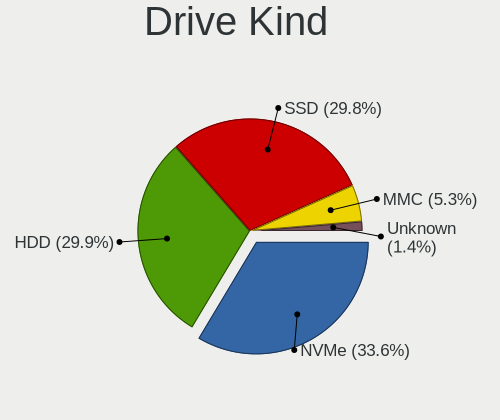
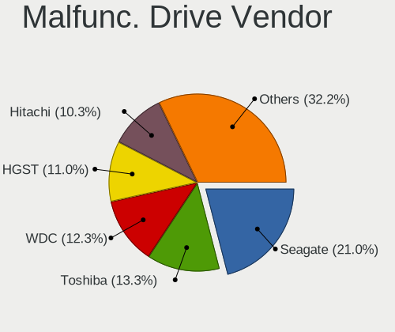
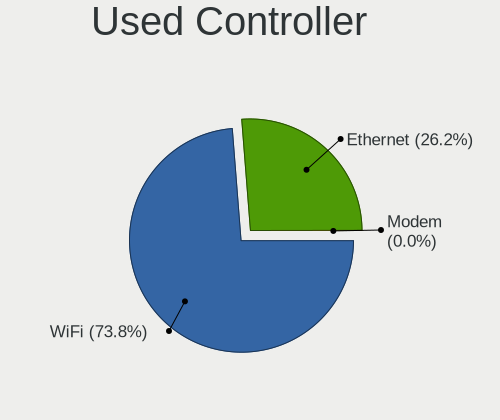

Linux in France - Tested Hardware & Statistics (Notebooks)
----------------------------------------------------------

A project to collect tested hardware configurations for Linux in France.

Anyone can contribute to this report by the [hw-probe](https://github.com/linuxhw/hw-probe) tool:

    sudo -E hw-probe -all -upload

Please contribute! Especially if your hardware is rare.

Contents
--------

* [ Test Cases ](#test-cases)

* [ System ](#system)
  - [ OS                       ](#os)
  - [ OS Family                ](#os-family)
  - [ Kernel                   ](#kernel)
  - [ Kernel Family            ](#kernel-family)
  - [ Kernel Major Ver.        ](#kernel-major-ver)
  - [ Arch                     ](#arch)
  - [ DE                       ](#de)
  - [ Display Server           ](#display-server)
  - [ Display Manager          ](#display-manager)
  - [ OS Lang                  ](#os-lang)
  - [ Boot Mode                ](#boot-mode)
  - [ Filesystem               ](#filesystem)
  - [ Part. scheme             ](#part-scheme)
  - [ Dual Boot with Linux/BSD ](#dual-boot-with-linuxbsd)
  - [ Dual Boot (Win)          ](#dual-boot-win)

* [ Board ](#board)
  - [ Vendor                   ](#vendor)
  - [ Model                    ](#model)
  - [ Model Family             ](#model-family)
  - [ MFG Year                 ](#mfg-year)
  - [ Form Factor              ](#form-factor)
  - [ Secure Boot              ](#secure-boot)
  - [ Coreboot                 ](#coreboot)
  - [ RAM Size                 ](#ram-size)
  - [ RAM Used                 ](#ram-used)
  - [ Total Drives             ](#total-drives)
  - [ Has CD-ROM               ](#has-cd-rom)
  - [ Has Ethernet             ](#has-ethernet)
  - [ Has WiFi                 ](#has-wifi)
  - [ Has Bluetooth            ](#has-bluetooth)

* [ Location ](#location)
  - [ Country                  ](#country)
  - [ City                     ](#city)

* [ Drives ](#drives)
  - [ Drive Vendor             ](#drive-vendor)
  - [ Drive Model              ](#drive-model)
  - [ HDD Vendor               ](#hdd-vendor)
  - [ SSD Vendor               ](#ssd-vendor)
  - [ Drive Kind               ](#drive-kind)
  - [ Drive Connector          ](#drive-connector)
  - [ Drive Size               ](#drive-size)
  - [ Space Total              ](#space-total)
  - [ Space Used               ](#space-used)
  - [ Malfunc. Drives          ](#malfunc-drives)
  - [ Malfunc. Drive Vendor    ](#malfunc-drive-vendor)
  - [ Malfunc. HDD Vendor      ](#malfunc-hdd-vendor)
  - [ Malfunc. Drive Kind      ](#malfunc-drive-kind)
  - [ Failed Drives            ](#failed-drives)
  - [ Failed Drive Vendor      ](#failed-drive-vendor)
  - [ Drive Status             ](#drive-status)

* [ Storage controller ](#storage-controller)
  - [ Storage Vendor           ](#storage-vendor)
  - [ Storage Model            ](#storage-model)
  - [ Storage Kind             ](#storage-kind)

* [ Processor ](#processor)
  - [ CPU Vendor               ](#cpu-vendor)
  - [ CPU Model                ](#cpu-model)
  - [ CPU Model Family         ](#cpu-model-family)
  - [ CPU Cores                ](#cpu-cores)
  - [ CPU Sockets              ](#cpu-sockets)
  - [ CPU Threads              ](#cpu-threads)
  - [ CPU Op-Modes             ](#cpu-op-modes)
  - [ CPU Microcode            ](#cpu-microcode)
  - [ CPU Microarch            ](#cpu-microarch)

* [ Graphics ](#graphics)
  - [ GPU Vendor               ](#gpu-vendor)
  - [ GPU Model                ](#gpu-model)
  - [ GPU Combo                ](#gpu-combo)
  - [ GPU Driver               ](#gpu-driver)
  - [ GPU Memory               ](#gpu-memory)

* [ Monitor ](#monitor)
  - [ Monitor Vendor           ](#monitor-vendor)
  - [ Monitor Model            ](#monitor-model)
  - [ Monitor Resolution       ](#monitor-resolution)
  - [ Monitor Diagonal         ](#monitor-diagonal)
  - [ Monitor Width            ](#monitor-width)
  - [ Aspect Ratio             ](#aspect-ratio)
  - [ Monitor Area             ](#monitor-area)
  - [ Pixel Density            ](#pixel-density)
  - [ Multiple Monitors        ](#multiple-monitors)

* [ Network ](#network)
  - [ Net Controller Vendor    ](#net-controller-vendor)
  - [ Net Controller Model     ](#net-controller-model)
  - [ Wireless Vendor          ](#wireless-vendor)
  - [ Wireless Model           ](#wireless-model)
  - [ Ethernet Vendor          ](#ethernet-vendor)
  - [ Ethernet Model           ](#ethernet-model)
  - [ Net Controller Kind      ](#net-controller-kind)
  - [ Used Controller          ](#used-controller)
  - [ NICs                     ](#nics)
  - [ IPv6                     ](#ipv6)

* [ Bluetooth ](#bluetooth)
  - [ Bluetooth Vendor         ](#bluetooth-vendor)
  - [ Bluetooth Model          ](#bluetooth-model)

* [ Sound ](#sound)
  - [ Sound Vendor             ](#sound-vendor)
  - [ Sound Model              ](#sound-model)

* [ Memory ](#memory)
  - [ Memory Vendor            ](#memory-vendor)
  - [ Memory Model             ](#memory-model)
  - [ Memory Kind              ](#memory-kind)
  - [ Memory Form Factor       ](#memory-form-factor)
  - [ Memory Size              ](#memory-size)
  - [ Memory Speed             ](#memory-speed)

* [ Printers & scanners ](#printers--scanners)
  - [ Printer Vendor           ](#printer-vendor)
  - [ Printer Model            ](#printer-model)
  - [ Scanner Vendor           ](#scanner-vendor)
  - [ Scanner Model            ](#scanner-model)

* [ Camera ](#camera)
  - [ Camera Vendor            ](#camera-vendor)
  - [ Camera Model             ](#camera-model)

* [ Security ](#security)
  - [ Fingerprint Vendor       ](#fingerprint-vendor)
  - [ Fingerprint Model        ](#fingerprint-model)
  - [ Chipcard Vendor          ](#chipcard-vendor)
  - [ Chipcard Model           ](#chipcard-model)

* [ Unsupported ](#unsupported)
  - [ Unsupported Devices      ](#unsupported-devices)
  - [ Unsupported Device Types ](#unsupported-device-types)

Test Cases
----------

Total: 9268

| Vendor        | Model                       | Probe                                                      | Date         |
|---------------|-----------------------------|------------------------------------------------------------|--------------|
| Dell          | Latitude 5290 2-in-1        | [56d2614671](https://linux-hardware.org/?probe=56d2614671) | May 09, 2024 |
| HP            | ProBook 6460b               | [14aa46f09d](https://linux-hardware.org/?probe=14aa46f09d) | May 08, 2024 |
| ASUSTek       | X705UVP                     | [b850816596](https://linux-hardware.org/?probe=b850816596) | May 08, 2024 |
| Sony          | VGN-NS12M_W                 | [e364d75564](https://linux-hardware.org/?probe=e364d75564) | May 08, 2024 |
| ASUSTek       | ASUS TUF Gaming A15 FA50... | [ae1ef1680a](https://linux-hardware.org/?probe=ae1ef1680a) | May 08, 2024 |
| Acer          | P7YE0                       | [21da78891a](https://linux-hardware.org/?probe=21da78891a) | May 08, 2024 |
| Acer          | Swift SFX16-61G             | [9cbd40bfc7](https://linux-hardware.org/?probe=9cbd40bfc7) | May 08, 2024 |
| Fujitsu Si... | LIFEBOOK E8410              | [30a913526e](https://linux-hardware.org/?probe=30a913526e) | May 07, 2024 |
| Notebook      | NS50_70MU                   | [99983ceae1](https://linux-hardware.org/?probe=99983ceae1) | May 07, 2024 |
| Dell          | Latitude 7480               | [2b3aee3902](https://linux-hardware.org/?probe=2b3aee3902) | May 07, 2024 |
| MSI           | Thin GF63 12UCX             | [f253ec6e52](https://linux-hardware.org/?probe=f253ec6e52) | May 07, 2024 |
| SCHNEIDER     | SCL141CTP                   | [ce0a785c29](https://linux-hardware.org/?probe=ce0a785c29) | May 07, 2024 |
| Dell          | Precision 7720              | [5423da6e5c](https://linux-hardware.org/?probe=5423da6e5c) | May 07, 2024 |
| ASUSTek       | Zenbook S 13 UX5304VA_UX... | [1c72c07e3d](https://linux-hardware.org/?probe=1c72c07e3d) | May 07, 2024 |
| Sony          | SVF1521E2EW                 | [2e86efc1ba](https://linux-hardware.org/?probe=2e86efc1ba) | May 07, 2024 |
| Lenovo        | IdeaPad 3 15ITL6 82H8       | [a5b0e5456a](https://linux-hardware.org/?probe=a5b0e5456a) | May 07, 2024 |
| Medion        | E14223                      | [73ae3c5e79](https://linux-hardware.org/?probe=73ae3c5e79) | May 06, 2024 |
| Lenovo        | Legion Y540-15IRH 81SX      | [44f44fe800](https://linux-hardware.org/?probe=44f44fe800) | May 06, 2024 |
| Packard Be... | EasyNote LM81               | [0ea4d18648](https://linux-hardware.org/?probe=0ea4d18648) | May 06, 2024 |
| ASUSTek       | S550CB                      | [943c34e625](https://linux-hardware.org/?probe=943c34e625) | May 06, 2024 |
| ASUSTek       | X550CC                      | [db900f1cd1](https://linux-hardware.org/?probe=db900f1cd1) | May 05, 2024 |
| Dell          | Precision 3561              | [1e92742d1f](https://linux-hardware.org/?probe=1e92742d1f) | May 05, 2024 |
| Apple         | MacBookAir6,2               | [672e653276](https://linux-hardware.org/?probe=672e653276) | May 05, 2024 |
| Lenovo        | ThinkPad X220 4291U1A       | [56fe72121d](https://linux-hardware.org/?probe=56fe72121d) | May 05, 2024 |
| ASUSTek       | TUF Gaming FX505GE_FX505... | [6794452c3b](https://linux-hardware.org/?probe=6794452c3b) | May 05, 2024 |
| HP            | Notebook                    | [27cafe3bf5](https://linux-hardware.org/?probe=27cafe3bf5) | May 05, 2024 |
| ASUSTek       | K56CB                       | [1d94e1ecd1](https://linux-hardware.org/?probe=1d94e1ecd1) | May 04, 2024 |
| ASUSTek       | GL703VM                     | [9fc5a6d2eb](https://linux-hardware.org/?probe=9fc5a6d2eb) | May 04, 2024 |
| Notebook      | NL40_50GU                   | [00f0ca50a9](https://linux-hardware.org/?probe=00f0ca50a9) | May 04, 2024 |
| Dell          | Latitude 5290 2-in-1        | [2e9e3f6434](https://linux-hardware.org/?probe=2e9e3f6434) | May 04, 2024 |
| Dell          | XPS 13 9340                 | [4446c73008](https://linux-hardware.org/?probe=4446c73008) | May 03, 2024 |
| Lenovo        | ThinkPad X1 Carbon 4th 2... | [f6f74ecb12](https://linux-hardware.org/?probe=f6f74ecb12) | May 03, 2024 |
| Packard Be... | EasyNote LM81               | [44ead9f439](https://linux-hardware.org/?probe=44ead9f439) | May 03, 2024 |
| Lenovo        | G50-45 80E3                 | [ed0b78b628](https://linux-hardware.org/?probe=ed0b78b628) | May 03, 2024 |
| ASUSTek       | N71Vn                       | [6f38bd6250](https://linux-hardware.org/?probe=6f38bd6250) | May 03, 2024 |
| ASUSTek       | VivoBook_ASUSLaptop K650... | [40f4c2e910](https://linux-hardware.org/?probe=40f4c2e910) | May 03, 2024 |
| Google        | Nospike                     | [549d690ae1](https://linux-hardware.org/?probe=549d690ae1) | May 02, 2024 |
| HP            | EliteBook 865 16 inch G1... | [9051ebbe11](https://linux-hardware.org/?probe=9051ebbe11) | May 02, 2024 |
| Dell          | Latitude 5490               | [a8db3589fb](https://linux-hardware.org/?probe=a8db3589fb) | May 02, 2024 |
| HP            | Pavilion dm1                | [ba07809953](https://linux-hardware.org/?probe=ba07809953) | May 02, 2024 |
| Notebook      | PCx0Dx                      | [a2c29d6db0](https://linux-hardware.org/?probe=a2c29d6db0) | May 02, 2024 |
| Lenovo        | ThinkPad T480 20L6SADD00    | [b9fcd48ed1](https://linux-hardware.org/?probe=b9fcd48ed1) | May 02, 2024 |
| HP            | Victus by Laptop 16-d0xx... | [4192b9d9ad](https://linux-hardware.org/?probe=4192b9d9ad) | May 02, 2024 |
| Apple         | MacBookPro6,2               | [1307008025](https://linux-hardware.org/?probe=1307008025) | May 01, 2024 |
| ASUSTek       | ZenBook UX534FAC_UX534FA    | [d203d83db8](https://linux-hardware.org/?probe=d203d83db8) | May 01, 2024 |
| ASUSTek       | N71Vn                       | [d5d1d55df1](https://linux-hardware.org/?probe=d5d1d55df1) | May 01, 2024 |
| HP            | Spectre Pro x360 G1         | [39577e6ab0](https://linux-hardware.org/?probe=39577e6ab0) | May 01, 2024 |
| Lenovo        | Legion 7 16ITHg6 82K6       | [d118bb6622](https://linux-hardware.org/?probe=d118bb6622) | May 01, 2024 |
| Dell          | XPS 13 9360                 | [00b20277f7](https://linux-hardware.org/?probe=00b20277f7) | May 01, 2024 |
| HP            | Pavilion dv7                | [d191e30bf7](https://linux-hardware.org/?probe=d191e30bf7) | May 01, 2024 |
| HP            | Elite Dragonfly 13.5 inc... | [508451cb4c](https://linux-hardware.org/?probe=508451cb4c) | May 01, 2024 |
| Acer          | Aspire V3-372T              | [888ad09735](https://linux-hardware.org/?probe=888ad09735) | Apr 30, 2024 |
| HP            | Notebook                    | [1fd0f0caa7](https://linux-hardware.org/?probe=1fd0f0caa7) | Apr 30, 2024 |
| HP            | EliteBook 840 G8 Noteboo... | [dca5cca3c7](https://linux-hardware.org/?probe=dca5cca3c7) | Apr 30, 2024 |
| Dell          | Latitude 7310               | [4379da59b1](https://linux-hardware.org/?probe=4379da59b1) | Apr 30, 2024 |
| Packard Be... | EasyNote LJ61               | [9d19962863](https://linux-hardware.org/?probe=9d19962863) | Apr 30, 2024 |
| Packard Be... | EasyNote LJ61               | [6a1a6f046a](https://linux-hardware.org/?probe=6a1a6f046a) | Apr 30, 2024 |
| ASUSTek       | S550CB                      | [81cb26d4c3](https://linux-hardware.org/?probe=81cb26d4c3) | Apr 29, 2024 |
| HP            | ZBook Firefly 14 inch G9... | [22dcf39db0](https://linux-hardware.org/?probe=22dcf39db0) | Apr 29, 2024 |
| Dell          | Latitude 7300               | [9fb87e1a65](https://linux-hardware.org/?probe=9fb87e1a65) | Apr 29, 2024 |
| Lenovo        | ThinkPad S1 Yoga 12 20DK... | [62b6fb2419](https://linux-hardware.org/?probe=62b6fb2419) | Apr 29, 2024 |
| Lenovo        | ThinkPad T420 4236MA3       | [c968415c21](https://linux-hardware.org/?probe=c968415c21) | Apr 28, 2024 |
| HP            | Pavilion Notebook           | [6da1776d42](https://linux-hardware.org/?probe=6da1776d42) | Apr 28, 2024 |
| Lenovo        | ThinkPad W541 20EGS03W15    | [32ac46c0a5](https://linux-hardware.org/?probe=32ac46c0a5) | Apr 27, 2024 |
| Fujitsu       | LIFEBOOK U7411              | [f1e695e218](https://linux-hardware.org/?probe=f1e695e218) | Apr 27, 2024 |
| HP            | Compaq 8510w                | [6761a4250d](https://linux-hardware.org/?probe=6761a4250d) | Apr 27, 2024 |
| Lenovo        | ThinkPad P70 20ESS2J700     | [3ed1b856a7](https://linux-hardware.org/?probe=3ed1b856a7) | Apr 27, 2024 |
| ASUSTek       | ASUS TUF Gaming A17 FA70... | [da45f52feb](https://linux-hardware.org/?probe=da45f52feb) | Apr 27, 2024 |
| ASUSTek       | ASUS TUF Gaming A17 FA70... | [f8f255e514](https://linux-hardware.org/?probe=f8f255e514) | Apr 27, 2024 |
| Acer          | Aspire 5738                 | [a7b22c04c8](https://linux-hardware.org/?probe=a7b22c04c8) | Apr 27, 2024 |
| ASUSTek       | S551LN                      | [e1fa85e2ad](https://linux-hardware.org/?probe=e1fa85e2ad) | Apr 27, 2024 |
| HP            | ZBook 15                    | [63fe793b96](https://linux-hardware.org/?probe=63fe793b96) | Apr 27, 2024 |
| HP            | Compaq 8710w (GT649PA#AB... | [aa6e9b5ba6](https://linux-hardware.org/?probe=aa6e9b5ba6) | Apr 26, 2024 |
| HP            | Pavilion Laptop 15-eh1xx... | [3358640735](https://linux-hardware.org/?probe=3358640735) | Apr 26, 2024 |
| HP            | EliteBook 820 G3            | [c73442e58f](https://linux-hardware.org/?probe=c73442e58f) | Apr 26, 2024 |
| Medion        | Defender P30                | [12b85f5741](https://linux-hardware.org/?probe=12b85f5741) | Apr 26, 2024 |
| Samsung       | RV410/RV510/S3510/E3510     | [d62fc38125](https://linux-hardware.org/?probe=d62fc38125) | Apr 26, 2024 |
| Dell          | Latitude E4300              | [251219f28e](https://linux-hardware.org/?probe=251219f28e) | Apr 26, 2024 |
| HP            | EliteBook 820 G3            | [9f260f753a](https://linux-hardware.org/?probe=9f260f753a) | Apr 26, 2024 |
| HP            | Compaq 8710w (GT649PA#AB... | [00f1c96012](https://linux-hardware.org/?probe=00f1c96012) | Apr 26, 2024 |
| Samsung       | RV415/RV515/E3415           | [b52d1ce535](https://linux-hardware.org/?probe=b52d1ce535) | Apr 25, 2024 |
| Dell          | Precision M6800             | [1d41e8bb92](https://linux-hardware.org/?probe=1d41e8bb92) | Apr 25, 2024 |
| Lenovo        | ThinkPad P52 20M9CTO1WW     | [ce0b51d2c0](https://linux-hardware.org/?probe=ce0b51d2c0) | Apr 25, 2024 |
| Lenovo        | ThinkPad L420 7829A71       | [11c76a20a0](https://linux-hardware.org/?probe=11c76a20a0) | Apr 25, 2024 |
| Lenovo        | IdeaPad 320-17ISK 80XJ      | [a0fe903a7c](https://linux-hardware.org/?probe=a0fe903a7c) | Apr 25, 2024 |
| Dell          | XPS 13 9305                 | [62621a436b](https://linux-hardware.org/?probe=62621a436b) | Apr 25, 2024 |
| HP            | Notebook                    | [64adec78e1](https://linux-hardware.org/?probe=64adec78e1) | Apr 25, 2024 |
| Toshiba       | Satellite Pro L630          | [9c0d08ec19](https://linux-hardware.org/?probe=9c0d08ec19) | Apr 24, 2024 |
| Unknown       | Unknown                     | [d722d0e84b](https://linux-hardware.org/?probe=d722d0e84b) | Apr 24, 2024 |
| Gigabyte      | G5 MF                       | [abbf347c78](https://linux-hardware.org/?probe=abbf347c78) | Apr 24, 2024 |
| HP            | Pavilion Gaming Laptop 1... | [d0dab98dcc](https://linux-hardware.org/?probe=d0dab98dcc) | Apr 24, 2024 |
| HP            | Laptop 15s-fq2xxx           | [06c81aed79](https://linux-hardware.org/?probe=06c81aed79) | Apr 23, 2024 |
| HP            | Pavilion Laptop 15-cs0xx... | [d50544d577](https://linux-hardware.org/?probe=d50544d577) | Apr 23, 2024 |
| ASUSTek       | K42F                        | [f29299723c](https://linux-hardware.org/?probe=f29299723c) | Apr 23, 2024 |
| ASUSTek       | K42F                        | [63b454fa02](https://linux-hardware.org/?probe=63b454fa02) | Apr 23, 2024 |
| Notebook      | NP50D5                      | [5efdc99e90](https://linux-hardware.org/?probe=5efdc99e90) | Apr 23, 2024 |
| Apple         | MacBookPro5,2               | [a5052885f7](https://linux-hardware.org/?probe=a5052885f7) | Apr 22, 2024 |
| MSI           | GS65 Stealth Thin 8RE       | [8e326da202](https://linux-hardware.org/?probe=8e326da202) | Apr 22, 2024 |
| Dell          | Vostro 1220                 | [ce4128ed7b](https://linux-hardware.org/?probe=ce4128ed7b) | Apr 22, 2024 |
| Acer          | Aspire E5-773G              | [5e72cf2ad7](https://linux-hardware.org/?probe=5e72cf2ad7) | Apr 22, 2024 |
| ASUSTek       | X751MA                      | [e8b836dd14](https://linux-hardware.org/?probe=e8b836dd14) | Apr 22, 2024 |
| Samsung       | 950XED                      | [20c945fb12](https://linux-hardware.org/?probe=20c945fb12) | Apr 22, 2024 |
| Dell          | XPS 13 9340                 | [5b25704805](https://linux-hardware.org/?probe=5b25704805) | Apr 22, 2024 |
| ASUSTek       | K93SM                       | [031f10fad0](https://linux-hardware.org/?probe=031f10fad0) | Apr 22, 2024 |
| eMachines     | eME528                      | [026f678993](https://linux-hardware.org/?probe=026f678993) | Apr 21, 2024 |
| ASUSTek       | K75VM                       | [c863c3ba6b](https://linux-hardware.org/?probe=c863c3ba6b) | Apr 21, 2024 |
| Toshiba       | Satellite C870-192          | [563eab96cf](https://linux-hardware.org/?probe=563eab96cf) | Apr 20, 2024 |
| Lenovo        | ThinkPad L420 7829A71       | [06f7d10927](https://linux-hardware.org/?probe=06f7d10927) | Apr 20, 2024 |
| Dell          | Precision M6800             | [c44a2aee51](https://linux-hardware.org/?probe=c44a2aee51) | Apr 20, 2024 |
| ASUSTek       | ROG Zephyrus Duo 16 GX65... | [328b8f3d9e](https://linux-hardware.org/?probe=328b8f3d9e) | Apr 19, 2024 |
| ASUSTek       | ROG Zephyrus G15 GA503RW    | [8d5622069d](https://linux-hardware.org/?probe=8d5622069d) | Apr 19, 2024 |
| Unknown       | Unknown                     | [62969495f2](https://linux-hardware.org/?probe=62969495f2) | Apr 19, 2024 |
| Dell          | Vostro 1220                 | [2842ff320d](https://linux-hardware.org/?probe=2842ff320d) | Apr 19, 2024 |
| Acer          | Aspire ES1-512              | [7e666ce610](https://linux-hardware.org/?probe=7e666ce610) | Apr 19, 2024 |
| UNOWHY        | Y13G002S4EI                 | [d5ed9a8f9c](https://linux-hardware.org/?probe=d5ed9a8f9c) | Apr 18, 2024 |
| Chuwi         | CoreBook X                  | [de2cd02e92](https://linux-hardware.org/?probe=de2cd02e92) | Apr 18, 2024 |
| Lenovo        | ThinkPad X1 Extreme 2nd ... | [634572901c](https://linux-hardware.org/?probe=634572901c) | Apr 18, 2024 |
| Lenovo        | ThinkPad T440p 20AWS17N0... | [9f31e2ff86](https://linux-hardware.org/?probe=9f31e2ff86) | Apr 18, 2024 |
| HP            | EliteBook 840 G8 Noteboo... | [01121cc898](https://linux-hardware.org/?probe=01121cc898) | Apr 18, 2024 |
| Dell          | Latitude E5540              | [c52074d979](https://linux-hardware.org/?probe=c52074d979) | Apr 17, 2024 |
| ASUSTek       | ASUS TUF Gaming F15 FX50... | [0eb26f6fcc](https://linux-hardware.org/?probe=0eb26f6fcc) | Apr 17, 2024 |
| Lenovo        | ThinkPad L560 20F2S0TB00    | [943647251c](https://linux-hardware.org/?probe=943647251c) | Apr 17, 2024 |
| HP            | EliteBook 6930p             | [263d72f3c6](https://linux-hardware.org/?probe=263d72f3c6) | Apr 17, 2024 |
| Medion        | E14223                      | [27971449ab](https://linux-hardware.org/?probe=27971449ab) | Apr 17, 2024 |
| Acer          | Aspire A317-52              | [bf62cb2dba](https://linux-hardware.org/?probe=bf62cb2dba) | Apr 17, 2024 |
| ASUSTek       | X751LJ                      | [ee2d127680](https://linux-hardware.org/?probe=ee2d127680) | Apr 16, 2024 |
| Notebook      | W230ST                      | [946ba4a3b8](https://linux-hardware.org/?probe=946ba4a3b8) | Apr 16, 2024 |
| Lenovo        | IdeaPadFlex 14 20308        | [7ccf67d720](https://linux-hardware.org/?probe=7ccf67d720) | Apr 16, 2024 |
| Dell          | Latitude 7520               | [f040020d5f](https://linux-hardware.org/?probe=f040020d5f) | Apr 16, 2024 |
| Lenovo        | ThinkPad T480 20L6SAYX00    | [f53da67ab4](https://linux-hardware.org/?probe=f53da67ab4) | Apr 15, 2024 |
| Acer          | Aspire V3-572P              | [8664247893](https://linux-hardware.org/?probe=8664247893) | Apr 15, 2024 |
| HP            | Laptop 17-cp0xxx            | [6f08b03e98](https://linux-hardware.org/?probe=6f08b03e98) | Apr 15, 2024 |
| Lenovo        | ThinkPad X280 20KESA5000    | [8571fb3b5c](https://linux-hardware.org/?probe=8571fb3b5c) | Apr 14, 2024 |
| Lenovo        | Legion 5 15IMH05H 81Y6      | [5785462109](https://linux-hardware.org/?probe=5785462109) | Apr 14, 2024 |
| Apple         | MacBookPro11,3              | [9e81741e0e](https://linux-hardware.org/?probe=9e81741e0e) | Apr 14, 2024 |
| Notebook      | NS5x_NS7xAU                 | [fef58e28df](https://linux-hardware.org/?probe=fef58e28df) | Apr 14, 2024 |
| HP            | Pavilion g6                 | [80f535a166](https://linux-hardware.org/?probe=80f535a166) | Apr 13, 2024 |
| ASUSTek       | X550JX                      | [10e9087348](https://linux-hardware.org/?probe=10e9087348) | Apr 13, 2024 |
| Acer          | Aspire V3-572P              | [541e26e0da](https://linux-hardware.org/?probe=541e26e0da) | Apr 13, 2024 |
| HP            | EliteBook 855 G8 Noteboo... | [f40332b7bb](https://linux-hardware.org/?probe=f40332b7bb) | Apr 13, 2024 |
| Dell          | Latitude E5520              | [0f03f7a01f](https://linux-hardware.org/?probe=0f03f7a01f) | Apr 13, 2024 |
| ASUSTek       | N552VW                      | [02c36db055](https://linux-hardware.org/?probe=02c36db055) | Apr 12, 2024 |
| Dell          | G15 5511                    | [dca2850091](https://linux-hardware.org/?probe=dca2850091) | Apr 12, 2024 |
| Valve         | Jupiter                     | [64cab9101d](https://linux-hardware.org/?probe=64cab9101d) | Apr 12, 2024 |
| MSI           | GE62 2QC                    | [af7a9f75d6](https://linux-hardware.org/?probe=af7a9f75d6) | Apr 12, 2024 |
| MSI           | GE62 2QC                    | [2b18322513](https://linux-hardware.org/?probe=2b18322513) | Apr 12, 2024 |
| HP            | Pavilion Laptop 15-cs0xx... | [40addd8c40](https://linux-hardware.org/?probe=40addd8c40) | Apr 12, 2024 |
| Acer          | Aspire A317-53              | [5b6ec1ea3e](https://linux-hardware.org/?probe=5b6ec1ea3e) | Apr 12, 2024 |
| Notebook      | NS5x_NS7xAU                 | [d2fa3daec7](https://linux-hardware.org/?probe=d2fa3daec7) | Apr 12, 2024 |
| Notebook      | NS5x_NS7xPU                 | [b97d0acf58](https://linux-hardware.org/?probe=b97d0acf58) | Apr 11, 2024 |
| HP            | Laptop 15-dy1xxx            | [05d78a16da](https://linux-hardware.org/?probe=05d78a16da) | Apr 11, 2024 |
| HP            | EliteBook 840 G5            | [045700832b](https://linux-hardware.org/?probe=045700832b) | Apr 11, 2024 |
| Lenovo        | ThinkPad L14 Gen 4 21H1C... | [4d834b6378](https://linux-hardware.org/?probe=4d834b6378) | Apr 11, 2024 |
| Lenovo        | ThinkPad L14 Gen 4 21H1C... | [12ad1e078b](https://linux-hardware.org/?probe=12ad1e078b) | Apr 11, 2024 |
| ASUSTek       | TUF Gaming FX504GD_FX80G... | [fbaf67a904](https://linux-hardware.org/?probe=fbaf67a904) | Apr 11, 2024 |
| ASUSTek       | TUF Gaming FX504GD_FX80G... | [2526b63349](https://linux-hardware.org/?probe=2526b63349) | Apr 11, 2024 |
| ASUSTek       | TUF Gaming FA706II_TUF76... | [ee6a729006](https://linux-hardware.org/?probe=ee6a729006) | Apr 11, 2024 |
| ASUSTek       | X450CC                      | [5ead7a9dea](https://linux-hardware.org/?probe=5ead7a9dea) | Apr 11, 2024 |
| ASUSTek       | X450CC                      | [752a03f0de](https://linux-hardware.org/?probe=752a03f0de) | Apr 11, 2024 |
| MSI           | CR70 2M/CX70 2OC/CX70 2O... | [c473133c45](https://linux-hardware.org/?probe=c473133c45) | Apr 11, 2024 |
| ASUSTek       | N552VW                      | [981a9ddf63](https://linux-hardware.org/?probe=981a9ddf63) | Apr 11, 2024 |
| Acer          | Aspire SW5-011              | [4e8ad9d65f](https://linux-hardware.org/?probe=4e8ad9d65f) | Apr 10, 2024 |
| MSI           | Raider GE78HX SmartTP 13... | [c048dc6e93](https://linux-hardware.org/?probe=c048dc6e93) | Apr 10, 2024 |
| Dell          | Precision 7680              | [816057ca7a](https://linux-hardware.org/?probe=816057ca7a) | Apr 10, 2024 |
| HUAWEI        | BOM-WXX9                    | [514738e85f](https://linux-hardware.org/?probe=514738e85f) | Apr 10, 2024 |
| Lenovo        | ThinkPad L13 Gen 3 21BAS... | [73f98df7bf](https://linux-hardware.org/?probe=73f98df7bf) | Apr 10, 2024 |
| Dell          | XPS 9315                    | [c4879d5e8d](https://linux-hardware.org/?probe=c4879d5e8d) | Apr 10, 2024 |
| Lenovo        | ThinkPad X1 Carbon 7th 2... | [638339b307](https://linux-hardware.org/?probe=638339b307) | Apr 10, 2024 |
| ASUSTek       | ASUS Zenbook 14 UX3405MA... | [55845bc8a6](https://linux-hardware.org/?probe=55845bc8a6) | Apr 10, 2024 |
| HP            | ProBook 4520s               | [b29f0bab6b](https://linux-hardware.org/?probe=b29f0bab6b) | Apr 09, 2024 |
| HP            | ProBook 450 G5              | [62ad537ec4](https://linux-hardware.org/?probe=62ad537ec4) | Apr 09, 2024 |
| ASUSTek       | ASUS Zenbook 14 UX3405MA... | [e332273f42](https://linux-hardware.org/?probe=e332273f42) | Apr 08, 2024 |
| Google        | Magolor                     | [df74bd8187](https://linux-hardware.org/?probe=df74bd8187) | Apr 08, 2024 |
| Google        | Magolor                     | [dc67b995b5](https://linux-hardware.org/?probe=dc67b995b5) | Apr 08, 2024 |
| Dell          | Precision 5510              | [7790933937](https://linux-hardware.org/?probe=7790933937) | Apr 08, 2024 |
| ASUSTek       | ROG Strix G513QR_G513QR     | [2c23a28e81](https://linux-hardware.org/?probe=2c23a28e81) | Apr 08, 2024 |
| Apple         | MacBookPro13,2              | [9aa383b71b](https://linux-hardware.org/?probe=9aa383b71b) | Apr 07, 2024 |
| Lenovo        | IdeaPad 3 14ADA05 81W0      | [da48420d2a](https://linux-hardware.org/?probe=da48420d2a) | Apr 07, 2024 |
| Apple         | MacBookAir6,2               | [a63811031c](https://linux-hardware.org/?probe=a63811031c) | Apr 07, 2024 |
| Medion        | Akoya P7818                 | [5b8f93851b](https://linux-hardware.org/?probe=5b8f93851b) | Apr 07, 2024 |
| Fujitsu Si... | LIFEBOOK S6410              | [e82877a3db](https://linux-hardware.org/?probe=e82877a3db) | Apr 07, 2024 |
| Acer          | Aspire V3-572P              | [e4cc62041e](https://linux-hardware.org/?probe=e4cc62041e) | Apr 06, 2024 |
| Acer          | Aspire V3-572P              | [8f10a9f724](https://linux-hardware.org/?probe=8f10a9f724) | Apr 06, 2024 |
| Toshiba       | Satellite U500              | [4872d0c452](https://linux-hardware.org/?probe=4872d0c452) | Apr 06, 2024 |
| SCHNEIDER     | SCL141CTP                   | [33e14fe576](https://linux-hardware.org/?probe=33e14fe576) | Apr 06, 2024 |
| HP            | Pavilion dv6                | [e397c999bc](https://linux-hardware.org/?probe=e397c999bc) | Apr 06, 2024 |
| HP            | ZBook 15u G6                | [a1865e5d26](https://linux-hardware.org/?probe=a1865e5d26) | Apr 06, 2024 |
| Google        | Magolor                     | [36145fc673](https://linux-hardware.org/?probe=36145fc673) | Apr 06, 2024 |
| Dell          | Latitude E6410              | [7c4144e1df](https://linux-hardware.org/?probe=7c4144e1df) | Apr 05, 2024 |
| Dell          | Precision 5550              | [3e0f6b8cef](https://linux-hardware.org/?probe=3e0f6b8cef) | Apr 05, 2024 |
| HP            | EliteBook 840 G2            | [cb733ed3d2](https://linux-hardware.org/?probe=cb733ed3d2) | Apr 05, 2024 |
| Acer          | Extensa 5630                | [224d74c060](https://linux-hardware.org/?probe=224d74c060) | Apr 04, 2024 |
| Framework     | Laptop (13th Gen Intel C... | [0d1189e3fb](https://linux-hardware.org/?probe=0d1189e3fb) | Apr 04, 2024 |
| Acer          | Extensa 5630                | [c810325d19](https://linux-hardware.org/?probe=c810325d19) | Apr 04, 2024 |
| VALE          | Notebook Classic C151V      | [db85555d5c](https://linux-hardware.org/?probe=db85555d5c) | Apr 04, 2024 |
| Google        | Woomax                      | [265e415e66](https://linux-hardware.org/?probe=265e415e66) | Apr 04, 2024 |
| HP            | Pro Tablet 10 EE G1         | [364cf44bfa](https://linux-hardware.org/?probe=364cf44bfa) | Apr 03, 2024 |
| HP            | Pro Tablet 10 EE G1         | [a76cafaf48](https://linux-hardware.org/?probe=a76cafaf48) | Apr 03, 2024 |
| Dell          | Latitude E4310              | [e182d9e891](https://linux-hardware.org/?probe=e182d9e891) | Apr 03, 2024 |
| ASUSTek       | VivoBook_ASUSLaptop X513... | [0ded53a444](https://linux-hardware.org/?probe=0ded53a444) | Apr 03, 2024 |
| Dell          | Latitude 5440               | [19eee079f1](https://linux-hardware.org/?probe=19eee079f1) | Apr 03, 2024 |
| Lenovo        | Legion Slim 7 16APH8 82Y... | [fa74b9e85f](https://linux-hardware.org/?probe=fa74b9e85f) | Apr 03, 2024 |
| HP            | Laptop 17-by3xxx            | [d023b9d46a](https://linux-hardware.org/?probe=d023b9d46a) | Apr 03, 2024 |
| Dell          | Inspiron 14 Plus 7440       | [45c26d6324](https://linux-hardware.org/?probe=45c26d6324) | Apr 03, 2024 |
| Panasonic     | CF-C1BTCREFF                | [6a749f6baf](https://linux-hardware.org/?probe=6a749f6baf) | Apr 03, 2024 |
| Toshiba       | Satellite Pro C50-A-154     | [6b63313103](https://linux-hardware.org/?probe=6b63313103) | Apr 02, 2024 |
| HP            | EliteBook 850 G5            | [8f85b49c52](https://linux-hardware.org/?probe=8f85b49c52) | Apr 02, 2024 |
| Dell          | Latitude 5540               | [3feb2e9beb](https://linux-hardware.org/?probe=3feb2e9beb) | Apr 02, 2024 |
| Lenovo        | Legion Slim 7 16APH8 82Y... | [9fb0717868](https://linux-hardware.org/?probe=9fb0717868) | Apr 02, 2024 |
| Acer          | Aspire SW5-011              | [6f6cb62f08](https://linux-hardware.org/?probe=6f6cb62f08) | Apr 02, 2024 |
| Lenovo        | ThinkPad X240 20AMS1PT06    | [fb2384d93e](https://linux-hardware.org/?probe=fb2384d93e) | Apr 02, 2024 |
| Dell          | Latitude 7400               | [5de339a7cc](https://linux-hardware.org/?probe=5de339a7cc) | Apr 01, 2024 |
| Acer          | Aspire SW5-011              | [6fbb2e2797](https://linux-hardware.org/?probe=6fbb2e2797) | Apr 01, 2024 |
| Lenovo        | ThinkPad P14s Gen 2a 21A... | [cdd5077ad4](https://linux-hardware.org/?probe=cdd5077ad4) | Apr 01, 2024 |
| Dell          | Latitude E6430              | [bf9cac92e7](https://linux-hardware.org/?probe=bf9cac92e7) | Apr 01, 2024 |
| Panasonic     | CF-C1BTCREFF                | [bb492a4906](https://linux-hardware.org/?probe=bb492a4906) | Apr 01, 2024 |
| N-one         | Nbook Ultra                 | [3061b09bec](https://linux-hardware.org/?probe=3061b09bec) | Apr 01, 2024 |
| Dell          | Vostro 3350                 | [b886f3addc](https://linux-hardware.org/?probe=b886f3addc) | Mar 31, 2024 |
| HP            | ProBook 650 G1              | [f097372357](https://linux-hardware.org/?probe=f097372357) | Mar 31, 2024 |
| Lenovo        | G50-45 80E3                 | [297eab2023](https://linux-hardware.org/?probe=297eab2023) | Mar 31, 2024 |
| Dell          | Inspiron 5415               | [1d11041809](https://linux-hardware.org/?probe=1d11041809) | Mar 31, 2024 |
| Lenovo        | IdeaPad Slim 3 15IAH8 83... | [f6171acc29](https://linux-hardware.org/?probe=f6171acc29) | Mar 31, 2024 |
| ASUSTek       | ROG Zephyrus G16 GU603ZU... | [37980dcbe5](https://linux-hardware.org/?probe=37980dcbe5) | Mar 30, 2024 |
| ASUSTek       | VivoBook_ASUS Laptop E20... | [83edc14408](https://linux-hardware.org/?probe=83edc14408) | Mar 30, 2024 |
| ASUSTek       | K73SD                       | [4002cbf0dd](https://linux-hardware.org/?probe=4002cbf0dd) | Mar 30, 2024 |
| Lenovo        | ThinkPad P16s Gen 2 21K9... | [8704378099](https://linux-hardware.org/?probe=8704378099) | Mar 30, 2024 |
| Samsung       | RV410/RV510/S3510/E3510     | [253349e4e3](https://linux-hardware.org/?probe=253349e4e3) | Mar 30, 2024 |
| Lenovo        | IdeaPad Slim 3 14IAN8 82... | [3709076728](https://linux-hardware.org/?probe=3709076728) | Mar 30, 2024 |
| Dell          | Precision 5510              | [f29d3d3821](https://linux-hardware.org/?probe=f29d3d3821) | Mar 30, 2024 |
| Lenovo        | ThinkPad P53 20QQS5WG00     | [15499f30af](https://linux-hardware.org/?probe=15499f30af) | Mar 30, 2024 |
| HP            | EliteBook 865 16 inch G1... | [cda1c99c4d](https://linux-hardware.org/?probe=cda1c99c4d) | Mar 30, 2024 |
| System76      | Oryx Pro                    | [577e73e857](https://linux-hardware.org/?probe=577e73e857) | Mar 29, 2024 |
| HP            | EliteBook 840 G3            | [62424edf23](https://linux-hardware.org/?probe=62424edf23) | Mar 29, 2024 |
| Lenovo        | ThinkPad E16 Gen 1 21JNC... | [0a59bd119b](https://linux-hardware.org/?probe=0a59bd119b) | Mar 29, 2024 |
| Notebook      | W94_95_97JU                 | [b7c47deb98](https://linux-hardware.org/?probe=b7c47deb98) | Mar 29, 2024 |
| Lenovo        | ThinkPad L13 Gen 4 21FG0... | [d43e40c1a9](https://linux-hardware.org/?probe=d43e40c1a9) | Mar 28, 2024 |
| Toshiba       | PORTEGE Z930                | [e1f25da3fd](https://linux-hardware.org/?probe=e1f25da3fd) | Mar 28, 2024 |
| Lenovo        | ThinkPad P14s Gen 2a 21A... | [3eb36392bc](https://linux-hardware.org/?probe=3eb36392bc) | Mar 28, 2024 |
| HP            | ProBook 4515s               | [3048353db9](https://linux-hardware.org/?probe=3048353db9) | Mar 27, 2024 |
| Sony          | VPCEB1M1E                   | [0ab1b90960](https://linux-hardware.org/?probe=0ab1b90960) | Mar 27, 2024 |
| HP            | EliteBook 865 16 inch G1... | [b0de881978](https://linux-hardware.org/?probe=b0de881978) | Mar 27, 2024 |
| Lenovo        | ThinkPad T460s 20FAS5LC0... | [59ae008766](https://linux-hardware.org/?probe=59ae008766) | Mar 27, 2024 |
| Lenovo        | Unknown                     | [3bbef18998](https://linux-hardware.org/?probe=3bbef18998) | Mar 27, 2024 |
| ASUSTek       | VivoBook_ASUSLaptop X712... | [d6f2169d3f](https://linux-hardware.org/?probe=d6f2169d3f) | Mar 26, 2024 |
| Dell          | Latitude 7400               | [ccc014c5e0](https://linux-hardware.org/?probe=ccc014c5e0) | Mar 26, 2024 |
| Acer          | Extensa 2540                | [3e49d36612](https://linux-hardware.org/?probe=3e49d36612) | Mar 26, 2024 |
| HP            | Laptop 17-cn0xxx            | [0520ea7cea](https://linux-hardware.org/?probe=0520ea7cea) | Mar 26, 2024 |
| Dell          | Latitude E5510              | [3f05300c5e](https://linux-hardware.org/?probe=3f05300c5e) | Mar 26, 2024 |
| Star Labs     | StarBook                    | [91ff4c71fc](https://linux-hardware.org/?probe=91ff4c71fc) | Mar 26, 2024 |
| Lenovo        | ThinkPad T430s 2356LPG      | [62264fdc8f](https://linux-hardware.org/?probe=62264fdc8f) | Mar 26, 2024 |
| Acer          | Aspire A317-32              | [a8ba259399](https://linux-hardware.org/?probe=a8ba259399) | Mar 26, 2024 |
| HP            | EliteBook 860 16 inch G9... | [687163bf58](https://linux-hardware.org/?probe=687163bf58) | Mar 26, 2024 |
| Acer          | Aspire A315-24P             | [17387e2822](https://linux-hardware.org/?probe=17387e2822) | Mar 26, 2024 |
| ASUSTek       | K53SC                       | [c089e8153d](https://linux-hardware.org/?probe=c089e8153d) | Mar 25, 2024 |
| HP            | 250 G1                      | [1061b55594](https://linux-hardware.org/?probe=1061b55594) | Mar 25, 2024 |
| Valve         | Jupiter                     | [99fec85b50](https://linux-hardware.org/?probe=99fec85b50) | Mar 25, 2024 |
| Dell          | Vostro 15-3568              | [25184ad945](https://linux-hardware.org/?probe=25184ad945) | Mar 25, 2024 |
| System76      | Lemur                       | [a5fb83b20e](https://linux-hardware.org/?probe=a5fb83b20e) | Mar 25, 2024 |
| Dell          | Vostro 15-3568              | [b48921d197](https://linux-hardware.org/?probe=b48921d197) | Mar 25, 2024 |
| Dell          | Vostro 15-3568              | [c906c9dc87](https://linux-hardware.org/?probe=c906c9dc87) | Mar 25, 2024 |
| HP            | ProBook 655 G2              | [49a85fae09](https://linux-hardware.org/?probe=49a85fae09) | Mar 25, 2024 |
| Dell          | Vostro 15-3568              | [43d5eddd6e](https://linux-hardware.org/?probe=43d5eddd6e) | Mar 25, 2024 |
| Dell          | Vostro 15-3568              | [756f5d9aca](https://linux-hardware.org/?probe=756f5d9aca) | Mar 25, 2024 |
| HP            | Pavilion Gaming Laptop 1... | [9d47965e8d](https://linux-hardware.org/?probe=9d47965e8d) | Mar 25, 2024 |
| Ordissimo     | Lucie3                      | [76b68ca5f4](https://linux-hardware.org/?probe=76b68ca5f4) | Mar 24, 2024 |
| Lenovo        | ThinkPad L512 2598W2P       | [29d9529699](https://linux-hardware.org/?probe=29d9529699) | Mar 24, 2024 |
| ASUSTek       | X550CC                      | [5e519a6603](https://linux-hardware.org/?probe=5e519a6603) | Mar 24, 2024 |
| Acer          | Swift SF315-52G             | [03ba032080](https://linux-hardware.org/?probe=03ba032080) | Mar 24, 2024 |
| Google        | Markarth                    | [9987cda5ae](https://linux-hardware.org/?probe=9987cda5ae) | Mar 24, 2024 |
| Lenovo        | Yoga S740-15IRH 81NX        | [d6b26c4897](https://linux-hardware.org/?probe=d6b26c4897) | Mar 24, 2024 |
| Qilive        | QW2214FR                    | [4a5e116692](https://linux-hardware.org/?probe=4a5e116692) | Mar 24, 2024 |
| Lenovo        | ThinkPad R400 7440CJ5       | [42b496df16](https://linux-hardware.org/?probe=42b496df16) | Mar 23, 2024 |
| HP            | Laptop 15-db0xxx            | [904ac30154](https://linux-hardware.org/?probe=904ac30154) | Mar 23, 2024 |
| Dell          | Latitude 7490               | [ac2f810336](https://linux-hardware.org/?probe=ac2f810336) | Mar 23, 2024 |
| HP            | ZBook Fury 17.3 inch G8 ... | [1d7a69a724](https://linux-hardware.org/?probe=1d7a69a724) | Mar 23, 2024 |
| Lenovo        | ThinkPad X1 Carbon Gen 1... | [525897132a](https://linux-hardware.org/?probe=525897132a) | Mar 23, 2024 |
| HP            | ZBook 17 G3                 | [8bbc4eaca3](https://linux-hardware.org/?probe=8bbc4eaca3) | Mar 23, 2024 |
| Qilive        | QW2214FR                    | [caa8ca0076](https://linux-hardware.org/?probe=caa8ca0076) | Mar 23, 2024 |
| ASUSTek       | ASUS TUF Gaming A17 FA70... | [dfcbe4a6cd](https://linux-hardware.org/?probe=dfcbe4a6cd) | Mar 23, 2024 |
| Lenovo        | IdeaPad 5 Pro 16ACH6 82L... | [b2fd799b3e](https://linux-hardware.org/?probe=b2fd799b3e) | Mar 23, 2024 |
| Lenovo        | IdeaPad 5 Pro 16ACH6 82L... | [ff2beece1e](https://linux-hardware.org/?probe=ff2beece1e) | Mar 23, 2024 |
| Dell          | Precision 5510              | [da71f8326d](https://linux-hardware.org/?probe=da71f8326d) | Mar 22, 2024 |
| Lenovo        | ThinkPad L15 Gen 2a 20X8... | [3bb5d80e00](https://linux-hardware.org/?probe=3bb5d80e00) | Mar 22, 2024 |
| HP            | Laptop 15-bs0xx             | [1398cdcdf9](https://linux-hardware.org/?probe=1398cdcdf9) | Mar 22, 2024 |
| Lenovo        | ThinkPad S1 Yoga 12 20DK... | [df5c12540c](https://linux-hardware.org/?probe=df5c12540c) | Mar 22, 2024 |
| Framework     | Laptop 13 (AMD Ryzen 704... | [cb0339240e](https://linux-hardware.org/?probe=cb0339240e) | Mar 22, 2024 |
| Fujitsu       | LIFEBOOK E754               | [4558c9a4f4](https://linux-hardware.org/?probe=4558c9a4f4) | Mar 22, 2024 |
| Lenovo        | IdeaPad 3 15ITL6 82H8       | [28a7b94965](https://linux-hardware.org/?probe=28a7b94965) | Mar 22, 2024 |
| HP            | Pavilion 17                 | [fcbbdc0161](https://linux-hardware.org/?probe=fcbbdc0161) | Mar 22, 2024 |
| HP            | Laptop 15-dw1xxx            | [cb5da69062](https://linux-hardware.org/?probe=cb5da69062) | Mar 22, 2024 |
| N-one         | Nbook Ultra                 | [7261d31ee0](https://linux-hardware.org/?probe=7261d31ee0) | Mar 22, 2024 |
| Lenovo        | ThinkPad T480s 20L8SF6G0... | [3692614ad5](https://linux-hardware.org/?probe=3692614ad5) | Mar 21, 2024 |
| HUAWEI        | BOHB-WAX9                   | [eecdc4a970](https://linux-hardware.org/?probe=eecdc4a970) | Mar 21, 2024 |
| HUAWEI        | BOHB-WAX9                   | [0a1b9c732b](https://linux-hardware.org/?probe=0a1b9c732b) | Mar 21, 2024 |
| Dell          | XPS 15 7590                 | [039f85d908](https://linux-hardware.org/?probe=039f85d908) | Mar 21, 2024 |
| AMI           | Intel                       | [8f3257e1b2](https://linux-hardware.org/?probe=8f3257e1b2) | Mar 21, 2024 |
| ASUSTek       | ASUS TUF Gaming A17 FA70... | [6e67248d73](https://linux-hardware.org/?probe=6e67248d73) | Mar 21, 2024 |
| Notebook      | NJ50_70CU                   | [8333a53296](https://linux-hardware.org/?probe=8333a53296) | Mar 21, 2024 |
| ASUSTek       | Zenbook UX3402ZA_UX3402Z... | [ed920d12cd](https://linux-hardware.org/?probe=ed920d12cd) | Mar 21, 2024 |
| Google        | Magma                       | [8fe3986816](https://linux-hardware.org/?probe=8fe3986816) | Mar 20, 2024 |
| ASUSTek       | VivoBook_ASUSLaptop X580... | [bf10979335](https://linux-hardware.org/?probe=bf10979335) | Mar 20, 2024 |
| ASUSTek       | VivoBook_ASUSLaptop X509... | [fd5a3402a1](https://linux-hardware.org/?probe=fd5a3402a1) | Mar 20, 2024 |
| HP            | Pavilion Laptop 15-eh3xx... | [2bceb73245](https://linux-hardware.org/?probe=2bceb73245) | Mar 20, 2024 |
| Dell          | Latitude E6320              | [28c0028b04](https://linux-hardware.org/?probe=28c0028b04) | Mar 19, 2024 |
| HP            | Pavilion g7                 | [5b1d72b75b](https://linux-hardware.org/?probe=5b1d72b75b) | Mar 19, 2024 |
| Sony          | VGN-TZ21MN_N                | [1e1a62727b](https://linux-hardware.org/?probe=1e1a62727b) | Mar 19, 2024 |
| ASUSTek       | Zenbook 15 UM3504DA_UM35... | [30b121552a](https://linux-hardware.org/?probe=30b121552a) | Mar 19, 2024 |
| Dell          | Latitude 7310               | [923439f862](https://linux-hardware.org/?probe=923439f862) | Mar 19, 2024 |
| HP            | 250 G4 Notebook PC          | [07815a2823](https://linux-hardware.org/?probe=07815a2823) | Mar 19, 2024 |
| Acer          | Aspire A315-53              | [2ed442747f](https://linux-hardware.org/?probe=2ed442747f) | Mar 19, 2024 |
| Acer          | Aspire A515-55              | [42252ad0cc](https://linux-hardware.org/?probe=42252ad0cc) | Mar 19, 2024 |
| ASUSTek       | VivoBook_ASUSLaptop X409... | [4c0f4ab6ca](https://linux-hardware.org/?probe=4c0f4ab6ca) | Mar 19, 2024 |
| Medion        | Crawler E30e                | [294e13c1ea](https://linux-hardware.org/?probe=294e13c1ea) | Mar 18, 2024 |
| HP            | EliteBook 840 G8 Noteboo... | [a71745084b](https://linux-hardware.org/?probe=a71745084b) | Mar 18, 2024 |
| HP            | EliteBook 830 G8 Noteboo... | [751e49dec1](https://linux-hardware.org/?probe=751e49dec1) | Mar 18, 2024 |
| UNOWHY        | Y13G113S4EI                 | [d676b4994a](https://linux-hardware.org/?probe=d676b4994a) | Mar 18, 2024 |
| Dell          | Latitude E6500              | [610674fdb6](https://linux-hardware.org/?probe=610674fdb6) | Mar 17, 2024 |
| HP            | Pavilion Gaming Laptop 1... | [5026966312](https://linux-hardware.org/?probe=5026966312) | Mar 17, 2024 |
| Dell          | XPS 15 9530                 | [4b6c0edcf7](https://linux-hardware.org/?probe=4b6c0edcf7) | Mar 17, 2024 |
| MSI           | GE70 2QE                    | [31b45c6de7](https://linux-hardware.org/?probe=31b45c6de7) | Mar 17, 2024 |
| HP            | Bloog                       | [4f0506526f](https://linux-hardware.org/?probe=4f0506526f) | Mar 17, 2024 |
| Dell          | G5 5590                     | [c914da4cc5](https://linux-hardware.org/?probe=c914da4cc5) | Mar 17, 2024 |
| ASUSTek       | K46CB                       | [ecaef44e46](https://linux-hardware.org/?probe=ecaef44e46) | Mar 17, 2024 |
| Dell          | Inspiron 7591               | [92314e9f47](https://linux-hardware.org/?probe=92314e9f47) | Mar 17, 2024 |
| Dell          | Latitude 7490               | [2d06821968](https://linux-hardware.org/?probe=2d06821968) | Mar 17, 2024 |
| HP            | EliteBook 745 G3            | [b881a5b337](https://linux-hardware.org/?probe=b881a5b337) | Mar 17, 2024 |
| Acer          | Nitro AN515-42              | [76fa1af5db](https://linux-hardware.org/?probe=76fa1af5db) | Mar 17, 2024 |
| HP            | EliteBook 745 G3            | [988b3c3ebc](https://linux-hardware.org/?probe=988b3c3ebc) | Mar 17, 2024 |
| HP            | EliteBook 745 G3            | [ff007ff23e](https://linux-hardware.org/?probe=ff007ff23e) | Mar 16, 2024 |
| HP            | EliteBook 745 G3            | [18bed734d1](https://linux-hardware.org/?probe=18bed734d1) | Mar 16, 2024 |
| ASUSTek       | ROG Zephyrus G16 GU603ZU... | [0fbca44791](https://linux-hardware.org/?probe=0fbca44791) | Mar 15, 2024 |
| Acer          | Aspire 5750G                | [05c00c1baf](https://linux-hardware.org/?probe=05c00c1baf) | Mar 15, 2024 |
| Qilive        | QW2214FR                    | [29901f6a01](https://linux-hardware.org/?probe=29901f6a01) | Mar 15, 2024 |
| ASUSTek       | X102BA                      | [7b12d02a0c](https://linux-hardware.org/?probe=7b12d02a0c) | Mar 15, 2024 |
| HP            | EliteBook 860 16 inch G9... | [229bc29a68](https://linux-hardware.org/?probe=229bc29a68) | Mar 14, 2024 |
| HP            | ENVY Notebook               | [ca5a74db11](https://linux-hardware.org/?probe=ca5a74db11) | Mar 14, 2024 |
| HP            | Pavilion Gaming Laptop 1... | [1cee1f0522](https://linux-hardware.org/?probe=1cee1f0522) | Mar 14, 2024 |
| Lenovo        | Legion Pro 7 16ARX8H 82W... | [ec652b3d4e](https://linux-hardware.org/?probe=ec652b3d4e) | Mar 14, 2024 |
| Medion        | Defender P30                | [34a9a3fde8](https://linux-hardware.org/?probe=34a9a3fde8) | Mar 13, 2024 |
| Medion        | Defender P30                | [459ac8cc46](https://linux-hardware.org/?probe=459ac8cc46) | Mar 13, 2024 |
| HP            | ProBook 640 G8 Notebook ... | [82bda69ec0](https://linux-hardware.org/?probe=82bda69ec0) | Mar 13, 2024 |
| Framework     | Laptop 13 (AMD Ryzen 704... | [d9f07121b0](https://linux-hardware.org/?probe=d9f07121b0) | Mar 13, 2024 |
| Acer          | Aspire 7740                 | [8d1809ffa7](https://linux-hardware.org/?probe=8d1809ffa7) | Mar 13, 2024 |
| HP            | Laptop 15-db0xxx            | [4780c3bfe0](https://linux-hardware.org/?probe=4780c3bfe0) | Mar 12, 2024 |
| Lenovo        | ThinkPad L520 5015AH2       | [c63473fd10](https://linux-hardware.org/?probe=c63473fd10) | Mar 12, 2024 |
| Lenovo        | Flex 2-14 20404             | [e95e59de53](https://linux-hardware.org/?probe=e95e59de53) | Mar 12, 2024 |
| Lenovo        | IdeaPad 320-15IKB 80XL      | [9d22ecd7c0](https://linux-hardware.org/?probe=9d22ecd7c0) | Mar 12, 2024 |
| Lenovo        | IdeaPad 320-15IKB 80XL      | [0fc00c2837](https://linux-hardware.org/?probe=0fc00c2837) | Mar 12, 2024 |
| Thomson       | N14C4SL64                   | [7a431d9150](https://linux-hardware.org/?probe=7a431d9150) | Mar 12, 2024 |
| Dell          | Latitude 5420               | [e49cabfe78](https://linux-hardware.org/?probe=e49cabfe78) | Mar 12, 2024 |
| ASUSTek       | VivoBook_ASUSLaptop X160... | [7c359d1171](https://linux-hardware.org/?probe=7c359d1171) | Mar 11, 2024 |
| Lenovo        | ThinkPad T470 W10DG 20JN... | [d0c902f508](https://linux-hardware.org/?probe=d0c902f508) | Mar 11, 2024 |
| Lenovo        | ThinkBook 14 G2 ITL 20VD    | [676b491e39](https://linux-hardware.org/?probe=676b491e39) | Mar 11, 2024 |
| Lenovo        | ThinkPad T480 20L5CTO1WW    | [2985082c3c](https://linux-hardware.org/?probe=2985082c3c) | Mar 10, 2024 |
| HP            | EliteBook 840 G1            | [0d3d1372df](https://linux-hardware.org/?probe=0d3d1372df) | Mar 10, 2024 |
| Acer          | TravelMate 5730             | [06d52ce1c4](https://linux-hardware.org/?probe=06d52ce1c4) | Mar 10, 2024 |
| HP            | 630                         | [4aee0c5868](https://linux-hardware.org/?probe=4aee0c5868) | Mar 10, 2024 |
| Lenovo        | V110-15ISK 80TL             | [2341d20d26](https://linux-hardware.org/?probe=2341d20d26) | Mar 10, 2024 |
| HP            | Pavilion Gaming Laptop 1... | [69542ec0a9](https://linux-hardware.org/?probe=69542ec0a9) | Mar 10, 2024 |
| ASUSTek       | TUF Gaming FX705DD_TUF70... | [6ca07ca433](https://linux-hardware.org/?probe=6ca07ca433) | Mar 10, 2024 |
| Dell          | Latitude 5580               | [e1ad4ed6e0](https://linux-hardware.org/?probe=e1ad4ed6e0) | Mar 09, 2024 |
| Dell          | Latitude 5580               | [baa3592d98](https://linux-hardware.org/?probe=baa3592d98) | Mar 09, 2024 |
| HP            | Pavilion g7                 | [2b73a3506e](https://linux-hardware.org/?probe=2b73a3506e) | Mar 09, 2024 |
| Google        | Lillipup                    | [3e55a8fd00](https://linux-hardware.org/?probe=3e55a8fd00) | Mar 09, 2024 |
| Acer          | Aspire 9420                 | [ac85f8e229](https://linux-hardware.org/?probe=ac85f8e229) | Mar 09, 2024 |
| Clevo         | W55xEU                      | [0ee8318d3f](https://linux-hardware.org/?probe=0ee8318d3f) | Mar 09, 2024 |
| HP            | EliteBook 745 G6            | [3e4ccde716](https://linux-hardware.org/?probe=3e4ccde716) | Mar 09, 2024 |
| Lenovo        | IdeaPad U410                | [01389d9b94](https://linux-hardware.org/?probe=01389d9b94) | Mar 09, 2024 |
| eMachines     | E525                        | [4a4a1ac342](https://linux-hardware.org/?probe=4a4a1ac342) | Mar 09, 2024 |
| ASUSTek       | G551JX                      | [8a875afd94](https://linux-hardware.org/?probe=8a875afd94) | Mar 08, 2024 |
| Lenovo        | ThinkPad X201 3680JS3       | [b2645f2bd0](https://linux-hardware.org/?probe=b2645f2bd0) | Mar 08, 2024 |
| HP            | Pavilion Gaming Laptop 1... | [6875737e74](https://linux-hardware.org/?probe=6875737e74) | Mar 08, 2024 |
| ASUSTek       | X541UAK                     | [0bc7007e5a](https://linux-hardware.org/?probe=0bc7007e5a) | Mar 07, 2024 |
| Dell          | Precision 3560              | [84c5570426](https://linux-hardware.org/?probe=84c5570426) | Mar 07, 2024 |
| Lenovo        | Legion 5 15IAH7 82RC        | [f25ce70502](https://linux-hardware.org/?probe=f25ce70502) | Mar 07, 2024 |
| Dell          | Latitude 5280               | [59fcb83d4a](https://linux-hardware.org/?probe=59fcb83d4a) | Mar 07, 2024 |
| Dell          | Latitude 5280               | [eca7be25aa](https://linux-hardware.org/?probe=eca7be25aa) | Mar 07, 2024 |
| Dell          | Precision 3560              | [4232eb8f17](https://linux-hardware.org/?probe=4232eb8f17) | Mar 07, 2024 |
| Dell          | G5 5590                     | [cf22eb76cb](https://linux-hardware.org/?probe=cf22eb76cb) | Mar 06, 2024 |
| RuggedPC      | RuggedBookR15               | [1c2a04ab34](https://linux-hardware.org/?probe=1c2a04ab34) | Mar 06, 2024 |
| RuggedPC      | RuggedBookR15               | [bcdeba9b2d](https://linux-hardware.org/?probe=bcdeba9b2d) | Mar 06, 2024 |
| Dell          | Latitude E6530              | [1401c33566](https://linux-hardware.org/?probe=1401c33566) | Mar 06, 2024 |
| Dell          | Latitude E6530              | [376efca9f8](https://linux-hardware.org/?probe=376efca9f8) | Mar 06, 2024 |
| HP            | ProBook 4730s               | [8eabdb01f6](https://linux-hardware.org/?probe=8eabdb01f6) | Mar 06, 2024 |
| Wortmann      | Terra_Mobile_1774           | [e73d009a7f](https://linux-hardware.org/?probe=e73d009a7f) | Mar 05, 2024 |
| Framework     | Laptop 13 (AMD Ryzen 704... | [334c4ee786](https://linux-hardware.org/?probe=334c4ee786) | Mar 05, 2024 |
| Lenovo        | IdeaPad 5 15ITL05 82FG      | [1c340dbb25](https://linux-hardware.org/?probe=1c340dbb25) | Mar 04, 2024 |
| HP            | EliteBook 840 G6            | [e61abe174c](https://linux-hardware.org/?probe=e61abe174c) | Mar 04, 2024 |
| Google        | Elemi                       | [eccdd7c8a7](https://linux-hardware.org/?probe=eccdd7c8a7) | Mar 04, 2024 |
| Google        | Bobba                       | [6df3f2c1c8](https://linux-hardware.org/?probe=6df3f2c1c8) | Mar 04, 2024 |
| Google        | Bobba                       | [2bcb9c0184](https://linux-hardware.org/?probe=2bcb9c0184) | Mar 04, 2024 |
| Google        | Magolor                     | [bf456da608](https://linux-hardware.org/?probe=bf456da608) | Mar 04, 2024 |
| Framework     | Laptop 13 (AMD Ryzen 704... | [698fff5e0e](https://linux-hardware.org/?probe=698fff5e0e) | Mar 04, 2024 |
| Lenovo        | ThinkPad P53 20QQS5WG00     | [c9b881db8b](https://linux-hardware.org/?probe=c9b881db8b) | Mar 04, 2024 |
| Dell          | Latitude E6420              | [e2242d6194](https://linux-hardware.org/?probe=e2242d6194) | Mar 04, 2024 |
| Lenovo        | ThinkPad A275 20KDS01S00    | [21f2a28872](https://linux-hardware.org/?probe=21f2a28872) | Mar 04, 2024 |
| Apple         | MacBookAir7,2               | [675086a94e](https://linux-hardware.org/?probe=675086a94e) | Mar 03, 2024 |
| Lenovo        | ThinkPad X260 20F5S4BY00    | [efea91c506](https://linux-hardware.org/?probe=efea91c506) | Mar 03, 2024 |
| ASUSTek       | Zenbook UM3402YA_UM3402Y... | [6662caaaad](https://linux-hardware.org/?probe=6662caaaad) | Mar 03, 2024 |
| Dell          | Latitude E6230              | [49f05d7c23](https://linux-hardware.org/?probe=49f05d7c23) | Mar 03, 2024 |
| ASUSTek       | K55VJ                       | [88ee2dbed6](https://linux-hardware.org/?probe=88ee2dbed6) | Mar 03, 2024 |
| Lenovo        | ThinkPad T480 20L6003PFR    | [d6ded6d32a](https://linux-hardware.org/?probe=d6ded6d32a) | Mar 03, 2024 |
| Valve         | Galileo                     | [fd78eb29e4](https://linux-hardware.org/?probe=fd78eb29e4) | Mar 02, 2024 |
| Acer          | Aspire E1-771G              | [7657151a7d](https://linux-hardware.org/?probe=7657151a7d) | Mar 02, 2024 |
| HP            | Pavilion 15                 | [343bdb8188](https://linux-hardware.org/?probe=343bdb8188) | Mar 01, 2024 |
| ASUSTek       | G73Sw                       | [4587c66de2](https://linux-hardware.org/?probe=4587c66de2) | Mar 01, 2024 |
| Acer          | Aspire E5-575G              | [97fc633522](https://linux-hardware.org/?probe=97fc633522) | Mar 01, 2024 |
| Lenovo        | IdeaPad Slim 5 16IAH8 83... | [3408b2aa46](https://linux-hardware.org/?probe=3408b2aa46) | Mar 01, 2024 |
| ASUSTek       | G73Sw                       | [3605d5ddc7](https://linux-hardware.org/?probe=3605d5ddc7) | Mar 01, 2024 |
| ASUSTek       | G551JM                      | [d653708caf](https://linux-hardware.org/?probe=d653708caf) | Feb 29, 2024 |
| ASUSTek       | G551JM                      | [b65b1f7639](https://linux-hardware.org/?probe=b65b1f7639) | Feb 29, 2024 |
| HP            | ProBook 450 15.6 inch G9... | [efbfc9a3e3](https://linux-hardware.org/?probe=efbfc9a3e3) | Feb 29, 2024 |
| HP            | ENVY dv7                    | [20d2fbda35](https://linux-hardware.org/?probe=20d2fbda35) | Feb 29, 2024 |
| Dell          | Vostro 3360                 | [f981644866](https://linux-hardware.org/?probe=f981644866) | Feb 29, 2024 |
| HP            | Laptop 14s-dq0xxx           | [07e47bd9aa](https://linux-hardware.org/?probe=07e47bd9aa) | Feb 29, 2024 |
| UNOWHY        | Y13G011S4EI                 | [f785899192](https://linux-hardware.org/?probe=f785899192) | Feb 29, 2024 |
| ASUSTek       | 1002HA                      | [f6540ea84c](https://linux-hardware.org/?probe=f6540ea84c) | Feb 29, 2024 |
| ASUSTek       | X750LN                      | [7629638be0](https://linux-hardware.org/?probe=7629638be0) | Feb 28, 2024 |
| Lenovo        | IdeaPad S145-15API 81UT     | [633357530e](https://linux-hardware.org/?probe=633357530e) | Feb 28, 2024 |
| Apple         | MacBookAir7,1               | [1c13d9c5b2](https://linux-hardware.org/?probe=1c13d9c5b2) | Feb 28, 2024 |
| Packard Be... | H17HV                       | [aa7bdcf198](https://linux-hardware.org/?probe=aa7bdcf198) | Feb 27, 2024 |
| MSI           | Cyborg 15 A12VF             | [061b5691d6](https://linux-hardware.org/?probe=061b5691d6) | Feb 27, 2024 |
| Notebook      | NLx0MU                      | [eb5d2cc34a](https://linux-hardware.org/?probe=eb5d2cc34a) | Feb 27, 2024 |
| HP            | ProBook 650 G8 Notebook ... | [476ad16c26](https://linux-hardware.org/?probe=476ad16c26) | Feb 27, 2024 |
| Toshiba       | Satellite Pro R50-B         | [977a4b5cc2](https://linux-hardware.org/?probe=977a4b5cc2) | Feb 26, 2024 |
| Lenovo        | ThinkPad T470 W10DG 20JN... | [7152f902cf](https://linux-hardware.org/?probe=7152f902cf) | Feb 26, 2024 |
| ASUSTek       | ASUS TUF Gaming A15 FA50... | [a40d261af5](https://linux-hardware.org/?probe=a40d261af5) | Feb 26, 2024 |
| HP            | ProBook 4545s               | [d5673ad3a8](https://linux-hardware.org/?probe=d5673ad3a8) | Feb 26, 2024 |
| Dell          | Vostro1710                  | [63df4559ce](https://linux-hardware.org/?probe=63df4559ce) | Feb 26, 2024 |
| UNOWHY        | Y13G113S4EI                 | [ad027129ba](https://linux-hardware.org/?probe=ad027129ba) | Feb 26, 2024 |
| Google        | Eldrid                      | [476937b35b](https://linux-hardware.org/?probe=476937b35b) | Feb 26, 2024 |
| Acer          | Aspire A315-24P             | [fc38526fc2](https://linux-hardware.org/?probe=fc38526fc2) | Feb 26, 2024 |
| Thomson       | NEO14A-4SL64                | [cc866fc9f1](https://linux-hardware.org/?probe=cc866fc9f1) | Feb 26, 2024 |
| Lenovo        | ThinkPad X240 20AMS00J00    | [1a95b4d8e6](https://linux-hardware.org/?probe=1a95b4d8e6) | Feb 26, 2024 |
| ASUSTek       | Zenbook S 13 UX5304VA_UX... | [821a30868b](https://linux-hardware.org/?probe=821a30868b) | Feb 26, 2024 |
| ASUSTek       | Zenbook S 13 UX5304VA_UX... | [887c849b98](https://linux-hardware.org/?probe=887c849b98) | Feb 26, 2024 |
| Dell          | Latitude E5470              | [10ab411f6f](https://linux-hardware.org/?probe=10ab411f6f) | Feb 25, 2024 |
| Lenovo        | Flex 2 Pro-15 80K8          | [da7a0e3d49](https://linux-hardware.org/?probe=da7a0e3d49) | Feb 25, 2024 |
| HP            | ZBook 17 G5                 | [6be338eb09](https://linux-hardware.org/?probe=6be338eb09) | Feb 25, 2024 |
| Acer          | Aspire 5733                 | [3f1c51c526](https://linux-hardware.org/?probe=3f1c51c526) | Feb 25, 2024 |
| Dell          | Latitude 3590               | [cfd80ed606](https://linux-hardware.org/?probe=cfd80ed606) | Feb 25, 2024 |
| Lenovo        | Y520-15IKBM 80YY            | [c8de9e7dd7](https://linux-hardware.org/?probe=c8de9e7dd7) | Feb 25, 2024 |
| ASUSTek       | X751BP                      | [074794faf0](https://linux-hardware.org/?probe=074794faf0) | Feb 25, 2024 |
| HP            | ENVY Notebook               | [d3e8ab6282](https://linux-hardware.org/?probe=d3e8ab6282) | Feb 24, 2024 |
| HP            | ProBook 4730s               | [9441592753](https://linux-hardware.org/?probe=9441592753) | Feb 24, 2024 |
| HP            | ProBook 4730s               | [558fc0a500](https://linux-hardware.org/?probe=558fc0a500) | Feb 24, 2024 |
| Dell          | Vostro 1510                 | [c2b1496073](https://linux-hardware.org/?probe=c2b1496073) | Feb 24, 2024 |
| HP            | Laptop 15s-eq2xxx           | [2bf6de2c3d](https://linux-hardware.org/?probe=2bf6de2c3d) | Feb 24, 2024 |
| Apple         | MacBook5,1                  | [be026cabc8](https://linux-hardware.org/?probe=be026cabc8) | Feb 24, 2024 |
| HUAWEI        | CREM-WXX9                   | [9f6a95d5b4](https://linux-hardware.org/?probe=9f6a95d5b4) | Feb 23, 2024 |
| ASUSTek       | Zenbook 15 UM3504DA_UM35... | [ae27669ac1](https://linux-hardware.org/?probe=ae27669ac1) | Feb 23, 2024 |
| Lenovo        | IdeaPad 700-17ISK 80RV      | [f4a020c2d5](https://linux-hardware.org/?probe=f4a020c2d5) | Feb 23, 2024 |
| Lenovo        | ThinkPad X1 Carbon 6th 2... | [bb563ea8ac](https://linux-hardware.org/?probe=bb563ea8ac) | Feb 23, 2024 |
| Lenovo        | ThinkPad X1 Carbon 6th 2... | [2c9ffa4b20](https://linux-hardware.org/?probe=2c9ffa4b20) | Feb 23, 2024 |
| HP            | EliteBook 850 G3            | [bf5310d274](https://linux-hardware.org/?probe=bf5310d274) | Feb 23, 2024 |
| MSI           | GE62 2QC                    | [62ed1b10e2](https://linux-hardware.org/?probe=62ed1b10e2) | Feb 22, 2024 |
| MSI           | GE62 2QC                    | [335f256e19](https://linux-hardware.org/?probe=335f256e19) | Feb 22, 2024 |
| HP            | Pavilion g7                 | [b2fc22f586](https://linux-hardware.org/?probe=b2fc22f586) | Feb 22, 2024 |
| HP            | Pavilion g7                 | [956682544d](https://linux-hardware.org/?probe=956682544d) | Feb 22, 2024 |
| ASUSTek       | N73SV                       | [43c5394e3c](https://linux-hardware.org/?probe=43c5394e3c) | Feb 22, 2024 |
| Acer          | Aspire 7739ZG               | [28c0214fad](https://linux-hardware.org/?probe=28c0214fad) | Feb 22, 2024 |
| Lenovo        | ThinkPad X1 Carbon 3rd 2... | [8b84087603](https://linux-hardware.org/?probe=8b84087603) | Feb 22, 2024 |
| Lenovo        | ThinkPad P51 20HJS1C721     | [59ce13a4d2](https://linux-hardware.org/?probe=59ce13a4d2) | Feb 22, 2024 |
| Lenovo        | ThinkPad P51 20HJS1C721     | [03c3e68dce](https://linux-hardware.org/?probe=03c3e68dce) | Feb 22, 2024 |
| Dell          | G15 5510                    | [b2428b7c77](https://linux-hardware.org/?probe=b2428b7c77) | Feb 22, 2024 |
| Samsung       | 940XFG                      | [faf2ae8b83](https://linux-hardware.org/?probe=faf2ae8b83) | Feb 22, 2024 |
| ASUSTek       | X555LF                      | [6813963655](https://linux-hardware.org/?probe=6813963655) | Feb 21, 2024 |
| ASUSTek       | X555LF                      | [bb77b37e97](https://linux-hardware.org/?probe=bb77b37e97) | Feb 21, 2024 |
| HP            | Pavilion Laptop 14-ce3xx... | [34d4321780](https://linux-hardware.org/?probe=34d4321780) | Feb 21, 2024 |
| Dell          | Precision 3530              | [4e0e860f03](https://linux-hardware.org/?probe=4e0e860f03) | Feb 21, 2024 |
| HUAWEI        | CREM-WXX9                   | [a39fcfc194](https://linux-hardware.org/?probe=a39fcfc194) | Feb 20, 2024 |
| Acer          | Aspire 9420                 | [b45701bea6](https://linux-hardware.org/?probe=b45701bea6) | Feb 20, 2024 |
| ASUSTek       | N73SV                       | [de0b9bc3a2](https://linux-hardware.org/?probe=de0b9bc3a2) | Feb 20, 2024 |
| PC Special... | NV4XMB,ME,MZ                | [46d41dc4b2](https://linux-hardware.org/?probe=46d41dc4b2) | Feb 20, 2024 |
| HP            | Notebook                    | [c14bb7d685](https://linux-hardware.org/?probe=c14bb7d685) | Feb 20, 2024 |
| Lenovo        | ThinkPad P1 Gen 3 20TJS1... | [9149959cf3](https://linux-hardware.org/?probe=9149959cf3) | Feb 20, 2024 |
| PC Special... | NV4XMB,ME,MZ                | [dc9af46267](https://linux-hardware.org/?probe=dc9af46267) | Feb 20, 2024 |
| Toshiba       | Satellite C55-C             | [d6c740ae85](https://linux-hardware.org/?probe=d6c740ae85) | Feb 20, 2024 |
| HP            | ProBook 655 G2              | [35963fed1e](https://linux-hardware.org/?probe=35963fed1e) | Feb 19, 2024 |
| Dell          | Vostro 15-3568              | [f8db4dca33](https://linux-hardware.org/?probe=f8db4dca33) | Feb 19, 2024 |
| Lenovo        | IdeaPad Slim 3 15IAH8 83... | [7d5d8f543a](https://linux-hardware.org/?probe=7d5d8f543a) | Feb 19, 2024 |
| HP            | EliteBook 830 G8 Noteboo... | [8133bb9837](https://linux-hardware.org/?probe=8133bb9837) | Feb 19, 2024 |
| HP            | EliteBook 830 G8 Noteboo... | [f5df3d53c6](https://linux-hardware.org/?probe=f5df3d53c6) | Feb 19, 2024 |
| HP            | Laptop 15s-eq2xxx           | [4f5607c1d1](https://linux-hardware.org/?probe=4f5607c1d1) | Feb 19, 2024 |
| ASUSTek       | N73SV                       | [9500f86395](https://linux-hardware.org/?probe=9500f86395) | Feb 18, 2024 |
| HP            | EliteBook Folio 1040 G3     | [ea7d7d5062](https://linux-hardware.org/?probe=ea7d7d5062) | Feb 18, 2024 |
| HP            | EliteBook Folio 1040 G3     | [4ea7ea32d7](https://linux-hardware.org/?probe=4ea7ea32d7) | Feb 18, 2024 |
| MSI           | GE62 2QC                    | [f8881f445f](https://linux-hardware.org/?probe=f8881f445f) | Feb 18, 2024 |
| ASUSTek       | Zenbook UM3402YA_UM3402Y... | [b1a752802c](https://linux-hardware.org/?probe=b1a752802c) | Feb 17, 2024 |
| Lenovo        | ThinkPad T550 20CJS1XB00    | [4188780648](https://linux-hardware.org/?probe=4188780648) | Feb 17, 2024 |
| MSI           | P65 Creator 8RD             | [2bfa08aab7](https://linux-hardware.org/?probe=2bfa08aab7) | Feb 17, 2024 |
| MSI           | P65 Creator 8RD             | [8b69bda254](https://linux-hardware.org/?probe=8b69bda254) | Feb 17, 2024 |
| Dell          | Precision 5480              | [fa2a2e2bb2](https://linux-hardware.org/?probe=fa2a2e2bb2) | Feb 17, 2024 |
| MSI           | GE62 2QC                    | [2aef4483de](https://linux-hardware.org/?probe=2aef4483de) | Feb 17, 2024 |
| Lenovo        | ThinkPad X1 Extreme 2nd ... | [f7fc16610a](https://linux-hardware.org/?probe=f7fc16610a) | Feb 17, 2024 |
| Dell          | XPS 9315                    | [21f111eac5](https://linux-hardware.org/?probe=21f111eac5) | Feb 17, 2024 |
| ASUSTek       | X751MA                      | [9f7154507e](https://linux-hardware.org/?probe=9f7154507e) | Feb 17, 2024 |
| Notebook      | PD5x_7xPNP_PNN_PNT          | [19c33bf4bc](https://linux-hardware.org/?probe=19c33bf4bc) | Feb 17, 2024 |
| HP            | ZBook 17 G3                 | [99c9f62b68](https://linux-hardware.org/?probe=99c9f62b68) | Feb 17, 2024 |
| Dell          | Latitude E5540              | [9103e34326](https://linux-hardware.org/?probe=9103e34326) | Feb 17, 2024 |
| HP            | ZBook 17 G3                 | [83d0f5a817](https://linux-hardware.org/?probe=83d0f5a817) | Feb 17, 2024 |
| Acer          | Aspire 9420                 | [13ef1e26e9](https://linux-hardware.org/?probe=13ef1e26e9) | Feb 17, 2024 |
| Toshiba       | Satellite P300D             | [73c34a8c07](https://linux-hardware.org/?probe=73c34a8c07) | Feb 17, 2024 |
| Acer          | Aspire ES1-572              | [d19442d88c](https://linux-hardware.org/?probe=d19442d88c) | Feb 17, 2024 |
| ASUSTek       | X750JB                      | [6280d27845](https://linux-hardware.org/?probe=6280d27845) | Feb 16, 2024 |
| Valve         | Jupiter                     | [70ad42b190](https://linux-hardware.org/?probe=70ad42b190) | Feb 16, 2024 |
| Acer          | Aspire ES1-572              | [a6d4f0f832](https://linux-hardware.org/?probe=a6d4f0f832) | Feb 16, 2024 |
| Samsung       | N150/N210/N220              | [ef44a39f02](https://linux-hardware.org/?probe=ef44a39f02) | Feb 15, 2024 |
| Lenovo        | G50-80 80L0                 | [c47cbd830c](https://linux-hardware.org/?probe=c47cbd830c) | Feb 15, 2024 |
| Google        | Morphius                    | [b12084d8b3](https://linux-hardware.org/?probe=b12084d8b3) | Feb 15, 2024 |
| Acer          | Aspire E5-575G              | [1611827430](https://linux-hardware.org/?probe=1611827430) | Feb 15, 2024 |
| Acer          | Aspire E5-575G              | [76115896af](https://linux-hardware.org/?probe=76115896af) | Feb 15, 2024 |
| ASUSTek       | ASUS TUF Gaming A17 FA70... | [5610552ec6](https://linux-hardware.org/?probe=5610552ec6) | Feb 15, 2024 |
| Chuwi         | LarkBook                    | [2b83713d38](https://linux-hardware.org/?probe=2b83713d38) | Feb 15, 2024 |
| Acer          | Aspire VX5-591G             | [ab712b6e6c](https://linux-hardware.org/?probe=ab712b6e6c) | Feb 14, 2024 |
| HP            | Laptop 15s-eq2xxx           | [eea029d231](https://linux-hardware.org/?probe=eea029d231) | Feb 14, 2024 |
| Dell          | XPS 13 9370                 | [b879bb14ec](https://linux-hardware.org/?probe=b879bb14ec) | Feb 14, 2024 |
| ASUSTek       | ASUS TUF Gaming F17 FX70... | [385a58367a](https://linux-hardware.org/?probe=385a58367a) | Feb 14, 2024 |
| Dell          | Latitude 7640               | [475f96372d](https://linux-hardware.org/?probe=475f96372d) | Feb 13, 2024 |
| Dell          | Latitude 7640               | [96450e06c4](https://linux-hardware.org/?probe=96450e06c4) | Feb 13, 2024 |
| HP            | EliteBook 650 15.6 inch ... | [c82778e496](https://linux-hardware.org/?probe=c82778e496) | Feb 13, 2024 |
| Lenovo        | IdeaPad 1 15ALC7 82R4       | [07e6688739](https://linux-hardware.org/?probe=07e6688739) | Feb 13, 2024 |
| Acer          | Extensa 2510                | [06a4171f11](https://linux-hardware.org/?probe=06a4171f11) | Feb 13, 2024 |
| UNOWHY        | Y13G012S4EI                 | [03314486cf](https://linux-hardware.org/?probe=03314486cf) | Feb 12, 2024 |
| Lenovo        | G50-80 80L0                 | [818573af38](https://linux-hardware.org/?probe=818573af38) | Feb 12, 2024 |
| Samsung       | R530/R730/R540              | [87a8e1b871](https://linux-hardware.org/?probe=87a8e1b871) | Feb 12, 2024 |
| Samsung       | R530/R730/R540              | [76cbfe301a](https://linux-hardware.org/?probe=76cbfe301a) | Feb 12, 2024 |
| MSI           | CX62 6QD                    | [5dacc0d109](https://linux-hardware.org/?probe=5dacc0d109) | Feb 12, 2024 |
| Lenovo        | IdeaPad 110-15ACL 80TJ      | [a2a847f5f1](https://linux-hardware.org/?probe=a2a847f5f1) | Feb 12, 2024 |
| Lenovo        | ThinkPad P53 20QQS2J700     | [46f9aefc3c](https://linux-hardware.org/?probe=46f9aefc3c) | Feb 12, 2024 |
| Acer          | Nitro AN515-42              | [352247befa](https://linux-hardware.org/?probe=352247befa) | Feb 11, 2024 |
| Lenovo        | ThinkPad T420 4236AQ7       | [28e70842be](https://linux-hardware.org/?probe=28e70842be) | Feb 11, 2024 |
| Lenovo        | ThinkPad T420 4236AQ7       | [0d14425cfd](https://linux-hardware.org/?probe=0d14425cfd) | Feb 10, 2024 |
| Lenovo        | ThinkPad P53 20QQS2J700     | [21ec659510](https://linux-hardware.org/?probe=21ec659510) | Feb 10, 2024 |
| Dell          | Precision 7750              | [8695bec28d](https://linux-hardware.org/?probe=8695bec28d) | Feb 10, 2024 |
| Timi          | TM1612                      | [2a15c2633b](https://linux-hardware.org/?probe=2a15c2633b) | Feb 10, 2024 |
| Acer          | Aspire 6930G                | [f721e58007](https://linux-hardware.org/?probe=f721e58007) | Feb 10, 2024 |
| HP            | Pavilion dv9500             | [4745fa66f1](https://linux-hardware.org/?probe=4745fa66f1) | Feb 10, 2024 |
| Dell          | Latitude 3340               | [f1233f10b5](https://linux-hardware.org/?probe=f1233f10b5) | Feb 10, 2024 |
| Lenovo        | ThinkPad X270 W10DG 20K5... | [fe0527e3ef](https://linux-hardware.org/?probe=fe0527e3ef) | Feb 10, 2024 |
| Framework     | Laptop 13 (AMD Ryzen 704... | [79c7045d5a](https://linux-hardware.org/?probe=79c7045d5a) | Feb 10, 2024 |
| ASUSTek       | ROG Strix G713QM_G713QM     | [cb11452db9](https://linux-hardware.org/?probe=cb11452db9) | Feb 10, 2024 |
| Acer          | Aspire 7741                 | [5d5d087439](https://linux-hardware.org/?probe=5d5d087439) | Feb 09, 2024 |
| Lenovo        | Yoga Pro 9 14IRP8 83BU      | [89b444f15f](https://linux-hardware.org/?probe=89b444f15f) | Feb 09, 2024 |
| HP            | EliteBook 850 G4            | [29061c8aef](https://linux-hardware.org/?probe=29061c8aef) | Feb 09, 2024 |
| Apple         | MacBookPro13,2              | [0609e5ac67](https://linux-hardware.org/?probe=0609e5ac67) | Feb 09, 2024 |
| ASUSTek       | UX303LB                     | [b9ba4404c0](https://linux-hardware.org/?probe=b9ba4404c0) | Feb 09, 2024 |
| Dell          | Latitude 5590               | [684246246f](https://linux-hardware.org/?probe=684246246f) | Feb 09, 2024 |
| ASUSTek       | E402SA                      | [04ced7990c](https://linux-hardware.org/?probe=04ced7990c) | Feb 09, 2024 |
| HP            | EliteBook 840 G1            | [35a11cec77](https://linux-hardware.org/?probe=35a11cec77) | Feb 09, 2024 |
| Framework     | Laptop 13 (AMD Ryzen 704... | [a69c247373](https://linux-hardware.org/?probe=a69c247373) | Feb 09, 2024 |
| HP            | EliteBook 850 G4            | [bc7751b843](https://linux-hardware.org/?probe=bc7751b843) | Feb 09, 2024 |
| Acer          | Aspire 6530G                | [a52bd02af6](https://linux-hardware.org/?probe=a52bd02af6) | Feb 08, 2024 |
| Lenovo        | ThinkPad X13 Gen 1 20UGS... | [c1d2cd9e5d](https://linux-hardware.org/?probe=c1d2cd9e5d) | Feb 08, 2024 |
| Dell          | Precision 7520              | [3ba06d2c0d](https://linux-hardware.org/?probe=3ba06d2c0d) | Feb 08, 2024 |
| Toshiba       | Satellite C55-C             | [459c7c4609](https://linux-hardware.org/?probe=459c7c4609) | Feb 08, 2024 |
| Toshiba       | Satellite P300D             | [1f4681990f](https://linux-hardware.org/?probe=1f4681990f) | Feb 08, 2024 |
| Lenovo        | U41-70 80JV                 | [343e04ef36](https://linux-hardware.org/?probe=343e04ef36) | Feb 07, 2024 |
| Dell          | Vostro 3520                 | [2769de4998](https://linux-hardware.org/?probe=2769de4998) | Feb 06, 2024 |
| Dell          | Vostro 3520                 | [8c1c97cf43](https://linux-hardware.org/?probe=8c1c97cf43) | Feb 06, 2024 |
| ASUSTek       | S551LN                      | [f0fa2180ae](https://linux-hardware.org/?probe=f0fa2180ae) | Feb 06, 2024 |
| Dell          | XPS 15 9500                 | [75a76abaae](https://linux-hardware.org/?probe=75a76abaae) | Feb 06, 2024 |
| MSI           | Modern 15 A11M              | [6cd999c654](https://linux-hardware.org/?probe=6cd999c654) | Feb 06, 2024 |
| Acer          | Aspire S5-371T              | [d4d625e0b7](https://linux-hardware.org/?probe=d4d625e0b7) | Feb 06, 2024 |
| ASUSTek       | VivoBook_ASUSLaptop X712... | [5fa467241b](https://linux-hardware.org/?probe=5fa467241b) | Feb 05, 2024 |
| Dell          | Latitude E7270              | [ff1a8893d9](https://linux-hardware.org/?probe=ff1a8893d9) | Feb 05, 2024 |
| HP            | 15                          | [663bb069a3](https://linux-hardware.org/?probe=663bb069a3) | Feb 05, 2024 |
| HP            | G62                         | [e4a53339ea](https://linux-hardware.org/?probe=e4a53339ea) | Feb 04, 2024 |
| Dell          | Latitude E6530              | [2030311133](https://linux-hardware.org/?probe=2030311133) | Feb 04, 2024 |
| Dell          | Latitude 5440               | [944278d13e](https://linux-hardware.org/?probe=944278d13e) | Feb 04, 2024 |
| HP            | Notebook                    | [ce953173b7](https://linux-hardware.org/?probe=ce953173b7) | Feb 04, 2024 |
| ASUSTek       | TUF Gaming FX505GE_FX505... | [f363a98a27](https://linux-hardware.org/?probe=f363a98a27) | Feb 04, 2024 |
| Packard Be... | EasyNote ENTG71BM           | [eb979afe2e](https://linux-hardware.org/?probe=eb979afe2e) | Feb 04, 2024 |
| Lenovo        | IdeaPad 700-17ISK 80RV      | [8934a46052](https://linux-hardware.org/?probe=8934a46052) | Feb 03, 2024 |
| Lenovo        | IdeaPad 3 15ADA05 81W1      | [05936bb37d](https://linux-hardware.org/?probe=05936bb37d) | Feb 03, 2024 |
| HUAWEI        | CREM-WXX9                   | [a10c79a64b](https://linux-hardware.org/?probe=a10c79a64b) | Feb 02, 2024 |
| HUAWEI        | CREM-WXX9                   | [aa0e9a40af](https://linux-hardware.org/?probe=aa0e9a40af) | Feb 02, 2024 |
| HP            | Pavilion dm1                | [f4c8f5a8e6](https://linux-hardware.org/?probe=f4c8f5a8e6) | Feb 02, 2024 |
| Lenovo        | ThinkPad L470 W10DG 20JV... | [e05005f76b](https://linux-hardware.org/?probe=e05005f76b) | Feb 02, 2024 |
| Lenovo        | IdeaPad 3 17ALC6 82KV       | [3aa20161d9](https://linux-hardware.org/?probe=3aa20161d9) | Feb 02, 2024 |
| Samsung       | RV410/RV510/S3510/E3510     | [1f85f107bb](https://linux-hardware.org/?probe=1f85f107bb) | Feb 02, 2024 |
| Framework     | Laptop 13 (AMD Ryzen 704... | [d9a0906eac](https://linux-hardware.org/?probe=d9a0906eac) | Feb 02, 2024 |
| Lenovo        | ThinkBook 14 G6 IRL 21KG    | [c01e746574](https://linux-hardware.org/?probe=c01e746574) | Feb 02, 2024 |
| ALTYK         | L14F-I5U16-N1               | [7cb618fcca](https://linux-hardware.org/?probe=7cb618fcca) | Feb 01, 2024 |
| ALTYK         | L14F-I5U16-N1               | [81274a6f09](https://linux-hardware.org/?probe=81274a6f09) | Feb 01, 2024 |
| Apple         | MacBookPro1,2               | [5e40347a6e](https://linux-hardware.org/?probe=5e40347a6e) | Feb 01, 2024 |
| Acer          | Aspire E5-722               | [2a4988436d](https://linux-hardware.org/?probe=2a4988436d) | Feb 01, 2024 |
| Thomson       | N15C8BK2T                   | [5de65dcec1](https://linux-hardware.org/?probe=5de65dcec1) | Jan 31, 2024 |
| HP            | ENVY dv6                    | [a91621750a](https://linux-hardware.org/?probe=a91621750a) | Jan 31, 2024 |
| HP            | EliteBook 840 G1            | [920b1ecb34](https://linux-hardware.org/?probe=920b1ecb34) | Jan 31, 2024 |
| HP            | EliteBook 8440p             | [e8c221770b](https://linux-hardware.org/?probe=e8c221770b) | Jan 31, 2024 |
| Dell          | Latitude 5501               | [7c92ef29c9](https://linux-hardware.org/?probe=7c92ef29c9) | Jan 31, 2024 |
| HP            | Pavilion 17                 | [27b6494c43](https://linux-hardware.org/?probe=27b6494c43) | Jan 31, 2024 |
| HP            | Pavilion g6                 | [7f9863aaa2](https://linux-hardware.org/?probe=7f9863aaa2) | Jan 31, 2024 |
| ASUSTek       | VivoBook_ASUSLaptop E410... | [8d8a09ab09](https://linux-hardware.org/?probe=8d8a09ab09) | Jan 31, 2024 |
| Packard Be... | EasyNote ENLG71BM           | [ab713b894e](https://linux-hardware.org/?probe=ab713b894e) | Jan 31, 2024 |
| Acer          | Swift SF514-56T             | [14b287861f](https://linux-hardware.org/?probe=14b287861f) | Jan 31, 2024 |
| ASUSTek       | TUF Gaming FX505DT_TUF50... | [5193f57d67](https://linux-hardware.org/?probe=5193f57d67) | Jan 31, 2024 |
| HP            | ZBook 17 G3                 | [fefc37bfa1](https://linux-hardware.org/?probe=fefc37bfa1) | Jan 30, 2024 |
| HP            | Pavilion dv7                | [7899a3498e](https://linux-hardware.org/?probe=7899a3498e) | Jan 30, 2024 |
| HP            | ZBook 17 G3                 | [525b120614](https://linux-hardware.org/?probe=525b120614) | Jan 30, 2024 |
| Lenovo        | ThinkPad T14 Gen 4 21K3C... | [649745f3ae](https://linux-hardware.org/?probe=649745f3ae) | Jan 30, 2024 |
| Lenovo        | ThinkPad P15 Gen 2i 20YR... | [0af07cd951](https://linux-hardware.org/?probe=0af07cd951) | Jan 30, 2024 |
| ASUSTek       | ZenBook UX425EA_UX425EA     | [d78102063d](https://linux-hardware.org/?probe=d78102063d) | Jan 30, 2024 |
| HP            | EliteBook 8460p             | [9fd5ed9142](https://linux-hardware.org/?probe=9fd5ed9142) | Jan 30, 2024 |
| Acer          | Aspire 9420                 | [d0c7154097](https://linux-hardware.org/?probe=d0c7154097) | Jan 30, 2024 |
| Medion        | E15423                      | [2d39a42a0a](https://linux-hardware.org/?probe=2d39a42a0a) | Jan 29, 2024 |
| Toshiba       | Satellite P300              | [14da91750f](https://linux-hardware.org/?probe=14da91750f) | Jan 29, 2024 |
| HP            | EliteBook 860 16 inch G1... | [737d54004b](https://linux-hardware.org/?probe=737d54004b) | Jan 29, 2024 |
| HP            | 250 G7 Notebook PC          | [9dab8601c1](https://linux-hardware.org/?probe=9dab8601c1) | Jan 29, 2024 |
| Dell          | Inspiron N5110              | [eaf977415d](https://linux-hardware.org/?probe=eaf977415d) | Jan 29, 2024 |
| HUAWEI        | BOM-WXX9                    | [346c925e80](https://linux-hardware.org/?probe=346c925e80) | Jan 29, 2024 |
| Lenovo        | Legion 5 15ACH6H 82JU       | [0c4fb535dc](https://linux-hardware.org/?probe=0c4fb535dc) | Jan 29, 2024 |
| Lenovo        | IdeaPad 3 15ADA05 81W1      | [79381fe2e8](https://linux-hardware.org/?probe=79381fe2e8) | Jan 29, 2024 |
| Acer          | Nitro AN515-57              | [e179099ff6](https://linux-hardware.org/?probe=e179099ff6) | Jan 29, 2024 |
| Lenovo        | ThinkPad T61 6464AS3        | [1aa0d9f766](https://linux-hardware.org/?probe=1aa0d9f766) | Jan 28, 2024 |
| HP            | Notebook                    | [d8a6181633](https://linux-hardware.org/?probe=d8a6181633) | Jan 28, 2024 |
| Lenovo        | IdeaPad 3 15ADA05 81W1      | [1069da15da](https://linux-hardware.org/?probe=1069da15da) | Jan 28, 2024 |
| Apple         | MacBookPro10,1              | [35238c08e4](https://linux-hardware.org/?probe=35238c08e4) | Jan 28, 2024 |
| Dell          | Latitude E6530              | [185381cc95](https://linux-hardware.org/?probe=185381cc95) | Jan 28, 2024 |
| ASUSTek       | X541UJ                      | [14f153b6c9](https://linux-hardware.org/?probe=14f153b6c9) | Jan 28, 2024 |
| HP            | Notebook                    | [78ffba1358](https://linux-hardware.org/?probe=78ffba1358) | Jan 27, 2024 |
| Dell          | Latitude 7390 2-in-1        | [d57566edb3](https://linux-hardware.org/?probe=d57566edb3) | Jan 27, 2024 |
| Dell          | Latitude 7390 2-in-1        | [26a44b8cab](https://linux-hardware.org/?probe=26a44b8cab) | Jan 27, 2024 |
| Dell          | Inspiron N7010              | [21ed3bec20](https://linux-hardware.org/?probe=21ed3bec20) | Jan 27, 2024 |
| Acer          | Aspire 6530G                | [cd71356945](https://linux-hardware.org/?probe=cd71356945) | Jan 26, 2024 |
| Samsung       | N150/N210/N220              | [11b2fc832f](https://linux-hardware.org/?probe=11b2fc832f) | Jan 26, 2024 |
| Toshiba       | Satellite L300              | [127697d4f1](https://linux-hardware.org/?probe=127697d4f1) | Jan 26, 2024 |
| Toshiba       | Satellite L300              | [63be13a245](https://linux-hardware.org/?probe=63be13a245) | Jan 26, 2024 |
| Dell          | Latitude 5521               | [0524c08c30](https://linux-hardware.org/?probe=0524c08c30) | Jan 26, 2024 |
| UNOWHY        | Y13G011S4EI                 | [30193a9845](https://linux-hardware.org/?probe=30193a9845) | Jan 26, 2024 |
| Dell          | Latitude 5490               | [f1fe39af02](https://linux-hardware.org/?probe=f1fe39af02) | Jan 26, 2024 |
| Google        | Markarth                    | [39dface7d9](https://linux-hardware.org/?probe=39dface7d9) | Jan 26, 2024 |
| Apple         | MacBook5,1                  | [51346a4084](https://linux-hardware.org/?probe=51346a4084) | Jan 25, 2024 |
| HP            | Compaq 6730s                | [caa48b80fb](https://linux-hardware.org/?probe=caa48b80fb) | Jan 25, 2024 |
| Dell          | Latitude 7340               | [880054b099](https://linux-hardware.org/?probe=880054b099) | Jan 25, 2024 |
| HP            | EliteBook 865 16 inch G1... | [72f849d40c](https://linux-hardware.org/?probe=72f849d40c) | Jan 25, 2024 |
| Acer          | Aspire A317-53              | [9b9d2bfdc3](https://linux-hardware.org/?probe=9b9d2bfdc3) | Jan 25, 2024 |
| Fujitsu       | LIFEBOOK A531               | [647bf81332](https://linux-hardware.org/?probe=647bf81332) | Jan 25, 2024 |
| Dell          | Precision 5510              | [e1e543eaa4](https://linux-hardware.org/?probe=e1e543eaa4) | Jan 24, 2024 |
| Lenovo        | ThinkPad X1 Carbon 2nd 2... | [86ff649a4d](https://linux-hardware.org/?probe=86ff649a4d) | Jan 24, 2024 |
| ASUSTek       | ASUS EXPERTBOOK P3540FA_... | [a20369a079](https://linux-hardware.org/?probe=a20369a079) | Jan 24, 2024 |
| ASUSTek       | ASUS EXPERTBOOK P3540FA_... | [9ac42c58bf](https://linux-hardware.org/?probe=9ac42c58bf) | Jan 24, 2024 |
| Google        | Markarth                    | [2258b38e4b](https://linux-hardware.org/?probe=2258b38e4b) | Jan 24, 2024 |
| Dell          | Vostro1710                  | [1fc84171b5](https://linux-hardware.org/?probe=1fc84171b5) | Jan 24, 2024 |
| Toshiba       | Satellite Pro NB10-A-125    | [6594f8afba](https://linux-hardware.org/?probe=6594f8afba) | Jan 24, 2024 |
| MSI           | GL62M 7RDX                  | [bd42ee7dc8](https://linux-hardware.org/?probe=bd42ee7dc8) | Jan 24, 2024 |
| LDLC          | SPC-I                       | [518c66f608](https://linux-hardware.org/?probe=518c66f608) | Jan 23, 2024 |
| ASUSTek       | ASUS TUF Gaming F15 FX50... | [122f69f8c5](https://linux-hardware.org/?probe=122f69f8c5) | Jan 23, 2024 |
| Dell          | Latitude 5521               | [34567d3078](https://linux-hardware.org/?probe=34567d3078) | Jan 23, 2024 |
| Dell          | XPS 13 9360                 | [cf5a6036e8](https://linux-hardware.org/?probe=cf5a6036e8) | Jan 23, 2024 |
| Lenovo        | Legion 5 17ACH6 82K0        | [5bd83d3f0c](https://linux-hardware.org/?probe=5bd83d3f0c) | Jan 23, 2024 |
| ASUSTek       | ROG Zephyrus G15 GA503RM... | [48f8a71c93](https://linux-hardware.org/?probe=48f8a71c93) | Jan 23, 2024 |
| Dell          | Latitude 5521               | [76aa51e658](https://linux-hardware.org/?probe=76aa51e658) | Jan 23, 2024 |
| HP            | EliteBook 855 G8 Noteboo... | [c22fff0afb](https://linux-hardware.org/?probe=c22fff0afb) | Jan 23, 2024 |
| Dell          | Precision 5540              | [604697c5db](https://linux-hardware.org/?probe=604697c5db) | Jan 23, 2024 |
| Google        | Woomax                      | [8b76a06477](https://linux-hardware.org/?probe=8b76a06477) | Jan 23, 2024 |
| Dell          | Inspiron 5567               | [dc061193f2](https://linux-hardware.org/?probe=dc061193f2) | Jan 22, 2024 |
| HP            | Pavilion dv6                | [ac628c20c7](https://linux-hardware.org/?probe=ac628c20c7) | Jan 22, 2024 |
| HP            | Pavilion dv6                | [6d29e8c44e](https://linux-hardware.org/?probe=6d29e8c44e) | Jan 22, 2024 |
| HUAWEI        | BoDE-WXX9                   | [1cfa83e1fc](https://linux-hardware.org/?probe=1cfa83e1fc) | Jan 22, 2024 |
| Medion        | Deputy P50                  | [57081b7e90](https://linux-hardware.org/?probe=57081b7e90) | Jan 22, 2024 |
| ASUSTek       | X550LA                      | [3010861da1](https://linux-hardware.org/?probe=3010861da1) | Jan 21, 2024 |
| MSI           | GF63 Thin 11UC              | [b6fa224856](https://linux-hardware.org/?probe=b6fa224856) | Jan 21, 2024 |
| Samsung       | N150/N210/N220              | [044a8a24d6](https://linux-hardware.org/?probe=044a8a24d6) | Jan 21, 2024 |
| ASUSTek       | X75VCP                      | [63c2472460](https://linux-hardware.org/?probe=63c2472460) | Jan 21, 2024 |
| HP            | Pavilion Gaming Laptop 1... | [58f6bacae6](https://linux-hardware.org/?probe=58f6bacae6) | Jan 21, 2024 |
| Notebook      | W65_W67RZ1                  | [3ad0a034e4](https://linux-hardware.org/?probe=3ad0a034e4) | Jan 21, 2024 |
| Toshiba       | Satellite C70-B             | [452f1d82f7](https://linux-hardware.org/?probe=452f1d82f7) | Jan 21, 2024 |
| Dell          | Precision 5480              | [2ebc089368](https://linux-hardware.org/?probe=2ebc089368) | Jan 20, 2024 |
| HP            | ProBook 450 G0              | [18424b46c5](https://linux-hardware.org/?probe=18424b46c5) | Jan 20, 2024 |
| Lenovo        | Z50-70 20354                | [3260559363](https://linux-hardware.org/?probe=3260559363) | Jan 20, 2024 |
| Notebook      | W54_55SU1,SUW               | [c66b9a59bb](https://linux-hardware.org/?probe=c66b9a59bb) | Jan 20, 2024 |
| ASUSTek       | Zenbook UX3402ZA_UX3402Z... | [06567bb3ae](https://linux-hardware.org/?probe=06567bb3ae) | Jan 20, 2024 |
| ASUSTek       | Zenbook UX3402ZA_UX3402Z... | [01db0b0650](https://linux-hardware.org/?probe=01db0b0650) | Jan 20, 2024 |
| Dell          | Precision 7560              | [f5a631a694](https://linux-hardware.org/?probe=f5a631a694) | Jan 19, 2024 |
| Apple         | MacBookPro15,2              | [b36cb3cc5a](https://linux-hardware.org/?probe=b36cb3cc5a) | Jan 19, 2024 |
| Acer          | Nitro AN515-58              | [e0368be539](https://linux-hardware.org/?probe=e0368be539) | Jan 19, 2024 |
| Medion        | Crawler E30e                | [537214d414](https://linux-hardware.org/?probe=537214d414) | Jan 18, 2024 |
| Medion        | Crawler E30e                | [76c56f06b5](https://linux-hardware.org/?probe=76c56f06b5) | Jan 18, 2024 |
| HP            | ZBook 15u G5                | [334b143154](https://linux-hardware.org/?probe=334b143154) | Jan 17, 2024 |
| ASUSTek       | ASUS EXPERTBOOK B1500CEA... | [385ae61d79](https://linux-hardware.org/?probe=385ae61d79) | Jan 17, 2024 |
| Dell          | XPS 15 7590                 | [226e37fde1](https://linux-hardware.org/?probe=226e37fde1) | Jan 17, 2024 |
| Medion        | Defender P30                | [d8f109106c](https://linux-hardware.org/?probe=d8f109106c) | Jan 17, 2024 |
| PC Special... | GK5NPFO                     | [f7eda564b1](https://linux-hardware.org/?probe=f7eda564b1) | Jan 17, 2024 |
| Lenovo        | ThinkPad X13 Gen 1 20T3S... | [11e51bc70c](https://linux-hardware.org/?probe=11e51bc70c) | Jan 17, 2024 |
| Dell          | G3 3500                     | [0fd2b03a7c](https://linux-hardware.org/?probe=0fd2b03a7c) | Jan 17, 2024 |
| HP            | 250 G5 Notebook PC          | [099418d854](https://linux-hardware.org/?probe=099418d854) | Jan 16, 2024 |
| UNOWHY        | Y13G010S4EI                 | [9768c4c698](https://linux-hardware.org/?probe=9768c4c698) | Jan 16, 2024 |
| Packard Be... | EasyNote TJ65               | [bcf20a0a9c](https://linux-hardware.org/?probe=bcf20a0a9c) | Jan 16, 2024 |
| Lenovo        | B590 62743QG                | [53c2b981bf](https://linux-hardware.org/?probe=53c2b981bf) | Jan 16, 2024 |
| Lenovo        | ThinkPad T470s W10DG 20J... | [f73401456d](https://linux-hardware.org/?probe=f73401456d) | Jan 16, 2024 |
| Lenovo        | ThinkPad Edge 030253G       | [f5b2d04869](https://linux-hardware.org/?probe=f5b2d04869) | Jan 16, 2024 |
| Lenovo        | IdeaPad 110-17ACL 80UM      | [60df96228f](https://linux-hardware.org/?probe=60df96228f) | Jan 16, 2024 |
| ASUSTek       | X555LAB                     | [a5e1ffbe3f](https://linux-hardware.org/?probe=a5e1ffbe3f) | Jan 15, 2024 |
| Dell          | Latitude E6400              | [704c5e4d39](https://linux-hardware.org/?probe=704c5e4d39) | Jan 15, 2024 |
| ASUSTek       | ROG Strix G513QC_PX513QC    | [bfecaac2ee](https://linux-hardware.org/?probe=bfecaac2ee) | Jan 14, 2024 |
| Lenovo        | ThinkPad 13 2nd Gen 20J1... | [bdbb97ace1](https://linux-hardware.org/?probe=bdbb97ace1) | Jan 14, 2024 |
| ASUSTek       | Zenbook UX3402ZA_UX3402Z... | [3b89bdc1d9](https://linux-hardware.org/?probe=3b89bdc1d9) | Jan 14, 2024 |
| MSI           | GF63 Thin 11UC              | [6d2801d1d8](https://linux-hardware.org/?probe=6d2801d1d8) | Jan 14, 2024 |
| Lenovo        | ThinkPad X230 2325BA3       | [2663e39ea0](https://linux-hardware.org/?probe=2663e39ea0) | Jan 14, 2024 |
| Dell          | Latitude E6400              | [035c1106d9](https://linux-hardware.org/?probe=035c1106d9) | Jan 13, 2024 |
| Sony          | SVF1521H2EW                 | [ef7a3ce205](https://linux-hardware.org/?probe=ef7a3ce205) | Jan 13, 2024 |
| Lenovo        | G50-70 20351                | [5187db04f2](https://linux-hardware.org/?probe=5187db04f2) | Jan 13, 2024 |
| HP            | Pavilion Laptop 14-dv0xx... | [fb216e5ee6](https://linux-hardware.org/?probe=fb216e5ee6) | Jan 12, 2024 |
| HP            | ZBook 15                    | [390b667998](https://linux-hardware.org/?probe=390b667998) | Jan 12, 2024 |
| Dell          | Precision 7560              | [c540ef8073](https://linux-hardware.org/?probe=c540ef8073) | Jan 12, 2024 |
| HP            | ZBook 15                    | [5649070333](https://linux-hardware.org/?probe=5649070333) | Jan 12, 2024 |
| ASUSTek       | ZenBook UX450FDX_UX480FD    | [bb96dd4a3c](https://linux-hardware.org/?probe=bb96dd4a3c) | Jan 12, 2024 |
| Lenovo        | IdeaPad 3 17ADA05 81W2      | [7b99f5e393](https://linux-hardware.org/?probe=7b99f5e393) | Jan 12, 2024 |
| Dell          | Latitude 7300               | [0ad6fa9f50](https://linux-hardware.org/?probe=0ad6fa9f50) | Jan 12, 2024 |
| Toshiba       | Satellite C55-C             | [191762e8f6](https://linux-hardware.org/?probe=191762e8f6) | Jan 12, 2024 |
| Dell          | XPS 15 9570                 | [3f6db7dde8](https://linux-hardware.org/?probe=3f6db7dde8) | Jan 11, 2024 |
| Medion        | Crawler E30e                | [2d2cd7c215](https://linux-hardware.org/?probe=2d2cd7c215) | Jan 11, 2024 |
| Acer          | Aspire R3-131T              | [98521cc1f9](https://linux-hardware.org/?probe=98521cc1f9) | Jan 10, 2024 |
| Acer          | Aspire R3-131T              | [23b6c85a7f](https://linux-hardware.org/?probe=23b6c85a7f) | Jan 10, 2024 |
| HUAWEI        | HVY-WXX9                    | [2a28690851](https://linux-hardware.org/?probe=2a28690851) | Jan 10, 2024 |
| Fujitsu Si... | ESPRIMO Mobile V5535        | [681ea2eb1a](https://linux-hardware.org/?probe=681ea2eb1a) | Jan 10, 2024 |
| HUAWEI        | BOHB-WAX9                   | [f962b901f7](https://linux-hardware.org/?probe=f962b901f7) | Jan 10, 2024 |
| HUAWEI        | BOHB-WAX9                   | [763d9d2018](https://linux-hardware.org/?probe=763d9d2018) | Jan 10, 2024 |
| Fujitsu Si... | ESPRIMO Mobile V5535        | [2894cc00dc](https://linux-hardware.org/?probe=2894cc00dc) | Jan 10, 2024 |
| Dell          | Precision 7520              | [a36b0e554a](https://linux-hardware.org/?probe=a36b0e554a) | Jan 10, 2024 |
| ASUSTek       | ROG Strix G513IM_G513IM     | [d9894176d4](https://linux-hardware.org/?probe=d9894176d4) | Jan 10, 2024 |
| Dell          | Inspiron 16 7610            | [2605684e23](https://linux-hardware.org/?probe=2605684e23) | Jan 09, 2024 |
| Acer          | Aspire E5-571               | [a9f2a0569a](https://linux-hardware.org/?probe=a9f2a0569a) | Jan 09, 2024 |
| ASUSTek       | ROG Strix G513IM_G513IM     | [87f2d98083](https://linux-hardware.org/?probe=87f2d98083) | Jan 09, 2024 |
| Apple         | MacBook5,1                  | [75835b3764](https://linux-hardware.org/?probe=75835b3764) | Jan 09, 2024 |
| Toshiba       | Satellite Pro C660          | [3e32f98160](https://linux-hardware.org/?probe=3e32f98160) | Jan 09, 2024 |
| Dell          | Latitude 5440               | [6ab5039217](https://linux-hardware.org/?probe=6ab5039217) | Jan 09, 2024 |
| Apple         | MacBookAir9,1               | [143ae6dd48](https://linux-hardware.org/?probe=143ae6dd48) | Jan 09, 2024 |
| Dell          | Latitude 5590               | [80ab1a3a35](https://linux-hardware.org/?probe=80ab1a3a35) | Jan 08, 2024 |
| Toshiba       | Satellite P200              | [bda7517862](https://linux-hardware.org/?probe=bda7517862) | Jan 08, 2024 |
| Dell          | XPS 15 9530                 | [40a1d7ca08](https://linux-hardware.org/?probe=40a1d7ca08) | Jan 08, 2024 |
| Lenovo        | ThinkPad E550 20DF0052FR    | [d23e6bf17a](https://linux-hardware.org/?probe=d23e6bf17a) | Jan 08, 2024 |
| Lenovo        | ThinkPad X260 20F5S6V200    | [421cb02ac3](https://linux-hardware.org/?probe=421cb02ac3) | Jan 08, 2024 |
| Lenovo        | ThinkPad X230 2325Y3G       | [f2c9141668](https://linux-hardware.org/?probe=f2c9141668) | Jan 08, 2024 |
| HP            | ZBook 15 G3                 | [05ad98f468](https://linux-hardware.org/?probe=05ad98f468) | Jan 08, 2024 |
| Dell          | Precision 3571              | [9a96981f77](https://linux-hardware.org/?probe=9a96981f77) | Jan 08, 2024 |
| Lenovo        | IdeaPad 110-17ACL 80UM      | [cce2fde2ac](https://linux-hardware.org/?probe=cce2fde2ac) | Jan 08, 2024 |
| Dell          | Precision 5510              | [521a57df4a](https://linux-hardware.org/?probe=521a57df4a) | Jan 08, 2024 |
| Sony          | SVF1521G6EW                 | [de442d56ef](https://linux-hardware.org/?probe=de442d56ef) | Jan 08, 2024 |
| Acer          | Swift SF314-511             | [14eac9efff](https://linux-hardware.org/?probe=14eac9efff) | Jan 07, 2024 |
| Acer          | Aspire A315-24P             | [fccab2dc4a](https://linux-hardware.org/?probe=fccab2dc4a) | Jan 07, 2024 |
| HP            | EliteBook 840 G5            | [391ab997b5](https://linux-hardware.org/?probe=391ab997b5) | Jan 07, 2024 |
| Toshiba       | PORTEGE R500                | [315837012b](https://linux-hardware.org/?probe=315837012b) | Jan 07, 2024 |
| Lenovo        | IdeaPad 510S-13ISK 80SJ     | [90fe273da6](https://linux-hardware.org/?probe=90fe273da6) | Jan 06, 2024 |
| Apple         | MacBook5,1                  | [3a4a960ff8](https://linux-hardware.org/?probe=3a4a960ff8) | Jan 06, 2024 |
| HP            | EliteBook Folio 1040 G3     | [c33fb1df3f](https://linux-hardware.org/?probe=c33fb1df3f) | Jan 06, 2024 |
| Toshiba       | Satellite L655              | [75ab5d9c47](https://linux-hardware.org/?probe=75ab5d9c47) | Jan 06, 2024 |
| Lenovo        | IdeaPad L340-15API 81LW     | [7f3dd6873f](https://linux-hardware.org/?probe=7f3dd6873f) | Jan 06, 2024 |
| Dell          | Inspiron 5515               | [6ff66dee9c](https://linux-hardware.org/?probe=6ff66dee9c) | Jan 06, 2024 |
| ASUSTek       | ASUS TUF Gaming F15 FX50... | [2846bd9486](https://linux-hardware.org/?probe=2846bd9486) | Jan 06, 2024 |
| ASUSTek       | ASUS TUF Gaming F15 FX50... | [c733e5bbb6](https://linux-hardware.org/?probe=c733e5bbb6) | Jan 06, 2024 |
| Dell          | Inspiron 5480               | [fb0ac8ac2b](https://linux-hardware.org/?probe=fb0ac8ac2b) | Jan 06, 2024 |
| Dell          | XPS 15 9570                 | [090d0eae61](https://linux-hardware.org/?probe=090d0eae61) | Jan 05, 2024 |
| HP            | Pavilion dv7                | [2ecfa94f3b](https://linux-hardware.org/?probe=2ecfa94f3b) | Jan 05, 2024 |
| HP            | EliteBook 845 G8 Noteboo... | [687eb2054f](https://linux-hardware.org/?probe=687eb2054f) | Jan 05, 2024 |
| Thomson       | N17V3C8WH512                | [37fa4a2a98](https://linux-hardware.org/?probe=37fa4a2a98) | Jan 05, 2024 |
| HP            | EliteBook 840 G6            | [0e3e8e1d4a](https://linux-hardware.org/?probe=0e3e8e1d4a) | Jan 05, 2024 |
| Dell          | Venue 11 Pro 5130           | [4b4853f647](https://linux-hardware.org/?probe=4b4853f647) | Jan 05, 2024 |
| Unknown       | Unknown                     | [402ff82119](https://linux-hardware.org/?probe=402ff82119) | Jan 04, 2024 |
| Apple         | MacBookPro5,5               | [5242f988d3](https://linux-hardware.org/?probe=5242f988d3) | Jan 04, 2024 |
| Dell          | XPS 9315                    | [9cfbab7e05](https://linux-hardware.org/?probe=9cfbab7e05) | Jan 04, 2024 |
| Dell          | XPS 15 9510                 | [7df831af81](https://linux-hardware.org/?probe=7df831af81) | Jan 04, 2024 |
| Dell          | XPS 15 9510                 | [338187cb01](https://linux-hardware.org/?probe=338187cb01) | Jan 04, 2024 |
| HP            | Pavilion Power Laptop 15... | [37ea5af9b1](https://linux-hardware.org/?probe=37ea5af9b1) | Jan 04, 2024 |
| Dell          | XPS 17 9730                 | [b8400fab0f](https://linux-hardware.org/?probe=b8400fab0f) | Jan 04, 2024 |
| Toshiba       | PORTEGE R30-A               | [8830dd30d3](https://linux-hardware.org/?probe=8830dd30d3) | Jan 04, 2024 |
| Dell          | XPS 13 9360                 | [6d877fb5f9](https://linux-hardware.org/?probe=6d877fb5f9) | Jan 04, 2024 |
| Lenovo        | IdeaPad 3 17ADA05 81W2      | [050bd9db54](https://linux-hardware.org/?probe=050bd9db54) | Jan 04, 2024 |
| Lenovo        | IdeaPad 3 17ADA05 81W2      | [2575bb7352](https://linux-hardware.org/?probe=2575bb7352) | Jan 04, 2024 |
| Dell          | Latitude E7250              | [0c6c42e76e](https://linux-hardware.org/?probe=0c6c42e76e) | Jan 03, 2024 |
| Packard Be... | EasyNote LM85               | [e756bb57ba](https://linux-hardware.org/?probe=e756bb57ba) | Jan 03, 2024 |
| ASUSTek       | 1015CX                      | [55d418530d](https://linux-hardware.org/?probe=55d418530d) | Jan 03, 2024 |
| Lenovo        | ThinkBook 14 G4 IAP 21DH    | [f845df595a](https://linux-hardware.org/?probe=f845df595a) | Jan 03, 2024 |
| ASUSTek       | VivoBook_ASUSLaptop M140... | [d139ce529e](https://linux-hardware.org/?probe=d139ce529e) | Jan 03, 2024 |
| Acer          | Nitro AN515-58              | [638b0599b5](https://linux-hardware.org/?probe=638b0599b5) | Jan 03, 2024 |
| Acer          | Aspire ES1-572              | [3ad96238e4](https://linux-hardware.org/?probe=3ad96238e4) | Jan 02, 2024 |
| Samsung       | 350V5C/351V5C/3540VC/344... | [2b2856700c](https://linux-hardware.org/?probe=2b2856700c) | Jan 02, 2024 |
| HP            | ProBook 6570b               | [113503a0a8](https://linux-hardware.org/?probe=113503a0a8) | Jan 02, 2024 |
| ASUSTek       | G75VX                       | [7f8494ffcf](https://linux-hardware.org/?probe=7f8494ffcf) | Jan 02, 2024 |
| HP            | Pavilion dv6                | [61a52110ba](https://linux-hardware.org/?probe=61a52110ba) | Jan 02, 2024 |
| HP            | ProBook 6570b               | [98ccfce078](https://linux-hardware.org/?probe=98ccfce078) | Jan 02, 2024 |
| Dell          | Latitude 5590               | [847f4fd079](https://linux-hardware.org/?probe=847f4fd079) | Jan 02, 2024 |
| Lenovo        | ThinkPad T15 Gen 1 20S60... | [a679e6f722](https://linux-hardware.org/?probe=a679e6f722) | Jan 01, 2024 |
| ASUSTek       | VivoBook_ASUSLaptop K650... | [20f988146c](https://linux-hardware.org/?probe=20f988146c) | Jan 01, 2024 |
| HP            | Pavilion 17                 | [77a7431f73](https://linux-hardware.org/?probe=77a7431f73) | Dec 31, 2023 |
| Toshiba       | Satellite Pro C660          | [c3736ea548](https://linux-hardware.org/?probe=c3736ea548) | Dec 31, 2023 |
| ASUSTek       | K53U                        | [84ba38c3c5](https://linux-hardware.org/?probe=84ba38c3c5) | Dec 31, 2023 |
| Lenovo        | ThinkPad S1 Yoga 12 20DK... | [a4596b8ae1](https://linux-hardware.org/?probe=a4596b8ae1) | Dec 31, 2023 |
| HP            | ProBook 470 G3              | [22bd0ee412](https://linux-hardware.org/?probe=22bd0ee412) | Dec 30, 2023 |
| MSI           | Prestige 15 A10SC           | [e61eb5428f](https://linux-hardware.org/?probe=e61eb5428f) | Dec 30, 2023 |
| Lenovo        | Yoga S740-15IRH 81NX        | [aa1bee686a](https://linux-hardware.org/?probe=aa1bee686a) | Dec 30, 2023 |
| ASUSTek       | X751LJ                      | [0ebf64067f](https://linux-hardware.org/?probe=0ebf64067f) | Dec 30, 2023 |
| HP            | Pavilion Plus Laptop 14-... | [c6751f4e51](https://linux-hardware.org/?probe=c6751f4e51) | Dec 30, 2023 |
| Acer          | Aspire A517-52              | [0dfed3df52](https://linux-hardware.org/?probe=0dfed3df52) | Dec 30, 2023 |
| Acer          | Aspire A517-52              | [1c4684011d](https://linux-hardware.org/?probe=1c4684011d) | Dec 30, 2023 |
| Lenovo        | IdeaPad 100-15IBD 80QQ      | [01c6121d4c](https://linux-hardware.org/?probe=01c6121d4c) | Dec 29, 2023 |
| HP            | ProBook 650 G1              | [c7383a1237](https://linux-hardware.org/?probe=c7383a1237) | Dec 29, 2023 |
| HP            | ProBook 650 G1              | [cc8196ebec](https://linux-hardware.org/?probe=cc8196ebec) | Dec 29, 2023 |
| Toshiba       | Satellite C50D-A-138        | [cfb74314e2](https://linux-hardware.org/?probe=cfb74314e2) | Dec 29, 2023 |
| HP            | ProBook 655 G2              | [50589e94ba](https://linux-hardware.org/?probe=50589e94ba) | Dec 29, 2023 |
| ASUSTek       | K53BE                       | [23efadbf2f](https://linux-hardware.org/?probe=23efadbf2f) | Dec 29, 2023 |
| HP            | ProBook 655 G2              | [71ef8433cc](https://linux-hardware.org/?probe=71ef8433cc) | Dec 29, 2023 |
| ASUSTek       | ASUS EXPERTBOOK B9400CBA... | [f37cd9143d](https://linux-hardware.org/?probe=f37cd9143d) | Dec 29, 2023 |
| Lenovo        | ThinkPad X230 2325V2Y       | [791788fbbc](https://linux-hardware.org/?probe=791788fbbc) | Dec 29, 2023 |
| Toshiba       | Satellite L655              | [c7e2a4aa7c](https://linux-hardware.org/?probe=c7e2a4aa7c) | Dec 29, 2023 |
| Lenovo        | ThinkPad X230 2325V2Y       | [4861953728](https://linux-hardware.org/?probe=4861953728) | Dec 29, 2023 |
| Lenovo        | ThinkPad X230 2325V2Y       | [650d02f634](https://linux-hardware.org/?probe=650d02f634) | Dec 29, 2023 |
| Lenovo        | ThinkPad X230 2325V2Y       | [0a2d1d5688](https://linux-hardware.org/?probe=0a2d1d5688) | Dec 29, 2023 |
| Lenovo        | ThinkPad X230 2325V2Y       | [3d0513bb6c](https://linux-hardware.org/?probe=3d0513bb6c) | Dec 29, 2023 |
| Lenovo        | ThinkPad W540 20BG001KFR    | [af69ec2d33](https://linux-hardware.org/?probe=af69ec2d33) | Dec 29, 2023 |
| Lenovo        | ThinkPad W540 20BG001KFR    | [143c6b4161](https://linux-hardware.org/?probe=143c6b4161) | Dec 29, 2023 |
| Star Labs     | StarBook                    | [930fb359dd](https://linux-hardware.org/?probe=930fb359dd) | Dec 29, 2023 |
| Notebook      | NL40_50CU                   | [a91c55ef9f](https://linux-hardware.org/?probe=a91c55ef9f) | Dec 28, 2023 |
| Samsung       | 900X3C/900X3D/900X4C/900... | [e0bfd9face](https://linux-hardware.org/?probe=e0bfd9face) | Dec 28, 2023 |
| Lenovo        | ThinkPad X230 2325V2Y       | [76b6ceb6cf](https://linux-hardware.org/?probe=76b6ceb6cf) | Dec 28, 2023 |
| Lenovo        | ThinkPad X230 2325V2Y       | [32b6e45042](https://linux-hardware.org/?probe=32b6e45042) | Dec 28, 2023 |
| HP            | OMEN Laptop 15-ek1xxx       | [16c7cb0337](https://linux-hardware.org/?probe=16c7cb0337) | Dec 28, 2023 |
| HP            | ZBook 15                    | [92d7e45b22](https://linux-hardware.org/?probe=92d7e45b22) | Dec 28, 2023 |
| HP            | EliteBook 840 G2            | [bbce6fb229](https://linux-hardware.org/?probe=bbce6fb229) | Dec 28, 2023 |
| Lenovo        | ThinkPad L540 20AUS0N200    | [e94a7fb094](https://linux-hardware.org/?probe=e94a7fb094) | Dec 28, 2023 |
| Lenovo        | ThinkPad L540 20AV0031FR    | [96e1e4403d](https://linux-hardware.org/?probe=96e1e4403d) | Dec 28, 2023 |
| Lenovo        | ThinkPad X230 2325V2Y       | [98b0838eb2](https://linux-hardware.org/?probe=98b0838eb2) | Dec 28, 2023 |
| Lenovo        | ThinkPad X230 2325V2Y       | [4eb0a16723](https://linux-hardware.org/?probe=4eb0a16723) | Dec 28, 2023 |
| HP            | EliteBook 840 G2            | [6ba5504a6f](https://linux-hardware.org/?probe=6ba5504a6f) | Dec 28, 2023 |
| Google        | Lillipup                    | [e8ac3dc206](https://linux-hardware.org/?probe=e8ac3dc206) | Dec 28, 2023 |
| ASUSTek       | X555LB                      | [f29fe264f5](https://linux-hardware.org/?probe=f29fe264f5) | Dec 28, 2023 |
| UNOWHY        | Y13G012S4EI                 | [a3bb952104](https://linux-hardware.org/?probe=a3bb952104) | Dec 27, 2023 |
| Lenovo        | IdeaPad Slim 3 15IRU8 82... | [c16f162169](https://linux-hardware.org/?probe=c16f162169) | Dec 27, 2023 |
| ASUSTek       | ASUS TUF Gaming A17 FA70... | [e36502092e](https://linux-hardware.org/?probe=e36502092e) | Dec 27, 2023 |
| Framework     | Laptop (13th Gen Intel C... | [3d96eb6f36](https://linux-hardware.org/?probe=3d96eb6f36) | Dec 27, 2023 |
| Lenovo        | ThinkPad L530 2475A61       | [990d8dce86](https://linux-hardware.org/?probe=990d8dce86) | Dec 27, 2023 |
| HP            | ProBook 650 G1              | [e623c937a6](https://linux-hardware.org/?probe=e623c937a6) | Dec 27, 2023 |
| HP            | ProBook 650 G1              | [f6c6dba166](https://linux-hardware.org/?probe=f6c6dba166) | Dec 27, 2023 |
| HP            | ProBook 650 G2              | [705f4fa6fd](https://linux-hardware.org/?probe=705f4fa6fd) | Dec 27, 2023 |
| HP            | ProBook 450 G3              | [9435700f28](https://linux-hardware.org/?probe=9435700f28) | Dec 27, 2023 |
| Dell          | Latitude E7440              | [6e44f58de9](https://linux-hardware.org/?probe=6e44f58de9) | Dec 27, 2023 |
| HP            | ProBook 650 G2              | [06264d7b71](https://linux-hardware.org/?probe=06264d7b71) | Dec 27, 2023 |
| HP            | ProBook 650 G2              | [09c41915d8](https://linux-hardware.org/?probe=09c41915d8) | Dec 27, 2023 |
| HP            | ProBook 650 G2              | [a89881fc3b](https://linux-hardware.org/?probe=a89881fc3b) | Dec 27, 2023 |
| HP            | ProBook 650 G2              | [b18f714a89](https://linux-hardware.org/?probe=b18f714a89) | Dec 27, 2023 |
| HP            | ProBook 450 G3              | [2424999ad8](https://linux-hardware.org/?probe=2424999ad8) | Dec 27, 2023 |
| HP            | ProBook 650 G1              | [1126414dff](https://linux-hardware.org/?probe=1126414dff) | Dec 27, 2023 |
| HP            | ProBook 450 G3              | [2ddc54287d](https://linux-hardware.org/?probe=2ddc54287d) | Dec 27, 2023 |
| Framework     | Laptop 13 (AMD Ryzen 704... | [8017d1c054](https://linux-hardware.org/?probe=8017d1c054) | Dec 27, 2023 |
| HONOR         | NMH-WCX9                    | [5647df79c0](https://linux-hardware.org/?probe=5647df79c0) | Dec 26, 2023 |
| HP            | ProBook 450 G3              | [1e952ed878](https://linux-hardware.org/?probe=1e952ed878) | Dec 26, 2023 |
| Lenovo        | ThinkPad P50 20EQS1MY00     | [a49698d49d](https://linux-hardware.org/?probe=a49698d49d) | Dec 26, 2023 |
| Lenovo        | Unknown                     | [5d5f205d61](https://linux-hardware.org/?probe=5d5f205d61) | Dec 26, 2023 |
| Lenovo        | Legion Pro 5 16ARX8 82WM    | [db50c73272](https://linux-hardware.org/?probe=db50c73272) | Dec 26, 2023 |
| Acer          | Aspire ES1-572              | [64d63264dc](https://linux-hardware.org/?probe=64d63264dc) | Dec 25, 2023 |
| Acer          | Aspire ES1-572              | [2698d102c0](https://linux-hardware.org/?probe=2698d102c0) | Dec 25, 2023 |
| Acer          | Swift SF314-51              | [a2f71698e2](https://linux-hardware.org/?probe=a2f71698e2) | Dec 25, 2023 |
| MSI           | GX70 3CC                    | [30d22e2d74](https://linux-hardware.org/?probe=30d22e2d74) | Dec 25, 2023 |
| Framework     | Laptop 13 (AMD Ryzen 704... | [d775a90c0e](https://linux-hardware.org/?probe=d775a90c0e) | Dec 25, 2023 |
| HP            | Pavilion g7                 | [f6a852d547](https://linux-hardware.org/?probe=f6a852d547) | Dec 24, 2023 |
| Lenovo        | ThinkPad Edge E530 62722... | [28ab1a916a](https://linux-hardware.org/?probe=28ab1a916a) | Dec 24, 2023 |
| Toshiba       | Satellite L655              | [679c502604](https://linux-hardware.org/?probe=679c502604) | Dec 24, 2023 |
| eMachines     | E725                        | [830cb3faa4](https://linux-hardware.org/?probe=830cb3faa4) | Dec 24, 2023 |
| Google        | Magolor                     | [f5d079bc79](https://linux-hardware.org/?probe=f5d079bc79) | Dec 24, 2023 |
| ASUSTek       | Zenbook 15 UM3504DA_UM35... | [6cc304ea54](https://linux-hardware.org/?probe=6cc304ea54) | Dec 23, 2023 |
| Dell          | Latitude E4310              | [41f607e5e5](https://linux-hardware.org/?probe=41f607e5e5) | Dec 23, 2023 |
| Acer          | Aspire ES1-572              | [e726ce9f63](https://linux-hardware.org/?probe=e726ce9f63) | Dec 23, 2023 |
| Sony          | VPCEA1S1E                   | [af850dd5f3](https://linux-hardware.org/?probe=af850dd5f3) | Dec 23, 2023 |
| HP            | ProBook 655 G2              | [033325e722](https://linux-hardware.org/?probe=033325e722) | Dec 23, 2023 |
| Alienware     | m15 R7 AMD                  | [9d80128f05](https://linux-hardware.org/?probe=9d80128f05) | Dec 23, 2023 |
| MSI           | GE62 2QF                    | [cf9a783196](https://linux-hardware.org/?probe=cf9a783196) | Dec 23, 2023 |
| ASUSTek       | T100TA                      | [9ad17d2d3c](https://linux-hardware.org/?probe=9ad17d2d3c) | Dec 23, 2023 |
| eMachines     | E527                        | [cf5b096be7](https://linux-hardware.org/?probe=cf5b096be7) | Dec 22, 2023 |
| GPD           | G1621-02                    | [eaf78f9da1](https://linux-hardware.org/?probe=eaf78f9da1) | Dec 22, 2023 |
| Dell          | Studio 1737                 | [a157d70ea2](https://linux-hardware.org/?probe=a157d70ea2) | Dec 22, 2023 |
| Dell          | Latitude 14 Rugged (5404... | [084f663c15](https://linux-hardware.org/?probe=084f663c15) | Dec 22, 2023 |
| Acer          | Aspire 5742G                | [1f9d486306](https://linux-hardware.org/?probe=1f9d486306) | Dec 22, 2023 |
| Dell          | Latitude E6440              | [904540fc01](https://linux-hardware.org/?probe=904540fc01) | Dec 21, 2023 |
| Dell          | System Vostro 3750          | [aa1fb5d9a6](https://linux-hardware.org/?probe=aa1fb5d9a6) | Dec 21, 2023 |
| HONOR         | HYM-WXX                     | [1c225a853e](https://linux-hardware.org/?probe=1c225a853e) | Dec 21, 2023 |
| ASUSTek       | Zenbook 15 UM3504DA_UM35... | [907851c66b](https://linux-hardware.org/?probe=907851c66b) | Dec 21, 2023 |
| Toshiba       | Satellite L655              | [7a1001a094](https://linux-hardware.org/?probe=7a1001a094) | Dec 21, 2023 |
| Dell          | Precision 3581              | [aa0186ade6](https://linux-hardware.org/?probe=aa0186ade6) | Dec 21, 2023 |
| Dell          | Inspiron 15 3535            | [466204d787](https://linux-hardware.org/?probe=466204d787) | Dec 21, 2023 |
| Dell          | Latitude 5590               | [9877862088](https://linux-hardware.org/?probe=9877862088) | Dec 21, 2023 |
| Acer          | Aspire E1-771G              | [07bcd26f94](https://linux-hardware.org/?probe=07bcd26f94) | Dec 20, 2023 |
| Dell          | Latitude 5590               | [4f307c792f](https://linux-hardware.org/?probe=4f307c792f) | Dec 20, 2023 |
| HP            | Pavilion dv6                | [4cc379dfbd](https://linux-hardware.org/?probe=4cc379dfbd) | Dec 19, 2023 |
| HP            | EliteBook 840 14 inch G1... | [2222f1a1fb](https://linux-hardware.org/?probe=2222f1a1fb) | Dec 19, 2023 |
| Dell          | G7 7790                     | [bcc6b4046b](https://linux-hardware.org/?probe=bcc6b4046b) | Dec 19, 2023 |
| Acer          | Nitro ANV15-51              | [c4ddaa9bc4](https://linux-hardware.org/?probe=c4ddaa9bc4) | Dec 19, 2023 |
| DellInc.      | Venue 8 Pro 5830            | [d6408a26a1](https://linux-hardware.org/?probe=d6408a26a1) | Dec 19, 2023 |
| Acer          | Nitro ANV15-51              | [aa343c3d4f](https://linux-hardware.org/?probe=aa343c3d4f) | Dec 19, 2023 |
| HP            | Pavilion 17                 | [449c36ff1c](https://linux-hardware.org/?probe=449c36ff1c) | Dec 19, 2023 |
| MSI           | Bravo 15 B5DD               | [7bb3bd0328](https://linux-hardware.org/?probe=7bb3bd0328) | Dec 18, 2023 |
| HP            | ZBook Fury 15.6 inch G8 ... | [02ffa90273](https://linux-hardware.org/?probe=02ffa90273) | Dec 18, 2023 |
| Dell          | Precision 7530              | [6de510283f](https://linux-hardware.org/?probe=6de510283f) | Dec 18, 2023 |
| Dell          | Latitude 7440               | [644c46aba6](https://linux-hardware.org/?probe=644c46aba6) | Dec 18, 2023 |
| Dell          | Venue 11 Pro 5130           | [74cdfd92c0](https://linux-hardware.org/?probe=74cdfd92c0) | Dec 18, 2023 |
| Fujitsu       | LIFEBOOK A512               | [0c3974dad9](https://linux-hardware.org/?probe=0c3974dad9) | Dec 18, 2023 |
| Acer          | Aspire S7-391               | [ab734913e8](https://linux-hardware.org/?probe=ab734913e8) | Dec 17, 2023 |
| Acer          | Aspire S7-391               | [1d66b3f887](https://linux-hardware.org/?probe=1d66b3f887) | Dec 17, 2023 |
| Acer          | Nitro AN517-54              | [80aeddc1b2](https://linux-hardware.org/?probe=80aeddc1b2) | Dec 17, 2023 |
| HP            | ZBook 17 G5                 | [288e976604](https://linux-hardware.org/?probe=288e976604) | Dec 17, 2023 |
| Acer          | Nitro AN517-54              | [2f2bcf0c97](https://linux-hardware.org/?probe=2f2bcf0c97) | Dec 17, 2023 |
| Dell          | G5 5587                     | [0200ad8ea9](https://linux-hardware.org/?probe=0200ad8ea9) | Dec 17, 2023 |
| ASUSTek       | VivoBook_ASUSLaptop K360... | [6e359357d4](https://linux-hardware.org/?probe=6e359357d4) | Dec 17, 2023 |
| HP            | Compaq 6730s                | [628e8cf362](https://linux-hardware.org/?probe=628e8cf362) | Dec 17, 2023 |
| HP            | Compaq 6730s                | [774f3d4feb](https://linux-hardware.org/?probe=774f3d4feb) | Dec 17, 2023 |
| ASUSTek       | X456UB                      | [5a4a0662e1](https://linux-hardware.org/?probe=5a4a0662e1) | Dec 17, 2023 |
| MSI           | GF63 Thin 11UC              | [06556bd61a](https://linux-hardware.org/?probe=06556bd61a) | Dec 17, 2023 |
| Google        | Woomax                      | [7516d70c03](https://linux-hardware.org/?probe=7516d70c03) | Dec 17, 2023 |
| Dell          | Latitude 5290 2-in-1        | [b90524a691](https://linux-hardware.org/?probe=b90524a691) | Dec 16, 2023 |
| Toshiba       | Satellite L655              | [5f625c9177](https://linux-hardware.org/?probe=5f625c9177) | Dec 16, 2023 |
| Dell          | Inspiron 14 5420            | [ef0c78ce49](https://linux-hardware.org/?probe=ef0c78ce49) | Dec 16, 2023 |
| Lenovo        | ThinkPad T420 4238AW2       | [01fae631cf](https://linux-hardware.org/?probe=01fae631cf) | Dec 16, 2023 |
| Toshiba       | Satellite C660D             | [4277f53694](https://linux-hardware.org/?probe=4277f53694) | Dec 16, 2023 |
| ASUSTek       | ASUS TUF Gaming A17 FA70... | [bac2e83dd7](https://linux-hardware.org/?probe=bac2e83dd7) | Dec 16, 2023 |
| ASUSTek       | Zenbook 15 UM3504DA_UM35... | [12c5d1d331](https://linux-hardware.org/?probe=12c5d1d331) | Dec 16, 2023 |
| MSI           | Katana GF66 11SC            | [1eb5b02078](https://linux-hardware.org/?probe=1eb5b02078) | Dec 15, 2023 |
| Apple         | MacBookAir6,2               | [31426d7740](https://linux-hardware.org/?probe=31426d7740) | Dec 15, 2023 |
| Sony          | SVF1521G6EW                 | [55b5387ed5](https://linux-hardware.org/?probe=55b5387ed5) | Dec 15, 2023 |
| ASUSTek       | VivoBook_ASUS Laptop E40... | [05141b9b76](https://linux-hardware.org/?probe=05141b9b76) | Dec 14, 2023 |
| ASUSTek       | VivoBook_ASUS Laptop E40... | [a869524ac6](https://linux-hardware.org/?probe=a869524ac6) | Dec 14, 2023 |
| Lenovo        | Legion 5 Pro 16ACH6H 82J... | [51e42890da](https://linux-hardware.org/?probe=51e42890da) | Dec 14, 2023 |
| Dell          | Precision 5510              | [ddc02a6165](https://linux-hardware.org/?probe=ddc02a6165) | Dec 14, 2023 |
| GPD           | G1619-04                    | [27dd6e79da](https://linux-hardware.org/?probe=27dd6e79da) | Dec 14, 2023 |
| Dell          | XPS 15 9520                 | [ac8fb0b18d](https://linux-hardware.org/?probe=ac8fb0b18d) | Dec 14, 2023 |
| ASUSTek       | E403SA                      | [141030490c](https://linux-hardware.org/?probe=141030490c) | Dec 14, 2023 |
| HP            | Pavilion 17                 | [81e5865518](https://linux-hardware.org/?probe=81e5865518) | Dec 14, 2023 |
| Apple         | MacBookPro5,1               | [277dadb387](https://linux-hardware.org/?probe=277dadb387) | Dec 13, 2023 |
| Packard Be... | EasyNote LM85               | [18a9f48bee](https://linux-hardware.org/?probe=18a9f48bee) | Dec 13, 2023 |
| Lenovo        | V110-15IAP 80TG             | [de6e3bf0eb](https://linux-hardware.org/?probe=de6e3bf0eb) | Dec 13, 2023 |
| Dell          | Precision 5510              | [0ce634decf](https://linux-hardware.org/?probe=0ce634decf) | Dec 13, 2023 |
| Timi          | TM1604                      | [67597f3bd5](https://linux-hardware.org/?probe=67597f3bd5) | Dec 13, 2023 |
| HP            | ZBook 17                    | [d1269ca08c](https://linux-hardware.org/?probe=d1269ca08c) | Dec 13, 2023 |
| HP            | EliteBook 840 G3            | [01752b90ef](https://linux-hardware.org/?probe=01752b90ef) | Dec 12, 2023 |
| ASUSTek       | P553UA                      | [9a0bb65e3f](https://linux-hardware.org/?probe=9a0bb65e3f) | Dec 12, 2023 |
| ASUSTek       | ASUS TUF Gaming A17 FA70... | [4293932b86](https://linux-hardware.org/?probe=4293932b86) | Dec 12, 2023 |
| Dell          | Inspiron 7591               | [10a266d0ff](https://linux-hardware.org/?probe=10a266d0ff) | Dec 12, 2023 |
| Acer          | Aspire E1-571               | [4576cb723a](https://linux-hardware.org/?probe=4576cb723a) | Dec 12, 2023 |
| Dell          | Latitude E6320              | [dbacdcadba](https://linux-hardware.org/?probe=dbacdcadba) | Dec 12, 2023 |
| Valve         | Galileo                     | [beb6edb04f](https://linux-hardware.org/?probe=beb6edb04f) | Dec 12, 2023 |
| ASUSTek       | G551JM                      | [10dfa9e380](https://linux-hardware.org/?probe=10dfa9e380) | Dec 12, 2023 |
| MSI           | GX60 1AC/GX60 3AE/GX60 3... | [262637b1e2](https://linux-hardware.org/?probe=262637b1e2) | Dec 11, 2023 |
| Framework     | Laptop 13 (AMD Ryzen 704... | [ffcb3c9798](https://linux-hardware.org/?probe=ffcb3c9798) | Dec 11, 2023 |
| ASUSTek       | Zenbook 15 UM3504DA_UM35... | [8a61a6bdd6](https://linux-hardware.org/?probe=8a61a6bdd6) | Dec 11, 2023 |
| HP            | ProBook 450 G3              | [57a80d9d1b](https://linux-hardware.org/?probe=57a80d9d1b) | Dec 11, 2023 |
| GPD           | G1619-03                    | [92773d52d8](https://linux-hardware.org/?probe=92773d52d8) | Dec 10, 2023 |
| HUAWEI        | BOHK-WAX9X                  | [dbf172e6c8](https://linux-hardware.org/?probe=dbf172e6c8) | Dec 10, 2023 |
| Acer          | Aspire ES1-572              | [c66bd8de67](https://linux-hardware.org/?probe=c66bd8de67) | Dec 10, 2023 |
| HP            | EliteBook 820 G3            | [50335a1ca6](https://linux-hardware.org/?probe=50335a1ca6) | Dec 09, 2023 |
| HP            | ProBook 640 G2              | [0989548d19](https://linux-hardware.org/?probe=0989548d19) | Dec 09, 2023 |
| Toshiba       | Satellite C870D-116         | [78a800febe](https://linux-hardware.org/?probe=78a800febe) | Dec 09, 2023 |
| ASUSTek       | ROG Strix G513QR_G513QR     | [b3f7b8b30a](https://linux-hardware.org/?probe=b3f7b8b30a) | Dec 09, 2023 |
| Dell          | Inspiron 7591               | [7907f73ee0](https://linux-hardware.org/?probe=7907f73ee0) | Dec 09, 2023 |
| Valve         | Jupiter                     | [7d649cef63](https://linux-hardware.org/?probe=7d649cef63) | Dec 09, 2023 |
| GPD           | G1619-03                    | [bc2ade83b8](https://linux-hardware.org/?probe=bc2ade83b8) | Dec 08, 2023 |
| ASUSTek       | X555BP                      | [b7680df948](https://linux-hardware.org/?probe=b7680df948) | Dec 07, 2023 |
| Acer          | Aspire E1-771G              | [099fae46db](https://linux-hardware.org/?probe=099fae46db) | Dec 07, 2023 |
| Toshiba       | Satellite C70-B             | [6493c4fcf8](https://linux-hardware.org/?probe=6493c4fcf8) | Dec 07, 2023 |
| Unknown       | AX15                        | [3eb1590b8e](https://linux-hardware.org/?probe=3eb1590b8e) | Dec 07, 2023 |
| Toshiba       | Satellite L655              | [dc8c17b9fd](https://linux-hardware.org/?probe=dc8c17b9fd) | Dec 07, 2023 |
| Acer          | Aspire E1-771G              | [28f6aca279](https://linux-hardware.org/?probe=28f6aca279) | Dec 06, 2023 |
| HP            | Laptop 15-db0xxx            | [8b324f5c18](https://linux-hardware.org/?probe=8b324f5c18) | Dec 06, 2023 |
| Lenovo        | IdeaPad 3 17ADA05 81W2      | [beaa75c727](https://linux-hardware.org/?probe=beaa75c727) | Dec 06, 2023 |
| ASUSTek       | VivoBook_ASUSLaptop X515... | [5e71510e4c](https://linux-hardware.org/?probe=5e71510e4c) | Dec 06, 2023 |
| Toshiba       | Satellite C70-B             | [ea76b3e92c](https://linux-hardware.org/?probe=ea76b3e92c) | Dec 06, 2023 |
| Acer          | Swift SF515-51T             | [941ba24cf2](https://linux-hardware.org/?probe=941ba24cf2) | Dec 05, 2023 |
| Lenovo        | ThinkPad T460 20FMS5QV00    | [d04d3a298f](https://linux-hardware.org/?probe=d04d3a298f) | Dec 05, 2023 |
| Lenovo        | ThinkPad T440p 20AWS0JC0... | [11fdf05513](https://linux-hardware.org/?probe=11fdf05513) | Dec 05, 2023 |
| HP            | 15                          | [561269f586](https://linux-hardware.org/?probe=561269f586) | Dec 05, 2023 |
| Dell          | Inspiron 15 5510            | [f20f7f2563](https://linux-hardware.org/?probe=f20f7f2563) | Dec 05, 2023 |
| Lenovo        | ThinkPad T15 Gen 1 20S7S... | [6e9230f8ab](https://linux-hardware.org/?probe=6e9230f8ab) | Dec 05, 2023 |
| HUAWEI        | BOD-WXX9                    | [e6e58d5148](https://linux-hardware.org/?probe=e6e58d5148) | Dec 05, 2023 |
| Framework     | Laptop (12th Gen Intel C... | [fe06cb32bc](https://linux-hardware.org/?probe=fe06cb32bc) | Dec 05, 2023 |
| HUAWEI        | BOD-WXX9                    | [da8437565a](https://linux-hardware.org/?probe=da8437565a) | Dec 04, 2023 |
| Lenovo        | G50-45 80E3                 | [9cbacbf139](https://linux-hardware.org/?probe=9cbacbf139) | Dec 04, 2023 |
| ASUSTek       | ASUS TUF Gaming F17 FX70... | [3f26c37883](https://linux-hardware.org/?probe=3f26c37883) | Dec 04, 2023 |
| Samsung       | R530/R730                   | [3919c76efa](https://linux-hardware.org/?probe=3919c76efa) | Dec 04, 2023 |
| Lenovo        | ThinkPad T450 20BUS3L502    | [592eb925fd](https://linux-hardware.org/?probe=592eb925fd) | Dec 04, 2023 |
| Lenovo        | ThinkPad T14 Gen 3 21AHC... | [7afcab06a4](https://linux-hardware.org/?probe=7afcab06a4) | Dec 04, 2023 |
| Lenovo        | ThinkPad T460 20FMS5QV00    | [3b08be3ebc](https://linux-hardware.org/?probe=3b08be3ebc) | Dec 03, 2023 |
| Lenovo        | ThinkPad T14 Gen 3 21AHC... | [bbd413d34b](https://linux-hardware.org/?probe=bbd413d34b) | Dec 03, 2023 |
| ASUSTek       | GL703VM                     | [616bfbe220](https://linux-hardware.org/?probe=616bfbe220) | Dec 03, 2023 |
| HP            | Unknown                     | [ac64007236](https://linux-hardware.org/?probe=ac64007236) | Dec 03, 2023 |
| Apple         | MacBookPro10,1              | [198b467b8f](https://linux-hardware.org/?probe=198b467b8f) | Dec 03, 2023 |
| Lenovo        | ThinkPad E14 Gen 3 20Y70... | [e7c23bf6d5](https://linux-hardware.org/?probe=e7c23bf6d5) | Dec 03, 2023 |
| MSI           | PS63 Modern 8RC             | [76f07c96fd](https://linux-hardware.org/?probe=76f07c96fd) | Dec 03, 2023 |
| Apple         | MacBookPro10,1              | [948e2f229a](https://linux-hardware.org/?probe=948e2f229a) | Dec 03, 2023 |
| UNOWHY        | Y13G002S4EI                 | [4587cd55f9](https://linux-hardware.org/?probe=4587cd55f9) | Dec 03, 2023 |
| Lenovo        | ThinkPad T530 2429F37       | [7db847c98e](https://linux-hardware.org/?probe=7db847c98e) | Dec 03, 2023 |
| Lenovo        | IdeaPad 3 15ADA05 81W1      | [fe6c19062f](https://linux-hardware.org/?probe=fe6c19062f) | Dec 02, 2023 |
| Lenovo        | IdeaPad 3 15ADA05 81W1      | [6189dc268f](https://linux-hardware.org/?probe=6189dc268f) | Dec 02, 2023 |
| Apple         | MacBookPro5,5               | [53e38cd006](https://linux-hardware.org/?probe=53e38cd006) | Dec 02, 2023 |
| Dell          | Latitude E6510              | [0c49353fa5](https://linux-hardware.org/?probe=0c49353fa5) | Dec 02, 2023 |
| Samsung       | R610                        | [63c97d55c8](https://linux-hardware.org/?probe=63c97d55c8) | Dec 02, 2023 |
| Acer          | Aspire E5-771G              | [907744429e](https://linux-hardware.org/?probe=907744429e) | Dec 02, 2023 |
| HP            | Notebook                    | [4b88cdde01](https://linux-hardware.org/?probe=4b88cdde01) | Dec 02, 2023 |
| Clevo         | W251ESQ/W270ESQ             | [8572803f38](https://linux-hardware.org/?probe=8572803f38) | Dec 01, 2023 |
| Acer          | Aspire A317-51K             | [aa5652abe0](https://linux-hardware.org/?probe=aa5652abe0) | Dec 01, 2023 |
| Acer          | Swift SF314-511             | [ca692e6dcb](https://linux-hardware.org/?probe=ca692e6dcb) | Dec 01, 2023 |
| Toshiba       | Satellite C870-1F3          | [adb628ff38](https://linux-hardware.org/?probe=adb628ff38) | Dec 01, 2023 |
| Toshiba       | Satellite C870-1F3          | [93907ea0f4](https://linux-hardware.org/?probe=93907ea0f4) | Dec 01, 2023 |

...

See full list of test cases in the file [Test_Cases.md](</Location/France/Notebook/Test_Cases.md>).

System
------

OS
--

Installed operating systems

| Name                         | Notebooks | Percent |
|------------------------------|-----------|---------|
| Ubuntu 20.04                 | 1018      | 14.69%  |
| Ubuntu 22.04                 | 673       | 9.71%   |
| Ubuntu 18.04                 | 315       | 4.55%   |
| Debian 11                    | 227       | 3.28%   |
| OpenMandriva 4.2             | 185       | 2.67%   |
| Debian 12                    | 159       | 2.29%   |
| OpenMandriva 4.3             | 158       | 2.28%   |
| Arch Rolling                 | 144       | 2.08%   |
| Linux Mint 20.3              | 129       | 1.86%   |
| Xubuntu 20.04                | 110       | 1.59%   |
| Linux Mint 21.1              | 94        | 1.36%   |
| Zorin 16                     | 84        | 1.21%   |
| Arch                         | 80        | 1.15%   |
| Pop!_OS 22.04                | 79        | 1.14%   |
| OpenMandriva 23.01           | 79        | 1.14%   |
| Ubuntu 21.10                 | 71        | 1.02%   |
| Debian 10                    | 69        | 1%      |
| Linux Mint 20.2              | 68        | 0.98%   |
| Xubuntu 22.04                | 66        | 0.95%   |
| Fedora 38                    | 66        | 0.95%   |
| Manjaro                      | 63        | 0.91%   |
| Fedora 39                    | 63        | 0.91%   |
| Ubuntu 23.04                 | 62        | 0.89%   |
| OpenMandriva 23.03           | 61        | 0.88%   |
| OpenMandriva 23.08           | 60        | 0.87%   |
| Ubuntu 19.10                 | 59        | 0.85%   |
| Ubuntu 21.04                 | 57        | 0.82%   |
| Linux Mint 21.2              | 55        | 0.79%   |
| Ubuntu 20.10                 | 53        | 0.76%   |
| Linux Mint 21                | 52        | 0.75%   |
| Linux Mint 19.3              | 52        | 0.75%   |
| Xubuntu 18.04                | 50        | 0.72%   |
| Ubuntu 22.10                 | 49        | 0.71%   |
| Fedora 33                    | 49        | 0.71%   |
| Fedora 37                    | 47        | 0.68%   |
| ArcoLinux Rolling            | 46        | 0.66%   |
| Fedora 34                    | 45        | 0.65%   |
| Linux Mint 20.1              | 44        | 0.63%   |
| Kubuntu 20.04                | 42        | 0.61%   |
| openSUSE Tumbleweed-XXXXXXXX | 41        | 0.59%   |

OS Family
---------

OS without a version

| Name          | Notebooks | Percent |
|---------------|-----------|---------|
| Ubuntu        | 2345      | 35.91%  |
| OpenMandriva  | 609       | 9.32%   |
| Linux Mint    | 560       | 8.57%   |
| Debian        | 516       | 7.9%    |
| Fedora        | 381       | 5.83%   |
| Xubuntu       | 251       | 3.84%   |
| Arch          | 220       | 3.37%   |
| Pop!_OS       | 181       | 2.77%   |
| Manjaro       | 163       | 2.5%    |
| Kubuntu       | 149       | 2.28%   |
| Zorin         | 139       | 2.13%   |
| Lubuntu       | 94        | 1.44%   |
| Ubuntu MATE   | 80        | 1.22%   |
| ROSA          | 78        | 1.19%   |
| KDE neon      | 65        | 1%      |
| openSUSE      | 59        | 0.9%    |
| Kali          | 56        | 0.86%   |
| ArcoLinux     | 47        | 0.72%   |
| Gentoo        | 43        | 0.66%   |
| Endless       | 43        | 0.66%   |
| Elementary    | 41        | 0.63%   |
| SteamOS       | 37        | 0.57%   |
| Ubuntu Budgie | 33        | 0.51%   |
| Ubuntu Unity  | 27        | 0.41%   |
| EndeavourOS   | 27        | 0.41%   |
| LMDE          | 24        | 0.37%   |
| MX            | 22        | 0.34%   |
| Parrot        | 20        | 0.31%   |
| BlackPanther  | 20        | 0.31%   |
| Ubuntu Studio | 13        | 0.2%    |
| Xero          | 11        | 0.17%   |
| CentOS        | 11        | 0.17%   |
| NixOS         | 9         | 0.14%   |
| Mageia        | 9         | 0.14%   |
| Kaisen        | 9         | 0.14%   |
| Clear Linux   | 9         | 0.14%   |
| Linux Lite    | 8         | 0.12%   |
| Garuda Linux  | 7         | 0.11%   |
| Peppermint    | 6         | 0.09%   |
| BunsenLabs    | 6         | 0.09%   |

Kernel
------

Version of the Linux kernel

| Version                  | Notebooks | Percent |
|--------------------------|-----------|---------|
| 5.10.14-desktop-1omv4002 | 173       | 2.29%   |
| 5.16.7-desktop-1omv4003  | 145       | 1.92%   |
| 5.15.0-56-generic        | 82        | 1.08%   |
| 5.4.0-42-generic         | 73        | 0.96%   |
| 6.1.1-desktop-1omv2290   | 70        | 0.92%   |
| 5.15.0-58-generic        | 60        | 0.79%   |
| 6.2.6-desktop-1omv2390   | 56        | 0.74%   |
| 5.15.0-52-generic        | 53        | 0.7%    |
| 6.4.11-desktop-1omv2390  | 52        | 0.69%   |
| 5.11.0-38-generic        | 51        | 0.67%   |
| 6.2.0-26-generic         | 46        | 0.61%   |
| 5.4.0-52-generic         | 44        | 0.58%   |
| 5.15.0-48-generic        | 44        | 0.58%   |
| 5.4.0-58-generic         | 43        | 0.57%   |
| 5.11.0-27-generic        | 43        | 0.57%   |
| 5.4.0-26-generic         | 40        | 0.53%   |
| 6.2.0-39-generic         | 38        | 0.5%    |
| 6.6.2-desktop-1omv2390   | 37        | 0.49%   |
| 5.15.0-91-generic        | 37        | 0.49%   |
| 5.4.0-48-generic         | 36        | 0.48%   |
| 6.1.0-16-amd64           | 35        | 0.46%   |
| 5.8.0-50-generic         | 35        | 0.46%   |
| 5.15.0-46-generic        | 35        | 0.46%   |
| 5.11.0-37-generic        | 35        | 0.46%   |
| 5.8.0-43-generic         | 34        | 0.45%   |
| 5.13.0-30-generic        | 34        | 0.45%   |
| 5.4.0-91-generic         | 33        | 0.44%   |
| 5.4.0-65-generic         | 33        | 0.44%   |
| 5.15.0-47-generic        | 33        | 0.44%   |
| 5.15.0-43-generic        | 33        | 0.44%   |
| 6.1.0-18-amd64           | 32        | 0.42%   |
| 5.8.0-44-generic         | 32        | 0.42%   |
| 5.19.0-35-generic        | 32        | 0.42%   |
| 5.11.0-43-generic        | 32        | 0.42%   |
| 5.4.0-37-generic         | 31        | 0.41%   |
| 5.11.0-40-generic        | 31        | 0.41%   |
| 6.5.0-26-generic         | 30        | 0.4%    |
| 6.5.0-14-generic         | 30        | 0.4%    |
| 6.2.0-36-generic         | 30        | 0.4%    |
| 5.19.0-41-generic        | 30        | 0.4%    |

Kernel Family
-------------

Linux kernel without a distro release

| Version | Notebooks | Percent |
|---------|-----------|---------|
| 5.4.0   | 984       | 13.78%  |
| 5.15.0  | 823       | 11.53%  |
| 5.11.0  | 359       | 5.03%   |
| 5.8.0   | 354       | 4.96%   |
| 5.13.0  | 320       | 4.48%   |
| 6.2.0   | 278       | 3.89%   |
| 5.10.0  | 269       | 3.77%   |
| 5.19.0  | 259       | 3.63%   |
| 4.15.0  | 233       | 3.26%   |
| 6.5.0   | 225       | 3.15%   |
| 5.3.0   | 176       | 2.46%   |
| 6.1.0   | 175       | 2.45%   |
| 5.10.14 | 174       | 2.44%   |
| 5.16.7  | 145       | 2.03%   |
| 5.0.0   | 99        | 1.39%   |
| 6.1.1   | 80        | 1.12%   |
| 4.18.0  | 66        | 0.92%   |
| 6.2.6   | 65        | 0.91%   |
| 4.19.0  | 64        | 0.9%    |
| 6.4.11  | 58        | 0.81%   |
| 6.6.2   | 43        | 0.6%    |
| 5.14.0  | 37        | 0.52%   |
| 6.0.0   | 30        | 0.42%   |
| 6.8.0   | 21        | 0.29%   |
| 5.17.5  | 21        | 0.29%   |
| 5.11.12 | 21        | 0.29%   |
| 5.16.13 | 20        | 0.28%   |
| 5.16.0  | 19        | 0.27%   |
| 4.18.16 | 19        | 0.27%   |
| 5.18.0  | 17        | 0.24%   |
| 6.5.6   | 16        | 0.22%   |
| 6.6.8   | 15        | 0.21%   |
| 6.5.5   | 15        | 0.21%   |
| 6.3.5   | 15        | 0.21%   |
| 5.18.12 | 15        | 0.21%   |
| 5.17.0  | 15        | 0.21%   |
| 4.9.20  | 15        | 0.21%   |
| 6.8.7   | 14        | 0.2%    |
| 5.9.0   | 14        | 0.2%    |
| 5.6.0   | 14        | 0.2%    |

Kernel Major Ver.
-----------------

Linux kernel major version

| Version | Notebooks | Percent |
|---------|-----------|---------|
| 5.4     | 1034      | 14.68%  |
| 5.15    | 935       | 13.27%  |
| 5.10    | 525       | 7.45%   |
| 5.11    | 412       | 5.85%   |
| 6.2     | 406       | 5.76%   |
| 5.8     | 395       | 5.61%   |
| 5.13    | 357       | 5.07%   |
| 6.1     | 347       | 4.93%   |
| 5.19    | 313       | 4.44%   |
| 6.5     | 306       | 4.34%   |
| 4.15    | 233       | 3.31%   |
| 5.16    | 221       | 3.14%   |
| 5.3     | 201       | 2.85%   |
| 6.6     | 140       | 1.99%   |
| 6.4     | 129       | 1.83%   |
| 5.0     | 103       | 1.46%   |
| 5.14    | 98        | 1.39%   |
| 6.0     | 92        | 1.31%   |
| 4.18    | 87        | 1.23%   |
| 5.9     | 71        | 1.01%   |
| 4.19    | 71        | 1.01%   |
| 5.18    | 67        | 0.95%   |
| 6.3     | 65        | 0.92%   |
| 5.17    | 65        | 0.92%   |
| 6.8     | 60        | 0.85%   |
| 5.6     | 50        | 0.71%   |
| 4.9     | 47        | 0.67%   |
| 6.7     | 44        | 0.62%   |
| 5.7     | 42        | 0.6%    |
| 5.12    | 38        | 0.54%   |
| 5.5     | 23        | 0.33%   |
| 4.4     | 16        | 0.23%   |
| 4.1     | 11        | 0.16%   |
| 4.14    | 9         | 0.13%   |
| 5.2     | 7         | 0.1%    |
| 4.13    | 5         | 0.07%   |
| 4.12    | 5         | 0.07%   |
| 4.10    | 4         | 0.06%   |
| 3.10    | 3         | 0.04%   |
| 5.1     | 2         | 0.03%   |

Arch
----

OS architecture (x86_64, i586, etc.)

| Name    | Notebooks | Percent |
|---------|-----------|---------|
| x86_64  | 6202      | 97.9%   |
| i686    | 129       | 2.04%   |
| aarch64 | 2         | 0.03%   |
| armv7l  | 1         | 0.02%   |
| Unknown | 1         | 0.02%   |

DE
--

Desktop Environment

| Name              | Notebooks | Percent |
|-------------------|-----------|---------|
| GNOME             | 3101      | 47.11%  |
| KDE5              | 1144      | 17.38%  |
| XFCE              | 591       | 8.98%   |
| Unknown           | 471       | 7.15%   |
| X-Cinnamon        | 401       | 6.09%   |
| MATE              | 241       | 3.66%   |
| LXQt              | 116       | 1.76%   |
| Cinnamon          | 90        | 1.37%   |
| i3                | 71        | 1.08%   |
| KDE               | 64        | 0.97%   |
| KDE4              | 52        | 0.79%   |
| Budgie            | 44        | 0.67%   |
| Pantheon          | 43        | 0.65%   |
| Unity             | 28        | 0.43%   |
| LXDE              | 23        | 0.35%   |
| GNOME Flashback   | 20        | 0.3%    |
| KDE6              | 13        | 0.2%    |
| Deepin            | 13        | 0.2%    |
| GNOME Classic     | 8         | 0.12%   |
| sway              | 6         | 0.09%   |
| Enlightenment     | 6         | 0.09%   |
| awesome           | 6         | 0.09%   |
| Hyprland          | 5         | 0.08%   |
| Trinity           | 3         | 0.05%   |
| icewm             | 3         | 0.05%   |
| i3-with-shmlog    | 3         | 0.05%   |
| lightdm-xsession  | 2         | 0.03%   |
| bspwm             | 2         | 0.03%   |
| Yaru:ubuntu:GNOME | 1         | 0.02%   |
| xmonad            | 1         | 0.02%   |
| wmaker-common     | 1         | 0.02%   |
| qtile             | 1         | 0.02%   |
| openbox           | 1         | 0.02%   |
| none+i3           | 1         | 0.02%   |
| Lubuntu           | 1         | 0.02%   |
| LeftWM            | 1         | 0.02%   |
| GNUstep           | 1         | 0.02%   |
| GNOME-Classic     | 1         | 0.02%   |
| dwm-sc            | 1         | 0.02%   |
| DDE               | 1         | 0.02%   |

Display Server
--------------

X11 or Wayland

| Name    | Notebooks | Percent |
|---------|-----------|---------|
| X11     | 4731      | 72.05%  |
| Wayland | 1487      | 22.65%  |
| Unknown | 248       | 3.78%   |
| Tty     | 99        | 1.51%   |
| Xcb     | 1         | 0.02%   |

Display Manager
---------------

SDDM, LightDM, etc.

| Name    | Notebooks | Percent |
|---------|-----------|---------|
| Unknown | 2181      | 33.01%  |
| SDDM    | 1135      | 17.18%  |
| GDM3    | 1114      | 16.86%  |
| GDM     | 1040      | 15.74%  |
| LightDM | 874       | 13.23%  |
| TDM     | 183       | 2.77%   |
| KDM     | 49        | 0.74%   |
| XDM     | 9         | 0.14%   |
| SLiM    | 8         | 0.12%   |
| LXDM    | 3         | 0.05%   |
| SLIMSKI | 2         | 0.03%   |
| NODM    | 2         | 0.03%   |
| LY-DM   | 2         | 0.03%   |
| Ly      | 2         | 0.03%   |
| GREETD  | 2         | 0.03%   |
| WDM     | 1         | 0.02%   |
| MDM     | 1         | 0.02%   |

OS Lang
-------

Language

| Lang       | Notebooks | Percent |
|------------|-----------|---------|
| fr_FR      | 4476      | 69.35%  |
| en_US      | 1206      | 18.69%  |
| Unknown    | 408       | 6.32%   |
| en_GB      | 111       | 1.72%   |
| C          | 73        | 1.13%   |
| it_IT      | 27        | 0.42%   |
| de_DE      | 20        | 0.31%   |
| ru_RU      | 14        | 0.22%   |
| pl_PL      | 10        | 0.15%   |
| es_ES      | 10        | 0.15%   |
| fr_CH      | 8         | 0.12%   |
| fr_CA      | 7         | 0.11%   |
| POSIX      | 6         | 0.09%   |
| pt_PT      | 5         | 0.08%   |
| nl_NL      | 5         | 0.08%   |
| en_IE      | 5         | 0.08%   |
| fr_BE      | 4         | 0.06%   |
| en_IN      | 4         | 0.06%   |
| en_AU      | 4         | 0.06%   |
| ru_UA      | 3         | 0.05%   |
| pt_BR      | 3         | 0.05%   |
| en_DK      | 3         | 0.05%   |
| en_CA      | 3         | 0.05%   |
| cs_CZ      | 3         | 0.05%   |
| sv_SE      | 2         | 0.03%   |
| sk_SK      | 2         | 0.03%   |
| ro_RO      | 2         | 0.03%   |
| hu_HU      | 2         | 0.03%   |
| fr_LU      | 2         | 0.03%   |
| es_AR      | 2         | 0.03%   |
| en_AG      | 2         | 0.03%   |
| C.UTF8     | 2         | 0.03%   |
| zh_CN      | 1         | 0.02%   |
| UTF-8      | 1         | 0.02%   |
| uk_UA      | 1         | 0.02%   |
| tr_TR      | 1         | 0.02%   |
| oc_FR      | 1         | 0.02%   |
| nb_NO      | 1         | 0.02%   |
| fr_FR@euro | 1         | 0.02%   |
| fr_FR.UTF8 | 1         | 0.02%   |

Boot Mode
---------

EFI or BIOS

| Mode | Notebooks | Percent |
|------|-----------|---------|
| EFI  | 3788      | 58.55%  |
| BIOS | 2682      | 41.45%  |

Filesystem
----------

Type of filesystem

| Type     | Notebooks | Percent |
|----------|-----------|---------|
| Ext4     | 5044      | 77.33%  |
| Btrfs    | 522       | 8%      |
| Overlay  | 492       | 7.54%   |
| Tmpfs    | 227       | 3.48%   |
| Unknown  | 111       | 1.7%    |
| Xfs      | 48        | 0.74%   |
| Zfs      | 39        | 0.6%    |
| F2fs     | 16        | 0.25%   |
| Ext3     | 13        | 0.2%    |
| Ext2     | 9         | 0.14%   |
| Reiserfs | 1         | 0.02%   |
| Jfs      | 1         | 0.02%   |

Part. scheme
------------

Scheme of partitioning

| Type    | Notebooks | Percent |
|---------|-----------|---------|
| GPT     | 3375      | 51.81%  |
| Unknown | 2318      | 35.58%  |
| MBR     | 821       | 12.6%   |

Dual Boot with Linux/BSD
------------------------

Hosting more than one Linux/BSD

| Dual boot | Notebooks | Percent |
|-----------|-----------|---------|
| No        | 5576      | 86.53%  |
| Yes       | 868       | 13.47%  |

Dual Boot (Win)
---------------

Hosting Linux and Windows

| Dual boot | Notebooks | Percent |
|-----------|-----------|---------|
| No        | 4563      | 71%     |
| Yes       | 1864      | 29%     |

Board
-----

Vendor
------

Motherboard manufacturer

| Name                | Notebooks | Percent |
|---------------------|-----------|---------|
| Dell                | 1114      | 17.59%  |
| Hewlett-Packard     | 1090      | 17.21%  |
| Lenovo              | 1046      | 16.51%  |
| ASUSTek Computer    | 1003      | 15.84%  |
| Acer                | 459       | 7.25%   |
| MSI                 | 231       | 3.65%   |
| Toshiba             | 203       | 3.2%    |
| Apple               | 140       | 2.21%   |
| Notebook            | 112       | 1.77%   |
| HUAWEI              | 101       | 1.59%   |
| Samsung Electronics | 81        | 1.28%   |
| Sony                | 76        | 1.2%    |
| Packard Bell        | 70        | 1.11%   |
| Valve               | 38        | 0.6%    |
| UNOWHY              | 33        | 0.52%   |
| Thomson             | 31        | 0.49%   |
| Unknown             | 31        | 0.49%   |
| TUXEDO              | 30        | 0.47%   |
| Google              | 30        | 0.47%   |
| eMachines           | 27        | 0.43%   |
| Timi                | 26        | 0.41%   |
| Fujitsu             | 25        | 0.39%   |
| Clevo               | 25        | 0.39%   |
| Fujitsu Siemens     | 23        | 0.36%   |
| Gigabyte Technology | 22        | 0.35%   |
| Alienware           | 21        | 0.33%   |
| Medion              | 19        | 0.3%    |
| PC Specialist       | 17        | 0.27%   |
| Framework           | 17        | 0.27%   |
| Chuwi               | 15        | 0.24%   |
| Teclast             | 13        | 0.21%   |
| Razer               | 12        | 0.19%   |
| HONOR               | 9         | 0.14%   |
| Intel               | 7         | 0.11%   |
| BESSTAR Tech        | 7         | 0.11%   |
| System76            | 6         | 0.09%   |
| LDLC                | 6         | 0.09%   |
| SCHNEIDER           | 5         | 0.08%   |
| Schenker            | 5         | 0.08%   |
| Panasonic           | 5         | 0.08%   |

Model
-----

Motherboard model

| Name                            | Notebooks | Percent |
|---------------------------------|-----------|---------|
| Unknown                         | 53        | 0.84%   |
| HP Notebook                     | 50        | 0.79%   |
| HP Pavilion 17                  | 39        | 0.62%   |
| Valve Jupiter                   | 36        | 0.57%   |
| HP Pavilion dv6                 | 32        | 0.51%   |
| HP Pavilion dv7                 | 30        | 0.47%   |
| ASUS S551LN                     | 24        | 0.38%   |
| HP Pavilion g7                  | 21        | 0.33%   |
| HP ProBook 650 G1               | 18        | 0.28%   |
| HP EliteBook 840 G3             | 18        | 0.28%   |
| Dell XPS 13 9310                | 18        | 0.28%   |
| Dell XPS 15 9570                | 17        | 0.27%   |
| HP Pavilion Notebook            | 16        | 0.25%   |
| HP Pavilion 15                  | 16        | 0.25%   |
| Dell Latitude E6420             | 16        | 0.25%   |
| Dell Latitude 5420              | 16        | 0.25%   |
| HUAWEI HVY-WXX9                 | 15        | 0.24%   |
| HP Pavilion g6                  | 15        | 0.24%   |
| Dell XPS 15 7590                | 15        | 0.24%   |
| Dell XPS 13 9380                | 15        | 0.24%   |
| Dell XPS 13 7390                | 15        | 0.24%   |
| Dell Latitude 5400              | 15        | 0.24%   |
| HP EliteBook 840 G2             | 14        | 0.22%   |
| Dell XPS 15 9500                | 14        | 0.22%   |
| Dell Latitude 7490              | 14        | 0.22%   |
| HP EliteBook 840 G8 Notebook PC | 13        | 0.21%   |
| HP EliteBook 840 G1             | 13        | 0.21%   |
| HUAWEI NBLK-WAX9X               | 12        | 0.19%   |
| HP OMEN by Laptop               | 12        | 0.19%   |
| HP Laptop 15-db0xxx             | 12        | 0.19%   |
| Dell Latitude E6400             | 12        | 0.19%   |
| ASUS X550CC                     | 12        | 0.19%   |
| Lenovo Legion 5 15ACH6H 82JU    | 11        | 0.17%   |
| Lenovo G50-45 80E3              | 11        | 0.17%   |
| HP Laptop 17-cp0xxx             | 11        | 0.17%   |
| Dell XPS 13 9370                | 11        | 0.17%   |
| Dell XPS 13 9360                | 11        | 0.17%   |
| Dell Precision 7560             | 11        | 0.17%   |
| Dell Precision 5570             | 11        | 0.17%   |
| Dell Latitude E6410             | 11        | 0.17%   |

Model Family
------------

Motherboard model prefix

| Name                  | Notebooks | Percent |
|-----------------------|-----------|---------|
| Lenovo ThinkPad       | 610       | 9.63%   |
| Dell Latitude         | 448       | 7.07%   |
| Acer Aspire           | 313       | 4.94%   |
| HP Pavilion           | 280       | 4.42%   |
| HP EliteBook          | 225       | 3.55%   |
| Lenovo IdeaPad        | 210       | 3.32%   |
| Dell XPS              | 194       | 3.06%   |
| Dell Precision        | 176       | 2.78%   |
| Toshiba Satellite     | 171       | 2.7%    |
| HP ProBook            | 170       | 2.68%   |
| Dell Inspiron         | 155       | 2.45%   |
| ASUS VivoBook         | 151       | 2.38%   |
| HP Laptop             | 100       | 1.58%   |
| ASUS ZenBook          | 77        | 1.22%   |
| Packard Bell EasyNote | 61        | 0.96%   |
| Dell Vostro           | 58        | 0.92%   |
| Acer Swift            | 58        | 0.92%   |
| HP ZBook              | 56        | 0.88%   |
| ASUS ROG              | 56        | 0.88%   |
| Lenovo Legion         | 55        | 0.87%   |
| Unknown               | 53        | 0.84%   |
| HP Notebook           | 50        | 0.79%   |
| ASUS ASUS             | 50        | 0.79%   |
| HP Compaq             | 42        | 0.66%   |
| Valve Jupiter         | 36        | 0.57%   |
| Acer Nitro            | 35        | 0.55%   |
| HP OMEN               | 28        | 0.44%   |
| HP ENVY               | 28        | 0.44%   |
| ASUS S551LN           | 24        | 0.38%   |
| Lenovo Yoga           | 23        | 0.36%   |
| Lenovo ThinkBook      | 23        | 0.36%   |
| Fujitsu LIFEBOOK      | 23        | 0.36%   |
| ASUS TUF              | 23        | 0.36%   |
| MSI Modern            | 22        | 0.35%   |
| Dell G5               | 22        | 0.35%   |
| Acer TravelMate       | 19        | 0.3%    |
| Toshiba PORTEGE       | 17        | 0.27%   |
| HP 250                | 17        | 0.27%   |
| Framework Laptop      | 17        | 0.27%   |
| Dell G3               | 17        | 0.27%   |

MFG Year
--------

Motherboard manufacture year

| Year    | Notebooks | Percent |
|---------|-----------|---------|
| 2020    | 614       | 9.69%   |
| 2019    | 575       | 9.08%   |
| 2021    | 553       | 8.73%   |
| 2018    | 517       | 8.16%   |
| 2013    | 454       | 7.17%   |
| 2012    | 406       | 6.41%   |
| 2015    | 389       | 6.14%   |
| 2011    | 372       | 5.87%   |
| 2016    | 348       | 5.49%   |
| 2014    | 334       | 5.27%   |
| 2017    | 328       | 5.18%   |
| 2022    | 303       | 4.78%   |
| 2008    | 297       | 4.69%   |
| 2010    | 295       | 4.66%   |
| 2009    | 212       | 3.35%   |
| 2023    | 152       | 2.4%    |
| 2007    | 117       | 1.85%   |
| 2006    | 37        | 0.58%   |
| 2005    | 17        | 0.27%   |
| Unknown | 5         | 0.08%   |
| 2024    | 4         | 0.06%   |
| 2004    | 3         | 0.05%   |
| 2003    | 1         | 0.02%   |
| 2002    | 1         | 0.02%   |

Form Factor
-----------

Physical design of the computer

| Name     | Notebooks | Percent |
|----------|-----------|---------|
| Notebook | 6334      | 100%    |

Secure Boot
-----------

Enabled or disabled

| State    | Notebooks | Percent |
|----------|-----------|---------|
| Disabled | 5657      | 88.53%  |
| Enabled  | 733       | 11.47%  |

Coreboot
--------

Have coreboot on board

| Used | Notebooks | Percent |
|------|-----------|---------|
| No   | 6292      | 99.32%  |
| Yes  | 43        | 0.68%   |

RAM Size
--------

Total RAM memory

| Size in GB  | Notebooks | Percent |
|-------------|-----------|---------|
| 4.01-8.0    | 1750      | 27.3%   |
| 3.01-4.0    | 1484      | 23.15%  |
| 16.01-24.0  | 1094      | 17.06%  |
| 8.01-16.0   | 1034      | 16.13%  |
| 32.01-64.0  | 489       | 7.63%   |
| 1.01-2.0    | 248       | 3.87%   |
| 2.01-3.0    | 110       | 1.72%   |
| 64.01-256.0 | 91        | 1.42%   |
| 24.01-32.0  | 68        | 1.06%   |
| 0.51-1.0    | 35        | 0.55%   |
| 0.01-0.5    | 6         | 0.09%   |
| Unknown     | 2         | 0.03%   |

RAM Used
--------

Used RAM memory

| Used GB    | Notebooks | Percent |
|------------|-----------|---------|
| 1.01-2.0   | 2328      | 33.43%  |
| 2.01-3.0   | 1824      | 26.19%  |
| 4.01-8.0   | 1095      | 15.72%  |
| 3.01-4.0   | 911       | 13.08%  |
| 0.51-1.0   | 395       | 5.67%   |
| 8.01-16.0  | 312       | 4.48%   |
| 0.01-0.5   | 49        | 0.7%    |
| 16.01-24.0 | 34        | 0.49%   |
| 24.01-32.0 | 12        | 0.17%   |
| 32.01-64.0 | 2         | 0.03%   |
| Unknown    | 2         | 0.03%   |

Total Drives
------------

Number of drives on board

| Drives | Notebooks | Percent |
|--------|-----------|---------|
| 1      | 4737      | 73.54%  |
| 2      | 1464      | 22.73%  |
| 3      | 153       | 2.38%   |
| 0      | 47        | 0.73%   |
| 4      | 27        | 0.42%   |
| 5      | 7         | 0.11%   |
| 6      | 3         | 0.05%   |
| 7      | 2         | 0.03%   |
| 8      | 1         | 0.02%   |

Has CD-ROM
----------

Has CD-ROM on board

| Presented | Notebooks | Percent |
|-----------|-----------|---------|
| No        | 4036      | 63.46%  |
| Yes       | 2324      | 36.54%  |

Has Ethernet
------------

Has Ethernet on board

| Presented | Notebooks | Percent |
|-----------|-----------|---------|
| Yes       | 5109      | 80.25%  |
| No        | 1257      | 19.75%  |

Has WiFi
--------

Has WiFi module

| Presented | Notebooks | Percent |
|-----------|-----------|---------|
| Yes       | 6227      | 98.2%   |
| No        | 114       | 1.8%    |

Has Bluetooth
-------------

Has Bluetooth module

| Presented | Notebooks | Percent |
|-----------|-----------|---------|
| Yes       | 4933      | 76.97%  |
| No        | 1476      | 23.03%  |

Location
--------

Country
-------

Geographic location (country)

| Country | Notebooks | Percent |
|---------|-----------|---------|
| France  | 6334      | 100%    |

City
----

Geographic location (city)

| City                 | Notebooks | Percent |
|----------------------|-----------|---------|
| Paris                | 1044      | 15.08%  |
| Lyon                 | 132       | 1.91%   |
| Marseille            | 130       | 1.88%   |
| Toulouse             | 126       | 1.82%   |
| Nantes               | 80        | 1.16%   |
| Montpellier          | 80        | 1.16%   |
| Bordeaux             | 70        | 1.01%   |
| Roubaix              | 69        | 1%      |
| Strasbourg           | 68        | 0.98%   |
| Rennes               | 68        | 0.98%   |
| Lille                | 60        | 0.87%   |
| Grenoble             | 58        | 0.84%   |
| Villeurbanne         | 38        | 0.55%   |
| Nice                 | 36        | 0.52%   |
| Brest                | 36        | 0.52%   |
| Clichy-sous-Bois     | 31        | 0.45%   |
| Caen                 | 30        | 0.43%   |
| Rouen                | 29        | 0.42%   |
| Argenteuil           | 28        | 0.4%    |
| Saint-Denis          | 27        | 0.39%   |
| Poitiers             | 26        | 0.38%   |
| Clermont-Ferrand     | 23        | 0.33%   |
| Cergy                | 23        | 0.33%   |
| Valenciennes         | 22        | 0.32%   |
| Dijon                | 22        | 0.32%   |
| Versailles           | 21        | 0.3%    |
| Orlans             | 21        | 0.3%    |
| Aix-en-Provence      | 21        | 0.3%    |
| Tours                | 20        | 0.29%   |
| Toulon               | 20        | 0.29%   |
| Rosny-sous-Bois      | 20        | 0.29%   |
| Nancy                | 20        | 0.29%   |
| Metz                 | 20        | 0.29%   |
| La Rochelle          | 20        | 0.29%   |
| Vitry-sur-Seine      | 19        | 0.27%   |
| Palaiseau            | 19        | 0.27%   |
| Limoges              | 19        | 0.27%   |
| Ivry-sur-Seine       | 19        | 0.27%   |
| Boulogne-Billancourt | 19        | 0.27%   |
| Angers               | 19        | 0.27%   |

Drives
------

Drive Vendor
------------

Hard drive vendors

| Vendor                      | Notebooks | Drives | Percent |
|-----------------------------|-----------|--------|---------|
| Samsung Electronics         | 1242      | 1706   | 15.89%  |
| WDC                         | 808       | 1022   | 10.34%  |
| Seagate                     | 755       | 966    | 9.66%   |
| Toshiba                     | 621       | 770    | 7.94%   |
| SanDisk                     | 474       | 601    | 6.06%   |
| Crucial                     | 434       | 576    | 5.55%   |
| SK hynix                    | 405       | 496    | 5.18%   |
| Unknown                     | 401       | 531    | 5.13%   |
| Kingston                    | 362       | 427    | 4.63%   |
| HGST                        | 314       | 382    | 4.02%   |
| Micron Technology           | 262       | 304    | 3.35%   |
| Intel                       | 255       | 309    | 3.26%   |
| Hitachi                     | 221       | 255    | 2.83%   |
| KIOXIA                      | 120       | 141    | 1.53%   |
| Apple                       | 67        | 86     | 0.86%   |
| PNY                         | 65        | 71     | 0.83%   |
| China                       | 52        | 64     | 0.67%   |
| LDLC                        | 51        | 73     | 0.65%   |
| Transcend                   | 48        | 55     | 0.61%   |
| LITEON                      | 47        | 53     | 0.6%    |
| Fujitsu                     | 47        | 56     | 0.6%    |
| SPCC                        | 42        | 49     | 0.54%   |
| Phison                      | 42        | 45     | 0.54%   |
| Micron/Crucial Technology   | 40        | 44     | 0.51%   |
| JMicron Technology          | 36        | 39     | 0.46%   |
| Unknown                     | 33        | 36     | 0.42%   |
| Phison Electronics          | 32        | 39     | 0.41%   |
| Kingston Technology Company | 29        | 37     | 0.37%   |
| LITEONIT                    | 26        | 30     | 0.33%   |
| A-DATA Technology           | 20        | 26     | 0.26%   |
| Corsair                     | 19        | 23     | 0.24%   |
| Silicon Motion              | 18        | 22     | 0.23%   |
| Emtec                       | 18        | 21     | 0.23%   |
| Fanxiang                    | 16        | 18     | 0.2%    |
| SSSTC                       | 15        | 18     | 0.19%   |
| Netac                       | 12        | 14     | 0.15%   |
| KingSpec                    | 12        | 15     | 0.15%   |
| BHT                         | 11        | 15     | 0.14%   |
| OCZ                         | 10        | 14     | 0.13%   |
| Lenovo                      | 10        | 16     | 0.13%   |

Drive Model
-----------

Hard drive models

| Model                                              | Notebooks | Percent |
|----------------------------------------------------|-----------|---------|
| HGST HTS721010A9E630 1TB                           | 114       | 1.41%   |
| Seagate ST1000LM035-1RK172 1TB                     | 111       | 1.37%   |
| Toshiba MQ01ABD100 1TB                             | 98        | 1.21%   |
| Seagate ST1000LM024 HN-M101MBB 1TB                 | 89        | 1.1%    |
| Crucial CT240BX500SSD1 240GB                       | 76        | 0.94%   |
| Crucial CT500MX500SSD1 500GB                       | 75        | 0.93%   |
| Unknown MMC Card  32GB                             | 74        | 0.91%   |
| Toshiba MQ04ABF100 1TB                             | 69        | 0.85%   |
| Unknown MMC Card  64GB                             | 66        | 0.81%   |
| HGST HTS541010A9E680 1TB                           | 60        | 0.74%   |
| Samsung SSD 860 EVO 500GB                          | 56        | 0.69%   |
| Kingston SA400S37240G 240GB SSD                    | 55        | 0.68%   |
| SanDisk NVMe SSD Drive 512GB                       | 51        | 0.63%   |
| Samsung NVMe SSD Controller SM981/PM981/PM983 1TB  | 44        | 0.54%   |
| Seagate ST9500325AS 500GB                          | 43        | 0.53%   |
| Seagate ST500LT012-1DG142 500GB                    | 43        | 0.53%   |
| Toshiba MQ01ABF050 500GB                           | 42        | 0.52%   |
| Crucial CT1000MX500SSD1 1TB                        | 41        | 0.51%   |
| Samsung NVMe SSD Controller PM9A1/PM9A3/980PRO 1TB | 39        | 0.48%   |
| Samsung SSD 870 QVO 1TB                            | 37        | 0.46%   |
| Samsung NVMe SSD Drive 512GB                       | 37        | 0.46%   |
| HGST HTS725050A7E630 500GB                         | 37        | 0.46%   |
| Samsung SSD 850 EVO 500GB                          | 35        | 0.43%   |
| Seagate ST1000LM048-2E7172 1TB                     | 34        | 0.42%   |
| Unknown                                            | 33        | 0.41%   |
| WDC WD10JPVX-22JC3T0 1TB                           | 32        | 0.39%   |
| Unknown MMC Card  128GB                            | 31        | 0.38%   |
| Samsung SSD 850 EVO 250GB                          | 31        | 0.38%   |
| KIOXIA KBG40ZNS512G NVMe 512GB                     | 31        | 0.38%   |
| Kingston SA400S37480G 480GB SSD                    | 31        | 0.38%   |
| Crucial CT480BX500SSD1 480GB                       | 30        | 0.37%   |
| Intel SSDPEKNU512GZ 512GB                          | 29        | 0.36%   |
| Seagate ST500LM021-1KJ152 500GB                    | 28        | 0.35%   |
| Seagate ST1000LM049-2GH172 1TB                     | 27        | 0.33%   |
| Samsung SSD 980 1TB                                | 27        | 0.33%   |
| HGST HTS545050A7E680 500GB                         | 27        | 0.33%   |
| Crucial CT120BX500SSD1 120GB                       | 27        | 0.33%   |
| Samsung SSD 860 EVO 1TB                            | 26        | 0.32%   |
| Intel SSDPEKNW512G8 512GB                          | 26        | 0.32%   |
| Toshiba NVMe SSD Drive 512GB                       | 25        | 0.31%   |

HDD Vendor
----------

Hard disk drive vendors

| Vendor              | Notebooks | Drives | Percent |
|---------------------|-----------|--------|---------|
| Seagate             | 743       | 945    | 30.79%  |
| WDC                 | 541       | 694    | 22.42%  |
| Toshiba             | 432       | 520    | 17.9%   |
| HGST                | 314       | 382    | 13.01%  |
| Hitachi             | 221       | 255    | 9.16%   |
| Fujitsu             | 46        | 55     | 1.91%   |
| Samsung Electronics | 42        | 66     | 1.74%   |
| Unknown             | 17        | 18     | 0.7%    |
| JMicron Technology  | 10        | 11     | 0.41%   |
| SABRENT             | 7         | 7      | 0.29%   |
| Apple               | 7         | 7      | 0.29%   |
| IBM/Hitachi         | 5         | 6      | 0.21%   |
| ASMT                | 5         | 7      | 0.21%   |
| HGST HTS            | 4         | 6      | 0.17%   |
| LaCie               | 3         | 3      | 0.12%   |
| Inateck             | 3         | 3      | 0.12%   |
| TO Exter            | 2         | 2      | 0.08%   |
| ASMedia             | 2         | 2      | 0.08%   |
| XrayDisk            | 1         | 1      | 0.04%   |
| USB3.0              | 1         | 1      | 0.04%   |
| USB                 | 1         | 1      | 0.04%   |
| SILICONMOTION       | 1         | 1      | 0.04%   |
| Magnetic Data       | 1         | 1      | 0.04%   |
| KESU                | 1         | 1      | 0.04%   |
| Intenso             | 1         | 1      | 0.04%   |
| Generic-            | 1         | 1      | 0.04%   |
| APPLE HD            | 1         | 1      | 0.04%   |

SSD Vendor
----------

Solid state drive vendors

| Vendor              | Notebooks | Drives | Percent |
|---------------------|-----------|--------|---------|
| Samsung Electronics | 551       | 738    | 22.58%  |
| Crucial             | 386       | 513    | 15.82%  |
| SanDisk             | 275       | 352    | 11.27%  |
| Kingston            | 265       | 313    | 10.86%  |
| Micron Technology   | 84        | 109    | 3.44%   |
| SK hynix            | 82        | 104    | 3.36%   |
| Intel               | 64        | 68     | 2.62%   |
| WDC                 | 59        | 67     | 2.42%   |
| PNY                 | 56        | 61     | 2.3%    |
| China               | 50        | 62     | 2.05%   |
| Apple               | 49        | 63     | 2.01%   |
| Transcend           | 46        | 53     | 1.89%   |
| Toshiba             | 43        | 51     | 1.76%   |
| LDLC                | 43        | 60     | 1.76%   |
| LITEON              | 41        | 45     | 1.68%   |
| SPCC                | 38        | 45     | 1.56%   |
| LITEONIT            | 26        | 30     | 1.07%   |
| Emtec               | 17        | 20     | 0.7%    |
| A-DATA Technology   | 15        | 21     | 0.61%   |
| KingSpec            | 12        | 15     | 0.49%   |
| BHT                 | 11        | 15     | 0.45%   |
| OCZ                 | 10        | 14     | 0.41%   |
| Netac               | 10        | 12     | 0.41%   |
| JMicron Technology  | 10        | 11     | 0.41%   |
| Fanxiang            | 10        | 11     | 0.41%   |
| Dogfish             | 10        | 14     | 0.41%   |
| Corsair             | 10        | 13     | 0.41%   |
| Teclast             | 9         | 11     | 0.37%   |
| Patriot             | 7         | 7      | 0.29%   |
| Intenso             | 7         | 9      | 0.29%   |
| Unknown             | 7         | 7      | 0.29%   |
| Verbatim            | 6         | 6      | 0.25%   |
| Plextor             | 6         | 16     | 0.25%   |
| KingDian            | 6         | 9      | 0.25%   |
| ASMT                | 5         | 5      | 0.2%    |
| Lexar               | 4         | 4      | 0.16%   |
| Gigabyte Technology | 4         | 6      | 0.16%   |
| BAITITON            | 4         | 4      | 0.16%   |
| Unknown             | 3         | 4      | 0.12%   |
| TCSUNBOW            | 3         | 4      | 0.12%   |

Drive Kind
----------

HDD or SSD

| Kind    | Notebooks | Drives | Percent |
|---------|-----------|--------|---------|
| NVMe    | 2351      | 3111   | 31.65%  |
| HDD     | 2328      | 2998   | 31.34%  |
| SSD     | 2249      | 3090   | 30.28%  |
| MMC     | 405       | 550    | 5.45%   |
| Unknown | 95        | 109    | 1.28%   |

Drive Connector
---------------

SATA, SAS, NVMe, etc.

| Type | Notebooks | Drives | Percent |
|------|-----------|--------|---------|
| SATA | 4062      | 5866   | 57.4%   |
| NVMe | 2348      | 3092   | 33.18%  |
| MMC  | 405       | 550    | 5.72%   |
| SAS  | 262       | 350    | 3.7%    |

Drive Size
----------

Size of hard drive

| Size in TB | Notebooks | Drives | Percent |
|------------|-----------|--------|---------|
| 0.01-0.5   | 2921      | 3940   | 63.83%  |
| 0.51-1.0   | 1474      | 1919   | 32.21%  |
| 1.01-2.0   | 144       | 186    | 3.15%   |
| 3.01-4.0   | 13        | 15     | 0.28%   |
| 10.01-20.0 | 12        | 13     | 0.26%   |
| 4.01-10.0  | 10        | 13     | 0.22%   |
| 2.01-3.0   | 2         | 2      | 0.04%   |

Space Total
-----------

Amount of disk space available on the file system

| Size in GB     | Notebooks | Percent |
|----------------|-----------|---------|
| 251-500        | 1834      | 27.53%  |
| 101-250        | 1778      | 26.69%  |
| 501-1000       | 1152      | 17.29%  |
| 1-20           | 498       | 7.48%   |
| 51-100         | 401       | 6.02%   |
| 1001-2000      | 359       | 5.39%   |
| 21-50          | 262       | 3.93%   |
| Unknown        | 162       | 2.43%   |
| More than 3000 | 108       | 1.62%   |
| 2001-3000      | 107       | 1.61%   |

Space Used
----------

Amount of used disk space

| Used GB        | Notebooks | Percent |
|----------------|-----------|---------|
| 1-20           | 2631      | 37.98%  |
| 21-50          | 1243      | 17.94%  |
| 101-250        | 994       | 14.35%  |
| 51-100         | 866       | 12.5%   |
| 251-500        | 566       | 8.17%   |
| 501-1000       | 300       | 4.33%   |
| Unknown        | 162       | 2.34%   |
| 1001-2000      | 99        | 1.43%   |
| 2001-3000      | 38        | 0.55%   |
| More than 3000 | 25        | 0.36%   |
| 0              | 4         | 0.06%   |

Malfunc. Drives
---------------

Drive models with a malfunction

| Model                                            | Notebooks | Drives | Percent |
|--------------------------------------------------|-----------|--------|---------|
| HGST HTS721010A9E630 1TB                         | 23        | 27     | 3.94%   |
| HGST HTS541010A9E680 1TB                         | 16        | 17     | 2.74%   |
| Seagate ST9500325AS 500GB                        | 15        | 16     | 2.57%   |
| Seagate ST1000LM024 HN-M101MBB 1TB               | 14        | 15     | 2.4%    |
| Toshiba MQ01ABD100 1TB                           | 13        | 15     | 2.23%   |
| Seagate ST500LM021-1KJ152 500GB                  | 13        | 15     | 2.23%   |
| Seagate ST500LT012-1DG142 500GB                  | 9         | 9      | 1.54%   |
| Seagate ST1000LM035-1RK172 1TB                   | 8         | 8      | 1.37%   |
| HGST HTS725050A7E630 500GB                       | 8         | 8      | 1.37%   |
| WDC WD10JPVX-22JC3T0 1TB                         | 7         | 7      | 1.2%    |
| Toshiba MQ01ABD050 500GB                         | 7         | 7      | 1.2%    |
| HGST HTS545050A7E380 500GB                       | 7         | 7      | 1.2%    |
| Toshiba MQ01ABF050 500GB                         | 6         | 6      | 1.03%   |
| Hitachi HTS547575A9E384 752GB                    | 6         | 6      | 1.03%   |
| Seagate ST320LT007-9ZV142 320GB                  | 5         | 6      | 0.86%   |
| Kingston RBU-SMSM151S324GD 24GB SSD              | 5         | 5      | 0.86%   |
| Hitachi HTS727575A9E364 752GB                    | 5         | 5      | 0.86%   |
| Hitachi HTS545050A7E380 500GB                    | 5         | 5      | 0.86%   |
| HGST HTS545050A7E680 500GB                       | 5         | 6      | 0.86%   |
| Toshiba MQ04ABF100 1TB                           | 4         | 4      | 0.68%   |
| Toshiba MQ01ACF050 500GB                         | 4         | 4      | 0.68%   |
| Toshiba MK3265GSX 320GB                          | 4         | 5      | 0.68%   |
| SK hynix HFS256G39TND-N210A 256GB SSD            | 4         | 4      | 0.68%   |
| SK hynix HFS128G39TND-N210A 128GB SSD            | 4         | 4      | 0.68%   |
| Seagate ST9500420AS 500GB                        | 4         | 4      | 0.68%   |
| Hitachi HTS547550A9E384 500GB                    | 4         | 4      | 0.68%   |
| Hitachi HTS545050B9A300 500GB                    | 4         | 4      | 0.68%   |
| Hitachi HTS543232A7A384 320GB                    | 4         | 6      | 0.68%   |
| HGST HTS541075A9E680 752GB                       | 4         | 4      | 0.68%   |
| Crucial CT525MX300SSD1 528GB                     | 4         | 4      | 0.68%   |
| Toshiba MK7575GSX 752GB                          | 3         | 3      | 0.51%   |
| Toshiba MK5055GSX 500GB                          | 3         | 3      | 0.51%   |
| Toshiba MK3261GSYN 320GB                         | 3         | 3      | 0.51%   |
| SK hynix PC711 HFS512GDE9X073N 512GB             | 3         | 4      | 0.51%   |
| Seagate ST9320325AS 320GB                        | 3         | 3      | 0.51%   |
| Seagate ST9250827AS 250GB                        | 3         | 4      | 0.51%   |
| Seagate ST1000LM048-2E7172 1TB                   | 3         | 3      | 0.51%   |
| Samsung Electronics MZNLH128HBHQ-000H1 128GB SSD | 3         | 3      | 0.51%   |
| LITEON CV8-8E128-HP 128GB SSD                    | 3         | 3      | 0.51%   |
| Kingston SV300S37A120G 120GB SSD                 | 3         | 3      | 0.51%   |

Malfunc. Drive Vendor
---------------------

Vendors of faulty drives

| Vendor              | Notebooks | Drives | Percent |
|---------------------|-----------|--------|---------|
| Seagate             | 115       | 127    | 19.73%  |
| Toshiba             | 81        | 85     | 13.89%  |
| WDC                 | 73        | 77     | 12.52%  |
| HGST                | 69        | 76     | 11.84%  |
| Hitachi             | 63        | 65     | 10.81%  |
| Samsung Electronics | 27        | 30     | 4.63%   |
| SK hynix            | 24        | 29     | 4.12%   |
| SanDisk             | 23        | 29     | 3.95%   |
| Kingston            | 19        | 19     | 3.26%   |
| Crucial             | 17        | 18     | 2.92%   |
| Intel               | 15        | 16     | 2.57%   |
| Fujitsu             | 8         | 8      | 1.37%   |
| Micron Technology   | 5         | 5      | 0.86%   |
| LDLC                | 4         | 6      | 0.69%   |
| LITEONIT            | 3         | 3      | 0.51%   |
| LITEON              | 3         | 3      | 0.51%   |
| SSSTC               | 2         | 2      | 0.34%   |
| Netac               | 2         | 2      | 0.34%   |
| JMicron Technology  | 2         | 2      | 0.34%   |
| Intenso             | 2         | 3      | 0.34%   |
| Dogfish             | 2         | 2      | 0.34%   |
| Corsair             | 2         | 3      | 0.34%   |
| China               | 2         | 2      | 0.34%   |
| Apple               | 2         | 3      | 0.34%   |
| Apacer              | 2         | 2      | 0.34%   |
| A-DATA Technology   | 2         | 2      | 0.34%   |
| Unknown             | 1         | 1      | 0.17%   |
| Transcend           | 1         | 1      | 0.17%   |
| TakeMS              | 1         | 1      | 0.17%   |
| SPCC                | 1         | 1      | 0.17%   |
| SED                 | 1         | 1      | 0.17%   |
| Phison              | 1         | 1      | 0.17%   |
| OCZ                 | 1         | 1      | 0.17%   |
| Magnetic Data       | 1         | 1      | 0.17%   |
| KingSpec            | 1         | 1      | 0.17%   |
| IBM/Hitachi         | 1         | 1      | 0.17%   |
| Hypertec            | 1         | 1      | 0.17%   |
| BAITITON            | 1         | 1      | 0.17%   |
| ASMT                | 1         | 1      | 0.17%   |
| ASENNO              | 1         | 2      | 0.17%   |

Malfunc. HDD Vendor
-------------------

Vendors of faulty HDD drives

| Vendor              | Notebooks | Drives | Percent |
|---------------------|-----------|--------|---------|
| Seagate             | 115       | 127    | 27.78%  |
| Toshiba             | 77        | 81     | 18.6%   |
| WDC                 | 69        | 73     | 16.67%  |
| HGST                | 69        | 76     | 16.67%  |
| Hitachi             | 63        | 65     | 15.22%  |
| Samsung Electronics | 9         | 9      | 2.17%   |
| Fujitsu             | 8         | 8      | 1.93%   |
| Unknown             | 1         | 1      | 0.24%   |
| Magnetic Data       | 1         | 1      | 0.24%   |
| IBM/Hitachi         | 1         | 1      | 0.24%   |
| ASMT                | 1         | 1      | 0.24%   |

Malfunc. Drive Kind
-------------------

Kinds of faulty drives

| Kind    | Notebooks | Drives | Percent |
|---------|-----------|--------|---------|
| HDD     | 410       | 443    | 70.93%  |
| SSD     | 148       | 167    | 25.61%  |
| NVMe    | 18        | 22     | 3.11%   |
| Unknown | 2         | 2      | 0.35%   |

Failed Drives
-------------

Failed drive models

| Model                                   | Notebooks | Drives | Percent |
|-----------------------------------------|-----------|--------|---------|
| WDC WD7500BPVT-22HXZT1 752GB            | 2         | 3      | 10%     |
| WDC WD3200BEVT-11ZCT0 320GB             | 2         | 2      | 10%     |
| WDC WD5000LPVX-75V0TT0 500GB            | 1         | 1      | 5%      |
| WDC WD5000BEVT-35A0RT0 500GB            | 1         | 1      | 5%      |
| WDC WD10SPZX-21Z10T0 1TB                | 1         | 1      | 5%      |
| Toshiba MQ04ABF100 1TB                  | 1         | 1      | 5%      |
| Toshiba MQ02ABF050H 500GB               | 1         | 1      | 5%      |
| Toshiba MQ01ABF050 500GB                | 1         | 1      | 5%      |
| Toshiba MQ01ABD075 752GB                | 1         | 1      | 5%      |
| Toshiba MK5055GSX 500GB                 | 1         | 1      | 5%      |
| Toshiba MK3259GSXP 320GB                | 1         | 2      | 5%      |
| SK hynix HFS128G39TND-N210A 128GB SSD   | 1         | 1      | 5%      |
| SK hynix BC501 HFM256GDJTNG-8310A 256GB | 1         | 1      | 5%      |
| Seagate ST1000LM048-2E7172 1TB          | 1         | 1      | 5%      |
| Samsung Electronics SSD 980 500GB       | 1         | 1      | 5%      |
| Samsung Electronics HM251JI 250GB       | 1         | 1      | 5%      |
| HGST HTS721010A9E630 1TB                | 1         | 1      | 5%      |
| HGST HTS545050A7E380 500GB              | 1         | 1      | 5%      |

Failed Drive Vendor
-------------------

Failed drive vendors

| Vendor              | Notebooks | Drives | Percent |
|---------------------|-----------|--------|---------|
| WDC                 | 7         | 8      | 35%     |
| Toshiba             | 6         | 7      | 30%     |
| SK hynix            | 2         | 2      | 10%     |
| Samsung Electronics | 2         | 2      | 10%     |
| HGST                | 2         | 2      | 10%     |
| Seagate             | 1         | 1      | 5%      |

Drive Status
------------

Number of failed and malfunc. drives

| Status   | Notebooks | Drives | Percent |
|----------|-----------|--------|---------|
| Works    | 3254      | 4407   | 47.82%  |
| Detected | 2966      | 4792   | 43.59%  |
| Malfunc  | 561       | 634    | 8.25%   |
| Failed   | 20        | 22     | 0.29%   |
| Fixed    | 2         | 2      | 0.03%   |
| Limited  | 1         | 1      | 0.01%   |

Storage controller
------------------

Storage Vendor
--------------

Storage controller vendors

| Vendor                                  | Notebooks | Percent |
|-----------------------------------------|-----------|---------|
| Intel                                   | 4398      | 58.62%  |
| Samsung Electronics                     | 699       | 9.32%   |
| AMD                                     | 674       | 8.98%   |
| SanDisk                                 | 387       | 5.16%   |
| SK hynix                                | 313       | 4.17%   |
| Micron Technology                       | 180       | 2.4%    |
| Toshiba America Info Systems            | 168       | 2.24%   |
| Kingston Technology Company             | 125       | 1.67%   |
| KIOXIA                                  | 110       | 1.47%   |
| Phison Electronics                      | 89        | 1.19%   |
| Micron/Crucial Technology               | 86        | 1.15%   |
| Nvidia                                  | 64        | 0.85%   |
| Silicon Motion                          | 25        | 0.33%   |
| Union Memory (Shenzhen)                 | 18        | 0.24%   |
| Marvell Technology Group                | 17        | 0.23%   |
| Lite-On Technology                      | 17        | 0.23%   |
| Solid State Storage Technology          | 15        | 0.2%    |
| Silicon Integrated Systems [SiS]        | 15        | 0.2%    |
| JMicron Technology                      | 12        | 0.16%   |
| Yangtze Memory Technologies             | 11        | 0.15%   |
| Apple                                   | 11        | 0.15%   |
| Solidigm                                | 10        | 0.13%   |
| Lenovo                                  | 9         | 0.12%   |
| ADATA Technology                        | 7         | 0.09%   |
| Shenzhen Longsys Electronics            | 6         | 0.08%   |
| O2 Micro                                | 5         | 0.07%   |
| MAXIO Technology (Hangzhou)             | 5         | 0.07%   |
| Biwin Storage Technology                | 5         | 0.07%   |
| ASMedia Technology                      | 5         | 0.07%   |
| Seagate Technology                      | 4         | 0.05%   |
| Realtek Semiconductor                   | 4         | 0.05%   |
| VIA Technologies                        | 3         | 0.04%   |
| Silicon Image                           | 3         | 0.04%   |
| ULi Electronics                         | 1         | 0.01%   |
| Shenzhen Unionmemory Information System | 1         | 0.01%   |
| INNOGRIT                                | 1         | 0.01%   |

Storage Model
-------------

Storage controller models

| Model                                                                            | Notebooks | Percent |
|----------------------------------------------------------------------------------|-----------|---------|
| AMD FCH SATA Controller [AHCI mode]                                              | 554       | 6.93%   |
| Intel Sunrise Point-LP SATA Controller [AHCI mode]                               | 446       | 5.58%   |
| Intel 7 Series Chipset Family 6-port SATA Controller [AHCI mode]                 | 432       | 5.4%    |
| Intel 82801 Mobile SATA Controller [RAID mode]                                   | 351       | 4.39%   |
| Intel Volume Management Device NVMe RAID Controller                              | 285       | 3.56%   |
| Samsung NVMe SSD Controller SM981/PM981/PM983                                    | 277       | 3.46%   |
| Intel 6 Series/C200 Series Chipset Family 6 port Mobile SATA AHCI Controller     | 274       | 3.43%   |
| Intel 82801IBM/IEM (ICH9M/ICH9M-E) 4 port SATA Controller [AHCI mode]            | 240       | 3%      |
| Intel Cannon Lake Mobile PCH SATA AHCI Controller                                | 229       | 2.86%   |
| Intel 8 Series/C220 Series Chipset Family 6-port SATA Controller 1 [AHCI mode]   | 221       | 2.76%   |
| Samsung NVMe SSD Controller 980 (DRAM-less)                                      | 211       | 2.64%   |
| Intel 8 Series SATA Controller 1 [AHCI mode]                                     | 208       | 2.6%    |
| Intel Wildcat Point-LP SATA Controller [AHCI Mode]                               | 194       | 2.43%   |
| Intel 5 Series/3400 Series Chipset 4 port SATA AHCI Controller                   | 155       | 1.94%   |
| Intel HM170/QM170 Chipset SATA Controller [AHCI Mode]                            | 152       | 1.9%    |
| Intel Celeron/Pentium Silver Processor SATA Controller                           | 121       | 1.51%   |
| Samsung NVMe SSD Controller PM9A1/PM9A3/980PRO                                   | 118       | 1.48%   |
| Intel 82801HM/HEM (ICH8M/ICH8M-E) IDE Controller                                 | 115       | 1.44%   |
| SK hynix Gold P31/BC711/PC711 NVMe Solid State Drive                             | 111       | 1.39%   |
| Intel 82801HM/HEM (ICH8M/ICH8M-E) SATA Controller [AHCI mode]                    | 104       | 1.3%    |
| AMD SB7x0/SB8x0/SB9x0 SATA Controller [AHCI mode]                                | 95        | 1.19%   |
| SanDisk Extreme Pro / WD Black SN750 / PC SN730 / Red SN700 NVMe SSD             | 93        | 1.16%   |
| Intel Atom Processor E3800 Series SATA AHCI Controller                           | 84        | 1.05%   |
| Toshiba America Info Systems XG6 NVMe SSD Controller                             | 81        | 1.01%   |
| Intel Tiger Lake-LP SATA Controller                                              | 80        | 1%      |
| KIOXIA NVMe SSD Controller BG4 (DRAM-less)                                       | 79        | 0.99%   |
| Intel Comet Lake SATA AHCI Controller                                            | 76        | 0.95%   |
| Intel Cannon Point-LP SATA Controller [AHCI Mode]                                | 74        | 0.93%   |
| SanDisk Ultra 3D / WD Blue SN550 NVMe SSD                                        | 67        | 0.84%   |
| Intel 5 Series/3400 Series Chipset 6 port SATA AHCI Controller                   | 67        | 0.84%   |
| Intel SSD 670p Series [Keystone Harbor]                                          | 65        | 0.81%   |
| Intel SSD 660P Series                                                            | 61        | 0.76%   |
| Intel Q170/Q150/B150/H170/H110/Z170/CM236 Chipset SATA Controller [AHCI Mode]    | 61        | 0.76%   |
| SanDisk WD Blue SN500 / PC SN520 x2 M.2 2280 NVMe SSD                            | 58        | 0.73%   |
| Intel Celeron N3350/Pentium N4200/Atom E3900 Series SATA AHCI Controller         | 58        | 0.73%   |
| Samsung NVMe SSD Controller SM961/PM961/SM963                                    | 56        | 0.7%    |
| Micron/Crucial P2 [Nick P2] / P3 / P3 Plus NVMe PCIe SSD (DRAM-less)             | 54        | 0.68%   |
| Intel Atom/Celeron/Pentium Processor x5-E8000/J3xxx/N3xxx Series SATA Controller | 54        | 0.68%   |
| Intel 400 Series Chipset Family SATA AHCI Controller                             | 52        | 0.65%   |
| Intel Tiger Lake SATA AHCI Controller                                            | 44        | 0.55%   |

Storage Kind
------------

Kind of storage controller (IDE, SATA, NVMe, SAS, ...)

| Kind | Notebooks | Percent |
|------|-----------|---------|
| SATA | 4298      | 55.68%  |
| NVMe | 2365      | 30.64%  |
| RAID | 681       | 8.82%   |
| IDE  | 375       | 4.86%   |

Processor
---------

CPU Vendor
----------

Processor vendors

| Vendor | Notebooks | Percent |
|--------|-----------|---------|
| Intel  | 5239      | 82.71%  |
| AMD    | 1092      | 17.24%  |
| ARM    | 3         | 0.05%   |

CPU Model
---------

Processor models

| Model                                         | Notebooks | Percent |
|-----------------------------------------------|-----------|---------|
| Intel 11th Gen Core i7-1165G7 @ 2.80GHz       | 120       | 1.89%   |
| Intel Core i7-9750H CPU @ 2.60GHz             | 83        | 1.31%   |
| Intel Core i7-8750H CPU @ 2.20GHz             | 82        | 1.29%   |
| Intel Core i5-7200U CPU @ 2.50GHz             | 79        | 1.25%   |
| Intel 11th Gen Core i5-1135G7 @ 2.40GHz       | 78        | 1.23%   |
| Intel Core i5-8250U CPU @ 1.60GHz             | 76        | 1.2%    |
| Intel Core i7-8565U CPU @ 1.80GHz             | 66        | 1.04%   |
| Intel Core i7-8550U CPU @ 1.80GHz             | 65        | 1.03%   |
| Intel Core i5-6300U CPU @ 2.40GHz             | 62        | 0.98%   |
| Intel Core i5-6200U CPU @ 2.30GHz             | 62        | 0.98%   |
| Intel Core i7-6700HQ CPU @ 2.60GHz            | 61        | 0.96%   |
| Intel Core i7-10510U CPU @ 1.80GHz            | 60        | 0.95%   |
| Intel Core i5-2520M CPU @ 2.50GHz             | 60        | 0.95%   |
| Intel Core i5-8265U CPU @ 1.60GHz             | 59        | 0.93%   |
| Intel Core i7-7700HQ CPU @ 2.80GHz            | 58        | 0.91%   |
| AMD Ryzen 5 3500U with Radeon Vega Mobile Gfx | 58        | 0.91%   |
| Intel Core i5-3320M CPU @ 2.60GHz             | 54        | 0.85%   |
| Intel Core i5-10210U CPU @ 1.60GHz            | 54        | 0.85%   |
| Intel Core i5-3210M CPU @ 2.50GHz             | 53        | 0.84%   |
| Intel Core i5-5200U CPU @ 2.20GHz             | 50        | 0.79%   |
| Intel 11th Gen Core i7-1185G7 @ 3.00GHz       | 48        | 0.76%   |
| Intel Core i5-3230M CPU @ 2.60GHz             | 47        | 0.74%   |
| Intel Core i7-10750H CPU @ 2.60GHz            | 46        | 0.73%   |
| Intel 11th Gen Core i7-11800H @ 2.30GHz       | 45        | 0.71%   |
| Intel Core i5-8300H CPU @ 2.30GHz             | 44        | 0.69%   |
| Intel Core i5-4210U CPU @ 1.70GHz             | 44        | 0.69%   |
| Intel Core i3-4030U CPU @ 1.90GHz             | 42        | 0.66%   |
| Intel 12th Gen Core i7-12700H                 | 42        | 0.66%   |
| AMD Ryzen 5 4600H with Radeon Graphics        | 41        | 0.65%   |
| Intel Core i5-5300U CPU @ 2.30GHz             | 40        | 0.63%   |
| AMD Ryzen 7 5700U with Radeon Graphics        | 39        | 0.62%   |
| Intel Core i3-6006U CPU @ 2.00GHz             | 38        | 0.6%    |
| AMD Custom APU 0405                           | 38        | 0.6%    |
| Intel Core i7-7500U CPU @ 2.70GHz             | 35        | 0.55%   |
| Intel Core i7-3630QM CPU @ 2.40GHz            | 35        | 0.55%   |
| Intel Core i3-5005U CPU @ 2.00GHz             | 35        | 0.55%   |
| Intel Core i5-7300HQ CPU @ 2.50GHz            | 33        | 0.52%   |
| Intel Core i5-1035G1 CPU @ 1.00GHz            | 33        | 0.52%   |
| AMD Ryzen 7 5800H with Radeon Graphics        | 33        | 0.52%   |
| AMD Ryzen 7 4800H with Radeon Graphics        | 33        | 0.52%   |

CPU Model Family
----------------

Processor model prefix

| Model                   | Notebooks | Percent |
|-------------------------|-----------|---------|
| Intel Core i5           | 1479      | 23.34%  |
| Intel Core i7           | 1272      | 20.07%  |
| Other                   | 744       | 11.74%  |
| Intel Core i3           | 546       | 8.61%   |
| Intel Celeron           | 365       | 5.76%   |
| Intel Core 2 Duo        | 312       | 4.92%   |
| AMD Ryzen 5             | 246       | 3.88%   |
| AMD Ryzen 7             | 235       | 3.71%   |
| Intel Pentium           | 168       | 2.65%   |
| Intel Atom              | 118       | 1.86%   |
| Intel Pentium Dual-Core | 64        | 1.01%   |
| AMD E1                  | 64        | 1.01%   |
| AMD A4                  | 51        | 0.8%    |
| AMD Ryzen 7 PRO         | 45        | 0.71%   |
| AMD Ryzen 9             | 41        | 0.65%   |
| AMD E2                  | 40        | 0.63%   |
| AMD A6                  | 38        | 0.6%    |
| Intel Pentium Dual      | 37        | 0.58%   |
| Intel Core i9           | 34        | 0.54%   |
| AMD E                   | 34        | 0.54%   |
| Intel Genuine           | 33        | 0.52%   |
| AMD Ryzen 5 PRO         | 33        | 0.52%   |
| Intel Core 2            | 31        | 0.49%   |
| AMD A8                  | 25        | 0.39%   |
| Intel Pentium Silver    | 23        | 0.36%   |
| AMD Ryzen 3             | 23        | 0.36%   |
| Intel Xeon              | 19        | 0.3%    |
| AMD Athlon              | 17        | 0.27%   |
| AMD Athlon II           | 16        | 0.25%   |
| Intel Celeron Dual-Core | 15        | 0.24%   |
| AMD Athlon X2           | 13        | 0.21%   |
| Intel Pentium M         | 12        | 0.19%   |
| AMD Turion 64 X2 Mobile | 11        | 0.17%   |
| Intel Core m3           | 10        | 0.16%   |
| AMD A10                 | 10        | 0.16%   |
| AMD A12                 | 9         | 0.14%   |
| Intel Celeron M         | 8         | 0.13%   |
| AMD PRO A10             | 8         | 0.13%   |
| AMD Athlon II Dual-Core | 8         | 0.13%   |
| AMD Athlon 64 X2        | 7         | 0.11%   |

CPU Cores
---------

Number of processor cores

| Number  | Notebooks | Percent |
|---------|-----------|---------|
| 2       | 3031      | 47.82%  |
| 4       | 2045      | 32.27%  |
| 6       | 476       | 7.51%   |
| 8       | 414       | 6.53%   |
| 1       | 127       | 2%      |
| 14      | 83        | 1.31%   |
| 10      | 74        | 1.17%   |
| 12      | 63        | 0.99%   |
| Unknown | 9         | 0.14%   |
| 16      | 8         | 0.13%   |
| 24      | 5         | 0.08%   |
| 20      | 1         | 0.02%   |
| 5       | 1         | 0.02%   |
| 3       | 1         | 0.02%   |

CPU Sockets
-----------

Number of sockets

| Number | Notebooks | Percent |
|--------|-----------|---------|
| 1      | 6331      | 99.94%  |
| 2      | 4         | 0.06%   |

CPU Threads
-----------

Threads per core (Hyper-Threading)

| Number  | Notebooks | Percent |
|---------|-----------|---------|
| 2       | 4644      | 73.21%  |
| 1       | 1689      | 26.63%  |
| Unknown | 9         | 0.14%   |
| 4       | 1         | 0.02%   |

CPU Op-Modes
------------

CPU Operation Modes (32-bit, 64-bit)

| Op mode        | Notebooks | Percent |
|----------------|-----------|---------|
| 32-bit, 64-bit | 6244      | 98.44%  |
| Unknown        | 49        | 0.77%   |
| 32-bit         | 48        | 0.76%   |
| 64-bit         | 2         | 0.03%   |

CPU Microcode
-------------

Microcode number

| Number     | Notebooks | Percent |
|------------|-----------|---------|
| Unknown    | 1913      | 29.04%  |
| 0x306a9    | 336       | 5.1%    |
| 0x206a7    | 310       | 4.71%   |
| 0x806c1    | 220       | 3.34%   |
| 0x806ec    | 204       | 3.1%    |
| 0x1067a    | 199       | 3.02%   |
| 0x406e3    | 187       | 2.84%   |
| 0x906ea    | 184       | 2.79%   |
| 0x40651    | 177       | 2.69%   |
| 0x306c3    | 161       | 2.44%   |
| 0x306d4    | 160       | 2.43%   |
| 0x806ea    | 159       | 2.41%   |
| 0x806e9    | 129       | 1.96%   |
| 0x20655    | 129       | 1.96%   |
| 0x6fd      | 104       | 1.58%   |
| 0x506e3    | 91        | 1.38%   |
| 0xa0652    | 87        | 1.32%   |
| 0x08108109 | 79        | 1.2%    |
| 0x08600106 | 77        | 1.17%   |
| 0x906e9    | 76        | 1.15%   |
| 0x0a50000c | 69        | 1.05%   |
| 0x30678    | 68        | 1.03%   |
| 0x906a3    | 65        | 0.99%   |
| 0x806d1    | 63        | 0.96%   |
| 0x10676    | 58        | 0.88%   |
| 0x706e5    | 53        | 0.8%    |
| 0x08608103 | 53        | 0.8%    |
| 0x406c4    | 52        | 0.79%   |
| 0x07030105 | 49        | 0.74%   |
| 0x806eb    | 46        | 0.7%    |
| 0x706a8    | 46        | 0.7%    |
| 0x08108102 | 46        | 0.7%    |
| 0x506c9    | 44        | 0.67%   |
| 0x406c3    | 44        | 0.67%   |
| 0x706a1    | 42        | 0.64%   |
| 0x20652    | 42        | 0.64%   |
| 0x05000119 | 41        | 0.62%   |
| 0x06006705 | 40        | 0.61%   |
| 0x906ed    | 36        | 0.55%   |
| 0x0700010f | 30        | 0.46%   |

CPU Microarch
-------------

Microarchitecture

| Name              | Notebooks | Percent |
|-------------------|-----------|---------|
| KabyLake          | 1157      | 18.23%  |
| Haswell           | 492       | 7.75%   |
| IvyBridge         | 431       | 6.79%   |
| Skylake           | 395       | 6.22%   |
| SandyBridge       | 388       | 6.11%   |
| TigerLake         | 323       | 5.09%   |
| Penryn            | 320       | 5.04%   |
| Unknown           | 301       | 4.74%   |
| Silvermont        | 231       | 3.64%   |
| Westmere          | 229       | 3.61%   |
| Broadwell         | 221       | 3.48%   |
| Core              | 194       | 3.06%   |
| Alderlake Hybrid  | 179       | 2.82%   |
| Zen 2             | 161       | 2.54%   |
| Icelake           | 154       | 2.43%   |
| Zen+              | 144       | 2.27%   |
| Zen 3             | 142       | 2.24%   |
| CometLake         | 134       | 2.11%   |
| Goldmont plus     | 126       | 1.98%   |
| Excavator         | 84        | 1.32%   |
| Puma              | 79        | 1.24%   |
| Bobcat            | 75        | 1.18%   |
| Goldmont          | 62        | 0.98%   |
| Jaguar            | 46        | 0.72%   |
| Bonnell           | 45        | 0.71%   |
| Zen               | 43        | 0.68%   |
| K10               | 39        | 0.61%   |
| K8 Hammer         | 29        | 0.46%   |
| P6                | 27        | 0.43%   |
| Nehalem           | 22        | 0.35%   |
| K8 & K10 hybrid   | 21        | 0.33%   |
| Piledriver        | 18        | 0.28%   |
| K10 Llano         | 14        | 0.22%   |
| Tremont           | 10        | 0.16%   |
| Steamroller       | 3         | 0.05%   |
| NetBurst          | 3         | 0.05%   |
| Gracemont         | 3         | 0.05%   |
| Meteorlake Hybrid | 2         | 0.03%   |
| K6                | 1         | 0.02%   |

Graphics
--------

GPU Vendor
----------

Vendors of graphics cards

| Vendor                           | Notebooks | Percent |
|----------------------------------|-----------|---------|
| Intel                            | 4727      | 57.87%  |
| Nvidia                           | 1975      | 24.18%  |
| AMD                              | 1455      | 17.81%  |
| Silicon Integrated Systems [SiS] | 10        | 0.12%   |
| VIA Technologies                 | 2         | 0.02%   |

GPU Model
---------

Graphics card models

| Model                                                                                    | Notebooks | Percent |
|------------------------------------------------------------------------------------------|-----------|---------|
| Intel 3rd Gen Core processor Graphics Controller                                         | 400       | 4.77%   |
| Intel 2nd Generation Core Processor Family Integrated Graphics Controller                | 347       | 4.14%   |
| Intel TigerLake-LP GT2 [Iris Xe Graphics]                                                | 296       | 3.53%   |
| Intel CoffeeLake-H GT2 [UHD Graphics 630]                                                | 268       | 3.2%    |
| Intel Haswell-ULT Integrated Graphics Controller                                         | 240       | 2.86%   |
| Intel Skylake GT2 [HD Graphics 520]                                                      | 237       | 2.83%   |
| Intel 4th Gen Core Processor Integrated Graphics Controller                              | 208       | 2.48%   |
| Intel UHD Graphics 620                                                                   | 198       | 2.36%   |
| Intel Mobile 4 Series Chipset Integrated Graphics Controller                             | 196       | 2.34%   |
| Intel HD Graphics 5500                                                                   | 195       | 2.33%   |
| Intel WhiskeyLake-U GT2 [UHD Graphics 620]                                               | 179       | 2.14%   |
| Intel HD Graphics 620                                                                    | 176       | 2.1%    |
| Intel CometLake-U GT2 [UHD Graphics]                                                     | 159       | 1.9%    |
| AMD Renoir [Radeon RX Vega 6 (Ryzen 4000/5000 Mobile Series)]                            | 157       | 1.87%   |
| AMD Picasso/Raven 2 [Radeon Vega Series / Radeon Vega Mobile Series]                     | 148       | 1.77%   |
| Intel Core Processor Integrated Graphics Controller                                      | 145       | 1.73%   |
| Intel Atom/Celeron/Pentium Processor x5-E8000/J3xxx/N3xxx Integrated Graphics Controller | 119       | 1.42%   |
| Intel HD Graphics 530                                                                    | 116       | 1.38%   |
| Intel Atom Processor Z36xxx/Z37xxx Series Graphics & Display                             | 112       | 1.34%   |
| Nvidia GP107M [GeForce GTX 1050 Mobile]                                                  | 111       | 1.32%   |
| Intel CometLake-H GT2 [UHD Graphics]                                                     | 110       | 1.31%   |
| Intel GeminiLake [UHD Graphics 600]                                                      | 106       | 1.26%   |
| AMD Cezanne [Radeon Vega Series / Radeon Vega Mobile Series]                             | 104       | 1.24%   |
| Intel TigerLake-H GT1 [UHD Graphics]                                                     | 100       | 1.19%   |
| Nvidia TU117M [GeForce GTX 1650 Mobile / Max-Q]                                          | 96        | 1.15%   |
| Intel HD Graphics 630                                                                    | 94        | 1.12%   |
| Intel Alder Lake-P GT2 [Iris Xe Graphics]                                                | 88        | 1.05%   |
| Nvidia GA106M [GeForce RTX 3060 Mobile / Max-Q]                                          | 77        | 0.92%   |
| Intel Mobile GM965/GL960 Integrated Graphics Controller (secondary)                      | 74        | 0.88%   |
| Intel Mobile GM965/GL960 Integrated Graphics Controller (primary)                        | 74        | 0.88%   |
| AMD Lucienne                                                                             | 74        | 0.88%   |
| Nvidia GF117M [GeForce 610M/710M/810M/820M / GT 620M/625M/630M/720M]                     | 64        | 0.76%   |
| Nvidia GM107M [GeForce GTX 950M]                                                         | 59        | 0.7%    |
| AMD Stoney [Radeon R2/R3/R4/R5 Graphics]                                                 | 59        | 0.7%    |
| Nvidia GM108M [GeForce 840M]                                                             | 54        | 0.64%   |
| Intel Raptor Lake-P [Iris Xe Graphics]                                                   | 54        | 0.64%   |
| Nvidia GM107M [GeForce GTX 960M]                                                         | 52        | 0.62%   |
| Nvidia TU106M [GeForce RTX 2060 Mobile]                                                  | 51        | 0.61%   |
| AMD Sun XT [Radeon HD 8670A/8670M/8690M / R5 M330 / M430 / Radeon 520 Mobile]            | 51        | 0.61%   |
| Nvidia GP107M [GeForce GTX 1050 Ti Mobile]                                               | 50        | 0.6%    |

GPU Combo
---------

Combinations of graphics cards

| Name                     | Notebooks | Percent |
|--------------------------|-----------|---------|
| 1 x Intel                | 3006      | 47.31%  |
| Intel + Nvidia           | 1479      | 23.28%  |
| 1 x AMD                  | 1007      | 15.85%  |
| 1 x Nvidia               | 356       | 5.6%    |
| Intel + AMD              | 219       | 3.45%   |
| AMD + Nvidia             | 130       | 2.05%   |
| 2 x AMD                  | 99        | 1.56%   |
| 2 x Intel                | 24        | 0.38%   |
| 2 x Nvidia               | 10        | 0.16%   |
| 1 x SiS                  | 10        | 0.16%   |
| Other                    | 9         | 0.14%   |
| 1 x VIA                  | 2         | 0.03%   |
| Intel + AMD + 1 x Nvidia | 2         | 0.03%   |
| Intel + 2 x Nvidia       | 1         | 0.02%   |

GPU Driver
----------

Free vs proprietary

| Driver      | Notebooks | Percent |
|-------------|-----------|---------|
| Free        | 5415      | 84.49%  |
| Proprietary | 836       | 13.04%  |
| Unknown     | 158       | 2.47%   |

GPU Memory
----------

Total video memory

| Size in GB | Notebooks | Percent |
|------------|-----------|---------|
| Unknown    | 4108      | 63.35%  |
| 0.01-0.5   | 823       | 12.69%  |
| 1.01-2.0   | 663       | 10.22%  |
| 0.51-1.0   | 366       | 5.64%   |
| 3.01-4.0   | 336       | 5.18%   |
| 5.01-6.0   | 101       | 1.56%   |
| 7.01-8.0   | 56        | 0.86%   |
| 2.01-3.0   | 25        | 0.39%   |
| 8.01-16.0  | 7         | 0.11%   |

Monitor
-------

Monitor Vendor
--------------

Monitor vendors

| Vendor                  | Notebooks | Percent |
|-------------------------|-----------|---------|
| AU Optronics            | 1442      | 19.9%   |
| Chimei Innolux          | 987       | 13.62%  |
| BOE                     | 927       | 12.79%  |
| LG Display              | 911       | 12.57%  |
| Samsung Electronics     | 747       | 10.31%  |
| Sharp                   | 239       | 3.3%    |
| Dell                    | 207       | 2.86%   |
| Chi Mei Optoelectronics | 175       | 2.42%   |
| Iiyama                  | 145       | 2%      |
| Apple                   | 138       | 1.9%    |
| Lenovo                  | 113       | 1.56%   |
| PANDA                   | 96        | 1.32%   |
| Hewlett-Packard         | 92        | 1.27%   |
| Goldstar                | 88        | 1.21%   |
| Acer                    | 84        | 1.16%   |
| InfoVision              | 83        | 1.15%   |
| LG Philips              | 80        | 1.1%    |
| BenQ                    | 57        | 0.79%   |
| Ancor Communications    | 56        | 0.77%   |
| Philips                 | 54        | 0.75%   |
| AOC                     | 53        | 0.73%   |
| ViewSonic               | 37        | 0.51%   |
| CSO                     | 36        | 0.5%    |
| ASUSTek Computer        | 28        | 0.39%   |
| Valve                   | 23        | 0.32%   |
| Sony                    | 22        | 0.3%    |
| CPT                     | 21        | 0.29%   |
| HannStar                | 16        | 0.22%   |
| Toshiba                 | 15        | 0.21%   |
| Fujitsu Siemens         | 14        | 0.19%   |
| Vestel Elektronik       | 13        | 0.18%   |
| Analogix                | 11        | 0.15%   |
| Unknown                 | 9         | 0.12%   |
| Seiko/Epson             | 9         | 0.12%   |
| LGD                     | 9         | 0.12%   |
| JDZ                     | 9         | 0.12%   |
| TMX                     | 8         | 0.11%   |
| Panasonic               | 7         | 0.1%    |
| MSI                     | 7         | 0.1%    |
| InnoLux Display         | 6         | 0.08%   |

Monitor Model
-------------

Monitor models

| Model                                                                     | Notebooks | Percent |
|---------------------------------------------------------------------------|-----------|---------|
| AU Optronics LCD Monitor AUO38ED 1920x1080 344x193mm 15.5-inch            | 50        | 0.68%   |
| Samsung Electronics LCD Monitor SEC5441 1366x768 344x194mm 15.5-inch      | 43        | 0.59%   |
| AU Optronics LCD Monitor AUO21ED 1920x1080 344x193mm 15.5-inch            | 40        | 0.55%   |
| AU Optronics LCD Monitor AUO106C 1366x768 277x156mm 12.5-inch             | 39        | 0.53%   |
| Chimei Innolux LCD Monitor CMN14D4 1920x1080 309x173mm 13.9-inch          | 38        | 0.52%   |
| Chimei Innolux LCD Monitor CMN15F5 1920x1080 344x193mm 15.5-inch          | 34        | 0.46%   |
| AU Optronics LCD Monitor AUO403D 1920x1080 309x174mm 14.0-inch            | 33        | 0.45%   |
| AU Optronics LCD Monitor AUO26EC 1366x768 344x193mm 15.5-inch             | 32        | 0.44%   |
| Chimei Innolux LCD Monitor CMN14D5 1920x1080 309x173mm 13.9-inch          | 30        | 0.41%   |
| Samsung Electronics LCD Monitor SEC544B 1600x900 310x174mm 14.0-inch      | 29        | 0.4%    |
| Chi Mei Optoelectronics LCD Monitor CMO1720 1920x1080 382x215mm 17.3-inch | 29        | 0.4%    |
| Chimei Innolux LCD Monitor CMN1728 1600x900 382x215mm 17.3-inch           | 28        | 0.38%   |
| AU Optronics LCD Monitor AUO159E 1600x900 382x214mm 17.2-inch             | 28        | 0.38%   |
| AU Optronics LCD Monitor AUO5B2D 1920x1080 293x162mm 13.2-inch            | 27        | 0.37%   |
| AU Optronics LCD Monitor AUO36ED 1920x1080 344x193mm 15.5-inch            | 27        | 0.37%   |
| AU Optronics LCD Monitor AUO139E 1600x900 382x214mm 17.2-inch             | 26        | 0.35%   |
| Chimei Innolux LCD Monitor CMN1521 1920x1080 344x193mm 15.5-inch          | 25        | 0.34%   |
| Chimei Innolux LCD Monitor CMN1734 1600x900 382x214mm 17.2-inch           | 24        | 0.33%   |
| AU Optronics LCD Monitor AUO45EC 1366x768 344x193mm 15.5-inch             | 24        | 0.33%   |
| Chimei Innolux LCD Monitor CMN1735 1920x1080 382x215mm 17.3-inch          | 23        | 0.31%   |
| Chimei Innolux LCD Monitor CMN15DB 1366x768 344x193mm 15.5-inch           | 23        | 0.31%   |
| Chimei Innolux LCD Monitor CMN1747 1920x1080 381x214mm 17.2-inch          | 22        | 0.3%    |
| Chimei Innolux LCD Monitor CMN15E8 1920x1080 344x193mm 15.5-inch          | 22        | 0.3%    |
| Chimei Innolux LCD Monitor CMN15DC 1366x768 344x193mm 15.5-inch           | 22        | 0.3%    |
| Valve ANX7530 U VLV3001 800x1280 100x150mm 7.1-inch                       | 21        | 0.29%   |
| Chi Mei Optoelectronics LCD Monitor CMO15A7 1366x768 344x193mm 15.5-inch  | 21        | 0.29%   |
| Sharp LCD Monitor SHP14D1 1920x1200 336x210mm 15.6-inch                   | 20        | 0.27%   |
| LG Display LCD Monitor LGD033A 1366x768 344x194mm 15.5-inch               | 20        | 0.27%   |
| LG Display LCD Monitor LGD02DC 1366x768 344x194mm 15.5-inch               | 20        | 0.27%   |
| BOE LCD Monitor BOE0812 1920x1080 344x194mm 15.5-inch                     | 20        | 0.27%   |
| LG Display LCD Monitor LGD06B3 1920x1200 336x210mm 15.6-inch              | 19        | 0.26%   |
| Chimei Innolux LCD Monitor CMN15E7 1920x1080 344x193mm 15.5-inch          | 19        | 0.26%   |
| Sharp LCD Monitor SHP149A 1920x1080 344x194mm 15.5-inch                   | 18        | 0.25%   |
| Chi Mei Optoelectronics LCD Monitor CMO1592 1366x768 344x193mm 15.5-inch  | 18        | 0.25%   |
| BOE LCD Monitor BOE0877 1920x1080 309x173mm 13.9-inch                     | 18        | 0.25%   |
| BOE LCD Monitor BOE0872 1920x1080 344x194mm 15.5-inch                     | 18        | 0.25%   |
| AU Optronics LCD Monitor AUO219E 1600x900 382x214mm 17.2-inch             | 18        | 0.25%   |
| AU Optronics LCD Monitor AUO119E 1600x900 382x214mm 17.2-inch             | 18        | 0.25%   |
| AU Optronics LCD Monitor AUO109E 1600x900 382x214mm 17.2-inch             | 18        | 0.25%   |
| Chimei Innolux LCD Monitor CMN15CA 1366x768 344x193mm 15.5-inch           | 17        | 0.23%   |

Monitor Resolution
------------------

Monitor screen resolution

| Resolution         | Notebooks | Percent |
|--------------------|-----------|---------|
| 1920x1080 (FHD)    | 2948      | 43.72%  |
| 1366x768 (WXGA)    | 1590      | 23.58%  |
| 1600x900 (HD+)     | 604       | 8.96%   |
| 3840x2160 (4K)     | 233       | 3.46%   |
| 1280x800 (WXGA)    | 220       | 3.26%   |
| 1920x1200 (WUXGA)  | 211       | 3.13%   |
| 2560x1440 (QHD)    | 178       | 2.64%   |
| 1440x900 (WXGA+)   | 162       | 2.4%    |
| 1680x1050 (WSXGA+) | 75        | 1.11%   |
| 2560x1600          | 62        | 0.92%   |
| 2880x1800          | 49        | 0.73%   |
| 1280x1024 (SXGA)   | 37        | 0.55%   |
| 3440x1440          | 36        | 0.53%   |
| 1024x600           | 36        | 0.53%   |
| 800x1280           | 33        | 0.49%   |
| 3840x2400          | 30        | 0.44%   |
| 2160x1440          | 22        | 0.33%   |
| 2256x1504          | 17        | 0.25%   |
| 3200x1800 (QHD+)   | 16        | 0.24%   |
| 2560x1080          | 16        | 0.24%   |
| Unknown            | 13        | 0.19%   |
| 1360x768           | 12        | 0.18%   |
| 2880x1620          | 11        | 0.16%   |
| 1920x540           | 11        | 0.16%   |
| 3840x1080          | 9         | 0.13%   |
| 3072x1920          | 9         | 0.13%   |
| 3000x2000          | 9         | 0.13%   |
| 1600x1200          | 9         | 0.13%   |
| 1680x945           | 8         | 0.12%   |
| 2520x1680          | 7         | 0.1%    |
| 1024x768 (XGA)     | 7         | 0.1%    |
| 2288x1287          | 6         | 0.09%   |
| 1920x1280          | 6         | 0.09%   |
| 3456x2160          | 5         | 0.07%   |
| 3200x2000          | 5         | 0.07%   |
| 3840x1200          | 4         | 0.06%   |
| 1920x515           | 4         | 0.06%   |
| 1400x1050          | 4         | 0.06%   |
| 2240x1400          | 3         | 0.04%   |
| 5760x2160          | 2         | 0.03%   |

Monitor Diagonal
----------------

Diagonal size in inches

| Inches  | Notebooks | Percent |
|---------|-----------|---------|
| 15      | 2675      | 36.96%  |
| 13      | 1001      | 13.83%  |
| 17      | 975       | 13.47%  |
| 14      | 705       | 9.74%   |
| 24      | 317       | 4.38%   |
| 27      | 243       | 3.36%   |
| 23      | 207       | 2.86%   |
| 12      | 195       | 2.69%   |
| 21      | 138       | 1.91%   |
| 16      | 121       | 1.67%   |
| 11      | 87        | 1.2%    |
| Unknown | 82        | 1.13%   |
| 18      | 53        | 0.73%   |
| 10      | 53        | 0.73%   |
| 34      | 48        | 0.66%   |
| 22      | 48        | 0.66%   |
| 31      | 43        | 0.59%   |
| 19      | 42        | 0.58%   |
| 7       | 23        | 0.32%   |
| 84      | 22        | 0.3%    |
| 20      | 22        | 0.3%    |
| 72      | 17        | 0.23%   |
| 32      | 12        | 0.17%   |
| 25      | 11        | 0.15%   |
| 3       | 11        | 0.15%   |
| 40      | 10        | 0.14%   |
| 26      | 10        | 0.14%   |
| 54      | 8         | 0.11%   |
| 52      | 6         | 0.08%   |
| 33      | 6         | 0.08%   |
| 49      | 5         | 0.07%   |
| 39      | 5         | 0.07%   |
| 142     | 4         | 0.06%   |
| 86      | 3         | 0.04%   |
| 65      | 3         | 0.04%   |
| 48      | 3         | 0.04%   |
| 43      | 3         | 0.04%   |
| 50      | 2         | 0.03%   |
| 46      | 2         | 0.03%   |
| 36      | 2         | 0.03%   |

Monitor Width
-------------

Physical width

| Width in mm    | Notebooks | Percent |
|----------------|-----------|---------|
| 301-350        | 3831      | 53.51%  |
| 351-400        | 1098      | 15.34%  |
| 201-300        | 892       | 12.46%  |
| 501-600        | 709       | 9.9%    |
| 401-500        | 279       | 3.9%    |
| Unknown        | 82        | 1.15%   |
| 701-800        | 67        | 0.94%   |
| 601-700        | 64        | 0.89%   |
| 1501-2000      | 40        | 0.56%   |
| 1001-1500      | 35        | 0.49%   |
| 1-100          | 33        | 0.46%   |
| 801-900        | 20        | 0.28%   |
| More than 2000 | 4         | 0.06%   |
| 101-200        | 3         | 0.04%   |
| 901-1000       | 2         | 0.03%   |

Aspect Ratio
------------

Proportional relationship between the width and the height

| Ratio   | Notebooks | Percent |
|---------|-----------|---------|
| 16/9    | 5236      | 82.37%  |
| 16/10   | 812       | 12.77%  |
| 3/2     | 78        | 1.23%   |
| 21/9    | 54        | 0.85%   |
| Unknown | 50        | 0.79%   |
| 5/4     | 39        | 0.61%   |
| 4/3     | 26        | 0.41%   |
| 0.67    | 21        | 0.33%   |
| 6/5     | 11        | 0.17%   |
| 32/9    | 9         | 0.14%   |
| 3.20    | 4         | 0.06%   |
| 1.00    | 4         | 0.06%   |
| 0.56    | 4         | 0.06%   |
| 3.73    | 3         | 0.05%   |
| 0.62    | 3         | 0.05%   |
| 3.88    | 1         | 0.02%   |
| 3.40    | 1         | 0.02%   |
| 0.58    | 1         | 0.02%   |

Monitor Area
------------

Area in inch

| Area in inch | Notebooks | Percent |
|----------------|-----------|---------|
| 101-110        | 2672      | 37.02%  |
| 81-90          | 1251      | 17.33%  |
| 121-130        | 815       | 11.29%  |
| 201-250        | 572       | 7.93%   |
| 71-80          | 454       | 6.29%   |
| 301-350        | 251       | 3.48%   |
| 61-70          | 182       | 2.52%   |
| 131-140        | 152       | 2.11%   |
| 351-500        | 112       | 1.55%   |
| 111-120        | 110       | 1.52%   |
| 151-200        | 99        | 1.37%   |
| 251-300        | 97        | 1.34%   |
| 51-60          | 88        | 1.22%   |
| Unknown        | 82        | 1.14%   |
| More than 1000 | 68        | 0.94%   |
| 141-150        | 64        | 0.89%   |
| 41-50          | 54        | 0.75%   |
| 1-40           | 36        | 0.5%    |
| 501-1000       | 32        | 0.44%   |
| 91-100         | 26        | 0.36%   |

Pixel Density
-------------

Pixels per inch

| Density       | Notebooks | Percent |
|---------------|-----------|---------|
| 121-160       | 2795      | 39.53%  |
| 101-120       | 2107      | 29.8%   |
| 51-100        | 1221      | 17.27%  |
| 161-240       | 605       | 8.56%   |
| More than 240 | 205       | 2.9%    |
| Unknown       | 83        | 1.17%   |
| 1-50          | 54        | 0.76%   |

Multiple Monitors
-----------------

Total monitors connected

| Total | Notebooks | Percent |
|-------|-----------|---------|
| 1     | 5151      | 79.26%  |
| 2     | 1026      | 15.79%  |
| 0     | 169       | 2.6%    |
| 3     | 138       | 2.12%   |
| 4     | 13        | 0.2%    |
| 6     | 1         | 0.02%   |
| 5     | 1         | 0.02%   |

Network
-------

Net Controller Vendor
---------------------

Controller vendors

| Vendor                            | Notebooks | Percent |
|-----------------------------------|-----------|---------|
| Intel                             | 3463      | 34.41%  |
| Realtek Semiconductor             | 3232      | 32.11%  |
| Qualcomm Atheros                  | 1417      | 14.08%  |
| Broadcom                          | 645       | 6.41%   |
| MediaTek                          | 180       | 1.79%   |
| Broadcom Limited                  | 139       | 1.38%   |
| Marvell Technology Group          | 119       | 1.18%   |
| Ralink                            | 96        | 0.95%   |
| ASIX Electronics                  | 95        | 0.94%   |
| Dell                              | 58        | 0.58%   |
| Samsung Electronics               | 47        | 0.47%   |
| Xiaomi                            | 43        | 0.43%   |
| Nvidia                            | 42        | 0.42%   |
| DisplayLink                       | 40        | 0.4%    |
| Ericsson Business Mobile Networks | 39        | 0.39%   |
| Sierra Wireless                   | 32        | 0.32%   |
| Qualcomm                          | 32        | 0.32%   |
| TP-Link                           | 29        | 0.29%   |
| Lenovo                            | 28        | 0.28%   |
| NetGear                           | 24        | 0.24%   |
| JMicron Technology                | 23        | 0.23%   |
| Ralink Technology                 | 21        | 0.21%   |
| Hewlett-Packard                   | 20        | 0.2%    |
| Huawei Technologies               | 19        | 0.19%   |
| OPPO Electronics                  | 15        | 0.15%   |
| Attansic Technology               | 15        | 0.15%   |
| Google                            | 14        | 0.14%   |
| D-Link                            | 14        | 0.14%   |
| Silicon Integrated Systems [SiS]  | 12        | 0.12%   |
| FIBOCOM                           | 7         | 0.07%   |
| Toshiba                           | 6         | 0.06%   |
| Qualcomm Atheros Communications   | 6         | 0.06%   |
| Apple                             | 6         | 0.06%   |
| ICS Advent                        | 5         | 0.05%   |
| D-Link System                     | 5         | 0.05%   |
| U-Blox                            | 4         | 0.04%   |
| OnePlus Technology (Shenzhen)     | 4         | 0.04%   |
| Edimax Technology                 | 4         | 0.04%   |
| ASUSTek Computer                  | 4         | 0.04%   |
| Arduino SA                        | 4         | 0.04%   |

Net Controller Model
--------------------

Controller models

| Model                                                                  | Notebooks | Percent |
|------------------------------------------------------------------------|-----------|---------|
| Realtek RTL8111/8168/8211/8411 PCI Express Gigabit Ethernet Controller | 1865      | 15.4%   |
| Realtek RTL810xE PCI Express Fast Ethernet controller                  | 491       | 4.06%   |
| Realtek RTL8153 Gigabit Ethernet Adapter                               | 379       | 3.13%   |
| Intel Wi-Fi 6 AX200                                                    | 274       | 2.26%   |
| Intel Wireless 8265 / 8275                                             | 246       | 2.03%   |
| Intel Wi-Fi 6 AX201                                                    | 245       | 2.02%   |
| Intel Wireless 7265                                                    | 231       | 1.91%   |
| Qualcomm Atheros QCA9377 802.11ac Wireless Network Adapter             | 228       | 1.88%   |
| Qualcomm Atheros AR9285 Wireless Network Adapter (PCI-Express)         | 206       | 1.7%    |
| Intel 82579LM Gigabit Network Connection (Lewisville)                  | 201       | 1.66%   |
| Intel Wireless 8260                                                    | 197       | 1.63%   |
| Qualcomm Atheros AR9485 Wireless Network Adapter                       | 196       | 1.62%   |
| Intel Wireless 7260                                                    | 184       | 1.52%   |
| Qualcomm Atheros QCA9565 / AR9565 Wireless Network Adapter             | 176       | 1.45%   |
| Intel Cannon Lake PCH CNVi WiFi                                        | 169       | 1.4%    |
| Realtek RTL8821CE 802.11ac PCIe Wireless Network Adapter               | 166       | 1.37%   |
| Realtek RTL8822CE 802.11ac PCIe Wireless Network Adapter               | 165       | 1.36%   |
| Intel Alder Lake-P PCH CNVi WiFi                                       | 157       | 1.3%    |
| Qualcomm Atheros QCA6174 802.11ac Wireless Network Adapter             | 142       | 1.17%   |
| Intel Centrino Advanced-N 6205 [Taylor Peak]                           | 137       | 1.13%   |
| Intel Comet Lake PCH-LP CNVi WiFi                                      | 134       | 1.11%   |
| Intel Cannon Point-LP CNVi [Wireless-AC]                               | 119       | 0.98%   |
| Realtek RTL8723BE PCIe Wireless Network Adapter                        | 116       | 0.96%   |
| Intel Wireless 3165                                                    | 110       | 0.91%   |
| Intel Comet Lake PCH CNVi WiFi                                         | 110       | 0.91%   |
| Broadcom BCM4313 802.11bgn Wireless Network Adapter                    | 108       | 0.89%   |
| Broadcom BCM43142 802.11b/g/n                                          | 102       | 0.84%   |
| Realtek RTL8188CE 802.11b/g/n WiFi Adapter                             | 90        | 0.74%   |
| Intel Ethernet Connection (4) I219-LM                                  | 89        | 0.74%   |
| ASIX AX88179 Gigabit Ethernet                                          | 89        | 0.74%   |
| MediaTek MT7921 802.11ax PCI Express Wireless Network Adapter          | 87        | 0.72%   |
| Intel Ethernet Connection I219-LM                                      | 83        | 0.69%   |
| Intel Tiger Lake PCH CNVi WiFi                                         | 77        | 0.64%   |
| Qualcomm Atheros AR8151 v2.0 Gigabit Ethernet                          | 75        | 0.62%   |
| Intel WiFi Link 5100                                                   | 71        | 0.59%   |
| Intel Ethernet Connection (3) I218-LM                                  | 71        | 0.59%   |
| Qualcomm Atheros AR8161 Gigabit Ethernet                               | 70        | 0.58%   |
| Qualcomm Atheros AR928X Wireless Network Adapter (PCI-Express)         | 68        | 0.56%   |
| Intel Ethernet Connection I218-LM                                      | 67        | 0.55%   |
| Intel Ethernet Connection I217-LM                                      | 66        | 0.55%   |

Wireless Vendor
---------------

Wireless vendors

| Vendor                                | Notebooks | Percent |
|---------------------------------------|-----------|---------|
| Intel                                 | 3287      | 50.69%  |
| Qualcomm Atheros                      | 1170      | 18.04%  |
| Realtek Semiconductor                 | 970       | 14.96%  |
| Broadcom                              | 471       | 7.26%   |
| MediaTek                              | 173       | 2.67%   |
| Broadcom Limited                      | 97        | 1.5%    |
| Ralink                                | 96        | 1.48%   |
| Sierra Wireless                       | 32        | 0.49%   |
| Dell                                  | 31        | 0.48%   |
| TP-Link                               | 25        | 0.39%   |
| Qualcomm                              | 25        | 0.39%   |
| Ralink Technology                     | 21        | 0.32%   |
| NetGear                               | 21        | 0.32%   |
| D-Link                                | 13        | 0.2%    |
| FIBOCOM                               | 7         | 0.11%   |
| Qualcomm Atheros Communications       | 6         | 0.09%   |
| Hewlett-Packard                       | 6         | 0.09%   |
| D-Link System                         | 5         | 0.08%   |
| Edimax Technology                     | 4         | 0.06%   |
| ASUSTek Computer                      | 4         | 0.06%   |
| Qualcomm Technologies                 | 3         | 0.05%   |
| Microsoft                             | 3         | 0.05%   |
| Belkin Components                     | 3         | 0.05%   |
| Guillemot                             | 2         | 0.03%   |
| 802.11g Adapter [Linksys WUSB54GC v3] | 2         | 0.03%   |
| ZyXEL Communications                  | 1         | 0.02%   |
| ZyDAS                                 | 1         | 0.02%   |
| Texas Instruments                     | 1         | 0.02%   |
| Sagem                                 | 1         | 0.02%   |
| Memorex                               | 1         | 0.02%   |
| Fujitsu Siemens Computers             | 1         | 0.02%   |
| Accton Technology                     | 1         | 0.02%   |

Wireless Model
--------------

Wireless models

| Model                                                                   | Notebooks | Percent |
|-------------------------------------------------------------------------|-----------|---------|
| Intel Wi-Fi 6 AX200                                                     | 274       | 4.21%   |
| Intel Wireless 8265 / 8275                                              | 246       | 3.78%   |
| Intel Wi-Fi 6 AX201                                                     | 245       | 3.76%   |
| Intel Wireless 7265                                                     | 231       | 3.55%   |
| Qualcomm Atheros QCA9377 802.11ac Wireless Network Adapter              | 228       | 3.5%    |
| Qualcomm Atheros AR9285 Wireless Network Adapter (PCI-Express)          | 206       | 3.16%   |
| Intel Wireless 8260                                                     | 197       | 3.02%   |
| Qualcomm Atheros AR9485 Wireless Network Adapter                        | 196       | 3.01%   |
| Intel Wireless 7260                                                     | 184       | 2.82%   |
| Qualcomm Atheros QCA9565 / AR9565 Wireless Network Adapter              | 176       | 2.7%    |
| Intel Cannon Lake PCH CNVi WiFi                                         | 169       | 2.59%   |
| Realtek RTL8821CE 802.11ac PCIe Wireless Network Adapter                | 166       | 2.55%   |
| Realtek RTL8822CE 802.11ac PCIe Wireless Network Adapter                | 165       | 2.53%   |
| Intel Alder Lake-P PCH CNVi WiFi                                        | 157       | 2.41%   |
| Qualcomm Atheros QCA6174 802.11ac Wireless Network Adapter              | 142       | 2.18%   |
| Intel Centrino Advanced-N 6205 [Taylor Peak]                            | 137       | 2.1%    |
| Intel Comet Lake PCH-LP CNVi WiFi                                       | 134       | 2.06%   |
| Intel Cannon Point-LP CNVi [Wireless-AC]                                | 119       | 1.83%   |
| Realtek RTL8723BE PCIe Wireless Network Adapter                         | 116       | 1.78%   |
| Intel Wireless 3165                                                     | 110       | 1.69%   |
| Intel Comet Lake PCH CNVi WiFi                                          | 110       | 1.69%   |
| Broadcom BCM4313 802.11bgn Wireless Network Adapter                     | 108       | 1.66%   |
| Broadcom BCM43142 802.11b/g/n                                           | 102       | 1.57%   |
| Realtek RTL8188CE 802.11b/g/n WiFi Adapter                              | 90        | 1.38%   |
| MediaTek MT7921 802.11ax PCI Express Wireless Network Adapter           | 87        | 1.34%   |
| Intel Tiger Lake PCH CNVi WiFi                                          | 77        | 1.18%   |
| Intel WiFi Link 5100                                                    | 71        | 1.09%   |
| Qualcomm Atheros AR928X Wireless Network Adapter (PCI-Express)          | 68        | 1.04%   |
| Intel PRO/Wireless 3945ABG [Golan] Network Connection                   | 65        | 1%      |
| Intel Wi-Fi 5(802.11ac) Wireless-AC 9x6x [Thunder Peak]                 | 62        | 0.95%   |
| Intel Wireless 3160                                                     | 61        | 0.94%   |
| MediaTek MT7922 802.11ax PCI Express Wireless Network Adapter           | 60        | 0.92%   |
| Intel Wi-Fi 6E(802.11ax) AX210/AX1675* 2x2 [Typhoon Peak]               | 58        | 0.89%   |
| Qualcomm Atheros AR242x / AR542x Wireless Network Adapter (PCI-Express) | 57        | 0.87%   |
| Intel Centrino Wireless-N 2230                                          | 57        | 0.87%   |
| Intel Raptor Lake PCH CNVi WiFi                                         | 53        | 0.81%   |
| Realtek RTL8188EE Wireless Network Adapter                              | 52        | 0.8%    |
| Realtek RTL8723DE Wireless Network Adapter                              | 51        | 0.78%   |
| Qualcomm Atheros AR9462 Wireless Network Adapter                        | 49        | 0.75%   |
| Intel Centrino Advanced-N 6235                                          | 47        | 0.72%   |

Ethernet Vendor
---------------

Ethernet vendors

| Vendor                           | Notebooks | Percent |
|----------------------------------|-----------|---------|
| Realtek Semiconductor            | 2851      | 52.78%  |
| Intel                            | 1264      | 23.4%   |
| Qualcomm Atheros                 | 431       | 7.98%   |
| Broadcom                         | 242       | 4.48%   |
| Marvell Technology Group         | 119       | 2.2%    |
| ASIX Electronics                 | 95        | 1.76%   |
| Samsung Electronics              | 46        | 0.85%   |
| Broadcom Limited                 | 45        | 0.83%   |
| Xiaomi                           | 43        | 0.8%    |
| Nvidia                           | 42        | 0.78%   |
| DisplayLink                      | 40        | 0.74%   |
| Lenovo                           | 28        | 0.52%   |
| JMicron Technology               | 23        | 0.43%   |
| OPPO Electronics                 | 15        | 0.28%   |
| Attansic Technology              | 15        | 0.28%   |
| Google                           | 14        | 0.26%   |
| Silicon Integrated Systems [SiS] | 12        | 0.22%   |
| Huawei Technologies              | 12        | 0.22%   |
| Qualcomm                         | 7         | 0.13%   |
| MediaTek                         | 7         | 0.13%   |
| Hewlett-Packard                  | 6         | 0.11%   |
| Apple                            | 6         | 0.11%   |
| ICS Advent                       | 5         | 0.09%   |
| TP-Link                          | 4         | 0.07%   |
| Aquantia                         | 4         | 0.07%   |
| NetGear                          | 3         | 0.06%   |
| Motorola PCS                     | 3         | 0.06%   |
| ZTE WCDMA Technologies MSM       | 2         | 0.04%   |
| VIA Technologies                 | 2         | 0.04%   |
| OnePlus Technology (Shenzhen)    | 2         | 0.04%   |
| Microchip Technology             | 2         | 0.04%   |
| Linksys                          | 2         | 0.04%   |
| Hisense                          | 2         | 0.04%   |
| Cypress Semiconductor            | 2         | 0.04%   |
| ULi Electronics                  | 1         | 0.02%   |
| TOMTOM                           | 1         | 0.02%   |
| T & A Mobile Phones              | 1         | 0.02%   |
| Davicom Semiconductor            | 1         | 0.02%   |
| D-Link                           | 1         | 0.02%   |
| Archos                           | 1         | 0.02%   |

Ethernet Model
--------------

Ethernet models

| Model                                                                  | Notebooks | Percent |
|------------------------------------------------------------------------|-----------|---------|
| Realtek RTL8111/8168/8211/8411 PCI Express Gigabit Ethernet Controller | 1865      | 34.15%  |
| Realtek RTL810xE PCI Express Fast Ethernet controller                  | 491       | 8.99%   |
| Realtek RTL8153 Gigabit Ethernet Adapter                               | 379       | 6.94%   |
| Intel 82579LM Gigabit Network Connection (Lewisville)                  | 201       | 3.68%   |
| Intel Ethernet Connection (4) I219-LM                                  | 89        | 1.63%   |
| ASIX AX88179 Gigabit Ethernet                                          | 89        | 1.63%   |
| Intel Ethernet Connection I219-LM                                      | 83        | 1.52%   |
| Qualcomm Atheros AR8151 v2.0 Gigabit Ethernet                          | 75        | 1.37%   |
| Intel Ethernet Connection (3) I218-LM                                  | 71        | 1.3%    |
| Qualcomm Atheros AR8161 Gigabit Ethernet                               | 70        | 1.28%   |
| Intel Ethernet Connection I218-LM                                      | 67        | 1.23%   |
| Intel Ethernet Connection I217-LM                                      | 66        | 1.21%   |
| Intel 82577LM Gigabit Network Connection                               | 52        | 0.95%   |
| Intel Ethernet Connection I219-V                                       | 47        | 0.86%   |
| Intel 82567LM Gigabit Network Connection                               | 47        | 0.86%   |
| Realtek RTL8152 Fast Ethernet Adapter                                  | 46        | 0.84%   |
| Intel Ethernet Connection I217-V                                       | 41        | 0.75%   |
| Qualcomm Atheros QCA8171 Gigabit Ethernet                              | 40        | 0.73%   |
| Qualcomm Atheros Killer E2400 Gigabit Ethernet Controller              | 39        | 0.71%   |
| Qualcomm Atheros AR8131 Gigabit Ethernet                               | 39        | 0.71%   |
| Intel Ethernet Connection (7) I219-LM                                  | 39        | 0.71%   |
| Intel Ethernet Connection (4) I219-V                                   | 37        | 0.68%   |
| Intel Ethernet Connection (6) I219-V                                   | 36        | 0.66%   |
| Samsung Galaxy series, misc. (tethering mode)                          | 35        | 0.64%   |
| Broadcom NetLink BCM57780 Gigabit Ethernet PCIe                        | 35        | 0.64%   |
| Xiaomi Mi/Redmi series (RNDIS)                                         | 34        | 0.62%   |
| Qualcomm Atheros Killer E220x Gigabit Ethernet Controller              | 34        | 0.62%   |
| Intel Ethernet Connection (6) I219-LM                                  | 34        | 0.62%   |
| Intel Ethernet Connection (2) I219-LM                                  | 32        | 0.59%   |
| Intel Ethernet Connection (13) I219-LM                                 | 31        | 0.57%   |
| Intel Ethernet Connection (13) I219-V                                  | 30        | 0.55%   |
| Broadcom NetLink BCM57785 Gigabit Ethernet PCIe                        | 30        | 0.55%   |
| Nvidia MCP79 Ethernet                                                  | 29        | 0.53%   |
| Broadcom NetXtreme BCM5764M Gigabit Ethernet PCIe                      | 29        | 0.53%   |
| Realtek Killer E2600 GbE Controller                                    | 28        | 0.51%   |
| Marvell Group 88E8040 PCI-E Fast Ethernet Controller                   | 28        | 0.51%   |
| Marvell Group 88E8055 PCI-E Gigabit Ethernet Controller                | 27        | 0.49%   |
| Qualcomm Atheros AR8132 Fast Ethernet                                  | 26        | 0.48%   |
| Intel Ethernet Connection (14) I219-LM                                 | 26        | 0.48%   |
| Realtek RTL8125 2.5GbE Controller                                      | 25        | 0.46%   |

Net Controller Kind
-------------------

Ethernet, WiFi or modem

| Kind     | Notebooks | Percent |
|----------|-----------|---------|
| WiFi     | 6226      | 54.36%  |
| Ethernet | 5096      | 44.49%  |
| Modem    | 122       | 1.07%   |
| Unknown  | 9         | 0.08%   |

Used Controller
---------------

Currently used network controller

| Kind     | Notebooks | Percent |
|----------|-----------|---------|
| WiFi     | 4994      | 74.02%  |
| Ethernet | 1753      | 25.98%  |

NICs
----

Total network controllers on board

| Total | Notebooks | Percent |
|-------|-----------|---------|
| 2     | 4508      | 71.07%  |
| 1     | 1682      | 26.52%  |
| 0     | 95        | 1.5%    |
| 3     | 58        | 0.91%   |

IPv6
----

IPv6 vs IPv4

| Used | Notebooks | Percent |
|------|-----------|---------|
| No   | 3832      | 58.41%  |
| Yes  | 2728      | 41.59%  |

Bluetooth
---------

Bluetooth Vendor
----------------

Controller vendors

| Vendor                          | Notebooks | Percent |
|---------------------------------|-----------|---------|
| Intel                           | 2617      | 52.67%  |
| Realtek Semiconductor           | 425       | 8.55%   |
| IMC Networks                    | 388       | 7.81%   |
| Qualcomm Atheros Communications | 307       | 6.18%   |
| Broadcom                        | 242       | 4.87%   |
| Foxconn / Hon Hai               | 194       | 3.9%    |
| Lite-On Technology              | 169       | 3.4%    |
| Apple                           | 131       | 2.64%   |
| Dell                            | 106       | 2.13%   |
| Cambridge Silicon Radio         | 69        | 1.39%   |
| Realtek                         | 55        | 1.11%   |
| Hewlett-Packard                 | 52        | 1.05%   |
| Toshiba                         | 50        | 1.01%   |
| Ralink                          | 37        | 0.74%   |
| ASUSTek Computer                | 29        | 0.58%   |
| Ralink Technology               | 24        | 0.48%   |
| MediaTek                        | 18        | 0.36%   |
| Alps Electric                   | 16        | 0.32%   |
| Foxconn International           | 14        | 0.28%   |
| USI                             | 8         | 0.16%   |
| Chicony Electronics             | 7         | 0.14%   |
| TP-Link                         | 3         | 0.06%   |
| Taiyo Yuden                     | 1         | 0.02%   |
| Syntek                          | 1         | 0.02%   |
| Qcom                            | 1         | 0.02%   |
| Integrated System Solution      | 1         | 0.02%   |
| Fujitsu                         | 1         | 0.02%   |
| Edimax Technology               | 1         | 0.02%   |
| Corsair                         | 1         | 0.02%   |
| Unknown                         | 1         | 0.02%   |

Bluetooth Model
---------------

Controller models

| Model                                               | Notebooks | Percent |
|-----------------------------------------------------|-----------|---------|
| Intel Bluetooth wireless interface                  | 589       | 11.85%  |
| Intel AX201 Bluetooth                               | 559       | 11.25%  |
| Intel Bluetooth 9460/9560 Jefferson Peak (JfP)      | 392       | 7.89%   |
| Intel Bluetooth Device                              | 386       | 7.77%   |
| Realtek Bluetooth Radio                             | 270       | 5.43%   |
| Intel AX200 Bluetooth                               | 261       | 5.25%   |
| Intel AX211 Bluetooth                               | 169       | 3.4%    |
| Qualcomm Atheros  Bluetooth Device                  | 125       | 2.51%   |
| IMC Networks Bluetooth Device                       | 125       | 2.51%   |
| IMC Networks Bluetooth Radio                        | 118       | 2.37%   |
| Intel Centrino Bluetooth Wireless Transceiver       | 89        | 1.79%   |
| Realtek  Bluetooth 4.2 Adapter                      | 72        | 1.45%   |
| Apple Bluetooth Host Controller                     | 72        | 1.45%   |
| Foxconn / Hon Hai Bluetooth Device                  | 71        | 1.43%   |
| Cambridge Silicon Radio Bluetooth Dongle (HCI mode) | 69        | 1.39%   |
| IMC Networks Wireless_Device                        | 65        | 1.31%   |
| Lite-On Qualcomm Atheros QCA9377 Bluetooth          | 60        | 1.21%   |
| Realtek Bluetooth Radio                             | 55        | 1.11%   |
| Intel Wireless-AC 9260 Bluetooth Adapter            | 55        | 1.11%   |
| Qualcomm Atheros QCA61x4 Bluetooth 4.0              | 54        | 1.09%   |
| Qualcomm Atheros AR3012 Bluetooth 4.0               | 51        | 1.03%   |
| Intel AX210 Bluetooth                               | 51        | 1.03%   |
| Qualcomm Atheros AR3011 Bluetooth                   | 50        | 1.01%   |
| Dell DW375 Bluetooth Module                         | 47        | 0.95%   |
| Lite-On Bluetooth Device                            | 43        | 0.87%   |
| Apple Bluetooth USB Host Controller                 | 39        | 0.78%   |
| Foxconn / Hon Hai Wireless_Device                   | 38        | 0.76%   |
| Broadcom BCM20702 Bluetooth 4.0 [ThinkPad]          | 38        | 0.76%   |
| Ralink RT3290 Bluetooth                             | 37        | 0.74%   |
| Broadcom BCM2045B (BDC-2.1)                         | 35        | 0.7%    |
| Intel Wireless-AC 3168 Bluetooth                    | 34        | 0.68%   |
| Intel Centrino Advanced-N 6230 Bluetooth adapter    | 33        | 0.66%   |
| Realtek 802.11ac WLAN Adapter                       | 32        | 0.64%   |
| Lite-On Atheros AR3012 Bluetooth                    | 32        | 0.64%   |
| IMC Networks Atheros AR3012 Bluetooth 4.0 Adapter   | 32        | 0.64%   |
| HP Broadcom 2070 Bluetooth Combo                    | 30        | 0.6%    |
| Broadcom BCM43142A0 Bluetooth Device                | 29        | 0.58%   |
| Foxconn / Hon Hai MediaTek Bluetooth Adapter        | 26        | 0.52%   |
| Realtek RTL8723B Bluetooth                          | 22        | 0.44%   |
| Dell BCM20702A0 Bluetooth Module                    | 21        | 0.42%   |

Sound
-----

Sound Vendor
------------

Sound card vendors

| Vendor                                       | Notebooks | Percent |
|----------------------------------------------|-----------|---------|
| Intel                                        | 5099      | 64.38%  |
| AMD                                          | 1255      | 15.85%  |
| Nvidia                                       | 1006      | 12.7%   |
| Realtek Semiconductor                        | 78        | 0.98%   |
| Logitech                                     | 54        | 0.68%   |
| GN Netcom                                    | 41        | 0.52%   |
| C-Media Electronics                          | 36        | 0.45%   |
| Plantronics                                  | 29        | 0.37%   |
| Lenovo                                       | 28        | 0.35%   |
| Hewlett-Packard                              | 27        | 0.34%   |
| JMTek                                        | 23        | 0.29%   |
| Kingston Technology                          | 19        | 0.24%   |
| Corsair                                      | 15        | 0.19%   |
| Silicon Integrated Systems [SiS]             | 14        | 0.18%   |
| Generalplus Technology                       | 11        | 0.14%   |
| Texas Instruments                            | 10        | 0.13%   |
| Focusrite-Novation                           | 10        | 0.13%   |
| Apple                                        | 9         | 0.11%   |
| SteelSeries ApS                              | 8         | 0.1%    |
| Sony                                         | 7         | 0.09%   |
| Razer USA                                    | 7         | 0.09%   |
| ASUSTek Computer                             | 7         | 0.09%   |
| DSEA A/S                                     | 5         | 0.06%   |
| Creative Technology                          | 5         | 0.06%   |
| VIA Technologies                             | 4         | 0.05%   |
| Conexant Systems                             | 4         | 0.05%   |
| RODE Microphones                             | 3         | 0.04%   |
| PreSonus Audio Electronics                   | 3         | 0.04%   |
| No brand                                     | 3         | 0.04%   |
| Microsoft                                    | 3         | 0.04%   |
| M-Audio                                      | 3         | 0.04%   |
| JBL                                          | 3         | 0.04%   |
| Elitegroup Computer Systems (ECS)            | 3         | 0.04%   |
| BR25                                         | 3         | 0.04%   |
| Blue Microphones                             | 3         | 0.04%   |
| Zoran Co. Personal Media Division (Nogatech) | 2         | 0.03%   |
| ZOOM                                         | 2         | 0.03%   |
| Yamaha                                       | 2         | 0.03%   |
| XMOS                                         | 2         | 0.03%   |
| Sennheiser Communications                    | 2         | 0.03%   |

Sound Model
-----------

Sound card models

| Model                                                                                             | Notebooks | Percent |
|---------------------------------------------------------------------------------------------------|-----------|---------|
| Intel Sunrise Point-LP HD Audio                                                                   | 658       | 6.9%    |
| AMD Family 17h/19h HD Audio Controller                                                            | 609       | 6.38%   |
| Intel 7 Series/C216 Chipset Family High Definition Audio Controller                               | 502       | 5.26%   |
| AMD Renoir Radeon High Definition Audio Controller                                                | 332       | 3.48%   |
| Intel Tiger Lake-LP Smart Sound Technology Audio Controller                                       | 321       | 3.37%   |
| Intel 6 Series/C200 Series Chipset Family High Definition Audio Controller                        | 317       | 3.32%   |
| Intel Cannon Lake PCH cAVS                                                                        | 301       | 3.16%   |
| Intel 82801I (ICH9 Family) HD Audio Controller                                                    | 297       | 3.11%   |
| Intel 5 Series/3400 Series Chipset High Definition Audio                                          | 251       | 2.63%   |
| Intel 8 Series/C220 Series Chipset High Definition Audio Controller                               | 250       | 2.62%   |
| Intel 8 Series HD Audio Controller                                                                | 242       | 2.54%   |
| Intel Haswell-ULT HD Audio Controller                                                             | 240       | 2.52%   |
| Intel Broadwell-U Audio Controller                                                                | 221       | 2.32%   |
| Intel Wildcat Point-LP High Definition Audio Controller                                           | 219       | 2.3%    |
| Intel Xeon E3-1200 v3/4th Gen Core Processor HD Audio Controller                                  | 209       | 2.19%   |
| AMD FCH Azalia Controller                                                                         | 192       | 2.01%   |
| Intel Cannon Point-LP High Definition Audio Controller                                            | 184       | 1.93%   |
| AMD Raven/Raven2/Fenghuang HDMI/DP Audio Controller                                               | 170       | 1.78%   |
| Intel Comet Lake PCH-LP cAVS                                                                      | 169       | 1.77%   |
| Intel Alder Lake PCH-P High Definition Audio Controller                                           | 164       | 1.72%   |
| AMD Kabini HDMI/DP Audio                                                                          | 151       | 1.58%   |
| Intel Celeron/Pentium Silver Processor High Definition Audio                                      | 126       | 1.32%   |
| Intel 82801H (ICH8 Family) HD Audio Controller                                                    | 125       | 1.31%   |
| Intel Comet Lake PCH cAVS                                                                         | 124       | 1.3%    |
| Intel 100 Series/C230 Series Chipset Family HD Audio Controller                                   | 123       | 1.29%   |
| Intel CM238 HD Audio Controller                                                                   | 121       | 1.27%   |
| AMD SBx00 Azalia (Intel HDA)                                                                      | 110       | 1.15%   |
| Intel Tiger Lake-H HD Audio Controller                                                            | 108       | 1.13%   |
| AMD Rembrandt Radeon High Definition Audio Controller                                             | 105       | 1.1%    |
| Nvidia TU107 GeForce GTX 1650 High Definition Audio Controller                                    | 98        | 1.03%   |
| Intel NM10/ICH7 Family High Definition Audio Controller                                           | 89        | 0.93%   |
| Nvidia GF108 High Definition Audio Controller                                                     | 87        | 0.91%   |
| Intel Atom Processor Z36xxx/Z37xxx Series High Definition Audio Controller                        | 87        | 0.91%   |
| AMD Family 15h (Models 60h-6fh) Audio Controller                                                  | 84        | 0.88%   |
| Nvidia GP107GL High Definition Audio Controller                                                   | 82        | 0.86%   |
| Nvidia Audio device                                                                               | 78        | 0.82%   |
| Nvidia TU106 High Definition Audio Controller                                                     | 77        | 0.81%   |
| Nvidia GA106 High Definition Audio Controller                                                     | 77        | 0.81%   |
| Realtek Semiconductor USB Audio                                                                   | 76        | 0.8%    |
| Intel Atom/Celeron/Pentium Processor x5-E8000/J3xxx/N3xxx Series High Definition Audio Controller | 75        | 0.79%   |

Memory
------

Memory Vendor
-------------

Memory module vendors

| Vendor                                           | Notebooks | Percent |
|--------------------------------------------------|-----------|---------|
| Samsung Electronics                              | 1489      | 29.68%  |
| SK hynix                                         | 1317      | 26.25%  |
| Micron Technology                                | 627       | 12.5%   |
| Kingston                                         | 341       | 6.8%    |
| Unknown                                          | 317       | 6.32%   |
| Crucial                                          | 245       | 4.88%   |
| Elpida                                           | 95        | 1.89%   |
| Ramaxel Technology                               | 93        | 1.85%   |
| Corsair                                          | 74        | 1.47%   |
| Unknown (ABCD)                                   | 68        | 1.36%   |
| Nanya Technology                                 | 68        | 1.36%   |
| A-DATA Technology                                | 66        | 1.32%   |
| G.Skill                                          | 63        | 1.26%   |
| Unknown                                          | 37        | 0.74%   |
| Transcend                                        | 12        | 0.24%   |
| ASint Technology                                 | 9         | 0.18%   |
| Timetec                                          | 6         | 0.12%   |
| Patriot                                          | 6         | 0.12%   |
| Apacer                                           | 6         | 0.12%   |
| Toshiba                                          | 4         | 0.08%   |
| Team                                             | 4         | 0.08%   |
| Qimonda                                          | 4         | 0.08%   |
| PNY                                              | 4         | 0.08%   |
| V-Color                                          | 3         | 0.06%   |
| Unknown (0x0C97)                                 | 3         | 0.06%   |
| TEXTORM                                          | 3         | 0.06%   |
| SHARETRONIC                                      | 3         | 0.06%   |
| Neo Forza                                        | 3         | 0.06%   |
| Lexar                                            | 2         | 0.04%   |
| Goldkey                                          | 2         | 0.04%   |
| ChangXin Memory                                  | 2         | 0.04%   |
| 48spaces                                         | 2         | 0.04%   |
| Wilk                                             | 1         | 0.02%   |
| Unknown (F301)                                   | 1         | 0.02%   |
| Unknown (0x8634)                                 | 1         | 0.02%   |
| Unknown (0x7301)                                 | 1         | 0.02%   |
| Unknown (0x5846)                                 | 1         | 0.02%   |
| Unknown (0x4D3420373054353636334548332D43463720) | 1         | 0.02%   |
| Unknown (0x4D342037305432383634515A332D43463720) | 1         | 0.02%   |
| Unknown (0x36345431323830323145444C335342322020) | 1         | 0.02%   |

Memory Model
------------

Memory module models

| Model                                                            | Notebooks | Percent |
|------------------------------------------------------------------|-----------|---------|
| Samsung RAM M471B5173DB0-YK0 4GB SODIMM DDR3 1600MT/s            | 75        | 1.43%   |
| SK hynix RAM HMT451S6BFR8A-PB 4GB SODIMM DDR3 1600MT/s           | 73        | 1.39%   |
| SK hynix RAM HMA81GS6AFR8N-UH 8GB SODIMM DDR4 2667MT/s           | 70        | 1.33%   |
| Samsung RAM M471A5244CB0-CTD 4GB SODIMM DDR4 3266MT/s            | 68        | 1.29%   |
| Samsung RAM M471A1G44AB0-CWE 8192MB SODIMM DDR4 3200MT/s         | 66        | 1.25%   |
| Unknown (ABCD) RAM 123456789012345678 2GB SODIMM LPDDR4 2400MT/s | 65        | 1.24%   |
| Samsung RAM M471B5173QH0-YK0 4GB SODIMM DDR3 1600MT/s            | 59        | 1.12%   |
| SK hynix RAM HMT351S6CFR8C-PB 4GB SODIMM DDR3 1600MT/s           | 58        | 1.1%    |
| Samsung RAM M471B5273DH0-CH9 4GB SODIMM DDR3 1334MT/s            | 54        | 1.03%   |
| SK hynix RAM HMT41GS6BFR8A-PB 8GB SODIMM DDR3 1600MT/s           | 47        | 0.89%   |
| Samsung RAM M471B5173EB0-YK0 4GB SODIMM DDR3 1600MT/s            | 47        | 0.89%   |
| Samsung RAM M471A1K43DB1-CWE 8GB SODIMM DDR4 3200MT/s            | 45        | 0.86%   |
| SK hynix RAM HMAA1GS6CJR6N-XN 8GB SODIMM DDR4 3200MT/s           | 44        | 0.84%   |
| Samsung RAM M471B5273CH0-CH9 4GB SODIMM DDR3 1334MT/s            | 43        | 0.82%   |
| Samsung RAM M471B1G73DB0-YK0 8GB SODIMM DDR3 1600MT/s            | 43        | 0.82%   |
| Samsung RAM M471A1K43CB1-CTD 8GB SODIMM DDR4 2667MT/s            | 43        | 0.82%   |
| Samsung RAM M471A1K43CB1-CRC 8GB SODIMM DDR4 2667MT/s            | 42        | 0.8%    |
| SK hynix RAM HMA81GS6JJR8N-VK 8GB SODIMM DDR4 2667MT/s           | 38        | 0.72%   |
| Unknown                                                          | 37        | 0.7%    |
| Samsung RAM M471A1K43EB1-CWE 8GB SODIMM DDR4 3200MT/s            | 36        | 0.68%   |
| SK hynix RAM HMAA2GS6CJR8N-XN 16GB SODIMM DDR4 3200MT/s          | 32        | 0.61%   |
| Samsung RAM M471A5244CB0-CRC 4GB SODIMM DDR4 2667MT/s            | 30        | 0.57%   |
| SK hynix RAM HMA81GS6DJR8N-XN 8192MB SODIMM DDR4 3200MT/s        | 28        | 0.53%   |
| Unknown RAM Module 2GB SODIMM DDR2 667MT/s                       | 27        | 0.51%   |
| Samsung RAM M471A1K43DB1-CTD 8GB SODIMM DDR4 2667MT/s            | 26        | 0.49%   |
| SK hynix RAM HMA81GS6CJR8N-VK 8GB SODIMM DDR4 2667MT/s           | 25        | 0.48%   |
| Micron RAM Module 4GB SODIMM DDR3 1600MT/s                       | 25        | 0.48%   |
| SK hynix RAM HMT41GS6AFR8A-PB 8GB SODIMM DDR3 1600MT/s           | 24        | 0.46%   |
| Micron RAM 4ATF1G64HZ-3G2E1 8GB Row Of Chips DDR4 3200MT/s       | 24        | 0.46%   |
| Samsung RAM M471B1G73QH0-YK0 8GB SODIMM DDR3 1600MT/s            | 23        | 0.44%   |
| Micron RAM 4ATF51264HZ-2G6E1 4GB SODIMM DDR4 2667MT/s            | 23        | 0.44%   |
| SK hynix RAM HMT425S6AFR6A-PB 2GB SODIMM DDR3 3200MT/s           | 22        | 0.42%   |
| SK hynix RAM HMT351S6CFR8C-H9 4GB SODIMM DDR3 1333MT/s           | 22        | 0.42%   |
| Samsung RAM M471B1G73EB0-YK0 8GB SODIMM DDR3 1600MT/s            | 22        | 0.42%   |
| Samsung RAM M471A2K43CB1-CRC 16GB SODIMM DDR4 2667MT/s           | 22        | 0.42%   |
| Samsung RAM M471A1G44BB0-CWE 8GB SODIMM DDR4 3200MT/s            | 22        | 0.42%   |
| Micron RAM 4ATF1G64HZ-3G2E1 8GB SODIMM DDR4 3200MT/s             | 22        | 0.42%   |
| SK hynix RAM HMT451S6AFR8A-PB 4096MB SODIMM DDR3 1600MT/s        | 21        | 0.4%    |
| SK hynix RAM HMA41GS6AFR8N-TF 8GB SODIMM DDR4 2667MT/s           | 21        | 0.4%    |
| Micron RAM 4ATF51264HZ-3G2J1 4GB SODIMM DDR4 3200MT/s            | 21        | 0.4%    |

Memory Kind
-----------

Memory module kinds

| Kind    | Notebooks | Percent |
|---------|-----------|---------|
| DDR4    | 1945      | 45.32%  |
| DDR3    | 1472      | 34.3%   |
| LPDDR4  | 201       | 4.68%   |
| DDR2    | 200       | 4.66%   |
| LPDDR3  | 122       | 2.84%   |
| DDR5    | 106       | 2.47%   |
| LPDDR5  | 103       | 2.4%    |
| SDRAM   | 88        | 2.05%   |
| Unknown | 31        | 0.72%   |
| DDR     | 16        | 0.37%   |
| DRAM    | 8         | 0.19%   |

Memory Form Factor
------------------

Physical design of the memory module

| Name         | Notebooks | Percent |
|--------------|-----------|---------|
| SODIMM       | 3825      | 89.08%  |
| Row Of Chips | 411       | 9.57%   |
| Chip         | 23        | 0.54%   |
| Unknown      | 18        | 0.42%   |
| DIMM         | 17        | 0.4%    |

Memory Size
-----------

Memory module size

| Size  | Notebooks | Percent |
|-------|-----------|---------|
| 8192  | 1758      | 37.59%  |
| 4096  | 1412      | 30.19%  |
| 16384 | 650       | 13.9%   |
| 2048  | 587       | 12.55%  |
| 1024  | 139       | 2.97%   |
| 32768 | 119       | 2.54%   |
| 512   | 9         | 0.19%   |
| 49152 | 1         | 0.02%   |
| 3072  | 1         | 0.02%   |
| 256   | 1         | 0.02%   |

Memory Speed
------------

Memory module speed

| Speed   | Notebooks | Percent |
|---------|-----------|---------|
| 1600    | 1063      | 23.19%  |
| 3200    | 864       | 18.85%  |
| 2667    | 830       | 18.11%  |
| 2400    | 289       | 6.31%   |
| 1334    | 234       | 5.11%   |
| 2133    | 228       | 4.97%   |
| 1333    | 134       | 2.92%   |
| 667     | 105       | 2.29%   |
| 6400    | 94        | 2.05%   |
| 4800    | 83        | 1.81%   |
| 4267    | 72        | 1.57%   |
| Unknown | 70        | 1.53%   |
| 3266    | 68        | 1.48%   |
| 1067    | 66        | 1.44%   |
| 800     | 54        | 1.18%   |
| 1867    | 53        | 1.16%   |
| 4199    | 43        | 0.94%   |
| 2048    | 39        | 0.85%   |
| 1066    | 31        | 0.68%   |
| 975     | 29        | 0.63%   |
| 5600    | 28        | 0.61%   |
| 4266    | 23        | 0.5%    |
| 533     | 19        | 0.41%   |
| 8400    | 15        | 0.33%   |
| 2933    | 10        | 0.22%   |
| 1866    | 8         | 0.17%   |
| 333     | 6         | 0.13%   |
| 3733    | 5         | 0.11%   |
| 7500    | 4         | 0.09%   |
| 3000    | 4         | 0.09%   |
| 1639    | 3         | 0.07%   |
| 7467    | 2         | 0.04%   |
| 400     | 2         | 0.04%   |
| 266     | 2         | 0.04%   |
| 5500    | 1         | 0.02%   |
| 1776    | 1         | 0.02%   |
| 933     | 1         | 0.02%   |

Printers & scanners
-------------------

Printer Vendor
--------------

Printer device vendors

| Vendor              | Notebooks | Percent |
|---------------------|-----------|---------|
| Hewlett-Packard     | 19        | 36.54%  |
| Canon               | 14        | 26.92%  |
| Samsung Electronics | 6         | 11.54%  |
| Seiko Epson         | 5         | 9.62%   |
| Brother Industries  | 4         | 7.69%   |
| Xiaomi              | 1         | 1.92%   |
| STMicroelectronics  | 1         | 1.92%   |
| QinHeng Electronics | 1         | 1.92%   |
| Dymo-CoStar         | 1         | 1.92%   |

Printer Model
-------------

Printer device models

| Model                                                     | Notebooks | Percent |
|-----------------------------------------------------------|-----------|---------|
| HP DeskJet 2700 series                                    | 6         | 11.54%  |
| HP DeskJet 3630 series                                    | 3         | 5.77%   |
| Canon PIXMA MG2500 Series                                 | 3         | 5.77%   |
| Seiko Epson WF-2830 Series                                | 2         | 3.85%   |
| Canon PIXMA MG3600 Series                                 | 2         | 3.85%   |
| Xiaomi MiMouse 2                                          | 1         | 1.92%   |
| STMicroelectronics LED badge -- mini LED display -- 11x44 | 1         | 1.92%   |
| Seiko Epson XP-255 257 Series                             | 1         | 1.92%   |
| Seiko Epson XP-2150 Series                                | 1         | 1.92%   |
| Seiko Epson WF-3520 Series                                | 1         | 1.92%   |
| Samsung SCX-3200 Series                                   | 1         | 1.92%   |
| Samsung ML-2010P Mono Laser Printer                       | 1         | 1.92%   |
| Samsung M2070 Series                                      | 1         | 1.92%   |
| Samsung M2020 Series                                      | 1         | 1.92%   |
| Samsung CLX-3180 Series                                   | 1         | 1.92%   |
| Samsung C460 Series                                       | 1         | 1.92%   |
| QinHeng CH340S                                            | 1         | 1.92%   |
| HP Printing Support                                       | 1         | 1.92%   |
| HP Photosmart B010 series                                 | 1         | 1.92%   |
| HP OfficeJet Pro 6970                                     | 1         | 1.92%   |
| HP OfficeJet 3830 series                                  | 1         | 1.92%   |
| HP LaserJet P2055 series                                  | 1         | 1.92%   |
| HP ENVY Photo 6200 series                                 | 1         | 1.92%   |
| HP ENVY 5540 series                                       | 1         | 1.92%   |
| HP ENVY 4500 series                                       | 1         | 1.92%   |
| HP Deskjet F4500 series                                   | 1         | 1.92%   |
| HP DeskJet 2600 series                                    | 1         | 1.92%   |
| Dymo-CoStar LabelWriter 450                               | 1         | 1.92%   |
| Canon TS6100 series                                       | 1         | 1.92%   |
| Canon TS3100 series                                       | 1         | 1.92%   |
| Canon TR4700 series                                       | 1         | 1.92%   |
| Canon PIXMA MP495                                         | 1         | 1.92%   |
| Canon PIXMA MP270 All-In-One Printer                      | 1         | 1.92%   |
| Canon PIXMA MG3500 Series                                 | 1         | 1.92%   |
| Canon MG2100 series                                       | 1         | 1.92%   |
| Canon LiDE 400                                            | 1         | 1.92%   |
| Canon CAPT USB Device                                     | 1         | 1.92%   |
| Brother MFC-L8690CDW series                               | 1         | 1.92%   |
| Brother MFC-L2710DW series                                | 1         | 1.92%   |
| Brother MFC-1810                                          | 1         | 1.92%   |

Scanner Vendor
--------------

Scanner device vendors

| Vendor          | Notebooks | Percent |
|-----------------|-----------|---------|
| Canon           | 7         | 53.85%  |
| Seiko Epson     | 5         | 38.46%  |
| Hewlett-Packard | 1         | 7.69%   |

Scanner Model
-------------

Scanner device models

| Model                                             | Notebooks | Percent |
|---------------------------------------------------|-----------|---------|
| Canon CanoScan LiDE 110                           | 3         | 23.08%  |
| Seiko Epson Scanner                               | 1         | 7.69%   |
| Seiko Epson GT-X750 [Perfection 4490 Photo]       | 1         | 7.69%   |
| Seiko Epson GT-9300UF [Perfection 2400 PHOTO]     | 1         | 7.69%   |
| Seiko Epson GT-7700U [Perfection 1240U]           | 1         | 7.69%   |
| Seiko Epson GT-7300U [Perfection 1260/1260 PHOTO] | 1         | 7.69%   |
| HP ScanJet 3570c                                  | 1         | 7.69%   |
| Canon CanoScan N670U/N676U/LiDE 20                | 1         | 7.69%   |
| Canon CanoScan N650U/N656U                        | 1         | 7.69%   |
| Canon CanoScan N1240U/LiDE 30                     | 1         | 7.69%   |
| Canon CanoScan 8800F                              | 1         | 7.69%   |

Camera
------

Camera Vendor
-------------

Camera device vendors

| Vendor                                 | Notebooks | Percent |
|----------------------------------------|-----------|---------|
| Chicony Electronics                    | 1395      | 24.59%  |
| IMC Networks                           | 626       | 11.03%  |
| Microdia                               | 550       | 9.7%    |
| Realtek Semiconductor                  | 523       | 9.22%   |
| Sunplus Innovation Technology          | 333       | 5.87%   |
| Bison Electronics                      | 311       | 5.48%   |
| Cheng Uei Precision Industry (Foxlink) | 244       | 4.3%    |
| Quanta                                 | 232       | 4.09%   |
| Suyin                                  | 220       | 3.88%   |
| Lite-On Technology                     | 156       | 2.75%   |
| Acer                                   | 148       | 2.61%   |
| Apple                                  | 124       | 2.19%   |
| Syntek                                 | 112       | 1.97%   |
| Luxvisions Innotech Limited            | 100       | 1.76%   |
| Alcor Micro                            | 81        | 1.43%   |
| Logitech                               | 79        | 1.39%   |
| Ricoh                                  | 56        | 0.99%   |
| Silicon Motion                         | 47        | 0.83%   |
| Sonix Technology                       | 43        | 0.76%   |
| Samsung Electronics                    | 40        | 0.71%   |
| Lenovo                                 | 24        | 0.42%   |
| Primax Electronics                     | 23        | 0.41%   |
| Z-Star Microelectronics                | 19        | 0.33%   |
| Importek                               | 17        | 0.3%    |
| DigiTech                               | 17        | 0.3%    |
| ALi                                    | 17        | 0.3%    |
| ShineTech                              | 15        | 0.26%   |
| Y Media                                | 11        | 0.19%   |
| icSpring                               | 10        | 0.18%   |
| SunplusIT                              | 8         | 0.14%   |
| GEMBIRD                                | 8         | 0.14%   |
| OmniVision Technologies                | 7         | 0.12%   |
| Microsoft                              | 6         | 0.11%   |
| Sunplus Technology                     | 4         | 0.07%   |
| Intel                                  | 4         | 0.07%   |
| Denron                                 | 4         | 0.07%   |
| Xiaomi                                 | 3         | 0.05%   |
| Trust                                  | 3         | 0.05%   |
| Pixart Imaging                         | 3         | 0.05%   |
| Generalplus Technology                 | 3         | 0.05%   |

Camera Model
------------

Camera device models

| Model                                               | Notebooks | Percent |
|-----------------------------------------------------|-----------|---------|
| Microdia Integrated_Webcam_HD                       | 290       | 5.09%   |
| Chicony Integrated Camera                           | 229       | 4.02%   |
| Realtek Integrated_Webcam_HD                        | 217       | 3.81%   |
| IMC Networks USB2.0 HD UVC WebCam                   | 158       | 2.77%   |
| Chicony HD WebCam                                   | 119       | 2.09%   |
| IMC Networks Integrated Camera                      | 107       | 1.88%   |
| IMC Networks USB2.0 VGA UVC WebCam                  | 99        | 1.74%   |
| Realtek USB Camera                                  | 97        | 1.7%    |
| Sunplus Integrated_Webcam_HD                        | 87        | 1.53%   |
| Bison Integrated Camera                             | 73        | 1.28%   |
| Chicony USB2.0 Camera                               | 72        | 1.26%   |
| Bison HD Webcam                                     | 72        | 1.26%   |
| Chicony HP HD Camera                                | 66        | 1.16%   |
| Syntek Integrated Camera                            | 62        | 1.09%   |
| Chicony USB2.0 VGA UVC WebCam                       | 60        | 1.05%   |
| Microdia Integrated Webcam                          | 57        | 1%      |
| Chicony USB2.0 HD UVC WebCam                        | 53        | 0.93%   |
| Chicony TOSHIBA Web Camera - HD                     | 52        | 0.91%   |
| Lite-On Integrated Camera                           | 50        | 0.88%   |
| Bison BisonCam,NB Pro                               | 49        | 0.86%   |
| Chicony HP Truevision HD camera                     | 48        | 0.84%   |
| Chicony HP Truevision HD                            | 48        | 0.84%   |
| Sunplus Asus Webcam                                 | 46        | 0.81%   |
| Apple iPhone 5/5C/5S/6/SE/7/8/X                     | 45        | 0.79%   |
| Suyin Acer/HP Integrated Webcam [CN0314]            | 43        | 0.75%   |
| Acer Integrated Camera                              | 41        | 0.72%   |
| Samsung Galaxy series, misc. (MTP mode)             | 40        | 0.7%    |
| Realtek USB2.0 HD UVC WebCam                        | 40        | 0.7%    |
| Quanta HP HD Camera                                 | 39        | 0.68%   |
| Chicony HP HD Webcam                                | 39        | 0.68%   |
| Apple Built-in iSight                               | 37        | 0.65%   |
| Quanta HD User Facing                               | 35        | 0.61%   |
| Lite-On HP HD Camera                                | 35        | 0.61%   |
| Chicony USB 2.0 Camera                              | 34        | 0.6%    |
| Sunplus HD WebCam                                   | 33        | 0.58%   |
| Lite-On HP HD Webcam                                | 32        | 0.56%   |
| IMC Networks HD Camera                              | 32        | 0.56%   |
| Chicony VGA Webcam                                  | 32        | 0.56%   |
| Luxvisions Innotech Limited HP HD Camera            | 31        | 0.54%   |
| Cheng Uei Precision Industry (Foxlink) HP HD Camera | 31        | 0.54%   |

Security
--------

Fingerprint Vendor
------------------

Fingerprint sensor vendors

| Vendor                             | Notebooks | Percent |
|------------------------------------|-----------|---------|
| Validity Sensors                   | 359       | 36.12%  |
| Synaptics                          | 219       | 22.03%  |
| Shenzhen Goodix Technology         | 188       | 18.91%  |
| AuthenTec                          | 72        | 7.24%   |
| Elan Microelectronics              | 51        | 5.13%   |
| LighTuning Technology              | 49        | 4.93%   |
| Upek                               | 41        | 4.12%   |
| STMicroelectronics                 | 11        | 1.11%   |
| Focal-systems.Corp                 | 3         | 0.3%    |
| Realtek USB2.0 Finger Print Bridge | 1         | 0.1%    |

Fingerprint Model
-----------------

Fingerprint sensor models

| Model                                                                      | Notebooks | Percent |
|----------------------------------------------------------------------------|-----------|---------|
| Validity Sensors VFS495 Fingerprint Reader                                 | 106       | 10.66%  |
| Shenzhen Goodix  Fingerprint Device                                        | 103       | 10.36%  |
| Synaptics Prometheus MIS Touch Fingerprint Reader                          | 81        | 8.15%   |
| Shenzhen Goodix FingerPrint                                                | 49        | 4.93%   |
| LighTuning EgisTec Touch Fingerprint Sensor                                | 43        | 4.33%   |
| Validity Sensors VFS 5011 fingerprint sensor                               | 37        | 3.72%   |
| Upek Biometric Touchchip/Touchstrip Fingerprint Sensor                     | 36        | 3.62%   |
| Shenzhen Goodix Fingerprint Reader                                         | 36        | 3.62%   |
| Synaptics FS7604 Touch Fingerprint Sensor with PurePrint                   | 33        | 3.32%   |
| Synaptics Metallica MIS Touch Fingerprint Reader                           | 32        | 3.22%   |
| Elan ELAN:Fingerprint                                                      | 32        | 3.22%   |
| Validity Sensors VFS491                                                    | 26        | 2.62%   |
| AuthenTec AES2810                                                          | 25        | 2.52%   |
| Validity Sensors Fingerprint scanner                                       | 24        | 2.41%   |
| Validity Sensors VFS5011 Fingerprint Reader                                | 23        | 2.31%   |
| Validity Sensors VFS471 Fingerprint Reader                                 | 21        | 2.11%   |
| Validity Sensors Synaptics WBDI                                            | 19        | 1.91%   |
| Synaptics WBDI Fingerprint Reader USB 086                                  | 19        | 1.91%   |
| Validity Sensors VFS451 Fingerprint Reader                                 | 17        | 1.71%   |
| Validity Sensors VFS301 Fingerprint Reader                                 | 17        | 1.71%   |
| Elan ELAN:ARM-M4                                                           | 17        | 1.71%   |
| Validity Sensors VFS7500 Touch Fingerprint Sensor                          | 16        | 1.61%   |
| Validity Sensors Swipe Fingerprint Sensor                                  | 16        | 1.61%   |
| AuthenTec AES1600                                                          | 16        | 1.61%   |
| Validity Sensors Synaptics VFS7552 Touch Fingerprint Sensor with PurePrint | 15        | 1.51%   |
| AuthenTec Fingerprint Sensor                                               | 15        | 1.51%   |
| Synaptics Fingerprint reader [HP G6]                                       | 14        | 1.41%   |
| Validity Sensors VFS Fingerprint sensor                                    | 12        | 1.21%   |
| STMicroelectronics Fingerprint Reader                                      | 11        | 1.11%   |
| AuthenTec AES2501 Fingerprint Sensor                                       | 11        | 1.11%   |
| Unknown                                                                    | 9         | 0.91%   |
| Synaptics  FS7604 Touch Fingerprint Sensor with PurePrint                  | 6         | 0.6%    |
| Validity Sensors VFS101 Fingerprint Reader                                 | 5         | 0.5%    |
| Upek TCS5B Fingerprint sensor                                              | 5         | 0.5%    |
| Synaptics WBDI Device                                                      | 5         | 0.5%    |
| Synaptics TouchPad                                                         | 5         | 0.5%    |
| Validity Sensors VFS300 Fingerprint Reader                                 | 4         | 0.4%    |
| Synaptics WBDI                                                             | 4         | 0.4%    |
| Synaptics  WBDI                                                            | 4         | 0.4%    |
| Synaptics UWP WBDI Device                                                  | 3         | 0.3%    |

Chipcard Vendor
---------------

Chipcard module vendors

| Vendor                            | Notebooks | Percent |
|-----------------------------------|-----------|---------|
| Broadcom                          | 309       | 58.3%   |
| Alcor Micro                       | 117       | 22.08%  |
| O2 Micro                          | 42        | 7.92%   |
| Lenovo                            | 21        | 3.96%   |
| Upek                              | 19        | 3.58%   |
| Hewlett-Packard                   | 5         | 0.94%   |
| Yubico.com                        | 4         | 0.75%   |
| Gemalto (was Gemplus)             | 4         | 0.75%   |
| Clay Logic                        | 2         | 0.38%   |
| Aladdin Knowledge Systems         | 2         | 0.38%   |
| VASCO Data Security International | 1         | 0.19%   |
| SpringCard                        | 1         | 0.19%   |
| OmniKey                           | 1         | 0.19%   |
| Chicony Electronics               | 1         | 0.19%   |
| Advanced Card Systems             | 1         | 0.19%   |

Chipcard Model
--------------

Chipcard module models

| Model                                                                        | Notebooks | Percent |
|------------------------------------------------------------------------------|-----------|---------|
| Alcor Micro AU9540 Smartcard Reader                                          | 117       | 22.08%  |
| Broadcom 58200                                                               | 99        | 18.68%  |
| Broadcom BCM5880 Secure Applications Processor                               | 98        | 18.49%  |
| Broadcom 5880                                                                | 68        | 12.83%  |
| Broadcom BCM5880 Secure Applications Processor with fingerprint swipe sensor | 43        | 8.11%   |
| O2 Micro OZ776 CCID Smartcard Reader                                         | 38        | 7.17%   |
| Lenovo Integrated Smart Card Reader                                          | 20        | 3.77%   |
| Upek TouchChip Fingerprint Coprocessor (WBF advanced mode)                   | 19        | 3.58%   |
| Hewlett-Packard SC Keyboard - Apollo (Liteon)                                | 5         | 0.94%   |
| Yubico.com Yubikey 4/5 U2F+CCID                                              | 4         | 0.75%   |
| O2 Micro Oz776 SmartCard Reader                                              | 4         | 0.75%   |
| Gemalto (was Gemplus) GemPC Twin SmartCard Reader                            | 2         | 0.38%   |
| Aladdin Knowledge Systems Token JC                                           | 2         | 0.38%   |
| VASCO Data Security International Digipass 905 SmartCard Reader              | 1         | 0.19%   |
| SpringCard Two                                                               | 1         | 0.19%   |
| OmniKey 3x21 Smart Card Reader                                               | 1         | 0.19%   |
| Lenovo Smartcard Keyboard                                                    | 1         | 0.19%   |
| Gemalto (was Gemplus) GemPC Key SmartCard Reader                             | 1         | 0.19%   |
| Gemalto (was Gemplus) Compact Smart Card Reader Writer                       | 1         | 0.19%   |
| Clay Logic Nitrokey Start                                                    | 1         | 0.19%   |
| Clay Logic Nitrokey Pro                                                      | 1         | 0.19%   |
| Chicony Electronics HP Skylab USB Smartcard Keyboard                         | 1         | 0.19%   |
| Broadcom BCM5880 Secure Applications Processor with fingerprint touch sensor | 1         | 0.19%   |
| Advanced Card Systems ACR122U                                                | 1         | 0.19%   |

Unsupported
-----------

Unsupported Devices
-------------------

Total unsupported devices on board

| Total | Notebooks | Percent |
|-------|-----------|---------|
| 0     | 4010      | 61.39%  |
| 1     | 2015      | 30.85%  |
| 2     | 411       | 6.29%   |
| 3     | 75        | 1.15%   |
| 4     | 8         | 0.12%   |
| 5     | 6         | 0.09%   |
| 6     | 4         | 0.06%   |
| 7     | 3         | 0.05%   |

Unsupported Device Types
------------------------

Types of unsupported devices

| Type                     | Notebooks | Percent |
|--------------------------|-----------|---------|
| Fingerprint reader       | 982       | 32.26%  |
| Graphics card            | 686       | 22.54%  |
| Chipcard                 | 485       | 15.93%  |
| Net/wireless             | 259       | 8.51%   |
| Multimedia controller    | 142       | 4.66%   |
| Camera                   | 125       | 4.11%   |
| Bluetooth                | 85        | 2.79%   |
| Storage                  | 73        | 2.4%    |
| Communication controller | 51        | 1.68%   |
| Card reader              | 45        | 1.48%   |
| Sound                    | 35        | 1.15%   |
| Modem                    | 26        | 0.85%   |
| Net/ethernet             | 25        | 0.82%   |
| Network                  | 10        | 0.33%   |
| Flash memory             | 4         | 0.13%   |
| Wireless                 | 2         | 0.07%   |
| Unclassified device      | 2         | 0.07%   |
| Dvb card                 | 2         | 0.07%   |
| Unassigned class         | 1         | 0.03%   |
| Storage/raid             | 1         | 0.03%   |
| Storage/nvme             | 1         | 0.03%   |
| Storage/ata              | 1         | 0.03%   |
| Firewire controller      | 1         | 0.03%   |

