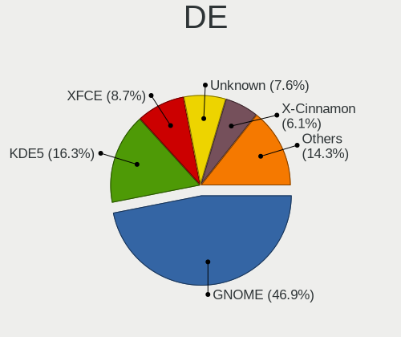
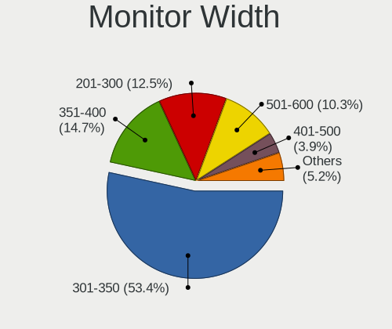

Linux in France - Tested Hardware & Statistics (Notebooks)
----------------------------------------------------------

A project to collect tested hardware configurations for Linux in France.

Anyone can contribute to this report by the [hw-probe](https://github.com/linuxhw/hw-probe) tool:

    sudo -E hw-probe -all -upload

Please contribute! Especially if your hardware is rare.

Contents
--------

* [ Test Cases ](#test-cases)

* [ System ](#system)
  - [ OS                       ](#os)
  - [ OS Family                ](#os-family)
  - [ Kernel                   ](#kernel)
  - [ Kernel Family            ](#kernel-family)
  - [ Kernel Major Ver.        ](#kernel-major-ver)
  - [ Arch                     ](#arch)
  - [ DE                       ](#de)
  - [ Display Server           ](#display-server)
  - [ Display Manager          ](#display-manager)
  - [ OS Lang                  ](#os-lang)
  - [ Boot Mode                ](#boot-mode)
  - [ Filesystem               ](#filesystem)
  - [ Part. scheme             ](#part-scheme)
  - [ Dual Boot with Linux/BSD ](#dual-boot-with-linuxbsd)
  - [ Dual Boot (Win)          ](#dual-boot-win)

* [ Board ](#board)
  - [ Vendor                   ](#vendor)
  - [ Model                    ](#model)
  - [ Model Family             ](#model-family)
  - [ MFG Year                 ](#mfg-year)
  - [ Form Factor              ](#form-factor)
  - [ Secure Boot              ](#secure-boot)
  - [ Coreboot                 ](#coreboot)
  - [ RAM Size                 ](#ram-size)
  - [ RAM Used                 ](#ram-used)
  - [ Total Drives             ](#total-drives)
  - [ Has CD-ROM               ](#has-cd-rom)
  - [ Has Ethernet             ](#has-ethernet)
  - [ Has WiFi                 ](#has-wifi)
  - [ Has Bluetooth            ](#has-bluetooth)

* [ Location ](#location)
  - [ Country                  ](#country)
  - [ City                     ](#city)

* [ Drives ](#drives)
  - [ Drive Vendor             ](#drive-vendor)
  - [ Drive Model              ](#drive-model)
  - [ HDD Vendor               ](#hdd-vendor)
  - [ SSD Vendor               ](#ssd-vendor)
  - [ Drive Kind               ](#drive-kind)
  - [ Drive Connector          ](#drive-connector)
  - [ Drive Size               ](#drive-size)
  - [ Space Total              ](#space-total)
  - [ Space Used               ](#space-used)
  - [ Malfunc. Drives          ](#malfunc-drives)
  - [ Malfunc. Drive Vendor    ](#malfunc-drive-vendor)
  - [ Malfunc. HDD Vendor      ](#malfunc-hdd-vendor)
  - [ Malfunc. Drive Kind      ](#malfunc-drive-kind)
  - [ Failed Drives            ](#failed-drives)
  - [ Failed Drive Vendor      ](#failed-drive-vendor)
  - [ Drive Status             ](#drive-status)

* [ Storage controller ](#storage-controller)
  - [ Storage Vendor           ](#storage-vendor)
  - [ Storage Model            ](#storage-model)
  - [ Storage Kind             ](#storage-kind)

* [ Processor ](#processor)
  - [ CPU Vendor               ](#cpu-vendor)
  - [ CPU Model                ](#cpu-model)
  - [ CPU Model Family         ](#cpu-model-family)
  - [ CPU Cores                ](#cpu-cores)
  - [ CPU Sockets              ](#cpu-sockets)
  - [ CPU Threads              ](#cpu-threads)
  - [ CPU Op-Modes             ](#cpu-op-modes)
  - [ CPU Microcode            ](#cpu-microcode)
  - [ CPU Microarch            ](#cpu-microarch)

* [ Graphics ](#graphics)
  - [ GPU Vendor               ](#gpu-vendor)
  - [ GPU Model                ](#gpu-model)
  - [ GPU Combo                ](#gpu-combo)
  - [ GPU Driver               ](#gpu-driver)
  - [ GPU Memory               ](#gpu-memory)

* [ Monitor ](#monitor)
  - [ Monitor Vendor           ](#monitor-vendor)
  - [ Monitor Model            ](#monitor-model)
  - [ Monitor Resolution       ](#monitor-resolution)
  - [ Monitor Diagonal         ](#monitor-diagonal)
  - [ Monitor Width            ](#monitor-width)
  - [ Aspect Ratio             ](#aspect-ratio)
  - [ Monitor Area             ](#monitor-area)
  - [ Pixel Density            ](#pixel-density)
  - [ Multiple Monitors        ](#multiple-monitors)

* [ Network ](#network)
  - [ Net Controller Vendor    ](#net-controller-vendor)
  - [ Net Controller Model     ](#net-controller-model)
  - [ Wireless Vendor          ](#wireless-vendor)
  - [ Wireless Model           ](#wireless-model)
  - [ Ethernet Vendor          ](#ethernet-vendor)
  - [ Ethernet Model           ](#ethernet-model)
  - [ Net Controller Kind      ](#net-controller-kind)
  - [ Used Controller          ](#used-controller)
  - [ NICs                     ](#nics)
  - [ IPv6                     ](#ipv6)

* [ Bluetooth ](#bluetooth)
  - [ Bluetooth Vendor         ](#bluetooth-vendor)
  - [ Bluetooth Model          ](#bluetooth-model)

* [ Sound ](#sound)
  - [ Sound Vendor             ](#sound-vendor)
  - [ Sound Model              ](#sound-model)

* [ Memory ](#memory)
  - [ Memory Vendor            ](#memory-vendor)
  - [ Memory Model             ](#memory-model)
  - [ Memory Kind              ](#memory-kind)
  - [ Memory Form Factor       ](#memory-form-factor)
  - [ Memory Size              ](#memory-size)
  - [ Memory Speed             ](#memory-speed)

* [ Printers & scanners ](#printers--scanners)
  - [ Printer Vendor           ](#printer-vendor)
  - [ Printer Model            ](#printer-model)
  - [ Scanner Vendor           ](#scanner-vendor)
  - [ Scanner Model            ](#scanner-model)

* [ Camera ](#camera)
  - [ Camera Vendor            ](#camera-vendor)
  - [ Camera Model             ](#camera-model)

* [ Security ](#security)
  - [ Fingerprint Vendor       ](#fingerprint-vendor)
  - [ Fingerprint Model        ](#fingerprint-model)
  - [ Chipcard Vendor          ](#chipcard-vendor)
  - [ Chipcard Model           ](#chipcard-model)

* [ Unsupported ](#unsupported)
  - [ Unsupported Devices      ](#unsupported-devices)
  - [ Unsupported Device Types ](#unsupported-device-types)

Test Cases
----------

Total: 6784

| Vendor        | Model                       | Probe                                                      | Date         |
|---------------|-----------------------------|------------------------------------------------------------|--------------|
| Dell          | Vostro 1520                 | [2132a3308c](https://linux-hardware.org/?probe=2132a3308c) | Apr 01, 2023 |
| ASUSTek       | N752VX                      | [d426499408](https://linux-hardware.org/?probe=d426499408) | Apr 01, 2023 |
| HP            | Presario CQ58               | [e8f8f289ac](https://linux-hardware.org/?probe=e8f8f289ac) | Apr 01, 2023 |
| ASUSTek       | ASUS EXPERTBOOK B1500CEA... | [87bc2601f3](https://linux-hardware.org/?probe=87bc2601f3) | Apr 01, 2023 |
| ASUSTek       | S551LN                      | [916adbdf9f](https://linux-hardware.org/?probe=916adbdf9f) | Apr 01, 2023 |
| Acer          | Aspire 7720                 | [073d49ce6b](https://linux-hardware.org/?probe=073d49ce6b) | Mar 31, 2023 |
| Lenovo        | ThinkPad L14 Gen 3 21C5C... | [683d3101d8](https://linux-hardware.org/?probe=683d3101d8) | Mar 31, 2023 |
| Dell          | Inspiron 7577               | [5800e3859c](https://linux-hardware.org/?probe=5800e3859c) | Mar 31, 2023 |
| Acer          | Nitro AN515-54              | [9e7aa15a9f](https://linux-hardware.org/?probe=9e7aa15a9f) | Mar 31, 2023 |
| Notebook      | NL40_50GU                   | [a46afd7246](https://linux-hardware.org/?probe=a46afd7246) | Mar 31, 2023 |
| Fujitsu Si... | ESPRIMO Mobile V6535        | [81c43aeb0d](https://linux-hardware.org/?probe=81c43aeb0d) | Mar 30, 2023 |
| Apple         | MacBookAir7,2               | [d9cbbe0a35](https://linux-hardware.org/?probe=d9cbbe0a35) | Mar 30, 2023 |
| Dell          | Precision 5510              | [4bbf7f5ef2](https://linux-hardware.org/?probe=4bbf7f5ef2) | Mar 30, 2023 |
| Lenovo        | Legion Y530-15ICH 81FV      | [0f8c22b288](https://linux-hardware.org/?probe=0f8c22b288) | Mar 30, 2023 |
| ASUSTek       | K55A                        | [cf40bdccfc](https://linux-hardware.org/?probe=cf40bdccfc) | Mar 30, 2023 |
| ASUSTek       | K55A                        | [b6c168d185](https://linux-hardware.org/?probe=b6c168d185) | Mar 30, 2023 |
| Lenovo        | V15-ADA 82C7                | [552ad08e05](https://linux-hardware.org/?probe=552ad08e05) | Mar 30, 2023 |
| Sony          | SVF1521C2EW                 | [978ae8afac](https://linux-hardware.org/?probe=978ae8afac) | Mar 30, 2023 |
| Alienware     | m15 Ryzen Ed. R5            | [0f273e6227](https://linux-hardware.org/?probe=0f273e6227) | Mar 30, 2023 |
| Lenovo        | G700 20251                  | [7580b631a9](https://linux-hardware.org/?probe=7580b631a9) | Mar 29, 2023 |
| Lenovo        | U41-70 80JV                 | [975da67142](https://linux-hardware.org/?probe=975da67142) | Mar 29, 2023 |
| HP            | Laptop 17-by0xxx            | [89a0332dfd](https://linux-hardware.org/?probe=89a0332dfd) | Mar 29, 2023 |
| HP            | EliteBook 8770w             | [46a3f1d497](https://linux-hardware.org/?probe=46a3f1d497) | Mar 29, 2023 |
| Lenovo        | IdeaPad 100-15IBY 80MJ      | [11c94aa91b](https://linux-hardware.org/?probe=11c94aa91b) | Mar 29, 2023 |
| Toshiba       | Satellite P200              | [c55a4d3166](https://linux-hardware.org/?probe=c55a4d3166) | Mar 29, 2023 |
| Notebook      | NL40_50CU                   | [fe471635fb](https://linux-hardware.org/?probe=fe471635fb) | Mar 29, 2023 |
| Dell          | Vostro 5568                 | [0004be15a4](https://linux-hardware.org/?probe=0004be15a4) | Mar 28, 2023 |
| ASUSTek       | ZenBook UX425QA_UM425QA     | [2f1975360e](https://linux-hardware.org/?probe=2f1975360e) | Mar 28, 2023 |
| HP            | Compaq 6510b (GR680ET)      | [716c4212c7](https://linux-hardware.org/?probe=716c4212c7) | Mar 28, 2023 |
| Lenovo        | V145-15AST 81MT             | [7fff3bb217](https://linux-hardware.org/?probe=7fff3bb217) | Mar 28, 2023 |
| Acer          | Aspire E5-532G              | [35e076d9b5](https://linux-hardware.org/?probe=35e076d9b5) | Mar 28, 2023 |
| ASUSTek       | N61Jq                       | [0ca1f04770](https://linux-hardware.org/?probe=0ca1f04770) | Mar 28, 2023 |
| Sony          | SVF1521C2EW                 | [2bafb0a0e4](https://linux-hardware.org/?probe=2bafb0a0e4) | Mar 28, 2023 |
| HP            | Laptop 14s-fq2xxx           | [8b64ddb550](https://linux-hardware.org/?probe=8b64ddb550) | Mar 27, 2023 |
| Lenovo        | ThinkPad L13 Gen 3 21B9C... | [0744b26f5c](https://linux-hardware.org/?probe=0744b26f5c) | Mar 27, 2023 |
| HP            | EliteBook 840 G3            | [58d5e99cd1](https://linux-hardware.org/?probe=58d5e99cd1) | Mar 27, 2023 |
| Dell          | Latitude E5430 non-vPro     | [17794caffa](https://linux-hardware.org/?probe=17794caffa) | Mar 27, 2023 |
| Lenovo        | IdeaPad Gaming 3 15IMH05... | [08627c5990](https://linux-hardware.org/?probe=08627c5990) | Mar 27, 2023 |
| Dell          | XPS 15 9570                 | [5be538736f](https://linux-hardware.org/?probe=5be538736f) | Mar 27, 2023 |
| Acer          | Aspire 4820TG               | [e634227889](https://linux-hardware.org/?probe=e634227889) | Mar 27, 2023 |
| Lenovo        | ThinkPad P73 20QRCTO1WW     | [7cd7234999](https://linux-hardware.org/?probe=7cd7234999) | Mar 27, 2023 |
| Lenovo        | IdeaPad 320-15ISK 80XH      | [c3dbea760e](https://linux-hardware.org/?probe=c3dbea760e) | Mar 26, 2023 |
| ASUSTek       | K50IE                       | [bde872583b](https://linux-hardware.org/?probe=bde872583b) | Mar 26, 2023 |
| Lenovo        | ThinkPad P73 20QRCTO1WW     | [2d83ebd124](https://linux-hardware.org/?probe=2d83ebd124) | Mar 26, 2023 |
| ASUSTek       | X75VD                       | [9997ce4485](https://linux-hardware.org/?probe=9997ce4485) | Mar 26, 2023 |
| MSI           | MAG Z490 TOMAHAWK           | [f9c5ae93de](https://linux-hardware.org/?probe=f9c5ae93de) | Mar 26, 2023 |
| Fujitsu Si... | AMILO Pi 3625               | [076352cb68](https://linux-hardware.org/?probe=076352cb68) | Mar 26, 2023 |
| MSI           | MAG Z490 TOMAHAWK           | [414c36eb9d](https://linux-hardware.org/?probe=414c36eb9d) | Mar 26, 2023 |
| Valve         | Jupiter                     | [b7c75f2713](https://linux-hardware.org/?probe=b7c75f2713) | Mar 26, 2023 |
| Dell          | Latitude 5520               | [47372d09fe](https://linux-hardware.org/?probe=47372d09fe) | Mar 25, 2023 |
| Dell          | Latitude 5520               | [0c69ef5724](https://linux-hardware.org/?probe=0c69ef5724) | Mar 25, 2023 |
| Packard Be... | EasyNote SB65               | [f49cf1aa7a](https://linux-hardware.org/?probe=f49cf1aa7a) | Mar 25, 2023 |
| HP            | OMEN by Laptop 16-b0xxx     | [22aa7f3036](https://linux-hardware.org/?probe=22aa7f3036) | Mar 25, 2023 |
| Dell          | XPS 9315                    | [050fede003](https://linux-hardware.org/?probe=050fede003) | Mar 25, 2023 |
| Toshiba       | KIRA                        | [e96de49ce8](https://linux-hardware.org/?probe=e96de49ce8) | Mar 25, 2023 |
| HP            | ProBook 645 G4              | [6a03f43f29](https://linux-hardware.org/?probe=6a03f43f29) | Mar 25, 2023 |
| Unknown       | Unknown                     | [fb97269a4d](https://linux-hardware.org/?probe=fb97269a4d) | Mar 24, 2023 |
| Packard Be... | H17HV                       | [c4bddccbd8](https://linux-hardware.org/?probe=c4bddccbd8) | Mar 24, 2023 |
| Dell          | Precision 3551              | [bc979e320b](https://linux-hardware.org/?probe=bc979e320b) | Mar 24, 2023 |
| Dell          | Precision 3551              | [0509bee16a](https://linux-hardware.org/?probe=0509bee16a) | Mar 24, 2023 |
| HP            | EliteBook 850 G5            | [cde421908c](https://linux-hardware.org/?probe=cde421908c) | Mar 24, 2023 |
| Lenovo        | ThinkPad Edge E530 62722... | [479f7f7a25](https://linux-hardware.org/?probe=479f7f7a25) | Mar 23, 2023 |
| HP            | Pavilion dv7                | [c0cec2e941](https://linux-hardware.org/?probe=c0cec2e941) | Mar 23, 2023 |
| Dell          | XPS 15 9510                 | [e6db3c2c26](https://linux-hardware.org/?probe=e6db3c2c26) | Mar 23, 2023 |
| Lenovo        | ThinkPad P70 20ESS2VP00     | [bb6fdb6236](https://linux-hardware.org/?probe=bb6fdb6236) | Mar 23, 2023 |
| Lenovo        | ThinkPad X1 Carbon Gen 1... | [28cd6cb051](https://linux-hardware.org/?probe=28cd6cb051) | Mar 23, 2023 |
| Valve         | Jupiter                     | [9d1c01a6cd](https://linux-hardware.org/?probe=9d1c01a6cd) | Mar 23, 2023 |
| Toshiba       | Satellite C870-198          | [7969002105](https://linux-hardware.org/?probe=7969002105) | Mar 22, 2023 |
| ASUSTek       | VivoBook_ASUSLaptop K650... | [ba101f37d0](https://linux-hardware.org/?probe=ba101f37d0) | Mar 22, 2023 |
| Notebook      | P15SM                       | [082e2c3c16](https://linux-hardware.org/?probe=082e2c3c16) | Mar 21, 2023 |
| Dell          | Latitude E7240              | [a3e408033c](https://linux-hardware.org/?probe=a3e408033c) | Mar 21, 2023 |
| ASUSTek       | VivoBook_ASUSLaptop M760... | [8606a64427](https://linux-hardware.org/?probe=8606a64427) | Mar 21, 2023 |
| ASUSTek       | VivoBook E14 E402WAS        | [95154b40cc](https://linux-hardware.org/?probe=95154b40cc) | Mar 21, 2023 |
| Lenovo        | B50-10 80QR                 | [134bf99094](https://linux-hardware.org/?probe=134bf99094) | Mar 21, 2023 |
| MSI           | GF63 Thin 10SCSR            | [45610ce6bf](https://linux-hardware.org/?probe=45610ce6bf) | Mar 21, 2023 |
| ASUSTek       | GL553VD                     | [ea7e302020](https://linux-hardware.org/?probe=ea7e302020) | Mar 21, 2023 |
| ASUSTek       | GL553VD                     | [8ed4a1e3ba](https://linux-hardware.org/?probe=8ed4a1e3ba) | Mar 21, 2023 |
| HP            | EliteBook 850 G5            | [5ca3a1b044](https://linux-hardware.org/?probe=5ca3a1b044) | Mar 21, 2023 |
| HUAWEI        | KLVL-WXX9                   | [2da4187f91](https://linux-hardware.org/?probe=2da4187f91) | Mar 21, 2023 |
| HP            | EliteBook 840 G5            | [a204a0f2c0](https://linux-hardware.org/?probe=a204a0f2c0) | Mar 21, 2023 |
| Dell          | XPS 15 9510                 | [d23fb1d0f6](https://linux-hardware.org/?probe=d23fb1d0f6) | Mar 21, 2023 |
| Dell          | Latitude E6420              | [e564f25125](https://linux-hardware.org/?probe=e564f25125) | Mar 20, 2023 |
| HP            | Pavilion dm4                | [7983ee084c](https://linux-hardware.org/?probe=7983ee084c) | Mar 20, 2023 |
| HP            | Laptop 15s-eq1xxx           | [3aee61f2bb](https://linux-hardware.org/?probe=3aee61f2bb) | Mar 20, 2023 |
| Notebook      | NS50_70MU                   | [cb2c031349](https://linux-hardware.org/?probe=cb2c031349) | Mar 20, 2023 |
| Dell          | Latitude E5500              | [9c76627b98](https://linux-hardware.org/?probe=9c76627b98) | Mar 20, 2023 |
| Dell          | Latitude 5520               | [4153e72c6b](https://linux-hardware.org/?probe=4153e72c6b) | Mar 19, 2023 |
| HP            | Pavilion Gaming Laptop 1... | [3387f1f1c8](https://linux-hardware.org/?probe=3387f1f1c8) | Mar 19, 2023 |
| Acer          | Swift SF514-53T             | [9d37ace881](https://linux-hardware.org/?probe=9d37ace881) | Mar 19, 2023 |
| Acer          | Swift SF514-53T             | [93ce0e9d73](https://linux-hardware.org/?probe=93ce0e9d73) | Mar 19, 2023 |
| Toshiba       | Satellite Pro C50-A-1EM     | [a49e9997f1](https://linux-hardware.org/?probe=a49e9997f1) | Mar 19, 2023 |
| ASUSTek       | X550VX                      | [dcc37300fd](https://linux-hardware.org/?probe=dcc37300fd) | Mar 19, 2023 |
| HP            | ZBook 17 G3                 | [cb3b7c5bfb](https://linux-hardware.org/?probe=cb3b7c5bfb) | Mar 19, 2023 |
| Dell          | Precision M4800             | [26912746f6](https://linux-hardware.org/?probe=26912746f6) | Mar 18, 2023 |
| HP            | OMEN by Laptop 17-an0xx     | [5a11bc39d5](https://linux-hardware.org/?probe=5a11bc39d5) | Mar 18, 2023 |
| Dell          | Inspiron 1120               | [d864592854](https://linux-hardware.org/?probe=d864592854) | Mar 18, 2023 |
| HP            | Laptop 15-db0xxx            | [bb43e46d71](https://linux-hardware.org/?probe=bb43e46d71) | Mar 18, 2023 |
| Lenovo        | ThinkPad P50 20EQS1MY00     | [beeb327f26](https://linux-hardware.org/?probe=beeb327f26) | Mar 18, 2023 |
| Acer          | Aspire 7750G                | [39d6b256fa](https://linux-hardware.org/?probe=39d6b256fa) | Mar 18, 2023 |
| Lenovo        | ThinkPad P14s Gen 3 21AK... | [4ff2145364](https://linux-hardware.org/?probe=4ff2145364) | Mar 17, 2023 |
| Dell          | Precision 3520              | [2afa31184a](https://linux-hardware.org/?probe=2afa31184a) | Mar 17, 2023 |
| Dell          | Precision 3520              | [819b4aa330](https://linux-hardware.org/?probe=819b4aa330) | Mar 17, 2023 |
| Acer          | Aspire 9410                 | [b124194b0c](https://linux-hardware.org/?probe=b124194b0c) | Mar 17, 2023 |
| Lenovo        | ThinkPad X250 20CL001LMB    | [d78880e600](https://linux-hardware.org/?probe=d78880e600) | Mar 17, 2023 |
| MSI           | GP62 6QE                    | [3db109542c](https://linux-hardware.org/?probe=3db109542c) | Mar 17, 2023 |
| Lenovo        | IdeaPad Gaming 3 15IHU6 ... | [7cededfaa9](https://linux-hardware.org/?probe=7cededfaa9) | Mar 17, 2023 |
| TUXEDO        | Pulse 14 Gen1               | [525b267c31](https://linux-hardware.org/?probe=525b267c31) | Mar 17, 2023 |
| Dell          | Latitude E7470              | [f2dd0afe92](https://linux-hardware.org/?probe=f2dd0afe92) | Mar 17, 2023 |
| Unknown       | Unknown                     | [3eb0bf05b4](https://linux-hardware.org/?probe=3eb0bf05b4) | Mar 17, 2023 |
| HP            | Pavilion dm1                | [8707341105](https://linux-hardware.org/?probe=8707341105) | Mar 16, 2023 |
| Dell          | Vostro 1520                 | [a029e62352](https://linux-hardware.org/?probe=a029e62352) | Mar 16, 2023 |
| Lenovo        | Legion 5 Pro 16IAH7H 82R... | [d0ab04cac0](https://linux-hardware.org/?probe=d0ab04cac0) | Mar 16, 2023 |
| Lenovo        | ThinkPad Edge E530 62722... | [fac1a255b7](https://linux-hardware.org/?probe=fac1a255b7) | Mar 16, 2023 |
| Toshiba       | Satellite C55-A-1T6         | [71751e4045](https://linux-hardware.org/?probe=71751e4045) | Mar 16, 2023 |
| HP            | ZBook 15 G5                 | [2af12bdf73](https://linux-hardware.org/?probe=2af12bdf73) | Mar 16, 2023 |
| Lenovo        | IdeaPad 1 15IGL7 82V7       | [a01912ff82](https://linux-hardware.org/?probe=a01912ff82) | Mar 15, 2023 |
| Toshiba       | PORTEGE Z30-B               | [06db6fa9b3](https://linux-hardware.org/?probe=06db6fa9b3) | Mar 15, 2023 |
| Dell          | Inspiron 7577               | [d19eaf791f](https://linux-hardware.org/?probe=d19eaf791f) | Mar 15, 2023 |
| ASUSTek       | N751JK                      | [d148f91b52](https://linux-hardware.org/?probe=d148f91b52) | Mar 15, 2023 |
| Dell          | Inspiron 7577               | [a519acdd2e](https://linux-hardware.org/?probe=a519acdd2e) | Mar 15, 2023 |
| Lenovo        | ThinkPad X230 2325BA3       | [45533fd7eb](https://linux-hardware.org/?probe=45533fd7eb) | Mar 14, 2023 |
| HP            | Notebook                    | [de2e2f370b](https://linux-hardware.org/?probe=de2e2f370b) | Mar 14, 2023 |
| HUAWEI        | CREM-WXX9                   | [933110cc30](https://linux-hardware.org/?probe=933110cc30) | Mar 14, 2023 |
| HP            | EliteBook 840 G8 Noteboo... | [b3d9dfdb16](https://linux-hardware.org/?probe=b3d9dfdb16) | Mar 14, 2023 |
| Dell          | Inspiron 3583               | [9eaa09faf0](https://linux-hardware.org/?probe=9eaa09faf0) | Mar 14, 2023 |
| Dell          | Precision 5570              | [f0d98798a2](https://linux-hardware.org/?probe=f0d98798a2) | Mar 14, 2023 |
| Acer          | Aspire A715-74G             | [54d17115b9](https://linux-hardware.org/?probe=54d17115b9) | Mar 13, 2023 |
| Acer          | Aspire A715-74G             | [79932e56ad](https://linux-hardware.org/?probe=79932e56ad) | Mar 13, 2023 |
| Dell          | Precision 7560              | [0b0c4e4b1c](https://linux-hardware.org/?probe=0b0c4e4b1c) | Mar 13, 2023 |
| ASUSTek       | VivoBook_ASUSLaptop X712... | [3c4e911c6d](https://linux-hardware.org/?probe=3c4e911c6d) | Mar 13, 2023 |
| MSI           | GV62 7RE                    | [1de50d9986](https://linux-hardware.org/?probe=1de50d9986) | Mar 13, 2023 |
| Toshiba       | Satellite Pro L500          | [303f47547b](https://linux-hardware.org/?probe=303f47547b) | Mar 12, 2023 |
| Acer          | Aspire ES1-523              | [4247bd6835](https://linux-hardware.org/?probe=4247bd6835) | Mar 12, 2023 |
| Dell          | Inspiron 5565               | [9415690de2](https://linux-hardware.org/?probe=9415690de2) | Mar 12, 2023 |
| Lenovo        | IdeaPad 3 15ALC6 82KU       | [4ee87a1213](https://linux-hardware.org/?probe=4ee87a1213) | Mar 12, 2023 |
| ASUSTek       | ASUS TUF Gaming A15 FA50... | [406d19d44f](https://linux-hardware.org/?probe=406d19d44f) | Mar 12, 2023 |
| Chuwi         | GemiBook Pro                | [fc04961aef](https://linux-hardware.org/?probe=fc04961aef) | Mar 11, 2023 |
| Lenovo        | IdeaPad 3 15ADA05 81W1      | [73fe7fd06e](https://linux-hardware.org/?probe=73fe7fd06e) | Mar 11, 2023 |
| HP            | EliteBook 840 G4            | [c4792e57b9](https://linux-hardware.org/?probe=c4792e57b9) | Mar 11, 2023 |
| BESSTAR Te... | X300                        | [3f12a2f32e](https://linux-hardware.org/?probe=3f12a2f32e) | Mar 11, 2023 |
| BESSTAR Te... | X300                        | [a6ba9c1545](https://linux-hardware.org/?probe=a6ba9c1545) | Mar 11, 2023 |
| HP            | Laptop 17-cn2xxx            | [239832f304](https://linux-hardware.org/?probe=239832f304) | Mar 11, 2023 |
| Dell          | Precision 5570              | [470ba58973](https://linux-hardware.org/?probe=470ba58973) | Mar 11, 2023 |
| ASUSTek       | VivoBook_ASUSLaptop X412... | [3823c10f89](https://linux-hardware.org/?probe=3823c10f89) | Mar 11, 2023 |
| Lenovo        | G505 20240                  | [201f4fc780](https://linux-hardware.org/?probe=201f4fc780) | Mar 11, 2023 |
| Lenovo        | ThinkPad P53 20QN0007FR     | [960d07f083](https://linux-hardware.org/?probe=960d07f083) | Mar 11, 2023 |
| Fujitsu Si... | LIFEBOOK E8410              | [c2230a6690](https://linux-hardware.org/?probe=c2230a6690) | Mar 10, 2023 |
| ASUSTek       | VivoBook_ASUSLaptop E510... | [54e498fb2e](https://linux-hardware.org/?probe=54e498fb2e) | Mar 10, 2023 |
| System76      | Gazelle Professional        | [42f5755b1d](https://linux-hardware.org/?probe=42f5755b1d) | Mar 10, 2023 |
| Dell          | Latitude 5530               | [335933aedb](https://linux-hardware.org/?probe=335933aedb) | Mar 10, 2023 |
| Lenovo        | ThinkPad Edge E530 62722... | [da07981235](https://linux-hardware.org/?probe=da07981235) | Mar 10, 2023 |
| Lenovo        | ThinkPad Edge E530 62722... | [6e55c3caff](https://linux-hardware.org/?probe=6e55c3caff) | Mar 10, 2023 |
| HP            | ProBook 430 G2              | [4f689d1291](https://linux-hardware.org/?probe=4f689d1291) | Mar 10, 2023 |
| Toshiba       | TECRA Z40-A                 | [43c7df46f9](https://linux-hardware.org/?probe=43c7df46f9) | Mar 09, 2023 |
| Toshiba       | Satellite L300              | [a35bb278ba](https://linux-hardware.org/?probe=a35bb278ba) | Mar 09, 2023 |
| Dell          | Latitude E5450              | [6a40dced5b](https://linux-hardware.org/?probe=6a40dced5b) | Mar 09, 2023 |
| HP            | Presario CQ61               | [0eab7ae44e](https://linux-hardware.org/?probe=0eab7ae44e) | Mar 09, 2023 |
| ASUSTek       | UX410UAR                    | [4fa93928b1](https://linux-hardware.org/?probe=4fa93928b1) | Mar 09, 2023 |
| Acer          | Aspire 7250                 | [026f2228a3](https://linux-hardware.org/?probe=026f2228a3) | Mar 08, 2023 |
| Fujitsu       | LIFEBOOK E734               | [a4e6e8e566](https://linux-hardware.org/?probe=a4e6e8e566) | Mar 08, 2023 |
| Samsung       | 350V5C/351V5C/3540VC/344... | [cc67f30d28](https://linux-hardware.org/?probe=cc67f30d28) | Mar 08, 2023 |
| Samsung       | 350V5C/351V5C/3540VC/344... | [82fee79835](https://linux-hardware.org/?probe=82fee79835) | Mar 08, 2023 |
| Toshiba       | Satellite L300              | [13418c9605](https://linux-hardware.org/?probe=13418c9605) | Mar 08, 2023 |
| ASUSTek       | X705UAR                     | [21ea5828e3](https://linux-hardware.org/?probe=21ea5828e3) | Mar 08, 2023 |
| Dell          | XPS 15 9570                 | [0312ea16b6](https://linux-hardware.org/?probe=0312ea16b6) | Mar 08, 2023 |
| Dell          | Precision 3560              | [0873d45206](https://linux-hardware.org/?probe=0873d45206) | Mar 08, 2023 |
| Dell          | Precision 3520              | [99eaeb743c](https://linux-hardware.org/?probe=99eaeb743c) | Mar 08, 2023 |
| Dell          | Precision 3520              | [acf74c7740](https://linux-hardware.org/?probe=acf74c7740) | Mar 08, 2023 |
| Dell          | XPS 15 9570                 | [fc0152a6de](https://linux-hardware.org/?probe=fc0152a6de) | Mar 08, 2023 |
| ASUSTek       | VivoBook_ASUSLaptop M340... | [42e5be35d6](https://linux-hardware.org/?probe=42e5be35d6) | Mar 08, 2023 |
| Acer          | Aspire ES1-732              | [03a5f04251](https://linux-hardware.org/?probe=03a5f04251) | Mar 07, 2023 |
| Chuwi         | LapBook Plus                | [55365bb7ab](https://linux-hardware.org/?probe=55365bb7ab) | Mar 07, 2023 |
| Dell          | Latitude 5590               | [10e7ed8ff6](https://linux-hardware.org/?probe=10e7ed8ff6) | Mar 07, 2023 |
| ASUSTek       | VivoBook_ASUSLaptop X150... | [ac92e5ce13](https://linux-hardware.org/?probe=ac92e5ce13) | Mar 07, 2023 |
| AZW           | GT-R                        | [cce9cccb8f](https://linux-hardware.org/?probe=cce9cccb8f) | Mar 07, 2023 |
| Acer          | Aspire A114-31              | [33ce987151](https://linux-hardware.org/?probe=33ce987151) | Mar 06, 2023 |
| ASUSTek       | K52JT                       | [802fe86b5c](https://linux-hardware.org/?probe=802fe86b5c) | Mar 06, 2023 |
| Dell          | Latitude 5400               | [9e2592768b](https://linux-hardware.org/?probe=9e2592768b) | Mar 06, 2023 |
| Samsung       | 350V5C/351V5C/3540VC/344... | [28dd9d3ce4](https://linux-hardware.org/?probe=28dd9d3ce4) | Mar 06, 2023 |
| ASUSTek       | UX303LB                     | [4137763385](https://linux-hardware.org/?probe=4137763385) | Mar 06, 2023 |
| ASUSTek       | X550JX                      | [a9a82b2395](https://linux-hardware.org/?probe=a9a82b2395) | Mar 06, 2023 |
| ASUSTek       | VivoBook_ASUSLaptop E510... | [9b1357d5c0](https://linux-hardware.org/?probe=9b1357d5c0) | Mar 06, 2023 |
| Sony          | SVE1513I4E                  | [76d0570787](https://linux-hardware.org/?probe=76d0570787) | Mar 05, 2023 |
| Dell          | Latitude E7450              | [1c1d26f569](https://linux-hardware.org/?probe=1c1d26f569) | Mar 05, 2023 |
| HUAWEI        | HVY-WXX9                    | [28dbdcfbb7](https://linux-hardware.org/?probe=28dbdcfbb7) | Mar 05, 2023 |
| Lenovo        | ThinkPad T550 20CJS02E00    | [d8535715f8](https://linux-hardware.org/?probe=d8535715f8) | Mar 05, 2023 |
| Acer          | Aspire 5750G                | [1c918f0aa3](https://linux-hardware.org/?probe=1c918f0aa3) | Mar 05, 2023 |
| HP            | EliteBook 6930p             | [6757b860c8](https://linux-hardware.org/?probe=6757b860c8) | Mar 05, 2023 |
| Lenovo        | G50-80 80L0                 | [6e4cec1477](https://linux-hardware.org/?probe=6e4cec1477) | Mar 05, 2023 |
| ASUSTek       | VivoBook S14 X411UF         | [ff4621a345](https://linux-hardware.org/?probe=ff4621a345) | Mar 05, 2023 |
| Lenovo        | ThinkPad X270 20HMS4EC0D    | [108c90e7f7](https://linux-hardware.org/?probe=108c90e7f7) | Mar 05, 2023 |
| LG Electro... | R580-K.APC4BE1              | [9cac5bdcfc](https://linux-hardware.org/?probe=9cac5bdcfc) | Mar 05, 2023 |
| HP            | Pavilion g7                 | [1f09b36fde](https://linux-hardware.org/?probe=1f09b36fde) | Mar 04, 2023 |
| Acer          | Aspire 5935                 | [f76641318f](https://linux-hardware.org/?probe=f76641318f) | Mar 04, 2023 |
| ASUSTek       | VivoBook_ASUSLaptop X513... | [fdb3bcda29](https://linux-hardware.org/?probe=fdb3bcda29) | Mar 04, 2023 |
| ASUSTek       | VivoBook_ASUSLaptop E510... | [9b0664e4d7](https://linux-hardware.org/?probe=9b0664e4d7) | Mar 04, 2023 |
| Dell          | Latitude E6230              | [1909328685](https://linux-hardware.org/?probe=1909328685) | Mar 04, 2023 |
| Dell          | Inspiron 1120               | [41f23e384c](https://linux-hardware.org/?probe=41f23e384c) | Mar 04, 2023 |
| HP            | EliteBook 840 G8 Noteboo... | [63e9a399f8](https://linux-hardware.org/?probe=63e9a399f8) | Mar 04, 2023 |
| HP            | ZBook 15 G4                 | [38a0ce48ed](https://linux-hardware.org/?probe=38a0ce48ed) | Mar 04, 2023 |
| Google        | Lulu                        | [eb4cf4fb11](https://linux-hardware.org/?probe=eb4cf4fb11) | Mar 03, 2023 |
| HP            | Pavilion 17                 | [de3dcf402a](https://linux-hardware.org/?probe=de3dcf402a) | Mar 03, 2023 |
| Dell          | Latitude E7440              | [36439d1a64](https://linux-hardware.org/?probe=36439d1a64) | Mar 03, 2023 |
| ASUSTek       | VivoBook_ASUSLaptop X513... | [a553120d6e](https://linux-hardware.org/?probe=a553120d6e) | Mar 03, 2023 |
| Lenovo        | ThinkPad X1 Extreme Gen ... | [c4c7ebf544](https://linux-hardware.org/?probe=c4c7ebf544) | Mar 03, 2023 |
| TUXEDO        | InfinityBook S 14 Gen6      | [756ac6782b](https://linux-hardware.org/?probe=756ac6782b) | Mar 03, 2023 |
| HP            | Pavilion Aero Laptop 13-... | [dae34bbf69](https://linux-hardware.org/?probe=dae34bbf69) | Mar 02, 2023 |
| Acer          | Aspire 1640Z                | [915a8900d0](https://linux-hardware.org/?probe=915a8900d0) | Mar 02, 2023 |
| Dell          | Latitude E7440              | [b84f760e8e](https://linux-hardware.org/?probe=b84f760e8e) | Mar 02, 2023 |
| Apple         | MacBookPro9,2               | [75befd2e82](https://linux-hardware.org/?probe=75befd2e82) | Mar 02, 2023 |
| Dell          | Vostro 15 5510              | [96a16581c6](https://linux-hardware.org/?probe=96a16581c6) | Mar 02, 2023 |
| Dell          | Latitude 3510               | [0bad8d504d](https://linux-hardware.org/?probe=0bad8d504d) | Mar 02, 2023 |
| Dell          | XPS 15 9520                 | [e28307db49](https://linux-hardware.org/?probe=e28307db49) | Mar 01, 2023 |
| HP            | ZBook 17 G3                 | [cf6ef752c9](https://linux-hardware.org/?probe=cf6ef752c9) | Mar 01, 2023 |
| ASUSTek       | X556URK                     | [aa7492e59a](https://linux-hardware.org/?probe=aa7492e59a) | Mar 01, 2023 |
| Lenovo        | IdeaPad 720-15IKB 81AG      | [704b0f3226](https://linux-hardware.org/?probe=704b0f3226) | Mar 01, 2023 |
| ASUSTek       | VivoBook S14 X411UF         | [bd4fd4080d](https://linux-hardware.org/?probe=bd4fd4080d) | Mar 01, 2023 |
| ASUSTek       | VivoBook S14 X411UF         | [90d8927f0a](https://linux-hardware.org/?probe=90d8927f0a) | Mar 01, 2023 |
| HP            | Laptop 17-ca1xxx            | [7f93c1a4e3](https://linux-hardware.org/?probe=7f93c1a4e3) | Feb 28, 2023 |
| HUAWEI        | CREM-WXX9                   | [22d51a725f](https://linux-hardware.org/?probe=22d51a725f) | Feb 28, 2023 |
| Dell          | Latitude 5400               | [00cd14a724](https://linux-hardware.org/?probe=00cd14a724) | Feb 28, 2023 |
| HP            | Laptop 15s-eq1xxx           | [c070966ad7](https://linux-hardware.org/?probe=c070966ad7) | Feb 28, 2023 |
| Apple         | MacBookAir3,1               | [573644760d](https://linux-hardware.org/?probe=573644760d) | Feb 28, 2023 |
| Acer          | Aspire A515-57              | [6c511739eb](https://linux-hardware.org/?probe=6c511739eb) | Feb 28, 2023 |
| Timi          | TM1701                      | [ab658664bb](https://linux-hardware.org/?probe=ab658664bb) | Feb 28, 2023 |
| Lenovo        | ThinkPad Z13 Gen 1 21D2C... | [b5a4a1809f](https://linux-hardware.org/?probe=b5a4a1809f) | Feb 28, 2023 |
| ASUSTek       | VivoBook S14 X411UF         | [88745e1f03](https://linux-hardware.org/?probe=88745e1f03) | Feb 28, 2023 |
| Lenovo        | ThinkPad S1 Yoga 20C0S23... | [3cd99ed8f4](https://linux-hardware.org/?probe=3cd99ed8f4) | Feb 28, 2023 |
| Lenovo        | Legion 7 16ACHg6 82N6       | [594ff7091b](https://linux-hardware.org/?probe=594ff7091b) | Feb 27, 2023 |
| ASUSTek       | VivoBook_ASUSLaptop M760... | [1f80bce21e](https://linux-hardware.org/?probe=1f80bce21e) | Feb 27, 2023 |
| ASUSTek       | VivoBook_ASUSLaptop M760... | [08e6c7285a](https://linux-hardware.org/?probe=08e6c7285a) | Feb 27, 2023 |
| Acer          | Aspire E5-571               | [5f035002e1](https://linux-hardware.org/?probe=5f035002e1) | Feb 27, 2023 |
| ASUSTek       | VivoBook_ASUS Laptop X50... | [05d3c9f96c](https://linux-hardware.org/?probe=05d3c9f96c) | Feb 27, 2023 |
| ASUSTek       | VivoBook_ASUS Laptop X50... | [f70d3317a2](https://linux-hardware.org/?probe=f70d3317a2) | Feb 27, 2023 |
| Dell          | Latitude 5400               | [b788c61c95](https://linux-hardware.org/?probe=b788c61c95) | Feb 27, 2023 |
| HP            | Pavilion m6                 | [1e9d802ab6](https://linux-hardware.org/?probe=1e9d802ab6) | Feb 27, 2023 |
| ASUSTek       | E402MA                      | [c49b50f583](https://linux-hardware.org/?probe=c49b50f583) | Feb 27, 2023 |
| ASUSTek       | E402MA                      | [4083a9232f](https://linux-hardware.org/?probe=4083a9232f) | Feb 27, 2023 |
| HP            | Pavilion m6                 | [0d35b0b080](https://linux-hardware.org/?probe=0d35b0b080) | Feb 27, 2023 |
| HP            | Pavilion 17                 | [dfd1ca1091](https://linux-hardware.org/?probe=dfd1ca1091) | Feb 27, 2023 |
| Lenovo        | G50-80 80L0                 | [19727a16be](https://linux-hardware.org/?probe=19727a16be) | Feb 26, 2023 |
| ASUSTek       | ASUS TUF Gaming F15 FX50... | [e763fc25e7](https://linux-hardware.org/?probe=e763fc25e7) | Feb 26, 2023 |
| HONOR         | BBR-WAX9                    | [3fe348fb3f](https://linux-hardware.org/?probe=3fe348fb3f) | Feb 26, 2023 |
| Lenovo        | ThinkPad T430u 3353A11      | [3f35f45bf0](https://linux-hardware.org/?probe=3f35f45bf0) | Feb 26, 2023 |
| Dell          | Latitude E5450              | [62ce48db27](https://linux-hardware.org/?probe=62ce48db27) | Feb 26, 2023 |
| Lenovo        | ThinkPad T420 4236EJ3       | [d0b043c11b](https://linux-hardware.org/?probe=d0b043c11b) | Feb 26, 2023 |
| Lenovo        | ThinkPad L14 Gen 3 21C5C... | [b80c1e685f](https://linux-hardware.org/?probe=b80c1e685f) | Feb 26, 2023 |
| Acer          | Nitro AN515-52              | [08d12e1049](https://linux-hardware.org/?probe=08d12e1049) | Feb 26, 2023 |
| Dell          | Latitude E5530 non-vPro     | [5634c4795c](https://linux-hardware.org/?probe=5634c4795c) | Feb 26, 2023 |
| HUAWEI        | CREM-WXX9                   | [c026a25fb2](https://linux-hardware.org/?probe=c026a25fb2) | Feb 26, 2023 |
| HP            | ENVY 17                     | [dea1551bf3](https://linux-hardware.org/?probe=dea1551bf3) | Feb 26, 2023 |
| Valve         | Jupiter                     | [1b7321e88d](https://linux-hardware.org/?probe=1b7321e88d) | Feb 26, 2023 |
| HP            | ENVY 17                     | [0f347a1b6c](https://linux-hardware.org/?probe=0f347a1b6c) | Feb 26, 2023 |
| HP            | Laptop 15s-eq2xxx           | [3142c6a90c](https://linux-hardware.org/?probe=3142c6a90c) | Feb 25, 2023 |
| Chuwi         | GemiBook Pro                | [9894743527](https://linux-hardware.org/?probe=9894743527) | Feb 25, 2023 |
| Dell          | XPS 9315                    | [86fea0e08a](https://linux-hardware.org/?probe=86fea0e08a) | Feb 25, 2023 |
| Sony          | SVE1513B1EW                 | [c99ef001e4](https://linux-hardware.org/?probe=c99ef001e4) | Feb 25, 2023 |
| HP            | ProBook 450 15.6 inch G9... | [f1db9ad466](https://linux-hardware.org/?probe=f1db9ad466) | Feb 25, 2023 |
| Chuwi         | GemiBook Pro                | [f8f1005d73](https://linux-hardware.org/?probe=f8f1005d73) | Feb 24, 2023 |
| HP            | Pavilion dv6000 (GF657EA... | [fe52d35d1a](https://linux-hardware.org/?probe=fe52d35d1a) | Feb 24, 2023 |
| Lenovo        | G50-80 80E5                 | [3f28f459bf](https://linux-hardware.org/?probe=3f28f459bf) | Feb 24, 2023 |
| Lenovo        | G50-80 80E5                 | [8ed4158090](https://linux-hardware.org/?probe=8ed4158090) | Feb 24, 2023 |
| ASUSTek       | ROG Strix G513RC_G513RC     | [041c57ebe6](https://linux-hardware.org/?probe=041c57ebe6) | Feb 24, 2023 |
| Lenovo        | ThinkPad L14 Gen 3 21C5C... | [6b2160527d](https://linux-hardware.org/?probe=6b2160527d) | Feb 23, 2023 |
| ASUSTek       | T100TAF                     | [4fce660f2d](https://linux-hardware.org/?probe=4fce660f2d) | Feb 23, 2023 |
| ASUSTek       | ROG Strix G713RW_G713RW     | [5368c6d0a2](https://linux-hardware.org/?probe=5368c6d0a2) | Feb 23, 2023 |
| Lenovo        | ThinkPad X1 Carbon 3rd 2... | [8fde9cab5c](https://linux-hardware.org/?probe=8fde9cab5c) | Feb 22, 2023 |
| Toshiba       | Satellite L655              | [2b16b06c7f](https://linux-hardware.org/?probe=2b16b06c7f) | Feb 22, 2023 |
| Lenovo        | G50-80 80E5                 | [51b83f1e27](https://linux-hardware.org/?probe=51b83f1e27) | Feb 22, 2023 |
| Lenovo        | V130-15IGM 81HL             | [40205862f6](https://linux-hardware.org/?probe=40205862f6) | Feb 22, 2023 |
| Notebook      | N8xEJEK                     | [1548ea7cab](https://linux-hardware.org/?probe=1548ea7cab) | Feb 21, 2023 |
| Notebook      | N8xEJEK                     | [a8a28d6f2b](https://linux-hardware.org/?probe=a8a28d6f2b) | Feb 21, 2023 |
| ASUSTek       | X55VD                       | [6b71d8369a](https://linux-hardware.org/?probe=6b71d8369a) | Feb 21, 2023 |
| HP            | Victus by Laptop 16-e0xx... | [9978852d07](https://linux-hardware.org/?probe=9978852d07) | Feb 21, 2023 |
| Apple         | MacBookPro9,2               | [80df77e6a1](https://linux-hardware.org/?probe=80df77e6a1) | Feb 21, 2023 |
| Dell          | Vostro 15 7510              | [df764baed8](https://linux-hardware.org/?probe=df764baed8) | Feb 21, 2023 |
| HP            | Pavilion 15                 | [9aee694156](https://linux-hardware.org/?probe=9aee694156) | Feb 21, 2023 |
| ASUSTek       | K70IC                       | [e5aad61a1b](https://linux-hardware.org/?probe=e5aad61a1b) | Feb 21, 2023 |
| Fujitsu Si... | ESPRIMO Mobile V6535        | [751f76b561](https://linux-hardware.org/?probe=751f76b561) | Feb 21, 2023 |
| ASUSTek       | UX410UQK                    | [0a23974b1b](https://linux-hardware.org/?probe=0a23974b1b) | Feb 21, 2023 |
| Dell          | XPS 13 7390                 | [a3ed8101b1](https://linux-hardware.org/?probe=a3ed8101b1) | Feb 20, 2023 |
| Toshiba       | TECRA R850                  | [082f5559c7](https://linux-hardware.org/?probe=082f5559c7) | Feb 20, 2023 |
| Lenovo        | IdeaPad L340-17API 81LY     | [e26b379150](https://linux-hardware.org/?probe=e26b379150) | Feb 20, 2023 |
| Lenovo        | ThinkPad X1 Carbon 4th 2... | [ba0144c710](https://linux-hardware.org/?probe=ba0144c710) | Feb 20, 2023 |
| Toshiba       | Satellite L655              | [a5124a64e6](https://linux-hardware.org/?probe=a5124a64e6) | Feb 19, 2023 |
| ASUSTek       | P553UA                      | [b999af6719](https://linux-hardware.org/?probe=b999af6719) | Feb 19, 2023 |
| HP            | EliteBook 8440p             | [24e71c037b](https://linux-hardware.org/?probe=24e71c037b) | Feb 18, 2023 |
| Sony          | VGN-NW21MF_W                | [e46cfcff64](https://linux-hardware.org/?probe=e46cfcff64) | Feb 17, 2023 |
| Lenovo        | Legion 5 15ACH6H 82JU       | [bfeb3ab070](https://linux-hardware.org/?probe=bfeb3ab070) | Feb 17, 2023 |
| TUXEDO        | Pulse 15 Gen1               | [12f305c12f](https://linux-hardware.org/?probe=12f305c12f) | Feb 17, 2023 |
| Toshiba       | Satellite C70-C-18E         | [7642482909](https://linux-hardware.org/?probe=7642482909) | Feb 17, 2023 |
| Apple         | MacBookPro9,1               | [4ab4c99cab](https://linux-hardware.org/?probe=4ab4c99cab) | Feb 17, 2023 |
| eMachines     | eMachiens G443              | [096a4bb9e4](https://linux-hardware.org/?probe=096a4bb9e4) | Feb 16, 2023 |
| HP            | Pavilion dv6500             | [95a9115968](https://linux-hardware.org/?probe=95a9115968) | Feb 16, 2023 |
| ASUSTek       | X75VD                       | [81c64d5916](https://linux-hardware.org/?probe=81c64d5916) | Feb 16, 2023 |
| Dell          | Precision 5570              | [d5f9d13ae3](https://linux-hardware.org/?probe=d5f9d13ae3) | Feb 16, 2023 |
| Dell          | Latitude 7330               | [caf4a2b3ac](https://linux-hardware.org/?probe=caf4a2b3ac) | Feb 16, 2023 |
| Dell          | Vostro 1510                 | [a9e4d33e06](https://linux-hardware.org/?probe=a9e4d33e06) | Feb 16, 2023 |
| Dell          | Precision 5750              | [7b814aee7c](https://linux-hardware.org/?probe=7b814aee7c) | Feb 16, 2023 |
| ASUSTek       | S551LN                      | [676c244c1d](https://linux-hardware.org/?probe=676c244c1d) | Feb 16, 2023 |
| ASUSTek       | N76VZ                       | [ed9bd6b127](https://linux-hardware.org/?probe=ed9bd6b127) | Feb 16, 2023 |
| HP            | 250 G6 Notebook PC          | [745ae4d0fb](https://linux-hardware.org/?probe=745ae4d0fb) | Feb 15, 2023 |
| Dell          | Precision 5570              | [d0f2fa25c3](https://linux-hardware.org/?probe=d0f2fa25c3) | Feb 15, 2023 |
| ASUSTek       | ASUS TUF Gaming A17 FA70... | [0b622220d7](https://linux-hardware.org/?probe=0b622220d7) | Feb 15, 2023 |
| Alienware     | m15 Ryzen Ed. R5            | [542f27e209](https://linux-hardware.org/?probe=542f27e209) | Feb 14, 2023 |
| ASUSTek       | ROG Strix G731GU_G731GU     | [977650806e](https://linux-hardware.org/?probe=977650806e) | Feb 14, 2023 |
| Lenovo        | ThinkPad X240 20AMS4AN00    | [ec8fbb6350](https://linux-hardware.org/?probe=ec8fbb6350) | Feb 14, 2023 |
| Lenovo        | ThinkPad P16s Gen 1 21CK... | [25dbf25c62](https://linux-hardware.org/?probe=25dbf25c62) | Feb 14, 2023 |
| Google        | Lulu                        | [15fa093522](https://linux-hardware.org/?probe=15fa093522) | Feb 14, 2023 |
| Lenovo        | ThinkPad L520 5015AH2       | [8f2bad1d66](https://linux-hardware.org/?probe=8f2bad1d66) | Feb 13, 2023 |
| HUAWEI        | CREM-WXX9                   | [02ae55d12c](https://linux-hardware.org/?probe=02ae55d12c) | Feb 13, 2023 |
| Thomson       | N17V3C4WH128                | [57eacd1a37](https://linux-hardware.org/?probe=57eacd1a37) | Feb 13, 2023 |
| Dell          | Inspiron 14 5420            | [45862fde09](https://linux-hardware.org/?probe=45862fde09) | Feb 13, 2023 |
| Dell          | Inspiron 14 5420            | [8153aeb3fb](https://linux-hardware.org/?probe=8153aeb3fb) | Feb 13, 2023 |
| Dell          | XPS 13 9370                 | [36bf8af789](https://linux-hardware.org/?probe=36bf8af789) | Feb 13, 2023 |
| Dell          | Latitude E6320              | [32ad32fb45](https://linux-hardware.org/?probe=32ad32fb45) | Feb 13, 2023 |
| Apple         | MacBookPro13,3              | [628feb8b19](https://linux-hardware.org/?probe=628feb8b19) | Feb 13, 2023 |
| Apple         | MacBookPro13,3              | [2f591ee9e3](https://linux-hardware.org/?probe=2f591ee9e3) | Feb 13, 2023 |
| Toshiba       | Satellite Pro R50-B         | [0634db3367](https://linux-hardware.org/?probe=0634db3367) | Feb 13, 2023 |
| ASUSTek       | G771JM                      | [af72d8c72f](https://linux-hardware.org/?probe=af72d8c72f) | Feb 12, 2023 |
| MSI           | GF65 Thin 9SEXR             | [7d57fccbf0](https://linux-hardware.org/?probe=7d57fccbf0) | Feb 12, 2023 |
| HUAWEI        | CREM-WXX9                   | [09266b8b06](https://linux-hardware.org/?probe=09266b8b06) | Feb 12, 2023 |
| Acer          | Extensa 2540                | [6e7e38afb4](https://linux-hardware.org/?probe=6e7e38afb4) | Feb 12, 2023 |
| Lenovo        | ThinkPad P16s Gen 1 21CK... | [095fa7a182](https://linux-hardware.org/?probe=095fa7a182) | Feb 12, 2023 |
| Acer          | Aspire E5-574G              | [cdbd2ad757](https://linux-hardware.org/?probe=cdbd2ad757) | Feb 12, 2023 |
| Dell          | Vostro 15 3515              | [22d5eabee5](https://linux-hardware.org/?probe=22d5eabee5) | Feb 11, 2023 |
| HP            | Notebook                    | [523c719e5b](https://linux-hardware.org/?probe=523c719e5b) | Feb 11, 2023 |
| HP            | Notebook                    | [d4e29128dd](https://linux-hardware.org/?probe=d4e29128dd) | Feb 11, 2023 |
| Gigabyte      | GB-BKi5(H)A-7200            | [57ff1b0fe3](https://linux-hardware.org/?probe=57ff1b0fe3) | Feb 11, 2023 |
| ASUSTek       | G75VW                       | [e2eeee26af](https://linux-hardware.org/?probe=e2eeee26af) | Feb 11, 2023 |
| Dell          | Precision 5570              | [8398c80e6b](https://linux-hardware.org/?probe=8398c80e6b) | Feb 11, 2023 |
| Lenovo        | ThinkPad T480s 20L7001PF... | [f6d2fc27d1](https://linux-hardware.org/?probe=f6d2fc27d1) | Feb 10, 2023 |
| Acer          | TravelMate 7730             | [a9a9e21b5a](https://linux-hardware.org/?probe=a9a9e21b5a) | Feb 10, 2023 |
| MSI           | GE60 2QE                    | [4d8865f2bd](https://linux-hardware.org/?probe=4d8865f2bd) | Feb 10, 2023 |
| Lenovo        | IdeaPad 3 17IML05 81WC      | [9da08e5265](https://linux-hardware.org/?probe=9da08e5265) | Feb 10, 2023 |
| Acer          | Aspire E1-570               | [df85a15b13](https://linux-hardware.org/?probe=df85a15b13) | Feb 10, 2023 |
| ASUSTek       | X541UAK                     | [fb254cca56](https://linux-hardware.org/?probe=fb254cca56) | Feb 10, 2023 |
| Lenovo        | Yoga 500-14ACL 80NA         | [3bdbc623a8](https://linux-hardware.org/?probe=3bdbc623a8) | Feb 10, 2023 |
| Lenovo        | Yoga 500-15IBD 80N6         | [077853b2db](https://linux-hardware.org/?probe=077853b2db) | Feb 09, 2023 |
| Acer          | Swift SF314-54              | [8d92b8e7c5](https://linux-hardware.org/?probe=8d92b8e7c5) | Feb 09, 2023 |
| Lenovo        | IdeaPad 3 15ADA05 81W1      | [a77dd320a8](https://linux-hardware.org/?probe=a77dd320a8) | Feb 09, 2023 |
| Dell          | Precision 5570              | [52cd3af211](https://linux-hardware.org/?probe=52cd3af211) | Feb 09, 2023 |
| Sony          | SVE1513U1ESI                | [77dafc35f5](https://linux-hardware.org/?probe=77dafc35f5) | Feb 09, 2023 |
| Lenovo        | ThinkPad L512 2550WC7       | [8b8efe2813](https://linux-hardware.org/?probe=8b8efe2813) | Feb 09, 2023 |
| Dell          | Precision M6500             | [dcabcd8d63](https://linux-hardware.org/?probe=dcabcd8d63) | Feb 09, 2023 |
| Sony          | VGN-NS38E_S                 | [891c180950](https://linux-hardware.org/?probe=891c180950) | Feb 08, 2023 |
| HUAWEI        | CREM-WXX9                   | [965758f3ea](https://linux-hardware.org/?probe=965758f3ea) | Feb 08, 2023 |
| ASUSTek       | ZenBook UX325EA_UX325EA     | [cc897fe72d](https://linux-hardware.org/?probe=cc897fe72d) | Feb 08, 2023 |
| EXTRA Comp... | A9100                       | [67278c37d9](https://linux-hardware.org/?probe=67278c37d9) | Feb 08, 2023 |
| Fujitsu       | LIFEBOOK U7411              | [fcd6a27cd6](https://linux-hardware.org/?probe=fcd6a27cd6) | Feb 08, 2023 |
| Dell          | Precision 5570              | [6c257e667d](https://linux-hardware.org/?probe=6c257e667d) | Feb 08, 2023 |
| ASUSTek       | VivoBook_ASUSLaptop X350... | [b07e05a4ed](https://linux-hardware.org/?probe=b07e05a4ed) | Feb 08, 2023 |
| HUAWEI        | NBLK-WAX9X                  | [d37cc19110](https://linux-hardware.org/?probe=d37cc19110) | Feb 08, 2023 |
| Dell          | Precision 5570              | [e81b3de663](https://linux-hardware.org/?probe=e81b3de663) | Feb 08, 2023 |
| ASUSTek       | VivoBook_ASUSLaptop M340... | [eca3a05d41](https://linux-hardware.org/?probe=eca3a05d41) | Feb 07, 2023 |
| Notebook      | NL5xNU                      | [b7fb43ba75](https://linux-hardware.org/?probe=b7fb43ba75) | Feb 07, 2023 |
| HP            | Pavilion 17                 | [9bd81582a4](https://linux-hardware.org/?probe=9bd81582a4) | Feb 07, 2023 |
| HP            | Pavilion 17                 | [45eb87271b](https://linux-hardware.org/?probe=45eb87271b) | Feb 07, 2023 |
| TUXEDO        | InfinityBook S 14 Gen6      | [9e019a0396](https://linux-hardware.org/?probe=9e019a0396) | Feb 07, 2023 |
| Dell          | Precision 5570              | [d279e97c00](https://linux-hardware.org/?probe=d279e97c00) | Feb 07, 2023 |
| Lenovo        | ThinkPad X1 Carbon 3rd 2... | [cd59ace4d1](https://linux-hardware.org/?probe=cd59ace4d1) | Feb 07, 2023 |
| Toshiba       | Satellite C870-196          | [85ded7d8d0](https://linux-hardware.org/?probe=85ded7d8d0) | Feb 06, 2023 |
| ASUSTek       | K72JT                       | [9620d41f62](https://linux-hardware.org/?probe=9620d41f62) | Feb 06, 2023 |
| Dell          | Latitude E5430 non-vPro     | [7d2d46a579](https://linux-hardware.org/?probe=7d2d46a579) | Feb 06, 2023 |
| Dell          | Latitude 5520               | [e9782f4262](https://linux-hardware.org/?probe=e9782f4262) | Feb 06, 2023 |
| ASUSTek       | X71Q                        | [c89b078e8f](https://linux-hardware.org/?probe=c89b078e8f) | Feb 06, 2023 |
| Notebook      | NLx0MU                      | [9a05c88c59](https://linux-hardware.org/?probe=9a05c88c59) | Feb 06, 2023 |
| Lenovo        | ThinkPad X250 20CLS2TQ22    | [112a65a03e](https://linux-hardware.org/?probe=112a65a03e) | Feb 06, 2023 |
| Notebook      | NJ50_70CU                   | [c0c9951f8d](https://linux-hardware.org/?probe=c0c9951f8d) | Feb 05, 2023 |
| Acer          | Nitro AN515-45              | [bb420e8f71](https://linux-hardware.org/?probe=bb420e8f71) | Feb 05, 2023 |
| HP            | Pro x2 612 G1 Tablet        | [6e00c72683](https://linux-hardware.org/?probe=6e00c72683) | Feb 05, 2023 |
| HP            | Laptop 17-ak0xx             | [ed6c6cc366](https://linux-hardware.org/?probe=ed6c6cc366) | Feb 05, 2023 |
| Acer          | Aspire A317-53              | [2f56f41681](https://linux-hardware.org/?probe=2f56f41681) | Feb 05, 2023 |
| Sony          | VPCEH1E1E                   | [76589a7570](https://linux-hardware.org/?probe=76589a7570) | Feb 05, 2023 |
| Google        | Rabbid                      | [e309afd2d9](https://linux-hardware.org/?probe=e309afd2d9) | Feb 05, 2023 |
| Sony          | VGN-Z31MN_B                 | [bfb9a55ce9](https://linux-hardware.org/?probe=bfb9a55ce9) | Feb 05, 2023 |
| Acer          | Nitro AN517-52              | [e409f042e2](https://linux-hardware.org/?probe=e409f042e2) | Feb 05, 2023 |
| Google        | Rabbid                      | [3afddd7ab1](https://linux-hardware.org/?probe=3afddd7ab1) | Feb 05, 2023 |
| Toshiba       | Satellite C660              | [8d67e1438d](https://linux-hardware.org/?probe=8d67e1438d) | Feb 05, 2023 |
| Lenovo        | ThinkPad X260 20F5S65B0J    | [cca484a94e](https://linux-hardware.org/?probe=cca484a94e) | Feb 04, 2023 |
| ASUSTek       | UX331UA                     | [4b5a781cb4](https://linux-hardware.org/?probe=4b5a781cb4) | Feb 04, 2023 |
| HUAWEI        | CREM-WXX9                   | [43a0910ff6](https://linux-hardware.org/?probe=43a0910ff6) | Feb 04, 2023 |
| Apple         | MacBookPro8,1               | [9765b77a43](https://linux-hardware.org/?probe=9765b77a43) | Feb 04, 2023 |
| Dell          | Precision 5570              | [11d65e48fa](https://linux-hardware.org/?probe=11d65e48fa) | Feb 04, 2023 |
| MSI           | GF63 Thin 11UD              | [8b60b63594](https://linux-hardware.org/?probe=8b60b63594) | Feb 04, 2023 |
| Dell          | Precision 5570              | [5378f40d0d](https://linux-hardware.org/?probe=5378f40d0d) | Feb 04, 2023 |
| Dell          | G3 3500                     | [a25e0c9862](https://linux-hardware.org/?probe=a25e0c9862) | Feb 03, 2023 |
| HP            | EliteBook 850 G8 Noteboo... | [001a819e3d](https://linux-hardware.org/?probe=001a819e3d) | Feb 03, 2023 |
| HP            | Laptop 14s-fq2xxx           | [f63797ea26](https://linux-hardware.org/?probe=f63797ea26) | Feb 03, 2023 |
| Lenovo        | ThinkPad P53 20QNCTO1WW     | [cc7e8a75d3](https://linux-hardware.org/?probe=cc7e8a75d3) | Feb 03, 2023 |
| HUAWEI        | BOM-WXX9                    | [9b453ade5b](https://linux-hardware.org/?probe=9b453ade5b) | Feb 03, 2023 |
| HUAWEI        | BOM-WXX9                    | [2d0b0d4330](https://linux-hardware.org/?probe=2d0b0d4330) | Feb 02, 2023 |
| HUAWEI        | CREM-WXX9                   | [f794d33e76](https://linux-hardware.org/?probe=f794d33e76) | Feb 02, 2023 |
| HP            | EliteBook 840 G2            | [7dd8dceb80](https://linux-hardware.org/?probe=7dd8dceb80) | Feb 02, 2023 |
| HP            | EliteBook 840 G2            | [3339c49f38](https://linux-hardware.org/?probe=3339c49f38) | Feb 02, 2023 |
| HP            | Victus by Laptop 16-e0xx... | [80921f3386](https://linux-hardware.org/?probe=80921f3386) | Feb 01, 2023 |
| Lenovo        | ThinkPad X230 23259S9       | [3d9e74535f](https://linux-hardware.org/?probe=3d9e74535f) | Feb 01, 2023 |
| Dell          | Inspiron 5570               | [d186290a3f](https://linux-hardware.org/?probe=d186290a3f) | Feb 01, 2023 |
| Lenovo        | IdeaPad 5 14ARE05 81YM      | [e477495ef6](https://linux-hardware.org/?probe=e477495ef6) | Feb 01, 2023 |
| Lenovo        | ThinkPad T400 6473PMG       | [07cba1c44b](https://linux-hardware.org/?probe=07cba1c44b) | Feb 01, 2023 |
| ASUSTek       | S551LN                      | [b7361dbc53](https://linux-hardware.org/?probe=b7361dbc53) | Feb 01, 2023 |
| Dell          | Inspiron 7501               | [426493e8a5](https://linux-hardware.org/?probe=426493e8a5) | Feb 01, 2023 |
| HP            | Notebook                    | [3cea0a0519](https://linux-hardware.org/?probe=3cea0a0519) | Jan 31, 2023 |
| Dell          | G3 3500                     | [4b519ab8a8](https://linux-hardware.org/?probe=4b519ab8a8) | Jan 31, 2023 |
| Acer          | Aspire E5-575G              | [463b7f859f](https://linux-hardware.org/?probe=463b7f859f) | Jan 31, 2023 |
| Dell          | Inspiron 7400               | [a6b124fd34](https://linux-hardware.org/?probe=a6b124fd34) | Jan 31, 2023 |
| HP            | Notebook                    | [82d58b21c4](https://linux-hardware.org/?probe=82d58b21c4) | Jan 31, 2023 |
| Dell          | Latitude 7410               | [fd07971a70](https://linux-hardware.org/?probe=fd07971a70) | Jan 31, 2023 |
| TUXEDO        | InfinityBook Pro Gen7 (M... | [4a2fcb6bd0](https://linux-hardware.org/?probe=4a2fcb6bd0) | Jan 31, 2023 |
| HUAWEI        | WRTB-WXX9                   | [60967eaaaf](https://linux-hardware.org/?probe=60967eaaaf) | Jan 31, 2023 |
| Lenovo        | ThinkPad T500 2055AZ1       | [1086813401](https://linux-hardware.org/?probe=1086813401) | Jan 30, 2023 |
| Lenovo        | ThinkPad T500 2055AZ1       | [0b43f40c2a](https://linux-hardware.org/?probe=0b43f40c2a) | Jan 30, 2023 |
| Acer          | Aspire E5-575G              | [532f5a8dbe](https://linux-hardware.org/?probe=532f5a8dbe) | Jan 30, 2023 |
| Acer          | Aspire M5-581TG             | [970a402846](https://linux-hardware.org/?probe=970a402846) | Jan 30, 2023 |
| Acer          | Aspire M5-581TG             | [c2d425d254](https://linux-hardware.org/?probe=c2d425d254) | Jan 30, 2023 |
| ASUSTek       | VivoBook_ASUSLaptop X515... | [1ecef01472](https://linux-hardware.org/?probe=1ecef01472) | Jan 30, 2023 |
| HP            | EliteBook 850 G8 Noteboo... | [a5d6a22838](https://linux-hardware.org/?probe=a5d6a22838) | Jan 30, 2023 |
| Dell          | Latitude 7390               | [b154892be4](https://linux-hardware.org/?probe=b154892be4) | Jan 30, 2023 |
| HP            | ENVY Laptop 13-ah1xxx       | [360756b46a](https://linux-hardware.org/?probe=360756b46a) | Jan 30, 2023 |
| HUAWEI        | MACHD-WXX9                  | [cac5b8faa5](https://linux-hardware.org/?probe=cac5b8faa5) | Jan 29, 2023 |
| HP            | ZBook 14 G2                 | [4b1e1bc7e1](https://linux-hardware.org/?probe=4b1e1bc7e1) | Jan 29, 2023 |
| Lenovo        | ThinkPad X1 Carbon Gen 8... | [47246aa8b5](https://linux-hardware.org/?probe=47246aa8b5) | Jan 29, 2023 |
| MSI           | CR700                       | [35d1ff1eac](https://linux-hardware.org/?probe=35d1ff1eac) | Jan 29, 2023 |
| Intel         | Unknown                     | [f387a4b732](https://linux-hardware.org/?probe=f387a4b732) | Jan 29, 2023 |
| Intel         | Unknown                     | [79aa357327](https://linux-hardware.org/?probe=79aa357327) | Jan 29, 2023 |
| HP            | ProBook 650 G1              | [830394a75e](https://linux-hardware.org/?probe=830394a75e) | Jan 29, 2023 |
| ASUSTek       | ASUS TUF Gaming F15 FX50... | [90644628b4](https://linux-hardware.org/?probe=90644628b4) | Jan 29, 2023 |
| ASUSTek       | X550LB                      | [9590dd2f30](https://linux-hardware.org/?probe=9590dd2f30) | Jan 28, 2023 |
| Dell          | Latitude 7280               | [358f4c431f](https://linux-hardware.org/?probe=358f4c431f) | Jan 28, 2023 |
| Dell          | Latitude 7280               | [903e0489c4](https://linux-hardware.org/?probe=903e0489c4) | Jan 28, 2023 |
| Lenovo        | ThinkPad T430u 3353A11      | [c93d5da3f1](https://linux-hardware.org/?probe=c93d5da3f1) | Jan 28, 2023 |
| ASUSTek       | UX410UAR                    | [e9ac16c8ef](https://linux-hardware.org/?probe=e9ac16c8ef) | Jan 28, 2023 |
| Lenovo        | IdeaPad 3 17ABA7 82RQ       | [57e0449f0f](https://linux-hardware.org/?probe=57e0449f0f) | Jan 28, 2023 |
| Valve         | Jupiter                     | [be17d6fd70](https://linux-hardware.org/?probe=be17d6fd70) | Jan 27, 2023 |
| TUXEDO        | InfinityBook S 15 Gen6      | [f5ebfcecc5](https://linux-hardware.org/?probe=f5ebfcecc5) | Jan 27, 2023 |
| HP            | Laptop 17-cp0xxx            | [e87b8175b1](https://linux-hardware.org/?probe=e87b8175b1) | Jan 27, 2023 |
| Lenovo        | IdeaPad Gaming 3 15ACH6 ... | [56cb1ce2a6](https://linux-hardware.org/?probe=56cb1ce2a6) | Jan 27, 2023 |
| ASUSTek       | K73E                        | [66e0036452](https://linux-hardware.org/?probe=66e0036452) | Jan 27, 2023 |
| ASUSTek       | K73E                        | [91f049a01d](https://linux-hardware.org/?probe=91f049a01d) | Jan 27, 2023 |
| Dell          | Latitude E6420              | [a772965137](https://linux-hardware.org/?probe=a772965137) | Jan 27, 2023 |
| Lenovo        | IdeaPad 330-17IKB 81DM      | [117d80ff4d](https://linux-hardware.org/?probe=117d80ff4d) | Jan 27, 2023 |
| Lenovo        | ThinkPad T430u 3353A11      | [cf42b2f763](https://linux-hardware.org/?probe=cf42b2f763) | Jan 26, 2023 |
| Dell          | Latitude 5420               | [379a2dc9ab](https://linux-hardware.org/?probe=379a2dc9ab) | Jan 26, 2023 |
| Dell          | Latitude 5420               | [eec8ef8ddb](https://linux-hardware.org/?probe=eec8ef8ddb) | Jan 26, 2023 |
| HP            | 625                         | [06c4fa5119](https://linux-hardware.org/?probe=06c4fa5119) | Jan 25, 2023 |
| Lenovo        | IdeaPad 3 15ADA05 81W1      | [7403ca2f73](https://linux-hardware.org/?probe=7403ca2f73) | Jan 25, 2023 |
| ASUSTek       | X510UAR                     | [7996de313e](https://linux-hardware.org/?probe=7996de313e) | Jan 25, 2023 |
| ASUSTek       | X510UAR                     | [3f4e15d14a](https://linux-hardware.org/?probe=3f4e15d14a) | Jan 25, 2023 |
| Toshiba       | Satellite Pro R50-B         | [d08118920b](https://linux-hardware.org/?probe=d08118920b) | Jan 25, 2023 |
| Lenovo        | ThinkPad L380 20M6S2YE00    | [e6c626133e](https://linux-hardware.org/?probe=e6c626133e) | Jan 25, 2023 |
| TrekStor      | Surfbook A13B               | [4306d9ba1c](https://linux-hardware.org/?probe=4306d9ba1c) | Jan 25, 2023 |
| ASUSTek       | TUF Gaming FX505DY_FX505... | [148b797f1a](https://linux-hardware.org/?probe=148b797f1a) | Jan 25, 2023 |
| ASUSTek       | X301A1                      | [f9ea8894f0](https://linux-hardware.org/?probe=f9ea8894f0) | Jan 25, 2023 |
| Sony          | VGN-NW21MF_W                | [dd4ac0a026](https://linux-hardware.org/?probe=dd4ac0a026) | Jan 24, 2023 |
| ASUSTek       | X540LJ                      | [41c91fdc7b](https://linux-hardware.org/?probe=41c91fdc7b) | Jan 24, 2023 |
| ASUSTek       | X540LJ                      | [199569e288](https://linux-hardware.org/?probe=199569e288) | Jan 24, 2023 |
| HP            | ProBook 6570b               | [841250ba59](https://linux-hardware.org/?probe=841250ba59) | Jan 24, 2023 |
| HP            | EliteBook 2560p             | [f57750e125](https://linux-hardware.org/?probe=f57750e125) | Jan 24, 2023 |
| Dell          | Precision 3551              | [1338d3df20](https://linux-hardware.org/?probe=1338d3df20) | Jan 23, 2023 |
| MSI           | Stealth GS66 12UH           | [9e79dca70b](https://linux-hardware.org/?probe=9e79dca70b) | Jan 23, 2023 |
| Dell          | Inspiron 7537               | [9181895f24](https://linux-hardware.org/?probe=9181895f24) | Jan 23, 2023 |
| Dell          | Latitude E4310              | [c32e006e62](https://linux-hardware.org/?probe=c32e006e62) | Jan 23, 2023 |
| Dell          | Latitude E4310              | [5045d5e911](https://linux-hardware.org/?probe=5045d5e911) | Jan 23, 2023 |
| Lenovo        | G50-70 20351                | [e0da886a95](https://linux-hardware.org/?probe=e0da886a95) | Jan 23, 2023 |
| ASUSTek       | T300CHI                     | [bc020f2d3e](https://linux-hardware.org/?probe=bc020f2d3e) | Jan 23, 2023 |
| Lenovo        | ThinkPad X200 7458VL3       | [3a91fa2c72](https://linux-hardware.org/?probe=3a91fa2c72) | Jan 23, 2023 |
| MSI           | PX60 6QE                    | [d820232c9c](https://linux-hardware.org/?probe=d820232c9c) | Jan 22, 2023 |
| Lenovo        | IdeaPad Gaming 3 15ARH05... | [bc070879ba](https://linux-hardware.org/?probe=bc070879ba) | Jan 22, 2023 |
| Lenovo        | IdeaPad 5 14ALC05 82LM      | [75f64e4cd4](https://linux-hardware.org/?probe=75f64e4cd4) | Jan 22, 2023 |
| Acer          | Aspire E1-570               | [30b3f2f346](https://linux-hardware.org/?probe=30b3f2f346) | Jan 22, 2023 |
| HP            | ProBook 4330s               | [f96c2452d3](https://linux-hardware.org/?probe=f96c2452d3) | Jan 22, 2023 |
| Lenovo        | ThinkPad P51 20HJS16Q0K     | [00e6c3575f](https://linux-hardware.org/?probe=00e6c3575f) | Jan 22, 2023 |
| Dell          | Latitude E5470              | [1a2810f035](https://linux-hardware.org/?probe=1a2810f035) | Jan 22, 2023 |
| Lenovo        | ThinkPad X260 20F5S4BY00    | [873bf3c874](https://linux-hardware.org/?probe=873bf3c874) | Jan 22, 2023 |
| HP            | 625                         | [838d72399b](https://linux-hardware.org/?probe=838d72399b) | Jan 22, 2023 |
| Dell          | XPS 15 9520                 | [893ebdd842](https://linux-hardware.org/?probe=893ebdd842) | Jan 22, 2023 |
| Lenovo        | ThinkPad E480 20KNCTO1WW    | [68ff3c02cb](https://linux-hardware.org/?probe=68ff3c02cb) | Jan 22, 2023 |
| ASUSTek       | G750JM                      | [8cb76e0d6d](https://linux-hardware.org/?probe=8cb76e0d6d) | Jan 22, 2023 |
| Dell          | G15 5510                    | [7cee6347e3](https://linux-hardware.org/?probe=7cee6347e3) | Jan 22, 2023 |
| MSI           | PS42 Modern 8MO             | [dfb621ce10](https://linux-hardware.org/?probe=dfb621ce10) | Jan 22, 2023 |
| MSI           | PS42 Modern 8MO             | [e1d7b236d3](https://linux-hardware.org/?probe=e1d7b236d3) | Jan 22, 2023 |
| Danew         | Dbook 131                   | [08911c133e](https://linux-hardware.org/?probe=08911c133e) | Jan 22, 2023 |
| Dell          | G3 3500                     | [941c11250c](https://linux-hardware.org/?probe=941c11250c) | Jan 21, 2023 |
| HP            | 625                         | [9a8a243973](https://linux-hardware.org/?probe=9a8a243973) | Jan 21, 2023 |
| Acer          | Aspire E1-570               | [9a0a65b69a](https://linux-hardware.org/?probe=9a0a65b69a) | Jan 21, 2023 |
| ASUSTek       | N751JK                      | [a67a4d078f](https://linux-hardware.org/?probe=a67a4d078f) | Jan 21, 2023 |
| Dell          | G7 7700                     | [427a79e665](https://linux-hardware.org/?probe=427a79e665) | Jan 21, 2023 |
| MSI           | GP75 Leopard 9SD            | [5b41a33a67](https://linux-hardware.org/?probe=5b41a33a67) | Jan 21, 2023 |
| Acer          | Predator PH315-52           | [5e28e4cbdc](https://linux-hardware.org/?probe=5e28e4cbdc) | Jan 21, 2023 |
| Acer          | Aspire 1640                 | [5b271fa3eb](https://linux-hardware.org/?probe=5b271fa3eb) | Jan 21, 2023 |
| Acer          | Aspire 1640                 | [fb70812654](https://linux-hardware.org/?probe=fb70812654) | Jan 21, 2023 |
| HP            | Laptop 15-dw0xxx            | [8de3cfc52e](https://linux-hardware.org/?probe=8de3cfc52e) | Jan 21, 2023 |
| HP            | EliteBook Folio 9480m       | [cf1b67c224](https://linux-hardware.org/?probe=cf1b67c224) | Jan 21, 2023 |
| HP            | EliteBook 840 G3            | [06f6499264](https://linux-hardware.org/?probe=06f6499264) | Jan 21, 2023 |
| MSI           | Katana GF66 12UC            | [543136f475](https://linux-hardware.org/?probe=543136f475) | Jan 20, 2023 |
| MSI           | CR650                       | [3d3a46f5c6](https://linux-hardware.org/?probe=3d3a46f5c6) | Jan 20, 2023 |
| MSI           | CR650                       | [7d3b1f25c4](https://linux-hardware.org/?probe=7d3b1f25c4) | Jan 20, 2023 |
| Dell          | Inspiron 5391               | [050e28c342](https://linux-hardware.org/?probe=050e28c342) | Jan 20, 2023 |
| Dell          | Latitude 7410               | [488f794ad5](https://linux-hardware.org/?probe=488f794ad5) | Jan 20, 2023 |
| Acer          | Aspire A515-57              | [3041b852df](https://linux-hardware.org/?probe=3041b852df) | Jan 20, 2023 |
| Dell          | Inspiron 14 5410            | [beaa2fdddb](https://linux-hardware.org/?probe=beaa2fdddb) | Jan 20, 2023 |
| Lenovo        | ThinkBook 15 G2 ITL 20VE    | [ccf1934924](https://linux-hardware.org/?probe=ccf1934924) | Jan 20, 2023 |
| Acer          | Swift SF314-57              | [6a813e0dd0](https://linux-hardware.org/?probe=6a813e0dd0) | Jan 20, 2023 |
| ASUSTek       | ROG Strix G533QS_G533QS     | [105b2daa8e](https://linux-hardware.org/?probe=105b2daa8e) | Jan 20, 2023 |
| Dell          | Precision 3551              | [4ff5a0ab8d](https://linux-hardware.org/?probe=4ff5a0ab8d) | Jan 19, 2023 |
| Apple         | MacBookPro8,1               | [b7f8407c8f](https://linux-hardware.org/?probe=b7f8407c8f) | Jan 19, 2023 |
| Dell          | XPS 15 9500                 | [606ba17221](https://linux-hardware.org/?probe=606ba17221) | Jan 19, 2023 |
| Lenovo        | IdeaPad 320-17AST 80XW      | [ae0457cc50](https://linux-hardware.org/?probe=ae0457cc50) | Jan 19, 2023 |
| Dell          | Latitude E5440              | [b1ac8af8ad](https://linux-hardware.org/?probe=b1ac8af8ad) | Jan 19, 2023 |
| Dell          | Latitude E5440              | [9b6d732a7c](https://linux-hardware.org/?probe=9b6d732a7c) | Jan 19, 2023 |
| Toshiba       | Satellite C70-A             | [ffaa715bdd](https://linux-hardware.org/?probe=ffaa715bdd) | Jan 19, 2023 |
| ASUSTek       | VivoBook E14 E402WAS        | [39f2ca64d4](https://linux-hardware.org/?probe=39f2ca64d4) | Jan 19, 2023 |
| Dell          | Vostro 1720                 | [1d06cb4ad8](https://linux-hardware.org/?probe=1d06cb4ad8) | Jan 18, 2023 |
| ASUSTek       | UX32VD                      | [7851952137](https://linux-hardware.org/?probe=7851952137) | Jan 18, 2023 |
| ASUSTek       | X411UN                      | [fad0f7ce44](https://linux-hardware.org/?probe=fad0f7ce44) | Jan 18, 2023 |
| Apple         | MacBookPro5,5               | [3dba9611d3](https://linux-hardware.org/?probe=3dba9611d3) | Jan 18, 2023 |
| Gigabyte      | P15FV5                      | [5a03ba32c0](https://linux-hardware.org/?probe=5a03ba32c0) | Jan 18, 2023 |
| Schenker      | XMG FUSION 15 (XFU15L19)    | [04d0c02d29](https://linux-hardware.org/?probe=04d0c02d29) | Jan 18, 2023 |
| Dell          | Inspiron 7537               | [95cc108754](https://linux-hardware.org/?probe=95cc108754) | Jan 18, 2023 |
| Packard Be... | EasyNote LE69KB             | [b1caf1d323](https://linux-hardware.org/?probe=b1caf1d323) | Jan 17, 2023 |
| Dell          | Latitude 5500               | [e0ae9cb026](https://linux-hardware.org/?probe=e0ae9cb026) | Jan 17, 2023 |
| Toshiba       | Satellite L655D             | [38b26485d3](https://linux-hardware.org/?probe=38b26485d3) | Jan 17, 2023 |
| Lenovo        | ThinkPad T61 766112G        | [fb772cc0cf](https://linux-hardware.org/?probe=fb772cc0cf) | Jan 17, 2023 |
| Dell          | Latitude E5540              | [e8e30eb563](https://linux-hardware.org/?probe=e8e30eb563) | Jan 17, 2023 |
| Dell          | Vostro 1720                 | [d02dee9ab2](https://linux-hardware.org/?probe=d02dee9ab2) | Jan 17, 2023 |
| Dell          | Inspiron 14 5418            | [e3bfdaa6a4](https://linux-hardware.org/?probe=e3bfdaa6a4) | Jan 17, 2023 |
| Dell          | Latitude 5410               | [c97379d747](https://linux-hardware.org/?probe=c97379d747) | Jan 17, 2023 |
| MSI           | GP70 2OD                    | [7405037963](https://linux-hardware.org/?probe=7405037963) | Jan 17, 2023 |
| HP            | ZBook 14 G2                 | [d501532972](https://linux-hardware.org/?probe=d501532972) | Jan 17, 2023 |
| Toshiba       | Satellite A200              | [68ae2ab1d0](https://linux-hardware.org/?probe=68ae2ab1d0) | Jan 17, 2023 |
| HP            | EliteBook 820 G3            | [4abc3c8796](https://linux-hardware.org/?probe=4abc3c8796) | Jan 17, 2023 |
| Dell          | Studio 1735                 | [96d3df9639](https://linux-hardware.org/?probe=96d3df9639) | Jan 17, 2023 |
| Google        | Lulu                        | [b0e2a5a9b3](https://linux-hardware.org/?probe=b0e2a5a9b3) | Jan 16, 2023 |
| Samsung       | R530/R730/P530              | [e6752958eb](https://linux-hardware.org/?probe=e6752958eb) | Jan 16, 2023 |
| Acer          | Aspire 8942G                | [907b837cec](https://linux-hardware.org/?probe=907b837cec) | Jan 16, 2023 |
| HP            | OMEN Laptop 15-en0xxx       | [7100a33e7e](https://linux-hardware.org/?probe=7100a33e7e) | Jan 15, 2023 |
| ASUSTek       | VivoBook 15_ASUS Laptop ... | [9ac2f0ab83](https://linux-hardware.org/?probe=9ac2f0ab83) | Jan 15, 2023 |
| HP            | Compaq 15                   | [ddfd4fd188](https://linux-hardware.org/?probe=ddfd4fd188) | Jan 15, 2023 |
| Dell          | Latitude E6420              | [3594f88292](https://linux-hardware.org/?probe=3594f88292) | Jan 15, 2023 |
| Toshiba       | TECRA A11                   | [3d58fc9423](https://linux-hardware.org/?probe=3d58fc9423) | Jan 15, 2023 |
| HP            | EliteBook 840 G2            | [4850c49a4a](https://linux-hardware.org/?probe=4850c49a4a) | Jan 15, 2023 |
| HP            | EliteBook 840 G2            | [972e3e026a](https://linux-hardware.org/?probe=972e3e026a) | Jan 15, 2023 |
| Acer          | Nitro AN515-44              | [f1e7eba4ca](https://linux-hardware.org/?probe=f1e7eba4ca) | Jan 15, 2023 |
| HP            | ZBook 14 G2                 | [239512c0c1](https://linux-hardware.org/?probe=239512c0c1) | Jan 15, 2023 |
| Acer          | Aspire 7250                 | [bcb2916be8](https://linux-hardware.org/?probe=bcb2916be8) | Jan 15, 2023 |
| HP            | EliteBook 8570w             | [53eb92efda](https://linux-hardware.org/?probe=53eb92efda) | Jan 15, 2023 |
| Dell          | Inspiron 5749               | [445264f815](https://linux-hardware.org/?probe=445264f815) | Jan 15, 2023 |
| Packard Be... | EasyNote ML65               | [e3599cb723](https://linux-hardware.org/?probe=e3599cb723) | Jan 15, 2023 |
| Dell          | Inspiron 5370               | [78b4039791](https://linux-hardware.org/?probe=78b4039791) | Jan 15, 2023 |
| Acer          | Aspire 7551                 | [b3e5df94f4](https://linux-hardware.org/?probe=b3e5df94f4) | Jan 15, 2023 |
| Apple         | MacBookPro9,2               | [2265827caa](https://linux-hardware.org/?probe=2265827caa) | Jan 14, 2023 |
| Lenovo        | G50-45 80E3                 | [ab05084e01](https://linux-hardware.org/?probe=ab05084e01) | Jan 14, 2023 |
| Toshiba       | TECRA A11                   | [758daba5e5](https://linux-hardware.org/?probe=758daba5e5) | Jan 14, 2023 |
| ASUSTek       | K75VM                       | [6cd0e1793b](https://linux-hardware.org/?probe=6cd0e1793b) | Jan 14, 2023 |
| Lenovo        | ThinkPad T420 42363C4       | [089518e186](https://linux-hardware.org/?probe=089518e186) | Jan 14, 2023 |
| Toshiba       | PORTEGE Z30-B               | [4c5c663576](https://linux-hardware.org/?probe=4c5c663576) | Jan 14, 2023 |
| Samsung       | N150/N210/N220              | [5d2c7b7ded](https://linux-hardware.org/?probe=5d2c7b7ded) | Jan 14, 2023 |
| Lenovo        | G500 20236                  | [d92542c9e8](https://linux-hardware.org/?probe=d92542c9e8) | Jan 14, 2023 |
| Lenovo        | ThinkPad L510 2873A17       | [13f5fd23e5](https://linux-hardware.org/?probe=13f5fd23e5) | Jan 14, 2023 |
| Lenovo        | ThinkPad E14 Gen 4 21EB0... | [56c9afafb4](https://linux-hardware.org/?probe=56c9afafb4) | Jan 14, 2023 |
| Acer          | Aspire 5935                 | [40a8c82828](https://linux-hardware.org/?probe=40a8c82828) | Jan 14, 2023 |
| ASUSTek       | ROG Zephyrus G14 GA401IV... | [699d727f84](https://linux-hardware.org/?probe=699d727f84) | Jan 14, 2023 |
| Sony          | SVE1513U1ESI                | [d1c4a0dc83](https://linux-hardware.org/?probe=d1c4a0dc83) | Jan 14, 2023 |
| Lenovo        | ThinkPad X61 Tablet 7767... | [558f3d0d93](https://linux-hardware.org/?probe=558f3d0d93) | Jan 14, 2023 |
| HP            | EliteBook 820 G3            | [3a330d3173](https://linux-hardware.org/?probe=3a330d3173) | Jan 13, 2023 |
| Lenovo        | IdeaPad 330-17IKB 81DK      | [3df12b0c9c](https://linux-hardware.org/?probe=3df12b0c9c) | Jan 13, 2023 |
| HP            | ProBook 4540s               | [9b33dc4291](https://linux-hardware.org/?probe=9b33dc4291) | Jan 13, 2023 |
| Acer          | Nitro AN515-42              | [940dcb54ef](https://linux-hardware.org/?probe=940dcb54ef) | Jan 13, 2023 |
| Dell          | XPS 15 9500                 | [00348d3769](https://linux-hardware.org/?probe=00348d3769) | Jan 13, 2023 |
| ASUSTek       | A7K                         | [5307ba44c0](https://linux-hardware.org/?probe=5307ba44c0) | Jan 13, 2023 |
| ASUSTek       | X751LJ                      | [2cbaf315da](https://linux-hardware.org/?probe=2cbaf315da) | Jan 13, 2023 |
| ASUSTek       | A7K                         | [1303f158ab](https://linux-hardware.org/?probe=1303f158ab) | Jan 13, 2023 |
| Teclast       | F6 Plus                     | [27cd155156](https://linux-hardware.org/?probe=27cd155156) | Jan 13, 2023 |
| ASUSTek       | ASUS TUF Gaming F15 FX50... | [73ca27df51](https://linux-hardware.org/?probe=73ca27df51) | Jan 13, 2023 |
| HP            | Notebook                    | [1baf122d48](https://linux-hardware.org/?probe=1baf122d48) | Jan 13, 2023 |
| Samsung       | RV410/RV510/S3510/E3510     | [22749c467f](https://linux-hardware.org/?probe=22749c467f) | Jan 13, 2023 |
| Notebook      | NJx0MU                      | [b3711a9adc](https://linux-hardware.org/?probe=b3711a9adc) | Jan 13, 2023 |
| Dell          | XPS 13 9380                 | [ece6bd7a3c](https://linux-hardware.org/?probe=ece6bd7a3c) | Jan 13, 2023 |
| TUXEDO        | Book XA15 / XA17 Gen10      | [343813c285](https://linux-hardware.org/?probe=343813c285) | Jan 13, 2023 |
| Dell          | System Vostro 3750          | [91b0444e5e](https://linux-hardware.org/?probe=91b0444e5e) | Jan 12, 2023 |
| HP            | 15                          | [b06a589496](https://linux-hardware.org/?probe=b06a589496) | Jan 12, 2023 |
| Acer          | Swift SF314-54G             | [4272389a24](https://linux-hardware.org/?probe=4272389a24) | Jan 12, 2023 |
| Lenovo        | Y520-15IKBN 80WK            | [219ffa8cfd](https://linux-hardware.org/?probe=219ffa8cfd) | Jan 12, 2023 |
| Lenovo        | Y520-15IKBN 80WK            | [552d9fd542](https://linux-hardware.org/?probe=552d9fd542) | Jan 12, 2023 |
| Lenovo        | Legion 7 16ITHg6 82K6       | [22bd8d5315](https://linux-hardware.org/?probe=22bd8d5315) | Jan 12, 2023 |
| ASUSTek       | T100HAN                     | [7df180ed97](https://linux-hardware.org/?probe=7df180ed97) | Jan 12, 2023 |
| Lenovo        | ThinkPad R61 8935AC7        | [4128f195f0](https://linux-hardware.org/?probe=4128f195f0) | Jan 11, 2023 |
| ASUSTek       | N751JK                      | [259556fd6f](https://linux-hardware.org/?probe=259556fd6f) | Jan 11, 2023 |
| HP            | Notebook                    | [3ece4717c4](https://linux-hardware.org/?probe=3ece4717c4) | Jan 11, 2023 |
| HP            | EliteBook 640 14 inch G9... | [a3dacf19d0](https://linux-hardware.org/?probe=a3dacf19d0) | Jan 11, 2023 |
| Lenovo        | Legion 5 15ACH6H 82JU       | [a2363c6939](https://linux-hardware.org/?probe=a2363c6939) | Jan 11, 2023 |
| ASUSTek       | ZenBook Pro Duo UX582HM_... | [47d808cdc7](https://linux-hardware.org/?probe=47d808cdc7) | Jan 10, 2023 |
| Lenovo        | ThinkPad X270 20HN0015FR    | [e303c543ba](https://linux-hardware.org/?probe=e303c543ba) | Jan 10, 2023 |
| HP            | EliteBook 840 G8 Noteboo... | [28df55cca2](https://linux-hardware.org/?probe=28df55cca2) | Jan 10, 2023 |
| HP            | EliteBook 8460p             | [27ab381a1d](https://linux-hardware.org/?probe=27ab381a1d) | Jan 10, 2023 |
| Lenovo        | ThinkPad X201 3680AQ1       | [4a65277a98](https://linux-hardware.org/?probe=4a65277a98) | Jan 10, 2023 |
| HP            | Pavilion Notebook           | [f70bd958b7](https://linux-hardware.org/?probe=f70bd958b7) | Jan 10, 2023 |
| HP            | Pavilion Notebook           | [937414941b](https://linux-hardware.org/?probe=937414941b) | Jan 10, 2023 |
| Acer          | Aspire E5-575G              | [21bfdfce4b](https://linux-hardware.org/?probe=21bfdfce4b) | Jan 10, 2023 |
| Dell          | Inspiron 5502               | [b09655552e](https://linux-hardware.org/?probe=b09655552e) | Jan 09, 2023 |
| ASUSTek       | X301A1                      | [c98ae98676](https://linux-hardware.org/?probe=c98ae98676) | Jan 09, 2023 |
| Thomson       | N14C4WH64                   | [e9050d81df](https://linux-hardware.org/?probe=e9050d81df) | Jan 09, 2023 |
| Lenovo        | Legion 5 15ACH6H 82JU       | [e384aea51e](https://linux-hardware.org/?probe=e384aea51e) | Jan 09, 2023 |
| Dell          | Precision 5560              | [cb05d14e97](https://linux-hardware.org/?probe=cb05d14e97) | Jan 09, 2023 |
| ASUSTek       | K50C                        | [266dd917fe](https://linux-hardware.org/?probe=266dd917fe) | Jan 08, 2023 |
| ASUSTek       | S301LA                      | [9745e5ae33](https://linux-hardware.org/?probe=9745e5ae33) | Jan 08, 2023 |
| Dell          | Inspiron 5593               | [7ada807633](https://linux-hardware.org/?probe=7ada807633) | Jan 08, 2023 |
| Framework     | Laptop                      | [0c13e3ab8d](https://linux-hardware.org/?probe=0c13e3ab8d) | Jan 08, 2023 |
| Lenovo        | G505 20240                  | [e8611b7b9b](https://linux-hardware.org/?probe=e8611b7b9b) | Jan 08, 2023 |
| ASUSTek       | N73SV                       | [4cf1c4b702](https://linux-hardware.org/?probe=4cf1c4b702) | Jan 08, 2023 |
| ASUSTek       | G750JX                      | [128fe1567d](https://linux-hardware.org/?probe=128fe1567d) | Jan 08, 2023 |
| MSI           | CR62 6M                     | [942ca0f3b3](https://linux-hardware.org/?probe=942ca0f3b3) | Jan 07, 2023 |
| HP            | Compaq 6910p                | [8ba65cb6b5](https://linux-hardware.org/?probe=8ba65cb6b5) | Jan 07, 2023 |
| Lenovo        | ThinkPad T480s 20L8S2SX1... | [3c35917c78](https://linux-hardware.org/?probe=3c35917c78) | Jan 07, 2023 |
| HP            | Laptop 15-db0xxx            | [ff51bb2dd9](https://linux-hardware.org/?probe=ff51bb2dd9) | Jan 07, 2023 |
| Lenovo        | ThinkPad X220 4291T4Y       | [b1c7c505b2](https://linux-hardware.org/?probe=b1c7c505b2) | Jan 07, 2023 |
| HP            | EliteBook 850 G6            | [595e6fa89a](https://linux-hardware.org/?probe=595e6fa89a) | Jan 07, 2023 |
| Dell          | Latitude E6410              | [f664cab1c4](https://linux-hardware.org/?probe=f664cab1c4) | Jan 07, 2023 |
| Acer          | Aspire E5-772G              | [c840cf9ca5](https://linux-hardware.org/?probe=c840cf9ca5) | Jan 07, 2023 |
| Lenovo        | G505 20240                  | [a2910be7b2](https://linux-hardware.org/?probe=a2910be7b2) | Jan 07, 2023 |
| Lenovo        | ThinkPad T530 2392CTO       | [8c1cf48875](https://linux-hardware.org/?probe=8c1cf48875) | Jan 07, 2023 |
| Framework     | Laptop                      | [cfabfdec3c](https://linux-hardware.org/?probe=cfabfdec3c) | Jan 07, 2023 |
| Toshiba       | Satellite Pro C850-10N      | [8f013ca042](https://linux-hardware.org/?probe=8f013ca042) | Jan 07, 2023 |
| Lenovo        | IdeaPad S300 9803           | [1f31e39066](https://linux-hardware.org/?probe=1f31e39066) | Jan 07, 2023 |
| HP            | ZBook Studio G5             | [dfd35ce9ca](https://linux-hardware.org/?probe=dfd35ce9ca) | Jan 07, 2023 |
| HP            | Pavilion Laptop 15-eg0xx... | [41e6bde836](https://linux-hardware.org/?probe=41e6bde836) | Jan 06, 2023 |
| Lenovo        | ThinkPad X200s 7469A98      | [475d16af35](https://linux-hardware.org/?probe=475d16af35) | Jan 06, 2023 |
| Lenovo        | Legion 5 Pro 16IAH7H 82R... | [659196ed95](https://linux-hardware.org/?probe=659196ed95) | Jan 06, 2023 |
| Lenovo        | IdeaPad 100-15IBY 80MJ      | [cc8d4f6e6d](https://linux-hardware.org/?probe=cc8d4f6e6d) | Jan 06, 2023 |
| Lenovo        | IdeaPad 100-15IBY 80MJ      | [393397e25c](https://linux-hardware.org/?probe=393397e25c) | Jan 06, 2023 |
| Lenovo        | ThinkPad T470s 20HGS36U0... | [cd1fc92879](https://linux-hardware.org/?probe=cd1fc92879) | Jan 06, 2023 |
| Lenovo        | Legion 5 Pro 16IAH7H 82R... | [40a6c7370b](https://linux-hardware.org/?probe=40a6c7370b) | Jan 05, 2023 |
| Valve         | Jupiter                     | [aa4288024c](https://linux-hardware.org/?probe=aa4288024c) | Jan 05, 2023 |
| HP            | Notebook                    | [e63dc1a81a](https://linux-hardware.org/?probe=e63dc1a81a) | Jan 05, 2023 |
| Lenovo        | ThinkPad X1 Carbon 4th 2... | [892ada8934](https://linux-hardware.org/?probe=892ada8934) | Jan 05, 2023 |
| ASUSTek       | F50SV                       | [ae6f64f5df](https://linux-hardware.org/?probe=ae6f64f5df) | Jan 05, 2023 |
| Dell          | Precision 7520              | [10c791a9f5](https://linux-hardware.org/?probe=10c791a9f5) | Jan 05, 2023 |
| HP            | EliteBook 840 Aero G8 No... | [b9f4ca82d2](https://linux-hardware.org/?probe=b9f4ca82d2) | Jan 05, 2023 |
| ASUSTek       | N73SV                       | [4ed6689d7c](https://linux-hardware.org/?probe=4ed6689d7c) | Jan 05, 2023 |
| HP            | ProBook 470 G2              | [1f62ff6417](https://linux-hardware.org/?probe=1f62ff6417) | Jan 04, 2023 |
| UNOWHY        | Y13G011S4EI                 | [1e25e7059a](https://linux-hardware.org/?probe=1e25e7059a) | Jan 04, 2023 |
| ASUSTek       | N73SV                       | [2cba5c99c4](https://linux-hardware.org/?probe=2cba5c99c4) | Jan 04, 2023 |
| HP            | ProBook 6570b               | [875054c6d7](https://linux-hardware.org/?probe=875054c6d7) | Jan 03, 2023 |
| Dell          | Latitude 7410               | [028f9b0434](https://linux-hardware.org/?probe=028f9b0434) | Jan 03, 2023 |
| ASUSTek       | G56JR                       | [d8d521b964](https://linux-hardware.org/?probe=d8d521b964) | Jan 03, 2023 |
| Acer          | Aspire V3-772G              | [fac5053200](https://linux-hardware.org/?probe=fac5053200) | Jan 03, 2023 |
| ASUSTek       | G56JR                       | [ccebb5dd27](https://linux-hardware.org/?probe=ccebb5dd27) | Jan 02, 2023 |
| HP            | Stream Notebook             | [0cacfea12c](https://linux-hardware.org/?probe=0cacfea12c) | Jan 02, 2023 |
| ASUSTek       | T100TA                      | [73a67d66af](https://linux-hardware.org/?probe=73a67d66af) | Jan 02, 2023 |
| HP            | ZBook 15 G3                 | [7ef67aea7b](https://linux-hardware.org/?probe=7ef67aea7b) | Jan 02, 2023 |
| Lenovo        | ThinkPad T480 20L6S29E0D    | [a1f966e5e8](https://linux-hardware.org/?probe=a1f966e5e8) | Jan 02, 2023 |
| ASUSTek       | T100TA                      | [2c33e446d4](https://linux-hardware.org/?probe=2c33e446d4) | Jan 02, 2023 |
| Lenovo        | IdeaPad Gaming 3 15ACH6 ... | [1be42c9032](https://linux-hardware.org/?probe=1be42c9032) | Jan 02, 2023 |
| Dell          | System Inspiron N411Z       | [21f279751c](https://linux-hardware.org/?probe=21f279751c) | Jan 01, 2023 |
| Samsung       | 350V5C/351V5C/3540VC/344... | [aba076d86d](https://linux-hardware.org/?probe=aba076d86d) | Jan 01, 2023 |
| ASUSTek       | TUF Gaming FX505DT_TUF50... | [f9db70d551](https://linux-hardware.org/?probe=f9db70d551) | Jan 01, 2023 |
| Acer          | Aspire SW3-013              | [44016de6db](https://linux-hardware.org/?probe=44016de6db) | Jan 01, 2023 |
| Lenovo        | ThinkPad T460s 20FAS1E70... | [c13c5e3d0d](https://linux-hardware.org/?probe=c13c5e3d0d) | Jan 01, 2023 |
| ASUSTek       | S551LN                      | [12629ba25d](https://linux-hardware.org/?probe=12629ba25d) | Jan 01, 2023 |
| Lenovo        | Y520-15IKBN 80WK            | [f438866c0d](https://linux-hardware.org/?probe=f438866c0d) | Jan 01, 2023 |
| HP            | Pavilion dv6                | [30ec83dbd4](https://linux-hardware.org/?probe=30ec83dbd4) | Dec 31, 2022 |
| Lenovo        | ThinkPad T14 Gen 1 20UDC... | [ac397dc318](https://linux-hardware.org/?probe=ac397dc318) | Dec 31, 2022 |
| Acer          | Aspire A514-54              | [5775c77a91](https://linux-hardware.org/?probe=5775c77a91) | Dec 31, 2022 |
| HP            | Laptop 17-cn1xxx            | [dde4bcd574](https://linux-hardware.org/?probe=dde4bcd574) | Dec 30, 2022 |
| Lenovo        | Y520-15IKBN 80WK            | [d44828a455](https://linux-hardware.org/?probe=d44828a455) | Dec 30, 2022 |
| Lenovo        | ThinkPad L15 Gen 1 20U8S... | [afa28ba4f3](https://linux-hardware.org/?probe=afa28ba4f3) | Dec 30, 2022 |
| Lenovo        | Y520-15IKBN 80WK            | [43f808e1e4](https://linux-hardware.org/?probe=43f808e1e4) | Dec 30, 2022 |
| Lenovo        | ThinkPad X1 Carbon Gen 8... | [80abf89bc6](https://linux-hardware.org/?probe=80abf89bc6) | Dec 30, 2022 |
| Acer          | Nitro AN515-57              | [b0bfa9530a](https://linux-hardware.org/?probe=b0bfa9530a) | Dec 29, 2022 |
| ASUSTek       | VivoBook_ASUSLaptop X515... | [ce66958f69](https://linux-hardware.org/?probe=ce66958f69) | Dec 29, 2022 |
| ASUSTek       | G1                          | [1f8e426f96](https://linux-hardware.org/?probe=1f8e426f96) | Dec 29, 2022 |
| Toshiba       | Satellite C870-13V          | [5ad370d470](https://linux-hardware.org/?probe=5ad370d470) | Dec 29, 2022 |
| Acer          | Aspire 4820TG               | [77721c13c4](https://linux-hardware.org/?probe=77721c13c4) | Dec 29, 2022 |
| ASUSTek       | GL553VD                     | [9c4eab8774](https://linux-hardware.org/?probe=9c4eab8774) | Dec 29, 2022 |
| HP            | Pavilion 17                 | [4a8c3f4014](https://linux-hardware.org/?probe=4a8c3f4014) | Dec 29, 2022 |
| Shenzhen W... | TANK56                      | [4cd3e6c8e4](https://linux-hardware.org/?probe=4cd3e6c8e4) | Dec 29, 2022 |
| Lenovo        | G50-70 20351                | [6ece20ec58](https://linux-hardware.org/?probe=6ece20ec58) | Dec 29, 2022 |
| Lenovo        | ThinkPad X1 Carbon 6th 2... | [499c91958a](https://linux-hardware.org/?probe=499c91958a) | Dec 29, 2022 |
| HP            | Pavilion Laptop 15-eg0xx... | [b915fc0d47](https://linux-hardware.org/?probe=b915fc0d47) | Dec 28, 2022 |
| ASUSTek       | Zenbook UM5302TA_UM5302T... | [74c1f3a4c2](https://linux-hardware.org/?probe=74c1f3a4c2) | Dec 28, 2022 |
| ASUSTek       | X555BP                      | [6ddc84aa0d](https://linux-hardware.org/?probe=6ddc84aa0d) | Dec 28, 2022 |
| Toshiba       | Satellite C55-C             | [2966924363](https://linux-hardware.org/?probe=2966924363) | Dec 28, 2022 |
| Toshiba       | Satellite C55-C             | [f3e27d230f](https://linux-hardware.org/?probe=f3e27d230f) | Dec 28, 2022 |
| Toshiba       | PORTEGE Z30T-A              | [cab72e8a11](https://linux-hardware.org/?probe=cab72e8a11) | Dec 28, 2022 |
| Dell          | G3 3500                     | [78e803b44e](https://linux-hardware.org/?probe=78e803b44e) | Dec 28, 2022 |
| MSI           | GE62 2QC                    | [dbd69d70ac](https://linux-hardware.org/?probe=dbd69d70ac) | Dec 27, 2022 |
| MSI           | GP62 7QF                    | [3db82bd91e](https://linux-hardware.org/?probe=3db82bd91e) | Dec 27, 2022 |
| ASUSTek       | G56JR                       | [3acee33976](https://linux-hardware.org/?probe=3acee33976) | Dec 27, 2022 |
| Acer          | Aspire SW3-013              | [04286c0e93](https://linux-hardware.org/?probe=04286c0e93) | Dec 27, 2022 |
| Dell          | Inspiron 5579               | [6fbb0cbd09](https://linux-hardware.org/?probe=6fbb0cbd09) | Dec 27, 2022 |
| Dell          | Inspiron 5579               | [838cda532a](https://linux-hardware.org/?probe=838cda532a) | Dec 27, 2022 |
| Notebook      | L14xMU                      | [7644bc65e2](https://linux-hardware.org/?probe=7644bc65e2) | Dec 27, 2022 |
| Acer          | Nitro AN515-57              | [8ecb7e11b3](https://linux-hardware.org/?probe=8ecb7e11b3) | Dec 26, 2022 |
| Dell          | Inspiron 1012               | [3dd6b8a416](https://linux-hardware.org/?probe=3dd6b8a416) | Dec 26, 2022 |
| Acer          | Swift SF314-43              | [f7c9b3538e](https://linux-hardware.org/?probe=f7c9b3538e) | Dec 26, 2022 |
| HUAWEI        | BOHK-WAX9X                  | [6703f01cfc](https://linux-hardware.org/?probe=6703f01cfc) | Dec 26, 2022 |
| ASUSTek       | K61IC                       | [4c34b8d5a1](https://linux-hardware.org/?probe=4c34b8d5a1) | Dec 26, 2022 |
| Lenovo        | Legion 5 15IAH7H 82RB       | [e47f890444](https://linux-hardware.org/?probe=e47f890444) | Dec 26, 2022 |
| Lenovo        | Legion 5 15IAH7H 82RB       | [c288ade12d](https://linux-hardware.org/?probe=c288ade12d) | Dec 26, 2022 |
| Lenovo        | ThinkPad X250 20CLS1UB00    | [fc8b2899fa](https://linux-hardware.org/?probe=fc8b2899fa) | Dec 25, 2022 |
| MSI           | CR700                       | [92b97fec48](https://linux-hardware.org/?probe=92b97fec48) | Dec 25, 2022 |
| MSI           | CR700                       | [df25c10894](https://linux-hardware.org/?probe=df25c10894) | Dec 25, 2022 |
| HP            | ProBook 450 G1              | [5497596ef1](https://linux-hardware.org/?probe=5497596ef1) | Dec 25, 2022 |
| HONOR         | BOD-WXX9                    | [894521b876](https://linux-hardware.org/?probe=894521b876) | Dec 25, 2022 |
| HP            | ProBook 450 G1              | [26c346f0ab](https://linux-hardware.org/?probe=26c346f0ab) | Dec 25, 2022 |
| Lenovo        | ThinkPad T470 W10DG 20JN... | [08af6df0dd](https://linux-hardware.org/?probe=08af6df0dd) | Dec 25, 2022 |
| HP            | ENVY 17                     | [f3458ee7d5](https://linux-hardware.org/?probe=f3458ee7d5) | Dec 25, 2022 |
| HP            | ENVY Notebook               | [16af8b4da3](https://linux-hardware.org/?probe=16af8b4da3) | Dec 25, 2022 |
| Lenovo        | ThinkPad L530 24781P9       | [fd8de03405](https://linux-hardware.org/?probe=fd8de03405) | Dec 25, 2022 |
| Lenovo        | Yoga 2 13 20344             | [9d8bce4c41](https://linux-hardware.org/?probe=9d8bce4c41) | Dec 25, 2022 |
| Lenovo        | ThinkPad X220 4291UUC       | [6307be520e](https://linux-hardware.org/?probe=6307be520e) | Dec 25, 2022 |
| ASUSTek       | VivoBook_ASUSLaptop X513... | [a1f4999c28](https://linux-hardware.org/?probe=a1f4999c28) | Dec 25, 2022 |
| Toshiba       | Satellite C650              | [89b85889f9](https://linux-hardware.org/?probe=89b85889f9) | Dec 25, 2022 |
| ASUSTek       | G751JT                      | [16e989ff99](https://linux-hardware.org/?probe=16e989ff99) | Dec 25, 2022 |
| HP            | Laptop 15-bw0xx             | [42221f61fb](https://linux-hardware.org/?probe=42221f61fb) | Dec 25, 2022 |
| Dell          | XPS 15 9510                 | [6c809c224c](https://linux-hardware.org/?probe=6c809c224c) | Dec 24, 2022 |
| ASUSTek       | VivoBook_ASUSLaptop X513... | [2b71327126](https://linux-hardware.org/?probe=2b71327126) | Dec 24, 2022 |
| Lenovo        | ThinkPad T470s 20HGS0AY0... | [28e67f37bc](https://linux-hardware.org/?probe=28e67f37bc) | Dec 24, 2022 |
| ASUSTek       | ROG Zephyrus G14 GA401QE... | [dab48b870c](https://linux-hardware.org/?probe=dab48b870c) | Dec 23, 2022 |
| HP            | Pavilion 17                 | [0adc0d708b](https://linux-hardware.org/?probe=0adc0d708b) | Dec 23, 2022 |
| ASUSTek       | VivoBook_ASUSLaptop X513... | [0d1532282f](https://linux-hardware.org/?probe=0d1532282f) | Dec 23, 2022 |
| Acer          | E1-510                      | [463c668d4e](https://linux-hardware.org/?probe=463c668d4e) | Dec 23, 2022 |
| ASUSTek       | ASUS TUF Dash F15 FX516P... | [97749ab6b4](https://linux-hardware.org/?probe=97749ab6b4) | Dec 23, 2022 |
| Acer          | TravelMate 7730             | [8d166266b9](https://linux-hardware.org/?probe=8d166266b9) | Dec 23, 2022 |
| Framework     | Laptop (12th Gen Intel C... | [e2e9b14a43](https://linux-hardware.org/?probe=e2e9b14a43) | Dec 23, 2022 |
| Acer          | Aspire E5-575G              | [bc197d71d8](https://linux-hardware.org/?probe=bc197d71d8) | Dec 23, 2022 |
| Danew         | Dbook 131                   | [25dbe464cd](https://linux-hardware.org/?probe=25dbe464cd) | Dec 23, 2022 |
| HP            | ProBook 440 G7              | [33a03f23cc](https://linux-hardware.org/?probe=33a03f23cc) | Dec 23, 2022 |
| Dell          | Inspiron 1546               | [7812af7998](https://linux-hardware.org/?probe=7812af7998) | Dec 23, 2022 |
| Unknown       | Unknown                     | [f9c4fecaf4](https://linux-hardware.org/?probe=f9c4fecaf4) | Dec 23, 2022 |
| Unknown       | Unknown                     | [3832db2827](https://linux-hardware.org/?probe=3832db2827) | Dec 23, 2022 |
| Lenovo        | IdeaPad 700-17ISK 80RV      | [59bf9e85bf](https://linux-hardware.org/?probe=59bf9e85bf) | Dec 22, 2022 |
| HP            | Pavilion 17                 | [65dcf1eead](https://linux-hardware.org/?probe=65dcf1eead) | Dec 22, 2022 |
| ASUSTek       | X555LF                      | [bed000b293](https://linux-hardware.org/?probe=bed000b293) | Dec 22, 2022 |
| ASUSTek       | Zenbook UX3402ZA_UX3402Z... | [5bbf457036](https://linux-hardware.org/?probe=5bbf457036) | Dec 22, 2022 |
| ASUSTek       | 1015BXO                     | [7cce9a65ec](https://linux-hardware.org/?probe=7cce9a65ec) | Dec 22, 2022 |
| ASUSTek       | Zenbook UX3402ZA_UX3402Z... | [be01b942ed](https://linux-hardware.org/?probe=be01b942ed) | Dec 22, 2022 |
| Lenovo        | IdeaPad 5 15IAL7 82SF       | [16cae3015a](https://linux-hardware.org/?probe=16cae3015a) | Dec 21, 2022 |
| Lenovo        | ThinkPad T14 Gen 3 21AHC... | [28013105ef](https://linux-hardware.org/?probe=28013105ef) | Dec 21, 2022 |
| Lenovo        | IdeaPad S145-15API 81UT     | [6ec5c4fc19](https://linux-hardware.org/?probe=6ec5c4fc19) | Dec 21, 2022 |
| Lenovo        | ThinkPad T14 Gen 1 20UD0... | [47ac3ac319](https://linux-hardware.org/?probe=47ac3ac319) | Dec 21, 2022 |
| HP            | Laptop 15s-eq1xxx           | [fd0cb86f82](https://linux-hardware.org/?probe=fd0cb86f82) | Dec 21, 2022 |
| ASUSTek       | VivoBook S14 X411UF         | [894f0ab5df](https://linux-hardware.org/?probe=894f0ab5df) | Dec 21, 2022 |
| Acer          | Aspire 7730ZG               | [bf9325456e](https://linux-hardware.org/?probe=bf9325456e) | Dec 20, 2022 |
| MSI           | GS73VR 7RF                  | [7f37920146](https://linux-hardware.org/?probe=7f37920146) | Dec 20, 2022 |
| Lenovo        | ThinkPad P14s Gen 1 20Y1... | [c0f4dfeb74](https://linux-hardware.org/?probe=c0f4dfeb74) | Dec 20, 2022 |
| Timi          | TM1701                      | [49f0865503](https://linux-hardware.org/?probe=49f0865503) | Dec 20, 2022 |
| Acer          | TravelMate 7730             | [8078925015](https://linux-hardware.org/?probe=8078925015) | Dec 20, 2022 |
| LG Electro... | 17Z90P-G.AA56F              | [fa43417151](https://linux-hardware.org/?probe=fa43417151) | Dec 19, 2022 |
| ASUSTek       | S551LN                      | [df4a754b5d](https://linux-hardware.org/?probe=df4a754b5d) | Dec 19, 2022 |
| ASUSTek       | X75VC                       | [a16ed79c3d](https://linux-hardware.org/?probe=a16ed79c3d) | Dec 19, 2022 |
| ASUSTek       | X550MD                      | [16f09c5918](https://linux-hardware.org/?probe=16f09c5918) | Dec 19, 2022 |
| Dell          | Inspiron 7720               | [f29071b4a8](https://linux-hardware.org/?probe=f29071b4a8) | Dec 18, 2022 |
| HP            | ProBook 4720s               | [cd684d5dbe](https://linux-hardware.org/?probe=cd684d5dbe) | Dec 18, 2022 |
| Lenovo        | Legion 5 Pro 16IAH7H 82R... | [e0f5a5db4c](https://linux-hardware.org/?probe=e0f5a5db4c) | Dec 18, 2022 |
| HP            | EliteBook 850 G3            | [72eccc0663](https://linux-hardware.org/?probe=72eccc0663) | Dec 18, 2022 |
| ASUSTek       | VivoBook_ASUSLaptop X570... | [83887c3224](https://linux-hardware.org/?probe=83887c3224) | Dec 18, 2022 |
| HUAWEI        | BOD-WXX9                    | [7895ac3dc1](https://linux-hardware.org/?probe=7895ac3dc1) | Dec 17, 2022 |
| Lenovo        | Legion 5 Pro 16IAH7H 82R... | [f15a27fd5e](https://linux-hardware.org/?probe=f15a27fd5e) | Dec 17, 2022 |
| Acer          | Aspire A317-51K             | [b02c6dccc2](https://linux-hardware.org/?probe=b02c6dccc2) | Dec 17, 2022 |
| HP            | EliteBook Folio 1040 G3     | [278cdcd567](https://linux-hardware.org/?probe=278cdcd567) | Dec 17, 2022 |
| Toshiba       | Satellite C50D-A-12M        | [fa522940dd](https://linux-hardware.org/?probe=fa522940dd) | Dec 17, 2022 |
| Lenovo        | ThinkPad X1 Carbon Gen 9... | [1e2531fdf1](https://linux-hardware.org/?probe=1e2531fdf1) | Dec 17, 2022 |
| Notebook      | W65_67SZ                    | [770c00f7d9](https://linux-hardware.org/?probe=770c00f7d9) | Dec 17, 2022 |
| HP            | Notebook                    | [844d855f78](https://linux-hardware.org/?probe=844d855f78) | Dec 17, 2022 |
| HP            | EliteBook 840 G4            | [25b640f2ed](https://linux-hardware.org/?probe=25b640f2ed) | Dec 16, 2022 |
| Lenovo        | ThinkPad X1 Carbon Gen 9... | [db670caadd](https://linux-hardware.org/?probe=db670caadd) | Dec 16, 2022 |
| Dell          | XPS 13 9380                 | [719f489e01](https://linux-hardware.org/?probe=719f489e01) | Dec 15, 2022 |
| Fujitsu       | LIFEBOOK E734               | [ff5206e8e0](https://linux-hardware.org/?probe=ff5206e8e0) | Dec 15, 2022 |
| Dell          | Latitude E6430              | [1da4bd3e02](https://linux-hardware.org/?probe=1da4bd3e02) | Dec 15, 2022 |
| HP            | Presario CQ62               | [fce21eae2c](https://linux-hardware.org/?probe=fce21eae2c) | Dec 15, 2022 |
| Samsung       | RV410/RV510/S3510/E3510     | [31bf14c8d8](https://linux-hardware.org/?probe=31bf14c8d8) | Dec 15, 2022 |
| Toshiba       | Satellite Pro L300          | [6db5b50a6b](https://linux-hardware.org/?probe=6db5b50a6b) | Dec 14, 2022 |
| Apple         | MacBookPro5,4               | [902c809015](https://linux-hardware.org/?probe=902c809015) | Dec 14, 2022 |
| HP            | EliteBook 850 G8 Noteboo... | [db7a82e46c](https://linux-hardware.org/?probe=db7a82e46c) | Dec 14, 2022 |
| Toshiba       | PORTEGE R830                | [0d5af64ca4](https://linux-hardware.org/?probe=0d5af64ca4) | Dec 14, 2022 |
| Dell          | Latitude E7450              | [196b96ea5e](https://linux-hardware.org/?probe=196b96ea5e) | Dec 14, 2022 |
| ASUSTek       | X705UAP                     | [8080afc7d4](https://linux-hardware.org/?probe=8080afc7d4) | Dec 13, 2022 |
| Acer          | Nitro AN517-54              | [3896296ad1](https://linux-hardware.org/?probe=3896296ad1) | Dec 12, 2022 |
| Acer          | Aspire A515-56              | [5437de2b1b](https://linux-hardware.org/?probe=5437de2b1b) | Dec 12, 2022 |
| HP            | ProBook 6570b               | [a6b67497a1](https://linux-hardware.org/?probe=a6b67497a1) | Dec 12, 2022 |
| Dell          | XPS 13 9380                 | [665b87269c](https://linux-hardware.org/?probe=665b87269c) | Dec 12, 2022 |
| ASUSTek       | ROG Strix G713RM_G713RM     | [48e21506f4](https://linux-hardware.org/?probe=48e21506f4) | Dec 11, 2022 |
| Lenovo        | ThinkPad P15 Gen 2i 20YR... | [257e692fa4](https://linux-hardware.org/?probe=257e692fa4) | Dec 11, 2022 |
| TUXEDO        | Pulse 15 Gen1               | [f803c32eae](https://linux-hardware.org/?probe=f803c32eae) | Dec 11, 2022 |
| ASUSTek       | X75VD                       | [5cdd66c849](https://linux-hardware.org/?probe=5cdd66c849) | Dec 11, 2022 |
| Lenovo        | IdeaPad 320-17AST 80XW      | [474f4f4c43](https://linux-hardware.org/?probe=474f4f4c43) | Dec 11, 2022 |
| ASUSTek       | X75VD                       | [624ea43f9d](https://linux-hardware.org/?probe=624ea43f9d) | Dec 11, 2022 |
| Dell          | Latitude E7240              | [591f0ad589](https://linux-hardware.org/?probe=591f0ad589) | Dec 11, 2022 |
| ASUSTek       | X751SA                      | [2da53106a0](https://linux-hardware.org/?probe=2da53106a0) | Dec 11, 2022 |
| Alienware     | m17 R2                      | [76a2c6b1ca](https://linux-hardware.org/?probe=76a2c6b1ca) | Dec 11, 2022 |
| ASUSTek       | X751SA                      | [36b3666998](https://linux-hardware.org/?probe=36b3666998) | Dec 10, 2022 |
| Dell          | Latitude E7240              | [e0aca47e1b](https://linux-hardware.org/?probe=e0aca47e1b) | Dec 10, 2022 |
| Acer          | Aspire E5-573G              | [ec1e8e146a](https://linux-hardware.org/?probe=ec1e8e146a) | Dec 10, 2022 |
| HP            | EliteBook 840 G1            | [350102190e](https://linux-hardware.org/?probe=350102190e) | Dec 10, 2022 |
| HP            | EliteBook 840 G1            | [688e981eee](https://linux-hardware.org/?probe=688e981eee) | Dec 10, 2022 |
| Dell          | Precision 5550              | [ad172b99ad](https://linux-hardware.org/?probe=ad172b99ad) | Dec 10, 2022 |
| Dell          | XPS 17 9700                 | [0426545e91](https://linux-hardware.org/?probe=0426545e91) | Dec 10, 2022 |
| ASUSTek       | ASUS TUF Gaming A15 FA50... | [26e2759694](https://linux-hardware.org/?probe=26e2759694) | Dec 10, 2022 |
| Valve         | Jupiter                     | [1e314d59ee](https://linux-hardware.org/?probe=1e314d59ee) | Dec 09, 2022 |
| Lenovo        | ThinkPad P15v Gen 1 20TQ... | [91b65d2fa1](https://linux-hardware.org/?probe=91b65d2fa1) | Dec 09, 2022 |
| MSI           | GS73VR 7RF                  | [31aa44b519](https://linux-hardware.org/?probe=31aa44b519) | Dec 09, 2022 |
| Toshiba       | Satellite L500              | [3258bb06ef](https://linux-hardware.org/?probe=3258bb06ef) | Dec 08, 2022 |
| HP            | Pavilion Notebook           | [8cc721f649](https://linux-hardware.org/?probe=8cc721f649) | Dec 08, 2022 |
| Dell          | Precision 7720              | [5e8014cc1b](https://linux-hardware.org/?probe=5e8014cc1b) | Dec 08, 2022 |
| HP            | x360 310 G1 PC              | [297806eac9](https://linux-hardware.org/?probe=297806eac9) | Dec 08, 2022 |
| Lenovo        | ThinkPad T420 4236PZ0       | [603c3b47a9](https://linux-hardware.org/?probe=603c3b47a9) | Dec 08, 2022 |
| ASUSTek       | K55VD                       | [469f0a1d1f](https://linux-hardware.org/?probe=469f0a1d1f) | Dec 07, 2022 |
| Lenovo        | V15 G2 ITL 82KB             | [bf8647ecdc](https://linux-hardware.org/?probe=bf8647ecdc) | Dec 07, 2022 |
| Lenovo        | V15 G2 ITL 82KB             | [dfc7911df2](https://linux-hardware.org/?probe=dfc7911df2) | Dec 07, 2022 |
| HP            | ZBook 15 G6                 | [57a9a5fbf8](https://linux-hardware.org/?probe=57a9a5fbf8) | Dec 07, 2022 |
| Lenovo        | ThinkPad P14s Gen 1 20Y1... | [82d49749a2](https://linux-hardware.org/?probe=82d49749a2) | Dec 07, 2022 |
| Dell          | Latitude E6410              | [0c768fd820](https://linux-hardware.org/?probe=0c768fd820) | Dec 07, 2022 |
| BESSTAR Te... | U820                        | [ea466e46b1](https://linux-hardware.org/?probe=ea466e46b1) | Dec 07, 2022 |
| HP            | Compaq 6910p                | [10b301f77e](https://linux-hardware.org/?probe=10b301f77e) | Dec 07, 2022 |
| Dell          | Inspiron 7720               | [180d05d4c1](https://linux-hardware.org/?probe=180d05d4c1) | Dec 06, 2022 |
| Acer          | Aspire E5-772               | [35c8c05d6c](https://linux-hardware.org/?probe=35c8c05d6c) | Dec 06, 2022 |
| ASUSTek       | ZenBook UX450FDX_UX480FD    | [ebf5cc9d6e](https://linux-hardware.org/?probe=ebf5cc9d6e) | Dec 06, 2022 |
| HP            | ZBook Firefly 14 inch G8... | [fccbb1fcec](https://linux-hardware.org/?probe=fccbb1fcec) | Dec 06, 2022 |
| HP            | EliteBook 2570p             | [fc7d866c16](https://linux-hardware.org/?probe=fc7d866c16) | Dec 06, 2022 |
| Lenovo        | ThinkPad L14 Gen 2a 20X6... | [1f1c509e41](https://linux-hardware.org/?probe=1f1c509e41) | Dec 06, 2022 |
| Lenovo        | ThinkPad T450s 20BWS2KM0... | [792c537a38](https://linux-hardware.org/?probe=792c537a38) | Dec 06, 2022 |
| HP            | EliteBook 840 G8 Noteboo... | [eaf904a47a](https://linux-hardware.org/?probe=eaf904a47a) | Dec 06, 2022 |
| ASUSTek       | K70IO                       | [193053a6ef](https://linux-hardware.org/?probe=193053a6ef) | Dec 05, 2022 |
| Lenovo        | ThinkPad L470 W10DG 20JV... | [5b72cdbdb8](https://linux-hardware.org/?probe=5b72cdbdb8) | Dec 05, 2022 |
| Apple         | MacBookPro5,4               | [bd98ec1bcb](https://linux-hardware.org/?probe=bd98ec1bcb) | Dec 05, 2022 |
| Dell          | Inspiron 5502               | [311215d00b](https://linux-hardware.org/?probe=311215d00b) | Dec 05, 2022 |
| Lenovo        | Yoga Slim 9 14ITL5 82D1     | [f90956a720](https://linux-hardware.org/?probe=f90956a720) | Dec 05, 2022 |
| eMachines     | E520 V1.06                  | [0ef424fa9b](https://linux-hardware.org/?probe=0ef424fa9b) | Dec 05, 2022 |
| Dell          | G3 3500                     | [5b23644904](https://linux-hardware.org/?probe=5b23644904) | Dec 05, 2022 |
| Lenovo        | ThinkPad P51 20HJS16Q0K     | [3dfd18754f](https://linux-hardware.org/?probe=3dfd18754f) | Dec 05, 2022 |
| HUAWEI        | BOD-WXX9                    | [3027fc2c2f](https://linux-hardware.org/?probe=3027fc2c2f) | Dec 05, 2022 |
| HUAWEI        | BOD-WXX9                    | [a07d55ca40](https://linux-hardware.org/?probe=a07d55ca40) | Dec 05, 2022 |
| HUAWEI        | CREM-WXX9                   | [535444f416](https://linux-hardware.org/?probe=535444f416) | Dec 05, 2022 |
| HP            | x360 310 G1 PC              | [b15b39727b](https://linux-hardware.org/?probe=b15b39727b) | Dec 04, 2022 |
| Sony          | VPCEL2S1E                   | [0c98b9d570](https://linux-hardware.org/?probe=0c98b9d570) | Dec 04, 2022 |
| HUAWEI        | KLVL-WXX9                   | [7687bdc111](https://linux-hardware.org/?probe=7687bdc111) | Dec 04, 2022 |
| Acer          | Aspire VN7-572G             | [2147d11bad](https://linux-hardware.org/?probe=2147d11bad) | Dec 04, 2022 |
| Acer          | Aspire VN7-572G             | [5a456d1825](https://linux-hardware.org/?probe=5a456d1825) | Dec 04, 2022 |
| ASUSTek       | K53SD                       | [dbaf532969](https://linux-hardware.org/?probe=dbaf532969) | Dec 04, 2022 |
| Dell          | Latitude E5510              | [6027856ab6](https://linux-hardware.org/?probe=6027856ab6) | Dec 03, 2022 |
| HP            | Laptop 15s-fr2xxx           | [623e794238](https://linux-hardware.org/?probe=623e794238) | Dec 03, 2022 |
| Lenovo        | ThinkPad T440p 20AWS17N0... | [716a6802ca](https://linux-hardware.org/?probe=716a6802ca) | Dec 03, 2022 |
| Fujitsu       | CELSIUS H720                | [a7eacb37c5](https://linux-hardware.org/?probe=a7eacb37c5) | Dec 03, 2022 |
| ASUSTek       | K70IO                       | [179ce76921](https://linux-hardware.org/?probe=179ce76921) | Dec 02, 2022 |
| HP            | Stream Notebook             | [dc16cc5c95](https://linux-hardware.org/?probe=dc16cc5c95) | Dec 02, 2022 |
| Lenovo        | IdeaPad 100-15IBY 80MJ      | [78f2f440eb](https://linux-hardware.org/?probe=78f2f440eb) | Dec 02, 2022 |
| Valve         | Jupiter                     | [f54147a5ba](https://linux-hardware.org/?probe=f54147a5ba) | Dec 02, 2022 |
| HP            | EliteBook 865 16 inch G9... | [33b77409e5](https://linux-hardware.org/?probe=33b77409e5) | Dec 02, 2022 |
| HP            | Notebook                    | [c42eef153d](https://linux-hardware.org/?probe=c42eef153d) | Dec 02, 2022 |
| Dell          | Inspiron 16 5625            | [6e1523c2e8](https://linux-hardware.org/?probe=6e1523c2e8) | Dec 02, 2022 |
| Valve         | Jupiter                     | [4f32d4f1c2](https://linux-hardware.org/?probe=4f32d4f1c2) | Dec 02, 2022 |
| HP            | ProBook 6570b               | [be8f757095](https://linux-hardware.org/?probe=be8f757095) | Dec 02, 2022 |
| HP            | ProBook 6570b               | [1e40d6a94b](https://linux-hardware.org/?probe=1e40d6a94b) | Dec 02, 2022 |
| ASUSTek       | ROG Strix G731GU_G731GU     | [38ce706249](https://linux-hardware.org/?probe=38ce706249) | Dec 02, 2022 |
| ASUSTek       | ROG Strix G731GU_G731GU     | [546f2b82c9](https://linux-hardware.org/?probe=546f2b82c9) | Dec 02, 2022 |
| ASUSTek       | ROG Strix G731GU_G731GU     | [000d536e95](https://linux-hardware.org/?probe=000d536e95) | Dec 02, 2022 |
| ASUSTek       | VivoBook_ASUSLaptop X512... | [c19e5b9f4b](https://linux-hardware.org/?probe=c19e5b9f4b) | Dec 02, 2022 |
| HP            | 250 G8 Notebook PC          | [ed3886b135](https://linux-hardware.org/?probe=ed3886b135) | Dec 02, 2022 |
| Lenovo        | ThinkPad T61 6463WAP        | [e11baa0e49](https://linux-hardware.org/?probe=e11baa0e49) | Dec 02, 2022 |
| AZW           | SEi                         | [3cd2f7f657](https://linux-hardware.org/?probe=3cd2f7f657) | Dec 01, 2022 |
| Samsung       | R540/R538/SA41/E452         | [afad3c8828](https://linux-hardware.org/?probe=afad3c8828) | Dec 01, 2022 |
| HP            | 250 G7 Notebook PC          | [1002df8858](https://linux-hardware.org/?probe=1002df8858) | Dec 01, 2022 |
| Samsung       | 930XED                      | [38584fa129](https://linux-hardware.org/?probe=38584fa129) | Dec 01, 2022 |
| Dell          | Precision 5540              | [030dbd45f0](https://linux-hardware.org/?probe=030dbd45f0) | Dec 01, 2022 |
| ASUSTek       | S551LN                      | [b21b106fdf](https://linux-hardware.org/?probe=b21b106fdf) | Dec 01, 2022 |
| HP            | EliteBook 840 G3            | [e17d8c1694](https://linux-hardware.org/?probe=e17d8c1694) | Nov 30, 2022 |
| HUAWEI        | NBLK-WAX9X                  | [183243daeb](https://linux-hardware.org/?probe=183243daeb) | Nov 30, 2022 |
| Packard Be... | EasyNote TE69CXP            | [919275eb73](https://linux-hardware.org/?probe=919275eb73) | Nov 30, 2022 |
| HP            | ZBook 15v G5                | [aabc35ae2a](https://linux-hardware.org/?probe=aabc35ae2a) | Nov 30, 2022 |
| ASUSTek       | E403SA                      | [d3a1f181d5](https://linux-hardware.org/?probe=d3a1f181d5) | Nov 30, 2022 |
| Lenovo        | G70-80 80FF                 | [022ce8e2c8](https://linux-hardware.org/?probe=022ce8e2c8) | Nov 29, 2022 |
| HP            | Pavilion 17                 | [431ce9bd18](https://linux-hardware.org/?probe=431ce9bd18) | Nov 29, 2022 |
| Dell          | Latitude E6410              | [d7abefea4b](https://linux-hardware.org/?probe=d7abefea4b) | Nov 29, 2022 |
| Dell          | Latitude E6410              | [bac3e8c250](https://linux-hardware.org/?probe=bac3e8c250) | Nov 29, 2022 |
| Dell          | Latitude 5330               | [b8d907f2e8](https://linux-hardware.org/?probe=b8d907f2e8) | Nov 29, 2022 |
| MSI           | GT60                        | [07557bed1b](https://linux-hardware.org/?probe=07557bed1b) | Nov 29, 2022 |
| Dell          | Inspiron 16 5625            | [50912d5fa9](https://linux-hardware.org/?probe=50912d5fa9) | Nov 29, 2022 |
| HUAWEI        | NBD-WXX9                    | [e9932df850](https://linux-hardware.org/?probe=e9932df850) | Nov 29, 2022 |
| HUAWEI        | NBD-WXX9                    | [179ff76e75](https://linux-hardware.org/?probe=179ff76e75) | Nov 29, 2022 |
| Dell          | Latitude 7490               | [8934413cf0](https://linux-hardware.org/?probe=8934413cf0) | Nov 29, 2022 |
| Dell          | System Vostro 3750          | [ed88e2ae0c](https://linux-hardware.org/?probe=ed88e2ae0c) | Nov 29, 2022 |
| Thomson       | N17V3C8WH512                | [b89cd0328a](https://linux-hardware.org/?probe=b89cd0328a) | Nov 29, 2022 |
| Razer         | Blade Stealth               | [e182c3c739](https://linux-hardware.org/?probe=e182c3c739) | Nov 29, 2022 |
| ASUSTek       | K70IO                       | [f91b4cdb61](https://linux-hardware.org/?probe=f91b4cdb61) | Nov 29, 2022 |
| HP            | EliteBook 8460p             | [ffe997080f](https://linux-hardware.org/?probe=ffe997080f) | Nov 28, 2022 |
| Lenovo        | G50-80 80E5                 | [1387bf11ea](https://linux-hardware.org/?probe=1387bf11ea) | Nov 28, 2022 |
| Dell          | Inspiron 16 5625            | [22da2f8729](https://linux-hardware.org/?probe=22da2f8729) | Nov 28, 2022 |
| ASUSTek       | X756UVK                     | [4745940cf9](https://linux-hardware.org/?probe=4745940cf9) | Nov 28, 2022 |
| ASUSTek       | K70IO                       | [4eabf9a0d4](https://linux-hardware.org/?probe=4eabf9a0d4) | Nov 28, 2022 |
| Lenovo        | ThinkPad T450 20BUS03J00    | [8423f90db0](https://linux-hardware.org/?probe=8423f90db0) | Nov 27, 2022 |
| Dell          | Latitude E6230              | [f3536b80de](https://linux-hardware.org/?probe=f3536b80de) | Nov 27, 2022 |
| Dell          | Latitude E6230              | [dbaae2beb7](https://linux-hardware.org/?probe=dbaae2beb7) | Nov 27, 2022 |
| Lenovo        | ThinkBook 14 G2 ITL 20VD    | [2d1a576ee6](https://linux-hardware.org/?probe=2d1a576ee6) | Nov 27, 2022 |
| HP            | Compaq Presario CQ60        | [1f521f98cb](https://linux-hardware.org/?probe=1f521f98cb) | Nov 27, 2022 |
| Dell          | Studio 1558                 | [bc76adb105](https://linux-hardware.org/?probe=bc76adb105) | Nov 27, 2022 |
| Dell          | Studio 1558                 | [43438ab851](https://linux-hardware.org/?probe=43438ab851) | Nov 27, 2022 |
| Jumper        | EZbook                      | [a93aa75e5f](https://linux-hardware.org/?probe=a93aa75e5f) | Nov 27, 2022 |
| Panasonic     | CF-19AHN3BFF                | [a5989143a8](https://linux-hardware.org/?probe=a5989143a8) | Nov 26, 2022 |
| ASUSTek       | 1002HA                      | [15d5eb998d](https://linux-hardware.org/?probe=15d5eb998d) | Nov 26, 2022 |
| Dell          | Latitude 7310               | [46ed677d40](https://linux-hardware.org/?probe=46ed677d40) | Nov 26, 2022 |
| ASUSTek       | ZenBook UX450FDX_UX480FD    | [694d1d5e96](https://linux-hardware.org/?probe=694d1d5e96) | Nov 26, 2022 |
| MSI           | GL62M 7RDX                  | [1aa67b30d4](https://linux-hardware.org/?probe=1aa67b30d4) | Nov 26, 2022 |
| Dell          | Inspiron MP061              | [d70d7496df](https://linux-hardware.org/?probe=d70d7496df) | Nov 26, 2022 |
| Dell          | Latitude E7240              | [634ebb2a88](https://linux-hardware.org/?probe=634ebb2a88) | Nov 25, 2022 |
| HP            | Pavilion 15                 | [b294971fc6](https://linux-hardware.org/?probe=b294971fc6) | Nov 25, 2022 |
| ASUSTek       | X555YI                      | [2626d57c13](https://linux-hardware.org/?probe=2626d57c13) | Nov 25, 2022 |
| Dell          | Latitude 7310               | [0f9c2a5623](https://linux-hardware.org/?probe=0f9c2a5623) | Nov 25, 2022 |
| Panasonic     | CF-19AHN3BFF                | [bfd184ea5c](https://linux-hardware.org/?probe=bfd184ea5c) | Nov 25, 2022 |
| HP            | ProBook 640 G8 Notebook ... | [ce586530e4](https://linux-hardware.org/?probe=ce586530e4) | Nov 24, 2022 |
| Dell          | Latitude 7310               | [d7448aaff8](https://linux-hardware.org/?probe=d7448aaff8) | Nov 24, 2022 |
| Acer          | Aspire ES1-523              | [333d3583b1](https://linux-hardware.org/?probe=333d3583b1) | Nov 24, 2022 |
| Lenovo        | ThinkPad X1 Nano Gen 2 2... | [4b6212908f](https://linux-hardware.org/?probe=4b6212908f) | Nov 24, 2022 |
| Lenovo        | ThinkPad X1 Nano Gen 2 2... | [69c89370b7](https://linux-hardware.org/?probe=69c89370b7) | Nov 24, 2022 |
| Lenovo        | ThinkPad E14 Gen 2 20TA0... | [a4512e8a71](https://linux-hardware.org/?probe=a4512e8a71) | Nov 24, 2022 |
| Dell          | Latitude E6500              | [73d607f9e1](https://linux-hardware.org/?probe=73d607f9e1) | Nov 24, 2022 |
| Dell          | Latitude 7310               | [836fbd119c](https://linux-hardware.org/?probe=836fbd119c) | Nov 24, 2022 |
| ASUSTek       | ASUS TUF Gaming A17 FA70... | [9e1f0c4898](https://linux-hardware.org/?probe=9e1f0c4898) | Nov 24, 2022 |
| ASUSTek       | VivoBook_ASUSLaptop E410... | [ef378a135b](https://linux-hardware.org/?probe=ef378a135b) | Nov 24, 2022 |
| Acer          | Aspire A315-54K             | [12f19e4fbe](https://linux-hardware.org/?probe=12f19e4fbe) | Nov 23, 2022 |
| ASUSTek       | K70IJ                       | [8df764e624](https://linux-hardware.org/?probe=8df764e624) | Nov 23, 2022 |
| MSI           | Modern 14 C12M              | [51088606f5](https://linux-hardware.org/?probe=51088606f5) | Nov 23, 2022 |
| Lenovo        | ThinkPad X1 Carbon 4th 2... | [f1d8974d71](https://linux-hardware.org/?probe=f1d8974d71) | Nov 23, 2022 |
| Unknown       | Unknown                     | [c119fbb804](https://linux-hardware.org/?probe=c119fbb804) | Nov 22, 2022 |
| Lenovo        | ThinkPad P14s Gen 3 21AK... | [96205eb8d4](https://linux-hardware.org/?probe=96205eb8d4) | Nov 22, 2022 |
| Lenovo        | ThinkPad P14s Gen 3 21AK... | [97571585cd](https://linux-hardware.org/?probe=97571585cd) | Nov 22, 2022 |
| Acer          | Aspire A515-57              | [4692ce22fb](https://linux-hardware.org/?probe=4692ce22fb) | Nov 22, 2022 |
| Acer          | Aspire A515-57              | [cb82f6d418](https://linux-hardware.org/?probe=cb82f6d418) | Nov 22, 2022 |
| HP            | ENVY dv6                    | [0d28d09c70](https://linux-hardware.org/?probe=0d28d09c70) | Nov 22, 2022 |
| Dell          | Latitude E6520              | [1801edca03](https://linux-hardware.org/?probe=1801edca03) | Nov 22, 2022 |
| HP            | ProBook 450 G1              | [c8d71bb807](https://linux-hardware.org/?probe=c8d71bb807) | Nov 22, 2022 |
| Timi          | TM1612                      | [abd08d53c7](https://linux-hardware.org/?probe=abd08d53c7) | Nov 22, 2022 |
| Lenovo        | ThinkPad P14s Gen 1 20Y1... | [54d3eed278](https://linux-hardware.org/?probe=54d3eed278) | Nov 21, 2022 |
| Dell          | Precision 5510              | [63c0b8aa0c](https://linux-hardware.org/?probe=63c0b8aa0c) | Nov 21, 2022 |
| Lenovo        | IdeaPad Slim 1-14AST-05 ... | [c3048ea26d](https://linux-hardware.org/?probe=c3048ea26d) | Nov 21, 2022 |
| HP            | Pavilion Notebook           | [9599fd68a9](https://linux-hardware.org/?probe=9599fd68a9) | Nov 21, 2022 |
| Unknown       | Unknown                     | [5a06cde126](https://linux-hardware.org/?probe=5a06cde126) | Nov 20, 2022 |
| Acer          | Aspire ES1-711G             | [8852f94b38](https://linux-hardware.org/?probe=8852f94b38) | Nov 20, 2022 |
| ASUSTek       | ZenBook UX325EA_UX325EA     | [eb43c3d5c0](https://linux-hardware.org/?probe=eb43c3d5c0) | Nov 20, 2022 |
| ASUSTek       | ZenBook UX325EA_UX325EA     | [6a51b20cd4](https://linux-hardware.org/?probe=6a51b20cd4) | Nov 19, 2022 |
| HP            | EliteBook 840 G2            | [6c896ef17e](https://linux-hardware.org/?probe=6c896ef17e) | Nov 19, 2022 |
| HP            | Pavilion g7                 | [fae1d08109](https://linux-hardware.org/?probe=fae1d08109) | Nov 19, 2022 |
| Google        | Rammus                      | [23ed7badd5](https://linux-hardware.org/?probe=23ed7badd5) | Nov 19, 2022 |
| Dell          | Latitude 7410               | [ce222880fe](https://linux-hardware.org/?probe=ce222880fe) | Nov 18, 2022 |
| HP            | EliteBook 840 G3            | [a5151a0db4](https://linux-hardware.org/?probe=a5151a0db4) | Nov 18, 2022 |
| Dell          | Latitude 7300               | [5ff7502b3e](https://linux-hardware.org/?probe=5ff7502b3e) | Nov 18, 2022 |
| Dell          | Latitude 7310               | [525543a3dc](https://linux-hardware.org/?probe=525543a3dc) | Nov 18, 2022 |
| Dell          | Latitude 7300               | [5c7f8f6d8c](https://linux-hardware.org/?probe=5c7f8f6d8c) | Nov 18, 2022 |
| HP            | Pavilion 17                 | [ab34ec642d](https://linux-hardware.org/?probe=ab34ec642d) | Nov 18, 2022 |
| Dynabook      | TECRA A50-J                 | [c0ae8746e0](https://linux-hardware.org/?probe=c0ae8746e0) | Nov 18, 2022 |
| ASUSTek       | Zenbook UM5302TA_UM5302T... | [94bd888b25](https://linux-hardware.org/?probe=94bd888b25) | Nov 18, 2022 |
| Acer          | Aspire S5-371               | [6274604555](https://linux-hardware.org/?probe=6274604555) | Nov 18, 2022 |
| Acer          | Swift SF314-42              | [12e2119f1c](https://linux-hardware.org/?probe=12e2119f1c) | Nov 18, 2022 |
| Dell          | Latitude 5520               | [72bcc12409](https://linux-hardware.org/?probe=72bcc12409) | Nov 18, 2022 |
| Dell          | Latitude 5490               | [70b8fb5e89](https://linux-hardware.org/?probe=70b8fb5e89) | Nov 18, 2022 |
| ASUSTek       | ZenBook UX333FN_UX333FN     | [88336d65e7](https://linux-hardware.org/?probe=88336d65e7) | Nov 17, 2022 |
| Dynabook E... | PORTABLECD2021              | [17a064a3c3](https://linux-hardware.org/?probe=17a064a3c3) | Nov 17, 2022 |
| MSI           | Prestige 14 A12SC           | [008c444627](https://linux-hardware.org/?probe=008c444627) | Nov 17, 2022 |
| HP            | EliteBook 840 G3            | [cd753ace10](https://linux-hardware.org/?probe=cd753ace10) | Nov 17, 2022 |
| Apple         | MacBookAir7,2               | [6901439af7](https://linux-hardware.org/?probe=6901439af7) | Nov 17, 2022 |
| HP            | 245 G8 Notebook PC          | [4d4f9a0e10](https://linux-hardware.org/?probe=4d4f9a0e10) | Nov 17, 2022 |
| Dell          | Latitude 7300               | [462f090e8c](https://linux-hardware.org/?probe=462f090e8c) | Nov 17, 2022 |
| Dell          | Latitude 7380               | [c34f569e5a](https://linux-hardware.org/?probe=c34f569e5a) | Nov 17, 2022 |
| Dell          | Latitude 7380               | [ff8bc9f174](https://linux-hardware.org/?probe=ff8bc9f174) | Nov 17, 2022 |
| HP            | ZBook 14 G2                 | [c084bd4b99](https://linux-hardware.org/?probe=c084bd4b99) | Nov 17, 2022 |
| HP            | ZBook 14 G2                 | [e687234452](https://linux-hardware.org/?probe=e687234452) | Nov 17, 2022 |
| Dynabook E... | PORTABLECD2021              | [5d138b93b6](https://linux-hardware.org/?probe=5d138b93b6) | Nov 16, 2022 |
| Dell          | Inspiron 13 5310            | [3c9865d86e](https://linux-hardware.org/?probe=3c9865d86e) | Nov 16, 2022 |
| MSI           | Katana GF76 11UC            | [24ba2f8b12](https://linux-hardware.org/?probe=24ba2f8b12) | Nov 16, 2022 |
| ASUSTek       | T100TA                      | [3d49b98878](https://linux-hardware.org/?probe=3d49b98878) | Nov 16, 2022 |
| HUAWEI        | HLYL-WXX9                   | [f863546b0f](https://linux-hardware.org/?probe=f863546b0f) | Nov 16, 2022 |
| Google        | Rammus                      | [ef0f440314](https://linux-hardware.org/?probe=ef0f440314) | Nov 16, 2022 |
| AMI           | Intel                       | [36327e3aca](https://linux-hardware.org/?probe=36327e3aca) | Nov 16, 2022 |
| HP            | Notebook                    | [d40f2df5a8](https://linux-hardware.org/?probe=d40f2df5a8) | Nov 16, 2022 |
| HP            | 250 G6 Notebook PC          | [439fe62e2e](https://linux-hardware.org/?probe=439fe62e2e) | Nov 15, 2022 |
| LDLC          | SPC-N                       | [acec489419](https://linux-hardware.org/?probe=acec489419) | Nov 15, 2022 |
| HP            | Pavilion 17                 | [de4e2c6446](https://linux-hardware.org/?probe=de4e2c6446) | Nov 15, 2022 |
| Acer          | Aspire E5-722               | [7e26ae7fe8](https://linux-hardware.org/?probe=7e26ae7fe8) | Nov 14, 2022 |
| Lenovo        | ThinkPad T470s W10DG 20J... | [298f1bd357](https://linux-hardware.org/?probe=298f1bd357) | Nov 14, 2022 |
| Lenovo        | IdeaPad 320-17AST 80XW      | [d8e3815f50](https://linux-hardware.org/?probe=d8e3815f50) | Nov 14, 2022 |
| HP            | Pavilion Gaming Laptop 1... | [f532c6bdb1](https://linux-hardware.org/?probe=f532c6bdb1) | Nov 13, 2022 |
| HP            | Pavilion Gaming Laptop 1... | [2dddaa52cd](https://linux-hardware.org/?probe=2dddaa52cd) | Nov 13, 2022 |
| Dell          | Vostro 3578                 | [1fa1c16736](https://linux-hardware.org/?probe=1fa1c16736) | Nov 13, 2022 |
| UNOWHY        | Y13G012S4EI                 | [9a214b41ec](https://linux-hardware.org/?probe=9a214b41ec) | Nov 13, 2022 |
| Alienware     | M17xR4                      | [9dbd88c02e](https://linux-hardware.org/?probe=9dbd88c02e) | Nov 13, 2022 |
| UNOWHY        | Y13G012S4EI                 | [51a7b4fca7](https://linux-hardware.org/?probe=51a7b4fca7) | Nov 12, 2022 |
| Lenovo        | Yoga 2 13 20344             | [deb10be02b](https://linux-hardware.org/?probe=deb10be02b) | Nov 12, 2022 |
| Lenovo        | ThinkPad P14s Gen 1 20Y1... | [904b7c0e89](https://linux-hardware.org/?probe=904b7c0e89) | Nov 12, 2022 |
| ASUSTek       | ASUS TUF Gaming F15 FX50... | [0e3e3c885a](https://linux-hardware.org/?probe=0e3e3c885a) | Nov 11, 2022 |
| ASUSTek       | ASUS TUF Gaming F15 FX50... | [2421b6c5a4](https://linux-hardware.org/?probe=2421b6c5a4) | Nov 11, 2022 |
| Dell          | Inspiron 3543               | [227f62cdb9](https://linux-hardware.org/?probe=227f62cdb9) | Nov 11, 2022 |
| HP            | Pavilion Gaming Laptop 1... | [332cc61ddc](https://linux-hardware.org/?probe=332cc61ddc) | Nov 11, 2022 |
| SHENZHEN Y... | A8S PRO                     | [354471ab24](https://linux-hardware.org/?probe=354471ab24) | Nov 10, 2022 |
| Lenovo        | ThinkPad T460 20FMS06V00    | [1fa4637d27](https://linux-hardware.org/?probe=1fa4637d27) | Nov 10, 2022 |
| Lenovo        | ThinkBook 15 G2 ITL 20VE    | [b9f262d40b](https://linux-hardware.org/?probe=b9f262d40b) | Nov 10, 2022 |
| ASUSTek       | ROG Strix G531GV_G531GV     | [cd4796484a](https://linux-hardware.org/?probe=cd4796484a) | Nov 10, 2022 |
| HP            | EliteBook 840 G5            | [e281a0277b](https://linux-hardware.org/?probe=e281a0277b) | Nov 10, 2022 |
| MSI           | GS75 Stealth 10SE           | [a13f6196b6](https://linux-hardware.org/?probe=a13f6196b6) | Nov 10, 2022 |
| MSI           | GS75 Stealth 10SE           | [eaed1093a4](https://linux-hardware.org/?probe=eaed1093a4) | Nov 10, 2022 |
| ASUSTek       | ASUS TUF Gaming F17 FX70... | [e77f7ce44e](https://linux-hardware.org/?probe=e77f7ce44e) | Nov 09, 2022 |
| Gigabyte      | Sabre 15                    | [1edede0895](https://linux-hardware.org/?probe=1edede0895) | Nov 09, 2022 |

...

See full list of test cases in the file [Test_Cases.md](</Location/France/Notebook/Test_Cases.md>).

System
------

OS
--

Installed operating systems

| Name               | Notebooks | Percent |
|--------------------|-----------|---------|
| Ubuntu 20.04       | 955       | 18.94%  |
| Ubuntu 18.04       | 310       | 6.15%   |
| Ubuntu 22.04       | 299       | 5.93%   |
| Debian 11          | 181       | 3.59%   |
| OpenMandriva 4.2   | 174       | 3.45%   |
| OpenMandriva 4.3   | 141       | 2.8%    |
| Linux Mint 20.3    | 120       | 2.38%   |
| Xubuntu 20.04      | 108       | 2.14%   |
| Arch               | 80        | 1.59%   |
| OpenMandriva 23.01 | 72        | 1.43%   |
| Ubuntu 21.10       | 71        | 1.41%   |
| Debian 10          | 69        | 1.37%   |
| Arch Rolling       | 69        | 1.37%   |
| Linux Mint 20.2    | 63        | 1.25%   |
| Ubuntu 19.10       | 59        | 1.17%   |
| Ubuntu 21.04       | 57        | 1.13%   |
| Ubuntu 20.10       | 53        | 1.05%   |
| Zorin 16           | 52        | 1.03%   |
| Manjaro            | 51        | 1.01%   |
| Linux Mint 19.3    | 50        | 0.99%   |
| Xubuntu 18.04      | 49        | 0.97%   |
| Fedora 33          | 49        | 0.97%   |
| Fedora 34          | 45        | 0.89%   |
| Linux Mint 20.1    | 43        | 0.85%   |
| Linux Mint 21      | 42        | 0.83%   |
| Fedora 37          | 42        | 0.83%   |
| Kubuntu 20.04      | 41        | 0.81%   |
| Fedora 32          | 40        | 0.79%   |
| Ubuntu 19.04       | 39        | 0.77%   |
| Pop!_OS 22.04      | 38        | 0.75%   |
| Fedora 36          | 38        | 0.75%   |
| Ubuntu 22.10       | 37        | 0.73%   |
| Linux Mint 20      | 37        | 0.73%   |
| KDE neon 20.04     | 37        | 0.73%   |
| Pop!_OS 20.04      | 36        | 0.71%   |
| Ubuntu MATE 20.04  | 34        | 0.67%   |
| Fedora 35          | 34        | 0.67%   |
| Lubuntu 20.04      | 32        | 0.63%   |
| Linux Mint 21.1    | 32        | 0.63%   |
| ArcoLinux Rolling  | 30        | 0.6%    |

OS Family
---------

OS without a version

| Name          | Notebooks | Percent |
|---------------|-----------|---------|
| Ubuntu        | 1819      | 38.09%  |
| OpenMandriva  | 430       | 9%      |
| Linux Mint    | 399       | 8.35%   |
| Debian        | 317       | 6.64%   |
| Fedora        | 246       | 5.15%   |
| Xubuntu       | 199       | 4.17%   |
| Arch          | 147       | 3.08%   |
| Pop!_OS       | 142       | 2.97%   |
| Manjaro       | 133       | 2.78%   |
| Kubuntu       | 116       | 2.43%   |
| Zorin         | 79        | 1.65%   |
| ROSA          | 74        | 1.55%   |
| Ubuntu MATE   | 66        | 1.38%   |
| Lubuntu       | 60        | 1.26%   |
| KDE neon      | 53        | 1.11%   |
| openSUSE      | 44        | 0.92%   |
| Endless       | 42        | 0.88%   |
| Kali          | 36        | 0.75%   |
| Gentoo        | 33        | 0.69%   |
| ArcoLinux     | 31        | 0.65%   |
| Elementary    | 29        | 0.61%   |
| Ubuntu Budgie | 26        | 0.54%   |
| Ubuntu Unity  | 22        | 0.46%   |
| SteamOS       | 19        | 0.4%    |
| BlackPanther  | 19        | 0.4%    |
| Parrot        | 18        | 0.38%   |
| EndeavourOS   | 18        | 0.38%   |
| LMDE          | 15        | 0.31%   |
| Ubuntu Studio | 12        | 0.25%   |
| CentOS        | 11        | 0.23%   |
| Kaisen        | 9         | 0.19%   |
| MX            | 8         | 0.17%   |
| NixOS         | 7         | 0.15%   |
| Clear Linux   | 7         | 0.15%   |
| Peppermint    | 6         | 0.13%   |
| RHEL          | 5         | 0.1%    |
| Mageia        | 5         | 0.1%    |
| Linux Lite    | 5         | 0.1%    |
| Xero          | 4         | 0.08%   |
| LinuxFX       | 4         | 0.08%   |

Kernel
------

Version of the Linux kernel

| Version                  | Notebooks | Percent |
|--------------------------|-----------|---------|
| 5.10.14-desktop-1omv4002 | 164       | 2.99%   |
| 5.16.7-desktop-1omv4003  | 134       | 2.44%   |
| 5.15.0-56-generic        | 75        | 1.37%   |
| 5.4.0-42-generic         | 73        | 1.33%   |
| 6.1.1-desktop-1omv2290   | 63        | 1.15%   |
| 5.15.0-58-generic        | 58        | 1.06%   |
| 5.15.0-52-generic        | 52        | 0.95%   |
| 5.11.0-38-generic        | 51        | 0.93%   |
| 5.4.0-58-generic         | 44        | 0.8%    |
| 5.4.0-52-generic         | 44        | 0.8%    |
| 5.15.0-48-generic        | 44        | 0.8%    |
| 5.11.0-27-generic        | 42        | 0.77%   |
| 5.4.0-26-generic         | 39        | 0.71%   |
| 5.4.0-48-generic         | 36        | 0.66%   |
| 5.8.0-50-generic         | 35        | 0.64%   |
| 5.15.0-46-generic        | 35        | 0.64%   |
| 5.11.0-37-generic        | 35        | 0.64%   |
| 5.8.0-43-generic         | 33        | 0.6%    |
| 5.4.0-65-generic         | 33        | 0.6%    |
| 5.8.0-44-generic         | 32        | 0.58%   |
| 5.4.0-91-generic         | 32        | 0.58%   |
| 5.11.0-43-generic        | 32        | 0.58%   |
| 5.4.0-37-generic         | 31        | 0.56%   |
| 5.19.0-35-generic        | 31        | 0.56%   |
| 5.13.0-30-generic        | 31        | 0.56%   |
| 5.11.0-40-generic        | 31        | 0.56%   |
| 5.15.0-43-generic        | 30        | 0.55%   |
| 5.13.0-40-generic        | 30        | 0.55%   |
| 5.15.0-47-generic        | 29        | 0.53%   |
| 5.11.0-34-generic        | 29        | 0.53%   |
| 5.8.0-59-generic         | 28        | 0.51%   |
| 5.8.0-48-generic         | 28        | 0.51%   |
| 5.15.0-53-generic        | 28        | 0.51%   |
| 5.4.0-54-generic         | 27        | 0.49%   |
| 5.15.0-60-generic        | 27        | 0.49%   |
| 5.15.0-41-generic        | 27        | 0.49%   |
| 5.13.0-28-generic        | 27        | 0.49%   |
| 5.4.0-31-generic         | 26        | 0.47%   |
| 5.4.0-81-generic         | 25        | 0.46%   |
| 5.13.0-39-generic        | 25        | 0.46%   |

Kernel Family
-------------

Linux kernel without a distro release

| Version | Notebooks | Percent |
|---------|-----------|---------|
| 5.4.0   | 946       | 18.3%   |
| 5.15.0  | 537       | 10.39%  |
| 5.11.0  | 357       | 6.91%   |
| 5.8.0   | 350       | 6.77%   |
| 5.13.0  | 307       | 5.94%   |
| 4.15.0  | 225       | 4.35%   |
| 5.10.0  | 214       | 4.14%   |
| 5.3.0   | 176       | 3.4%    |
| 5.10.14 | 165       | 3.19%   |
| 5.16.7  | 134       | 2.59%   |
| 5.19.0  | 117       | 2.26%   |
| 5.0.0   | 99        | 1.91%   |
| 6.1.1   | 73        | 1.41%   |
| 4.18.0  | 66        | 1.28%   |
| 4.19.0  | 64        | 1.24%   |
| 5.14.0  | 32        | 0.62%   |
| 6.0.0   | 26        | 0.5%    |
| 5.17.5  | 20        | 0.39%   |
| 5.16.0  | 19        | 0.37%   |
| 5.11.12 | 19        | 0.37%   |
| 4.18.16 | 18        | 0.35%   |
| 5.18.12 | 15        | 0.29%   |
| 4.9.20  | 15        | 0.29%   |
| 6.2.6   | 14        | 0.27%   |
| 5.9.0   | 14        | 0.27%   |
| 5.6.0   | 14        | 0.27%   |
| 5.18.0  | 14        | 0.27%   |
| 5.9.11  | 13        | 0.25%   |
| 5.16.13 | 13        | 0.25%   |
| 6.1.0   | 12        | 0.23%   |
| 5.17.0  | 12        | 0.23%   |
| 4.4.0   | 12        | 0.23%   |
| 6.0.9   | 11        | 0.21%   |
| 5.19.12 | 11        | 0.21%   |
| 5.14.9  | 11        | 0.21%   |
| 4.9.0   | 11        | 0.21%   |
| 5.9.16  | 10        | 0.19%   |
| 5.7.0   | 10        | 0.19%   |
| 5.17.1  | 10        | 0.19%   |
| 5.12.4  | 10        | 0.19%   |

Kernel Major Ver.
-----------------

Linux kernel major version

| Version | Notebooks | Percent |
|---------|-----------|---------|
| 5.4     | 995       | 19.5%   |
| 5.15    | 643       | 12.6%   |
| 5.10    | 459       | 9%      |
| 5.11    | 408       | 8%      |
| 5.8     | 391       | 7.66%   |
| 5.13    | 344       | 6.74%   |
| 4.15    | 225       | 4.41%   |
| 5.3     | 201       | 3.94%   |
| 5.16    | 201       | 3.94%   |
| 5.19    | 168       | 3.29%   |
| 6.1     | 133       | 2.61%   |
| 5.0     | 103       | 2.02%   |
| 5.14    | 90        | 1.76%   |
| 6.0     | 88        | 1.72%   |
| 4.18    | 86        | 1.69%   |
| 5.9     | 71        | 1.39%   |
| 4.19    | 70        | 1.37%   |
| 5.18    | 64        | 1.25%   |
| 5.17    | 61        | 1.2%    |
| 5.6     | 50        | 0.98%   |
| 4.9     | 47        | 0.92%   |
| 5.7     | 42        | 0.82%   |
| 5.12    | 38        | 0.74%   |
| 6.2     | 37        | 0.73%   |
| 5.5     | 23        | 0.45%   |
| 4.4     | 14        | 0.27%   |
| 4.1     | 11        | 0.22%   |
| 4.14    | 8         | 0.16%   |
| 5.2     | 7         | 0.14%   |
| 4.13    | 5         | 0.1%    |
| 4.12    | 5         | 0.1%    |
| 4.10    | 4         | 0.08%   |
| 3.10    | 3         | 0.06%   |
| 5.1     | 2         | 0.04%   |
| 4.20    | 2         | 0.04%   |
| 4.8     | 1         | 0.02%   |
| 4.17    | 1         | 0.02%   |
| Unknown | 1         | 0.02%   |

Arch
----

OS architecture (x86_64, i586, etc.)

| Name    | Notebooks | Percent |
|---------|-----------|---------|
| x86_64  | 4538      | 97.42%  |
| i686    | 117       | 2.51%   |
| aarch64 | 2         | 0.04%   |
| Unknown | 1         | 0.02%   |

DE
--

Desktop Environment

| Name              | Notebooks | Percent |
|-------------------|-----------|---------|
| GNOME             | 2244      | 46.5%   |
| KDE5              | 806       | 16.7%   |
| XFCE              | 441       | 9.14%   |
| Unknown           | 414       | 8.58%   |
| X-Cinnamon        | 265       | 5.49%   |
| MATE              | 183       | 3.79%   |
| Cinnamon          | 83        | 1.72%   |
| LXQt              | 66        | 1.37%   |
| KDE               | 61        | 1.26%   |
| i3                | 53        | 1.1%    |
| KDE4              | 50        | 1.04%   |
| Budgie            | 31        | 0.64%   |
| Pantheon          | 29        | 0.6%    |
| Unity             | 23        | 0.48%   |
| LXDE              | 20        | 0.41%   |
| GNOME Flashback   | 15        | 0.31%   |
| Deepin            | 8         | 0.17%   |
| GNOME Classic     | 6         | 0.12%   |
| awesome           | 5         | 0.1%    |
| sway              | 4         | 0.08%   |
| i3-with-shmlog    | 3         | 0.06%   |
| Trinity           | 2         | 0.04%   |
| bspwm             | 2         | 0.04%   |
| Yaru:ubuntu:GNOME | 1         | 0.02%   |
| xmonad            | 1         | 0.02%   |
| wmaker-common     | 1         | 0.02%   |
| qtile             | 1         | 0.02%   |
| openbox           | 1         | 0.02%   |
| Lubuntu           | 1         | 0.02%   |
| lightdm-xsession  | 1         | 0.02%   |
| ICEWM             | 1         | 0.02%   |
| Hyprland          | 1         | 0.02%   |
| GNUstep           | 1         | 0.02%   |
| Enlightenment     | 1         | 0.02%   |
| dwm-sc            | 1         | 0.02%   |

Display Server
--------------

X11 or Wayland

| Name    | Notebooks | Percent |
|---------|-----------|---------|
| X11     | 3759      | 78.36%  |
| Wayland | 755       | 15.74%  |
| Unknown | 215       | 4.48%   |
| Tty     | 68        | 1.42%   |

Display Manager
---------------

SDDM, LightDM, etc.

| Name    | Notebooks | Percent |
|---------|-----------|---------|
| Unknown | 1809      | 37.45%  |
| GDM     | 890       | 18.42%  |
| SDDM    | 798       | 16.52%  |
| LightDM | 549       | 11.36%  |
| GDM3    | 535       | 11.07%  |
| TDM     | 182       | 3.77%   |
| KDM     | 48        | 0.99%   |
| XDM     | 9         | 0.19%   |
| SLiM    | 3         | 0.06%   |
| NODM    | 2         | 0.04%   |
| Ly      | 2         | 0.04%   |
| LXDM    | 2         | 0.04%   |
| MDM     | 1         | 0.02%   |
| GREETD  | 1         | 0.02%   |

OS Lang
-------

Language

| Lang       | Notebooks | Percent |
|------------|-----------|---------|
| fr_FR      | 3227      | 68.07%  |
| en_US      | 877       | 18.5%   |
| Unknown    | 393       | 8.29%   |
| en_GB      | 79        | 1.67%   |
| C          | 41        | 0.86%   |
| ru_RU      | 13        | 0.27%   |
| de_DE      | 12        | 0.25%   |
| pl_PL      | 10        | 0.21%   |
| it_IT      | 10        | 0.21%   |
| es_ES      | 9         | 0.19%   |
| fr_CH      | 7         | 0.15%   |
| POSIX      | 5         | 0.11%   |
| nl_NL      | 5         | 0.11%   |
| fr_CA      | 5         | 0.11%   |
| fr_BE      | 4         | 0.08%   |
| ru_UA      | 3         | 0.06%   |
| pt_PT      | 3         | 0.06%   |
| pt_BR      | 3         | 0.06%   |
| en_IN      | 3         | 0.06%   |
| en_AU      | 3         | 0.06%   |
| hu_HU      | 2         | 0.04%   |
| en_IE      | 2         | 0.04%   |
| en_CA      | 2         | 0.04%   |
| cs_CZ      | 2         | 0.04%   |
| zh_CN      | 1         | 0.02%   |
| tr_TR      | 1         | 0.02%   |
| sv_SE      | 1         | 0.02%   |
| sk_SK      | 1         | 0.02%   |
| ro_RO      | 1         | 0.02%   |
| oc_FR      | 1         | 0.02%   |
| nb_NO      | 1         | 0.02%   |
| fr_LU      | 1         | 0.02%   |
| fr_FR.UTF8 | 1         | 0.02%   |
| es_VE      | 1         | 0.02%   |
| es_UY      | 1         | 0.02%   |
| es_AR      | 1         | 0.02%   |
| en_ZA      | 1         | 0.02%   |
| en_FR      | 1         | 0.02%   |
| en_AG      | 1         | 0.02%   |
| de_CH      | 1         | 0.02%   |

Boot Mode
---------

EFI or BIOS

| Mode | Notebooks | Percent |
|------|-----------|---------|
| EFI  | 2707      | 57%     |
| BIOS | 2042      | 43%     |

Filesystem
----------

Type of filesystem

| Type     | Notebooks | Percent |
|----------|-----------|---------|
| Ext4     | 3845      | 81.12%  |
| Overlay  | 390       | 8.23%   |
| Btrfs    | 310       | 6.54%   |
| Unknown  | 109       | 2.3%    |
| Xfs      | 35        | 0.74%   |
| Zfs      | 23        | 0.49%   |
| F2fs     | 9         | 0.19%   |
| Ext3     | 8         | 0.17%   |
| Ext2     | 8         | 0.17%   |
| Tmpfs    | 1         | 0.02%   |
| Reiserfs | 1         | 0.02%   |
| Jfs      | 1         | 0.02%   |

Part. scheme
------------

Scheme of partitioning

| Type    | Notebooks | Percent |
|---------|-----------|---------|
| GPT     | 2152      | 45.16%  |
| Unknown | 1975      | 41.45%  |
| MBR     | 638       | 13.39%  |

Dual Boot with Linux/BSD
------------------------

Hosting more than one Linux/BSD

| Dual boot | Notebooks | Percent |
|-----------|-----------|---------|
| No        | 4078      | 86.09%  |
| Yes       | 659       | 13.91%  |

Dual Boot (Win)
---------------

Hosting Linux and Windows

| Dual boot | Notebooks | Percent |
|-----------|-----------|---------|
| No        | 3282      | 69.53%  |
| Yes       | 1438      | 30.47%  |

Board
-----

Vendor
------

Motherboard manufacturer

| Name                | Notebooks | Percent |
|---------------------|-----------|---------|
| Dell                | 839       | 18.02%  |
| Hewlett-Packard     | 777       | 16.68%  |
| Lenovo              | 774       | 16.62%  |
| ASUSTek Computer    | 759       | 16.3%   |
| Acer                | 347       | 7.45%   |
| MSI                 | 171       | 3.67%   |
| Toshiba             | 156       | 3.35%   |
| Apple               | 98        | 2.1%    |
| Notebook            | 84        | 1.8%    |
| HUAWEI              | 72        | 1.55%   |
| Samsung Electronics | 63        | 1.35%   |
| Sony                | 57        | 1.22%   |
| Packard Bell        | 56        | 1.2%    |
| TUXEDO              | 29        | 0.62%   |
| Timi                | 22        | 0.47%   |
| Unknown             | 21        | 0.45%   |
| Valve               | 20        | 0.43%   |
| Clevo               | 20        | 0.43%   |
| Thomson             | 19        | 0.41%   |
| UNOWHY              | 18        | 0.39%   |
| Gigabyte Technology | 18        | 0.39%   |
| eMachines           | 18        | 0.39%   |
| Fujitsu Siemens     | 17        | 0.37%   |
| Fujitsu             | 16        | 0.34%   |
| Alienware           | 16        | 0.34%   |
| PC Specialist       | 13        | 0.28%   |
| Google              | 13        | 0.28%   |
| Razer               | 12        | 0.26%   |
| Chuwi               | 12        | 0.26%   |
| Medion              | 10        | 0.21%   |
| Teclast             | 9         | 0.19%   |
| Intel               | 7         | 0.15%   |
| BESSTAR Tech        | 6         | 0.13%   |
| HONOR               | 5         | 0.11%   |
| System76            | 4         | 0.09%   |
| Panasonic           | 4         | 0.09%   |
| AZW                 | 4         | 0.09%   |
| SCHNEIDER           | 3         | 0.06%   |
| Schenker            | 3         | 0.06%   |
| NEC Computers       | 3         | 0.06%   |

Model
-----

Motherboard model

| Name                            | Notebooks | Percent |
|---------------------------------|-----------|---------|
| HP Notebook                     | 37        | 0.79%   |
| Unknown                         | 37        | 0.79%   |
| HP Pavilion dv6                 | 25        | 0.54%   |
| HP Pavilion 17                  | 24        | 0.52%   |
| HP Pavilion dv7                 | 23        | 0.49%   |
| Valve Jupiter                   | 20        | 0.43%   |
| HP Pavilion g7                  | 17        | 0.37%   |
| Dell XPS 13 9310                | 17        | 0.37%   |
| ASUS S551LN                     | 17        | 0.37%   |
| HP Pavilion Notebook            | 15        | 0.32%   |
| Dell XPS 13 9380                | 15        | 0.32%   |
| Dell XPS 13 7390                | 15        | 0.32%   |
| Dell Latitude E6420             | 15        | 0.32%   |
| Dell XPS 15 9570                | 14        | 0.3%    |
| HP EliteBook 840 G3             | 13        | 0.28%   |
| HP EliteBook 840 G2             | 13        | 0.28%   |
| Dell XPS 15 7590                | 13        | 0.28%   |
| HUAWEI HVY-WXX9                 | 12        | 0.26%   |
| HP Pavilion 15                  | 12        | 0.26%   |
| Dell Latitude 5420              | 12        | 0.26%   |
| Dell Latitude 5400              | 12        | 0.26%   |
| HUAWEI NBLK-WAX9X               | 11        | 0.24%   |
| HP ProBook 650 G1               | 11        | 0.24%   |
| HP Pavilion g6                  | 11        | 0.24%   |
| Lenovo G50-30 80G0              | 10        | 0.21%   |
| HP OMEN by Laptop               | 10        | 0.21%   |
| HP EliteBook 840 G8 Notebook PC | 10        | 0.21%   |
| Dell XPS 15 9500                | 10        | 0.21%   |
| Dell Latitude E6400             | 10        | 0.21%   |
| Lenovo G50-45 80E3              | 9         | 0.19%   |
| Dell XPS 13 9370                | 9         | 0.19%   |
| Dell Latitude E5500             | 9         | 0.19%   |
| Dell Latitude 7490              | 9         | 0.19%   |
| Dell Latitude 5520              | 9         | 0.19%   |
| Acer Aspire ES1-523             | 9         | 0.19%   |
| UNOWHY Y13G010S4EI              | 8         | 0.17%   |
| Toshiba Satellite C660          | 8         | 0.17%   |
| HP ProBook 640 G1               | 8         | 0.17%   |
| HP Laptop 15-db0xxx             | 8         | 0.17%   |
| HP EliteBook 840 G1             | 8         | 0.17%   |

Model Family
------------

Motherboard model prefix

| Name                  | Notebooks | Percent |
|-----------------------|-----------|---------|
| Lenovo ThinkPad       | 450       | 9.66%   |
| Dell Latitude         | 337       | 7.24%   |
| Acer Aspire           | 238       | 5.11%   |
| HP Pavilion           | 207       | 4.44%   |
| HP EliteBook          | 152       | 3.26%   |
| Dell XPS              | 151       | 3.24%   |
| Lenovo IdeaPad        | 146       | 3.14%   |
| Toshiba Satellite     | 129       | 2.77%   |
| Dell Precision        | 124       | 2.66%   |
| Dell Inspiron         | 124       | 2.66%   |
| HP ProBook            | 119       | 2.56%   |
| ASUS VivoBook         | 113       | 2.43%   |
| HP Laptop             | 70        | 1.5%    |
| Packard Bell EasyNote | 49        | 1.05%   |
| ASUS ZenBook          | 46        | 0.99%   |
| Acer Swift            | 43        | 0.92%   |
| Dell Vostro           | 42        | 0.9%    |
| HP Notebook           | 37        | 0.79%   |
| ASUS ROG              | 37        | 0.79%   |
| Unknown               | 37        | 0.79%   |
| Lenovo Legion         | 36        | 0.77%   |
| HP ZBook              | 35        | 0.75%   |
| HP Compaq             | 35        | 0.75%   |
| ASUS ASUS             | 25        | 0.54%   |
| Acer Nitro            | 25        | 0.54%   |
| HP OMEN               | 22        | 0.47%   |
| HP ENVY               | 21        | 0.45%   |
| Valve Jupiter         | 20        | 0.43%   |
| ASUS TUF              | 18        | 0.39%   |
| Lenovo ThinkBook      | 17        | 0.37%   |
| Dell G5               | 17        | 0.37%   |
| ASUS S551LN           | 17        | 0.37%   |
| MSI Modern            | 16        | 0.34%   |
| Lenovo Yoga           | 16        | 0.34%   |
| Acer TravelMate       | 16        | 0.34%   |
| Dell G3               | 15        | 0.32%   |
| Fujitsu LIFEBOOK      | 14        | 0.3%    |
| Toshiba PORTEGE       | 12        | 0.26%   |
| Razer Blade           | 12        | 0.26%   |
| HUAWEI HVY-WXX9       | 12        | 0.26%   |

MFG Year
--------

Motherboard manufacture year

| Year    | Notebooks | Percent |
|---------|-----------|---------|
| 2020    | 493       | 10.59%  |
| 2019    | 475       | 10.2%   |
| 2018    | 410       | 8.8%    |
| 2021    | 350       | 7.52%   |
| 2012    | 343       | 7.37%   |
| 2013    | 320       | 6.87%   |
| 2015    | 314       | 6.74%   |
| 2011    | 298       | 6.4%    |
| 2017    | 268       | 5.75%   |
| 2016    | 250       | 5.37%   |
| 2014    | 239       | 5.13%   |
| 2010    | 232       | 4.98%   |
| 2008    | 210       | 4.51%   |
| 2009    | 168       | 3.61%   |
| 2022    | 133       | 2.86%   |
| 2007    | 96        | 2.06%   |
| 2006    | 33        | 0.71%   |
| 2005    | 15        | 0.32%   |
| Unknown | 4         | 0.09%   |
| 2004    | 3         | 0.06%   |
| 2023    | 1         | 0.02%   |
| 2003    | 1         | 0.02%   |
| 2002    | 1         | 0.02%   |

Form Factor
-----------

Physical design of the computer

| Name     | Notebooks | Percent |
|----------|-----------|---------|
| Notebook | 4657      | 100%    |

Secure Boot
-----------

Enabled or disabled

| State    | Notebooks | Percent |
|----------|-----------|---------|
| Disabled | 4149      | 88.37%  |
| Enabled  | 546       | 11.63%  |

Coreboot
--------

Have coreboot on board

| Used | Notebooks | Percent |
|------|-----------|---------|
| No   | 4639      | 99.59%  |
| Yes  | 19        | 0.41%   |

RAM Size
--------

Total RAM memory

| Size in GB  | Notebooks | Percent |
|-------------|-----------|---------|
| 4.01-8.0    | 1281      | 27.26%  |
| 3.01-4.0    | 1157      | 24.62%  |
| 16.01-24.0  | 827       | 17.6%   |
| 8.01-16.0   | 713       | 15.17%  |
| 32.01-64.0  | 300       | 6.38%   |
| 1.01-2.0    | 199       | 4.23%   |
| 2.01-3.0    | 90        | 1.91%   |
| 64.01-256.0 | 49        | 1.04%   |
| 24.01-32.0  | 43        | 0.91%   |
| 0.51-1.0    | 33        | 0.7%    |
| 0.01-0.5    | 6         | 0.13%   |
| Unknown     | 2         | 0.04%   |

RAM Used
--------

Used RAM memory

| Used GB    | Notebooks | Percent |
|------------|-----------|---------|
| 1.01-2.0   | 1816      | 35.71%  |
| 2.01-3.0   | 1311      | 25.78%  |
| 4.01-8.0   | 705       | 13.86%  |
| 3.01-4.0   | 647       | 12.72%  |
| 0.51-1.0   | 323       | 6.35%   |
| 8.01-16.0  | 209       | 4.11%   |
| 0.01-0.5   | 47        | 0.92%   |
| 16.01-24.0 | 18        | 0.35%   |
| 24.01-32.0 | 6         | 0.12%   |
| 32.01-64.0 | 2         | 0.04%   |
| Unknown    | 2         | 0.04%   |

Total Drives
------------

Number of drives on board

| Drives | Notebooks | Percent |
|--------|-----------|---------|
| 1      | 3472      | 73.45%  |
| 2      | 1083      | 22.91%  |
| 3      | 107       | 2.26%   |
| 0      | 42        | 0.89%   |
| 4      | 14        | 0.3%    |
| 5      | 5         | 0.11%   |
| 6      | 3         | 0.06%   |
| 7      | 1         | 0.02%   |

Has CD-ROM
----------

Has CD-ROM on board

| Presented | Notebooks | Percent |
|-----------|-----------|---------|
| No        | 2852      | 60.95%  |
| Yes       | 1827      | 39.05%  |

Has Ethernet
------------

Has Ethernet on board

| Presented | Notebooks | Percent |
|-----------|-----------|---------|
| Yes       | 3816      | 81.63%  |
| No        | 859       | 18.37%  |

Has WiFi
--------

Has WiFi module

| Presented | Notebooks | Percent |
|-----------|-----------|---------|
| Yes       | 4575      | 98.11%  |
| No        | 88        | 1.89%   |

Has Bluetooth
-------------

Has Bluetooth module

| Presented | Notebooks | Percent |
|-----------|-----------|---------|
| Yes       | 3567      | 75.68%  |
| No        | 1146      | 24.32%  |

Location
--------

Country
-------

Geographic location (country)

| Country | Notebooks | Percent |
|---------|-----------|---------|
| France  | 4657      | 100%    |

City
----

Geographic location (city)

| City             | Notebooks | Percent |
|------------------|-----------|---------|
| Paris            | 796       | 15.77%  |
| Lyon             | 105       | 2.08%   |
| Toulouse         | 86        | 1.7%    |
| Marseille        | 85        | 1.68%   |
| Nantes           | 64        | 1.27%   |
| Montpellier      | 53        | 1.05%   |
| Lille            | 46        | 0.91%   |
| Bordeaux         | 44        | 0.87%   |
| Rennes           | 43        | 0.85%   |
| Strasbourg       | 42        | 0.83%   |
| Grenoble         | 37        | 0.73%   |
| Roubaix          | 30        | 0.59%   |
| Clichy-sous-Bois | 28        | 0.55%   |
| Brest            | 28        | 0.55%   |
| Villeurbanne     | 26        | 0.52%   |
| Nice             | 26        | 0.52%   |
| Rouen            | 22        | 0.44%   |
| Poitiers         | 21        | 0.42%   |
| Cergy            | 21        | 0.42%   |
| Caen             | 20        | 0.4%    |
| Metz             | 18        | 0.36%   |
| Tours            | 17        | 0.34%   |
| Toulon           | 17        | 0.34%   |
| Aix-en-Provence  | 17        | 0.34%   |
| Versailles       | 16        | 0.32%   |
| Nancy            | 16        | 0.32%   |
| La Rochelle      | 16        | 0.32%   |
| Clermont-Ferrand | 16        | 0.32%   |
| Argenteuil       | 16        | 0.32%   |
| Saint-Denis      | 15        | 0.3%    |
| Limoges          | 15        | 0.3%    |
| Besanon        | 15        | 0.3%    |
| Pau              | 14        | 0.28%   |
| Palaiseau        | 14        | 0.28%   |
| Villejuif        | 13        | 0.26%   |
| Perpignan        | 13        | 0.26%   |
| Orlans         | 13        | 0.26%   |
| Le Mans          | 13        | 0.26%   |
| Colmar           | 13        | 0.26%   |
| Angers           | 13        | 0.26%   |

Drives
------

Drive Vendor
------------

Hard drive vendors

| Vendor                      | Notebooks | Drives | Percent |
|-----------------------------|-----------|--------|---------|
| Samsung Electronics         | 870       | 1173   | 15.21%  |
| WDC                         | 633       | 789    | 11.07%  |
| Seagate                     | 613       | 783    | 10.72%  |
| Toshiba                     | 489       | 611    | 8.55%   |
| Sandisk                     | 350       | 431    | 6.12%   |
| Crucial                     | 343       | 434    | 6%      |
| SK hynix                    | 289       | 348    | 5.05%   |
| Unknown                     | 281       | 370    | 4.91%   |
| Kingston                    | 264       | 312    | 4.62%   |
| HGST                        | 250       | 301    | 4.37%   |
| Hitachi                     | 179       | 201    | 3.13%   |
| Micron Technology           | 171       | 201    | 2.99%   |
| Intel                       | 163       | 197    | 2.85%   |
| KIOXIA                      | 76        | 86     | 1.33%   |
| PNY                         | 48        | 52     | 0.84%   |
| Apple                       | 45        | 59     | 0.79%   |
| LDLC                        | 44        | 61     | 0.77%   |
| Fujitsu                     | 40        | 48     | 0.7%    |
| LITEON                      | 37        | 42     | 0.65%   |
| Transcend                   | 35        | 39     | 0.61%   |
| China                       | 30        | 35     | 0.52%   |
| Phison                      | 27        | 29     | 0.47%   |
| JMicron Technology          | 27        | 30     | 0.47%   |
| SPCC                        | 23        | 26     | 0.4%    |
| LITEONIT                    | 22        | 24     | 0.38%   |
| Corsair                     | 19        | 23     | 0.33%   |
| Micron/Crucial Technology   | 16        | 17     | 0.28%   |
| Unknown                     | 15        | 16     | 0.26%   |
| A-DATA Technology           | 14        | 19     | 0.24%   |
| Kingston Technology Company | 13        | 14     | 0.23%   |
| SSSTC                       | 12        | 15     | 0.21%   |
| Netac                       | 11        | 13     | 0.19%   |
| Silicon Motion              | 10        | 13     | 0.17%   |
| BHT                         | 10        | 14     | 0.17%   |
| Lite-On                     | 9         | 13     | 0.16%   |
| YMTC                        | 8         | 9      | 0.14%   |
| Phison Electronics          | 8         | 8      | 0.14%   |
| OCZ                         | 8         | 12     | 0.14%   |
| KingSpec                    | 8         | 9      | 0.14%   |
| Emtec                       | 8         | 8      | 0.14%   |

Drive Model
-----------

Hard drive models

| Model                                  | Notebooks | Percent |
|----------------------------------------|-----------|---------|
| HGST HTS721010A9E630 1TB               | 96        | 1.62%   |
| Seagate ST1000LM035-1RK172 1TB         | 95        | 1.6%    |
| Toshiba MQ01ABD100 1TB                 | 82        | 1.38%   |
| Seagate ST1000LM024 HN-M101MBB 1TB     | 80        | 1.35%   |
| Crucial CT240BX500SSD1 240GB           | 64        | 1.08%   |
| Crucial CT500MX500SSD1 500GB           | 63        | 1.06%   |
| Toshiba MQ04ABF100 1TB                 | 56        | 0.95%   |
| Unknown MMC Card  32GB                 | 54        | 0.91%   |
| Samsung SSD 860 EVO 500GB              | 51        | 0.86%   |
| HGST HTS541010A9E680 1TB               | 48        | 0.81%   |
| Unknown MMC Card  64GB                 | 40        | 0.68%   |
| Kingston SA400S37240G 240GB SSD        | 40        | 0.68%   |
| SanDisk NVMe SSD Drive 512GB           | 38        | 0.64%   |
| Samsung NVMe SSD Drive 512GB           | 37        | 0.62%   |
| Seagate ST500LT012-1DG142 500GB        | 36        | 0.61%   |
| Seagate ST9500325AS 500GB              | 33        | 0.56%   |
| Seagate ST1000LM048-2E7172 1TB         | 30        | 0.51%   |
| Toshiba MQ01ABF050 500GB               | 29        | 0.49%   |
| Crucial CT1000MX500SSD1 1TB            | 29        | 0.49%   |
| WDC WD10JPVX-22JC3T0 1TB               | 27        | 0.46%   |
| KIOXIA KBG40ZNS512G NVMe 512GB         | 27        | 0.46%   |
| HGST HTS725050A7E630 500GB             | 27        | 0.46%   |
| Samsung SSD 870 QVO 1TB                | 26        | 0.44%   |
| Samsung SSD 850 EVO 500GB              | 26        | 0.44%   |
| Toshiba NVMe SSD Drive 512GB           | 25        | 0.42%   |
| Crucial CT120BX500SSD1 120GB           | 25        | 0.42%   |
| Samsung SM963 2.5" NVMe PCIe SSD 256GB | 24        | 0.41%   |
| Unknown MMC Card  128GB                | 23        | 0.39%   |
| Samsung SSD 860 EVO 1TB                | 23        | 0.39%   |
| Samsung SSD 850 EVO 250GB              | 23        | 0.39%   |
| Intel NVMe SSD Drive 512GB             | 23        | 0.39%   |
| Crucial CT480BX500SSD1 480GB           | 23        | 0.39%   |
| SK hynix NVMe SSD Drive 512GB          | 22        | 0.37%   |
| Seagate ST1000LM049-2GH172 1TB         | 22        | 0.37%   |
| Samsung NVMe SSD Drive 1TB             | 20        | 0.34%   |
| Kingston SA400S37480G 480GB SSD        | 20        | 0.34%   |
| Seagate ST500LM021-1KJ152 500GB        | 19        | 0.32%   |
| Seagate Expansion+ 2TB                 | 19        | 0.32%   |
| SanDisk NVMe SSD Drive 256GB           | 19        | 0.32%   |
| Kingston SA400S37120G 120GB SSD        | 19        | 0.32%   |

HDD Vendor
----------

Hard disk drive vendors

| Vendor              | Notebooks | Drives | Percent |
|---------------------|-----------|--------|---------|
| Seagate             | 604       | 767    | 31.34%  |
| WDC                 | 428       | 538    | 22.21%  |
| Toshiba             | 338       | 407    | 17.54%  |
| HGST                | 250       | 301    | 12.97%  |
| Hitachi             | 179       | 201    | 9.29%   |
| Fujitsu             | 39        | 47     | 2.02%   |
| Samsung Electronics | 37        | 56     | 1.92%   |
| Unknown             | 13        | 14     | 0.67%   |
| ASMT                | 7         | 8      | 0.36%   |
| Apple               | 7         | 7      | 0.36%   |
| SABRENT             | 5         | 5      | 0.26%   |
| IBM/Hitachi         | 5         | 6      | 0.26%   |
| JMicron Technology  | 3         | 4      | 0.16%   |
| HGST HTS            | 3         | 4      | 0.16%   |
| ASMedia             | 2         | 2      | 0.1%    |
| SILICONMOTION       | 1         | 1      | 0.05%   |
| PHD 3.0             | 1         | 1      | 0.05%   |
| Magnetic Data       | 1         | 1      | 0.05%   |
| LaCie               | 1         | 1      | 0.05%   |
| Intenso             | 1         | 1      | 0.05%   |
| Generic-            | 1         | 1      | 0.05%   |
| APPLE HD            | 1         | 1      | 0.05%   |

SSD Vendor
----------

Solid state drive vendors

| Vendor              | Notebooks | Drives | Percent |
|---------------------|-----------|--------|---------|
| Samsung Electronics | 419       | 550    | 22.7%   |
| Crucial             | 318       | 405    | 17.23%  |
| SanDisk             | 223       | 273    | 12.08%  |
| Kingston            | 197       | 236    | 10.67%  |
| SK hynix            | 66        | 80     | 3.58%   |
| Micron Technology   | 66        | 87     | 3.58%   |
| WDC                 | 45        | 51     | 2.44%   |
| Intel               | 43        | 45     | 2.33%   |
| PNY                 | 42        | 46     | 2.28%   |
| LDLC                | 37        | 52     | 2%      |
| Apple               | 34        | 46     | 1.84%   |
| Transcend           | 33        | 37     | 1.79%   |
| Toshiba             | 32        | 39     | 1.73%   |
| LITEON              | 32        | 35     | 1.73%   |
| China               | 29        | 34     | 1.57%   |
| LITEONIT            | 22        | 24     | 1.19%   |
| SPCC                | 19        | 22     | 1.03%   |
| JMicron Technology  | 12        | 13     | 0.65%   |
| A-DATA Technology   | 11        | 16     | 0.6%    |
| Corsair             | 10        | 13     | 0.54%   |
| BHT                 | 10        | 14     | 0.54%   |
| Netac               | 9         | 11     | 0.49%   |
| OCZ                 | 8         | 12     | 0.43%   |
| KingSpec            | 8         | 9      | 0.43%   |
| Emtec               | 8         | 8      | 0.43%   |
| Dogfish             | 8         | 11     | 0.43%   |
| Patriot             | 6         | 6      | 0.33%   |
| Intenso             | 6         | 6      | 0.33%   |
| Teclast             | 5         | 7      | 0.27%   |
| Plextor             | 5         | 8      | 0.27%   |
| KingDian            | 4         | 5      | 0.22%   |
| Unknown             | 4         | 4      | 0.22%   |
| Unknown             | 3         | 4      | 0.16%   |
| TCSUNBOW            | 3         | 4      | 0.16%   |
| BAITITON            | 3         | 3      | 0.16%   |
| Verbatim            | 2         | 2      | 0.11%   |
| Union Memory        | 2         | 2      | 0.11%   |
| Seagate             | 2         | 2      | 0.11%   |
| ORICO               | 2         | 2      | 0.11%   |
| NMICRO              | 2         | 2      | 0.11%   |

Drive Kind
----------

HDD or SSD

| Kind    | Notebooks | Drives | Percent |
|---------|-----------|--------|---------|
| HDD     | 1865      | 2374   | 34.05%  |
| SSD     | 1706      | 2292   | 31.14%  |
| NVMe    | 1561      | 1997   | 28.5%   |
| MMC     | 279       | 379    | 5.09%   |
| Unknown | 67        | 73     | 1.22%   |

Drive Connector
---------------

SATA, SAS, NVMe, etc.

| Type | Notebooks | Drives | Percent |
|------|-----------|--------|---------|
| SATA | 3175      | 4518   | 61.16%  |
| NVMe | 1560      | 1995   | 30.05%  |
| MMC  | 279       | 379    | 5.37%   |
| SAS  | 177       | 223    | 3.41%   |

Drive Size
----------

Size of hard drive

| Size in TB      | Notebooks | Drives | Percent |
|-----------------|-----------|--------|---------|
| 0.01-0.5        | 2282      | 3031   | 63.96%  |
| 0.51-1.0        | 1161      | 1471   | 32.54%  |
| 1.01-2.0        | 107       | 142    | 3%      |
| 4.01-10.0       | 10        | 12     | 0.28%   |
| 3.01-4.0        | 3         | 4      | 0.08%   |
| 2.01-3.0        | 2         | 2      | 0.06%   |
| 10.01-20.0      | 2         | 3      | 0.06%   |
| More than 100.0 | 1         | 1      | 0.03%   |

Space Total
-----------

Amount of disk space available on the file system

| Size in GB     | Notebooks | Percent |
|----------------|-----------|---------|
| 101-250        | 1352      | 27.76%  |
| 251-500        | 1282      | 26.32%  |
| 501-1000       | 825       | 16.94%  |
| 1-20           | 380       | 7.8%    |
| 51-100         | 303       | 6.22%   |
| 1001-2000      | 252       | 5.17%   |
| 21-50          | 215       | 4.41%   |
| Unknown        | 122       | 2.51%   |
| 2001-3000      | 70        | 1.44%   |
| More than 3000 | 69        | 1.42%   |

Space Used
----------

Amount of used disk space

| Used GB        | Notebooks | Percent |
|----------------|-----------|---------|
| 1-20           | 1970      | 38.95%  |
| 21-50          | 898       | 17.75%  |
| 101-250        | 714       | 14.12%  |
| 51-100         | 650       | 12.85%  |
| 251-500        | 377       | 7.45%   |
| 501-1000       | 217       | 4.29%   |
| Unknown        | 122       | 2.41%   |
| 1001-2000      | 63        | 1.25%   |
| 2001-3000      | 31        | 0.61%   |
| More than 3000 | 14        | 0.28%   |
| 0              | 2         | 0.04%   |

Malfunc. Drives
---------------

Drive models with a malfunction

| Model                                            | Notebooks | Drives | Percent |
|--------------------------------------------------|-----------|--------|---------|
| HGST HTS721010A9E630 1TB                         | 19        | 22     | 4.36%   |
| Seagate ST1000LM024 HN-M101MBB 1TB               | 13        | 14     | 2.98%   |
| HGST HTS541010A9E680 1TB                         | 11        | 12     | 2.52%   |
| Seagate ST9500325AS 500GB                        | 10        | 11     | 2.29%   |
| Toshiba MQ01ABD100 1TB                           | 9         | 11     | 2.06%   |
| Seagate ST500LM021-1KJ152 500GB                  | 8         | 10     | 1.83%   |
| WDC WD10JPVX-22JC3T0 1TB                         | 7         | 7      | 1.61%   |
| Seagate ST500LT012-1DG142 500GB                  | 7         | 7      | 1.61%   |
| Seagate ST1000LM035-1RK172 1TB                   | 7         | 7      | 1.61%   |
| Toshiba MQ01ABF050 500GB                         | 5         | 5      | 1.15%   |
| Toshiba MQ01ABD050 500GB                         | 5         | 5      | 1.15%   |
| Seagate ST320LT007-9ZV142 320GB                  | 5         | 6      | 1.15%   |
| Hitachi HTS547575A9E384 752GB                    | 5         | 5      | 1.15%   |
| Toshiba MK3265GSX 320GB                          | 4         | 5      | 0.92%   |
| SK hynix HFS256G39TND-N210A 256GB SSD            | 4         | 4      | 0.92%   |
| Hitachi HTS727575A9E364 752GB                    | 4         | 4      | 0.92%   |
| Hitachi HTS545050B9A300 500GB                    | 4         | 4      | 0.92%   |
| Hitachi HTS545050A7E380 500GB                    | 4         | 4      | 0.92%   |
| Hitachi HTS543232A7A384 320GB                    | 4         | 6      | 0.92%   |
| HGST HTS725050A7E630 500GB                       | 4         | 4      | 0.92%   |
| HGST HTS545050A7E680 500GB                       | 4         | 4      | 0.92%   |
| HGST HTS545050A7E380 500GB                       | 4         | 4      | 0.92%   |
| Crucial CT525MX300SSD1 528GB                     | 4         | 4      | 0.92%   |
| Toshiba MK7575GSX 752GB                          | 3         | 3      | 0.69%   |
| Toshiba MK5055GSX 500GB                          | 3         | 3      | 0.69%   |
| Toshiba MK3261GSYN 320GB                         | 3         | 3      | 0.69%   |
| SK hynix PC711 HFS512GDE9X073N 512GB             | 3         | 3      | 0.69%   |
| Seagate ST9250827AS 250GB                        | 3         | 4      | 0.69%   |
| Seagate ST1000LM048-2E7172 1TB                   | 3         | 3      | 0.69%   |
| Samsung Electronics MZNLH128HBHQ-000H1 128GB SSD | 3         | 3      | 0.69%   |
| Hitachi HTS547550A9E384 500GB                    | 3         | 3      | 0.69%   |
| HGST HTS541075A9E680 752GB                       | 3         | 3      | 0.69%   |
| WDC WD5000BEKT-75KA9T0 500GB                     | 2         | 2      | 0.46%   |
| WDC WD3200BPVT-80ZEST0 320GB                     | 2         | 2      | 0.46%   |
| WDC WD3200BPVT-22ZEST0 320GB                     | 2         | 2      | 0.46%   |
| WDC WD10JPCX-24UE4T0 1TB                         | 2         | 2      | 0.46%   |
| Toshiba THNSNK256GCS8 SATA 256GB SSD             | 2         | 2      | 0.46%   |
| Toshiba MQ04ABF100 1TB                           | 2         | 2      | 0.46%   |
| Toshiba MQ01ACF050 500GB                         | 2         | 2      | 0.46%   |
| Toshiba MQ01ABD075 752GB                         | 2         | 2      | 0.46%   |

Malfunc. Drive Vendor
---------------------

Vendors of faulty drives

| Vendor              | Notebooks | Drives | Percent |
|---------------------|-----------|--------|---------|
| Seagate             | 91        | 103    | 20.92%  |
| Toshiba             | 60        | 64     | 13.79%  |
| WDC                 | 51        | 54     | 11.72%  |
| Hitachi             | 51        | 53     | 11.72%  |
| HGST                | 49        | 53     | 11.26%  |
| Samsung Electronics | 23        | 26     | 5.29%   |
| SK hynix            | 17        | 19     | 3.91%   |
| Crucial             | 16        | 16     | 3.68%   |
| SanDisk             | 15        | 16     | 3.45%   |
| Intel               | 13        | 14     | 2.99%   |
| Kingston            | 10        | 10     | 2.3%    |
| Fujitsu             | 7         | 7      | 1.61%   |
| Micron Technology   | 4         | 4      | 0.92%   |
| Netac               | 2         | 2      | 0.46%   |
| LITEONIT            | 2         | 2      | 0.46%   |
| LITEON              | 2         | 2      | 0.46%   |
| LDLC                | 2         | 4      | 0.46%   |
| Intenso             | 2         | 2      | 0.46%   |
| Dogfish             | 2         | 2      | 0.46%   |
| Corsair             | 2         | 3      | 0.46%   |
| Unknown             | 1         | 1      | 0.23%   |
| TakeMS              | 1         | 1      | 0.23%   |
| SPCC                | 1         | 1      | 0.23%   |
| Phison              | 1         | 1      | 0.23%   |
| OCZ                 | 1         | 1      | 0.23%   |
| Magnetic Data       | 1         | 1      | 0.23%   |
| KingSpec            | 1         | 1      | 0.23%   |
| JMicron Technology  | 1         | 1      | 0.23%   |
| IBM/Hitachi         | 1         | 1      | 0.23%   |
| China               | 1         | 1      | 0.23%   |
| ASENNO              | 1         | 1      | 0.23%   |
| Apple               | 1         | 1      | 0.23%   |
| Apacer              | 1         | 1      | 0.23%   |
| A-DATA Technology   | 1         | 1      | 0.23%   |

Malfunc. HDD Vendor
-------------------

Vendors of faulty HDD drives

| Vendor              | Notebooks | Drives | Percent |
|---------------------|-----------|--------|---------|
| Seagate             | 91        | 103    | 28.89%  |
| Toshiba             | 56        | 60     | 17.78%  |
| Hitachi             | 51        | 53     | 16.19%  |
| WDC                 | 50        | 53     | 15.87%  |
| HGST                | 49        | 53     | 15.56%  |
| Samsung Electronics | 8         | 8      | 2.54%   |
| Fujitsu             | 7         | 7      | 2.22%   |
| Unknown             | 1         | 1      | 0.32%   |
| Magnetic Data       | 1         | 1      | 0.32%   |
| IBM/Hitachi         | 1         | 1      | 0.32%   |

Malfunc. Drive Kind
-------------------

Kinds of faulty drives

| Kind    | Notebooks | Drives | Percent |
|---------|-----------|--------|---------|
| HDD     | 312       | 340    | 72.39%  |
| SSD     | 104       | 112    | 24.13%  |
| NVMe    | 14        | 17     | 3.25%   |
| Unknown | 1         | 1      | 0.23%   |

Failed Drives
-------------

Failed drive models

| Model                                 | Notebooks | Drives | Percent |
|---------------------------------------|-----------|--------|---------|
| WDC WD7500BPVT-22HXZT1 752GB          | 2         | 3      | 12.5%   |
| WDC WD3200BEVT-11ZCT0 320GB           | 2         | 2      | 12.5%   |
| WDC WD5000BEVT-35A0RT0 500GB          | 1         | 1      | 6.25%   |
| WDC WD10SPZX-21Z10T0 1TB              | 1         | 1      | 6.25%   |
| Toshiba MQ02ABF050H 500GB             | 1         | 1      | 6.25%   |
| Toshiba MQ01ABF050 500GB              | 1         | 1      | 6.25%   |
| Toshiba MQ01ABD075 752GB              | 1         | 1      | 6.25%   |
| Toshiba MK5055GSX 500GB               | 1         | 1      | 6.25%   |
| Toshiba MK3259GSXP 320GB              | 1         | 2      | 6.25%   |
| SK hynix HFS128G39TND-N210A 128GB SSD | 1         | 1      | 6.25%   |
| Seagate ST1000LM048-2E7172 1TB        | 1         | 1      | 6.25%   |
| Samsung Electronics HM251JI 250GB     | 1         | 1      | 6.25%   |
| HGST HTS721010A9E630 1TB              | 1         | 1      | 6.25%   |
| HGST HTS545050A7E380 500GB            | 1         | 1      | 6.25%   |

Failed Drive Vendor
-------------------

Failed drive vendors

| Vendor              | Notebooks | Drives | Percent |
|---------------------|-----------|--------|---------|
| WDC                 | 6         | 7      | 37.5%   |
| Toshiba             | 5         | 6      | 31.25%  |
| HGST                | 2         | 2      | 12.5%   |
| SK hynix            | 1         | 1      | 6.25%   |
| Seagate             | 1         | 1      | 6.25%   |
| Samsung Electronics | 1         | 1      | 6.25%   |

Drive Status
------------

Number of failed and malfunc. drives

| Status   | Notebooks | Drives | Percent |
|----------|-----------|--------|---------|
| Detected | 2284      | 3616   | 45.76%  |
| Works    | 2269      | 3010   | 45.46%  |
| Malfunc  | 421       | 470    | 8.44%   |
| Failed   | 16        | 18     | 0.32%   |
| Limited  | 1         | 1      | 0.02%   |

Storage controller
------------------

Storage Vendor
--------------

Storage controller vendors

| Vendor                                  | Notebooks | Percent |
|-----------------------------------------|-----------|---------|
| Intel                                   | 3324      | 60.81%  |
| AMD                                     | 523       | 9.57%   |
| Samsung Electronics                     | 458       | 8.38%   |
| SanDisk                                 | 274       | 5.01%   |
| SK hynix                                | 217       | 3.97%   |
| Toshiba America Info Systems            | 135       | 2.47%   |
| Micron Technology                       | 106       | 1.94%   |
| Kingston Technology Company             | 80        | 1.46%   |
| KIOXIA                                  | 72        | 1.32%   |
| Phison Electronics                      | 50        | 0.91%   |
| Nvidia                                  | 50        | 0.91%   |
| Micron/Crucial Technology               | 41        | 0.75%   |
| Lite-On Technology                      | 15        | 0.27%   |
| Union Memory (Shenzhen)                 | 14        | 0.26%   |
| Silicon Motion                          | 14        | 0.26%   |
| Solid State Storage Technology          | 13        | 0.24%   |
| Silicon Integrated Systems [SiS]        | 13        | 0.24%   |
| Marvell Technology Group                | 11        | 0.2%    |
| JMicron Technology                      | 11        | 0.2%    |
| Yangtze Memory Technologies             | 9         | 0.16%   |
| Lenovo                                  | 6         | 0.11%   |
| Seagate Technology                      | 4         | 0.07%   |
| Apple                                   | 4         | 0.07%   |
| ADATA Technology                        | 4         | 0.07%   |
| VIA Technologies                        | 3         | 0.05%   |
| Silicon Image                           | 3         | 0.05%   |
| Realtek Semiconductor                   | 3         | 0.05%   |
| O2 Micro                                | 3         | 0.05%   |
| ASMedia Technology                      | 3         | 0.05%   |
| ULi Electronics                         | 1         | 0.02%   |
| Shenzhen Unionmemory Information System | 1         | 0.02%   |
| INNOGRIT                                | 1         | 0.02%   |

Storage Model
-------------

Storage controller models

| Model                                                                            | Notebooks | Percent |
|----------------------------------------------------------------------------------|-----------|---------|
| AMD FCH SATA Controller [AHCI mode]                                              | 425       | 7.27%   |
| Intel 7 Series Chipset Family 6-port SATA Controller [AHCI mode]                 | 337       | 5.77%   |
| Intel Sunrise Point-LP SATA Controller [AHCI mode]                               | 328       | 5.61%   |
| Intel 82801 Mobile SATA Controller [RAID mode]                                   | 276       | 4.72%   |
| Intel 6 Series/C200 Series Chipset Family 6 port Mobile SATA AHCI Controller     | 207       | 3.54%   |
| Samsung NVMe SSD Controller SM981/PM981/PM983                                    | 196       | 3.35%   |
| Intel Cannon Lake Mobile PCH SATA AHCI Controller                                | 191       | 3.27%   |
| Intel 82801IBM/IEM (ICH9M/ICH9M-E) 4 port SATA Controller [AHCI mode]            | 190       | 3.25%   |
| Intel Volume Management Device NVMe RAID Controller                              | 177       | 3.03%   |
| Intel 8 Series/C220 Series Chipset Family 6-port SATA Controller 1 [AHCI mode]   | 165       | 2.82%   |
| Intel Wildcat Point-LP SATA Controller [AHCI Mode]                               | 154       | 2.64%   |
| Intel 8 Series SATA Controller 1 [AHCI mode]                                     | 154       | 2.64%   |
| Samsung NVMe SSD Controller 980                                                  | 138       | 2.36%   |
| Intel HM170/QM170 Chipset SATA Controller [AHCI Mode]                            | 124       | 2.12%   |
| Intel 5 Series/3400 Series Chipset 4 port SATA AHCI Controller                   | 116       | 1.99%   |
| Micron NVMe Storage Controller                                                   | 106       | 1.81%   |
| Intel 82801HM/HEM (ICH8M/ICH8M-E) IDE Controller                                 | 100       | 1.71%   |
| Intel 82801HM/HEM (ICH8M/ICH8M-E) SATA Controller [AHCI mode]                    | 88        | 1.51%   |
| SanDisk WD Black SN750 / PC SN730 NVMe SSD                                       | 80        | 1.37%   |
| Intel Celeron/Pentium Silver Processor SATA Controller                           | 77        | 1.32%   |
| AMD SB7x0/SB8x0/SB9x0 SATA Controller [AHCI mode]                                | 75        | 1.28%   |
| SK hynix Gold P31/PC711 NVMe Solid State Drive                                   | 70        | 1.2%    |
| Intel Atom Processor E3800 Series SATA AHCI Controller                           | 65        | 1.11%   |
| Toshiba America Info Systems XG6 NVMe SSD Controller                             | 64        | 1.1%    |
| Samsung NVMe SSD Controller PM9A1/PM9A3/980PRO                                   | 63        | 1.08%   |
| KIOXIA NVMe SSD Controller BG4                                                   | 61        | 1.04%   |
| Intel Comet Lake SATA AHCI Controller                                            | 57        | 0.98%   |
| Intel 5 Series/3400 Series Chipset 6 port SATA AHCI Controller                   | 55        | 0.94%   |
| SK hynix Non-Volatile memory controller                                          | 54        | 0.92%   |
| Intel Cannon Point-LP SATA Controller [AHCI Mode]                                | 53        | 0.91%   |
| SanDisk WD Blue SN550 NVMe SSD                                                   | 52        | 0.89%   |
| Intel Tiger Lake-LP SATA Controller                                              | 51        | 0.87%   |
| SanDisk WD Blue SN500 / PC SN520 NVMe SSD                                        | 49        | 0.84%   |
| Samsung NVMe SSD Controller SM961/PM961/SM963                                    | 46        | 0.79%   |
| Intel Celeron N3350/Pentium N4200/Atom E3900 Series SATA AHCI Controller         | 46        | 0.79%   |
| Intel Q170/Q150/B150/H170/H110/Z170/CM236 Chipset SATA Controller [AHCI Mode]    | 44        | 0.75%   |
| Intel Atom/Celeron/Pentium Processor x5-E8000/J3xxx/N3xxx Series SATA Controller | 44        | 0.75%   |
| Intel 400 Series Chipset Family SATA AHCI Controller                             | 44        | 0.75%   |
| Intel SSD 660P Series                                                            | 43        | 0.74%   |
| SK hynix BC511                                                                   | 37        | 0.63%   |

Storage Kind
------------

Kind of storage controller (IDE, SATA, NVMe, SAS, ...)

| Kind | Notebooks | Percent |
|------|-----------|---------|
| SATA | 3279      | 57.99%  |
| NVMe | 1577      | 27.89%  |
| RAID | 472       | 8.35%   |
| IDE  | 326       | 5.77%   |

Processor
---------

CPU Vendor
----------

Processor vendors

| Vendor | Notebooks | Percent |
|--------|-----------|---------|
| Intel  | 3904      | 83.83%  |
| AMD    | 751       | 16.13%  |
| ARM    | 2         | 0.04%   |

CPU Model
---------

Processor models

| Model                                         | Notebooks | Percent |
|-----------------------------------------------|-----------|---------|
| Intel 11th Gen Core i7-1165G7 @ 2.80GHz       | 97        | 2.08%   |
| Intel Core i7-9750H CPU @ 2.60GHz             | 68        | 1.46%   |
| Intel Core i7-8750H CPU @ 2.20GHz             | 68        | 1.46%   |
| Intel Core i5-8250U CPU @ 1.60GHz             | 67        | 1.44%   |
| Intel Core i5-7200U CPU @ 2.50GHz             | 67        | 1.44%   |
| Intel Core i7-8565U CPU @ 1.80GHz             | 58        | 1.24%   |
| Intel 11th Gen Core i5-1135G7 @ 2.40GHz       | 57        | 1.22%   |
| Intel Core i7-8550U CPU @ 1.80GHz             | 53        | 1.14%   |
| Intel Core i7-6700HQ CPU @ 2.60GHz            | 53        | 1.14%   |
| Intel Core i7-10510U CPU @ 1.80GHz            | 50        | 1.07%   |
| Intel Core i5-2520M CPU @ 2.50GHz             | 49        | 1.05%   |
| Intel Core i5-3320M CPU @ 2.60GHz             | 48        | 1.03%   |
| Intel Core i5-3210M CPU @ 2.50GHz             | 47        | 1.01%   |
| AMD Ryzen 5 3500U with Radeon Vega Mobile Gfx | 47        | 1.01%   |
| Intel Core i5-8265U CPU @ 1.60GHz             | 46        | 0.99%   |
| Intel Core i5-6200U CPU @ 2.30GHz             | 44        | 0.94%   |
| Intel Core i7-7700HQ CPU @ 2.80GHz            | 43        | 0.92%   |
| Intel Core i5-5200U CPU @ 2.20GHz             | 43        | 0.92%   |
| Intel Core i5-10210U CPU @ 1.60GHz            | 43        | 0.92%   |
| Intel Core i5-6300U CPU @ 2.40GHz             | 41        | 0.88%   |
| Intel Core i7-10750H CPU @ 2.60GHz            | 37        | 0.79%   |
| Intel Core i5-8300H CPU @ 2.30GHz             | 37        | 0.79%   |
| Intel Core i5-4210U CPU @ 1.70GHz             | 36        | 0.77%   |
| Intel 11th Gen Core i7-1185G7 @ 3.00GHz       | 34        | 0.73%   |
| Intel 11th Gen Core i7-11800H @ 2.30GHz       | 33        | 0.71%   |
| AMD Ryzen 5 4600H with Radeon Graphics        | 32        | 0.69%   |
| Intel Core i7-7500U CPU @ 2.70GHz             | 30        | 0.64%   |
| Intel Core i7-3630QM CPU @ 2.40GHz            | 30        | 0.64%   |
| Intel Core i5-7300HQ CPU @ 2.50GHz            | 30        | 0.64%   |
| Intel Core i5-5300U CPU @ 2.30GHz             | 30        | 0.64%   |
| Intel Core i3-5005U CPU @ 2.00GHz             | 29        | 0.62%   |
| Intel Core i5-3230M CPU @ 2.60GHz             | 28        | 0.6%    |
| Intel Core i3 CPU M 380 @ 2.53GHz             | 28        | 0.6%    |
| Intel Core i3-4030U CPU @ 1.90GHz             | 27        | 0.58%   |
| AMD Ryzen 7 4800H with Radeon Graphics        | 26        | 0.56%   |
| AMD Ryzen 5 2500U with Radeon Vega Mobile Gfx | 26        | 0.56%   |
| Intel Core i5-2410M CPU @ 2.30GHz             | 25        | 0.54%   |
| Intel Core i5-1035G1 CPU @ 1.00GHz            | 25        | 0.54%   |
| Intel Atom x5-Z8350 CPU @ 1.44GHz             | 25        | 0.54%   |
| Intel Celeron CPU N3350 @ 1.10GHz             | 24        | 0.51%   |

CPU Model Family
----------------

Processor model prefix

| Model                   | Notebooks | Percent |
|-------------------------|-----------|---------|
| Intel Core i5           | 1139      | 24.44%  |
| Intel Core i7           | 1012      | 21.72%  |
| Other                   | 409       | 8.78%   |
| Intel Core i3           | 397       | 8.52%   |
| Intel Celeron           | 263       | 5.64%   |
| Intel Core 2 Duo        | 256       | 5.49%   |
| AMD Ryzen 5             | 164       | 3.52%   |
| AMD Ryzen 7             | 137       | 2.94%   |
| Intel Pentium           | 136       | 2.92%   |
| Intel Atom              | 96        | 2.06%   |
| Intel Pentium Dual-Core | 53        | 1.14%   |
| AMD E1                  | 52        | 1.12%   |
| AMD A4                  | 37        | 0.79%   |
| AMD Ryzen 7 PRO         | 35        | 0.75%   |
| AMD E2                  | 35        | 0.75%   |
| Intel Pentium Dual      | 33        | 0.71%   |
| AMD A6                  | 32        | 0.69%   |
| AMD Ryzen 9             | 28        | 0.6%    |
| Intel Core 2            | 26        | 0.56%   |
| AMD E                   | 26        | 0.56%   |
| Intel Core i9           | 25        | 0.54%   |
| Intel Genuine           | 22        | 0.47%   |
| AMD A8                  | 19        | 0.41%   |
| AMD Ryzen 3             | 16        | 0.34%   |
| AMD Athlon              | 16        | 0.34%   |
| AMD Ryzen 5 PRO         | 15        | 0.32%   |
| Intel Xeon              | 14        | 0.3%    |
| Intel Pentium Silver    | 14        | 0.3%    |
| Intel Pentium M         | 11        | 0.24%   |
| Intel Celeron Dual-Core | 11        | 0.24%   |
| AMD Athlon II           | 11        | 0.24%   |
| Intel Core m3           | 9         | 0.19%   |
| AMD Turion 64 X2 Mobile | 9         | 0.19%   |
| AMD Athlon X2           | 9         | 0.19%   |
| Intel Celeron M         | 8         | 0.17%   |
| AMD Athlon II Dual-Core | 8         | 0.17%   |
| AMD A12                 | 8         | 0.17%   |
| AMD Athlon 64 X2        | 7         | 0.15%   |
| AMD C-60                | 6         | 0.13%   |
| AMD A10                 | 6         | 0.13%   |

CPU Cores
---------

Number of processor cores

| Number  | Notebooks | Percent |
|---------|-----------|---------|
| 2       | 2299      | 49.35%  |
| 4       | 1584      | 34%     |
| 6       | 330       | 7.08%   |
| 8       | 253       | 5.43%   |
| 1       | 113       | 2.43%   |
| 14      | 27        | 0.58%   |
| 12      | 25        | 0.54%   |
| 10      | 18        | 0.39%   |
| Unknown | 9         | 0.19%   |
| 3       | 1         | 0.02%   |

CPU Sockets
-----------

Number of sockets

| Number | Notebooks | Percent |
|--------|-----------|---------|
| 1      | 4655      | 99.94%  |
| 2      | 3         | 0.06%   |

CPU Threads
-----------

Threads per core (Hyper-Threading)

| Number  | Notebooks | Percent |
|---------|-----------|---------|
| 2       | 3341      | 71.6%   |
| 1       | 1315      | 28.18%  |
| Unknown | 9         | 0.19%   |
| 4       | 1         | 0.02%   |

CPU Op-Modes
------------

CPU Operation Modes (32-bit, 64-bit)

| Op mode        | Notebooks | Percent |
|----------------|-----------|---------|
| 32-bit, 64-bit | 4573      | 98.01%  |
| Unknown        | 48        | 1.03%   |
| 32-bit         | 43        | 0.92%   |
| 64-bit         | 2         | 0.04%   |

CPU Microcode
-------------

Microcode number

| Number     | Notebooks | Percent |
|------------|-----------|---------|
| Unknown    | 893       | 18.58%  |
| 0x306a9    | 287       | 5.97%   |
| 0x206a7    | 275       | 5.72%   |
| 0x806c1    | 196       | 4.08%   |
| 0x806ec    | 183       | 3.81%   |
| 0x1067a    | 174       | 3.62%   |
| 0x906ea    | 170       | 3.54%   |
| 0x40651    | 147       | 3.06%   |
| 0x306d4    | 147       | 3.06%   |
| 0x806ea    | 142       | 2.95%   |
| 0x406e3    | 142       | 2.95%   |
| 0x306c3    | 139       | 2.89%   |
| 0x806e9    | 119       | 2.48%   |
| 0x20655    | 116       | 2.41%   |
| 0x6fd      | 87        | 1.81%   |
| 0x506e3    | 81        | 1.69%   |
| 0xa0652    | 78        | 1.62%   |
| 0x906e9    | 69        | 1.44%   |
| 0x08600106 | 65        | 1.35%   |
| 0x08108109 | 64        | 1.33%   |
| 0x30678    | 56        | 1.16%   |
| 0x10676    | 53        | 1.1%    |
| 0x806d1    | 49        | 1.02%   |
| 0x706e5    | 48        | 1%      |
| 0x406c4    | 47        | 0.98%   |
| 0x906a3    | 43        | 0.89%   |
| 0x0a50000c | 43        | 0.89%   |
| 0x806eb    | 41        | 0.85%   |
| 0x07030105 | 41        | 0.85%   |
| 0x506c9    | 40        | 0.83%   |
| 0x406c3    | 40        | 0.83%   |
| 0x706a1    | 39        | 0.81%   |
| 0x08108102 | 39        | 0.81%   |
| 0x20652    | 34        | 0.71%   |
| 0x906ed    | 33        | 0.69%   |
| 0x05000119 | 33        | 0.69%   |
| 0x06006705 | 32        | 0.67%   |
| 0x0700010f | 27        | 0.56%   |
| 0x706a8    | 26        | 0.54%   |
| 0x08608103 | 26        | 0.54%   |

CPU Microarch
-------------

Microarchitecture

| Name             | Notebooks | Percent |
|------------------|-----------|---------|
| KabyLake         | 932       | 20%     |
| Haswell          | 357       | 7.66%   |
| IvyBridge        | 335       | 7.19%   |
| SandyBridge      | 308       | 6.61%   |
| Skylake          | 275       | 5.9%    |
| Penryn           | 258       | 5.54%   |
| TigerLake        | 233       | 5%      |
| Silvermont       | 179       | 3.84%   |
| Broadwell        | 176       | 3.78%   |
| Westmere         | 175       | 3.76%   |
| Core             | 163       | 3.5%    |
| Zen 2            | 134       | 2.88%   |
| Zen+             | 115       | 2.47%   |
| Unknown          | 111       | 2.38%   |
| IceLake          | 106       | 2.27%   |
| CometLake        | 102       | 2.19%   |
| Goldmont plus    | 77        | 1.65%   |
| Zen 3            | 76        | 1.63%   |
| Puma             | 64        | 1.37%   |
| Bobcat           | 61        | 1.31%   |
| Excavator        | 55        | 1.18%   |
| Alderlake Hybrid | 54        | 1.16%   |
| Goldmont         | 49        | 1.05%   |
| Bonnell          | 40        | 0.86%   |
| Jaguar           | 39        | 0.84%   |
| Zen              | 34        | 0.73%   |
| K10              | 31        | 0.67%   |
| K8 Hammer        | 26        | 0.56%   |
| P6               | 24        | 0.52%   |
| Nehalem          | 20        | 0.43%   |
| Piledriver       | 15        | 0.32%   |
| K8 & K10 hybrid  | 13        | 0.28%   |
| K10 Llano        | 12        | 0.26%   |
| Tremont          | 5         | 0.11%   |
| NetBurst         | 3         | 0.06%   |
| Steamroller      | 2         | 0.04%   |
| K6               | 1         | 0.02%   |

Graphics
--------

GPU Vendor
----------

Vendors of graphics cards

| Vendor                           | Notebooks | Percent |
|----------------------------------|-----------|---------|
| Intel                            | 3503      | 58.18%  |
| Nvidia                           | 1466      | 24.35%  |
| AMD                              | 1042      | 17.31%  |
| Silicon Integrated Systems [SiS] | 8         | 0.13%   |
| VIA Technologies                 | 2         | 0.03%   |

GPU Model
---------

Graphics card models

| Model                                                                                    | Notebooks | Percent |
|------------------------------------------------------------------------------------------|-----------|---------|
| Intel 3rd Gen Core processor Graphics Controller                                         | 309       | 4.99%   |
| Intel 2nd Generation Core Processor Family Integrated Graphics Controller                | 274       | 4.42%   |
| Intel TigerLake-LP GT2 [Iris Xe Graphics]                                                | 221       | 3.57%   |
| Intel CoffeeLake-H GT2 [UHD Graphics 630]                                                | 221       | 3.57%   |
| Intel Haswell-ULT Integrated Graphics Controller                                         | 173       | 2.79%   |
| Intel Mobile 4 Series Chipset Integrated Graphics Controller                             | 158       | 2.55%   |
| Intel UHD Graphics 620                                                                   | 156       | 2.52%   |
| Intel Skylake GT2 [HD Graphics 520]                                                      | 156       | 2.52%   |
| Intel HD Graphics 5500                                                                   | 156       | 2.52%   |
| Intel 4th Gen Core Processor Integrated Graphics Controller                              | 153       | 2.47%   |
| Intel HD Graphics 620                                                                    | 147       | 2.37%   |
| Intel WhiskeyLake-U GT2 [UHD Graphics 620]                                               | 142       | 2.29%   |
| Intel CometLake-U GT2 [UHD Graphics]                                                     | 130       | 2.1%    |
| AMD Renoir                                                                               | 130       | 2.1%    |
| AMD Picasso/Raven 2 [Radeon Vega Series / Radeon Vega Mobile Series]                     | 116       | 1.87%   |
| Intel Core Processor Integrated Graphics Controller                                      | 113       | 1.82%   |
| Intel Atom/Celeron/Pentium Processor x5-E8000/J3xxx/N3xxx Integrated Graphics Controller | 96        | 1.55%   |
| Nvidia GP107M [GeForce GTX 1050 Mobile]                                                  | 93        | 1.5%    |
| Intel HD Graphics 530                                                                    | 91        | 1.47%   |
| Intel CometLake-H GT2 [UHD Graphics]                                                     | 84        | 1.36%   |
| Intel Atom Processor Z36xxx/Z37xxx Series Graphics & Display                             | 83        | 1.34%   |
| Intel HD Graphics 630                                                                    | 76        | 1.23%   |
| Intel Mobile GM965/GL960 Integrated Graphics Controller (secondary)                      | 66        | 1.07%   |
| Intel Mobile GM965/GL960 Integrated Graphics Controller (primary)                        | 66        | 1.07%   |
| AMD Cezanne [Radeon Vega Series / Radeon Vega Mobile Series]                             | 65        | 1.05%   |
| Intel GeminiLake [UHD Graphics 600]                                                      | 64        | 1.03%   |
| Intel TigerLake-H GT1 [UHD Graphics]                                                     | 60        | 0.97%   |
| Nvidia TU117M [GeForce GTX 1650 Mobile / Max-Q]                                          | 53        | 0.86%   |
| Nvidia GM107M [GeForce GTX 950M]                                                         | 50        | 0.81%   |
| Nvidia GF117M [GeForce 610M/710M/810M/820M / GT 620M/625M/630M/720M]                     | 50        | 0.81%   |
| Intel Alder Lake-P Integrated Graphics Controller                                        | 49        | 0.79%   |
| Nvidia GP107M [GeForce GTX 1050 Ti Mobile]                                               | 45        | 0.73%   |
| Nvidia GA106M [GeForce RTX 3060 Mobile / Max-Q]                                          | 45        | 0.73%   |
| Nvidia TU106M [GeForce RTX 2060 Mobile]                                                  | 44        | 0.71%   |
| AMD Stoney [Radeon R2/R3/R4/R5 Graphics]                                                 | 44        | 0.71%   |
| Nvidia GM107M [GeForce GTX 960M]                                                         | 41        | 0.66%   |
| Nvidia GM108M [GeForce 840M]                                                             | 39        | 0.63%   |
| AMD Sun XT [Radeon HD 8670A/8670M/8690M / R5 M330 / M430 / Radeon 520 Mobile]            | 38        | 0.61%   |
| Intel HD Graphics 500                                                                    | 37        | 0.6%    |
| AMD Park [Mobility Radeon HD 5430/5450/5470]                                             | 37        | 0.6%    |

GPU Combo
---------

Combinations of graphics cards

| Name               | Notebooks | Percent |
|--------------------|-----------|---------|
| 1 x Intel          | 2220      | 47.53%  |
| Intel + Nvidia     | 1099      | 23.53%  |
| 1 x AMD            | 709       | 15.18%  |
| 1 x Nvidia         | 275       | 5.89%   |
| Intel + AMD        | 173       | 3.7%    |
| AMD + Nvidia       | 87        | 1.86%   |
| 2 x AMD            | 74        | 1.58%   |
| 2 x Intel          | 12        | 0.26%   |
| 1 x SiS            | 8         | 0.17%   |
| 2 x Nvidia         | 6         | 0.13%   |
| Other              | 5         | 0.11%   |
| 1 x VIA            | 2         | 0.04%   |
| Intel + 2 x Nvidia | 1         | 0.02%   |

GPU Driver
----------

Free vs proprietary

| Driver      | Notebooks | Percent |
|-------------|-----------|---------|
| Free        | 3983      | 84.73%  |
| Proprietary | 604       | 12.85%  |
| Unknown     | 114       | 2.43%   |

GPU Memory
----------

Total video memory

| Size in GB | Notebooks | Percent |
|------------|-----------|---------|
| Unknown    | 2901      | 61.04%  |
| 0.01-0.5   | 631       | 13.28%  |
| 1.01-2.0   | 538       | 11.32%  |
| 0.51-1.0   | 280       | 5.89%   |
| 3.01-4.0   | 266       | 5.6%    |
| 5.01-6.0   | 75        | 1.58%   |
| 7.01-8.0   | 38        | 0.8%    |
| 2.01-3.0   | 22        | 0.46%   |
| 8.01-16.0  | 2         | 0.04%   |

Monitor
-------

Monitor Vendor
--------------

Monitor vendors

| Vendor                  | Notebooks | Percent |
|-------------------------|-----------|---------|
| AU Optronics            | 1070      | 20.33%  |
| Chimei Innolux          | 706       | 13.41%  |
| LG Display              | 702       | 13.34%  |
| BOE                     | 627       | 11.91%  |
| Samsung Electronics     | 549       | 10.43%  |
| Sharp                   | 178       | 3.38%   |
| Chi Mei Optoelectronics | 140       | 2.66%   |
| Dell                    | 131       | 2.49%   |
| Iiyama                  | 103       | 1.96%   |
| Apple                   | 97        | 1.84%   |
| Lenovo                  | 92        | 1.75%   |
| PANDA                   | 72        | 1.37%   |
| LG Philips              | 68        | 1.29%   |
| Acer                    | 68        | 1.29%   |
| Hewlett-Packard         | 66        | 1.25%   |
| InfoVision              | 58        | 1.1%    |
| Goldstar                | 57        | 1.08%   |
| BenQ                    | 45        | 0.86%   |
| Ancor Communications    | 43        | 0.82%   |
| AOC                     | 39        | 0.74%   |
| Philips                 | 38        | 0.72%   |
| ViewSonic               | 29        | 0.55%   |
| CSO                     | 21        | 0.4%    |
| CPT                     | 18        | 0.34%   |
| ASUSTek Computer        | 17        | 0.32%   |
| Sony                    | 14        | 0.27%   |
| HannStar                | 14        | 0.27%   |
| Fujitsu Siemens         | 14        | 0.27%   |
| Analogix                | 11        | 0.21%   |
| Vestel Elektronik       | 10        | 0.19%   |
| Toshiba                 | 9         | 0.17%   |
| Seiko/Epson             | 9         | 0.17%   |
| LGD                     | 8         | 0.15%   |
| Unknown                 | 6         | 0.11%   |
| Valve                   | 5         | 0.1%    |
| TMX                     | 5         | 0.1%    |
| Quanta Display          | 5         | 0.1%    |
| Panasonic               | 5         | 0.1%    |
| LPL                     | 5         | 0.1%    |
| Packard Bell            | 4         | 0.08%   |

Monitor Model
-------------

Monitor models

| Model                                                                     | Notebooks | Percent |
|---------------------------------------------------------------------------|-----------|---------|
| AU Optronics LCD Monitor AUO38ED 1920x1080 344x193mm 15.5-inch            | 46        | 0.87%   |
| Chimei Innolux LCD Monitor CMN14D4 1920x1080 309x173mm 13.9-inch          | 34        | 0.64%   |
| Samsung Electronics LCD Monitor SEC5441 1366x768 344x194mm 15.5-inch      | 33        | 0.62%   |
| AU Optronics LCD Monitor AUO21ED 1920x1080 344x194mm 15.5-inch            | 32        | 0.6%    |
| Chimei Innolux LCD Monitor CMN15F5 1920x1080 344x193mm 15.5-inch          | 26        | 0.49%   |
| Chimei Innolux LCD Monitor CMN14D5 1920x1080 309x173mm 13.9-inch          | 26        | 0.49%   |
| AU Optronics LCD Monitor AUO5B2D 1920x1080 293x162mm 13.2-inch            | 26        | 0.49%   |
| Samsung Electronics LCD Monitor SEC544B 1600x900 310x174mm 14.0-inch      | 25        | 0.47%   |
| AU Optronics LCD Monitor AUO26EC 1366x768 344x193mm 15.5-inch             | 25        | 0.47%   |
| AU Optronics LCD Monitor AUO106C 1366x768 276x155mm 12.5-inch             | 25        | 0.47%   |
| Chi Mei Optoelectronics LCD Monitor CMO1720 1920x1080 382x215mm 17.3-inch | 24        | 0.45%   |
| Chimei Innolux LCD Monitor CMN1728 1600x900 382x215mm 17.3-inch           | 23        | 0.43%   |
| AU Optronics LCD Monitor AUO139E 1600x900 382x214mm 17.2-inch             | 22        | 0.41%   |
| AU Optronics LCD Monitor AUO403D 1920x1080 309x173mm 13.9-inch            | 21        | 0.4%    |
| AU Optronics LCD Monitor AUO159E 1600x900 382x214mm 17.2-inch             | 21        | 0.4%    |
| Chimei Innolux LCD Monitor CMN1735 1920x1080 382x215mm 17.3-inch          | 19        | 0.36%   |
| Chimei Innolux LCD Monitor CMN1734 1600x900 382x214mm 17.2-inch           | 19        | 0.36%   |
| LG Display LCD Monitor LGD033A 1366x768 344x194mm 15.5-inch               | 18        | 0.34%   |
| Chimei Innolux LCD Monitor CMN15DC 1366x768 344x193mm 15.5-inch           | 18        | 0.34%   |
| AU Optronics LCD Monitor AUO36ED 1920x1080 344x193mm 15.5-inch            | 18        | 0.34%   |
| Chi Mei Optoelectronics LCD Monitor CMO15A7 1366x768 344x193mm 15.5-inch  | 17        | 0.32%   |
| AU Optronics LCD Monitor AUO109E 1600x900 382x214mm 17.2-inch             | 17        | 0.32%   |
| Sharp LCD Monitor SHP149A 1920x1080 344x194mm 15.5-inch                   | 16        | 0.3%    |
| LG Display LCD Monitor LGD02DC 1366x768 344x194mm 15.5-inch               | 16        | 0.3%    |
| Chi Mei Optoelectronics LCD Monitor CMO1592 1366x768 344x193mm 15.5-inch  | 16        | 0.3%    |
| AU Optronics LCD Monitor AUO45EC 1366x768 344x193mm 15.5-inch             | 16        | 0.3%    |
| AU Optronics LCD Monitor AUO219E 1600x900 382x214mm 17.2-inch             | 16        | 0.3%    |
| AU Optronics LCD Monitor AUO119E 1600x900 382x214mm 17.2-inch             | 16        | 0.3%    |
| Sharp LCD Monitor SHP14F9 1920x1200 288x180mm 13.4-inch                   | 14        | 0.26%   |
| Samsung Electronics LCD Monitor SDC4852 3840x2160 344x194mm 15.5-inch     | 14        | 0.26%   |
| Chimei Innolux LCD Monitor CMN1747 1920x1080 381x214mm 17.2-inch          | 14        | 0.26%   |
| Chimei Innolux LCD Monitor CMN15DB 1366x768 344x193mm 15.5-inch           | 14        | 0.26%   |
| BOE LCD Monitor BOE069C 1920x1080 344x193mm 15.5-inch                     | 14        | 0.26%   |
| AU Optronics LCD Monitor AUO70EC 1366x768 344x193mm 15.5-inch             | 14        | 0.26%   |
| AU Optronics LCD Monitor AUO6287 1440x900 367x229mm 17.0-inch             | 14        | 0.26%   |
| AU Optronics LCD Monitor AUO22EC 1366x768 344x193mm 15.5-inch             | 14        | 0.26%   |
| AU Optronics LCD Monitor AUO219D 1920x1080 381x214mm 17.2-inch            | 14        | 0.26%   |
| Sharp LCD Monitor SHP14D1 1920x1200 336x210mm 15.6-inch                   | 13        | 0.24%   |
| Samsung Electronics LCD Monitor SEC314F 1600x900 382x215mm 17.3-inch      | 13        | 0.24%   |
| LG Display LCD Monitor LGD0456 1366x768 344x194mm 15.5-inch               | 13        | 0.24%   |

Monitor Resolution
------------------

Monitor screen resolution

| Resolution         | Notebooks | Percent |
|--------------------|-----------|---------|
| 1920x1080 (FHD)    | 2130      | 43.61%  |
| 1366x768 (WXGA)    | 1203      | 24.63%  |
| 1600x900 (HD+)     | 472       | 9.66%   |
| 1280x800 (WXGA)    | 187       | 3.83%   |
| 3840x2160 (4K)     | 155       | 3.17%   |
| 1440x900 (WXGA+)   | 127       | 2.6%    |
| 1920x1200 (WUXGA)  | 118       | 2.42%   |
| 2560x1440 (QHD)    | 108       | 2.21%   |
| 1680x1050 (WSXGA+) | 56        | 1.15%   |
| 1024x600           | 32        | 0.66%   |
| 1280x1024 (SXGA)   | 31        | 0.63%   |
| 2560x1600          | 26        | 0.53%   |
| 3440x1440          | 24        | 0.49%   |
| 2880x1800          | 24        | 0.49%   |
| 3840x2400          | 23        | 0.47%   |
| 2160x1440          | 20        | 0.41%   |
| 800x1280           | 15        | 0.31%   |
| 2560x1080          | 15        | 0.31%   |
| 3200x1800 (QHD+)   | 11        | 0.23%   |
| Unknown            | 11        | 0.23%   |
| 1360x768           | 10        | 0.2%    |
| 3840x1080          | 7         | 0.14%   |
| 3000x2000          | 7         | 0.14%   |
| 1920x540           | 7         | 0.14%   |
| 1600x1200          | 7         | 0.14%   |
| 1680x945           | 6         | 0.12%   |
| 1024x768 (XGA)     | 6         | 0.12%   |
| 3840x1200          | 4         | 0.08%   |
| 2288x1287          | 4         | 0.08%   |
| 1920x515           | 4         | 0.08%   |
| 1400x1050          | 4         | 0.08%   |
| 3072x1920          | 3         | 0.06%   |
| 2520x1680          | 3         | 0.06%   |
| 2256x1504          | 3         | 0.06%   |
| 5760x2160          | 2         | 0.04%   |
| 3840x1600          | 2         | 0.04%   |
| 3286x1080          | 2         | 0.04%   |
| 2048x1152          | 2         | 0.04%   |
| 720x1280           | 1         | 0.02%   |
| 4480x1600          | 1         | 0.02%   |

Monitor Diagonal
----------------

Diagonal size in inches

| Inches  | Notebooks | Percent |
|---------|-----------|---------|
| 15      | 1955      | 37.2%   |
| 13      | 738       | 14.04%  |
| 17      | 737       | 14.02%  |
| 14      | 518       | 9.86%   |
| 24      | 215       | 4.09%   |
| 23      | 162       | 3.08%   |
| 12      | 147       | 2.8%    |
| 27      | 145       | 2.76%   |
| 21      | 103       | 1.96%   |
| Unknown | 80        | 1.52%   |
| 11      | 66        | 1.26%   |
| 16      | 57        | 1.08%   |
| 18      | 43        | 0.82%   |
| 10      | 43        | 0.82%   |
| 19      | 36        | 0.68%   |
| 34      | 35        | 0.67%   |
| 22      | 34        | 0.65%   |
| 20      | 19        | 0.36%   |
| 84      | 17        | 0.32%   |
| 31      | 17        | 0.32%   |
| 72      | 13        | 0.25%   |
| 25      | 9         | 0.17%   |
| 40      | 7         | 0.13%   |
| 32      | 6         | 0.11%   |
| 54      | 5         | 0.1%    |
| 33      | 5         | 0.1%    |
| 26      | 5         | 0.1%    |
| 7       | 5         | 0.1%    |
| 52      | 4         | 0.08%   |
| 49      | 3         | 0.06%   |
| 43      | 3         | 0.06%   |
| 142     | 2         | 0.04%   |
| 50      | 2         | 0.04%   |
| 48      | 2         | 0.04%   |
| 46      | 2         | 0.04%   |
| 36      | 2         | 0.04%   |
| 35      | 2         | 0.04%   |
| 28      | 2         | 0.04%   |
| 74      | 1         | 0.02%   |
| 65      | 1         | 0.02%   |

Monitor Width
-------------

Physical width

| Width in mm    | Notebooks | Percent |
|----------------|-----------|---------|
| 301-350        | 2787      | 53.54%  |
| 351-400        | 831       | 15.97%  |
| 201-300        | 653       | 12.55%  |
| 501-600        | 483       | 9.28%   |
| 401-500        | 216       | 4.15%   |
| Unknown        | 80        | 1.54%   |
| 701-800        | 47        | 0.9%    |
| 601-700        | 32        | 0.61%   |
| 1501-2000      | 31        | 0.6%    |
| 1001-1500      | 23        | 0.44%   |
| 801-900        | 12        | 0.23%   |
| 1-100          | 5         | 0.1%    |
| More than 2000 | 2         | 0.04%   |
| 101-200        | 2         | 0.04%   |
| 901-1000       | 1         | 0.02%   |

Aspect Ratio
------------

Proportional relationship between the width and the height

| Ratio   | Notebooks | Percent |
|---------|-----------|---------|
| 16/9    | 3856      | 83.34%  |
| 16/10   | 555       | 11.99%  |
| 3/2     | 44        | 0.95%   |
| Unknown | 43        | 0.93%   |
| 21/9    | 41        | 0.89%   |
| 5/4     | 31        | 0.67%   |
| 4/3     | 23        | 0.5%    |
| 0.62    | 12        | 0.26%   |
| 32/9    | 6         | 0.13%   |
| 0.67    | 5         | 0.11%   |
| 3.20    | 4         | 0.09%   |
| 3.73    | 3         | 0.06%   |
| 1.00    | 2         | 0.04%   |
| 3.88    | 1         | 0.02%   |
| 0.56    | 1         | 0.02%   |

Monitor Area
------------

Area in inch

| Area in inch | Notebooks | Percent |
|----------------|-----------|---------|
| 101-110        | 1970      | 37.57%  |
| 81-90          | 922       | 17.59%  |
| 121-130        | 612       | 11.67%  |
| 201-250        | 419       | 7.99%   |
| 71-80          | 337       | 6.43%   |
| 301-350        | 149       | 2.84%   |
| 61-70          | 137       | 2.61%   |
| 131-140        | 113       | 2.16%   |
| 151-200        | 87        | 1.66%   |
| Unknown        | 80        | 1.53%   |
| 251-300        | 67        | 1.28%   |
| 51-60          | 66        | 1.26%   |
| 351-500        | 66        | 1.26%   |
| 141-150        | 49        | 0.93%   |
| More than 1000 | 46        | 0.88%   |
| 41-50          | 44        | 0.84%   |
| 111-120        | 37        | 0.71%   |
| 501-1000       | 22        | 0.42%   |
| 91-100         | 13        | 0.25%   |
| 1-40           | 7         | 0.13%   |

Pixel Density
-------------

Pixels per inch

| Density       | Notebooks | Percent |
|---------------|-----------|---------|
| 121-160       | 2026      | 39.3%   |
| 101-120       | 1594      | 30.92%  |
| 51-100        | 922       | 17.89%  |
| 161-240       | 366       | 7.1%    |
| More than 240 | 132       | 2.56%   |
| Unknown       | 80        | 1.55%   |
| 1-50          | 35        | 0.68%   |

Multiple Monitors
-----------------

Total monitors connected

| Total | Notebooks | Percent |
|-------|-----------|---------|
| 1     | 3808      | 79.93%  |
| 2     | 738       | 15.49%  |
| 0     | 123       | 2.58%   |
| 3     | 88        | 1.85%   |
| 4     | 5         | 0.1%    |
| 6     | 1         | 0.02%   |
| 5     | 1         | 0.02%   |

Network
-------

Net Controller Vendor
---------------------

Controller vendors

| Vendor                            | Notebooks | Percent |
|-----------------------------------|-----------|---------|
| Intel                             | 2540      | 34.28%  |
| Realtek Semiconductor             | 2388      | 32.23%  |
| Qualcomm Atheros                  | 1130      | 15.25%  |
| Broadcom                          | 489       | 6.6%    |
| Broadcom Limited                  | 103       | 1.39%   |
| Marvell Technology Group          | 89        | 1.2%    |
| MediaTek                          | 85        | 1.15%   |
| Ralink                            | 78        | 1.05%   |
| ASIX Electronics                  | 44        | 0.59%   |
| Dell                              | 43        | 0.58%   |
| Samsung Electronics               | 33        | 0.45%   |
| Nvidia                            | 33        | 0.45%   |
| Ericsson Business Mobile Networks | 26        | 0.35%   |
| DisplayLink                       | 25        | 0.34%   |
| Xiaomi                            | 24        | 0.32%   |
| Sierra Wireless                   | 23        | 0.31%   |
| TP-Link                           | 21        | 0.28%   |
| Qualcomm                          | 18        | 0.24%   |
| Lenovo                            | 18        | 0.24%   |
| JMicron Technology                | 18        | 0.24%   |
| Huawei Technologies               | 18        | 0.24%   |
| NetGear                           | 16        | 0.22%   |
| Ralink Technology                 | 15        | 0.2%    |
| Attansic Technology               | 14        | 0.19%   |
| Hewlett-Packard                   | 12        | 0.16%   |
| Silicon Integrated Systems [SiS]  | 10        | 0.13%   |
| Google                            | 7         | 0.09%   |
| OPPO Electronics                  | 6         | 0.08%   |
| D-Link                            | 6         | 0.08%   |
| Apple                             | 6         | 0.08%   |
| Toshiba                           | 5         | 0.07%   |
| FIBOCOM                           | 5         | 0.07%   |
| D-Link System                     | 5         | 0.07%   |
| OnePlus Technology (Shenzhen)     | 4         | 0.05%   |
| ICS Advent                        | 4         | 0.05%   |
| Arduino SA                        | 4         | 0.05%   |
| VIA Technologies                  | 3         | 0.04%   |
| U-Blox                            | 3         | 0.04%   |
| Belkin Components                 | 3         | 0.04%   |
| Texas Instruments                 | 2         | 0.03%   |

Net Controller Model
--------------------

Controller models

| Model                                                             | Notebooks | Percent |
|-------------------------------------------------------------------|-----------|---------|
| Realtek RTL8111/8168/8411 PCI Express Gigabit Ethernet Controller | 1421      | 15.93%  |
| Realtek RTL810xE PCI Express Fast Ethernet controller             | 386       | 4.33%   |
| Realtek RTL8153 Gigabit Ethernet Adapter                          | 254       | 2.85%   |
| Intel Wi-Fi 6 AX200                                               | 223       | 2.5%    |
| Intel Wireless 8265 / 8275                                        | 193       | 2.16%   |
| Qualcomm Atheros QCA9377 802.11ac Wireless Network Adapter        | 189       | 2.12%   |
| Intel Wi-Fi 6 AX201                                               | 178       | 2%      |
| Intel Wireless 7265                                               | 176       | 1.97%   |
| Qualcomm Atheros AR9285 Wireless Network Adapter (PCI-Express)    | 164       | 1.84%   |
| Intel 82579LM Gigabit Network Connection (Lewisville)             | 162       | 1.82%   |
| Qualcomm Atheros AR9485 Wireless Network Adapter                  | 148       | 1.66%   |
| Qualcomm Atheros QCA9565 / AR9565 Wireless Network Adapter        | 141       | 1.58%   |
| Intel Wireless 8260                                               | 141       | 1.58%   |
| Intel Wireless 7260                                               | 139       | 1.56%   |
| Intel Cannon Lake PCH CNVi WiFi                                   | 137       | 1.54%   |
| Realtek RTL8821CE 802.11ac PCIe Wireless Network Adapter          | 115       | 1.29%   |
| Intel Centrino Advanced-N 6205 [Taylor Peak]                      | 112       | 1.26%   |
| Qualcomm Atheros QCA6174 802.11ac Wireless Network Adapter        | 111       | 1.24%   |
| Realtek RTL8822CE 802.11ac PCIe Wireless Network Adapter          | 108       | 1.21%   |
| Intel Comet Lake PCH-LP CNVi WiFi                                 | 104       | 1.17%   |
| Intel Cannon Point-LP CNVi [Wireless-AC]                          | 93        | 1.04%   |
| Realtek RTL8723BE PCIe Wireless Network Adapter                   | 92        | 1.03%   |
| Broadcom BCM4313 802.11bgn Wireless Network Adapter               | 87        | 0.98%   |
| Intel Comet Lake PCH CNVi WiFi                                    | 84        | 0.94%   |
| Intel Wireless 3165                                               | 74        | 0.83%   |
| Broadcom BCM43142 802.11b/g/n                                     | 70        | 0.78%   |
| Realtek RTL8188CE 802.11b/g/n WiFi Adapter                        | 68        | 0.76%   |
| Intel Ethernet Connection (4) I219-LM                             | 64        | 0.72%   |
| Qualcomm Atheros AR8151 v2.0 Gigabit Ethernet                     | 63        | 0.71%   |
| Intel Alder Lake-P PCH CNVi WiFi                                  | 63        | 0.71%   |
| Qualcomm Atheros AR8161 Gigabit Ethernet                          | 60        | 0.67%   |
| Intel PRO/Wireless 3945ABG [Golan] Network Connection             | 60        | 0.67%   |
| Intel Ethernet Connection (3) I218-LM                             | 60        | 0.67%   |
| Intel Ethernet Connection I219-LM                                 | 56        | 0.63%   |
| Intel WiFi Link 5100                                              | 55        | 0.62%   |
| Qualcomm Atheros AR928X Wireless Network Adapter (PCI-Express)    | 54        | 0.61%   |
| Intel Wireless 3160                                               | 52        | 0.58%   |
| MediaTek MT7921 802.11ax PCI Express Wireless Network Adapter     | 51        | 0.57%   |
| Intel Wireless-AC 9260                                            | 50        | 0.56%   |
| Intel Centrino Wireless-N 2230                                    | 47        | 0.53%   |

Wireless Vendor
---------------

Wireless vendors

| Vendor                                | Notebooks | Percent |
|---------------------------------------|-----------|---------|
| Intel                                 | 2414      | 50.82%  |
| Qualcomm Atheros                      | 929       | 19.56%  |
| Realtek Semiconductor                 | 685       | 14.42%  |
| Broadcom                              | 354       | 7.45%   |
| MediaTek                              | 79        | 1.66%   |
| Ralink                                | 78        | 1.64%   |
| Broadcom Limited                      | 70        | 1.47%   |
| Sierra Wireless                       | 23        | 0.48%   |
| Dell                                  | 22        | 0.46%   |
| TP-Link                               | 17        | 0.36%   |
| Ralink Technology                     | 15        | 0.32%   |
| Qualcomm                              | 13        | 0.27%   |
| NetGear                               | 13        | 0.27%   |
| Hewlett-Packard                       | 6         | 0.13%   |
| Fibocom                               | 5         | 0.11%   |
| D-Link System                         | 5         | 0.11%   |
| D-Link                                | 5         | 0.11%   |
| Belkin Components                     | 3         | 0.06%   |
| Qualcomm Atheros Communications       | 2         | 0.04%   |
| Edimax Technology                     | 2         | 0.04%   |
| ASUSTek Computer                      | 2         | 0.04%   |
| 802.11g Adapter [Linksys WUSB54GC v3] | 2         | 0.04%   |
| ZyDAS                                 | 1         | 0.02%   |
| Texas Instruments                     | 1         | 0.02%   |
| Sagem                                 | 1         | 0.02%   |
| Microsoft                             | 1         | 0.02%   |
| Guillemot                             | 1         | 0.02%   |
| Accton Technology                     | 1         | 0.02%   |

Wireless Model
--------------

Wireless models

| Model                                                                   | Notebooks | Percent |
|-------------------------------------------------------------------------|-----------|---------|
| Intel Wi-Fi 6 AX200                                                     | 223       | 4.67%   |
| Intel Wireless 8265 / 8275                                              | 193       | 4.04%   |
| Qualcomm Atheros QCA9377 802.11ac Wireless Network Adapter              | 189       | 3.96%   |
| Intel Wi-Fi 6 AX201                                                     | 178       | 3.73%   |
| Intel Wireless 7265                                                     | 176       | 3.69%   |
| Qualcomm Atheros AR9285 Wireless Network Adapter (PCI-Express)          | 164       | 3.43%   |
| Qualcomm Atheros AR9485 Wireless Network Adapter                        | 148       | 3.1%    |
| Qualcomm Atheros QCA9565 / AR9565 Wireless Network Adapter              | 141       | 2.95%   |
| Intel Wireless 8260                                                     | 141       | 2.95%   |
| Intel Wireless 7260                                                     | 139       | 2.91%   |
| Intel Cannon Lake PCH CNVi WiFi                                         | 137       | 2.87%   |
| Realtek RTL8821CE 802.11ac PCIe Wireless Network Adapter                | 115       | 2.41%   |
| Intel Centrino Advanced-N 6205 [Taylor Peak]                            | 112       | 2.35%   |
| Qualcomm Atheros QCA6174 802.11ac Wireless Network Adapter              | 111       | 2.32%   |
| Realtek RTL8822CE 802.11ac PCIe Wireless Network Adapter                | 108       | 2.26%   |
| Intel Comet Lake PCH-LP CNVi WiFi                                       | 104       | 2.18%   |
| Intel Cannon Point-LP CNVi [Wireless-AC]                                | 93        | 1.95%   |
| Realtek RTL8723BE PCIe Wireless Network Adapter                         | 92        | 1.93%   |
| Broadcom BCM4313 802.11bgn Wireless Network Adapter                     | 87        | 1.82%   |
| Intel Comet Lake PCH CNVi WiFi                                          | 84        | 1.76%   |
| Intel Wireless 3165                                                     | 74        | 1.55%   |
| Broadcom BCM43142 802.11b/g/n                                           | 70        | 1.47%   |
| Realtek RTL8188CE 802.11b/g/n WiFi Adapter                              | 68        | 1.42%   |
| Intel Alder Lake-P PCH CNVi WiFi                                        | 63        | 1.32%   |
| Intel PRO/Wireless 3945ABG [Golan] Network Connection                   | 60        | 1.26%   |
| Intel WiFi Link 5100                                                    | 55        | 1.15%   |
| Qualcomm Atheros AR928X Wireless Network Adapter (PCI-Express)          | 54        | 1.13%   |
| Intel Wireless 3160                                                     | 52        | 1.09%   |
| MediaTek MT7921 802.11ax PCI Express Wireless Network Adapter           | 51        | 1.07%   |
| Intel Wireless-AC 9260                                                  | 50        | 1.05%   |
| Intel Centrino Wireless-N 2230                                          | 47        | 0.98%   |
| Qualcomm Atheros AR242x / AR542x Wireless Network Adapter (PCI-Express) | 46        | 0.96%   |
| Intel Tiger Lake PCH CNVi WiFi                                          | 45        | 0.94%   |
| Realtek RTL8723DE Wireless Network Adapter                              | 39        | 0.82%   |
| Qualcomm Atheros AR9462 Wireless Network Adapter                        | 39        | 0.82%   |
| Realtek RTL8188EE Wireless Network Adapter                              | 38        | 0.8%    |
| Intel Ice Lake-LP PCH CNVi WiFi                                         | 37        | 0.77%   |
| Intel PRO/Wireless 4965 AG or AGN [Kedron] Network Connection           | 34        | 0.71%   |
| Broadcom BCM43224 802.11a/b/g/n                                         | 33        | 0.69%   |
| Ralink RT3290 Wireless 802.11n 1T/1R PCIe                               | 32        | 0.67%   |

Ethernet Vendor
---------------

Ethernet vendors

| Vendor                           | Notebooks | Percent |
|----------------------------------|-----------|---------|
| Realtek Semiconductor            | 2139      | 53.32%  |
| Intel                            | 913       | 22.76%  |
| Qualcomm Atheros                 | 355       | 8.85%   |
| Broadcom                         | 189       | 4.71%   |
| Marvell Technology Group         | 89        | 2.22%   |
| ASIX Electronics                 | 44        | 1.1%    |
| Broadcom Limited                 | 36        | 0.9%    |
| Nvidia                           | 33        | 0.82%   |
| Samsung Electronics              | 32        | 0.8%    |
| DisplayLink                      | 25        | 0.62%   |
| Xiaomi                           | 24        | 0.6%    |
| Lenovo                           | 18        | 0.45%   |
| JMicron Technology               | 18        | 0.45%   |
| Attansic Technology              | 14        | 0.35%   |
| Huawei Technologies              | 12        | 0.3%    |
| Silicon Integrated Systems [SiS] | 10        | 0.25%   |
| Google                           | 7         | 0.17%   |
| OPPO Electronics                 | 6         | 0.15%   |
| MediaTek                         | 6         | 0.15%   |
| Apple                            | 6         | 0.15%   |
| Qualcomm                         | 5         | 0.12%   |
| TP-Link                          | 4         | 0.1%    |
| ICS Advent                       | 4         | 0.1%    |
| NetGear                          | 3         | 0.07%   |
| VIA Technologies                 | 2         | 0.05%   |
| OnePlus Technology (Shenzhen)    | 2         | 0.05%   |
| Linksys                          | 2         | 0.05%   |
| Cypress Semiconductor            | 2         | 0.05%   |
| Aquantia                         | 2         | 0.05%   |
| ZTE WCDMA Technologies MSM       | 1         | 0.02%   |
| ULi Electronics                  | 1         | 0.02%   |
| T & A Mobile Phones              | 1         | 0.02%   |
| Motorola PCS                     | 1         | 0.02%   |
| Microchip Technology             | 1         | 0.02%   |
| Hisense                          | 1         | 0.02%   |
| Hewlett-Packard                  | 1         | 0.02%   |
| Davicom Semiconductor            | 1         | 0.02%   |
| D-Link                           | 1         | 0.02%   |
| Archos                           | 1         | 0.02%   |

Ethernet Model
--------------

Ethernet models

| Model                                                             | Notebooks | Percent |
|-------------------------------------------------------------------|-----------|---------|
| Realtek RTL8111/8168/8411 PCI Express Gigabit Ethernet Controller | 1421      | 35.1%   |
| Realtek RTL810xE PCI Express Fast Ethernet controller             | 386       | 9.53%   |
| Realtek RTL8153 Gigabit Ethernet Adapter                          | 254       | 6.27%   |
| Intel 82579LM Gigabit Network Connection (Lewisville)             | 162       | 4%      |
| Intel Ethernet Connection (4) I219-LM                             | 64        | 1.58%   |
| Qualcomm Atheros AR8151 v2.0 Gigabit Ethernet                     | 63        | 1.56%   |
| Qualcomm Atheros AR8161 Gigabit Ethernet                          | 60        | 1.48%   |
| Intel Ethernet Connection (3) I218-LM                             | 60        | 1.48%   |
| Intel Ethernet Connection I219-LM                                 | 56        | 1.38%   |
| Intel Ethernet Connection I217-LM                                 | 46        | 1.14%   |
| Intel Ethernet Connection I218-LM                                 | 45        | 1.11%   |
| Intel 82577LM Gigabit Network Connection                          | 40        | 0.99%   |
| ASIX AX88179 Gigabit Ethernet                                     | 40        | 0.99%   |
| Intel 82567LM Gigabit Network Connection                          | 38        | 0.94%   |
| Realtek RTL8152 Fast Ethernet Adapter                             | 34        | 0.84%   |
| Qualcomm Atheros Killer E2400 Gigabit Ethernet Controller         | 33        | 0.82%   |
| Qualcomm Atheros AR8131 Gigabit Ethernet                          | 32        | 0.79%   |
| Intel Ethernet Connection (6) I219-V                              | 32        | 0.79%   |
| Intel Ethernet Connection (7) I219-LM                             | 30        | 0.74%   |
| Qualcomm Atheros QCA8171 Gigabit Ethernet                         | 29        | 0.72%   |
| Intel Ethernet Connection (4) I219-V                              | 28        | 0.69%   |
| Intel Ethernet Connection I219-V                                  | 27        | 0.67%   |
| Intel Ethernet Connection I217-V                                  | 26        | 0.64%   |
| Broadcom NetLink BCM57780 Gigabit Ethernet PCIe                   | 26        | 0.64%   |
| Qualcomm Atheros Killer E220x Gigabit Ethernet Controller         | 25        | 0.62%   |
| Intel Ethernet Connection (6) I219-LM                             | 25        | 0.62%   |
| Broadcom NetLink BCM57785 Gigabit Ethernet PCIe                   | 25        | 0.62%   |
| Samsung Galaxy series, misc. (tethering mode)                     | 23        | 0.57%   |
| Marvell Group 88E8040 PCI-E Fast Ethernet Controller              | 23        | 0.57%   |
| Intel Ethernet Connection (13) I219-V                             | 23        | 0.57%   |
| Qualcomm Atheros AR8132 Fast Ethernet                             | 22        | 0.54%   |
| Intel Ethernet Connection (2) I219-LM                             | 22        | 0.54%   |
| Qualcomm Atheros QCA8172 Fast Ethernet                            | 21        | 0.52%   |
| Nvidia MCP79 Ethernet                                             | 21        | 0.52%   |
| Intel Ethernet Connection (13) I219-LM                            | 21        | 0.52%   |
| Broadcom NetXtreme BCM57765 Gigabit Ethernet PCIe                 | 21        | 0.52%   |
| Broadcom NetXtreme BCM5764M Gigabit Ethernet PCIe                 | 20        | 0.49%   |
| Xiaomi Mi/Redmi series (RNDIS)                                    | 18        | 0.44%   |
| JMicron JMC250 PCI Express Gigabit Ethernet Controller            | 18        | 0.44%   |
| Realtek Killer E2600 Gigabit Ethernet Controller                  | 17        | 0.42%   |

Net Controller Kind
-------------------

Ethernet, WiFi or modem

| Kind     | Notebooks | Percent |
|----------|-----------|---------|
| WiFi     | 4575      | 53.93%  |
| Ethernet | 3810      | 44.91%  |
| Modem    | 92        | 1.08%   |
| Unknown  | 6         | 0.07%   |

Used Controller
---------------

Currently used network controller

| Kind     | Notebooks | Percent |
|----------|-----------|---------|
| WiFi     | 3683      | 74.46%  |
| Ethernet | 1263      | 25.54%  |

NICs
----

Total network controllers on board

| Total | Notebooks | Percent |
|-------|-----------|---------|
| 2     | 3423      | 73.39%  |
| 1     | 1134      | 24.31%  |
| 0     | 65        | 1.39%   |
| 3     | 42        | 0.9%    |

IPv6
----

IPv6 vs IPv4

| Used | Notebooks | Percent |
|------|-----------|---------|
| No   | 3101      | 64.67%  |
| Yes  | 1694      | 35.33%  |

Bluetooth
---------

Bluetooth Vendor
----------------

Controller vendors

| Vendor                          | Notebooks | Percent |
|---------------------------------|-----------|---------|
| Intel                           | 1871      | 52.1%   |
| Realtek Semiconductor           | 289       | 8.05%   |
| IMC Networks                    | 275       | 7.66%   |
| Qualcomm Atheros Communications | 241       | 6.71%   |
| Broadcom                        | 189       | 5.26%   |
| Lite-On Technology              | 131       | 3.65%   |
| Foxconn / Hon Hai               | 123       | 3.43%   |
| Apple                           | 95        | 2.65%   |
| Dell                            | 81        | 2.26%   |
| Cambridge Silicon Radio         | 55        | 1.53%   |
| Realtek                         | 43        | 1.2%    |
| Hewlett-Packard                 | 38        | 1.06%   |
| Toshiba                         | 37        | 1.03%   |
| Ralink                          | 32        | 0.89%   |
| ASUSTek Computer                | 22        | 0.61%   |
| Ralink Technology               | 19        | 0.53%   |
| Foxconn International           | 14        | 0.39%   |
| Alps Electric                   | 13        | 0.36%   |
| Chicony Electronics             | 6         | 0.17%   |
| USI                             | 5         | 0.14%   |
| MediaTek                        | 5         | 0.14%   |
| TP-Link                         | 1         | 0.03%   |
| Syntek                          | 1         | 0.03%   |
| Qcom                            | 1         | 0.03%   |
| Integrated System Solution      | 1         | 0.03%   |
| Fujitsu                         | 1         | 0.03%   |
| Corsair                         | 1         | 0.03%   |
| Unknown                         | 1         | 0.03%   |

Bluetooth Model
---------------

Controller models

| Model                                               | Notebooks | Percent |
|-----------------------------------------------------|-----------|---------|
| Intel Bluetooth wireless interface                  | 740       | 20.6%   |
| Intel AX201 Bluetooth                               | 400       | 11.13%  |
| Intel Bluetooth 9460/9560 Jefferson Peak (JfP)      | 286       | 7.96%   |
| Intel AX200 Bluetooth                               | 212       | 5.9%    |
| Realtek Bluetooth Radio                             | 180       | 5.01%   |
| IMC Networks Bluetooth Device                       | 105       | 2.92%   |
| Qualcomm Atheros  Bluetooth Device                  | 98        | 2.73%   |
| IMC Networks Bluetooth Radio                        | 79        | 2.2%    |
| Realtek  Bluetooth 4.2 Adapter                      | 73        | 2.03%   |
| Intel Centrino Bluetooth Wireless Transceiver       | 67        | 1.86%   |
| Cambridge Silicon Radio Bluetooth Dongle (HCI mode) | 55        | 1.53%   |
| Foxconn / Hon Hai Bluetooth Device                  | 54        | 1.5%    |
| Apple Bluetooth Host Controller                     | 52        | 1.45%   |
| Lite-On Qualcomm Atheros QCA9377 Bluetooth          | 49        | 1.36%   |
| Intel Bluetooth Device                              | 48        | 1.34%   |
| Qualcomm Atheros AR3012 Bluetooth 4.0               | 44        | 1.22%   |
| Realtek Bluetooth Radio                             | 43        | 1.2%    |
| Intel Wireless-AC 9260 Bluetooth Adapter            | 42        | 1.17%   |
| Qualcomm Atheros QCA61x4 Bluetooth 4.0              | 41        | 1.14%   |
| Lite-On Bluetooth Device                            | 37        | 1.03%   |
| Qualcomm Atheros AR3011 Bluetooth                   | 36        | 1%      |
| Dell DW375 Bluetooth Module                         | 36        | 1%      |
| Ralink RT3290 Bluetooth                             | 32        | 0.89%   |
| IMC Networks Wireless_Device                        | 32        | 0.89%   |
| Broadcom BCM2045B (BDC-2.1)                         | 29        | 0.81%   |
| Intel Centrino Advanced-N 6230 Bluetooth adapter    | 28        | 0.78%   |
| Apple Bluetooth USB Host Controller                 | 27        | 0.75%   |
| Intel AX210 Bluetooth                               | 26        | 0.72%   |
| Broadcom BCM20702 Bluetooth 4.0 [ThinkPad]          | 26        | 0.72%   |
| IMC Networks Atheros AR3012 Bluetooth 4.0 Adapter   | 25        | 0.7%    |
| Foxconn / Hon Hai Wireless_Device                   | 25        | 0.7%    |
| Intel Wireless-AC 3168 Bluetooth                    | 23        | 0.64%   |
| Lite-On Atheros AR3012 Bluetooth                    | 22        | 0.61%   |
| HP Broadcom 2070 Bluetooth Combo                    | 20        | 0.56%   |
| Broadcom BCM43142A0 Bluetooth Device                | 18        | 0.5%    |
| Broadcom BCM2045B (BDC-2.1) [Bluetooth Controller]  | 18        | 0.5%    |
| Realtek RTL8723B Bluetooth                          | 17        | 0.47%   |
| Dell BCM20702A0 Bluetooth Module                    | 17        | 0.47%   |
| Broadcom HP Portable SoftSailing                    | 16        | 0.45%   |
| Toshiba Bluetooth Device                            | 15        | 0.42%   |

Sound
-----

Sound Vendor
------------

Sound card vendors

| Vendor                                       | Notebooks | Percent |
|----------------------------------------------|-----------|---------|
| Intel                                        | 3794      | 65.67%  |
| AMD                                          | 881       | 15.25%  |
| Nvidia                                       | 717       | 12.41%  |
| Realtek Semiconductor                        | 58        | 1%      |
| GN Netcom                                    | 34        | 0.59%   |
| Logitech                                     | 32        | 0.55%   |
| C-Media Electronics                          | 31        | 0.54%   |
| Plantronics                                  | 23        | 0.4%    |
| JMTek                                        | 20        | 0.35%   |
| Kingston Technology                          | 19        | 0.33%   |
| Lenovo                                       | 16        | 0.28%   |
| Corsair                                      | 13        | 0.23%   |
| Silicon Integrated Systems [SiS]             | 12        | 0.21%   |
| Hewlett-Packard                              | 12        | 0.21%   |
| SteelSeries ApS                              | 8         | 0.14%   |
| Texas Instruments                            | 5         | 0.09%   |
| Focusrite-Novation                           | 5         | 0.09%   |
| Apple                                        | 4         | 0.07%   |
| VIA Technologies                             | 3         | 0.05%   |
| Sony                                         | 3         | 0.05%   |
| Sennheiser Communications                    | 3         | 0.05%   |
| Razer USA                                    | 3         | 0.05%   |
| No brand                                     | 3         | 0.05%   |
| M-Audio                                      | 3         | 0.05%   |
| Generalplus Technology                       | 3         | 0.05%   |
| Elitegroup Computer Systems (ECS)            | 3         | 0.05%   |
| Conexant Systems                             | 3         | 0.05%   |
| Blue Microphones                             | 3         | 0.05%   |
| ZOOM                                         | 2         | 0.03%   |
| XMOS                                         | 2         | 0.03%   |
| RODE Microphones                             | 2         | 0.03%   |
| OnePlus Technology (Shenzhen)                | 2         | 0.03%   |
| DSEA A/S                                     | 2         | 0.03%   |
| Dell                                         | 2         | 0.03%   |
| Cambridge Audio                              | 2         | 0.03%   |
| BR36                                         | 2         | 0.03%   |
| Barco Display Systems                        | 2         | 0.03%   |
| Avid Technology                              | 2         | 0.03%   |
| Alesis                                       | 2         | 0.03%   |
| Zoran Co. Personal Media Division (Nogatech) | 1         | 0.02%   |

Sound Model
-----------

Sound card models

| Model                                                                                             | Notebooks | Percent |
|---------------------------------------------------------------------------------------------------|-----------|---------|
| Intel Sunrise Point-LP HD Audio                                                                   | 492       | 7.09%   |
| Intel 7 Series/C216 Chipset Family High Definition Audio Controller                               | 396       | 5.71%   |
| AMD Family 17h/19h HD Audio Controller                                                            | 390       | 5.62%   |
| Intel 6 Series/C200 Series Chipset Family High Definition Audio Controller                        | 247       | 3.56%   |
| Intel Cannon Lake PCH cAVS                                                                        | 245       | 3.53%   |
| Intel 82801I (ICH9 Family) HD Audio Controller                                                    | 235       | 3.39%   |
| Intel Tiger Lake-LP Smart Sound Technology Audio Controller                                       | 232       | 3.34%   |
| AMD Renoir Radeon High Definition Audio Controller                                                | 210       | 3.03%   |
| Intel 5 Series/3400 Series Chipset High Definition Audio                                          | 195       | 2.81%   |
| Intel 8 Series/C220 Series Chipset High Definition Audio Controller                               | 183       | 2.64%   |
| Intel Broadwell-U Audio Controller                                                                | 176       | 2.54%   |
| Intel Wildcat Point-LP High Definition Audio Controller                                           | 175       | 2.52%   |
| Intel 8 Series HD Audio Controller                                                                | 175       | 2.52%   |
| Intel Haswell-ULT HD Audio Controller                                                             | 173       | 2.49%   |
| AMD FCH Azalia Controller                                                                         | 158       | 2.28%   |
| Intel Xeon E3-1200 v3/4th Gen Core Processor HD Audio Controller                                  | 155       | 2.23%   |
| Intel Cannon Point-LP High Definition Audio Controller                                            | 145       | 2.09%   |
| Intel Comet Lake PCH-LP cAVS                                                                      | 137       | 1.97%   |
| AMD Raven/Raven2/Fenghuang HDMI/DP Audio Controller                                               | 137       | 1.97%   |
| AMD Kabini HDMI/DP Audio                                                                          | 115       | 1.66%   |
| Intel 82801H (ICH8 Family) HD Audio Controller                                                    | 110       | 1.58%   |
| Intel 100 Series/C230 Series Chipset Family HD Audio Controller                                   | 98        | 1.41%   |
| Intel Comet Lake PCH cAVS                                                                         | 94        | 1.35%   |
| Intel CM238 HD Audio Controller                                                                   | 92        | 1.33%   |
| AMD SBx00 Azalia (Intel HDA)                                                                      | 88        | 1.27%   |
| Nvidia TU107 GeForce GTX 1650 High Definition Audio Controller                                    | 77        | 1.11%   |
| Intel NM10/ICH7 Family High Definition Audio Controller                                           | 77        | 1.11%   |
| Intel Celeron/Pentium Silver Processor High Definition Audio                                      | 77        | 1.11%   |
| Nvidia GP107GL High Definition Audio Controller                                                   | 70        | 1.01%   |
| Nvidia GF108 High Definition Audio Controller                                                     | 69        | 0.99%   |
| Intel Atom Processor Z36xxx/Z37xxx Series High Definition Audio Controller                        | 68        | 0.98%   |
| Intel Alder Lake PCH-P High Definition Audio Controller                                           | 66        | 0.95%   |
| Intel Tiger Lake-H HD Audio Controller                                                            | 64        | 0.92%   |
| Nvidia TU106 High Definition Audio Controller                                                     | 62        | 0.89%   |
| Realtek Semiconductor USB Audio                                                                   | 57        | 0.82%   |
| Intel Atom/Celeron/Pentium Processor x5-E8000/J3xxx/N3xxx Series High Definition Audio Controller | 57        | 0.82%   |
| AMD Wrestler HDMI Audio                                                                           | 57        | 0.82%   |
| Intel Ice Lake-LP Smart Sound Technology Audio Controller                                         | 55        | 0.79%   |
| AMD Family 15h (Models 60h-6fh) Audio Controller                                                  | 55        | 0.79%   |
| Intel Celeron N3350/Pentium N4200/Atom E3900 Series Audio Cluster                                 | 49        | 0.71%   |

Memory
------

Memory Vendor
-------------

Memory module vendors

| Vendor                                           | Notebooks | Percent |
|--------------------------------------------------|-----------|---------|
| Samsung Electronics                              | 1064      | 30.03%  |
| SK hynix                                         | 928       | 26.19%  |
| Micron Technology                                | 433       | 12.22%  |
| Kingston                                         | 253       | 7.14%   |
| Unknown                                          | 243       | 6.86%   |
| Crucial                                          | 171       | 4.83%   |
| Elpida                                           | 70        | 1.98%   |
| Ramaxel Technology                               | 65        | 1.83%   |
| Corsair                                          | 54        | 1.52%   |
| Nanya Technology                                 | 46        | 1.3%    |
| A-DATA Technology                                | 46        | 1.3%    |
| G.Skill                                          | 40        | 1.13%   |
| Unknown (ABCD)                                   | 39        | 1.1%    |
| Transcend                                        | 10        | 0.28%   |
| Unknown                                          | 8         | 0.23%   |
| ASint Technology                                 | 6         | 0.17%   |
| Patriot                                          | 5         | 0.14%   |
| Apacer                                           | 4         | 0.11%   |
| V-Color                                          | 3         | 0.08%   |
| Toshiba                                          | 3         | 0.08%   |
| Timetec                                          | 3         | 0.08%   |
| Team                                             | 3         | 0.08%   |
| SHARETRONIC                                      | 3         | 0.08%   |
| Qimonda                                          | 3         | 0.08%   |
| PNY                                              | 3         | 0.08%   |
| TEXTORM                                          | 2         | 0.06%   |
| Goldkey                                          | 2         | 0.06%   |
| ChangXin Memory                                  | 2         | 0.06%   |
| 48spaces                                         | 2         | 0.06%   |
| Unknown (F301)                                   | 1         | 0.03%   |
| Unknown (0x8634)                                 | 1         | 0.03%   |
| Unknown (0x7301)                                 | 1         | 0.03%   |
| Unknown (0x4D3420373054353636334548332D43463720) | 1         | 0.03%   |
| Unknown (0x4D342037305432383634515A332D43463720) | 1         | 0.03%   |
| Unknown (0x36345431323830323145444C335342322020) | 1         | 0.03%   |
| Unknown (0x0C97)                                 | 1         | 0.03%   |
| Unknown (07FB)                                   | 1         | 0.03%   |
| Unknown (01F3)                                   | 1         | 0.03%   |
| Unknown (000000008A91)                           | 1         | 0.03%   |
| Teikon                                           | 1         | 0.03%   |

Memory Model
------------

Memory module models

| Model                                                            | Notebooks | Percent |
|------------------------------------------------------------------|-----------|---------|
| Samsung RAM M471A5244CB0-CTD 4GB SODIMM DDR4 3266MT/s            | 53        | 1.42%   |
| SK hynix RAM HMT451S6BFR8A-PB 4GB SODIMM DDR3 1600MT/s           | 50        | 1.34%   |
| SK hynix RAM HMA81GS6AFR8N-UH 8GB SODIMM DDR4 2667MT/s           | 50        | 1.34%   |
| Samsung RAM M471B5173DB0-YK0 4GB SODIMM DDR3 1600MT/s            | 50        | 1.34%   |
| Samsung RAM M471A1G44AB0-CWE 8GB SODIMM DDR4 3200MT/s            | 50        | 1.34%   |
| Samsung RAM M471B5173QH0-YK0 4GB SODIMM DDR3 1600MT/s            | 39        | 1.05%   |
| Unknown (ABCD) RAM 123456789012345678 2GB SODIMM LPDDR4 2400MT/s | 38        | 1.02%   |
| Samsung RAM M471A1K43CB1-CRC 8GB SODIMM DDR4 2667MT/s            | 38        | 1.02%   |
| SK hynix RAM HMT41GS6BFR8A-PB 8GB SODIMM DDR3 1600MT/s           | 37        | 0.99%   |
| Samsung RAM M471B5173EB0-YK0 4GB SODIMM DDR3 1600MT/s            | 37        | 0.99%   |
| SK hynix RAM HMT351S6CFR8C-PB 4GB SODIMM DDR3 1600MT/s           | 36        | 0.97%   |
| SK hynix RAM HMA81GS6DJR8N-XN 8GB SODIMM DDR4 3200MT/s           | 35        | 0.94%   |
| Samsung RAM M471B5273DH0-CH9 4GB SODIMM DDR3 1334MT/s            | 35        | 0.94%   |
| Samsung RAM M471B5273CH0-CH9 4GB SODIMM DDR3 1334MT/s            | 35        | 0.94%   |
| Samsung RAM M471B1G73DB0-YK0 8GB SODIMM DDR3 1600MT/s            | 35        | 0.94%   |
| Samsung RAM M471A1K43DB1-CWE 8GB SODIMM DDR4 3200MT/s            | 35        | 0.94%   |
| SK hynix RAM HMA81GS6JJR8N-VK 8GB SODIMM DDR4 2667MT/s           | 31        | 0.83%   |
| Samsung RAM M471A1K43CB1-CTD 8GB SODIMM DDR4 2667MT/s            | 30        | 0.81%   |
| SK hynix RAM HMAA1GS6CJR6N-XN 8GB SODIMM DDR4 3200MT/s           | 29        | 0.78%   |
| Samsung RAM M471A5244CB0-CRC 4GB SODIMM DDR4 2667MT/s            | 28        | 0.75%   |
| SK hynix RAM HMT451S6AFR8A-PB 4GB SODIMM DDR3 1600MT/s           | 26        | 0.7%    |
| SK hynix RAM HMA81GS6CJR8N-VK 8GB SODIMM DDR4 2667MT/s           | 24        | 0.64%   |
| Samsung RAM M471A1K43DB1-CTD 8GB SODIMM DDR4 2667MT/s            | 24        | 0.64%   |
| Micron RAM 4ATF51264HZ-2G6E1 4GB SODIMM DDR4 2667MT/s            | 21        | 0.56%   |
| Unknown RAM Module 2GB SODIMM DDR2 667MT/s                       | 19        | 0.51%   |
| SK hynix RAM H9CCNNNCLGALAR-NVD 8GB Row Of Chips LPDDR3 2133MT/s | 19        | 0.51%   |
| SK hynix RAM HMT41GS6AFR8A-PB 8GB SODIMM DDR3 1600MT/s           | 18        | 0.48%   |
| Samsung RAM M471B1G73QH0-YK0 8GB SODIMM DDR3 1867MT/s            | 17        | 0.46%   |
| Samsung RAM M471A2K43CB1-CRC 16GB SODIMM DDR4 2667MT/s           | 17        | 0.46%   |
| Micron RAM 4ATF51264HZ-3G2J1 4GB SODIMM DDR4 3200MT/s            | 17        | 0.46%   |
| SK hynix RAM HMT351S6CFR8C-H9 4096MB SODIMM DDR3 1333MT/s        | 16        | 0.43%   |
| SK hynix RAM HMAA2GS6CJR8N-XN 16384MB SODIMM DDR4 3200MT/s       | 16        | 0.43%   |
| SK hynix RAM HMA82GS6DJR8N-XN 16GB SODIMM DDR4 3200MT/s          | 16        | 0.43%   |
| Samsung RAM M471A2K43DB1-CWE 16GB SODIMM DDR4 3200MT/s           | 16        | 0.43%   |
| Samsung RAM M471A1K43EB1-CWE 8GB SODIMM DDR4 3200MT/s            | 16        | 0.43%   |
| Samsung RAM M471A1K43BB0-CPB 8GB SODIMM DDR4 2133MT/s            | 16        | 0.43%   |
| Micron RAM Module 4GB SODIMM DDR3 1600MT/s                       | 16        | 0.43%   |
| Micron RAM 8ATF1G64HZ-3G2J1 8GB SODIMM DDR4 3200MT/s             | 16        | 0.43%   |
| SK hynix RAM HMA41GS6AFR8N-TF 8GB SODIMM DDR4 2667MT/s           | 15        | 0.4%    |
| Samsung RAM M471B1G73EB0-YK0 8GB SODIMM DDR3 1600MT/s            | 15        | 0.4%    |

Memory Kind
-----------

Memory module kinds

| Kind    | Notebooks | Percent |
|---------|-----------|---------|
| DDR4    | 1398      | 46.11%  |
| DDR3    | 1081      | 35.65%  |
| DDR2    | 158       | 5.21%   |
| LPDDR4  | 136       | 4.49%   |
| LPDDR3  | 102       | 3.36%   |
| SDRAM   | 69        | 2.28%   |
| DDR5    | 26        | 0.86%   |
| LPDDR5  | 22        | 0.73%   |
| Unknown | 22        | 0.73%   |
| DDR     | 12        | 0.4%    |
| DRAM    | 6         | 0.2%    |

Memory Form Factor
------------------

Physical design of the memory module

| Name         | Notebooks | Percent |
|--------------|-----------|---------|
| SODIMM       | 2716      | 89.73%  |
| Row Of Chips | 272       | 8.99%   |
| Chip         | 16        | 0.53%   |
| DIMM         | 13        | 0.43%   |
| Unknown      | 10        | 0.33%   |

Memory Size
-----------

Memory module size

| Size  | Notebooks | Percent |
|-------|-----------|---------|
| 8192  | 1197      | 36.48%  |
| 4096  | 1054      | 32.12%  |
| 2048  | 435       | 13.26%  |
| 16384 | 415       | 12.65%  |
| 1024  | 107       | 3.26%   |
| 32768 | 63        | 1.92%   |
| 512   | 9         | 0.27%   |
| 256   | 1         | 0.03%   |

Memory Speed
------------

Memory module speed

| Speed   | Notebooks | Percent |
|---------|-----------|---------|
| 1600    | 780       | 23.98%  |
| 2667    | 644       | 19.8%   |
| 3200    | 558       | 17.15%  |
| 2400    | 222       | 6.82%   |
| 2133    | 169       | 5.2%    |
| 1334    | 168       | 5.16%   |
| 1333    | 110       | 3.38%   |
| 667     | 88        | 2.71%   |
| 4267    | 60        | 1.84%   |
| 3266    | 53        | 1.63%   |
| Unknown | 53        | 1.63%   |
| 1067    | 48        | 1.48%   |
| 1867    | 39        | 1.2%    |
| 800     | 37        | 1.14%   |
| 4199    | 33        | 1.01%   |
| 4800    | 30        | 0.92%   |
| 2048    | 30        | 0.92%   |
| 6400    | 22        | 0.68%   |
| 1066    | 22        | 0.68%   |
| 975     | 21        | 0.65%   |
| 533     | 16        | 0.49%   |
| 4266    | 12        | 0.37%   |
| 8400    | 8         | 0.25%   |
| 2933    | 6         | 0.18%   |
| 1866    | 5         | 0.15%   |
| 333     | 5         | 0.15%   |
| 3000    | 4         | 0.12%   |
| 3733    | 3         | 0.09%   |
| 1639    | 3         | 0.09%   |
| 400     | 2         | 0.06%   |
| 933     | 1         | 0.03%   |
| 266     | 1         | 0.03%   |

Printers & scanners
-------------------

Printer Vendor
--------------

Printer device vendors

| Vendor              | Notebooks | Percent |
|---------------------|-----------|---------|
| Hewlett-Packard     | 15        | 37.5%   |
| Canon               | 10        | 25%     |
| Seiko Epson         | 4         | 10%     |
| Samsung Electronics | 4         | 10%     |
| Brother Industries  | 4         | 10%     |
| Xiaomi              | 1         | 2.5%    |
| STMicroelectronics  | 1         | 2.5%    |
| QinHeng Electronics | 1         | 2.5%    |

Printer Model
-------------

Printer device models

| Model                                                     | Notebooks | Percent |
|-----------------------------------------------------------|-----------|---------|
| HP DeskJet 2700 series                                    | 4         | 10%     |
| HP DeskJet 3630 series                                    | 3         | 7.5%    |
| Canon PIXMA MG2500 Series                                 | 3         | 7.5%    |
| Seiko Epson WF-2830 Series                                | 2         | 5%      |
| Canon PIXMA MG3600 Series                                 | 2         | 5%      |
| Xiaomi MiMouse 2                                          | 1         | 2.5%    |
| STMicroelectronics LED badge -- mini LED display -- 11x44 | 1         | 2.5%    |
| Seiko Epson XP-255 257 Series                             | 1         | 2.5%    |
| Seiko Epson XP-2150 Series                                | 1         | 2.5%    |
| Samsung SCX-3200 Series                                   | 1         | 2.5%    |
| Samsung ML-2010P Mono Laser Printer                       | 1         | 2.5%    |
| Samsung M2070 Series                                      | 1         | 2.5%    |
| Samsung M2020 Series                                      | 1         | 2.5%    |
| QinHeng CH340S                                            | 1         | 2.5%    |
| HP Photosmart B010 series                                 | 1         | 2.5%    |
| HP OfficeJet Pro 69                                       | 1         | 2.5%    |
| HP OfficeJet 3830 series                                  | 1         | 2.5%    |
| HP ENVY Photo 6200 series                                 | 1         | 2.5%    |
| HP ENVY 5540 series                                       | 1         | 2.5%    |
| HP ENVY 4500 series                                       | 1         | 2.5%    |
| HP Deskjet F4500 series                                   | 1         | 2.5%    |
| HP DeskJet 2600 series                                    | 1         | 2.5%    |
| Canon TS6100 series                                       | 1         | 2.5%    |
| Canon PIXMA MP495                                         | 1         | 2.5%    |
| Canon PIXMA MP270 All-In-One Printer                      | 1         | 2.5%    |
| Canon PIXMA MG3500 Series                                 | 1         | 2.5%    |
| Canon MG2100 series                                       | 1         | 2.5%    |
| Brother MFC-L8690CDW series                               | 1         | 2.5%    |
| Brother MFC-L2710DW series                                | 1         | 2.5%    |
| Brother MFC-1810                                          | 1         | 2.5%    |
| Brother DCP-L3550CDW series                               | 1         | 2.5%    |

Scanner Vendor
--------------

Scanner device vendors

| Vendor          | Notebooks | Percent |
|-----------------|-----------|---------|
| Canon           | 6         | 54.55%  |
| Seiko Epson     | 4         | 36.36%  |
| Hewlett-Packard | 1         | 9.09%   |

Scanner Model
-------------

Scanner device models

| Model                                         | Notebooks | Percent |
|-----------------------------------------------|-----------|---------|
| Canon CanoScan LiDE 110                       | 3         | 27.27%  |
| Seiko Epson Scanner                           | 1         | 9.09%   |
| Seiko Epson GT-X750 [Perfection 4490 Photo]   | 1         | 9.09%   |
| Seiko Epson GT-9300UF [Perfection 2400 PHOTO] | 1         | 9.09%   |
| Seiko Epson GT-7700U [Perfection 1240U]       | 1         | 9.09%   |
| HP ScanJet 3570c                              | 1         | 9.09%   |
| Canon CanoScan N670U/N676U/LiDE 20            | 1         | 9.09%   |
| Canon CanoScan N650U/N656U                    | 1         | 9.09%   |
| Canon CanoScan N1240U/LiDE 30                 | 1         | 9.09%   |

Camera
------

Camera Vendor
-------------

Camera device vendors

| Vendor                                 | Notebooks | Percent |
|----------------------------------------|-----------|---------|
| Chicony Electronics                    | 1024      | 24.64%  |
| IMC Networks                           | 485       | 11.67%  |
| Microdia                               | 412       | 9.91%   |
| Realtek Semiconductor                  | 400       | 9.62%   |
| Acer                                   | 291       | 7%      |
| Sunplus Innovation Technology          | 255       | 6.14%   |
| Suyin                                  | 174       | 4.19%   |
| Cheng Uei Precision Industry (Foxlink) | 169       | 4.07%   |
| Quanta                                 | 148       | 3.56%   |
| Lite-On Technology                     | 109       | 2.62%   |
| Apple                                  | 94        | 2.26%   |
| Syntek                                 | 83        | 2%      |
| Alcor Micro                            | 57        | 1.37%   |
| Bison Electronics                      | 56        | 1.35%   |
| Luxvisions Innotech Limited            | 49        | 1.18%   |
| Logitech                               | 48        | 1.15%   |
| Ricoh                                  | 45        | 1.08%   |
| Silicon Motion                         | 43        | 1.03%   |
| Samsung Electronics                    | 24        | 0.58%   |
| Lenovo                                 | 21        | 0.51%   |
| Primax Electronics                     | 18        | 0.43%   |
| Sonix Technology                       | 16        | 0.38%   |
| Importek                               | 15        | 0.36%   |
| DigiTech                               | 14        | 0.34%   |
| Z-Star Microelectronics                | 12        | 0.29%   |
| ALi                                    | 11        | 0.26%   |
| GEMBIRD                                | 7         | 0.17%   |
| USB Camera                             | 6         | 0.14%   |
| OmniVision Technologies                | 6         | 0.14%   |
| Y Media                                | 5         | 0.12%   |
| Denron                                 | 4         | 0.1%    |
| Xiaomi                                 | 3         | 0.07%   |
| SunplusIT                              | 3         | 0.07%   |
| Sunplus Technology                     | 3         | 0.07%   |
| Pixart Imaging                         | 3         | 0.07%   |
| Microsoft                              | 3         | 0.07%   |
| Intel                                  | 3         | 0.07%   |
| Generalplus Technology                 | 3         | 0.07%   |
| ARC International                      | 3         | 0.07%   |
| webcam                                 | 2         | 0.05%   |

Camera Model
------------

Camera device models

| Model                                    | Notebooks | Percent |
|------------------------------------------|-----------|---------|
| Microdia Integrated_Webcam_HD            | 223       | 5.34%   |
| Realtek Integrated_Webcam_HD             | 169       | 4.05%   |
| Chicony Integrated Camera                | 164       | 3.93%   |
| IMC Networks USB2.0 HD UVC WebCam        | 111       | 2.66%   |
| Chicony HD WebCam                        | 93        | 2.23%   |
| IMC Networks Integrated Camera           | 87        | 2.08%   |
| IMC Networks USB2.0 VGA UVC WebCam       | 85        | 2.04%   |
| Sunplus Integrated_Webcam_HD             | 68        | 1.63%   |
| Acer Integrated Camera                   | 53        | 1.27%   |
| Acer HD Webcam                           | 49        | 1.17%   |
| Realtek USB Camera                       | 48        | 1.15%   |
| Chicony USB2.0 Camera                    | 48        | 1.15%   |
| Chicony USB2.0 VGA UVC WebCam            | 47        | 1.13%   |
| Chicony HP HD Camera                     | 42        | 1.01%   |
| Microdia Integrated Webcam               | 41        | 0.98%   |
| Chicony USB2.0 HD UVC WebCam             | 41        | 0.98%   |
| Chicony TOSHIBA Web Camera - HD          | 41        | 0.98%   |
| Sunplus Asus Webcam                      | 40        | 0.96%   |
| Acer BisonCam,NB Pro                     | 38        | 0.91%   |
| Syntek Integrated Camera                 | 36        | 0.86%   |
| Chicony USB 2.0 Camera                   | 35        | 0.84%   |
| Chicony HP HD Webcam                     | 35        | 0.84%   |
| Realtek USB2.0 HD UVC WebCam             | 34        | 0.81%   |
| Lite-On Integrated Camera                | 34        | 0.81%   |
| Chicony HP Truevision HD                 | 34        | 0.81%   |
| Chicony HP TrueVision HD Camera          | 33        | 0.79%   |
| Apple iPhone 5/5C/5S/6/SE/7/8/X          | 32        | 0.77%   |
| Acer BisonCam, NB Pro                    | 30        | 0.72%   |
| Suyin Acer/HP Integrated Webcam [CN0314] | 29        | 0.69%   |
| Apple Built-in iSight                    | 29        | 0.69%   |
| Sunplus HD WebCam                        | 27        | 0.65%   |
| Chicony VGA Webcam                       | 27        | 0.65%   |
| Quanta HP HD Camera                      | 26        | 0.62%   |
| IMC Networks UVC VGA Webcam              | 25        | 0.6%    |
| Samsung Galaxy A5 (MTP)                  | 24        | 0.57%   |
| Acer Lenovo EasyCamera                   | 23        | 0.55%   |
| Bison Integrated Camera                  | 22        | 0.53%   |
| Apple FaceTime HD Camera                 | 22        | 0.53%   |
| Lite-On HP HD Webcam                     | 21        | 0.5%    |
| IMC Networks USB2.0 HD IR UVC WebCam     | 21        | 0.5%    |

Security
--------

Fingerprint Vendor
------------------

Fingerprint sensor vendors

| Vendor                             | Notebooks | Percent |
|------------------------------------|-----------|---------|
| Validity Sensors                   | 282       | 36.62%  |
| Synaptics                          | 158       | 20.52%  |
| Shenzhen Goodix Technology         | 143       | 18.57%  |
| AuthenTec                          | 64        | 8.31%   |
| LighTuning Technology              | 41        | 5.32%   |
| Elan Microelectronics              | 38        | 4.94%   |
| Upek                               | 31        | 4.03%   |
| STMicroelectronics                 | 11        | 1.43%   |
| Realtek USB2.0 Finger Print Bridge | 1         | 0.13%   |
| Focal-systems.Corp                 | 1         | 0.13%   |

Fingerprint Model
-----------------

Fingerprint sensor models

| Model                                                                      | Notebooks | Percent |
|----------------------------------------------------------------------------|-----------|---------|
| Validity Sensors VFS495 Fingerprint Reader                                 | 80        | 10.39%  |
| Shenzhen Goodix  Fingerprint Device                                        | 77        | 10%     |
| Synaptics Prometheus MIS Touch Fingerprint Reader                          | 65        | 8.44%   |
| Shenzhen Goodix FingerPrint                                                | 39        | 5.06%   |
| LighTuning EgisTec Touch Fingerprint Sensor                                | 35        | 4.55%   |
| Validity Sensors VFS 5011 fingerprint sensor                               | 31        | 4.03%   |
| Elan ELAN:Fingerprint                                                      | 28        | 3.64%   |
| Upek Biometric Touchchip/Touchstrip Fingerprint Sensor                     | 27        | 3.51%   |
| Shenzhen Goodix Fingerprint Reader                                         | 27        | 3.51%   |
| Validity Sensors VFS491                                                    | 24        | 3.12%   |
| AuthenTec AES2810                                                          | 24        | 3.12%   |
| Synaptics Metallica MIS Touch Fingerprint Reader                           | 23        | 2.99%   |
| Validity Sensors VFS5011 Fingerprint Reader                                | 18        | 2.34%   |
| Validity Sensors VFS471 Fingerprint Reader                                 | 17        | 2.21%   |
| Validity Sensors Fingerprint scanner                                       | 17        | 2.21%   |
| Validity Sensors VFS301 Fingerprint Reader                                 | 16        | 2.08%   |
| AuthenTec AES1600                                                          | 14        | 1.82%   |
| Validity Sensors VFS451 Fingerprint Reader                                 | 13        | 1.69%   |
| Validity Sensors Synaptics WBDI                                            | 13        | 1.69%   |
| Synaptics WBDI Fingerprint Reader USB 086                                  | 13        | 1.69%   |
| Synaptics FS7604 Touch Fingerprint Sensor with PurePrint                   | 13        | 1.69%   |
| AuthenTec Fingerprint Sensor                                               | 13        | 1.69%   |
| Validity Sensors Synaptics VFS7552 Touch Fingerprint Sensor with PurePrint | 12        | 1.56%   |
| Validity Sensors Swipe Fingerprint Sensor                                  | 12        | 1.56%   |
| Validity Sensors VFS7500 Touch Fingerprint Sensor                          | 11        | 1.43%   |
| STMicroelectronics Fingerprint Reader                                      | 11        | 1.43%   |
| Synaptics  VFS7552 Touch Fingerprint Sensor with PurePrint                 | 10        | 1.3%    |
| Validity Sensors VFS Fingerprint sensor                                    | 9         | 1.17%   |
| Elan ELAN:ARM-M4                                                           | 9         | 1.17%   |
| AuthenTec AES2501 Fingerprint Sensor                                       | 9         | 1.17%   |
| Unknown                                                                    | 7         | 0.91%   |
| Synaptics  FS7604 Touch Fingerprint Sensor with PurePrint                  | 6         | 0.78%   |
| Validity Sensors VFS101 Fingerprint Reader                                 | 5         | 0.65%   |
| Synaptics WBDI Device                                                      | 5         | 0.65%   |
| Upek TCS5B Fingerprint sensor                                              | 4         | 0.52%   |
| Synaptics UWP WBDI                                                         | 4         | 0.52%   |
| Synaptics  WBDI                                                            | 4         | 0.52%   |
| Validity Sensors VFS300 Fingerprint Reader                                 | 3         | 0.39%   |
| Synaptics WBDI                                                             | 3         | 0.39%   |
| Synaptics UWP WBDI Device                                                  | 3         | 0.39%   |

Chipcard Vendor
---------------

Chipcard module vendors

| Vendor                    | Notebooks | Percent |
|---------------------------|-----------|---------|
| Broadcom                  | 223       | 57.03%  |
| Alcor Micro               | 82        | 20.97%  |
| O2 Micro                  | 35        | 8.95%   |
| Upek                      | 17        | 4.35%   |
| Lenovo                    | 16        | 4.09%   |
| Hewlett-Packard           | 5         | 1.28%   |
| Gemalto (was Gemplus)     | 4         | 1.02%   |
| Yubico.com                | 2         | 0.51%   |
| Clay Logic                | 2         | 0.51%   |
| Aladdin Knowledge Systems | 2         | 0.51%   |
| SpringCard                | 1         | 0.26%   |
| OmniKey                   | 1         | 0.26%   |
| Chicony Electronics       | 1         | 0.26%   |

Chipcard Model
--------------

Chipcard module models

| Model                                                                        | Notebooks | Percent |
|------------------------------------------------------------------------------|-----------|---------|
| Alcor Micro AU9540 Smartcard Reader                                          | 82        | 20.97%  |
| Broadcom BCM5880 Secure Applications Processor                               | 77        | 19.69%  |
| Broadcom 58200                                                               | 66        | 16.88%  |
| Broadcom 5880                                                                | 46        | 11.76%  |
| Broadcom BCM5880 Secure Applications Processor with fingerprint swipe sensor | 33        | 8.44%   |
| O2 Micro OZ776 CCID Smartcard Reader                                         | 32        | 8.18%   |
| Upek TouchChip Fingerprint Coprocessor (WBF advanced mode)                   | 17        | 4.35%   |
| Lenovo Integrated Smart Card Reader                                          | 16        | 4.09%   |
| Hewlett-Packard SC Keyboard - Apollo (Liteon)                                | 5         | 1.28%   |
| O2 Micro Oz776 SmartCard Reader                                              | 3         | 0.77%   |
| Yubico.com Yubikey 4/5 U2F+CCID                                              | 2         | 0.51%   |
| Gemalto (was Gemplus) GemPC Twin SmartCard Reader                            | 2         | 0.51%   |
| Aladdin Knowledge Systems Token JC                                           | 2         | 0.51%   |
| SpringCard Two                                                               | 1         | 0.26%   |
| OmniKey 3x21 Smart Card Reader                                               | 1         | 0.26%   |
| Gemalto (was Gemplus) GemPC Key SmartCard Reader                             | 1         | 0.26%   |
| Gemalto (was Gemplus) Compact Smart Card Reader Writer                       | 1         | 0.26%   |
| Clay Logic Nitrokey Start                                                    | 1         | 0.26%   |
| Clay Logic Nitrokey Pro                                                      | 1         | 0.26%   |
| Chicony Electronics HP Skylab USB Smartcard Keyboard                         | 1         | 0.26%   |
| Broadcom BCM5880 Secure Applications Processor with fingerprint touch sensor | 1         | 0.26%   |

Unsupported
-----------

Unsupported Devices
-------------------

Total unsupported devices on board

| Total | Notebooks | Percent |
|-------|-----------|---------|
| 0     | 2940      | 61.37%  |
| 1     | 1464      | 30.56%  |
| 2     | 312       | 6.51%   |
| 3     | 57        | 1.19%   |
| 4     | 7         | 0.15%   |
| 5     | 5         | 0.1%    |
| 6     | 3         | 0.06%   |
| 7     | 2         | 0.04%   |
| 8     | 1         | 0.02%   |

Unsupported Device Types
------------------------

Types of unsupported devices

| Type                     | Notebooks | Percent |
|--------------------------|-----------|---------|
| Fingerprint reader       | 761       | 33.81%  |
| Graphics card            | 506       | 22.48%  |
| Chipcard                 | 365       | 16.22%  |
| Net/wireless             | 188       | 8.35%   |
| Multimedia controller    | 85        | 3.78%   |
| Camera                   | 79        | 3.51%   |
| Bluetooth                | 66        | 2.93%   |
| Storage                  | 56        | 2.49%   |
| Communication controller | 42        | 1.87%   |
| Card reader              | 33        | 1.47%   |
| Sound                    | 22        | 0.98%   |
| Modem                    | 16        | 0.71%   |
| Net/ethernet             | 15        | 0.67%   |
| Network                  | 6         | 0.27%   |
| Flash memory             | 3         | 0.13%   |
| Unclassified device      | 2         | 0.09%   |
| Wireless                 | 1         | 0.04%   |
| Unassigned class         | 1         | 0.04%   |
| Storage/nvme             | 1         | 0.04%   |
| Storage/ata              | 1         | 0.04%   |
| Firewire controller      | 1         | 0.04%   |
| Dvb card                 | 1         | 0.04%   |

