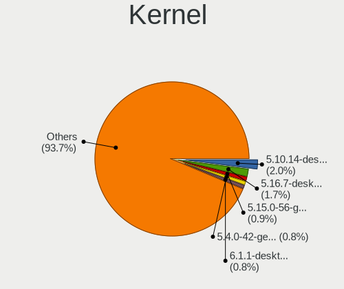
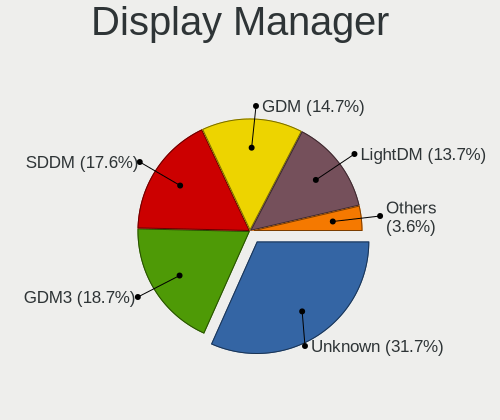
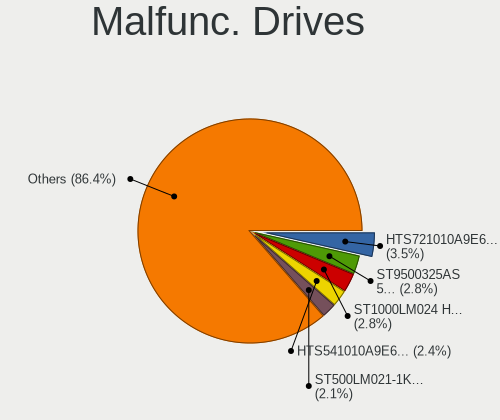
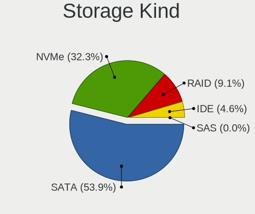
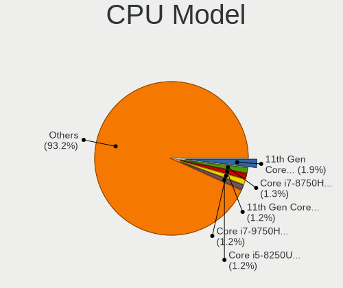
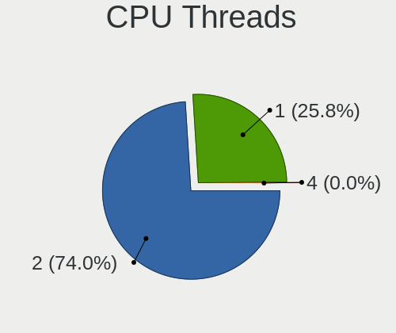
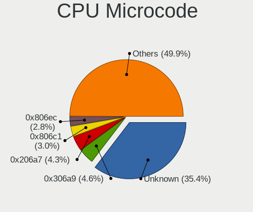
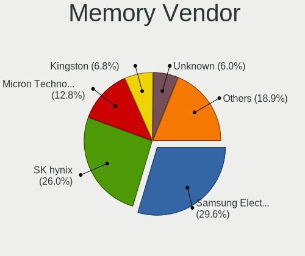
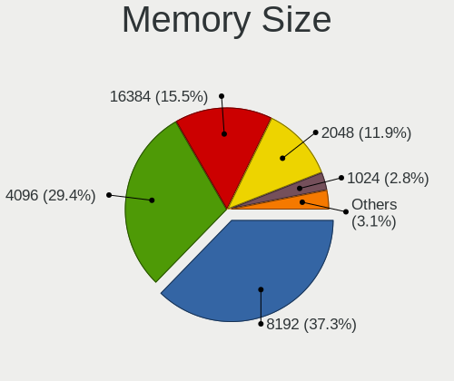

Linux in France - Tested Hardware & Statistics (Notebooks)
----------------------------------------------------------

A project to collect tested hardware configurations for Linux in France.

Anyone can contribute to this report by the [hw-probe](https://github.com/linuxhw/hw-probe) tool:

    sudo -E hw-probe -all -upload

Please contribute! Especially if your hardware is rare.

Contents
--------

* [ Test Cases ](#test-cases)

* [ System ](#system)
  - [ OS                       ](#os)
  - [ OS Family                ](#os-family)
  - [ Kernel                   ](#kernel)
  - [ Kernel Family            ](#kernel-family)
  - [ Kernel Major Ver.        ](#kernel-major-ver)
  - [ Arch                     ](#arch)
  - [ DE                       ](#de)
  - [ Display Server           ](#display-server)
  - [ Display Manager          ](#display-manager)
  - [ OS Lang                  ](#os-lang)
  - [ Boot Mode                ](#boot-mode)
  - [ Filesystem               ](#filesystem)
  - [ Part. scheme             ](#part-scheme)
  - [ Dual Boot with Linux/BSD ](#dual-boot-with-linuxbsd)
  - [ Dual Boot (Win)          ](#dual-boot-win)

* [ Board ](#board)
  - [ Vendor                   ](#vendor)
  - [ Model                    ](#model)
  - [ Model Family             ](#model-family)
  - [ MFG Year                 ](#mfg-year)
  - [ Form Factor              ](#form-factor)
  - [ Secure Boot              ](#secure-boot)
  - [ Coreboot                 ](#coreboot)
  - [ RAM Size                 ](#ram-size)
  - [ RAM Used                 ](#ram-used)
  - [ Total Drives             ](#total-drives)
  - [ Has CD-ROM               ](#has-cd-rom)
  - [ Has Ethernet             ](#has-ethernet)
  - [ Has WiFi                 ](#has-wifi)
  - [ Has Bluetooth            ](#has-bluetooth)

* [ Location ](#location)
  - [ Country                  ](#country)
  - [ City                     ](#city)

* [ Drives ](#drives)
  - [ Drive Vendor             ](#drive-vendor)
  - [ Drive Model              ](#drive-model)
  - [ HDD Vendor               ](#hdd-vendor)
  - [ SSD Vendor               ](#ssd-vendor)
  - [ Drive Kind               ](#drive-kind)
  - [ Drive Connector          ](#drive-connector)
  - [ Drive Size               ](#drive-size)
  - [ Space Total              ](#space-total)
  - [ Space Used               ](#space-used)
  - [ Malfunc. Drives          ](#malfunc-drives)
  - [ Malfunc. Drive Vendor    ](#malfunc-drive-vendor)
  - [ Malfunc. HDD Vendor      ](#malfunc-hdd-vendor)
  - [ Malfunc. Drive Kind      ](#malfunc-drive-kind)
  - [ Failed Drives            ](#failed-drives)
  - [ Failed Drive Vendor      ](#failed-drive-vendor)
  - [ Drive Status             ](#drive-status)

* [ Storage controller ](#storage-controller)
  - [ Storage Vendor           ](#storage-vendor)
  - [ Storage Model            ](#storage-model)
  - [ Storage Kind             ](#storage-kind)

* [ Processor ](#processor)
  - [ CPU Vendor               ](#cpu-vendor)
  - [ CPU Model                ](#cpu-model)
  - [ CPU Model Family         ](#cpu-model-family)
  - [ CPU Cores                ](#cpu-cores)
  - [ CPU Sockets              ](#cpu-sockets)
  - [ CPU Threads              ](#cpu-threads)
  - [ CPU Op-Modes             ](#cpu-op-modes)
  - [ CPU Microcode            ](#cpu-microcode)
  - [ CPU Microarch            ](#cpu-microarch)

* [ Graphics ](#graphics)
  - [ GPU Vendor               ](#gpu-vendor)
  - [ GPU Model                ](#gpu-model)
  - [ GPU Combo                ](#gpu-combo)
  - [ GPU Driver               ](#gpu-driver)
  - [ GPU Memory               ](#gpu-memory)

* [ Monitor ](#monitor)
  - [ Monitor Vendor           ](#monitor-vendor)
  - [ Monitor Model            ](#monitor-model)
  - [ Monitor Resolution       ](#monitor-resolution)
  - [ Monitor Diagonal         ](#monitor-diagonal)
  - [ Monitor Width            ](#monitor-width)
  - [ Aspect Ratio             ](#aspect-ratio)
  - [ Monitor Area             ](#monitor-area)
  - [ Pixel Density            ](#pixel-density)
  - [ Multiple Monitors        ](#multiple-monitors)

* [ Network ](#network)
  - [ Net Controller Vendor    ](#net-controller-vendor)
  - [ Net Controller Model     ](#net-controller-model)
  - [ Wireless Vendor          ](#wireless-vendor)
  - [ Wireless Model           ](#wireless-model)
  - [ Ethernet Vendor          ](#ethernet-vendor)
  - [ Ethernet Model           ](#ethernet-model)
  - [ Net Controller Kind      ](#net-controller-kind)
  - [ Used Controller          ](#used-controller)
  - [ NICs                     ](#nics)
  - [ IPv6                     ](#ipv6)

* [ Bluetooth ](#bluetooth)
  - [ Bluetooth Vendor         ](#bluetooth-vendor)
  - [ Bluetooth Model          ](#bluetooth-model)

* [ Sound ](#sound)
  - [ Sound Vendor             ](#sound-vendor)
  - [ Sound Model              ](#sound-model)

* [ Memory ](#memory)
  - [ Memory Vendor            ](#memory-vendor)
  - [ Memory Model             ](#memory-model)
  - [ Memory Kind              ](#memory-kind)
  - [ Memory Form Factor       ](#memory-form-factor)
  - [ Memory Size              ](#memory-size)
  - [ Memory Speed             ](#memory-speed)

* [ Printers & scanners ](#printers--scanners)
  - [ Printer Vendor           ](#printer-vendor)
  - [ Printer Model            ](#printer-model)
  - [ Scanner Vendor           ](#scanner-vendor)
  - [ Scanner Model            ](#scanner-model)

* [ Camera ](#camera)
  - [ Camera Vendor            ](#camera-vendor)
  - [ Camera Model             ](#camera-model)

* [ Security ](#security)
  - [ Fingerprint Vendor       ](#fingerprint-vendor)
  - [ Fingerprint Model        ](#fingerprint-model)
  - [ Chipcard Vendor          ](#chipcard-vendor)
  - [ Chipcard Model           ](#chipcard-model)

* [ Unsupported ](#unsupported)
  - [ Unsupported Devices      ](#unsupported-devices)
  - [ Unsupported Device Types ](#unsupported-device-types)

Test Cases
----------

Total: 8484

| Vendor        | Model                       | Probe                                                      | Date         |
|---------------|-----------------------------|------------------------------------------------------------|--------------|
| Lenovo        | ThinkPad T15 Gen 1 20S60... | [a679e6f722](https://linux-hardware.org/?probe=a679e6f722) | Jan 01, 2024 |
| ASUSTek       | VivoBook_ASUSLaptop K650... | [20f988146c](https://linux-hardware.org/?probe=20f988146c) | Jan 01, 2024 |
| HP            | Pavilion 17                 | [77a7431f73](https://linux-hardware.org/?probe=77a7431f73) | Dec 31, 2023 |
| Toshiba       | Satellite Pro C660          | [c3736ea548](https://linux-hardware.org/?probe=c3736ea548) | Dec 31, 2023 |
| ASUSTek       | K53U                        | [84ba38c3c5](https://linux-hardware.org/?probe=84ba38c3c5) | Dec 31, 2023 |
| Lenovo        | ThinkPad S1 Yoga 12 20DK... | [a4596b8ae1](https://linux-hardware.org/?probe=a4596b8ae1) | Dec 31, 2023 |
| HP            | ProBook 470 G3              | [22bd0ee412](https://linux-hardware.org/?probe=22bd0ee412) | Dec 30, 2023 |
| MSI           | Prestige 15 A10SC           | [e61eb5428f](https://linux-hardware.org/?probe=e61eb5428f) | Dec 30, 2023 |
| Lenovo        | Yoga S740-15IRH 81NX        | [aa1bee686a](https://linux-hardware.org/?probe=aa1bee686a) | Dec 30, 2023 |
| ASUSTek       | X751LJ                      | [0ebf64067f](https://linux-hardware.org/?probe=0ebf64067f) | Dec 30, 2023 |
| HP            | Pavilion Plus Laptop 14-... | [c6751f4e51](https://linux-hardware.org/?probe=c6751f4e51) | Dec 30, 2023 |
| Acer          | Aspire A517-52              | [0dfed3df52](https://linux-hardware.org/?probe=0dfed3df52) | Dec 30, 2023 |
| Acer          | Aspire A517-52              | [1c4684011d](https://linux-hardware.org/?probe=1c4684011d) | Dec 30, 2023 |
| Lenovo        | IdeaPad 100-15IBD 80QQ      | [01c6121d4c](https://linux-hardware.org/?probe=01c6121d4c) | Dec 29, 2023 |
| HP            | ProBook 650 G1              | [c7383a1237](https://linux-hardware.org/?probe=c7383a1237) | Dec 29, 2023 |
| HP            | ProBook 650 G1              | [cc8196ebec](https://linux-hardware.org/?probe=cc8196ebec) | Dec 29, 2023 |
| Toshiba       | Satellite C50D-A-138        | [cfb74314e2](https://linux-hardware.org/?probe=cfb74314e2) | Dec 29, 2023 |
| HP            | ProBook 655 G2              | [50589e94ba](https://linux-hardware.org/?probe=50589e94ba) | Dec 29, 2023 |
| ASUSTek       | K53BE                       | [23efadbf2f](https://linux-hardware.org/?probe=23efadbf2f) | Dec 29, 2023 |
| HP            | ProBook 655 G2              | [71ef8433cc](https://linux-hardware.org/?probe=71ef8433cc) | Dec 29, 2023 |
| ASUSTek       | ASUS EXPERTBOOK B9400CBA... | [f37cd9143d](https://linux-hardware.org/?probe=f37cd9143d) | Dec 29, 2023 |
| Lenovo        | ThinkPad X230 2325V2Y       | [791788fbbc](https://linux-hardware.org/?probe=791788fbbc) | Dec 29, 2023 |
| Toshiba       | Satellite L655              | [c7e2a4aa7c](https://linux-hardware.org/?probe=c7e2a4aa7c) | Dec 29, 2023 |
| Lenovo        | ThinkPad X230 2325V2Y       | [4861953728](https://linux-hardware.org/?probe=4861953728) | Dec 29, 2023 |
| Lenovo        | ThinkPad X230 2325V2Y       | [650d02f634](https://linux-hardware.org/?probe=650d02f634) | Dec 29, 2023 |
| Lenovo        | ThinkPad X230 2325V2Y       | [0a2d1d5688](https://linux-hardware.org/?probe=0a2d1d5688) | Dec 29, 2023 |
| Lenovo        | ThinkPad X230 2325V2Y       | [3d0513bb6c](https://linux-hardware.org/?probe=3d0513bb6c) | Dec 29, 2023 |
| Lenovo        | ThinkPad W540 20BG001KFR    | [af69ec2d33](https://linux-hardware.org/?probe=af69ec2d33) | Dec 29, 2023 |
| Lenovo        | ThinkPad W540 20BG001KFR    | [143c6b4161](https://linux-hardware.org/?probe=143c6b4161) | Dec 29, 2023 |
| Star Labs     | StarBook                    | [930fb359dd](https://linux-hardware.org/?probe=930fb359dd) | Dec 29, 2023 |
| Notebook      | NL40_50CU                   | [a91c55ef9f](https://linux-hardware.org/?probe=a91c55ef9f) | Dec 28, 2023 |
| Samsung       | 900X3C/900X3D/900X4C/900... | [e0bfd9face](https://linux-hardware.org/?probe=e0bfd9face) | Dec 28, 2023 |
| Lenovo        | ThinkPad X230 2325V2Y       | [76b6ceb6cf](https://linux-hardware.org/?probe=76b6ceb6cf) | Dec 28, 2023 |
| Lenovo        | ThinkPad X230 2325V2Y       | [32b6e45042](https://linux-hardware.org/?probe=32b6e45042) | Dec 28, 2023 |
| HP            | OMEN Laptop 15-ek1xxx       | [16c7cb0337](https://linux-hardware.org/?probe=16c7cb0337) | Dec 28, 2023 |
| HP            | ZBook 15                    | [92d7e45b22](https://linux-hardware.org/?probe=92d7e45b22) | Dec 28, 2023 |
| HP            | EliteBook 840 G2            | [bbce6fb229](https://linux-hardware.org/?probe=bbce6fb229) | Dec 28, 2023 |
| Lenovo        | ThinkPad L540 20AUS0N200    | [e94a7fb094](https://linux-hardware.org/?probe=e94a7fb094) | Dec 28, 2023 |
| Lenovo        | ThinkPad L540 20AV0031FR    | [96e1e4403d](https://linux-hardware.org/?probe=96e1e4403d) | Dec 28, 2023 |
| Lenovo        | ThinkPad X230 2325V2Y       | [98b0838eb2](https://linux-hardware.org/?probe=98b0838eb2) | Dec 28, 2023 |
| Lenovo        | ThinkPad X230 2325V2Y       | [4eb0a16723](https://linux-hardware.org/?probe=4eb0a16723) | Dec 28, 2023 |
| HP            | EliteBook 840 G2            | [6ba5504a6f](https://linux-hardware.org/?probe=6ba5504a6f) | Dec 28, 2023 |
| Google        | Lillipup                    | [e8ac3dc206](https://linux-hardware.org/?probe=e8ac3dc206) | Dec 28, 2023 |
| ASUSTek       | X555LB                      | [f29fe264f5](https://linux-hardware.org/?probe=f29fe264f5) | Dec 28, 2023 |
| UNOWHY        | Y13G012S4EI                 | [a3bb952104](https://linux-hardware.org/?probe=a3bb952104) | Dec 27, 2023 |
| Lenovo        | IdeaPad Slim 3 15IRU8 82... | [c16f162169](https://linux-hardware.org/?probe=c16f162169) | Dec 27, 2023 |
| ASUSTek       | ASUS TUF Gaming A17 FA70... | [e36502092e](https://linux-hardware.org/?probe=e36502092e) | Dec 27, 2023 |
| Framework     | Laptop (13th Gen Intel C... | [3d96eb6f36](https://linux-hardware.org/?probe=3d96eb6f36) | Dec 27, 2023 |
| Lenovo        | ThinkPad L530 2475A61       | [990d8dce86](https://linux-hardware.org/?probe=990d8dce86) | Dec 27, 2023 |
| HP            | ProBook 650 G1              | [e623c937a6](https://linux-hardware.org/?probe=e623c937a6) | Dec 27, 2023 |
| HP            | ProBook 650 G1              | [f6c6dba166](https://linux-hardware.org/?probe=f6c6dba166) | Dec 27, 2023 |
| HP            | ProBook 650 G2              | [705f4fa6fd](https://linux-hardware.org/?probe=705f4fa6fd) | Dec 27, 2023 |
| HP            | ProBook 450 G3              | [9435700f28](https://linux-hardware.org/?probe=9435700f28) | Dec 27, 2023 |
| Dell          | Latitude E7440              | [6e44f58de9](https://linux-hardware.org/?probe=6e44f58de9) | Dec 27, 2023 |
| HP            | ProBook 650 G2              | [06264d7b71](https://linux-hardware.org/?probe=06264d7b71) | Dec 27, 2023 |
| HP            | ProBook 650 G2              | [09c41915d8](https://linux-hardware.org/?probe=09c41915d8) | Dec 27, 2023 |
| HP            | ProBook 650 G2              | [a89881fc3b](https://linux-hardware.org/?probe=a89881fc3b) | Dec 27, 2023 |
| HP            | ProBook 650 G2              | [b18f714a89](https://linux-hardware.org/?probe=b18f714a89) | Dec 27, 2023 |
| HP            | ProBook 450 G3              | [2424999ad8](https://linux-hardware.org/?probe=2424999ad8) | Dec 27, 2023 |
| HP            | ProBook 650 G1              | [1126414dff](https://linux-hardware.org/?probe=1126414dff) | Dec 27, 2023 |
| HP            | ProBook 450 G3              | [2ddc54287d](https://linux-hardware.org/?probe=2ddc54287d) | Dec 27, 2023 |
| Framework     | Laptop 13 (AMD Ryzen 704... | [8017d1c054](https://linux-hardware.org/?probe=8017d1c054) | Dec 27, 2023 |
| HONOR         | NMH-WCX9                    | [5647df79c0](https://linux-hardware.org/?probe=5647df79c0) | Dec 26, 2023 |
| HP            | ProBook 450 G3              | [1e952ed878](https://linux-hardware.org/?probe=1e952ed878) | Dec 26, 2023 |
| Lenovo        | ThinkPad P50 20EQS1MY00     | [a49698d49d](https://linux-hardware.org/?probe=a49698d49d) | Dec 26, 2023 |
| Lenovo        | Unknown                     | [5d5f205d61](https://linux-hardware.org/?probe=5d5f205d61) | Dec 26, 2023 |
| Lenovo        | Legion Pro 5 16ARX8 82WM    | [db50c73272](https://linux-hardware.org/?probe=db50c73272) | Dec 26, 2023 |
| Acer          | Aspire ES1-572              | [64d63264dc](https://linux-hardware.org/?probe=64d63264dc) | Dec 25, 2023 |
| Acer          | Aspire ES1-572              | [2698d102c0](https://linux-hardware.org/?probe=2698d102c0) | Dec 25, 2023 |
| Acer          | Swift SF314-51              | [a2f71698e2](https://linux-hardware.org/?probe=a2f71698e2) | Dec 25, 2023 |
| MSI           | GX70 3CC                    | [30d22e2d74](https://linux-hardware.org/?probe=30d22e2d74) | Dec 25, 2023 |
| Framework     | Laptop 13 (AMD Ryzen 704... | [d775a90c0e](https://linux-hardware.org/?probe=d775a90c0e) | Dec 25, 2023 |
| HP            | Pavilion g7                 | [f6a852d547](https://linux-hardware.org/?probe=f6a852d547) | Dec 24, 2023 |
| Lenovo        | ThinkPad Edge E530 62722... | [28ab1a916a](https://linux-hardware.org/?probe=28ab1a916a) | Dec 24, 2023 |
| Toshiba       | Satellite L655              | [679c502604](https://linux-hardware.org/?probe=679c502604) | Dec 24, 2023 |
| eMachines     | E725                        | [830cb3faa4](https://linux-hardware.org/?probe=830cb3faa4) | Dec 24, 2023 |
| Google        | Magolor                     | [f5d079bc79](https://linux-hardware.org/?probe=f5d079bc79) | Dec 24, 2023 |
| ASUSTek       | Zenbook 15 UM3504DA_UM35... | [6cc304ea54](https://linux-hardware.org/?probe=6cc304ea54) | Dec 23, 2023 |
| Dell          | Latitude E4310              | [41f607e5e5](https://linux-hardware.org/?probe=41f607e5e5) | Dec 23, 2023 |
| Acer          | Aspire ES1-572              | [e726ce9f63](https://linux-hardware.org/?probe=e726ce9f63) | Dec 23, 2023 |
| Sony          | VPCEA1S1E                   | [af850dd5f3](https://linux-hardware.org/?probe=af850dd5f3) | Dec 23, 2023 |
| HP            | ProBook 655 G2              | [033325e722](https://linux-hardware.org/?probe=033325e722) | Dec 23, 2023 |
| Alienware     | m15 R7 AMD                  | [9d80128f05](https://linux-hardware.org/?probe=9d80128f05) | Dec 23, 2023 |
| MSI           | GE62 2QF                    | [cf9a783196](https://linux-hardware.org/?probe=cf9a783196) | Dec 23, 2023 |
| ASUSTek       | T100TA                      | [9ad17d2d3c](https://linux-hardware.org/?probe=9ad17d2d3c) | Dec 23, 2023 |
| eMachines     | E527                        | [cf5b096be7](https://linux-hardware.org/?probe=cf5b096be7) | Dec 22, 2023 |
| GPD           | G1621-02                    | [eaf78f9da1](https://linux-hardware.org/?probe=eaf78f9da1) | Dec 22, 2023 |
| Dell          | Studio 1737                 | [a157d70ea2](https://linux-hardware.org/?probe=a157d70ea2) | Dec 22, 2023 |
| Dell          | Latitude 14 Rugged (5404... | [084f663c15](https://linux-hardware.org/?probe=084f663c15) | Dec 22, 2023 |
| Acer          | Aspire 5742G                | [1f9d486306](https://linux-hardware.org/?probe=1f9d486306) | Dec 22, 2023 |
| Dell          | Latitude E6440              | [904540fc01](https://linux-hardware.org/?probe=904540fc01) | Dec 21, 2023 |
| Dell          | System Vostro 3750          | [aa1fb5d9a6](https://linux-hardware.org/?probe=aa1fb5d9a6) | Dec 21, 2023 |
| HONOR         | HYM-WXX                     | [1c225a853e](https://linux-hardware.org/?probe=1c225a853e) | Dec 21, 2023 |
| ASUSTek       | Zenbook 15 UM3504DA_UM35... | [907851c66b](https://linux-hardware.org/?probe=907851c66b) | Dec 21, 2023 |
| Toshiba       | Satellite L655              | [7a1001a094](https://linux-hardware.org/?probe=7a1001a094) | Dec 21, 2023 |
| Dell          | Precision 3581              | [aa0186ade6](https://linux-hardware.org/?probe=aa0186ade6) | Dec 21, 2023 |
| Dell          | Inspiron 15 3535            | [466204d787](https://linux-hardware.org/?probe=466204d787) | Dec 21, 2023 |
| Dell          | Latitude 5590               | [9877862088](https://linux-hardware.org/?probe=9877862088) | Dec 21, 2023 |
| Acer          | Aspire E1-771G              | [07bcd26f94](https://linux-hardware.org/?probe=07bcd26f94) | Dec 20, 2023 |
| Dell          | Latitude 5590               | [4f307c792f](https://linux-hardware.org/?probe=4f307c792f) | Dec 20, 2023 |
| HP            | Pavilion dv6                | [4cc379dfbd](https://linux-hardware.org/?probe=4cc379dfbd) | Dec 19, 2023 |
| HP            | EliteBook 840 14 inch G1... | [2222f1a1fb](https://linux-hardware.org/?probe=2222f1a1fb) | Dec 19, 2023 |
| Dell          | G7 7790                     | [bcc6b4046b](https://linux-hardware.org/?probe=bcc6b4046b) | Dec 19, 2023 |
| Acer          | Nitro ANV15-51              | [c4ddaa9bc4](https://linux-hardware.org/?probe=c4ddaa9bc4) | Dec 19, 2023 |
| DellInc.      | Venue 8 Pro 5830            | [d6408a26a1](https://linux-hardware.org/?probe=d6408a26a1) | Dec 19, 2023 |
| Acer          | Nitro ANV15-51              | [aa343c3d4f](https://linux-hardware.org/?probe=aa343c3d4f) | Dec 19, 2023 |
| HP            | Pavilion 17                 | [449c36ff1c](https://linux-hardware.org/?probe=449c36ff1c) | Dec 19, 2023 |
| MSI           | Bravo 15 B5DD               | [7bb3bd0328](https://linux-hardware.org/?probe=7bb3bd0328) | Dec 18, 2023 |
| HP            | ZBook Fury 15.6 inch G8 ... | [02ffa90273](https://linux-hardware.org/?probe=02ffa90273) | Dec 18, 2023 |
| Dell          | Precision 7530              | [6de510283f](https://linux-hardware.org/?probe=6de510283f) | Dec 18, 2023 |
| Dell          | Latitude 7440               | [644c46aba6](https://linux-hardware.org/?probe=644c46aba6) | Dec 18, 2023 |
| Dell          | Venue 11 Pro 5130           | [74cdfd92c0](https://linux-hardware.org/?probe=74cdfd92c0) | Dec 18, 2023 |
| Fujitsu       | LIFEBOOK A512               | [0c3974dad9](https://linux-hardware.org/?probe=0c3974dad9) | Dec 18, 2023 |
| Acer          | Aspire S7-391               | [ab734913e8](https://linux-hardware.org/?probe=ab734913e8) | Dec 17, 2023 |
| Acer          | Aspire S7-391               | [1d66b3f887](https://linux-hardware.org/?probe=1d66b3f887) | Dec 17, 2023 |
| Acer          | Nitro AN517-54              | [80aeddc1b2](https://linux-hardware.org/?probe=80aeddc1b2) | Dec 17, 2023 |
| HP            | ZBook 17 G5                 | [288e976604](https://linux-hardware.org/?probe=288e976604) | Dec 17, 2023 |
| Acer          | Nitro AN517-54              | [2f2bcf0c97](https://linux-hardware.org/?probe=2f2bcf0c97) | Dec 17, 2023 |
| Dell          | G5 5587                     | [0200ad8ea9](https://linux-hardware.org/?probe=0200ad8ea9) | Dec 17, 2023 |
| ASUSTek       | VivoBook_ASUSLaptop K360... | [6e359357d4](https://linux-hardware.org/?probe=6e359357d4) | Dec 17, 2023 |
| HP            | Compaq 6730s                | [628e8cf362](https://linux-hardware.org/?probe=628e8cf362) | Dec 17, 2023 |
| HP            | Compaq 6730s                | [774f3d4feb](https://linux-hardware.org/?probe=774f3d4feb) | Dec 17, 2023 |
| ASUSTek       | X456UB                      | [5a4a0662e1](https://linux-hardware.org/?probe=5a4a0662e1) | Dec 17, 2023 |
| MSI           | GF63 Thin 11UC              | [06556bd61a](https://linux-hardware.org/?probe=06556bd61a) | Dec 17, 2023 |
| Google        | Woomax                      | [7516d70c03](https://linux-hardware.org/?probe=7516d70c03) | Dec 17, 2023 |
| Dell          | Latitude 5290 2-in-1        | [b90524a691](https://linux-hardware.org/?probe=b90524a691) | Dec 16, 2023 |
| Toshiba       | Satellite L655              | [5f625c9177](https://linux-hardware.org/?probe=5f625c9177) | Dec 16, 2023 |
| Dell          | Inspiron 14 5420            | [ef0c78ce49](https://linux-hardware.org/?probe=ef0c78ce49) | Dec 16, 2023 |
| Lenovo        | ThinkPad T420 4238AW2       | [01fae631cf](https://linux-hardware.org/?probe=01fae631cf) | Dec 16, 2023 |
| Toshiba       | Satellite C660D             | [4277f53694](https://linux-hardware.org/?probe=4277f53694) | Dec 16, 2023 |
| ASUSTek       | ASUS TUF Gaming A17 FA70... | [bac2e83dd7](https://linux-hardware.org/?probe=bac2e83dd7) | Dec 16, 2023 |
| ASUSTek       | Zenbook 15 UM3504DA_UM35... | [12c5d1d331](https://linux-hardware.org/?probe=12c5d1d331) | Dec 16, 2023 |
| MSI           | Katana GF66 11SC            | [1eb5b02078](https://linux-hardware.org/?probe=1eb5b02078) | Dec 15, 2023 |
| Apple         | MacBookAir6,2               | [31426d7740](https://linux-hardware.org/?probe=31426d7740) | Dec 15, 2023 |
| Sony          | SVF1521G6EW                 | [55b5387ed5](https://linux-hardware.org/?probe=55b5387ed5) | Dec 15, 2023 |
| ASUSTek       | VivoBook_ASUS Laptop E40... | [05141b9b76](https://linux-hardware.org/?probe=05141b9b76) | Dec 14, 2023 |
| ASUSTek       | VivoBook_ASUS Laptop E40... | [a869524ac6](https://linux-hardware.org/?probe=a869524ac6) | Dec 14, 2023 |
| Lenovo        | Legion 5 Pro 16ACH6H 82J... | [51e42890da](https://linux-hardware.org/?probe=51e42890da) | Dec 14, 2023 |
| Dell          | Precision 5510              | [ddc02a6165](https://linux-hardware.org/?probe=ddc02a6165) | Dec 14, 2023 |
| GPD           | G1619-04                    | [27dd6e79da](https://linux-hardware.org/?probe=27dd6e79da) | Dec 14, 2023 |
| Dell          | XPS 15 9520                 | [ac8fb0b18d](https://linux-hardware.org/?probe=ac8fb0b18d) | Dec 14, 2023 |
| ASUSTek       | E403SA                      | [141030490c](https://linux-hardware.org/?probe=141030490c) | Dec 14, 2023 |
| HP            | Pavilion 17                 | [81e5865518](https://linux-hardware.org/?probe=81e5865518) | Dec 14, 2023 |
| Apple         | MacBookPro5,1               | [277dadb387](https://linux-hardware.org/?probe=277dadb387) | Dec 13, 2023 |
| Packard Be... | EasyNote LM85               | [18a9f48bee](https://linux-hardware.org/?probe=18a9f48bee) | Dec 13, 2023 |
| Lenovo        | V110-15IAP 80TG             | [de6e3bf0eb](https://linux-hardware.org/?probe=de6e3bf0eb) | Dec 13, 2023 |
| Dell          | Precision 5510              | [0ce634decf](https://linux-hardware.org/?probe=0ce634decf) | Dec 13, 2023 |
| Timi          | TM1604                      | [67597f3bd5](https://linux-hardware.org/?probe=67597f3bd5) | Dec 13, 2023 |
| HP            | ZBook 17                    | [d1269ca08c](https://linux-hardware.org/?probe=d1269ca08c) | Dec 13, 2023 |
| HP            | EliteBook 840 G3            | [01752b90ef](https://linux-hardware.org/?probe=01752b90ef) | Dec 12, 2023 |
| ASUSTek       | P553UA                      | [9a0bb65e3f](https://linux-hardware.org/?probe=9a0bb65e3f) | Dec 12, 2023 |
| ASUSTek       | ASUS TUF Gaming A17 FA70... | [4293932b86](https://linux-hardware.org/?probe=4293932b86) | Dec 12, 2023 |
| Dell          | Inspiron 7591               | [10a266d0ff](https://linux-hardware.org/?probe=10a266d0ff) | Dec 12, 2023 |
| Acer          | Aspire E1-571               | [4576cb723a](https://linux-hardware.org/?probe=4576cb723a) | Dec 12, 2023 |
| Dell          | Latitude E6320              | [dbacdcadba](https://linux-hardware.org/?probe=dbacdcadba) | Dec 12, 2023 |
| Valve         | Galileo                     | [beb6edb04f](https://linux-hardware.org/?probe=beb6edb04f) | Dec 12, 2023 |
| ASUSTek       | G551JM                      | [10dfa9e380](https://linux-hardware.org/?probe=10dfa9e380) | Dec 12, 2023 |
| MSI           | GX60 1AC/GX60 3AE/GX60 3... | [262637b1e2](https://linux-hardware.org/?probe=262637b1e2) | Dec 11, 2023 |
| Framework     | Laptop 13 (AMD Ryzen 704... | [ffcb3c9798](https://linux-hardware.org/?probe=ffcb3c9798) | Dec 11, 2023 |
| ASUSTek       | Zenbook 15 UM3504DA_UM35... | [8a61a6bdd6](https://linux-hardware.org/?probe=8a61a6bdd6) | Dec 11, 2023 |
| HP            | ProBook 450 G3              | [57a80d9d1b](https://linux-hardware.org/?probe=57a80d9d1b) | Dec 11, 2023 |
| GPD           | G1619-03                    | [92773d52d8](https://linux-hardware.org/?probe=92773d52d8) | Dec 10, 2023 |
| HUAWEI        | BOHK-WAX9X                  | [dbf172e6c8](https://linux-hardware.org/?probe=dbf172e6c8) | Dec 10, 2023 |
| Acer          | Aspire ES1-572              | [c66bd8de67](https://linux-hardware.org/?probe=c66bd8de67) | Dec 10, 2023 |
| HP            | EliteBook 820 G3            | [50335a1ca6](https://linux-hardware.org/?probe=50335a1ca6) | Dec 09, 2023 |
| HP            | ProBook 640 G2              | [0989548d19](https://linux-hardware.org/?probe=0989548d19) | Dec 09, 2023 |
| Toshiba       | Satellite C870D-116         | [78a800febe](https://linux-hardware.org/?probe=78a800febe) | Dec 09, 2023 |
| ASUSTek       | ROG Strix G513QR_G513QR     | [b3f7b8b30a](https://linux-hardware.org/?probe=b3f7b8b30a) | Dec 09, 2023 |
| Dell          | Inspiron 7591               | [7907f73ee0](https://linux-hardware.org/?probe=7907f73ee0) | Dec 09, 2023 |
| Valve         | Jupiter                     | [7d649cef63](https://linux-hardware.org/?probe=7d649cef63) | Dec 09, 2023 |
| GPD           | G1619-03                    | [bc2ade83b8](https://linux-hardware.org/?probe=bc2ade83b8) | Dec 08, 2023 |
| ASUSTek       | X555BP                      | [b7680df948](https://linux-hardware.org/?probe=b7680df948) | Dec 07, 2023 |
| Acer          | Aspire E1-771G              | [099fae46db](https://linux-hardware.org/?probe=099fae46db) | Dec 07, 2023 |
| Toshiba       | Satellite C70-B             | [6493c4fcf8](https://linux-hardware.org/?probe=6493c4fcf8) | Dec 07, 2023 |
| Unknown       | AX15                        | [3eb1590b8e](https://linux-hardware.org/?probe=3eb1590b8e) | Dec 07, 2023 |
| Toshiba       | Satellite L655              | [dc8c17b9fd](https://linux-hardware.org/?probe=dc8c17b9fd) | Dec 07, 2023 |
| Acer          | Aspire E1-771G              | [28f6aca279](https://linux-hardware.org/?probe=28f6aca279) | Dec 06, 2023 |
| HP            | Laptop 15-db0xxx            | [8b324f5c18](https://linux-hardware.org/?probe=8b324f5c18) | Dec 06, 2023 |
| Lenovo        | IdeaPad 3 17ADA05 81W2      | [beaa75c727](https://linux-hardware.org/?probe=beaa75c727) | Dec 06, 2023 |
| ASUSTek       | VivoBook_ASUSLaptop X515... | [5e71510e4c](https://linux-hardware.org/?probe=5e71510e4c) | Dec 06, 2023 |
| Toshiba       | Satellite C70-B             | [ea76b3e92c](https://linux-hardware.org/?probe=ea76b3e92c) | Dec 06, 2023 |
| Acer          | Swift SF515-51T             | [941ba24cf2](https://linux-hardware.org/?probe=941ba24cf2) | Dec 05, 2023 |
| Lenovo        | ThinkPad T460 20FMS5QV00    | [d04d3a298f](https://linux-hardware.org/?probe=d04d3a298f) | Dec 05, 2023 |
| Lenovo        | ThinkPad T440p 20AWS0JC0... | [11fdf05513](https://linux-hardware.org/?probe=11fdf05513) | Dec 05, 2023 |
| HP            | 15                          | [561269f586](https://linux-hardware.org/?probe=561269f586) | Dec 05, 2023 |
| Dell          | Inspiron 15 5510            | [f20f7f2563](https://linux-hardware.org/?probe=f20f7f2563) | Dec 05, 2023 |
| Lenovo        | ThinkPad T15 Gen 1 20S7S... | [6e9230f8ab](https://linux-hardware.org/?probe=6e9230f8ab) | Dec 05, 2023 |
| HUAWEI        | BOD-WXX9                    | [e6e58d5148](https://linux-hardware.org/?probe=e6e58d5148) | Dec 05, 2023 |
| Framework     | Laptop (12th Gen Intel C... | [fe06cb32bc](https://linux-hardware.org/?probe=fe06cb32bc) | Dec 05, 2023 |
| HUAWEI        | BOD-WXX9                    | [da8437565a](https://linux-hardware.org/?probe=da8437565a) | Dec 04, 2023 |
| Lenovo        | G50-45 80E3                 | [9cbacbf139](https://linux-hardware.org/?probe=9cbacbf139) | Dec 04, 2023 |
| ASUSTek       | ASUS TUF Gaming F17 FX70... | [3f26c37883](https://linux-hardware.org/?probe=3f26c37883) | Dec 04, 2023 |
| Samsung       | R530/R730                   | [3919c76efa](https://linux-hardware.org/?probe=3919c76efa) | Dec 04, 2023 |
| Lenovo        | ThinkPad T450 20BUS3L502    | [592eb925fd](https://linux-hardware.org/?probe=592eb925fd) | Dec 04, 2023 |
| Lenovo        | ThinkPad T14 Gen 3 21AHC... | [7afcab06a4](https://linux-hardware.org/?probe=7afcab06a4) | Dec 04, 2023 |
| Lenovo        | ThinkPad T460 20FMS5QV00    | [3b08be3ebc](https://linux-hardware.org/?probe=3b08be3ebc) | Dec 03, 2023 |
| Lenovo        | ThinkPad T14 Gen 3 21AHC... | [bbd413d34b](https://linux-hardware.org/?probe=bbd413d34b) | Dec 03, 2023 |
| ASUSTek       | GL703VM                     | [616bfbe220](https://linux-hardware.org/?probe=616bfbe220) | Dec 03, 2023 |
| HP            | Unknown                     | [ac64007236](https://linux-hardware.org/?probe=ac64007236) | Dec 03, 2023 |
| Apple         | MacBookPro10,1              | [198b467b8f](https://linux-hardware.org/?probe=198b467b8f) | Dec 03, 2023 |
| Lenovo        | ThinkPad E14 Gen 3 20Y70... | [e7c23bf6d5](https://linux-hardware.org/?probe=e7c23bf6d5) | Dec 03, 2023 |
| MSI           | PS63 Modern 8RC             | [76f07c96fd](https://linux-hardware.org/?probe=76f07c96fd) | Dec 03, 2023 |
| Apple         | MacBookPro10,1              | [948e2f229a](https://linux-hardware.org/?probe=948e2f229a) | Dec 03, 2023 |
| UNOWHY        | Y13G002S4EI                 | [4587cd55f9](https://linux-hardware.org/?probe=4587cd55f9) | Dec 03, 2023 |
| Lenovo        | ThinkPad T530 2429F37       | [7db847c98e](https://linux-hardware.org/?probe=7db847c98e) | Dec 03, 2023 |
| Lenovo        | IdeaPad 3 15ADA05 81W1      | [fe6c19062f](https://linux-hardware.org/?probe=fe6c19062f) | Dec 02, 2023 |
| Lenovo        | IdeaPad 3 15ADA05 81W1      | [6189dc268f](https://linux-hardware.org/?probe=6189dc268f) | Dec 02, 2023 |
| Apple         | MacBookPro5,5               | [53e38cd006](https://linux-hardware.org/?probe=53e38cd006) | Dec 02, 2023 |
| Dell          | Latitude E6510              | [0c49353fa5](https://linux-hardware.org/?probe=0c49353fa5) | Dec 02, 2023 |
| Samsung       | R610                        | [63c97d55c8](https://linux-hardware.org/?probe=63c97d55c8) | Dec 02, 2023 |
| Acer          | Aspire E5-771G              | [907744429e](https://linux-hardware.org/?probe=907744429e) | Dec 02, 2023 |
| HP            | Notebook                    | [4b88cdde01](https://linux-hardware.org/?probe=4b88cdde01) | Dec 02, 2023 |
| Clevo         | W251ESQ/W270ESQ             | [8572803f38](https://linux-hardware.org/?probe=8572803f38) | Dec 01, 2023 |
| Acer          | Aspire A317-51K             | [aa5652abe0](https://linux-hardware.org/?probe=aa5652abe0) | Dec 01, 2023 |
| Acer          | Swift SF314-511             | [ca692e6dcb](https://linux-hardware.org/?probe=ca692e6dcb) | Dec 01, 2023 |
| Toshiba       | Satellite C870-1F3          | [adb628ff38](https://linux-hardware.org/?probe=adb628ff38) | Dec 01, 2023 |
| Toshiba       | Satellite C870-1F3          | [93907ea0f4](https://linux-hardware.org/?probe=93907ea0f4) | Dec 01, 2023 |
| HP            | ProBook 450 15.6 inch G9... | [fc30a356f0](https://linux-hardware.org/?probe=fc30a356f0) | Dec 01, 2023 |
| Notebook      | NJ50_70CU                   | [613d0fb4a0](https://linux-hardware.org/?probe=613d0fb4a0) | Dec 01, 2023 |
| HP            | Pavilion Laptop 14-ce3xx... | [62ab001788](https://linux-hardware.org/?probe=62ab001788) | Dec 01, 2023 |
| HP            | ProBook 650 G1              | [a3bf52bd5d](https://linux-hardware.org/?probe=a3bf52bd5d) | Nov 30, 2023 |
| Qilive        | QW2214FR                    | [8daddd5057](https://linux-hardware.org/?probe=8daddd5057) | Nov 30, 2023 |
| ASUSTek       | Zenbook UM5302TA_UM5302T... | [bd0ae5856a](https://linux-hardware.org/?probe=bd0ae5856a) | Nov 30, 2023 |
| Clevo         | C4100/C5100                 | [8e2637b70f](https://linux-hardware.org/?probe=8e2637b70f) | Nov 30, 2023 |
| Clevo         | C4100/C5100                 | [ea98614215](https://linux-hardware.org/?probe=ea98614215) | Nov 30, 2023 |
| HP            | EliteBook 655 15.6 inch ... | [5a628a7b0f](https://linux-hardware.org/?probe=5a628a7b0f) | Nov 30, 2023 |
| HP            | ProBook 450 G1              | [7c7825a9c9](https://linux-hardware.org/?probe=7c7825a9c9) | Nov 30, 2023 |
| Dell          | XPS 9320                    | [e4ca1d9f5f](https://linux-hardware.org/?probe=e4ca1d9f5f) | Nov 30, 2023 |
| Lenovo        | IdeaPad 5 15ALC05 82LN      | [b682c56733](https://linux-hardware.org/?probe=b682c56733) | Nov 29, 2023 |
| Teclast       | F15S                        | [34392dd87e](https://linux-hardware.org/?probe=34392dd87e) | Nov 29, 2023 |
| Lenovo        | ThinkPad Z13 Gen 1 21D20... | [a5caeab77f](https://linux-hardware.org/?probe=a5caeab77f) | Nov 29, 2023 |
| ASUSTek       | GL703VM                     | [262f681abe](https://linux-hardware.org/?probe=262f681abe) | Nov 29, 2023 |
| Lenovo        | ThinkPad R500 27148UG       | [546c56f7bb](https://linux-hardware.org/?probe=546c56f7bb) | Nov 28, 2023 |
| MSI           | GF63 Thin 11UD              | [bde4e92728](https://linux-hardware.org/?probe=bde4e92728) | Nov 28, 2023 |
| HP            | EliteBook 860 16 inch G1... | [ebf45c9457](https://linux-hardware.org/?probe=ebf45c9457) | Nov 28, 2023 |
| MSI           | Prestige 14H B12UCX         | [d7c4903da6](https://linux-hardware.org/?probe=d7c4903da6) | Nov 28, 2023 |
| Lenovo        | Unknown                     | [0324aeaf06](https://linux-hardware.org/?probe=0324aeaf06) | Nov 28, 2023 |
| ASUSTek       | Zenbook UX3402ZA_UX3402Z... | [413049d0f4](https://linux-hardware.org/?probe=413049d0f4) | Nov 28, 2023 |
| Acer          | Nitro AN515-58              | [2ddc688d1d](https://linux-hardware.org/?probe=2ddc688d1d) | Nov 28, 2023 |
| Sony          | VGN-NS12M_W                 | [c1400d8699](https://linux-hardware.org/?probe=c1400d8699) | Nov 27, 2023 |
| ASUSTek       | K73SD                       | [cd71879827](https://linux-hardware.org/?probe=cd71879827) | Nov 27, 2023 |
| MSI           | GE72VR 7RF                  | [8f1366b9a9](https://linux-hardware.org/?probe=8f1366b9a9) | Nov 27, 2023 |
| ASUSTek       | ASUS TUF Gaming A15 FA50... | [8739388aac](https://linux-hardware.org/?probe=8739388aac) | Nov 27, 2023 |
| Dell          | Latitude E7470              | [7b07507b58](https://linux-hardware.org/?probe=7b07507b58) | Nov 27, 2023 |
| HP            | Laptop 17-cp0xxx            | [63ddfa6f43](https://linux-hardware.org/?probe=63ddfa6f43) | Nov 27, 2023 |
| Lenovo        | Yoga Pro 9 14IRP8 83BU      | [0bc55c4101](https://linux-hardware.org/?probe=0bc55c4101) | Nov 27, 2023 |
| Toshiba       | Satellite S70t-A            | [a98f08b161](https://linux-hardware.org/?probe=a98f08b161) | Nov 27, 2023 |
| HP            | Pavilion Gaming Laptop 1... | [06bf1b0f79](https://linux-hardware.org/?probe=06bf1b0f79) | Nov 27, 2023 |
| MSI           | Modern 15 A10M              | [105e84e282](https://linux-hardware.org/?probe=105e84e282) | Nov 26, 2023 |
| ASUSTek       | ROG Strix G733ZW_G733ZW     | [21bc20e802](https://linux-hardware.org/?probe=21bc20e802) | Nov 26, 2023 |
| Lenovo        | ThinkPad W541 20EGS07C01    | [c05294f5f5](https://linux-hardware.org/?probe=c05294f5f5) | Nov 26, 2023 |
| Apple         | MacBookPro11,1              | [9bb8e96cf9](https://linux-hardware.org/?probe=9bb8e96cf9) | Nov 26, 2023 |
| Lenovo        | ThinkPad W541 20EGS07C01    | [dc051898f5](https://linux-hardware.org/?probe=dc051898f5) | Nov 26, 2023 |
| Apple         | MacBookPro8,1               | [1a31182007](https://linux-hardware.org/?probe=1a31182007) | Nov 26, 2023 |
| Packard Be... | DOT S                       | [c42837d646](https://linux-hardware.org/?probe=c42837d646) | Nov 26, 2023 |
| HUAWEI        | CREM-WXX9                   | [ab6a5cd935](https://linux-hardware.org/?probe=ab6a5cd935) | Nov 26, 2023 |
| HP            | Notebook                    | [671f5f59ac](https://linux-hardware.org/?probe=671f5f59ac) | Nov 26, 2023 |
| Dell          | Precision M4800             | [8712b3ecb9](https://linux-hardware.org/?probe=8712b3ecb9) | Nov 26, 2023 |
| Google        | Droid                       | [f0bc6c8af1](https://linux-hardware.org/?probe=f0bc6c8af1) | Nov 25, 2023 |
| MSI           | Prestige 14H B12UCX         | [6034c0b26d](https://linux-hardware.org/?probe=6034c0b26d) | Nov 25, 2023 |
| ASUSTek       | Zenbook 15 UM3504DA_UM35... | [3b163ea99b](https://linux-hardware.org/?probe=3b163ea99b) | Nov 25, 2023 |
| Lenovo        | Legion 5 15ACH6H 82JU       | [6007599bc5](https://linux-hardware.org/?probe=6007599bc5) | Nov 25, 2023 |
| ASUSTek       | GL753VD                     | [214c1cc15b](https://linux-hardware.org/?probe=214c1cc15b) | Nov 25, 2023 |
| HP            | EliteBook 860 16 inch G1... | [5d2574b6cf](https://linux-hardware.org/?probe=5d2574b6cf) | Nov 24, 2023 |
| Dell          | XPS 13 9305                 | [6a47a3a5de](https://linux-hardware.org/?probe=6a47a3a5de) | Nov 24, 2023 |
| Valve         | Jupiter                     | [cd4e80c195](https://linux-hardware.org/?probe=cd4e80c195) | Nov 24, 2023 |
| Valve         | Jupiter                     | [cb881f1c27](https://linux-hardware.org/?probe=cb881f1c27) | Nov 24, 2023 |
| Packard Be... | EasyNote ENLG71BM           | [25ae01fde2](https://linux-hardware.org/?probe=25ae01fde2) | Nov 24, 2023 |
| Dell          | Latitude E5550              | [96a4d03e8c](https://linux-hardware.org/?probe=96a4d03e8c) | Nov 23, 2023 |
| Framework     | Laptop 13 (AMD Ryzen 704... | [04dd78f309](https://linux-hardware.org/?probe=04dd78f309) | Nov 23, 2023 |
| Lenovo        | ThinkBook 15 G3 ACL 21A4    | [b450d3fe43](https://linux-hardware.org/?probe=b450d3fe43) | Nov 23, 2023 |
| Toshiba       | Satellite Pro L500          | [712435b9a5](https://linux-hardware.org/?probe=712435b9a5) | Nov 22, 2023 |
| Acer          | Aspire E1-570               | [8c6fd80245](https://linux-hardware.org/?probe=8c6fd80245) | Nov 22, 2023 |
| HP            | Pavilion Laptop 15-eg2xx... | [4ade8c4182](https://linux-hardware.org/?probe=4ade8c4182) | Nov 22, 2023 |
| Fujitsu Si... | AMILO Pi 3625               | [e93688d366](https://linux-hardware.org/?probe=e93688d366) | Nov 22, 2023 |
| Toshiba       | Satellite C670D-11Z         | [354cabf09c](https://linux-hardware.org/?probe=354cabf09c) | Nov 22, 2023 |
| MSI           | Prestige 15 A11SCX          | [e443925a9c](https://linux-hardware.org/?probe=e443925a9c) | Nov 22, 2023 |
| HP            | Pavilion 15                 | [9ac4b59c55](https://linux-hardware.org/?probe=9ac4b59c55) | Nov 21, 2023 |
| Fujitsu Si... | AMILO Xa 1526               | [af6326319c](https://linux-hardware.org/?probe=af6326319c) | Nov 21, 2023 |
| Lenovo        | ThinkPad T550 20CJS02E00    | [00e8b77882](https://linux-hardware.org/?probe=00e8b77882) | Nov 21, 2023 |
| HP            | ZBook Fury 15.6 inch G8 ... | [8d5fa67be3](https://linux-hardware.org/?probe=8d5fa67be3) | Nov 21, 2023 |
| ASUSTek       | ROG Strix G713IM_G713IM     | [bacf466ce6](https://linux-hardware.org/?probe=bacf466ce6) | Nov 21, 2023 |
| ASUSTek       | N550JK                      | [e29a6a807e](https://linux-hardware.org/?probe=e29a6a807e) | Nov 21, 2023 |
| Mediacom      | SmartBook 14 FullHD - SB... | [1e58f5a4f9](https://linux-hardware.org/?probe=1e58f5a4f9) | Nov 21, 2023 |
| Valve         | Jupiter                     | [f36d771d28](https://linux-hardware.org/?probe=f36d771d28) | Nov 20, 2023 |
| HUAWEI        | HVY-WXX9                    | [6c2755ced9](https://linux-hardware.org/?probe=6c2755ced9) | Nov 20, 2023 |
| PC Special... | Lafite Pro II 15            | [b7b85ab8ce](https://linux-hardware.org/?probe=b7b85ab8ce) | Nov 20, 2023 |
| ASUSTek       | Zenbook UX3402ZA_UX3402Z... | [bf2a6c9451](https://linux-hardware.org/?probe=bf2a6c9451) | Nov 20, 2023 |
| HP            | ProBook 650 G5              | [ea9539a6d2](https://linux-hardware.org/?probe=ea9539a6d2) | Nov 20, 2023 |
| Acer          | Aspire 7535                 | [8316560129](https://linux-hardware.org/?probe=8316560129) | Nov 20, 2023 |
| HP            | EliteBook 840 G1            | [f2462919d4](https://linux-hardware.org/?probe=f2462919d4) | Nov 19, 2023 |
| ASUSTek       | GL553VD                     | [eff083cd7e](https://linux-hardware.org/?probe=eff083cd7e) | Nov 19, 2023 |
| HP            | Pavilion dm4                | [6fb416e928](https://linux-hardware.org/?probe=6fb416e928) | Nov 19, 2023 |
| HP            | OMEN by Laptop              | [886c5bc9a6](https://linux-hardware.org/?probe=886c5bc9a6) | Nov 19, 2023 |
| HP            | OMEN by Laptop              | [bcd7007cde](https://linux-hardware.org/?probe=bcd7007cde) | Nov 19, 2023 |
| Notebook      | W54_55SU1,SUW               | [c11c5d127d](https://linux-hardware.org/?probe=c11c5d127d) | Nov 18, 2023 |
| Notebook      | W54_55SU1,SUW               | [12a0c7cc59](https://linux-hardware.org/?probe=12a0c7cc59) | Nov 18, 2023 |
| HP            | 250 G6 Notebook PC          | [b62a8b07f4](https://linux-hardware.org/?probe=b62a8b07f4) | Nov 18, 2023 |
| HP            | Compaq 6510b (GR680ET)      | [4d849ef131](https://linux-hardware.org/?probe=4d849ef131) | Nov 18, 2023 |
| Acer          | Aspire ES1-711              | [b7e85345bc](https://linux-hardware.org/?probe=b7e85345bc) | Nov 18, 2023 |
| Dell          | Latitude 7400               | [953d5c7200](https://linux-hardware.org/?probe=953d5c7200) | Nov 18, 2023 |
| HP            | Pavilion Laptop 15-cs0xx... | [c3769c8a57](https://linux-hardware.org/?probe=c3769c8a57) | Nov 18, 2023 |
| LG Electro... | 16Z90R-G.AD75F              | [83d650792f](https://linux-hardware.org/?probe=83d650792f) | Nov 18, 2023 |
| Lenovo        | IdeaPad 3 15ITL6 82H8       | [67b231cfe0](https://linux-hardware.org/?probe=67b231cfe0) | Nov 18, 2023 |
| Teclast       | F15Plus 2                   | [e263f987c0](https://linux-hardware.org/?probe=e263f987c0) | Nov 18, 2023 |
| ASUSTek       | X550JX                      | [d8e10147d2](https://linux-hardware.org/?probe=d8e10147d2) | Nov 18, 2023 |
| HP            | ProBook 430 G7              | [093edd002d](https://linux-hardware.org/?probe=093edd002d) | Nov 18, 2023 |
| Thomson       | N15C8BK2T                   | [e5a62b2035](https://linux-hardware.org/?probe=e5a62b2035) | Nov 18, 2023 |
| ASUSTek       | X540LJ                      | [fef63b579f](https://linux-hardware.org/?probe=fef63b579f) | Nov 17, 2023 |
| MSI           | GS65 Stealth 9SD            | [b0eba2e921](https://linux-hardware.org/?probe=b0eba2e921) | Nov 16, 2023 |
| MSI           | GS65 Stealth 9SD            | [0331447937](https://linux-hardware.org/?probe=0331447937) | Nov 16, 2023 |
| ASUSTek       | TUF Gaming FX505GM_FX505... | [47427f60c0](https://linux-hardware.org/?probe=47427f60c0) | Nov 16, 2023 |
| Lenovo        | Yoga 2 13 20344             | [ebb7ed0d8c](https://linux-hardware.org/?probe=ebb7ed0d8c) | Nov 16, 2023 |
| HP            | ProBook 650 G5              | [5736b02f06](https://linux-hardware.org/?probe=5736b02f06) | Nov 16, 2023 |
| HP            | ZBook Fury 17.3 inch G8 ... | [e7e00bb090](https://linux-hardware.org/?probe=e7e00bb090) | Nov 16, 2023 |
| Apple         | MacBookAir3,1               | [e2eb5cacb7](https://linux-hardware.org/?probe=e2eb5cacb7) | Nov 15, 2023 |
| HP            | Pavilion Gaming Laptop 1... | [adab9bb3b4](https://linux-hardware.org/?probe=adab9bb3b4) | Nov 15, 2023 |
| Acer          | Aspire ES1-572              | [9622b50e1e](https://linux-hardware.org/?probe=9622b50e1e) | Nov 15, 2023 |
| HP            | EliteBook 840 G6            | [d702c8d829](https://linux-hardware.org/?probe=d702c8d829) | Nov 15, 2023 |
| Google        | Kohaku                      | [ac5c19b11f](https://linux-hardware.org/?probe=ac5c19b11f) | Nov 15, 2023 |
| Dell          | Latitude 7310               | [8370505908](https://linux-hardware.org/?probe=8370505908) | Nov 15, 2023 |
| Lenovo        | IdeaPad S300 9803           | [21f7433934](https://linux-hardware.org/?probe=21f7433934) | Nov 15, 2023 |
| MSI           | GP72 6QF                    | [89f6458e06](https://linux-hardware.org/?probe=89f6458e06) | Nov 15, 2023 |
| ASUSTek       | GL753VD                     | [a05c294e1e](https://linux-hardware.org/?probe=a05c294e1e) | Nov 15, 2023 |
| Lenovo        | ThinkPad X280 20KES5840A    | [8800b951d8](https://linux-hardware.org/?probe=8800b951d8) | Nov 14, 2023 |
| MSI           | Prestige 15 A10SC           | [a9ff569501](https://linux-hardware.org/?probe=a9ff569501) | Nov 14, 2023 |
| Toshiba       | Satellite C870D-116         | [117931b0aa](https://linux-hardware.org/?probe=117931b0aa) | Nov 14, 2023 |
| Lenovo        | ThinkPad L13 Gen 3 21BAS... | [2521cc716f](https://linux-hardware.org/?probe=2521cc716f) | Nov 14, 2023 |
| Lenovo        | ThinkPad L13 Gen 3 21BAS... | [556cb2f633](https://linux-hardware.org/?probe=556cb2f633) | Nov 14, 2023 |
| Thomson       | N14C4WH64                   | [79fb5c8b87](https://linux-hardware.org/?probe=79fb5c8b87) | Nov 14, 2023 |
| Dell          | Latitude 5430               | [9aed6642da](https://linux-hardware.org/?probe=9aed6642da) | Nov 14, 2023 |
| Dell          | XPS 15 9520                 | [a8e7103aa2](https://linux-hardware.org/?probe=a8e7103aa2) | Nov 13, 2023 |
| Dell          | Latitude E5420              | [dc67f70b3b](https://linux-hardware.org/?probe=dc67f70b3b) | Nov 13, 2023 |
| Apple         | MacBookAir4,2               | [aefe53a7b6](https://linux-hardware.org/?probe=aefe53a7b6) | Nov 13, 2023 |
| HP            | Pavilion Gaming Laptop 1... | [6d1d512f69](https://linux-hardware.org/?probe=6d1d512f69) | Nov 12, 2023 |
| HP            | Laptop 15-db0xxx            | [44aa818077](https://linux-hardware.org/?probe=44aa818077) | Nov 12, 2023 |
| Notebook      | NJ50_70CU                   | [ed00b585a3](https://linux-hardware.org/?probe=ed00b585a3) | Nov 12, 2023 |
| Lenovo        | ThinkPad T420 42369N1       | [632121ae02](https://linux-hardware.org/?probe=632121ae02) | Nov 12, 2023 |
| Lenovo        | ThinkPad Edge E530 62722... | [a7bd543bb7](https://linux-hardware.org/?probe=a7bd543bb7) | Nov 12, 2023 |
| Toshiba       | Satellite C70-B             | [a9534bcb6d](https://linux-hardware.org/?probe=a9534bcb6d) | Nov 12, 2023 |
| Toshiba       | Satellite C650D             | [a49e05d0b8](https://linux-hardware.org/?probe=a49e05d0b8) | Nov 11, 2023 |
| HP            | Stream Notebook             | [2434e6cef4](https://linux-hardware.org/?probe=2434e6cef4) | Nov 11, 2023 |
| Acer          | Aspire 5715Z                | [532b575898](https://linux-hardware.org/?probe=532b575898) | Nov 11, 2023 |
| Fujitsu       | LIFEBOOK E780               | [86e17547d2](https://linux-hardware.org/?probe=86e17547d2) | Nov 11, 2023 |
| ASUSTek       | X580VD                      | [81b80194be](https://linux-hardware.org/?probe=81b80194be) | Nov 10, 2023 |
| ASUSTek       | X580VD                      | [5dcc6790c2](https://linux-hardware.org/?probe=5dcc6790c2) | Nov 10, 2023 |
| HP            | ProBook 650 G5              | [3442cd2670](https://linux-hardware.org/?probe=3442cd2670) | Nov 10, 2023 |
| Samsung       | R425D/R525D                 | [566985b28a](https://linux-hardware.org/?probe=566985b28a) | Nov 10, 2023 |
| HP            | EliteBook 840 G6            | [33e3267f6a](https://linux-hardware.org/?probe=33e3267f6a) | Nov 10, 2023 |
| ASUSTek       | VivoBook_ASUSLaptop X515... | [3f1d1d36ef](https://linux-hardware.org/?probe=3f1d1d36ef) | Nov 10, 2023 |
| ASUSTek       | VivoBook_ASUSLaptop X712... | [1284e15df1](https://linux-hardware.org/?probe=1284e15df1) | Nov 10, 2023 |
| Lenovo        | ThinkPad P51 20HJS16Q0K     | [ebbeac415f](https://linux-hardware.org/?probe=ebbeac415f) | Nov 10, 2023 |
| HP            | Pavilion Sleekbook 15 PC    | [9b881d355c](https://linux-hardware.org/?probe=9b881d355c) | Nov 09, 2023 |
| ASUSTek       | K95VM                       | [a58011f5bc](https://linux-hardware.org/?probe=a58011f5bc) | Nov 09, 2023 |
| Lenovo        | G50-45 80E3                 | [51f7d5e2dc](https://linux-hardware.org/?probe=51f7d5e2dc) | Nov 09, 2023 |
| Dell          | Latitude 5590               | [5712f37060](https://linux-hardware.org/?probe=5712f37060) | Nov 09, 2023 |
| Lenovo        | G50-45 80E3                 | [0a23b4526a](https://linux-hardware.org/?probe=0a23b4526a) | Nov 09, 2023 |
| ASUSTek       | ROG Strix G713IM_G713IM     | [95d3d270b2](https://linux-hardware.org/?probe=95d3d270b2) | Nov 09, 2023 |
| Notebook      | NJ50_70CU                   | [7ffd65d532](https://linux-hardware.org/?probe=7ffd65d532) | Nov 09, 2023 |
| Dell          | Latitude 7280               | [a91cab2bb9](https://linux-hardware.org/?probe=a91cab2bb9) | Nov 08, 2023 |
| Lenovo        | IdeaPad 3 17ITL6 82H9       | [5cf379008d](https://linux-hardware.org/?probe=5cf379008d) | Nov 08, 2023 |
| ASUSTek       | VivoBook_ASUSLaptop X509... | [58e4e6690a](https://linux-hardware.org/?probe=58e4e6690a) | Nov 08, 2023 |
| Notebook      | NJ50_70CU                   | [f48a185656](https://linux-hardware.org/?probe=f48a185656) | Nov 08, 2023 |
| ASUSTek       | ROG Zephyrus G15 GA503QS... | [52b0129f48](https://linux-hardware.org/?probe=52b0129f48) | Nov 08, 2023 |
| ASUSTek       | ROG Zephyrus G15 GA503QS... | [b05a5bff97](https://linux-hardware.org/?probe=b05a5bff97) | Nov 08, 2023 |
| Dell          | Latitude 7280               | [22957cd62d](https://linux-hardware.org/?probe=22957cd62d) | Nov 08, 2023 |
| Dell          | Latitude 5430               | [e7df6855a7](https://linux-hardware.org/?probe=e7df6855a7) | Nov 08, 2023 |
| MSI           | Creator M16 B12VE           | [fec840c7fd](https://linux-hardware.org/?probe=fec840c7fd) | Nov 08, 2023 |
| HP            | Compaq 6830s                | [069a45be37](https://linux-hardware.org/?probe=069a45be37) | Nov 08, 2023 |
| Dell          | Inspiron 7720               | [beed298cdb](https://linux-hardware.org/?probe=beed298cdb) | Nov 07, 2023 |
| Lenovo        | IdeaPad 3 14ALC6 82KT       | [c28217d1ed](https://linux-hardware.org/?probe=c28217d1ed) | Nov 07, 2023 |
| Lenovo        | ThinkPad X240 20AMS7X300    | [e87e6bdcfc](https://linux-hardware.org/?probe=e87e6bdcfc) | Nov 07, 2023 |
| Lenovo        | ThinkPad X230 23259T0       | [bc52f6064a](https://linux-hardware.org/?probe=bc52f6064a) | Nov 07, 2023 |
| Dell          | Venue 11 Pro 5130           | [c2434cadfc](https://linux-hardware.org/?probe=c2434cadfc) | Nov 07, 2023 |
| Dell          | Venue 11 Pro 5130           | [a5628b0f9d](https://linux-hardware.org/?probe=a5628b0f9d) | Nov 07, 2023 |
| Toshiba       | Satellite L550              | [530b650093](https://linux-hardware.org/?probe=530b650093) | Nov 07, 2023 |
| Apple         | MacBookPro8,1               | [e8e313e8e9](https://linux-hardware.org/?probe=e8e313e8e9) | Nov 07, 2023 |
| ASUSTek       | VivoBook_ASUSLaptop X712... | [996538af0c](https://linux-hardware.org/?probe=996538af0c) | Nov 07, 2023 |
| ASUSTek       | X55A                        | [705bc0e6a5](https://linux-hardware.org/?probe=705bc0e6a5) | Nov 07, 2023 |
| HP            | Pavilion Laptop 14-ec0xx... | [d33b9781b7](https://linux-hardware.org/?probe=d33b9781b7) | Nov 06, 2023 |
| Lenovo        | ThinkPad T420 4236NHG       | [6db239877b](https://linux-hardware.org/?probe=6db239877b) | Nov 06, 2023 |
| HUAWEI        | BOHB-WAX9                   | [94847646c8](https://linux-hardware.org/?probe=94847646c8) | Nov 06, 2023 |
| ASUSTek       | X751MA                      | [d5e1758d4e](https://linux-hardware.org/?probe=d5e1758d4e) | Nov 06, 2023 |
| Dell          | Venue 11 Pro 5130           | [5d63a1487d](https://linux-hardware.org/?probe=5d63a1487d) | Nov 06, 2023 |
| Dell          | Venue 11 Pro 5130           | [0facd311dc](https://linux-hardware.org/?probe=0facd311dc) | Nov 05, 2023 |
| Dell          | Latitude 7280               | [3f1419b0ea](https://linux-hardware.org/?probe=3f1419b0ea) | Nov 05, 2023 |
| Dell          | Venue 11 Pro 5130           | [27740d5118](https://linux-hardware.org/?probe=27740d5118) | Nov 05, 2023 |
| MSI           | Bravo 15 B5DD               | [72b02cceec](https://linux-hardware.org/?probe=72b02cceec) | Nov 05, 2023 |
| MSI           | Bravo 15 B5DD               | [8a35411be4](https://linux-hardware.org/?probe=8a35411be4) | Nov 05, 2023 |
| Lenovo        | G50-45 80E3                 | [2ac9878b30](https://linux-hardware.org/?probe=2ac9878b30) | Nov 05, 2023 |
| ASUSTek       | G75VW                       | [94bc809d57](https://linux-hardware.org/?probe=94bc809d57) | Nov 05, 2023 |
| ASUSTek       | K55VJ                       | [47851a05e9](https://linux-hardware.org/?probe=47851a05e9) | Nov 05, 2023 |
| Samsung       | 305E4A/305E5A/305E7A        | [257e40f6bd](https://linux-hardware.org/?probe=257e40f6bd) | Nov 05, 2023 |
| Lenovo        | ThinkPad T14s Gen 3 21CQ... | [c235d90592](https://linux-hardware.org/?probe=c235d90592) | Nov 05, 2023 |
| HP            | Pavilion dv7                | [6a44cc2c3c](https://linux-hardware.org/?probe=6a44cc2c3c) | Nov 04, 2023 |
| ASUSTek       | X550LC                      | [bd59b07dbf](https://linux-hardware.org/?probe=bd59b07dbf) | Nov 04, 2023 |
| ASUSTek       | X550LC                      | [b7fa2bbb0b](https://linux-hardware.org/?probe=b7fa2bbb0b) | Nov 04, 2023 |
| Apple         | MacBook5,2                  | [1d8dad6600](https://linux-hardware.org/?probe=1d8dad6600) | Nov 04, 2023 |
| Unknown       | Unknown                     | [662c88776a](https://linux-hardware.org/?probe=662c88776a) | Nov 04, 2023 |
| Dell          | Latitude E5450              | [1f23c5fd7c](https://linux-hardware.org/?probe=1f23c5fd7c) | Nov 04, 2023 |
| ASUSTek       | UX32VD                      | [7c4eefbe35](https://linux-hardware.org/?probe=7c4eefbe35) | Nov 04, 2023 |
| HP            | OMEN by Laptop 17-ck2xxx    | [e34a0ab109](https://linux-hardware.org/?probe=e34a0ab109) | Nov 03, 2023 |
| Thomson       | N14C4WH64                   | [51c94bc00f](https://linux-hardware.org/?probe=51c94bc00f) | Nov 03, 2023 |
| Lenovo        | G50-45 80E3                 | [a816b34b9e](https://linux-hardware.org/?probe=a816b34b9e) | Nov 03, 2023 |
| HUAWEI        | HLYL-WXX9                   | [993a2b9f3e](https://linux-hardware.org/?probe=993a2b9f3e) | Nov 03, 2023 |
| Timi          | A35                         | [1baa5932cc](https://linux-hardware.org/?probe=1baa5932cc) | Nov 03, 2023 |
| Dell          | Latitude 7280               | [b795f0157b](https://linux-hardware.org/?probe=b795f0157b) | Nov 03, 2023 |
| Star Labs     | StarBook                    | [288fdf6f55](https://linux-hardware.org/?probe=288fdf6f55) | Nov 02, 2023 |
| Lenovo        | ThinkPad L560 20F2S0DA00    | [3030ad2bc8](https://linux-hardware.org/?probe=3030ad2bc8) | Nov 02, 2023 |
| Acer          | Predator PH717-71           | [a72ab29450](https://linux-hardware.org/?probe=a72ab29450) | Nov 02, 2023 |
| ASUSTek       | T100TAF                     | [ea9f809740](https://linux-hardware.org/?probe=ea9f809740) | Nov 02, 2023 |
| Dell          | Inspiron 1750               | [0250d0fe82](https://linux-hardware.org/?probe=0250d0fe82) | Nov 02, 2023 |
| Dell          | Inspiron 1750               | [39bb893e18](https://linux-hardware.org/?probe=39bb893e18) | Nov 02, 2023 |
| Dell          | Latitude E6530              | [878bc8ec66](https://linux-hardware.org/?probe=878bc8ec66) | Nov 02, 2023 |
| ASUSTek       | VivoBook_ASUSLaptop X411... | [8ac5fd2789](https://linux-hardware.org/?probe=8ac5fd2789) | Nov 02, 2023 |
| HUAWEI        | BOHK-WAX9X                  | [4372a2d9eb](https://linux-hardware.org/?probe=4372a2d9eb) | Nov 02, 2023 |
| HP            | Notebook                    | [3e766ed947](https://linux-hardware.org/?probe=3e766ed947) | Nov 01, 2023 |
| HP            | Notebook                    | [47c0e83dcc](https://linux-hardware.org/?probe=47c0e83dcc) | Nov 01, 2023 |
| Lenovo        | ThinkPad L15 Gen 2 20X4S... | [ac563e5542](https://linux-hardware.org/?probe=ac563e5542) | Nov 01, 2023 |
| Apple         | MacBookPro11,5              | [99e5155c24](https://linux-hardware.org/?probe=99e5155c24) | Nov 01, 2023 |
| ASUSTek       | ZenBook UX325EA_UX325EA     | [6afebfd732](https://linux-hardware.org/?probe=6afebfd732) | Nov 01, 2023 |
| Dell          | Latitude E7450              | [5e39e2bc88](https://linux-hardware.org/?probe=5e39e2bc88) | Nov 01, 2023 |
| ASUSTek       | G53JW                       | [fcc18f3b68](https://linux-hardware.org/?probe=fcc18f3b68) | Nov 01, 2023 |
| Dell          | Precision 5550              | [87a9861125](https://linux-hardware.org/?probe=87a9861125) | Nov 01, 2023 |
| Teclast       | F6 Pro                      | [27dd740e4c](https://linux-hardware.org/?probe=27dd740e4c) | Nov 01, 2023 |
| HP            | EliteBook 840 G3            | [a09d649781](https://linux-hardware.org/?probe=a09d649781) | Nov 01, 2023 |
| ASUSTek       | UX430UA                     | [d99926d970](https://linux-hardware.org/?probe=d99926d970) | Nov 01, 2023 |
| Lenovo        | IdeaPad S300 9803           | [543dfc0b4e](https://linux-hardware.org/?probe=543dfc0b4e) | Oct 31, 2023 |
| HP            | Notebook                    | [b1491b73ae](https://linux-hardware.org/?probe=b1491b73ae) | Oct 31, 2023 |
| ASUSTek       | G53JW                       | [6795430efa](https://linux-hardware.org/?probe=6795430efa) | Oct 31, 2023 |
| Dell          | G15 5510                    | [12bd3f99da](https://linux-hardware.org/?probe=12bd3f99da) | Oct 31, 2023 |
| ASUSTek       | VivoBook_ASUSLaptop X515... | [97ae72d7b7](https://linux-hardware.org/?probe=97ae72d7b7) | Oct 31, 2023 |
| Dell          | XPS 15 9530                 | [148857cc51](https://linux-hardware.org/?probe=148857cc51) | Oct 31, 2023 |
| HP            | Laptop 15-db0xxx            | [cf7f0c142e](https://linux-hardware.org/?probe=cf7f0c142e) | Oct 31, 2023 |
| HP            | Victus by Gaming Laptop ... | [0f4fa9169b](https://linux-hardware.org/?probe=0f4fa9169b) | Oct 31, 2023 |
| OFF GLOBAL    | Nokia PureBook Pro 17       | [5bc799ab5a](https://linux-hardware.org/?probe=5bc799ab5a) | Oct 30, 2023 |
| Acer          | Aspire E5-576G              | [c0626d553b](https://linux-hardware.org/?probe=c0626d553b) | Oct 30, 2023 |
| HP            | ZBook Fury 15.6 inch G8 ... | [56f24de5ff](https://linux-hardware.org/?probe=56f24de5ff) | Oct 30, 2023 |
| HP            | EliteBook 830 G8 Noteboo... | [0e7bb14862](https://linux-hardware.org/?probe=0e7bb14862) | Oct 30, 2023 |
| HP            | ProBook 640 G1              | [cf78ef09d2](https://linux-hardware.org/?probe=cf78ef09d2) | Oct 30, 2023 |
| Dell          | Precision 3551              | [4f054a63ef](https://linux-hardware.org/?probe=4f054a63ef) | Oct 30, 2023 |
| HUAWEI        | BOHB-WAX9                   | [5da6238372](https://linux-hardware.org/?probe=5da6238372) | Oct 30, 2023 |
| Acer          | Aspire A315-21              | [48785f697c](https://linux-hardware.org/?probe=48785f697c) | Oct 29, 2023 |
| Sony          | VPCEH1L0E                   | [2a5fa0340e](https://linux-hardware.org/?probe=2a5fa0340e) | Oct 29, 2023 |
| Sony          | VPCEH1L0E                   | [103e485a0f](https://linux-hardware.org/?probe=103e485a0f) | Oct 29, 2023 |
| ASUSTek       | VivoBook_ASUSLaptop X421... | [7301c9b3df](https://linux-hardware.org/?probe=7301c9b3df) | Oct 29, 2023 |
| Notebook      | NS5x_NS7xAU                 | [151d6e2c69](https://linux-hardware.org/?probe=151d6e2c69) | Oct 29, 2023 |
| Dell          | Precision 3550              | [f07af59705](https://linux-hardware.org/?probe=f07af59705) | Oct 29, 2023 |
| HP            | Pavilion 17                 | [2ef396fb9c](https://linux-hardware.org/?probe=2ef396fb9c) | Oct 29, 2023 |
| Dell          | Precision 5480              | [5df408828c](https://linux-hardware.org/?probe=5df408828c) | Oct 29, 2023 |
| Acer          | Aspire ES1-572              | [12b1df4e2b](https://linux-hardware.org/?probe=12b1df4e2b) | Oct 29, 2023 |
| HUAWEI        | NBLB-WAX9N                  | [1ad2b79950](https://linux-hardware.org/?probe=1ad2b79950) | Oct 28, 2023 |
| HUAWEI        | NBLB-WAX9N                  | [ab6e0c5094](https://linux-hardware.org/?probe=ab6e0c5094) | Oct 28, 2023 |
| HUAWEI        | NBLB-WAX9N                  | [67a82dac1b](https://linux-hardware.org/?probe=67a82dac1b) | Oct 28, 2023 |
| MSI           | Modern 15 A5M               | [903418110a](https://linux-hardware.org/?probe=903418110a) | Oct 28, 2023 |
| Lenovo        | IdeaPad Gaming 3 15IAH7 ... | [d8bfe77d00](https://linux-hardware.org/?probe=d8bfe77d00) | Oct 27, 2023 |
| ASUSTek       | ROG Strix G513QY_G513QY     | [334f8582b0](https://linux-hardware.org/?probe=334f8582b0) | Oct 27, 2023 |
| Dell          | Inspiron MM061              | [d4b3f62ecb](https://linux-hardware.org/?probe=d4b3f62ecb) | Oct 27, 2023 |
| Lenovo        | Yoga Slim 7 14ARE05 82A2    | [a899ecd171](https://linux-hardware.org/?probe=a899ecd171) | Oct 27, 2023 |
| MSI           | GL73 8RD                    | [62d3ea64dd](https://linux-hardware.org/?probe=62d3ea64dd) | Oct 27, 2023 |
| Dell          | XPS 15 9530                 | [dbc8a87975](https://linux-hardware.org/?probe=dbc8a87975) | Oct 27, 2023 |
| Lenovo        | IdeaPad 3 17IIL05 81WF      | [3a2901251b](https://linux-hardware.org/?probe=3a2901251b) | Oct 27, 2023 |
| HP            | Laptop 17-cp2xxx            | [788d8538b6](https://linux-hardware.org/?probe=788d8538b6) | Oct 27, 2023 |
| Dell          | Latitude E5470              | [fbbcdd8d9f](https://linux-hardware.org/?probe=fbbcdd8d9f) | Oct 26, 2023 |
| HP            | ProBook 4530s               | [b86df6ad72](https://linux-hardware.org/?probe=b86df6ad72) | Oct 26, 2023 |
| HP            | G61                         | [d184a33522](https://linux-hardware.org/?probe=d184a33522) | Oct 26, 2023 |
| MSI           | Stealth 16Studio A13VG      | [2009a0a84b](https://linux-hardware.org/?probe=2009a0a84b) | Oct 26, 2023 |
| Valve         | Jupiter                     | [eda569093f](https://linux-hardware.org/?probe=eda569093f) | Oct 25, 2023 |
| Lenovo        | ThinkPad X1C 5th W10DG 2... | [c66ebc8e70](https://linux-hardware.org/?probe=c66ebc8e70) | Oct 25, 2023 |
| Acer          | Aspire VN7-572G             | [979741d1d0](https://linux-hardware.org/?probe=979741d1d0) | Oct 25, 2023 |
| Dell          | Latitude E5470              | [cac52e6eaf](https://linux-hardware.org/?probe=cac52e6eaf) | Oct 25, 2023 |
| Lenovo        | ThinkPad S1 Yoga 20CD000... | [4e393023d7](https://linux-hardware.org/?probe=4e393023d7) | Oct 25, 2023 |
| Samsung       | 305E4A/305E5A/305E7A        | [3ce0f8310d](https://linux-hardware.org/?probe=3ce0f8310d) | Oct 25, 2023 |
| HP            | Pavilion dv7                | [6c8a64fc73](https://linux-hardware.org/?probe=6c8a64fc73) | Oct 24, 2023 |
| HP            | ZBook Fury 15.6 inch G8 ... | [05a3492143](https://linux-hardware.org/?probe=05a3492143) | Oct 24, 2023 |
| ASUSTek       | UX303LB                     | [1fdfa51ddc](https://linux-hardware.org/?probe=1fdfa51ddc) | Oct 24, 2023 |
| ASUSTek       | G551JX                      | [db16c87fe8](https://linux-hardware.org/?probe=db16c87fe8) | Oct 24, 2023 |
| MSI           | GT62VR 6RD                  | [0d10c5251c](https://linux-hardware.org/?probe=0d10c5251c) | Oct 23, 2023 |
| HP            | ProBook 450 G6              | [5dc90618a7](https://linux-hardware.org/?probe=5dc90618a7) | Oct 23, 2023 |
| Fujitsu       | LIFEBOOK E754               | [17e7fcc400](https://linux-hardware.org/?probe=17e7fcc400) | Oct 23, 2023 |
| Google        | Bobba                       | [3a660aaaef](https://linux-hardware.org/?probe=3a660aaaef) | Oct 23, 2023 |
| UNOWHY        | Y13G012S4EI                 | [37680f1ed6](https://linux-hardware.org/?probe=37680f1ed6) | Oct 22, 2023 |
| Toshiba       | Satellite C70D-B            | [7f1637fdb9](https://linux-hardware.org/?probe=7f1637fdb9) | Oct 22, 2023 |
| Dell          | Precision 3571              | [a2ba806246](https://linux-hardware.org/?probe=a2ba806246) | Oct 22, 2023 |
| Dell          | Precision 3571              | [efedaee27d](https://linux-hardware.org/?probe=efedaee27d) | Oct 22, 2023 |
| ASUSTek       | Zenbook UX7602VI_UX7602V... | [96e2577624](https://linux-hardware.org/?probe=96e2577624) | Oct 22, 2023 |
| Acer          | Aspire V3-111P              | [3c17975c8c](https://linux-hardware.org/?probe=3c17975c8c) | Oct 22, 2023 |
| HP            | EliteBook 840 G8 Noteboo... | [b7b860ac67](https://linux-hardware.org/?probe=b7b860ac67) | Oct 22, 2023 |
| Acer          | Aspire ES1-572              | [b4e1647054](https://linux-hardware.org/?probe=b4e1647054) | Oct 21, 2023 |
| Thomson       | X15I5-8TU512                | [68099cb005](https://linux-hardware.org/?probe=68099cb005) | Oct 21, 2023 |
| HP            | Dragonfly 13.5 inch G4 N... | [eb4d59cc70](https://linux-hardware.org/?probe=eb4d59cc70) | Oct 21, 2023 |
| HP            | Pavilion dm1                | [74c8fce8f0](https://linux-hardware.org/?probe=74c8fce8f0) | Oct 21, 2023 |
| Lenovo        | IdeaPad 330-17AST 81D7      | [314c39b6d1](https://linux-hardware.org/?probe=314c39b6d1) | Oct 21, 2023 |
| ASUSTek       | GL553VD                     | [87210c3d86](https://linux-hardware.org/?probe=87210c3d86) | Oct 21, 2023 |
| ASUSTek       | VivoBook_ASUSLaptop X515... | [130d199934](https://linux-hardware.org/?probe=130d199934) | Oct 21, 2023 |
| Dell          | Latitude 7440               | [e0997ac78c](https://linux-hardware.org/?probe=e0997ac78c) | Oct 20, 2023 |
| ASUSTek       | VivoBook_ASUSLaptop X705... | [148be53a91](https://linux-hardware.org/?probe=148be53a91) | Oct 20, 2023 |
| ASUSTek       | ASUS TUF Dash F15 FX517Z... | [d9a8c7946e](https://linux-hardware.org/?probe=d9a8c7946e) | Oct 20, 2023 |
| ASUSTek       | ASUS TUF Dash F15 FX517Z... | [5cac857cd9](https://linux-hardware.org/?probe=5cac857cd9) | Oct 20, 2023 |
| Toshiba       | Satellite C660              | [483998d7de](https://linux-hardware.org/?probe=483998d7de) | Oct 20, 2023 |
| ASUSTek       | X540LJ                      | [2aea2077db](https://linux-hardware.org/?probe=2aea2077db) | Oct 20, 2023 |
| Toshiba       | Satellite C70D-B            | [793d71f1d2](https://linux-hardware.org/?probe=793d71f1d2) | Oct 20, 2023 |
| HP            | Compaq 15                   | [992044ca80](https://linux-hardware.org/?probe=992044ca80) | Oct 20, 2023 |
| Dell          | Latitude E6430s             | [ce1c3a6c86](https://linux-hardware.org/?probe=ce1c3a6c86) | Oct 20, 2023 |
| Acer          | Aspire S3                   | [612caa1082](https://linux-hardware.org/?probe=612caa1082) | Oct 20, 2023 |
| Lenovo        | ThinkPad L540 20AUA044FR    | [70d42f0667](https://linux-hardware.org/?probe=70d42f0667) | Oct 20, 2023 |
| Lenovo        | G50-45 80E3                 | [41f9f44ee1](https://linux-hardware.org/?probe=41f9f44ee1) | Oct 20, 2023 |
| Lenovo        | G50-45 80E3                 | [98f1b28357](https://linux-hardware.org/?probe=98f1b28357) | Oct 20, 2023 |
| HP            | Pavilion 17                 | [855c6109eb](https://linux-hardware.org/?probe=855c6109eb) | Oct 20, 2023 |
| HP            | Pavilion 17                 | [36613b2f1f](https://linux-hardware.org/?probe=36613b2f1f) | Oct 19, 2023 |
| Dell          | XPS 15 9520                 | [dd0f8dcb86](https://linux-hardware.org/?probe=dd0f8dcb86) | Oct 19, 2023 |
| ASUSTek       | X542UR                      | [72390695fd](https://linux-hardware.org/?probe=72390695fd) | Oct 19, 2023 |
| ASUSTek       | Zenbook 15 UM3504DA_UM35... | [2e7d97492d](https://linux-hardware.org/?probe=2e7d97492d) | Oct 19, 2023 |
| ASUSTek       | N501JW                      | [a61bad1bae](https://linux-hardware.org/?probe=a61bad1bae) | Oct 19, 2023 |
| ASUSTek       | X540LJ                      | [a0c126c4ce](https://linux-hardware.org/?probe=a0c126c4ce) | Oct 19, 2023 |
| UNOWHY        | Y13G012S4EI                 | [70032c78d7](https://linux-hardware.org/?probe=70032c78d7) | Oct 18, 2023 |
| Apple         | MacBookPro9,2               | [d9d804297d](https://linux-hardware.org/?probe=d9d804297d) | Oct 18, 2023 |
| HP            | EliteBook 840 G3            | [726f0ecc0b](https://linux-hardware.org/?probe=726f0ecc0b) | Oct 18, 2023 |
| Apple         | MacBookPro9,2               | [90413e0c45](https://linux-hardware.org/?probe=90413e0c45) | Oct 18, 2023 |
| Dell          | Latitude E6320              | [91e5128fd5](https://linux-hardware.org/?probe=91e5128fd5) | Oct 18, 2023 |
| HP            | EliteBook 655 15.6 inch ... | [ebf8cac9b8](https://linux-hardware.org/?probe=ebf8cac9b8) | Oct 18, 2023 |
| HP            | EliteBook 860 16 inch G1... | [bde071302f](https://linux-hardware.org/?probe=bde071302f) | Oct 18, 2023 |
| HP            | EliteBook 850 G3            | [58831524ae](https://linux-hardware.org/?probe=58831524ae) | Oct 18, 2023 |
| MSI           | CX61 2PC                    | [67442a53f9](https://linux-hardware.org/?probe=67442a53f9) | Oct 18, 2023 |
| HP            | ProBook 450 G6              | [b3c36f8233](https://linux-hardware.org/?probe=b3c36f8233) | Oct 17, 2023 |
| ASUSTek       | K55VJ                       | [f5cfc1c08e](https://linux-hardware.org/?probe=f5cfc1c08e) | Oct 17, 2023 |
| ASUSTek       | EP121                       | [9c01d196e1](https://linux-hardware.org/?probe=9c01d196e1) | Oct 17, 2023 |
| Google        | Bobba                       | [f8cdd51f65](https://linux-hardware.org/?probe=f8cdd51f65) | Oct 17, 2023 |
| HP            | Pavilion Notebook           | [5981bba0dd](https://linux-hardware.org/?probe=5981bba0dd) | Oct 17, 2023 |
| HP            | Pavilion Gaming Laptop 1... | [d63ed71e40](https://linux-hardware.org/?probe=d63ed71e40) | Oct 17, 2023 |
| Acer          | Aspire A314-23P             | [99490448ae](https://linux-hardware.org/?probe=99490448ae) | Oct 16, 2023 |
| Acer          | Aspire A314-23P             | [431b672bf5](https://linux-hardware.org/?probe=431b672bf5) | Oct 16, 2023 |
| Acer          | Aspire ES1-523              | [6f80d0517c](https://linux-hardware.org/?probe=6f80d0517c) | Oct 16, 2023 |
| Apple         | MacBookPro16,1              | [6417009f82](https://linux-hardware.org/?probe=6417009f82) | Oct 16, 2023 |
| Lenovo        | ThinkPad R61 8935AC7        | [fc4f024a54](https://linux-hardware.org/?probe=fc4f024a54) | Oct 16, 2023 |
| Lenovo        | IdeaPad S340-15API 81NC     | [9aaa4cdee5](https://linux-hardware.org/?probe=9aaa4cdee5) | Oct 16, 2023 |
| HP            | ProBook 4730s               | [42a7295a49](https://linux-hardware.org/?probe=42a7295a49) | Oct 15, 2023 |
| Lenovo        | ThinkPad E595 20NFCTO1WW    | [0d80ec0e27](https://linux-hardware.org/?probe=0d80ec0e27) | Oct 15, 2023 |
| HP            | Pavilion Gaming Laptop 1... | [6e4a6a34cd](https://linux-hardware.org/?probe=6e4a6a34cd) | Oct 15, 2023 |
| Lenovo        | ThinkPad X240 20AMS7X300    | [0cc0243579](https://linux-hardware.org/?probe=0cc0243579) | Oct 15, 2023 |
| Lenovo        | ThinkPad X230 23259T0       | [a9d4c1b781](https://linux-hardware.org/?probe=a9d4c1b781) | Oct 15, 2023 |
| Acer          | Aspire ES1-523              | [2dfea2666c](https://linux-hardware.org/?probe=2dfea2666c) | Oct 15, 2023 |
| Acer          | Aspire A317-51K             | [b342c56fc5](https://linux-hardware.org/?probe=b342c56fc5) | Oct 15, 2023 |
| HP            | Pavilion Aero Laptop 13-... | [85e073cb44](https://linux-hardware.org/?probe=85e073cb44) | Oct 15, 2023 |
| Lenovo        | ThinkPad T420 4236EJ3       | [d1eebbe97a](https://linux-hardware.org/?probe=d1eebbe97a) | Oct 14, 2023 |
| UNOWHY        | Y13G011S4EI                 | [15ee1d73bb](https://linux-hardware.org/?probe=15ee1d73bb) | Oct 14, 2023 |
| UNOWHY        | Y13G011S4EI                 | [ea84658524](https://linux-hardware.org/?probe=ea84658524) | Oct 14, 2023 |
| Clevo         | W150ER                      | [e119814a32](https://linux-hardware.org/?probe=e119814a32) | Oct 14, 2023 |
| Dell          | Latitude 5400               | [26c8a94f7f](https://linux-hardware.org/?probe=26c8a94f7f) | Oct 14, 2023 |
| Framework     | Laptop (13th Gen Intel C... | [98ebe6766d](https://linux-hardware.org/?probe=98ebe6766d) | Oct 14, 2023 |
| Notebook      | NJ50_70CU                   | [885120121b](https://linux-hardware.org/?probe=885120121b) | Oct 13, 2023 |
| Lenovo        | ThinkPad X1 Carbon Gen 1... | [7ee4351584](https://linux-hardware.org/?probe=7ee4351584) | Oct 13, 2023 |
| HUAWEI        | BOM-WXX9                    | [7310efb29d](https://linux-hardware.org/?probe=7310efb29d) | Oct 13, 2023 |
| Thomson       | NEO14-4W64                  | [f68e52a8a1](https://linux-hardware.org/?probe=f68e52a8a1) | Oct 12, 2023 |
| Lenovo        | V145-15AST 81MT             | [47c6aaf7b8](https://linux-hardware.org/?probe=47c6aaf7b8) | Oct 12, 2023 |
| Dell          | XPS 13 9360                 | [d227c42e18](https://linux-hardware.org/?probe=d227c42e18) | Oct 12, 2023 |
| MSI           | GF63 8RC                    | [6fcc7aa3b0](https://linux-hardware.org/?probe=6fcc7aa3b0) | Oct 12, 2023 |
| HP            | EliteBook 840 G6 HC         | [e1b3f5dbeb](https://linux-hardware.org/?probe=e1b3f5dbeb) | Oct 11, 2023 |
| Dell          | Latitude E7470              | [7bf3b8f1ae](https://linux-hardware.org/?probe=7bf3b8f1ae) | Oct 11, 2023 |
| Lenovo        | Legion Pro 5 16ARX8 82WM    | [be6e7011cc](https://linux-hardware.org/?probe=be6e7011cc) | Oct 11, 2023 |
| Notebook      | W510LU                      | [7b46aa1486](https://linux-hardware.org/?probe=7b46aa1486) | Oct 11, 2023 |
| Samsung       | 305E4A/305E5A/305E7A        | [cca48ceee9](https://linux-hardware.org/?probe=cca48ceee9) | Oct 11, 2023 |
| Lenovo        | ThinkPad E15 Gen 4 21E60... | [ea3f6440b2](https://linux-hardware.org/?probe=ea3f6440b2) | Oct 11, 2023 |
| Framework     | Laptop (13th Gen Intel C... | [4f5f1c9eea](https://linux-hardware.org/?probe=4f5f1c9eea) | Oct 11, 2023 |
| Samsung       | 305E4A/305E5A/305E7A        | [22df79ec5d](https://linux-hardware.org/?probe=22df79ec5d) | Oct 11, 2023 |
| Acer          | Aspire A315-24P             | [30640ecf17](https://linux-hardware.org/?probe=30640ecf17) | Oct 10, 2023 |
| Clevo         | W240HU/W250HUQ              | [deb84129fb](https://linux-hardware.org/?probe=deb84129fb) | Oct 10, 2023 |
| Samsung       | 350V5C/351V5C/3540VC/344... | [62325b0861](https://linux-hardware.org/?probe=62325b0861) | Oct 10, 2023 |
| ASUSTek       | G750JM                      | [62af3377c2](https://linux-hardware.org/?probe=62af3377c2) | Oct 10, 2023 |
| EUROCOM       | RAPTOR X17                  | [468a885ee9](https://linux-hardware.org/?probe=468a885ee9) | Oct 10, 2023 |
| Dell          | Precision 5570              | [3b9cb31d2f](https://linux-hardware.org/?probe=3b9cb31d2f) | Oct 10, 2023 |
| Dell          | XPS 15 9550                 | [a5ef1797e7](https://linux-hardware.org/?probe=a5ef1797e7) | Oct 09, 2023 |
| Dell          | XPS 9320                    | [1cd3d3eb22](https://linux-hardware.org/?probe=1cd3d3eb22) | Oct 09, 2023 |
| Toshiba       | Satellite C660D             | [1106658f2c](https://linux-hardware.org/?probe=1106658f2c) | Oct 09, 2023 |
| Extra Terr... | Unknown                     | [505b2e0823](https://linux-hardware.org/?probe=505b2e0823) | Oct 08, 2023 |
| Dell          | Latitude E5440              | [a039ff25ef](https://linux-hardware.org/?probe=a039ff25ef) | Oct 08, 2023 |
| Lenovo        | ThinkPad P50 20EQS1WW00     | [91f26dd2c7](https://linux-hardware.org/?probe=91f26dd2c7) | Oct 08, 2023 |
| MSI           | GT73EVR 7RE                 | [b68e25b341](https://linux-hardware.org/?probe=b68e25b341) | Oct 08, 2023 |
| Dell          | Latitude E7440              | [40ffa6c211](https://linux-hardware.org/?probe=40ffa6c211) | Oct 08, 2023 |
| Lenovo        | ThinkPad P50 20EQS1WW00     | [a830045a2a](https://linux-hardware.org/?probe=a830045a2a) | Oct 07, 2023 |
| ASUSTek       | Zenbook UX7602VI_UX7602V... | [93faa713c7](https://linux-hardware.org/?probe=93faa713c7) | Oct 07, 2023 |
| Lenovo        | ThinkPad T480 20L6S2LK0J    | [cae6954f11](https://linux-hardware.org/?probe=cae6954f11) | Oct 07, 2023 |
| Lenovo        | ThinkPad T480 20L6S2LK0J    | [ca68af85fb](https://linux-hardware.org/?probe=ca68af85fb) | Oct 07, 2023 |
| EUROCOM       | RAPTOR X17                  | [b720194674](https://linux-hardware.org/?probe=b720194674) | Oct 06, 2023 |
| Dell          | XPS 15 7590                 | [f4c0266602](https://linux-hardware.org/?probe=f4c0266602) | Oct 06, 2023 |
| Dell          | XPS 15 7590                 | [8978850a77](https://linux-hardware.org/?probe=8978850a77) | Oct 06, 2023 |
| Lenovo        | ThinkBook 15 G3 ACL 21A4    | [75690ff16c](https://linux-hardware.org/?probe=75690ff16c) | Oct 06, 2023 |
| Lenovo        | ThinkBook 15 G3 ACL 21A4    | [642e50dbfd](https://linux-hardware.org/?probe=642e50dbfd) | Oct 06, 2023 |
| HUAWEI        | BOHB-WAX9                   | [7add8932c3](https://linux-hardware.org/?probe=7add8932c3) | Oct 06, 2023 |
| Dell          | Precision 5480              | [3a87c7a065](https://linux-hardware.org/?probe=3a87c7a065) | Oct 05, 2023 |
| ASUSTek       | Vivobook Go E1504FA_E150... | [bfe115219f](https://linux-hardware.org/?probe=bfe115219f) | Oct 05, 2023 |
| Acer          | Aspire A317-53              | [523e4c1ed6](https://linux-hardware.org/?probe=523e4c1ed6) | Oct 05, 2023 |
| Dell          | Latitude 7490               | [fd6fe204ae](https://linux-hardware.org/?probe=fd6fe204ae) | Oct 05, 2023 |
| Fujitsu Si... | AMILO Li 2727               | [a95e5535f4](https://linux-hardware.org/?probe=a95e5535f4) | Oct 05, 2023 |
| Dell          | Latitude 3420               | [c5a2d75e6c](https://linux-hardware.org/?probe=c5a2d75e6c) | Oct 05, 2023 |
| Fujitsu Si... | AMILO Li 2727               | [fd0dc36129](https://linux-hardware.org/?probe=fd0dc36129) | Oct 05, 2023 |
| HP            | Pavilion Laptop 15-cs3xx... | [763ef47e79](https://linux-hardware.org/?probe=763ef47e79) | Oct 05, 2023 |
| Lenovo        | ThinkPad P16 Gen 1 21D6C... | [dfb6b7140d](https://linux-hardware.org/?probe=dfb6b7140d) | Oct 05, 2023 |
| Lenovo        | IdeaPad 3 15ADA05 81W1      | [2a4f34aeb4](https://linux-hardware.org/?probe=2a4f34aeb4) | Oct 05, 2023 |
| ASUSTek       | VivoBook_ASUSLaptop K650... | [258d726766](https://linux-hardware.org/?probe=258d726766) | Oct 04, 2023 |
| MSI           | GE63 Raider RGB 9SF         | [6eaabebb19](https://linux-hardware.org/?probe=6eaabebb19) | Oct 04, 2023 |
| Lenovo        | ThinkPad P51 20HJS0RE02     | [892c35359f](https://linux-hardware.org/?probe=892c35359f) | Oct 04, 2023 |
| Lenovo        | Legion 5 15IAH7H 82RB       | [48ee75db0b](https://linux-hardware.org/?probe=48ee75db0b) | Oct 03, 2023 |
| Fujitsu Si... | ESPRIMO Mobile V6535        | [12331db1c1](https://linux-hardware.org/?probe=12331db1c1) | Oct 03, 2023 |
| Dell          | Latitude 7310               | [1c6453acbe](https://linux-hardware.org/?probe=1c6453acbe) | Oct 03, 2023 |
| ASUSTek       | Zenbook UX535QA_UM535QA     | [ffd1d0957b](https://linux-hardware.org/?probe=ffd1d0957b) | Oct 03, 2023 |
| Valve         | Jupiter                     | [35dc2f9bbd](https://linux-hardware.org/?probe=35dc2f9bbd) | Oct 02, 2023 |
| Acer          | Swift SF515-51T             | [2452e6e54f](https://linux-hardware.org/?probe=2452e6e54f) | Oct 02, 2023 |
| Lenovo        | IdeaPad 700-15ISK 80RU      | [9b38690634](https://linux-hardware.org/?probe=9b38690634) | Oct 02, 2023 |
| ASUSTek       | UX303UA                     | [657233bb53](https://linux-hardware.org/?probe=657233bb53) | Oct 02, 2023 |
| Dell          | Precision 5480              | [21bd104767](https://linux-hardware.org/?probe=21bd104767) | Oct 02, 2023 |
| Dell          | G15 5511                    | [8510f95ae4](https://linux-hardware.org/?probe=8510f95ae4) | Oct 02, 2023 |
| Lenovo        | ThinkPad E15 Gen 2 20TD0... | [45dc056bee](https://linux-hardware.org/?probe=45dc056bee) | Oct 02, 2023 |
| Dell          | Inspiron 16 7610            | [ae7655427a](https://linux-hardware.org/?probe=ae7655427a) | Oct 02, 2023 |
| Apple         | MacBookAir6,2               | [25d2225829](https://linux-hardware.org/?probe=25d2225829) | Oct 02, 2023 |
| GPD           | G1621-02                    | [10ca9df59f](https://linux-hardware.org/?probe=10ca9df59f) | Oct 01, 2023 |
| Dell          | Latitude E6320              | [58713ab6bf](https://linux-hardware.org/?probe=58713ab6bf) | Oct 01, 2023 |
| Packard Be... | EasyNote LM98               | [8fdf8eee6c](https://linux-hardware.org/?probe=8fdf8eee6c) | Oct 01, 2023 |
| Lenovo        | ThinkPad P50 20EQS2U20N     | [4dc6dfbc84](https://linux-hardware.org/?probe=4dc6dfbc84) | Oct 01, 2023 |
| HP            | Victus by Laptop 16-d0xx... | [5ee355215f](https://linux-hardware.org/?probe=5ee355215f) | Oct 01, 2023 |
| Medion        | Deputy P40                  | [7e0fc5b52d](https://linux-hardware.org/?probe=7e0fc5b52d) | Sep 30, 2023 |
| UNOWHY        | Y13G012S4EI                 | [2b60435562](https://linux-hardware.org/?probe=2b60435562) | Sep 30, 2023 |
| Lenovo        | ThinkPad Edge E530 62722... | [681d3e6c86](https://linux-hardware.org/?probe=681d3e6c86) | Sep 30, 2023 |
| Samsung       | 305E4A/305E5A/305E7A        | [89d519a3f5](https://linux-hardware.org/?probe=89d519a3f5) | Sep 30, 2023 |
| Dell          | Latitude 5500               | [ea091dbcf2](https://linux-hardware.org/?probe=ea091dbcf2) | Sep 29, 2023 |
| Timi          | Xiaomi Book Pro 16 2022     | [7392f9db3b](https://linux-hardware.org/?probe=7392f9db3b) | Sep 29, 2023 |
| SLIMBOOK      | PROX-AMD5                   | [96fa5ddfa8](https://linux-hardware.org/?probe=96fa5ddfa8) | Sep 29, 2023 |
| ASUSTek       | K72Jr                       | [9167494336](https://linux-hardware.org/?probe=9167494336) | Sep 28, 2023 |
| HP            | EliteBook 840 G2            | [bec979fcd0](https://linux-hardware.org/?probe=bec979fcd0) | Sep 28, 2023 |
| HUAWEI        | NBLB-WAX9N                  | [7cbed3fca6](https://linux-hardware.org/?probe=7cbed3fca6) | Sep 28, 2023 |
| Dell          | XPS 17 9700                 | [38196b3712](https://linux-hardware.org/?probe=38196b3712) | Sep 28, 2023 |
| Dell          | G3 3590                     | [3523165978](https://linux-hardware.org/?probe=3523165978) | Sep 27, 2023 |
| Lenovo        | ThinkPad T430 2349S6S       | [e9b81983f2](https://linux-hardware.org/?probe=e9b81983f2) | Sep 27, 2023 |
| HP            | EliteBook 840 G8 Noteboo... | [593ddb6105](https://linux-hardware.org/?probe=593ddb6105) | Sep 27, 2023 |
| Clevo         | W240EU/W250EUQ/W270EUQ      | [cd5d2fae9e](https://linux-hardware.org/?probe=cd5d2fae9e) | Sep 27, 2023 |
| Dell          | XPS 17 9700                 | [c341826b7a](https://linux-hardware.org/?probe=c341826b7a) | Sep 27, 2023 |
| Notebook      | PCx0Dx                      | [53dd8cbd0d](https://linux-hardware.org/?probe=53dd8cbd0d) | Sep 27, 2023 |
| ASUSTek       | K72Jr                       | [9f32819945](https://linux-hardware.org/?probe=9f32819945) | Sep 26, 2023 |
| Dell          | G5 5590                     | [c7e7205fff](https://linux-hardware.org/?probe=c7e7205fff) | Sep 26, 2023 |
| Dell          | G5 5590                     | [0e80b66cb6](https://linux-hardware.org/?probe=0e80b66cb6) | Sep 26, 2023 |
| HP            | EliteBook 745 G6            | [bb5a7f8b2c](https://linux-hardware.org/?probe=bb5a7f8b2c) | Sep 26, 2023 |
| PC Special... | PCX0DX                      | [935fe5ddb0](https://linux-hardware.org/?probe=935fe5ddb0) | Sep 26, 2023 |
| Dell          | Inspiron 7577               | [a90c8128d1](https://linux-hardware.org/?probe=a90c8128d1) | Sep 26, 2023 |
| Samsung       | 305E4A/305E5A/305E7A        | [24a1d008e6](https://linux-hardware.org/?probe=24a1d008e6) | Sep 26, 2023 |
| Notebook      | N2x0WU                      | [49046ef274](https://linux-hardware.org/?probe=49046ef274) | Sep 26, 2023 |
| Dell          | XPS 9315                    | [11411507e8](https://linux-hardware.org/?probe=11411507e8) | Sep 26, 2023 |
| HP            | Laptop 15s-eq1xxx           | [8142da7d40](https://linux-hardware.org/?probe=8142da7d40) | Sep 25, 2023 |
| Dell          | Precision M6800             | [027ed86f53](https://linux-hardware.org/?probe=027ed86f53) | Sep 25, 2023 |
| Acer          | Swift SF314-41              | [ef8b479649](https://linux-hardware.org/?probe=ef8b479649) | Sep 25, 2023 |
| Acer          | Swift SF314-44              | [6f5d49e16f](https://linux-hardware.org/?probe=6f5d49e16f) | Sep 25, 2023 |
| Acer          | Swift SF314-44              | [12f4ab85f3](https://linux-hardware.org/?probe=12f4ab85f3) | Sep 25, 2023 |
| HP            | EliteBook 840 G3            | [4e0f83e1fe](https://linux-hardware.org/?probe=4e0f83e1fe) | Sep 25, 2023 |
| HP            | EliteBook 840 G3            | [60ff167d14](https://linux-hardware.org/?probe=60ff167d14) | Sep 25, 2023 |
| Lenovo        | Yoga 2 13 20344             | [6a06543ed3](https://linux-hardware.org/?probe=6a06543ed3) | Sep 25, 2023 |
| Toshiba       | Satellite C50-B             | [92a5c3605c](https://linux-hardware.org/?probe=92a5c3605c) | Sep 25, 2023 |
| Fujitsu       | LIFEBOOK E734               | [61f61b1b63](https://linux-hardware.org/?probe=61f61b1b63) | Sep 25, 2023 |
| Fujitsu       | LIFEBOOK E734               | [ffb5ff9359](https://linux-hardware.org/?probe=ffb5ff9359) | Sep 25, 2023 |
| Dell          | Precision 5550              | [5a4d44b194](https://linux-hardware.org/?probe=5a4d44b194) | Sep 24, 2023 |
| Dell          | Latitude E6330              | [1375d355a5](https://linux-hardware.org/?probe=1375d355a5) | Sep 24, 2023 |
| Acer          | Swift SF314-44              | [b7f58e92a0](https://linux-hardware.org/?probe=b7f58e92a0) | Sep 24, 2023 |
| Lenovo        | ThinkPad P50 20EQS3FS00     | [a3ee3b9ca3](https://linux-hardware.org/?probe=a3ee3b9ca3) | Sep 24, 2023 |
| HP            | ZBook 14 G2                 | [1f29f31860](https://linux-hardware.org/?probe=1f29f31860) | Sep 24, 2023 |
| HP            | EliteBook 2560p             | [5072a3a6d5](https://linux-hardware.org/?probe=5072a3a6d5) | Sep 24, 2023 |
| Lenovo        | ThinkPad W550s 20E1S0VW0... | [e5c12ca1ce](https://linux-hardware.org/?probe=e5c12ca1ce) | Sep 23, 2023 |
| Unknown       | Unknown                     | [940b1d1eeb](https://linux-hardware.org/?probe=940b1d1eeb) | Sep 23, 2023 |
| Lenovo        | G50-80 80L0                 | [f08b8528da](https://linux-hardware.org/?probe=f08b8528da) | Sep 23, 2023 |
| UNOWHY        | Y13G002S4EI                 | [c3f95beccb](https://linux-hardware.org/?probe=c3f95beccb) | Sep 23, 2023 |
| Toshiba       | Satellite C70-B             | [904a43b77e](https://linux-hardware.org/?probe=904a43b77e) | Sep 23, 2023 |
| ASUSTek       | X750JB                      | [b9db8f6f02](https://linux-hardware.org/?probe=b9db8f6f02) | Sep 23, 2023 |
| HP            | EliteBook 845 G8 Noteboo... | [1e9774c53c](https://linux-hardware.org/?probe=1e9774c53c) | Sep 22, 2023 |
| Acer          | Aspire 7530G                | [37d34804dd](https://linux-hardware.org/?probe=37d34804dd) | Sep 22, 2023 |
| ASUSTek       | VivoBook_ASUSLaptop X515... | [bab5438645](https://linux-hardware.org/?probe=bab5438645) | Sep 22, 2023 |
| ASUSTek       | VivoBook_ASUSLaptop X515... | [ad1f9f63c0](https://linux-hardware.org/?probe=ad1f9f63c0) | Sep 22, 2023 |
| HP            | OMEN by Laptop 15-dc1xxx    | [57c3bb43f5](https://linux-hardware.org/?probe=57c3bb43f5) | Sep 22, 2023 |
| Lenovo        | ThinkPad X230 23259T0       | [20286ecb4c](https://linux-hardware.org/?probe=20286ecb4c) | Sep 22, 2023 |
| Acer          | Aspire E5-575G              | [01f346ff26](https://linux-hardware.org/?probe=01f346ff26) | Sep 22, 2023 |
| Acer          | Aspire E5-575G              | [ba1ec3eb6d](https://linux-hardware.org/?probe=ba1ec3eb6d) | Sep 22, 2023 |
| Acer          | Nitro AN515-57              | [05c9cbc8e5](https://linux-hardware.org/?probe=05c9cbc8e5) | Sep 22, 2023 |
| Valve         | Jupiter                     | [dcc631e0fd](https://linux-hardware.org/?probe=dcc631e0fd) | Sep 22, 2023 |
| Lenovo        | ThinkPad X200 74595FG       | [c5cda29091](https://linux-hardware.org/?probe=c5cda29091) | Sep 21, 2023 |
| Dell          | Latitude D500               | [1861582ebd](https://linux-hardware.org/?probe=1861582ebd) | Sep 21, 2023 |
| ASUSTek       | X550CC                      | [265f8a4dcd](https://linux-hardware.org/?probe=265f8a4dcd) | Sep 21, 2023 |
| ASUSTek       | ROG Strix G513IC_G513IC     | [9a1d56bda1](https://linux-hardware.org/?probe=9a1d56bda1) | Sep 20, 2023 |
| Notebook      | NV4XMB,ME,MZ                | [43e04cf99c](https://linux-hardware.org/?probe=43e04cf99c) | Sep 20, 2023 |
| ASUSTek       | ROG Zephyrus G15 GA503QM... | [2846c7bbed](https://linux-hardware.org/?probe=2846c7bbed) | Sep 20, 2023 |
| Dell          | Latitude D500               | [19ccfd47c6](https://linux-hardware.org/?probe=19ccfd47c6) | Sep 20, 2023 |
| Chuwi         | LapBook Pro                 | [c3ff4d2f56](https://linux-hardware.org/?probe=c3ff4d2f56) | Sep 20, 2023 |
| Dell          | Latitude E5540              | [759aeff4ee](https://linux-hardware.org/?probe=759aeff4ee) | Sep 19, 2023 |
| Apple         | MacBookPro11,1              | [26f998fafb](https://linux-hardware.org/?probe=26f998fafb) | Sep 19, 2023 |
| Lenovo        | IdeaPad 5 14ALC05 82LM      | [a5f79b33f4](https://linux-hardware.org/?probe=a5f79b33f4) | Sep 19, 2023 |
| Acer          | Aspire 7715Z                | [7abea387dc](https://linux-hardware.org/?probe=7abea387dc) | Sep 19, 2023 |
| Dell          | Inspiron 7537               | [f3e268a82d](https://linux-hardware.org/?probe=f3e268a82d) | Sep 19, 2023 |
| Lenovo        | IdeaPad 110-15IBR 80T7      | [8b2701d6c7](https://linux-hardware.org/?probe=8b2701d6c7) | Sep 19, 2023 |
| ASUSTek       | Zenbook UM3402YA_UM3402Y... | [f9e5656f54](https://linux-hardware.org/?probe=f9e5656f54) | Sep 19, 2023 |
| Acer          | Aspire A317-53              | [7dfeb3f7ff](https://linux-hardware.org/?probe=7dfeb3f7ff) | Sep 19, 2023 |
| KUU           | Andes II                    | [a104ad8142](https://linux-hardware.org/?probe=a104ad8142) | Sep 18, 2023 |
| Lenovo        | ThinkPad T61 7661AU5        | [af39839071](https://linux-hardware.org/?probe=af39839071) | Sep 18, 2023 |
| TUXEDO        | InfinityBook Pro Gen7 (M... | [c1070eb99b](https://linux-hardware.org/?probe=c1070eb99b) | Sep 18, 2023 |
| Acer          | Swift SF314-42              | [1519801016](https://linux-hardware.org/?probe=1519801016) | Sep 18, 2023 |
| HUAWEI        | KLVDZ-WXX9                  | [a4964c1b7a](https://linux-hardware.org/?probe=a4964c1b7a) | Sep 18, 2023 |
| Lenovo        | ThinkPad P43s 20RHCTO1WW    | [4b1c4ae225](https://linux-hardware.org/?probe=4b1c4ae225) | Sep 18, 2023 |
| HP            | ProBook 4540s               | [12465042c9](https://linux-hardware.org/?probe=12465042c9) | Sep 17, 2023 |
| Lenovo        | ThinkPad T470 W10DG 20JN... | [1212656ddf](https://linux-hardware.org/?probe=1212656ddf) | Sep 16, 2023 |
| Lenovo        | IdeaPad Gaming 3 15IAH7 ... | [87f26cde55](https://linux-hardware.org/?probe=87f26cde55) | Sep 16, 2023 |
| HP            | EliteBook 840 G1            | [71bcb4c527](https://linux-hardware.org/?probe=71bcb4c527) | Sep 16, 2023 |
| MSI           | Stealth 14Studio A13VE      | [e57ab86521](https://linux-hardware.org/?probe=e57ab86521) | Sep 16, 2023 |
| Lenovo        | IdeaPad Gaming 3 15IAH7 ... | [00fd2287c0](https://linux-hardware.org/?probe=00fd2287c0) | Sep 16, 2023 |
| HP            | EliteBook 725 G3            | [6086fd0180](https://linux-hardware.org/?probe=6086fd0180) | Sep 16, 2023 |
| ASUSTek       | Zenbook 15 UM3504DA_UM35... | [fa207e873a](https://linux-hardware.org/?probe=fa207e873a) | Sep 15, 2023 |
| HP            | Laptop 17-ak0xx             | [b6c9c0ab68](https://linux-hardware.org/?probe=b6c9c0ab68) | Sep 15, 2023 |
| Dell          | Latitude 7310               | [afeaddd126](https://linux-hardware.org/?probe=afeaddd126) | Sep 15, 2023 |
| Dell          | Latitude 7310               | [ab616edf3b](https://linux-hardware.org/?probe=ab616edf3b) | Sep 15, 2023 |
| Dell          | Precision 5570              | [8b3c21b110](https://linux-hardware.org/?probe=8b3c21b110) | Sep 15, 2023 |
| Toshiba       | Satellite L875-11M          | [3774a26687](https://linux-hardware.org/?probe=3774a26687) | Sep 14, 2023 |
| Dell          | Latitude E6420              | [3aa2a92dbe](https://linux-hardware.org/?probe=3aa2a92dbe) | Sep 14, 2023 |
| ASUSTek       | Zenbook 15 UM3504DA_UM35... | [756eff685a](https://linux-hardware.org/?probe=756eff685a) | Sep 14, 2023 |
| Dell          | Latitude 5440               | [93a296a628](https://linux-hardware.org/?probe=93a296a628) | Sep 14, 2023 |
| KUU           | Andes II                    | [6270750e1e](https://linux-hardware.org/?probe=6270750e1e) | Sep 14, 2023 |
| ASUSTek       | K53SC                       | [814e80310b](https://linux-hardware.org/?probe=814e80310b) | Sep 13, 2023 |
| Dell          | XPS 15 9570                 | [b8932f0fbd](https://linux-hardware.org/?probe=b8932f0fbd) | Sep 13, 2023 |
| Dell          | Latitude 7480               | [82ba4e9fde](https://linux-hardware.org/?probe=82ba4e9fde) | Sep 13, 2023 |
| ASUSTek       | N75SF                       | [cff971fa54](https://linux-hardware.org/?probe=cff971fa54) | Sep 13, 2023 |
| Dell          | Vostro 14 3435              | [edbdf685d6](https://linux-hardware.org/?probe=edbdf685d6) | Sep 13, 2023 |
| Sony          | VPCEB1E1E                   | [cbd095ee01](https://linux-hardware.org/?probe=cbd095ee01) | Sep 12, 2023 |
| ASUSTek       | X550JK                      | [0965a776b0](https://linux-hardware.org/?probe=0965a776b0) | Sep 12, 2023 |
| Dell          | Latitude E5420              | [3d9680f20d](https://linux-hardware.org/?probe=3d9680f20d) | Sep 12, 2023 |
| ASUSTek       | X550JK                      | [00a34c8719](https://linux-hardware.org/?probe=00a34c8719) | Sep 12, 2023 |
| Google        | Droid                       | [7b7eb437c6](https://linux-hardware.org/?probe=7b7eb437c6) | Sep 12, 2023 |
| Framework     | Laptop (13th Gen Intel C... | [de7acf45a6](https://linux-hardware.org/?probe=de7acf45a6) | Sep 12, 2023 |
| Dell          | Latitude E6410              | [14c3b0cdeb](https://linux-hardware.org/?probe=14c3b0cdeb) | Sep 12, 2023 |
| ASUSTek       | ASUSPRO P3540FA_P3540FA     | [9506117d6f](https://linux-hardware.org/?probe=9506117d6f) | Sep 12, 2023 |
| Dell          | Precision 3571              | [cf2bec0e5b](https://linux-hardware.org/?probe=cf2bec0e5b) | Sep 12, 2023 |
| Dell          | Precision 7520              | [35bbdb93c9](https://linux-hardware.org/?probe=35bbdb93c9) | Sep 11, 2023 |
| Dell          | Latitude E6230              | [fa184bbd98](https://linux-hardware.org/?probe=fa184bbd98) | Sep 11, 2023 |
| Acer          | Aspire VX5-591G             | [70b8cb408c](https://linux-hardware.org/?probe=70b8cb408c) | Sep 11, 2023 |
| Framework     | Laptop (13th Gen Intel C... | [5ac44fe5ec](https://linux-hardware.org/?probe=5ac44fe5ec) | Sep 11, 2023 |
| Dell          | Latitude 5420               | [d561f541f6](https://linux-hardware.org/?probe=d561f541f6) | Sep 10, 2023 |
| Dell          | Latitude 5420               | [982a0e5ce2](https://linux-hardware.org/?probe=982a0e5ce2) | Sep 10, 2023 |
| Dell          | Latitude 5414               | [9fff061209](https://linux-hardware.org/?probe=9fff061209) | Sep 10, 2023 |
| ASUSTek       | ZenBook UX393EA_UX393EA     | [21d20fbd09](https://linux-hardware.org/?probe=21d20fbd09) | Sep 10, 2023 |
| Dell          | Precision 3571              | [0790a2726f](https://linux-hardware.org/?probe=0790a2726f) | Sep 10, 2023 |
| Dell          | Precision 3571              | [2d92d73c33](https://linux-hardware.org/?probe=2d92d73c33) | Sep 10, 2023 |
| HP            | Dragonfly 13.5 inch G4 N... | [8121162f41](https://linux-hardware.org/?probe=8121162f41) | Sep 10, 2023 |
| Dell          | Latitude E6540              | [7bd2661f03](https://linux-hardware.org/?probe=7bd2661f03) | Sep 10, 2023 |
| Dell          | Latitude 5540               | [cb3d385ed5](https://linux-hardware.org/?probe=cb3d385ed5) | Sep 09, 2023 |
| Lenovo        | ThinkPad L580 20LW000VFR    | [a7dfc5e0f5](https://linux-hardware.org/?probe=a7dfc5e0f5) | Sep 09, 2023 |
| Lenovo        | ThinkPad L580 20LW000VFR    | [e224a5dc53](https://linux-hardware.org/?probe=e224a5dc53) | Sep 09, 2023 |
| Dell          | Inspiron 7580               | [9705f02462](https://linux-hardware.org/?probe=9705f02462) | Sep 09, 2023 |
| ASUSTek       | ZenBook UX333FA_UX333FA     | [8bbba91a69](https://linux-hardware.org/?probe=8bbba91a69) | Sep 09, 2023 |
| HP            | Laptop 17-ak0xx             | [d5220131ff](https://linux-hardware.org/?probe=d5220131ff) | Sep 09, 2023 |
| ASUSTek       | ASUS TUF Gaming F15 FX50... | [65c3a9e2d5](https://linux-hardware.org/?probe=65c3a9e2d5) | Sep 09, 2023 |
| Thomson       | N14C4WH64                   | [1e817297bb](https://linux-hardware.org/?probe=1e817297bb) | Sep 08, 2023 |
| Thomson       | N14C4WH64                   | [c1dae32be6](https://linux-hardware.org/?probe=c1dae32be6) | Sep 08, 2023 |
| Dell          | Vostro 5502                 | [a131efa36e](https://linux-hardware.org/?probe=a131efa36e) | Sep 08, 2023 |
| ASUSTek       | VivoBook 15_ASUS Laptop ... | [ee89a78be0](https://linux-hardware.org/?probe=ee89a78be0) | Sep 08, 2023 |
| HP            | EliteBook 830 G8 Noteboo... | [4159e1ea16](https://linux-hardware.org/?probe=4159e1ea16) | Sep 08, 2023 |
| Dell          | Inspiron 15 5510            | [c7e4b4dfc1](https://linux-hardware.org/?probe=c7e4b4dfc1) | Sep 07, 2023 |
| Lenovo        | IdeaPad S145-15API 81UT     | [8a05090057](https://linux-hardware.org/?probe=8a05090057) | Sep 07, 2023 |
| HP            | ProBook 650 G8 Notebook ... | [b11a7b69f0](https://linux-hardware.org/?probe=b11a7b69f0) | Sep 07, 2023 |
| Dell          | Latitude 7420               | [77df1805f6](https://linux-hardware.org/?probe=77df1805f6) | Sep 07, 2023 |
| Dell          | XPS 15 9550                 | [c9f30a2b26](https://linux-hardware.org/?probe=c9f30a2b26) | Sep 06, 2023 |
| ASUSTek       | VivoBook_ASUSLaptop X571... | [2505f514b1](https://linux-hardware.org/?probe=2505f514b1) | Sep 06, 2023 |
| MSI           | GS60 2PC Ghost              | [0b971b067a](https://linux-hardware.org/?probe=0b971b067a) | Sep 06, 2023 |
| Lenovo        | Yoga S740-15IRH 81NX        | [c31e15f2ba](https://linux-hardware.org/?probe=c31e15f2ba) | Sep 05, 2023 |
| Dell          | Inspiron 14 5420            | [70d0d79f77](https://linux-hardware.org/?probe=70d0d79f77) | Sep 05, 2023 |
| Samsung       | 950XED                      | [3d8ba5a34c](https://linux-hardware.org/?probe=3d8ba5a34c) | Sep 04, 2023 |
| HUAWEI        | NBLK-WAX9X                  | [02c4374b47](https://linux-hardware.org/?probe=02c4374b47) | Sep 04, 2023 |
| eMachines     | Rhine V1.42                 | [c18c4d64bd](https://linux-hardware.org/?probe=c18c4d64bd) | Sep 04, 2023 |
| ASUSTek       | ASUS TUF Gaming A17 FA70... | [d5f8d13304](https://linux-hardware.org/?probe=d5f8d13304) | Sep 04, 2023 |
| Dell          | Vostro 14 3435              | [d35ddd8539](https://linux-hardware.org/?probe=d35ddd8539) | Sep 04, 2023 |
| Dell          | Vostro 14 3435              | [34a27b9c29](https://linux-hardware.org/?probe=34a27b9c29) | Sep 04, 2023 |
| Dell          | Precision 3581              | [739b270d83](https://linux-hardware.org/?probe=739b270d83) | Sep 04, 2023 |
| Lenovo        | ThinkPad X250 20CLS2TQ0E    | [c5cdf73aa5](https://linux-hardware.org/?probe=c5cdf73aa5) | Sep 04, 2023 |
| Dell          | XPS 13 9310                 | [e30eaf0d9a](https://linux-hardware.org/?probe=e30eaf0d9a) | Sep 03, 2023 |
| Acer          | Nitro AN515-57              | [95b036ac9a](https://linux-hardware.org/?probe=95b036ac9a) | Sep 03, 2023 |
| Dell          | Latitude E6400              | [88a04ab4b8](https://linux-hardware.org/?probe=88a04ab4b8) | Sep 03, 2023 |
| Dell          | Latitude E6400              | [56cc7d7a27](https://linux-hardware.org/?probe=56cc7d7a27) | Sep 03, 2023 |
| Samsung       | R510/P510                   | [fa457144d5](https://linux-hardware.org/?probe=fa457144d5) | Sep 03, 2023 |
| Notebook      | PCx0Dx                      | [89d5a9b606](https://linux-hardware.org/?probe=89d5a9b606) | Sep 03, 2023 |
| Acer          | Swift SF314-42              | [89dcb5988f](https://linux-hardware.org/?probe=89dcb5988f) | Sep 03, 2023 |
| HP            | Pavilion x2 Detachable      | [c98b2d5aba](https://linux-hardware.org/?probe=c98b2d5aba) | Sep 03, 2023 |
| MSI           | GF63 Thin 9SC               | [510641439b](https://linux-hardware.org/?probe=510641439b) | Sep 03, 2023 |
| ASUSTek       | X550CC                      | [1468567e45](https://linux-hardware.org/?probe=1468567e45) | Sep 03, 2023 |
| Acer          | Swift SF314-42              | [8552bc9508](https://linux-hardware.org/?probe=8552bc9508) | Sep 03, 2023 |
| HP            | Stream Laptop 14-cb0XX      | [8146fce36b](https://linux-hardware.org/?probe=8146fce36b) | Sep 03, 2023 |
| HP            | Stream Laptop 14-cb0XX      | [7ebd20a049](https://linux-hardware.org/?probe=7ebd20a049) | Sep 03, 2023 |
| Dell          | Latitude E6400              | [9903b0fbea](https://linux-hardware.org/?probe=9903b0fbea) | Sep 03, 2023 |
| EUROCOM       | RAPTOR X17                  | [93827ff6f1](https://linux-hardware.org/?probe=93827ff6f1) | Sep 03, 2023 |
| Thomson       | N14C4WH64                   | [3a5fd5b62b](https://linux-hardware.org/?probe=3a5fd5b62b) | Sep 03, 2023 |
| Dell          | Latitude E6400              | [d669a79662](https://linux-hardware.org/?probe=d669a79662) | Sep 03, 2023 |
| HP            | Laptop 15s-eq2xxx           | [88673d4088](https://linux-hardware.org/?probe=88673d4088) | Sep 03, 2023 |
| HP            | Laptop 15s-eq2xxx           | [6ed47558ae](https://linux-hardware.org/?probe=6ed47558ae) | Sep 03, 2023 |
| Apple         | MacBookAir5,1               | [57bb5d91ab](https://linux-hardware.org/?probe=57bb5d91ab) | Sep 03, 2023 |
| ASUSTek       | ZenBook UX325EA_UX325EA     | [c5787921e3](https://linux-hardware.org/?probe=c5787921e3) | Sep 03, 2023 |
| Thomson       | N14C4WH64                   | [cdfa5060e6](https://linux-hardware.org/?probe=cdfa5060e6) | Sep 03, 2023 |
| Acer          | Aspire A517-51G             | [762498a914](https://linux-hardware.org/?probe=762498a914) | Sep 02, 2023 |
| Timi          | TM1612                      | [b78b28d40d](https://linux-hardware.org/?probe=b78b28d40d) | Sep 02, 2023 |
| Schenker      | VIA 15 Pro                  | [4a31ab4d2b](https://linux-hardware.org/?probe=4a31ab4d2b) | Sep 02, 2023 |
| MSI           | GP70 2OD                    | [4bc109f9a0](https://linux-hardware.org/?probe=4bc109f9a0) | Sep 02, 2023 |
| Sony          | SVE1513I4E                  | [a1009ff0be](https://linux-hardware.org/?probe=a1009ff0be) | Sep 02, 2023 |
| Dell          | Latitude 7480               | [6c5351c835](https://linux-hardware.org/?probe=6c5351c835) | Sep 01, 2023 |
| Dell          | Latitude 7480               | [41fb46fed8](https://linux-hardware.org/?probe=41fb46fed8) | Sep 01, 2023 |
| HP            | EliteBook 820 G3            | [24d0eafc15](https://linux-hardware.org/?probe=24d0eafc15) | Sep 01, 2023 |
| ASUSTek       | N550JV                      | [b2effdc956](https://linux-hardware.org/?probe=b2effdc956) | Sep 01, 2023 |
| Apple         | MacBookPro5,2               | [35df364c39](https://linux-hardware.org/?probe=35df364c39) | Sep 01, 2023 |
| Sony          | SVE1513I4E                  | [404c008e41](https://linux-hardware.org/?probe=404c008e41) | Sep 01, 2023 |
| Apple         | MacBookPro11,4              | [406d9fd5fc](https://linux-hardware.org/?probe=406d9fd5fc) | Sep 01, 2023 |
| HP            | ProBook 650 G1              | [b0f558c0a2](https://linux-hardware.org/?probe=b0f558c0a2) | Aug 31, 2023 |
| HP            | ZBook 17 G3                 | [43c2d13a44](https://linux-hardware.org/?probe=43c2d13a44) | Aug 31, 2023 |
| MSI           | Modern 15 A5M               | [a6619c179c](https://linux-hardware.org/?probe=a6619c179c) | Aug 31, 2023 |
| Framework     | Laptop (13th Gen Intel C... | [cb84df3a99](https://linux-hardware.org/?probe=cb84df3a99) | Aug 31, 2023 |
| Framework     | Laptop (13th Gen Intel C... | [b4eb252e8f](https://linux-hardware.org/?probe=b4eb252e8f) | Aug 31, 2023 |
| ASUSTek       | K501LX                      | [ca56f1b803](https://linux-hardware.org/?probe=ca56f1b803) | Aug 30, 2023 |
| HP            | EliteBook 840 G3            | [b8492993cf](https://linux-hardware.org/?probe=b8492993cf) | Aug 30, 2023 |
| HP            | Laptop 15-db0xxx            | [76eb125a56](https://linux-hardware.org/?probe=76eb125a56) | Aug 30, 2023 |
| ASUSTek       | Zenbook UX6404VV_UX6404V... | [b7be264a8d](https://linux-hardware.org/?probe=b7be264a8d) | Aug 30, 2023 |
| ASUSTek       | X75VD                       | [cab1480dc6](https://linux-hardware.org/?probe=cab1480dc6) | Aug 30, 2023 |
| Toshiba       | Satellite P50-B-113         | [a9f21477c8](https://linux-hardware.org/?probe=a9f21477c8) | Aug 30, 2023 |
| ASUSTek       | VivoBook_ASUSLaptop X515... | [ab3c1508f9](https://linux-hardware.org/?probe=ab3c1508f9) | Aug 30, 2023 |
| ASUSTek       | VivoBook_ASUSLaptop X515... | [2906fc34f6](https://linux-hardware.org/?probe=2906fc34f6) | Aug 30, 2023 |
| Dell          | Latitude E5510              | [61f6df7426](https://linux-hardware.org/?probe=61f6df7426) | Aug 29, 2023 |
| HP            | Pavilion 17                 | [ba077d7ea1](https://linux-hardware.org/?probe=ba077d7ea1) | Aug 29, 2023 |
| Dell          | Precision 5480              | [5fd5bf187d](https://linux-hardware.org/?probe=5fd5bf187d) | Aug 29, 2023 |
| Lenovo        | ThinkPad T430 2349H86       | [6ed258911c](https://linux-hardware.org/?probe=6ed258911c) | Aug 29, 2023 |
| HP            | Dragonfly 13.5 inch G4 N... | [9450749b35](https://linux-hardware.org/?probe=9450749b35) | Aug 29, 2023 |
| Toshiba       | PORTEGE Z930                | [b4acaedb21](https://linux-hardware.org/?probe=b4acaedb21) | Aug 29, 2023 |
| Lenovo        | ThinkPad T470s W10DG 20J... | [0f3d530e12](https://linux-hardware.org/?probe=0f3d530e12) | Aug 29, 2023 |
| Lenovo        | IdeaPad Slim 3 14ABR8 82... | [4fa3f56511](https://linux-hardware.org/?probe=4fa3f56511) | Aug 29, 2023 |
| Lenovo        | IdeaPad Slim 3 14ABR8 82... | [9bf240bf4d](https://linux-hardware.org/?probe=9bf240bf4d) | Aug 29, 2023 |
| Dell          | Latitude E4310              | [03b37a1c55](https://linux-hardware.org/?probe=03b37a1c55) | Aug 28, 2023 |
| Packard Be... | EasyNote TJ65               | [f37ab96772](https://linux-hardware.org/?probe=f37ab96772) | Aug 28, 2023 |
| Dell          | Precision 3520              | [a87048ecac](https://linux-hardware.org/?probe=a87048ecac) | Aug 28, 2023 |
| Dell          | Precision 3520              | [6afb6bacac](https://linux-hardware.org/?probe=6afb6bacac) | Aug 28, 2023 |
| Corsair       | Voyager a1600               | [405bce7897](https://linux-hardware.org/?probe=405bce7897) | Aug 27, 2023 |
| ASUSTek       | ASUS TUF Gaming A17 FA70... | [90474aa183](https://linux-hardware.org/?probe=90474aa183) | Aug 27, 2023 |
| Lenovo        | ThinkPad P15 Gen 2i 20YQ... | [97caef0e98](https://linux-hardware.org/?probe=97caef0e98) | Aug 27, 2023 |
| HP            | Victus by Laptop 16-d0xx... | [3176d728c4](https://linux-hardware.org/?probe=3176d728c4) | Aug 27, 2023 |
| Lenovo        | ThinkPad L13 Gen 3 21BAS... | [cc91bf6584](https://linux-hardware.org/?probe=cc91bf6584) | Aug 27, 2023 |
| Dell          | Inspiron 16 Plus 7620       | [4a3a5eb408](https://linux-hardware.org/?probe=4a3a5eb408) | Aug 27, 2023 |
| Corsair       | Voyager a1600               | [97a1c576f7](https://linux-hardware.org/?probe=97a1c576f7) | Aug 26, 2023 |
| HP            | Pavilion 17                 | [1d04c114d6](https://linux-hardware.org/?probe=1d04c114d6) | Aug 26, 2023 |
| ASUSTek       | ASUS TUF Gaming A17 FA70... | [211472aacc](https://linux-hardware.org/?probe=211472aacc) | Aug 26, 2023 |
| ASUSTek       | X550CL                      | [88ab580175](https://linux-hardware.org/?probe=88ab580175) | Aug 26, 2023 |
| ASUSTek       | X550CL                      | [c957b259a2](https://linux-hardware.org/?probe=c957b259a2) | Aug 26, 2023 |
| HP            | Pavilion dv7                | [6fbf874054](https://linux-hardware.org/?probe=6fbf874054) | Aug 26, 2023 |
| HP            | Laptop 15-bs0xx             | [7a522c6b71](https://linux-hardware.org/?probe=7a522c6b71) | Aug 25, 2023 |
| Lenovo        | ThinkPad L580 20LXS1D100    | [f30a161506](https://linux-hardware.org/?probe=f30a161506) | Aug 25, 2023 |
| Lenovo        | ThinkPad T460 20FN003LFR    | [b6a67bea6a](https://linux-hardware.org/?probe=b6a67bea6a) | Aug 25, 2023 |
| Lenovo        | ThinkPad L470 W10DG 20JV... | [7726b35ef6](https://linux-hardware.org/?probe=7726b35ef6) | Aug 25, 2023 |
| HP            | Notebook                    | [c3ae6b2ed1](https://linux-hardware.org/?probe=c3ae6b2ed1) | Aug 25, 2023 |
| Toshiba       | Satellite C70-B             | [2647e2edd8](https://linux-hardware.org/?probe=2647e2edd8) | Aug 24, 2023 |
| Dell          | Inspiron 5770               | [caecc0c140](https://linux-hardware.org/?probe=caecc0c140) | Aug 24, 2023 |
| Dell          | Inspiron 5770               | [0aaf8b7985](https://linux-hardware.org/?probe=0aaf8b7985) | Aug 24, 2023 |
| HP            | ZBook 14 G2                 | [d3efd68f2f](https://linux-hardware.org/?probe=d3efd68f2f) | Aug 24, 2023 |
| LDLC          | SPC-I                       | [bb114215e6](https://linux-hardware.org/?probe=bb114215e6) | Aug 24, 2023 |
| Lenovo        | Yoga710-14ISK 80TY          | [17525a9aef](https://linux-hardware.org/?probe=17525a9aef) | Aug 24, 2023 |
| Dell          | XPS 13 9310                 | [6f0e38b5e8](https://linux-hardware.org/?probe=6f0e38b5e8) | Aug 23, 2023 |
| MSI           | Stealth 17Studio A13VF      | [ca952946e9](https://linux-hardware.org/?probe=ca952946e9) | Aug 23, 2023 |
| HP            | Laptop 17-cp0xxx            | [be00a84105](https://linux-hardware.org/?probe=be00a84105) | Aug 22, 2023 |
| HP            | Laptop 17-cp0xxx            | [65747a7530](https://linux-hardware.org/?probe=65747a7530) | Aug 22, 2023 |
| Lenovo        | ThinkPad P15 Gen 2i 20YR... | [9ad109a4df](https://linux-hardware.org/?probe=9ad109a4df) | Aug 22, 2023 |
| Apple         | MacBookPro13,1              | [73c6fa6546](https://linux-hardware.org/?probe=73c6fa6546) | Aug 22, 2023 |
| Toshiba       | Satellite P500              | [41efb0cb7b](https://linux-hardware.org/?probe=41efb0cb7b) | Aug 22, 2023 |
| Lenovo        | G50-45 80E3                 | [044deb0ad2](https://linux-hardware.org/?probe=044deb0ad2) | Aug 22, 2023 |
| Dell          | Latitude E7270              | [9eaaeb2503](https://linux-hardware.org/?probe=9eaaeb2503) | Aug 22, 2023 |
| Dell          | Latitude 5400               | [2036f8dd50](https://linux-hardware.org/?probe=2036f8dd50) | Aug 21, 2023 |
| ASUSTek       | ZenBook UX325EA_UX325EA     | [210e9d3b38](https://linux-hardware.org/?probe=210e9d3b38) | Aug 21, 2023 |
| Dell          | Latitude 7310               | [f32da77ac4](https://linux-hardware.org/?probe=f32da77ac4) | Aug 21, 2023 |
| Lenovo        | Legion 5 15ACH6H 82JU       | [43d120af0e](https://linux-hardware.org/?probe=43d120af0e) | Aug 21, 2023 |
| HP            | EliteBook 840 G3            | [87c6b8d057](https://linux-hardware.org/?probe=87c6b8d057) | Aug 21, 2023 |
| HP            | ProBook 4730s               | [5b4d88bc67](https://linux-hardware.org/?probe=5b4d88bc67) | Aug 21, 2023 |
| Acer          | Aspire 7750G                | [0bf0d8e338](https://linux-hardware.org/?probe=0bf0d8e338) | Aug 21, 2023 |
| Toshiba       | Satellite C70-B             | [d4f90e5eff](https://linux-hardware.org/?probe=d4f90e5eff) | Aug 21, 2023 |
| Acer          | Aspire E1-570               | [8cdca3eca4](https://linux-hardware.org/?probe=8cdca3eca4) | Aug 20, 2023 |
| ASUSTek       | X555YI                      | [76b5b9e85d](https://linux-hardware.org/?probe=76b5b9e85d) | Aug 20, 2023 |
| Dell          | Inspiron 15 3520            | [bd2639e592](https://linux-hardware.org/?probe=bd2639e592) | Aug 20, 2023 |
| ASUSTek       | VivoBook_ASUSLaptop X515... | [d355f1941a](https://linux-hardware.org/?probe=d355f1941a) | Aug 20, 2023 |
| Lenovo        | Legion Y540-15IRH 81SX      | [30b645c7f4](https://linux-hardware.org/?probe=30b645c7f4) | Aug 20, 2023 |
| Lenovo        | Legion Y540-15IRH 81SX      | [47ed3b6bc8](https://linux-hardware.org/?probe=47ed3b6bc8) | Aug 20, 2023 |
| Dell          | Latitude E5520              | [35f02a2ea2](https://linux-hardware.org/?probe=35f02a2ea2) | Aug 19, 2023 |
| Danew         | Dbook 131                   | [35ea124809](https://linux-hardware.org/?probe=35ea124809) | Aug 19, 2023 |
| HP            | Dragonfly 13.5 inch G4 N... | [f8c85e442f](https://linux-hardware.org/?probe=f8c85e442f) | Aug 19, 2023 |
| Samsung       | 350V5C/351V5C/3540VC/344... | [fdc761a52c](https://linux-hardware.org/?probe=fdc761a52c) | Aug 18, 2023 |
| Toshiba       | Satellite Pro C850-10N      | [590ac28f26](https://linux-hardware.org/?probe=590ac28f26) | Aug 18, 2023 |
| Dell          | Latitude 5420               | [6a758f4880](https://linux-hardware.org/?probe=6a758f4880) | Aug 18, 2023 |
| Dell          | Latitude 7300               | [607cb8c677](https://linux-hardware.org/?probe=607cb8c677) | Aug 18, 2023 |
| Dell          | Inspiron 7591               | [2e09db6501](https://linux-hardware.org/?probe=2e09db6501) | Aug 18, 2023 |
| HUAWEI        | NBLB-WAX9N                  | [6fb9870620](https://linux-hardware.org/?probe=6fb9870620) | Aug 18, 2023 |
| ASUSTek       | X75VD                       | [b07665aa45](https://linux-hardware.org/?probe=b07665aa45) | Aug 17, 2023 |
| Lenovo        | ThinkPad T430 2349TFK       | [390899a281](https://linux-hardware.org/?probe=390899a281) | Aug 17, 2023 |
| Apple         | MacBookAir6,1               | [ed669d11d8](https://linux-hardware.org/?probe=ed669d11d8) | Aug 17, 2023 |
| Dell          | XPS 13 9310                 | [680fae2274](https://linux-hardware.org/?probe=680fae2274) | Aug 17, 2023 |
| Google        | Coral                       | [f8ed9b3bda](https://linux-hardware.org/?probe=f8ed9b3bda) | Aug 17, 2023 |
| Dell          | Latitude 7440               | [e56c46e8fe](https://linux-hardware.org/?probe=e56c46e8fe) | Aug 17, 2023 |
| ASUSTek       | VivoBook_ASUSLaptop X515... | [f626ffa833](https://linux-hardware.org/?probe=f626ffa833) | Aug 17, 2023 |
| Toshiba       | Satellite L670              | [915e37b55d](https://linux-hardware.org/?probe=915e37b55d) | Aug 17, 2023 |
| ASUSTek       | Zenbook 15 UM3504DA_UM35... | [1b29161809](https://linux-hardware.org/?probe=1b29161809) | Aug 16, 2023 |
| Dell          | Latitude E5430 non-vPro     | [fd91c311ff](https://linux-hardware.org/?probe=fd91c311ff) | Aug 16, 2023 |
| HP            | Laptop 15-db0xxx            | [73640f7f83](https://linux-hardware.org/?probe=73640f7f83) | Aug 16, 2023 |
| Dell          | Precision 7530              | [dfaa8829e1](https://linux-hardware.org/?probe=dfaa8829e1) | Aug 16, 2023 |
| Dell          | Latitude 7300               | [07c0414596](https://linux-hardware.org/?probe=07c0414596) | Aug 16, 2023 |
| HUAWEI        | CREM-WXX9                   | [24cd5deaa3](https://linux-hardware.org/?probe=24cd5deaa3) | Aug 16, 2023 |
| HUAWEI        | CREM-WXX9                   | [b42d5dec8e](https://linux-hardware.org/?probe=b42d5dec8e) | Aug 16, 2023 |
| Packard Be... | EasyNote TSX66HR            | [f1b16023fd](https://linux-hardware.org/?probe=f1b16023fd) | Aug 15, 2023 |
| Lenovo        | ThinkPad E14 Gen 3 20Y7C... | [d6925a9c7a](https://linux-hardware.org/?probe=d6925a9c7a) | Aug 15, 2023 |
| Lenovo        | ThinkPad T480s 20L7CTO1W... | [1f27d0f994](https://linux-hardware.org/?probe=1f27d0f994) | Aug 14, 2023 |
| ASUSTek       | UX303UA                     | [a34dfca1e3](https://linux-hardware.org/?probe=a34dfca1e3) | Aug 14, 2023 |
| Lenovo        | ThinkPad W520 4284CY1       | [61edf8f5ee](https://linux-hardware.org/?probe=61edf8f5ee) | Aug 14, 2023 |
| Lenovo        | ThinkPad P50 20EQS1WW00     | [57af1d89d6](https://linux-hardware.org/?probe=57af1d89d6) | Aug 14, 2023 |
| Acer          | Swift SF515-51T             | [9271029425](https://linux-hardware.org/?probe=9271029425) | Aug 13, 2023 |
| Tactus        | GeoBook 110                 | [b6897622f2](https://linux-hardware.org/?probe=b6897622f2) | Aug 13, 2023 |
| Packard Be... | EasyNote LE69KB             | [42772eba76](https://linux-hardware.org/?probe=42772eba76) | Aug 13, 2023 |
| Lenovo        | ThinkPad L13 Gen 3 21BAS... | [e934dcd506](https://linux-hardware.org/?probe=e934dcd506) | Aug 13, 2023 |
| HP            | EliteBook 840 G6            | [bcf7b9bd8f](https://linux-hardware.org/?probe=bcf7b9bd8f) | Aug 13, 2023 |
| Sony          | SVE1112M1EW                 | [353fb8c6ff](https://linux-hardware.org/?probe=353fb8c6ff) | Aug 13, 2023 |
| Thomson       | X6-4.32GR                   | [454fdb4295](https://linux-hardware.org/?probe=454fdb4295) | Aug 13, 2023 |
| Dell          | XPS 13 9310                 | [11a7488d83](https://linux-hardware.org/?probe=11a7488d83) | Aug 12, 2023 |
| Lenovo        | ThinkPad P16s Gen 1 21CK... | [1bb5ae3f67](https://linux-hardware.org/?probe=1bb5ae3f67) | Aug 12, 2023 |
| Lenovo        | ThinkPad T460p 20FXS1C30... | [08542d994e](https://linux-hardware.org/?probe=08542d994e) | Aug 12, 2023 |
| ASUSTek       | K55VD                       | [05024005e4](https://linux-hardware.org/?probe=05024005e4) | Aug 12, 2023 |
| Lenovo        | ThinkPad L13 Gen 3 21BAS... | [67f821bd4d](https://linux-hardware.org/?probe=67f821bd4d) | Aug 12, 2023 |
| Acer          | Aspire 5733Z                | [977c66cbc0](https://linux-hardware.org/?probe=977c66cbc0) | Aug 12, 2023 |
| Unknown       | Unknown                     | [2e76349d2c](https://linux-hardware.org/?probe=2e76349d2c) | Aug 12, 2023 |
| Lenovo        | IdeaPad 310-15IAP 80TT      | [361e073b5c](https://linux-hardware.org/?probe=361e073b5c) | Aug 11, 2023 |
| Sony          | SVE1513I4E                  | [6b8cb6d520](https://linux-hardware.org/?probe=6b8cb6d520) | Aug 11, 2023 |
| Lenovo        | ThinkPad T520 42405FG       | [fad80ecff3](https://linux-hardware.org/?probe=fad80ecff3) | Aug 11, 2023 |
| Acer          | Aspire ES1-431              | [171fd219cc](https://linux-hardware.org/?probe=171fd219cc) | Aug 10, 2023 |
| Acer          | Aspire ES1-431              | [6802a19338](https://linux-hardware.org/?probe=6802a19338) | Aug 10, 2023 |
| Lenovo        | IdeaPad 320-15AST 80XV      | [0caf17e079](https://linux-hardware.org/?probe=0caf17e079) | Aug 10, 2023 |
| HP            | Pavilion 17                 | [65733120b0](https://linux-hardware.org/?probe=65733120b0) | Aug 09, 2023 |
| Lenovo        | V145-15AST 81MT             | [304b175b3c](https://linux-hardware.org/?probe=304b175b3c) | Aug 09, 2023 |
| ASUSTek       | ASUS TUF Gaming F17 FX70... | [bf81bbf7b4](https://linux-hardware.org/?probe=bf81bbf7b4) | Aug 09, 2023 |
| Acer          | Aspire A317-53              | [de8d362cb8](https://linux-hardware.org/?probe=de8d362cb8) | Aug 09, 2023 |
| HP            | EliteBook 830 G8 Noteboo... | [5e79da69ed](https://linux-hardware.org/?probe=5e79da69ed) | Aug 09, 2023 |
| HP            | EliteBook 830 G8 Noteboo... | [c761edfea1](https://linux-hardware.org/?probe=c761edfea1) | Aug 09, 2023 |
| Dell          | XPS 15 9520                 | [0620b6b11a](https://linux-hardware.org/?probe=0620b6b11a) | Aug 09, 2023 |
| Dell          | Latitude 7310               | [19646f8e46](https://linux-hardware.org/?probe=19646f8e46) | Aug 08, 2023 |
| Lenovo        | ThinkPad P50 20EQS0T800     | [8316628b28](https://linux-hardware.org/?probe=8316628b28) | Aug 08, 2023 |
| Lenovo        | ThinkPad P50 20EQS0T800     | [05d33f11b5](https://linux-hardware.org/?probe=05d33f11b5) | Aug 08, 2023 |
| Notebook      | W65_W67RZ1                  | [ab4b3c8f47](https://linux-hardware.org/?probe=ab4b3c8f47) | Aug 08, 2023 |
| Lenovo        | ThinkPad L13 Gen 3 21BAS... | [187ac2792a](https://linux-hardware.org/?probe=187ac2792a) | Aug 08, 2023 |
| HP            | EliteBook 840 G3            | [bf56c08196](https://linux-hardware.org/?probe=bf56c08196) | Aug 08, 2023 |
| HP            | ZBook 14 G2                 | [c52b1e963f](https://linux-hardware.org/?probe=c52b1e963f) | Aug 08, 2023 |
| Lenovo        | ThinkPad T14 Gen 2a 20XL... | [4148b505d6](https://linux-hardware.org/?probe=4148b505d6) | Aug 08, 2023 |
| HP            | ZBook 14 G2                 | [211978450c](https://linux-hardware.org/?probe=211978450c) | Aug 08, 2023 |
| HP            | EliteBook 840 G3            | [132603d7e2](https://linux-hardware.org/?probe=132603d7e2) | Aug 08, 2023 |
| Dell          | Latitude 7310               | [baab866835](https://linux-hardware.org/?probe=baab866835) | Aug 08, 2023 |
| HP            | ZBook 14 G2                 | [23dd3e572c](https://linux-hardware.org/?probe=23dd3e572c) | Aug 08, 2023 |
| Lenovo        | ThinkPad L13 Gen 3 21BAS... | [b00519fee7](https://linux-hardware.org/?probe=b00519fee7) | Aug 08, 2023 |
| Acer          | AO756                       | [1ea1658ac0](https://linux-hardware.org/?probe=1ea1658ac0) | Aug 07, 2023 |
| Notebook      | NLx0MU                      | [bb99f6f69e](https://linux-hardware.org/?probe=bb99f6f69e) | Aug 07, 2023 |
| HP            | G60                         | [7f3b9aec85](https://linux-hardware.org/?probe=7f3b9aec85) | Aug 07, 2023 |
| Lenovo        | ThinkPad L13 Gen 3 21BAS... | [a1b9b9fc2c](https://linux-hardware.org/?probe=a1b9b9fc2c) | Aug 07, 2023 |
| MSI           | GL72 7QF                    | [73f4a3b852](https://linux-hardware.org/?probe=73f4a3b852) | Aug 07, 2023 |
| Lenovo        | ThinkPad X1 Carbon Gen 1... | [a3dd4fadf3](https://linux-hardware.org/?probe=a3dd4fadf3) | Aug 07, 2023 |
| Lenovo        | ThinkPad X200 74595FG       | [fe977cc0fe](https://linux-hardware.org/?probe=fe977cc0fe) | Aug 07, 2023 |
| Notebook      | NHxxRZQ                     | [0cd17c8b5c](https://linux-hardware.org/?probe=0cd17c8b5c) | Aug 07, 2023 |
| Micro Comp... | NUCXI7                      | [96d3ade9eb](https://linux-hardware.org/?probe=96d3ade9eb) | Aug 07, 2023 |
| HP            | ZBook Firefly 15.6 inch ... | [a3c7d29211](https://linux-hardware.org/?probe=a3c7d29211) | Aug 06, 2023 |
| Dell          | Latitude E5440              | [326ba9627a](https://linux-hardware.org/?probe=326ba9627a) | Aug 06, 2023 |
| Dell          | Latitude 5400               | [e788e3a534](https://linux-hardware.org/?probe=e788e3a534) | Aug 05, 2023 |
| Lenovo        | Yoga Slim 7 Pro 16ACH6 8... | [8c56195933](https://linux-hardware.org/?probe=8c56195933) | Aug 05, 2023 |
| Lenovo        | Y520-15IKBN 80WK            | [ae5361d56f](https://linux-hardware.org/?probe=ae5361d56f) | Aug 05, 2023 |
| ASUSTek       | K52Je                       | [34fa8887dd](https://linux-hardware.org/?probe=34fa8887dd) | Aug 05, 2023 |
| HP            | Notebook                    | [d86cc7b5ba](https://linux-hardware.org/?probe=d86cc7b5ba) | Aug 05, 2023 |
| Notebook      | NP5x_NP6x_NP7xRNJ_RNH       | [f4f8099774](https://linux-hardware.org/?probe=f4f8099774) | Aug 05, 2023 |
| Lenovo        | IdeaPad S340-15API 81NC     | [f1e284ec93](https://linux-hardware.org/?probe=f1e284ec93) | Aug 04, 2023 |
| Dell          | G5 5587                     | [320fffbb49](https://linux-hardware.org/?probe=320fffbb49) | Aug 04, 2023 |
| Acer          | Aspire 5738                 | [f5df04e0e6](https://linux-hardware.org/?probe=f5df04e0e6) | Aug 04, 2023 |
| ASUSTek       | VivoBook_ASUSLaptop X509... | [87febc0242](https://linux-hardware.org/?probe=87febc0242) | Aug 04, 2023 |
| Dell          | Latitude 5480               | [c52baac4e0](https://linux-hardware.org/?probe=c52baac4e0) | Aug 03, 2023 |
| MSI           | Titan GT77HX 13VH           | [3acda608a1](https://linux-hardware.org/?probe=3acda608a1) | Aug 03, 2023 |
| Sony          | VGN-NS38E_S                 | [a21051f2a8](https://linux-hardware.org/?probe=a21051f2a8) | Aug 03, 2023 |
| Notebook      | N9x0TD_TF                   | [033c07e1d3](https://linux-hardware.org/?probe=033c07e1d3) | Aug 03, 2023 |
| Notebook      | N9x0TD_TF                   | [3ab98d3af1](https://linux-hardware.org/?probe=3ab98d3af1) | Aug 03, 2023 |
| HP            | EliteBook 8570p             | [9b2c783e20](https://linux-hardware.org/?probe=9b2c783e20) | Aug 03, 2023 |
| Toshiba       | Satellite C70-B             | [877d855f27](https://linux-hardware.org/?probe=877d855f27) | Aug 02, 2023 |
| TUXEDO        | Book XA15 / XA17 Gen10      | [18e29b97ac](https://linux-hardware.org/?probe=18e29b97ac) | Aug 02, 2023 |
| Dell          | Inspiron 14 Plus 7420       | [251b811e9b](https://linux-hardware.org/?probe=251b811e9b) | Aug 02, 2023 |
| Dell          | XPS 15 9500                 | [5c8ad99a3c](https://linux-hardware.org/?probe=5c8ad99a3c) | Aug 02, 2023 |
| ASUSTek       | VivoBook_ASUSLaptop M350... | [5f2529e42b](https://linux-hardware.org/?probe=5f2529e42b) | Aug 02, 2023 |
| HP            | Pavilion 15                 | [257fe62454](https://linux-hardware.org/?probe=257fe62454) | Aug 02, 2023 |
| ASUSTek       | GL502VSK                    | [0ed7feaa05](https://linux-hardware.org/?probe=0ed7feaa05) | Aug 01, 2023 |
| Dell          | Precision 7520              | [b5addbb003](https://linux-hardware.org/?probe=b5addbb003) | Aug 01, 2023 |
| Acer          | AOD255                      | [bdaffcb2ef](https://linux-hardware.org/?probe=bdaffcb2ef) | Jul 31, 2023 |
| Packard Be... | H17HV                       | [de2003d390](https://linux-hardware.org/?probe=de2003d390) | Jul 31, 2023 |
| Lenovo        | ThinkPad L440 20ASS19B03    | [560cd8b4fb](https://linux-hardware.org/?probe=560cd8b4fb) | Jul 31, 2023 |
| Dell          | G15 5510                    | [8ab77abc2e](https://linux-hardware.org/?probe=8ab77abc2e) | Jul 30, 2023 |
| Dell          | Latitude E5430 non-vPro     | [3daec696c7](https://linux-hardware.org/?probe=3daec696c7) | Jul 30, 2023 |
| MSI           | GS73VR 7RF                  | [9df7170f38](https://linux-hardware.org/?probe=9df7170f38) | Jul 29, 2023 |
| MSI           | GT70 2PE                    | [d0ef2177c3](https://linux-hardware.org/?probe=d0ef2177c3) | Jul 29, 2023 |
| MSI           | GT70 2PE                    | [bc059e2204](https://linux-hardware.org/?probe=bc059e2204) | Jul 29, 2023 |
| Acer          | Swift SF315-52G             | [413fcf8114](https://linux-hardware.org/?probe=413fcf8114) | Jul 29, 2023 |
| Acer          | Swift SF315-52G             | [aca997f2b5](https://linux-hardware.org/?probe=aca997f2b5) | Jul 29, 2023 |
| Acer          | AOD255                      | [53c73b6ad3](https://linux-hardware.org/?probe=53c73b6ad3) | Jul 29, 2023 |
| HP            | ProBook 4525s               | [f1f6309860](https://linux-hardware.org/?probe=f1f6309860) | Jul 29, 2023 |
| ASUSTek       | Zenbook UM5302TA_UM5302T... | [579d4eebb8](https://linux-hardware.org/?probe=579d4eebb8) | Jul 29, 2023 |
| ASUSTek       | X102BA                      | [488aa4c5b4](https://linux-hardware.org/?probe=488aa4c5b4) | Jul 29, 2023 |
| Sony          | VGN-NS38E_S                 | [703b459140](https://linux-hardware.org/?probe=703b459140) | Jul 28, 2023 |
| Chitech Sh... | Tibuta_MasterPad-W100       | [202a9be7b7](https://linux-hardware.org/?probe=202a9be7b7) | Jul 28, 2023 |
| Acer          | Aspire 4810T                | [4d3abb525e](https://linux-hardware.org/?probe=4d3abb525e) | Jul 28, 2023 |

...

See full list of test cases in the file [Test_Cases.md](</Location/France/Notebook/Test_Cases.md>).

System
------

OS
--

Installed operating systems

| Name               | Notebooks | Percent |
|--------------------|-----------|---------|
| Ubuntu 20.04       | 1000      | 15.8%   |
| Ubuntu 22.04       | 568       | 8.97%   |
| Ubuntu 18.04       | 314       | 4.96%   |
| Debian 11          | 220       | 3.47%   |
| OpenMandriva 4.2   | 181       | 2.86%   |
| OpenMandriva 4.3   | 156       | 2.46%   |
| Linux Mint 20.3    | 126       | 1.99%   |
| Arch Rolling       | 121       | 1.91%   |
| Xubuntu 20.04      | 109       | 1.72%   |
| Debian 12          | 101       | 1.6%    |
| Linux Mint 21.1    | 90        | 1.42%   |
| Arch               | 80        | 1.26%   |
| Zorin 16           | 78        | 1.23%   |
| OpenMandriva 23.01 | 77        | 1.22%   |
| Ubuntu 21.10       | 71        | 1.12%   |
| Debian 10          | 69        | 1.09%   |
| Linux Mint 20.2    | 66        | 1.04%   |
| Pop!_OS 22.04      | 64        | 1.01%   |
| Fedora 38          | 63        | 1%      |
| OpenMandriva 23.03 | 60        | 0.95%   |
| Ubuntu 19.10       | 59        | 0.93%   |
| Manjaro            | 59        | 0.93%   |
| Ubuntu 23.04       | 58        | 0.92%   |
| Ubuntu 21.04       | 57        | 0.9%    |
| Ubuntu 20.10       | 53        | 0.84%   |
| Linux Mint 19.3    | 52        | 0.82%   |
| Xubuntu 22.04      | 51        | 0.81%   |
| Xubuntu 18.04      | 49        | 0.77%   |
| Linux Mint 21      | 49        | 0.77%   |
| Fedora 33          | 49        | 0.77%   |
| Ubuntu 22.10       | 48        | 0.76%   |
| OpenMandriva 23.08 | 47        | 0.74%   |
| Fedora 37          | 47        | 0.74%   |
| Fedora 34          | 45        | 0.71%   |
| Linux Mint 21.2    | 44        | 0.69%   |
| Linux Mint 20.1    | 43        | 0.68%   |
| Kubuntu 20.04      | 42        | 0.66%   |
| Fedora 36          | 40        | 0.63%   |
| Fedora 32          | 40        | 0.63%   |
| ArcoLinux Rolling  | 40        | 0.63%   |

OS Family
---------

OS without a version

| Name          | Notebooks | Percent |
|---------------|-----------|---------|
| Ubuntu        | 2193      | 36.71%  |
| OpenMandriva  | 565       | 9.46%   |
| Linux Mint    | 511       | 8.55%   |
| Debian        | 446       | 7.47%   |
| Fedora        | 330       | 5.52%   |
| Xubuntu       | 231       | 3.87%   |
| Arch          | 197       | 3.3%    |
| Pop!_OS       | 166       | 2.78%   |
| Manjaro       | 155       | 2.59%   |
| Kubuntu       | 139       | 2.33%   |
| Zorin         | 108       | 1.81%   |
| Lubuntu       | 82        | 1.37%   |
| Ubuntu MATE   | 79        | 1.32%   |
| ROSA          | 75        | 1.26%   |
| KDE neon      | 62        | 1.04%   |
| openSUSE      | 54        | 0.9%    |
| Kali          | 51        | 0.85%   |
| Endless       | 43        | 0.72%   |
| Gentoo        | 41        | 0.69%   |
| ArcoLinux     | 41        | 0.69%   |
| Elementary    | 36        | 0.6%    |
| SteamOS       | 33        | 0.55%   |
| Ubuntu Budgie | 32        | 0.54%   |
| Ubuntu Unity  | 27        | 0.45%   |
| EndeavourOS   | 24        | 0.4%    |
| LMDE          | 21        | 0.35%   |
| BlackPanther  | 20        | 0.33%   |
| Parrot        | 19        | 0.32%   |
| Ubuntu Studio | 13        | 0.22%   |
| MX            | 13        | 0.22%   |
| CentOS        | 11        | 0.18%   |
| Xero          | 10        | 0.17%   |
| Kaisen        | 9         | 0.15%   |
| Linux Lite    | 8         | 0.13%   |
| Clear Linux   | 8         | 0.13%   |
| NixOS         | 7         | 0.12%   |
| Peppermint    | 6         | 0.1%    |
| Mageia        | 6         | 0.1%    |
| Garuda Linux  | 6         | 0.1%    |
| RHEL          | 5         | 0.08%   |

Kernel
------

Version of the Linux kernel

| Version                  | Notebooks | Percent |
|--------------------------|-----------|---------|
| 5.10.14-desktop-1omv4002 | 171       | 2.47%   |
| 5.16.7-desktop-1omv4003  | 143       | 2.07%   |
| 5.15.0-56-generic        | 83        | 1.2%    |
| 5.4.0-42-generic         | 73        | 1.06%   |
| 6.1.1-desktop-1omv2290   | 68        | 0.98%   |
| 5.15.0-58-generic        | 60        | 0.87%   |
| 6.2.6-desktop-1omv2390   | 55        | 0.8%    |
| 5.15.0-52-generic        | 53        | 0.77%   |
| 5.11.0-38-generic        | 51        | 0.74%   |
| 5.4.0-58-generic         | 44        | 0.64%   |
| 5.4.0-52-generic         | 44        | 0.64%   |
| 5.15.0-48-generic        | 44        | 0.64%   |
| 5.11.0-27-generic        | 43        | 0.62%   |
| 6.2.0-26-generic         | 40        | 0.58%   |
| 5.4.0-26-generic         | 40        | 0.58%   |
| 6.4.11-desktop-1omv2390  | 39        | 0.56%   |
| 5.4.0-48-generic         | 36        | 0.52%   |
| 5.8.0-50-generic         | 35        | 0.51%   |
| 5.15.0-46-generic        | 35        | 0.51%   |
| 5.11.0-37-generic        | 35        | 0.51%   |
| 5.8.0-43-generic         | 34        | 0.49%   |
| 5.4.0-91-generic         | 33        | 0.48%   |
| 5.4.0-65-generic         | 33        | 0.48%   |
| 5.15.0-47-generic        | 33        | 0.48%   |
| 5.15.0-43-generic        | 33        | 0.48%   |
| 5.13.0-30-generic        | 33        | 0.48%   |
| 6.1.0-16-amd64           | 32        | 0.46%   |
| 5.8.0-44-generic         | 32        | 0.46%   |
| 5.19.0-35-generic        | 32        | 0.46%   |
| 5.11.0-43-generic        | 32        | 0.46%   |
| 5.4.0-37-generic         | 31        | 0.45%   |
| 5.11.0-40-generic        | 31        | 0.45%   |
| 6.2.0-36-generic         | 30        | 0.43%   |
| 5.19.0-41-generic        | 30        | 0.43%   |
| 5.15.0-60-generic        | 30        | 0.43%   |
| 5.13.0-40-generic        | 30        | 0.43%   |
| 5.19.0-38-generic        | 29        | 0.42%   |
| 5.15.0-53-generic        | 29        | 0.42%   |
| 5.11.0-34-generic        | 29        | 0.42%   |
| 5.8.0-59-generic         | 28        | 0.41%   |

Kernel Family
-------------

Linux kernel without a distro release

| Version | Notebooks | Percent |
|---------|-----------|---------|
| 5.4.0   | 973       | 14.93%  |
| 5.15.0  | 759       | 11.64%  |
| 5.11.0  | 358       | 5.49%   |
| 5.8.0   | 353       | 5.42%   |
| 5.13.0  | 318       | 4.88%   |
| 5.19.0  | 258       | 3.96%   |
| 5.10.0  | 257       | 3.94%   |
| 6.2.0   | 253       | 3.88%   |
| 4.15.0  | 231       | 3.54%   |
| 5.3.0   | 176       | 2.7%    |
| 5.10.14 | 172       | 2.64%   |
| 5.16.7  | 143       | 2.19%   |
| 6.1.0   | 111       | 1.7%    |
| 5.0.0   | 99        | 1.52%   |
| 6.1.1   | 78        | 1.2%    |
| 4.18.0  | 66        | 1.01%   |
| 4.19.0  | 64        | 0.98%   |
| 6.2.6   | 62        | 0.95%   |
| 6.4.11  | 45        | 0.69%   |
| 5.14.0  | 35        | 0.54%   |
| 6.5.0   | 32        | 0.49%   |
| 6.0.0   | 29        | 0.44%   |
| 5.17.5  | 21        | 0.32%   |
| 6.6.2   | 20        | 0.31%   |
| 5.16.13 | 20        | 0.31%   |
| 5.16.0  | 19        | 0.29%   |
| 5.11.12 | 19        | 0.29%   |
| 4.18.16 | 19        | 0.29%   |
| 5.18.0  | 17        | 0.26%   |
| 5.17.0  | 16        | 0.25%   |
| 5.18.12 | 15        | 0.23%   |
| 4.9.20  | 15        | 0.23%   |
| 6.5.5   | 14        | 0.21%   |
| 5.9.0   | 14        | 0.21%   |
| 5.6.0   | 14        | 0.21%   |
| 4.4.0   | 14        | 0.21%   |
| 6.3.5   | 13        | 0.2%    |
| 5.9.11  | 13        | 0.2%    |
| 5.19.12 | 13        | 0.2%    |
| 6.2.8   | 12        | 0.18%   |

Kernel Major Ver.
-----------------

Linux kernel major version

| Version | Notebooks | Percent |
|---------|-----------|---------|
| 5.4     | 1023      | 15.91%  |
| 5.15    | 870       | 13.53%  |
| 5.10    | 509       | 7.91%   |
| 5.11    | 409       | 6.36%   |
| 5.8     | 394       | 6.13%   |
| 6.2     | 379       | 5.89%   |
| 5.13    | 355       | 5.52%   |
| 5.19    | 311       | 4.84%   |
| 6.1     | 273       | 4.25%   |
| 4.15    | 231       | 3.59%   |
| 5.16    | 219       | 3.41%   |
| 5.3     | 201       | 3.13%   |
| 6.4     | 109       | 1.69%   |
| 6.5     | 103       | 1.6%    |
| 5.0     | 103       | 1.6%    |
| 5.14    | 95        | 1.48%   |
| 6.0     | 91        | 1.42%   |
| 4.18    | 87        | 1.35%   |
| 5.9     | 71        | 1.1%    |
| 4.19    | 71        | 1.1%    |
| 5.18    | 67        | 1.04%   |
| 5.17    | 66        | 1.03%   |
| 6.3     | 65        | 1.01%   |
| 6.6     | 59        | 0.92%   |
| 5.6     | 50        | 0.78%   |
| 4.9     | 47        | 0.73%   |
| 5.7     | 42        | 0.65%   |
| 5.12    | 38        | 0.59%   |
| 5.5     | 23        | 0.36%   |
| 4.4     | 16        | 0.25%   |
| 4.1     | 11        | 0.17%   |
| 4.14    | 9         | 0.14%   |
| 5.2     | 7         | 0.11%   |
| 4.13    | 5         | 0.08%   |
| 4.12    | 5         | 0.08%   |
| 4.10    | 4         | 0.06%   |
| 3.10    | 3         | 0.05%   |
| 6.7     | 2         | 0.03%   |
| 5.1     | 2         | 0.03%   |
| 4.20    | 2         | 0.03%   |

Arch
----

OS architecture (x86_64, i586, etc.)

| Name    | Notebooks | Percent |
|---------|-----------|---------|
| x86_64  | 5679      | 97.83%  |
| i686    | 122       | 2.1%    |
| aarch64 | 2         | 0.03%   |
| armv7l  | 1         | 0.02%   |
| Unknown | 1         | 0.02%   |

DE
--

Desktop Environment

| Name              | Notebooks | Percent |
|-------------------|-----------|---------|
| GNOME             | 2823      | 46.83%  |
| KDE5              | 1058      | 17.55%  |
| XFCE              | 538       | 8.93%   |
| Unknown           | 453       | 7.51%   |
| X-Cinnamon        | 360       | 5.97%   |
| MATE              | 226       | 3.75%   |
| LXQt              | 99        | 1.64%   |
| Cinnamon          | 86        | 1.43%   |
| i3                | 66        | 1.09%   |
| KDE               | 64        | 1.06%   |
| KDE4              | 51        | 0.85%   |
| Budgie            | 42        | 0.7%    |
| Pantheon          | 37        | 0.61%   |
| Unity             | 28        | 0.46%   |
| LXDE              | 21        | 0.35%   |
| GNOME Flashback   | 20        | 0.33%   |
| Deepin            | 11        | 0.18%   |
| sway              | 6         | 0.1%    |
| GNOME Classic     | 6         | 0.1%    |
| awesome           | 5         | 0.08%   |
| i3-with-shmlog    | 3         | 0.05%   |
| Hyprland          | 3         | 0.05%   |
| Enlightenment     | 3         | 0.05%   |
| Trinity           | 2         | 0.03%   |
| bspwm             | 2         | 0.03%   |
| Yaru:ubuntu:GNOME | 1         | 0.02%   |
| xmonad            | 1         | 0.02%   |
| wmaker-common     | 1         | 0.02%   |
| qtile             | 1         | 0.02%   |
| openbox           | 1         | 0.02%   |
| Lubuntu           | 1         | 0.02%   |
| lightdm-xsession  | 1         | 0.02%   |
| LeftWM            | 1         | 0.02%   |
| KDE6              | 1         | 0.02%   |
| ICEWM             | 1         | 0.02%   |
| GNUstep           | 1         | 0.02%   |
| GNOME-Classic     | 1         | 0.02%   |
| dwm-sc            | 1         | 0.02%   |
| DDE               | 1         | 0.02%   |
| BunsenLabs        | 1         | 0.02%   |

Display Server
--------------

X11 or Wayland

| Name    | Notebooks | Percent |
|---------|-----------|---------|
| X11     | 4435      | 73.81%  |
| Wayland | 1248      | 20.77%  |
| Unknown | 238       | 3.96%   |
| Tty     | 87        | 1.45%   |
| Xcb     | 1         | 0.02%   |

Display Manager
---------------

SDDM, LightDM, etc.

| Name    | Notebooks | Percent |
|---------|-----------|---------|
| Unknown | 2048      | 33.89%  |
| SDDM    | 1038      | 17.18%  |
| GDM     | 1000      | 16.55%  |
| GDM3    | 937       | 15.51%  |
| LightDM | 762       | 12.61%  |
| TDM     | 182       | 3.01%   |
| KDM     | 49        | 0.81%   |
| XDM     | 9         | 0.15%   |
| SLiM    | 8         | 0.13%   |
| NODM    | 2         | 0.03%   |
| Ly      | 2         | 0.03%   |
| LXDM    | 2         | 0.03%   |
| GREETD  | 2         | 0.03%   |
| MDM     | 1         | 0.02%   |
| LY-DM   | 1         | 0.02%   |

OS Lang
-------

Language

| Lang        | Notebooks | Percent |
|-------------|-----------|---------|
| fr_FR       | 4090      | 69.17%  |
| en_US       | 1108      | 18.74%  |
| Unknown     | 403       | 6.82%   |
| en_GB       | 102       | 1.73%   |
| C           | 58        | 0.98%   |
| it_IT       | 16        | 0.27%   |
| de_DE       | 15        | 0.25%   |
| ru_RU       | 14        | 0.24%   |
| pl_PL       | 10        | 0.17%   |
| es_ES       | 9         | 0.15%   |
| fr_CH       | 8         | 0.14%   |
| POSIX       | 5         | 0.08%   |
| nl_NL       | 5         | 0.08%   |
| fr_CA       | 5         | 0.08%   |
| en_IE       | 5         | 0.08%   |
| fr_BE       | 4         | 0.07%   |
| en_IN       | 4         | 0.07%   |
| sv_SE       | 3         | 0.05%   |
| ru_UA       | 3         | 0.05%   |
| pt_PT       | 3         | 0.05%   |
| pt_BR       | 3         | 0.05%   |
| en_CA       | 3         | 0.05%   |
| en_AU       | 3         | 0.05%   |
| sk_SK       | 2         | 0.03%   |
| ro_RO       | 2         | 0.03%   |
| hu_HU       | 2         | 0.03%   |
| fr_LU       | 2         | 0.03%   |
| en_DK       | 2         | 0.03%   |
| en_AG       | 2         | 0.03%   |
| cs_CZ       | 2         | 0.03%   |
| C.UTF8      | 2         | 0.03%   |
| zh_CN       | 1         | 0.02%   |
| UTF-8       | 1         | 0.02%   |
| tr_TR       | 1         | 0.02%   |
| oc_FR       | 1         | 0.02%   |
| nb_NO       | 1         | 0.02%   |
| fr_FR@euro  | 1         | 0.02%   |
| fr_FR.UTF8  | 1         | 0.02%   |
| fr_FR.utf-8 | 1         | 0.02%   |
| es_VE       | 1         | 0.02%   |

Boot Mode
---------

EFI or BIOS

| Mode | Notebooks | Percent |
|------|-----------|---------|
| EFI  | 3470      | 58.55%  |
| BIOS | 2457      | 41.45%  |

Filesystem
----------

Type of filesystem

| Type     | Notebooks | Percent |
|----------|-----------|---------|
| Ext4     | 4690      | 78.65%  |
| Overlay  | 453       | 7.6%    |
| Btrfs    | 444       | 7.45%   |
| Tmpfs    | 149       | 2.5%    |
| Unknown  | 111       | 1.86%   |
| Xfs      | 48        | 0.8%    |
| Zfs      | 31        | 0.52%   |
| F2fs     | 14        | 0.23%   |
| Ext3     | 12        | 0.2%    |
| Ext2     | 9         | 0.15%   |
| Reiserfs | 1         | 0.02%   |
| Jfs      | 1         | 0.02%   |

Part. scheme
------------

Scheme of partitioning

| Type    | Notebooks | Percent |
|---------|-----------|---------|
| GPT     | 3002      | 50.38%  |
| Unknown | 2198      | 36.89%  |
| MBR     | 759       | 12.74%  |

Dual Boot with Linux/BSD
------------------------

Hosting more than one Linux/BSD

| Dual boot | Notebooks | Percent |
|-----------|-----------|---------|
| No        | 5104      | 86.42%  |
| Yes       | 802       | 13.58%  |

Dual Boot (Win)
---------------

Hosting Linux and Windows

| Dual boot | Notebooks | Percent |
|-----------|-----------|---------|
| No        | 4134      | 70.25%  |
| Yes       | 1751      | 29.75%  |

Board
-----

Vendor
------

Motherboard manufacturer

| Name                | Notebooks | Percent |
|---------------------|-----------|---------|
| Dell                | 1025      | 17.66%  |
| Hewlett-Packard     | 984       | 16.95%  |
| Lenovo              | 948       | 16.33%  |
| ASUSTek Computer    | 931       | 16.04%  |
| Acer                | 427       | 7.36%   |
| MSI                 | 221       | 3.81%   |
| Toshiba             | 190       | 3.27%   |
| Apple               | 125       | 2.15%   |
| Notebook            | 102       | 1.76%   |
| HUAWEI              | 95        | 1.64%   |
| Samsung Electronics | 76        | 1.31%   |
| Sony                | 72        | 1.24%   |
| Packard Bell        | 64        | 1.1%    |
| Valve               | 34        | 0.59%   |
| TUXEDO              | 30        | 0.52%   |
| Thomson             | 29        | 0.5%    |
| UNOWHY              | 28        | 0.48%   |
| Unknown             | 28        | 0.48%   |
| Timi                | 26        | 0.45%   |
| eMachines           | 25        | 0.43%   |
| Clevo               | 24        | 0.41%   |
| Fujitsu             | 22        | 0.38%   |
| Google              | 21        | 0.36%   |
| Gigabyte Technology | 21        | 0.36%   |
| Fujitsu Siemens     | 21        | 0.36%   |
| Alienware           | 21        | 0.36%   |
| PC Specialist       | 16        | 0.28%   |
| Teclast             | 13        | 0.22%   |
| Medion              | 13        | 0.22%   |
| Chuwi               | 13        | 0.22%   |
| Razer               | 12        | 0.21%   |
| Framework           | 10        | 0.17%   |
| HONOR               | 9         | 0.16%   |
| Intel               | 7         | 0.12%   |
| BESSTAR Tech        | 7         | 0.12%   |
| System76            | 5         | 0.09%   |
| Schenker            | 5         | 0.09%   |
| LG Electronics      | 5         | 0.09%   |
| LDLC                | 5         | 0.09%   |
| SLIMBOOK            | 4         | 0.07%   |

Model
-----

Motherboard model

| Name                            | Notebooks | Percent |
|---------------------------------|-----------|---------|
| Unknown                         | 49        | 0.84%   |
| HP Notebook                     | 45        | 0.78%   |
| HP Pavilion 17                  | 37        | 0.64%   |
| Valve Jupiter                   | 33        | 0.57%   |
| HP Pavilion dv6                 | 29        | 0.5%    |
| HP Pavilion dv7                 | 28        | 0.48%   |
| ASUS S551LN                     | 22        | 0.38%   |
| HP Pavilion g7                  | 19        | 0.33%   |
| HP EliteBook 840 G3             | 18        | 0.31%   |
| Dell XPS 13 9310                | 18        | 0.31%   |
| HP ProBook 650 G1               | 17        | 0.29%   |
| Dell Latitude E6420             | 16        | 0.28%   |
| HUAWEI HVY-WXX9                 | 15        | 0.26%   |
| HP Pavilion Notebook            | 15        | 0.26%   |
| HP Pavilion 15                  | 15        | 0.26%   |
| Dell XPS 15 9570                | 15        | 0.26%   |
| Dell XPS 13 9380                | 15        | 0.26%   |
| Dell XPS 13 7390                | 15        | 0.26%   |
| Dell Latitude 5420              | 15        | 0.26%   |
| Dell Latitude 5400              | 15        | 0.26%   |
| HP EliteBook 840 G2             | 14        | 0.24%   |
| Dell XPS 15 7590                | 14        | 0.24%   |
| HP Pavilion g6                  | 13        | 0.22%   |
| Dell XPS 15 9500                | 13        | 0.22%   |
| Dell Latitude E6400             | 13        | 0.22%   |
| Dell Latitude 7490              | 13        | 0.22%   |
| HUAWEI NBLK-WAX9X               | 12        | 0.21%   |
| HP OMEN by Laptop               | 12        | 0.21%   |
| HP EliteBook 840 G8 Notebook PC | 12        | 0.21%   |
| HP EliteBook 840 G1             | 11        | 0.19%   |
| Dell Precision 5570             | 11        | 0.19%   |
| Toshiba Satellite C660          | 10        | 0.17%   |
| Lenovo Legion 5 15ACH6H 82JU    | 10        | 0.17%   |
| Lenovo G50-45 80E3              | 10        | 0.17%   |
| Lenovo G50-30 80G0              | 10        | 0.17%   |
| HP ProBook 640 G1               | 10        | 0.17%   |
| HP Laptop 17-cp0xxx             | 10        | 0.17%   |
| HP Laptop 15-db0xxx             | 10        | 0.17%   |
| Dell XPS 13 9370                | 10        | 0.17%   |
| Dell Latitude E6410             | 10        | 0.17%   |

Model Family
------------

Motherboard model prefix

| Name                  | Notebooks | Percent |
|-----------------------|-----------|---------|
| Lenovo ThinkPad       | 556       | 9.58%   |
| Dell Latitude         | 414       | 7.13%   |
| Acer Aspire           | 290       | 5%      |
| HP Pavilion           | 255       | 4.39%   |
| HP EliteBook          | 197       | 3.39%   |
| Lenovo IdeaPad        | 186       | 3.2%    |
| Dell XPS              | 178       | 3.07%   |
| Dell Precision        | 162       | 2.79%   |
| HP ProBook            | 160       | 2.76%   |
| Toshiba Satellite     | 159       | 2.74%   |
| Dell Inspiron         | 147       | 2.53%   |
| ASUS VivoBook         | 142       | 2.45%   |
| HP Laptop             | 89        | 1.53%   |
| ASUS ZenBook          | 69        | 1.19%   |
| Acer Swift            | 56        | 0.96%   |
| Packard Bell EasyNote | 55        | 0.95%   |
| Unknown               | 49        | 0.84%   |
| ASUS ROG              | 48        | 0.83%   |
| Lenovo Legion         | 47        | 0.81%   |
| Dell Vostro           | 47        | 0.81%   |
| HP ZBook              | 46        | 0.79%   |
| HP Notebook           | 45        | 0.78%   |
| ASUS ASUS             | 41        | 0.71%   |
| HP Compaq             | 39        | 0.67%   |
| Valve Jupiter         | 33        | 0.57%   |
| Acer Nitro            | 32        | 0.55%   |
| HP OMEN               | 28        | 0.48%   |
| HP ENVY               | 24        | 0.41%   |
| Lenovo Yoga           | 22        | 0.38%   |
| ASUS S551LN           | 22        | 0.38%   |
| MSI Modern            | 21        | 0.36%   |
| Lenovo ThinkBook      | 20        | 0.34%   |
| Fujitsu LIFEBOOK      | 20        | 0.34%   |
| Dell G5               | 20        | 0.34%   |
| ASUS TUF              | 19        | 0.33%   |
| Acer TravelMate       | 18        | 0.31%   |
| Dell G3               | 17        | 0.29%   |
| Apple MacBookPro5     | 16        | 0.28%   |
| Toshiba PORTEGE       | 15        | 0.26%   |
| HUAWEI HVY-WXX9       | 15        | 0.26%   |

MFG Year
--------

Motherboard manufacture year

| Year    | Notebooks | Percent |
|---------|-----------|---------|
| 2020    | 580       | 9.99%   |
| 2019    | 554       | 9.55%   |
| 2021    | 488       | 8.41%   |
| 2018    | 477       | 8.22%   |
| 2013    | 414       | 7.13%   |
| 2012    | 405       | 6.98%   |
| 2015    | 364       | 6.27%   |
| 2011    | 349       | 6.01%   |
| 2016    | 316       | 5.44%   |
| 2014    | 309       | 5.32%   |
| 2017    | 307       | 5.29%   |
| 2010    | 273       | 4.7%    |
| 2022    | 264       | 4.55%   |
| 2008    | 250       | 4.31%   |
| 2009    | 199       | 3.43%   |
| 2007    | 107       | 1.84%   |
| 2023    | 86        | 1.48%   |
| 2006    | 35        | 0.6%    |
| 2005    | 17        | 0.29%   |
| Unknown | 5         | 0.09%   |
| 2004    | 3         | 0.05%   |
| 2003    | 1         | 0.02%   |
| 2002    | 1         | 0.02%   |

Form Factor
-----------

Physical design of the computer

| Name     | Notebooks | Percent |
|----------|-----------|---------|
| Notebook | 5804      | 100%    |

Secure Boot
-----------

Enabled or disabled

| State    | Notebooks | Percent |
|----------|-----------|---------|
| Disabled | 5176      | 88.42%  |
| Enabled  | 678       | 11.58%  |

Coreboot
--------

Have coreboot on board

| Used | Notebooks | Percent |
|------|-----------|---------|
| No   | 5774      | 99.47%  |
| Yes  | 31        | 0.53%   |

RAM Size
--------

Total RAM memory

| Size in GB  | Notebooks | Percent |
|-------------|-----------|---------|
| 4.01-8.0    | 1611      | 27.45%  |
| 3.01-4.0    | 1379      | 23.5%   |
| 16.01-24.0  | 1007      | 17.16%  |
| 8.01-16.0   | 942       | 16.05%  |
| 32.01-64.0  | 424       | 7.23%   |
| 1.01-2.0    | 226       | 3.85%   |
| 2.01-3.0    | 107       | 1.82%   |
| 64.01-256.0 | 72        | 1.23%   |
| 24.01-32.0  | 57        | 0.97%   |
| 0.51-1.0    | 35        | 0.6%    |
| 0.01-0.5    | 6         | 0.1%    |
| Unknown     | 2         | 0.03%   |

RAM Used
--------

Used RAM memory

| Used GB    | Notebooks | Percent |
|------------|-----------|---------|
| 1.01-2.0   | 2173      | 34.12%  |
| 2.01-3.0   | 1651      | 25.92%  |
| 4.01-8.0   | 970       | 15.23%  |
| 3.01-4.0   | 842       | 13.22%  |
| 0.51-1.0   | 367       | 5.76%   |
| 8.01-16.0  | 275       | 4.32%   |
| 0.01-0.5   | 48        | 0.75%   |
| 16.01-24.0 | 31        | 0.49%   |
| 24.01-32.0 | 8         | 0.13%   |
| 32.01-64.0 | 2         | 0.03%   |
| Unknown    | 2         | 0.03%   |

Total Drives
------------

Number of drives on board

| Drives | Notebooks | Percent |
|--------|-----------|---------|
| 1      | 4327      | 73.35%  |
| 2      | 1354      | 22.95%  |
| 3      | 139       | 2.36%   |
| 0      | 46        | 0.78%   |
| 4      | 21        | 0.36%   |
| 5      | 6         | 0.1%    |
| 6      | 3         | 0.05%   |
| 7      | 2         | 0.03%   |
| 8      | 1         | 0.02%   |

Has CD-ROM
----------

Has CD-ROM on board

| Presented | Notebooks | Percent |
|-----------|-----------|---------|
| No        | 3660      | 62.79%  |
| Yes       | 2169      | 37.21%  |

Has Ethernet
------------

Has Ethernet on board

| Presented | Notebooks | Percent |
|-----------|-----------|---------|
| Yes       | 4696      | 80.56%  |
| No        | 1133      | 19.44%  |

Has WiFi
--------

Has WiFi module

| Presented | Notebooks | Percent |
|-----------|-----------|---------|
| Yes       | 5699      | 98.07%  |
| No        | 112       | 1.93%   |

Has Bluetooth
-------------

Has Bluetooth module

| Presented | Notebooks | Percent |
|-----------|-----------|---------|
| Yes       | 4510      | 76.77%  |
| No        | 1365      | 23.23%  |

Location
--------

Country
-------

Geographic location (country)

| Country | Notebooks | Percent |
|---------|-----------|---------|
| France  | 5804      | 100%    |

City
----

Geographic location (city)

| City                 | Notebooks | Percent |
|----------------------|-----------|---------|
| Paris                | 963       | 15.19%  |
| Lyon                 | 126       | 1.99%   |
| Toulouse             | 116       | 1.83%   |
| Marseille            | 115       | 1.81%   |
| Nantes               | 78        | 1.23%   |
| Montpellier          | 71        | 1.12%   |
| Roubaix              | 63        | 0.99%   |
| Rennes               | 62        | 0.98%   |
| Bordeaux             | 60        | 0.95%   |
| Lille                | 57        | 0.9%    |
| Strasbourg           | 54        | 0.85%   |
| Grenoble             | 51        | 0.8%    |
| Villeurbanne         | 36        | 0.57%   |
| Brest                | 32        | 0.5%    |
| Nice                 | 31        | 0.49%   |
| Clichy-sous-Bois     | 31        | 0.49%   |
| Caen                 | 28        | 0.44%   |
| Rouen                | 27        | 0.43%   |
| Poitiers             | 24        | 0.38%   |
| Argenteuil           | 24        | 0.38%   |
| Cergy                | 22        | 0.35%   |
| Tours                | 20        | 0.32%   |
| Clermont-Ferrand     | 20        | 0.32%   |
| Aix-en-Provence      | 20        | 0.32%   |
| Valenciennes         | 19        | 0.3%    |
| Toulon               | 19        | 0.3%    |
| Saint-Denis          | 19        | 0.3%    |
| Palaiseau            | 19        | 0.3%    |
| Orlans             | 19        | 0.3%    |
| La Rochelle          | 19        | 0.3%    |
| Dijon                | 19        | 0.3%    |
| Versailles           | 18        | 0.28%   |
| Nancy                | 18        | 0.28%   |
| Metz                 | 18        | 0.28%   |
| Colmar               | 18        | 0.28%   |
| Champs-sur-Marne     | 18        | 0.28%   |
| Boulogne-Billancourt | 18        | 0.28%   |
| Angers               | 18        | 0.28%   |
| Perpignan            | 17        | 0.27%   |
| Pau                  | 17        | 0.27%   |

Drives
------

Drive Vendor
------------

Hard drive vendors

| Vendor                      | Notebooks | Drives | Percent |
|-----------------------------|-----------|--------|---------|
| Samsung Electronics         | 1131      | 1545   | 15.79%  |
| WDC                         | 760       | 956    | 10.61%  |
| Seagate                     | 710       | 908    | 9.91%   |
| Toshiba                     | 576       | 717    | 8.04%   |
| SanDisk                     | 429       | 548    | 5.99%   |
| Crucial                     | 414       | 541    | 5.78%   |
| SK hynix                    | 373       | 451    | 5.21%   |
| Unknown                     | 365       | 480    | 5.1%    |
| Kingston                    | 328       | 390    | 4.58%   |
| HGST                        | 299       | 361    | 4.17%   |
| Micron Technology           | 230       | 266    | 3.21%   |
| Intel                       | 222       | 272    | 3.1%    |
| Hitachi                     | 210       | 242    | 2.93%   |
| KIOXIA                      | 109       | 128    | 1.52%   |
| PNY                         | 62        | 68     | 0.87%   |
| Apple                       | 59        | 75     | 0.82%   |
| LDLC                        | 48        | 67     | 0.67%   |
| China                       | 46        | 55     | 0.64%   |
| Transcend                   | 45        | 51     | 0.63%   |
| Fujitsu                     | 43        | 51     | 0.6%    |
| LITEON                      | 42        | 48     | 0.59%   |
| Phison                      | 38        | 41     | 0.53%   |
| SPCC                        | 35        | 41     | 0.49%   |
| JMicron Technology          | 35        | 38     | 0.49%   |
| Micron/Crucial Technology   | 29        | 33     | 0.4%    |
| Unknown                     | 29        | 30     | 0.4%    |
| LITEONIT                    | 25        | 29     | 0.35%   |
| Kingston Technology Company | 24        | 28     | 0.34%   |
| Phison Electronics          | 21        | 22     | 0.29%   |
| Corsair                     | 19        | 23     | 0.27%   |
| A-DATA Technology           | 17        | 23     | 0.24%   |
| Emtec                       | 16        | 18     | 0.22%   |
| Silicon Motion              | 15        | 18     | 0.21%   |
| SSSTC                       | 14        | 17     | 0.2%    |
| Netac                       | 12        | 14     | 0.17%   |
| BHT                         | 11        | 15     | 0.15%   |
| KingSpec                    | 10        | 12     | 0.14%   |
| ASMT                        | 10        | 12     | 0.14%   |
| YMTC                        | 9         | 10     | 0.13%   |
| Teclast                     | 9         | 11     | 0.13%   |

Drive Model
-----------

Hard drive models

| Model                                               | Notebooks | Percent |
|-----------------------------------------------------|-----------|---------|
| HGST HTS721010A9E630 1TB                            | 111       | 1.49%   |
| Seagate ST1000LM035-1RK172 1TB                      | 107       | 1.44%   |
| Toshiba MQ01ABD100 1TB                              | 92        | 1.24%   |
| Seagate ST1000LM024 HN-M101MBB 1TB                  | 85        | 1.14%   |
| Crucial CT500MX500SSD1 500GB                        | 72        | 0.97%   |
| Crucial CT240BX500SSD1 240GB                        | 72        | 0.97%   |
| Unknown MMC Card  32GB                              | 69        | 0.93%   |
| Toshiba MQ04ABF100 1TB                              | 66        | 0.89%   |
| Unknown MMC Card  64GB                              | 59        | 0.79%   |
| HGST HTS541010A9E680 1TB                            | 58        | 0.78%   |
| Samsung SSD 860 EVO 500GB                           | 55        | 0.74%   |
| Kingston SA400S37240G 240GB SSD                     | 50        | 0.67%   |
| SanDisk NVMe SSD Drive 512GB                        | 46        | 0.62%   |
| Seagate ST500LT012-1DG142 500GB                     | 42        | 0.57%   |
| Seagate ST9500325AS 500GB                           | 40        | 0.54%   |
| Crucial CT1000MX500SSD1 1TB                         | 39        | 0.52%   |
| Samsung NVMe SSD Drive 512GB                        | 37        | 0.5%    |
| Toshiba MQ01ABF050 500GB                            | 35        | 0.47%   |
| Seagate ST1000LM048-2E7172 1TB                      | 34        | 0.46%   |
| Samsung SSD 850 EVO 500GB                           | 34        | 0.46%   |
| HGST HTS725050A7E630 500GB                          | 33        | 0.44%   |
| WDC WD10JPVX-22JC3T0 1TB                            | 32        | 0.43%   |
| Samsung SSD 870 QVO 1TB                             | 32        | 0.43%   |
| Samsung NVMe SSD Controller SM981/PM981/PM983 512GB | 31        | 0.42%   |
| Samsung NVMe SSD Controller PM9A1/PM9A3/980PRO 2TB  | 31        | 0.42%   |
| KIOXIA KBG40ZNS512G NVMe 512GB                      | 31        | 0.42%   |
| Unknown                                             | 29        | 0.39%   |
| Kingston SA400S37480G 480GB SSD                     | 28        | 0.38%   |
| Crucial CT480BX500SSD1 480GB                        | 28        | 0.38%   |
| Unknown MMC Card  128GB                             | 27        | 0.36%   |
| Seagate ST500LM021-1KJ152 500GB                     | 27        | 0.36%   |
| Samsung SSD 850 EVO 250GB                           | 27        | 0.36%   |
| Crucial CT120BX500SSD1 120GB                        | 27        | 0.36%   |
| Toshiba NVMe SSD Drive 512GB                        | 25        | 0.34%   |
| Samsung SSD 980 1TB                                 | 25        | 0.34%   |
| Samsung SSD 860 EVO 1TB                             | 25        | 0.34%   |
| HGST HTS545050A7E680 500GB                          | 25        | 0.34%   |
| Seagate ST1000LM049-2GH172 1TB                      | 24        | 0.32%   |
| Samsung PM963 2.5" NVMe PCIe SSD 256GB              | 24        | 0.32%   |
| Intel SSDPEKNW512G8 512GB                           | 24        | 0.32%   |

HDD Vendor
----------

Hard disk drive vendors

| Vendor              | Notebooks | Drives | Percent |
|---------------------|-----------|--------|---------|
| Seagate             | 701       | 890    | 31.06%  |
| WDC                 | 504       | 644    | 22.33%  |
| Toshiba             | 396       | 478    | 17.55%  |
| HGST                | 299       | 361    | 13.25%  |
| Hitachi             | 210       | 242    | 9.3%    |
| Fujitsu             | 42        | 50     | 1.86%   |
| Samsung Electronics | 40        | 61     | 1.77%   |
| Unknown             | 15        | 16     | 0.66%   |
| Apple               | 7         | 7      | 0.31%   |
| SABRENT             | 6         | 6      | 0.27%   |
| IBM/Hitachi         | 5         | 6      | 0.22%   |
| ASMT                | 5         | 7      | 0.22%   |
| HGST HTS            | 4         | 6      | 0.18%   |
| JMicron Technology  | 3         | 4      | 0.13%   |
| Inateck             | 3         | 3      | 0.13%   |
| USB3.0              | 2         | 2      | 0.09%   |
| TO Exter            | 2         | 2      | 0.09%   |
| LaCie               | 2         | 2      | 0.09%   |
| XrayDisk            | 1         | 1      | 0.04%   |
| USB                 | 1         | 1      | 0.04%   |
| StoreJet            | 1         | 1      | 0.04%   |
| SILICONMOTION       | 1         | 1      | 0.04%   |
| Magnetic Data       | 1         | 1      | 0.04%   |
| KESU                | 1         | 1      | 0.04%   |
| Intenso             | 1         | 1      | 0.04%   |
| Generic-            | 1         | 1      | 0.04%   |
| External            | 1         | 1      | 0.04%   |
| ASMedia             | 1         | 1      | 0.04%   |
| APPLE HD            | 1         | 1      | 0.04%   |

SSD Vendor
----------

Solid state drive vendors

| Vendor              | Notebooks | Drives | Percent |
|---------------------|-----------|--------|---------|
| Samsung Electronics | 518       | 688    | 22.91%  |
| Crucial             | 372       | 489    | 16.45%  |
| SanDisk             | 257       | 331    | 11.37%  |
| Kingston            | 239       | 285    | 10.57%  |
| SK hynix            | 77        | 96     | 3.41%   |
| Micron Technology   | 76        | 100    | 3.36%   |
| WDC                 | 58        | 64     | 2.57%   |
| PNY                 | 54        | 59     | 2.39%   |
| Intel               | 54        | 57     | 2.39%   |
| Apple               | 46        | 59     | 2.03%   |
| China               | 45        | 54     | 1.99%   |
| Transcend           | 43        | 49     | 1.9%    |
| Toshiba             | 40        | 47     | 1.77%   |
| LDLC                | 40        | 56     | 1.77%   |
| LITEON              | 36        | 40     | 1.59%   |
| SPCC                | 31        | 37     | 1.37%   |
| LITEONIT            | 25        | 29     | 1.11%   |
| JMicron Technology  | 17        | 18     | 0.75%   |
| Emtec               | 15        | 17     | 0.66%   |
| A-DATA Technology   | 12        | 18     | 0.53%   |
| BHT                 | 11        | 15     | 0.49%   |
| Netac               | 10        | 12     | 0.44%   |
| KingSpec            | 10        | 12     | 0.44%   |
| Corsair             | 10        | 13     | 0.44%   |
| Teclast             | 9         | 11     | 0.4%    |
| OCZ                 | 9         | 13     | 0.4%    |
| Dogfish             | 9         | 12     | 0.4%    |
| Patriot             | 7         | 7      | 0.31%   |
| Unknown             | 7         | 7      | 0.31%   |
| Plextor             | 6         | 15     | 0.27%   |
| KingDian            | 6         | 8      | 0.27%   |
| Intenso             | 6         | 8      | 0.27%   |
| Verbatim            | 5         | 5      | 0.22%   |
| Fanxiang            | 5         | 6      | 0.22%   |
| ASMT                | 5         | 5      | 0.22%   |
| ASMedia             | 4         | 4      | 0.18%   |
| Unknown             | 3         | 4      | 0.13%   |
| TCSUNBOW            | 3         | 4      | 0.13%   |
| Gigabyte Technology | 3         | 4      | 0.13%   |
| BAITITON            | 3         | 3      | 0.13%   |

Drive Kind
----------

HDD or SSD

| Kind    | Notebooks | Drives | Percent |
|---------|-----------|--------|---------|
| HDD     | 2181      | 2798   | 31.98%  |
| NVMe    | 2103      | 2756   | 30.84%  |
| SSD     | 2082      | 2852   | 30.53%  |
| MMC     | 372       | 499    | 5.46%   |
| Unknown | 81        | 91     | 1.19%   |

Drive Connector
---------------

SATA, SAS, NVMe, etc.

| Type | Notebooks | Drives | Percent |
|------|-----------|--------|---------|
| SATA | 3780      | 5439   | 58.23%  |
| NVMe | 2102      | 2748   | 32.38%  |
| MMC  | 372       | 499    | 5.73%   |
| SAS  | 237       | 310    | 3.65%   |

Drive Size
----------

Size of hard drive

| Size in TB | Notebooks | Drives | Percent |
|------------|-----------|--------|---------|
| 0.01-0.5   | 2697      | 3635   | 63.25%  |
| 0.51-1.0   | 1388      | 1791   | 32.55%  |
| 1.01-2.0   | 157       | 197    | 3.68%   |
| 4.01-10.0  | 10        | 12     | 0.23%   |
| 3.01-4.0   | 9         | 11     | 0.21%   |
| 10.01-20.0 | 2         | 3      | 0.05%   |
| 2.01-3.0   | 1         | 1      | 0.02%   |

Space Total
-----------

Amount of disk space available on the file system

| Size in GB     | Notebooks | Percent |
|----------------|-----------|---------|
| 251-500        | 1664      | 27.31%  |
| 101-250        | 1646      | 27.01%  |
| 501-1000       | 1050      | 17.23%  |
| 1-20           | 456       | 7.48%   |
| 51-100         | 368       | 6.04%   |
| 1001-2000      | 313       | 5.14%   |
| 21-50          | 251       | 4.12%   |
| Unknown        | 153       | 2.51%   |
| More than 3000 | 97        | 1.59%   |
| 2001-3000      | 95        | 1.56%   |

Space Used
----------

Amount of used disk space

| Used GB        | Notebooks | Percent |
|----------------|-----------|---------|
| 1-20           | 2399      | 37.9%   |
| 21-50          | 1150      | 18.17%  |
| 101-250        | 910       | 14.38%  |
| 51-100         | 798       | 12.61%  |
| 251-500        | 503       | 7.95%   |
| 501-1000       | 275       | 4.34%   |
| Unknown        | 153       | 2.42%   |
| 1001-2000      | 85        | 1.34%   |
| 2001-3000      | 36        | 0.57%   |
| More than 3000 | 18        | 0.28%   |
| 0              | 3         | 0.05%   |

Malfunc. Drives
---------------

Drive models with a malfunction

| Model                                            | Notebooks | Drives | Percent |
|--------------------------------------------------|-----------|--------|---------|
| HGST HTS721010A9E630 1TB                         | 22        | 25     | 4.12%   |
| HGST HTS541010A9E680 1TB                         | 16        | 17     | 3%      |
| Seagate ST9500325AS 500GB                        | 13        | 14     | 2.43%   |
| Seagate ST500LM021-1KJ152 500GB                  | 13        | 15     | 2.43%   |
| Seagate ST1000LM024 HN-M101MBB 1TB               | 13        | 14     | 2.43%   |
| Toshiba MQ01ABD100 1TB                           | 10        | 12     | 1.87%   |
| Seagate ST500LT012-1DG142 500GB                  | 9         | 9      | 1.69%   |
| WDC WD10JPVX-22JC3T0 1TB                         | 7         | 7      | 1.31%   |
| Seagate ST1000LM035-1RK172 1TB                   | 7         | 7      | 1.31%   |
| HGST HTS725050A7E630 500GB                       | 7         | 7      | 1.31%   |
| Toshiba MQ01ABF050 500GB                         | 6         | 6      | 1.12%   |
| Toshiba MQ01ABD050 500GB                         | 6         | 6      | 1.12%   |
| Hitachi HTS547575A9E384 752GB                    | 6         | 6      | 1.12%   |
| Seagate ST320LT007-9ZV142 320GB                  | 5         | 6      | 0.94%   |
| Hitachi HTS727575A9E364 752GB                    | 5         | 5      | 0.94%   |
| Hitachi HTS545050A7E380 500GB                    | 5         | 5      | 0.94%   |
| HGST HTS545050A7E680 500GB                       | 5         | 6      | 0.94%   |
| HGST HTS545050A7E380 500GB                       | 5         | 5      | 0.94%   |
| Toshiba MK3265GSX 320GB                          | 4         | 5      | 0.75%   |
| SK hynix HFS256G39TND-N210A 256GB SSD            | 4         | 4      | 0.75%   |
| SK hynix HFS128G39TND-N210A 128GB SSD            | 4         | 4      | 0.75%   |
| Kingston RBU-SMSM151S324GD 24GB SSD              | 4         | 4      | 0.75%   |
| Hitachi HTS547550A9E384 500GB                    | 4         | 4      | 0.75%   |
| Hitachi HTS545050B9A300 500GB                    | 4         | 4      | 0.75%   |
| Hitachi HTS543232A7A384 320GB                    | 4         | 6      | 0.75%   |
| HGST HTS541075A9E680 752GB                       | 4         | 4      | 0.75%   |
| Crucial CT525MX300SSD1 528GB                     | 4         | 4      | 0.75%   |
| Toshiba MQ04ABF100 1TB                           | 3         | 3      | 0.56%   |
| Toshiba MQ01ACF050 500GB                         | 3         | 3      | 0.56%   |
| Toshiba MK7575GSX 752GB                          | 3         | 3      | 0.56%   |
| Toshiba MK5055GSX 500GB                          | 3         | 3      | 0.56%   |
| Toshiba MK3261GSYN 320GB                         | 3         | 3      | 0.56%   |
| SK hynix PC711 HFS512GDE9X073N 512GB             | 3         | 4      | 0.56%   |
| Seagate ST9250827AS 250GB                        | 3         | 4      | 0.56%   |
| Seagate ST1000LM048-2E7172 1TB                   | 3         | 3      | 0.56%   |
| Samsung Electronics MZNLH128HBHQ-000H1 128GB SSD | 3         | 3      | 0.56%   |
| Hitachi HTS725032A9A364 320GB                    | 3         | 3      | 0.56%   |
| Hitachi HTS723232A7A364 320GB                    | 3         | 3      | 0.56%   |
| WDC WD5000LPLX-60ZNTT1 500GB                     | 2         | 2      | 0.37%   |
| WDC WD5000BEVT-00A0RT0 500GB                     | 2         | 2      | 0.37%   |

Malfunc. Drive Vendor
---------------------

Vendors of faulty drives

| Vendor              | Notebooks | Drives | Percent |
|---------------------|-----------|--------|---------|
| Seagate             | 108       | 120    | 20.26%  |
| Toshiba             | 71        | 75     | 13.32%  |
| WDC                 | 66        | 69     | 12.38%  |
| HGST                | 64        | 70     | 12.01%  |
| Hitachi             | 59        | 61     | 11.07%  |
| Samsung Electronics | 27        | 30     | 5.07%   |
| SK hynix            | 23        | 26     | 4.32%   |
| SanDisk             | 20        | 26     | 3.75%   |
| Crucial             | 17        | 18     | 3.19%   |
| Kingston            | 16        | 16     | 3%      |
| Intel               | 13        | 14     | 2.44%   |
| Fujitsu             | 8         | 8      | 1.5%    |
| Micron Technology   | 4         | 4      | 0.75%   |
| LDLC                | 3         | 5      | 0.56%   |
| Netac               | 2         | 2      | 0.38%   |
| LITEONIT            | 2         | 2      | 0.38%   |
| LITEON              | 2         | 2      | 0.38%   |
| Intenso             | 2         | 3      | 0.38%   |
| Dogfish             | 2         | 2      | 0.38%   |
| Corsair             | 2         | 3      | 0.38%   |
| China               | 2         | 2      | 0.38%   |
| Apple               | 2         | 3      | 0.38%   |
| Apacer              | 2         | 2      | 0.38%   |
| A-DATA Technology   | 2         | 2      | 0.38%   |
| Unknown             | 1         | 1      | 0.19%   |
| Transcend           | 1         | 1      | 0.19%   |
| TakeMS              | 1         | 1      | 0.19%   |
| SSSTC               | 1         | 1      | 0.19%   |
| SPCC                | 1         | 1      | 0.19%   |
| Phison              | 1         | 1      | 0.19%   |
| OCZ                 | 1         | 1      | 0.19%   |
| Magnetic Data       | 1         | 1      | 0.19%   |
| KingSpec            | 1         | 1      | 0.19%   |
| JMicron Technology  | 1         | 1      | 0.19%   |
| IBM/Hitachi         | 1         | 1      | 0.19%   |
| Hypertec            | 1         | 1      | 0.19%   |
| ASMT                | 1         | 1      | 0.19%   |
| ASENNO              | 1         | 1      | 0.19%   |

Malfunc. HDD Vendor
-------------------

Vendors of faulty HDD drives

| Vendor              | Notebooks | Drives | Percent |
|---------------------|-----------|--------|---------|
| Seagate             | 108       | 120    | 28.42%  |
| Toshiba             | 67        | 71     | 17.63%  |
| HGST                | 64        | 70     | 16.84%  |
| WDC                 | 61        | 64     | 16.05%  |
| Hitachi             | 59        | 61     | 15.53%  |
| Samsung Electronics | 9         | 9      | 2.37%   |
| Fujitsu             | 8         | 8      | 2.11%   |
| Unknown             | 1         | 1      | 0.26%   |
| Magnetic Data       | 1         | 1      | 0.26%   |
| IBM/Hitachi         | 1         | 1      | 0.26%   |
| ASMT                | 1         | 1      | 0.26%   |

Malfunc. Drive Kind
-------------------

Kinds of faulty drives

| Kind    | Notebooks | Drives | Percent |
|---------|-----------|--------|---------|
| HDD     | 377       | 407    | 71.27%  |
| SSD     | 133       | 149    | 25.14%  |
| NVMe    | 18        | 22     | 3.4%    |
| Unknown | 1         | 1      | 0.19%   |

Failed Drives
-------------

Failed drive models

| Model                                 | Notebooks | Drives | Percent |
|---------------------------------------|-----------|--------|---------|
| WDC WD7500BPVT-22HXZT1 752GB          | 2         | 3      | 11.11%  |
| WDC WD3200BEVT-11ZCT0 320GB           | 2         | 2      | 11.11%  |
| WDC WD5000BEVT-35A0RT0 500GB          | 1         | 1      | 5.56%   |
| WDC WD10SPZX-21Z10T0 1TB              | 1         | 1      | 5.56%   |
| Toshiba MQ04ABF100 1TB                | 1         | 1      | 5.56%   |
| Toshiba MQ02ABF050H 500GB             | 1         | 1      | 5.56%   |
| Toshiba MQ01ABF050 500GB              | 1         | 1      | 5.56%   |
| Toshiba MQ01ABD075 752GB              | 1         | 1      | 5.56%   |
| Toshiba MK5055GSX 500GB               | 1         | 1      | 5.56%   |
| Toshiba MK3259GSXP 320GB              | 1         | 2      | 5.56%   |
| SK hynix HFS128G39TND-N210A 128GB SSD | 1         | 1      | 5.56%   |
| Seagate ST1000LM048-2E7172 1TB        | 1         | 1      | 5.56%   |
| Samsung Electronics SSD 980 500GB     | 1         | 1      | 5.56%   |
| Samsung Electronics HM251JI 250GB     | 1         | 1      | 5.56%   |
| HGST HTS721010A9E630 1TB              | 1         | 1      | 5.56%   |
| HGST HTS545050A7E380 500GB            | 1         | 1      | 5.56%   |

Failed Drive Vendor
-------------------

Failed drive vendors

| Vendor              | Notebooks | Drives | Percent |
|---------------------|-----------|--------|---------|
| WDC                 | 6         | 7      | 33.33%  |
| Toshiba             | 6         | 7      | 33.33%  |
| Samsung Electronics | 2         | 2      | 11.11%  |
| HGST                | 2         | 2      | 11.11%  |
| SK hynix            | 1         | 1      | 5.56%   |
| Seagate             | 1         | 1      | 5.56%   |

Drive Status
------------

Number of failed and malfunc. drives

| Status   | Notebooks | Drives | Percent |
|----------|-----------|--------|---------|
| Works    | 2966      | 4004   | 47.49%  |
| Detected | 2742      | 4390   | 43.91%  |
| Malfunc  | 516       | 579    | 8.26%   |
| Failed   | 18        | 20     | 0.29%   |
| Fixed    | 2         | 2      | 0.03%   |
| Limited  | 1         | 1      | 0.02%   |

Storage controller
------------------

Storage Vendor
--------------

Storage controller vendors

| Vendor                                  | Notebooks | Percent |
|-----------------------------------------|-----------|---------|
| Intel                                   | 4057      | 59.05%  |
| AMD                                     | 631       | 9.18%   |
| Samsung Electronics                     | 627       | 9.13%   |
| SanDisk                                 | 354       | 5.15%   |
| SK hynix                                | 286       | 4.16%   |
| Toshiba America Info Systems            | 160       | 2.33%   |
| Micron Technology                       | 156       | 2.27%   |
| Kingston Technology Company             | 112       | 1.63%   |
| KIOXIA                                  | 101       | 1.47%   |
| Phison Electronics                      | 73        | 1.06%   |
| Micron/Crucial Technology               | 70        | 1.02%   |
| Nvidia                                  | 61        | 0.89%   |
| Silicon Motion                          | 20        | 0.29%   |
| Union Memory (Shenzhen)                 | 18        | 0.26%   |
| Marvell Technology Group                | 16        | 0.23%   |
| Lite-On Technology                      | 16        | 0.23%   |
| Solid State Storage Technology          | 15        | 0.22%   |
| Silicon Integrated Systems [SiS]        | 14        | 0.2%    |
| JMicron Technology                      | 12        | 0.17%   |
| Yangtze Memory Technologies             | 10        | 0.15%   |
| ADATA Technology                        | 7         | 0.1%    |
| Lenovo                                  | 6         | 0.09%   |
| Apple                                   | 6         | 0.09%   |
| Solidigm                                | 5         | 0.07%   |
| ASMedia Technology                      | 5         | 0.07%   |
| Shenzhen Longsys Electronics            | 4         | 0.06%   |
| Seagate Technology                      | 4         | 0.06%   |
| Realtek Semiconductor                   | 4         | 0.06%   |
| O2 Micro                                | 4         | 0.06%   |
| MAXIO Technology (Hangzhou)             | 4         | 0.06%   |
| VIA Technologies                        | 3         | 0.04%   |
| Silicon Image                           | 3         | 0.04%   |
| Biwin Storage Technology                | 3         | 0.04%   |
| ULi Electronics                         | 1         | 0.01%   |
| Shenzhen Unionmemory Information System | 1         | 0.01%   |
| INNOGRIT                                | 1         | 0.01%   |

Storage Model
-------------

Storage controller models

| Model                                                                            | Notebooks | Percent |
|----------------------------------------------------------------------------------|-----------|---------|
| AMD FCH SATA Controller [AHCI mode]                                              | 519       | 7.08%   |
| Intel Sunrise Point-LP SATA Controller [AHCI mode]                               | 407       | 5.55%   |
| Intel 7 Series Chipset Family 6-port SATA Controller [AHCI mode]                 | 406       | 5.54%   |
| Intel 82801 Mobile SATA Controller [RAID mode]                                   | 330       | 4.5%    |
| Intel Volume Management Device NVMe RAID Controller                              | 257       | 3.5%    |
| Intel 6 Series/C200 Series Chipset Family 6 port Mobile SATA AHCI Controller     | 254       | 3.46%   |
| Samsung NVMe SSD Controller SM981/PM981/PM983                                    | 252       | 3.44%   |
| Intel 82801IBM/IEM (ICH9M/ICH9M-E) 4 port SATA Controller [AHCI mode]            | 225       | 3.07%   |
| Intel Cannon Lake Mobile PCH SATA AHCI Controller                                | 217       | 2.96%   |
| Intel 8 Series/C220 Series Chipset Family 6-port SATA Controller 1 [AHCI mode]   | 207       | 2.82%   |
| Samsung NVMe SSD Controller 980 (DRAM-less)                                      | 192       | 2.62%   |
| Intel 8 Series SATA Controller 1 [AHCI mode]                                     | 187       | 2.55%   |
| Intel Wildcat Point-LP SATA Controller [AHCI Mode]                               | 186       | 2.54%   |
| Intel HM170/QM170 Chipset SATA Controller [AHCI Mode]                            | 145       | 1.98%   |
| Intel 5 Series/3400 Series Chipset 4 port SATA AHCI Controller                   | 141       | 1.92%   |
| Intel 82801HM/HEM (ICH8M/ICH8M-E) IDE Controller                                 | 108       | 1.47%   |
| Intel Celeron/Pentium Silver Processor SATA Controller                           | 107       | 1.46%   |
| Samsung NVMe SSD Controller PM9A1/PM9A3/980PRO                                   | 101       | 1.38%   |
| SK hynix Gold P31/BC711/PC711 NVMe Solid State Drive                             | 97        | 1.32%   |
| Intel 82801HM/HEM (ICH8M/ICH8M-E) SATA Controller [AHCI mode]                    | 97        | 1.32%   |
| SanDisk Extreme Pro / WD Black SN750 / PC SN730 / Red SN700 NVMe SSD             | 89        | 1.21%   |
| AMD SB7x0/SB8x0/SB9x0 SATA Controller [AHCI mode]                                | 89        | 1.21%   |
| Toshiba America Info Systems XG6 NVMe SSD Controller                             | 78        | 1.06%   |
| KIOXIA NVMe SSD Controller BG4 (DRAM-less)                                       | 78        | 1.06%   |
| Intel Atom Processor E3800 Series SATA AHCI Controller                           | 77        | 1.05%   |
| Intel Comet Lake SATA AHCI Controller                                            | 73        | 1%      |
| Intel Tiger Lake-LP SATA Controller                                              | 70        | 0.95%   |
| Intel Cannon Point-LP SATA Controller [AHCI Mode]                                | 70        | 0.95%   |
| SanDisk Ultra 3D / WD Blue SN550 NVMe SSD                                        | 65        | 0.89%   |
| Intel 5 Series/3400 Series Chipset 6 port SATA AHCI Controller                   | 62        | 0.85%   |
| Intel Celeron N3350/Pentium N4200/Atom E3900 Series SATA AHCI Controller         | 57        | 0.78%   |
| SanDisk WD Blue SN500 / PC SN520 x2 M.2 2280 NVMe SSD                            | 56        | 0.76%   |
| Intel SSD 660P Series                                                            | 56        | 0.76%   |
| Intel SSD 670p Series [Keystone Harbor]                                          | 55        | 0.75%   |
| Intel Q170/Q150/B150/H170/H110/Z170/CM236 Chipset SATA Controller [AHCI Mode]    | 54        | 0.74%   |
| Samsung NVMe SSD Controller SM961/PM961/SM963                                    | 52        | 0.71%   |
| Intel Atom/Celeron/Pentium Processor x5-E8000/J3xxx/N3xxx Series SATA Controller | 48        | 0.65%   |
| Intel 400 Series Chipset Family SATA AHCI Controller                             | 47        | 0.64%   |
| Micron/Crucial P2 [Nick P2] / P3 / P3 Plus NVMe PCIe SSD (DRAM-less)             | 44        | 0.6%    |
| Intel 82801IBM/IEM (ICH9M/ICH9M-E) 2 port SATA Controller [IDE mode]             | 42        | 0.57%   |

Storage Kind
------------

Kind of storage controller (IDE, SATA, NVMe, SAS, ...)

| Kind | Notebooks | Percent |
|------|-----------|---------|
| SATA | 3987      | 56.29%  |
| NVMe | 2119      | 29.92%  |
| RAID | 619       | 8.74%   |
| IDE  | 358       | 5.05%   |

Processor
---------

CPU Vendor
----------

Processor vendors

| Vendor | Notebooks | Percent |
|--------|-----------|---------|
| Intel  | 4818      | 83.01%  |
| AMD    | 983       | 16.94%  |
| ARM    | 3         | 0.05%   |

CPU Model
---------

Processor models

| Model                                         | Notebooks | Percent |
|-----------------------------------------------|-----------|---------|
| Intel 11th Gen Core i7-1165G7 @ 2.80GHz       | 111       | 1.91%   |
| Intel Core i7-9750H CPU @ 2.60GHz             | 79        | 1.36%   |
| Intel Core i7-8750H CPU @ 2.20GHz             | 78        | 1.34%   |
| Intel Core i5-8250U CPU @ 1.60GHz             | 75        | 1.29%   |
| Intel Core i5-7200U CPU @ 2.50GHz             | 73        | 1.26%   |
| Intel 11th Gen Core i5-1135G7 @ 2.40GHz       | 73        | 1.26%   |
| Intel Core i7-8565U CPU @ 1.80GHz             | 65        | 1.12%   |
| Intel Core i7-8550U CPU @ 1.80GHz             | 59        | 1.02%   |
| Intel Core i7-6700HQ CPU @ 2.60GHz            | 59        | 1.02%   |
| Intel Core i5-6200U CPU @ 2.30GHz             | 59        | 1.02%   |
| Intel Core i7-10510U CPU @ 1.80GHz            | 58        | 1%      |
| Intel Core i5-8265U CPU @ 1.60GHz             | 57        | 0.98%   |
| Intel Core i5-6300U CPU @ 2.40GHz             | 57        | 0.98%   |
| Intel Core i5-2520M CPU @ 2.50GHz             | 56        | 0.96%   |
| Intel Core i7-7700HQ CPU @ 2.80GHz            | 54        | 0.93%   |
| Intel Core i5-10210U CPU @ 1.60GHz            | 54        | 0.93%   |
| AMD Ryzen 5 3500U with Radeon Vega Mobile Gfx | 54        | 0.93%   |
| Intel Core i5-3210M CPU @ 2.50GHz             | 52        | 0.9%    |
| Intel Core i5-3320M CPU @ 2.60GHz             | 51        | 0.88%   |
| Intel Core i5-5200U CPU @ 2.20GHz             | 49        | 0.84%   |
| Intel Core i7-10750H CPU @ 2.60GHz            | 45        | 0.77%   |
| Intel Core i5-3230M CPU @ 2.60GHz             | 45        | 0.77%   |
| Intel 11th Gen Core i7-1185G7 @ 3.00GHz       | 45        | 0.77%   |
| Intel Core i5-8300H CPU @ 2.30GHz             | 41        | 0.71%   |
| Intel Core i5-4210U CPU @ 1.70GHz             | 41        | 0.71%   |
| Intel 11th Gen Core i7-11800H @ 2.30GHz       | 41        | 0.71%   |
| Intel 12th Gen Core i7-12700H                 | 40        | 0.69%   |
| Intel Core i3-4030U CPU @ 1.90GHz             | 39        | 0.67%   |
| AMD Ryzen 5 4600H with Radeon Graphics        | 39        | 0.67%   |
| Intel Core i5-5300U CPU @ 2.30GHz             | 38        | 0.65%   |
| AMD Ryzen 7 5700U with Radeon Graphics        | 37        | 0.64%   |
| Intel Core i7-3630QM CPU @ 2.40GHz            | 34        | 0.59%   |
| Intel Core i3-5005U CPU @ 2.00GHz             | 34        | 0.59%   |
| AMD Custom APU 0405                           | 34        | 0.59%   |
| Intel Core i5-7300HQ CPU @ 2.50GHz            | 33        | 0.57%   |
| Intel Core i7-7500U CPU @ 2.70GHz             | 31        | 0.53%   |
| AMD Ryzen 7 4800H with Radeon Graphics        | 31        | 0.53%   |
| Intel Core i7-5500U CPU @ 2.40GHz             | 30        | 0.52%   |
| Intel Core i5-1035G1 CPU @ 1.00GHz            | 30        | 0.52%   |
| Intel Core i3-6006U CPU @ 2.00GHz             | 30        | 0.52%   |

CPU Model Family
----------------

Processor model prefix

| Model                   | Notebooks | Percent |
|-------------------------|-----------|---------|
| Intel Core i5           | 1382      | 23.8%   |
| Intel Core i7           | 1195      | 20.58%  |
| Other                   | 642       | 11.06%  |
| Intel Core i3           | 492       | 8.47%   |
| Intel Celeron           | 335       | 5.77%   |
| Intel Core 2 Duo        | 291       | 5.01%   |
| AMD Ryzen 5             | 217       | 3.74%   |
| AMD Ryzen 7             | 207       | 3.56%   |
| Intel Pentium           | 153       | 2.63%   |
| Intel Atom              | 111       | 1.91%   |
| AMD E1                  | 62        | 1.07%   |
| Intel Pentium Dual-Core | 61        | 1.05%   |
| AMD A4                  | 46        | 0.79%   |
| AMD E2                  | 40        | 0.69%   |
| AMD Ryzen 7 PRO         | 39        | 0.67%   |
| AMD Ryzen 9             | 38        | 0.65%   |
| Intel Pentium Dual      | 37        | 0.64%   |
| AMD A6                  | 36        | 0.62%   |
| AMD E                   | 32        | 0.55%   |
| Intel Genuine           | 29        | 0.5%    |
| Intel Core i9           | 29        | 0.5%    |
| AMD Ryzen 5 PRO         | 29        | 0.5%    |
| Intel Core 2            | 28        | 0.48%   |
| AMD A8                  | 22        | 0.38%   |
| Intel Pentium Silver    | 19        | 0.33%   |
| AMD Ryzen 3             | 19        | 0.33%   |
| AMD Athlon              | 16        | 0.28%   |
| Intel Xeon              | 15        | 0.26%   |
| Intel Celeron Dual-Core | 15        | 0.26%   |
| AMD Athlon II           | 15        | 0.26%   |
| Intel Pentium M         | 12        | 0.21%   |
| AMD Athlon X2           | 12        | 0.21%   |
| Intel Core m3           | 10        | 0.17%   |
| AMD Turion 64 X2 Mobile | 10        | 0.17%   |
| AMD A12                 | 9         | 0.15%   |
| AMD A10                 | 9         | 0.15%   |
| Intel Celeron M         | 8         | 0.14%   |
| AMD Athlon II Dual-Core | 8         | 0.14%   |
| AMD Athlon 64 X2        | 7         | 0.12%   |
| AMD C-60                | 6         | 0.1%    |

CPU Cores
---------

Number of processor cores

| Number  | Notebooks | Percent |
|---------|-----------|---------|
| 2       | 2796      | 48.15%  |
| 4       | 1902      | 32.75%  |
| 6       | 435       | 7.49%   |
| 8       | 357       | 6.15%   |
| 1       | 122       | 2.1%    |
| 14      | 71        | 1.22%   |
| 12      | 53        | 0.91%   |
| 10      | 53        | 0.91%   |
| Unknown | 9         | 0.15%   |
| 24      | 4         | 0.07%   |
| 16      | 3         | 0.05%   |
| 5       | 1         | 0.02%   |
| 3       | 1         | 0.02%   |

CPU Sockets
-----------

Number of sockets

| Number | Notebooks | Percent |
|--------|-----------|---------|
| 1      | 5801      | 99.93%  |
| 2      | 4         | 0.07%   |

CPU Threads
-----------

Threads per core (Hyper-Threading)

| Number  | Notebooks | Percent |
|---------|-----------|---------|
| 2       | 4233      | 72.82%  |
| 1       | 1570      | 27.01%  |
| Unknown | 9         | 0.15%   |
| 4       | 1         | 0.02%   |

CPU Op-Modes
------------

CPU Operation Modes (32-bit, 64-bit)

| Op mode        | Notebooks | Percent |
|----------------|-----------|---------|
| 32-bit, 64-bit | 5717      | 98.35%  |
| Unknown        | 49        | 0.84%   |
| 32-bit         | 45        | 0.77%   |
| 64-bit         | 2         | 0.03%   |

CPU Microcode
-------------

Microcode number

| Number     | Notebooks | Percent |
|------------|-----------|---------|
| Unknown    | 1533      | 25.43%  |
| 0x306a9    | 325       | 5.39%   |
| 0x206a7    | 301       | 4.99%   |
| 0x806c1    | 219       | 3.63%   |
| 0x806ec    | 201       | 3.33%   |
| 0x1067a    | 198       | 3.28%   |
| 0x906ea    | 182       | 3.02%   |
| 0x406e3    | 175       | 2.9%    |
| 0x40651    | 165       | 2.74%   |
| 0x306d4    | 160       | 2.65%   |
| 0x306c3    | 156       | 2.59%   |
| 0x806ea    | 152       | 2.52%   |
| 0x20655    | 126       | 2.09%   |
| 0x806e9    | 124       | 2.06%   |
| 0x6fd      | 99        | 1.64%   |
| 0x506e3    | 89        | 1.48%   |
| 0xa0652    | 86        | 1.43%   |
| 0x08600106 | 75        | 1.24%   |
| 0x906e9    | 74        | 1.23%   |
| 0x08108109 | 73        | 1.21%   |
| 0x30678    | 66        | 1.09%   |
| 0x0a50000c | 63        | 1.04%   |
| 0x906a3    | 60        | 1%      |
| 0x806d1    | 56        | 0.93%   |
| 0x10676    | 55        | 0.91%   |
| 0x706e5    | 52        | 0.86%   |
| 0x406c4    | 49        | 0.81%   |
| 0x08608103 | 49        | 0.81%   |
| 0x07030105 | 48        | 0.8%    |
| 0x806eb    | 46        | 0.76%   |
| 0x506c9    | 44        | 0.73%   |
| 0x08108102 | 43        | 0.71%   |
| 0x706a8    | 42        | 0.7%    |
| 0x706a1    | 42        | 0.7%    |
| 0x406c3    | 42        | 0.7%    |
| 0x05000119 | 41        | 0.68%   |
| 0x20652    | 40        | 0.66%   |
| 0x06006705 | 40        | 0.66%   |
| 0x906ed    | 34        | 0.56%   |
| 0x0700010f | 30        | 0.5%    |

CPU Microarch
-------------

Microarchitecture

| Name             | Notebooks | Percent |
|------------------|-----------|---------|
| KabyLake         | 1084      | 18.65%  |
| Haswell          | 451       | 7.76%   |
| IvyBridge        | 402       | 6.92%   |
| SandyBridge      | 366       | 6.3%    |
| Skylake          | 357       | 6.14%   |
| Penryn           | 300       | 5.16%   |
| TigerLake        | 297       | 5.11%   |
| Unknown          | 230       | 3.96%   |
| Silvermont       | 212       | 3.65%   |
| Broadwell        | 211       | 3.63%   |
| Westmere         | 208       | 3.58%   |
| Core             | 183       | 3.15%   |
| Zen 2            | 155       | 2.67%   |
| Alderlake Hybrid | 147       | 2.53%   |
| Icelake          | 137       | 2.36%   |
| Zen+             | 131       | 2.25%   |
| Zen 3            | 125       | 2.15%   |
| CometLake        | 124       | 2.13%   |
| Goldmont plus    | 109       | 1.88%   |
| Puma             | 75        | 1.29%   |
| Excavator        | 75        | 1.29%   |
| Bobcat           | 73        | 1.26%   |
| Goldmont         | 61        | 1.05%   |
| Jaguar           | 43        | 0.74%   |
| Bonnell          | 43        | 0.74%   |
| Zen              | 39        | 0.67%   |
| K10              | 37        | 0.64%   |
| K8 Hammer        | 28        | 0.48%   |
| P6               | 25        | 0.43%   |
| Nehalem          | 22        | 0.38%   |
| K8 & K10 hybrid  | 18        | 0.31%   |
| Piledriver       | 17        | 0.29%   |
| K10 Llano        | 13        | 0.22%   |
| Tremont          | 8         | 0.14%   |
| NetBurst         | 3         | 0.05%   |
| Steamroller      | 2         | 0.03%   |
| K6               | 1         | 0.02%   |
| Gracemont        | 1         | 0.02%   |

Graphics
--------

GPU Vendor
----------

Vendors of graphics cards

| Vendor                           | Notebooks | Percent |
|----------------------------------|-----------|---------|
| Intel                            | 4340      | 57.88%  |
| Nvidia                           | 1818      | 24.25%  |
| AMD                              | 1329      | 17.72%  |
| Silicon Integrated Systems [SiS] | 9         | 0.12%   |
| VIA Technologies                 | 2         | 0.03%   |

GPU Model
---------

Graphics card models

| Model                                                                                    | Notebooks | Percent |
|------------------------------------------------------------------------------------------|-----------|---------|
| Intel 3rd Gen Core processor Graphics Controller                                         | 372       | 4.83%   |
| Intel 2nd Generation Core Processor Family Integrated Graphics Controller                | 328       | 4.26%   |
| Intel TigerLake-LP GT2 [Iris Xe Graphics]                                                | 275       | 3.57%   |
| Intel CoffeeLake-H GT2 [UHD Graphics 630]                                                | 251       | 3.26%   |
| Intel Haswell-ULT Integrated Graphics Controller                                         | 217       | 2.82%   |
| Intel Skylake GT2 [HD Graphics 520]                                                      | 211       | 2.74%   |
| Intel 4th Gen Core Processor Integrated Graphics Controller                              | 194       | 2.52%   |
| Intel HD Graphics 5500                                                                   | 187       | 2.43%   |
| Intel Mobile 4 Series Chipset Integrated Graphics Controller                             | 184       | 2.39%   |
| Intel UHD Graphics 620                                                                   | 180       | 2.34%   |
| Intel WhiskeyLake-U GT2 [UHD Graphics 620]                                               | 172       | 2.23%   |
| Intel HD Graphics 620                                                                    | 161       | 2.09%   |
| Intel CometLake-U GT2 [UHD Graphics]                                                     | 155       | 2.01%   |
| AMD Renoir [Radeon RX Vega 6 (Ryzen 4000/5000 Mobile Series)]                            | 151       | 1.96%   |
| AMD Picasso/Raven 2 [Radeon Vega Series / Radeon Vega Mobile Series]                     | 133       | 1.73%   |
| Intel Core Processor Integrated Graphics Controller                                      | 128       | 1.66%   |
| Intel Atom/Celeron/Pentium Processor x5-E8000/J3xxx/N3xxx Integrated Graphics Controller | 109       | 1.42%   |
| Intel HD Graphics 530                                                                    | 108       | 1.4%    |
| Nvidia GP107M [GeForce GTX 1050 Mobile]                                                  | 104       | 1.35%   |
| Intel Atom Processor Z36xxx/Z37xxx Series Graphics & Display                             | 103       | 1.34%   |
| Intel CometLake-H GT2 [UHD Graphics]                                                     | 101       | 1.31%   |
| Intel GeminiLake [UHD Graphics 600]                                                      | 93        | 1.21%   |
| AMD Cezanne [Radeon Vega Series / Radeon Vega Mobile Series]                             | 91        | 1.18%   |
| Intel TigerLake-H GT1 [UHD Graphics]                                                     | 89        | 1.16%   |
| Intel HD Graphics 630                                                                    | 89        | 1.16%   |
| Nvidia TU117M [GeForce GTX 1650 Mobile / Max-Q]                                          | 88        | 1.14%   |
| Intel Alder Lake-P GT2 [Iris Xe Graphics]                                                | 79        | 1.03%   |
| Intel Mobile GM965/GL960 Integrated Graphics Controller (secondary)                      | 72        | 0.94%   |
| Intel Mobile GM965/GL960 Integrated Graphics Controller (primary)                        | 72        | 0.94%   |
| Nvidia GA106M [GeForce RTX 3060 Mobile / Max-Q]                                          | 68        | 0.88%   |
| AMD Lucienne                                                                             | 64        | 0.83%   |
| Nvidia GF117M [GeForce 610M/710M/810M/820M / GT 620M/625M/630M/720M]                     | 60        | 0.78%   |
| Nvidia GM107M [GeForce GTX 950M]                                                         | 57        | 0.74%   |
| AMD Stoney [Radeon R2/R3/R4/R5 Graphics]                                                 | 57        | 0.74%   |
| Nvidia TU106M [GeForce RTX 2060 Mobile]                                                  | 49        | 0.64%   |
| Nvidia GM108M [GeForce 840M]                                                             | 49        | 0.64%   |
| Nvidia GM107M [GeForce GTX 960M]                                                         | 49        | 0.64%   |
| Nvidia GP107M [GeForce GTX 1050 Ti Mobile]                                               | 48        | 0.62%   |
| AMD Sun XT [Radeon HD 8670A/8670M/8690M / R5 M330 / M430 / Radeon 520 Mobile]            | 48        | 0.62%   |
| AMD Park [Mobility Radeon HD 5430/5450/5470]                                             | 48        | 0.62%   |

GPU Combo
---------

Combinations of graphics cards

| Name                     | Notebooks | Percent |
|--------------------------|-----------|---------|
| 1 x Intel                | 2746      | 47.15%  |
| Intel + Nvidia           | 1370      | 23.52%  |
| 1 x AMD                  | 917       | 15.75%  |
| 1 x Nvidia               | 328       | 5.63%   |
| Intel + AMD              | 207       | 3.55%   |
| AMD + Nvidia             | 112       | 1.92%   |
| 2 x AMD                  | 93        | 1.6%    |
| 2 x Intel                | 21        | 0.36%   |
| 2 x Nvidia               | 9         | 0.15%   |
| 1 x SiS                  | 9         | 0.15%   |
| Other                    | 8         | 0.14%   |
| 1 x VIA                  | 2         | 0.03%   |
| Intel + 2 x Nvidia       | 1         | 0.02%   |
| Intel + AMD + 1 x Nvidia | 1         | 0.02%   |

GPU Driver
----------

Free vs proprietary

| Driver      | Notebooks | Percent |
|-------------|-----------|---------|
| Free        | 4962      | 84.55%  |
| Proprietary | 767       | 13.07%  |
| Unknown     | 140       | 2.39%   |

GPU Memory
----------

Total video memory

| Size in GB | Notebooks | Percent |
|------------|-----------|---------|
| Unknown    | 3706      | 62.39%  |
| 0.01-0.5   | 775       | 13.05%  |
| 1.01-2.0   | 627       | 10.56%  |
| 0.51-1.0   | 345       | 5.81%   |
| 3.01-4.0   | 313       | 5.27%   |
| 5.01-6.0   | 93        | 1.57%   |
| 7.01-8.0   | 52        | 0.88%   |
| 2.01-3.0   | 25        | 0.42%   |
| 8.01-16.0  | 4         | 0.07%   |

Monitor
-------

Monitor Vendor
--------------

Monitor vendors

| Vendor                  | Notebooks | Percent |
|-------------------------|-----------|---------|
| AU Optronics            | 1327      | 19.97%  |
| Chimei Innolux          | 897       | 13.5%   |
| LG Display              | 845       | 12.72%  |
| BOE                     | 831       | 12.51%  |
| Samsung Electronics     | 686       | 10.33%  |
| Sharp                   | 219       | 3.3%    |
| Dell                    | 185       | 2.78%   |
| Chi Mei Optoelectronics | 168       | 2.53%   |
| Iiyama                  | 134       | 2.02%   |
| Apple                   | 124       | 1.87%   |
| Lenovo                  | 105       | 1.58%   |
| PANDA                   | 89        | 1.34%   |
| Hewlett-Packard         | 86        | 1.29%   |
| Goldstar                | 81        | 1.22%   |
| Acer                    | 80        | 1.2%    |
| LG Philips              | 77        | 1.16%   |
| InfoVision              | 75        | 1.13%   |
| BenQ                    | 53        | 0.8%    |
| Ancor Communications    | 53        | 0.8%    |
| Philips                 | 50        | 0.75%   |
| AOC                     | 50        | 0.75%   |
| ViewSonic               | 37        | 0.56%   |
| CSO                     | 29        | 0.44%   |
| ASUSTek Computer        | 27        | 0.41%   |
| CPT                     | 21        | 0.32%   |
| Sony                    | 20        | 0.3%    |
| Valve                   | 19        | 0.29%   |
| HannStar                | 15        | 0.23%   |
| Fujitsu Siemens         | 14        | 0.21%   |
| Toshiba                 | 12        | 0.18%   |
| Analogix                | 11        | 0.17%   |
| Vestel Elektronik       | 10        | 0.15%   |
| Seiko/Epson             | 9         | 0.14%   |
| LGD                     | 9         | 0.14%   |
| Unknown                 | 8         | 0.12%   |
| TMX                     | 7         | 0.11%   |
| Panasonic               | 7         | 0.11%   |
| InnoLux Display         | 6         | 0.09%   |
| Quanta Display          | 5         | 0.08%   |
| MSI                     | 5         | 0.08%   |

Monitor Model
-------------

Monitor models

| Model                                                                     | Notebooks | Percent |
|---------------------------------------------------------------------------|-----------|---------|
| AU Optronics LCD Monitor AUO38ED 1920x1080 344x193mm 15.5-inch            | 49        | 0.73%   |
| Samsung Electronics LCD Monitor SEC5441 1366x768 344x194mm 15.5-inch      | 39        | 0.58%   |
| Chimei Innolux LCD Monitor CMN14D4 1920x1080 309x173mm 13.9-inch          | 38        | 0.57%   |
| AU Optronics LCD Monitor AUO21ED 1920x1080 344x193mm 15.5-inch            | 38        | 0.57%   |
| AU Optronics LCD Monitor AUO106C 1366x768 277x156mm 12.5-inch             | 36        | 0.54%   |
| Chimei Innolux LCD Monitor CMN15F5 1920x1080 344x193mm 15.5-inch          | 32        | 0.48%   |
| AU Optronics LCD Monitor AUO403D 1920x1080 309x173mm 13.9-inch            | 30        | 0.45%   |
| AU Optronics LCD Monitor AUO26EC 1366x768 344x193mm 15.5-inch             | 30        | 0.45%   |
| Chimei Innolux LCD Monitor CMN14D5 1920x1080 309x173mm 13.9-inch          | 29        | 0.43%   |
| Samsung Electronics LCD Monitor SEC544B 1600x900 382x215mm 17.3-inch      | 28        | 0.42%   |
| Chi Mei Optoelectronics LCD Monitor CMO1720 1920x1080 380x210mm 17.1-inch | 27        | 0.4%    |
| AU Optronics LCD Monitor AUO5B2D 1920x1080 293x162mm 13.2-inch            | 27        | 0.4%    |
| AU Optronics LCD Monitor AUO159E 1600x900 382x214mm 17.2-inch             | 26        | 0.39%   |
| Chimei Innolux LCD Monitor CMN1728 1600x900 382x215mm 17.3-inch           | 25        | 0.37%   |
| AU Optronics LCD Monitor AUO139E 1600x900 382x214mm 17.2-inch             | 25        | 0.37%   |
| AU Optronics LCD Monitor AUO36ED 1920x1080 344x193mm 15.5-inch            | 24        | 0.36%   |
| Chimei Innolux LCD Monitor CMN1747 1920x1080 381x214mm 17.2-inch          | 22        | 0.33%   |
| Chimei Innolux LCD Monitor CMN1735 1920x1080 382x215mm 17.3-inch          | 22        | 0.33%   |
| Chimei Innolux LCD Monitor CMN1734 1600x900 382x214mm 17.2-inch           | 22        | 0.33%   |
| Chimei Innolux LCD Monitor CMN15DC 1366x768 344x193mm 15.5-inch           | 21        | 0.31%   |
| Chimei Innolux LCD Monitor CMN15DB 1366x768 344x193mm 15.5-inch           | 21        | 0.31%   |
| Chi Mei Optoelectronics LCD Monitor CMO15A7 1366x768 344x193mm 15.5-inch  | 21        | 0.31%   |
| Chimei Innolux LCD Monitor CMN15E8 1920x1080 344x193mm 15.5-inch          | 20        | 0.3%    |
| Chimei Innolux LCD Monitor CMN1521 1920x1080 344x193mm 15.5-inch          | 20        | 0.3%    |
| AU Optronics LCD Monitor AUO45EC 1366x768 344x193mm 15.5-inch             | 20        | 0.3%    |
| LG Display LCD Monitor LGD033A 1366x768 344x194mm 15.5-inch               | 19        | 0.28%   |
| LG Display LCD Monitor LGD02DC 1366x768 344x194mm 15.5-inch               | 19        | 0.28%   |
| BOE LCD Monitor BOE0812 1920x1080 344x194mm 15.5-inch                     | 19        | 0.28%   |
| Valve ANX7530 U VLV3001 800x1280 100x150mm 7.1-inch                       | 18        | 0.27%   |
| Sharp LCD Monitor SHP14D1 1920x1200 336x210mm 15.6-inch                   | 18        | 0.27%   |
| LG Display LCD Monitor LGD06B3 1920x1200 336x210mm 15.6-inch              | 18        | 0.27%   |
| Chi Mei Optoelectronics LCD Monitor CMO1592 1366x768 344x193mm 15.5-inch  | 18        | 0.27%   |
| BOE LCD Monitor BOE0877 1920x1080 309x173mm 13.9-inch                     | 18        | 0.27%   |
| AU Optronics LCD Monitor AUO119E 1600x900 382x214mm 17.2-inch             | 18        | 0.27%   |
| AU Optronics LCD Monitor AUO109E 1600x900 382x214mm 17.2-inch             | 18        | 0.27%   |
| Sharp LCD Monitor SHP149A 1920x1080 344x194mm 15.5-inch                   | 17        | 0.25%   |
| Chimei Innolux LCD Monitor CMN15E7 1920x1080 344x193mm 15.5-inch          | 17        | 0.25%   |
| BOE LCD Monitor BOE069C 1920x1080 344x193mm 15.5-inch                     | 17        | 0.25%   |
| AU Optronics LCD Monitor AUO71EC 1366x768 344x193mm 15.5-inch             | 17        | 0.25%   |
| AU Optronics LCD Monitor AUO6287 1440x900 367x229mm 17.0-inch             | 17        | 0.25%   |

Monitor Resolution
------------------

Monitor screen resolution

| Resolution         | Notebooks | Percent |
|--------------------|-----------|---------|
| 1920x1080 (FHD)    | 2701      | 43.78%  |
| 1366x768 (WXGA)    | 1464      | 23.73%  |
| 1600x900 (HD+)     | 564       | 9.14%   |
| 3840x2160 (4K)     | 210       | 3.4%    |
| 1280x800 (WXGA)    | 209       | 3.39%   |
| 1920x1200 (WUXGA)  | 178       | 2.88%   |
| 2560x1440 (QHD)    | 162       | 2.63%   |
| 1440x900 (WXGA+)   | 150       | 2.43%   |
| 1680x1050 (WSXGA+) | 71        | 1.15%   |
| 2560x1600          | 51        | 0.83%   |
| 2880x1800          | 39        | 0.63%   |
| 1280x1024 (SXGA)   | 36        | 0.58%   |
| 1024x600           | 35        | 0.57%   |
| 3440x1440          | 34        | 0.55%   |
| 800x1280           | 29        | 0.47%   |
| 3840x2400          | 26        | 0.42%   |
| 2160x1440          | 21        | 0.34%   |
| 2560x1080          | 16        | 0.26%   |
| 3200x1800 (QHD+)   | 13        | 0.21%   |
| Unknown            | 12        | 0.19%   |
| 1360x768           | 11        | 0.18%   |
| 2256x1504          | 10        | 0.16%   |
| 1920x540           | 10        | 0.16%   |
| 3840x1080          | 9         | 0.15%   |
| 3000x2000          | 9         | 0.15%   |
| 3072x1920          | 8         | 0.13%   |
| 2880x1620          | 8         | 0.13%   |
| 1680x945           | 8         | 0.13%   |
| 1600x1200          | 7         | 0.11%   |
| 1024x768 (XGA)     | 7         | 0.11%   |
| 2520x1680          | 6         | 0.1%    |
| 2288x1287          | 5         | 0.08%   |
| 1920x1280          | 5         | 0.08%   |
| 3840x1200          | 4         | 0.06%   |
| 3456x2160          | 4         | 0.06%   |
| 1920x515           | 4         | 0.06%   |
| 1400x1050          | 4         | 0.06%   |
| 3200x2000          | 3         | 0.05%   |
| 2240x1400          | 3         | 0.05%   |
| 5760x2160          | 2         | 0.03%   |

Monitor Diagonal
----------------

Diagonal size in inches

| Inches  | Notebooks | Percent |
|---------|-----------|---------|
| 15      | 2443      | 36.83%  |
| 13      | 917       | 13.82%  |
| 17      | 900       | 13.57%  |
| 14      | 647       | 9.75%   |
| 24      | 286       | 4.31%   |
| 27      | 224       | 3.38%   |
| 23      | 195       | 2.94%   |
| 12      | 179       | 2.7%    |
| 21      | 127       | 1.91%   |
| 16      | 102       | 1.54%   |
| 11      | 82        | 1.24%   |
| Unknown | 78        | 1.18%   |
| 18      | 51        | 0.77%   |
| 10      | 49        | 0.74%   |
| 22      | 47        | 0.71%   |
| 34      | 46        | 0.69%   |
| 19      | 40        | 0.6%    |
| 31      | 35        | 0.53%   |
| 20      | 21        | 0.32%   |
| 7       | 19        | 0.29%   |
| 84      | 17        | 0.26%   |
| 72      | 16        | 0.24%   |
| 25      | 11        | 0.17%   |
| 3       | 11        | 0.17%   |
| 32      | 10        | 0.15%   |
| 40      | 9         | 0.14%   |
| 26      | 9         | 0.14%   |
| 54      | 8         | 0.12%   |
| 52      | 6         | 0.09%   |
| 33      | 6         | 0.09%   |
| 39      | 5         | 0.08%   |
| 49      | 4         | 0.06%   |
| 142     | 3         | 0.05%   |
| 65      | 3         | 0.05%   |
| 48      | 3         | 0.05%   |
| 43      | 3         | 0.05%   |
| 86      | 2         | 0.03%   |
| 50      | 2         | 0.03%   |
| 46      | 2         | 0.03%   |
| 36      | 2         | 0.03%   |

Monitor Width
-------------

Physical width

| Width in mm    | Notebooks | Percent |
|----------------|-----------|---------|
| 301-350        | 3497      | 53.32%  |
| 351-400        | 1015      | 15.47%  |
| 201-300        | 815       | 12.43%  |
| 501-600        | 650       | 9.91%   |
| 401-500        | 263       | 4.01%   |
| Unknown        | 78        | 1.19%   |
| 701-800        | 63        | 0.96%   |
| 601-700        | 56        | 0.85%   |
| 1501-2000      | 34        | 0.52%   |
| 1001-1500      | 33        | 0.5%    |
| 1-100          | 29        | 0.44%   |
| 801-900        | 19        | 0.29%   |
| More than 2000 | 3         | 0.05%   |
| 101-200        | 3         | 0.05%   |
| 901-1000       | 1         | 0.02%   |

Aspect Ratio
------------

Proportional relationship between the width and the height

| Ratio   | Notebooks | Percent |
|---------|-----------|---------|
| 16/9    | 4810      | 82.66%  |
| 16/10   | 726       | 12.48%  |
| 3/2     | 65        | 1.12%   |
| 21/9    | 52        | 0.89%   |
| Unknown | 49        | 0.84%   |
| 5/4     | 38        | 0.65%   |
| 4/3     | 26        | 0.45%   |
| 0.67    | 18        | 0.31%   |
| 6/5     | 11        | 0.19%   |
| 32/9    | 7         | 0.12%   |
| 3.20    | 4         | 0.07%   |
| 3.73    | 3         | 0.05%   |
| 1.00    | 3         | 0.05%   |
| 0.56    | 3         | 0.05%   |
| 0.62    | 2         | 0.03%   |
| 3.88    | 1         | 0.02%   |
| 0.58    | 1         | 0.02%   |

Monitor Area
------------

Area in inch

| Area in inch | Notebooks | Percent |
|----------------|-----------|---------|
| 101-110        | 2445      | 36.97%  |
| 81-90          | 1150      | 17.39%  |
| 121-130        | 752       | 11.37%  |
| 201-250        | 528       | 7.98%   |
| 71-80          | 413       | 6.25%   |
| 301-350        | 231       | 3.49%   |
| 61-70          | 167       | 2.53%   |
| 131-140        | 138       | 2.09%   |
| 351-500        | 100       | 1.51%   |
| 151-200        | 98        | 1.48%   |
| 111-120        | 88        | 1.33%   |
| 251-300        | 87        | 1.32%   |
| 51-60          | 82        | 1.24%   |
| Unknown        | 78        | 1.18%   |
| 141-150        | 62        | 0.94%   |
| More than 1000 | 60        | 0.91%   |
| 41-50          | 50        | 0.76%   |
| 1-40           | 32        | 0.48%   |
| 501-1000       | 29        | 0.44%   |
| 91-100         | 23        | 0.35%   |

Pixel Density
-------------

Pixels per inch

| Density       | Notebooks | Percent |
|---------------|-----------|---------|
| 121-160       | 2558      | 39.44%  |
| 101-120       | 1943      | 29.96%  |
| 51-100        | 1140      | 17.58%  |
| 161-240       | 538       | 8.3%    |
| More than 240 | 178       | 2.74%   |
| Unknown       | 78        | 1.2%    |
| 1-50          | 50        | 0.77%   |

Multiple Monitors
-----------------

Total monitors connected

| Total | Notebooks | Percent |
|-------|-----------|---------|
| 1     | 4704      | 79.05%  |
| 2     | 959       | 16.11%  |
| 0     | 153       | 2.57%   |
| 3     | 123       | 2.07%   |
| 4     | 10        | 0.17%   |
| 6     | 1         | 0.02%   |
| 5     | 1         | 0.02%   |

Network
-------

Net Controller Vendor
---------------------

Controller vendors

| Vendor                            | Notebooks | Percent |
|-----------------------------------|-----------|---------|
| Intel                             | 3195      | 34.59%  |
| Realtek Semiconductor             | 2963      | 32.08%  |
| Qualcomm Atheros                  | 1320      | 14.29%  |
| Broadcom                          | 593       | 6.42%   |
| MediaTek                          | 144       | 1.56%   |
| Broadcom Limited                  | 129       | 1.4%    |
| Marvell Technology Group          | 109       | 1.18%   |
| Ralink                            | 89        | 0.96%   |
| ASIX Electronics                  | 84        | 0.91%   |
| Dell                              | 55        | 0.6%    |
| Samsung Electronics               | 41        | 0.44%   |
| Nvidia                            | 39        | 0.42%   |
| DisplayLink                       | 39        | 0.42%   |
| Xiaomi                            | 38        | 0.41%   |
| Ericsson Business Mobile Networks | 37        | 0.4%    |
| Sierra Wireless                   | 27        | 0.29%   |
| Qualcomm                          | 26        | 0.28%   |
| Lenovo                            | 26        | 0.28%   |
| TP-Link                           | 24        | 0.26%   |
| NetGear                           | 23        | 0.25%   |
| JMicron Technology                | 22        | 0.24%   |
| Ralink Technology                 | 19        | 0.21%   |
| Huawei Technologies               | 18        | 0.19%   |
| Hewlett-Packard                   | 15        | 0.16%   |
| OPPO Electronics                  | 14        | 0.15%   |
| Attansic Technology               | 14        | 0.15%   |
| Google                            | 12        | 0.13%   |
| Silicon Integrated Systems [SiS]  | 11        | 0.12%   |
| D-Link                            | 10        | 0.11%   |
| Toshiba                           | 6         | 0.06%   |
| Fibocom                           | 6         | 0.06%   |
| Apple                             | 6         | 0.06%   |
| Qualcomm Atheros Communications   | 5         | 0.05%   |
| D-Link System                     | 5         | 0.05%   |
| OnePlus Technology (Shenzhen)     | 4         | 0.04%   |
| ICS Advent                        | 4         | 0.04%   |
| ASUSTek Computer                  | 4         | 0.04%   |
| Arduino SA                        | 4         | 0.04%   |
| Aquantia                          | 4         | 0.04%   |
| VIA Technologies                  | 3         | 0.03%   |

Net Controller Model
--------------------

Controller models

| Model                                                             | Notebooks | Percent |
|-------------------------------------------------------------------|-----------|---------|
| Realtek RTL8111/8168/8411 PCI Express Gigabit Ethernet Controller | 1708      | 15.37%  |
| Realtek RTL810xE PCI Express Fast Ethernet controller             | 461       | 4.15%   |
| Realtek RTL8153 Gigabit Ethernet Adapter                          | 349       | 3.14%   |
| Intel Wi-Fi 6 AX200                                               | 260       | 2.34%   |
| Intel Wireless 8265 / 8275                                        | 223       | 2.01%   |
| Intel Wi-Fi 6 AX201                                               | 223       | 2.01%   |
| Intel Wireless 7265                                               | 218       | 1.96%   |
| Qualcomm Atheros QCA9377 802.11ac Wireless Network Adapter        | 214       | 1.93%   |
| Qualcomm Atheros AR9285 Wireless Network Adapter (PCI-Express)    | 192       | 1.73%   |
| Intel 82579LM Gigabit Network Connection (Lewisville)             | 190       | 1.71%   |
| Qualcomm Atheros AR9485 Wireless Network Adapter                  | 181       | 1.63%   |
| Intel Wireless 8260                                               | 181       | 1.63%   |
| Intel Wireless 7260                                               | 173       | 1.56%   |
| Qualcomm Atheros QCA9565 / AR9565 Wireless Network Adapter        | 167       | 1.5%    |
| Intel Cannon Lake PCH CNVi WiFi                                   | 160       | 1.44%   |
| Realtek RTL8821CE 802.11ac PCIe Wireless Network Adapter          | 150       | 1.35%   |
| Realtek RTL8822CE 802.11ac PCIe Wireless Network Adapter          | 144       | 1.3%    |
| Intel Alder Lake-P PCH CNVi WiFi                                  | 131       | 1.18%   |
| Intel Comet Lake PCH-LP CNVi WiFi                                 | 130       | 1.17%   |
| Qualcomm Atheros QCA6174 802.11ac Wireless Network Adapter        | 128       | 1.15%   |
| Intel Centrino Advanced-N 6205 [Taylor Peak]                      | 127       | 1.14%   |
| Intel Cannon Point-LP CNVi [Wireless-AC]                          | 114       | 1.03%   |
| Realtek RTL8723BE PCIe Wireless Network Adapter                   | 110       | 0.99%   |
| Broadcom BCM4313 802.11bgn Wireless Network Adapter               | 103       | 0.93%   |
| Intel Comet Lake PCH CNVi WiFi                                    | 102       | 0.92%   |
| Intel Wireless 3165                                               | 101       | 0.91%   |
| Broadcom BCM43142 802.11b/g/n                                     | 91        | 0.82%   |
| Realtek RTL8188CE 802.11b/g/n WiFi Adapter                        | 89        | 0.8%    |
| ASIX AX88179 Gigabit Ethernet                                     | 79        | 0.71%   |
| Intel Ethernet Connection I219-LM                                 | 76        | 0.68%   |
| Intel Ethernet Connection (4) I219-LM                             | 76        | 0.68%   |
| MediaTek MT7921 802.11ax PCI Express Wireless Network Adapter     | 73        | 0.66%   |
| Qualcomm Atheros AR8151 v2.0 Gigabit Ethernet                     | 72        | 0.65%   |
| Intel Tiger Lake PCH CNVi WiFi                                    | 69        | 0.62%   |
| Intel Ethernet Connection (3) I218-LM                             | 69        | 0.62%   |
| Qualcomm Atheros AR8161 Gigabit Ethernet                          | 66        | 0.59%   |
| Intel WiFi Link 5100                                              | 66        | 0.59%   |
| Intel PRO/Wireless 3945ABG [Golan] Network Connection             | 62        | 0.56%   |
| Intel Ethernet Connection I217-LM                                 | 61        | 0.55%   |
| Qualcomm Atheros AR928X Wireless Network Adapter (PCI-Express)    | 60        | 0.54%   |

Wireless Vendor
---------------

Wireless vendors

| Vendor                                | Notebooks | Percent |
|---------------------------------------|-----------|---------|
| Intel                                 | 3032      | 50.91%  |
| Qualcomm Atheros                      | 1086      | 18.23%  |
| Realtek Semiconductor                 | 885       | 14.86%  |
| Broadcom                              | 435       | 7.3%    |
| MediaTek                              | 127       | 2.13%   |
| Ralink                                | 89        | 1.49%   |
| Broadcom Limited                      | 89        | 1.49%   |
| Dell                                  | 44        | 0.74%   |
| Sierra Wireless                       | 27        | 0.45%   |
| TP-Link                               | 20        | 0.34%   |
| Qualcomm                              | 20        | 0.34%   |
| NetGear                               | 20        | 0.34%   |
| Ralink Technology                     | 19        | 0.32%   |
| D-Link                                | 9         | 0.15%   |
| Ericsson Business Mobile Networks     | 8         | 0.13%   |
| Hewlett-Packard                       | 6         | 0.1%    |
| Fibocom                               | 6         | 0.1%    |
| Qualcomm Atheros Communications       | 5         | 0.08%   |
| D-Link System                         | 5         | 0.08%   |
| ASUSTek Computer                      | 4         | 0.07%   |
| Microsoft                             | 3         | 0.05%   |
| Belkin Components                     | 3         | 0.05%   |
| Guillemot                             | 2         | 0.03%   |
| Edimax Technology                     | 2         | 0.03%   |
| 802.11g Adapter [Linksys WUSB54GC v3] | 2         | 0.03%   |
| ZyXEL Communications                  | 1         | 0.02%   |
| ZyDAS                                 | 1         | 0.02%   |
| Texas Instruments                     | 1         | 0.02%   |
| Sagem                                 | 1         | 0.02%   |
| Qualcomm Technologies                 | 1         | 0.02%   |
| Memorex                               | 1         | 0.02%   |
| Fujitsu Siemens Computers             | 1         | 0.02%   |
| Accton Technology                     | 1         | 0.02%   |

Wireless Model
--------------

Wireless models

| Model                                                                   | Notebooks | Percent |
|-------------------------------------------------------------------------|-----------|---------|
| Intel Wi-Fi 6 AX200                                                     | 260       | 4.34%   |
| Intel Wireless 8265 / 8275                                              | 223       | 3.73%   |
| Intel Wi-Fi 6 AX201                                                     | 223       | 3.73%   |
| Intel Wireless 7265                                                     | 218       | 3.64%   |
| Qualcomm Atheros QCA9377 802.11ac Wireless Network Adapter              | 214       | 3.58%   |
| Qualcomm Atheros AR9285 Wireless Network Adapter (PCI-Express)          | 192       | 3.21%   |
| Qualcomm Atheros AR9485 Wireless Network Adapter                        | 181       | 3.02%   |
| Intel Wireless 8260                                                     | 181       | 3.02%   |
| Intel Wireless 7260                                                     | 173       | 2.89%   |
| Qualcomm Atheros QCA9565 / AR9565 Wireless Network Adapter              | 167       | 2.79%   |
| Intel Cannon Lake PCH CNVi WiFi                                         | 160       | 2.67%   |
| Realtek RTL8821CE 802.11ac PCIe Wireless Network Adapter                | 150       | 2.51%   |
| Realtek RTL8822CE 802.11ac PCIe Wireless Network Adapter                | 144       | 2.41%   |
| Intel Alder Lake-P PCH CNVi WiFi                                        | 131       | 2.19%   |
| Intel Comet Lake PCH-LP CNVi WiFi                                       | 130       | 2.17%   |
| Qualcomm Atheros QCA6174 802.11ac Wireless Network Adapter              | 128       | 2.14%   |
| Intel Centrino Advanced-N 6205 [Taylor Peak]                            | 127       | 2.12%   |
| Intel Cannon Point-LP CNVi [Wireless-AC]                                | 114       | 1.9%    |
| Realtek RTL8723BE PCIe Wireless Network Adapter                         | 110       | 1.84%   |
| Broadcom BCM4313 802.11bgn Wireless Network Adapter                     | 103       | 1.72%   |
| Intel Comet Lake PCH CNVi WiFi                                          | 102       | 1.7%    |
| Intel Wireless 3165                                                     | 101       | 1.69%   |
| Broadcom BCM43142 802.11b/g/n                                           | 91        | 1.52%   |
| Realtek RTL8188CE 802.11b/g/n WiFi Adapter                              | 89        | 1.49%   |
| MediaTek MT7921 802.11ax PCI Express Wireless Network Adapter           | 73        | 1.22%   |
| Intel Tiger Lake PCH CNVi WiFi                                          | 69        | 1.15%   |
| Intel WiFi Link 5100                                                    | 66        | 1.1%    |
| Intel PRO/Wireless 3945ABG [Golan] Network Connection                   | 62        | 1.04%   |
| Qualcomm Atheros AR928X Wireless Network Adapter (PCI-Express)          | 60        | 1%      |
| Intel Wireless-AC 9260                                                  | 59        | 0.99%   |
| Intel Wireless 3160                                                     | 55        | 0.92%   |
| Intel Centrino Wireless-N 2230                                          | 54        | 0.9%    |
| Qualcomm Atheros AR242x / AR542x Wireless Network Adapter (PCI-Express) | 53        | 0.89%   |
| Intel Wi-Fi 6 AX210/AX211/AX411 160MHz                                  | 51        | 0.85%   |
| Qualcomm Atheros AR9462 Wireless Network Adapter                        | 47        | 0.79%   |
| Realtek RTL8188EE Wireless Network Adapter                              | 46        | 0.77%   |
| Realtek RTL8723DE Wireless Network Adapter                              | 45        | 0.75%   |
| Intel Centrino Advanced-N 6235                                          | 44        | 0.74%   |
| Intel Ice Lake-LP PCH CNVi WiFi                                         | 42        | 0.7%    |
| Intel Centrino Advanced-N 6200                                          | 41        | 0.69%   |

Ethernet Vendor
---------------

Ethernet vendors

| Vendor                           | Notebooks | Percent |
|----------------------------------|-----------|---------|
| Realtek Semiconductor            | 2620      | 52.76%  |
| Intel                            | 1150      | 23.16%  |
| Qualcomm Atheros                 | 411       | 8.28%   |
| Broadcom                         | 224       | 4.51%   |
| Marvell Technology Group         | 109       | 2.19%   |
| ASIX Electronics                 | 84        | 1.69%   |
| Broadcom Limited                 | 43        | 0.87%   |
| Nvidia                           | 39        | 0.79%   |
| DisplayLink                      | 39        | 0.79%   |
| Xiaomi                           | 38        | 0.77%   |
| Samsung Electronics              | 32        | 0.64%   |
| Lenovo                           | 26        | 0.52%   |
| JMicron Technology               | 22        | 0.44%   |
| MediaTek                         | 17        | 0.34%   |
| OPPO Electronics                 | 14        | 0.28%   |
| Attansic Technology              | 14        | 0.28%   |
| Huawei Technologies              | 12        | 0.24%   |
| Google                           | 12        | 0.24%   |
| Silicon Integrated Systems [SiS] | 11        | 0.22%   |
| Qualcomm                         | 6         | 0.12%   |
| Apple                            | 6         | 0.12%   |
| TP-Link                          | 4         | 0.08%   |
| ICS Advent                       | 4         | 0.08%   |
| Aquantia                         | 4         | 0.08%   |
| NetGear                          | 3         | 0.06%   |
| Motorola PCS                     | 3         | 0.06%   |
| VIA Technologies                 | 2         | 0.04%   |
| OnePlus Technology (Shenzhen)    | 2         | 0.04%   |
| Microchip Technology             | 2         | 0.04%   |
| Linksys                          | 2         | 0.04%   |
| Hisense                          | 2         | 0.04%   |
| Cypress Semiconductor            | 2         | 0.04%   |
| ZTE WCDMA Technologies MSM       | 1         | 0.02%   |
| ULi Electronics                  | 1         | 0.02%   |
| T & A Mobile Phones              | 1         | 0.02%   |
| Hewlett-Packard                  | 1         | 0.02%   |
| Davicom Semiconductor            | 1         | 0.02%   |
| D-Link                           | 1         | 0.02%   |
| Archos                           | 1         | 0.02%   |

Ethernet Model
--------------

Ethernet models

| Model                                                             | Notebooks | Percent |
|-------------------------------------------------------------------|-----------|---------|
| Realtek RTL8111/8168/8411 PCI Express Gigabit Ethernet Controller | 1708      | 34.02%  |
| Realtek RTL810xE PCI Express Fast Ethernet controller             | 461       | 9.18%   |
| Realtek RTL8153 Gigabit Ethernet Adapter                          | 349       | 6.95%   |
| Intel 82579LM Gigabit Network Connection (Lewisville)             | 190       | 3.78%   |
| ASIX AX88179 Gigabit Ethernet                                     | 79        | 1.57%   |
| Intel Ethernet Connection I219-LM                                 | 76        | 1.51%   |
| Intel Ethernet Connection (4) I219-LM                             | 76        | 1.51%   |
| Qualcomm Atheros AR8151 v2.0 Gigabit Ethernet                     | 72        | 1.43%   |
| Intel Ethernet Connection (3) I218-LM                             | 69        | 1.37%   |
| Qualcomm Atheros AR8161 Gigabit Ethernet                          | 66        | 1.31%   |
| Intel Ethernet Connection I217-LM                                 | 61        | 1.21%   |
| Intel Ethernet Connection I218-LM                                 | 60        | 1.19%   |
| Intel 82577LM Gigabit Network Connection                          | 48        | 0.96%   |
| Intel Ethernet Connection I219-V                                  | 43        | 0.86%   |
| Intel 82567LM Gigabit Network Connection                          | 43        | 0.86%   |
| Realtek RTL8152 Fast Ethernet Adapter                             | 41        | 0.82%   |
| Qualcomm Atheros Killer E2400 Gigabit Ethernet Controller         | 39        | 0.78%   |
| Intel Ethernet Connection I217-V                                  | 39        | 0.78%   |
| Qualcomm Atheros QCA8171 Gigabit Ethernet                         | 37        | 0.74%   |
| Qualcomm Atheros AR8131 Gigabit Ethernet                          | 37        | 0.74%   |
| Intel Ethernet Connection (6) I219-V                              | 35        | 0.7%    |
| Intel Ethernet Connection (7) I219-LM                             | 34        | 0.68%   |
| Qualcomm Atheros Killer E220x Gigabit Ethernet Controller         | 33        | 0.66%   |
| Intel Ethernet Connection (6) I219-LM                             | 33        | 0.66%   |
| Intel Ethernet Connection (4) I219-V                              | 33        | 0.66%   |
| Samsung Galaxy series, misc. (tethering mode)                     | 31        | 0.62%   |
| Xiaomi Mi/Redmi series (RNDIS)                                    | 30        | 0.6%    |
| Broadcom NetLink BCM57780 Gigabit Ethernet PCIe                   | 30        | 0.6%    |
| Broadcom NetLink BCM57785 Gigabit Ethernet PCIe                   | 29        | 0.58%   |
| Intel Ethernet Connection (2) I219-LM                             | 28        | 0.56%   |
| Intel Ethernet Connection (13) I219-LM                            | 28        | 0.56%   |
| Nvidia MCP79 Ethernet                                             | 26        | 0.52%   |
| Marvell Group 88E8040 PCI-E Fast Ethernet Controller              | 26        | 0.52%   |
| Intel Ethernet Connection (13) I219-V                             | 26        | 0.52%   |
| Broadcom NetXtreme BCM5764M Gigabit Ethernet PCIe                 | 26        | 0.52%   |
| Realtek Killer E2600 Gigabit Ethernet Controller                  | 25        | 0.5%    |
| Qualcomm Atheros AR8132 Fast Ethernet                             | 25        | 0.5%    |
| Broadcom NetXtreme BCM57765 Gigabit Ethernet PCIe                 | 25        | 0.5%    |
| Marvell Group 88E8055 PCI-E Gigabit Ethernet Controller           | 24        | 0.48%   |
| Realtek RTL8125 2.5GbE Controller                                 | 22        | 0.44%   |

Net Controller Kind
-------------------

Ethernet, WiFi or modem

| Kind     | Notebooks | Percent |
|----------|-----------|---------|
| WiFi     | 5699      | 54.3%   |
| Ethernet | 4688      | 44.66%  |
| Modem    | 101       | 0.96%   |
| Unknown  | 8         | 0.08%   |

Used Controller
---------------

Currently used network controller

| Kind     | Notebooks | Percent |
|----------|-----------|---------|
| WiFi     | 4582      | 74.18%  |
| Ethernet | 1594      | 25.81%  |
| Modem    | 1         | 0.02%   |

NICs
----

Total network controllers on board

| Total | Notebooks | Percent |
|-------|-----------|---------|
| 2     | 4157      | 71.51%  |
| 1     | 1514      | 26.05%  |
| 0     | 88        | 1.51%   |
| 3     | 54        | 0.93%   |

IPv6
----

IPv6 vs IPv4

| Used | Notebooks | Percent |
|------|-----------|---------|
| No   | 3600      | 59.97%  |
| Yes  | 2403      | 40.03%  |

Bluetooth
---------

Bluetooth Vendor
----------------

Controller vendors

| Vendor                          | Notebooks | Percent |
|---------------------------------|-----------|---------|
| Intel                           | 2407      | 53.01%  |
| Realtek Semiconductor           | 377       | 8.3%    |
| IMC Networks                    | 353       | 7.77%   |
| Qualcomm Atheros Communications | 277       | 6.1%    |
| Broadcom                        | 231       | 5.09%   |
| Foxconn / Hon Hai               | 171       | 3.77%   |
| Lite-On Technology              | 157       | 3.46%   |
| Apple                           | 121       | 2.66%   |
| Dell                            | 98        | 2.16%   |
| Cambridge Silicon Radio         | 62        | 1.37%   |
| Realtek                         | 51        | 1.12%   |
| Toshiba                         | 46        | 1.01%   |
| Hewlett-Packard                 | 45        | 0.99%   |
| Ralink                          | 35        | 0.77%   |
| ASUSTek Computer                | 25        | 0.55%   |
| Ralink Technology               | 24        | 0.53%   |
| Foxconn International           | 14        | 0.31%   |
| Alps Electric                   | 14        | 0.31%   |
| MediaTek                        | 11        | 0.24%   |
| Chicony Electronics             | 7         | 0.15%   |
| USI                             | 6         | 0.13%   |
| TP-Link                         | 3         | 0.07%   |
| Syntek                          | 1         | 0.02%   |
| Qcom                            | 1         | 0.02%   |
| Integrated System Solution      | 1         | 0.02%   |
| Fujitsu                         | 1         | 0.02%   |
| Corsair                         | 1         | 0.02%   |
| Unknown                         | 1         | 0.02%   |

Bluetooth Model
---------------

Controller models

| Model                                               | Notebooks | Percent |
|-----------------------------------------------------|-----------|---------|
| Intel Bluetooth wireless interface                  | 903       | 19.88%  |
| Intel Bluetooth Device                              | 645       | 14.2%   |
| Intel Bluetooth 9460/9560 Jefferson Peak (JfP)      | 367       | 8.08%   |
| Realtek Bluetooth Radio                             | 249       | 5.48%   |
| Intel AX200 Bluetooth                               | 248       | 5.46%   |
| IMC Networks Bluetooth Device                       | 122       | 2.69%   |
| Qualcomm Atheros  Bluetooth Device                  | 111       | 2.44%   |
| Intel Centrino Bluetooth Wireless Transceiver       | 85        | 1.87%   |
| Realtek  Bluetooth 4.2 Adapter                      | 84        | 1.85%   |
| IMC Networks Bluetooth Radio                        | 72        | 1.58%   |
| Foxconn / Hon Hai Bluetooth Device                  | 64        | 1.41%   |
| Apple Bluetooth Host Controller                     | 63        | 1.39%   |
| Cambridge Silicon Radio Bluetooth Dongle (HCI mode) | 62        | 1.36%   |
| Lite-On Qualcomm Atheros QCA9377 Bluetooth          | 57        | 1.25%   |
| Intel Wireless-AC 9260 Bluetooth Adapter            | 52        | 1.14%   |
| IMC Networks Wireless_Device                        | 52        | 1.14%   |
| Realtek Bluetooth Radio                             | 51        | 1.12%   |
| Qualcomm Atheros QCA61x4 Bluetooth 4.0              | 48        | 1.06%   |
| Qualcomm Atheros AR3012 Bluetooth 4.0               | 48        | 1.06%   |
| Qualcomm Atheros AR3011 Bluetooth                   | 45        | 0.99%   |
| Intel AX210 Bluetooth                               | 45        | 0.99%   |
| Dell DW375 Bluetooth Module                         | 44        | 0.97%   |
| Lite-On Bluetooth Device                            | 40        | 0.88%   |
| Apple Bluetooth USB Host Controller                 | 39        | 0.86%   |
| Ralink RT3290 Bluetooth                             | 35        | 0.77%   |
| Broadcom BCM20702 Bluetooth 4.0 [ThinkPad]          | 35        | 0.77%   |
| IMC Networks 802.11ac WLAN Adapter                  | 33        | 0.73%   |
| Intel Wireless-AC 3168 Bluetooth                    | 32        | 0.7%    |
| Intel Centrino Advanced-N 6230 Bluetooth adapter    | 31        | 0.68%   |
| IMC Networks Atheros AR3012 Bluetooth 4.0 Adapter   | 31        | 0.68%   |
| Broadcom BCM2045B (BDC-2.1)                         | 31        | 0.68%   |
| Lite-On Atheros AR3012 Bluetooth                    | 30        | 0.66%   |
| Foxconn / Hon Hai Wireless_Device                   | 29        | 0.64%   |
| Broadcom BCM43142A0 Bluetooth Device                | 28        | 0.62%   |
| HP Broadcom 2070 Bluetooth Combo                    | 26        | 0.57%   |
| Realtek RTL8723B Bluetooth                          | 21        | 0.46%   |
| Foxconn / Hon Hai MediaTek Bluetooth Adapter        | 21        | 0.46%   |
| Dell BCM20702A0 Bluetooth Module                    | 20        | 0.44%   |
| Broadcom BCM2045B (BDC-2.1) [Bluetooth Controller]  | 20        | 0.44%   |
| Broadcom BCM43142A0 Bluetooth 4.0                   | 19        | 0.42%   |

Sound
-----

Sound Vendor
------------

Sound card vendors

| Vendor                                       | Notebooks | Percent |
|----------------------------------------------|-----------|---------|
| Intel                                        | 4687      | 64.74%  |
| AMD                                          | 1139      | 15.73%  |
| Nvidia                                       | 903       | 12.47%  |
| Realtek Semiconductor                        | 71        | 0.98%   |
| Logitech                                     | 49        | 0.68%   |
| GN Netcom                                    | 39        | 0.54%   |
| C-Media Electronics                          | 36        | 0.5%    |
| Plantronics                                  | 29        | 0.4%    |
| Lenovo                                       | 24        | 0.33%   |
| JMTek                                        | 22        | 0.3%    |
| Hewlett-Packard                              | 21        | 0.29%   |
| Kingston Technology                          | 19        | 0.26%   |
| Corsair                                      | 14        | 0.19%   |
| Silicon Integrated Systems [SiS]             | 13        | 0.18%   |
| Generalplus Technology                       | 10        | 0.14%   |
| Texas Instruments                            | 8         | 0.11%   |
| SteelSeries ApS                              | 8         | 0.11%   |
| Focusrite-Novation                           | 8         | 0.11%   |
| Sony                                         | 7         | 0.1%    |
| Razer USA                                    | 6         | 0.08%   |
| ASUSTek Computer                             | 6         | 0.08%   |
| Apple                                        | 6         | 0.08%   |
| DSEA A/S                                     | 5         | 0.07%   |
| VIA Technologies                             | 4         | 0.06%   |
| PreSonus Audio Electronics                   | 3         | 0.04%   |
| No brand                                     | 3         | 0.04%   |
| M-Audio                                      | 3         | 0.04%   |
| Elitegroup Computer Systems (ECS)            | 3         | 0.04%   |
| Creative Technology                          | 3         | 0.04%   |
| Conexant Systems                             | 3         | 0.04%   |
| BR23                                         | 3         | 0.04%   |
| Blue Microphones                             | 3         | 0.04%   |
| Zoran Co. Personal Media Division (Nogatech) | 2         | 0.03%   |
| ZOOM                                         | 2         | 0.03%   |
| Yamaha                                       | 2         | 0.03%   |
| XMOS                                         | 2         | 0.03%   |
| RODE Microphones                             | 2         | 0.03%   |
| ROCCAT                                       | 2         | 0.03%   |
| OnePlus Technology (Shenzhen)                | 2         | 0.03%   |
| JBL                                          | 2         | 0.03%   |

Sound Model
-----------

Sound card models

| Model                                                                                             | Notebooks | Percent |
|---------------------------------------------------------------------------------------------------|-----------|---------|
| Intel Sunrise Point-LP HD Audio                                                                   | 595       | 6.82%   |
| AMD Family 17h/19h HD Audio Controller                                                            | 540       | 6.19%   |
| Intel 7 Series/C216 Chipset Family High Definition Audio Controller                               | 472       | 5.41%   |
| AMD Renoir Radeon High Definition Audio Controller                                                | 302       | 3.46%   |
| Intel Tiger Lake-LP Smart Sound Technology Audio Controller                                       | 296       | 3.39%   |
| Intel 6 Series/C200 Series Chipset Family High Definition Audio Controller                        | 296       | 3.39%   |
| Intel Cannon Lake PCH cAVS                                                                        | 282       | 3.23%   |
| Intel 82801I (ICH9 Family) HD Audio Controller                                                    | 280       | 3.21%   |
| Intel 8 Series/C220 Series Chipset High Definition Audio Controller                               | 233       | 2.67%   |
| Intel 5 Series/3400 Series Chipset High Definition Audio                                          | 230       | 2.64%   |
| Intel 8 Series HD Audio Controller                                                                | 219       | 2.51%   |
| Intel Haswell-ULT HD Audio Controller                                                             | 217       | 2.49%   |
| Intel Broadwell-U Audio Controller                                                                | 211       | 2.42%   |
| Intel Wildcat Point-LP High Definition Audio Controller                                           | 210       | 2.41%   |
| Intel Xeon E3-1200 v3/4th Gen Core Processor HD Audio Controller                                  | 195       | 2.24%   |
| AMD FCH Azalia Controller                                                                         | 182       | 2.09%   |
| Intel Cannon Point-LP High Definition Audio Controller                                            | 176       | 2.02%   |
| Intel Comet Lake PCH-LP cAVS                                                                      | 164       | 1.88%   |
| AMD Raven/Raven2/Fenghuang HDMI/DP Audio Controller                                               | 157       | 1.8%    |
| Intel Alder Lake PCH-P High Definition Audio Controller                                           | 138       | 1.58%   |
| AMD Kabini HDMI/DP Audio                                                                          | 137       | 1.57%   |
| Intel 82801H (ICH8 Family) HD Audio Controller                                                    | 118       | 1.35%   |
| Intel Comet Lake PCH cAVS                                                                         | 114       | 1.31%   |
| Intel 100 Series/C230 Series Chipset Family HD Audio Controller                                   | 114       | 1.31%   |
| Intel CM238 HD Audio Controller                                                                   | 113       | 1.3%    |
| Intel Celeron/Pentium Silver Processor High Definition Audio                                      | 109       | 1.25%   |
| AMD SBx00 Azalia (Intel HDA)                                                                      | 102       | 1.17%   |
| Intel Tiger Lake-H HD Audio Controller                                                            | 94        | 1.08%   |
| Nvidia TU107 GeForce GTX 1650 High Definition Audio Controller                                    | 91        | 1.04%   |
| Intel NM10/ICH7 Family High Definition Audio Controller                                           | 82        | 0.94%   |
| Intel Atom Processor Z36xxx/Z37xxx Series High Definition Audio Controller                        | 80        | 0.92%   |
| Nvidia GF108 High Definition Audio Controller                                                     | 79        | 0.91%   |
| Nvidia GP107GL High Definition Audio Controller                                                   | 77        | 0.88%   |
| AMD Rembrandt Radeon High Definition Audio Controller                                             | 75        | 0.86%   |
| AMD Family 15h (Models 60h-6fh) Audio Controller                                                  | 75        | 0.86%   |
| Nvidia TU106 High Definition Audio Controller                                                     | 72        | 0.83%   |
| Realtek Semiconductor USB Audio                                                                   | 70        | 0.8%    |
| Nvidia GA106 High Definition Audio Controller                                                     | 68        | 0.78%   |
| Intel Atom/Celeron/Pentium Processor x5-E8000/J3xxx/N3xxx Series High Definition Audio Controller | 67        | 0.77%   |
| Intel Ice Lake-LP Smart Sound Technology Audio Controller                                         | 63        | 0.72%   |

Memory
------

Memory Vendor
-------------

Memory module vendors

| Vendor                                           | Notebooks | Percent |
|--------------------------------------------------|-----------|---------|
| Samsung Electronics                              | 1356      | 29.8%   |
| SK hynix                                         | 1192      | 26.2%   |
| Micron Technology                                | 558       | 12.26%  |
| Kingston                                         | 316       | 6.95%   |
| Unknown                                          | 298       | 6.55%   |
| Crucial                                          | 223       | 4.9%    |
| Ramaxel Technology                               | 86        | 1.89%   |
| Elpida                                           | 86        | 1.89%   |
| Corsair                                          | 70        | 1.54%   |
| Nanya Technology                                 | 62        | 1.36%   |
| Unknown (ABCD)                                   | 58        | 1.27%   |
| G.Skill                                          | 55        | 1.21%   |
| A-DATA Technology                                | 55        | 1.21%   |
| Unknown                                          | 27        | 0.59%   |
| Transcend                                        | 12        | 0.26%   |
| ASint Technology                                 | 7         | 0.15%   |
| Timetec                                          | 6         | 0.13%   |
| Apacer                                           | 6         | 0.13%   |
| Patriot                                          | 5         | 0.11%   |
| Toshiba                                          | 4         | 0.09%   |
| Team                                             | 4         | 0.09%   |
| Qimonda                                          | 4         | 0.09%   |
| V-Color                                          | 3         | 0.07%   |
| TEXTORM                                          | 3         | 0.07%   |
| SHARETRONIC                                      | 3         | 0.07%   |
| PNY                                              | 3         | 0.07%   |
| Neo Forza                                        | 2         | 0.04%   |
| Lexar                                            | 2         | 0.04%   |
| Goldkey                                          | 2         | 0.04%   |
| ChangXin Memory                                  | 2         | 0.04%   |
| 48spaces                                         | 2         | 0.04%   |
| Wilk                                             | 1         | 0.02%   |
| Unknown (F301)                                   | 1         | 0.02%   |
| Unknown (0x8634)                                 | 1         | 0.02%   |
| Unknown (0x7301)                                 | 1         | 0.02%   |
| Unknown (0x5846)                                 | 1         | 0.02%   |
| Unknown (0x4D3420373054353636334548332D43463720) | 1         | 0.02%   |
| Unknown (0x4D342037305432383634515A332D43463720) | 1         | 0.02%   |
| Unknown (0x36345431323830323145444C335342322020) | 1         | 0.02%   |
| Unknown (0x0E9D)                                 | 1         | 0.02%   |

Memory Model
------------

Memory module models

| Model                                                            | Notebooks | Percent |
|------------------------------------------------------------------|-----------|---------|
| SK hynix RAM HMT451S6BFR8A-PB 4GB SODIMM DDR3 1600MT/s           | 68        | 1.42%   |
| Samsung RAM M471B5173DB0-YK0 4GB SODIMM DDR3 1600MT/s            | 64        | 1.34%   |
| Samsung RAM M471A5244CB0-CTD 4GB SODIMM DDR4 3266MT/s            | 63        | 1.32%   |
| Samsung RAM M471A1G44AB0-CWE 8GB SODIMM DDR4 3200MT/s            | 63        | 1.32%   |
| SK hynix RAM HMA81GS6AFR8N-UH 8GB SODIMM DDR4 2667MT/s           | 57        | 1.19%   |
| Samsung RAM M471B5173QH0-YK0 4GB SODIMM DDR3 1600MT/s            | 56        | 1.17%   |
| Unknown (ABCD) RAM 123456789012345678 2GB SODIMM LPDDR4 2400MT/s | 55        | 1.15%   |
| SK hynix RAM HMT351S6CFR8C-PB 4GB SODIMM DDR3 1600MT/s           | 53        | 1.11%   |
| Samsung RAM M471B5273DH0-CH9 4096MB SODIMM DDR3 1334MT/s         | 48        | 1%      |
| SK hynix RAM HMA81GS6DJR8N-XN 8GB SODIMM DDR4 3200MT/s           | 45        | 0.94%   |
| Samsung RAM M471B5173EB0-YK0 4GB SODIMM DDR3 1600MT/s            | 44        | 0.92%   |
| Samsung RAM M471A1K43DB1-CWE 8GB SODIMM DDR4 3200MT/s            | 43        | 0.9%    |
| SK hynix RAM HMT41GS6BFR8A-PB 8GB SODIMM DDR3 1600MT/s           | 42        | 0.88%   |
| Samsung RAM M471B1G73DB0-YK0 8GB SODIMM DDR3 1600MT/s            | 42        | 0.88%   |
| Samsung RAM M471A1K43CB1-CRC 8GB SODIMM DDR4 2667MT/s            | 42        | 0.88%   |
| Samsung RAM M471A1K43CB1-CTD 8192MB SODIMM DDR4 2667MT/s         | 41        | 0.86%   |
| Samsung RAM M471B5273CH0-CH9 4096MB SODIMM DDR3 1334MT/s         | 40        | 0.84%   |
| SK hynix RAM HMAA1GS6CJR6N-XN 8GB SODIMM DDR4 3200MT/s           | 38        | 0.8%    |
| SK hynix RAM HMA81GS6JJR8N-VK 8GB SODIMM DDR4 2667MT/s           | 37        | 0.77%   |
| Samsung RAM M471A5244CB0-CRC 4096MB SODIMM DDR4 2667MT/s         | 29        | 0.61%   |
| Samsung RAM M471A1K43EB1-CWE 8GB SODIMM DDR4 3200MT/s            | 28        | 0.59%   |
| SK hynix RAM HMAA2GS6CJR8N-XN 16GB SODIMM DDR4 3200MT/s          | 27        | 0.56%   |
| Unknown                                                          | 27        | 0.56%   |
| Unknown RAM Module 2GB SODIMM DDR2 667MT/s                       | 25        | 0.52%   |
| SK hynix RAM HMA81GS6CJR8N-VK 8GB SODIMM DDR4 2667MT/s           | 25        | 0.52%   |
| Samsung RAM M471A1K43DB1-CTD 8GB SODIMM DDR4 2667MT/s            | 25        | 0.52%   |
| Micron RAM Module 4GB SODIMM DDR3 1600MT/s                       | 23        | 0.48%   |
| Micron RAM 4ATF51264HZ-2G6E1 4GB SODIMM DDR4 2667MT/s            | 23        | 0.48%   |
| SK hynix RAM HMT41GS6AFR8A-PB 8GB SODIMM DDR3 1600MT/s           | 22        | 0.46%   |
| Samsung RAM M471B1G73QH0-YK0 8GB SODIMM DDR3 1867MT/s            | 22        | 0.46%   |
| Micron RAM 4ATF1G64HZ-3G2E1 8GB SODIMM DDR4 3200MT/s             | 22        | 0.46%   |
| Micron RAM 4ATF1G64HZ-3G2E1 8GB Row Of Chips DDR4 3200MT/s       | 22        | 0.46%   |
| Samsung RAM M471A2K43CB1-CRC 16GB SODIMM DDR4 2667MT/s           | 21        | 0.44%   |
| SK hynix RAM HMT451S6AFR8A-PB 4096MB SODIMM DDR3 1600MT/s        | 20        | 0.42%   |
| SK hynix RAM HMT351S6CFR8C-H9 4096MB SODIMM DDR3 1333MT/s        | 20        | 0.42%   |
| Samsung RAM M471B1G73EB0-YK0 8192MB SODIMM DDR3 1600MT/s         | 20        | 0.42%   |
| Samsung RAM M471A1G44BB0-CWE 8GB SODIMM DDR4 3200MT/s            | 20        | 0.42%   |
| SK hynix RAM HMT425S6AFR6A-PB 2GB SODIMM DDR3 3200MT/s           | 19        | 0.4%    |
| SK hynix RAM HMA851S6CJR6N-VK 4GB SODIMM DDR4 2667MT/s           | 19        | 0.4%    |
| SK hynix RAM HMA41GS6AFR8N-TF 8GB SODIMM DDR4 2667MT/s           | 19        | 0.4%    |

Memory Kind
-----------

Memory module kinds

| Kind    | Notebooks | Percent |
|---------|-----------|---------|
| DDR4    | 1781      | 45.64%  |
| DDR3    | 1352      | 34.65%  |
| DDR2    | 186       | 4.77%   |
| LPDDR4  | 183       | 4.69%   |
| LPDDR3  | 111       | 2.84%   |
| SDRAM   | 86        | 2.2%    |
| DDR5    | 80        | 2.05%   |
| LPDDR5  | 72        | 1.85%   |
| Unknown | 30        | 0.77%   |
| DDR     | 14        | 0.36%   |
| DRAM    | 7         | 0.18%   |

Memory Form Factor
------------------

Physical design of the memory module

| Name         | Notebooks | Percent |
|--------------|-----------|---------|
| SODIMM       | 3481      | 89.3%   |
| Row Of Chips | 363       | 9.31%   |
| Chip         | 20        | 0.51%   |
| DIMM         | 17        | 0.44%   |
| Unknown      | 17        | 0.44%   |

Memory Size
-----------

Memory module size

| Size  | Notebooks | Percent |
|-------|-----------|---------|
| 8192  | 1600      | 37.66%  |
| 4096  | 1296      | 30.51%  |
| 16384 | 572       | 13.47%  |
| 2048  | 544       | 12.81%  |
| 1024  | 129       | 3.04%   |
| 32768 | 96        | 2.26%   |
| 512   | 9         | 0.21%   |
| 49152 | 1         | 0.02%   |
| 256   | 1         | 0.02%   |

Memory Speed
------------

Memory module speed

| Speed   | Notebooks | Percent |
|---------|-----------|---------|
| 1600    | 982       | 23.58%  |
| 3200    | 776       | 18.64%  |
| 2667    | 775       | 18.61%  |
| 2400    | 259       | 6.22%   |
| 1334    | 211       | 5.07%   |
| 2133    | 208       | 5%      |
| 1333    | 120       | 2.88%   |
| 667     | 97        | 2.33%   |
| 6400    | 71        | 1.71%   |
| 4800    | 71        | 1.71%   |
| 4267    | 70        | 1.68%   |
| Unknown | 64        | 1.54%   |
| 3266    | 63        | 1.51%   |
| 1067    | 62        | 1.49%   |
| 800     | 49        | 1.18%   |
| 1867    | 46        | 1.1%    |
| 4199    | 41        | 0.98%   |
| 2048    | 39        | 0.94%   |
| 1066    | 28        | 0.67%   |
| 975     | 26        | 0.62%   |
| 4266    | 21        | 0.5%    |
| 533     | 19        | 0.46%   |
| 5600    | 14        | 0.34%   |
| 8400    | 13        | 0.31%   |
| 2933    | 9         | 0.22%   |
| 1866    | 7         | 0.17%   |
| 333     | 5         | 0.12%   |
| 3000    | 4         | 0.1%    |
| 3733    | 3         | 0.07%   |
| 1639    | 3         | 0.07%   |
| 400     | 2         | 0.05%   |
| 266     | 2         | 0.05%   |
| 7500    | 1         | 0.02%   |
| 5500    | 1         | 0.02%   |
| 1776    | 1         | 0.02%   |
| 933     | 1         | 0.02%   |

Printers & scanners
-------------------

Printer Vendor
--------------

Printer device vendors

| Vendor              | Notebooks | Percent |
|---------------------|-----------|---------|
| Hewlett-Packard     | 16        | 36.36%  |
| Canon               | 12        | 27.27%  |
| Samsung Electronics | 5         | 11.36%  |
| Seiko Epson         | 4         | 9.09%   |
| Brother Industries  | 4         | 9.09%   |
| Xiaomi              | 1         | 2.27%   |
| STMicroelectronics  | 1         | 2.27%   |
| QinHeng Electronics | 1         | 2.27%   |

Printer Model
-------------

Printer device models

| Model                                                     | Notebooks | Percent |
|-----------------------------------------------------------|-----------|---------|
| HP DeskJet 2700 series                                    | 5         | 11.36%  |
| HP DeskJet 3630 series                                    | 3         | 6.82%   |
| Canon PIXMA MG2500 Series                                 | 3         | 6.82%   |
| Seiko Epson WF-2830 Series                                | 2         | 4.55%   |
| Canon PIXMA MG3600 Series                                 | 2         | 4.55%   |
| Xiaomi MiMouse 2                                          | 1         | 2.27%   |
| STMicroelectronics LED badge -- mini LED display -- 11x44 | 1         | 2.27%   |
| Seiko Epson XP-255 257 Series                             | 1         | 2.27%   |
| Seiko Epson XP-2150 Series                                | 1         | 2.27%   |
| Samsung SCX-3200 Series                                   | 1         | 2.27%   |
| Samsung ML-2010P Mono Laser Printer                       | 1         | 2.27%   |
| Samsung M2070 Series                                      | 1         | 2.27%   |
| Samsung M2020 Series                                      | 1         | 2.27%   |
| Samsung CLX-3180 Series                                   | 1         | 2.27%   |
| QinHeng CH340S                                            | 1         | 2.27%   |
| HP Photosmart B010 series                                 | 1         | 2.27%   |
| HP OfficeJet Pro 69                                       | 1         | 2.27%   |
| HP OfficeJet 3830 series                                  | 1         | 2.27%   |
| HP ENVY Photo 6200 series                                 | 1         | 2.27%   |
| HP ENVY 5540 series                                       | 1         | 2.27%   |
| HP ENVY 4500 series                                       | 1         | 2.27%   |
| HP Deskjet F4500 series                                   | 1         | 2.27%   |
| HP DeskJet 2600 series                                    | 1         | 2.27%   |
| Canon TS6100 series                                       | 1         | 2.27%   |
| Canon TS3100 series                                       | 1         | 2.27%   |
| Canon PIXMA MP495                                         | 1         | 2.27%   |
| Canon PIXMA MP270 All-In-One Printer                      | 1         | 2.27%   |
| Canon PIXMA MG3500 Series                                 | 1         | 2.27%   |
| Canon MG2100 series                                       | 1         | 2.27%   |
| Canon LBP6020                                             | 1         | 2.27%   |
| Brother MFC-L8690CDW series                               | 1         | 2.27%   |
| Brother MFC-L2710DW series                                | 1         | 2.27%   |
| Brother MFC-1810                                          | 1         | 2.27%   |
| Brother DCP-L3550CDW                                      | 1         | 2.27%   |

Scanner Vendor
--------------

Scanner device vendors

| Vendor          | Notebooks | Percent |
|-----------------|-----------|---------|
| Canon           | 7         | 58.33%  |
| Seiko Epson     | 4         | 33.33%  |
| Hewlett-Packard | 1         | 8.33%   |

Scanner Model
-------------

Scanner device models

| Model                                         | Notebooks | Percent |
|-----------------------------------------------|-----------|---------|
| Canon CanoScan LiDE 110                       | 3         | 25%     |
| Seiko Epson Scanner                           | 1         | 8.33%   |
| Seiko Epson GT-X750 [Perfection 4490 Photo]   | 1         | 8.33%   |
| Seiko Epson GT-9300UF [Perfection 2400 PHOTO] | 1         | 8.33%   |
| Seiko Epson GT-7700U [Perfection 1240U]       | 1         | 8.33%   |
| HP ScanJet 3570c                              | 1         | 8.33%   |
| Canon CanoScan N670U/N676U/LiDE 20            | 1         | 8.33%   |
| Canon CanoScan N650U/N656U                    | 1         | 8.33%   |
| Canon CanoScan N1240U/LiDE 30                 | 1         | 8.33%   |
| Canon CanoScan 8800F                          | 1         | 8.33%   |

Camera
------

Camera Vendor
-------------

Camera device vendors

| Vendor                                 | Notebooks | Percent |
|----------------------------------------|-----------|---------|
| Chicony Electronics                    | 1282      | 24.66%  |
| IMC Networks                           | 585       | 11.25%  |
| Microdia                               | 508       | 9.77%   |
| Realtek Semiconductor                  | 476       | 9.16%   |
| Sunplus Innovation Technology          | 313       | 6.02%   |
| Bison Electronics                      | 309       | 5.94%   |
| Cheng Uei Precision Industry (Foxlink) | 215       | 4.14%   |
| Suyin                                  | 207       | 3.98%   |
| Quanta                                 | 203       | 3.91%   |
| Lite-On Technology                     | 141       | 2.71%   |
| Acer                                   | 127       | 2.44%   |
| Apple                                  | 113       | 2.17%   |
| Syntek                                 | 96        | 1.85%   |
| Luxvisions Innotech Limited            | 76        | 1.46%   |
| Alcor Micro                            | 73        | 1.4%    |
| Logitech                               | 69        | 1.33%   |
| Ricoh                                  | 53        | 1.02%   |
| Silicon Motion                         | 46        | 0.88%   |
| Samsung Electronics                    | 37        | 0.71%   |
| Sonix Technology                       | 35        | 0.67%   |
| Lenovo                                 | 22        | 0.42%   |
| Primax Electronics                     | 21        | 0.4%    |
| Z-Star Microelectronics                | 18        | 0.35%   |
| Importek                               | 17        | 0.33%   |
| DigiTech                               | 16        | 0.31%   |
| ALi                                    | 15        | 0.29%   |
| Y Media                                | 11        | 0.21%   |
| Shinetech                              | 11        | 0.21%   |
| icSpring                               | 9         | 0.17%   |
| SunplusIT                              | 8         | 0.15%   |
| GEMBIRD                                | 8         | 0.15%   |
| OmniVision Technologies                | 7         | 0.13%   |
| Microsoft                              | 6         | 0.12%   |
| Intel                                  | 4         | 0.08%   |
| Denron                                 | 4         | 0.08%   |
| Xiaomi                                 | 3         | 0.06%   |
| Sunplus Technology                     | 3         | 0.06%   |
| Pixart Imaging                         | 3         | 0.06%   |
| Generalplus Technology                 | 3         | 0.06%   |
| ARC International                      | 3         | 0.06%   |

Camera Model
------------

Camera device models

| Model                                    | Notebooks | Percent |
|------------------------------------------|-----------|---------|
| Microdia Integrated_Webcam_HD            | 270       | 5.17%   |
| Realtek Integrated_Webcam_HD             | 205       | 3.93%   |
| Chicony Integrated Camera                | 204       | 3.91%   |
| IMC Networks USB2.0 HD UVC WebCam        | 142       | 2.72%   |
| Chicony HD Webcam                        | 111       | 2.13%   |
| IMC Networks Integrated Camera           | 102       | 1.95%   |
| Sunplus Integrated_Webcam_HD             | 100       | 1.92%   |
| IMC Networks USB2.0 VGA UVC WebCam       | 97        | 1.86%   |
| Bison Integrated Camera                  | 88        | 1.69%   |
| Realtek USB Camera                       | 83        | 1.59%   |
| Bison HD Webcam                          | 70        | 1.34%   |
| Chicony USB2.0 Camera                    | 64        | 1.23%   |
| Chicony USB2.0 VGA UVC WebCam            | 58        | 1.11%   |
| Chicony HP HD Camera                     | 56        | 1.07%   |
| Microdia Integrated Webcam               | 54        | 1.03%   |
| Chicony USB2.0 HD UVC WebCam             | 50        | 0.96%   |
| Syntek Integrated Camera                 | 48        | 0.92%   |
| Chicony TOSHIBA Web Camera - HD          | 48        | 0.92%   |
| Chicony HP Truevision HD camera          | 47        | 0.9%    |
| Acer BisonCam,NB Pro                     | 47        | 0.9%    |
| Lite-On Integrated Camera                | 46        | 0.88%   |
| Chicony HP Truevision HD                 | 45        | 0.86%   |
| Sunplus ASUS USB2.0 Webcam               | 40        | 0.77%   |
| Lite-On HP HD Camera                     | 40        | 0.77%   |
| Chicony USB 2.0 Camera                   | 40        | 0.77%   |
| Apple iPhone 5/5C/5S/6/SE                | 39        | 0.75%   |
| Chicony HP HD Webcam                     | 38        | 0.73%   |
| Suyin Acer/HP Integrated Webcam [CN0314] | 37        | 0.71%   |
| Samsung Galaxy series, misc. (MTP mode)  | 37        | 0.71%   |
| Realtek USB2.0 HD UVC WebCam             | 37        | 0.71%   |
| Alcor Micro USB 2.0 Camera               | 37        | 0.71%   |
| Quanta HP HD Camera                      | 36        | 0.69%   |
| Apple Built-in iSight                    | 34        | 0.65%   |
| Sunplus HD WebCam                        | 33        | 0.63%   |
| Quanta HD User Facing                    | 33        | 0.63%   |
| Chicony VGA Webcam                       | 32        | 0.61%   |
| IMC Networks HD Camera                   | 29        | 0.56%   |
| Luxvisions Innotech Limited HP HD Camera | 28        | 0.54%   |
| IMC Networks UVC VGA Webcam              | 28        | 0.54%   |
| Chicony EasyCamera                       | 26        | 0.5%    |

Security
--------

Fingerprint Vendor
------------------

Fingerprint sensor vendors

| Vendor                             | Notebooks | Percent |
|------------------------------------|-----------|---------|
| Validity Sensors                   | 329       | 35.76%  |
| Synaptics                          | 197       | 21.41%  |
| Shenzhen Goodix Technology         | 178       | 19.35%  |
| AuthenTec                          | 68        | 7.39%   |
| LighTuning Technology              | 49        | 5.33%   |
| Elan Microelectronics              | 46        | 5%      |
| Upek                               | 39        | 4.24%   |
| STMicroelectronics                 | 11        | 1.2%    |
| Focal-systems.Corp                 | 2         | 0.22%   |
| Realtek USB2.0 Finger Print Bridge | 1         | 0.11%   |

Fingerprint Model
-----------------

Fingerprint sensor models

| Model                                                                      | Notebooks | Percent |
|----------------------------------------------------------------------------|-----------|---------|
| Shenzhen Goodix  Fingerprint Device                                        | 98        | 10.65%  |
| Validity Sensors VFS495 Fingerprint Reader                                 | 94        | 10.22%  |
| Synaptics Prometheus MIS Touch Fingerprint Reader                          | 73        | 7.93%   |
| Shenzhen Goodix FingerPrint                                                | 47        | 5.11%   |
| LighTuning EgisTec Touch Fingerprint Sensor                                | 43        | 4.67%   |
| Validity Sensors VFS 5011 fingerprint sensor                               | 35        | 3.8%    |
| Upek Biometric Touchchip/Touchstrip Fingerprint Sensor                     | 34        | 3.7%    |
| Shenzhen Goodix Fingerprint Reader                                         | 33        | 3.59%   |
| Elan ELAN:Fingerprint                                                      | 30        | 3.26%   |
| Synaptics Metallica MIS Touch Fingerprint Reader                           | 28        | 3.04%   |
| Validity Sensors VFS491                                                    | 26        | 2.83%   |
| Synaptics FS7604 Touch Fingerprint Sensor with PurePrint                   | 24        | 2.61%   |
| AuthenTec AES2810                                                          | 24        | 2.61%   |
| Validity Sensors VFS5011 Fingerprint Reader                                | 20        | 2.17%   |
| Validity Sensors VFS471 Fingerprint Reader                                 | 20        | 2.17%   |
| Validity Sensors Fingerprint scanner                                       | 20        | 2.17%   |
| Synaptics WBDI Fingerprint Reader USB 086                                  | 19        | 2.07%   |
| Validity Sensors VFS301 Fingerprint Reader                                 | 17        | 1.85%   |
| Validity Sensors VFS451 Fingerprint Reader                                 | 16        | 1.74%   |
| Validity Sensors Synaptics WBDI                                            | 16        | 1.74%   |
| Validity Sensors VFS7500 Touch Fingerprint Sensor                          | 15        | 1.63%   |
| AuthenTec Fingerprint Sensor                                               | 15        | 1.63%   |
| AuthenTec AES1600                                                          | 15        | 1.63%   |
| Validity Sensors Synaptics VFS7552 Touch Fingerprint Sensor with PurePrint | 14        | 1.52%   |
| Validity Sensors Swipe Fingerprint Sensor                                  | 14        | 1.52%   |
| Synaptics Fingerprint reader [HP G6]                                       | 14        | 1.52%   |
| Elan ELAN:ARM-M4                                                           | 14        | 1.52%   |
| Validity Sensors VFS Fingerprint sensor                                    | 12        | 1.3%    |
| STMicroelectronics Fingerprint Reader                                      | 11        | 1.2%    |
| AuthenTec AES2501 Fingerprint Sensor                                       | 9         | 0.98%   |
| Unknown                                                                    | 8         | 0.87%   |
| Synaptics  FS7604 Touch Fingerprint Sensor with PurePrint                  | 6         | 0.65%   |
| Validity Sensors VFS101 Fingerprint Reader                                 | 5         | 0.54%   |
| Upek TCS5B Fingerprint sensor                                              | 5         | 0.54%   |
| Synaptics WBDI Device                                                      | 5         | 0.54%   |
| Synaptics TouchPad                                                         | 5         | 0.54%   |
| Validity Sensors VFS300 Fingerprint Reader                                 | 4         | 0.43%   |
| Synaptics WBDI                                                             | 4         | 0.43%   |
| Synaptics  WBDI                                                            | 4         | 0.43%   |
| Synaptics UWP WBDI Device                                                  | 3         | 0.33%   |

Chipcard Vendor
---------------

Chipcard module vendors

| Vendor                            | Notebooks | Percent |
|-----------------------------------|-----------|---------|
| Broadcom                          | 284       | 58.68%  |
| Alcor Micro                       | 101       | 20.87%  |
| O2 Micro                          | 39        | 8.06%   |
| Lenovo                            | 20        | 4.13%   |
| Upek                              | 18        | 3.72%   |
| Hewlett-Packard                   | 5         | 1.03%   |
| Yubico.com                        | 4         | 0.83%   |
| Gemalto (was Gemplus)             | 4         | 0.83%   |
| Clay Logic                        | 2         | 0.41%   |
| Aladdin Knowledge Systems         | 2         | 0.41%   |
| VASCO Data Security International | 1         | 0.21%   |
| SpringCard                        | 1         | 0.21%   |
| OmniKey                           | 1         | 0.21%   |
| Chicony Electronics               | 1         | 0.21%   |
| Advanced Card Systems             | 1         | 0.21%   |

Chipcard Model
--------------

Chipcard module models

| Model                                                                        | Notebooks | Percent |
|------------------------------------------------------------------------------|-----------|---------|
| Alcor Micro AU9540 Smartcard Reader                                          | 101       | 20.87%  |
| Broadcom BCM5880 Secure Applications Processor                               | 91        | 18.8%   |
| Broadcom 58200                                                               | 89        | 18.39%  |
| Broadcom 5880                                                                | 61        | 12.6%   |
| Broadcom BCM5880 Secure Applications Processor with fingerprint swipe sensor | 42        | 8.68%   |
| O2 Micro OZ776 CCID Smartcard Reader                                         | 35        | 7.23%   |
| Lenovo Integrated Smart Card Reader                                          | 19        | 3.93%   |
| Upek TouchChip Fingerprint Coprocessor (WBF advanced mode)                   | 18        | 3.72%   |
| Hewlett-Packard SC Keyboard - Apollo (Liteon)                                | 5         | 1.03%   |
| Yubico.com Yubikey 4/5 U2F+CCID                                              | 4         | 0.83%   |
| O2 Micro Oz776 SmartCard Reader                                              | 4         | 0.83%   |
| Gemalto (was Gemplus) GemPC Twin SmartCard Reader                            | 2         | 0.41%   |
| Aladdin Knowledge Systems Token JC                                           | 2         | 0.41%   |
| VASCO Data Security International Digipass 905 SmartCard Reader              | 1         | 0.21%   |
| SpringCard Two                                                               | 1         | 0.21%   |
| OmniKey 3x21 Smart Card Reader                                               | 1         | 0.21%   |
| Lenovo Smartcard Keyboard                                                    | 1         | 0.21%   |
| Gemalto (was Gemplus) GemPC Key SmartCard Reader                             | 1         | 0.21%   |
| Gemalto (was Gemplus) Compact Smart Card Reader Writer                       | 1         | 0.21%   |
| Clay Logic Nitrokey Start                                                    | 1         | 0.21%   |
| Clay Logic Nitrokey Pro                                                      | 1         | 0.21%   |
| Chicony Electronics HP Skylab USB Smartcard Keyboard                         | 1         | 0.21%   |
| Broadcom BCM5880 Secure Applications Processor with fingerprint touch sensor | 1         | 0.21%   |
| Advanced Card Systems ACR122U                                                | 1         | 0.21%   |

Unsupported
-----------

Unsupported Devices
-------------------

Total unsupported devices on board

| Total | Notebooks | Percent |
|-------|-----------|---------|
| 0     | 3674      | 61.41%  |
| 1     | 1849      | 30.9%   |
| 2     | 372       | 6.22%   |
| 3     | 69        | 1.15%   |
| 4     | 8         | 0.13%   |
| 5     | 5         | 0.08%   |
| 7     | 3         | 0.05%   |
| 6     | 3         | 0.05%   |

Unsupported Device Types
------------------------

Types of unsupported devices

| Type                     | Notebooks | Percent |
|--------------------------|-----------|---------|
| Fingerprint reader       | 910       | 32.77%  |
| Graphics card            | 619       | 22.29%  |
| Chipcard                 | 445       | 16.02%  |
| Net/wireless             | 233       | 8.39%   |
| Multimedia controller    | 127       | 4.57%   |
| Camera                   | 110       | 3.96%   |
| Bluetooth                | 78        | 2.81%   |
| Storage                  | 65        | 2.34%   |
| Communication controller | 47        | 1.69%   |
| Card reader              | 42        | 1.51%   |
| Sound                    | 30        | 1.08%   |
| Modem                    | 24        | 0.86%   |
| Net/ethernet             | 22        | 0.79%   |
| Network                  | 10        | 0.36%   |
| Flash memory             | 4         | 0.14%   |
| Wireless                 | 2         | 0.07%   |
| Unclassified device      | 2         | 0.07%   |
| Dvb card                 | 2         | 0.07%   |
| Unassigned class         | 1         | 0.04%   |
| Storage/raid             | 1         | 0.04%   |
| Storage/nvme             | 1         | 0.04%   |
| Storage/ata              | 1         | 0.04%   |
| Firewire controller      | 1         | 0.04%   |

