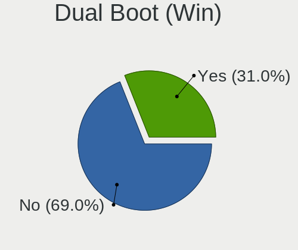
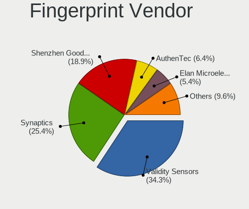

Linux in France - Tested Hardware & Statistics
----------------------------------------------

A project to collect tested hardware configurations for Linux in France.

Anyone can contribute to this report by the [hw-probe](https://github.com/linuxhw/hw-probe) tool:

    sudo -E hw-probe -all -upload

Please contribute! Especially if your hardware is rare.

This is a report for all computer types. See also reports for [desktops](/Location/France/Desktop/README.md) and [notebooks](/Location/France/Notebook/README.md).

Contents
--------

* [ Test Cases ](#test-cases)

* [ System ](#system)
  - [ OS                       ](#os)
  - [ OS Family                ](#os-family)
  - [ Kernel                   ](#kernel)
  - [ Kernel Family            ](#kernel-family)
  - [ Kernel Major Ver.        ](#kernel-major-ver)
  - [ Arch                     ](#arch)
  - [ DE                       ](#de)
  - [ Display Server           ](#display-server)
  - [ Display Manager          ](#display-manager)
  - [ OS Lang                  ](#os-lang)
  - [ Boot Mode                ](#boot-mode)
  - [ Filesystem               ](#filesystem)
  - [ Part. scheme             ](#part-scheme)
  - [ Dual Boot with Linux/BSD ](#dual-boot-with-linuxbsd)
  - [ Dual Boot (Win)          ](#dual-boot-win)

* [ Board ](#board)
  - [ Vendor                   ](#vendor)
  - [ Model                    ](#model)
  - [ Model Family             ](#model-family)
  - [ MFG Year                 ](#mfg-year)
  - [ Form Factor              ](#form-factor)
  - [ Secure Boot              ](#secure-boot)
  - [ Coreboot                 ](#coreboot)
  - [ RAM Size                 ](#ram-size)
  - [ RAM Used                 ](#ram-used)
  - [ Total Drives             ](#total-drives)
  - [ Has CD-ROM               ](#has-cd-rom)
  - [ Has Ethernet             ](#has-ethernet)
  - [ Has WiFi                 ](#has-wifi)
  - [ Has Bluetooth            ](#has-bluetooth)

* [ Location ](#location)
  - [ Country                  ](#country)
  - [ City                     ](#city)

* [ Drives ](#drives)
  - [ Drive Vendor             ](#drive-vendor)
  - [ Drive Model              ](#drive-model)
  - [ HDD Vendor               ](#hdd-vendor)
  - [ SSD Vendor               ](#ssd-vendor)
  - [ Drive Kind               ](#drive-kind)
  - [ Drive Connector          ](#drive-connector)
  - [ Drive Size               ](#drive-size)
  - [ Space Total              ](#space-total)
  - [ Space Used               ](#space-used)
  - [ Malfunc. Drives          ](#malfunc-drives)
  - [ Malfunc. Drive Vendor    ](#malfunc-drive-vendor)
  - [ Malfunc. HDD Vendor      ](#malfunc-hdd-vendor)
  - [ Malfunc. Drive Kind      ](#malfunc-drive-kind)
  - [ Failed Drives            ](#failed-drives)
  - [ Failed Drive Vendor      ](#failed-drive-vendor)
  - [ Drive Status             ](#drive-status)

* [ Storage controller ](#storage-controller)
  - [ Storage Vendor           ](#storage-vendor)
  - [ Storage Model            ](#storage-model)
  - [ Storage Kind             ](#storage-kind)

* [ Processor ](#processor)
  - [ CPU Vendor               ](#cpu-vendor)
  - [ CPU Model                ](#cpu-model)
  - [ CPU Model Family         ](#cpu-model-family)
  - [ CPU Cores                ](#cpu-cores)
  - [ CPU Sockets              ](#cpu-sockets)
  - [ CPU Threads              ](#cpu-threads)
  - [ CPU Op-Modes             ](#cpu-op-modes)
  - [ CPU Microcode            ](#cpu-microcode)
  - [ CPU Microarch            ](#cpu-microarch)

* [ Graphics ](#graphics)
  - [ GPU Vendor               ](#gpu-vendor)
  - [ GPU Model                ](#gpu-model)
  - [ GPU Combo                ](#gpu-combo)
  - [ GPU Driver               ](#gpu-driver)
  - [ GPU Memory               ](#gpu-memory)

* [ Monitor ](#monitor)
  - [ Monitor Vendor           ](#monitor-vendor)
  - [ Monitor Model            ](#monitor-model)
  - [ Monitor Resolution       ](#monitor-resolution)
  - [ Monitor Diagonal         ](#monitor-diagonal)
  - [ Monitor Width            ](#monitor-width)
  - [ Aspect Ratio             ](#aspect-ratio)
  - [ Monitor Area             ](#monitor-area)
  - [ Pixel Density            ](#pixel-density)
  - [ Multiple Monitors        ](#multiple-monitors)

* [ Network ](#network)
  - [ Net Controller Vendor    ](#net-controller-vendor)
  - [ Net Controller Model     ](#net-controller-model)
  - [ Wireless Vendor          ](#wireless-vendor)
  - [ Wireless Model           ](#wireless-model)
  - [ Ethernet Vendor          ](#ethernet-vendor)
  - [ Ethernet Model           ](#ethernet-model)
  - [ Net Controller Kind      ](#net-controller-kind)
  - [ Used Controller          ](#used-controller)
  - [ NICs                     ](#nics)
  - [ IPv6                     ](#ipv6)

* [ Bluetooth ](#bluetooth)
  - [ Bluetooth Vendor         ](#bluetooth-vendor)
  - [ Bluetooth Model          ](#bluetooth-model)

* [ Sound ](#sound)
  - [ Sound Vendor             ](#sound-vendor)
  - [ Sound Model              ](#sound-model)

* [ Memory ](#memory)
  - [ Memory Vendor            ](#memory-vendor)
  - [ Memory Model             ](#memory-model)
  - [ Memory Kind              ](#memory-kind)
  - [ Memory Form Factor       ](#memory-form-factor)
  - [ Memory Size              ](#memory-size)
  - [ Memory Speed             ](#memory-speed)

* [ Printers & scanners ](#printers--scanners)
  - [ Printer Vendor           ](#printer-vendor)
  - [ Printer Model            ](#printer-model)
  - [ Scanner Vendor           ](#scanner-vendor)
  - [ Scanner Model            ](#scanner-model)

* [ Camera ](#camera)
  - [ Camera Vendor            ](#camera-vendor)
  - [ Camera Model             ](#camera-model)

* [ Security ](#security)
  - [ Fingerprint Vendor       ](#fingerprint-vendor)
  - [ Fingerprint Model        ](#fingerprint-model)
  - [ Chipcard Vendor          ](#chipcard-vendor)
  - [ Chipcard Model           ](#chipcard-model)

* [ Unsupported ](#unsupported)
  - [ Unsupported Devices      ](#unsupported-devices)
  - [ Unsupported Device Types ](#unsupported-device-types)

Test Cases
----------

Total: 14649

| Vendor        | Model                       | Form-Factor | Probe                                                      | Date         |
|---------------|-----------------------------|-------------|------------------------------------------------------------|--------------|
| ASUSTek       | PRIME Z270-A                | Desktop     | [725ce23e28](https://linux-hardware.org/?probe=725ce23e28) | Nov 06, 2023 |
| ASUSTek       | X751MA                      | Notebook    | [d5e1758d4e](https://linux-hardware.org/?probe=d5e1758d4e) | Nov 06, 2023 |
| Dell          | Venue 11 Pro 5130           | Notebook    | [5d63a1487d](https://linux-hardware.org/?probe=5d63a1487d) | Nov 06, 2023 |
| Shuttle       | XS35V3                      | Desktop     | [0c51d541de](https://linux-hardware.org/?probe=0c51d541de) | Nov 06, 2023 |
| Dell          | Venue 11 Pro 5130           | Notebook    | [0facd311dc](https://linux-hardware.org/?probe=0facd311dc) | Nov 05, 2023 |
| Dell          | Latitude 7280               | Notebook    | [3f1419b0ea](https://linux-hardware.org/?probe=3f1419b0ea) | Nov 05, 2023 |
| Dell          | Venue 11 Pro 5130           | Notebook    | [27740d5118](https://linux-hardware.org/?probe=27740d5118) | Nov 05, 2023 |
| Dell          | 0WMJ54 A01                  | Desktop     | [5cff6ffdfc](https://linux-hardware.org/?probe=5cff6ffdfc) | Nov 05, 2023 |
| HP            | 1497                        | Desktop     | [734abf0595](https://linux-hardware.org/?probe=734abf0595) | Nov 05, 2023 |
| MSI           | Bravo 15 B5DD               | Notebook    | [72b02cceec](https://linux-hardware.org/?probe=72b02cceec) | Nov 05, 2023 |
| MSI           | Bravo 15 B5DD               | Notebook    | [8a35411be4](https://linux-hardware.org/?probe=8a35411be4) | Nov 05, 2023 |
| HP            | 802F                        | Desktop     | [8fe557cc85](https://linux-hardware.org/?probe=8fe557cc85) | Nov 05, 2023 |
| Lenovo        | G50-45 80E3                 | Notebook    | [2ac9878b30](https://linux-hardware.org/?probe=2ac9878b30) | Nov 05, 2023 |
| Lenovo        | SHARKBAY 0B98401 PRO        | Desktop     | [7152c7ed2c](https://linux-hardware.org/?probe=7152c7ed2c) | Nov 05, 2023 |
| ASUSTek       | G75VW                       | Notebook    | [94bc809d57](https://linux-hardware.org/?probe=94bc809d57) | Nov 05, 2023 |
| ASRock        | A320M Pro4-F                | Desktop     | [7dab52cd8c](https://linux-hardware.org/?probe=7dab52cd8c) | Nov 05, 2023 |
| ASUSTek       | K55VJ                       | Notebook    | [47851a05e9](https://linux-hardware.org/?probe=47851a05e9) | Nov 05, 2023 |
| Samsung       | 305E4A/305E5A/305E7A        | Notebook    | [257e40f6bd](https://linux-hardware.org/?probe=257e40f6bd) | Nov 05, 2023 |
| Lenovo        | ThinkPad T14s Gen 3 21CQ... | Notebook    | [c235d90592](https://linux-hardware.org/?probe=c235d90592) | Nov 05, 2023 |
| MSI           | H110I PRO                   | Desktop     | [c335c71c4b](https://linux-hardware.org/?probe=c335c71c4b) | Nov 05, 2023 |
| Lenovo        | SHARKBAY 0B98401 PRO        | Desktop     | [8841ab599e](https://linux-hardware.org/?probe=8841ab599e) | Nov 04, 2023 |
| HP            | Pavilion dv7                | Notebook    | [6a44cc2c3c](https://linux-hardware.org/?probe=6a44cc2c3c) | Nov 04, 2023 |
| ASUSTek       | X550LC                      | Notebook    | [bd59b07dbf](https://linux-hardware.org/?probe=bd59b07dbf) | Nov 04, 2023 |
| ASUSTek       | X550LC                      | Notebook    | [b7fa2bbb0b](https://linux-hardware.org/?probe=b7fa2bbb0b) | Nov 04, 2023 |
| Apple         | MacBook5,2                  | Notebook    | [1d8dad6600](https://linux-hardware.org/?probe=1d8dad6600) | Nov 04, 2023 |
| Dell          | 0W0CHX A00                  | Desktop     | [3ed37b3d70](https://linux-hardware.org/?probe=3ed37b3d70) | Nov 04, 2023 |
| Unknown       | Unknown                     | Notebook    | [662c88776a](https://linux-hardware.org/?probe=662c88776a) | Nov 04, 2023 |
| Xiaomi        | POCO X3 NFC                 | Soc         | [009c4485f7](https://linux-hardware.org/?probe=009c4485f7) | Nov 04, 2023 |
| Xiaomi        | POCO X3 NFC                 | Soc         | [3c682a6ee3](https://linux-hardware.org/?probe=3c682a6ee3) | Nov 04, 2023 |
| Dell          | Latitude E5450              | Notebook    | [1f23c5fd7c](https://linux-hardware.org/?probe=1f23c5fd7c) | Nov 04, 2023 |
| ASUSTek       | UX32VD                      | Notebook    | [7c4eefbe35](https://linux-hardware.org/?probe=7c4eefbe35) | Nov 04, 2023 |
| HP            | OMEN by Laptop 17-ck2xxx    | Notebook    | [e34a0ab109](https://linux-hardware.org/?probe=e34a0ab109) | Nov 03, 2023 |
| Thomson       | N14C4WH64                   | Notebook    | [51c94bc00f](https://linux-hardware.org/?probe=51c94bc00f) | Nov 03, 2023 |
| Lenovo        | G50-45 80E3                 | Notebook    | [a816b34b9e](https://linux-hardware.org/?probe=a816b34b9e) | Nov 03, 2023 |
| HUAWEI        | HLYL-WXX9                   | Notebook    | [993a2b9f3e](https://linux-hardware.org/?probe=993a2b9f3e) | Nov 03, 2023 |
| ASUSTek       | TUF Gaming B650-PLUS WIF... | Desktop     | [d35fc5aa78](https://linux-hardware.org/?probe=d35fc5aa78) | Nov 03, 2023 |
| Timi          | A35                         | Notebook    | [1baa5932cc](https://linux-hardware.org/?probe=1baa5932cc) | Nov 03, 2023 |
| Dell          | Latitude 7280               | Notebook    | [b795f0157b](https://linux-hardware.org/?probe=b795f0157b) | Nov 03, 2023 |
| Dell          | 0427JK A00                  | Desktop     | [ac631c05bc](https://linux-hardware.org/?probe=ac631c05bc) | Nov 03, 2023 |
| Dell          | Latitude 9330               | Convertible | [d4597194bb](https://linux-hardware.org/?probe=d4597194bb) | Nov 03, 2023 |
| Star Labs     | StarBook                    | Notebook    | [288fdf6f55](https://linux-hardware.org/?probe=288fdf6f55) | Nov 02, 2023 |
| MSI           | MPG B550 GAMING PLUS        | Desktop     | [b58b97e74a](https://linux-hardware.org/?probe=b58b97e74a) | Nov 02, 2023 |
| Lenovo        | ThinkPad L560 20F2S0DA00    | Notebook    | [3030ad2bc8](https://linux-hardware.org/?probe=3030ad2bc8) | Nov 02, 2023 |
| Biostar       | B250MHC                     | Desktop     | [528c04a30a](https://linux-hardware.org/?probe=528c04a30a) | Nov 02, 2023 |
| ASUSTek       | TUF Gaming B650-PLUS WIF... | Desktop     | [9a5c45e54b](https://linux-hardware.org/?probe=9a5c45e54b) | Nov 02, 2023 |
| Acer          | Predator PH717-71           | Notebook    | [a72ab29450](https://linux-hardware.org/?probe=a72ab29450) | Nov 02, 2023 |
| ASUSTek       | T100TAF                     | Notebook    | [ea9f809740](https://linux-hardware.org/?probe=ea9f809740) | Nov 02, 2023 |
| Dell          | Inspiron 1750               | Notebook    | [0250d0fe82](https://linux-hardware.org/?probe=0250d0fe82) | Nov 02, 2023 |
| Dell          | Inspiron 1750               | Notebook    | [39bb893e18](https://linux-hardware.org/?probe=39bb893e18) | Nov 02, 2023 |
| Dell          | Latitude E6530              | Notebook    | [878bc8ec66](https://linux-hardware.org/?probe=878bc8ec66) | Nov 02, 2023 |
| ASUSTek       | VivoBook_ASUSLaptop X411... | Notebook    | [8ac5fd2789](https://linux-hardware.org/?probe=8ac5fd2789) | Nov 02, 2023 |
| HUAWEI        | BOHK-WAX9X                  | Notebook    | [4372a2d9eb](https://linux-hardware.org/?probe=4372a2d9eb) | Nov 02, 2023 |
| ASUSTek       | M52AD_M12AD                 | Desktop     | [a75715ee4a](https://linux-hardware.org/?probe=a75715ee4a) | Nov 01, 2023 |
| HP            | Notebook                    | Notebook    | [3e766ed947](https://linux-hardware.org/?probe=3e766ed947) | Nov 01, 2023 |
| HP            | Notebook                    | Notebook    | [47c0e83dcc](https://linux-hardware.org/?probe=47c0e83dcc) | Nov 01, 2023 |
| Lenovo        | ThinkPad L15 Gen 2 20X4S... | Notebook    | [ac563e5542](https://linux-hardware.org/?probe=ac563e5542) | Nov 01, 2023 |
| Apple         | MacBookPro11,5              | Notebook    | [99e5155c24](https://linux-hardware.org/?probe=99e5155c24) | Nov 01, 2023 |
| ASUSTek       | ZenBook UX325EA_UX325EA     | Notebook    | [6afebfd732](https://linux-hardware.org/?probe=6afebfd732) | Nov 01, 2023 |
| ASUSTek       | P5K PRO                     | Desktop     | [00af1ea679](https://linux-hardware.org/?probe=00af1ea679) | Nov 01, 2023 |
| Dell          | Latitude E7450              | Notebook    | [5e39e2bc88](https://linux-hardware.org/?probe=5e39e2bc88) | Nov 01, 2023 |
| ASUSTek       | G53JW                       | Notebook    | [fcc18f3b68](https://linux-hardware.org/?probe=fcc18f3b68) | Nov 01, 2023 |
| MSI           | MAG Z390 TOMAHAWK           | Desktop     | [a31e5e0862](https://linux-hardware.org/?probe=a31e5e0862) | Nov 01, 2023 |
| Dell          | Precision 5550              | Notebook    | [87a9861125](https://linux-hardware.org/?probe=87a9861125) | Nov 01, 2023 |
| ASUSTek       | PRIME A320M-K               | Desktop     | [4881df8aec](https://linux-hardware.org/?probe=4881df8aec) | Nov 01, 2023 |
| Apple         | Mac-F2208EC8                | Mini pc     | [7efb8849d2](https://linux-hardware.org/?probe=7efb8849d2) | Nov 01, 2023 |
| Teclast       | F6 Pro                      | Notebook    | [27dd740e4c](https://linux-hardware.org/?probe=27dd740e4c) | Nov 01, 2023 |
| HP            | EliteBook 840 G3            | Notebook    | [a09d649781](https://linux-hardware.org/?probe=a09d649781) | Nov 01, 2023 |
| ASUSTek       | UX430UA                     | Notebook    | [d99926d970](https://linux-hardware.org/?probe=d99926d970) | Nov 01, 2023 |
| Lenovo        | IdeaPad S300 9803           | Notebook    | [543dfc0b4e](https://linux-hardware.org/?probe=543dfc0b4e) | Oct 31, 2023 |
| HP            | Notebook                    | Notebook    | [b1491b73ae](https://linux-hardware.org/?probe=b1491b73ae) | Oct 31, 2023 |
| ASUSTek       | G53JW                       | Notebook    | [6795430efa](https://linux-hardware.org/?probe=6795430efa) | Oct 31, 2023 |
| Dell          | G15 5510                    | Notebook    | [12bd3f99da](https://linux-hardware.org/?probe=12bd3f99da) | Oct 31, 2023 |
| MSI           | A320M PRO-M2 V2             | Desktop     | [3b667e2123](https://linux-hardware.org/?probe=3b667e2123) | Oct 31, 2023 |
| ASUSTek       | VivoBook_ASUSLaptop X515... | Notebook    | [97ae72d7b7](https://linux-hardware.org/?probe=97ae72d7b7) | Oct 31, 2023 |
| MSI           | B85-G43 GAMING              | Desktop     | [5d218dd764](https://linux-hardware.org/?probe=5d218dd764) | Oct 31, 2023 |
| Pegatron      | EVANS                       | Desktop     | [3ea2a80843](https://linux-hardware.org/?probe=3ea2a80843) | Oct 31, 2023 |
| Dell          | XPS 15 9530                 | Notebook    | [148857cc51](https://linux-hardware.org/?probe=148857cc51) | Oct 31, 2023 |
| Pegatron      | EVANS                       | Desktop     | [52c3eeea68](https://linux-hardware.org/?probe=52c3eeea68) | Oct 31, 2023 |
| HP            | Elite x360 1040 14 inch ... | Convertible | [f7385ed51b](https://linux-hardware.org/?probe=f7385ed51b) | Oct 31, 2023 |
| HP            | Laptop 15-db0xxx            | Notebook    | [cf7f0c142e](https://linux-hardware.org/?probe=cf7f0c142e) | Oct 31, 2023 |
| HP            | Victus by Gaming Laptop ... | Notebook    | [0f4fa9169b](https://linux-hardware.org/?probe=0f4fa9169b) | Oct 31, 2023 |
| OFF GLOBAL    | Nokia PureBook Pro 17       | Notebook    | [5bc799ab5a](https://linux-hardware.org/?probe=5bc799ab5a) | Oct 30, 2023 |
| Acer          | Aspire E5-576G              | Notebook    | [c0626d553b](https://linux-hardware.org/?probe=c0626d553b) | Oct 30, 2023 |
| HP            | ZBook Fury 15.6 inch G8 ... | Notebook    | [56f24de5ff](https://linux-hardware.org/?probe=56f24de5ff) | Oct 30, 2023 |
| Gigabyte      | GA-970A-D3                  | Desktop     | [38ae588910](https://linux-hardware.org/?probe=38ae588910) | Oct 30, 2023 |
| HP            | EliteBook 830 G8 Noteboo... | Notebook    | [0e7bb14862](https://linux-hardware.org/?probe=0e7bb14862) | Oct 30, 2023 |
| ASRock        | FM2A88X+ Killer             | Desktop     | [2310075f2d](https://linux-hardware.org/?probe=2310075f2d) | Oct 30, 2023 |
| HP            | ProBook 640 G1              | Notebook    | [cf78ef09d2](https://linux-hardware.org/?probe=cf78ef09d2) | Oct 30, 2023 |
| MSI           | B85-G43 GAMING              | Desktop     | [fa91d8044f](https://linux-hardware.org/?probe=fa91d8044f) | Oct 30, 2023 |
| Dell          | Precision 3551              | Notebook    | [4f054a63ef](https://linux-hardware.org/?probe=4f054a63ef) | Oct 30, 2023 |
| ZOTAC         | ZBOX-CI669/CI649NANO        | Mini pc     | [7822c87b1f](https://linux-hardware.org/?probe=7822c87b1f) | Oct 30, 2023 |
| Shenzhen M... | F7BSC                       | Mini pc     | [8ed2593c1e](https://linux-hardware.org/?probe=8ed2593c1e) | Oct 30, 2023 |
| Shenzhen M... | F7BSC                       | Mini pc     | [c894a2ac6a](https://linux-hardware.org/?probe=c894a2ac6a) | Oct 30, 2023 |
| HP            | Elite x360 1040 14 inch ... | Convertible | [ed124d68bb](https://linux-hardware.org/?probe=ed124d68bb) | Oct 30, 2023 |
| HUAWEI        | BOHB-WAX9                   | Notebook    | [5da6238372](https://linux-hardware.org/?probe=5da6238372) | Oct 30, 2023 |
| Acer          | Veriton X2631G V:1.0        | Desktop     | [c2c4828db8](https://linux-hardware.org/?probe=c2c4828db8) | Oct 30, 2023 |
| Acer          | Aspire A315-21              | Notebook    | [48785f697c](https://linux-hardware.org/?probe=48785f697c) | Oct 29, 2023 |
| Sony          | VPCEH1L0E                   | Notebook    | [2a5fa0340e](https://linux-hardware.org/?probe=2a5fa0340e) | Oct 29, 2023 |
| Sony          | VPCEH1L0E                   | Notebook    | [103e485a0f](https://linux-hardware.org/?probe=103e485a0f) | Oct 29, 2023 |
| ASUSTek       | VivoBook_ASUSLaptop X421... | Notebook    | [7301c9b3df](https://linux-hardware.org/?probe=7301c9b3df) | Oct 29, 2023 |
| Notebook      | NS5x_NS7xAU                 | Notebook    | [151d6e2c69](https://linux-hardware.org/?probe=151d6e2c69) | Oct 29, 2023 |
| Dell          | Latitude 9430               | Convertible | [4032b160f8](https://linux-hardware.org/?probe=4032b160f8) | Oct 29, 2023 |
| Gigabyte      | B450M DS3H-CF               | Desktop     | [e18680d1f4](https://linux-hardware.org/?probe=e18680d1f4) | Oct 29, 2023 |
| Dell          | 02YYK5 A00                  | Desktop     | [bda6b9ff10](https://linux-hardware.org/?probe=bda6b9ff10) | Oct 29, 2023 |
| Dell          | Precision 3550              | Notebook    | [f07af59705](https://linux-hardware.org/?probe=f07af59705) | Oct 29, 2023 |
| HP            | Pavilion 17                 | Notebook    | [2ef396fb9c](https://linux-hardware.org/?probe=2ef396fb9c) | Oct 29, 2023 |
| ASUSTek       | P7P55-M                     | Desktop     | [3fa8a23f12](https://linux-hardware.org/?probe=3fa8a23f12) | Oct 29, 2023 |
| MSI           | X299 TOMAHAWK AC            | Desktop     | [b878ce40e7](https://linux-hardware.org/?probe=b878ce40e7) | Oct 29, 2023 |
| Dell          | Precision 5480              | Notebook    | [5df408828c](https://linux-hardware.org/?probe=5df408828c) | Oct 29, 2023 |
| MSI           | X570-A PRO                  | Desktop     | [b6f56d4f6c](https://linux-hardware.org/?probe=b6f56d4f6c) | Oct 29, 2023 |
| Acer          | Aspire ES1-572              | Notebook    | [12b1df4e2b](https://linux-hardware.org/?probe=12b1df4e2b) | Oct 29, 2023 |
| ASRock        | Z370 Professional Gaming... | Desktop     | [f589e0c914](https://linux-hardware.org/?probe=f589e0c914) | Oct 28, 2023 |
| Lenovo        | ThinkPad X1 Titanium Gen... | Convertible | [7f556dd124](https://linux-hardware.org/?probe=7f556dd124) | Oct 28, 2023 |
| MSI           | B360 GAMING PLUS            | Desktop     | [bb17f05c7f](https://linux-hardware.org/?probe=bb17f05c7f) | Oct 28, 2023 |
| HUAWEI        | NBLB-WAX9N                  | Notebook    | [1ad2b79950](https://linux-hardware.org/?probe=1ad2b79950) | Oct 28, 2023 |
| HUAWEI        | NBLB-WAX9N                  | Notebook    | [ab6e0c5094](https://linux-hardware.org/?probe=ab6e0c5094) | Oct 28, 2023 |
| HUAWEI        | NBLB-WAX9N                  | Notebook    | [67a82dac1b](https://linux-hardware.org/?probe=67a82dac1b) | Oct 28, 2023 |
| MSI           | Modern 15 A5M               | Notebook    | [903418110a](https://linux-hardware.org/?probe=903418110a) | Oct 28, 2023 |
| HP            | 8053                        | Desktop     | [352cc1bad8](https://linux-hardware.org/?probe=352cc1bad8) | Oct 28, 2023 |
| HP            | 8053                        | Desktop     | [25f2c6e830](https://linux-hardware.org/?probe=25f2c6e830) | Oct 28, 2023 |
| ZOTAC         | ZBOX-CI669/CI649NANO        | Mini pc     | [f090267683](https://linux-hardware.org/?probe=f090267683) | Oct 28, 2023 |
| ASUSTek       | ProArt B650-CREATOR         | Desktop     | [fdb96441a0](https://linux-hardware.org/?probe=fdb96441a0) | Oct 27, 2023 |
| ASUSTek       | ProArt B650-CREATOR         | Desktop     | [dde83d5de1](https://linux-hardware.org/?probe=dde83d5de1) | Oct 27, 2023 |
| Lenovo        | SHARKBAY SDK0E50510 WIN     | Desktop     | [880bf38f49](https://linux-hardware.org/?probe=880bf38f49) | Oct 27, 2023 |
| Raspberry ... | Raspberry Pi 3 Model B R... | Soc         | [a70008d8f3](https://linux-hardware.org/?probe=a70008d8f3) | Oct 27, 2023 |
| Lenovo        | IdeaPad Gaming 3 15IAH7 ... | Notebook    | [d8bfe77d00](https://linux-hardware.org/?probe=d8bfe77d00) | Oct 27, 2023 |
| HP            | 339A                        | Desktop     | [d0deadc097](https://linux-hardware.org/?probe=d0deadc097) | Oct 27, 2023 |
| ASUSTek       | H110M-A                     | Desktop     | [a58f65d857](https://linux-hardware.org/?probe=a58f65d857) | Oct 27, 2023 |
| Gigabyte      | H97-D3H-CF                  | Desktop     | [e248fcb770](https://linux-hardware.org/?probe=e248fcb770) | Oct 27, 2023 |
| ASUSTek       | ROG Strix G513QY_G513QY     | Notebook    | [334f8582b0](https://linux-hardware.org/?probe=334f8582b0) | Oct 27, 2023 |
| Dell          | Inspiron MM061              | Notebook    | [d4b3f62ecb](https://linux-hardware.org/?probe=d4b3f62ecb) | Oct 27, 2023 |
| Lenovo        | Yoga Slim 7 14ARE05 82A2    | Notebook    | [a899ecd171](https://linux-hardware.org/?probe=a899ecd171) | Oct 27, 2023 |
| MSI           | GL73 8RD                    | Notebook    | [62d3ea64dd](https://linux-hardware.org/?probe=62d3ea64dd) | Oct 27, 2023 |
| Dell          | XPS 15 9530                 | Notebook    | [dbc8a87975](https://linux-hardware.org/?probe=dbc8a87975) | Oct 27, 2023 |
| Lenovo        | IdeaPad 3 17IIL05 81WF      | Notebook    | [3a2901251b](https://linux-hardware.org/?probe=3a2901251b) | Oct 27, 2023 |
| ASUSTek       | ROG CROSSHAIR VIII HERO     | Desktop     | [f7c6d6e17e](https://linux-hardware.org/?probe=f7c6d6e17e) | Oct 27, 2023 |
| HP            | Laptop 17-cp2xxx            | Notebook    | [788d8538b6](https://linux-hardware.org/?probe=788d8538b6) | Oct 27, 2023 |
| Dell          | Latitude E5470              | Notebook    | [fbbcdd8d9f](https://linux-hardware.org/?probe=fbbcdd8d9f) | Oct 26, 2023 |
| ASUSTek       | P8P67 PRO                   | Desktop     | [a1916cc782](https://linux-hardware.org/?probe=a1916cc782) | Oct 26, 2023 |
| LattePanda    | Sigma                       | Desktop     | [d287cf2d8a](https://linux-hardware.org/?probe=d287cf2d8a) | Oct 26, 2023 |
| Raspberry ... | Raspberry Pi 4 Model B R... | Soc         | [9d84368e3a](https://linux-hardware.org/?probe=9d84368e3a) | Oct 26, 2023 |
| MSI           | MS-6657                     | All in one  | [289100db90](https://linux-hardware.org/?probe=289100db90) | Oct 26, 2023 |
| MSI           | MAG Z390 TOMAHAWK           | Desktop     | [0a305499ef](https://linux-hardware.org/?probe=0a305499ef) | Oct 26, 2023 |
| HP            | ProBook 4530s               | Notebook    | [b86df6ad72](https://linux-hardware.org/?probe=b86df6ad72) | Oct 26, 2023 |
| Dell          | 06D7TR A00                  | Desktop     | [a7097bd7f1](https://linux-hardware.org/?probe=a7097bd7f1) | Oct 26, 2023 |
| HP            | G61                         | Notebook    | [d184a33522](https://linux-hardware.org/?probe=d184a33522) | Oct 26, 2023 |
| Lenovo        | SHARKBAY NOK                | Desktop     | [67021475e9](https://linux-hardware.org/?probe=67021475e9) | Oct 26, 2023 |
| Intel         | NUC6i5SYB H81131-505        | Mini pc     | [992a1810e2](https://linux-hardware.org/?probe=992a1810e2) | Oct 26, 2023 |
| MSI           | Stealth 16Studio A13VG      | Notebook    | [2009a0a84b](https://linux-hardware.org/?probe=2009a0a84b) | Oct 26, 2023 |
| Valve         | Jupiter                     | Notebook    | [eda569093f](https://linux-hardware.org/?probe=eda569093f) | Oct 25, 2023 |
| Lenovo        | ThinkPad X1C 5th W10DG 2... | Notebook    | [c66ebc8e70](https://linux-hardware.org/?probe=c66ebc8e70) | Oct 25, 2023 |
| Acer          | Aspire VN7-572G             | Notebook    | [979741d1d0](https://linux-hardware.org/?probe=979741d1d0) | Oct 25, 2023 |
| Dell          | Latitude E5470              | Notebook    | [cac52e6eaf](https://linux-hardware.org/?probe=cac52e6eaf) | Oct 25, 2023 |
| Lenovo        | ThinkPad S1 Yoga 20CD000... | Notebook    | [4e393023d7](https://linux-hardware.org/?probe=4e393023d7) | Oct 25, 2023 |
| Dell          | Latitude 9430               | Convertible | [5e0239fb7c](https://linux-hardware.org/?probe=5e0239fb7c) | Oct 25, 2023 |
| Samsung       | 305E4A/305E5A/305E7A        | Notebook    | [3ce0f8310d](https://linux-hardware.org/?probe=3ce0f8310d) | Oct 25, 2023 |
| ASUSTek       | ROG Ally RC71L_RC71L        | Tablet      | [a25c5e5185](https://linux-hardware.org/?probe=a25c5e5185) | Oct 25, 2023 |
| HP            | Pavilion dv7                | Notebook    | [6c8a64fc73](https://linux-hardware.org/?probe=6c8a64fc73) | Oct 24, 2023 |
| HP            | 212B                        | Desktop     | [714373878e](https://linux-hardware.org/?probe=714373878e) | Oct 24, 2023 |
| HP            | 829A                        | Mini pc     | [97abff4e6f](https://linux-hardware.org/?probe=97abff4e6f) | Oct 24, 2023 |
| HP            | 829A                        | Mini pc     | [b373f53a20](https://linux-hardware.org/?probe=b373f53a20) | Oct 24, 2023 |
| ASUSTek       | PRIME A320M-K               | Desktop     | [d09253d43a](https://linux-hardware.org/?probe=d09253d43a) | Oct 24, 2023 |
| Gigabyte      | B450M DS3H-CF               | Desktop     | [9b0be83ecc](https://linux-hardware.org/?probe=9b0be83ecc) | Oct 24, 2023 |
| HP            | ZBook Fury 15.6 inch G8 ... | Notebook    | [05a3492143](https://linux-hardware.org/?probe=05a3492143) | Oct 24, 2023 |
| Gigabyte      | B550 AORUS ELITE V2         | Desktop     | [3daca4912e](https://linux-hardware.org/?probe=3daca4912e) | Oct 24, 2023 |
| ASUSTek       | UX303LB                     | Notebook    | [1fdfa51ddc](https://linux-hardware.org/?probe=1fdfa51ddc) | Oct 24, 2023 |
| ASUSTek       | G551JX                      | Notebook    | [db16c87fe8](https://linux-hardware.org/?probe=db16c87fe8) | Oct 24, 2023 |
| MSI           | GT62VR 6RD                  | Notebook    | [0d10c5251c](https://linux-hardware.org/?probe=0d10c5251c) | Oct 23, 2023 |
| HP            | ProBook 450 G6              | Notebook    | [5dc90618a7](https://linux-hardware.org/?probe=5dc90618a7) | Oct 23, 2023 |
| Fujitsu       | LIFEBOOK E754               | Notebook    | [17e7fcc400](https://linux-hardware.org/?probe=17e7fcc400) | Oct 23, 2023 |
| Dell          | 0R790T A00                  | Desktop     | [905555c7d5](https://linux-hardware.org/?probe=905555c7d5) | Oct 23, 2023 |
| Dell          | 0R790T A00                  | Desktop     | [5f6d67d67e](https://linux-hardware.org/?probe=5f6d67d67e) | Oct 23, 2023 |
| Google        | Bobba                       | Notebook    | [3a660aaaef](https://linux-hardware.org/?probe=3a660aaaef) | Oct 23, 2023 |
| Acer          | WG43M                       | Desktop     | [0580e7ab1b](https://linux-hardware.org/?probe=0580e7ab1b) | Oct 23, 2023 |
| Unknown       | Unknown                     | Desktop     | [95d6dab241](https://linux-hardware.org/?probe=95d6dab241) | Oct 23, 2023 |
| UNOWHY        | Y13G012S4EI                 | Notebook    | [37680f1ed6](https://linux-hardware.org/?probe=37680f1ed6) | Oct 22, 2023 |
| Trigkey       | Green G5                    | Desktop     | [a0cb634fc5](https://linux-hardware.org/?probe=a0cb634fc5) | Oct 22, 2023 |
| Gigabyte      | B550M DS3H                  | Desktop     | [8bfba005ad](https://linux-hardware.org/?probe=8bfba005ad) | Oct 22, 2023 |
| Gigabyte      | B550M DS3H                  | Desktop     | [6677da99ae](https://linux-hardware.org/?probe=6677da99ae) | Oct 22, 2023 |
| Toshiba       | Satellite C70D-B            | Notebook    | [7f1637fdb9](https://linux-hardware.org/?probe=7f1637fdb9) | Oct 22, 2023 |
| Gigabyte      | B450M DS3H-CF               | Desktop     | [b6df3ae720](https://linux-hardware.org/?probe=b6df3ae720) | Oct 22, 2023 |
| Dell          | Precision 3571              | Notebook    | [a2ba806246](https://linux-hardware.org/?probe=a2ba806246) | Oct 22, 2023 |
| Dell          | Precision 3571              | Notebook    | [efedaee27d](https://linux-hardware.org/?probe=efedaee27d) | Oct 22, 2023 |
| ASUSTek       | P8H67                       | Desktop     | [5e8558b08d](https://linux-hardware.org/?probe=5e8558b08d) | Oct 22, 2023 |
| ASUSTek       | Zenbook UX7602VI_UX7602V... | Notebook    | [96e2577624](https://linux-hardware.org/?probe=96e2577624) | Oct 22, 2023 |
| Acer          | Aspire V3-111P              | Notebook    | [3c17975c8c](https://linux-hardware.org/?probe=3c17975c8c) | Oct 22, 2023 |
| HP            | EliteBook 840 G8 Noteboo... | Notebook    | [b7b860ac67](https://linux-hardware.org/?probe=b7b860ac67) | Oct 22, 2023 |
| Acer          | Aspire ES1-572              | Notebook    | [b4e1647054](https://linux-hardware.org/?probe=b4e1647054) | Oct 21, 2023 |
| Acer          | Veriton X2631G V:1.0        | Desktop     | [22402b17d1](https://linux-hardware.org/?probe=22402b17d1) | Oct 21, 2023 |
| Thomson       | X15I5-8TU512                | Notebook    | [68099cb005](https://linux-hardware.org/?probe=68099cb005) | Oct 21, 2023 |
| HP            | Dragonfly 13.5 inch G4 N... | Notebook    | [eb4d59cc70](https://linux-hardware.org/?probe=eb4d59cc70) | Oct 21, 2023 |
| ASUSTek       | ROG STRIX B550-F GAMING     | Desktop     | [9d3213958f](https://linux-hardware.org/?probe=9d3213958f) | Oct 21, 2023 |
| Gigabyte      | B450M DS3H-CF               | Desktop     | [30d9002099](https://linux-hardware.org/?probe=30d9002099) | Oct 21, 2023 |
| HP            | 09F0h                       | Desktop     | [97710d8f02](https://linux-hardware.org/?probe=97710d8f02) | Oct 21, 2023 |
| ASUSTek       | P9X79                       | Desktop     | [3df64c6ee4](https://linux-hardware.org/?probe=3df64c6ee4) | Oct 21, 2023 |
| HP            | Pavilion dm1                | Notebook    | [74c8fce8f0](https://linux-hardware.org/?probe=74c8fce8f0) | Oct 21, 2023 |
| Lenovo        | IdeaPad 330-17AST 81D7      | Notebook    | [314c39b6d1](https://linux-hardware.org/?probe=314c39b6d1) | Oct 21, 2023 |
| ASUSTek       | GL553VD                     | Notebook    | [87210c3d86](https://linux-hardware.org/?probe=87210c3d86) | Oct 21, 2023 |
| ASUSTek       | VivoBook_ASUSLaptop X515... | Notebook    | [130d199934](https://linux-hardware.org/?probe=130d199934) | Oct 21, 2023 |
| MACHINIST     | X99-RS9 V2.0                | Desktop     | [2fb0ec8fa2](https://linux-hardware.org/?probe=2fb0ec8fa2) | Oct 21, 2023 |
| AZW           | SER V1                      | Desktop     | [60f9b9fdd9](https://linux-hardware.org/?probe=60f9b9fdd9) | Oct 21, 2023 |
| Dell          | Latitude 7440               | Notebook    | [e0997ac78c](https://linux-hardware.org/?probe=e0997ac78c) | Oct 20, 2023 |
| ASUSTek       | VivoBook_ASUSLaptop X705... | Notebook    | [148be53a91](https://linux-hardware.org/?probe=148be53a91) | Oct 20, 2023 |
| ASUSTek       | ASUS TUF Dash F15 FX517Z... | Notebook    | [d9a8c7946e](https://linux-hardware.org/?probe=d9a8c7946e) | Oct 20, 2023 |
| ASUSTek       | ASUS TUF Dash F15 FX517Z... | Notebook    | [5cac857cd9](https://linux-hardware.org/?probe=5cac857cd9) | Oct 20, 2023 |
| Toshiba       | Satellite C660              | Notebook    | [483998d7de](https://linux-hardware.org/?probe=483998d7de) | Oct 20, 2023 |
| ASUSTek       | X540LJ                      | Notebook    | [2aea2077db](https://linux-hardware.org/?probe=2aea2077db) | Oct 20, 2023 |
| Toshiba       | Satellite C70D-B            | Notebook    | [793d71f1d2](https://linux-hardware.org/?probe=793d71f1d2) | Oct 20, 2023 |
| HP            | Compaq 15                   | Notebook    | [992044ca80](https://linux-hardware.org/?probe=992044ca80) | Oct 20, 2023 |
| Dell          | Latitude E6430s             | Notebook    | [ce1c3a6c86](https://linux-hardware.org/?probe=ce1c3a6c86) | Oct 20, 2023 |
| Acer          | Aspire S3                   | Notebook    | [612caa1082](https://linux-hardware.org/?probe=612caa1082) | Oct 20, 2023 |
| Lenovo        | ThinkPad L540 20AUA044FR    | Notebook    | [70d42f0667](https://linux-hardware.org/?probe=70d42f0667) | Oct 20, 2023 |
| Lenovo        | G50-45 80E3                 | Notebook    | [41f9f44ee1](https://linux-hardware.org/?probe=41f9f44ee1) | Oct 20, 2023 |
| Lenovo        | G50-45 80E3                 | Notebook    | [98f1b28357](https://linux-hardware.org/?probe=98f1b28357) | Oct 20, 2023 |
| Lenovo        | SHARKBAY NOK                | Desktop     | [cb8d8311e7](https://linux-hardware.org/?probe=cb8d8311e7) | Oct 20, 2023 |
| HP            | Pavilion 17                 | Notebook    | [855c6109eb](https://linux-hardware.org/?probe=855c6109eb) | Oct 20, 2023 |
| AMI           | Aptio CRB                   | Mini pc     | [b2a43d238a](https://linux-hardware.org/?probe=b2a43d238a) | Oct 20, 2023 |
| Gigabyte      | B550 AORUS MASTER           | Desktop     | [4d1d3bb840](https://linux-hardware.org/?probe=4d1d3bb840) | Oct 19, 2023 |
| Gigabyte      | B660M DS3H DDR4             | Desktop     | [82633fd1ef](https://linux-hardware.org/?probe=82633fd1ef) | Oct 19, 2023 |
| HP            | Pavilion 17                 | Notebook    | [36613b2f1f](https://linux-hardware.org/?probe=36613b2f1f) | Oct 19, 2023 |
| Dell          | XPS 15 9520                 | Notebook    | [dd0f8dcb86](https://linux-hardware.org/?probe=dd0f8dcb86) | Oct 19, 2023 |
| ALLDOCUBE     | KnoteGo                     | Tablet      | [17833d30dc](https://linux-hardware.org/?probe=17833d30dc) | Oct 19, 2023 |
| ASUSTek       | PRIME B660-PLUS D4          | Desktop     | [b677f99638](https://linux-hardware.org/?probe=b677f99638) | Oct 19, 2023 |
| HP            | Spectre x360 2-in-1 Lapt... | Convertible | [61d7dfa1ac](https://linux-hardware.org/?probe=61d7dfa1ac) | Oct 19, 2023 |
| ASUSTek       | X542UR                      | Notebook    | [72390695fd](https://linux-hardware.org/?probe=72390695fd) | Oct 19, 2023 |
| HP            | 1496                        | Desktop     | [c0c1d4b920](https://linux-hardware.org/?probe=c0c1d4b920) | Oct 19, 2023 |
| ASUSTek       | Zenbook 15 UM3504DA_UM35... | Notebook    | [2e7d97492d](https://linux-hardware.org/?probe=2e7d97492d) | Oct 19, 2023 |
| ASUSTek       | N501JW                      | Notebook    | [a61bad1bae](https://linux-hardware.org/?probe=a61bad1bae) | Oct 19, 2023 |
| ASUSTek       | X540LJ                      | Notebook    | [a0c126c4ce](https://linux-hardware.org/?probe=a0c126c4ce) | Oct 19, 2023 |
| MSI           | Z590-A PRO                  | Desktop     | [804682ff68](https://linux-hardware.org/?probe=804682ff68) | Oct 19, 2023 |
| Intel         | NUC5i7RYB H73774-101        | Mini pc     | [8d58200a98](https://linux-hardware.org/?probe=8d58200a98) | Oct 19, 2023 |
| MSI           | B450 TOMAHAWK               | Desktop     | [911d7f21e7](https://linux-hardware.org/?probe=911d7f21e7) | Oct 18, 2023 |
| UNOWHY        | Y13G012S4EI                 | Notebook    | [70032c78d7](https://linux-hardware.org/?probe=70032c78d7) | Oct 18, 2023 |
| Apple         | MacBookPro9,2               | Notebook    | [d9d804297d](https://linux-hardware.org/?probe=d9d804297d) | Oct 18, 2023 |
| HP            | EliteBook 840 G3            | Notebook    | [726f0ecc0b](https://linux-hardware.org/?probe=726f0ecc0b) | Oct 18, 2023 |
| Apple         | MacBookPro9,2               | Notebook    | [90413e0c45](https://linux-hardware.org/?probe=90413e0c45) | Oct 18, 2023 |
| Dell          | Latitude E6320              | Notebook    | [91e5128fd5](https://linux-hardware.org/?probe=91e5128fd5) | Oct 18, 2023 |
| HP            | EliteBook 655 15.6 inch ... | Notebook    | [ebf8cac9b8](https://linux-hardware.org/?probe=ebf8cac9b8) | Oct 18, 2023 |
| Lenovo        | SHARKBAY 0B98401 PRO        | Desktop     | [6e81d4f878](https://linux-hardware.org/?probe=6e81d4f878) | Oct 18, 2023 |
| HP            | EliteBook 860 16 inch G1... | Notebook    | [bde071302f](https://linux-hardware.org/?probe=bde071302f) | Oct 18, 2023 |
| ASUSTek       | PRIME Z370-P                | Desktop     | [aa01fa43ac](https://linux-hardware.org/?probe=aa01fa43ac) | Oct 18, 2023 |
| HP            | EliteBook 850 G3            | Notebook    | [58831524ae](https://linux-hardware.org/?probe=58831524ae) | Oct 18, 2023 |
| Fujitsu       | D3603-A1 S26361-D3603-A1    | Desktop     | [793ba23be0](https://linux-hardware.org/?probe=793ba23be0) | Oct 18, 2023 |
| MSI           | H77MA-G43                   | Desktop     | [b741ca0ecc](https://linux-hardware.org/?probe=b741ca0ecc) | Oct 18, 2023 |
| MSI           | CX61 2PC                    | Notebook    | [67442a53f9](https://linux-hardware.org/?probe=67442a53f9) | Oct 18, 2023 |
| Lenovo        | SHARKBAY NOK                | Desktop     | [15064c45a9](https://linux-hardware.org/?probe=15064c45a9) | Oct 17, 2023 |
| HP            | ProBook 450 G6              | Notebook    | [b3c36f8233](https://linux-hardware.org/?probe=b3c36f8233) | Oct 17, 2023 |
| ASUSTek       | K55VJ                       | Notebook    | [f5cfc1c08e](https://linux-hardware.org/?probe=f5cfc1c08e) | Oct 17, 2023 |
| Acer          | Veriton Z4810G              | All in one  | [8308968be0](https://linux-hardware.org/?probe=8308968be0) | Oct 17, 2023 |
| Dell          | 0GK35Y A00                  | Desktop     | [99aded4434](https://linux-hardware.org/?probe=99aded4434) | Oct 17, 2023 |
| ASRock        | B560M Pro4                  | Desktop     | [77690da2b6](https://linux-hardware.org/?probe=77690da2b6) | Oct 17, 2023 |
| ASUSTek       | EP121                       | Notebook    | [9c01d196e1](https://linux-hardware.org/?probe=9c01d196e1) | Oct 17, 2023 |
| Google        | Bobba                       | Notebook    | [f8cdd51f65](https://linux-hardware.org/?probe=f8cdd51f65) | Oct 17, 2023 |
| HP            | Pavilion Notebook           | Notebook    | [5981bba0dd](https://linux-hardware.org/?probe=5981bba0dd) | Oct 17, 2023 |
| HP            | Pavilion Gaming Laptop 1... | Notebook    | [d63ed71e40](https://linux-hardware.org/?probe=d63ed71e40) | Oct 17, 2023 |
| ASUSTek       | UN42                        | Desktop     | [53267f9960](https://linux-hardware.org/?probe=53267f9960) | Oct 17, 2023 |
| Foxconn       | 2ABF                        | Desktop     | [cf4a419a07](https://linux-hardware.org/?probe=cf4a419a07) | Oct 17, 2023 |
| ASRock        | A320M-HDV R3.0              | Desktop     | [95642179a1](https://linux-hardware.org/?probe=95642179a1) | Oct 16, 2023 |
| Acer          | Aspire A314-23P             | Notebook    | [99490448ae](https://linux-hardware.org/?probe=99490448ae) | Oct 16, 2023 |
| Acer          | Aspire A314-23P             | Notebook    | [431b672bf5](https://linux-hardware.org/?probe=431b672bf5) | Oct 16, 2023 |
| Dell          | 0CRH6C A00                  | Desktop     | [861e34ac85](https://linux-hardware.org/?probe=861e34ac85) | Oct 16, 2023 |
| MACHINIST     | X99-MR9A PRO MAX V1.2       | Desktop     | [abace10ada](https://linux-hardware.org/?probe=abace10ada) | Oct 16, 2023 |
| MSI           | Z97A GAMING 7               | Desktop     | [8af7152ba5](https://linux-hardware.org/?probe=8af7152ba5) | Oct 16, 2023 |
| Gigabyte      | B450M DS3H-CF               | Desktop     | [f12bcba44c](https://linux-hardware.org/?probe=f12bcba44c) | Oct 16, 2023 |
| Acer          | Aspire ES1-523              | Notebook    | [6f80d0517c](https://linux-hardware.org/?probe=6f80d0517c) | Oct 16, 2023 |
| HP            | 0AE4h                       | Desktop     | [a31dd4463f](https://linux-hardware.org/?probe=a31dd4463f) | Oct 16, 2023 |
| HP            | 0AE4h                       | Desktop     | [4ebaa677df](https://linux-hardware.org/?probe=4ebaa677df) | Oct 16, 2023 |
| Apple         | MacBookPro16,1              | Notebook    | [6417009f82](https://linux-hardware.org/?probe=6417009f82) | Oct 16, 2023 |
| Lenovo        | ThinkPad R61 8935AC7        | Notebook    | [fc4f024a54](https://linux-hardware.org/?probe=fc4f024a54) | Oct 16, 2023 |
| Lenovo        | IdeaPad S340-15API 81NC     | Notebook    | [9aaa4cdee5](https://linux-hardware.org/?probe=9aaa4cdee5) | Oct 16, 2023 |
| HP            | 18E5                        | Desktop     | [d869fcd6dc](https://linux-hardware.org/?probe=d869fcd6dc) | Oct 16, 2023 |
| HP            | ProBook 4730s               | Notebook    | [42a7295a49](https://linux-hardware.org/?probe=42a7295a49) | Oct 15, 2023 |
| Lenovo        | ThinkPad E595 20NFCTO1WW    | Notebook    | [0d80ec0e27](https://linux-hardware.org/?probe=0d80ec0e27) | Oct 15, 2023 |
| HP            | Pavilion Gaming Laptop 1... | Notebook    | [6e4a6a34cd](https://linux-hardware.org/?probe=6e4a6a34cd) | Oct 15, 2023 |
| Lenovo        | ThinkPad X240 20AMS7X300    | Notebook    | [0cc0243579](https://linux-hardware.org/?probe=0cc0243579) | Oct 15, 2023 |
| Lenovo        | ThinkPad X230 23259T0       | Notebook    | [a9d4c1b781](https://linux-hardware.org/?probe=a9d4c1b781) | Oct 15, 2023 |
| Dell          | 0HN7XN A01                  | Desktop     | [6ca94363be](https://linux-hardware.org/?probe=6ca94363be) | Oct 15, 2023 |
| Dell          | 0HN7XN A01                  | Desktop     | [de23701ea4](https://linux-hardware.org/?probe=de23701ea4) | Oct 15, 2023 |
| MSI           | MAG B460M MORTAR WIFI       | Desktop     | [dd3eca03df](https://linux-hardware.org/?probe=dd3eca03df) | Oct 15, 2023 |
| Acer          | Aspire ES1-523              | Notebook    | [2dfea2666c](https://linux-hardware.org/?probe=2dfea2666c) | Oct 15, 2023 |
| Acer          | Aspire A317-51K             | Notebook    | [b342c56fc5](https://linux-hardware.org/?probe=b342c56fc5) | Oct 15, 2023 |
| Apple         | Mac-F4238CC8 PVT            | All in one  | [c1b1aceafa](https://linux-hardware.org/?probe=c1b1aceafa) | Oct 15, 2023 |
| Apple         | Mac-F4238CC8 PVT            | All in one  | [ea83e14c3b](https://linux-hardware.org/?probe=ea83e14c3b) | Oct 15, 2023 |
| HP            | Pavilion Aero Laptop 13-... | Notebook    | [85e073cb44](https://linux-hardware.org/?probe=85e073cb44) | Oct 15, 2023 |
| Gigabyte      | B760 GAMING X DDR4          | Desktop     | [1f718e54bf](https://linux-hardware.org/?probe=1f718e54bf) | Oct 15, 2023 |
| ASUSTek       | P5Q PRO TURBO               | Desktop     | [16a117accb](https://linux-hardware.org/?probe=16a117accb) | Oct 15, 2023 |
| Lenovo        | ThinkPad T420 4236EJ3       | Notebook    | [d1eebbe97a](https://linux-hardware.org/?probe=d1eebbe97a) | Oct 14, 2023 |
| Intel         | DN2820FYK H24582-204        | Desktop     | [721e07849a](https://linux-hardware.org/?probe=721e07849a) | Oct 14, 2023 |
| Dell          | 0F5C5X A00                  | Desktop     | [78e96592c1](https://linux-hardware.org/?probe=78e96592c1) | Oct 14, 2023 |
| UNOWHY        | Y13G011S4EI                 | Notebook    | [15ee1d73bb](https://linux-hardware.org/?probe=15ee1d73bb) | Oct 14, 2023 |
| Unknown       | Unknown                     | Desktop     | [b45f1baf7a](https://linux-hardware.org/?probe=b45f1baf7a) | Oct 14, 2023 |
| BESSTAR Te... | UM250 V1.0                  | Desktop     | [b4697a227f](https://linux-hardware.org/?probe=b4697a227f) | Oct 14, 2023 |
| UNOWHY        | Y13G011S4EI                 | Notebook    | [ea84658524](https://linux-hardware.org/?probe=ea84658524) | Oct 14, 2023 |
| Clevo         | W150ER                      | Notebook    | [e119814a32](https://linux-hardware.org/?probe=e119814a32) | Oct 14, 2023 |
| ASUSTek       | PRIME Z370-P                | Desktop     | [c8c0c21213](https://linux-hardware.org/?probe=c8c0c21213) | Oct 14, 2023 |
| Dell          | Latitude 5400               | Notebook    | [26c8a94f7f](https://linux-hardware.org/?probe=26c8a94f7f) | Oct 14, 2023 |
| Framework     | Laptop (13th Gen Intel C... | Notebook    | [98ebe6766d](https://linux-hardware.org/?probe=98ebe6766d) | Oct 14, 2023 |
| Lenovo        | 30FD SDK0J40697 WIN 3305... | Desktop     | [0e5e9d0e0f](https://linux-hardware.org/?probe=0e5e9d0e0f) | Oct 14, 2023 |
| ASUSTek       | P9X79                       | Desktop     | [93898c0a2b](https://linux-hardware.org/?probe=93898c0a2b) | Oct 13, 2023 |
| Notebook      | NJ50_70CU                   | Notebook    | [885120121b](https://linux-hardware.org/?probe=885120121b) | Oct 13, 2023 |
| Gigabyte      | GA-880GMA-UD2H              | Desktop     | [2da1e6091f](https://linux-hardware.org/?probe=2da1e6091f) | Oct 13, 2023 |
| HP            | 1495                        | Desktop     | [e524318d58](https://linux-hardware.org/?probe=e524318d58) | Oct 13, 2023 |
| Dell          | 0HN7XN A00                  | Desktop     | [d4a17eb118](https://linux-hardware.org/?probe=d4a17eb118) | Oct 13, 2023 |
| MSI           | B85-G43                     | Desktop     | [8684995c92](https://linux-hardware.org/?probe=8684995c92) | Oct 13, 2023 |
| Lenovo        | ThinkPad X1 Carbon Gen 1... | Notebook    | [7ee4351584](https://linux-hardware.org/?probe=7ee4351584) | Oct 13, 2023 |
| HUAWEI        | BOM-WXX9                    | Notebook    | [7310efb29d](https://linux-hardware.org/?probe=7310efb29d) | Oct 13, 2023 |
| Lenovo        | SHARKBAY SDK0E50510 WIN     | Desktop     | [2c2a10deb9](https://linux-hardware.org/?probe=2c2a10deb9) | Oct 12, 2023 |
| Thomson       | NEO14-4W64                  | Notebook    | [f68e52a8a1](https://linux-hardware.org/?probe=f68e52a8a1) | Oct 12, 2023 |
| Lenovo        | V145-15AST 81MT             | Notebook    | [47c6aaf7b8](https://linux-hardware.org/?probe=47c6aaf7b8) | Oct 12, 2023 |
| ASUSTek       | G11CD                       | Desktop     | [32a4a9380e](https://linux-hardware.org/?probe=32a4a9380e) | Oct 12, 2023 |
| Dell          | XPS 13 9360                 | Notebook    | [d227c42e18](https://linux-hardware.org/?probe=d227c42e18) | Oct 12, 2023 |
| Raspberry ... | Raspberry Pi 3 Model B P... | Soc         | [806b641392](https://linux-hardware.org/?probe=806b641392) | Oct 12, 2023 |
| MSI           | GF63 8RC                    | Notebook    | [6fcc7aa3b0](https://linux-hardware.org/?probe=6fcc7aa3b0) | Oct 12, 2023 |
| HP            | EliteBook 840 G6 HC         | Notebook    | [e1b3f5dbeb](https://linux-hardware.org/?probe=e1b3f5dbeb) | Oct 11, 2023 |
| Dell          | Latitude E7470              | Notebook    | [7bf3b8f1ae](https://linux-hardware.org/?probe=7bf3b8f1ae) | Oct 11, 2023 |
| Gigabyte      | GA-880GMA-UD2H              | Desktop     | [17b8025f8d](https://linux-hardware.org/?probe=17b8025f8d) | Oct 11, 2023 |
| Gigabyte      | MC12-LE0-00 01000100        | Desktop     | [c95171af54](https://linux-hardware.org/?probe=c95171af54) | Oct 11, 2023 |
| Quanta        | S5HF MB 31S5HMB0000         | Server      | [8ed40984db](https://linux-hardware.org/?probe=8ed40984db) | Oct 11, 2023 |
| Online Lab... | SR 42                       | Desktop     | [905b8dc78b](https://linux-hardware.org/?probe=905b8dc78b) | Oct 11, 2023 |
| Lenovo        | Legion Pro 5 16ARX8 82WM    | Notebook    | [be6e7011cc](https://linux-hardware.org/?probe=be6e7011cc) | Oct 11, 2023 |
| ASUSTek       | H61M-K                      | Desktop     | [77ff5b185a](https://linux-hardware.org/?probe=77ff5b185a) | Oct 11, 2023 |
| Notebook      | W510LU                      | Notebook    | [7b46aa1486](https://linux-hardware.org/?probe=7b46aa1486) | Oct 11, 2023 |
| Samsung       | 305E4A/305E5A/305E7A        | Notebook    | [cca48ceee9](https://linux-hardware.org/?probe=cca48ceee9) | Oct 11, 2023 |
| Lenovo        | ThinkPad E15 Gen 4 21E60... | Notebook    | [ea3f6440b2](https://linux-hardware.org/?probe=ea3f6440b2) | Oct 11, 2023 |
| Framework     | Laptop (13th Gen Intel C... | Notebook    | [4f5f1c9eea](https://linux-hardware.org/?probe=4f5f1c9eea) | Oct 11, 2023 |
| Samsung       | 305E4A/305E5A/305E7A        | Notebook    | [22df79ec5d](https://linux-hardware.org/?probe=22df79ec5d) | Oct 11, 2023 |
| Gigabyte      | F2A78M-HD2                  | Desktop     | [4e83b42f8d](https://linux-hardware.org/?probe=4e83b42f8d) | Oct 11, 2023 |
| Lenovo        | MIIX 510-12IKB 80XE         | Tablet      | [82ab455c69](https://linux-hardware.org/?probe=82ab455c69) | Oct 10, 2023 |
| Acer          | Aspire A315-24P             | Notebook    | [30640ecf17](https://linux-hardware.org/?probe=30640ecf17) | Oct 10, 2023 |
| Clevo         | W240HU/W250HUQ              | Notebook    | [deb84129fb](https://linux-hardware.org/?probe=deb84129fb) | Oct 10, 2023 |
| Samsung       | 350V5C/351V5C/3540VC/344... | Notebook    | [62325b0861](https://linux-hardware.org/?probe=62325b0861) | Oct 10, 2023 |
| HP            | 82A5                        | Mini pc     | [3cdda1aa14](https://linux-hardware.org/?probe=3cdda1aa14) | Oct 10, 2023 |
| ASUSTek       | G750JM                      | Notebook    | [62af3377c2](https://linux-hardware.org/?probe=62af3377c2) | Oct 10, 2023 |
| EUROCOM       | RAPTOR X17                  | Notebook    | [468a885ee9](https://linux-hardware.org/?probe=468a885ee9) | Oct 10, 2023 |
| Dell          | Precision 5570              | Notebook    | [3b9cb31d2f](https://linux-hardware.org/?probe=3b9cb31d2f) | Oct 10, 2023 |
| Intel         | JSL MRD                     | Desktop     | [52918e7bbc](https://linux-hardware.org/?probe=52918e7bbc) | Oct 10, 2023 |
| ASUSTek       | TUF Gaming A620M-PLUS WI... | Desktop     | [15d9d16ec9](https://linux-hardware.org/?probe=15d9d16ec9) | Oct 09, 2023 |
| Dell          | XPS 15 9550                 | Notebook    | [a5ef1797e7](https://linux-hardware.org/?probe=a5ef1797e7) | Oct 09, 2023 |
| Gigabyte      | H270-HD3-CF                 | Desktop     | [8c6732798b](https://linux-hardware.org/?probe=8c6732798b) | Oct 09, 2023 |
| Dell          | XPS 9320                    | Notebook    | [1cd3d3eb22](https://linux-hardware.org/?probe=1cd3d3eb22) | Oct 09, 2023 |
| Toshiba       | Satellite C660D             | Notebook    | [1106658f2c](https://linux-hardware.org/?probe=1106658f2c) | Oct 09, 2023 |
| Dell          | 0FDT3J A03                  | Server      | [8904f36bde](https://linux-hardware.org/?probe=8904f36bde) | Oct 09, 2023 |
| Extra Terr... | Unknown                     | Notebook    | [505b2e0823](https://linux-hardware.org/?probe=505b2e0823) | Oct 08, 2023 |
| Dell          | Latitude E5440              | Notebook    | [a039ff25ef](https://linux-hardware.org/?probe=a039ff25ef) | Oct 08, 2023 |
| Pegatron      | Benicia                     | Desktop     | [895d65cd9b](https://linux-hardware.org/?probe=895d65cd9b) | Oct 08, 2023 |
| MSI           | MPG B550I GAMING EDGE WI... | Desktop     | [26708ac497](https://linux-hardware.org/?probe=26708ac497) | Oct 08, 2023 |
| Lenovo        | ThinkPad P50 20EQS1WW00     | Notebook    | [91f26dd2c7](https://linux-hardware.org/?probe=91f26dd2c7) | Oct 08, 2023 |
| Shuttle       | FS110                       | Desktop     | [cd7c40ed57](https://linux-hardware.org/?probe=cd7c40ed57) | Oct 08, 2023 |
| Gigabyte      | F2A78M-HD2                  | Desktop     | [e9b2c833e0](https://linux-hardware.org/?probe=e9b2c833e0) | Oct 08, 2023 |
| MSI           | GT73EVR 7RE                 | Notebook    | [b68e25b341](https://linux-hardware.org/?probe=b68e25b341) | Oct 08, 2023 |
| Dell          | Latitude E7440              | Notebook    | [40ffa6c211](https://linux-hardware.org/?probe=40ffa6c211) | Oct 08, 2023 |
| HP            | 212B                        | Desktop     | [faa56daf1d](https://linux-hardware.org/?probe=faa56daf1d) | Oct 07, 2023 |
| Dell          | Latitude 9330               | Convertible | [a2b0fe0523](https://linux-hardware.org/?probe=a2b0fe0523) | Oct 07, 2023 |
| HP            | 8058                        | All in one  | [1e3047c572](https://linux-hardware.org/?probe=1e3047c572) | Oct 07, 2023 |
| Lenovo        | ThinkPad P50 20EQS1WW00     | Notebook    | [a830045a2a](https://linux-hardware.org/?probe=a830045a2a) | Oct 07, 2023 |
| ASUSTek       | Zenbook UX7602VI_UX7602V... | Notebook    | [93faa713c7](https://linux-hardware.org/?probe=93faa713c7) | Oct 07, 2023 |
| Dell          | 0GK35Y A00                  | Desktop     | [47987fd9dd](https://linux-hardware.org/?probe=47987fd9dd) | Oct 07, 2023 |
| Dell          | 0M5DCD A00                  | Desktop     | [30d2522c95](https://linux-hardware.org/?probe=30d2522c95) | Oct 07, 2023 |
| Lenovo        | ThinkPad T480 20L6S2LK0J    | Notebook    | [cae6954f11](https://linux-hardware.org/?probe=cae6954f11) | Oct 07, 2023 |
| Lenovo        | ThinkPad T480 20L6S2LK0J    | Notebook    | [ca68af85fb](https://linux-hardware.org/?probe=ca68af85fb) | Oct 07, 2023 |
| ASRock        | N68C-GS FX                  | Desktop     | [cfafd2008d](https://linux-hardware.org/?probe=cfafd2008d) | Oct 07, 2023 |
| MSI           | 09AC                        | Desktop     | [f70ac0139f](https://linux-hardware.org/?probe=f70ac0139f) | Oct 07, 2023 |
| Lenovo        | 361A SDK0J40700 WIN 3258... | Desktop     | [9dcc3f1734](https://linux-hardware.org/?probe=9dcc3f1734) | Oct 07, 2023 |
| Dell          | 0XJ5V0 A01                  | Desktop     | [db35d96d14](https://linux-hardware.org/?probe=db35d96d14) | Oct 06, 2023 |
| EUROCOM       | RAPTOR X17                  | Notebook    | [b720194674](https://linux-hardware.org/?probe=b720194674) | Oct 06, 2023 |
| Dell          | XPS 15 7590                 | Notebook    | [f4c0266602](https://linux-hardware.org/?probe=f4c0266602) | Oct 06, 2023 |
| Lenovo        | ThinkCentre xxx 7090A17     | Desktop     | [669bc2a016](https://linux-hardware.org/?probe=669bc2a016) | Oct 06, 2023 |
| Dell          | XPS 15 7590                 | Notebook    | [8978850a77](https://linux-hardware.org/?probe=8978850a77) | Oct 06, 2023 |
| Dell          | 0NK5PH A01                  | Desktop     | [abf0015687](https://linux-hardware.org/?probe=abf0015687) | Oct 06, 2023 |
| Lenovo        | ThinkBook 15 G3 ACL 21A4    | Notebook    | [75690ff16c](https://linux-hardware.org/?probe=75690ff16c) | Oct 06, 2023 |
| Lenovo        | ThinkBook 15 G3 ACL 21A4    | Notebook    | [642e50dbfd](https://linux-hardware.org/?probe=642e50dbfd) | Oct 06, 2023 |
| HUAWEI        | BOHB-WAX9                   | Notebook    | [7add8932c3](https://linux-hardware.org/?probe=7add8932c3) | Oct 06, 2023 |
| Foxconn       | 2ABF                        | Desktop     | [887c13dff8](https://linux-hardware.org/?probe=887c13dff8) | Oct 06, 2023 |
| Foxconn       | 2ABF                        | Desktop     | [5bd11bbd69](https://linux-hardware.org/?probe=5bd11bbd69) | Oct 06, 2023 |
| Dell          | Precision 5480              | Notebook    | [3a87c7a065](https://linux-hardware.org/?probe=3a87c7a065) | Oct 05, 2023 |
| ASUSTek       | Vivobook Go E1504FA_E150... | Notebook    | [bfe115219f](https://linux-hardware.org/?probe=bfe115219f) | Oct 05, 2023 |
| Acer          | Aspire A317-53              | Notebook    | [523e4c1ed6](https://linux-hardware.org/?probe=523e4c1ed6) | Oct 05, 2023 |
| Dell          | Latitude 7490               | Notebook    | [fd6fe204ae](https://linux-hardware.org/?probe=fd6fe204ae) | Oct 05, 2023 |
| Fujitsu Si... | AMILO Li 2727               | Notebook    | [a95e5535f4](https://linux-hardware.org/?probe=a95e5535f4) | Oct 05, 2023 |
| Dell          | Latitude 3420               | Notebook    | [c5a2d75e6c](https://linux-hardware.org/?probe=c5a2d75e6c) | Oct 05, 2023 |
| ASRock        | X470 Master SLI             | Desktop     | [b44384b1ba](https://linux-hardware.org/?probe=b44384b1ba) | Oct 05, 2023 |
| Fujitsu Si... | AMILO Li 2727               | Notebook    | [fd0dc36129](https://linux-hardware.org/?probe=fd0dc36129) | Oct 05, 2023 |
| Lenovo        | IdeaPad C340-14IWL 81N4     | Convertible | [0ef9b0be54](https://linux-hardware.org/?probe=0ef9b0be54) | Oct 05, 2023 |
| HP            | Pavilion Laptop 15-cs3xx... | Notebook    | [763ef47e79](https://linux-hardware.org/?probe=763ef47e79) | Oct 05, 2023 |
| Lenovo        | ThinkPad P16 Gen 1 21D6C... | Notebook    | [dfb6b7140d](https://linux-hardware.org/?probe=dfb6b7140d) | Oct 05, 2023 |
| Lenovo        | IdeaPad 3 15ADA05 81W1      | Notebook    | [2a4f34aeb4](https://linux-hardware.org/?probe=2a4f34aeb4) | Oct 05, 2023 |
| HP            | 18E5                        | Desktop     | [653e855c90](https://linux-hardware.org/?probe=653e855c90) | Oct 05, 2023 |
| Dell          | 0GXM1W A00                  | Desktop     | [529f4a7005](https://linux-hardware.org/?probe=529f4a7005) | Oct 04, 2023 |
| Dell          | 0G785M A00                  | Desktop     | [8edd52e89c](https://linux-hardware.org/?probe=8edd52e89c) | Oct 04, 2023 |
| ASUSTek       | VivoBook_ASUSLaptop K650... | Notebook    | [258d726766](https://linux-hardware.org/?probe=258d726766) | Oct 04, 2023 |
| HP            | 829A                        | Mini pc     | [ebc484abdd](https://linux-hardware.org/?probe=ebc484abdd) | Oct 04, 2023 |
| MSI           | GE63 Raider RGB 9SF         | Notebook    | [6eaabebb19](https://linux-hardware.org/?probe=6eaabebb19) | Oct 04, 2023 |
| Lenovo        | ThinkPad P51 20HJS0RE02     | Notebook    | [892c35359f](https://linux-hardware.org/?probe=892c35359f) | Oct 04, 2023 |
| Lenovo        | 3708 SDK0T76465 WIN 3422... | Desktop     | [d1efe97f1a](https://linux-hardware.org/?probe=d1efe97f1a) | Oct 04, 2023 |
| HP            | 3396                        | Desktop     | [e83b1b4945](https://linux-hardware.org/?probe=e83b1b4945) | Oct 03, 2023 |
| Gigabyte      | A320M-S2H-CF                | Desktop     | [ae9334124d](https://linux-hardware.org/?probe=ae9334124d) | Oct 03, 2023 |
| Gigabyte      | B550M S2H                   | Desktop     | [92cf4d1df2](https://linux-hardware.org/?probe=92cf4d1df2) | Oct 03, 2023 |
| Gigabyte      | B550M S2H                   | Desktop     | [d7efd8ecaa](https://linux-hardware.org/?probe=d7efd8ecaa) | Oct 03, 2023 |
| Lenovo        | Legion 5 15IAH7H 82RB       | Notebook    | [48ee75db0b](https://linux-hardware.org/?probe=48ee75db0b) | Oct 03, 2023 |
| Fujitsu Si... | ESPRIMO Mobile V6535        | Notebook    | [12331db1c1](https://linux-hardware.org/?probe=12331db1c1) | Oct 03, 2023 |
| Dell          | Latitude 7310               | Notebook    | [1c6453acbe](https://linux-hardware.org/?probe=1c6453acbe) | Oct 03, 2023 |
| ASUSTek       | Zenbook UX535QA_UM535QA     | Notebook    | [ffd1d0957b](https://linux-hardware.org/?probe=ffd1d0957b) | Oct 03, 2023 |
| HP            | 83EF                        | Desktop     | [fc4526b206](https://linux-hardware.org/?probe=fc4526b206) | Oct 03, 2023 |
| Gigabyte      | B760 GAMING X DDR4          | Desktop     | [d7108a55e5](https://linux-hardware.org/?probe=d7108a55e5) | Oct 02, 2023 |
| Valve         | Jupiter                     | Notebook    | [35dc2f9bbd](https://linux-hardware.org/?probe=35dc2f9bbd) | Oct 02, 2023 |
| Acer          | Swift SF515-51T             | Notebook    | [2452e6e54f](https://linux-hardware.org/?probe=2452e6e54f) | Oct 02, 2023 |
| Lenovo        | IdeaPad 700-15ISK 80RU      | Notebook    | [9b38690634](https://linux-hardware.org/?probe=9b38690634) | Oct 02, 2023 |
| ASUSTek       | UX303UA                     | Notebook    | [657233bb53](https://linux-hardware.org/?probe=657233bb53) | Oct 02, 2023 |
| ASRock        | J4105-ITX                   | Desktop     | [f4d4b23c31](https://linux-hardware.org/?probe=f4d4b23c31) | Oct 02, 2023 |
| HP            | 81C5 MVB                    | Desktop     | [ccdf9d0cfa](https://linux-hardware.org/?probe=ccdf9d0cfa) | Oct 02, 2023 |
| Dell          | Precision 5480              | Notebook    | [21bd104767](https://linux-hardware.org/?probe=21bd104767) | Oct 02, 2023 |
| Dell          | 0NDYHG A01                  | Desktop     | [c84e2b4e06](https://linux-hardware.org/?probe=c84e2b4e06) | Oct 02, 2023 |
| Dell          | G15 5511                    | Notebook    | [8510f95ae4](https://linux-hardware.org/?probe=8510f95ae4) | Oct 02, 2023 |
| Lenovo        | ThinkPad E15 Gen 2 20TD0... | Notebook    | [45dc056bee](https://linux-hardware.org/?probe=45dc056bee) | Oct 02, 2023 |
| Dell          | Inspiron 16 7610            | Notebook    | [ae7655427a](https://linux-hardware.org/?probe=ae7655427a) | Oct 02, 2023 |
| Apple         | MacBookAir6,2               | Notebook    | [25d2225829](https://linux-hardware.org/?probe=25d2225829) | Oct 02, 2023 |
| GPD           | G1621-02                    | Notebook    | [10ca9df59f](https://linux-hardware.org/?probe=10ca9df59f) | Oct 01, 2023 |
| Dell          | Latitude E6320              | Notebook    | [58713ab6bf](https://linux-hardware.org/?probe=58713ab6bf) | Oct 01, 2023 |
| Apple         | Mac-00BE6ED71E35EB86 iMa... | All in one  | [d6c281a706](https://linux-hardware.org/?probe=d6c281a706) | Oct 01, 2023 |
| ASUSTek       | PRIME B660-PLUS D4          | Desktop     | [ff0e651b1b](https://linux-hardware.org/?probe=ff0e651b1b) | Oct 01, 2023 |
| ASUSTek       | P5Q SE2                     | Desktop     | [df644adbab](https://linux-hardware.org/?probe=df644adbab) | Oct 01, 2023 |
| ASUSTek       | P5Q SE2                     | Desktop     | [2ccade9ad8](https://linux-hardware.org/?probe=2ccade9ad8) | Oct 01, 2023 |
| ASRock        | J4105-ITX                   | Desktop     | [ee4a3e4056](https://linux-hardware.org/?probe=ee4a3e4056) | Oct 01, 2023 |
| Packard Be... | EasyNote LM98               | Notebook    | [8fdf8eee6c](https://linux-hardware.org/?probe=8fdf8eee6c) | Oct 01, 2023 |
| HP            | 8055                        | Desktop     | [260bebafcd](https://linux-hardware.org/?probe=260bebafcd) | Oct 01, 2023 |
| Lenovo        | ThinkPad P50 20EQS2U20N     | Notebook    | [4dc6dfbc84](https://linux-hardware.org/?probe=4dc6dfbc84) | Oct 01, 2023 |
| Intel         | NUC5i3RYB H41000-506        | Mini pc     | [d95636108b](https://linux-hardware.org/?probe=d95636108b) | Oct 01, 2023 |
| HP            | Victus by Laptop 16-d0xx... | Notebook    | [5ee355215f](https://linux-hardware.org/?probe=5ee355215f) | Oct 01, 2023 |
| HP            | 18E5                        | Desktop     | [1f3e02bd3e](https://linux-hardware.org/?probe=1f3e02bd3e) | Oct 01, 2023 |
| Dell          | 0X8DXD A00                  | Desktop     | [a44e0088f6](https://linux-hardware.org/?probe=a44e0088f6) | Oct 01, 2023 |
| Medion        | Deputy P40                  | Notebook    | [7e0fc5b52d](https://linux-hardware.org/?probe=7e0fc5b52d) | Sep 30, 2023 |
| ASRock        | X570 Taichi                 | Desktop     | [7a670fe0ef](https://linux-hardware.org/?probe=7a670fe0ef) | Sep 30, 2023 |
| MSI           | PRO B660M-A DDR4            | Desktop     | [a7683dc02d](https://linux-hardware.org/?probe=a7683dc02d) | Sep 30, 2023 |
| UNOWHY        | Y13G012S4EI                 | Notebook    | [2b60435562](https://linux-hardware.org/?probe=2b60435562) | Sep 30, 2023 |
| Lenovo        | ThinkPad Edge E530 62722... | Notebook    | [681d3e6c86](https://linux-hardware.org/?probe=681d3e6c86) | Sep 30, 2023 |
| Dell          | 0P301D A00                  | Desktop     | [99587baa3d](https://linux-hardware.org/?probe=99587baa3d) | Sep 30, 2023 |
| Dell          | 0Y958C A00                  | Desktop     | [95bf9d14db](https://linux-hardware.org/?probe=95bf9d14db) | Sep 30, 2023 |
| Samsung       | 305E4A/305E5A/305E7A        | Notebook    | [89d519a3f5](https://linux-hardware.org/?probe=89d519a3f5) | Sep 30, 2023 |
| MSI           | MPG Z390 GAMING EDGE AC     | Desktop     | [5705bf79ad](https://linux-hardware.org/?probe=5705bf79ad) | Sep 30, 2023 |
| Dell          | Latitude 5500               | Notebook    | [ea091dbcf2](https://linux-hardware.org/?probe=ea091dbcf2) | Sep 29, 2023 |
| Dell          | 0PRR48 A00                  | Desktop     | [52fd06666a](https://linux-hardware.org/?probe=52fd06666a) | Sep 29, 2023 |
| Timi          | Xiaomi Book Pro 16 2022     | Notebook    | [7392f9db3b](https://linux-hardware.org/?probe=7392f9db3b) | Sep 29, 2023 |
| Intel         | H110D4-P1                   | Desktop     | [ccedaaab02](https://linux-hardware.org/?probe=ccedaaab02) | Sep 29, 2023 |
| Lenovo        | ThinkPad Yoga 460 20ELS0... | Convertible | [29617a5db5](https://linux-hardware.org/?probe=29617a5db5) | Sep 29, 2023 |
| SLIMBOOK      | PROX-AMD5                   | Notebook    | [96fa5ddfa8](https://linux-hardware.org/?probe=96fa5ddfa8) | Sep 29, 2023 |
| ASUSTek       | EB1501P                     | Desktop     | [df48fa7e96](https://linux-hardware.org/?probe=df48fa7e96) | Sep 29, 2023 |
| ASUSTek       | K72Jr                       | Notebook    | [9167494336](https://linux-hardware.org/?probe=9167494336) | Sep 28, 2023 |
| MSI           | H97M-G43                    | Desktop     | [b74346acb3](https://linux-hardware.org/?probe=b74346acb3) | Sep 28, 2023 |
| ASUSTek       | M2N-E SLI                   | Desktop     | [2a5937c5e5](https://linux-hardware.org/?probe=2a5937c5e5) | Sep 28, 2023 |
| Unknown       | Unknown                     | Desktop     | [995b6fba4d](https://linux-hardware.org/?probe=995b6fba4d) | Sep 28, 2023 |
| ASUSTek       | PRIME B365M-A               | Desktop     | [76937ddbce](https://linux-hardware.org/?probe=76937ddbce) | Sep 28, 2023 |
| HP            | EliteBook 840 G2            | Notebook    | [bec979fcd0](https://linux-hardware.org/?probe=bec979fcd0) | Sep 28, 2023 |
| HP            | 2B35                        | Desktop     | [2f63f14724](https://linux-hardware.org/?probe=2f63f14724) | Sep 28, 2023 |
| HUAWEI        | NBLB-WAX9N                  | Notebook    | [7cbed3fca6](https://linux-hardware.org/?probe=7cbed3fca6) | Sep 28, 2023 |
| Dell          | XPS 17 9700                 | Notebook    | [38196b3712](https://linux-hardware.org/?probe=38196b3712) | Sep 28, 2023 |
| Dell          | G3 3590                     | Notebook    | [3523165978](https://linux-hardware.org/?probe=3523165978) | Sep 27, 2023 |
| Lenovo        | ThinkPad T430 2349S6S       | Notebook    | [e9b81983f2](https://linux-hardware.org/?probe=e9b81983f2) | Sep 27, 2023 |
| MSI           | Z97 PC Mate                 | Desktop     | [15a7321226](https://linux-hardware.org/?probe=15a7321226) | Sep 27, 2023 |
| MSI           | Z97 PC Mate                 | Desktop     | [18bf7cff74](https://linux-hardware.org/?probe=18bf7cff74) | Sep 27, 2023 |
| HP            | EliteBook 840 G8 Noteboo... | Notebook    | [593ddb6105](https://linux-hardware.org/?probe=593ddb6105) | Sep 27, 2023 |
| Clevo         | W240EU/W250EUQ/W270EUQ      | Notebook    | [cd5d2fae9e](https://linux-hardware.org/?probe=cd5d2fae9e) | Sep 27, 2023 |
| Dell          | XPS 17 9700                 | Notebook    | [c341826b7a](https://linux-hardware.org/?probe=c341826b7a) | Sep 27, 2023 |
| ASUSTek       | TUF X470-PLUS GAMING        | Desktop     | [e54490e96a](https://linux-hardware.org/?probe=e54490e96a) | Sep 27, 2023 |
| Notebook      | PCx0Dx                      | Notebook    | [53dd8cbd0d](https://linux-hardware.org/?probe=53dd8cbd0d) | Sep 27, 2023 |
| ASUSTek       | TUF X470-PLUS GAMING        | Desktop     | [2f574aa287](https://linux-hardware.org/?probe=2f574aa287) | Sep 27, 2023 |
| ASUSTek       | K72Jr                       | Notebook    | [9f32819945](https://linux-hardware.org/?probe=9f32819945) | Sep 26, 2023 |
| Dell          | G5 5590                     | Notebook    | [c7e7205fff](https://linux-hardware.org/?probe=c7e7205fff) | Sep 26, 2023 |
| AZW           | Green G2                    | Desktop     | [cb9b97f24b](https://linux-hardware.org/?probe=cb9b97f24b) | Sep 26, 2023 |
| Dell          | G5 5590                     | Notebook    | [0e80b66cb6](https://linux-hardware.org/?probe=0e80b66cb6) | Sep 26, 2023 |
| HP            | EliteBook 745 G6            | Notebook    | [bb5a7f8b2c](https://linux-hardware.org/?probe=bb5a7f8b2c) | Sep 26, 2023 |
| Raspberry ... | Raspberry Pi 3 Model B R... | Soc         | [3b18d749f6](https://linux-hardware.org/?probe=3b18d749f6) | Sep 26, 2023 |
| PC Special... | PCX0DX                      | Notebook    | [935fe5ddb0](https://linux-hardware.org/?probe=935fe5ddb0) | Sep 26, 2023 |
| Dell          | Inspiron 7577               | Notebook    | [a90c8128d1](https://linux-hardware.org/?probe=a90c8128d1) | Sep 26, 2023 |
| Samsung       | 305E4A/305E5A/305E7A        | Notebook    | [24a1d008e6](https://linux-hardware.org/?probe=24a1d008e6) | Sep 26, 2023 |
| Notebook      | N2x0WU                      | Notebook    | [49046ef274](https://linux-hardware.org/?probe=49046ef274) | Sep 26, 2023 |
| Supermicro    | X10SDE-DF                   | Desktop     | [c2ba80af3b](https://linux-hardware.org/?probe=c2ba80af3b) | Sep 26, 2023 |
| Dell          | XPS 9315                    | Notebook    | [11411507e8](https://linux-hardware.org/?probe=11411507e8) | Sep 26, 2023 |
| HP            | Laptop 15s-eq1xxx           | Notebook    | [8142da7d40](https://linux-hardware.org/?probe=8142da7d40) | Sep 25, 2023 |
| Dell          | Precision M6800             | Notebook    | [027ed86f53](https://linux-hardware.org/?probe=027ed86f53) | Sep 25, 2023 |
| Acer          | Swift SF314-41              | Notebook    | [ef8b479649](https://linux-hardware.org/?probe=ef8b479649) | Sep 25, 2023 |
| ASUSTek       | G10DK                       | Desktop     | [882b029219](https://linux-hardware.org/?probe=882b029219) | Sep 25, 2023 |
| Acer          | Swift SF314-44              | Notebook    | [6f5d49e16f](https://linux-hardware.org/?probe=6f5d49e16f) | Sep 25, 2023 |
| Acer          | Swift SF314-44              | Notebook    | [12f4ab85f3](https://linux-hardware.org/?probe=12f4ab85f3) | Sep 25, 2023 |
| AMI           | Aptio CRB                   | Mini pc     | [3ff47e3efd](https://linux-hardware.org/?probe=3ff47e3efd) | Sep 25, 2023 |
| HP            | EliteBook 840 G3            | Notebook    | [4e0f83e1fe](https://linux-hardware.org/?probe=4e0f83e1fe) | Sep 25, 2023 |
| HP            | EliteBook 840 G3            | Notebook    | [60ff167d14](https://linux-hardware.org/?probe=60ff167d14) | Sep 25, 2023 |
| Lenovo        | Yoga 2 13 20344             | Notebook    | [6a06543ed3](https://linux-hardware.org/?probe=6a06543ed3) | Sep 25, 2023 |
| Toshiba       | Satellite C50-B             | Notebook    | [92a5c3605c](https://linux-hardware.org/?probe=92a5c3605c) | Sep 25, 2023 |
| Pegatron      | EVANS                       | Desktop     | [b9347254b0](https://linux-hardware.org/?probe=b9347254b0) | Sep 25, 2023 |
| Supermicro    | X10SDE-DF                   | Desktop     | [fb93d199f3](https://linux-hardware.org/?probe=fb93d199f3) | Sep 25, 2023 |
| Fujitsu       | LIFEBOOK E734               | Notebook    | [61f61b1b63](https://linux-hardware.org/?probe=61f61b1b63) | Sep 25, 2023 |
| Fujitsu       | LIFEBOOK E734               | Notebook    | [ffb5ff9359](https://linux-hardware.org/?probe=ffb5ff9359) | Sep 25, 2023 |
| Dell          | Precision 5550              | Notebook    | [5a4d44b194](https://linux-hardware.org/?probe=5a4d44b194) | Sep 24, 2023 |
| Dell          | Latitude E6330              | Notebook    | [1375d355a5](https://linux-hardware.org/?probe=1375d355a5) | Sep 24, 2023 |
| Acer          | Swift SF314-44              | Notebook    | [b7f58e92a0](https://linux-hardware.org/?probe=b7f58e92a0) | Sep 24, 2023 |
| ASUSTek       | ProArt X670E-CREATOR WIF... | Desktop     | [c3e942a9e9](https://linux-hardware.org/?probe=c3e942a9e9) | Sep 24, 2023 |
| ASUSTek       | ProArt X670E-CREATOR WIF... | Desktop     | [7ecb558538](https://linux-hardware.org/?probe=7ecb558538) | Sep 24, 2023 |
| Lenovo        | ThinkPad P50 20EQS3FS00     | Notebook    | [a3ee3b9ca3](https://linux-hardware.org/?probe=a3ee3b9ca3) | Sep 24, 2023 |
| HP            | ZBook 14 G2                 | Notebook    | [1f29f31860](https://linux-hardware.org/?probe=1f29f31860) | Sep 24, 2023 |
| Supermicro    | X10SDE-DF                   | Desktop     | [b0297cff82](https://linux-hardware.org/?probe=b0297cff82) | Sep 24, 2023 |
| HP            | EliteBook 2560p             | Notebook    | [5072a3a6d5](https://linux-hardware.org/?probe=5072a3a6d5) | Sep 24, 2023 |
| Fujitsu       | D2990-A1 S26361-D2990-A1    | Desktop     | [19757abbb8](https://linux-hardware.org/?probe=19757abbb8) | Sep 23, 2023 |
| Lenovo        | ThinkPad W550s 20E1S0VW0... | Notebook    | [e5c12ca1ce](https://linux-hardware.org/?probe=e5c12ca1ce) | Sep 23, 2023 |
| Unknown       | Unknown                     | Notebook    | [940b1d1eeb](https://linux-hardware.org/?probe=940b1d1eeb) | Sep 23, 2023 |
| HP            | 2B2C                        | Desktop     | [79ccf62c55](https://linux-hardware.org/?probe=79ccf62c55) | Sep 23, 2023 |
| Acer          | Aspire TC-895 V:1.0         | Desktop     | [6f3c1fed91](https://linux-hardware.org/?probe=6f3c1fed91) | Sep 23, 2023 |
| Lenovo        | G50-80 80L0                 | Notebook    | [f08b8528da](https://linux-hardware.org/?probe=f08b8528da) | Sep 23, 2023 |
| UNOWHY        | Y13G002S4EI                 | Notebook    | [c3f95beccb](https://linux-hardware.org/?probe=c3f95beccb) | Sep 23, 2023 |
| Gigabyte      | B450M DS3H-CF               | Desktop     | [898219c64a](https://linux-hardware.org/?probe=898219c64a) | Sep 23, 2023 |
| Toshiba       | Satellite C70-B             | Notebook    | [904a43b77e](https://linux-hardware.org/?probe=904a43b77e) | Sep 23, 2023 |
| ASUSTek       | X750JB                      | Notebook    | [b9db8f6f02](https://linux-hardware.org/?probe=b9db8f6f02) | Sep 23, 2023 |
| HP            | EliteBook 845 G8 Noteboo... | Notebook    | [1e9774c53c](https://linux-hardware.org/?probe=1e9774c53c) | Sep 22, 2023 |
| Acer          | Aspire 7530G                | Notebook    | [37d34804dd](https://linux-hardware.org/?probe=37d34804dd) | Sep 22, 2023 |
| ASUSTek       | VivoBook_ASUSLaptop X515... | Notebook    | [bab5438645](https://linux-hardware.org/?probe=bab5438645) | Sep 22, 2023 |
| ASUSTek       | VivoBook_ASUSLaptop X515... | Notebook    | [ad1f9f63c0](https://linux-hardware.org/?probe=ad1f9f63c0) | Sep 22, 2023 |
| HP            | OMEN by Laptop 15-dc1xxx    | Notebook    | [57c3bb43f5](https://linux-hardware.org/?probe=57c3bb43f5) | Sep 22, 2023 |
| ASUSTek       | P5G41T-M LX                 | Desktop     | [988711772b](https://linux-hardware.org/?probe=988711772b) | Sep 22, 2023 |
| Lenovo        | ThinkPad X230 23259T0       | Notebook    | [20286ecb4c](https://linux-hardware.org/?probe=20286ecb4c) | Sep 22, 2023 |
| Acer          | Aspire E5-575G              | Notebook    | [01f346ff26](https://linux-hardware.org/?probe=01f346ff26) | Sep 22, 2023 |
| Acer          | Aspire E5-575G              | Notebook    | [ba1ec3eb6d](https://linux-hardware.org/?probe=ba1ec3eb6d) | Sep 22, 2023 |
| HP            | 8643 SMVB                   | Desktop     | [913927a01a](https://linux-hardware.org/?probe=913927a01a) | Sep 22, 2023 |
| Acer          | Nitro AN515-57              | Notebook    | [05c9cbc8e5](https://linux-hardware.org/?probe=05c9cbc8e5) | Sep 22, 2023 |
| Valve         | Jupiter                     | Notebook    | [dcc631e0fd](https://linux-hardware.org/?probe=dcc631e0fd) | Sep 22, 2023 |
| ASUSTek       | Z87-A                       | Desktop     | [97747fb973](https://linux-hardware.org/?probe=97747fb973) | Sep 21, 2023 |
| Lenovo        | ThinkPad X200 74595FG       | Notebook    | [c5cda29091](https://linux-hardware.org/?probe=c5cda29091) | Sep 21, 2023 |
| Apple         | Mac-F4238CC8 PVT            | All in one  | [4425992293](https://linux-hardware.org/?probe=4425992293) | Sep 21, 2023 |
| HP            | 3047h                       | Desktop     | [cb19fdc589](https://linux-hardware.org/?probe=cb19fdc589) | Sep 21, 2023 |
| Dell          | Latitude D500               | Notebook    | [1861582ebd](https://linux-hardware.org/?probe=1861582ebd) | Sep 21, 2023 |
| ASUSTek       | X550CC                      | Notebook    | [265f8a4dcd](https://linux-hardware.org/?probe=265f8a4dcd) | Sep 21, 2023 |
| ASUSTek       | P8Z77-M PRO                 | Desktop     | [6fd5940c85](https://linux-hardware.org/?probe=6fd5940c85) | Sep 21, 2023 |
| Sony          | VAIO                        | All in one  | [5cd160ea53](https://linux-hardware.org/?probe=5cd160ea53) | Sep 21, 2023 |
| HP            | ENVY x360 2-in-1 Laptop ... | Convertible | [7afadf5612](https://linux-hardware.org/?probe=7afadf5612) | Sep 20, 2023 |
| Unknown       | Unknown                     | Desktop     | [742bffa5fe](https://linux-hardware.org/?probe=742bffa5fe) | Sep 20, 2023 |
| ASUSTek       | ROG Strix G513IC_G513IC     | Notebook    | [9a1d56bda1](https://linux-hardware.org/?probe=9a1d56bda1) | Sep 20, 2023 |
| Notebook      | NV4XMB,ME,MZ                | Notebook    | [43e04cf99c](https://linux-hardware.org/?probe=43e04cf99c) | Sep 20, 2023 |
| ASUSTek       | ROG Zephyrus G15 GA503QM... | Notebook    | [2846c7bbed](https://linux-hardware.org/?probe=2846c7bbed) | Sep 20, 2023 |
| HP            | 829A                        | Mini pc     | [af8b89ede9](https://linux-hardware.org/?probe=af8b89ede9) | Sep 20, 2023 |
| Dell          | 0NK5PH A01                  | Desktop     | [eb3f293f98](https://linux-hardware.org/?probe=eb3f293f98) | Sep 20, 2023 |
| Dell          | Latitude D500               | Notebook    | [19ccfd47c6](https://linux-hardware.org/?probe=19ccfd47c6) | Sep 20, 2023 |
| HP            | 212B                        | Desktop     | [f961d48c51](https://linux-hardware.org/?probe=f961d48c51) | Sep 20, 2023 |
| ASUSTek       | Q170M2                      | Desktop     | [962ed87784](https://linux-hardware.org/?probe=962ed87784) | Sep 20, 2023 |
| Gigabyte      | B760M GAMING X AX DDR4      | Desktop     | [07f641459d](https://linux-hardware.org/?probe=07f641459d) | Sep 20, 2023 |
| Dell          | 09KPNV A01                  | Desktop     | [4ce81f3886](https://linux-hardware.org/?probe=4ce81f3886) | Sep 20, 2023 |
| BESSTAR Te... | HM90                        | Desktop     | [bbb35ce98b](https://linux-hardware.org/?probe=bbb35ce98b) | Sep 20, 2023 |
| HP            | EliteBook x360 1030 G3      | Convertible | [2d3de22b4b](https://linux-hardware.org/?probe=2d3de22b4b) | Sep 20, 2023 |
| Chuwi         | LapBook Pro                 | Notebook    | [c3ff4d2f56](https://linux-hardware.org/?probe=c3ff4d2f56) | Sep 20, 2023 |
| HP            | 212B                        | Desktop     | [1d71ef5e64](https://linux-hardware.org/?probe=1d71ef5e64) | Sep 19, 2023 |
| MSI           | A320M-A PRO MAX             | Desktop     | [411b34f287](https://linux-hardware.org/?probe=411b34f287) | Sep 19, 2023 |
| Dell          | Latitude E5540              | Notebook    | [759aeff4ee](https://linux-hardware.org/?probe=759aeff4ee) | Sep 19, 2023 |
| Apple         | MacBookPro11,1              | Notebook    | [26f998fafb](https://linux-hardware.org/?probe=26f998fafb) | Sep 19, 2023 |
| Gigabyte      | B550 AORUS ELITE V2         | Desktop     | [c7ab5c00f8](https://linux-hardware.org/?probe=c7ab5c00f8) | Sep 19, 2023 |
| Gigabyte      | A320M-S2H-CF                | Desktop     | [717867b71c](https://linux-hardware.org/?probe=717867b71c) | Sep 19, 2023 |
| ASUSTek       | M5A78L-M LX3                | Desktop     | [25d66d7f8a](https://linux-hardware.org/?probe=25d66d7f8a) | Sep 19, 2023 |
| Lenovo        | IdeaPad 5 14ALC05 82LM      | Notebook    | [a5f79b33f4](https://linux-hardware.org/?probe=a5f79b33f4) | Sep 19, 2023 |
| Acer          | Aspire 7715Z                | Notebook    | [7abea387dc](https://linux-hardware.org/?probe=7abea387dc) | Sep 19, 2023 |
| Dell          | Inspiron 7537               | Notebook    | [f3e268a82d](https://linux-hardware.org/?probe=f3e268a82d) | Sep 19, 2023 |
| Lenovo        | IdeaPad 110-15IBR 80T7      | Notebook    | [8b2701d6c7](https://linux-hardware.org/?probe=8b2701d6c7) | Sep 19, 2023 |
| ASUSTek       | Zenbook UM3402YA_UM3402Y... | Notebook    | [f9e5656f54](https://linux-hardware.org/?probe=f9e5656f54) | Sep 19, 2023 |
| Acer          | Aspire A317-53              | Notebook    | [7dfeb3f7ff](https://linux-hardware.org/?probe=7dfeb3f7ff) | Sep 19, 2023 |
| KUU           | Andes II                    | Notebook    | [a104ad8142](https://linux-hardware.org/?probe=a104ad8142) | Sep 18, 2023 |
| Lenovo        | ThinkPad T61 7661AU5        | Notebook    | [af39839071](https://linux-hardware.org/?probe=af39839071) | Sep 18, 2023 |
| MSI           | H61M-P22                    | Desktop     | [4c32887473](https://linux-hardware.org/?probe=4c32887473) | Sep 18, 2023 |
| TUXEDO        | InfinityBook Pro Gen7 (M... | Notebook    | [c1070eb99b](https://linux-hardware.org/?probe=c1070eb99b) | Sep 18, 2023 |
| Acer          | Swift SF314-42              | Notebook    | [1519801016](https://linux-hardware.org/?probe=1519801016) | Sep 18, 2023 |
| HUAWEI        | KLVDZ-WXX9                  | Notebook    | [a4964c1b7a](https://linux-hardware.org/?probe=a4964c1b7a) | Sep 18, 2023 |
| Lenovo        | ThinkPad P43s 20RHCTO1WW    | Notebook    | [4b1c4ae225](https://linux-hardware.org/?probe=4b1c4ae225) | Sep 18, 2023 |
| Dell          | 0M863N A01                  | Desktop     | [ef0a92ec76](https://linux-hardware.org/?probe=ef0a92ec76) | Sep 17, 2023 |
| HP            | 212B                        | Desktop     | [a041c8b5a9](https://linux-hardware.org/?probe=a041c8b5a9) | Sep 17, 2023 |
| HP            | ProBook 4540s               | Notebook    | [12465042c9](https://linux-hardware.org/?probe=12465042c9) | Sep 17, 2023 |
| ASUSTek       | Pro H510M-C                 | Desktop     | [aff784bd75](https://linux-hardware.org/?probe=aff784bd75) | Sep 16, 2023 |
| HP            | 3647h                       | Desktop     | [89c406366a](https://linux-hardware.org/?probe=89c406366a) | Sep 16, 2023 |
| Lenovo        | ThinkPad T470 W10DG 20JN... | Notebook    | [1212656ddf](https://linux-hardware.org/?probe=1212656ddf) | Sep 16, 2023 |
| Lenovo        | IdeaPad Gaming 3 15IAH7 ... | Notebook    | [87f26cde55](https://linux-hardware.org/?probe=87f26cde55) | Sep 16, 2023 |
| Gigabyte      | H55M-UD2H                   | Desktop     | [a95113f868](https://linux-hardware.org/?probe=a95113f868) | Sep 16, 2023 |
| HP            | EliteBook 840 G1            | Notebook    | [71bcb4c527](https://linux-hardware.org/?probe=71bcb4c527) | Sep 16, 2023 |
| Intel         | DX79SI AAG28808-602         | Desktop     | [2ccc7fc308](https://linux-hardware.org/?probe=2ccc7fc308) | Sep 16, 2023 |
| HP            | 829A                        | Mini pc     | [7d701dd0c3](https://linux-hardware.org/?probe=7d701dd0c3) | Sep 16, 2023 |
| MSI           | Stealth 14Studio A13VE      | Notebook    | [e57ab86521](https://linux-hardware.org/?probe=e57ab86521) | Sep 16, 2023 |
| ASUSTek       | PRIME X670-P                | Desktop     | [76d6f570a8](https://linux-hardware.org/?probe=76d6f570a8) | Sep 16, 2023 |
| Lenovo        | IdeaPad Gaming 3 15IAH7 ... | Notebook    | [00fd2287c0](https://linux-hardware.org/?probe=00fd2287c0) | Sep 16, 2023 |
| HP            | EliteBook 725 G3            | Notebook    | [6086fd0180](https://linux-hardware.org/?probe=6086fd0180) | Sep 16, 2023 |
| Lenovo        | SHARKBAY SDK0E50510 PRO     | Desktop     | [02bd43e898](https://linux-hardware.org/?probe=02bd43e898) | Sep 15, 2023 |
| ASUSTek       | Zenbook 15 UM3504DA_UM35... | Notebook    | [fa207e873a](https://linux-hardware.org/?probe=fa207e873a) | Sep 15, 2023 |
| HP            | Laptop 17-ak0xx             | Notebook    | [b6c9c0ab68](https://linux-hardware.org/?probe=b6c9c0ab68) | Sep 15, 2023 |
| Dell          | Latitude 7310               | Notebook    | [afeaddd126](https://linux-hardware.org/?probe=afeaddd126) | Sep 15, 2023 |
| Dell          | Latitude 7310               | Notebook    | [ab616edf3b](https://linux-hardware.org/?probe=ab616edf3b) | Sep 15, 2023 |
| Dell          | Precision 5570              | Notebook    | [8b3c21b110](https://linux-hardware.org/?probe=8b3c21b110) | Sep 15, 2023 |
| Supermicro    | M11SDV-8C-LN4F              | Server      | [f8e68bfc81](https://linux-hardware.org/?probe=f8e68bfc81) | Sep 15, 2023 |
| Supermicro    | M11SDV-8C-LN4F              | Server      | [f89ec253d3](https://linux-hardware.org/?probe=f89ec253d3) | Sep 15, 2023 |
| Dell          | OptiPlex 7010               | Desktop     | [37edc6416e](https://linux-hardware.org/?probe=37edc6416e) | Sep 14, 2023 |
| MSI           | PRO B660M-B DDR4            | Desktop     | [9463a6f106](https://linux-hardware.org/?probe=9463a6f106) | Sep 14, 2023 |
| Toshiba       | Satellite L875-11M          | Notebook    | [3774a26687](https://linux-hardware.org/?probe=3774a26687) | Sep 14, 2023 |
| MSI           | B85-G43 GAMING              | Desktop     | [44d14cb672](https://linux-hardware.org/?probe=44d14cb672) | Sep 14, 2023 |
| Dell          | Latitude E6420              | Notebook    | [3aa2a92dbe](https://linux-hardware.org/?probe=3aa2a92dbe) | Sep 14, 2023 |
| ASUSTek       | Zenbook 15 UM3504DA_UM35... | Notebook    | [756eff685a](https://linux-hardware.org/?probe=756eff685a) | Sep 14, 2023 |
| Apple         | Mac-7BA5B2DFE22DDD8C Mac... | Mini pc     | [f445d0e46b](https://linux-hardware.org/?probe=f445d0e46b) | Sep 14, 2023 |
| Gigabyte      | Z97X-SOC-CF                 | Desktop     | [9c86fc8235](https://linux-hardware.org/?probe=9c86fc8235) | Sep 14, 2023 |
| Dell          | Latitude 5440               | Notebook    | [93a296a628](https://linux-hardware.org/?probe=93a296a628) | Sep 14, 2023 |
| KUU           | Andes II                    | Notebook    | [6270750e1e](https://linux-hardware.org/?probe=6270750e1e) | Sep 14, 2023 |
| ASUSTek       | K53SC                       | Notebook    | [814e80310b](https://linux-hardware.org/?probe=814e80310b) | Sep 13, 2023 |
| Packard Be... | MCP73                       | Desktop     | [b47efcac04](https://linux-hardware.org/?probe=b47efcac04) | Sep 13, 2023 |
| AZW           | MINI S 10                   | Desktop     | [f6bc099f62](https://linux-hardware.org/?probe=f6bc099f62) | Sep 13, 2023 |
| Dell          | XPS 15 9570                 | Notebook    | [b8932f0fbd](https://linux-hardware.org/?probe=b8932f0fbd) | Sep 13, 2023 |
| Dell          | Latitude 7480               | Notebook    | [82ba4e9fde](https://linux-hardware.org/?probe=82ba4e9fde) | Sep 13, 2023 |
| ASUSTek       | N75SF                       | Notebook    | [cff971fa54](https://linux-hardware.org/?probe=cff971fa54) | Sep 13, 2023 |
| Dell          | Vostro 14 3435              | Notebook    | [edbdf685d6](https://linux-hardware.org/?probe=edbdf685d6) | Sep 13, 2023 |
| Sony          | VPCEB1E1E                   | Notebook    | [cbd095ee01](https://linux-hardware.org/?probe=cbd095ee01) | Sep 12, 2023 |
| ASUSTek       | X550JK                      | Notebook    | [0965a776b0](https://linux-hardware.org/?probe=0965a776b0) | Sep 12, 2023 |
| Dell          | Latitude E5420              | Notebook    | [3d9680f20d](https://linux-hardware.org/?probe=3d9680f20d) | Sep 12, 2023 |
| ASUSTek       | X550JK                      | Notebook    | [00a34c8719](https://linux-hardware.org/?probe=00a34c8719) | Sep 12, 2023 |
| Google        | Droid                       | Notebook    | [7b7eb437c6](https://linux-hardware.org/?probe=7b7eb437c6) | Sep 12, 2023 |
| Framework     | Laptop (13th Gen Intel C... | Notebook    | [de7acf45a6](https://linux-hardware.org/?probe=de7acf45a6) | Sep 12, 2023 |
| MSI           | B450M PRO-VDH               | Desktop     | [c06182cc86](https://linux-hardware.org/?probe=c06182cc86) | Sep 12, 2023 |
| Dell          | Latitude E6410              | Notebook    | [14c3b0cdeb](https://linux-hardware.org/?probe=14c3b0cdeb) | Sep 12, 2023 |
| ASUSTek       | ASUSPRO P3540FA_P3540FA     | Notebook    | [9506117d6f](https://linux-hardware.org/?probe=9506117d6f) | Sep 12, 2023 |
| Dell          | Precision 3571              | Notebook    | [cf2bec0e5b](https://linux-hardware.org/?probe=cf2bec0e5b) | Sep 12, 2023 |
| Dell          | Precision 7520              | Notebook    | [35bbdb93c9](https://linux-hardware.org/?probe=35bbdb93c9) | Sep 11, 2023 |
| Microsoft     | Surface Go 3                | Tablet      | [6fa64d3a51](https://linux-hardware.org/?probe=6fa64d3a51) | Sep 11, 2023 |
| Dell          | Latitude E6230              | Notebook    | [fa184bbd98](https://linux-hardware.org/?probe=fa184bbd98) | Sep 11, 2023 |
| Acer          | Aspire VX5-591G             | Notebook    | [70b8cb408c](https://linux-hardware.org/?probe=70b8cb408c) | Sep 11, 2023 |
| Raspberry ... | Raspberry Pi 4 Model B R... | Soc         | [078d2eceba](https://linux-hardware.org/?probe=078d2eceba) | Sep 11, 2023 |
| Raspberry ... | Raspberry Pi 4 Model B R... | Soc         | [c6a2932775](https://linux-hardware.org/?probe=c6a2932775) | Sep 11, 2023 |
| Framework     | Laptop (13th Gen Intel C... | Notebook    | [5ac44fe5ec](https://linux-hardware.org/?probe=5ac44fe5ec) | Sep 11, 2023 |
| Dell          | Latitude 5420               | Notebook    | [d561f541f6](https://linux-hardware.org/?probe=d561f541f6) | Sep 10, 2023 |
| Dell          | Latitude 5420               | Notebook    | [982a0e5ce2](https://linux-hardware.org/?probe=982a0e5ce2) | Sep 10, 2023 |
| ASUSTek       | PRIME Z390M-PLUS            | Desktop     | [515cb66794](https://linux-hardware.org/?probe=515cb66794) | Sep 10, 2023 |
| Gigabyte      | B650 AORUS PRO AX           | Desktop     | [b771d7b475](https://linux-hardware.org/?probe=b771d7b475) | Sep 10, 2023 |
| Gigabyte      | B650 AORUS PRO AX           | Desktop     | [6002a35e23](https://linux-hardware.org/?probe=6002a35e23) | Sep 10, 2023 |
| Dell          | Latitude 5414               | Notebook    | [9fff061209](https://linux-hardware.org/?probe=9fff061209) | Sep 10, 2023 |
| ASUSTek       | ZenBook UX393EA_UX393EA     | Notebook    | [21d20fbd09](https://linux-hardware.org/?probe=21d20fbd09) | Sep 10, 2023 |
| Dell          | Precision 3571              | Notebook    | [0790a2726f](https://linux-hardware.org/?probe=0790a2726f) | Sep 10, 2023 |
| Dell          | Precision 3571              | Notebook    | [2d92d73c33](https://linux-hardware.org/?probe=2d92d73c33) | Sep 10, 2023 |
| Radxa         | ROCK 5B                     | Soc         | [e2deb43e13](https://linux-hardware.org/?probe=e2deb43e13) | Sep 10, 2023 |
| MSI           | 2A9C                        | Desktop     | [2416e50c09](https://linux-hardware.org/?probe=2416e50c09) | Sep 10, 2023 |
| HP            | Dragonfly 13.5 inch G4 N... | Notebook    | [8121162f41](https://linux-hardware.org/?probe=8121162f41) | Sep 10, 2023 |
| Dell          | Latitude E6540              | Notebook    | [7bd2661f03](https://linux-hardware.org/?probe=7bd2661f03) | Sep 10, 2023 |
| Intel         | DQ77KB AAG81483-500         | Desktop     | [a6ddf1199e](https://linux-hardware.org/?probe=a6ddf1199e) | Sep 09, 2023 |
| Intel         | DQ77KB AAG81483-500         | Desktop     | [4dccf2a41d](https://linux-hardware.org/?probe=4dccf2a41d) | Sep 09, 2023 |
| Dell          | Latitude 5540               | Notebook    | [cb3d385ed5](https://linux-hardware.org/?probe=cb3d385ed5) | Sep 09, 2023 |
| Lenovo        | ThinkPad L580 20LW000VFR    | Notebook    | [a7dfc5e0f5](https://linux-hardware.org/?probe=a7dfc5e0f5) | Sep 09, 2023 |
| Lenovo        | ThinkPad L580 20LW000VFR    | Notebook    | [e224a5dc53](https://linux-hardware.org/?probe=e224a5dc53) | Sep 09, 2023 |
| Dell          | Inspiron 7580               | Notebook    | [9705f02462](https://linux-hardware.org/?probe=9705f02462) | Sep 09, 2023 |
| ASUSTek       | ZenBook UX333FA_UX333FA     | Notebook    | [8bbba91a69](https://linux-hardware.org/?probe=8bbba91a69) | Sep 09, 2023 |
| Apple         | Mac-031B6874CF7F642A iMa... | All in one  | [f8b31ec582](https://linux-hardware.org/?probe=f8b31ec582) | Sep 09, 2023 |
| Gigabyte      | GA-MA770T-UD3               | Desktop     | [7e478d179a](https://linux-hardware.org/?probe=7e478d179a) | Sep 09, 2023 |
| ASUSTek       | ROG STRIX B550-F GAMING     | Desktop     | [3f937bad2e](https://linux-hardware.org/?probe=3f937bad2e) | Sep 09, 2023 |
| Lenovo        | SHARKBAY SDK0E50510 PRO     | Desktop     | [72bc6278d3](https://linux-hardware.org/?probe=72bc6278d3) | Sep 09, 2023 |
| HP            | Laptop 17-ak0xx             | Notebook    | [d5220131ff](https://linux-hardware.org/?probe=d5220131ff) | Sep 09, 2023 |
| Intel         | DN2820FYK H24582-204        | Desktop     | [625b62078a](https://linux-hardware.org/?probe=625b62078a) | Sep 09, 2023 |
| Intel         | DN2820FYK H24582-204        | Desktop     | [440c9854ff](https://linux-hardware.org/?probe=440c9854ff) | Sep 09, 2023 |
| Lenovo        | Yoga 530-14ARR 81H9         | Convertible | [6cc590244c](https://linux-hardware.org/?probe=6cc590244c) | Sep 09, 2023 |
| ASUSTek       | ASUS TUF Gaming F15 FX50... | Notebook    | [65c3a9e2d5](https://linux-hardware.org/?probe=65c3a9e2d5) | Sep 09, 2023 |
| Thomson       | N14C4WH64                   | Notebook    | [1e817297bb](https://linux-hardware.org/?probe=1e817297bb) | Sep 08, 2023 |
| Thomson       | N14C4WH64                   | Notebook    | [c1dae32be6](https://linux-hardware.org/?probe=c1dae32be6) | Sep 08, 2023 |
| Dell          | Vostro 5502                 | Notebook    | [a131efa36e](https://linux-hardware.org/?probe=a131efa36e) | Sep 08, 2023 |
| ASUSTek       | VivoBook 15_ASUS Laptop ... | Notebook    | [ee89a78be0](https://linux-hardware.org/?probe=ee89a78be0) | Sep 08, 2023 |
| HP            | EliteBook 830 G8 Noteboo... | Notebook    | [4159e1ea16](https://linux-hardware.org/?probe=4159e1ea16) | Sep 08, 2023 |
| Gigabyte      | B550 AORUS ELITE V2         | Desktop     | [81c167f9f9](https://linux-hardware.org/?probe=81c167f9f9) | Sep 08, 2023 |
| Dell          | Inspiron 15 5510            | Notebook    | [c7e4b4dfc1](https://linux-hardware.org/?probe=c7e4b4dfc1) | Sep 07, 2023 |
| Lenovo        | IdeaPad S145-15API 81UT     | Notebook    | [8a05090057](https://linux-hardware.org/?probe=8a05090057) | Sep 07, 2023 |
| MSI           | B360M GAMING PLUS           | Desktop     | [1faaa87b61](https://linux-hardware.org/?probe=1faaa87b61) | Sep 07, 2023 |
| ASUSTek       | ROG Ally RC71L_RC71L        | Tablet      | [f47dacb739](https://linux-hardware.org/?probe=f47dacb739) | Sep 07, 2023 |
| HP            | ProBook 650 G8 Notebook ... | Notebook    | [b11a7b69f0](https://linux-hardware.org/?probe=b11a7b69f0) | Sep 07, 2023 |
| ASUSTek       | ROG Ally RC71L_RC71L        | Tablet      | [78bdf275c2](https://linux-hardware.org/?probe=78bdf275c2) | Sep 07, 2023 |
| Dell          | Latitude 7420               | Notebook    | [77df1805f6](https://linux-hardware.org/?probe=77df1805f6) | Sep 07, 2023 |
| ASUSTek       | PRIME Z390M-PLUS            | Desktop     | [f98e7f20ca](https://linux-hardware.org/?probe=f98e7f20ca) | Sep 06, 2023 |
| ASUSTek       | Z97-K                       | Desktop     | [849ecb3c82](https://linux-hardware.org/?probe=849ecb3c82) | Sep 06, 2023 |
| Dell          | XPS 15 9550                 | Notebook    | [c9f30a2b26](https://linux-hardware.org/?probe=c9f30a2b26) | Sep 06, 2023 |
| Gigabyte      | A320M-S2H-CF                | Desktop     | [03e260aff4](https://linux-hardware.org/?probe=03e260aff4) | Sep 06, 2023 |
| Gigabyte      | B550 AORUS ELITE V2         | Desktop     | [c890510220](https://linux-hardware.org/?probe=c890510220) | Sep 06, 2023 |
| Dell          | 0NK5PH A01                  | Desktop     | [49e0ac3e09](https://linux-hardware.org/?probe=49e0ac3e09) | Sep 06, 2023 |
| ASUSTek       | VivoBook_ASUSLaptop X571... | Notebook    | [2505f514b1](https://linux-hardware.org/?probe=2505f514b1) | Sep 06, 2023 |
| MSI           | GS60 2PC Ghost              | Notebook    | [0b971b067a](https://linux-hardware.org/?probe=0b971b067a) | Sep 06, 2023 |
| HP            | 844C                        | Desktop     | [6f4911cda7](https://linux-hardware.org/?probe=6f4911cda7) | Sep 06, 2023 |
| MSI           | B550M PRO-VDH WIFI          | Desktop     | [51202f2fd7](https://linux-hardware.org/?probe=51202f2fd7) | Sep 06, 2023 |
| Lenovo        | Yoga S740-15IRH 81NX        | Notebook    | [c31e15f2ba](https://linux-hardware.org/?probe=c31e15f2ba) | Sep 05, 2023 |
| ASRock        | X570 Taichi                 | Desktop     | [6515c97b89](https://linux-hardware.org/?probe=6515c97b89) | Sep 05, 2023 |
| ASUSTek       | ROG STRIX B550-I GAMING     | Desktop     | [23f0f9321c](https://linux-hardware.org/?probe=23f0f9321c) | Sep 05, 2023 |
| Lenovo        | ThinkPad X1 Yoga 4th 20Q... | Convertible | [cd4ccc8478](https://linux-hardware.org/?probe=cd4ccc8478) | Sep 05, 2023 |
| Dell          | Inspiron 14 5420            | Notebook    | [70d0d79f77](https://linux-hardware.org/?probe=70d0d79f77) | Sep 05, 2023 |
| Apple         | Mac-F4238CC8 PVT            | All in one  | [d16f2005c0](https://linux-hardware.org/?probe=d16f2005c0) | Sep 05, 2023 |
| ASUSTek       | GD30CI                      | Desktop     | [f1c877be0e](https://linux-hardware.org/?probe=f1c877be0e) | Sep 05, 2023 |
| Lenovo        | ThinkPad X1 Yoga 4th 20Q... | Convertible | [1fce93cab3](https://linux-hardware.org/?probe=1fce93cab3) | Sep 05, 2023 |
| Gigabyte      | X299 AORUS Ultra Gaming-... | Desktop     | [77c07d0f70](https://linux-hardware.org/?probe=77c07d0f70) | Sep 05, 2023 |
| Gigabyte      | X299 AORUS Ultra Gaming-... | Desktop     | [a0aaf4be5d](https://linux-hardware.org/?probe=a0aaf4be5d) | Sep 05, 2023 |
| Fujitsu       | D2990-A3 S26361-D2990-A3    | Desktop     | [59b9a21678](https://linux-hardware.org/?probe=59b9a21678) | Sep 04, 2023 |
| ASUSTek       | Pro H510M-C                 | Desktop     | [ea823862a6](https://linux-hardware.org/?probe=ea823862a6) | Sep 04, 2023 |
| HP            | 198E                        | Desktop     | [7f57cfbacc](https://linux-hardware.org/?probe=7f57cfbacc) | Sep 04, 2023 |
| Fujitsu       | D3400-A1 S26361-D3400-A1    | Desktop     | [49e3c842c1](https://linux-hardware.org/?probe=49e3c842c1) | Sep 04, 2023 |
| Samsung       | 950XED                      | Notebook    | [3d8ba5a34c](https://linux-hardware.org/?probe=3d8ba5a34c) | Sep 04, 2023 |
| HUAWEI        | NBLK-WAX9X                  | Notebook    | [02c4374b47](https://linux-hardware.org/?probe=02c4374b47) | Sep 04, 2023 |
| Gigabyte      | B360HD3                     | Desktop     | [1242798344](https://linux-hardware.org/?probe=1242798344) | Sep 04, 2023 |
| ASUSTek       | VM42                        | Desktop     | [2869496e53](https://linux-hardware.org/?probe=2869496e53) | Sep 04, 2023 |
| eMachines     | Rhine V1.42                 | Notebook    | [c18c4d64bd](https://linux-hardware.org/?probe=c18c4d64bd) | Sep 04, 2023 |
| Dell          | 05WNJ2 A02                  | Server      | [7b59f7f1d7](https://linux-hardware.org/?probe=7b59f7f1d7) | Sep 04, 2023 |
| ASUSTek       | ASUS TUF Gaming A17 FA70... | Notebook    | [d5f8d13304](https://linux-hardware.org/?probe=d5f8d13304) | Sep 04, 2023 |
| Dell          | Vostro 14 3435              | Notebook    | [d35ddd8539](https://linux-hardware.org/?probe=d35ddd8539) | Sep 04, 2023 |
| Dell          | Vostro 14 3435              | Notebook    | [34a27b9c29](https://linux-hardware.org/?probe=34a27b9c29) | Sep 04, 2023 |
| Dell          | Precision 3581              | Notebook    | [739b270d83](https://linux-hardware.org/?probe=739b270d83) | Sep 04, 2023 |
| Gigabyte      | H87-D3H-CF                  | Desktop     | [9918661e50](https://linux-hardware.org/?probe=9918661e50) | Sep 04, 2023 |
| Lenovo        | ThinkPad X250 20CLS2TQ0E    | Notebook    | [c5cdf73aa5](https://linux-hardware.org/?probe=c5cdf73aa5) | Sep 04, 2023 |
| Lenovo        | Dory CRB                    | Desktop     | [9bacefd984](https://linux-hardware.org/?probe=9bacefd984) | Sep 04, 2023 |
| HP            | 8298                        | Desktop     | [49d5421cb5](https://linux-hardware.org/?probe=49d5421cb5) | Sep 03, 2023 |
| Dell          | XPS 13 9310                 | Notebook    | [e30eaf0d9a](https://linux-hardware.org/?probe=e30eaf0d9a) | Sep 03, 2023 |
| Intel         | NUC8i7HNB J68197-603        | Mini pc     | [cfa756b2c1](https://linux-hardware.org/?probe=cfa756b2c1) | Sep 03, 2023 |
| Acer          | Nitro AN515-57              | Notebook    | [95b036ac9a](https://linux-hardware.org/?probe=95b036ac9a) | Sep 03, 2023 |
| Dell          | Latitude E6400              | Notebook    | [88a04ab4b8](https://linux-hardware.org/?probe=88a04ab4b8) | Sep 03, 2023 |
| Dell          | Latitude E6400              | Notebook    | [56cc7d7a27](https://linux-hardware.org/?probe=56cc7d7a27) | Sep 03, 2023 |
| Samsung       | R510/P510                   | Notebook    | [fa457144d5](https://linux-hardware.org/?probe=fa457144d5) | Sep 03, 2023 |
| ASUSTek       | A88XM-PLUS                  | Desktop     | [16eb26e2bc](https://linux-hardware.org/?probe=16eb26e2bc) | Sep 03, 2023 |
| Notebook      | PCx0Dx                      | Notebook    | [89d5a9b606](https://linux-hardware.org/?probe=89d5a9b606) | Sep 03, 2023 |
| Acer          | Swift SF314-42              | Notebook    | [89dcb5988f](https://linux-hardware.org/?probe=89dcb5988f) | Sep 03, 2023 |
| HP            | Pavilion x2 Detachable      | Notebook    | [c98b2d5aba](https://linux-hardware.org/?probe=c98b2d5aba) | Sep 03, 2023 |
| Dell          | 0GK35Y A00                  | Desktop     | [d785138af0](https://linux-hardware.org/?probe=d785138af0) | Sep 03, 2023 |
| MSI           | GF63 Thin 9SC               | Notebook    | [510641439b](https://linux-hardware.org/?probe=510641439b) | Sep 03, 2023 |
| ASUSTek       | X550CC                      | Notebook    | [1468567e45](https://linux-hardware.org/?probe=1468567e45) | Sep 03, 2023 |
| Acer          | Swift SF314-42              | Notebook    | [8552bc9508](https://linux-hardware.org/?probe=8552bc9508) | Sep 03, 2023 |
| HP            | Stream Laptop 14-cb0XX      | Notebook    | [8146fce36b](https://linux-hardware.org/?probe=8146fce36b) | Sep 03, 2023 |
| HP            | Stream Laptop 14-cb0XX      | Notebook    | [7ebd20a049](https://linux-hardware.org/?probe=7ebd20a049) | Sep 03, 2023 |
| Dell          | Latitude E6400              | Notebook    | [9903b0fbea](https://linux-hardware.org/?probe=9903b0fbea) | Sep 03, 2023 |
| EUROCOM       | RAPTOR X17                  | Notebook    | [93827ff6f1](https://linux-hardware.org/?probe=93827ff6f1) | Sep 03, 2023 |
| Thomson       | N14C4WH64                   | Notebook    | [3a5fd5b62b](https://linux-hardware.org/?probe=3a5fd5b62b) | Sep 03, 2023 |
| ASUSTek       | VivoBook_ASUSLaptop TP42... | Convertible | [5ed468ca65](https://linux-hardware.org/?probe=5ed468ca65) | Sep 03, 2023 |
| Dell          | Latitude E6400              | Notebook    | [d669a79662](https://linux-hardware.org/?probe=d669a79662) | Sep 03, 2023 |
| HP            | Laptop 15s-eq2xxx           | Notebook    | [88673d4088](https://linux-hardware.org/?probe=88673d4088) | Sep 03, 2023 |
| HP            | Laptop 15s-eq2xxx           | Notebook    | [6ed47558ae](https://linux-hardware.org/?probe=6ed47558ae) | Sep 03, 2023 |
| ASUSTek       | PRIME X470-PRO              | Desktop     | [976846f5c4](https://linux-hardware.org/?probe=976846f5c4) | Sep 03, 2023 |
| Apple         | MacBookAir5,1               | Notebook    | [57bb5d91ab](https://linux-hardware.org/?probe=57bb5d91ab) | Sep 03, 2023 |
| ASUSTek       | ROG STRIX X670E-A GAMING... | Desktop     | [ca5351b378](https://linux-hardware.org/?probe=ca5351b378) | Sep 03, 2023 |
| ASUSTek       | ZenBook UX325EA_UX325EA     | Notebook    | [c5787921e3](https://linux-hardware.org/?probe=c5787921e3) | Sep 03, 2023 |
| Thomson       | N14C4WH64                   | Notebook    | [cdfa5060e6](https://linux-hardware.org/?probe=cdfa5060e6) | Sep 03, 2023 |
| MSI           | PRO X670-P WIFI             | Desktop     | [174cff0e19](https://linux-hardware.org/?probe=174cff0e19) | Sep 02, 2023 |
| Acer          | Aspire A517-51G             | Notebook    | [762498a914](https://linux-hardware.org/?probe=762498a914) | Sep 02, 2023 |
| MSI           | B450M MORTAR MAX            | Desktop     | [b161a13302](https://linux-hardware.org/?probe=b161a13302) | Sep 02, 2023 |
| Timi          | TM1612                      | Notebook    | [b78b28d40d](https://linux-hardware.org/?probe=b78b28d40d) | Sep 02, 2023 |
| Apple         | Mac-031AEE4D24BFF0B1 Mac... | Mini pc     | [6a4908587f](https://linux-hardware.org/?probe=6a4908587f) | Sep 02, 2023 |
| HP            | 2B2C                        | Desktop     | [a24d61a0f4](https://linux-hardware.org/?probe=a24d61a0f4) | Sep 02, 2023 |
| Raspberry ... | Raspberry Pi 4 Model B R... | Soc         | [c3fe8cb8e9](https://linux-hardware.org/?probe=c3fe8cb8e9) | Sep 02, 2023 |
| Lenovo        | SDK0E50510 WIN              | Desktop     | [84cd7c1a93](https://linux-hardware.org/?probe=84cd7c1a93) | Sep 02, 2023 |
| ASUSTek       | Z97-A                       | Desktop     | [b9d50bc865](https://linux-hardware.org/?probe=b9d50bc865) | Sep 02, 2023 |
| Dell          | 02C2CP A01                  | Server      | [8928318f7a](https://linux-hardware.org/?probe=8928318f7a) | Sep 02, 2023 |
| Dell          | 04YP6J A02                  | Desktop     | [02c6b100f0](https://linux-hardware.org/?probe=02c6b100f0) | Sep 02, 2023 |
| Raspberry ... | Raspberry Pi 3 Model B R... | Soc         | [e0133bb14e](https://linux-hardware.org/?probe=e0133bb14e) | Sep 02, 2023 |
| HP            | 198E                        | Desktop     | [3f3cb2e64c](https://linux-hardware.org/?probe=3f3cb2e64c) | Sep 02, 2023 |
| Schenker      | VIA 15 Pro                  | Notebook    | [4a31ab4d2b](https://linux-hardware.org/?probe=4a31ab4d2b) | Sep 02, 2023 |
| MSI           | GP70 2OD                    | Notebook    | [4bc109f9a0](https://linux-hardware.org/?probe=4bc109f9a0) | Sep 02, 2023 |
| Sony          | SVE1513I4E                  | Notebook    | [a1009ff0be](https://linux-hardware.org/?probe=a1009ff0be) | Sep 02, 2023 |
| Intel         | DN2820FYK H24582-204        | Desktop     | [6decc4abdd](https://linux-hardware.org/?probe=6decc4abdd) | Sep 01, 2023 |
| Acer          | Veriton M4610G              | Desktop     | [a5e1bdfce5](https://linux-hardware.org/?probe=a5e1bdfce5) | Sep 01, 2023 |
| MSI           | A320M PRO-M2 V2             | Desktop     | [35a0110255](https://linux-hardware.org/?probe=35a0110255) | Sep 01, 2023 |
| Lenovo        | 36EE SDK0J40700 WIN 3258... | Desktop     | [0075af1992](https://linux-hardware.org/?probe=0075af1992) | Sep 01, 2023 |
| Dell          | Latitude 7480               | Notebook    | [6c5351c835](https://linux-hardware.org/?probe=6c5351c835) | Sep 01, 2023 |
| Dell          | Latitude 7480               | Notebook    | [41fb46fed8](https://linux-hardware.org/?probe=41fb46fed8) | Sep 01, 2023 |
| HP            | EliteBook 820 G3            | Notebook    | [24d0eafc15](https://linux-hardware.org/?probe=24d0eafc15) | Sep 01, 2023 |
| ASUSTek       | N550JV                      | Notebook    | [b2effdc956](https://linux-hardware.org/?probe=b2effdc956) | Sep 01, 2023 |
| Apple         | MacBookPro5,2               | Notebook    | [35df364c39](https://linux-hardware.org/?probe=35df364c39) | Sep 01, 2023 |
| AZW           | U59                         | Desktop     | [4cca42eeb3](https://linux-hardware.org/?probe=4cca42eeb3) | Sep 01, 2023 |
| Sony          | SVE1513I4E                  | Notebook    | [404c008e41](https://linux-hardware.org/?probe=404c008e41) | Sep 01, 2023 |
| Gigabyte      | X58A-UD3R                   | Desktop     | [8ee240ba0b](https://linux-hardware.org/?probe=8ee240ba0b) | Sep 01, 2023 |
| ASUSTek       | H110M-A/M.2                 | Desktop     | [6010a74736](https://linux-hardware.org/?probe=6010a74736) | Sep 01, 2023 |
| Fanless Mi... | Rev JSL8                    | Mini pc     | [54433f96fd](https://linux-hardware.org/?probe=54433f96fd) | Sep 01, 2023 |
| MSI           | Z87-G45 GAMING              | Desktop     | [ce1e538f59](https://linux-hardware.org/?probe=ce1e538f59) | Sep 01, 2023 |
| Apple         | MacBookPro11,4              | Notebook    | [406d9fd5fc](https://linux-hardware.org/?probe=406d9fd5fc) | Sep 01, 2023 |
| HP            | ProBook 650 G1              | Notebook    | [b0f558c0a2](https://linux-hardware.org/?probe=b0f558c0a2) | Aug 31, 2023 |
| HP            | ZBook 17 G3                 | Notebook    | [43c2d13a44](https://linux-hardware.org/?probe=43c2d13a44) | Aug 31, 2023 |
| MSI           | Modern 15 A5M               | Notebook    | [a6619c179c](https://linux-hardware.org/?probe=a6619c179c) | Aug 31, 2023 |
| Shenzhen M... | F6BFC                       | Desktop     | [c5fc2337ec](https://linux-hardware.org/?probe=c5fc2337ec) | Aug 31, 2023 |
| ASUSTek       | TUF Z390-PRO GAMING         | Desktop     | [b1571fcf3b](https://linux-hardware.org/?probe=b1571fcf3b) | Aug 31, 2023 |
| Framework     | Laptop (13th Gen Intel C... | Notebook    | [cb84df3a99](https://linux-hardware.org/?probe=cb84df3a99) | Aug 31, 2023 |
| Dell          | 0M5DCD A00                  | Desktop     | [dbc3edd473](https://linux-hardware.org/?probe=dbc3edd473) | Aug 31, 2023 |
| Framework     | Laptop (13th Gen Intel C... | Notebook    | [b4eb252e8f](https://linux-hardware.org/?probe=b4eb252e8f) | Aug 31, 2023 |
| ASUSTek       | P5N-E SLI                   | Desktop     | [04688c03ea](https://linux-hardware.org/?probe=04688c03ea) | Aug 31, 2023 |
| MSI           | X470 GAMING PRO             | Desktop     | [408707e9e6](https://linux-hardware.org/?probe=408707e9e6) | Aug 31, 2023 |
| MSI           | X470 GAMING PRO             | Desktop     | [b00577f6ea](https://linux-hardware.org/?probe=b00577f6ea) | Aug 31, 2023 |
| ASUSTek       | P8Z68-V LX                  | Desktop     | [7de2ff1052](https://linux-hardware.org/?probe=7de2ff1052) | Aug 30, 2023 |
| ASUSTek       | K501LX                      | Notebook    | [ca56f1b803](https://linux-hardware.org/?probe=ca56f1b803) | Aug 30, 2023 |
| HP            | EliteBook 840 G3            | Notebook    | [b8492993cf](https://linux-hardware.org/?probe=b8492993cf) | Aug 30, 2023 |
| Alienware     | 0PGRP5 A02                  | Desktop     | [9a95d4ab16](https://linux-hardware.org/?probe=9a95d4ab16) | Aug 30, 2023 |
| HP            | Laptop 15-db0xxx            | Notebook    | [76eb125a56](https://linux-hardware.org/?probe=76eb125a56) | Aug 30, 2023 |
| ASUSTek       | M5A99X EVO R2.0             | Desktop     | [a65c8bb631](https://linux-hardware.org/?probe=a65c8bb631) | Aug 30, 2023 |
| ASUSTek       | Zenbook UX6404VV_UX6404V... | Notebook    | [b7be264a8d](https://linux-hardware.org/?probe=b7be264a8d) | Aug 30, 2023 |
| ASUSTek       | A88XM-E/USB                 | Desktop     | [376615315b](https://linux-hardware.org/?probe=376615315b) | Aug 30, 2023 |
| ASUSTek       | X75VD                       | Notebook    | [cab1480dc6](https://linux-hardware.org/?probe=cab1480dc6) | Aug 30, 2023 |
| Toshiba       | Satellite P50-B-113         | Notebook    | [a9f21477c8](https://linux-hardware.org/?probe=a9f21477c8) | Aug 30, 2023 |
| HP            | 876C SMVB                   | Desktop     | [246cb7a1ca](https://linux-hardware.org/?probe=246cb7a1ca) | Aug 30, 2023 |
| ASUSTek       | VivoBook_ASUSLaptop X515... | Notebook    | [ab3c1508f9](https://linux-hardware.org/?probe=ab3c1508f9) | Aug 30, 2023 |
| ASUSTek       | VivoBook_ASUSLaptop X515... | Notebook    | [2906fc34f6](https://linux-hardware.org/?probe=2906fc34f6) | Aug 30, 2023 |
| Gigabyte      | Z77-D3H                     | Desktop     | [b61285544c](https://linux-hardware.org/?probe=b61285544c) | Aug 30, 2023 |
| Dell          | Latitude E5510              | Notebook    | [61f6df7426](https://linux-hardware.org/?probe=61f6df7426) | Aug 29, 2023 |
| HP            | Pavilion 17                 | Notebook    | [ba077d7ea1](https://linux-hardware.org/?probe=ba077d7ea1) | Aug 29, 2023 |
| HP            | 83EE                        | Desktop     | [d558afff67](https://linux-hardware.org/?probe=d558afff67) | Aug 29, 2023 |
| ASUSTek       | Zenbook UP5401ZA_UP5401Z... | Convertible | [63414c002c](https://linux-hardware.org/?probe=63414c002c) | Aug 29, 2023 |
| Dell          | Precision 5480              | Notebook    | [5fd5bf187d](https://linux-hardware.org/?probe=5fd5bf187d) | Aug 29, 2023 |
| Lenovo        | Yoga 7 14ARB7 82QF          | Convertible | [dadd0516b5](https://linux-hardware.org/?probe=dadd0516b5) | Aug 29, 2023 |
| Lenovo        | ThinkPad T430 2349H86       | Notebook    | [6ed258911c](https://linux-hardware.org/?probe=6ed258911c) | Aug 29, 2023 |
| HP            | Dragonfly 13.5 inch G4 N... | Notebook    | [9450749b35](https://linux-hardware.org/?probe=9450749b35) | Aug 29, 2023 |
| Toshiba       | PORTEGE Z930                | Notebook    | [b4acaedb21](https://linux-hardware.org/?probe=b4acaedb21) | Aug 29, 2023 |
| Lenovo        | ThinkPad T470s W10DG 20J... | Notebook    | [0f3d530e12](https://linux-hardware.org/?probe=0f3d530e12) | Aug 29, 2023 |
| Lenovo        | IdeaPad Slim 3 14ABR8 82... | Notebook    | [4fa3f56511](https://linux-hardware.org/?probe=4fa3f56511) | Aug 29, 2023 |
| Lenovo        | IdeaPad Slim 3 14ABR8 82... | Notebook    | [9bf240bf4d](https://linux-hardware.org/?probe=9bf240bf4d) | Aug 29, 2023 |
| MSI           | MAG B550 TORPEDO            | Desktop     | [7ac77b7bac](https://linux-hardware.org/?probe=7ac77b7bac) | Aug 28, 2023 |
| Dell          | Latitude E4310              | Notebook    | [03b37a1c55](https://linux-hardware.org/?probe=03b37a1c55) | Aug 28, 2023 |
| Packard Be... | EasyNote TJ65               | Notebook    | [f37ab96772](https://linux-hardware.org/?probe=f37ab96772) | Aug 28, 2023 |
| ASUSTek       | ROG STRIX Z590-F GAMING ... | Desktop     | [d2caf1942c](https://linux-hardware.org/?probe=d2caf1942c) | Aug 28, 2023 |
| ASUSTek       | P5Q                         | Desktop     | [8b814da79a](https://linux-hardware.org/?probe=8b814da79a) | Aug 28, 2023 |
| ASUSTek       | PRIME B360-PLUS             | Desktop     | [f54073855c](https://linux-hardware.org/?probe=f54073855c) | Aug 28, 2023 |
| Dell          | Precision 3520              | Notebook    | [a87048ecac](https://linux-hardware.org/?probe=a87048ecac) | Aug 28, 2023 |
| Dell          | Precision 3520              | Notebook    | [6afb6bacac](https://linux-hardware.org/?probe=6afb6bacac) | Aug 28, 2023 |
| ASUSTek       | PRIME B360-PLUS             | Desktop     | [4bcfe8de49](https://linux-hardware.org/?probe=4bcfe8de49) | Aug 28, 2023 |
| HP            | 83EF                        | Desktop     | [05c3bcb04f](https://linux-hardware.org/?probe=05c3bcb04f) | Aug 28, 2023 |
| ASUSTek       | Maximus VII RANGER          | Desktop     | [79803f8898](https://linux-hardware.org/?probe=79803f8898) | Aug 28, 2023 |
| ASUSTek       | SABERTOOTH 990FX R2.0       | Desktop     | [22d4876142](https://linux-hardware.org/?probe=22d4876142) | Aug 28, 2023 |
| Gigabyte      | Z170X-Gaming 3              | Desktop     | [60fddabe34](https://linux-hardware.org/?probe=60fddabe34) | Aug 28, 2023 |
| Corsair       | Voyager a1600               | Notebook    | [405bce7897](https://linux-hardware.org/?probe=405bce7897) | Aug 27, 2023 |
| Dell          | 06X1TJ A00                  | Desktop     | [450512bee1](https://linux-hardware.org/?probe=450512bee1) | Aug 27, 2023 |
| Apple         | Mac-942B59F58194171B iMa... | All in one  | [a83bd371c4](https://linux-hardware.org/?probe=a83bd371c4) | Aug 27, 2023 |
| ASUSTek       | ASUS TUF Gaming A17 FA70... | Notebook    | [90474aa183](https://linux-hardware.org/?probe=90474aa183) | Aug 27, 2023 |
| HP            | x2 Detachable 10-p0XX       | Tablet      | [e58ca6a781](https://linux-hardware.org/?probe=e58ca6a781) | Aug 27, 2023 |
| ASUSTek       | PRIME A320M-K               | Desktop     | [9a571d0670](https://linux-hardware.org/?probe=9a571d0670) | Aug 27, 2023 |
| ASUSTek       | Z97-PRO                     | Desktop     | [033aa63d16](https://linux-hardware.org/?probe=033aa63d16) | Aug 27, 2023 |
| ASUSTek       | Z97-PRO                     | Desktop     | [e5600a4d2f](https://linux-hardware.org/?probe=e5600a4d2f) | Aug 27, 2023 |
| Lenovo        | ThinkPad P15 Gen 2i 20YQ... | Notebook    | [97caef0e98](https://linux-hardware.org/?probe=97caef0e98) | Aug 27, 2023 |
| HP            | Victus by Laptop 16-d0xx... | Notebook    | [3176d728c4](https://linux-hardware.org/?probe=3176d728c4) | Aug 27, 2023 |
| Lenovo        | ThinkPad L13 Gen 3 21BAS... | Notebook    | [cc91bf6584](https://linux-hardware.org/?probe=cc91bf6584) | Aug 27, 2023 |
| Dell          | Inspiron 16 Plus 7620       | Notebook    | [4a3a5eb408](https://linux-hardware.org/?probe=4a3a5eb408) | Aug 27, 2023 |
| Lenovo        | MIIX 510-12IKB 80XE         | Tablet      | [81636f5198](https://linux-hardware.org/?probe=81636f5198) | Aug 27, 2023 |
| Corsair       | Voyager a1600               | Notebook    | [97a1c576f7](https://linux-hardware.org/?probe=97a1c576f7) | Aug 26, 2023 |
| HP            | 1495                        | Desktop     | [86b148e011](https://linux-hardware.org/?probe=86b148e011) | Aug 26, 2023 |
| ASUSTek       | Z10PE-D8 WS                 | Desktop     | [206043f3a7](https://linux-hardware.org/?probe=206043f3a7) | Aug 26, 2023 |
| HP            | Pavilion 17                 | Notebook    | [1d04c114d6](https://linux-hardware.org/?probe=1d04c114d6) | Aug 26, 2023 |
| Lenovo        | SHARKBAY SDK0E50510 PRO     | Desktop     | [6a38c0266f](https://linux-hardware.org/?probe=6a38c0266f) | Aug 26, 2023 |
| MSI           | H510M-A PRO                 | Desktop     | [0620b43b6a](https://linux-hardware.org/?probe=0620b43b6a) | Aug 26, 2023 |
| ASUSTek       | ASUS TUF Gaming A17 FA70... | Notebook    | [211472aacc](https://linux-hardware.org/?probe=211472aacc) | Aug 26, 2023 |
| ASUSTek       | X550CL                      | Notebook    | [88ab580175](https://linux-hardware.org/?probe=88ab580175) | Aug 26, 2023 |
| ASUSTek       | X550CL                      | Notebook    | [c957b259a2](https://linux-hardware.org/?probe=c957b259a2) | Aug 26, 2023 |
| HP            | Pavilion dv7                | Notebook    | [6fbf874054](https://linux-hardware.org/?probe=6fbf874054) | Aug 26, 2023 |
| HP            | Laptop 15-bs0xx             | Notebook    | [7a522c6b71](https://linux-hardware.org/?probe=7a522c6b71) | Aug 25, 2023 |
| MSI           | B150 GAMING M3              | Desktop     | [5a1ef4b710](https://linux-hardware.org/?probe=5a1ef4b710) | Aug 25, 2023 |
| Lenovo        | ThinkPad L580 20LXS1D100    | Notebook    | [f30a161506](https://linux-hardware.org/?probe=f30a161506) | Aug 25, 2023 |
| ASUSTek       | P8Z68-V LE                  | Desktop     | [5457261ab6](https://linux-hardware.org/?probe=5457261ab6) | Aug 25, 2023 |
| Lenovo        | ThinkPad T460 20FN003LFR    | Notebook    | [b6a67bea6a](https://linux-hardware.org/?probe=b6a67bea6a) | Aug 25, 2023 |
| ASUSTek       | M32CD4-K                    | Desktop     | [2a4c3a0031](https://linux-hardware.org/?probe=2a4c3a0031) | Aug 25, 2023 |
| Lenovo        | ThinkPad L470 W10DG 20JV... | Notebook    | [7726b35ef6](https://linux-hardware.org/?probe=7726b35ef6) | Aug 25, 2023 |
| HP            | Notebook                    | Notebook    | [c3ae6b2ed1](https://linux-hardware.org/?probe=c3ae6b2ed1) | Aug 25, 2023 |
| Toshiba       | Satellite C70-B             | Notebook    | [2647e2edd8](https://linux-hardware.org/?probe=2647e2edd8) | Aug 24, 2023 |
| Acer          | Aspire XC-705               | Desktop     | [abb2a529c7](https://linux-hardware.org/?probe=abb2a529c7) | Aug 24, 2023 |
| Acer          | Aspire XC-705               | Desktop     | [1e42c10a2f](https://linux-hardware.org/?probe=1e42c10a2f) | Aug 24, 2023 |
| Gigabyte      | F2A88XM-D3H                 | Desktop     | [6486781183](https://linux-hardware.org/?probe=6486781183) | Aug 24, 2023 |
| Acer          | Aspire XC-780               | Desktop     | [e154995d9e](https://linux-hardware.org/?probe=e154995d9e) | Aug 24, 2023 |
| Dell          | Inspiron 5770               | Notebook    | [caecc0c140](https://linux-hardware.org/?probe=caecc0c140) | Aug 24, 2023 |
| Dell          | Inspiron 5770               | Notebook    | [0aaf8b7985](https://linux-hardware.org/?probe=0aaf8b7985) | Aug 24, 2023 |
| HP            | ZBook 14 G2                 | Notebook    | [d3efd68f2f](https://linux-hardware.org/?probe=d3efd68f2f) | Aug 24, 2023 |
| Lenovo        | 103D SDK0J40697 WIN 3305... | Desktop     | [18fdc0c2a2](https://linux-hardware.org/?probe=18fdc0c2a2) | Aug 24, 2023 |
| LDLC          | SPC-I                       | Notebook    | [bb114215e6](https://linux-hardware.org/?probe=bb114215e6) | Aug 24, 2023 |
| Dell          | 0T7D40 A00                  | Desktop     | [85e74676ed](https://linux-hardware.org/?probe=85e74676ed) | Aug 24, 2023 |
| ASUSTek       | M5A99X EVO R2.0             | Desktop     | [bc15f84b8c](https://linux-hardware.org/?probe=bc15f84b8c) | Aug 24, 2023 |
| Lenovo        | Yoga710-14ISK 80TY          | Notebook    | [17525a9aef](https://linux-hardware.org/?probe=17525a9aef) | Aug 24, 2023 |
| ASUSTek       | P7H55-USB3                  | Desktop     | [86ca529583](https://linux-hardware.org/?probe=86ca529583) | Aug 23, 2023 |
| ASUSTek       | Q170M2                      | Desktop     | [a3de2e9813](https://linux-hardware.org/?probe=a3de2e9813) | Aug 23, 2023 |
| HP            | 870C                        | Desktop     | [e0f1f3de1f](https://linux-hardware.org/?probe=e0f1f3de1f) | Aug 23, 2023 |
| Intel         | DZ77BH-55K AAG39008-400     | Desktop     | [30c81f585a](https://linux-hardware.org/?probe=30c81f585a) | Aug 23, 2023 |
| Intel         | NUC6CAYB J23203-409         | Mini pc     | [2d16969538](https://linux-hardware.org/?probe=2d16969538) | Aug 23, 2023 |
| Dell          | 0NK5PH A01                  | Desktop     | [3a15964324](https://linux-hardware.org/?probe=3a15964324) | Aug 23, 2023 |
| Dell          | 0NK5PH A00                  | Desktop     | [e0770fc916](https://linux-hardware.org/?probe=e0770fc916) | Aug 23, 2023 |
| Dell          | 0NK5PH A00                  | Desktop     | [7ab825e697](https://linux-hardware.org/?probe=7ab825e697) | Aug 23, 2023 |
| MSI           | A320M-A PRO                 | Desktop     | [c5ea9af7cd](https://linux-hardware.org/?probe=c5ea9af7cd) | Aug 23, 2023 |
| Dell          | XPS 13 9310                 | Notebook    | [6f0e38b5e8](https://linux-hardware.org/?probe=6f0e38b5e8) | Aug 23, 2023 |
| Gigabyte      | M68M-S2P                    | Desktop     | [25729bd4f8](https://linux-hardware.org/?probe=25729bd4f8) | Aug 23, 2023 |
| ASUSTek       | PRIME A320M-K               | Desktop     | [824c7b257e](https://linux-hardware.org/?probe=824c7b257e) | Aug 23, 2023 |
| Dell          | 0M858N A01                  | Desktop     | [f8f62c1afb](https://linux-hardware.org/?probe=f8f62c1afb) | Aug 23, 2023 |
| LG Electro... | 16T90R-K.ADB9U1             | Convertible | [e5dedec56d](https://linux-hardware.org/?probe=e5dedec56d) | Aug 23, 2023 |
| MSI           | Stealth 17Studio A13VF      | Notebook    | [ca952946e9](https://linux-hardware.org/?probe=ca952946e9) | Aug 23, 2023 |
| HP            | Laptop 17-cp0xxx            | Notebook    | [be00a84105](https://linux-hardware.org/?probe=be00a84105) | Aug 22, 2023 |
| HP            | Laptop 17-cp0xxx            | Notebook    | [65747a7530](https://linux-hardware.org/?probe=65747a7530) | Aug 22, 2023 |
| Lenovo        | ThinkPad P15 Gen 2i 20YR... | Notebook    | [9ad109a4df](https://linux-hardware.org/?probe=9ad109a4df) | Aug 22, 2023 |
| Apple         | MacBookPro13,1              | Notebook    | [73c6fa6546](https://linux-hardware.org/?probe=73c6fa6546) | Aug 22, 2023 |
| Toshiba       | Satellite P500              | Notebook    | [41efb0cb7b](https://linux-hardware.org/?probe=41efb0cb7b) | Aug 22, 2023 |
| Lenovo        | G50-45 80E3                 | Notebook    | [044deb0ad2](https://linux-hardware.org/?probe=044deb0ad2) | Aug 22, 2023 |
| Dell          | Latitude E7270              | Notebook    | [9eaaeb2503](https://linux-hardware.org/?probe=9eaaeb2503) | Aug 22, 2023 |
| Dell          | Latitude 5400               | Notebook    | [2036f8dd50](https://linux-hardware.org/?probe=2036f8dd50) | Aug 21, 2023 |
| ASUSTek       | ZenBook UX325EA_UX325EA     | Notebook    | [210e9d3b38](https://linux-hardware.org/?probe=210e9d3b38) | Aug 21, 2023 |
| Dell          | Latitude 7310               | Notebook    | [f32da77ac4](https://linux-hardware.org/?probe=f32da77ac4) | Aug 21, 2023 |
| Lenovo        | Legion 5 15ACH6H 82JU       | Notebook    | [43d120af0e](https://linux-hardware.org/?probe=43d120af0e) | Aug 21, 2023 |
| HP            | EliteBook 840 G3            | Notebook    | [87c6b8d057](https://linux-hardware.org/?probe=87c6b8d057) | Aug 21, 2023 |
| HP            | ProBook 4730s               | Notebook    | [5b4d88bc67](https://linux-hardware.org/?probe=5b4d88bc67) | Aug 21, 2023 |
| Acer          | Aspire 7750G                | Notebook    | [0bf0d8e338](https://linux-hardware.org/?probe=0bf0d8e338) | Aug 21, 2023 |
| Toshiba       | Satellite C70-B             | Notebook    | [d4f90e5eff](https://linux-hardware.org/?probe=d4f90e5eff) | Aug 21, 2023 |
| Acer          | Aspire E1-570               | Notebook    | [8cdca3eca4](https://linux-hardware.org/?probe=8cdca3eca4) | Aug 20, 2023 |
| ASUSTek       | X555YI                      | Notebook    | [76b5b9e85d](https://linux-hardware.org/?probe=76b5b9e85d) | Aug 20, 2023 |
| Dell          | Inspiron 15 3520            | Notebook    | [bd2639e592](https://linux-hardware.org/?probe=bd2639e592) | Aug 20, 2023 |
| ASUSTek       | VivoBook_ASUSLaptop X515... | Notebook    | [d355f1941a](https://linux-hardware.org/?probe=d355f1941a) | Aug 20, 2023 |
| Lenovo        | Legion Y540-15IRH 81SX      | Notebook    | [30b645c7f4](https://linux-hardware.org/?probe=30b645c7f4) | Aug 20, 2023 |
| Lenovo        | Legion Y540-15IRH 81SX      | Notebook    | [47ed3b6bc8](https://linux-hardware.org/?probe=47ed3b6bc8) | Aug 20, 2023 |
| ASUSTek       | ROG CROSSHAIR VI HERO       | Desktop     | [9d10830c14](https://linux-hardware.org/?probe=9d10830c14) | Aug 20, 2023 |
| MSI           | PRO X670-P WIFI             | Desktop     | [0887b2e549](https://linux-hardware.org/?probe=0887b2e549) | Aug 20, 2023 |
| Dell          | Latitude E5520              | Notebook    | [35f02a2ea2](https://linux-hardware.org/?probe=35f02a2ea2) | Aug 19, 2023 |
| Gigabyte      | GA-N680SLI-DQ6              | Desktop     | [0838a31aaf](https://linux-hardware.org/?probe=0838a31aaf) | Aug 19, 2023 |
| Danew         | Dbook 131                   | Notebook    | [35ea124809](https://linux-hardware.org/?probe=35ea124809) | Aug 19, 2023 |
| Gigabyte      | G31M-S2L                    | Desktop     | [5768055184](https://linux-hardware.org/?probe=5768055184) | Aug 19, 2023 |
| HP            | Dragonfly 13.5 inch G4 N... | Notebook    | [f8c85e442f](https://linux-hardware.org/?probe=f8c85e442f) | Aug 19, 2023 |
| ASUSTek       | B85M-G                      | Desktop     | [c8eaccabf2](https://linux-hardware.org/?probe=c8eaccabf2) | Aug 18, 2023 |
| ASUSTek       | STRIX Z270E GAMING          | Desktop     | [e5b049be3a](https://linux-hardware.org/?probe=e5b049be3a) | Aug 18, 2023 |
| Samsung       | 350V5C/351V5C/3540VC/344... | Notebook    | [fdc761a52c](https://linux-hardware.org/?probe=fdc761a52c) | Aug 18, 2023 |
| Gigabyte      | B560 HD3                    | Desktop     | [3dfc4104a4](https://linux-hardware.org/?probe=3dfc4104a4) | Aug 18, 2023 |
| Toshiba       | Satellite Pro C850-10N      | Notebook    | [590ac28f26](https://linux-hardware.org/?probe=590ac28f26) | Aug 18, 2023 |
| Dell          | Latitude 5420               | Notebook    | [6a758f4880](https://linux-hardware.org/?probe=6a758f4880) | Aug 18, 2023 |
| Gigabyte      | H77N-WIFI                   | Desktop     | [687a84cc8b](https://linux-hardware.org/?probe=687a84cc8b) | Aug 18, 2023 |
| Dell          | Latitude 7300               | Notebook    | [607cb8c677](https://linux-hardware.org/?probe=607cb8c677) | Aug 18, 2023 |
| Dell          | Inspiron 7591               | Notebook    | [2e09db6501](https://linux-hardware.org/?probe=2e09db6501) | Aug 18, 2023 |
| Gigabyte      | Z77X-UD5H                   | Desktop     | [63a0a35452](https://linux-hardware.org/?probe=63a0a35452) | Aug 18, 2023 |
| Supermicro    | X10SDV-4C-TLN2F             | Server      | [6b5f510903](https://linux-hardware.org/?probe=6b5f510903) | Aug 18, 2023 |
| HUAWEI        | NBLB-WAX9N                  | Notebook    | [6fb9870620](https://linux-hardware.org/?probe=6fb9870620) | Aug 18, 2023 |
| ASUSTek       | Z97-PRO                     | Desktop     | [607356bb8f](https://linux-hardware.org/?probe=607356bb8f) | Aug 17, 2023 |
| MSI           | B450 TOMAHAWK MAX           | Desktop     | [4368fbfada](https://linux-hardware.org/?probe=4368fbfada) | Aug 17, 2023 |
| ASUSTek       | X75VD                       | Notebook    | [b07665aa45](https://linux-hardware.org/?probe=b07665aa45) | Aug 17, 2023 |
| Lenovo        | ThinkPad T430 2349TFK       | Notebook    | [390899a281](https://linux-hardware.org/?probe=390899a281) | Aug 17, 2023 |
| Apple         | MacBookAir6,1               | Notebook    | [ed669d11d8](https://linux-hardware.org/?probe=ed669d11d8) | Aug 17, 2023 |
| Dell          | XPS 13 9310                 | Notebook    | [680fae2274](https://linux-hardware.org/?probe=680fae2274) | Aug 17, 2023 |
| Google        | Coral                       | Notebook    | [f8ed9b3bda](https://linux-hardware.org/?probe=f8ed9b3bda) | Aug 17, 2023 |
| Dell          | Latitude 7440               | Notebook    | [e56c46e8fe](https://linux-hardware.org/?probe=e56c46e8fe) | Aug 17, 2023 |
| MSI           | Z87-GD65 GAMING             | Desktop     | [7c09135f98](https://linux-hardware.org/?probe=7c09135f98) | Aug 17, 2023 |
| ASUSTek       | VivoBook_ASUSLaptop X515... | Notebook    | [f626ffa833](https://linux-hardware.org/?probe=f626ffa833) | Aug 17, 2023 |
| Toshiba       | Satellite L670              | Notebook    | [915e37b55d](https://linux-hardware.org/?probe=915e37b55d) | Aug 17, 2023 |
| Unknown       | Unknown                     | Desktop     | [6b82ccd639](https://linux-hardware.org/?probe=6b82ccd639) | Aug 17, 2023 |
| ASUSTek       | Zenbook 15 UM3504DA_UM35... | Notebook    | [1b29161809](https://linux-hardware.org/?probe=1b29161809) | Aug 16, 2023 |
| Dell          | Latitude E5430 non-vPro     | Notebook    | [fd91c311ff](https://linux-hardware.org/?probe=fd91c311ff) | Aug 16, 2023 |
| HP            | Laptop 15-db0xxx            | Notebook    | [73640f7f83](https://linux-hardware.org/?probe=73640f7f83) | Aug 16, 2023 |
| MSI           | H310M PRO-M2 PLUS           | Desktop     | [e4fe24b00a](https://linux-hardware.org/?probe=e4fe24b00a) | Aug 16, 2023 |
| Dell          | Precision 7530              | Notebook    | [dfaa8829e1](https://linux-hardware.org/?probe=dfaa8829e1) | Aug 16, 2023 |
| ASUSTek       | PRIME B360M-D               | Desktop     | [cf1c4e8c82](https://linux-hardware.org/?probe=cf1c4e8c82) | Aug 16, 2023 |
| Dell          | Latitude 7300               | Notebook    | [07c0414596](https://linux-hardware.org/?probe=07c0414596) | Aug 16, 2023 |
| Apple         | Mac-F221BEC8                | Desktop     | [2db998a2ca](https://linux-hardware.org/?probe=2db998a2ca) | Aug 16, 2023 |
| BESSTAR Te... | VB9                         | Mini pc     | [f4f73b1d87](https://linux-hardware.org/?probe=f4f73b1d87) | Aug 16, 2023 |
| HUAWEI        | CREM-WXX9                   | Notebook    | [24cd5deaa3](https://linux-hardware.org/?probe=24cd5deaa3) | Aug 16, 2023 |
| HUAWEI        | CREM-WXX9                   | Notebook    | [b42d5dec8e](https://linux-hardware.org/?probe=b42d5dec8e) | Aug 16, 2023 |
| Acer          | EM61SM/EM61PM               | Desktop     | [428f134de7](https://linux-hardware.org/?probe=428f134de7) | Aug 15, 2023 |
| Packard Be... | EasyNote TSX66HR            | Notebook    | [f1b16023fd](https://linux-hardware.org/?probe=f1b16023fd) | Aug 15, 2023 |
| ASUSTek       | TUF Gaming B450M-PRO II     | Desktop     | [6e7b731daa](https://linux-hardware.org/?probe=6e7b731daa) | Aug 15, 2023 |
| Gigabyte      | B450M DS3H-CF               | Desktop     | [ec0576c5aa](https://linux-hardware.org/?probe=ec0576c5aa) | Aug 15, 2023 |
| Lenovo        | ThinkPad E14 Gen 3 20Y7C... | Notebook    | [d6925a9c7a](https://linux-hardware.org/?probe=d6925a9c7a) | Aug 15, 2023 |
| Dell          | 0GX297                      | Desktop     | [0fa81b620e](https://linux-hardware.org/?probe=0fa81b620e) | Aug 14, 2023 |
| AK3V          | 1.0                         | Desktop     | [02b6f071a6](https://linux-hardware.org/?probe=02b6f071a6) | Aug 14, 2023 |
| HP            | 21F5 0A                     | Desktop     | [7a8b1ea89a](https://linux-hardware.org/?probe=7a8b1ea89a) | Aug 14, 2023 |
| Gigabyte      | F2A55M-HD2                  | Desktop     | [bed2e58bf4](https://linux-hardware.org/?probe=bed2e58bf4) | Aug 14, 2023 |
| Lenovo        | ThinkPad T480s 20L7CTO1W... | Notebook    | [1f27d0f994](https://linux-hardware.org/?probe=1f27d0f994) | Aug 14, 2023 |
| Gigabyte      | H61N-D2V                    | Desktop     | [19259c73ab](https://linux-hardware.org/?probe=19259c73ab) | Aug 14, 2023 |
| ASUSTek       | UX303UA                     | Notebook    | [a34dfca1e3](https://linux-hardware.org/?probe=a34dfca1e3) | Aug 14, 2023 |
| Lenovo        | ThinkPad W520 4284CY1       | Notebook    | [61edf8f5ee](https://linux-hardware.org/?probe=61edf8f5ee) | Aug 14, 2023 |
| Lenovo        | ThinkPad P50 20EQS1WW00     | Notebook    | [57af1d89d6](https://linux-hardware.org/?probe=57af1d89d6) | Aug 14, 2023 |
| Acer          | Swift SF515-51T             | Notebook    | [9271029425](https://linux-hardware.org/?probe=9271029425) | Aug 13, 2023 |
| Tactus        | GeoBook 110                 | Notebook    | [b6897622f2](https://linux-hardware.org/?probe=b6897622f2) | Aug 13, 2023 |
| Packard Be... | EasyNote LE69KB             | Notebook    | [42772eba76](https://linux-hardware.org/?probe=42772eba76) | Aug 13, 2023 |
| Lenovo        | ThinkPad L13 Gen 3 21BAS... | Notebook    | [e934dcd506](https://linux-hardware.org/?probe=e934dcd506) | Aug 13, 2023 |
| Lenovo        | 30D9 SDK0J40697 WIN 3305... | Desktop     | [7e47b7128b](https://linux-hardware.org/?probe=7e47b7128b) | Aug 13, 2023 |
| MSI           | H310M PRO-VDH PLUS          | Desktop     | [e2fe66aca4](https://linux-hardware.org/?probe=e2fe66aca4) | Aug 13, 2023 |
| HP            | EliteBook 840 G6            | Notebook    | [bcf7b9bd8f](https://linux-hardware.org/?probe=bcf7b9bd8f) | Aug 13, 2023 |
| Sony          | SVE1112M1EW                 | Notebook    | [353fb8c6ff](https://linux-hardware.org/?probe=353fb8c6ff) | Aug 13, 2023 |
| Thomson       | X6-4.32GR                   | Notebook    | [454fdb4295](https://linux-hardware.org/?probe=454fdb4295) | Aug 13, 2023 |
| Dell          | XPS 13 9310                 | Notebook    | [11a7488d83](https://linux-hardware.org/?probe=11a7488d83) | Aug 12, 2023 |
| Lenovo        | ThinkPad P16s Gen 1 21CK... | Notebook    | [1bb5ae3f67](https://linux-hardware.org/?probe=1bb5ae3f67) | Aug 12, 2023 |
| Lenovo        | ThinkPad T460p 20FXS1C30... | Notebook    | [08542d994e](https://linux-hardware.org/?probe=08542d994e) | Aug 12, 2023 |
| ASUSTek       | K55VD                       | Notebook    | [05024005e4](https://linux-hardware.org/?probe=05024005e4) | Aug 12, 2023 |
| HP            | 8643 SMVB                   | Desktop     | [2832e701f2](https://linux-hardware.org/?probe=2832e701f2) | Aug 12, 2023 |
| Lenovo        | ThinkPad L13 Gen 3 21BAS... | Notebook    | [67f821bd4d](https://linux-hardware.org/?probe=67f821bd4d) | Aug 12, 2023 |
| Fujitsu       | D2990-A1 S26361-D2990-A1    | Desktop     | [ae7ae594f1](https://linux-hardware.org/?probe=ae7ae594f1) | Aug 12, 2023 |
| Acer          | Aspire 5733Z                | Notebook    | [977c66cbc0](https://linux-hardware.org/?probe=977c66cbc0) | Aug 12, 2023 |
| Gigabyte      | B550 GAMING X V2            | Desktop     | [1f4aa5bf97](https://linux-hardware.org/?probe=1f4aa5bf97) | Aug 12, 2023 |
| Unknown       | Unknown                     | Notebook    | [2e76349d2c](https://linux-hardware.org/?probe=2e76349d2c) | Aug 12, 2023 |
| Gigabyte      | M720-US3                    | Desktop     | [222bc02e4f](https://linux-hardware.org/?probe=222bc02e4f) | Aug 11, 2023 |
| Lenovo        | IdeaPad 310-15IAP 80TT      | Notebook    | [361e073b5c](https://linux-hardware.org/?probe=361e073b5c) | Aug 11, 2023 |
| Gigabyte      | B450 AORUS M                | Desktop     | [f4a323eb82](https://linux-hardware.org/?probe=f4a323eb82) | Aug 11, 2023 |
| Sony          | SVE1513I4E                  | Notebook    | [6b8cb6d520](https://linux-hardware.org/?probe=6b8cb6d520) | Aug 11, 2023 |
| MSI           | MPG X570 GAMING PRO CARB... | Desktop     | [f711709f3f](https://linux-hardware.org/?probe=f711709f3f) | Aug 11, 2023 |
| MSI           | H410M-A PRO                 | Desktop     | [de3739c2a5](https://linux-hardware.org/?probe=de3739c2a5) | Aug 11, 2023 |
| Lenovo        | ThinkPad T520 42405FG       | Notebook    | [fad80ecff3](https://linux-hardware.org/?probe=fad80ecff3) | Aug 11, 2023 |
| Acer          | Aspire ES1-431              | Notebook    | [171fd219cc](https://linux-hardware.org/?probe=171fd219cc) | Aug 10, 2023 |
| HP            | 18E7                        | Desktop     | [ff27f888f0](https://linux-hardware.org/?probe=ff27f888f0) | Aug 10, 2023 |
| Acer          | Aspire ES1-431              | Notebook    | [6802a19338](https://linux-hardware.org/?probe=6802a19338) | Aug 10, 2023 |
| Gigabyte      | H61M-D2H-USB3               | Desktop     | [0028486d9d](https://linux-hardware.org/?probe=0028486d9d) | Aug 10, 2023 |
| Gigabyte      | B560M DS3H                  | Desktop     | [96d3419a5f](https://linux-hardware.org/?probe=96d3419a5f) | Aug 10, 2023 |
| Lenovo        | IdeaPad 320-15AST 80XV      | Notebook    | [0caf17e079](https://linux-hardware.org/?probe=0caf17e079) | Aug 10, 2023 |
| MSI           | MPG X570 GAMING PRO CARB... | Desktop     | [0521e62bf9](https://linux-hardware.org/?probe=0521e62bf9) | Aug 10, 2023 |
| MSI           | MPG X570 GAMING PRO CARB... | Desktop     | [198fcb1fc2](https://linux-hardware.org/?probe=198fcb1fc2) | Aug 10, 2023 |
| HP            | Pavilion 17                 | Notebook    | [65733120b0](https://linux-hardware.org/?probe=65733120b0) | Aug 09, 2023 |
| Lenovo        | V145-15AST 81MT             | Notebook    | [304b175b3c](https://linux-hardware.org/?probe=304b175b3c) | Aug 09, 2023 |
| ASUSTek       | ASUS TUF Gaming F17 FX70... | Notebook    | [bf81bbf7b4](https://linux-hardware.org/?probe=bf81bbf7b4) | Aug 09, 2023 |
| MSI           | Z590-A PRO                  | Desktop     | [4448c9f2e1](https://linux-hardware.org/?probe=4448c9f2e1) | Aug 09, 2023 |
| MSI           | Z590-A PRO                  | Desktop     | [6e1d11025a](https://linux-hardware.org/?probe=6e1d11025a) | Aug 09, 2023 |
| Acer          | Aspire A317-53              | Notebook    | [de8d362cb8](https://linux-hardware.org/?probe=de8d362cb8) | Aug 09, 2023 |
| MSI           | Z97-G45 GAMING              | Desktop     | [65d491c109](https://linux-hardware.org/?probe=65d491c109) | Aug 09, 2023 |
| Intel         | DQ77KB AAG40294-401         | Desktop     | [3a761b76d6](https://linux-hardware.org/?probe=3a761b76d6) | Aug 09, 2023 |
| ASUSTek       | ROG CROSSHAIR VIII DARK ... | Desktop     | [0cf2ab49c0](https://linux-hardware.org/?probe=0cf2ab49c0) | Aug 09, 2023 |
| HP            | EliteBook 830 G8 Noteboo... | Notebook    | [5e79da69ed](https://linux-hardware.org/?probe=5e79da69ed) | Aug 09, 2023 |
| HP            | EliteBook 830 G8 Noteboo... | Notebook    | [c761edfea1](https://linux-hardware.org/?probe=c761edfea1) | Aug 09, 2023 |
| Dell          | 040DDP A00                  | Desktop     | [13d99d66da](https://linux-hardware.org/?probe=13d99d66da) | Aug 09, 2023 |
| Dell          | XPS 15 9520                 | Notebook    | [0620b6b11a](https://linux-hardware.org/?probe=0620b6b11a) | Aug 09, 2023 |
| Shuttle       | XS35V3                      | Desktop     | [ced8776e4d](https://linux-hardware.org/?probe=ced8776e4d) | Aug 09, 2023 |
| Dell          | 08HPGT A01                  | Desktop     | [273e794a99](https://linux-hardware.org/?probe=273e794a99) | Aug 09, 2023 |
| Lenovo        | ThinkPad X1 Titanium Gen... | Convertible | [057ef3751d](https://linux-hardware.org/?probe=057ef3751d) | Aug 08, 2023 |
| MSI           | MPG B550I GAMING EDGE WI... | Desktop     | [ee7bcf8fe1](https://linux-hardware.org/?probe=ee7bcf8fe1) | Aug 08, 2023 |
| ASUSTek       | P5LD2-SE                    | Desktop     | [04d19635d5](https://linux-hardware.org/?probe=04d19635d5) | Aug 08, 2023 |

...

See full list of test cases in the file [Test_Cases.md](</Location/France/All/Test_Cases.md>).

System
------

OS
--

Installed operating systems

| Name               | Computers | Percent |
|--------------------|-----------|---------|
| Ubuntu 20.04       | 1796      | 16.47%  |
| Ubuntu 22.04       | 872       | 7.99%   |
| Ubuntu 18.04       | 562       | 5.15%   |
| Debian 11          | 433       | 3.97%   |
| OpenMandriva 4.2   | 374       | 3.43%   |
| OpenMandriva 4.3   | 317       | 2.91%   |
| Xubuntu 20.04      | 199       | 1.82%   |
| Linux Mint 20.3    | 195       | 1.79%   |
| Arch Rolling       | 195       | 1.79%   |
| OpenMandriva 23.01 | 156       | 1.43%   |
| Linux Mint 21.1    | 150       | 1.38%   |
| Debian 10          | 135       | 1.24%   |
| Zorin 16           | 128       | 1.17%   |
| Arch               | 124       | 1.14%   |
| Ubuntu 21.10       | 122       | 1.12%   |
| OpenMandriva 23.03 | 112       | 1.03%   |
| Linux Mint 20.2    | 112       | 1.03%   |
| Ubuntu 20.10       | 109       | 1%      |
| Ubuntu 21.04       | 106       | 0.97%   |
| Linux Mint 20.1    | 106       | 0.97%   |
| Manjaro            | 105       | 0.96%   |
| Pop!_OS 22.04      | 95        | 0.87%   |
| Ubuntu 23.04       | 94        | 0.86%   |
| Linux Mint 19.3    | 91        | 0.83%   |
| Fedora 38          | 90        | 0.83%   |
| Fedora 33          | 89        | 0.82%   |
| Ubuntu 19.10       | 85        | 0.78%   |
| Kubuntu 20.04      | 83        | 0.76%   |
| Debian 12          | 83        | 0.76%   |
| Linux Mint 21      | 82        | 0.75%   |
| Ubuntu 22.10       | 79        | 0.72%   |
| Xubuntu 18.04      | 78        | 0.72%   |
| Linux Mint 20      | 78        | 0.72%   |
| Fedora 34          | 75        | 0.69%   |
| Xubuntu 22.04      | 72        | 0.66%   |
| OpenMandriva 23.08 | 72        | 0.66%   |
| KDE neon 20.04     | 72        | 0.66%   |
| Ubuntu 19.04       | 71        | 0.65%   |
| Fedora 35          | 71        | 0.65%   |
| Fedora 37          | 70        | 0.64%   |

OS Family
---------

OS without a version

| Name          | Computers | Percent |
|---------------|-----------|---------|
| Ubuntu        | 3783      | 36.83%  |
| OpenMandriva  | 1093      | 10.64%  |
| Linux Mint    | 865       | 8.42%   |
| Debian        | 741       | 7.21%   |
| Fedora        | 501       | 4.88%   |
| Xubuntu       | 397       | 3.87%   |
| Arch          | 312       | 3.04%   |
| Manjaro       | 271       | 2.64%   |
| Pop!_OS       | 253       | 2.46%   |
| Kubuntu       | 236       | 2.3%    |
| Zorin         | 175       | 1.7%    |
| ROSA          | 175       | 1.7%    |
| Ubuntu MATE   | 142       | 1.38%   |
| Lubuntu       | 131       | 1.28%   |
| KDE neon      | 109       | 1.06%   |
| openSUSE      | 82        | 0.8%    |
| Gentoo        | 77        | 0.75%   |
| Ubuntu Unity  | 75        | 0.73%   |
| Kali          | 68        | 0.66%   |
| ArcoLinux     | 68        | 0.66%   |
| Elementary    | 54        | 0.53%   |
| Endless       | 52        | 0.51%   |
| Ubuntu Budgie | 49        | 0.48%   |
| EndeavourOS   | 44        | 0.43%   |
| LMDE          | 41        | 0.4%    |
| BlackPanther  | 36        | 0.35%   |
| SteamOS       | 35        | 0.34%   |
| CentOS        | 29        | 0.28%   |
| Mageia        | 24        | 0.23%   |
| Ubuntu Studio | 23        | 0.22%   |
| Parrot        | 21        | 0.2%    |
| MX            | 21        | 0.2%    |
| Clear Linux   | 20        | 0.19%   |
| Nobara        | 18        | 0.18%   |
| Raspbian      | 15        | 0.15%   |
| Devuan        | 15        | 0.15%   |
| NixOS         | 13        | 0.13%   |
| Kaisen        | 12        | 0.12%   |
| Artix         | 12        | 0.12%   |
| Manjaro-ARM   | 11        | 0.11%   |

Kernel
------

Version of the Linux kernel

| Version                  | Computers | Percent |
|--------------------------|-----------|---------|
| 5.10.14-desktop-1omv4002 | 357       | 2.99%   |
| 5.16.7-desktop-1omv4003  | 287       | 2.4%    |
| 6.1.1-desktop-1omv2290   | 138       | 1.15%   |
| 5.15.0-56-generic        | 131       | 1.1%    |
| 5.4.0-42-generic         | 128       | 1.07%   |
| 6.2.6-desktop-1omv2390   | 103       | 0.86%   |
| 5.15.0-58-generic        | 101       | 0.84%   |
| 5.4.0-58-generic         | 99        | 0.83%   |
| 5.15.0-52-generic        | 95        | 0.79%   |
| 5.4.0-52-generic         | 83        | 0.69%   |
| 5.11.0-27-generic        | 78        | 0.65%   |
| 5.11.0-38-generic        | 77        | 0.64%   |
| 5.15.0-48-generic        | 74        | 0.62%   |
| 5.4.0-26-generic         | 73        | 0.61%   |
| 5.8.0-43-generic         | 69        | 0.58%   |
| 5.4.0-48-generic         | 69        | 0.58%   |
| 5.15.0-46-generic        | 66        | 0.55%   |
| 5.11.0-37-generic        | 66        | 0.55%   |
| 5.4.0-65-generic         | 65        | 0.54%   |
| 5.8.0-50-generic         | 63        | 0.53%   |
| 5.15.0-43-generic        | 62        | 0.52%   |
| 6.2.0-26-generic         | 60        | 0.5%    |
| 5.19.0-38-generic        | 60        | 0.5%    |
| 5.19.0-35-generic        | 58        | 0.48%   |
| 5.15.0-47-generic        | 58        | 0.48%   |
| 5.11.0-40-generic        | 57        | 0.48%   |
| 6.4.11-desktop-1omv2390  | 55        | 0.46%   |
| 5.4.0-91-generic         | 55        | 0.46%   |
| 5.4.0-29-generic         | 55        | 0.46%   |
| 5.13.0-28-generic        | 55        | 0.46%   |
| 5.8.0-44-generic         | 54        | 0.45%   |
| 5.4.0-54-generic         | 54        | 0.45%   |
| 5.8.0-48-generic         | 53        | 0.44%   |
| 5.4.0-37-generic         | 53        | 0.44%   |
| 5.13.0-39-generic        | 52        | 0.43%   |
| 5.15.0-60-generic        | 51        | 0.43%   |
| 5.11.0-43-generic        | 51        | 0.43%   |
| 5.15.0-53-generic        | 49        | 0.41%   |
| 5.4.0-81-generic         | 48        | 0.4%    |
| 5.19.0-41-generic        | 48        | 0.4%    |

Kernel Family
-------------

Linux kernel without a distro release

| Version | Computers | Percent |
|---------|-----------|---------|
| 5.4.0   | 1807      | 16.08%  |
| 5.15.0  | 1255      | 11.16%  |
| 5.11.0  | 635       | 5.65%   |
| 5.8.0   | 614       | 5.46%   |
| 5.13.0  | 526       | 4.68%   |
| 5.10.0  | 447       | 3.98%   |
| 4.15.0  | 446       | 3.97%   |
| 5.19.0  | 443       | 3.94%   |
| 5.10.14 | 360       | 3.2%    |
| 5.16.7  | 289       | 2.57%   |
| 5.3.0   | 288       | 2.56%   |
| 6.2.0   | 286       | 2.54%   |
| 5.0.0   | 164       | 1.46%   |
| 6.1.1   | 152       | 1.35%   |
| 4.18.0  | 137       | 1.22%   |
| 4.19.0  | 129       | 1.15%   |
| 6.2.6   | 123       | 1.09%   |
| 6.1.0   | 97        | 0.86%   |
| 6.4.11  | 61        | 0.54%   |
| 5.14.0  | 49        | 0.44%   |
| 6.0.0   | 44        | 0.39%   |
| 5.16.13 | 39        | 0.35%   |
| 4.9.20  | 35        | 0.31%   |
| 5.18.0  | 34        | 0.3%    |
| 5.11.12 | 34        | 0.3%    |
| 4.18.16 | 33        | 0.29%   |
| 5.18.12 | 32        | 0.28%   |
| 4.4.0   | 32        | 0.28%   |
| 5.17.5  | 31        | 0.28%   |
| 6.5.5   | 29        | 0.26%   |
| 5.16.0  | 28        | 0.25%   |
| 5.9.0   | 25        | 0.22%   |
| 5.19.12 | 24        | 0.21%   |
| 6.5.0   | 23        | 0.2%    |
| 5.12.4  | 23        | 0.2%    |
| 4.9.60  | 23        | 0.2%    |
| 6.4.8   | 22        | 0.2%    |
| 5.17.0  | 21        | 0.19%   |
| 6.0.12  | 19        | 0.17%   |
| 5.13.19 | 19        | 0.17%   |

Kernel Major Ver.
-----------------

Linux kernel major version

| Version | Computers | Percent |
|---------|-----------|---------|
| 5.4     | 1903      | 17.15%  |
| 5.15    | 1469      | 13.24%  |
| 5.10    | 953       | 8.59%   |
| 5.11    | 730       | 6.58%   |
| 5.8     | 703       | 6.34%   |
| 5.13    | 609       | 5.49%   |
| 5.19    | 538       | 4.85%   |
| 6.2     | 521       | 4.7%    |
| 4.15    | 447       | 4.03%   |
| 5.16    | 426       | 3.84%   |
| 6.1     | 390       | 3.52%   |
| 5.3     | 330       | 2.97%   |
| 5.0     | 177       | 1.6%    |
| 4.18    | 173       | 1.56%   |
| 6.4     | 172       | 1.55%   |
| 4.19    | 147       | 1.33%   |
| 6.0     | 146       | 1.32%   |
| 5.14    | 141       | 1.27%   |
| 5.18    | 132       | 1.19%   |
| 4.9     | 121       | 1.09%   |
| 5.9     | 119       | 1.07%   |
| 6.5     | 116       | 1.05%   |
| 5.17    | 111       | 1%      |
| 6.3     | 101       | 0.91%   |
| 5.6     | 82        | 0.74%   |
| 5.7     | 73        | 0.66%   |
| 5.12    | 70        | 0.63%   |
| 5.5     | 39        | 0.35%   |
| 4.4     | 37        | 0.33%   |
| 4.1     | 24        | 0.22%   |
| 3.10    | 16        | 0.14%   |
| 5.2     | 13        | 0.12%   |
| 4.14    | 13        | 0.12%   |
| 4.12    | 9         | 0.08%   |
| 4.20    | 7         | 0.06%   |
| 4.13    | 7         | 0.06%   |
| 5.1     | 6         | 0.05%   |
| 6.6     | 5         | 0.05%   |
| 4.10    | 4         | 0.04%   |
| 4.8     | 3         | 0.03%   |

Arch
----

OS architecture (x86_64, i586, etc.)

| Name    | Computers | Percent |
|---------|-----------|---------|
| x86_64  | 9653      | 96.9%   |
| i686    | 222       | 2.23%   |
| aarch64 | 57        | 0.57%   |
| armv7l  | 23        | 0.23%   |
| armv6l  | 4         | 0.04%   |
| armv8l  | 2         | 0.02%   |
| Unknown | 1         | 0.01%   |

DE
--

Desktop Environment

| Name              | Computers | Percent |
|-------------------|-----------|---------|
| GNOME             | 4577      | 44.2%   |
| KDE5              | 1897      | 18.32%  |
| Unknown           | 977       | 9.43%   |
| XFCE              | 903       | 8.72%   |
| X-Cinnamon        | 633       | 6.11%   |
| MATE              | 387       | 3.74%   |
| LXQt              | 161       | 1.55%   |
| Cinnamon          | 139       | 1.34%   |
| KDE               | 120       | 1.16%   |
| KDE4              | 117       | 1.13%   |
| i3                | 78        | 0.75%   |
| Unity             | 76        | 0.73%   |
| Budgie            | 63        | 0.61%   |
| Pantheon          | 57        | 0.55%   |
| LXDE              | 46        | 0.44%   |
| GNOME Flashback   | 29        | 0.28%   |
| GNOME Classic     | 16        | 0.15%   |
| Deepin            | 13        | 0.13%   |
| sway              | 10        | 0.1%    |
| awesome           | 7         | 0.07%   |
| Hyprland          | 6         | 0.06%   |
| qtile             | 5         | 0.05%   |
| bspwm             | 5         | 0.05%   |
| Trinity           | 3         | 0.03%   |
| Openbox           | 3         | 0.03%   |
| lightdm-xsession  | 3         | 0.03%   |
| ICEWM             | 3         | 0.03%   |
| i3-with-shmlog    | 3         | 0.03%   |
| Enlightenment     | 3         | 0.03%   |
| GNUstep           | 2         | 0.02%   |
| Yaru:ubuntu:GNOME | 1         | 0.01%   |
| xmonad            | 1         | 0.01%   |
| wmaker-common     | 1         | 0.01%   |
| ubuntu:pika:GNOME | 1         | 0.01%   |
| Lubuntu           | 1         | 0.01%   |
| LeftWM            | 1         | 0.01%   |
| INPT              | 1         | 0.01%   |
| Hypr              | 1         | 0.01%   |
| fluxbox           | 1         | 0.01%   |
| dwm-sc            | 1         | 0.01%   |

Display Server
--------------

X11 or Wayland

| Name    | Computers | Percent |
|---------|-----------|---------|
| X11     | 7707      | 74.88%  |
| Wayland | 1784      | 17.33%  |
| Unknown | 475       | 4.61%   |
| Tty     | 326       | 3.17%   |
| Xcb     | 1         | 0.01%   |

Display Manager
---------------

SDDM, LightDM, etc.

| Name    | Computers | Percent |
|---------|-----------|---------|
| Unknown | 3715      | 35.76%  |
| SDDM    | 1883      | 18.12%  |
| GDM     | 1657      | 15.95%  |
| GDM3    | 1398      | 13.46%  |
| LightDM | 1244      | 11.97%  |
| TDM     | 334       | 3.21%   |
| KDM     | 112       | 1.08%   |
| SLiM    | 14        | 0.13%   |
| XDM     | 11        | 0.11%   |
| Ly      | 8         | 0.08%   |
| LXDM    | 5         | 0.05%   |
| NODM    | 3         | 0.03%   |
| GREETD  | 2         | 0.02%   |
| WDM     | 1         | 0.01%   |
| MDM     | 1         | 0.01%   |
| LY-DM   | 1         | 0.01%   |

OS Lang
-------

Language

| Lang        | Computers | Percent |
|-------------|-----------|---------|
| fr_FR       | 7130      | 70.16%  |
| en_US       | 1731      | 17.03%  |
| Unknown     | 763       | 7.51%   |
| en_GB       | 174       | 1.71%   |
| C           | 118       | 1.16%   |
| de_DE       | 32        | 0.31%   |
| ru_RU       | 23        | 0.23%   |
| it_IT       | 18        | 0.18%   |
| es_ES       | 15        | 0.15%   |
| nl_NL       | 12        | 0.12%   |
| fr_CH       | 12        | 0.12%   |
| en_IE       | 12        | 0.12%   |
| pl_PL       | 10        | 0.1%    |
| fr_CA       | 10        | 0.1%    |
| pt_PT       | 8         | 0.08%   |
| fr_BE       | 7         | 0.07%   |
| POSIX       | 6         | 0.06%   |
| C.UTF8      | 6         | 0.06%   |
| en_DK       | 5         | 0.05%   |
| sv_SE       | 4         | 0.04%   |
| ru_UA       | 4         | 0.04%   |
| en_IN       | 4         | 0.04%   |
| en_AU       | 4         | 0.04%   |
| pt_BR       | 3         | 0.03%   |
| fr_LU       | 3         | 0.03%   |
| fr_FR.UTF8  | 3         | 0.03%   |
| en_CA       | 3         | 0.03%   |
| en_AG       | 3         | 0.03%   |
| ro_RO       | 2         | 0.02%   |
| nb_NO       | 2         | 0.02%   |
| hu_HU       | 2         | 0.02%   |
| fr_FR.utf-8 | 2         | 0.02%   |
| de_CH       | 2         | 0.02%   |
| cs_CZ       | 2         | 0.02%   |
| zh_CN       | 1         | 0.01%   |
| UTF-8       | 1         | 0.01%   |
| tr_TR       | 1         | 0.01%   |
| sr_RS@latin | 1         | 0.01%   |
| sr_RS       | 1         | 0.01%   |
| sk_SK       | 1         | 0.01%   |

Boot Mode
---------

EFI or BIOS

| Mode | Computers | Percent |
|------|-----------|---------|
| EFI  | 5353      | 52.62%  |
| BIOS | 4819      | 47.38%  |

Filesystem
----------

Type of filesystem

| Type     | Computers | Percent |
|----------|-----------|---------|
| Ext4     | 7995      | 77.94%  |
| Overlay  | 918       | 8.95%   |
| Btrfs    | 681       | 6.64%   |
| Unknown  | 224       | 2.18%   |
| Tmpfs    | 215       | 2.1%    |
| Xfs      | 104       | 1.01%   |
| Zfs      | 64        | 0.62%   |
| F2fs     | 17        | 0.17%   |
| Ext3     | 17        | 0.17%   |
| Ext2     | 16        | 0.16%   |
| Reiserfs | 3         | 0.03%   |
| XXXXXXX  | 1         | 0.01%   |
| Rootfs   | 1         | 0.01%   |
| Jfs      | 1         | 0.01%   |
| Aufs     | 1         | 0.01%   |

Part. scheme
------------

Scheme of partitioning

| Type    | Computers | Percent |
|---------|-----------|---------|
| GPT     | 4799      | 46.83%  |
| Unknown | 3873      | 37.79%  |
| MBR     | 1576      | 15.38%  |

Dual Boot with Linux/BSD
------------------------

Hosting more than one Linux/BSD

| Dual boot | Computers | Percent |
|-----------|-----------|---------|
| No        | 8294      | 81.52%  |
| Yes       | 1880      | 18.48%  |

Dual Boot (Win)
---------------

Hosting Linux and Windows

| Dual boot | Computers | Percent |
|-----------|-----------|---------|
| No        | 6868      | 67.73%  |
| Yes       | 3272      | 32.27%  |

Board
-----

Vendor
------

Motherboard manufacturer

| Name                    | Computers | Percent |
|-------------------------|-----------|---------|
| ASUSTek Computer        | 1960      | 19.68%  |
| Dell                    | 1454      | 14.6%   |
| Hewlett-Packard         | 1292      | 12.97%  |
| Lenovo                  | 1110      | 11.15%  |
| MSI                     | 825       | 8.28%   |
| Gigabyte Technology     | 580       | 5.82%   |
| Acer                    | 509       | 5.11%   |
| ASRock                  | 232       | 2.33%   |
| Toshiba                 | 182       | 1.83%   |
| Apple                   | 182       | 1.83%   |
| Intel                   | 141       | 1.42%   |
| Packard Bell            | 105       | 1.05%   |
| Notebook                | 99        | 0.99%   |
| HUAWEI                  | 92        | 0.92%   |
| Unknown                 | 83        | 0.83%   |
| Samsung Electronics     | 74        | 0.74%   |
| Sony                    | 70        | 0.7%    |
| Foxconn                 | 52        | 0.52%   |
| Fujitsu                 | 51        | 0.51%   |
| Raspberry Pi Foundation | 49        | 0.49%   |
| Pegatron                | 48        | 0.48%   |
| eMachines               | 40        | 0.4%    |
| Medion                  | 35        | 0.35%   |
| Valve                   | 30        | 0.3%    |
| TUXEDO                  | 30        | 0.3%    |
| Thomson                 | 29        | 0.29%   |
| AZW                     | 29        | 0.29%   |
| Supermicro              | 28        | 0.28%   |
| UNOWHY                  | 27        | 0.27%   |
| Alienware               | 27        | 0.27%   |
| Timi                    | 26        | 0.26%   |
| Microsoft               | 25        | 0.25%   |
| Fujitsu Siemens         | 24        | 0.24%   |
| Clevo                   | 23        | 0.23%   |
| Shuttle                 | 20        | 0.2%    |
| BESSTAR Tech            | 18        | 0.18%   |
| Google                  | 17        | 0.17%   |
| Chuwi                   | 17        | 0.17%   |
| ZOTAC                   | 15        | 0.15%   |
| PC Specialist           | 15        | 0.15%   |

Model
-----

Motherboard model

| Name                      | Computers | Percent |
|---------------------------|-----------|---------|
| ASUS All Series           | 133       | 1.34%   |
| Unknown                   | 106       | 1.06%   |
| HP Notebook               | 44        | 0.44%   |
| HP Pavilion 17            | 34        | 0.34%   |
| Valve Jupiter             | 30        | 0.3%    |
| Gigabyte B450M DS3H       | 30        | 0.3%    |
| HP Pavilion dv7           | 28        | 0.28%   |
| HP Pavilion dv6           | 28        | 0.28%   |
| Dell OptiPlex 7010        | 23        | 0.23%   |
| Dell OptiPlex 390         | 23        | 0.23%   |
| ASUS S551LN               | 22        | 0.22%   |
| Dell OptiPlex 9020        | 20        | 0.2%    |
| HP Pavilion g7            | 18        | 0.18%   |
| HP EliteBook 840 G3       | 18        | 0.18%   |
| Dell XPS 13 9310          | 18        | 0.18%   |
| ASUS PRIME A320M-K        | 18        | 0.18%   |
| MSI MS-7C91               | 17        | 0.17%   |
| MSI MS-7816               | 17        | 0.17%   |
| MSI MS-7C37               | 16        | 0.16%   |
| MSI MS-7C02               | 16        | 0.16%   |
| Dell OptiPlex 3020        | 16        | 0.16%   |
| Dell Latitude E6420       | 16        | 0.16%   |
| HP Pavilion Notebook      | 15        | 0.15%   |
| Dell XPS 15 9570          | 15        | 0.15%   |
| Dell XPS 13 9380          | 15        | 0.15%   |
| Dell XPS 13 7390          | 15        | 0.15%   |
| Dell Latitude 5420        | 15        | 0.15%   |
| Dell Latitude 5400        | 15        | 0.15%   |
| MSI MS-7817               | 14        | 0.14%   |
| HUAWEI HVY-WXX9           | 14        | 0.14%   |
| HP Pavilion 15            | 14        | 0.14%   |
| HP EliteBook 840 G2       | 14        | 0.14%   |
| Dell XPS 15 7590          | 14        | 0.14%   |
| MSI MS-7A38               | 13        | 0.13%   |
| MSI MS-7758               | 13        | 0.13%   |
| HP Pavilion g6            | 13        | 0.13%   |
| HP Compaq Elite 8300 SFF  | 13        | 0.13%   |
| Gigabyte B450 AORUS ELITE | 13        | 0.13%   |
| Gigabyte 970A-DS3P        | 13        | 0.13%   |
| Dell XPS 15 9500          | 13        | 0.13%   |

Model Family
------------

Motherboard model prefix

| Name                  | Computers | Percent |
|-----------------------|-----------|---------|
| Lenovo ThinkPad       | 542       | 5.44%   |
| Dell Latitude         | 411       | 4.13%   |
| Acer Aspire           | 339       | 3.4%    |
| Dell Precision        | 272       | 2.73%   |
| HP Pavilion           | 267       | 2.68%   |
| Dell OptiPlex         | 215       | 2.16%   |
| HP EliteBook          | 200       | 2.01%   |
| Dell XPS              | 199       | 2%      |
| Dell Inspiron         | 187       | 1.88%   |
| Lenovo IdeaPad        | 181       | 1.82%   |
| ASUS PRIME            | 166       | 1.67%   |
| Toshiba Satellite     | 151       | 1.52%   |
| ASUS VivoBook         | 142       | 1.43%   |
| HP ProBook            | 139       | 1.4%    |
| HP Compaq             | 135       | 1.36%   |
| ASUS All              | 133       | 1.34%   |
| ASUS ROG              | 132       | 1.33%   |
| Lenovo ThinkCentre    | 110       | 1.1%    |
| Unknown               | 106       | 1.06%   |
| ASUS TUF              | 88        | 0.88%   |
| HP Laptop             | 87        | 0.87%   |
| ASUS ZenBook          | 74        | 0.74%   |
| Dell Vostro           | 57        | 0.57%   |
| Acer Swift            | 54        | 0.54%   |
| Packard Bell EasyNote | 53        | 0.53%   |
| RPi Raspberry         | 49        | 0.49%   |
| Lenovo Legion         | 47        | 0.47%   |
| HP Notebook           | 44        | 0.44%   |
| HP ENVY               | 42        | 0.42%   |
| HP ZBook              | 40        | 0.4%    |
| Lenovo Yoga           | 39        | 0.39%   |
| Gigabyte B450M        | 36        | 0.36%   |
| ASUS ASUS             | 36        | 0.36%   |
| HP EliteDesk          | 34        | 0.34%   |
| HP ProDesk            | 33        | 0.33%   |
| Packard Bell IMEDIA   | 31        | 0.31%   |
| Acer Nitro            | 31        | 0.31%   |
| Valve Jupiter         | 30        | 0.3%    |
| Dell PowerEdge        | 29        | 0.29%   |
| HP OMEN               | 28        | 0.28%   |

MFG Year
--------

Motherboard manufacture year

| Year    | Computers | Percent |
|---------|-----------|---------|
| 2018    | 909       | 9.13%   |
| 2020    | 891       | 8.95%   |
| 2019    | 855       | 8.59%   |
| 2012    | 757       | 7.6%    |
| 2013    | 727       | 7.3%    |
| 2021    | 676       | 6.79%   |
| 2011    | 638       | 6.41%   |
| 2014    | 598       | 6.01%   |
| 2015    | 580       | 5.82%   |
| 2017    | 556       | 5.58%   |
| 2010    | 509       | 5.11%   |
| 2016    | 504       | 5.06%   |
| 2009    | 431       | 4.33%   |
| 2008    | 427       | 4.29%   |
| 2022    | 344       | 3.45%   |
| 2007    | 209       | 2.1%    |
| 2006    | 108       | 1.08%   |
| 2023    | 88        | 0.88%   |
| Unknown | 76        | 0.76%   |
| 2005    | 50        | 0.5%    |
| 2004    | 12        | 0.12%   |
| 2003    | 9         | 0.09%   |
| 2002    | 2         | 0.02%   |
| 2001    | 2         | 0.02%   |

Form Factor
-----------

Physical design of the computer

| Name           | Computers | Percent |
|----------------|-----------|---------|
| Notebook       | 5541      | 55.64%  |
| Desktop        | 3778      | 37.94%  |
| Convertible    | 158       | 1.59%   |
| Mini pc        | 147       | 1.48%   |
| All in one     | 114       | 1.14%   |
| Server         | 76        | 0.76%   |
| System on chip | 70        | 0.7%    |
| Tablet         | 63        | 0.63%   |
| Phone          | 10        | 0.1%    |
| Firewall       | 1         | 0.01%   |

Secure Boot
-----------

Enabled or disabled

| State    | Computers | Percent |
|----------|-----------|---------|
| Disabled | 9176      | 91.57%  |
| Enabled  | 845       | 8.43%   |

Coreboot
--------

Have coreboot on board

| Used | Computers | Percent |
|------|-----------|---------|
| No   | 9933      | 99.74%  |
| Yes  | 26        | 0.26%   |

RAM Size
--------

Total RAM memory

| Size in GB      | Computers | Percent |
|-----------------|-----------|---------|
| 4.01-8.0        | 2251      | 22.26%  |
| 3.01-4.0        | 2093      | 20.69%  |
| 16.01-24.0      | 2063      | 20.4%   |
| 8.01-16.0       | 1734      | 17.14%  |
| 32.01-64.0      | 909       | 8.99%   |
| 1.01-2.0        | 380       | 3.76%   |
| 64.01-256.0     | 246       | 2.43%   |
| 2.01-3.0        | 167       | 1.65%   |
| 24.01-32.0      | 166       | 1.64%   |
| 0.51-1.0        | 73        | 0.72%   |
| 0.01-0.5        | 15        | 0.15%   |
| More than 256.0 | 12        | 0.12%   |
| Unknown         | 5         | 0.05%   |

RAM Used
--------

Used RAM memory

| Used GB     | Computers | Percent |
|-------------|-----------|---------|
| 1.01-2.0    | 3785      | 34.42%  |
| 2.01-3.0    | 2711      | 24.65%  |
| 4.01-8.0    | 1630      | 14.82%  |
| 3.01-4.0    | 1420      | 12.91%  |
| 0.51-1.0    | 707       | 6.43%   |
| 8.01-16.0   | 459       | 4.17%   |
| 0.01-0.5    | 154       | 1.4%    |
| 16.01-24.0  | 76        | 0.69%   |
| 24.01-32.0  | 22        | 0.2%    |
| 32.01-64.0  | 19        | 0.17%   |
| Unknown     | 9         | 0.08%   |
| 64.01-256.0 | 6         | 0.05%   |

Total Drives
------------

Number of drives on board

| Drives  | Computers | Percent |
|---------|-----------|---------|
| 1       | 5995      | 58.57%  |
| 2       | 2582      | 25.22%  |
| 3       | 825       | 8.06%   |
| 4       | 383       | 3.74%   |
| 5       | 174       | 1.7%    |
| 6       | 99        | 0.97%   |
| 0       | 85        | 0.83%   |
| 7       | 48        | 0.47%   |
| 8       | 16        | 0.16%   |
| 9       | 12        | 0.12%   |
| Unknown | 4         | 0.04%   |
| 11      | 3         | 0.03%   |
| 13      | 2         | 0.02%   |
| 10      | 2         | 0.02%   |
| 25      | 1         | 0.01%   |
| 22      | 1         | 0.01%   |
| 21      | 1         | 0.01%   |
| 18      | 1         | 0.01%   |
| 17      | 1         | 0.01%   |
| 14      | 1         | 0.01%   |

Has CD-ROM
----------

Has CD-ROM on board

| Presented | Computers | Percent |
|-----------|-----------|---------|
| No        | 5756      | 57.34%  |
| Yes       | 4283      | 42.66%  |

Has Ethernet
------------

Has Ethernet on board

| Presented | Computers | Percent |
|-----------|-----------|---------|
| Yes       | 8655      | 86.65%  |
| No        | 1334      | 13.35%  |

Has WiFi
--------

Has WiFi module

| Presented | Computers | Percent |
|-----------|-----------|---------|
| Yes       | 7393      | 73.69%  |
| No        | 2640      | 26.31%  |

Has Bluetooth
-------------

Has Bluetooth module

| Presented | Computers | Percent |
|-----------|-----------|---------|
| Yes       | 5730      | 56.81%  |
| No        | 4357      | 43.19%  |

Location
--------

Country
-------

Geographic location (country)

| Country | Computers | Percent |
|---------|-----------|---------|
| France  | 9958      | 100%    |

City
----

Geographic location (city)

| City             | Computers | Percent |
|------------------|-----------|---------|
| Paris            | 1527      | 14.12%  |
| Lyon             | 210       | 1.94%   |
| Marseille        | 194       | 1.79%   |
| Toulouse         | 167       | 1.54%   |
| Nantes           | 127       | 1.17%   |
| Strasbourg       | 112       | 1.04%   |
| Montpellier      | 108       | 1%      |
| Rennes           | 98        | 0.91%   |
| Bordeaux         | 91        | 0.84%   |
| Lille            | 85        | 0.79%   |
| Grenoble         | 81        | 0.75%   |
| Roubaix          | 76        | 0.7%    |
| Nice             | 69        | 0.64%   |
| Clichy-sous-Bois | 62        | 0.57%   |
| Caen             | 50        | 0.46%   |
| Brest            | 47        | 0.43%   |
| Villeurbanne     | 45        | 0.42%   |
| Tours            | 45        | 0.42%   |
| Poitiers         | 44        | 0.41%   |
| La Rochelle      | 41        | 0.38%   |
| Rouen            | 39        | 0.36%   |
| Argenteuil       | 39        | 0.36%   |
| Toulon           | 37        | 0.34%   |
| Valenciennes     | 33        | 0.31%   |
| Limoges          | 33        | 0.31%   |
| Nmes           | 32        | 0.3%    |
| Metz             | 32        | 0.3%    |
| Dijon            | 32        | 0.3%    |
| Clermont-Ferrand | 32        | 0.3%    |
| Aix-en-Provence  | 32        | 0.3%    |
| Pau              | 31        | 0.29%   |
| Orlans         | 31        | 0.29%   |
| Nancy            | 31        | 0.29%   |
| Besanon        | 31        | 0.29%   |
| Angers           | 31        | 0.29%   |
| Versailles       | 30        | 0.28%   |
| Perpignan        | 30        | 0.28%   |
| Amiens           | 30        | 0.28%   |
| Cergy            | 29        | 0.27%   |
| Champs-sur-Marne | 28        | 0.26%   |

Drives
------

Drive Vendor
------------

Hard drive vendors

| Vendor                      | Computers | Drives | Percent |
|-----------------------------|-----------|--------|---------|
| Samsung Electronics         | 2315      | 3580   | 15.76%  |
| Seagate                     | 2223      | 3403   | 15.13%  |
| WDC                         | 2079      | 3193   | 14.15%  |
| Crucial                     | 1002      | 1410   | 6.82%   |
| Toshiba                     | 919       | 1207   | 6.26%   |
| SanDisk                     | 720       | 938    | 4.9%    |
| Kingston                    | 701       | 868    | 4.77%   |
| Unknown                     | 564       | 749    | 3.84%   |
| Hitachi                     | 434       | 558    | 2.95%   |
| SK hynix                    | 426       | 522    | 2.9%    |
| HGST                        | 378       | 503    | 2.57%   |
| Intel                       | 329       | 413    | 2.24%   |
| Micron Technology           | 269       | 322    | 1.83%   |
| PNY                         | 185       | 228    | 1.26%   |
| KIOXIA                      | 132       | 155    | 0.9%    |
| China                       | 115       | 144    | 0.78%   |
| Maxtor                      | 112       | 147    | 0.76%   |
| LDLC                        | 105       | 155    | 0.71%   |
| Phison                      | 94        | 114    | 0.64%   |
| Transcend                   | 86        | 102    | 0.59%   |
| Micron/Crucial Technology   | 80        | 110    | 0.54%   |
| Corsair                     | 79        | 94     | 0.54%   |
| Apple                       | 75        | 93     | 0.51%   |
| SPCC                        | 69        | 87     | 0.47%   |
| OCZ                         | 55        | 75     | 0.37%   |
| LITEON                      | 54        | 60     | 0.37%   |
| Fujitsu                     | 53        | 72     | 0.36%   |
| JMicron Technology          | 49        | 64     | 0.33%   |
| Unknown                     | 48        | 55     | 0.33%   |
| A-DATA Technology           | 45        | 54     | 0.31%   |
| Phison Electronics          | 44        | 58     | 0.3%    |
| Emtec                       | 40        | 49     | 0.27%   |
| Silicon Motion              | 38        | 52     | 0.26%   |
| LITEONIT                    | 36        | 40     | 0.25%   |
| Kingston Technology Company | 32        | 35     | 0.22%   |
| Gigabyte Technology         | 27        | 32     | 0.18%   |
| Intenso                     | 25        | 29     | 0.17%   |
| ASMT                        | 24        | 31     | 0.16%   |
| KingSpec                    | 19        | 22     | 0.13%   |
| Patriot                     | 18        | 25     | 0.12%   |

Drive Model
-----------

Hard drive models

| Model                                             | Computers | Percent |
|---------------------------------------------------|-----------|---------|
| Crucial CT240BX500SSD1 240GB                      | 158       | 0.98%   |
| Samsung SSD 860 EVO 500GB                         | 157       | 0.97%   |
| Crucial CT500MX500SSD1 500GB                      | 144       | 0.89%   |
| HGST HTS721010A9E630 1TB                          | 123       | 0.76%   |
| Seagate ST1000LM035-1RK172 1TB                    | 119       | 0.73%   |
| Kingston SA400S37240G 240GB SSD                   | 118       | 0.73%   |
| Toshiba MQ01ABD100 1TB                            | 108       | 0.67%   |
| Seagate ST1000LM024 HN-M101MBB 1TB                | 105       | 0.65%   |
| Samsung SSD 850 EVO 250GB                         | 100       | 0.62%   |
| Samsung SSD 850 EVO 500GB                         | 99        | 0.61%   |
| Seagate ST500DM002-1BD142 500GB                   | 97        | 0.6%    |
| Seagate ST2000DM008-2FR102 2TB                    | 96        | 0.59%   |
| Crucial CT1000MX500SSD1 1TB                       | 94        | 0.58%   |
| Seagate ST1000DM010-2EP102 1TB                    | 92        | 0.57%   |
| Unknown MMC Card  32GB                            | 82        | 0.51%   |
| Unknown MMC Card  64GB                            | 78        | 0.48%   |
| Samsung SSD 860 EVO 1TB                           | 78        | 0.48%   |
| Seagate ST2000DM001-1ER164 2TB                    | 76        | 0.47%   |
| Crucial CT480BX500SSD1 480GB                      | 75        | 0.46%   |
| Samsung NVMe SSD Controller SM981/PM981/PM983 1TB | 73        | 0.45%   |
| Toshiba MQ04ABF100 1TB                            | 70        | 0.43%   |
| Seagate ST1000DM003-1ER162 1TB                    | 70        | 0.43%   |
| Samsung SSD 870 QVO 1TB                           | 68        | 0.42%   |
| Seagate ST1000DM003-1CH162 1TB                    | 67        | 0.41%   |
| Samsung SSD 860 EVO 250GB                         | 67        | 0.41%   |
| Kingston SA400S37480G 480GB SSD                   | 66        | 0.41%   |
| Kingston SA400S37120G 120GB SSD                   | 66        | 0.41%   |
| Unknown SD/MMC/MS PRO 16GB                        | 65        | 0.4%    |
| HGST HTS541010A9E680 1TB                          | 63        | 0.39%   |
| Seagate ST2000DM001-1CH164 2TB                    | 61        | 0.38%   |
| Toshiba DT01ACA100 1TB                            | 58        | 0.36%   |
| PNY CS900 240GB SSD                               | 56        | 0.35%   |
| PNY CS900 120GB SSD                               | 56        | 0.35%   |
| Samsung NVMe SSD Drive 512GB                      | 55        | 0.34%   |
| Kingston SV300S37A120G 120GB SSD                  | 54        | 0.33%   |
| SanDisk NVMe SSD Drive 512GB                      | 51        | 0.31%   |
| Samsung SSD 860 QVO 1TB                           | 51        | 0.31%   |
| Crucial CT120BX500SSD1 120GB                      | 51        | 0.31%   |
| Seagate ST4000DM004-2CV104 4TB                    | 49        | 0.3%    |
| Samsung SSD 980 1TB                               | 49        | 0.3%    |

HDD Vendor
----------

Hard disk drive vendors

| Vendor              | Computers | Drives | Percent |
|---------------------|-----------|--------|---------|
| Seagate             | 2186      | 3323   | 36.34%  |
| WDC                 | 1714      | 2688   | 28.49%  |
| Toshiba             | 700       | 904    | 11.64%  |
| Hitachi             | 434       | 558    | 7.21%   |
| HGST                | 377       | 501    | 6.27%   |
| Samsung Electronics | 268       | 405    | 4.45%   |
| Maxtor              | 112       | 147    | 1.86%   |
| Unknown             | 72        | 82     | 1.2%    |
| Fujitsu             | 52        | 71     | 0.86%   |
| Apple               | 21        | 23     | 0.35%   |
| ASMT                | 10        | 15     | 0.17%   |
| Hewlett-Packard     | 9         | 24     | 0.15%   |
| Magnetic Data       | 7         | 7      | 0.12%   |
| LaCie               | 5         | 5      | 0.08%   |
| IBM/Hitachi         | 5         | 6      | 0.08%   |
| USB3.0              | 4         | 4      | 0.07%   |
| JMicron Technology  | 4         | 10     | 0.07%   |
| Intenso             | 4         | 5      | 0.07%   |
| HGST HTS            | 4         | 6      | 0.07%   |
| ASMT109x            | 3         | 4      | 0.05%   |
| USB                 | 2         | 4      | 0.03%   |
| RSH-319             | 2         | 3      | 0.03%   |
| Initio              | 2         | 2      | 0.03%   |
| H/W                 | 2         | 19     | 0.03%   |
| External            | 2         | 2      | 0.03%   |
| Storeva             | 1         | 1      | 0.02%   |
| StoreJet            | 1         | 1      | 0.02%   |
| SILICONMOTION       | 1         | 1      | 0.02%   |
| QEMU                | 1         | 1      | 0.02%   |
| MDT                 | 1         | 1      | 0.02%   |
| MARVELL             | 1         | 1      | 0.02%   |
| ICY BOX             | 1         | 1      | 0.02%   |
| IB-AC703            | 1         | 1      | 0.02%   |
| HPE                 | 1         | 4      | 0.02%   |
| Generic-            | 1         | 1      | 0.02%   |
| ExcelStor           | 1         | 1      | 0.02%   |
| DELLBOSS            | 1         | 1      | 0.02%   |
| ASMedia             | 1         | 1      | 0.02%   |
| APPLE HD            | 1         | 1      | 0.02%   |
| Unknown             | 1         | 1      | 0.02%   |

SSD Vendor
----------

Solid state drive vendors

| Vendor              | Computers | Drives | Percent |
|---------------------|-----------|--------|---------|
| Samsung Electronics | 1231      | 1781   | 24.94%  |
| Crucial             | 889       | 1246   | 18.01%  |
| Kingston            | 574       | 717    | 11.63%  |
| SanDisk             | 479       | 613    | 9.71%   |
| PNY                 | 168       | 206    | 3.4%    |
| WDC                 | 154       | 185    | 3.12%   |
| Intel               | 128       | 151    | 2.59%   |
| China               | 114       | 143    | 2.31%   |
| Micron Technology   | 105       | 144    | 2.13%   |
| SK hynix            | 102       | 130    | 2.07%   |
| Transcend           | 82        | 98     | 1.66%   |
| LDLC                | 75        | 98     | 1.52%   |
| SPCC                | 61        | 79     | 1.24%   |
| Toshiba             | 59        | 75     | 1.2%    |
| OCZ                 | 54        | 71     | 1.09%   |
| LITEON              | 46        | 50     | 0.93%   |
| Apple               | 46        | 58     | 0.93%   |
| Corsair             | 41        | 47     | 0.83%   |
| Emtec               | 37        | 43     | 0.75%   |
| LITEONIT            | 36        | 40     | 0.73%   |
| A-DATA Technology   | 35        | 44     | 0.71%   |
| KingSpec            | 19        | 22     | 0.39%   |
| Unknown             | 19        | 24     | 0.39%   |
| Intenso             | 18        | 21     | 0.36%   |
| Patriot             | 16        | 22     | 0.32%   |
| Verbatim            | 13        | 13     | 0.26%   |
| SABRENT             | 13        | 13     | 0.26%   |
| Netac               | 13        | 15     | 0.26%   |
| ASMT                | 13        | 15     | 0.26%   |
| Plextor             | 12        | 19     | 0.24%   |
| KingDian            | 12        | 17     | 0.24%   |
| Dogfish             | 12        | 19     | 0.24%   |
| TEXTORM             | 11        | 13     | 0.22%   |
| Gigabyte Technology | 11        | 14     | 0.22%   |
| BHT                 | 11        | 15     | 0.22%   |
| JMicron Technology  | 10        | 11     | 0.2%    |
| ASMedia             | 9         | 11     | 0.18%   |
| Apacer              | 9         | 9      | 0.18%   |
| Teclast             | 8         | 10     | 0.16%   |
| Inateck             | 8         | 8      | 0.16%   |

Drive Kind
----------

HDD or SSD

| Kind    | Computers | Drives | Percent |
|---------|-----------|--------|---------|
| HDD     | 5020      | 8836   | 38.49%  |
| SSD     | 4267      | 6525   | 32.72%  |
| NVMe    | 3040      | 4252   | 23.31%  |
| MMC     | 506       | 671    | 3.88%   |
| Unknown | 208       | 324    | 1.59%   |

Drive Connector
---------------

SATA, SAS, NVMe, etc.

| Type | Computers | Drives | Percent |
|------|-----------|--------|---------|
| SATA | 7438      | 14881  | 64.55%  |
| NVMe | 3019      | 4205   | 26.2%   |
| SAS  | 560       | 851    | 4.86%   |
| MMC  | 506       | 671    | 4.39%   |

Drive Size
----------

Size of hard drive

| Size in TB | Computers | Drives | Percent |
|------------|-----------|--------|---------|
| 0.01-0.5   | 5471      | 8755   | 56.03%  |
| 0.51-1.0   | 2962      | 4402   | 30.34%  |
| 1.01-2.0   | 793       | 1288   | 8.12%   |
| 3.01-4.0   | 245       | 403    | 2.51%   |
| 2.01-3.0   | 176       | 292    | 1.8%    |
| 4.01-10.0  | 96        | 171    | 0.98%   |
| 10.01-20.0 | 21        | 50     | 0.22%   |

Space Total
-----------

Amount of disk space available on the file system

| Size in GB     | Computers | Percent |
|----------------|-----------|---------|
| 101-250        | 2617      | 24.82%  |
| 251-500        | 2395      | 22.72%  |
| 501-1000       | 1720      | 16.32%  |
| 1001-2000      | 831       | 7.88%   |
| 1-20           | 819       | 7.77%   |
| 51-100         | 582       | 5.52%   |
| More than 3000 | 505       | 4.79%   |
| 21-50          | 388       | 3.68%   |
| Unknown        | 358       | 3.4%    |
| 2001-3000      | 327       | 3.1%    |

Space Used
----------

Amount of used disk space

| Used GB        | Computers | Percent |
|----------------|-----------|---------|
| 1-20           | 3878      | 35.62%  |
| 21-50          | 1725      | 15.84%  |
| 101-250        | 1418      | 13.02%  |
| 51-100         | 1263      | 11.6%   |
| 251-500        | 913       | 8.39%   |
| 501-1000       | 667       | 6.13%   |
| Unknown        | 358       | 3.29%   |
| 1001-2000      | 357       | 3.28%   |
| More than 3000 | 173       | 1.59%   |
| 2001-3000      | 133       | 1.22%   |
| 0              | 3         | 0.03%   |

Malfunc. Drives
---------------

Drive models with a malfunction

| Model                                 | Computers | Drives | Percent |
|---------------------------------------|-----------|--------|---------|
| HGST HTS721010A9E630 1TB              | 24        | 28     | 1.88%   |
| HGST HTS541010A9E680 1TB              | 16        | 17     | 1.25%   |
| Seagate ST500LM021-1KJ152 500GB       | 15        | 17     | 1.18%   |
| Seagate ST500DM002-1BD142 500GB       | 15        | 16     | 1.18%   |
| Seagate ST1000LM024 HN-M101MBB 1TB    | 14        | 15     | 1.1%    |
| Seagate ST9500325AS 500GB             | 13        | 14     | 1.02%   |
| Toshiba MQ01ABD100 1TB                | 12        | 14     | 0.94%   |
| Seagate ST500LT012-1DG142 500GB       | 9         | 9      | 0.71%   |
| Seagate ST2000DM001-1CH164 2TB        | 9         | 10     | 0.71%   |
| Seagate ST1000LM035-1RK172 1TB        | 9         | 9      | 0.71%   |
| WDC WD10JPVX-22JC3T0 1TB              | 8         | 8      | 0.63%   |
| Seagate ST2000DM001-1ER164 2TB        | 8         | 13     | 0.63%   |
| Kingston SV300S37A120G 120GB SSD      | 8         | 10     | 0.63%   |
| WDC WD10EADS-22M2B0 1TB               | 7         | 7      | 0.55%   |
| Seagate ST31000528AS 1TB              | 7         | 8      | 0.55%   |
| Seagate ST31000524AS 1TB              | 7         | 7      | 0.55%   |
| Samsung Electronics HD103SJ 1TB       | 7         | 8      | 0.55%   |
| HGST HTS725050A7E630 500GB            | 7         | 9      | 0.55%   |
| Crucial CT240M500SSD1 240GB           | 7         | 8      | 0.55%   |
| Toshiba MQ01ABF050 500GB              | 6         | 6      | 0.47%   |
| Toshiba MQ01ABD050 500GB              | 6         | 6      | 0.47%   |
| Seagate ST3500418AS 500GB             | 6         | 6      | 0.47%   |
| Seagate ST3250310AS 250GB             | 6         | 6      | 0.47%   |
| Seagate ST320LT007-9ZV142 320GB       | 6         | 7      | 0.47%   |
| LDLC SSD 120GB                        | 6         | 8      | 0.47%   |
| HGST HTS545050A7E380 500GB            | 6         | 6      | 0.47%   |
| Crucial CT525MX300SSD1 528GB          | 6         | 6      | 0.47%   |
| Crucial CT275MX300SSD1 275GB          | 6         | 7      | 0.47%   |
| WDC WD6400AAKS-22A7B2 640GB           | 5         | 8      | 0.39%   |
| WDC WD10EARS-00Y5B1 1TB               | 5         | 6      | 0.39%   |
| WDC WD10EADS-65L5B1 1TB               | 5         | 5      | 0.39%   |
| WDC WD10EADS-00M2B0 1TB               | 5         | 7      | 0.39%   |
| Toshiba DT01ACA100 1TB                | 5         | 6      | 0.39%   |
| SK hynix HFS128G39TND-N210A 128GB SSD | 5         | 6      | 0.39%   |
| Seagate ST3320820AS 320GB             | 5         | 5      | 0.39%   |
| Seagate ST1000DM003-9YN162 1TB        | 5         | 6      | 0.39%   |
| Seagate ST1000DM003-1CH162 1TB        | 5         | 5      | 0.39%   |
| Samsung Electronics HD103UJ 1TB       | 5         | 7      | 0.39%   |
| Maxtor 6V160E0 160GB                  | 5         | 5      | 0.39%   |
| Hitachi HTS727575A9E364 752GB         | 5         | 5      | 0.39%   |

Malfunc. Drive Vendor
---------------------

Vendors of faulty drives

| Vendor              | Computers | Drives | Percent |
|---------------------|-----------|--------|---------|
| Seagate             | 303       | 363    | 24.34%  |
| WDC                 | 274       | 336    | 22.01%  |
| Hitachi             | 101       | 114    | 8.11%   |
| Toshiba             | 95        | 106    | 7.63%   |
| Samsung Electronics | 88        | 105    | 7.07%   |
| HGST                | 72        | 84     | 5.78%   |
| Crucial             | 46        | 50     | 3.69%   |
| Maxtor              | 39        | 44     | 3.13%   |
| Kingston            | 36        | 41     | 2.89%   |
| Intel               | 31        | 36     | 2.49%   |
| SK hynix            | 30        | 37     | 2.41%   |
| SanDisk             | 28        | 36     | 2.25%   |
| OCZ                 | 10        | 11     | 0.8%    |
| LDLC                | 10        | 12     | 0.8%    |
| Fujitsu             | 10        | 10     | 0.8%    |
| Micron Technology   | 8         | 10     | 0.64%   |
| China               | 5         | 5      | 0.4%    |
| A-DATA Technology   | 5         | 5      | 0.4%    |
| LITEONIT            | 4         | 4      | 0.32%   |
| Corsair             | 4         | 5      | 0.32%   |
| SPCC                | 3         | 3      | 0.24%   |
| Netac               | 3         | 3      | 0.24%   |
| LITEON              | 3         | 3      | 0.24%   |
| Apple               | 3         | 3      | 0.24%   |
| Apacer              | 3         | 3      | 0.24%   |
| 2.5"                | 3         | 6      | 0.24%   |
| Transcend           | 2         | 3      | 0.16%   |
| Magnetic Data       | 2         | 2      | 0.16%   |
| KingSpec            | 2         | 2      | 0.16%   |
| JMicron Technology  | 2         | 3      | 0.16%   |
| Intenso             | 2         | 2      | 0.16%   |
| Hewlett-Packard     | 2         | 2      | 0.16%   |
| Dogfish             | 2         | 2      | 0.16%   |
| ASMT                | 2         | 2      | 0.16%   |
| Unknown             | 1         | 1      | 0.08%   |
| TEXTORM             | 1         | 1      | 0.08%   |
| TakeMS              | 1         | 1      | 0.08%   |
| SSSTC               | 1         | 1      | 0.08%   |
| SABRENT             | 1         | 1      | 0.08%   |
| Phison              | 1         | 1      | 0.08%   |

Malfunc. HDD Vendor
-------------------

Vendors of faulty HDD drives

| Vendor              | Computers | Drives | Percent |
|---------------------|-----------|--------|---------|
| Seagate             | 303       | 363    | 32.2%   |
| WDC                 | 266       | 328    | 28.27%  |
| Hitachi             | 101       | 114    | 10.73%  |
| Toshiba             | 90        | 101    | 9.56%   |
| HGST                | 72        | 84     | 7.65%   |
| Samsung Electronics | 52        | 61     | 5.53%   |
| Maxtor              | 39        | 44     | 4.14%   |
| Fujitsu             | 10        | 10     | 1.06%   |
| Magnetic Data       | 2         | 2      | 0.21%   |
| Hewlett-Packard     | 2         | 2      | 0.21%   |
| Unknown             | 1         | 1      | 0.11%   |
| IBM/Hitachi         | 1         | 1      | 0.11%   |
| ASMT                | 1         | 1      | 0.11%   |
| Apple               | 1         | 1      | 0.11%   |

Malfunc. Drive Kind
-------------------

Kinds of faulty drives

| Kind    | Computers | Drives | Percent |
|---------|-----------|--------|---------|
| HDD     | 872       | 1113   | 74.34%  |
| SSD     | 271       | 317    | 23.1%   |
| NVMe    | 28        | 32     | 2.39%   |
| Unknown | 2         | 3      | 0.17%   |

Failed Drives
-------------

Failed drive models

| Model                                            | Computers | Drives | Percent |
|--------------------------------------------------|-----------|--------|---------|
| WDC WD7500BPVT-22HXZT1 752GB                     | 2         | 3      | 5.41%   |
| WDC WD3200BEVT-11ZCT0 320GB                      | 2         | 2      | 5.41%   |
| Samsung Electronics MZ7LN512HAJQ-00000 512GB SSD | 2         | 5      | 5.41%   |
| WDC WD800BB-00FJA0 80GB                          | 1         | 1      | 2.7%    |
| WDC WD5000BEVT-35A0RT0 500GB                     | 1         | 1      | 2.7%    |
| WDC WD4000FYYZ-01UL1B2 4TB                       | 1         | 1      | 2.7%    |
| WDC WD3200AAJS-22VWA0 320GB                      | 1         | 1      | 2.7%    |
| WDC WD20EARS-00MVWB0 2TB                         | 1         | 2      | 2.7%    |
| WDC WD20EARS-00J99B0 2TB                         | 1         | 2      | 2.7%    |
| WDC WD10SPZX-21Z10T0 1TB                         | 1         | 1      | 2.7%    |
| WDC WD10EALX-759BA1 1TB                          | 1         | 1      | 2.7%    |
| Toshiba MQ04ABF100 1TB                           | 1         | 1      | 2.7%    |
| Toshiba MQ02ABF050H 500GB                        | 1         | 1      | 2.7%    |
| Toshiba MQ01ABF050 500GB                         | 1         | 1      | 2.7%    |
| Toshiba MQ01ABD075 752GB                         | 1         | 1      | 2.7%    |
| Toshiba MK5055GSX 500GB                          | 1         | 1      | 2.7%    |
| Toshiba MK3259GSXP 320GB                         | 1         | 2      | 2.7%    |
| SK hynix HFS128G39TND-N210A 128GB SSD            | 1         | 1      | 2.7%    |
| Seagate ST3500418ASQ 500GB                       | 1         | 1      | 2.7%    |
| Seagate ST3500418AS 500GB                        | 1         | 1      | 2.7%    |
| Seagate ST3300657SS 304GB                        | 1         | 2      | 2.7%    |
| Seagate ST3250318AS 250GB                        | 1         | 1      | 2.7%    |
| Seagate ST1000LM048-2E7172 1TB                   | 1         | 1      | 2.7%    |
| Samsung Electronics SSD PM871 2.5 7mm 128GB      | 1         | 1      | 2.7%    |
| Samsung Electronics SSD 980 500GB                | 1         | 1      | 2.7%    |
| Samsung Electronics SSD 980 1TB                  | 1         | 2      | 2.7%    |
| Samsung Electronics HM251JI 250GB                | 1         | 1      | 2.7%    |
| Samsung Electronics HE103SJ 1TB                  | 1         | 2      | 2.7%    |
| Samsung Electronics HD753LJ 752GB                | 1         | 1      | 2.7%    |
| Samsung Electronics HD501LJ 500GB                | 1         | 1      | 2.7%    |
| Kingston SMS200S360G 64GB SSD                    | 1         | 1      | 2.7%    |
| Intel SSDSC2KW256G8 256GB                        | 1         | 1      | 2.7%    |
| HGST HTS721010A9E630 1TB                         | 1         | 1      | 2.7%    |
| HGST HTS545050A7E380 500GB                       | 1         | 1      | 2.7%    |

Failed Drive Vendor
-------------------

Failed drive vendors

| Vendor              | Computers | Drives | Percent |
|---------------------|-----------|--------|---------|
| WDC                 | 12        | 15     | 32.43%  |
| Samsung Electronics | 9         | 14     | 24.32%  |
| Toshiba             | 6         | 7      | 16.22%  |
| Seagate             | 5         | 6      | 13.51%  |
| HGST                | 2         | 2      | 5.41%   |
| SK hynix            | 1         | 1      | 2.7%    |
| Kingston            | 1         | 1      | 2.7%    |
| Intel               | 1         | 1      | 2.7%    |

Drive Status
------------

Number of failed and malfunc. drives

| Status   | Computers | Drives | Percent |
|----------|-----------|--------|---------|
| Works    | 5132      | 9128   | 46.38%  |
| Detected | 4764      | 9965   | 43.05%  |
| Malfunc  | 1129      | 1465   | 10.2%   |
| Failed   | 37        | 47     | 0.33%   |
| Fixed    | 2         | 2      | 0.02%   |
| Limited  | 1         | 1      | 0.01%   |

Storage controller
------------------

Storage Vendor
--------------

Storage controller vendors

| Vendor                           | Computers | Percent |
|----------------------------------|-----------|---------|
| Intel                            | 6787      | 54.34%  |
| AMD                              | 1713      | 13.71%  |
| Samsung Electronics              | 1022      | 8.18%   |
| SanDisk                          | 472       | 3.78%   |
| SK hynix                         | 314       | 2.51%   |
| Nvidia                           | 217       | 1.74%   |
| Phison Electronics               | 194       | 1.55%   |
| Micron/Crucial Technology        | 194       | 1.55%   |
| Toshiba America Info Systems     | 190       | 1.52%   |
| Marvell Technology Group         | 179       | 1.43%   |
| Micron Technology                | 174       | 1.39%   |
| ASMedia Technology               | 174       | 1.39%   |
| Kingston Technology Company      | 163       | 1.3%    |
| JMicron Technology               | 155       | 1.24%   |
| KIOXIA                           | 120       | 0.96%   |
| VIA Technologies                 | 61        | 0.49%   |
| Silicon Motion                   | 52        | 0.42%   |
| Broadcom / LSI                   | 31        | 0.25%   |
| LSI Logic / Symbios Logic        | 28        | 0.22%   |
| Silicon Image                    | 25        | 0.2%    |
| Union Memory (Shenzhen)          | 23        | 0.18%   |
| Silicon Integrated Systems [SiS] | 22        | 0.18%   |
| Lite-On Technology               | 21        | 0.17%   |
| Seagate Technology               | 18        | 0.14%   |
| Solid State Storage Technology   | 17        | 0.14%   |
| ADATA Technology                 | 17        | 0.14%   |
| Realtek Semiconductor            | 12        | 0.1%    |
| Adaptec                          | 11        | 0.09%   |
| Yangtze Memory Technologies      | 10        | 0.08%   |
| MAXIO Technology (Hangzhou)      | 10        | 0.08%   |
| Shenzhen Longsys Electronics     | 9         | 0.07%   |
| Hewlett-Packard                  | 8         | 0.06%   |
| Apple                            | 8         | 0.06%   |
| Integrated Technology Express    | 7         | 0.06%   |
| Lenovo                           | 6         | 0.05%   |
| O2 Micro                         | 4         | 0.03%   |
| Promise Technology               | 3         | 0.02%   |
| INNOGRIT                         | 3         | 0.02%   |
| ULi Electronics                  | 2         | 0.02%   |
| Solidigm                         | 2         | 0.02%   |

Storage Model
-------------

Storage controller models

| Model                                                                          | Computers | Percent |
|--------------------------------------------------------------------------------|-----------|---------|
| AMD FCH SATA Controller [AHCI mode]                                            | 1141      | 7.95%   |
| Intel 8 Series/C220 Series Chipset Family 6-port SATA Controller 1 [AHCI mode] | 525       | 3.66%   |
| Samsung NVMe SSD Controller SM981/PM981/PM983                                  | 467       | 3.25%   |
| Intel Sunrise Point-LP SATA Controller [AHCI mode]                             | 435       | 3.03%   |
| Intel 7 Series Chipset Family 6-port SATA Controller [AHCI mode]               | 394       | 2.75%   |
| Intel 82801 Mobile SATA Controller [RAID mode]                                 | 318       | 2.22%   |
| Intel Volume Management Device NVMe RAID Controller                            | 296       | 2.06%   |
| Intel Q170/Q150/B150/H170/H110/Z170/CM236 Chipset SATA Controller [AHCI Mode]  | 272       | 1.9%    |
| Samsung NVMe SSD Controller 980 (DRAM-less)                                    | 253       | 1.76%   |
| Intel 6 Series/C200 Series Chipset Family 6 port Mobile SATA AHCI Controller   | 245       | 1.71%   |
| AMD 400 Series Chipset SATA Controller                                         | 234       | 1.63%   |
| Intel 6 Series/C200 Series Chipset Family 6 port Desktop SATA AHCI Controller  | 232       | 1.62%   |
| AMD SB7x0/SB8x0/SB9x0 SATA Controller [AHCI mode]                              | 223       | 1.55%   |
| Intel 82801IBM/IEM (ICH9M/ICH9M-E) 4 port SATA Controller [AHCI mode]          | 219       | 1.53%   |
| Intel Cannon Lake Mobile PCH SATA AHCI Controller                              | 216       | 1.51%   |
| Intel 8 Series SATA Controller 1 [AHCI mode]                                   | 204       | 1.42%   |
| Intel Wildcat Point-LP SATA Controller [AHCI Mode]                             | 201       | 1.4%    |
| Intel SATA Controller [RAID mode]                                              | 200       | 1.39%   |
| Intel 7 Series/C210 Series Chipset Family 6-port SATA Controller [AHCI mode]   | 171       | 1.19%   |
| Intel NM10/ICH7 Family SATA Controller [IDE mode]                              | 170       | 1.18%   |
| AMD SB7x0/SB8x0/SB9x0 IDE Controller                                           | 162       | 1.13%   |
| ASMedia ASM1062 Serial ATA Controller                                          | 156       | 1.09%   |
| Intel 200 Series PCH SATA controller [AHCI mode]                               | 153       | 1.07%   |
| Intel 82801G (ICH7 Family) IDE Controller                                      | 150       | 1.05%   |
| Samsung NVMe SSD Controller PM9A1/PM9A3/980PRO                                 | 149       | 1.04%   |
| Intel HM170/QM170 Chipset SATA Controller [AHCI Mode]                          | 143       | 1%      |
| Intel Cannon Lake PCH SATA AHCI Controller                                     | 140       | 0.98%   |
| Intel 5 Series/3400 Series Chipset 4 port SATA AHCI Controller                 | 139       | 0.97%   |
| Intel Celeron/Pentium Silver Processor SATA Controller                         | 138       | 0.96%   |
| AMD 500 Series Chipset SATA Controller                                         | 135       | 0.94%   |
| Intel Comet Lake SATA AHCI Controller                                          | 117       | 0.82%   |
| Intel 82801HM/HEM (ICH8M/ICH8M-E) IDE Controller                               | 117       | 0.82%   |
| Samsung NVMe SSD Controller SM961/PM961/SM963                                  | 114       | 0.79%   |
| Intel 9 Series Chipset Family SATA Controller [AHCI Mode]                      | 111       | 0.77%   |
| SanDisk Extreme Pro / WD Black SN750 / PC SN730 / Red SN700 NVMe SSD           | 110       | 0.77%   |
| Micron/Crucial P2 [Nick P2] / P3 / P3 Plus NVMe PCIe SSD (DRAM-less)           | 107       | 0.75%   |
| SK hynix Gold P31/BC711/PC711 NVMe Solid State Drive                           | 104       | 0.72%   |
| AMD SB7x0/SB8x0/SB9x0 SATA Controller [IDE mode]                               | 103       | 0.72%   |
| Phison E12 NVMe Controller                                                     | 102       | 0.71%   |
| Intel 82801HM/HEM (ICH8M/ICH8M-E) SATA Controller [AHCI mode]                  | 102       | 0.71%   |

Storage Kind
------------

Kind of storage controller (IDE, SATA, NVMe, SAS, ...)

| Kind | Computers | Percent |
|------|-----------|---------|
| SATA | 7087      | 56.41%  |
| NVMe | 3044      | 24.23%  |
| IDE  | 1406      | 11.19%  |
| RAID | 964       | 7.67%   |
| SAS  | 39        | 0.31%   |
| SCSI | 23        | 0.18%   |

Processor
---------

CPU Vendor
----------

Processor vendors

| Vendor                | Computers | Percent |
|-----------------------|-----------|---------|
| Intel                 | 7683      | 77.15%  |
| AMD                   | 2187      | 21.96%  |
| ARM                   | 78        | 0.78%   |
| QUALCOMM              | 5         | 0.05%   |
| CentaurHauls          | 3         | 0.03%   |
| Marvell Semiconductor | 1         | 0.01%   |
| Unknown               | 1         | 0.01%   |

CPU Model
---------

Processor models

| Model                                         | Computers | Percent |
|-----------------------------------------------|-----------|---------|
| Intel 11th Gen Core i7-1165G7 @ 2.80GHz       | 127       | 1.27%   |
| Intel Core i5-8250U CPU @ 1.60GHz             | 88        | 0.88%   |
| Intel Core i7-8565U CPU @ 1.80GHz             | 81        | 0.81%   |
| Intel Core i5-7200U CPU @ 2.50GHz             | 81        | 0.81%   |
| Intel Core i7-9750H CPU @ 2.60GHz             | 77        | 0.77%   |
| Intel Core i7-8750H CPU @ 2.20GHz             | 74        | 0.74%   |
| Intel 11th Gen Core i5-1135G7 @ 2.40GHz       | 74        | 0.74%   |
| Intel Core i7-10510U CPU @ 1.80GHz            | 67        | 0.67%   |
| AMD Ryzen 5 3600 6-Core Processor             | 65        | 0.65%   |
| Intel Core i7-8550U CPU @ 1.80GHz             | 63        | 0.63%   |
| Intel Core i5-6200U CPU @ 2.30GHz             | 61        | 0.61%   |
| Intel Core i7-6700HQ CPU @ 2.60GHz            | 59        | 0.59%   |
| Intel Atom x5-Z8350 CPU @ 1.44GHz             | 59        | 0.59%   |
| Intel Core i5-8265U CPU @ 1.60GHz             | 58        | 0.58%   |
| Intel Core i5-6300U CPU @ 2.40GHz             | 58        | 0.58%   |
| Intel Core i5-3210M CPU @ 2.50GHz             | 56        | 0.56%   |
| Intel Core i5-10210U CPU @ 1.60GHz            | 55        | 0.55%   |
| Intel Core i5-2520M CPU @ 2.50GHz             | 53        | 0.53%   |
| AMD Ryzen 7 3700X 8-Core Processor            | 53        | 0.53%   |
| Intel Core i5-5200U CPU @ 2.20GHz             | 51        | 0.51%   |
| Intel Core i5-3320M CPU @ 2.60GHz             | 51        | 0.51%   |
| Intel 11th Gen Core i7-1185G7 @ 3.00GHz       | 51        | 0.51%   |
| ARM Processor                                 | 51        | 0.51%   |
| AMD Ryzen 5 3500U with Radeon Vega Mobile Gfx | 51        | 0.51%   |
| Intel Core i7-7700HQ CPU @ 2.80GHz            | 49        | 0.49%   |
| Intel Core i7-3770 CPU @ 3.40GHz              | 49        | 0.49%   |
| Intel Core i7-10750H CPU @ 2.60GHz            | 45        | 0.45%   |
| Intel 11th Gen Core i7-11800H @ 2.30GHz       | 42        | 0.42%   |
| Intel Core i5-8300H CPU @ 2.30GHz             | 41        | 0.41%   |
| Intel Core i5-4460 CPU @ 3.20GHz              | 41        | 0.41%   |
| Intel Core i3-2120 CPU @ 3.30GHz              | 41        | 0.41%   |
| Intel 12th Gen Core i7-12700H                 | 41        | 0.41%   |
| Intel Core i5-6500 CPU @ 3.20GHz              | 40        | 0.4%    |
| Intel Core i5-4210U CPU @ 1.70GHz             | 40        | 0.4%    |
| AMD Ryzen 7 5700U with Radeon Graphics        | 40        | 0.4%    |
| Intel Core i3-5005U CPU @ 2.00GHz             | 39        | 0.39%   |
| Intel Core i3-4030U CPU @ 1.90GHz             | 38        | 0.38%   |
| Intel Core i7-4790K CPU @ 4.00GHz             | 37        | 0.37%   |
| Intel Core i7-4790 CPU @ 3.60GHz              | 37        | 0.37%   |
| Intel Core 2 Duo CPU E8400 @ 3.00GHz          | 37        | 0.37%   |

CPU Model Family
----------------

Processor model prefix

| Model                   | Computers | Percent |
|-------------------------|-----------|---------|
| Intel Core i5           | 2204      | 22.1%   |
| Intel Core i7           | 1774      | 17.78%  |
| Other                   | 804       | 8.06%   |
| Intel Core i3           | 777       | 7.79%   |
| AMD Ryzen 5             | 512       | 5.13%   |
| Intel Celeron           | 466       | 4.67%   |
| Intel Core 2 Duo        | 433       | 4.34%   |
| AMD Ryzen 7             | 406       | 4.07%   |
| Intel Pentium           | 264       | 2.65%   |
| Intel Xeon              | 257       | 2.58%   |
| Intel Atom              | 192       | 1.92%   |
| Intel Pentium Dual-Core | 131       | 1.31%   |
| AMD Ryzen 9             | 119       | 1.19%   |
| Intel Core 2 Quad       | 104       | 1.04%   |
| AMD FX                  | 101       | 1.01%   |
| AMD Ryzen 3             | 85        | 0.85%   |
| AMD A4                  | 75        | 0.75%   |
| Intel Pentium Dual      | 71        | 0.71%   |
| AMD E1                  | 67        | 0.67%   |
| AMD Athlon II X2        | 65        | 0.65%   |
| Intel Core 2            | 63        | 0.63%   |
| Intel Core i9           | 62        | 0.62%   |
| AMD Athlon 64 X2        | 60        | 0.6%    |
| AMD A6                  | 57        | 0.57%   |
| AMD A8                  | 55        | 0.55%   |
| AMD E2                  | 47        | 0.47%   |
| AMD Ryzen 7 PRO         | 44        | 0.44%   |
| AMD E                   | 43        | 0.43%   |
| AMD Phenom II X4        | 42        | 0.42%   |
| AMD Ryzen 5 PRO         | 40        | 0.4%    |
| Intel Pentium 4         | 34        | 0.34%   |
| Intel Genuine           | 34        | 0.34%   |
| AMD Athlon              | 30        | 0.3%    |
| Intel Pentium Silver    | 26        | 0.26%   |
| AMD A10                 | 25        | 0.25%   |
| Intel Pentium D         | 21        | 0.21%   |
| AMD Athlon 64           | 20        | 0.2%    |
| Intel Pentium Gold      | 19        | 0.19%   |
| AMD Sempron             | 18        | 0.18%   |
| AMD Athlon II           | 18        | 0.18%   |

CPU Cores
---------

Number of processor cores

| Number  | Computers | Percent |
|---------|-----------|---------|
| 2       | 3855      | 38.6%   |
| 4       | 3721      | 37.25%  |
| 6       | 978       | 9.79%   |
| 8       | 687       | 6.88%   |
| 1       | 259       | 2.59%   |
| 12      | 155       | 1.55%   |
| 14      | 75        | 0.75%   |
| 10      | 68        | 0.68%   |
| 3       | 52        | 0.52%   |
| 16      | 48        | 0.48%   |
| Unknown | 41        | 0.41%   |
| 24      | 16        | 0.16%   |
| 20      | 13        | 0.13%   |
| 32      | 9         | 0.09%   |
| 64      | 4         | 0.04%   |
| 40      | 2         | 0.02%   |
| 104     | 1         | 0.01%   |
| 48      | 1         | 0.01%   |
| 36      | 1         | 0.01%   |
| 28      | 1         | 0.01%   |
| 18      | 1         | 0.01%   |

CPU Sockets
-----------

Number of sockets

| Number  | Computers | Percent |
|---------|-----------|---------|
| 1       | 9849      | 98.86%  |
| 2       | 99        | 0.99%   |
| Unknown | 11        | 0.11%   |
| 4       | 2         | 0.02%   |
| 3       | 1         | 0.01%   |
| 0       | 1         | 0.01%   |

CPU Threads
-----------

Threads per core (Hyper-Threading)

| Number  | Computers | Percent |
|---------|-----------|---------|
| 2       | 6326      | 63.32%  |
| 1       | 3620      | 36.24%  |
| Unknown | 41        | 0.41%   |
| 4       | 3         | 0.03%   |

CPU Op-Modes
------------

CPU Operation Modes (32-bit, 64-bit)

| Op mode        | Computers | Percent |
|----------------|-----------|---------|
| 32-bit, 64-bit | 9775      | 97.99%  |
| Unknown        | 123       | 1.23%   |
| 32-bit         | 72        | 0.72%   |
| 64-bit         | 6         | 0.06%   |

CPU Microcode
-------------

Microcode number

| Number     | Computers | Percent |
|------------|-----------|---------|
| Unknown    | 2476      | 23.91%  |
| 0x206a7    | 541       | 5.22%   |
| 0x306a9    | 536       | 5.18%   |
| 0x306c3    | 535       | 5.17%   |
| 0x1067a    | 391       | 3.78%   |
| 0x906ea    | 295       | 2.85%   |
| 0x506e3    | 251       | 2.42%   |
| 0x806c1    | 246       | 2.38%   |
| 0x806ec    | 220       | 2.12%   |
| 0x40651    | 185       | 1.79%   |
| 0x806ea    | 184       | 1.78%   |
| 0x406e3    | 176       | 1.7%    |
| 0x306d4    | 175       | 1.69%   |
| 0x906e9    | 172       | 1.66%   |
| 0x806e9    | 150       | 1.45%   |
| 0x20655    | 146       | 1.41%   |
| 0x6fd      | 141       | 1.36%   |
| 0x08108109 | 115       | 1.11%   |
| 0x010000c8 | 109       | 1.05%   |
| 0x08701021 | 104       | 1%      |
| 0x10676    | 94        | 0.91%   |
| 0x08600106 | 94        | 0.91%   |
| 0xa0652    | 86        | 0.83%   |
| 0x30678    | 85        | 0.82%   |
| 0x0800820d | 82        | 0.79%   |
| 0x406c4    | 80        | 0.77%   |
| 0x0a50000c | 78        | 0.75%   |
| 0x906ed    | 72        | 0.7%    |
| 0x106e5    | 70        | 0.68%   |
| 0x906a3    | 65        | 0.63%   |
| 0x06001119 | 62        | 0.6%    |
| 0x706e5    | 61        | 0.59%   |
| 0x506c9    | 61        | 0.59%   |
| 0x806eb    | 58        | 0.56%   |
| 0x706a8    | 58        | 0.56%   |
| 0x07030105 | 57        | 0.55%   |
| 0x06000852 | 57        | 0.55%   |
| 0x806d1    | 55        | 0.53%   |
| 0x08701013 | 54        | 0.52%   |
| 0x05000119 | 54        | 0.52%   |

CPU Microarch
-------------

Microarchitecture

| Name             | Computers | Percent |
|------------------|-----------|---------|
| KabyLake         | 1526      | 15.29%  |
| Haswell          | 968       | 9.7%    |
| SandyBridge      | 681       | 6.83%   |
| IvyBridge        | 667       | 6.68%   |
| Skylake          | 606       | 6.07%   |
| Penryn           | 586       | 5.87%   |
| Zen 2            | 409       | 4.1%    |
| Unknown          | 367       | 3.68%   |
| TigerLake        | 322       | 3.23%   |
| Core             | 318       | 3.19%   |
| Zen+             | 298       | 2.99%   |
| Silvermont       | 286       | 2.87%   |
| Westmere         | 267       | 2.68%   |
| Zen 3            | 260       | 2.61%   |
| Broadwell        | 260       | 2.61%   |
| CometLake        | 225       | 2.25%   |
| K10              | 210       | 2.1%    |
| Icelake          | 169       | 1.69%   |
| Alderlake Hybrid | 169       | 1.69%   |
| Piledriver       | 162       | 1.62%   |
| Zen              | 160       | 1.6%    |
| Goldmont plus    | 140       | 1.4%    |
| Nehalem          | 126       | 1.26%   |
| K8 Hammer        | 123       | 1.23%   |
| Excavator        | 97        | 0.97%   |
| Bobcat           | 92        | 0.92%   |
| Puma             | 84        | 0.84%   |
| Goldmont         | 84        | 0.84%   |
| Bonnell          | 77        | 0.77%   |
| NetBurst         | 61        | 0.61%   |
| Jaguar           | 49        | 0.49%   |
| K10 Llano        | 27        | 0.27%   |
| P6               | 26        | 0.26%   |
| Steamroller      | 20        | 0.2%    |
| Tremont          | 17        | 0.17%   |
| K8 & K10 hybrid  | 17        | 0.17%   |
| Bulldozer        | 14        | 0.14%   |
| K6               | 5         | 0.05%   |
| Gracemont        | 2         | 0.02%   |
| Sapphire Rapids  | 1         | 0.01%   |

Graphics
--------

GPU Vendor
----------

Vendors of graphics cards

| Vendor                                       | Computers | Percent |
|----------------------------------------------|-----------|---------|
| Intel                                        | 5655      | 47.73%  |
| Nvidia                                       | 3602      | 30.4%   |
| AMD                                          | 2476      | 20.9%   |
| Matrox Electronics Systems                   | 53        | 0.45%   |
| ASPEED Technology                            | 33        | 0.28%   |
| Silicon Integrated Systems [SiS]             | 14        | 0.12%   |
| VIA Technologies                             | 9         | 0.08%   |
| ATI Technologies                             | 3         | 0.03%   |
| XGI Technology (eXtreme Graphics Innovation) | 1         | 0.01%   |
| S3 Graphics                                  | 1         | 0.01%   |
| Red Hat                                      | 1         | 0.01%   |

GPU Model
---------

Graphics card models

| Model                                                                                    | Computers | Percent |
|------------------------------------------------------------------------------------------|-----------|---------|
| Intel 2nd Generation Core Processor Family Integrated Graphics Controller                | 461       | 3.79%   |
| Intel 3rd Gen Core processor Graphics Controller                                         | 359       | 2.95%   |
| Intel TigerLake-LP GT2 [Iris Xe Graphics]                                                | 297       | 2.44%   |
| Intel CoffeeLake-H GT2 [UHD Graphics 630]                                                | 249       | 2.05%   |
| Intel Haswell-ULT Integrated Graphics Controller                                         | 230       | 1.89%   |
| Intel Xeon E3-1200 v3/4th Gen Core Processor Integrated Graphics Controller              | 221       | 1.82%   |
| Intel Skylake GT2 [HD Graphics 520]                                                      | 210       | 1.73%   |
| Intel HD Graphics 530                                                                    | 207       | 1.7%    |
| Intel UHD Graphics 620                                                                   | 199       | 1.63%   |
| Intel HD Graphics 5500                                                                   | 192       | 1.58%   |
| Intel WhiskeyLake-U GT2 [UHD Graphics 620]                                               | 190       | 1.56%   |
| AMD Renoir [Radeon RX Vega 6 (Ryzen 4000/5000 Mobile Series)]                            | 187       | 1.54%   |
| Intel Mobile 4 Series Chipset Integrated Graphics Controller                             | 181       | 1.49%   |
| AMD Picasso/Raven 2 [Radeon Vega Series / Radeon Vega Mobile Series]                     | 180       | 1.48%   |
| Intel HD Graphics 620                                                                    | 178       | 1.46%   |
| Intel 4th Gen Core Processor Integrated Graphics Controller                              | 177       | 1.45%   |
| Intel CometLake-U GT2 [UHD Graphics]                                                     | 164       | 1.35%   |
| Intel Atom/Celeron/Pentium Processor x5-E8000/J3xxx/N3xxx Integrated Graphics Controller | 156       | 1.28%   |
| Intel HD Graphics 630                                                                    | 139       | 1.14%   |
| Intel Core Processor Integrated Graphics Controller                                      | 136       | 1.12%   |
| Intel Atom Processor Z36xxx/Z37xxx Series Graphics & Display                             | 125       | 1.03%   |
| Intel GeminiLake [UHD Graphics 600]                                                      | 116       | 0.95%   |
| AMD Ellesmere [Radeon RX 470/480/570/570X/580/580X/590]                                  | 113       | 0.93%   |
| AMD Cezanne [Radeon Vega Series / Radeon Vega Mobile Series]                             | 109       | 0.9%    |
| Nvidia GP107M [GeForce GTX 1050 Mobile]                                                  | 108       | 0.89%   |
| Nvidia GK208B [GeForce GT 710]                                                           | 105       | 0.86%   |
| Intel CoffeeLake-S GT2 [UHD Graphics 630]                                                | 103       | 0.85%   |
| Intel CometLake-H GT2 [UHD Graphics]                                                     | 102       | 0.84%   |
| Nvidia GP107 [GeForce GTX 1050 Ti]                                                       | 89        | 0.73%   |
| Intel TigerLake-H GT1 [UHD Graphics]                                                     | 84        | 0.69%   |
| Intel 4 Series Chipset Integrated Graphics Controller                                    | 83        | 0.68%   |
| Nvidia TU117M [GeForce GTX 1650 Mobile / Max-Q]                                          | 82        | 0.67%   |
| Intel Alder Lake-P GT2 [Iris Xe Graphics]                                                | 81        | 0.67%   |
| Nvidia GT218 [GeForce 210]                                                               | 73        | 0.6%    |
| Intel Xeon E3-1200 v2/3rd Gen Core processor Graphics Controller                         | 72        | 0.59%   |
| Intel Mobile GM965/GL960 Integrated Graphics Controller (secondary)                      | 72        | 0.59%   |
| Intel Mobile GM965/GL960 Integrated Graphics Controller (primary)                        | 72        | 0.59%   |
| AMD Raven Ridge [Radeon Vega Series / Radeon Vega Mobile Series]                         | 72        | 0.59%   |
| Intel HD Graphics 500                                                                    | 66        | 0.54%   |
| Nvidia GA106M [GeForce RTX 3060 Mobile / Max-Q]                                          | 65        | 0.53%   |

GPU Combo
---------

Combinations of graphics cards

| Name                 | Computers | Percent |
|----------------------|-----------|---------|
| 1 x Intel            | 3857      | 38.39%  |
| 1 x Nvidia           | 2005      | 19.96%  |
| 1 x AMD              | 1950      | 19.41%  |
| Intel + Nvidia       | 1432      | 14.25%  |
| Intel + AMD          | 238       | 2.37%   |
| 2 x AMD              | 146       | 1.45%   |
| AMD + Nvidia         | 143       | 1.42%   |
| Other                | 96        | 0.96%   |
| 1 x Matrox           | 48        | 0.48%   |
| 2 x Nvidia           | 31        | 0.31%   |
| 2 x Intel            | 29        | 0.29%   |
| 1 x ASPEED           | 28        | 0.28%   |
| 1 x SiS              | 14        | 0.14%   |
| 1 x VIA              | 9         | 0.09%   |
| Nvidia + Matrox      | 5         | 0.05%   |
| 3 x AMD              | 2         | 0.02%   |
| Nvidia + ASPEED      | 2         | 0.02%   |
| Intel + 2 x Nvidia   | 2         | 0.02%   |
| AMD + ASPEED         | 2         | 0.02%   |
| 3 x Nvidia           | 1         | 0.01%   |
| 2 x AMD + 1 x Nvidia | 1         | 0.01%   |
| 2 x AMD + 1 x ASPEED | 1         | 0.01%   |
| 1 x XGI              | 1         | 0.01%   |
| 1 x S3 Graphics      | 1         | 0.01%   |
| 1 x Red Hat          | 1         | 0.01%   |
| Intel + 2 x AMD      | 1         | 0.01%   |

GPU Driver
----------

Free vs proprietary

| Driver      | Computers | Percent |
|-------------|-----------|---------|
| Free        | 7974      | 78.79%  |
| Proprietary | 1691      | 16.71%  |
| Unknown     | 455       | 4.5%    |

GPU Memory
----------

Total video memory

| Size in GB | Computers | Percent |
|------------|-----------|---------|
| Unknown    | 5510      | 53.79%  |
| 0.01-0.5   | 1304      | 12.73%  |
| 1.01-2.0   | 1222      | 11.93%  |
| 0.51-1.0   | 840       | 8.2%    |
| 3.01-4.0   | 619       | 6.04%   |
| 7.01-8.0   | 319       | 3.11%   |
| 5.01-6.0   | 219       | 2.14%   |
| 8.01-16.0  | 111       | 1.08%   |
| 2.01-3.0   | 76        | 0.74%   |
| 16.01-24.0 | 16        | 0.16%   |
| 4.01-5.0   | 6         | 0.06%   |
| 24.01-32.0 | 1         | 0.01%   |

Monitor
-------

Monitor Vendor
--------------

Monitor vendors

| Vendor                  | Computers | Percent |
|-------------------------|-----------|---------|
| Samsung Electronics     | 1345      | 12.27%  |
| AU Optronics            | 1306      | 11.91%  |
| Chimei Innolux          | 874       | 7.97%   |
| LG Display              | 853       | 7.78%   |
| BOE                     | 821       | 7.49%   |
| Iiyama                  | 571       | 5.21%   |
| Dell                    | 571       | 5.21%   |
| Hewlett-Packard         | 435       | 3.97%   |
| Acer                    | 380       | 3.47%   |
| Goldstar                | 366       | 3.34%   |
| Ancor Communications    | 296       | 2.7%    |
| Philips                 | 283       | 2.58%   |
| AOC                     | 249       | 2.27%   |
| Sharp                   | 233       | 2.13%   |
| BenQ                    | 218       | 1.99%   |
| Lenovo                  | 178       | 1.62%   |
| Chi Mei Optoelectronics | 168       | 1.53%   |
| Apple                   | 163       | 1.49%   |
| ViewSonic               | 135       | 1.23%   |
| ASUSTek Computer        | 96        | 0.88%   |
| PANDA                   | 86        | 0.78%   |
| InfoVision              | 86        | 0.78%   |
| LG Philips              | 75        | 0.68%   |
| Sony                    | 61        | 0.56%   |
| Unknown                 | 55        | 0.5%    |
| HannStar                | 52        | 0.47%   |
| Packard Bell            | 38        | 0.35%   |
| Idek Iiyama             | 36        | 0.33%   |
| LG Electronics          | 35        | 0.32%   |
| Fujitsu Siemens         | 34        | 0.31%   |
| Vestel Elektronik       | 32        | 0.29%   |
| NEC Computers           | 30        | 0.27%   |
| Eizo                    | 30        | 0.27%   |
| Toshiba                 | 29        | 0.26%   |
| CSO                     | 28        | 0.26%   |
| MSI                     | 27        | 0.25%   |
| Denver                  | 25        | 0.23%   |
| Panasonic               | 23        | 0.21%   |
| Medion                  | 23        | 0.21%   |
| HKC                     | 23        | 0.21%   |

Monitor Model
-------------

Monitor models

| Model                                                                     | Computers | Percent |
|---------------------------------------------------------------------------|-----------|---------|
| Iiyama PLE2483H IVM6113 1920x1080 531x299mm 24.0-inch                     | 50        | 0.44%   |
| AU Optronics LCD Monitor AUO38ED 1920x1080 344x193mm 15.5-inch            | 49        | 0.43%   |
| Chimei Innolux LCD Monitor CMN14D4 1920x1080 309x173mm 13.9-inch          | 45        | 0.4%    |
| Samsung Electronics LCD Monitor SEC5441 1366x768 309x174mm 14.0-inch      | 38        | 0.34%   |
| AU Optronics LCD Monitor AUO21ED 1920x1080 344x194mm 15.5-inch            | 36        | 0.32%   |
| Vestel Elektronik 42 FHD_LCD-TV VES3700 1920x540                          | 32        | 0.28%   |
| Chimei Innolux LCD Monitor CMN15F5 1920x1080 344x193mm 15.5-inch          | 30        | 0.26%   |
| AU Optronics LCD Monitor AUO403D 1920x1080 309x173mm 13.9-inch            | 30        | 0.26%   |
| Samsung Electronics S24F350 SAM0D20 1920x1080 521x293mm 23.5-inch         | 29        | 0.26%   |
| Chimei Innolux LCD Monitor CMN14D5 1920x1080 309x173mm 13.9-inch          | 29        | 0.26%   |
| AU Optronics LCD Monitor AUO26EC 1366x768 344x193mm 15.5-inch             | 28        | 0.25%   |
| AU Optronics LCD Monitor AUO106C 1366x768 276x155mm 12.5-inch             | 28        | 0.25%   |
| Samsung Electronics LCD Monitor SEC544B 1600x900 382x214mm 17.2-inch      | 26        | 0.23%   |
| Samsung Electronics C27F390 SAM0D32 1920x1080 598x336mm 27.0-inch         | 26        | 0.23%   |
| Chimei Innolux LCD Monitor CMN1728 1600x900 382x215mm 17.3-inch           | 26        | 0.23%   |
| Chi Mei Optoelectronics LCD Monitor CMO1720 1920x1080 382x215mm 17.3-inch | 26        | 0.23%   |
| AU Optronics LCD Monitor AUO5B2D 1920x1080 293x162mm 13.2-inch            | 26        | 0.23%   |
| AU Optronics LCD Monitor AUO36ED 1920x1080 344x193mm 15.5-inch            | 25        | 0.22%   |
| AU Optronics LCD Monitor AUO159E 1600x900 382x214mm 17.2-inch             | 24        | 0.21%   |
| AU Optronics LCD Monitor AUO139E 1600x900 382x214mm 17.2-inch             | 24        | 0.21%   |
| Samsung Electronics C24F390 SAM0D2C 1920x1080 521x293mm 23.5-inch         | 23        | 0.2%    |
| Samsung Electronics S24D330 SAM0D92 1920x1080 530x300mm 24.0-inch         | 22        | 0.19%   |
| Chimei Innolux LCD Monitor CMN1734 1600x900 382x214mm 17.2-inch           | 22        | 0.19%   |
| Chi Mei Optoelectronics LCD Monitor CMO15A7 1366x768 344x193mm 15.5-inch  | 22        | 0.19%   |
| Iiyama PLX2783H IVM6611 1920x1080 598x336mm 27.0-inch                     | 21        | 0.19%   |
| Chimei Innolux LCD Monitor CMN1735 1920x1080 381x214mm 17.2-inch          | 21        | 0.19%   |
| Iiyama PL2530H IVM6132 1920x1080 544x303mm 24.5-inch                      | 20        | 0.18%   |
| Chimei Innolux LCD Monitor CMN1747 1920x1080 381x214mm 17.2-inch          | 20        | 0.18%   |
| Chimei Innolux LCD Monitor CMN15DC 1366x768 344x193mm 15.5-inch           | 20        | 0.18%   |
| BenQ GW2270 BNQ78DB 1920x1080 476x268mm 21.5-inch                         | 20        | 0.18%   |
| ViewSonic VX2457 VSCB931 1920x1080 521x293mm 23.5-inch                    | 19        | 0.17%   |
| LG Display LCD Monitor LGD033A 1366x768 344x194mm 15.5-inch               | 19        | 0.17%   |
| Iiyama PL2409HD IVM560C 1920x1080 521x293mm 23.5-inch                     | 19        | 0.17%   |
| BOE LCD Monitor BOE0812 1920x1080 344x194mm 15.5-inch                     | 19        | 0.17%   |
| Sharp LCD Monitor SHP14D1 1920x1200 336x210mm 15.6-inch                   | 18        | 0.16%   |
| LG Display LCD Monitor LGD02DC 1366x768 344x194mm 15.5-inch               | 18        | 0.16%   |
| Iiyama PL2283H IVM562E 1920x1080 480x270mm 21.7-inch                      | 18        | 0.16%   |
| Goldstar LG ULTRAWIDE GSM59F1 2560x1080 800x340mm 34.2-inch               | 18        | 0.16%   |
| Dell U2412M DELA07A 1920x1200 518x324mm 24.1-inch                         | 18        | 0.16%   |
| Chimei Innolux LCD Monitor CMN1521 1920x1080 344x193mm 15.5-inch          | 18        | 0.16%   |

Monitor Resolution
------------------

Monitor screen resolution

| Resolution         | Computers | Percent |
|--------------------|-----------|---------|
| 1920x1080 (FHD)    | 4759      | 45.85%  |
| 1366x768 (WXGA)    | 1469      | 14.15%  |
| 1600x900 (HD+)     | 631       | 6.08%   |
| 3840x2160 (4K)     | 503       | 4.85%   |
| 2560x1440 (QHD)    | 468       | 4.51%   |
| 1680x1050 (WSXGA+) | 401       | 3.86%   |
| 1280x1024 (SXGA)   | 377       | 3.63%   |
| 1920x1200 (WUXGA)  | 330       | 3.18%   |
| 1440x900 (WXGA+)   | 306       | 2.95%   |
| 1280x800 (WXGA)    | 210       | 2.02%   |
| Unknown            | 120       | 1.16%   |
| 3440x1440          | 83        | 0.8%    |
| 2560x1600          | 63        | 0.61%   |
| 1360x768           | 63        | 0.61%   |
| 3840x1080          | 59        | 0.57%   |
| 2560x1080          | 59        | 0.57%   |
| 2880x1800          | 41        | 0.4%    |
| 1600x1200          | 35        | 0.34%   |
| 1024x600           | 34        | 0.33%   |
| 3840x2400          | 29        | 0.28%   |
| 2160x1440          | 28        | 0.27%   |
| 1024x768 (XGA)     | 27        | 0.26%   |
| 800x1280           | 26        | 0.25%   |
| 1920x540           | 22        | 0.21%   |
| 2288x1287          | 17        | 0.16%   |
| 3200x1800 (QHD+)   | 14        | 0.13%   |
| 3000x2000          | 11        | 0.11%   |
| 3840x1600          | 9         | 0.09%   |
| 4480x1440          | 8         | 0.08%   |
| 2736x1824          | 8         | 0.08%   |
| 1680x945           | 8         | 0.08%   |
| 3200x1080          | 7         | 0.07%   |
| 3072x1920          | 7         | 0.07%   |
| 3600x1080          | 6         | 0.06%   |
| 2256x1504          | 6         | 0.06%   |
| 1920x1280          | 6         | 0.06%   |
| 5760x2160          | 5         | 0.05%   |
| 5760x1080          | 5         | 0.05%   |
| 3840x1200          | 5         | 0.05%   |
| 2520x1680          | 5         | 0.05%   |

Monitor Diagonal
----------------

Diagonal size in inches

| Inches  | Computers | Percent |
|---------|-----------|---------|
| 15      | 2397      | 21.93%  |
| 17      | 1050      | 9.61%   |
| 13      | 952       | 8.71%   |
| 24      | 917       | 8.39%   |
| 23      | 861       | 7.88%   |
| 27      | 823       | 7.53%   |
| 14      | 664       | 6.07%   |
| 21      | 635       | 5.81%   |
| Unknown | 475       | 4.35%   |
| 19      | 351       | 3.21%   |
| 22      | 259       | 2.37%   |
| 12      | 186       | 1.7%    |
| 20      | 167       | 1.53%   |
| 18      | 155       | 1.42%   |
| 31      | 143       | 1.31%   |
| 34      | 115       | 1.05%   |
| 16      | 101       | 0.92%   |
| 11      | 88        | 0.81%   |
| 84      | 70        | 0.64%   |
| 10      | 55        | 0.5%    |
| 72      | 50        | 0.46%   |
| 25      | 47        | 0.43%   |
| 32      | 45        | 0.41%   |
| 40      | 41        | 0.38%   |
| 54      | 30        | 0.27%   |
| 33      | 24        | 0.22%   |
| 26      | 24        | 0.22%   |
| 7       | 17        | 0.16%   |
| 65      | 15        | 0.14%   |
| 48      | 15        | 0.14%   |
| 46      | 15        | 0.14%   |
| 52      | 14        | 0.13%   |
| 142     | 13        | 0.12%   |
| 39      | 13        | 0.12%   |
| 29      | 12        | 0.11%   |
| 3       | 11        | 0.1%    |
| 49      | 8         | 0.07%   |
| 35      | 8         | 0.07%   |
| 42      | 7         | 0.06%   |
| 36      | 7         | 0.06%   |

Monitor Width
-------------

Physical width

| Width in mm    | Computers | Percent |
|----------------|-----------|---------|
| 301-350        | 3641      | 34.04%  |
| 501-600        | 2389      | 22.33%  |
| 401-500        | 1350      | 12.62%  |
| 351-400        | 1177      | 11%     |
| 201-300        | 863       | 8.07%   |
| Unknown        | 475       | 4.44%   |
| 601-700        | 244       | 2.28%   |
| 701-800        | 192       | 1.79%   |
| 1501-2000      | 122       | 1.14%   |
| 1001-1500      | 117       | 1.09%   |
| 801-900        | 75        | 0.7%    |
| 1-100          | 25        | 0.23%   |
| More than 2000 | 13        | 0.12%   |
| 901-1000       | 9         | 0.08%   |
| 101-200        | 5         | 0.05%   |

Aspect Ratio
------------

Proportional relationship between the width and the height

| Ratio   | Computers | Percent |
|---------|-----------|---------|
| 16/9    | 7265      | 74.04%  |
| 16/10   | 1351      | 13.77%  |
| Unknown | 388       | 3.95%   |
| 5/4     | 357       | 3.64%   |
| 21/9    | 139       | 1.42%   |
| 3/2     | 114       | 1.16%   |
| 4/3     | 93        | 0.95%   |
| 6/5     | 31        | 0.32%   |
| 32/9    | 22        | 0.22%   |
| 0.67    | 15        | 0.15%   |
| 1.00    | 13        | 0.13%   |
| 0.56    | 7         | 0.07%   |
| 3.20    | 4         | 0.04%   |
| 3.73    | 3         | 0.03%   |
| 11/10   | 2         | 0.02%   |
| 0.62    | 2         | 0.02%   |
| 3.88    | 1         | 0.01%   |
| 2.00    | 1         | 0.01%   |
| 1.03    | 1         | 0.01%   |
| 0.75    | 1         | 0.01%   |
| 0.58    | 1         | 0.01%   |
| 0.45    | 1         | 0.01%   |

Monitor Area
------------

Area in inch

| Area in inch | Computers | Percent |
|----------------|-----------|---------|
| 101-110        | 2394      | 22.18%  |
| 201-250        | 2135      | 19.78%  |
| 81-90          | 1168      | 10.82%  |
| 301-350        | 850       | 7.88%   |
| 121-130        | 732       | 6.78%   |
| 151-200        | 715       | 6.62%   |
| Unknown        | 475       | 4.4%    |
| 71-80          | 457       | 4.23%   |
| 351-500        | 340       | 3.15%   |
| 251-300        | 322       | 2.98%   |
| 141-150        | 282       | 2.61%   |
| More than 1000 | 215       | 1.99%   |
| 61-70          | 161       | 1.49%   |
| 131-140        | 140       | 1.3%    |
| 501-1000       | 121       | 1.12%   |
| 51-60          | 89        | 0.82%   |
| 111-120        | 88        | 0.82%   |
| 41-50          | 55        | 0.51%   |
| 1-40           | 30        | 0.28%   |
| 91-100         | 24        | 0.22%   |

Pixel Density
-------------

Pixels per inch

| Density       | Computers | Percent |
|---------------|-----------|---------|
| 51-100        | 3750      | 35.77%  |
| 121-160       | 2659      | 25.36%  |
| 101-120       | 2616      | 24.95%  |
| 161-240       | 605       | 5.77%   |
| Unknown       | 475       | 4.53%   |
| More than 240 | 212       | 2.02%   |
| 1-50          | 168       | 1.6%    |

Multiple Monitors
-----------------

Total monitors connected

| Total | Computers | Percent |
|-------|-----------|---------|
| 1     | 7854      | 77.04%  |
| 2     | 1623      | 15.92%  |
| 0     | 503       | 4.93%   |
| 3     | 199       | 1.95%   |
| 4     | 14        | 0.14%   |
| 6     | 1         | 0.01%   |
| 5     | 1         | 0.01%   |

Network
-------

Net Controller Vendor
---------------------

Controller vendors

| Vendor                            | Computers | Percent |
|-----------------------------------|-----------|---------|
| Realtek Semiconductor             | 5304      | 35.72%  |
| Intel                             | 4838      | 32.58%  |
| Qualcomm Atheros                  | 1702      | 11.46%  |
| Broadcom                          | 824       | 5.55%   |
| Marvell Technology Group          | 205       | 1.38%   |
| MediaTek                          | 180       | 1.21%   |
| Broadcom Limited                  | 174       | 1.17%   |
| Nvidia                            | 157       | 1.06%   |
| Ralink                            | 155       | 1.04%   |
| TP-Link                           | 113       | 0.76%   |
| ASIX Electronics                  | 93        | 0.63%   |
| NetGear                           | 91        | 0.61%   |
| Ralink Technology                 | 83        | 0.56%   |
| Samsung Electronics               | 69        | 0.46%   |
| Dell                              | 53        | 0.36%   |
| Xiaomi                            | 50        | 0.34%   |
| D-Link System                     | 43        | 0.29%   |
| DisplayLink                       | 37        | 0.25%   |
| D-Link                            | 34        | 0.23%   |
| Qualcomm                          | 31        | 0.21%   |
| Aquantia                          | 31        | 0.21%   |
| Sierra Wireless                   | 29        | 0.2%    |
| Ericsson Business Mobile Networks | 29        | 0.2%    |
| Microsoft                         | 28        | 0.19%   |
| Huawei Technologies               | 27        | 0.18%   |
| Lenovo                            | 26        | 0.18%   |
| VIA Technologies                  | 25        | 0.17%   |
| JMicron Technology                | 25        | 0.17%   |
| Belkin Components                 | 25        | 0.17%   |
| Qualcomm Atheros Communications   | 23        | 0.15%   |
| Google                            | 22        | 0.15%   |
| OPPO Electronics                  | 20        | 0.13%   |
| Microchip Technology              | 17        | 0.11%   |
| Guillemot                         | 16        | 0.11%   |
| ASUSTek Computer                  | 16        | 0.11%   |
| Silicon Integrated Systems [SiS]  | 15        | 0.1%    |
| Hewlett-Packard                   | 15        | 0.1%    |
| Attansic Technology               | 14        | 0.09%   |
| Fibocom                           | 10        | 0.07%   |
| Edimax Technology                 | 10        | 0.07%   |

Net Controller Model
--------------------

Controller models

| Model                                                             | Computers | Percent |
|-------------------------------------------------------------------|-----------|---------|
| Realtek RTL8111/8168/8411 PCI Express Gigabit Ethernet Controller | 3592      | 20.61%  |
| Realtek RTL810xE PCI Express Fast Ethernet controller             | 515       | 2.96%   |
| Intel Wi-Fi 6 AX200                                               | 418       | 2.4%    |
| Realtek RTL8153 Gigabit Ethernet Adapter                          | 393       | 2.25%   |
| Intel 82579LM Gigabit Network Connection (Lewisville)             | 325       | 1.86%   |
| Intel Wireless 8265 / 8275                                        | 258       | 1.48%   |
| Intel Wireless 7265                                               | 247       | 1.42%   |
| Intel Wi-Fi 6 AX201                                               | 247       | 1.42%   |
| Qualcomm Atheros QCA9377 802.11ac Wireless Network Adapter        | 237       | 1.36%   |
| Qualcomm Atheros AR9485 Wireless Network Adapter                  | 205       | 1.18%   |
| Intel Wireless 8260                                               | 205       | 1.18%   |
| Qualcomm Atheros AR9285 Wireless Network Adapter (PCI-Express)    | 200       | 1.15%   |
| Realtek RTL8125 2.5GbE Controller                                 | 193       | 1.11%   |
| Intel Wireless 7260                                               | 191       | 1.1%    |
| Intel Cannon Lake PCH CNVi WiFi                                   | 186       | 1.07%   |
| Realtek RTL8821CE 802.11ac PCIe Wireless Network Adapter          | 183       | 1.05%   |
| Qualcomm Atheros QCA9565 / AR9565 Wireless Network Adapter        | 165       | 0.95%   |
| Qualcomm Atheros QCA6174 802.11ac Wireless Network Adapter        | 154       | 0.88%   |
| Realtek RTL8822CE 802.11ac PCIe Wireless Network Adapter          | 153       | 0.88%   |
| Intel I211 Gigabit Network Connection                             | 152       | 0.87%   |
| Intel Ethernet Connection I217-LM                                 | 151       | 0.87%   |
| Intel Wireless 3165                                               | 142       | 0.81%   |
| Intel Ethernet Connection (2) I219-V                              | 142       | 0.81%   |
| Intel Comet Lake PCH-LP CNVi WiFi                                 | 141       | 0.81%   |
| Intel Cannon Point-LP CNVi [Wireless-AC]                          | 141       | 0.81%   |
| Intel Centrino Advanced-N 6205 [Taylor Peak]                      | 128       | 0.73%   |
| Intel Alder Lake-P PCH CNVi WiFi                                  | 127       | 0.73%   |
| Realtek RTL8723BE PCIe Wireless Network Adapter                   | 120       | 0.69%   |
| Intel Comet Lake PCH CNVi WiFi                                    | 113       | 0.65%   |
| Broadcom BCM4313 802.11bgn Wireless Network Adapter               | 103       | 0.59%   |
| Intel Wireless-AC 9260                                            | 101       | 0.58%   |
| Qualcomm Atheros AR8151 v2.0 Gigabit Ethernet                     | 99        | 0.57%   |
| Intel 82579V Gigabit Network Connection                           | 98        | 0.56%   |
| Intel Ethernet Connection (2) I219-LM                             | 95        | 0.55%   |
| Broadcom BCM43142 802.11b/g/n                                     | 91        | 0.52%   |
| Realtek RTL8188CE 802.11b/g/n WiFi Adapter                        | 90        | 0.52%   |
| Qualcomm Atheros Killer E220x Gigabit Ethernet Controller         | 87        | 0.5%    |
| Intel Ethernet Connection (7) I219-V                              | 87        | 0.5%    |
| ASIX AX88179 Gigabit Ethernet                                     | 85        | 0.49%   |
| Qualcomm Atheros AR8161 Gigabit Ethernet                          | 84        | 0.48%   |

Wireless Vendor
---------------

Wireless vendors

| Vendor                                | Computers | Percent |
|---------------------------------------|-----------|---------|
| Intel                                 | 3582      | 46.3%   |
| Realtek Semiconductor                 | 1315      | 17%     |
| Qualcomm Atheros                      | 1300      | 16.8%   |
| Broadcom                              | 503       | 6.5%    |
| MediaTek                              | 165       | 2.13%   |
| Ralink                                | 155       | 2%      |
| TP-Link                               | 105       | 1.36%   |
| Broadcom Limited                      | 105       | 1.36%   |
| NetGear                               | 87        | 1.12%   |
| Ralink Technology                     | 83        | 1.07%   |
| D-Link                                | 32        | 0.41%   |
| Sierra Wireless                       | 29        | 0.37%   |
| Microsoft                             | 28        | 0.36%   |
| Dell                                  | 26        | 0.34%   |
| Belkin Components                     | 25        | 0.32%   |
| Qualcomm Atheros Communications       | 23        | 0.3%    |
| D-Link System                         | 23        | 0.3%    |
| Marvell Technology Group              | 19        | 0.25%   |
| Qualcomm                              | 17        | 0.22%   |
| Guillemot                             | 16        | 0.21%   |
| ASUSTek Computer                      | 16        | 0.21%   |
| Fibocom                               | 10        | 0.13%   |
| Edimax Technology                     | 10        | 0.13%   |
| Ericsson Business Mobile Networks     | 8         | 0.1%    |
| Hewlett-Packard                       | 6         | 0.08%   |
| TRENDnet                              | 5         | 0.06%   |
| Sagem                                 | 5         | 0.06%   |
| IMC Networks                          | 5         | 0.06%   |
| Gemtek                                | 4         | 0.05%   |
| ZyDAS                                 | 3         | 0.04%   |
| Tenda                                 | 3         | 0.04%   |
| Accton Technology                     | 3         | 0.04%   |
| 802.11g Adapter [Linksys WUSB54GC v3] | 3         | 0.04%   |
| Toshiba                               | 2         | 0.03%   |
| Linksys                               | 2         | 0.03%   |
| Fujitsu Siemens Computers             | 2         | 0.03%   |
| ZyXEL Communications                  | 1         | 0.01%   |
| Z-Com                                 | 1         | 0.01%   |
| Yoctopuce Sarl                        | 1         | 0.01%   |
| Wilocity                              | 1         | 0.01%   |

Wireless Model
--------------

Wireless models

| Model                                                          | Computers | Percent |
|----------------------------------------------------------------|-----------|---------|
| Intel Wi-Fi 6 AX200                                            | 418       | 5.37%   |
| Intel Wireless 8265 / 8275                                     | 258       | 3.32%   |
| Intel Wireless 7265                                            | 247       | 3.18%   |
| Intel Wi-Fi 6 AX201                                            | 247       | 3.18%   |
| Qualcomm Atheros QCA9377 802.11ac Wireless Network Adapter     | 237       | 3.05%   |
| Qualcomm Atheros AR9485 Wireless Network Adapter               | 205       | 2.64%   |
| Intel Wireless 8260                                            | 205       | 2.64%   |
| Qualcomm Atheros AR9285 Wireless Network Adapter (PCI-Express) | 200       | 2.57%   |
| Intel Wireless 7260                                            | 191       | 2.46%   |
| Intel Cannon Lake PCH CNVi WiFi                                | 186       | 2.39%   |
| Realtek RTL8821CE 802.11ac PCIe Wireless Network Adapter       | 183       | 2.35%   |
| Qualcomm Atheros QCA9565 / AR9565 Wireless Network Adapter     | 165       | 2.12%   |
| Qualcomm Atheros QCA6174 802.11ac Wireless Network Adapter     | 154       | 1.98%   |
| Realtek RTL8822CE 802.11ac PCIe Wireless Network Adapter       | 153       | 1.97%   |
| Intel Wireless 3165                                            | 142       | 1.83%   |
| Intel Comet Lake PCH-LP CNVi WiFi                              | 141       | 1.81%   |
| Intel Cannon Point-LP CNVi [Wireless-AC]                       | 141       | 1.81%   |
| Intel Centrino Advanced-N 6205 [Taylor Peak]                   | 128       | 1.65%   |
| Intel Alder Lake-P PCH CNVi WiFi                               | 122       | 1.57%   |
| Realtek RTL8723BE PCIe Wireless Network Adapter                | 120       | 1.54%   |
| Intel Comet Lake PCH CNVi WiFi                                 | 113       | 1.45%   |
| Broadcom BCM4313 802.11bgn Wireless Network Adapter            | 103       | 1.32%   |
| Intel Wireless-AC 9260                                         | 101       | 1.3%    |
| Broadcom BCM43142 802.11b/g/n                                  | 91        | 1.17%   |
| Realtek RTL8188CE 802.11b/g/n WiFi Adapter                     | 90        | 1.16%   |
| Intel Wi-Fi 6 AX210/AX211/AX411 160MHz                         | 80        | 1.03%   |
| Intel Tiger Lake PCH CNVi WiFi                                 | 73        | 0.94%   |
| Qualcomm Atheros AR928X Wireless Network Adapter (PCI-Express) | 70        | 0.9%    |
| MediaTek MT7921 802.11ax PCI Express Wireless Network Adapter  | 70        | 0.9%    |
| Intel Dual Band Wireless-AC 3168NGW [Stone Peak]               | 70        | 0.9%    |
| Realtek RTL8188EE Wireless Network Adapter                     | 64        | 0.82%   |
| Intel WiFi Link 5100                                           | 64        | 0.82%   |
| Realtek RTL88x2bu [AC1200 Techkey]                             | 63        | 0.81%   |
| Intel Wireless 3160                                            | 62        | 0.8%    |
| Realtek RTL8188EUS 802.11n Wireless Network Adapter            | 61        | 0.78%   |
| Intel PRO/Wireless 3945ABG [Golan] Network Connection          | 61        | 0.78%   |
| Qualcomm Atheros AR9462 Wireless Network Adapter               | 60        | 0.77%   |
| Qualcomm Atheros AR9287 Wireless Network Adapter (PCI-Express) | 57        | 0.73%   |
| Intel Centrino Wireless-N 2230                                 | 57        | 0.73%   |
| Realtek 802.11ac NIC                                           | 53        | 0.68%   |

Ethernet Vendor
---------------

Ethernet vendors

| Vendor                           | Computers | Percent |
|----------------------------------|-----------|---------|
| Realtek Semiconductor            | 4805      | 51.88%  |
| Intel                            | 2457      | 26.53%  |
| Qualcomm Atheros                 | 590       | 6.37%   |
| Broadcom                         | 399       | 4.31%   |
| Marvell Technology Group         | 186       | 2.01%   |
| Nvidia                           | 157       | 1.7%    |
| ASIX Electronics                 | 93        | 1%      |
| Broadcom Limited                 | 72        | 0.78%   |
| Samsung Electronics              | 68        | 0.73%   |
| Xiaomi                           | 50        | 0.54%   |
| DisplayLink                      | 37        | 0.4%    |
| Aquantia                         | 31        | 0.33%   |
| Lenovo                           | 26        | 0.28%   |
| JMicron Technology               | 25        | 0.27%   |
| VIA Technologies                 | 22        | 0.24%   |
| Google                           | 22        | 0.24%   |
| Huawei Technologies              | 21        | 0.23%   |
| OPPO Electronics                 | 20        | 0.22%   |
| D-Link System                    | 20        | 0.22%   |
| Silicon Integrated Systems [SiS] | 14        | 0.15%   |
| Qualcomm                         | 14        | 0.15%   |
| MediaTek                         | 14        | 0.15%   |
| Attansic Technology              | 14        | 0.15%   |
| Microchip Technology             | 13        | 0.14%   |
| TP-Link                          | 8         | 0.09%   |
| ICS Advent                       | 8         | 0.09%   |
| OnePlus Technology (Shenzhen)    | 7         | 0.08%   |
| Motorola PCS                     | 6         | 0.06%   |
| Apple                            | 6         | 0.06%   |
| Mellanox Technologies            | 5         | 0.05%   |
| 3Com                             | 5         | 0.05%   |
| QLogic                           | 4         | 0.04%   |
| NetGear                          | 4         | 0.04%   |
| Linksys                          | 3         | 0.03%   |
| HTC (High Tech Computer)         | 3         | 0.03%   |
| Dell                             | 3         | 0.03%   |
| Standard Microsystems            | 2         | 0.02%   |
| Hisense                          | 2         | 0.02%   |
| D-Link                           | 2         | 0.02%   |
| Cypress Semiconductor            | 2         | 0.02%   |

Ethernet Model
--------------

Ethernet models

| Model                                                             | Computers | Percent |
|-------------------------------------------------------------------|-----------|---------|
| Realtek RTL8111/8168/8411 PCI Express Gigabit Ethernet Controller | 3592      | 37.84%  |
| Realtek RTL810xE PCI Express Fast Ethernet controller             | 515       | 5.43%   |
| Realtek RTL8153 Gigabit Ethernet Adapter                          | 393       | 4.14%   |
| Intel 82579LM Gigabit Network Connection (Lewisville)             | 325       | 3.42%   |
| Realtek RTL8125 2.5GbE Controller                                 | 193       | 2.03%   |
| Intel I211 Gigabit Network Connection                             | 152       | 1.6%    |
| Intel Ethernet Connection I217-LM                                 | 151       | 1.59%   |
| Intel Ethernet Connection (2) I219-V                              | 142       | 1.5%    |
| Qualcomm Atheros AR8151 v2.0 Gigabit Ethernet                     | 99        | 1.04%   |
| Intel 82579V Gigabit Network Connection                           | 98        | 1.03%   |
| Intel Ethernet Connection (2) I219-LM                             | 95        | 1%      |
| Qualcomm Atheros Killer E220x Gigabit Ethernet Controller         | 87        | 0.92%   |
| Intel Ethernet Connection (7) I219-V                              | 87        | 0.92%   |
| ASIX AX88179 Gigabit Ethernet                                     | 85        | 0.9%    |
| Qualcomm Atheros AR8161 Gigabit Ethernet                          | 84        | 0.88%   |
| Intel Ethernet Connection I217-V                                  | 83        | 0.87%   |
| Intel Ethernet Controller I225-V                                  | 74        | 0.78%   |
| Intel Ethernet Connection I219-LM                                 | 74        | 0.78%   |
| Intel Ethernet Connection (4) I219-LM                             | 73        | 0.77%   |
| Realtek RTL-8100/8101L/8139 PCI Fast Ethernet Adapter             | 68        | 0.72%   |
| Intel Ethernet Connection (3) I218-LM                             | 67        | 0.71%   |
| Intel Ethernet Connection (7) I219-LM                             | 66        | 0.7%    |
| Nvidia MCP61 Ethernet                                             | 57        | 0.6%    |
| Intel Ethernet Connection I218-LM                                 | 57        | 0.6%    |
| Intel Ethernet Connection (2) I218-V                              | 56        | 0.59%   |
| Samsung Galaxy series, misc. (tethering mode)                     | 55        | 0.58%   |
| Intel Ethernet Connection (6) I219-V                              | 53        | 0.56%   |
| Qualcomm Atheros Killer E2400 Gigabit Ethernet Controller         | 50        | 0.53%   |
| Intel I210 Gigabit Network Connection                             | 50        | 0.53%   |
| Qualcomm Atheros AR8131 Gigabit Ethernet                          | 49        | 0.52%   |
| Realtek RTL8152 Fast Ethernet Adapter                             | 48        | 0.51%   |
| Intel 82574L Gigabit Network Connection                           | 48        | 0.51%   |
| Qualcomm Atheros QCA8171 Gigabit Ethernet                         | 46        | 0.48%   |
| Intel 82577LM Gigabit Network Connection                          | 46        | 0.48%   |
| Intel Ethernet Connection I219-V                                  | 45        | 0.47%   |
| Qualcomm Atheros AR8121/AR8113/AR8114 Gigabit or Fast Ethernet    | 44        | 0.46%   |
| Marvell Group 88E8056 PCI-E Gigabit Ethernet Controller           | 44        | 0.46%   |
| Intel 82567LM-3 Gigabit Network Connection                        | 44        | 0.46%   |
| Intel 82567LM Gigabit Network Connection                          | 43        | 0.45%   |
| Broadcom NetXtreme BCM5764M Gigabit Ethernet PCIe                 | 42        | 0.44%   |

Net Controller Kind
-------------------

Ethernet, WiFi or modem

| Kind     | Computers | Percent |
|----------|-----------|---------|
| Ethernet | 8647      | 53.42%  |
| WiFi     | 7386      | 45.63%  |
| Modem    | 137       | 0.85%   |
| Unknown  | 18        | 0.11%   |

Used Controller
---------------

Currently used network controller

| Kind     | Computers | Percent |
|----------|-----------|---------|
| WiFi     | 5471      | 52.58%  |
| Ethernet | 4934      | 47.42%  |

NICs
----

Total network controllers on board

| Total | Computers | Percent |
|-------|-----------|---------|
| 2     | 5377      | 53.73%  |
| 1     | 4174      | 41.71%  |
| 3     | 200       | 2%      |
| 0     | 197       | 1.97%   |
| 4     | 40        | 0.4%    |
| 5     | 7         | 0.07%   |
| 8     | 4         | 0.04%   |
| 6     | 4         | 0.04%   |
| 7     | 3         | 0.03%   |
| 9     | 1         | 0.01%   |

IPv6
----

IPv6 vs IPv4

| Used | Computers | Percent |
|------|-----------|---------|
| No   | 6205      | 60.31%  |
| Yes  | 4083      | 39.69%  |

Bluetooth
---------

Bluetooth Vendor
----------------

Controller vendors

| Vendor                          | Computers | Percent |
|---------------------------------|-----------|---------|
| Intel                           | 2926      | 50.49%  |
| Realtek Semiconductor           | 475       | 8.2%    |
| IMC Networks                    | 389       | 6.71%   |
| Cambridge Silicon Radio         | 352       | 6.07%   |
| Qualcomm Atheros Communications | 314       | 5.42%   |
| Broadcom                        | 263       | 4.54%   |
| Apple                           | 178       | 3.07%   |
| Foxconn / Hon Hai               | 175       | 3.02%   |
| Lite-On Technology              | 165       | 2.85%   |
| ASUSTek Computer                | 108       | 1.86%   |
| Dell                            | 95        | 1.64%   |
| Realtek                         | 54        | 0.93%   |
| Hewlett-Packard                 | 45        | 0.78%   |
| Toshiba                         | 44        | 0.76%   |
| Ralink                          | 34        | 0.59%   |
| MediaTek                        | 26        | 0.45%   |
| TP-Link                         | 23        | 0.4%    |
| Ralink Technology               | 23        | 0.4%    |
| Belkin Components               | 20        | 0.35%   |
| Marvell Semiconductor           | 16        | 0.28%   |
| Alps Electric                   | 15        | 0.26%   |
| Foxconn International           | 14        | 0.24%   |
| Chicony Electronics             | 7         | 0.12%   |
| USI                             | 6         | 0.1%    |
| Integrated System Solution      | 6         | 0.1%    |
| HTC (High Tech Computer)        | 3         | 0.05%   |
| Kensington                      | 2         | 0.03%   |
| Fujitsu                         | 2         | 0.03%   |
| Conwise Technology              | 2         | 0.03%   |
| TRENDnet                        | 1         | 0.02%   |
| Syntek                          | 1         | 0.02%   |
| Roper                           | 1         | 0.02%   |
| Qcom                            | 1         | 0.02%   |
| Micro Star International        | 1         | 0.02%   |
| Logitech                        | 1         | 0.02%   |
| Edimax Technology               | 1         | 0.02%   |
| D-Link System                   | 1         | 0.02%   |
| D-Link                          | 1         | 0.02%   |
| Creative Technology             | 1         | 0.02%   |
| Corsair                         | 1         | 0.02%   |

Bluetooth Model
---------------

Controller models

| Model                                               | Computers | Percent |
|-----------------------------------------------------|-----------|---------|
| Intel Bluetooth wireless interface                  | 1053      | 18.16%  |
| Intel AX201 Bluetooth                               | 564       | 9.73%   |
| Intel Bluetooth 9460/9560 Jefferson Peak (JfP)      | 429       | 7.4%    |
| Intel AX200 Bluetooth                               | 392       | 6.76%   |
| Cambridge Silicon Radio Bluetooth Dongle (HCI mode) | 352       | 6.07%   |
| Realtek Bluetooth Radio                             | 324       | 5.59%   |
| Intel Bluetooth Device                              | 172       | 2.97%   |
| IMC Networks Bluetooth Device                       | 136       | 2.35%   |
| IMC Networks Bluetooth Radio                        | 127       | 2.19%   |
| Qualcomm Atheros  Bluetooth Device                  | 119       | 2.05%   |
| Realtek  Bluetooth 4.2 Adapter                      | 107       | 1.85%   |
| Intel Wireless-AC 9260 Bluetooth Adapter            | 93        | 1.6%    |
| Intel Centrino Bluetooth Wireless Transceiver       | 86        | 1.48%   |
| Apple Bluetooth Host Controller                     | 71        | 1.22%   |
| Intel AX210 Bluetooth                               | 70        | 1.21%   |
| Intel Wireless-AC 3168 Bluetooth                    | 68        | 1.17%   |
| Foxconn / Hon Hai Bluetooth Device                  | 64        | 1.1%    |
| Lite-On Qualcomm Atheros QCA9377 Bluetooth          | 60        | 1.04%   |
| Foxconn / Hon Hai Wireless_Device                   | 59        | 1.02%   |
| Qualcomm Atheros AR3011 Bluetooth                   | 58        | 1%      |
| Qualcomm Atheros QCA61x4 Bluetooth 4.0              | 56        | 0.97%   |
| Realtek Bluetooth Radio                             | 54        | 0.93%   |
| IMC Networks Wireless_Device                        | 51        | 0.88%   |
| Qualcomm Atheros AR3012 Bluetooth 4.0               | 50        | 0.86%   |
| Apple Bluetooth USB Host Controller                 | 47        | 0.81%   |
| Lite-On Bluetooth Device                            | 42        | 0.72%   |
| Dell DW375 Bluetooth Module                         | 41        | 0.71%   |
| Ralink RT3290 Bluetooth                             | 34        | 0.59%   |
| Apple Built-in Bluetooth 2.0+EDR HCI                | 32        | 0.55%   |
| Lite-On Atheros AR3012 Bluetooth                    | 31        | 0.53%   |
| IMC Networks Atheros AR3012 Bluetooth 4.0 Adapter   | 30        | 0.52%   |
| Broadcom BCM2045B (BDC-2.1)                         | 30        | 0.52%   |
| Broadcom BCM43142A0 Bluetooth Device                | 28        | 0.48%   |
| Broadcom BCM20702A0 Bluetooth 4.0                   | 27        | 0.47%   |
| ASUS Broadcom BCM20702A0 Bluetooth                  | 27        | 0.47%   |
| HP Broadcom 2070 Bluetooth Combo                    | 26        | 0.45%   |
| Broadcom BCM20702 Bluetooth 4.0 [ThinkPad]          | 26        | 0.45%   |
| Apple Bluetooth HCI                                 | 26        | 0.45%   |
| TP-Link UB500 Adapter                               | 23        | 0.4%    |
| Realtek RTL8723B Bluetooth                          | 21        | 0.36%   |

Sound
-----

Sound Vendor
------------

Sound card vendors

| Vendor                           | Computers | Percent |
|----------------------------------|-----------|---------|
| Intel                            | 7297      | 52.15%  |
| AMD                              | 2636      | 18.84%  |
| Nvidia                           | 2566      | 18.34%  |
| C-Media Electronics              | 201       | 1.44%   |
| Logitech                         | 140       | 1%      |
| Creative Labs                    | 88        | 0.63%   |
| Realtek Semiconductor            | 79        | 0.56%   |
| GN Netcom                        | 72        | 0.51%   |
| Kingston Technology              | 54        | 0.39%   |
| Texas Instruments                | 49        | 0.35%   |
| JMTek                            | 48        | 0.34%   |
| Plantronics                      | 46        | 0.33%   |
| Corsair                          | 46        | 0.33%   |
| VIA Technologies                 | 41        | 0.29%   |
| Focusrite-Novation               | 39        | 0.28%   |
| Generalplus Technology           | 30        | 0.21%   |
| SteelSeries ApS                  | 29        | 0.21%   |
| Razer USA                        | 26        | 0.19%   |
| Lenovo                           | 26        | 0.19%   |
| Hewlett-Packard                  | 25        | 0.18%   |
| ASUSTek Computer                 | 24        | 0.17%   |
| Sennheiser Communications        | 22        | 0.16%   |
| Silicon Integrated Systems [SiS] | 21        | 0.15%   |
| Creative Technology              | 19        | 0.14%   |
| XMOS                             | 14        | 0.1%    |
| M-Audio                          | 14        | 0.1%    |
| Sony                             | 13        | 0.09%   |
| Yamaha                           | 9         | 0.06%   |
| PreSonus Audio Electronics       | 9         | 0.06%   |
| Ensoniq                          | 9         | 0.06%   |
| Dell                             | 9         | 0.06%   |
| BEHRINGER International          | 9         | 0.06%   |
| RODE Microphones                 | 8         | 0.06%   |
| Apple                            | 8         | 0.06%   |
| Turtle Beach                     | 7         | 0.05%   |
| Tenx Technology                  | 7         | 0.05%   |
| Micro Star International         | 7         | 0.05%   |
| GYROCOM C&C                      | 7         | 0.05%   |
| Alesis                           | 7         | 0.05%   |
| AKAI Professional M.I.           | 7         | 0.05%   |

Sound Model
-----------

Sound card models

| Model                                                                      | Computers | Percent |
|----------------------------------------------------------------------------|-----------|---------|
| AMD Family 17h/19h HD Audio Controller                                     | 726       | 4.42%   |
| Intel 7 Series/C216 Chipset Family High Definition Audio Controller        | 664       | 4.04%   |
| Intel Sunrise Point-LP HD Audio                                            | 644       | 3.92%   |
| Intel 6 Series/C200 Series Chipset Family High Definition Audio Controller | 607       | 3.7%    |
| Intel 8 Series/C220 Series Chipset High Definition Audio Controller        | 571       | 3.48%   |
| Intel Cannon Lake PCH cAVS                                                 | 429       | 2.61%   |
| Intel Xeon E3-1200 v3/4th Gen Core Processor HD Audio Controller           | 426       | 2.59%   |
| AMD Renoir Radeon High Definition Audio Controller                         | 382       | 2.33%   |
| Intel 82801I (ICH9 Family) HD Audio Controller                             | 348       | 2.12%   |
| AMD SBx00 Azalia (Intel HDA)                                               | 341       | 2.08%   |
| Intel 100 Series/C230 Series Chipset Family HD Audio Controller            | 339       | 2.06%   |
| Intel Tiger Lake-LP Smart Sound Technology Audio Controller                | 321       | 1.95%   |
| Intel 5 Series/3400 Series Chipset High Definition Audio                   | 312       | 1.9%    |
| AMD Starship/Matisse HD Audio Controller                                   | 301       | 1.83%   |
| AMD FCH Azalia Controller                                                  | 294       | 1.79%   |
| Intel NM10/ICH7 Family High Definition Audio Controller                    | 263       | 1.6%    |
| AMD Raven/Raven2/Fenghuang HDMI/DP Audio Controller                        | 240       | 1.46%   |
| Intel 8 Series HD Audio Controller                                         | 235       | 1.43%   |
| Intel Haswell-ULT HD Audio Controller                                      | 231       | 1.41%   |
| Nvidia GP107GL High Definition Audio Controller                            | 230       | 1.4%    |
| Intel Broadwell-U Audio Controller                                         | 228       | 1.39%   |
| Intel Wildcat Point-LP High Definition Audio Controller                    | 224       | 1.36%   |
| Intel Cannon Point-LP High Definition Audio Controller                     | 213       | 1.3%    |
| Nvidia GK208 HDMI/DP Audio Controller                                      | 204       | 1.24%   |
| AMD Family 17h (Models 00h-0fh) HD Audio Controller                        | 183       | 1.11%   |
| Intel 200 Series PCH HD Audio                                              | 179       | 1.09%   |
| Intel Comet Lake PCH-LP cAVS                                               | 177       | 1.08%   |
| AMD Kabini HDMI/DP Audio                                                   | 156       | 0.95%   |
| Intel Comet Lake PCH cAVS                                                  | 153       | 0.93%   |
| Nvidia GF108 High Definition Audio Controller                              | 145       | 0.88%   |
| Nvidia High Definition Audio Controller                                    | 144       | 0.88%   |
| Intel 82801H (ICH8 Family) HD Audio Controller                             | 142       | 0.86%   |
| Intel Celeron/Pentium Silver Processor High Definition Audio               | 140       | 0.85%   |
| Intel Alder Lake PCH-P High Definition Audio Controller                    | 133       | 0.81%   |
| Nvidia TU106 High Definition Audio Controller                              | 127       | 0.77%   |
| Intel Tiger Lake-H HD Audio Controller                                     | 127       | 0.77%   |
| Nvidia TU107 GeForce GTX 1650 High Definition Audio Controller             | 126       | 0.77%   |
| Nvidia GP106 High Definition Audio Controller                              | 122       | 0.74%   |
| Intel 9 Series Chipset Family HD Audio Controller                          | 122       | 0.74%   |
| Intel 82801JI (ICH10 Family) HD Audio Controller                           | 118       | 0.72%   |

Memory
------

Memory Vendor
-------------

Memory module vendors

| Vendor              | Computers | Percent |
|---------------------|-----------|---------|
| Samsung Electronics | 1713      | 22.49%  |
| SK hynix            | 1495      | 19.63%  |
| Kingston            | 757       | 9.94%   |
| Micron Technology   | 749       | 9.83%   |
| Unknown             | 737       | 9.68%   |
| Corsair             | 510       | 6.7%    |
| Crucial             | 509       | 6.68%   |
| G.Skill             | 360       | 4.73%   |
| Elpida              | 113       | 1.48%   |
| Nanya Technology    | 108       | 1.42%   |
| Ramaxel Technology  | 107       | 1.4%    |
| Unknown (ABCD)      | 78        | 1.02%   |
| A-DATA Technology   | 70        | 0.92%   |
| Unknown             | 46        | 0.6%    |
| Transcend           | 36        | 0.47%   |
| Patriot             | 20        | 0.26%   |
| Team                | 18        | 0.24%   |
| PNY                 | 16        | 0.21%   |
| Unifosa             | 14        | 0.18%   |
| Timetec             | 14        | 0.18%   |
| ASint Technology    | 10        | 0.13%   |
| Qimonda             | 9         | 0.12%   |
| Apacer              | 8         | 0.11%   |
| Unknown (0x0C97)    | 7         | 0.09%   |
| Toshiba             | 6         | 0.08%   |
| TEXTORM             | 5         | 0.07%   |
| Innodisk            | 5         | 0.07%   |
| Hewlett-Packard     | 5         | 0.07%   |
| Lexar               | 4         | 0.05%   |
| V-Color             | 3         | 0.04%   |
| Swissbit            | 3         | 0.04%   |
| Silicon Power       | 3         | 0.04%   |
| SHARETRONIC         | 3         | 0.04%   |
| OCZ                 | 3         | 0.04%   |
| Avant               | 3         | 0.04%   |
| Unknown (F301)      | 2         | 0.03%   |
| Unknown (07FB)      | 2         | 0.03%   |
| TakeMS              | 2         | 0.03%   |
| Ramos Technology    | 2         | 0.03%   |
| Neo Forza           | 2         | 0.03%   |

Memory Model
------------

Memory module models

| Model                                                            | Computers | Percent |
|------------------------------------------------------------------|-----------|---------|
| SK hynix RAM HMT451S6BFR8A-PB 4GB SODIMM DDR3 1600MT/s           | 68        | 0.84%   |
| Samsung RAM M471B5173DB0-YK0 4GB SODIMM DDR3 1600MT/s            | 68        | 0.84%   |
| Samsung RAM M471A5244CB0-CTD 4GB SODIMM DDR4 3266MT/s            | 64        | 0.79%   |
| Samsung RAM M471A1G44AB0-CWE 8GB SODIMM DDR4 3200MT/s            | 62        | 0.76%   |
| SK hynix RAM HMA81GS6AFR8N-UH 8GB SODIMM DDR4 2667MT/s           | 57        | 0.7%    |
| Unknown (ABCD) RAM 123456789012345678 2GB SODIMM LPDDR4 2400MT/s | 56        | 0.69%   |
| SK hynix RAM HMT351S6CFR8C-PB 4GB SODIMM DDR3 1600MT/s           | 56        | 0.69%   |
| Samsung RAM M471B5173QH0-YK0 4GB SODIMM DDR3 1600MT/s            | 56        | 0.69%   |
| SK hynix RAM HMA81GS6DJR8N-XN 8GB SODIMM DDR4 3200MT/s           | 51        | 0.63%   |
| Samsung RAM M471B5273DH0-CH9 4GB SODIMM DDR3 1334MT/s            | 46        | 0.57%   |
| Unknown                                                          | 46        | 0.57%   |
| Samsung RAM M471B5173EB0-YK0 4GB SODIMM DDR3 1600MT/s            | 45        | 0.55%   |
| Samsung RAM M471A1K43CB1-CTD 8GB SODIMM DDR4 2667MT/s            | 45        | 0.55%   |
| Samsung RAM M471A1K43CB1-CRC 8GB SODIMM DDR4 2667MT/s            | 45        | 0.55%   |
| SK hynix RAM HMAA1GS6CJR6N-XN 8GB SODIMM DDR4 3200MT/s           | 42        | 0.52%   |
| Samsung RAM M471A1K43DB1-CWE 8GB SODIMM DDR4 3200MT/s            | 42        | 0.52%   |
| Corsair RAM CMK16GX4M2B3200C16 8GB DIMM DDR4 3600MT/s            | 42        | 0.52%   |
| Samsung RAM M471B1G73DB0-YK0 8GB SODIMM DDR3 1600MT/s            | 41        | 0.5%    |
| Samsung RAM M471B5273CH0-CH9 4GB SODIMM DDR3 1334MT/s            | 39        | 0.48%   |
| SK hynix RAM HMA81GS6JJR8N-VK 8GB SODIMM DDR4 2667MT/s           | 38        | 0.47%   |
| SK hynix RAM HMT41GS6BFR8A-PB 8192MB SODIMM DDR3 1600MT/s        | 36        | 0.44%   |
| SK hynix RAM HMT451S6AFR8A-PB 4GB SODIMM DDR3 1600MT/s           | 33        | 0.41%   |
| Samsung RAM M471A5244CB0-CRC 4GB SODIMM DDR4 2667MT/s            | 32        | 0.39%   |
| Samsung RAM M471A1K43EB1-CWE 8GB SODIMM DDR4 3200MT/s            | 31        | 0.38%   |
| Samsung RAM M471A1K43DB1-CTD 8GB SODIMM DDR4 2667MT/s            | 31        | 0.38%   |
| SK hynix RAM HMA81GS6CJR8N-VK 8GB SODIMM DDR4 2667MT/s           | 27        | 0.33%   |
| Unknown RAM Module 2GB SODIMM DDR2 667MT/s                       | 26        | 0.32%   |
| SK hynix RAM HMAA2GS6CJR8N-XN 16GB SODIMM DDR4 3200MT/s          | 26        | 0.32%   |
| Micron RAM 4ATF51264HZ-2G6E1 4GB SODIMM DDR4 2667MT/s            | 26        | 0.32%   |
| Samsung RAM M471B1G73QH0-YK0 8GB SODIMM DDR3 1867MT/s            | 25        | 0.31%   |
| Kingston RAM KHX1600C9D3/4GX 4GB DIMM DDR3 1600MT/s              | 25        | 0.31%   |
| Micron RAM Module 4GB SODIMM DDR3 1600MT/s                       | 24        | 0.3%    |
| Unknown (ABCD) RAM 123456789012345678 2GB DIMM LPDDR4 2400MT/s   | 22        | 0.27%   |
| SK hynix RAM HMA41GS6AFR8N-TF 8GB SODIMM DDR4 2667MT/s           | 22        | 0.27%   |
| G.Skill RAM F3-12800CL9-4GBXL 4GB DIMM DDR3 1867MT/s             | 22        | 0.27%   |
| Samsung RAM M471B1G73EB0-YK0 8GB SODIMM DDR3 1600MT/s            | 21        | 0.26%   |
| Samsung RAM M471A2K43CB1-CRC 16GB SODIMM DDR4 2667MT/s           | 21        | 0.26%   |
| Micron RAM 4ATF1G64HZ-3G2E1 8GB SODIMM DDR4 3200MT/s             | 21        | 0.26%   |
| SK hynix RAM HMT41GS6AFR8A-PB 8GB SODIMM DDR3 1600MT/s           | 20        | 0.25%   |
| Micron RAM 8ATF1G64HZ-3G2J1 8GB SODIMM DDR4 3200MT/s             | 20        | 0.25%   |

Memory Kind
-----------

Memory module kinds

| Kind    | Computers | Percent |
|---------|-----------|---------|
| DDR4    | 2892      | 43.63%  |
| DDR3    | 2348      | 35.42%  |
| DDR2    | 373       | 5.63%   |
| LPDDR4  | 233       | 3.51%   |
| SDRAM   | 229       | 3.45%   |
| Unknown | 184       | 2.78%   |
| LPDDR3  | 131       | 1.98%   |
| DDR5    | 90        | 1.36%   |
| LPDDR5  | 70        | 1.06%   |
| DDR     | 63        | 0.95%   |
| DRAM    | 14        | 0.21%   |
| RAM     | 1         | 0.02%   |
| EEPROM  | 1         | 0.02%   |

Memory Form Factor
------------------

Physical design of the memory module

| Name         | Computers | Percent |
|--------------|-----------|---------|
| SODIMM       | 3680      | 56.07%  |
| DIMM         | 2419      | 36.86%  |
| Row Of Chips | 404       | 6.16%   |
| Chip         | 24        | 0.37%   |
| Unknown      | 16        | 0.24%   |
| RIMM         | 11        | 0.17%   |
| FB-DIMM      | 9         | 0.14%   |

Memory Size
-----------

Memory module size

| Size  | Computers | Percent |
|-------|-----------|---------|
| 8192  | 2621      | 36.3%   |
| 4096  | 2151      | 29.79%  |
| 2048  | 1026      | 14.21%  |
| 16384 | 914       | 12.66%  |
| 1024  | 299       | 4.14%   |
| 32768 | 159       | 2.2%    |
| 512   | 41        | 0.57%   |
| 256   | 4         | 0.06%   |
| 65536 | 3         | 0.04%   |
| 49152 | 1         | 0.01%   |
| 6144  | 1         | 0.01%   |
| 1     | 1         | 0.01%   |

Memory Speed
------------

Memory module speed

| Speed   | Computers | Percent |
|---------|-----------|---------|
| 1600    | 1508      | 21.09%  |
| 3200    | 1002      | 14.01%  |
| 2667    | 957       | 13.38%  |
| 2400    | 476       | 6.66%   |
| 1333    | 473       | 6.61%   |
| 2133    | 355       | 4.96%   |
| 1334    | 213       | 2.98%   |
| 667     | 192       | 2.68%   |
| 800     | 180       | 2.52%   |
| 1867    | 143       | 2%      |
| 3600    | 132       | 1.85%   |
| Unknown | 115       | 1.61%   |
| 1066    | 93        | 1.3%    |
| 4267    | 91        | 1.27%   |
| 1067    | 84        | 1.17%   |
| 3266    | 78        | 1.09%   |
| 4800    | 77        | 1.08%   |
| 6400    | 71        | 0.99%   |
| 1866    | 61        | 0.85%   |
| 2048    | 59        | 0.82%   |
| 1800    | 59        | 0.82%   |
| 2933    | 58        | 0.81%   |
| 3000    | 51        | 0.71%   |
| 2666    | 51        | 0.71%   |
| 3400    | 41        | 0.57%   |
| 4199    | 40        | 0.56%   |
| 533     | 40        | 0.56%   |
| 3733    | 31        | 0.43%   |
| 400     | 27        | 0.38%   |
| 975     | 26        | 0.36%   |
| 4266    | 23        | 0.32%   |
| 2800    | 23        | 0.32%   |
| 3800    | 19        | 0.27%   |
| 3533    | 18        | 0.25%   |
| 3466    | 18        | 0.25%   |
| 3666    | 15        | 0.21%   |
| 1639    | 15        | 0.21%   |
| 333     | 15        | 0.21%   |
| 2000    | 14        | 0.2%    |
| 3534    | 12        | 0.17%   |

Printers & scanners
-------------------

Printer Vendor
--------------

Printer device vendors

| Vendor                | Computers | Percent |
|-----------------------|-----------|---------|
| Hewlett-Packard       | 124       | 43.51%  |
| Canon                 | 46        | 16.14%  |
| Brother Industries    | 45        | 15.79%  |
| Samsung Electronics   | 34        | 11.93%  |
| Seiko Epson           | 19        | 6.67%   |
| Ricoh                 | 3         | 1.05%   |
| Prolific Technology   | 3         | 1.05%   |
| STMicroelectronics    | 2         | 0.7%    |
| QinHeng Electronics   | 2         | 0.7%    |
| Lexmark International | 2         | 0.7%    |
| Xiaomi                | 1         | 0.35%   |
| Xerox                 | 1         | 0.35%   |
| Pantum                | 1         | 0.35%   |
| Kyocera               | 1         | 0.35%   |
| Apple                 | 1         | 0.35%   |

Printer Model
-------------

Printer device models

| Model                                                     | Computers | Percent |
|-----------------------------------------------------------|-----------|---------|
| HP DeskJet 2700 series                                    | 12        | 4.2%    |
| HP ENVY 4520 series                                       | 10        | 3.5%    |
| Samsung M2070 Series                                      | 9         | 3.15%   |
| HP DeskJet 3630 series                                    | 9         | 3.15%   |
| Canon PIXMA MG3600 Series                                 | 7         | 2.45%   |
| HP ENVY Photo 6200 series                                 | 6         | 2.1%    |
| HP DeskJet 2600 series                                    | 6         | 2.1%    |
| HP OfficeJet 3830 series                                  | 5         | 1.75%   |
| HP ENVY 5000 series                                       | 4         | 1.4%    |
| HP DeskJet Plus 4100 series                               | 4         | 1.4%    |
| HP DeskJet 3700 series                                    | 4         | 1.4%    |
| HP Deskjet 3050A                                          | 4         | 1.4%    |
| Brother HL-2030 Laser Printer                             | 4         | 1.4%    |
| Seiko Epson XP-240 Series                                 | 3         | 1.05%   |
| Samsung ML-1640 Series Laser Printer                      | 3         | 1.05%   |
| Samsung M2020 Series                                      | 3         | 1.05%   |
| Samsung CLX-3170 Series                                   | 3         | 1.05%   |
| Prolific PL2305 Parallel Port                             | 3         | 1.05%   |
| HP ENVY 5540 series                                       | 3         | 1.05%   |
| HP DeskJet F4200 series                                   | 3         | 1.05%   |
| Canon PIXMA MG2500 Series                                 | 3         | 1.05%   |
| Brother Printer                                           | 3         | 1.05%   |
| Brother MFC-L2710DW series                                | 3         | 1.05%   |
| Brother DCP-7055 scanner/printer                          | 3         | 1.05%   |
| STMicroelectronics LED badge -- mini LED display -- 11x44 | 2         | 0.7%    |
| Seiko Epson XP-255 257 Series                             | 2         | 0.7%    |
| Seiko Epson XP-2100 Series                                | 2         | 0.7%    |
| Seiko Epson WF-2830 Series                                | 2         | 0.7%    |
| Samsung SCX-3400 Series                                   | 2         | 0.7%    |
| Samsung SCX-3200 Series                                   | 2         | 0.7%    |
| Samsung ML-1660 Series                                    | 2         | 0.7%    |
| Samsung ML-1630 Series                                    | 2         | 0.7%    |
| Samsung CLX-3180 Series                                   | 2         | 0.7%    |
| QinHeng CH340S                                            | 2         | 0.7%    |
| HP OfficeJet Pro 69                                       | 2         | 0.7%    |
| HP LaserJet 1200                                          | 2         | 0.7%    |
| HP ENVY Pro 6400 series                                   | 2         | 0.7%    |
| HP ENVY 4500 series                                       | 2         | 0.7%    |
| HP DeskJet 5550                                           | 2         | 0.7%    |
| HP Deskjet 3070 B611 series                               | 2         | 0.7%    |

Scanner Vendor
--------------

Scanner device vendors

| Vendor          | Computers | Percent |
|-----------------|-----------|---------|
| Canon           | 61        | 62.24%  |
| Seiko Epson     | 24        | 24.49%  |
| Hewlett-Packard | 9         | 9.18%   |
| AGFA-Gevaert NV | 4         | 4.08%   |

Scanner Model
-------------

Scanner device models

| Model                                                         | Computers | Percent |
|---------------------------------------------------------------|-----------|---------|
| Canon CanoScan LiDE 110                                       | 10        | 10.2%   |
| Canon CanoScan N670U/N676U/LiDE 20                            | 9         | 9.18%   |
| Canon CanoScan N1240U/LiDE 30                                 | 9         | 9.18%   |
| Canon CanoScan LIDE 25                                        | 8         | 8.16%   |
| Seiko Epson GT-X770 [Perfection V500]                         | 4         | 4.08%   |
| Canon CanoScan N650U/N656U                                    | 3         | 3.06%   |
| Canon CanoScan LiDE 60                                        | 3         | 3.06%   |
| Canon CanoScan LiDE 50/LiDE 35/LiDE 40                        | 3         | 3.06%   |
| Canon CanoScan LiDE 200                                       | 3         | 3.06%   |
| AGFA-Gevaert NV SnapScan e20                                  | 3         | 3.06%   |
| Seiko Epson GT-F730 [GT-S630/Perfection V33/V330 Photo]       | 2         | 2.04%   |
| Seiko Epson GT-F700 [Perfection V350]                         | 2         | 2.04%   |
| Seiko Epson GT-F650 [GT-S600/Perfection V10/V100]             | 2         | 2.04%   |
| Seiko Epson GT-9800F [Perfection 3200]                        | 2         | 2.04%   |
| Seiko Epson GT-6600U [Perfection 610]                         | 2         | 2.04%   |
| HP ScanJet 3570c                                              | 2         | 2.04%   |
| Canon CanoScan LiDE 220                                       | 2         | 2.04%   |
| Canon CanoScan LiDE 210                                       | 2         | 2.04%   |
| Canon CanoScan LiDE 120                                       | 2         | 2.04%   |
| Canon CanoScan 4200F                                          | 2         | 2.04%   |
| Seiko Epson Scanner                                           | 1         | 1.02%   |
| Seiko Epson GT-X900 [Perfection V700/V750 Photo]              | 1         | 1.02%   |
| Seiko Epson GT-X750 [Perfection 4490 Photo]                   | 1         | 1.02%   |
| Seiko Epson GT-F720 [GT-S620/Perfection V30/V300 Photo]       | 1         | 1.02%   |
| Seiko Epson GT-F600 [Perfection 4180]                         | 1         | 1.02%   |
| Seiko Epson GT-9300UF [Perfection 2400 PHOTO]                 | 1         | 1.02%   |
| Seiko Epson GT-8700/GT-8700F [Perfection 1640SU/1640SU PHOTO] | 1         | 1.02%   |
| Seiko Epson GT-8400UF [Perfection 1670/1670 PHOTO]            | 1         | 1.02%   |
| Seiko Epson GT-8200U/GT-8200UF [Perfection 1650/1650 PHOTO]   | 1         | 1.02%   |
| Seiko Epson GT-7700U [Perfection 1240U]                       | 1         | 1.02%   |
| HP ScanJet G4050                                              | 1         | 1.02%   |
| HP ScanJet G4010                                              | 1         | 1.02%   |
| HP ScanJet 5200c                                              | 1         | 1.02%   |
| HP ScanJet 4570c                                              | 1         | 1.02%   |
| HP ScanJet 3500c                                              | 1         | 1.02%   |
| HP ScanJet 2300c                                              | 1         | 1.02%   |
| HP PSC 1200                                                   | 1         | 1.02%   |
| Canon CanoScan LiDE 70                                        | 1         | 1.02%   |
| Canon CanoScan LiDE 100                                       | 1         | 1.02%   |
| Canon CanoScan 9000F Mark II                                  | 1         | 1.02%   |

Camera
------

Camera Vendor
-------------

Camera device vendors

| Vendor                                 | Computers | Percent |
|----------------------------------------|-----------|---------|
| Chicony Electronics                    | 1294      | 21.8%   |
| IMC Networks                           | 596       | 10.04%  |
| Microdia                               | 554       | 9.33%   |
| Realtek Semiconductor                  | 501       | 8.44%   |
| Logitech                               | 391       | 6.59%   |
| Sunplus Innovation Technology          | 333       | 5.61%   |
| Bison Electronics                      | 316       | 5.32%   |
| Suyin                                  | 211       | 3.55%   |
| Quanta                                 | 210       | 3.54%   |
| Cheng Uei Precision Industry (Foxlink) | 204       | 3.44%   |
| Apple                                  | 161       | 2.71%   |
| Lite-On Technology                     | 132       | 2.22%   |
| Acer                                   | 118       | 1.99%   |
| Syntek                                 | 108       | 1.82%   |
| Alcor Micro                            | 73        | 1.23%   |
| Luxvisions Innotech Limited            | 69        | 1.16%   |
| Samsung Electronics                    | 67        | 1.13%   |
| Microsoft                              | 59        | 0.99%   |
| Ricoh                                  | 52        | 0.88%   |
| Silicon Motion                         | 47        | 0.79%   |
| Sonix Technology                       | 40        | 0.67%   |
| Z-Star Microelectronics                | 25        | 0.42%   |
| Guillemot                              | 25        | 0.42%   |
| Lenovo                                 | 22        | 0.37%   |
| Primax Electronics                     | 20        | 0.34%   |
| ARC International                      | 19        | 0.32%   |
| Importek                               | 16        | 0.27%   |
| GEMBIRD                                | 16        | 0.27%   |
| Generalplus Technology                 | 15        | 0.25%   |
| Creative Technology                    | 15        | 0.25%   |
| DigiTech                               | 14        | 0.24%   |
| ALi                                    | 13        | 0.22%   |
| Y Media                                | 10        | 0.17%   |
| Hewlett-Packard                        | 10        | 0.17%   |
| icSpring                               | 9         | 0.15%   |
| HD 2MP WEBCAM                          | 9         | 0.15%   |
| SunplusIT                              | 8         | 0.13%   |
| KYE Systems (Mouse Systems)            | 8         | 0.13%   |
| WaveRider Communications               | 7         | 0.12%   |
| Cubeternet                             | 7         | 0.12%   |

Camera Model
------------

Camera device models

| Model                                    | Computers | Percent |
|------------------------------------------|-----------|---------|
| Microdia Integrated_Webcam_HD            | 272       | 4.56%   |
| Realtek Integrated_Webcam_HD             | 218       | 3.65%   |
| Chicony Integrated Camera                | 201       | 3.37%   |
| IMC Networks USB2.0 HD UVC WebCam        | 144       | 2.41%   |
| Chicony HD WebCam                        | 112       | 1.88%   |
| IMC Networks Integrated Camera           | 104       | 1.74%   |
| IMC Networks USB2.0 VGA UVC WebCam       | 99        | 1.66%   |
| Logitech Webcam C270                     | 88        | 1.48%   |
| Sunplus Integrated_Webcam_HD             | 82        | 1.37%   |
| Samsung Galaxy series, misc. (MTP mode)  | 67        | 1.12%   |
| Bison HD Webcam                          | 65        | 1.09%   |
| Chicony USB2.0 Camera                    | 64        | 1.07%   |
| Bison Integrated Camera                  | 62        | 1.04%   |
| Chicony HP HD Camera                     | 61        | 1.02%   |
| Realtek USB Camera                       | 59        | 0.99%   |
| Chicony USB2.0 VGA UVC WebCam            | 54        | 0.91%   |
| Syntek Integrated Camera                 | 53        | 0.89%   |
| Microdia Integrated Webcam               | 52        | 0.87%   |
| Apple iPhone 5/5C/5S/6/SE/7/8/X          | 51        | 0.85%   |
| Chicony USB2.0 HD UVC WebCam             | 50        | 0.84%   |
| Apple Built-in iSight                    | 50        | 0.84%   |
| Chicony TOSHIBA Web Camera - HD          | 46        | 0.77%   |
| Sunplus ASUS Webcam                      | 45        | 0.75%   |
| Chicony HP Truevision HD camera          | 45        | 0.75%   |
| Chicony HP Truevision HD                 | 45        | 0.75%   |
| Lite-On Integrated Camera                | 43        | 0.72%   |
| Logitech HD Pro Webcam C920              | 42        | 0.7%    |
| Bison BisonCam,NB Pro                    | 42        | 0.7%    |
| Acer Integrated Camera                   | 41        | 0.69%   |
| Realtek USB2.0 HD UVC WebCam             | 38        | 0.64%   |
| Quanta HP HD Camera                      | 37        | 0.62%   |
| Suyin Acer/HP Integrated Webcam [CN0314] | 36        | 0.6%    |
| Chicony USB 2.0 Camera                   | 36        | 0.6%    |
| Chicony HP HD Webcam                     | 36        | 0.6%    |
| Alcor Micro USB 2.0 Camera               | 35        | 0.59%   |
| Sunplus HD WebCam                        | 34        | 0.57%   |
| Logitech HD Webcam C525                  | 32        | 0.54%   |
| Quanta HD User Facing                    | 31        | 0.52%   |
| IMC Networks USB2.0 HD IR UVC WebCam     | 31        | 0.52%   |
| Chicony VGA WebCam                       | 31        | 0.52%   |

Security
--------

Fingerprint Vendor
------------------

Fingerprint sensor vendors

| Vendor                             | Computers | Percent |
|------------------------------------|-----------|---------|
| Validity Sensors                   | 332       | 34.87%  |
| Synaptics                          | 222       | 23.32%  |
| Shenzhen Goodix Technology         | 180       | 18.91%  |
| AuthenTec                          | 68        | 7.14%   |
| Elan Microelectronics              | 51        | 5.36%   |
| LighTuning Technology              | 48        | 5.04%   |
| Upek                               | 37        | 3.89%   |
| STMicroelectronics                 | 11        | 1.16%   |
| Focal-systems.Corp                 | 2         | 0.21%   |
| Realtek USB2.0 Finger Print Bridge | 1         | 0.11%   |

Fingerprint Model
-----------------

Fingerprint sensor models

| Model                                                                      | Computers | Percent |
|----------------------------------------------------------------------------|-----------|---------|
| Validity Sensors VFS495 Fingerprint Reader                                 | 92        | 9.66%   |
| Shenzhen Goodix  Fingerprint Device                                        | 91        | 9.56%   |
| Synaptics Prometheus MIS Touch Fingerprint Reader                          | 73        | 7.67%   |
| Shenzhen Goodix FingerPrint                                                | 47        | 4.94%   |
| Shenzhen Goodix Fingerprint Reader                                         | 42        | 4.41%   |
| LighTuning EgisTec Touch Fingerprint Sensor                                | 42        | 4.41%   |
| Elan ELAN:Fingerprint                                                      | 35        | 3.68%   |
| Validity Sensors VFS 5011 fingerprint sensor                               | 34        | 3.57%   |
| Upek Biometric Touchchip/Touchstrip Fingerprint Sensor                     | 32        | 3.36%   |
| Synaptics Metallica MIS Touch Fingerprint Reader                           | 28        | 2.94%   |
| Validity Sensors VFS491                                                    | 26        | 2.73%   |
| AuthenTec AES2810                                                          | 24        | 2.52%   |
| Synaptics FS7604 Touch Fingerprint Sensor with PurePrint                   | 21        | 2.21%   |
| Validity Sensors VFS471 Fingerprint Reader                                 | 20        | 2.1%    |
| Validity Sensors Fingerprint scanner                                       | 20        | 2.1%    |
| Validity Sensors VFS7500 Touch Fingerprint Sensor                          | 18        | 1.89%   |
| Validity Sensors VFS5011 Fingerprint Reader                                | 18        | 1.89%   |
| Validity Sensors VFS301 Fingerprint Reader                                 | 17        | 1.79%   |
| Validity Sensors Synaptics WBDI                                            | 17        | 1.79%   |
| Validity Sensors VFS451 Fingerprint Reader                                 | 16        | 1.68%   |
| Synaptics WBDI Fingerprint Reader USB 086                                  | 16        | 1.68%   |
| Synaptics Fingerprint reader [HP G6]                                       | 16        | 1.68%   |
| Validity Sensors Synaptics VFS7552 Touch Fingerprint Sensor with PurePrint | 15        | 1.58%   |
| AuthenTec Fingerprint Sensor                                               | 15        | 1.58%   |
| AuthenTec AES1600                                                          | 15        | 1.58%   |
| Validity Sensors Swipe Fingerprint Sensor                                  | 14        | 1.47%   |
| Synaptics UWP WBDI                                                         | 13        | 1.37%   |
| Elan ELAN:ARM-M4                                                           | 13        | 1.37%   |
| Synaptics  WBDI                                                            | 12        | 1.26%   |
| Validity Sensors VFS Fingerprint sensor                                    | 11        | 1.16%   |
| STMicroelectronics Fingerprint Reader                                      | 11        | 1.16%   |
| Synaptics  FS7604 Touch Fingerprint Sensor with PurePrint                  | 10        | 1.05%   |
| AuthenTec AES2501 Fingerprint Sensor                                       | 10        | 1.05%   |
| Unknown                                                                    | 8         | 0.84%   |
| Synaptics WBDI                                                             | 6         | 0.63%   |
| Validity Sensors VFS101 Fingerprint Reader                                 | 5         | 0.53%   |
| Upek TCS5B Fingerprint sensor                                              | 5         | 0.53%   |
| Synaptics WBDI Device                                                      | 5         | 0.53%   |
| Synaptics TouchPad                                                         | 5         | 0.53%   |
| Validity Sensors VFS300 Fingerprint Reader                                 | 4         | 0.42%   |

Chipcard Vendor
---------------

Chipcard module vendors

| Vendor                            | Computers | Percent |
|-----------------------------------|-----------|---------|
| Broadcom                          | 275       | 55.44%  |
| Alcor Micro                       | 99        | 19.96%  |
| O2 Micro                          | 39        | 7.86%   |
| Lenovo                            | 19        | 3.83%   |
| Upek                              | 17        | 3.43%   |
| Hewlett-Packard                   | 9         | 1.81%   |
| Gemalto (was Gemplus)             | 9         | 1.81%   |
| Aladdin Knowledge Systems         | 5         | 1.01%   |
| Yubico.com                        | 4         | 0.81%   |
| Clay Logic                        | 3         | 0.6%    |
| Chicony Electronics               | 3         | 0.6%    |
| SCM Microsystems                  | 2         | 0.4%    |
| Realtek Semiconductor             | 2         | 0.4%    |
| Feitian Technologies              | 2         | 0.4%    |
| Advanced Card Systems             | 2         | 0.4%    |
| VASCO Data Security International | 1         | 0.2%    |
| ST-Ericsson                       | 1         | 0.2%    |
| SpringCard                        | 1         | 0.2%    |
| OmniKey                           | 1         | 0.2%    |
| Jing-Mold Enterprise              | 1         | 0.2%    |
| Cherry                            | 1         | 0.2%    |

Chipcard Model
--------------

Chipcard module models

| Model                                                                        | Computers | Percent |
|------------------------------------------------------------------------------|-----------|---------|
| Alcor Micro AU9540 Smartcard Reader                                          | 98        | 19.76%  |
| Broadcom 58200                                                               | 90        | 18.15%  |
| Broadcom BCM5880 Secure Applications Processor                               | 87        | 17.54%  |
| Broadcom 5880                                                                | 58        | 11.69%  |
| Broadcom BCM5880 Secure Applications Processor with fingerprint swipe sensor | 39        | 7.86%   |
| O2 Micro OZ776 CCID Smartcard Reader                                         | 35        | 7.06%   |
| Lenovo Integrated Smart Card Reader                                          | 18        | 3.63%   |
| Upek TouchChip Fingerprint Coprocessor (WBF advanced mode)                   | 17        | 3.43%   |
| Hewlett-Packard SC Keyboard - Apollo (Liteon)                                | 9         | 1.81%   |
| Gemalto (was Gemplus) GemPC Twin SmartCard Reader                            | 6         | 1.21%   |
| Aladdin Knowledge Systems Token JC                                           | 5         | 1.01%   |
| Yubico.com Yubikey 4/5 U2F+CCID                                              | 4         | 0.81%   |
| O2 Micro Oz776 SmartCard Reader                                              | 4         | 0.81%   |
| Chicony Electronics HP Skylab USB Smartcard Keyboard                         | 3         | 0.6%    |
| Realtek Semiconductor Smart Card Reader Interface                            | 2         | 0.4%    |
| Gemalto (was Gemplus) GemPC Key SmartCard Reader                             | 2         | 0.4%    |
| Clay Logic Nitrokey Pro                                                      | 2         | 0.4%    |
| Advanced Card Systems ACR122U                                                | 2         | 0.4%    |
| VASCO Data Security International Digipass 905 SmartCard Reader              | 1         | 0.2%    |
| ST-Ericsson Chipcard Reader                                                  | 1         | 0.2%    |
| SpringCard Two                                                               | 1         | 0.2%    |
| SCM Microsystems SCR335 SmartCard Reader                                     | 1         | 0.2%    |
| SCM Microsystems CLOUD 2700 F Smart Card Reader                              | 1         | 0.2%    |
| OmniKey 3x21 Smart Card Reader                                               | 1         | 0.2%    |
| Lenovo Smartcard Keyboard                                                    | 1         | 0.2%    |
| Jing-Mold Enterprise HP USB Business Slim Smartcard CCID Keyboard            | 1         | 0.2%    |
| Gemalto (was Gemplus) Compact Smart Card Reader Writer                       | 1         | 0.2%    |
| Feitian Technologies FT SCR310                                               | 1         | 0.2%    |
| Feitian Technologies FIDO CCID KB                                            | 1         | 0.2%    |
| Clay Logic Nitrokey Start                                                    | 1         | 0.2%    |
| Cherry Cherry GmbH CHERRY SECURE BOARD 1.0                                   | 1         | 0.2%    |
| Broadcom BCM5880 Secure Applications Processor with fingerprint touch sensor | 1         | 0.2%    |
| Alcor Micro Watchdata W 1981                                                 | 1         | 0.2%    |

Unsupported
-----------

Unsupported Devices
-------------------

Total unsupported devices on board

| Total | Computers | Percent |
|-------|-----------|---------|
| 0     | 7243      | 70.84%  |
| 1     | 2384      | 23.32%  |
| 2     | 471       | 4.61%   |
| 3     | 93        | 0.91%   |
| 4     | 20        | 0.2%    |
| 5     | 6         | 0.06%   |
| 7     | 3         | 0.03%   |
| 6     | 3         | 0.03%   |
| 9     | 1         | 0.01%   |
| 8     | 1         | 0.01%   |

Unsupported Device Types
------------------------

Types of unsupported devices

| Type                     | Computers | Percent |
|--------------------------|-----------|---------|
| Fingerprint reader       | 942       | 26.39%  |
| Graphics card            | 894       | 25.04%  |
| Chipcard                 | 447       | 12.52%  |
| Net/wireless             | 381       | 10.67%  |
| Multimedia controller    | 184       | 5.15%   |
| Communication controller | 133       | 3.73%   |
| Camera                   | 127       | 3.56%   |
| Bluetooth                | 92        | 2.58%   |
| Unassigned class         | 83        | 2.32%   |
| Storage                  | 63        | 1.76%   |
| Sound                    | 59        | 1.65%   |
| Card reader              | 49        | 1.37%   |
| Net/ethernet             | 36        | 1.01%   |
| Modem                    | 22        | 0.62%   |
| Network                  | 20        | 0.56%   |
| Storage/raid             | 8         | 0.22%   |
| Firewire controller      | 7         | 0.2%    |
| Storage/ide              | 5         | 0.14%   |
| Dvb card                 | 5         | 0.14%   |
| Flash memory             | 4         | 0.11%   |
| Wireless                 | 3         | 0.08%   |
| Unclassified device      | 2         | 0.06%   |
| Tv card                  | 2         | 0.06%   |
| Storage/nvme             | 1         | 0.03%   |
| Storage/ata              | 1         | 0.03%   |

