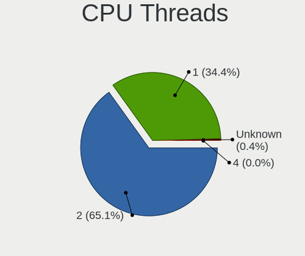

Linux in France - Tested Hardware & Statistics
----------------------------------------------

A project to collect tested hardware configurations for Linux in France.

Anyone can contribute to this report by the [hw-probe](https://github.com/linuxhw/hw-probe) tool:

    sudo -E hw-probe -all -upload

Please contribute! Especially if your hardware is rare.

This is a report for all computer types. See also reports for [desktops](/Location/France/Desktop/README.md) and [notebooks](/Location/France/Notebook/README.md).

Contents
--------

* [ Test Cases ](#test-cases)

* [ System ](#system)
  - [ OS                       ](#os)
  - [ OS Family                ](#os-family)
  - [ Kernel                   ](#kernel)
  - [ Kernel Family            ](#kernel-family)
  - [ Kernel Major Ver.        ](#kernel-major-ver)
  - [ Arch                     ](#arch)
  - [ DE                       ](#de)
  - [ Display Server           ](#display-server)
  - [ Display Manager          ](#display-manager)
  - [ OS Lang                  ](#os-lang)
  - [ Boot Mode                ](#boot-mode)
  - [ Filesystem               ](#filesystem)
  - [ Part. scheme             ](#part-scheme)
  - [ Dual Boot with Linux/BSD ](#dual-boot-with-linuxbsd)
  - [ Dual Boot (Win)          ](#dual-boot-win)

* [ Board ](#board)
  - [ Vendor                   ](#vendor)
  - [ Model                    ](#model)
  - [ Model Family             ](#model-family)
  - [ MFG Year                 ](#mfg-year)
  - [ Form Factor              ](#form-factor)
  - [ Secure Boot              ](#secure-boot)
  - [ Coreboot                 ](#coreboot)
  - [ RAM Size                 ](#ram-size)
  - [ RAM Used                 ](#ram-used)
  - [ Total Drives             ](#total-drives)
  - [ Has CD-ROM               ](#has-cd-rom)
  - [ Has Ethernet             ](#has-ethernet)
  - [ Has WiFi                 ](#has-wifi)
  - [ Has Bluetooth            ](#has-bluetooth)

* [ Location ](#location)
  - [ Country                  ](#country)
  - [ City                     ](#city)

* [ Drives ](#drives)
  - [ Drive Vendor             ](#drive-vendor)
  - [ Drive Model              ](#drive-model)
  - [ HDD Vendor               ](#hdd-vendor)
  - [ SSD Vendor               ](#ssd-vendor)
  - [ Drive Kind               ](#drive-kind)
  - [ Drive Connector          ](#drive-connector)
  - [ Drive Size               ](#drive-size)
  - [ Space Total              ](#space-total)
  - [ Space Used               ](#space-used)
  - [ Malfunc. Drives          ](#malfunc-drives)
  - [ Malfunc. Drive Vendor    ](#malfunc-drive-vendor)
  - [ Malfunc. HDD Vendor      ](#malfunc-hdd-vendor)
  - [ Malfunc. Drive Kind      ](#malfunc-drive-kind)
  - [ Failed Drives            ](#failed-drives)
  - [ Failed Drive Vendor      ](#failed-drive-vendor)
  - [ Drive Status             ](#drive-status)

* [ Storage controller ](#storage-controller)
  - [ Storage Vendor           ](#storage-vendor)
  - [ Storage Model            ](#storage-model)
  - [ Storage Kind             ](#storage-kind)

* [ Processor ](#processor)
  - [ CPU Vendor               ](#cpu-vendor)
  - [ CPU Model                ](#cpu-model)
  - [ CPU Model Family         ](#cpu-model-family)
  - [ CPU Cores                ](#cpu-cores)
  - [ CPU Sockets              ](#cpu-sockets)
  - [ CPU Threads              ](#cpu-threads)
  - [ CPU Op-Modes             ](#cpu-op-modes)
  - [ CPU Microcode            ](#cpu-microcode)
  - [ CPU Microarch            ](#cpu-microarch)

* [ Graphics ](#graphics)
  - [ GPU Vendor               ](#gpu-vendor)
  - [ GPU Model                ](#gpu-model)
  - [ GPU Combo                ](#gpu-combo)
  - [ GPU Driver               ](#gpu-driver)
  - [ GPU Memory               ](#gpu-memory)

* [ Monitor ](#monitor)
  - [ Monitor Vendor           ](#monitor-vendor)
  - [ Monitor Model            ](#monitor-model)
  - [ Monitor Resolution       ](#monitor-resolution)
  - [ Monitor Diagonal         ](#monitor-diagonal)
  - [ Monitor Width            ](#monitor-width)
  - [ Aspect Ratio             ](#aspect-ratio)
  - [ Monitor Area             ](#monitor-area)
  - [ Pixel Density            ](#pixel-density)
  - [ Multiple Monitors        ](#multiple-monitors)

* [ Network ](#network)
  - [ Net Controller Vendor    ](#net-controller-vendor)
  - [ Net Controller Model     ](#net-controller-model)
  - [ Wireless Vendor          ](#wireless-vendor)
  - [ Wireless Model           ](#wireless-model)
  - [ Ethernet Vendor          ](#ethernet-vendor)
  - [ Ethernet Model           ](#ethernet-model)
  - [ Net Controller Kind      ](#net-controller-kind)
  - [ Used Controller          ](#used-controller)
  - [ NICs                     ](#nics)
  - [ IPv6                     ](#ipv6)

* [ Bluetooth ](#bluetooth)
  - [ Bluetooth Vendor         ](#bluetooth-vendor)
  - [ Bluetooth Model          ](#bluetooth-model)

* [ Sound ](#sound)
  - [ Sound Vendor             ](#sound-vendor)
  - [ Sound Model              ](#sound-model)

* [ Memory ](#memory)
  - [ Memory Vendor            ](#memory-vendor)
  - [ Memory Model             ](#memory-model)
  - [ Memory Kind              ](#memory-kind)
  - [ Memory Form Factor       ](#memory-form-factor)
  - [ Memory Size              ](#memory-size)
  - [ Memory Speed             ](#memory-speed)

* [ Printers & scanners ](#printers--scanners)
  - [ Printer Vendor           ](#printer-vendor)
  - [ Printer Model            ](#printer-model)
  - [ Scanner Vendor           ](#scanner-vendor)
  - [ Scanner Model            ](#scanner-model)

* [ Camera ](#camera)
  - [ Camera Vendor            ](#camera-vendor)
  - [ Camera Model             ](#camera-model)

* [ Security ](#security)
  - [ Fingerprint Vendor       ](#fingerprint-vendor)
  - [ Fingerprint Model        ](#fingerprint-model)
  - [ Chipcard Vendor          ](#chipcard-vendor)
  - [ Chipcard Model           ](#chipcard-model)

* [ Unsupported ](#unsupported)
  - [ Unsupported Devices      ](#unsupported-devices)
  - [ Unsupported Device Types ](#unsupported-device-types)

Test Cases
----------

Total: 10088

| Vendor        | Model                       | Form-Factor | Probe                                                      | Date         |
|---------------|-----------------------------|-------------|------------------------------------------------------------|--------------|
| MSI           | B360I GMAING PRO AC         | Desktop     | [bbdf7b4f77](https://linux-hardware.org/?probe=bbdf7b4f77) | Oct 01, 2022 |
| Unknown       | X79-P3                      | Desktop     | [9269fd5ff4](https://linux-hardware.org/?probe=9269fd5ff4) | Oct 01, 2022 |
| MSI           | GF65 Thin 9SEXR             | Notebook    | [537828a21f](https://linux-hardware.org/?probe=537828a21f) | Oct 01, 2022 |
| HP            | 0B4Ch D                     | Desktop     | [1b409fc1f6](https://linux-hardware.org/?probe=1b409fc1f6) | Oct 01, 2022 |
| HP            | 0B4Ch D                     | Desktop     | [ccc7fe3103](https://linux-hardware.org/?probe=ccc7fe3103) | Oct 01, 2022 |
| UNOWHY        | Y13G012S4EI                 | Notebook    | [014d8c23f8](https://linux-hardware.org/?probe=014d8c23f8) | Oct 01, 2022 |
| ASUSTek       | VivoBook_ASUSLaptop E410... | Notebook    | [462f9bbdbe](https://linux-hardware.org/?probe=462f9bbdbe) | Oct 01, 2022 |
| Lenovo        | SHARKBAY SDK0E50510 PRO     | Desktop     | [cb5d0d1945](https://linux-hardware.org/?probe=cb5d0d1945) | Oct 01, 2022 |
| Dell          | 0RW203                      | Desktop     | [c8a408311d](https://linux-hardware.org/?probe=c8a408311d) | Oct 01, 2022 |
| Lenovo        | SHARKBAY SDK0E50510 PRO     | Desktop     | [3af0c5cc5f](https://linux-hardware.org/?probe=3af0c5cc5f) | Oct 01, 2022 |
| Lenovo        | B70-80 80MR                 | Notebook    | [69aec9e100](https://linux-hardware.org/?probe=69aec9e100) | Oct 01, 2022 |
| Gigabyte      | B450 AORUS ELITE            | Desktop     | [dda857d7e6](https://linux-hardware.org/?probe=dda857d7e6) | Oct 01, 2022 |
| MSI           | MPG X570S EDGE MAX WIFI     | Desktop     | [d3d117cf14](https://linux-hardware.org/?probe=d3d117cf14) | Oct 01, 2022 |
| MSI           | X470 GAMING PRO             | Desktop     | [53e99a8ce6](https://linux-hardware.org/?probe=53e99a8ce6) | Oct 01, 2022 |
| ASUSTek       | PRIME B450-PLUS             | Desktop     | [db15c7b708](https://linux-hardware.org/?probe=db15c7b708) | Oct 01, 2022 |
| Dell          | XPS 13 9300                 | Notebook    | [1fade0f247](https://linux-hardware.org/?probe=1fade0f247) | Oct 01, 2022 |
| ASUSTek       | Zenbook UM5302TA_UM5302T... | Notebook    | [1cfda531dd](https://linux-hardware.org/?probe=1cfda531dd) | Oct 01, 2022 |
| MSI           | Z270-A PRO                  | Desktop     | [6f96dc34e2](https://linux-hardware.org/?probe=6f96dc34e2) | Oct 01, 2022 |
| ASUSTek       | B75M-A                      | Desktop     | [cbeab03cbd](https://linux-hardware.org/?probe=cbeab03cbd) | Oct 01, 2022 |
| ASUSTek       | M5A78L-M LX                 | Desktop     | [d967f57569](https://linux-hardware.org/?probe=d967f57569) | Oct 01, 2022 |
| ASUSTek       | ASUS EXPERTBOOK B1500CEA... | Notebook    | [24aefc4138](https://linux-hardware.org/?probe=24aefc4138) | Oct 01, 2022 |
| Shuttle       | FS35V4                      | Desktop     | [e38fd71e40](https://linux-hardware.org/?probe=e38fd71e40) | Oct 01, 2022 |
| MSI           | Modern 14 A10M              | Notebook    | [571271ed93](https://linux-hardware.org/?probe=571271ed93) | Sep 30, 2022 |
| MSI           | Modern 14 A10M              | Notebook    | [9da1f3fe66](https://linux-hardware.org/?probe=9da1f3fe66) | Sep 30, 2022 |
| ASUSTek       | Zenbook UX3402ZA_UX3402Z... | Convertible | [8e301a5e4e](https://linux-hardware.org/?probe=8e301a5e4e) | Sep 30, 2022 |
| Dell          | Inspiron 15 7510            | Notebook    | [263276babe](https://linux-hardware.org/?probe=263276babe) | Sep 30, 2022 |
| Pegatron      | 2A94                        | Desktop     | [6425f7a434](https://linux-hardware.org/?probe=6425f7a434) | Sep 30, 2022 |
| Gigabyte      | G41M-Combo                  | Desktop     | [aa49a31777](https://linux-hardware.org/?probe=aa49a31777) | Sep 30, 2022 |
| HP            | ProBook 6570b               | Notebook    | [d9be946342](https://linux-hardware.org/?probe=d9be946342) | Sep 30, 2022 |
| ASRock        | X470 Master SLI             | Desktop     | [47c190b6e9](https://linux-hardware.org/?probe=47c190b6e9) | Sep 30, 2022 |
| Toshiba       | Satellite NB10t-A-102       | Notebook    | [5a8032ee05](https://linux-hardware.org/?probe=5a8032ee05) | Sep 30, 2022 |
| Dell          | Inspiron 15 7510            | Notebook    | [86e1da35ba](https://linux-hardware.org/?probe=86e1da35ba) | Sep 30, 2022 |
| Toshiba       | Satellite NB10t-A-102       | Notebook    | [4e9248b1eb](https://linux-hardware.org/?probe=4e9248b1eb) | Sep 30, 2022 |
| Lenovo        | ThinkPad P50 20EQS1WW00     | Notebook    | [786e0c1f5d](https://linux-hardware.org/?probe=786e0c1f5d) | Sep 30, 2022 |
| HUAWEI        | VLT-WX0                     | Notebook    | [1669dae0a6](https://linux-hardware.org/?probe=1669dae0a6) | Sep 30, 2022 |
| Toshiba       | Satellite L670              | Notebook    | [3b3e7965a5](https://linux-hardware.org/?probe=3b3e7965a5) | Sep 29, 2022 |
| HP            | Laptop 14s-fq1xxx           | Notebook    | [3990ec6cb0](https://linux-hardware.org/?probe=3990ec6cb0) | Sep 29, 2022 |
| Gigabyte      | B75M-D3H                    | Desktop     | [a7d5bbb754](https://linux-hardware.org/?probe=a7d5bbb754) | Sep 29, 2022 |
| Gigabyte      | B75M-D3H                    | Desktop     | [5f261094bf](https://linux-hardware.org/?probe=5f261094bf) | Sep 29, 2022 |
| TUXEDO        | Book_XA1510                 | Notebook    | [f39b64916d](https://linux-hardware.org/?probe=f39b64916d) | Sep 29, 2022 |
| Acer          | Predator G6-710             | Desktop     | [12fd4575f7](https://linux-hardware.org/?probe=12fd4575f7) | Sep 29, 2022 |
| Lenovo        | ThinkPad X1C 5th W10DG 2... | Notebook    | [0cbacebb95](https://linux-hardware.org/?probe=0cbacebb95) | Sep 29, 2022 |
| Lenovo        | Yoga S740-15IRH 81NX        | Notebook    | [defae2e862](https://linux-hardware.org/?probe=defae2e862) | Sep 28, 2022 |
| ASUSTek       | P8P67                       | Desktop     | [1ad22cf7a8](https://linux-hardware.org/?probe=1ad22cf7a8) | Sep 28, 2022 |
| ASUSTek       | TUF Gaming FX505DT_TUF50... | Notebook    | [f758c22d98](https://linux-hardware.org/?probe=f758c22d98) | Sep 28, 2022 |
| Gigabyte      | B450 I AORUS PRO WIFI-CF    | Desktop     | [d5185ee60b](https://linux-hardware.org/?probe=d5185ee60b) | Sep 28, 2022 |
| ASUSTek       | TUF Gaming FX505DT_TUF50... | Notebook    | [b08fc47990](https://linux-hardware.org/?probe=b08fc47990) | Sep 28, 2022 |
| Dell          | XPS 15 9570                 | Notebook    | [564eb3b439](https://linux-hardware.org/?probe=564eb3b439) | Sep 28, 2022 |
| ASUSTek       | PRIME B450M-K               | Desktop     | [262a244d81](https://linux-hardware.org/?probe=262a244d81) | Sep 28, 2022 |
| Dell          | XPS 15 9570                 | Notebook    | [085bd81d5b](https://linux-hardware.org/?probe=085bd81d5b) | Sep 28, 2022 |
| MSI           | MPG X570 GAMING EDGE WIF... | Desktop     | [30507c8461](https://linux-hardware.org/?probe=30507c8461) | Sep 27, 2022 |
| Dell          | Latitude E6540              | Notebook    | [27c854b1a0](https://linux-hardware.org/?probe=27c854b1a0) | Sep 27, 2022 |
| Samsung       | RV411/RV511/E3511/S3511/... | Notebook    | [ec59847e5b](https://linux-hardware.org/?probe=ec59847e5b) | Sep 27, 2022 |
| Lenovo        | ThinkStation S30 056839G    | Desktop     | [427d10a5ca](https://linux-hardware.org/?probe=427d10a5ca) | Sep 27, 2022 |
| Dell          | 0M5DCD A00                  | Desktop     | [5168af6134](https://linux-hardware.org/?probe=5168af6134) | Sep 27, 2022 |
| Dell          | 0WN7Y6 A01                  | Desktop     | [356dc77824](https://linux-hardware.org/?probe=356dc77824) | Sep 27, 2022 |
| Dell          | Latitude E5250              | Notebook    | [6116460e52](https://linux-hardware.org/?probe=6116460e52) | Sep 27, 2022 |
| MSI           | X570-A PRO                  | Desktop     | [8e872a0556](https://linux-hardware.org/?probe=8e872a0556) | Sep 27, 2022 |
| HP            | 0A60h                       | Desktop     | [ccb90a4b31](https://linux-hardware.org/?probe=ccb90a4b31) | Sep 27, 2022 |
| Dell          | 0NV103 A00                  | All in one  | [62a89ede99](https://linux-hardware.org/?probe=62a89ede99) | Sep 27, 2022 |
| Timi          | TM1604                      | Notebook    | [2ee795db1a](https://linux-hardware.org/?probe=2ee795db1a) | Sep 27, 2022 |
| MSI           | GS73 Stealth 8RF            | Notebook    | [37d9172163](https://linux-hardware.org/?probe=37d9172163) | Sep 26, 2022 |
| ASUSTek       | X580VD                      | Notebook    | [378e1d3133](https://linux-hardware.org/?probe=378e1d3133) | Sep 26, 2022 |
| Packard Be... | EasyNote LS44SB             | Notebook    | [184a0768bd](https://linux-hardware.org/?probe=184a0768bd) | Sep 26, 2022 |
| Insyde        | WindTab89                   | Notebook    | [0073af9597](https://linux-hardware.org/?probe=0073af9597) | Sep 26, 2022 |
| Insyde        | WindTab89                   | Notebook    | [6935ebecaa](https://linux-hardware.org/?probe=6935ebecaa) | Sep 26, 2022 |
| Gigabyte      | 970A-DS3P                   | Desktop     | [202e51c5d3](https://linux-hardware.org/?probe=202e51c5d3) | Sep 26, 2022 |
| Dell          | 082WXT A01                  | Desktop     | [7b1ea76e92](https://linux-hardware.org/?probe=7b1ea76e92) | Sep 26, 2022 |
| Dell          | 082WXT A01                  | Desktop     | [7c4445ad04](https://linux-hardware.org/?probe=7c4445ad04) | Sep 26, 2022 |
| Gigabyte      | B75M-D3V                    | Desktop     | [291b07ce5f](https://linux-hardware.org/?probe=291b07ce5f) | Sep 26, 2022 |
| HP            | Spectre Pro x360 G2         | Notebook    | [d9248f7b2e](https://linux-hardware.org/?probe=d9248f7b2e) | Sep 26, 2022 |
| Lenovo        | ThinkPad T14s Gen 3 21CQ... | Notebook    | [109d0ef34c](https://linux-hardware.org/?probe=109d0ef34c) | Sep 26, 2022 |
| MSI           | C847IS-P33                  | Desktop     | [9b2205d329](https://linux-hardware.org/?probe=9b2205d329) | Sep 25, 2022 |
| ASUSTek       | TUF Gaming B560-PLUS WIF... | Desktop     | [56c982050d](https://linux-hardware.org/?probe=56c982050d) | Sep 25, 2022 |
| Acer          | Aspire 3810T                | Notebook    | [de19c5a7e9](https://linux-hardware.org/?probe=de19c5a7e9) | Sep 25, 2022 |
| ASUSTek       | PRIME B350-PLUS             | Desktop     | [53c469011c](https://linux-hardware.org/?probe=53c469011c) | Sep 25, 2022 |
| ASUSTek       | ROG STRIX B550-E GAMING     | Desktop     | [c6c3ce5c04](https://linux-hardware.org/?probe=c6c3ce5c04) | Sep 25, 2022 |
| ASUSTek       | Rampage V EDITION 10        | Desktop     | [c65cbf84dc](https://linux-hardware.org/?probe=c65cbf84dc) | Sep 25, 2022 |
| Intel         | NUC10i7FNB K61360-305       | Mini pc     | [a7aadaeed0](https://linux-hardware.org/?probe=a7aadaeed0) | Sep 25, 2022 |
| ASUSTek       | G10AJ                       | Desktop     | [bf77a2476d](https://linux-hardware.org/?probe=bf77a2476d) | Sep 25, 2022 |
| Lenovo        | ThinkPad P50 20EQS1WW00     | Notebook    | [2d7ce63bce](https://linux-hardware.org/?probe=2d7ce63bce) | Sep 25, 2022 |
| Acer          | Aspire SW5-012              | Notebook    | [ed8f3f7403](https://linux-hardware.org/?probe=ed8f3f7403) | Sep 25, 2022 |
| Dell          | Inspiron 14 5410 2-in-1     | Convertible | [1d76ae9f44](https://linux-hardware.org/?probe=1d76ae9f44) | Sep 24, 2022 |
| Packard Be... | EasyNote MH45               | Notebook    | [c312580997](https://linux-hardware.org/?probe=c312580997) | Sep 24, 2022 |
| Dell          | 0C7195                      | Desktop     | [9711ab00d7](https://linux-hardware.org/?probe=9711ab00d7) | Sep 24, 2022 |
| Unknown       | Unknown                     | Notebook    | [63b1596d63](https://linux-hardware.org/?probe=63b1596d63) | Sep 24, 2022 |
| Foxconn       | 2ADA                        | Desktop     | [8a734f0799](https://linux-hardware.org/?probe=8a734f0799) | Sep 24, 2022 |
| HP            | ENVY x360 Convertible 13... | Convertible | [61dd74082f](https://linux-hardware.org/?probe=61dd74082f) | Sep 24, 2022 |
| Dell          | Inspiron 3721               | Notebook    | [7411a700cf](https://linux-hardware.org/?probe=7411a700cf) | Sep 24, 2022 |
| Lenovo        | ThinkPad P50 20EQS1WW00     | Notebook    | [6cdacdb935](https://linux-hardware.org/?probe=6cdacdb935) | Sep 24, 2022 |
| HP            | ENVY x360 Convertible 13... | Convertible | [d07b0cb7a0](https://linux-hardware.org/?probe=d07b0cb7a0) | Sep 24, 2022 |
| ASUSTek       | G501VW                      | Notebook    | [550d6e5438](https://linux-hardware.org/?probe=550d6e5438) | Sep 24, 2022 |
| Acidanther... | Mac-A369DDC4E67F1C45 iMa... | All in one  | [0e9b82f312](https://linux-hardware.org/?probe=0e9b82f312) | Sep 24, 2022 |
| HP            | Laptop 17-bs0xx             | Notebook    | [33398b1a21](https://linux-hardware.org/?probe=33398b1a21) | Sep 23, 2022 |
| ASUSTek       | P5QPL-VM EPU                | Desktop     | [8a4819f23d](https://linux-hardware.org/?probe=8a4819f23d) | Sep 23, 2022 |
| Acer          | Aspire ES1-732              | Notebook    | [d6ccc5301b](https://linux-hardware.org/?probe=d6ccc5301b) | Sep 23, 2022 |
| Gigabyte      | X570S AORUS ELITE AX        | Desktop     | [1553f6266c](https://linux-hardware.org/?probe=1553f6266c) | Sep 23, 2022 |
| Intel         | NUC8BEB J72688-309          | Mini pc     | [7d035aef45](https://linux-hardware.org/?probe=7d035aef45) | Sep 23, 2022 |
| Dell          | XPS 9320                    | Notebook    | [959d1406dd](https://linux-hardware.org/?probe=959d1406dd) | Sep 23, 2022 |
| Dell          | Precision 3561              | Notebook    | [78b8d776ed](https://linux-hardware.org/?probe=78b8d776ed) | Sep 23, 2022 |
| ASUSTek       | TUF Gaming B560-PLUS WIF... | Desktop     | [7d69f0c6c6](https://linux-hardware.org/?probe=7d69f0c6c6) | Sep 23, 2022 |
| Notebook      | NL40_50GU                   | Notebook    | [da07f4c223](https://linux-hardware.org/?probe=da07f4c223) | Sep 23, 2022 |
| Dell          | Inspiron 5537               | Notebook    | [7e3170527c](https://linux-hardware.org/?probe=7e3170527c) | Sep 22, 2022 |
| Dell          | Precision 5540              | Notebook    | [0f09e447ea](https://linux-hardware.org/?probe=0f09e447ea) | Sep 22, 2022 |
| Lenovo        | ThinkPad P51s 20HCS00F00    | Notebook    | [5f0dc19f55](https://linux-hardware.org/?probe=5f0dc19f55) | Sep 22, 2022 |
| Lenovo        | ThinkPad X1 Extreme 20MF... | Notebook    | [7fc4cdb860](https://linux-hardware.org/?probe=7fc4cdb860) | Sep 22, 2022 |
| ASUSTek       | UX510UXK                    | Notebook    | [baa57d8e16](https://linux-hardware.org/?probe=baa57d8e16) | Sep 21, 2022 |
| Lenovo        | ThinkPad Edge E320 1298A... | Notebook    | [869b076838](https://linux-hardware.org/?probe=869b076838) | Sep 21, 2022 |
| ASUSTek       | PRIME Z390-A                | Desktop     | [5e4d865987](https://linux-hardware.org/?probe=5e4d865987) | Sep 21, 2022 |
| Acer          | Aspire E1-572               | Notebook    | [ba47323a29](https://linux-hardware.org/?probe=ba47323a29) | Sep 21, 2022 |
| HPE           | ProLiant DL385 Gen10 Plu... | Server      | [9a0a9c455a](https://linux-hardware.org/?probe=9a0a9c455a) | Sep 21, 2022 |
| ASUSTek       | PRIME B360-PLUS             | Desktop     | [49b3253936](https://linux-hardware.org/?probe=49b3253936) | Sep 21, 2022 |
| ASUSTek       | ZenBook UX533FD_UX533FD     | Notebook    | [f185fff0a3](https://linux-hardware.org/?probe=f185fff0a3) | Sep 21, 2022 |
| Dell          | Precision 7540              | Notebook    | [fb7472fe87](https://linux-hardware.org/?probe=fb7472fe87) | Sep 21, 2022 |
| HP            | Laptop 15-da0xxx            | Notebook    | [e234a2b52a](https://linux-hardware.org/?probe=e234a2b52a) | Sep 21, 2022 |
| HUAWEI        | BOHB-WAX9                   | Notebook    | [982931b71f](https://linux-hardware.org/?probe=982931b71f) | Sep 21, 2022 |
| Dell          | XPS 13 9370                 | Notebook    | [facc4c1755](https://linux-hardware.org/?probe=facc4c1755) | Sep 21, 2022 |
| Lenovo        | IdeaPad 100-15IBD 80QQ      | Notebook    | [98d21fb774](https://linux-hardware.org/?probe=98d21fb774) | Sep 21, 2022 |
| MSI           | H81M-P33                    | Desktop     | [108817dc0f](https://linux-hardware.org/?probe=108817dc0f) | Sep 21, 2022 |
| Lenovo        | Yoga S740-15IRH 81NX        | Notebook    | [6d0a2986ad](https://linux-hardware.org/?probe=6d0a2986ad) | Sep 21, 2022 |
| HP            | Laptop 15-da0xxx            | Notebook    | [a454bf3aa7](https://linux-hardware.org/?probe=a454bf3aa7) | Sep 20, 2022 |
| Valve         | Jupiter                     | Notebook    | [3aeb184ce4](https://linux-hardware.org/?probe=3aeb184ce4) | Sep 20, 2022 |
| Lenovo        | ThinkPad T61 7659AB7        | Notebook    | [aa07f9c271](https://linux-hardware.org/?probe=aa07f9c271) | Sep 20, 2022 |
| ASUSTek       | ZenBook UX433FN_UX433FN     | Notebook    | [5d42a6abab](https://linux-hardware.org/?probe=5d42a6abab) | Sep 20, 2022 |
| Toshiba       | Satellite L875-11M          | Notebook    | [42f3498e9e](https://linux-hardware.org/?probe=42f3498e9e) | Sep 20, 2022 |
| Lenovo        | ThinkPad T61p 6457A24       | Notebook    | [d98e9a64bd](https://linux-hardware.org/?probe=d98e9a64bd) | Sep 20, 2022 |
| Dell          | 042P49 A02                  | Desktop     | [180561f253](https://linux-hardware.org/?probe=180561f253) | Sep 20, 2022 |
| ASRock        | X470 Master SLI             | Desktop     | [3c8fefe578](https://linux-hardware.org/?probe=3c8fefe578) | Sep 20, 2022 |
| Valve         | Jupiter                     | Notebook    | [83ed33f7e6](https://linux-hardware.org/?probe=83ed33f7e6) | Sep 20, 2022 |
| ASRock        | X470 Master SLI             | Desktop     | [1975320cad](https://linux-hardware.org/?probe=1975320cad) | Sep 20, 2022 |
| Lenovo        | Yoga 7 14ACN6 82N7          | Convertible | [c6320d5d3c](https://linux-hardware.org/?probe=c6320d5d3c) | Sep 20, 2022 |
| Dell          | 040DDP A01                  | Desktop     | [635c6895e1](https://linux-hardware.org/?probe=635c6895e1) | Sep 20, 2022 |
| Lenovo        | 3728 SDK0R32862 WIN 3258... | Desktop     | [d78d85bde3](https://linux-hardware.org/?probe=d78d85bde3) | Sep 20, 2022 |
| Gigabyte      | B450 AORUS ELITE            | Desktop     | [bb0b1764e0](https://linux-hardware.org/?probe=bb0b1764e0) | Sep 19, 2022 |
| PC Special... | NS50MU                      | Notebook    | [1843dfbb66](https://linux-hardware.org/?probe=1843dfbb66) | Sep 19, 2022 |
| HP            | Pavilion Laptop 14-ce3xx... | Notebook    | [89894daeb7](https://linux-hardware.org/?probe=89894daeb7) | Sep 19, 2022 |
| Dell          | 0XC837                      | Desktop     | [94ad27e346](https://linux-hardware.org/?probe=94ad27e346) | Sep 19, 2022 |
| Dell          | Precision 7750              | Notebook    | [ced8b5a7b2](https://linux-hardware.org/?probe=ced8b5a7b2) | Sep 19, 2022 |
| Lenovo        | ThinkPad X1 Carbon Gen 9... | Notebook    | [be279328b1](https://linux-hardware.org/?probe=be279328b1) | Sep 19, 2022 |
| HP            | 470 G7 Notebook PC          | Notebook    | [a9f6ad0c32](https://linux-hardware.org/?probe=a9f6ad0c32) | Sep 19, 2022 |
| Lenovo        | MIIX 520-12IKB 20M3         | Tablet      | [df362e9796](https://linux-hardware.org/?probe=df362e9796) | Sep 18, 2022 |
| Lenovo        | ThinkPad P50 20EQS1WW00     | Notebook    | [1fa9b05720](https://linux-hardware.org/?probe=1fa9b05720) | Sep 18, 2022 |
| Lenovo        | MIIX 520-12IKB 20M3         | Tablet      | [a251261add](https://linux-hardware.org/?probe=a251261add) | Sep 18, 2022 |
| Lenovo        | ThinkPad X200 7458VL3       | Notebook    | [700ff6630e](https://linux-hardware.org/?probe=700ff6630e) | Sep 18, 2022 |
| Lenovo        | ThinkPad P50 20EQS1WW00     | Notebook    | [b94564300a](https://linux-hardware.org/?probe=b94564300a) | Sep 18, 2022 |
| HP            | Victus by Laptop 16-d0xx... | Notebook    | [aa3908e5fc](https://linux-hardware.org/?probe=aa3908e5fc) | Sep 17, 2022 |
| ASUSTek       | TUF Gaming X570-PLUS        | Desktop     | [a06139b33d](https://linux-hardware.org/?probe=a06139b33d) | Sep 17, 2022 |
| MSI           | Katana GF66 12UD            | Notebook    | [c0c6c57498](https://linux-hardware.org/?probe=c0c6c57498) | Sep 17, 2022 |
| MSI           | Katana GF66 12UD            | Notebook    | [fde2d03f98](https://linux-hardware.org/?probe=fde2d03f98) | Sep 17, 2022 |
| Lenovo        | 312D SDK0J40697 WIN 3305... | Mini pc     | [88fdbf1a94](https://linux-hardware.org/?probe=88fdbf1a94) | Sep 16, 2022 |
| ASUSTek       | P8Z77-V                     | Desktop     | [3ace24ebfc](https://linux-hardware.org/?probe=3ace24ebfc) | Sep 16, 2022 |
| Dell          | Latitude E5540              | Notebook    | [8e44a11e6c](https://linux-hardware.org/?probe=8e44a11e6c) | Sep 16, 2022 |
| Dell          | Latitude E5540              | Notebook    | [c2d57deba4](https://linux-hardware.org/?probe=c2d57deba4) | Sep 16, 2022 |
| Valve         | Jupiter                     | Notebook    | [47ac328960](https://linux-hardware.org/?probe=47ac328960) | Sep 16, 2022 |
| Lenovo        | Legion 5 15ACH6H 82JU       | Notebook    | [7a390e81b1](https://linux-hardware.org/?probe=7a390e81b1) | Sep 16, 2022 |
| Foxconn       | 2ADA                        | Desktop     | [b136916fb3](https://linux-hardware.org/?probe=b136916fb3) | Sep 16, 2022 |
| Dell          | 0NC2VH A01                  | Desktop     | [cba8ef504c](https://linux-hardware.org/?probe=cba8ef504c) | Sep 16, 2022 |
| HP            | ZBook Firefly 14 inch G9... | Notebook    | [f543e0852f](https://linux-hardware.org/?probe=f543e0852f) | Sep 16, 2022 |
| Lenovo        | ThinkPad T440s 20ARS0CN1... | Notebook    | [2f9eaf5711](https://linux-hardware.org/?probe=2f9eaf5711) | Sep 16, 2022 |
| ASUSTek       | ROG Zephyrus G14 GA402RK... | Notebook    | [382325db11](https://linux-hardware.org/?probe=382325db11) | Sep 16, 2022 |
| ASUSTek       | X550JK                      | Notebook    | [5c399f4fb0](https://linux-hardware.org/?probe=5c399f4fb0) | Sep 15, 2022 |
| ASUSTek       | X550JK                      | Notebook    | [59df382a23](https://linux-hardware.org/?probe=59df382a23) | Sep 15, 2022 |
| HP            | ENVY Laptop 17-ch0xxx       | Notebook    | [1a1ae1e398](https://linux-hardware.org/?probe=1a1ae1e398) | Sep 15, 2022 |
| Gigabyte      | B450M DS3H-CF               | Desktop     | [c99c4f9785](https://linux-hardware.org/?probe=c99c4f9785) | Sep 15, 2022 |
| Acer          | Aspire A515-51G             | Notebook    | [bc275a0476](https://linux-hardware.org/?probe=bc275a0476) | Sep 15, 2022 |
| ASUSTek       | VivoBook E14 E402WAS        | Notebook    | [84dee7df6c](https://linux-hardware.org/?probe=84dee7df6c) | Sep 15, 2022 |
| MSI           | MPG B550I GAMING EDGE WI... | Desktop     | [a803a04b1f](https://linux-hardware.org/?probe=a803a04b1f) | Sep 15, 2022 |
| MSI           | MPG B550I GAMING EDGE WI... | Desktop     | [50f0cfbfad](https://linux-hardware.org/?probe=50f0cfbfad) | Sep 15, 2022 |
| Dell          | Precision 3571              | Notebook    | [01f5d7f7f8](https://linux-hardware.org/?probe=01f5d7f7f8) | Sep 15, 2022 |
| IP3 Tech      | GB3B                        | Mini pc     | [fc23b3a13b](https://linux-hardware.org/?probe=fc23b3a13b) | Sep 15, 2022 |
| HUAWEI        | HVY-WXX9                    | Notebook    | [000eb38ea7](https://linux-hardware.org/?probe=000eb38ea7) | Sep 15, 2022 |
| HP            | OMEN by Laptop              | Notebook    | [282afe0352](https://linux-hardware.org/?probe=282afe0352) | Sep 15, 2022 |
| Fujitsu       | LIFEBOOK A512               | Notebook    | [2d33f80fbd](https://linux-hardware.org/?probe=2d33f80fbd) | Sep 15, 2022 |
| Gigabyte      | B560M DS3H V2               | Desktop     | [af4b9d7add](https://linux-hardware.org/?probe=af4b9d7add) | Sep 14, 2022 |
| Dell          | Latitude E7470              | Notebook    | [9d15a7c8a2](https://linux-hardware.org/?probe=9d15a7c8a2) | Sep 14, 2022 |
| Dell          | Precision 7550              | Notebook    | [f6a8b38020](https://linux-hardware.org/?probe=f6a8b38020) | Sep 14, 2022 |
| Dell          | Inspiron 15 3520            | Notebook    | [1d74f86789](https://linux-hardware.org/?probe=1d74f86789) | Sep 14, 2022 |
| HP            | 1496                        | Desktop     | [cb6033fc21](https://linux-hardware.org/?probe=cb6033fc21) | Sep 14, 2022 |
| Dell          | Precision 3571              | Notebook    | [72e1a27ea7](https://linux-hardware.org/?probe=72e1a27ea7) | Sep 14, 2022 |
| Lenovo        | ThinkPad E15 Gen 2 20T80... | Notebook    | [8935b3f204](https://linux-hardware.org/?probe=8935b3f204) | Sep 14, 2022 |
| HP            | Laptop 17-cp0xxx            | Notebook    | [c05d80959b](https://linux-hardware.org/?probe=c05d80959b) | Sep 14, 2022 |
| HP            | 81C5 MVB                    | Desktop     | [e274dcadcd](https://linux-hardware.org/?probe=e274dcadcd) | Sep 14, 2022 |
| Lenovo        | ThinkPad X1 Carbon Gen 1... | Notebook    | [5784c0a7e3](https://linux-hardware.org/?probe=5784c0a7e3) | Sep 14, 2022 |
| Dell          | Precision 7520              | Notebook    | [b83fea6b96](https://linux-hardware.org/?probe=b83fea6b96) | Sep 14, 2022 |
| HP            | Pavilion dv7                | Notebook    | [f94d6a4e8f](https://linux-hardware.org/?probe=f94d6a4e8f) | Sep 14, 2022 |
| Dell          | Latitude E5550              | Notebook    | [90674e3069](https://linux-hardware.org/?probe=90674e3069) | Sep 13, 2022 |
| ASUSTek       | X750JB                      | Notebook    | [dd6137189b](https://linux-hardware.org/?probe=dd6137189b) | Sep 13, 2022 |
| ASUSTek       | ASUS EXPERTBOOK P5440FA_... | Notebook    | [d441c68f40](https://linux-hardware.org/?probe=d441c68f40) | Sep 13, 2022 |
| Samsung       | 950XED                      | Notebook    | [f8a15210f0](https://linux-hardware.org/?probe=f8a15210f0) | Sep 13, 2022 |
| Apple         | MacBookPro5,3               | Notebook    | [3e00c86066](https://linux-hardware.org/?probe=3e00c86066) | Sep 13, 2022 |
| Gigabyte      | Z590 UD AC                  | Desktop     | [8774a8312b](https://linux-hardware.org/?probe=8774a8312b) | Sep 13, 2022 |
| HUAWEI        | HVY-WXX9                    | Notebook    | [999cbe4e8f](https://linux-hardware.org/?probe=999cbe4e8f) | Sep 13, 2022 |
| Apple         | MacBookPro5,3               | Notebook    | [9211f5de76](https://linux-hardware.org/?probe=9211f5de76) | Sep 13, 2022 |
| ASUSTek       | VivoBook_ASUSLaptop X412... | Notebook    | [0e6413e94b](https://linux-hardware.org/?probe=0e6413e94b) | Sep 13, 2022 |
| MSI           | PRESTIGE X570 CREATION      | Desktop     | [5e67e25052](https://linux-hardware.org/?probe=5e67e25052) | Sep 13, 2022 |
| ASUSTek       | ROG STRIX B550-I GAMING     | Desktop     | [cacc85ca2e](https://linux-hardware.org/?probe=cacc85ca2e) | Sep 13, 2022 |
| ASUSTek       | ROG STRIX B550-I GAMING     | Desktop     | [0c6d5b57dd](https://linux-hardware.org/?probe=0c6d5b57dd) | Sep 13, 2022 |
| ASUSTek       | ROG Zephyrus G15 GA503RM... | Notebook    | [82b9d1247e](https://linux-hardware.org/?probe=82b9d1247e) | Sep 13, 2022 |
| ASUSTek       | ROG STRIX B550-E GAMING     | Desktop     | [7fb82d496f](https://linux-hardware.org/?probe=7fb82d496f) | Sep 12, 2022 |
| HP            | 470 G7 Notebook PC          | Notebook    | [f1c4e72e54](https://linux-hardware.org/?probe=f1c4e72e54) | Sep 12, 2022 |
| Dell          | 0H8052                      | Desktop     | [1ade497706](https://linux-hardware.org/?probe=1ade497706) | Sep 12, 2022 |
| Dell          | Vostro 5620                 | Notebook    | [6c88032385](https://linux-hardware.org/?probe=6c88032385) | Sep 12, 2022 |
| ASUSTek       | ROG STRIX Z690-F GAMING ... | Desktop     | [d2ed0e3000](https://linux-hardware.org/?probe=d2ed0e3000) | Sep 12, 2022 |
| Raspberry ... | Raspberry Pi 4 Model B R... | Soc         | [823924f975](https://linux-hardware.org/?probe=823924f975) | Sep 12, 2022 |
| ASUSTek       | ROG Zephyrus G15 GA503RM... | Notebook    | [3d1d8301c3](https://linux-hardware.org/?probe=3d1d8301c3) | Sep 12, 2022 |
| Dell          | 0VD92X A00                  | Desktop     | [2b699a677b](https://linux-hardware.org/?probe=2b699a677b) | Sep 11, 2022 |
| Dell          | Vostro 3400                 | Notebook    | [06c0b65315](https://linux-hardware.org/?probe=06c0b65315) | Sep 11, 2022 |
| Dell          | Vostro 3400                 | Notebook    | [59d8ed6557](https://linux-hardware.org/?probe=59d8ed6557) | Sep 11, 2022 |
| Foxconn       | 2ADA                        | Desktop     | [1b43b0d291](https://linux-hardware.org/?probe=1b43b0d291) | Sep 11, 2022 |
| Dell          | Latitude E7240              | Notebook    | [72a8c650c5](https://linux-hardware.org/?probe=72a8c650c5) | Sep 11, 2022 |
| Lenovo        | Legion 5 15ACH6H 82JU       | Notebook    | [46c51b7097](https://linux-hardware.org/?probe=46c51b7097) | Sep 11, 2022 |
| Microsoft     | Surface Pro 3               | Tablet      | [5d0092ffc1](https://linux-hardware.org/?probe=5d0092ffc1) | Sep 11, 2022 |
| Apple         | Mac-F65AE981FFA204ED Mac... | Mini pc     | [a683b361e4](https://linux-hardware.org/?probe=a683b361e4) | Sep 11, 2022 |
| Apple         | MacBookPro13,1              | Notebook    | [4b7f579852](https://linux-hardware.org/?probe=4b7f579852) | Sep 11, 2022 |
| Apple         | Mac-F65AE981FFA204ED Mac... | Mini pc     | [9cbf9fdc4a](https://linux-hardware.org/?probe=9cbf9fdc4a) | Sep 11, 2022 |
| HP            | Laptop 17-bs0xx             | Notebook    | [512a6bd927](https://linux-hardware.org/?probe=512a6bd927) | Sep 11, 2022 |
| HP            | 84DE                        | All in one  | [cdb6233482](https://linux-hardware.org/?probe=cdb6233482) | Sep 10, 2022 |
| ASUSTek       | Z170-A                      | Desktop     | [66c2198f48](https://linux-hardware.org/?probe=66c2198f48) | Sep 10, 2022 |
| HP            | ProBook 6570b               | Notebook    | [998630e822](https://linux-hardware.org/?probe=998630e822) | Sep 10, 2022 |
| Framework     | Laptop                      | Notebook    | [b0b7801b11](https://linux-hardware.org/?probe=b0b7801b11) | Sep 10, 2022 |
| ASUSTek       | ROG Zephyrus G15 GA503RM... | Notebook    | [8df1767beb](https://linux-hardware.org/?probe=8df1767beb) | Sep 10, 2022 |
| ASUSTek       | PRIME H270-PRO              | Desktop     | [4ad8216bf8](https://linux-hardware.org/?probe=4ad8216bf8) | Sep 10, 2022 |
| ASUSTek       | PRIME H270-PRO              | Desktop     | [bfaebac5d4](https://linux-hardware.org/?probe=bfaebac5d4) | Sep 10, 2022 |
| Dell          | 0J3C2F A00                  | Desktop     | [40c43aff10](https://linux-hardware.org/?probe=40c43aff10) | Sep 10, 2022 |
| Lenovo        | IdeaPad 5 15ALC05 82LN      | Notebook    | [4911a898bd](https://linux-hardware.org/?probe=4911a898bd) | Sep 09, 2022 |
| ASUSTek       | TUF Gaming B460M-PLUS       | Desktop     | [cd84312899](https://linux-hardware.org/?probe=cd84312899) | Sep 09, 2022 |
| Dell          | 0C7195                      | Desktop     | [728b74ef0c](https://linux-hardware.org/?probe=728b74ef0c) | Sep 09, 2022 |
| Dell          | 04075X A00                  | All in one  | [e2ff438b3c](https://linux-hardware.org/?probe=e2ff438b3c) | Sep 09, 2022 |
| ASUSTek       | VivoBook 15_ASUS Laptop ... | Notebook    | [d946b5e886](https://linux-hardware.org/?probe=d946b5e886) | Sep 09, 2022 |
| MSI           | Z77A-G45                    | Desktop     | [e26581d20e](https://linux-hardware.org/?probe=e26581d20e) | Sep 09, 2022 |
| Dell          | Precision 7560              | Notebook    | [3e2d1a120c](https://linux-hardware.org/?probe=3e2d1a120c) | Sep 09, 2022 |
| Lenovo        | ThinkBook 15p 20V3          | Notebook    | [e42f779622](https://linux-hardware.org/?probe=e42f779622) | Sep 09, 2022 |
| MSI           | B450I GAMING PLUS AC        | Desktop     | [acbb191061](https://linux-hardware.org/?probe=acbb191061) | Sep 09, 2022 |
| ASUSTek       | GL702VSK                    | Notebook    | [5001a76a0e](https://linux-hardware.org/?probe=5001a76a0e) | Sep 09, 2022 |
| Packard Be... | IMEDIA S2883                | Desktop     | [c4fe9ee6f0](https://linux-hardware.org/?probe=c4fe9ee6f0) | Sep 08, 2022 |
| HP            | EliteBook 840 G8 Noteboo... | Notebook    | [c8f2e1da45](https://linux-hardware.org/?probe=c8f2e1da45) | Sep 08, 2022 |
| HP            | ZBook 15                    | Notebook    | [89a1ed226b](https://linux-hardware.org/?probe=89a1ed226b) | Sep 08, 2022 |
| Nvidia        | Tegra                       | Soc         | [bf3fee013b](https://linux-hardware.org/?probe=bf3fee013b) | Sep 08, 2022 |
| System76      | Lemur                       | Notebook    | [5993c130bc](https://linux-hardware.org/?probe=5993c130bc) | Sep 07, 2022 |
| ASUSTek       | PRIME B460M-A               | Desktop     | [c89a7d5488](https://linux-hardware.org/?probe=c89a7d5488) | Sep 07, 2022 |
| Raspberry ... | Raspberry Pi 3 Model B R... | Soc         | [c75460abba](https://linux-hardware.org/?probe=c75460abba) | Sep 07, 2022 |
| Dell          | 0JCTF8 A00                  | Desktop     | [7a0145000a](https://linux-hardware.org/?probe=7a0145000a) | Sep 07, 2022 |
| Dell          | Precision M4800             | Notebook    | [280ca4dce2](https://linux-hardware.org/?probe=280ca4dce2) | Sep 07, 2022 |
| ASUSTek       | X99-E WS                    | Desktop     | [fcf815d38f](https://linux-hardware.org/?probe=fcf815d38f) | Sep 07, 2022 |
| Dell          | Precision M4800             | Notebook    | [9d494c5486](https://linux-hardware.org/?probe=9d494c5486) | Sep 07, 2022 |
| ASUSTek       | PRIME H370-PLUS             | Desktop     | [14a3a316d5](https://linux-hardware.org/?probe=14a3a316d5) | Sep 07, 2022 |
| Gigabyte      | B450M DS3H-CF               | Desktop     | [0efcfb2037](https://linux-hardware.org/?probe=0efcfb2037) | Sep 07, 2022 |
| Intel         | NUC9i9QNB K49243-403        | Mini pc     | [8749b43db1](https://linux-hardware.org/?probe=8749b43db1) | Sep 06, 2022 |
| MSI           | MS-7387                     | Desktop     | [1f49477abf](https://linux-hardware.org/?probe=1f49477abf) | Sep 06, 2022 |
| Dell          | Latitude 9520               | Notebook    | [04188fb6c2](https://linux-hardware.org/?probe=04188fb6c2) | Sep 06, 2022 |
| HP            | EliteBook 850 G6            | Notebook    | [7c202a088d](https://linux-hardware.org/?probe=7c202a088d) | Sep 06, 2022 |
| ASUSTek       | G20AJ                       | Desktop     | [7e1557713a](https://linux-hardware.org/?probe=7e1557713a) | Sep 06, 2022 |
| HP            | 843B                        | Desktop     | [55206c17b9](https://linux-hardware.org/?probe=55206c17b9) | Sep 06, 2022 |
| Lenovo        | ThinkPad L440 20ASS11T00    | Notebook    | [526d97c730](https://linux-hardware.org/?probe=526d97c730) | Sep 06, 2022 |
| Unknown       | SKYBAY                      | Desktop     | [6098d39f63](https://linux-hardware.org/?probe=6098d39f63) | Sep 05, 2022 |
| Gigabyte      | 990FXA-UD3                  | Desktop     | [a132b449e4](https://linux-hardware.org/?probe=a132b449e4) | Sep 05, 2022 |
| Dell          | 0N36HY A06                  | Server      | [ad80e5c56d](https://linux-hardware.org/?probe=ad80e5c56d) | Sep 05, 2022 |
| HP            | ProBook 450 G1              | Notebook    | [d9a3103936](https://linux-hardware.org/?probe=d9a3103936) | Sep 05, 2022 |
| Dell          | 06JWJY A00                  | Desktop     | [a5f1112e93](https://linux-hardware.org/?probe=a5f1112e93) | Sep 05, 2022 |
| Dell          | 06FW8P A00                  | Desktop     | [6023e5aa76](https://linux-hardware.org/?probe=6023e5aa76) | Sep 05, 2022 |
| ASUSTek       | PRIME X570-P                | Desktop     | [6810a0954f](https://linux-hardware.org/?probe=6810a0954f) | Sep 05, 2022 |
| ASUSTek       | H81M-PLUS                   | Desktop     | [2d99107aa6](https://linux-hardware.org/?probe=2d99107aa6) | Sep 05, 2022 |
| ASUSTek       | PRIME H270M-PLUS            | Desktop     | [668995f3ff](https://linux-hardware.org/?probe=668995f3ff) | Sep 04, 2022 |
| Dell          | 0N36HY A06                  | Server      | [e50147dafa](https://linux-hardware.org/?probe=e50147dafa) | Sep 04, 2022 |
| ASUSTek       | X302LA                      | Notebook    | [bc5ccb7df4](https://linux-hardware.org/?probe=bc5ccb7df4) | Sep 04, 2022 |
| Lenovo        | ThinkPad E15 Gen 3 20YGC... | Notebook    | [e61768b292](https://linux-hardware.org/?probe=e61768b292) | Sep 04, 2022 |
| ASUSTek       | PRIME X570-P                | Desktop     | [57e1ced53d](https://linux-hardware.org/?probe=57e1ced53d) | Sep 04, 2022 |
| ASUSTek       | PRIME X570-P                | Desktop     | [b704a0ae67](https://linux-hardware.org/?probe=b704a0ae67) | Sep 04, 2022 |
| Lenovo        | ThinkPad T440p 20AWS17N0... | Notebook    | [0a729ebdd9](https://linux-hardware.org/?probe=0a729ebdd9) | Sep 04, 2022 |
| ASUSTek       | PRIME X570-P                | Desktop     | [5065144435](https://linux-hardware.org/?probe=5065144435) | Sep 04, 2022 |
| HP            | 3397                        | Desktop     | [c66c292876](https://linux-hardware.org/?probe=c66c292876) | Sep 04, 2022 |
| ASRock        | 760GM-HDV                   | Desktop     | [ebf696b876](https://linux-hardware.org/?probe=ebf696b876) | Sep 03, 2022 |
| MSI           | H510M-A PRO                 | Desktop     | [eb29524a90](https://linux-hardware.org/?probe=eb29524a90) | Sep 03, 2022 |
| Lenovo        | ThinkPad X1 Extreme 2nd ... | Notebook    | [e30f86bc30](https://linux-hardware.org/?probe=e30f86bc30) | Sep 03, 2022 |
| ASRock        | Z97 Pro3                    | Desktop     | [7ec410bfe6](https://linux-hardware.org/?probe=7ec410bfe6) | Sep 03, 2022 |
| Gigabyte      | B450M DS3H-CF               | Desktop     | [5f37e7a618](https://linux-hardware.org/?probe=5f37e7a618) | Sep 03, 2022 |
| Clientron     | C800                        | Mini pc     | [f06eee5c49](https://linux-hardware.org/?probe=f06eee5c49) | Sep 03, 2022 |
| Clientron     | C800                        | Mini pc     | [18fcb4170b](https://linux-hardware.org/?probe=18fcb4170b) | Sep 03, 2022 |
| Lenovo        | ThinkPad L390 20NSS11E00    | Notebook    | [d5dbbd658f](https://linux-hardware.org/?probe=d5dbbd658f) | Sep 03, 2022 |
| HP            | 18E4                        | Desktop     | [c58c0043cb](https://linux-hardware.org/?probe=c58c0043cb) | Sep 03, 2022 |
| ASUSTek       | X756UAM                     | Notebook    | [23f0391963](https://linux-hardware.org/?probe=23f0391963) | Sep 02, 2022 |
| Lenovo        | ThinkPad P14s Gen 2a 21A... | Notebook    | [7c04c344cb](https://linux-hardware.org/?probe=7c04c344cb) | Sep 02, 2022 |
| Lenovo        | ThinkPad P14s Gen 2a 21A... | Notebook    | [cd935b0146](https://linux-hardware.org/?probe=cd935b0146) | Sep 02, 2022 |
| ASUSTek       | ASUS TUF Gaming A17 FA70... | Notebook    | [be1fece9bd](https://linux-hardware.org/?probe=be1fece9bd) | Sep 02, 2022 |
| ASUSTek       | ASUS TUF Gaming A17 FA70... | Notebook    | [8e1f677318](https://linux-hardware.org/?probe=8e1f677318) | Sep 02, 2022 |
| ASUSTek       | ROG Maximus XI FORMULA      | Desktop     | [b765d1e662](https://linux-hardware.org/?probe=b765d1e662) | Sep 02, 2022 |
| Gigabyte      | B85M-HD3                    | Desktop     | [4f4717cb85](https://linux-hardware.org/?probe=4f4717cb85) | Sep 02, 2022 |
| Gigabyte      | B550 GAMING X V2            | Desktop     | [756431d18d](https://linux-hardware.org/?probe=756431d18d) | Sep 02, 2022 |
| HP            | EliteBook 855 G8 Noteboo... | Notebook    | [c8bf09dd8d](https://linux-hardware.org/?probe=c8bf09dd8d) | Sep 02, 2022 |
| HP            | 250 G7 Notebook PC          | Notebook    | [45ff2a4622](https://linux-hardware.org/?probe=45ff2a4622) | Sep 02, 2022 |
| Acer          | Aspire 5715Z                | Notebook    | [82086ce1c6](https://linux-hardware.org/?probe=82086ce1c6) | Sep 01, 2022 |
| HP            | ZBook 17 G2                 | Notebook    | [e2fc506c38](https://linux-hardware.org/?probe=e2fc506c38) | Sep 01, 2022 |
| Dell          | XPS 9320                    | Notebook    | [525a1bd6b6](https://linux-hardware.org/?probe=525a1bd6b6) | Sep 01, 2022 |
| ASUSTek       | TUF Gaming B450-PLUS II     | Desktop     | [efc46d8d23](https://linux-hardware.org/?probe=efc46d8d23) | Sep 01, 2022 |
| HP            | Laptop 14s-fq1xxx           | Notebook    | [1a173c5ea0](https://linux-hardware.org/?probe=1a173c5ea0) | Sep 01, 2022 |
| Acer          | Aspire V3-571G              | Notebook    | [8f4a2b603a](https://linux-hardware.org/?probe=8f4a2b603a) | Aug 31, 2022 |
| MSI           | MAG X570S TORPEDO MAX       | Desktop     | [d98546fd95](https://linux-hardware.org/?probe=d98546fd95) | Aug 31, 2022 |
| MSI           | MPG B550I GAMING EDGE WI... | Desktop     | [aacd965d80](https://linux-hardware.org/?probe=aacd965d80) | Aug 31, 2022 |
| HP            | Notebook                    | Notebook    | [573d359faf](https://linux-hardware.org/?probe=573d359faf) | Aug 31, 2022 |
| Toshiba       | Satellite Pro L500          | Notebook    | [7f523718cf](https://linux-hardware.org/?probe=7f523718cf) | Aug 31, 2022 |
| MSI           | MPG B550I GAMING EDGE WI... | Desktop     | [c5547cac7c](https://linux-hardware.org/?probe=c5547cac7c) | Aug 31, 2022 |
| Dell          | Inspiron 7720               | Notebook    | [97883c54a3](https://linux-hardware.org/?probe=97883c54a3) | Aug 31, 2022 |
| Dell          | Precision 3551              | Notebook    | [c9ffa625ad](https://linux-hardware.org/?probe=c9ffa625ad) | Aug 31, 2022 |
| HUAWEI        | HVY-WXX9                    | Notebook    | [193310218d](https://linux-hardware.org/?probe=193310218d) | Aug 31, 2022 |
| MSI           | MPG B550I GAMING EDGE WI... | Desktop     | [e5c7462ead](https://linux-hardware.org/?probe=e5c7462ead) | Aug 31, 2022 |
| HP            | 83E0                        | Desktop     | [af9b15b8e7](https://linux-hardware.org/?probe=af9b15b8e7) | Aug 31, 2022 |
| Samsung       | RV410/RV510/S3510/E3510     | Notebook    | [d36b7bb077](https://linux-hardware.org/?probe=d36b7bb077) | Aug 31, 2022 |
| ASUSTek       | Z97-A                       | Desktop     | [1e70cd86f6](https://linux-hardware.org/?probe=1e70cd86f6) | Aug 31, 2022 |
| HP            | 250 G8 Notebook PC          | Notebook    | [c0a39342c3](https://linux-hardware.org/?probe=c0a39342c3) | Aug 31, 2022 |
| Dell          | 040DDP A00                  | Desktop     | [09ffe165d3](https://linux-hardware.org/?probe=09ffe165d3) | Aug 30, 2022 |
| HP            | Compaq nc6400 (RU626ET#A... | Notebook    | [e94cb8e943](https://linux-hardware.org/?probe=e94cb8e943) | Aug 30, 2022 |
| MSI           | MPG B550I GAMING EDGE WI... | Desktop     | [e770273b10](https://linux-hardware.org/?probe=e770273b10) | Aug 30, 2022 |
| ASUSTek       | X550CC                      | Notebook    | [f9a9be3a35](https://linux-hardware.org/?probe=f9a9be3a35) | Aug 30, 2022 |
| Dell          | Latitude E5530 non-vPro     | Notebook    | [7e839a0ef4](https://linux-hardware.org/?probe=7e839a0ef4) | Aug 30, 2022 |
| ASUSTek       | K501LX                      | Notebook    | [993e5d9848](https://linux-hardware.org/?probe=993e5d9848) | Aug 29, 2022 |
| ASUSTek       | P8P67 PRO                   | Desktop     | [aa43ab7091](https://linux-hardware.org/?probe=aa43ab7091) | Aug 29, 2022 |
| ASUSTek       | P8P67 PRO                   | Desktop     | [4882cfb195](https://linux-hardware.org/?probe=4882cfb195) | Aug 29, 2022 |
| Apple         | Mac-F2238BAE iMac11,3       | All in one  | [fd6324377f](https://linux-hardware.org/?probe=fd6324377f) | Aug 29, 2022 |
| MSI           | B250M PRO-VD                | Desktop     | [d462e3b9d0](https://linux-hardware.org/?probe=d462e3b9d0) | Aug 29, 2022 |
| MSI           | H310M PRO-M2 PLUS           | Desktop     | [a561fb6354](https://linux-hardware.org/?probe=a561fb6354) | Aug 29, 2022 |
| Lenovo        | MAHOBAY NO DPK              | Desktop     | [2d013c60ed](https://linux-hardware.org/?probe=2d013c60ed) | Aug 29, 2022 |
| MSI           | MAG B550 TORPEDO            | Desktop     | [58f0ba95c3](https://linux-hardware.org/?probe=58f0ba95c3) | Aug 29, 2022 |
| Acer          | TravelMate P215-53          | Notebook    | [4ba2e9fbba](https://linux-hardware.org/?probe=4ba2e9fbba) | Aug 29, 2022 |
| Dell          | Precision 3570              | Notebook    | [7f7a44c923](https://linux-hardware.org/?probe=7f7a44c923) | Aug 29, 2022 |
| ASUSTek       | X751LJC                     | Notebook    | [36c35406c9](https://linux-hardware.org/?probe=36c35406c9) | Aug 29, 2022 |
| Gigabyte      | GA-MA790FXT-UD5P            | Desktop     | [e692fe97cb](https://linux-hardware.org/?probe=e692fe97cb) | Aug 28, 2022 |
| ASUSTek       | N71Jv                       | Notebook    | [b30a3030ae](https://linux-hardware.org/?probe=b30a3030ae) | Aug 28, 2022 |
| ASUSTek       | ZenBook UX333FA_UX333FA     | Notebook    | [a66f7c7a3a](https://linux-hardware.org/?probe=a66f7c7a3a) | Aug 28, 2022 |
| Medion        | B460H6-EM                   | Desktop     | [91371e505d](https://linux-hardware.org/?probe=91371e505d) | Aug 28, 2022 |
| Gigabyte      | B450 AORUS ELITE            | Desktop     | [859b3cb78a](https://linux-hardware.org/?probe=859b3cb78a) | Aug 28, 2022 |
| Apple         | MacBookAir6,2               | Notebook    | [0454b1e087](https://linux-hardware.org/?probe=0454b1e087) | Aug 27, 2022 |
| Dell          | Inspiron N5010              | Notebook    | [b9953ab67e](https://linux-hardware.org/?probe=b9953ab67e) | Aug 27, 2022 |
| HUAWEI        | NBLBZ-WAX9N                 | Notebook    | [3d1138a71c](https://linux-hardware.org/?probe=3d1138a71c) | Aug 27, 2022 |
| Dell          | Latitude E5470              | Notebook    | [7d49878b0d](https://linux-hardware.org/?probe=7d49878b0d) | Aug 27, 2022 |
| Lenovo        | IdeaPad 3 15ALC6 82KU       | Notebook    | [8231da35ed](https://linux-hardware.org/?probe=8231da35ed) | Aug 27, 2022 |
| Gigabyte      | G41M-Combo                  | Desktop     | [353da69160](https://linux-hardware.org/?probe=353da69160) | Aug 26, 2022 |
| ASUSTek       | VivoBook_ASUSLaptop M340... | Notebook    | [3f94d521d4](https://linux-hardware.org/?probe=3f94d521d4) | Aug 26, 2022 |
| SLIMBOOK      | PROX15-AMD                  | Notebook    | [73c598ebe7](https://linux-hardware.org/?probe=73c598ebe7) | Aug 26, 2022 |
| Apple         | MacBookPro9,2               | Notebook    | [49b01e516c](https://linux-hardware.org/?probe=49b01e516c) | Aug 26, 2022 |
| Intel         | X79G V2.x                   | Desktop     | [8418a8e83c](https://linux-hardware.org/?probe=8418a8e83c) | Aug 26, 2022 |
| Intel         | X79G V2.x                   | Desktop     | [2a3114af33](https://linux-hardware.org/?probe=2a3114af33) | Aug 26, 2022 |
| Foxconn       | 2ABF                        | Desktop     | [46efca142c](https://linux-hardware.org/?probe=46efca142c) | Aug 26, 2022 |
| Lenovo        | ThinkPad T400 2768BM2       | Notebook    | [f2d91055c9](https://linux-hardware.org/?probe=f2d91055c9) | Aug 26, 2022 |
| Lenovo        | ThinkPad T440p 20AWS17N0... | Notebook    | [a624a45cda](https://linux-hardware.org/?probe=a624a45cda) | Aug 26, 2022 |
| Dell          | 0K7CVF A03                  | Server      | [e4ead551b7](https://linux-hardware.org/?probe=e4ead551b7) | Aug 26, 2022 |
| HP            | 18E5                        | Desktop     | [9196bf639b](https://linux-hardware.org/?probe=9196bf639b) | Aug 26, 2022 |
| Lenovo        | 7033EW4                     | Desktop     | [54417ae55f](https://linux-hardware.org/?probe=54417ae55f) | Aug 26, 2022 |
| Lenovo        | Yoga S740-15IRH 81NX        | Notebook    | [b56c1d75a6](https://linux-hardware.org/?probe=b56c1d75a6) | Aug 25, 2022 |
| Packard Be... | IMEDIA S1300                | Desktop     | [4b8f3feaa7](https://linux-hardware.org/?probe=4b8f3feaa7) | Aug 25, 2022 |
| Dell          | 0RJ290                      | Desktop     | [ca82162ed5](https://linux-hardware.org/?probe=ca82162ed5) | Aug 25, 2022 |
| Acer          | Aspire XC-710 V:1.1         | Desktop     | [0b76e0f97d](https://linux-hardware.org/?probe=0b76e0f97d) | Aug 25, 2022 |
| ASUSTek       | UN62                        | Desktop     | [49fcd1324f](https://linux-hardware.org/?probe=49fcd1324f) | Aug 25, 2022 |
| Notebook      | W65_67SZ                    | Notebook    | [0bf839f496](https://linux-hardware.org/?probe=0bf839f496) | Aug 25, 2022 |
| Lenovo        | ThinkPad P70 20ERCTO1WW     | Notebook    | [d269aaa456](https://linux-hardware.org/?probe=d269aaa456) | Aug 25, 2022 |
| Dell          | Precision M4800             | Notebook    | [b00f73e4a3](https://linux-hardware.org/?probe=b00f73e4a3) | Aug 24, 2022 |
| HP            | Compaq CQ58                 | Notebook    | [c4f7e439a9](https://linux-hardware.org/?probe=c4f7e439a9) | Aug 24, 2022 |
| Dell          | Latitude E7240              | Notebook    | [0e15063cb3](https://linux-hardware.org/?probe=0e15063cb3) | Aug 24, 2022 |
| HP            | ZBook 15 G6                 | Notebook    | [e51675ce88](https://linux-hardware.org/?probe=e51675ce88) | Aug 24, 2022 |
| ASUSTek       | X751LD                      | Notebook    | [4306baa541](https://linux-hardware.org/?probe=4306baa541) | Aug 24, 2022 |
| HP            | ProBook 4540s               | Notebook    | [f082a7566a](https://linux-hardware.org/?probe=f082a7566a) | Aug 24, 2022 |
| HP            | ProBook 4540s               | Notebook    | [de08e9b296](https://linux-hardware.org/?probe=de08e9b296) | Aug 24, 2022 |
| ASUSTek       | PRIME X570-PRO              | Desktop     | [663509c999](https://linux-hardware.org/?probe=663509c999) | Aug 24, 2022 |
| ASUSTek       | PRIME X570-PRO              | Desktop     | [2b7d1d59a1](https://linux-hardware.org/?probe=2b7d1d59a1) | Aug 24, 2022 |
| HP            | 21D0                        | Desktop     | [1bd58d519c](https://linux-hardware.org/?probe=1bd58d519c) | Aug 24, 2022 |
| Gigabyte      | A320M-H-CF                  | Desktop     | [476ca6c833](https://linux-hardware.org/?probe=476ca6c833) | Aug 24, 2022 |
| Dell          | XPS L421X                   | Notebook    | [227df9dc9e](https://linux-hardware.org/?probe=227df9dc9e) | Aug 24, 2022 |
| Dell          | 0MWYPT A02                  | Desktop     | [017af6f58d](https://linux-hardware.org/?probe=017af6f58d) | Aug 23, 2022 |
| Lenovo        | Yoga S740-15IRH 81NX        | Notebook    | [fc9bb1e6fa](https://linux-hardware.org/?probe=fc9bb1e6fa) | Aug 23, 2022 |
| Dell          | XPS L421X                   | Notebook    | [80a474140e](https://linux-hardware.org/?probe=80a474140e) | Aug 22, 2022 |
| HP            | 3397                        | Desktop     | [335f59c96f](https://linux-hardware.org/?probe=335f59c96f) | Aug 22, 2022 |
| HP            | EliteBook 840 G8 Noteboo... | Notebook    | [2aa681b773](https://linux-hardware.org/?probe=2aa681b773) | Aug 22, 2022 |
| HP            | EliteBook 840 G8 Noteboo... | Notebook    | [a51a82210b](https://linux-hardware.org/?probe=a51a82210b) | Aug 22, 2022 |
| Biostar       | H81MHV3 5.0                 | Desktop     | [161cae6726](https://linux-hardware.org/?probe=161cae6726) | Aug 22, 2022 |
| ASRock        | A320M-HDV R4.0              | Desktop     | [82481d6225](https://linux-hardware.org/?probe=82481d6225) | Aug 22, 2022 |
| ASRock        | A520M-HVS                   | Desktop     | [842ad7d4d2](https://linux-hardware.org/?probe=842ad7d4d2) | Aug 22, 2022 |
| ASUSTek       | X751LN                      | Notebook    | [68cd0152fb](https://linux-hardware.org/?probe=68cd0152fb) | Aug 22, 2022 |
| Apple         | MacBookPro6,1               | Notebook    | [52a1f16ef3](https://linux-hardware.org/?probe=52a1f16ef3) | Aug 22, 2022 |
| Apple         | MacBookPro6,1               | Notebook    | [ae19610f33](https://linux-hardware.org/?probe=ae19610f33) | Aug 21, 2022 |
| Fujitsu       | LIFEBOOK UH552              | Notebook    | [15a1f49654](https://linux-hardware.org/?probe=15a1f49654) | Aug 21, 2022 |
| Acer          | AO725                       | Notebook    | [5eed64f77d](https://linux-hardware.org/?probe=5eed64f77d) | Aug 21, 2022 |
| MSI           | GE60 0NC/GE60 0ND           | Notebook    | [838dcef1f9](https://linux-hardware.org/?probe=838dcef1f9) | Aug 21, 2022 |
| ZOTAC         | ZBOX-CI323NANO              | Mini pc     | [a8bf4ad2a0](https://linux-hardware.org/?probe=a8bf4ad2a0) | Aug 21, 2022 |
| ASUSTek       | Z87-C                       | Desktop     | [8de83c544f](https://linux-hardware.org/?probe=8de83c544f) | Aug 21, 2022 |
| ASUSTek       | K53SD                       | Notebook    | [1b2c4f25a7](https://linux-hardware.org/?probe=1b2c4f25a7) | Aug 21, 2022 |
| Foxconn       | 2ABF                        | Desktop     | [3eed86b908](https://linux-hardware.org/?probe=3eed86b908) | Aug 21, 2022 |
| Packard Be... | PT890-8237A                 | Desktop     | [36a4120390](https://linux-hardware.org/?probe=36a4120390) | Aug 20, 2022 |
| ASUSTek       | TUF B350M-PLUS GAMING       | Desktop     | [b2ac87cffc](https://linux-hardware.org/?probe=b2ac87cffc) | Aug 20, 2022 |
| HP            | Compaq CQ58                 | Notebook    | [59fadaa084](https://linux-hardware.org/?probe=59fadaa084) | Aug 20, 2022 |
| MSI           | MAG X570S TORPEDO MAX       | Desktop     | [d5e91a17b8](https://linux-hardware.org/?probe=d5e91a17b8) | Aug 20, 2022 |
| HP            | 805D                        | Desktop     | [6748d722e7](https://linux-hardware.org/?probe=6748d722e7) | Aug 19, 2022 |
| HP            | EliteBook 840 G8 Noteboo... | Notebook    | [45bfdfa985](https://linux-hardware.org/?probe=45bfdfa985) | Aug 19, 2022 |
| Packard Be... | EasyNote TJ66               | Notebook    | [96c3144e93](https://linux-hardware.org/?probe=96c3144e93) | Aug 19, 2022 |
| HP            | 1497                        | Desktop     | [580e1a6efe](https://linux-hardware.org/?probe=580e1a6efe) | Aug 19, 2022 |
| Lenovo        | ThinkPad T520 4239CTO       | Notebook    | [c88fbf8cc5](https://linux-hardware.org/?probe=c88fbf8cc5) | Aug 19, 2022 |
| HP            | EliteBook 840 G8 Noteboo... | Notebook    | [e6003f393e](https://linux-hardware.org/?probe=e6003f393e) | Aug 19, 2022 |
| Lenovo        | ThinkPad X1 Carbon 4th 2... | Notebook    | [bdb88a532f](https://linux-hardware.org/?probe=bdb88a532f) | Aug 19, 2022 |
| CompuLab      | fitlet2                     | Mini pc     | [f7fc2a9686](https://linux-hardware.org/?probe=f7fc2a9686) | Aug 19, 2022 |
| Dell          | Latitude 5500               | Notebook    | [1c7c8639aa](https://linux-hardware.org/?probe=1c7c8639aa) | Aug 19, 2022 |
| ASUSTek       | VivoBook_ASUSLaptop X509... | Notebook    | [f9ec8eaac3](https://linux-hardware.org/?probe=f9ec8eaac3) | Aug 18, 2022 |
| Acer          | Veriton X2631G V:1.0        | Desktop     | [de98920808](https://linux-hardware.org/?probe=de98920808) | Aug 18, 2022 |
| Intel         | D54250WYK H13922-302        | Desktop     | [ba78bd360c](https://linux-hardware.org/?probe=ba78bd360c) | Aug 18, 2022 |
| eMachines     | ET1350                      | Desktop     | [96e9f7aba7](https://linux-hardware.org/?probe=96e9f7aba7) | Aug 18, 2022 |
| Foxconn       | 2ADA                        | Desktop     | [015ccc4b06](https://linux-hardware.org/?probe=015ccc4b06) | Aug 18, 2022 |
| Intel         | NUC10i7FNB M38062-307       | Mini pc     | [ea6140bf28](https://linux-hardware.org/?probe=ea6140bf28) | Aug 18, 2022 |
| Packard Be... | EasyNote TJ65               | Notebook    | [df3b457c00](https://linux-hardware.org/?probe=df3b457c00) | Aug 18, 2022 |
| ASUSTek       | K70IJ                       | Notebook    | [99bb1459e7](https://linux-hardware.org/?probe=99bb1459e7) | Aug 17, 2022 |
| Lenovo        | ThinkPad E14 Gen 2 20TAC... | Notebook    | [ee7cbda038](https://linux-hardware.org/?probe=ee7cbda038) | Aug 17, 2022 |
| Notebook      | NLx0MU                      | Notebook    | [0e2658915d](https://linux-hardware.org/?probe=0e2658915d) | Aug 17, 2022 |
| Dell          | 0FDY5C A00                  | Desktop     | [4cd1658b87](https://linux-hardware.org/?probe=4cd1658b87) | Aug 17, 2022 |
| ASUSTek       | ASUS EXPERTBOOK P5440FA_... | Notebook    | [eb159f06ab](https://linux-hardware.org/?probe=eb159f06ab) | Aug 17, 2022 |
| ASUSTek       | ASUS EXPERTBOOK P5440FA_... | Notebook    | [36fb0e2471](https://linux-hardware.org/?probe=36fb0e2471) | Aug 17, 2022 |
| Packard Be... | EasyNote TK37               | Notebook    | [996a14d9f4](https://linux-hardware.org/?probe=996a14d9f4) | Aug 17, 2022 |
| Intel         | NUC10i7FNB M38062-307       | Mini pc     | [d38b463d7d](https://linux-hardware.org/?probe=d38b463d7d) | Aug 17, 2022 |
| ASUSTek       | X556UQ                      | Notebook    | [cc792932e6](https://linux-hardware.org/?probe=cc792932e6) | Aug 17, 2022 |
| Lenovo        | IdeaPad 3 15ALC6 82KU       | Notebook    | [e9d1b72a88](https://linux-hardware.org/?probe=e9d1b72a88) | Aug 17, 2022 |
| MSI           | X470 GAMING PRO             | Desktop     | [b648d56b04](https://linux-hardware.org/?probe=b648d56b04) | Aug 17, 2022 |
| Toshiba       | Satellite C870-1F3          | Notebook    | [6738afe025](https://linux-hardware.org/?probe=6738afe025) | Aug 17, 2022 |
| HP            | Victus by Laptop 16-e0xx... | Notebook    | [dd79ae2b92](https://linux-hardware.org/?probe=dd79ae2b92) | Aug 17, 2022 |
| Dell          | 00V62H A01                  | Desktop     | [34b4c61308](https://linux-hardware.org/?probe=34b4c61308) | Aug 17, 2022 |
| Gigabyte      | B85M-D3PH                   | Desktop     | [a5ed221478](https://linux-hardware.org/?probe=a5ed221478) | Aug 17, 2022 |
| ASUSTek       | T101HA                      | Tablet      | [8e32248e29](https://linux-hardware.org/?probe=8e32248e29) | Aug 17, 2022 |
| MSI           | PS63 Modern 8RD             | Notebook    | [ad3134e010](https://linux-hardware.org/?probe=ad3134e010) | Aug 17, 2022 |
| Dell          | 0YXT71 A00                  | Desktop     | [def7e10c65](https://linux-hardware.org/?probe=def7e10c65) | Aug 17, 2022 |
| HP            | Laptop 14s-fq1xxx           | Notebook    | [92c0a6fe2a](https://linux-hardware.org/?probe=92c0a6fe2a) | Aug 17, 2022 |
| Acer          | Veriton X2631G V:1.0        | Desktop     | [a7af0ea5e7](https://linux-hardware.org/?probe=a7af0ea5e7) | Aug 17, 2022 |
| MSI           | H170M PRO-VDH               | Desktop     | [4d7aa09763](https://linux-hardware.org/?probe=4d7aa09763) | Aug 16, 2022 |
| ASUSTek       | TUF Gaming B450-PLUS II     | Desktop     | [dd98185972](https://linux-hardware.org/?probe=dd98185972) | Aug 16, 2022 |
| ASUSTek       | UX303LN                     | Notebook    | [63d5525864](https://linux-hardware.org/?probe=63d5525864) | Aug 16, 2022 |
| Dell          | 0T656F A01                  | Desktop     | [ec4014a549](https://linux-hardware.org/?probe=ec4014a549) | Aug 16, 2022 |
| Lenovo        | 370A SDK0J40700 WIN 3258... | Desktop     | [ed6155d213](https://linux-hardware.org/?probe=ed6155d213) | Aug 16, 2022 |
| Dell          | Inspiron 5547               | Notebook    | [84a3ba511d](https://linux-hardware.org/?probe=84a3ba511d) | Aug 16, 2022 |
| Dell          | 0GM819                      | Desktop     | [f7745d3d3a](https://linux-hardware.org/?probe=f7745d3d3a) | Aug 16, 2022 |
| ASRock        | X470 Master SLI             | Desktop     | [ce62975b20](https://linux-hardware.org/?probe=ce62975b20) | Aug 15, 2022 |
| Gigabyte      | B75M-D3V                    | Desktop     | [cdea2e0afd](https://linux-hardware.org/?probe=cdea2e0afd) | Aug 15, 2022 |
| Gigabyte      | B75M-D3V                    | Desktop     | [87f8cc8553](https://linux-hardware.org/?probe=87f8cc8553) | Aug 15, 2022 |
| Lenovo        | IdeaPad 3 17ADA05 81W2      | Notebook    | [da0503d5dd](https://linux-hardware.org/?probe=da0503d5dd) | Aug 15, 2022 |
| ASUSTek       | X541UV                      | Notebook    | [d5b4217f4a](https://linux-hardware.org/?probe=d5b4217f4a) | Aug 15, 2022 |
| MSI           | A320M-A PRO MAX             | Desktop     | [bf211d4e64](https://linux-hardware.org/?probe=bf211d4e64) | Aug 15, 2022 |
| Dell          | G3 3500                     | Notebook    | [6a860d7c0f](https://linux-hardware.org/?probe=6a860d7c0f) | Aug 15, 2022 |
| Gigabyte      | B450M H                     | Desktop     | [a16dfdfe7b](https://linux-hardware.org/?probe=a16dfdfe7b) | Aug 15, 2022 |
| Notebook      | N15_17RD                    | Notebook    | [eef224fc6b](https://linux-hardware.org/?probe=eef224fc6b) | Aug 15, 2022 |
| ASUSTek       | P7P55D                      | Desktop     | [cd43fbf16a](https://linux-hardware.org/?probe=cd43fbf16a) | Aug 15, 2022 |
| ASUSTek       | TUF Gaming X570-PLUS        | Desktop     | [53429d945b](https://linux-hardware.org/?probe=53429d945b) | Aug 15, 2022 |
| Lenovo        | V110-15ISK 80TL             | Notebook    | [757de6f4df](https://linux-hardware.org/?probe=757de6f4df) | Aug 15, 2022 |
| ASUSTek       | Z170 PRO GAMING             | Desktop     | [3d2bd6d842](https://linux-hardware.org/?probe=3d2bd6d842) | Aug 15, 2022 |
| HP            | 0B4Ch D                     | Desktop     | [deaaa5c32c](https://linux-hardware.org/?probe=deaaa5c32c) | Aug 15, 2022 |
| UNOWHY        | Y13G010S4EI                 | Notebook    | [b7352cd745](https://linux-hardware.org/?probe=b7352cd745) | Aug 14, 2022 |
| ASUSTek       | T101HA                      | Tablet      | [9374a96d80](https://linux-hardware.org/?probe=9374a96d80) | Aug 14, 2022 |
| ASUSTek       | T101HA                      | Tablet      | [33c14d0936](https://linux-hardware.org/?probe=33c14d0936) | Aug 14, 2022 |
| Gigabyte      | B460 AORUS PRO AC           | Desktop     | [ab9e6d26d6](https://linux-hardware.org/?probe=ab9e6d26d6) | Aug 14, 2022 |
| Lenovo        | ThinkPad W540 20BHS0F206    | Notebook    | [7f24672b73](https://linux-hardware.org/?probe=7f24672b73) | Aug 14, 2022 |
| Toshiba       | Satellite C55-C             | Notebook    | [44a8059d13](https://linux-hardware.org/?probe=44a8059d13) | Aug 14, 2022 |
| Lenovo        | ThinkBook 14 G2 ITL 20VD    | Notebook    | [644fbe551a](https://linux-hardware.org/?probe=644fbe551a) | Aug 13, 2022 |
| HP            | 470 G7 Notebook PC          | Notebook    | [adae536639](https://linux-hardware.org/?probe=adae536639) | Aug 13, 2022 |
| HP            | 470 G7 Notebook PC          | Notebook    | [5a319a7a29](https://linux-hardware.org/?probe=5a319a7a29) | Aug 13, 2022 |
| Gigabyte      | H97N-WIFI                   | Desktop     | [966a3e1593](https://linux-hardware.org/?probe=966a3e1593) | Aug 13, 2022 |
| MSI           | GE75 Raider 10SF            | Notebook    | [0fafeaaa76](https://linux-hardware.org/?probe=0fafeaaa76) | Aug 13, 2022 |
| Panasonic     | CF-31XEUAXMF                | Notebook    | [914e54f984](https://linux-hardware.org/?probe=914e54f984) | Aug 13, 2022 |
| ASRock        | H61M-DGS                    | Desktop     | [50b7221c5a](https://linux-hardware.org/?probe=50b7221c5a) | Aug 12, 2022 |
| ASUSTek       | ROG STRIX B550-F GAMING     | Desktop     | [8c792d555c](https://linux-hardware.org/?probe=8c792d555c) | Aug 12, 2022 |
| HP            | 15                          | Notebook    | [30a35c4e04](https://linux-hardware.org/?probe=30a35c4e04) | Aug 12, 2022 |
| HP            | ProBook 6570b               | Notebook    | [d67ec558d4](https://linux-hardware.org/?probe=d67ec558d4) | Aug 12, 2022 |
| Lenovo        | ThinkPad T61 64665DG        | Notebook    | [ff1be50f8c](https://linux-hardware.org/?probe=ff1be50f8c) | Aug 12, 2022 |
| Gigabyte      | H370 HD3-CF                 | Desktop     | [3d93d807ca](https://linux-hardware.org/?probe=3d93d807ca) | Aug 12, 2022 |
| MSI           | Z87-G45 GAMING              | Desktop     | [2f541727e1](https://linux-hardware.org/?probe=2f541727e1) | Aug 12, 2022 |
| ASUSTek       | ZenBook UX534FAC            | Notebook    | [419660b78b](https://linux-hardware.org/?probe=419660b78b) | Aug 12, 2022 |
| HP            | EliteBook 820 G3            | Notebook    | [c1b14847f1](https://linux-hardware.org/?probe=c1b14847f1) | Aug 12, 2022 |
| ASUSTek       | PRIME A320M-K               | Desktop     | [1f75df3828](https://linux-hardware.org/?probe=1f75df3828) | Aug 12, 2022 |
| Lenovo        | ThinkPad X200 7458VL3       | Notebook    | [82762528a7](https://linux-hardware.org/?probe=82762528a7) | Aug 12, 2022 |
| ASRock        | Z97M Pro4                   | Desktop     | [245d189a61](https://linux-hardware.org/?probe=245d189a61) | Aug 11, 2022 |
| Panasonic     | CF-53JSWZGFF                | Notebook    | [88c83a7e28](https://linux-hardware.org/?probe=88c83a7e28) | Aug 11, 2022 |
| Dell          | System XPS 15Z              | Notebook    | [45a22d4855](https://linux-hardware.org/?probe=45a22d4855) | Aug 11, 2022 |
| Dell          | XPS 9320                    | Notebook    | [2c76534231](https://linux-hardware.org/?probe=2c76534231) | Aug 11, 2022 |
| Gigabyte      | H370 AORUS GAMING 3 WIFI... | Desktop     | [d2f7a86fd8](https://linux-hardware.org/?probe=d2f7a86fd8) | Aug 11, 2022 |
| ASUSTek       | GL502VT                     | Notebook    | [5e95e514a4](https://linux-hardware.org/?probe=5e95e514a4) | Aug 11, 2022 |
| ASRock        | H61M/U3S3                   | Desktop     | [be0d853621](https://linux-hardware.org/?probe=be0d853621) | Aug 11, 2022 |
| Gigabyte      | B450M DS3H V2               | Desktop     | [33dc68fe04](https://linux-hardware.org/?probe=33dc68fe04) | Aug 11, 2022 |
| Notebook      | N141CU                      | Notebook    | [4d96f7358c](https://linux-hardware.org/?probe=4d96f7358c) | Aug 10, 2022 |
| Toshiba       | Satellite L875-11M          | Notebook    | [5a01928c94](https://linux-hardware.org/?probe=5a01928c94) | Aug 10, 2022 |
| Lenovo        | MIIX 320-10ICR 80XF         | Tablet      | [1b439cee14](https://linux-hardware.org/?probe=1b439cee14) | Aug 10, 2022 |
| Vorke         | V1 Plus                     | Desktop     | [a31728f53e](https://linux-hardware.org/?probe=a31728f53e) | Aug 10, 2022 |
| HP            | Laptop 17-ca1xxx            | Notebook    | [f57b28ff2c](https://linux-hardware.org/?probe=f57b28ff2c) | Aug 10, 2022 |
| ASUSTek       | X751LJ                      | Notebook    | [5c3767ccc2](https://linux-hardware.org/?probe=5c3767ccc2) | Aug 10, 2022 |
| Lenovo        | SHARKBAY NOK                | Desktop     | [9a77cf2f22](https://linux-hardware.org/?probe=9a77cf2f22) | Aug 10, 2022 |
| Dell          | XPS 9320                    | Notebook    | [f1ce1578ed](https://linux-hardware.org/?probe=f1ce1578ed) | Aug 10, 2022 |
| Dell          | Inspiron 5523               | Notebook    | [6a6928a8a5](https://linux-hardware.org/?probe=6a6928a8a5) | Aug 10, 2022 |
| Acer          | Veriton Z4810G              | All in one  | [d85c47c623](https://linux-hardware.org/?probe=d85c47c623) | Aug 10, 2022 |
| eMachines     | Veriton V2110               | Desktop     | [3492540d77](https://linux-hardware.org/?probe=3492540d77) | Aug 09, 2022 |
| MSI           | MPG X570S EDGE MAX WIFI     | Desktop     | [346b22a42e](https://linux-hardware.org/?probe=346b22a42e) | Aug 09, 2022 |
| ASRock        | G41M-VS3                    | Desktop     | [16a2e0ab5d](https://linux-hardware.org/?probe=16a2e0ab5d) | Aug 09, 2022 |
| Lenovo        | ThinkPad T460p 20FWCTO1W... | Notebook    | [2ac0968200](https://linux-hardware.org/?probe=2ac0968200) | Aug 09, 2022 |
| ASUSTek       | X751LJ                      | Notebook    | [e35689c8f1](https://linux-hardware.org/?probe=e35689c8f1) | Aug 09, 2022 |
| MSI           | MPG B550I GAMING EDGE WI... | Desktop     | [77396822d3](https://linux-hardware.org/?probe=77396822d3) | Aug 09, 2022 |
| Toshiba       | Satellite L875-11M          | Notebook    | [1b423f639e](https://linux-hardware.org/?probe=1b423f639e) | Aug 09, 2022 |
| HUAWEI        | KLVC-WXX9                   | Notebook    | [fa0e4ba168](https://linux-hardware.org/?probe=fa0e4ba168) | Aug 09, 2022 |
| Notebook      | N230WU                      | Notebook    | [f00a446001](https://linux-hardware.org/?probe=f00a446001) | Aug 09, 2022 |
| MSI           | MAG B550 TOMAHAWK           | Desktop     | [1713317338](https://linux-hardware.org/?probe=1713317338) | Aug 09, 2022 |
| Sony          | VPCYB3V1E                   | Notebook    | [a6cd208cf2](https://linux-hardware.org/?probe=a6cd208cf2) | Aug 09, 2022 |
| OEM           | Unknown                     | Notebook    | [d95f8f1502](https://linux-hardware.org/?probe=d95f8f1502) | Aug 09, 2022 |
| Lenovo        | Bantry CRB NOK              | Desktop     | [fbeb21c99a](https://linux-hardware.org/?probe=fbeb21c99a) | Aug 09, 2022 |
| Foxconn       | 2ABF                        | Desktop     | [89d9f69018](https://linux-hardware.org/?probe=89d9f69018) | Aug 09, 2022 |
| Lenovo        | ThinkPad P14s Gen 2i 20V... | Notebook    | [66235597aa](https://linux-hardware.org/?probe=66235597aa) | Aug 09, 2022 |
| Lenovo        | ThinkPad X230 23259T0       | Notebook    | [04b33f4a65](https://linux-hardware.org/?probe=04b33f4a65) | Aug 08, 2022 |
| Lenovo        | SHARKBAY NOK                | Desktop     | [c9bb066a9b](https://linux-hardware.org/?probe=c9bb066a9b) | Aug 08, 2022 |
| Lenovo        | SHARKBAY NOK                | Desktop     | [7bc9d5090f](https://linux-hardware.org/?probe=7bc9d5090f) | Aug 08, 2022 |
| ASUSTek       | X751LD                      | Notebook    | [e9d631e886](https://linux-hardware.org/?probe=e9d631e886) | Aug 08, 2022 |
| Intel         | NUC11TNBi3 M11908-403       | Mini pc     | [8e83a5b7d3](https://linux-hardware.org/?probe=8e83a5b7d3) | Aug 08, 2022 |
| Lenovo        | Yoga S740-15IRH 81NX        | Notebook    | [d1215796fb](https://linux-hardware.org/?probe=d1215796fb) | Aug 08, 2022 |
| ASUSTek       | G20AJ                       | Desktop     | [613f8a0c36](https://linux-hardware.org/?probe=613f8a0c36) | Aug 08, 2022 |
| HP            | ZBook 15 G6                 | Notebook    | [f833eca9da](https://linux-hardware.org/?probe=f833eca9da) | Aug 08, 2022 |
| Lenovo        | IdeaPad 330s-15ARR 81FB     | Notebook    | [4546912e7b](https://linux-hardware.org/?probe=4546912e7b) | Aug 08, 2022 |
| Dell          | Precision 5510              | Notebook    | [02dd64eff3](https://linux-hardware.org/?probe=02dd64eff3) | Aug 08, 2022 |
| Lenovo        | ThinkPad E15 Gen 2 20TD0... | Notebook    | [21e646de39](https://linux-hardware.org/?probe=21e646de39) | Aug 08, 2022 |
| Foxconn       | 2ABF                        | Desktop     | [ee62b165ef](https://linux-hardware.org/?probe=ee62b165ef) | Aug 08, 2022 |
| Intel         | JV10_CS                     | Notebook    | [07ca100ab3](https://linux-hardware.org/?probe=07ca100ab3) | Aug 08, 2022 |
| Dell          | 060K5C A06                  | Server      | [56aaa332b3](https://linux-hardware.org/?probe=56aaa332b3) | Aug 08, 2022 |
| Acer          | Swift SF113-31              | Notebook    | [1c4298ff33](https://linux-hardware.org/?probe=1c4298ff33) | Aug 08, 2022 |
| Acer          | Swift SF113-31              | Notebook    | [0f1ad8ccf7](https://linux-hardware.org/?probe=0f1ad8ccf7) | Aug 08, 2022 |
| ASUSTek       | PRIME A320M-K               | Desktop     | [40808a05c1](https://linux-hardware.org/?probe=40808a05c1) | Aug 07, 2022 |
| HP            | Compaq 15                   | Notebook    | [de4b6e0511](https://linux-hardware.org/?probe=de4b6e0511) | Aug 07, 2022 |
| HP            | OMEN Laptop 15-ek0xxx       | Notebook    | [19b3f7fe4b](https://linux-hardware.org/?probe=19b3f7fe4b) | Aug 07, 2022 |
| ASUSTek       | VivoBook 15_ASUS Laptop ... | Notebook    | [977159d1d8](https://linux-hardware.org/?probe=977159d1d8) | Aug 07, 2022 |
| Foxconn       | 2ABF                        | Desktop     | [bfa218709f](https://linux-hardware.org/?probe=bfa218709f) | Aug 07, 2022 |
| Gigabyte      | H370 AORUS GAMING 3 WIFI... | Desktop     | [6eac3041ec](https://linux-hardware.org/?probe=6eac3041ec) | Aug 07, 2022 |
| ASUSTek       | VivoBook_ASUSLaptop X421... | Notebook    | [f9850e0a1e](https://linux-hardware.org/?probe=f9850e0a1e) | Aug 07, 2022 |
| Intel         | NUC11ATBC4 M53051-202       | Mini pc     | [95e97a827b](https://linux-hardware.org/?probe=95e97a827b) | Aug 07, 2022 |
| ASUSTek       | VivoBook_ASUSLaptop X712... | Notebook    | [13a118ae0b](https://linux-hardware.org/?probe=13a118ae0b) | Aug 06, 2022 |
| Lenovo        | ThinkPad T440p 20AWS17N0... | Notebook    | [89b2da04d8](https://linux-hardware.org/?probe=89b2da04d8) | Aug 06, 2022 |
| Acer          | Aspire V3-372T              | Notebook    | [9dc2882992](https://linux-hardware.org/?probe=9dc2882992) | Aug 06, 2022 |
| Gigabyte      | F2A78M-HD2                  | Desktop     | [64b08b679f](https://linux-hardware.org/?probe=64b08b679f) | Aug 05, 2022 |
| Lenovo        | IdeaPad C340-14IWL 81N4     | Convertible | [bbcc5fa79d](https://linux-hardware.org/?probe=bbcc5fa79d) | Aug 05, 2022 |
| Lenovo        | ThinkPad R500 27148UG       | Notebook    | [1b7557ac14](https://linux-hardware.org/?probe=1b7557ac14) | Aug 05, 2022 |
| MSI           | MPG B550I GAMING EDGE WI... | Desktop     | [255c2dd960](https://linux-hardware.org/?probe=255c2dd960) | Aug 05, 2022 |
| HP            | ZBook 15 G6                 | Notebook    | [034cd98301](https://linux-hardware.org/?probe=034cd98301) | Aug 05, 2022 |
| Lenovo        | Yoga 300-11IBY 80M0         | Notebook    | [237cf11989](https://linux-hardware.org/?probe=237cf11989) | Aug 05, 2022 |
| Lenovo        | Yoga 300-11IBY 80M0         | Notebook    | [aec2ac880f](https://linux-hardware.org/?probe=aec2ac880f) | Aug 05, 2022 |
| MSI           | MAG B460M BAZOOKA           | Desktop     | [85037ebcb0](https://linux-hardware.org/?probe=85037ebcb0) | Aug 05, 2022 |
| ASUSTek       | ROG Maximus XI HERO         | Desktop     | [d725206bff](https://linux-hardware.org/?probe=d725206bff) | Aug 04, 2022 |
| Notebook      | NJ50_70CU                   | Notebook    | [fc31dfa99e](https://linux-hardware.org/?probe=fc31dfa99e) | Aug 04, 2022 |
| ASUSTek       | P5N-E SLI                   | Desktop     | [237c4a2367](https://linux-hardware.org/?probe=237c4a2367) | Aug 04, 2022 |
| ASUSTek       | X75VC                       | Notebook    | [f293c53dec](https://linux-hardware.org/?probe=f293c53dec) | Aug 04, 2022 |
| Dell          | Latitude E5520              | Notebook    | [1e3f6832b1](https://linux-hardware.org/?probe=1e3f6832b1) | Aug 04, 2022 |
| Dell          | 0HGFJM A00                  | Desktop     | [b1011ae242](https://linux-hardware.org/?probe=b1011ae242) | Aug 04, 2022 |
| MSI           | Z170A GAMING M5             | Desktop     | [37ccdc4cf7](https://linux-hardware.org/?probe=37ccdc4cf7) | Aug 04, 2022 |
| Intel         | NUC8BEB J72692-310          | Mini pc     | [fa975ac535](https://linux-hardware.org/?probe=fa975ac535) | Aug 04, 2022 |
| Lenovo        | SDK0E50510 WIN              | Desktop     | [e43f32d47e](https://linux-hardware.org/?probe=e43f32d47e) | Aug 04, 2022 |
| ASRock        | G41M-VS3                    | Desktop     | [16c2b30680](https://linux-hardware.org/?probe=16c2b30680) | Aug 04, 2022 |
| MSI           | 970 GAMING                  | Desktop     | [5eee2883a9](https://linux-hardware.org/?probe=5eee2883a9) | Aug 04, 2022 |
| ASUSTek       | P6T                         | Desktop     | [978f8623ff](https://linux-hardware.org/?probe=978f8623ff) | Aug 03, 2022 |
| HP            | Pavilion 17                 | Notebook    | [cbbaa8f0db](https://linux-hardware.org/?probe=cbbaa8f0db) | Aug 03, 2022 |
| HUAWEI        | NBLBZ-WAX9N                 | Notebook    | [0aa70716b7](https://linux-hardware.org/?probe=0aa70716b7) | Aug 03, 2022 |
| Foxconn       | 2ADA                        | Desktop     | [81b60bd487](https://linux-hardware.org/?probe=81b60bd487) | Aug 03, 2022 |
| HP            | ZBook 15 G3                 | Notebook    | [06e06f9c67](https://linux-hardware.org/?probe=06e06f9c67) | Aug 03, 2022 |
| Dell          | Latitude E7440              | Notebook    | [4d132a5fd7](https://linux-hardware.org/?probe=4d132a5fd7) | Aug 03, 2022 |
| ASRock        | NUC-8265U                   | Desktop     | [32b0ae0f97](https://linux-hardware.org/?probe=32b0ae0f97) | Aug 03, 2022 |
| Supermicro    | X7DCL                       | Desktop     | [4b841e9401](https://linux-hardware.org/?probe=4b841e9401) | Aug 03, 2022 |
| ASUSTek       | 1225B                       | Notebook    | [a5fb38b287](https://linux-hardware.org/?probe=a5fb38b287) | Aug 03, 2022 |
| Dell          | 0KW626                      | Desktop     | [629c1c7800](https://linux-hardware.org/?probe=629c1c7800) | Aug 03, 2022 |
| Lenovo        | ThinkPad SL510 28477NG      | Notebook    | [5ddf195177](https://linux-hardware.org/?probe=5ddf195177) | Aug 03, 2022 |
| ASUSTek       | K50IE                       | Notebook    | [0472e4609b](https://linux-hardware.org/?probe=0472e4609b) | Aug 03, 2022 |
| Acer          | Veriton X2631G V:1.0        | Desktop     | [182bfa1039](https://linux-hardware.org/?probe=182bfa1039) | Aug 02, 2022 |
| Lenovo        | SHARKBAY NOK                | Desktop     | [7f574acfee](https://linux-hardware.org/?probe=7f574acfee) | Aug 02, 2022 |
| ASUSTek       | Z87-EXPERT                  | Desktop     | [f513bdb1f5](https://linux-hardware.org/?probe=f513bdb1f5) | Aug 02, 2022 |
| ASUSTek       | Z87-EXPERT                  | Desktop     | [ec9385b488](https://linux-hardware.org/?probe=ec9385b488) | Aug 02, 2022 |
| HP            | Notebook                    | Notebook    | [5320991330](https://linux-hardware.org/?probe=5320991330) | Aug 02, 2022 |
| Toshiba       | PORTEGE R30-A               | Notebook    | [89d09548e4](https://linux-hardware.org/?probe=89d09548e4) | Aug 02, 2022 |
| MSI           | Z97 GAMING 5                | Desktop     | [d2c534d06f](https://linux-hardware.org/?probe=d2c534d06f) | Aug 02, 2022 |
| Acer          | EM61SM/EM61PM               | Desktop     | [1a35a6d7dc](https://linux-hardware.org/?probe=1a35a6d7dc) | Aug 02, 2022 |
| Lenovo        | 314F SDK0Q40112 WIN 3305... | Desktop     | [e906976bea](https://linux-hardware.org/?probe=e906976bea) | Aug 02, 2022 |
| Intel         | NUC11PABi3 M11790-305       | Mini pc     | [792c8d97b5](https://linux-hardware.org/?probe=792c8d97b5) | Aug 02, 2022 |
| ASUSTek       | X751LJC                     | Notebook    | [e71a9f6a85](https://linux-hardware.org/?probe=e71a9f6a85) | Aug 02, 2022 |
| Acer          | Veriton X2631G V:1.0        | Desktop     | [e63e46c5a4](https://linux-hardware.org/?probe=e63e46c5a4) | Aug 02, 2022 |
| Acidanther... | MacBookPro13,1              | Notebook    | [5c8158f059](https://linux-hardware.org/?probe=5c8158f059) | Aug 01, 2022 |
| Gigabyte      | G1.SNIPER B7-CF             | Desktop     | [83e4b444ae](https://linux-hardware.org/?probe=83e4b444ae) | Aug 01, 2022 |
| Gigabyte      | G1.SNIPER B7-CF             | Desktop     | [4e335cb7ce](https://linux-hardware.org/?probe=4e335cb7ce) | Aug 01, 2022 |
| Dell          | XPS 13 9380                 | Notebook    | [d4524b40db](https://linux-hardware.org/?probe=d4524b40db) | Aug 01, 2022 |
| HP            | Spectre                     | Convertible | [65226ddc27](https://linux-hardware.org/?probe=65226ddc27) | Aug 01, 2022 |
| HP            | Spectre                     | Convertible | [4d0f459190](https://linux-hardware.org/?probe=4d0f459190) | Aug 01, 2022 |
| Gigabyte      | H87-HD3                     | Desktop     | [daaf600950](https://linux-hardware.org/?probe=daaf600950) | Aug 01, 2022 |
| ASUSTek       | ROG Strix G713RM_G713RM     | Notebook    | [41b26f984c](https://linux-hardware.org/?probe=41b26f984c) | Aug 01, 2022 |
| HP            | Spectre                     | Convertible | [afab893436](https://linux-hardware.org/?probe=afab893436) | Aug 01, 2022 |
| HP            | Spectre                     | Convertible | [60d75d422c](https://linux-hardware.org/?probe=60d75d422c) | Aug 01, 2022 |
| MSI           | MAG B550 TOMAHAWK           | Desktop     | [0d7342cca0](https://linux-hardware.org/?probe=0d7342cca0) | Aug 01, 2022 |
| ASUSTek       | GL553VE                     | Notebook    | [d67cc48957](https://linux-hardware.org/?probe=d67cc48957) | Aug 01, 2022 |
| ASUSTek       | Z170-A                      | Desktop     | [5f41623898](https://linux-hardware.org/?probe=5f41623898) | Aug 01, 2022 |
| HP            | Laptop 14s-dq2xxx           | Notebook    | [7137ca1923](https://linux-hardware.org/?probe=7137ca1923) | Aug 01, 2022 |
| HP            | Laptop 14s-dq2xxx           | Notebook    | [9a5e39bf87](https://linux-hardware.org/?probe=9a5e39bf87) | Aug 01, 2022 |
| Acer          | Aspire 7741                 | Notebook    | [4e266f6d7f](https://linux-hardware.org/?probe=4e266f6d7f) | Jul 31, 2022 |
| Lenovo        | IdeaPad 3 15ITL6 82H8       | Notebook    | [7ae6c1826c](https://linux-hardware.org/?probe=7ae6c1826c) | Jul 31, 2022 |
| Acer          | Aspire 7741                 | Notebook    | [932a460553](https://linux-hardware.org/?probe=932a460553) | Jul 31, 2022 |
| HP            | Pavilion Notebook           | Notebook    | [f312865dc0](https://linux-hardware.org/?probe=f312865dc0) | Jul 31, 2022 |
| ASUSTek       | E200HA                      | Notebook    | [86ef744d76](https://linux-hardware.org/?probe=86ef744d76) | Jul 31, 2022 |
| MSI           | Z490-A PRO                  | Desktop     | [054fdc9187](https://linux-hardware.org/?probe=054fdc9187) | Jul 31, 2022 |
| HP            | EliteBook 840 G6            | Notebook    | [1a2713a2b0](https://linux-hardware.org/?probe=1a2713a2b0) | Jul 31, 2022 |
| Lenovo        | Legion Y540-17IRH 81Q4      | Notebook    | [5dcf2bfdbd](https://linux-hardware.org/?probe=5dcf2bfdbd) | Jul 30, 2022 |
| MSI           | A68HM-E33 V2                | Desktop     | [86af6982c5](https://linux-hardware.org/?probe=86af6982c5) | Jul 30, 2022 |
| ASUSTek       | P5P43TD PRO                 | Desktop     | [7325fb8135](https://linux-hardware.org/?probe=7325fb8135) | Jul 30, 2022 |
| Lenovo        | IdeaPad S340-15API 81NC     | Notebook    | [76083d81dc](https://linux-hardware.org/?probe=76083d81dc) | Jul 30, 2022 |
| Gigabyte      | AB350-Gaming 3-CF           | Desktop     | [bc1c5d997f](https://linux-hardware.org/?probe=bc1c5d997f) | Jul 30, 2022 |
| ASUSTek       | TUF Gaming X570-PLUS        | Desktop     | [9ea9e6f737](https://linux-hardware.org/?probe=9ea9e6f737) | Jul 30, 2022 |
| ASUSTek       | TUF Gaming X570-PLUS        | Desktop     | [c2e42e1cbb](https://linux-hardware.org/?probe=c2e42e1cbb) | Jul 30, 2022 |
| Sony          | SVE1511Y1ESI                | Notebook    | [7e5ced1b91](https://linux-hardware.org/?probe=7e5ced1b91) | Jul 30, 2022 |
| Gigabyte      | G41M-Combo                  | Desktop     | [3ec038d45b](https://linux-hardware.org/?probe=3ec038d45b) | Jul 30, 2022 |
| HP            | Pavilion dm4                | Notebook    | [2bde69365c](https://linux-hardware.org/?probe=2bde69365c) | Jul 29, 2022 |
| MSI           | MPG B550I GAMING EDGE WI... | Desktop     | [efa02942f2](https://linux-hardware.org/?probe=efa02942f2) | Jul 29, 2022 |
| ASUSTek       | T100TAM                     | Notebook    | [fca54dfc19](https://linux-hardware.org/?probe=fca54dfc19) | Jul 29, 2022 |
| ASUSTek       | T100TAM                     | Notebook    | [4321f0776b](https://linux-hardware.org/?probe=4321f0776b) | Jul 29, 2022 |
| Dell          | Latitude E6410              | Notebook    | [f2220a772e](https://linux-hardware.org/?probe=f2220a772e) | Jul 29, 2022 |
| Lenovo        | ThinkPad S5 Yoga 15 20DR... | Notebook    | [147d305ac1](https://linux-hardware.org/?probe=147d305ac1) | Jul 29, 2022 |
| HP            | Pavilion Aero Laptop 13-... | Notebook    | [74626c2a4d](https://linux-hardware.org/?probe=74626c2a4d) | Jul 29, 2022 |
| ASUSTek       | B85M-E/DASH                 | Desktop     | [2ebbaa4052](https://linux-hardware.org/?probe=2ebbaa4052) | Jul 29, 2022 |
| Dell          | Latitude 9420               | Notebook    | [1ee70bdfc6](https://linux-hardware.org/?probe=1ee70bdfc6) | Jul 29, 2022 |
| Lenovo        | IdeaPad C340-14API 81N6     | Notebook    | [4158c1696a](https://linux-hardware.org/?probe=4158c1696a) | Jul 29, 2022 |
| HP            | 339A                        | Desktop     | [fa0d80162a](https://linux-hardware.org/?probe=fa0d80162a) | Jul 29, 2022 |
| Lenovo        | IdeaPad C340-14API 81N6     | Notebook    | [1a5b34b200](https://linux-hardware.org/?probe=1a5b34b200) | Jul 29, 2022 |
| Dell          | 0W0CHX A00                  | Desktop     | [be7cc4f033](https://linux-hardware.org/?probe=be7cc4f033) | Jul 29, 2022 |
| Dell          | Latitude 5480               | Notebook    | [2e2d540cb0](https://linux-hardware.org/?probe=2e2d540cb0) | Jul 29, 2022 |
| Intel         | SHARKBAY                    | Desktop     | [bd5b812271](https://linux-hardware.org/?probe=bd5b812271) | Jul 29, 2022 |
| Acer          | Veriton M4610G              | Desktop     | [00ec5bea11](https://linux-hardware.org/?probe=00ec5bea11) | Jul 29, 2022 |
| Dell          | Vostro 3700                 | Notebook    | [0a4b552d69](https://linux-hardware.org/?probe=0a4b552d69) | Jul 28, 2022 |
| ASUSTek       | TUF Gaming B550-PLUS        | Desktop     | [2953cb274f](https://linux-hardware.org/?probe=2953cb274f) | Jul 28, 2022 |
| ASUSTek       | H81M-PLUS                   | Desktop     | [db534130d2](https://linux-hardware.org/?probe=db534130d2) | Jul 28, 2022 |
| HP            | 21F5                        | Desktop     | [27cf2d6a42](https://linux-hardware.org/?probe=27cf2d6a42) | Jul 28, 2022 |
| HP            | 8754                        | Mini pc     | [1b0ae59d1f](https://linux-hardware.org/?probe=1b0ae59d1f) | Jul 28, 2022 |
| ASUSTek       | X75A                        | Notebook    | [646a5239a8](https://linux-hardware.org/?probe=646a5239a8) | Jul 28, 2022 |
| HP            | 245 G8 Notebook PC          | Notebook    | [7922ab1018](https://linux-hardware.org/?probe=7922ab1018) | Jul 28, 2022 |
| Gigabyte      | Z77-D3H                     | Desktop     | [2d3706b78b](https://linux-hardware.org/?probe=2d3706b78b) | Jul 28, 2022 |
| Notebook      | NL4x_NL5xLU                 | Notebook    | [12d6dbed8b](https://linux-hardware.org/?probe=12d6dbed8b) | Jul 28, 2022 |
| HP            | 8860 A                      | Desktop     | [10dc51c925](https://linux-hardware.org/?probe=10dc51c925) | Jul 28, 2022 |
| Acer          | Aspire 5755G                | Notebook    | [ba944df1b9](https://linux-hardware.org/?probe=ba944df1b9) | Jul 28, 2022 |
| HP            | ProLiant MicroServer        | Desktop     | [8104eee56e](https://linux-hardware.org/?probe=8104eee56e) | Jul 28, 2022 |
| Gigabyte      | A520M DS3H                  | Desktop     | [900a5b4f7f](https://linux-hardware.org/?probe=900a5b4f7f) | Jul 28, 2022 |
| ASUSTek       | P7P55D                      | Desktop     | [0c9828e226](https://linux-hardware.org/?probe=0c9828e226) | Jul 28, 2022 |
| MSI           | B250M PRO-VDH               | Desktop     | [737604edb6](https://linux-hardware.org/?probe=737604edb6) | Jul 28, 2022 |
| Intel         | DH61AG AAG23736-505         | Desktop     | [7fd3a18899](https://linux-hardware.org/?probe=7fd3a18899) | Jul 28, 2022 |
| HP            | EliteBook 820 G2            | Notebook    | [0735a357ee](https://linux-hardware.org/?probe=0735a357ee) | Jul 28, 2022 |
| Lenovo        | Legion 7 16ACHg6 82N6       | Notebook    | [7356bc9abc](https://linux-hardware.org/?probe=7356bc9abc) | Jul 28, 2022 |
| MSI           | B450M PRO-M2 MAX            | Desktop     | [ab8af10726](https://linux-hardware.org/?probe=ab8af10726) | Jul 28, 2022 |
| Dell          | Latitude E5500              | Notebook    | [ba214335da](https://linux-hardware.org/?probe=ba214335da) | Jul 28, 2022 |
| ASUSTek       | VivoBook_ASUSLaptop X705... | Notebook    | [e82d2e1076](https://linux-hardware.org/?probe=e82d2e1076) | Jul 28, 2022 |
| HP            | 3048h                       | Desktop     | [01d1b1e99a](https://linux-hardware.org/?probe=01d1b1e99a) | Jul 28, 2022 |
| MSI           | H110I PRO                   | Desktop     | [1dcc4b694a](https://linux-hardware.org/?probe=1dcc4b694a) | Jul 28, 2022 |
| Lenovo        | ThinkPad X1 Carbon Gen 8... | Notebook    | [50da53281b](https://linux-hardware.org/?probe=50da53281b) | Jul 28, 2022 |
| ASUSTek       | PRIME X470-PRO              | Desktop     | [ce5af45a80](https://linux-hardware.org/?probe=ce5af45a80) | Jul 28, 2022 |
| ASUSTek       | GRYPHON Z87                 | Desktop     | [73b9d340d2](https://linux-hardware.org/?probe=73b9d340d2) | Jul 28, 2022 |
| ASUSTek       | PN50                        | Mini pc     | [033cb3886a](https://linux-hardware.org/?probe=033cb3886a) | Jul 28, 2022 |
| HP            | 1495                        | Desktop     | [e5f22db975](https://linux-hardware.org/?probe=e5f22db975) | Jul 28, 2022 |
| Toshiba       | Satellite C850D-11K         | Notebook    | [544f2db462](https://linux-hardware.org/?probe=544f2db462) | Jul 28, 2022 |
| Supermicro    | X11SSE-F                    | Mini pc     | [8dc6b94cbd](https://linux-hardware.org/?probe=8dc6b94cbd) | Jul 27, 2022 |
| Dell          | Latitude E6430              | Notebook    | [f04523ef5a](https://linux-hardware.org/?probe=f04523ef5a) | Jul 27, 2022 |
| MSI           | X370 GAMING PLUS            | Desktop     | [a39ccd24ff](https://linux-hardware.org/?probe=a39ccd24ff) | Jul 27, 2022 |
| Dell          | Inspiron 7791 2n1           | Convertible | [bd8bf191fd](https://linux-hardware.org/?probe=bd8bf191fd) | Jul 27, 2022 |
| Dell          | Inspiron 7791 2n1           | Convertible | [8b027b07d9](https://linux-hardware.org/?probe=8b027b07d9) | Jul 27, 2022 |
| HP            | Pavilion dv5                | Notebook    | [5e73f42d72](https://linux-hardware.org/?probe=5e73f42d72) | Jul 27, 2022 |
| Supermicro    | X11SSE-F                    | Mini pc     | [9b8c296eb2](https://linux-hardware.org/?probe=9b8c296eb2) | Jul 27, 2022 |
| Acer          | Aspire V3-371               | Notebook    | [0da78400c9](https://linux-hardware.org/?probe=0da78400c9) | Jul 27, 2022 |
| Lenovo        | V145-15AST 81MT             | Notebook    | [ee800b1d9e](https://linux-hardware.org/?probe=ee800b1d9e) | Jul 27, 2022 |
| Dell          | 09KPNV A00                  | Desktop     | [610282a0e6](https://linux-hardware.org/?probe=610282a0e6) | Jul 27, 2022 |
| Intel         | NUC8BEB J72692-310          | Mini pc     | [e00ce5c880](https://linux-hardware.org/?probe=e00ce5c880) | Jul 27, 2022 |
| Pegatron      | 2A94h                       | Desktop     | [3a92c9c971](https://linux-hardware.org/?probe=3a92c9c971) | Jul 27, 2022 |
| MSI           | MPG X570S EDGE MAX WIFI     | Desktop     | [29780cf747](https://linux-hardware.org/?probe=29780cf747) | Jul 27, 2022 |
| Notebook      | P7xxDM(-G)                  | Notebook    | [5ec2e8ed2b](https://linux-hardware.org/?probe=5ec2e8ed2b) | Jul 27, 2022 |
| ASUSTek       | TUF Gaming B550-PLUS        | Desktop     | [ed58dd6bb4](https://linux-hardware.org/?probe=ed58dd6bb4) | Jul 27, 2022 |
| ASUSTek       | H61-PLUS                    | Desktop     | [fd45d5c31b](https://linux-hardware.org/?probe=fd45d5c31b) | Jul 27, 2022 |
| HP            | Pavilion Gaming Laptop 1... | Notebook    | [f4f4bdfefd](https://linux-hardware.org/?probe=f4f4bdfefd) | Jul 27, 2022 |
| Gigabyte      | H470M DS3H                  | Desktop     | [5f90ec9763](https://linux-hardware.org/?probe=5f90ec9763) | Jul 27, 2022 |
| HP            | Notebook                    | Notebook    | [9a4fc65b6a](https://linux-hardware.org/?probe=9a4fc65b6a) | Jul 26, 2022 |
| Dell          | 0C27VV A03                  | Desktop     | [c1c4edd1e5](https://linux-hardware.org/?probe=c1c4edd1e5) | Jul 26, 2022 |
| ASUSTek       | K50IJ                       | Notebook    | [0d908da71a](https://linux-hardware.org/?probe=0d908da71a) | Jul 26, 2022 |
| ASRock        | H510M-HDV/M.2               | Desktop     | [e7672c215b](https://linux-hardware.org/?probe=e7672c215b) | Jul 26, 2022 |
| Gigabyte      | X570 AORUS ULTRA            | Desktop     | [af32973765](https://linux-hardware.org/?probe=af32973765) | Jul 26, 2022 |
| HP            | 870C                        | Desktop     | [b88964a379](https://linux-hardware.org/?probe=b88964a379) | Jul 26, 2022 |
| Dell          | Latitude E6540              | Notebook    | [d5f66c66fa](https://linux-hardware.org/?probe=d5f66c66fa) | Jul 26, 2022 |
| HP            | Pavilion Gaming Laptop 1... | Notebook    | [3073b497ce](https://linux-hardware.org/?probe=3073b497ce) | Jul 26, 2022 |
| Lenovo        | ThinkPad P15 Gen 2i 20YQ... | Notebook    | [a1605eaae0](https://linux-hardware.org/?probe=a1605eaae0) | Jul 26, 2022 |
| ASUSTek       | AT5NM10T-I                  | Desktop     | [9738c4bebc](https://linux-hardware.org/?probe=9738c4bebc) | Jul 26, 2022 |
| Lenovo        | IdeaPad 330-15IKB 81DC      | Notebook    | [3451f0e8b5](https://linux-hardware.org/?probe=3451f0e8b5) | Jul 26, 2022 |
| ASUSTek       | X751LD                      | Notebook    | [0c7a0b98b4](https://linux-hardware.org/?probe=0c7a0b98b4) | Jul 25, 2022 |
| Lenovo        | G50-30 80G0                 | Notebook    | [c380d02bbf](https://linux-hardware.org/?probe=c380d02bbf) | Jul 25, 2022 |
| Notebook      | N150ZU                      | Notebook    | [6956315543](https://linux-hardware.org/?probe=6956315543) | Jul 25, 2022 |
| Unknown       | Beelink GT1                 | Soc         | [2e00352c95](https://linux-hardware.org/?probe=2e00352c95) | Jul 25, 2022 |
| HP            | Pavilion Notebook           | Notebook    | [660665c762](https://linux-hardware.org/?probe=660665c762) | Jul 25, 2022 |
| MSI           | Modern 14 B10MW             | Notebook    | [b9cde08864](https://linux-hardware.org/?probe=b9cde08864) | Jul 25, 2022 |
| HP            | Laptop 17-ca1xxx            | Notebook    | [64dad58b71](https://linux-hardware.org/?probe=64dad58b71) | Jul 25, 2022 |
| ASUSTek       | GL502VMZ                    | Notebook    | [5fbc1992e5](https://linux-hardware.org/?probe=5fbc1992e5) | Jul 25, 2022 |
| ASUSTek       | K55VJ                       | Notebook    | [7c0ae7deec](https://linux-hardware.org/?probe=7c0ae7deec) | Jul 25, 2022 |
| HP            | 8381 1000                   | All in one  | [6745fd4bac](https://linux-hardware.org/?probe=6745fd4bac) | Jul 25, 2022 |
| HP            | EliteBook 2560p             | Notebook    | [6493da2069](https://linux-hardware.org/?probe=6493da2069) | Jul 23, 2022 |
| HP            | Compaq CQ58                 | Notebook    | [73199f32a4](https://linux-hardware.org/?probe=73199f32a4) | Jul 23, 2022 |
| Notebook      | NLx0MU                      | Notebook    | [7cb795f428](https://linux-hardware.org/?probe=7cb795f428) | Jul 22, 2022 |
| ASRock        | H81M-HDS                    | Desktop     | [5a42337e2b](https://linux-hardware.org/?probe=5a42337e2b) | Jul 22, 2022 |
| HP            | 0A68h                       | Desktop     | [cc4b39e6d0](https://linux-hardware.org/?probe=cc4b39e6d0) | Jul 22, 2022 |
| ASRock        | H81M-HDS                    | Desktop     | [ba68702925](https://linux-hardware.org/?probe=ba68702925) | Jul 22, 2022 |
| HP            | EliteBook x360 1040 G8 N... | Convertible | [d4a0fd9637](https://linux-hardware.org/?probe=d4a0fd9637) | Jul 22, 2022 |
| Toshiba       | Satellite Pro L500          | Notebook    | [5dd6e66215](https://linux-hardware.org/?probe=5dd6e66215) | Jul 22, 2022 |
| Gigabyte      | H370 AORUS GAMING 3 WIFI... | Desktop     | [b08505b90e](https://linux-hardware.org/?probe=b08505b90e) | Jul 21, 2022 |
| Dell          | XPS 15 9510                 | Notebook    | [6b6e8fd2da](https://linux-hardware.org/?probe=6b6e8fd2da) | Jul 21, 2022 |
| Dell          | Latitude 5420               | Notebook    | [51cf24b119](https://linux-hardware.org/?probe=51cf24b119) | Jul 21, 2022 |
| Dell          | 0KJCC5 A00                  | Desktop     | [4eec45d964](https://linux-hardware.org/?probe=4eec45d964) | Jul 21, 2022 |
| HP            | 0B4Ch D                     | Desktop     | [15e71f4f03](https://linux-hardware.org/?probe=15e71f4f03) | Jul 21, 2022 |
| HP            | ZBook 15 G3                 | Notebook    | [758ce4f6b4](https://linux-hardware.org/?probe=758ce4f6b4) | Jul 21, 2022 |
| Dell          | 0HD5W2 A01                  | Desktop     | [e2eca7122c](https://linux-hardware.org/?probe=e2eca7122c) | Jul 21, 2022 |
| Lenovo        | 1.0                         | Desktop     | [e520e716cf](https://linux-hardware.org/?probe=e520e716cf) | Jul 21, 2022 |
| Lenovo        | ThinkPad E570 20H5006TFR    | Notebook    | [1a1220dc79](https://linux-hardware.org/?probe=1a1220dc79) | Jul 21, 2022 |
| Supermicro    | X9DRD-7LN4F                 | Server      | [f4be3f5af7](https://linux-hardware.org/?probe=f4be3f5af7) | Jul 20, 2022 |
| ASRock        | B550 Extreme4               | Desktop     | [226924706f](https://linux-hardware.org/?probe=226924706f) | Jul 20, 2022 |
| MSI           | MPG X570S EDGE MAX WIFI     | Desktop     | [f7678fb134](https://linux-hardware.org/?probe=f7678fb134) | Jul 20, 2022 |
| HP            | ProBook 450 G8 Notebook ... | Notebook    | [c1204438f8](https://linux-hardware.org/?probe=c1204438f8) | Jul 20, 2022 |
| MSI           | PRO B660M-A DDR4            | Desktop     | [ba0058e96e](https://linux-hardware.org/?probe=ba0058e96e) | Jul 20, 2022 |
| Gigabyte      | Z590M                       | Desktop     | [b173d6beaa](https://linux-hardware.org/?probe=b173d6beaa) | Jul 20, 2022 |
| ASUSTek       | P8Z68-V LX                  | Desktop     | [0de7d2f427](https://linux-hardware.org/?probe=0de7d2f427) | Jul 20, 2022 |
| Gigabyte      | H61M-S2PV                   | Desktop     | [44b9b405c2](https://linux-hardware.org/?probe=44b9b405c2) | Jul 20, 2022 |
| HP            | Pavilion Laptop 14-ce0xx... | Notebook    | [29847a6864](https://linux-hardware.org/?probe=29847a6864) | Jul 20, 2022 |
| MSI           | MPG X570S EDGE MAX WIFI     | Desktop     | [fdc7518bfd](https://linux-hardware.org/?probe=fdc7518bfd) | Jul 19, 2022 |
| Gigabyte      | B150M-D3H-CF                | Desktop     | [65fb347b62](https://linux-hardware.org/?probe=65fb347b62) | Jul 19, 2022 |
| Lenovo        | 370A SDK0J40700 WIN 3258... | Desktop     | [2c81e24a1a](https://linux-hardware.org/?probe=2c81e24a1a) | Jul 19, 2022 |
| Lenovo        | 370A SDK0J40700 WIN 3258... | Desktop     | [290d973b31](https://linux-hardware.org/?probe=290d973b31) | Jul 19, 2022 |
| MSI           | B75MA-P45                   | Desktop     | [89af63cf6f](https://linux-hardware.org/?probe=89af63cf6f) | Jul 19, 2022 |
| Dell          | XPS 13 9370                 | Notebook    | [3222136926](https://linux-hardware.org/?probe=3222136926) | Jul 19, 2022 |
| ASUSTek       | FX503VM                     | Notebook    | [47c70e3628](https://linux-hardware.org/?probe=47c70e3628) | Jul 19, 2022 |
| ASUSTek       | K50IJ                       | Notebook    | [cda673cd62](https://linux-hardware.org/?probe=cda673cd62) | Jul 19, 2022 |
| ASUSTek       | K50IJ                       | Notebook    | [c1d4ce2667](https://linux-hardware.org/?probe=c1d4ce2667) | Jul 19, 2022 |
| Microsoft     | Surface Pro 4               | Tablet      | [76b994344e](https://linux-hardware.org/?probe=76b994344e) | Jul 19, 2022 |
| HP            | EliteBook 850 G5            | Notebook    | [753ec36553](https://linux-hardware.org/?probe=753ec36553) | Jul 18, 2022 |
| HUAWEI        | HVY-WXX9                    | Notebook    | [82966b0f63](https://linux-hardware.org/?probe=82966b0f63) | Jul 18, 2022 |
| AZW           | SER V01                     | Mini pc     | [0bf81855b6](https://linux-hardware.org/?probe=0bf81855b6) | Jul 18, 2022 |
| HP            | ProBook 6570b               | Notebook    | [db3db082b6](https://linux-hardware.org/?probe=db3db082b6) | Jul 18, 2022 |
| Apple         | MacBookPro9,1               | Notebook    | [ced057bb18](https://linux-hardware.org/?probe=ced057bb18) | Jul 17, 2022 |
| Lenovo        | Yoga Slim 7 15ITL05 82AC    | Notebook    | [f9f25bbbfe](https://linux-hardware.org/?probe=f9f25bbbfe) | Jul 17, 2022 |
| Lenovo        | ThinkPad Edge 0328A11       | Notebook    | [4305889043](https://linux-hardware.org/?probe=4305889043) | Jul 17, 2022 |
| ASUSTek       | TUF Gaming Z690-PLUS D4     | Desktop     | [dc94f6ef14](https://linux-hardware.org/?probe=dc94f6ef14) | Jul 17, 2022 |
| Dell          | System Vostro 3450          | Notebook    | [8c0f346c80](https://linux-hardware.org/?probe=8c0f346c80) | Jul 17, 2022 |
| Valve         | Jupiter                     | Notebook    | [7f27efe00e](https://linux-hardware.org/?probe=7f27efe00e) | Jul 17, 2022 |
| Gigabyte      | B75M-D3H                    | Desktop     | [1c0d0a79d1](https://linux-hardware.org/?probe=1c0d0a79d1) | Jul 17, 2022 |
| ASUSTek       | N73SV                       | Notebook    | [db493240aa](https://linux-hardware.org/?probe=db493240aa) | Jul 17, 2022 |
| Gigabyte      | F2A78M-DS2                  | Desktop     | [00a709911c](https://linux-hardware.org/?probe=00a709911c) | Jul 17, 2022 |
| Toshiba       | PORTEGE R930                | Notebook    | [0e8e3b5a24](https://linux-hardware.org/?probe=0e8e3b5a24) | Jul 17, 2022 |
| Google        | Coral                       | Notebook    | [ebf34e57e6](https://linux-hardware.org/?probe=ebf34e57e6) | Jul 17, 2022 |
| Acer          | Nitro AN515-55              | Notebook    | [c9e61ec6c4](https://linux-hardware.org/?probe=c9e61ec6c4) | Jul 16, 2022 |
| HP            | Laptop 17-cp0xxx            | Notebook    | [17803a39aa](https://linux-hardware.org/?probe=17803a39aa) | Jul 16, 2022 |
| Acer          | Aspire A317-53              | Notebook    | [020dfc5580](https://linux-hardware.org/?probe=020dfc5580) | Jul 16, 2022 |
| Acer          | Aspire A317-53              | Notebook    | [d8838cbae7](https://linux-hardware.org/?probe=d8838cbae7) | Jul 16, 2022 |
| HP            | 350 G1                      | Notebook    | [a95c89dfa1](https://linux-hardware.org/?probe=a95c89dfa1) | Jul 16, 2022 |
| HP            | 350 G1                      | Notebook    | [9a154ddcf2](https://linux-hardware.org/?probe=9a154ddcf2) | Jul 16, 2022 |
| Lenovo        | ThinkPad T420 4236C92       | Notebook    | [40d837716b](https://linux-hardware.org/?probe=40d837716b) | Jul 16, 2022 |
| ASUSTek       | X751MA                      | Notebook    | [e8c8c0d6ec](https://linux-hardware.org/?probe=e8c8c0d6ec) | Jul 16, 2022 |
| Toshiba       | Satellite Pro C660          | Notebook    | [9196a0ceb8](https://linux-hardware.org/?probe=9196a0ceb8) | Jul 16, 2022 |
| Toshiba       | Satellite Pro C660          | Notebook    | [fe173bf190](https://linux-hardware.org/?probe=fe173bf190) | Jul 15, 2022 |
| MSI           | MPG B550I GAMING EDGE WI... | Desktop     | [d3a4952274](https://linux-hardware.org/?probe=d3a4952274) | Jul 15, 2022 |
| HP            | Laptop 17-ca1xxx            | Notebook    | [68e5da78cd](https://linux-hardware.org/?probe=68e5da78cd) | Jul 15, 2022 |
| MSI           | GE72 6QL                    | Notebook    | [7c22c38989](https://linux-hardware.org/?probe=7c22c38989) | Jul 15, 2022 |
| Dell          | Latitude E6530              | Notebook    | [67eec0ba19](https://linux-hardware.org/?probe=67eec0ba19) | Jul 15, 2022 |
| MSI           | MPG B550I GAMING EDGE WI... | Desktop     | [047f24d3e3](https://linux-hardware.org/?probe=047f24d3e3) | Jul 15, 2022 |
| Lenovo        | 7033EW4                     | Desktop     | [e471fc8ecd](https://linux-hardware.org/?probe=e471fc8ecd) | Jul 15, 2022 |
| MSI           | Z170A GAMING M5             | Desktop     | [16d2d7469b](https://linux-hardware.org/?probe=16d2d7469b) | Jul 15, 2022 |
| Acer          | Aspire 7740                 | Notebook    | [243f8e0be2](https://linux-hardware.org/?probe=243f8e0be2) | Jul 14, 2022 |
| Dell          | 0MFHTR A00                  | Desktop     | [2ba698429a](https://linux-hardware.org/?probe=2ba698429a) | Jul 14, 2022 |
| MSI           | G41M-P28                    | Desktop     | [8bd39aa164](https://linux-hardware.org/?probe=8bd39aa164) | Jul 14, 2022 |
| Lenovo        | V145-15AST 81MT             | Notebook    | [8b3e5af205](https://linux-hardware.org/?probe=8b3e5af205) | Jul 14, 2022 |
| Chuwi         | LarkBook                    | Notebook    | [501967d2e1](https://linux-hardware.org/?probe=501967d2e1) | Jul 14, 2022 |
| HP            | 250 G6 Notebook PC          | Notebook    | [00deb1f759](https://linux-hardware.org/?probe=00deb1f759) | Jul 13, 2022 |
| Lenovo        | G50-45 80E3                 | Notebook    | [10f3f2b135](https://linux-hardware.org/?probe=10f3f2b135) | Jul 13, 2022 |
| Notebook      | NL40_50GU                   | Notebook    | [d4e652dc65](https://linux-hardware.org/?probe=d4e652dc65) | Jul 13, 2022 |
| Toshiba       | Satellite Pro R50-C         | Notebook    | [25d6e4de23](https://linux-hardware.org/?probe=25d6e4de23) | Jul 13, 2022 |
| ASRock        | X570 Taichi                 | Desktop     | [98ffa2e8b0](https://linux-hardware.org/?probe=98ffa2e8b0) | Jul 13, 2022 |
| Gigabyte      | M68M-S2P                    | Desktop     | [7096026beb](https://linux-hardware.org/?probe=7096026beb) | Jul 13, 2022 |
| Intel         | DH55TC AAE70932-303         | Desktop     | [0005417882](https://linux-hardware.org/?probe=0005417882) | Jul 13, 2022 |
| ASRock        | B550 Extreme4               | Desktop     | [6106db3d9a](https://linux-hardware.org/?probe=6106db3d9a) | Jul 12, 2022 |
| MSI           | MPG X570S EDGE MAX WIFI     | Desktop     | [fafb6deae6](https://linux-hardware.org/?probe=fafb6deae6) | Jul 12, 2022 |
| Lenovo        | Yoga 500-15IBD 80N6         | Notebook    | [b9a6630267](https://linux-hardware.org/?probe=b9a6630267) | Jul 12, 2022 |
| Apple         | Mac-942B5BF58194151B        | All in one  | [cce19df6f9](https://linux-hardware.org/?probe=cce19df6f9) | Jul 12, 2022 |
| Gigabyte      | GA-MA785GM-US2H             | Desktop     | [8a5a5a0987](https://linux-hardware.org/?probe=8a5a5a0987) | Jul 12, 2022 |
| MSI           | MAG X570S TORPEDO MAX       | Desktop     | [80de38308d](https://linux-hardware.org/?probe=80de38308d) | Jul 11, 2022 |
| MSI           | H97M-G43                    | Desktop     | [c8b2844540](https://linux-hardware.org/?probe=c8b2844540) | Jul 11, 2022 |
| HP            | ProBook 640 G1              | Notebook    | [bc5945b570](https://linux-hardware.org/?probe=bc5945b570) | Jul 11, 2022 |
| HP            | ProBook 640 G1              | Notebook    | [f25593cec7](https://linux-hardware.org/?probe=f25593cec7) | Jul 11, 2022 |
| HP            | ProBook 6570b               | Notebook    | [5796920cf8](https://linux-hardware.org/?probe=5796920cf8) | Jul 11, 2022 |
| Jumper        | EZbook                      | Notebook    | [4b0935af93](https://linux-hardware.org/?probe=4b0935af93) | Jul 11, 2022 |
| Lenovo        | IdeaPad 320-15IAP 80XR      | Notebook    | [1599e9e013](https://linux-hardware.org/?probe=1599e9e013) | Jul 11, 2022 |
| ASUSTek       | H61M-C                      | Desktop     | [1ff5597164](https://linux-hardware.org/?probe=1ff5597164) | Jul 11, 2022 |
| Dell          | Latitude E5440              | Notebook    | [2b94e70ac9](https://linux-hardware.org/?probe=2b94e70ac9) | Jul 11, 2022 |
| ASUSTek       | UX310UAK                    | Notebook    | [2574834337](https://linux-hardware.org/?probe=2574834337) | Jul 10, 2022 |
| ASUSTek       | UX310UAK                    | Notebook    | [9cc9bae948](https://linux-hardware.org/?probe=9cc9bae948) | Jul 10, 2022 |
| Dell          | Latitude 5420               | Notebook    | [1cc724cf75](https://linux-hardware.org/?probe=1cc724cf75) | Jul 10, 2022 |
| HP            | Pavilion dv7                | Notebook    | [0dcf6b98e8](https://linux-hardware.org/?probe=0dcf6b98e8) | Jul 10, 2022 |
| HP            | ProBook 470 G2              | Notebook    | [318374978e](https://linux-hardware.org/?probe=318374978e) | Jul 10, 2022 |
| HP            | ProBook 6570b               | Notebook    | [4b10924d6a](https://linux-hardware.org/?probe=4b10924d6a) | Jul 10, 2022 |
| Gigabyte      | GA-A75-UD4H                 | Desktop     | [eba82e4b87](https://linux-hardware.org/?probe=eba82e4b87) | Jul 10, 2022 |
| Lenovo        | V15-ADA 82C7                | Notebook    | [3324f369f7](https://linux-hardware.org/?probe=3324f369f7) | Jul 09, 2022 |
| Toshiba       | Satellite L655              | Notebook    | [d8990c4f88](https://linux-hardware.org/?probe=d8990c4f88) | Jul 09, 2022 |
| HP            | ProBook 6570b               | Notebook    | [b90b75215d](https://linux-hardware.org/?probe=b90b75215d) | Jul 09, 2022 |
| Packard Be... | EasyNote TS44HR             | Notebook    | [2961959421](https://linux-hardware.org/?probe=2961959421) | Jul 09, 2022 |
| Toshiba       | TECRA S11                   | Notebook    | [c33fa181ba](https://linux-hardware.org/?probe=c33fa181ba) | Jul 08, 2022 |
| ASUSTek       | VivoBook_ASUSLaptop X705... | Notebook    | [82ddcf66ec](https://linux-hardware.org/?probe=82ddcf66ec) | Jul 08, 2022 |
| HP            | ProBook 4510s               | Notebook    | [ae51b4e466](https://linux-hardware.org/?probe=ae51b4e466) | Jul 08, 2022 |
| ASUSTek       | S551LN                      | Notebook    | [1e64e5d64e](https://linux-hardware.org/?probe=1e64e5d64e) | Jul 08, 2022 |
| Gigabyte      | EP45-UD3                    | Desktop     | [195c60abeb](https://linux-hardware.org/?probe=195c60abeb) | Jul 08, 2022 |
| ASUSTek       | X550CC                      | Notebook    | [a57dba854b](https://linux-hardware.org/?probe=a57dba854b) | Jul 08, 2022 |
| Gigabyte      | M68M-S2P                    | Desktop     | [ab2da6e00c](https://linux-hardware.org/?probe=ab2da6e00c) | Jul 08, 2022 |
| Gigabyte      | M68M-S2P                    | Desktop     | [b4bfeb947f](https://linux-hardware.org/?probe=b4bfeb947f) | Jul 08, 2022 |
| Dell          | 0590KW A02                  | Server      | [470ccef528](https://linux-hardware.org/?probe=470ccef528) | Jul 08, 2022 |
| ASUSTek       | VivoBook_ASUSLaptop X513... | Notebook    | [4f02f261b3](https://linux-hardware.org/?probe=4f02f261b3) | Jul 08, 2022 |
| ASUSTek       | ROG Flow X13 GV301QE_GV3... | Notebook    | [24cd72e0bf](https://linux-hardware.org/?probe=24cd72e0bf) | Jul 08, 2022 |
| MSI           | Z590-A PRO                  | Desktop     | [45155c9045](https://linux-hardware.org/?probe=45155c9045) | Jul 07, 2022 |
| HP            | Notebook                    | Notebook    | [0c64a91465](https://linux-hardware.org/?probe=0c64a91465) | Jul 07, 2022 |
| ASUSTek       | TUF Gaming X570-PLUS        | Desktop     | [8b1d9534ff](https://linux-hardware.org/?probe=8b1d9534ff) | Jul 07, 2022 |
| MSI           | Z590-A PRO                  | Desktop     | [2685bc5f4f](https://linux-hardware.org/?probe=2685bc5f4f) | Jul 07, 2022 |
| Dell          | Vostro 5625                 | Notebook    | [b2fde3bdef](https://linux-hardware.org/?probe=b2fde3bdef) | Jul 07, 2022 |
| ASUSTek       | X705UAP                     | Notebook    | [cf63a63e99](https://linux-hardware.org/?probe=cf63a63e99) | Jul 07, 2022 |
| ASUSTek       | STRIX Z270F GAMING          | Desktop     | [758112a61d](https://linux-hardware.org/?probe=758112a61d) | Jul 07, 2022 |
| ASUSTek       | GL553VD                     | Notebook    | [6b5e1735a7](https://linux-hardware.org/?probe=6b5e1735a7) | Jul 07, 2022 |
| Lenovo        | IdeaPad 3 17ADA05 81W2      | Notebook    | [e8806ee656](https://linux-hardware.org/?probe=e8806ee656) | Jul 07, 2022 |
| HP            | ProBook 455 G7              | Notebook    | [ddb273e392](https://linux-hardware.org/?probe=ddb273e392) | Jul 07, 2022 |
| Gigabyte      | Z170XP-SLI-CF               | Desktop     | [36546bd458](https://linux-hardware.org/?probe=36546bd458) | Jul 06, 2022 |
| Gigabyte      | Z170XP-SLI-CF               | Desktop     | [b523713f83](https://linux-hardware.org/?probe=b523713f83) | Jul 06, 2022 |
| ASUSTek       | ROG Strix G733ZS_G733ZS     | Notebook    | [3df6db337d](https://linux-hardware.org/?probe=3df6db337d) | Jul 06, 2022 |
| HP            | Laptop 17-cp0xxx            | Notebook    | [82b34535ae](https://linux-hardware.org/?probe=82b34535ae) | Jul 06, 2022 |
| HP            | 870C                        | Desktop     | [17993cf668](https://linux-hardware.org/?probe=17993cf668) | Jul 06, 2022 |
| Acer          | Aspire E1-531               | Notebook    | [ead9f24980](https://linux-hardware.org/?probe=ead9f24980) | Jul 06, 2022 |
| Alienware     | x17 R2                      | Notebook    | [1ab946220b](https://linux-hardware.org/?probe=1ab946220b) | Jul 05, 2022 |
| Chuwi         | LarkBox Pro                 | Mini pc     | [8e4a14c19c](https://linux-hardware.org/?probe=8e4a14c19c) | Jul 05, 2022 |
| Intel         | NUC10i5FNB K61361-303       | Mini pc     | [cb9b207471](https://linux-hardware.org/?probe=cb9b207471) | Jul 05, 2022 |
| Dell          | Inspiron 3558               | Notebook    | [09fd55b256](https://linux-hardware.org/?probe=09fd55b256) | Jul 05, 2022 |
| Acer          | Aspire F5-573G              | Notebook    | [c1978d81c7](https://linux-hardware.org/?probe=c1978d81c7) | Jul 05, 2022 |
| Gigabyte      | H77N-WIFI                   | Desktop     | [dc12f11117](https://linux-hardware.org/?probe=dc12f11117) | Jul 05, 2022 |
| Gigabyte      | H110M-S2H-CF                | Desktop     | [e400d050db](https://linux-hardware.org/?probe=e400d050db) | Jul 05, 2022 |
| HP            | EliteBook 8570p             | Notebook    | [8782b09be9](https://linux-hardware.org/?probe=8782b09be9) | Jul 05, 2022 |
| Gigabyte      | G41M-ES2L                   | Desktop     | [d1aa8fe23d](https://linux-hardware.org/?probe=d1aa8fe23d) | Jul 05, 2022 |
| Acer          | Aspire Z3-715               | All in one  | [03c59534f5](https://linux-hardware.org/?probe=03c59534f5) | Jul 05, 2022 |
| ASUSTek       | FX503VD                     | Notebook    | [3f26062c31](https://linux-hardware.org/?probe=3f26062c31) | Jul 04, 2022 |
| ASUSTek       | FX503VD                     | Notebook    | [3749a75218](https://linux-hardware.org/?probe=3749a75218) | Jul 04, 2022 |
| Packard Be... | H17HV                       | Notebook    | [8b05e7f955](https://linux-hardware.org/?probe=8b05e7f955) | Jul 04, 2022 |
| ASUSTek       | H97-PLUS                    | Desktop     | [07a45bcfef](https://linux-hardware.org/?probe=07a45bcfef) | Jul 04, 2022 |
| Lenovo        | IdeaPad 700-15ISK 80RU      | Notebook    | [582d281a5c](https://linux-hardware.org/?probe=582d281a5c) | Jul 04, 2022 |
| ASUSTek       | TUF Gaming B560-PLUS WIF... | Desktop     | [fa17eccd81](https://linux-hardware.org/?probe=fa17eccd81) | Jul 04, 2022 |
| Thomson       | N17CSL512                   | Notebook    | [11d0b3229b](https://linux-hardware.org/?probe=11d0b3229b) | Jul 04, 2022 |
| Lenovo        | ThinkPad Edge E320 1298A... | Notebook    | [842be4aea2](https://linux-hardware.org/?probe=842be4aea2) | Jul 04, 2022 |
| Acer          | Predator PT516-52s          | Notebook    | [3992d41a65](https://linux-hardware.org/?probe=3992d41a65) | Jul 04, 2022 |
| HP            | 470 G7 Notebook PC          | Notebook    | [49d49283d6](https://linux-hardware.org/?probe=49d49283d6) | Jul 04, 2022 |
| Gigabyte      | B550 AORUS ELITE V2         | Desktop     | [2cabe9acd0](https://linux-hardware.org/?probe=2cabe9acd0) | Jul 03, 2022 |
| Dell          | 0MFHTR A00                  | Desktop     | [2967b54913](https://linux-hardware.org/?probe=2967b54913) | Jul 03, 2022 |
| BESSTAR Te... | VB9                         | All in one  | [3b0d30ff16](https://linux-hardware.org/?probe=3b0d30ff16) | Jul 03, 2022 |
| Samsung       | RV411/RV511/E3511/S3511/... | Notebook    | [eb23a7916c](https://linux-hardware.org/?probe=eb23a7916c) | Jul 03, 2022 |
| MSI           | PRO B660M-A DDR4            | Desktop     | [7b470f27d3](https://linux-hardware.org/?probe=7b470f27d3) | Jul 03, 2022 |
| Thomson       | N17V3C8WH512                | Notebook    | [118835a499](https://linux-hardware.org/?probe=118835a499) | Jul 03, 2022 |
| Intel         | DP55KG AAE47218-404         | Desktop     | [aaa7656f44](https://linux-hardware.org/?probe=aaa7656f44) | Jul 03, 2022 |
| Lenovo        | IdeaPad 320S-14IKB 80X4     | Notebook    | [172847b24c](https://linux-hardware.org/?probe=172847b24c) | Jul 03, 2022 |
| Dell          | Venue 10 Pro 5056           | Notebook    | [7676cdf093](https://linux-hardware.org/?probe=7676cdf093) | Jul 02, 2022 |
| ASUSTek       | P5K-VM                      | Desktop     | [ad9d0f9183](https://linux-hardware.org/?probe=ad9d0f9183) | Jul 02, 2022 |
| MSI           | MPG X570S EDGE MAX WIFI     | Desktop     | [7d5d5c1a7e](https://linux-hardware.org/?probe=7d5d5c1a7e) | Jul 02, 2022 |
| MSI           | MPG B550I GAMING EDGE WI... | Desktop     | [1e952feb96](https://linux-hardware.org/?probe=1e952feb96) | Jul 02, 2022 |
| ASUSTek       | H97-PLUS                    | Desktop     | [85de5cfaff](https://linux-hardware.org/?probe=85de5cfaff) | Jul 02, 2022 |
| Dell          | Inspiron 5415               | Notebook    | [d906735fe5](https://linux-hardware.org/?probe=d906735fe5) | Jul 02, 2022 |
| HP            | 212B                        | Desktop     | [bd8ef053fd](https://linux-hardware.org/?probe=bd8ef053fd) | Jul 02, 2022 |
| MSI           | MPG B550I GAMING EDGE WI... | Desktop     | [ddd3132e39](https://linux-hardware.org/?probe=ddd3132e39) | Jul 02, 2022 |
| Gigabyte      | X470 AORUS ULTRA GAMING-... | Desktop     | [3633eb51d4](https://linux-hardware.org/?probe=3633eb51d4) | Jul 01, 2022 |
| Dell          | 0NRKPK A02                  | Desktop     | [c483bc3c81](https://linux-hardware.org/?probe=c483bc3c81) | Jul 01, 2022 |
| Dell          | 06NWYK A01                  | Desktop     | [91408af847](https://linux-hardware.org/?probe=91408af847) | Jul 01, 2022 |
| Gigabyte      | H81M-S2PH                   | Desktop     | [cc62a478ac](https://linux-hardware.org/?probe=cc62a478ac) | Jul 01, 2022 |
| Dell          | 0MFHTR A00                  | Desktop     | [bb4d1c2872](https://linux-hardware.org/?probe=bb4d1c2872) | Jul 01, 2022 |
| Lenovo        | ThinkBook 15 G2 ITL 20VE    | Notebook    | [7cdf221ced](https://linux-hardware.org/?probe=7cdf221ced) | Jul 01, 2022 |
| HP            | Pavilion 17                 | Notebook    | [1efb06e77e](https://linux-hardware.org/?probe=1efb06e77e) | Jul 01, 2022 |
| Framework     | Laptop                      | Notebook    | [1089f37daf](https://linux-hardware.org/?probe=1089f37daf) | Jul 01, 2022 |
| Dell          | G5 5500                     | Notebook    | [edfdebf28d](https://linux-hardware.org/?probe=edfdebf28d) | Jun 30, 2022 |
| Thomson       | N17V3C8WH512                | Notebook    | [518a227ae9](https://linux-hardware.org/?probe=518a227ae9) | Jun 30, 2022 |
| Unknown       | Unknown                     | Desktop     | [1de34d9bf9](https://linux-hardware.org/?probe=1de34d9bf9) | Jun 30, 2022 |
| MACHINIST     | X99-RS9 V2.0                | Desktop     | [0924d664a1](https://linux-hardware.org/?probe=0924d664a1) | Jun 30, 2022 |
| Gigabyte      | B450 AORUS ELITE            | Desktop     | [7287dd0ad5](https://linux-hardware.org/?probe=7287dd0ad5) | Jun 30, 2022 |
| Gigabyte      | B450 AORUS ELITE            | Desktop     | [3c478faa0c](https://linux-hardware.org/?probe=3c478faa0c) | Jun 30, 2022 |
| Apple         | Mac-FC02E91DDD3FA6A4 iMa... | All in one  | [5e8ae112a5](https://linux-hardware.org/?probe=5e8ae112a5) | Jun 30, 2022 |
| Lenovo        | ThinkPad E14 Gen 3 20Y70... | Notebook    | [03854f8307](https://linux-hardware.org/?probe=03854f8307) | Jun 29, 2022 |
| Notebook      | P7xxDM3(-G)                 | Notebook    | [6abdc9b40d](https://linux-hardware.org/?probe=6abdc9b40d) | Jun 29, 2022 |
| MSI           | MPG Z390I GAMING EDGE AC    | Desktop     | [389293962a](https://linux-hardware.org/?probe=389293962a) | Jun 29, 2022 |
| ASUSTek       | B85M-E                      | Desktop     | [2423d184c0](https://linux-hardware.org/?probe=2423d184c0) | Jun 29, 2022 |
| MSI           | B450M PRO-VDH MAX           | Desktop     | [f01192b57e](https://linux-hardware.org/?probe=f01192b57e) | Jun 29, 2022 |
| HP            | EliteBook 840 G6            | Notebook    | [faaa7b9c81](https://linux-hardware.org/?probe=faaa7b9c81) | Jun 29, 2022 |
| MSI           | H110M GAMING                | Desktop     | [e33051cbd0](https://linux-hardware.org/?probe=e33051cbd0) | Jun 28, 2022 |
| HP            | EliteBook 840 G2            | Notebook    | [79a978476b](https://linux-hardware.org/?probe=79a978476b) | Jun 28, 2022 |
| Dell          | 0NRKPK A01                  | Desktop     | [dca04c3b5b](https://linux-hardware.org/?probe=dca04c3b5b) | Jun 28, 2022 |
| Dell          | 0NRKPK A01                  | Desktop     | [2af61a0a3c](https://linux-hardware.org/?probe=2af61a0a3c) | Jun 28, 2022 |
| ASUSTek       | PRIME B450-PLUS             | Desktop     | [f2f78497e6](https://linux-hardware.org/?probe=f2f78497e6) | Jun 28, 2022 |
| Dell          | Latitude 5420               | Notebook    | [58838b9e58](https://linux-hardware.org/?probe=58838b9e58) | Jun 28, 2022 |
| Acer          | Aspire E5-722               | Notebook    | [eda8e07df0](https://linux-hardware.org/?probe=eda8e07df0) | Jun 28, 2022 |
| Acer          | Aspire E5-722               | Notebook    | [7270206115](https://linux-hardware.org/?probe=7270206115) | Jun 28, 2022 |
| Lenovo        | IdeaPad 330S-15IKB 81F5     | Notebook    | [372d361276](https://linux-hardware.org/?probe=372d361276) | Jun 28, 2022 |
| MSI           | VR630                       | Notebook    | [097cd732b3](https://linux-hardware.org/?probe=097cd732b3) | Jun 27, 2022 |
| HP            | Pavilion Laptop 15-eg0xx... | Notebook    | [3fd9c5042f](https://linux-hardware.org/?probe=3fd9c5042f) | Jun 27, 2022 |
| ASUSTek       | PRIME B450M-K               | Desktop     | [441cba3212](https://linux-hardware.org/?probe=441cba3212) | Jun 27, 2022 |
| HP            | Pavilion Laptop 15-eg0xx... | Notebook    | [bde3725b5d](https://linux-hardware.org/?probe=bde3725b5d) | Jun 27, 2022 |
| HP            | ProBook 450 G8 Notebook ... | Notebook    | [409ca4eba4](https://linux-hardware.org/?probe=409ca4eba4) | Jun 27, 2022 |
| Dell          | Latitude 5510               | Notebook    | [06199cdfe6](https://linux-hardware.org/?probe=06199cdfe6) | Jun 27, 2022 |
| Lenovo        | ThinkPad X1 Carbon 4th 2... | Notebook    | [aa51c70192](https://linux-hardware.org/?probe=aa51c70192) | Jun 27, 2022 |
| HP            | Pavilion dv5                | Notebook    | [4d0e23962a](https://linux-hardware.org/?probe=4d0e23962a) | Jun 27, 2022 |
| ASUSTek       | VivoBook_ASUSLaptop X515... | Notebook    | [78d7beacec](https://linux-hardware.org/?probe=78d7beacec) | Jun 27, 2022 |
| ASUSTek       | VivoBook_ASUSLaptop X515... | Notebook    | [c4351d9d15](https://linux-hardware.org/?probe=c4351d9d15) | Jun 27, 2022 |
| Intel Clie... | LAPKC71F                    | Notebook    | [11d7e1ecc7](https://linux-hardware.org/?probe=11d7e1ecc7) | Jun 26, 2022 |
| Intel Clie... | LAPKC71F                    | Notebook    | [6452ae1060](https://linux-hardware.org/?probe=6452ae1060) | Jun 26, 2022 |
| ASUSTek       | TUF Gaming B550M-E WIFI     | Desktop     | [e3fcc67ecc](https://linux-hardware.org/?probe=e3fcc67ecc) | Jun 26, 2022 |
| MSI           | 760GM-P23                   | Desktop     | [ff0f44e63c](https://linux-hardware.org/?probe=ff0f44e63c) | Jun 26, 2022 |
| MSI           | B450M PRO-M2                | Desktop     | [516abfbea1](https://linux-hardware.org/?probe=516abfbea1) | Jun 26, 2022 |
| Dell          | 0VRWRC A00                  | Desktop     | [fe159bf237](https://linux-hardware.org/?probe=fe159bf237) | Jun 26, 2022 |
| Minix         | NEO Z83-4 V1.1              | Desktop     | [4fd5881226](https://linux-hardware.org/?probe=4fd5881226) | Jun 26, 2022 |
| Minix         | NEO Z83-4 V1.1              | Desktop     | [01e2541b47](https://linux-hardware.org/?probe=01e2541b47) | Jun 26, 2022 |
| Dell          | 088DT1 A01                  | Desktop     | [6b2aa6c257](https://linux-hardware.org/?probe=6b2aa6c257) | Jun 26, 2022 |
| ASUSTek       | P8Z68-V LX                  | Desktop     | [5935ab812a](https://linux-hardware.org/?probe=5935ab812a) | Jun 26, 2022 |
| Dell          | 088DT1 A01                  | Desktop     | [dae78cdc9e](https://linux-hardware.org/?probe=dae78cdc9e) | Jun 26, 2022 |
| Maxtang       | FP30 V1.0                   | Desktop     | [6d86a132d4](https://linux-hardware.org/?probe=6d86a132d4) | Jun 26, 2022 |
| Toshiba       | Satellite C855-2CF          | Notebook    | [9e062a8425](https://linux-hardware.org/?probe=9e062a8425) | Jun 26, 2022 |
| Acer          | Aspire A114-31              | Notebook    | [8fd4467dfd](https://linux-hardware.org/?probe=8fd4467dfd) | Jun 25, 2022 |
| ASUSTek       | ROG STRIX Z370-G GAMING     | Desktop     | [519e378380](https://linux-hardware.org/?probe=519e378380) | Jun 25, 2022 |
| MSI           | Stealth GS66 12UHS          | Notebook    | [4cee5507af](https://linux-hardware.org/?probe=4cee5507af) | Jun 25, 2022 |
| MSI           | Z97 GAMING 5                | Desktop     | [473a0abca4](https://linux-hardware.org/?probe=473a0abca4) | Jun 25, 2022 |
| MSI           | H61MA-E35                   | Desktop     | [697fc8150b](https://linux-hardware.org/?probe=697fc8150b) | Jun 25, 2022 |
| BESSTAR Te... | HM90                        | Desktop     | [e8a4e37cc6](https://linux-hardware.org/?probe=e8a4e37cc6) | Jun 25, 2022 |
| Dell          | Latitude D630               | Notebook    | [9b1cf4028b](https://linux-hardware.org/?probe=9b1cf4028b) | Jun 25, 2022 |
| Dell          | Latitude D630               | Notebook    | [b3eef0f278](https://linux-hardware.org/?probe=b3eef0f278) | Jun 25, 2022 |
| MSI           | H61MA-E35                   | Desktop     | [46a7f113c9](https://linux-hardware.org/?probe=46a7f113c9) | Jun 25, 2022 |
| Lenovo        | Legion 5 Pro 16ACH6H 82J... | Notebook    | [8a6b59bd5d](https://linux-hardware.org/?probe=8a6b59bd5d) | Jun 25, 2022 |
| Lenovo        | Legion 5 Pro 16ACH6H 82J... | Notebook    | [9d53805c9a](https://linux-hardware.org/?probe=9d53805c9a) | Jun 25, 2022 |
| HP            | Pavilion dv7                | Notebook    | [a0c6c78c33](https://linux-hardware.org/?probe=a0c6c78c33) | Jun 25, 2022 |
| ASUSTek       | ROG Strix G513QM_G513QM     | Notebook    | [3b78b34416](https://linux-hardware.org/?probe=3b78b34416) | Jun 24, 2022 |
| ASUSTek       | PRIME X570-P                | Desktop     | [fc1716de1f](https://linux-hardware.org/?probe=fc1716de1f) | Jun 24, 2022 |
| ASUSTek       | PRIME X570-P                | Desktop     | [785ec99ee8](https://linux-hardware.org/?probe=785ec99ee8) | Jun 24, 2022 |
| Samsung       | 300E5EV/300E4EV/270E5EV/... | Notebook    | [ce17a478c3](https://linux-hardware.org/?probe=ce17a478c3) | Jun 24, 2022 |
| Dell          | 0KW626                      | Desktop     | [ceb37aeba1](https://linux-hardware.org/?probe=ceb37aeba1) | Jun 24, 2022 |
| HP            | Pavilion dv7                | Notebook    | [334a6079e5](https://linux-hardware.org/?probe=334a6079e5) | Jun 24, 2022 |
| Intel         | D33217GKE G76540-203        | Desktop     | [9bc1116d3a](https://linux-hardware.org/?probe=9bc1116d3a) | Jun 24, 2022 |
| ASUSTek       | Z97-A                       | Desktop     | [17840d3ad6](https://linux-hardware.org/?probe=17840d3ad6) | Jun 23, 2022 |
| MSI           | X570-A PRO                  | Desktop     | [f23e2ad2eb](https://linux-hardware.org/?probe=f23e2ad2eb) | Jun 23, 2022 |
| Fujitsu       | LIFEBOOK U7411              | Notebook    | [2bbef77636](https://linux-hardware.org/?probe=2bbef77636) | Jun 23, 2022 |
| ASUSTek       | H61M-K                      | Desktop     | [1a568c2e5f](https://linux-hardware.org/?probe=1a568c2e5f) | Jun 23, 2022 |
| Sony          | SVS1312J3EW                 | Notebook    | [95e0cb21c4](https://linux-hardware.org/?probe=95e0cb21c4) | Jun 23, 2022 |
| TUXEDO        | Pulse 15 Gen1               | Notebook    | [69e0965863](https://linux-hardware.org/?probe=69e0965863) | Jun 23, 2022 |
| HP            | ENVY x360 Convertible 15... | Convertible | [dede0c6694](https://linux-hardware.org/?probe=dede0c6694) | Jun 23, 2022 |
| Raspberry ... | Raspberry Pi 400 Rev 1.1    | Soc         | [19449c5073](https://linux-hardware.org/?probe=19449c5073) | Jun 22, 2022 |
| HP            | ENVY x360 Convertible 15... | Convertible | [ebacc3616d](https://linux-hardware.org/?probe=ebacc3616d) | Jun 22, 2022 |
| HP            | Pavilion Laptop 15-cs3xx... | Notebook    | [13d9478b12](https://linux-hardware.org/?probe=13d9478b12) | Jun 22, 2022 |
| Dell          | XPS 13 9360                 | Notebook    | [d5d7479c46](https://linux-hardware.org/?probe=d5d7479c46) | Jun 22, 2022 |
| ASUSTek       | STRIX Z270F GAMING          | Desktop     | [d5d735e981](https://linux-hardware.org/?probe=d5d735e981) | Jun 22, 2022 |
| Dell          | Precision 7560              | Notebook    | [760bb908b9](https://linux-hardware.org/?probe=760bb908b9) | Jun 22, 2022 |
| Toshiba       | Satellite Pro L500          | Notebook    | [e745bcf24b](https://linux-hardware.org/?probe=e745bcf24b) | Jun 22, 2022 |
| ASUSTek       | H61-PLUS                    | Desktop     | [3e7e83322b](https://linux-hardware.org/?probe=3e7e83322b) | Jun 22, 2022 |
| Dell          | G15 5510                    | Notebook    | [cfd6e8f4d6](https://linux-hardware.org/?probe=cfd6e8f4d6) | Jun 21, 2022 |
| Dell          | 0G919G A00                  | Desktop     | [753f0bf2a8](https://linux-hardware.org/?probe=753f0bf2a8) | Jun 21, 2022 |
| HP            | 3395                        | All in one  | [ae7ed1946d](https://linux-hardware.org/?probe=ae7ed1946d) | Jun 21, 2022 |
| Dell          | 0C7195                      | Desktop     | [de1b3a50c4](https://linux-hardware.org/?probe=de1b3a50c4) | Jun 21, 2022 |
| Dell          | 0C7195                      | Desktop     | [849bd15857](https://linux-hardware.org/?probe=849bd15857) | Jun 21, 2022 |
| Dell          | Latitude E7270              | Notebook    | [5b1c572f56](https://linux-hardware.org/?probe=5b1c572f56) | Jun 21, 2022 |
| ASUSTek       | P8Z68-V LE                  | Desktop     | [5aa18e7ef9](https://linux-hardware.org/?probe=5aa18e7ef9) | Jun 20, 2022 |
| HP            | ProBook 440 G6              | Notebook    | [eeeee7321e](https://linux-hardware.org/?probe=eeeee7321e) | Jun 20, 2022 |
| Samsung       | 300E5EV/300E4EV/270E5EV/... | Notebook    | [926b001aa9](https://linux-hardware.org/?probe=926b001aa9) | Jun 20, 2022 |
| TUXEDO        | InfinityBook S 15 Gen6      | Notebook    | [ff5ed1835c](https://linux-hardware.org/?probe=ff5ed1835c) | Jun 20, 2022 |
| ASUSTek       | ROG Zephyrus G14 GA401IU... | Notebook    | [87abe6b88c](https://linux-hardware.org/?probe=87abe6b88c) | Jun 20, 2022 |
| MSI           | GL62 6QF                    | Notebook    | [39e2d35166](https://linux-hardware.org/?probe=39e2d35166) | Jun 20, 2022 |
| Notebook      | NL40_50CU                   | Notebook    | [b0b1068b47](https://linux-hardware.org/?probe=b0b1068b47) | Jun 20, 2022 |
| MSI           | X370 XPOWER GAMING TITAN... | Desktop     | [4e9034764b](https://linux-hardware.org/?probe=4e9034764b) | Jun 20, 2022 |
| ASUSTek       | X99-A                       | Desktop     | [b4635a7e21](https://linux-hardware.org/?probe=b4635a7e21) | Jun 20, 2022 |
| ASUSTek       | TUF Gaming X570-PLUS        | Desktop     | [4879f19d4a](https://linux-hardware.org/?probe=4879f19d4a) | Jun 20, 2022 |
| MSI           | Pulse GL66 12UEK            | Notebook    | [9bffffd652](https://linux-hardware.org/?probe=9bffffd652) | Jun 20, 2022 |
| MSI           | Pulse GL66 12UEK            | Notebook    | [a8d859700b](https://linux-hardware.org/?probe=a8d859700b) | Jun 20, 2022 |
| Dell          | XPS 17 9720                 | Notebook    | [2a36b8d90d](https://linux-hardware.org/?probe=2a36b8d90d) | Jun 20, 2022 |
| MSI           | CR70 2M/CX70 2OC/CX70 2O... | Notebook    | [e6bb96869e](https://linux-hardware.org/?probe=e6bb96869e) | Jun 19, 2022 |
| ASRock        | X470 Master SLI             | Desktop     | [42b74b0907](https://linux-hardware.org/?probe=42b74b0907) | Jun 19, 2022 |
| Gigabyte      | Z590 AORUS ELITE AX         | Desktop     | [3d4d492e9d](https://linux-hardware.org/?probe=3d4d492e9d) | Jun 19, 2022 |
| Toshiba       | Satellite Click 10 LX5W-... | Notebook    | [b8f87c8ede](https://linux-hardware.org/?probe=b8f87c8ede) | Jun 19, 2022 |
| Gigabyte      | Z590 AORUS ELITE AX         | Desktop     | [8cff182bbf](https://linux-hardware.org/?probe=8cff182bbf) | Jun 19, 2022 |
| ASRock        | H55M                        | Desktop     | [980af488d9](https://linux-hardware.org/?probe=980af488d9) | Jun 19, 2022 |
| MSI           | B450 TOMAHAWK MAX           | Desktop     | [19199f4c55](https://linux-hardware.org/?probe=19199f4c55) | Jun 19, 2022 |
| Intel         | NUC7i5BNB J31144-309        | Mini pc     | [c63264dd83](https://linux-hardware.org/?probe=c63264dd83) | Jun 19, 2022 |
| MSI           | GE75 Raider 10SF            | Notebook    | [eee0889229](https://linux-hardware.org/?probe=eee0889229) | Jun 19, 2022 |
| ASUSTek       | N550JV                      | Notebook    | [d1d647724c](https://linux-hardware.org/?probe=d1d647724c) | Jun 19, 2022 |
| Packard Be... | H17HV                       | Notebook    | [daa945363e](https://linux-hardware.org/?probe=daa945363e) | Jun 19, 2022 |
| Gigabyte      | Z87X-UD3H-CF                | Desktop     | [4c91d4b394](https://linux-hardware.org/?probe=4c91d4b394) | Jun 19, 2022 |
| Gigabyte      | Z87X-UD3H-CF                | Desktop     | [571829be67](https://linux-hardware.org/?probe=571829be67) | Jun 19, 2022 |
| Dell          | Latitude 5420               | Notebook    | [14f75e40fd](https://linux-hardware.org/?probe=14f75e40fd) | Jun 18, 2022 |
| Dell          | Latitude E6540              | Notebook    | [e023336620](https://linux-hardware.org/?probe=e023336620) | Jun 18, 2022 |
| MSI           | Creator Z16 A11UET          | Notebook    | [0a6d214b2e](https://linux-hardware.org/?probe=0a6d214b2e) | Jun 18, 2022 |
| ASUSTek       | Q170M2                      | Desktop     | [76f5dd0027](https://linux-hardware.org/?probe=76f5dd0027) | Jun 18, 2022 |
| ASUSTek       | Q170M2                      | Desktop     | [32713d6759](https://linux-hardware.org/?probe=32713d6759) | Jun 18, 2022 |
| Lenovo        | MIIX 3-830 80JB             | Tablet      | [621742ba14](https://linux-hardware.org/?probe=621742ba14) | Jun 18, 2022 |
| HP            | 1790                        | Desktop     | [5162585f07](https://linux-hardware.org/?probe=5162585f07) | Jun 18, 2022 |
| HP            | 843B                        | Desktop     | [b0e1ab726c](https://linux-hardware.org/?probe=b0e1ab726c) | Jun 18, 2022 |
| Packard Be... | EasyNote TS44HR             | Notebook    | [bc731a2920](https://linux-hardware.org/?probe=bc731a2920) | Jun 18, 2022 |
| ASUSTek       | N71Vg                       | Notebook    | [6926193d76](https://linux-hardware.org/?probe=6926193d76) | Jun 18, 2022 |
| Intel         | NUC7i3BNB J22859-312        | Mini pc     | [89d99d840f](https://linux-hardware.org/?probe=89d99d840f) | Jun 17, 2022 |
| Dell          | G3 3500                     | Notebook    | [396a536231](https://linux-hardware.org/?probe=396a536231) | Jun 17, 2022 |
| Lenovo        | ThinkCentre M71e 5033AR1    | Desktop     | [dd0f797f78](https://linux-hardware.org/?probe=dd0f797f78) | Jun 17, 2022 |
| Dell          | Inspiron 7590               | Notebook    | [2e4fc22b64](https://linux-hardware.org/?probe=2e4fc22b64) | Jun 17, 2022 |
| ASUSTek       | TUF Gaming B550M-PLUS       | Desktop     | [e048d9df09](https://linux-hardware.org/?probe=e048d9df09) | Jun 17, 2022 |
| Lenovo        | ThinkPad X1 Carbon 5th 2... | Notebook    | [cb6bf6ab7c](https://linux-hardware.org/?probe=cb6bf6ab7c) | Jun 17, 2022 |
| Lenovo        | ThinkPad T460s 20FAS76R0... | Notebook    | [21d6816b13](https://linux-hardware.org/?probe=21d6816b13) | Jun 17, 2022 |
| Dell          | 0KRC95 A00                  | Desktop     | [c47403b875](https://linux-hardware.org/?probe=c47403b875) | Jun 17, 2022 |
| ASUSTek       | ROG Flow X13 GV301QE_GV3... | Notebook    | [2a28e582b5](https://linux-hardware.org/?probe=2a28e582b5) | Jun 17, 2022 |
| Gigabyte      | X399 AORUS Gaming 7         | Desktop     | [b9de371265](https://linux-hardware.org/?probe=b9de371265) | Jun 17, 2022 |
| Gigabyte      | X399 AORUS Gaming 7         | Desktop     | [d987e4522e](https://linux-hardware.org/?probe=d987e4522e) | Jun 17, 2022 |
| Samsung       | RV411/RV511/E3511/S3511/... | Notebook    | [bf18000c3c](https://linux-hardware.org/?probe=bf18000c3c) | Jun 17, 2022 |
| Lenovo        | SHARKBAY SDK0E50510 WIN     | Desktop     | [13d8bcbf2d](https://linux-hardware.org/?probe=13d8bcbf2d) | Jun 16, 2022 |
| Medion        | E2221T MD60684              | Convertible | [559733f94d](https://linux-hardware.org/?probe=559733f94d) | Jun 16, 2022 |
| MSI           | Raider GE66 12UGS           | Notebook    | [d69dc59622](https://linux-hardware.org/?probe=d69dc59622) | Jun 16, 2022 |
| ASUSTek       | X411UA                      | Notebook    | [da7deca26c](https://linux-hardware.org/?probe=da7deca26c) | Jun 16, 2022 |
| MSI           | B450M PRO-M2 MAX            | Desktop     | [f005c585bd](https://linux-hardware.org/?probe=f005c585bd) | Jun 16, 2022 |

...

See full list of test cases in the file [Test_Cases.md](</Location/France/All/Test_Cases.md>).

System
------

OS
--

Installed operating systems

| Name              | Computers | Percent |
|-------------------|-----------|---------|
| Ubuntu 20.04      | 1638      | 21.93%  |
| Ubuntu 18.04      | 538       | 7.2%    |
| OpenMandriva 4.2  | 349       | 4.67%   |
| Debian 11         | 231       | 3.09%   |
| OpenMandriva 4.3  | 212       | 2.84%   |
| Ubuntu 22.04      | 192       | 2.57%   |
| Xubuntu 20.04     | 185       | 2.48%   |
| Linux Mint 20.3   | 151       | 2.02%   |
| Debian 10         | 133       | 1.78%   |
| Arch              | 125       | 1.67%   |
| Ubuntu 21.10      | 121       | 1.62%   |
| Ubuntu 20.10      | 109       | 1.46%   |
| Ubuntu 21.04      | 105       | 1.41%   |
| Linux Mint 20.1   | 104       | 1.39%   |
| Arch Rolling      | 104       | 1.39%   |
| Linux Mint 20.2   | 101       | 1.35%   |
| Fedora 33         | 88        | 1.18%   |
| Linux Mint 19.3   | 86        | 1.15%   |
| Ubuntu 19.10      | 85        | 1.14%   |
| Kubuntu 20.04     | 82        | 1.1%    |
| Manjaro           | 75        | 1%      |
| Xubuntu 18.04     | 74        | 0.99%   |
| Linux Mint 20     | 73        | 0.98%   |
| Fedora 34         | 73        | 0.98%   |
| Ubuntu 19.04      | 71        | 0.95%   |
| Fedora 32         | 69        | 0.92%   |
| KDE neon 20.04    | 68        | 0.91%   |
| Fedora 35         | 63        | 0.84%   |
| Ubuntu MATE 20.04 | 56        | 0.75%   |
| Zorin 16          | 54        | 0.72%   |
| Lubuntu 20.04     | 52        | 0.7%    |
| Pop!_OS 21.04     | 50        | 0.67%   |
| Pop!_OS 20.04     | 49        | 0.66%   |
| ROSA R11          | 47        | 0.63%   |
| Pop!_OS 20.10     | 46        | 0.62%   |
| Fedora 36         | 46        | 0.62%   |
| Debian Testing    | 42        | 0.56%   |
| Zorin 15          | 40        | 0.54%   |
| ROSA R9           | 40        | 0.54%   |
| Fedora 31         | 40        | 0.54%   |

OS Family
---------

OS without a version

| Name          | Computers | Percent |
|---------------|-----------|---------|
| Ubuntu        | 2811      | 39.58%  |
| OpenMandriva  | 622       | 8.76%   |
| Linux Mint    | 560       | 7.89%   |
| Debian        | 447       | 6.29%   |
| Fedora        | 327       | 4.6%    |
| Xubuntu       | 317       | 4.46%   |
| Arch          | 225       | 3.17%   |
| Manjaro       | 202       | 2.84%   |
| Pop!_OS       | 193       | 2.72%   |
| ROSA          | 168       | 2.37%   |
| Kubuntu       | 160       | 2.25%   |
| Ubuntu MATE   | 98        | 1.38%   |
| Zorin         | 97        | 1.37%   |
| Lubuntu       | 81        | 1.14%   |
| KDE neon      | 75        | 1.06%   |
| Ubuntu Unity  | 62        | 0.87%   |
| openSUSE      | 55        | 0.77%   |
| Endless       | 48        | 0.68%   |
| Gentoo        | 47        | 0.66%   |
| Kali          | 39        | 0.55%   |
| ArcoLinux     | 38        | 0.54%   |
| Elementary    | 36        | 0.51%   |
| Ubuntu Budgie | 35        | 0.49%   |
| BlackPanther  | 31        | 0.44%   |
| LMDE          | 28        | 0.39%   |
| EndeavourOS   | 28        | 0.39%   |
| CentOS        | 23        | 0.32%   |
| Ubuntu Studio | 19        | 0.27%   |
| Mageia        | 18        | 0.25%   |
| Clear Linux   | 18        | 0.25%   |
| Parrot        | 14        | 0.2%    |
| Kaisen        | 11        | 0.15%   |
| MX            | 10        | 0.14%   |
| Artix         | 10        | 0.14%   |
| SteamOS       | 9         | 0.13%   |
| Manjaro-ARM   | 8         | 0.11%   |
| LinuxFX       | 8         | 0.11%   |
| Devuan        | 8         | 0.11%   |
| Linux Lite    | 7         | 0.1%    |
| Solus         | 6         | 0.08%   |

Kernel
------

Version of the Linux kernel

| Version                  | Computers | Percent |
|--------------------------|-----------|---------|
| 5.10.14-desktop-1omv4002 | 332       | 4.06%   |
| 5.16.7-desktop-1omv4003  | 205       | 2.5%    |
| 5.4.0-42-generic         | 128       | 1.56%   |
| 5.4.0-58-generic         | 99        | 1.21%   |
| 5.4.0-52-generic         | 79        | 0.97%   |
| 5.11.0-38-generic        | 74        | 0.9%    |
| 5.11.0-27-generic        | 74        | 0.9%    |
| 5.4.0-26-generic         | 70        | 0.86%   |
| 5.4.0-48-generic         | 69        | 0.84%   |
| 5.8.0-43-generic         | 68        | 0.83%   |
| 5.15.0-46-generic        | 67        | 0.82%   |
| 5.11.0-37-generic        | 66        | 0.81%   |
| 5.4.0-65-generic         | 65        | 0.79%   |
| 5.8.0-50-generic         | 63        | 0.77%   |
| 5.11.0-40-generic        | 57        | 0.7%    |
| 5.4.0-29-generic         | 55        | 0.67%   |
| 5.13.0-28-generic        | 55        | 0.67%   |
| 5.8.0-44-generic         | 54        | 0.66%   |
| 5.4.0-91-generic         | 54        | 0.66%   |
| 5.4.0-54-generic         | 54        | 0.66%   |
| 5.8.0-48-generic         | 53        | 0.65%   |
| 5.4.0-37-generic         | 53        | 0.65%   |
| 5.13.0-39-generic        | 52        | 0.64%   |
| 5.11.0-43-generic        | 51        | 0.62%   |
| 5.11.0-34-generic        | 48        | 0.59%   |
| 5.4.0-81-generic         | 47        | 0.57%   |
| 5.15.0-47-generic        | 47        | 0.57%   |
| 5.8.0-59-generic         | 46        | 0.56%   |
| 5.4.0-31-generic         | 45        | 0.55%   |
| 5.13.0-40-generic        | 45        | 0.55%   |
| 5.13.0-27-generic        | 42        | 0.51%   |
| 5.8.0-53-generic         | 41        | 0.5%    |
| 5.15.0-43-generic        | 41        | 0.5%    |
| 5.4.0-73-generic         | 40        | 0.49%   |
| 5.15.0-41-generic        | 40        | 0.49%   |
| 5.10.0-8-amd64           | 40        | 0.49%   |
| 5.8.0-41-generic         | 39        | 0.48%   |
| 5.4.0-66-generic         | 39        | 0.48%   |
| 5.13.0-30-generic        | 39        | 0.48%   |
| 5.4.0-72-generic         | 38        | 0.46%   |

Kernel Family
-------------

Linux kernel without a distro release

| Version | Computers | Percent |
|---------|-----------|---------|
| 5.4.0   | 1674      | 21.77%  |
| 5.11.0  | 620       | 8.06%   |
| 5.8.0   | 608       | 7.91%   |
| 5.13.0  | 496       | 6.45%   |
| 4.15.0  | 421       | 5.47%   |
| 5.15.0  | 366       | 4.76%   |
| 5.10.14 | 335       | 4.36%   |
| 5.3.0   | 288       | 3.74%   |
| 5.10.0  | 265       | 3.45%   |
| 5.16.7  | 207       | 2.69%   |
| 5.0.0   | 164       | 2.13%   |
| 4.18.0  | 136       | 1.77%   |
| 4.19.0  | 127       | 1.65%   |
| 5.14.0  | 35        | 0.46%   |
| 4.9.20  | 35        | 0.46%   |
| 5.11.12 | 31        | 0.4%    |
| 5.18.12 | 30        | 0.39%   |
| 5.17.5  | 29        | 0.38%   |
| 5.16.0  | 28        | 0.36%   |
| 4.18.16 | 28        | 0.36%   |
| 5.18.0  | 26        | 0.34%   |
| 4.4.0   | 26        | 0.34%   |
| 5.9.0   | 25        | 0.33%   |
| 5.12.4  | 23        | 0.3%    |
| 4.9.60  | 23        | 0.3%    |
| 5.19.0  | 19        | 0.25%   |
| 5.13.19 | 19        | 0.25%   |
| 5.9.16  | 18        | 0.23%   |
| 5.9.11  | 18        | 0.23%   |
| 5.7.0   | 18        | 0.23%   |
| 5.6.0   | 18        | 0.23%   |
| 5.17.1  | 17        | 0.22%   |
| 4.9.0   | 17        | 0.22%   |
| 5.13.12 | 16        | 0.21%   |
| 5.14.14 | 15        | 0.2%    |
| 5.4.32  | 14        | 0.18%   |
| 5.14.9  | 14        | 0.18%   |
| 5.8.18  | 13        | 0.17%   |
| 4.1.38  | 13        | 0.17%   |
| 5.9.1   | 12        | 0.16%   |

Kernel Major Ver.
-----------------

Linux kernel major version

| Version  | Computers | Percent |
|----------|-----------|---------|
| 5.4      | 1767      | 23.27%  |
| 5.10     | 734       | 9.67%   |
| 5.11     | 712       | 9.38%   |
| 5.8      | 697       | 9.18%   |
| 5.13     | 579       | 7.63%   |
| 5.15     | 522       | 6.88%   |
| 4.15     | 422       | 5.56%   |
| 5.3      | 327       | 4.31%   |
| 5.16     | 316       | 4.16%   |
| 5.0      | 177       | 2.33%   |
| 4.18     | 167       | 2.2%    |
| 4.19     | 144       | 1.9%    |
| 5.18     | 121       | 1.59%   |
| 5.9      | 118       | 1.55%   |
| 5.14     | 118       | 1.55%   |
| 4.9      | 118       | 1.55%   |
| 5.17     | 95        | 1.25%   |
| 5.6      | 82        | 1.08%   |
| 5.7      | 73        | 0.96%   |
| 5.12     | 70        | 0.92%   |
| 5.19     | 57        | 0.75%   |
| 5.5      | 39        | 0.51%   |
| 4.4      | 30        | 0.4%    |
| 4.1      | 24        | 0.32%   |
| 5.2      | 13        | 0.17%   |
| 4.14     | 12        | 0.16%   |
| 3.10     | 12        | 0.16%   |
| 4.12     | 9         | 0.12%   |
| 4.20     | 7         | 0.09%   |
| 4.13     | 7         | 0.09%   |
| 5.1      | 6         | 0.08%   |
| 4.10     | 4         | 0.05%   |
| 4.8      | 3         | 0.04%   |
| 4.17     | 2         | 0.03%   |
| 3.4      | 2         | 0.03%   |
| 6.0      | 1         | 0.01%   |
| 5        | 1         | 0.01%   |
| 4.9.273~ | 1         | 0.01%   |
| 3.14     | 1         | 0.01%   |
| 2.6      | 1         | 0.01%   |

Arch
----

OS architecture (x86_64, i586, etc.)

| Name    | Computers | Percent |
|---------|-----------|---------|
| x86_64  | 6650      | 96.24%  |
| i686    | 206       | 2.98%   |
| aarch64 | 38        | 0.55%   |
| armv7l  | 13        | 0.19%   |
| armv8l  | 2         | 0.03%   |
| Unknown | 1         | 0.01%   |

DE
--

Desktop Environment

| Name              | Computers | Percent |
|-------------------|-----------|---------|
| GNOME             | 3233      | 45.07%  |
| KDE5              | 1130      | 15.75%  |
| Unknown           | 794       | 11.07%  |
| XFCE              | 647       | 9.02%   |
| X-Cinnamon        | 383       | 5.34%   |
| MATE              | 262       | 3.65%   |
| KDE4              | 114       | 1.59%   |
| KDE               | 114       | 1.59%   |
| Cinnamon          | 104       | 1.45%   |
| LXQt              | 84        | 1.17%   |
| Unity             | 63        | 0.88%   |
| i3                | 58        | 0.81%   |
| Budgie            | 42        | 0.59%   |
| Pantheon          | 37        | 0.52%   |
| LXDE              | 32        | 0.45%   |
| GNOME Flashback   | 19        | 0.26%   |
| Deepin            | 10        | 0.14%   |
| GNOME Classic     | 9         | 0.13%   |
| bspwm             | 5         | 0.07%   |
| sway              | 4         | 0.06%   |
| awesome           | 4         | 0.06%   |
| trinity           | 3         | 0.04%   |
| qtile             | 3         | 0.04%   |
| i3-with-shmlog    | 3         | 0.04%   |
| Openbox           | 2         | 0.03%   |
| lightdm-xsession  | 2         | 0.03%   |
| ICEWM             | 2         | 0.03%   |
| Enlightenment     | 2         | 0.03%   |
| Yaru:ubuntu:GNOME | 1         | 0.01%   |
| xmonad            | 1         | 0.01%   |
| wmaker-common     | 1         | 0.01%   |
| LeftWM            | 1         | 0.01%   |
| GNUstep           | 1         | 0.01%   |
| fluxbox           | 1         | 0.01%   |
| dwm-sc            | 1         | 0.01%   |
| DWM               | 1         | 0.01%   |

Display Server
--------------

X11 or Wayland

| Name    | Computers | Percent |
|---------|-----------|---------|
| X11     | 5724      | 80.77%  |
| Wayland | 781       | 11.02%  |
| Unknown | 395       | 5.57%   |
| Tty     | 187       | 2.64%   |

Display Manager
---------------

SDDM, LightDM, etc.

| Name    | Computers | Percent |
|---------|-----------|---------|
| Unknown | 3038      | 42.37%  |
| GDM     | 1341      | 18.7%   |
| SDDM    | 1147      | 15.99%  |
| LightDM | 668       | 9.32%   |
| GDM3    | 507       | 7.07%   |
| TDM     | 334       | 4.66%   |
| KDM     | 111       | 1.55%   |
| XDM     | 9         | 0.13%   |
| SLiM    | 6         | 0.08%   |
| Ly      | 5         | 0.07%   |
| NODM    | 2         | 0.03%   |
| WDM     | 1         | 0.01%   |
| MDM     | 1         | 0.01%   |
| LXDM    | 1         | 0.01%   |

OS Lang
-------

Language

| Lang        | Computers | Percent |
|-------------|-----------|---------|
| fr_FR       | 4834      | 68.67%  |
| en_US       | 1110      | 15.77%  |
| Unknown     | 738       | 10.48%  |
| en_GB       | 105       | 1.49%   |
| C           | 78        | 1.11%   |
| de_DE       | 19        | 0.27%   |
| ru_RU       | 17        | 0.24%   |
| es_ES       | 14        | 0.2%    |
| it_IT       | 13        | 0.18%   |
| nl_NL       | 12        | 0.17%   |
| pl_PL       | 9         | 0.13%   |
| fr_CH       | 9         | 0.13%   |
| fr_CA       | 8         | 0.11%   |
| pt_PT       | 7         | 0.1%    |
| fr_BE       | 7         | 0.1%    |
| POSIX       | 5         | 0.07%   |
| en_IE       | 4         | 0.06%   |
| C.UTF8      | 4         | 0.06%   |
| sv_SE       | 3         | 0.04%   |
| pt_BR       | 3         | 0.04%   |
| fr_FR.UTF8  | 3         | 0.04%   |
| ru_UA       | 2         | 0.03%   |
| hu_HU       | 2         | 0.03%   |
| fr_LU       | 2         | 0.03%   |
| en_IN       | 2         | 0.03%   |
| en_DK       | 2         | 0.03%   |
| en_CA       | 2         | 0.03%   |
| en_AU       | 2         | 0.03%   |
| cs_CZ       | 2         | 0.03%   |
| sr_RS@latin | 1         | 0.01%   |
| sr_RS       | 1         | 0.01%   |
| sk_SK       | 1         | 0.01%   |
| ro_RO       | 1         | 0.01%   |
| nb_NO       | 1         | 0.01%   |
| fr_FR.utf-8 | 1         | 0.01%   |
| eu_ES       | 1         | 0.01%   |
| es_VE       | 1         | 0.01%   |
| es_UY       | 1         | 0.01%   |
| es_AR       | 1         | 0.01%   |
| en_ZA       | 1         | 0.01%   |

Boot Mode
---------

EFI or BIOS

| Mode | Computers | Percent |
|------|-----------|---------|
| EFI  | 3546      | 50.4%   |
| BIOS | 3490      | 49.6%   |

Filesystem
----------

Type of filesystem

| Type     | Computers | Percent |
|----------|-----------|---------|
| Ext4     | 5676      | 80.72%  |
| Overlay  | 614       | 8.73%   |
| Btrfs    | 368       | 5.23%   |
| Unknown  | 221       | 3.14%   |
| Xfs      | 71        | 1.01%   |
| Zfs      | 40        | 0.57%   |
| Ext2     | 14        | 0.2%    |
| Ext3     | 11        | 0.16%   |
| F2fs     | 10        | 0.14%   |
| Reiserfs | 3         | 0.04%   |
| Tmpfs    | 1         | 0.01%   |
| Rootfs   | 1         | 0.01%   |
| Jfs      | 1         | 0.01%   |
| Aufs     | 1         | 0.01%   |

Part. scheme
------------

Scheme of partitioning

| Type    | Computers | Percent |
|---------|-----------|---------|
| Unknown | 3290      | 46.78%  |
| GPT     | 2664      | 37.88%  |
| MBR     | 1079      | 15.34%  |

Dual Boot with Linux/BSD
------------------------

Hosting more than one Linux/BSD

| Dual boot | Computers | Percent |
|-----------|-----------|---------|
| No        | 5710      | 81.26%  |
| Yes       | 1317      | 18.74%  |

Dual Boot (Win)
---------------

Hosting Linux and Windows

| Dual boot | Computers | Percent |
|-----------|-----------|---------|
| No        | 4722      | 67.2%   |
| Yes       | 2305      | 32.8%   |

Board
-----

Vendor
------

Motherboard manufacturer

| Name                    | Computers | Percent |
|-------------------------|-----------|---------|
| ASUSTek Computer        | 1425      | 20.63%  |
| Dell                    | 986       | 14.28%  |
| Hewlett-Packard         | 879       | 12.73%  |
| Lenovo                  | 748       | 10.83%  |
| MSI                     | 596       | 8.63%   |
| Gigabyte Technology     | 398       | 5.76%   |
| Acer                    | 345       | 5%      |
| ASRock                  | 172       | 2.49%   |
| Toshiba                 | 128       | 1.85%   |
| Apple                   | 125       | 1.81%   |
| Intel                   | 105       | 1.52%   |
| Packard Bell            | 84        | 1.22%   |
| Notebook                | 73        | 1.06%   |
| Samsung Electronics     | 60        | 0.87%   |
| HUAWEI                  | 56        | 0.81%   |
| Unknown                 | 54        | 0.78%   |
| Sony                    | 48        | 0.7%    |
| Foxconn                 | 40        | 0.58%   |
| Pegatron                | 37        | 0.54%   |
| eMachines               | 32        | 0.46%   |
| Fujitsu                 | 31        | 0.45%   |
| Raspberry Pi Foundation | 27        | 0.39%   |
| Medion                  | 26        | 0.38%   |
| Supermicro              | 23        | 0.33%   |
| TUXEDO                  | 22        | 0.32%   |
| Clevo                   | 20        | 0.29%   |
| Timi                    | 18        | 0.26%   |
| Microsoft               | 18        | 0.26%   |
| Fujitsu Siemens         | 18        | 0.26%   |
| Alienware               | 15        | 0.22%   |
| Thomson                 | 14        | 0.2%    |
| Shuttle                 | 14        | 0.2%    |
| ECS                     | 13        | 0.19%   |
| UNOWHY                  | 12        | 0.17%   |
| PC Specialist           | 12        | 0.17%   |
| Chuwi                   | 12        | 0.17%   |
| AZW                     | 12        | 0.17%   |
| Razer                   | 11        | 0.16%   |
| BESSTAR Tech            | 11        | 0.16%   |
| AMI                     | 11        | 0.16%   |

Model
-----

Motherboard model

| Name                      | Computers | Percent |
|---------------------------|-----------|---------|
| ASUS All Series           | 106       | 1.53%   |
| Unknown                   | 71        | 1.03%   |
| HP Notebook               | 28        | 0.41%   |
| HP Pavilion dv6           | 24        | 0.35%   |
| Gigabyte B450M DS3H       | 24        | 0.35%   |
| HP Pavilion dv7           | 21        | 0.3%    |
| Dell XPS 13 9310          | 17        | 0.25%   |
| Dell OptiPlex 390         | 17        | 0.25%   |
| HP Pavilion g7            | 16        | 0.23%   |
| HP Pavilion 17            | 16        | 0.23%   |
| Dell OptiPlex 9020        | 15        | 0.22%   |
| MSI MS-7C91               | 14        | 0.2%    |
| Dell XPS 13 7390          | 14        | 0.2%    |
| ASUS PRIME A320M-K        | 14        | 0.2%    |
| Dell XPS 15 7590          | 13        | 0.19%   |
| Dell OptiPlex 7010        | 13        | 0.19%   |
| MSI MS-7C37               | 12        | 0.17%   |
| HP Pavilion Notebook      | 12        | 0.17%   |
| HP EliteBook 840 G2       | 12        | 0.17%   |
| Dell XPS 15 9570          | 12        | 0.17%   |
| Dell XPS 13 9380          | 12        | 0.17%   |
| MSI MS-7C02               | 11        | 0.16%   |
| MSI MS-7816               | 11        | 0.16%   |
| HUAWEI HVY-WXX9           | 11        | 0.16%   |
| HP Pavilion g6            | 11        | 0.16%   |
| HP Compaq Elite 8300 SFF  | 11        | 0.16%   |
| Dell OptiPlex 3020        | 11        | 0.16%   |
| Dell Latitude E6420       | 11        | 0.16%   |
| MSI MS-7B79               | 10        | 0.14%   |
| MSI MS-7A38               | 10        | 0.14%   |
| MSI MS-7758               | 10        | 0.14%   |
| MSI MS-7693               | 10        | 0.14%   |
| HP ProBook 650 G1         | 10        | 0.14%   |
| HP Pavilion 15            | 10        | 0.14%   |
| Gigabyte 970A-DS3P        | 10        | 0.14%   |
| Dell Latitude E6400       | 10        | 0.14%   |
| ASUS TUF Gaming X570-PLUS | 10        | 0.14%   |
| ASUS S551LN               | 10        | 0.14%   |
| ASUS PRIME X470-PRO       | 10        | 0.14%   |
| MSI MS-7850               | 9         | 0.13%   |

Model Family
------------

Motherboard model prefix

| Name                  | Computers | Percent |
|-----------------------|-----------|---------|
| Lenovo ThinkPad       | 370       | 5.36%   |
| Dell Latitude         | 276       | 4%      |
| Acer Aspire           | 233       | 3.37%   |
| HP Pavilion           | 198       | 2.87%   |
| Dell Precision        | 173       | 2.51%   |
| Dell XPS              | 153       | 2.22%   |
| Dell OptiPlex         | 136       | 1.97%   |
| Dell Inspiron         | 129       | 1.87%   |
| HP EliteBook          | 117       | 1.69%   |
| Lenovo IdeaPad        | 115       | 1.67%   |
| HP ProBook            | 112       | 1.62%   |
| Toshiba Satellite     | 109       | 1.58%   |
| ASUS PRIME            | 109       | 1.58%   |
| ASUS All              | 106       | 1.53%   |
| HP Compaq             | 92        | 1.33%   |
| ASUS VivoBook         | 91        | 1.32%   |
| ASUS ROG              | 90        | 1.3%    |
| Unknown               | 71        | 1.03%   |
| Lenovo ThinkCentre    | 67        | 0.97%   |
| ASUS TUF              | 67        | 0.97%   |
| HP Laptop             | 55        | 0.8%    |
| Packard Bell EasyNote | 44        | 0.64%   |
| Dell Vostro           | 42        | 0.61%   |
| ASUS ZenBook          | 40        | 0.58%   |
| Acer Swift            | 36        | 0.52%   |
| Lenovo Legion         | 31        | 0.45%   |
| Gigabyte B450M        | 29        | 0.42%   |
| HP Notebook           | 28        | 0.41%   |
| RPi Raspberry         | 27        | 0.39%   |
| HP ENVY               | 26        | 0.38%   |
| HP ZBook              | 25        | 0.36%   |
| Lenovo Yoga           | 24        | 0.35%   |
| Packard Bell IMEDIA   | 23        | 0.33%   |
| HP ProDesk            | 22        | 0.32%   |
| HP EliteDesk          | 21        | 0.3%    |
| Dell PowerEdge        | 20        | 0.29%   |
| HP OMEN               | 19        | 0.28%   |
| ASUS P8Z77-V          | 19        | 0.28%   |
| Microsoft Surface     | 18        | 0.26%   |
| Gigabyte X570         | 17        | 0.25%   |

MFG Year
--------

Motherboard manufacture year

| Year    | Computers | Percent |
|---------|-----------|---------|
| 2018    | 695       | 10.06%  |
| 2019    | 651       | 9.43%   |
| 2020    | 617       | 8.93%   |
| 2012    | 542       | 7.85%   |
| 2013    | 538       | 7.79%   |
| 2011    | 472       | 6.83%   |
| 2017    | 418       | 6.05%   |
| 2015    | 407       | 5.89%   |
| 2014    | 404       | 5.85%   |
| 2010    | 391       | 5.66%   |
| 2021    | 352       | 5.1%    |
| 2016    | 346       | 5.01%   |
| 2009    | 330       | 4.78%   |
| 2008    | 321       | 4.65%   |
| 2007    | 174       | 2.52%   |
| 2006    | 84        | 1.22%   |
| 2022    | 57        | 0.83%   |
| 2005    | 43        | 0.62%   |
| Unknown | 43        | 0.62%   |
| 2004    | 12        | 0.17%   |
| 2003    | 6         | 0.09%   |
| 2002    | 2         | 0.03%   |
| 2001    | 1         | 0.01%   |

Form Factor
-----------

Physical design of the computer

| Name           | Computers | Percent |
|----------------|-----------|---------|
| Notebook       | 3792      | 54.91%  |
| Desktop        | 2688      | 38.92%  |
| Convertible    | 102       | 1.48%   |
| Mini pc        | 96        | 1.39%   |
| All in one     | 79        | 1.14%   |
| Server         | 56        | 0.81%   |
| Tablet         | 44        | 0.64%   |
| System on chip | 40        | 0.58%   |
| Phone          | 8         | 0.12%   |
| Firewall       | 1         | 0.01%   |

Secure Boot
-----------

Enabled or disabled

| State    | Computers | Percent |
|----------|-----------|---------|
| Disabled | 6359      | 91.5%   |
| Enabled  | 591       | 8.5%    |

Coreboot
--------

Have coreboot on board

| Used | Computers | Percent |
|------|-----------|---------|
| No   | 6892      | 99.78%  |
| Yes  | 15        | 0.22%   |

RAM Size
--------

Total RAM memory

| Size in GB      | Computers | Percent |
|-----------------|-----------|---------|
| 3.01-4.0        | 1539      | 22.02%  |
| 4.01-8.0        | 1538      | 22.01%  |
| 16.01-24.0      | 1441      | 20.62%  |
| 8.01-16.0       | 1180      | 16.88%  |
| 32.01-64.0      | 551       | 7.88%   |
| 1.01-2.0        | 308       | 4.41%   |
| 64.01-256.0     | 144       | 2.06%   |
| 2.01-3.0        | 121       | 1.73%   |
| 24.01-32.0      | 91        | 1.3%    |
| 0.51-1.0        | 56        | 0.8%    |
| 0.01-0.5        | 9         | 0.13%   |
| More than 256.0 | 6         | 0.09%   |
| Unknown         | 5         | 0.07%   |

RAM Used
--------

Used RAM memory

| Used GB     | Computers | Percent |
|-------------|-----------|---------|
| 1.01-2.0    | 2778      | 36.74%  |
| 2.01-3.0    | 1828      | 24.17%  |
| 4.01-8.0    | 1039      | 13.74%  |
| 3.01-4.0    | 919       | 12.15%  |
| 0.51-1.0    | 546       | 7.22%   |
| 8.01-16.0   | 273       | 3.61%   |
| 0.01-0.5    | 104       | 1.38%   |
| 16.01-24.0  | 38        | 0.5%    |
| 24.01-32.0  | 14        | 0.19%   |
| 32.01-64.0  | 13        | 0.17%   |
| Unknown     | 9         | 0.12%   |
| 64.01-256.0 | 1         | 0.01%   |

Total Drives
------------

Number of drives on board

| Drives  | Computers | Percent |
|---------|-----------|---------|
| 1       | 4124      | 58.26%  |
| 2       | 1784      | 25.2%   |
| 3       | 591       | 8.35%   |
| 4       | 281       | 3.97%   |
| 5       | 127       | 1.79%   |
| 0       | 65        | 0.92%   |
| 6       | 56        | 0.79%   |
| 7       | 29        | 0.41%   |
| 8       | 9         | 0.13%   |
| 9       | 5         | 0.07%   |
| Unknown | 4         | 0.06%   |
| 22      | 1         | 0.01%   |
| 14      | 1         | 0.01%   |
| 11      | 1         | 0.01%   |
| 10      | 1         | 0.01%   |

Has CD-ROM
----------

Has CD-ROM on board

| Presented | Computers | Percent |
|-----------|-----------|---------|
| No        | 3801      | 54.57%  |
| Yes       | 3165      | 45.43%  |

Has Ethernet
------------

Has Ethernet on board

| Presented | Computers | Percent |
|-----------|-----------|---------|
| Yes       | 6092      | 88.01%  |
| No        | 830       | 11.99%  |

Has WiFi
--------

Has WiFi module

| Presented | Computers | Percent |
|-----------|-----------|---------|
| Yes       | 5063      | 72.79%  |
| No        | 1893      | 27.21%  |

Has Bluetooth
-------------

Has Bluetooth module

| Presented | Computers | Percent |
|-----------|-----------|---------|
| Yes       | 3809      | 54.52%  |
| No        | 3178      | 45.48%  |

Location
--------

Country
-------

Geographic location (country)

| Country | Computers | Percent |
|---------|-----------|---------|
| France  | 6906      | 100%    |

City
----

Geographic location (city)

| City             | Computers | Percent |
|------------------|-----------|---------|
| Paris            | 1102      | 14.87%  |
| Lyon             | 151       | 2.04%   |
| Marseille        | 123       | 1.66%   |
| Toulouse         | 114       | 1.54%   |
| Nantes           | 94        | 1.27%   |
| Strasbourg       | 85        | 1.15%   |
| Montpellier      | 64        | 0.86%   |
| Rennes           | 60        | 0.81%   |
| Lille            | 59        | 0.8%    |
| Clichy-sous-Bois | 55        | 0.74%   |
| Grenoble         | 53        | 0.72%   |
| Bordeaux         | 51        | 0.69%   |
| Nice             | 49        | 0.66%   |
| Roubaix          | 48        | 0.65%   |
| Brest            | 37        | 0.5%    |
| Tours            | 36        | 0.49%   |
| La Rochelle      | 32        | 0.43%   |
| Toulon           | 29        | 0.39%   |
| Villeurbanne     | 28        | 0.38%   |
| Caen             | 26        | 0.35%   |
| Poitiers         | 25        | 0.34%   |
| Rouen            | 24        | 0.32%   |
| Metz             | 24        | 0.32%   |
| Clermont-Ferrand | 24        | 0.32%   |
| Amiens           | 24        | 0.32%   |
| Nmes           | 23        | 0.31%   |
| Nancy            | 23        | 0.31%   |
| Besanon        | 23        | 0.31%   |
| Aix-en-Provence  | 22        | 0.3%    |
| Cergy            | 21        | 0.28%   |
| Argenteuil       | 21        | 0.28%   |
| Versailles       | 20        | 0.27%   |
| Perpignan        | 20        | 0.27%   |
| Orlans         | 20        | 0.27%   |
| Angers           | 20        | 0.27%   |
| Pau              | 19        | 0.26%   |
| Limoges          | 18        | 0.24%   |
| Dijon            | 18        | 0.24%   |
| Colmar           | 18        | 0.24%   |
| Violes           | 17        | 0.23%   |

Drives
------

Drive Vendor
------------

Hard drive vendors

| Vendor                    | Computers | Drives | Percent |
|---------------------------|-----------|--------|---------|
| Seagate                   | 1646      | 2490   | 16.26%  |
| Samsung Electronics       | 1544      | 2366   | 15.25%  |
| WDC                       | 1504      | 2260   | 14.86%  |
| Crucial                   | 702       | 967    | 6.94%   |
| Toshiba                   | 679       | 887    | 6.71%   |
| Kingston                  | 504       | 613    | 4.98%   |
| SanDisk                   | 484       | 597    | 4.78%   |
| Unknown                   | 367       | 489    | 3.63%   |
| Hitachi                   | 334       | 413    | 3.3%    |
| SK hynix                  | 277       | 332    | 2.74%   |
| HGST                      | 277       | 366    | 2.74%   |
| Intel                     | 209       | 262    | 2.06%   |
| Micron Technology         | 153       | 185    | 1.51%   |
| PNY                       | 121       | 143    | 1.2%    |
| Maxtor                    | 88        | 114    | 0.87%   |
| LDLC                      | 79        | 120    | 0.78%   |
| KIOXIA                    | 70        | 79     | 0.69%   |
| Phison                    | 69        | 87     | 0.68%   |
| Transcend                 | 65        | 74     | 0.64%   |
| Corsair                   | 60        | 69     | 0.59%   |
| China                     | 55        | 70     | 0.54%   |
| Apple                     | 51        | 66     | 0.5%    |
| OCZ                       | 46        | 63     | 0.45%   |
| Fujitsu                   | 45        | 62     | 0.44%   |
| Micron/Crucial Technology | 39        | 49     | 0.39%   |
| LITEON                    | 38        | 43     | 0.38%   |
| A-DATA Technology         | 34        | 42     | 0.34%   |
| SPCC                      | 32        | 40     | 0.32%   |
| LITEONIT                  | 26        | 26     | 0.26%   |
| Silicon Motion            | 23        | 33     | 0.23%   |
| JMicron Technology        | 22        | 27     | 0.22%   |
| Unknown                   | 21        | 24     | 0.21%   |
| Gigabyte Technology       | 17        | 21     | 0.17%   |
| Emtec                     | 15        | 18     | 0.15%   |
| ASMT                      | 15        | 18     | 0.15%   |
| Patriot                   | 14        | 20     | 0.14%   |
| Intenso                   | 13        | 14     | 0.13%   |
| Hewlett-Packard           | 13        | 20     | 0.13%   |
| KingSpec                  | 12        | 15     | 0.12%   |
| TEXTORM                   | 10        | 11     | 0.1%    |

Drive Model
-----------

Hard drive models

| Model                              | Computers | Percent |
|------------------------------------|-----------|---------|
| Samsung SSD 860 EVO 500GB          | 120       | 1.08%   |
| Crucial CT240BX500SSD1 240GB       | 109       | 0.98%   |
| Crucial CT500MX500SSD1 500GB       | 103       | 0.93%   |
| HGST HTS721010A9E630 1TB           | 93        | 0.84%   |
| Seagate ST1000LM035-1RK172 1TB     | 91        | 0.82%   |
| Seagate ST1000LM024 HN-M101MBB 1TB | 85        | 0.76%   |
| Samsung SSD 850 EVO 250GB          | 81        | 0.73%   |
| Toshiba MQ01ABD100 1TB             | 79        | 0.71%   |
| Kingston SA400S37240G 240GB SSD    | 76        | 0.68%   |
| Seagate ST500DM002-1BD142 500GB    | 72        | 0.65%   |
| Seagate ST1000DM010-2EP102 1TB     | 71        | 0.64%   |
| Seagate ST2000DM008-2FR102 2TB     | 69        | 0.62%   |
| Samsung SSD 850 EVO 500GB          | 67        | 0.6%    |
| Samsung SSD 860 EVO 1TB            | 59        | 0.53%   |
| Crucial CT1000MX500SSD1 1TB        | 59        | 0.53%   |
| Unknown MMC Card  32GB             | 57        | 0.51%   |
| Seagate ST2000DM001-1ER164 2TB     | 55        | 0.49%   |
| Samsung NVMe SSD Drive 512GB       | 55        | 0.49%   |
| Samsung SSD 860 EVO 250GB          | 54        | 0.49%   |
| Kingston SA400S37120G 120GB SSD    | 53        | 0.48%   |
| Toshiba MQ04ABF100 1TB             | 52        | 0.47%   |
| Crucial CT480BX500SSD1 480GB       | 52        | 0.47%   |
| Seagate ST1000DM003-1ER162 1TB     | 51        | 0.46%   |
| Seagate ST1000DM003-1CH162 1TB     | 48        | 0.43%   |
| Toshiba DT01ACA100 1TB             | 46        | 0.41%   |
| Samsung NVMe SSD Drive 500GB       | 46        | 0.41%   |
| Unknown MMC Card  64GB             | 45        | 0.4%    |
| Seagate ST2000DM001-1CH164 2TB     | 45        | 0.4%    |
| Kingston SV300S37A120G 120GB SSD   | 45        | 0.4%    |
| HGST HTS541010A9E680 1TB           | 45        | 0.4%    |
| Samsung SSD 870 QVO 1TB            | 44        | 0.4%    |
| Unknown SD/MMC/MS PRO 2GB          | 43        | 0.39%   |
| SanDisk NVMe SSD Drive 512GB       | 42        | 0.38%   |
| PNY CS900 240GB SSD                | 41        | 0.37%   |
| Samsung SSD 860 QVO 1TB            | 40        | 0.36%   |
| PNY CS900 120GB SSD                | 39        | 0.35%   |
| Kingston SA400S37480G 480GB SSD    | 39        | 0.35%   |
| Samsung NVMe SSD Drive 1TB         | 36        | 0.32%   |
| Seagate ST2000DM006-2DM164 2TB     | 35        | 0.31%   |
| Seagate ST1000LM048-2E7172 1TB     | 35        | 0.31%   |

HDD Vendor
----------

Hard disk drive vendors

| Vendor              | Computers | Drives | Percent |
|---------------------|-----------|--------|---------|
| Seagate             | 1627      | 2437   | 36.27%  |
| WDC                 | 1257      | 1926   | 28.02%  |
| Toshiba             | 519       | 662    | 11.57%  |
| Hitachi             | 334       | 413    | 7.45%   |
| HGST                | 277       | 366    | 6.17%   |
| Samsung Electronics | 214       | 317    | 4.77%   |
| Maxtor              | 88        | 114    | 1.96%   |
| Unknown             | 49        | 57     | 1.09%   |
| Fujitsu             | 44        | 61     | 0.98%   |
| Apple               | 14        | 15     | 0.31%   |
| Hewlett-Packard     | 7         | 13     | 0.16%   |
| ASMT                | 7         | 10     | 0.16%   |
| Magnetic Data       | 6         | 6      | 0.13%   |
| Inateck             | 5         | 5      | 0.11%   |
| IBM/Hitachi         | 5         | 6      | 0.11%   |
| LaCie               | 3         | 3      | 0.07%   |
| JMicron Technology  | 3         | 4      | 0.07%   |
| ASMT109x            | 3         | 4      | 0.07%   |
| ASMedia             | 3         | 3      | 0.07%   |
| USB3.0              | 2         | 2      | 0.04%   |
| USB                 | 2         | 2      | 0.04%   |
| RSH-319             | 2         | 3      | 0.04%   |
| PHD 3.0             | 2         | 2      | 0.04%   |
| Intenso             | 2         | 2      | 0.04%   |
| HGST HTS            | 2         | 2      | 0.04%   |
| Storeva             | 1         | 1      | 0.02%   |
| SILICONMOTION       | 1         | 1      | 0.02%   |
| SATAFIRM            | 1         | 1      | 0.02%   |
| MDT                 | 1         | 1      | 0.02%   |
| MARVELL             | 1         | 1      | 0.02%   |
| H/W                 | 1         | 1      | 0.02%   |
| Generic-            | 1         | 1      | 0.02%   |
| DELLBOSS            | 1         | 1      | 0.02%   |
| APPLE HD            | 1         | 1      | 0.02%   |

SSD Vendor
----------

Solid state drive vendors

| Vendor              | Computers | Drives | Percent |
|---------------------|-----------|--------|---------|
| Samsung Electronics | 867       | 1227   | 25.52%  |
| Crucial             | 634       | 874    | 18.66%  |
| Kingston            | 420       | 510    | 12.36%  |
| SanDisk             | 345       | 426    | 10.16%  |
| PNY                 | 110       | 128    | 3.24%   |
| WDC                 | 98        | 117    | 2.88%   |
| Intel               | 91        | 107    | 2.68%   |
| Micron Technology   | 73        | 98     | 2.15%   |
| SK hynix            | 70        | 87     | 2.06%   |
| Transcend           | 62        | 71     | 1.83%   |
| LDLC                | 57        | 76     | 1.68%   |
| China               | 53        | 68     | 1.56%   |
| OCZ                 | 45        | 59     | 1.32%   |
| Toshiba             | 39        | 53     | 1.15%   |
| Corsair             | 34        | 38     | 1%      |
| Apple               | 33        | 45     | 0.97%   |
| LITEON              | 32        | 35     | 0.94%   |
| SPCC                | 29        | 37     | 0.85%   |
| A-DATA Technology   | 27        | 35     | 0.79%   |
| LITEONIT            | 26        | 26     | 0.77%   |
| EMTEC               | 14        | 16     | 0.41%   |
| Patriot             | 13        | 18     | 0.38%   |
| KingSpec            | 12        | 15     | 0.35%   |
| Unknown             | 12        | 14     | 0.35%   |
| Intenso             | 10        | 11     | 0.29%   |
| Dogfish             | 10        | 14     | 0.29%   |
| TEXTORM             | 9         | 10     | 0.26%   |
| Plextor             | 8         | 9      | 0.24%   |
| KingDian            | 8         | 10     | 0.24%   |
| BHT                 | 8         | 10     | 0.24%   |
| ASMT                | 8         | 8      | 0.24%   |
| Apacer              | 8         | 8      | 0.24%   |
| Verbatim            | 7         | 7      | 0.21%   |
| Netac               | 7         | 8      | 0.21%   |
| Unknown             | 6         | 10     | 0.18%   |
| TCSUNBOW            | 6         | 9      | 0.18%   |
| BAITITON            | 6         | 6      | 0.18%   |
| TO Exter            | 5         | 5      | 0.15%   |
| Gigabyte Technology | 5         | 8      | 0.15%   |
| GALAX               | 5         | 5      | 0.15%   |

Drive Kind
----------

HDD or SSD

| Kind    | Computers | Drives | Percent |
|---------|-----------|--------|---------|
| HDD     | 3763      | 6444   | 41.64%  |
| SSD     | 2962      | 4417   | 32.78%  |
| NVMe    | 1849      | 2505   | 20.46%  |
| MMC     | 321       | 432    | 3.55%   |
| Unknown | 142       | 211    | 1.57%   |

Drive Connector
---------------

SATA, SAS, NVMe, etc.

| Type | Computers | Drives | Percent |
|------|-----------|--------|---------|
| SATA | 5397      | 10590  | 68.3%   |
| NVMe | 1829      | 2469   | 23.15%  |
| SAS  | 355       | 518    | 4.49%   |
| MMC  | 321       | 432    | 4.06%   |

Drive Size
----------

Size of hard drive

| Size in TB | Computers | Drives | Percent |
|------------|-----------|--------|---------|
| 0.01-0.5   | 4003      | 6361   | 56.93%  |
| 0.51-1.0   | 2126      | 3053   | 30.24%  |
| 1.01-2.0   | 560       | 898    | 7.96%   |
| 3.01-4.0   | 157       | 253    | 2.23%   |
| 2.01-3.0   | 115       | 171    | 1.64%   |
| 4.01-10.0  | 59        | 109    | 0.84%   |
| 10.01-20.0 | 11        | 16     | 0.16%   |

Space Total
-----------

Amount of disk space available on the file system

| Size in GB     | Computers | Percent |
|----------------|-----------|---------|
| 101-250        | 1864      | 25.66%  |
| 251-500        | 1614      | 22.22%  |
| 501-1000       | 1157      | 15.93%  |
| 1001-2000      | 574       | 7.9%    |
| 1-20           | 569       | 7.83%   |
| 51-100         | 407       | 5.6%    |
| More than 3000 | 329       | 4.53%   |
| 21-50          | 281       | 3.87%   |
| Unknown        | 245       | 3.37%   |
| 2001-3000      | 225       | 3.1%    |

Space Used
----------

Amount of used disk space

| Used GB        | Computers | Percent |
|----------------|-----------|---------|
| 1-20           | 2772      | 36.91%  |
| 21-50          | 1156      | 15.39%  |
| 101-250        | 946       | 12.6%   |
| 51-100         | 871       | 11.6%   |
| 251-500        | 607       | 8.08%   |
| 501-1000       | 453       | 6.03%   |
| 1001-2000      | 259       | 3.45%   |
| Unknown        | 245       | 3.26%   |
| More than 3000 | 110       | 1.46%   |
| 2001-3000      | 89        | 1.19%   |
| 0              | 2         | 0.03%   |

Malfunc. Drives
---------------

Drive models with a malfunction

| Model                                 | Computers | Drives | Percent |
|---------------------------------------|-----------|--------|---------|
| HGST HTS721010A9E630 1TB              | 16        | 19     | 2%      |
| HGST HTS541010A9E680 1TB              | 11        | 11     | 1.38%   |
| Toshiba MQ01ABD100 1TB                | 9         | 11     | 1.13%   |
| Seagate ST9500325AS 500GB             | 9         | 10     | 1.13%   |
| Seagate ST500DM002-1BD142 500GB       | 9         | 10     | 1.13%   |
| Seagate ST500LM021-1KJ152 500GB       | 8         | 10     | 1%      |
| WDC WD10JPVX-22JC3T0 1TB              | 7         | 7      | 0.88%   |
| Seagate ST1000LM024 HN-M101MBB 1TB    | 7         | 7      | 0.88%   |
| Kingston SV300S37A120G 120GB SSD      | 6         | 8      | 0.75%   |
| Toshiba MQ01ABD050 500GB              | 5         | 5      | 0.63%   |
| Seagate ST31000524AS 1TB              | 5         | 5      | 0.63%   |
| Seagate ST2000DM001-1CH164 2TB        | 5         | 6      | 0.63%   |
| Seagate ST1000LM035-1RK172 1TB        | 5         | 5      | 0.63%   |
| Seagate ST1000DM003-1CH162 1TB        | 5         | 5      | 0.63%   |
| Hitachi HTS545050B9A300 500GB         | 5         | 5      | 0.63%   |
| HGST HTS725050A7E630 500GB            | 5         | 7      | 0.63%   |
| WDC WD5000AAKX-001CA0 500GB           | 4         | 4      | 0.5%    |
| WDC WD10EADS-22M2B0 1TB               | 4         | 4      | 0.5%    |
| WDC WD10EADS-00M2B0 1TB               | 4         | 6      | 0.5%    |
| Toshiba MK5055GSX 500GB               | 4         | 4      | 0.5%    |
| Toshiba MK3265GSX 320GB               | 4         | 5      | 0.5%    |
| Toshiba DT01ACA100 1TB                | 4         | 5      | 0.5%    |
| SK hynix HFS256G39TND-N210A 256GB SSD | 4         | 4      | 0.5%    |
| Seagate ST500LT012-1DG142 500GB       | 4         | 4      | 0.5%    |
| Seagate ST3500320AS 500GB             | 4         | 4      | 0.5%    |
| Seagate ST1000LM048-2E7172 1TB        | 4         | 4      | 0.5%    |
| Samsung Electronics HD321KJ 320GB     | 4         | 4      | 0.5%    |
| Samsung Electronics HD103SJ 1TB       | 4         | 5      | 0.5%    |
| LDLC SSD 120GB                        | 4         | 6      | 0.5%    |
| Hitachi HTS727575A9E364 752GB         | 4         | 4      | 0.5%    |
| Hitachi HTS547575A9E384 752GB         | 4         | 4      | 0.5%    |
| Hitachi HTS545050A7E380 500GB         | 4         | 4      | 0.5%    |
| Hitachi HTS543232A7A384 320GB         | 4         | 6      | 0.5%    |
| Crucial CT525MX300SSD1 528GB          | 4         | 4      | 0.5%    |
| Crucial CT275MX300SSD1 275GB          | 4         | 5      | 0.5%    |
| Crucial CT120M500SSD1 120GB           | 4         | 5      | 0.5%    |
| WDC WD6400AAKS-22A7B2 640GB           | 3         | 5      | 0.38%   |
| WDC WD5000BEKT-75KA9T0 500GB          | 3         | 3      | 0.38%   |
| WDC WD5000AADS-00S9B0 500GB           | 3         | 3      | 0.38%   |
| WDC WD3200AAKS-00L9A0 320GB           | 3         | 3      | 0.38%   |

Malfunc. Drive Vendor
---------------------

Vendors of faulty drives

| Vendor              | Computers | Drives | Percent |
|---------------------|-----------|--------|---------|
| Seagate             | 187       | 215    | 23.67%  |
| WDC                 | 173       | 205    | 21.9%   |
| Hitachi             | 73        | 82     | 9.24%   |
| Samsung Electronics | 57        | 63     | 7.22%   |
| Toshiba             | 56        | 66     | 7.09%   |
| HGST                | 45        | 50     | 5.7%    |
| Crucial             | 28        | 31     | 3.54%   |
| Maxtor              | 24        | 28     | 3.04%   |
| Kingston            | 24        | 27     | 3.04%   |
| Intel               | 24        | 26     | 3.04%   |
| SK hynix            | 20        | 25     | 2.53%   |
| SanDisk             | 15        | 18     | 1.9%    |
| Fujitsu             | 8         | 8      | 1.01%   |
| OCZ                 | 7         | 7      | 0.89%   |
| Micron Technology   | 6         | 8      | 0.76%   |
| LDLC                | 6         | 8      | 0.76%   |
| A-DATA Technology   | 4         | 4      | 0.51%   |
| LITEONIT            | 3         | 3      | 0.38%   |
| Corsair             | 3         | 3      | 0.38%   |
| Apacer              | 3         | 3      | 0.38%   |
| SPCC                | 2         | 2      | 0.25%   |
| LITEON              | 2         | 2      | 0.25%   |
| KingSpec            | 2         | 2      | 0.25%   |
| Dogfish             | 2         | 2      | 0.25%   |
| China               | 2         | 2      | 0.25%   |
| Unknown             | 1         | 1      | 0.13%   |
| TEXTORM             | 1         | 1      | 0.13%   |
| TakeMS              | 1         | 1      | 0.13%   |
| Phison              | 1         | 1      | 0.13%   |
| OCZ-VERTEX          | 1         | 1      | 0.13%   |
| Magnetic Data       | 1         | 1      | 0.13%   |
| Intenso             | 1         | 1      | 0.13%   |
| INNOVATION IT       | 1         | 1      | 0.13%   |
| IBM/Hitachi         | 1         | 1      | 0.13%   |
| Hewlett-Packard     | 1         | 1      | 0.13%   |
| ASMT                | 1         | 1      | 0.13%   |
| ASENNO              | 1         | 1      | 0.13%   |
| Apple               | 1         | 1      | 0.13%   |
| 2.5"                | 1         | 1      | 0.13%   |

Malfunc. HDD Vendor
-------------------

Vendors of faulty HDD drives

| Vendor              | Computers | Drives | Percent |
|---------------------|-----------|--------|---------|
| Seagate             | 187       | 215    | 30.81%  |
| WDC                 | 171       | 203    | 28.17%  |
| Hitachi             | 73        | 82     | 12.03%  |
| Toshiba             | 55        | 65     | 9.06%   |
| HGST                | 45        | 50     | 7.41%   |
| Samsung Electronics | 39        | 42     | 6.43%   |
| Maxtor              | 24        | 28     | 3.95%   |
| Fujitsu             | 8         | 8      | 1.32%   |
| Unknown             | 1         | 1      | 0.16%   |
| Magnetic Data       | 1         | 1      | 0.16%   |
| IBM/Hitachi         | 1         | 1      | 0.16%   |
| Hewlett-Packard     | 1         | 1      | 0.16%   |
| ASMT                | 1         | 1      | 0.16%   |

Malfunc. Drive Kind
-------------------

Kinds of faulty drives

| Kind | Computers | Drives | Percent |
|------|-----------|--------|---------|
| HDD  | 566       | 698    | 75.87%  |
| SSD  | 168       | 191    | 22.52%  |
| NVMe | 12        | 15     | 1.61%   |

Failed Drives
-------------

Failed drive models

| Model                                            | Computers | Drives | Percent |
|--------------------------------------------------|-----------|--------|---------|
| WDC WD7500BPVT-22HXZT1 752GB                     | 2         | 2      | 7.41%   |
| WDC WD3200BEVT-11ZCT0 320GB                      | 2         | 2      | 7.41%   |
| Samsung Electronics MZ7LN512HAJQ-00000 512GB SSD | 2         | 5      | 7.41%   |
| WDC WD5000BEVT-35A0RT0 500GB                     | 1         | 1      | 3.7%    |
| WDC WD4000FYYZ-01UL1B2 4TB                       | 1         | 1      | 3.7%    |
| WDC WD20EARS-00J99B0 2TB                         | 1         | 1      | 3.7%    |
| WDC WD10SPZX-21Z10T0 1TB                         | 1         | 1      | 3.7%    |
| WDC WD10EALX-759BA1 1TB                          | 1         | 1      | 3.7%    |
| Toshiba MQ02ABF050H 500GB                        | 1         | 1      | 3.7%    |
| Toshiba MQ01ABF050 500GB                         | 1         | 1      | 3.7%    |
| Toshiba MQ01ABD075 752GB                         | 1         | 1      | 3.7%    |
| Toshiba MK5055GSX 500GB                          | 1         | 1      | 3.7%    |
| Toshiba MK3259GSXP 320GB                         | 1         | 1      | 3.7%    |
| SK hynix HFS128G39TND-N210A 128GB SSD            | 1         | 1      | 3.7%    |
| Seagate ST3500418ASQ 500GB                       | 1         | 1      | 3.7%    |
| Seagate ST3500418AS 500GB                        | 1         | 1      | 3.7%    |
| Seagate ST3250318AS 250GB                        | 1         | 1      | 3.7%    |
| Seagate ST1000LM048-2E7172 1TB                   | 1         | 1      | 3.7%    |
| Samsung Electronics HM251JI 250GB                | 1         | 1      | 3.7%    |
| Samsung Electronics HE103SJ 1TB                  | 1         | 2      | 3.7%    |
| Samsung Electronics HD753LJ 752GB                | 1         | 1      | 3.7%    |
| Samsung Electronics HD501LJ 500GB                | 1         | 1      | 3.7%    |
| Kingston SMS200S360G 64GB SSD                    | 1         | 1      | 3.7%    |
| HGST HTS545050A7E380 500GB                       | 1         | 1      | 3.7%    |

Failed Drive Vendor
-------------------

Failed drive vendors

| Vendor              | Computers | Drives | Percent |
|---------------------|-----------|--------|---------|
| WDC                 | 9         | 9      | 33.33%  |
| Samsung Electronics | 6         | 10     | 22.22%  |
| Toshiba             | 5         | 5      | 18.52%  |
| Seagate             | 4         | 4      | 14.81%  |
| SK hynix            | 1         | 1      | 3.7%    |
| Kingston            | 1         | 1      | 3.7%    |
| HGST                | 1         | 1      | 3.7%    |

Drive Status
------------

Number of failed and malfunc. drives

| Status   | Computers | Drives | Percent |
|----------|-----------|--------|---------|
| Detected | 3565      | 7421   | 47.09%  |
| Works    | 3249      | 5652   | 42.92%  |
| Malfunc  | 728       | 904    | 9.62%   |
| Failed   | 27        | 31     | 0.36%   |
| Limited  | 1         | 1      | 0.01%   |

Storage controller
------------------

Storage Vendor
--------------

Storage controller vendors

| Vendor                           | Computers | Percent |
|----------------------------------|-----------|---------|
| Intel                            | 4762      | 55.92%  |
| AMD                              | 1206      | 14.16%  |
| Samsung Electronics              | 616       | 7.23%   |
| SanDisk                          | 294       | 3.45%   |
| SK hynix                         | 201       | 2.36%   |
| Nvidia                           | 175       | 2.06%   |
| Toshiba America Info Systems     | 143       | 1.68%   |
| Marvell Technology Group         | 143       | 1.68%   |
| JMicron Technology               | 122       | 1.43%   |
| Phison Electronics               | 116       | 1.36%   |
| Micron/Crucial Technology        | 112       | 1.32%   |
| ASMedia Technology               | 110       | 1.29%   |
| Kingston Technology Company      | 92        | 1.08%   |
| Micron Technology                | 86        | 1.01%   |
| KIOXIA                           | 65        | 0.76%   |
| VIA Technologies                 | 49        | 0.58%   |
| Silicon Motion                   | 31        | 0.36%   |
| LSI Logic / Symbios Logic        | 22        | 0.26%   |
| Silicon Image                    | 20        | 0.23%   |
| Broadcom / LSI                   | 18        | 0.21%   |
| Union Memory (Shenzhen)          | 17        | 0.2%    |
| Silicon Integrated Systems [SiS] | 17        | 0.2%    |
| Lite-On Technology               | 16        | 0.19%   |
| ADATA Technology                 | 11        | 0.13%   |
| Adaptec                          | 9         | 0.11%   |
| Solid State Storage Technology   | 8         | 0.09%   |
| Yangtze Memory Technologies      | 7         | 0.08%   |
| Seagate Technology               | 7         | 0.08%   |
| Lenovo                           | 6         | 0.07%   |
| Integrated Technology Express    | 6         | 0.07%   |
| Hewlett-Packard                  | 6         | 0.07%   |
| Realtek Semiconductor            | 5         | 0.06%   |
| Apple                            | 5         | 0.06%   |
| ULi Electronics                  | 2         | 0.02%   |
| Promise Technology               | 2         | 0.02%   |
| Transcend                        | 1         | 0.01%   |
| Tekram Technology                | 1         | 0.01%   |
| Shenzhen Longsys Electronics     | 1         | 0.01%   |
| OCZ Technology Group             | 1         | 0.01%   |
| MAXIO Technology (Hangzhou)      | 1         | 0.01%   |

Storage Model
-------------

Storage controller models

| Model                                                                                   | Computers | Percent |
|-----------------------------------------------------------------------------------------|-----------|---------|
| AMD FCH SATA Controller [AHCI mode]                                                     | 810       | 8.18%   |
| Intel 8 Series/C220 Series Chipset Family 6-port SATA Controller 1 [AHCI mode]          | 391       | 3.95%   |
| Samsung NVMe SSD Controller SM981/PM981/PM983                                           | 325       | 3.28%   |
| Intel Sunrise Point-LP SATA Controller [AHCI mode]                                      | 301       | 3.04%   |
| Intel 7 Series Chipset Family 6-port SATA Controller [AHCI mode]                        | 298       | 3.01%   |
| Intel 82801 Mobile SATA Controller [RAID mode]                                          | 234       | 2.36%   |
| Intel Q170/Q150/B150/H170/H110/Z170/CM236 Chipset SATA Controller [AHCI Mode]           | 187       | 1.89%   |
| AMD 400 Series Chipset SATA Controller                                                  | 180       | 1.82%   |
| Intel 6 Series/C200 Series Chipset Family 6 port Mobile SATA AHCI Controller            | 179       | 1.81%   |
| Intel Cannon Lake Mobile PCH SATA AHCI Controller                                       | 175       | 1.77%   |
| AMD SB7x0/SB8x0/SB9x0 SATA Controller [AHCI mode]                                       | 165       | 1.67%   |
| Intel 6 Series/C200 Series Chipset Family 6 port Desktop SATA AHCI Controller           | 164       | 1.66%   |
| Intel 82801IBM/IEM (ICH9M/ICH9M-E) 4 port SATA Controller [AHCI mode]                   | 162       | 1.64%   |
| Intel SATA Controller [RAID mode]                                                       | 145       | 1.47%   |
| Intel Volume Management Device NVMe RAID Controller                                     | 140       | 1.41%   |
| Intel NM10/ICH7 Family SATA Controller [IDE mode]                                       | 138       | 1.39%   |
| Intel Wildcat Point-LP SATA Controller [AHCI Mode]                                      | 136       | 1.37%   |
| Intel 8 Series SATA Controller 1 [AHCI mode]                                            | 129       | 1.3%    |
| AMD SB7x0/SB8x0/SB9x0 IDE Controller                                                    | 125       | 1.26%   |
| Intel 82801G (ICH7 Family) IDE Controller                                               | 121       | 1.22%   |
| Samsung NVMe SSD Controller 980                                                         | 117       | 1.18%   |
| Intel HM170/QM170 Chipset SATA Controller [AHCI Mode]                                   | 112       | 1.13%   |
| Intel 7 Series/C210 Series Chipset Family 6-port SATA Controller [AHCI mode]            | 111       | 1.12%   |
| Intel 200 Series PCH SATA controller [AHCI mode]                                        | 104       | 1.05%   |
| ASMedia ASM1062 Serial ATA Controller                                                   | 100       | 1.01%   |
| Intel 5 Series/3400 Series Chipset 4 port SATA AHCI Controller                          | 99        | 1%      |
| Intel Cannon Lake PCH SATA AHCI Controller                                              | 97        | 0.98%   |
| Intel 82801HM/HEM (ICH8M/ICH8M-E) IDE Controller                                        | 95        | 0.96%   |
| Samsung NVMe SSD Controller SM961/PM961/SM963                                           | 87        | 0.88%   |
| Micron Non-Volatile memory controller                                                   | 86        | 0.87%   |
| Intel Comet Lake SATA AHCI Controller                                                   | 85        | 0.86%   |
| SanDisk WD Black SN750 / PC SN730 NVMe SSD                                              | 84        | 0.85%   |
| Intel 5 Series/3400 Series Chipset 6 port SATA AHCI Controller                          | 81        | 0.82%   |
| Intel 82801HM/HEM (ICH8M/ICH8M-E) SATA Controller [AHCI mode]                           | 80        | 0.81%   |
| Intel Celeron/Pentium Silver Processor SATA Controller                                  | 79        | 0.8%    |
| Intel 9 Series Chipset Family SATA Controller [AHCI Mode]                               | 79        | 0.8%    |
| AMD SB7x0/SB8x0/SB9x0 SATA Controller [IDE mode]                                        | 79        | 0.8%    |
| AMD 500 Series Chipset SATA Controller                                                  | 73        | 0.74%   |
| Intel 6 Series/C200 Series Chipset Family Desktop SATA Controller (IDE mode, ports 4-5) | 68        | 0.69%   |
| Intel 6 Series/C200 Series Chipset Family Desktop SATA Controller (IDE mode, ports 0-3) | 68        | 0.69%   |

Storage Kind
------------

Kind of storage controller (IDE, SATA, NVMe, SAS, ...)

| Kind | Computers | Percent |
|------|-----------|---------|
| SATA | 4963      | 57.77%  |
| NVMe | 1856      | 21.6%   |
| IDE  | 1101      | 12.82%  |
| RAID | 629       | 7.32%   |
| SAS  | 26        | 0.3%    |
| SCSI | 16        | 0.19%   |

Processor
---------

CPU Vendor
----------

Processor vendors

| Vendor                | Computers | Percent |
|-----------------------|-----------|---------|
| Intel                 | 5356      | 77.56%  |
| AMD                   | 1495      | 21.65%  |
| ARM                   | 46        | 0.67%   |
| QUALCOMM              | 4         | 0.06%   |
| CentaurHauls          | 3         | 0.04%   |
| Marvell Semiconductor | 1         | 0.01%   |
| Unknown               | 1         | 0.01%   |

CPU Model
---------

Processor models

| Model                                         | Computers | Percent |
|-----------------------------------------------|-----------|---------|
| Intel 11th Gen Core i7-1165G7 @ 2.80GHz       | 93        | 1.34%   |
| Intel Core i7-8750H CPU @ 2.20GHz             | 63        | 0.91%   |
| Intel Core i5-8250U CPU @ 1.60GHz             | 62        | 0.9%    |
| Intel Core i7-9750H CPU @ 2.60GHz             | 59        | 0.85%   |
| Intel Core i7-8565U CPU @ 1.80GHz             | 59        | 0.85%   |
| Intel Core i5-7200U CPU @ 2.50GHz             | 59        | 0.85%   |
| Intel Core i7-10510U CPU @ 1.80GHz            | 54        | 0.78%   |
| Intel Core i7-8550U CPU @ 1.80GHz             | 50        | 0.72%   |
| Intel Atom x5-Z8350 CPU @ 1.44GHz             | 50        | 0.72%   |
| Intel Core i7-6700HQ CPU @ 2.60GHz            | 48        | 0.69%   |
| AMD Ryzen 5 3600 6-Core Processor             | 46        | 0.66%   |
| Intel Core i5-3210M CPU @ 2.50GHz             | 44        | 0.64%   |
| Intel Core i5-8265U CPU @ 1.60GHz             | 42        | 0.61%   |
| Intel Core i5-10210U CPU @ 1.60GHz            | 42        | 0.61%   |
| AMD Ryzen 7 3700X 8-Core Processor            | 42        | 0.61%   |
| AMD Ryzen 5 3500U with Radeon Vega Mobile Gfx | 42        | 0.61%   |
| Intel Core i5-3320M CPU @ 2.60GHz             | 40        | 0.58%   |
| Intel 11th Gen Core i5-1135G7 @ 2.40GHz       | 39        | 0.56%   |
| Intel Core i7-3770 CPU @ 3.40GHz              | 38        | 0.55%   |
| Intel Core i5-6200U CPU @ 2.30GHz             | 38        | 0.55%   |
| Intel Core i5-5200U CPU @ 2.20GHz             | 38        | 0.55%   |
| Intel Core i5-2520M CPU @ 2.50GHz             | 38        | 0.55%   |
| Intel Core i7-7700HQ CPU @ 2.80GHz            | 36        | 0.52%   |
| ARM Processor                                 | 35        | 0.51%   |
| Intel Core i5-8300H CPU @ 2.30GHz             | 34        | 0.49%   |
| Intel Core i5-6300U CPU @ 2.40GHz             | 33        | 0.48%   |
| Intel Core i7-10750H CPU @ 2.60GHz            | 30        | 0.43%   |
| Intel Core i5-4460 CPU @ 3.20GHz              | 30        | 0.43%   |
| Intel 11th Gen Core i7-1185G7 @ 3.00GHz       | 30        | 0.43%   |
| Intel Core i3-2120 CPU @ 3.30GHz              | 29        | 0.42%   |
| Intel Core 2 Duo CPU E8400 @ 3.00GHz          | 29        | 0.42%   |
| Intel Core i7-4790K CPU @ 4.00GHz             | 28        | 0.4%    |
| Intel Core i5-4210U CPU @ 1.70GHz             | 28        | 0.4%    |
| Intel Core i7-7500U CPU @ 2.70GHz             | 27        | 0.39%   |
| AMD Ryzen 9 3900X 12-Core Processor           | 27        | 0.39%   |
| AMD Ryzen 5 2600 Six-Core Processor           | 27        | 0.39%   |
| Intel Core i7-4790 CPU @ 3.60GHz              | 26        | 0.38%   |
| Intel Core i7-3630QM CPU @ 2.40GHz            | 26        | 0.38%   |
| Intel Core i5-7300HQ CPU @ 2.50GHz            | 26        | 0.38%   |
| Intel Core i5-6500 CPU @ 3.20GHz              | 26        | 0.38%   |

CPU Model Family
----------------

Processor model prefix

| Model                   | Computers | Percent |
|-------------------------|-----------|---------|
| Intel Core i5           | 1554      | 22.48%  |
| Intel Core i7           | 1318      | 19.06%  |
| Intel Core i3           | 544       | 7.87%   |
| Other                   | 356       | 5.15%   |
| AMD Ryzen 5             | 336       | 4.86%   |
| Intel Core 2 Duo        | 332       | 4.8%    |
| Intel Celeron           | 294       | 4.25%   |
| AMD Ryzen 7             | 243       | 3.51%   |
| Intel Pentium           | 211       | 3.05%   |
| Intel Xeon              | 178       | 2.57%   |
| Intel Atom              | 145       | 2.1%    |
| Intel Pentium Dual-Core | 99        | 1.43%   |
| Intel Core 2 Quad       | 80        | 1.16%   |
| AMD Ryzen 9             | 73        | 1.06%   |
| AMD FX                  | 73        | 1.06%   |
| AMD Ryzen 3             | 66        | 0.95%   |
| AMD A4                  | 59        | 0.85%   |
| Intel Pentium Dual      | 58        | 0.84%   |
| AMD Athlon II X2        | 58        | 0.84%   |
| Intel Core 2            | 52        | 0.75%   |
| AMD Athlon 64 X2        | 51        | 0.74%   |
| AMD E1                  | 50        | 0.72%   |
| Intel Core i9           | 47        | 0.68%   |
| AMD A6                  | 41        | 0.59%   |
| AMD A8                  | 38        | 0.55%   |
| AMD Phenom II X4        | 37        | 0.54%   |
| AMD E2                  | 37        | 0.54%   |
| AMD E                   | 32        | 0.46%   |
| Intel Pentium 4         | 31        | 0.45%   |
| AMD Ryzen 7 PRO         | 27        | 0.39%   |
| Intel Genuine           | 24        | 0.35%   |
| AMD Athlon              | 23        | 0.33%   |
| AMD Athlon 64           | 19        | 0.27%   |
| Intel Pentium Silver    | 18        | 0.26%   |
| Intel Pentium D         | 16        | 0.23%   |
| AMD Ryzen 5 PRO         | 16        | 0.23%   |
| AMD A10                 | 16        | 0.23%   |
| AMD Sempron             | 14        | 0.2%    |
| Intel Pentium Gold      | 13        | 0.19%   |
| AMD Ryzen Threadripper  | 13        | 0.19%   |

CPU Cores
---------

Number of processor cores

| Number  | Computers | Percent |
|---------|-----------|---------|
| 2       | 2790      | 40.3%   |
| 4       | 2654      | 38.34%  |
| 6       | 631       | 9.11%   |
| 8       | 412       | 5.95%   |
| 1       | 205       | 2.96%   |
| 12      | 84        | 1.21%   |
| 3       | 35        | 0.51%   |
| Unknown | 35        | 0.51%   |
| 16      | 18        | 0.26%   |
| 10      | 16        | 0.23%   |
| 14      | 10        | 0.14%   |
| 20      | 9         | 0.13%   |
| 32      | 8         | 0.12%   |
| 24      | 6         | 0.09%   |
| 64      | 4         | 0.06%   |
| 40      | 2         | 0.03%   |
| 48      | 1         | 0.01%   |
| 36      | 1         | 0.01%   |
| 28      | 1         | 0.01%   |
| 18      | 1         | 0.01%   |

CPU Sockets
-----------

Number of sockets

| Number  | Computers | Percent |
|---------|-----------|---------|
| 1       | 6837      | 98.93%  |
| 2       | 67        | 0.97%   |
| Unknown | 5         | 0.07%   |
| 4       | 1         | 0.01%   |
| 3       | 1         | 0.01%   |

CPU Threads
-----------

Threads per core (Hyper-Threading)

| Number  | Computers | Percent |
|---------|-----------|---------|
| 2       | 4253      | 61.4%   |
| 1       | 2638      | 38.08%  |
| Unknown | 35        | 0.51%   |
| 4       | 1         | 0.01%   |

CPU Op-Modes
------------

CPU Operation Modes (32-bit, 64-bit)

| Op mode        | Computers | Percent |
|----------------|-----------|---------|
| 32-bit, 64-bit | 6746      | 97.49%  |
| Unknown        | 107       | 1.55%   |
| 32-bit         | 63        | 0.91%   |
| 64-bit         | 4         | 0.06%   |

CPU Microcode
-------------

Microcode number

| Number     | Computers | Percent |
|------------|-----------|---------|
| Unknown    | 1236      | 17.37%  |
| 0x306c3    | 436       | 6.13%   |
| 0x206a7    | 423       | 5.94%   |
| 0x306a9    | 416       | 5.85%   |
| 0x1067a    | 304       | 4.27%   |
| 0x906ea    | 236       | 3.32%   |
| 0x506e3    | 195       | 2.74%   |
| 0x806ec    | 174       | 2.44%   |
| 0x806c1    | 159       | 2.23%   |
| 0x806ea    | 145       | 2.04%   |
| 0x906e9    | 138       | 1.94%   |
| 0x306d4    | 136       | 1.91%   |
| 0x806e9    | 128       | 1.8%    |
| 0x406e3    | 127       | 1.78%   |
| 0x40651    | 127       | 1.78%   |
| 0x6fd      | 120       | 1.69%   |
| 0x20655    | 118       | 1.66%   |
| 0x010000c8 | 88        | 1.24%   |
| 0x08108109 | 83        | 1.17%   |
| 0x10676    | 82        | 1.15%   |
| 0x08701021 | 75        | 1.05%   |
| 0x406c4    | 71        | 1%      |
| 0x08600106 | 69        | 0.97%   |
| 0x0800820d | 66        | 0.93%   |
| 0xa0652    | 60        | 0.84%   |
| 0x30678    | 59        | 0.83%   |
| 0x106e5    | 56        | 0.79%   |
| 0x706e5    | 55        | 0.77%   |
| 0x906ed    | 53        | 0.74%   |
| 0x08701013 | 48        | 0.67%   |
| 0x06001119 | 48        | 0.67%   |
| 0x06000852 | 47        | 0.66%   |
| 0x406c3    | 46        | 0.65%   |
| 0x806eb    | 45        | 0.63%   |
| 0x706a1    | 44        | 0.62%   |
| 0x07030105 | 44        | 0.62%   |
| 0x05000119 | 43        | 0.6%    |
| 0x506c9    | 42        | 0.59%   |
| 0x6fb      | 41        | 0.58%   |
| 0x08108102 | 41        | 0.58%   |

CPU Microarch
-------------

Microarchitecture

| Name             | Computers | Percent |
|------------------|-----------|---------|
| KabyLake         | 1125      | 16.28%  |
| Haswell          | 686       | 9.93%   |
| SandyBridge      | 499       | 7.22%   |
| IvyBridge        | 483       | 6.99%   |
| Penryn           | 446       | 6.45%   |
| Skylake          | 414       | 5.99%   |
| Zen 2            | 299       | 4.33%   |
| Core             | 250       | 3.62%   |
| Zen+             | 226       | 3.27%   |
| Silvermont       | 217       | 3.14%   |
| Westmere         | 198       | 2.86%   |
| TigerLake        | 189       | 2.73%   |
| Broadwell        | 176       | 2.55%   |
| K10              | 168       | 2.43%   |
| CometLake        | 147       | 2.13%   |
| Unknown          | 131       | 1.9%    |
| Zen              | 121       | 1.75%   |
| Piledriver       | 120       | 1.74%   |
| Zen 3            | 117       | 1.69%   |
| IceLake          | 109       | 1.58%   |
| K8 Hammer        | 106       | 1.53%   |
| Nehalem          | 97        | 1.4%    |
| Goldmont plus    | 79        | 1.14%   |
| Bobcat           | 74        | 1.07%   |
| Excavator        | 63        | 0.91%   |
| Puma             | 62        | 0.9%    |
| Bonnell          | 59        | 0.85%   |
| NetBurst         | 51        | 0.74%   |
| Goldmont         | 51        | 0.74%   |
| Jaguar           | 35        | 0.51%   |
| Alderlake Hybrid | 26        | 0.38%   |
| K10 Llano        | 24        | 0.35%   |
| P6               | 21        | 0.3%    |
| Steamroller      | 12        | 0.17%   |
| Bulldozer        | 11        | 0.16%   |
| K8 & K10 hybrid  | 9         | 0.13%   |
| Tremont          | 5         | 0.07%   |
| K6               | 5         | 0.07%   |

Graphics
--------

GPU Vendor
----------

Vendors of graphics cards

| Vendor                                       | Computers | Percent |
|----------------------------------------------|-----------|---------|
| Intel                                        | 3864      | 47.21%  |
| Nvidia                                       | 2544      | 31.08%  |
| AMD                                          | 1690      | 20.65%  |
| Matrox Electronics Systems                   | 41        | 0.5%    |
| ASPEED Technology                            | 22        | 0.27%   |
| Silicon Integrated Systems [SiS]             | 10        | 0.12%   |
| VIA Technologies                             | 9         | 0.11%   |
| ATI Technologies                             | 3         | 0.04%   |
| XGI Technology (eXtreme Graphics Innovation) | 1         | 0.01%   |
| S3 Graphics                                  | 1         | 0.01%   |

GPU Model
---------

Graphics card models

| Model                                                                                    | Computers | Percent |
|------------------------------------------------------------------------------------------|-----------|---------|
| Intel 2nd Generation Core Processor Family Integrated Graphics Controller                | 341       | 4.05%   |
| Intel 3rd Gen Core processor Graphics Controller                                         | 270       | 3.21%   |
| Intel CoffeeLake-H GT2 [UHD Graphics 630]                                                | 202       | 2.4%    |
| Intel TigerLake-LP GT2 [Iris Xe Graphics]                                                | 181       | 2.15%   |
| Intel Xeon E3-1200 v3/4th Gen Core Processor Integrated Graphics Controller              | 165       | 1.96%   |
| Intel UHD Graphics 620                                                                   | 145       | 1.72%   |
| Intel Haswell-ULT Integrated Graphics Controller                                         | 145       | 1.72%   |
| Intel HD Graphics 530                                                                    | 143       | 1.7%    |
| AMD Renoir                                                                               | 136       | 1.62%   |
| Intel Skylake GT2 [HD Graphics 520]                                                      | 135       | 1.6%    |
| Intel 4th Gen Core Processor Integrated Graphics Controller                              | 135       | 1.6%    |
| AMD Picasso/Raven 2 [Radeon Vega Series / Radeon Vega Mobile Series]                     | 134       | 1.59%   |
| Intel WhiskeyLake-U GT2 [UHD Graphics 620]                                               | 133       | 1.58%   |
| Intel Mobile 4 Series Chipset Integrated Graphics Controller                             | 133       | 1.58%   |
| Intel Atom/Celeron/Pentium Processor x5-E8000/J3xxx/N3xxx Integrated Graphics Controller | 129       | 1.53%   |
| Intel HD Graphics 5500                                                                   | 128       | 1.52%   |
| Intel HD Graphics 620                                                                    | 125       | 1.48%   |
| Intel CometLake-U GT2 [UHD Graphics]                                                     | 124       | 1.47%   |
| Intel Core Processor Integrated Graphics Controller                                      | 101       | 1.2%    |
| Intel HD Graphics 630                                                                    | 99        | 1.18%   |
| AMD Ellesmere [Radeon RX 470/480/570/570X/580/580X/590]                                  | 90        | 1.07%   |
| Intel Atom Processor Z36xxx/Z37xxx Series Graphics & Display                             | 84        | 1%      |
| Nvidia GP107M [GeForce GTX 1050 Mobile]                                                  | 83        | 0.99%   |
| Nvidia GK208B [GeForce GT 710]                                                           | 75        | 0.89%   |
| Nvidia GP107 [GeForce GTX 1050 Ti]                                                       | 69        | 0.82%   |
| Intel CoffeeLake-S GT2 [UHD Graphics 630]                                                | 69        | 0.82%   |
| Intel CometLake-H GT2 [UHD Graphics]                                                     | 64        | 0.76%   |
| Intel GeminiLake [UHD Graphics 600]                                                      | 62        | 0.74%   |
| Intel 4 Series Chipset Integrated Graphics Controller                                    | 59        | 0.7%    |
| Intel Mobile GM965/GL960 Integrated Graphics Controller (secondary)                      | 58        | 0.69%   |
| Intel Mobile GM965/GL960 Integrated Graphics Controller (primary)                        | 58        | 0.69%   |
| AMD Cezanne                                                                              | 55        | 0.65%   |
| Nvidia GT218 [GeForce 210]                                                               | 54        | 0.64%   |
| AMD Raven Ridge [Radeon Vega Series / Radeon Vega Mobile Series]                         | 51        | 0.61%   |
| Nvidia GF117M [GeForce 610M/710M/810M/820M / GT 620M/625M/630M/720M]                     | 47        | 0.56%   |
| Nvidia TU117M [GeForce GTX 1650 Mobile / Max-Q]                                          | 46        | 0.55%   |
| Nvidia GP106 [GeForce GTX 1060 6GB]                                                      | 46        | 0.55%   |
| Nvidia GM204 [GeForce GTX 970]                                                           | 43        | 0.51%   |
| Nvidia GP108 [GeForce GT 1030]                                                           | 42        | 0.5%    |
| Nvidia GP107M [GeForce GTX 1050 Ti Mobile]                                               | 42        | 0.5%    |

GPU Combo
---------

Combinations of graphics cards

| Name                 | Computers | Percent |
|----------------------|-----------|---------|
| 1 x Intel            | 2653      | 38.12%  |
| 1 x Nvidia           | 1479      | 21.25%  |
| 1 x AMD              | 1329      | 19.09%  |
| Intel + Nvidia       | 964       | 13.85%  |
| Intel + AMD          | 174       | 2.5%    |
| 2 x AMD              | 104       | 1.49%   |
| AMD + Nvidia         | 86        | 1.24%   |
| Other                | 58        | 0.83%   |
| 1 x Matrox           | 36        | 0.52%   |
| 2 x Nvidia           | 23        | 0.33%   |
| 1 x ASPEED           | 19        | 0.27%   |
| 1 x SiS              | 10        | 0.14%   |
| 1 x VIA              | 9         | 0.13%   |
| Nvidia + Matrox      | 4         | 0.06%   |
| 2 x Intel            | 3         | 0.04%   |
| AMD + ASPEED         | 2         | 0.03%   |
| 3 x Nvidia           | 1         | 0.01%   |
| 3 x AMD              | 1         | 0.01%   |
| 2 x AMD + 1 x Nvidia | 1         | 0.01%   |
| 1 x XGI              | 1         | 0.01%   |
| 1 x S3 Graphics      | 1         | 0.01%   |
| Nvidia + ASPEED      | 1         | 0.01%   |
| Intel + 2 x Nvidia   | 1         | 0.01%   |

GPU Driver
----------

Free vs proprietary

| Driver      | Computers | Percent |
|-------------|-----------|---------|
| Free        | 5464      | 77.92%  |
| Proprietary | 1241      | 17.7%   |
| Unknown     | 307       | 4.38%   |

GPU Memory
----------

Total video memory

| Size in GB | Computers | Percent |
|------------|-----------|---------|
| Unknown    | 3577      | 50.54%  |
| 0.01-0.5   | 989       | 13.97%  |
| 1.01-2.0   | 924       | 13.05%  |
| 0.51-1.0   | 606       | 8.56%   |
| 3.01-4.0   | 470       | 6.64%   |
| 7.01-8.0   | 219       | 3.09%   |
| 5.01-6.0   | 163       | 2.3%    |
| 2.01-3.0   | 59        | 0.83%   |
| 8.01-16.0  | 59        | 0.83%   |
| 16.01-24.0 | 8         | 0.11%   |
| 4.01-5.0   | 4         | 0.06%   |

Monitor
-------

Monitor Vendor
--------------

Monitor vendors

| Vendor                  | Computers | Percent |
|-------------------------|-----------|---------|
| Samsung Electronics     | 976       | 12.83%  |
| AU Optronics            | 912       | 11.99%  |
| LG Display              | 600       | 7.89%   |
| Chimei Innolux          | 590       | 7.76%   |
| BOE                     | 511       | 6.72%   |
| Iiyama                  | 402       | 5.29%   |
| Dell                    | 392       | 5.15%   |
| Hewlett-Packard         | 309       | 4.06%   |
| Acer                    | 273       | 3.59%   |
| Goldstar                | 263       | 3.46%   |
| Ancor Communications    | 220       | 2.89%   |
| Philips                 | 190       | 2.5%    |
| AOC                     | 171       | 2.25%   |
| Sharp                   | 161       | 2.12%   |
| BenQ                    | 149       | 1.96%   |
| Chi Mei Optoelectronics | 127       | 1.67%   |
| Lenovo                  | 125       | 1.64%   |
| Apple                   | 114       | 1.5%    |
| ViewSonic               | 91        | 1.2%    |
| PANDA                   | 59        | 0.78%   |
| ASUSTek Computer        | 56        | 0.74%   |
| LG Philips              | 54        | 0.71%   |
| InfoVision              | 48        | 0.63%   |
| HannStar                | 44        | 0.58%   |
| Sony                    | 42        | 0.55%   |
| Unknown                 | 41        | 0.54%   |
| Packard Bell            | 30        | 0.39%   |
| LG Electronics          | 29        | 0.38%   |
| Idek Iiyama             | 27        | 0.35%   |
| Fujitsu Siemens         | 27        | 0.35%   |
| Vestel Elektronik       | 25        | 0.33%   |
| NEC Computers           | 22        | 0.29%   |
| Medion                  | 21        | 0.28%   |
| Panasonic               | 20        | 0.26%   |
| Hitachi                 | 20        | 0.26%   |
| Toshiba                 | 19        | 0.25%   |
| Eizo                    | 19        | 0.25%   |
| CPT                     | 17        | 0.22%   |
| MSI                     | 15        | 0.2%    |
| Denver                  | 15        | 0.2%    |

Monitor Model
-------------

Monitor models

| Model                                                                     | Computers | Percent |
|---------------------------------------------------------------------------|-----------|---------|
| AU Optronics LCD Monitor AUO38ED 1920x1080 344x193mm 15.5-inch            | 40        | 0.51%   |
| Iiyama PLE2483H IVM6113 1920x1080 531x299mm 24.0-inch                     | 35        | 0.45%   |
| Chimei Innolux LCD Monitor CMN14D4 1920x1080 309x173mm 13.9-inch          | 33        | 0.42%   |
| Samsung Electronics LCD Monitor SEC5441 1366x768 353x198mm 15.9-inch      | 31        | 0.39%   |
| AU Optronics LCD Monitor AUO21ED 1920x1080 344x193mm 15.5-inch            | 29        | 0.37%   |
| Vestel Elektronik 24W_LCD_TV VES3700 1920x1080 706x398mm 31.9-inch        | 25        | 0.32%   |
| Samsung Electronics LCD Monitor SEC544B 1600x900 382x215mm 17.3-inch      | 24        | 0.31%   |
| Samsung Electronics S24F350 SAM0D20 1920x1080 521x293mm 23.5-inch         | 23        | 0.29%   |
| Samsung Electronics C27F390 SAM0D32 1920x1080 600x340mm 27.2-inch         | 23        | 0.29%   |
| AU Optronics LCD Monitor AUO61ED 1920x1080 344x194mm 15.5-inch            | 23        | 0.29%   |
| AU Optronics LCD Monitor AUO5B2D 1920x1080 293x162mm 13.2-inch            | 22        | 0.28%   |
| AU Optronics LCD Monitor AUO26EC 1366x768 344x193mm 15.5-inch             | 22        | 0.28%   |
| AU Optronics LCD Monitor AUO106C 1366x768 277x156mm 12.5-inch             | 22        | 0.28%   |
| Chimei Innolux LCD Monitor CMN15F5 1920x1080 344x193mm 15.5-inch          | 21        | 0.27%   |
| Chi Mei Optoelectronics LCD Monitor CMO1720 1920x1080 382x215mm 17.3-inch | 21        | 0.27%   |
| Chimei Innolux LCD Monitor CMN1728 1600x900 382x215mm 17.3-inch           | 20        | 0.25%   |
| LG Display LCD Monitor LGD033A 1366x768 344x194mm 15.5-inch               | 18        | 0.23%   |
| Chimei Innolux LCD Monitor CMN14D5 1920x1080 309x173mm 13.9-inch          | 18        | 0.23%   |
| Chi Mei Optoelectronics LCD Monitor CMO15A7 1366x768 344x193mm 15.5-inch  | 18        | 0.23%   |
| Chimei Innolux LCD Monitor CMN1735 1920x1080 382x215mm 17.3-inch          | 17        | 0.22%   |
| AU Optronics LCD Monitor AUO403D 1920x1080 309x174mm 14.0-inch            | 17        | 0.22%   |
| Chimei Innolux LCD Monitor CMN1734 1600x900 382x214mm 17.2-inch           | 16        | 0.2%    |
| AU Optronics LCD Monitor AUO159E 1600x900 382x214mm 17.2-inch             | 16        | 0.2%    |
| AU Optronics LCD Monitor AUO139E 1600x900 382x214mm 17.2-inch             | 16        | 0.2%    |
| Samsung Electronics C24F390 SAM0D2C 1920x1080 521x293mm 23.5-inch         | 15        | 0.19%   |
| LG Display LCD Monitor LGD02DC 1366x768 344x194mm 15.5-inch               | 15        | 0.19%   |
| Iiyama PLX2783H IVM6611 1920x1080 598x336mm 27.0-inch                     | 15        | 0.19%   |
| Chimei Innolux LCD Monitor CMN15DC 1366x768 344x193mm 15.5-inch           | 15        | 0.19%   |
| Chi Mei Optoelectronics LCD Monitor CMO1592 1366x768 344x193mm 15.5-inch  | 15        | 0.19%   |
| Sharp LCD Monitor SHP14F9 1920x1200 288x180mm 13.4-inch                   | 14        | 0.18%   |
| Sharp LCD Monitor SHP149A 1920x1080 344x194mm 15.5-inch                   | 14        | 0.18%   |
| Iiyama PL2283H IVM562E 1920x1080 496x292mm 22.7-inch                      | 14        | 0.18%   |
| Dell U2412M DELA07A 1920x1200 518x324mm 24.1-inch                         | 14        | 0.18%   |
| AU Optronics LCD Monitor AUO45EC 1366x768 344x193mm 15.5-inch             | 14        | 0.18%   |
| Goldstar ULTRAWIDE GSM59F1 2560x1080 673x284mm 28.8-inch                  | 13        | 0.17%   |
| Chimei Innolux LCD Monitor CMN1747 1920x1080 381x214mm 17.2-inch          | 13        | 0.17%   |
| Chimei Innolux LCD Monitor CMN1738 1920x1080 381x214mm 17.2-inch          | 13        | 0.17%   |
| Chimei Innolux LCD Monitor CMN15E8 1920x1080 344x193mm 15.5-inch          | 13        | 0.17%   |
| Chimei Innolux LCD Monitor CMN15DB 1366x768 344x193mm 15.5-inch           | 13        | 0.17%   |
| AU Optronics LCD Monitor AUO22EC 1366x768 344x193mm 15.5-inch             | 13        | 0.17%   |

Monitor Resolution
------------------

Monitor screen resolution

| Resolution         | Computers | Percent |
|--------------------|-----------|---------|
| 1920x1080 (FHD)    | 3242      | 44.89%  |
| 1366x768 (WXGA)    | 1087      | 15.05%  |
| 1600x900 (HD+)     | 460       | 6.37%   |
| 3840x2160 (4K)     | 322       | 4.46%   |
| 1680x1050 (WSXGA+) | 308       | 4.26%   |
| 2560x1440 (QHD)    | 295       | 4.08%   |
| 1280x1024 (SXGA)   | 285       | 3.95%   |
| 1440x900 (WXGA+)   | 224       | 3.1%    |
| 1920x1200 (WUXGA)  | 212       | 2.94%   |
| 1280x800 (WXGA)    | 164       | 2.27%   |
| Unknown            | 105       | 1.45%   |
| 3840x1080          | 44        | 0.61%   |
| 3440x1440          | 44        | 0.61%   |
| 1360x768           | 43        | 0.6%    |
| 2560x1080          | 41        | 0.57%   |
| 1024x600           | 29        | 0.4%    |
| 2560x1600          | 28        | 0.39%   |
| 1600x1200          | 28        | 0.39%   |
| 1024x768 (XGA)     | 24        | 0.33%   |
| 2160x1440          | 20        | 0.28%   |
| 2880x1800          | 19        | 0.26%   |
| 1920x540           | 15        | 0.21%   |
| 3840x2400          | 14        | 0.19%   |
| 3200x1800 (QHD+)   | 12        | 0.17%   |
| 800x1280           | 8         | 0.11%   |
| 4480x1440          | 8         | 0.11%   |
| 3840x1600          | 7         | 0.1%    |
| 3200x1080          | 7         | 0.1%    |
| 2736x1824          | 7         | 0.1%    |
| 3000x2000          | 6         | 0.08%   |
| 2288x1287          | 6         | 0.08%   |
| 1680x945           | 6         | 0.08%   |
| 5760x2160          | 5         | 0.07%   |
| 3600x1080          | 5         | 0.07%   |
| 1280x720 (HD)      | 5         | 0.07%   |
| 5760x1080          | 4         | 0.06%   |
| 3840x1200          | 4         | 0.06%   |
| 2048x1152          | 4         | 0.06%   |
| 1920x515           | 4         | 0.06%   |
| 1280x960           | 4         | 0.06%   |

Monitor Diagonal
----------------

Diagonal size in inches

| Inches  | Computers | Percent |
|---------|-----------|---------|
| 15      | 1681      | 22.22%  |
| 17      | 746       | 9.86%   |
| 13      | 649       | 8.58%   |
| 24      | 606       | 8.01%   |
| 23      | 605       | 8%      |
| 27      | 547       | 7.23%   |
| 21      | 443       | 5.86%   |
| 14      | 434       | 5.74%   |
| Unknown | 394       | 5.21%   |
| 19      | 267       | 3.53%   |
| 22      | 210       | 2.78%   |
| 12      | 131       | 1.73%   |
| 20      | 129       | 1.71%   |
| 18      | 120       | 1.59%   |
| 31      | 82        | 1.08%   |
| 34      | 70        | 0.93%   |
| 11      | 65        | 0.86%   |
| 84      | 48        | 0.63%   |
| 10      | 44        | 0.58%   |
| 72      | 40        | 0.53%   |
| 16      | 40        | 0.53%   |
| 32      | 32        | 0.42%   |
| 25      | 30        | 0.4%    |
| 54      | 25        | 0.33%   |
| 33      | 17        | 0.22%   |
| 26      | 17        | 0.22%   |
| 46      | 11        | 0.15%   |
| 40      | 11        | 0.15%   |
| 65      | 7         | 0.09%   |
| 49      | 6         | 0.08%   |
| 48      | 6         | 0.08%   |
| 52      | 5         | 0.07%   |
| 37      | 5         | 0.07%   |
| 29      | 5         | 0.07%   |
| 43      | 4         | 0.05%   |
| 42      | 4         | 0.05%   |
| 39      | 4         | 0.05%   |
| 35      | 4         | 0.05%   |
| 142     | 3         | 0.04%   |
| 28      | 3         | 0.04%   |

Monitor Width
-------------

Physical width

| Width in mm    | Computers | Percent |
|----------------|-----------|---------|
| 301-350        | 2492      | 33.64%  |
| 501-600        | 1610      | 21.74%  |
| 401-500        | 1002      | 13.53%  |
| 351-400        | 845       | 11.41%  |
| 201-300        | 603       | 8.14%   |
| Unknown        | 394       | 5.32%   |
| 601-700        | 148       | 2%      |
| 701-800        | 118       | 1.59%   |
| 1501-2000      | 90        | 1.22%   |
| 1001-1500      | 67        | 0.9%    |
| 801-900        | 27        | 0.36%   |
| 901-1000       | 6         | 0.08%   |
| More than 2000 | 3         | 0.04%   |
| 101-200        | 2         | 0.03%   |

Aspect Ratio
------------

Proportional relationship between the width and the height

| Ratio   | Computers | Percent |
|---------|-----------|---------|
| 16/9    | 5035      | 73.77%  |
| 16/10   | 923       | 13.52%  |
| Unknown | 326       | 4.78%   |
| 5/4     | 273       | 4%      |
| 21/9    | 83        | 1.22%   |
| 4/3     | 69        | 1.01%   |
| 3/2     | 69        | 1.01%   |
| 6/5     | 12        | 0.18%   |
| 32/9    | 10        | 0.15%   |
| 0.62    | 9         | 0.13%   |
| 3.73    | 3         | 0.04%   |
| 3.20    | 3         | 0.04%   |
| 1.00    | 3         | 0.04%   |
| 11/10   | 2         | 0.03%   |
| 3.88    | 1         | 0.01%   |
| 2.00    | 1         | 0.01%   |
| 1.03    | 1         | 0.01%   |
| 0.56    | 1         | 0.01%   |
| 0.45    | 1         | 0.01%   |

Monitor Area
------------

Area in inch

| Area in inch | Computers | Percent |
|----------------|-----------|---------|
| 101-110        | 1693      | 22.62%  |
| 201-250        | 1497      | 20%     |
| 81-90          | 771       | 10.3%   |
| 301-350        | 564       | 7.54%   |
| 151-200        | 551       | 7.36%   |
| 121-130        | 515       | 6.88%   |
| Unknown        | 394       | 5.26%   |
| 71-80          | 321       | 4.29%   |
| 251-300        | 218       | 2.91%   |
| 141-150        | 210       | 2.81%   |
| 351-500        | 206       | 2.75%   |
| More than 1000 | 136       | 1.82%   |
| 61-70          | 113       | 1.51%   |
| 131-140        | 97        | 1.3%    |
| 51-60          | 65        | 0.87%   |
| 501-1000       | 53        | 0.71%   |
| 41-50          | 45        | 0.6%    |
| 111-120        | 19        | 0.25%   |
| 91-100         | 14        | 0.19%   |
| 1-40           | 2         | 0.03%   |

Pixel Density
-------------

Pixels per inch

| Density       | Computers | Percent |
|---------------|-----------|---------|
| 51-100        | 2641      | 36.3%   |
| 101-120       | 1875      | 25.77%  |
| 121-160       | 1788      | 24.58%  |
| Unknown       | 394       | 5.42%   |
| 161-240       | 339       | 4.66%   |
| More than 240 | 130       | 1.79%   |
| 1-50          | 108       | 1.48%   |

Multiple Monitors
-----------------

Total monitors connected

| Total | Computers | Percent |
|-------|-----------|---------|
| 1     | 5478      | 77.67%  |
| 2     | 1110      | 15.74%  |
| 0     | 339       | 4.81%   |
| 3     | 119       | 1.69%   |
| 4     | 5         | 0.07%   |
| 6     | 1         | 0.01%   |
| 5     | 1         | 0.01%   |

Network
-------

Net Controller Vendor
---------------------

Controller vendors

| Vendor                            | Computers | Percent |
|-----------------------------------|-----------|---------|
| Realtek Semiconductor             | 3681      | 35.78%  |
| Intel                             | 3260      | 31.69%  |
| Qualcomm Atheros                  | 1301      | 12.65%  |
| Broadcom                          | 589       | 5.73%   |
| Marvell Technology Group          | 166       | 1.61%   |
| Nvidia                            | 131       | 1.27%   |
| Ralink                            | 121       | 1.18%   |
| Broadcom Limited                  | 119       | 1.16%   |
| TP-Link                           | 82        | 0.8%    |
| Ralink Technology                 | 64        | 0.62%   |
| MediaTek                          | 62        | 0.6%    |
| NetGear                           | 60        | 0.58%   |
| Samsung Electronics               | 45        | 0.44%   |
| ASIX Electronics                  | 43        | 0.42%   |
| Dell                              | 39        | 0.38%   |
| D-Link System                     | 32        | 0.31%   |
| Xiaomi                            | 27        | 0.26%   |
| Huawei Technologies               | 24        | 0.23%   |
| VIA Technologies                  | 23        | 0.22%   |
| Ericsson Business Mobile Networks | 22        | 0.21%   |
| D-Link                            | 22        | 0.21%   |
| Microsoft                         | 20        | 0.19%   |
| JMicron Technology                | 19        | 0.18%   |
| DisplayLink                       | 19        | 0.18%   |
| Sierra Wireless                   | 18        | 0.17%   |
| Aquantia                          | 18        | 0.17%   |
| Belkin Components                 | 17        | 0.17%   |
| Silicon Integrated Systems [SiS]  | 14        | 0.14%   |
| Qualcomm                          | 14        | 0.14%   |
| Qualcomm Atheros Communications   | 13        | 0.13%   |
| Attansic Technology               | 13        | 0.13%   |
| Lenovo                            | 12        | 0.12%   |
| Guillemot                         | 11        | 0.11%   |
| ASUSTek Computer                  | 11        | 0.11%   |
| OnePlus Technology (Shenzhen)     | 9         | 0.09%   |
| Hewlett-Packard                   | 9         | 0.09%   |
| Google                            | 9         | 0.09%   |
| Edimax Technology                 | 8         | 0.08%   |
| Microchip Technology              | 7         | 0.07%   |
| ICS Advent                        | 6         | 0.06%   |

Net Controller Model
--------------------

Controller models

| Model                                                             | Computers | Percent |
|-------------------------------------------------------------------|-----------|---------|
| Realtek RTL8111/8168/8411 PCI Express Gigabit Ethernet Controller | 2586      | 21.45%  |
| Realtek RTL810xE PCI Express Fast Ethernet controller             | 368       | 3.05%   |
| Intel Wi-Fi 6 AX200                                               | 297       | 2.46%   |
| Realtek RTL8153 Gigabit Ethernet Adapter                          | 244       | 2.02%   |
| Intel 82579LM Gigabit Network Connection (Lewisville)             | 226       | 1.87%   |
| Intel Wireless 8265 / 8275                                        | 190       | 1.58%   |
| Qualcomm Atheros QCA9377 802.11ac Wireless Network Adapter        | 175       | 1.45%   |
| Intel Wireless 7265                                               | 168       | 1.39%   |
| Qualcomm Atheros AR9485 Wireless Network Adapter                  | 158       | 1.31%   |
| Qualcomm Atheros AR9285 Wireless Network Adapter (PCI-Express)    | 151       | 1.25%   |
| Intel Wi-Fi 6 AX201                                               | 150       | 1.24%   |
| Intel Cannon Lake PCH CNVi WiFi                                   | 144       | 1.19%   |
| Intel Wireless 8260                                               | 129       | 1.07%   |
| Qualcomm Atheros QCA9565 / AR9565 Wireless Network Adapter        | 126       | 1.04%   |
| Intel Wireless 7260                                               | 125       | 1.04%   |
| Qualcomm Atheros QCA6174 802.11ac Wireless Network Adapter        | 117       | 0.97%   |
| Intel I211 Gigabit Network Connection                             | 117       | 0.97%   |
| Realtek RTL8821CE 802.11ac PCIe Wireless Network Adapter          | 113       | 0.94%   |
| Intel Ethernet Connection (2) I219-V                              | 110       | 0.91%   |
| Realtek RTL8125 2.5GbE Controller                                 | 107       | 0.89%   |
| Intel Ethernet Connection I217-LM                                 | 106       | 0.88%   |
| Intel Comet Lake PCH-LP CNVi WiFi                                 | 102       | 0.85%   |
| Intel Centrino Advanced-N 6205 [Taylor Peak]                      | 97        | 0.8%    |
| Intel Cannon Point-LP CNVi [Wireless-AC]                          | 96        | 0.8%    |
| Realtek RTL8723BE PCIe Wireless Network Adapter                   | 93        | 0.77%   |
| Intel Wireless 3165                                               | 88        | 0.73%   |
| Intel Wireless-AC 9260                                            | 81        | 0.67%   |
| Broadcom BCM4313 802.11bgn Wireless Network Adapter               | 80        | 0.66%   |
| Qualcomm Atheros AR8151 v2.0 Gigabit Ethernet                     | 78        | 0.65%   |
| Realtek RTL8822CE 802.11ac PCIe Wireless Network Adapter          | 77        | 0.64%   |
| Intel Comet Lake PCH CNVi WiFi                                    | 76        | 0.63%   |
| Intel 82579V Gigabit Network Connection                           | 75        | 0.62%   |
| Realtek 802.11ac NIC                                              | 71        | 0.59%   |
| Realtek RTL8188CE 802.11b/g/n WiFi Adapter                        | 69        | 0.57%   |
| Qualcomm Atheros AR8161 Gigabit Ethernet                          | 66        | 0.55%   |
| Intel Ethernet Connection (7) I219-V                              | 64        | 0.53%   |
| Qualcomm Atheros Killer E220x Gigabit Ethernet Controller         | 62        | 0.51%   |
| Intel Ethernet Connection I217-V                                  | 60        | 0.5%    |
| Intel Ethernet Connection (2) I219-LM                             | 55        | 0.46%   |
| Broadcom BCM43142 802.11b/g/n                                     | 54        | 0.45%   |

Wireless Vendor
---------------

Wireless vendors

| Vendor                                | Computers | Percent |
|---------------------------------------|-----------|---------|
| Intel                                 | 2398      | 45.42%  |
| Qualcomm Atheros                      | 993       | 18.81%  |
| Realtek Semiconductor                 | 867       | 16.42%  |
| Broadcom                              | 359       | 6.8%    |
| Ralink                                | 121       | 2.29%   |
| TP-Link                               | 77        | 1.46%   |
| Broadcom Limited                      | 69        | 1.31%   |
| Ralink Technology                     | 64        | 1.21%   |
| NetGear                               | 56        | 1.06%   |
| MediaTek                              | 49        | 0.93%   |
| D-Link                                | 21        | 0.4%    |
| Microsoft                             | 20        | 0.38%   |
| Sierra Wireless                       | 18        | 0.34%   |
| Dell                                  | 18        | 0.34%   |
| Belkin Components                     | 17        | 0.32%   |
| D-Link System                         | 16        | 0.3%    |
| Marvell Technology Group              | 15        | 0.28%   |
| Qualcomm Atheros Communications       | 13        | 0.25%   |
| Guillemot                             | 11        | 0.21%   |
| ASUSTek Computer                      | 11        | 0.21%   |
| Edimax Technology                     | 8         | 0.15%   |
| Ericsson Business Mobile Networks     | 7         | 0.13%   |
| Qualcomm                              | 6         | 0.11%   |
| Fibocom                               | 6         | 0.11%   |
| Sagem                                 | 5         | 0.09%   |
| IMC Networks                          | 5         | 0.09%   |
| TRENDnet                              | 4         | 0.08%   |
| Hewlett-Packard                       | 4         | 0.08%   |
| Gemtek                                | 3         | 0.06%   |
| Accton Technology                     | 3         | 0.06%   |
| ZyDAS                                 | 2         | 0.04%   |
| Toshiba                               | 2         | 0.04%   |
| Linksys                               | 2         | 0.04%   |
| Fujitsu Siemens Computers             | 2         | 0.04%   |
| 802.11g Adapter [Linksys WUSB54GC v3] | 2         | 0.04%   |
| Wilocity                              | 1         | 0.02%   |
| Texas Instruments                     | 1         | 0.02%   |
| Tenda                                 | 1         | 0.02%   |
| Micro Star International              | 1         | 0.02%   |
| BUFFALO                               | 1         | 0.02%   |

Wireless Model
--------------

Wireless models

| Model                                                                   | Computers | Percent |
|-------------------------------------------------------------------------|-----------|---------|
| Intel Wi-Fi 6 AX200                                                     | 297       | 5.59%   |
| Intel Wireless 8265 / 8275                                              | 190       | 3.58%   |
| Qualcomm Atheros QCA9377 802.11ac Wireless Network Adapter              | 175       | 3.29%   |
| Intel Wireless 7265                                                     | 168       | 3.16%   |
| Qualcomm Atheros AR9485 Wireless Network Adapter                        | 158       | 2.97%   |
| Qualcomm Atheros AR9285 Wireless Network Adapter (PCI-Express)          | 151       | 2.84%   |
| Intel Wi-Fi 6 AX201                                                     | 150       | 2.82%   |
| Intel Cannon Lake PCH CNVi WiFi                                         | 144       | 2.71%   |
| Intel Wireless 8260                                                     | 129       | 2.43%   |
| Qualcomm Atheros QCA9565 / AR9565 Wireless Network Adapter              | 126       | 2.37%   |
| Intel Wireless 7260                                                     | 125       | 2.35%   |
| Qualcomm Atheros QCA6174 802.11ac Wireless Network Adapter              | 117       | 2.2%    |
| Realtek RTL8821CE 802.11ac PCIe Wireless Network Adapter                | 113       | 2.13%   |
| Intel Comet Lake PCH-LP CNVi WiFi                                       | 102       | 1.92%   |
| Intel Centrino Advanced-N 6205 [Taylor Peak]                            | 97        | 1.83%   |
| Intel Cannon Point-LP CNVi [Wireless-AC]                                | 96        | 1.81%   |
| Realtek RTL8723BE PCIe Wireless Network Adapter                         | 93        | 1.75%   |
| Intel Wireless 3165                                                     | 88        | 1.66%   |
| Intel Wireless-AC 9260                                                  | 81        | 1.52%   |
| Broadcom BCM4313 802.11bgn Wireless Network Adapter                     | 80        | 1.51%   |
| Realtek RTL8822CE 802.11ac PCIe Wireless Network Adapter                | 77        | 1.45%   |
| Intel Comet Lake PCH CNVi WiFi                                          | 76        | 1.43%   |
| Realtek 802.11ac NIC                                                    | 71        | 1.34%   |
| Realtek RTL8188CE 802.11b/g/n WiFi Adapter                              | 69        | 1.3%    |
| Broadcom BCM43142 802.11b/g/n                                           | 54        | 1.02%   |
| Qualcomm Atheros AR928X Wireless Network Adapter (PCI-Express)          | 53        | 1%      |
| Qualcomm Atheros AR9462 Wireless Network Adapter                        | 51        | 0.96%   |
| Intel PRO/Wireless 3945ABG [Golan] Network Connection                   | 48        | 0.9%    |
| Intel Wireless 3160                                                     | 47        | 0.88%   |
| Intel WiFi Link 5100                                                    | 46        | 0.87%   |
| Intel Dual Band Wireless-AC 3168NGW [Stone Peak]                        | 46        | 0.87%   |
| Qualcomm Atheros AR9287 Wireless Network Adapter (PCI-Express)          | 45        | 0.85%   |
| Realtek RTL8188EE Wireless Network Adapter                              | 44        | 0.83%   |
| Intel Ice Lake-LP PCH CNVi WiFi                                         | 44        | 0.83%   |
| Qualcomm Atheros AR242x / AR542x Wireless Network Adapter (PCI-Express) | 42        | 0.79%   |
| Intel Centrino Wireless-N 2230                                          | 41        | 0.77%   |
| Realtek RTL8188EUS 802.11n Wireless Network Adapter                     | 38        | 0.72%   |
| Realtek RTL8821AE 802.11ac PCIe Wireless Network Adapter                | 37        | 0.7%    |
| Intel Wi-Fi 6 AX210/AX211/AX411 160MHz                                  | 37        | 0.7%    |
| Realtek RTL8822BE 802.11a/b/g/n/ac WiFi adapter                         | 36        | 0.68%   |

Ethernet Vendor
---------------

Ethernet vendors

| Vendor                            | Computers | Percent |
|-----------------------------------|-----------|---------|
| Realtek Semiconductor             | 3374      | 52.12%  |
| Intel                             | 1666      | 25.74%  |
| Qualcomm Atheros                  | 453       | 7%      |
| Broadcom                          | 284       | 4.39%   |
| Marvell Technology Group          | 151       | 2.33%   |
| Nvidia                            | 131       | 2.02%   |
| Broadcom Limited                  | 52        | 0.8%    |
| Samsung Electronics               | 44        | 0.68%   |
| ASIX Electronics                  | 43        | 0.66%   |
| Xiaomi                            | 27        | 0.42%   |
| VIA Technologies                  | 20        | 0.31%   |
| JMicron Technology                | 19        | 0.29%   |
| DisplayLink                       | 19        | 0.29%   |
| Huawei Technologies               | 18        | 0.28%   |
| Aquantia                          | 18        | 0.28%   |
| D-Link System                     | 16        | 0.25%   |
| Silicon Integrated Systems [SiS]  | 13        | 0.2%    |
| Attansic Technology               | 13        | 0.2%    |
| MediaTek                          | 12        | 0.19%   |
| Lenovo                            | 12        | 0.19%   |
| Google                            | 9         | 0.14%   |
| Qualcomm                          | 8         | 0.12%   |
| OnePlus Technology (Shenzhen)     | 7         | 0.11%   |
| ICS Advent                        | 6         | 0.09%   |
| TP-Link                           | 5         | 0.08%   |
| OPPO Electronics                  | 4         | 0.06%   |
| NetGear                           | 4         | 0.06%   |
| Microchip Technology              | 4         | 0.06%   |
| Mellanox Technologies             | 4         | 0.06%   |
| Apple                             | 4         | 0.06%   |
| QLogic                            | 3         | 0.05%   |
| Motorola PCS                      | 3         | 0.05%   |
| 3Com                              | 3         | 0.05%   |
| Linksys                           | 2         | 0.03%   |
| HTC (High Tech Computer)          | 2         | 0.03%   |
| Cypress Semiconductor             | 2         | 0.03%   |
| ZTE WCDMA Technologies MSM        | 1         | 0.02%   |
| ULi Electronics                   | 1         | 0.02%   |
| Tehuti Networks                   | 1         | 0.02%   |
| Sundance Technology Inc / IC Plus | 1         | 0.02%   |

Ethernet Model
--------------

Ethernet models

| Model                                                             | Computers | Percent |
|-------------------------------------------------------------------|-----------|---------|
| Realtek RTL8111/8168/8411 PCI Express Gigabit Ethernet Controller | 2586      | 39.02%  |
| Realtek RTL810xE PCI Express Fast Ethernet controller             | 368       | 5.55%   |
| Realtek RTL8153 Gigabit Ethernet Adapter                          | 244       | 3.68%   |
| Intel 82579LM Gigabit Network Connection (Lewisville)             | 226       | 3.41%   |
| Intel I211 Gigabit Network Connection                             | 117       | 1.77%   |
| Intel Ethernet Connection (2) I219-V                              | 110       | 1.66%   |
| Realtek RTL8125 2.5GbE Controller                                 | 107       | 1.61%   |
| Intel Ethernet Connection I217-LM                                 | 106       | 1.6%    |
| Qualcomm Atheros AR8151 v2.0 Gigabit Ethernet                     | 78        | 1.18%   |
| Intel 82579V Gigabit Network Connection                           | 75        | 1.13%   |
| Qualcomm Atheros AR8161 Gigabit Ethernet                          | 66        | 1%      |
| Intel Ethernet Connection (7) I219-V                              | 64        | 0.97%   |
| Qualcomm Atheros Killer E220x Gigabit Ethernet Controller         | 62        | 0.94%   |
| Intel Ethernet Connection I217-V                                  | 60        | 0.91%   |
| Intel Ethernet Connection (2) I219-LM                             | 55        | 0.83%   |
| Realtek RTL-8100/8101L/8139 PCI Fast Ethernet Adapter             | 51        | 0.77%   |
| Nvidia MCP61 Ethernet                                             | 50        | 0.75%   |
| Intel Ethernet Connection (4) I219-LM                             | 50        | 0.75%   |
| Intel Ethernet Connection (7) I219-LM                             | 47        | 0.71%   |
| Intel Ethernet Connection (3) I218-LM                             | 46        | 0.69%   |
| Intel Ethernet Connection (2) I218-V                              | 45        | 0.68%   |
| Intel Ethernet Connection (6) I219-V                              | 44        | 0.66%   |
| Intel Ethernet Connection I219-LM                                 | 42        | 0.63%   |
| Qualcomm Atheros Killer E2400 Gigabit Ethernet Controller         | 40        | 0.6%    |
| Qualcomm Atheros AR8131 Gigabit Ethernet                          | 39        | 0.59%   |
| Intel 82574L Gigabit Network Connection                           | 39        | 0.59%   |
| Qualcomm Atheros AR8121/AR8113/AR8114 Gigabit or Fast Ethernet    | 38        | 0.57%   |
| Intel I210 Gigabit Network Connection                             | 37        | 0.56%   |
| ASIX AX88179 Gigabit Ethernet                                     | 37        | 0.56%   |
| Samsung Galaxy series, misc. (tethering mode)                     | 35        | 0.53%   |
| Marvell Group 88E8056 PCI-E Gigabit Ethernet Controller           | 35        | 0.53%   |
| Intel 82567LM-3 Gigabit Network Connection                        | 34        | 0.51%   |
| Intel 82577LM Gigabit Network Connection                          | 33        | 0.5%    |
| Intel 82567LM Gigabit Network Connection                          | 33        | 0.5%    |
| Intel Ethernet Connection I218-LM                                 | 32        | 0.48%   |
| Intel Ethernet Controller I225-V                                  | 31        | 0.47%   |
| Intel Ethernet Connection (4) I219-V                              | 29        | 0.44%   |
| Broadcom NetLink BCM57780 Gigabit Ethernet PCIe                   | 29        | 0.44%   |
| Nvidia MCP79 Ethernet                                             | 28        | 0.42%   |
| Qualcomm Atheros QCA8171 Gigabit Ethernet                         | 27        | 0.41%   |

Net Controller Kind
-------------------

Ethernet, WiFi or modem

| Kind     | Computers | Percent |
|----------|-----------|---------|
| Ethernet | 6086      | 54.03%  |
| WiFi     | 5062      | 44.94%  |
| Modem    | 103       | 0.91%   |
| Unknown  | 14        | 0.12%   |

Used Controller
---------------

Currently used network controller

| Kind     | Computers | Percent |
|----------|-----------|---------|
| WiFi     | 3770      | 52.36%  |
| Ethernet | 3429      | 47.63%  |
| Unknown  | 1         | 0.01%   |

NICs
----

Total network controllers on board

| Total | Computers | Percent |
|-------|-----------|---------|
| 2     | 3812      | 54.98%  |
| 1     | 2825      | 40.75%  |
| 3     | 132       | 1.9%    |
| 0     | 125       | 1.8%    |
| 4     | 28        | 0.4%    |
| 5     | 5         | 0.07%   |
| 8     | 3         | 0.04%   |
| 6     | 3         | 0.04%   |

IPv6
----

IPv6 vs IPv4

| Used | Computers | Percent |
|------|-----------|---------|
| No   | 4854      | 68.31%  |
| Yes  | 2252      | 31.69%  |

Bluetooth
---------

Bluetooth Vendor
----------------

Controller vendors

| Vendor                          | Computers | Percent |
|---------------------------------|-----------|---------|
| Intel                           | 1901      | 49.43%  |
| Realtek Semiconductor           | 303       | 7.88%   |
| Cambridge Silicon Radio         | 257       | 6.68%   |
| IMC Networks                    | 249       | 6.47%   |
| Qualcomm Atheros Communications | 241       | 6.27%   |
| Broadcom                        | 187       | 4.86%   |
| Apple                           | 122       | 3.17%   |
| Lite-On Technology              | 114       | 2.96%   |
| Foxconn / Hon Hai               | 93        | 2.42%   |
| ASUSTek Computer                | 76        | 1.98%   |
| Dell                            | 69        | 1.79%   |
| Realtek                         | 35        | 0.91%   |
| Hewlett-Packard                 | 34        | 0.88%   |
| Toshiba                         | 31        | 0.81%   |
| Ralink                          | 29        | 0.75%   |
| Ralink Technology               | 18        | 0.47%   |
| Belkin Components               | 13        | 0.34%   |
| Marvell Semiconductor           | 12        | 0.31%   |
| Alps Electric                   | 11        | 0.29%   |
| Foxconn International           | 10        | 0.26%   |
| MediaTek                        | 9         | 0.23%   |
| TP-Link                         | 6         | 0.16%   |
| Integrated System Solution      | 5         | 0.13%   |
| Chicony Electronics             | 5         | 0.13%   |
| HTC (High Tech Computer)        | 3         | 0.08%   |
| Conwise Technology              | 2         | 0.05%   |
| USI                             | 1         | 0.03%   |
| TRENDnet                        | 1         | 0.03%   |
| Syntek                          | 1         | 0.03%   |
| Micro Star International        | 1         | 0.03%   |
| Logitech                        | 1         | 0.03%   |
| Kensington                      | 1         | 0.03%   |
| Fujitsu                         | 1         | 0.03%   |
| D-Link System                   | 1         | 0.03%   |
| D-Link                          | 1         | 0.03%   |
| Creative Technology             | 1         | 0.03%   |
| Com One                         | 1         | 0.03%   |

Bluetooth Model
---------------

Controller models

| Model                                               | Computers | Percent |
|-----------------------------------------------------|-----------|---------|
| Intel Bluetooth wireless interface                  | 706       | 18.35%  |
| Intel AX201 Bluetooth                               | 352       | 9.15%   |
| Intel Bluetooth 9460/9560 Jefferson Peak (JfP)      | 299       | 7.77%   |
| Intel AX200 Bluetooth                               | 281       | 7.3%    |
| Cambridge Silicon Radio Bluetooth Dongle (HCI mode) | 257       | 6.68%   |
| Realtek Bluetooth Radio                             | 200       | 5.2%    |
| IMC Networks Bluetooth Device                       | 106       | 2.76%   |
| Qualcomm Atheros  Bluetooth Device                  | 88        | 2.29%   |
| Realtek  Bluetooth 4.2 Adapter                      | 81        | 2.11%   |
| Intel Wireless-AC 9260 Bluetooth Adapter            | 71        | 1.85%   |
| IMC Networks Bluetooth Radio                        | 65        | 1.69%   |
| Intel Centrino Bluetooth Wireless Transceiver       | 63        | 1.64%   |
| Foxconn / Hon Hai Bluetooth Device                  | 47        | 1.22%   |
| Apple Bluetooth Host Controller                     | 46        | 1.2%    |
| Qualcomm Atheros AR3012 Bluetooth 4.0               | 45        | 1.17%   |
| Intel Wireless-AC 3168 Bluetooth                    | 44        | 1.14%   |
| Qualcomm Atheros AR3011 Bluetooth                   | 43        | 1.12%   |
| Qualcomm Atheros QCA61x4 Bluetooth 4.0              | 41        | 1.07%   |
| Lite-On Qualcomm Atheros QCA9377 Bluetooth          | 41        | 1.07%   |
| Realtek Bluetooth Radio                             | 35        | 0.91%   |
| Lite-On Bluetooth Device                            | 35        | 0.91%   |
| Apple Bluetooth USB Host Controller                 | 34        | 0.88%   |
| Intel AX210 Bluetooth                               | 32        | 0.83%   |
| Intel Centrino Advanced-N 6230 Bluetooth adapter    | 31        | 0.81%   |
| Ralink RT3290 Bluetooth                             | 29        | 0.75%   |
| Dell DW375 Bluetooth Module                         | 27        | 0.7%    |
| Broadcom BCM2045B (BDC-2.1)                         | 24        | 0.62%   |
| Intel Bluetooth Device                              | 22        | 0.57%   |
| IMC Networks Atheros AR3012 Bluetooth 4.0 Adapter   | 22        | 0.57%   |
| Broadcom BCM20702A0 Bluetooth 4.0                   | 22        | 0.57%   |
| Broadcom BCM20702 Bluetooth 4.0 [ThinkPad]          | 22        | 0.57%   |
| Lite-On Atheros AR3012 Bluetooth                    | 21        | 0.55%   |
| Apple Built-in Bluetooth 2.0+EDR HCI                | 21        | 0.55%   |
| Apple Bluetooth HCI                                 | 20        | 0.52%   |
| Realtek RTL8723B Bluetooth                          | 18        | 0.47%   |
| HP Broadcom 2070 Bluetooth Combo                    | 18        | 0.47%   |
| ASUS Broadcom BCM20702A0 Bluetooth                  | 18        | 0.47%   |
| IMC Networks Wireless_Device                        | 15        | 0.39%   |
| Broadcom BCM2045B (BDC-2.1) [Bluetooth Controller]  | 15        | 0.39%   |
| Dell BCM20702A0 Bluetooth Module                    | 14        | 0.36%   |

Sound
-----

Sound Vendor
------------

Sound card vendors

| Vendor                           | Computers | Percent |
|----------------------------------|-----------|---------|
| Intel                            | 5061      | 52.32%  |
| Nvidia                           | 1818      | 18.79%  |
| AMD                              | 1807      | 18.68%  |
| C-Media Electronics              | 145       | 1.5%    |
| Logitech                         | 90        | 0.93%   |
| Creative Labs                    | 69        | 0.71%   |
| Realtek Semiconductor            | 55        | 0.57%   |
| GN Netcom                        | 53        | 0.55%   |
| Kingston Technology              | 36        | 0.37%   |
| JMTek                            | 36        | 0.37%   |
| Texas Instruments                | 35        | 0.36%   |
| Plantronics                      | 33        | 0.34%   |
| VIA Technologies                 | 31        | 0.32%   |
| Corsair                          | 30        | 0.31%   |
| SteelSeries ApS                  | 22        | 0.23%   |
| Focusrite-Novation               | 21        | 0.22%   |
| Silicon Integrated Systems [SiS] | 17        | 0.18%   |
| Razer USA                        | 16        | 0.17%   |
| Generalplus Technology           | 16        | 0.17%   |
| Lenovo                           | 14        | 0.14%   |
| DSEA A/S                         | 12        | 0.12%   |
| Sennheiser Communications        | 11        | 0.11%   |
| Creative Technology              | 11        | 0.11%   |
| XMOS                             | 9         | 0.09%   |
| Hewlett-Packard                  | 9         | 0.09%   |
| M-Audio                          | 8         | 0.08%   |
| Sony                             | 7         | 0.07%   |
| ASUSTek Computer                 | 7         | 0.07%   |
| Ensoniq                          | 6         | 0.06%   |
| Dell                             | 6         | 0.06%   |
| BEHRINGER International          | 6         | 0.06%   |
| Turtle Beach                     | 5         | 0.05%   |
| Tenx Technology                  | 5         | 0.05%   |
| Medeli Electronics               | 5         | 0.05%   |
| GYROCOM C&C                      | 5         | 0.05%   |
| Blue Microphones                 | 5         | 0.05%   |
| Yamaha                           | 4         | 0.04%   |
| Unknown                          | 4         | 0.04%   |
| RODE Microphones                 | 4         | 0.04%   |
| PreSonus Audio Electronics       | 4         | 0.04%   |

Sound Model
-----------

Sound card models

| Model                                                                      | Computers | Percent |
|----------------------------------------------------------------------------|-----------|---------|
| Intel 7 Series/C216 Chipset Family High Definition Audio Controller        | 480       | 4.25%   |
| Intel Sunrise Point-LP HD Audio                                            | 452       | 4%      |
| Intel 6 Series/C200 Series Chipset Family High Definition Audio Controller | 446       | 3.95%   |
| Intel 8 Series/C220 Series Chipset High Definition Audio Controller        | 423       | 3.75%   |
| AMD Family 17h/19h HD Audio Controller                                     | 418       | 3.7%    |
| Intel Cannon Lake PCH cAVS                                                 | 326       | 2.89%   |
| Intel Xeon E3-1200 v3/4th Gen Core Processor HD Audio Controller           | 318       | 2.82%   |
| Intel 82801I (ICH9 Family) HD Audio Controller                             | 260       | 2.3%    |
| AMD SBx00 Azalia (Intel HDA)                                               | 258       | 2.28%   |
| Intel 100 Series/C230 Series Chipset Family HD Audio Controller            | 243       | 2.15%   |
| Intel 5 Series/3400 Series Chipset High Definition Audio                   | 233       | 2.06%   |
| AMD FCH Azalia Controller                                                  | 223       | 1.97%   |
| Intel NM10/ICH7 Family High Definition Audio Controller                    | 215       | 1.9%    |
| AMD Starship/Matisse HD Audio Controller                                   | 208       | 1.84%   |
| AMD Renoir Radeon High Definition Audio Controller                         | 205       | 1.82%   |
| Intel Tiger Lake-LP Smart Sound Technology Audio Controller                | 189       | 1.67%   |
| Nvidia GP107GL High Definition Audio Controller                            | 176       | 1.56%   |
| AMD Raven/Raven2/Fenghuang HDMI/DP Audio Controller                        | 176       | 1.56%   |
| Intel Broadwell-U Audio Controller                                         | 155       | 1.37%   |
| Intel Wildcat Point-LP High Definition Audio Controller                    | 151       | 1.34%   |
| Intel Cannon Point-LP High Definition Audio Controller                     | 148       | 1.31%   |
| Intel 8 Series HD Audio Controller                                         | 148       | 1.31%   |
| AMD Family 17h (Models 00h-0fh) HD Audio Controller                        | 146       | 1.29%   |
| Intel Haswell-ULT HD Audio Controller                                      | 145       | 1.28%   |
| Nvidia GK208 HDMI/DP Audio Controller                                      | 140       | 1.24%   |
| Intel Comet Lake PCH-LP cAVS                                               | 136       | 1.2%    |
| Intel 200 Series PCH HD Audio                                              | 124       | 1.1%    |
| Intel 82801H (ICH8 Family) HD Audio Controller                             | 112       | 0.99%   |
| Nvidia GF108 High Definition Audio Controller                              | 111       | 0.98%   |
| AMD Kabini HDMI/DP Audio                                                   | 111       | 0.98%   |
| Nvidia High Definition Audio Controller                                    | 109       | 0.97%   |
| Nvidia GP106 High Definition Audio Controller                              | 98        | 0.87%   |
| Intel Comet Lake PCH cAVS                                                  | 98        | 0.87%   |
| AMD Ellesmere HDMI Audio [Radeon RX 470/480 / 570/580/590]                 | 91        | 0.81%   |
| Nvidia TU106 High Definition Audio Controller                              | 90        | 0.8%    |
| Intel 9 Series Chipset Family HD Audio Controller                          | 88        | 0.78%   |
| Intel 82801JI (ICH10 Family) HD Audio Controller                           | 85        | 0.75%   |
| Intel CM238 HD Audio Controller                                            | 84        | 0.74%   |
| AMD Cedar HDMI Audio [Radeon HD 5400/6300/7300 Series]                     | 81        | 0.72%   |
| Intel Celeron/Pentium Silver Processor High Definition Audio               | 79        | 0.7%    |

Memory
------

Memory Vendor
-------------

Memory module vendors

| Vendor              | Computers | Percent |
|---------------------|-----------|---------|
| Samsung Electronics | 1085      | 21.74%  |
| SK hynix            | 995       | 19.94%  |
| Unknown             | 542       | 10.86%  |
| Kingston            | 495       | 9.92%   |
| Micron Technology   | 457       | 9.16%   |
| Corsair             | 354       | 7.09%   |
| Crucial             | 335       | 6.71%   |
| G.Skill             | 243       | 4.87%   |
| Elpida              | 81        | 1.62%   |
| Nanya Technology    | 68        | 1.36%   |
| Ramaxel Technology  | 58        | 1.16%   |
| A-DATA Technology   | 47        | 0.94%   |
| Unknown (ABCD)      | 39        | 0.78%   |
| Transcend           | 25        | 0.5%    |
| PNY                 | 15        | 0.3%    |
| Team                | 14        | 0.28%   |
| Unknown             | 14        | 0.28%   |
| Patriot             | 13        | 0.26%   |
| Unifosa             | 8         | 0.16%   |
| ASint Technology    | 6         | 0.12%   |
| Toshiba             | 5         | 0.1%    |
| Qimonda             | 5         | 0.1%    |
| Apacer              | 4         | 0.08%   |
| V-Color             | 3         | 0.06%   |
| Unknown (0x0C97)    | 3         | 0.06%   |
| Timetec             | 3         | 0.06%   |
| TEXTORM             | 3         | 0.06%   |
| Swissbit            | 3         | 0.06%   |
| Silicon Power       | 3         | 0.06%   |
| SHARETRONIC         | 3         | 0.06%   |
| OCZ                 | 3         | 0.06%   |
| Innodisk            | 3         | 0.06%   |
| Hewlett-Packard     | 3         | 0.06%   |
| Unknown (07FB)      | 2         | 0.04%   |
| Lexar               | 2         | 0.04%   |
| Kllisre             | 2         | 0.04%   |
| KLEVV               | 2         | 0.04%   |
| Goldkey             | 2         | 0.04%   |
| GeIL                | 2         | 0.04%   |
| Essencore           | 2         | 0.04%   |

Memory Model
------------

Memory module models

| Model                                                            | Computers | Percent |
|------------------------------------------------------------------|-----------|---------|
| Samsung RAM M471A5244CB0-CTD 4GB SODIMM DDR4 3266MT/s            | 46        | 0.86%   |
| SK hynix RAM HMA81GS6AFR8N-UH 8192MB SODIMM DDR4 2667MT/s        | 44        | 0.83%   |
| Samsung RAM M471B5173DB0-YK0 4GB SODIMM DDR3 1600MT/s            | 43        | 0.81%   |
| SK hynix RAM HMT351S6CFR8C-PB 4GB SODIMM DDR3 1600MT/s           | 42        | 0.79%   |
| Samsung RAM M471A1G44AB0-CWE 8GB SODIMM DDR4 3200MT/s            | 39        | 0.73%   |
| SK hynix RAM HMA81GS6DJR8N-XN 8GB SODIMM DDR4 3200MT/s           | 33        | 0.62%   |
| Samsung RAM M471A1K43CB1-CTD 8GB SODIMM DDR4 2667MT/s            | 32        | 0.6%    |
| Samsung RAM M471A1K43CB1-CRC 8GB SODIMM DDR4 2667MT/s            | 32        | 0.6%    |
| Samsung RAM M471B5273DH0-CH9 4GB SODIMM DDR3 1334MT/s            | 30        | 0.56%   |
| Samsung RAM M471B5173QH0-YK0 4GB SODIMM DDR3 1600MT/s            | 30        | 0.56%   |
| Samsung RAM M471A1K43DB1-CWE 8192MB SODIMM DDR4 3200MT/s         | 30        | 0.56%   |
| SK hynix RAM HMT451S6BFR8A-PB 4096MB SODIMM DDR3 1600MT/s        | 29        | 0.54%   |
| SK hynix RAM HMT41GS6BFR8A-PB 8GB SODIMM DDR3 1600MT/s           | 29        | 0.54%   |
| Samsung RAM M471B5173EB0-YK0 4GB SODIMM DDR3 1600MT/s            | 29        | 0.54%   |
| Samsung RAM M471B1G73DB0-YK0 8GB SODIMM DDR3 1600MT/s            | 29        | 0.54%   |
| Unknown (ABCD) RAM 123456789012345678 1GB SODIMM LPDDR4 2400MT/s | 28        | 0.53%   |
| Samsung RAM M471B5273CH0-CH9 4GB SODIMM DDR3 1334MT/s            | 27        | 0.51%   |
| SK hynix RAM HMAA1GS6CJR6N-XN 8GB SODIMM DDR4 3200MT/s           | 25        | 0.47%   |
| Samsung RAM M471A1K43DB1-CTD 8GB SODIMM DDR4 2667MT/s            | 25        | 0.47%   |
| SK hynix RAM HMA81GS6JJR8N-VK 8GB SODIMM DDR4 2667MT/s           | 24        | 0.45%   |
| Samsung RAM M471A5244CB0-CRC 4GB SODIMM DDR4 2667MT/s            | 24        | 0.45%   |
| SK hynix RAM HMT451S6AFR8A-PB 4GB SODIMM DDR3 1600MT/s           | 23        | 0.43%   |
| Corsair RAM CMK16GX4M2B3200C16 8GB DIMM DDR4 3600MT/s            | 22        | 0.41%   |
| SK hynix RAM HMA81GS6CJR8N-VK 8192MB SODIMM DDR4 2667MT/s        | 21        | 0.39%   |
| Micron RAM 4ATF51264HZ-2G6E1 4GB SODIMM DDR4 2667MT/s            | 18        | 0.34%   |
| SK hynix RAM H9CCNNNCLGALAR-NVD 8GB Row Of Chips LPDDR3 2133MT/s | 16        | 0.3%    |
| Samsung RAM M471B1G73QH0-YK0 8192MB SODIMM DDR3 1600MT/s         | 16        | 0.3%    |
| Kingston RAM KHX1600C9D3/4GX 4GB DIMM DDR3 2400MT/s              | 16        | 0.3%    |
| SK hynix RAM HMAA2GS6CJR8N-XN 16GB SODIMM DDR4 3200MT/s          | 15        | 0.28%   |
| SK hynix RAM HMA82GS6DJR8N-XN 16GB SODIMM DDR4 3200MT/s          | 15        | 0.28%   |
| SK hynix RAM HMA41GS6AFR8N-TF 8GB SODIMM DDR4 2667MT/s           | 15        | 0.28%   |
| Samsung RAM M471A2K43CB1-CRC 16GB SODIMM DDR4 2667MT/s           | 15        | 0.28%   |
| Micron RAM 8ATF1G64HZ-3G2J1 8GB SODIMM DDR4 3200MT/s             | 15        | 0.28%   |
| SK hynix RAM HMT41GS6AFR8A-PB 8GB SODIMM DDR3 1600MT/s           | 14        | 0.26%   |
| Samsung RAM M471A2K43DB1-CWE 16GB SODIMM DDR4 3200MT/s           | 14        | 0.26%   |
| Samsung RAM M471A1K43BB0-CPB 8GB SODIMM DDR4 2133MT/s            | 14        | 0.26%   |
| Corsair RAM CMK16GX4M2B3000C15 8GB DIMM DDR4 3200MT/s            | 14        | 0.26%   |
| Unknown                                                          | 14        | 0.26%   |
| SK hynix RAM HMT351S6CFR8C-H9 4096MB SODIMM DDR3 1333MT/s        | 13        | 0.24%   |
| SK hynix RAM HMA851S6CJR6N-VK 4GB SODIMM DDR4 2667MT/s           | 13        | 0.24%   |

Memory Kind
-----------

Memory module kinds

| Kind    | Computers | Percent |
|---------|-----------|---------|
| DDR4    | 1873      | 43.19%  |
| DDR3    | 1587      | 36.59%  |
| DDR2    | 264       | 6.09%   |
| SDRAM   | 147       | 3.39%   |
| Unknown | 141       | 3.25%   |
| LPDDR4  | 140       | 3.23%   |
| LPDDR3  | 103       | 2.37%   |
| DDR     | 55        | 1.27%   |
| LPDDR5  | 10        | 0.23%   |
| DDR5    | 9         | 0.21%   |
| DRAM    | 7         | 0.16%   |
| EEPROM  | 1         | 0.02%   |

Memory Form Factor
------------------

Physical design of the memory module

| Name         | Computers | Percent |
|--------------|-----------|---------|
| SODIMM       | 2365      | 55.05%  |
| DIMM         | 1651      | 38.43%  |
| Row Of Chips | 251       | 5.84%   |
| Chip         | 13        | 0.3%    |
| FB-DIMM      | 6         | 0.14%   |
| Unknown      | 6         | 0.14%   |
| RIMM         | 4         | 0.09%   |

Memory Size
-----------

Memory module size

| Size  | Computers | Percent |
|-------|-----------|---------|
| 8192  | 1597      | 34.04%  |
| 4096  | 1494      | 31.84%  |
| 2048  | 701       | 14.94%  |
| 16384 | 559       | 11.91%  |
| 1024  | 223       | 4.75%   |
| 32768 | 74        | 1.58%   |
| 512   | 38        | 0.81%   |
| 256   | 3         | 0.06%   |
| 65536 | 2         | 0.04%   |
| 1     | 1         | 0.02%   |

Memory Speed
------------

Memory module speed

| Speed   | Computers | Percent |
|---------|-----------|---------|
| 1600    | 1021      | 21.89%  |
| 2667    | 670       | 14.37%  |
| 3200    | 582       | 12.48%  |
| 1333    | 349       | 7.48%   |
| 2400    | 327       | 7.01%   |
| 2133    | 245       | 5.25%   |
| 1334    | 146       | 3.13%   |
| 667     | 141       | 3.02%   |
| 800     | 135       | 2.89%   |
| 1867    | 94        | 2.02%   |
| 3600    | 89        | 1.91%   |
| Unknown | 89        | 1.91%   |
| 1066    | 73        | 1.57%   |
| 4267    | 68        | 1.46%   |
| 1067    | 59        | 1.27%   |
| 3266    | 54        | 1.16%   |
| 2933    | 39        | 0.84%   |
| 3000    | 37        | 0.79%   |
| 3466    | 35        | 0.75%   |
| 2048    | 33        | 0.71%   |
| 2666    | 30        | 0.64%   |
| 1866    | 29        | 0.62%   |
| 533     | 26        | 0.56%   |
| 1800    | 25        | 0.54%   |
| 4199    | 24        | 0.51%   |
| 400     | 20        | 0.43%   |
| 4800    | 16        | 0.34%   |
| 3400    | 14        | 0.3%    |
| 2800    | 14        | 0.3%    |
| 333     | 13        | 0.28%   |
| 4266    | 12        | 0.26%   |
| 6400    | 11        | 0.24%   |
| 975     | 11        | 0.24%   |
| 3733    | 10        | 0.21%   |
| 2465    | 10        | 0.21%   |
| 1639    | 10        | 0.21%   |
| 8400    | 8         | 0.17%   |
| 3800    | 8         | 0.17%   |
| 2000    | 8         | 0.17%   |
| 3100    | 7         | 0.15%   |

Printers & scanners
-------------------

Printer Vendor
--------------

Printer device vendors

| Vendor              | Computers | Percent |
|---------------------|-----------|---------|
| Hewlett-Packard     | 98        | 46.45%  |
| Canon               | 33        | 15.64%  |
| Brother Industries  | 28        | 13.27%  |
| Samsung Electronics | 24        | 11.37%  |
| Seiko Epson         | 16        | 7.58%   |
| Prolific Technology | 3         | 1.42%   |
| STMicroelectronics  | 2         | 0.95%   |
| Ricoh               | 2         | 0.95%   |
| QinHeng Electronics | 2         | 0.95%   |
| Xiaomi              | 1         | 0.47%   |
| Xerox               | 1         | 0.47%   |
| Kyocera             | 1         | 0.47%   |

Printer Model
-------------

Printer device models

| Model                                                     | Computers | Percent |
|-----------------------------------------------------------|-----------|---------|
| HP DeskJet 3630 series                                    | 9         | 4.25%   |
| HP DeskJet 2700 series                                    | 9         | 4.25%   |
| HP ENVY 4520 series                                       | 8         | 3.77%   |
| Samsung M2070 Series                                      | 6         | 2.83%   |
| Canon PIXMA MG3600 Series                                 | 6         | 2.83%   |
| HP ENVY Photo 6200 series                                 | 5         | 2.36%   |
| HP DeskJet Plus 4100 series                               | 4         | 1.89%   |
| HP DeskJet 3700 series                                    | 4         | 1.89%   |
| Seiko Epson XP-243 245 247 Series                         | 3         | 1.42%   |
| Samsung M2020 Series                                      | 3         | 1.42%   |
| Prolific PL2305 Parallel Port                             | 3         | 1.42%   |
| HP OfficeJet 3830 series                                  | 3         | 1.42%   |
| HP ENVY 5000 series                                       | 3         | 1.42%   |
| HP Deskjet 3050A                                          | 3         | 1.42%   |
| HP DeskJet 2620 All-in-One Printer                        | 3         | 1.42%   |
| Brother Printer                                           | 3         | 1.42%   |
| Brother MFC-L2710DW series                                | 3         | 1.42%   |
| Brother HL-2030 Laser Printer                             | 3         | 1.42%   |
| STMicroelectronics LED badge -- mini LED display -- 11x44 | 2         | 0.94%   |
| Seiko Epson XP-255 257 Series                             | 2         | 0.94%   |
| Seiko Epson XP-2100 Series                                | 2         | 0.94%   |
| Seiko Epson WF-2830 Series                                | 2         | 0.94%   |
| Samsung SCX-3400 Series                                   | 2         | 0.94%   |
| Samsung SCX-3200 Series                                   | 2         | 0.94%   |
| Samsung CLX-3180 Series                                   | 2         | 0.94%   |
| Samsung CLX-3170 Series                                   | 2         | 0.94%   |
| QinHeng CH340S                                            | 2         | 0.94%   |
| HP OfficeJet Pro 69                                       | 2         | 0.94%   |
| HP ENVY 5540 series                                       | 2         | 0.94%   |
| HP ENVY 4500 series                                       | 2         | 0.94%   |
| HP DeskJet F4200 series                                   | 2         | 0.94%   |
| HP DeskJet 5550                                           | 2         | 0.94%   |
| HP Deskjet 3070 B611 series                               | 2         | 0.94%   |
| HP Deskjet 1510                                           | 2         | 0.94%   |
| Canon PIXMA MP270 All-In-One Printer                      | 2         | 0.94%   |
| Canon PIXMA MG3500 Series                                 | 2         | 0.94%   |
| Canon PIXMA MG2500 Series                                 | 2         | 0.94%   |
| Canon iP7200 series                                       | 2         | 0.94%   |
| Brother MFC-J5335DW                                       | 2         | 0.94%   |
| Brother HL-L2350DW series                                 | 2         | 0.94%   |

Scanner Vendor
--------------

Scanner device vendors

| Vendor          | Computers | Percent |
|-----------------|-----------|---------|
| Canon           | 47        | 65.28%  |
| Seiko Epson     | 15        | 20.83%  |
| Hewlett-Packard | 8         | 11.11%  |
| AGFA-Gevaert NV | 2         | 2.78%   |

Scanner Model
-------------

Scanner device models

| Model                                                         | Computers | Percent |
|---------------------------------------------------------------|-----------|---------|
| Canon CanoScan N1240U/LiDE 30                                 | 9         | 12.5%   |
| Canon CanoScan N670U/N676U/LiDE 20                            | 8         | 11.11%  |
| Canon CanoScan LiDE 110                                       | 7         | 9.72%   |
| Canon CanoScan LIDE 25                                        | 6         | 8.33%   |
| Seiko Epson GT-X770 [Perfection V500]                         | 4         | 5.56%   |
| Canon CanoScan LiDE 50/LiDE 35/LiDE 40                        | 3         | 4.17%   |
| Seiko Epson GT-F730 [GT-S630/Perfection V33/V330 Photo]       | 2         | 2.78%   |
| HP ScanJet 3570c                                              | 2         | 2.78%   |
| Canon CanoScan N650U/N656U                                    | 2         | 2.78%   |
| Canon CanoScan LiDE 60                                        | 2         | 2.78%   |
| Canon CanoScan LiDE 220                                       | 2         | 2.78%   |
| Canon CanoScan LiDE 210                                       | 2         | 2.78%   |
| Canon CanoScan LiDE 200                                       | 2         | 2.78%   |
| Seiko Epson Scanner                                           | 1         | 1.39%   |
| Seiko Epson GT-X750 [Perfection 4490 Photo]                   | 1         | 1.39%   |
| Seiko Epson GT-F650 [GT-S600/Perfection V10/V100]             | 1         | 1.39%   |
| Seiko Epson GT-F600 [Perfection 4180]                         | 1         | 1.39%   |
| Seiko Epson GT-9800F [Perfection 3200]                        | 1         | 1.39%   |
| Seiko Epson GT-9300UF [Perfection 2400 PHOTO]                 | 1         | 1.39%   |
| Seiko Epson GT-8700/GT-8700F [Perfection 1640SU/1640SU PHOTO] | 1         | 1.39%   |
| Seiko Epson GT-8200U/GT-8200UF [Perfection 1650/1650 PHOTO]   | 1         | 1.39%   |
| Seiko Epson GT-7700U [Perfection 1240U]                       | 1         | 1.39%   |
| HP ScanJet G4010                                              | 1         | 1.39%   |
| HP ScanJet 5200c                                              | 1         | 1.39%   |
| HP ScanJet 4570c                                              | 1         | 1.39%   |
| HP ScanJet 3500c                                              | 1         | 1.39%   |
| HP ScanJet 2300c                                              | 1         | 1.39%   |
| HP PSC 1200                                                   | 1         | 1.39%   |
| Canon CanoScan LiDE 120                                       | 1         | 1.39%   |
| Canon CanoScan 9000F Mark II                                  | 1         | 1.39%   |
| Canon CanoScan 4400F                                          | 1         | 1.39%   |
| Canon CanoScan 4200F                                          | 1         | 1.39%   |
| AGFA-Gevaert NV SnapScan e20                                  | 1         | 1.39%   |
| AGFA-Gevaert NV SnapScan 1212U (?)                            | 1         | 1.39%   |

Camera
------

Camera Vendor
-------------

Camera device vendors

| Vendor                                 | Computers | Percent |
|----------------------------------------|-----------|---------|
| Chicony Electronics                    | 875       | 21.58%  |
| IMC Networks                           | 425       | 10.48%  |
| Microdia                               | 374       | 9.22%   |
| Realtek Semiconductor                  | 337       | 8.31%   |
| Acer                                   | 310       | 7.64%   |
| Logitech                               | 267       | 6.58%   |
| Sunplus Innovation Technology          | 226       | 5.57%   |
| Suyin                                  | 152       | 3.75%   |
| Cheng Uei Precision Industry (Foxlink) | 149       | 3.67%   |
| Quanta                                 | 119       | 2.93%   |
| Apple                                  | 113       | 2.79%   |
| Lite-On Technology                     | 104       | 2.56%   |
| Syntek                                 | 71        | 1.75%   |
| Alcor Micro                            | 50        | 1.23%   |
| Samsung Electronics                    | 46        | 1.13%   |
| Microsoft                              | 43        | 1.06%   |
| Silicon Motion                         | 42        | 1.04%   |
| Ricoh                                  | 38        | 0.94%   |
| Luxvisions Innotech Limited            | 32        | 0.79%   |
| Lenovo                                 | 19        | 0.47%   |
| Guillemot                              | 18        | 0.44%   |
| Primax Electronics                     | 17        | 0.42%   |
| Z-Star Microelectronics                | 15        | 0.37%   |
| GEMBIRD                                | 14        | 0.35%   |
| Sonix Technology                       | 13        | 0.32%   |
| Importek                               | 13        | 0.32%   |
| Generalplus Technology                 | 12        | 0.3%    |
| DigiTech                               | 12        | 0.3%    |
| ARC International                      | 12        | 0.3%    |
| Creative Technology                    | 11        | 0.27%   |
| Hewlett-Packard                        | 9         | 0.22%   |
| ALi                                    | 9         | 0.22%   |
| 2M UVC CAMERA                          | 7         | 0.17%   |
| OmniVision Technologies                | 6         | 0.15%   |
| KYE Systems (Mouse Systems)            | 6         | 0.15%   |
| Cubeternet                             | 6         | 0.15%   |
| Jieli Technology                       | 4         | 0.1%    |
| Intel                                  | 4         | 0.1%    |
| Arkmicro Technologies                  | 4         | 0.1%    |
| WaveRider Communications               | 3         | 0.07%   |

Camera Model
------------

Camera device models

| Model                                    | Computers | Percent |
|------------------------------------------|-----------|---------|
| Microdia Integrated_Webcam_HD            | 192       | 4.71%   |
| Realtek Integrated_Webcam_HD             | 146       | 3.58%   |
| Chicony Integrated Camera                | 128       | 3.14%   |
| IMC Networks USB2.0 HD UVC WebCam        | 98        | 2.41%   |
| Chicony HD WebCam                        | 89        | 2.18%   |
| IMC Networks USB2.0 VGA UVC WebCam       | 79        | 1.94%   |
| IMC Networks Integrated Camera           | 76        | 1.87%   |
| Acer Integrated Camera                   | 70        | 1.72%   |
| Logitech Webcam C270                     | 58        | 1.42%   |
| Sunplus Integrated_Webcam_HD             | 53        | 1.3%    |
| Samsung Galaxy A5 (MTP)                  | 46        | 1.13%   |
| Acer HD Webcam                           | 44        | 1.08%   |
| Chicony USB2.0 VGA UVC WebCam            | 40        | 0.98%   |
| Realtek USB Camera                       | 39        | 0.96%   |
| Apple Built-in iSight                    | 39        | 0.96%   |
| Chicony USB2.0 HD UVC WebCam             | 38        | 0.93%   |
| Chicony USB2.0 Camera                    | 38        | 0.93%   |
| Apple iPhone5/5C/5S/6                    | 35        | 0.86%   |
| Chicony TOSHIBA Web Camera - HD          | 34        | 0.83%   |
| Acer BisonCam,NB Pro                     | 34        | 0.83%   |
| Microdia Integrated Webcam               | 33        | 0.81%   |
| Chicony HP HD Camera                     | 32        | 0.79%   |
| Logitech HD Pro Webcam C920              | 31        | 0.76%   |
| Lite-On Integrated Camera                | 31        | 0.76%   |
| Chicony HP HD Webcam                     | 31        | 0.76%   |
| Syntek Integrated Camera                 | 30        | 0.74%   |
| Sunplus ASUS USB2.0 Webcam               | 30        | 0.74%   |
| Chicony USB 2.0 Camera                   | 30        | 0.74%   |
| Chicony HP Truevision HD                 | 30        | 0.74%   |
| Realtek USB2.0 HD UVC WebCam             | 29        | 0.71%   |
| Acer BisonCam, NB Pro                    | 29        | 0.71%   |
| Logitech HD Webcam C525                  | 25        | 0.61%   |
| Acer Lenovo EasyCamera                   | 25        | 0.61%   |
| Suyin Acer/HP Integrated Webcam [CN0314] | 24        | 0.59%   |
| IMC Networks UVC VGA Webcam              | 24        | 0.59%   |
| Chicony VGA Webcam                       | 23        | 0.56%   |
| Chicony HP TrueVision HD Camera          | 22        | 0.54%   |
| Sunplus HD WebCam                        | 20        | 0.49%   |
| Quanta HP HD Camera                      | 19        | 0.47%   |
| Lite-On HP HD Webcam                     | 19        | 0.47%   |

Security
--------

Fingerprint Vendor
------------------

Fingerprint sensor vendors

| Vendor                     | Computers | Percent |
|----------------------------|-----------|---------|
| Validity Sensors           | 239       | 35.67%  |
| Synaptics                  | 154       | 22.99%  |
| Shenzhen Goodix Technology | 126       | 18.81%  |
| AuthenTec                  | 47        | 7.01%   |
| Elan Microelectronics      | 40        | 5.97%   |
| LighTuning Technology      | 33        | 4.93%   |
| Upek                       | 23        | 3.43%   |
| STMicroelectronics         | 7         | 1.04%   |
| Focal-systems.Corp         | 1         | 0.15%   |

Fingerprint Model
-----------------

Fingerprint sensor models

| Model                                                                      | Computers | Percent |
|----------------------------------------------------------------------------|-----------|---------|
| Validity Sensors VFS495 Fingerprint Reader                                 | 66        | 9.85%   |
| Shenzhen Goodix  Fingerprint Device                                        | 58        | 8.66%   |
| Synaptics Prometheus MIS Touch Fingerprint Reader                          | 54        | 8.06%   |
| Unknown                                                                    | 44        | 6.57%   |
| Shenzhen Goodix FingerPrint                                                | 35        | 5.22%   |
| Shenzhen Goodix Fingerprint Reader                                         | 33        | 4.93%   |
| LighTuning EgisTec Touch Fingerprint Sensor                                | 30        | 4.48%   |
| Elan ELAN:Fingerprint                                                      | 30        | 4.48%   |
| Validity Sensors VFS 5011 fingerprint sensor                               | 25        | 3.73%   |
| Synaptics Metallica MIS Touch Fingerprint Reader                           | 21        | 3.13%   |
| Validity Sensors VFS491                                                    | 20        | 2.99%   |
| Upek Biometric Touchchip/Touchstrip Fingerprint Sensor                     | 19        | 2.84%   |
| AuthenTec AES2810                                                          | 18        | 2.69%   |
| Validity Sensors VFS301 Fingerprint Reader                                 | 16        | 2.39%   |
| Validity Sensors VFS5011 Fingerprint Reader                                | 15        | 2.24%   |
| Validity Sensors VFS471 Fingerprint Reader                                 | 15        | 2.24%   |
| Validity Sensors Fingerprint scanner                                       | 15        | 2.24%   |
| Validity Sensors VFS451 Fingerprint Reader                                 | 12        | 1.79%   |
| Synaptics  VFS7552 Touch Fingerprint Sensor with PurePrint                 | 11        | 1.64%   |
| Validity Sensors Synaptics WBDI                                            | 10        | 1.49%   |
| Validity Sensors Swipe Fingerprint Sensor                                  | 10        | 1.49%   |
| AuthenTec AES1600                                                          | 10        | 1.49%   |
| Validity Sensors VFS7500 Touch Fingerprint Sensor                          | 9         | 1.34%   |
| Validity Sensors Synaptics VFS7552 Touch Fingerprint Sensor with PurePrint | 9         | 1.34%   |
| AuthenTec Fingerprint Sensor                                               | 9         | 1.34%   |
| Synaptics  WBDI                                                            | 8         | 1.19%   |
| Elan ELAN:ARM-M4                                                           | 8         | 1.19%   |
| Synaptics  FS7604 Touch Fingerprint Sensor with PurePrint                  | 7         | 1.04%   |
| STMicroelectronics Fingerprint Reader                                      | 7         | 1.04%   |
| AuthenTec AES2501 Fingerprint Sensor                                       | 6         | 0.9%    |
| Validity Sensors VFS101 Fingerprint Reader                                 | 5         | 0.75%   |
| Synaptics WBDI Device                                                      | 5         | 0.75%   |
| Validity Sensors VFS Fingerprint sensor                                    | 4         | 0.6%    |
| Upek TCS5B Fingerprint sensor                                              | 4         | 0.6%    |
| Validity Sensors VFS7552 Touch Fingerprint Sensor                          | 3         | 0.45%   |
| Validity Sensors VFS300 Fingerprint Reader                                 | 3         | 0.45%   |
| Synaptics Metallica MOH Touch Fingerprint Reader                           | 3         | 0.45%   |
| AuthenTec AES1660 Fingerprint Sensor                                       | 3         | 0.45%   |
| Validity Sensors Synaptics VFS7552 Touch Fingerprint Sensor                | 2         | 0.3%    |
| LighTuning ES603 Swipe Fingerprint Sensor                                  | 2         | 0.3%    |

Chipcard Vendor
---------------

Chipcard module vendors

| Vendor                    | Computers | Percent |
|---------------------------|-----------|---------|
| Broadcom                  | 181       | 52.77%  |
| Alcor Micro               | 68        | 19.83%  |
| O2 Micro                  | 30        | 8.75%   |
| Upek                      | 14        | 4.08%   |
| Lenovo                    | 11        | 3.21%   |
| Hewlett-Packard           | 9         | 2.62%   |
| Gemalto (was Gemplus)     | 9         | 2.62%   |
| Yubico.com                | 3         | 0.87%   |
| Clay Logic                | 3         | 0.87%   |
| Aladdin Knowledge Systems | 3         | 0.87%   |
| SCM Microsystems          | 2         | 0.58%   |
| Feitian Technologies      | 2         | 0.58%   |
| Chicony Electronics       | 2         | 0.58%   |
| ST-Ericsson               | 1         | 0.29%   |
| SpringCard                | 1         | 0.29%   |
| Realtek Semiconductor     | 1         | 0.29%   |
| OmniKey                   | 1         | 0.29%   |
| Cherry                    | 1         | 0.29%   |
| Advanced Card Systems     | 1         | 0.29%   |

Chipcard Model
--------------

Chipcard module models

| Model                                                                        | Computers | Percent |
|------------------------------------------------------------------------------|-----------|---------|
| Alcor Micro AU9540 Smartcard Reader                                          | 67        | 19.53%  |
| Broadcom BCM5880 Secure Applications Processor                               | 62        | 18.08%  |
| Broadcom 58200                                                               | 51        | 14.87%  |
| Broadcom 5880                                                                | 40        | 11.66%  |
| O2 Micro OZ776 CCID Smartcard Reader                                         | 27        | 7.87%   |
| Broadcom BCM5880 Secure Applications Processor with fingerprint swipe sensor | 27        | 7.87%   |
| Upek TouchChip Fingerprint Coprocessor (WBF advanced mode)                   | 14        | 4.08%   |
| Lenovo Integrated Smart Card Reader                                          | 11        | 3.21%   |
| Hewlett-Packard SC Keyboard - Apollo (Liteon)                                | 9         | 2.62%   |
| Gemalto (was Gemplus) GemPC Twin SmartCard Reader                            | 6         | 1.75%   |
| Yubico.com Yubikey 4/5 U2F+CCID                                              | 3         | 0.87%   |
| O2 Micro Oz776 SmartCard Reader                                              | 3         | 0.87%   |
| Aladdin Knowledge Systems Token JC                                           | 3         | 0.87%   |
| Gemalto (was Gemplus) GemPC Key SmartCard Reader                             | 2         | 0.58%   |
| Clay Logic Nitrokey Pro                                                      | 2         | 0.58%   |
| Chicony Electronics HP Skylab USB Smartcard Keyboard                         | 2         | 0.58%   |
| ST-Ericsson Chipcard Reader                                                  | 1         | 0.29%   |
| SpringCard Two                                                               | 1         | 0.29%   |
| SCM Microsystems SCR335 SmartCard Reader                                     | 1         | 0.29%   |
| SCM Microsystems CLOUD 2700 F Smart Card Reader                              | 1         | 0.29%   |
| Realtek Semiconductor Smart Card Reader Interface                            | 1         | 0.29%   |
| OmniKey 3x21 Smart Card Reader                                               | 1         | 0.29%   |
| Gemalto (was Gemplus) Compact Smart Card Reader Writer                       | 1         | 0.29%   |
| Feitian Technologies U2F CCID KB                                             | 1         | 0.29%   |
| Feitian Technologies FT SCR310                                               | 1         | 0.29%   |
| Clay Logic Nitrokey Start                                                    | 1         | 0.29%   |
| Cherry Cherry GmbH CHERRY SECURE BOARD 1.0                                   | 1         | 0.29%   |
| Broadcom BCM5880 Secure Applications Processor with fingerprint touch sensor | 1         | 0.29%   |
| Alcor Micro Watchdata W 1981                                                 | 1         | 0.29%   |
| Advanced Card Systems ACR122U                                                | 1         | 0.29%   |

Unsupported
-----------

Unsupported Devices
-------------------

Total unsupported devices on board

| Total | Computers | Percent |
|-------|-----------|---------|
| 0     | 5078      | 71.77%  |
| 1     | 1595      | 22.54%  |
| 2     | 308       | 4.35%   |
| 3     | 62        | 0.88%   |
| 4     | 17        | 0.24%   |
| 5     | 7         | 0.1%    |
| 7     | 3         | 0.04%   |
| 6     | 3         | 0.04%   |
| 9     | 1         | 0.01%   |
| 8     | 1         | 0.01%   |

Unsupported Device Types
------------------------

Types of unsupported devices

| Type                     | Computers | Percent |
|--------------------------|-----------|---------|
| Fingerprint reader       | 661       | 27.39%  |
| Graphics card            | 560       | 23.21%  |
| Chipcard                 | 309       | 12.81%  |
| Net/wireless             | 261       | 10.82%  |
| Multimedia controller    | 119       | 4.93%   |
| Communication controller | 104       | 4.31%   |
| Camera                   | 72        | 2.98%   |
| Bluetooth                | 68        | 2.82%   |
| Unassigned class         | 58        | 2.4%    |
| Storage                  | 44        | 1.82%   |
| Sound                    | 40        | 1.66%   |
| Card reader              | 34        | 1.41%   |
| Net/ethernet             | 24        | 0.99%   |
| Modem                    | 19        | 0.79%   |
| Network                  | 12        | 0.5%    |
| Storage/raid             | 6         | 0.25%   |
| Firewire controller      | 6         | 0.25%   |
| Storage/ide              | 3         | 0.12%   |
| Flash memory             | 3         | 0.12%   |
| Dvb card                 | 3         | 0.12%   |
| Wireless                 | 2         | 0.08%   |
| Unclassified device      | 2         | 0.08%   |
| Tv card                  | 1         | 0.04%   |
| Storage/nvme             | 1         | 0.04%   |
| Storage/ata              | 1         | 0.04%   |

