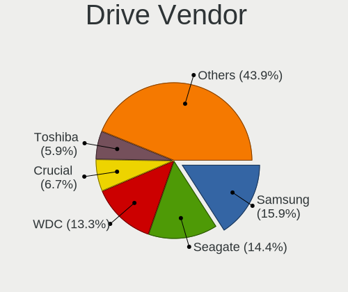
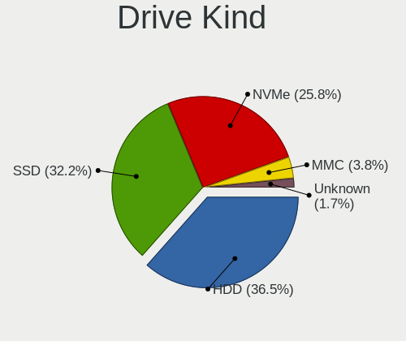
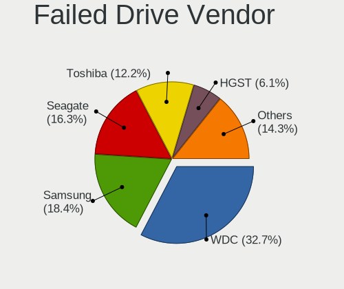
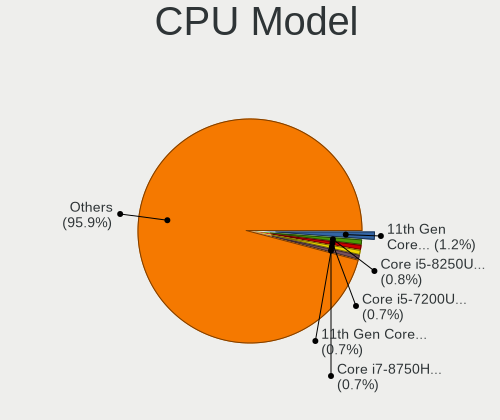
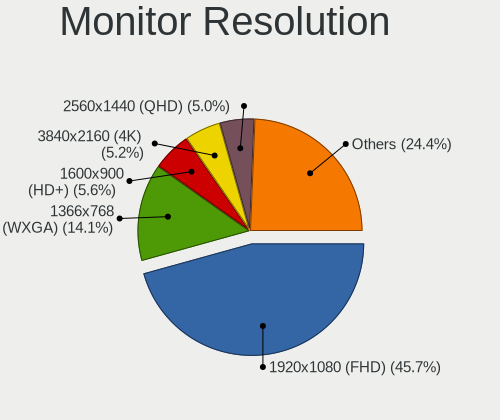
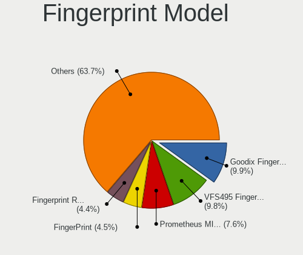

Linux in France - Tested Hardware & Statistics
----------------------------------------------

A project to collect tested hardware configurations for Linux in France.

Anyone can contribute to this report by the [hw-probe](https://github.com/linuxhw/hw-probe) tool:

    sudo -E hw-probe -all -upload

Please contribute! Especially if your hardware is rare.

This is a report for all computer types. See also reports for [desktops](/Location/France/Desktop/README.md) and [notebooks](/Location/France/Notebook/README.md).

Contents
--------

* [ Test Cases ](#test-cases)

* [ System ](#system)
  - [ OS                       ](#os)
  - [ OS Family                ](#os-family)
  - [ Kernel                   ](#kernel)
  - [ Kernel Family            ](#kernel-family)
  - [ Kernel Major Ver.        ](#kernel-major-ver)
  - [ Arch                     ](#arch)
  - [ DE                       ](#de)
  - [ Display Server           ](#display-server)
  - [ Display Manager          ](#display-manager)
  - [ OS Lang                  ](#os-lang)
  - [ Boot Mode                ](#boot-mode)
  - [ Filesystem               ](#filesystem)
  - [ Part. scheme             ](#part-scheme)
  - [ Dual Boot with Linux/BSD ](#dual-boot-with-linuxbsd)
  - [ Dual Boot (Win)          ](#dual-boot-win)

* [ Board ](#board)
  - [ Vendor                   ](#vendor)
  - [ Model                    ](#model)
  - [ Model Family             ](#model-family)
  - [ MFG Year                 ](#mfg-year)
  - [ Form Factor              ](#form-factor)
  - [ Secure Boot              ](#secure-boot)
  - [ Coreboot                 ](#coreboot)
  - [ RAM Size                 ](#ram-size)
  - [ RAM Used                 ](#ram-used)
  - [ Total Drives             ](#total-drives)
  - [ Has CD-ROM               ](#has-cd-rom)
  - [ Has Ethernet             ](#has-ethernet)
  - [ Has WiFi                 ](#has-wifi)
  - [ Has Bluetooth            ](#has-bluetooth)

* [ Location ](#location)
  - [ Country                  ](#country)
  - [ City                     ](#city)

* [ Drives ](#drives)
  - [ Drive Vendor             ](#drive-vendor)
  - [ Drive Model              ](#drive-model)
  - [ HDD Vendor               ](#hdd-vendor)
  - [ SSD Vendor               ](#ssd-vendor)
  - [ Drive Kind               ](#drive-kind)
  - [ Drive Connector          ](#drive-connector)
  - [ Drive Size               ](#drive-size)
  - [ Space Total              ](#space-total)
  - [ Space Used               ](#space-used)
  - [ Malfunc. Drives          ](#malfunc-drives)
  - [ Malfunc. Drive Vendor    ](#malfunc-drive-vendor)
  - [ Malfunc. HDD Vendor      ](#malfunc-hdd-vendor)
  - [ Malfunc. Drive Kind      ](#malfunc-drive-kind)
  - [ Failed Drives            ](#failed-drives)
  - [ Failed Drive Vendor      ](#failed-drive-vendor)
  - [ Drive Status             ](#drive-status)

* [ Storage controller ](#storage-controller)
  - [ Storage Vendor           ](#storage-vendor)
  - [ Storage Model            ](#storage-model)
  - [ Storage Kind             ](#storage-kind)

* [ Processor ](#processor)
  - [ CPU Vendor               ](#cpu-vendor)
  - [ CPU Model                ](#cpu-model)
  - [ CPU Model Family         ](#cpu-model-family)
  - [ CPU Cores                ](#cpu-cores)
  - [ CPU Sockets              ](#cpu-sockets)
  - [ CPU Threads              ](#cpu-threads)
  - [ CPU Op-Modes             ](#cpu-op-modes)
  - [ CPU Microcode            ](#cpu-microcode)
  - [ CPU Microarch            ](#cpu-microarch)

* [ Graphics ](#graphics)
  - [ GPU Vendor               ](#gpu-vendor)
  - [ GPU Model                ](#gpu-model)
  - [ GPU Combo                ](#gpu-combo)
  - [ GPU Driver               ](#gpu-driver)
  - [ GPU Memory               ](#gpu-memory)

* [ Monitor ](#monitor)
  - [ Monitor Vendor           ](#monitor-vendor)
  - [ Monitor Model            ](#monitor-model)
  - [ Monitor Resolution       ](#monitor-resolution)
  - [ Monitor Diagonal         ](#monitor-diagonal)
  - [ Monitor Width            ](#monitor-width)
  - [ Aspect Ratio             ](#aspect-ratio)
  - [ Monitor Area             ](#monitor-area)
  - [ Pixel Density            ](#pixel-density)
  - [ Multiple Monitors        ](#multiple-monitors)

* [ Network ](#network)
  - [ Net Controller Vendor    ](#net-controller-vendor)
  - [ Net Controller Model     ](#net-controller-model)
  - [ Wireless Vendor          ](#wireless-vendor)
  - [ Wireless Model           ](#wireless-model)
  - [ Ethernet Vendor          ](#ethernet-vendor)
  - [ Ethernet Model           ](#ethernet-model)
  - [ Net Controller Kind      ](#net-controller-kind)
  - [ Used Controller          ](#used-controller)
  - [ NICs                     ](#nics)
  - [ IPv6                     ](#ipv6)

* [ Bluetooth ](#bluetooth)
  - [ Bluetooth Vendor         ](#bluetooth-vendor)
  - [ Bluetooth Model          ](#bluetooth-model)

* [ Sound ](#sound)
  - [ Sound Vendor             ](#sound-vendor)
  - [ Sound Model              ](#sound-model)

* [ Memory ](#memory)
  - [ Memory Vendor            ](#memory-vendor)
  - [ Memory Model             ](#memory-model)
  - [ Memory Kind              ](#memory-kind)
  - [ Memory Form Factor       ](#memory-form-factor)
  - [ Memory Size              ](#memory-size)
  - [ Memory Speed             ](#memory-speed)

* [ Printers & scanners ](#printers--scanners)
  - [ Printer Vendor           ](#printer-vendor)
  - [ Printer Model            ](#printer-model)
  - [ Scanner Vendor           ](#scanner-vendor)
  - [ Scanner Model            ](#scanner-model)

* [ Camera ](#camera)
  - [ Camera Vendor            ](#camera-vendor)
  - [ Camera Model             ](#camera-model)

* [ Security ](#security)
  - [ Fingerprint Vendor       ](#fingerprint-vendor)
  - [ Fingerprint Model        ](#fingerprint-model)
  - [ Chipcard Vendor          ](#chipcard-vendor)
  - [ Chipcard Model           ](#chipcard-model)

* [ Unsupported ](#unsupported)
  - [ Unsupported Devices      ](#unsupported-devices)
  - [ Unsupported Device Types ](#unsupported-device-types)

Test Cases
----------

Total: 13094

| Vendor        | Model                       | Form-Factor | Probe                                                      | Date         |
|---------------|-----------------------------|-------------|------------------------------------------------------------|--------------|
| Lenovo        | ThinkPad X240 20AMS5XY00    | Notebook    | [3b98c592e0](https://linux-hardware.org/?probe=3b98c592e0) | Jun 10, 2023 |
| Lenovo        | ThinkPad P16s Gen 1 21CK... | Notebook    | [c768cfa03d](https://linux-hardware.org/?probe=c768cfa03d) | Jun 10, 2023 |
| Lenovo        | ThinkPad T550 20CJS1XB00    | Notebook    | [3d3375df75](https://linux-hardware.org/?probe=3d3375df75) | Jun 10, 2023 |
| Pegatron      | Benicia                     | Desktop     | [c57fee6ea0](https://linux-hardware.org/?probe=c57fee6ea0) | Jun 10, 2023 |
| ASUSTek       | TUF Gaming X570-PLUS        | Desktop     | [0eae3567d9](https://linux-hardware.org/?probe=0eae3567d9) | Jun 10, 2023 |
| HP            | 339B                        | Desktop     | [bc6de07e07](https://linux-hardware.org/?probe=bc6de07e07) | Jun 09, 2023 |
| ASUSTek       | PRIME X370-PRO              | Desktop     | [77145a587d](https://linux-hardware.org/?probe=77145a587d) | Jun 09, 2023 |
| Dell          | XPS 13 9370                 | Notebook    | [c605e51eca](https://linux-hardware.org/?probe=c605e51eca) | Jun 09, 2023 |
| Dell          | XPS 9320                    | Notebook    | [c9f26e18c2](https://linux-hardware.org/?probe=c9f26e18c2) | Jun 09, 2023 |
| Gigabyte      | X570 UD                     | Desktop     | [98a10d2fd9](https://linux-hardware.org/?probe=98a10d2fd9) | Jun 08, 2023 |
| Dell          | 0GY6Y8 A02                  | Desktop     | [65f988a0c3](https://linux-hardware.org/?probe=65f988a0c3) | Jun 08, 2023 |
| AZW           | SEi                         | Desktop     | [399b4a7add](https://linux-hardware.org/?probe=399b4a7add) | Jun 08, 2023 |
| Dell          | Precision 3551              | Notebook    | [0e484bd6a5](https://linux-hardware.org/?probe=0e484bd6a5) | Jun 08, 2023 |
| Unknown       | Unknown                     | Desktop     | [2c3b00b1ae](https://linux-hardware.org/?probe=2c3b00b1ae) | Jun 08, 2023 |
| Dell          | Precision 5510              | Notebook    | [24317d94ff](https://linux-hardware.org/?probe=24317d94ff) | Jun 08, 2023 |
| HP            | EliteBook 840 G3            | Notebook    | [cd3bb98a1e](https://linux-hardware.org/?probe=cd3bb98a1e) | Jun 08, 2023 |
| HUAWEI        | MACHD-WXX9                  | Notebook    | [f87fe0fe34](https://linux-hardware.org/?probe=f87fe0fe34) | Jun 08, 2023 |
| Gigabyte      | GA-A75M-D2H                 | Desktop     | [f78a07f792](https://linux-hardware.org/?probe=f78a07f792) | Jun 08, 2023 |
| Techvision    | TVI7309X B0                 | Desktop     | [57b238a5ff](https://linux-hardware.org/?probe=57b238a5ff) | Jun 08, 2023 |
| Gigabyte      | B550M AORUS ELITE           | Desktop     | [87f789c059](https://linux-hardware.org/?probe=87f789c059) | Jun 07, 2023 |
| MSI           | CreatorPro X17 A12UKS       | Notebook    | [ee827c186c](https://linux-hardware.org/?probe=ee827c186c) | Jun 07, 2023 |
| MSI           | A88XM-E35                   | Desktop     | [efe1285363](https://linux-hardware.org/?probe=efe1285363) | Jun 07, 2023 |
| HP            | 8169                        | Desktop     | [45543e5040](https://linux-hardware.org/?probe=45543e5040) | Jun 07, 2023 |
| ASUSTek       | ROG STRIX B550-A GAMING     | Desktop     | [933978a1ae](https://linux-hardware.org/?probe=933978a1ae) | Jun 07, 2023 |
| Dell          | Latitude 5530               | Notebook    | [1e3452635f](https://linux-hardware.org/?probe=1e3452635f) | Jun 07, 2023 |
| ASUSTek       | PRIME B360-PLUS             | Desktop     | [8b82994313](https://linux-hardware.org/?probe=8b82994313) | Jun 07, 2023 |
| ASUSTek       | H97M-E                      | Desktop     | [97140e9688](https://linux-hardware.org/?probe=97140e9688) | Jun 07, 2023 |
| Lenovo        | ThinkPad P15s Gen 2i 20W... | Notebook    | [53341e2d0d](https://linux-hardware.org/?probe=53341e2d0d) | Jun 07, 2023 |
| Lenovo        | Kabini CRB 31900058 STD     | Desktop     | [8f3282c700](https://linux-hardware.org/?probe=8f3282c700) | Jun 06, 2023 |
| MSI           | B85-G43 GAMING              | Desktop     | [326a620bbd](https://linux-hardware.org/?probe=326a620bbd) | Jun 06, 2023 |
| MSI           | B85-G43 GAMING              | Desktop     | [9cfd61dae7](https://linux-hardware.org/?probe=9cfd61dae7) | Jun 06, 2023 |
| HP            | Pavilion g7                 | Notebook    | [f8cccf0fec](https://linux-hardware.org/?probe=f8cccf0fec) | Jun 06, 2023 |
| Dell          | Latitude 5530               | Notebook    | [44aa9db289](https://linux-hardware.org/?probe=44aa9db289) | Jun 06, 2023 |
| MSI           | Crosshair 15 C12VF          | Notebook    | [6cd11169d0](https://linux-hardware.org/?probe=6cd11169d0) | Jun 05, 2023 |
| HP            | ENVY Laptop 13-ba0xxx       | Notebook    | [22143d333a](https://linux-hardware.org/?probe=22143d333a) | Jun 05, 2023 |
| Acer          | Aspire ES1-711              | Notebook    | [5534470ef5](https://linux-hardware.org/?probe=5534470ef5) | Jun 05, 2023 |
| ASUSTek       | VivoBook_ASUSLaptop X515... | Notebook    | [a06e6ab7ad](https://linux-hardware.org/?probe=a06e6ab7ad) | Jun 05, 2023 |
| ASUSTek       | G750JM                      | Notebook    | [cdb3539c93](https://linux-hardware.org/?probe=cdb3539c93) | Jun 05, 2023 |
| ASRock        | G41M-GS3                    | Desktop     | [f8789775fe](https://linux-hardware.org/?probe=f8789775fe) | Jun 05, 2023 |
| Intel         | DE3815TYKH H26998-402       | Desktop     | [d2f97c16e9](https://linux-hardware.org/?probe=d2f97c16e9) | Jun 05, 2023 |
| Dell          | 0DF42J A00                  | Desktop     | [c68dff0dd7](https://linux-hardware.org/?probe=c68dff0dd7) | Jun 05, 2023 |
| Gigabyte      | F2A55M-DS2                  | Desktop     | [74b01a9071](https://linux-hardware.org/?probe=74b01a9071) | Jun 05, 2023 |
| ASUSTek       | K95VJ                       | Notebook    | [9bbcec82c6](https://linux-hardware.org/?probe=9bbcec82c6) | Jun 05, 2023 |
| HP            | 1850                        | Desktop     | [bddc14be8b](https://linux-hardware.org/?probe=bddc14be8b) | Jun 05, 2023 |
| ASUSTek       | UX303UA                     | Notebook    | [41514924ed](https://linux-hardware.org/?probe=41514924ed) | Jun 04, 2023 |
| Intel         | DH55HC AAE70933-503         | Desktop     | [b3d5e112eb](https://linux-hardware.org/?probe=b3d5e112eb) | Jun 04, 2023 |
| Jumper        | EZbook                      | Notebook    | [950179fe29](https://linux-hardware.org/?probe=950179fe29) | Jun 04, 2023 |
| Toshiba       | Satellite L655              | Notebook    | [1b9656a4a1](https://linux-hardware.org/?probe=1b9656a4a1) | Jun 04, 2023 |
| ASUSTek       | G750JM                      | Notebook    | [f492ab6829](https://linux-hardware.org/?probe=f492ab6829) | Jun 04, 2023 |
| UNOWHY        | Y13G002S4EI                 | Notebook    | [f1b932f397](https://linux-hardware.org/?probe=f1b932f397) | Jun 04, 2023 |
| IP3 Tech      | AP1                         | Notebook    | [d24ecf10e2](https://linux-hardware.org/?probe=d24ecf10e2) | Jun 04, 2023 |
| MSI           | H81M-P32                    | Desktop     | [f2423b3ef9](https://linux-hardware.org/?probe=f2423b3ef9) | Jun 04, 2023 |
| MSI           | H81M-P32                    | Desktop     | [f1d0b1d487](https://linux-hardware.org/?probe=f1d0b1d487) | Jun 04, 2023 |
| Toshiba       | Satellite Pro L300          | Notebook    | [968005c798](https://linux-hardware.org/?probe=968005c798) | Jun 04, 2023 |
| ASUSTek       | ROG Strix G713RM_G713RM     | Notebook    | [d45c069b9f](https://linux-hardware.org/?probe=d45c069b9f) | Jun 04, 2023 |
| Samsung       | 950XED                      | Notebook    | [185834c02e](https://linux-hardware.org/?probe=185834c02e) | Jun 04, 2023 |
| Schenker      | XMG FOCUS (M22)             | Notebook    | [31203c3645](https://linux-hardware.org/?probe=31203c3645) | Jun 03, 2023 |
| Acer          | Aspire TC-705               | Desktop     | [8aa3bc4947](https://linux-hardware.org/?probe=8aa3bc4947) | Jun 03, 2023 |
| HONOR         | HGF-WX6                     | Notebook    | [13d0d7b145](https://linux-hardware.org/?probe=13d0d7b145) | Jun 03, 2023 |
| MSI           | H97M-G43                    | Desktop     | [6bd1b61977](https://linux-hardware.org/?probe=6bd1b61977) | Jun 03, 2023 |
| HUAWEI        | CREM-WXX9                   | Notebook    | [75ba9fba2f](https://linux-hardware.org/?probe=75ba9fba2f) | Jun 03, 2023 |
| Gigabyte      | B650M GAMING X AX           | Desktop     | [610ba5871f](https://linux-hardware.org/?probe=610ba5871f) | Jun 03, 2023 |
| Acer          | Aspire E5-772G              | Notebook    | [5bd684bed6](https://linux-hardware.org/?probe=5bd684bed6) | Jun 02, 2023 |
| Acer          | Aspire E5-772G              | Notebook    | [f454cdf394](https://linux-hardware.org/?probe=f454cdf394) | Jun 02, 2023 |
| Toshiba       | Satellite L655              | Notebook    | [9b83a4575b](https://linux-hardware.org/?probe=9b83a4575b) | Jun 02, 2023 |
| Lenovo        | IdeaPad 5 14ALC05 82LM      | Notebook    | [d856669333](https://linux-hardware.org/?probe=d856669333) | Jun 02, 2023 |
| Valve         | Jupiter                     | Notebook    | [d1fec35ece](https://linux-hardware.org/?probe=d1fec35ece) | Jun 02, 2023 |
| Gigabyte      | G5 GE                       | Notebook    | [558ee7e63f](https://linux-hardware.org/?probe=558ee7e63f) | Jun 02, 2023 |
| Lenovo        | Legion 5 15ACH6H 82JU       | Notebook    | [4d170e024e](https://linux-hardware.org/?probe=4d170e024e) | Jun 02, 2023 |
| Acer          | Aspire X3950                | Desktop     | [82aa882647](https://linux-hardware.org/?probe=82aa882647) | Jun 02, 2023 |
| ASRockRack    | X470D4U2-2T                 | Desktop     | [43901d3db7](https://linux-hardware.org/?probe=43901d3db7) | Jun 02, 2023 |
| ECS           | Nettle2                     | Desktop     | [6fe297e475](https://linux-hardware.org/?probe=6fe297e475) | Jun 02, 2023 |
| Acer          | Aspire X3950                | Desktop     | [1c7f0f7567](https://linux-hardware.org/?probe=1c7f0f7567) | Jun 02, 2023 |
| Acer          | Aspire 7745G                | Notebook    | [7739f949e1](https://linux-hardware.org/?probe=7739f949e1) | Jun 02, 2023 |
| HP            | 802E                        | Desktop     | [1837c96bfd](https://linux-hardware.org/?probe=1837c96bfd) | Jun 02, 2023 |
| MSI           | H81M-E34                    | Desktop     | [26362cac22](https://linux-hardware.org/?probe=26362cac22) | Jun 02, 2023 |
| Gigabyte      | GA-78LMT-USB3               | Desktop     | [def2c6020b](https://linux-hardware.org/?probe=def2c6020b) | Jun 01, 2023 |
| MSI           | H81M-E34                    | Desktop     | [9f04387a7c](https://linux-hardware.org/?probe=9f04387a7c) | Jun 01, 2023 |
| MSI           | H510M-A PRO                 | Desktop     | [f517c1893a](https://linux-hardware.org/?probe=f517c1893a) | Jun 01, 2023 |
| HP            | 18E5                        | Desktop     | [9d89c3065b](https://linux-hardware.org/?probe=9d89c3065b) | Jun 01, 2023 |
| UNOWHY        | Y13G002S4EI                 | Notebook    | [0bb0a8be66](https://linux-hardware.org/?probe=0bb0a8be66) | Jun 01, 2023 |
| HP            | Laptop 14s-dq0xxx           | Notebook    | [0017659aa2](https://linux-hardware.org/?probe=0017659aa2) | Jun 01, 2023 |
| MSI           | H510M-A PRO                 | Desktop     | [8557cd4efa](https://linux-hardware.org/?probe=8557cd4efa) | Jun 01, 2023 |
| Dell          | Latitude E5510              | Notebook    | [4a0bc9e53f](https://linux-hardware.org/?probe=4a0bc9e53f) | Jun 01, 2023 |
| ASUSTek       | X751MA                      | Notebook    | [1b1a5c05ac](https://linux-hardware.org/?probe=1b1a5c05ac) | Jun 01, 2023 |
| HP            | EliteBook 650 15.6 inch ... | Notebook    | [3ca0d2f1a7](https://linux-hardware.org/?probe=3ca0d2f1a7) | Jun 01, 2023 |
| Lenovo        | Legion Y540-15IRH 81SX      | Notebook    | [ffc6b5e345](https://linux-hardware.org/?probe=ffc6b5e345) | Jun 01, 2023 |
| Supermicro    | X12STD-F                    | Desktop     | [8511ce89ad](https://linux-hardware.org/?probe=8511ce89ad) | Jun 01, 2023 |
| ASUSTek       | VivoBook_ASUSLaptop X580... | Notebook    | [f66667b7fb](https://linux-hardware.org/?probe=f66667b7fb) | Jun 01, 2023 |
| Dell          | Latitude E5510              | Notebook    | [9457826049](https://linux-hardware.org/?probe=9457826049) | Jun 01, 2023 |
| Gigabyte      | B550M AORUS ELITE           | Desktop     | [9faf2de183](https://linux-hardware.org/?probe=9faf2de183) | Jun 01, 2023 |
| Samsung       | N150/N210/N220              | Notebook    | [449400ebe9](https://linux-hardware.org/?probe=449400ebe9) | May 31, 2023 |
| Acer          | Aspire 3830TG               | Notebook    | [abd7d9a412](https://linux-hardware.org/?probe=abd7d9a412) | May 31, 2023 |
| Packard Be... | EasyNote LJ75               | Notebook    | [95c733d00f](https://linux-hardware.org/?probe=95c733d00f) | May 31, 2023 |
| Lenovo        | IdeaPad 5 Pro 16ARH7 82S... | Notebook    | [ceaf9120eb](https://linux-hardware.org/?probe=ceaf9120eb) | May 31, 2023 |
| MSI           | GE70 2QE                    | Notebook    | [a075b8b77d](https://linux-hardware.org/?probe=a075b8b77d) | May 31, 2023 |
| Lenovo        | ThinkPad T480 20L6S7PE0G    | Notebook    | [239faf8c55](https://linux-hardware.org/?probe=239faf8c55) | May 31, 2023 |
| MSI           | B85M-G43                    | Desktop     | [38fb05719a](https://linux-hardware.org/?probe=38fb05719a) | May 31, 2023 |
| Dell          | Inspiron 3502               | Notebook    | [3c734d2900](https://linux-hardware.org/?probe=3c734d2900) | May 31, 2023 |
| ASRock        | X570 Phantom Gaming 4       | Desktop     | [6c3655186f](https://linux-hardware.org/?probe=6c3655186f) | May 31, 2023 |
| ASUSTek       | K52Jc                       | Notebook    | [ad0b57d7c6](https://linux-hardware.org/?probe=ad0b57d7c6) | May 31, 2023 |
| ASUSTek       | K52Jc                       | Notebook    | [7709d9fd16](https://linux-hardware.org/?probe=7709d9fd16) | May 31, 2023 |
| Dell          | Latitude E5510              | Notebook    | [52e1023195](https://linux-hardware.org/?probe=52e1023195) | May 31, 2023 |
| Dell          | Latitude E5510              | Notebook    | [aa0f6a81b6](https://linux-hardware.org/?probe=aa0f6a81b6) | May 30, 2023 |
| ASUSTek       | P4S8L                       | Desktop     | [c26269028e](https://linux-hardware.org/?probe=c26269028e) | May 30, 2023 |
| Acer          | Aspire V3-574G              | Notebook    | [728459dd4a](https://linux-hardware.org/?probe=728459dd4a) | May 30, 2023 |
| Samsung       | R610                        | Notebook    | [4e3be533ba](https://linux-hardware.org/?probe=4e3be533ba) | May 30, 2023 |
| Lenovo        | Legion 5 15ACH6H 82JU       | Notebook    | [86e04155f2](https://linux-hardware.org/?probe=86e04155f2) | May 30, 2023 |
| Nvidia        | Tegra                       | Soc         | [235f3fa96f](https://linux-hardware.org/?probe=235f3fa96f) | May 30, 2023 |
| Cincoze       | 1.0.01.001                  | Desktop     | [1552e93368](https://linux-hardware.org/?probe=1552e93368) | May 30, 2023 |
| MSI           | H55M-ED55                   | Desktop     | [a89bdc8ec0](https://linux-hardware.org/?probe=a89bdc8ec0) | May 30, 2023 |
| Dell          | Latitude 3480               | Notebook    | [56d1834385](https://linux-hardware.org/?probe=56d1834385) | May 30, 2023 |
| HP            | 0B54h D                     | Desktop     | [c7813156eb](https://linux-hardware.org/?probe=c7813156eb) | May 30, 2023 |
| ASUSTek       | VivoBook_ASUSLaptop M350... | Notebook    | [cddd43859b](https://linux-hardware.org/?probe=cddd43859b) | May 30, 2023 |
| HP            | Victus by Laptop 16-e0xx... | Notebook    | [d4cc055d3a](https://linux-hardware.org/?probe=d4cc055d3a) | May 30, 2023 |
| ASUSTek       | PRIME Z370-P                | Desktop     | [afb02cee29](https://linux-hardware.org/?probe=afb02cee29) | May 29, 2023 |
| MSI           | Z170A MPOWER GAMING TITA... | Desktop     | [0e9239c5f7](https://linux-hardware.org/?probe=0e9239c5f7) | May 29, 2023 |
| HP            | Elite Dragonfly 13.5 inc... | Notebook    | [1e0fbe86da](https://linux-hardware.org/?probe=1e0fbe86da) | May 29, 2023 |
| ASUSTek       | VivoBook_ASUSLaptop X712... | Notebook    | [509bb7aae7](https://linux-hardware.org/?probe=509bb7aae7) | May 29, 2023 |
| Gigabyte      | H410M H                     | Desktop     | [7a52f09646](https://linux-hardware.org/?probe=7a52f09646) | May 29, 2023 |
| ASUSTek       | SABERTOOTH 990FX R2.0       | Desktop     | [a46f523ea2](https://linux-hardware.org/?probe=a46f523ea2) | May 29, 2023 |
| MSI           | A320M-A PRO                 | Desktop     | [88f3c7f5e5](https://linux-hardware.org/?probe=88f3c7f5e5) | May 29, 2023 |
| Lenovo        | ThinkPad T440p 20AWS19P0... | Notebook    | [8d25da413c](https://linux-hardware.org/?probe=8d25da413c) | May 29, 2023 |
| ASUSTek       | H81M-C                      | Desktop     | [ece00aac41](https://linux-hardware.org/?probe=ece00aac41) | May 29, 2023 |
| Acer          | Aspire E5-772G              | Notebook    | [ae0b46c29f](https://linux-hardware.org/?probe=ae0b46c29f) | May 28, 2023 |
| Dell          | 048DY8 A01                  | Desktop     | [9bfe61714e](https://linux-hardware.org/?probe=9bfe61714e) | May 28, 2023 |
| Dell          | XPS 9320                    | Notebook    | [33e7d964ad](https://linux-hardware.org/?probe=33e7d964ad) | May 28, 2023 |
| ASRock        | Z370 Professional Gaming... | Desktop     | [f7d00f30cb](https://linux-hardware.org/?probe=f7d00f30cb) | May 28, 2023 |
| Shuttle       | X50V5                       | Notebook    | [277cc7ca36](https://linux-hardware.org/?probe=277cc7ca36) | May 28, 2023 |
| ASUSTek       | ROG CROSSHAIR VIII DARK ... | Desktop     | [7af2cff4d7](https://linux-hardware.org/?probe=7af2cff4d7) | May 27, 2023 |
| Lenovo        | IdeaPad L3 15IML05 81Y3     | Notebook    | [d62f60891d](https://linux-hardware.org/?probe=d62f60891d) | May 27, 2023 |
| HP            | Pavilion dv6                | Notebook    | [9f96328490](https://linux-hardware.org/?probe=9f96328490) | May 27, 2023 |
| ASUSTek       | TUF Z390-PRO GAMING         | Desktop     | [449d13baa5](https://linux-hardware.org/?probe=449d13baa5) | May 27, 2023 |
| Gigabyte      | GA-MA785GMT-UD2H            | Desktop     | [7d4df58daf](https://linux-hardware.org/?probe=7d4df58daf) | May 27, 2023 |
| Dell          | Precision 3581              | Notebook    | [9fb00fd492](https://linux-hardware.org/?probe=9fb00fd492) | May 27, 2023 |
| MSI           | H55M-ED55                   | Desktop     | [61e1fc3841](https://linux-hardware.org/?probe=61e1fc3841) | May 27, 2023 |
| Dell          | Inspiron 5567               | Notebook    | [9dc73257dc](https://linux-hardware.org/?probe=9dc73257dc) | May 27, 2023 |
| ASUSTek       | ASUS TUF Gaming A17 FA70... | Notebook    | [efe0b55153](https://linux-hardware.org/?probe=efe0b55153) | May 27, 2023 |
| HP            | 81BA                        | All in one  | [d41186191f](https://linux-hardware.org/?probe=d41186191f) | May 27, 2023 |
| Dell          | 0TP406                      | Desktop     | [c7300f35f4](https://linux-hardware.org/?probe=c7300f35f4) | May 26, 2023 |
| ASRock        | X300M-STX                   | Desktop     | [c3af0f3242](https://linux-hardware.org/?probe=c3af0f3242) | May 26, 2023 |
| Dell          | Latitude 3520               | Notebook    | [bfa8a18cb5](https://linux-hardware.org/?probe=bfa8a18cb5) | May 26, 2023 |
| Dell          | 0NDYHG A01                  | Desktop     | [07be92d6f3](https://linux-hardware.org/?probe=07be92d6f3) | May 26, 2023 |
| Dell          | G15 5510                    | Notebook    | [f9e862a5dd](https://linux-hardware.org/?probe=f9e862a5dd) | May 26, 2023 |
| ASUSTek       | ROG Strix G513QR_G513QR     | Notebook    | [76a373f9dd](https://linux-hardware.org/?probe=76a373f9dd) | May 26, 2023 |
| ASUSTek       | ASUS EXPERTBOOK B1400CEA... | Notebook    | [4c3aa6334b](https://linux-hardware.org/?probe=4c3aa6334b) | May 26, 2023 |
| Lenovo        | ThinkPad T450 20BUS06B00    | Notebook    | [d86873ceab](https://linux-hardware.org/?probe=d86873ceab) | May 26, 2023 |
| ASUSTek       | P4S8L                       | Desktop     | [75096a0d55](https://linux-hardware.org/?probe=75096a0d55) | May 25, 2023 |
| ASRock        | H61M-VG4                    | Desktop     | [4a6c3586fa](https://linux-hardware.org/?probe=4a6c3586fa) | May 25, 2023 |
| Toshiba       | Satellite L300              | Notebook    | [10adda3362](https://linux-hardware.org/?probe=10adda3362) | May 25, 2023 |
| ASUSTek       | N75SF                       | Notebook    | [38840055c8](https://linux-hardware.org/?probe=38840055c8) | May 25, 2023 |
| Foxconn       | 2ABF                        | Desktop     | [a764ae9f3c](https://linux-hardware.org/?probe=a764ae9f3c) | May 25, 2023 |
| Acer          | EG31M R01-A4                | Desktop     | [447645dad3](https://linux-hardware.org/?probe=447645dad3) | May 25, 2023 |
| ASUSTek       | ASUS TUF Gaming A17 FA70... | Notebook    | [ab42ac444e](https://linux-hardware.org/?probe=ab42ac444e) | May 24, 2023 |
| Foxconn       | 2ABF                        | Desktop     | [9fbeb26e54](https://linux-hardware.org/?probe=9fbeb26e54) | May 24, 2023 |
| Dell          | Precision 5470              | Notebook    | [e0a145106b](https://linux-hardware.org/?probe=e0a145106b) | May 24, 2023 |
| HP            | 1496                        | Desktop     | [2edc574902](https://linux-hardware.org/?probe=2edc574902) | May 24, 2023 |
| HP            | Pavilion Notebook 15-bc5... | Notebook    | [933989a15b](https://linux-hardware.org/?probe=933989a15b) | May 24, 2023 |
| Gigabyte      | GA-MA785GMT-UD2H            | Desktop     | [8fd8cdb823](https://linux-hardware.org/?probe=8fd8cdb823) | May 24, 2023 |
| Lenovo        | 318E SDK0L22692 WIN 3792... | Desktop     | [5fb6f16a6d](https://linux-hardware.org/?probe=5fb6f16a6d) | May 24, 2023 |
| HP            | Victus by Laptop 16-e0xx... | Notebook    | [d92b2ec905](https://linux-hardware.org/?probe=d92b2ec905) | May 24, 2023 |
| ASRock        | E350M1                      | Desktop     | [d366f5f318](https://linux-hardware.org/?probe=d366f5f318) | May 24, 2023 |
| ASUSTek       | K55VJ                       | Notebook    | [2b12b33767](https://linux-hardware.org/?probe=2b12b33767) | May 24, 2023 |
| Dell          | Inspiron 14 5401            | Notebook    | [16d8b1c945](https://linux-hardware.org/?probe=16d8b1c945) | May 24, 2023 |
| HP            | Laptop 17-by3xxx            | Notebook    | [dcafbb2a69](https://linux-hardware.org/?probe=dcafbb2a69) | May 23, 2023 |
| HP            | Laptop 17-by3xxx            | Notebook    | [cbe27885cb](https://linux-hardware.org/?probe=cbe27885cb) | May 23, 2023 |
| Lenovo        | SHARKBAY SDK0E50510 WIN     | Desktop     | [5837575ac6](https://linux-hardware.org/?probe=5837575ac6) | May 23, 2023 |
| Lenovo        | SHARKBAY SDK0E50510 WIN     | Desktop     | [dc47e13a60](https://linux-hardware.org/?probe=dc47e13a60) | May 23, 2023 |
| ASUSTek       | TUF Gaming B550-PLUS        | Desktop     | [4e817c1abf](https://linux-hardware.org/?probe=4e817c1abf) | May 23, 2023 |
| ASRock        | E350M1                      | Desktop     | [1debe3dcdf](https://linux-hardware.org/?probe=1debe3dcdf) | May 23, 2023 |
| HP            | EliteBook x360 830 G8 No... | Convertible | [b3062be7f2](https://linux-hardware.org/?probe=b3062be7f2) | May 23, 2023 |
| Lenovo        | ThinkPad P73 20QRCTO1WW     | Notebook    | [f8ef460648](https://linux-hardware.org/?probe=f8ef460648) | May 23, 2023 |
| HP            | ProBook 450 G3              | Notebook    | [4400f1205b](https://linux-hardware.org/?probe=4400f1205b) | May 23, 2023 |
| Lenovo        | ThinkPad W520 4284CY1       | Notebook    | [91945b5bb5](https://linux-hardware.org/?probe=91945b5bb5) | May 23, 2023 |
| Apple         | MacBookPro8,1               | Notebook    | [fadd25f4c5](https://linux-hardware.org/?probe=fadd25f4c5) | May 23, 2023 |
| MSI           | H81M-E34                    | Desktop     | [4247f30888](https://linux-hardware.org/?probe=4247f30888) | May 23, 2023 |
| Unknown       | Unknown                     | Desktop     | [977cf42905](https://linux-hardware.org/?probe=977cf42905) | May 23, 2023 |
| HP            | Pavilion 17                 | Notebook    | [eb6c222cf7](https://linux-hardware.org/?probe=eb6c222cf7) | May 23, 2023 |
| UNOWHY        | Y13G011S4EI                 | Notebook    | [3642f34cd6](https://linux-hardware.org/?probe=3642f34cd6) | May 23, 2023 |
| ASUSTek       | K73SD                       | Notebook    | [063e42ac60](https://linux-hardware.org/?probe=063e42ac60) | May 22, 2023 |
| ASUSTek       | UX301LAB                    | Notebook    | [69f7b4ae4f](https://linux-hardware.org/?probe=69f7b4ae4f) | May 22, 2023 |
| HP            | 1791                        | Desktop     | [7fa95d1b7b](https://linux-hardware.org/?probe=7fa95d1b7b) | May 22, 2023 |
| HUAWEI        | HLYL-WXX9                   | Notebook    | [28a8978593](https://linux-hardware.org/?probe=28a8978593) | May 22, 2023 |
| Raspberry ... | Raspberry Pi Model B Rev... | Soc         | [ac40ad8213](https://linux-hardware.org/?probe=ac40ad8213) | May 22, 2023 |
| ASRock        | B450 Steel Legend           | Desktop     | [012c721256](https://linux-hardware.org/?probe=012c721256) | May 22, 2023 |
| HP            | Laptop 15-da0xxx            | Notebook    | [82f235bfbb](https://linux-hardware.org/?probe=82f235bfbb) | May 22, 2023 |
| Dell          | Latitude E4200              | Notebook    | [f352cc3ee4](https://linux-hardware.org/?probe=f352cc3ee4) | May 22, 2023 |
| Gigabyte      | B450M DS3H-CF               | Desktop     | [2b2367f9b1](https://linux-hardware.org/?probe=2b2367f9b1) | May 22, 2023 |
| MSI           | PRO Z690-A DDR4             | Desktop     | [b3fb445705](https://linux-hardware.org/?probe=b3fb445705) | May 22, 2023 |
| Dell          | 0PC5F7 A03                  | Desktop     | [8b4b66a085](https://linux-hardware.org/?probe=8b4b66a085) | May 22, 2023 |
| HP            | 1589                        | Desktop     | [a7d56849a5](https://linux-hardware.org/?probe=a7d56849a5) | May 22, 2023 |
| Lenovo        | 3753 NOK                    | Desktop     | [f2971c14a7](https://linux-hardware.org/?probe=f2971c14a7) | May 21, 2023 |
| Gigabyte      | B450M H                     | Desktop     | [9db5706bfc](https://linux-hardware.org/?probe=9db5706bfc) | May 21, 2023 |
| HP            | ProBook 4310s               | Notebook    | [1a32d434c0](https://linux-hardware.org/?probe=1a32d434c0) | May 21, 2023 |
| MSI           | PS63 Modern 8MO             | Notebook    | [5d6f78bfbb](https://linux-hardware.org/?probe=5d6f78bfbb) | May 21, 2023 |
| Fujitsu Si... | ESPRIMO Mobile V6535        | Notebook    | [bfaa8e099f](https://linux-hardware.org/?probe=bfaa8e099f) | May 21, 2023 |
| ASUSTek       | G752VY                      | Notebook    | [2762dac255](https://linux-hardware.org/?probe=2762dac255) | May 21, 2023 |
| ASRock        | B550M Phantom Gaming 4      | Desktop     | [31c946c569](https://linux-hardware.org/?probe=31c946c569) | May 21, 2023 |
| HP            | EliteBook 640 14 inch G9... | Notebook    | [32e623c724](https://linux-hardware.org/?probe=32e623c724) | May 21, 2023 |
| Rockchip      | Unknown                     | Soc         | [f02cc91719](https://linux-hardware.org/?probe=f02cc91719) | May 21, 2023 |
| Lenovo        | ThinkPad S1 Yoga 12 20DK... | Notebook    | [473ea193d5](https://linux-hardware.org/?probe=473ea193d5) | May 21, 2023 |
| Toshiba       | Satellite P300              | Notebook    | [ed99950768](https://linux-hardware.org/?probe=ed99950768) | May 20, 2023 |
| Lenovo        | ThinkPad P14s Gen 1 20Y1... | Notebook    | [c5fee7bb50](https://linux-hardware.org/?probe=c5fee7bb50) | May 20, 2023 |
| Gigabyte      | Z490I AORUS ULTRA           | Desktop     | [14e978a000](https://linux-hardware.org/?probe=14e978a000) | May 20, 2023 |
| ASUSTek       | P8Z77-V                     | Desktop     | [b38a68e146](https://linux-hardware.org/?probe=b38a68e146) | May 20, 2023 |
| MSI           | H97M-G43                    | Desktop     | [2e31a2b7e0](https://linux-hardware.org/?probe=2e31a2b7e0) | May 20, 2023 |
| Lenovo        | ThinkPad W510 4391DK3       | Notebook    | [ac8db768ce](https://linux-hardware.org/?probe=ac8db768ce) | May 20, 2023 |
| ASUSTek       | VivoBook_ASUSLaptop M350... | Notebook    | [de162ff16c](https://linux-hardware.org/?probe=de162ff16c) | May 20, 2023 |
| Timi          | Xiaomi Book Pro 16 2022     | Notebook    | [c1089ff84e](https://linux-hardware.org/?probe=c1089ff84e) | May 20, 2023 |
| Pegatron      | Benicia                     | Desktop     | [24fc512198](https://linux-hardware.org/?probe=24fc512198) | May 19, 2023 |
| Dell          | Precision 5470              | Notebook    | [e600af2d5a](https://linux-hardware.org/?probe=e600af2d5a) | May 19, 2023 |
| ASUSTek       | PRIME B450-PLUS             | Desktop     | [9f1830f264](https://linux-hardware.org/?probe=9f1830f264) | May 19, 2023 |
| ASUSTek       | VivoBook_ASUSLaptop X512... | Notebook    | [73aafcfb9c](https://linux-hardware.org/?probe=73aafcfb9c) | May 19, 2023 |
| ASUSTek       | TUF Gaming Z490-PLUS        | Desktop     | [52bfbb69ee](https://linux-hardware.org/?probe=52bfbb69ee) | May 19, 2023 |
| ASUSTek       | TUF Gaming Z490-PLUS        | Desktop     | [6d04bdb08d](https://linux-hardware.org/?probe=6d04bdb08d) | May 19, 2023 |
| Gigabyte      | H55M-USB3                   | Desktop     | [bb5b5bd73c](https://linux-hardware.org/?probe=bb5b5bd73c) | May 19, 2023 |
| Pegatron      | Benicia                     | Desktop     | [6bb420fe9a](https://linux-hardware.org/?probe=6bb420fe9a) | May 19, 2023 |
| ASUSTek       | F7Se                        | Notebook    | [1cd79e84fd](https://linux-hardware.org/?probe=1cd79e84fd) | May 19, 2023 |
| ASUSTek       | PRIME B450-PLUS             | Desktop     | [d8d391a609](https://linux-hardware.org/?probe=d8d391a609) | May 18, 2023 |
| Packard Be... | PT890-8237A                 | Desktop     | [b15e7cc105](https://linux-hardware.org/?probe=b15e7cc105) | May 18, 2023 |
| Toshiba       | PORTEGE Z830                | Notebook    | [f4548ca81b](https://linux-hardware.org/?probe=f4548ca81b) | May 18, 2023 |
| Gigabyte      | B550 AORUS ELITE AX V2      | Desktop     | [c09d32ebc2](https://linux-hardware.org/?probe=c09d32ebc2) | May 18, 2023 |
| Toshiba       | Satellite C855-22N          | Notebook    | [f5ccfb46ea](https://linux-hardware.org/?probe=f5ccfb46ea) | May 18, 2023 |
| ASUSTek       | P5KPL-SE                    | Desktop     | [2914e5278a](https://linux-hardware.org/?probe=2914e5278a) | May 18, 2023 |
| ASUSTek       | M4A77TD                     | Desktop     | [ccd791a9d4](https://linux-hardware.org/?probe=ccd791a9d4) | May 18, 2023 |
| Lenovo        | ThinkPad T550 20CJS1XB00    | Notebook    | [d1569df0f6](https://linux-hardware.org/?probe=d1569df0f6) | May 18, 2023 |
| Gateway       | DS10G                       | Desktop     | [556a92e56a](https://linux-hardware.org/?probe=556a92e56a) | May 18, 2023 |
| HP            | Compaq Presario CQ60        | Notebook    | [5b51a121e2](https://linux-hardware.org/?probe=5b51a121e2) | May 18, 2023 |
| Pegatron      | Benicia                     | Desktop     | [8d49889e39](https://linux-hardware.org/?probe=8d49889e39) | May 18, 2023 |
| Dell          | Precision 5520              | Notebook    | [6e4c751579](https://linux-hardware.org/?probe=6e4c751579) | May 18, 2023 |
| HP            | ProBook 4310s               | Notebook    | [dfcb51e697](https://linux-hardware.org/?probe=dfcb51e697) | May 17, 2023 |
| Dell          | Latitude 7490               | Notebook    | [392cde1432](https://linux-hardware.org/?probe=392cde1432) | May 17, 2023 |
| Lenovo        | ThinkPad Edge E530 62722... | Notebook    | [baa1b942cf](https://linux-hardware.org/?probe=baa1b942cf) | May 17, 2023 |
| Dell          | Inspiron 5580               | Notebook    | [7ced5f9473](https://linux-hardware.org/?probe=7ced5f9473) | May 17, 2023 |
| Gigabyte      | B560 HD3                    | Desktop     | [2a6dcbf826](https://linux-hardware.org/?probe=2a6dcbf826) | May 17, 2023 |
| ASUSTek       | PRIME B365-PLUS             | Desktop     | [d43fc4e5b9](https://linux-hardware.org/?probe=d43fc4e5b9) | May 17, 2023 |
| ASUSTek       | PRIME B350-PLUS             | Desktop     | [863f20642f](https://linux-hardware.org/?probe=863f20642f) | May 17, 2023 |
| ASUSTek       | B150-PLUS                   | Desktop     | [41b19667a8](https://linux-hardware.org/?probe=41b19667a8) | May 17, 2023 |
| Acer          | TravelMate X514-51          | Notebook    | [24465d2184](https://linux-hardware.org/?probe=24465d2184) | May 17, 2023 |
| Acer          | Aspire 5742G                | Notebook    | [04a6fe63c1](https://linux-hardware.org/?probe=04a6fe63c1) | May 17, 2023 |
| Apple         | MacBookAir7,2               | Notebook    | [add6bcd4f7](https://linux-hardware.org/?probe=add6bcd4f7) | May 16, 2023 |
| Apple         | MacBookAir7,2               | Notebook    | [2616bd6b98](https://linux-hardware.org/?probe=2616bd6b98) | May 16, 2023 |
| Fujitsu Si... | AMILO A1645                 | Notebook    | [d825262368](https://linux-hardware.org/?probe=d825262368) | May 16, 2023 |
| Fujitsu Si... | AMILO A1645                 | Notebook    | [18ca79ef29](https://linux-hardware.org/?probe=18ca79ef29) | May 16, 2023 |
| SLIMBOOK      | Executive                   | Notebook    | [0a70f31ce9](https://linux-hardware.org/?probe=0a70f31ce9) | May 16, 2023 |
| Dell          | Precision 5530              | Notebook    | [16366ef886](https://linux-hardware.org/?probe=16366ef886) | May 16, 2023 |
| HUAWEI        | NBLB-WAX9N                  | Notebook    | [05441101a8](https://linux-hardware.org/?probe=05441101a8) | May 16, 2023 |
| ASRock        | A300M-STX                   | Desktop     | [b06c75ac5e](https://linux-hardware.org/?probe=b06c75ac5e) | May 16, 2023 |
| Lenovo        | ThinkPad T440 20B7S1MF0D    | Notebook    | [6173458650](https://linux-hardware.org/?probe=6173458650) | May 16, 2023 |
| ASUSTek       | T100TA                      | Notebook    | [050d9ad83f](https://linux-hardware.org/?probe=050d9ad83f) | May 16, 2023 |
| Toshiba       | Satellite L655              | Notebook    | [2fa63538ef](https://linux-hardware.org/?probe=2fa63538ef) | May 15, 2023 |
| Gigabyte      | B450 AORUS ELITE            | Desktop     | [4529ae76bb](https://linux-hardware.org/?probe=4529ae76bb) | May 15, 2023 |
| MSI           | PRO B760M-A WIFI DDR4       | Desktop     | [6a8a2f481e](https://linux-hardware.org/?probe=6a8a2f481e) | May 15, 2023 |
| Dell          | XPS 17 9700                 | Notebook    | [55eb2f47b9](https://linux-hardware.org/?probe=55eb2f47b9) | May 15, 2023 |
| ASUSTek       | M5A88-V EVO                 | Desktop     | [02da78340f](https://linux-hardware.org/?probe=02da78340f) | May 15, 2023 |
| HP            | 8436                        | Desktop     | [ae94b377fd](https://linux-hardware.org/?probe=ae94b377fd) | May 15, 2023 |
| Gigabyte      | Z77X-D3H                    | Desktop     | [2e2744285f](https://linux-hardware.org/?probe=2e2744285f) | May 15, 2023 |
| Sony          | VPCF11M1E                   | Notebook    | [b42c56ac73](https://linux-hardware.org/?probe=b42c56ac73) | May 14, 2023 |
| HUAWEI        | CREM-WXX9                   | Notebook    | [b08b887e1a](https://linux-hardware.org/?probe=b08b887e1a) | May 14, 2023 |
| Sony          | VGN-FW51MF_H                | Notebook    | [572b403a00](https://linux-hardware.org/?probe=572b403a00) | May 14, 2023 |
| Lenovo        | IdeaPad S540-14IWL 81ND     | Notebook    | [d200313f91](https://linux-hardware.org/?probe=d200313f91) | May 14, 2023 |
| Sony          | VGN-FW51MF_H                | Notebook    | [0b0cc4f60e](https://linux-hardware.org/?probe=0b0cc4f60e) | May 14, 2023 |
| HP            | EliteBook 8560w             | Notebook    | [d8735e3006](https://linux-hardware.org/?probe=d8735e3006) | May 14, 2023 |
| ASUSTek       | K55VJ                       | Notebook    | [bf3ff003f9](https://linux-hardware.org/?probe=bf3ff003f9) | May 14, 2023 |
| HP            | EliteBook 8560w             | Notebook    | [ffe7a5c97b](https://linux-hardware.org/?probe=ffe7a5c97b) | May 14, 2023 |
| HP            | Notebook                    | Notebook    | [decd46d3ed](https://linux-hardware.org/?probe=decd46d3ed) | May 14, 2023 |
| Dell          | Latitude E5420              | Notebook    | [571765685f](https://linux-hardware.org/?probe=571765685f) | May 14, 2023 |
| HP            | EliteBook 850 G8 Noteboo... | Notebook    | [6335ace28b](https://linux-hardware.org/?probe=6335ace28b) | May 14, 2023 |
| AMI           | Intel                       | Notebook    | [958f5ffc92](https://linux-hardware.org/?probe=958f5ffc92) | May 14, 2023 |
| AMI           | Intel                       | Notebook    | [0c9a68a20c](https://linux-hardware.org/?probe=0c9a68a20c) | May 13, 2023 |
| HP            | 3397                        | Desktop     | [c6f97f09f1](https://linux-hardware.org/?probe=c6f97f09f1) | May 13, 2023 |
| ASUSTek       | P5N-E SLI                   | Desktop     | [56783f77b9](https://linux-hardware.org/?probe=56783f77b9) | May 13, 2023 |
| Lenovo        | ThinkPad Z13 Gen 1 21D20... | Notebook    | [0f3a2fae1b](https://linux-hardware.org/?probe=0f3a2fae1b) | May 13, 2023 |
| Fujitsu       | D3011-A1 S26361-D3011-A1    | Desktop     | [ede664c4ca](https://linux-hardware.org/?probe=ede664c4ca) | May 13, 2023 |
| Fujitsu       | D3011-A1 S26361-D3011-A1    | Desktop     | [4849aadd59](https://linux-hardware.org/?probe=4849aadd59) | May 13, 2023 |
| MSI           | MAG B550M BAZOOKA           | Desktop     | [ef9c6905f1](https://linux-hardware.org/?probe=ef9c6905f1) | May 13, 2023 |
| Dell          | Latitude 7490               | Notebook    | [16cfe08da3](https://linux-hardware.org/?probe=16cfe08da3) | May 13, 2023 |
| MSI           | MAG B550M BAZOOKA           | Desktop     | [bfff1b604f](https://linux-hardware.org/?probe=bfff1b604f) | May 13, 2023 |
| Jumper        | EZbook                      | Notebook    | [56321a4f9c](https://linux-hardware.org/?probe=56321a4f9c) | May 13, 2023 |
| ASUSTek       | GL10CS                      | Desktop     | [270c5658e6](https://linux-hardware.org/?probe=270c5658e6) | May 13, 2023 |
| HP            | EliteBook 855 G8 Noteboo... | Notebook    | [ef37458c10](https://linux-hardware.org/?probe=ef37458c10) | May 13, 2023 |
| Dell          | 0D883F A05                  | Desktop     | [99e782e805](https://linux-hardware.org/?probe=99e782e805) | May 13, 2023 |
| ASUSTek       | ASUS TUF Gaming F15 FX50... | Notebook    | [804de32208](https://linux-hardware.org/?probe=804de32208) | May 13, 2023 |
| MSI           | GL73 8RC                    | Notebook    | [4eb76264f2](https://linux-hardware.org/?probe=4eb76264f2) | May 12, 2023 |
| ASUSTek       | X411UA                      | Notebook    | [bd54bb7c02](https://linux-hardware.org/?probe=bd54bb7c02) | May 12, 2023 |
| HUAWEI        | HVY-WXX9                    | Notebook    | [9ca71ebd01](https://linux-hardware.org/?probe=9ca71ebd01) | May 12, 2023 |
| Dell          | Precision 5550              | Notebook    | [f6d4846655](https://linux-hardware.org/?probe=f6d4846655) | May 12, 2023 |
| HUAWEI        | NBD-WXX9                    | Notebook    | [d8c0bd3bff](https://linux-hardware.org/?probe=d8c0bd3bff) | May 12, 2023 |
| Dell          | Latitude 7490               | Notebook    | [a187ae7b7e](https://linux-hardware.org/?probe=a187ae7b7e) | May 12, 2023 |
| HP            | Stream Notebook             | Notebook    | [5ed3be74da](https://linux-hardware.org/?probe=5ed3be74da) | May 12, 2023 |
| Gigabyte      | X570S AORUS PRO AX          | Desktop     | [30bda7d8cb](https://linux-hardware.org/?probe=30bda7d8cb) | May 12, 2023 |
| Toshiba       | Satellite Pro C660          | Notebook    | [848eedb681](https://linux-hardware.org/?probe=848eedb681) | May 12, 2023 |
| ASUSTek       | P5B-Deluxe                  | Desktop     | [87edc3a632](https://linux-hardware.org/?probe=87edc3a632) | May 12, 2023 |
| HUAWEI        | MACHD-WXX9                  | Notebook    | [f5d0a04a09](https://linux-hardware.org/?probe=f5d0a04a09) | May 12, 2023 |
| Medion        | Crawler E40                 | Notebook    | [d0df38a2da](https://linux-hardware.org/?probe=d0df38a2da) | May 12, 2023 |
| Medion        | Crawler E40                 | Notebook    | [c58193ce55](https://linux-hardware.org/?probe=c58193ce55) | May 12, 2023 |
| HP            | ProBook 450 G7              | Notebook    | [ba542c09f2](https://linux-hardware.org/?probe=ba542c09f2) | May 12, 2023 |
| Dell          | Latitude 7400               | Notebook    | [c8ce2e462f](https://linux-hardware.org/?probe=c8ce2e462f) | May 11, 2023 |
| Dell          | 04YP6J A02                  | Desktop     | [aec2bbbb46](https://linux-hardware.org/?probe=aec2bbbb46) | May 11, 2023 |
| Gigabyte      | B550 AORUS ELITE V2         | Desktop     | [64159d4a10](https://linux-hardware.org/?probe=64159d4a10) | May 11, 2023 |
| Gigabyte      | B550 AORUS ELITE V2         | Desktop     | [68caa87cfd](https://linux-hardware.org/?probe=68caa87cfd) | May 11, 2023 |
| ASUSTek       | ASUS TUF Gaming F15 FX50... | Notebook    | [a1cb5cae49](https://linux-hardware.org/?probe=a1cb5cae49) | May 11, 2023 |
| ASUSTek       | VivoBook_ASUSLaptop X515... | Notebook    | [7b53d1c3dc](https://linux-hardware.org/?probe=7b53d1c3dc) | May 11, 2023 |
| Apple         | MacBookPro6,2               | Notebook    | [f56ecb2642](https://linux-hardware.org/?probe=f56ecb2642) | May 11, 2023 |
| Dell          | Latitude E4310              | Notebook    | [84d1a3fda9](https://linux-hardware.org/?probe=84d1a3fda9) | May 11, 2023 |
| Dell          | 09M8Y8 A01                  | Desktop     | [6131eb37d1](https://linux-hardware.org/?probe=6131eb37d1) | May 11, 2023 |
| Lenovo        | ThinkPad X240 20AMS1J100    | Notebook    | [86edc6c6d6](https://linux-hardware.org/?probe=86edc6c6d6) | May 11, 2023 |
| ASUSTek       | X411UA                      | Notebook    | [bc27160391](https://linux-hardware.org/?probe=bc27160391) | May 10, 2023 |
| Toshiba       | Satellite C660D             | Notebook    | [0337ec13a6](https://linux-hardware.org/?probe=0337ec13a6) | May 10, 2023 |
| Dell          | Precision 5520              | Notebook    | [5dfdbeff37](https://linux-hardware.org/?probe=5dfdbeff37) | May 10, 2023 |
| Fujitsu       | LIFEBOOK A3510              | Notebook    | [7df7ca9fbf](https://linux-hardware.org/?probe=7df7ca9fbf) | May 10, 2023 |
| ASUSTek       | X550CC                      | Notebook    | [4d0b606423](https://linux-hardware.org/?probe=4d0b606423) | May 10, 2023 |
| HP            | Presario CQ62               | Notebook    | [7619e0cff9](https://linux-hardware.org/?probe=7619e0cff9) | May 10, 2023 |
| Sony          | SVE1713K1EB                 | Notebook    | [96244b73e7](https://linux-hardware.org/?probe=96244b73e7) | May 10, 2023 |
| ASRockRack    | X470D4U2-2T                 | Desktop     | [25b993b097](https://linux-hardware.org/?probe=25b993b097) | May 10, 2023 |
| Lenovo        | ThinkPad P14s Gen 3 21AK... | Notebook    | [0b797e8428](https://linux-hardware.org/?probe=0b797e8428) | May 10, 2023 |
| Notebook      | N150ZU                      | Notebook    | [bfd69adf4e](https://linux-hardware.org/?probe=bfd69adf4e) | May 10, 2023 |
| Thomson       | N14C64WF                    | Notebook    | [4e5a5f6e51](https://linux-hardware.org/?probe=4e5a5f6e51) | May 10, 2023 |
| ASUSTek       | PRIME Z370-P II             | Desktop     | [4d84deed6b](https://linux-hardware.org/?probe=4d84deed6b) | May 09, 2023 |
| Lenovo        | Yoga 7 14ACN6 82N7          | Convertible | [ba75f23f44](https://linux-hardware.org/?probe=ba75f23f44) | May 09, 2023 |
| ASUSTek       | ROG STRIX B650E-F GAMING... | Desktop     | [dc1db599ea](https://linux-hardware.org/?probe=dc1db599ea) | May 09, 2023 |
| Dell          | G5 5590                     | Notebook    | [c07c29d5de](https://linux-hardware.org/?probe=c07c29d5de) | May 09, 2023 |
| MSI           | B85-G43                     | Desktop     | [461e3ed4bc](https://linux-hardware.org/?probe=461e3ed4bc) | May 09, 2023 |
| Apple         | MacBookPro6,2               | Notebook    | [db93afa653](https://linux-hardware.org/?probe=db93afa653) | May 09, 2023 |
| Gigabyte      | F2A78M-HD2                  | Desktop     | [0a758d5a5d](https://linux-hardware.org/?probe=0a758d5a5d) | May 08, 2023 |
| ASUSTek       | X200MA                      | Notebook    | [1f7840b315](https://linux-hardware.org/?probe=1f7840b315) | May 08, 2023 |
| Acer          | Swift SFA16-41              | Notebook    | [7934eebd9b](https://linux-hardware.org/?probe=7934eebd9b) | May 08, 2023 |
| Dell          | 0XCR8D A02                  | Desktop     | [5bc5ccdcad](https://linux-hardware.org/?probe=5bc5ccdcad) | May 08, 2023 |
| Lenovo        | IdeaPad 1 15IGL7 82V7       | Notebook    | [4c3f70e8d3](https://linux-hardware.org/?probe=4c3f70e8d3) | May 08, 2023 |
| HP            | Victus by Laptop 16-e0xx... | Notebook    | [dc97e2fc43](https://linux-hardware.org/?probe=dc97e2fc43) | May 08, 2023 |
| ASUSTek       | TUF Gaming X570-PLUS        | Desktop     | [4e424e0ad2](https://linux-hardware.org/?probe=4e424e0ad2) | May 08, 2023 |
| Dell          | 0T656F A01                  | Desktop     | [94294c8cf0](https://linux-hardware.org/?probe=94294c8cf0) | May 08, 2023 |
| Acer          | Aspire 7741                 | Notebook    | [995e6d9580](https://linux-hardware.org/?probe=995e6d9580) | May 08, 2023 |
| Lenovo        | IdeaPad 530S-14ARR 81H1     | Notebook    | [0d2ac684c8](https://linux-hardware.org/?probe=0d2ac684c8) | May 08, 2023 |
| HP            | EliteBook 725 G4            | Notebook    | [bf3ce4741e](https://linux-hardware.org/?probe=bf3ce4741e) | May 08, 2023 |
| Dell          | Inspiron 16 Plus 7620       | Notebook    | [ea808c2e80](https://linux-hardware.org/?probe=ea808c2e80) | May 08, 2023 |
| ASUSTek       | VivoBook_ASUS Laptop X50... | Notebook    | [f4d1f788e1](https://linux-hardware.org/?probe=f4d1f788e1) | May 08, 2023 |
| Dell          | Inspiron 16 Plus 7620       | Notebook    | [382b81c0d1](https://linux-hardware.org/?probe=382b81c0d1) | May 08, 2023 |
| HP            | 3031h                       | Desktop     | [dc7b257f83](https://linux-hardware.org/?probe=dc7b257f83) | May 08, 2023 |
| ASUSTek       | VivoBook_ASUSLaptop X432... | Notebook    | [395097d3a3](https://linux-hardware.org/?probe=395097d3a3) | May 08, 2023 |
| Acer          | Aspire V3-772G              | Notebook    | [bbf20cfdad](https://linux-hardware.org/?probe=bbf20cfdad) | May 08, 2023 |
| HP            | EliteBook 840 G5            | Notebook    | [48d87e5c6e](https://linux-hardware.org/?probe=48d87e5c6e) | May 08, 2023 |
| Sony          | VPCZ12C5E                   | Notebook    | [512da95fb0](https://linux-hardware.org/?probe=512da95fb0) | May 08, 2023 |
| Lenovo        | ThinkPad T440 20B7A0CYFR    | Notebook    | [f945ec106e](https://linux-hardware.org/?probe=f945ec106e) | May 07, 2023 |
| Dell          | Precision 5510              | Notebook    | [9a4ba61d41](https://linux-hardware.org/?probe=9a4ba61d41) | May 07, 2023 |
| Dell          | MXG061                      | Notebook    | [8ef701b61d](https://linux-hardware.org/?probe=8ef701b61d) | May 07, 2023 |
| ASUSTek       | K73SJ                       | Notebook    | [99ede66d8d](https://linux-hardware.org/?probe=99ede66d8d) | May 07, 2023 |
| ASUSTek       | P5Q SE2                     | Desktop     | [c7d1eac585](https://linux-hardware.org/?probe=c7d1eac585) | May 07, 2023 |
| HP            | Pavilion Laptop 15-eh1xx... | Notebook    | [816f9e047a](https://linux-hardware.org/?probe=816f9e047a) | May 07, 2023 |
| MSI           | Katana GF66 11UE            | Notebook    | [e69f8169fc](https://linux-hardware.org/?probe=e69f8169fc) | May 07, 2023 |
| Lenovo        | ThinkPad SL500 27464DG      | Notebook    | [f2bb35c6d3](https://linux-hardware.org/?probe=f2bb35c6d3) | May 07, 2023 |
| Sony          | VPCZ12C5E                   | Notebook    | [67e1fdf9c2](https://linux-hardware.org/?probe=67e1fdf9c2) | May 07, 2023 |
| ASUSTek       | K73SJ                       | Notebook    | [13b8c8be10](https://linux-hardware.org/?probe=13b8c8be10) | May 07, 2023 |
| Lenovo        | MAHOBAY NO DPK              | Desktop     | [0fa7cb39ce](https://linux-hardware.org/?probe=0fa7cb39ce) | May 07, 2023 |
| Valve         | Jupiter                     | Notebook    | [270eaa3e12](https://linux-hardware.org/?probe=270eaa3e12) | May 07, 2023 |
| ASRock        | X570 Phantom Gaming X       | Desktop     | [4681975f9d](https://linux-hardware.org/?probe=4681975f9d) | May 07, 2023 |
| HP            | Presario CQ57               | Notebook    | [370295ac6d](https://linux-hardware.org/?probe=370295ac6d) | May 07, 2023 |
| Alienware     | 18                          | Notebook    | [4c6abf91cd](https://linux-hardware.org/?probe=4c6abf91cd) | May 07, 2023 |
| HP            | Elite Dragonfly 13.5 inc... | Notebook    | [50b503ae3e](https://linux-hardware.org/?probe=50b503ae3e) | May 07, 2023 |
| HP            | Elite Dragonfly 13.5 inc... | Notebook    | [64bbfa416b](https://linux-hardware.org/?probe=64bbfa416b) | May 07, 2023 |
| Shuttle       | FZ77                        | Desktop     | [e4a71bcb2d](https://linux-hardware.org/?probe=e4a71bcb2d) | May 07, 2023 |
| Lenovo        | ThinkPad L13 Gen 3 21BAS... | Notebook    | [6c404ee491](https://linux-hardware.org/?probe=6c404ee491) | May 06, 2023 |
| Acer          | Aspire AV15-51              | Notebook    | [9d7736a816](https://linux-hardware.org/?probe=9d7736a816) | May 06, 2023 |
| Unknown       | Unknown                     | Notebook    | [dd406112de](https://linux-hardware.org/?probe=dd406112de) | May 06, 2023 |
| Dell          | Precision 7550              | Notebook    | [5f962aaea0](https://linux-hardware.org/?probe=5f962aaea0) | May 06, 2023 |
| Acer          | Aspire 7720                 | Notebook    | [e28510b64d](https://linux-hardware.org/?probe=e28510b64d) | May 06, 2023 |
| Intel         | WADE-8076-ST-WMS            | Desktop     | [ae71682181](https://linux-hardware.org/?probe=ae71682181) | May 06, 2023 |
| Lenovo        | IdeaPad 530S-14ARR 81H1     | Notebook    | [c67960852a](https://linux-hardware.org/?probe=c67960852a) | May 06, 2023 |
| Notebook      | N7x0WU                      | Notebook    | [985f971691](https://linux-hardware.org/?probe=985f971691) | May 06, 2023 |
| ASUSTek       | Strix GL504GS_GL504GS       | Notebook    | [cdb842cc09](https://linux-hardware.org/?probe=cdb842cc09) | May 06, 2023 |
| Acer          | NC-V3-772G-747A8G1TMAKK     | Notebook    | [58f420d816](https://linux-hardware.org/?probe=58f420d816) | May 06, 2023 |
| ASUSTek       | ASUS TUF Dash F15 FX516P... | Notebook    | [b4f013c967](https://linux-hardware.org/?probe=b4f013c967) | May 06, 2023 |
| Acer          | Aspire E5-571G              | Notebook    | [4b45fabd96](https://linux-hardware.org/?probe=4b45fabd96) | May 05, 2023 |
| Dell          | Latitude 7400 2-in-1        | Convertible | [7c3b61fab9](https://linux-hardware.org/?probe=7c3b61fab9) | May 05, 2023 |
| Acer          | Aspire 7720                 | Notebook    | [2e216b0830](https://linux-hardware.org/?probe=2e216b0830) | May 05, 2023 |
| Lenovo        | ThinkPad T450 20BUS46900    | Notebook    | [523dce6a6d](https://linux-hardware.org/?probe=523dce6a6d) | May 05, 2023 |
| HP            | 1589                        | Desktop     | [dd3e55b423](https://linux-hardware.org/?probe=dd3e55b423) | May 05, 2023 |
| Unknown       | X133                        | Notebook    | [b38ee0b3cc](https://linux-hardware.org/?probe=b38ee0b3cc) | May 05, 2023 |
| Dell          | 0PU052                      | Desktop     | [03c6b8486e](https://linux-hardware.org/?probe=03c6b8486e) | May 05, 2023 |
| eMachines     | eMG620                      | Notebook    | [224dc7209e](https://linux-hardware.org/?probe=224dc7209e) | May 04, 2023 |
| Gigabyte      | B550 GAMING X V2            | Desktop     | [11a0e59867](https://linux-hardware.org/?probe=11a0e59867) | May 04, 2023 |
| Dell          | 05WNJ2 A03                  | Server      | [fe6dc0d9c7](https://linux-hardware.org/?probe=fe6dc0d9c7) | May 04, 2023 |
| Dell          | Latitude 7490               | Notebook    | [65d9b877b5](https://linux-hardware.org/?probe=65d9b877b5) | May 04, 2023 |
| Dell          | Latitude 7490               | Notebook    | [383b9d3aec](https://linux-hardware.org/?probe=383b9d3aec) | May 04, 2023 |
| Acer          | Aspire X1430                | Desktop     | [4bdb74f57e](https://linux-hardware.org/?probe=4bdb74f57e) | May 04, 2023 |
| Dell          | XPS 15 9550                 | Notebook    | [e31c30bd52](https://linux-hardware.org/?probe=e31c30bd52) | May 04, 2023 |
| ASUSTek       | Z170I PRO GAMING            | Desktop     | [da8be5a40f](https://linux-hardware.org/?probe=da8be5a40f) | May 04, 2023 |
| ASUSTek       | K61IC                       | Notebook    | [727b9fae92](https://linux-hardware.org/?probe=727b9fae92) | May 03, 2023 |
| Notebook      | N7x0WU                      | Notebook    | [b11821f4a1](https://linux-hardware.org/?probe=b11821f4a1) | May 03, 2023 |
| HP            | Unknown                     | Notebook    | [b99510884b](https://linux-hardware.org/?probe=b99510884b) | May 03, 2023 |
| HPE           | ProLiant DL360 Gen10 Plu... | Server      | [74466ad718](https://linux-hardware.org/?probe=74466ad718) | May 03, 2023 |
| HP            | EliteBook 640 14 inch G9... | Notebook    | [fc1bd7fffc](https://linux-hardware.org/?probe=fc1bd7fffc) | May 03, 2023 |
| HP            | EliteBook 640 14 inch G9... | Notebook    | [c8373114ef](https://linux-hardware.org/?probe=c8373114ef) | May 03, 2023 |
| HP            | Pavilion dm4                | Notebook    | [cb567d8263](https://linux-hardware.org/?probe=cb567d8263) | May 03, 2023 |
| Acer          | H57M01                      | Desktop     | [affe73e1a5](https://linux-hardware.org/?probe=affe73e1a5) | May 03, 2023 |
| Gigabyte      | GA-78LMT-S2P                | Desktop     | [456582ed94](https://linux-hardware.org/?probe=456582ed94) | May 03, 2023 |
| Gigabyte      | P55A-UD3                    | Desktop     | [c338210639](https://linux-hardware.org/?probe=c338210639) | May 03, 2023 |
| Gigabyte      | X670E AORUS MASTER          | Desktop     | [f115308631](https://linux-hardware.org/?probe=f115308631) | May 03, 2023 |
| UNOWHY        | Y13G011S4EI                 | Notebook    | [581cd68800](https://linux-hardware.org/?probe=581cd68800) | May 02, 2023 |
| HP            | OMEN by Laptop              | Notebook    | [a60578cfe2](https://linux-hardware.org/?probe=a60578cfe2) | May 02, 2023 |
| ASUSTek       | TUF B450-PLUS GAMING        | Desktop     | [ee33a17baa](https://linux-hardware.org/?probe=ee33a17baa) | May 02, 2023 |
| HP            | 2AFB                        | Desktop     | [a2d8494867](https://linux-hardware.org/?probe=a2d8494867) | May 01, 2023 |
| MSI           | A320M-A PRO MAX             | Desktop     | [6bfbb6bee6](https://linux-hardware.org/?probe=6bfbb6bee6) | May 01, 2023 |
| MSI           | Katana GF76 12UEK           | Notebook    | [5af5d6aec3](https://linux-hardware.org/?probe=5af5d6aec3) | May 01, 2023 |
| ASRock        | H61M-VS                     | Desktop     | [4946cab965](https://linux-hardware.org/?probe=4946cab965) | May 01, 2023 |
| Intel         | DG41RQ AAE54511-203         | Desktop     | [4eb2bc6e88](https://linux-hardware.org/?probe=4eb2bc6e88) | May 01, 2023 |
| Notebook      | NS5x_NS7xPU                 | Notebook    | [ee97e0f5f0](https://linux-hardware.org/?probe=ee97e0f5f0) | May 01, 2023 |
| ASUSTek       | ZenBook UX535LI             | Notebook    | [35adc352dd](https://linux-hardware.org/?probe=35adc352dd) | May 01, 2023 |
| ASUSTek       | P8Z77-V DELUXE              | Desktop     | [2fd44c38fd](https://linux-hardware.org/?probe=2fd44c38fd) | May 01, 2023 |
| Lenovo        | Legion 5 15ACH6H 82JU       | Notebook    | [3be920565f](https://linux-hardware.org/?probe=3be920565f) | May 01, 2023 |
| Sony          | VGN-AW11M_H                 | Notebook    | [2c9f98ca31](https://linux-hardware.org/?probe=2c9f98ca31) | May 01, 2023 |
| Raspberry ... | Raspberry Pi 2 Model B R... | Soc         | [50a67ab03c](https://linux-hardware.org/?probe=50a67ab03c) | May 01, 2023 |
| MSI           | B85-G43 GAMING              | Desktop     | [0d041ed447](https://linux-hardware.org/?probe=0d041ed447) | May 01, 2023 |
| MSI           | X99A GAMING 7               | Desktop     | [dfb285267c](https://linux-hardware.org/?probe=dfb285267c) | May 01, 2023 |
| Lenovo        | Yoga 530-14IKB 81EK         | Convertible | [4b23b933b5](https://linux-hardware.org/?probe=4b23b933b5) | May 01, 2023 |
| MSI           | Z77A-G43                    | Desktop     | [02c2bfee54](https://linux-hardware.org/?probe=02c2bfee54) | May 01, 2023 |
| HUAWEI        | CREM-WXX9                   | Notebook    | [ba99960d5f](https://linux-hardware.org/?probe=ba99960d5f) | May 01, 2023 |
| ASUSTek       | Zenbook UM5302TA_UM5302T... | Notebook    | [4bec088d90](https://linux-hardware.org/?probe=4bec088d90) | Apr 30, 2023 |
| MSI           | IONA                        | Desktop     | [966ec83038](https://linux-hardware.org/?probe=966ec83038) | Apr 30, 2023 |
| Pegatron      | NARRA5                      | Desktop     | [4c8bb5eff0](https://linux-hardware.org/?probe=4c8bb5eff0) | Apr 30, 2023 |
| Valve         | Jupiter                     | Notebook    | [3bee1a3271](https://linux-hardware.org/?probe=3bee1a3271) | Apr 30, 2023 |
| Lenovo        | IdeaPad 100-15IBD 80QQ      | Notebook    | [e1d1572c51](https://linux-hardware.org/?probe=e1d1572c51) | Apr 30, 2023 |
| ASUSTek       | VivoBook_ASUSLaptop E510... | Notebook    | [2dd85470a0](https://linux-hardware.org/?probe=2dd85470a0) | Apr 30, 2023 |
| Lenovo        | 370A SDK0J40700 WIN 3258... | Desktop     | [9a1d443928](https://linux-hardware.org/?probe=9a1d443928) | Apr 30, 2023 |
| ASUSTek       | X751MA                      | Notebook    | [00fbe71b59](https://linux-hardware.org/?probe=00fbe71b59) | Apr 30, 2023 |
| Samsung       | 950XED                      | Notebook    | [41f620de17](https://linux-hardware.org/?probe=41f620de17) | Apr 30, 2023 |
| ASUSTek       | TUF Gaming B460M-PLUS       | Desktop     | [8cb7a3612c](https://linux-hardware.org/?probe=8cb7a3612c) | Apr 30, 2023 |
| Packard Be... | EasyNote ENTF71BM           | Notebook    | [99a89a2055](https://linux-hardware.org/?probe=99a89a2055) | Apr 30, 2023 |
| HP            | EliteBook 840 G1            | Notebook    | [6f4c134615](https://linux-hardware.org/?probe=6f4c134615) | Apr 29, 2023 |
| Sony          | VPCF11M1E                   | Notebook    | [16772fe220](https://linux-hardware.org/?probe=16772fe220) | Apr 29, 2023 |
| Gigabyte      | B660 GAMING X DDR4          | Desktop     | [c203c197b7](https://linux-hardware.org/?probe=c203c197b7) | Apr 29, 2023 |
| ASUSTek       | PRIME X470-PRO              | Desktop     | [244cfe88a4](https://linux-hardware.org/?probe=244cfe88a4) | Apr 29, 2023 |
| MSI           | P65 Creator 9SF             | Notebook    | [4e682b2c20](https://linux-hardware.org/?probe=4e682b2c20) | Apr 29, 2023 |
| Acer          | Aspire E5-722               | Notebook    | [d02052aeab](https://linux-hardware.org/?probe=d02052aeab) | Apr 29, 2023 |
| Dell          | XPS 13 9310                 | Notebook    | [2f3308a2ee](https://linux-hardware.org/?probe=2f3308a2ee) | Apr 29, 2023 |
| COPELION I... | QX-250 Series               | Notebook    | [409821566f](https://linux-hardware.org/?probe=409821566f) | Apr 29, 2023 |
| HUAWEI        | CREM-WXX9                   | Notebook    | [c17b468722](https://linux-hardware.org/?probe=c17b468722) | Apr 29, 2023 |
| Acer          | Aspire 5349                 | Notebook    | [aa8c0bb2b9](https://linux-hardware.org/?probe=aa8c0bb2b9) | Apr 29, 2023 |
| Acer          | Swift SF114-32              | Notebook    | [f4eea7ce60](https://linux-hardware.org/?probe=f4eea7ce60) | Apr 29, 2023 |
| Lenovo        | ThinkPad T16 Gen 1 21BWS... | Notebook    | [09d6d7e570](https://linux-hardware.org/?probe=09d6d7e570) | Apr 28, 2023 |
| Lenovo        | ThinkPad L560 20F2S13L00    | Notebook    | [7695cef903](https://linux-hardware.org/?probe=7695cef903) | Apr 28, 2023 |
| HP            | EliteBook 8540p             | Notebook    | [d4bb8a135d](https://linux-hardware.org/?probe=d4bb8a135d) | Apr 28, 2023 |
| HP            | Laptop 14-em0xxx            | Notebook    | [8d06549ae0](https://linux-hardware.org/?probe=8d06549ae0) | Apr 28, 2023 |
| Dell          | Precision 3551              | Notebook    | [99ff11c325](https://linux-hardware.org/?probe=99ff11c325) | Apr 28, 2023 |
| Dell          | Precision 3551              | Notebook    | [93a38e7384](https://linux-hardware.org/?probe=93a38e7384) | Apr 28, 2023 |
| Lenovo        | IdeaPad 320-15AST 80XV      | Notebook    | [e80ea5c4ae](https://linux-hardware.org/?probe=e80ea5c4ae) | Apr 28, 2023 |
| Dell          | 0KFKMF A00                  | All in one  | [cbae954ecc](https://linux-hardware.org/?probe=cbae954ecc) | Apr 28, 2023 |
| sunxi         | FriendlyArm NanoPi M1       | Soc         | [dcfa7042da](https://linux-hardware.org/?probe=dcfa7042da) | Apr 28, 2023 |
| MSI           | H310M PRO-M2 PLUS           | Desktop     | [815dd8e866](https://linux-hardware.org/?probe=815dd8e866) | Apr 28, 2023 |
| Lenovo        | ThinkPad P16s Gen 1 21CK... | Notebook    | [990335263d](https://linux-hardware.org/?probe=990335263d) | Apr 28, 2023 |
| MSI           | PRO X670-P WIFI             | Desktop     | [266688994a](https://linux-hardware.org/?probe=266688994a) | Apr 28, 2023 |
| MSI           | PRO X670-P WIFI             | Desktop     | [af0663fd52](https://linux-hardware.org/?probe=af0663fd52) | Apr 28, 2023 |
| Toshiba       | TECRA Z40-C                 | Notebook    | [31bdde77c9](https://linux-hardware.org/?probe=31bdde77c9) | Apr 28, 2023 |
| Toshiba       | TECRA Z40-C                 | Notebook    | [eb550390c1](https://linux-hardware.org/?probe=eb550390c1) | Apr 28, 2023 |
| ASUSTek       | T100TA                      | Notebook    | [7c34e35183](https://linux-hardware.org/?probe=7c34e35183) | Apr 28, 2023 |
| ASUSTek       | T100TA                      | Notebook    | [266477f792](https://linux-hardware.org/?probe=266477f792) | Apr 28, 2023 |
| Apple         | MacBookPro6,2               | Notebook    | [ceaa38e624](https://linux-hardware.org/?probe=ceaa38e624) | Apr 28, 2023 |
| ASUSTek       | P5Q                         | Desktop     | [6daa7002c8](https://linux-hardware.org/?probe=6daa7002c8) | Apr 27, 2023 |
| HP            | Pavilion Gaming Laptop 1... | Notebook    | [b21dd8d75a](https://linux-hardware.org/?probe=b21dd8d75a) | Apr 27, 2023 |
| Dell          | Latitude E7270              | Notebook    | [5bacf4eea3](https://linux-hardware.org/?probe=5bacf4eea3) | Apr 27, 2023 |
| ASUSTek       | S551LN                      | Notebook    | [710070cf4a](https://linux-hardware.org/?probe=710070cf4a) | Apr 27, 2023 |
| Acer          | Nitro AN515-57              | Notebook    | [f549cb502c](https://linux-hardware.org/?probe=f549cb502c) | Apr 27, 2023 |
| HP            | Pavilion g6                 | Notebook    | [716373f59a](https://linux-hardware.org/?probe=716373f59a) | Apr 27, 2023 |
| ASUSTek       | Z97-P                       | Desktop     | [8d94344086](https://linux-hardware.org/?probe=8d94344086) | Apr 26, 2023 |
| Lenovo        | SHARKBAY NOK                | Desktop     | [e694779b17](https://linux-hardware.org/?probe=e694779b17) | Apr 26, 2023 |
| Lenovo        | SHARKBAY NOK                | Desktop     | [1e07e42dd3](https://linux-hardware.org/?probe=1e07e42dd3) | Apr 26, 2023 |
| MSI           | MPG B550I GAMING EDGE WI... | Desktop     | [474c43577f](https://linux-hardware.org/?probe=474c43577f) | Apr 26, 2023 |
| ASUSTek       | P8H67-M                     | Desktop     | [7bed835979](https://linux-hardware.org/?probe=7bed835979) | Apr 26, 2023 |
| Timi          | TM1703                      | Notebook    | [7e6b948ea9](https://linux-hardware.org/?probe=7e6b948ea9) | Apr 26, 2023 |
| Samsung       | 950XED                      | Notebook    | [02586ee1ba](https://linux-hardware.org/?probe=02586ee1ba) | Apr 26, 2023 |
| HP            | 1825                        | Desktop     | [5a26051aec](https://linux-hardware.org/?probe=5a26051aec) | Apr 26, 2023 |
| Dell          | Vostro 1520                 | Notebook    | [ef4bb434d9](https://linux-hardware.org/?probe=ef4bb434d9) | Apr 26, 2023 |
| ASUSTek       | P8H61-M LX3 PLUS R2.0       | Desktop     | [a89604dccd](https://linux-hardware.org/?probe=a89604dccd) | Apr 26, 2023 |
| MSI           | H110M PRO-VD                | Desktop     | [d9decf6f0a](https://linux-hardware.org/?probe=d9decf6f0a) | Apr 26, 2023 |
| Dell          | XPS 15 9500                 | Notebook    | [e37d368767](https://linux-hardware.org/?probe=e37d368767) | Apr 26, 2023 |
| ASUSTek       | K73BR                       | Notebook    | [547b19cd2c](https://linux-hardware.org/?probe=547b19cd2c) | Apr 26, 2023 |
| ASUSTek       | PRIME B660-PLUS D4          | Desktop     | [a343d9158a](https://linux-hardware.org/?probe=a343d9158a) | Apr 26, 2023 |
| Dell          | Latitude 5430               | Notebook    | [75ac9d10bf](https://linux-hardware.org/?probe=75ac9d10bf) | Apr 26, 2023 |
| Lenovo        | ThinkPad X250 20CMCTO1WW    | Notebook    | [bf207e9dc3](https://linux-hardware.org/?probe=bf207e9dc3) | Apr 25, 2023 |
| ASRock        | G31M-S                      | Desktop     | [98c2b2c382](https://linux-hardware.org/?probe=98c2b2c382) | Apr 25, 2023 |
| Dell          | Latitude 7400 2-in-1        | Convertible | [da35752b66](https://linux-hardware.org/?probe=da35752b66) | Apr 25, 2023 |
| ASUSTek       | PRIME X570-P                | Desktop     | [290f3ebad7](https://linux-hardware.org/?probe=290f3ebad7) | Apr 25, 2023 |
| Gigabyte      | P55-UD3                     | Desktop     | [cb8885f205](https://linux-hardware.org/?probe=cb8885f205) | Apr 25, 2023 |
| Gigabyte      | P55-UD3                     | Desktop     | [cacc141f4f](https://linux-hardware.org/?probe=cacc141f4f) | Apr 25, 2023 |
| Lenovo        | 103D SDK0J40697 WIN 3305... | Desktop     | [f82b3152d0](https://linux-hardware.org/?probe=f82b3152d0) | Apr 25, 2023 |
| LDLC          | SPC-I                       | Notebook    | [899fb46a02](https://linux-hardware.org/?probe=899fb46a02) | Apr 25, 2023 |
| ASUSTek       | PRIME B550M-A               | Desktop     | [e4c737a64d](https://linux-hardware.org/?probe=e4c737a64d) | Apr 25, 2023 |
| MSI           | H110M ECO                   | Desktop     | [bfa2b17374](https://linux-hardware.org/?probe=bfa2b17374) | Apr 24, 2023 |
| ASUSTek       | ROG Strix G531GT_G531GT     | Notebook    | [253f35c2c3](https://linux-hardware.org/?probe=253f35c2c3) | Apr 24, 2023 |
| ASUSTek       | PRIME Z590-P                | Desktop     | [ebe492b020](https://linux-hardware.org/?probe=ebe492b020) | Apr 24, 2023 |
| Gigabyte      | Z97-D3H-CF                  | Desktop     | [a62e386eae](https://linux-hardware.org/?probe=a62e386eae) | Apr 24, 2023 |
| HP            | Spectre x360 Convertible... | Convertible | [e36f5e17a5](https://linux-hardware.org/?probe=e36f5e17a5) | Apr 24, 2023 |
| Samsung       | 950XED                      | Notebook    | [6226147e11](https://linux-hardware.org/?probe=6226147e11) | Apr 24, 2023 |
| LG Electro... | 16Z90Q-G.AD78F              | Notebook    | [99bbc09adb](https://linux-hardware.org/?probe=99bbc09adb) | Apr 24, 2023 |
| G7-2011       | X79                         | Desktop     | [5070a0a7a7](https://linux-hardware.org/?probe=5070a0a7a7) | Apr 24, 2023 |
| Dell          | 0VHRW1 A03                  | Desktop     | [6316886f98](https://linux-hardware.org/?probe=6316886f98) | Apr 24, 2023 |
| MSI           | B450M PRO-VDH PLUS          | Desktop     | [5e6b796278](https://linux-hardware.org/?probe=5e6b796278) | Apr 24, 2023 |
| HP            | 15                          | Notebook    | [fd68fb06af](https://linux-hardware.org/?probe=fd68fb06af) | Apr 23, 2023 |
| Gigabyte      | Z97-D3H-CF                  | Desktop     | [bd9d832f72](https://linux-hardware.org/?probe=bd9d832f72) | Apr 23, 2023 |
| Sony          | VPCEH3U1E                   | Notebook    | [6fa28ef21c](https://linux-hardware.org/?probe=6fa28ef21c) | Apr 23, 2023 |
| HP            | ProBook 6570b               | Notebook    | [4e2ba781e2](https://linux-hardware.org/?probe=4e2ba781e2) | Apr 23, 2023 |
| Dell          | Latitude 5591               | Notebook    | [b4dfa57eea](https://linux-hardware.org/?probe=b4dfa57eea) | Apr 23, 2023 |
| Gigabyte      | Z97P-D3                     | Desktop     | [5da4c37f75](https://linux-hardware.org/?probe=5da4c37f75) | Apr 23, 2023 |
| Dell          | Latitude 5591               | Notebook    | [1a45f96f80](https://linux-hardware.org/?probe=1a45f96f80) | Apr 23, 2023 |
| Toshiba       | PORTEGE Z20t-C              | Notebook    | [45d7bd0907](https://linux-hardware.org/?probe=45d7bd0907) | Apr 23, 2023 |
| ASUSTek       | S551LN                      | Notebook    | [9ba55985fd](https://linux-hardware.org/?probe=9ba55985fd) | Apr 23, 2023 |
| Shuttle       | DS20U                       | Desktop     | [2e8e79b5ff](https://linux-hardware.org/?probe=2e8e79b5ff) | Apr 23, 2023 |
| Toshiba       | PORTEGE Z20t-C              | Notebook    | [c7367bfdff](https://linux-hardware.org/?probe=c7367bfdff) | Apr 23, 2023 |
| Acer          | Swift SF314-42              | Notebook    | [2508f138a4](https://linux-hardware.org/?probe=2508f138a4) | Apr 23, 2023 |
| HP            | 845A                        | Desktop     | [41a0cad635](https://linux-hardware.org/?probe=41a0cad635) | Apr 23, 2023 |
| HP            | Pavilion Laptop 15-eg0xx... | Notebook    | [aa01246f8b](https://linux-hardware.org/?probe=aa01246f8b) | Apr 23, 2023 |
| Gigabyte      | B550 VISION D-P             | Desktop     | [ccb49b32a0](https://linux-hardware.org/?probe=ccb49b32a0) | Apr 23, 2023 |
| Gigabyte      | B550 VISION D-P             | Desktop     | [2651f47f8c](https://linux-hardware.org/?probe=2651f47f8c) | Apr 23, 2023 |
| Lenovo        | ThinkPad T14 Gen 2i 20W0... | Notebook    | [9a6f040039](https://linux-hardware.org/?probe=9a6f040039) | Apr 23, 2023 |
| sunxi         | FriendlyArm NanoPi M1       | Soc         | [90f041e2a1](https://linux-hardware.org/?probe=90f041e2a1) | Apr 23, 2023 |
| sunxi         | FriendlyArm NanoPi M1       | Soc         | [6d06ef4fa1](https://linux-hardware.org/?probe=6d06ef4fa1) | Apr 23, 2023 |
| Apple         | MacBookPro5,5               | Notebook    | [bee14868f2](https://linux-hardware.org/?probe=bee14868f2) | Apr 23, 2023 |
| MSI           | X370 GAMING PLUS            | Desktop     | [5d61deb4d4](https://linux-hardware.org/?probe=5d61deb4d4) | Apr 23, 2023 |
| Gigabyte      | B760M GAMING X AX DDR4      | Desktop     | [a68d32d442](https://linux-hardware.org/?probe=a68d32d442) | Apr 23, 2023 |
| Lenovo        | ThinkPad T420 4236EJ3       | Notebook    | [77a309dcf1](https://linux-hardware.org/?probe=77a309dcf1) | Apr 22, 2023 |
| Gigabyte      | EP45-UD3                    | Desktop     | [5d45f63468](https://linux-hardware.org/?probe=5d45f63468) | Apr 22, 2023 |
| Lenovo        | ThinkPad T420 4236EJ3       | Notebook    | [4c60675864](https://linux-hardware.org/?probe=4c60675864) | Apr 22, 2023 |
| Dell          | XPS 13 9333                 | Notebook    | [0fedfa2911](https://linux-hardware.org/?probe=0fedfa2911) | Apr 22, 2023 |
| Apple         | MacBookPro11,5              | Notebook    | [7a873a7baa](https://linux-hardware.org/?probe=7a873a7baa) | Apr 22, 2023 |
| sunxi         | FriendlyArm NanoPi M1       | Soc         | [3e4c8bce3b](https://linux-hardware.org/?probe=3e4c8bce3b) | Apr 22, 2023 |
| Dell          | 0CRH6C A00                  | Desktop     | [cbb78e1785](https://linux-hardware.org/?probe=cbb78e1785) | Apr 22, 2023 |
| MSI           | Prestige 15 A10SC           | Notebook    | [f64336848a](https://linux-hardware.org/?probe=f64336848a) | Apr 22, 2023 |
| Gigabyte      | Z390 UD                     | Desktop     | [c9e17ad011](https://linux-hardware.org/?probe=c9e17ad011) | Apr 22, 2023 |
| MSI           | X399 SLI PLUS               | Desktop     | [ebb44ab29d](https://linux-hardware.org/?probe=ebb44ab29d) | Apr 22, 2023 |
| HP            | Laptop 14-em0xxx            | Notebook    | [55ea4ded18](https://linux-hardware.org/?probe=55ea4ded18) | Apr 22, 2023 |
| Compal        | HEL81I                      | Notebook    | [426788b00c](https://linux-hardware.org/?probe=426788b00c) | Apr 22, 2023 |
| ASUSTek       | M5A97 R2.0                  | Desktop     | [90e0cff0ad](https://linux-hardware.org/?probe=90e0cff0ad) | Apr 22, 2023 |
| Dell          | Precision 5510              | Notebook    | [94b5586a2c](https://linux-hardware.org/?probe=94b5586a2c) | Apr 22, 2023 |
| HP            | Pavilion Laptop 15-eg2xx... | Notebook    | [0f5a55a8d1](https://linux-hardware.org/?probe=0f5a55a8d1) | Apr 22, 2023 |
| ASUSTek       | PRIME X570-P                | Desktop     | [f23eeda727](https://linux-hardware.org/?probe=f23eeda727) | Apr 22, 2023 |
| Gigabyte      | EX58-UD5                    | Desktop     | [1ffb09ff2a](https://linux-hardware.org/?probe=1ffb09ff2a) | Apr 22, 2023 |
| Lenovo        | IdeaPad Yoga 13 20175       | Notebook    | [89b64bbfb6](https://linux-hardware.org/?probe=89b64bbfb6) | Apr 22, 2023 |
| HP            | Elite Dragonfly 13.5 inc... | Notebook    | [2a5d9adcd4](https://linux-hardware.org/?probe=2a5d9adcd4) | Apr 21, 2023 |
| MSI           | GS65 Stealth 8SE            | Notebook    | [f813e87465](https://linux-hardware.org/?probe=f813e87465) | Apr 21, 2023 |
| Intel         | NUC11TNBi3 M11908-403       | Mini pc     | [868456ca5d](https://linux-hardware.org/?probe=868456ca5d) | Apr 21, 2023 |
| Medion        | MS-7621                     | Desktop     | [efb8293786](https://linux-hardware.org/?probe=efb8293786) | Apr 21, 2023 |
| HUAWEI        | HLYL-WXX9                   | Notebook    | [78adec215e](https://linux-hardware.org/?probe=78adec215e) | Apr 21, 2023 |
| MSI           | GS65 Stealth 8SE            | Notebook    | [53951da2d7](https://linux-hardware.org/?probe=53951da2d7) | Apr 21, 2023 |
| ASUSTek       | S551LN                      | Notebook    | [c974888840](https://linux-hardware.org/?probe=c974888840) | Apr 21, 2023 |
| Intel         | D54250WYK H13922-305        | Desktop     | [a7ef0d6dad](https://linux-hardware.org/?probe=a7ef0d6dad) | Apr 21, 2023 |
| Lenovo        | ThinkPad T490 20N2CTO1WW    | Notebook    | [acbe851404](https://linux-hardware.org/?probe=acbe851404) | Apr 21, 2023 |
| ASUSTek       | K30AD_M31AD_M51AD_M32AD     | Desktop     | [fd91075868](https://linux-hardware.org/?probe=fd91075868) | Apr 21, 2023 |
| PC Special... | TN1-156M                    | Notebook    | [ef6b57e807](https://linux-hardware.org/?probe=ef6b57e807) | Apr 21, 2023 |
| HP            | Notebook                    | Notebook    | [150b1d6ae7](https://linux-hardware.org/?probe=150b1d6ae7) | Apr 21, 2023 |
| MSI           | GS73VR 7RF                  | Notebook    | [2eb85cc7fe](https://linux-hardware.org/?probe=2eb85cc7fe) | Apr 20, 2023 |
| Valve         | Jupiter                     | Notebook    | [a0ee1dbeff](https://linux-hardware.org/?probe=a0ee1dbeff) | Apr 20, 2023 |
| ASUSTek       | K61IC                       | Notebook    | [985a269b26](https://linux-hardware.org/?probe=985a269b26) | Apr 20, 2023 |
| MSI           | MAG Z390 TOMAHAWK           | Desktop     | [9f81660d12](https://linux-hardware.org/?probe=9f81660d12) | Apr 20, 2023 |
| MSI           | CR61 3M                     | Notebook    | [0ee98cd841](https://linux-hardware.org/?probe=0ee98cd841) | Apr 20, 2023 |
| Gigabyte      | H61M-DS2                    | Desktop     | [8c43353ee9](https://linux-hardware.org/?probe=8c43353ee9) | Apr 20, 2023 |
| Lenovo        | ThinkCentre M90p 3282B5G    | Desktop     | [9741f7bd1e](https://linux-hardware.org/?probe=9741f7bd1e) | Apr 20, 2023 |
| Acer          | TravelMate 5320             | Notebook    | [fa41e30258](https://linux-hardware.org/?probe=fa41e30258) | Apr 20, 2023 |
| Acer          | Aspire E3-111               | Notebook    | [9af253f4e0](https://linux-hardware.org/?probe=9af253f4e0) | Apr 20, 2023 |
| ASUSTek       | G771JW                      | Notebook    | [fd6d8a7cd7](https://linux-hardware.org/?probe=fd6d8a7cd7) | Apr 20, 2023 |
| ASUSTek       | PRIME X570-PRO              | Desktop     | [6ea882bacb](https://linux-hardware.org/?probe=6ea882bacb) | Apr 20, 2023 |
| Gigabyte      | B550 GAMING X               | Desktop     | [a815ec2fa2](https://linux-hardware.org/?probe=a815ec2fa2) | Apr 19, 2023 |
| Gigabyte      | Z97-HD3                     | Desktop     | [8b560b455e](https://linux-hardware.org/?probe=8b560b455e) | Apr 19, 2023 |
| Acer          | Aspire 5738                 | Notebook    | [fc12fc0a9d](https://linux-hardware.org/?probe=fc12fc0a9d) | Apr 19, 2023 |
| Dell          | 0NDYHG A01                  | Desktop     | [64ea7a1e04](https://linux-hardware.org/?probe=64ea7a1e04) | Apr 19, 2023 |
| HP            | 8906 SMVB                   | Desktop     | [65eb0fa6be](https://linux-hardware.org/?probe=65eb0fa6be) | Apr 19, 2023 |
| Lenovo        | ThinkPad T440p 20AWS1B30... | Notebook    | [c0207e5f9a](https://linux-hardware.org/?probe=c0207e5f9a) | Apr 19, 2023 |
| Intel         | D510MO AAE76523-401         | Desktop     | [cf5c07a318](https://linux-hardware.org/?probe=cf5c07a318) | Apr 19, 2023 |
| ZOTAC         | H67ITX-C-E 02/03/05         | Desktop     | [27131cb048](https://linux-hardware.org/?probe=27131cb048) | Apr 19, 2023 |
| Unknown       | Unknown                     | Desktop     | [bac14fb22e](https://linux-hardware.org/?probe=bac14fb22e) | Apr 19, 2023 |
| ASUSTek       | SABERTOOTH X58              | Desktop     | [270e47ceb8](https://linux-hardware.org/?probe=270e47ceb8) | Apr 19, 2023 |
| HP            | 1825                        | Desktop     | [5c637a9ef6](https://linux-hardware.org/?probe=5c637a9ef6) | Apr 18, 2023 |
| PC Special... | NV4XMB,ME,MZ                | Notebook    | [65c0a28c58](https://linux-hardware.org/?probe=65c0a28c58) | Apr 18, 2023 |
| ASUSTek       | X751BP                      | Notebook    | [0bea82acba](https://linux-hardware.org/?probe=0bea82acba) | Apr 18, 2023 |
| HP            | ProBook 450 15.6 inch G9... | Notebook    | [ec0532e3e3](https://linux-hardware.org/?probe=ec0532e3e3) | Apr 18, 2023 |
| Lenovo        | ThinkPad L520 5015AH2       | Notebook    | [db4749ffef](https://linux-hardware.org/?probe=db4749ffef) | Apr 18, 2023 |
| ASUSTek       | K55A                        | Notebook    | [99fe712761](https://linux-hardware.org/?probe=99fe712761) | Apr 17, 2023 |
| ASUSTek       | UX303LB                     | Notebook    | [48c19abe8c](https://linux-hardware.org/?probe=48c19abe8c) | Apr 17, 2023 |
| Lenovo        | ThinkPad E15 Gen 3 20YGC... | Notebook    | [d12e0064fc](https://linux-hardware.org/?probe=d12e0064fc) | Apr 17, 2023 |
| HP            | Pavilion 17                 | Notebook    | [b06b49ac95](https://linux-hardware.org/?probe=b06b49ac95) | Apr 17, 2023 |
| Dell          | Precision 3571              | Notebook    | [d1fcff8b8f](https://linux-hardware.org/?probe=d1fcff8b8f) | Apr 17, 2023 |
| Lenovo        | ThinkPad P14s Gen 2a 21A... | Notebook    | [f3a91915df](https://linux-hardware.org/?probe=f3a91915df) | Apr 17, 2023 |
| HP            | 18E7                        | Desktop     | [ef0b00cf80](https://linux-hardware.org/?probe=ef0b00cf80) | Apr 17, 2023 |
| ASUSTek       | P4C800-E                    | Desktop     | [4521f2b9b4](https://linux-hardware.org/?probe=4521f2b9b4) | Apr 17, 2023 |
| Lenovo        | Legion Y540-15IRH 81SX      | Notebook    | [d5db24c28d](https://linux-hardware.org/?probe=d5db24c28d) | Apr 17, 2023 |
| Lenovo        | Legion Y540-15IRH 81SX      | Notebook    | [89eb2b2c32](https://linux-hardware.org/?probe=89eb2b2c32) | Apr 17, 2023 |
| Lenovo        | IdeaPad 5 15ARE05 81YQ      | Notebook    | [4296a1241d](https://linux-hardware.org/?probe=4296a1241d) | Apr 17, 2023 |
| ASUSTek       | TUF Z390-PRO GAMING         | Desktop     | [64e06d7111](https://linux-hardware.org/?probe=64e06d7111) | Apr 17, 2023 |
| ASUSTek       | P5Q DELUXE                  | Desktop     | [ebd62c0513](https://linux-hardware.org/?probe=ebd62c0513) | Apr 16, 2023 |
| ASUSTek       | M5A97 EVO R2.0              | Desktop     | [7820a9b7bc](https://linux-hardware.org/?probe=7820a9b7bc) | Apr 16, 2023 |
| Gigabyte      | Z170-Gaming K3              | Desktop     | [c31465c0a1](https://linux-hardware.org/?probe=c31465c0a1) | Apr 16, 2023 |
| Gigabyte      | B550 AORUS ELITE V2         | Desktop     | [fec4fc20a6](https://linux-hardware.org/?probe=fec4fc20a6) | Apr 16, 2023 |
| ASUSTek       | Z9PA-D8 Series              | Server      | [4ac44c74a3](https://linux-hardware.org/?probe=4ac44c74a3) | Apr 16, 2023 |
| eMachines     | E945GCU                     | Desktop     | [4e6aa4be24](https://linux-hardware.org/?probe=4e6aa4be24) | Apr 16, 2023 |
| MSI           | PRO H610M-B DDR4            | Desktop     | [65b2e4afa9](https://linux-hardware.org/?probe=65b2e4afa9) | Apr 16, 2023 |
| Lenovo        | IdeaPad Gaming 3 15IAH7 ... | Notebook    | [f0353d1327](https://linux-hardware.org/?probe=f0353d1327) | Apr 16, 2023 |
| Dell          | 0TP412                      | Desktop     | [7491d6d66d](https://linux-hardware.org/?probe=7491d6d66d) | Apr 16, 2023 |
| ASUSTek       | K53BE                       | Notebook    | [f21e7219ce](https://linux-hardware.org/?probe=f21e7219ce) | Apr 16, 2023 |
| ASRock        | B560M Pro4                  | Desktop     | [af72ecc689](https://linux-hardware.org/?probe=af72ecc689) | Apr 16, 2023 |
| Dell          | 0TP412                      | Desktop     | [c5f0ba736e](https://linux-hardware.org/?probe=c5f0ba736e) | Apr 16, 2023 |
| Dell          | Vostro 15 7510              | Notebook    | [d9e766f446](https://linux-hardware.org/?probe=d9e766f446) | Apr 16, 2023 |
| MSI           | B150A GAMING PRO            | Desktop     | [26432a7622](https://linux-hardware.org/?probe=26432a7622) | Apr 16, 2023 |
| HP            | OMEN by Laptop 15-ce0xx     | Notebook    | [da62023f35](https://linux-hardware.org/?probe=da62023f35) | Apr 15, 2023 |
| Dell          | Latitude E5520              | Notebook    | [5e04eeccae](https://linux-hardware.org/?probe=5e04eeccae) | Apr 15, 2023 |
| ASUSTek       | G771JW                      | Notebook    | [f534984150](https://linux-hardware.org/?probe=f534984150) | Apr 15, 2023 |
| HP            | 83E2                        | Desktop     | [af01123687](https://linux-hardware.org/?probe=af01123687) | Apr 15, 2023 |
| HP            | 83E2                        | Desktop     | [f5052291a4](https://linux-hardware.org/?probe=f5052291a4) | Apr 15, 2023 |
| ASUSTek       | ASUS TUF Gaming A17 FA70... | Notebook    | [0e89a3c19b](https://linux-hardware.org/?probe=0e89a3c19b) | Apr 15, 2023 |
| ASUSTek       | X540YA                      | Notebook    | [8de126d84d](https://linux-hardware.org/?probe=8de126d84d) | Apr 15, 2023 |
| ASUSTek       | X302LJ                      | Notebook    | [e045b269b1](https://linux-hardware.org/?probe=e045b269b1) | Apr 14, 2023 |
| Toshiba       | Satellite L655              | Notebook    | [c3c64a7016](https://linux-hardware.org/?probe=c3c64a7016) | Apr 14, 2023 |
| HP            | ProBook 640 G1              | Notebook    | [2b7836fd04](https://linux-hardware.org/?probe=2b7836fd04) | Apr 14, 2023 |
| HP            | 2B4B                        | Desktop     | [9103ce1fce](https://linux-hardware.org/?probe=9103ce1fce) | Apr 14, 2023 |
| Gigabyte      | B550 AORUS ELITE V2         | Desktop     | [e5b11f4136](https://linux-hardware.org/?probe=e5b11f4136) | Apr 14, 2023 |
| HP            | Laptop 17-cp0xxx            | Notebook    | [6fdb6931f0](https://linux-hardware.org/?probe=6fdb6931f0) | Apr 14, 2023 |
| Gigabyte      | P55-UD3R                    | Desktop     | [5e8538987d](https://linux-hardware.org/?probe=5e8538987d) | Apr 14, 2023 |
| HP            | ProBook 6570b               | Notebook    | [af45cce5b8](https://linux-hardware.org/?probe=af45cce5b8) | Apr 14, 2023 |
| Dell          | Inspiron 15 3511            | Notebook    | [6cfca82c2f](https://linux-hardware.org/?probe=6cfca82c2f) | Apr 14, 2023 |
| HP            | Pavilion Laptop 15-eg2xx... | Notebook    | [df35f6916a](https://linux-hardware.org/?probe=df35f6916a) | Apr 14, 2023 |
| Lenovo        | 3098 SDK0J40705 WIN         | Desktop     | [9ab9baf194](https://linux-hardware.org/?probe=9ab9baf194) | Apr 14, 2023 |
| HP            | Pavilion dv6                | Notebook    | [d938ba339d](https://linux-hardware.org/?probe=d938ba339d) | Apr 14, 2023 |
| MSI           | H310M PRO-M2 PLUS           | Desktop     | [30d6d32fc1](https://linux-hardware.org/?probe=30d6d32fc1) | Apr 13, 2023 |
| sunxi         | LeMaker Banana Pi           | Soc         | [7a60bb63b4](https://linux-hardware.org/?probe=7a60bb63b4) | Apr 13, 2023 |
| ASUSTek       | M5A97 EVO R2.0              | Desktop     | [70e0ac9475](https://linux-hardware.org/?probe=70e0ac9475) | Apr 13, 2023 |
| ASUSTek       | VivoBook_ASUSLaptop X160... | Notebook    | [b223f5fbf1](https://linux-hardware.org/?probe=b223f5fbf1) | Apr 13, 2023 |
| Dell          | G15 5510                    | Notebook    | [6b4ef54307](https://linux-hardware.org/?probe=6b4ef54307) | Apr 13, 2023 |
| ASRock        | H410M-HVS R2.0              | Desktop     | [7f388965d7](https://linux-hardware.org/?probe=7f388965d7) | Apr 13, 2023 |
| Gigabyte      | B460M DS3H V2               | Desktop     | [4e09a1cd3e](https://linux-hardware.org/?probe=4e09a1cd3e) | Apr 13, 2023 |
| Gigabyte      | GA-78LMT-S2P                | Desktop     | [d79266b94f](https://linux-hardware.org/?probe=d79266b94f) | Apr 13, 2023 |
| Dell          | XPS L322X                   | Notebook    | [cbf247e5a6](https://linux-hardware.org/?probe=cbf247e5a6) | Apr 13, 2023 |
| Raspberry ... | Raspberry Pi                | Soc         | [bcb170c5f0](https://linux-hardware.org/?probe=bcb170c5f0) | Apr 13, 2023 |
| Lenovo        | MAHOBAY                     | Desktop     | [527e436d2b](https://linux-hardware.org/?probe=527e436d2b) | Apr 12, 2023 |
| HP            | Pavilion TS 15              | Notebook    | [43b322dcf3](https://linux-hardware.org/?probe=43b322dcf3) | Apr 12, 2023 |
| HP            | Pavilion dv6                | Notebook    | [09b80dd551](https://linux-hardware.org/?probe=09b80dd551) | Apr 12, 2023 |
| HP            | Pavilion dv7                | Notebook    | [4363479bf0](https://linux-hardware.org/?probe=4363479bf0) | Apr 12, 2023 |
| ASRock        | Z97M Pro4                   | Desktop     | [d98390c8a7](https://linux-hardware.org/?probe=d98390c8a7) | Apr 12, 2023 |
| Lenovo        | 3098 SDK0E50510 WIN         | Desktop     | [0d8eb6aa86](https://linux-hardware.org/?probe=0d8eb6aa86) | Apr 12, 2023 |
| ASUSTek       | PRIME B650M-A WIFI          | Desktop     | [796f3afe73](https://linux-hardware.org/?probe=796f3afe73) | Apr 12, 2023 |
| Dell          | 0XHGV1 A00                  | Desktop     | [6cbdeb350e](https://linux-hardware.org/?probe=6cbdeb350e) | Apr 12, 2023 |
| Dell          | Precision 3571              | Notebook    | [e6e8267b6a](https://linux-hardware.org/?probe=e6e8267b6a) | Apr 12, 2023 |
| Dell          | Latitude 5420               | Notebook    | [248e22982d](https://linux-hardware.org/?probe=248e22982d) | Apr 12, 2023 |
| Intel         | D33217GKE G76540-203        | Desktop     | [c07a4d67ca](https://linux-hardware.org/?probe=c07a4d67ca) | Apr 12, 2023 |
| Dell          | Precision 7520              | Notebook    | [1d23894711](https://linux-hardware.org/?probe=1d23894711) | Apr 12, 2023 |
| Unknown       | SKYBAY                      | Desktop     | [9cd0292459](https://linux-hardware.org/?probe=9cd0292459) | Apr 12, 2023 |
| ASUSTek       | ROG Strix G733PZ_G733PZ     | Notebook    | [905a2aee02](https://linux-hardware.org/?probe=905a2aee02) | Apr 12, 2023 |
| Gigabyte      | X570S UD                    | Desktop     | [2d599510b8](https://linux-hardware.org/?probe=2d599510b8) | Apr 12, 2023 |
| Acer          | Aspire 5742G                | Notebook    | [878333e620](https://linux-hardware.org/?probe=878333e620) | Apr 12, 2023 |
| MSI           | GP72MVR 7RFX                | Notebook    | [17f60a29f5](https://linux-hardware.org/?probe=17f60a29f5) | Apr 11, 2023 |
| Valve         | Jupiter                     | Notebook    | [32bf664d90](https://linux-hardware.org/?probe=32bf664d90) | Apr 11, 2023 |
| HP            | 2AF7                        | Desktop     | [e9621d5a9c](https://linux-hardware.org/?probe=e9621d5a9c) | Apr 11, 2023 |
| HP            | 2AF7                        | Desktop     | [b187733415](https://linux-hardware.org/?probe=b187733415) | Apr 11, 2023 |
| HP            | 8298                        | Desktop     | [ccde341ebf](https://linux-hardware.org/?probe=ccde341ebf) | Apr 11, 2023 |
| HP            | 8298                        | Desktop     | [bab1bd2943](https://linux-hardware.org/?probe=bab1bd2943) | Apr 11, 2023 |
| HP            | Pavilion g6                 | Notebook    | [f4190d2c4e](https://linux-hardware.org/?probe=f4190d2c4e) | Apr 11, 2023 |
| ASUSTek       | UX303UA                     | Notebook    | [6e9b87d6e1](https://linux-hardware.org/?probe=6e9b87d6e1) | Apr 11, 2023 |
| ASRock        | B85M-HDS R2.0               | Desktop     | [24bdbac13a](https://linux-hardware.org/?probe=24bdbac13a) | Apr 11, 2023 |
| Gigabyte      | X7X7                        | Notebook    | [8f58573ff3](https://linux-hardware.org/?probe=8f58573ff3) | Apr 11, 2023 |
| MSI           | Prestige 14Evo B13M         | Notebook    | [a3967e84ad](https://linux-hardware.org/?probe=a3967e84ad) | Apr 11, 2023 |
| HP            | Pavilion Laptop 15-eg0xx... | Notebook    | [eb294beef7](https://linux-hardware.org/?probe=eb294beef7) | Apr 11, 2023 |
| ASUSTek       | G751JY                      | Notebook    | [618a195c21](https://linux-hardware.org/?probe=618a195c21) | Apr 10, 2023 |
| Gigabyte      | X570 AORUS ELITE            | Desktop     | [c31f7b3b5c](https://linux-hardware.org/?probe=c31f7b3b5c) | Apr 10, 2023 |
| Gigabyte      | B550 AORUS ELITE V2         | Desktop     | [35f953cfe0](https://linux-hardware.org/?probe=35f953cfe0) | Apr 10, 2023 |
| Dell          | 0F6X5P A00                  | Desktop     | [ab53417291](https://linux-hardware.org/?probe=ab53417291) | Apr 10, 2023 |
| ASUSTek       | P5KPL-AM SE                 | Desktop     | [979e7ab8f3](https://linux-hardware.org/?probe=979e7ab8f3) | Apr 10, 2023 |
| Gigabyte      | H61M-D2-B3                  | Desktop     | [bf18b5af69](https://linux-hardware.org/?probe=bf18b5af69) | Apr 10, 2023 |
| ASUSTek       | ZenBook S UX391UA           | Notebook    | [704f5bcf78](https://linux-hardware.org/?probe=704f5bcf78) | Apr 10, 2023 |
| Sony          | VPCEB1M1E                   | Notebook    | [c182925286](https://linux-hardware.org/?probe=c182925286) | Apr 09, 2023 |
| Dell          | 0TTDMJ A00                  | Desktop     | [2b039ea053](https://linux-hardware.org/?probe=2b039ea053) | Apr 09, 2023 |
| ASUSTek       | ZenBook S UX391UA           | Notebook    | [fe939f268b](https://linux-hardware.org/?probe=fe939f268b) | Apr 09, 2023 |
| MSI           | A320M PRO-VD PLUS           | Desktop     | [709cc4af2c](https://linux-hardware.org/?probe=709cc4af2c) | Apr 09, 2023 |
| ASUSTek       | ZenBook S UX391UA           | Notebook    | [955a648772](https://linux-hardware.org/?probe=955a648772) | Apr 09, 2023 |
| Toshiba       | Satellite C660              | Notebook    | [bb9f88795d](https://linux-hardware.org/?probe=bb9f88795d) | Apr 09, 2023 |
| ASUSTek       | P8H61-M LE/USB3             | Desktop     | [0f364f6e82](https://linux-hardware.org/?probe=0f364f6e82) | Apr 09, 2023 |
| Gigabyte      | B450M H                     | Desktop     | [7806838777](https://linux-hardware.org/?probe=7806838777) | Apr 09, 2023 |
| Apple         | MacBook3,1                  | Notebook    | [ee2678d76f](https://linux-hardware.org/?probe=ee2678d76f) | Apr 09, 2023 |
| ASUSTek       | P552LA                      | Notebook    | [803ac095e7](https://linux-hardware.org/?probe=803ac095e7) | Apr 08, 2023 |
| ASUSTek       | X756UQ                      | Notebook    | [bff5545041](https://linux-hardware.org/?probe=bff5545041) | Apr 08, 2023 |
| Lenovo        | IdeaPad 5 15ALC05 82LN      | Notebook    | [12faf271f6](https://linux-hardware.org/?probe=12faf271f6) | Apr 08, 2023 |
| ASUSTek       | X751LN                      | Notebook    | [8bf4f37814](https://linux-hardware.org/?probe=8bf4f37814) | Apr 08, 2023 |
| Lenovo        | SHARKBAY SDK0E50510 WIN     | Desktop     | [d01569c067](https://linux-hardware.org/?probe=d01569c067) | Apr 08, 2023 |
| Fujitsu       | D3603-A1 S26361-D3603-A1    | Desktop     | [9cd5518f53](https://linux-hardware.org/?probe=9cd5518f53) | Apr 08, 2023 |
| HP            | ENVY dv6                    | Notebook    | [0d89a1797e](https://linux-hardware.org/?probe=0d89a1797e) | Apr 08, 2023 |
| MSI           | B85-G43                     | Desktop     | [49c7de9ea6](https://linux-hardware.org/?probe=49c7de9ea6) | Apr 08, 2023 |
| HP            | ZBook 17 G2                 | Notebook    | [fc2425ffde](https://linux-hardware.org/?probe=fc2425ffde) | Apr 08, 2023 |
| ASRock        | X79 Extreme6                | Desktop     | [2b3f00ac79](https://linux-hardware.org/?probe=2b3f00ac79) | Apr 08, 2023 |
| Acer          | Nitro AN517-54              | Notebook    | [185c4824b7](https://linux-hardware.org/?probe=185c4824b7) | Apr 07, 2023 |
| Apple         | Mac-F4228EC8 DVT            | All in one  | [c7444ac7f0](https://linux-hardware.org/?probe=c7444ac7f0) | Apr 07, 2023 |
| Dell          | G3 3500                     | Notebook    | [cae0e09f03](https://linux-hardware.org/?probe=cae0e09f03) | Apr 07, 2023 |
| Apple         | Mac-F4228EC8 DVT            | All in one  | [fc1b119dca](https://linux-hardware.org/?probe=fc1b119dca) | Apr 07, 2023 |
| Dell          | G3 3500                     | Notebook    | [9f77f9158a](https://linux-hardware.org/?probe=9f77f9158a) | Apr 07, 2023 |
| Lenovo        | Aptio CRB NOK               | Mini pc     | [e4d5290d7b](https://linux-hardware.org/?probe=e4d5290d7b) | Apr 07, 2023 |
| HP            | Laptop 17-cp0xxx            | Notebook    | [cb0b33006e](https://linux-hardware.org/?probe=cb0b33006e) | Apr 07, 2023 |
| ASUSTek       | S551LN                      | Notebook    | [2c731aefae](https://linux-hardware.org/?probe=2c731aefae) | Apr 07, 2023 |
| Fujitsu       | D3128-A1 S26361-D3128-A1    | Desktop     | [64b9978ed0](https://linux-hardware.org/?probe=64b9978ed0) | Apr 06, 2023 |
| ASUSTek       | ASUS EXPERTBOOK B1400CEA... | Notebook    | [d5c75a0967](https://linux-hardware.org/?probe=d5c75a0967) | Apr 06, 2023 |
| QTQD          | Unknown                     | Desktop     | [5cb163c75a](https://linux-hardware.org/?probe=5cb163c75a) | Apr 06, 2023 |
| ASRock        | H61M-DGS                    | Desktop     | [e2dd28ca36](https://linux-hardware.org/?probe=e2dd28ca36) | Apr 06, 2023 |
| MSI           | GL73 8RC                    | Notebook    | [c134ae92fc](https://linux-hardware.org/?probe=c134ae92fc) | Apr 06, 2023 |
| HP            | Sona                        | Notebook    | [64fa63647b](https://linux-hardware.org/?probe=64fa63647b) | Apr 06, 2023 |
| Dell          | Precision 7560              | Notebook    | [b474fb4429](https://linux-hardware.org/?probe=b474fb4429) | Apr 06, 2023 |
| ASUSTek       | S551LN                      | Notebook    | [bab2c0f0e4](https://linux-hardware.org/?probe=bab2c0f0e4) | Apr 06, 2023 |
| Dell          | 0F5C5X A00                  | Desktop     | [0e0a176bf8](https://linux-hardware.org/?probe=0e0a176bf8) | Apr 06, 2023 |
| Dell          | Latitude E7470              | Notebook    | [64721a0d8a](https://linux-hardware.org/?probe=64721a0d8a) | Apr 05, 2023 |
| Acer          | Aspire E1-570               | Notebook    | [ad70ba8e9d](https://linux-hardware.org/?probe=ad70ba8e9d) | Apr 05, 2023 |
| ASUSTek       | H97M-E                      | Desktop     | [4d639304bf](https://linux-hardware.org/?probe=4d639304bf) | Apr 05, 2023 |
| HP            | 84FD                        | Desktop     | [7e80c3baf0](https://linux-hardware.org/?probe=7e80c3baf0) | Apr 05, 2023 |
| MSI           | B75MA-E33                   | Desktop     | [eb35e0beff](https://linux-hardware.org/?probe=eb35e0beff) | Apr 05, 2023 |
| Acer          | Aspire 5742G                | Notebook    | [5363e4031e](https://linux-hardware.org/?probe=5363e4031e) | Apr 05, 2023 |
| eMachines     | eMachiens G443              | Notebook    | [58c297218a](https://linux-hardware.org/?probe=58c297218a) | Apr 05, 2023 |
| MSI           | B75MA-E33                   | Desktop     | [d89431372f](https://linux-hardware.org/?probe=d89431372f) | Apr 05, 2023 |
| Lenovo        | Yoga Slim 7 Pro 14ACH5 8... | Notebook    | [5d0489d439](https://linux-hardware.org/?probe=5d0489d439) | Apr 05, 2023 |
| Toshiba       | Satellite C855D-12J         | Notebook    | [cb3dedf5e8](https://linux-hardware.org/?probe=cb3dedf5e8) | Apr 05, 2023 |
| HP            | Notebook                    | Notebook    | [99a9d4cae5](https://linux-hardware.org/?probe=99a9d4cae5) | Apr 05, 2023 |
| System76      | Lemur Pro                   | Notebook    | [2232424d5a](https://linux-hardware.org/?probe=2232424d5a) | Apr 05, 2023 |
| Lenovo        | ThinkPad X1 Carbon Gen 1... | Notebook    | [f98b9efce7](https://linux-hardware.org/?probe=f98b9efce7) | Apr 05, 2023 |
| Gigabyte      | 970-GAMING                  | Desktop     | [6ec3c125d5](https://linux-hardware.org/?probe=6ec3c125d5) | Apr 05, 2023 |
| ASUSTek       | X71Q                        | Notebook    | [9a7d0f4b2b](https://linux-hardware.org/?probe=9a7d0f4b2b) | Apr 05, 2023 |
| HP            | ProBook 645 G4              | Notebook    | [dad967cc87](https://linux-hardware.org/?probe=dad967cc87) | Apr 05, 2023 |
| HP            | ProBook 645 G4              | Notebook    | [0f75295895](https://linux-hardware.org/?probe=0f75295895) | Apr 05, 2023 |
| Valve         | Jupiter                     | Notebook    | [2d32794500](https://linux-hardware.org/?probe=2d32794500) | Apr 05, 2023 |
| HONOR         | NMH-WCX9                    | Notebook    | [9ea45909a2](https://linux-hardware.org/?probe=9ea45909a2) | Apr 05, 2023 |
| ASUSTek       | VivoBook_ASUSLaptop X350... | Notebook    | [f04b34af52](https://linux-hardware.org/?probe=f04b34af52) | Apr 04, 2023 |
| Lenovo        | ThinkPad P15 Gen 1 20ST0... | Notebook    | [fa9fe4337a](https://linux-hardware.org/?probe=fa9fe4337a) | Apr 04, 2023 |
| Valve         | Jupiter                     | Notebook    | [9ef9150c8c](https://linux-hardware.org/?probe=9ef9150c8c) | Apr 04, 2023 |
| MSI           | PS42 Modern 8MO             | Notebook    | [60633671a2](https://linux-hardware.org/?probe=60633671a2) | Apr 04, 2023 |
| ASUSTek       | X550JK                      | Notebook    | [b75b9b9fa2](https://linux-hardware.org/?probe=b75b9b9fa2) | Apr 04, 2023 |
| Gigabyte      | B450 AORUS PRO-CF           | Desktop     | [b5106f816a](https://linux-hardware.org/?probe=b5106f816a) | Apr 04, 2023 |
| MSI           | H110M ECO                   | Desktop     | [983153c81e](https://linux-hardware.org/?probe=983153c81e) | Apr 04, 2023 |
| ASRock        | A320M-DVS R3.0              | Desktop     | [518d9bcac3](https://linux-hardware.org/?probe=518d9bcac3) | Apr 04, 2023 |
| MSI           | CR61 2M/CX61 2OC/CX61 2O... | Notebook    | [ceeafa59a2](https://linux-hardware.org/?probe=ceeafa59a2) | Apr 04, 2023 |
| HP            | Pavilion Laptop 15-eg2xx... | Notebook    | [a1dceb9ce7](https://linux-hardware.org/?probe=a1dceb9ce7) | Apr 04, 2023 |
| HUAWEI        | HVY-WXX9                    | Notebook    | [ec6a09a6ba](https://linux-hardware.org/?probe=ec6a09a6ba) | Apr 04, 2023 |
| Acer          | NU-SF314-42-R3S0            | Notebook    | [6f56806ef1](https://linux-hardware.org/?probe=6f56806ef1) | Apr 04, 2023 |
| ASUSTek       | Zenbook UX3402ZA_UX3402Z... | Notebook    | [1dbae9d685](https://linux-hardware.org/?probe=1dbae9d685) | Apr 04, 2023 |
| Dell          | XPS 15 9520                 | Notebook    | [1158a2ec97](https://linux-hardware.org/?probe=1158a2ec97) | Apr 04, 2023 |
| Dell          | XPS 15 9500                 | Notebook    | [84f877fde3](https://linux-hardware.org/?probe=84f877fde3) | Apr 04, 2023 |
| Fujitsu Si... | ESPRIMO Mobile V6535        | Notebook    | [86de0a83c3](https://linux-hardware.org/?probe=86de0a83c3) | Apr 04, 2023 |
| MSI           | MAG B560M MORTAR            | Desktop     | [bbb597effc](https://linux-hardware.org/?probe=bbb597effc) | Apr 04, 2023 |
| ASUSTek       | GL553VD                     | Notebook    | [1978d77ba2](https://linux-hardware.org/?probe=1978d77ba2) | Apr 03, 2023 |
| Gigabyte      | B560M AORUS ELITE           | Desktop     | [e6b864d24e](https://linux-hardware.org/?probe=e6b864d24e) | Apr 03, 2023 |
| ASUSTek       | M5A97 R2.0                  | Desktop     | [248ef68079](https://linux-hardware.org/?probe=248ef68079) | Apr 03, 2023 |
| Dell          | OptiPlex 9020 AIO           | All in one  | [757ae6aa73](https://linux-hardware.org/?probe=757ae6aa73) | Apr 03, 2023 |
| MSI           | 760GM-P23                   | Desktop     | [7c446415d8](https://linux-hardware.org/?probe=7c446415d8) | Apr 03, 2023 |
| Dell          | 07N90W A02                  | Desktop     | [fd992821e0](https://linux-hardware.org/?probe=fd992821e0) | Apr 03, 2023 |
| Acer          | Aspire 4820TG               | Notebook    | [ef04e5d464](https://linux-hardware.org/?probe=ef04e5d464) | Apr 03, 2023 |
| Acer          | Aspire 4820TG               | Notebook    | [f9eb684250](https://linux-hardware.org/?probe=f9eb684250) | Apr 03, 2023 |
| ASUSTek       | ASUS TUF Gaming A17 FA70... | Notebook    | [661283d296](https://linux-hardware.org/?probe=661283d296) | Apr 03, 2023 |
| Intel         | DG41TY AAE47335-302         | Desktop     | [ecd1f451f0](https://linux-hardware.org/?probe=ecd1f451f0) | Apr 03, 2023 |
| ASUSTek       | ASUS TUF Gaming A17 FA70... | Notebook    | [3c10c8c51a](https://linux-hardware.org/?probe=3c10c8c51a) | Apr 03, 2023 |
| Lenovo        | IdeaPad 120S-11IAP 81A4     | Notebook    | [49b1cef736](https://linux-hardware.org/?probe=49b1cef736) | Apr 03, 2023 |
| HP            | Pavilion 17                 | Notebook    | [487bc77c07](https://linux-hardware.org/?probe=487bc77c07) | Apr 03, 2023 |
| ASUSTek       | VivoBook_ASUSLaptop X412... | Notebook    | [1c15668c5d](https://linux-hardware.org/?probe=1c15668c5d) | Apr 03, 2023 |
| ASUSTek       | ASUS ExpertBook P2451FA_... | Notebook    | [05261a9b98](https://linux-hardware.org/?probe=05261a9b98) | Apr 03, 2023 |
| ASRock        | G31M-S                      | Desktop     | [70f35c82f1](https://linux-hardware.org/?probe=70f35c82f1) | Apr 03, 2023 |
| Intel         | DN2820FYK H24582-204        | Desktop     | [ed4e86ebbb](https://linux-hardware.org/?probe=ed4e86ebbb) | Apr 03, 2023 |
| HP            | 1905                        | Desktop     | [2044e303ea](https://linux-hardware.org/?probe=2044e303ea) | Apr 02, 2023 |
| Dell          | Inspiron 7577               | Notebook    | [ada2cb6e08](https://linux-hardware.org/?probe=ada2cb6e08) | Apr 02, 2023 |
| ASUSTek       | ZenBook UX463FL_UX463FL     | Convertible | [595b975199](https://linux-hardware.org/?probe=595b975199) | Apr 02, 2023 |
| Dell          | Inspiron 7577               | Notebook    | [a761c8f978](https://linux-hardware.org/?probe=a761c8f978) | Apr 02, 2023 |
| MSI           | A88XM-E35                   | Desktop     | [fb40e13d92](https://linux-hardware.org/?probe=fb40e13d92) | Apr 02, 2023 |
| Lenovo        | IdeaPad 100-15IBY 80MJ      | Notebook    | [e800b0ff2e](https://linux-hardware.org/?probe=e800b0ff2e) | Apr 02, 2023 |
| Lenovo        | IdeaPad 100-15IBY 80MJ      | Notebook    | [a0dddcbb95](https://linux-hardware.org/?probe=a0dddcbb95) | Apr 02, 2023 |
| Sony          | SVF1521A6EW                 | Notebook    | [e382f0f4f1](https://linux-hardware.org/?probe=e382f0f4f1) | Apr 02, 2023 |
| ASUSTek       | VivoBook_ASUSLaptop X513... | Notebook    | [37beaa5cbb](https://linux-hardware.org/?probe=37beaa5cbb) | Apr 02, 2023 |
| ASUSTek       | Z97-K                       | Desktop     | [d56ea84c5f](https://linux-hardware.org/?probe=d56ea84c5f) | Apr 02, 2023 |
| ASUSTek       | VivoBook_ASUSLaptop X412... | Notebook    | [892ffd1727](https://linux-hardware.org/?probe=892ffd1727) | Apr 02, 2023 |
| HP            | Laptop 17-ca0xxx            | Notebook    | [6399f19b22](https://linux-hardware.org/?probe=6399f19b22) | Apr 02, 2023 |
| Lenovo        | Legion 5 15ACH6H 82JU       | Notebook    | [ba6e80b2b7](https://linux-hardware.org/?probe=ba6e80b2b7) | Apr 02, 2023 |
| Dell          | 0D883F A04                  | Desktop     | [5bdaaa0d23](https://linux-hardware.org/?probe=5bdaaa0d23) | Apr 02, 2023 |
| Notebook      | P15SM                       | Notebook    | [070f808c28](https://linux-hardware.org/?probe=070f808c28) | Apr 02, 2023 |
| ASUSTek       | G71V                        | Notebook    | [6594dac071](https://linux-hardware.org/?probe=6594dac071) | Apr 02, 2023 |
| Lenovo        | Legion 5 15ACH6H 82JU       | Notebook    | [195ab3d907](https://linux-hardware.org/?probe=195ab3d907) | Apr 02, 2023 |
| ASRock        | FM2A88X+ Killer             | Desktop     | [e1c055e8dc](https://linux-hardware.org/?probe=e1c055e8dc) | Apr 02, 2023 |
| Acer          | Veriton X2632G V:1.0        | Desktop     | [f5eafafc96](https://linux-hardware.org/?probe=f5eafafc96) | Apr 02, 2023 |
| Gigabyte      | Z77P-D3                     | Desktop     | [e97e71fc7a](https://linux-hardware.org/?probe=e97e71fc7a) | Apr 02, 2023 |
| ASUSTek       | VivoBook_ASUSLaptop X712... | Notebook    | [0941828bd0](https://linux-hardware.org/?probe=0941828bd0) | Apr 01, 2023 |
| Lenovo        | ThinkPad 10 20C3S0Q200      | Tablet      | [e014609915](https://linux-hardware.org/?probe=e014609915) | Apr 01, 2023 |
| Gigabyte      | Z77P-D3                     | Desktop     | [f96e01d74d](https://linux-hardware.org/?probe=f96e01d74d) | Apr 01, 2023 |
| Dell          | 040DDP A00                  | Desktop     | [0771f1547e](https://linux-hardware.org/?probe=0771f1547e) | Apr 01, 2023 |
| Acer          | RS880M05                    | Desktop     | [bddd902030](https://linux-hardware.org/?probe=bddd902030) | Apr 01, 2023 |
| Acer          | Aspire X3400                | Desktop     | [093b0a0239](https://linux-hardware.org/?probe=093b0a0239) | Apr 01, 2023 |
| Lenovo        | ThinkPad X1 Carbon Gen 1... | Notebook    | [95c5f574c9](https://linux-hardware.org/?probe=95c5f574c9) | Apr 01, 2023 |
| Lenovo        | SHARKBAY SDK0E50510 WIN     | Desktop     | [79ef948789](https://linux-hardware.org/?probe=79ef948789) | Apr 01, 2023 |
| Lenovo        | ThinkPad L560 20F2S1AJ00    | Notebook    | [8987605dde](https://linux-hardware.org/?probe=8987605dde) | Apr 01, 2023 |
| Lenovo        | ThinkPad 10 20C3S0Q200      | Tablet      | [9ee9bc67cf](https://linux-hardware.org/?probe=9ee9bc67cf) | Apr 01, 2023 |
| Valve         | Jupiter                     | Notebook    | [f9083bca8d](https://linux-hardware.org/?probe=f9083bca8d) | Apr 01, 2023 |
| Google        | Lulu                        | Notebook    | [0183eadbc8](https://linux-hardware.org/?probe=0183eadbc8) | Apr 01, 2023 |
| Dell          | Vostro 1520                 | Notebook    | [2132a3308c](https://linux-hardware.org/?probe=2132a3308c) | Apr 01, 2023 |
| ASUSTek       | N752VX                      | Notebook    | [d426499408](https://linux-hardware.org/?probe=d426499408) | Apr 01, 2023 |
| Gigabyte      | B150M-D2V DDR3-CF           | Desktop     | [35bae3b94d](https://linux-hardware.org/?probe=35bae3b94d) | Apr 01, 2023 |
| HP            | Presario CQ58               | Notebook    | [e8f8f289ac](https://linux-hardware.org/?probe=e8f8f289ac) | Apr 01, 2023 |
| ASUSTek       | ASUS EXPERTBOOK B1500CEA... | Notebook    | [87bc2601f3](https://linux-hardware.org/?probe=87bc2601f3) | Apr 01, 2023 |
| ASUSTek       | PRIME B350M-A               | Desktop     | [f8afb163dc](https://linux-hardware.org/?probe=f8afb163dc) | Apr 01, 2023 |
| ASUSTek       | S551LN                      | Notebook    | [916adbdf9f](https://linux-hardware.org/?probe=916adbdf9f) | Apr 01, 2023 |
| MSI           | H97M-G43                    | Desktop     | [b93caf26e4](https://linux-hardware.org/?probe=b93caf26e4) | Apr 01, 2023 |
| Gigabyte      | B150M-D2V DDR3-CF           | Desktop     | [3599b8e875](https://linux-hardware.org/?probe=3599b8e875) | Mar 31, 2023 |
| MSI           | B450 TOMAHAWK MAX           | Desktop     | [d79127e48c](https://linux-hardware.org/?probe=d79127e48c) | Mar 31, 2023 |
| Acer          | Aspire 7720                 | Notebook    | [073d49ce6b](https://linux-hardware.org/?probe=073d49ce6b) | Mar 31, 2023 |
| Lenovo        | ThinkPad L14 Gen 3 21C5C... | Notebook    | [683d3101d8](https://linux-hardware.org/?probe=683d3101d8) | Mar 31, 2023 |
| Dell          | Inspiron 7577               | Notebook    | [5800e3859c](https://linux-hardware.org/?probe=5800e3859c) | Mar 31, 2023 |
| Acer          | Nitro AN515-54              | Notebook    | [9e7aa15a9f](https://linux-hardware.org/?probe=9e7aa15a9f) | Mar 31, 2023 |
| ASUSTek       | P8Z77-V                     | Desktop     | [498726ce78](https://linux-hardware.org/?probe=498726ce78) | Mar 31, 2023 |
| ASUSTek       | M4A88TD-V EVO/USB3          | Desktop     | [624d23335b](https://linux-hardware.org/?probe=624d23335b) | Mar 31, 2023 |
| MSI           | X470 GAMING PLUS MAX        | Desktop     | [d6b6c88578](https://linux-hardware.org/?probe=d6b6c88578) | Mar 31, 2023 |
| MSI           | X470 GAMING PLUS MAX        | Desktop     | [704145641e](https://linux-hardware.org/?probe=704145641e) | Mar 31, 2023 |
| Notebook      | NL40_50GU                   | Notebook    | [a46afd7246](https://linux-hardware.org/?probe=a46afd7246) | Mar 31, 2023 |
| Foxconn       | 2ABF                        | Desktop     | [8daf4bf0a5](https://linux-hardware.org/?probe=8daf4bf0a5) | Mar 30, 2023 |
| Fujitsu Si... | ESPRIMO Mobile V6535        | Notebook    | [81c43aeb0d](https://linux-hardware.org/?probe=81c43aeb0d) | Mar 30, 2023 |
| Apple         | MacBookAir7,2               | Notebook    | [d9cbbe0a35](https://linux-hardware.org/?probe=d9cbbe0a35) | Mar 30, 2023 |
| Dell          | Precision 5510              | Notebook    | [4bbf7f5ef2](https://linux-hardware.org/?probe=4bbf7f5ef2) | Mar 30, 2023 |
| MSI           | A320M PRO-VD PLUS           | Desktop     | [9e43a17d1a](https://linux-hardware.org/?probe=9e43a17d1a) | Mar 30, 2023 |
| Lenovo        | Legion Y530-15ICH 81FV      | Notebook    | [0f8c22b288](https://linux-hardware.org/?probe=0f8c22b288) | Mar 30, 2023 |
| ASUSTek       | K55A                        | Notebook    | [cf40bdccfc](https://linux-hardware.org/?probe=cf40bdccfc) | Mar 30, 2023 |
| ASRock        | FM2A88X Extreme6+           | Desktop     | [ad1392d8c0](https://linux-hardware.org/?probe=ad1392d8c0) | Mar 30, 2023 |
| ASUSTek       | K55A                        | Notebook    | [b6c168d185](https://linux-hardware.org/?probe=b6c168d185) | Mar 30, 2023 |
| Intel         | NUC6i5SYB H81131-503        | Mini pc     | [0a09299aae](https://linux-hardware.org/?probe=0a09299aae) | Mar 30, 2023 |
| Lenovo        | SHARKBAY SDK0E50510 WIN     | Desktop     | [76e09994d0](https://linux-hardware.org/?probe=76e09994d0) | Mar 30, 2023 |
| Packard Be... | MCP73PV                     | Desktop     | [2082d90602](https://linux-hardware.org/?probe=2082d90602) | Mar 30, 2023 |
| Lenovo        | V15-ADA 82C7                | Notebook    | [552ad08e05](https://linux-hardware.org/?probe=552ad08e05) | Mar 30, 2023 |
| Raspberry ... | Raspberry Pi                | Soc         | [426c2d06fd](https://linux-hardware.org/?probe=426c2d06fd) | Mar 30, 2023 |
| Sony          | SVF1521C2EW                 | Notebook    | [978ae8afac](https://linux-hardware.org/?probe=978ae8afac) | Mar 30, 2023 |
| ASUSTek       | ROG STRIX B660-F GAMING ... | Desktop     | [de5bf4239c](https://linux-hardware.org/?probe=de5bf4239c) | Mar 30, 2023 |
| HP            | 82B4                        | Desktop     | [0829a64947](https://linux-hardware.org/?probe=0829a64947) | Mar 30, 2023 |
| Alienware     | m15 Ryzen Ed. R5            | Notebook    | [0f273e6227](https://linux-hardware.org/?probe=0f273e6227) | Mar 30, 2023 |
| ASUSTek       | TUF Gaming X570-PRO WIFI... | Desktop     | [cfe80f22f8](https://linux-hardware.org/?probe=cfe80f22f8) | Mar 30, 2023 |
| ASUSTek       | M5A97                       | Desktop     | [4d12d122e1](https://linux-hardware.org/?probe=4d12d122e1) | Mar 30, 2023 |
| Shuttle       | FH170                       | Desktop     | [0fa0f1ab72](https://linux-hardware.org/?probe=0fa0f1ab72) | Mar 30, 2023 |
| MSI           | MS-AA5E 0A                  | All in one  | [36d66ad0a2](https://linux-hardware.org/?probe=36d66ad0a2) | Mar 29, 2023 |
| Lenovo        | G700 20251                  | Notebook    | [7580b631a9](https://linux-hardware.org/?probe=7580b631a9) | Mar 29, 2023 |
| Acer          | Veriton Z4810G              | All in one  | [c4a9881345](https://linux-hardware.org/?probe=c4a9881345) | Mar 29, 2023 |
| Lenovo        | IdeaPad S130-14IGM 81J2     | Notebook    | [5c65763b9d](https://linux-hardware.org/?probe=5c65763b9d) | Mar 29, 2023 |
| Lenovo        | U41-70 80JV                 | Notebook    | [975da67142](https://linux-hardware.org/?probe=975da67142) | Mar 29, 2023 |
| ASRockRack    | X470D4U2-2T                 | Desktop     | [38e3ecfb84](https://linux-hardware.org/?probe=38e3ecfb84) | Mar 29, 2023 |
| HP            | Laptop 17-by0xxx            | Notebook    | [89a0332dfd](https://linux-hardware.org/?probe=89a0332dfd) | Mar 29, 2023 |
| HP            | EliteBook 8770w             | Notebook    | [46a3f1d497](https://linux-hardware.org/?probe=46a3f1d497) | Mar 29, 2023 |
| Lenovo        | IdeaPad 100-15IBY 80MJ      | Notebook    | [11c94aa91b](https://linux-hardware.org/?probe=11c94aa91b) | Mar 29, 2023 |
| ASUSTek       | Q170M2                      | Desktop     | [8808e457a1](https://linux-hardware.org/?probe=8808e457a1) | Mar 29, 2023 |
| Toshiba       | Satellite P200              | Notebook    | [c55a4d3166](https://linux-hardware.org/?probe=c55a4d3166) | Mar 29, 2023 |
| ASUSTek       | ZenBook UX463FL_UX463FL     | Convertible | [2798c67b5c](https://linux-hardware.org/?probe=2798c67b5c) | Mar 29, 2023 |
| ASUSTek       | ROG STRIX B660-F GAMING ... | Desktop     | [dadeec8815](https://linux-hardware.org/?probe=dadeec8815) | Mar 29, 2023 |
| Notebook      | NL40_50CU                   | Notebook    | [fe471635fb](https://linux-hardware.org/?probe=fe471635fb) | Mar 29, 2023 |
| ASRock        | X470 Master SLI             | Desktop     | [e4d56ca8c8](https://linux-hardware.org/?probe=e4d56ca8c8) | Mar 28, 2023 |
| ASRock        | H61M-DG3/USB3               | Desktop     | [6e7b188568](https://linux-hardware.org/?probe=6e7b188568) | Mar 28, 2023 |
| HP            | 0A60h                       | Desktop     | [6ad65f4f2b](https://linux-hardware.org/?probe=6ad65f4f2b) | Mar 28, 2023 |
| Dell          | Vostro 5568                 | Notebook    | [0004be15a4](https://linux-hardware.org/?probe=0004be15a4) | Mar 28, 2023 |
| ASUSTek       | ZenBook UX425QA_UM425QA     | Notebook    | [2f1975360e](https://linux-hardware.org/?probe=2f1975360e) | Mar 28, 2023 |
| HP            | Compaq 6510b (GR680ET)      | Notebook    | [716c4212c7](https://linux-hardware.org/?probe=716c4212c7) | Mar 28, 2023 |
| Lenovo        | V145-15AST 81MT             | Notebook    | [7fff3bb217](https://linux-hardware.org/?probe=7fff3bb217) | Mar 28, 2023 |
| MSI           | B85-G43                     | Desktop     | [3dac8c76c2](https://linux-hardware.org/?probe=3dac8c76c2) | Mar 28, 2023 |
| Acer          | Aspire E5-532G              | Notebook    | [35e076d9b5](https://linux-hardware.org/?probe=35e076d9b5) | Mar 28, 2023 |
| Lenovo        | 36D9 SDK0J40700 WIN 3258... | Desktop     | [16db0eb166](https://linux-hardware.org/?probe=16db0eb166) | Mar 28, 2023 |
| Dell          | 0DKKCF A00                  | All in one  | [bc3d41b77d](https://linux-hardware.org/?probe=bc3d41b77d) | Mar 28, 2023 |
| Dell          | 0WR7PY A01                  | Desktop     | [5f0453caf8](https://linux-hardware.org/?probe=5f0453caf8) | Mar 28, 2023 |
| ASUSTek       | N61Jq                       | Notebook    | [0ca1f04770](https://linux-hardware.org/?probe=0ca1f04770) | Mar 28, 2023 |
| ASRock        | G31M-S                      | Desktop     | [4ad324790c](https://linux-hardware.org/?probe=4ad324790c) | Mar 28, 2023 |
| Sony          | SVF1521C2EW                 | Notebook    | [2bafb0a0e4](https://linux-hardware.org/?probe=2bafb0a0e4) | Mar 28, 2023 |
| ASRock        | G31M-S                      | Desktop     | [225f122e05](https://linux-hardware.org/?probe=225f122e05) | Mar 28, 2023 |
| HP            | 1497                        | Desktop     | [94c6f8a63a](https://linux-hardware.org/?probe=94c6f8a63a) | Mar 27, 2023 |
| HP            | Laptop 14s-fq2xxx           | Notebook    | [8b64ddb550](https://linux-hardware.org/?probe=8b64ddb550) | Mar 27, 2023 |
| Lenovo        | ThinkPad L13 Gen 3 21B9C... | Notebook    | [0744b26f5c](https://linux-hardware.org/?probe=0744b26f5c) | Mar 27, 2023 |
| HP            | EliteBook 840 G3            | Notebook    | [58d5e99cd1](https://linux-hardware.org/?probe=58d5e99cd1) | Mar 27, 2023 |
| Gigabyte      | WRX80-SU8                   | Desktop     | [88c24f7e44](https://linux-hardware.org/?probe=88c24f7e44) | Mar 27, 2023 |
| Dell          | 0G919G A00                  | Desktop     | [139207e1a7](https://linux-hardware.org/?probe=139207e1a7) | Mar 27, 2023 |
| Dell          | Latitude E5430 non-vPro     | Notebook    | [17794caffa](https://linux-hardware.org/?probe=17794caffa) | Mar 27, 2023 |
| Lenovo        | IdeaPad Gaming 3 15IMH05... | Notebook    | [08627c5990](https://linux-hardware.org/?probe=08627c5990) | Mar 27, 2023 |
| ASUSTek       | M5A97 R2.0                  | Desktop     | [d56f48b9d1](https://linux-hardware.org/?probe=d56f48b9d1) | Mar 27, 2023 |
| Dell          | XPS 15 9570                 | Notebook    | [5be538736f](https://linux-hardware.org/?probe=5be538736f) | Mar 27, 2023 |
| Acer          | Aspire 4820TG               | Notebook    | [e634227889](https://linux-hardware.org/?probe=e634227889) | Mar 27, 2023 |
| Fanless Mi... | Rev GMLR1                   | Mini pc     | [119a217e25](https://linux-hardware.org/?probe=119a217e25) | Mar 27, 2023 |
| Lenovo        | SHARKBAY SDK0E50510 WIN     | Desktop     | [ebed945eae](https://linux-hardware.org/?probe=ebed945eae) | Mar 27, 2023 |
| Lenovo        | ThinkPad P73 20QRCTO1WW     | Notebook    | [7cd7234999](https://linux-hardware.org/?probe=7cd7234999) | Mar 27, 2023 |
| Lenovo        | SHARKBAY SDK0E50510 WIN     | Desktop     | [fd16b858df](https://linux-hardware.org/?probe=fd16b858df) | Mar 27, 2023 |
| ASUSTek       | P8H61-M LE                  | Desktop     | [e834f14d64](https://linux-hardware.org/?probe=e834f14d64) | Mar 27, 2023 |
| Lenovo        | IdeaPad 320-15ISK 80XH      | Notebook    | [c3dbea760e](https://linux-hardware.org/?probe=c3dbea760e) | Mar 26, 2023 |
| HP            | ProLiant ML350 G5           | Desktop     | [b0000fc633](https://linux-hardware.org/?probe=b0000fc633) | Mar 26, 2023 |
| Packard Be... | MCP73PV                     | Desktop     | [87d1fd7511](https://linux-hardware.org/?probe=87d1fd7511) | Mar 26, 2023 |
| Wistron       | ProLiant ML110 G6           | Desktop     | [2e14ac2984](https://linux-hardware.org/?probe=2e14ac2984) | Mar 26, 2023 |
| ASUSTek       | K50IE                       | Notebook    | [bde872583b](https://linux-hardware.org/?probe=bde872583b) | Mar 26, 2023 |
| Dell          | 0VHRW1 A03                  | Desktop     | [9aa3215de8](https://linux-hardware.org/?probe=9aa3215de8) | Mar 26, 2023 |
| ASUSTek       | PRIME H510M-K               | Desktop     | [54e2f18738](https://linux-hardware.org/?probe=54e2f18738) | Mar 26, 2023 |
| Lenovo        | ThinkPad P73 20QRCTO1WW     | Notebook    | [2d83ebd124](https://linux-hardware.org/?probe=2d83ebd124) | Mar 26, 2023 |
| ASUSTek       | X75VD                       | Notebook    | [9997ce4485](https://linux-hardware.org/?probe=9997ce4485) | Mar 26, 2023 |
| MSI           | MAG Z490 TOMAHAWK           | Notebook    | [f9c5ae93de](https://linux-hardware.org/?probe=f9c5ae93de) | Mar 26, 2023 |
| Fujitsu Si... | AMILO Pi 3625               | Notebook    | [076352cb68](https://linux-hardware.org/?probe=076352cb68) | Mar 26, 2023 |
| Dell          | 0VHRW1 A03                  | Desktop     | [129c2be9aa](https://linux-hardware.org/?probe=129c2be9aa) | Mar 26, 2023 |
| MSI           | MAG Z490 TOMAHAWK           | Notebook    | [414c36eb9d](https://linux-hardware.org/?probe=414c36eb9d) | Mar 26, 2023 |
| ZOTAC         | ZBOX-EN173080C/EN173070C... | Mini pc     | [6f53d65339](https://linux-hardware.org/?probe=6f53d65339) | Mar 26, 2023 |
| Valve         | Jupiter                     | Notebook    | [b7c75f2713](https://linux-hardware.org/?probe=b7c75f2713) | Mar 26, 2023 |
| Dell          | Latitude 5520               | Notebook    | [47372d09fe](https://linux-hardware.org/?probe=47372d09fe) | Mar 25, 2023 |
| Dell          | Latitude 5520               | Notebook    | [0c69ef5724](https://linux-hardware.org/?probe=0c69ef5724) | Mar 25, 2023 |
| Lenovo        | 36F7 SDK0J40700 WIN 3258... | Desktop     | [e6219e18b1](https://linux-hardware.org/?probe=e6219e18b1) | Mar 25, 2023 |
| Packard Be... | EasyNote SB65               | Notebook    | [f49cf1aa7a](https://linux-hardware.org/?probe=f49cf1aa7a) | Mar 25, 2023 |
| HP            | OMEN by Laptop 16-b0xxx     | Notebook    | [22aa7f3036](https://linux-hardware.org/?probe=22aa7f3036) | Mar 25, 2023 |
| Dell          | XPS 9315                    | Notebook    | [050fede003](https://linux-hardware.org/?probe=050fede003) | Mar 25, 2023 |
| Toshiba       | KIRA                        | Notebook    | [e96de49ce8](https://linux-hardware.org/?probe=e96de49ce8) | Mar 25, 2023 |
| Dell          | 0654JC A01                  | Desktop     | [3771b8bf2e](https://linux-hardware.org/?probe=3771b8bf2e) | Mar 25, 2023 |
| HP            | ProBook 645 G4              | Notebook    | [6a03f43f29](https://linux-hardware.org/?probe=6a03f43f29) | Mar 25, 2023 |
| ASUSTek       | P5B-Deluxe                  | Desktop     | [3d8b7a6d89](https://linux-hardware.org/?probe=3d8b7a6d89) | Mar 25, 2023 |
| ASUSTek       | H97-PLUS                    | Desktop     | [30d5652df2](https://linux-hardware.org/?probe=30d5652df2) | Mar 25, 2023 |
| Gigabyte      | B150M-D2V DDR3-CF           | Desktop     | [276aa0b036](https://linux-hardware.org/?probe=276aa0b036) | Mar 25, 2023 |
| Dell          | 00V62H A00                  | Desktop     | [34d3fc12b2](https://linux-hardware.org/?probe=34d3fc12b2) | Mar 25, 2023 |
| Dell          | 00V62H A00                  | Desktop     | [f7aaf1dcd0](https://linux-hardware.org/?probe=f7aaf1dcd0) | Mar 25, 2023 |
| ASUSTek       | PRIME B550M-A               | Desktop     | [623f5742ab](https://linux-hardware.org/?probe=623f5742ab) | Mar 25, 2023 |
| Unknown       | Unknown                     | Notebook    | [fb97269a4d](https://linux-hardware.org/?probe=fb97269a4d) | Mar 24, 2023 |
| Packard Be... | H17HV                       | Notebook    | [c4bddccbd8](https://linux-hardware.org/?probe=c4bddccbd8) | Mar 24, 2023 |
| Gigabyte      | GA-890FXA-UD5               | Desktop     | [5fccdb098d](https://linux-hardware.org/?probe=5fccdb098d) | Mar 24, 2023 |
| Dell          | Precision 3551              | Notebook    | [bc979e320b](https://linux-hardware.org/?probe=bc979e320b) | Mar 24, 2023 |
| Lenovo        | SDK0E50519 WIN              | Desktop     | [2fb6bb5874](https://linux-hardware.org/?probe=2fb6bb5874) | Mar 24, 2023 |
| Dell          | Precision 3551              | Notebook    | [0509bee16a](https://linux-hardware.org/?probe=0509bee16a) | Mar 24, 2023 |
| Apple         | Mac-35C5E08120C7EEAF Mac... | Mini pc     | [7506ffb6fd](https://linux-hardware.org/?probe=7506ffb6fd) | Mar 24, 2023 |
| Dell          | 0NK5PH A00                  | Desktop     | [f76bc64ee4](https://linux-hardware.org/?probe=f76bc64ee4) | Mar 24, 2023 |
| HP            | EliteBook 850 G5            | Notebook    | [cde421908c](https://linux-hardware.org/?probe=cde421908c) | Mar 24, 2023 |
| ASUSTek       | PRIME X470-PRO              | Desktop     | [8af246641b](https://linux-hardware.org/?probe=8af246641b) | Mar 24, 2023 |
| Lenovo        | ThinkPad Edge E530 62722... | Notebook    | [479f7f7a25](https://linux-hardware.org/?probe=479f7f7a25) | Mar 23, 2023 |
| ASUSTek       | PRIME Z590M-PLUS            | Desktop     | [0027308e3d](https://linux-hardware.org/?probe=0027308e3d) | Mar 23, 2023 |
| HP            | Pavilion dv7                | Notebook    | [c0cec2e941](https://linux-hardware.org/?probe=c0cec2e941) | Mar 23, 2023 |
| HP            | 3048h                       | Desktop     | [8cee790d83](https://linux-hardware.org/?probe=8cee790d83) | Mar 23, 2023 |
| Dell          | XPS 15 9510                 | Notebook    | [e6db3c2c26](https://linux-hardware.org/?probe=e6db3c2c26) | Mar 23, 2023 |
| HP            | 1905                        | Desktop     | [7bccc34bf4](https://linux-hardware.org/?probe=7bccc34bf4) | Mar 23, 2023 |
| Lenovo        | ThinkPad P70 20ESS2VP00     | Notebook    | [bb6fdb6236](https://linux-hardware.org/?probe=bb6fdb6236) | Mar 23, 2023 |
| Lenovo        | ThinkPad X1 Carbon Gen 1... | Notebook    | [28cd6cb051](https://linux-hardware.org/?probe=28cd6cb051) | Mar 23, 2023 |
| Valve         | Jupiter                     | Notebook    | [9d1c01a6cd](https://linux-hardware.org/?probe=9d1c01a6cd) | Mar 23, 2023 |
| HP            | Spectre                     | Convertible | [c9181ab4f2](https://linux-hardware.org/?probe=c9181ab4f2) | Mar 22, 2023 |
| HP            | Spectre                     | Convertible | [5e07c68683](https://linux-hardware.org/?probe=5e07c68683) | Mar 22, 2023 |
| ASUSTek       | ZenBook UX463FL_UX463FL     | Convertible | [662189c6fc](https://linux-hardware.org/?probe=662189c6fc) | Mar 22, 2023 |
| Toshiba       | Satellite C870-198          | Notebook    | [7969002105](https://linux-hardware.org/?probe=7969002105) | Mar 22, 2023 |
| ASUSTek       | VivoBook_ASUSLaptop K650... | Notebook    | [ba101f37d0](https://linux-hardware.org/?probe=ba101f37d0) | Mar 22, 2023 |
| ASUSTek       | ROG Rampage VI EXTREME O... | Desktop     | [d5afcaf7a1](https://linux-hardware.org/?probe=d5afcaf7a1) | Mar 22, 2023 |
| AZW           | GK35                        | Desktop     | [bd935978b7](https://linux-hardware.org/?probe=bd935978b7) | Mar 22, 2023 |
| Dell          | 0HHV7N A00                  | Desktop     | [7b10e71784](https://linux-hardware.org/?probe=7b10e71784) | Mar 22, 2023 |
| HP            | Spectre x360 2-in-1 Lapt... | Convertible | [b037cbd3b6](https://linux-hardware.org/?probe=b037cbd3b6) | Mar 22, 2023 |
| HP            | Spectre x360 2-in-1 Lapt... | Convertible | [a87172150f](https://linux-hardware.org/?probe=a87172150f) | Mar 22, 2023 |
| Notebook      | P15SM                       | Notebook    | [082e2c3c16](https://linux-hardware.org/?probe=082e2c3c16) | Mar 21, 2023 |
| Dell          | Latitude E7240              | Notebook    | [a3e408033c](https://linux-hardware.org/?probe=a3e408033c) | Mar 21, 2023 |
| ASUSTek       | VivoBook_ASUSLaptop M760... | Notebook    | [8606a64427](https://linux-hardware.org/?probe=8606a64427) | Mar 21, 2023 |
| MSI           | Z77A-GD80                   | Desktop     | [bcb120034c](https://linux-hardware.org/?probe=bcb120034c) | Mar 21, 2023 |
| ASUSTek       | VivoBook E14 E402WAS        | Notebook    | [95154b40cc](https://linux-hardware.org/?probe=95154b40cc) | Mar 21, 2023 |
| Lenovo        | SHARKBAY SDK0E50510 WIN     | Desktop     | [57a69bcf57](https://linux-hardware.org/?probe=57a69bcf57) | Mar 21, 2023 |
| Lenovo        | B50-10 80QR                 | Notebook    | [134bf99094](https://linux-hardware.org/?probe=134bf99094) | Mar 21, 2023 |
| MSI           | GF63 Thin 10SCSR            | Notebook    | [45610ce6bf](https://linux-hardware.org/?probe=45610ce6bf) | Mar 21, 2023 |
| HP            | ProBook x360 440 G1         | Convertible | [579152ea57](https://linux-hardware.org/?probe=579152ea57) | Mar 21, 2023 |
| ASUSTek       | GL553VD                     | Notebook    | [ea7e302020](https://linux-hardware.org/?probe=ea7e302020) | Mar 21, 2023 |
| ASUSTek       | GL553VD                     | Notebook    | [8ed4a1e3ba](https://linux-hardware.org/?probe=8ed4a1e3ba) | Mar 21, 2023 |
| HP            | EliteBook 850 G5            | Notebook    | [5ca3a1b044](https://linux-hardware.org/?probe=5ca3a1b044) | Mar 21, 2023 |
| HUAWEI        | KLVL-WXX9                   | Notebook    | [2da4187f91](https://linux-hardware.org/?probe=2da4187f91) | Mar 21, 2023 |
| HP            | EliteBook 840 G5            | Notebook    | [a204a0f2c0](https://linux-hardware.org/?probe=a204a0f2c0) | Mar 21, 2023 |
| Dell          | XPS 15 9510                 | Notebook    | [d23fb1d0f6](https://linux-hardware.org/?probe=d23fb1d0f6) | Mar 21, 2023 |
| Dell          | Latitude E6420              | Notebook    | [e564f25125](https://linux-hardware.org/?probe=e564f25125) | Mar 20, 2023 |
| HP            | 21F5                        | Desktop     | [865a85e5bc](https://linux-hardware.org/?probe=865a85e5bc) | Mar 20, 2023 |
| MSI           | H310M PRO-VD                | Desktop     | [1b98d965e7](https://linux-hardware.org/?probe=1b98d965e7) | Mar 20, 2023 |
| HP            | Pavilion dm4                | Notebook    | [7983ee084c](https://linux-hardware.org/?probe=7983ee084c) | Mar 20, 2023 |
| HP            | Laptop 15s-eq1xxx           | Notebook    | [3aee61f2bb](https://linux-hardware.org/?probe=3aee61f2bb) | Mar 20, 2023 |
| Notebook      | NS50_70MU                   | Notebook    | [cb2c031349](https://linux-hardware.org/?probe=cb2c031349) | Mar 20, 2023 |
| Dell          | Latitude E5500              | Notebook    | [9c76627b98](https://linux-hardware.org/?probe=9c76627b98) | Mar 20, 2023 |
| ASUSTek       | PRIME Z370-P II             | Desktop     | [3b81f87409](https://linux-hardware.org/?probe=3b81f87409) | Mar 20, 2023 |
| ASUSTek       | M3A78-EMH HDMI              | Desktop     | [0aa8c2bf55](https://linux-hardware.org/?probe=0aa8c2bf55) | Mar 20, 2023 |
| Dell          | Latitude 5520               | Notebook    | [4153e72c6b](https://linux-hardware.org/?probe=4153e72c6b) | Mar 19, 2023 |
| ASUSTek       | ROG STRIX B660-F GAMING ... | Desktop     | [b5d9053f1c](https://linux-hardware.org/?probe=b5d9053f1c) | Mar 19, 2023 |
| ASUSTek       | ROG STRIX B660-F GAMING ... | Desktop     | [660ae0f7ed](https://linux-hardware.org/?probe=660ae0f7ed) | Mar 19, 2023 |
| HP            | Pavilion Gaming Laptop 1... | Notebook    | [3387f1f1c8](https://linux-hardware.org/?probe=3387f1f1c8) | Mar 19, 2023 |
| Acer          | Swift SF514-53T             | Notebook    | [9d37ace881](https://linux-hardware.org/?probe=9d37ace881) | Mar 19, 2023 |
| Acer          | Swift SF514-53T             | Notebook    | [93ce0e9d73](https://linux-hardware.org/?probe=93ce0e9d73) | Mar 19, 2023 |
| Toshiba       | Satellite Pro C50-A-1EM     | Notebook    | [a49e9997f1](https://linux-hardware.org/?probe=a49e9997f1) | Mar 19, 2023 |
| Lenovo        | Bantry CRB 31900058 STD     | Desktop     | [bbe02b925a](https://linux-hardware.org/?probe=bbe02b925a) | Mar 19, 2023 |
| Lenovo        | Bantry CRB 31900058 STD     | Desktop     | [d376f92f8d](https://linux-hardware.org/?probe=d376f92f8d) | Mar 19, 2023 |
| ASUSTek       | X550VX                      | Notebook    | [dcc37300fd](https://linux-hardware.org/?probe=dcc37300fd) | Mar 19, 2023 |
| Gigabyte      | Z77X-UD5H                   | Desktop     | [dc0a9ba834](https://linux-hardware.org/?probe=dc0a9ba834) | Mar 19, 2023 |
| HP            | ZBook 17 G3                 | Notebook    | [cb3b7c5bfb](https://linux-hardware.org/?probe=cb3b7c5bfb) | Mar 19, 2023 |
| Lenovo        | SHARKBAY SDK0E50510 WIN     | Desktop     | [1e96b578fa](https://linux-hardware.org/?probe=1e96b578fa) | Mar 18, 2023 |
| Supermicro    | X10SDV-4C-TLN2F             | Server      | [210b2e16e3](https://linux-hardware.org/?probe=210b2e16e3) | Mar 18, 2023 |
| Dell          | Precision M4800             | Notebook    | [26912746f6](https://linux-hardware.org/?probe=26912746f6) | Mar 18, 2023 |
| HP            | OMEN by Laptop 17-an0xx     | Notebook    | [5a11bc39d5](https://linux-hardware.org/?probe=5a11bc39d5) | Mar 18, 2023 |
| Dell          | Inspiron 1120               | Notebook    | [d864592854](https://linux-hardware.org/?probe=d864592854) | Mar 18, 2023 |
| HP            | Laptop 15-db0xxx            | Notebook    | [bb43e46d71](https://linux-hardware.org/?probe=bb43e46d71) | Mar 18, 2023 |
| Lenovo        | ThinkPad P50 20EQS1MY00     | Notebook    | [beeb327f26](https://linux-hardware.org/?probe=beeb327f26) | Mar 18, 2023 |
| Acer          | Aspire 7750G                | Notebook    | [39d6b256fa](https://linux-hardware.org/?probe=39d6b256fa) | Mar 18, 2023 |
| ASUSTek       | F2A85-M PRO                 | Desktop     | [5e3e1f990b](https://linux-hardware.org/?probe=5e3e1f990b) | Mar 18, 2023 |
| MSI           | MAG X570 TOMAHAWK WIFI      | Desktop     | [0e6f572d41](https://linux-hardware.org/?probe=0e6f572d41) | Mar 18, 2023 |
| Gigabyte      | G41MT-D3                    | Desktop     | [9a4ac88209](https://linux-hardware.org/?probe=9a4ac88209) | Mar 17, 2023 |
| Lenovo        | ThinkPad P14s Gen 3 21AK... | Notebook    | [4ff2145364](https://linux-hardware.org/?probe=4ff2145364) | Mar 17, 2023 |
| Dell          | Precision 3520              | Notebook    | [2afa31184a](https://linux-hardware.org/?probe=2afa31184a) | Mar 17, 2023 |
| Dell          | Precision 3520              | Notebook    | [819b4aa330](https://linux-hardware.org/?probe=819b4aa330) | Mar 17, 2023 |
| Acer          | Aspire 9410                 | Notebook    | [b124194b0c](https://linux-hardware.org/?probe=b124194b0c) | Mar 17, 2023 |
| MSI           | GP62 6QE                    | Notebook    | [3db109542c](https://linux-hardware.org/?probe=3db109542c) | Mar 17, 2023 |
| Lenovo        | IdeaPad Gaming 3 15IHU6 ... | Notebook    | [7cededfaa9](https://linux-hardware.org/?probe=7cededfaa9) | Mar 17, 2023 |
| TUXEDO        | Pulse 14 Gen1               | Notebook    | [525b267c31](https://linux-hardware.org/?probe=525b267c31) | Mar 17, 2023 |
| Dell          | Latitude E7470              | Notebook    | [f2dd0afe92](https://linux-hardware.org/?probe=f2dd0afe92) | Mar 17, 2023 |
| Unknown       | Unknown                     | Notebook    | [3eb0bf05b4](https://linux-hardware.org/?probe=3eb0bf05b4) | Mar 17, 2023 |
| HP            | Pavilion dm1                | Notebook    | [8707341105](https://linux-hardware.org/?probe=8707341105) | Mar 16, 2023 |
| Dell          | Vostro 1520                 | Notebook    | [a029e62352](https://linux-hardware.org/?probe=a029e62352) | Mar 16, 2023 |
| Gigabyte      | AX370-Gaming 5              | Desktop     | [97d434b3b5](https://linux-hardware.org/?probe=97d434b3b5) | Mar 16, 2023 |
| HP            | 158A                        | Desktop     | [4a023a55d8](https://linux-hardware.org/?probe=4a023a55d8) | Mar 16, 2023 |
| Lenovo        | Legion 5 Pro 16IAH7H 82R... | Notebook    | [d0ab04cac0](https://linux-hardware.org/?probe=d0ab04cac0) | Mar 16, 2023 |
| Gigabyte      | AX370-Gaming 5              | Desktop     | [dd101b4b05](https://linux-hardware.org/?probe=dd101b4b05) | Mar 16, 2023 |
| Gigabyte      | F2A68HM-DS2                 | Desktop     | [293b961af2](https://linux-hardware.org/?probe=293b961af2) | Mar 16, 2023 |
| Gigabyte      | F2A88XM-D3H                 | Desktop     | [c7a98e4c15](https://linux-hardware.org/?probe=c7a98e4c15) | Mar 16, 2023 |
| Lenovo        | ThinkPad Edge E530 62722... | Notebook    | [fac1a255b7](https://linux-hardware.org/?probe=fac1a255b7) | Mar 16, 2023 |
| Toshiba       | Satellite C55-A-1T6         | Notebook    | [71751e4045](https://linux-hardware.org/?probe=71751e4045) | Mar 16, 2023 |
| HP            | ZBook 15 G5                 | Notebook    | [2af12bdf73](https://linux-hardware.org/?probe=2af12bdf73) | Mar 16, 2023 |
| Lenovo        | IdeaPad 1 15IGL7 82V7       | Notebook    | [a01912ff82](https://linux-hardware.org/?probe=a01912ff82) | Mar 15, 2023 |
| ASUSTek       | M5A97 R2.0                  | Desktop     | [526e33e980](https://linux-hardware.org/?probe=526e33e980) | Mar 15, 2023 |
| Toshiba       | PORTEGE Z30-B               | Notebook    | [06db6fa9b3](https://linux-hardware.org/?probe=06db6fa9b3) | Mar 15, 2023 |

...

See full list of test cases in the file [Test_Cases.md](</Location/France/All/Test_Cases.md>).

System
------

OS
--

Installed operating systems

| Name               | Computers | Percent |
|--------------------|-----------|---------|
| Ubuntu 20.04       | 1750      | 17.93%  |
| Ubuntu 22.04       | 626       | 6.41%   |
| Ubuntu 18.04       | 555       | 5.69%   |
| Debian 11          | 406       | 4.16%   |
| OpenMandriva 4.2   | 366       | 3.75%   |
| OpenMandriva 4.3   | 299       | 3.06%   |
| Xubuntu 20.04      | 197       | 2.02%   |
| Linux Mint 20.3    | 193       | 1.98%   |
| Arch Rolling       | 160       | 1.64%   |
| OpenMandriva 23.01 | 152       | 1.56%   |
| Debian 10          | 135       | 1.38%   |
| Arch               | 124       | 1.27%   |
| Ubuntu 21.10       | 122       | 1.25%   |
| Linux Mint 21.1    | 117       | 1.2%    |
| Ubuntu 20.10       | 109       | 1.12%   |
| Linux Mint 20.2    | 108       | 1.11%   |
| Ubuntu 21.04       | 106       | 1.09%   |
| Linux Mint 20.1    | 106       | 1.09%   |
| Zorin 16           | 99        | 1.01%   |
| Manjaro            | 93        | 0.95%   |
| Linux Mint 19.3    | 89        | 0.91%   |
| Fedora 33          | 89        | 0.91%   |
| Ubuntu 19.10       | 85        | 0.87%   |
| OpenMandriva 23.03 | 85        | 0.87%   |
| Kubuntu 20.04      | 83        | 0.85%   |
| Xubuntu 18.04      | 78        | 0.8%    |
| Linux Mint 21      | 78        | 0.8%    |
| Linux Mint 20      | 78        | 0.8%    |
| Fedora 34          | 75        | 0.77%   |
| Ubuntu 22.10       | 74        | 0.76%   |
| Pop!_OS 22.04      | 73        | 0.75%   |
| Ubuntu 19.04       | 71        | 0.73%   |
| KDE neon 20.04     | 71        | 0.73%   |
| Fedora 35          | 71        | 0.73%   |
| Fedora 32          | 69        | 0.71%   |
| Fedora 37          | 68        | 0.7%    |
| Fedora 36          | 66        | 0.68%   |
| Ubuntu MATE 20.04  | 65        | 0.67%   |
| Lubuntu 20.04      | 60        | 0.61%   |
| Xubuntu 22.04      | 58        | 0.59%   |

OS Family
---------

OS without a version

| Name          | Computers | Percent |
|---------------|-----------|---------|
| Ubuntu        | 3437      | 37.23%  |
| OpenMandriva  | 953       | 10.32%  |
| Linux Mint    | 775       | 8.39%   |
| Debian        | 664       | 7.19%   |
| Fedora        | 442       | 4.79%   |
| Xubuntu       | 371       | 4.02%   |
| Arch          | 278       | 3.01%   |
| Manjaro       | 247       | 2.68%   |
| Pop!_OS       | 233       | 2.52%   |
| Kubuntu       | 216       | 2.34%   |
| ROSA          | 175       | 1.9%    |
| Zorin         | 145       | 1.57%   |
| Ubuntu MATE   | 131       | 1.42%   |
| Lubuntu       | 112       | 1.21%   |
| KDE neon      | 99        | 1.07%   |
| openSUSE      | 72        | 0.78%   |
| Ubuntu Unity  | 71        | 0.77%   |
| Gentoo        | 66        | 0.71%   |
| Kali          | 58        | 0.63%   |
| ArcoLinux     | 55        | 0.6%    |
| Endless       | 52        | 0.56%   |
| Elementary    | 48        | 0.52%   |
| Ubuntu Budgie | 46        | 0.5%    |
| LMDE          | 37        | 0.4%    |
| EndeavourOS   | 36        | 0.39%   |
| BlackPanther  | 35        | 0.38%   |
| SteamOS       | 29        | 0.31%   |
| CentOS        | 29        | 0.31%   |
| Ubuntu Studio | 22        | 0.24%   |
| Mageia        | 22        | 0.24%   |
| Parrot        | 21        | 0.23%   |
| Clear Linux   | 19        | 0.21%   |
| MX            | 17        | 0.18%   |
| Raspbian      | 12        | 0.13%   |
| Nobara        | 12        | 0.13%   |
| Kaisen        | 12        | 0.13%   |
| NixOS         | 11        | 0.12%   |
| Devuan        | 11        | 0.12%   |
| Artix         | 11        | 0.12%   |
| Manjaro-ARM   | 10        | 0.11%   |

Kernel
------

Version of the Linux kernel

| Version                  | Computers | Percent |
|--------------------------|-----------|---------|
| 5.10.14-desktop-1omv4002 | 349       | 3.27%   |
| 5.16.7-desktop-1omv4003  | 276       | 2.59%   |
| 6.1.1-desktop-1omv2290   | 134       | 1.26%   |
| 5.4.0-42-generic         | 128       | 1.2%    |
| 5.15.0-56-generic        | 128       | 1.2%    |
| 5.4.0-58-generic         | 99        | 0.93%   |
| 5.15.0-58-generic        | 99        | 0.93%   |
| 5.15.0-52-generic        | 94        | 0.88%   |
| 5.4.0-52-generic         | 81        | 0.76%   |
| 5.11.0-38-generic        | 77        | 0.72%   |
| 5.11.0-27-generic        | 76        | 0.71%   |
| 6.2.6-desktop-1omv2390   | 75        | 0.7%    |
| 5.15.0-48-generic        | 74        | 0.69%   |
| 5.4.0-26-generic         | 73        | 0.68%   |
| 5.8.0-43-generic         | 69        | 0.65%   |
| 5.4.0-48-generic         | 69        | 0.65%   |
| 5.15.0-46-generic        | 66        | 0.62%   |
| 5.11.0-37-generic        | 66        | 0.62%   |
| 5.4.0-65-generic         | 65        | 0.61%   |
| 5.8.0-50-generic         | 63        | 0.59%   |
| 5.15.0-43-generic        | 61        | 0.57%   |
| 5.19.0-38-generic        | 60        | 0.56%   |
| 5.19.0-35-generic        | 58        | 0.54%   |
| 5.11.0-40-generic        | 57        | 0.53%   |
| 5.4.0-91-generic         | 55        | 0.52%   |
| 5.4.0-29-generic         | 55        | 0.52%   |
| 5.15.0-47-generic        | 55        | 0.52%   |
| 5.13.0-28-generic        | 55        | 0.52%   |
| 5.8.0-44-generic         | 54        | 0.51%   |
| 5.4.0-54-generic         | 54        | 0.51%   |
| 5.8.0-48-generic         | 53        | 0.5%    |
| 5.4.0-37-generic         | 53        | 0.5%    |
| 5.13.0-39-generic        | 52        | 0.49%   |
| 5.15.0-60-generic        | 51        | 0.48%   |
| 5.11.0-43-generic        | 51        | 0.48%   |
| 5.15.0-53-generic        | 49        | 0.46%   |
| 5.4.0-81-generic         | 48        | 0.45%   |
| 5.11.0-34-generic        | 48        | 0.45%   |
| 5.19.0-41-generic        | 47        | 0.44%   |
| 5.8.0-59-generic         | 46        | 0.43%   |

Kernel Family
-------------

Linux kernel without a distro release

| Version | Computers | Percent |
|---------|-----------|---------|
| 5.4.0   | 1784      | 17.77%  |
| 5.15.0  | 1047      | 10.43%  |
| 5.11.0  | 632       | 6.29%   |
| 5.8.0   | 612       | 6.1%    |
| 5.13.0  | 522       | 5.2%    |
| 4.15.0  | 440       | 4.38%   |
| 5.10.0  | 417       | 4.15%   |
| 5.10.14 | 352       | 3.51%   |
| 5.19.0  | 344       | 3.43%   |
| 5.3.0   | 288       | 2.87%   |
| 5.16.7  | 278       | 2.77%   |
| 5.0.0   | 164       | 1.63%   |
| 6.1.1   | 148       | 1.47%   |
| 4.18.0  | 137       | 1.36%   |
| 4.19.0  | 129       | 1.28%   |
| 6.2.6   | 91        | 0.91%   |
| 6.1.0   | 46        | 0.46%   |
| 5.14.0  | 46        | 0.46%   |
| 6.0.0   | 40        | 0.4%    |
| 4.9.20  | 35        | 0.35%   |
| 5.18.0  | 34        | 0.34%   |
| 5.11.12 | 34        | 0.34%   |
| 5.18.12 | 32        | 0.32%   |
| 4.18.16 | 32        | 0.32%   |
| 5.17.5  | 31        | 0.31%   |
| 5.16.13 | 30        | 0.3%    |
| 4.4.0   | 29        | 0.29%   |
| 6.2.0   | 28        | 0.28%   |
| 5.16.0  | 28        | 0.28%   |
| 5.9.0   | 25        | 0.25%   |
| 5.19.12 | 23        | 0.23%   |
| 5.12.4  | 23        | 0.23%   |
| 4.9.60  | 23        | 0.23%   |
| 5.13.19 | 19        | 0.19%   |
| 6.0.12  | 18        | 0.18%   |
| 5.9.16  | 18        | 0.18%   |
| 5.9.11  | 18        | 0.18%   |
| 5.7.0   | 18        | 0.18%   |
| 5.6.0   | 18        | 0.18%   |
| 5.17.0  | 18        | 0.18%   |

Kernel Major Ver.
-----------------

Linux kernel major version

| Version | Computers | Percent |
|---------|-----------|---------|
| 5.4     | 1879      | 18.96%  |
| 5.15    | 1257      | 12.69%  |
| 5.10    | 914       | 9.22%   |
| 5.11    | 727       | 7.34%   |
| 5.8     | 701       | 7.07%   |
| 5.13    | 605       | 6.11%   |
| 4.15    | 441       | 4.45%   |
| 5.19    | 438       | 4.42%   |
| 5.16    | 406       | 4.1%    |
| 5.3     | 330       | 3.33%   |
| 6.1     | 300       | 3.03%   |
| 6.2     | 218       | 2.2%    |
| 5.0     | 177       | 1.79%   |
| 4.18    | 172       | 1.74%   |
| 4.19    | 146       | 1.47%   |
| 6.0     | 141       | 1.42%   |
| 5.14    | 134       | 1.35%   |
| 5.18    | 132       | 1.33%   |
| 4.9     | 120       | 1.21%   |
| 5.9     | 119       | 1.2%    |
| 5.17    | 108       | 1.09%   |
| 5.6     | 82        | 0.83%   |
| 5.7     | 73        | 0.74%   |
| 5.12    | 70        | 0.71%   |
| 5.5     | 39        | 0.39%   |
| 6.3     | 37        | 0.37%   |
| 4.4     | 34        | 0.34%   |
| 4.1     | 24        | 0.24%   |
| 3.10    | 15        | 0.15%   |
| 5.2     | 13        | 0.13%   |
| 4.14    | 12        | 0.12%   |
| 4.12    | 9         | 0.09%   |
| 4.20    | 7         | 0.07%   |
| 4.13    | 7         | 0.07%   |
| 5.1     | 6         | 0.06%   |
| 4.10    | 4         | 0.04%   |
| 4.8     | 3         | 0.03%   |
| 4.17    | 2         | 0.02%   |
| 3.4     | 2         | 0.02%   |
| 5       | 1         | 0.01%   |

Arch
----

OS architecture (x86_64, i586, etc.)

| Name    | Computers | Percent |
|---------|-----------|---------|
| x86_64  | 8674      | 96.73%  |
| i686    | 220       | 2.45%   |
| aarch64 | 46        | 0.51%   |
| armv7l  | 20        | 0.22%   |
| armv6l  | 4         | 0.04%   |
| armv8l  | 2         | 0.02%   |
| Unknown | 1         | 0.01%   |

DE
--

Desktop Environment

| Name              | Computers | Percent |
|-------------------|-----------|---------|
| GNOME             | 4107      | 44.12%  |
| KDE5              | 1661      | 17.84%  |
| Unknown           | 915       | 9.83%   |
| XFCE              | 817       | 8.78%   |
| X-Cinnamon        | 553       | 5.94%   |
| MATE              | 358       | 3.85%   |
| Cinnamon          | 134       | 1.44%   |
| LXQt              | 130       | 1.4%    |
| KDE               | 117       | 1.26%   |
| KDE4              | 115       | 1.24%   |
| Unity             | 72        | 0.77%   |
| i3                | 70        | 0.75%   |
| Budgie            | 55        | 0.59%   |
| Pantheon          | 51        | 0.55%   |
| LXDE              | 43        | 0.46%   |
| GNOME Flashback   | 29        | 0.31%   |
| GNOME Classic     | 13        | 0.14%   |
| Deepin            | 12        | 0.13%   |
| sway              | 10        | 0.11%   |
| awesome           | 7         | 0.08%   |
| qtile             | 5         | 0.05%   |
| bspwm             | 5         | 0.05%   |
| trinity           | 3         | 0.03%   |
| ICEWM             | 3         | 0.03%   |
| i3-with-shmlog    | 3         | 0.03%   |
| openbox           | 2         | 0.02%   |
| lightdm-xsession  | 2         | 0.02%   |
| Hyprland          | 2         | 0.02%   |
| GNUstep           | 2         | 0.02%   |
| Enlightenment     | 2         | 0.02%   |
| Yaru:ubuntu:GNOME | 1         | 0.01%   |
| xmonad            | 1         | 0.01%   |
| wmaker-common     | 1         | 0.01%   |
| Lubuntu           | 1         | 0.01%   |
| LeftWM            | 1         | 0.01%   |
| INPT              | 1         | 0.01%   |
| fluxbox           | 1         | 0.01%   |
| dwm-sc            | 1         | 0.01%   |
| DWM               | 1         | 0.01%   |
| chadwm            | 1         | 0.01%   |

Display Server
--------------

X11 or Wayland

| Name    | Computers | Percent |
|---------|-----------|---------|
| X11     | 7142      | 77.45%  |
| Wayland | 1356      | 14.71%  |
| Unknown | 440       | 4.77%   |
| Tty     | 282       | 3.06%   |
| Xcb     | 1         | 0.01%   |

Display Manager
---------------

SDDM, LightDM, etc.

| Name    | Computers | Percent |
|---------|-----------|---------|
| Unknown | 3470      | 37.22%  |
| SDDM    | 1647      | 17.66%  |
| GDM     | 1576      | 16.9%   |
| LightDM | 1075      | 11.53%  |
| GDM3    | 1070      | 11.48%  |
| TDM     | 334       | 3.58%   |
| KDM     | 111       | 1.19%   |
| XDM     | 11        | 0.12%   |
| SLiM    | 10        | 0.11%   |
| Ly      | 8         | 0.09%   |
| LXDM    | 5         | 0.05%   |
| NODM    | 3         | 0.03%   |
| GREETD  | 2         | 0.02%   |
| WDM     | 1         | 0.01%   |
| MDM     | 1         | 0.01%   |

OS Lang
-------

Language

| Lang        | Computers | Percent |
|-------------|-----------|---------|
| fr_FR       | 6372      | 69.72%  |
| en_US       | 1534      | 16.78%  |
| Unknown     | 753       | 8.24%   |
| en_GB       | 149       | 1.63%   |
| C           | 102       | 1.12%   |
| de_DE       | 28        | 0.31%   |
| ru_RU       | 23        | 0.25%   |
| it_IT       | 15        | 0.16%   |
| es_ES       | 15        | 0.16%   |
| nl_NL       | 12        | 0.13%   |
| fr_CH       | 12        | 0.13%   |
| pl_PL       | 10        | 0.11%   |
| fr_CA       | 10        | 0.11%   |
| en_IE       | 10        | 0.11%   |
| pt_PT       | 8         | 0.09%   |
| fr_BE       | 7         | 0.08%   |
| POSIX       | 6         | 0.07%   |
| sv_SE       | 4         | 0.04%   |
| ru_UA       | 4         | 0.04%   |
| en_IN       | 4         | 0.04%   |
| en_DK       | 4         | 0.04%   |
| en_AU       | 4         | 0.04%   |
| C.UTF8      | 4         | 0.04%   |
| pt_BR       | 3         | 0.03%   |
| fr_FR.UTF8  | 3         | 0.03%   |
| en_AG       | 3         | 0.03%   |
| ro_RO       | 2         | 0.02%   |
| nb_NO       | 2         | 0.02%   |
| hu_HU       | 2         | 0.02%   |
| fr_LU       | 2         | 0.02%   |
| fr_FR.utf-8 | 2         | 0.02%   |
| en_CA       | 2         | 0.02%   |
| cs_CZ       | 2         | 0.02%   |
| zh_CN       | 1         | 0.01%   |
| UTF-8       | 1         | 0.01%   |
| tr_TR       | 1         | 0.01%   |
| sr_RS@latin | 1         | 0.01%   |
| sr_RS       | 1         | 0.01%   |
| sk_SK       | 1         | 0.01%   |
| oc_FR       | 1         | 0.01%   |

Boot Mode
---------

EFI or BIOS

| Mode | Computers | Percent |
|------|-----------|---------|
| EFI  | 4742      | 51.88%  |
| BIOS | 4399      | 48.12%  |

Filesystem
----------

Type of filesystem

| Type     | Computers | Percent |
|----------|-----------|---------|
| Ext4     | 7286      | 79.45%  |
| Overlay  | 850       | 9.27%   |
| Btrfs    | 568       | 6.19%   |
| Unknown  | 222       | 2.42%   |
| Xfs      | 93        | 1.01%   |
| Zfs      | 54        | 0.59%   |
| Tmpfs    | 49        | 0.53%   |
| Ext2     | 15        | 0.16%   |
| F2fs     | 14        | 0.15%   |
| Ext3     | 13        | 0.14%   |
| Reiserfs | 3         | 0.03%   |
| Rootfs   | 1         | 0.01%   |
| Jfs      | 1         | 0.01%   |
| Aufs     | 1         | 0.01%   |

Part. scheme
------------

Scheme of partitioning

| Type    | Computers | Percent |
|---------|-----------|---------|
| GPT     | 4094      | 44.52%  |
| Unknown | 3658      | 39.78%  |
| MBR     | 1443      | 15.69%  |

Dual Boot with Linux/BSD
------------------------

Hosting more than one Linux/BSD

| Dual boot | Computers | Percent |
|-----------|-----------|---------|
| No        | 7436      | 81.35%  |
| Yes       | 1705      | 18.65%  |

Dual Boot (Win)
---------------

Hosting Linux and Windows

| Dual boot | Computers | Percent |
|-----------|-----------|---------|
| No        | 6155      | 67.48%  |
| Yes       | 2966      | 32.52%  |

Board
-----

Vendor
------

Motherboard manufacturer

| Name                    | Computers | Percent |
|-------------------------|-----------|---------|
| ASUSTek Computer        | 1800      | 20.08%  |
| Dell                    | 1298      | 14.48%  |
| Hewlett-Packard         | 1153      | 12.86%  |
| Lenovo                  | 1000      | 11.16%  |
| MSI                     | 756       | 8.43%   |
| Gigabyte Technology     | 523       | 5.84%   |
| Acer                    | 456       | 5.09%   |
| ASRock                  | 219       | 2.44%   |
| Toshiba                 | 166       | 1.85%   |
| Apple                   | 156       | 1.74%   |
| Intel                   | 130       | 1.45%   |
| Packard Bell            | 101       | 1.13%   |
| Notebook                | 87        | 0.97%   |
| HUAWEI                  | 80        | 0.89%   |
| Samsung Electronics     | 69        | 0.77%   |
| Unknown                 | 69        | 0.77%   |
| Sony                    | 65        | 0.73%   |
| Foxconn                 | 51        | 0.57%   |
| Pegatron                | 44        | 0.49%   |
| Fujitsu                 | 42        | 0.47%   |
| Raspberry Pi Foundation | 40        | 0.45%   |
| eMachines               | 37        | 0.41%   |
| Medion                  | 33        | 0.37%   |
| TUXEDO                  | 29        | 0.32%   |
| Valve                   | 26        | 0.29%   |
| Supermicro              | 26        | 0.29%   |
| Timi                    | 23        | 0.26%   |
| Alienware               | 23        | 0.26%   |
| Microsoft               | 22        | 0.25%   |
| Fujitsu Siemens         | 22        | 0.25%   |
| Thomson                 | 21        | 0.23%   |
| AZW                     | 21        | 0.23%   |
| UNOWHY                  | 20        | 0.22%   |
| Clevo                   | 20        | 0.22%   |
| Shuttle                 | 18        | 0.2%    |
| PC Specialist           | 15        | 0.17%   |
| Chuwi                   | 15        | 0.17%   |
| Google                  | 14        | 0.16%   |
| ECS                     | 14        | 0.16%   |
| BESSTAR Tech            | 14        | 0.16%   |

Model
-----

Motherboard model

| Name                      | Computers | Percent |
|---------------------------|-----------|---------|
| ASUS All Series           | 123       | 1.37%   |
| Unknown                   | 91        | 1.02%   |
| HP Notebook               | 40        | 0.45%   |
| Gigabyte B450M DS3H       | 29        | 0.32%   |
| HP Pavilion dv6           | 28        | 0.31%   |
| HP Pavilion 17            | 27        | 0.3%    |
| Valve Jupiter             | 26        | 0.29%   |
| HP Pavilion dv7           | 24        | 0.27%   |
| ASUS S551LN               | 22        | 0.25%   |
| Dell OptiPlex 390         | 21        | 0.23%   |
| Dell OptiPlex 7010        | 20        | 0.22%   |
| Dell OptiPlex 9020        | 19        | 0.21%   |
| HP Pavilion g7            | 18        | 0.2%    |
| Dell XPS 13 9310          | 18        | 0.2%    |
| MSI MS-7816               | 17        | 0.19%   |
| ASUS PRIME A320M-K        | 17        | 0.19%   |
| MSI MS-7C91               | 16        | 0.18%   |
| MSI MS-7C02               | 15        | 0.17%   |
| HP Pavilion Notebook      | 15        | 0.17%   |
| Dell XPS 13 9380          | 15        | 0.17%   |
| Dell XPS 13 7390          | 15        | 0.17%   |
| Dell Latitude E6420       | 15        | 0.17%   |
| MSI MS-7C37               | 14        | 0.16%   |
| MSI MS-7817               | 14        | 0.16%   |
| HUAWEI HVY-WXX9           | 14        | 0.16%   |
| HP EliteBook 840 G3       | 14        | 0.16%   |
| Dell XPS 15 9570          | 14        | 0.16%   |
| MSI MS-7758               | 13        | 0.15%   |
| HP Pavilion g6            | 13        | 0.15%   |
| HP EliteBook 840 G2       | 13        | 0.15%   |
| HP Compaq Elite 8300 SFF  | 13        | 0.15%   |
| Gigabyte B450 AORUS ELITE | 13        | 0.15%   |
| Gigabyte 970A-DS3P        | 13        | 0.15%   |
| Dell XPS 15 7590          | 13        | 0.15%   |
| Dell OptiPlex 3020        | 13        | 0.15%   |
| Dell Latitude 5420        | 13        | 0.15%   |
| MSI MS-7693               | 12        | 0.13%   |
| HP Pavilion 15            | 12        | 0.13%   |
| Dell XPS 15 9500          | 12        | 0.13%   |
| Dell Latitude 5400        | 12        | 0.13%   |

Model Family
------------

Motherboard model prefix

| Name                  | Computers | Percent |
|-----------------------|-----------|---------|
| Lenovo ThinkPad       | 484       | 5.4%    |
| Dell Latitude         | 361       | 4.03%   |
| Acer Aspire           | 303       | 3.38%   |
| HP Pavilion           | 244       | 2.72%   |
| Dell Precision        | 239       | 2.67%   |
| Dell OptiPlex         | 188       | 2.1%    |
| Dell XPS              | 184       | 2.05%   |
| HP EliteBook          | 173       | 1.93%   |
| Dell Inspiron         | 172       | 1.92%   |
| Lenovo IdeaPad        | 162       | 1.81%   |
| ASUS PRIME            | 152       | 1.7%    |
| Toshiba Satellite     | 136       | 1.52%   |
| HP ProBook            | 128       | 1.43%   |
| ASUS VivoBook         | 127       | 1.42%   |
| ASUS All              | 123       | 1.37%   |
| HP Compaq             | 120       | 1.34%   |
| ASUS ROG              | 118       | 1.32%   |
| Lenovo ThinkCentre    | 98        | 1.09%   |
| Unknown               | 91        | 1.02%   |
| ASUS TUF              | 84        | 0.94%   |
| HP Laptop             | 76        | 0.85%   |
| ASUS ZenBook          | 59        | 0.66%   |
| Packard Bell EasyNote | 51        | 0.57%   |
| Dell Vostro           | 51        | 0.57%   |
| Acer Swift            | 46        | 0.51%   |
| Lenovo Legion         | 43        | 0.48%   |
| RPi Raspberry         | 40        | 0.45%   |
| HP Notebook           | 40        | 0.45%   |
| HP ENVY               | 38        | 0.42%   |
| Lenovo Yoga           | 35        | 0.39%   |
| HP ZBook              | 35        | 0.39%   |
| Gigabyte B450M        | 35        | 0.39%   |
| ASUS ASUS             | 31        | 0.35%   |
| Packard Bell IMEDIA   | 30        | 0.33%   |
| HP EliteDesk          | 29        | 0.32%   |
| Dell PowerEdge        | 28        | 0.31%   |
| HP ProDesk            | 27        | 0.3%    |
| Acer Nitro            | 27        | 0.3%    |
| Valve Jupiter         | 26        | 0.29%   |
| HP OMEN               | 26        | 0.29%   |

MFG Year
--------

Motherboard manufacture year

| Year    | Computers | Percent |
|---------|-----------|---------|
| 2018    | 839       | 9.36%   |
| 2020    | 818       | 9.13%   |
| 2019    | 784       | 8.75%   |
| 2012    | 699       | 7.8%    |
| 2013    | 672       | 7.5%    |
| 2011    | 587       | 6.55%   |
| 2021    | 572       | 6.38%   |
| 2015    | 534       | 5.96%   |
| 2014    | 527       | 5.88%   |
| 2017    | 511       | 5.7%    |
| 2010    | 483       | 5.39%   |
| 2016    | 449       | 5.01%   |
| 2008    | 394       | 4.4%    |
| 2009    | 392       | 4.37%   |
| 2022    | 247       | 2.76%   |
| 2007    | 200       | 2.23%   |
| 2006    | 103       | 1.15%   |
| Unknown | 62        | 0.69%   |
| 2005    | 48        | 0.54%   |
| 2023    | 17        | 0.19%   |
| 2004    | 12        | 0.13%   |
| 2003    | 9         | 0.1%    |
| 2002    | 2         | 0.02%   |
| 2001    | 2         | 0.02%   |

Form Factor
-----------

Physical design of the computer

| Name           | Computers | Percent |
|----------------|-----------|---------|
| Notebook       | 4972      | 55.47%  |
| Desktop        | 3436      | 38.34%  |
| Convertible    | 138       | 1.54%   |
| Mini pc        | 125       | 1.39%   |
| All in one     | 101       | 1.13%   |
| Server         | 72        | 0.8%    |
| System on chip | 57        | 0.64%   |
| Tablet         | 51        | 0.57%   |
| Phone          | 10        | 0.11%   |
| Firewall       | 1         | 0.01%   |

Secure Boot
-----------

Enabled or disabled

| State    | Computers | Percent |
|----------|-----------|---------|
| Disabled | 8240      | 91.34%  |
| Enabled  | 781       | 8.66%   |

Coreboot
--------

Have coreboot on board

| Used | Computers | Percent |
|------|-----------|---------|
| No   | 8941      | 99.74%  |
| Yes  | 23        | 0.26%   |

RAM Size
--------

Total RAM memory

| Size in GB      | Computers | Percent |
|-----------------|-----------|---------|
| 4.01-8.0        | 2003      | 22.04%  |
| 3.01-4.0        | 1933      | 21.27%  |
| 16.01-24.0      | 1874      | 20.63%  |
| 8.01-16.0       | 1545      | 17%     |
| 32.01-64.0      | 777       | 8.55%   |
| 1.01-2.0        | 361       | 3.97%   |
| 64.01-256.0     | 203       | 2.23%   |
| 2.01-3.0        | 151       | 1.66%   |
| 24.01-32.0      | 142       | 1.56%   |
| 0.51-1.0        | 68        | 0.75%   |
| 0.01-0.5        | 14        | 0.15%   |
| More than 256.0 | 10        | 0.11%   |
| Unknown         | 5         | 0.06%   |

RAM Used
--------

Used RAM memory

| Used GB     | Computers | Percent |
|-------------|-----------|---------|
| 1.01-2.0    | 3477      | 35.28%  |
| 2.01-3.0    | 2415      | 24.5%   |
| 4.01-8.0    | 1405      | 14.26%  |
| 3.01-4.0    | 1253      | 12.71%  |
| 0.51-1.0    | 658       | 6.68%   |
| 8.01-16.0   | 400       | 4.06%   |
| 0.01-0.5    | 141       | 1.43%   |
| 16.01-24.0  | 60        | 0.61%   |
| 32.01-64.0  | 18        | 0.18%   |
| 24.01-32.0  | 17        | 0.17%   |
| Unknown     | 9         | 0.09%   |
| 64.01-256.0 | 3         | 0.03%   |

Total Drives
------------

Number of drives on board

| Drives  | Computers | Percent |
|---------|-----------|---------|
| 1       | 5377      | 58.45%  |
| 2       | 2328      | 25.3%   |
| 3       | 745       | 8.1%    |
| 4       | 353       | 3.84%   |
| 5       | 156       | 1.7%    |
| 6       | 82        | 0.89%   |
| 0       | 78        | 0.85%   |
| 7       | 44        | 0.48%   |
| 8       | 14        | 0.15%   |
| 9       | 9         | 0.1%    |
| Unknown | 4         | 0.04%   |
| 11      | 2         | 0.02%   |
| 10      | 2         | 0.02%   |
| 25      | 1         | 0.01%   |
| 22      | 1         | 0.01%   |
| 21      | 1         | 0.01%   |
| 17      | 1         | 0.01%   |
| 14      | 1         | 0.01%   |
| 13      | 1         | 0.01%   |

Has CD-ROM
----------

Has CD-ROM on board

| Presented | Computers | Percent |
|-----------|-----------|---------|
| No        | 5063      | 56%     |
| Yes       | 3978      | 44%     |

Has Ethernet
------------

Has Ethernet on board

| Presented | Computers | Percent |
|-----------|-----------|---------|
| Yes       | 7829      | 87.11%  |
| No        | 1158      | 12.89%  |

Has WiFi
--------

Has WiFi module

| Presented | Computers | Percent |
|-----------|-----------|---------|
| Yes       | 6612      | 73.21%  |
| No        | 2420      | 26.79%  |

Has Bluetooth
-------------

Has Bluetooth module

| Presented | Computers | Percent |
|-----------|-----------|---------|
| Yes       | 5080      | 55.97%  |
| No        | 3996      | 44.03%  |

Location
--------

Country
-------

Geographic location (country)

| Country | Computers | Percent |
|---------|-----------|---------|
| France  | 8963      | 100%    |

City
----

Geographic location (city)

| City             | Computers | Percent |
|------------------|-----------|---------|
| Paris            | 1384      | 14.28%  |
| Lyon             | 192       | 1.98%   |
| Marseille        | 172       | 1.77%   |
| Toulouse         | 146       | 1.51%   |
| Nantes           | 117       | 1.21%   |
| Strasbourg       | 102       | 1.05%   |
| Montpellier      | 98        | 1.01%   |
| Rennes           | 85        | 0.88%   |
| Bordeaux         | 78        | 0.8%    |
| Lille            | 73        | 0.75%   |
| Roubaix          | 69        | 0.71%   |
| Grenoble         | 69        | 0.71%   |
| Nice             | 62        | 0.64%   |
| Clichy-sous-Bois | 60        | 0.62%   |
| Brest            | 45        | 0.46%   |
| Caen             | 43        | 0.44%   |
| Tours            | 40        | 0.41%   |
| La Rochelle      | 39        | 0.4%    |
| Villeurbanne     | 38        | 0.39%   |
| Poitiers         | 37        | 0.38%   |
| Toulon           | 35        | 0.36%   |
| Rouen            | 34        | 0.35%   |
| Argenteuil       | 33        | 0.34%   |
| Clermont-Ferrand | 32        | 0.33%   |
| Nmes           | 30        | 0.31%   |
| Aix-en-Provence  | 30        | 0.31%   |
| Versailles       | 29        | 0.3%    |
| Nancy            | 29        | 0.3%    |
| Metz             | 29        | 0.3%    |
| Pau              | 28        | 0.29%   |
| Limoges          | 28        | 0.29%   |
| Besanon        | 28        | 0.29%   |
| Orlans         | 26        | 0.27%   |
| Dijon            | 26        | 0.27%   |
| Cergy            | 26        | 0.27%   |
| Amiens           | 26        | 0.27%   |
| Valenciennes     | 25        | 0.26%   |
| Perpignan        | 25        | 0.26%   |
| Saint-Denis      | 24        | 0.25%   |
| Angers           | 24        | 0.25%   |

Drives
------

Drive Vendor
------------

Hard drive vendors

| Vendor                      | Computers | Drives | Percent |
|-----------------------------|-----------|--------|---------|
| Seagate                     | 2061      | 3119   | 15.61%  |
| Samsung Electronics         | 2050      | 3126   | 15.52%  |
| WDC                         | 1899      | 2896   | 14.38%  |
| Crucial                     | 913       | 1261   | 6.91%   |
| Toshiba                     | 862       | 1119   | 6.53%   |
| SanDisk                     | 641       | 818    | 4.85%   |
| Kingston                    | 632       | 776    | 4.79%   |
| Unknown                     | 495       | 661    | 3.75%   |
| Hitachi                     | 402       | 510    | 3.04%   |
| SK hynix                    | 369       | 445    | 2.79%   |
| HGST                        | 347       | 455    | 2.63%   |
| Intel                       | 289       | 357    | 2.19%   |
| Micron Technology           | 231       | 274    | 1.75%   |
| PNY                         | 169       | 204    | 1.28%   |
| KIOXIA                      | 109       | 126    | 0.83%   |
| Maxtor                      | 106       | 136    | 0.8%    |
| LDLC                        | 99        | 145    | 0.75%   |
| China                       | 92        | 114    | 0.7%    |
| Phison                      | 86        | 104    | 0.65%   |
| Transcend                   | 78        | 90     | 0.59%   |
| Corsair                     | 74        | 87     | 0.56%   |
| Micron/Crucial Technology   | 63        | 83     | 0.48%   |
| Apple                       | 63        | 80     | 0.48%   |
| SPCC                        | 59        | 73     | 0.45%   |
| OCZ                         | 50        | 68     | 0.38%   |
| LITEON                      | 49        | 55     | 0.37%   |
| Fujitsu                     | 49        | 66     | 0.37%   |
| JMicron Technology          | 45        | 57     | 0.34%   |
| A-DATA Technology           | 40        | 48     | 0.3%    |
| Unknown                     | 37        | 42     | 0.28%   |
| LITEONIT                    | 35        | 37     | 0.27%   |
| Silicon Motion              | 30        | 41     | 0.23%   |
| Phison Electronics          | 29        | 35     | 0.22%   |
| Emtec                       | 28        | 33     | 0.21%   |
| Kingston Technology Company | 25        | 27     | 0.19%   |
| Gigabyte Technology         | 25        | 29     | 0.19%   |
| ASMT                        | 23        | 30     | 0.17%   |
| Intenso                     | 21        | 24     | 0.16%   |
| Netac                       | 16        | 18     | 0.12%   |
| LaCie                       | 16        | 17     | 0.12%   |

Drive Model
-----------

Hard drive models

| Model                                               | Computers | Percent |
|-----------------------------------------------------|-----------|---------|
| Crucial CT240BX500SSD1 240GB                        | 148       | 1.02%   |
| Samsung SSD 860 EVO 500GB                           | 140       | 0.96%   |
| Crucial CT500MX500SSD1 500GB                        | 132       | 0.91%   |
| HGST HTS721010A9E630 1TB                            | 113       | 0.78%   |
| Seagate ST1000LM035-1RK172 1TB                      | 110       | 0.76%   |
| Seagate ST1000LM024 HN-M101MBB 1TB                  | 103       | 0.71%   |
| Kingston SA400S37240G 240GB SSD                     | 103       | 0.71%   |
| Toshiba MQ01ABD100 1TB                              | 99        | 0.68%   |
| Samsung SSD 850 EVO 250GB                           | 94        | 0.65%   |
| Seagate ST2000DM008-2FR102 2TB                      | 92        | 0.63%   |
| Samsung SSD 850 EVO 500GB                           | 92        | 0.63%   |
| Seagate ST500DM002-1BD142 500GB                     | 89        | 0.61%   |
| Seagate ST1000DM010-2EP102 1TB                      | 87        | 0.6%    |
| Crucial CT1000MX500SSD1 1TB                         | 80        | 0.55%   |
| Unknown MMC Card  32GB                              | 77        | 0.53%   |
| Samsung SSD 860 EVO 1TB                             | 72        | 0.5%    |
| Seagate ST2000DM001-1ER164 2TB                      | 70        | 0.48%   |
| Crucial CT480BX500SSD1 480GB                        | 68        | 0.47%   |
| Seagate ST1000DM003-1CH162 1TB                      | 65        | 0.45%   |
| Samsung SSD 860 EVO 250GB                           | 64        | 0.44%   |
| Toshiba MQ04ABF100 1TB                              | 63        | 0.43%   |
| Seagate ST1000DM003-1ER162 1TB                      | 63        | 0.43%   |
| Unknown MMC Card  64GB                              | 61        | 0.42%   |
| Samsung SSD 870 QVO 1TB                             | 61        | 0.42%   |
| Kingston SA400S37120G 120GB SSD                     | 61        | 0.42%   |
| Unknown SD/MMC/MS PRO 64GB                          | 58        | 0.4%    |
| Toshiba DT01ACA100 1TB                              | 58        | 0.4%    |
| HGST HTS541010A9E680 1TB                            | 58        | 0.4%    |
| Samsung NVMe SSD Drive 512GB                        | 55        | 0.38%   |
| PNY CS900 120GB SSD                                 | 54        | 0.37%   |
| Kingston SA400S37480G 480GB SSD                     | 54        | 0.37%   |
| Seagate ST2000DM001-1CH164 2TB                      | 53        | 0.36%   |
| Kingston SV300S37A120G 120GB SSD                    | 52        | 0.36%   |
| PNY CS900 240GB SSD                                 | 50        | 0.34%   |
| Samsung SSD 860 QVO 1TB                             | 49        | 0.34%   |
| Samsung NVMe SSD Controller SM981/PM981/PM983 256GB | 49        | 0.34%   |
| Crucial CT120BX500SSD1 120GB                        | 49        | 0.34%   |
| Samsung NVMe SSD Drive 500GB                        | 47        | 0.32%   |
| Seagate ST500LT012-1DG142 500GB                     | 44        | 0.3%    |
| SanDisk NVMe SSD Drive 512GB                        | 44        | 0.3%    |

HDD Vendor
----------

Hard disk drive vendors

| Vendor              | Computers | Drives | Percent |
|---------------------|-----------|--------|---------|
| Seagate             | 2026      | 3043   | 36.35%  |
| WDC                 | 1564      | 2440   | 28.06%  |
| Toshiba             | 656       | 837    | 11.77%  |
| Hitachi             | 402       | 510    | 7.21%   |
| HGST                | 346       | 453    | 6.21%   |
| Samsung Electronics | 256       | 379    | 4.59%   |
| Maxtor              | 106       | 136    | 1.9%    |
| Unknown             | 65        | 74     | 1.17%   |
| Fujitsu             | 48        | 65     | 0.86%   |
| Apple               | 18        | 20     | 0.32%   |
| ASMT                | 11        | 16     | 0.2%    |
| Hewlett-Packard     | 8         | 14     | 0.14%   |
| ASMedia             | 8         | 10     | 0.14%   |
| Inateck             | 7         | 7      | 0.13%   |
| Magnetic Data       | 6         | 6      | 0.11%   |
| LaCie               | 5         | 5      | 0.09%   |
| IBM/Hitachi         | 5         | 6      | 0.09%   |
| USB3.0              | 4         | 4      | 0.07%   |
| JMicron Technology  | 4         | 8      | 0.07%   |
| Intenso             | 3         | 4      | 0.05%   |
| HGST HTS            | 3         | 5      | 0.05%   |
| ASMT109x            | 3         | 4      | 0.05%   |
| RSH-319             | 2         | 3      | 0.04%   |
| PHD 3.0             | 2         | 2      | 0.04%   |
| H/W                 | 2         | 10     | 0.04%   |
| USB                 | 1         | 1      | 0.02%   |
| Storeva             | 1         | 1      | 0.02%   |
| SILICONMOTION       | 1         | 1      | 0.02%   |
| QEMU                | 1         | 1      | 0.02%   |
| MDT                 | 1         | 1      | 0.02%   |
| MARVELL             | 1         | 1      | 0.02%   |
| ICY BOX             | 1         | 1      | 0.02%   |
| HPE                 | 1         | 4      | 0.02%   |
| Generic-            | 1         | 1      | 0.02%   |
| External            | 1         | 1      | 0.02%   |
| ExcelStor           | 1         | 1      | 0.02%   |
| DELLBOSS            | 1         | 1      | 0.02%   |
| APPLE HD            | 1         | 1      | 0.02%   |

SSD Vendor
----------

Solid state drive vendors

| Vendor              | Computers | Drives | Percent |
|---------------------|-----------|--------|---------|
| Samsung Electronics | 1106      | 1574   | 24.88%  |
| Crucial             | 816       | 1122   | 18.35%  |
| Kingston            | 518       | 641    | 11.65%  |
| SanDisk             | 439       | 543    | 9.87%   |
| PNY                 | 154       | 185    | 3.46%   |
| WDC                 | 139       | 162    | 3.13%   |
| Intel               | 118       | 137    | 2.65%   |
| Micron Technology   | 96        | 125    | 2.16%   |
| China               | 91        | 113    | 2.05%   |
| SK hynix            | 90        | 110    | 2.02%   |
| Transcend           | 74        | 86     | 1.66%   |
| LDLC                | 72        | 94     | 1.62%   |
| Toshiba             | 58        | 73     | 1.3%    |
| SPCC                | 53        | 67     | 1.19%   |
| OCZ                 | 49        | 64     | 1.1%    |
| LITEON              | 41        | 45     | 0.92%   |
| Corsair             | 40        | 46     | 0.9%    |
| Apple               | 40        | 52     | 0.9%    |
| LITEONIT            | 35        | 37     | 0.79%   |
| A-DATA Technology   | 33        | 41     | 0.74%   |
| JMicron Technology  | 27        | 34     | 0.61%   |
| Emtec               | 26        | 29     | 0.58%   |
| KingSpec            | 15        | 18     | 0.34%   |
| Intenso             | 15        | 17     | 0.34%   |
| Patriot             | 14        | 19     | 0.31%   |
| Unknown             | 14        | 17     | 0.31%   |
| Netac               | 12        | 14     | 0.27%   |
| TEXTORM             | 11        | 12     | 0.25%   |
| SABRENT             | 11        | 11     | 0.25%   |
| Plextor             | 11        | 16     | 0.25%   |
| ASMT                | 11        | 13     | 0.25%   |
| Verbatim            | 10        | 10     | 0.22%   |
| Dogfish             | 10        | 17     | 0.22%   |
| BHT                 | 10        | 14     | 0.22%   |
| KingDian            | 9         | 14     | 0.2%    |
| Gigabyte Technology | 9         | 12     | 0.2%    |
| Apacer              | 8         | 8      | 0.18%   |
| Teclast             | 7         | 9      | 0.16%   |
| Seagate             | 7         | 7      | 0.16%   |
| BAITITON            | 7         | 7      | 0.16%   |

Drive Kind
----------

HDD or SSD

| Kind    | Computers | Drives | Percent |
|---------|-----------|--------|---------|
| HDD     | 4652      | 8077   | 39.62%  |
| SSD     | 3856      | 5784   | 32.84%  |
| NVMe    | 2609      | 3588   | 22.22%  |
| MMC     | 440       | 594    | 3.75%   |
| Unknown | 185       | 286    | 1.58%   |

Drive Connector
---------------

SATA, SAS, NVMe, etc.

| Type | Computers | Drives | Percent |
|------|-----------|--------|---------|
| SATA | 6822      | 13438  | 65.93%  |
| NVMe | 2604      | 3572   | 25.16%  |
| SAS  | 482       | 725    | 4.66%   |
| MMC  | 440       | 594    | 4.25%   |

Drive Size
----------

Size of hard drive

| Size in TB | Computers | Drives | Percent |
|------------|-----------|--------|---------|
| 0.01-0.5   | 5032      | 7974   | 56.37%  |
| 0.51-1.0   | 2702      | 3935   | 30.27%  |
| 1.01-2.0   | 712       | 1159   | 7.98%   |
| 3.01-4.0   | 226       | 363    | 2.53%   |
| 2.01-3.0   | 138       | 216    | 1.55%   |
| 4.01-10.0  | 86        | 156    | 0.96%   |
| 10.01-20.0 | 30        | 58     | 0.34%   |

Space Total
-----------

Amount of disk space available on the file system

| Size in GB     | Computers | Percent |
|----------------|-----------|---------|
| 101-250        | 2358      | 24.95%  |
| 251-500        | 2132      | 22.56%  |
| 501-1000       | 1519      | 16.07%  |
| 1001-2000      | 766       | 8.1%    |
| 1-20           | 755       | 7.99%   |
| 51-100         | 525       | 5.55%   |
| More than 3000 | 441       | 4.67%   |
| 21-50          | 350       | 3.7%    |
| Unknown        | 319       | 3.37%   |
| 2001-3000      | 287       | 3.04%   |

Space Used
----------

Amount of used disk space

| Used GB        | Computers | Percent |
|----------------|-----------|---------|
| 1-20           | 3527      | 36.13%  |
| 21-50          | 1521      | 15.58%  |
| 101-250        | 1249      | 12.79%  |
| 51-100         | 1132      | 11.6%   |
| 251-500        | 805       | 8.25%   |
| 501-1000       | 613       | 6.28%   |
| 1001-2000      | 324       | 3.32%   |
| Unknown        | 319       | 3.27%   |
| More than 3000 | 147       | 1.51%   |
| 2001-3000      | 122       | 1.25%   |
| 0              | 3         | 0.03%   |

Malfunc. Drives
---------------

Drive models with a malfunction

| Model                              | Computers | Drives | Percent |
|------------------------------------|-----------|--------|---------|
| HGST HTS721010A9E630 1TB           | 21        | 25     | 1.85%   |
| Seagate ST500DM002-1BD142 500GB    | 13        | 14     | 1.14%   |
| Seagate ST1000LM024 HN-M101MBB 1TB | 13        | 14     | 1.14%   |
| HGST HTS541010A9E680 1TB           | 13        | 14     | 1.14%   |
| Seagate ST9500325AS 500GB          | 12        | 13     | 1.06%   |
| Seagate ST500LM021-1KJ152 500GB    | 12        | 14     | 1.06%   |
| Toshiba MQ01ABD100 1TB             | 11        | 13     | 0.97%   |
| Seagate ST500LT012-1DG142 500GB    | 9         | 9      | 0.79%   |
| Seagate ST2000DM001-1CH164 2TB     | 9         | 10     | 0.79%   |
| WDC WD10JPVX-22JC3T0 1TB           | 8         | 8      | 0.7%    |
| Seagate ST1000LM035-1RK172 1TB     | 8         | 8      | 0.7%    |
| WDC WD10EADS-22M2B0 1TB            | 7         | 7      | 0.62%   |
| Seagate ST31000528AS 1TB           | 7         | 7      | 0.62%   |
| Samsung Electronics HD103SJ 1TB    | 7         | 8      | 0.62%   |
| HGST HTS725050A7E630 500GB         | 7         | 9      | 0.62%   |
| Toshiba MQ01ABF050 500GB           | 6         | 6      | 0.53%   |
| Seagate ST3250310AS 250GB          | 6         | 6      | 0.53%   |
| Seagate ST320LT007-9ZV142 320GB    | 6         | 7      | 0.53%   |
| Seagate ST31000524AS 1TB           | 6         | 6      | 0.53%   |
| LDLC SSD 120GB                     | 6         | 8      | 0.53%   |
| Kingston SV300S37A120G 120GB SSD   | 6         | 8      | 0.53%   |
| HGST HTS545050A7E380 500GB         | 6         | 6      | 0.53%   |
| Crucial CT525MX300SSD1 528GB       | 6         | 6      | 0.53%   |
| WDC WD6400AAKS-22A7B2 640GB        | 5         | 7      | 0.44%   |
| Toshiba MQ01ABD050 500GB           | 5         | 5      | 0.44%   |
| Toshiba DT01ACA100 1TB             | 5         | 6      | 0.44%   |
| Seagate ST2000DM001-1ER164 2TB     | 5         | 6      | 0.44%   |
| Seagate ST1000DM003-9YN162 1TB     | 5         | 6      | 0.44%   |
| Seagate ST1000DM003-1CH162 1TB     | 5         | 5      | 0.44%   |
| Hitachi HTS727575A9E364 752GB      | 5         | 5      | 0.44%   |
| Hitachi HTS547575A9E384 752GB      | 5         | 5      | 0.44%   |
| Hitachi HTS545050B9A300 500GB      | 5         | 5      | 0.44%   |
| Hitachi HTS545050A7E380 500GB      | 5         | 5      | 0.44%   |
| HGST HTS545050A7E680 500GB         | 5         | 5      | 0.44%   |
| WDC WD5000AAKX-001CA0 500GB        | 4         | 5      | 0.35%   |
| WDC WD3200AAKS-00L9A0 320GB        | 4         | 4      | 0.35%   |
| WDC WD10EARS-00Y5B1 1TB            | 4         | 5      | 0.35%   |
| WDC WD10EADS-65L5B1 1TB            | 4         | 4      | 0.35%   |
| WDC WD10EADS-00M2B0 1TB            | 4         | 6      | 0.35%   |
| Toshiba MK7575GSX 752GB            | 4         | 4      | 0.35%   |

Malfunc. Drive Vendor
---------------------

Vendors of faulty drives

| Vendor              | Computers | Drives | Percent |
|---------------------|-----------|--------|---------|
| Seagate             | 276       | 321    | 24.78%  |
| WDC                 | 243       | 293    | 21.81%  |
| Hitachi             | 94        | 104    | 8.44%   |
| Toshiba             | 89        | 100    | 7.99%   |
| Samsung Electronics | 82        | 95     | 7.36%   |
| HGST                | 62        | 69     | 5.57%   |
| Crucial             | 40        | 43     | 3.59%   |
| Maxtor              | 35        | 39     | 3.14%   |
| Kingston            | 31        | 35     | 2.78%   |
| Intel               | 30        | 33     | 2.69%   |
| SK hynix            | 24        | 30     | 2.15%   |
| SanDisk             | 22        | 25     | 1.97%   |
| LDLC                | 9         | 11     | 0.81%   |
| Fujitsu             | 9         | 9      | 0.81%   |
| OCZ                 | 8         | 9      | 0.72%   |
| Micron Technology   | 8         | 10     | 0.72%   |
| China               | 5         | 5      | 0.45%   |
| LITEONIT            | 4         | 4      | 0.36%   |
| Corsair             | 4         | 5      | 0.36%   |
| A-DATA Technology   | 4         | 4      | 0.36%   |
| SPCC                | 3         | 3      | 0.27%   |
| Netac               | 3         | 3      | 0.27%   |
| Apacer              | 3         | 3      | 0.27%   |
| LITEON              | 2         | 2      | 0.18%   |
| KingSpec            | 2         | 2      | 0.18%   |
| JMicron Technology  | 2         | 2      | 0.18%   |
| Intenso             | 2         | 2      | 0.18%   |
| Hewlett-Packard     | 2         | 2      | 0.18%   |
| Dogfish             | 2         | 2      | 0.18%   |
| ASMT                | 2         | 2      | 0.18%   |
| Apple               | 2         | 2      | 0.18%   |
| Unknown             | 1         | 1      | 0.09%   |
| TEXTORM             | 1         | 1      | 0.09%   |
| TakeMS              | 1         | 1      | 0.09%   |
| Phison              | 1         | 1      | 0.09%   |
| OCZ-VERTEX          | 1         | 1      | 0.09%   |
| Magnetic Data       | 1         | 1      | 0.09%   |
| INNOVATION IT       | 1         | 1      | 0.09%   |
| IBM/Hitachi         | 1         | 1      | 0.09%   |
| ASENNO              | 1         | 1      | 0.09%   |

Malfunc. HDD Vendor
-------------------

Vendors of faulty HDD drives

| Vendor              | Computers | Drives | Percent |
|---------------------|-----------|--------|---------|
| Seagate             | 276       | 321    | 32.21%  |
| WDC                 | 238       | 288    | 27.77%  |
| Hitachi             | 94        | 104    | 10.97%  |
| Toshiba             | 84        | 95     | 9.8%    |
| HGST                | 62        | 69     | 7.23%   |
| Samsung Electronics | 51        | 58     | 5.95%   |
| Maxtor              | 35        | 39     | 4.08%   |
| Fujitsu             | 9         | 9      | 1.05%   |
| Hewlett-Packard     | 2         | 2      | 0.23%   |
| ASMT                | 2         | 2      | 0.23%   |
| Unknown             | 1         | 1      | 0.12%   |
| Magnetic Data       | 1         | 1      | 0.12%   |
| IBM/Hitachi         | 1         | 1      | 0.12%   |
| Apple               | 1         | 1      | 0.12%   |

Malfunc. Drive Kind
-------------------

Kinds of faulty drives

| Kind    | Computers | Drives | Percent |
|---------|-----------|--------|---------|
| HDD     | 794       | 991    | 75.76%  |
| SSD     | 230       | 261    | 21.95%  |
| NVMe    | 22        | 25     | 2.1%    |
| Unknown | 2         | 2      | 0.19%   |

Failed Drives
-------------

Failed drive models

| Model                                            | Computers | Drives | Percent |
|--------------------------------------------------|-----------|--------|---------|
| WDC WD7500BPVT-22HXZT1 752GB                     | 2         | 3      | 5.88%   |
| WDC WD3200BEVT-11ZCT0 320GB                      | 2         | 2      | 5.88%   |
| Samsung Electronics MZ7LN512HAJQ-00000 512GB SSD | 2         | 5      | 5.88%   |
| WDC WD5000BEVT-35A0RT0 500GB                     | 1         | 1      | 2.94%   |
| WDC WD4000FYYZ-01UL1B2 4TB                       | 1         | 1      | 2.94%   |
| WDC WD3200AAJS-22VWA0 320GB                      | 1         | 1      | 2.94%   |
| WDC WD20EARS-00MVWB0 2TB                         | 1         | 2      | 2.94%   |
| WDC WD20EARS-00J99B0 2TB                         | 1         | 2      | 2.94%   |
| WDC WD10SPZX-21Z10T0 1TB                         | 1         | 1      | 2.94%   |
| WDC WD10EALX-759BA1 1TB                          | 1         | 1      | 2.94%   |
| Toshiba MQ04ABF100 1TB                           | 1         | 1      | 2.94%   |
| Toshiba MQ02ABF050H 500GB                        | 1         | 1      | 2.94%   |
| Toshiba MQ01ABF050 500GB                         | 1         | 1      | 2.94%   |
| Toshiba MQ01ABD075 752GB                         | 1         | 1      | 2.94%   |
| Toshiba MK5055GSX 500GB                          | 1         | 1      | 2.94%   |
| Toshiba MK3259GSXP 320GB                         | 1         | 2      | 2.94%   |
| SK hynix HFS128G39TND-N210A 128GB SSD            | 1         | 1      | 2.94%   |
| Seagate ST3500418ASQ 500GB                       | 1         | 1      | 2.94%   |
| Seagate ST3500418AS 500GB                        | 1         | 1      | 2.94%   |
| Seagate ST3300657SS 304GB                        | 1         | 2      | 2.94%   |
| Seagate ST3250318AS 250GB                        | 1         | 1      | 2.94%   |
| Seagate ST1000LM048-2E7172 1TB                   | 1         | 1      | 2.94%   |
| Samsung Electronics SSD PM871 2.5 7mm 128GB      | 1         | 1      | 2.94%   |
| Samsung Electronics HM251JI 250GB                | 1         | 1      | 2.94%   |
| Samsung Electronics HE103SJ 1TB                  | 1         | 2      | 2.94%   |
| Samsung Electronics HD753LJ 752GB                | 1         | 1      | 2.94%   |
| Samsung Electronics HD501LJ 500GB                | 1         | 1      | 2.94%   |
| Kingston SMS200S360G 64GB SSD                    | 1         | 1      | 2.94%   |
| Intel SSDSC2KW256G8 256GB                        | 1         | 1      | 2.94%   |
| HGST HTS721010A9E630 1TB                         | 1         | 1      | 2.94%   |
| HGST HTS545050A7E380 500GB                       | 1         | 1      | 2.94%   |

Failed Drive Vendor
-------------------

Failed drive vendors

| Vendor              | Computers | Drives | Percent |
|---------------------|-----------|--------|---------|
| WDC                 | 11        | 14     | 32.35%  |
| Samsung Electronics | 7         | 11     | 20.59%  |
| Toshiba             | 6         | 7      | 17.65%  |
| Seagate             | 5         | 6      | 14.71%  |
| HGST                | 2         | 2      | 5.88%   |
| SK hynix            | 1         | 1      | 2.94%   |
| Kingston            | 1         | 1      | 2.94%   |
| Intel               | 1         | 1      | 2.94%   |

Drive Status
------------

Number of failed and malfunc. drives

| Status   | Computers | Drives | Percent |
|----------|-----------|--------|---------|
| Works    | 4529      | 7961   | 45.67%  |
| Detected | 4336      | 9044   | 43.72%  |
| Malfunc  | 1016      | 1279   | 10.25%  |
| Failed   | 34        | 43     | 0.34%   |
| Fixed    | 1         | 1      | 0.01%   |
| Limited  | 1         | 1      | 0.01%   |

Storage controller
------------------

Storage Vendor
--------------

Storage controller vendors

| Vendor                           | Computers | Percent |
|----------------------------------|-----------|---------|
| Intel                            | 6138      | 54.84%  |
| AMD                              | 1567      | 14%     |
| Samsung Electronics              | 880       | 7.86%   |
| SanDisk                          | 412       | 3.68%   |
| SK hynix                         | 272       | 2.43%   |
| Nvidia                           | 202       | 1.8%    |
| Toshiba America Info Systems     | 173       | 1.55%   |
| Phison Electronics               | 167       | 1.49%   |
| Marvell Technology Group         | 165       | 1.47%   |
| Micron/Crucial Technology        | 164       | 1.47%   |
| ASMedia Technology               | 154       | 1.38%   |
| JMicron Technology               | 144       | 1.29%   |
| Micron Technology                | 143       | 1.28%   |
| Kingston Technology Company      | 143       | 1.28%   |
| KIOXIA                           | 101       | 0.9%    |
| VIA Technologies                 | 55        | 0.49%   |
| Silicon Motion                   | 42        | 0.38%   |
| Broadcom / LSI                   | 29        | 0.26%   |
| LSI Logic / Symbios Logic        | 25        | 0.22%   |
| Silicon Integrated Systems [SiS] | 22        | 0.2%    |
| Silicon Image                    | 22        | 0.2%    |
| Lite-On Technology               | 21        | 0.19%   |
| Union Memory (Shenzhen)          | 20        | 0.18%   |
| Seagate Technology               | 16        | 0.14%   |
| Solid State Storage Technology   | 15        | 0.13%   |
| ADATA Technology                 | 13        | 0.12%   |
| Adaptec                          | 11        | 0.1%    |
| Yangtze Memory Technologies      | 10        | 0.09%   |
| Realtek Semiconductor            | 10        | 0.09%   |
| Hewlett-Packard                  | 8         | 0.07%   |
| Integrated Technology Express    | 7         | 0.06%   |
| Shenzhen Longsys Electronics     | 6         | 0.05%   |
| Lenovo                           | 6         | 0.05%   |
| Apple                            | 5         | 0.04%   |
| MAXIO Technology (Hangzhou)      | 4         | 0.04%   |
| Promise Technology               | 3         | 0.03%   |
| O2 Micro                         | 3         | 0.03%   |
| ULi Electronics                  | 2         | 0.02%   |
| Transcend                        | 1         | 0.01%   |
| Tekram Technology                | 1         | 0.01%   |

Storage Model
-------------

Storage controller models

| Model                                                                          | Computers | Percent |
|--------------------------------------------------------------------------------|-----------|---------|
| AMD FCH SATA Controller [AHCI mode]                                            | 1033      | 8%      |
| Intel 8 Series/C220 Series Chipset Family 6-port SATA Controller 1 [AHCI mode] | 478       | 3.7%    |
| Samsung NVMe SSD Controller SM981/PM981/PM983                                  | 416       | 3.22%   |
| Intel Sunrise Point-LP SATA Controller [AHCI mode]                             | 387       | 3%      |
| Intel 7 Series Chipset Family 6-port SATA Controller [AHCI mode]               | 364       | 2.82%   |
| Intel 82801 Mobile SATA Controller [RAID mode]                                 | 293       | 2.27%   |
| Intel Volume Management Device NVMe RAID Controller                            | 250       | 1.94%   |
| Intel Q170/Q150/B150/H170/H110/Z170/CM236 Chipset SATA Controller [AHCI Mode]  | 242       | 1.87%   |
| Intel 6 Series/C200 Series Chipset Family 6 port Mobile SATA AHCI Controller   | 226       | 1.75%   |
| AMD 400 Series Chipset SATA Controller                                         | 219       | 1.7%    |
| AMD SB7x0/SB8x0/SB9x0 SATA Controller [AHCI mode]                              | 213       | 1.65%   |
| Samsung NVMe SSD Controller 980                                                | 209       | 1.62%   |
| Intel 6 Series/C200 Series Chipset Family 6 port Desktop SATA AHCI Controller  | 207       | 1.6%    |
| Intel 82801IBM/IEM (ICH9M/ICH9M-E) 4 port SATA Controller [AHCI mode]          | 205       | 1.59%   |
| Intel Cannon Lake Mobile PCH SATA AHCI Controller                              | 200       | 1.55%   |
| Intel 8 Series SATA Controller 1 [AHCI mode]                                   | 187       | 1.45%   |
| Intel Wildcat Point-LP SATA Controller [AHCI Mode]                             | 183       | 1.42%   |
| Intel SATA Controller [RAID mode]                                              | 182       | 1.41%   |
| Intel NM10/ICH7 Family SATA Controller [IDE mode]                              | 159       | 1.23%   |
| AMD SB7x0/SB8x0/SB9x0 IDE Controller                                           | 155       | 1.2%    |
| Intel 7 Series/C210 Series Chipset Family 6-port SATA Controller [AHCI mode]   | 154       | 1.19%   |
| Intel 82801G (ICH7 Family) IDE Controller                                      | 143       | 1.11%   |
| Micron NVMe Storage Controller                                                 | 141       | 1.09%   |
| Intel 200 Series PCH SATA controller [AHCI mode]                               | 139       | 1.08%   |
| ASMedia ASM1062 Serial ATA Controller                                          | 136       | 1.05%   |
| Intel HM170/QM170 Chipset SATA Controller [AHCI Mode]                          | 130       | 1.01%   |
| Intel Cannon Lake PCH SATA AHCI Controller                                     | 129       | 1%      |
| Intel 5 Series/3400 Series Chipset 4 port SATA AHCI Controller                 | 126       | 0.98%   |
| AMD 500 Series Chipset SATA Controller                                         | 118       | 0.91%   |
| Intel Celeron/Pentium Silver Processor SATA Controller                         | 116       | 0.9%    |
| Samsung NVMe SSD Controller PM9A1/PM9A3/980PRO                                 | 115       | 0.89%   |
| Intel 82801HM/HEM (ICH8M/ICH8M-E) IDE Controller                               | 111       | 0.86%   |
| SanDisk WD Black SN750 / PC SN730 NVMe SSD                                     | 106       | 0.82%   |
| Intel Comet Lake SATA AHCI Controller                                          | 106       | 0.82%   |
| Samsung NVMe SSD Controller SM961/PM961/SM963                                  | 105       | 0.81%   |
| Intel 9 Series Chipset Family SATA Controller [AHCI Mode]                      | 99        | 0.77%   |
| AMD SB7x0/SB8x0/SB9x0 SATA Controller [IDE mode]                               | 99        | 0.77%   |
| Intel 5 Series/3400 Series Chipset 6 port SATA AHCI Controller                 | 97        | 0.75%   |
| Intel 82801HM/HEM (ICH8M/ICH8M-E) SATA Controller [AHCI mode]                  | 96        | 0.74%   |
| Intel Atom Processor E3800 Series SATA AHCI Controller                         | 92        | 0.71%   |

Storage Kind
------------

Kind of storage controller (IDE, SATA, NVMe, SAS, ...)

| Kind | Computers | Percent |
|------|-----------|---------|
| SATA | 6416      | 56.82%  |
| NVMe | 2630      | 23.29%  |
| IDE  | 1325      | 11.73%  |
| RAID | 862       | 7.63%   |
| SAS  | 38        | 0.34%   |
| SCSI | 21        | 0.19%   |

Processor
---------

CPU Vendor
----------

Processor vendors

| Vendor                | Computers | Percent |
|-----------------------|-----------|---------|
| Intel                 | 6925      | 77.26%  |
| AMD                   | 1964      | 21.91%  |
| ARM                   | 65        | 0.73%   |
| QUALCOMM              | 4         | 0.04%   |
| CentaurHauls          | 3         | 0.03%   |
| Marvell Semiconductor | 1         | 0.01%   |
| Unknown               | 1         | 0.01%   |

CPU Model
---------

Processor models

| Model                                         | Computers | Percent |
|-----------------------------------------------|-----------|---------|
| Intel 11th Gen Core i7-1165G7 @ 2.80GHz       | 121       | 1.35%   |
| Intel Core i5-8250U CPU @ 1.60GHz             | 83        | 0.92%   |
| Intel Core i7-8565U CPU @ 1.80GHz             | 76        | 0.85%   |
| Intel Core i5-7200U CPU @ 2.50GHz             | 73        | 0.81%   |
| Intel Core i7-8750H CPU @ 2.20GHz             | 71        | 0.79%   |
| Intel Core i7-9750H CPU @ 2.60GHz             | 70        | 0.78%   |
| Intel 11th Gen Core i5-1135G7 @ 2.40GHz       | 66        | 0.73%   |
| Intel Core i7-10510U CPU @ 1.80GHz            | 64        | 0.71%   |
| AMD Ryzen 5 3600 6-Core Processor             | 63        | 0.7%    |
| Intel Core i7-8550U CPU @ 1.80GHz             | 61        | 0.68%   |
| Intel Atom x5-Z8350 CPU @ 1.44GHz             | 55        | 0.61%   |
| Intel Core i7-6700HQ CPU @ 2.60GHz            | 54        | 0.6%    |
| AMD Ryzen 7 3700X 8-Core Processor            | 52        | 0.58%   |
| Intel Core i5-8265U CPU @ 1.60GHz             | 51        | 0.57%   |
| Intel Core i5-3210M CPU @ 2.50GHz             | 50        | 0.56%   |
| Intel Core i5-10210U CPU @ 1.60GHz            | 50        | 0.56%   |
| Intel Core i7-3770 CPU @ 3.40GHz              | 49        | 0.55%   |
| Intel Core i5-6200U CPU @ 2.30GHz             | 49        | 0.55%   |
| Intel Core i5-2520M CPU @ 2.50GHz             | 49        | 0.55%   |
| Intel Core i5-6300U CPU @ 2.40GHz             | 48        | 0.53%   |
| Intel Core i5-3320M CPU @ 2.60GHz             | 48        | 0.53%   |
| AMD Ryzen 5 3500U with Radeon Vega Mobile Gfx | 48        | 0.53%   |
| Intel Core i5-5200U CPU @ 2.20GHz             | 47        | 0.52%   |
| Intel Core i7-7700HQ CPU @ 2.80GHz            | 46        | 0.51%   |
| Intel 11th Gen Core i7-1185G7 @ 3.00GHz       | 44        | 0.49%   |
| ARM Processor                                 | 43        | 0.48%   |
| Intel Core i7-10750H CPU @ 2.60GHz            | 42        | 0.47%   |
| Intel Core i5-8300H CPU @ 2.30GHz             | 40        | 0.45%   |
| Intel Core i3-2120 CPU @ 3.30GHz              | 39        | 0.43%   |
| Intel Core i5-4460 CPU @ 3.20GHz              | 38        | 0.42%   |
| Intel Core i5-4210U CPU @ 1.70GHz             | 36        | 0.4%    |
| Intel Core i3-5005U CPU @ 2.00GHz             | 36        | 0.4%    |
| AMD Ryzen 5 4600H with Radeon Graphics        | 36        | 0.4%    |
| Intel Core i7-7500U CPU @ 2.70GHz             | 35        | 0.39%   |
| Intel Core i3-4030U CPU @ 1.90GHz             | 35        | 0.39%   |
| Intel Core i7-3630QM CPU @ 2.40GHz            | 34        | 0.38%   |
| Intel Core i5-6500 CPU @ 3.20GHz              | 34        | 0.38%   |
| Intel 11th Gen Core i7-11800H @ 2.30GHz       | 34        | 0.38%   |
| AMD Ryzen 5 5600X 6-Core Processor            | 34        | 0.38%   |
| AMD Ryzen 9 3900X 12-Core Processor           | 33        | 0.37%   |

CPU Model Family
----------------

Processor model prefix

| Model                   | Computers | Percent |
|-------------------------|-----------|---------|
| Intel Core i5           | 1981      | 22.07%  |
| Intel Core i7           | 1632      | 18.18%  |
| Intel Core i3           | 715       | 7.96%   |
| Other                   | 637       | 7.1%    |
| AMD Ryzen 5             | 454       | 5.06%   |
| Intel Celeron           | 409       | 4.56%   |
| Intel Core 2 Duo        | 403       | 4.49%   |
| AMD Ryzen 7             | 348       | 3.88%   |
| Intel Pentium           | 251       | 2.8%    |
| Intel Xeon              | 238       | 2.65%   |
| Intel Atom              | 175       | 1.95%   |
| Intel Pentium Dual-Core | 121       | 1.35%   |
| AMD Ryzen 9             | 101       | 1.13%   |
| AMD FX                  | 97        | 1.08%   |
| Intel Core 2 Quad       | 95        | 1.06%   |
| AMD Ryzen 3             | 76        | 0.85%   |
| Intel Pentium Dual      | 68        | 0.76%   |
| AMD A4                  | 68        | 0.76%   |
| Intel Core 2            | 63        | 0.7%    |
| AMD Athlon II X2        | 62        | 0.69%   |
| AMD E1                  | 61        | 0.68%   |
| Intel Core i9           | 56        | 0.62%   |
| AMD Athlon 64 X2        | 56        | 0.62%   |
| AMD A8                  | 52        | 0.58%   |
| AMD A6                  | 52        | 0.58%   |
| AMD E2                  | 46        | 0.51%   |
| AMD E                   | 42        | 0.47%   |
| AMD Phenom II X4        | 41        | 0.46%   |
| AMD Ryzen 7 PRO         | 40        | 0.45%   |
| Intel Pentium 4         | 33        | 0.37%   |
| Intel Genuine           | 29        | 0.32%   |
| AMD Athlon              | 29        | 0.32%   |
| AMD Ryzen 5 PRO         | 25        | 0.28%   |
| Intel Pentium Silver    | 23        | 0.26%   |
| Intel Pentium D         | 21        | 0.23%   |
| AMD A10                 | 21        | 0.23%   |
| AMD Athlon 64           | 19        | 0.21%   |
| AMD Sempron             | 17        | 0.19%   |
| AMD Ryzen Threadripper  | 17        | 0.19%   |
| Intel Pentium Gold      | 16        | 0.18%   |

CPU Cores
---------

Number of processor cores

| Number  | Computers | Percent |
|---------|-----------|---------|
| 2       | 3525      | 39.22%  |
| 4       | 3372      | 37.52%  |
| 6       | 867       | 9.65%   |
| 8       | 590       | 6.56%   |
| 1       | 249       | 2.77%   |
| 12      | 131       | 1.46%   |
| 3       | 51        | 0.57%   |
| 10      | 44        | 0.49%   |
| 14      | 43        | 0.48%   |
| 16      | 37        | 0.41%   |
| Unknown | 36        | 0.4%    |
| 20      | 12        | 0.13%   |
| 24      | 11        | 0.12%   |
| 32      | 9         | 0.1%    |
| 64      | 4         | 0.04%   |
| 40      | 2         | 0.02%   |
| 104     | 1         | 0.01%   |
| 48      | 1         | 0.01%   |
| 36      | 1         | 0.01%   |
| 28      | 1         | 0.01%   |
| 18      | 1         | 0.01%   |

CPU Sockets
-----------

Number of sockets

| Number  | Computers | Percent |
|---------|-----------|---------|
| 1       | 8867      | 98.87%  |
| 2       | 91        | 1.01%   |
| Unknown | 6         | 0.07%   |
| 4       | 2         | 0.02%   |
| 3       | 1         | 0.01%   |
| 0       | 1         | 0.01%   |

CPU Threads
-----------

Threads per core (Hyper-Threading)

| Number  | Computers | Percent |
|---------|-----------|---------|
| 2       | 5646      | 62.8%   |
| 1       | 3306      | 36.77%  |
| Unknown | 36        | 0.4%    |
| 4       | 3         | 0.03%   |

CPU Op-Modes
------------

CPU Operation Modes (32-bit, 64-bit)

| Op mode        | Computers | Percent |
|----------------|-----------|---------|
| 32-bit, 64-bit | 8786      | 97.84%  |
| Unknown        | 118       | 1.31%   |
| 32-bit         | 71        | 0.79%   |
| 64-bit         | 5         | 0.06%   |

CPU Microcode
-------------

Microcode number

| Number     | Computers | Percent |
|------------|-----------|---------|
| Unknown    | 1885      | 20.32%  |
| 0x306a9    | 517       | 5.57%   |
| 0x206a7    | 514       | 5.54%   |
| 0x306c3    | 511       | 5.51%   |
| 0x1067a    | 369       | 3.98%   |
| 0x906ea    | 285       | 3.07%   |
| 0x806c1    | 236       | 2.54%   |
| 0x506e3    | 235       | 2.53%   |
| 0x806ec    | 211       | 2.27%   |
| 0x806ea    | 178       | 1.92%   |
| 0x40651    | 171       | 1.84%   |
| 0x306d4    | 169       | 1.82%   |
| 0x906e9    | 163       | 1.76%   |
| 0x406e3    | 162       | 1.75%   |
| 0x806e9    | 147       | 1.58%   |
| 0x20655    | 140       | 1.51%   |
| 0x6fd      | 136       | 1.47%   |
| 0x010000c8 | 105       | 1.13%   |
| 0x08108109 | 104       | 1.12%   |
| 0x08701021 | 100       | 1.08%   |
| 0x10676    | 92        | 0.99%   |
| 0x08600106 | 87        | 0.94%   |
| 0xa0652    | 84        | 0.91%   |
| 0x30678    | 82        | 0.88%   |
| 0x0800820d | 78        | 0.84%   |
| 0x406c4    | 75        | 0.81%   |
| 0x906ed    | 70        | 0.75%   |
| 0x106e5    | 66        | 0.71%   |
| 0x0a50000c | 63        | 0.68%   |
| 0x706e5    | 60        | 0.65%   |
| 0x06001119 | 60        | 0.65%   |
| 0x906a3    | 56        | 0.6%    |
| 0x506c9    | 56        | 0.6%    |
| 0x06000852 | 56        | 0.6%    |
| 0x806eb    | 55        | 0.59%   |
| 0x08701013 | 54        | 0.58%   |
| 0x07030105 | 53        | 0.57%   |
| 0x05000119 | 53        | 0.57%   |
| 0x6fb      | 52        | 0.56%   |
| 0x806d1    | 50        | 0.54%   |

CPU Microarch
-------------

Microarchitecture

| Name             | Computers | Percent |
|------------------|-----------|---------|
| KabyLake         | 1410      | 15.71%  |
| Haswell          | 874       | 9.74%   |
| SandyBridge      | 620       | 6.91%   |
| IvyBridge        | 619       | 6.9%    |
| Penryn           | 535       | 5.96%   |
| Skylake          | 526       | 5.86%   |
| Zen 2            | 381       | 4.25%   |
| Core             | 305       | 3.4%    |
| TigerLake        | 288       | 3.21%   |
| Zen+             | 272       | 3.03%   |
| Silvermont       | 263       | 2.93%   |
| Unknown          | 263       | 2.93%   |
| Westmere         | 250       | 2.79%   |
| Broadwell        | 234       | 2.61%   |
| Zen 3            | 211       | 2.35%   |
| CometLake        | 204       | 2.27%   |
| K10              | 201       | 2.24%   |
| Piledriver       | 157       | 1.75%   |
| Zen              | 148       | 1.65%   |
| Icelake          | 145       | 1.62%   |
| K8 Hammer        | 118       | 1.31%   |
| Goldmont plus    | 116       | 1.29%   |
| Nehalem          | 115       | 1.28%   |
| Alderlake Hybrid | 106       | 1.18%   |
| Bobcat           | 89        | 0.99%   |
| Excavator        | 82        | 0.91%   |
| Puma             | 78        | 0.87%   |
| Bonnell          | 74        | 0.82%   |
| Goldmont         | 72        | 0.8%    |
| NetBurst         | 60        | 0.67%   |
| Jaguar           | 47        | 0.52%   |
| K10 Llano        | 26        | 0.29%   |
| P6               | 25        | 0.28%   |
| Steamroller      | 17        | 0.19%   |
| K8 & K10 hybrid  | 14        | 0.16%   |
| Tremont          | 12        | 0.13%   |
| Bulldozer        | 12        | 0.13%   |
| K6               | 5         | 0.06%   |
| Sapphire Rapids  | 1         | 0.01%   |

Graphics
--------

GPU Vendor
----------

Vendors of graphics cards

| Vendor                                       | Computers | Percent |
|----------------------------------------------|-----------|---------|
| Intel                                        | 5054      | 47.43%  |
| Nvidia                                       | 3284      | 30.82%  |
| AMD                                          | 2207      | 20.71%  |
| Matrox Electronics Systems                   | 52        | 0.49%   |
| ASPEED Technology                            | 30        | 0.28%   |
| Silicon Integrated Systems [SiS]             | 14        | 0.13%   |
| VIA Technologies                             | 9         | 0.08%   |
| ATI Technologies                             | 3         | 0.03%   |
| XGI Technology (eXtreme Graphics Innovation) | 1         | 0.01%   |
| S3 Graphics                                  | 1         | 0.01%   |
| Red Hat                                      | 1         | 0.01%   |

GPU Model
---------

Graphics card models

| Model                                                                                    | Computers | Percent |
|------------------------------------------------------------------------------------------|-----------|---------|
| Intel 2nd Generation Core Processor Family Integrated Graphics Controller                | 416       | 3.8%    |
| Intel 3rd Gen Core processor Graphics Controller                                         | 334       | 3.05%   |
| Intel TigerLake-LP GT2 [Iris Xe Graphics]                                                | 269       | 2.46%   |
| Intel CoffeeLake-H GT2 [UHD Graphics 630]                                                | 233       | 2.13%   |
| Intel Haswell-ULT Integrated Graphics Controller                                         | 206       | 1.88%   |
| Intel Xeon E3-1200 v3/4th Gen Core Processor Integrated Graphics Controller              | 200       | 1.83%   |
| Intel UHD Graphics 620                                                                   | 188       | 1.72%   |
| Intel HD Graphics 530                                                                    | 177       | 1.62%   |
| Intel HD Graphics 5500                                                                   | 176       | 1.61%   |
| Intel Skylake GT2 [HD Graphics 520]                                                      | 175       | 1.6%    |
| AMD Renoir                                                                               | 173       | 1.58%   |
| Intel WhiskeyLake-U GT2 [UHD Graphics 620]                                               | 169       | 1.54%   |
| Intel HD Graphics 620                                                                    | 167       | 1.53%   |
| Intel Mobile 4 Series Chipset Integrated Graphics Controller                             | 166       | 1.52%   |
| Intel 4th Gen Core Processor Integrated Graphics Controller                              | 160       | 1.46%   |
| AMD Picasso/Raven 2 [Radeon Vega Series / Radeon Vega Mobile Series]                     | 160       | 1.46%   |
| Intel CometLake-U GT2 [UHD Graphics]                                                     | 153       | 1.4%    |
| Intel Atom/Celeron/Pentium Processor x5-E8000/J3xxx/N3xxx Integrated Graphics Controller | 141       | 1.29%   |
| Intel Core Processor Integrated Graphics Controller                                      | 129       | 1.18%   |
| Intel HD Graphics 630                                                                    | 126       | 1.15%   |
| Intel Atom Processor Z36xxx/Z37xxx Series Graphics & Display                             | 118       | 1.08%   |
| Nvidia GP107M [GeForce GTX 1050 Mobile]                                                  | 104       | 0.95%   |
| AMD Ellesmere [Radeon RX 470/480/570/570X/580/580X/590]                                  | 104       | 0.95%   |
| Nvidia GK208B [GeForce GT 710]                                                           | 96        | 0.88%   |
| Intel CoffeeLake-S GT2 [UHD Graphics 630]                                                | 96        | 0.88%   |
| Intel GeminiLake [UHD Graphics 600]                                                      | 94        | 0.86%   |
| AMD Cezanne [Radeon Vega Series / Radeon Vega Mobile Series]                             | 94        | 0.86%   |
| Intel CometLake-H GT2 [UHD Graphics]                                                     | 92        | 0.84%   |
| Nvidia GP107 [GeForce GTX 1050 Ti]                                                       | 83        | 0.76%   |
| Intel Alder Lake-P Integrated Graphics Controller                                        | 75        | 0.69%   |
| Intel 4 Series Chipset Integrated Graphics Controller                                    | 73        | 0.67%   |
| Nvidia GT218 [GeForce 210]                                                               | 68        | 0.62%   |
| Intel Mobile GM965/GL960 Integrated Graphics Controller (secondary)                      | 68        | 0.62%   |
| Intel Mobile GM965/GL960 Integrated Graphics Controller (primary)                        | 68        | 0.62%   |
| Intel TigerLake-H GT1 [UHD Graphics]                                                     | 65        | 0.59%   |
| AMD Raven Ridge [Radeon Vega Series / Radeon Vega Mobile Series]                         | 65        | 0.59%   |
| Intel Xeon E3-1200 v2/3rd Gen Core processor Graphics Controller                         | 62        | 0.57%   |
| Nvidia TU117M [GeForce GTX 1650 Mobile / Max-Q]                                          | 58        | 0.53%   |
| Intel HD Graphics 500                                                                    | 57        | 0.52%   |
| Nvidia GP108 [GeForce GT 1030]                                                           | 56        | 0.51%   |

GPU Combo
---------

Combinations of graphics cards

| Name                 | Computers | Percent |
|----------------------|-----------|---------|
| 1 x Intel            | 3452      | 38.19%  |
| 1 x Nvidia           | 1863      | 20.61%  |
| 1 x AMD              | 1733      | 19.17%  |
| Intel + Nvidia       | 1277      | 14.13%  |
| Intel + AMD          | 216       | 2.39%   |
| 2 x AMD              | 131       | 1.45%   |
| AMD + Nvidia         | 127       | 1.41%   |
| Other                | 78        | 0.86%   |
| 1 x Matrox           | 47        | 0.52%   |
| 2 x Nvidia           | 26        | 0.29%   |
| 1 x ASPEED           | 25        | 0.28%   |
| 2 x Intel            | 21        | 0.23%   |
| 1 x SiS              | 14        | 0.15%   |
| 1 x VIA              | 9         | 0.1%    |
| Nvidia + Matrox      | 4         | 0.04%   |
| 3 x AMD              | 2         | 0.02%   |
| Nvidia + ASPEED      | 2         | 0.02%   |
| Intel + 2 x Nvidia   | 2         | 0.02%   |
| AMD + ASPEED         | 2         | 0.02%   |
| 3 x Nvidia           | 1         | 0.01%   |
| 2 x AMD + 1 x Nvidia | 1         | 0.01%   |
| 2 x AMD + 1 x ASPEED | 1         | 0.01%   |
| 1 x XGI              | 1         | 0.01%   |
| 1 x S3 Graphics      | 1         | 0.01%   |
| 1 x Red Hat          | 1         | 0.01%   |
| Intel + 2 x AMD      | 1         | 0.01%   |

GPU Driver
----------

Free vs proprietary

| Driver      | Computers | Percent |
|-------------|-----------|---------|
| Free        | 7155      | 78.61%  |
| Proprietary | 1540      | 16.92%  |
| Unknown     | 407       | 4.47%   |

GPU Memory
----------

Total video memory

| Size in GB | Computers | Percent |
|------------|-----------|---------|
| Unknown    | 4841      | 52.57%  |
| 0.01-0.5   | 1199      | 13.02%  |
| 1.01-2.0   | 1141      | 12.39%  |
| 0.51-1.0   | 782       | 8.49%   |
| 3.01-4.0   | 580       | 6.3%    |
| 7.01-8.0   | 280       | 3.04%   |
| 5.01-6.0   | 203       | 2.2%    |
| 8.01-16.0  | 92        | 1%      |
| 2.01-3.0   | 72        | 0.78%   |
| 16.01-24.0 | 13        | 0.14%   |
| 4.01-5.0   | 5         | 0.05%   |
| 24.01-32.0 | 1         | 0.01%   |

Monitor
-------

Monitor Vendor
--------------

Monitor vendors

| Vendor                  | Computers | Percent |
|-------------------------|-----------|---------|
| Samsung Electronics     | 1223      | 12.47%  |
| AU Optronics            | 1170      | 11.93%  |
| Chimei Innolux          | 780       | 7.95%   |
| LG Display              | 778       | 7.93%   |
| BOE                     | 704       | 7.18%   |
| Iiyama                  | 510       | 5.2%    |
| Dell                    | 505       | 5.15%   |
| Hewlett-Packard         | 391       | 3.99%   |
| Acer                    | 342       | 3.49%   |
| Goldstar                | 329       | 3.35%   |
| Ancor Communications    | 272       | 2.77%   |
| Philips                 | 255       | 2.6%    |
| AOC                     | 219       | 2.23%   |
| Sharp                   | 210       | 2.14%   |
| BenQ                    | 196       | 2%      |
| Lenovo                  | 160       | 1.63%   |
| Chi Mei Optoelectronics | 153       | 1.56%   |
| Apple                   | 142       | 1.45%   |
| ViewSonic               | 118       | 1.2%    |
| ASUSTek Computer        | 80        | 0.82%   |
| PANDA                   | 75        | 0.76%   |
| InfoVision              | 74        | 0.75%   |
| LG Philips              | 72        | 0.73%   |
| Sony                    | 58        | 0.59%   |
| Unknown                 | 50        | 0.51%   |
| HannStar                | 49        | 0.5%    |
| Idek Iiyama             | 36        | 0.37%   |
| Packard Bell            | 35        | 0.36%   |
| LG Electronics          | 34        | 0.35%   |
| Fujitsu Siemens         | 32        | 0.33%   |
| Vestel Elektronik       | 30        | 0.31%   |
| Toshiba                 | 27        | 0.28%   |
| NEC Computers           | 26        | 0.27%   |
| Eizo                    | 25        | 0.25%   |
| CSO                     | 25        | 0.25%   |
| MSI                     | 22        | 0.22%   |
| Medion                  | 22        | 0.22%   |
| Hitachi                 | 22        | 0.22%   |
| Panasonic               | 21        | 0.21%   |
| Denver                  | 21        | 0.21%   |

Monitor Model
-------------

Monitor models

| Model                                                                     | Computers | Percent |
|---------------------------------------------------------------------------|-----------|---------|
| Iiyama PLE2483H IVM6113 1920x1080 531x299mm 24.0-inch                     | 46        | 0.45%   |
| AU Optronics LCD Monitor AUO38ED 1920x1080 344x193mm 15.5-inch            | 46        | 0.45%   |
| Chimei Innolux LCD Monitor CMN14D4 1920x1080 309x173mm 13.9-inch          | 42        | 0.41%   |
| Samsung Electronics LCD Monitor SEC5441 1280x800 331x207mm 15.4-inch      | 34        | 0.34%   |
| AU Optronics LCD Monitor AUO21ED 1920x1080 344x194mm 15.5-inch            | 34        | 0.34%   |
| Vestel Elektronik 43UHD_LCD_TV VES3700 3840x2160 950x540mm 43.0-inch      | 30        | 0.3%    |
| Samsung Electronics S24F350 SAM0D20 1920x1080 521x293mm 23.5-inch         | 28        | 0.28%   |
| Chimei Innolux LCD Monitor CMN15F5 1920x1080 344x193mm 15.5-inch          | 28        | 0.28%   |
| Chimei Innolux LCD Monitor CMN14D5 1920x1080 309x173mm 13.9-inch          | 28        | 0.28%   |
| Samsung Electronics C27F390 SAM0D32 1920x1080 598x336mm 27.0-inch         | 26        | 0.26%   |
| AU Optronics LCD Monitor AUO5B2D 1920x1080 293x162mm 13.2-inch            | 26        | 0.26%   |
| AU Optronics LCD Monitor AUO106C 1366x768 276x155mm 12.5-inch             | 26        | 0.26%   |
| Samsung Electronics LCD Monitor SEC544B 1600x900 310x174mm 14.0-inch      | 25        | 0.25%   |
| Chimei Innolux LCD Monitor CMN1728 1600x900 382x215mm 17.3-inch           | 25        | 0.25%   |
| AU Optronics LCD Monitor AUO403D 1920x1080 309x173mm 13.9-inch            | 25        | 0.25%   |
| AU Optronics LCD Monitor AUO26EC 1366x768 344x193mm 15.5-inch             | 25        | 0.25%   |
| Chi Mei Optoelectronics LCD Monitor CMO1720 1920x1080 382x215mm 17.3-inch | 24        | 0.24%   |
| AU Optronics LCD Monitor AUO36ED 1920x1080 344x193mm 15.5-inch            | 24        | 0.24%   |
| AU Optronics LCD Monitor AUO139E 1600x900 382x214mm 17.2-inch             | 23        | 0.23%   |
| AU Optronics LCD Monitor AUO159E 1600x900 382x214mm 17.2-inch             | 22        | 0.22%   |
| Samsung Electronics C24F390 SAM0D2C 1920x1080 521x293mm 23.5-inch         | 21        | 0.21%   |
| Chimei Innolux LCD Monitor CMN1735 1920x1080 382x215mm 17.3-inch          | 21        | 0.21%   |
| Chimei Innolux LCD Monitor CMN1734 1600x900 382x214mm 17.2-inch           | 21        | 0.21%   |
| Chi Mei Optoelectronics LCD Monitor CMO15A7 1366x768 344x193mm 15.5-inch  | 20        | 0.2%    |
| BenQ GW2270 BNQ78DB 1920x1080 480x270mm 21.7-inch                         | 20        | 0.2%    |
| Samsung Electronics S24D330 SAM0D92 1920x1080 531x299mm 24.0-inch         | 19        | 0.19%   |
| LG Display LCD Monitor LGD033A 1366x768 344x194mm 15.5-inch               | 18        | 0.18%   |
| LG Display LCD Monitor LGD02DC 1366x768 344x194mm 15.5-inch               | 18        | 0.18%   |
| Chimei Innolux LCD Monitor CMN15DC 1366x768 344x193mm 15.5-inch           | 18        | 0.18%   |
| ViewSonic VX2457 VSCB931 1920x1080 521x293mm 23.5-inch                    | 17        | 0.17%   |
| Sharp LCD Monitor SHP149A 1920x1080 344x194mm 15.5-inch                   | 17        | 0.17%   |
| Iiyama PLX2783H IVM6611 1920x1080 598x336mm 27.0-inch                     | 17        | 0.17%   |
| Iiyama PL2409HD IVM560C 1920x1080 521x293mm 23.5-inch                     | 17        | 0.17%   |
| Goldstar ULTRAWIDE GSM59F1 2560x1080 673x284mm 28.8-inch                  | 17        | 0.17%   |
| Dell U2412M DELA07A 1920x1200 518x324mm 24.1-inch                         | 17        | 0.17%   |
| Chimei Innolux LCD Monitor CMN1747 1920x1080 381x214mm 17.2-inch          | 17        | 0.17%   |
| Chimei Innolux LCD Monitor CMN15E8 1920x1080 344x193mm 15.5-inch          | 17        | 0.17%   |
| AU Optronics LCD Monitor AUO45EC 1366x768 344x193mm 15.5-inch             | 17        | 0.17%   |
| AU Optronics LCD Monitor AUO219E 1600x900 382x214mm 17.2-inch             | 17        | 0.17%   |
| AU Optronics LCD Monitor AUO109E 1600x900 382x214mm 17.2-inch             | 17        | 0.17%   |

Monitor Resolution
------------------

Monitor screen resolution

| Resolution         | Computers | Percent |
|--------------------|-----------|---------|
| 1920x1080 (FHD)    | 4236      | 45.49%  |
| 1366x768 (WXGA)    | 1345      | 14.45%  |
| 1600x900 (HD+)     | 584       | 6.27%   |
| 3840x2160 (4K)     | 430       | 4.62%   |
| 2560x1440 (QHD)    | 410       | 4.4%    |
| 1680x1050 (WSXGA+) | 368       | 3.95%   |
| 1280x1024 (SXGA)   | 348       | 3.74%   |
| 1440x900 (WXGA+)   | 288       | 3.09%   |
| 1920x1200 (WUXGA)  | 283       | 3.04%   |
| 1280x800 (WXGA)    | 198       | 2.13%   |
| Unknown            | 120       | 1.29%   |
| 3440x1440          | 70        | 0.75%   |
| 1360x768           | 59        | 0.63%   |
| 3840x1080          | 56        | 0.6%    |
| 2560x1080          | 56        | 0.6%    |
| 2560x1600          | 44        | 0.47%   |
| 1024x600           | 33        | 0.35%   |
| 2880x1800          | 32        | 0.34%   |
| 1600x1200          | 31        | 0.33%   |
| 3840x2400          | 27        | 0.29%   |
| 2160x1440          | 27        | 0.29%   |
| 1024x768 (XGA)     | 26        | 0.28%   |
| 800x1280           | 22        | 0.24%   |
| 1920x540           | 20        | 0.21%   |
| 2288x1287          | 13        | 0.14%   |
| 3200x1800 (QHD+)   | 12        | 0.13%   |
| 3000x2000          | 10        | 0.11%   |
| 3840x1600          | 9         | 0.1%    |
| 4480x1440          | 8         | 0.09%   |
| 2736x1824          | 8         | 0.09%   |
| 3200x1080          | 7         | 0.08%   |
| 3600x1080          | 6         | 0.06%   |
| 1680x945           | 6         | 0.06%   |
| 5760x2160          | 5         | 0.05%   |
| 5760x1080          | 5         | 0.05%   |
| 3840x1200          | 5         | 0.05%   |
| 2048x1152          | 5         | 0.05%   |
| 1280x720 (HD)      | 5         | 0.05%   |
| 3072x1920          | 4         | 0.04%   |
| 2520x1680          | 4         | 0.04%   |

Monitor Diagonal
----------------

Diagonal size in inches

| Inches  | Computers | Percent |
|---------|-----------|---------|
| 15      | 2160      | 22.09%  |
| 17      | 948       | 9.7%    |
| 13      | 844       | 8.63%   |
| 24      | 804       | 8.22%   |
| 23      | 780       | 7.98%   |
| 27      | 700       | 7.16%   |
| 14      | 583       | 5.96%   |
| 21      | 570       | 5.83%   |
| Unknown | 456       | 4.66%   |
| 19      | 330       | 3.37%   |
| 22      | 235       | 2.4%    |
| 12      | 172       | 1.76%   |
| 20      | 153       | 1.56%   |
| 18      | 146       | 1.49%   |
| 31      | 116       | 1.19%   |
| 34      | 102       | 1.04%   |
| 11      | 78        | 0.8%    |
| 16      | 75        | 0.77%   |
| 84      | 64        | 0.65%   |
| 10      | 49        | 0.5%    |
| 72      | 48        | 0.49%   |
| 32      | 43        | 0.44%   |
| 25      | 43        | 0.44%   |
| 40      | 39        | 0.4%    |
| 54      | 26        | 0.27%   |
| 26      | 25        | 0.26%   |
| 33      | 23        | 0.24%   |
| 46      | 13        | 0.13%   |
| 65      | 12        | 0.12%   |
| 48      | 12        | 0.12%   |
| 52      | 11        | 0.11%   |
| 7       | 11        | 0.11%   |
| 3       | 11        | 0.11%   |
| 29      | 10        | 0.1%    |
| 142     | 9         | 0.09%   |
| 49      | 8         | 0.08%   |
| 36      | 7         | 0.07%   |
| 35      | 7         | 0.07%   |
| 42      | 6         | 0.06%   |
| 39      | 6         | 0.06%   |

Monitor Width
-------------

Physical width

| Width in mm    | Computers | Percent |
|----------------|-----------|---------|
| 301-350        | 3248      | 33.9%   |
| 501-600        | 2104      | 21.96%  |
| 401-500        | 1235      | 12.89%  |
| 351-400        | 1070      | 11.17%  |
| 201-300        | 772       | 8.06%   |
| Unknown        | 456       | 4.76%   |
| 601-700        | 204       | 2.13%   |
| 701-800        | 175       | 1.83%   |
| 1501-2000      | 114       | 1.19%   |
| 1001-1500      | 97        | 1.01%   |
| 801-900        | 65        | 0.68%   |
| 1-100          | 21        | 0.22%   |
| More than 2000 | 9         | 0.09%   |
| 901-1000       | 8         | 0.08%   |
| 101-200        | 2         | 0.02%   |

Aspect Ratio
------------

Proportional relationship between the width and the height

| Ratio   | Computers | Percent |
|---------|-----------|---------|
| 16/9    | 6513      | 73.95%  |
| 16/10   | 1198      | 13.6%   |
| Unknown | 377       | 4.28%   |
| 5/4     | 326       | 3.7%    |
| 21/9    | 124       | 1.41%   |
| 3/2     | 98        | 1.11%   |
| 4/3     | 86        | 0.98%   |
| 6/5     | 29        | 0.33%   |
| 32/9    | 19        | 0.22%   |
| 0.67    | 11        | 0.12%   |
| 1.00    | 9         | 0.1%    |
| 3.20    | 4         | 0.05%   |
| 3.73    | 3         | 0.03%   |
| 11/10   | 2         | 0.02%   |
| 0.62    | 2         | 0.02%   |
| 0.56    | 2         | 0.02%   |
| 3.88    | 1         | 0.01%   |
| 2.00    | 1         | 0.01%   |
| 1.03    | 1         | 0.01%   |
| 0.45    | 1         | 0.01%   |

Monitor Area
------------

Area in inch

| Area in inch | Computers | Percent |
|----------------|-----------|---------|
| 101-110        | 2155      | 22.31%  |
| 201-250        | 1918      | 19.85%  |
| 81-90          | 1029      | 10.65%  |
| 301-350        | 726       | 7.51%   |
| 151-200        | 667       | 6.9%    |
| 121-130        | 657       | 6.8%    |
| Unknown        | 456       | 4.72%   |
| 71-80          | 411       | 4.25%   |
| 351-500        | 294       | 3.04%   |
| 251-300        | 283       | 2.93%   |
| 141-150        | 256       | 2.65%   |
| More than 1000 | 186       | 1.93%   |
| 61-70          | 148       | 1.53%   |
| 131-140        | 129       | 1.34%   |
| 501-1000       | 108       | 1.12%   |
| 51-60          | 78        | 0.81%   |
| 111-120        | 69        | 0.71%   |
| 41-50          | 50        | 0.52%   |
| 1-40           | 23        | 0.24%   |
| 91-100         | 18        | 0.19%   |

Pixel Density
-------------

Pixels per inch

| Density       | Computers | Percent |
|---------------|-----------|---------|
| 51-100        | 3384      | 35.99%  |
| 101-120       | 2373      | 25.24%  |
| 121-160       | 2359      | 25.09%  |
| 161-240       | 500       | 5.32%   |
| Unknown       | 456       | 4.85%   |
| More than 240 | 186       | 1.98%   |
| 1-50          | 144       | 1.53%   |

Multiple Monitors
-----------------

Total monitors connected

| Total | Computers | Percent |
|-------|-----------|---------|
| 1     | 7094      | 77.41%  |
| 2     | 1452      | 15.84%  |
| 0     | 446       | 4.87%   |
| 3     | 162       | 1.77%   |
| 4     | 8         | 0.09%   |
| 6     | 1         | 0.01%   |
| 5     | 1         | 0.01%   |

Network
-------

Net Controller Vendor
---------------------

Controller vendors

| Vendor                            | Computers | Percent |
|-----------------------------------|-----------|---------|
| Realtek Semiconductor             | 4793      | 35.89%  |
| Intel                             | 4301      | 32.21%  |
| Qualcomm Atheros                  | 1574      | 11.79%  |
| Broadcom                          | 745       | 5.58%   |
| Marvell Technology Group          | 192       | 1.44%   |
| Broadcom Limited                  | 157       | 1.18%   |
| Nvidia                            | 149       | 1.12%   |
| Ralink                            | 146       | 1.09%   |
| MediaTek                          | 136       | 1.02%   |
| TP-Link                           | 104       | 0.78%   |
| NetGear                           | 81        | 0.61%   |
| Ralink Technology                 | 79        | 0.59%   |
| ASIX Electronics                  | 74        | 0.55%   |
| Samsung Electronics               | 65        | 0.49%   |
| Dell                              | 45        | 0.34%   |
| Xiaomi                            | 42        | 0.31%   |
| D-Link System                     | 40        | 0.3%    |
| DisplayLink                       | 32        | 0.24%   |
| D-Link                            | 31        | 0.23%   |
| Ericsson Business Mobile Networks | 28        | 0.21%   |
| Sierra Wireless                   | 27        | 0.2%    |
| Aquantia                          | 27        | 0.2%    |
| Qualcomm                          | 26        | 0.19%   |
| Huawei Technologies               | 26        | 0.19%   |
| VIA Technologies                  | 25        | 0.19%   |
| Microsoft                         | 24        | 0.18%   |
| JMicron Technology                | 23        | 0.17%   |
| Lenovo                            | 22        | 0.16%   |
| Belkin Components                 | 22        | 0.16%   |
| Qualcomm Atheros Communications   | 19        | 0.14%   |
| Silicon Integrated Systems [SiS]  | 15        | 0.11%   |
| OPPO Electronics                  | 15        | 0.11%   |
| Google                            | 15        | 0.11%   |
| Guillemot                         | 14        | 0.1%    |
| Attansic Technology               | 14        | 0.1%    |
| Hewlett-Packard                   | 13        | 0.1%    |
| ASUSTek Computer                  | 13        | 0.1%    |
| Microchip Technology              | 12        | 0.09%   |
| Edimax Technology                 | 10        | 0.07%   |
| OnePlus Technology (Shenzhen)     | 9         | 0.07%   |

Net Controller Model
--------------------

Controller models

| Model                                                             | Computers | Percent |
|-------------------------------------------------------------------|-----------|---------|
| Realtek RTL8111/8168/8411 PCI Express Gigabit Ethernet Controller | 3287      | 21%     |
| Realtek RTL810xE PCI Express Fast Ethernet controller             | 475       | 3.03%   |
| Intel Wi-Fi 6 AX200                                               | 376       | 2.4%    |
| Realtek RTL8153 Gigabit Ethernet Adapter                          | 327       | 2.09%   |
| Intel 82579LM Gigabit Network Connection (Lewisville)             | 292       | 1.87%   |
| Intel Wireless 8265 / 8275                                        | 238       | 1.52%   |
| Intel Wi-Fi 6 AX201                                               | 224       | 1.43%   |
| Intel Wireless 7265                                               | 222       | 1.42%   |
| Qualcomm Atheros QCA9377 802.11ac Wireless Network Adapter        | 215       | 1.37%   |
| Qualcomm Atheros AR9485 Wireless Network Adapter                  | 190       | 1.21%   |
| Qualcomm Atheros AR9285 Wireless Network Adapter (PCI-Express)    | 188       | 1.2%    |
| Intel Wireless 8260                                               | 177       | 1.13%   |
| Intel Cannon Lake PCH CNVi WiFi                                   | 176       | 1.12%   |
| Intel Wireless 7260                                               | 171       | 1.09%   |
| Realtek RTL8125 2.5GbE Controller                                 | 163       | 1.04%   |
| Realtek RTL8821CE 802.11ac PCIe Wireless Network Adapter          | 158       | 1.01%   |
| Qualcomm Atheros QCA9565 / AR9565 Wireless Network Adapter        | 157       | 1%      |
| Qualcomm Atheros QCA6174 802.11ac Wireless Network Adapter        | 142       | 0.91%   |
| Intel I211 Gigabit Network Connection                             | 140       | 0.89%   |
| Realtek RTL8822CE 802.11ac PCIe Wireless Network Adapter          | 135       | 0.86%   |
| Intel Ethernet Connection I217-LM                                 | 135       | 0.86%   |
| Intel Ethernet Connection (2) I219-V                              | 133       | 0.85%   |
| Intel Comet Lake PCH-LP CNVi WiFi                                 | 130       | 0.83%   |
| Intel Cannon Point-LP CNVi [Wireless-AC]                          | 125       | 0.8%    |
| Intel Centrino Advanced-N 6205 [Taylor Peak]                      | 119       | 0.76%   |
| Intel Wireless 3165                                               | 118       | 0.75%   |
| Realtek RTL8723BE PCIe Wireless Network Adapter                   | 113       | 0.72%   |
| Intel Comet Lake PCH CNVi WiFi                                    | 104       | 0.66%   |
| Intel Alder Lake-P PCH CNVi WiFi                                  | 97        | 0.62%   |
| Qualcomm Atheros AR8151 v2.0 Gigabit Ethernet                     | 92        | 0.59%   |
| Intel Wireless-AC 9260                                            | 92        | 0.59%   |
| Intel 82579V Gigabit Network Connection                           | 92        | 0.59%   |
| Broadcom BCM4313 802.11bgn Wireless Network Adapter               | 92        | 0.59%   |
| Realtek RTL8188CE 802.11b/g/n WiFi Adapter                        | 86        | 0.55%   |
| Intel Ethernet Connection (7) I219-V                              | 82        | 0.52%   |
| Qualcomm Atheros AR8161 Gigabit Ethernet                          | 80        | 0.51%   |
| Broadcom BCM43142 802.11b/g/n                                     | 78        | 0.5%    |
| Qualcomm Atheros Killer E220x Gigabit Ethernet Controller         | 77        | 0.49%   |
| Intel Ethernet Connection (2) I219-LM                             | 77        | 0.49%   |
| Intel Ethernet Connection I217-V                                  | 69        | 0.44%   |

Wireless Vendor
---------------

Wireless vendors

| Vendor                                | Computers | Percent |
|---------------------------------------|-----------|---------|
| Intel                                 | 3180      | 46.07%  |
| Qualcomm Atheros                      | 1202      | 17.41%  |
| Realtek Semiconductor                 | 1172      | 16.98%  |
| Broadcom                              | 450       | 6.52%   |
| Ralink                                | 146       | 2.12%   |
| MediaTek                              | 122       | 1.77%   |
| TP-Link                               | 92        | 1.33%   |
| Broadcom Limited                      | 92        | 1.33%   |
| Ralink Technology                     | 79        | 1.14%   |
| NetGear                               | 77        | 1.12%   |
| D-Link                                | 30        | 0.43%   |
| Sierra Wireless                       | 27        | 0.39%   |
| Microsoft                             | 24        | 0.35%   |
| Dell                                  | 22        | 0.32%   |
| D-Link System                         | 22        | 0.32%   |
| Belkin Components                     | 22        | 0.32%   |
| Qualcomm Atheros Communications       | 19        | 0.28%   |
| Marvell Technology Group              | 18        | 0.26%   |
| Qualcomm                              | 15        | 0.22%   |
| Guillemot                             | 14        | 0.2%    |
| ASUSTek Computer                      | 13        | 0.19%   |
| Edimax Technology                     | 10        | 0.14%   |
| Fibocom                               | 7         | 0.1%    |
| Hewlett-Packard                       | 6         | 0.09%   |
| Sagem                                 | 5         | 0.07%   |
| IMC Networks                          | 5         | 0.07%   |
| TRENDnet                              | 4         | 0.06%   |
| Gemtek                                | 4         | 0.06%   |
| Accton Technology                     | 3         | 0.04%   |
| 802.11g Adapter [Linksys WUSB54GC v3] | 3         | 0.04%   |
| ZyDAS                                 | 2         | 0.03%   |
| Toshiba                               | 2         | 0.03%   |
| Realtek                               | 2         | 0.03%   |
| Linksys                               | 2         | 0.03%   |
| Fujitsu Siemens Computers             | 2         | 0.03%   |
| Z-Com                                 | 1         | 0.01%   |
| Yoctopuce Sarl                        | 1         | 0.01%   |
| Wilocity                              | 1         | 0.01%   |
| Wacom                                 | 1         | 0.01%   |
| Texas Instruments                     | 1         | 0.01%   |

Wireless Model
--------------

Wireless models

| Model                                                                   | Computers | Percent |
|-------------------------------------------------------------------------|-----------|---------|
| Intel Wi-Fi 6 AX200                                                     | 376       | 5.42%   |
| Intel Wireless 8265 / 8275                                              | 238       | 3.43%   |
| Intel Wi-Fi 6 AX201                                                     | 224       | 3.23%   |
| Intel Wireless 7265                                                     | 222       | 3.2%    |
| Qualcomm Atheros QCA9377 802.11ac Wireless Network Adapter              | 215       | 3.1%    |
| Qualcomm Atheros AR9485 Wireless Network Adapter                        | 190       | 2.74%   |
| Qualcomm Atheros AR9285 Wireless Network Adapter (PCI-Express)          | 188       | 2.71%   |
| Intel Wireless 8260                                                     | 177       | 2.55%   |
| Intel Cannon Lake PCH CNVi WiFi                                         | 176       | 2.53%   |
| Intel Wireless 7260                                                     | 171       | 2.46%   |
| Realtek RTL8821CE 802.11ac PCIe Wireless Network Adapter                | 158       | 2.28%   |
| Qualcomm Atheros QCA9565 / AR9565 Wireless Network Adapter              | 157       | 2.26%   |
| Qualcomm Atheros QCA6174 802.11ac Wireless Network Adapter              | 142       | 2.05%   |
| Realtek RTL8822CE 802.11ac PCIe Wireless Network Adapter                | 135       | 1.94%   |
| Intel Comet Lake PCH-LP CNVi WiFi                                       | 130       | 1.87%   |
| Intel Cannon Point-LP CNVi [Wireless-AC]                                | 125       | 1.8%    |
| Intel Centrino Advanced-N 6205 [Taylor Peak]                            | 119       | 1.71%   |
| Intel Wireless 3165                                                     | 118       | 1.7%    |
| Realtek RTL8723BE PCIe Wireless Network Adapter                         | 113       | 1.63%   |
| Intel Comet Lake PCH CNVi WiFi                                          | 104       | 1.5%    |
| Intel Alder Lake-P PCH CNVi WiFi                                        | 97        | 1.4%    |
| Intel Wireless-AC 9260                                                  | 92        | 1.33%   |
| Broadcom BCM4313 802.11bgn Wireless Network Adapter                     | 92        | 1.33%   |
| Realtek RTL8188CE 802.11b/g/n WiFi Adapter                              | 86        | 1.24%   |
| Broadcom BCM43142 802.11b/g/n                                           | 78        | 1.12%   |
| Qualcomm Atheros AR928X Wireless Network Adapter (PCI-Express)          | 65        | 0.94%   |
| Intel Dual Band Wireless-AC 3168NGW [Stone Peak]                        | 63        | 0.91%   |
| MediaTek MT7921 802.11ax PCI Express Wireless Network Adapter           | 62        | 0.89%   |
| Intel PRO/Wireless 3945ABG [Golan] Network Connection                   | 61        | 0.88%   |
| Intel Wireless 3160                                                     | 60        | 0.86%   |
| Intel WiFi Link 5100                                                    | 60        | 0.86%   |
| Realtek RTL8188EE Wireless Network Adapter                              | 59        | 0.85%   |
| Realtek RTL88x2bu [AC1200 Techkey]                                      | 58        | 0.84%   |
| Intel Wi-Fi 6 AX210/AX211/AX411 160MHz                                  | 57        | 0.82%   |
| Intel Tiger Lake PCH CNVi WiFi                                          | 57        | 0.82%   |
| Qualcomm Atheros AR9462 Wireless Network Adapter                        | 56        | 0.81%   |
| Realtek RTL8188EUS 802.11n Wireless Network Adapter                     | 53        | 0.76%   |
| Qualcomm Atheros AR9287 Wireless Network Adapter (PCI-Express)          | 53        | 0.76%   |
| Intel Centrino Wireless-N 2230                                          | 53        | 0.76%   |
| Qualcomm Atheros AR242x / AR542x Wireless Network Adapter (PCI-Express) | 48        | 0.69%   |

Ethernet Vendor
---------------

Ethernet vendors

| Vendor                           | Computers | Percent |
|----------------------------------|-----------|---------|
| Realtek Semiconductor            | 4350      | 52.1%   |
| Intel                            | 2185      | 26.17%  |
| Qualcomm Atheros                 | 549       | 6.57%   |
| Broadcom                         | 366       | 4.38%   |
| Marvell Technology Group         | 174       | 2.08%   |
| Nvidia                           | 149       | 1.78%   |
| ASIX Electronics                 | 74        | 0.89%   |
| Broadcom Limited                 | 68        | 0.81%   |
| Samsung Electronics              | 51        | 0.61%   |
| Xiaomi                           | 42        | 0.5%    |
| DisplayLink                      | 32        | 0.38%   |
| Aquantia                         | 27        | 0.32%   |
| JMicron Technology               | 23        | 0.28%   |
| VIA Technologies                 | 22        | 0.26%   |
| Lenovo                           | 22        | 0.26%   |
| Huawei Technologies              | 20        | 0.24%   |
| D-Link System                    | 18        | 0.22%   |
| OPPO Electronics                 | 15        | 0.18%   |
| Google                           | 15        | 0.18%   |
| Silicon Integrated Systems [SiS] | 14        | 0.17%   |
| Attansic Technology              | 14        | 0.17%   |
| MediaTek                         | 13        | 0.16%   |
| TP-Link                          | 12        | 0.14%   |
| Qualcomm                         | 11        | 0.13%   |
| Microchip Technology             | 9         | 0.11%   |
| OnePlus Technology (Shenzhen)    | 7         | 0.08%   |
| ICS Advent                       | 7         | 0.08%   |
| Apple                            | 6         | 0.07%   |
| Motorola PCS                     | 5         | 0.06%   |
| QLogic                           | 4         | 0.05%   |
| NetGear                          | 4         | 0.05%   |
| Mellanox Technologies            | 4         | 0.05%   |
| 3Com                             | 4         | 0.05%   |
| Linksys                          | 3         | 0.04%   |
| HTC (High Tech Computer)         | 3         | 0.04%   |
| Hisense                          | 2         | 0.02%   |
| Dell                             | 2         | 0.02%   |
| Cypress Semiconductor            | 2         | 0.02%   |
| ZTE WCDMA Technologies MSM       | 1         | 0.01%   |
| ULi Electronics                  | 1         | 0.01%   |

Ethernet Model
--------------

Ethernet models

| Model                                                             | Computers | Percent |
|-------------------------------------------------------------------|-----------|---------|
| Realtek RTL8111/8168/8411 PCI Express Gigabit Ethernet Controller | 3287      | 38.45%  |
| Realtek RTL810xE PCI Express Fast Ethernet controller             | 475       | 5.56%   |
| Realtek RTL8153 Gigabit Ethernet Adapter                          | 327       | 3.83%   |
| Intel 82579LM Gigabit Network Connection (Lewisville)             | 292       | 3.42%   |
| Realtek RTL8125 2.5GbE Controller                                 | 163       | 1.91%   |
| Intel I211 Gigabit Network Connection                             | 140       | 1.64%   |
| Intel Ethernet Connection I217-LM                                 | 135       | 1.58%   |
| Intel Ethernet Connection (2) I219-V                              | 133       | 1.56%   |
| Qualcomm Atheros AR8151 v2.0 Gigabit Ethernet                     | 92        | 1.08%   |
| Intel 82579V Gigabit Network Connection                           | 92        | 1.08%   |
| Intel Ethernet Connection (7) I219-V                              | 82        | 0.96%   |
| Qualcomm Atheros AR8161 Gigabit Ethernet                          | 80        | 0.94%   |
| Qualcomm Atheros Killer E220x Gigabit Ethernet Controller         | 77        | 0.9%    |
| Intel Ethernet Connection (2) I219-LM                             | 77        | 0.9%    |
| Intel Ethernet Connection I217-V                                  | 69        | 0.81%   |
| Intel Ethernet Connection (4) I219-LM                             | 67        | 0.78%   |
| ASIX AX88179 Gigabit Ethernet                                     | 67        | 0.78%   |
| Intel Ethernet Connection I219-LM                                 | 63        | 0.74%   |
| Intel Ethernet Connection (7) I219-LM                             | 63        | 0.74%   |
| Realtek RTL-8100/8101L/8139 PCI Fast Ethernet Adapter             | 62        | 0.73%   |
| Intel Ethernet Connection (3) I218-LM                             | 62        | 0.73%   |
| Intel Ethernet Controller I225-V                                  | 58        | 0.68%   |
| Nvidia MCP61 Ethernet                                             | 54        | 0.63%   |
| Intel Ethernet Connection (2) I218-V                              | 52        | 0.61%   |
| Samsung Galaxy series, misc. (tethering mode)                     | 50        | 0.58%   |
| Intel Ethernet Connection I218-LM                                 | 50        | 0.58%   |
| Intel Ethernet Connection (6) I219-V                              | 49        | 0.57%   |
| Qualcomm Atheros Killer E2400 Gigabit Ethernet Controller         | 46        | 0.54%   |
| Qualcomm Atheros AR8131 Gigabit Ethernet                          | 44        | 0.51%   |
| Intel 82574L Gigabit Network Connection                           | 44        | 0.51%   |
| Intel I210 Gigabit Network Connection                             | 43        | 0.5%    |
| Intel 82577LM Gigabit Network Connection                          | 43        | 0.5%    |
| Qualcomm Atheros QCA8171 Gigabit Ethernet                         | 41        | 0.48%   |
| Qualcomm Atheros AR8121/AR8113/AR8114 Gigabit or Fast Ethernet    | 41        | 0.48%   |
| Realtek RTL8152 Fast Ethernet Adapter                             | 40        | 0.47%   |
| Intel 82567LM-3 Gigabit Network Connection                        | 39        | 0.46%   |
| Intel 82567LM Gigabit Network Connection                          | 39        | 0.46%   |
| Marvell Group 88E8056 PCI-E Gigabit Ethernet Controller           | 38        | 0.44%   |
| Intel Ethernet Connection (4) I219-V                              | 37        | 0.43%   |
| Broadcom NetXtreme BCM5764M Gigabit Ethernet PCIe                 | 37        | 0.43%   |

Net Controller Kind
-------------------

Ethernet, WiFi or modem

| Kind     | Computers | Percent |
|----------|-----------|---------|
| Ethernet | 7822      | 53.61%  |
| WiFi     | 6606      | 45.28%  |
| Modem    | 146       | 1%      |
| Unknown  | 16        | 0.11%   |

Used Controller
---------------

Currently used network controller

| Kind     | Computers | Percent |
|----------|-----------|---------|
| WiFi     | 4888      | 52.28%  |
| Ethernet | 4461      | 47.71%  |
| Modem    | 1         | 0.01%   |

NICs
----

Total network controllers on board

| Total | Computers | Percent |
|-------|-----------|---------|
| 2     | 4869      | 54.07%  |
| 1     | 3748      | 41.62%  |
| 3     | 167       | 1.85%   |
| 0     | 166       | 1.84%   |
| 4     | 37        | 0.41%   |
| 5     | 7         | 0.08%   |
| 8     | 4         | 0.04%   |
| 7     | 3         | 0.03%   |
| 6     | 3         | 0.03%   |
| 9     | 1         | 0.01%   |

IPv6
----

IPv6 vs IPv4

| Used | Computers | Percent |
|------|-----------|---------|
| No   | 5774      | 62.46%  |
| Yes  | 3470      | 37.54%  |

Bluetooth
---------

Bluetooth Vendor
----------------

Controller vendors

| Vendor                          | Computers | Percent |
|---------------------------------|-----------|---------|
| Intel                           | 2563      | 49.93%  |
| Realtek Semiconductor           | 411       | 8.01%   |
| IMC Networks                    | 346       | 6.74%   |
| Cambridge Silicon Radio         | 327       | 6.37%   |
| Qualcomm Atheros Communications | 294       | 5.73%   |
| Broadcom                        | 239       | 4.66%   |
| Apple                           | 154       | 3%      |
| Foxconn / Hon Hai               | 149       | 2.9%    |
| Lite-On Technology              | 148       | 2.88%   |
| ASUSTek Computer                | 100       | 1.95%   |
| Dell                            | 85        | 1.66%   |
| Realtek                         | 47        | 0.92%   |
| Hewlett-Packard                 | 41        | 0.8%    |
| Toshiba                         | 39        | 0.76%   |
| Ralink                          | 33        | 0.64%   |
| Ralink Technology               | 21        | 0.41%   |
| MediaTek                        | 21        | 0.41%   |
| Belkin Components               | 19        | 0.37%   |
| TP-Link                         | 15        | 0.29%   |
| Marvell Semiconductor           | 14        | 0.27%   |
| Foxconn International           | 14        | 0.27%   |
| Alps Electric                   | 14        | 0.27%   |
| Chicony Electronics             | 7         | 0.14%   |
| USI                             | 6         | 0.12%   |
| Integrated System Solution      | 6         | 0.12%   |
| HTC (High Tech Computer)        | 3         | 0.06%   |
| Fujitsu                         | 2         | 0.04%   |
| Conwise Technology              | 2         | 0.04%   |
| TRENDnet                        | 1         | 0.02%   |
| Syntek                          | 1         | 0.02%   |
| Qcom                            | 1         | 0.02%   |
| Micro Star International        | 1         | 0.02%   |
| Logitech                        | 1         | 0.02%   |
| Kensington                      | 1         | 0.02%   |
| Edimax Technology               | 1         | 0.02%   |
| D-Link System                   | 1         | 0.02%   |
| D-Link                          | 1         | 0.02%   |
| Creative Technology             | 1         | 0.02%   |
| Corsair                         | 1         | 0.02%   |
| Com One                         | 1         | 0.02%   |

Bluetooth Model
---------------

Controller models

| Model                                               | Computers | Percent |
|-----------------------------------------------------|-----------|---------|
| Intel Bluetooth wireless interface                  | 939       | 18.29%  |
| Intel AX201 Bluetooth                               | 505       | 9.83%   |
| Intel Bluetooth 9460/9560 Jefferson Peak (JfP)      | 380       | 7.4%    |
| Intel AX200 Bluetooth                               | 350       | 6.82%   |
| Cambridge Silicon Radio Bluetooth Dongle (HCI mode) | 327       | 6.37%   |
| Realtek Bluetooth Radio                             | 270       | 5.26%   |
| IMC Networks Bluetooth Device                       | 126       | 2.45%   |
| Intel Bluetooth Device                              | 118       | 2.3%    |
| IMC Networks Bluetooth Radio                        | 113       | 2.2%    |
| Qualcomm Atheros  Bluetooth Device                  | 112       | 2.18%   |
| Realtek  Bluetooth 4.2 Adapter                      | 97        | 1.89%   |
| Intel Wireless-AC 9260 Bluetooth Adapter            | 83        | 1.62%   |
| Intel Centrino Bluetooth Wireless Transceiver       | 78        | 1.52%   |
| Apple Bluetooth Host Controller                     | 64        | 1.25%   |
| Intel Wireless-AC 3168 Bluetooth                    | 61        | 1.19%   |
| Foxconn / Hon Hai Bluetooth Device                  | 61        | 1.19%   |
| Qualcomm Atheros AR3011 Bluetooth                   | 55        | 1.07%   |
| Lite-On Qualcomm Atheros QCA9377 Bluetooth          | 52        | 1.01%   |
| Qualcomm Atheros QCA61x4 Bluetooth 4.0              | 51        | 0.99%   |
| Intel AX210 Bluetooth                               | 50        | 0.97%   |
| Realtek Bluetooth Radio                             | 47        | 0.92%   |
| Qualcomm Atheros AR3012 Bluetooth 4.0               | 47        | 0.92%   |
| Apple Bluetooth USB Host Controller                 | 40        | 0.78%   |
| Lite-On Bluetooth Device                            | 39        | 0.76%   |
| IMC Networks Wireless_Device                        | 38        | 0.74%   |
| Dell DW375 Bluetooth Module                         | 37        | 0.72%   |
| Ralink RT3290 Bluetooth                             | 33        | 0.64%   |
| Lite-On Atheros AR3012 Bluetooth                    | 30        | 0.58%   |
| IMC Networks Atheros AR3012 Bluetooth 4.0 Adapter   | 29        | 0.56%   |
| Broadcom BCM2045B (BDC-2.1)                         | 29        | 0.56%   |
| Broadcom BCM20702 Bluetooth 4.0 [ThinkPad]          | 26        | 0.51%   |
| Broadcom BCM20702A0 Bluetooth 4.0                   | 25        | 0.49%   |
| ASUS Broadcom BCM20702A0 Bluetooth                  | 25        | 0.49%   |
| Apple Built-in Bluetooth 2.0+EDR HCI                | 25        | 0.49%   |
| HP Broadcom 2070 Bluetooth Combo                    | 23        | 0.45%   |
| Apple Bluetooth HCI                                 | 23        | 0.45%   |
| Broadcom BCM43142A0 Bluetooth Device                | 22        | 0.43%   |
| Realtek RTL8723B Bluetooth                          | 21        | 0.41%   |
| Foxconn / Hon Hai MediaTek Bluetooth Adapter        | 21        | 0.41%   |
| Broadcom BCM2045B (BDC-2.1) [Bluetooth Controller]  | 19        | 0.37%   |

Sound
-----

Sound Vendor
------------

Sound card vendors

| Vendor                           | Computers | Percent |
|----------------------------------|-----------|---------|
| Intel                            | 6567      | 52.14%  |
| AMD                              | 2371      | 18.82%  |
| Nvidia                           | 2345      | 18.62%  |
| C-Media Electronics              | 180       | 1.43%   |
| Logitech                         | 119       | 0.94%   |
| Creative Labs                    | 80        | 0.64%   |
| Realtek Semiconductor            | 69        | 0.55%   |
| GN Netcom                        | 68        | 0.54%   |
| Kingston Technology              | 48        | 0.38%   |
| JMTek                            | 44        | 0.35%   |
| Texas Instruments                | 43        | 0.34%   |
| Corsair                          | 43        | 0.34%   |
| Plantronics                      | 42        | 0.33%   |
| VIA Technologies                 | 39        | 0.31%   |
| Focusrite-Novation               | 36        | 0.29%   |
| SteelSeries ApS                  | 28        | 0.22%   |
| Generalplus Technology           | 27        | 0.21%   |
| Razer USA                        | 24        | 0.19%   |
| Silicon Integrated Systems [SiS] | 21        | 0.17%   |
| Lenovo                           | 20        | 0.16%   |
| Hewlett-Packard                  | 17        | 0.13%   |
| ASUSTek Computer                 | 16        | 0.13%   |
| Sennheiser Communications        | 14        | 0.11%   |
| XMOS                             | 13        | 0.1%    |
| DSEA A/S                         | 12        | 0.1%    |
| Creative Technology              | 12        | 0.1%    |
| M-Audio                          | 11        | 0.09%   |
| Sony                             | 10        | 0.08%   |
| BEHRINGER International          | 9         | 0.07%   |
| RODE Microphones                 | 8         | 0.06%   |
| PreSonus Audio Electronics       | 8         | 0.06%   |
| Turtle Beach                     | 7         | 0.06%   |
| GYROCOM C&C                      | 7         | 0.06%   |
| Ensoniq                          | 7         | 0.06%   |
| Dell                             | 7         | 0.06%   |
| Yamaha                           | 6         | 0.05%   |
| Tenx Technology                  | 6         | 0.05%   |
| Micro Star International         | 6         | 0.05%   |
| Alesis                           | 6         | 0.05%   |
| Medeli Electronics               | 5         | 0.04%   |

Sound Model
-----------

Sound card models

| Model                                                                      | Computers | Percent |
|----------------------------------------------------------------------------|-----------|---------|
| Intel 7 Series/C216 Chipset Family High Definition Audio Controller        | 610       | 4.14%   |
| AMD Family 17h/19h HD Audio Controller                                     | 597       | 4.05%   |
| Intel Sunrise Point-LP HD Audio                                            | 581       | 3.94%   |
| Intel 6 Series/C200 Series Chipset Family High Definition Audio Controller | 556       | 3.77%   |
| Intel 8 Series/C220 Series Chipset High Definition Audio Controller        | 518       | 3.51%   |
| Intel Cannon Lake PCH cAVS                                                 | 400       | 2.71%   |
| Intel Xeon E3-1200 v3/4th Gen Core Processor HD Audio Controller           | 388       | 2.63%   |
| AMD SBx00 Azalia (Intel HDA)                                               | 328       | 2.23%   |
| Intel 82801I (ICH9 Family) HD Audio Controller                             | 320       | 2.17%   |
| AMD Renoir Radeon High Definition Audio Controller                         | 311       | 2.11%   |
| Intel 100 Series/C230 Series Chipset Family HD Audio Controller            | 303       | 2.06%   |
| Intel 5 Series/3400 Series Chipset High Definition Audio                   | 291       | 1.97%   |
| Intel Tiger Lake-LP Smart Sound Technology Audio Controller                | 287       | 1.95%   |
| AMD Starship/Matisse HD Audio Controller                                   | 280       | 1.9%    |
| AMD FCH Azalia Controller                                                  | 277       | 1.88%   |
| Intel NM10/ICH7 Family High Definition Audio Controller                    | 253       | 1.72%   |
| Nvidia GP107GL High Definition Audio Controller                            | 218       | 1.48%   |
| AMD Raven/Raven2/Fenghuang HDMI/DP Audio Controller                        | 213       | 1.45%   |
| Intel 8 Series HD Audio Controller                                         | 210       | 1.42%   |
| Intel Broadwell-U Audio Controller                                         | 208       | 1.41%   |
| Intel Haswell-ULT HD Audio Controller                                      | 207       | 1.4%    |
| Intel Wildcat Point-LP High Definition Audio Controller                    | 204       | 1.38%   |
| Nvidia GK208 HDMI/DP Audio Controller                                      | 192       | 1.3%    |
| Intel Cannon Point-LP High Definition Audio Controller                     | 189       | 1.28%   |
| AMD Family 17h (Models 00h-0fh) HD Audio Controller                        | 175       | 1.19%   |
| Intel Comet Lake PCH-LP cAVS                                               | 166       | 1.13%   |
| Intel 200 Series PCH HD Audio                                              | 161       | 1.09%   |
| AMD Kabini HDMI/DP Audio                                                   | 142       | 0.96%   |
| Nvidia GF108 High Definition Audio Controller                              | 138       | 0.94%   |
| Intel Comet Lake PCH cAVS                                                  | 138       | 0.94%   |
| Intel 82801H (ICH8 Family) HD Audio Controller                             | 136       | 0.92%   |
| Nvidia High Definition Audio Controller                                    | 134       | 0.91%   |
| Nvidia TU106 High Definition Audio Controller                              | 121       | 0.82%   |
| Intel Celeron/Pentium Silver Processor High Definition Audio               | 116       | 0.79%   |
| Nvidia GP106 High Definition Audio Controller                              | 113       | 0.77%   |
| Nvidia TU107 GeForce GTX 1650 High Definition Audio Controller             | 112       | 0.76%   |
| Intel 9 Series Chipset Family HD Audio Controller                          | 108       | 0.73%   |
| AMD Ellesmere HDMI Audio [Radeon RX 470/480 / 570/580/590]                 | 106       | 0.72%   |
| Intel CM238 HD Audio Controller                                            | 104       | 0.71%   |
| Intel 82801JI (ICH10 Family) HD Audio Controller                           | 103       | 0.7%    |

Memory
------

Memory Vendor
-------------

Memory module vendors

| Vendor              | Computers | Percent |
|---------------------|-----------|---------|
| Samsung Electronics | 1520      | 22.48%  |
| SK hynix            | 1326      | 19.61%  |
| Kingston            | 686       | 10.14%  |
| Unknown             | 682       | 10.08%  |
| Micron Technology   | 658       | 9.73%   |
| Corsair             | 448       | 6.62%   |
| Crucial             | 443       | 6.55%   |
| G.Skill             | 323       | 4.78%   |
| Elpida              | 99        | 1.46%   |
| Ramaxel Technology  | 94        | 1.39%   |
| Nanya Technology    | 91        | 1.35%   |
| A-DATA Technology   | 62        | 0.92%   |
| Unknown (ABCD)      | 61        | 0.9%    |
| Transcend           | 33        | 0.49%   |
| Unknown             | 29        | 0.43%   |
| Patriot             | 18        | 0.27%   |
| Team                | 17        | 0.25%   |
| PNY                 | 16        | 0.24%   |
| Unifosa             | 14        | 0.21%   |
| Timetec             | 10        | 0.15%   |
| ASint Technology    | 9         | 0.13%   |
| Qimonda             | 8         | 0.12%   |
| Unknown (0x0C97)    | 6         | 0.09%   |
| Toshiba             | 5         | 0.07%   |
| TEXTORM             | 5         | 0.07%   |
| Hewlett-Packard     | 5         | 0.07%   |
| Apacer              | 5         | 0.07%   |
| Lexar               | 4         | 0.06%   |
| V-Color             | 3         | 0.04%   |
| Swissbit            | 3         | 0.04%   |
| Silicon Power       | 3         | 0.04%   |
| SHARETRONIC         | 3         | 0.04%   |
| OCZ                 | 3         | 0.04%   |
| Innodisk            | 3         | 0.04%   |
| Avant               | 3         | 0.04%   |
| Unknown (F301)      | 2         | 0.03%   |
| Unknown (07FB)      | 2         | 0.03%   |
| TakeMS              | 2         | 0.03%   |
| Ramos Technology    | 2         | 0.03%   |
| Neo Forza           | 2         | 0.03%   |

Memory Model
------------

Memory module models

| Model                                                            | Computers | Percent |
|------------------------------------------------------------------|-----------|---------|
| SK hynix RAM HMT451S6BFR8A-PB 4GB SODIMM DDR3 1600MT/s           | 63        | 0.87%   |
| Samsung RAM M471A5244CB0-CTD 4GB SODIMM DDR4 3266MT/s            | 61        | 0.84%   |
| Samsung RAM M471B5173DB0-YK0 4GB SODIMM DDR3 1600MT/s            | 60        | 0.83%   |
| SK hynix RAM HMA81GS6AFR8N-UH 8GB SODIMM DDR4 2667MT/s           | 55        | 0.76%   |
| Samsung RAM M471A1G44AB0-CWE 8GB SODIMM DDR4 3200MT/s            | 54        | 0.75%   |
| SK hynix RAM HMT351S6CFR8C-PB 4GB SODIMM DDR3 1600MT/s           | 52        | 0.72%   |
| Samsung RAM M471B5173QH0-YK0 4GB SODIMM DDR3 1600MT/s            | 47        | 0.65%   |
| SK hynix RAM HMA81GS6DJR8N-XN 8GB SODIMM DDR4 3200MT/s           | 45        | 0.62%   |
| Unknown (ABCD) RAM 123456789012345678 2GB SODIMM LPDDR4 2400MT/s | 44        | 0.61%   |
| Samsung RAM M471B5173EB0-YK0 4GB SODIMM DDR3 1600MT/s            | 42        | 0.58%   |
| Samsung RAM M471A1K43CB1-CTD 8GB SODIMM DDR4 2667MT/s            | 42        | 0.58%   |
| Samsung RAM M471A1K43CB1-CRC 8GB SODIMM DDR4 2667MT/s            | 41        | 0.57%   |
| SK hynix RAM HMT41GS6BFR8A-PB 8GB SODIMM DDR3 1600MT/s           | 38        | 0.53%   |
| Samsung RAM M471B5273DH0-CH9 4GB SODIMM DDR3 1334MT/s            | 38        | 0.53%   |
| Samsung RAM M471B1G73DB0-YK0 8GB SODIMM DDR3 1600MT/s            | 38        | 0.53%   |
| Samsung RAM M471B5273CH0-CH9 4GB SODIMM DDR3 1334MT/s            | 37        | 0.51%   |
| Samsung RAM M471A1K43DB1-CWE 8GB SODIMM DDR4 3200MT/s            | 37        | 0.51%   |
| Corsair RAM CMK16GX4M2B3200C16 8GB DIMM DDR4 3600MT/s            | 35        | 0.48%   |
| SK hynix RAM HMA81GS6JJR8N-VK 8GB SODIMM DDR4 2667MT/s           | 33        | 0.46%   |
| SK hynix RAM HMT451S6AFR8A-PB 4GB SODIMM DDR3 1600MT/s           | 31        | 0.43%   |
| Samsung RAM M471A5244CB0-CRC 4GB SODIMM DDR4 2667MT/s            | 31        | 0.43%   |
| SK hynix RAM HMAA1GS6CJR6N-XN 8192MB SODIMM DDR4 3200MT/s        | 29        | 0.4%    |
| Samsung RAM M471A1K43DB1-CTD 8GB SODIMM DDR4 2667MT/s            | 29        | 0.4%    |
| Unknown                                                          | 29        | 0.4%    |
| SK hynix RAM HMA81GS6CJR8N-VK 8GB SODIMM DDR4 2667MT/s           | 27        | 0.37%   |
| Samsung RAM M471A1K43EB1-CWE 8GB SODIMM DDR4 3200MT/s            | 25        | 0.35%   |
| Micron RAM 4ATF51264HZ-2G6E1 4GB SODIMM DDR4 2667MT/s            | 25        | 0.35%   |
| Unknown RAM Module 2GB SODIMM DDR2 667MT/s                       | 24        | 0.33%   |
| Samsung RAM M471B1G73QH0-YK0 8GB SODIMM DDR3 1867MT/s            | 24        | 0.33%   |
| Micron RAM Module 4GB SODIMM DDR3 1600MT/s                       | 23        | 0.32%   |
| Kingston RAM KHX1600C9D3/4GX 4GB DIMM DDR3 1600MT/s              | 23        | 0.32%   |
| SK hynix RAM HMAA2GS6CJR8N-XN 16GB SODIMM DDR4 3200MT/s          | 21        | 0.29%   |
| SK hynix RAM HMA41GS6AFR8N-TF 8GB SODIMM DDR4 2667MT/s           | 20        | 0.28%   |
| Samsung RAM M471A2K43CB1-CRC 16GB SODIMM DDR4 2667MT/s           | 20        | 0.28%   |
| Micron RAM 8ATF1G64HZ-3G2J1 8GB SODIMM DDR4 3200MT/s             | 20        | 0.28%   |
| G.Skill RAM F3-12800CL9-4GBXL 4GB DIMM DDR3 1867MT/s             | 20        | 0.28%   |
| SK hynix RAM HYMP125S64CP8-S6 2GB SODIMM DDR2 800MT/s            | 19        | 0.26%   |
| SK hynix RAM HMT425S6AFR6A-PB 2GB SODIMM DDR3 3200MT/s           | 19        | 0.26%   |
| SK hynix RAM H9CCNNNCLGALAR-NVD 8GB Row Of Chips LPDDR3 2133MT/s | 19        | 0.26%   |
| Micron RAM 4ATF51264HZ-3G2J1 4GB SODIMM DDR4 3200MT/s            | 19        | 0.26%   |

Memory Kind
-----------

Memory module kinds

| Kind    | Computers | Percent |
|---------|-----------|---------|
| DDR4    | 2569      | 43.62%  |
| DDR3    | 2129      | 36.15%  |
| DDR2    | 349       | 5.93%   |
| SDRAM   | 203       | 3.45%   |
| LPDDR4  | 197       | 3.34%   |
| Unknown | 164       | 2.78%   |
| LPDDR3  | 123       | 2.09%   |
| DDR     | 58        | 0.98%   |
| DDR5    | 45        | 0.76%   |
| LPDDR5  | 41        | 0.7%    |
| DRAM    | 10        | 0.17%   |
| RAM     | 1         | 0.02%   |
| EEPROM  | 1         | 0.02%   |

Memory Form Factor
------------------

Physical design of the memory module

| Name         | Computers | Percent |
|--------------|-----------|---------|
| SODIMM       | 3242      | 55.57%  |
| DIMM         | 2190      | 37.54%  |
| Row Of Chips | 351       | 6.02%   |
| Chip         | 21        | 0.36%   |
| Unknown      | 12        | 0.21%   |
| RIMM         | 9         | 0.15%   |
| FB-DIMM      | 9         | 0.15%   |

Memory Size
-----------

Memory module size

| Size  | Computers | Percent |
|-------|-----------|---------|
| 8192  | 2252      | 35.18%  |
| 4096  | 1980      | 30.93%  |
| 2048  | 925       | 14.45%  |
| 16384 | 794       | 12.4%   |
| 1024  | 282       | 4.41%   |
| 32768 | 121       | 1.89%   |
| 512   | 40        | 0.62%   |
| 65536 | 3         | 0.05%   |
| 256   | 3         | 0.05%   |
| 1     | 1         | 0.02%   |

Memory Speed
------------

Memory module speed

| Speed   | Computers | Percent |
|---------|-----------|---------|
| 1600    | 1373      | 21.62%  |
| 2667    | 867       | 13.65%  |
| 3200    | 860       | 13.54%  |
| 1333    | 435       | 6.85%   |
| 2400    | 428       | 6.74%   |
| 2133    | 316       | 4.98%   |
| 1334    | 195       | 3.07%   |
| 667     | 184       | 2.9%    |
| 800     | 164       | 2.58%   |
| 1867    | 126       | 1.98%   |
| 3600    | 124       | 1.95%   |
| Unknown | 110       | 1.73%   |
| 1066    | 88        | 1.39%   |
| 4267    | 87        | 1.37%   |
| 1067    | 76        | 1.2%    |
| 3266    | 72        | 1.13%   |
| 1866    | 52        | 0.82%   |
| 2048    | 51        | 0.8%    |
| 4800    | 48        | 0.76%   |
| 2933    | 48        | 0.76%   |
| 3000    | 47        | 0.74%   |
| 2666    | 42        | 0.66%   |
| 6400    | 40        | 0.63%   |
| 1800    | 40        | 0.63%   |
| 3400    | 36        | 0.57%   |
| 533     | 36        | 0.57%   |
| 4199    | 35        | 0.55%   |
| 975     | 23        | 0.36%   |
| 400     | 23        | 0.36%   |
| 3733    | 22        | 0.35%   |
| 2800    | 20        | 0.31%   |
| 3533    | 18        | 0.28%   |
| 4266    | 17        | 0.27%   |
| 3800    | 17        | 0.27%   |
| 3466    | 16        | 0.25%   |
| 3666    | 15        | 0.24%   |
| 333     | 15        | 0.24%   |
| 1639    | 13        | 0.2%    |
| 2465    | 12        | 0.19%   |
| 2000    | 11        | 0.17%   |

Printers & scanners
-------------------

Printer Vendor
--------------

Printer device vendors

| Vendor                | Computers | Percent |
|-----------------------|-----------|---------|
| Hewlett-Packard       | 111       | 43.36%  |
| Brother Industries    | 41        | 16.02%  |
| Canon                 | 40        | 15.63%  |
| Samsung Electronics   | 32        | 12.5%   |
| Seiko Epson           | 17        | 6.64%   |
| Prolific Technology   | 3         | 1.17%   |
| STMicroelectronics    | 2         | 0.78%   |
| Ricoh                 | 2         | 0.78%   |
| QinHeng Electronics   | 2         | 0.78%   |
| Lexmark International | 2         | 0.78%   |
| Xiaomi                | 1         | 0.39%   |
| Xerox                 | 1         | 0.39%   |
| Kyocera               | 1         | 0.39%   |
| Apple                 | 1         | 0.39%   |

Printer Model
-------------

Printer device models

| Model                                                     | Computers | Percent |
|-----------------------------------------------------------|-----------|---------|
| HP DeskJet 2700 series                                    | 11        | 4.28%   |
| Samsung M2070 Series                                      | 9         | 3.5%    |
| HP ENVY 4520 series                                       | 9         | 3.5%    |
| HP DeskJet 3630 series                                    | 9         | 3.5%    |
| HP ENVY Photo 6200 series                                 | 6         | 2.33%   |
| Canon PIXMA MG3600 Series                                 | 6         | 2.33%   |
| HP DeskJet 2600 series                                    | 5         | 1.95%   |
| HP ENVY 5000 series                                       | 4         | 1.56%   |
| HP DeskJet Plus 4100 series                               | 4         | 1.56%   |
| HP DeskJet 3700 series                                    | 4         | 1.56%   |
| Brother HL-2030 Laser Printer                             | 4         | 1.56%   |
| Seiko Epson XP-243 245 247 Series                         | 3         | 1.17%   |
| Samsung M2020 Series                                      | 3         | 1.17%   |
| Samsung CLX-3170 Series                                   | 3         | 1.17%   |
| Prolific PL2305 Parallel Port                             | 3         | 1.17%   |
| HP OfficeJet 3830 series                                  | 3         | 1.17%   |
| HP Deskjet 3050A                                          | 3         | 1.17%   |
| Canon PIXMA MG2500 Series                                 | 3         | 1.17%   |
| Brother Printer                                           | 3         | 1.17%   |
| Brother MFC-L2710DW series                                | 3         | 1.17%   |
| Brother DCP-7055 scanner/printer                          | 3         | 1.17%   |
| STMicroelectronics LED badge -- mini LED display -- 11x44 | 2         | 0.78%   |
| Seiko Epson XP-255 257 Series                             | 2         | 0.78%   |
| Seiko Epson XP-2100 Series                                | 2         | 0.78%   |
| Seiko Epson WF-2830 Series                                | 2         | 0.78%   |
| Samsung SCX-3400 Series                                   | 2         | 0.78%   |
| Samsung SCX-3200 Series                                   | 2         | 0.78%   |
| Samsung ML-1660 Series                                    | 2         | 0.78%   |
| Samsung ML-1640 Series Laser Printer                      | 2         | 0.78%   |
| Samsung ML-1630 Series                                    | 2         | 0.78%   |
| Samsung CLX-3180 Series                                   | 2         | 0.78%   |
| QinHeng CH340S                                            | 2         | 0.78%   |
| HP OfficeJet Pro 69                                       | 2         | 0.78%   |
| HP LaserJet 1200                                          | 2         | 0.78%   |
| HP ENVY Pro 6400 series                                   | 2         | 0.78%   |
| HP ENVY 5540 series                                       | 2         | 0.78%   |
| HP ENVY 4500 series                                       | 2         | 0.78%   |
| HP DeskJet F4200 series                                   | 2         | 0.78%   |
| HP DeskJet 5550                                           | 2         | 0.78%   |
| HP Deskjet 3070 B611 series                               | 2         | 0.78%   |

Scanner Vendor
--------------

Scanner device vendors

| Vendor          | Computers | Percent |
|-----------------|-----------|---------|
| Canon           | 57        | 61.96%  |
| Seiko Epson     | 23        | 25%     |
| Hewlett-Packard | 8         | 8.7%    |
| AGFA-Gevaert NV | 4         | 4.35%   |

Scanner Model
-------------

Scanner device models

| Model                                                         | Computers | Percent |
|---------------------------------------------------------------|-----------|---------|
| Canon CanoScan N670U/N676U/LiDE 20                            | 9         | 9.78%   |
| Canon CanoScan N1240U/LiDE 30                                 | 9         | 9.78%   |
| Canon CanoScan LiDE 110                                       | 9         | 9.78%   |
| Canon CanoScan LIDE 25                                        | 7         | 7.61%   |
| Seiko Epson GT-X770 [Perfection V500]                         | 4         | 4.35%   |
| Canon CanoScan LiDE 60                                        | 3         | 3.26%   |
| Canon CanoScan LiDE 50/LiDE 35/LiDE 40                        | 3         | 3.26%   |
| Canon CanoScan LiDE 200                                       | 3         | 3.26%   |
| AGFA-Gevaert NV SnapScan e20                                  | 3         | 3.26%   |
| Seiko Epson GT-F730 [GT-S630/Perfection V33/V330 Photo]       | 2         | 2.17%   |
| Seiko Epson GT-F700 [Perfection V350]                         | 2         | 2.17%   |
| Seiko Epson GT-F650 [GT-S600/Perfection V10/V100]             | 2         | 2.17%   |
| Seiko Epson GT-9800F [Perfection 3200]                        | 2         | 2.17%   |
| Seiko Epson GT-6600U [Perfection 610]                         | 2         | 2.17%   |
| HP ScanJet 3570c                                              | 2         | 2.17%   |
| Canon CanoScan N650U/N656U                                    | 2         | 2.17%   |
| Canon CanoScan LiDE 220                                       | 2         | 2.17%   |
| Canon CanoScan LiDE 210                                       | 2         | 2.17%   |
| Canon CanoScan LiDE 120                                       | 2         | 2.17%   |
| Canon CanoScan 4200F                                          | 2         | 2.17%   |
| Seiko Epson Scanner                                           | 1         | 1.09%   |
| Seiko Epson GT-X900 [Perfection V700/V750 Photo]              | 1         | 1.09%   |
| Seiko Epson GT-X750 [Perfection 4490 Photo]                   | 1         | 1.09%   |
| Seiko Epson GT-F600 [Perfection 4180]                         | 1         | 1.09%   |
| Seiko Epson GT-9300UF [Perfection 2400 PHOTO]                 | 1         | 1.09%   |
| Seiko Epson GT-8700/GT-8700F [Perfection 1640SU/1640SU PHOTO] | 1         | 1.09%   |
| Seiko Epson GT-8400UF [Perfection 1670/1670 PHOTO]            | 1         | 1.09%   |
| Seiko Epson GT-8200U/GT-8200UF [Perfection 1650/1650 PHOTO]   | 1         | 1.09%   |
| Seiko Epson GT-7700U [Perfection 1240U]                       | 1         | 1.09%   |
| HP ScanJet G4010                                              | 1         | 1.09%   |
| HP ScanJet 5200c                                              | 1         | 1.09%   |
| HP ScanJet 4570c                                              | 1         | 1.09%   |
| HP ScanJet 3500c                                              | 1         | 1.09%   |
| HP ScanJet 2300c                                              | 1         | 1.09%   |
| HP PSC 1200                                                   | 1         | 1.09%   |
| Canon CanoScan LiDE 70                                        | 1         | 1.09%   |
| Canon CanoScan LiDE 100                                       | 1         | 1.09%   |
| Canon CanoScan 9000F Mark II                                  | 1         | 1.09%   |
| Canon CanoScan 4400F                                          | 1         | 1.09%   |
| AGFA-Gevaert NV SnapScan 1212U (?)                            | 1         | 1.09%   |

Camera
------

Camera Vendor
-------------

Camera device vendors

| Vendor                                 | Computers | Percent |
|----------------------------------------|-----------|---------|
| Chicony Electronics                    | 1158      | 21.77%  |
| IMC Networks                           | 539       | 10.13%  |
| Microdia                               | 493       | 9.27%   |
| Realtek Semiconductor                  | 457       | 8.59%   |
| Logitech                               | 353       | 6.64%   |
| Sunplus Innovation Technology          | 302       | 5.68%   |
| Bison Electronics                      | 202       | 3.8%    |
| Suyin                                  | 193       | 3.63%   |
| Cheng Uei Precision Industry (Foxlink) | 188       | 3.53%   |
| Acer                                   | 184       | 3.46%   |
| Quanta                                 | 182       | 3.42%   |
| Apple                                  | 143       | 2.69%   |
| Lite-On Technology                     | 119       | 2.24%   |
| Syntek                                 | 100       | 1.88%   |
| Alcor Micro                            | 65        | 1.22%   |
| Samsung Electronics                    | 57        | 1.07%   |
| Luxvisions Innotech Limited            | 55        | 1.03%   |
| Microsoft                              | 53        | 1%      |
| Ricoh                                  | 48        | 0.9%    |
| Silicon Motion                         | 45        | 0.85%   |
| Sonix Technology                       | 31        | 0.58%   |
| Guillemot                              | 25        | 0.47%   |
| Z-Star Microelectronics                | 22        | 0.41%   |
| Lenovo                                 | 22        | 0.41%   |
| Primax Electronics                     | 18        | 0.34%   |
| ARC International                      | 16        | 0.3%    |
| Importek                               | 15        | 0.28%   |
| GEMBIRD                                | 15        | 0.28%   |
| Generalplus Technology                 | 14        | 0.26%   |
| DigiTech                               | 14        | 0.26%   |
| Creative Technology                    | 14        | 0.26%   |
| ALi                                    | 12        | 0.23%   |
| Hewlett-Packard                        | 10        | 0.19%   |
| webcam                                 | 8         | 0.15%   |
| KYE Systems (Mouse Systems)            | 8         | 0.15%   |
| icSpring                               | 8         | 0.15%   |
| Y Media                                | 7         | 0.13%   |
| Sunplus IT                             | 7         | 0.13%   |
| OmniVision Technologies                | 6         | 0.11%   |
| Cubeternet                             | 6         | 0.11%   |

Camera Model
------------

Camera device models

| Model                                    | Computers | Percent |
|------------------------------------------|-----------|---------|
| Microdia Integrated_Webcam_HD            | 245       | 4.58%   |
| Realtek Integrated_Webcam_HD             | 201       | 3.76%   |
| Chicony Integrated Camera                | 175       | 3.27%   |
| IMC Networks USB2.0 HD UVC WebCam        | 129       | 2.41%   |
| IMC Networks Integrated Camera           | 98        | 1.83%   |
| Chicony HD WebCam                        | 97        | 1.81%   |
| IMC Networks USB2.0 VGA UVC WebCam       | 90        | 1.68%   |
| Logitech Webcam C270                     | 78        | 1.46%   |
| Sunplus Integrated_Webcam_HD             | 77        | 1.44%   |
| Realtek USB Camera                       | 68        | 1.27%   |
| Samsung Galaxy series, misc. (MTP mode)  | 57        | 1.07%   |
| Bison Integrated Camera                  | 57        | 1.07%   |
| Acer HD Webcam                           | 56        | 1.05%   |
| Chicony USB2.0 Camera                    | 55        | 1.03%   |
| Chicony HP HD Camera                     | 53        | 0.99%   |
| Chicony USB2.0 VGA UVC WebCam            | 51        | 0.95%   |
| Logitech HD Pro Webcam C920              | 49        | 0.92%   |
| Apple Built-in iSight                    | 47        | 0.88%   |
| Syntek Integrated Camera                 | 45        | 0.84%   |
| Chicony USB2.0 HD UVC WebCam             | 45        | 0.84%   |
| Apple iPhone 5/5C/5S/6/SE/7/8/X          | 44        | 0.82%   |
| Chicony TOSHIBA Web Camera - HD          | 42        | 0.79%   |
| Sunplus Asus Webcam                      | 41        | 0.77%   |
| Microdia Integrated Webcam               | 41        | 0.77%   |
| Chicony HP Truevision HD                 | 41        | 0.77%   |
| Acer BisonCam,NB Pro                     | 40        | 0.75%   |
| Lite-On Integrated Camera                | 39        | 0.73%   |
| Chicony USB 2.0 Camera                   | 38        | 0.71%   |
| Chicony HP TrueVision HD Camera          | 37        | 0.69%   |
| Chicony HP HD Webcam                     | 36        | 0.67%   |
| Quanta HP HD Camera                      | 34        | 0.64%   |
| Acer Integrated Camera                   | 32        | 0.6%    |
| Suyin Acer/HP Integrated Webcam [CN0314] | 31        | 0.58%   |
| Logitech HD Webcam C525                  | 31        | 0.58%   |
| Chicony VGA Webcam                       | 30        | 0.56%   |
| Alcor Micro USB 2.0 Camera               | 30        | 0.56%   |
| Sunplus HD WebCam                        | 29        | 0.54%   |
| Realtek USB2.0 HD UVC WebCam             | 29        | 0.54%   |
| Lite-On HP HD Camera                     | 28        | 0.52%   |
| IMC Networks USB2.0 HD IR UVC WebCam     | 28        | 0.52%   |

Security
--------

Fingerprint Vendor
------------------

Fingerprint sensor vendors

| Vendor                             | Computers | Percent |
|------------------------------------|-----------|---------|
| Validity Sensors                   | 300       | 34.4%   |
| Synaptics                          | 202       | 23.17%  |
| Shenzhen Goodix Technology         | 165       | 18.92%  |
| AuthenTec                          | 66        | 7.57%   |
| Elan Microelectronics              | 48        | 5.5%    |
| LighTuning Technology              | 43        | 4.93%   |
| Upek                               | 35        | 4.01%   |
| STMicroelectronics                 | 11        | 1.26%   |
| Realtek USB2.0 Finger Print Bridge | 1         | 0.11%   |
| Focal-systems.Corp                 | 1         | 0.11%   |

Fingerprint Model
-----------------

Fingerprint sensor models

| Model                                                                      | Computers | Percent |
|----------------------------------------------------------------------------|-----------|---------|
| Shenzhen Goodix  FingerPrint Device                                        | 83        | 9.52%   |
| Validity Sensors VFS495 Fingerprint Reader                                 | 82        | 9.4%    |
| Synaptics Prometheus MIS Touch Fingerprint Reader                          | 70        | 8.03%   |
| Shenzhen Goodix FingerPrint                                                | 43        | 4.93%   |
| Shenzhen Goodix Fingerprint Reader                                         | 39        | 4.47%   |
| LighTuning EgisTec Touch Fingerprint Sensor                                | 37        | 4.24%   |
| Elan ELAN:Fingerprint                                                      | 34        | 3.9%    |
| Validity Sensors VFS 5011 fingerprint sensor                               | 31        | 3.56%   |
| Upek Biometric Touchchip/Touchstrip Fingerprint Sensor                     | 30        | 3.44%   |
| Validity Sensors VFS491                                                    | 24        | 2.75%   |
| Synaptics Metallica MIS Touch Fingerprint Reader                           | 24        | 2.75%   |
| AuthenTec AES2810                                                          | 24        | 2.75%   |
| Validity Sensors Fingerprint scanner                                       | 20        | 2.29%   |
| Validity Sensors VFS5011 Fingerprint Reader                                | 18        | 2.06%   |
| Validity Sensors VFS471 Fingerprint Reader                                 | 17        | 1.95%   |
| Validity Sensors VFS301 Fingerprint Reader                                 | 16        | 1.83%   |
| Synaptics WBDI Fingerprint Reader USB 086                                  | 16        | 1.83%   |
| Synaptics UWP WBDI                                                         | 16        | 1.83%   |
| Validity Sensors VFS7500 Touch Fingerprint Sensor                          | 14        | 1.61%   |
| Validity Sensors VFS451 Fingerprint Reader                                 | 14        | 1.61%   |
| Validity Sensors Synaptics WBDI                                            | 14        | 1.61%   |
| Validity Sensors Synaptics VFS7552 Touch Fingerprint Sensor with PurePrint | 14        | 1.61%   |
| AuthenTec Fingerprint Sensor                                               | 14        | 1.61%   |
| AuthenTec AES1600                                                          | 14        | 1.61%   |
| Synaptics  VFS7552 Touch Fingerprint Sensor with PurePrint                 | 13        | 1.49%   |
| Synaptics FS7604 Touch Fingerprint Sensor with PurePrint                   | 13        | 1.49%   |
| Validity Sensors Swipe Fingerprint Sensor                                  | 12        | 1.38%   |
| Synaptics  WBDI                                                            | 12        | 1.38%   |
| Validity Sensors VFS Fingerprint sensor                                    | 11        | 1.26%   |
| STMicroelectronics Fingerprint Reader                                      | 11        | 1.26%   |
| Elan ELAN:ARM-M4                                                           | 11        | 1.26%   |
| Synaptics  FS7604 Touch Fingerprint Sensor with PurePrint                  | 10        | 1.15%   |
| AuthenTec AES2501 Fingerprint Sensor                                       | 10        | 1.15%   |
| Unknown                                                                    | 8         | 0.92%   |
| Synaptics WBDI                                                             | 6         | 0.69%   |
| Validity Sensors VFS101 Fingerprint Reader                                 | 5         | 0.57%   |
| Upek TCS5B Fingerprint sensor                                              | 5         | 0.57%   |
| Synaptics WBDI Device                                                      | 5         | 0.57%   |
| Validity Sensors VFS7552 Touch Fingerprint Sensor                          | 3         | 0.34%   |
| Validity Sensors VFS300 Fingerprint Reader                                 | 3         | 0.34%   |

Chipcard Vendor
---------------

Chipcard module vendors

| Vendor                    | Computers | Percent |
|---------------------------|-----------|---------|
| Broadcom                  | 238       | 53.72%  |
| Alcor Micro               | 91        | 20.54%  |
| O2 Micro                  | 37        | 8.35%   |
| Upek                      | 17        | 3.84%   |
| Lenovo                    | 16        | 3.61%   |
| Hewlett-Packard           | 9         | 2.03%   |
| Gemalto (was Gemplus)     | 9         | 2.03%   |
| Aladdin Knowledge Systems | 5         | 1.13%   |
| Yubico.com                | 4         | 0.9%    |
| Clay Logic                | 3         | 0.68%   |
| Chicony Electronics       | 3         | 0.68%   |
| SCM Microsystems          | 2         | 0.45%   |
| Realtek Semiconductor     | 2         | 0.45%   |
| Feitian Technologies      | 2         | 0.45%   |
| ST-Ericsson               | 1         | 0.23%   |
| SpringCard                | 1         | 0.23%   |
| OmniKey                   | 1         | 0.23%   |
| Cherry                    | 1         | 0.23%   |
| Advanced Card Systems     | 1         | 0.23%   |

Chipcard Model
--------------

Chipcard module models

| Model                                                                        | Computers | Percent |
|------------------------------------------------------------------------------|-----------|---------|
| Alcor Micro AU9540 Smartcard Reader                                          | 90        | 20.32%  |
| Broadcom BCM5880 Secure Applications Processor                               | 78        | 17.61%  |
| Broadcom 58200                                                               | 76        | 17.16%  |
| Broadcom 5880                                                                | 49        | 11.06%  |
| Broadcom BCM5880 Secure Applications Processor with fingerprint swipe sensor | 34        | 7.67%   |
| O2 Micro OZ776 CCID Smartcard Reader                                         | 33        | 7.45%   |
| Upek TouchChip Fingerprint Coprocessor (WBF advanced mode)                   | 17        | 3.84%   |
| Lenovo Integrated Smart Card Reader                                          | 16        | 3.61%   |
| Hewlett-Packard SC Keyboard - Apollo (Liteon)                                | 9         | 2.03%   |
| Gemalto (was Gemplus) GemPC Twin SmartCard Reader                            | 6         | 1.35%   |
| Aladdin Knowledge Systems Token JC                                           | 5         | 1.13%   |
| Yubico.com Yubikey 4/5 U2F+CCID                                              | 4         | 0.9%    |
| O2 Micro Oz776 SmartCard Reader                                              | 4         | 0.9%    |
| Chicony Electronics HP Skylab USB Smartcard Keyboard                         | 3         | 0.68%   |
| Realtek Semiconductor Smart Card Reader Interface                            | 2         | 0.45%   |
| Gemalto (was Gemplus) GemPC Key SmartCard Reader                             | 2         | 0.45%   |
| Clay Logic Nitrokey Pro                                                      | 2         | 0.45%   |
| ST-Ericsson Chipcard Reader                                                  | 1         | 0.23%   |
| SpringCard Two                                                               | 1         | 0.23%   |
| SCM Microsystems SCR335 SmartCard Reader                                     | 1         | 0.23%   |
| SCM Microsystems CLOUD 2700 F Smart Card Reader                              | 1         | 0.23%   |
| OmniKey 3x21 Smart Card Reader                                               | 1         | 0.23%   |
| Gemalto (was Gemplus) Compact Smart Card Reader Writer                       | 1         | 0.23%   |
| Feitian Technologies U2F CCID KB                                             | 1         | 0.23%   |
| Feitian Technologies FT SCR310                                               | 1         | 0.23%   |
| Clay Logic Nitrokey Start                                                    | 1         | 0.23%   |
| Cherry Cherry GmbH CHERRY SECURE BOARD 1.0                                   | 1         | 0.23%   |
| Broadcom BCM5880 Secure Applications Processor with fingerprint touch sensor | 1         | 0.23%   |
| Alcor Micro Watchdata W 1981                                                 | 1         | 0.23%   |
| Advanced Card Systems ACR122U                                                | 1         | 0.23%   |

Unsupported
-----------

Unsupported Devices
-------------------

Total unsupported devices on board

| Total | Computers | Percent |
|-------|-----------|---------|
| 0     | 6534      | 71.06%  |
| 1     | 2120      | 23.06%  |
| 2     | 423       | 4.6%    |
| 3     | 83        | 0.9%    |
| 4     | 20        | 0.22%   |
| 5     | 7         | 0.08%   |
| 6     | 3         | 0.03%   |
| 8     | 2         | 0.02%   |
| 7     | 2         | 0.02%   |
| 9     | 1         | 0.01%   |

Unsupported Device Types
------------------------

Types of unsupported devices

| Type                     | Computers | Percent |
|--------------------------|-----------|---------|
| Fingerprint reader       | 862       | 26.9%   |
| Graphics card            | 793       | 24.75%  |
| Chipcard                 | 401       | 12.52%  |
| Net/wireless             | 343       | 10.71%  |
| Multimedia controller    | 155       | 4.84%   |
| Communication controller | 125       | 3.9%    |
| Camera                   | 109       | 3.4%    |
| Bluetooth                | 83        | 2.59%   |
| Unassigned class         | 77        | 2.4%    |
| Storage                  | 58        | 1.81%   |
| Sound                    | 48        | 1.5%    |
| Card reader              | 45        | 1.4%    |
| Net/ethernet             | 31        | 0.97%   |
| Modem                    | 21        | 0.66%   |
| Network                  | 16        | 0.5%    |
| Storage/raid             | 7         | 0.22%   |
| Firewire controller      | 7         | 0.22%   |
| Storage/ide              | 5         | 0.16%   |
| Dvb card                 | 5         | 0.16%   |
| Flash memory             | 4         | 0.12%   |
| Wireless                 | 3         | 0.09%   |
| Unclassified device      | 2         | 0.06%   |
| Tv card                  | 2         | 0.06%   |
| Storage/nvme             | 1         | 0.03%   |
| Storage/ata              | 1         | 0.03%   |

