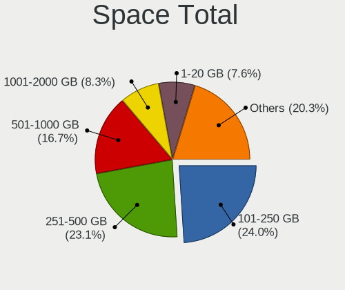
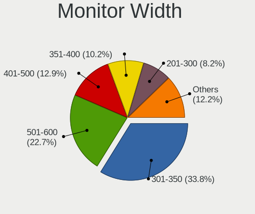
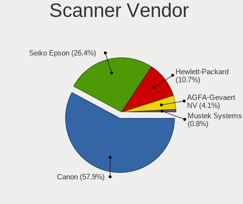
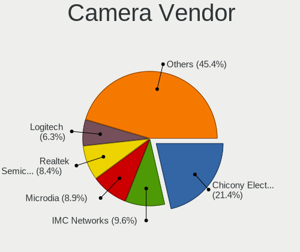

Linux in France - Tested Hardware & Statistics
----------------------------------------------

A project to collect tested hardware configurations for Linux in France.

Anyone can contribute to this report by the [hw-probe](https://github.com/linuxhw/hw-probe) tool:

    sudo -E hw-probe -all -upload

Please contribute! Especially if your hardware is rare.

This is a report for all computer types. See also reports for [desktops](/Location/France/Desktop/README.md) and [notebooks](/Location/France/Notebook/README.md).

Contents
--------

* [ Test Cases ](#test-cases)

* [ System ](#system)
  - [ OS                       ](#os)
  - [ OS Family                ](#os-family)
  - [ Kernel                   ](#kernel)
  - [ Kernel Family            ](#kernel-family)
  - [ Kernel Major Ver.        ](#kernel-major-ver)
  - [ Arch                     ](#arch)
  - [ DE                       ](#de)
  - [ Display Server           ](#display-server)
  - [ Display Manager          ](#display-manager)
  - [ OS Lang                  ](#os-lang)
  - [ Boot Mode                ](#boot-mode)
  - [ Filesystem               ](#filesystem)
  - [ Part. scheme             ](#part-scheme)
  - [ Dual Boot with Linux/BSD ](#dual-boot-with-linuxbsd)
  - [ Dual Boot (Win)          ](#dual-boot-win)

* [ Board ](#board)
  - [ Vendor                   ](#vendor)
  - [ Model                    ](#model)
  - [ Model Family             ](#model-family)
  - [ MFG Year                 ](#mfg-year)
  - [ Form Factor              ](#form-factor)
  - [ Secure Boot              ](#secure-boot)
  - [ Coreboot                 ](#coreboot)
  - [ RAM Size                 ](#ram-size)
  - [ RAM Used                 ](#ram-used)
  - [ Total Drives             ](#total-drives)
  - [ Has CD-ROM               ](#has-cd-rom)
  - [ Has Ethernet             ](#has-ethernet)
  - [ Has WiFi                 ](#has-wifi)
  - [ Has Bluetooth            ](#has-bluetooth)

* [ Location ](#location)
  - [ Country                  ](#country)
  - [ City                     ](#city)

* [ Drives ](#drives)
  - [ Drive Vendor             ](#drive-vendor)
  - [ Drive Model              ](#drive-model)
  - [ HDD Vendor               ](#hdd-vendor)
  - [ SSD Vendor               ](#ssd-vendor)
  - [ Drive Kind               ](#drive-kind)
  - [ Drive Connector          ](#drive-connector)
  - [ Drive Size               ](#drive-size)
  - [ Space Total              ](#space-total)
  - [ Space Used               ](#space-used)
  - [ Malfunc. Drives          ](#malfunc-drives)
  - [ Malfunc. Drive Vendor    ](#malfunc-drive-vendor)
  - [ Malfunc. HDD Vendor      ](#malfunc-hdd-vendor)
  - [ Malfunc. Drive Kind      ](#malfunc-drive-kind)
  - [ Failed Drives            ](#failed-drives)
  - [ Failed Drive Vendor      ](#failed-drive-vendor)
  - [ Drive Status             ](#drive-status)

* [ Storage controller ](#storage-controller)
  - [ Storage Vendor           ](#storage-vendor)
  - [ Storage Model            ](#storage-model)
  - [ Storage Kind             ](#storage-kind)

* [ Processor ](#processor)
  - [ CPU Vendor               ](#cpu-vendor)
  - [ CPU Model                ](#cpu-model)
  - [ CPU Model Family         ](#cpu-model-family)
  - [ CPU Cores                ](#cpu-cores)
  - [ CPU Sockets              ](#cpu-sockets)
  - [ CPU Threads              ](#cpu-threads)
  - [ CPU Op-Modes             ](#cpu-op-modes)
  - [ CPU Microcode            ](#cpu-microcode)
  - [ CPU Microarch            ](#cpu-microarch)

* [ Graphics ](#graphics)
  - [ GPU Vendor               ](#gpu-vendor)
  - [ GPU Model                ](#gpu-model)
  - [ GPU Combo                ](#gpu-combo)
  - [ GPU Driver               ](#gpu-driver)
  - [ GPU Memory               ](#gpu-memory)

* [ Monitor ](#monitor)
  - [ Monitor Vendor           ](#monitor-vendor)
  - [ Monitor Model            ](#monitor-model)
  - [ Monitor Resolution       ](#monitor-resolution)
  - [ Monitor Diagonal         ](#monitor-diagonal)
  - [ Monitor Width            ](#monitor-width)
  - [ Aspect Ratio             ](#aspect-ratio)
  - [ Monitor Area             ](#monitor-area)
  - [ Pixel Density            ](#pixel-density)
  - [ Multiple Monitors        ](#multiple-monitors)

* [ Network ](#network)
  - [ Net Controller Vendor    ](#net-controller-vendor)
  - [ Net Controller Model     ](#net-controller-model)
  - [ Wireless Vendor          ](#wireless-vendor)
  - [ Wireless Model           ](#wireless-model)
  - [ Ethernet Vendor          ](#ethernet-vendor)
  - [ Ethernet Model           ](#ethernet-model)
  - [ Net Controller Kind      ](#net-controller-kind)
  - [ Used Controller          ](#used-controller)
  - [ NICs                     ](#nics)
  - [ IPv6                     ](#ipv6)

* [ Bluetooth ](#bluetooth)
  - [ Bluetooth Vendor         ](#bluetooth-vendor)
  - [ Bluetooth Model          ](#bluetooth-model)

* [ Sound ](#sound)
  - [ Sound Vendor             ](#sound-vendor)
  - [ Sound Model              ](#sound-model)

* [ Memory ](#memory)
  - [ Memory Vendor            ](#memory-vendor)
  - [ Memory Model             ](#memory-model)
  - [ Memory Kind              ](#memory-kind)
  - [ Memory Form Factor       ](#memory-form-factor)
  - [ Memory Size              ](#memory-size)
  - [ Memory Speed             ](#memory-speed)

* [ Printers & scanners ](#printers--scanners)
  - [ Printer Vendor           ](#printer-vendor)
  - [ Printer Model            ](#printer-model)
  - [ Scanner Vendor           ](#scanner-vendor)
  - [ Scanner Model            ](#scanner-model)

* [ Camera ](#camera)
  - [ Camera Vendor            ](#camera-vendor)
  - [ Camera Model             ](#camera-model)

* [ Security ](#security)
  - [ Fingerprint Vendor       ](#fingerprint-vendor)
  - [ Fingerprint Model        ](#fingerprint-model)
  - [ Chipcard Vendor          ](#chipcard-vendor)
  - [ Chipcard Model           ](#chipcard-model)

* [ Unsupported ](#unsupported)
  - [ Unsupported Devices      ](#unsupported-devices)
  - [ Unsupported Device Types ](#unsupported-device-types)

Test Cases
----------

Total: 15750

| Vendor        | Model                       | Form-Factor | Probe                                                      | Date         |
|---------------|-----------------------------|-------------|------------------------------------------------------------|--------------|
| HP            | Pavilion dm1                | Notebook    | [f4c8f5a8e6](https://linux-hardware.org/?probe=f4c8f5a8e6) | Feb 02, 2024 |
| Lenovo        | ThinkPad L470 W10DG 20JV... | Notebook    | [e05005f76b](https://linux-hardware.org/?probe=e05005f76b) | Feb 02, 2024 |
| Lenovo        | IdeaPad 3 17ALC6 82KV       | Notebook    | [3aa20161d9](https://linux-hardware.org/?probe=3aa20161d9) | Feb 02, 2024 |
| Dell          | 0NK5PH A00                  | Desktop     | [211c3d7db6](https://linux-hardware.org/?probe=211c3d7db6) | Feb 02, 2024 |
| Samsung       | RV410/RV510/S3510/E3510     | Notebook    | [1f85f107bb](https://linux-hardware.org/?probe=1f85f107bb) | Feb 02, 2024 |
| Framework     | Laptop 13 (AMD Ryzen 704... | Notebook    | [d9a0906eac](https://linux-hardware.org/?probe=d9a0906eac) | Feb 02, 2024 |
| Lenovo        | ThinkBook 14 G6 IRL 21KG    | Notebook    | [c01e746574](https://linux-hardware.org/?probe=c01e746574) | Feb 02, 2024 |
| ASRock        | 880GMH/U3S3                 | Desktop     | [cccd54eb20](https://linux-hardware.org/?probe=cccd54eb20) | Feb 01, 2024 |
| ASUSTek       | PRIME B460M-A               | Desktop     | [40c53134dc](https://linux-hardware.org/?probe=40c53134dc) | Feb 01, 2024 |
| ALTYK         | L14F-I5U16-N1               | Notebook    | [7cb618fcca](https://linux-hardware.org/?probe=7cb618fcca) | Feb 01, 2024 |
| ALTYK         | L14F-I5U16-N1               | Notebook    | [81274a6f09](https://linux-hardware.org/?probe=81274a6f09) | Feb 01, 2024 |
| Unknown       | Unknown                     | Desktop     | [4fa0768f2b](https://linux-hardware.org/?probe=4fa0768f2b) | Feb 01, 2024 |
| Unknown       | Unknown                     | Desktop     | [69b18742b6](https://linux-hardware.org/?probe=69b18742b6) | Feb 01, 2024 |
| Apple         | MacBookPro1,2               | Notebook    | [5e40347a6e](https://linux-hardware.org/?probe=5e40347a6e) | Feb 01, 2024 |
| Acer          | Aspire E5-722               | Notebook    | [2a4988436d](https://linux-hardware.org/?probe=2a4988436d) | Feb 01, 2024 |
| Thomson       | N15C8BK2T                   | Notebook    | [5de65dcec1](https://linux-hardware.org/?probe=5de65dcec1) | Jan 31, 2024 |
| HP            | ENVY dv6                    | Notebook    | [a91621750a](https://linux-hardware.org/?probe=a91621750a) | Jan 31, 2024 |
| HP            | EliteBook 840 G1            | Notebook    | [920b1ecb34](https://linux-hardware.org/?probe=920b1ecb34) | Jan 31, 2024 |
| HP            | EliteBook 8440p             | Notebook    | [e8c221770b](https://linux-hardware.org/?probe=e8c221770b) | Jan 31, 2024 |
| Gigabyte      | B550M K                     | Desktop     | [1ead3418ae](https://linux-hardware.org/?probe=1ead3418ae) | Jan 31, 2024 |
| Dell          | Latitude 5501               | Notebook    | [7c92ef29c9](https://linux-hardware.org/?probe=7c92ef29c9) | Jan 31, 2024 |
| HP            | Pavilion 17                 | Notebook    | [27b6494c43](https://linux-hardware.org/?probe=27b6494c43) | Jan 31, 2024 |
| HP            | Pavilion g6                 | Notebook    | [7f9863aaa2](https://linux-hardware.org/?probe=7f9863aaa2) | Jan 31, 2024 |
| ASUSTek       | VivoBook_ASUSLaptop E410... | Notebook    | [8d8a09ab09](https://linux-hardware.org/?probe=8d8a09ab09) | Jan 31, 2024 |
| Packard Be... | EasyNote ENLG71BM           | Notebook    | [ab713b894e](https://linux-hardware.org/?probe=ab713b894e) | Jan 31, 2024 |
| Acer          | Swift SF514-56T             | Notebook    | [14b287861f](https://linux-hardware.org/?probe=14b287861f) | Jan 31, 2024 |
| ASUSTek       | TUF Gaming FX505DT_TUF50... | Notebook    | [5193f57d67](https://linux-hardware.org/?probe=5193f57d67) | Jan 31, 2024 |
| MSI           | AMETHYST-M                  | Desktop     | [865d868008](https://linux-hardware.org/?probe=865d868008) | Jan 30, 2024 |
| Gigabyte      | B450 I AORUS PRO WIFI-CF    | Desktop     | [78b2648ff3](https://linux-hardware.org/?probe=78b2648ff3) | Jan 30, 2024 |
| MSI           | AMETHYST-M                  | Desktop     | [da16f0848e](https://linux-hardware.org/?probe=da16f0848e) | Jan 30, 2024 |
| HP            | ZBook 17 G3                 | Notebook    | [fefc37bfa1](https://linux-hardware.org/?probe=fefc37bfa1) | Jan 30, 2024 |
| HP            | Pavilion dv7                | Notebook    | [7899a3498e](https://linux-hardware.org/?probe=7899a3498e) | Jan 30, 2024 |
| ASUSTek       | P8H61-M LE/CSM R2.0         | Desktop     | [dd5bc39447](https://linux-hardware.org/?probe=dd5bc39447) | Jan 30, 2024 |
| HP            | ZBook 17 G3                 | Notebook    | [525b120614](https://linux-hardware.org/?probe=525b120614) | Jan 30, 2024 |
| Lenovo        | ThinkPad T14 Gen 4 21K3C... | Notebook    | [649745f3ae](https://linux-hardware.org/?probe=649745f3ae) | Jan 30, 2024 |
| MSI           | B450 GAMING PLUS MAX        | Desktop     | [0451fa0547](https://linux-hardware.org/?probe=0451fa0547) | Jan 30, 2024 |
| Lenovo        | ThinkPad P15 Gen 2i 20YR... | Notebook    | [0af07cd951](https://linux-hardware.org/?probe=0af07cd951) | Jan 30, 2024 |
| ASUSTek       | ZenBook UX425EA_UX425EA     | Notebook    | [d78102063d](https://linux-hardware.org/?probe=d78102063d) | Jan 30, 2024 |
| MSI           | 760GM-P23                   | Desktop     | [1e5ef07ed7](https://linux-hardware.org/?probe=1e5ef07ed7) | Jan 30, 2024 |
| HP            | EliteBook 8460p             | Notebook    | [9fd5ed9142](https://linux-hardware.org/?probe=9fd5ed9142) | Jan 30, 2024 |
| HP            | 894D                        | Desktop     | [851e68057d](https://linux-hardware.org/?probe=851e68057d) | Jan 30, 2024 |
| Acer          | Aspire 9420                 | Notebook    | [d0c7154097](https://linux-hardware.org/?probe=d0c7154097) | Jan 30, 2024 |
| ASUSTek       | Zenbook Flip UP5302ZA_UP... | Convertible | [cc27f48922](https://linux-hardware.org/?probe=cc27f48922) | Jan 30, 2024 |
| Medion        | E15423                      | Notebook    | [2d39a42a0a](https://linux-hardware.org/?probe=2d39a42a0a) | Jan 29, 2024 |
| Toshiba       | Satellite P300              | Notebook    | [14da91750f](https://linux-hardware.org/?probe=14da91750f) | Jan 29, 2024 |
| HP            | EliteBook 860 16 inch G1... | Notebook    | [737d54004b](https://linux-hardware.org/?probe=737d54004b) | Jan 29, 2024 |
| HP            | 250 G7 Notebook PC          | Notebook    | [9dab8601c1](https://linux-hardware.org/?probe=9dab8601c1) | Jan 29, 2024 |
| Dell          | Inspiron N5110              | Notebook    | [eaf977415d](https://linux-hardware.org/?probe=eaf977415d) | Jan 29, 2024 |
| HUAWEI        | BOM-WXX9                    | Notebook    | [346c925e80](https://linux-hardware.org/?probe=346c925e80) | Jan 29, 2024 |
| Dell          | 0J3C2F A00                  | Desktop     | [95ae5646c8](https://linux-hardware.org/?probe=95ae5646c8) | Jan 29, 2024 |
| ASUSTek       | PRIME A320M-K               | Desktop     | [b7fff52e41](https://linux-hardware.org/?probe=b7fff52e41) | Jan 29, 2024 |
| Lenovo        | Legion 5 15ACH6H 82JU       | Notebook    | [0c4fb535dc](https://linux-hardware.org/?probe=0c4fb535dc) | Jan 29, 2024 |
| Lenovo        | IdeaPad 3 15ADA05 81W1      | Notebook    | [79381fe2e8](https://linux-hardware.org/?probe=79381fe2e8) | Jan 29, 2024 |
| Acer          | Nitro AN515-57              | Notebook    | [e179099ff6](https://linux-hardware.org/?probe=e179099ff6) | Jan 29, 2024 |
| HP            | 1495                        | Desktop     | [2bf6b5d794](https://linux-hardware.org/?probe=2bf6b5d794) | Jan 28, 2024 |
| Gigabyte      | X570S AERO G                | Desktop     | [f485006061](https://linux-hardware.org/?probe=f485006061) | Jan 28, 2024 |
| Lenovo        | ThinkPad T61 6464AS3        | Notebook    | [1aa0d9f766](https://linux-hardware.org/?probe=1aa0d9f766) | Jan 28, 2024 |
| HP            | Notebook                    | Notebook    | [d8a6181633](https://linux-hardware.org/?probe=d8a6181633) | Jan 28, 2024 |
| Lenovo        | IdeaPad 3 15ADA05 81W1      | Notebook    | [1069da15da](https://linux-hardware.org/?probe=1069da15da) | Jan 28, 2024 |
| Lenovo        | 3111 SDK0J40697 WIN 3305... | Desktop     | [506143a770](https://linux-hardware.org/?probe=506143a770) | Jan 28, 2024 |
| MSI           | MPG B550 GAMING PLUS        | Desktop     | [a7826ae1af](https://linux-hardware.org/?probe=a7826ae1af) | Jan 28, 2024 |
| ASUSTek       | Z97-K                       | Desktop     | [777446f160](https://linux-hardware.org/?probe=777446f160) | Jan 28, 2024 |
| Apple         | MacBookPro10,1              | Notebook    | [35238c08e4](https://linux-hardware.org/?probe=35238c08e4) | Jan 28, 2024 |
| MSI           | H81M-E34                    | Desktop     | [9aec3e7a36](https://linux-hardware.org/?probe=9aec3e7a36) | Jan 28, 2024 |
| Colorful T... | C.Z77 X5 V20                | Desktop     | [9209512720](https://linux-hardware.org/?probe=9209512720) | Jan 28, 2024 |
| Dell          | Latitude E6530              | Notebook    | [185381cc95](https://linux-hardware.org/?probe=185381cc95) | Jan 28, 2024 |
| ASUSTek       | X541UJ                      | Notebook    | [14f153b6c9](https://linux-hardware.org/?probe=14f153b6c9) | Jan 28, 2024 |
| Lenovo        | SHARKBAY NOK                | Desktop     | [ce4dad557b](https://linux-hardware.org/?probe=ce4dad557b) | Jan 27, 2024 |
| ASUSTek       | TUF Gaming B450-PLUS II     | Desktop     | [08f64cc902](https://linux-hardware.org/?probe=08f64cc902) | Jan 27, 2024 |
| Dell          | 0VHWTR A02                  | Desktop     | [a40f7ff2de](https://linux-hardware.org/?probe=a40f7ff2de) | Jan 27, 2024 |
| HP            | Notebook                    | Notebook    | [78ffba1358](https://linux-hardware.org/?probe=78ffba1358) | Jan 27, 2024 |
| Gigabyte      | GA-78LMT-S2P                | Desktop     | [508f75b66b](https://linux-hardware.org/?probe=508f75b66b) | Jan 27, 2024 |
| Lenovo        | ThinkPad X1 Titanium Gen... | Convertible | [f914166828](https://linux-hardware.org/?probe=f914166828) | Jan 27, 2024 |
| Dell          | Latitude 7390 2-in-1        | Notebook    | [d57566edb3](https://linux-hardware.org/?probe=d57566edb3) | Jan 27, 2024 |
| Dell          | Latitude 7390 2-in-1        | Notebook    | [26a44b8cab](https://linux-hardware.org/?probe=26a44b8cab) | Jan 27, 2024 |
| ASUSTek       | PRIME B660-PLUS D4          | Desktop     | [19c619ae3f](https://linux-hardware.org/?probe=19c619ae3f) | Jan 27, 2024 |
| ASUSTek       | TUF Gaming B450-PLUS II     | Desktop     | [a6240580d2](https://linux-hardware.org/?probe=a6240580d2) | Jan 27, 2024 |
| ASUSTek       | PRIME X670-P                | Desktop     | [08b5799cfd](https://linux-hardware.org/?probe=08b5799cfd) | Jan 27, 2024 |
| Dell          | Inspiron N7010              | Notebook    | [21ed3bec20](https://linux-hardware.org/?probe=21ed3bec20) | Jan 27, 2024 |
| Acer          | Aspire 6530G                | Notebook    | [cd71356945](https://linux-hardware.org/?probe=cd71356945) | Jan 26, 2024 |
| Samsung       | N150/N210/N220              | Notebook    | [11b2fc832f](https://linux-hardware.org/?probe=11b2fc832f) | Jan 26, 2024 |
| Toshiba       | Satellite L300              | Notebook    | [127697d4f1](https://linux-hardware.org/?probe=127697d4f1) | Jan 26, 2024 |
| Toshiba       | Satellite L300              | Notebook    | [63be13a245](https://linux-hardware.org/?probe=63be13a245) | Jan 26, 2024 |
| Dell          | Latitude 5521               | Notebook    | [0524c08c30](https://linux-hardware.org/?probe=0524c08c30) | Jan 26, 2024 |
| ASUSTek       | Z87-C                       | Desktop     | [a63ba339e5](https://linux-hardware.org/?probe=a63ba339e5) | Jan 26, 2024 |
| UNOWHY        | Y13G011S4EI                 | Notebook    | [30193a9845](https://linux-hardware.org/?probe=30193a9845) | Jan 26, 2024 |
| HP            | 8719                        | Desktop     | [42bc597317](https://linux-hardware.org/?probe=42bc597317) | Jan 26, 2024 |
| ASUSTek       | TUF Gaming B450-PLUS II     | Desktop     | [431bc1335a](https://linux-hardware.org/?probe=431bc1335a) | Jan 26, 2024 |
| Shuttle       | NC40U                       | Desktop     | [893dcee1f0](https://linux-hardware.org/?probe=893dcee1f0) | Jan 26, 2024 |
| Dell          | Latitude 5490               | Notebook    | [f1fe39af02](https://linux-hardware.org/?probe=f1fe39af02) | Jan 26, 2024 |
| Dell          | 02YYK5 A00                  | Desktop     | [60522355ee](https://linux-hardware.org/?probe=60522355ee) | Jan 26, 2024 |
| Google        | Markarth                    | Notebook    | [39dface7d9](https://linux-hardware.org/?probe=39dface7d9) | Jan 26, 2024 |
| ASUSTek       | TUF Gaming B560M-PLUS WI... | Desktop     | [858d0c956c](https://linux-hardware.org/?probe=858d0c956c) | Jan 26, 2024 |
| MSI           | MPG B550 GAMING PLUS        | Desktop     | [7a5a8be027](https://linux-hardware.org/?probe=7a5a8be027) | Jan 25, 2024 |
| MSI           | H81M-E34                    | Desktop     | [c53fb2b81b](https://linux-hardware.org/?probe=c53fb2b81b) | Jan 25, 2024 |
| HP            | 0B54h D                     | Desktop     | [9a2ca26ce0](https://linux-hardware.org/?probe=9a2ca26ce0) | Jan 25, 2024 |
| Gigabyte      | H81M-HD3                    | Desktop     | [f945084861](https://linux-hardware.org/?probe=f945084861) | Jan 25, 2024 |
| Apple         | MacBook5,1                  | Notebook    | [51346a4084](https://linux-hardware.org/?probe=51346a4084) | Jan 25, 2024 |
| ASUSTek       | P5G41T-M LX                 | Desktop     | [f37a447c10](https://linux-hardware.org/?probe=f37a447c10) | Jan 25, 2024 |
| HP            | Compaq 6730s                | Notebook    | [caa48b80fb](https://linux-hardware.org/?probe=caa48b80fb) | Jan 25, 2024 |
| Dell          | Latitude 7340               | Notebook    | [880054b099](https://linux-hardware.org/?probe=880054b099) | Jan 25, 2024 |
| Shuttle       | FG41 V20                    | Desktop     | [9eeb0902c1](https://linux-hardware.org/?probe=9eeb0902c1) | Jan 25, 2024 |
| HP            | EliteBook 865 16 inch G1... | Notebook    | [72f849d40c](https://linux-hardware.org/?probe=72f849d40c) | Jan 25, 2024 |
| Acer          | Aspire A317-53              | Notebook    | [9b9d2bfdc3](https://linux-hardware.org/?probe=9b9d2bfdc3) | Jan 25, 2024 |
| ASRock        | H370M-HDV                   | Desktop     | [86e43e96f0](https://linux-hardware.org/?probe=86e43e96f0) | Jan 25, 2024 |
| Fujitsu       | LIFEBOOK A531               | Notebook    | [647bf81332](https://linux-hardware.org/?probe=647bf81332) | Jan 25, 2024 |
| ASUSTek       | G20AJ                       | Desktop     | [4dd87f5aeb](https://linux-hardware.org/?probe=4dd87f5aeb) | Jan 24, 2024 |
| Dell          | Precision 5510              | Notebook    | [e1e543eaa4](https://linux-hardware.org/?probe=e1e543eaa4) | Jan 24, 2024 |
| ASUSTek       | STRIX Z270F GAMING          | Desktop     | [23e7644b5d](https://linux-hardware.org/?probe=23e7644b5d) | Jan 24, 2024 |
| Lenovo        | ThinkPad X1 Carbon 2nd 2... | Notebook    | [86ff649a4d](https://linux-hardware.org/?probe=86ff649a4d) | Jan 24, 2024 |
| ASUSTek       | ASUS EXPERTBOOK P3540FA_... | Notebook    | [a20369a079](https://linux-hardware.org/?probe=a20369a079) | Jan 24, 2024 |
| HP            | 0B54h D                     | Desktop     | [ca946fa9f3](https://linux-hardware.org/?probe=ca946fa9f3) | Jan 24, 2024 |
| ASUSTek       | ASUS EXPERTBOOK P3540FA_... | Notebook    | [9ac42c58bf](https://linux-hardware.org/?probe=9ac42c58bf) | Jan 24, 2024 |
| Google        | Markarth                    | Notebook    | [2258b38e4b](https://linux-hardware.org/?probe=2258b38e4b) | Jan 24, 2024 |
| Dell          | Vostro1710                  | Notebook    | [1fc84171b5](https://linux-hardware.org/?probe=1fc84171b5) | Jan 24, 2024 |
| HP            | 8053                        | Desktop     | [ecca7b4395](https://linux-hardware.org/?probe=ecca7b4395) | Jan 24, 2024 |
| Lenovo        | MIIX 310-10ICR 80SG         | Tablet      | [dc84848e79](https://linux-hardware.org/?probe=dc84848e79) | Jan 24, 2024 |
| ASRock        | B650M Pro RS                | Desktop     | [2d706981c5](https://linux-hardware.org/?probe=2d706981c5) | Jan 24, 2024 |
| Toshiba       | Satellite Pro NB10-A-125    | Notebook    | [6594f8afba](https://linux-hardware.org/?probe=6594f8afba) | Jan 24, 2024 |
| MSI           | GL62M 7RDX                  | Notebook    | [bd42ee7dc8](https://linux-hardware.org/?probe=bd42ee7dc8) | Jan 24, 2024 |
| LDLC          | SPC-I                       | Notebook    | [518c66f608](https://linux-hardware.org/?probe=518c66f608) | Jan 23, 2024 |
| ASUSTek       | ASUS TUF Gaming F15 FX50... | Notebook    | [122f69f8c5](https://linux-hardware.org/?probe=122f69f8c5) | Jan 23, 2024 |
| HP            | 158B                        | Desktop     | [d433cc30c0](https://linux-hardware.org/?probe=d433cc30c0) | Jan 23, 2024 |
| Dell          | Latitude 5521               | Notebook    | [34567d3078](https://linux-hardware.org/?probe=34567d3078) | Jan 23, 2024 |
| ASUSTek       | PRIME A320M-K               | Desktop     | [920e34bee4](https://linux-hardware.org/?probe=920e34bee4) | Jan 23, 2024 |
| Dell          | XPS 13 9360                 | Notebook    | [cf5a6036e8](https://linux-hardware.org/?probe=cf5a6036e8) | Jan 23, 2024 |
| Lenovo        | Legion 5 17ACH6 82K0        | Notebook    | [5bd83d3f0c](https://linux-hardware.org/?probe=5bd83d3f0c) | Jan 23, 2024 |
| ASUSTek       | ROG Zephyrus G15 GA503RM... | Notebook    | [48f8a71c93](https://linux-hardware.org/?probe=48f8a71c93) | Jan 23, 2024 |
| Dell          | Latitude 5521               | Notebook    | [76aa51e658](https://linux-hardware.org/?probe=76aa51e658) | Jan 23, 2024 |
| HP            | EliteBook 855 G8 Noteboo... | Notebook    | [c22fff0afb](https://linux-hardware.org/?probe=c22fff0afb) | Jan 23, 2024 |
| Dell          | Precision 5540              | Notebook    | [604697c5db](https://linux-hardware.org/?probe=604697c5db) | Jan 23, 2024 |
| ASRock        | A520M-HVS                   | Desktop     | [87e6c23293](https://linux-hardware.org/?probe=87e6c23293) | Jan 23, 2024 |
| Google        | Woomax                      | Notebook    | [8b76a06477](https://linux-hardware.org/?probe=8b76a06477) | Jan 23, 2024 |
| Dell          | Inspiron 5567               | Notebook    | [dc061193f2](https://linux-hardware.org/?probe=dc061193f2) | Jan 22, 2024 |
| ASUSTek       | PRIME X570-PRO              | Desktop     | [0a04043949](https://linux-hardware.org/?probe=0a04043949) | Jan 22, 2024 |
| Gigabyte      | Z690 UD                     | Desktop     | [bb82170d79](https://linux-hardware.org/?probe=bb82170d79) | Jan 22, 2024 |
| Gigabyte      | B360M DS3H                  | Desktop     | [d809dd5290](https://linux-hardware.org/?probe=d809dd5290) | Jan 22, 2024 |
| Dell          | 0C7195                      | Desktop     | [0efd0073c7](https://linux-hardware.org/?probe=0efd0073c7) | Jan 22, 2024 |
| Dell          | 0C7195                      | Desktop     | [7ad143cb01](https://linux-hardware.org/?probe=7ad143cb01) | Jan 22, 2024 |
| HP            | Pavilion dv6                | Notebook    | [ac628c20c7](https://linux-hardware.org/?probe=ac628c20c7) | Jan 22, 2024 |
| HP            | Pavilion dv6                | Notebook    | [6d29e8c44e](https://linux-hardware.org/?probe=6d29e8c44e) | Jan 22, 2024 |
| HUAWEI        | BoDE-WXX9                   | Notebook    | [1cfa83e1fc](https://linux-hardware.org/?probe=1cfa83e1fc) | Jan 22, 2024 |
| Gigabyte      | Z170X-Gaming 7              | Desktop     | [3d7c0f1d64](https://linux-hardware.org/?probe=3d7c0f1d64) | Jan 22, 2024 |
| Intel         | S1200SP H57532-250          | Server      | [94a4904dc7](https://linux-hardware.org/?probe=94a4904dc7) | Jan 22, 2024 |
| Medion        | Deputy P50                  | Notebook    | [57081b7e90](https://linux-hardware.org/?probe=57081b7e90) | Jan 22, 2024 |
| AZW           | SER V1.0                    | Mini pc     | [880dbae087](https://linux-hardware.org/?probe=880dbae087) | Jan 22, 2024 |
| ASUSTek       | PRIME B350-PLUS             | Desktop     | [d2c27751fe](https://linux-hardware.org/?probe=d2c27751fe) | Jan 22, 2024 |
| ASUSTek       | X550LA                      | Notebook    | [3010861da1](https://linux-hardware.org/?probe=3010861da1) | Jan 21, 2024 |
| MSI           | GF63 Thin 11UC              | Notebook    | [b6fa224856](https://linux-hardware.org/?probe=b6fa224856) | Jan 21, 2024 |
| Samsung       | N150/N210/N220              | Notebook    | [044a8a24d6](https://linux-hardware.org/?probe=044a8a24d6) | Jan 21, 2024 |
| ASUSTek       | X75VCP                      | Notebook    | [63c2472460](https://linux-hardware.org/?probe=63c2472460) | Jan 21, 2024 |
| HP            | Pavilion Gaming Laptop 1... | Notebook    | [58f6bacae6](https://linux-hardware.org/?probe=58f6bacae6) | Jan 21, 2024 |
| Lenovo        | MIIX 320-10ICR 80XF         | Tablet      | [c0eb7c0861](https://linux-hardware.org/?probe=c0eb7c0861) | Jan 21, 2024 |
| Gigabyte      | Z97-HD3                     | Desktop     | [e568089bad](https://linux-hardware.org/?probe=e568089bad) | Jan 21, 2024 |
| ASRock        | H570 Steel Legend           | Desktop     | [7c0fb43f23](https://linux-hardware.org/?probe=7c0fb43f23) | Jan 21, 2024 |
| Intel         | NUC7i5BNB J31144-304        | Mini pc     | [631c308735](https://linux-hardware.org/?probe=631c308735) | Jan 21, 2024 |
| ASRock        | FM2A88X Pro+                | Desktop     | [cf5b1adab5](https://linux-hardware.org/?probe=cf5b1adab5) | Jan 21, 2024 |
| Gigabyte      | GA-MA770T-UD3               | Desktop     | [434a85ff04](https://linux-hardware.org/?probe=434a85ff04) | Jan 21, 2024 |
| ASUSTek       | TUF B450-PLUS GAMING        | Desktop     | [4254242157](https://linux-hardware.org/?probe=4254242157) | Jan 21, 2024 |
| Notebook      | W65_W67RZ1                  | Notebook    | [3ad0a034e4](https://linux-hardware.org/?probe=3ad0a034e4) | Jan 21, 2024 |
| ASUSTek       | TUF Gaming X570-PLUS        | Desktop     | [6a43bd4926](https://linux-hardware.org/?probe=6a43bd4926) | Jan 21, 2024 |
| Toshiba       | Satellite C70-B             | Notebook    | [452f1d82f7](https://linux-hardware.org/?probe=452f1d82f7) | Jan 21, 2024 |
| Raspberry ... | Raspberry Pi 5 Model B R... | Soc         | [89d2162e7f](https://linux-hardware.org/?probe=89d2162e7f) | Jan 21, 2024 |
| Dell          | Precision 5480              | Notebook    | [2ebc089368](https://linux-hardware.org/?probe=2ebc089368) | Jan 20, 2024 |
| HP            | ProBook 450 G0              | Notebook    | [18424b46c5](https://linux-hardware.org/?probe=18424b46c5) | Jan 20, 2024 |
| Dell          | 042P49 A02                  | Desktop     | [366d017089](https://linux-hardware.org/?probe=366d017089) | Jan 20, 2024 |
| ASRock        | B550 Steel Legend           | Desktop     | [4b1c9b076b](https://linux-hardware.org/?probe=4b1c9b076b) | Jan 20, 2024 |
| Acer          | Aspire X3990                | Desktop     | [7d4a040306](https://linux-hardware.org/?probe=7d4a040306) | Jan 20, 2024 |
| Lenovo        | Z50-70 20354                | Notebook    | [3260559363](https://linux-hardware.org/?probe=3260559363) | Jan 20, 2024 |
| Notebook      | W54_55SU1,SUW               | Notebook    | [c66b9a59bb](https://linux-hardware.org/?probe=c66b9a59bb) | Jan 20, 2024 |
| AZW           | SER                         | Mini pc     | [c91aa206d4](https://linux-hardware.org/?probe=c91aa206d4) | Jan 20, 2024 |
| ASUSTek       | Zenbook UX3402ZA_UX3402Z... | Notebook    | [06567bb3ae](https://linux-hardware.org/?probe=06567bb3ae) | Jan 20, 2024 |
| ASUSTek       | Zenbook UX3402ZA_UX3402Z... | Notebook    | [01db0b0650](https://linux-hardware.org/?probe=01db0b0650) | Jan 20, 2024 |
| Dell          | 073MMW A02                  | Desktop     | [2e19e7434e](https://linux-hardware.org/?probe=2e19e7434e) | Jan 19, 2024 |
| Dell          | Precision 7560              | Notebook    | [f5a631a694](https://linux-hardware.org/?probe=f5a631a694) | Jan 19, 2024 |
| MSI           | MPG Z390 GAMING PLUS        | Desktop     | [494d0af2e5](https://linux-hardware.org/?probe=494d0af2e5) | Jan 19, 2024 |
| Dell          | 060K5C A06                  | Server      | [1a4d18aac4](https://linux-hardware.org/?probe=1a4d18aac4) | Jan 19, 2024 |
| ASUSTek       | P6T DELUXE V2               | Desktop     | [4c2aa275e2](https://linux-hardware.org/?probe=4c2aa275e2) | Jan 19, 2024 |
| ASUSTek       | CG8480                      | Desktop     | [4610686acc](https://linux-hardware.org/?probe=4610686acc) | Jan 19, 2024 |
| Lenovo        | 3130 SDK0J40697 WIN 3305... | Mini pc     | [4b97ab718b](https://linux-hardware.org/?probe=4b97ab718b) | Jan 19, 2024 |
| Apple         | MacBookPro15,2              | Notebook    | [b36cb3cc5a](https://linux-hardware.org/?probe=b36cb3cc5a) | Jan 19, 2024 |
| Acer          | Nitro AN515-58              | Notebook    | [e0368be539](https://linux-hardware.org/?probe=e0368be539) | Jan 19, 2024 |
| Gigabyte      | B650M D3HP                  | Desktop     | [fdc83ca691](https://linux-hardware.org/?probe=fdc83ca691) | Jan 18, 2024 |
| Fujitsu       | D3230-A1 S26361-D3230-A1    | Desktop     | [977382abab](https://linux-hardware.org/?probe=977382abab) | Jan 18, 2024 |
| Medion        | Crawler E30e                | Notebook    | [537214d414](https://linux-hardware.org/?probe=537214d414) | Jan 18, 2024 |
| Medion        | Crawler E30e                | Notebook    | [76c56f06b5](https://linux-hardware.org/?probe=76c56f06b5) | Jan 18, 2024 |
| HP            | 1495                        | Desktop     | [0e16d785bc](https://linux-hardware.org/?probe=0e16d785bc) | Jan 18, 2024 |
| ASUSTek       | P6X58D-E                    | Desktop     | [09a124fcf0](https://linux-hardware.org/?probe=09a124fcf0) | Jan 17, 2024 |
| HP            | Pro x2 612 G2               | Tablet      | [718580847b](https://linux-hardware.org/?probe=718580847b) | Jan 17, 2024 |
| HP            | 82A2                        | Desktop     | [2d14e52635](https://linux-hardware.org/?probe=2d14e52635) | Jan 17, 2024 |
| ASUSTek       | TUF Gaming X570-PLUS        | Desktop     | [f0a5eac649](https://linux-hardware.org/?probe=f0a5eac649) | Jan 17, 2024 |
| HP            | ZBook 15u G5                | Notebook    | [334b143154](https://linux-hardware.org/?probe=334b143154) | Jan 17, 2024 |
| ASUSTek       | ASUS EXPERTBOOK B1500CEA... | Notebook    | [385ae61d79](https://linux-hardware.org/?probe=385ae61d79) | Jan 17, 2024 |
| Dell          | XPS 15 7590                 | Notebook    | [226e37fde1](https://linux-hardware.org/?probe=226e37fde1) | Jan 17, 2024 |
| Medion        | Defender P30                | Notebook    | [d8f109106c](https://linux-hardware.org/?probe=d8f109106c) | Jan 17, 2024 |
| SYWZ          | S210H Series                | Desktop     | [b918a28247](https://linux-hardware.org/?probe=b918a28247) | Jan 17, 2024 |
| AZW           | Green G2                    | Desktop     | [5a1887a4e2](https://linux-hardware.org/?probe=5a1887a4e2) | Jan 17, 2024 |
| MSI           | B550-A PRO                  | Desktop     | [15f0af587b](https://linux-hardware.org/?probe=15f0af587b) | Jan 17, 2024 |
| PC Special... | GK5NPFO                     | Notebook    | [f7eda564b1](https://linux-hardware.org/?probe=f7eda564b1) | Jan 17, 2024 |
| ASUSTek       | PRIME X670E-PRO WIFI        | Desktop     | [842faed623](https://linux-hardware.org/?probe=842faed623) | Jan 17, 2024 |
| Lenovo        | ThinkPad X13 Gen 1 20T3S... | Notebook    | [11e51bc70c](https://linux-hardware.org/?probe=11e51bc70c) | Jan 17, 2024 |
| Dell          | G3 3500                     | Notebook    | [0fd2b03a7c](https://linux-hardware.org/?probe=0fd2b03a7c) | Jan 17, 2024 |
| ASUSTek       | TUF Gaming Z490-PLUS        | Desktop     | [2f5b688155](https://linux-hardware.org/?probe=2f5b688155) | Jan 16, 2024 |
| ASUSTek       | G11CD-K                     | Desktop     | [004aa1092f](https://linux-hardware.org/?probe=004aa1092f) | Jan 16, 2024 |
| HP            | 250 G5 Notebook PC          | Notebook    | [099418d854](https://linux-hardware.org/?probe=099418d854) | Jan 16, 2024 |
| UNOWHY        | Y13G010S4EI                 | Notebook    | [9768c4c698](https://linux-hardware.org/?probe=9768c4c698) | Jan 16, 2024 |
| ASUSTek       | PRIME H410M-A               | Desktop     | [0d81012aa0](https://linux-hardware.org/?probe=0d81012aa0) | Jan 16, 2024 |
| AZW           | SER V1.0                    | Mini pc     | [c11948d06a](https://linux-hardware.org/?probe=c11948d06a) | Jan 16, 2024 |
| Packard Be... | EasyNote TJ65               | Notebook    | [bcf20a0a9c](https://linux-hardware.org/?probe=bcf20a0a9c) | Jan 16, 2024 |
| ASRock        | X570 Steel Legend           | Desktop     | [192feda06a](https://linux-hardware.org/?probe=192feda06a) | Jan 16, 2024 |
| ASUSTek       | M5A99X EVO                  | Desktop     | [fd42a66717](https://linux-hardware.org/?probe=fd42a66717) | Jan 16, 2024 |
| Lenovo        | B590 62743QG                | Notebook    | [53c2b981bf](https://linux-hardware.org/?probe=53c2b981bf) | Jan 16, 2024 |
| Lenovo        | ThinkPad T470s W10DG 20J... | Notebook    | [f73401456d](https://linux-hardware.org/?probe=f73401456d) | Jan 16, 2024 |
| Lenovo        | ThinkPad Edge 030253G       | Notebook    | [f5b2d04869](https://linux-hardware.org/?probe=f5b2d04869) | Jan 16, 2024 |
| Gigabyte      | B150M-D3H-CF                | Desktop     | [de0ec49312](https://linux-hardware.org/?probe=de0ec49312) | Jan 16, 2024 |
| Lenovo        | IdeaPad 110-17ACL 80UM      | Notebook    | [60df96228f](https://linux-hardware.org/?probe=60df96228f) | Jan 16, 2024 |
| ASUSTek       | X555LAB                     | Notebook    | [a5e1ffbe3f](https://linux-hardware.org/?probe=a5e1ffbe3f) | Jan 15, 2024 |
| Dell          | Latitude E6400              | Notebook    | [704c5e4d39](https://linux-hardware.org/?probe=704c5e4d39) | Jan 15, 2024 |
| HP            | 8105                        | Desktop     | [003cac54c4](https://linux-hardware.org/?probe=003cac54c4) | Jan 15, 2024 |
| Lenovo        | Yoga 710-14IKB 80V4         | Convertible | [2af69fd069](https://linux-hardware.org/?probe=2af69fd069) | Jan 15, 2024 |
| HP            | 8062                        | Desktop     | [58b81c8ab8](https://linux-hardware.org/?probe=58b81c8ab8) | Jan 15, 2024 |
| HP            | 8105                        | Desktop     | [36e0151976](https://linux-hardware.org/?probe=36e0151976) | Jan 15, 2024 |
| HP            | 8062                        | Desktop     | [9ff293cb06](https://linux-hardware.org/?probe=9ff293cb06) | Jan 15, 2024 |
| HP            | 8105                        | Desktop     | [2ee1b30f19](https://linux-hardware.org/?probe=2ee1b30f19) | Jan 15, 2024 |
| HP            | 8062                        | Desktop     | [64be9fb79c](https://linux-hardware.org/?probe=64be9fb79c) | Jan 15, 2024 |
| HP            | 8062                        | Desktop     | [502adc9396](https://linux-hardware.org/?probe=502adc9396) | Jan 15, 2024 |
| HP            | 8105                        | Desktop     | [142985ca4f](https://linux-hardware.org/?probe=142985ca4f) | Jan 15, 2024 |
| HP            | 8105                        | Desktop     | [aa402dfc3b](https://linux-hardware.org/?probe=aa402dfc3b) | Jan 15, 2024 |
| HP            | 8105                        | Desktop     | [f508c2b4c4](https://linux-hardware.org/?probe=f508c2b4c4) | Jan 15, 2024 |
| HP            | 8105                        | Desktop     | [eb9adb982e](https://linux-hardware.org/?probe=eb9adb982e) | Jan 15, 2024 |
| HP            | 8105                        | Desktop     | [fc6c21da40](https://linux-hardware.org/?probe=fc6c21da40) | Jan 15, 2024 |
| Lenovo        | Yoga 710-14IKB 80V4         | Convertible | [b1c47d4455](https://linux-hardware.org/?probe=b1c47d4455) | Jan 15, 2024 |
| ASRock        | E350M1                      | Desktop     | [7fe46e5672](https://linux-hardware.org/?probe=7fe46e5672) | Jan 15, 2024 |
| ASUSTek       | ROG Strix G513QC_PX513QC    | Notebook    | [bfecaac2ee](https://linux-hardware.org/?probe=bfecaac2ee) | Jan 14, 2024 |
| ASRock        | J5040-ITX                   | Desktop     | [1d65e65b24](https://linux-hardware.org/?probe=1d65e65b24) | Jan 14, 2024 |
| Lenovo        | ThinkPad 13 2nd Gen 20J1... | Notebook    | [bdbb97ace1](https://linux-hardware.org/?probe=bdbb97ace1) | Jan 14, 2024 |
| AZW           | EQ MINI 10                  | Desktop     | [e702ea54ea](https://linux-hardware.org/?probe=e702ea54ea) | Jan 14, 2024 |
| ASUSTek       | Zenbook UX3402ZA_UX3402Z... | Notebook    | [3b89bdc1d9](https://linux-hardware.org/?probe=3b89bdc1d9) | Jan 14, 2024 |
| MSI           | MS-7377                     | Desktop     | [822d42a921](https://linux-hardware.org/?probe=822d42a921) | Jan 14, 2024 |
| MSI           | GF63 Thin 11UC              | Notebook    | [6d2801d1d8](https://linux-hardware.org/?probe=6d2801d1d8) | Jan 14, 2024 |
| HP            | x2 210 G2                   | Tablet      | [e1baf3e443](https://linux-hardware.org/?probe=e1baf3e443) | Jan 14, 2024 |
| Lenovo        | ThinkPad X230 2325BA3       | Notebook    | [2663e39ea0](https://linux-hardware.org/?probe=2663e39ea0) | Jan 14, 2024 |
| Dell          | Latitude E6400              | Notebook    | [035c1106d9](https://linux-hardware.org/?probe=035c1106d9) | Jan 13, 2024 |
| Sony          | SVF1521H2EW                 | Notebook    | [ef7a3ce205](https://linux-hardware.org/?probe=ef7a3ce205) | Jan 13, 2024 |
| ASUSTek       | A88XM-E/USB                 | Desktop     | [3ae14ee6a8](https://linux-hardware.org/?probe=3ae14ee6a8) | Jan 13, 2024 |
| Lenovo        | G50-70 20351                | Notebook    | [5187db04f2](https://linux-hardware.org/?probe=5187db04f2) | Jan 13, 2024 |
| ASUSTek       | SABERTOOTH X58              | Desktop     | [097d095e0b](https://linux-hardware.org/?probe=097d095e0b) | Jan 13, 2024 |
| Alienware     | 0FPV4P A00                  | Desktop     | [ae50bc7ef0](https://linux-hardware.org/?probe=ae50bc7ef0) | Jan 12, 2024 |
| HP            | Pavilion Laptop 14-dv0xx... | Notebook    | [fb216e5ee6](https://linux-hardware.org/?probe=fb216e5ee6) | Jan 12, 2024 |
| HP            | ZBook 15                    | Notebook    | [390b667998](https://linux-hardware.org/?probe=390b667998) | Jan 12, 2024 |
| Dell          | Precision 7560              | Notebook    | [c540ef8073](https://linux-hardware.org/?probe=c540ef8073) | Jan 12, 2024 |
| HP            | ZBook 15                    | Notebook    | [5649070333](https://linux-hardware.org/?probe=5649070333) | Jan 12, 2024 |
| ASUSTek       | ZenBook UX450FDX_UX480FD    | Notebook    | [bb96dd4a3c](https://linux-hardware.org/?probe=bb96dd4a3c) | Jan 12, 2024 |
| Lenovo        | IdeaPad 3 17ADA05 81W2      | Notebook    | [7b99f5e393](https://linux-hardware.org/?probe=7b99f5e393) | Jan 12, 2024 |
| Dell          | Latitude 7300               | Notebook    | [0ad6fa9f50](https://linux-hardware.org/?probe=0ad6fa9f50) | Jan 12, 2024 |
| Toshiba       | Satellite C55-C             | Notebook    | [191762e8f6](https://linux-hardware.org/?probe=191762e8f6) | Jan 12, 2024 |
| HP            | Spectre x360 2-in-1 Lapt... | Convertible | [d8557878fc](https://linux-hardware.org/?probe=d8557878fc) | Jan 12, 2024 |
| MSI           | MAG X570 TOMAHAWK WIFI      | Desktop     | [ae6f35c2d9](https://linux-hardware.org/?probe=ae6f35c2d9) | Jan 11, 2024 |
| ASRock        | B450 Steel Legend           | Desktop     | [0afe07637c](https://linux-hardware.org/?probe=0afe07637c) | Jan 11, 2024 |
| Dell          | XPS 15 9570                 | Notebook    | [3f6db7dde8](https://linux-hardware.org/?probe=3f6db7dde8) | Jan 11, 2024 |
| Optimized ... | KVM                         | Desktop     | [4fe928d059](https://linux-hardware.org/?probe=4fe928d059) | Jan 11, 2024 |
| Foxconn       | 2AA9h                       | Desktop     | [40459d91a4](https://linux-hardware.org/?probe=40459d91a4) | Jan 11, 2024 |
| Medion        | Crawler E30e                | Notebook    | [2d2cd7c215](https://linux-hardware.org/?probe=2d2cd7c215) | Jan 11, 2024 |
| Gigabyte      | B150M-D3H-CF                | Desktop     | [0f1bb4710b](https://linux-hardware.org/?probe=0f1bb4710b) | Jan 11, 2024 |
| ASUSTek       | PRIME B350-PLUS             | Desktop     | [53c94d0753](https://linux-hardware.org/?probe=53c94d0753) | Jan 11, 2024 |
| ASRock        | B650M Pro RS WiFi           | Desktop     | [2a5022eba4](https://linux-hardware.org/?probe=2a5022eba4) | Jan 11, 2024 |
| Acer          | Aspire R3-131T              | Notebook    | [98521cc1f9](https://linux-hardware.org/?probe=98521cc1f9) | Jan 10, 2024 |
| Acer          | Aspire R3-131T              | Notebook    | [23b6c85a7f](https://linux-hardware.org/?probe=23b6c85a7f) | Jan 10, 2024 |
| HUAWEI        | HVY-WXX9                    | Notebook    | [2a28690851](https://linux-hardware.org/?probe=2a28690851) | Jan 10, 2024 |
| Fujitsu Si... | ESPRIMO Mobile V5535        | Notebook    | [681ea2eb1a](https://linux-hardware.org/?probe=681ea2eb1a) | Jan 10, 2024 |
| HUAWEI        | BOHB-WAX9                   | Notebook    | [f962b901f7](https://linux-hardware.org/?probe=f962b901f7) | Jan 10, 2024 |
| HUAWEI        | BOHB-WAX9                   | Notebook    | [763d9d2018](https://linux-hardware.org/?probe=763d9d2018) | Jan 10, 2024 |
| MSI           | B85M-G43                    | Desktop     | [8982801bbb](https://linux-hardware.org/?probe=8982801bbb) | Jan 10, 2024 |
| Fujitsu Si... | ESPRIMO Mobile V5535        | Notebook    | [2894cc00dc](https://linux-hardware.org/?probe=2894cc00dc) | Jan 10, 2024 |
| Dell          | Precision 7520              | Notebook    | [a36b0e554a](https://linux-hardware.org/?probe=a36b0e554a) | Jan 10, 2024 |
| ASUSTek       | PRIME X570-P                | Desktop     | [4b2d921c9b](https://linux-hardware.org/?probe=4b2d921c9b) | Jan 10, 2024 |
| ASUSTek       | Z170-P                      | Desktop     | [fc85634fb3](https://linux-hardware.org/?probe=fc85634fb3) | Jan 10, 2024 |
| ASUSTek       | ROG Strix G513IM_G513IM     | Notebook    | [d9894176d4](https://linux-hardware.org/?probe=d9894176d4) | Jan 10, 2024 |
| Dell          | Inspiron 16 7610            | Notebook    | [2605684e23](https://linux-hardware.org/?probe=2605684e23) | Jan 09, 2024 |
| Acer          | Aspire E5-571               | Notebook    | [a9f2a0569a](https://linux-hardware.org/?probe=a9f2a0569a) | Jan 09, 2024 |
| MSI           | MAG X570 TOMAHAWK WIFI      | Desktop     | [d7fb6a77ce](https://linux-hardware.org/?probe=d7fb6a77ce) | Jan 09, 2024 |
| ASUSTek       | ROG Strix G513IM_G513IM     | Notebook    | [87f2d98083](https://linux-hardware.org/?probe=87f2d98083) | Jan 09, 2024 |
| Apple         | MacBook5,1                  | Notebook    | [75835b3764](https://linux-hardware.org/?probe=75835b3764) | Jan 09, 2024 |
| HP            | ENVY x360 2-in-1 Laptop ... | Convertible | [a389dc6ad6](https://linux-hardware.org/?probe=a389dc6ad6) | Jan 09, 2024 |
| Intel         | NUC11ATBC2 M53055-202       | Mini pc     | [bd58f02266](https://linux-hardware.org/?probe=bd58f02266) | Jan 09, 2024 |
| Toshiba       | Satellite Pro C660          | Notebook    | [3e32f98160](https://linux-hardware.org/?probe=3e32f98160) | Jan 09, 2024 |
| Dell          | Latitude 5440               | Notebook    | [6ab5039217](https://linux-hardware.org/?probe=6ab5039217) | Jan 09, 2024 |
| Lenovo        | 332D NOK                    | Mini pc     | [df67911f36](https://linux-hardware.org/?probe=df67911f36) | Jan 09, 2024 |
| Apple         | MacBookAir9,1               | Notebook    | [143ae6dd48](https://linux-hardware.org/?probe=143ae6dd48) | Jan 09, 2024 |
| Acer          | Veriton X2631G V:1.0        | Desktop     | [e2dc13bc7f](https://linux-hardware.org/?probe=e2dc13bc7f) | Jan 08, 2024 |
| Dell          | Latitude 5590               | Notebook    | [80ab1a3a35](https://linux-hardware.org/?probe=80ab1a3a35) | Jan 08, 2024 |
| ASUSTek       | G11CD-K                     | Desktop     | [52f6b591f0](https://linux-hardware.org/?probe=52f6b591f0) | Jan 08, 2024 |
| Toshiba       | Satellite P200              | Notebook    | [bda7517862](https://linux-hardware.org/?probe=bda7517862) | Jan 08, 2024 |
| Dell          | XPS 15 9530                 | Notebook    | [40a1d7ca08](https://linux-hardware.org/?probe=40a1d7ca08) | Jan 08, 2024 |
| Lenovo        | ThinkPad E550 20DF0052FR    | Notebook    | [d23e6bf17a](https://linux-hardware.org/?probe=d23e6bf17a) | Jan 08, 2024 |
| Dell          | 0XCR8D A02                  | Desktop     | [067794fe12](https://linux-hardware.org/?probe=067794fe12) | Jan 08, 2024 |
| Lenovo        | ThinkPad X260 20F5S6V200    | Notebook    | [421cb02ac3](https://linux-hardware.org/?probe=421cb02ac3) | Jan 08, 2024 |
| Lenovo        | ThinkPad X230 2325Y3G       | Notebook    | [f2c9141668](https://linux-hardware.org/?probe=f2c9141668) | Jan 08, 2024 |
| HP            | 8105                        | Desktop     | [ff8505bc17](https://linux-hardware.org/?probe=ff8505bc17) | Jan 08, 2024 |
| HP            | 8105                        | Desktop     | [7f6df56de0](https://linux-hardware.org/?probe=7f6df56de0) | Jan 08, 2024 |
| HP            | 8105                        | Desktop     | [bff2ea3f8f](https://linux-hardware.org/?probe=bff2ea3f8f) | Jan 08, 2024 |
| HP            | 8105                        | Desktop     | [ca99b2e20d](https://linux-hardware.org/?probe=ca99b2e20d) | Jan 08, 2024 |
| HP            | 8062                        | Desktop     | [4250f0bb2a](https://linux-hardware.org/?probe=4250f0bb2a) | Jan 08, 2024 |
| HP            | 8105                        | Desktop     | [4c3d033a45](https://linux-hardware.org/?probe=4c3d033a45) | Jan 08, 2024 |
| HP            | 8062                        | Desktop     | [2ed973c58e](https://linux-hardware.org/?probe=2ed973c58e) | Jan 08, 2024 |
| HP            | 8062                        | Desktop     | [d644042c15](https://linux-hardware.org/?probe=d644042c15) | Jan 08, 2024 |
| HP            | 8105                        | Desktop     | [e4afcbf22b](https://linux-hardware.org/?probe=e4afcbf22b) | Jan 08, 2024 |
| HP            | 8105                        | Desktop     | [86900314fe](https://linux-hardware.org/?probe=86900314fe) | Jan 08, 2024 |
| HP            | 8105                        | Desktop     | [5eacb006cf](https://linux-hardware.org/?probe=5eacb006cf) | Jan 08, 2024 |
| HP            | 8105                        | Desktop     | [5c691ff566](https://linux-hardware.org/?probe=5c691ff566) | Jan 08, 2024 |
| HP            | 8105                        | Desktop     | [a049370355](https://linux-hardware.org/?probe=a049370355) | Jan 08, 2024 |
| HP            | 8105                        | Desktop     | [98eef698ee](https://linux-hardware.org/?probe=98eef698ee) | Jan 08, 2024 |
| HP            | 8105                        | Desktop     | [6c13f7a773](https://linux-hardware.org/?probe=6c13f7a773) | Jan 08, 2024 |
| HP            | 8434 11                     | Desktop     | [3c7307cadb](https://linux-hardware.org/?probe=3c7307cadb) | Jan 08, 2024 |
| HP            | ZBook 15 G3                 | Notebook    | [05ad98f468](https://linux-hardware.org/?probe=05ad98f468) | Jan 08, 2024 |
| Dell          | Precision 3571              | Notebook    | [9a96981f77](https://linux-hardware.org/?probe=9a96981f77) | Jan 08, 2024 |
| Lenovo        | IdeaPad 110-17ACL 80UM      | Notebook    | [cce2fde2ac](https://linux-hardware.org/?probe=cce2fde2ac) | Jan 08, 2024 |
| Dell          | Precision 5510              | Notebook    | [521a57df4a](https://linux-hardware.org/?probe=521a57df4a) | Jan 08, 2024 |
| Sony          | SVF1521G6EW                 | Notebook    | [de442d56ef](https://linux-hardware.org/?probe=de442d56ef) | Jan 08, 2024 |
| Gigabyte      | B760 GAMING X AX DDR4       | Desktop     | [807f4aa507](https://linux-hardware.org/?probe=807f4aa507) | Jan 07, 2024 |
| Apple         | Mac-F60DEB81FF30ACF6 Mac... | Desktop     | [ee9fb5898f](https://linux-hardware.org/?probe=ee9fb5898f) | Jan 07, 2024 |
| Acer          | Swift SF314-511             | Notebook    | [14eac9efff](https://linux-hardware.org/?probe=14eac9efff) | Jan 07, 2024 |
| Acer          | Aspire A315-24P             | Notebook    | [fccab2dc4a](https://linux-hardware.org/?probe=fccab2dc4a) | Jan 07, 2024 |
| ASUSTek       | ROG Flow Z13 GZ301ZC_GZ3... | Tablet      | [d4f7b4e70f](https://linux-hardware.org/?probe=d4f7b4e70f) | Jan 07, 2024 |
| HP            | EliteBook 840 G5            | Notebook    | [391ab997b5](https://linux-hardware.org/?probe=391ab997b5) | Jan 07, 2024 |
| Toshiba       | PORTEGE R500                | Notebook    | [315837012b](https://linux-hardware.org/?probe=315837012b) | Jan 07, 2024 |
| Gigabyte      | Z77X-UD5H                   | Desktop     | [ca5d4c7c00](https://linux-hardware.org/?probe=ca5d4c7c00) | Jan 07, 2024 |
| ASUSTek       | TUF Gaming Z490-PLUS        | Desktop     | [f5839c3088](https://linux-hardware.org/?probe=f5839c3088) | Jan 07, 2024 |
| Lenovo        | IdeaPad 510S-13ISK 80SJ     | Notebook    | [90fe273da6](https://linux-hardware.org/?probe=90fe273da6) | Jan 06, 2024 |
| Apple         | MacBook5,1                  | Notebook    | [3a4a960ff8](https://linux-hardware.org/?probe=3a4a960ff8) | Jan 06, 2024 |
| HP            | EliteBook Folio 1040 G3     | Notebook    | [c33fb1df3f](https://linux-hardware.org/?probe=c33fb1df3f) | Jan 06, 2024 |
| Toshiba       | Satellite L655              | Notebook    | [75ab5d9c47](https://linux-hardware.org/?probe=75ab5d9c47) | Jan 06, 2024 |
| MSI           | X79A-GD65                   | Desktop     | [55c0071638](https://linux-hardware.org/?probe=55c0071638) | Jan 06, 2024 |
| eMachines     | EL1350                      | Desktop     | [1f46a9e4b2](https://linux-hardware.org/?probe=1f46a9e4b2) | Jan 06, 2024 |
| Lenovo        | IdeaPad L340-15API 81LW     | Notebook    | [7f3dd6873f](https://linux-hardware.org/?probe=7f3dd6873f) | Jan 06, 2024 |
| Dell          | Inspiron 5515               | Notebook    | [6ff66dee9c](https://linux-hardware.org/?probe=6ff66dee9c) | Jan 06, 2024 |
| ASUSTek       | V241FA                      | All in one  | [dbdfec80ac](https://linux-hardware.org/?probe=dbdfec80ac) | Jan 06, 2024 |
| ASUSTek       | TUF Gaming Z490-PLUS        | Desktop     | [fca1a85b23](https://linux-hardware.org/?probe=fca1a85b23) | Jan 06, 2024 |
| Gigabyte      | GB-BEI5-1240                | Desktop     | [c79e4d2996](https://linux-hardware.org/?probe=c79e4d2996) | Jan 06, 2024 |
| ASUSTek       | TUF Gaming B550-PLUS        | Desktop     | [2fa55911a5](https://linux-hardware.org/?probe=2fa55911a5) | Jan 06, 2024 |
| Gigabyte      | GB-BEI5-1240                | Desktop     | [818200d0a2](https://linux-hardware.org/?probe=818200d0a2) | Jan 06, 2024 |
| ASUSTek       | ASUS TUF Gaming F15 FX50... | Notebook    | [2846bd9486](https://linux-hardware.org/?probe=2846bd9486) | Jan 06, 2024 |
| ASUSTek       | ASUS TUF Gaming F15 FX50... | Notebook    | [c733e5bbb6](https://linux-hardware.org/?probe=c733e5bbb6) | Jan 06, 2024 |
| Dell          | Inspiron 5480               | Notebook    | [fb0ac8ac2b](https://linux-hardware.org/?probe=fb0ac8ac2b) | Jan 06, 2024 |
| Microsoft     | Surface Go                  | Tablet      | [f700903573](https://linux-hardware.org/?probe=f700903573) | Jan 05, 2024 |
| Microsoft     | Surface Go                  | Tablet      | [776a847312](https://linux-hardware.org/?probe=776a847312) | Jan 05, 2024 |
| MSI           | Z590 PRO WIFI               | Desktop     | [4cec5133bd](https://linux-hardware.org/?probe=4cec5133bd) | Jan 05, 2024 |
| MSI           | MPG Z390 GAMING PLUS        | Desktop     | [5feecec8b2](https://linux-hardware.org/?probe=5feecec8b2) | Jan 05, 2024 |
| MSI           | MPG B550 GAMING CARBON W... | Desktop     | [09d9fc9fe5](https://linux-hardware.org/?probe=09d9fc9fe5) | Jan 05, 2024 |
| Dell          | XPS 15 9570                 | Notebook    | [090d0eae61](https://linux-hardware.org/?probe=090d0eae61) | Jan 05, 2024 |
| HP            | Pavilion dv7                | Notebook    | [2ecfa94f3b](https://linux-hardware.org/?probe=2ecfa94f3b) | Jan 05, 2024 |
| HP            | EliteBook 845 G8 Noteboo... | Notebook    | [687eb2054f](https://linux-hardware.org/?probe=687eb2054f) | Jan 05, 2024 |
| Thomson       | N17V3C8WH512                | Notebook    | [37fa4a2a98](https://linux-hardware.org/?probe=37fa4a2a98) | Jan 05, 2024 |
| HP            | EliteBook 840 G6            | Notebook    | [0e3e8e1d4a](https://linux-hardware.org/?probe=0e3e8e1d4a) | Jan 05, 2024 |
| Gigabyte      | H170M-D3H-CF                | Desktop     | [819d8b08fe](https://linux-hardware.org/?probe=819d8b08fe) | Jan 05, 2024 |
| Dell          | Venue 11 Pro 5130           | Notebook    | [4b4853f647](https://linux-hardware.org/?probe=4b4853f647) | Jan 05, 2024 |
| Unknown       | Unknown                     | Notebook    | [402ff82119](https://linux-hardware.org/?probe=402ff82119) | Jan 04, 2024 |
| ASUSTek       | ROG STRIX X670E-F GAMING... | Desktop     | [bda6010293](https://linux-hardware.org/?probe=bda6010293) | Jan 04, 2024 |
| Dell          | 0KV62T A00                  | Desktop     | [de56052db1](https://linux-hardware.org/?probe=de56052db1) | Jan 04, 2024 |
| Apple         | MacBookPro5,5               | Notebook    | [5242f988d3](https://linux-hardware.org/?probe=5242f988d3) | Jan 04, 2024 |
| MSI           | Z490-A PRO                  | Desktop     | [791621c169](https://linux-hardware.org/?probe=791621c169) | Jan 04, 2024 |
| Dell          | XPS 9315                    | Notebook    | [9cfbab7e05](https://linux-hardware.org/?probe=9cfbab7e05) | Jan 04, 2024 |
| Dell          | XPS 15 9510                 | Notebook    | [7df831af81](https://linux-hardware.org/?probe=7df831af81) | Jan 04, 2024 |
| Dell          | XPS 15 9510                 | Notebook    | [338187cb01](https://linux-hardware.org/?probe=338187cb01) | Jan 04, 2024 |
| HP            | Pavilion Power Laptop 15... | Notebook    | [37ea5af9b1](https://linux-hardware.org/?probe=37ea5af9b1) | Jan 04, 2024 |
| Acer          | Aspire X3950                | Desktop     | [09dfa7ff4b](https://linux-hardware.org/?probe=09dfa7ff4b) | Jan 04, 2024 |
| Dell          | 0CRH6C A00                  | Desktop     | [6c4bafe7b1](https://linux-hardware.org/?probe=6c4bafe7b1) | Jan 04, 2024 |
| Dell          | XPS 17 9730                 | Notebook    | [b8400fab0f](https://linux-hardware.org/?probe=b8400fab0f) | Jan 04, 2024 |
| Toshiba       | PORTEGE R30-A               | Notebook    | [8830dd30d3](https://linux-hardware.org/?probe=8830dd30d3) | Jan 04, 2024 |
| Dell          | XPS 13 9360                 | Notebook    | [6d877fb5f9](https://linux-hardware.org/?probe=6d877fb5f9) | Jan 04, 2024 |
| Lenovo        | IdeaPad 3 17ADA05 81W2      | Notebook    | [050bd9db54](https://linux-hardware.org/?probe=050bd9db54) | Jan 04, 2024 |
| Lenovo        | IdeaPad 3 17ADA05 81W2      | Notebook    | [2575bb7352](https://linux-hardware.org/?probe=2575bb7352) | Jan 04, 2024 |
| MSI           | B150 GAMING M3              | Desktop     | [217eb67035](https://linux-hardware.org/?probe=217eb67035) | Jan 03, 2024 |
| Foxconn       | 2AAF                        | Desktop     | [57599bfe8d](https://linux-hardware.org/?probe=57599bfe8d) | Jan 03, 2024 |
| Dell          | Latitude E7250              | Notebook    | [0c6c42e76e](https://linux-hardware.org/?probe=0c6c42e76e) | Jan 03, 2024 |
| Packard Be... | EasyNote LM85               | Notebook    | [e756bb57ba](https://linux-hardware.org/?probe=e756bb57ba) | Jan 03, 2024 |
| ASUSTek       | 1015CX                      | Notebook    | [55d418530d](https://linux-hardware.org/?probe=55d418530d) | Jan 03, 2024 |
| MSI           | B550M PRO-VDH WIFI          | Desktop     | [3f33c9082a](https://linux-hardware.org/?probe=3f33c9082a) | Jan 03, 2024 |
| Lenovo        | ThinkBook 14 G4 IAP 21DH    | Notebook    | [f845df595a](https://linux-hardware.org/?probe=f845df595a) | Jan 03, 2024 |
| ASUSTek       | VivoBook_ASUSLaptop M140... | Notebook    | [d139ce529e](https://linux-hardware.org/?probe=d139ce529e) | Jan 03, 2024 |
| Acer          | Nitro AN515-58              | Notebook    | [638b0599b5](https://linux-hardware.org/?probe=638b0599b5) | Jan 03, 2024 |
| ASUSTek       | PRIME Z390-A                | Desktop     | [8bb04983f7](https://linux-hardware.org/?probe=8bb04983f7) | Jan 02, 2024 |
| Acer          | Aspire ES1-572              | Notebook    | [3ad96238e4](https://linux-hardware.org/?probe=3ad96238e4) | Jan 02, 2024 |
| HP            | 8055                        | Desktop     | [e27c0366a9](https://linux-hardware.org/?probe=e27c0366a9) | Jan 02, 2024 |
| Samsung       | 350V5C/351V5C/3540VC/344... | Notebook    | [2b2856700c](https://linux-hardware.org/?probe=2b2856700c) | Jan 02, 2024 |
| Acer          | Veriton X2611G V1.0         | Desktop     | [6bd375379c](https://linux-hardware.org/?probe=6bd375379c) | Jan 02, 2024 |
| Acer          | Veriton X2631G V:1.0        | Desktop     | [09ab487a05](https://linux-hardware.org/?probe=09ab487a05) | Jan 02, 2024 |
| Lenovo        | ThinkCentre M55e 9645W2C    | Desktop     | [7f8c8e496a](https://linux-hardware.org/?probe=7f8c8e496a) | Jan 02, 2024 |
| Lenovo        | SHARKBAY SDK0E50510 WIN     | Desktop     | [5dc394a7e9](https://linux-hardware.org/?probe=5dc394a7e9) | Jan 02, 2024 |
| Lenovo        | SHARKBAY SDK0E50510 WIN     | Desktop     | [6e68bc0fac](https://linux-hardware.org/?probe=6e68bc0fac) | Jan 02, 2024 |
| HP            | 18E7                        | Desktop     | [e1269783df](https://linux-hardware.org/?probe=e1269783df) | Jan 02, 2024 |
| Lenovo        | SHARKBAY SDK0E50510 WIN     | Desktop     | [acadabf6d3](https://linux-hardware.org/?probe=acadabf6d3) | Jan 02, 2024 |
| HP            | ProBook 6570b               | Notebook    | [113503a0a8](https://linux-hardware.org/?probe=113503a0a8) | Jan 02, 2024 |
| ASUSTek       | G75VX                       | Notebook    | [7f8494ffcf](https://linux-hardware.org/?probe=7f8494ffcf) | Jan 02, 2024 |
| HP            | Pavilion dv6                | Notebook    | [61a52110ba](https://linux-hardware.org/?probe=61a52110ba) | Jan 02, 2024 |
| Lenovo        | SHARKBAY SDK0E50510 WIN     | Desktop     | [b5c2b00a99](https://linux-hardware.org/?probe=b5c2b00a99) | Jan 02, 2024 |
| Lenovo        | SHARKBAY SDK0E50510 WIN     | Desktop     | [a2146214ff](https://linux-hardware.org/?probe=a2146214ff) | Jan 02, 2024 |
| HP            | ProBook 6570b               | Notebook    | [98ccfce078](https://linux-hardware.org/?probe=98ccfce078) | Jan 02, 2024 |
| Lenovo        | 30BE SDK0J40697 WIN 3305... | Desktop     | [fd906c174e](https://linux-hardware.org/?probe=fd906c174e) | Jan 02, 2024 |
| Lenovo        | 30BE SDK0J40697 WIN 3305... | Desktop     | [260c5bb8f6](https://linux-hardware.org/?probe=260c5bb8f6) | Jan 02, 2024 |
| HP            | 198E                        | Desktop     | [e7e8af40a6](https://linux-hardware.org/?probe=e7e8af40a6) | Jan 02, 2024 |
| Dell          | Latitude 5590               | Notebook    | [847f4fd079](https://linux-hardware.org/?probe=847f4fd079) | Jan 02, 2024 |
| MSI           | Z77A-G43                    | Desktop     | [b33c14ee42](https://linux-hardware.org/?probe=b33c14ee42) | Jan 02, 2024 |
| Gigabyte      | Z790 AERO G                 | Desktop     | [121de16d3b](https://linux-hardware.org/?probe=121de16d3b) | Jan 01, 2024 |
| Gigabyte      | Z790 AERO G                 | Desktop     | [2ad2af0de5](https://linux-hardware.org/?probe=2ad2af0de5) | Jan 01, 2024 |
| Lenovo        | ThinkPad T15 Gen 1 20S60... | Notebook    | [a679e6f722](https://linux-hardware.org/?probe=a679e6f722) | Jan 01, 2024 |
| Gigabyte      | X58A-UD3R                   | Desktop     | [757bac1cef](https://linux-hardware.org/?probe=757bac1cef) | Jan 01, 2024 |
| ASUSTek       | VivoBook_ASUSLaptop K650... | Notebook    | [20f988146c](https://linux-hardware.org/?probe=20f988146c) | Jan 01, 2024 |
| ASUSTek       | M5A99X EVO R2.0             | Desktop     | [aedbae5d00](https://linux-hardware.org/?probe=aedbae5d00) | Jan 01, 2024 |
| ASUSTek       | V241IC-R                    | All in one  | [555f0208db](https://linux-hardware.org/?probe=555f0208db) | Jan 01, 2024 |
| Gigabyte      | A320M-S2H-CF                | Desktop     | [ac00eb404d](https://linux-hardware.org/?probe=ac00eb404d) | Jan 01, 2024 |
| Gigabyte      | H97N-WIFI                   | Desktop     | [eb47ce9900](https://linux-hardware.org/?probe=eb47ce9900) | Jan 01, 2024 |
| ASRock        | H97M Pro4                   | Desktop     | [3955acda3d](https://linux-hardware.org/?probe=3955acda3d) | Dec 31, 2023 |
| Gigabyte      | B660 DS3H DDR4              | Desktop     | [3cb3c98a92](https://linux-hardware.org/?probe=3cb3c98a92) | Dec 31, 2023 |
| HP            | Pavilion 17                 | Notebook    | [77a7431f73](https://linux-hardware.org/?probe=77a7431f73) | Dec 31, 2023 |
| OEM           | G41 775 ICH7 8712           | Desktop     | [bfb91f354b](https://linux-hardware.org/?probe=bfb91f354b) | Dec 31, 2023 |
| Raspberry ... | Raspberry Pi                | Soc         | [cee7f7036e](https://linux-hardware.org/?probe=cee7f7036e) | Dec 31, 2023 |
| Raspberry ... | Raspberry Pi                | Soc         | [d6121834a4](https://linux-hardware.org/?probe=d6121834a4) | Dec 31, 2023 |
| HP            | 2AF7                        | Desktop     | [8bae22b1aa](https://linux-hardware.org/?probe=8bae22b1aa) | Dec 31, 2023 |
| Toshiba       | Satellite Pro C660          | Notebook    | [c3736ea548](https://linux-hardware.org/?probe=c3736ea548) | Dec 31, 2023 |
| ASUSTek       | K53U                        | Notebook    | [84ba38c3c5](https://linux-hardware.org/?probe=84ba38c3c5) | Dec 31, 2023 |
| Lenovo        | ThinkPad S1 Yoga 12 20DK... | Notebook    | [a4596b8ae1](https://linux-hardware.org/?probe=a4596b8ae1) | Dec 31, 2023 |
| MSI           | MPG B550 GAMING PLUS        | Desktop     | [d0b71859f2](https://linux-hardware.org/?probe=d0b71859f2) | Dec 31, 2023 |
| HP            | ProBook 470 G3              | Notebook    | [22bd0ee412](https://linux-hardware.org/?probe=22bd0ee412) | Dec 30, 2023 |
| MSI           | B85M-G43                    | Desktop     | [16b0ff5ec7](https://linux-hardware.org/?probe=16b0ff5ec7) | Dec 30, 2023 |
| MSI           | Prestige 15 A10SC           | Notebook    | [e61eb5428f](https://linux-hardware.org/?probe=e61eb5428f) | Dec 30, 2023 |
| ASUSTek       | PRIME B660-PLUS D4          | Desktop     | [0e7bbb6dea](https://linux-hardware.org/?probe=0e7bbb6dea) | Dec 30, 2023 |
| Lenovo        | Yoga S740-15IRH 81NX        | Notebook    | [aa1bee686a](https://linux-hardware.org/?probe=aa1bee686a) | Dec 30, 2023 |
| ASUSTek       | X751LJ                      | Notebook    | [0ebf64067f](https://linux-hardware.org/?probe=0ebf64067f) | Dec 30, 2023 |
| HP            | Pavilion Plus Laptop 14-... | Notebook    | [c6751f4e51](https://linux-hardware.org/?probe=c6751f4e51) | Dec 30, 2023 |
| Acer          | Aspire A517-52              | Notebook    | [0dfed3df52](https://linux-hardware.org/?probe=0dfed3df52) | Dec 30, 2023 |
| HP            | 1495                        | Desktop     | [48d0ae2bf5](https://linux-hardware.org/?probe=48d0ae2bf5) | Dec 30, 2023 |
| Radxa         | ROCK 5B                     | Soc         | [b95cb4b883](https://linux-hardware.org/?probe=b95cb4b883) | Dec 30, 2023 |
| Acer          | Aspire A517-52              | Notebook    | [1c4684011d](https://linux-hardware.org/?probe=1c4684011d) | Dec 30, 2023 |
| HP            | EliteBook x360 1030 G3      | Convertible | [a110775379](https://linux-hardware.org/?probe=a110775379) | Dec 29, 2023 |
| Lenovo        | IdeaPad 100-15IBD 80QQ      | Notebook    | [01c6121d4c](https://linux-hardware.org/?probe=01c6121d4c) | Dec 29, 2023 |
| HP            | ProBook 650 G1              | Notebook    | [c7383a1237](https://linux-hardware.org/?probe=c7383a1237) | Dec 29, 2023 |
| HP            | ProBook 650 G1              | Notebook    | [cc8196ebec](https://linux-hardware.org/?probe=cc8196ebec) | Dec 29, 2023 |
| Toshiba       | Satellite C50D-A-138        | Notebook    | [cfb74314e2](https://linux-hardware.org/?probe=cfb74314e2) | Dec 29, 2023 |
| HP            | ProBook 655 G2              | Notebook    | [50589e94ba](https://linux-hardware.org/?probe=50589e94ba) | Dec 29, 2023 |
| ASUSTek       | K53BE                       | Notebook    | [23efadbf2f](https://linux-hardware.org/?probe=23efadbf2f) | Dec 29, 2023 |
| HP            | ProBook 655 G2              | Notebook    | [71ef8433cc](https://linux-hardware.org/?probe=71ef8433cc) | Dec 29, 2023 |
| ASUSTek       | ASUS EXPERTBOOK B9400CBA... | Notebook    | [f37cd9143d](https://linux-hardware.org/?probe=f37cd9143d) | Dec 29, 2023 |
| Lenovo        | ThinkPad X230 2325V2Y       | Notebook    | [791788fbbc](https://linux-hardware.org/?probe=791788fbbc) | Dec 29, 2023 |
| Toshiba       | Satellite L655              | Notebook    | [c7e2a4aa7c](https://linux-hardware.org/?probe=c7e2a4aa7c) | Dec 29, 2023 |
| ASRock        | Z68 Professional Gen3       | Desktop     | [730262494e](https://linux-hardware.org/?probe=730262494e) | Dec 29, 2023 |
| Lenovo        | ThinkPad X230 2325V2Y       | Notebook    | [4861953728](https://linux-hardware.org/?probe=4861953728) | Dec 29, 2023 |
| Lenovo        | ThinkPad X230 2325V2Y       | Notebook    | [650d02f634](https://linux-hardware.org/?probe=650d02f634) | Dec 29, 2023 |
| Lenovo        | ThinkPad X230 2325V2Y       | Notebook    | [0a2d1d5688](https://linux-hardware.org/?probe=0a2d1d5688) | Dec 29, 2023 |
| Lenovo        | ThinkPad X230 2325V2Y       | Notebook    | [3d0513bb6c](https://linux-hardware.org/?probe=3d0513bb6c) | Dec 29, 2023 |
| Lenovo        | ThinkPad W540 20BG001KFR    | Notebook    | [af69ec2d33](https://linux-hardware.org/?probe=af69ec2d33) | Dec 29, 2023 |
| Lenovo        | ThinkPad W540 20BG001KFR    | Notebook    | [143c6b4161](https://linux-hardware.org/?probe=143c6b4161) | Dec 29, 2023 |
| Star Labs     | StarBook                    | Notebook    | [930fb359dd](https://linux-hardware.org/?probe=930fb359dd) | Dec 29, 2023 |
| ASRock        | B250M-HDV                   | Desktop     | [c6c27e51ca](https://linux-hardware.org/?probe=c6c27e51ca) | Dec 28, 2023 |
| ASRock        | H97M Pro4                   | Desktop     | [6069654b2c](https://linux-hardware.org/?probe=6069654b2c) | Dec 28, 2023 |
| Dell          | 054KM3 A01                  | Desktop     | [1d078128fe](https://linux-hardware.org/?probe=1d078128fe) | Dec 28, 2023 |
| Notebook      | NL40_50CU                   | Notebook    | [a91c55ef9f](https://linux-hardware.org/?probe=a91c55ef9f) | Dec 28, 2023 |
| Samsung       | 900X3C/900X3D/900X4C/900... | Notebook    | [e0bfd9face](https://linux-hardware.org/?probe=e0bfd9face) | Dec 28, 2023 |
| Lenovo        | ThinkPad X230 2325V2Y       | Notebook    | [76b6ceb6cf](https://linux-hardware.org/?probe=76b6ceb6cf) | Dec 28, 2023 |
| Lenovo        | ThinkPad X230 2325V2Y       | Notebook    | [32b6e45042](https://linux-hardware.org/?probe=32b6e45042) | Dec 28, 2023 |
| Lenovo        | ThinkPad 20FRS22T00         | Convertible | [cc869f9f92](https://linux-hardware.org/?probe=cc869f9f92) | Dec 28, 2023 |
| HP            | OMEN Laptop 15-ek1xxx       | Notebook    | [16c7cb0337](https://linux-hardware.org/?probe=16c7cb0337) | Dec 28, 2023 |
| HP            | ZBook 15                    | Notebook    | [92d7e45b22](https://linux-hardware.org/?probe=92d7e45b22) | Dec 28, 2023 |
| HP            | EliteBook 840 G2            | Notebook    | [bbce6fb229](https://linux-hardware.org/?probe=bbce6fb229) | Dec 28, 2023 |
| Lenovo        | ThinkPad L540 20AUS0N200    | Notebook    | [e94a7fb094](https://linux-hardware.org/?probe=e94a7fb094) | Dec 28, 2023 |
| Lenovo        | ThinkPad L540 20AV0031FR    | Notebook    | [96e1e4403d](https://linux-hardware.org/?probe=96e1e4403d) | Dec 28, 2023 |
| Lenovo        | ThinkPad X230 2325V2Y       | Notebook    | [98b0838eb2](https://linux-hardware.org/?probe=98b0838eb2) | Dec 28, 2023 |
| Lenovo        | ThinkPad X230 2325V2Y       | Notebook    | [4eb0a16723](https://linux-hardware.org/?probe=4eb0a16723) | Dec 28, 2023 |
| Gigabyte      | AB350M-Gaming 3-CF          | Desktop     | [550c477d53](https://linux-hardware.org/?probe=550c477d53) | Dec 28, 2023 |
| HP            | EliteBook 840 G2            | Notebook    | [6ba5504a6f](https://linux-hardware.org/?probe=6ba5504a6f) | Dec 28, 2023 |
| MSI           | PRO A620M-E                 | Desktop     | [b2e410ff06](https://linux-hardware.org/?probe=b2e410ff06) | Dec 28, 2023 |
| Google        | Lillipup                    | Notebook    | [e8ac3dc206](https://linux-hardware.org/?probe=e8ac3dc206) | Dec 28, 2023 |
| ASUSTek       | X555LB                      | Notebook    | [f29fe264f5](https://linux-hardware.org/?probe=f29fe264f5) | Dec 28, 2023 |
| Gigabyte      | B660 DS3H DDR4              | Desktop     | [3b68c7809f](https://linux-hardware.org/?probe=3b68c7809f) | Dec 27, 2023 |
| Packard Be... | MCP73T-AD                   | Desktop     | [c7d9006760](https://linux-hardware.org/?probe=c7d9006760) | Dec 27, 2023 |
| UNOWHY        | Y13G012S4EI                 | Notebook    | [a3bb952104](https://linux-hardware.org/?probe=a3bb952104) | Dec 27, 2023 |
| MSI           | H110M PRO-VD                | Desktop     | [86eb28c296](https://linux-hardware.org/?probe=86eb28c296) | Dec 27, 2023 |
| Lenovo        | IdeaPad Slim 3 15IRU8 82... | Notebook    | [c16f162169](https://linux-hardware.org/?probe=c16f162169) | Dec 27, 2023 |
| ASUSTek       | ASUS TUF Gaming A17 FA70... | Notebook    | [e36502092e](https://linux-hardware.org/?probe=e36502092e) | Dec 27, 2023 |
| Framework     | Laptop (13th Gen Intel C... | Notebook    | [3d96eb6f36](https://linux-hardware.org/?probe=3d96eb6f36) | Dec 27, 2023 |
| Lenovo        | ThinkPad L530 2475A61       | Notebook    | [990d8dce86](https://linux-hardware.org/?probe=990d8dce86) | Dec 27, 2023 |
| HP            | ProBook 650 G1              | Notebook    | [e623c937a6](https://linux-hardware.org/?probe=e623c937a6) | Dec 27, 2023 |
| HP            | ProBook 650 G1              | Notebook    | [f6c6dba166](https://linux-hardware.org/?probe=f6c6dba166) | Dec 27, 2023 |
| HP            | ProBook 650 G2              | Notebook    | [705f4fa6fd](https://linux-hardware.org/?probe=705f4fa6fd) | Dec 27, 2023 |
| HP            | ProBook 450 G3              | Notebook    | [9435700f28](https://linux-hardware.org/?probe=9435700f28) | Dec 27, 2023 |
| Dell          | Latitude E7440              | Notebook    | [6e44f58de9](https://linux-hardware.org/?probe=6e44f58de9) | Dec 27, 2023 |
| HP            | ProBook 650 G2              | Notebook    | [06264d7b71](https://linux-hardware.org/?probe=06264d7b71) | Dec 27, 2023 |
| HP            | ProBook 650 G2              | Notebook    | [09c41915d8](https://linux-hardware.org/?probe=09c41915d8) | Dec 27, 2023 |
| HP            | ProBook 650 G2              | Notebook    | [a89881fc3b](https://linux-hardware.org/?probe=a89881fc3b) | Dec 27, 2023 |
| HP            | ProBook 650 G2              | Notebook    | [b18f714a89](https://linux-hardware.org/?probe=b18f714a89) | Dec 27, 2023 |
| HP            | ProBook 450 G3              | Notebook    | [2424999ad8](https://linux-hardware.org/?probe=2424999ad8) | Dec 27, 2023 |
| HP            | ProBook 650 G1              | Notebook    | [1126414dff](https://linux-hardware.org/?probe=1126414dff) | Dec 27, 2023 |
| HP            | ProBook 450 G3              | Notebook    | [2ddc54287d](https://linux-hardware.org/?probe=2ddc54287d) | Dec 27, 2023 |
| Framework     | Laptop 13 (AMD Ryzen 704... | Notebook    | [8017d1c054](https://linux-hardware.org/?probe=8017d1c054) | Dec 27, 2023 |
| HONOR         | NMH-WCX9                    | Notebook    | [5647df79c0](https://linux-hardware.org/?probe=5647df79c0) | Dec 26, 2023 |
| Raspberry ... | Raspberry Pi 2 Model B R... | Soc         | [f4820a078b](https://linux-hardware.org/?probe=f4820a078b) | Dec 26, 2023 |
| Raspberry ... | Raspberry Pi 2 Model B R... | Soc         | [d25c8e8312](https://linux-hardware.org/?probe=d25c8e8312) | Dec 26, 2023 |
| MSI           | G31TM-P21                   | Desktop     | [c80f741175](https://linux-hardware.org/?probe=c80f741175) | Dec 26, 2023 |
| HP            | ProBook 450 G3              | Notebook    | [1e952ed878](https://linux-hardware.org/?probe=1e952ed878) | Dec 26, 2023 |
| Lenovo        | ThinkPad P50 20EQS1MY00     | Notebook    | [a49698d49d](https://linux-hardware.org/?probe=a49698d49d) | Dec 26, 2023 |
| Lenovo        | Unknown                     | Notebook    | [5d5f205d61](https://linux-hardware.org/?probe=5d5f205d61) | Dec 26, 2023 |
| MSI           | MAG B560M BAZOOKA           | Desktop     | [64d1814f82](https://linux-hardware.org/?probe=64d1814f82) | Dec 26, 2023 |
| Lenovo        | Legion Pro 5 16ARX8 82WM    | Notebook    | [db50c73272](https://linux-hardware.org/?probe=db50c73272) | Dec 26, 2023 |
| Lenovo        | ThinkPad 20FRS22T00         | Convertible | [97644755b2](https://linux-hardware.org/?probe=97644755b2) | Dec 26, 2023 |
| Gigabyte      | A520M K V2                  | Desktop     | [4bd90e2bd6](https://linux-hardware.org/?probe=4bd90e2bd6) | Dec 26, 2023 |
| ASUSTek       | V241IC-R                    | All in one  | [35dc305128](https://linux-hardware.org/?probe=35dc305128) | Dec 26, 2023 |
| Pegatron      | Eureka3                     | Desktop     | [0dfc8b6795](https://linux-hardware.org/?probe=0dfc8b6795) | Dec 25, 2023 |
| Acer          | Veriton X2631G V:1.0        | Desktop     | [7522238d8b](https://linux-hardware.org/?probe=7522238d8b) | Dec 25, 2023 |
| Acer          | Aspire ES1-572              | Notebook    | [64d63264dc](https://linux-hardware.org/?probe=64d63264dc) | Dec 25, 2023 |
| Acer          | Aspire ES1-572              | Notebook    | [2698d102c0](https://linux-hardware.org/?probe=2698d102c0) | Dec 25, 2023 |
| Dell          | Latitude 7285               | Tablet      | [3c7af58daf](https://linux-hardware.org/?probe=3c7af58daf) | Dec 25, 2023 |
| MSI           | A68HM-P33 V2                | Desktop     | [4f11205fd5](https://linux-hardware.org/?probe=4f11205fd5) | Dec 25, 2023 |
| Acer          | Swift SF314-51              | Notebook    | [a2f71698e2](https://linux-hardware.org/?probe=a2f71698e2) | Dec 25, 2023 |
| MSI           | GX70 3CC                    | Notebook    | [30d22e2d74](https://linux-hardware.org/?probe=30d22e2d74) | Dec 25, 2023 |
| Framework     | Laptop 13 (AMD Ryzen 704... | Notebook    | [d775a90c0e](https://linux-hardware.org/?probe=d775a90c0e) | Dec 25, 2023 |
| HP            | Pavilion g7                 | Notebook    | [f6a852d547](https://linux-hardware.org/?probe=f6a852d547) | Dec 24, 2023 |
| ASRock        | H61DEL                      | Desktop     | [932b2c50eb](https://linux-hardware.org/?probe=932b2c50eb) | Dec 24, 2023 |
| Lenovo        | ThinkPad Edge E530 62722... | Notebook    | [28ab1a916a](https://linux-hardware.org/?probe=28ab1a916a) | Dec 24, 2023 |
| Toshiba       | Satellite L655              | Notebook    | [679c502604](https://linux-hardware.org/?probe=679c502604) | Dec 24, 2023 |
| eMachines     | E725                        | Notebook    | [830cb3faa4](https://linux-hardware.org/?probe=830cb3faa4) | Dec 24, 2023 |
| Google        | Magolor                     | Notebook    | [f5d079bc79](https://linux-hardware.org/?probe=f5d079bc79) | Dec 24, 2023 |
| MSI           | PRO B650-S WIFI             | Desktop     | [c084478d6e](https://linux-hardware.org/?probe=c084478d6e) | Dec 24, 2023 |
| ASUSTek       | Zenbook 15 UM3504DA_UM35... | Notebook    | [6cc304ea54](https://linux-hardware.org/?probe=6cc304ea54) | Dec 23, 2023 |
| Dell          | Latitude E4310              | Notebook    | [41f607e5e5](https://linux-hardware.org/?probe=41f607e5e5) | Dec 23, 2023 |
| Acer          | Veriton X2631G V:1.0        | Desktop     | [a57f2ee15f](https://linux-hardware.org/?probe=a57f2ee15f) | Dec 23, 2023 |
| Acer          | Aspire ES1-572              | Notebook    | [e726ce9f63](https://linux-hardware.org/?probe=e726ce9f63) | Dec 23, 2023 |
| Sony          | VPCEA1S1E                   | Notebook    | [af850dd5f3](https://linux-hardware.org/?probe=af850dd5f3) | Dec 23, 2023 |
| ASRock        | H310CM-HDV/M.2              | Desktop     | [76d95ab75c](https://linux-hardware.org/?probe=76d95ab75c) | Dec 23, 2023 |
| HP            | ProBook 655 G2              | Notebook    | [033325e722](https://linux-hardware.org/?probe=033325e722) | Dec 23, 2023 |
| Alienware     | m15 R7 AMD                  | Notebook    | [9d80128f05](https://linux-hardware.org/?probe=9d80128f05) | Dec 23, 2023 |
| MSI           | GE62 2QF                    | Notebook    | [cf9a783196](https://linux-hardware.org/?probe=cf9a783196) | Dec 23, 2023 |
| Dell          | 0WMJ54 A01                  | Desktop     | [ac0b6ab055](https://linux-hardware.org/?probe=ac0b6ab055) | Dec 23, 2023 |
| AOKZOE        | A1 AR07                     | Tablet      | [788f53e0dd](https://linux-hardware.org/?probe=788f53e0dd) | Dec 23, 2023 |
| Lenovo        | NOK                         | Desktop     | [35841ab3ed](https://linux-hardware.org/?probe=35841ab3ed) | Dec 23, 2023 |
| MSI           | A88XM-E35                   | Desktop     | [dce385e94b](https://linux-hardware.org/?probe=dce385e94b) | Dec 23, 2023 |
| ASUSTek       | T100TA                      | Notebook    | [9ad17d2d3c](https://linux-hardware.org/?probe=9ad17d2d3c) | Dec 23, 2023 |
| ASRock        | Z370 Professional Gaming... | Desktop     | [d46814af3c](https://linux-hardware.org/?probe=d46814af3c) | Dec 23, 2023 |
| eMachines     | E527                        | Notebook    | [cf5b096be7](https://linux-hardware.org/?probe=cf5b096be7) | Dec 22, 2023 |
| GPD           | G1621-02                    | Notebook    | [eaf78f9da1](https://linux-hardware.org/?probe=eaf78f9da1) | Dec 22, 2023 |
| ASUSTek       | PRIME B450-PLUS             | Desktop     | [c9bee45423](https://linux-hardware.org/?probe=c9bee45423) | Dec 22, 2023 |
| Dell          | Studio 1737                 | Notebook    | [a157d70ea2](https://linux-hardware.org/?probe=a157d70ea2) | Dec 22, 2023 |
| MSI           | B450M PRO-VDH MAX           | Desktop     | [851dce0b14](https://linux-hardware.org/?probe=851dce0b14) | Dec 22, 2023 |
| MSI           | X570-A PRO                  | Desktop     | [27a132c185](https://linux-hardware.org/?probe=27a132c185) | Dec 22, 2023 |
| Apple         | Mac-F226BEC8 PVT            | All in one  | [7b3f2a201c](https://linux-hardware.org/?probe=7b3f2a201c) | Dec 22, 2023 |
| Dell          | Latitude 14 Rugged (5404... | Notebook    | [084f663c15](https://linux-hardware.org/?probe=084f663c15) | Dec 22, 2023 |
| Acer          | Aspire 5742G                | Notebook    | [1f9d486306](https://linux-hardware.org/?probe=1f9d486306) | Dec 22, 2023 |
| Dell          | Latitude E6440              | Notebook    | [904540fc01](https://linux-hardware.org/?probe=904540fc01) | Dec 21, 2023 |
| Dell          | System Vostro 3750          | Notebook    | [aa1fb5d9a6](https://linux-hardware.org/?probe=aa1fb5d9a6) | Dec 21, 2023 |
| HONOR         | HYM-WXX                     | Notebook    | [1c225a853e](https://linux-hardware.org/?probe=1c225a853e) | Dec 21, 2023 |
| ASUSTek       | Zenbook 15 UM3504DA_UM35... | Notebook    | [907851c66b](https://linux-hardware.org/?probe=907851c66b) | Dec 21, 2023 |
| Toshiba       | Satellite L655              | Notebook    | [7a1001a094](https://linux-hardware.org/?probe=7a1001a094) | Dec 21, 2023 |
| Lenovo        | SHARKBAY SDK0E50510 WIN     | Desktop     | [0bc1c80333](https://linux-hardware.org/?probe=0bc1c80333) | Dec 21, 2023 |
| Dell          | Precision 3581              | Notebook    | [aa0186ade6](https://linux-hardware.org/?probe=aa0186ade6) | Dec 21, 2023 |
| Dell          | Inspiron 15 3535            | Notebook    | [466204d787](https://linux-hardware.org/?probe=466204d787) | Dec 21, 2023 |
| Intel         | NUC7i5BNB J31144-309        | Mini pc     | [75c700e92a](https://linux-hardware.org/?probe=75c700e92a) | Dec 21, 2023 |
| Acer          | Aspire XC-1760              | Desktop     | [ac3910a453](https://linux-hardware.org/?probe=ac3910a453) | Dec 21, 2023 |
| Gigabyte      | B550 GAMING X V2            | Desktop     | [ce4bc6f455](https://linux-hardware.org/?probe=ce4bc6f455) | Dec 21, 2023 |
| Dell          | Latitude 5590               | Notebook    | [9877862088](https://linux-hardware.org/?probe=9877862088) | Dec 21, 2023 |
| Lenovo        | ThinkPad 20FRS22T00         | Convertible | [d52b91f681](https://linux-hardware.org/?probe=d52b91f681) | Dec 21, 2023 |
| Lenovo        | ThinkPad 20FRS22T00         | Convertible | [1d07dbc740](https://linux-hardware.org/?probe=1d07dbc740) | Dec 21, 2023 |
| Dell          | 0NKW6Y A02                  | Desktop     | [d41c926291](https://linux-hardware.org/?probe=d41c926291) | Dec 21, 2023 |
| ASRock        | Z77 Pro4                    | Desktop     | [d8d81bc3e2](https://linux-hardware.org/?probe=d8d81bc3e2) | Dec 21, 2023 |
| Acer          | Veriton X2631G V:1.0        | Desktop     | [8116f31329](https://linux-hardware.org/?probe=8116f31329) | Dec 21, 2023 |
| ASUSTek       | V241IC-R                    | All in one  | [dedb790269](https://linux-hardware.org/?probe=dedb790269) | Dec 20, 2023 |
| Acer          | Aspire E1-771G              | Notebook    | [07bcd26f94](https://linux-hardware.org/?probe=07bcd26f94) | Dec 20, 2023 |
| Dell          | Latitude 5590               | Notebook    | [4f307c792f](https://linux-hardware.org/?probe=4f307c792f) | Dec 20, 2023 |
| HP            | 805D                        | Desktop     | [6768e6fc48](https://linux-hardware.org/?probe=6768e6fc48) | Dec 20, 2023 |
| Gigabyte      | H81M-DS2                    | Desktop     | [1da522781e](https://linux-hardware.org/?probe=1da522781e) | Dec 20, 2023 |
| ASUSTek       | Z97-PRO                     | Desktop     | [917d636ff9](https://linux-hardware.org/?probe=917d636ff9) | Dec 20, 2023 |
| Gigabyte      | A520M DS3H V2               | Desktop     | [3ba51c21e8](https://linux-hardware.org/?probe=3ba51c21e8) | Dec 20, 2023 |
| ASUSTek       | ROG STRIX B550-F GAMING     | Desktop     | [84530cb3ca](https://linux-hardware.org/?probe=84530cb3ca) | Dec 20, 2023 |
| HP            | Pavilion dv6                | Notebook    | [4cc379dfbd](https://linux-hardware.org/?probe=4cc379dfbd) | Dec 19, 2023 |
| Gigabyte      | GA-MA78LMT-US2H             | Desktop     | [a1f4076586](https://linux-hardware.org/?probe=a1f4076586) | Dec 19, 2023 |
| ASRock        | X670E PG Lightning          | Desktop     | [c41952876f](https://linux-hardware.org/?probe=c41952876f) | Dec 19, 2023 |
| Lenovo        | 30BE SDK0J40697 WIN 3305... | Desktop     | [9b8d8ec134](https://linux-hardware.org/?probe=9b8d8ec134) | Dec 19, 2023 |
| Lenovo        | MAHOBAY NOK                 | Desktop     | [7fe77a3476](https://linux-hardware.org/?probe=7fe77a3476) | Dec 19, 2023 |
| Lenovo        | 30BE SDK0J40705 WIN 3425... | Desktop     | [65b6d3dcc0](https://linux-hardware.org/?probe=65b6d3dcc0) | Dec 19, 2023 |
| Lenovo        | 30BE SDK0J40705 WIN 3425... | Desktop     | [ab5bffcf0a](https://linux-hardware.org/?probe=ab5bffcf0a) | Dec 19, 2023 |
| Lenovo        | SHARKBAY 0B98401 PRO        | Desktop     | [9f3471e435](https://linux-hardware.org/?probe=9f3471e435) | Dec 19, 2023 |
| Lenovo        | SKYBAY SDK0J40705 WIN 34... | Desktop     | [752a59a0cc](https://linux-hardware.org/?probe=752a59a0cc) | Dec 19, 2023 |
| HP            | EliteBook 840 14 inch G1... | Notebook    | [2222f1a1fb](https://linux-hardware.org/?probe=2222f1a1fb) | Dec 19, 2023 |
| Lenovo        | SHARKBAY SDK0E50510 WIN     | Desktop     | [bff7dced45](https://linux-hardware.org/?probe=bff7dced45) | Dec 19, 2023 |
| Dell          | G7 7790                     | Notebook    | [bcc6b4046b](https://linux-hardware.org/?probe=bcc6b4046b) | Dec 19, 2023 |
| Acer          | Nitro ANV15-51              | Notebook    | [c4ddaa9bc4](https://linux-hardware.org/?probe=c4ddaa9bc4) | Dec 19, 2023 |
| DellInc.      | Venue 8 Pro 5830            | Notebook    | [d6408a26a1](https://linux-hardware.org/?probe=d6408a26a1) | Dec 19, 2023 |
| Fujitsu       | D3221-A1 S26361-D3221-A1    | Desktop     | [843515c201](https://linux-hardware.org/?probe=843515c201) | Dec 19, 2023 |
| Lenovo        | SHARKBAY 0B98401 PRO        | Desktop     | [993b9536cf](https://linux-hardware.org/?probe=993b9536cf) | Dec 19, 2023 |
| Lenovo        | 30BE SDK0J40705 WIN 3425... | Desktop     | [782dad2128](https://linux-hardware.org/?probe=782dad2128) | Dec 19, 2023 |
| Acer          | Nitro ANV15-51              | Notebook    | [aa343c3d4f](https://linux-hardware.org/?probe=aa343c3d4f) | Dec 19, 2023 |
| MSI           | X570-A PRO                  | Desktop     | [3cf8d970f8](https://linux-hardware.org/?probe=3cf8d970f8) | Dec 19, 2023 |
| HP            | Pavilion 17                 | Notebook    | [449c36ff1c](https://linux-hardware.org/?probe=449c36ff1c) | Dec 19, 2023 |
| Packard Be... | Veriton M275                | Desktop     | [2263820deb](https://linux-hardware.org/?probe=2263820deb) | Dec 18, 2023 |
| MSI           | Bravo 15 B5DD               | Notebook    | [7bb3bd0328](https://linux-hardware.org/?probe=7bb3bd0328) | Dec 18, 2023 |
| ASUSTek       | ROG CROSSHAIR VIII DARK ... | Desktop     | [ce269919cd](https://linux-hardware.org/?probe=ce269919cd) | Dec 18, 2023 |
| HP            | ZBook Fury 15.6 inch G8 ... | Notebook    | [02ffa90273](https://linux-hardware.org/?probe=02ffa90273) | Dec 18, 2023 |
| Dell          | 0NC2VH A01                  | Desktop     | [5976f16a69](https://linux-hardware.org/?probe=5976f16a69) | Dec 18, 2023 |
| MSI           | MPG Z390 GAMING PLUS        | Desktop     | [d56dcc35b9](https://linux-hardware.org/?probe=d56dcc35b9) | Dec 18, 2023 |
| Dell          | Precision 7530              | Notebook    | [6de510283f](https://linux-hardware.org/?probe=6de510283f) | Dec 18, 2023 |
| ASUSTek       | PRIME H310I-PLUS R2.0       | Desktop     | [1e1b811e8b](https://linux-hardware.org/?probe=1e1b811e8b) | Dec 18, 2023 |
| ASUSTek       | P8H61                       | Desktop     | [e0b9ef0f5e](https://linux-hardware.org/?probe=e0b9ef0f5e) | Dec 18, 2023 |
| Dell          | Latitude 7440               | Notebook    | [644c46aba6](https://linux-hardware.org/?probe=644c46aba6) | Dec 18, 2023 |
| ASUSTek       | P8H61                       | Desktop     | [e83b933182](https://linux-hardware.org/?probe=e83b933182) | Dec 18, 2023 |
| Dell          | Venue 11 Pro 5130           | Notebook    | [74cdfd92c0](https://linux-hardware.org/?probe=74cdfd92c0) | Dec 18, 2023 |
| Fujitsu       | LIFEBOOK A512               | Notebook    | [0c3974dad9](https://linux-hardware.org/?probe=0c3974dad9) | Dec 18, 2023 |
| Acer          | Aspire S7-391               | Notebook    | [ab734913e8](https://linux-hardware.org/?probe=ab734913e8) | Dec 17, 2023 |
| Acer          | Aspire S7-391               | Notebook    | [1d66b3f887](https://linux-hardware.org/?probe=1d66b3f887) | Dec 17, 2023 |
| Lenovo        | 3136 SDK0J40697 WIN 3305... | Mini pc     | [b61d950623](https://linux-hardware.org/?probe=b61d950623) | Dec 17, 2023 |
| Raspberry ... | Raspberry Pi 5 Model B R... | Soc         | [d38e1077ae](https://linux-hardware.org/?probe=d38e1077ae) | Dec 17, 2023 |
| Acer          | Nitro AN517-54              | Notebook    | [80aeddc1b2](https://linux-hardware.org/?probe=80aeddc1b2) | Dec 17, 2023 |
| HP            | ZBook 17 G5                 | Notebook    | [288e976604](https://linux-hardware.org/?probe=288e976604) | Dec 17, 2023 |
| Acer          | Nitro AN517-54              | Notebook    | [2f2bcf0c97](https://linux-hardware.org/?probe=2f2bcf0c97) | Dec 17, 2023 |
| Dell          | G5 5587                     | Notebook    | [0200ad8ea9](https://linux-hardware.org/?probe=0200ad8ea9) | Dec 17, 2023 |
| ASUSTek       | VivoBook_ASUSLaptop K360... | Notebook    | [6e359357d4](https://linux-hardware.org/?probe=6e359357d4) | Dec 17, 2023 |
| HP            | Compaq 6730s                | Notebook    | [628e8cf362](https://linux-hardware.org/?probe=628e8cf362) | Dec 17, 2023 |
| ASUSTek       | P4P800-VM                   | Desktop     | [8fb6faae11](https://linux-hardware.org/?probe=8fb6faae11) | Dec 17, 2023 |
| HP            | Compaq 6730s                | Notebook    | [774f3d4feb](https://linux-hardware.org/?probe=774f3d4feb) | Dec 17, 2023 |
| Fujitsu       | D3230-A1 S26361-D3230-A1    | Desktop     | [447fb33261](https://linux-hardware.org/?probe=447fb33261) | Dec 17, 2023 |
| Dell          | 06X1TJ A00                  | Desktop     | [b9738c48b0](https://linux-hardware.org/?probe=b9738c48b0) | Dec 17, 2023 |
| ASUSTek       | PRIME A320M-K               | Desktop     | [1f0e0f04f8](https://linux-hardware.org/?probe=1f0e0f04f8) | Dec 17, 2023 |
| ASUSTek       | X456UB                      | Notebook    | [5a4a0662e1](https://linux-hardware.org/?probe=5a4a0662e1) | Dec 17, 2023 |
| Foxconn       | 2ABF                        | Desktop     | [907abd30c7](https://linux-hardware.org/?probe=907abd30c7) | Dec 17, 2023 |
| MSI           | GF63 Thin 11UC              | Notebook    | [06556bd61a](https://linux-hardware.org/?probe=06556bd61a) | Dec 17, 2023 |
| MSI           | MAG B550 TOMAHAWK           | Desktop     | [5c8981cf69](https://linux-hardware.org/?probe=5c8981cf69) | Dec 17, 2023 |
| Google        | Woomax                      | Notebook    | [7516d70c03](https://linux-hardware.org/?probe=7516d70c03) | Dec 17, 2023 |
| Shenzhen M... | TH80                        | Desktop     | [1ad9ee524d](https://linux-hardware.org/?probe=1ad9ee524d) | Dec 16, 2023 |
| Dell          | Latitude 5290 2-in-1        | Notebook    | [b90524a691](https://linux-hardware.org/?probe=b90524a691) | Dec 16, 2023 |
| ASRock        | Z77 Pro4                    | Desktop     | [15ce6626f3](https://linux-hardware.org/?probe=15ce6626f3) | Dec 16, 2023 |
| ASUSTek       | Z97-PRO                     | Desktop     | [383682bb1f](https://linux-hardware.org/?probe=383682bb1f) | Dec 16, 2023 |
| Toshiba       | Satellite L655              | Notebook    | [5f625c9177](https://linux-hardware.org/?probe=5f625c9177) | Dec 16, 2023 |
| Acer          | EG43M                       | Desktop     | [62c8e8acf8](https://linux-hardware.org/?probe=62c8e8acf8) | Dec 16, 2023 |
| Dell          | Inspiron 14 5420            | Notebook    | [ef0c78ce49](https://linux-hardware.org/?probe=ef0c78ce49) | Dec 16, 2023 |
| ASUSTek       | Z97-PRO                     | Desktop     | [a0e9f7ca57](https://linux-hardware.org/?probe=a0e9f7ca57) | Dec 16, 2023 |
| Lenovo        | ThinkPad T420 4238AW2       | Notebook    | [01fae631cf](https://linux-hardware.org/?probe=01fae631cf) | Dec 16, 2023 |
| Toshiba       | Satellite C660D             | Notebook    | [4277f53694](https://linux-hardware.org/?probe=4277f53694) | Dec 16, 2023 |
| ASUSTek       | ASUS TUF Gaming A17 FA70... | Notebook    | [bac2e83dd7](https://linux-hardware.org/?probe=bac2e83dd7) | Dec 16, 2023 |
| Gigabyte      | B660 DS3H DDR4              | Desktop     | [51a1a58859](https://linux-hardware.org/?probe=51a1a58859) | Dec 16, 2023 |
| Gigabyte      | 970-GAMING                  | Desktop     | [f1f6a55f9c](https://linux-hardware.org/?probe=f1f6a55f9c) | Dec 16, 2023 |
| Gigabyte      | 970-GAMING                  | Desktop     | [8b6e7627f9](https://linux-hardware.org/?probe=8b6e7627f9) | Dec 16, 2023 |
| ASUSTek       | Zenbook 15 UM3504DA_UM35... | Notebook    | [12c5d1d331](https://linux-hardware.org/?probe=12c5d1d331) | Dec 16, 2023 |
| MSI           | Katana GF66 11SC            | Notebook    | [1eb5b02078](https://linux-hardware.org/?probe=1eb5b02078) | Dec 15, 2023 |
| Apple         | MacBookAir6,2               | Notebook    | [31426d7740](https://linux-hardware.org/?probe=31426d7740) | Dec 15, 2023 |
| BESSTAR Te... | ATB15                       | Server      | [a3bf3001fb](https://linux-hardware.org/?probe=a3bf3001fb) | Dec 15, 2023 |
| Sony          | SVF1521G6EW                 | Notebook    | [55b5387ed5](https://linux-hardware.org/?probe=55b5387ed5) | Dec 15, 2023 |
| ASUSTek       | VivoBook_ASUS Laptop E40... | Notebook    | [05141b9b76](https://linux-hardware.org/?probe=05141b9b76) | Dec 14, 2023 |
| ASUSTek       | VivoBook_ASUS Laptop E40... | Notebook    | [a869524ac6](https://linux-hardware.org/?probe=a869524ac6) | Dec 14, 2023 |
| TECHNOPC      | NANO 5                      | Desktop     | [3ac9d2eb32](https://linux-hardware.org/?probe=3ac9d2eb32) | Dec 14, 2023 |
| Lenovo        | Legion 5 Pro 16ACH6H 82J... | Notebook    | [51e42890da](https://linux-hardware.org/?probe=51e42890da) | Dec 14, 2023 |
| Dell          | Precision 5510              | Notebook    | [ddc02a6165](https://linux-hardware.org/?probe=ddc02a6165) | Dec 14, 2023 |
| HP            | 8463                        | Desktop     | [0d01616e1c](https://linux-hardware.org/?probe=0d01616e1c) | Dec 14, 2023 |
| GPD           | G1619-04                    | Notebook    | [27dd6e79da](https://linux-hardware.org/?probe=27dd6e79da) | Dec 14, 2023 |
| Fujitsu       | D3432-A1 S26361-D3432-A1    | Desktop     | [742681b576](https://linux-hardware.org/?probe=742681b576) | Dec 14, 2023 |
| Gigabyte      | A320M-S2H-CF                | Desktop     | [eddc4eec8d](https://linux-hardware.org/?probe=eddc4eec8d) | Dec 14, 2023 |
| Fujitsu       | D3432-A1 S26361-D3432-A1    | Desktop     | [72cd581273](https://linux-hardware.org/?probe=72cd581273) | Dec 14, 2023 |
| HP            | 3047h                       | Desktop     | [d7d067e46c](https://linux-hardware.org/?probe=d7d067e46c) | Dec 14, 2023 |
| Dell          | XPS 15 9520                 | Notebook    | [ac8fb0b18d](https://linux-hardware.org/?probe=ac8fb0b18d) | Dec 14, 2023 |
| ASUSTek       | E403SA                      | Notebook    | [141030490c](https://linux-hardware.org/?probe=141030490c) | Dec 14, 2023 |
| HP            | Pavilion 17                 | Notebook    | [81e5865518](https://linux-hardware.org/?probe=81e5865518) | Dec 14, 2023 |
| Apple         | MacBookPro5,1               | Notebook    | [277dadb387](https://linux-hardware.org/?probe=277dadb387) | Dec 13, 2023 |
| HP            | 83EF                        | Desktop     | [e2a7a03e4c](https://linux-hardware.org/?probe=e2a7a03e4c) | Dec 13, 2023 |
| HP            | 83EF                        | Desktop     | [d5d568c47c](https://linux-hardware.org/?probe=d5d568c47c) | Dec 13, 2023 |
| Sony          | VAIO                        | All in one  | [26d923a8b0](https://linux-hardware.org/?probe=26d923a8b0) | Dec 13, 2023 |
| Packard Be... | EasyNote LM85               | Notebook    | [18a9f48bee](https://linux-hardware.org/?probe=18a9f48bee) | Dec 13, 2023 |
| HP            | 829A                        | Mini pc     | [4a18e66bdc](https://linux-hardware.org/?probe=4a18e66bdc) | Dec 13, 2023 |
| Lenovo        | V110-15IAP 80TG             | Notebook    | [de6e3bf0eb](https://linux-hardware.org/?probe=de6e3bf0eb) | Dec 13, 2023 |
| Dell          | Precision 5510              | Notebook    | [0ce634decf](https://linux-hardware.org/?probe=0ce634decf) | Dec 13, 2023 |
| Timi          | TM1604                      | Notebook    | [67597f3bd5](https://linux-hardware.org/?probe=67597f3bd5) | Dec 13, 2023 |
| HP            | ZBook 17                    | Notebook    | [d1269ca08c](https://linux-hardware.org/?probe=d1269ca08c) | Dec 13, 2023 |
| TECHNOPC      | NANO 5                      | Desktop     | [5b9044ceb2](https://linux-hardware.org/?probe=5b9044ceb2) | Dec 12, 2023 |
| Acer          | Veriton M4630G V:1.0        | Desktop     | [91ec51ebf5](https://linux-hardware.org/?probe=91ec51ebf5) | Dec 12, 2023 |
| ASRock        | B760M PG Riptide            | Desktop     | [30e068aaca](https://linux-hardware.org/?probe=30e068aaca) | Dec 12, 2023 |
| HP            | EliteBook 840 G3            | Notebook    | [01752b90ef](https://linux-hardware.org/?probe=01752b90ef) | Dec 12, 2023 |
| ASUSTek       | P553UA                      | Notebook    | [9a0bb65e3f](https://linux-hardware.org/?probe=9a0bb65e3f) | Dec 12, 2023 |
| ASUSTek       | ASUS TUF Gaming A17 FA70... | Notebook    | [4293932b86](https://linux-hardware.org/?probe=4293932b86) | Dec 12, 2023 |
| Dell          | Inspiron 7591               | Notebook    | [10a266d0ff](https://linux-hardware.org/?probe=10a266d0ff) | Dec 12, 2023 |
| Acer          | Aspire E1-571               | Notebook    | [4576cb723a](https://linux-hardware.org/?probe=4576cb723a) | Dec 12, 2023 |
| Dell          | Latitude E6320              | Notebook    | [dbacdcadba](https://linux-hardware.org/?probe=dbacdcadba) | Dec 12, 2023 |
| Valve         | Galileo                     | Notebook    | [beb6edb04f](https://linux-hardware.org/?probe=beb6edb04f) | Dec 12, 2023 |
| ASUSTek       | G551JM                      | Notebook    | [10dfa9e380](https://linux-hardware.org/?probe=10dfa9e380) | Dec 12, 2023 |
| MSI           | GX60 1AC/GX60 3AE/GX60 3... | Notebook    | [262637b1e2](https://linux-hardware.org/?probe=262637b1e2) | Dec 11, 2023 |
| ASUSTek       | PRIME Z370-P II             | Desktop     | [9311323293](https://linux-hardware.org/?probe=9311323293) | Dec 11, 2023 |
| Acer          | WG43M                       | Desktop     | [b1fcb17dea](https://linux-hardware.org/?probe=b1fcb17dea) | Dec 11, 2023 |
| Lenovo        | 3102 SDK0J40705 WIN 3425... | Desktop     | [e3afd2e002](https://linux-hardware.org/?probe=e3afd2e002) | Dec 11, 2023 |
| Lenovo        | 3102 SDK0J40705 WIN 3425... | Desktop     | [656bfe20f4](https://linux-hardware.org/?probe=656bfe20f4) | Dec 11, 2023 |
| Lenovo        | 3102 SDK0J40705 WIN 3425... | Desktop     | [b1c994920c](https://linux-hardware.org/?probe=b1c994920c) | Dec 11, 2023 |
| Lenovo        | 312A SDK0J40697 WIN 3305... | Desktop     | [cc7c14dd72](https://linux-hardware.org/?probe=cc7c14dd72) | Dec 11, 2023 |
| Lenovo        | 312A SDK0J40697 WIN 3305... | Desktop     | [b7c06bf365](https://linux-hardware.org/?probe=b7c06bf365) | Dec 11, 2023 |
| Lenovo        | 3102 SDK0J40705 WIN 3425... | Desktop     | [8badd81a74](https://linux-hardware.org/?probe=8badd81a74) | Dec 11, 2023 |
| Lenovo        | 312A SDK0J40697 WIN 3305... | Desktop     | [448dc8ed72](https://linux-hardware.org/?probe=448dc8ed72) | Dec 11, 2023 |
| Framework     | Laptop 13 (AMD Ryzen 704... | Notebook    | [ffcb3c9798](https://linux-hardware.org/?probe=ffcb3c9798) | Dec 11, 2023 |
| Lenovo        | 312A SDK0J40697 WIN 3305... | Desktop     | [472c013f53](https://linux-hardware.org/?probe=472c013f53) | Dec 11, 2023 |
| Lenovo        | 3102 SDK0J40705 WIN 3425... | Desktop     | [8cb24408c9](https://linux-hardware.org/?probe=8cb24408c9) | Dec 11, 2023 |
| Lenovo        | 3102 SDK0J40705 WIN 3425... | Desktop     | [df2e9cf858](https://linux-hardware.org/?probe=df2e9cf858) | Dec 11, 2023 |
| Lenovo        | 3102 SDK0J40705 WIN 3425... | Desktop     | [c8d223020d](https://linux-hardware.org/?probe=c8d223020d) | Dec 11, 2023 |
| Lenovo        | 3102 SDK0J40705 WIN 3425... | Desktop     | [70364f28ab](https://linux-hardware.org/?probe=70364f28ab) | Dec 11, 2023 |
| ASUSTek       | ROG STRIX B550-F GAMING     | Desktop     | [473e3f7093](https://linux-hardware.org/?probe=473e3f7093) | Dec 11, 2023 |
| Lenovo        | 3140 SDK0J40697 WIN 3305... | Desktop     | [d5500a3830](https://linux-hardware.org/?probe=d5500a3830) | Dec 11, 2023 |
| ASUSTek       | Zenbook 15 UM3504DA_UM35... | Notebook    | [8a61a6bdd6](https://linux-hardware.org/?probe=8a61a6bdd6) | Dec 11, 2023 |
| HP            | ProBook 450 G3              | Notebook    | [57a80d9d1b](https://linux-hardware.org/?probe=57a80d9d1b) | Dec 11, 2023 |
| Intel         | DZ77SL-50K AAG55115-300     | Desktop     | [29590179a8](https://linux-hardware.org/?probe=29590179a8) | Dec 11, 2023 |
| GPD           | G1619-03                    | Notebook    | [92773d52d8](https://linux-hardware.org/?probe=92773d52d8) | Dec 10, 2023 |
| ASUSTek       | Zenbook UN5401QA_UN5401Q... | Convertible | [1f61ed59d7](https://linux-hardware.org/?probe=1f61ed59d7) | Dec 10, 2023 |
| HUAWEI        | BOHK-WAX9X                  | Notebook    | [dbf172e6c8](https://linux-hardware.org/?probe=dbf172e6c8) | Dec 10, 2023 |
| Acer          | Aspire ES1-572              | Notebook    | [c66bd8de67](https://linux-hardware.org/?probe=c66bd8de67) | Dec 10, 2023 |
| Gigabyte      | B660 DS3H DDR4              | Desktop     | [ad9ec5bc5b](https://linux-hardware.org/?probe=ad9ec5bc5b) | Dec 10, 2023 |
| Fujitsu       | D3230-A1 S26361-D3230-A1    | Desktop     | [62b99b4cdd](https://linux-hardware.org/?probe=62b99b4cdd) | Dec 10, 2023 |
| Fujitsu       | D3230-A1 S26361-D3230-A1    | Desktop     | [dd9345ea7d](https://linux-hardware.org/?probe=dd9345ea7d) | Dec 10, 2023 |
| Dell          | 0TP406                      | Desktop     | [1b81a10a36](https://linux-hardware.org/?probe=1b81a10a36) | Dec 10, 2023 |
| ASRock        | B560M Pro4                  | Desktop     | [b85850b4c2](https://linux-hardware.org/?probe=b85850b4c2) | Dec 10, 2023 |
| Intel         | NUC7i5BNB J31144-309        | Mini pc     | [0b97746a2b](https://linux-hardware.org/?probe=0b97746a2b) | Dec 10, 2023 |
| Intel         | NUC7i5BNB J31144-309        | Mini pc     | [d68da09499](https://linux-hardware.org/?probe=d68da09499) | Dec 10, 2023 |
| HP            | 2B29                        | Desktop     | [6fb328f58e](https://linux-hardware.org/?probe=6fb328f58e) | Dec 10, 2023 |
| Acer          | Veriton X2631G V:1.0        | Desktop     | [1465cf0eac](https://linux-hardware.org/?probe=1465cf0eac) | Dec 09, 2023 |
| Intel         | DZ77SL-50K AAG55115-300     | Desktop     | [c1d93cb6b2](https://linux-hardware.org/?probe=c1d93cb6b2) | Dec 09, 2023 |
| HP            | ENVY x360 2-in-1 Laptop ... | Convertible | [479476586a](https://linux-hardware.org/?probe=479476586a) | Dec 09, 2023 |
| HP            | EliteBook 820 G3            | Notebook    | [50335a1ca6](https://linux-hardware.org/?probe=50335a1ca6) | Dec 09, 2023 |
| HP            | ProBook 640 G2              | Notebook    | [0989548d19](https://linux-hardware.org/?probe=0989548d19) | Dec 09, 2023 |
| Toshiba       | Satellite C870D-116         | Notebook    | [78a800febe](https://linux-hardware.org/?probe=78a800febe) | Dec 09, 2023 |
| ASUSTek       | ROG Strix G513QR_G513QR     | Notebook    | [b3f7b8b30a](https://linux-hardware.org/?probe=b3f7b8b30a) | Dec 09, 2023 |
| Dell          | Inspiron 7591               | Notebook    | [7907f73ee0](https://linux-hardware.org/?probe=7907f73ee0) | Dec 09, 2023 |
| ASUSTek       | PRIME A320M-K               | Desktop     | [237110c8c0](https://linux-hardware.org/?probe=237110c8c0) | Dec 09, 2023 |
| MSI           | H110M GAMING                | Desktop     | [c1f16cd93f](https://linux-hardware.org/?probe=c1f16cd93f) | Dec 09, 2023 |
| Valve         | Jupiter                     | Notebook    | [7d649cef63](https://linux-hardware.org/?probe=7d649cef63) | Dec 09, 2023 |
| MSI           | MS-AA811 100                | All in one  | [ce3691f366](https://linux-hardware.org/?probe=ce3691f366) | Dec 08, 2023 |
| GPD           | G1619-03                    | Notebook    | [bc2ade83b8](https://linux-hardware.org/?probe=bc2ade83b8) | Dec 08, 2023 |
| ASUSTek       | PRIME B760M-A WIFI          | Desktop     | [968b8ae2d9](https://linux-hardware.org/?probe=968b8ae2d9) | Dec 08, 2023 |
| Shenzhen M... | F6BFC                       | Desktop     | [67371c6af4](https://linux-hardware.org/?probe=67371c6af4) | Dec 08, 2023 |
| ASUSTek       | PRIME Z370-P II             | Desktop     | [85cd0d0c3d](https://linux-hardware.org/?probe=85cd0d0c3d) | Dec 08, 2023 |
| MSI           | B550-A PRO                  | Desktop     | [cc2b6e8b40](https://linux-hardware.org/?probe=cc2b6e8b40) | Dec 08, 2023 |
| ASUSTek       | Rampage III Extreme         | Desktop     | [d4d934c9be](https://linux-hardware.org/?probe=d4d934c9be) | Dec 08, 2023 |
| Lenovo        | SHARKBAY 0B98401 WIN        | Desktop     | [56eae53402](https://linux-hardware.org/?probe=56eae53402) | Dec 08, 2023 |
| Gigabyte      | Z790 AERO G                 | Desktop     | [783eeb6b56](https://linux-hardware.org/?probe=783eeb6b56) | Dec 08, 2023 |
| MSI           | 2A9C                        | Desktop     | [f7229302d9](https://linux-hardware.org/?probe=f7229302d9) | Dec 08, 2023 |
| MSI           | 2A9C                        | Desktop     | [8b9c64bc7a](https://linux-hardware.org/?probe=8b9c64bc7a) | Dec 08, 2023 |
| ASUSTek       | X555BP                      | Notebook    | [b7680df948](https://linux-hardware.org/?probe=b7680df948) | Dec 07, 2023 |
| Acer          | Aspire E1-771G              | Notebook    | [099fae46db](https://linux-hardware.org/?probe=099fae46db) | Dec 07, 2023 |
| Lenovo        | SHARKBAY 0B98401 WIN        | Desktop     | [16b14ad0a7](https://linux-hardware.org/?probe=16b14ad0a7) | Dec 07, 2023 |
| HP            | 843B                        | Desktop     | [27527dbb19](https://linux-hardware.org/?probe=27527dbb19) | Dec 07, 2023 |
| Toshiba       | Satellite C70-B             | Notebook    | [6493c4fcf8](https://linux-hardware.org/?probe=6493c4fcf8) | Dec 07, 2023 |
| Gigabyte      | B550M DS3H                  | Desktop     | [650771c55d](https://linux-hardware.org/?probe=650771c55d) | Dec 07, 2023 |
| Unknown       | AX15                        | Notebook    | [3eb1590b8e](https://linux-hardware.org/?probe=3eb1590b8e) | Dec 07, 2023 |
| Unknown       | Unknown                     | Desktop     | [1dd3b89bd1](https://linux-hardware.org/?probe=1dd3b89bd1) | Dec 07, 2023 |
| Toshiba       | Satellite L655              | Notebook    | [dc8c17b9fd](https://linux-hardware.org/?probe=dc8c17b9fd) | Dec 07, 2023 |
| ASUSTek       | TUF Gaming X570-PLUS        | Desktop     | [39a966c6da](https://linux-hardware.org/?probe=39a966c6da) | Dec 07, 2023 |
| Lenovo        | Yoga 9 14ITL5 82BG          | Convertible | [77a21a8df4](https://linux-hardware.org/?probe=77a21a8df4) | Dec 06, 2023 |
| Acer          | Aspire E1-771G              | Notebook    | [28f6aca279](https://linux-hardware.org/?probe=28f6aca279) | Dec 06, 2023 |
| HP            | Laptop 15-db0xxx            | Notebook    | [8b324f5c18](https://linux-hardware.org/?probe=8b324f5c18) | Dec 06, 2023 |
| Lenovo        | IdeaPad 3 17ADA05 81W2      | Notebook    | [beaa75c727](https://linux-hardware.org/?probe=beaa75c727) | Dec 06, 2023 |
| ASUSTek       | VivoBook_ASUSLaptop X515... | Notebook    | [5e71510e4c](https://linux-hardware.org/?probe=5e71510e4c) | Dec 06, 2023 |
| Lenovo        | ThinkCentre M81 5049P14     | Desktop     | [c847e2e0c2](https://linux-hardware.org/?probe=c847e2e0c2) | Dec 06, 2023 |
| Gigabyte      | Z790 AERO G                 | Desktop     | [e49aeaf1a8](https://linux-hardware.org/?probe=e49aeaf1a8) | Dec 06, 2023 |
| Toshiba       | Satellite C70-B             | Notebook    | [ea76b3e92c](https://linux-hardware.org/?probe=ea76b3e92c) | Dec 06, 2023 |
| Intel         | STK1AW32SC H91596-302       | Desktop     | [9dbc61e045](https://linux-hardware.org/?probe=9dbc61e045) | Dec 05, 2023 |
| Acer          | Swift SF515-51T             | Notebook    | [941ba24cf2](https://linux-hardware.org/?probe=941ba24cf2) | Dec 05, 2023 |
| Lenovo        | ThinkPad T460 20FMS5QV00    | Notebook    | [d04d3a298f](https://linux-hardware.org/?probe=d04d3a298f) | Dec 05, 2023 |
| Lenovo        | ThinkPad T440p 20AWS0JC0... | Notebook    | [11fdf05513](https://linux-hardware.org/?probe=11fdf05513) | Dec 05, 2023 |
| HP            | 15                          | Notebook    | [561269f586](https://linux-hardware.org/?probe=561269f586) | Dec 05, 2023 |
| Dell          | Inspiron 15 5510            | Notebook    | [f20f7f2563](https://linux-hardware.org/?probe=f20f7f2563) | Dec 05, 2023 |
| ASRock        | B550M PG Riptide            | Desktop     | [6132709ecd](https://linux-hardware.org/?probe=6132709ecd) | Dec 05, 2023 |
| Lenovo        | ThinkPad T15 Gen 1 20S7S... | Notebook    | [6e9230f8ab](https://linux-hardware.org/?probe=6e9230f8ab) | Dec 05, 2023 |
| Acer          | Veriton X2631G V:1.0        | Desktop     | [022c234330](https://linux-hardware.org/?probe=022c234330) | Dec 05, 2023 |
| HUAWEI        | BOD-WXX9                    | Notebook    | [e6e58d5148](https://linux-hardware.org/?probe=e6e58d5148) | Dec 05, 2023 |
| Framework     | Laptop (12th Gen Intel C... | Notebook    | [fe06cb32bc](https://linux-hardware.org/?probe=fe06cb32bc) | Dec 05, 2023 |
| HUAWEI        | BOD-WXX9                    | Notebook    | [da8437565a](https://linux-hardware.org/?probe=da8437565a) | Dec 04, 2023 |
| Dell          | Latitude 9330               | Convertible | [1c8a7db9cf](https://linux-hardware.org/?probe=1c8a7db9cf) | Dec 04, 2023 |
| Lenovo        | G50-45 80E3                 | Notebook    | [9cbacbf139](https://linux-hardware.org/?probe=9cbacbf139) | Dec 04, 2023 |
| Gigabyte      | X99-UD4-CF                  | Desktop     | [fa5609e17d](https://linux-hardware.org/?probe=fa5609e17d) | Dec 04, 2023 |
| ASUSTek       | ASUS TUF Gaming F17 FX70... | Notebook    | [3f26c37883](https://linux-hardware.org/?probe=3f26c37883) | Dec 04, 2023 |
| Samsung       | R530/R730                   | Notebook    | [3919c76efa](https://linux-hardware.org/?probe=3919c76efa) | Dec 04, 2023 |
| Lenovo        | ThinkPad T450 20BUS3L502    | Notebook    | [592eb925fd](https://linux-hardware.org/?probe=592eb925fd) | Dec 04, 2023 |
| Lenovo        | ThinkPad T14 Gen 3 21AHC... | Notebook    | [7afcab06a4](https://linux-hardware.org/?probe=7afcab06a4) | Dec 04, 2023 |
| Fujitsu       | D3230-A1 S26361-D3230-A1    | Desktop     | [a66e59470c](https://linux-hardware.org/?probe=a66e59470c) | Dec 04, 2023 |
| Lenovo        | ThinkPad T460 20FMS5QV00    | Notebook    | [3b08be3ebc](https://linux-hardware.org/?probe=3b08be3ebc) | Dec 03, 2023 |
| ASUSTek       | ROG Flow Z13 GZ301ZC_GZ3... | Tablet      | [ab1e435922](https://linux-hardware.org/?probe=ab1e435922) | Dec 03, 2023 |
| Lenovo        | ThinkPad T14 Gen 3 21AHC... | Notebook    | [bbd413d34b](https://linux-hardware.org/?probe=bbd413d34b) | Dec 03, 2023 |
| ASUSTek       | GL703VM                     | Notebook    | [616bfbe220](https://linux-hardware.org/?probe=616bfbe220) | Dec 03, 2023 |
| ASUSTek       | Z97-P                       | Desktop     | [c4e675a705](https://linux-hardware.org/?probe=c4e675a705) | Dec 03, 2023 |
| HP            | Unknown                     | Notebook    | [ac64007236](https://linux-hardware.org/?probe=ac64007236) | Dec 03, 2023 |
| Acer          | Aspire X1430                | Desktop     | [e4fa6a217d](https://linux-hardware.org/?probe=e4fa6a217d) | Dec 03, 2023 |
| Lenovo        | 3136 SDK0J40697 WIN 3305... | Mini pc     | [4e15aaed2a](https://linux-hardware.org/?probe=4e15aaed2a) | Dec 03, 2023 |
| Apple         | MacBookPro10,1              | Notebook    | [198b467b8f](https://linux-hardware.org/?probe=198b467b8f) | Dec 03, 2023 |
| Lenovo        | ThinkPad E14 Gen 3 20Y70... | Notebook    | [e7c23bf6d5](https://linux-hardware.org/?probe=e7c23bf6d5) | Dec 03, 2023 |
| MSI           | PS63 Modern 8RC             | Notebook    | [76f07c96fd](https://linux-hardware.org/?probe=76f07c96fd) | Dec 03, 2023 |
| Foxconn       | 2A8C                        | Desktop     | [651f26ea2e](https://linux-hardware.org/?probe=651f26ea2e) | Dec 03, 2023 |
| Lenovo        | ThinkPad X1 Yoga Gen 8 2... | Convertible | [10dbf91cb7](https://linux-hardware.org/?probe=10dbf91cb7) | Dec 03, 2023 |
| Lenovo        | ThinkPad X1 Yoga Gen 8 2... | Convertible | [09104cdc15](https://linux-hardware.org/?probe=09104cdc15) | Dec 03, 2023 |
| Apple         | MacBookPro10,1              | Notebook    | [948e2f229a](https://linux-hardware.org/?probe=948e2f229a) | Dec 03, 2023 |
| Dell          | 05XGC8 A01                  | Desktop     | [619cda09d0](https://linux-hardware.org/?probe=619cda09d0) | Dec 03, 2023 |
| UNOWHY        | Y13G002S4EI                 | Notebook    | [4587cd55f9](https://linux-hardware.org/?probe=4587cd55f9) | Dec 03, 2023 |
| Lenovo        | ThinkPad T530 2429F37       | Notebook    | [7db847c98e](https://linux-hardware.org/?probe=7db847c98e) | Dec 03, 2023 |
| Lenovo        | HASWELLREFRESHDT 3190005... | All in one  | [ee04da9a30](https://linux-hardware.org/?probe=ee04da9a30) | Dec 03, 2023 |
| HP            | 0B54h D                     | Desktop     | [bffc586a45](https://linux-hardware.org/?probe=bffc586a45) | Dec 02, 2023 |
| ASUSTek       | PRIME Z390M-PLUS            | Desktop     | [0fbb7ed910](https://linux-hardware.org/?probe=0fbb7ed910) | Dec 02, 2023 |
| Lenovo        | IdeaPad 3 15ADA05 81W1      | Notebook    | [fe6c19062f](https://linux-hardware.org/?probe=fe6c19062f) | Dec 02, 2023 |
| Lenovo        | IdeaPad 3 15ADA05 81W1      | Notebook    | [6189dc268f](https://linux-hardware.org/?probe=6189dc268f) | Dec 02, 2023 |
| Apple         | Mac-031AEE4D24BFF0B1 Mac... | Mini pc     | [e69613180a](https://linux-hardware.org/?probe=e69613180a) | Dec 02, 2023 |
| Apple         | Mac-031AEE4D24BFF0B1 Mac... | Mini pc     | [b17bd653e9](https://linux-hardware.org/?probe=b17bd653e9) | Dec 02, 2023 |
| Apple         | MacBookPro5,5               | Notebook    | [53e38cd006](https://linux-hardware.org/?probe=53e38cd006) | Dec 02, 2023 |
| Dell          | Latitude E6510              | Notebook    | [0c49353fa5](https://linux-hardware.org/?probe=0c49353fa5) | Dec 02, 2023 |
| Gigabyte      | H81M-S2H                    | Desktop     | [8dd5a975f9](https://linux-hardware.org/?probe=8dd5a975f9) | Dec 02, 2023 |
| Samsung       | R610                        | Notebook    | [63c97d55c8](https://linux-hardware.org/?probe=63c97d55c8) | Dec 02, 2023 |
| MSI           | H81M-P33                    | Desktop     | [3c745928bb](https://linux-hardware.org/?probe=3c745928bb) | Dec 02, 2023 |
| Acer          | Aspire E5-771G              | Notebook    | [907744429e](https://linux-hardware.org/?probe=907744429e) | Dec 02, 2023 |
| ASUSTek       | ROG Flow Z13 GZ301ZC_GZ3... | Tablet      | [eda85e9fa8](https://linux-hardware.org/?probe=eda85e9fa8) | Dec 02, 2023 |
| HP            | Notebook                    | Notebook    | [4b88cdde01](https://linux-hardware.org/?probe=4b88cdde01) | Dec 02, 2023 |
| Clevo         | W251ESQ/W270ESQ             | Notebook    | [8572803f38](https://linux-hardware.org/?probe=8572803f38) | Dec 01, 2023 |
| ASUSTek       | P7P55D-E                    | Desktop     | [8d95019eec](https://linux-hardware.org/?probe=8d95019eec) | Dec 01, 2023 |
| MSI           | X470 GAMING PRO CARBON      | Desktop     | [f44c7e37a0](https://linux-hardware.org/?probe=f44c7e37a0) | Dec 01, 2023 |
| Acer          | Aspire A317-51K             | Notebook    | [aa5652abe0](https://linux-hardware.org/?probe=aa5652abe0) | Dec 01, 2023 |
| Acer          | Swift SF314-511             | Notebook    | [ca692e6dcb](https://linux-hardware.org/?probe=ca692e6dcb) | Dec 01, 2023 |
| Toshiba       | Satellite C870-1F3          | Notebook    | [adb628ff38](https://linux-hardware.org/?probe=adb628ff38) | Dec 01, 2023 |
| Toshiba       | Satellite C870-1F3          | Notebook    | [93907ea0f4](https://linux-hardware.org/?probe=93907ea0f4) | Dec 01, 2023 |
| HP            | ProBook 450 15.6 inch G9... | Notebook    | [fc30a356f0](https://linux-hardware.org/?probe=fc30a356f0) | Dec 01, 2023 |
| Notebook      | NJ50_70CU                   | Notebook    | [613d0fb4a0](https://linux-hardware.org/?probe=613d0fb4a0) | Dec 01, 2023 |
| HP            | 0A80h                       | Desktop     | [5e6a479e17](https://linux-hardware.org/?probe=5e6a479e17) | Dec 01, 2023 |
| Intel         | NUC5i3RYB H41000-507        | Mini pc     | [b0c7a29604](https://linux-hardware.org/?probe=b0c7a29604) | Dec 01, 2023 |
| ASUSTek       | M5A78L-M LX3                | Desktop     | [41ae74c0ef](https://linux-hardware.org/?probe=41ae74c0ef) | Dec 01, 2023 |
| Gigabyte      | B150M-D2V DDR3-CF           | Desktop     | [fc87fb1112](https://linux-hardware.org/?probe=fc87fb1112) | Dec 01, 2023 |
| Unknown       | Unknown                     | Desktop     | [cd167c532c](https://linux-hardware.org/?probe=cd167c532c) | Dec 01, 2023 |
| HP            | Pavilion Laptop 14-ce3xx... | Notebook    | [62ab001788](https://linux-hardware.org/?probe=62ab001788) | Dec 01, 2023 |
| HP            | ProBook 650 G1              | Notebook    | [a3bf52bd5d](https://linux-hardware.org/?probe=a3bf52bd5d) | Nov 30, 2023 |
| Qilive        | QW2214FR                    | Notebook    | [8daddd5057](https://linux-hardware.org/?probe=8daddd5057) | Nov 30, 2023 |
| ASUSTek       | Zenbook UM5302TA_UM5302T... | Notebook    | [bd0ae5856a](https://linux-hardware.org/?probe=bd0ae5856a) | Nov 30, 2023 |
| ASRock        | 970 Extreme4                | Desktop     | [4ab4cd31f3](https://linux-hardware.org/?probe=4ab4cd31f3) | Nov 30, 2023 |
| Clevo         | C4100/C5100                 | Notebook    | [8e2637b70f](https://linux-hardware.org/?probe=8e2637b70f) | Nov 30, 2023 |
| Clevo         | C4100/C5100                 | Notebook    | [ea98614215](https://linux-hardware.org/?probe=ea98614215) | Nov 30, 2023 |
| ASUSTek       | PN63-S1                     | Mini pc     | [d602eb1fdb](https://linux-hardware.org/?probe=d602eb1fdb) | Nov 30, 2023 |
| Dell          | 0PRR48 A01                  | Desktop     | [0942eb512e](https://linux-hardware.org/?probe=0942eb512e) | Nov 30, 2023 |
| HP            | EliteBook 655 15.6 inch ... | Notebook    | [5a628a7b0f](https://linux-hardware.org/?probe=5a628a7b0f) | Nov 30, 2023 |
| Dell          | 0YXT71 A01                  | Desktop     | [73fb774b15](https://linux-hardware.org/?probe=73fb774b15) | Nov 30, 2023 |
| HP            | ProBook 450 G1              | Notebook    | [7c7825a9c9](https://linux-hardware.org/?probe=7c7825a9c9) | Nov 30, 2023 |
| Dell          | XPS 9320                    | Notebook    | [e4ca1d9f5f](https://linux-hardware.org/?probe=e4ca1d9f5f) | Nov 30, 2023 |
| HP            | 8860 A                      | Desktop     | [997e48505b](https://linux-hardware.org/?probe=997e48505b) | Nov 30, 2023 |
| Lenovo        | IdeaPad 5 15ALC05 82LN      | Notebook    | [b682c56733](https://linux-hardware.org/?probe=b682c56733) | Nov 29, 2023 |
| Teclast       | F15S                        | Notebook    | [34392dd87e](https://linux-hardware.org/?probe=34392dd87e) | Nov 29, 2023 |
| ASUSTek       | P8H61-MX USB3               | Desktop     | [c464dd98f8](https://linux-hardware.org/?probe=c464dd98f8) | Nov 29, 2023 |
| HP            | 8860 A                      | Desktop     | [ce6ad4189c](https://linux-hardware.org/?probe=ce6ad4189c) | Nov 29, 2023 |
| ASUSTek       | P8H61-MX USB3               | Desktop     | [49ff7bc16f](https://linux-hardware.org/?probe=49ff7bc16f) | Nov 29, 2023 |
| Lenovo        | ThinkPad Z13 Gen 1 21D20... | Notebook    | [a5caeab77f](https://linux-hardware.org/?probe=a5caeab77f) | Nov 29, 2023 |
| ASUSTek       | GL703VM                     | Notebook    | [262f681abe](https://linux-hardware.org/?probe=262f681abe) | Nov 29, 2023 |
| Acer          | Veriton X2631G V:1.0        | Desktop     | [32c908c896](https://linux-hardware.org/?probe=32c908c896) | Nov 29, 2023 |
| ASUSTek       | P7P55D-E PRO                | Desktop     | [6fe23dd80e](https://linux-hardware.org/?probe=6fe23dd80e) | Nov 28, 2023 |
| Lenovo        | ThinkPad R500 27148UG       | Notebook    | [546c56f7bb](https://linux-hardware.org/?probe=546c56f7bb) | Nov 28, 2023 |
| Gigabyte      | B450 AORUS ELITE            | Desktop     | [c93b09ccf3](https://linux-hardware.org/?probe=c93b09ccf3) | Nov 28, 2023 |
| Neousys Te... | Nuvo-2600 Series Rev. ES... | Server      | [d04f27866a](https://linux-hardware.org/?probe=d04f27866a) | Nov 28, 2023 |
| MSI           | GF63 Thin 11UD              | Notebook    | [bde4e92728](https://linux-hardware.org/?probe=bde4e92728) | Nov 28, 2023 |
| MSI           | A88XM-E35                   | Desktop     | [c12fd28b60](https://linux-hardware.org/?probe=c12fd28b60) | Nov 28, 2023 |
| HP            | 2B3C                        | Desktop     | [022f87f538](https://linux-hardware.org/?probe=022f87f538) | Nov 28, 2023 |
| HP            | EliteBook 860 16 inch G1... | Notebook    | [ebf45c9457](https://linux-hardware.org/?probe=ebf45c9457) | Nov 28, 2023 |
| Gigabyte      | B660M DS3H AX DDR4          | Desktop     | [2c6159430a](https://linux-hardware.org/?probe=2c6159430a) | Nov 28, 2023 |
| MSI           | Prestige 14H B12UCX         | Notebook    | [d7c4903da6](https://linux-hardware.org/?probe=d7c4903da6) | Nov 28, 2023 |
| Lenovo        | Unknown                     | Notebook    | [0324aeaf06](https://linux-hardware.org/?probe=0324aeaf06) | Nov 28, 2023 |
| Gigabyte      | Z590 UD AC                  | Desktop     | [416fbc3923](https://linux-hardware.org/?probe=416fbc3923) | Nov 28, 2023 |
| ASUSTek       | Zenbook UX3402ZA_UX3402Z... | Notebook    | [413049d0f4](https://linux-hardware.org/?probe=413049d0f4) | Nov 28, 2023 |
| ASRock        | Z370 Professional Gaming... | Desktop     | [92354a1a90](https://linux-hardware.org/?probe=92354a1a90) | Nov 28, 2023 |
| Acer          | Nitro AN515-58              | Notebook    | [2ddc688d1d](https://linux-hardware.org/?probe=2ddc688d1d) | Nov 28, 2023 |
| ASUSTek       | ROG STRIX B650E-I GAMING... | Desktop     | [7077c34a71](https://linux-hardware.org/?probe=7077c34a71) | Nov 27, 2023 |
| Sony          | VGN-NS12M_W                 | Notebook    | [c1400d8699](https://linux-hardware.org/?probe=c1400d8699) | Nov 27, 2023 |
| ASUSTek       | K73SD                       | Notebook    | [cd71879827](https://linux-hardware.org/?probe=cd71879827) | Nov 27, 2023 |
| MSI           | GE72VR 7RF                  | Notebook    | [8f1366b9a9](https://linux-hardware.org/?probe=8f1366b9a9) | Nov 27, 2023 |
| HP            | 895F                        | All in one  | [9322fd4f07](https://linux-hardware.org/?probe=9322fd4f07) | Nov 27, 2023 |
| Lenovo        | ThinkCentre M58p 6137A1G    | Desktop     | [fafec0e338](https://linux-hardware.org/?probe=fafec0e338) | Nov 27, 2023 |
| Acer          | Veriton X2632G V:1.0        | Desktop     | [0c50fc3c6f](https://linux-hardware.org/?probe=0c50fc3c6f) | Nov 27, 2023 |
| ASUSTek       | ASUS TUF Gaming A15 FA50... | Notebook    | [8739388aac](https://linux-hardware.org/?probe=8739388aac) | Nov 27, 2023 |
| ASUSTek       | ROG STRIX B560-I GAMING ... | Desktop     | [42fe7e0273](https://linux-hardware.org/?probe=42fe7e0273) | Nov 27, 2023 |
| ASUSTek       | ROG STRIX B560-I GAMING ... | Desktop     | [55eda30366](https://linux-hardware.org/?probe=55eda30366) | Nov 27, 2023 |
| Dell          | Latitude E7470              | Notebook    | [7b07507b58](https://linux-hardware.org/?probe=7b07507b58) | Nov 27, 2023 |
| HP            | Laptop 17-cp0xxx            | Notebook    | [63ddfa6f43](https://linux-hardware.org/?probe=63ddfa6f43) | Nov 27, 2023 |
| Lenovo        | Yoga Pro 9 14IRP8 83BU      | Notebook    | [0bc55c4101](https://linux-hardware.org/?probe=0bc55c4101) | Nov 27, 2023 |
| Gigabyte      | B450M DS3H-CF               | Desktop     | [5d7a20cf12](https://linux-hardware.org/?probe=5d7a20cf12) | Nov 27, 2023 |
| Toshiba       | Satellite S70t-A            | Notebook    | [a98f08b161](https://linux-hardware.org/?probe=a98f08b161) | Nov 27, 2023 |
| ASUSTek       | Maximus VIII FORMULA        | Desktop     | [a39fba5394](https://linux-hardware.org/?probe=a39fba5394) | Nov 27, 2023 |
| Intel         | NUC7JYB M37316-600          | Mini pc     | [1276cc7c88](https://linux-hardware.org/?probe=1276cc7c88) | Nov 27, 2023 |
| ASUSTek       | PN50                        | Mini pc     | [8c0078f865](https://linux-hardware.org/?probe=8c0078f865) | Nov 27, 2023 |
| Dell          | 05XGC8 A01                  | Desktop     | [08a2ba3613](https://linux-hardware.org/?probe=08a2ba3613) | Nov 27, 2023 |
| Acer          | Aspire M5400                | Desktop     | [f0e15f3802](https://linux-hardware.org/?probe=f0e15f3802) | Nov 27, 2023 |
| HP            | Pavilion Gaming Laptop 1... | Notebook    | [06bf1b0f79](https://linux-hardware.org/?probe=06bf1b0f79) | Nov 27, 2023 |
| MSI           | Modern 15 A10M              | Notebook    | [105e84e282](https://linux-hardware.org/?probe=105e84e282) | Nov 26, 2023 |
| ASUSTek       | ROG Strix G733ZW_G733ZW     | Notebook    | [21bc20e802](https://linux-hardware.org/?probe=21bc20e802) | Nov 26, 2023 |
| Lenovo        | ThinkPad W541 20EGS07C01    | Notebook    | [c05294f5f5](https://linux-hardware.org/?probe=c05294f5f5) | Nov 26, 2023 |
| Apple         | MacBookPro11,1              | Notebook    | [9bb8e96cf9](https://linux-hardware.org/?probe=9bb8e96cf9) | Nov 26, 2023 |
| Lenovo        | SHARKBAY NO DPK             | Desktop     | [c38359c001](https://linux-hardware.org/?probe=c38359c001) | Nov 26, 2023 |
| Lenovo        | ThinkPad W541 20EGS07C01    | Notebook    | [dc051898f5](https://linux-hardware.org/?probe=dc051898f5) | Nov 26, 2023 |
| Apple         | MacBookPro8,1               | Notebook    | [1a31182007](https://linux-hardware.org/?probe=1a31182007) | Nov 26, 2023 |
| Packard Be... | DOT S                       | Notebook    | [c42837d646](https://linux-hardware.org/?probe=c42837d646) | Nov 26, 2023 |
| HUAWEI        | CREM-WXX9                   | Notebook    | [ab6a5cd935](https://linux-hardware.org/?probe=ab6a5cd935) | Nov 26, 2023 |
| Foxconn       | 2ABF                        | Desktop     | [875c5eb0aa](https://linux-hardware.org/?probe=875c5eb0aa) | Nov 26, 2023 |
| HP            | Notebook                    | Notebook    | [671f5f59ac](https://linux-hardware.org/?probe=671f5f59ac) | Nov 26, 2023 |
| Dell          | Precision M4800             | Notebook    | [8712b3ecb9](https://linux-hardware.org/?probe=8712b3ecb9) | Nov 26, 2023 |
| Intel         | NUC7i3BNB J22859-309        | Mini pc     | [f285125351](https://linux-hardware.org/?probe=f285125351) | Nov 25, 2023 |
| Shenzhen M... | F7BSC                       | Mini pc     | [dcd0e12b1b](https://linux-hardware.org/?probe=dcd0e12b1b) | Nov 25, 2023 |
| HP            | ENVY x360 2-in-1 Laptop ... | Convertible | [d3d40c6380](https://linux-hardware.org/?probe=d3d40c6380) | Nov 25, 2023 |
| Google        | Droid                       | Notebook    | [f0bc6c8af1](https://linux-hardware.org/?probe=f0bc6c8af1) | Nov 25, 2023 |
| ASUSTek       | TUF B450M-PLUS GAMING       | Desktop     | [9c4c337fe9](https://linux-hardware.org/?probe=9c4c337fe9) | Nov 25, 2023 |
| MSI           | Prestige 14H B12UCX         | Notebook    | [6034c0b26d](https://linux-hardware.org/?probe=6034c0b26d) | Nov 25, 2023 |
| ASUSTek       | Zenbook 15 UM3504DA_UM35... | Notebook    | [3b163ea99b](https://linux-hardware.org/?probe=3b163ea99b) | Nov 25, 2023 |
| Lenovo        | Legion 5 15ACH6H 82JU       | Notebook    | [6007599bc5](https://linux-hardware.org/?probe=6007599bc5) | Nov 25, 2023 |
| Lenovo        | SHARKBAY NO DPK             | Desktop     | [b25d3c281d](https://linux-hardware.org/?probe=b25d3c281d) | Nov 25, 2023 |
| ASUSTek       | GL753VD                     | Notebook    | [214c1cc15b](https://linux-hardware.org/?probe=214c1cc15b) | Nov 25, 2023 |
| ASUSTek       | TUF Gaming X570-PLUS        | Desktop     | [a727d2b744](https://linux-hardware.org/?probe=a727d2b744) | Nov 25, 2023 |
| HP            | EliteBook 860 16 inch G1... | Notebook    | [5d2574b6cf](https://linux-hardware.org/?probe=5d2574b6cf) | Nov 24, 2023 |
| Lenovo        | ThinkPad X1 Titanium Gen... | Convertible | [d0995ac144](https://linux-hardware.org/?probe=d0995ac144) | Nov 24, 2023 |
| MSI           | B250M PRO-VD                | Desktop     | [d3697eee2c](https://linux-hardware.org/?probe=d3697eee2c) | Nov 24, 2023 |
| Gigabyte      | Z590 UD AC                  | Desktop     | [5ae0c22a32](https://linux-hardware.org/?probe=5ae0c22a32) | Nov 24, 2023 |
| MSI           | H510I PRO WIFI              | Desktop     | [e7d054d239](https://linux-hardware.org/?probe=e7d054d239) | Nov 24, 2023 |
| MSI           | H510I PRO WIFI              | Desktop     | [a56bfd4a49](https://linux-hardware.org/?probe=a56bfd4a49) | Nov 24, 2023 |
| MSI           | H510I PRO WIFI              | Desktop     | [ffc6733484](https://linux-hardware.org/?probe=ffc6733484) | Nov 24, 2023 |
| ASUSTek       | TUF B450-PLUS GAMING        | Desktop     | [c24820ad94](https://linux-hardware.org/?probe=c24820ad94) | Nov 24, 2023 |
| ASUSTek       | PRIME A520M-K               | Desktop     | [83c2b87d3c](https://linux-hardware.org/?probe=83c2b87d3c) | Nov 24, 2023 |
| Dell          | XPS 13 9305                 | Notebook    | [6a47a3a5de](https://linux-hardware.org/?probe=6a47a3a5de) | Nov 24, 2023 |
| Valve         | Jupiter                     | Notebook    | [cd4e80c195](https://linux-hardware.org/?probe=cd4e80c195) | Nov 24, 2023 |
| Valve         | Jupiter                     | Notebook    | [cb881f1c27](https://linux-hardware.org/?probe=cb881f1c27) | Nov 24, 2023 |
| Dell          | 0M5DCD A00                  | Desktop     | [78748bcf50](https://linux-hardware.org/?probe=78748bcf50) | Nov 24, 2023 |
| MSI           | Z87-G41 PC Mate             | Desktop     | [a56a424940](https://linux-hardware.org/?probe=a56a424940) | Nov 24, 2023 |
| Packard Be... | EasyNote ENLG71BM           | Notebook    | [25ae01fde2](https://linux-hardware.org/?probe=25ae01fde2) | Nov 24, 2023 |
| Dell          | Latitude E5550              | Notebook    | [96a4d03e8c](https://linux-hardware.org/?probe=96a4d03e8c) | Nov 23, 2023 |
| Dell          | 08NPPY A00                  | Desktop     | [c0c9296b6b](https://linux-hardware.org/?probe=c0c9296b6b) | Nov 23, 2023 |
| Framework     | Laptop 13 (AMD Ryzen 704... | Notebook    | [04dd78f309](https://linux-hardware.org/?probe=04dd78f309) | Nov 23, 2023 |
| AMI           | Cherry Trail CR             | Mini pc     | [a293e791bf](https://linux-hardware.org/?probe=a293e791bf) | Nov 23, 2023 |
| Lenovo        | ThinkBook 15 G3 ACL 21A4    | Notebook    | [b450d3fe43](https://linux-hardware.org/?probe=b450d3fe43) | Nov 23, 2023 |
| Gigabyte      | B450 AORUS ELITE            | Desktop     | [298883c961](https://linux-hardware.org/?probe=298883c961) | Nov 23, 2023 |
| eMachines     | EL1358                      | Desktop     | [f22b0b98c3](https://linux-hardware.org/?probe=f22b0b98c3) | Nov 23, 2023 |
| ASUSTek       | TUF Gaming X570-PLUS        | Desktop     | [70c262ab30](https://linux-hardware.org/?probe=70c262ab30) | Nov 23, 2023 |
| Trigkey       | S5 V2.0                     | Mini pc     | [2c0d0a3fb3](https://linux-hardware.org/?probe=2c0d0a3fb3) | Nov 23, 2023 |
| ASUSTek       | H81T                        | Desktop     | [fa69af34be](https://linux-hardware.org/?probe=fa69af34be) | Nov 23, 2023 |
| Toshiba       | Satellite Pro L500          | Notebook    | [712435b9a5](https://linux-hardware.org/?probe=712435b9a5) | Nov 22, 2023 |
| Fujitsu       | D2990-A2 S26361-D2990-A2    | Desktop     | [67293d8013](https://linux-hardware.org/?probe=67293d8013) | Nov 22, 2023 |
| ASRock        | AB350 Pro4                  | Desktop     | [eff446af17](https://linux-hardware.org/?probe=eff446af17) | Nov 22, 2023 |
| Biostar       | H81MHV3 5.0                 | Desktop     | [3643a6597c](https://linux-hardware.org/?probe=3643a6597c) | Nov 22, 2023 |
| ASRock        | A520M-HVS                   | Desktop     | [b240b18174](https://linux-hardware.org/?probe=b240b18174) | Nov 22, 2023 |
| HP            | 8AC9                        | Mini pc     | [2b59165061](https://linux-hardware.org/?probe=2b59165061) | Nov 22, 2023 |
| ASRock        | A320M-HDV R4.0              | Desktop     | [794cc91e17](https://linux-hardware.org/?probe=794cc91e17) | Nov 22, 2023 |
| Acer          | Aspire E1-570               | Notebook    | [8c6fd80245](https://linux-hardware.org/?probe=8c6fd80245) | Nov 22, 2023 |
| HP            | Pavilion Laptop 15-eg2xx... | Notebook    | [4ade8c4182](https://linux-hardware.org/?probe=4ade8c4182) | Nov 22, 2023 |
| Fujitsu Si... | AMILO Pi 3625               | Notebook    | [e93688d366](https://linux-hardware.org/?probe=e93688d366) | Nov 22, 2023 |
| Toshiba       | Satellite C670D-11Z         | Notebook    | [354cabf09c](https://linux-hardware.org/?probe=354cabf09c) | Nov 22, 2023 |
| Lenovo        | ThinkCentre M90p 3282B5G    | Desktop     | [6269daf388](https://linux-hardware.org/?probe=6269daf388) | Nov 22, 2023 |
| Unknown       | Unknown                     | Desktop     | [34559c1aa3](https://linux-hardware.org/?probe=34559c1aa3) | Nov 22, 2023 |
| Gigabyte      | GB-BRR3H-4300               | Desktop     | [5850b8f7b8](https://linux-hardware.org/?probe=5850b8f7b8) | Nov 22, 2023 |
| MSI           | Prestige 15 A11SCX          | Notebook    | [e443925a9c](https://linux-hardware.org/?probe=e443925a9c) | Nov 22, 2023 |
| HP            | Pavilion 15                 | Notebook    | [9ac4b59c55](https://linux-hardware.org/?probe=9ac4b59c55) | Nov 21, 2023 |
| Fujitsu Si... | AMILO Xa 1526               | Notebook    | [af6326319c](https://linux-hardware.org/?probe=af6326319c) | Nov 21, 2023 |
| Lenovo        | ThinkPad T550 20CJS02E00    | Notebook    | [00e8b77882](https://linux-hardware.org/?probe=00e8b77882) | Nov 21, 2023 |
| HP            | ZBook Fury 15.6 inch G8 ... | Notebook    | [8d5fa67be3](https://linux-hardware.org/?probe=8d5fa67be3) | Nov 21, 2023 |
| ASUSTek       | ROG Strix G713IM_G713IM     | Notebook    | [bacf466ce6](https://linux-hardware.org/?probe=bacf466ce6) | Nov 21, 2023 |
| ASUSTek       | N550JK                      | Notebook    | [e29a6a807e](https://linux-hardware.org/?probe=e29a6a807e) | Nov 21, 2023 |
| Mediacom      | SmartBook 14 FullHD - SB... | Notebook    | [1e58f5a4f9](https://linux-hardware.org/?probe=1e58f5a4f9) | Nov 21, 2023 |
| MSI           | A320M-A PRO MAX             | Desktop     | [9f22b27f2f](https://linux-hardware.org/?probe=9f22b27f2f) | Nov 21, 2023 |
| Valve         | Jupiter                     | Notebook    | [f36d771d28](https://linux-hardware.org/?probe=f36d771d28) | Nov 20, 2023 |
| ASRock        | B650M Pro RS                | Desktop     | [d5c721e44b](https://linux-hardware.org/?probe=d5c721e44b) | Nov 20, 2023 |
| HUAWEI        | HVY-WXX9                    | Notebook    | [6c2755ced9](https://linux-hardware.org/?probe=6c2755ced9) | Nov 20, 2023 |
| ASUSTek       | PRIME A320M-K               | Desktop     | [b29d72095f](https://linux-hardware.org/?probe=b29d72095f) | Nov 20, 2023 |
| PC Special... | Lafite Pro II 15            | Notebook    | [b7b85ab8ce](https://linux-hardware.org/?probe=b7b85ab8ce) | Nov 20, 2023 |
| Dell          | 0DPRKF A04                  | Server      | [99d59495ed](https://linux-hardware.org/?probe=99d59495ed) | Nov 20, 2023 |
| ASUSTek       | Zenbook UX3402ZA_UX3402Z... | Notebook    | [bf2a6c9451](https://linux-hardware.org/?probe=bf2a6c9451) | Nov 20, 2023 |
| HP            | ProBook 650 G5              | Notebook    | [ea9539a6d2](https://linux-hardware.org/?probe=ea9539a6d2) | Nov 20, 2023 |
| Intel         | NUC5i3RYB H41000-507        | Mini pc     | [67cba6139f](https://linux-hardware.org/?probe=67cba6139f) | Nov 20, 2023 |
| Acer          | Aspire 7535                 | Notebook    | [8316560129](https://linux-hardware.org/?probe=8316560129) | Nov 20, 2023 |
| MSI           | MPG X570 GAMING PLUS        | Desktop     | [6e37b34a47](https://linux-hardware.org/?probe=6e37b34a47) | Nov 20, 2023 |
| HP            | EliteBook 840 G1            | Notebook    | [f2462919d4](https://linux-hardware.org/?probe=f2462919d4) | Nov 19, 2023 |
| Gigabyte      | F2A88XM-HD3                 | Desktop     | [d5a1fce5c0](https://linux-hardware.org/?probe=d5a1fce5c0) | Nov 19, 2023 |
| ASUSTek       | GL553VD                     | Notebook    | [eff083cd7e](https://linux-hardware.org/?probe=eff083cd7e) | Nov 19, 2023 |
| HP            | Pavilion dm4                | Notebook    | [6fb416e928](https://linux-hardware.org/?probe=6fb416e928) | Nov 19, 2023 |
| HP            | OMEN by Laptop              | Notebook    | [886c5bc9a6](https://linux-hardware.org/?probe=886c5bc9a6) | Nov 19, 2023 |
| Gigabyte      | Z270X-Ultra Gaming-CF       | Desktop     | [cbc624285e](https://linux-hardware.org/?probe=cbc624285e) | Nov 19, 2023 |
| Fujitsu       | D3500-A1 S26361-D3500-A1    | Desktop     | [86881fc519](https://linux-hardware.org/?probe=86881fc519) | Nov 19, 2023 |
| HP            | OMEN by Laptop              | Notebook    | [bcd7007cde](https://linux-hardware.org/?probe=bcd7007cde) | Nov 19, 2023 |
| Apple         | Mac-942B59F58194171B iMa... | All in one  | [38373259c9](https://linux-hardware.org/?probe=38373259c9) | Nov 19, 2023 |
| Intel         | HM570                       | Desktop     | [d266b38bab](https://linux-hardware.org/?probe=d266b38bab) | Nov 19, 2023 |
| Notebook      | W54_55SU1,SUW               | Notebook    | [c11c5d127d](https://linux-hardware.org/?probe=c11c5d127d) | Nov 18, 2023 |
| Notebook      | W54_55SU1,SUW               | Notebook    | [12a0c7cc59](https://linux-hardware.org/?probe=12a0c7cc59) | Nov 18, 2023 |
| HP            | 250 G6 Notebook PC          | Notebook    | [b62a8b07f4](https://linux-hardware.org/?probe=b62a8b07f4) | Nov 18, 2023 |
| Acer          | Veriton X2631G V:1.0        | Desktop     | [cac6e2da21](https://linux-hardware.org/?probe=cac6e2da21) | Nov 18, 2023 |
| HP            | Compaq 6510b (GR680ET)      | Notebook    | [4d849ef131](https://linux-hardware.org/?probe=4d849ef131) | Nov 18, 2023 |
| Acer          | Aspire ES1-711              | Notebook    | [b7e85345bc](https://linux-hardware.org/?probe=b7e85345bc) | Nov 18, 2023 |
| Dell          | Latitude 7400               | Notebook    | [953d5c7200](https://linux-hardware.org/?probe=953d5c7200) | Nov 18, 2023 |
| Dell          | 0WMJ54 A00                  | Desktop     | [1fcea24296](https://linux-hardware.org/?probe=1fcea24296) | Nov 18, 2023 |
| HP            | Pavilion Laptop 15-cs0xx... | Notebook    | [c3769c8a57](https://linux-hardware.org/?probe=c3769c8a57) | Nov 18, 2023 |
| LG Electro... | 16Z90R-G.AD75F              | Notebook    | [83d650792f](https://linux-hardware.org/?probe=83d650792f) | Nov 18, 2023 |
| Lenovo        | IdeaPad 3 15ITL6 82H8       | Notebook    | [67b231cfe0](https://linux-hardware.org/?probe=67b231cfe0) | Nov 18, 2023 |
| Teclast       | F15Plus 2                   | Notebook    | [e263f987c0](https://linux-hardware.org/?probe=e263f987c0) | Nov 18, 2023 |
| ASUSTek       | X550JX                      | Notebook    | [d8e10147d2](https://linux-hardware.org/?probe=d8e10147d2) | Nov 18, 2023 |
| Intel         | JSL MRD                     | Desktop     | [fe873e258e](https://linux-hardware.org/?probe=fe873e258e) | Nov 18, 2023 |
| Intel         | JSL MRD                     | Desktop     | [f25d22654a](https://linux-hardware.org/?probe=f25d22654a) | Nov 18, 2023 |
| HP            | ProBook 430 G7              | Notebook    | [093edd002d](https://linux-hardware.org/?probe=093edd002d) | Nov 18, 2023 |
| Thomson       | N15C8BK2T                   | Notebook    | [e5a62b2035](https://linux-hardware.org/?probe=e5a62b2035) | Nov 18, 2023 |
| ASUSTek       | X540LJ                      | Notebook    | [fef63b579f](https://linux-hardware.org/?probe=fef63b579f) | Nov 17, 2023 |
| ASUSTek       | PRIME A320M-K               | Desktop     | [7adb8abf2c](https://linux-hardware.org/?probe=7adb8abf2c) | Nov 17, 2023 |
| MSI           | MPG X570 GAMING EDGE WIF... | Desktop     | [a8ac01af3d](https://linux-hardware.org/?probe=a8ac01af3d) | Nov 17, 2023 |
| Lenovo        | SHARKBAY NOK                | Desktop     | [d087235304](https://linux-hardware.org/?probe=d087235304) | Nov 17, 2023 |
| ASUSTek       | P5SD2-VM                    | Desktop     | [8fa21e29e3](https://linux-hardware.org/?probe=8fa21e29e3) | Nov 17, 2023 |
| MSI           | GS65 Stealth 9SD            | Notebook    | [b0eba2e921](https://linux-hardware.org/?probe=b0eba2e921) | Nov 16, 2023 |
| MSI           | GS65 Stealth 9SD            | Notebook    | [0331447937](https://linux-hardware.org/?probe=0331447937) | Nov 16, 2023 |
| ASUSTek       | TUF Gaming FX505GM_FX505... | Notebook    | [47427f60c0](https://linux-hardware.org/?probe=47427f60c0) | Nov 16, 2023 |
| MSI           | B75MA-P45                   | Desktop     | [6401616423](https://linux-hardware.org/?probe=6401616423) | Nov 16, 2023 |
| Unknown       | T100                        | Desktop     | [298b8f8764](https://linux-hardware.org/?probe=298b8f8764) | Nov 16, 2023 |
| Lenovo        | Yoga 2 13 20344             | Notebook    | [ebb7ed0d8c](https://linux-hardware.org/?probe=ebb7ed0d8c) | Nov 16, 2023 |
| HP            | ProBook 650 G5              | Notebook    | [5736b02f06](https://linux-hardware.org/?probe=5736b02f06) | Nov 16, 2023 |
| HP            | ZBook Fury 17.3 inch G8 ... | Notebook    | [e7e00bb090](https://linux-hardware.org/?probe=e7e00bb090) | Nov 16, 2023 |
| Lenovo        | ThinkPad X1 Titanium Gen... | Convertible | [ee85e1b081](https://linux-hardware.org/?probe=ee85e1b081) | Nov 16, 2023 |
| Lenovo        | ThinkPad X1 Titanium Gen... | Convertible | [29cb7d688c](https://linux-hardware.org/?probe=29cb7d688c) | Nov 16, 2023 |
| Apple         | MacBookAir3,1               | Notebook    | [e2eb5cacb7](https://linux-hardware.org/?probe=e2eb5cacb7) | Nov 15, 2023 |

...

See full list of test cases in the file [Test_Cases.md](</Location/France/All/Test_Cases.md>).

System
------

OS
--

Installed operating systems

| Name               | Computers | Percent |
|--------------------|-----------|---------|
| Ubuntu 20.04       | 1824      | 15.5%   |
| Ubuntu 22.04       | 1033      | 8.78%   |
| Ubuntu 18.04       | 563       | 4.78%   |
| Debian 11          | 443       | 3.77%   |
| OpenMandriva 4.2   | 379       | 3.22%   |
| OpenMandriva 4.3   | 321       | 2.73%   |
| Arch Rolling       | 223       | 1.9%    |
| Debian 12          | 216       | 1.84%   |
| Xubuntu 20.04      | 201       | 1.71%   |
| Linux Mint 20.3    | 198       | 1.68%   |
| OpenMandriva 23.01 | 156       | 1.33%   |
| Linux Mint 21.1    | 154       | 1.31%   |
| Zorin 16           | 135       | 1.15%   |
| Debian 10          | 135       | 1.15%   |
| Arch               | 124       | 1.05%   |
| Ubuntu 21.10       | 122       | 1.04%   |
| OpenMandriva 23.03 | 115       | 0.98%   |
| Manjaro            | 113       | 0.96%   |
| Linux Mint 20.2    | 113       | 0.96%   |
| Ubuntu 20.10       | 109       | 0.93%   |
| Pop!_OS 22.04      | 109       | 0.93%   |
| OpenMandriva 23.08 | 107       | 0.91%   |
| Linux Mint 21.2    | 107       | 0.91%   |
| Ubuntu 21.04       | 106       | 0.9%    |
| Linux Mint 20.1    | 106       | 0.9%    |
| Ubuntu 23.04       | 102       | 0.87%   |
| Fedora 38          | 96        | 0.82%   |
| Linux Mint 19.3    | 92        | 0.78%   |
| Xubuntu 22.04      | 89        | 0.76%   |
| Fedora 33          | 89        | 0.76%   |
| Ubuntu 19.10       | 85        | 0.72%   |
| Linux Mint 21      | 85        | 0.72%   |
| Kubuntu 20.04      | 83        | 0.71%   |
| Xubuntu 18.04      | 81        | 0.69%   |
| Ubuntu 22.10       | 79        | 0.67%   |
| Linux Mint 20      | 79        | 0.67%   |
| Kubuntu 22.04      | 78        | 0.66%   |
| Fedora 34          | 75        | 0.64%   |
| ArcoLinux Rolling  | 73        | 0.62%   |
| KDE neon 20.04     | 72        | 0.61%   |

OS Family
---------

OS without a version

| Name          | Computers | Percent |
|---------------|-----------|---------|
| Ubuntu        | 4008      | 36.26%  |
| OpenMandriva  | 1162      | 10.51%  |
| Linux Mint    | 928       | 8.39%   |
| Debian        | 887       | 8.02%   |
| Fedora        | 554       | 5.01%   |
| Xubuntu       | 423       | 3.83%   |
| Arch          | 339       | 3.07%   |
| Manjaro       | 286       | 2.59%   |
| Pop!_OS       | 267       | 2.42%   |
| Kubuntu       | 261       | 2.36%   |
| Zorin         | 191       | 1.73%   |
| ROSA          | 176       | 1.59%   |
| Ubuntu MATE   | 149       | 1.35%   |
| Lubuntu       | 141       | 1.28%   |
| KDE neon      | 111       | 1%      |
| openSUSE      | 89        | 0.81%   |
| Gentoo        | 78        | 0.71%   |
| Ubuntu Unity  | 76        | 0.69%   |
| Kali          | 74        | 0.67%   |
| ArcoLinux     | 74        | 0.67%   |
| Elementary    | 57        | 0.52%   |
| Endless       | 52        | 0.47%   |
| EndeavourOS   | 51        | 0.46%   |
| Ubuntu Budgie | 50        | 0.45%   |
| LMDE          | 48        | 0.43%   |
| SteamOS       | 41        | 0.37%   |
| BlackPanther  | 36        | 0.33%   |
| CentOS        | 29        | 0.26%   |
| Ubuntu Studio | 25        | 0.23%   |
| Mageia        | 25        | 0.23%   |
| Parrot        | 22        | 0.2%    |
| Nobara        | 22        | 0.2%    |
| MX            | 22        | 0.2%    |
| Clear Linux   | 20        | 0.18%   |
| Devuan        | 17        | 0.15%   |
| Xero          | 16        | 0.14%   |
| Raspbian      | 15        | 0.14%   |
| NixOS         | 14        | 0.13%   |
| Garuda Linux  | 13        | 0.12%   |
| Kaisen        | 12        | 0.11%   |

Kernel
------

Version of the Linux kernel

| Version                  | Computers | Percent |
|--------------------------|-----------|---------|
| 5.10.14-desktop-1omv4002 | 362       | 2.81%   |
| 5.16.7-desktop-1omv4003  | 291       | 2.26%   |
| 6.1.1-desktop-1omv2290   | 138       | 1.07%   |
| 5.15.0-56-generic        | 131       | 1.02%   |
| 5.4.0-42-generic         | 128       | 0.99%   |
| 6.2.6-desktop-1omv2390   | 106       | 0.82%   |
| 5.15.0-58-generic        | 101       | 0.78%   |
| 5.4.0-58-generic         | 99        | 0.77%   |
| 5.15.0-52-generic        | 95        | 0.74%   |
| 6.4.11-desktop-1omv2390  | 93        | 0.72%   |
| 6.1.0-16-amd64           | 85        | 0.66%   |
| 5.4.0-52-generic         | 83        | 0.64%   |
| 5.11.0-27-generic        | 78        | 0.6%    |
| 5.11.0-38-generic        | 77        | 0.6%    |
| 5.15.0-48-generic        | 74        | 0.57%   |
| 5.4.0-26-generic         | 73        | 0.57%   |
| 6.2.0-26-generic         | 72        | 0.56%   |
| 6.5.0-14-generic         | 71        | 0.55%   |
| 5.8.0-43-generic         | 70        | 0.54%   |
| 5.4.0-48-generic         | 69        | 0.54%   |
| 5.15.0-91-generic        | 69        | 0.54%   |
| 5.15.0-46-generic        | 66        | 0.51%   |
| 5.11.0-37-generic        | 66        | 0.51%   |
| 5.4.0-65-generic         | 65        | 0.5%    |
| 5.15.0-43-generic        | 64        | 0.5%    |
| 5.8.0-50-generic         | 63        | 0.49%   |
| 5.19.0-38-generic        | 60        | 0.47%   |
| 5.19.0-35-generic        | 58        | 0.45%   |
| 5.15.0-47-generic        | 58        | 0.45%   |
| 5.11.0-40-generic        | 58        | 0.45%   |
| 5.4.0-91-generic         | 55        | 0.43%   |
| 5.4.0-29-generic         | 55        | 0.43%   |
| 5.13.0-28-generic        | 55        | 0.43%   |
| 6.2.0-37-generic         | 54        | 0.42%   |
| 5.8.0-44-generic         | 54        | 0.42%   |
| 5.4.0-54-generic         | 54        | 0.42%   |
| 6.2.0-39-generic         | 53        | 0.41%   |
| 5.8.0-48-generic         | 53        | 0.41%   |
| 5.4.0-37-generic         | 53        | 0.41%   |
| 5.13.0-39-generic        | 52        | 0.4%    |

Kernel Family
-------------

Linux kernel without a distro release

| Version | Computers | Percent |
|---------|-----------|---------|
| 5.4.0   | 1820      | 15%     |
| 5.15.0  | 1375      | 11.34%  |
| 5.11.0  | 636       | 5.24%   |
| 5.8.0   | 616       | 5.08%   |
| 5.13.0  | 527       | 4.34%   |
| 5.10.0  | 455       | 3.75%   |
| 4.15.0  | 449       | 3.7%    |
| 5.19.0  | 445       | 3.67%   |
| 6.2.0   | 439       | 3.62%   |
| 5.10.14 | 365       | 3.01%   |
| 5.16.7  | 293       | 2.42%   |
| 5.3.0   | 288       | 2.37%   |
| 6.1.0   | 235       | 1.94%   |
| 5.0.0   | 164       | 1.35%   |
| 6.5.0   | 154       | 1.27%   |
| 6.1.1   | 152       | 1.25%   |
| 4.18.0  | 137       | 1.13%   |
| 4.19.0  | 129       | 1.06%   |
| 6.2.6   | 127       | 1.05%   |
| 6.4.11  | 100       | 0.82%   |
| 6.6.2   | 51        | 0.42%   |
| 5.14.0  | 51        | 0.42%   |
| 6.0.0   | 44        | 0.36%   |
| 5.16.13 | 40        | 0.33%   |
| 4.9.20  | 35        | 0.29%   |
| 5.18.0  | 34        | 0.28%   |
| 5.11.12 | 34        | 0.28%   |
| 4.18.16 | 33        | 0.27%   |
| 5.18.12 | 32        | 0.26%   |
| 5.17.5  | 32        | 0.26%   |
| 4.4.0   | 32        | 0.26%   |
| 6.5.5   | 30        | 0.25%   |
| 5.16.0  | 28        | 0.23%   |
| 5.9.0   | 25        | 0.21%   |
| 6.6.8   | 24        | 0.2%    |
| 5.19.12 | 24        | 0.2%    |
| 6.4.8   | 23        | 0.19%   |
| 5.12.4  | 23        | 0.19%   |
| 4.9.60  | 23        | 0.19%   |
| 6.5.6   | 22        | 0.18%   |

Kernel Major Ver.
-----------------

Linux kernel major version

| Version | Computers | Percent |
|---------|-----------|---------|
| 5.4     | 1916      | 16%     |
| 5.15    | 1594      | 13.31%  |
| 5.10    | 967       | 8.08%   |
| 5.11    | 731       | 6.11%   |
| 5.8     | 705       | 5.89%   |
| 6.2     | 680       | 5.68%   |
| 5.13    | 610       | 5.09%   |
| 6.1     | 544       | 4.54%   |
| 5.19    | 541       | 4.52%   |
| 4.15    | 450       | 3.76%   |
| 5.16    | 430       | 3.59%   |
| 5.3     | 330       | 2.76%   |
| 6.5     | 295       | 2.46%   |
| 6.4     | 217       | 1.81%   |
| 5.0     | 177       | 1.48%   |
| 4.18    | 173       | 1.44%   |
| 6.6     | 162       | 1.35%   |
| 4.19    | 147       | 1.23%   |
| 6.0     | 146       | 1.22%   |
| 5.14    | 144       | 1.2%    |
| 5.18    | 132       | 1.1%    |
| 4.9     | 121       | 1.01%   |
| 5.9     | 119       | 0.99%   |
| 5.17    | 112       | 0.94%   |
| 6.3     | 103       | 0.86%   |
| 5.6     | 82        | 0.68%   |
| 5.7     | 73        | 0.61%   |
| 5.12    | 70        | 0.58%   |
| 5.5     | 39        | 0.33%   |
| 4.4     | 37        | 0.31%   |
| 4.1     | 24        | 0.2%    |
| 3.10    | 16        | 0.13%   |
| 4.14    | 14        | 0.12%   |
| 6.7     | 13        | 0.11%   |
| 5.2     | 13        | 0.11%   |
| 4.12    | 9         | 0.08%   |
| 4.20    | 7         | 0.06%   |
| 4.13    | 7         | 0.06%   |
| 5.1     | 6         | 0.05%   |
| 4.10    | 4         | 0.03%   |

Arch
----

OS architecture (x86_64, i586, etc.)

| Name    | Computers | Percent |
|---------|-----------|---------|
| x86_64  | 10394     | 97%     |
| i686    | 230       | 2.15%   |
| aarch64 | 59        | 0.55%   |
| armv7l  | 24        | 0.22%   |
| armv6l  | 5         | 0.05%   |
| armv8l  | 2         | 0.02%   |
| Unknown | 1         | 0.01%   |

DE
--

Desktop Environment

| Name              | Computers | Percent |
|-------------------|-----------|---------|
| GNOME             | 4970      | 44.62%  |
| KDE5              | 2054      | 18.44%  |
| Unknown           | 1010      | 9.07%   |
| XFCE              | 959       | 8.61%   |
| X-Cinnamon        | 692       | 6.21%   |
| MATE              | 413       | 3.71%   |
| LXQt              | 178       | 1.6%    |
| Cinnamon          | 143       | 1.28%   |
| KDE               | 121       | 1.09%   |
| KDE4              | 117       | 1.05%   |
| i3                | 83        | 0.75%   |
| Unity             | 77        | 0.69%   |
| Budgie            | 66        | 0.59%   |
| Pantheon          | 61        | 0.55%   |
| LXDE              | 47        | 0.42%   |
| GNOME Flashback   | 33        | 0.3%    |
| GNOME Classic     | 17        | 0.15%   |
| Deepin            | 16        | 0.14%   |
| sway              | 10        | 0.09%   |
| Hyprland          | 10        | 0.09%   |
| awesome           | 8         | 0.07%   |
| qtile             | 5         | 0.04%   |
| Openbox           | 5         | 0.04%   |
| Enlightenment     | 5         | 0.04%   |
| bspwm             | 5         | 0.04%   |
| Trinity           | 4         | 0.04%   |
| icewm             | 4         | 0.04%   |
| lightdm-xsession  | 3         | 0.03%   |
| i3-with-shmlog    | 3         | 0.03%   |
| LeftWM            | 2         | 0.02%   |
| GNUstep           | 2         | 0.02%   |
| Yaru:ubuntu:GNOME | 1         | 0.01%   |
| xmonad            | 1         | 0.01%   |
| wmaker-common     | 1         | 0.01%   |
| ubuntu:pika:GNOME | 1         | 0.01%   |
| none+i3           | 1         | 0.01%   |
| Lubuntu           | 1         | 0.01%   |
| KDE6              | 1         | 0.01%   |
| INPT              | 1         | 0.01%   |
| Hypr              | 1         | 0.01%   |

Display Server
--------------

X11 or Wayland

| Name    | Computers | Percent |
|---------|-----------|---------|
| X11     | 8079      | 72.81%  |
| Wayland | 2178      | 19.63%  |
| Unknown | 487       | 4.39%   |
| Tty     | 351       | 3.16%   |
| Xcb     | 1         | 0.01%   |

Display Manager
---------------

SDDM, LightDM, etc.

| Name    | Computers | Percent |
|---------|-----------|---------|
| Unknown | 3880      | 34.7%   |
| SDDM    | 2026      | 18.12%  |
| GDM     | 1708      | 15.27%  |
| GDM3    | 1702      | 15.22%  |
| LightDM | 1368      | 12.23%  |
| TDM     | 335       | 3%      |
| KDM     | 112       | 1%      |
| SLiM    | 16        | 0.14%   |
| XDM     | 11        | 0.1%    |
| Ly      | 8         | 0.07%   |
| LXDM    | 5         | 0.04%   |
| NODM    | 3         | 0.03%   |
| WDM     | 2         | 0.02%   |
| GREETD  | 2         | 0.02%   |
| SLIMSKI | 1         | 0.01%   |
| MDM     | 1         | 0.01%   |
| LY-DM   | 1         | 0.01%   |
| LEMURS  | 1         | 0.01%   |
| EMPTTY  | 1         | 0.01%   |

OS Lang
-------

Language

| Lang        | Computers | Percent |
|-------------|-----------|---------|
| fr_FR       | 7721      | 70.62%  |
| en_US       | 1850      | 16.92%  |
| Unknown     | 773       | 7.07%   |
| en_GB       | 183       | 1.67%   |
| C           | 140       | 1.28%   |
| de_DE       | 36        | 0.33%   |
| it_IT       | 24        | 0.22%   |
| ru_RU       | 23        | 0.21%   |
| es_ES       | 16        | 0.15%   |
| en_IE       | 13        | 0.12%   |
| nl_NL       | 12        | 0.11%   |
| fr_CH       | 12        | 0.11%   |
| pl_PL       | 10        | 0.09%   |
| fr_CA       | 10        | 0.09%   |
| pt_PT       | 9         | 0.08%   |
| fr_BE       | 8         | 0.07%   |
| POSIX       | 7         | 0.06%   |
| C.UTF8      | 6         | 0.05%   |
| sv_SE       | 5         | 0.05%   |
| en_DK       | 5         | 0.05%   |
| ru_UA       | 4         | 0.04%   |
| en_IN       | 4         | 0.04%   |
| en_AU       | 4         | 0.04%   |
| pt_BR       | 3         | 0.03%   |
| fr_LU       | 3         | 0.03%   |
| fr_FR.UTF8  | 3         | 0.03%   |
| en_CA       | 3         | 0.03%   |
| en_AG       | 3         | 0.03%   |
| cs_CZ       | 3         | 0.03%   |
| sk_SK       | 2         | 0.02%   |
| ro_RO       | 2         | 0.02%   |
| nb_NO       | 2         | 0.02%   |
| hu_HU       | 2         | 0.02%   |
| fr_FR.utf-8 | 2         | 0.02%   |
| de_CH       | 2         | 0.02%   |
| zh_CN       | 1         | 0.01%   |
| UTF-8       | 1         | 0.01%   |
| tr_TR       | 1         | 0.01%   |
| sr_RS@latin | 1         | 0.01%   |
| sr_RS       | 1         | 0.01%   |

Boot Mode
---------

EFI or BIOS

| Mode | Computers | Percent |
|------|-----------|---------|
| EFI  | 5862      | 53.57%  |
| BIOS | 5080      | 46.43%  |

Filesystem
----------

Type of filesystem

| Type     | Computers | Percent |
|----------|-----------|---------|
| Ext4     | 8554      | 77.41%  |
| Overlay  | 970       | 8.78%   |
| Btrfs    | 763       | 6.9%    |
| Tmpfs    | 296       | 2.68%   |
| Unknown  | 226       | 2.05%   |
| Xfs      | 108       | 0.98%   |
| Zfs      | 68        | 0.62%   |
| F2fs     | 22        | 0.2%    |
| Ext3     | 20        | 0.18%   |
| Ext2     | 16        | 0.14%   |
| Reiserfs | 3         | 0.03%   |
| XXXXXXX  | 1         | 0.01%   |
| Rootfs   | 1         | 0.01%   |
| Jfs      | 1         | 0.01%   |
| Aufs     | 1         | 0.01%   |

Part. scheme
------------

Scheme of partitioning

| Type    | Computers | Percent |
|---------|-----------|---------|
| GPT     | 5363      | 48.63%  |
| Unknown | 4014      | 36.39%  |
| MBR     | 1652      | 14.98%  |

Dual Boot with Linux/BSD
------------------------

Hosting more than one Linux/BSD

| Dual boot | Computers | Percent |
|-----------|-----------|---------|
| No        | 8949      | 81.73%  |
| Yes       | 2000      | 18.27%  |

Dual Boot (Win)
---------------

Hosting Linux and Windows

| Dual boot | Computers | Percent |
|-----------|-----------|---------|
| No        | 7431      | 68.12%  |
| Yes       | 3478      | 31.88%  |

Board
-----

Vendor
------

Motherboard manufacturer

| Name                    | Computers | Percent |
|-------------------------|-----------|---------|
| ASUSTek Computer        | 2075      | 19.37%  |
| Dell                    | 1530      | 14.28%  |
| Hewlett-Packard         | 1432      | 13.37%  |
| Lenovo                  | 1229      | 11.47%  |
| MSI                     | 880       | 8.22%   |
| Gigabyte Technology     | 609       | 5.69%   |
| Acer                    | 543       | 5.07%   |
| ASRock                  | 257       | 2.4%    |
| Apple                   | 200       | 1.87%   |
| Toshiba                 | 197       | 1.84%   |
| Intel                   | 152       | 1.42%   |
| Packard Bell            | 113       | 1.05%   |
| Notebook                | 104       | 0.97%   |
| HUAWEI                  | 99        | 0.92%   |
| Unknown                 | 90        | 0.84%   |
| Samsung Electronics     | 79        | 0.74%   |
| Sony                    | 75        | 0.7%    |
| Fujitsu                 | 60        | 0.56%   |
| Foxconn                 | 55        | 0.51%   |
| Raspberry Pi Foundation | 53        | 0.49%   |
| Pegatron                | 48        | 0.45%   |
| eMachines               | 44        | 0.41%   |
| Medion                  | 39        | 0.36%   |
| Valve                   | 34        | 0.32%   |
| AZW                     | 31        | 0.29%   |
| UNOWHY                  | 30        | 0.28%   |
| TUXEDO                  | 30        | 0.28%   |
| Thomson                 | 30        | 0.28%   |
| Alienware               | 29        | 0.27%   |
| Supermicro              | 28        | 0.26%   |
| Timi                    | 26        | 0.24%   |
| Microsoft               | 26        | 0.24%   |
| Fujitsu Siemens         | 26        | 0.24%   |
| Clevo                   | 24        | 0.22%   |
| Google                  | 23        | 0.21%   |
| Shuttle                 | 22        | 0.21%   |
| BESSTAR Tech            | 20        | 0.19%   |
| PC Specialist           | 17        | 0.16%   |
| Chuwi                   | 17        | 0.16%   |
| ZOTAC                   | 15        | 0.14%   |

Model
-----

Motherboard model

| Name                      | Computers | Percent |
|---------------------------|-----------|---------|
| ASUS All Series           | 135       | 1.26%   |
| Unknown                   | 116       | 1.08%   |
| HP Notebook               | 46        | 0.43%   |
| HP Pavilion 17            | 38        | 0.35%   |
| Valve Jupiter             | 33        | 0.31%   |
| HP Pavilion dv6           | 31        | 0.29%   |
| Gigabyte B450M DS3H       | 30        | 0.28%   |
| HP Pavilion dv7           | 29        | 0.27%   |
| Dell OptiPlex 7010        | 23        | 0.21%   |
| Dell OptiPlex 390         | 23        | 0.21%   |
| ASUS S551LN               | 22        | 0.21%   |
| Dell OptiPlex 9020        | 21        | 0.2%    |
| HP ProDesk 400 G2.5 SFF   | 20        | 0.19%   |
| HP Pavilion g7            | 19        | 0.18%   |
| Dell OptiPlex 3020        | 19        | 0.18%   |
| MSI MS-7C37               | 18        | 0.17%   |
| HP EliteBook 840 G3       | 18        | 0.17%   |
| Dell XPS 13 9310          | 18        | 0.17%   |
| ASUS PRIME A320M-K        | 18        | 0.17%   |
| MSI MS-7C91               | 17        | 0.16%   |
| MSI MS-7816               | 17        | 0.16%   |
| HP ProBook 650 G1         | 17        | 0.16%   |
| Dell XPS 15 9570          | 17        | 0.16%   |
| MSI MS-7C02               | 16        | 0.15%   |
| Dell Latitude E6420       | 16        | 0.15%   |
| ASUS TUF Gaming X570-PLUS | 16        | 0.15%   |
| MSI MS-7817               | 15        | 0.14%   |
| HUAWEI HVY-WXX9           | 15        | 0.14%   |
| HP Pavilion Notebook      | 15        | 0.14%   |
| HP Pavilion 15            | 15        | 0.14%   |
| Dell XPS 15 7590          | 15        | 0.14%   |
| Dell XPS 13 9380          | 15        | 0.14%   |
| Dell XPS 13 7390          | 15        | 0.14%   |
| Dell Latitude 5420        | 15        | 0.14%   |
| Dell Latitude 5400        | 15        | 0.14%   |
| MSI MS-7A38               | 14        | 0.13%   |
| MSI MS-7758               | 14        | 0.13%   |
| HP Pavilion g6            | 14        | 0.13%   |
| HP EliteBook 840 G2       | 14        | 0.13%   |
| Gigabyte B450 AORUS ELITE | 14        | 0.13%   |

Model Family
------------

Motherboard model prefix

| Name                  | Computers | Percent |
|-----------------------|-----------|---------|
| Lenovo ThinkPad       | 584       | 5.45%   |
| Dell Latitude         | 435       | 4.06%   |
| Acer Aspire           | 362       | 3.38%   |
| HP Pavilion           | 289       | 2.7%    |
| Dell Precision        | 285       | 2.66%   |
| Dell OptiPlex         | 226       | 2.11%   |
| HP EliteBook          | 217       | 2.03%   |
| Dell XPS              | 211       | 1.97%   |
| Dell Inspiron         | 196       | 1.83%   |
| Lenovo IdeaPad        | 194       | 1.81%   |
| ASUS PRIME            | 175       | 1.63%   |
| Toshiba Satellite     | 164       | 1.53%   |
| HP ProBook            | 164       | 1.53%   |
| ASUS ROG              | 149       | 1.39%   |
| Lenovo ThinkCentre    | 148       | 1.38%   |
| ASUS VivoBook         | 148       | 1.38%   |
| HP Compaq             | 139       | 1.3%    |
| ASUS All              | 135       | 1.26%   |
| Unknown               | 116       | 1.08%   |
| ASUS TUF              | 99        | 0.92%   |
| HP Laptop             | 89        | 0.83%   |
| ASUS ZenBook          | 85        | 0.79%   |
| HP ProDesk            | 65        | 0.61%   |
| Packard Bell EasyNote | 58        | 0.54%   |
| Dell Vostro           | 58        | 0.54%   |
| Acer Swift            | 57        | 0.53%   |
| RPi Raspberry         | 53        | 0.49%   |
| Lenovo Legion         | 52        | 0.49%   |
| HP ZBook              | 50        | 0.47%   |
| HP Notebook           | 46        | 0.43%   |
| HP ENVY               | 45        | 0.42%   |
| ASUS ASUS             | 45        | 0.42%   |
| Lenovo Yoga           | 44        | 0.41%   |
| HP EliteDesk          | 36        | 0.34%   |
| Gigabyte B450M        | 36        | 0.34%   |
| Acer Nitro            | 35        | 0.33%   |
| Valve Jupiter         | 33        | 0.31%   |
| Packard Bell IMEDIA   | 33        | 0.31%   |
| HP OMEN               | 30        | 0.28%   |
| Fujitsu ESPRIMO       | 30        | 0.28%   |

MFG Year
--------

Motherboard manufacture year

| Year    | Computers | Percent |
|---------|-----------|---------|
| 2018    | 950       | 8.87%   |
| 2020    | 941       | 8.79%   |
| 2019    | 903       | 8.43%   |
| 2013    | 791       | 7.38%   |
| 2012    | 782       | 7.3%    |
| 2021    | 748       | 6.98%   |
| 2011    | 667       | 6.23%   |
| 2014    | 641       | 5.98%   |
| 2015    | 623       | 5.82%   |
| 2017    | 591       | 5.52%   |
| 2016    | 554       | 5.17%   |
| 2010    | 546       | 5.1%    |
| 2008    | 472       | 4.41%   |
| 2009    | 444       | 4.15%   |
| 2022    | 403       | 3.76%   |
| 2007    | 223       | 2.08%   |
| 2023    | 164       | 1.53%   |
| 2006    | 112       | 1.05%   |
| Unknown | 80        | 0.75%   |
| 2005    | 50        | 0.47%   |
| 2004    | 13        | 0.12%   |
| 2003    | 9         | 0.08%   |
| 2002    | 2         | 0.02%   |
| 2001    | 2         | 0.02%   |

Form Factor
-----------

Physical design of the computer

| Name           | Computers | Percent |
|----------------|-----------|---------|
| Notebook       | 5948      | 55.53%  |
| Desktop        | 4066      | 37.96%  |
| Convertible    | 170       | 1.59%   |
| Mini pc        | 167       | 1.56%   |
| All in one     | 123       | 1.15%   |
| Server         | 81        | 0.76%   |
| System on chip | 74        | 0.69%   |
| Tablet         | 71        | 0.66%   |
| Phone          | 10        | 0.09%   |
| Firewall       | 1         | 0.01%   |

Secure Boot
-----------

Enabled or disabled

| State    | Computers | Percent |
|----------|-----------|---------|
| Disabled | 9867      | 91.54%  |
| Enabled  | 912       | 8.46%   |

Coreboot
--------

Have coreboot on board

| Used | Computers | Percent |
|------|-----------|---------|
| No   | 10678     | 99.68%  |
| Yes  | 34        | 0.32%   |

RAM Size
--------

Total RAM memory

| Size in GB      | Computers | Percent |
|-----------------|-----------|---------|
| 4.01-8.0        | 2424      | 22.27%  |
| 3.01-4.0        | 2257      | 20.74%  |
| 16.01-24.0      | 2196      | 20.18%  |
| 8.01-16.0       | 1855      | 17.04%  |
| 32.01-64.0      | 1008      | 9.26%   |
| 1.01-2.0        | 402       | 3.69%   |
| 64.01-256.0     | 265       | 2.43%   |
| 24.01-32.0      | 191       | 1.75%   |
| 2.01-3.0        | 176       | 1.62%   |
| 0.51-1.0        | 74        | 0.68%   |
| 0.01-0.5        | 16        | 0.15%   |
| More than 256.0 | 14        | 0.13%   |
| Unknown         | 6         | 0.06%   |

RAM Used
--------

Used RAM memory

| Used GB     | Computers | Percent |
|-------------|-----------|---------|
| 1.01-2.0    | 4072      | 34.37%  |
| 2.01-3.0    | 2934      | 24.77%  |
| 4.01-8.0    | 1770      | 14.94%  |
| 3.01-4.0    | 1525      | 12.87%  |
| 0.51-1.0    | 736       | 6.21%   |
| 8.01-16.0   | 505       | 4.26%   |
| 0.01-0.5    | 157       | 1.33%   |
| 16.01-24.0  | 81        | 0.68%   |
| 24.01-32.0  | 28        | 0.24%   |
| 32.01-64.0  | 22        | 0.19%   |
| Unknown     | 10        | 0.08%   |
| 64.01-256.0 | 6         | 0.05%   |
| 0           | 1         | 0.01%   |

Total Drives
------------

Number of drives on board

| Drives  | Computers | Percent |
|---------|-----------|---------|
| 1       | 6496      | 58.94%  |
| 2       | 2753      | 24.98%  |
| 3       | 872       | 7.91%   |
| 4       | 413       | 3.75%   |
| 5       | 187       | 1.7%    |
| 6       | 107       | 0.97%   |
| 0       | 90        | 0.82%   |
| 7       | 52        | 0.47%   |
| 8       | 22        | 0.2%    |
| 9       | 12        | 0.11%   |
| Unknown | 4         | 0.04%   |
| 11      | 3         | 0.03%   |
| 13      | 2         | 0.02%   |
| 10      | 2         | 0.02%   |
| 25      | 1         | 0.01%   |
| 22      | 1         | 0.01%   |
| 21      | 1         | 0.01%   |
| 18      | 1         | 0.01%   |
| 17      | 1         | 0.01%   |
| 14      | 1         | 0.01%   |

Has CD-ROM
----------

Has CD-ROM on board

| Presented | Computers | Percent |
|-----------|-----------|---------|
| No        | 6219      | 57.55%  |
| Yes       | 4588      | 42.45%  |

Has Ethernet
------------

Has Ethernet on board

| Presented | Computers | Percent |
|-----------|-----------|---------|
| Yes       | 9312      | 86.66%  |
| No        | 1433      | 13.34%  |

Has WiFi
--------

Has WiFi module

| Presented | Computers | Percent |
|-----------|-----------|---------|
| Yes       | 7963      | 73.8%   |
| No        | 2827      | 26.2%   |

Has Bluetooth
-------------

Has Bluetooth module

| Presented | Computers | Percent |
|-----------|-----------|---------|
| Yes       | 6187      | 57.04%  |
| No        | 4660      | 42.96%  |

Location
--------

Country
-------

Geographic location (country)

| Country | Computers | Percent |
|---------|-----------|---------|
| France  | 10711     | 100%    |

City
----

Geographic location (city)

| City             | Computers | Percent |
|------------------|-----------|---------|
| Paris            | 1620      | 13.9%   |
| Lyon             | 213       | 1.83%   |
| Marseille        | 202       | 1.73%   |
| Toulouse         | 181       | 1.55%   |
| Roubaix          | 151       | 1.3%    |
| Nantes           | 133       | 1.14%   |
| Strasbourg       | 122       | 1.05%   |
| Montpellier      | 117       | 1%      |
| Rennes           | 107       | 0.92%   |
| Bordeaux         | 99        | 0.85%   |
| Grenoble         | 91        | 0.78%   |
| Lille            | 90        | 0.77%   |
| Nice             | 72        | 0.62%   |
| Clichy-sous-Bois | 62        | 0.53%   |
| Caen             | 52        | 0.45%   |
| Brest            | 50        | 0.43%   |
| Villeurbanne     | 48        | 0.41%   |
| Tours            | 46        | 0.39%   |
| Poitiers         | 46        | 0.39%   |
| La Rochelle      | 43        | 0.37%   |
| Rouen            | 42        | 0.36%   |
| Toulon           | 40        | 0.34%   |
| Argenteuil       | 40        | 0.34%   |
| Clermont-Ferrand | 37        | 0.32%   |
| Valenciennes     | 36        | 0.31%   |
| Dijon            | 36        | 0.31%   |
| Aix-en-Provence  | 36        | 0.31%   |
| Besanon        | 35        | 0.3%    |
| Nancy            | 34        | 0.29%   |
| Metz             | 34        | 0.29%   |
| Limoges          | 34        | 0.29%   |
| Saint-Denis      | 33        | 0.28%   |
| Angers           | 33        | 0.28%   |
| Versailles       | 32        | 0.27%   |
| Pau              | 32        | 0.27%   |
| Orlans         | 32        | 0.27%   |
| Nmes           | 32        | 0.27%   |
| Perpignan        | 31        | 0.27%   |
| Cergy            | 31        | 0.27%   |
| Amiens           | 31        | 0.27%   |

Drives
------

Drive Vendor
------------

Hard drive vendors

| Vendor                      | Computers | Drives | Percent |
|-----------------------------|-----------|--------|---------|
| Samsung Electronics         | 2458      | 3831   | 15.57%  |
| Seagate                     | 2388      | 3637   | 15.13%  |
| WDC                         | 2225      | 3408   | 14.09%  |
| Crucial                     | 1075      | 1518   | 6.81%   |
| Toshiba                     | 980       | 1284   | 6.21%   |
| SanDisk                     | 775       | 1010   | 4.91%   |
| Kingston                    | 750       | 931    | 4.75%   |
| Unknown                     | 604       | 824    | 3.83%   |
| Hitachi                     | 461       | 591    | 2.92%   |
| SK hynix                    | 456       | 561    | 2.89%   |
| HGST                        | 401       | 535    | 2.54%   |
| Intel                       | 359       | 449    | 2.27%   |
| Micron Technology           | 300       | 362    | 1.9%    |
| PNY                         | 202       | 248    | 1.28%   |
| KIOXIA                      | 143       | 171    | 0.91%   |
| China                       | 128       | 158    | 0.81%   |
| Maxtor                      | 115       | 151    | 0.73%   |
| LDLC                        | 110       | 162    | 0.7%    |
| Micron/Crucial Technology   | 101       | 143    | 0.64%   |
| Phison                      | 98        | 119    | 0.62%   |
| Transcend                   | 93        | 111    | 0.59%   |
| Apple                       | 83        | 102    | 0.53%   |
| Corsair                     | 82        | 98     | 0.52%   |
| SPCC                        | 76        | 97     | 0.48%   |
| OCZ                         | 61        | 81     | 0.39%   |
| Phison Electronics          | 60        | 79     | 0.38%   |
| Fujitsu                     | 56        | 75     | 0.35%   |
| LITEON                      | 55        | 61     | 0.35%   |
| JMicron Technology          | 55        | 70     | 0.35%   |
| Unknown                     | 55        | 62     | 0.35%   |
| Silicon Motion              | 45        | 62     | 0.29%   |
| A-DATA Technology           | 45        | 55     | 0.29%   |
| Emtec                       | 43        | 53     | 0.27%   |
| LITEONIT                    | 38        | 42     | 0.24%   |
| Kingston Technology Company | 38        | 43     | 0.24%   |
| Gigabyte Technology         | 29        | 35     | 0.18%   |
| Intenso                     | 25        | 31     | 0.16%   |
| ASMT                        | 25        | 32     | 0.16%   |
| KingSpec                    | 22        | 26     | 0.14%   |
| Patriot                     | 20        | 28     | 0.13%   |

Drive Model
-----------

Hard drive models

| Model                                              | Computers | Percent |
|----------------------------------------------------|-----------|---------|
| Crucial CT240BX500SSD1 240GB                       | 165       | 0.95%   |
| Samsung SSD 860 EVO 500GB                          | 161       | 0.92%   |
| Crucial CT500MX500SSD1 500GB                       | 159       | 0.91%   |
| HGST HTS721010A9E630 1TB                           | 127       | 0.73%   |
| Kingston SA400S37240G 240GB SSD                    | 126       | 0.72%   |
| Seagate ST1000LM035-1RK172 1TB                     | 123       | 0.71%   |
| Seagate ST500DM002-1BD142 500GB                    | 117       | 0.67%   |
| Toshiba MQ01ABD100 1TB                             | 112       | 0.64%   |
| Seagate ST1000LM024 HN-M101MBB 1TB                 | 112       | 0.64%   |
| Seagate ST2000DM008-2FR102 2TB                     | 105       | 0.6%    |
| Samsung SSD 850 EVO 500GB                          | 105       | 0.6%    |
| Samsung SSD 850 EVO 250GB                          | 103       | 0.59%   |
| Crucial CT1000MX500SSD1 1TB                        | 101       | 0.58%   |
| Seagate ST1000DM010-2EP102 1TB                     | 96        | 0.55%   |
| Samsung NVMe SSD Controller SM981/PM981/PM983 1TB  | 91        | 0.52%   |
| Unknown MMC Card  32GB                             | 87        | 0.5%    |
| Crucial CT480BX500SSD1 480GB                       | 84        | 0.48%   |
| Unknown MMC Card  64GB                             | 83        | 0.48%   |
| Samsung SSD 860 EVO 1TB                            | 82        | 0.47%   |
| Seagate ST2000DM001-1ER164 2TB                     | 80        | 0.46%   |
| Samsung SSD 870 QVO 1TB                            | 75        | 0.43%   |
| Toshiba MQ04ABF100 1TB                             | 73        | 0.42%   |
| Seagate ST1000DM003-1ER162 1TB                     | 72        | 0.41%   |
| Kingston SA400S37120G 120GB SSD                    | 70        | 0.4%    |
| Samsung SSD 860 EVO 250GB                          | 69        | 0.4%    |
| Kingston SA400S37480G 480GB SSD                    | 69        | 0.4%    |
| Seagate ST1000DM003-1CH162 1TB                     | 68        | 0.39%   |
| HGST HTS541010A9E680 1TB                           | 67        | 0.38%   |
| Unknown SD/MMC/MS PRO 256GB                        | 66        | 0.38%   |
| Seagate ST2000DM001-1CH164 2TB                     | 65        | 0.37%   |
| PNY CS900 240GB SSD                                | 62        | 0.36%   |
| Toshiba DT01ACA100 1TB                             | 60        | 0.34%   |
| PNY CS900 120GB SSD                                | 58        | 0.33%   |
| Kingston SV300S37A120G 120GB SSD                   | 58        | 0.33%   |
| Samsung NVMe SSD Controller PM9A1/PM9A3/980PRO 2TB | 57        | 0.33%   |
| Samsung NVMe SSD Drive 512GB                       | 55        | 0.32%   |
| Unknown                                            | 55        | 0.32%   |
| Seagate ST4000DM004-2CV104 4TB                     | 54        | 0.31%   |
| SanDisk NVMe SSD Drive 512GB                       | 54        | 0.31%   |
| Samsung SSD 860 QVO 1TB                            | 54        | 0.31%   |

HDD Vendor
----------

Hard disk drive vendors

| Vendor              | Computers | Drives | Percent |
|---------------------|-----------|--------|---------|
| Seagate             | 2348      | 3552   | 36.45%  |
| WDC                 | 1832      | 2866   | 28.44%  |
| Toshiba             | 747       | 967    | 11.6%   |
| Hitachi             | 461       | 591    | 7.16%   |
| HGST                | 400       | 533    | 6.21%   |
| Samsung Electronics | 272       | 412    | 4.22%   |
| Maxtor              | 115       | 151    | 1.79%   |
| Unknown             | 74        | 84     | 1.15%   |
| Fujitsu             | 54        | 73     | 0.84%   |
| JMicron Technology  | 25        | 37     | 0.39%   |
| Apple               | 22        | 24     | 0.34%   |
| Inateck             | 9         | 9      | 0.14%   |
| Hewlett-Packard     | 9         | 24     | 0.14%   |
| Magnetic Data       | 7         | 7      | 0.11%   |
| ASMT                | 7         | 11     | 0.11%   |
| TO Exter            | 6         | 6      | 0.09%   |
| LaCie               | 5         | 5      | 0.08%   |
| IBM/Hitachi         | 5         | 6      | 0.08%   |
| HGST HTS            | 5         | 7      | 0.08%   |
| Intenso             | 4         | 5      | 0.06%   |
| StoreJet            | 3         | 3      | 0.05%   |
| External            | 3         | 3      | 0.05%   |
| ASMT109x            | 3         | 4      | 0.05%   |
| USB                 | 2         | 2      | 0.03%   |
| RSH-319             | 2         | 3      | 0.03%   |
| Initio              | 2         | 2      | 0.03%   |
| H/W                 | 2         | 19     | 0.03%   |
| XrayDisk            | 1         | 1      | 0.02%   |
| USB3.0              | 1         | 1      | 0.02%   |
| Storeva             | 1         | 1      | 0.02%   |
| SILICONMOTION       | 1         | 1      | 0.02%   |
| QEMU                | 1         | 2      | 0.02%   |
| MDT                 | 1         | 1      | 0.02%   |
| MARVELL             | 1         | 1      | 0.02%   |
| KESU                | 1         | 1      | 0.02%   |
| ICY BOX             | 1         | 1      | 0.02%   |
| IB-AC703            | 1         | 1      | 0.02%   |
| HPE                 | 1         | 4      | 0.02%   |
| Generic-            | 1         | 1      | 0.02%   |
| ExcelStor           | 1         | 1      | 0.02%   |

SSD Vendor
----------

Solid state drive vendors

| Vendor              | Computers | Drives | Percent |
|---------------------|-----------|--------|---------|
| Samsung Electronics | 1302      | 1896   | 24.73%  |
| Crucial             | 947       | 1330   | 17.99%  |
| Kingston            | 607       | 756    | 11.53%  |
| SanDisk             | 503       | 644    | 9.56%   |
| PNY                 | 182       | 223    | 3.46%   |
| WDC                 | 166       | 200    | 3.15%   |
| Intel               | 134       | 158    | 2.55%   |
| China               | 127       | 157    | 2.41%   |
| Micron Technology   | 113       | 155    | 2.15%   |
| SK hynix            | 105       | 138    | 1.99%   |
| Transcend           | 89        | 107    | 1.69%   |
| LDLC                | 79        | 103    | 1.5%    |
| SPCC                | 68        | 88     | 1.29%   |
| Toshiba             | 63        | 79     | 1.2%    |
| OCZ                 | 60        | 77     | 1.14%   |
| Apple               | 51        | 64     | 0.97%   |
| LITEON              | 47        | 51     | 0.89%   |
| Corsair             | 43        | 50     | 0.82%   |
| Emtec               | 40        | 47     | 0.76%   |
| LITEONIT            | 38        | 42     | 0.72%   |
| A-DATA Technology   | 35        | 45     | 0.66%   |
| KingSpec            | 22        | 26     | 0.42%   |
| Unknown             | 22        | 27     | 0.42%   |
| Verbatim            | 18        | 18     | 0.34%   |
| Patriot             | 18        | 25     | 0.34%   |
| Intenso             | 18        | 23     | 0.34%   |
| ASMT                | 17        | 20     | 0.32%   |
| SABRENT             | 15        | 15     | 0.28%   |
| TEXTORM             | 13        | 15     | 0.25%   |
| Netac               | 13        | 15     | 0.25%   |
| Plextor             | 12        | 22     | 0.23%   |
| KingDian            | 12        | 19     | 0.23%   |
| Gigabyte Technology | 12        | 15     | 0.23%   |
| Dogfish             | 12        | 19     | 0.23%   |
| Fanxiang            | 11        | 12     | 0.21%   |
| BHT                 | 11        | 15     | 0.21%   |
| Teclast             | 10        | 12     | 0.19%   |
| JMicron Technology  | 10        | 11     | 0.19%   |
| ASMedia             | 10        | 12     | 0.19%   |
| Apacer              | 10        | 10     | 0.19%   |

Drive Kind
----------

HDD or SSD

| Kind    | Computers | Drives | Percent |
|---------|-----------|--------|---------|
| HDD     | 5376      | 9427   | 38.37%  |
| SSD     | 4541      | 6982   | 32.41%  |
| NVMe    | 3332      | 4687   | 23.78%  |
| MMC     | 543       | 722    | 3.88%   |
| Unknown | 220       | 354    | 1.57%   |

Drive Connector
---------------

SATA, SAS, NVMe, etc.

| Type | Computers | Drives | Percent |
|------|-----------|--------|---------|
| SATA | 7947      | 15856  | 64.03%  |
| NVMe | 3324      | 4661   | 26.78%  |
| SAS  | 598       | 933    | 4.82%   |
| MMC  | 543       | 722    | 4.37%   |

Drive Size
----------

Size of hard drive

| Size in TB | Computers | Drives | Percent |
|------------|-----------|--------|---------|
| 0.01-0.5   | 5839      | 9366   | 56.08%  |
| 0.51-1.0   | 3150      | 4681   | 30.25%  |
| 1.01-2.0   | 853       | 1399   | 8.19%   |
| 3.01-4.0   | 277       | 441    | 2.66%   |
| 2.01-3.0   | 162       | 277    | 1.56%   |
| 4.01-10.0  | 110       | 194    | 1.06%   |
| 10.01-20.0 | 21        | 51     | 0.2%    |

Space Total
-----------

Amount of disk space available on the file system

| Size in GB     | Computers | Percent |
|----------------|-----------|---------|
| 101-250        | 2777      | 24.46%  |
| 251-500        | 2628      | 23.15%  |
| 501-1000       | 1853      | 16.32%  |
| 1001-2000      | 892       | 7.86%   |
| 1-20           | 877       | 7.73%   |
| 51-100         | 627       | 5.52%   |
| More than 3000 | 555       | 4.89%   |
| 21-50          | 405       | 3.57%   |
| Unknown        | 379       | 3.34%   |
| 2001-3000      | 359       | 3.16%   |

Space Used
----------

Amount of used disk space

| Used GB        | Computers | Percent |
|----------------|-----------|---------|
| 1-20           | 4200      | 35.84%  |
| 21-50          | 1845      | 15.74%  |
| 101-250        | 1531      | 13.06%  |
| 51-100         | 1345      | 11.48%  |
| 251-500        | 972       | 8.29%   |
| 501-1000       | 716       | 6.11%   |
| 1001-2000      | 387       | 3.3%    |
| Unknown        | 379       | 3.23%   |
| More than 3000 | 190       | 1.62%   |
| 2001-3000      | 149       | 1.27%   |
| 0              | 5         | 0.04%   |

Malfunc. Drives
---------------

Drive models with a malfunction

| Model                                 | Computers | Drives | Percent |
|---------------------------------------|-----------|--------|---------|
| HGST HTS721010A9E630 1TB              | 24        | 29     | 1.75%   |
| Seagate ST500LM021-1KJ152 500GB       | 18        | 22     | 1.31%   |
| HGST HTS541010A9E680 1TB              | 18        | 19     | 1.31%   |
| Seagate ST9500325AS 500GB             | 17        | 18     | 1.24%   |
| Seagate ST500DM002-1BD142 500GB       | 17        | 19     | 1.24%   |
| Seagate ST1000LM024 HN-M101MBB 1TB    | 15        | 16     | 1.09%   |
| Toshiba MQ01ABD100 1TB                | 12        | 14     | 0.87%   |
| Seagate ST500LT012-1DG142 500GB       | 10        | 10     | 0.73%   |
| Seagate ST2000DM001-1CH164 2TB        | 9         | 10     | 0.66%   |
| Seagate ST1000LM035-1RK172 1TB        | 9         | 9      | 0.66%   |
| Kingston SV300S37A120G 120GB SSD      | 9         | 11     | 0.66%   |
| HGST HTS725050A7E630 500GB            | 9         | 11     | 0.66%   |
| WDC WD10JPVX-22JC3T0 1TB              | 8         | 8      | 0.58%   |
| Seagate ST31000524AS 1TB              | 8         | 8      | 0.58%   |
| Seagate ST2000DM001-1ER164 2TB        | 8         | 15     | 0.58%   |
| Crucial CT240M500SSD1 240GB           | 8         | 9      | 0.58%   |
| WDC WD10EADS-22M2B0 1TB               | 7         | 7      | 0.51%   |
| Toshiba MQ01ABD050 500GB              | 7         | 7      | 0.51%   |
| Seagate ST3500418AS 500GB             | 7         | 8      | 0.51%   |
| Seagate ST31000528AS 1TB              | 7         | 8      | 0.51%   |
| Samsung Electronics HD103SJ 1TB       | 7         | 8      | 0.51%   |
| HGST HTS545050A7E380 500GB            | 7         | 7      | 0.51%   |
| WDC WD10EADS-65L5B1 1TB               | 6         | 6      | 0.44%   |
| Toshiba MQ01ABF050 500GB              | 6         | 6      | 0.44%   |
| Seagate ST3250310AS 250GB             | 6         | 6      | 0.44%   |
| Seagate ST320LT007-9ZV142 320GB       | 6         | 7      | 0.44%   |
| Maxtor STM3250310AS 250GB             | 6         | 10     | 0.44%   |
| LDLC SSD 120GB                        | 6         | 8      | 0.44%   |
| Hitachi HTS727575A9E364 752GB         | 6         | 6      | 0.44%   |
| Hitachi HTS547575A9E384 752GB         | 6         | 6      | 0.44%   |
| HGST HTS545050A7E680 500GB            | 6         | 7      | 0.44%   |
| Crucial CT525MX300SSD1 528GB          | 6         | 6      | 0.44%   |
| Crucial CT275MX300SSD1 275GB          | 6         | 8      | 0.44%   |
| WDC WD6400AAKS-22A7B2 640GB           | 5         | 9      | 0.36%   |
| WDC WD10EARS-00Y5B1 1TB               | 5         | 6      | 0.36%   |
| WDC WD10EADS-00M2B0 1TB               | 5         | 7      | 0.36%   |
| Toshiba DT01ACA100 1TB                | 5         | 6      | 0.36%   |
| SK hynix HFS128G39TND-N210A 128GB SSD | 5         | 6      | 0.36%   |
| Seagate ST9320325AS 320GB             | 5         | 6      | 0.36%   |
| Seagate ST3500320AS 500GB             | 5         | 5      | 0.36%   |

Malfunc. Drive Vendor
---------------------

Vendors of faulty drives

| Vendor                | Computers | Drives | Percent |
|-----------------------|-----------|--------|---------|
| Seagate               | 330       | 399    | 24.66%  |
| WDC                   | 297       | 368    | 22.2%   |
| Hitachi               | 105       | 119    | 7.85%   |
| Toshiba               | 98        | 109    | 7.32%   |
| Samsung Electronics   | 93        | 112    | 6.95%   |
| HGST                  | 82        | 96     | 6.13%   |
| Crucial               | 48        | 53     | 3.59%   |
| Maxtor                | 41        | 47     | 3.06%   |
| Kingston              | 38        | 43     | 2.84%   |
| Intel                 | 32        | 37     | 2.39%   |
| SanDisk               | 31        | 40     | 2.32%   |
| SK hynix              | 30        | 38     | 2.24%   |
| OCZ                   | 11        | 12     | 0.82%   |
| LDLC                  | 11        | 13     | 0.82%   |
| Micron Technology     | 10        | 12     | 0.75%   |
| Fujitsu               | 10        | 10     | 0.75%   |
| LITEONIT              | 5         | 5      | 0.37%   |
| China                 | 5         | 5      | 0.37%   |
| A-DATA Technology     | 5         | 5      | 0.37%   |
| Corsair               | 4         | 5      | 0.3%    |
| Apacer                | 4         | 4      | 0.3%    |
| SPCC                  | 3         | 3      | 0.22%   |
| Netac                 | 3         | 3      | 0.22%   |
| LITEON                | 3         | 3      | 0.22%   |
| JMicron Technology    | 3         | 4      | 0.22%   |
| Apple                 | 3         | 4      | 0.22%   |
| 2.5"                  | 3         | 6      | 0.22%   |
| Transcend             | 2         | 3      | 0.15%   |
| Magnetic Data         | 2         | 2      | 0.15%   |
| KingSpec              | 2         | 2      | 0.15%   |
| Intenso               | 2         | 3      | 0.15%   |
| Hewlett-Packard       | 2         | 2      | 0.15%   |
| Dogfish               | 2         | 2      | 0.15%   |
| ASMT                  | 2         | 2      | 0.15%   |
| Unknown               | 1         | 1      | 0.07%   |
| TEXTORM               | 1         | 1      | 0.07%   |
| TakeMS                | 1         | 1      | 0.07%   |
| SSSTC                 | 1         | 1      | 0.07%   |
| SABRENT               | 1         | 1      | 0.07%   |
| Realtek Semiconductor | 1         | 1      | 0.07%   |

Malfunc. HDD Vendor
-------------------

Vendors of faulty HDD drives

| Vendor              | Computers | Drives | Percent |
|---------------------|-----------|--------|---------|
| Seagate             | 330       | 399    | 32.71%  |
| WDC                 | 287       | 358    | 28.44%  |
| Hitachi             | 105       | 119    | 10.41%  |
| Toshiba             | 93        | 104    | 9.22%   |
| HGST                | 82        | 96     | 8.13%   |
| Samsung Electronics | 53        | 62     | 5.25%   |
| Maxtor              | 41        | 47     | 4.06%   |
| Fujitsu             | 10        | 10     | 0.99%   |
| Magnetic Data       | 2         | 2      | 0.2%    |
| Hewlett-Packard     | 2         | 2      | 0.2%    |
| Unknown             | 1         | 1      | 0.1%    |
| Inateck             | 1         | 1      | 0.1%    |
| IBM/Hitachi         | 1         | 1      | 0.1%    |
| Apple               | 1         | 1      | 0.1%    |

Malfunc. Drive Kind
-------------------

Kinds of faulty drives

| Kind    | Computers | Drives | Percent |
|---------|-----------|--------|---------|
| HDD     | 937       | 1203   | 74.19%  |
| SSD     | 292       | 345    | 23.12%  |
| NVMe    | 31        | 35     | 2.45%   |
| Unknown | 3         | 4      | 0.24%   |

Failed Drives
-------------

Failed drive models

| Model                                            | Computers | Drives | Percent |
|--------------------------------------------------|-----------|--------|---------|
| WDC WD7500BPVT-22HXZT1 752GB                     | 2         | 3      | 4.76%   |
| WDC WD3200BEVT-11ZCT0 320GB                      | 2         | 2      | 4.76%   |
| Samsung Electronics MZ7LN512HAJQ-00000 512GB SSD | 2         | 5      | 4.76%   |
| WDC WD800BB-00FJA0 80GB                          | 1         | 1      | 2.38%   |
| WDC WD7500BPKT-75PK4T0 752GB                     | 1         | 1      | 2.38%   |
| WDC WD5000BEVT-35A0RT0 500GB                     | 1         | 1      | 2.38%   |
| WDC WD4000FYYZ-01UL1B2 4TB                       | 1         | 1      | 2.38%   |
| WDC WD3200AAJS-22VWA0 320GB                      | 1         | 1      | 2.38%   |
| WDC WD20EARS-00MVWB0 2TB                         | 1         | 2      | 2.38%   |
| WDC WD20EARS-00J99B0 2TB                         | 1         | 2      | 2.38%   |
| WDC WD1500HLFS-01G6U0 150GB                      | 1         | 1      | 2.38%   |
| WDC WD10SPZX-21Z10T0 1TB                         | 1         | 1      | 2.38%   |
| WDC WD10EALX-759BA1 1TB                          | 1         | 1      | 2.38%   |
| Toshiba MQ04ABF100 1TB                           | 1         | 1      | 2.38%   |
| Toshiba MQ02ABF050H 500GB                        | 1         | 1      | 2.38%   |
| Toshiba MQ01ABF050 500GB                         | 1         | 1      | 2.38%   |
| Toshiba MQ01ABD075 752GB                         | 1         | 1      | 2.38%   |
| Toshiba MK5055GSX 500GB                          | 1         | 1      | 2.38%   |
| Toshiba MK3259GSXP 320GB                         | 1         | 2      | 2.38%   |
| SK hynix HFS128G39TND-N210A 128GB SSD            | 1         | 1      | 2.38%   |
| Seagate ST3500418ASQ 500GB                       | 1         | 1      | 2.38%   |
| Seagate ST3500418AS 500GB                        | 1         | 1      | 2.38%   |
| Seagate ST3300657SS 304GB                        | 1         | 2      | 2.38%   |
| Seagate ST3250318AS 250GB                        | 1         | 1      | 2.38%   |
| Seagate ST31000528AS 1TB                         | 1         | 1      | 2.38%   |
| Seagate ST1000LM048-2E7172 1TB                   | 1         | 1      | 2.38%   |
| Samsung Electronics SSD PM871 2.5 7mm 128GB      | 1         | 1      | 2.38%   |
| Samsung Electronics SSD 980 500GB                | 1         | 1      | 2.38%   |
| Samsung Electronics SSD 980 1TB                  | 1         | 2      | 2.38%   |
| Samsung Electronics HM251JI 250GB                | 1         | 1      | 2.38%   |
| Samsung Electronics HE103SJ 1TB                  | 1         | 2      | 2.38%   |
| Samsung Electronics HD753LJ 752GB                | 1         | 1      | 2.38%   |
| Samsung Electronics HD501LJ 500GB                | 1         | 1      | 2.38%   |
| Maxtor STM3320820AS 320GB                        | 1         | 1      | 2.38%   |
| Kingston SMS200S360G 64GB SSD                    | 1         | 1      | 2.38%   |
| Intel SSDSC2KW256G8 256GB                        | 1         | 1      | 2.38%   |
| Hitachi HTS723232L9A360 320GB                    | 1         | 1      | 2.38%   |
| HGST HTS721010A9E630 1TB                         | 1         | 1      | 2.38%   |
| HGST HTS545050A7E380 500GB                       | 1         | 1      | 2.38%   |

Failed Drive Vendor
-------------------

Failed drive vendors

| Vendor              | Computers | Drives | Percent |
|---------------------|-----------|--------|---------|
| WDC                 | 14        | 17     | 33.33%  |
| Samsung Electronics | 9         | 14     | 21.43%  |
| Toshiba             | 6         | 7      | 14.29%  |
| Seagate             | 6         | 7      | 14.29%  |
| HGST                | 2         | 2      | 4.76%   |
| SK hynix            | 1         | 1      | 2.38%   |
| Maxtor              | 1         | 1      | 2.38%   |
| Kingston            | 1         | 1      | 2.38%   |
| Intel               | 1         | 1      | 2.38%   |
| Hitachi             | 1         | 1      | 2.38%   |

Drive Status
------------

Number of failed and malfunc. drives

| Status   | Computers | Drives | Percent |
|----------|-----------|--------|---------|
| Works    | 5607      | 9960   | 47.11%  |
| Detected | 5034      | 10570  | 42.3%   |
| Malfunc  | 1215      | 1587   | 10.21%  |
| Failed   | 42        | 52     | 0.35%   |
| Fixed    | 2         | 2      | 0.02%   |
| Limited  | 1         | 1      | 0.01%   |

Storage controller
------------------

Storage Vendor
--------------

Storage controller vendors

| Vendor                           | Computers | Percent |
|----------------------------------|-----------|---------|
| Intel                            | 7292      | 54.12%  |
| AMD                              | 1829      | 13.58%  |
| Samsung Electronics              | 1105      | 8.2%    |
| SanDisk                          | 519       | 3.85%   |
| SK hynix                         | 340       | 2.52%   |
| Micron/Crucial Technology        | 232       | 1.72%   |
| Nvidia                           | 226       | 1.68%   |
| Phison Electronics               | 217       | 1.61%   |
| Toshiba America Info Systems     | 203       | 1.51%   |
| Micron Technology                | 198       | 1.47%   |
| ASMedia Technology               | 190       | 1.41%   |
| Marvell Technology Group         | 188       | 1.4%    |
| Kingston Technology Company      | 183       | 1.36%   |
| JMicron Technology               | 161       | 1.19%   |
| KIOXIA                           | 128       | 0.95%   |
| VIA Technologies                 | 63        | 0.47%   |
| Silicon Motion                   | 60        | 0.45%   |
| Broadcom / LSI                   | 34        | 0.25%   |
| LSI Logic / Symbios Logic        | 29        | 0.22%   |
| Union Memory (Shenzhen)          | 25        | 0.19%   |
| Silicon Image                    | 25        | 0.19%   |
| Silicon Integrated Systems [SiS] | 24        | 0.18%   |
| Lite-On Technology               | 21        | 0.16%   |
| Seagate Technology               | 18        | 0.13%   |
| Solid State Storage Technology   | 17        | 0.13%   |
| ADATA Technology                 | 17        | 0.13%   |
| Realtek Semiconductor            | 14        | 0.1%    |
| MAXIO Technology (Hangzhou)      | 14        | 0.1%    |
| Adaptec                          | 12        | 0.09%   |
| Yangtze Memory Technologies      | 11        | 0.08%   |
| Shenzhen Longsys Electronics     | 11        | 0.08%   |
| Apple                            | 10        | 0.07%   |
| Solidigm                         | 8         | 0.06%   |
| Hewlett-Packard                  | 8         | 0.06%   |
| Integrated Technology Express    | 7         | 0.05%   |
| Lenovo                           | 6         | 0.04%   |
| O2 Micro                         | 5         | 0.04%   |
| Biwin Storage Technology         | 4         | 0.03%   |
| Promise Technology               | 3         | 0.02%   |
| INNOGRIT                         | 3         | 0.02%   |

Storage Model
-------------

Storage controller models

| Model                                                                          | Computers | Percent |
|--------------------------------------------------------------------------------|-----------|---------|
| AMD FCH SATA Controller [AHCI mode]                                            | 1185      | 7.68%   |
| Intel 8 Series/C220 Series Chipset Family 6-port SATA Controller 1 [AHCI mode] | 595       | 3.86%   |
| Samsung NVMe SSD Controller SM981/PM981/PM983                                  | 506       | 3.28%   |
| Intel Sunrise Point-LP SATA Controller [AHCI mode]                             | 472       | 3.06%   |
| Intel 7 Series Chipset Family 6-port SATA Controller [AHCI mode]               | 428       | 2.77%   |
| Intel 82801 Mobile SATA Controller [RAID mode]                                 | 339       | 2.2%    |
| Intel Volume Management Device NVMe RAID Controller                            | 332       | 2.15%   |
| Intel Q170/Q150/B150/H170/H110/Z170/CM236 Chipset SATA Controller [AHCI Mode]  | 302       | 1.96%   |
| Samsung NVMe SSD Controller 980 (DRAM-less)                                    | 269       | 1.74%   |
| Intel 6 Series/C200 Series Chipset Family 6 port Mobile SATA AHCI Controller   | 261       | 1.69%   |
| Intel SATA Controller [RAID mode]                                              | 247       | 1.6%    |
| AMD 400 Series Chipset SATA Controller                                         | 244       | 1.58%   |
| Intel 6 Series/C200 Series Chipset Family 6 port Desktop SATA AHCI Controller  | 243       | 1.58%   |
| AMD SB7x0/SB8x0/SB9x0 SATA Controller [AHCI mode]                              | 236       | 1.53%   |
| Intel 82801IBM/IEM (ICH9M/ICH9M-E) 4 port SATA Controller [AHCI mode]          | 230       | 1.49%   |
| Intel Cannon Lake Mobile PCH SATA AHCI Controller                              | 224       | 1.45%   |
| Intel 8 Series SATA Controller 1 [AHCI mode]                                   | 215       | 1.39%   |
| Intel Wildcat Point-LP SATA Controller [AHCI Mode]                             | 210       | 1.36%   |
| Intel 7 Series/C210 Series Chipset Family 6-port SATA Controller [AHCI mode]   | 178       | 1.15%   |
| Intel NM10/ICH7 Family SATA Controller [IDE mode]                              | 175       | 1.13%   |
| Samsung NVMe SSD Controller PM9A1/PM9A3/980PRO                                 | 172       | 1.11%   |
| AMD SB7x0/SB8x0/SB9x0 IDE Controller                                           | 171       | 1.11%   |
| Intel 200 Series PCH SATA controller [AHCI mode]                               | 169       | 1.1%    |
| ASMedia ASM1061/ASM1062 Serial ATA Controller                                  | 169       | 1.1%    |
| Intel Cannon Lake PCH SATA AHCI Controller                                     | 158       | 1.02%   |
| Intel 82801G (ICH7 Family) IDE Controller                                      | 155       | 1%      |
| AMD 500 Series Chipset SATA Controller                                         | 154       | 1%      |
| Intel HM170/QM170 Chipset SATA Controller [AHCI Mode]                          | 150       | 0.97%   |
| Intel Celeron/Pentium Silver Processor SATA Controller                         | 148       | 0.96%   |
| Intel 5 Series/3400 Series Chipset 4 port SATA AHCI Controller                 | 143       | 0.93%   |
| Micron/Crucial P2 [Nick P2] / P3 / P3 Plus NVMe PCIe SSD (DRAM-less)           | 136       | 0.88%   |
| Intel Comet Lake SATA AHCI Controller                                          | 128       | 0.83%   |
| Intel 82801HM/HEM (ICH8M/ICH8M-E) IDE Controller                               | 120       | 0.78%   |
| Samsung NVMe SSD Controller SM961/PM961/SM963                                  | 117       | 0.76%   |
| SK hynix Gold P31/BC711/PC711 NVMe Solid State Drive                           | 115       | 0.75%   |
| SanDisk Extreme Pro / WD Black SN750 / PC SN730 / Red SN700 NVMe SSD           | 114       | 0.74%   |
| Intel 9 Series Chipset Family SATA Controller [AHCI Mode]                      | 114       | 0.74%   |
| Phison E12 NVMe Controller                                                     | 113       | 0.73%   |
| Intel 5 Series/3400 Series Chipset 6 port SATA AHCI Controller                 | 109       | 0.71%   |
| AMD SB7x0/SB8x0/SB9x0 SATA Controller [IDE mode]                               | 108       | 0.7%    |

Storage Kind
------------

Kind of storage controller (IDE, SATA, NVMe, SAS, ...)

| Kind | Computers | Percent |
|------|-----------|---------|
| SATA | 7624      | 56.29%  |
| NVMe | 3352      | 24.75%  |
| IDE  | 1457      | 10.76%  |
| RAID | 1045      | 7.72%   |
| SAS  | 42        | 0.31%   |
| SCSI | 24        | 0.18%   |

Processor
---------

CPU Vendor
----------

Processor vendors

| Vendor                | Computers | Percent |
|-----------------------|-----------|---------|
| Intel                 | 8255      | 77.07%  |
| AMD                   | 2364      | 22.07%  |
| ARM                   | 82        | 0.77%   |
| QUALCOMM              | 5         | 0.05%   |
| CentaurHauls          | 3         | 0.03%   |
| Marvell Semiconductor | 1         | 0.01%   |
| Unknown               | 1         | 0.01%   |

CPU Model
---------

Processor models

| Model                                         | Computers | Percent |
|-----------------------------------------------|-----------|---------|
| Intel 11th Gen Core i7-1165G7 @ 2.80GHz       | 133       | 1.24%   |
| Intel Core i5-8250U CPU @ 1.60GHz             | 90        | 0.84%   |
| Intel Core i5-7200U CPU @ 2.50GHz             | 84        | 0.78%   |
| Intel Core i7-8565U CPU @ 1.80GHz             | 81        | 0.75%   |
| Intel Core i7-9750H CPU @ 2.60GHz             | 80        | 0.75%   |
| Intel Core i7-8750H CPU @ 2.20GHz             | 78        | 0.73%   |
| Intel 11th Gen Core i5-1135G7 @ 2.40GHz       | 76        | 0.71%   |
| Intel Core i7-10510U CPU @ 1.80GHz            | 70        | 0.65%   |
| AMD Ryzen 5 3600 6-Core Processor             | 70        | 0.65%   |
| Intel Core i7-8550U CPU @ 1.80GHz             | 64        | 0.6%    |
| Intel Core i5-8265U CPU @ 1.60GHz             | 63        | 0.59%   |
| Intel Core i5-6300U CPU @ 2.40GHz             | 63        | 0.59%   |
| Intel Core i5-6200U CPU @ 2.30GHz             | 63        | 0.59%   |
| Intel Atom x5-Z8350 CPU @ 1.44GHz             | 63        | 0.59%   |
| Intel Core i7-6700HQ CPU @ 2.60GHz            | 60        | 0.56%   |
| Intel Core i5-10210U CPU @ 1.60GHz            | 59        | 0.55%   |
| Intel Core i5-3210M CPU @ 2.50GHz             | 58        | 0.54%   |
| Intel Core i7-7700HQ CPU @ 2.80GHz            | 56        | 0.52%   |
| Intel Core i5-2520M CPU @ 2.50GHz             | 56        | 0.52%   |
| AMD Ryzen 7 3700X 8-Core Processor            | 56        | 0.52%   |
| AMD Ryzen 5 3500U with Radeon Vega Mobile Gfx | 55        | 0.51%   |
| Intel Core i5-3320M CPU @ 2.60GHz             | 53        | 0.49%   |
| Intel 11th Gen Core i7-1185G7 @ 3.00GHz       | 53        | 0.49%   |
| ARM Processor                                 | 53        | 0.49%   |
| Intel Core i5-5200U CPU @ 2.20GHz             | 52        | 0.48%   |
| Intel Core i7-3770 CPU @ 3.40GHz              | 51        | 0.47%   |
| Intel Core i7-10750H CPU @ 2.60GHz            | 46        | 0.43%   |
| Intel Core i5-3230M CPU @ 2.60GHz             | 46        | 0.43%   |
| Intel 11th Gen Core i7-11800H @ 2.30GHz       | 46        | 0.43%   |
| Intel Core i5-6500 CPU @ 3.20GHz              | 44        | 0.41%   |
| Intel Core i5-8300H CPU @ 2.30GHz             | 43        | 0.4%    |
| Intel Core i3-2120 CPU @ 3.30GHz              | 43        | 0.4%    |
| AMD Ryzen 7 5700U with Radeon Graphics        | 43        | 0.4%    |
| Intel Core i5-4210U CPU @ 1.70GHz             | 42        | 0.39%   |
| Intel 12th Gen Core i7-12700H                 | 42        | 0.39%   |
| Intel Core i5-4460 CPU @ 3.20GHz              | 41        | 0.38%   |
| AMD Ryzen 5 5600X 6-Core Processor            | 41        | 0.38%   |
| Intel Core i3-6100 CPU @ 3.70GHz              | 40        | 0.37%   |
| Intel Core i3-5005U CPU @ 2.00GHz             | 40        | 0.37%   |
| Intel Core i3-4030U CPU @ 1.90GHz             | 40        | 0.37%   |

CPU Model Family
----------------

Processor model prefix

| Model                   | Computers | Percent |
|-------------------------|-----------|---------|
| Intel Core i5           | 2335      | 21.76%  |
| Intel Core i7           | 1859      | 17.33%  |
| Other                   | 921       | 8.58%   |
| Intel Core i3           | 876       | 8.16%   |
| AMD Ryzen 5             | 557       | 5.19%   |
| Intel Celeron           | 493       | 4.6%    |
| AMD Ryzen 7             | 456       | 4.25%   |
| Intel Core 2 Duo        | 450       | 4.19%   |
| Intel Pentium           | 306       | 2.85%   |
| Intel Xeon              | 271       | 2.53%   |
| Intel Atom              | 204       | 1.9%    |
| Intel Pentium Dual-Core | 138       | 1.29%   |
| AMD Ryzen 9             | 135       | 1.26%   |
| Intel Core 2 Quad       | 106       | 0.99%   |
| AMD FX                  | 104       | 0.97%   |
| AMD Ryzen 3             | 92        | 0.86%   |
| AMD A4                  | 78        | 0.73%   |
| AMD E1                  | 73        | 0.68%   |
| Intel Core i9           | 72        | 0.67%   |
| Intel Pentium Dual      | 71        | 0.66%   |
| AMD Athlon II X2        | 70        | 0.65%   |
| Intel Core 2            | 65        | 0.61%   |
| AMD Athlon 64 X2        | 61        | 0.57%   |
| AMD A6                  | 58        | 0.54%   |
| AMD A8                  | 57        | 0.53%   |
| AMD E2                  | 49        | 0.46%   |
| AMD Ryzen 7 PRO         | 48        | 0.45%   |
| AMD E                   | 47        | 0.44%   |
| AMD Phenom II X4        | 44        | 0.41%   |
| AMD Ryzen 5 PRO         | 43        | 0.4%    |
| Intel Genuine           | 39        | 0.36%   |
| Intel Pentium 4         | 35        | 0.33%   |
| AMD Athlon              | 30        | 0.28%   |
| Intel Pentium Silver    | 28        | 0.26%   |
| AMD A10                 | 28        | 0.26%   |
| Intel Pentium Gold      | 24        | 0.22%   |
| Intel Pentium D         | 23        | 0.21%   |
| AMD Athlon II           | 20        | 0.19%   |
| AMD Athlon 64           | 20        | 0.19%   |
| ARM BCM                 | 19        | 0.18%   |

CPU Cores
---------

Number of processor cores

| Number  | Computers | Percent |
|---------|-----------|---------|
| 2       | 4170      | 38.82%  |
| 4       | 3912      | 36.41%  |
| 6       | 1056      | 9.83%   |
| 8       | 770       | 7.17%   |
| 1       | 264       | 2.46%   |
| 12      | 180       | 1.68%   |
| 10      | 93        | 0.87%   |
| 14      | 89        | 0.83%   |
| 16      | 56        | 0.52%   |
| 3       | 54        | 0.5%    |
| Unknown | 45        | 0.42%   |
| 24      | 17        | 0.16%   |
| 20      | 14        | 0.13%   |
| 32      | 10        | 0.09%   |
| 64      | 4         | 0.04%   |
| 40      | 2         | 0.02%   |
| 5       | 2         | 0.02%   |
| 104     | 1         | 0.01%   |
| 48      | 1         | 0.01%   |
| 36      | 1         | 0.01%   |
| 28      | 1         | 0.01%   |
| 18      | 1         | 0.01%   |

CPU Sockets
-----------

Number of sockets

| Number  | Computers | Percent |
|---------|-----------|---------|
| 1       | 10594     | 98.86%  |
| 2       | 104       | 0.97%   |
| Unknown | 14        | 0.13%   |
| 4       | 2         | 0.02%   |
| 3       | 1         | 0.01%   |
| 0       | 1         | 0.01%   |

CPU Threads
-----------

Threads per core (Hyper-Threading)

| Number  | Computers | Percent |
|---------|-----------|---------|
| 2       | 6869      | 63.94%  |
| 1       | 3826      | 35.61%  |
| Unknown | 45        | 0.42%   |
| 4       | 3         | 0.03%   |

CPU Op-Modes
------------

CPU Operation Modes (32-bit, 64-bit)

| Op mode        | Computers | Percent |
|----------------|-----------|---------|
| 32-bit, 64-bit | 10521     | 98.06%  |
| Unknown        | 127       | 1.18%   |
| 32-bit         | 75        | 0.7%    |
| 64-bit         | 6         | 0.06%   |

CPU Microcode
-------------

Microcode number

| Number     | Computers | Percent |
|------------|-----------|---------|
| Unknown    | 2908      | 26.07%  |
| 0x306c3    | 587       | 5.26%   |
| 0x306a9    | 558       | 5%      |
| 0x206a7    | 550       | 4.93%   |
| 0x1067a    | 399       | 3.58%   |
| 0x906ea    | 302       | 2.71%   |
| 0x506e3    | 268       | 2.4%    |
| 0x806c1    | 249       | 2.23%   |
| 0x806ec    | 224       | 2.01%   |
| 0x806ea    | 189       | 1.69%   |
| 0x406e3    | 189       | 1.69%   |
| 0x40651    | 189       | 1.69%   |
| 0x306d4    | 177       | 1.59%   |
| 0x906e9    | 175       | 1.57%   |
| 0x806e9    | 154       | 1.38%   |
| 0x20655    | 148       | 1.33%   |
| 0x6fd      | 146       | 1.31%   |
| 0x08108109 | 121       | 1.08%   |
| 0x010000c8 | 114       | 1.02%   |
| 0x08701021 | 108       | 0.97%   |
| 0x08600106 | 99        | 0.89%   |
| 0x10676    | 96        | 0.86%   |
| 0x30678    | 87        | 0.78%   |
| 0x0a50000c | 87        | 0.78%   |
| 0xa0652    | 86        | 0.77%   |
| 0x0800820d | 84        | 0.75%   |
| 0x406c4    | 83        | 0.74%   |
| 0x906ed    | 75        | 0.67%   |
| 0x906a3    | 71        | 0.64%   |
| 0x106e5    | 71        | 0.64%   |
| 0x06001119 | 65        | 0.58%   |
| 0x706a8    | 64        | 0.57%   |
| 0x806d1    | 61        | 0.55%   |
| 0x706e5    | 61        | 0.55%   |
| 0x506c9    | 61        | 0.55%   |
| 0x07030105 | 59        | 0.53%   |
| 0x806eb    | 58        | 0.52%   |
| 0x05000119 | 58        | 0.52%   |
| 0x08701013 | 57        | 0.51%   |
| 0x08608103 | 57        | 0.51%   |

CPU Microarch
-------------

Microarchitecture

| Name             | Computers | Percent |
|------------------|-----------|---------|
| KabyLake         | 1623      | 15.12%  |
| Haswell          | 1062      | 9.89%   |
| IvyBridge        | 718       | 6.69%   |
| SandyBridge      | 713       | 6.64%   |
| Skylake          | 668       | 6.22%   |
| Penryn           | 609       | 5.67%   |
| Unknown          | 433       | 4.03%   |
| Zen 2            | 432       | 4.02%   |
| TigerLake        | 343       | 3.19%   |
| Core             | 328       | 3.05%   |
| Zen+             | 309       | 2.88%   |
| Zen 3            | 304       | 2.83%   |
| Silvermont       | 303       | 2.82%   |
| Westmere         | 283       | 2.64%   |
| Broadwell        | 269       | 2.51%   |
| CometLake        | 242       | 2.25%   |
| K10              | 221       | 2.06%   |
| Alderlake Hybrid | 220       | 2.05%   |
| IceLake          | 193       | 1.8%    |
| Piledriver       | 169       | 1.57%   |
| Zen              | 168       | 1.56%   |
| Goldmont plus    | 150       | 1.4%    |
| Nehalem          | 133       | 1.24%   |
| K8 Hammer        | 125       | 1.16%   |
| Excavator        | 104       | 0.97%   |
| Bobcat           | 98        | 0.91%   |
| Puma             | 88        | 0.82%   |
| Goldmont         | 86        | 0.8%    |
| Bonnell          | 80        | 0.75%   |
| NetBurst         | 64        | 0.6%    |
| Jaguar           | 54        | 0.5%    |
| P6               | 28        | 0.26%   |
| K10 Llano        | 28        | 0.26%   |
| Tremont          | 21        | 0.2%    |
| Steamroller      | 21        | 0.2%    |
| K8 & K10 hybrid  | 19        | 0.18%   |
| Bulldozer        | 15        | 0.14%   |
| Gracemont        | 7         | 0.07%   |
| K6               | 5         | 0.05%   |
| Sapphire Rapids  | 1         | 0.01%   |

Graphics
--------

GPU Vendor
----------

Vendors of graphics cards

| Vendor                                       | Computers | Percent |
|----------------------------------------------|-----------|---------|
| Intel                                        | 6112      | 48.04%  |
| Nvidia                                       | 3826      | 30.07%  |
| AMD                                          | 2666      | 20.96%  |
| Matrox Electronics Systems                   | 55        | 0.43%   |
| ASPEED Technology                            | 33        | 0.26%   |
| Silicon Integrated Systems [SiS]             | 15        | 0.12%   |
| VIA Technologies                             | 9         | 0.07%   |
| ATI Technologies                             | 3         | 0.02%   |
| XGI Technology (eXtreme Graphics Innovation) | 1         | 0.01%   |
| S3 Graphics                                  | 1         | 0.01%   |
| Red Hat                                      | 1         | 0.01%   |

GPU Model
---------

Graphics card models

| Model                                                                                    | Computers | Percent |
|------------------------------------------------------------------------------------------|-----------|---------|
| Intel 2nd Generation Core Processor Family Integrated Graphics Controller                | 485       | 3.71%   |
| Intel 3rd Gen Core processor Graphics Controller                                         | 392       | 3%      |
| Intel TigerLake-LP GT2 [Iris Xe Graphics]                                                | 313       | 2.4%    |
| Intel CoffeeLake-H GT2 [UHD Graphics 630]                                                | 261       | 2%      |
| Intel Xeon E3-1200 v3/4th Gen Core Processor Integrated Graphics Controller              | 248       | 1.9%    |
| Intel Haswell-ULT Integrated Graphics Controller                                         | 244       | 1.87%   |
| Intel HD Graphics 530                                                                    | 233       | 1.78%   |
| Intel Skylake GT2 [HD Graphics 520]                                                      | 231       | 1.77%   |
| Intel UHD Graphics 620                                                                   | 207       | 1.58%   |
| Intel HD Graphics 5500                                                                   | 201       | 1.54%   |
| Intel WhiskeyLake-U GT2 [UHD Graphics 620]                                               | 200       | 1.53%   |
| Intel 4th Gen Core Processor Integrated Graphics Controller                              | 196       | 1.5%    |
| AMD Renoir [Radeon RX Vega 6 (Ryzen 4000/5000 Mobile Series)]                            | 196       | 1.5%    |
| AMD Picasso/Raven 2 [Radeon Vega Series / Radeon Vega Mobile Series]                     | 192       | 1.47%   |
| Intel HD Graphics 620                                                                    | 191       | 1.46%   |
| Intel Mobile 4 Series Chipset Integrated Graphics Controller                             | 186       | 1.42%   |
| Intel CometLake-U GT2 [UHD Graphics]                                                     | 175       | 1.34%   |
| Intel Atom/Celeron/Pentium Processor x5-E8000/J3xxx/N3xxx Integrated Graphics Controller | 166       | 1.27%   |
| Intel HD Graphics 630                                                                    | 150       | 1.15%   |
| Intel Core Processor Integrated Graphics Controller                                      | 140       | 1.07%   |
| Intel Atom Processor Z36xxx/Z37xxx Series Graphics & Display                             | 132       | 1.01%   |
| Intel GeminiLake [UHD Graphics 600]                                                      | 125       | 0.96%   |
| AMD Cezanne [Radeon Vega Series / Radeon Vega Mobile Series]                             | 125       | 0.96%   |
| AMD Ellesmere [Radeon RX 470/480/570/570X/580/580X/590]                                  | 117       | 0.9%    |
| Intel CoffeeLake-S GT2 [UHD Graphics 630]                                                | 116       | 0.89%   |
| Nvidia GP107M [GeForce GTX 1050 Mobile]                                                  | 114       | 0.87%   |
| Nvidia GK208B [GeForce GT 710]                                                           | 110       | 0.84%   |
| Intel CometLake-H GT2 [UHD Graphics]                                                     | 103       | 0.79%   |
| Intel TigerLake-H GT1 [UHD Graphics]                                                     | 99        | 0.76%   |
| Intel Alder Lake-P GT2 [Iris Xe Graphics]                                                | 92        | 0.7%    |
| Nvidia TU117M [GeForce GTX 1650 Mobile / Max-Q]                                          | 91        | 0.7%    |
| Nvidia GP107 [GeForce GTX 1050 Ti]                                                       | 90        | 0.69%   |
| Intel 4 Series Chipset Integrated Graphics Controller                                    | 85        | 0.65%   |
| Intel Xeon E3-1200 v2/3rd Gen Core processor Graphics Controller                         | 77        | 0.59%   |
| Nvidia GT218 [GeForce 210]                                                               | 75        | 0.57%   |
| AMD Raven Ridge [Radeon Vega Series / Radeon Vega Mobile Series]                         | 74        | 0.57%   |
| AMD Lucienne                                                                             | 74        | 0.57%   |
| Nvidia GA106M [GeForce RTX 3060 Mobile / Max-Q]                                          | 72        | 0.55%   |
| Intel Mobile GM965/GL960 Integrated Graphics Controller (secondary)                      | 72        | 0.55%   |
| Intel Mobile GM965/GL960 Integrated Graphics Controller (primary)                        | 72        | 0.55%   |

GPU Combo
---------

Combinations of graphics cards

| Name                     | Computers | Percent |
|--------------------------|-----------|---------|
| 1 x Intel                | 4206      | 38.91%  |
| 1 x Nvidia               | 2130      | 19.71%  |
| 1 x AMD                  | 2093      | 19.36%  |
| Intel + Nvidia           | 1516      | 14.03%  |
| Intel + AMD              | 255       | 2.36%   |
| 2 x AMD                  | 161       | 1.49%   |
| AMD + Nvidia             | 158       | 1.46%   |
| Other                    | 100       | 0.93%   |
| 1 x Matrox               | 50        | 0.46%   |
| 2 x Intel                | 35        | 0.32%   |
| 2 x Nvidia               | 32        | 0.3%    |
| 1 x ASPEED               | 28        | 0.26%   |
| 1 x SiS                  | 15        | 0.14%   |
| 1 x VIA                  | 9         | 0.08%   |
| Nvidia + Matrox          | 5         | 0.05%   |
| 3 x AMD                  | 2         | 0.02%   |
| Nvidia + ASPEED          | 2         | 0.02%   |
| Intel + 2 x Nvidia       | 2         | 0.02%   |
| AMD + ASPEED             | 2         | 0.02%   |
| 3 x Nvidia               | 1         | 0.01%   |
| 2 x AMD + 1 x Nvidia     | 1         | 0.01%   |
| 2 x AMD + 1 x ASPEED     | 1         | 0.01%   |
| 1 x XGI                  | 1         | 0.01%   |
| 1 x S3 Graphics          | 1         | 0.01%   |
| 1 x Red Hat              | 1         | 0.01%   |
| Intel + 2 x AMD          | 1         | 0.01%   |
| Intel + AMD + 1 x Nvidia | 1         | 0.01%   |

GPU Driver
----------

Free vs proprietary

| Driver      | Computers | Percent |
|-------------|-----------|---------|
| Free        | 8599      | 79.03%  |
| Proprietary | 1801      | 16.55%  |
| Unknown     | 480       | 4.41%   |

GPU Memory
----------

Total video memory

| Size in GB | Computers | Percent |
|------------|-----------|---------|
| Unknown    | 6006      | 54.5%   |
| 0.01-0.5   | 1385      | 12.57%  |
| 1.01-2.0   | 1272      | 11.54%  |
| 0.51-1.0   | 890       | 8.08%   |
| 3.01-4.0   | 652       | 5.92%   |
| 7.01-8.0   | 339       | 3.08%   |
| 5.01-6.0   | 234       | 2.12%   |
| 8.01-16.0  | 131       | 1.19%   |
| 2.01-3.0   | 81        | 0.73%   |
| 16.01-24.0 | 23        | 0.21%   |
| 4.01-5.0   | 7         | 0.06%   |
| 24.01-32.0 | 1         | 0.01%   |

Monitor
-------

Monitor Vendor
--------------

Monitor vendors

| Vendor                  | Computers | Percent |
|-------------------------|-----------|---------|
| Samsung Electronics     | 1434      | 12.15%  |
| AU Optronics            | 1402      | 11.88%  |
| Chimei Innolux          | 956       | 8.1%    |
| LG Display              | 897       | 7.6%    |
| BOE                     | 887       | 7.52%   |
| Dell                    | 627       | 5.31%   |
| Iiyama                  | 610       | 5.17%   |
| Hewlett-Packard         | 458       | 3.88%   |
| Acer                    | 409       | 3.47%   |
| Goldstar                | 401       | 3.4%    |
| Philips                 | 367       | 3.11%   |
| Ancor Communications    | 310       | 2.63%   |
| AOC                     | 261       | 2.21%   |
| Sharp                   | 249       | 2.11%   |
| BenQ                    | 223       | 1.89%   |
| Lenovo                  | 186       | 1.58%   |
| Apple                   | 179       | 1.52%   |
| Chi Mei Optoelectronics | 177       | 1.5%    |
| ViewSonic               | 140       | 1.19%   |
| ASUSTek Computer        | 110       | 0.93%   |
| PANDA                   | 93        | 0.79%   |
| InfoVision              | 88        | 0.75%   |
| LG Philips              | 79        | 0.67%   |
| Sony                    | 65        | 0.55%   |
| Unknown                 | 57        | 0.48%   |
| HannStar                | 53        | 0.45%   |
| Packard Bell            | 40        | 0.34%   |
| Idek Iiyama             | 37        | 0.31%   |
| Fujitsu Siemens         | 37        | 0.31%   |
| Vestel Elektronik       | 35        | 0.3%    |
| LG Electronics          | 35        | 0.3%    |
| NEC Computers           | 32        | 0.27%   |
| MSI                     | 32        | 0.27%   |
| Eizo                    | 31        | 0.26%   |
| Toshiba                 | 29        | 0.25%   |
| Denver                  | 29        | 0.25%   |
| CSO                     | 29        | 0.25%   |
| Hitachi                 | 25        | 0.21%   |
| Panasonic               | 24        | 0.2%    |
| HKC                     | 24        | 0.2%    |

Monitor Model
-------------

Monitor models

| Model                                                                     | Computers | Percent |
|---------------------------------------------------------------------------|-----------|---------|
| Philips 197EL PHLC08B 1366x768 410x230mm 18.5-inch                        | 56        | 0.46%   |
| Iiyama PLE2483H IVM6113 1920x1080 531x299mm 24.0-inch                     | 54        | 0.44%   |
| AU Optronics LCD Monitor AUO38ED 1920x1080 344x193mm 15.5-inch            | 50        | 0.41%   |
| Chimei Innolux LCD Monitor CMN14D4 1920x1080 309x173mm 13.9-inch          | 45        | 0.37%   |
| Samsung Electronics LCD Monitor SEC5441 1366x768 344x194mm 15.5-inch      | 39        | 0.32%   |
| AU Optronics LCD Monitor AUO21ED 1920x1080 344x193mm 15.5-inch            | 39        | 0.32%   |
| AU Optronics LCD Monitor AUO106C 1366x768 276x155mm 12.5-inch             | 37        | 0.3%    |
| Vestel Elektronik 32FHD_LCD_TV VES3700 1920x1080 700x400mm 31.7-inch      | 35        | 0.29%   |
| Chimei Innolux LCD Monitor CMN15F5 1920x1080 344x193mm 15.5-inch          | 32        | 0.26%   |
| AU Optronics LCD Monitor AUO403D 1920x1080 309x174mm 14.0-inch            | 31        | 0.25%   |
| Chimei Innolux LCD Monitor CMN14D5 1920x1080 309x173mm 13.9-inch          | 30        | 0.25%   |
| AU Optronics LCD Monitor AUO26EC 1366x768 344x193mm 15.5-inch             | 30        | 0.25%   |
| Samsung Electronics S24F350 SAM0D20 1920x1080 521x293mm 23.5-inch         | 29        | 0.24%   |
| Samsung Electronics LCD Monitor SEC544B 1600x900 382x214mm 17.2-inch      | 28        | 0.23%   |
| Chi Mei Optoelectronics LCD Monitor CMO1720 1920x1080 382x215mm 17.3-inch | 28        | 0.23%   |
| Samsung Electronics C27F390 SAM0D32 1920x1080 598x336mm 27.0-inch         | 27        | 0.22%   |
| AU Optronics LCD Monitor AUO5B2D 1920x1080 293x162mm 13.2-inch            | 27        | 0.22%   |
| Chimei Innolux LCD Monitor CMN1728 1600x900 382x215mm 17.3-inch           | 26        | 0.21%   |
| AU Optronics LCD Monitor AUO159E 1600x900 382x214mm 17.2-inch             | 26        | 0.21%   |
| Samsung Electronics C24F390 SAM0D2C 1920x1080 521x293mm 23.5-inch         | 25        | 0.21%   |
| AU Optronics LCD Monitor AUO36ED 1920x1080 344x193mm 15.5-inch            | 25        | 0.21%   |
| AU Optronics LCD Monitor AUO139E 1600x900 382x214mm 17.2-inch             | 25        | 0.21%   |
| Iiyama PLX2783H IVM6611 1920x1080 598x336mm 27.0-inch                     | 23        | 0.19%   |
| Chimei Innolux LCD Monitor CMN1734 1600x900 382x214mm 17.2-inch           | 23        | 0.19%   |
| Chimei Innolux LCD Monitor CMN1521 1920x1080 344x193mm 15.5-inch          | 23        | 0.19%   |
| Samsung Electronics S24D330 SAM0D92 1920x1080 531x299mm 24.0-inch         | 22        | 0.18%   |
| Iiyama PL2530H IVM6132 1920x1080 544x303mm 24.5-inch                      | 22        | 0.18%   |
| Chimei Innolux LCD Monitor CMN1747 1920x1080 381x214mm 17.2-inch          | 22        | 0.18%   |
| Chimei Innolux LCD Monitor CMN1735 1920x1080 382x215mm 17.3-inch          | 22        | 0.18%   |
| Chimei Innolux LCD Monitor CMN15DB 1366x768 344x193mm 15.5-inch           | 22        | 0.18%   |
| Chi Mei Optoelectronics LCD Monitor CMO15A7 1366x768 344x193mm 15.5-inch  | 22        | 0.18%   |
| AU Optronics LCD Monitor AUO45EC 1366x768 340x190mm 15.3-inch             | 22        | 0.18%   |
| Chimei Innolux LCD Monitor CMN15DC 1366x768 344x193mm 15.5-inch           | 21        | 0.17%   |
| Chimei Innolux LCD Monitor CMN15E8 1920x1080 344x193mm 15.5-inch          | 20        | 0.16%   |
| BOE LCD Monitor BOE0812 1920x1080 344x194mm 15.5-inch                     | 20        | 0.16%   |
| BenQ GW2270 BNQ78DB 1920x1080 480x270mm 21.7-inch                         | 20        | 0.16%   |
| ViewSonic VX2457 VSCB931 1920x1080 521x293mm 23.5-inch                    | 19        | 0.16%   |
| LG Display LCD Monitor LGD06B3 1920x1200 336x210mm 15.6-inch              | 19        | 0.16%   |
| LG Display LCD Monitor LGD033A 1366x768 344x194mm 15.5-inch               | 19        | 0.16%   |
| LG Display LCD Monitor LGD02DC 1366x768 344x194mm 15.5-inch               | 19        | 0.16%   |

Monitor Resolution
------------------

Monitor screen resolution

| Resolution         | Computers | Percent |
|--------------------|-----------|---------|
| 1920x1080 (FHD)    | 5088      | 45.48%  |
| 1366x768 (WXGA)    | 1632      | 14.59%  |
| 1600x900 (HD+)     | 673       | 6.02%   |
| 3840x2160 (4K)     | 550       | 4.92%   |
| 2560x1440 (QHD)    | 515       | 4.6%    |
| 1680x1050 (WSXGA+) | 429       | 3.83%   |
| 1280x1024 (SXGA)   | 391       | 3.49%   |
| 1920x1200 (WUXGA)  | 361       | 3.23%   |
| 1440x900 (WXGA+)   | 324       | 2.9%    |
| 1280x800 (WXGA)    | 218       | 1.95%   |
| Unknown            | 120       | 1.07%   |
| 3440x1440          | 91        | 0.81%   |
| 2560x1600          | 78        | 0.7%    |
| 1360x768           | 68        | 0.61%   |
| 2560x1080          | 65        | 0.58%   |
| 3840x1080          | 60        | 0.54%   |
| 2880x1800          | 51        | 0.46%   |
| 1600x1200          | 39        | 0.35%   |
| 1024x600           | 36        | 0.32%   |
| 3840x2400          | 31        | 0.28%   |
| 800x1280           | 30        | 0.27%   |
| 1024x768 (XGA)     | 29        | 0.26%   |
| 2160x1440          | 28        | 0.25%   |
| 1920x540           | 23        | 0.21%   |
| 2288x1287          | 18        | 0.16%   |
| 3200x1800 (QHD+)   | 16        | 0.14%   |
| 3000x2000          | 11        | 0.1%    |
| 2256x1504          | 11        | 0.1%    |
| 3840x1600          | 9         | 0.08%   |
| 3072x1920          | 9         | 0.08%   |
| 4480x1440          | 8         | 0.07%   |
| 2880x1620          | 8         | 0.07%   |
| 2736x1824          | 8         | 0.07%   |
| 1920x1280          | 8         | 0.07%   |
| 1680x945           | 8         | 0.07%   |
| 3200x1080          | 7         | 0.06%   |
| 3600x1080          | 6         | 0.05%   |
| 2520x1680          | 6         | 0.05%   |
| 5760x2160          | 5         | 0.04%   |
| 5760x1080          | 5         | 0.04%   |

Monitor Diagonal
----------------

Diagonal size in inches

| Inches  | Computers | Percent |
|---------|-----------|---------|
| 15      | 2586      | 21.96%  |
| 17      | 1116      | 9.48%   |
| 13      | 1017      | 8.64%   |
| 24      | 986       | 8.37%   |
| 23      | 917       | 7.79%   |
| 27      | 883       | 7.5%    |
| 14      | 706       | 6%      |
| 21      | 684       | 5.81%   |
| Unknown | 490       | 4.16%   |
| 19      | 367       | 3.12%   |
| 22      | 277       | 2.35%   |
| 18      | 221       | 1.88%   |
| 12      | 205       | 1.74%   |
| 20      | 180       | 1.53%   |
| 31      | 169       | 1.44%   |
| 34      | 124       | 1.05%   |
| 16      | 114       | 0.97%   |
| 11      | 91        | 0.77%   |
| 84      | 78        | 0.66%   |
| 10      | 59        | 0.5%    |
| 72      | 53        | 0.45%   |
| 25      | 50        | 0.42%   |
| 32      | 48        | 0.41%   |
| 40      | 44        | 0.37%   |
| 54      | 32        | 0.27%   |
| 26      | 28        | 0.24%   |
| 33      | 25        | 0.21%   |
| 7       | 21        | 0.18%   |
| 65      | 17        | 0.14%   |
| 29      | 17        | 0.14%   |
| 48      | 16        | 0.14%   |
| 142     | 14        | 0.12%   |
| 52      | 14        | 0.12%   |
| 46      | 14        | 0.12%   |
| 39      | 13        | 0.11%   |
| 3       | 11        | 0.09%   |
| 49      | 10        | 0.08%   |
| 42      | 8         | 0.07%   |
| 35      | 8         | 0.07%   |
| 36      | 7         | 0.06%   |

Monitor Width
-------------

Physical width

| Width in mm    | Computers | Percent |
|----------------|-----------|---------|
| 301-350        | 3906      | 33.9%   |
| 501-600        | 2563      | 22.24%  |
| 401-500        | 1502      | 13.03%  |
| 351-400        | 1248      | 10.83%  |
| 201-300        | 935       | 8.11%   |
| Unknown        | 490       | 4.25%   |
| 601-700        | 279       | 2.42%   |
| 701-800        | 206       | 1.79%   |
| 1501-2000      | 133       | 1.15%   |
| 1001-1500      | 124       | 1.08%   |
| 801-900        | 78        | 0.68%   |
| 1-100          | 29        | 0.25%   |
| More than 2000 | 14        | 0.12%   |
| 901-1000       | 11        | 0.1%    |
| 101-200        | 5         | 0.04%   |

Aspect Ratio
------------

Proportional relationship between the width and the height

| Ratio   | Computers | Percent |
|---------|-----------|---------|
| 16/9    | 7859      | 74.3%   |
| 16/10   | 1462      | 13.82%  |
| Unknown | 395       | 3.73%   |
| 5/4     | 369       | 3.49%   |
| 21/9    | 152       | 1.44%   |
| 3/2     | 126       | 1.19%   |
| 4/3     | 101       | 0.95%   |
| 6/5     | 31        | 0.29%   |
| 32/9    | 24        | 0.23%   |
| 0.67    | 18        | 0.17%   |
| 1.00    | 14        | 0.13%   |
| 0.56    | 8         | 0.08%   |
| 3.20    | 4         | 0.04%   |
| 3.73    | 3         | 0.03%   |
| 0.62    | 3         | 0.03%   |
| 11/10   | 2         | 0.02%   |
| 3.88    | 1         | 0.01%   |
| 2.00    | 1         | 0.01%   |
| 1.03    | 1         | 0.01%   |
| 0.75    | 1         | 0.01%   |
| 0.58    | 1         | 0.01%   |
| 0.45    | 1         | 0.01%   |

Monitor Area
------------

Area in inch

| Area in inch | Computers | Percent |
|----------------|-----------|---------|
| 101-110        | 2581      | 22.2%   |
| 201-250        | 2295      | 19.74%  |
| 81-90          | 1239      | 10.66%  |
| 301-350        | 915       | 7.87%   |
| 121-130        | 784       | 6.74%   |
| 151-200        | 751       | 6.46%   |
| 71-80          | 494       | 4.25%   |
| Unknown        | 490       | 4.22%   |
| 351-500        | 380       | 3.27%   |
| 141-150        | 353       | 3.04%   |
| 251-300        | 342       | 2.94%   |
| More than 1000 | 233       | 2%      |
| 61-70          | 178       | 1.53%   |
| 131-140        | 149       | 1.28%   |
| 501-1000       | 128       | 1.1%    |
| 111-120        | 100       | 0.86%   |
| 51-60          | 92        | 0.79%   |
| 41-50          | 59        | 0.51%   |
| 1-40           | 34        | 0.29%   |
| 91-100         | 28        | 0.24%   |

Pixel Density
-------------

Pixels per inch

| Density       | Computers | Percent |
|---------------|-----------|---------|
| 51-100        | 4046      | 35.84%  |
| 121-160       | 2858      | 25.31%  |
| 101-120       | 2817      | 24.95%  |
| 161-240       | 671       | 5.94%   |
| Unknown       | 490       | 4.34%   |
| More than 240 | 232       | 2.05%   |
| 1-50          | 176       | 1.56%   |

Multiple Monitors
-----------------

Total monitors connected

| Total | Computers | Percent |
|-------|-----------|---------|
| 1     | 8469      | 77.24%  |
| 2     | 1734      | 15.82%  |
| 0     | 535       | 4.88%   |
| 3     | 208       | 1.9%    |
| 4     | 16        | 0.15%   |
| 6     | 1         | 0.01%   |
| 5     | 1         | 0.01%   |

Network
-------

Net Controller Vendor
---------------------

Controller vendors

| Vendor                            | Computers | Percent |
|-----------------------------------|-----------|---------|
| Realtek Semiconductor             | 5720      | 35.77%  |
| Intel                             | 5214      | 32.61%  |
| Qualcomm Atheros                  | 1789      | 11.19%  |
| Broadcom                          | 877       | 5.48%   |
| MediaTek                          | 223       | 1.39%   |
| Marvell Technology Group          | 219       | 1.37%   |
| Broadcom Limited                  | 184       | 1.15%   |
| Nvidia                            | 165       | 1.03%   |
| Ralink                            | 162       | 1.01%   |
| TP-Link                           | 122       | 0.76%   |
| ASIX Electronics                  | 111       | 0.69%   |
| NetGear                           | 99        | 0.62%   |
| Ralink Technology                 | 87        | 0.54%   |
| Samsung Electronics               | 75        | 0.47%   |
| Dell                              | 60        | 0.38%   |
| Xiaomi                            | 56        | 0.35%   |
| DisplayLink                       | 45        | 0.28%   |
| D-Link System                     | 45        | 0.28%   |
| Ericsson Business Mobile Networks | 37        | 0.23%   |
| D-Link                            | 37        | 0.23%   |
| Qualcomm                          | 36        | 0.23%   |
| Aquantia                          | 34        | 0.21%   |
| Sierra Wireless                   | 32        | 0.2%    |
| Lenovo                            | 31        | 0.19%   |
| Microsoft                         | 30        | 0.19%   |
| Huawei Technologies               | 29        | 0.18%   |
| JMicron Technology                | 26        | 0.16%   |
| VIA Technologies                  | 25        | 0.16%   |
| Google                            | 25        | 0.16%   |
| Belkin Components                 | 25        | 0.16%   |
| Qualcomm Atheros Communications   | 24        | 0.15%   |
| OPPO Electronics                  | 22        | 0.14%   |
| Microchip Technology              | 19        | 0.12%   |
| Silicon Integrated Systems [SiS]  | 17        | 0.11%   |
| ASUSTek Computer                  | 17        | 0.11%   |
| Hewlett-Packard                   | 16        | 0.1%    |
| Guillemot                         | 16        | 0.1%    |
| Attansic Technology               | 15        | 0.09%   |
| Edimax Technology                 | 11        | 0.07%   |
| Fibocom                           | 10        | 0.06%   |

Net Controller Model
--------------------

Controller models

| Model                                                                  | Computers | Percent |
|------------------------------------------------------------------------|-----------|---------|
| Realtek RTL8111/8168/8211/8411 PCI Express Gigabit Ethernet Controller | 3850      | 20.53%  |
| Realtek RTL810xE PCI Express Fast Ethernet controller                  | 544       | 2.9%    |
| Intel Wi-Fi 6 AX200                                                    | 443       | 2.36%   |
| Realtek RTL8153 Gigabit Ethernet Adapter                               | 426       | 2.27%   |
| Intel 82579LM Gigabit Network Connection (Lewisville)                  | 346       | 1.84%   |
| Intel Wireless 8265 / 8275                                             | 276       | 1.47%   |
| Intel Wireless 7265                                                    | 267       | 1.42%   |
| Intel Wi-Fi 6 AX201                                                    | 262       | 1.4%    |
| Qualcomm Atheros QCA9377 802.11ac Wireless Network Adapter             | 248       | 1.32%   |
| Realtek RTL8125 2.5GbE Controller                                      | 228       | 1.22%   |
| Qualcomm Atheros AR9485 Wireless Network Adapter                       | 217       | 1.16%   |
| Intel Wireless 8260                                                    | 216       | 1.15%   |
| Qualcomm Atheros AR9285 Wireless Network Adapter (PCI-Express)         | 210       | 1.12%   |
| Intel Wireless 7260                                                    | 204       | 1.09%   |
| Realtek RTL8821CE 802.11ac PCIe Wireless Network Adapter               | 195       | 1.04%   |
| Intel Cannon Lake PCH CNVi WiFi                                        | 194       | 1.03%   |
| Qualcomm Atheros QCA9565 / AR9565 Wireless Network Adapter             | 176       | 0.94%   |
| Intel Ethernet Connection I217-LM                                      | 171       | 0.91%   |
| Realtek RTL8822CE 802.11ac PCIe Wireless Network Adapter               | 168       | 0.9%    |
| Qualcomm Atheros QCA6174 802.11ac Wireless Network Adapter             | 162       | 0.86%   |
| Intel Wireless 3165                                                    | 156       | 0.83%   |
| Intel I211 Gigabit Network Connection                                  | 155       | 0.83%   |
| Intel Alder Lake-P PCH CNVi WiFi                                       | 153       | 0.82%   |
| Intel Ethernet Connection (2) I219-V                                   | 152       | 0.81%   |
| Intel Comet Lake PCH-LP CNVi WiFi                                      | 152       | 0.81%   |
| Intel Cannon Point-LP CNVi [Wireless-AC]                               | 149       | 0.79%   |
| Intel Centrino Advanced-N 6205 [Taylor Peak]                           | 134       | 0.71%   |
| Realtek RTL8723BE PCIe Wireless Network Adapter                        | 129       | 0.69%   |
| Intel Comet Lake PCH CNVi WiFi                                         | 117       | 0.62%   |
| Broadcom BCM4313 802.11bgn Wireless Network Adapter                    | 107       | 0.57%   |
| Intel Wi-Fi 5(802.11ac) Wireless-AC 9x6x [Thunder Peak]                | 106       | 0.57%   |
| Intel Ethernet Connection (2) I219-LM                                  | 105       | 0.56%   |
| Intel 82579V Gigabit Network Connection                                | 105       | 0.56%   |
| Realtek RTL8188CE 802.11b/g/n WiFi Adapter                             | 102       | 0.54%   |
| Qualcomm Atheros AR8151 v2.0 Gigabit Ethernet                          | 102       | 0.54%   |
| ASIX AX88179 Gigabit Ethernet                                          | 101       | 0.54%   |
| Intel Wi-Fi 6E(802.11ax) AX210/AX1675* 2x2 [Typhoon Peak]              | 100       | 0.53%   |
| Broadcom BCM43142 802.11b/g/n                                          | 99        | 0.53%   |
| Intel Ethernet Connection (7) I219-V                                   | 97        | 0.52%   |
| Intel Ethernet Connection I217-V                                       | 94        | 0.5%    |

Wireless Vendor
---------------

Wireless vendors

| Vendor                                | Computers | Percent |
|---------------------------------------|-----------|---------|
| Intel                                 | 3863      | 46.41%  |
| Realtek Semiconductor                 | 1410      | 16.94%  |
| Qualcomm Atheros                      | 1372      | 16.48%  |
| Broadcom                              | 540       | 6.49%   |
| MediaTek                              | 207       | 2.49%   |
| Ralink                                | 162       | 1.95%   |
| TP-Link                               | 114       | 1.37%   |
| Broadcom Limited                      | 113       | 1.36%   |
| NetGear                               | 95        | 1.14%   |
| Ralink Technology                     | 87        | 1.05%   |
| D-Link                                | 35        | 0.42%   |
| Sierra Wireless                       | 32        | 0.38%   |
| Dell                                  | 31        | 0.37%   |
| Microsoft                             | 29        | 0.35%   |
| D-Link System                         | 25        | 0.3%    |
| Belkin Components                     | 25        | 0.3%    |
| Qualcomm Atheros Communications       | 24        | 0.29%   |
| Qualcomm                              | 22        | 0.26%   |
| Marvell Technology Group              | 19        | 0.23%   |
| ASUSTek Computer                      | 17        | 0.2%    |
| Guillemot                             | 16        | 0.19%   |
| Edimax Technology                     | 11        | 0.13%   |
| Fibocom                               | 10        | 0.12%   |
| Ericsson Business Mobile Networks     | 8         | 0.1%    |
| Hewlett-Packard                       | 6         | 0.07%   |
| TRENDnet                              | 5         | 0.06%   |
| Sagem                                 | 5         | 0.06%   |
| IMC Networks                          | 5         | 0.06%   |
| Gemtek                                | 4         | 0.05%   |
| ZyDAS                                 | 3         | 0.04%   |
| Tenda                                 | 3         | 0.04%   |
| Fujitsu Siemens Computers             | 3         | 0.04%   |
| Accton Technology                     | 3         | 0.04%   |
| 802.11g Adapter [Linksys WUSB54GC v3] | 3         | 0.04%   |
| Z-Com                                 | 2         | 0.02%   |
| Toshiba                               | 2         | 0.02%   |
| Linksys                               | 2         | 0.02%   |
| ZyXEL Communications                  | 1         | 0.01%   |
| Yoctopuce Sarl                        | 1         | 0.01%   |
| Wilocity                              | 1         | 0.01%   |

Wireless Model
--------------

Wireless models

| Model                                                          | Computers | Percent |
|----------------------------------------------------------------|-----------|---------|
| Intel Wi-Fi 6 AX200                                            | 443       | 5.29%   |
| Intel Wireless 8265 / 8275                                     | 276       | 3.3%    |
| Intel Wireless 7265                                            | 267       | 3.19%   |
| Intel Wi-Fi 6 AX201                                            | 262       | 3.13%   |
| Qualcomm Atheros QCA9377 802.11ac Wireless Network Adapter     | 248       | 2.96%   |
| Qualcomm Atheros AR9485 Wireless Network Adapter               | 217       | 2.59%   |
| Intel Wireless 8260                                            | 216       | 2.58%   |
| Qualcomm Atheros AR9285 Wireless Network Adapter (PCI-Express) | 210       | 2.51%   |
| Intel Wireless 7260                                            | 204       | 2.44%   |
| Realtek RTL8821CE 802.11ac PCIe Wireless Network Adapter       | 195       | 2.33%   |
| Intel Cannon Lake PCH CNVi WiFi                                | 194       | 2.32%   |
| Qualcomm Atheros QCA9565 / AR9565 Wireless Network Adapter     | 176       | 2.1%    |
| Realtek RTL8822CE 802.11ac PCIe Wireless Network Adapter       | 168       | 2.01%   |
| Qualcomm Atheros QCA6174 802.11ac Wireless Network Adapter     | 162       | 1.94%   |
| Intel Wireless 3165                                            | 156       | 1.86%   |
| Intel Alder Lake-P PCH CNVi WiFi                               | 153       | 1.83%   |
| Intel Comet Lake PCH-LP CNVi WiFi                              | 152       | 1.82%   |
| Intel Cannon Point-LP CNVi [Wireless-AC]                       | 149       | 1.78%   |
| Intel Centrino Advanced-N 6205 [Taylor Peak]                   | 134       | 1.6%    |
| Realtek RTL8723BE PCIe Wireless Network Adapter                | 129       | 1.54%   |
| Intel Comet Lake PCH CNVi WiFi                                 | 117       | 1.4%    |
| Broadcom BCM4313 802.11bgn Wireless Network Adapter            | 107       | 1.28%   |
| Intel Wi-Fi 5(802.11ac) Wireless-AC 9x6x [Thunder Peak]        | 106       | 1.27%   |
| Realtek RTL8188CE 802.11b/g/n WiFi Adapter                     | 102       | 1.22%   |
| Intel Wi-Fi 6E(802.11ax) AX210/AX1675* 2x2 [Typhoon Peak]      | 100       | 1.19%   |
| Broadcom BCM43142 802.11b/g/n                                  | 99        | 1.18%   |
| Intel Tiger Lake PCH CNVi WiFi                                 | 89        | 1.06%   |
| MediaTek MT7921 802.11ax PCI Express Wireless Network Adapter  | 84        | 1%      |
| Realtek RTL8188EE Wireless Network Adapter                     | 74        | 0.88%   |
| Intel Dual Band Wireless-AC 3168NGW [Stone Peak]               | 74        | 0.88%   |
| Qualcomm Atheros AR928X Wireless Network Adapter (PCI-Express) | 73        | 0.87%   |
| Realtek RTL88x2bu [AC1200 Techkey]                             | 72        | 0.86%   |
| MediaTek MT7922 802.11ax PCI Express Wireless Network Adapter  | 70        | 0.84%   |
| Intel WiFi Link 5100                                           | 67        | 0.8%    |
| Intel Wireless 3160                                            | 65        | 0.78%   |
| Realtek RTL8188EUS 802.11n Wireless Network Adapter            | 64        | 0.76%   |
| Qualcomm Atheros AR9462 Wireless Network Adapter               | 64        | 0.76%   |
| Qualcomm Atheros AR9287 Wireless Network Adapter (PCI-Express) | 63        | 0.75%   |
| Intel PRO/Wireless 3945ABG [Golan] Network Connection          | 63        | 0.75%   |
| Intel Centrino Wireless-N 2230                                 | 60        | 0.72%   |

Ethernet Vendor
---------------

Ethernet vendors

| Vendor                           | Computers | Percent |
|----------------------------------|-----------|---------|
| Realtek Semiconductor            | 5173      | 51.91%  |
| Intel                            | 2655      | 26.64%  |
| Qualcomm Atheros                 | 614       | 6.16%   |
| Broadcom                         | 422       | 4.23%   |
| Marvell Technology Group         | 200       | 2.01%   |
| Nvidia                           | 165       | 1.66%   |
| ASIX Electronics                 | 111       | 1.11%   |
| Samsung Electronics              | 74        | 0.74%   |
| Broadcom Limited                 | 74        | 0.74%   |
| Xiaomi                           | 56        | 0.56%   |
| DisplayLink                      | 45        | 0.45%   |
| Aquantia                         | 34        | 0.34%   |
| Lenovo                           | 31        | 0.31%   |
| JMicron Technology               | 26        | 0.26%   |
| Google                           | 25        | 0.25%   |
| Huawei Technologies              | 23        | 0.23%   |
| VIA Technologies                 | 22        | 0.22%   |
| OPPO Electronics                 | 22        | 0.22%   |
| D-Link System                    | 20        | 0.2%    |
| Silicon Integrated Systems [SiS] | 16        | 0.16%   |
| Microchip Technology             | 15        | 0.15%   |
| MediaTek                         | 15        | 0.15%   |
| Attansic Technology              | 15        | 0.15%   |
| Qualcomm                         | 14        | 0.14%   |
| ICS Advent                       | 9         | 0.09%   |
| TP-Link                          | 8         | 0.08%   |
| OnePlus Technology (Shenzhen)    | 7         | 0.07%   |
| Motorola PCS                     | 7         | 0.07%   |
| Apple                            | 6         | 0.06%   |
| QLogic                           | 5         | 0.05%   |
| Mellanox Technologies            | 5         | 0.05%   |
| 3Com                             | 5         | 0.05%   |
| NetGear                          | 4         | 0.04%   |
| Linksys                          | 3         | 0.03%   |
| HTC (High Tech Computer)         | 3         | 0.03%   |
| Dell                             | 3         | 0.03%   |
| Standard Microsystems            | 2         | 0.02%   |
| Raspberry Pi                     | 2         | 0.02%   |
| Hisense                          | 2         | 0.02%   |
| Hewlett-Packard                  | 2         | 0.02%   |

Ethernet Model
--------------

Ethernet models

| Model                                                                  | Computers | Percent |
|------------------------------------------------------------------------|-----------|---------|
| Realtek RTL8111/8168/8211/8411 PCI Express Gigabit Ethernet Controller | 3850      | 37.7%   |
| Realtek RTL810xE PCI Express Fast Ethernet controller                  | 544       | 5.33%   |
| Realtek RTL8153 Gigabit Ethernet Adapter                               | 426       | 4.17%   |
| Intel 82579LM Gigabit Network Connection (Lewisville)                  | 346       | 3.39%   |
| Realtek RTL8125 2.5GbE Controller                                      | 228       | 2.23%   |
| Intel Ethernet Connection I217-LM                                      | 171       | 1.67%   |
| Intel I211 Gigabit Network Connection                                  | 155       | 1.52%   |
| Intel Ethernet Connection (2) I219-V                                   | 152       | 1.49%   |
| Intel Ethernet Connection (2) I219-LM                                  | 105       | 1.03%   |
| Intel 82579V Gigabit Network Connection                                | 105       | 1.03%   |
| Qualcomm Atheros AR8151 v2.0 Gigabit Ethernet                          | 102       | 1%      |
| ASIX AX88179 Gigabit Ethernet                                          | 101       | 0.99%   |
| Intel Ethernet Connection (7) I219-V                                   | 97        | 0.95%   |
| Intel Ethernet Connection I217-V                                       | 94        | 0.92%   |
| Qualcomm Atheros Killer E220x Gigabit Ethernet Controller              | 90        | 0.88%   |
| Qualcomm Atheros AR8161 Gigabit Ethernet                               | 87        | 0.85%   |
| Intel Ethernet Controller I225-V                                       | 86        | 0.84%   |
| Intel Ethernet Connection I219-LM                                      | 79        | 0.77%   |
| Intel Ethernet Connection (4) I219-LM                                  | 78        | 0.76%   |
| Intel Ethernet Connection (7) I219-LM                                  | 73        | 0.71%   |
| Realtek RTL-8100/8101L/8139 PCI Fast Ethernet Adapter                  | 70        | 0.69%   |
| Intel Ethernet Connection (3) I218-LM                                  | 70        | 0.69%   |
| Intel Ethernet Connection I218-LM                                      | 62        | 0.61%   |
| Samsung Galaxy series, misc. (tethering mode)                          | 59        | 0.58%   |
| Nvidia MCP61 Ethernet                                                  | 59        | 0.58%   |
| Intel Ethernet Connection (2) I218-V                                   | 59        | 0.58%   |
| Qualcomm Atheros Killer E2400 Gigabit Ethernet Controller              | 54        | 0.53%   |
| Intel I210 Gigabit Network Connection                                  | 54        | 0.53%   |
| Intel Ethernet Connection (6) I219-V                                   | 54        | 0.53%   |
| Intel Ethernet Connection I219-V                                       | 53        | 0.52%   |
| Qualcomm Atheros AR8131 Gigabit Ethernet                               | 50        | 0.49%   |
| Intel 82577LM Gigabit Network Connection                               | 50        | 0.49%   |
| Intel 82574L Gigabit Network Connection                                | 49        | 0.48%   |
| Realtek RTL8152 Fast Ethernet Adapter                                  | 48        | 0.47%   |
| Qualcomm Atheros QCA8171 Gigabit Ethernet                              | 48        | 0.47%   |
| Marvell Group 88E8056 PCI-E Gigabit Ethernet Controller                | 46        | 0.45%   |
| Intel Ethernet Connection (4) I219-V                                   | 46        | 0.45%   |
| Qualcomm Atheros AR8121/AR8113/AR8114 Gigabit or Fast Ethernet         | 45        | 0.44%   |
| Intel 82567LM-3 Gigabit Network Connection                             | 45        | 0.44%   |
| Xiaomi Mi/Redmi series (RNDIS)                                         | 44        | 0.43%   |

Net Controller Kind
-------------------

Ethernet, WiFi or modem

| Kind     | Computers | Percent |
|----------|-----------|---------|
| Ethernet | 9301      | 53.36%  |
| WiFi     | 7956      | 45.65%  |
| Modem    | 154       | 0.88%   |
| Unknown  | 19        | 0.11%   |

Used Controller
---------------

Currently used network controller

| Kind     | Computers | Percent |
|----------|-----------|---------|
| WiFi     | 5883      | 52.56%  |
| Ethernet | 5310      | 47.44%  |

NICs
----

Total network controllers on board

| Total | Computers | Percent |
|-------|-----------|---------|
| 2     | 5763      | 53.54%  |
| 1     | 4514      | 41.94%  |
| 3     | 218       | 2.03%   |
| 0     | 207       | 1.92%   |
| 4     | 42        | 0.39%   |
| 5     | 7         | 0.07%   |
| 8     | 4         | 0.04%   |
| 6     | 4         | 0.04%   |
| 7     | 3         | 0.03%   |
| 9     | 1         | 0.01%   |

IPv6
----

IPv6 vs IPv4

| Used | Computers | Percent |
|------|-----------|---------|
| No   | 6507      | 58.73%  |
| Yes  | 4572      | 41.27%  |

Bluetooth
---------

Bluetooth Vendor
----------------

Controller vendors

| Vendor                          | Computers | Percent |
|---------------------------------|-----------|---------|
| Intel                           | 3167      | 50.61%  |
| Realtek Semiconductor           | 518       | 8.28%   |
| IMC Networks                    | 422       | 6.74%   |
| Cambridge Silicon Radio         | 375       | 5.99%   |
| Qualcomm Atheros Communications | 332       | 5.31%   |
| Broadcom                        | 282       | 4.51%   |
| Foxconn / Hon Hai               | 201       | 3.21%   |
| Apple                           | 194       | 3.1%    |
| Lite-On Technology              | 172       | 2.75%   |
| ASUSTek Computer                | 115       | 1.84%   |
| Dell                            | 100       | 1.6%    |
| Realtek                         | 57        | 0.91%   |
| Toshiba                         | 49        | 0.78%   |
| Hewlett-Packard                 | 47        | 0.75%   |
| Ralink                          | 36        | 0.58%   |
| MediaTek                        | 36        | 0.58%   |
| TP-Link                         | 24        | 0.38%   |
| Ralink Technology               | 24        | 0.38%   |
| Belkin Components               | 20        | 0.32%   |
| Marvell Semiconductor           | 16        | 0.26%   |
| Alps Electric                   | 15        | 0.24%   |
| Foxconn International           | 14        | 0.22%   |
| USI                             | 7         | 0.11%   |
| Chicony Electronics             | 7         | 0.11%   |
| Integrated System Solution      | 6         | 0.1%    |
| HTC (High Tech Computer)        | 3         | 0.05%   |
| Kensington                      | 2         | 0.03%   |
| Fujitsu                         | 2         | 0.03%   |
| Conwise Technology              | 2         | 0.03%   |
| TRENDnet                        | 1         | 0.02%   |
| Syntek                          | 1         | 0.02%   |
| Roper                           | 1         | 0.02%   |
| Qcom                            | 1         | 0.02%   |
| Micro Star International        | 1         | 0.02%   |
| Logitech                        | 1         | 0.02%   |
| Edimax Technology               | 1         | 0.02%   |
| D-Link System                   | 1         | 0.02%   |
| D-Link                          | 1         | 0.02%   |
| Creative Technology             | 1         | 0.02%   |
| Corsair                         | 1         | 0.02%   |

Bluetooth Model
---------------

Controller models

| Model                                               | Computers | Percent |
|-----------------------------------------------------|-----------|---------|
| Intel Bluetooth wireless interface                  | 1119      | 17.88%  |
| Intel AX201 Bluetooth                               | 617       | 9.86%   |
| Intel Bluetooth 9460/9560 Jefferson Peak (JfP)      | 455       | 7.27%   |
| Intel AX200 Bluetooth                               | 415       | 6.63%   |
| Cambridge Silicon Radio Bluetooth Dongle (HCI mode) | 375       | 5.99%   |
| Realtek Bluetooth Radio                             | 373       | 5.96%   |
| Intel Bluetooth Device                              | 211       | 3.37%   |
| IMC Networks Bluetooth Device                       | 143       | 2.28%   |
| IMC Networks Bluetooth Radio                        | 133       | 2.12%   |
| Qualcomm Atheros  Bluetooth Device                  | 125       | 2%      |
| Realtek  Bluetooth 4.2 Adapter                      | 110       | 1.76%   |
| Intel Wireless-AC 9260 Bluetooth Adapter            | 98        | 1.57%   |
| Intel Centrino Bluetooth Wireless Transceiver       | 92        | 1.47%   |
| Intel AX210 Bluetooth                               | 89        | 1.42%   |
| Apple Bluetooth Host Controller                     | 82        | 1.31%   |
| Foxconn / Hon Hai Wireless_Device                   | 75        | 1.2%    |
| Intel Wireless-AC 3168 Bluetooth                    | 72        | 1.15%   |
| Foxconn / Hon Hai Bluetooth Device                  | 69        | 1.1%    |
| IMC Networks Wireless_Device                        | 64        | 1.02%   |
| Qualcomm Atheros AR3011 Bluetooth                   | 63        | 1.01%   |
| Lite-On Qualcomm Atheros QCA9377 Bluetooth          | 62        | 0.99%   |
| Qualcomm Atheros QCA61x4 Bluetooth 4.0              | 61        | 0.97%   |
| Realtek Bluetooth Radio                             | 57        | 0.91%   |
| Qualcomm Atheros AR3012 Bluetooth 4.0               | 52        | 0.83%   |
| Apple Bluetooth USB Host Controller                 | 49        | 0.78%   |
| Dell DW375 Bluetooth Module                         | 44        | 0.7%    |
| Lite-On Bluetooth Device                            | 43        | 0.69%   |
| Broadcom BCM20702 Bluetooth 4.0 [ThinkPad]          | 37        | 0.59%   |
| Ralink RT3290 Bluetooth                             | 36        | 0.58%   |
| Lite-On Atheros AR3012 Bluetooth                    | 33        | 0.53%   |
| Apple Built-in Bluetooth 2.0+EDR HCI                | 33        | 0.53%   |
| Broadcom BCM2045B (BDC-2.1)                         | 32        | 0.51%   |
| MediaTek Wireless_Device                            | 31        | 0.5%    |
| IMC Networks Atheros AR3012 Bluetooth 4.0 Adapter   | 31        | 0.5%    |
| Broadcom BCM43142A0 Bluetooth Device                | 30        | 0.48%   |
| ASUS Broadcom BCM20702A0 Bluetooth                  | 30        | 0.48%   |
| HP Broadcom 2070 Bluetooth Combo                    | 28        | 0.45%   |
| Broadcom BCM20702A0 Bluetooth 4.0                   | 28        | 0.45%   |
| Apple Bluetooth HCI                                 | 28        | 0.45%   |
| Realtek RTL8723B Bluetooth                          | 25        | 0.4%    |

Sound
-----

Sound Vendor
------------

Sound card vendors

| Vendor                                       | Computers | Percent |
|----------------------------------------------|-----------|---------|
| Intel                                        | 7847      | 52.23%  |
| AMD                                          | 2844      | 18.93%  |
| Nvidia                                       | 2743      | 18.26%  |
| C-Media Electronics                          | 206       | 1.37%   |
| Logitech                                     | 150       | 1%      |
| Creative Labs                                | 96        | 0.64%   |
| Realtek Semiconductor                        | 84        | 0.56%   |
| GN Netcom                                    | 74        | 0.49%   |
| Texas Instruments                            | 56        | 0.37%   |
| Kingston Technology                          | 54        | 0.36%   |
| JMTek                                        | 49        | 0.33%   |
| Plantronics                                  | 48        | 0.32%   |
| Corsair                                      | 47        | 0.31%   |
| Focusrite-Novation                           | 42        | 0.28%   |
| VIA Technologies                             | 41        | 0.27%   |
| Generalplus Technology                       | 33        | 0.22%   |
| SteelSeries ApS                              | 30        | 0.2%    |
| Lenovo                                       | 30        | 0.2%    |
| Razer USA                                    | 29        | 0.19%   |
| ASUSTek Computer                             | 28        | 0.19%   |
| Hewlett-Packard                              | 26        | 0.17%   |
| Silicon Integrated Systems [SiS]             | 23        | 0.15%   |
| Creative Technology                          | 20        | 0.13%   |
| Sennheiser Communications                    | 16        | 0.11%   |
| XMOS                                         | 15        | 0.1%    |
| M-Audio                                      | 14        | 0.09%   |
| Sony                                         | 13        | 0.09%   |
| DSEA A/S                                     | 12        | 0.08%   |
| RODE Microphones                             | 11        | 0.07%   |
| Dell                                         | 10        | 0.07%   |
| BEHRINGER International                      | 10        | 0.07%   |
| Apple                                        | 10        | 0.07%   |
| Zoran Co. Personal Media Division (Nogatech) | 9         | 0.06%   |
| Yamaha                                       | 9         | 0.06%   |
| PreSonus Audio Electronics                   | 9         | 0.06%   |
| Ensoniq                                      | 9         | 0.06%   |
| AKAI Professional M.I.                       | 8         | 0.05%   |
| Turtle Beach                                 | 7         | 0.05%   |
| Tenx Technology                              | 7         | 0.05%   |
| Micro Star International                     | 7         | 0.05%   |

Sound Model
-----------

Sound card models

| Model                                                                      | Computers | Percent |
|----------------------------------------------------------------------------|-----------|---------|
| AMD Family 17h/19h HD Audio Controller                                     | 809       | 4.57%   |
| Intel 7 Series/C216 Chipset Family High Definition Audio Controller        | 710       | 4.01%   |
| Intel Sunrise Point-LP HD Audio                                            | 694       | 3.92%   |
| Intel 8 Series/C220 Series Chipset High Definition Audio Controller        | 645       | 3.65%   |
| Intel 6 Series/C200 Series Chipset Family High Definition Audio Controller | 640       | 3.62%   |
| Intel Xeon E3-1200 v3/4th Gen Core Processor HD Audio Controller           | 490       | 2.77%   |
| Intel Cannon Lake PCH cAVS                                                 | 458       | 2.59%   |
| AMD Renoir Radeon High Definition Audio Controller                         | 421       | 2.38%   |
| Intel 100 Series/C230 Series Chipset Family HD Audio Controller            | 369       | 2.09%   |
| Intel 82801I (ICH9 Family) HD Audio Controller                             | 361       | 2.04%   |
| AMD SBx00 Azalia (Intel HDA)                                               | 359       | 2.03%   |
| Intel Tiger Lake-LP Smart Sound Technology Audio Controller                | 342       | 1.93%   |
| AMD Starship/Matisse HD Audio Controller                                   | 330       | 1.87%   |
| Intel 5 Series/3400 Series Chipset High Definition Audio                   | 327       | 1.85%   |
| AMD FCH Azalia Controller                                                  | 312       | 1.76%   |
| Intel NM10/ICH7 Family High Definition Audio Controller                    | 275       | 1.56%   |
| AMD Raven/Raven2/Fenghuang HDMI/DP Audio Controller                        | 254       | 1.44%   |
| Intel 8 Series HD Audio Controller                                         | 249       | 1.41%   |
| Intel Haswell-ULT HD Audio Controller                                      | 245       | 1.39%   |
| Nvidia GP107GL High Definition Audio Controller                            | 240       | 1.36%   |
| Intel Broadwell-U Audio Controller                                         | 237       | 1.34%   |
| Intel Wildcat Point-LP High Definition Audio Controller                    | 233       | 1.32%   |
| Intel Cannon Point-LP High Definition Audio Controller                     | 224       | 1.27%   |
| Nvidia GK208 HDMI/DP Audio Controller                                      | 220       | 1.24%   |
| Intel 200 Series PCH HD Audio                                              | 196       | 1.11%   |
| Intel Comet Lake PCH-LP cAVS                                               | 189       | 1.07%   |
| AMD Family 17h (Models 00h-0fh) HD Audio Controller                        | 188       | 1.06%   |
| AMD Kabini HDMI/DP Audio                                                   | 170       | 0.96%   |
| Intel Comet Lake PCH cAVS                                                  | 160       | 0.9%    |
| Intel Alder Lake PCH-P High Definition Audio Controller                    | 160       | 0.9%    |
| Nvidia GF108 High Definition Audio Controller                              | 157       | 0.89%   |
| Nvidia High Definition Audio Controller                                    | 153       | 0.87%   |
| Intel Celeron/Pentium Silver Processor High Definition Audio               | 150       | 0.85%   |
| Intel Tiger Lake-H HD Audio Controller                                     | 146       | 0.83%   |
| Intel 82801H (ICH8 Family) HD Audio Controller                             | 146       | 0.83%   |
| Nvidia TU107 GeForce GTX 1650 High Definition Audio Controller             | 133       | 0.75%   |
| Nvidia TU106 High Definition Audio Controller                              | 131       | 0.74%   |
| Nvidia GP106 High Definition Audio Controller                              | 131       | 0.74%   |
| Intel 9 Series Chipset Family HD Audio Controller                          | 126       | 0.71%   |
| Intel 82801JI (ICH10 Family) HD Audio Controller                           | 126       | 0.71%   |

Memory
------

Memory Vendor
-------------

Memory module vendors

| Vendor              | Computers | Percent |
|---------------------|-----------|---------|
| Samsung Electronics | 1885      | 22.72%  |
| SK hynix            | 1649      | 19.87%  |
| Micron Technology   | 814       | 9.81%   |
| Kingston            | 803       | 9.68%   |
| Unknown             | 785       | 9.46%   |
| Corsair             | 556       | 6.7%    |
| Crucial             | 550       | 6.63%   |
| G.Skill             | 388       | 4.68%   |
| Ramaxel Technology  | 127       | 1.53%   |
| Elpida              | 120       | 1.45%   |
| Nanya Technology    | 114       | 1.37%   |
| Unknown (ABCD)      | 83        | 1%      |
| A-DATA Technology   | 77        | 0.93%   |
| Unknown             | 53        | 0.64%   |
| Transcend           | 39        | 0.47%   |
| Patriot             | 21        | 0.25%   |
| Team                | 19        | 0.23%   |
| Unifosa             | 18        | 0.22%   |
| PNY                 | 16        | 0.19%   |
| Timetec             | 14        | 0.17%   |
| Qimonda             | 10        | 0.12%   |
| ASint Technology    | 10        | 0.12%   |
| Unknown (0x0C97)    | 8         | 0.1%    |
| Apacer              | 8         | 0.1%    |
| Toshiba             | 7         | 0.08%   |
| TEXTORM             | 7         | 0.08%   |
| Innodisk            | 6         | 0.07%   |
| Hewlett-Packard     | 5         | 0.06%   |
| V-Color             | 4         | 0.05%   |
| Silicon Power       | 4         | 0.05%   |
| Lexar               | 4         | 0.05%   |
| Swissbit            | 3         | 0.04%   |
| SHARETRONIC         | 3         | 0.04%   |
| OCZ                 | 3         | 0.04%   |
| Kllisre             | 3         | 0.04%   |
| KLEVV               | 3         | 0.04%   |
| Avant               | 3         | 0.04%   |
| Unknown (F301)      | 2         | 0.02%   |
| Unknown (0x0E9D)    | 2         | 0.02%   |
| Unknown (07FB)      | 2         | 0.02%   |

Memory Model
------------

Memory module models

| Model                                                               | Computers | Percent |
|---------------------------------------------------------------------|-----------|---------|
| Samsung RAM M471B5173DB0-YK0 4GB SODIMM DDR3 1600MT/s               | 77        | 0.87%   |
| SK hynix RAM HMT451S6BFR8A-PB 4GB SODIMM DDR3 1600MT/s              | 76        | 0.86%   |
| Samsung RAM M471A5244CB0-CTD 4096MB SODIMM DDR4 3266MT/s            | 71        | 0.8%    |
| SK hynix RAM HMA81GS6AFR8N-UH 8GB SODIMM DDR4 2667MT/s              | 66        | 0.75%   |
| Samsung RAM M471A1G44AB0-CWE 8GB SODIMM DDR4 3200MT/s               | 66        | 0.75%   |
| Samsung RAM M471B5173QH0-YK0 4096MB SODIMM DDR3 1600MT/s            | 63        | 0.71%   |
| Unknown (ABCD) RAM 123456789012345678 2048MB SODIMM LPDDR4 2400MT/s | 60        | 0.68%   |
| SK hynix RAM HMT351S6CFR8C-PB 4GB SODIMM DDR3 1600MT/s              | 59        | 0.67%   |
| Unknown                                                             | 53        | 0.6%    |
| SK hynix RAM HMA81GS6DJR8N-XN 8GB SODIMM DDR4 3200MT/s              | 51        | 0.58%   |
| Samsung RAM M471B5273DH0-CH9 4GB SODIMM DDR3 1334MT/s               | 50        | 0.56%   |
| Corsair RAM CMK16GX4M2B3200C16 8GB DIMM DDR4 3600MT/s               | 49        | 0.55%   |
| Samsung RAM M471B5173EB0-YK0 4GB SODIMM DDR3 1600MT/s               | 48        | 0.54%   |
| Samsung RAM M471A1K43CB1-CTD 8GB SODIMM DDR4 2667MT/s               | 47        | 0.53%   |
| SK hynix RAM HMAA1GS6CJR6N-XN 8GB SODIMM DDR4 3200MT/s              | 46        | 0.52%   |
| Samsung RAM M471A1K43CB1-CRC 8GB SODIMM DDR4 2667MT/s               | 45        | 0.51%   |
| SK hynix RAM HMT41GS6BFR8A-PB 8GB SODIMM DDR3 1600MT/s              | 44        | 0.5%    |
| Samsung RAM M471B1G73DB0-YK0 8GB SODIMM DDR3 1600MT/s               | 43        | 0.49%   |
| Samsung RAM M471A1K43DB1-CWE 8GB SODIMM DDR4 3200MT/s               | 43        | 0.49%   |
| Samsung RAM M471B5273CH0-CH9 4GB SODIMM DDR3 1334MT/s               | 41        | 0.46%   |
| SK hynix RAM HMA81GS6JJR8N-VK 8GB SODIMM DDR4 2667MT/s              | 38        | 0.43%   |
| Samsung RAM M471A1K43EB1-CWE 8GB SODIMM DDR4 3200MT/s               | 37        | 0.42%   |
| SK hynix RAM HMT451S6AFR8A-PB 4GB SODIMM DDR3 1600MT/s              | 36        | 0.41%   |
| Samsung RAM M471A5244CB0-CRC 4GB SODIMM DDR4 2667MT/s               | 32        | 0.36%   |
| SK hynix RAM HMAA2GS6CJR8N-XN 16GB SODIMM DDR4 3200MT/s             | 31        | 0.35%   |
| Samsung RAM M471A1K43DB1-CTD 8GB SODIMM DDR4 2667MT/s               | 31        | 0.35%   |
| SK hynix RAM HMA81GS6CJR8N-VK 8GB SODIMM DDR4 2667MT/s              | 29        | 0.33%   |
| Unknown RAM Module 2GB SODIMM DDR2 667MT/s                          | 28        | 0.32%   |
| Samsung RAM M471B1G73QH0-YK0 8GB SODIMM DDR3 1600MT/s               | 28        | 0.32%   |
| Micron RAM 4ATF51264HZ-2G6E1 4GB SODIMM DDR4 2667MT/s               | 27        | 0.31%   |
| Kingston RAM KHX1600C9D3/4GX 4GB DIMM DDR3 1600MT/s                 | 25        | 0.28%   |
| Samsung RAM M378B5173EB0-YK0 4GB DIMM DDR3 1600MT/s                 | 24        | 0.27%   |
| Micron RAM Module 4GB SODIMM DDR3 1600MT/s                          | 24        | 0.27%   |
| Unknown (ABCD) RAM 123456789012345678 2GB DIMM LPDDR4 2400MT/s      | 23        | 0.26%   |
| SK hynix RAM HMA41GS6AFR8N-TF 8GB SODIMM DDR4 2667MT/s              | 23        | 0.26%   |
| G.Skill RAM F3-12800CL9-4GBXL 4GB DIMM DDR3 1867MT/s                | 23        | 0.26%   |
| SK hynix RAM HMT41GS6AFR8A-PB 8GB SODIMM DDR3 1600MT/s              | 22        | 0.25%   |
| Samsung RAM M471A2K43CB1-CRC 16GB SODIMM DDR4 2667MT/s              | 22        | 0.25%   |
| Micron RAM 4ATF1G64HZ-3G2E1 8GB SODIMM DDR4 3200MT/s                | 22        | 0.25%   |
| Micron RAM 4ATF1G64HZ-3G2E1 8GB Row Of Chips DDR4 3200MT/s          | 22        | 0.25%   |

Memory Kind
-----------

Memory module kinds

| Kind    | Computers | Percent |
|---------|-----------|---------|
| DDR4    | 3151      | 43.64%  |
| DDR3    | 2551      | 35.33%  |
| DDR2    | 388       | 5.37%   |
| LPDDR4  | 250       | 3.46%   |
| SDRAM   | 240       | 3.32%   |
| Unknown | 192       | 2.66%   |
| LPDDR3  | 138       | 1.91%   |
| DDR5    | 128       | 1.77%   |
| LPDDR5  | 100       | 1.38%   |
| DDR     | 65        | 0.9%    |
| DRAM    | 16        | 0.22%   |
| RAM     | 1         | 0.01%   |
| EEPROM  | 1         | 0.01%   |

Memory Form Factor
------------------

Physical design of the memory module

| Name         | Computers | Percent |
|--------------|-----------|---------|
| SODIMM       | 3998      | 55.87%  |
| DIMM         | 2640      | 36.89%  |
| Row Of Chips | 454       | 6.34%   |
| Chip         | 26        | 0.36%   |
| Unknown      | 18        | 0.25%   |
| RIMM         | 11        | 0.15%   |
| FB-DIMM      | 9         | 0.13%   |

Memory Size
-----------

Memory module size

| Size  | Computers | Percent |
|-------|-----------|---------|
| 8192  | 2816      | 35.83%  |
| 4096  | 2371      | 30.17%  |
| 2048  | 1105      | 14.06%  |
| 16384 | 1025      | 13.04%  |
| 1024  | 315       | 4.01%   |
| 32768 | 174       | 2.21%   |
| 512   | 42        | 0.53%   |
| 65536 | 4         | 0.05%   |
| 256   | 4         | 0.05%   |
| 49152 | 1         | 0.01%   |
| 6144  | 1         | 0.01%   |
| 1     | 1         | 0.01%   |

Memory Speed
------------

Memory module speed

| Speed   | Computers | Percent |
|---------|-----------|---------|
| 1600    | 1648      | 21.16%  |
| 3200    | 1097      | 14.08%  |
| 2667    | 1015      | 13.03%  |
| 2400    | 506       | 6.5%    |
| 1333    | 504       | 6.47%   |
| 2133    | 393       | 5.05%   |
| 1334    | 226       | 2.9%    |
| 667     | 198       | 2.54%   |
| 800     | 193       | 2.48%   |
| 3600    | 151       | 1.94%   |
| 1867    | 151       | 1.94%   |
| Unknown | 126       | 1.62%   |
| 1066    | 102       | 1.31%   |
| 4267    | 98        | 1.26%   |
| 6400    | 97        | 1.25%   |
| 4800    | 96        | 1.23%   |
| 1067    | 92        | 1.18%   |
| 3266    | 83        | 1.07%   |
| 1866    | 64        | 0.82%   |
| 1800    | 63        | 0.81%   |
| 2048    | 61        | 0.78%   |
| 2933    | 60        | 0.77%   |
| 2666    | 57        | 0.73%   |
| 3000    | 48        | 0.62%   |
| 3400    | 44        | 0.56%   |
| 4199    | 41        | 0.53%   |
| 533     | 40        | 0.51%   |
| 3733    | 37        | 0.48%   |
| 3800    | 30        | 0.39%   |
| 400     | 28        | 0.36%   |
| 975     | 27        | 0.35%   |
| 2800    | 24        | 0.31%   |
| 5600    | 23        | 0.3%    |
| 4266    | 23        | 0.3%    |
| 3533    | 20        | 0.26%   |
| 3466    | 19        | 0.24%   |
| 1648    | 19        | 0.24%   |
| 3534    | 18        | 0.23%   |
| 3066    | 17        | 0.22%   |
| 333     | 16        | 0.21%   |

Printers & scanners
-------------------

Printer Vendor
--------------

Printer device vendors

| Vendor                | Computers | Percent |
|-----------------------|-----------|---------|
| Hewlett-Packard       | 127       | 42.19%  |
| Canon                 | 51        | 16.94%  |
| Brother Industries    | 48        | 15.95%  |
| Samsung Electronics   | 35        | 11.63%  |
| Seiko Epson           | 20        | 6.64%   |
| Ricoh                 | 4         | 1.33%   |
| QinHeng Electronics   | 3         | 1%      |
| Prolific Technology   | 3         | 1%      |
| STMicroelectronics    | 2         | 0.66%   |
| Lexmark International | 2         | 0.66%   |
| Xiaomi                | 1         | 0.33%   |
| Xerox                 | 1         | 0.33%   |
| Pantum                | 1         | 0.33%   |
| Kyocera               | 1         | 0.33%   |
| Dymo-CoStar           | 1         | 0.33%   |
| Apple                 | 1         | 0.33%   |

Printer Model
-------------

Printer device models

| Model                                                     | Computers | Percent |
|-----------------------------------------------------------|-----------|---------|
| HP DeskJet 2700 series                                    | 12        | 3.97%   |
| HP ENVY 4520 series                                       | 11        | 3.64%   |
| Samsung M2070 Series                                      | 9         | 2.98%   |
| HP DeskJet 3630 series                                    | 9         | 2.98%   |
| Canon PIXMA MG3600 Series                                 | 8         | 2.65%   |
| HP ENVY Photo 6200 series                                 | 6         | 1.99%   |
| HP DeskJet 2600 series                                    | 6         | 1.99%   |
| HP OfficeJet 3830 series                                  | 5         | 1.66%   |
| Brother HL-2030 Laser Printer                             | 5         | 1.66%   |
| HP ENVY 5540 series                                       | 4         | 1.32%   |
| HP ENVY 5000 series                                       | 4         | 1.32%   |
| HP DeskJet Plus 4100 series                               | 4         | 1.32%   |
| HP DeskJet 3700 series                                    | 4         | 1.32%   |
| HP Deskjet 3050A                                          | 4         | 1.32%   |
| Seiko Epson XP-240 Series                                 | 3         | 0.99%   |
| Samsung ML-1640 Series Laser Printer                      | 3         | 0.99%   |
| Samsung M2020 Series                                      | 3         | 0.99%   |
| Samsung CLX-3180 Series                                   | 3         | 0.99%   |
| Samsung CLX-3170 Series                                   | 3         | 0.99%   |
| QinHeng CH340S                                            | 3         | 0.99%   |
| Prolific PL2305 Parallel Port                             | 3         | 0.99%   |
| HP DeskJet F4200 series                                   | 3         | 0.99%   |
| Canon PIXMA MG2500 Series                                 | 3         | 0.99%   |
| Brother Printer                                           | 3         | 0.99%   |
| Brother MFC-L2710DW series                                | 3         | 0.99%   |
| Brother DCP-7055 scanner/printer                          | 3         | 0.99%   |
| STMicroelectronics LED badge -- mini LED display -- 11x44 | 2         | 0.66%   |
| Seiko Epson XP-255 257 Series                             | 2         | 0.66%   |
| Seiko Epson XP-2100 Series                                | 2         | 0.66%   |
| Seiko Epson WF-2830 Series                                | 2         | 0.66%   |
| Samsung SCX-3400 Series                                   | 2         | 0.66%   |
| Samsung SCX-3200 Series                                   | 2         | 0.66%   |
| Samsung ML-1660 Series                                    | 2         | 0.66%   |
| Samsung ML-1630 Series                                    | 2         | 0.66%   |
| HP OfficeJet Pro 69                                       | 2         | 0.66%   |
| HP LaserJet 1200                                          | 2         | 0.66%   |
| HP ENVY Pro 6400 series                                   | 2         | 0.66%   |
| HP ENVY 4500 series                                       | 2         | 0.66%   |
| HP DeskJet 5550                                           | 2         | 0.66%   |
| HP Deskjet 3070 B611 series                               | 2         | 0.66%   |

Scanner Vendor
--------------

Scanner device vendors

| Vendor          | Computers | Percent |
|-----------------|-----------|---------|
| Canon           | 63        | 62.38%  |
| Seiko Epson     | 24        | 23.76%  |
| Hewlett-Packard | 9         | 8.91%   |
| AGFA-Gevaert NV | 5         | 4.95%   |

Scanner Model
-------------

Scanner device models

| Model                                                         | Computers | Percent |
|---------------------------------------------------------------|-----------|---------|
| Canon CanoScan LiDE 110                                       | 10        | 9.9%    |
| Canon CanoScan N670U/N676U/LiDE 20                            | 9         | 8.91%   |
| Canon CanoScan N1240U/LiDE 30                                 | 9         | 8.91%   |
| Canon CanoScan LIDE 25                                        | 8         | 7.92%   |
| Seiko Epson GT-X770 [Perfection V500]                         | 4         | 3.96%   |
| Canon CanoScan LiDE 50/LiDE 35/LiDE 40                        | 4         | 3.96%   |
| Canon CanoScan N650U/N656U                                    | 3         | 2.97%   |
| Canon CanoScan LiDE 60                                        | 3         | 2.97%   |
| Canon CanoScan LiDE 220                                       | 3         | 2.97%   |
| Canon CanoScan LiDE 200                                       | 3         | 2.97%   |
| AGFA-Gevaert NV SnapScan e20                                  | 3         | 2.97%   |
| Seiko Epson GT-F730 [GT-S630/Perfection V33/V330 Photo]       | 2         | 1.98%   |
| Seiko Epson GT-F700 [Perfection V350]                         | 2         | 1.98%   |
| Seiko Epson GT-F650 [GT-S600/Perfection V10/V100]             | 2         | 1.98%   |
| Seiko Epson GT-9800F [Perfection 3200]                        | 2         | 1.98%   |
| Seiko Epson GT-6600U [Perfection 610]                         | 2         | 1.98%   |
| HP ScanJet 3570c                                              | 2         | 1.98%   |
| Canon CanoScan LiDE 210                                       | 2         | 1.98%   |
| Canon CanoScan LiDE 120                                       | 2         | 1.98%   |
| Canon CanoScan 4200F                                          | 2         | 1.98%   |
| Seiko Epson Scanner                                           | 1         | 0.99%   |
| Seiko Epson GT-X900 [Perfection V700/V750 Photo]              | 1         | 0.99%   |
| Seiko Epson GT-X750 [Perfection 4490 Photo]                   | 1         | 0.99%   |
| Seiko Epson GT-F720 [GT-S620/Perfection V30/V300 Photo]       | 1         | 0.99%   |
| Seiko Epson GT-F600 [Perfection 4180]                         | 1         | 0.99%   |
| Seiko Epson GT-9300UF [Perfection 2400 PHOTO]                 | 1         | 0.99%   |
| Seiko Epson GT-8700/GT-8700F [Perfection 1640SU/1640SU PHOTO] | 1         | 0.99%   |
| Seiko Epson GT-8400UF [Perfection 1670/1670 PHOTO]            | 1         | 0.99%   |
| Seiko Epson GT-8200U/GT-8200UF [Perfection 1650/1650 PHOTO]   | 1         | 0.99%   |
| Seiko Epson GT-7700U [Perfection 1240U]                       | 1         | 0.99%   |
| HP ScanJet G4050                                              | 1         | 0.99%   |
| HP ScanJet G4010                                              | 1         | 0.99%   |
| HP ScanJet 5200c                                              | 1         | 0.99%   |
| HP ScanJet 4570c                                              | 1         | 0.99%   |
| HP ScanJet 3500c                                              | 1         | 0.99%   |
| HP ScanJet 2300c                                              | 1         | 0.99%   |
| HP PSC 1200                                                   | 1         | 0.99%   |
| Canon CanoScan LiDE 70                                        | 1         | 0.99%   |
| Canon CanoScan LiDE 100                                       | 1         | 0.99%   |
| Canon CanoScan 9000F Mark II                                  | 1         | 0.99%   |

Camera
------

Camera Vendor
-------------

Camera device vendors

| Vendor                                 | Computers | Percent |
|----------------------------------------|-----------|---------|
| Chicony Electronics                    | 1380      | 21.71%  |
| IMC Networks                           | 633       | 9.96%   |
| Microdia                               | 590       | 9.28%   |
| Realtek Semiconductor                  | 523       | 8.23%   |
| Logitech                               | 416       | 6.54%   |
| Sunplus Innovation Technology          | 355       | 5.59%   |
| Bison Electronics                      | 325       | 5.11%   |
| Quanta                                 | 232       | 3.65%   |
| Cheng Uei Precision Industry (Foxlink) | 228       | 3.59%   |
| Suyin                                  | 218       | 3.43%   |
| Apple                                  | 178       | 2.8%    |
| Lite-On Technology                     | 153       | 2.41%   |
| Acer                                   | 133       | 2.09%   |
| Syntek                                 | 115       | 1.81%   |
| Luxvisions Innotech Limited            | 84        | 1.32%   |
| Alcor Micro                            | 78        | 1.23%   |
| Samsung Electronics                    | 73        | 1.15%   |
| Microsoft                              | 61        | 0.96%   |
| Ricoh                                  | 55        | 0.87%   |
| Sonix Technology                       | 49        | 0.77%   |
| Silicon Motion                         | 48        | 0.76%   |
| Guillemot                              | 28        | 0.44%   |
| Z-Star Microelectronics                | 27        | 0.42%   |
| Lenovo                                 | 24        | 0.38%   |
| Primax Electronics                     | 21        | 0.33%   |
| ARC International                      | 19        | 0.3%    |
| Importek                               | 17        | 0.27%   |
| GEMBIRD                                | 16        | 0.25%   |
| DigiTech                               | 16        | 0.25%   |
| Creative Technology                    | 16        | 0.25%   |
| Generalplus Technology                 | 15        | 0.24%   |
| ALi                                    | 15        | 0.24%   |
| Y Media                                | 11        | 0.17%   |
| Shinetech                              | 11        | 0.17%   |
| Hewlett-Packard                        | 10        | 0.16%   |
| webcamvendor                           | 9         | 0.14%   |
| USB Camera                             | 9         | 0.14%   |
| KYE Systems (Mouse Systems)            | 8         | 0.13%   |
| WaveRider Communications               | 7         | 0.11%   |
| SunplusIT                              | 7         | 0.11%   |

Camera Model
------------

Camera device models

| Model                                    | Computers | Percent |
|------------------------------------------|-----------|---------|
| Microdia Integrated_Webcam_HD            | 288       | 4.51%   |
| Realtek Integrated_Webcam_HD             | 236       | 3.7%    |
| Chicony Integrated Camera                | 221       | 3.46%   |
| IMC Networks USB2.0 HD UVC WebCam        | 160       | 2.51%   |
| Chicony HD Webcam                        | 128       | 2%      |
| IMC Networks Integrated Camera           | 111       | 1.74%   |
| IMC Networks USB2.0 VGA UVC WebCam       | 101       | 1.58%   |
| Logitech Webcam C270                     | 96        | 1.5%    |
| Sunplus Integrated_Webcam_HD             | 88        | 1.38%   |
| Realtek USB Camera                       | 87        | 1.36%   |
| Bison Integrated Camera                  | 85        | 1.33%   |
| Samsung Galaxy series, misc. (MTP mode)  | 73        | 1.14%   |
| Chicony USB2.0 Camera                    | 66        | 1.03%   |
| Chicony HP HD Camera                     | 66        | 1.03%   |
| Syntek Integrated Camera                 | 60        | 0.94%   |
| Chicony USB2.0 VGA UVC WebCam            | 59        | 0.92%   |
| Apple iPhone 5/5C/5S/6/SE/7/8/X/XR       | 57        | 0.89%   |
| Microdia Integrated Webcam               | 54        | 0.85%   |
| Apple Built-in iSight                    | 54        | 0.85%   |
| Chicony USB2.0 HD UVC WebCam             | 51        | 0.8%    |
| Chicony TOSHIBA Web Camera - HD          | 49        | 0.77%   |
| Lite-On Integrated Camera                | 48        | 0.75%   |
| Chicony HP Truevision HD camera          | 48        | 0.75%   |
| Chicony HP TrueVision HD                 | 48        | 0.75%   |
| Sunplus ASUS Webcam                      | 47        | 0.74%   |
| Chicony USB 2.0 Camera                   | 47        | 0.74%   |
| Logitech HD Pro Webcam C920              | 46        | 0.72%   |
| Bison HD Webcam                          | 46        | 0.72%   |
| Bison BisonCam,NB Pro                    | 44        | 0.69%   |
| Quanta HP HD Camera                      | 41        | 0.64%   |
| Alcor Micro USB 2.0 Camera               | 39        | 0.61%   |
| Suyin Acer/HP Integrated Webcam [CN0314] | 38        | 0.6%    |
| Realtek USB2.0 HD UVC WebCam             | 38        | 0.6%    |
| Chicony HP HD Webcam                     | 38        | 0.6%    |
| Quanta HD User Facing                    | 34        | 0.53%   |
| Sunplus HD WebCam                        | 33        | 0.52%   |
| Logitech HD Webcam C525                  | 32        | 0.5%    |
| Lite-On HP HD Camera                     | 32        | 0.5%    |
| Chicony VGA Webcam                       | 32        | 0.5%    |
| Apple FaceTime HD Camera (Built-in)      | 32        | 0.5%    |

Security
--------

Fingerprint Vendor
------------------

Fingerprint sensor vendors

| Vendor                             | Computers | Percent |
|------------------------------------|-----------|---------|
| Validity Sensors                   | 354       | 35.05%  |
| Synaptics                          | 235       | 23.27%  |
| Shenzhen Goodix Technology         | 194       | 19.21%  |
| AuthenTec                          | 70        | 6.93%   |
| Elan Microelectronics              | 53        | 5.25%   |
| LighTuning Technology              | 49        | 4.85%   |
| Upek                               | 40        | 3.96%   |
| STMicroelectronics                 | 11        | 1.09%   |
| Focal-systems.Corp                 | 3         | 0.3%    |
| Realtek USB2.0 Finger Print Bridge | 1         | 0.1%    |

Fingerprint Model
-----------------

Fingerprint sensor models

| Model                                                                      | Computers | Percent |
|----------------------------------------------------------------------------|-----------|---------|
| Shenzhen Goodix  Fingerprint Device                                        | 102       | 10.1%   |
| Validity Sensors VFS495 Fingerprint Reader                                 | 101       | 10%     |
| Synaptics Prometheus MIS Touch Fingerprint Reader                          | 76        | 7.52%   |
| Shenzhen Goodix FingerPrint                                                | 47        | 4.65%   |
| Shenzhen Goodix Fingerprint Reader                                         | 45        | 4.46%   |
| LighTuning EgisTec Touch Fingerprint Sensor                                | 43        | 4.26%   |
| Validity Sensors VFS 5011 fingerprint sensor                               | 37        | 3.66%   |
| Upek Biometric Touchchip/Touchstrip Fingerprint Sensor                     | 35        | 3.47%   |
| Elan ELAN:Fingerprint                                                      | 35        | 3.47%   |
| Synaptics Metallica MIS Touch Fingerprint Reader                           | 28        | 2.77%   |
| Validity Sensors VFS491                                                    | 26        | 2.57%   |
| Synaptics FS7604 Touch Fingerprint Sensor with PurePrint                   | 26        | 2.57%   |
| AuthenTec AES2810                                                          | 24        | 2.38%   |
| Validity Sensors Fingerprint scanner                                       | 22        | 2.18%   |
| Validity Sensors VFS5011 Fingerprint Reader                                | 21        | 2.08%   |
| Validity Sensors VFS471 Fingerprint Reader                                 | 21        | 2.08%   |
| Validity Sensors VFS7500 Touch Fingerprint Sensor                          | 19        | 1.88%   |
| Synaptics WBDI Fingerprint Reader USB 086                                  | 19        | 1.88%   |
| Validity Sensors VFS451 Fingerprint Reader                                 | 17        | 1.68%   |
| Validity Sensors VFS301 Fingerprint Reader                                 | 17        | 1.68%   |
| Validity Sensors Synaptics WBDI                                            | 17        | 1.68%   |
| Synaptics Fingerprint reader [HP G6]                                       | 17        | 1.68%   |
| Validity Sensors Synaptics VFS7552 Touch Fingerprint Sensor with PurePrint | 16        | 1.58%   |
| AuthenTec AES1600                                                          | 16        | 1.58%   |
| Elan ELAN:ARM-M4                                                           | 15        | 1.49%   |
| AuthenTec Fingerprint Sensor                                               | 15        | 1.49%   |
| Validity Sensors Swipe Fingerprint Sensor                                  | 14        | 1.39%   |
| Synaptics UWP WBDI                                                         | 13        | 1.29%   |
| Validity Sensors VFS Fingerprint sensor                                    | 12        | 1.19%   |
| Synaptics  WBDI                                                            | 12        | 1.19%   |
| STMicroelectronics Fingerprint Reader                                      | 11        | 1.09%   |
| Synaptics  FS7604 Touch Fingerprint Sensor with PurePrint                  | 10        | 0.99%   |
| AuthenTec AES2501 Fingerprint Sensor                                       | 10        | 0.99%   |
| Unknown                                                                    | 8         | 0.79%   |
| Synaptics WBDI                                                             | 7         | 0.69%   |
| Validity Sensors VFS101 Fingerprint Reader                                 | 5         | 0.5%    |
| Upek TCS5B Fingerprint sensor                                              | 5         | 0.5%    |
| Synaptics WBDI Device                                                      | 5         | 0.5%    |
| Synaptics TouchPad                                                         | 5         | 0.5%    |
| Validity Sensors VFS300 Fingerprint Reader                                 | 4         | 0.4%    |

Chipcard Vendor
---------------

Chipcard module vendors

| Vendor                            | Computers | Percent |
|-----------------------------------|-----------|---------|
| Broadcom                          | 297       | 56.25%  |
| Alcor Micro                       | 105       | 19.89%  |
| O2 Micro                          | 40        | 7.58%   |
| Lenovo                            | 20        | 3.79%   |
| Upek                              | 18        | 3.41%   |
| Hewlett-Packard                   | 9         | 1.7%    |
| Gemalto (was Gemplus)             | 9         | 1.7%    |
| Yubico.com                        | 5         | 0.95%   |
| Aladdin Knowledge Systems         | 5         | 0.95%   |
| Clay Logic                        | 3         | 0.57%   |
| Chicony Electronics               | 3         | 0.57%   |
| SCM Microsystems                  | 2         | 0.38%   |
| Realtek Semiconductor             | 2         | 0.38%   |
| Feitian Technologies              | 2         | 0.38%   |
| Advanced Card Systems             | 2         | 0.38%   |
| VASCO Data Security International | 1         | 0.19%   |
| ST-Ericsson                       | 1         | 0.19%   |
| SpringCard                        | 1         | 0.19%   |
| OmniKey                           | 1         | 0.19%   |
| Jing-Mold Enterprise              | 1         | 0.19%   |
| Cherry                            | 1         | 0.19%   |

Chipcard Model
--------------

Chipcard module models

| Model                                                                        | Computers | Percent |
|------------------------------------------------------------------------------|-----------|---------|
| Alcor Micro AU9540 Smartcard Reader                                          | 104       | 19.7%   |
| Broadcom 58200                                                               | 99        | 18.75%  |
| Broadcom BCM5880 Secure Applications Processor                               | 92        | 17.42%  |
| Broadcom 5880                                                                | 63        | 11.93%  |
| Broadcom BCM5880 Secure Applications Processor with fingerprint swipe sensor | 42        | 7.95%   |
| O2 Micro OZ776 CCID Smartcard Reader                                         | 36        | 6.82%   |
| Lenovo Integrated Smart Card Reader                                          | 19        | 3.6%    |
| Upek TouchChip Fingerprint Coprocessor (WBF advanced mode)                   | 18        | 3.41%   |
| Hewlett-Packard SC Keyboard - Apollo (Liteon)                                | 9         | 1.7%    |
| Gemalto (was Gemplus) GemPC Twin SmartCard Reader                            | 6         | 1.14%   |
| Yubico.com Yubikey 4/5 U2F+CCID                                              | 5         | 0.95%   |
| Aladdin Knowledge Systems Token JC                                           | 5         | 0.95%   |
| O2 Micro Oz776 SmartCard Reader                                              | 4         | 0.76%   |
| Chicony Electronics HP Skylab USB Smartcard Keyboard                         | 3         | 0.57%   |
| Realtek Semiconductor Smart Card Reader Interface                            | 2         | 0.38%   |
| Gemalto (was Gemplus) GemPC Key SmartCard Reader                             | 2         | 0.38%   |
| Clay Logic Nitrokey Pro                                                      | 2         | 0.38%   |
| Advanced Card Systems ACR122U                                                | 2         | 0.38%   |
| VASCO Data Security International Digipass 905 SmartCard Reader              | 1         | 0.19%   |
| ST-Ericsson Chipcard Reader                                                  | 1         | 0.19%   |
| SpringCard Two                                                               | 1         | 0.19%   |
| SCM Microsystems SCR335 SmartCard Reader                                     | 1         | 0.19%   |
| SCM Microsystems CLOUD 2700 F Smart Card Reader                              | 1         | 0.19%   |
| OmniKey 3x21 Smart Card Reader                                               | 1         | 0.19%   |
| Lenovo Smartcard Keyboard                                                    | 1         | 0.19%   |
| Jing-Mold Enterprise HP USB Business Slim Smartcard CCID Keyboard            | 1         | 0.19%   |
| Gemalto (was Gemplus) Compact Smart Card Reader Writer                       | 1         | 0.19%   |
| Feitian Technologies FT SCR310                                               | 1         | 0.19%   |
| Feitian Technologies FIDO CCID KB                                            | 1         | 0.19%   |
| Clay Logic Nitrokey Start                                                    | 1         | 0.19%   |
| Cherry Cherry GmbH CHERRY SECURE BOARD 1.0                                   | 1         | 0.19%   |
| Broadcom BCM5880 Secure Applications Processor with fingerprint touch sensor | 1         | 0.19%   |
| Alcor Micro Watchdata W 1981                                                 | 1         | 0.19%   |

Unsupported
-----------

Unsupported Devices
-------------------

Total unsupported devices on board

| Total | Computers | Percent |
|-------|-----------|---------|
| 0     | 7809      | 71.02%  |
| 1     | 2563      | 23.31%  |
| 2     | 492       | 4.47%   |
| 3     | 95        | 0.86%   |
| 4     | 21        | 0.19%   |
| 5     | 8         | 0.07%   |
| 7     | 3         | 0.03%   |
| 6     | 3         | 0.03%   |
| 9     | 1         | 0.01%   |
| 8     | 1         | 0.01%   |

Unsupported Device Types
------------------------

Types of unsupported devices

| Type                     | Computers | Percent |
|--------------------------|-----------|---------|
| Fingerprint reader       | 997       | 26.22%  |
| Graphics card            | 957       | 25.16%  |
| Chipcard                 | 472       | 12.41%  |
| Net/wireless             | 406       | 10.68%  |
| Multimedia controller    | 202       | 5.31%   |
| Camera                   | 139       | 3.66%   |
| Communication controller | 138       | 3.63%   |
| Bluetooth                | 96        | 2.52%   |
| Unassigned class         | 85        | 2.24%   |
| Storage                  | 66        | 1.74%   |
| Sound                    | 65        | 1.71%   |
| Card reader              | 49        | 1.29%   |
| Net/ethernet             | 41        | 1.08%   |
| Modem                    | 29        | 0.76%   |
| Network                  | 21        | 0.55%   |
| Storage/raid             | 8         | 0.21%   |
| Firewire controller      | 7         | 0.18%   |
| Storage/ide              | 6         | 0.16%   |
| Dvb card                 | 6         | 0.16%   |
| Flash memory             | 4         | 0.11%   |
| Wireless                 | 3         | 0.08%   |
| Unclassified device      | 2         | 0.05%   |
| Tv card                  | 2         | 0.05%   |
| Storage/nvme             | 1         | 0.03%   |
| Storage/ata              | 1         | 0.03%   |

