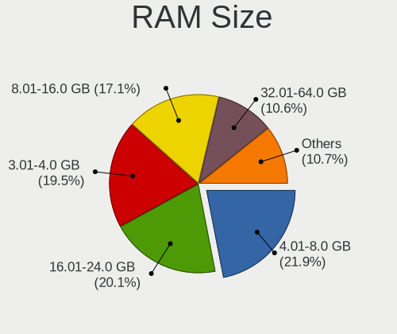

Linux in France - Tested Hardware & Statistics
----------------------------------------------

A project to collect tested hardware configurations for Linux in France.

Anyone can contribute to this report by the [hw-probe](https://github.com/linuxhw/hw-probe) tool:

    sudo -E hw-probe -all -upload

Please contribute! Especially if your hardware is rare.

This is a report for all computer types. See also reports for [desktops](/Location/France/Desktop/README.md) and [notebooks](/Location/France/Notebook/README.md).

Contents
--------

* [ Test Cases ](#test-cases)

* [ System ](#system)
  - [ OS                       ](#os)
  - [ OS Family                ](#os-family)
  - [ Kernel                   ](#kernel)
  - [ Kernel Family            ](#kernel-family)
  - [ Kernel Major Ver.        ](#kernel-major-ver)
  - [ Arch                     ](#arch)
  - [ DE                       ](#de)
  - [ Display Server           ](#display-server)
  - [ Display Manager          ](#display-manager)
  - [ OS Lang                  ](#os-lang)
  - [ Boot Mode                ](#boot-mode)
  - [ Filesystem               ](#filesystem)
  - [ Part. scheme             ](#part-scheme)
  - [ Dual Boot with Linux/BSD ](#dual-boot-with-linuxbsd)
  - [ Dual Boot (Win)          ](#dual-boot-win)

* [ Board ](#board)
  - [ Vendor                   ](#vendor)
  - [ Model                    ](#model)
  - [ Model Family             ](#model-family)
  - [ MFG Year                 ](#mfg-year)
  - [ Form Factor              ](#form-factor)
  - [ Secure Boot              ](#secure-boot)
  - [ Coreboot                 ](#coreboot)
  - [ RAM Size                 ](#ram-size)
  - [ RAM Used                 ](#ram-used)
  - [ Total Drives             ](#total-drives)
  - [ Has CD-ROM               ](#has-cd-rom)
  - [ Has Ethernet             ](#has-ethernet)
  - [ Has WiFi                 ](#has-wifi)
  - [ Has Bluetooth            ](#has-bluetooth)

* [ Location ](#location)
  - [ Country                  ](#country)
  - [ City                     ](#city)

* [ Drives ](#drives)
  - [ Drive Vendor             ](#drive-vendor)
  - [ Drive Model              ](#drive-model)
  - [ HDD Vendor               ](#hdd-vendor)
  - [ SSD Vendor               ](#ssd-vendor)
  - [ Drive Kind               ](#drive-kind)
  - [ Drive Connector          ](#drive-connector)
  - [ Drive Size               ](#drive-size)
  - [ Space Total              ](#space-total)
  - [ Space Used               ](#space-used)
  - [ Malfunc. Drives          ](#malfunc-drives)
  - [ Malfunc. Drive Vendor    ](#malfunc-drive-vendor)
  - [ Malfunc. HDD Vendor      ](#malfunc-hdd-vendor)
  - [ Malfunc. Drive Kind      ](#malfunc-drive-kind)
  - [ Failed Drives            ](#failed-drives)
  - [ Failed Drive Vendor      ](#failed-drive-vendor)
  - [ Drive Status             ](#drive-status)

* [ Storage controller ](#storage-controller)
  - [ Storage Vendor           ](#storage-vendor)
  - [ Storage Model            ](#storage-model)
  - [ Storage Kind             ](#storage-kind)

* [ Processor ](#processor)
  - [ CPU Vendor               ](#cpu-vendor)
  - [ CPU Model                ](#cpu-model)
  - [ CPU Model Family         ](#cpu-model-family)
  - [ CPU Cores                ](#cpu-cores)
  - [ CPU Sockets              ](#cpu-sockets)
  - [ CPU Threads              ](#cpu-threads)
  - [ CPU Op-Modes             ](#cpu-op-modes)
  - [ CPU Microcode            ](#cpu-microcode)
  - [ CPU Microarch            ](#cpu-microarch)

* [ Graphics ](#graphics)
  - [ GPU Vendor               ](#gpu-vendor)
  - [ GPU Model                ](#gpu-model)
  - [ GPU Combo                ](#gpu-combo)
  - [ GPU Driver               ](#gpu-driver)
  - [ GPU Memory               ](#gpu-memory)

* [ Monitor ](#monitor)
  - [ Monitor Vendor           ](#monitor-vendor)
  - [ Monitor Model            ](#monitor-model)
  - [ Monitor Resolution       ](#monitor-resolution)
  - [ Monitor Diagonal         ](#monitor-diagonal)
  - [ Monitor Width            ](#monitor-width)
  - [ Aspect Ratio             ](#aspect-ratio)
  - [ Monitor Area             ](#monitor-area)
  - [ Pixel Density            ](#pixel-density)
  - [ Multiple Monitors        ](#multiple-monitors)

* [ Network ](#network)
  - [ Net Controller Vendor    ](#net-controller-vendor)
  - [ Net Controller Model     ](#net-controller-model)
  - [ Wireless Vendor          ](#wireless-vendor)
  - [ Wireless Model           ](#wireless-model)
  - [ Ethernet Vendor          ](#ethernet-vendor)
  - [ Ethernet Model           ](#ethernet-model)
  - [ Net Controller Kind      ](#net-controller-kind)
  - [ Used Controller          ](#used-controller)
  - [ NICs                     ](#nics)
  - [ IPv6                     ](#ipv6)

* [ Bluetooth ](#bluetooth)
  - [ Bluetooth Vendor         ](#bluetooth-vendor)
  - [ Bluetooth Model          ](#bluetooth-model)

* [ Sound ](#sound)
  - [ Sound Vendor             ](#sound-vendor)
  - [ Sound Model              ](#sound-model)

* [ Memory ](#memory)
  - [ Memory Vendor            ](#memory-vendor)
  - [ Memory Model             ](#memory-model)
  - [ Memory Kind              ](#memory-kind)
  - [ Memory Form Factor       ](#memory-form-factor)
  - [ Memory Size              ](#memory-size)
  - [ Memory Speed             ](#memory-speed)

* [ Printers & scanners ](#printers--scanners)
  - [ Printer Vendor           ](#printer-vendor)
  - [ Printer Model            ](#printer-model)
  - [ Scanner Vendor           ](#scanner-vendor)
  - [ Scanner Model            ](#scanner-model)

* [ Camera ](#camera)
  - [ Camera Vendor            ](#camera-vendor)
  - [ Camera Model             ](#camera-model)

* [ Security ](#security)
  - [ Fingerprint Vendor       ](#fingerprint-vendor)
  - [ Fingerprint Model        ](#fingerprint-model)
  - [ Chipcard Vendor          ](#chipcard-vendor)
  - [ Chipcard Model           ](#chipcard-model)

* [ Unsupported ](#unsupported)
  - [ Unsupported Devices      ](#unsupported-devices)
  - [ Unsupported Device Types ](#unsupported-device-types)

Test Cases
----------

Total: 10777

| Vendor        | Model                       | Form-Factor | Probe                                                      | Date         |
|---------------|-----------------------------|-------------|------------------------------------------------------------|--------------|
| AZW           | SEi                         | Notebook    | [3cd2f7f657](https://linux-hardware.org/?probe=3cd2f7f657) | Dec 01, 2022 |
| Acer          | Aspire XC-705               | Desktop     | [86a503df2a](https://linux-hardware.org/?probe=86a503df2a) | Dec 01, 2022 |
| Gigabyte      | B450M DS3H-CF               | Desktop     | [5e7bc65683](https://linux-hardware.org/?probe=5e7bc65683) | Dec 01, 2022 |
| Samsung       | R540/R538/SA41/E452         | Notebook    | [afad3c8828](https://linux-hardware.org/?probe=afad3c8828) | Dec 01, 2022 |
| HP            | 250 G7 Notebook PC          | Notebook    | [1002df8858](https://linux-hardware.org/?probe=1002df8858) | Dec 01, 2022 |
| ASUSTek       | A88XM-A                     | Desktop     | [f883ed1fd1](https://linux-hardware.org/?probe=f883ed1fd1) | Dec 01, 2022 |
| Samsung       | 930XED                      | Notebook    | [38584fa129](https://linux-hardware.org/?probe=38584fa129) | Dec 01, 2022 |
| Dell          | Precision 5540              | Notebook    | [030dbd45f0](https://linux-hardware.org/?probe=030dbd45f0) | Dec 01, 2022 |
| ASUSTek       | S551LN                      | Notebook    | [b21b106fdf](https://linux-hardware.org/?probe=b21b106fdf) | Dec 01, 2022 |
| Gigabyte      | H170-HD3-CF                 | Desktop     | [1d293c6d72](https://linux-hardware.org/?probe=1d293c6d72) | Nov 30, 2022 |
| ASUSTek       | Z97-A                       | Desktop     | [da1400c491](https://linux-hardware.org/?probe=da1400c491) | Nov 30, 2022 |
| HP            | EliteBook 840 G3            | Notebook    | [e17d8c1694](https://linux-hardware.org/?probe=e17d8c1694) | Nov 30, 2022 |
| HUAWEI        | NBLK-WAX9X                  | Notebook    | [183243daeb](https://linux-hardware.org/?probe=183243daeb) | Nov 30, 2022 |
| HP            | EliteBook x360 1040 G8 N... | Convertible | [4b635dd9ef](https://linux-hardware.org/?probe=4b635dd9ef) | Nov 30, 2022 |
| Packard Be... | EasyNote TE69CXP            | Notebook    | [919275eb73](https://linux-hardware.org/?probe=919275eb73) | Nov 30, 2022 |
| Foxconn       | 2ABF                        | Desktop     | [09a9309a2a](https://linux-hardware.org/?probe=09a9309a2a) | Nov 30, 2022 |
| MSI           | Z370 GAMING PLUS            | Desktop     | [bd1c91dba9](https://linux-hardware.org/?probe=bd1c91dba9) | Nov 30, 2022 |
| Apple         | Mac-B809C3757DA9BB8D iMa... | All in one  | [f698b715e4](https://linux-hardware.org/?probe=f698b715e4) | Nov 30, 2022 |
| HP            | ZBook 15v G5                | Notebook    | [aabc35ae2a](https://linux-hardware.org/?probe=aabc35ae2a) | Nov 30, 2022 |
| ASUSTek       | E403SA                      | Notebook    | [d3a1f181d5](https://linux-hardware.org/?probe=d3a1f181d5) | Nov 30, 2022 |
| Foxconn       | 2ABF                        | Desktop     | [b585d891a8](https://linux-hardware.org/?probe=b585d891a8) | Nov 30, 2022 |
| Lenovo        | G70-80 80FF                 | Notebook    | [022ce8e2c8](https://linux-hardware.org/?probe=022ce8e2c8) | Nov 29, 2022 |
| HP            | Pavilion 17                 | Notebook    | [431ce9bd18](https://linux-hardware.org/?probe=431ce9bd18) | Nov 29, 2022 |
| Dell          | Latitude E6410              | Notebook    | [d7abefea4b](https://linux-hardware.org/?probe=d7abefea4b) | Nov 29, 2022 |
| Dell          | Latitude E6410              | Notebook    | [bac3e8c250](https://linux-hardware.org/?probe=bac3e8c250) | Nov 29, 2022 |
| Dell          | Latitude 5330               | Notebook    | [b8d907f2e8](https://linux-hardware.org/?probe=b8d907f2e8) | Nov 29, 2022 |
| MSI           | GT60                        | Notebook    | [07557bed1b](https://linux-hardware.org/?probe=07557bed1b) | Nov 29, 2022 |
| Dell          | Inspiron 16 5625            | Notebook    | [50912d5fa9](https://linux-hardware.org/?probe=50912d5fa9) | Nov 29, 2022 |
| HUAWEI        | NBD-WXX9                    | Notebook    | [e9932df850](https://linux-hardware.org/?probe=e9932df850) | Nov 29, 2022 |
| HUAWEI        | NBD-WXX9                    | Notebook    | [179ff76e75](https://linux-hardware.org/?probe=179ff76e75) | Nov 29, 2022 |
| Dell          | Latitude 7490               | Notebook    | [8934413cf0](https://linux-hardware.org/?probe=8934413cf0) | Nov 29, 2022 |
| Dell          | System Vostro 3750          | Notebook    | [ed88e2ae0c](https://linux-hardware.org/?probe=ed88e2ae0c) | Nov 29, 2022 |
| Thomson       | N17V3C8WH512                | Notebook    | [b89cd0328a](https://linux-hardware.org/?probe=b89cd0328a) | Nov 29, 2022 |
| ASRock        | FM2A78 Pro4+                | Desktop     | [7eae5fad47](https://linux-hardware.org/?probe=7eae5fad47) | Nov 29, 2022 |
| Razer         | Blade Stealth               | Notebook    | [e182c3c739](https://linux-hardware.org/?probe=e182c3c739) | Nov 29, 2022 |
| ASUSTek       | K70IO                       | Notebook    | [f91b4cdb61](https://linux-hardware.org/?probe=f91b4cdb61) | Nov 29, 2022 |
| Intel         | DH67BL AAG10189-213         | Desktop     | [11252af398](https://linux-hardware.org/?probe=11252af398) | Nov 28, 2022 |
| HP            | EliteBook 8460p             | Notebook    | [ffe997080f](https://linux-hardware.org/?probe=ffe997080f) | Nov 28, 2022 |
| Lenovo        | G50-80 80E5                 | Notebook    | [1387bf11ea](https://linux-hardware.org/?probe=1387bf11ea) | Nov 28, 2022 |
| Dell          | Inspiron 16 5625            | Notebook    | [22da2f8729](https://linux-hardware.org/?probe=22da2f8729) | Nov 28, 2022 |
| ASUSTek       | X756UVK                     | Notebook    | [4745940cf9](https://linux-hardware.org/?probe=4745940cf9) | Nov 28, 2022 |
| Dell          | 0NK5PH A00                  | Desktop     | [d889c3c50a](https://linux-hardware.org/?probe=d889c3c50a) | Nov 28, 2022 |
| Dell          | 0773VG A00                  | Desktop     | [a21b1834c2](https://linux-hardware.org/?probe=a21b1834c2) | Nov 28, 2022 |
| Dell          | 0773VG A00                  | Desktop     | [04125afb72](https://linux-hardware.org/?probe=04125afb72) | Nov 28, 2022 |
| ASRock        | FM2A78 Pro4+                | Desktop     | [908283c378](https://linux-hardware.org/?probe=908283c378) | Nov 28, 2022 |
| ASUSTek       | K70IO                       | Notebook    | [4eabf9a0d4](https://linux-hardware.org/?probe=4eabf9a0d4) | Nov 28, 2022 |
| Lenovo        | ThinkPad T450 20BUS03J00    | Notebook    | [8423f90db0](https://linux-hardware.org/?probe=8423f90db0) | Nov 27, 2022 |
| ASUSTek       | SABERTOOTH 990FX R2.0       | Desktop     | [bc515374ae](https://linux-hardware.org/?probe=bc515374ae) | Nov 27, 2022 |
| Dell          | Latitude E6230              | Notebook    | [f3536b80de](https://linux-hardware.org/?probe=f3536b80de) | Nov 27, 2022 |
| Dell          | Latitude E6230              | Notebook    | [dbaae2beb7](https://linux-hardware.org/?probe=dbaae2beb7) | Nov 27, 2022 |
| Dell          | 05XGC8 A00                  | Desktop     | [e0e0efb9be](https://linux-hardware.org/?probe=e0e0efb9be) | Nov 27, 2022 |
| ASUSTek       | TUF Gaming X570-PLUS        | Desktop     | [7cb4ad7428](https://linux-hardware.org/?probe=7cb4ad7428) | Nov 27, 2022 |
| Gigabyte      | B450M DS3H-CF               | Desktop     | [54d005e599](https://linux-hardware.org/?probe=54d005e599) | Nov 27, 2022 |
| Lenovo        | ThinkBook 14 G2 ITL 20VD    | Notebook    | [2d1a576ee6](https://linux-hardware.org/?probe=2d1a576ee6) | Nov 27, 2022 |
| HP            | Compaq Presario CQ60        | Notebook    | [1f521f98cb](https://linux-hardware.org/?probe=1f521f98cb) | Nov 27, 2022 |
| Dell          | Studio 1558                 | Notebook    | [bc76adb105](https://linux-hardware.org/?probe=bc76adb105) | Nov 27, 2022 |
| Dell          | Studio 1558                 | Notebook    | [43438ab851](https://linux-hardware.org/?probe=43438ab851) | Nov 27, 2022 |
| Jumper        | EZbook                      | Notebook    | [a93aa75e5f](https://linux-hardware.org/?probe=a93aa75e5f) | Nov 27, 2022 |
| Panasonic     | CF-19AHN3BFF                | Notebook    | [a5989143a8](https://linux-hardware.org/?probe=a5989143a8) | Nov 26, 2022 |
| ASUSTek       | 1002HA                      | Notebook    | [15d5eb998d](https://linux-hardware.org/?probe=15d5eb998d) | Nov 26, 2022 |
| ASUSTek       | P7P55D-E LX                 | Desktop     | [8b913d5510](https://linux-hardware.org/?probe=8b913d5510) | Nov 26, 2022 |
| ASUSTek       | SABERTOOTH 990FX R2.0       | Desktop     | [02b1483a02](https://linux-hardware.org/?probe=02b1483a02) | Nov 26, 2022 |
| Dell          | Latitude 7310               | Notebook    | [46ed677d40](https://linux-hardware.org/?probe=46ed677d40) | Nov 26, 2022 |
| Dell          | 04MFRM A02                  | Desktop     | [43239e45b1](https://linux-hardware.org/?probe=43239e45b1) | Nov 26, 2022 |
| ASUSTek       | ZenBook UX450FDX_UX480FD    | Notebook    | [694d1d5e96](https://linux-hardware.org/?probe=694d1d5e96) | Nov 26, 2022 |
| MSI           | GL62M 7RDX                  | Notebook    | [1aa67b30d4](https://linux-hardware.org/?probe=1aa67b30d4) | Nov 26, 2022 |
| HP            | ENVY x360 2-in-1 Laptop ... | Convertible | [1b3355afbc](https://linux-hardware.org/?probe=1b3355afbc) | Nov 26, 2022 |
| Dell          | Inspiron MP061              | Notebook    | [d70d7496df](https://linux-hardware.org/?probe=d70d7496df) | Nov 26, 2022 |
| ASUSTek       | Z97-A                       | Desktop     | [9163dc4b5d](https://linux-hardware.org/?probe=9163dc4b5d) | Nov 26, 2022 |
| Dell          | 05XGC8 A00                  | Desktop     | [6ea1a60122](https://linux-hardware.org/?probe=6ea1a60122) | Nov 26, 2022 |
| Dell          | Latitude E7240              | Notebook    | [634ebb2a88](https://linux-hardware.org/?probe=634ebb2a88) | Nov 25, 2022 |
| ASUSTek       | P8B75-M LX PLUS             | Desktop     | [7948a35f59](https://linux-hardware.org/?probe=7948a35f59) | Nov 25, 2022 |
| Gigabyte      | 970A-DS3P                   | Desktop     | [2787600567](https://linux-hardware.org/?probe=2787600567) | Nov 25, 2022 |
| HP            | Pavilion 15                 | Notebook    | [b294971fc6](https://linux-hardware.org/?probe=b294971fc6) | Nov 25, 2022 |
| ASUSTek       | X555YI                      | Notebook    | [2626d57c13](https://linux-hardware.org/?probe=2626d57c13) | Nov 25, 2022 |
| Intel         | BTC-T37                     | Desktop     | [f52a08ae38](https://linux-hardware.org/?probe=f52a08ae38) | Nov 25, 2022 |
| Dell          | Latitude 7310               | Notebook    | [0f9c2a5623](https://linux-hardware.org/?probe=0f9c2a5623) | Nov 25, 2022 |
| MSI           | 970 GAMING                  | Desktop     | [de56ed9d3f](https://linux-hardware.org/?probe=de56ed9d3f) | Nov 25, 2022 |
| Panasonic     | CF-19AHN3BFF                | Notebook    | [bfd184ea5c](https://linux-hardware.org/?probe=bfd184ea5c) | Nov 25, 2022 |
| Gigabyte      | G1.SNIPER B7-CF             | Desktop     | [c53295ce70](https://linux-hardware.org/?probe=c53295ce70) | Nov 25, 2022 |
| ASUSTek       | ROG STRIX Z790-E GAMING ... | Desktop     | [97ede0876f](https://linux-hardware.org/?probe=97ede0876f) | Nov 25, 2022 |
| ASUSTek       | ROG STRIX Z790-E GAMING ... | Desktop     | [1817579f89](https://linux-hardware.org/?probe=1817579f89) | Nov 25, 2022 |
| HP            | ProBook 640 G8 Notebook ... | Notebook    | [ce586530e4](https://linux-hardware.org/?probe=ce586530e4) | Nov 24, 2022 |
| Lenovo        | ThinkCentre A70 7099A5G     | Desktop     | [dad5599996](https://linux-hardware.org/?probe=dad5599996) | Nov 24, 2022 |
| HP            | 0AE8h                       | Desktop     | [c49d643fae](https://linux-hardware.org/?probe=c49d643fae) | Nov 24, 2022 |
| Dell          | Latitude 7310               | Notebook    | [d7448aaff8](https://linux-hardware.org/?probe=d7448aaff8) | Nov 24, 2022 |
| Acer          | Aspire ES1-523              | Notebook    | [333d3583b1](https://linux-hardware.org/?probe=333d3583b1) | Nov 24, 2022 |
| MSI           | B75A-G43                    | Desktop     | [7f635dae7f](https://linux-hardware.org/?probe=7f635dae7f) | Nov 24, 2022 |
| Unknown       | Unknown                     | Desktop     | [0904a442f0](https://linux-hardware.org/?probe=0904a442f0) | Nov 24, 2022 |
| Lenovo        | ThinkPad X1 Nano Gen 2 2... | Notebook    | [4b6212908f](https://linux-hardware.org/?probe=4b6212908f) | Nov 24, 2022 |
| Lenovo        | ThinkPad X1 Nano Gen 2 2... | Notebook    | [69c89370b7](https://linux-hardware.org/?probe=69c89370b7) | Nov 24, 2022 |
| Lenovo        | ThinkPad E14 Gen 2 20TA0... | Notebook    | [a4512e8a71](https://linux-hardware.org/?probe=a4512e8a71) | Nov 24, 2022 |
| Dell          | Latitude E6500              | Notebook    | [73d607f9e1](https://linux-hardware.org/?probe=73d607f9e1) | Nov 24, 2022 |
| Dell          | Latitude 7310               | Notebook    | [836fbd119c](https://linux-hardware.org/?probe=836fbd119c) | Nov 24, 2022 |
| Apple         | Mac-B809C3757DA9BB8D iMa... | All in one  | [b79f103dd5](https://linux-hardware.org/?probe=b79f103dd5) | Nov 24, 2022 |
| ASUSTek       | ASUS TUF Gaming A17 FA70... | Notebook    | [9e1f0c4898](https://linux-hardware.org/?probe=9e1f0c4898) | Nov 24, 2022 |
| ASUSTek       | VivoBook_ASUSLaptop E410... | Notebook    | [ef378a135b](https://linux-hardware.org/?probe=ef378a135b) | Nov 24, 2022 |
| Gigabyte      | H97-HD3                     | Desktop     | [7c2db201dc](https://linux-hardware.org/?probe=7c2db201dc) | Nov 24, 2022 |
| Intel         | NUC7i3DNB J57625-508        | Mini pc     | [e65c082f84](https://linux-hardware.org/?probe=e65c082f84) | Nov 24, 2022 |
| Acer          | Aspire A315-54K             | Notebook    | [12f19e4fbe](https://linux-hardware.org/?probe=12f19e4fbe) | Nov 23, 2022 |
| ASUSTek       | K70IJ                       | Notebook    | [8df764e624](https://linux-hardware.org/?probe=8df764e624) | Nov 23, 2022 |
| MSI           | MAG B550 TORPEDO            | Desktop     | [ca3bcfa403](https://linux-hardware.org/?probe=ca3bcfa403) | Nov 23, 2022 |
| HP            | ENVY x360 Convertible 15... | Convertible | [a9d12017bb](https://linux-hardware.org/?probe=a9d12017bb) | Nov 23, 2022 |
| ASUSTek       | PRIME B550-PLUS             | Desktop     | [b0e5869f2d](https://linux-hardware.org/?probe=b0e5869f2d) | Nov 23, 2022 |
| MSI           | Modern 14 C12M              | Notebook    | [51088606f5](https://linux-hardware.org/?probe=51088606f5) | Nov 23, 2022 |
| Acer          | FIH57                       | Desktop     | [008bcadcd9](https://linux-hardware.org/?probe=008bcadcd9) | Nov 23, 2022 |
| MSI           | H61M-E33                    | Desktop     | [d0277334cf](https://linux-hardware.org/?probe=d0277334cf) | Nov 23, 2022 |
| Lenovo        | ThinkPad X1 Carbon 4th 2... | Notebook    | [f1d8974d71](https://linux-hardware.org/?probe=f1d8974d71) | Nov 23, 2022 |
| Gigabyte      | B650M DS3H                  | Desktop     | [fc9449798a](https://linux-hardware.org/?probe=fc9449798a) | Nov 23, 2022 |
| Unknown       | Unknown                     | Notebook    | [c119fbb804](https://linux-hardware.org/?probe=c119fbb804) | Nov 22, 2022 |
| Lenovo        | ThinkPad P14s Gen 3 21AK... | Notebook    | [96205eb8d4](https://linux-hardware.org/?probe=96205eb8d4) | Nov 22, 2022 |
| Lenovo        | ThinkPad P14s Gen 3 21AK... | Notebook    | [97571585cd](https://linux-hardware.org/?probe=97571585cd) | Nov 22, 2022 |
| ASUSTek       | H81M2                       | Desktop     | [f06b4252d7](https://linux-hardware.org/?probe=f06b4252d7) | Nov 22, 2022 |
| Acer          | Aspire A515-57              | Notebook    | [4692ce22fb](https://linux-hardware.org/?probe=4692ce22fb) | Nov 22, 2022 |
| Acer          | Aspire A515-57              | Notebook    | [cb82f6d418](https://linux-hardware.org/?probe=cb82f6d418) | Nov 22, 2022 |
| HP            | ENVY dv6                    | Notebook    | [0d28d09c70](https://linux-hardware.org/?probe=0d28d09c70) | Nov 22, 2022 |
| Dell          | Inspiron 7586               | Convertible | [ea152cdb94](https://linux-hardware.org/?probe=ea152cdb94) | Nov 22, 2022 |
| Gigabyte      | GA-MA770T-UD3               | Desktop     | [29b92290e8](https://linux-hardware.org/?probe=29b92290e8) | Nov 22, 2022 |
| Dell          | Latitude E6520              | Notebook    | [1801edca03](https://linux-hardware.org/?probe=1801edca03) | Nov 22, 2022 |
| HP            | ProBook 450 G1              | Notebook    | [c8d71bb807](https://linux-hardware.org/?probe=c8d71bb807) | Nov 22, 2022 |
| Acer          | Veriton X2631G V:1.0        | Desktop     | [af2a85dd3c](https://linux-hardware.org/?probe=af2a85dd3c) | Nov 22, 2022 |
| Timi          | TM1612                      | Notebook    | [abd08d53c7](https://linux-hardware.org/?probe=abd08d53c7) | Nov 22, 2022 |
| Lenovo        | ThinkPad P14s Gen 1 20Y1... | Notebook    | [54d3eed278](https://linux-hardware.org/?probe=54d3eed278) | Nov 21, 2022 |
| Dell          | 0GY6Y8 A02                  | Desktop     | [8789b14e39](https://linux-hardware.org/?probe=8789b14e39) | Nov 21, 2022 |
| HP            | 8184 X4                     | Desktop     | [f38ad9d963](https://linux-hardware.org/?probe=f38ad9d963) | Nov 21, 2022 |
| ASUSTek       | V-P5G43 R1.04G              | Desktop     | [b400ca5e29](https://linux-hardware.org/?probe=b400ca5e29) | Nov 21, 2022 |
| Dell          | Precision 5510              | Notebook    | [63c0b8aa0c](https://linux-hardware.org/?probe=63c0b8aa0c) | Nov 21, 2022 |
| MSI           | MAG B560M MORTAR            | Desktop     | [18a3c1f2bf](https://linux-hardware.org/?probe=18a3c1f2bf) | Nov 21, 2022 |
| HP            | 3399                        | Desktop     | [bce6df1ffb](https://linux-hardware.org/?probe=bce6df1ffb) | Nov 21, 2022 |
| ASUSTek       | F1A55-M LE                  | Desktop     | [f2120128c1](https://linux-hardware.org/?probe=f2120128c1) | Nov 21, 2022 |
| Lenovo        | IdeaPad Slim 1-14AST-05 ... | Notebook    | [c3048ea26d](https://linux-hardware.org/?probe=c3048ea26d) | Nov 21, 2022 |
| HP            | Pavilion Notebook           | Notebook    | [9599fd68a9](https://linux-hardware.org/?probe=9599fd68a9) | Nov 21, 2022 |
| MSI           | A68HM-E33 V2                | Desktop     | [a93dbf13df](https://linux-hardware.org/?probe=a93dbf13df) | Nov 21, 2022 |
| MSI           | A68HM-E33 V2                | Desktop     | [50ca61403f](https://linux-hardware.org/?probe=50ca61403f) | Nov 21, 2022 |
| Acer          | FIH57                       | Desktop     | [70bcc47286](https://linux-hardware.org/?probe=70bcc47286) | Nov 21, 2022 |
| Acer          | Veriton X2631G V:1.0        | Desktop     | [df71eef5cb](https://linux-hardware.org/?probe=df71eef5cb) | Nov 21, 2022 |
| Unknown       | Unknown                     | Notebook    | [5a06cde126](https://linux-hardware.org/?probe=5a06cde126) | Nov 20, 2022 |
| Acer          | Veriton N4640G              | Desktop     | [a7984c4a95](https://linux-hardware.org/?probe=a7984c4a95) | Nov 20, 2022 |
| Acer          | Aspire ES1-711G             | Notebook    | [8852f94b38](https://linux-hardware.org/?probe=8852f94b38) | Nov 20, 2022 |
| ASUSTek       | ZenBook UX325EA_UX325EA     | Notebook    | [eb43c3d5c0](https://linux-hardware.org/?probe=eb43c3d5c0) | Nov 20, 2022 |
| HP            | 339A                        | Desktop     | [f5f01373e9](https://linux-hardware.org/?probe=f5f01373e9) | Nov 20, 2022 |
| ASRock        | 990FX Extreme3              | Desktop     | [84b8daa5c4](https://linux-hardware.org/?probe=84b8daa5c4) | Nov 20, 2022 |
| MSI           | X299 RAIDER                 | Desktop     | [544b8ae2b7](https://linux-hardware.org/?probe=544b8ae2b7) | Nov 19, 2022 |
| ASUSTek       | ZenBook UX325EA_UX325EA     | Notebook    | [6a51b20cd4](https://linux-hardware.org/?probe=6a51b20cd4) | Nov 19, 2022 |
| HP            | EliteBook 840 G2            | Notebook    | [6c896ef17e](https://linux-hardware.org/?probe=6c896ef17e) | Nov 19, 2022 |
| HP            | Pavilion g7                 | Notebook    | [fae1d08109](https://linux-hardware.org/?probe=fae1d08109) | Nov 19, 2022 |
| Google        | Rammus                      | Notebook    | [23ed7badd5](https://linux-hardware.org/?probe=23ed7badd5) | Nov 19, 2022 |
| Dell          | Latitude 7410               | Notebook    | [ce222880fe](https://linux-hardware.org/?probe=ce222880fe) | Nov 18, 2022 |
| Gigabyte      | 970A-DS3P                   | Desktop     | [fc7b21bd04](https://linux-hardware.org/?probe=fc7b21bd04) | Nov 18, 2022 |
| ASUSTek       | K30AD_M31AD_M51AD_M32AD     | Desktop     | [a0495a1ea1](https://linux-hardware.org/?probe=a0495a1ea1) | Nov 18, 2022 |
| HP            | 8643 SMVB                   | Desktop     | [3556ffb814](https://linux-hardware.org/?probe=3556ffb814) | Nov 18, 2022 |
| HP            | EliteBook 840 G3            | Notebook    | [a5151a0db4](https://linux-hardware.org/?probe=a5151a0db4) | Nov 18, 2022 |
| Dell          | Latitude 7300               | Notebook    | [5ff7502b3e](https://linux-hardware.org/?probe=5ff7502b3e) | Nov 18, 2022 |
| Dell          | 0Y7WYT A00                  | Desktop     | [d5306443e9](https://linux-hardware.org/?probe=d5306443e9) | Nov 18, 2022 |
| Dell          | 0773VG A00                  | Desktop     | [754a16b847](https://linux-hardware.org/?probe=754a16b847) | Nov 18, 2022 |
| Dell          | Latitude 7310               | Notebook    | [525543a3dc](https://linux-hardware.org/?probe=525543a3dc) | Nov 18, 2022 |
| Dell          | Latitude 7300               | Notebook    | [5c7f8f6d8c](https://linux-hardware.org/?probe=5c7f8f6d8c) | Nov 18, 2022 |
| Dell          | 0Y7WYT A00                  | Desktop     | [516b201857](https://linux-hardware.org/?probe=516b201857) | Nov 18, 2022 |
| HP            | Pavilion 17                 | Notebook    | [ab34ec642d](https://linux-hardware.org/?probe=ab34ec642d) | Nov 18, 2022 |
| Dynabook      | TECRA A50-J                 | Notebook    | [c0ae8746e0](https://linux-hardware.org/?probe=c0ae8746e0) | Nov 18, 2022 |
| ASUSTek       | Zenbook UM5302TA_UM5302T... | Notebook    | [94bd888b25](https://linux-hardware.org/?probe=94bd888b25) | Nov 18, 2022 |
| Acer          | Aspire S5-371               | Notebook    | [6274604555](https://linux-hardware.org/?probe=6274604555) | Nov 18, 2022 |
| Acer          | Swift SF314-42              | Notebook    | [12e2119f1c](https://linux-hardware.org/?probe=12e2119f1c) | Nov 18, 2022 |
| Dell          | Latitude 5520               | Notebook    | [72bcc12409](https://linux-hardware.org/?probe=72bcc12409) | Nov 18, 2022 |
| Acer          | Aspire S24-880              | All in one  | [a255155f98](https://linux-hardware.org/?probe=a255155f98) | Nov 18, 2022 |
| Dell          | Latitude 5490               | Notebook    | [70b8fb5e89](https://linux-hardware.org/?probe=70b8fb5e89) | Nov 18, 2022 |
| ASUSTek       | ZenBook UX333FN_UX333FN     | Notebook    | [88336d65e7](https://linux-hardware.org/?probe=88336d65e7) | Nov 17, 2022 |
| Dynabook E... | PORTABLECD2021              | Notebook    | [17a064a3c3](https://linux-hardware.org/?probe=17a064a3c3) | Nov 17, 2022 |
| MSI           | Prestige 14 A12SC           | Notebook    | [008c444627](https://linux-hardware.org/?probe=008c444627) | Nov 17, 2022 |
| HP            | EliteBook 840 G3            | Notebook    | [cd753ace10](https://linux-hardware.org/?probe=cd753ace10) | Nov 17, 2022 |
| Apple         | MacBookAir7,2               | Notebook    | [6901439af7](https://linux-hardware.org/?probe=6901439af7) | Nov 17, 2022 |
| HP            | 245 G8 Notebook PC          | Notebook    | [4d4f9a0e10](https://linux-hardware.org/?probe=4d4f9a0e10) | Nov 17, 2022 |
| Dell          | Latitude 7300               | Notebook    | [462f090e8c](https://linux-hardware.org/?probe=462f090e8c) | Nov 17, 2022 |
| Dell          | Latitude 7380               | Notebook    | [c34f569e5a](https://linux-hardware.org/?probe=c34f569e5a) | Nov 17, 2022 |
| Dell          | Latitude 7380               | Notebook    | [ff8bc9f174](https://linux-hardware.org/?probe=ff8bc9f174) | Nov 17, 2022 |
| HP            | ZBook 14 G2                 | Notebook    | [c084bd4b99](https://linux-hardware.org/?probe=c084bd4b99) | Nov 17, 2022 |
| HP            | ZBook 14 G2                 | Notebook    | [e687234452](https://linux-hardware.org/?probe=e687234452) | Nov 17, 2022 |
| Dynabook E... | PORTABLECD2021              | Notebook    | [5d138b93b6](https://linux-hardware.org/?probe=5d138b93b6) | Nov 16, 2022 |
| Dell          | Inspiron 13 5310            | Notebook    | [3c9865d86e](https://linux-hardware.org/?probe=3c9865d86e) | Nov 16, 2022 |
| MSI           | Katana GF76 11UC            | Notebook    | [24ba2f8b12](https://linux-hardware.org/?probe=24ba2f8b12) | Nov 16, 2022 |
| ASUSTek       | T100TA                      | Notebook    | [3d49b98878](https://linux-hardware.org/?probe=3d49b98878) | Nov 16, 2022 |
| HUAWEI        | HLYL-WXX9                   | Notebook    | [f863546b0f](https://linux-hardware.org/?probe=f863546b0f) | Nov 16, 2022 |
| ASUSTek       | PN51-E1                     | Mini pc     | [d6bae26c19](https://linux-hardware.org/?probe=d6bae26c19) | Nov 16, 2022 |
| Google        | Rammus                      | Notebook    | [ef0f440314](https://linux-hardware.org/?probe=ef0f440314) | Nov 16, 2022 |
| Dell          | 04MFRM A02                  | Desktop     | [677ab8eb16](https://linux-hardware.org/?probe=677ab8eb16) | Nov 16, 2022 |
| AMI           | Intel                       | Notebook    | [36327e3aca](https://linux-hardware.org/?probe=36327e3aca) | Nov 16, 2022 |
| HP            | Notebook                    | Notebook    | [d40f2df5a8](https://linux-hardware.org/?probe=d40f2df5a8) | Nov 16, 2022 |
| HP            | EliteBook x360 830 G6       | Convertible | [d4b09c09f0](https://linux-hardware.org/?probe=d4b09c09f0) | Nov 15, 2022 |
| HP            | Spectre x360 Convertible... | Convertible | [12fe5843d1](https://linux-hardware.org/?probe=12fe5843d1) | Nov 15, 2022 |
| HP            | 250 G6 Notebook PC          | Notebook    | [439fe62e2e](https://linux-hardware.org/?probe=439fe62e2e) | Nov 15, 2022 |
| LDLC          | SPC-N                       | Notebook    | [acec489419](https://linux-hardware.org/?probe=acec489419) | Nov 15, 2022 |
| ASUSTek       | H81M-A                      | Desktop     | [ff63827781](https://linux-hardware.org/?probe=ff63827781) | Nov 15, 2022 |
| Intel         | NUC7i3DNB J57625-508        | Mini pc     | [8e3861630d](https://linux-hardware.org/?probe=8e3861630d) | Nov 15, 2022 |
| MSI           | PRO H610M-B DDR4            | Desktop     | [5ffe9844bd](https://linux-hardware.org/?probe=5ffe9844bd) | Nov 15, 2022 |
| ASUSTek       | P5QL-ASUS-SE                | Desktop     | [6dd2bbbe51](https://linux-hardware.org/?probe=6dd2bbbe51) | Nov 15, 2022 |
| Dell          | 0UR033 A00                  | Server      | [2ff8924b15](https://linux-hardware.org/?probe=2ff8924b15) | Nov 15, 2022 |
| HP            | Pavilion 17                 | Notebook    | [de4e2c6446](https://linux-hardware.org/?probe=de4e2c6446) | Nov 15, 2022 |
| ASUSTek       | K30AD_M31AD_M51AD_M32AD     | Desktop     | [21ea41871f](https://linux-hardware.org/?probe=21ea41871f) | Nov 14, 2022 |
| ASUSTek       | P8Z77-V PRO                 | Desktop     | [7bf6427590](https://linux-hardware.org/?probe=7bf6427590) | Nov 14, 2022 |
| Acer          | Aspire E5-722               | Notebook    | [7e26ae7fe8](https://linux-hardware.org/?probe=7e26ae7fe8) | Nov 14, 2022 |
| Gigabyte      | H97-HD3                     | Desktop     | [8a2f5e3f03](https://linux-hardware.org/?probe=8a2f5e3f03) | Nov 14, 2022 |
| Gigabyte      | H97-HD3                     | Desktop     | [b99ae215e4](https://linux-hardware.org/?probe=b99ae215e4) | Nov 14, 2022 |
| Intel         | NUC7i3DNB J57625-508        | Mini pc     | [fbaa96eef7](https://linux-hardware.org/?probe=fbaa96eef7) | Nov 14, 2022 |
| Lenovo        | ThinkPad T470s W10DG 20J... | Notebook    | [298f1bd357](https://linux-hardware.org/?probe=298f1bd357) | Nov 14, 2022 |
| Lenovo        | IdeaPad 320-17AST 80XW      | Notebook    | [d8e3815f50](https://linux-hardware.org/?probe=d8e3815f50) | Nov 14, 2022 |
| HP            | Pavilion Gaming Laptop 1... | Notebook    | [f532c6bdb1](https://linux-hardware.org/?probe=f532c6bdb1) | Nov 13, 2022 |
| HP            | Pavilion Gaming Laptop 1... | Notebook    | [2dddaa52cd](https://linux-hardware.org/?probe=2dddaa52cd) | Nov 13, 2022 |
| Dell          | Vostro 3578                 | Notebook    | [1fa1c16736](https://linux-hardware.org/?probe=1fa1c16736) | Nov 13, 2022 |
| UNOWHY        | Y13G012S4EI                 | Notebook    | [9a214b41ec](https://linux-hardware.org/?probe=9a214b41ec) | Nov 13, 2022 |
| ASUSTek       | M5A78L-M/USB3               | Desktop     | [851afe02f6](https://linux-hardware.org/?probe=851afe02f6) | Nov 13, 2022 |
| Alienware     | M17xR4                      | Notebook    | [9dbd88c02e](https://linux-hardware.org/?probe=9dbd88c02e) | Nov 13, 2022 |
| Gigabyte      | B550 AORUS ELITE V2         | Desktop     | [71c62efbb1](https://linux-hardware.org/?probe=71c62efbb1) | Nov 13, 2022 |
| Foxconn       | 2ADA                        | Desktop     | [4ddae3c3a0](https://linux-hardware.org/?probe=4ddae3c3a0) | Nov 13, 2022 |
| Gigabyte      | B150M-D3H-CF                | Desktop     | [3b46bafe87](https://linux-hardware.org/?probe=3b46bafe87) | Nov 13, 2022 |
| MSI           | H97 GUARD-PRO               | Desktop     | [3ea9d7a74a](https://linux-hardware.org/?probe=3ea9d7a74a) | Nov 13, 2022 |
| ASUSTek       | M2NPV-VM                    | Desktop     | [db28f53298](https://linux-hardware.org/?probe=db28f53298) | Nov 12, 2022 |
| UNOWHY        | Y13G012S4EI                 | Notebook    | [51a7b4fca7](https://linux-hardware.org/?probe=51a7b4fca7) | Nov 12, 2022 |
| Lenovo        | Yoga 2 13 20344             | Notebook    | [deb10be02b](https://linux-hardware.org/?probe=deb10be02b) | Nov 12, 2022 |
| ASUSTek       | P7P55D-E LX                 | Desktop     | [cef5f6aa9f](https://linux-hardware.org/?probe=cef5f6aa9f) | Nov 12, 2022 |
| Intel         | DQ77KB AAG81483-500         | Desktop     | [eceaef0c0c](https://linux-hardware.org/?probe=eceaef0c0c) | Nov 12, 2022 |
| Biostar       | A70MD PRO                   | Desktop     | [8c9796cb09](https://linux-hardware.org/?probe=8c9796cb09) | Nov 12, 2022 |
| Lenovo        | ThinkPad P14s Gen 1 20Y1... | Notebook    | [904b7c0e89](https://linux-hardware.org/?probe=904b7c0e89) | Nov 12, 2022 |
| MSI           | B75MA-P45                   | Desktop     | [3db5e45a80](https://linux-hardware.org/?probe=3db5e45a80) | Nov 12, 2022 |
| Lenovo        | SDK0E50510 WIN              | Desktop     | [d77bd1633c](https://linux-hardware.org/?probe=d77bd1633c) | Nov 11, 2022 |
| Lenovo        | 312D SDK0J40697 WIN 3305... | Mini pc     | [40468e1e7f](https://linux-hardware.org/?probe=40468e1e7f) | Nov 11, 2022 |
| ASUSTek       | ASUS TUF Gaming F15 FX50... | Notebook    | [0e3e3c885a](https://linux-hardware.org/?probe=0e3e3c885a) | Nov 11, 2022 |
| MSI           | B75A-G43                    | Desktop     | [75822f5ac0](https://linux-hardware.org/?probe=75822f5ac0) | Nov 11, 2022 |
| Gigabyte      | H410M S2H V3                | Desktop     | [2172ca7325](https://linux-hardware.org/?probe=2172ca7325) | Nov 11, 2022 |
| ASUSTek       | ASUS TUF Gaming F15 FX50... | Notebook    | [2421b6c5a4](https://linux-hardware.org/?probe=2421b6c5a4) | Nov 11, 2022 |
| Dell          | Inspiron 3543               | Notebook    | [227f62cdb9](https://linux-hardware.org/?probe=227f62cdb9) | Nov 11, 2022 |
| Dell          | 0D441T A00                  | Desktop     | [8825499c05](https://linux-hardware.org/?probe=8825499c05) | Nov 11, 2022 |
| HP            | Pavilion Gaming Laptop 1... | Notebook    | [332cc61ddc](https://linux-hardware.org/?probe=332cc61ddc) | Nov 11, 2022 |
| ASUSTek       | Benicia                     | Desktop     | [03ce113379](https://linux-hardware.org/?probe=03ce113379) | Nov 11, 2022 |
| ASUSTek       | EB1501P                     | Desktop     | [0664261b3a](https://linux-hardware.org/?probe=0664261b3a) | Nov 11, 2022 |
| ASUSTek       | EB1501P                     | Desktop     | [ad47bcfb8b](https://linux-hardware.org/?probe=ad47bcfb8b) | Nov 11, 2022 |
| ASUSTek       | X99-DELUXE                  | Desktop     | [a1243611f4](https://linux-hardware.org/?probe=a1243611f4) | Nov 11, 2022 |
| Dell          | 0NNNCT A01                  | Desktop     | [472bcb70c1](https://linux-hardware.org/?probe=472bcb70c1) | Nov 10, 2022 |
| ASUSTek       | X99-DELUXE                  | Desktop     | [784b2e30e1](https://linux-hardware.org/?probe=784b2e30e1) | Nov 10, 2022 |
| SHENZHEN Y... | A8S PRO                     | Notebook    | [354471ab24](https://linux-hardware.org/?probe=354471ab24) | Nov 10, 2022 |
| Dell          | 04YP6J A02                  | Desktop     | [6a3833051e](https://linux-hardware.org/?probe=6a3833051e) | Nov 10, 2022 |
| Lenovo        | ThinkPad T460 20FMS06V00    | Notebook    | [1fa4637d27](https://linux-hardware.org/?probe=1fa4637d27) | Nov 10, 2022 |
| Lenovo        | ThinkBook 15 G2 ITL 20VE    | Notebook    | [b9f262d40b](https://linux-hardware.org/?probe=b9f262d40b) | Nov 10, 2022 |
| ASUSTek       | ROG Strix G531GV_G531GV     | Notebook    | [cd4796484a](https://linux-hardware.org/?probe=cd4796484a) | Nov 10, 2022 |
| HP            | EliteBook 840 G5            | Notebook    | [e281a0277b](https://linux-hardware.org/?probe=e281a0277b) | Nov 10, 2022 |
| MSI           | GS75 Stealth 10SE           | Notebook    | [a13f6196b6](https://linux-hardware.org/?probe=a13f6196b6) | Nov 10, 2022 |
| Gigabyte      | Z690 GAMING X DDR4          | Desktop     | [ddbdf3da0f](https://linux-hardware.org/?probe=ddbdf3da0f) | Nov 10, 2022 |
| MSI           | GS75 Stealth 10SE           | Notebook    | [eaed1093a4](https://linux-hardware.org/?probe=eaed1093a4) | Nov 10, 2022 |
| ASUSTek       | ASUS TUF Gaming F17 FX70... | Notebook    | [e77f7ce44e](https://linux-hardware.org/?probe=e77f7ce44e) | Nov 09, 2022 |
| Acer          | RS880M05                    | Desktop     | [cb216f090c](https://linux-hardware.org/?probe=cb216f090c) | Nov 09, 2022 |
| Gigabyte      | GA-MA770T-UD3               | Desktop     | [6e773a6bf0](https://linux-hardware.org/?probe=6e773a6bf0) | Nov 09, 2022 |
| ASUSTek       | B150M-C                     | Desktop     | [d2dd725b2e](https://linux-hardware.org/?probe=d2dd725b2e) | Nov 09, 2022 |
| Gigabyte      | Sabre 15                    | Notebook    | [1edede0895](https://linux-hardware.org/?probe=1edede0895) | Nov 09, 2022 |
| Apple         | Mac-F2268CC8                | All in one  | [0841a971e1](https://linux-hardware.org/?probe=0841a971e1) | Nov 09, 2022 |
| SHENZHEN Y... | A8S PRO                     | Notebook    | [e6b195843f](https://linux-hardware.org/?probe=e6b195843f) | Nov 09, 2022 |
| Dell          | Precision 5540              | Notebook    | [2d459a448d](https://linux-hardware.org/?probe=2d459a448d) | Nov 09, 2022 |
| Dell          | Latitude 5420               | Notebook    | [2eba4932bf](https://linux-hardware.org/?probe=2eba4932bf) | Nov 09, 2022 |
| BESSTAR Te... | TH50                        | Desktop     | [9e0784517f](https://linux-hardware.org/?probe=9e0784517f) | Nov 09, 2022 |
| TUXEDO        | Pulse 15 Gen1               | Notebook    | [97ed2f1140](https://linux-hardware.org/?probe=97ed2f1140) | Nov 09, 2022 |
| Acer          | Aspire XC600 v1.0           | Desktop     | [9eddda7671](https://linux-hardware.org/?probe=9eddda7671) | Nov 09, 2022 |
| Apple         | Mac-F2268CC8                | All in one  | [b3db07cbc7](https://linux-hardware.org/?probe=b3db07cbc7) | Nov 08, 2022 |
| Gigabyte      | B450 AORUS ELITE            | Desktop     | [08be836975](https://linux-hardware.org/?probe=08be836975) | Nov 08, 2022 |
| MSI           | MAG B560M MORTAR            | Desktop     | [d06c10f1cf](https://linux-hardware.org/?probe=d06c10f1cf) | Nov 08, 2022 |
| Lenovo        | IdeaPad 110-17ACL 80UM      | Notebook    | [0a1efcf166](https://linux-hardware.org/?probe=0a1efcf166) | Nov 08, 2022 |
| Lenovo        | ThinkPad P14s Gen 2a 21A... | Notebook    | [1cca3aa247](https://linux-hardware.org/?probe=1cca3aa247) | Nov 08, 2022 |
| MSI           | 970 GAMING                  | Desktop     | [d2ab3af437](https://linux-hardware.org/?probe=d2ab3af437) | Nov 08, 2022 |
| MSI           | PRO H610M-B DDR4            | Desktop     | [377df38ed7](https://linux-hardware.org/?probe=377df38ed7) | Nov 08, 2022 |
| ASUSTek       | VivoBook E14 E402WAS        | Notebook    | [9fe97ad66f](https://linux-hardware.org/?probe=9fe97ad66f) | Nov 08, 2022 |
| MSI           | X370 GAMING PRO CARBON      | Desktop     | [2796faab6c](https://linux-hardware.org/?probe=2796faab6c) | Nov 08, 2022 |
| HP            | Laptop 14s-dq2xxx           | Notebook    | [6c277d54f9](https://linux-hardware.org/?probe=6c277d54f9) | Nov 07, 2022 |
| MSI           | MAG B560M MORTAR            | Desktop     | [5fe681b53d](https://linux-hardware.org/?probe=5fe681b53d) | Nov 07, 2022 |
| ASUSTek       | K55VD                       | Notebook    | [d8a78ad824](https://linux-hardware.org/?probe=d8a78ad824) | Nov 07, 2022 |
| Unknown       | Unknown                     | Desktop     | [dc375c11c7](https://linux-hardware.org/?probe=dc375c11c7) | Nov 07, 2022 |
| TUXEDO        | Pulse 15 Gen2               | Notebook    | [f0c2157642](https://linux-hardware.org/?probe=f0c2157642) | Nov 07, 2022 |
| Thomson       | N17V3C8WH512                | Notebook    | [f13487a2f3](https://linux-hardware.org/?probe=f13487a2f3) | Nov 07, 2022 |
| HP            | EliteBook 8470p             | Notebook    | [e94c6ad334](https://linux-hardware.org/?probe=e94c6ad334) | Nov 07, 2022 |
| HP            | Laptop 14s-dq2xxx           | Notebook    | [29fd694ada](https://linux-hardware.org/?probe=29fd694ada) | Nov 07, 2022 |
| Dell          | G3 3500                     | Notebook    | [d3ae8a9d72](https://linux-hardware.org/?probe=d3ae8a9d72) | Nov 07, 2022 |
| Gigabyte      | X670 GAMING X AX            | Desktop     | [1a96ebec7a](https://linux-hardware.org/?probe=1a96ebec7a) | Nov 07, 2022 |
| Acer          | Nitro AN515-52              | Notebook    | [cbfa344eaa](https://linux-hardware.org/?probe=cbfa344eaa) | Nov 07, 2022 |
| Dell          | Latitude E5540              | Notebook    | [f2420e40cd](https://linux-hardware.org/?probe=f2420e40cd) | Nov 06, 2022 |
| Dell          | Latitude E5540              | Notebook    | [2456786404](https://linux-hardware.org/?probe=2456786404) | Nov 06, 2022 |
| Lenovo        | IdeaPad 320-17AST 80XW      | Notebook    | [08c701b06d](https://linux-hardware.org/?probe=08c701b06d) | Nov 06, 2022 |
| Dell          | Latitude E7470              | Notebook    | [1bd39e96d2](https://linux-hardware.org/?probe=1bd39e96d2) | Nov 06, 2022 |
| HP            | Unknown                     | Notebook    | [fe07901ad1](https://linux-hardware.org/?probe=fe07901ad1) | Nov 06, 2022 |
| HP            | Unknown                     | Notebook    | [495b046a6b](https://linux-hardware.org/?probe=495b046a6b) | Nov 06, 2022 |
| Timi          | Xiaomi Book Pro 16 2022     | Notebook    | [d1bcd9dd18](https://linux-hardware.org/?probe=d1bcd9dd18) | Nov 06, 2022 |
| Timi          | Xiaomi Book Pro 16 2022     | Notebook    | [2c0e88be3e](https://linux-hardware.org/?probe=2c0e88be3e) | Nov 06, 2022 |
| Thomson       | N17V3C8WH512                | Notebook    | [58d6a21b17](https://linux-hardware.org/?probe=58d6a21b17) | Nov 06, 2022 |
| Dell          | 0N826N A03                  | Desktop     | [2126bcff1e](https://linux-hardware.org/?probe=2126bcff1e) | Nov 06, 2022 |
| BESSTAR Te... | GB3                         | Mini pc     | [351c4d18c3](https://linux-hardware.org/?probe=351c4d18c3) | Nov 06, 2022 |
| HP            | EliteBook Folio 1040 G1     | Notebook    | [f2d6eec645](https://linux-hardware.org/?probe=f2d6eec645) | Nov 06, 2022 |
| Samsung       | 350V5C/351V5C/3540VC/344... | Notebook    | [7e97bace0c](https://linux-hardware.org/?probe=7e97bace0c) | Nov 06, 2022 |
| ASUSTek       | VivoBook_ASUSLaptop E203... | Notebook    | [d793aac21d](https://linux-hardware.org/?probe=d793aac21d) | Nov 06, 2022 |
| Acer          | Aspire XC600 v1.0           | Desktop     | [440f3f42f9](https://linux-hardware.org/?probe=440f3f42f9) | Nov 06, 2022 |
| Dell          | Latitude E6520              | Notebook    | [9593951427](https://linux-hardware.org/?probe=9593951427) | Nov 06, 2022 |
| Dell          | Latitude E6520              | Notebook    | [53eedbde1f](https://linux-hardware.org/?probe=53eedbde1f) | Nov 06, 2022 |
| Thomson       | NEO14A-4SL128               | Notebook    | [5f6993914c](https://linux-hardware.org/?probe=5f6993914c) | Nov 05, 2022 |
| Apple         | Mac-F2218FC8                | All in one  | [8d633d6712](https://linux-hardware.org/?probe=8d633d6712) | Nov 05, 2022 |
| Apple         | Mac-F2218FC8                | All in one  | [d23c74b1f2](https://linux-hardware.org/?probe=d23c74b1f2) | Nov 05, 2022 |
| ASUSTek       | UX303UA                     | Notebook    | [0df719375b](https://linux-hardware.org/?probe=0df719375b) | Nov 05, 2022 |
| ASUSTek       | X756UWK                     | Notebook    | [2d165dd7b0](https://linux-hardware.org/?probe=2d165dd7b0) | Nov 05, 2022 |
| ASUSTek       | PRO H410T                   | Desktop     | [66a809ab24](https://linux-hardware.org/?probe=66a809ab24) | Nov 05, 2022 |
| ASUSTek       | UX303UA                     | Notebook    | [751669286c](https://linux-hardware.org/?probe=751669286c) | Nov 05, 2022 |
| ASUSTek       | P7P55D-E LX                 | Desktop     | [2a79c24ee2](https://linux-hardware.org/?probe=2a79c24ee2) | Nov 05, 2022 |
| ASUSTek       | X756UWK                     | Notebook    | [b89c7882f3](https://linux-hardware.org/?probe=b89c7882f3) | Nov 05, 2022 |
| Lenovo        | ThinkPad E570 20H50078FR    | Notebook    | [156f337a82](https://linux-hardware.org/?probe=156f337a82) | Nov 05, 2022 |
| HP            | 83E9                        | Desktop     | [837b4320c1](https://linux-hardware.org/?probe=837b4320c1) | Nov 05, 2022 |
| ASUSTek       | K30AD_M31AD_M51AD_M32AD     | Desktop     | [ffb4ff83fd](https://linux-hardware.org/?probe=ffb4ff83fd) | Nov 05, 2022 |
| Lenovo        | ThinkPad X270 20HN0014FR    | Notebook    | [94abd977de](https://linux-hardware.org/?probe=94abd977de) | Nov 04, 2022 |
| Foxconn       | 2ABF                        | Desktop     | [75884710cd](https://linux-hardware.org/?probe=75884710cd) | Nov 04, 2022 |
| Apple         | Mac-F2238BAE iMac11,3       | All in one  | [22bf532b1a](https://linux-hardware.org/?probe=22bf532b1a) | Nov 04, 2022 |
| ASUSTek       | X556URK                     | Notebook    | [c26a3705d3](https://linux-hardware.org/?probe=c26a3705d3) | Nov 04, 2022 |
| HP            | ProBook 6470b               | Notebook    | [78aa59a89a](https://linux-hardware.org/?probe=78aa59a89a) | Nov 04, 2022 |
| Gigabyte      | H97-HD3                     | Desktop     | [bb8dbe6d52](https://linux-hardware.org/?probe=bb8dbe6d52) | Nov 04, 2022 |
| HP            | Laptop 15s-eq1xxx           | Notebook    | [8fdaec6b5a](https://linux-hardware.org/?probe=8fdaec6b5a) | Nov 04, 2022 |
| HUAWEI        | KLVL-WXX9                   | Notebook    | [17bac11f6f](https://linux-hardware.org/?probe=17bac11f6f) | Nov 04, 2022 |
| HP            | 470 G7 Notebook PC          | Notebook    | [ae68dc3b2d](https://linux-hardware.org/?probe=ae68dc3b2d) | Nov 04, 2022 |
| UNOWHY        | Y13G011S4EI                 | Notebook    | [da784a5c82](https://linux-hardware.org/?probe=da784a5c82) | Nov 04, 2022 |
| MSI           | MPG X570 GAMING PRO CARB... | Desktop     | [acb00ae29c](https://linux-hardware.org/?probe=acb00ae29c) | Nov 03, 2022 |
| Notebook      | NL40_50GU                   | Notebook    | [c74ffe668a](https://linux-hardware.org/?probe=c74ffe668a) | Nov 03, 2022 |
| MSI           | MAG B560M MORTAR            | Desktop     | [82a755ae03](https://linux-hardware.org/?probe=82a755ae03) | Nov 03, 2022 |
| Notebook      | NL40_50GU                   | Notebook    | [b3001401db](https://linux-hardware.org/?probe=b3001401db) | Nov 03, 2022 |
| HP            | ProBook 6470b               | Notebook    | [ea7c42479d](https://linux-hardware.org/?probe=ea7c42479d) | Nov 03, 2022 |
| Intel         | D33217GKE G76540-203        | Desktop     | [eb15ca5b98](https://linux-hardware.org/?probe=eb15ca5b98) | Nov 03, 2022 |
| ASUSTek       | K30AD_M31AD_M51AD_M32AD     | Desktop     | [5ace066925](https://linux-hardware.org/?probe=5ace066925) | Nov 03, 2022 |
| TUXEDO        | InfinityBook Pro 14 Gen6    | Notebook    | [7e09b1e9bd](https://linux-hardware.org/?probe=7e09b1e9bd) | Nov 03, 2022 |
| Fujitsu Si... | AMILO Li3710                | Notebook    | [ce4f615c70](https://linux-hardware.org/?probe=ce4f615c70) | Nov 03, 2022 |
| HP            | EliteBook 840 G2            | Notebook    | [a189602082](https://linux-hardware.org/?probe=a189602082) | Nov 03, 2022 |
| ASUSTek       | P8Z77-V                     | Desktop     | [adb4579fb7](https://linux-hardware.org/?probe=adb4579fb7) | Nov 03, 2022 |
| Acer          | Swift SF314-57              | Notebook    | [8ab3b70362](https://linux-hardware.org/?probe=8ab3b70362) | Nov 03, 2022 |
| Intel         | D33217GKE G76540-203        | Desktop     | [20824af437](https://linux-hardware.org/?probe=20824af437) | Nov 03, 2022 |
| Lenovo        | IdeaPad Y700-15ISK 80NV     | Notebook    | [fe4a007f99](https://linux-hardware.org/?probe=fe4a007f99) | Nov 03, 2022 |
| Apple         | Mac-031AEE4D24BFF0B1 Mac... | Mini pc     | [2ac949f7f9](https://linux-hardware.org/?probe=2ac949f7f9) | Nov 03, 2022 |
| HP            | EliteBook 8470p             | Notebook    | [d754cc7217](https://linux-hardware.org/?probe=d754cc7217) | Nov 03, 2022 |
| Lenovo        | IdeaPad 120S-14IAP 81A5     | Notebook    | [dfe209bf08](https://linux-hardware.org/?probe=dfe209bf08) | Nov 03, 2022 |
| Dell          | G15 5511                    | Notebook    | [6965880757](https://linux-hardware.org/?probe=6965880757) | Nov 02, 2022 |
| Gigabyte      | Z390 UD                     | Desktop     | [c54743b7e8](https://linux-hardware.org/?probe=c54743b7e8) | Nov 02, 2022 |
| Gigabyte      | Z390 UD                     | Desktop     | [24a3f977bf](https://linux-hardware.org/?probe=24a3f977bf) | Nov 02, 2022 |
| HP            | Laptop 15-db0xxx            | Notebook    | [14184ac3d9](https://linux-hardware.org/?probe=14184ac3d9) | Nov 02, 2022 |
| Toshiba       | Satellite C70D-A            | Notebook    | [7a421ed810](https://linux-hardware.org/?probe=7a421ed810) | Nov 02, 2022 |
| Toshiba       | Satellite C70D-A            | Notebook    | [d82227846b](https://linux-hardware.org/?probe=d82227846b) | Nov 02, 2022 |
| Dell          | G3 3500                     | Notebook    | [c595a16f59](https://linux-hardware.org/?probe=c595a16f59) | Nov 02, 2022 |
| Dell          | 0JGM7F A00                  | Desktop     | [28f4800b2b](https://linux-hardware.org/?probe=28f4800b2b) | Nov 02, 2022 |
| Dell          | Latitude 5420               | Notebook    | [679fbcb14f](https://linux-hardware.org/?probe=679fbcb14f) | Nov 02, 2022 |
| Dell          | 0TWFTR A02                  | All in one  | [21b78069dd](https://linux-hardware.org/?probe=21b78069dd) | Nov 02, 2022 |
| Intel         | NUC7i3DNB J57625-508        | Mini pc     | [075f628a80](https://linux-hardware.org/?probe=075f628a80) | Nov 02, 2022 |
| Gigabyte      | 970A-DS3P                   | Desktop     | [65231808f8](https://linux-hardware.org/?probe=65231808f8) | Nov 02, 2022 |
| Lenovo        | IdeaPad 320-17AST 80XW      | Notebook    | [9fa0489d64](https://linux-hardware.org/?probe=9fa0489d64) | Nov 01, 2022 |
| Lenovo        | IdeaPad 320-17AST 80XW      | Notebook    | [411a5da53c](https://linux-hardware.org/?probe=411a5da53c) | Nov 01, 2022 |
| Acer          | Swift SF314-42              | Notebook    | [6a0d7d5f39](https://linux-hardware.org/?probe=6a0d7d5f39) | Nov 01, 2022 |
| Dell          | 0XR1GT A00                  | Desktop     | [8f551aaa52](https://linux-hardware.org/?probe=8f551aaa52) | Nov 01, 2022 |
| HP            | Pavilion dv5                | Notebook    | [fb23cec1a6](https://linux-hardware.org/?probe=fb23cec1a6) | Nov 01, 2022 |
| Toshiba       | Satellite C70D-B            | Notebook    | [ccf4e200fb](https://linux-hardware.org/?probe=ccf4e200fb) | Nov 01, 2022 |
| Lenovo        | 3130 SDK0J40697 WIN 3305... | Mini pc     | [08649bd1e9](https://linux-hardware.org/?probe=08649bd1e9) | Nov 01, 2022 |
| Valve         | Jupiter                     | Notebook    | [cf9998e9b9](https://linux-hardware.org/?probe=cf9998e9b9) | Nov 01, 2022 |
| ASUSTek       | S551LN                      | Notebook    | [67e15a659d](https://linux-hardware.org/?probe=67e15a659d) | Oct 31, 2022 |
| Valve         | Jupiter                     | Notebook    | [9d237f0d30](https://linux-hardware.org/?probe=9d237f0d30) | Oct 31, 2022 |
| Dell          | 03NVJ6 A03                  | Desktop     | [adebd09dc4](https://linux-hardware.org/?probe=adebd09dc4) | Oct 31, 2022 |
| Acer          | Swift SF314-54              | Notebook    | [71cf98e6e8](https://linux-hardware.org/?probe=71cf98e6e8) | Oct 31, 2022 |
| HP            | Compaq nc6320 (EV073AV)     | Notebook    | [b73f359ded](https://linux-hardware.org/?probe=b73f359ded) | Oct 31, 2022 |
| ASRock        | B560M Pro4                  | Desktop     | [865aef7529](https://linux-hardware.org/?probe=865aef7529) | Oct 31, 2022 |
| Acer          | Extensa 5635Z               | Notebook    | [35ce596e08](https://linux-hardware.org/?probe=35ce596e08) | Oct 31, 2022 |
| HP            | Spectre x360 Convertible... | Convertible | [fb96cd8e21](https://linux-hardware.org/?probe=fb96cd8e21) | Oct 31, 2022 |
| Dell          | Latitude E5500              | Notebook    | [c64399793c](https://linux-hardware.org/?probe=c64399793c) | Oct 31, 2022 |
| HP            | Compaq Presario CQ71        | Notebook    | [ea057ea9b9](https://linux-hardware.org/?probe=ea057ea9b9) | Oct 31, 2022 |
| Lenovo        | ThinkPad T16 Gen 1 21BVC... | Notebook    | [ce59648f62](https://linux-hardware.org/?probe=ce59648f62) | Oct 31, 2022 |
| HUAWEI        | BOHK-WAX9X                  | Notebook    | [e993af2670](https://linux-hardware.org/?probe=e993af2670) | Oct 31, 2022 |
| Acer          | Aspire E5-573G              | Notebook    | [acfa0d90d6](https://linux-hardware.org/?probe=acfa0d90d6) | Oct 31, 2022 |
| Lenovo        | ThinkPad X270 20HN0014FR    | Notebook    | [d6fc7c48a1](https://linux-hardware.org/?probe=d6fc7c48a1) | Oct 30, 2022 |
| ASUSTek       | P7P55D-E PRO                | Desktop     | [1e0daee604](https://linux-hardware.org/?probe=1e0daee604) | Oct 30, 2022 |
| Foxconn       | 2ABF                        | Desktop     | [ad558f1150](https://linux-hardware.org/?probe=ad558f1150) | Oct 30, 2022 |
| Lenovo        | ThinkPad T16 Gen 1 21BVC... | Notebook    | [e8a1f8f6bf](https://linux-hardware.org/?probe=e8a1f8f6bf) | Oct 30, 2022 |
| HP            | 158B                        | Desktop     | [9c02b7fe58](https://linux-hardware.org/?probe=9c02b7fe58) | Oct 30, 2022 |
| ASUSTek       | G74Sx                       | Notebook    | [c24c24ab27](https://linux-hardware.org/?probe=c24c24ab27) | Oct 30, 2022 |
| Dell          | XPS L322X                   | Notebook    | [cacebfe41e](https://linux-hardware.org/?probe=cacebfe41e) | Oct 30, 2022 |
| Samsung       | RV410/RV510/S3510/E3510     | Notebook    | [d4552d84d5](https://linux-hardware.org/?probe=d4552d84d5) | Oct 30, 2022 |
| Intel         | D33217GKE G76540-203        | Desktop     | [95238cc6e8](https://linux-hardware.org/?probe=95238cc6e8) | Oct 30, 2022 |
| Intel         | D33217GKE G76540-203        | Desktop     | [51a91ba41f](https://linux-hardware.org/?probe=51a91ba41f) | Oct 30, 2022 |
| Acer          | Swift SF314-42              | Notebook    | [6873e5b579](https://linux-hardware.org/?probe=6873e5b579) | Oct 30, 2022 |
| Valve         | Jupiter                     | Notebook    | [d4c562a178](https://linux-hardware.org/?probe=d4c562a178) | Oct 30, 2022 |
| Acer          | Swift SF314-42              | Notebook    | [da1b668449](https://linux-hardware.org/?probe=da1b668449) | Oct 30, 2022 |
| ASUSTek       | E200HA                      | Notebook    | [18ca81370b](https://linux-hardware.org/?probe=18ca81370b) | Oct 29, 2022 |
| ASUSTek       | E200HA                      | Notebook    | [0a95698cb6](https://linux-hardware.org/?probe=0a95698cb6) | Oct 29, 2022 |
| HP            | Compaq 615                  | Notebook    | [ae90fa3742](https://linux-hardware.org/?probe=ae90fa3742) | Oct 29, 2022 |
| Foxconn       | 2ADA                        | Desktop     | [16815dacc1](https://linux-hardware.org/?probe=16815dacc1) | Oct 29, 2022 |
| HP            | OMEN by Laptop              | Notebook    | [610be75cca](https://linux-hardware.org/?probe=610be75cca) | Oct 29, 2022 |
| ASUSTek       | X751NV                      | Notebook    | [9ef2717db0](https://linux-hardware.org/?probe=9ef2717db0) | Oct 29, 2022 |
| HP            | 8653 A                      | Desktop     | [bc1f3b445b](https://linux-hardware.org/?probe=bc1f3b445b) | Oct 28, 2022 |
| IP3 Tech      | AP1                         | Notebook    | [0562a6a46d](https://linux-hardware.org/?probe=0562a6a46d) | Oct 28, 2022 |
| Notebook      | NV4xPZ                      | Notebook    | [86e7370778](https://linux-hardware.org/?probe=86e7370778) | Oct 28, 2022 |
| IP3 Tech      | AP1                         | Notebook    | [2a9c0ff1c5](https://linux-hardware.org/?probe=2a9c0ff1c5) | Oct 28, 2022 |
| Dell          | 02M8NY A01                  | Desktop     | [47c0e65f02](https://linux-hardware.org/?probe=47c0e65f02) | Oct 28, 2022 |
| Dell          | 0XHGV1 A00                  | Desktop     | [8fad928e72](https://linux-hardware.org/?probe=8fad928e72) | Oct 28, 2022 |
| Intel         | D33217GKE G76540-203        | Desktop     | [2501d67199](https://linux-hardware.org/?probe=2501d67199) | Oct 28, 2022 |
| Intel         | D33217GKE G76540-203        | Desktop     | [9827bdf3f6](https://linux-hardware.org/?probe=9827bdf3f6) | Oct 28, 2022 |
| Lenovo        | MAHOBAY NOK                 | Desktop     | [267b0a3f94](https://linux-hardware.org/?probe=267b0a3f94) | Oct 28, 2022 |
| Lenovo        | ThinkPad T560 20FHCTO1WW    | Notebook    | [05ff2d32fa](https://linux-hardware.org/?probe=05ff2d32fa) | Oct 28, 2022 |
| Lenovo        | ThinkPad T560 20FHCTO1WW    | Notebook    | [403a99d8b2](https://linux-hardware.org/?probe=403a99d8b2) | Oct 28, 2022 |
| ASUSTek       | ET2700I                     | Desktop     | [ce0d0e61eb](https://linux-hardware.org/?probe=ce0d0e61eb) | Oct 28, 2022 |
| Lenovo        | ThinkPad P15 Gen 2i 20YR... | Notebook    | [0c6a68368c](https://linux-hardware.org/?probe=0c6a68368c) | Oct 27, 2022 |
| ASUSTek       | N501VW                      | Notebook    | [07f7d43f09](https://linux-hardware.org/?probe=07f7d43f09) | Oct 27, 2022 |
| Acer          | Extensa 2509                | Notebook    | [a27b3d38a9](https://linux-hardware.org/?probe=a27b3d38a9) | Oct 27, 2022 |
| Intel         | ArcherCity                  | Server      | [625da68153](https://linux-hardware.org/?probe=625da68153) | Oct 27, 2022 |
| Alienware     | m17 R4                      | Notebook    | [14770101cf](https://linux-hardware.org/?probe=14770101cf) | Oct 27, 2022 |
| MSI           | B85-G43                     | Desktop     | [48ac016cd9](https://linux-hardware.org/?probe=48ac016cd9) | Oct 27, 2022 |
| Acer          | Swift SF314-42              | Notebook    | [8c9d6eb128](https://linux-hardware.org/?probe=8c9d6eb128) | Oct 27, 2022 |
| Dell          | Latitude 5310               | Notebook    | [10b8371dbd](https://linux-hardware.org/?probe=10b8371dbd) | Oct 27, 2022 |
| Acer          | Swift SF314-42              | Notebook    | [6aaeaf667c](https://linux-hardware.org/?probe=6aaeaf667c) | Oct 27, 2022 |
| ASUSTek       | ASUS EXPERTBOOK B1400CEP... | Notebook    | [9564d50ef8](https://linux-hardware.org/?probe=9564d50ef8) | Oct 27, 2022 |
| Acer          | Swift SF314-512             | Notebook    | [951c734c1b](https://linux-hardware.org/?probe=951c734c1b) | Oct 27, 2022 |
| Valve         | Jupiter                     | Notebook    | [088235cbff](https://linux-hardware.org/?probe=088235cbff) | Oct 26, 2022 |
| Dell          | Precision 7560              | Notebook    | [c82d6a32a5](https://linux-hardware.org/?probe=c82d6a32a5) | Oct 26, 2022 |
| Dell          | XPS 13 9305                 | Notebook    | [6062baa35c](https://linux-hardware.org/?probe=6062baa35c) | Oct 26, 2022 |
| Lenovo        | IdeaPad 3 15ADA05 81W1      | Notebook    | [34be38a48b](https://linux-hardware.org/?probe=34be38a48b) | Oct 26, 2022 |
| Dell          | 05WNJ2 A02                  | Server      | [97d42fd93a](https://linux-hardware.org/?probe=97d42fd93a) | Oct 26, 2022 |
| Toshiba       | Satellite C660              | Notebook    | [6b0380ea4c](https://linux-hardware.org/?probe=6b0380ea4c) | Oct 26, 2022 |
| ASUSTek       | GL753VD                     | Notebook    | [08b067d2cf](https://linux-hardware.org/?probe=08b067d2cf) | Oct 25, 2022 |
| ASUSTek       | ZenBook UX333FN_UX333FN     | Notebook    | [a128f79c0a](https://linux-hardware.org/?probe=a128f79c0a) | Oct 25, 2022 |
| ASUSTek       | VivoBook E14 E402WAS        | Notebook    | [eadb224c05](https://linux-hardware.org/?probe=eadb224c05) | Oct 25, 2022 |
| Raspberry ... | Raspberry Pi Zero Rev 1.... | Soc         | [80cd406dda](https://linux-hardware.org/?probe=80cd406dda) | Oct 25, 2022 |
| Dell          | Inspiron 7737               | Notebook    | [727b48a339](https://linux-hardware.org/?probe=727b48a339) | Oct 25, 2022 |
| Lenovo        | ThinkBook 15 G3 ACL 21A4    | Notebook    | [8f246bccb1](https://linux-hardware.org/?probe=8f246bccb1) | Oct 25, 2022 |
| Lenovo        | ThinkBook 15 G3 ACL 21A4    | Notebook    | [bc5adf7f4b](https://linux-hardware.org/?probe=bc5adf7f4b) | Oct 25, 2022 |
| Valve         | Jupiter                     | Notebook    | [6ed87cbcfb](https://linux-hardware.org/?probe=6ed87cbcfb) | Oct 25, 2022 |
| Gigabyte      | B85M-D3V-A                  | Desktop     | [055062356e](https://linux-hardware.org/?probe=055062356e) | Oct 25, 2022 |
| ASUSTek       | ZenBook UX333FN_UX333FN     | Notebook    | [ec7f3834d1](https://linux-hardware.org/?probe=ec7f3834d1) | Oct 25, 2022 |
| Toshiba       | Satellite A505              | Notebook    | [41dafcbfb9](https://linux-hardware.org/?probe=41dafcbfb9) | Oct 25, 2022 |
| Gigabyte      | B450 I AORUS PRO WIFI-CF    | Desktop     | [4e2d4383c0](https://linux-hardware.org/?probe=4e2d4383c0) | Oct 25, 2022 |
| Microsoft     | Surface Pro 3               | Tablet      | [a9e26a3899](https://linux-hardware.org/?probe=a9e26a3899) | Oct 25, 2022 |
| ASUSTek       | PRIME X570-PRO              | Desktop     | [3ab5922ddf](https://linux-hardware.org/?probe=3ab5922ddf) | Oct 25, 2022 |
| Lenovo        | ThinkPad P16s Gen 1 21CK... | Notebook    | [814da05eec](https://linux-hardware.org/?probe=814da05eec) | Oct 25, 2022 |
| Lenovo        | G50-45 80MQ                 | Notebook    | [1c6d041ce2](https://linux-hardware.org/?probe=1c6d041ce2) | Oct 25, 2022 |
| ASUSTek       | TUF Z390-PRO GAMING         | Desktop     | [2c4d63c9b2](https://linux-hardware.org/?probe=2c4d63c9b2) | Oct 24, 2022 |
| ASUSTek       | PRIME B350-PLUS             | Desktop     | [544988df6e](https://linux-hardware.org/?probe=544988df6e) | Oct 24, 2022 |
| Valve         | Jupiter                     | Notebook    | [fe664e172e](https://linux-hardware.org/?probe=fe664e172e) | Oct 24, 2022 |
| Dell          | 0GX297                      | Desktop     | [a047bbd7a0](https://linux-hardware.org/?probe=a047bbd7a0) | Oct 24, 2022 |
| Dell          | Studio 1737                 | Notebook    | [d6e17c05b2](https://linux-hardware.org/?probe=d6e17c05b2) | Oct 24, 2022 |
| ASUSTek       | PRIME H510M-K               | Desktop     | [af2163c4dd](https://linux-hardware.org/?probe=af2163c4dd) | Oct 24, 2022 |
| Packard Be... | H17HV                       | Notebook    | [2e94cfdd84](https://linux-hardware.org/?probe=2e94cfdd84) | Oct 24, 2022 |
| HP            | 8055                        | Desktop     | [624dddbaec](https://linux-hardware.org/?probe=624dddbaec) | Oct 24, 2022 |
| MSI           | Pulse GL76 12UEK            | Notebook    | [bb06dc4756](https://linux-hardware.org/?probe=bb06dc4756) | Oct 24, 2022 |
| Dell          | 0J3C2F A00                  | Desktop     | [d165241883](https://linux-hardware.org/?probe=d165241883) | Oct 24, 2022 |
| Toshiba       | Satellite C660              | Notebook    | [646b07cc4c](https://linux-hardware.org/?probe=646b07cc4c) | Oct 24, 2022 |
| ASRock        | P45TS                       | Desktop     | [484f63b830](https://linux-hardware.org/?probe=484f63b830) | Oct 24, 2022 |
| Packard Be... | EasyNote ENTE70BH           | Notebook    | [2135a5aed7](https://linux-hardware.org/?probe=2135a5aed7) | Oct 23, 2022 |
| Gigabyte      | Z390 UD                     | Desktop     | [17adb9ee1e](https://linux-hardware.org/?probe=17adb9ee1e) | Oct 23, 2022 |
| Sony          | VGN-SZ3XP_C                 | Notebook    | [72f83141a0](https://linux-hardware.org/?probe=72f83141a0) | Oct 23, 2022 |
| ASUSTek       | ROG STRIX B550-I GAMING     | Desktop     | [50b6612f7d](https://linux-hardware.org/?probe=50b6612f7d) | Oct 23, 2022 |
| Dell          | Inspiron 5567               | Notebook    | [42280c6145](https://linux-hardware.org/?probe=42280c6145) | Oct 23, 2022 |
| HP            | 805D                        | Desktop     | [916b6f09ac](https://linux-hardware.org/?probe=916b6f09ac) | Oct 23, 2022 |
| Dell          | Precision 7750              | Notebook    | [dd51bb7ccd](https://linux-hardware.org/?probe=dd51bb7ccd) | Oct 23, 2022 |
| HP            | 8055                        | Desktop     | [27793140bf](https://linux-hardware.org/?probe=27793140bf) | Oct 23, 2022 |
| Lenovo        | ThinkPad X240 20AMS01M00    | Notebook    | [2f1c7b7716](https://linux-hardware.org/?probe=2f1c7b7716) | Oct 23, 2022 |
| ASUSTek       | PRIME X670-P WIFI           | Desktop     | [e2d21dcb54](https://linux-hardware.org/?probe=e2d21dcb54) | Oct 23, 2022 |
| Dell          | Latitude E6510              | Notebook    | [73cd1082f8](https://linux-hardware.org/?probe=73cd1082f8) | Oct 22, 2022 |
| Dell          | Latitude 5420               | Notebook    | [dd9b95a216](https://linux-hardware.org/?probe=dd9b95a216) | Oct 22, 2022 |
| Acer          | TravelMate P256-M           | Notebook    | [7ca952de68](https://linux-hardware.org/?probe=7ca952de68) | Oct 22, 2022 |
| ASUSTek       | ZenBook UX534FAC_UX534FA    | Notebook    | [928997f65c](https://linux-hardware.org/?probe=928997f65c) | Oct 22, 2022 |
| MSI           | MAG Z690 TORPEDO            | Desktop     | [381a618ea5](https://linux-hardware.org/?probe=381a618ea5) | Oct 22, 2022 |
| Dell          | Latitude E6520              | Notebook    | [88af6c857c](https://linux-hardware.org/?probe=88af6c857c) | Oct 22, 2022 |
| Dell          | Latitude E6520              | Notebook    | [246517ceab](https://linux-hardware.org/?probe=246517ceab) | Oct 22, 2022 |
| ASUSTek       | TUF Gaming B560-PLUS WIF... | Desktop     | [312828c6a3](https://linux-hardware.org/?probe=312828c6a3) | Oct 22, 2022 |
| Lenovo        | IdeaPad 3 15ALC6 82KU       | Notebook    | [57bfd1e0e9](https://linux-hardware.org/?probe=57bfd1e0e9) | Oct 22, 2022 |
| ASUSTek       | ROG STRIX B450-F GAMING     | Desktop     | [77463ad1d7](https://linux-hardware.org/?probe=77463ad1d7) | Oct 21, 2022 |
| HP            | ProBook 6550b               | Notebook    | [cc300bedc8](https://linux-hardware.org/?probe=cc300bedc8) | Oct 21, 2022 |
| MSI           | H310M PRO-M2 PLUS           | Desktop     | [85bbd08363](https://linux-hardware.org/?probe=85bbd08363) | Oct 21, 2022 |
| Lenovo        | ThinkPad T16 Gen 1 21CHC... | Notebook    | [a22e54462c](https://linux-hardware.org/?probe=a22e54462c) | Oct 21, 2022 |
| HP            | Stream Notebook             | Notebook    | [685271f268](https://linux-hardware.org/?probe=685271f268) | Oct 21, 2022 |
| Lenovo        | IdeaPad 120S-14IAP 81A5     | Notebook    | [45d7e6a1aa](https://linux-hardware.org/?probe=45d7e6a1aa) | Oct 21, 2022 |
| MAXDATA       | obook2-1                    | Notebook    | [c7e03dae2f](https://linux-hardware.org/?probe=c7e03dae2f) | Oct 21, 2022 |
| Radxa         | ROCK Pi X v1.4              | Notebook    | [133d713246](https://linux-hardware.org/?probe=133d713246) | Oct 21, 2022 |
| Gigabyte      | GA-790FXTA-UD5              | Desktop     | [78218a5b63](https://linux-hardware.org/?probe=78218a5b63) | Oct 21, 2022 |
| Gigabyte      | B150M-D3H-CF                | Desktop     | [3d5bfd2ba5](https://linux-hardware.org/?probe=3d5bfd2ba5) | Oct 21, 2022 |
| Lenovo        | ThinkPad R61 8935AC7        | Notebook    | [94d73589fc](https://linux-hardware.org/?probe=94d73589fc) | Oct 21, 2022 |
| HP            | EliteBook 830 G8 Noteboo... | Notebook    | [47ca27793e](https://linux-hardware.org/?probe=47ca27793e) | Oct 21, 2022 |
| HP            | ENVY x360 2-in-1 Laptop ... | Convertible | [5e86d7b8a7](https://linux-hardware.org/?probe=5e86d7b8a7) | Oct 21, 2022 |
| ASUSTek       | M32CD4-K                    | Desktop     | [0b5131c630](https://linux-hardware.org/?probe=0b5131c630) | Oct 21, 2022 |
| Unknown       | Unknown                     | Desktop     | [26c773d138](https://linux-hardware.org/?probe=26c773d138) | Oct 21, 2022 |
| Microsoft     | Surface Pro 3               | Tablet      | [a9f7d04fbd](https://linux-hardware.org/?probe=a9f7d04fbd) | Oct 21, 2022 |
| MSI           | H81M-P33                    | Desktop     | [4bc1726059](https://linux-hardware.org/?probe=4bc1726059) | Oct 21, 2022 |
| HP            | Pavilion Gaming Laptop 1... | Notebook    | [7acb5493d7](https://linux-hardware.org/?probe=7acb5493d7) | Oct 21, 2022 |
| MAXDATA       | obook2-1                    | Notebook    | [0f73d884ff](https://linux-hardware.org/?probe=0f73d884ff) | Oct 21, 2022 |
| ASUSTek       | PRIME H310M-R R2.0          | Desktop     | [d575515de3](https://linux-hardware.org/?probe=d575515de3) | Oct 20, 2022 |
| MSI           | B450M MORTAR MAX            | Desktop     | [02643d35a4](https://linux-hardware.org/?probe=02643d35a4) | Oct 20, 2022 |
| ASUSTek       | G75VW                       | Notebook    | [194959e65e](https://linux-hardware.org/?probe=194959e65e) | Oct 20, 2022 |
| Valve         | Jupiter                     | Notebook    | [ea0d3e9186](https://linux-hardware.org/?probe=ea0d3e9186) | Oct 20, 2022 |
| Acer          | Aspire XC-705               | Desktop     | [535cc5230e](https://linux-hardware.org/?probe=535cc5230e) | Oct 20, 2022 |
| Gigabyte      | X7X7                        | Notebook    | [f2c35e3917](https://linux-hardware.org/?probe=f2c35e3917) | Oct 20, 2022 |
| HP            | ProBook 6550b               | Notebook    | [176fc347d2](https://linux-hardware.org/?probe=176fc347d2) | Oct 20, 2022 |
| HP            | EliteBook 840 Aero G8 No... | Notebook    | [80738ede80](https://linux-hardware.org/?probe=80738ede80) | Oct 20, 2022 |
| Lenovo        | IdeaPad 320-15IKB 80XL      | Notebook    | [c8e47b28fe](https://linux-hardware.org/?probe=c8e47b28fe) | Oct 20, 2022 |
| HP            | EliteBook 840 G5            | Notebook    | [ef1acaa7da](https://linux-hardware.org/?probe=ef1acaa7da) | Oct 20, 2022 |
| HP            | EliteBook 840 G5            | Notebook    | [3ec2887574](https://linux-hardware.org/?probe=3ec2887574) | Oct 20, 2022 |
| Dell          | Precision 5510              | Notebook    | [bb7788ce01](https://linux-hardware.org/?probe=bb7788ce01) | Oct 20, 2022 |
| Alienware     | x15 R2                      | Notebook    | [39d9f7988a](https://linux-hardware.org/?probe=39d9f7988a) | Oct 20, 2022 |
| ASUSTek       | ROG Maximus XI FORMULA      | Desktop     | [13830a8b2b](https://linux-hardware.org/?probe=13830a8b2b) | Oct 20, 2022 |
| Dell          | Latitude 5420               | Notebook    | [a6ef44d08a](https://linux-hardware.org/?probe=a6ef44d08a) | Oct 20, 2022 |
| Acer          | Veriton X2631G V:1.0        | Desktop     | [4becf50dac](https://linux-hardware.org/?probe=4becf50dac) | Oct 19, 2022 |
| HP            | EliteBook 840 G8 Noteboo... | Notebook    | [5a8ac06ce5](https://linux-hardware.org/?probe=5a8ac06ce5) | Oct 19, 2022 |
| ASUSTek       | PRIME B360-PLUS             | Desktop     | [cd36bb86da](https://linux-hardware.org/?probe=cd36bb86da) | Oct 19, 2022 |
| Dell          | Latitude 7300               | Notebook    | [5674456b5d](https://linux-hardware.org/?probe=5674456b5d) | Oct 19, 2022 |
| Dell          | 0CRH6C A00                  | Desktop     | [457122aa94](https://linux-hardware.org/?probe=457122aa94) | Oct 19, 2022 |
| ASUSTek       | P8B75-M LX                  | Desktop     | [b97b4b3d9a](https://linux-hardware.org/?probe=b97b4b3d9a) | Oct 19, 2022 |
| ASUSTek       | P8B75-M LX                  | Desktop     | [827927ddce](https://linux-hardware.org/?probe=827927ddce) | Oct 19, 2022 |
| ASRock        | 970 Extreme3                | Desktop     | [23f7ae20e3](https://linux-hardware.org/?probe=23f7ae20e3) | Oct 19, 2022 |
| Dell          | 0Y7WYT A00                  | Desktop     | [285952dd76](https://linux-hardware.org/?probe=285952dd76) | Oct 19, 2022 |
| HP            | 1905                        | Desktop     | [34b81558fc](https://linux-hardware.org/?probe=34b81558fc) | Oct 19, 2022 |
| HP            | 620                         | Notebook    | [263e2a0ba9](https://linux-hardware.org/?probe=263e2a0ba9) | Oct 19, 2022 |
| Notebook      | NS50_70MU                   | Notebook    | [0f13ae1769](https://linux-hardware.org/?probe=0f13ae1769) | Oct 19, 2022 |
| Notebook      | NS50_70MU                   | Notebook    | [2df95e6892](https://linux-hardware.org/?probe=2df95e6892) | Oct 19, 2022 |
| HP            | 620                         | Notebook    | [ad17206515](https://linux-hardware.org/?probe=ad17206515) | Oct 18, 2022 |
| Gigabyte      | 970A-DS3P FX                | Desktop     | [e0c8c2fe15](https://linux-hardware.org/?probe=e0c8c2fe15) | Oct 18, 2022 |
| MSI           | H61M-E33                    | Desktop     | [7591f8fa5f](https://linux-hardware.org/?probe=7591f8fa5f) | Oct 18, 2022 |
| HP            | 1905                        | Desktop     | [37cd2f3dc2](https://linux-hardware.org/?probe=37cd2f3dc2) | Oct 18, 2022 |
| Dell          | Precision 7750              | Notebook    | [93dcf0527b](https://linux-hardware.org/?probe=93dcf0527b) | Oct 18, 2022 |
| Dell          | Precision 7750              | Notebook    | [d32782f149](https://linux-hardware.org/?probe=d32782f149) | Oct 18, 2022 |
| Dell          | 0K7CVF A03                  | Server      | [f5274874b0](https://linux-hardware.org/?probe=f5274874b0) | Oct 18, 2022 |
| ASUSTek       | G75VW                       | Notebook    | [5ee12be257](https://linux-hardware.org/?probe=5ee12be257) | Oct 18, 2022 |
| MSI           | B450 GAMING PLUS MAX        | Desktop     | [aa5b8fb98e](https://linux-hardware.org/?probe=aa5b8fb98e) | Oct 18, 2022 |
| Insyde        | WindTab89                   | Notebook    | [8eb81874bb](https://linux-hardware.org/?probe=8eb81874bb) | Oct 18, 2022 |
| ASRock        | H310M-STX                   | Desktop     | [56f9a169fa](https://linux-hardware.org/?probe=56f9a169fa) | Oct 18, 2022 |
| UNOWHY        | Y13G010S4EI                 | Notebook    | [f7f13866aa](https://linux-hardware.org/?probe=f7f13866aa) | Oct 18, 2022 |
| Dell          | Latitude 7300               | Notebook    | [c9bc03da26](https://linux-hardware.org/?probe=c9bc03da26) | Oct 18, 2022 |
| HP            | ZBook 14 G2                 | Notebook    | [fde830d956](https://linux-hardware.org/?probe=fde830d956) | Oct 18, 2022 |
| MSI           | B450 TOMAHAWK MAX           | Desktop     | [db3ce64578](https://linux-hardware.org/?probe=db3ce64578) | Oct 18, 2022 |
| MSI           | B450 TOMAHAWK MAX           | Desktop     | [621cca0fca](https://linux-hardware.org/?probe=621cca0fca) | Oct 18, 2022 |
| Sony          | VPCEH3U1E                   | Notebook    | [aff8f19a59](https://linux-hardware.org/?probe=aff8f19a59) | Oct 18, 2022 |
| Sony          | VPCEH3U1E                   | Notebook    | [c33d20c223](https://linux-hardware.org/?probe=c33d20c223) | Oct 18, 2022 |
| HP            | Pavilion dv7                | Notebook    | [bb650e8400](https://linux-hardware.org/?probe=bb650e8400) | Oct 18, 2022 |
| ASUSTek       | TUF Gaming B460-PLUS        | Desktop     | [5823a0c5d0](https://linux-hardware.org/?probe=5823a0c5d0) | Oct 18, 2022 |
| Gigabyte      | B450M DS3H-CF               | Desktop     | [e61760eab3](https://linux-hardware.org/?probe=e61760eab3) | Oct 18, 2022 |
| Dell          | Precision 3570              | Notebook    | [90711415f5](https://linux-hardware.org/?probe=90711415f5) | Oct 18, 2022 |
| ASUSTek       | F9S                         | Notebook    | [c8df776935](https://linux-hardware.org/?probe=c8df776935) | Oct 17, 2022 |
| Lenovo        | ThinkBook 15 G2 ITL 20VE    | Notebook    | [bbff53957f](https://linux-hardware.org/?probe=bbff53957f) | Oct 17, 2022 |
| MSI           | H310M PRO-VD PLUS           | Desktop     | [359822ae5f](https://linux-hardware.org/?probe=359822ae5f) | Oct 17, 2022 |
| Gigabyte      | 970A-D3                     | Desktop     | [9f5d48a7c6](https://linux-hardware.org/?probe=9f5d48a7c6) | Oct 17, 2022 |
| Dell          | G3 3500                     | Notebook    | [64698d52bb](https://linux-hardware.org/?probe=64698d52bb) | Oct 17, 2022 |
| Dell          | G3 3500                     | Notebook    | [902fc2d51b](https://linux-hardware.org/?probe=902fc2d51b) | Oct 17, 2022 |
| ASUSTek       | G75VW                       | Notebook    | [10bcc184e7](https://linux-hardware.org/?probe=10bcc184e7) | Oct 17, 2022 |
| UNOWHY        | Y13G010S4EI                 | Notebook    | [fca234fc49](https://linux-hardware.org/?probe=fca234fc49) | Oct 17, 2022 |
| Lenovo        | IdeaPad Gaming 3 15ACH6 ... | Notebook    | [a4ebad3748](https://linux-hardware.org/?probe=a4ebad3748) | Oct 17, 2022 |
| MSI           | B250M PRO-VD                | Desktop     | [28d9942c9f](https://linux-hardware.org/?probe=28d9942c9f) | Oct 17, 2022 |
| HP            | Pavilion Laptop 15-cs0xx... | Notebook    | [9e37b60507](https://linux-hardware.org/?probe=9e37b60507) | Oct 16, 2022 |
| Lenovo        | 3307 NOK                    | Mini pc     | [df054eec71](https://linux-hardware.org/?probe=df054eec71) | Oct 16, 2022 |
| ASUSTek       | G75VW                       | Notebook    | [a88a291921](https://linux-hardware.org/?probe=a88a291921) | Oct 16, 2022 |
| ASUSTek       | M70Vn                       | Notebook    | [e9301bdee2](https://linux-hardware.org/?probe=e9301bdee2) | Oct 16, 2022 |
| Dell          | Latitude 3500               | Notebook    | [d578b45420](https://linux-hardware.org/?probe=d578b45420) | Oct 16, 2022 |
| Dell          | Latitude E5420              | Notebook    | [dcc7463646](https://linux-hardware.org/?probe=dcc7463646) | Oct 16, 2022 |
| HP            | ENVY 17                     | Notebook    | [ab25d54223](https://linux-hardware.org/?probe=ab25d54223) | Oct 16, 2022 |
| UNOWHY        | Y13G011S4EI                 | Notebook    | [c210cda35b](https://linux-hardware.org/?probe=c210cda35b) | Oct 16, 2022 |
| Lenovo        | V145-15AST 81MT             | Notebook    | [d73a82b798](https://linux-hardware.org/?probe=d73a82b798) | Oct 15, 2022 |
| Valve         | Jupiter                     | Notebook    | [7559400f9a](https://linux-hardware.org/?probe=7559400f9a) | Oct 15, 2022 |
| ASUSTek       | X751NV                      | Notebook    | [174ee8f3e7](https://linux-hardware.org/?probe=174ee8f3e7) | Oct 15, 2022 |
| HP            | 1850                        | Desktop     | [eda9bb7861](https://linux-hardware.org/?probe=eda9bb7861) | Oct 15, 2022 |
| Dell          | Latitude 5400               | Notebook    | [645c7a01da](https://linux-hardware.org/?probe=645c7a01da) | Oct 15, 2022 |
| Gigabyte      | B450M DS3H-CF               | Desktop     | [6e45f7ecd7](https://linux-hardware.org/?probe=6e45f7ecd7) | Oct 15, 2022 |
| Acer          | AOD257                      | Notebook    | [41a717913c](https://linux-hardware.org/?probe=41a717913c) | Oct 15, 2022 |
| Lenovo        | SHARKBAY SDK0E50510 PRO     | Desktop     | [5038f48b66](https://linux-hardware.org/?probe=5038f48b66) | Oct 15, 2022 |
| ASUSTek       | PRIME B560-PLUS             | Desktop     | [1a0ed356d7](https://linux-hardware.org/?probe=1a0ed356d7) | Oct 15, 2022 |
| Lenovo        | SDK0E50510 WIN              | Desktop     | [3f3d531577](https://linux-hardware.org/?probe=3f3d531577) | Oct 15, 2022 |
| Acer          | Aspire 7730ZG               | Notebook    | [4796b36078](https://linux-hardware.org/?probe=4796b36078) | Oct 15, 2022 |
| Acer          | Aspire 7740                 | Notebook    | [a68780a6fd](https://linux-hardware.org/?probe=a68780a6fd) | Oct 15, 2022 |
| Lenovo        | ThinkPad L420 78545EG       | Notebook    | [d2c975644c](https://linux-hardware.org/?probe=d2c975644c) | Oct 15, 2022 |
| ASRock        | J5040-ITX                   | Desktop     | [aee52607f0](https://linux-hardware.org/?probe=aee52607f0) | Oct 14, 2022 |
| Medion        | MS-7797                     | Desktop     | [c6174b67dd](https://linux-hardware.org/?probe=c6174b67dd) | Oct 14, 2022 |
| ASRockRack    | X470D4U2-2T                 | Desktop     | [ebada4e791](https://linux-hardware.org/?probe=ebada4e791) | Oct 14, 2022 |
| Dell          | 0N4YC8 A00                  | Desktop     | [85766540b3](https://linux-hardware.org/?probe=85766540b3) | Oct 14, 2022 |
| Lenovo        | 3307 NOK                    | Mini pc     | [5bb64d91e9](https://linux-hardware.org/?probe=5bb64d91e9) | Oct 14, 2022 |
| Dell          | 0GY6Y8 A01                  | Desktop     | [06e46e98b4](https://linux-hardware.org/?probe=06e46e98b4) | Oct 14, 2022 |
| Dell          | Inspiron 7415 2-in-1        | Convertible | [5a0485a292](https://linux-hardware.org/?probe=5a0485a292) | Oct 14, 2022 |
| ZOTAC         | ZBOX-ECM73070C/53060C       | Mini pc     | [b93a697af0](https://linux-hardware.org/?probe=b93a697af0) | Oct 14, 2022 |
| Lenovo        | ThinkPad T420 4236JY2       | Notebook    | [fd260f87a9](https://linux-hardware.org/?probe=fd260f87a9) | Oct 14, 2022 |
| Dell          | G3 3500                     | Notebook    | [f7cc47bb67](https://linux-hardware.org/?probe=f7cc47bb67) | Oct 13, 2022 |
| Lenovo        | Yoga S740-15IRH 81NX        | Notebook    | [e4c404552a](https://linux-hardware.org/?probe=e4c404552a) | Oct 13, 2022 |
| Pegatron      | 2A94                        | Desktop     | [038d49b359](https://linux-hardware.org/?probe=038d49b359) | Oct 13, 2022 |
| HP            | EliteBook 840 G1            | Notebook    | [fe9dde997d](https://linux-hardware.org/?probe=fe9dde997d) | Oct 13, 2022 |
| Unknown       | Unknown                     | Desktop     | [8a680cbcbe](https://linux-hardware.org/?probe=8a680cbcbe) | Oct 13, 2022 |
| MSI           | Z87 XPOWER                  | Desktop     | [5e73f5004a](https://linux-hardware.org/?probe=5e73f5004a) | Oct 13, 2022 |
| MSI           | GE70 2QE                    | Notebook    | [2825343a52](https://linux-hardware.org/?probe=2825343a52) | Oct 13, 2022 |
| Lenovo        | ThinkPad X1 Carbon 4th 2... | Notebook    | [d1c1c4adea](https://linux-hardware.org/?probe=d1c1c4adea) | Oct 13, 2022 |
| Lenovo        | ThinkCentre M71e 3167B28    | Desktop     | [0cfbd3c2fc](https://linux-hardware.org/?probe=0cfbd3c2fc) | Oct 13, 2022 |
| Lenovo        | ThinkPad X1 Carbon 34481... | Notebook    | [adce18affa](https://linux-hardware.org/?probe=adce18affa) | Oct 13, 2022 |
| ASRock        | B550 Phantom Gaming-ITX/... | Desktop     | [679af656c1](https://linux-hardware.org/?probe=679af656c1) | Oct 13, 2022 |
| UNOWHY        | Y13G011S4EI                 | Notebook    | [2be4dc3fc2](https://linux-hardware.org/?probe=2be4dc3fc2) | Oct 13, 2022 |
| Lenovo        | ThinkPad X1 Carbon 3rd 2... | Notebook    | [dfc5a5f754](https://linux-hardware.org/?probe=dfc5a5f754) | Oct 13, 2022 |
| Dell          | Latitude E5550              | Notebook    | [fc1fa79f81](https://linux-hardware.org/?probe=fc1fa79f81) | Oct 13, 2022 |
| Dell          | Inspiron 5759               | Notebook    | [2656af4553](https://linux-hardware.org/?probe=2656af4553) | Oct 13, 2022 |
| Raspberry ... | Raspberry Pi 400 Rev 1.1    | Soc         | [d170871784](https://linux-hardware.org/?probe=d170871784) | Oct 13, 2022 |
| MSI           | B360I GMAING PRO AC         | Desktop     | [2584a31610](https://linux-hardware.org/?probe=2584a31610) | Oct 12, 2022 |
| ASUSTek       | PRIME B660M-A D4            | Desktop     | [f1fcb66794](https://linux-hardware.org/?probe=f1fcb66794) | Oct 12, 2022 |
| ASRock        | B550M Phantom Gaming 4      | Desktop     | [9744660229](https://linux-hardware.org/?probe=9744660229) | Oct 12, 2022 |
| HP            | Stream Notebook PC 13       | Notebook    | [173cd34bf9](https://linux-hardware.org/?probe=173cd34bf9) | Oct 12, 2022 |
| Acer          | EM61SM/EM61PM               | Desktop     | [191540e7bc](https://linux-hardware.org/?probe=191540e7bc) | Oct 12, 2022 |
| ASUSTek       | M70Vn                       | Notebook    | [62cb9744e6](https://linux-hardware.org/?probe=62cb9744e6) | Oct 12, 2022 |
| Thomson       | N14C4WH64                   | Notebook    | [bfc16b9ded](https://linux-hardware.org/?probe=bfc16b9ded) | Oct 12, 2022 |
| eMachines     | EL1352                      | Desktop     | [ff2899db03](https://linux-hardware.org/?probe=ff2899db03) | Oct 11, 2022 |
| ASUSTek       | M32CD4-K                    | Desktop     | [0e8ec5b69d](https://linux-hardware.org/?probe=0e8ec5b69d) | Oct 11, 2022 |
| Dell          | 0T656F A01                  | Desktop     | [1680fa50c0](https://linux-hardware.org/?probe=1680fa50c0) | Oct 11, 2022 |
| ASUSTek       | N53Jg                       | Notebook    | [0b4302ed6c](https://linux-hardware.org/?probe=0b4302ed6c) | Oct 11, 2022 |
| Lenovo        | SHARKBAY SDK0E50510 PRO     | Desktop     | [cbadb49ecd](https://linux-hardware.org/?probe=cbadb49ecd) | Oct 11, 2022 |
| Foxconn       | 2ABF                        | Desktop     | [33c86327c4](https://linux-hardware.org/?probe=33c86327c4) | Oct 11, 2022 |
| Dell          | Latitude E6410              | Notebook    | [9ed4124073](https://linux-hardware.org/?probe=9ed4124073) | Oct 11, 2022 |
| Acer          | Aspire 7750G                | Notebook    | [e0c71d09bb](https://linux-hardware.org/?probe=e0c71d09bb) | Oct 11, 2022 |
| Lenovo        | ThinkCentre M58 7359WES     | Desktop     | [1c00ee45c1](https://linux-hardware.org/?probe=1c00ee45c1) | Oct 11, 2022 |
| eMachines     | EL1352                      | Desktop     | [805958ae53](https://linux-hardware.org/?probe=805958ae53) | Oct 11, 2022 |
| Acer          | Aspire 7750G                | Notebook    | [4eacf977db](https://linux-hardware.org/?probe=4eacf977db) | Oct 11, 2022 |
| ASUSTek       | ROG STRIX Z390-F GAMING     | Desktop     | [3341f329c9](https://linux-hardware.org/?probe=3341f329c9) | Oct 11, 2022 |
| ASRock        | G41C-GS R2.0                | Desktop     | [92ab2501ea](https://linux-hardware.org/?probe=92ab2501ea) | Oct 11, 2022 |
| Acer          | Aspire XC-230               | Desktop     | [d213bca85f](https://linux-hardware.org/?probe=d213bca85f) | Oct 10, 2022 |
| Lenovo        | G50-30 80G0                 | Notebook    | [f96c4889db](https://linux-hardware.org/?probe=f96c4889db) | Oct 10, 2022 |
| Acer          | EM61SM/EM61PM               | Desktop     | [fb2dd76511](https://linux-hardware.org/?probe=fb2dd76511) | Oct 10, 2022 |
| ASUSTek       | PN50                        | Mini pc     | [b90b027e31](https://linux-hardware.org/?probe=b90b027e31) | Oct 10, 2022 |
| AOpen         | D1007 0BBA                  | Desktop     | [b3597a7cbc](https://linux-hardware.org/?probe=b3597a7cbc) | Oct 10, 2022 |
| Letni         | Z156                        | Notebook    | [994c588906](https://linux-hardware.org/?probe=994c588906) | Oct 10, 2022 |
| Dell          | Latitude 5400               | Notebook    | [ff8eb160c9](https://linux-hardware.org/?probe=ff8eb160c9) | Oct 10, 2022 |
| HP            | Notebook                    | Notebook    | [2fd3bd5ee0](https://linux-hardware.org/?probe=2fd3bd5ee0) | Oct 10, 2022 |
| Alienware     | m15 R7                      | Notebook    | [79aa2b2dd4](https://linux-hardware.org/?probe=79aa2b2dd4) | Oct 10, 2022 |
| Chuwi         | GemiBook Pro                | Notebook    | [02170aab85](https://linux-hardware.org/?probe=02170aab85) | Oct 09, 2022 |
| Lenovo        | Dory CRB                    | Desktop     | [33ae78632a](https://linux-hardware.org/?probe=33ae78632a) | Oct 09, 2022 |
| Notebook      | NLx0MU                      | Notebook    | [900e75392f](https://linux-hardware.org/?probe=900e75392f) | Oct 09, 2022 |
| ASUSTek       | P8H77-M PRO                 | Desktop     | [ec2b212e33](https://linux-hardware.org/?probe=ec2b212e33) | Oct 09, 2022 |
| Unknown       | Unknown                     | Desktop     | [fef2c17618](https://linux-hardware.org/?probe=fef2c17618) | Oct 09, 2022 |
| Dell          | Inspiron 16 7610            | Notebook    | [fddf8f17bd](https://linux-hardware.org/?probe=fddf8f17bd) | Oct 08, 2022 |
| Dell          | 0NV103 A00                  | All in one  | [092f9c7f2b](https://linux-hardware.org/?probe=092f9c7f2b) | Oct 08, 2022 |
| Acer          | EM61SM/EM61PM               | Desktop     | [58d2cda88f](https://linux-hardware.org/?probe=58d2cda88f) | Oct 08, 2022 |
| ASUSTek       | VivoBook_ASUSLaptop M740... | Notebook    | [1b90e3cfa5](https://linux-hardware.org/?probe=1b90e3cfa5) | Oct 08, 2022 |
| Lenovo        | SHARKBAY SDK0E50510 PRO     | Desktop     | [72f51c852d](https://linux-hardware.org/?probe=72f51c852d) | Oct 08, 2022 |
| Chuwi         | GemiBook Pro                | Notebook    | [1a165faedb](https://linux-hardware.org/?probe=1a165faedb) | Oct 08, 2022 |
| Lenovo        | SDK0E50510 WIN              | Desktop     | [8f1aa49dc2](https://linux-hardware.org/?probe=8f1aa49dc2) | Oct 08, 2022 |
| Lenovo        | IdeaPad 3 17IML05 81WC      | Notebook    | [1b720b4302](https://linux-hardware.org/?probe=1b720b4302) | Oct 08, 2022 |
| Lenovo        | ThinkCentre M71z 1741A7G    | Desktop     | [805de67dc2](https://linux-hardware.org/?probe=805de67dc2) | Oct 08, 2022 |
| Dell          | Latitude E6410              | Notebook    | [0b617be9dd](https://linux-hardware.org/?probe=0b617be9dd) | Oct 08, 2022 |
| Lenovo        | ThinkCentre M71z 1741A7G    | Desktop     | [900d02c2ab](https://linux-hardware.org/?probe=900d02c2ab) | Oct 08, 2022 |
| HP            | EliteBook 840 G3            | Notebook    | [2643af430d](https://linux-hardware.org/?probe=2643af430d) | Oct 08, 2022 |
| HP            | EliteBook 840 G3            | Notebook    | [f8bf937f1e](https://linux-hardware.org/?probe=f8bf937f1e) | Oct 08, 2022 |
| Lenovo        | SHARKBAY SDK0E50510 PRO     | Desktop     | [ac8df9496c](https://linux-hardware.org/?probe=ac8df9496c) | Oct 08, 2022 |
| HP            | 3396                        | Desktop     | [c5924b78db](https://linux-hardware.org/?probe=c5924b78db) | Oct 08, 2022 |
| Apple         | MacBookAir6,2               | Notebook    | [9f434d86be](https://linux-hardware.org/?probe=9f434d86be) | Oct 08, 2022 |
| MSI           | H81M-E34                    | Desktop     | [154cb109bf](https://linux-hardware.org/?probe=154cb109bf) | Oct 08, 2022 |
| ASRockRack    | X470D4U2-2T                 | Desktop     | [5b543dbd16](https://linux-hardware.org/?probe=5b543dbd16) | Oct 08, 2022 |
| ASUSTek       | VivoBook_ASUSLaptop M740... | Notebook    | [9bb8f8e33b](https://linux-hardware.org/?probe=9bb8f8e33b) | Oct 07, 2022 |
| ASUSTek       | ROG STRIX B450-F GAMING ... | Desktop     | [9525ea0de3](https://linux-hardware.org/?probe=9525ea0de3) | Oct 07, 2022 |
| Acer          | Swift SF314-51              | Notebook    | [cfc56878f0](https://linux-hardware.org/?probe=cfc56878f0) | Oct 07, 2022 |
| HP            | Laptop 15s-fq2xxx           | Notebook    | [69e60dfe44](https://linux-hardware.org/?probe=69e60dfe44) | Oct 07, 2022 |
| Clevo         | W2xxHSQ                     | Notebook    | [3a05b61e0b](https://linux-hardware.org/?probe=3a05b61e0b) | Oct 07, 2022 |
| Lenovo        | ThinkPad P50 20EQS1WW00     | Notebook    | [e6eac5c882](https://linux-hardware.org/?probe=e6eac5c882) | Oct 07, 2022 |
| Lenovo        | ThinkPad X1 Carbon 7th 2... | Notebook    | [8901403de4](https://linux-hardware.org/?probe=8901403de4) | Oct 07, 2022 |
| MSI           | Modern 14 A10M              | Notebook    | [ae56e506c3](https://linux-hardware.org/?probe=ae56e506c3) | Oct 06, 2022 |
| Gigabyte      | B450M DS3H-CF               | Desktop     | [c1c51b96ef](https://linux-hardware.org/?probe=c1c51b96ef) | Oct 06, 2022 |
| Dell          | Latitude 7300               | Notebook    | [3eb18574b3](https://linux-hardware.org/?probe=3eb18574b3) | Oct 06, 2022 |
| ASUSTek       | X550LA                      | Notebook    | [c0c98c2051](https://linux-hardware.org/?probe=c0c98c2051) | Oct 06, 2022 |
| Dell          | Latitude 7480               | Notebook    | [aa3f8d08a6](https://linux-hardware.org/?probe=aa3f8d08a6) | Oct 06, 2022 |
| HP            | 3398                        | Desktop     | [c70e10b68b](https://linux-hardware.org/?probe=c70e10b68b) | Oct 06, 2022 |
| Toshiba       | Satellite NB10t-A-102       | Notebook    | [0bf17a1e92](https://linux-hardware.org/?probe=0bf17a1e92) | Oct 06, 2022 |
| PC Special... | PCX0DX                      | Notebook    | [35e44699ff](https://linux-hardware.org/?probe=35e44699ff) | Oct 06, 2022 |
| Gigabyte      | H87M-D3H                    | Desktop     | [8b9d7f32d1](https://linux-hardware.org/?probe=8b9d7f32d1) | Oct 06, 2022 |
| ASUSTek       | PRIME B450M-K II            | Desktop     | [1bf20fe68c](https://linux-hardware.org/?probe=1bf20fe68c) | Oct 05, 2022 |
| Sony          | VGN-SZ3XP_C                 | Notebook    | [f4fd751216](https://linux-hardware.org/?probe=f4fd751216) | Oct 05, 2022 |
| ASUSTek       | PRIME B450-PLUS             | Desktop     | [85eb59fc6d](https://linux-hardware.org/?probe=85eb59fc6d) | Oct 05, 2022 |
| Dell          | Latitude 7300               | Notebook    | [a57bc6e1a5](https://linux-hardware.org/?probe=a57bc6e1a5) | Oct 05, 2022 |
| HP            | Compaq 15                   | Notebook    | [bba22531ad](https://linux-hardware.org/?probe=bba22531ad) | Oct 05, 2022 |
| Lenovo        | IdeaPad 320-15IKB 80XL      | Notebook    | [e4df51e64f](https://linux-hardware.org/?probe=e4df51e64f) | Oct 05, 2022 |
| Dell          | XPS 17 9710                 | Notebook    | [7590ca8bff](https://linux-hardware.org/?probe=7590ca8bff) | Oct 05, 2022 |
| Lenovo        | ThinkPad L430 24641J9       | Notebook    | [4f4932300b](https://linux-hardware.org/?probe=4f4932300b) | Oct 05, 2022 |
| HP            | Compaq 15                   | Notebook    | [0f48335990](https://linux-hardware.org/?probe=0f48335990) | Oct 05, 2022 |
| ASUSTek       | UX32VD                      | Notebook    | [0bea9d8673](https://linux-hardware.org/?probe=0bea9d8673) | Oct 05, 2022 |
| ASUSTek       | S551LN                      | Notebook    | [bdb441bda7](https://linux-hardware.org/?probe=bdb441bda7) | Oct 04, 2022 |
| ASUSTek       | S551LN                      | Notebook    | [b56c08cbcf](https://linux-hardware.org/?probe=b56c08cbcf) | Oct 04, 2022 |
| Dell          | Latitude E5430 non-vPro     | Notebook    | [33b42f3ed1](https://linux-hardware.org/?probe=33b42f3ed1) | Oct 04, 2022 |
| Jumper        | Ezpad                       | Tablet      | [20a54bbe35](https://linux-hardware.org/?probe=20a54bbe35) | Oct 04, 2022 |
| MSI           | MPG X570S EDGE MAX WIFI     | Desktop     | [3a644dd82f](https://linux-hardware.org/?probe=3a644dd82f) | Oct 04, 2022 |
| HP            | ZBook 14u G6                | Notebook    | [87437a85a7](https://linux-hardware.org/?probe=87437a85a7) | Oct 04, 2022 |
| Jumper        | Ezpad                       | Tablet      | [a887c036ac](https://linux-hardware.org/?probe=a887c036ac) | Oct 04, 2022 |
| MSI           | CR61 3M                     | Notebook    | [496910c25b](https://linux-hardware.org/?probe=496910c25b) | Oct 04, 2022 |
| Raspberry ... | Raspberry Pi 400 Rev 1.0    | Soc         | [326db47f49](https://linux-hardware.org/?probe=326db47f49) | Oct 04, 2022 |
| Medion        | E7214                       | Notebook    | [c4ee9367cf](https://linux-hardware.org/?probe=c4ee9367cf) | Oct 04, 2022 |
| Medion        | E7214                       | Notebook    | [e8e78221ca](https://linux-hardware.org/?probe=e8e78221ca) | Oct 04, 2022 |
| Dell          | Latitude E6230              | Notebook    | [a4af37beac](https://linux-hardware.org/?probe=a4af37beac) | Oct 04, 2022 |
| UNOWHY        | Y13G010S4EI                 | Notebook    | [38f5b56e5d](https://linux-hardware.org/?probe=38f5b56e5d) | Oct 04, 2022 |
| Notebook      | W54_55SU1,SUW               | Notebook    | [54083a4f07](https://linux-hardware.org/?probe=54083a4f07) | Oct 04, 2022 |
| ASUSTek       | G15DK                       | Desktop     | [3c8be02775](https://linux-hardware.org/?probe=3c8be02775) | Oct 04, 2022 |
| Lenovo        | Yoga S740-15IRH 81NX        | Notebook    | [eb1ee8ad1f](https://linux-hardware.org/?probe=eb1ee8ad1f) | Oct 04, 2022 |
| HP            | Victus by Laptop 16-e0xx... | Notebook    | [84fbbaf62c](https://linux-hardware.org/?probe=84fbbaf62c) | Oct 04, 2022 |
| Lenovo        | B590 62743BG                | Notebook    | [8c120b5fea](https://linux-hardware.org/?probe=8c120b5fea) | Oct 03, 2022 |
| Apple         | MacBookPro5,5               | Notebook    | [5a5aada87f](https://linux-hardware.org/?probe=5a5aada87f) | Oct 03, 2022 |
| Dell          | Latitude E6420              | Notebook    | [cc0d33aedb](https://linux-hardware.org/?probe=cc0d33aedb) | Oct 03, 2022 |
| Dell          | Latitude E5430 non-vPro     | Notebook    | [81ac41d8b9](https://linux-hardware.org/?probe=81ac41d8b9) | Oct 03, 2022 |
| Apple         | Mac-BE088AF8C5EB4FA2 iMa... | All in one  | [bc9c9eb996](https://linux-hardware.org/?probe=bc9c9eb996) | Oct 03, 2022 |
| ASUSTek       | G15DK                       | Desktop     | [76a03b7071](https://linux-hardware.org/?probe=76a03b7071) | Oct 03, 2022 |
| Dell          | 0NDYHG A01                  | Desktop     | [a43be6f15b](https://linux-hardware.org/?probe=a43be6f15b) | Oct 03, 2022 |
| MSI           | B450M PRO-M2                | Desktop     | [4af26bb39b](https://linux-hardware.org/?probe=4af26bb39b) | Oct 03, 2022 |
| Dell          | 0CRH6C A00                  | Desktop     | [72bd267fdc](https://linux-hardware.org/?probe=72bd267fdc) | Oct 03, 2022 |
| HP            | EliteBook 840 G1            | Notebook    | [5bcba21765](https://linux-hardware.org/?probe=5bcba21765) | Oct 03, 2022 |
| Dell          | 0Y7WYT A00                  | Desktop     | [2209533c27](https://linux-hardware.org/?probe=2209533c27) | Oct 03, 2022 |
| Dell          | Latitude 7300               | Notebook    | [d9acb6ec9c](https://linux-hardware.org/?probe=d9acb6ec9c) | Oct 03, 2022 |
| Dell          | Precision 5560              | Notebook    | [168025b691](https://linux-hardware.org/?probe=168025b691) | Oct 03, 2022 |
| Sony          | VPCSB1S1E                   | Notebook    | [b85b92339b](https://linux-hardware.org/?probe=b85b92339b) | Oct 03, 2022 |
| HP            | EliteBook 850 G8 Noteboo... | Notebook    | [2f9e023d1e](https://linux-hardware.org/?probe=2f9e023d1e) | Oct 03, 2022 |
| ASUSTek       | TUF Gaming B560-PLUS WIF... | Desktop     | [48e867fba8](https://linux-hardware.org/?probe=48e867fba8) | Oct 02, 2022 |
| Dell          | Latitude 7490               | Notebook    | [872aafeb50](https://linux-hardware.org/?probe=872aafeb50) | Oct 02, 2022 |
| ASUSTek       | M4A78LT-LE                  | Desktop     | [3ff1278fbe](https://linux-hardware.org/?probe=3ff1278fbe) | Oct 02, 2022 |
| Dell          | Latitude E6410              | Notebook    | [7f89aefd99](https://linux-hardware.org/?probe=7f89aefd99) | Oct 02, 2022 |
| Raspberry ... | Raspberry Pi                | Soc         | [c03bbc1dfb](https://linux-hardware.org/?probe=c03bbc1dfb) | Oct 02, 2022 |
| Acer          | Aspire XC-705               | Desktop     | [73aab58eda](https://linux-hardware.org/?probe=73aab58eda) | Oct 02, 2022 |
| Lenovo        | ThinkPad R500 27148UG       | Notebook    | [1c968e44cb](https://linux-hardware.org/?probe=1c968e44cb) | Oct 02, 2022 |
| ASUSTek       | PRIME B560-PLUS             | Desktop     | [ee5752ed3f](https://linux-hardware.org/?probe=ee5752ed3f) | Oct 02, 2022 |
| Gigabyte      | B450 AORUS ELITE            | Desktop     | [6121fee541](https://linux-hardware.org/?probe=6121fee541) | Oct 02, 2022 |
| Lenovo        | Legion Y540-15IRH 81SX      | Notebook    | [80a2948ff1](https://linux-hardware.org/?probe=80a2948ff1) | Oct 02, 2022 |
| Sony          | VGN-SZ3XP_C                 | Notebook    | [6e9671dd1a](https://linux-hardware.org/?probe=6e9671dd1a) | Oct 02, 2022 |
| ASUSTek       | X550JX                      | Notebook    | [43694e5952](https://linux-hardware.org/?probe=43694e5952) | Oct 02, 2022 |
| ASUSTek       | P8Z77-V LX2                 | Desktop     | [e513ef6b84](https://linux-hardware.org/?probe=e513ef6b84) | Oct 02, 2022 |
| Acer          | Aspire 7750G                | Notebook    | [ccf9b69093](https://linux-hardware.org/?probe=ccf9b69093) | Oct 02, 2022 |
| Acer          | Aspire 7750G                | Notebook    | [7b89b5d0cf](https://linux-hardware.org/?probe=7b89b5d0cf) | Oct 02, 2022 |
| Dell          | Latitude E6510              | Notebook    | [71b8d3743e](https://linux-hardware.org/?probe=71b8d3743e) | Oct 02, 2022 |
| ASUSTek       | M32CD4-K                    | Desktop     | [dd34ecfa95](https://linux-hardware.org/?probe=dd34ecfa95) | Oct 02, 2022 |
| ASUSTek       | M32CD4-K                    | Desktop     | [cbddf3b882](https://linux-hardware.org/?probe=cbddf3b882) | Oct 02, 2022 |
| HP            | ZBook 14 G2                 | Notebook    | [ac14cbda52](https://linux-hardware.org/?probe=ac14cbda52) | Oct 02, 2022 |
| HP            | ZBook 14 G2                 | Notebook    | [d0a30f35b6](https://linux-hardware.org/?probe=d0a30f35b6) | Oct 02, 2022 |
| HP            | ZBook 14 G2                 | Notebook    | [e192869dc8](https://linux-hardware.org/?probe=e192869dc8) | Oct 02, 2022 |
| ASUSTek       | X71Q                        | Notebook    | [830c8ab6d2](https://linux-hardware.org/?probe=830c8ab6d2) | Oct 02, 2022 |
| ASUSTek       | ZenBook UX562FD_UX562FD     | Convertible | [b9f2861719](https://linux-hardware.org/?probe=b9f2861719) | Oct 02, 2022 |
| UNOWHY        | Y13G012S4EI                 | Notebook    | [5c4c517651](https://linux-hardware.org/?probe=5c4c517651) | Oct 02, 2022 |
| HP            | EliteBook 840 G1            | Notebook    | [3f70868547](https://linux-hardware.org/?probe=3f70868547) | Oct 02, 2022 |
| MSI           | X370 GAMING PRO CARBON      | Desktop     | [e1043db8cf](https://linux-hardware.org/?probe=e1043db8cf) | Oct 02, 2022 |
| MSI           | CR61 3M                     | Notebook    | [818a721825](https://linux-hardware.org/?probe=818a721825) | Oct 02, 2022 |
| HP            | Pavilion dv7                | Notebook    | [2da8f083a7](https://linux-hardware.org/?probe=2da8f083a7) | Oct 01, 2022 |
| MSI           | B360I GMAING PRO AC         | Desktop     | [bbdf7b4f77](https://linux-hardware.org/?probe=bbdf7b4f77) | Oct 01, 2022 |
| Unknown       | X79-P3                      | Desktop     | [9269fd5ff4](https://linux-hardware.org/?probe=9269fd5ff4) | Oct 01, 2022 |
| MSI           | GF65 Thin 9SEXR             | Notebook    | [537828a21f](https://linux-hardware.org/?probe=537828a21f) | Oct 01, 2022 |
| HP            | 0B4Ch D                     | Desktop     | [1b409fc1f6](https://linux-hardware.org/?probe=1b409fc1f6) | Oct 01, 2022 |
| HP            | 0B4Ch D                     | Desktop     | [ccc7fe3103](https://linux-hardware.org/?probe=ccc7fe3103) | Oct 01, 2022 |
| UNOWHY        | Y13G012S4EI                 | Notebook    | [014d8c23f8](https://linux-hardware.org/?probe=014d8c23f8) | Oct 01, 2022 |
| ASUSTek       | VivoBook_ASUSLaptop E410... | Notebook    | [462f9bbdbe](https://linux-hardware.org/?probe=462f9bbdbe) | Oct 01, 2022 |
| Lenovo        | SHARKBAY SDK0E50510 PRO     | Desktop     | [cb5d0d1945](https://linux-hardware.org/?probe=cb5d0d1945) | Oct 01, 2022 |
| Dell          | 0RW203                      | Desktop     | [c8a408311d](https://linux-hardware.org/?probe=c8a408311d) | Oct 01, 2022 |
| Lenovo        | SHARKBAY SDK0E50510 PRO     | Desktop     | [3af0c5cc5f](https://linux-hardware.org/?probe=3af0c5cc5f) | Oct 01, 2022 |
| Lenovo        | B70-80 80MR                 | Notebook    | [69aec9e100](https://linux-hardware.org/?probe=69aec9e100) | Oct 01, 2022 |
| Gigabyte      | B450 AORUS ELITE            | Desktop     | [dda857d7e6](https://linux-hardware.org/?probe=dda857d7e6) | Oct 01, 2022 |
| MSI           | X470 GAMING PRO             | Desktop     | [53e99a8ce6](https://linux-hardware.org/?probe=53e99a8ce6) | Oct 01, 2022 |
| ASUSTek       | PRIME B450-PLUS             | Desktop     | [db15c7b708](https://linux-hardware.org/?probe=db15c7b708) | Oct 01, 2022 |
| Dell          | XPS 13 9300                 | Notebook    | [1fade0f247](https://linux-hardware.org/?probe=1fade0f247) | Oct 01, 2022 |
| ASUSTek       | Zenbook UM5302TA_UM5302T... | Notebook    | [1cfda531dd](https://linux-hardware.org/?probe=1cfda531dd) | Oct 01, 2022 |
| MSI           | Z270-A PRO                  | Desktop     | [6f96dc34e2](https://linux-hardware.org/?probe=6f96dc34e2) | Oct 01, 2022 |
| ASUSTek       | B75M-A                      | Desktop     | [cbeab03cbd](https://linux-hardware.org/?probe=cbeab03cbd) | Oct 01, 2022 |
| ASUSTek       | M5A78L-M LX                 | Desktop     | [d967f57569](https://linux-hardware.org/?probe=d967f57569) | Oct 01, 2022 |
| ASUSTek       | ASUS EXPERTBOOK B1500CEA... | Notebook    | [24aefc4138](https://linux-hardware.org/?probe=24aefc4138) | Oct 01, 2022 |
| Shuttle       | FS35V4                      | Desktop     | [e38fd71e40](https://linux-hardware.org/?probe=e38fd71e40) | Oct 01, 2022 |
| MSI           | Modern 14 A10M              | Notebook    | [571271ed93](https://linux-hardware.org/?probe=571271ed93) | Sep 30, 2022 |
| MSI           | Modern 14 A10M              | Notebook    | [9da1f3fe66](https://linux-hardware.org/?probe=9da1f3fe66) | Sep 30, 2022 |
| ASUSTek       | Zenbook UX3402ZA_UX3402Z... | Convertible | [8e301a5e4e](https://linux-hardware.org/?probe=8e301a5e4e) | Sep 30, 2022 |
| Dell          | Inspiron 15 7510            | Notebook    | [263276babe](https://linux-hardware.org/?probe=263276babe) | Sep 30, 2022 |
| Pegatron      | 2A94                        | Desktop     | [6425f7a434](https://linux-hardware.org/?probe=6425f7a434) | Sep 30, 2022 |
| Gigabyte      | G41M-Combo                  | Desktop     | [aa49a31777](https://linux-hardware.org/?probe=aa49a31777) | Sep 30, 2022 |
| HP            | ProBook 6570b               | Notebook    | [d9be946342](https://linux-hardware.org/?probe=d9be946342) | Sep 30, 2022 |
| ASRock        | X470 Master SLI             | Desktop     | [47c190b6e9](https://linux-hardware.org/?probe=47c190b6e9) | Sep 30, 2022 |
| Toshiba       | Satellite NB10t-A-102       | Notebook    | [5a8032ee05](https://linux-hardware.org/?probe=5a8032ee05) | Sep 30, 2022 |
| Dell          | Inspiron 15 7510            | Notebook    | [86e1da35ba](https://linux-hardware.org/?probe=86e1da35ba) | Sep 30, 2022 |
| Toshiba       | Satellite NB10t-A-102       | Notebook    | [4e9248b1eb](https://linux-hardware.org/?probe=4e9248b1eb) | Sep 30, 2022 |
| Lenovo        | ThinkPad P50 20EQS1WW00     | Notebook    | [786e0c1f5d](https://linux-hardware.org/?probe=786e0c1f5d) | Sep 30, 2022 |
| HUAWEI        | VLT-WX0                     | Notebook    | [1669dae0a6](https://linux-hardware.org/?probe=1669dae0a6) | Sep 30, 2022 |
| Toshiba       | Satellite L670              | Notebook    | [3b3e7965a5](https://linux-hardware.org/?probe=3b3e7965a5) | Sep 29, 2022 |
| HP            | Laptop 14s-fq1xxx           | Notebook    | [3990ec6cb0](https://linux-hardware.org/?probe=3990ec6cb0) | Sep 29, 2022 |
| Gigabyte      | B75M-D3H                    | Desktop     | [a7d5bbb754](https://linux-hardware.org/?probe=a7d5bbb754) | Sep 29, 2022 |
| Gigabyte      | B75M-D3H                    | Desktop     | [5f261094bf](https://linux-hardware.org/?probe=5f261094bf) | Sep 29, 2022 |
| TUXEDO        | Book_XA1510                 | Notebook    | [f39b64916d](https://linux-hardware.org/?probe=f39b64916d) | Sep 29, 2022 |
| Acer          | Predator G6-710             | Desktop     | [12fd4575f7](https://linux-hardware.org/?probe=12fd4575f7) | Sep 29, 2022 |
| Lenovo        | ThinkPad X1C 5th W10DG 2... | Notebook    | [0cbacebb95](https://linux-hardware.org/?probe=0cbacebb95) | Sep 29, 2022 |
| Lenovo        | Yoga S740-15IRH 81NX        | Notebook    | [defae2e862](https://linux-hardware.org/?probe=defae2e862) | Sep 28, 2022 |
| ASUSTek       | P8P67                       | Desktop     | [1ad22cf7a8](https://linux-hardware.org/?probe=1ad22cf7a8) | Sep 28, 2022 |
| ASUSTek       | TUF Gaming FX505DT_TUF50... | Notebook    | [f758c22d98](https://linux-hardware.org/?probe=f758c22d98) | Sep 28, 2022 |
| Gigabyte      | B450 I AORUS PRO WIFI-CF    | Desktop     | [d5185ee60b](https://linux-hardware.org/?probe=d5185ee60b) | Sep 28, 2022 |
| ASUSTek       | TUF Gaming FX505DT_TUF50... | Notebook    | [b08fc47990](https://linux-hardware.org/?probe=b08fc47990) | Sep 28, 2022 |
| Dell          | XPS 15 9570                 | Notebook    | [564eb3b439](https://linux-hardware.org/?probe=564eb3b439) | Sep 28, 2022 |
| ASUSTek       | PRIME B450M-K               | Desktop     | [262a244d81](https://linux-hardware.org/?probe=262a244d81) | Sep 28, 2022 |
| Dell          | XPS 15 9570                 | Notebook    | [085bd81d5b](https://linux-hardware.org/?probe=085bd81d5b) | Sep 28, 2022 |
| MSI           | MPG X570 GAMING EDGE WIF... | Desktop     | [30507c8461](https://linux-hardware.org/?probe=30507c8461) | Sep 27, 2022 |
| Dell          | Latitude E6540              | Notebook    | [27c854b1a0](https://linux-hardware.org/?probe=27c854b1a0) | Sep 27, 2022 |
| Samsung       | RV411/RV511/E3511/S3511/... | Notebook    | [ec59847e5b](https://linux-hardware.org/?probe=ec59847e5b) | Sep 27, 2022 |
| Lenovo        | ThinkStation S30 056839G    | Desktop     | [427d10a5ca](https://linux-hardware.org/?probe=427d10a5ca) | Sep 27, 2022 |
| Dell          | 0M5DCD A00                  | Desktop     | [5168af6134](https://linux-hardware.org/?probe=5168af6134) | Sep 27, 2022 |
| Dell          | 0WN7Y6 A01                  | Desktop     | [356dc77824](https://linux-hardware.org/?probe=356dc77824) | Sep 27, 2022 |
| Dell          | Latitude E5250              | Notebook    | [6116460e52](https://linux-hardware.org/?probe=6116460e52) | Sep 27, 2022 |
| MSI           | X570-A PRO                  | Desktop     | [8e872a0556](https://linux-hardware.org/?probe=8e872a0556) | Sep 27, 2022 |
| HP            | 0A60h                       | Desktop     | [ccb90a4b31](https://linux-hardware.org/?probe=ccb90a4b31) | Sep 27, 2022 |
| Dell          | 0NV103 A00                  | All in one  | [62a89ede99](https://linux-hardware.org/?probe=62a89ede99) | Sep 27, 2022 |
| Timi          | TM1604                      | Notebook    | [2ee795db1a](https://linux-hardware.org/?probe=2ee795db1a) | Sep 27, 2022 |
| MSI           | GS73 Stealth 8RF            | Notebook    | [37d9172163](https://linux-hardware.org/?probe=37d9172163) | Sep 26, 2022 |
| ASUSTek       | X580VD                      | Notebook    | [378e1d3133](https://linux-hardware.org/?probe=378e1d3133) | Sep 26, 2022 |
| Packard Be... | EasyNote LS44SB             | Notebook    | [184a0768bd](https://linux-hardware.org/?probe=184a0768bd) | Sep 26, 2022 |
| Insyde        | WindTab89                   | Notebook    | [0073af9597](https://linux-hardware.org/?probe=0073af9597) | Sep 26, 2022 |
| Insyde        | WindTab89                   | Notebook    | [6935ebecaa](https://linux-hardware.org/?probe=6935ebecaa) | Sep 26, 2022 |
| Gigabyte      | 970A-DS3P                   | Desktop     | [202e51c5d3](https://linux-hardware.org/?probe=202e51c5d3) | Sep 26, 2022 |
| Dell          | 082WXT A01                  | Desktop     | [7b1ea76e92](https://linux-hardware.org/?probe=7b1ea76e92) | Sep 26, 2022 |
| Dell          | 082WXT A01                  | Desktop     | [7c4445ad04](https://linux-hardware.org/?probe=7c4445ad04) | Sep 26, 2022 |
| Gigabyte      | B75M-D3V                    | Desktop     | [291b07ce5f](https://linux-hardware.org/?probe=291b07ce5f) | Sep 26, 2022 |
| HP            | Spectre Pro x360 G2         | Notebook    | [d9248f7b2e](https://linux-hardware.org/?probe=d9248f7b2e) | Sep 26, 2022 |
| Lenovo        | ThinkPad T14s Gen 3 21CQ... | Notebook    | [109d0ef34c](https://linux-hardware.org/?probe=109d0ef34c) | Sep 26, 2022 |
| MSI           | C847IS-P33                  | Desktop     | [9b2205d329](https://linux-hardware.org/?probe=9b2205d329) | Sep 25, 2022 |
| Acer          | Aspire 3810T                | Notebook    | [de19c5a7e9](https://linux-hardware.org/?probe=de19c5a7e9) | Sep 25, 2022 |
| ASUSTek       | PRIME B350-PLUS             | Desktop     | [53c469011c](https://linux-hardware.org/?probe=53c469011c) | Sep 25, 2022 |
| ASUSTek       | ROG STRIX B550-E GAMING     | Desktop     | [c6c3ce5c04](https://linux-hardware.org/?probe=c6c3ce5c04) | Sep 25, 2022 |
| ASUSTek       | Rampage V EDITION 10        | Desktop     | [c65cbf84dc](https://linux-hardware.org/?probe=c65cbf84dc) | Sep 25, 2022 |
| Intel         | NUC10i7FNB K61360-305       | Mini pc     | [a7aadaeed0](https://linux-hardware.org/?probe=a7aadaeed0) | Sep 25, 2022 |
| ASUSTek       | G10AJ                       | Desktop     | [bf77a2476d](https://linux-hardware.org/?probe=bf77a2476d) | Sep 25, 2022 |
| Lenovo        | ThinkPad P50 20EQS1WW00     | Notebook    | [2d7ce63bce](https://linux-hardware.org/?probe=2d7ce63bce) | Sep 25, 2022 |
| Acer          | Aspire SW5-012              | Notebook    | [ed8f3f7403](https://linux-hardware.org/?probe=ed8f3f7403) | Sep 25, 2022 |
| Dell          | Inspiron 14 5410 2-in-1     | Convertible | [1d76ae9f44](https://linux-hardware.org/?probe=1d76ae9f44) | Sep 24, 2022 |
| Packard Be... | EasyNote MH45               | Notebook    | [c312580997](https://linux-hardware.org/?probe=c312580997) | Sep 24, 2022 |
| Dell          | 0C7195                      | Desktop     | [9711ab00d7](https://linux-hardware.org/?probe=9711ab00d7) | Sep 24, 2022 |
| Unknown       | Unknown                     | Notebook    | [63b1596d63](https://linux-hardware.org/?probe=63b1596d63) | Sep 24, 2022 |
| Foxconn       | 2ADA                        | Desktop     | [8a734f0799](https://linux-hardware.org/?probe=8a734f0799) | Sep 24, 2022 |
| HP            | ENVY x360 Convertible 13... | Convertible | [61dd74082f](https://linux-hardware.org/?probe=61dd74082f) | Sep 24, 2022 |
| Dell          | Inspiron 3721               | Notebook    | [7411a700cf](https://linux-hardware.org/?probe=7411a700cf) | Sep 24, 2022 |
| HP            | ENVY x360 Convertible 13... | Convertible | [d07b0cb7a0](https://linux-hardware.org/?probe=d07b0cb7a0) | Sep 24, 2022 |
| ASUSTek       | G501VW                      | Notebook    | [550d6e5438](https://linux-hardware.org/?probe=550d6e5438) | Sep 24, 2022 |
| Acidanther... | Mac-A369DDC4E67F1C45 iMa... | All in one  | [0e9b82f312](https://linux-hardware.org/?probe=0e9b82f312) | Sep 24, 2022 |
| HP            | Laptop 17-bs0xx             | Notebook    | [33398b1a21](https://linux-hardware.org/?probe=33398b1a21) | Sep 23, 2022 |
| ASUSTek       | P5QPL-VM EPU                | Desktop     | [8a4819f23d](https://linux-hardware.org/?probe=8a4819f23d) | Sep 23, 2022 |
| Acer          | Aspire ES1-732              | Notebook    | [d6ccc5301b](https://linux-hardware.org/?probe=d6ccc5301b) | Sep 23, 2022 |
| Gigabyte      | X570S AORUS ELITE AX        | Desktop     | [1553f6266c](https://linux-hardware.org/?probe=1553f6266c) | Sep 23, 2022 |
| Intel         | NUC8BEB J72688-309          | Mini pc     | [7d035aef45](https://linux-hardware.org/?probe=7d035aef45) | Sep 23, 2022 |
| Dell          | XPS 9320                    | Notebook    | [959d1406dd](https://linux-hardware.org/?probe=959d1406dd) | Sep 23, 2022 |
| Dell          | Precision 3561              | Notebook    | [78b8d776ed](https://linux-hardware.org/?probe=78b8d776ed) | Sep 23, 2022 |
| ASUSTek       | TUF Gaming B560-PLUS WIF... | Desktop     | [7d69f0c6c6](https://linux-hardware.org/?probe=7d69f0c6c6) | Sep 23, 2022 |
| Notebook      | NL40_50GU                   | Notebook    | [da07f4c223](https://linux-hardware.org/?probe=da07f4c223) | Sep 23, 2022 |
| Dell          | Inspiron 5537               | Notebook    | [7e3170527c](https://linux-hardware.org/?probe=7e3170527c) | Sep 22, 2022 |
| Dell          | Precision 5540              | Notebook    | [0f09e447ea](https://linux-hardware.org/?probe=0f09e447ea) | Sep 22, 2022 |
| Lenovo        | ThinkPad P51s 20HCS00F00    | Notebook    | [5f0dc19f55](https://linux-hardware.org/?probe=5f0dc19f55) | Sep 22, 2022 |
| Lenovo        | ThinkPad X1 Extreme 20MF... | Notebook    | [7fc4cdb860](https://linux-hardware.org/?probe=7fc4cdb860) | Sep 22, 2022 |
| ASUSTek       | UX510UXK                    | Notebook    | [baa57d8e16](https://linux-hardware.org/?probe=baa57d8e16) | Sep 21, 2022 |
| Lenovo        | ThinkPad Edge E320 1298A... | Notebook    | [869b076838](https://linux-hardware.org/?probe=869b076838) | Sep 21, 2022 |
| ASUSTek       | PRIME Z390-A                | Desktop     | [5e4d865987](https://linux-hardware.org/?probe=5e4d865987) | Sep 21, 2022 |
| Acer          | Aspire E1-572               | Notebook    | [ba47323a29](https://linux-hardware.org/?probe=ba47323a29) | Sep 21, 2022 |
| HPE           | ProLiant DL385 Gen10 Plu... | Server      | [9a0a9c455a](https://linux-hardware.org/?probe=9a0a9c455a) | Sep 21, 2022 |
| ASUSTek       | PRIME B360-PLUS             | Desktop     | [49b3253936](https://linux-hardware.org/?probe=49b3253936) | Sep 21, 2022 |
| ASUSTek       | ZenBook UX533FD_UX533FD     | Notebook    | [f185fff0a3](https://linux-hardware.org/?probe=f185fff0a3) | Sep 21, 2022 |
| Dell          | Precision 7540              | Notebook    | [fb7472fe87](https://linux-hardware.org/?probe=fb7472fe87) | Sep 21, 2022 |
| HP            | Laptop 15-da0xxx            | Notebook    | [e234a2b52a](https://linux-hardware.org/?probe=e234a2b52a) | Sep 21, 2022 |
| HUAWEI        | BOHB-WAX9                   | Notebook    | [982931b71f](https://linux-hardware.org/?probe=982931b71f) | Sep 21, 2022 |
| Dell          | XPS 13 9370                 | Notebook    | [facc4c1755](https://linux-hardware.org/?probe=facc4c1755) | Sep 21, 2022 |
| Lenovo        | IdeaPad 100-15IBD 80QQ      | Notebook    | [98d21fb774](https://linux-hardware.org/?probe=98d21fb774) | Sep 21, 2022 |
| MSI           | H81M-P33                    | Desktop     | [108817dc0f](https://linux-hardware.org/?probe=108817dc0f) | Sep 21, 2022 |
| Lenovo        | Yoga S740-15IRH 81NX        | Notebook    | [6d0a2986ad](https://linux-hardware.org/?probe=6d0a2986ad) | Sep 21, 2022 |
| HP            | Laptop 15-da0xxx            | Notebook    | [a454bf3aa7](https://linux-hardware.org/?probe=a454bf3aa7) | Sep 20, 2022 |
| Valve         | Jupiter                     | Notebook    | [3aeb184ce4](https://linux-hardware.org/?probe=3aeb184ce4) | Sep 20, 2022 |
| Lenovo        | ThinkPad T61 7659AB7        | Notebook    | [aa07f9c271](https://linux-hardware.org/?probe=aa07f9c271) | Sep 20, 2022 |
| ASUSTek       | ZenBook UX433FN_UX433FN     | Notebook    | [5d42a6abab](https://linux-hardware.org/?probe=5d42a6abab) | Sep 20, 2022 |
| Toshiba       | Satellite L875-11M          | Notebook    | [42f3498e9e](https://linux-hardware.org/?probe=42f3498e9e) | Sep 20, 2022 |
| Lenovo        | ThinkPad T61p 6457A24       | Notebook    | [d98e9a64bd](https://linux-hardware.org/?probe=d98e9a64bd) | Sep 20, 2022 |
| Dell          | 042P49 A02                  | Desktop     | [180561f253](https://linux-hardware.org/?probe=180561f253) | Sep 20, 2022 |
| ASRock        | X470 Master SLI             | Desktop     | [3c8fefe578](https://linux-hardware.org/?probe=3c8fefe578) | Sep 20, 2022 |
| Valve         | Jupiter                     | Notebook    | [83ed33f7e6](https://linux-hardware.org/?probe=83ed33f7e6) | Sep 20, 2022 |
| ASRock        | X470 Master SLI             | Desktop     | [1975320cad](https://linux-hardware.org/?probe=1975320cad) | Sep 20, 2022 |
| Lenovo        | Yoga 7 14ACN6 82N7          | Convertible | [c6320d5d3c](https://linux-hardware.org/?probe=c6320d5d3c) | Sep 20, 2022 |
| Dell          | 040DDP A01                  | Desktop     | [635c6895e1](https://linux-hardware.org/?probe=635c6895e1) | Sep 20, 2022 |
| Lenovo        | 3728 SDK0R32862 WIN 3258... | Desktop     | [d78d85bde3](https://linux-hardware.org/?probe=d78d85bde3) | Sep 20, 2022 |
| Gigabyte      | B450 AORUS ELITE            | Desktop     | [bb0b1764e0](https://linux-hardware.org/?probe=bb0b1764e0) | Sep 19, 2022 |
| PC Special... | NS50MU                      | Notebook    | [1843dfbb66](https://linux-hardware.org/?probe=1843dfbb66) | Sep 19, 2022 |
| HP            | Pavilion Laptop 14-ce3xx... | Notebook    | [89894daeb7](https://linux-hardware.org/?probe=89894daeb7) | Sep 19, 2022 |
| Dell          | 0XC837                      | Desktop     | [94ad27e346](https://linux-hardware.org/?probe=94ad27e346) | Sep 19, 2022 |
| Dell          | Precision 7750              | Notebook    | [ced8b5a7b2](https://linux-hardware.org/?probe=ced8b5a7b2) | Sep 19, 2022 |
| Lenovo        | ThinkPad X1 Carbon Gen 9... | Notebook    | [be279328b1](https://linux-hardware.org/?probe=be279328b1) | Sep 19, 2022 |
| HP            | 470 G7 Notebook PC          | Notebook    | [a9f6ad0c32](https://linux-hardware.org/?probe=a9f6ad0c32) | Sep 19, 2022 |
| Lenovo        | MIIX 520-12IKB 20M3         | Tablet      | [df362e9796](https://linux-hardware.org/?probe=df362e9796) | Sep 18, 2022 |
| Lenovo        | MIIX 520-12IKB 20M3         | Tablet      | [a251261add](https://linux-hardware.org/?probe=a251261add) | Sep 18, 2022 |
| Lenovo        | ThinkPad X200 7458VL3       | Notebook    | [700ff6630e](https://linux-hardware.org/?probe=700ff6630e) | Sep 18, 2022 |
| Lenovo        | ThinkPad P50 20EQS1WW00     | Notebook    | [b94564300a](https://linux-hardware.org/?probe=b94564300a) | Sep 18, 2022 |
| HP            | Victus by Laptop 16-d0xx... | Notebook    | [aa3908e5fc](https://linux-hardware.org/?probe=aa3908e5fc) | Sep 17, 2022 |
| ASUSTek       | TUF Gaming X570-PLUS        | Desktop     | [a06139b33d](https://linux-hardware.org/?probe=a06139b33d) | Sep 17, 2022 |
| MSI           | Katana GF66 12UD            | Notebook    | [c0c6c57498](https://linux-hardware.org/?probe=c0c6c57498) | Sep 17, 2022 |
| MSI           | Katana GF66 12UD            | Notebook    | [fde2d03f98](https://linux-hardware.org/?probe=fde2d03f98) | Sep 17, 2022 |
| Lenovo        | 312D SDK0J40697 WIN 3305... | Mini pc     | [88fdbf1a94](https://linux-hardware.org/?probe=88fdbf1a94) | Sep 16, 2022 |
| ASUSTek       | P8Z77-V                     | Desktop     | [3ace24ebfc](https://linux-hardware.org/?probe=3ace24ebfc) | Sep 16, 2022 |
| Dell          | Latitude E5540              | Notebook    | [8e44a11e6c](https://linux-hardware.org/?probe=8e44a11e6c) | Sep 16, 2022 |
| Dell          | Latitude E5540              | Notebook    | [c2d57deba4](https://linux-hardware.org/?probe=c2d57deba4) | Sep 16, 2022 |
| Valve         | Jupiter                     | Notebook    | [47ac328960](https://linux-hardware.org/?probe=47ac328960) | Sep 16, 2022 |
| Lenovo        | Legion 5 15ACH6H 82JU       | Notebook    | [7a390e81b1](https://linux-hardware.org/?probe=7a390e81b1) | Sep 16, 2022 |
| Foxconn       | 2ADA                        | Desktop     | [b136916fb3](https://linux-hardware.org/?probe=b136916fb3) | Sep 16, 2022 |
| Dell          | 0NC2VH A01                  | Desktop     | [cba8ef504c](https://linux-hardware.org/?probe=cba8ef504c) | Sep 16, 2022 |
| HP            | ZBook Firefly 14 inch G9... | Notebook    | [f543e0852f](https://linux-hardware.org/?probe=f543e0852f) | Sep 16, 2022 |
| Lenovo        | ThinkPad T440s 20ARS0CN1... | Notebook    | [2f9eaf5711](https://linux-hardware.org/?probe=2f9eaf5711) | Sep 16, 2022 |
| ASUSTek       | ROG Zephyrus G14 GA402RK... | Notebook    | [382325db11](https://linux-hardware.org/?probe=382325db11) | Sep 16, 2022 |
| ASUSTek       | X550JK                      | Notebook    | [5c399f4fb0](https://linux-hardware.org/?probe=5c399f4fb0) | Sep 15, 2022 |
| ASUSTek       | X550JK                      | Notebook    | [59df382a23](https://linux-hardware.org/?probe=59df382a23) | Sep 15, 2022 |
| HP            | ENVY Laptop 17-ch0xxx       | Notebook    | [1a1ae1e398](https://linux-hardware.org/?probe=1a1ae1e398) | Sep 15, 2022 |
| Gigabyte      | B450M DS3H-CF               | Desktop     | [c99c4f9785](https://linux-hardware.org/?probe=c99c4f9785) | Sep 15, 2022 |
| Acer          | Aspire A515-51G             | Notebook    | [bc275a0476](https://linux-hardware.org/?probe=bc275a0476) | Sep 15, 2022 |
| ASUSTek       | VivoBook E14 E402WAS        | Notebook    | [84dee7df6c](https://linux-hardware.org/?probe=84dee7df6c) | Sep 15, 2022 |
| MSI           | MPG B550I GAMING EDGE WI... | Desktop     | [a803a04b1f](https://linux-hardware.org/?probe=a803a04b1f) | Sep 15, 2022 |
| MSI           | MPG B550I GAMING EDGE WI... | Desktop     | [50f0cfbfad](https://linux-hardware.org/?probe=50f0cfbfad) | Sep 15, 2022 |
| Dell          | Precision 3571              | Notebook    | [01f5d7f7f8](https://linux-hardware.org/?probe=01f5d7f7f8) | Sep 15, 2022 |
| IP3 Tech      | GB3B                        | Mini pc     | [fc23b3a13b](https://linux-hardware.org/?probe=fc23b3a13b) | Sep 15, 2022 |
| HUAWEI        | HVY-WXX9                    | Notebook    | [000eb38ea7](https://linux-hardware.org/?probe=000eb38ea7) | Sep 15, 2022 |
| HP            | OMEN by Laptop              | Notebook    | [282afe0352](https://linux-hardware.org/?probe=282afe0352) | Sep 15, 2022 |
| Fujitsu       | LIFEBOOK A512               | Notebook    | [2d33f80fbd](https://linux-hardware.org/?probe=2d33f80fbd) | Sep 15, 2022 |
| Gigabyte      | B560M DS3H V2               | Desktop     | [af4b9d7add](https://linux-hardware.org/?probe=af4b9d7add) | Sep 14, 2022 |
| Dell          | Latitude E7470              | Notebook    | [9d15a7c8a2](https://linux-hardware.org/?probe=9d15a7c8a2) | Sep 14, 2022 |
| Dell          | Precision 7550              | Notebook    | [f6a8b38020](https://linux-hardware.org/?probe=f6a8b38020) | Sep 14, 2022 |
| Dell          | Inspiron 15 3520            | Notebook    | [1d74f86789](https://linux-hardware.org/?probe=1d74f86789) | Sep 14, 2022 |
| HP            | 1496                        | Desktop     | [cb6033fc21](https://linux-hardware.org/?probe=cb6033fc21) | Sep 14, 2022 |
| Dell          | Precision 3571              | Notebook    | [72e1a27ea7](https://linux-hardware.org/?probe=72e1a27ea7) | Sep 14, 2022 |
| Lenovo        | ThinkPad E15 Gen 2 20T80... | Notebook    | [8935b3f204](https://linux-hardware.org/?probe=8935b3f204) | Sep 14, 2022 |
| HP            | Laptop 17-cp0xxx            | Notebook    | [c05d80959b](https://linux-hardware.org/?probe=c05d80959b) | Sep 14, 2022 |
| HP            | 81C5 MVB                    | Desktop     | [e274dcadcd](https://linux-hardware.org/?probe=e274dcadcd) | Sep 14, 2022 |
| Lenovo        | ThinkPad X1 Carbon Gen 1... | Notebook    | [5784c0a7e3](https://linux-hardware.org/?probe=5784c0a7e3) | Sep 14, 2022 |
| Dell          | Precision 7520              | Notebook    | [b83fea6b96](https://linux-hardware.org/?probe=b83fea6b96) | Sep 14, 2022 |
| HP            | Pavilion dv7                | Notebook    | [f94d6a4e8f](https://linux-hardware.org/?probe=f94d6a4e8f) | Sep 14, 2022 |
| Dell          | Latitude E5550              | Notebook    | [90674e3069](https://linux-hardware.org/?probe=90674e3069) | Sep 13, 2022 |
| ASUSTek       | X750JB                      | Notebook    | [dd6137189b](https://linux-hardware.org/?probe=dd6137189b) | Sep 13, 2022 |
| ASUSTek       | ASUS EXPERTBOOK P5440FA_... | Notebook    | [d441c68f40](https://linux-hardware.org/?probe=d441c68f40) | Sep 13, 2022 |
| Samsung       | 950XED                      | Notebook    | [f8a15210f0](https://linux-hardware.org/?probe=f8a15210f0) | Sep 13, 2022 |
| Apple         | MacBookPro5,3               | Notebook    | [3e00c86066](https://linux-hardware.org/?probe=3e00c86066) | Sep 13, 2022 |
| Gigabyte      | Z590 UD AC                  | Desktop     | [8774a8312b](https://linux-hardware.org/?probe=8774a8312b) | Sep 13, 2022 |
| HUAWEI        | HVY-WXX9                    | Notebook    | [999cbe4e8f](https://linux-hardware.org/?probe=999cbe4e8f) | Sep 13, 2022 |
| Apple         | MacBookPro5,3               | Notebook    | [9211f5de76](https://linux-hardware.org/?probe=9211f5de76) | Sep 13, 2022 |
| ASUSTek       | VivoBook_ASUSLaptop X412... | Notebook    | [0e6413e94b](https://linux-hardware.org/?probe=0e6413e94b) | Sep 13, 2022 |
| MSI           | PRESTIGE X570 CREATION      | Desktop     | [5e67e25052](https://linux-hardware.org/?probe=5e67e25052) | Sep 13, 2022 |
| ASUSTek       | ROG STRIX B550-I GAMING     | Desktop     | [cacc85ca2e](https://linux-hardware.org/?probe=cacc85ca2e) | Sep 13, 2022 |
| ASUSTek       | ROG STRIX B550-I GAMING     | Desktop     | [0c6d5b57dd](https://linux-hardware.org/?probe=0c6d5b57dd) | Sep 13, 2022 |
| ASUSTek       | ROG Zephyrus G15 GA503RM... | Notebook    | [82b9d1247e](https://linux-hardware.org/?probe=82b9d1247e) | Sep 13, 2022 |
| ASUSTek       | ROG STRIX B550-E GAMING     | Desktop     | [7fb82d496f](https://linux-hardware.org/?probe=7fb82d496f) | Sep 12, 2022 |
| HP            | 470 G7 Notebook PC          | Notebook    | [f1c4e72e54](https://linux-hardware.org/?probe=f1c4e72e54) | Sep 12, 2022 |
| Dell          | 0H8052                      | Desktop     | [1ade497706](https://linux-hardware.org/?probe=1ade497706) | Sep 12, 2022 |
| Dell          | Vostro 5620                 | Notebook    | [6c88032385](https://linux-hardware.org/?probe=6c88032385) | Sep 12, 2022 |
| ASUSTek       | ROG STRIX Z690-F GAMING ... | Desktop     | [d2ed0e3000](https://linux-hardware.org/?probe=d2ed0e3000) | Sep 12, 2022 |
| Raspberry ... | Raspberry Pi 4 Model B R... | Soc         | [823924f975](https://linux-hardware.org/?probe=823924f975) | Sep 12, 2022 |
| ASUSTek       | ROG Zephyrus G15 GA503RM... | Notebook    | [3d1d8301c3](https://linux-hardware.org/?probe=3d1d8301c3) | Sep 12, 2022 |
| Dell          | 0VD92X A00                  | Desktop     | [2b699a677b](https://linux-hardware.org/?probe=2b699a677b) | Sep 11, 2022 |
| Dell          | Vostro 3400                 | Notebook    | [06c0b65315](https://linux-hardware.org/?probe=06c0b65315) | Sep 11, 2022 |
| Dell          | Vostro 3400                 | Notebook    | [59d8ed6557](https://linux-hardware.org/?probe=59d8ed6557) | Sep 11, 2022 |
| Foxconn       | 2ADA                        | Desktop     | [1b43b0d291](https://linux-hardware.org/?probe=1b43b0d291) | Sep 11, 2022 |
| Dell          | Latitude E7240              | Notebook    | [72a8c650c5](https://linux-hardware.org/?probe=72a8c650c5) | Sep 11, 2022 |
| Lenovo        | Legion 5 15ACH6H 82JU       | Notebook    | [46c51b7097](https://linux-hardware.org/?probe=46c51b7097) | Sep 11, 2022 |
| Microsoft     | Surface Pro 3               | Tablet      | [5d0092ffc1](https://linux-hardware.org/?probe=5d0092ffc1) | Sep 11, 2022 |
| Apple         | Mac-F65AE981FFA204ED Mac... | Mini pc     | [a683b361e4](https://linux-hardware.org/?probe=a683b361e4) | Sep 11, 2022 |
| Apple         | MacBookPro13,1              | Notebook    | [4b7f579852](https://linux-hardware.org/?probe=4b7f579852) | Sep 11, 2022 |
| Apple         | Mac-F65AE981FFA204ED Mac... | Mini pc     | [9cbf9fdc4a](https://linux-hardware.org/?probe=9cbf9fdc4a) | Sep 11, 2022 |
| HP            | Laptop 17-bs0xx             | Notebook    | [512a6bd927](https://linux-hardware.org/?probe=512a6bd927) | Sep 11, 2022 |
| HP            | 84DE                        | All in one  | [cdb6233482](https://linux-hardware.org/?probe=cdb6233482) | Sep 10, 2022 |
| ASUSTek       | Z170-A                      | Desktop     | [66c2198f48](https://linux-hardware.org/?probe=66c2198f48) | Sep 10, 2022 |
| Framework     | Laptop                      | Notebook    | [b0b7801b11](https://linux-hardware.org/?probe=b0b7801b11) | Sep 10, 2022 |
| ASUSTek       | ROG Zephyrus G15 GA503RM... | Notebook    | [8df1767beb](https://linux-hardware.org/?probe=8df1767beb) | Sep 10, 2022 |
| ASUSTek       | PRIME H270-PRO              | Desktop     | [4ad8216bf8](https://linux-hardware.org/?probe=4ad8216bf8) | Sep 10, 2022 |
| ASUSTek       | PRIME H270-PRO              | Desktop     | [bfaebac5d4](https://linux-hardware.org/?probe=bfaebac5d4) | Sep 10, 2022 |
| Dell          | 0J3C2F A00                  | Desktop     | [40c43aff10](https://linux-hardware.org/?probe=40c43aff10) | Sep 10, 2022 |
| Lenovo        | IdeaPad 5 15ALC05 82LN      | Notebook    | [4911a898bd](https://linux-hardware.org/?probe=4911a898bd) | Sep 09, 2022 |
| ASUSTek       | TUF Gaming B460M-PLUS       | Desktop     | [cd84312899](https://linux-hardware.org/?probe=cd84312899) | Sep 09, 2022 |
| Dell          | 0C7195                      | Desktop     | [728b74ef0c](https://linux-hardware.org/?probe=728b74ef0c) | Sep 09, 2022 |
| Dell          | 04075X A00                  | All in one  | [e2ff438b3c](https://linux-hardware.org/?probe=e2ff438b3c) | Sep 09, 2022 |
| ASUSTek       | VivoBook 15_ASUS Laptop ... | Notebook    | [d946b5e886](https://linux-hardware.org/?probe=d946b5e886) | Sep 09, 2022 |
| MSI           | Z77A-G45                    | Desktop     | [e26581d20e](https://linux-hardware.org/?probe=e26581d20e) | Sep 09, 2022 |
| Dell          | Precision 7560              | Notebook    | [3e2d1a120c](https://linux-hardware.org/?probe=3e2d1a120c) | Sep 09, 2022 |
| Lenovo        | ThinkBook 15p 20V3          | Notebook    | [e42f779622](https://linux-hardware.org/?probe=e42f779622) | Sep 09, 2022 |
| MSI           | B450I GAMING PLUS AC        | Desktop     | [acbb191061](https://linux-hardware.org/?probe=acbb191061) | Sep 09, 2022 |
| ASUSTek       | GL702VSK                    | Notebook    | [5001a76a0e](https://linux-hardware.org/?probe=5001a76a0e) | Sep 09, 2022 |
| Packard Be... | IMEDIA S2883                | Desktop     | [c4fe9ee6f0](https://linux-hardware.org/?probe=c4fe9ee6f0) | Sep 08, 2022 |
| HP            | EliteBook 840 G8 Noteboo... | Notebook    | [c8f2e1da45](https://linux-hardware.org/?probe=c8f2e1da45) | Sep 08, 2022 |
| HP            | ZBook 15                    | Notebook    | [89a1ed226b](https://linux-hardware.org/?probe=89a1ed226b) | Sep 08, 2022 |
| Nvidia        | Tegra                       | Soc         | [bf3fee013b](https://linux-hardware.org/?probe=bf3fee013b) | Sep 08, 2022 |
| System76      | Lemur                       | Notebook    | [5993c130bc](https://linux-hardware.org/?probe=5993c130bc) | Sep 07, 2022 |
| ASUSTek       | PRIME B460M-A               | Desktop     | [c89a7d5488](https://linux-hardware.org/?probe=c89a7d5488) | Sep 07, 2022 |
| Raspberry ... | Raspberry Pi 3 Model B R... | Soc         | [c75460abba](https://linux-hardware.org/?probe=c75460abba) | Sep 07, 2022 |
| Dell          | 0JCTF8 A00                  | Desktop     | [7a0145000a](https://linux-hardware.org/?probe=7a0145000a) | Sep 07, 2022 |
| Dell          | Precision M4800             | Notebook    | [280ca4dce2](https://linux-hardware.org/?probe=280ca4dce2) | Sep 07, 2022 |
| ASUSTek       | X99-E WS                    | Desktop     | [fcf815d38f](https://linux-hardware.org/?probe=fcf815d38f) | Sep 07, 2022 |
| Dell          | Precision M4800             | Notebook    | [9d494c5486](https://linux-hardware.org/?probe=9d494c5486) | Sep 07, 2022 |
| ASUSTek       | PRIME H370-PLUS             | Desktop     | [14a3a316d5](https://linux-hardware.org/?probe=14a3a316d5) | Sep 07, 2022 |
| Gigabyte      | B450M DS3H-CF               | Desktop     | [0efcfb2037](https://linux-hardware.org/?probe=0efcfb2037) | Sep 07, 2022 |
| Intel         | NUC9i9QNB K49243-403        | Mini pc     | [8749b43db1](https://linux-hardware.org/?probe=8749b43db1) | Sep 06, 2022 |
| MSI           | MS-7387                     | Desktop     | [1f49477abf](https://linux-hardware.org/?probe=1f49477abf) | Sep 06, 2022 |
| Dell          | Latitude 9520               | Notebook    | [04188fb6c2](https://linux-hardware.org/?probe=04188fb6c2) | Sep 06, 2022 |
| HP            | EliteBook 850 G6            | Notebook    | [7c202a088d](https://linux-hardware.org/?probe=7c202a088d) | Sep 06, 2022 |
| ASUSTek       | G20AJ                       | Desktop     | [7e1557713a](https://linux-hardware.org/?probe=7e1557713a) | Sep 06, 2022 |
| HP            | 843B                        | Desktop     | [55206c17b9](https://linux-hardware.org/?probe=55206c17b9) | Sep 06, 2022 |
| Lenovo        | ThinkPad L440 20ASS11T00    | Notebook    | [526d97c730](https://linux-hardware.org/?probe=526d97c730) | Sep 06, 2022 |
| Unknown       | SKYBAY                      | Desktop     | [6098d39f63](https://linux-hardware.org/?probe=6098d39f63) | Sep 05, 2022 |
| Gigabyte      | 990FXA-UD3                  | Desktop     | [a132b449e4](https://linux-hardware.org/?probe=a132b449e4) | Sep 05, 2022 |
| Dell          | 0N36HY A06                  | Server      | [ad80e5c56d](https://linux-hardware.org/?probe=ad80e5c56d) | Sep 05, 2022 |
| HP            | ProBook 450 G1              | Notebook    | [d9a3103936](https://linux-hardware.org/?probe=d9a3103936) | Sep 05, 2022 |
| Dell          | 06JWJY A00                  | Desktop     | [a5f1112e93](https://linux-hardware.org/?probe=a5f1112e93) | Sep 05, 2022 |
| Dell          | 06FW8P A00                  | Desktop     | [6023e5aa76](https://linux-hardware.org/?probe=6023e5aa76) | Sep 05, 2022 |
| ASUSTek       | PRIME X570-P                | Desktop     | [6810a0954f](https://linux-hardware.org/?probe=6810a0954f) | Sep 05, 2022 |
| ASUSTek       | H81M-PLUS                   | Desktop     | [2d99107aa6](https://linux-hardware.org/?probe=2d99107aa6) | Sep 05, 2022 |
| ASUSTek       | PRIME H270M-PLUS            | Desktop     | [668995f3ff](https://linux-hardware.org/?probe=668995f3ff) | Sep 04, 2022 |
| Dell          | 0N36HY A06                  | Server      | [e50147dafa](https://linux-hardware.org/?probe=e50147dafa) | Sep 04, 2022 |
| ASUSTek       | X302LA                      | Notebook    | [bc5ccb7df4](https://linux-hardware.org/?probe=bc5ccb7df4) | Sep 04, 2022 |
| Lenovo        | ThinkPad E15 Gen 3 20YGC... | Notebook    | [e61768b292](https://linux-hardware.org/?probe=e61768b292) | Sep 04, 2022 |
| ASUSTek       | PRIME X570-P                | Desktop     | [57e1ced53d](https://linux-hardware.org/?probe=57e1ced53d) | Sep 04, 2022 |
| ASUSTek       | PRIME X570-P                | Desktop     | [b704a0ae67](https://linux-hardware.org/?probe=b704a0ae67) | Sep 04, 2022 |
| Lenovo        | ThinkPad T440p 20AWS17N0... | Notebook    | [0a729ebdd9](https://linux-hardware.org/?probe=0a729ebdd9) | Sep 04, 2022 |
| ASUSTek       | PRIME X570-P                | Desktop     | [5065144435](https://linux-hardware.org/?probe=5065144435) | Sep 04, 2022 |
| HP            | 3397                        | Desktop     | [c66c292876](https://linux-hardware.org/?probe=c66c292876) | Sep 04, 2022 |
| ASRock        | 760GM-HDV                   | Desktop     | [ebf696b876](https://linux-hardware.org/?probe=ebf696b876) | Sep 03, 2022 |
| MSI           | H510M-A PRO                 | Desktop     | [eb29524a90](https://linux-hardware.org/?probe=eb29524a90) | Sep 03, 2022 |
| Lenovo        | ThinkPad X1 Extreme 2nd ... | Notebook    | [e30f86bc30](https://linux-hardware.org/?probe=e30f86bc30) | Sep 03, 2022 |
| ASRock        | Z97 Pro3                    | Desktop     | [7ec410bfe6](https://linux-hardware.org/?probe=7ec410bfe6) | Sep 03, 2022 |
| Gigabyte      | B450M DS3H-CF               | Desktop     | [5f37e7a618](https://linux-hardware.org/?probe=5f37e7a618) | Sep 03, 2022 |
| Clientron     | C800                        | Mini pc     | [f06eee5c49](https://linux-hardware.org/?probe=f06eee5c49) | Sep 03, 2022 |
| Clientron     | C800                        | Mini pc     | [18fcb4170b](https://linux-hardware.org/?probe=18fcb4170b) | Sep 03, 2022 |
| Lenovo        | ThinkPad L390 20NSS11E00    | Notebook    | [d5dbbd658f](https://linux-hardware.org/?probe=d5dbbd658f) | Sep 03, 2022 |
| HP            | 18E4                        | Desktop     | [c58c0043cb](https://linux-hardware.org/?probe=c58c0043cb) | Sep 03, 2022 |

...

See full list of test cases in the file [Test_Cases.md](</Location/France/All/Test_Cases.md>).

System
------

OS
--

Installed operating systems

| Name              | Computers | Percent |
|-------------------|-----------|---------|
| Ubuntu 20.04      | 1683      | 21.09%  |
| Ubuntu 18.04      | 547       | 6.85%   |
| OpenMandriva 4.2  | 352       | 4.41%   |
| Ubuntu 22.04      | 299       | 3.75%   |
| Debian 11         | 271       | 3.4%    |
| OpenMandriva 4.3  | 244       | 3.06%   |
| Xubuntu 20.04     | 188       | 2.36%   |
| Linux Mint 20.3   | 164       | 2.06%   |
| Debian 10         | 134       | 1.68%   |
| Arch              | 124       | 1.55%   |
| Ubuntu 21.10      | 121       | 1.52%   |
| Arch Rolling      | 113       | 1.42%   |
| Ubuntu 20.10      | 109       | 1.37%   |
| Ubuntu 21.04      | 105       | 1.32%   |
| Linux Mint 20.2   | 105       | 1.32%   |
| Linux Mint 20.1   | 105       | 1.32%   |
| Fedora 33         | 88        | 1.1%    |
| Linux Mint 19.3   | 86        | 1.08%   |
| Ubuntu 19.10      | 85        | 1.07%   |
| Kubuntu 20.04     | 82        | 1.03%   |
| Manjaro           | 80        | 1%      |
| Xubuntu 18.04     | 74        | 0.93%   |
| Fedora 34         | 74        | 0.93%   |
| Linux Mint 20     | 73        | 0.91%   |
| Ubuntu 19.04      | 71        | 0.89%   |
| KDE neon 20.04    | 71        | 0.89%   |
| Fedora 32         | 69        | 0.86%   |
| Fedora 35         | 67        | 0.84%   |
| Zorin 16          | 66        | 0.83%   |
| Ubuntu MATE 20.04 | 58        | 0.73%   |
| Fedora 36         | 57        | 0.71%   |
| Linux Mint 21     | 56        | 0.7%    |
| Lubuntu 20.04     | 55        | 0.69%   |
| Pop!_OS 21.04     | 50        | 0.63%   |
| Pop!_OS 20.04     | 49        | 0.61%   |
| ROSA R11          | 47        | 0.59%   |
| Pop!_OS 20.10     | 46        | 0.58%   |
| Debian Testing    | 46        | 0.58%   |
| Pop!_OS 22.04     | 44        | 0.55%   |
| OpenMandriva 4.50 | 44        | 0.55%   |

OS Family
---------

OS without a version

| Name          | Computers | Percent |
|---------------|-----------|---------|
| Ubuntu        | 2973      | 39.18%  |
| OpenMandriva  | 675       | 8.9%    |
| Linux Mint    | 607       | 8%      |
| Debian        | 493       | 6.5%    |
| Fedora        | 356       | 4.69%   |
| Xubuntu       | 328       | 4.32%   |
| Arch          | 233       | 3.07%   |
| Manjaro       | 211       | 2.78%   |
| Pop!_OS       | 204       | 2.69%   |
| Kubuntu       | 175       | 2.31%   |
| ROSA          | 171       | 2.25%   |
| Zorin         | 109       | 1.44%   |
| Ubuntu MATE   | 106       | 1.4%    |
| Lubuntu       | 89        | 1.17%   |
| KDE neon      | 82        | 1.08%   |
| Ubuntu Unity  | 64        | 0.84%   |
| openSUSE      | 57        | 0.75%   |
| Gentoo        | 50        | 0.66%   |
| Endless       | 48        | 0.63%   |
| Kali          | 43        | 0.57%   |
| ArcoLinux     | 42        | 0.55%   |
| Elementary    | 40        | 0.53%   |
| Ubuntu Budgie | 39        | 0.51%   |
| LMDE          | 32        | 0.42%   |
| EndeavourOS   | 31        | 0.41%   |
| BlackPanther  | 31        | 0.41%   |
| CentOS        | 23        | 0.3%    |
| Ubuntu Studio | 20        | 0.26%   |
| Clear Linux   | 19        | 0.25%   |
| Mageia        | 18        | 0.24%   |
| SteamOS       | 16        | 0.21%   |
| Parrot        | 16        | 0.21%   |
| MX            | 11        | 0.14%   |
| Kaisen        | 11        | 0.14%   |
| Artix         | 10        | 0.13%   |
| NixOS         | 9         | 0.12%   |
| Manjaro-ARM   | 8         | 0.11%   |
| LinuxFX       | 8         | 0.11%   |
| Devuan        | 8         | 0.11%   |
| Raspbian      | 7         | 0.09%   |

Kernel
------

Version of the Linux kernel

| Version                  | Computers | Percent |
|--------------------------|-----------|---------|
| 5.10.14-desktop-1omv4002 | 335       | 3.84%   |
| 5.16.7-desktop-1omv4003  | 236       | 2.7%    |
| 5.4.0-42-generic         | 128       | 1.47%   |
| 5.4.0-58-generic         | 99        | 1.13%   |
| 5.15.0-52-generic        | 91        | 1.04%   |
| 5.4.0-52-generic         | 79        | 0.9%    |
| 5.11.0-38-generic        | 76        | 0.87%   |
| 5.11.0-27-generic        | 76        | 0.87%   |
| 5.15.0-48-generic        | 74        | 0.85%   |
| 5.4.0-26-generic         | 71        | 0.81%   |
| 5.4.0-48-generic         | 69        | 0.79%   |
| 5.8.0-43-generic         | 68        | 0.78%   |
| 5.15.0-46-generic        | 66        | 0.76%   |
| 5.11.0-37-generic        | 66        | 0.76%   |
| 5.4.0-65-generic         | 65        | 0.74%   |
| 5.8.0-50-generic         | 63        | 0.72%   |
| 5.11.0-40-generic        | 57        | 0.65%   |
| 5.4.0-29-generic         | 55        | 0.63%   |
| 5.13.0-28-generic        | 55        | 0.63%   |
| 5.8.0-44-generic         | 54        | 0.62%   |
| 5.4.0-91-generic         | 54        | 0.62%   |
| 5.4.0-54-generic         | 54        | 0.62%   |
| 5.15.0-47-generic        | 54        | 0.62%   |
| 5.8.0-48-generic         | 53        | 0.61%   |
| 5.4.0-37-generic         | 53        | 0.61%   |
| 5.13.0-39-generic        | 52        | 0.6%    |
| 5.11.0-43-generic        | 51        | 0.58%   |
| 5.4.0-81-generic         | 48        | 0.55%   |
| 5.15.0-43-generic        | 48        | 0.55%   |
| 5.11.0-34-generic        | 48        | 0.55%   |
| 5.8.0-59-generic         | 46        | 0.53%   |
| 5.4.0-31-generic         | 45        | 0.52%   |
| 5.15.0-41-generic        | 45        | 0.52%   |
| 5.13.0-40-generic        | 45        | 0.52%   |
| 5.8.0-53-generic         | 42        | 0.48%   |
| 5.13.0-27-generic        | 42        | 0.48%   |
| 5.4.0-73-generic         | 40        | 0.46%   |
| 5.13.0-30-generic        | 40        | 0.46%   |
| 5.10.0-8-amd64           | 40        | 0.46%   |
| 5.8.0-41-generic         | 39        | 0.45%   |

Kernel Family
-------------

Linux kernel without a distro release

| Version | Computers | Percent |
|---------|-----------|---------|
| 5.4.0   | 1712      | 20.86%  |
| 5.11.0  | 626       | 7.63%   |
| 5.8.0   | 610       | 7.43%   |
| 5.15.0  | 577       | 7.03%   |
| 5.13.0  | 507       | 6.18%   |
| 4.15.0  | 427       | 5.2%    |
| 5.10.14 | 338       | 4.12%   |
| 5.10.0  | 307       | 3.74%   |
| 5.3.0   | 288       | 3.51%   |
| 5.16.7  | 238       | 2.9%    |
| 5.0.0   | 164       | 2%      |
| 4.18.0  | 136       | 1.66%   |
| 4.19.0  | 128       | 1.56%   |
| 5.19.0  | 52        | 0.63%   |
| 5.14.0  | 37        | 0.45%   |
| 4.9.20  | 35        | 0.43%   |
| 5.18.12 | 31        | 0.38%   |
| 5.11.12 | 31        | 0.38%   |
| 5.18.0  | 29        | 0.35%   |
| 5.17.5  | 29        | 0.35%   |
| 5.16.0  | 28        | 0.34%   |
| 4.18.16 | 28        | 0.34%   |
| 4.4.0   | 26        | 0.32%   |
| 5.9.0   | 25        | 0.3%    |
| 5.12.4  | 23        | 0.28%   |
| 4.9.60  | 23        | 0.28%   |
| 5.13.19 | 19        | 0.23%   |
| 5.9.16  | 18        | 0.22%   |
| 5.9.11  | 18        | 0.22%   |
| 5.7.0   | 18        | 0.22%   |
| 5.6.0   | 18        | 0.22%   |
| 5.19.12 | 17        | 0.21%   |
| 5.17.1  | 17        | 0.21%   |
| 4.9.0   | 17        | 0.21%   |
| 5.13.12 | 16        | 0.19%   |
| 5.14.14 | 15        | 0.18%   |
| 5.4.32  | 14        | 0.17%   |
| 5.17.0  | 14        | 0.17%   |
| 5.14.9  | 14        | 0.17%   |
| 5.9.1   | 13        | 0.16%   |

Kernel Major Ver.
-----------------

Linux kernel major version

| Version  | Computers | Percent |
|----------|-----------|---------|
| 5.4      | 1806      | 22.27%  |
| 5.10     | 785       | 9.68%   |
| 5.15     | 751       | 9.26%   |
| 5.11     | 718       | 8.86%   |
| 5.8      | 699       | 8.62%   |
| 5.13     | 590       | 7.28%   |
| 4.15     | 428       | 5.28%   |
| 5.16     | 350       | 4.32%   |
| 5.3      | 327       | 4.03%   |
| 5.0      | 177       | 2.18%   |
| 4.18     | 167       | 2.06%   |
| 4.19     | 145       | 1.79%   |
| 5.19     | 134       | 1.65%   |
| 5.18     | 125       | 1.54%   |
| 5.14     | 120       | 1.48%   |
| 5.9      | 119       | 1.47%   |
| 4.9      | 118       | 1.46%   |
| 5.17     | 101       | 1.25%   |
| 5.6      | 82        | 1.01%   |
| 5.7      | 73        | 0.9%    |
| 5.12     | 70        | 0.86%   |
| 6.0      | 47        | 0.58%   |
| 5.5      | 39        | 0.48%   |
| 4.4      | 30        | 0.37%   |
| 4.1      | 24        | 0.3%    |
| 5.2      | 13        | 0.16%   |
| 4.14     | 12        | 0.15%   |
| 3.10     | 12        | 0.15%   |
| 4.12     | 9         | 0.11%   |
| 4.20     | 7         | 0.09%   |
| 4.13     | 7         | 0.09%   |
| 5.1      | 6         | 0.07%   |
| 4.10     | 4         | 0.05%   |
| 4.8      | 3         | 0.04%   |
| 4.17     | 2         | 0.02%   |
| 3.4      | 2         | 0.02%   |
| 6.1      | 1         | 0.01%   |
| 5        | 1         | 0.01%   |
| 4.9.273~ | 1         | 0.01%   |
| 3.14     | 1         | 0.01%   |

Arch
----

OS architecture (x86_64, i586, etc.)

| Name    | Computers | Percent |
|---------|-----------|---------|
| x86_64  | 7116      | 96.41%  |
| i686    | 207       | 2.8%    |
| aarch64 | 38        | 0.51%   |
| armv7l  | 16        | 0.22%   |
| armv8l  | 2         | 0.03%   |
| armv6l  | 1         | 0.01%   |
| Unknown | 1         | 0.01%   |

DE
--

Desktop Environment

| Name              | Computers | Percent |
|-------------------|-----------|---------|
| GNOME             | 3425      | 44.7%   |
| KDE5              | 1236      | 16.13%  |
| Unknown           | 840       | 10.96%  |
| XFCE              | 684       | 8.93%   |
| X-Cinnamon        | 424       | 5.53%   |
| MATE              | 283       | 3.69%   |
| Cinnamon          | 117       | 1.53%   |
| KDE               | 115       | 1.5%    |
| KDE4              | 114       | 1.49%   |
| LXQt              | 93        | 1.21%   |
| Unity             | 65        | 0.85%   |
| i3                | 60        | 0.78%   |
| Budgie            | 46        | 0.6%    |
| Pantheon          | 41        | 0.54%   |
| LXDE              | 37        | 0.48%   |
| GNOME Flashback   | 22        | 0.29%   |
| Deepin            | 11        | 0.14%   |
| GNOME Classic     | 9         | 0.12%   |
| qtile             | 5         | 0.07%   |
| bspwm             | 5         | 0.07%   |
| sway              | 4         | 0.05%   |
| awesome           | 4         | 0.05%   |
| trinity           | 3         | 0.04%   |
| i3-with-shmlog    | 3         | 0.04%   |
| Openbox           | 2         | 0.03%   |
| lightdm-xsession  | 2         | 0.03%   |
| ICEWM             | 2         | 0.03%   |
| Enlightenment     | 2         | 0.03%   |
| Yaru:ubuntu:GNOME | 1         | 0.01%   |
| xmonad            | 1         | 0.01%   |
| wmaker-common     | 1         | 0.01%   |
| Lubuntu           | 1         | 0.01%   |
| LeftWM            | 1         | 0.01%   |
| GNUstep           | 1         | 0.01%   |
| fluxbox           | 1         | 0.01%   |
| dwm-sc            | 1         | 0.01%   |
| DWM               | 1         | 0.01%   |

Display Server
--------------

X11 or Wayland

| Name    | Computers | Percent |
|---------|-----------|---------|
| X11     | 6055      | 79.93%  |
| Wayland | 896       | 11.83%  |
| Unknown | 414       | 5.47%   |
| Tty     | 210       | 2.77%   |

Display Manager
---------------

SDDM, LightDM, etc.

| Name    | Computers | Percent |
|---------|-----------|---------|
| Unknown | 3138      | 40.96%  |
| GDM     | 1394      | 18.2%   |
| SDDM    | 1243      | 16.23%  |
| LightDM | 774       | 10.1%   |
| GDM3    | 640       | 8.35%   |
| TDM     | 334       | 4.36%   |
| KDM     | 111       | 1.45%   |
| XDM     | 10        | 0.13%   |
| SLiM    | 6         | 0.08%   |
| Ly      | 5         | 0.07%   |
| NODM    | 2         | 0.03%   |
| LXDM    | 2         | 0.03%   |
| WDM     | 1         | 0.01%   |
| MDM     | 1         | 0.01%   |

OS Lang
-------

Language

| Lang        | Computers | Percent |
|-------------|-----------|---------|
| fr_FR       | 5179      | 68.95%  |
| en_US       | 1206      | 16.06%  |
| Unknown     | 740       | 9.85%   |
| en_GB       | 117       | 1.56%   |
| C           | 83        | 1.11%   |
| de_DE       | 20        | 0.27%   |
| ru_RU       | 19        | 0.25%   |
| es_ES       | 14        | 0.19%   |
| it_IT       | 13        | 0.17%   |
| nl_NL       | 12        | 0.16%   |
| pl_PL       | 10        | 0.13%   |
| fr_CH       | 10        | 0.13%   |
| fr_CA       | 9         | 0.12%   |
| pt_PT       | 7         | 0.09%   |
| fr_BE       | 7         | 0.09%   |
| POSIX       | 5         | 0.07%   |
| en_IE       | 4         | 0.05%   |
| en_AU       | 4         | 0.05%   |
| C.UTF8      | 4         | 0.05%   |
| sv_SE       | 3         | 0.04%   |
| ru_UA       | 3         | 0.04%   |
| pt_BR       | 3         | 0.04%   |
| fr_FR.UTF8  | 3         | 0.04%   |
| en_IN       | 3         | 0.04%   |
| hu_HU       | 2         | 0.03%   |
| fr_LU       | 2         | 0.03%   |
| en_DK       | 2         | 0.03%   |
| en_CA       | 2         | 0.03%   |
| en_AG       | 2         | 0.03%   |
| cs_CZ       | 2         | 0.03%   |
| sr_RS@latin | 1         | 0.01%   |
| sr_RS       | 1         | 0.01%   |
| sk_SK       | 1         | 0.01%   |
| ro_RO       | 1         | 0.01%   |
| nb_NO       | 1         | 0.01%   |
| fr_FR.utf-8 | 1         | 0.01%   |
| fi_FI       | 1         | 0.01%   |
| eu_ES       | 1         | 0.01%   |
| es_VE       | 1         | 0.01%   |
| es_UY       | 1         | 0.01%   |

Boot Mode
---------

EFI or BIOS

| Mode | Computers | Percent |
|------|-----------|---------|
| EFI  | 3820      | 50.79%  |
| BIOS | 3701      | 49.21%  |

Filesystem
----------

Type of filesystem

| Type     | Computers | Percent |
|----------|-----------|---------|
| Ext4     | 6048      | 80.53%  |
| Overlay  | 665       | 8.85%   |
| Btrfs    | 412       | 5.49%   |
| Unknown  | 221       | 2.94%   |
| Xfs      | 76        | 1.01%   |
| Zfs      | 44        | 0.59%   |
| Ext2     | 14        | 0.19%   |
| Ext3     | 12        | 0.16%   |
| F2fs     | 11        | 0.15%   |
| Reiserfs | 3         | 0.04%   |
| Tmpfs    | 1         | 0.01%   |
| Rootfs   | 1         | 0.01%   |
| Jfs      | 1         | 0.01%   |
| Aufs     | 1         | 0.01%   |

Part. scheme
------------

Scheme of partitioning

| Type    | Computers | Percent |
|---------|-----------|---------|
| Unknown | 3382      | 44.87%  |
| GPT     | 2987      | 39.63%  |
| MBR     | 1169      | 15.51%  |

Dual Boot with Linux/BSD
------------------------

Hosting more than one Linux/BSD

| Dual boot | Computers | Percent |
|-----------|-----------|---------|
| No        | 6100      | 81.25%  |
| Yes       | 1408      | 18.75%  |

Dual Boot (Win)
---------------

Hosting Linux and Windows

| Dual boot | Computers | Percent |
|-----------|-----------|---------|
| No        | 5029      | 67.04%  |
| Yes       | 2472      | 32.96%  |

Board
-----

Vendor
------

Motherboard manufacturer

| Name                    | Computers | Percent |
|-------------------------|-----------|---------|
| ASUSTek Computer        | 1498      | 20.31%  |
| Dell                    | 1071      | 14.52%  |
| Hewlett-Packard         | 944       | 12.8%   |
| Lenovo                  | 806       | 10.93%  |
| MSI                     | 632       | 8.57%   |
| Gigabyte Technology     | 425       | 5.76%   |
| Acer                    | 370       | 5.02%   |
| ASRock                  | 180       | 2.44%   |
| Apple                   | 134       | 1.82%   |
| Toshiba                 | 132       | 1.79%   |
| Intel                   | 108       | 1.46%   |
| Packard Bell            | 86        | 1.17%   |
| Notebook                | 78        | 1.06%   |
| Samsung Electronics     | 62        | 0.84%   |
| HUAWEI                  | 61        | 0.83%   |
| Unknown                 | 60        | 0.81%   |
| Sony                    | 51        | 0.69%   |
| Foxconn                 | 44        | 0.6%    |
| Pegatron                | 37        | 0.5%    |
| eMachines               | 33        | 0.45%   |
| Raspberry Pi Foundation | 31        | 0.42%   |
| Fujitsu                 | 31        | 0.42%   |
| Medion                  | 28        | 0.38%   |
| TUXEDO                  | 24        | 0.33%   |
| Supermicro              | 23        | 0.31%   |
| Timi                    | 20        | 0.27%   |
| Clevo                   | 20        | 0.27%   |
| Microsoft               | 19        | 0.26%   |
| Fujitsu Siemens         | 19        | 0.26%   |
| Alienware               | 19        | 0.26%   |
| Thomson                 | 18        | 0.24%   |
| UNOWHY                  | 17        | 0.23%   |
| Shuttle                 | 14        | 0.19%   |
| Valve                   | 13        | 0.18%   |
| PC Specialist           | 13        | 0.18%   |
| ECS                     | 13        | 0.18%   |
| Chuwi                   | 13        | 0.18%   |
| AZW                     | 13        | 0.18%   |
| Razer                   | 12        | 0.16%   |
| BESSTAR Tech            | 12        | 0.16%   |

Model
-----

Motherboard model

| Name                     | Computers | Percent |
|--------------------------|-----------|---------|
| ASUS All Series          | 108       | 1.46%   |
| Unknown                  | 78        | 1.06%   |
| HP Notebook              | 30        | 0.41%   |
| Gigabyte B450M DS3H      | 27        | 0.37%   |
| HP Pavilion dv6          | 24        | 0.33%   |
| HP Pavilion dv7          | 22        | 0.3%    |
| HP Pavilion 17           | 19        | 0.26%   |
| HP Pavilion g7           | 17        | 0.23%   |
| Dell XPS 13 9310         | 17        | 0.23%   |
| Dell OptiPlex 390        | 17        | 0.23%   |
| Dell OptiPlex 9020       | 16        | 0.22%   |
| Dell OptiPlex 7010       | 16        | 0.22%   |
| MSI MS-7C91              | 15        | 0.2%    |
| Dell XPS 13 7390         | 14        | 0.19%   |
| ASUS PRIME A320M-K       | 14        | 0.19%   |
| Valve Jupiter            | 13        | 0.18%   |
| HP Pavilion Notebook     | 13        | 0.18%   |
| HP EliteBook 840 G2      | 13        | 0.18%   |
| Gigabyte 970A-DS3P       | 13        | 0.18%   |
| Dell XPS 15 7590         | 13        | 0.18%   |
| ASUS S551LN              | 13        | 0.18%   |
| MSI MS-7C37              | 12        | 0.16%   |
| MSI MS-7C02              | 12        | 0.16%   |
| MSI MS-7816              | 12        | 0.16%   |
| MSI MS-7758              | 12        | 0.16%   |
| MSI MS-7693              | 12        | 0.16%   |
| Dell XPS 15 9570         | 12        | 0.16%   |
| Dell XPS 13 9380         | 12        | 0.16%   |
| Dell OptiPlex 3020       | 12        | 0.16%   |
| Dell Latitude E6420      | 12        | 0.16%   |
| MSI MS-7817              | 11        | 0.15%   |
| HUAWEI HVY-WXX9          | 11        | 0.15%   |
| HP Pavilion g6           | 11        | 0.15%   |
| HP Pavilion 15           | 11        | 0.15%   |
| HP EliteBook 840 G3      | 11        | 0.15%   |
| HP Compaq Elite 8300 SFF | 11        | 0.15%   |
| Dell Latitude 5420       | 11        | 0.15%   |
| MSI MS-7B79              | 10        | 0.14%   |
| MSI MS-7A38              | 10        | 0.14%   |
| Lenovo G50-30 80G0       | 10        | 0.14%   |

Model Family
------------

Motherboard model prefix

| Name                  | Computers | Percent |
|-----------------------|-----------|---------|
| Lenovo ThinkPad       | 394       | 5.34%   |
| Dell Latitude         | 313       | 4.24%   |
| Acer Aspire           | 246       | 3.33%   |
| HP Pavilion           | 210       | 2.85%   |
| Dell Precision        | 186       | 2.52%   |
| Dell XPS              | 155       | 2.1%    |
| Dell OptiPlex         | 151       | 2.05%   |
| Dell Inspiron         | 141       | 1.91%   |
| HP EliteBook          | 132       | 1.79%   |
| Lenovo IdeaPad        | 126       | 1.71%   |
| ASUS PRIME            | 116       | 1.57%   |
| HP ProBook            | 115       | 1.56%   |
| Toshiba Satellite     | 113       | 1.53%   |
| ASUS All              | 108       | 1.46%   |
| HP Compaq             | 102       | 1.38%   |
| ASUS ROG              | 96        | 1.3%    |
| ASUS VivoBook         | 95        | 1.29%   |
| Lenovo ThinkCentre    | 78        | 1.06%   |
| Unknown               | 78        | 1.06%   |
| ASUS TUF              | 69        | 0.94%   |
| HP Laptop             | 57        | 0.77%   |
| Packard Bell EasyNote | 46        | 0.62%   |
| ASUS ZenBook          | 46        | 0.62%   |
| Dell Vostro           | 43        | 0.58%   |
| Acer Swift            | 40        | 0.54%   |
| Lenovo Legion         | 32        | 0.43%   |
| Gigabyte B450M        | 32        | 0.43%   |
| RPi Raspberry         | 31        | 0.42%   |
| HP ENVY               | 31        | 0.42%   |
| HP Notebook           | 30        | 0.41%   |
| HP ZBook              | 27        | 0.37%   |
| Lenovo Yoga           | 25        | 0.34%   |
| Packard Bell IMEDIA   | 23        | 0.31%   |
| HP ProDesk            | 22        | 0.3%    |
| HP EliteDesk          | 22        | 0.3%    |
| ASUS P8Z77-V          | 22        | 0.3%    |
| Dell PowerEdge        | 21        | 0.28%   |
| HP OMEN               | 20        | 0.27%   |
| Microsoft Surface     | 19        | 0.26%   |
| Gigabyte B450         | 19        | 0.26%   |

MFG Year
--------

Motherboard manufacture year

| Year    | Computers | Percent |
|---------|-----------|---------|
| 2018    | 716       | 9.71%   |
| 2019    | 685       | 9.29%   |
| 2020    | 668       | 9.06%   |
| 2012    | 587       | 7.96%   |
| 2013    | 562       | 7.62%   |
| 2011    | 494       | 6.7%    |
| 2017    | 441       | 5.98%   |
| 2015    | 437       | 5.92%   |
| 2014    | 431       | 5.84%   |
| 2010    | 410       | 5.56%   |
| 2021    | 406       | 5.5%    |
| 2016    | 372       | 5.04%   |
| 2009    | 344       | 4.66%   |
| 2008    | 339       | 4.6%    |
| 2007    | 179       | 2.43%   |
| 2022    | 105       | 1.42%   |
| 2006    | 89        | 1.21%   |
| Unknown | 47        | 0.64%   |
| 2005    | 44        | 0.6%    |
| 2004    | 12        | 0.16%   |
| 2003    | 6         | 0.08%   |
| 2002    | 2         | 0.03%   |
| 2001    | 1         | 0.01%   |

Form Factor
-----------

Physical design of the computer

| Name           | Computers | Percent |
|----------------|-----------|---------|
| Notebook       | 4068      | 55.14%  |
| Desktop        | 2852      | 38.66%  |
| Convertible    | 111       | 1.5%    |
| Mini pc        | 103       | 1.4%    |
| All in one     | 86        | 1.17%   |
| Server         | 59        | 0.8%    |
| Tablet         | 45        | 0.61%   |
| System on chip | 44        | 0.6%    |
| Phone          | 8         | 0.11%   |
| Firewall       | 1         | 0.01%   |

Secure Boot
-----------

Enabled or disabled

| State    | Computers | Percent |
|----------|-----------|---------|
| Disabled | 6800      | 91.61%  |
| Enabled  | 623       | 8.39%   |

Coreboot
--------

Have coreboot on board

| Used | Computers | Percent |
|------|-----------|---------|
| No   | 7362      | 99.78%  |
| Yes  | 16        | 0.22%   |

RAM Size
--------

Total RAM memory

| Size in GB      | Computers | Percent |
|-----------------|-----------|---------|
| 3.01-4.0        | 1648      | 22.07%  |
| 4.01-8.0        | 1646      | 22.05%  |
| 16.01-24.0      | 1533      | 20.53%  |
| 8.01-16.0       | 1267      | 16.97%  |
| 32.01-64.0      | 595       | 7.97%   |
| 1.01-2.0        | 318       | 4.26%   |
| 64.01-256.0     | 156       | 2.09%   |
| 2.01-3.0        | 124       | 1.66%   |
| 24.01-32.0      | 102       | 1.37%   |
| 0.51-1.0        | 56        | 0.75%   |
| 0.01-0.5        | 10        | 0.13%   |
| More than 256.0 | 6         | 0.08%   |
| Unknown         | 5         | 0.07%   |

RAM Used
--------

Used RAM memory

| Used GB     | Computers | Percent |
|-------------|-----------|---------|
| 1.01-2.0    | 2937      | 36.4%   |
| 2.01-3.0    | 1946      | 24.12%  |
| 4.01-8.0    | 1113      | 13.79%  |
| 3.01-4.0    | 997       | 12.36%  |
| 0.51-1.0    | 569       | 7.05%   |
| 8.01-16.0   | 316       | 3.92%   |
| 0.01-0.5    | 109       | 1.35%   |
| 16.01-24.0  | 42        | 0.52%   |
| 24.01-32.0  | 16        | 0.2%    |
| 32.01-64.0  | 14        | 0.17%   |
| Unknown     | 9         | 0.11%   |
| 64.01-256.0 | 1         | 0.01%   |

Total Drives
------------

Number of drives on board

| Drives  | Computers | Percent |
|---------|-----------|---------|
| 1       | 4424      | 58.5%   |
| 2       | 1900      | 25.13%  |
| 3       | 627       | 8.29%   |
| 4       | 289       | 3.82%   |
| 5       | 140       | 1.85%   |
| 0       | 67        | 0.89%   |
| 6       | 63        | 0.83%   |
| 7       | 30        | 0.4%    |
| 8       | 9         | 0.12%   |
| 9       | 5         | 0.07%   |
| Unknown | 4         | 0.05%   |
| 22      | 1         | 0.01%   |
| 14      | 1         | 0.01%   |
| 11      | 1         | 0.01%   |
| 10      | 1         | 0.01%   |

Has CD-ROM
----------

Has CD-ROM on board

| Presented | Computers | Percent |
|-----------|-----------|---------|
| No        | 4088      | 54.93%  |
| Yes       | 3354      | 45.07%  |

Has Ethernet
------------

Has Ethernet on board

| Presented | Computers | Percent |
|-----------|-----------|---------|
| Yes       | 6494      | 87.82%  |
| No        | 901       | 12.18%  |

Has WiFi
--------

Has WiFi module

| Presented | Computers | Percent |
|-----------|-----------|---------|
| Yes       | 5431      | 73.09%  |
| No        | 2000      | 26.91%  |

Has Bluetooth
-------------

Has Bluetooth module

| Presented | Computers | Percent |
|-----------|-----------|---------|
| Yes       | 4103      | 54.98%  |
| No        | 3360      | 45.02%  |

Location
--------

Country
-------

Geographic location (country)

| Country | Computers | Percent |
|---------|-----------|---------|
| France  | 7377      | 100%    |

City
----

Geographic location (city)

| City             | Computers | Percent |
|------------------|-----------|---------|
| Paris            | 1159      | 14.67%  |
| Lyon             | 160       | 2.03%   |
| Marseille        | 130       | 1.65%   |
| Toulouse         | 116       | 1.47%   |
| Nantes           | 99        | 1.25%   |
| Strasbourg       | 85        | 1.08%   |
| Montpellier      | 75        | 0.95%   |
| Rennes           | 63        | 0.8%    |
| Lille            | 63        | 0.8%    |
| Bordeaux         | 58        | 0.73%   |
| Grenoble         | 55        | 0.7%    |
| Clichy-sous-Bois | 55        | 0.7%    |
| Roubaix          | 54        | 0.68%   |
| Nice             | 51        | 0.65%   |
| Brest            | 41        | 0.52%   |
| Tours            | 37        | 0.47%   |
| La Rochelle      | 34        | 0.43%   |
| Toulon           | 33        | 0.42%   |
| Villeurbanne     | 31        | 0.39%   |
| Caen             | 28        | 0.35%   |
| Poitiers         | 27        | 0.34%   |
| Rouen            | 26        | 0.33%   |
| Nmes           | 25        | 0.32%   |
| Metz             | 25        | 0.32%   |
| Aix-en-Provence  | 25        | 0.32%   |
| Pau              | 24        | 0.3%    |
| Clermont-Ferrand | 24        | 0.3%    |
| Besanon        | 24        | 0.3%    |
| Amiens           | 24        | 0.3%    |
| Nancy            | 23        | 0.29%   |
| Cergy            | 23        | 0.29%   |
| Argenteuil       | 22        | 0.28%   |
| Perpignan        | 21        | 0.27%   |
| Limoges          | 21        | 0.27%   |
| Dijon            | 21        | 0.27%   |
| Versailles       | 20        | 0.25%   |
| Orlans         | 20        | 0.25%   |
| Aubervilliers    | 20        | 0.25%   |
| Angers           | 20        | 0.25%   |
| Saint-Denis      | 19        | 0.24%   |

Drives
------

Drive Vendor
------------

Hard drive vendors

| Vendor                    | Computers | Drives | Percent |
|---------------------------|-----------|--------|---------|
| Seagate                   | 1737      | 2619   | 16.08%  |
| Samsung Electronics       | 1652      | 2533   | 15.29%  |
| WDC                       | 1585      | 2385   | 14.67%  |
| Crucial                   | 749       | 1029   | 6.93%   |
| Toshiba                   | 716       | 932    | 6.63%   |
| SanDisk                   | 529       | 650    | 4.9%    |
| Kingston                  | 523       | 637    | 4.84%   |
| Unknown                   | 398       | 535    | 3.68%   |
| Hitachi                   | 355       | 437    | 3.29%   |
| SK hynix                  | 306       | 366    | 2.83%   |
| HGST                      | 289       | 381    | 2.68%   |
| Intel                     | 231       | 286    | 2.14%   |
| Micron Technology         | 170       | 202    | 1.57%   |
| PNY                       | 130       | 151    | 1.2%    |
| Maxtor                    | 92        | 118    | 0.85%   |
| LDLC                      | 81        | 122    | 0.75%   |
| KIOXIA                    | 78        | 89     | 0.72%   |
| Phison                    | 73        | 91     | 0.68%   |
| Transcend                 | 67        | 77     | 0.62%   |
| Corsair                   | 62        | 72     | 0.57%   |
| China                     | 62        | 77     | 0.57%   |
| Apple                     | 57        | 73     | 0.53%   |
| OCZ                       | 47        | 64     | 0.44%   |
| Micron/Crucial Technology | 46        | 61     | 0.43%   |
| Fujitsu                   | 45        | 62     | 0.42%   |
| LITEON                    | 40        | 45     | 0.37%   |
| SPCC                      | 36        | 47     | 0.33%   |
| A-DATA Technology         | 36        | 44     | 0.33%   |
| Unknown                   | 29        | 32     | 0.27%   |
| LITEONIT                  | 28        | 28     | 0.26%   |
| JMicron Technology        | 26        | 32     | 0.24%   |
| Silicon Motion            | 23        | 33     | 0.21%   |
| Gigabyte Technology       | 18        | 22     | 0.17%   |
| Emtec                     | 17        | 20     | 0.16%   |
| ASMT                      | 17        | 20     | 0.16%   |
| Intenso                   | 16        | 17     | 0.15%   |
| Patriot                   | 15        | 21     | 0.14%   |
| KingSpec                  | 14        | 17     | 0.13%   |
| Hewlett-Packard           | 14        | 21     | 0.13%   |
| Netac                     | 12        | 13     | 0.11%   |

Drive Model
-----------

Hard drive models

| Model                              | Computers | Percent |
|------------------------------------|-----------|---------|
| Samsung SSD 860 EVO 500GB          | 123       | 1.04%   |
| Crucial CT240BX500SSD1 240GB       | 118       | 0.99%   |
| Crucial CT500MX500SSD1 500GB       | 115       | 0.97%   |
| HGST HTS721010A9E630 1TB           | 99        | 0.83%   |
| Seagate ST1000LM035-1RK172 1TB     | 96        | 0.81%   |
| Seagate ST1000LM024 HN-M101MBB 1TB | 90        | 0.76%   |
| Samsung SSD 850 EVO 250GB          | 85        | 0.72%   |
| Toshiba MQ01ABD100 1TB             | 83        | 0.7%    |
| Kingston SA400S37240G 240GB SSD    | 83        | 0.7%    |
| Seagate ST500DM002-1BD142 500GB    | 80        | 0.67%   |
| Seagate ST1000DM010-2EP102 1TB     | 77        | 0.65%   |
| Samsung SSD 850 EVO 500GB          | 75        | 0.63%   |
| Seagate ST2000DM008-2FR102 2TB     | 70        | 0.59%   |
| Crucial CT1000MX500SSD1 1TB        | 64        | 0.54%   |
| Unknown MMC Card  32GB             | 63        | 0.53%   |
| Samsung SSD 860 EVO 1TB            | 63        | 0.53%   |
| Seagate ST2000DM001-1ER164 2TB     | 57        | 0.48%   |
| Seagate ST1000DM003-1ER162 1TB     | 55        | 0.46%   |
| Samsung SSD 860 EVO 250GB          | 55        | 0.46%   |
| Samsung NVMe SSD Drive 512GB       | 55        | 0.46%   |
| Crucial CT480BX500SSD1 480GB       | 55        | 0.46%   |
| Kingston SA400S37120G 120GB SSD    | 54        | 0.45%   |
| Toshiba MQ04ABF100 1TB             | 52        | 0.44%   |
| Seagate ST1000DM003-1CH162 1TB     | 52        | 0.44%   |
| Unknown MMC Card  64GB             | 51        | 0.43%   |
| Toshiba DT01ACA100 1TB             | 48        | 0.4%    |
| Samsung SSD 870 QVO 1TB            | 48        | 0.4%    |
| Unknown SD/MMC/MS PRO 8GB          | 47        | 0.4%    |
| Seagate ST2000DM001-1CH164 2TB     | 47        | 0.4%    |
| Samsung NVMe SSD Drive 500GB       | 47        | 0.4%    |
| HGST HTS541010A9E680 1TB           | 47        | 0.4%    |
| Kingston SV300S37A120G 120GB SSD   | 45        | 0.38%   |
| Samsung SSD 860 QVO 1TB            | 44        | 0.37%   |
| SanDisk NVMe SSD Drive 512GB       | 42        | 0.35%   |
| PNY CS900 120GB SSD                | 42        | 0.35%   |
| PNY CS900 240GB SSD                | 41        | 0.35%   |
| Kingston SA400S37480G 480GB SSD    | 41        | 0.35%   |
| Seagate ST2000DM006-2DM164 2TB     | 37        | 0.31%   |
| Seagate ST1000LM048-2E7172 1TB     | 37        | 0.31%   |
| Crucial CT120BX500SSD1 120GB       | 37        | 0.31%   |

HDD Vendor
----------

Hard disk drive vendors

| Vendor              | Computers | Drives | Percent |
|---------------------|-----------|--------|---------|
| Seagate             | 1716      | 2563   | 36.26%  |
| WDC                 | 1327      | 2035   | 28.04%  |
| Toshiba             | 547       | 694    | 11.56%  |
| Hitachi             | 355       | 437    | 7.5%    |
| HGST                | 289       | 381    | 6.11%   |
| Samsung Electronics | 224       | 331    | 4.73%   |
| Maxtor              | 92        | 118    | 1.94%   |
| Unknown             | 53        | 62     | 1.12%   |
| Fujitsu             | 44        | 61     | 0.93%   |
| Apple               | 17        | 18     | 0.36%   |
| ASMT                | 12        | 14     | 0.25%   |
| Hewlett-Packard     | 7         | 13     | 0.15%   |
| Magnetic Data       | 6         | 6      | 0.13%   |
| Inateck             | 5         | 5      | 0.11%   |
| IBM/Hitachi         | 5         | 6      | 0.11%   |
| ASMedia             | 4         | 4      | 0.08%   |
| LaCie               | 3         | 3      | 0.06%   |
| JMicron Technology  | 3         | 4      | 0.06%   |
| Intenso             | 3         | 3      | 0.06%   |
| ASMT109x            | 3         | 4      | 0.06%   |
| USB                 | 2         | 3      | 0.04%   |
| RSH-319             | 2         | 3      | 0.04%   |
| PHD 3.0             | 2         | 2      | 0.04%   |
| HGST HTS            | 2         | 2      | 0.04%   |
| Storeva             | 1         | 1      | 0.02%   |
| SILICONMOTION       | 1         | 1      | 0.02%   |
| MDT                 | 1         | 1      | 0.02%   |
| MARVELL             | 1         | 1      | 0.02%   |
| ICY BOX             | 1         | 1      | 0.02%   |
| H/W                 | 1         | 1      | 0.02%   |
| Generic-            | 1         | 1      | 0.02%   |
| DELLBOSS            | 1         | 1      | 0.02%   |
| APPLE HD            | 1         | 1      | 0.02%   |

SSD Vendor
----------

Solid state drive vendors

| Vendor              | Computers | Drives | Percent |
|---------------------|-----------|--------|---------|
| Samsung Electronics | 920       | 1310   | 25.24%  |
| Crucial             | 676       | 930    | 18.55%  |
| Kingston            | 437       | 532    | 11.99%  |
| SanDisk             | 375       | 460    | 10.29%  |
| PNY                 | 119       | 136    | 3.26%   |
| WDC                 | 105       | 125    | 2.88%   |
| Intel               | 102       | 119    | 2.8%    |
| SK hynix            | 77        | 96     | 2.11%   |
| Micron Technology   | 77        | 102    | 2.11%   |
| Transcend           | 63        | 73     | 1.73%   |
| LDLC                | 59        | 78     | 1.62%   |
| China               | 59        | 74     | 1.62%   |
| OCZ                 | 46        | 60     | 1.26%   |
| Toshiba             | 41        | 55     | 1.12%   |
| Apple               | 36        | 48     | 0.99%   |
| Corsair             | 35        | 40     | 0.96%   |
| LITEON              | 34        | 37     | 0.93%   |
| SPCC                | 33        | 44     | 0.91%   |
| A-DATA Technology   | 29        | 37     | 0.8%    |
| LITEONIT            | 28        | 28     | 0.77%   |
| Unknown             | 19        | 21     | 0.52%   |
| JMicron Technology  | 17        | 21     | 0.47%   |
| Emtec               | 15        | 17     | 0.41%   |
| Patriot             | 14        | 19     | 0.38%   |
| KingSpec            | 14        | 17     | 0.38%   |
| Intenso             | 12        | 13     | 0.33%   |
| Plextor             | 10        | 11     | 0.27%   |
| Dogfish             | 10        | 14     | 0.27%   |
| TEXTORM             | 9         | 10     | 0.25%   |
| Netac               | 9         | 10     | 0.25%   |
| BHT                 | 9         | 12     | 0.25%   |
| KingDian            | 8         | 10     | 0.22%   |
| Apacer              | 8         | 8      | 0.22%   |
| Verbatim            | 7         | 7      | 0.19%   |
| Unknown             | 6         | 10     | 0.16%   |
| TCSUNBOW            | 6         | 9      | 0.16%   |
| Gigabyte Technology | 6         | 9      | 0.16%   |
| BAITITON            | 6         | 6      | 0.16%   |
| TO Exter            | 5         | 5      | 0.14%   |
| GALAX               | 5         | 5      | 0.14%   |

Drive Kind
----------

HDD or SSD

| Kind    | Computers | Drives | Percent |
|---------|-----------|--------|---------|
| HDD     | 3963      | 6781   | 41.09%  |
| SSD     | 3179      | 4733   | 32.96%  |
| NVMe    | 2001      | 2703   | 20.75%  |
| MMC     | 350       | 476    | 3.63%   |
| Unknown | 152       | 221    | 1.58%   |

Drive Connector
---------------

SATA, SAS, NVMe, etc.

| Type | Computers | Drives | Percent |
|------|-----------|--------|---------|
| SATA | 5726      | 11203  | 67.77%  |
| NVMe | 1989      | 2679   | 23.54%  |
| SAS  | 384       | 556    | 4.54%   |
| MMC  | 350       | 476    | 4.14%   |

Drive Size
----------

Size of hard drive

| Size in TB | Computers | Drives | Percent |
|------------|-----------|--------|---------|
| 0.01-0.5   | 4247      | 6715   | 56.86%  |
| 0.51-1.0   | 2274      | 3281   | 30.45%  |
| 1.01-2.0   | 567       | 915    | 7.59%   |
| 3.01-4.0   | 166       | 271    | 2.22%   |
| 2.01-3.0   | 121       | 180    | 1.62%   |
| 4.01-10.0  | 79        | 131    | 1.06%   |
| 10.01-20.0 | 15        | 21     | 0.2%    |

Space Total
-----------

Amount of disk space available on the file system

| Size in GB     | Computers | Percent |
|----------------|-----------|---------|
| 101-250        | 1966      | 25.35%  |
| 251-500        | 1734      | 22.36%  |
| 501-1000       | 1242      | 16.01%  |
| 1001-2000      | 617       | 7.96%   |
| 1-20           | 616       | 7.94%   |
| 51-100         | 435       | 5.61%   |
| More than 3000 | 348       | 4.49%   |
| 21-50          | 298       | 3.84%   |
| Unknown        | 263       | 3.39%   |
| 2001-3000      | 237       | 3.06%   |

Space Used
----------

Amount of used disk space

| Used GB        | Computers | Percent |
|----------------|-----------|---------|
| 1-20           | 2922      | 36.44%  |
| 21-50          | 1243      | 15.5%   |
| 101-250        | 1020      | 12.72%  |
| 51-100         | 935       | 11.66%  |
| 251-500        | 662       | 8.26%   |
| 501-1000       | 489       | 6.1%    |
| 1001-2000      | 271       | 3.38%   |
| Unknown        | 263       | 3.28%   |
| More than 3000 | 118       | 1.47%   |
| 2001-3000      | 92        | 1.15%   |
| 0              | 3         | 0.04%   |

Malfunc. Drives
---------------

Drive models with a malfunction

| Model                                 | Computers | Drives | Percent |
|---------------------------------------|-----------|--------|---------|
| HGST HTS721010A9E630 1TB              | 17        | 21     | 1.95%   |
| HGST HTS541010A9E680 1TB              | 11        | 11     | 1.26%   |
| Toshiba MQ01ABD100 1TB                | 10        | 12     | 1.15%   |
| Seagate ST500DM002-1BD142 500GB       | 10        | 11     | 1.15%   |
| Seagate ST9500325AS 500GB             | 9         | 10     | 1.03%   |
| Seagate ST500LM021-1KJ152 500GB       | 9         | 11     | 1.03%   |
| Seagate ST1000LM024 HN-M101MBB 1TB    | 8         | 8      | 0.92%   |
| WDC WD10JPVX-22JC3T0 1TB              | 7         | 7      | 0.8%    |
| Seagate ST1000LM035-1RK172 1TB        | 7         | 7      | 0.8%    |
| Seagate ST2000DM001-1CH164 2TB        | 6         | 7      | 0.69%   |
| Kingston SV300S37A120G 120GB SSD      | 6         | 8      | 0.69%   |
| HGST HTS725050A7E630 500GB            | 6         | 8      | 0.69%   |
| Crucial CT525MX300SSD1 528GB          | 6         | 6      | 0.69%   |
| Toshiba MQ01ABD050 500GB              | 5         | 5      | 0.57%   |
| Seagate ST500LT012-1DG142 500GB       | 5         | 5      | 0.57%   |
| Seagate ST31000524AS 1TB              | 5         | 5      | 0.57%   |
| Seagate ST1000DM003-1CH162 1TB        | 5         | 5      | 0.57%   |
| Hitachi HTS727575A9E364 752GB         | 5         | 5      | 0.57%   |
| Hitachi HTS545050B9A300 500GB         | 5         | 5      | 0.57%   |
| WDC WD5000AAKX-001CA0 500GB           | 4         | 4      | 0.46%   |
| WDC WD3200AAKS-00L9A0 320GB           | 4         | 4      | 0.46%   |
| WDC WD10EADS-22M2B0 1TB               | 4         | 4      | 0.46%   |
| WDC WD10EADS-00M2B0 1TB               | 4         | 6      | 0.46%   |
| Toshiba MK5055GSX 500GB               | 4         | 4      | 0.46%   |
| Toshiba MK3265GSX 320GB               | 4         | 5      | 0.46%   |
| Toshiba DT01ACA100 1TB                | 4         | 5      | 0.46%   |
| SK hynix HFS256G39TND-N210A 256GB SSD | 4         | 4      | 0.46%   |
| Seagate ST3500320AS 500GB             | 4         | 4      | 0.46%   |
| Seagate ST31000528AS 1TB              | 4         | 4      | 0.46%   |
| Seagate ST1000LM048-2E7172 1TB        | 4         | 4      | 0.46%   |
| Samsung Electronics HD321KJ 320GB     | 4         | 4      | 0.46%   |
| Samsung Electronics HD103SJ 1TB       | 4         | 5      | 0.46%   |
| Maxtor STM3500320AS 500GB             | 4         | 5      | 0.46%   |
| LDLC SSD 120GB                        | 4         | 6      | 0.46%   |
| Hitachi HTS547575A9E384 752GB         | 4         | 4      | 0.46%   |
| Hitachi HTS545050A7E380 500GB         | 4         | 4      | 0.46%   |
| Hitachi HTS543232A7A384 320GB         | 4         | 6      | 0.46%   |
| Crucial CT275MX300SSD1 275GB          | 4         | 5      | 0.46%   |
| Crucial CT120M500SSD1 120GB           | 4         | 5      | 0.46%   |
| WDC WD6400AAKS-22A7B2 640GB           | 3         | 5      | 0.34%   |

Malfunc. Drive Vendor
---------------------

Vendors of faulty drives

| Vendor              | Computers | Drives | Percent |
|---------------------|-----------|--------|---------|
| Seagate             | 206       | 236    | 23.93%  |
| WDC                 | 183       | 216    | 21.25%  |
| Hitachi             | 80        | 89     | 9.29%   |
| Toshiba             | 62        | 72     | 7.2%    |
| Samsung Electronics | 62        | 68     | 7.2%    |
| HGST                | 48        | 54     | 5.57%   |
| Crucial             | 31        | 34     | 3.6%    |
| Intel               | 27        | 29     | 3.14%   |
| Maxtor              | 26        | 30     | 3.02%   |
| Kingston            | 25        | 28     | 2.9%    |
| SK hynix            | 21        | 27     | 2.44%   |
| SanDisk             | 21        | 24     | 2.44%   |
| Fujitsu             | 8         | 8      | 0.93%   |
| OCZ                 | 7         | 7      | 0.81%   |
| Micron Technology   | 6         | 8      | 0.7%    |
| LDLC                | 6         | 8      | 0.7%    |
| LITEONIT            | 4         | 4      | 0.46%   |
| Corsair             | 4         | 4      | 0.46%   |
| A-DATA Technology   | 4         | 4      | 0.46%   |
| Apacer              | 3         | 3      | 0.35%   |
| SPCC                | 2         | 2      | 0.23%   |
| LITEON              | 2         | 2      | 0.23%   |
| KingSpec            | 2         | 2      | 0.23%   |
| Dogfish             | 2         | 2      | 0.23%   |
| China               | 2         | 2      | 0.23%   |
| Apple               | 2         | 2      | 0.23%   |
| Unknown             | 1         | 1      | 0.12%   |
| TEXTORM             | 1         | 1      | 0.12%   |
| TakeMS              | 1         | 1      | 0.12%   |
| Phison              | 1         | 1      | 0.12%   |
| OCZ-VERTEX          | 1         | 1      | 0.12%   |
| Netac               | 1         | 1      | 0.12%   |
| Magnetic Data       | 1         | 1      | 0.12%   |
| JMicron Technology  | 1         | 1      | 0.12%   |
| Intenso             | 1         | 1      | 0.12%   |
| INNOVATION IT       | 1         | 1      | 0.12%   |
| IBM/Hitachi         | 1         | 1      | 0.12%   |
| Hewlett-Packard     | 1         | 1      | 0.12%   |
| ASMT                | 1         | 1      | 0.12%   |
| ASENNO              | 1         | 1      | 0.12%   |

Malfunc. HDD Vendor
-------------------

Vendors of faulty HDD drives

| Vendor              | Computers | Drives | Percent |
|---------------------|-----------|--------|---------|
| Seagate             | 206       | 236    | 31.45%  |
| WDC                 | 181       | 214    | 27.63%  |
| Hitachi             | 80        | 89     | 12.21%  |
| Toshiba             | 59        | 69     | 9.01%   |
| HGST                | 48        | 54     | 7.33%   |
| Samsung Electronics | 41        | 44     | 6.26%   |
| Maxtor              | 26        | 30     | 3.97%   |
| Fujitsu             | 8         | 8      | 1.22%   |
| Unknown             | 1         | 1      | 0.15%   |
| Magnetic Data       | 1         | 1      | 0.15%   |
| IBM/Hitachi         | 1         | 1      | 0.15%   |
| Hewlett-Packard     | 1         | 1      | 0.15%   |
| ASMT                | 1         | 1      | 0.15%   |
| Apple               | 1         | 1      | 0.15%   |

Malfunc. Drive Kind
-------------------

Kinds of faulty drives

| Kind    | Computers | Drives | Percent |
|---------|-----------|--------|---------|
| HDD     | 611       | 750    | 75.06%  |
| SSD     | 189       | 213    | 23.22%  |
| NVMe    | 13        | 16     | 1.6%    |
| Unknown | 1         | 1      | 0.12%   |

Failed Drives
-------------

Failed drive models

| Model                                            | Computers | Drives | Percent |
|--------------------------------------------------|-----------|--------|---------|
| WDC WD7500BPVT-22HXZT1 752GB                     | 2         | 2      | 7.14%   |
| WDC WD3200BEVT-11ZCT0 320GB                      | 2         | 2      | 7.14%   |
| Samsung Electronics MZ7LN512HAJQ-00000 512GB SSD | 2         | 5      | 7.14%   |
| WDC WD5000BEVT-35A0RT0 500GB                     | 1         | 1      | 3.57%   |
| WDC WD4000FYYZ-01UL1B2 4TB                       | 1         | 1      | 3.57%   |
| WDC WD20EARS-00J99B0 2TB                         | 1         | 1      | 3.57%   |
| WDC WD10SPZX-21Z10T0 1TB                         | 1         | 1      | 3.57%   |
| WDC WD10EALX-759BA1 1TB                          | 1         | 1      | 3.57%   |
| Toshiba MQ02ABF050H 500GB                        | 1         | 1      | 3.57%   |
| Toshiba MQ01ABF050 500GB                         | 1         | 1      | 3.57%   |
| Toshiba MQ01ABD075 752GB                         | 1         | 1      | 3.57%   |
| Toshiba MK5055GSX 500GB                          | 1         | 1      | 3.57%   |
| Toshiba MK3259GSXP 320GB                         | 1         | 1      | 3.57%   |
| SK hynix HFS128G39TND-N210A 128GB SSD            | 1         | 1      | 3.57%   |
| Seagate ST3500418ASQ 500GB                       | 1         | 1      | 3.57%   |
| Seagate ST3500418AS 500GB                        | 1         | 1      | 3.57%   |
| Seagate ST3250318AS 250GB                        | 1         | 1      | 3.57%   |
| Seagate ST1000LM048-2E7172 1TB                   | 1         | 1      | 3.57%   |
| Samsung Electronics HM251JI 250GB                | 1         | 1      | 3.57%   |
| Samsung Electronics HE103SJ 1TB                  | 1         | 2      | 3.57%   |
| Samsung Electronics HD753LJ 752GB                | 1         | 1      | 3.57%   |
| Samsung Electronics HD501LJ 500GB                | 1         | 1      | 3.57%   |
| Kingston SMS200S360G 64GB SSD                    | 1         | 1      | 3.57%   |
| HGST HTS721010A9E630 1TB                         | 1         | 1      | 3.57%   |
| HGST HTS545050A7E380 500GB                       | 1         | 1      | 3.57%   |

Failed Drive Vendor
-------------------

Failed drive vendors

| Vendor              | Computers | Drives | Percent |
|---------------------|-----------|--------|---------|
| WDC                 | 9         | 9      | 32.14%  |
| Samsung Electronics | 6         | 10     | 21.43%  |
| Toshiba             | 5         | 5      | 17.86%  |
| Seagate             | 4         | 4      | 14.29%  |
| HGST                | 2         | 2      | 7.14%   |
| SK hynix            | 1         | 1      | 3.57%   |
| Kingston            | 1         | 1      | 3.57%   |

Drive Status
------------

Number of failed and malfunc. drives

| Status   | Computers | Drives | Percent |
|----------|-----------|--------|---------|
| Detected | 3743      | 7763   | 46.16%  |
| Works    | 3544      | 6138   | 43.71%  |
| Malfunc  | 792       | 980    | 9.77%   |
| Failed   | 28        | 32     | 0.35%   |
| Limited  | 1         | 1      | 0.01%   |

Storage controller
------------------

Storage Vendor
--------------

Storage controller vendors

| Vendor                           | Computers | Percent |
|----------------------------------|-----------|---------|
| Intel                            | 5072      | 55.76%  |
| AMD                              | 1289      | 14.17%  |
| Samsung Electronics              | 669       | 7.35%   |
| SanDisk                          | 315       | 3.46%   |
| SK hynix                         | 223       | 2.45%   |
| Nvidia                           | 183       | 2.01%   |
| Toshiba America Info Systems     | 150       | 1.65%   |
| Marvell Technology Group         | 149       | 1.64%   |
| Phison Electronics               | 126       | 1.39%   |
| JMicron Technology               | 124       | 1.36%   |
| Micron/Crucial Technology        | 123       | 1.35%   |
| ASMedia Technology               | 119       | 1.31%   |
| Micron Technology                | 100       | 1.1%    |
| Kingston Technology Company      | 99        | 1.09%   |
| KIOXIA                           | 73        | 0.8%    |
| VIA Technologies                 | 49        | 0.54%   |
| Silicon Motion                   | 32        | 0.35%   |
| LSI Logic / Symbios Logic        | 23        | 0.25%   |
| Broadcom / LSI                   | 21        | 0.23%   |
| Silicon Image                    | 20        | 0.22%   |
| Union Memory (Shenzhen)          | 18        | 0.2%    |
| Silicon Integrated Systems [SiS] | 17        | 0.19%   |
| Lite-On Technology               | 16        | 0.18%   |
| ADATA Technology                 | 11        | 0.12%   |
| Solid State Storage Technology   | 10        | 0.11%   |
| Adaptec                          | 9         | 0.1%    |
| Seagate Technology               | 8         | 0.09%   |
| Yangtze Memory Technologies      | 7         | 0.08%   |
| Lenovo                           | 6         | 0.07%   |
| Integrated Technology Express    | 6         | 0.07%   |
| Hewlett-Packard                  | 6         | 0.07%   |
| Realtek Semiconductor            | 5         | 0.05%   |
| Apple                            | 5         | 0.05%   |
| ULi Electronics                  | 2         | 0.02%   |
| Promise Technology               | 2         | 0.02%   |
| Transcend                        | 1         | 0.01%   |
| Tekram Technology                | 1         | 0.01%   |
| Shenzhen Longsys Electronics     | 1         | 0.01%   |
| OCZ Technology Group             | 1         | 0.01%   |
| O2 Micro                         | 1         | 0.01%   |

Storage Model
-------------

Storage controller models

| Model                                                                          | Computers | Percent |
|--------------------------------------------------------------------------------|-----------|---------|
| AMD FCH SATA Controller [AHCI mode]                                            | 856       | 8.12%   |
| Intel 8 Series/C220 Series Chipset Family 6-port SATA Controller 1 [AHCI mode] | 406       | 3.85%   |
| Samsung NVMe SSD Controller SM981/PM981/PM983                                  | 342       | 3.24%   |
| Intel Sunrise Point-LP SATA Controller [AHCI mode]                             | 322       | 3.05%   |
| Intel 7 Series Chipset Family 6-port SATA Controller [AHCI mode]               | 311       | 2.95%   |
| Intel 82801 Mobile SATA Controller [RAID mode]                                 | 254       | 2.41%   |
| Intel Q170/Q150/B150/H170/H110/Z170/CM236 Chipset SATA Controller [AHCI Mode]  | 199       | 1.89%   |
| AMD 400 Series Chipset SATA Controller                                         | 193       | 1.83%   |
| Intel 6 Series/C200 Series Chipset Family 6 port Mobile SATA AHCI Controller   | 189       | 1.79%   |
| Intel Cannon Lake Mobile PCH SATA AHCI Controller                              | 179       | 1.7%    |
| AMD SB7x0/SB8x0/SB9x0 SATA Controller [AHCI mode]                              | 176       | 1.67%   |
| Intel 82801IBM/IEM (ICH9M/ICH9M-E) 4 port SATA Controller [AHCI mode]          | 173       | 1.64%   |
| Intel 6 Series/C200 Series Chipset Family 6 port Desktop SATA AHCI Controller  | 173       | 1.64%   |
| Intel Volume Management Device NVMe RAID Controller                            | 165       | 1.56%   |
| Intel SATA Controller [RAID mode]                                              | 155       | 1.47%   |
| Intel Wildcat Point-LP SATA Controller [AHCI Mode]                             | 144       | 1.37%   |
| Intel 8 Series SATA Controller 1 [AHCI mode]                                   | 144       | 1.37%   |
| Intel NM10/ICH7 Family SATA Controller [IDE mode]                              | 142       | 1.35%   |
| Samsung NVMe SSD Controller 980                                                | 140       | 1.33%   |
| AMD SB7x0/SB8x0/SB9x0 IDE Controller                                           | 135       | 1.28%   |
| Intel 82801G (ICH7 Family) IDE Controller                                      | 126       | 1.19%   |
| Intel 7 Series/C210 Series Chipset Family 6-port SATA Controller [AHCI mode]   | 126       | 1.19%   |
| Intel HM170/QM170 Chipset SATA Controller [AHCI Mode]                          | 115       | 1.09%   |
| Intel 200 Series PCH SATA controller [AHCI mode]                               | 110       | 1.04%   |
| ASMedia ASM1062 Serial ATA Controller                                          | 109       | 1.03%   |
| Intel 5 Series/3400 Series Chipset 4 port SATA AHCI Controller                 | 105       | 1%      |
| Intel Cannon Lake PCH SATA AHCI Controller                                     | 103       | 0.98%   |
| Micron Non-Volatile memory controller                                          | 100       | 0.95%   |
| Intel 82801HM/HEM (ICH8M/ICH8M-E) IDE Controller                               | 96        | 0.91%   |
| Intel Celeron/Pentium Silver Processor SATA Controller                         | 95        | 0.9%    |
| Samsung NVMe SSD Controller SM961/PM961/SM963                                  | 90        | 0.85%   |
| SanDisk WD Black SN750 / PC SN730 NVMe SSD                                     | 88        | 0.83%   |
| Intel Comet Lake SATA AHCI Controller                                          | 88        | 0.83%   |
| Intel 5 Series/3400 Series Chipset 6 port SATA AHCI Controller                 | 86        | 0.82%   |
| AMD SB7x0/SB8x0/SB9x0 SATA Controller [IDE mode]                               | 85        | 0.81%   |
| Intel 9 Series Chipset Family SATA Controller [AHCI Mode]                      | 82        | 0.78%   |
| Intel 82801HM/HEM (ICH8M/ICH8M-E) SATA Controller [AHCI mode]                  | 81        | 0.77%   |
| AMD 500 Series Chipset SATA Controller                                         | 79        | 0.75%   |
| Phison E12 NVMe Controller                                                     | 69        | 0.65%   |
| Nvidia MCP61 SATA Controller                                                   | 69        | 0.65%   |

Storage Kind
------------

Kind of storage controller (IDE, SATA, NVMe, SAS, ...)

| Kind | Computers | Percent |
|------|-----------|---------|
| SATA | 5284      | 57.48%  |
| NVMe | 2015      | 21.92%  |
| IDE  | 1154      | 12.55%  |
| RAID | 695       | 7.56%   |
| SAS  | 28        | 0.3%    |
| SCSI | 17        | 0.18%   |

Processor
---------

CPU Vendor
----------

Processor vendors

| Vendor                | Computers | Percent |
|-----------------------|-----------|---------|
| Intel                 | 5716      | 77.48%  |
| AMD                   | 1602      | 21.72%  |
| ARM                   | 50        | 0.68%   |
| QUALCOMM              | 4         | 0.05%   |
| CentaurHauls          | 3         | 0.04%   |
| Marvell Semiconductor | 1         | 0.01%   |
| Unknown               | 1         | 0.01%   |

CPU Model
---------

Processor models

| Model                                         | Computers | Percent |
|-----------------------------------------------|-----------|---------|
| Intel 11th Gen Core i7-1165G7 @ 2.80GHz       | 100       | 1.35%   |
| Intel Core i7-8750H CPU @ 2.20GHz             | 65        | 0.88%   |
| Intel Core i5-8250U CPU @ 1.60GHz             | 65        | 0.88%   |
| Intel Core i7-8565U CPU @ 1.80GHz             | 64        | 0.87%   |
| Intel Core i5-7200U CPU @ 2.50GHz             | 62        | 0.84%   |
| Intel Core i7-9750H CPU @ 2.60GHz             | 60        | 0.81%   |
| Intel Core i7-10510U CPU @ 1.80GHz            | 55        | 0.74%   |
| Intel Atom x5-Z8350 CPU @ 1.44GHz             | 53        | 0.72%   |
| Intel Core i7-8550U CPU @ 1.80GHz             | 52        | 0.7%    |
| AMD Ryzen 5 3600 6-Core Processor             | 50        | 0.68%   |
| Intel Core i7-6700HQ CPU @ 2.60GHz            | 49        | 0.66%   |
| Intel Core i5-3210M CPU @ 2.50GHz             | 45        | 0.61%   |
| AMD Ryzen 5 3500U with Radeon Vega Mobile Gfx | 45        | 0.61%   |
| Intel Core i5-8265U CPU @ 1.60GHz             | 44        | 0.6%    |
| AMD Ryzen 7 3700X 8-Core Processor            | 44        | 0.6%    |
| Intel Core i5-10210U CPU @ 1.60GHz            | 43        | 0.58%   |
| Intel 11th Gen Core i5-1135G7 @ 2.40GHz       | 43        | 0.58%   |
| Intel Core i7-3770 CPU @ 3.40GHz              | 42        | 0.57%   |
| Intel Core i5-6200U CPU @ 2.30GHz             | 42        | 0.57%   |
| Intel Core i5-3320M CPU @ 2.60GHz             | 42        | 0.57%   |
| Intel Core i5-2520M CPU @ 2.50GHz             | 41        | 0.55%   |
| Intel Core i5-5200U CPU @ 2.20GHz             | 40        | 0.54%   |
| Intel Core i7-7700HQ CPU @ 2.80GHz            | 37        | 0.5%    |
| Intel Core i5-6300U CPU @ 2.40GHz             | 37        | 0.5%    |
| Intel Core i5-8300H CPU @ 2.30GHz             | 35        | 0.47%   |
| ARM Processor                                 | 35        | 0.47%   |
| Intel Core i3-2120 CPU @ 3.30GHz              | 33        | 0.45%   |
| Intel 11th Gen Core i7-1185G7 @ 3.00GHz       | 33        | 0.45%   |
| Intel Core i7-7500U CPU @ 2.70GHz             | 32        | 0.43%   |
| Intel Core i7-10750H CPU @ 2.60GHz            | 31        | 0.42%   |
| Intel Core i5-4460 CPU @ 3.20GHz              | 31        | 0.42%   |
| Intel Core i5-4210U CPU @ 1.70GHz             | 31        | 0.42%   |
| Intel Core 2 Duo CPU E8400 @ 3.00GHz          | 29        | 0.39%   |
| Intel Core i7-4790K CPU @ 4.00GHz             | 28        | 0.38%   |
| Intel Core i7-3630QM CPU @ 2.40GHz            | 28        | 0.38%   |
| Intel Core i5-6500 CPU @ 3.20GHz              | 28        | 0.38%   |
| AMD Ryzen 9 3900X 12-Core Processor           | 28        | 0.38%   |
| AMD Ryzen 5 2600 Six-Core Processor           | 28        | 0.38%   |
| Intel Core i7-4790 CPU @ 3.60GHz              | 27        | 0.37%   |
| Intel Core i5-7300HQ CPU @ 2.50GHz            | 27        | 0.37%   |

CPU Model Family
----------------

Processor model prefix

| Model                   | Computers | Percent |
|-------------------------|-----------|---------|
| Intel Core i5           | 1648      | 22.31%  |
| Intel Core i7           | 1393      | 18.86%  |
| Intel Core i3           | 580       | 7.85%   |
| Other                   | 421       | 5.7%    |
| AMD Ryzen 5             | 352       | 4.77%   |
| Intel Core 2 Duo        | 345       | 4.67%   |
| Intel Celeron           | 326       | 4.41%   |
| AMD Ryzen 7             | 267       | 3.61%   |
| Intel Pentium           | 219       | 2.97%   |
| Intel Xeon              | 191       | 2.59%   |
| Intel Atom              | 151       | 2.04%   |
| Intel Pentium Dual-Core | 105       | 1.42%   |
| Intel Core 2 Quad       | 84        | 1.14%   |
| AMD FX                  | 80        | 1.08%   |
| AMD Ryzen 9             | 79        | 1.07%   |
| AMD Ryzen 3             | 69        | 0.93%   |
| AMD A4                  | 63        | 0.85%   |
| Intel Pentium Dual      | 61        | 0.83%   |
| AMD Athlon II X2        | 59        | 0.8%    |
| AMD E1                  | 56        | 0.76%   |
| Intel Core 2            | 55        | 0.74%   |
| AMD Athlon 64 X2        | 53        | 0.72%   |
| Intel Core i9           | 49        | 0.66%   |
| AMD A6                  | 45        | 0.61%   |
| AMD A8                  | 42        | 0.57%   |
| AMD Phenom II X4        | 39        | 0.53%   |
| AMD E2                  | 38        | 0.51%   |
| AMD E                   | 32        | 0.43%   |
| Intel Pentium 4         | 31        | 0.42%   |
| AMD Ryzen 7 PRO         | 31        | 0.42%   |
| Intel Genuine           | 26        | 0.35%   |
| AMD Athlon              | 25        | 0.34%   |
| Intel Pentium Silver    | 20        | 0.27%   |
| AMD Athlon 64           | 19        | 0.26%   |
| Intel Pentium D         | 17        | 0.23%   |
| AMD Ryzen 5 PRO         | 17        | 0.23%   |
| AMD A10                 | 17        | 0.23%   |
| AMD Sempron             | 15        | 0.2%    |
| Intel Pentium Gold      | 13        | 0.18%   |
| AMD Ryzen Threadripper  | 13        | 0.18%   |

CPU Cores
---------

Number of processor cores

| Number  | Computers | Percent |
|---------|-----------|---------|
| 2       | 2962      | 40.05%  |
| 4       | 2829      | 38.26%  |
| 6       | 667       | 9.02%   |
| 8       | 459       | 6.21%   |
| 1       | 212       | 2.87%   |
| 12      | 97        | 1.31%   |
| 3       | 41        | 0.55%   |
| Unknown | 35        | 0.47%   |
| 16      | 23        | 0.31%   |
| 10      | 20        | 0.27%   |
| 14      | 13        | 0.18%   |
| 20      | 11        | 0.15%   |
| 32      | 8         | 0.11%   |
| 24      | 7         | 0.09%   |
| 64      | 4         | 0.05%   |
| 40      | 2         | 0.03%   |
| 104     | 1         | 0.01%   |
| 48      | 1         | 0.01%   |
| 36      | 1         | 0.01%   |
| 28      | 1         | 0.01%   |
| 18      | 1         | 0.01%   |

CPU Sockets
-----------

Number of sockets

| Number  | Computers | Percent |
|---------|-----------|---------|
| 1       | 7301      | 98.9%   |
| 2       | 74        | 1%      |
| Unknown | 5         | 0.07%   |
| 4       | 1         | 0.01%   |
| 3       | 1         | 0.01%   |

CPU Threads
-----------

Threads per core (Hyper-Threading)

| Number  | Computers | Percent |
|---------|-----------|---------|
| 2       | 4564      | 61.69%  |
| 1       | 2798      | 37.82%  |
| Unknown | 35        | 0.47%   |
| 4       | 1         | 0.01%   |

CPU Op-Modes
------------

CPU Operation Modes (32-bit, 64-bit)

| Op mode        | Computers | Percent |
|----------------|-----------|---------|
| 32-bit, 64-bit | 7212      | 97.58%  |
| Unknown        | 111       | 1.5%    |
| 32-bit         | 64        | 0.87%   |
| 64-bit         | 4         | 0.05%   |

CPU Microcode
-------------

Microcode number

| Number     | Computers | Percent |
|------------|-----------|---------|
| Unknown    | 1352      | 17.78%  |
| 0x306c3    | 451       | 5.93%   |
| 0x206a7    | 448       | 5.89%   |
| 0x306a9    | 444       | 5.84%   |
| 0x1067a    | 319       | 4.2%    |
| 0x906ea    | 246       | 3.24%   |
| 0x506e3    | 204       | 2.68%   |
| 0x806ec    | 184       | 2.42%   |
| 0x806c1    | 179       | 2.35%   |
| 0x806ea    | 151       | 1.99%   |
| 0x906e9    | 144       | 1.89%   |
| 0x40651    | 141       | 1.85%   |
| 0x306d4    | 141       | 1.85%   |
| 0x406e3    | 138       | 1.82%   |
| 0x806e9    | 133       | 1.75%   |
| 0x6fd      | 123       | 1.62%   |
| 0x20655    | 123       | 1.62%   |
| 0x010000c8 | 94        | 1.24%   |
| 0x08108109 | 89        | 1.17%   |
| 0x10676    | 86        | 1.13%   |
| 0x08701021 | 79        | 1.04%   |
| 0x08600106 | 75        | 0.99%   |
| 0x406c4    | 73        | 0.96%   |
| 0x0800820d | 68        | 0.89%   |
| 0xa0652    | 63        | 0.83%   |
| 0x30678    | 61        | 0.8%    |
| 0x106e5    | 60        | 0.79%   |
| 0x906ed    | 59        | 0.78%   |
| 0x706e5    | 56        | 0.74%   |
| 0x06001119 | 52        | 0.68%   |
| 0x08701013 | 50        | 0.66%   |
| 0x06000852 | 50        | 0.66%   |
| 0x07030105 | 49        | 0.64%   |
| 0x806eb    | 47        | 0.62%   |
| 0x506c9    | 47        | 0.62%   |
| 0x706a1    | 46        | 0.61%   |
| 0x406c3    | 46        | 0.61%   |
| 0x6fb      | 44        | 0.58%   |
| 0x20652    | 43        | 0.57%   |
| 0x0a50000c | 43        | 0.57%   |

CPU Microarch
-------------

Microarchitecture

| Name             | Computers | Percent |
|------------------|-----------|---------|
| KabyLake         | 1190      | 16.12%  |
| Haswell          | 725       | 9.82%   |
| SandyBridge      | 526       | 7.13%   |
| IvyBridge        | 517       | 7%      |
| Penryn           | 466       | 6.31%   |
| Skylake          | 440       | 5.96%   |
| Zen 2            | 316       | 4.28%   |
| Core             | 262       | 3.55%   |
| Zen+             | 234       | 3.17%   |
| Silvermont       | 225       | 3.05%   |
| TigerLake        | 214       | 2.9%    |
| Westmere         | 208       | 2.82%   |
| Broadwell        | 187       | 2.53%   |
| K10              | 179       | 2.42%   |
| CometLake        | 159       | 2.15%   |
| Unknown          | 159       | 2.15%   |
| Zen 3            | 132       | 1.79%   |
| Piledriver       | 131       | 1.77%   |
| Zen              | 126       | 1.71%   |
| IceLake          | 120       | 1.63%   |
| K8 Hammer        | 109       | 1.48%   |
| Nehalem          | 103       | 1.4%    |
| Goldmont plus    | 95        | 1.29%   |
| Bobcat           | 74        | 1%      |
| Puma             | 69        | 0.93%   |
| Excavator        | 67        | 0.91%   |
| Bonnell          | 62        | 0.84%   |
| Goldmont         | 58        | 0.79%   |
| NetBurst         | 52        | 0.7%    |
| Alderlake Hybrid | 43        | 0.58%   |
| Jaguar           | 41        | 0.56%   |
| K10 Llano        | 25        | 0.34%   |
| P6               | 22        | 0.3%    |
| Steamroller      | 12        | 0.16%   |
| K8 & K10 hybrid  | 11        | 0.15%   |
| Bulldozer        | 11        | 0.15%   |
| Tremont          | 6         | 0.08%   |
| K6               | 5         | 0.07%   |
| Sapphire Rapids  | 1         | 0.01%   |

Graphics
--------

GPU Vendor
----------

Vendors of graphics cards

| Vendor                                       | Computers | Percent |
|----------------------------------------------|-----------|---------|
| Intel                                        | 4139      | 47.4%   |
| Nvidia                                       | 2702      | 30.94%  |
| AMD                                          | 1802      | 20.64%  |
| Matrox Electronics Systems                   | 41        | 0.47%   |
| ASPEED Technology                            | 24        | 0.27%   |
| Silicon Integrated Systems [SiS]             | 10        | 0.11%   |
| VIA Technologies                             | 9         | 0.1%    |
| ATI Technologies                             | 3         | 0.03%   |
| XGI Technology (eXtreme Graphics Innovation) | 1         | 0.01%   |
| S3 Graphics                                  | 1         | 0.01%   |

GPU Model
---------

Graphics card models

| Model                                                                                    | Computers | Percent |
|------------------------------------------------------------------------------------------|-----------|---------|
| Intel 2nd Generation Core Processor Family Integrated Graphics Controller                | 356       | 3.97%   |
| Intel 3rd Gen Core processor Graphics Controller                                         | 285       | 3.17%   |
| Intel CoffeeLake-H GT2 [UHD Graphics 630]                                                | 206       | 2.29%   |
| Intel TigerLake-LP GT2 [Iris Xe Graphics]                                                | 201       | 2.24%   |
| Intel Xeon E3-1200 v3/4th Gen Core Processor Integrated Graphics Controller              | 169       | 1.88%   |
| Intel Haswell-ULT Integrated Graphics Controller                                         | 162       | 1.8%    |
| Intel UHD Graphics 620                                                                   | 152       | 1.69%   |
| Intel Skylake GT2 [HD Graphics 520]                                                      | 146       | 1.63%   |
| Intel HD Graphics 530                                                                    | 146       | 1.63%   |
| Intel WhiskeyLake-U GT2 [UHD Graphics 620]                                               | 145       | 1.62%   |
| AMD Renoir                                                                               | 144       | 1.6%    |
| Intel Mobile 4 Series Chipset Integrated Graphics Controller                             | 142       | 1.58%   |
| Intel HD Graphics 620                                                                    | 141       | 1.57%   |
| Intel 4th Gen Core Processor Integrated Graphics Controller                              | 140       | 1.56%   |
| AMD Picasso/Raven 2 [Radeon Vega Series / Radeon Vega Mobile Series]                     | 140       | 1.56%   |
| Intel HD Graphics 5500                                                                   | 137       | 1.53%   |
| Intel Atom/Celeron/Pentium Processor x5-E8000/J3xxx/N3xxx Integrated Graphics Controller | 133       | 1.48%   |
| Intel CometLake-U GT2 [UHD Graphics]                                                     | 132       | 1.47%   |
| Intel Core Processor Integrated Graphics Controller                                      | 107       | 1.19%   |
| Intel HD Graphics 630                                                                    | 102       | 1.14%   |
| AMD Ellesmere [Radeon RX 470/480/570/570X/580/580X/590]                                  | 92        | 1.02%   |
| Intel Atom Processor Z36xxx/Z37xxx Series Graphics & Display                             | 88        | 0.98%   |
| Nvidia GP107M [GeForce GTX 1050 Mobile]                                                  | 87        | 0.97%   |
| Nvidia GK208B [GeForce GT 710]                                                           | 78        | 0.87%   |
| Intel GeminiLake [UHD Graphics 600]                                                      | 76        | 0.85%   |
| Intel CoffeeLake-S GT2 [UHD Graphics 630]                                                | 74        | 0.82%   |
| Nvidia GP107 [GeForce GTX 1050 Ti]                                                       | 70        | 0.78%   |
| Intel CometLake-H GT2 [UHD Graphics]                                                     | 67        | 0.75%   |
| Intel 4 Series Chipset Integrated Graphics Controller                                    | 63        | 0.7%    |
| Nvidia GT218 [GeForce 210]                                                               | 60        | 0.67%   |
| AMD Cezanne [Radeon Vega Series / Radeon Vega Mobile Series]                             | 60        | 0.67%   |
| Intel Mobile GM965/GL960 Integrated Graphics Controller (secondary)                      | 59        | 0.66%   |
| Intel Mobile GM965/GL960 Integrated Graphics Controller (primary)                        | 59        | 0.66%   |
| AMD Raven Ridge [Radeon Vega Series / Radeon Vega Mobile Series]                         | 53        | 0.59%   |
| Nvidia GF117M [GeForce 610M/710M/810M/820M / GT 620M/625M/630M/720M]                     | 49        | 0.55%   |
| Nvidia TU117M [GeForce GTX 1650 Mobile / Max-Q]                                          | 48        | 0.53%   |
| Nvidia GP106 [GeForce GTX 1060 6GB]                                                      | 48        | 0.53%   |
| Intel TigerLake-H GT1 [UHD Graphics]                                                     | 47        | 0.52%   |
| Nvidia GP108 [GeForce GT 1030]                                                           | 45        | 0.5%    |
| Nvidia GM204 [GeForce GTX 970]                                                           | 45        | 0.5%    |

GPU Combo
---------

Combinations of graphics cards

| Name                 | Computers | Percent |
|----------------------|-----------|---------|
| 1 x Intel            | 2853      | 38.38%  |
| 1 x Nvidia           | 1571      | 21.14%  |
| 1 x AMD              | 1424      | 19.16%  |
| Intel + Nvidia       | 1023      | 13.76%  |
| Intel + AMD          | 180       | 2.42%   |
| 2 x AMD              | 108       | 1.45%   |
| AMD + Nvidia         | 91        | 1.22%   |
| Other                | 62        | 0.83%   |
| 1 x Matrox           | 36        | 0.48%   |
| 2 x Nvidia           | 24        | 0.32%   |
| 1 x ASPEED           | 21        | 0.28%   |
| 1 x SiS              | 10        | 0.13%   |
| 1 x VIA              | 9         | 0.12%   |
| 2 x Intel            | 6         | 0.08%   |
| Nvidia + Matrox      | 4         | 0.05%   |
| 3 x AMD              | 2         | 0.03%   |
| AMD + ASPEED         | 2         | 0.03%   |
| 3 x Nvidia           | 1         | 0.01%   |
| 2 x AMD + 1 x Nvidia | 1         | 0.01%   |
| 1 x XGI              | 1         | 0.01%   |
| 1 x S3 Graphics      | 1         | 0.01%   |
| Nvidia + ASPEED      | 1         | 0.01%   |
| Intel + 2 x Nvidia   | 1         | 0.01%   |
| Intel + 2 x AMD      | 1         | 0.01%   |

GPU Driver
----------

Free vs proprietary

| Driver      | Computers | Percent |
|-------------|-----------|---------|
| Free        | 5850      | 78.13%  |
| Proprietary | 1308      | 17.47%  |
| Unknown     | 330       | 4.41%   |

GPU Memory
----------

Total video memory

| Size in GB | Computers | Percent |
|------------|-----------|---------|
| Unknown    | 3873      | 51.22%  |
| 0.01-0.5   | 1044      | 13.81%  |
| 1.01-2.0   | 968       | 12.8%   |
| 0.51-1.0   | 646       | 8.54%   |
| 3.01-4.0   | 490       | 6.48%   |
| 7.01-8.0   | 230       | 3.04%   |
| 5.01-6.0   | 170       | 2.25%   |
| 8.01-16.0  | 65        | 0.86%   |
| 2.01-3.0   | 63        | 0.83%   |
| 16.01-24.0 | 8         | 0.11%   |
| 4.01-5.0   | 4         | 0.05%   |

Monitor
-------

Monitor Vendor
--------------

Monitor vendors

| Vendor                  | Computers | Percent |
|-------------------------|-----------|---------|
| Samsung Electronics     | 1041      | 12.77%  |
| AU Optronics            | 988       | 12.12%  |
| LG Display              | 637       | 7.82%   |
| Chimei Innolux          | 627       | 7.69%   |
| BOE                     | 567       | 6.96%   |
| Iiyama                  | 428       | 5.25%   |
| Dell                    | 427       | 5.24%   |
| Hewlett-Packard         | 322       | 3.95%   |
| Acer                    | 291       | 3.57%   |
| Goldstar                | 282       | 3.46%   |
| Ancor Communications    | 233       | 2.86%   |
| Philips                 | 204       | 2.5%    |
| AOC                     | 180       | 2.21%   |
| Sharp                   | 169       | 2.07%   |
| BenQ                    | 156       | 1.91%   |
| Lenovo                  | 134       | 1.64%   |
| Chi Mei Optoelectronics | 132       | 1.62%   |
| Apple                   | 121       | 1.48%   |
| ViewSonic               | 103       | 1.26%   |
| PANDA                   | 61        | 0.75%   |
| ASUSTek Computer        | 61        | 0.75%   |
| LG Philips              | 58        | 0.71%   |
| InfoVision              | 54        | 0.66%   |
| HannStar                | 47        | 0.58%   |
| Unknown                 | 44        | 0.54%   |
| Sony                    | 42        | 0.52%   |
| Packard Bell            | 31        | 0.38%   |
| LG Electronics          | 29        | 0.36%   |
| Fujitsu Siemens         | 29        | 0.36%   |
| Idek Iiyama             | 28        | 0.34%   |
| Vestel Elektronik       | 27        | 0.33%   |
| NEC Computers           | 24        | 0.29%   |
| Medion                  | 22        | 0.27%   |
| Toshiba                 | 21        | 0.26%   |
| Eizo                    | 21        | 0.26%   |
| Panasonic               | 20        | 0.25%   |
| Hitachi                 | 20        | 0.25%   |
| CPT                     | 18        | 0.22%   |
| Hyundai ImageQuest      | 16        | 0.2%    |
| CSO                     | 16        | 0.2%    |

Monitor Model
-------------

Monitor models

| Model                                                                     | Computers | Percent |
|---------------------------------------------------------------------------|-----------|---------|
| AU Optronics LCD Monitor AUO38ED 1920x1080 344x193mm 15.5-inch            | 41        | 0.49%   |
| Iiyama PLE2483H IVM6113 1920x1080 531x299mm 24.0-inch                     | 39        | 0.46%   |
| Chimei Innolux LCD Monitor CMN14D4 1920x1080 309x173mm 13.9-inch          | 36        | 0.43%   |
| Samsung Electronics LCD Monitor SEC5441 1366x768 344x194mm 15.5-inch      | 32        | 0.38%   |
| AU Optronics LCD Monitor AUO21ED 1920x1080 344x193mm 15.5-inch            | 29        | 0.34%   |
| Vestel Elektronik 55UHD_LCD_TV VES3700 3840x2160 1872x1053mm 84.6-inch    | 27        | 0.32%   |
| Samsung Electronics S24F350 SAM0D20 1920x1080 521x293mm 23.5-inch         | 25        | 0.3%    |
| Samsung Electronics LCD Monitor SEC544B 1600x900 310x174mm 14.0-inch      | 24        | 0.28%   |
| AU Optronics LCD Monitor AUO61ED 1920x1080 344x193mm 15.5-inch            | 24        | 0.28%   |
| Samsung Electronics C27F390 SAM0D32 1920x1080 598x336mm 27.0-inch         | 23        | 0.27%   |
| Chi Mei Optoelectronics LCD Monitor CMO1720 1920x1080 382x215mm 17.3-inch | 23        | 0.27%   |
| AU Optronics LCD Monitor AUO5B2D 1920x1080 293x162mm 13.2-inch            | 23        | 0.27%   |
| AU Optronics LCD Monitor AUO26EC 1366x768 344x193mm 15.5-inch             | 23        | 0.27%   |
| AU Optronics LCD Monitor AUO106C 1366x768 276x155mm 12.5-inch             | 23        | 0.27%   |
| Chimei Innolux LCD Monitor CMN1728 1600x900 382x215mm 17.3-inch           | 21        | 0.25%   |
| Chimei Innolux LCD Monitor CMN15F5 1920x1080 344x193mm 15.5-inch          | 21        | 0.25%   |
| Chimei Innolux LCD Monitor CMN14D5 1920x1080 309x173mm 13.9-inch          | 20        | 0.24%   |
| AU Optronics LCD Monitor AUO403D 1920x1080 309x173mm 13.9-inch            | 20        | 0.24%   |
| LG Display LCD Monitor LGD033A 1366x768 344x194mm 15.5-inch               | 18        | 0.21%   |
| Chimei Innolux LCD Monitor CMN1735 1920x1080 382x215mm 17.3-inch          | 18        | 0.21%   |
| Chi Mei Optoelectronics LCD Monitor CMO15A7 1366x768 344x193mm 15.5-inch  | 18        | 0.21%   |
| AU Optronics LCD Monitor AUO139E 1600x900 382x214mm 17.2-inch             | 18        | 0.21%   |
| Dell U2412M DELA07A 1920x1200 518x324mm 24.1-inch                         | 17        | 0.2%    |
| Chimei Innolux LCD Monitor CMN1734 1600x900 382x214mm 17.2-inch           | 17        | 0.2%    |
| AU Optronics LCD Monitor AUO159E 1600x900 382x214mm 17.2-inch             | 17        | 0.2%    |
| AU Optronics LCD Monitor AUO109E 1600x900 382x214mm 17.2-inch             | 17        | 0.2%    |
| Chi Mei Optoelectronics LCD Monitor CMO1592 1366x768 344x193mm 15.5-inch  | 16        | 0.19%   |
| ViewSonic VX2457 VSCB931 1920x1080 521x293mm 23.5-inch                    | 15        | 0.18%   |
| Samsung Electronics C24F390 SAM0D2C 1920x1080 520x290mm 23.4-inch         | 15        | 0.18%   |
| LG Display LCD Monitor LGD02DC 1366x768 344x194mm 15.5-inch               | 15        | 0.18%   |
| Iiyama PLX2783H IVM6611 1920x1080 598x336mm 27.0-inch                     | 15        | 0.18%   |
| Chimei Innolux LCD Monitor CMN15DC 1366x768 344x193mm 15.5-inch           | 15        | 0.18%   |
| AU Optronics LCD Monitor AUO45EC 1366x768 344x193mm 15.5-inch             | 15        | 0.18%   |
| Sharp LCD Monitor SHP14F9 1920x1200 288x180mm 13.4-inch                   | 14        | 0.17%   |
| Sharp LCD Monitor SHP149A 1920x1080 344x194mm 15.5-inch                   | 14        | 0.17%   |
| Samsung Electronics LCD Monitor SDC4852 1366x768 344x194mm 15.5-inch      | 14        | 0.17%   |
| Iiyama PL2409HD IVM560C 1920x1080 520x290mm 23.4-inch                     | 14        | 0.17%   |
| Iiyama PL2283H IVM562E 1920x1080 496x292mm 22.7-inch                      | 14        | 0.17%   |
| Goldstar LG ULTRAWIDE GSM59F1 2560x1080 670x280mm 28.6-inch               | 14        | 0.17%   |
| Iiyama X2483/2481 IVM6128 1920x1080 527x296mm 23.8-inch                   | 13        | 0.15%   |

Monitor Resolution
------------------

Monitor screen resolution

| Resolution         | Computers | Percent |
|--------------------|-----------|---------|
| 1920x1080 (FHD)    | 3471      | 44.93%  |
| 1366x768 (WXGA)    | 1155      | 14.95%  |
| 1600x900 (HD+)     | 495       | 6.41%   |
| 3840x2160 (4K)     | 356       | 4.61%   |
| 2560x1440 (QHD)    | 322       | 4.17%   |
| 1680x1050 (WSXGA+) | 320       | 4.14%   |
| 1280x1024 (SXGA)   | 302       | 3.91%   |
| 1440x900 (WXGA+)   | 239       | 3.09%   |
| 1920x1200 (WUXGA)  | 230       | 2.98%   |
| 1280x800 (WXGA)    | 171       | 2.21%   |
| Unknown            | 106       | 1.37%   |
| 1360x768           | 48        | 0.62%   |
| 3440x1440          | 47        | 0.61%   |
| 3840x1080          | 46        | 0.6%    |
| 2560x1080          | 43        | 0.56%   |
| 2560x1600          | 32        | 0.41%   |
| 1600x1200          | 30        | 0.39%   |
| 1024x600           | 30        | 0.39%   |
| 1024x768 (XGA)     | 24        | 0.31%   |
| 2160x1440          | 23        | 0.3%    |
| 2880x1800          | 22        | 0.28%   |
| 1920x540           | 17        | 0.22%   |
| 3840x2400          | 16        | 0.21%   |
| 800x1280           | 14        | 0.18%   |
| 3200x1800 (QHD+)   | 12        | 0.16%   |
| 4480x1440          | 8         | 0.1%    |
| 3840x1600          | 7         | 0.09%   |
| 3200x1080          | 7         | 0.09%   |
| 3000x2000          | 7         | 0.09%   |
| 2736x1824          | 7         | 0.09%   |
| 2288x1287          | 7         | 0.09%   |
| 3600x1080          | 6         | 0.08%   |
| 1680x945           | 6         | 0.08%   |
| 5760x2160          | 5         | 0.06%   |
| 3840x1200          | 5         | 0.06%   |
| 1280x720 (HD)      | 5         | 0.06%   |
| 5760x1080          | 4         | 0.05%   |
| 2048x1152          | 4         | 0.05%   |
| 1920x515           | 4         | 0.05%   |
| 1400x1050          | 4         | 0.05%   |

Monitor Diagonal
----------------

Diagonal size in inches

| Inches  | Computers | Percent |
|---------|-----------|---------|
| 15      | 1782      | 21.98%  |
| 17      | 794       | 9.79%   |
| 13      | 704       | 8.68%   |
| 24      | 658       | 8.11%   |
| 23      | 644       | 7.94%   |
| 27      | 597       | 7.36%   |
| 14      | 478       | 5.89%   |
| 21      | 471       | 5.81%   |
| Unknown | 411       | 5.07%   |
| 19      | 287       | 3.54%   |
| 22      | 219       | 2.7%    |
| 12      | 139       | 1.71%   |
| 20      | 135       | 1.66%   |
| 18      | 127       | 1.57%   |
| 31      | 93        | 1.15%   |
| 34      | 73        | 0.9%    |
| 11      | 69        | 0.85%   |
| 84      | 55        | 0.68%   |
| 16      | 48        | 0.59%   |
| 10      | 45        | 0.55%   |
| 72      | 40        | 0.49%   |
| 25      | 35        | 0.43%   |
| 32      | 34        | 0.42%   |
| 54      | 28        | 0.35%   |
| 26      | 20        | 0.25%   |
| 33      | 18        | 0.22%   |
| 46      | 13        | 0.16%   |
| 40      | 9         | 0.11%   |
| 48      | 8         | 0.1%    |
| 65      | 7         | 0.09%   |
| 49      | 7         | 0.09%   |
| 52      | 6         | 0.07%   |
| 29      | 6         | 0.07%   |
| 43      | 5         | 0.06%   |
| 42      | 5         | 0.06%   |
| 37      | 5         | 0.06%   |
| 142     | 4         | 0.05%   |
| 39      | 4         | 0.05%   |
| 38      | 4         | 0.05%   |
| 35      | 4         | 0.05%   |

Monitor Width
-------------

Physical width

| Width in mm    | Computers | Percent |
|----------------|-----------|---------|
| 301-350        | 2667      | 33.59%  |
| 501-600        | 1743      | 21.95%  |
| 401-500        | 1061      | 13.36%  |
| 351-400        | 905       | 11.4%   |
| 201-300        | 647       | 8.15%   |
| Unknown        | 411       | 5.18%   |
| 601-700        | 165       | 2.08%   |
| 701-800        | 125       | 1.57%   |
| 1501-2000      | 97        | 1.22%   |
| 1001-1500      | 78        | 0.98%   |
| 801-900        | 27        | 0.34%   |
| 901-1000       | 7         | 0.09%   |
| More than 2000 | 4         | 0.05%   |
| 101-200        | 2         | 0.03%   |

Aspect Ratio
------------

Proportional relationship between the width and the height

| Ratio   | Computers | Percent |
|---------|-----------|---------|
| 16/9    | 5389      | 73.91%  |
| 16/10   | 991       | 13.59%  |
| Unknown | 332       | 4.55%   |
| 5/4     | 287       | 3.94%   |
| 21/9    | 87        | 1.19%   |
| 4/3     | 73        | 1%      |
| 3/2     | 72        | 0.99%   |
| 0.62    | 15        | 0.21%   |
| 6/5     | 14        | 0.19%   |
| 32/9    | 13        | 0.18%   |
| 3.20    | 4         | 0.05%   |
| 1.00    | 4         | 0.05%   |
| 3.73    | 3         | 0.04%   |
| 11/10   | 2         | 0.03%   |
| 3.88    | 1         | 0.01%   |
| 2.00    | 1         | 0.01%   |
| 1.03    | 1         | 0.01%   |
| 0.56    | 1         | 0.01%   |
| 0.45    | 1         | 0.01%   |

Monitor Area
------------

Area in inch

| Area in inch | Computers | Percent |
|----------------|-----------|---------|
| 101-110        | 1796      | 22.39%  |
| 201-250        | 1586      | 19.77%  |
| 81-90          | 843       | 10.51%  |
| 301-350        | 618       | 7.7%    |
| 151-200        | 590       | 7.35%   |
| 121-130        | 554       | 6.91%   |
| Unknown        | 411       | 5.12%   |
| 71-80          | 349       | 4.35%   |
| 251-300        | 244       | 3.04%   |
| 351-500        | 223       | 2.78%   |
| 141-150        | 221       | 2.75%   |
| More than 1000 | 150       | 1.87%   |
| 61-70          | 120       | 1.5%    |
| 131-140        | 102       | 1.27%   |
| 51-60          | 69        | 0.86%   |
| 501-1000       | 60        | 0.75%   |
| 41-50          | 46        | 0.57%   |
| 111-120        | 25        | 0.31%   |
| 91-100         | 14        | 0.17%   |
| 1-40           | 2         | 0.02%   |

Pixel Density
-------------

Pixels per inch

| Density       | Computers | Percent |
|---------------|-----------|---------|
| 51-100        | 2834      | 36.36%  |
| 101-120       | 1995      | 25.6%   |
| 121-160       | 1914      | 24.56%  |
| Unknown       | 411       | 5.27%   |
| 161-240       | 380       | 4.88%   |
| More than 240 | 142       | 1.82%   |
| 1-50          | 118       | 1.51%   |

Multiple Monitors
-----------------

Total monitors connected

| Total | Computers | Percent |
|-------|-----------|---------|
| 1     | 5836      | 77.45%  |
| 2     | 1193      | 15.83%  |
| 0     | 364       | 4.83%   |
| 3     | 134       | 1.78%   |
| 4     | 6         | 0.08%   |
| 6     | 1         | 0.01%   |
| 5     | 1         | 0.01%   |

Network
-------

Net Controller Vendor
---------------------

Controller vendors

| Vendor                            | Computers | Percent |
|-----------------------------------|-----------|---------|
| Realtek Semiconductor             | 3941      | 35.86%  |
| Intel                             | 3501      | 31.86%  |
| Qualcomm Atheros                  | 1361      | 12.39%  |
| Broadcom                          | 628       | 5.71%   |
| Marvell Technology Group          | 171       | 1.56%   |
| Nvidia                            | 137       | 1.25%   |
| Broadcom Limited                  | 127       | 1.16%   |
| Ralink                            | 126       | 1.15%   |
| TP-Link                           | 90        | 0.82%   |
| MediaTek                          | 76        | 0.69%   |
| Ralink Technology                 | 67        | 0.61%   |
| NetGear                           | 64        | 0.58%   |
| Samsung Electronics               | 48        | 0.44%   |
| ASIX Electronics                  | 48        | 0.44%   |
| Dell                              | 42        | 0.38%   |
| D-Link System                     | 34        | 0.31%   |
| Xiaomi                            | 30        | 0.27%   |
| Huawei Technologies               | 24        | 0.22%   |
| Ericsson Business Mobile Networks | 24        | 0.22%   |
| D-Link                            | 24        | 0.22%   |
| VIA Technologies                  | 23        | 0.21%   |
| DisplayLink                       | 23        | 0.21%   |
| Microsoft                         | 21        | 0.19%   |
| Sierra Wireless                   | 19        | 0.17%   |
| JMicron Technology                | 19        | 0.17%   |
| Aquantia                          | 19        | 0.17%   |
| Belkin Components                 | 18        | 0.16%   |
| Qualcomm                          | 16        | 0.15%   |
| Lenovo                            | 16        | 0.15%   |
| Silicon Integrated Systems [SiS]  | 14        | 0.13%   |
| Qualcomm Atheros Communications   | 14        | 0.13%   |
| Attansic Technology               | 13        | 0.12%   |
| Guillemot                         | 11        | 0.1%    |
| ASUSTek Computer                  | 11        | 0.1%    |
| Hewlett-Packard                   | 10        | 0.09%   |
| OPPO Electronics                  | 9         | 0.08%   |
| OnePlus Technology (Shenzhen)     | 9         | 0.08%   |
| Google                            | 9         | 0.08%   |
| Edimax Technology                 | 9         | 0.08%   |
| Microchip Technology              | 8         | 0.07%   |

Net Controller Model
--------------------

Controller models

| Model                                                             | Computers | Percent |
|-------------------------------------------------------------------|-----------|---------|
| Realtek RTL8111/8168/8411 PCI Express Gigabit Ethernet Controller | 2748      | 21.32%  |
| Realtek RTL810xE PCI Express Fast Ethernet controller             | 391       | 3.03%   |
| Intel Wi-Fi 6 AX200                                               | 316       | 2.45%   |
| Realtek RTL8153 Gigabit Ethernet Adapter                          | 269       | 2.09%   |
| Intel 82579LM Gigabit Network Connection (Lewisville)             | 245       | 1.9%    |
| Intel Wireless 8265 / 8275                                        | 200       | 1.55%   |
| Qualcomm Atheros QCA9377 802.11ac Wireless Network Adapter        | 190       | 1.47%   |
| Intel Wireless 7265                                               | 182       | 1.41%   |
| Intel Wi-Fi 6 AX201                                               | 168       | 1.3%    |
| Qualcomm Atheros AR9485 Wireless Network Adapter                  | 162       | 1.26%   |
| Qualcomm Atheros AR9285 Wireless Network Adapter (PCI-Express)    | 160       | 1.24%   |
| Intel Cannon Lake PCH CNVi WiFi                                   | 150       | 1.16%   |
| Intel Wireless 8260                                               | 140       | 1.09%   |
| Intel Wireless 7260                                               | 135       | 1.05%   |
| Qualcomm Atheros QCA9565 / AR9565 Wireless Network Adapter        | 132       | 1.02%   |
| Realtek RTL8821CE 802.11ac PCIe Wireless Network Adapter          | 123       | 0.95%   |
| Intel I211 Gigabit Network Connection                             | 123       | 0.95%   |
| Qualcomm Atheros QCA6174 802.11ac Wireless Network Adapter        | 120       | 0.93%   |
| Realtek RTL8125 2.5GbE Controller                                 | 115       | 0.89%   |
| Intel Ethernet Connection (2) I219-V                              | 115       | 0.89%   |
| Intel Ethernet Connection I217-LM                                 | 110       | 0.85%   |
| Intel Comet Lake PCH-LP CNVi WiFi                                 | 110       | 0.85%   |
| Intel Cannon Point-LP CNVi [Wireless-AC]                          | 107       | 0.83%   |
| Intel Centrino Advanced-N 6205 [Taylor Peak]                      | 103       | 0.8%    |
| Realtek RTL8822CE 802.11ac PCIe Wireless Network Adapter          | 95        | 0.74%   |
| Realtek RTL8723BE PCIe Wireless Network Adapter                   | 95        | 0.74%   |
| Intel Wireless 3165                                               | 94        | 0.73%   |
| Intel Wireless-AC 9260                                            | 85        | 0.66%   |
| Broadcom BCM4313 802.11bgn Wireless Network Adapter               | 84        | 0.65%   |
| Qualcomm Atheros AR8151 v2.0 Gigabit Ethernet                     | 81        | 0.63%   |
| Intel 82579V Gigabit Network Connection                           | 80        | 0.62%   |
| Intel Comet Lake PCH CNVi WiFi                                    | 79        | 0.61%   |
| Realtek RTL8188CE 802.11b/g/n WiFi Adapter                        | 73        | 0.57%   |
| Qualcomm Atheros Killer E220x Gigabit Ethernet Controller         | 67        | 0.52%   |
| Qualcomm Atheros AR8161 Gigabit Ethernet                          | 67        | 0.52%   |
| Intel Ethernet Connection (7) I219-V                              | 67        | 0.52%   |
| Intel Ethernet Connection I217-V                                  | 61        | 0.47%   |
| Broadcom BCM43142 802.11b/g/n                                     | 61        | 0.47%   |
| Qualcomm Atheros AR928X Wireless Network Adapter (PCI-Express)    | 59        | 0.46%   |
| Intel Ethernet Connection (2) I219-LM                             | 56        | 0.43%   |

Wireless Vendor
---------------

Wireless vendors

| Vendor                                | Computers | Percent |
|---------------------------------------|-----------|---------|
| Intel                                 | 2581      | 45.61%  |
| Qualcomm Atheros                      | 1042      | 18.41%  |
| Realtek Semiconductor                 | 942       | 16.65%  |
| Broadcom                              | 383       | 6.77%   |
| Ralink                                | 126       | 2.23%   |
| TP-Link                               | 85        | 1.5%    |
| Broadcom Limited                      | 73        | 1.29%   |
| Ralink Technology                     | 67        | 1.18%   |
| MediaTek                              | 63        | 1.11%   |
| NetGear                               | 60        | 1.06%   |
| D-Link                                | 23        | 0.41%   |
| Microsoft                             | 21        | 0.37%   |
| Dell                                  | 21        | 0.37%   |
| Sierra Wireless                       | 19        | 0.34%   |
| D-Link System                         | 18        | 0.32%   |
| Belkin Components                     | 18        | 0.32%   |
| Marvell Technology Group              | 16        | 0.28%   |
| Qualcomm Atheros Communications       | 14        | 0.25%   |
| Guillemot                             | 11        | 0.19%   |
| ASUSTek Computer                      | 11        | 0.19%   |
| Edimax Technology                     | 9         | 0.16%   |
| Qualcomm                              | 8         | 0.14%   |
| Hewlett-Packard                       | 6         | 0.11%   |
| Fibocom                               | 6         | 0.11%   |
| Sagem                                 | 5         | 0.09%   |
| IMC Networks                          | 5         | 0.09%   |
| TRENDnet                              | 4         | 0.07%   |
| Gemtek                                | 3         | 0.05%   |
| Accton Technology                     | 3         | 0.05%   |
| ZyDAS                                 | 2         | 0.04%   |
| Toshiba                               | 2         | 0.04%   |
| Linksys                               | 2         | 0.04%   |
| Fujitsu Siemens Computers             | 2         | 0.04%   |
| 802.11g Adapter [Linksys WUSB54GC v3] | 2         | 0.04%   |
| Wilocity                              | 1         | 0.02%   |
| Texas Instruments                     | 1         | 0.02%   |
| Tenda                                 | 1         | 0.02%   |
| Micro Star International              | 1         | 0.02%   |
| BUFFALO                               | 1         | 0.02%   |
| Apple                                 | 1         | 0.02%   |

Wireless Model
--------------

Wireless models

| Model                                                                   | Computers | Percent |
|-------------------------------------------------------------------------|-----------|---------|
| Intel Wi-Fi 6 AX200                                                     | 316       | 5.55%   |
| Intel Wireless 8265 / 8275                                              | 200       | 3.51%   |
| Qualcomm Atheros QCA9377 802.11ac Wireless Network Adapter              | 190       | 3.34%   |
| Intel Wireless 7265                                                     | 182       | 3.2%    |
| Intel Wi-Fi 6 AX201                                                     | 168       | 2.95%   |
| Qualcomm Atheros AR9485 Wireless Network Adapter                        | 162       | 2.85%   |
| Qualcomm Atheros AR9285 Wireless Network Adapter (PCI-Express)          | 160       | 2.81%   |
| Intel Cannon Lake PCH CNVi WiFi                                         | 150       | 2.63%   |
| Intel Wireless 8260                                                     | 140       | 2.46%   |
| Intel Wireless 7260                                                     | 135       | 2.37%   |
| Qualcomm Atheros QCA9565 / AR9565 Wireless Network Adapter              | 132       | 2.32%   |
| Realtek RTL8821CE 802.11ac PCIe Wireless Network Adapter                | 123       | 2.16%   |
| Qualcomm Atheros QCA6174 802.11ac Wireless Network Adapter              | 120       | 2.11%   |
| Intel Comet Lake PCH-LP CNVi WiFi                                       | 110       | 1.93%   |
| Intel Cannon Point-LP CNVi [Wireless-AC]                                | 107       | 1.88%   |
| Intel Centrino Advanced-N 6205 [Taylor Peak]                            | 103       | 1.81%   |
| Realtek RTL8822CE 802.11ac PCIe Wireless Network Adapter                | 95        | 1.67%   |
| Realtek RTL8723BE PCIe Wireless Network Adapter                         | 95        | 1.67%   |
| Intel Wireless 3165                                                     | 94        | 1.65%   |
| Intel Wireless-AC 9260                                                  | 85        | 1.49%   |
| Broadcom BCM4313 802.11bgn Wireless Network Adapter                     | 84        | 1.48%   |
| Intel Comet Lake PCH CNVi WiFi                                          | 79        | 1.39%   |
| Realtek RTL8188CE 802.11b/g/n WiFi Adapter                              | 73        | 1.28%   |
| Broadcom BCM43142 802.11b/g/n                                           | 61        | 1.07%   |
| Qualcomm Atheros AR928X Wireless Network Adapter (PCI-Express)          | 59        | 1.04%   |
| Intel PRO/Wireless 3945ABG [Golan] Network Connection                   | 53        | 0.93%   |
| Qualcomm Atheros AR9462 Wireless Network Adapter                        | 51        | 0.9%    |
| Intel Wireless 3160                                                     | 51        | 0.9%    |
| Realtek RTL8188EE Wireless Network Adapter                              | 50        | 0.88%   |
| Intel WiFi Link 5100                                                    | 48        | 0.84%   |
| Intel Dual Band Wireless-AC 3168NGW [Stone Peak]                        | 48        | 0.84%   |
| Qualcomm Atheros AR9287 Wireless Network Adapter (PCI-Express)          | 47        | 0.83%   |
| Realtek RTL88x2bu [AC1200 Techkey]                                      | 46        | 0.81%   |
| Intel Ice Lake-LP PCH CNVi WiFi                                         | 45        | 0.79%   |
| Intel Centrino Wireless-N 2230                                          | 45        | 0.79%   |
| Qualcomm Atheros AR242x / AR542x Wireless Network Adapter (PCI-Express) | 43        | 0.76%   |
| Realtek RTL8188EUS 802.11n Wireless Network Adapter                     | 42        | 0.74%   |
| Intel Wi-Fi 6 AX210/AX211/AX411 160MHz                                  | 41        | 0.72%   |
| Intel Tiger Lake PCH CNVi WiFi                                          | 41        | 0.72%   |
| Intel Alder Lake-P PCH CNVi WiFi                                        | 40        | 0.7%    |

Ethernet Vendor
---------------

Ethernet vendors

| Vendor                            | Computers | Percent |
|-----------------------------------|-----------|---------|
| Realtek Semiconductor             | 3597      | 52.16%  |
| Intel                             | 1789      | 25.94%  |
| Qualcomm Atheros                  | 470       | 6.82%   |
| Broadcom                          | 302       | 4.38%   |
| Marvell Technology Group          | 155       | 2.25%   |
| Nvidia                            | 137       | 1.99%   |
| Broadcom Limited                  | 57        | 0.83%   |
| ASIX Electronics                  | 48        | 0.7%    |
| Samsung Electronics               | 47        | 0.68%   |
| Xiaomi                            | 30        | 0.44%   |
| DisplayLink                       | 23        | 0.33%   |
| VIA Technologies                  | 20        | 0.29%   |
| JMicron Technology                | 19        | 0.28%   |
| Aquantia                          | 19        | 0.28%   |
| Huawei Technologies               | 18        | 0.26%   |
| Lenovo                            | 16        | 0.23%   |
| D-Link System                     | 16        | 0.23%   |
| Silicon Integrated Systems [SiS]  | 13        | 0.19%   |
| Attansic Technology               | 13        | 0.19%   |
| MediaTek                          | 12        | 0.17%   |
| OPPO Electronics                  | 9         | 0.13%   |
| Google                            | 9         | 0.13%   |
| Qualcomm                          | 8         | 0.12%   |
| OnePlus Technology (Shenzhen)     | 7         | 0.1%    |
| ICS Advent                        | 7         | 0.1%    |
| TP-Link                           | 5         | 0.07%   |
| Microchip Technology              | 5         | 0.07%   |
| NetGear                           | 4         | 0.06%   |
| Motorola PCS                      | 4         | 0.06%   |
| Mellanox Technologies             | 4         | 0.06%   |
| Apple                             | 4         | 0.06%   |
| QLogic                            | 3         | 0.04%   |
| 3Com                              | 3         | 0.04%   |
| Linksys                           | 2         | 0.03%   |
| HTC (High Tech Computer)          | 2         | 0.03%   |
| Cypress Semiconductor             | 2         | 0.03%   |
| ZTE WCDMA Technologies MSM        | 1         | 0.01%   |
| ULi Electronics                   | 1         | 0.01%   |
| Tehuti Networks                   | 1         | 0.01%   |
| Sundance Technology Inc / IC Plus | 1         | 0.01%   |

Ethernet Model
--------------

Ethernet models

| Model                                                             | Computers | Percent |
|-------------------------------------------------------------------|-----------|---------|
| Realtek RTL8111/8168/8411 PCI Express Gigabit Ethernet Controller | 2748      | 38.91%  |
| Realtek RTL810xE PCI Express Fast Ethernet controller             | 391       | 5.54%   |
| Realtek RTL8153 Gigabit Ethernet Adapter                          | 269       | 3.81%   |
| Intel 82579LM Gigabit Network Connection (Lewisville)             | 245       | 3.47%   |
| Intel I211 Gigabit Network Connection                             | 123       | 1.74%   |
| Realtek RTL8125 2.5GbE Controller                                 | 115       | 1.63%   |
| Intel Ethernet Connection (2) I219-V                              | 115       | 1.63%   |
| Intel Ethernet Connection I217-LM                                 | 110       | 1.56%   |
| Qualcomm Atheros AR8151 v2.0 Gigabit Ethernet                     | 81        | 1.15%   |
| Intel 82579V Gigabit Network Connection                           | 80        | 1.13%   |
| Qualcomm Atheros Killer E220x Gigabit Ethernet Controller         | 67        | 0.95%   |
| Qualcomm Atheros AR8161 Gigabit Ethernet                          | 67        | 0.95%   |
| Intel Ethernet Connection (7) I219-V                              | 67        | 0.95%   |
| Intel Ethernet Connection I217-V                                  | 61        | 0.86%   |
| Intel Ethernet Connection (2) I219-LM                             | 56        | 0.79%   |
| Intel Ethernet Connection (4) I219-LM                             | 55        | 0.78%   |
| Realtek RTL-8100/8101L/8139 PCI Fast Ethernet Adapter             | 52        | 0.74%   |
| Nvidia MCP61 Ethernet                                             | 51        | 0.72%   |
| Intel Ethernet Connection (7) I219-LM                             | 51        | 0.72%   |
| Intel Ethernet Connection (3) I218-LM                             | 51        | 0.72%   |
| Intel Ethernet Connection I219-LM                                 | 47        | 0.67%   |
| Intel Ethernet Connection (6) I219-V                              | 47        | 0.67%   |
| Intel Ethernet Connection (2) I218-V                              | 46        | 0.65%   |
| Qualcomm Atheros AR8131 Gigabit Ethernet                          | 42        | 0.59%   |
| ASIX AX88179 Gigabit Ethernet                                     | 42        | 0.59%   |
| Qualcomm Atheros Killer E2400 Gigabit Ethernet Controller         | 40        | 0.57%   |
| Intel 82574L Gigabit Network Connection                           | 40        | 0.57%   |
| Qualcomm Atheros AR8121/AR8113/AR8114 Gigabit or Fast Ethernet    | 39        | 0.55%   |
| Intel I210 Gigabit Network Connection                             | 39        | 0.55%   |
| Samsung Galaxy series, misc. (tethering mode)                     | 38        | 0.54%   |
| Intel Ethernet Controller I225-V                                  | 38        | 0.54%   |
| Intel Ethernet Connection I218-LM                                 | 37        | 0.52%   |
| Intel 82577LM Gigabit Network Connection                          | 37        | 0.52%   |
| Marvell Group 88E8056 PCI-E Gigabit Ethernet Controller           | 36        | 0.51%   |
| Intel 82567LM-3 Gigabit Network Connection                        | 36        | 0.51%   |
| Intel 82567LM Gigabit Network Connection                          | 34        | 0.48%   |
| Nvidia MCP79 Ethernet                                             | 31        | 0.44%   |
| Intel Ethernet Connection (4) I219-V                              | 31        | 0.44%   |
| Realtek RTL8152 Fast Ethernet Adapter                             | 30        | 0.42%   |
| Qualcomm Atheros QCA8171 Gigabit Ethernet                         | 29        | 0.41%   |

Net Controller Kind
-------------------

Ethernet, WiFi or modem

| Kind     | Computers | Percent |
|----------|-----------|---------|
| Ethernet | 6488      | 53.86%  |
| WiFi     | 5430      | 45.07%  |
| Modem    | 113       | 0.94%   |
| Unknown  | 16        | 0.13%   |

Used Controller
---------------

Currently used network controller

| Kind     | Computers | Percent |
|----------|-----------|---------|
| WiFi     | 4041      | 52.46%  |
| Ethernet | 3661      | 47.53%  |
| Unknown  | 1         | 0.01%   |

NICs
----

Total network controllers on board

| Total | Computers | Percent |
|-------|-----------|---------|
| 2     | 4052      | 54.71%  |
| 1     | 3040      | 41.04%  |
| 3     | 142       | 1.92%   |
| 0     | 134       | 1.81%   |
| 4     | 28        | 0.38%   |
| 5     | 5         | 0.07%   |
| 8     | 3         | 0.04%   |
| 6     | 3         | 0.04%   |

IPv6
----

IPv6 vs IPv4

| Used | Computers | Percent |
|------|-----------|---------|
| No   | 5073      | 66.87%  |
| Yes  | 2513      | 33.13%  |

Bluetooth
---------

Bluetooth Vendor
----------------

Controller vendors

| Vendor                          | Computers | Percent |
|---------------------------------|-----------|---------|
| Intel                           | 2055      | 49.6%   |
| Realtek Semiconductor           | 328       | 7.92%   |
| Cambridge Silicon Radio         | 278       | 6.71%   |
| IMC Networks                    | 271       | 6.54%   |
| Qualcomm Atheros Communications | 252       | 6.08%   |
| Broadcom                        | 194       | 4.68%   |
| Apple                           | 131       | 3.16%   |
| Lite-On Technology              | 121       | 2.92%   |
| Foxconn / Hon Hai               | 101       | 2.44%   |
| ASUSTek Computer                | 81        | 1.96%   |
| Dell                            | 77        | 1.86%   |
| Realtek                         | 39        | 0.94%   |
| Hewlett-Packard                 | 36        | 0.87%   |
| Toshiba                         | 33        | 0.8%    |
| Ralink                          | 30        | 0.72%   |
| Ralink Technology               | 19        | 0.46%   |
| Belkin Components               | 13        | 0.31%   |
| Alps Electric                   | 13        | 0.31%   |
| MediaTek                        | 12        | 0.29%   |
| Marvell Semiconductor           | 12        | 0.29%   |
| Foxconn International           | 12        | 0.29%   |
| TP-Link                         | 8         | 0.19%   |
| Integrated System Solution      | 5         | 0.12%   |
| Chicony Electronics             | 5         | 0.12%   |
| HTC (High Tech Computer)        | 3         | 0.07%   |
| USI                             | 2         | 0.05%   |
| Conwise Technology              | 2         | 0.05%   |
| TRENDnet                        | 1         | 0.02%   |
| Syntek                          | 1         | 0.02%   |
| Micro Star International        | 1         | 0.02%   |
| Logitech                        | 1         | 0.02%   |
| Kensington                      | 1         | 0.02%   |
| Fujitsu                         | 1         | 0.02%   |
| D-Link System                   | 1         | 0.02%   |
| D-Link                          | 1         | 0.02%   |
| Creative Technology             | 1         | 0.02%   |
| Com One                         | 1         | 0.02%   |

Bluetooth Model
---------------

Controller models

| Model                                               | Computers | Percent |
|-----------------------------------------------------|-----------|---------|
| Intel Bluetooth wireless interface                  | 760       | 18.34%  |
| Intel AX201 Bluetooth                               | 389       | 9.39%   |
| Intel Bluetooth 9460/9560 Jefferson Peak (JfP)      | 321       | 7.75%   |
| Intel AX200 Bluetooth                               | 297       | 7.17%   |
| Cambridge Silicon Radio Bluetooth Dongle (HCI mode) | 278       | 6.71%   |
| Realtek Bluetooth Radio                             | 212       | 5.12%   |
| IMC Networks Bluetooth Device                       | 112       | 2.7%    |
| Qualcomm Atheros  Bluetooth Device                  | 95        | 2.29%   |
| Realtek  Bluetooth 4.2 Adapter                      | 83        | 2%      |
| IMC Networks Bluetooth Radio                        | 81        | 1.95%   |
| Intel Wireless-AC 9260 Bluetooth Adapter            | 76        | 1.83%   |
| Intel Centrino Bluetooth Wireless Transceiver       | 66        | 1.59%   |
| Foxconn / Hon Hai Bluetooth Device                  | 50        | 1.21%   |
| Apple Bluetooth Host Controller                     | 47        | 1.13%   |
| Intel Wireless-AC 3168 Bluetooth                    | 46        | 1.11%   |
| Qualcomm Atheros AR3012 Bluetooth 4.0               | 45        | 1.09%   |
| Qualcomm Atheros AR3011 Bluetooth                   | 44        | 1.06%   |
| Lite-On Qualcomm Atheros QCA9377 Bluetooth          | 44        | 1.06%   |
| Qualcomm Atheros QCA61x4 Bluetooth 4.0              | 43        | 1.04%   |
| Realtek Bluetooth Radio                             | 39        | 0.94%   |
| Apple Bluetooth USB Host Controller                 | 39        | 0.94%   |
| Lite-On Bluetooth Device                            | 36        | 0.87%   |
| Intel AX210 Bluetooth                               | 36        | 0.87%   |
| Intel Centrino Advanced-N 6230 Bluetooth adapter    | 32        | 0.77%   |
| Intel Bluetooth Device                              | 32        | 0.77%   |
| Dell DW375 Bluetooth Module                         | 32        | 0.77%   |
| Ralink RT3290 Bluetooth                             | 30        | 0.72%   |
| Broadcom BCM2045B (BDC-2.1)                         | 24        | 0.58%   |
| Apple Built-in Bluetooth 2.0+EDR HCI                | 24        | 0.58%   |
| IMC Networks Atheros AR3012 Bluetooth 4.0 Adapter   | 23        | 0.56%   |
| Broadcom BCM20702 Bluetooth 4.0 [ThinkPad]          | 23        | 0.56%   |
| Lite-On Atheros AR3012 Bluetooth                    | 22        | 0.53%   |
| Broadcom BCM20702A0 Bluetooth 4.0                   | 22        | 0.53%   |
| IMC Networks Wireless_Device                        | 20        | 0.48%   |
| HP Broadcom 2070 Bluetooth Combo                    | 20        | 0.48%   |
| Apple Bluetooth HCI                                 | 20        | 0.48%   |
| Realtek RTL8723B Bluetooth                          | 19        | 0.46%   |
| ASUS Broadcom BCM20702A0 Bluetooth                  | 19        | 0.46%   |
| Foxconn / Hon Hai Wireless_Device                   | 17        | 0.41%   |
| Dell BCM20702A0 Bluetooth Module                    | 17        | 0.41%   |

Sound
-----

Sound Vendor
------------

Sound card vendors

| Vendor                           | Computers | Percent |
|----------------------------------|-----------|---------|
| Intel                            | 5409      | 52.36%  |
| Nvidia                           | 1937      | 18.75%  |
| AMD                              | 1929      | 18.67%  |
| C-Media Electronics              | 153       | 1.48%   |
| Logitech                         | 95        | 0.92%   |
| Creative Labs                    | 69        | 0.67%   |
| Realtek Semiconductor            | 63        | 0.61%   |
| GN Netcom                        | 57        | 0.55%   |
| JMTek                            | 39        | 0.38%   |
| Texas Instruments                | 38        | 0.37%   |
| Kingston Technology              | 38        | 0.37%   |
| Plantronics                      | 36        | 0.35%   |
| Corsair                          | 34        | 0.33%   |
| VIA Technologies                 | 32        | 0.31%   |
| Focusrite-Novation               | 25        | 0.24%   |
| SteelSeries ApS                  | 23        | 0.22%   |
| Sennheiser Communications        | 23        | 0.22%   |
| Silicon Integrated Systems [SiS] | 17        | 0.16%   |
| Razer USA                        | 17        | 0.16%   |
| Lenovo                           | 16        | 0.15%   |
| Generalplus Technology           | 16        | 0.15%   |
| Hewlett-Packard                  | 11        | 0.11%   |
| Creative Technology              | 11        | 0.11%   |
| XMOS                             | 10        | 0.1%    |
| M-Audio                          | 8         | 0.08%   |
| ASUSTek Computer                 | 8         | 0.08%   |
| Sony                             | 7         | 0.07%   |
| Ensoniq                          | 7         | 0.07%   |
| RODE Microphones                 | 6         | 0.06%   |
| GYROCOM C&C                      | 6         | 0.06%   |
| Dell                             | 6         | 0.06%   |
| BEHRINGER International          | 6         | 0.06%   |
| Yamaha                           | 5         | 0.05%   |
| Turtle Beach                     | 5         | 0.05%   |
| Tenx Technology                  | 5         | 0.05%   |
| Medeli Electronics               | 5         | 0.05%   |
| Blue Microphones                 | 5         | 0.05%   |
| Unknown                          | 4         | 0.04%   |
| ROCCAT                           | 4         | 0.04%   |
| PreSonus Audio Electronics       | 4         | 0.04%   |

Sound Model
-----------

Sound card models

| Model                                                                      | Computers | Percent |
|----------------------------------------------------------------------------|-----------|---------|
| Intel 7 Series/C216 Chipset Family High Definition Audio Controller        | 516       | 4.28%   |
| Intel Sunrise Point-LP HD Audio                                            | 484       | 4.01%   |
| Intel 6 Series/C200 Series Chipset Family High Definition Audio Controller | 470       | 3.9%    |
| AMD Family 17h/19h HD Audio Controller                                     | 454       | 3.76%   |
| Intel 8 Series/C220 Series Chipset High Definition Audio Controller        | 441       | 3.66%   |
| Intel Cannon Lake PCH cAVS                                                 | 340       | 2.82%   |
| Intel Xeon E3-1200 v3/4th Gen Core Processor HD Audio Controller           | 330       | 2.74%   |
| AMD SBx00 Azalia (Intel HDA)                                               | 275       | 2.28%   |
| Intel 82801I (ICH9 Family) HD Audio Controller                             | 274       | 2.27%   |
| Intel 100 Series/C230 Series Chipset Family HD Audio Controller            | 255       | 2.11%   |
| Intel 5 Series/3400 Series Chipset High Definition Audio                   | 247       | 2.05%   |
| AMD FCH Azalia Controller                                                  | 241       | 2%      |
| AMD Renoir Radeon High Definition Audio Controller                         | 226       | 1.87%   |
| Intel NM10/ICH7 Family High Definition Audio Controller                    | 225       | 1.87%   |
| AMD Starship/Matisse HD Audio Controller                                   | 222       | 1.84%   |
| Intel Tiger Lake-LP Smart Sound Technology Audio Controller                | 213       | 1.77%   |
| Nvidia GP107GL High Definition Audio Controller                            | 187       | 1.55%   |
| AMD Raven/Raven2/Fenghuang HDMI/DP Audio Controller                        | 184       | 1.53%   |
| Intel Broadwell-U Audio Controller                                         | 165       | 1.37%   |
| Intel 8 Series HD Audio Controller                                         | 165       | 1.37%   |
| Intel Haswell-ULT HD Audio Controller                                      | 162       | 1.34%   |
| Intel Wildcat Point-LP High Definition Audio Controller                    | 161       | 1.33%   |
| Intel Cannon Point-LP High Definition Audio Controller                     | 161       | 1.33%   |
| AMD Family 17h (Models 00h-0fh) HD Audio Controller                        | 150       | 1.24%   |
| Nvidia GK208 HDMI/DP Audio Controller                                      | 149       | 1.24%   |
| Intel Comet Lake PCH-LP cAVS                                               | 144       | 1.19%   |
| Intel 200 Series PCH HD Audio                                              | 130       | 1.08%   |
| AMD Kabini HDMI/DP Audio                                                   | 124       | 1.03%   |
| Nvidia High Definition Audio Controller                                    | 120       | 0.99%   |
| Nvidia GF108 High Definition Audio Controller                              | 118       | 0.98%   |
| Intel 82801H (ICH8 Family) HD Audio Controller                             | 115       | 0.95%   |
| Intel Comet Lake PCH cAVS                                                  | 105       | 0.87%   |
| Nvidia TU106 High Definition Audio Controller                              | 100       | 0.83%   |
| Nvidia GP106 High Definition Audio Controller                              | 100       | 0.83%   |
| Intel Celeron/Pentium Silver Processor High Definition Audio               | 95        | 0.79%   |
| AMD Ellesmere HDMI Audio [Radeon RX 470/480 / 570/580/590]                 | 93        | 0.77%   |
| Intel 9 Series Chipset Family HD Audio Controller                          | 90        | 0.75%   |
| Intel 82801JI (ICH10 Family) HD Audio Controller                           | 90        | 0.75%   |
| Intel CM238 HD Audio Controller                                            | 87        | 0.72%   |
| AMD Cedar HDMI Audio [Radeon HD 5400/6300/7300 Series]                     | 84        | 0.7%    |

Memory
------

Memory Vendor
-------------

Memory module vendors

| Vendor              | Computers | Percent |
|---------------------|-----------|---------|
| Samsung Electronics | 1176      | 21.81%  |
| SK hynix            | 1077      | 19.97%  |
| Unknown             | 573       | 10.62%  |
| Kingston            | 539       | 9.99%   |
| Micron Technology   | 504       | 9.35%   |
| Corsair             | 379       | 7.03%   |
| Crucial             | 349       | 6.47%   |
| G.Skill             | 257       | 4.77%   |
| Elpida              | 87        | 1.61%   |
| Nanya Technology    | 74        | 1.37%   |
| Ramaxel Technology  | 67        | 1.24%   |
| A-DATA Technology   | 51        | 0.95%   |
| Unknown (ABCD)      | 49        | 0.91%   |
| Transcend           | 28        | 0.52%   |
| Unknown             | 18        | 0.33%   |
| Team                | 15        | 0.28%   |
| PNY                 | 15        | 0.28%   |
| Patriot             | 15        | 0.28%   |
| Unifosa             | 8         | 0.15%   |
| Timetec             | 6         | 0.11%   |
| Qimonda             | 6         | 0.11%   |
| ASint Technology    | 6         | 0.11%   |
| Toshiba             | 5         | 0.09%   |
| TEXTORM             | 4         | 0.07%   |
| Apacer              | 4         | 0.07%   |
| V-Color             | 3         | 0.06%   |
| Unknown (0x0C97)    | 3         | 0.06%   |
| Swissbit            | 3         | 0.06%   |
| Silicon Power       | 3         | 0.06%   |
| SHARETRONIC         | 3         | 0.06%   |
| OCZ                 | 3         | 0.06%   |
| Lexar               | 3         | 0.06%   |
| Innodisk            | 3         | 0.06%   |
| Hewlett-Packard     | 3         | 0.06%   |
| Unknown (07FB)      | 2         | 0.04%   |
| Ramos Technology    | 2         | 0.04%   |
| Kllisre             | 2         | 0.04%   |
| KLEVV               | 2         | 0.04%   |
| Goldkey             | 2         | 0.04%   |
| GeIL                | 2         | 0.04%   |

Memory Model
------------

Memory module models

| Model                                                            | Computers | Percent |
|------------------------------------------------------------------|-----------|---------|
| Samsung RAM M471B5173DB0-YK0 4096MB SODIMM DDR3 1600MT/s         | 51        | 0.89%   |
| Samsung RAM M471A5244CB0-CTD 4GB SODIMM DDR4 3266MT/s            | 50        | 0.87%   |
| SK hynix RAM HMA81GS6AFR8N-UH 8GB SODIMM DDR4 2667MT/s           | 46        | 0.8%    |
| SK hynix RAM HMT451S6BFR8A-PB 4GB SODIMM DDR3 1600MT/s           | 43        | 0.75%   |
| SK hynix RAM HMT351S6CFR8C-PB 4GB SODIMM DDR3 1600MT/s           | 43        | 0.75%   |
| Samsung RAM M471A1G44AB0-CWE 8GB SODIMM DDR4 3200MT/s            | 40        | 0.7%    |
| Unknown (ABCD) RAM 123456789012345678 2GB SODIMM LPDDR4 2400MT/s | 35        | 0.61%   |
| Samsung RAM M471B5173EB0-YK0 4GB SODIMM DDR3 1600MT/s            | 35        | 0.61%   |
| SK hynix RAM HMA81GS6DJR8N-XN 8GB SODIMM DDR4 3200MT/s           | 34        | 0.59%   |
| Samsung RAM M471B5173QH0-YK0 4GB SODIMM DDR3 1600MT/s            | 34        | 0.59%   |
| Samsung RAM M471A1K43CB1-CTD 8GB SODIMM DDR4 2667MT/s            | 33        | 0.57%   |
| Samsung RAM M471A1K43CB1-CRC 8GB SODIMM DDR4 2667MT/s            | 33        | 0.57%   |
| SK hynix RAM HMT41GS6BFR8A-PB 8GB SODIMM DDR3 1600MT/s           | 32        | 0.56%   |
| Samsung RAM M471B5273DH0-CH9 4GB SODIMM DDR3 1334MT/s            | 31        | 0.54%   |
| Samsung RAM M471A1K43DB1-CWE 8192MB SODIMM DDR4 3200MT/s         | 31        | 0.54%   |
| Samsung RAM M471B5273CH0-CH9 4GB SODIMM DDR3 1334MT/s            | 30        | 0.52%   |
| Samsung RAM M471B1G73DB0-YK0 8GB SODIMM DDR3 1600MT/s            | 30        | 0.52%   |
| SK hynix RAM HMAA1GS6CJR6N-XN 8GB SODIMM DDR4 3200MT/s           | 29        | 0.5%    |
| SK hynix RAM HMT451S6AFR8A-PB 4GB SODIMM DDR3 1600MT/s           | 28        | 0.49%   |
| SK hynix RAM HMA81GS6JJR8N-VK 8GB SODIMM DDR4 2667MT/s           | 27        | 0.47%   |
| Samsung RAM M471A1K43DB1-CTD 8GB SODIMM DDR4 2667MT/s            | 27        | 0.47%   |
| Samsung RAM M471A5244CB0-CRC 4GB SODIMM DDR4 2667MT/s            | 26        | 0.45%   |
| Corsair RAM CMK16GX4M2B3200C16 8GB DIMM DDR4 3600MT/s            | 25        | 0.44%   |
| SK hynix RAM HMA81GS6CJR8N-VK 8GB SODIMM DDR4 2667MT/s           | 24        | 0.42%   |
| Micron RAM 4ATF51264HZ-2G6E1 4GB SODIMM DDR4 2667MT/s            | 19        | 0.33%   |
| Kingston RAM KHX1600C9D3/4GX 4GB DIMM DDR3 2400MT/s              | 19        | 0.33%   |
| Unknown                                                          | 18        | 0.31%   |
| SK hynix RAM HMT41GS6AFR8A-PB 8GB SODIMM DDR3 1600MT/s           | 17        | 0.3%    |
| SK hynix RAM HMAA2GS6CJR8N-XN 16GB SODIMM DDR4 3200MT/s          | 16        | 0.28%   |
| SK hynix RAM HMA82GS6DJR8N-XN 16GB SODIMM DDR4 3200MT/s          | 16        | 0.28%   |
| SK hynix RAM H9CCNNNCLGALAR-NVD 8GB Row Of Chips LPDDR3 2133MT/s | 16        | 0.28%   |
| Samsung RAM M471B1G73QH0-YK0 8GB SODIMM DDR3 1600MT/s            | 16        | 0.28%   |
| Samsung RAM M471A2K43DB1-CWE 16GB SODIMM DDR4 3200MT/s           | 16        | 0.28%   |
| Samsung RAM M471A2K43CB1-CRC 16GB SODIMM DDR4 2667MT/s           | 16        | 0.28%   |
| SK hynix RAM HMT351S6CFR8C-H9 4GB SODIMM DDR3 1333MT/s           | 15        | 0.26%   |
| SK hynix RAM HMA41GS6AFR8N-TF 8GB SODIMM DDR4 2667MT/s           | 15        | 0.26%   |
| Samsung RAM M471A1K43BB0-CPB 8GB SODIMM DDR4 2133MT/s            | 15        | 0.26%   |
| Micron RAM 8ATF1G64HZ-3G2J1 8GB SODIMM DDR4 3200MT/s             | 15        | 0.26%   |
| Unknown RAM Module 2GB SODIMM DDR2 667MT/s                       | 14        | 0.24%   |
| Unknown (ABCD) RAM 123456789012345678 4GB DIMM DDR4 2400MT/s     | 14        | 0.24%   |

Memory Kind
-----------

Memory module kinds

| Kind    | Computers | Percent |
|---------|-----------|---------|
| DDR4    | 2016      | 42.94%  |
| DDR3    | 1721      | 36.66%  |
| DDR2    | 284       | 6.05%   |
| LPDDR4  | 163       | 3.47%   |
| SDRAM   | 160       | 3.41%   |
| Unknown | 144       | 3.07%   |
| LPDDR3  | 108       | 2.3%    |
| DDR     | 56        | 1.19%   |
| LPDDR5  | 18        | 0.38%   |
| DDR5    | 16        | 0.34%   |
| DRAM    | 8         | 0.17%   |
| EEPROM  | 1         | 0.02%   |

Memory Form Factor
------------------

Physical design of the memory module

| Name         | Computers | Percent |
|--------------|-----------|---------|
| SODIMM       | 2566      | 55.17%  |
| DIMM         | 1769      | 38.03%  |
| Row Of Chips | 282       | 6.06%   |
| Chip         | 16        | 0.34%   |
| FB-DIMM      | 7         | 0.15%   |
| Unknown      | 6         | 0.13%   |
| RIMM         | 5         | 0.11%   |

Memory Size
-----------

Memory module size

| Size  | Computers | Percent |
|-------|-----------|---------|
| 8192  | 1752      | 34.54%  |
| 4096  | 1592      | 31.38%  |
| 2048  | 754       | 14.86%  |
| 16384 | 611       | 12.04%  |
| 1024  | 233       | 4.59%   |
| 32768 | 86        | 1.7%    |
| 512   | 38        | 0.75%   |
| 65536 | 3         | 0.06%   |
| 256   | 3         | 0.06%   |
| 1     | 1         | 0.02%   |

Memory Speed
------------

Memory module speed

| Speed   | Computers | Percent |
|---------|-----------|---------|
| 1600    | 1114      | 22.06%  |
| 2667    | 704       | 13.94%  |
| 3200    | 644       | 12.75%  |
| 1333    | 364       | 7.21%   |
| 2400    | 360       | 7.13%   |
| 2133    | 258       | 5.11%   |
| 1334    | 154       | 3.05%   |
| 667     | 152       | 3.01%   |
| 800     | 143       | 2.83%   |
| 1867    | 102       | 2.02%   |
| 3600    | 95        | 1.88%   |
| Unknown | 93        | 1.84%   |
| 1066    | 77        | 1.52%   |
| 4267    | 75        | 1.48%   |
| 1067    | 62        | 1.23%   |
| 3266    | 51        | 1.01%   |
| 2933    | 39        | 0.77%   |
| 2048    | 38        | 0.75%   |
| 3000    | 37        | 0.73%   |
| 2666    | 34        | 0.67%   |
| 1866    | 33        | 0.65%   |
| 1800    | 30        | 0.59%   |
| 533     | 29        | 0.57%   |
| 4199    | 28        | 0.55%   |
| 3466    | 27        | 0.53%   |
| 3400    | 21        | 0.42%   |
| 400     | 20        | 0.4%    |
| 4800    | 19        | 0.38%   |
| 3733    | 19        | 0.38%   |
| 6400    | 18        | 0.36%   |
| 2800    | 18        | 0.36%   |
| 975     | 15        | 0.3%    |
| 333     | 13        | 0.26%   |
| 4266    | 12        | 0.24%   |
| 2465    | 11        | 0.22%   |
| 1639    | 10        | 0.2%    |
| 3800    | 9         | 0.18%   |
| 8400    | 8         | 0.16%   |
| 3866    | 8         | 0.16%   |
| 2000    | 8         | 0.16%   |

Printers & scanners
-------------------

Printer Vendor
--------------

Printer device vendors

| Vendor              | Computers | Percent |
|---------------------|-----------|---------|
| Hewlett-Packard     | 100       | 45.45%  |
| Canon               | 34        | 15.45%  |
| Brother Industries  | 30        | 13.64%  |
| Samsung Electronics | 26        | 11.82%  |
| Seiko Epson         | 17        | 7.73%   |
| Prolific Technology | 3         | 1.36%   |
| STMicroelectronics  | 2         | 0.91%   |
| Ricoh               | 2         | 0.91%   |
| QinHeng Electronics | 2         | 0.91%   |
| Xiaomi              | 1         | 0.45%   |
| Xerox               | 1         | 0.45%   |
| Kyocera             | 1         | 0.45%   |
| Apple               | 1         | 0.45%   |

Printer Model
-------------

Printer device models

| Model                                                     | Computers | Percent |
|-----------------------------------------------------------|-----------|---------|
| HP DeskJet 3630 series                                    | 9         | 4.07%   |
| HP DeskJet 2700 series                                    | 9         | 4.07%   |
| Samsung M2070 Series                                      | 8         | 3.62%   |
| HP ENVY 4520 series                                       | 8         | 3.62%   |
| HP ENVY Photo 6200 series                                 | 6         | 2.71%   |
| Canon PIXMA MG3600 Series                                 | 6         | 2.71%   |
| HP DeskJet Plus 4100 series                               | 4         | 1.81%   |
| HP DeskJet 3700 series                                    | 4         | 1.81%   |
| Brother HL-2030 Laser Printer                             | 4         | 1.81%   |
| Seiko Epson XP-243 245 247 Series                         | 3         | 1.36%   |
| Samsung M2020 Series                                      | 3         | 1.36%   |
| Prolific PL2305 Parallel Port                             | 3         | 1.36%   |
| HP OfficeJet 3830 series                                  | 3         | 1.36%   |
| HP ENVY 5000 series                                       | 3         | 1.36%   |
| HP Deskjet 3050A                                          | 3         | 1.36%   |
| HP DeskJet 2620 All-in-One Printer                        | 3         | 1.36%   |
| Brother Printer                                           | 3         | 1.36%   |
| Brother MFC-L2710DW series                                | 3         | 1.36%   |
| STMicroelectronics LED badge -- mini LED display -- 11x44 | 2         | 0.9%    |
| Seiko Epson XP-255 257 Series                             | 2         | 0.9%    |
| Seiko Epson XP-2100 Series                                | 2         | 0.9%    |
| Seiko Epson WF-2830 Series                                | 2         | 0.9%    |
| Samsung SCX-3400 Series                                   | 2         | 0.9%    |
| Samsung SCX-3200 Series                                   | 2         | 0.9%    |
| Samsung CLX-3180 Series                                   | 2         | 0.9%    |
| Samsung CLX-3170 Series                                   | 2         | 0.9%    |
| QinHeng CH340S                                            | 2         | 0.9%    |
| HP OfficeJet Pro 69                                       | 2         | 0.9%    |
| HP ENVY 5540 series                                       | 2         | 0.9%    |
| HP ENVY 4500 series                                       | 2         | 0.9%    |
| HP DeskJet F4200 series                                   | 2         | 0.9%    |
| HP DeskJet 5550                                           | 2         | 0.9%    |
| HP Deskjet 3070 B611 series                               | 2         | 0.9%    |
| HP Deskjet 1510                                           | 2         | 0.9%    |
| Canon PIXMA MP270 All-In-One Printer                      | 2         | 0.9%    |
| Canon PIXMA MG3500 Series                                 | 2         | 0.9%    |
| Canon PIXMA MG2500 Series                                 | 2         | 0.9%    |
| Canon iP7200 series                                       | 2         | 0.9%    |
| Brother MFC-J5335DW                                       | 2         | 0.9%    |
| Brother HL-L2350DW series                                 | 2         | 0.9%    |

Scanner Vendor
--------------

Scanner device vendors

| Vendor          | Computers | Percent |
|-----------------|-----------|---------|
| Canon           | 47        | 64.38%  |
| Seiko Epson     | 16        | 21.92%  |
| Hewlett-Packard | 8         | 10.96%  |
| AGFA-Gevaert NV | 2         | 2.74%   |

Scanner Model
-------------

Scanner device models

| Model                                                         | Computers | Percent |
|---------------------------------------------------------------|-----------|---------|
| Canon CanoScan N1240U/LiDE 30                                 | 9         | 12.33%  |
| Canon CanoScan N670U/N676U/LiDE 20                            | 8         | 10.96%  |
| Canon CanoScan LiDE 110                                       | 7         | 9.59%   |
| Canon CanoScan LIDE 25                                        | 6         | 8.22%   |
| Seiko Epson GT-X770 [Perfection V500]                         | 4         | 5.48%   |
| Canon CanoScan LiDE 50/LiDE 35/LiDE 40                        | 3         | 4.11%   |
| Seiko Epson GT-F730 [GT-S630/Perfection V33/V330 Photo]       | 2         | 2.74%   |
| Seiko Epson GT-9800F [Perfection 3200]                        | 2         | 2.74%   |
| HP ScanJet 3570c                                              | 2         | 2.74%   |
| Canon CanoScan N650U/N656U                                    | 2         | 2.74%   |
| Canon CanoScan LiDE 60                                        | 2         | 2.74%   |
| Canon CanoScan LiDE 220                                       | 2         | 2.74%   |
| Canon CanoScan LiDE 210                                       | 2         | 2.74%   |
| Canon CanoScan LiDE 200                                       | 2         | 2.74%   |
| Seiko Epson Scanner                                           | 1         | 1.37%   |
| Seiko Epson GT-X750 [Perfection 4490 Photo]                   | 1         | 1.37%   |
| Seiko Epson GT-F650 [GT-S600/Perfection V10/V100]             | 1         | 1.37%   |
| Seiko Epson GT-F600 [Perfection 4180]                         | 1         | 1.37%   |
| Seiko Epson GT-9300UF [Perfection 2400 PHOTO]                 | 1         | 1.37%   |
| Seiko Epson GT-8700/GT-8700F [Perfection 1640SU/1640SU PHOTO] | 1         | 1.37%   |
| Seiko Epson GT-8200U/GT-8200UF [Perfection 1650/1650 PHOTO]   | 1         | 1.37%   |
| Seiko Epson GT-7700U [Perfection 1240U]                       | 1         | 1.37%   |
| HP ScanJet G4010                                              | 1         | 1.37%   |
| HP ScanJet 5200c                                              | 1         | 1.37%   |
| HP ScanJet 4570c                                              | 1         | 1.37%   |
| HP ScanJet 3500c                                              | 1         | 1.37%   |
| HP ScanJet 2300c                                              | 1         | 1.37%   |
| HP PSC 1200                                                   | 1         | 1.37%   |
| Canon CanoScan LiDE 120                                       | 1         | 1.37%   |
| Canon CanoScan 9000F Mark II                                  | 1         | 1.37%   |
| Canon CanoScan 4400F                                          | 1         | 1.37%   |
| Canon CanoScan 4200F                                          | 1         | 1.37%   |
| AGFA-Gevaert NV SnapScan e20                                  | 1         | 1.37%   |
| AGFA-Gevaert NV SnapScan 1212U (?)                            | 1         | 1.37%   |

Camera
------

Camera Vendor
-------------

Camera device vendors

| Vendor                                 | Computers | Percent |
|----------------------------------------|-----------|---------|
| Chicony Electronics                    | 936       | 21.51%  |
| IMC Networks                           | 445       | 10.23%  |
| Microdia                               | 403       | 9.26%   |
| Realtek Semiconductor                  | 370       | 8.5%    |
| Acer                                   | 325       | 7.47%   |
| Logitech                               | 288       | 6.62%   |
| Sunplus Innovation Technology          | 251       | 5.77%   |
| Suyin                                  | 163       | 3.75%   |
| Cheng Uei Precision Industry (Foxlink) | 157       | 3.61%   |
| Quanta                                 | 131       | 3.01%   |
| Apple                                  | 119       | 2.74%   |
| Lite-On Technology                     | 108       | 2.48%   |
| Syntek                                 | 80        | 1.84%   |
| Alcor Micro                            | 53        | 1.22%   |
| Samsung Electronics                    | 47        | 1.08%   |
| Microsoft                              | 46        | 1.06%   |
| Ricoh                                  | 43        | 0.99%   |
| Silicon Motion                         | 42        | 0.97%   |
| Luxvisions Innotech Limited            | 30        | 0.69%   |
| Lenovo                                 | 20        | 0.46%   |
| Guillemot                              | 19        | 0.44%   |
| Primax Electronics                     | 18        | 0.41%   |
| Z-Star Microelectronics                | 17        | 0.39%   |
| Sonix Technology                       | 16        | 0.37%   |
| GEMBIRD                                | 14        | 0.32%   |
| Importek                               | 13        | 0.3%    |
| DigiTech                               | 13        | 0.3%    |
| Generalplus Technology                 | 12        | 0.28%   |
| Creative Technology                    | 12        | 0.28%   |
| ARC International                      | 12        | 0.28%   |
| Hewlett-Packard                        | 10        | 0.23%   |
| ALi                                    | 10        | 0.23%   |
| 2M UVC CAMERA                          | 7         | 0.16%   |
| OmniVision Technologies                | 6         | 0.14%   |
| KYE Systems (Mouse Systems)            | 6         | 0.14%   |
| DJKANA19IDX53W                         | 6         | 0.14%   |
| Cubeternet                             | 6         | 0.14%   |
| USB Camera                             | 5         | 0.11%   |
| Y Media                                | 4         | 0.09%   |
| Jieli Technology                       | 4         | 0.09%   |

Camera Model
------------

Camera device models

| Model                                    | Computers | Percent |
|------------------------------------------|-----------|---------|
| Microdia Integrated_Webcam_HD            | 201       | 4.6%    |
| Realtek Integrated_Webcam_HD             | 161       | 3.68%   |
| Chicony Integrated Camera                | 140       | 3.2%    |
| IMC Networks USB2.0 HD UVC WebCam        | 103       | 2.36%   |
| Chicony HD WebCam                        | 96        | 2.2%    |
| IMC Networks USB2.0 VGA UVC WebCam       | 80        | 1.83%   |
| IMC Networks Integrated Camera           | 80        | 1.83%   |
| Acer Integrated Camera                   | 75        | 1.72%   |
| Sunplus Integrated_Webcam_HD             | 62        | 1.42%   |
| Logitech Webcam C270                     | 62        | 1.42%   |
| Realtek USB Camera                       | 51        | 1.17%   |
| Samsung Galaxy series, misc. (MTP mode)  | 47        | 1.08%   |
| Acer HD Webcam                           | 47        | 1.08%   |
| Chicony USB2.0 VGA UVC WebCam            | 44        | 1.01%   |
| Apple Built-in iSight                    | 43        | 0.98%   |
| Chicony USB2.0 Camera                    | 42        | 0.96%   |
| Chicony USB2.0 HD UVC WebCam             | 39        | 0.89%   |
| Chicony HP HD Camera                     | 38        | 0.87%   |
| Sunplus Asus Webcam                      | 36        | 0.82%   |
| Microdia Integrated Webcam               | 36        | 0.82%   |
| Acer BisonCam,NB Pro                     | 36        | 0.82%   |
| Chicony TOSHIBA Web Camera - HD          | 35        | 0.8%    |
| Apple iPhone 5/5C/5S/6/SE                | 35        | 0.8%    |
| Syntek Integrated Camera                 | 34        | 0.78%   |
| Chicony HP HD Webcam                     | 34        | 0.78%   |
| Logitech HD Pro Webcam C920              | 33        | 0.75%   |
| Lite-On Integrated Camera                | 33        | 0.75%   |
| Chicony USB 2.0 Camera                   | 31        | 0.71%   |
| Chicony HP Truevision HD                 | 31        | 0.71%   |
| Realtek USB2.0 HD UVC WebCam             | 29        | 0.66%   |
| Acer BisonCam, NB Pro                    | 29        | 0.66%   |
| Logitech HD Webcam C525                  | 27        | 0.62%   |
| Alcor Micro USB 2.0 Camera               | 27        | 0.62%   |
| Suyin Acer/HP Integrated Webcam [CN0314] | 26        | 0.59%   |
| Chicony VGA Webcam                       | 25        | 0.57%   |
| Chicony HP TrueVision HD Camera          | 25        | 0.57%   |
| Acer Lenovo EasyCamera                   | 25        | 0.57%   |
| IMC Networks UVC VGA Webcam              | 24        | 0.55%   |
| Sunplus HD WebCam                        | 23        | 0.53%   |
| IMC Networks USB2.0 HD IR UVC WebCam     | 23        | 0.53%   |

Security
--------

Fingerprint Vendor
------------------

Fingerprint sensor vendors

| Vendor                     | Computers | Percent |
|----------------------------|-----------|---------|
| Validity Sensors           | 255       | 35.42%  |
| Synaptics                  | 164       | 22.78%  |
| Shenzhen Goodix Technology | 137       | 19.03%  |
| AuthenTec                  | 53        | 7.36%   |
| Elan Microelectronics      | 41        | 5.69%   |
| LighTuning Technology      | 35        | 4.86%   |
| Upek                       | 26        | 3.61%   |
| STMicroelectronics         | 8         | 1.11%   |
| Focal-systems.Corp         | 1         | 0.14%   |

Fingerprint Model
-----------------

Fingerprint sensor models

| Model                                                                      | Computers | Percent |
|----------------------------------------------------------------------------|-----------|---------|
| Validity Sensors VFS495 Fingerprint Reader                                 | 71        | 9.86%   |
| Shenzhen Goodix  Fingerprint Device                                        | 67        | 9.31%   |
| Synaptics Prometheus MIS Touch Fingerprint Reader                          | 59        | 8.19%   |
| Unknown                                                                    | 48        | 6.67%   |
| Shenzhen Goodix Fingerprint Reader                                         | 35        | 4.86%   |
| Shenzhen Goodix FingerPrint                                                | 35        | 4.86%   |
| LighTuning EgisTec Touch Fingerprint Sensor                                | 32        | 4.44%   |
| Elan ELAN:Fingerprint                                                      | 31        | 4.31%   |
| Validity Sensors VFS 5011 fingerprint sensor                               | 28        | 3.89%   |
| Upek Biometric Touchchip/Touchstrip Fingerprint Sensor                     | 22        | 3.06%   |
| Synaptics Metallica MIS Touch Fingerprint Reader                           | 21        | 2.92%   |
| Validity Sensors VFS491                                                    | 20        | 2.78%   |
| AuthenTec AES2810                                                          | 20        | 2.78%   |
| Validity Sensors VFS5011 Fingerprint Reader                                | 17        | 2.36%   |
| Validity Sensors VFS471 Fingerprint Reader                                 | 16        | 2.22%   |
| Validity Sensors VFS301 Fingerprint Reader                                 | 16        | 2.22%   |
| Validity Sensors Fingerprint scanner                                       | 16        | 2.22%   |
| Validity Sensors VFS451 Fingerprint Reader                                 | 12        | 1.67%   |
| Synaptics  VFS7552 Touch Fingerprint Sensor with PurePrint                 | 12        | 1.67%   |
| AuthenTec AES1600                                                          | 12        | 1.67%   |
| Validity Sensors Synaptics WBDI                                            | 11        | 1.53%   |
| Validity Sensors Synaptics VFS7552 Touch Fingerprint Sensor with PurePrint | 11        | 1.53%   |
| Validity Sensors Swipe Fingerprint Sensor                                  | 11        | 1.53%   |
| Validity Sensors VFS7500 Touch Fingerprint Sensor                          | 9         | 1.25%   |
| AuthenTec Fingerprint Sensor                                               | 9         | 1.25%   |
| Synaptics  WBDI                                                            | 8         | 1.11%   |
| STMicroelectronics Fingerprint Reader                                      | 8         | 1.11%   |
| Elan ELAN:ARM-M4                                                           | 8         | 1.11%   |
| AuthenTec AES2501 Fingerprint Sensor                                       | 8         | 1.11%   |
| Synaptics  FS7604 Touch Fingerprint Sensor with PurePrint                  | 7         | 0.97%   |
| Validity Sensors VFS101 Fingerprint Reader                                 | 5         | 0.69%   |
| Synaptics WBDI Device                                                      | 5         | 0.69%   |
| Validity Sensors VFS Fingerprint sensor                                    | 4         | 0.56%   |
| Upek TCS5B Fingerprint sensor                                              | 4         | 0.56%   |
| Validity Sensors VFS7552 Touch Fingerprint Sensor                          | 3         | 0.42%   |
| Validity Sensors VFS300 Fingerprint Reader                                 | 3         | 0.42%   |
| Synaptics Metallica MOH Touch Fingerprint Reader                           | 3         | 0.42%   |
| AuthenTec AES1660 Fingerprint Sensor                                       | 3         | 0.42%   |
| Validity Sensors Synaptics VFS7552 Touch Fingerprint Sensor                | 2         | 0.28%   |
| LighTuning ES603 Swipe Fingerprint Sensor                                  | 2         | 0.28%   |

Chipcard Vendor
---------------

Chipcard module vendors

| Vendor                    | Computers | Percent |
|---------------------------|-----------|---------|
| Broadcom                  | 198       | 53.51%  |
| Alcor Micro               | 75        | 20.27%  |
| O2 Micro                  | 30        | 8.11%   |
| Upek                      | 15        | 4.05%   |
| Lenovo                    | 12        | 3.24%   |
| Hewlett-Packard           | 9         | 2.43%   |
| Gemalto (was Gemplus)     | 9         | 2.43%   |
| Aladdin Knowledge Systems | 4         | 1.08%   |
| Yubico.com                | 3         | 0.81%   |
| Clay Logic                | 3         | 0.81%   |
| SCM Microsystems          | 2         | 0.54%   |
| Feitian Technologies      | 2         | 0.54%   |
| Chicony Electronics       | 2         | 0.54%   |
| ST-Ericsson               | 1         | 0.27%   |
| SpringCard                | 1         | 0.27%   |
| Realtek Semiconductor     | 1         | 0.27%   |
| OmniKey                   | 1         | 0.27%   |
| Cherry                    | 1         | 0.27%   |
| Advanced Card Systems     | 1         | 0.27%   |

Chipcard Model
--------------

Chipcard module models

| Model                                                                        | Computers | Percent |
|------------------------------------------------------------------------------|-----------|---------|
| Alcor Micro AU9540 Smartcard Reader                                          | 74        | 20%     |
| Broadcom BCM5880 Secure Applications Processor                               | 68        | 18.38%  |
| Broadcom 58200                                                               | 58        | 15.68%  |
| Broadcom 5880                                                                | 42        | 11.35%  |
| Broadcom BCM5880 Secure Applications Processor with fingerprint swipe sensor | 29        | 7.84%   |
| O2 Micro OZ776 CCID Smartcard Reader                                         | 27        | 7.3%    |
| Upek TouchChip Fingerprint Coprocessor (WBF advanced mode)                   | 15        | 4.05%   |
| Lenovo Integrated Smart Card Reader                                          | 12        | 3.24%   |
| Hewlett-Packard SC Keyboard - Apollo (Liteon)                                | 9         | 2.43%   |
| Gemalto (was Gemplus) GemPC Twin SmartCard Reader                            | 6         | 1.62%   |
| Aladdin Knowledge Systems Token JC                                           | 4         | 1.08%   |
| Yubico.com Yubikey 4/5 U2F+CCID                                              | 3         | 0.81%   |
| O2 Micro Oz776 SmartCard Reader                                              | 3         | 0.81%   |
| Gemalto (was Gemplus) GemPC Key SmartCard Reader                             | 2         | 0.54%   |
| Clay Logic Nitrokey Pro                                                      | 2         | 0.54%   |
| Chicony Electronics HP Skylab USB Smartcard Keyboard                         | 2         | 0.54%   |
| ST-Ericsson Chipcard Reader                                                  | 1         | 0.27%   |
| SpringCard Two                                                               | 1         | 0.27%   |
| SCM Microsystems SCR335 SmartCard Reader                                     | 1         | 0.27%   |
| SCM Microsystems CLOUD 2700 F Smart Card Reader                              | 1         | 0.27%   |
| Realtek Semiconductor Smart Card Reader Interface                            | 1         | 0.27%   |
| OmniKey 3x21 Smart Card Reader                                               | 1         | 0.27%   |
| Gemalto (was Gemplus) Compact Smart Card Reader Writer                       | 1         | 0.27%   |
| Feitian Technologies U2F CCID KB                                             | 1         | 0.27%   |
| Feitian Technologies FT SCR310                                               | 1         | 0.27%   |
| Clay Logic Nitrokey Start                                                    | 1         | 0.27%   |
| Cherry Cherry GmbH CHERRY SECURE BOARD 1.0                                   | 1         | 0.27%   |
| Broadcom BCM5880 Secure Applications Processor with fingerprint touch sensor | 1         | 0.27%   |
| Alcor Micro Watchdata W 1981                                                 | 1         | 0.27%   |
| Advanced Card Systems ACR122U                                                | 1         | 0.27%   |

Unsupported
-----------

Unsupported Devices
-------------------

Total unsupported devices on board

| Total | Computers | Percent |
|-------|-----------|---------|
| 0     | 5408      | 71.57%  |
| 1     | 1707      | 22.59%  |
| 2     | 343       | 4.54%   |
| 3     | 66        | 0.87%   |
| 4     | 17        | 0.22%   |
| 5     | 7         | 0.09%   |
| 6     | 3         | 0.04%   |
| 8     | 2         | 0.03%   |
| 7     | 2         | 0.03%   |
| 9     | 1         | 0.01%   |

Unsupported Device Types
------------------------

Types of unsupported devices

| Type                     | Computers | Percent |
|--------------------------|-----------|---------|
| Fingerprint reader       | 710       | 27.35%  |
| Graphics card            | 598       | 23.04%  |
| Chipcard                 | 335       | 12.9%   |
| Net/wireless             | 281       | 10.82%  |
| Multimedia controller    | 127       | 4.89%   |
| Communication controller | 110       | 4.24%   |
| Camera                   | 84        | 3.24%   |
| Bluetooth                | 72        | 2.77%   |
| Unassigned class         | 61        | 2.35%   |
| Storage                  | 48        | 1.85%   |
| Sound                    | 43        | 1.66%   |
| Card reader              | 38        | 1.46%   |
| Net/ethernet             | 26        | 1%      |
| Modem                    | 20        | 0.77%   |
| Network                  | 13        | 0.5%    |
| Storage/raid             | 7         | 0.27%   |
| Firewire controller      | 6         | 0.23%   |
| Dvb card                 | 4         | 0.15%   |
| Storage/ide              | 3         | 0.12%   |
| Flash memory             | 3         | 0.12%   |
| Wireless                 | 2         | 0.08%   |
| Unclassified device      | 2         | 0.08%   |
| Tv card                  | 1         | 0.04%   |
| Storage/nvme             | 1         | 0.04%   |
| Storage/ata              | 1         | 0.04%   |

