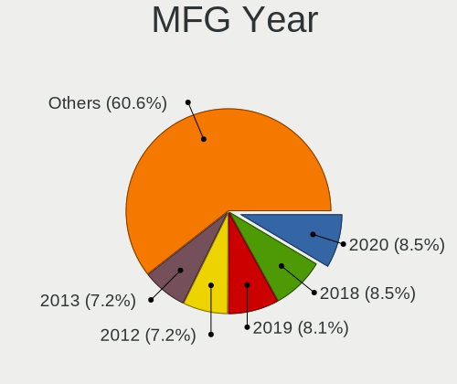
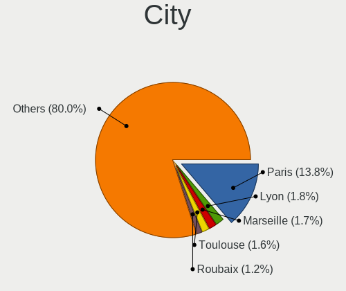
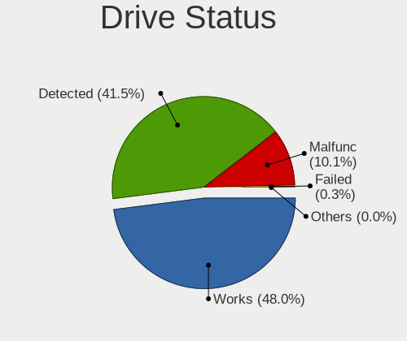
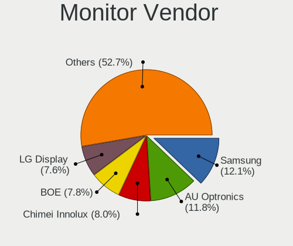
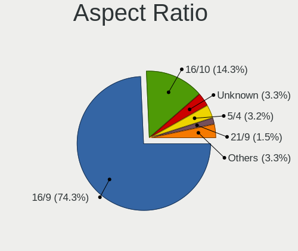
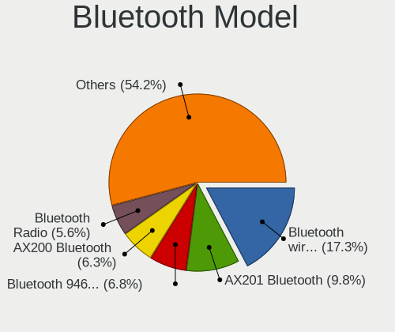
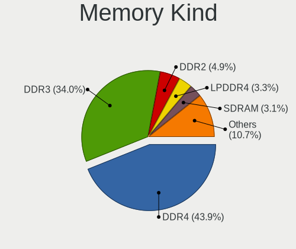

Linux in France - Tested Hardware & Statistics
----------------------------------------------

A project to collect tested hardware configurations for Linux in France.

Anyone can contribute to this report by the [hw-probe](https://github.com/linuxhw/hw-probe) tool:

    sudo -E hw-probe -all -upload

Please contribute! Especially if your hardware is rare.

This is a report for all computer types. See also reports for [desktops](/Location/France/Desktop/README.md) and [notebooks](/Location/France/Notebook/README.md).

Contents
--------

* [ Test Cases ](#test-cases)

* [ System ](#system)
  - [ OS                       ](#os)
  - [ OS Family                ](#os-family)
  - [ Kernel                   ](#kernel)
  - [ Kernel Family            ](#kernel-family)
  - [ Kernel Major Ver.        ](#kernel-major-ver)
  - [ Arch                     ](#arch)
  - [ DE                       ](#de)
  - [ Display Server           ](#display-server)
  - [ Display Manager          ](#display-manager)
  - [ OS Lang                  ](#os-lang)
  - [ Boot Mode                ](#boot-mode)
  - [ Filesystem               ](#filesystem)
  - [ Part. scheme             ](#part-scheme)
  - [ Dual Boot with Linux/BSD ](#dual-boot-with-linuxbsd)
  - [ Dual Boot (Win)          ](#dual-boot-win)

* [ Board ](#board)
  - [ Vendor                   ](#vendor)
  - [ Model                    ](#model)
  - [ Model Family             ](#model-family)
  - [ MFG Year                 ](#mfg-year)
  - [ Form Factor              ](#form-factor)
  - [ Secure Boot              ](#secure-boot)
  - [ Coreboot                 ](#coreboot)
  - [ RAM Size                 ](#ram-size)
  - [ RAM Used                 ](#ram-used)
  - [ Total Drives             ](#total-drives)
  - [ Has CD-ROM               ](#has-cd-rom)
  - [ Has Ethernet             ](#has-ethernet)
  - [ Has WiFi                 ](#has-wifi)
  - [ Has Bluetooth            ](#has-bluetooth)

* [ Location ](#location)
  - [ Country                  ](#country)
  - [ City                     ](#city)

* [ Drives ](#drives)
  - [ Drive Vendor             ](#drive-vendor)
  - [ Drive Model              ](#drive-model)
  - [ HDD Vendor               ](#hdd-vendor)
  - [ SSD Vendor               ](#ssd-vendor)
  - [ Drive Kind               ](#drive-kind)
  - [ Drive Connector          ](#drive-connector)
  - [ Drive Size               ](#drive-size)
  - [ Space Total              ](#space-total)
  - [ Space Used               ](#space-used)
  - [ Malfunc. Drives          ](#malfunc-drives)
  - [ Malfunc. Drive Vendor    ](#malfunc-drive-vendor)
  - [ Malfunc. HDD Vendor      ](#malfunc-hdd-vendor)
  - [ Malfunc. Drive Kind      ](#malfunc-drive-kind)
  - [ Failed Drives            ](#failed-drives)
  - [ Failed Drive Vendor      ](#failed-drive-vendor)
  - [ Drive Status             ](#drive-status)

* [ Storage controller ](#storage-controller)
  - [ Storage Vendor           ](#storage-vendor)
  - [ Storage Model            ](#storage-model)
  - [ Storage Kind             ](#storage-kind)

* [ Processor ](#processor)
  - [ CPU Vendor               ](#cpu-vendor)
  - [ CPU Model                ](#cpu-model)
  - [ CPU Model Family         ](#cpu-model-family)
  - [ CPU Cores                ](#cpu-cores)
  - [ CPU Sockets              ](#cpu-sockets)
  - [ CPU Threads              ](#cpu-threads)
  - [ CPU Op-Modes             ](#cpu-op-modes)
  - [ CPU Microcode            ](#cpu-microcode)
  - [ CPU Microarch            ](#cpu-microarch)

* [ Graphics ](#graphics)
  - [ GPU Vendor               ](#gpu-vendor)
  - [ GPU Model                ](#gpu-model)
  - [ GPU Combo                ](#gpu-combo)
  - [ GPU Driver               ](#gpu-driver)
  - [ GPU Memory               ](#gpu-memory)

* [ Monitor ](#monitor)
  - [ Monitor Vendor           ](#monitor-vendor)
  - [ Monitor Model            ](#monitor-model)
  - [ Monitor Resolution       ](#monitor-resolution)
  - [ Monitor Diagonal         ](#monitor-diagonal)
  - [ Monitor Width            ](#monitor-width)
  - [ Aspect Ratio             ](#aspect-ratio)
  - [ Monitor Area             ](#monitor-area)
  - [ Pixel Density            ](#pixel-density)
  - [ Multiple Monitors        ](#multiple-monitors)

* [ Network ](#network)
  - [ Net Controller Vendor    ](#net-controller-vendor)
  - [ Net Controller Model     ](#net-controller-model)
  - [ Wireless Vendor          ](#wireless-vendor)
  - [ Wireless Model           ](#wireless-model)
  - [ Ethernet Vendor          ](#ethernet-vendor)
  - [ Ethernet Model           ](#ethernet-model)
  - [ Net Controller Kind      ](#net-controller-kind)
  - [ Used Controller          ](#used-controller)
  - [ NICs                     ](#nics)
  - [ IPv6                     ](#ipv6)

* [ Bluetooth ](#bluetooth)
  - [ Bluetooth Vendor         ](#bluetooth-vendor)
  - [ Bluetooth Model          ](#bluetooth-model)

* [ Sound ](#sound)
  - [ Sound Vendor             ](#sound-vendor)
  - [ Sound Model              ](#sound-model)

* [ Memory ](#memory)
  - [ Memory Vendor            ](#memory-vendor)
  - [ Memory Model             ](#memory-model)
  - [ Memory Kind              ](#memory-kind)
  - [ Memory Form Factor       ](#memory-form-factor)
  - [ Memory Size              ](#memory-size)
  - [ Memory Speed             ](#memory-speed)

* [ Printers & scanners ](#printers--scanners)
  - [ Printer Vendor           ](#printer-vendor)
  - [ Printer Model            ](#printer-model)
  - [ Scanner Vendor           ](#scanner-vendor)
  - [ Scanner Model            ](#scanner-model)

* [ Camera ](#camera)
  - [ Camera Vendor            ](#camera-vendor)
  - [ Camera Model             ](#camera-model)

* [ Security ](#security)
  - [ Fingerprint Vendor       ](#fingerprint-vendor)
  - [ Fingerprint Model        ](#fingerprint-model)
  - [ Chipcard Vendor          ](#chipcard-vendor)
  - [ Chipcard Model           ](#chipcard-model)

* [ Unsupported ](#unsupported)
  - [ Unsupported Devices      ](#unsupported-devices)
  - [ Unsupported Device Types ](#unsupported-device-types)

Test Cases
----------

Total: 14222

| Vendor        | Model                       | Form-Factor | Probe                                                      | Date         |
|---------------|-----------------------------|-------------|------------------------------------------------------------|--------------|
| HP            | Victus by Laptop 16-d0xx... | Notebook    | [5ee355215f](https://linux-hardware.org/?probe=5ee355215f) | Oct 01, 2023 |
| HP            | 18E5                        | Desktop     | [1f3e02bd3e](https://linux-hardware.org/?probe=1f3e02bd3e) | Oct 01, 2023 |
| Dell          | 0X8DXD A00                  | Desktop     | [a44e0088f6](https://linux-hardware.org/?probe=a44e0088f6) | Oct 01, 2023 |
| Medion        | Deputy P40                  | Notebook    | [7e0fc5b52d](https://linux-hardware.org/?probe=7e0fc5b52d) | Sep 30, 2023 |
| ASRock        | X570 Taichi                 | Desktop     | [7a670fe0ef](https://linux-hardware.org/?probe=7a670fe0ef) | Sep 30, 2023 |
| MSI           | PRO B660M-A DDR4            | Desktop     | [a7683dc02d](https://linux-hardware.org/?probe=a7683dc02d) | Sep 30, 2023 |
| UNOWHY        | Y13G012S4EI                 | Notebook    | [2b60435562](https://linux-hardware.org/?probe=2b60435562) | Sep 30, 2023 |
| Lenovo        | ThinkPad Edge E530 62722... | Notebook    | [681d3e6c86](https://linux-hardware.org/?probe=681d3e6c86) | Sep 30, 2023 |
| Dell          | 0P301D A00                  | Desktop     | [99587baa3d](https://linux-hardware.org/?probe=99587baa3d) | Sep 30, 2023 |
| Dell          | 0Y958C A00                  | Desktop     | [95bf9d14db](https://linux-hardware.org/?probe=95bf9d14db) | Sep 30, 2023 |
| Samsung       | 305E4A/305E5A/305E7A        | Notebook    | [89d519a3f5](https://linux-hardware.org/?probe=89d519a3f5) | Sep 30, 2023 |
| MSI           | MPG Z390 GAMING EDGE AC     | Desktop     | [5705bf79ad](https://linux-hardware.org/?probe=5705bf79ad) | Sep 30, 2023 |
| Dell          | Latitude 5500               | Notebook    | [ea091dbcf2](https://linux-hardware.org/?probe=ea091dbcf2) | Sep 29, 2023 |
| Dell          | 0PRR48 A00                  | Desktop     | [52fd06666a](https://linux-hardware.org/?probe=52fd06666a) | Sep 29, 2023 |
| Timi          | Xiaomi Book Pro 16 2022     | Notebook    | [7392f9db3b](https://linux-hardware.org/?probe=7392f9db3b) | Sep 29, 2023 |
| Intel         | H110D4-P1                   | Desktop     | [ccedaaab02](https://linux-hardware.org/?probe=ccedaaab02) | Sep 29, 2023 |
| Lenovo        | ThinkPad Yoga 460 20ELS0... | Convertible | [29617a5db5](https://linux-hardware.org/?probe=29617a5db5) | Sep 29, 2023 |
| SLIMBOOK      | PROX-AMD5                   | Notebook    | [96fa5ddfa8](https://linux-hardware.org/?probe=96fa5ddfa8) | Sep 29, 2023 |
| ASUSTek       | EB1501P                     | Desktop     | [df48fa7e96](https://linux-hardware.org/?probe=df48fa7e96) | Sep 29, 2023 |
| ASUSTek       | K72Jr                       | Notebook    | [9167494336](https://linux-hardware.org/?probe=9167494336) | Sep 28, 2023 |
| MSI           | H97M-G43                    | Desktop     | [b74346acb3](https://linux-hardware.org/?probe=b74346acb3) | Sep 28, 2023 |
| ASUSTek       | M2N-E SLI                   | Desktop     | [2a5937c5e5](https://linux-hardware.org/?probe=2a5937c5e5) | Sep 28, 2023 |
| Unknown       | Unknown                     | Desktop     | [995b6fba4d](https://linux-hardware.org/?probe=995b6fba4d) | Sep 28, 2023 |
| ASUSTek       | PRIME B365M-A               | Desktop     | [76937ddbce](https://linux-hardware.org/?probe=76937ddbce) | Sep 28, 2023 |
| HP            | EliteBook 840 G2            | Notebook    | [bec979fcd0](https://linux-hardware.org/?probe=bec979fcd0) | Sep 28, 2023 |
| HP            | 2B35                        | Desktop     | [2f63f14724](https://linux-hardware.org/?probe=2f63f14724) | Sep 28, 2023 |
| HUAWEI        | NBLB-WAX9N                  | Notebook    | [7cbed3fca6](https://linux-hardware.org/?probe=7cbed3fca6) | Sep 28, 2023 |
| Dell          | XPS 17 9700                 | Notebook    | [38196b3712](https://linux-hardware.org/?probe=38196b3712) | Sep 28, 2023 |
| Dell          | G3 3590                     | Notebook    | [3523165978](https://linux-hardware.org/?probe=3523165978) | Sep 27, 2023 |
| Lenovo        | ThinkPad T430 2349S6S       | Notebook    | [e9b81983f2](https://linux-hardware.org/?probe=e9b81983f2) | Sep 27, 2023 |
| MSI           | Z97 PC Mate                 | Desktop     | [15a7321226](https://linux-hardware.org/?probe=15a7321226) | Sep 27, 2023 |
| MSI           | Z97 PC Mate                 | Desktop     | [18bf7cff74](https://linux-hardware.org/?probe=18bf7cff74) | Sep 27, 2023 |
| HP            | EliteBook 840 G8 Noteboo... | Notebook    | [593ddb6105](https://linux-hardware.org/?probe=593ddb6105) | Sep 27, 2023 |
| Clevo         | W240EU/W250EUQ/W270EUQ      | Notebook    | [cd5d2fae9e](https://linux-hardware.org/?probe=cd5d2fae9e) | Sep 27, 2023 |
| Dell          | XPS 17 9700                 | Notebook    | [c341826b7a](https://linux-hardware.org/?probe=c341826b7a) | Sep 27, 2023 |
| ASUSTek       | TUF X470-PLUS GAMING        | Desktop     | [e54490e96a](https://linux-hardware.org/?probe=e54490e96a) | Sep 27, 2023 |
| Notebook      | PCx0Dx                      | Notebook    | [53dd8cbd0d](https://linux-hardware.org/?probe=53dd8cbd0d) | Sep 27, 2023 |
| ASUSTek       | TUF X470-PLUS GAMING        | Desktop     | [2f574aa287](https://linux-hardware.org/?probe=2f574aa287) | Sep 27, 2023 |
| ASUSTek       | K72Jr                       | Notebook    | [9f32819945](https://linux-hardware.org/?probe=9f32819945) | Sep 26, 2023 |
| Dell          | G5 5590                     | Notebook    | [c7e7205fff](https://linux-hardware.org/?probe=c7e7205fff) | Sep 26, 2023 |
| AZW           | Green G2                    | Desktop     | [cb9b97f24b](https://linux-hardware.org/?probe=cb9b97f24b) | Sep 26, 2023 |
| Dell          | G5 5590                     | Notebook    | [0e80b66cb6](https://linux-hardware.org/?probe=0e80b66cb6) | Sep 26, 2023 |
| HP            | EliteBook 745 G6            | Notebook    | [bb5a7f8b2c](https://linux-hardware.org/?probe=bb5a7f8b2c) | Sep 26, 2023 |
| Raspberry ... | Raspberry Pi 3 Model B R... | Soc         | [3b18d749f6](https://linux-hardware.org/?probe=3b18d749f6) | Sep 26, 2023 |
| PC Special... | PCX0DX                      | Notebook    | [935fe5ddb0](https://linux-hardware.org/?probe=935fe5ddb0) | Sep 26, 2023 |
| Dell          | Inspiron 7577               | Notebook    | [a90c8128d1](https://linux-hardware.org/?probe=a90c8128d1) | Sep 26, 2023 |
| Samsung       | 305E4A/305E5A/305E7A        | Notebook    | [24a1d008e6](https://linux-hardware.org/?probe=24a1d008e6) | Sep 26, 2023 |
| Notebook      | N2x0WU                      | Notebook    | [49046ef274](https://linux-hardware.org/?probe=49046ef274) | Sep 26, 2023 |
| Supermicro    | X10SDE-DF                   | Desktop     | [c2ba80af3b](https://linux-hardware.org/?probe=c2ba80af3b) | Sep 26, 2023 |
| Dell          | XPS 9315                    | Notebook    | [11411507e8](https://linux-hardware.org/?probe=11411507e8) | Sep 26, 2023 |
| HP            | Laptop 15s-eq1xxx           | Notebook    | [8142da7d40](https://linux-hardware.org/?probe=8142da7d40) | Sep 25, 2023 |
| Dell          | Precision M6800             | Notebook    | [027ed86f53](https://linux-hardware.org/?probe=027ed86f53) | Sep 25, 2023 |
| Acer          | Swift SF314-41              | Notebook    | [ef8b479649](https://linux-hardware.org/?probe=ef8b479649) | Sep 25, 2023 |
| ASUSTek       | G10DK                       | Desktop     | [882b029219](https://linux-hardware.org/?probe=882b029219) | Sep 25, 2023 |
| Acer          | Swift SF314-44              | Notebook    | [6f5d49e16f](https://linux-hardware.org/?probe=6f5d49e16f) | Sep 25, 2023 |
| Acer          | Swift SF314-44              | Notebook    | [12f4ab85f3](https://linux-hardware.org/?probe=12f4ab85f3) | Sep 25, 2023 |
| AMI           | Aptio CRB                   | Mini pc     | [3ff47e3efd](https://linux-hardware.org/?probe=3ff47e3efd) | Sep 25, 2023 |
| HP            | EliteBook 840 G3            | Notebook    | [4e0f83e1fe](https://linux-hardware.org/?probe=4e0f83e1fe) | Sep 25, 2023 |
| HP            | EliteBook 840 G3            | Notebook    | [60ff167d14](https://linux-hardware.org/?probe=60ff167d14) | Sep 25, 2023 |
| Lenovo        | Yoga 2 13 20344             | Notebook    | [6a06543ed3](https://linux-hardware.org/?probe=6a06543ed3) | Sep 25, 2023 |
| Toshiba       | Satellite C50-B             | Notebook    | [92a5c3605c](https://linux-hardware.org/?probe=92a5c3605c) | Sep 25, 2023 |
| Pegatron      | EVANS                       | Desktop     | [b9347254b0](https://linux-hardware.org/?probe=b9347254b0) | Sep 25, 2023 |
| Supermicro    | X10SDE-DF                   | Desktop     | [fb93d199f3](https://linux-hardware.org/?probe=fb93d199f3) | Sep 25, 2023 |
| Fujitsu       | LIFEBOOK E734               | Notebook    | [61f61b1b63](https://linux-hardware.org/?probe=61f61b1b63) | Sep 25, 2023 |
| Fujitsu       | LIFEBOOK E734               | Notebook    | [ffb5ff9359](https://linux-hardware.org/?probe=ffb5ff9359) | Sep 25, 2023 |
| Dell          | Precision 5550              | Notebook    | [5a4d44b194](https://linux-hardware.org/?probe=5a4d44b194) | Sep 24, 2023 |
| Dell          | Latitude E6330              | Notebook    | [1375d355a5](https://linux-hardware.org/?probe=1375d355a5) | Sep 24, 2023 |
| Acer          | Swift SF314-44              | Notebook    | [b7f58e92a0](https://linux-hardware.org/?probe=b7f58e92a0) | Sep 24, 2023 |
| ASUSTek       | ProArt X670E-CREATOR WIF... | Desktop     | [c3e942a9e9](https://linux-hardware.org/?probe=c3e942a9e9) | Sep 24, 2023 |
| ASUSTek       | ProArt X670E-CREATOR WIF... | Desktop     | [7ecb558538](https://linux-hardware.org/?probe=7ecb558538) | Sep 24, 2023 |
| Lenovo        | ThinkPad P50 20EQS3FS00     | Notebook    | [a3ee3b9ca3](https://linux-hardware.org/?probe=a3ee3b9ca3) | Sep 24, 2023 |
| HP            | ZBook 14 G2                 | Notebook    | [1f29f31860](https://linux-hardware.org/?probe=1f29f31860) | Sep 24, 2023 |
| Supermicro    | X10SDE-DF                   | Desktop     | [b0297cff82](https://linux-hardware.org/?probe=b0297cff82) | Sep 24, 2023 |
| HP            | EliteBook 2560p             | Notebook    | [5072a3a6d5](https://linux-hardware.org/?probe=5072a3a6d5) | Sep 24, 2023 |
| Fujitsu       | D2990-A1 S26361-D2990-A1    | Desktop     | [19757abbb8](https://linux-hardware.org/?probe=19757abbb8) | Sep 23, 2023 |
| Lenovo        | ThinkPad W550s 20E1S0VW0... | Notebook    | [e5c12ca1ce](https://linux-hardware.org/?probe=e5c12ca1ce) | Sep 23, 2023 |
| Unknown       | Unknown                     | Notebook    | [940b1d1eeb](https://linux-hardware.org/?probe=940b1d1eeb) | Sep 23, 2023 |
| HP            | 2B2C                        | Desktop     | [79ccf62c55](https://linux-hardware.org/?probe=79ccf62c55) | Sep 23, 2023 |
| Acer          | Aspire TC-895 V:1.0         | Desktop     | [6f3c1fed91](https://linux-hardware.org/?probe=6f3c1fed91) | Sep 23, 2023 |
| Lenovo        | G50-80 80L0                 | Notebook    | [f08b8528da](https://linux-hardware.org/?probe=f08b8528da) | Sep 23, 2023 |
| UNOWHY        | Y13G002S4EI                 | Notebook    | [c3f95beccb](https://linux-hardware.org/?probe=c3f95beccb) | Sep 23, 2023 |
| Gigabyte      | B450M DS3H-CF               | Desktop     | [898219c64a](https://linux-hardware.org/?probe=898219c64a) | Sep 23, 2023 |
| Toshiba       | Satellite C70-B             | Notebook    | [904a43b77e](https://linux-hardware.org/?probe=904a43b77e) | Sep 23, 2023 |
| ASUSTek       | X750JB                      | Notebook    | [b9db8f6f02](https://linux-hardware.org/?probe=b9db8f6f02) | Sep 23, 2023 |
| HP            | EliteBook 845 G8 Noteboo... | Notebook    | [1e9774c53c](https://linux-hardware.org/?probe=1e9774c53c) | Sep 22, 2023 |
| Acer          | Aspire 7530G                | Notebook    | [37d34804dd](https://linux-hardware.org/?probe=37d34804dd) | Sep 22, 2023 |
| ASUSTek       | VivoBook_ASUSLaptop X515... | Notebook    | [bab5438645](https://linux-hardware.org/?probe=bab5438645) | Sep 22, 2023 |
| ASUSTek       | VivoBook_ASUSLaptop X515... | Notebook    | [ad1f9f63c0](https://linux-hardware.org/?probe=ad1f9f63c0) | Sep 22, 2023 |
| HP            | OMEN by Laptop 15-dc1xxx    | Notebook    | [57c3bb43f5](https://linux-hardware.org/?probe=57c3bb43f5) | Sep 22, 2023 |
| ASUSTek       | P5G41T-M LX                 | Desktop     | [988711772b](https://linux-hardware.org/?probe=988711772b) | Sep 22, 2023 |
| Lenovo        | ThinkPad X230 23259T0       | Notebook    | [20286ecb4c](https://linux-hardware.org/?probe=20286ecb4c) | Sep 22, 2023 |
| Acer          | Aspire E5-575G              | Notebook    | [01f346ff26](https://linux-hardware.org/?probe=01f346ff26) | Sep 22, 2023 |
| Acer          | Aspire E5-575G              | Notebook    | [ba1ec3eb6d](https://linux-hardware.org/?probe=ba1ec3eb6d) | Sep 22, 2023 |
| HP            | 8643 SMVB                   | Desktop     | [913927a01a](https://linux-hardware.org/?probe=913927a01a) | Sep 22, 2023 |
| Acer          | Nitro AN515-57              | Notebook    | [05c9cbc8e5](https://linux-hardware.org/?probe=05c9cbc8e5) | Sep 22, 2023 |
| Valve         | Jupiter                     | Notebook    | [dcc631e0fd](https://linux-hardware.org/?probe=dcc631e0fd) | Sep 22, 2023 |
| ASUSTek       | Z87-A                       | Desktop     | [97747fb973](https://linux-hardware.org/?probe=97747fb973) | Sep 21, 2023 |
| Lenovo        | ThinkPad X200 74595FG       | Notebook    | [c5cda29091](https://linux-hardware.org/?probe=c5cda29091) | Sep 21, 2023 |
| Apple         | Mac-F4238CC8 PVT            | All in one  | [4425992293](https://linux-hardware.org/?probe=4425992293) | Sep 21, 2023 |
| HP            | 3047h                       | Desktop     | [cb19fdc589](https://linux-hardware.org/?probe=cb19fdc589) | Sep 21, 2023 |
| Dell          | Latitude D500               | Notebook    | [1861582ebd](https://linux-hardware.org/?probe=1861582ebd) | Sep 21, 2023 |
| ASUSTek       | X550CC                      | Notebook    | [265f8a4dcd](https://linux-hardware.org/?probe=265f8a4dcd) | Sep 21, 2023 |
| ASUSTek       | P8Z77-M PRO                 | Desktop     | [6fd5940c85](https://linux-hardware.org/?probe=6fd5940c85) | Sep 21, 2023 |
| Sony          | VAIO                        | All in one  | [5cd160ea53](https://linux-hardware.org/?probe=5cd160ea53) | Sep 21, 2023 |
| HP            | ENVY x360 2-in-1 Laptop ... | Convertible | [7afadf5612](https://linux-hardware.org/?probe=7afadf5612) | Sep 20, 2023 |
| Unknown       | Unknown                     | Desktop     | [742bffa5fe](https://linux-hardware.org/?probe=742bffa5fe) | Sep 20, 2023 |
| ASUSTek       | ROG Strix G513IC_G513IC     | Notebook    | [9a1d56bda1](https://linux-hardware.org/?probe=9a1d56bda1) | Sep 20, 2023 |
| Notebook      | NV4XMB,ME,MZ                | Notebook    | [43e04cf99c](https://linux-hardware.org/?probe=43e04cf99c) | Sep 20, 2023 |
| ASUSTek       | ROG Zephyrus G15 GA503QM... | Notebook    | [2846c7bbed](https://linux-hardware.org/?probe=2846c7bbed) | Sep 20, 2023 |
| HP            | 829A                        | Mini pc     | [af8b89ede9](https://linux-hardware.org/?probe=af8b89ede9) | Sep 20, 2023 |
| Dell          | 0NK5PH A01                  | Desktop     | [eb3f293f98](https://linux-hardware.org/?probe=eb3f293f98) | Sep 20, 2023 |
| Dell          | Latitude D500               | Notebook    | [19ccfd47c6](https://linux-hardware.org/?probe=19ccfd47c6) | Sep 20, 2023 |
| HP            | 212B                        | Desktop     | [f961d48c51](https://linux-hardware.org/?probe=f961d48c51) | Sep 20, 2023 |
| ASUSTek       | Q170M2                      | Desktop     | [962ed87784](https://linux-hardware.org/?probe=962ed87784) | Sep 20, 2023 |
| Gigabyte      | B760M GAMING X AX DDR4      | Desktop     | [07f641459d](https://linux-hardware.org/?probe=07f641459d) | Sep 20, 2023 |
| Dell          | 09KPNV A01                  | Desktop     | [4ce81f3886](https://linux-hardware.org/?probe=4ce81f3886) | Sep 20, 2023 |
| BESSTAR Te... | HM90                        | Desktop     | [bbb35ce98b](https://linux-hardware.org/?probe=bbb35ce98b) | Sep 20, 2023 |
| HP            | EliteBook x360 1030 G3      | Convertible | [2d3de22b4b](https://linux-hardware.org/?probe=2d3de22b4b) | Sep 20, 2023 |
| Chuwi         | LapBook Pro                 | Notebook    | [c3ff4d2f56](https://linux-hardware.org/?probe=c3ff4d2f56) | Sep 20, 2023 |
| HP            | 212B                        | Desktop     | [1d71ef5e64](https://linux-hardware.org/?probe=1d71ef5e64) | Sep 19, 2023 |
| MSI           | A320M-A PRO MAX             | Desktop     | [411b34f287](https://linux-hardware.org/?probe=411b34f287) | Sep 19, 2023 |
| Dell          | Latitude E5540              | Notebook    | [759aeff4ee](https://linux-hardware.org/?probe=759aeff4ee) | Sep 19, 2023 |
| Apple         | MacBookPro11,1              | Notebook    | [26f998fafb](https://linux-hardware.org/?probe=26f998fafb) | Sep 19, 2023 |
| Gigabyte      | B550 AORUS ELITE V2         | Desktop     | [c7ab5c00f8](https://linux-hardware.org/?probe=c7ab5c00f8) | Sep 19, 2023 |
| Gigabyte      | A320M-S2H-CF                | Desktop     | [717867b71c](https://linux-hardware.org/?probe=717867b71c) | Sep 19, 2023 |
| ASUSTek       | M5A78L-M LX3                | Desktop     | [25d66d7f8a](https://linux-hardware.org/?probe=25d66d7f8a) | Sep 19, 2023 |
| Lenovo        | IdeaPad 5 14ALC05 82LM      | Notebook    | [a5f79b33f4](https://linux-hardware.org/?probe=a5f79b33f4) | Sep 19, 2023 |
| Acer          | Aspire 7715Z                | Notebook    | [7abea387dc](https://linux-hardware.org/?probe=7abea387dc) | Sep 19, 2023 |
| Dell          | Inspiron 7537               | Notebook    | [f3e268a82d](https://linux-hardware.org/?probe=f3e268a82d) | Sep 19, 2023 |
| Lenovo        | IdeaPad 110-15IBR 80T7      | Notebook    | [8b2701d6c7](https://linux-hardware.org/?probe=8b2701d6c7) | Sep 19, 2023 |
| ASUSTek       | Zenbook UM3402YA_UM3402Y... | Notebook    | [f9e5656f54](https://linux-hardware.org/?probe=f9e5656f54) | Sep 19, 2023 |
| Acer          | Aspire A317-53              | Notebook    | [7dfeb3f7ff](https://linux-hardware.org/?probe=7dfeb3f7ff) | Sep 19, 2023 |
| KUU           | Andes II                    | Notebook    | [a104ad8142](https://linux-hardware.org/?probe=a104ad8142) | Sep 18, 2023 |
| Lenovo        | ThinkPad T61 7661AU5        | Notebook    | [af39839071](https://linux-hardware.org/?probe=af39839071) | Sep 18, 2023 |
| MSI           | H61M-P22                    | Desktop     | [4c32887473](https://linux-hardware.org/?probe=4c32887473) | Sep 18, 2023 |
| TUXEDO        | InfinityBook Pro Gen7 (M... | Notebook    | [c1070eb99b](https://linux-hardware.org/?probe=c1070eb99b) | Sep 18, 2023 |
| Acer          | Swift SF314-42              | Notebook    | [1519801016](https://linux-hardware.org/?probe=1519801016) | Sep 18, 2023 |
| HUAWEI        | KLVDZ-WXX9                  | Notebook    | [a4964c1b7a](https://linux-hardware.org/?probe=a4964c1b7a) | Sep 18, 2023 |
| Lenovo        | ThinkPad P43s 20RHCTO1WW    | Notebook    | [4b1c4ae225](https://linux-hardware.org/?probe=4b1c4ae225) | Sep 18, 2023 |
| Dell          | 0M863N A01                  | Desktop     | [ef0a92ec76](https://linux-hardware.org/?probe=ef0a92ec76) | Sep 17, 2023 |
| HP            | 212B                        | Desktop     | [a041c8b5a9](https://linux-hardware.org/?probe=a041c8b5a9) | Sep 17, 2023 |
| HP            | ProBook 4540s               | Notebook    | [12465042c9](https://linux-hardware.org/?probe=12465042c9) | Sep 17, 2023 |
| ASUSTek       | Pro H510M-C                 | Desktop     | [aff784bd75](https://linux-hardware.org/?probe=aff784bd75) | Sep 16, 2023 |
| HP            | 3647h                       | Desktop     | [89c406366a](https://linux-hardware.org/?probe=89c406366a) | Sep 16, 2023 |
| Lenovo        | ThinkPad T470 W10DG 20JN... | Notebook    | [1212656ddf](https://linux-hardware.org/?probe=1212656ddf) | Sep 16, 2023 |
| Lenovo        | IdeaPad Gaming 3 15IAH7 ... | Notebook    | [87f26cde55](https://linux-hardware.org/?probe=87f26cde55) | Sep 16, 2023 |
| Gigabyte      | H55M-UD2H                   | Desktop     | [a95113f868](https://linux-hardware.org/?probe=a95113f868) | Sep 16, 2023 |
| HP            | EliteBook 840 G1            | Notebook    | [71bcb4c527](https://linux-hardware.org/?probe=71bcb4c527) | Sep 16, 2023 |
| Intel         | DX79SI AAG28808-602         | Desktop     | [2ccc7fc308](https://linux-hardware.org/?probe=2ccc7fc308) | Sep 16, 2023 |
| HP            | 829A                        | Mini pc     | [7d701dd0c3](https://linux-hardware.org/?probe=7d701dd0c3) | Sep 16, 2023 |
| MSI           | Stealth 14Studio A13VE      | Notebook    | [e57ab86521](https://linux-hardware.org/?probe=e57ab86521) | Sep 16, 2023 |
| ASUSTek       | PRIME X670-P                | Desktop     | [76d6f570a8](https://linux-hardware.org/?probe=76d6f570a8) | Sep 16, 2023 |
| Lenovo        | IdeaPad Gaming 3 15IAH7 ... | Notebook    | [00fd2287c0](https://linux-hardware.org/?probe=00fd2287c0) | Sep 16, 2023 |
| HP            | EliteBook 725 G3            | Notebook    | [6086fd0180](https://linux-hardware.org/?probe=6086fd0180) | Sep 16, 2023 |
| Lenovo        | SHARKBAY SDK0E50510 PRO     | Desktop     | [02bd43e898](https://linux-hardware.org/?probe=02bd43e898) | Sep 15, 2023 |
| ASUSTek       | Zenbook 15 UM3504DA_UM35... | Notebook    | [fa207e873a](https://linux-hardware.org/?probe=fa207e873a) | Sep 15, 2023 |
| HP            | Laptop 17-ak0xx             | Notebook    | [b6c9c0ab68](https://linux-hardware.org/?probe=b6c9c0ab68) | Sep 15, 2023 |
| Dell          | Latitude 7310               | Notebook    | [afeaddd126](https://linux-hardware.org/?probe=afeaddd126) | Sep 15, 2023 |
| Dell          | Latitude 7310               | Notebook    | [ab616edf3b](https://linux-hardware.org/?probe=ab616edf3b) | Sep 15, 2023 |
| Dell          | Precision 5570              | Notebook    | [8b3c21b110](https://linux-hardware.org/?probe=8b3c21b110) | Sep 15, 2023 |
| Supermicro    | M11SDV-8C-LN4F              | Server      | [f8e68bfc81](https://linux-hardware.org/?probe=f8e68bfc81) | Sep 15, 2023 |
| Supermicro    | M11SDV-8C-LN4F              | Server      | [f89ec253d3](https://linux-hardware.org/?probe=f89ec253d3) | Sep 15, 2023 |
| Dell          | OptiPlex 7010               | Desktop     | [37edc6416e](https://linux-hardware.org/?probe=37edc6416e) | Sep 14, 2023 |
| MSI           | PRO B660M-B DDR4            | Desktop     | [9463a6f106](https://linux-hardware.org/?probe=9463a6f106) | Sep 14, 2023 |
| Toshiba       | Satellite L875-11M          | Notebook    | [3774a26687](https://linux-hardware.org/?probe=3774a26687) | Sep 14, 2023 |
| MSI           | B85-G43 GAMING              | Desktop     | [44d14cb672](https://linux-hardware.org/?probe=44d14cb672) | Sep 14, 2023 |
| Dell          | Latitude E6420              | Notebook    | [3aa2a92dbe](https://linux-hardware.org/?probe=3aa2a92dbe) | Sep 14, 2023 |
| ASUSTek       | Zenbook 15 UM3504DA_UM35... | Notebook    | [756eff685a](https://linux-hardware.org/?probe=756eff685a) | Sep 14, 2023 |
| Apple         | Mac-7BA5B2DFE22DDD8C Mac... | Mini pc     | [f445d0e46b](https://linux-hardware.org/?probe=f445d0e46b) | Sep 14, 2023 |
| Gigabyte      | Z97X-SOC-CF                 | Desktop     | [9c86fc8235](https://linux-hardware.org/?probe=9c86fc8235) | Sep 14, 2023 |
| Dell          | Latitude 5440               | Notebook    | [93a296a628](https://linux-hardware.org/?probe=93a296a628) | Sep 14, 2023 |
| KUU           | Andes II                    | Notebook    | [6270750e1e](https://linux-hardware.org/?probe=6270750e1e) | Sep 14, 2023 |
| ASUSTek       | K53SC                       | Notebook    | [814e80310b](https://linux-hardware.org/?probe=814e80310b) | Sep 13, 2023 |
| Packard Be... | MCP73                       | Desktop     | [b47efcac04](https://linux-hardware.org/?probe=b47efcac04) | Sep 13, 2023 |
| AZW           | MINI S 10                   | Desktop     | [f6bc099f62](https://linux-hardware.org/?probe=f6bc099f62) | Sep 13, 2023 |
| Dell          | XPS 15 9570                 | Notebook    | [b8932f0fbd](https://linux-hardware.org/?probe=b8932f0fbd) | Sep 13, 2023 |
| Dell          | Latitude 7480               | Notebook    | [82ba4e9fde](https://linux-hardware.org/?probe=82ba4e9fde) | Sep 13, 2023 |
| ASUSTek       | N75SF                       | Notebook    | [cff971fa54](https://linux-hardware.org/?probe=cff971fa54) | Sep 13, 2023 |
| Dell          | Vostro 14 3435              | Notebook    | [edbdf685d6](https://linux-hardware.org/?probe=edbdf685d6) | Sep 13, 2023 |
| Sony          | VPCEB1E1E                   | Notebook    | [cbd095ee01](https://linux-hardware.org/?probe=cbd095ee01) | Sep 12, 2023 |
| ASUSTek       | X550JK                      | Notebook    | [0965a776b0](https://linux-hardware.org/?probe=0965a776b0) | Sep 12, 2023 |
| Dell          | Latitude E5420              | Notebook    | [3d9680f20d](https://linux-hardware.org/?probe=3d9680f20d) | Sep 12, 2023 |
| ASUSTek       | X550JK                      | Notebook    | [00a34c8719](https://linux-hardware.org/?probe=00a34c8719) | Sep 12, 2023 |
| Google        | Droid                       | Notebook    | [7b7eb437c6](https://linux-hardware.org/?probe=7b7eb437c6) | Sep 12, 2023 |
| Framework     | Laptop (13th Gen Intel C... | Notebook    | [de7acf45a6](https://linux-hardware.org/?probe=de7acf45a6) | Sep 12, 2023 |
| MSI           | B450M PRO-VDH               | Desktop     | [c06182cc86](https://linux-hardware.org/?probe=c06182cc86) | Sep 12, 2023 |
| Dell          | Latitude E6410              | Notebook    | [14c3b0cdeb](https://linux-hardware.org/?probe=14c3b0cdeb) | Sep 12, 2023 |
| ASUSTek       | ASUSPRO P3540FA_P3540FA     | Notebook    | [9506117d6f](https://linux-hardware.org/?probe=9506117d6f) | Sep 12, 2023 |
| Dell          | Precision 3571              | Notebook    | [cf2bec0e5b](https://linux-hardware.org/?probe=cf2bec0e5b) | Sep 12, 2023 |
| Dell          | Precision 7520              | Notebook    | [35bbdb93c9](https://linux-hardware.org/?probe=35bbdb93c9) | Sep 11, 2023 |
| Microsoft     | Surface Go 3                | Tablet      | [6fa64d3a51](https://linux-hardware.org/?probe=6fa64d3a51) | Sep 11, 2023 |
| Dell          | Latitude E6230              | Notebook    | [fa184bbd98](https://linux-hardware.org/?probe=fa184bbd98) | Sep 11, 2023 |
| Acer          | Aspire VX5-591G             | Notebook    | [70b8cb408c](https://linux-hardware.org/?probe=70b8cb408c) | Sep 11, 2023 |
| Raspberry ... | Raspberry Pi 4 Model B R... | Soc         | [078d2eceba](https://linux-hardware.org/?probe=078d2eceba) | Sep 11, 2023 |
| Raspberry ... | Raspberry Pi 4 Model B R... | Soc         | [c6a2932775](https://linux-hardware.org/?probe=c6a2932775) | Sep 11, 2023 |
| Framework     | Laptop (13th Gen Intel C... | Notebook    | [5ac44fe5ec](https://linux-hardware.org/?probe=5ac44fe5ec) | Sep 11, 2023 |
| Dell          | Latitude 5420               | Notebook    | [d561f541f6](https://linux-hardware.org/?probe=d561f541f6) | Sep 10, 2023 |
| Dell          | Latitude 5420               | Notebook    | [982a0e5ce2](https://linux-hardware.org/?probe=982a0e5ce2) | Sep 10, 2023 |
| ASUSTek       | PRIME Z390M-PLUS            | Desktop     | [515cb66794](https://linux-hardware.org/?probe=515cb66794) | Sep 10, 2023 |
| Gigabyte      | B650 AORUS PRO AX           | Desktop     | [b771d7b475](https://linux-hardware.org/?probe=b771d7b475) | Sep 10, 2023 |
| Gigabyte      | B650 AORUS PRO AX           | Desktop     | [6002a35e23](https://linux-hardware.org/?probe=6002a35e23) | Sep 10, 2023 |
| Dell          | Latitude 5414               | Notebook    | [9fff061209](https://linux-hardware.org/?probe=9fff061209) | Sep 10, 2023 |
| ASUSTek       | ZenBook UX393EA_UX393EA     | Notebook    | [21d20fbd09](https://linux-hardware.org/?probe=21d20fbd09) | Sep 10, 2023 |
| Dell          | Precision 3571              | Notebook    | [0790a2726f](https://linux-hardware.org/?probe=0790a2726f) | Sep 10, 2023 |
| Dell          | Precision 3571              | Notebook    | [2d92d73c33](https://linux-hardware.org/?probe=2d92d73c33) | Sep 10, 2023 |
| Radxa         | ROCK 5B                     | Soc         | [e2deb43e13](https://linux-hardware.org/?probe=e2deb43e13) | Sep 10, 2023 |
| MSI           | 2A9C                        | Desktop     | [2416e50c09](https://linux-hardware.org/?probe=2416e50c09) | Sep 10, 2023 |
| HP            | Dragonfly 13.5 inch G4 N... | Notebook    | [8121162f41](https://linux-hardware.org/?probe=8121162f41) | Sep 10, 2023 |
| Dell          | Latitude E6540              | Notebook    | [7bd2661f03](https://linux-hardware.org/?probe=7bd2661f03) | Sep 10, 2023 |
| Intel         | DQ77KB AAG81483-500         | Desktop     | [a6ddf1199e](https://linux-hardware.org/?probe=a6ddf1199e) | Sep 09, 2023 |
| Intel         | DQ77KB AAG81483-500         | Desktop     | [4dccf2a41d](https://linux-hardware.org/?probe=4dccf2a41d) | Sep 09, 2023 |
| Dell          | Latitude 5540               | Notebook    | [cb3d385ed5](https://linux-hardware.org/?probe=cb3d385ed5) | Sep 09, 2023 |
| Lenovo        | ThinkPad L580 20LW000VFR    | Notebook    | [a7dfc5e0f5](https://linux-hardware.org/?probe=a7dfc5e0f5) | Sep 09, 2023 |
| Lenovo        | ThinkPad L580 20LW000VFR    | Notebook    | [e224a5dc53](https://linux-hardware.org/?probe=e224a5dc53) | Sep 09, 2023 |
| Dell          | Inspiron 7580               | Notebook    | [9705f02462](https://linux-hardware.org/?probe=9705f02462) | Sep 09, 2023 |
| ASUSTek       | ZenBook UX333FA_UX333FA     | Notebook    | [8bbba91a69](https://linux-hardware.org/?probe=8bbba91a69) | Sep 09, 2023 |
| Apple         | Mac-031B6874CF7F642A iMa... | All in one  | [f8b31ec582](https://linux-hardware.org/?probe=f8b31ec582) | Sep 09, 2023 |
| Gigabyte      | GA-MA770T-UD3               | Desktop     | [7e478d179a](https://linux-hardware.org/?probe=7e478d179a) | Sep 09, 2023 |
| ASUSTek       | ROG STRIX B550-F GAMING     | Desktop     | [3f937bad2e](https://linux-hardware.org/?probe=3f937bad2e) | Sep 09, 2023 |
| Lenovo        | SHARKBAY SDK0E50510 PRO     | Desktop     | [72bc6278d3](https://linux-hardware.org/?probe=72bc6278d3) | Sep 09, 2023 |
| HP            | Laptop 17-ak0xx             | Notebook    | [d5220131ff](https://linux-hardware.org/?probe=d5220131ff) | Sep 09, 2023 |
| Intel         | DN2820FYK H24582-204        | Desktop     | [625b62078a](https://linux-hardware.org/?probe=625b62078a) | Sep 09, 2023 |
| Intel         | DN2820FYK H24582-204        | Desktop     | [440c9854ff](https://linux-hardware.org/?probe=440c9854ff) | Sep 09, 2023 |
| Lenovo        | Yoga 530-14ARR 81H9         | Convertible | [6cc590244c](https://linux-hardware.org/?probe=6cc590244c) | Sep 09, 2023 |
| ASUSTek       | ASUS TUF Gaming F15 FX50... | Notebook    | [65c3a9e2d5](https://linux-hardware.org/?probe=65c3a9e2d5) | Sep 09, 2023 |
| Thomson       | N14C4WH64                   | Notebook    | [1e817297bb](https://linux-hardware.org/?probe=1e817297bb) | Sep 08, 2023 |
| Thomson       | N14C4WH64                   | Notebook    | [c1dae32be6](https://linux-hardware.org/?probe=c1dae32be6) | Sep 08, 2023 |
| Dell          | Vostro 5502                 | Notebook    | [a131efa36e](https://linux-hardware.org/?probe=a131efa36e) | Sep 08, 2023 |
| ASUSTek       | VivoBook 15_ASUS Laptop ... | Notebook    | [ee89a78be0](https://linux-hardware.org/?probe=ee89a78be0) | Sep 08, 2023 |
| HP            | EliteBook 830 G8 Noteboo... | Notebook    | [4159e1ea16](https://linux-hardware.org/?probe=4159e1ea16) | Sep 08, 2023 |
| Gigabyte      | B550 AORUS ELITE V2         | Desktop     | [81c167f9f9](https://linux-hardware.org/?probe=81c167f9f9) | Sep 08, 2023 |
| Dell          | Inspiron 15 5510            | Notebook    | [c7e4b4dfc1](https://linux-hardware.org/?probe=c7e4b4dfc1) | Sep 07, 2023 |
| Lenovo        | IdeaPad S145-15API 81UT     | Notebook    | [8a05090057](https://linux-hardware.org/?probe=8a05090057) | Sep 07, 2023 |
| MSI           | B360M GAMING PLUS           | Desktop     | [1faaa87b61](https://linux-hardware.org/?probe=1faaa87b61) | Sep 07, 2023 |
| ASUSTek       | ROG Ally RC71L_RC71L        | Tablet      | [f47dacb739](https://linux-hardware.org/?probe=f47dacb739) | Sep 07, 2023 |
| HP            | ProBook 650 G8 Notebook ... | Notebook    | [b11a7b69f0](https://linux-hardware.org/?probe=b11a7b69f0) | Sep 07, 2023 |
| ASUSTek       | ROG Ally RC71L_RC71L        | Tablet      | [78bdf275c2](https://linux-hardware.org/?probe=78bdf275c2) | Sep 07, 2023 |
| Dell          | Latitude 7420               | Notebook    | [77df1805f6](https://linux-hardware.org/?probe=77df1805f6) | Sep 07, 2023 |
| ASUSTek       | PRIME Z390M-PLUS            | Desktop     | [f98e7f20ca](https://linux-hardware.org/?probe=f98e7f20ca) | Sep 06, 2023 |
| ASUSTek       | Z97-K                       | Desktop     | [849ecb3c82](https://linux-hardware.org/?probe=849ecb3c82) | Sep 06, 2023 |
| Dell          | XPS 15 9550                 | Notebook    | [c9f30a2b26](https://linux-hardware.org/?probe=c9f30a2b26) | Sep 06, 2023 |
| Gigabyte      | A320M-S2H-CF                | Desktop     | [03e260aff4](https://linux-hardware.org/?probe=03e260aff4) | Sep 06, 2023 |
| Gigabyte      | B550 AORUS ELITE V2         | Desktop     | [c890510220](https://linux-hardware.org/?probe=c890510220) | Sep 06, 2023 |
| Dell          | 0NK5PH A01                  | Desktop     | [49e0ac3e09](https://linux-hardware.org/?probe=49e0ac3e09) | Sep 06, 2023 |
| ASUSTek       | VivoBook_ASUSLaptop X571... | Notebook    | [2505f514b1](https://linux-hardware.org/?probe=2505f514b1) | Sep 06, 2023 |
| MSI           | GS60 2PC Ghost              | Notebook    | [0b971b067a](https://linux-hardware.org/?probe=0b971b067a) | Sep 06, 2023 |
| HP            | 844C                        | Desktop     | [6f4911cda7](https://linux-hardware.org/?probe=6f4911cda7) | Sep 06, 2023 |
| MSI           | B550M PRO-VDH WIFI          | Desktop     | [51202f2fd7](https://linux-hardware.org/?probe=51202f2fd7) | Sep 06, 2023 |
| Lenovo        | Yoga S740-15IRH 81NX        | Notebook    | [c31e15f2ba](https://linux-hardware.org/?probe=c31e15f2ba) | Sep 05, 2023 |
| ASRock        | X570 Taichi                 | Desktop     | [6515c97b89](https://linux-hardware.org/?probe=6515c97b89) | Sep 05, 2023 |
| ASUSTek       | ROG STRIX B550-I GAMING     | Desktop     | [23f0f9321c](https://linux-hardware.org/?probe=23f0f9321c) | Sep 05, 2023 |
| Lenovo        | ThinkPad X1 Yoga 4th 20Q... | Convertible | [cd4ccc8478](https://linux-hardware.org/?probe=cd4ccc8478) | Sep 05, 2023 |
| Dell          | Inspiron 14 5420            | Notebook    | [70d0d79f77](https://linux-hardware.org/?probe=70d0d79f77) | Sep 05, 2023 |
| Apple         | Mac-F4238CC8 PVT            | All in one  | [d16f2005c0](https://linux-hardware.org/?probe=d16f2005c0) | Sep 05, 2023 |
| ASUSTek       | GD30CI                      | Desktop     | [f1c877be0e](https://linux-hardware.org/?probe=f1c877be0e) | Sep 05, 2023 |
| Lenovo        | ThinkPad X1 Yoga 4th 20Q... | Convertible | [1fce93cab3](https://linux-hardware.org/?probe=1fce93cab3) | Sep 05, 2023 |
| Gigabyte      | X299 AORUS Ultra Gaming-... | Desktop     | [77c07d0f70](https://linux-hardware.org/?probe=77c07d0f70) | Sep 05, 2023 |
| Gigabyte      | X299 AORUS Ultra Gaming-... | Desktop     | [a0aaf4be5d](https://linux-hardware.org/?probe=a0aaf4be5d) | Sep 05, 2023 |
| Fujitsu       | D2990-A3 S26361-D2990-A3    | Desktop     | [59b9a21678](https://linux-hardware.org/?probe=59b9a21678) | Sep 04, 2023 |
| ASUSTek       | Pro H510M-C                 | Desktop     | [ea823862a6](https://linux-hardware.org/?probe=ea823862a6) | Sep 04, 2023 |
| HP            | 198E                        | Desktop     | [7f57cfbacc](https://linux-hardware.org/?probe=7f57cfbacc) | Sep 04, 2023 |
| Fujitsu       | D3400-A1 S26361-D3400-A1    | Desktop     | [49e3c842c1](https://linux-hardware.org/?probe=49e3c842c1) | Sep 04, 2023 |
| Samsung       | 950XED                      | Notebook    | [3d8ba5a34c](https://linux-hardware.org/?probe=3d8ba5a34c) | Sep 04, 2023 |
| HUAWEI        | NBLK-WAX9X                  | Notebook    | [02c4374b47](https://linux-hardware.org/?probe=02c4374b47) | Sep 04, 2023 |
| Gigabyte      | B360HD3                     | Desktop     | [1242798344](https://linux-hardware.org/?probe=1242798344) | Sep 04, 2023 |
| ASUSTek       | VM42                        | Desktop     | [2869496e53](https://linux-hardware.org/?probe=2869496e53) | Sep 04, 2023 |
| eMachines     | Rhine V1.42                 | Notebook    | [c18c4d64bd](https://linux-hardware.org/?probe=c18c4d64bd) | Sep 04, 2023 |
| Dell          | 05WNJ2 A02                  | Server      | [7b59f7f1d7](https://linux-hardware.org/?probe=7b59f7f1d7) | Sep 04, 2023 |
| ASUSTek       | ASUS TUF Gaming A17 FA70... | Notebook    | [d5f8d13304](https://linux-hardware.org/?probe=d5f8d13304) | Sep 04, 2023 |
| Dell          | Vostro 14 3435              | Notebook    | [d35ddd8539](https://linux-hardware.org/?probe=d35ddd8539) | Sep 04, 2023 |
| Dell          | Vostro 14 3435              | Notebook    | [34a27b9c29](https://linux-hardware.org/?probe=34a27b9c29) | Sep 04, 2023 |
| Dell          | Precision 3581              | Notebook    | [739b270d83](https://linux-hardware.org/?probe=739b270d83) | Sep 04, 2023 |
| Gigabyte      | H87-D3H-CF                  | Desktop     | [9918661e50](https://linux-hardware.org/?probe=9918661e50) | Sep 04, 2023 |
| Lenovo        | ThinkPad X250 20CLS2TQ0E    | Notebook    | [c5cdf73aa5](https://linux-hardware.org/?probe=c5cdf73aa5) | Sep 04, 2023 |
| Lenovo        | Dory CRB                    | Desktop     | [9bacefd984](https://linux-hardware.org/?probe=9bacefd984) | Sep 04, 2023 |
| HP            | 8298                        | Desktop     | [49d5421cb5](https://linux-hardware.org/?probe=49d5421cb5) | Sep 03, 2023 |
| Dell          | XPS 13 9310                 | Notebook    | [e30eaf0d9a](https://linux-hardware.org/?probe=e30eaf0d9a) | Sep 03, 2023 |
| Intel         | NUC8i7HNB J68197-603        | Mini pc     | [cfa756b2c1](https://linux-hardware.org/?probe=cfa756b2c1) | Sep 03, 2023 |
| Acer          | Nitro AN515-57              | Notebook    | [95b036ac9a](https://linux-hardware.org/?probe=95b036ac9a) | Sep 03, 2023 |
| Dell          | Latitude E6400              | Notebook    | [88a04ab4b8](https://linux-hardware.org/?probe=88a04ab4b8) | Sep 03, 2023 |
| Dell          | Latitude E6400              | Notebook    | [56cc7d7a27](https://linux-hardware.org/?probe=56cc7d7a27) | Sep 03, 2023 |
| Samsung       | R510/P510                   | Notebook    | [fa457144d5](https://linux-hardware.org/?probe=fa457144d5) | Sep 03, 2023 |
| ASUSTek       | A88XM-PLUS                  | Desktop     | [16eb26e2bc](https://linux-hardware.org/?probe=16eb26e2bc) | Sep 03, 2023 |
| Notebook      | PCx0Dx                      | Notebook    | [89d5a9b606](https://linux-hardware.org/?probe=89d5a9b606) | Sep 03, 2023 |
| Acer          | Swift SF314-42              | Notebook    | [89dcb5988f](https://linux-hardware.org/?probe=89dcb5988f) | Sep 03, 2023 |
| HP            | Pavilion x2 Detachable      | Notebook    | [c98b2d5aba](https://linux-hardware.org/?probe=c98b2d5aba) | Sep 03, 2023 |
| Dell          | 0GK35Y A00                  | Desktop     | [d785138af0](https://linux-hardware.org/?probe=d785138af0) | Sep 03, 2023 |
| MSI           | GF63 Thin 9SC               | Notebook    | [510641439b](https://linux-hardware.org/?probe=510641439b) | Sep 03, 2023 |
| ASUSTek       | X550CC                      | Notebook    | [1468567e45](https://linux-hardware.org/?probe=1468567e45) | Sep 03, 2023 |
| Acer          | Swift SF314-42              | Notebook    | [8552bc9508](https://linux-hardware.org/?probe=8552bc9508) | Sep 03, 2023 |
| HP            | Stream Laptop 14-cb0XX      | Notebook    | [8146fce36b](https://linux-hardware.org/?probe=8146fce36b) | Sep 03, 2023 |
| HP            | Stream Laptop 14-cb0XX      | Notebook    | [7ebd20a049](https://linux-hardware.org/?probe=7ebd20a049) | Sep 03, 2023 |
| Dell          | Latitude E6400              | Notebook    | [9903b0fbea](https://linux-hardware.org/?probe=9903b0fbea) | Sep 03, 2023 |
| EUROCOM       | RAPTOR X17                  | Notebook    | [93827ff6f1](https://linux-hardware.org/?probe=93827ff6f1) | Sep 03, 2023 |
| Thomson       | N14C4WH64                   | Notebook    | [3a5fd5b62b](https://linux-hardware.org/?probe=3a5fd5b62b) | Sep 03, 2023 |
| ASUSTek       | VivoBook_ASUSLaptop TP42... | Convertible | [5ed468ca65](https://linux-hardware.org/?probe=5ed468ca65) | Sep 03, 2023 |
| Dell          | Latitude E6400              | Notebook    | [d669a79662](https://linux-hardware.org/?probe=d669a79662) | Sep 03, 2023 |
| HP            | Laptop 15s-eq2xxx           | Notebook    | [88673d4088](https://linux-hardware.org/?probe=88673d4088) | Sep 03, 2023 |
| HP            | Laptop 15s-eq2xxx           | Notebook    | [6ed47558ae](https://linux-hardware.org/?probe=6ed47558ae) | Sep 03, 2023 |
| ASUSTek       | PRIME X470-PRO              | Desktop     | [976846f5c4](https://linux-hardware.org/?probe=976846f5c4) | Sep 03, 2023 |
| Apple         | MacBookAir5,1               | Notebook    | [57bb5d91ab](https://linux-hardware.org/?probe=57bb5d91ab) | Sep 03, 2023 |
| ASUSTek       | ROG STRIX X670E-A GAMING... | Desktop     | [ca5351b378](https://linux-hardware.org/?probe=ca5351b378) | Sep 03, 2023 |
| ASUSTek       | ZenBook UX325EA_UX325EA     | Notebook    | [c5787921e3](https://linux-hardware.org/?probe=c5787921e3) | Sep 03, 2023 |
| Thomson       | N14C4WH64                   | Notebook    | [cdfa5060e6](https://linux-hardware.org/?probe=cdfa5060e6) | Sep 03, 2023 |
| MSI           | PRO X670-P WIFI             | Desktop     | [174cff0e19](https://linux-hardware.org/?probe=174cff0e19) | Sep 02, 2023 |
| Acer          | Aspire A517-51G             | Notebook    | [762498a914](https://linux-hardware.org/?probe=762498a914) | Sep 02, 2023 |
| MSI           | B450M MORTAR MAX            | Desktop     | [b161a13302](https://linux-hardware.org/?probe=b161a13302) | Sep 02, 2023 |
| Timi          | TM1612                      | Notebook    | [b78b28d40d](https://linux-hardware.org/?probe=b78b28d40d) | Sep 02, 2023 |
| Apple         | Mac-031AEE4D24BFF0B1 Mac... | Mini pc     | [6a4908587f](https://linux-hardware.org/?probe=6a4908587f) | Sep 02, 2023 |
| HP            | 2B2C                        | Desktop     | [a24d61a0f4](https://linux-hardware.org/?probe=a24d61a0f4) | Sep 02, 2023 |
| Raspberry ... | Raspberry Pi 4 Model B R... | Soc         | [c3fe8cb8e9](https://linux-hardware.org/?probe=c3fe8cb8e9) | Sep 02, 2023 |
| Lenovo        | SDK0E50510 WIN              | Desktop     | [84cd7c1a93](https://linux-hardware.org/?probe=84cd7c1a93) | Sep 02, 2023 |
| ASUSTek       | Z97-A                       | Desktop     | [b9d50bc865](https://linux-hardware.org/?probe=b9d50bc865) | Sep 02, 2023 |
| Dell          | 02C2CP A01                  | Server      | [8928318f7a](https://linux-hardware.org/?probe=8928318f7a) | Sep 02, 2023 |
| Dell          | 04YP6J A02                  | Desktop     | [02c6b100f0](https://linux-hardware.org/?probe=02c6b100f0) | Sep 02, 2023 |
| Raspberry ... | Raspberry Pi 3 Model B R... | Soc         | [e0133bb14e](https://linux-hardware.org/?probe=e0133bb14e) | Sep 02, 2023 |
| HP            | 198E                        | Desktop     | [3f3cb2e64c](https://linux-hardware.org/?probe=3f3cb2e64c) | Sep 02, 2023 |
| Schenker      | VIA 15 Pro                  | Notebook    | [4a31ab4d2b](https://linux-hardware.org/?probe=4a31ab4d2b) | Sep 02, 2023 |
| MSI           | GP70 2OD                    | Notebook    | [4bc109f9a0](https://linux-hardware.org/?probe=4bc109f9a0) | Sep 02, 2023 |
| Sony          | SVE1513I4E                  | Notebook    | [a1009ff0be](https://linux-hardware.org/?probe=a1009ff0be) | Sep 02, 2023 |
| Intel         | DN2820FYK H24582-204        | Desktop     | [6decc4abdd](https://linux-hardware.org/?probe=6decc4abdd) | Sep 01, 2023 |
| Acer          | Veriton M4610G              | Desktop     | [a5e1bdfce5](https://linux-hardware.org/?probe=a5e1bdfce5) | Sep 01, 2023 |
| MSI           | A320M PRO-M2 V2             | Desktop     | [35a0110255](https://linux-hardware.org/?probe=35a0110255) | Sep 01, 2023 |
| Lenovo        | 36EE SDK0J40700 WIN 3258... | Desktop     | [0075af1992](https://linux-hardware.org/?probe=0075af1992) | Sep 01, 2023 |
| Dell          | Latitude 7480               | Notebook    | [6c5351c835](https://linux-hardware.org/?probe=6c5351c835) | Sep 01, 2023 |
| Dell          | Latitude 7480               | Notebook    | [41fb46fed8](https://linux-hardware.org/?probe=41fb46fed8) | Sep 01, 2023 |
| HP            | EliteBook 820 G3            | Notebook    | [24d0eafc15](https://linux-hardware.org/?probe=24d0eafc15) | Sep 01, 2023 |
| ASUSTek       | N550JV                      | Notebook    | [b2effdc956](https://linux-hardware.org/?probe=b2effdc956) | Sep 01, 2023 |
| Apple         | MacBookPro5,2               | Notebook    | [35df364c39](https://linux-hardware.org/?probe=35df364c39) | Sep 01, 2023 |
| AZW           | U59                         | Desktop     | [4cca42eeb3](https://linux-hardware.org/?probe=4cca42eeb3) | Sep 01, 2023 |
| Sony          | SVE1513I4E                  | Notebook    | [404c008e41](https://linux-hardware.org/?probe=404c008e41) | Sep 01, 2023 |
| Gigabyte      | X58A-UD3R                   | Desktop     | [8ee240ba0b](https://linux-hardware.org/?probe=8ee240ba0b) | Sep 01, 2023 |
| ASUSTek       | H110M-A/M.2                 | Desktop     | [6010a74736](https://linux-hardware.org/?probe=6010a74736) | Sep 01, 2023 |
| Fanless Mi... | Rev JSL8                    | Mini pc     | [54433f96fd](https://linux-hardware.org/?probe=54433f96fd) | Sep 01, 2023 |
| MSI           | Z87-G45 GAMING              | Desktop     | [ce1e538f59](https://linux-hardware.org/?probe=ce1e538f59) | Sep 01, 2023 |
| Apple         | MacBookPro11,4              | Notebook    | [406d9fd5fc](https://linux-hardware.org/?probe=406d9fd5fc) | Sep 01, 2023 |
| HP            | ProBook 650 G1              | Notebook    | [b0f558c0a2](https://linux-hardware.org/?probe=b0f558c0a2) | Aug 31, 2023 |
| HP            | ZBook 17 G3                 | Notebook    | [43c2d13a44](https://linux-hardware.org/?probe=43c2d13a44) | Aug 31, 2023 |
| MSI           | Modern 15 A5M               | Notebook    | [a6619c179c](https://linux-hardware.org/?probe=a6619c179c) | Aug 31, 2023 |
| Shenzhen M... | F6BFC                       | Desktop     | [c5fc2337ec](https://linux-hardware.org/?probe=c5fc2337ec) | Aug 31, 2023 |
| ASUSTek       | TUF Z390-PRO GAMING         | Desktop     | [b1571fcf3b](https://linux-hardware.org/?probe=b1571fcf3b) | Aug 31, 2023 |
| Framework     | Laptop (13th Gen Intel C... | Notebook    | [cb84df3a99](https://linux-hardware.org/?probe=cb84df3a99) | Aug 31, 2023 |
| Dell          | 0M5DCD A00                  | Desktop     | [dbc3edd473](https://linux-hardware.org/?probe=dbc3edd473) | Aug 31, 2023 |
| Framework     | Laptop (13th Gen Intel C... | Notebook    | [b4eb252e8f](https://linux-hardware.org/?probe=b4eb252e8f) | Aug 31, 2023 |
| ASUSTek       | P5N-E SLI                   | Desktop     | [04688c03ea](https://linux-hardware.org/?probe=04688c03ea) | Aug 31, 2023 |
| MSI           | X470 GAMING PRO             | Desktop     | [408707e9e6](https://linux-hardware.org/?probe=408707e9e6) | Aug 31, 2023 |
| MSI           | X470 GAMING PRO             | Desktop     | [b00577f6ea](https://linux-hardware.org/?probe=b00577f6ea) | Aug 31, 2023 |
| ASUSTek       | P8Z68-V LX                  | Desktop     | [7de2ff1052](https://linux-hardware.org/?probe=7de2ff1052) | Aug 30, 2023 |
| ASUSTek       | K501LX                      | Notebook    | [ca56f1b803](https://linux-hardware.org/?probe=ca56f1b803) | Aug 30, 2023 |
| HP            | EliteBook 840 G3            | Notebook    | [b8492993cf](https://linux-hardware.org/?probe=b8492993cf) | Aug 30, 2023 |
| Alienware     | 0PGRP5 A02                  | Desktop     | [9a95d4ab16](https://linux-hardware.org/?probe=9a95d4ab16) | Aug 30, 2023 |
| HP            | Laptop 15-db0xxx            | Notebook    | [76eb125a56](https://linux-hardware.org/?probe=76eb125a56) | Aug 30, 2023 |
| ASUSTek       | M5A99X EVO R2.0             | Desktop     | [a65c8bb631](https://linux-hardware.org/?probe=a65c8bb631) | Aug 30, 2023 |
| ASUSTek       | Zenbook UX6404VV_UX6404V... | Notebook    | [b7be264a8d](https://linux-hardware.org/?probe=b7be264a8d) | Aug 30, 2023 |
| ASUSTek       | A88XM-E/USB                 | Desktop     | [376615315b](https://linux-hardware.org/?probe=376615315b) | Aug 30, 2023 |
| ASUSTek       | X75VD                       | Notebook    | [cab1480dc6](https://linux-hardware.org/?probe=cab1480dc6) | Aug 30, 2023 |
| Toshiba       | Satellite P50-B-113         | Notebook    | [a9f21477c8](https://linux-hardware.org/?probe=a9f21477c8) | Aug 30, 2023 |
| HP            | 876C SMVB                   | Desktop     | [246cb7a1ca](https://linux-hardware.org/?probe=246cb7a1ca) | Aug 30, 2023 |
| ASUSTek       | VivoBook_ASUSLaptop X515... | Notebook    | [ab3c1508f9](https://linux-hardware.org/?probe=ab3c1508f9) | Aug 30, 2023 |
| ASUSTek       | VivoBook_ASUSLaptop X515... | Notebook    | [2906fc34f6](https://linux-hardware.org/?probe=2906fc34f6) | Aug 30, 2023 |
| Gigabyte      | Z77-D3H                     | Desktop     | [b61285544c](https://linux-hardware.org/?probe=b61285544c) | Aug 30, 2023 |
| Dell          | Latitude E5510              | Notebook    | [61f6df7426](https://linux-hardware.org/?probe=61f6df7426) | Aug 29, 2023 |
| HP            | Pavilion 17                 | Notebook    | [ba077d7ea1](https://linux-hardware.org/?probe=ba077d7ea1) | Aug 29, 2023 |
| HP            | 83EE                        | Desktop     | [d558afff67](https://linux-hardware.org/?probe=d558afff67) | Aug 29, 2023 |
| ASUSTek       | Zenbook UP5401ZA_UP5401Z... | Convertible | [63414c002c](https://linux-hardware.org/?probe=63414c002c) | Aug 29, 2023 |
| Dell          | Precision 5480              | Notebook    | [5fd5bf187d](https://linux-hardware.org/?probe=5fd5bf187d) | Aug 29, 2023 |
| Lenovo        | Yoga 7 14ARB7 82QF          | Convertible | [dadd0516b5](https://linux-hardware.org/?probe=dadd0516b5) | Aug 29, 2023 |
| Lenovo        | ThinkPad T430 2349H86       | Notebook    | [6ed258911c](https://linux-hardware.org/?probe=6ed258911c) | Aug 29, 2023 |
| HP            | Dragonfly 13.5 inch G4 N... | Notebook    | [9450749b35](https://linux-hardware.org/?probe=9450749b35) | Aug 29, 2023 |
| Toshiba       | PORTEGE Z930                | Notebook    | [b4acaedb21](https://linux-hardware.org/?probe=b4acaedb21) | Aug 29, 2023 |
| Lenovo        | ThinkPad T470s W10DG 20J... | Notebook    | [0f3d530e12](https://linux-hardware.org/?probe=0f3d530e12) | Aug 29, 2023 |
| Lenovo        | IdeaPad Slim 3 14ABR8 82... | Notebook    | [4fa3f56511](https://linux-hardware.org/?probe=4fa3f56511) | Aug 29, 2023 |
| Lenovo        | IdeaPad Slim 3 14ABR8 82... | Notebook    | [9bf240bf4d](https://linux-hardware.org/?probe=9bf240bf4d) | Aug 29, 2023 |
| MSI           | MAG B550 TORPEDO            | Desktop     | [7ac77b7bac](https://linux-hardware.org/?probe=7ac77b7bac) | Aug 28, 2023 |
| Dell          | Latitude E4310              | Notebook    | [03b37a1c55](https://linux-hardware.org/?probe=03b37a1c55) | Aug 28, 2023 |
| Packard Be... | EasyNote TJ65               | Notebook    | [f37ab96772](https://linux-hardware.org/?probe=f37ab96772) | Aug 28, 2023 |
| ASUSTek       | ROG STRIX Z590-F GAMING ... | Desktop     | [d2caf1942c](https://linux-hardware.org/?probe=d2caf1942c) | Aug 28, 2023 |
| ASUSTek       | P5Q                         | Desktop     | [8b814da79a](https://linux-hardware.org/?probe=8b814da79a) | Aug 28, 2023 |
| ASUSTek       | PRIME B360-PLUS             | Desktop     | [f54073855c](https://linux-hardware.org/?probe=f54073855c) | Aug 28, 2023 |
| Dell          | Precision 3520              | Notebook    | [a87048ecac](https://linux-hardware.org/?probe=a87048ecac) | Aug 28, 2023 |
| Dell          | Precision 3520              | Notebook    | [6afb6bacac](https://linux-hardware.org/?probe=6afb6bacac) | Aug 28, 2023 |
| ASUSTek       | PRIME B360-PLUS             | Desktop     | [4bcfe8de49](https://linux-hardware.org/?probe=4bcfe8de49) | Aug 28, 2023 |
| HP            | 83EF                        | Desktop     | [05c3bcb04f](https://linux-hardware.org/?probe=05c3bcb04f) | Aug 28, 2023 |
| ASUSTek       | Maximus VII RANGER          | Desktop     | [79803f8898](https://linux-hardware.org/?probe=79803f8898) | Aug 28, 2023 |
| ASUSTek       | SABERTOOTH 990FX R2.0       | Desktop     | [22d4876142](https://linux-hardware.org/?probe=22d4876142) | Aug 28, 2023 |
| Gigabyte      | Z170X-Gaming 3              | Desktop     | [60fddabe34](https://linux-hardware.org/?probe=60fddabe34) | Aug 28, 2023 |
| Corsair       | Voyager a1600               | Notebook    | [405bce7897](https://linux-hardware.org/?probe=405bce7897) | Aug 27, 2023 |
| Dell          | 06X1TJ A00                  | Desktop     | [450512bee1](https://linux-hardware.org/?probe=450512bee1) | Aug 27, 2023 |
| Apple         | Mac-942B59F58194171B iMa... | All in one  | [a83bd371c4](https://linux-hardware.org/?probe=a83bd371c4) | Aug 27, 2023 |
| ASUSTek       | ASUS TUF Gaming A17 FA70... | Notebook    | [90474aa183](https://linux-hardware.org/?probe=90474aa183) | Aug 27, 2023 |
| HP            | x2 Detachable 10-p0XX       | Tablet      | [e58ca6a781](https://linux-hardware.org/?probe=e58ca6a781) | Aug 27, 2023 |
| ASUSTek       | PRIME A320M-K               | Desktop     | [9a571d0670](https://linux-hardware.org/?probe=9a571d0670) | Aug 27, 2023 |
| ASUSTek       | Z97-PRO                     | Desktop     | [033aa63d16](https://linux-hardware.org/?probe=033aa63d16) | Aug 27, 2023 |
| ASUSTek       | Z97-PRO                     | Desktop     | [e5600a4d2f](https://linux-hardware.org/?probe=e5600a4d2f) | Aug 27, 2023 |
| Lenovo        | ThinkPad P15 Gen 2i 20YQ... | Notebook    | [97caef0e98](https://linux-hardware.org/?probe=97caef0e98) | Aug 27, 2023 |
| HP            | Victus by Laptop 16-d0xx... | Notebook    | [3176d728c4](https://linux-hardware.org/?probe=3176d728c4) | Aug 27, 2023 |
| Lenovo        | ThinkPad L13 Gen 3 21BAS... | Notebook    | [cc91bf6584](https://linux-hardware.org/?probe=cc91bf6584) | Aug 27, 2023 |
| Dell          | Inspiron 16 Plus 7620       | Notebook    | [4a3a5eb408](https://linux-hardware.org/?probe=4a3a5eb408) | Aug 27, 2023 |
| Lenovo        | MIIX 510-12IKB 80XE         | Tablet      | [81636f5198](https://linux-hardware.org/?probe=81636f5198) | Aug 27, 2023 |
| Corsair       | Voyager a1600               | Notebook    | [97a1c576f7](https://linux-hardware.org/?probe=97a1c576f7) | Aug 26, 2023 |
| HP            | 1495                        | Desktop     | [86b148e011](https://linux-hardware.org/?probe=86b148e011) | Aug 26, 2023 |
| ASUSTek       | Z10PE-D8 WS                 | Desktop     | [206043f3a7](https://linux-hardware.org/?probe=206043f3a7) | Aug 26, 2023 |
| HP            | Pavilion 17                 | Notebook    | [1d04c114d6](https://linux-hardware.org/?probe=1d04c114d6) | Aug 26, 2023 |
| Lenovo        | SHARKBAY SDK0E50510 PRO     | Desktop     | [6a38c0266f](https://linux-hardware.org/?probe=6a38c0266f) | Aug 26, 2023 |
| MSI           | H510M-A PRO                 | Desktop     | [0620b43b6a](https://linux-hardware.org/?probe=0620b43b6a) | Aug 26, 2023 |
| ASUSTek       | ASUS TUF Gaming A17 FA70... | Notebook    | [211472aacc](https://linux-hardware.org/?probe=211472aacc) | Aug 26, 2023 |
| ASUSTek       | X550CL                      | Notebook    | [88ab580175](https://linux-hardware.org/?probe=88ab580175) | Aug 26, 2023 |
| ASUSTek       | X550CL                      | Notebook    | [c957b259a2](https://linux-hardware.org/?probe=c957b259a2) | Aug 26, 2023 |
| HP            | Pavilion dv7                | Notebook    | [6fbf874054](https://linux-hardware.org/?probe=6fbf874054) | Aug 26, 2023 |
| HP            | Laptop 15-bs0xx             | Notebook    | [7a522c6b71](https://linux-hardware.org/?probe=7a522c6b71) | Aug 25, 2023 |
| MSI           | B150 GAMING M3              | Desktop     | [5a1ef4b710](https://linux-hardware.org/?probe=5a1ef4b710) | Aug 25, 2023 |
| Lenovo        | ThinkPad L580 20LXS1D100    | Notebook    | [f30a161506](https://linux-hardware.org/?probe=f30a161506) | Aug 25, 2023 |
| ASUSTek       | P8Z68-V LE                  | Desktop     | [5457261ab6](https://linux-hardware.org/?probe=5457261ab6) | Aug 25, 2023 |
| Lenovo        | ThinkPad T460 20FN003LFR    | Notebook    | [b6a67bea6a](https://linux-hardware.org/?probe=b6a67bea6a) | Aug 25, 2023 |
| ASUSTek       | M32CD4-K                    | Desktop     | [2a4c3a0031](https://linux-hardware.org/?probe=2a4c3a0031) | Aug 25, 2023 |
| Lenovo        | ThinkPad L470 W10DG 20JV... | Notebook    | [7726b35ef6](https://linux-hardware.org/?probe=7726b35ef6) | Aug 25, 2023 |
| HP            | Notebook                    | Notebook    | [c3ae6b2ed1](https://linux-hardware.org/?probe=c3ae6b2ed1) | Aug 25, 2023 |
| Toshiba       | Satellite C70-B             | Notebook    | [2647e2edd8](https://linux-hardware.org/?probe=2647e2edd8) | Aug 24, 2023 |
| Acer          | Aspire XC-705               | Desktop     | [abb2a529c7](https://linux-hardware.org/?probe=abb2a529c7) | Aug 24, 2023 |
| Acer          | Aspire XC-705               | Desktop     | [1e42c10a2f](https://linux-hardware.org/?probe=1e42c10a2f) | Aug 24, 2023 |
| Gigabyte      | F2A88XM-D3H                 | Desktop     | [6486781183](https://linux-hardware.org/?probe=6486781183) | Aug 24, 2023 |
| Acer          | Aspire XC-780               | Desktop     | [e154995d9e](https://linux-hardware.org/?probe=e154995d9e) | Aug 24, 2023 |
| Dell          | Inspiron 5770               | Notebook    | [caecc0c140](https://linux-hardware.org/?probe=caecc0c140) | Aug 24, 2023 |
| Dell          | Inspiron 5770               | Notebook    | [0aaf8b7985](https://linux-hardware.org/?probe=0aaf8b7985) | Aug 24, 2023 |
| HP            | ZBook 14 G2                 | Notebook    | [d3efd68f2f](https://linux-hardware.org/?probe=d3efd68f2f) | Aug 24, 2023 |
| Lenovo        | 103D SDK0J40697 WIN 3305... | Desktop     | [18fdc0c2a2](https://linux-hardware.org/?probe=18fdc0c2a2) | Aug 24, 2023 |
| LDLC          | SPC-I                       | Notebook    | [bb114215e6](https://linux-hardware.org/?probe=bb114215e6) | Aug 24, 2023 |
| Dell          | 0T7D40 A00                  | Desktop     | [85e74676ed](https://linux-hardware.org/?probe=85e74676ed) | Aug 24, 2023 |
| ASUSTek       | M5A99X EVO R2.0             | Desktop     | [bc15f84b8c](https://linux-hardware.org/?probe=bc15f84b8c) | Aug 24, 2023 |
| Lenovo        | Yoga710-14ISK 80TY          | Notebook    | [17525a9aef](https://linux-hardware.org/?probe=17525a9aef) | Aug 24, 2023 |
| ASUSTek       | P7H55-USB3                  | Desktop     | [86ca529583](https://linux-hardware.org/?probe=86ca529583) | Aug 23, 2023 |
| ASUSTek       | Q170M2                      | Desktop     | [a3de2e9813](https://linux-hardware.org/?probe=a3de2e9813) | Aug 23, 2023 |
| HP            | 870C                        | Desktop     | [e0f1f3de1f](https://linux-hardware.org/?probe=e0f1f3de1f) | Aug 23, 2023 |
| Intel         | DZ77BH-55K AAG39008-400     | Desktop     | [30c81f585a](https://linux-hardware.org/?probe=30c81f585a) | Aug 23, 2023 |
| Intel         | NUC6CAYB J23203-409         | Mini pc     | [2d16969538](https://linux-hardware.org/?probe=2d16969538) | Aug 23, 2023 |
| Dell          | 0NK5PH A01                  | Desktop     | [3a15964324](https://linux-hardware.org/?probe=3a15964324) | Aug 23, 2023 |
| Dell          | 0NK5PH A00                  | Desktop     | [e0770fc916](https://linux-hardware.org/?probe=e0770fc916) | Aug 23, 2023 |
| Dell          | 0NK5PH A00                  | Desktop     | [7ab825e697](https://linux-hardware.org/?probe=7ab825e697) | Aug 23, 2023 |
| MSI           | A320M-A PRO                 | Desktop     | [c5ea9af7cd](https://linux-hardware.org/?probe=c5ea9af7cd) | Aug 23, 2023 |
| Dell          | XPS 13 9310                 | Notebook    | [6f0e38b5e8](https://linux-hardware.org/?probe=6f0e38b5e8) | Aug 23, 2023 |
| Gigabyte      | M68M-S2P                    | Desktop     | [25729bd4f8](https://linux-hardware.org/?probe=25729bd4f8) | Aug 23, 2023 |
| ASUSTek       | PRIME A320M-K               | Desktop     | [824c7b257e](https://linux-hardware.org/?probe=824c7b257e) | Aug 23, 2023 |
| Dell          | 0M858N A01                  | Desktop     | [f8f62c1afb](https://linux-hardware.org/?probe=f8f62c1afb) | Aug 23, 2023 |
| LG Electro... | 16T90R-K.ADB9U1             | Convertible | [e5dedec56d](https://linux-hardware.org/?probe=e5dedec56d) | Aug 23, 2023 |
| MSI           | Stealth 17Studio A13VF      | Notebook    | [ca952946e9](https://linux-hardware.org/?probe=ca952946e9) | Aug 23, 2023 |
| HP            | Laptop 17-cp0xxx            | Notebook    | [be00a84105](https://linux-hardware.org/?probe=be00a84105) | Aug 22, 2023 |
| HP            | Laptop 17-cp0xxx            | Notebook    | [65747a7530](https://linux-hardware.org/?probe=65747a7530) | Aug 22, 2023 |
| Lenovo        | ThinkPad P15 Gen 2i 20YR... | Notebook    | [9ad109a4df](https://linux-hardware.org/?probe=9ad109a4df) | Aug 22, 2023 |
| Apple         | MacBookPro13,1              | Notebook    | [73c6fa6546](https://linux-hardware.org/?probe=73c6fa6546) | Aug 22, 2023 |
| Toshiba       | Satellite P500              | Notebook    | [41efb0cb7b](https://linux-hardware.org/?probe=41efb0cb7b) | Aug 22, 2023 |
| Lenovo        | G50-45 80E3                 | Notebook    | [044deb0ad2](https://linux-hardware.org/?probe=044deb0ad2) | Aug 22, 2023 |
| Dell          | Latitude E7270              | Notebook    | [9eaaeb2503](https://linux-hardware.org/?probe=9eaaeb2503) | Aug 22, 2023 |
| Dell          | Latitude 5400               | Notebook    | [2036f8dd50](https://linux-hardware.org/?probe=2036f8dd50) | Aug 21, 2023 |
| ASUSTek       | ZenBook UX325EA_UX325EA     | Notebook    | [210e9d3b38](https://linux-hardware.org/?probe=210e9d3b38) | Aug 21, 2023 |
| Dell          | Latitude 7310               | Notebook    | [f32da77ac4](https://linux-hardware.org/?probe=f32da77ac4) | Aug 21, 2023 |
| Lenovo        | Legion 5 15ACH6H 82JU       | Notebook    | [43d120af0e](https://linux-hardware.org/?probe=43d120af0e) | Aug 21, 2023 |
| HP            | EliteBook 840 G3            | Notebook    | [87c6b8d057](https://linux-hardware.org/?probe=87c6b8d057) | Aug 21, 2023 |
| HP            | ProBook 4730s               | Notebook    | [5b4d88bc67](https://linux-hardware.org/?probe=5b4d88bc67) | Aug 21, 2023 |
| Acer          | Aspire 7750G                | Notebook    | [0bf0d8e338](https://linux-hardware.org/?probe=0bf0d8e338) | Aug 21, 2023 |
| Toshiba       | Satellite C70-B             | Notebook    | [d4f90e5eff](https://linux-hardware.org/?probe=d4f90e5eff) | Aug 21, 2023 |
| Acer          | Aspire E1-570               | Notebook    | [8cdca3eca4](https://linux-hardware.org/?probe=8cdca3eca4) | Aug 20, 2023 |
| ASUSTek       | X555YI                      | Notebook    | [76b5b9e85d](https://linux-hardware.org/?probe=76b5b9e85d) | Aug 20, 2023 |
| Dell          | Inspiron 15 3520            | Notebook    | [bd2639e592](https://linux-hardware.org/?probe=bd2639e592) | Aug 20, 2023 |
| ASUSTek       | VivoBook_ASUSLaptop X515... | Notebook    | [d355f1941a](https://linux-hardware.org/?probe=d355f1941a) | Aug 20, 2023 |
| Lenovo        | Legion Y540-15IRH 81SX      | Notebook    | [30b645c7f4](https://linux-hardware.org/?probe=30b645c7f4) | Aug 20, 2023 |
| Lenovo        | Legion Y540-15IRH 81SX      | Notebook    | [47ed3b6bc8](https://linux-hardware.org/?probe=47ed3b6bc8) | Aug 20, 2023 |
| ASUSTek       | ROG CROSSHAIR VI HERO       | Desktop     | [9d10830c14](https://linux-hardware.org/?probe=9d10830c14) | Aug 20, 2023 |
| MSI           | PRO X670-P WIFI             | Desktop     | [0887b2e549](https://linux-hardware.org/?probe=0887b2e549) | Aug 20, 2023 |
| Dell          | Latitude E5520              | Notebook    | [35f02a2ea2](https://linux-hardware.org/?probe=35f02a2ea2) | Aug 19, 2023 |
| Gigabyte      | GA-N680SLI-DQ6              | Desktop     | [0838a31aaf](https://linux-hardware.org/?probe=0838a31aaf) | Aug 19, 2023 |
| Danew         | Dbook 131                   | Notebook    | [35ea124809](https://linux-hardware.org/?probe=35ea124809) | Aug 19, 2023 |
| Gigabyte      | G31M-S2L                    | Desktop     | [5768055184](https://linux-hardware.org/?probe=5768055184) | Aug 19, 2023 |
| HP            | Dragonfly 13.5 inch G4 N... | Notebook    | [f8c85e442f](https://linux-hardware.org/?probe=f8c85e442f) | Aug 19, 2023 |
| ASUSTek       | B85M-G                      | Desktop     | [c8eaccabf2](https://linux-hardware.org/?probe=c8eaccabf2) | Aug 18, 2023 |
| ASUSTek       | STRIX Z270E GAMING          | Desktop     | [e5b049be3a](https://linux-hardware.org/?probe=e5b049be3a) | Aug 18, 2023 |
| Samsung       | 350V5C/351V5C/3540VC/344... | Notebook    | [fdc761a52c](https://linux-hardware.org/?probe=fdc761a52c) | Aug 18, 2023 |
| Gigabyte      | B560 HD3                    | Desktop     | [3dfc4104a4](https://linux-hardware.org/?probe=3dfc4104a4) | Aug 18, 2023 |
| Toshiba       | Satellite Pro C850-10N      | Notebook    | [590ac28f26](https://linux-hardware.org/?probe=590ac28f26) | Aug 18, 2023 |
| Dell          | Latitude 5420               | Notebook    | [6a758f4880](https://linux-hardware.org/?probe=6a758f4880) | Aug 18, 2023 |
| Gigabyte      | H77N-WIFI                   | Desktop     | [687a84cc8b](https://linux-hardware.org/?probe=687a84cc8b) | Aug 18, 2023 |
| Dell          | Latitude 7300               | Notebook    | [607cb8c677](https://linux-hardware.org/?probe=607cb8c677) | Aug 18, 2023 |
| Dell          | Inspiron 7591               | Notebook    | [2e09db6501](https://linux-hardware.org/?probe=2e09db6501) | Aug 18, 2023 |
| Gigabyte      | Z77X-UD5H                   | Desktop     | [63a0a35452](https://linux-hardware.org/?probe=63a0a35452) | Aug 18, 2023 |
| Supermicro    | X10SDV-4C-TLN2F             | Server      | [6b5f510903](https://linux-hardware.org/?probe=6b5f510903) | Aug 18, 2023 |
| HUAWEI        | NBLB-WAX9N                  | Notebook    | [6fb9870620](https://linux-hardware.org/?probe=6fb9870620) | Aug 18, 2023 |
| ASUSTek       | Z97-PRO                     | Desktop     | [607356bb8f](https://linux-hardware.org/?probe=607356bb8f) | Aug 17, 2023 |
| MSI           | B450 TOMAHAWK MAX           | Desktop     | [4368fbfada](https://linux-hardware.org/?probe=4368fbfada) | Aug 17, 2023 |
| ASUSTek       | X75VD                       | Notebook    | [b07665aa45](https://linux-hardware.org/?probe=b07665aa45) | Aug 17, 2023 |
| Lenovo        | ThinkPad T430 2349TFK       | Notebook    | [390899a281](https://linux-hardware.org/?probe=390899a281) | Aug 17, 2023 |
| Apple         | MacBookAir6,1               | Notebook    | [ed669d11d8](https://linux-hardware.org/?probe=ed669d11d8) | Aug 17, 2023 |
| Dell          | XPS 13 9310                 | Notebook    | [680fae2274](https://linux-hardware.org/?probe=680fae2274) | Aug 17, 2023 |
| Google        | Coral                       | Notebook    | [f8ed9b3bda](https://linux-hardware.org/?probe=f8ed9b3bda) | Aug 17, 2023 |
| Dell          | Latitude 7440               | Notebook    | [e56c46e8fe](https://linux-hardware.org/?probe=e56c46e8fe) | Aug 17, 2023 |
| MSI           | Z87-GD65 GAMING             | Desktop     | [7c09135f98](https://linux-hardware.org/?probe=7c09135f98) | Aug 17, 2023 |
| ASUSTek       | VivoBook_ASUSLaptop X515... | Notebook    | [f626ffa833](https://linux-hardware.org/?probe=f626ffa833) | Aug 17, 2023 |
| Toshiba       | Satellite L670              | Notebook    | [915e37b55d](https://linux-hardware.org/?probe=915e37b55d) | Aug 17, 2023 |
| Unknown       | Unknown                     | Desktop     | [6b82ccd639](https://linux-hardware.org/?probe=6b82ccd639) | Aug 17, 2023 |
| ASUSTek       | Zenbook 15 UM3504DA_UM35... | Notebook    | [1b29161809](https://linux-hardware.org/?probe=1b29161809) | Aug 16, 2023 |
| Dell          | Latitude E5430 non-vPro     | Notebook    | [fd91c311ff](https://linux-hardware.org/?probe=fd91c311ff) | Aug 16, 2023 |
| HP            | Laptop 15-db0xxx            | Notebook    | [73640f7f83](https://linux-hardware.org/?probe=73640f7f83) | Aug 16, 2023 |
| MSI           | H310M PRO-M2 PLUS           | Desktop     | [e4fe24b00a](https://linux-hardware.org/?probe=e4fe24b00a) | Aug 16, 2023 |
| Dell          | Precision 7530              | Notebook    | [dfaa8829e1](https://linux-hardware.org/?probe=dfaa8829e1) | Aug 16, 2023 |
| ASUSTek       | PRIME B360M-D               | Desktop     | [cf1c4e8c82](https://linux-hardware.org/?probe=cf1c4e8c82) | Aug 16, 2023 |
| Dell          | Latitude 7300               | Notebook    | [07c0414596](https://linux-hardware.org/?probe=07c0414596) | Aug 16, 2023 |
| Apple         | Mac-F221BEC8                | Desktop     | [2db998a2ca](https://linux-hardware.org/?probe=2db998a2ca) | Aug 16, 2023 |
| BESSTAR Te... | VB9                         | Mini pc     | [f4f73b1d87](https://linux-hardware.org/?probe=f4f73b1d87) | Aug 16, 2023 |
| HUAWEI        | CREM-WXX9                   | Notebook    | [24cd5deaa3](https://linux-hardware.org/?probe=24cd5deaa3) | Aug 16, 2023 |
| HUAWEI        | CREM-WXX9                   | Notebook    | [b42d5dec8e](https://linux-hardware.org/?probe=b42d5dec8e) | Aug 16, 2023 |
| Acer          | EM61SM/EM61PM               | Desktop     | [428f134de7](https://linux-hardware.org/?probe=428f134de7) | Aug 15, 2023 |
| Packard Be... | EasyNote TSX66HR            | Notebook    | [f1b16023fd](https://linux-hardware.org/?probe=f1b16023fd) | Aug 15, 2023 |
| ASUSTek       | TUF Gaming B450M-PRO II     | Desktop     | [6e7b731daa](https://linux-hardware.org/?probe=6e7b731daa) | Aug 15, 2023 |
| Gigabyte      | B450M DS3H-CF               | Desktop     | [ec0576c5aa](https://linux-hardware.org/?probe=ec0576c5aa) | Aug 15, 2023 |
| Lenovo        | ThinkPad E14 Gen 3 20Y7C... | Notebook    | [d6925a9c7a](https://linux-hardware.org/?probe=d6925a9c7a) | Aug 15, 2023 |
| Dell          | 0GX297                      | Desktop     | [0fa81b620e](https://linux-hardware.org/?probe=0fa81b620e) | Aug 14, 2023 |
| AK3V          | 1.0                         | Desktop     | [02b6f071a6](https://linux-hardware.org/?probe=02b6f071a6) | Aug 14, 2023 |
| HP            | 21F5 0A                     | Desktop     | [7a8b1ea89a](https://linux-hardware.org/?probe=7a8b1ea89a) | Aug 14, 2023 |
| Gigabyte      | F2A55M-HD2                  | Desktop     | [bed2e58bf4](https://linux-hardware.org/?probe=bed2e58bf4) | Aug 14, 2023 |
| Lenovo        | ThinkPad T480s 20L7CTO1W... | Notebook    | [1f27d0f994](https://linux-hardware.org/?probe=1f27d0f994) | Aug 14, 2023 |
| Gigabyte      | H61N-D2V                    | Desktop     | [19259c73ab](https://linux-hardware.org/?probe=19259c73ab) | Aug 14, 2023 |
| ASUSTek       | UX303UA                     | Notebook    | [a34dfca1e3](https://linux-hardware.org/?probe=a34dfca1e3) | Aug 14, 2023 |
| Lenovo        | ThinkPad W520 4284CY1       | Notebook    | [61edf8f5ee](https://linux-hardware.org/?probe=61edf8f5ee) | Aug 14, 2023 |
| Lenovo        | ThinkPad P50 20EQS1WW00     | Notebook    | [57af1d89d6](https://linux-hardware.org/?probe=57af1d89d6) | Aug 14, 2023 |
| Acer          | Swift SF515-51T             | Notebook    | [9271029425](https://linux-hardware.org/?probe=9271029425) | Aug 13, 2023 |
| Tactus        | GeoBook 110                 | Notebook    | [b6897622f2](https://linux-hardware.org/?probe=b6897622f2) | Aug 13, 2023 |
| Packard Be... | EasyNote LE69KB             | Notebook    | [42772eba76](https://linux-hardware.org/?probe=42772eba76) | Aug 13, 2023 |
| Lenovo        | ThinkPad L13 Gen 3 21BAS... | Notebook    | [e934dcd506](https://linux-hardware.org/?probe=e934dcd506) | Aug 13, 2023 |
| Lenovo        | 30D9 SDK0J40697 WIN 3305... | Desktop     | [7e47b7128b](https://linux-hardware.org/?probe=7e47b7128b) | Aug 13, 2023 |
| MSI           | H310M PRO-VDH PLUS          | Desktop     | [e2fe66aca4](https://linux-hardware.org/?probe=e2fe66aca4) | Aug 13, 2023 |
| HP            | EliteBook 840 G6            | Notebook    | [bcf7b9bd8f](https://linux-hardware.org/?probe=bcf7b9bd8f) | Aug 13, 2023 |
| Sony          | SVE1112M1EW                 | Notebook    | [353fb8c6ff](https://linux-hardware.org/?probe=353fb8c6ff) | Aug 13, 2023 |
| Thomson       | X6-4.32GR                   | Notebook    | [454fdb4295](https://linux-hardware.org/?probe=454fdb4295) | Aug 13, 2023 |
| Dell          | XPS 13 9310                 | Notebook    | [11a7488d83](https://linux-hardware.org/?probe=11a7488d83) | Aug 12, 2023 |
| Lenovo        | ThinkPad P16s Gen 1 21CK... | Notebook    | [1bb5ae3f67](https://linux-hardware.org/?probe=1bb5ae3f67) | Aug 12, 2023 |
| Lenovo        | ThinkPad T460p 20FXS1C30... | Notebook    | [08542d994e](https://linux-hardware.org/?probe=08542d994e) | Aug 12, 2023 |
| ASUSTek       | K55VD                       | Notebook    | [05024005e4](https://linux-hardware.org/?probe=05024005e4) | Aug 12, 2023 |
| HP            | 8643 SMVB                   | Desktop     | [2832e701f2](https://linux-hardware.org/?probe=2832e701f2) | Aug 12, 2023 |
| Lenovo        | ThinkPad L13 Gen 3 21BAS... | Notebook    | [67f821bd4d](https://linux-hardware.org/?probe=67f821bd4d) | Aug 12, 2023 |
| Fujitsu       | D2990-A1 S26361-D2990-A1    | Desktop     | [ae7ae594f1](https://linux-hardware.org/?probe=ae7ae594f1) | Aug 12, 2023 |
| Acer          | Aspire 5733Z                | Notebook    | [977c66cbc0](https://linux-hardware.org/?probe=977c66cbc0) | Aug 12, 2023 |
| Gigabyte      | B550 GAMING X V2            | Desktop     | [1f4aa5bf97](https://linux-hardware.org/?probe=1f4aa5bf97) | Aug 12, 2023 |
| Unknown       | Unknown                     | Notebook    | [2e76349d2c](https://linux-hardware.org/?probe=2e76349d2c) | Aug 12, 2023 |
| Gigabyte      | M720-US3                    | Desktop     | [222bc02e4f](https://linux-hardware.org/?probe=222bc02e4f) | Aug 11, 2023 |
| Lenovo        | IdeaPad 310-15IAP 80TT      | Notebook    | [361e073b5c](https://linux-hardware.org/?probe=361e073b5c) | Aug 11, 2023 |
| Gigabyte      | B450 AORUS M                | Desktop     | [f4a323eb82](https://linux-hardware.org/?probe=f4a323eb82) | Aug 11, 2023 |
| Sony          | SVE1513I4E                  | Notebook    | [6b8cb6d520](https://linux-hardware.org/?probe=6b8cb6d520) | Aug 11, 2023 |
| MSI           | MPG X570 GAMING PRO CARB... | Desktop     | [f711709f3f](https://linux-hardware.org/?probe=f711709f3f) | Aug 11, 2023 |
| MSI           | H410M-A PRO                 | Desktop     | [de3739c2a5](https://linux-hardware.org/?probe=de3739c2a5) | Aug 11, 2023 |
| Lenovo        | ThinkPad T520 42405FG       | Notebook    | [fad80ecff3](https://linux-hardware.org/?probe=fad80ecff3) | Aug 11, 2023 |
| Acer          | Aspire ES1-431              | Notebook    | [171fd219cc](https://linux-hardware.org/?probe=171fd219cc) | Aug 10, 2023 |
| HP            | 18E7                        | Desktop     | [ff27f888f0](https://linux-hardware.org/?probe=ff27f888f0) | Aug 10, 2023 |
| Acer          | Aspire ES1-431              | Notebook    | [6802a19338](https://linux-hardware.org/?probe=6802a19338) | Aug 10, 2023 |
| Gigabyte      | H61M-D2H-USB3               | Desktop     | [0028486d9d](https://linux-hardware.org/?probe=0028486d9d) | Aug 10, 2023 |
| Gigabyte      | B560M DS3H                  | Desktop     | [96d3419a5f](https://linux-hardware.org/?probe=96d3419a5f) | Aug 10, 2023 |
| Lenovo        | IdeaPad 320-15AST 80XV      | Notebook    | [0caf17e079](https://linux-hardware.org/?probe=0caf17e079) | Aug 10, 2023 |
| MSI           | MPG X570 GAMING PRO CARB... | Desktop     | [0521e62bf9](https://linux-hardware.org/?probe=0521e62bf9) | Aug 10, 2023 |
| MSI           | MPG X570 GAMING PRO CARB... | Desktop     | [198fcb1fc2](https://linux-hardware.org/?probe=198fcb1fc2) | Aug 10, 2023 |
| HP            | Pavilion 17                 | Notebook    | [65733120b0](https://linux-hardware.org/?probe=65733120b0) | Aug 09, 2023 |
| Lenovo        | V145-15AST 81MT             | Notebook    | [304b175b3c](https://linux-hardware.org/?probe=304b175b3c) | Aug 09, 2023 |
| ASUSTek       | ASUS TUF Gaming F17 FX70... | Notebook    | [bf81bbf7b4](https://linux-hardware.org/?probe=bf81bbf7b4) | Aug 09, 2023 |
| MSI           | Z590-A PRO                  | Desktop     | [4448c9f2e1](https://linux-hardware.org/?probe=4448c9f2e1) | Aug 09, 2023 |
| MSI           | Z590-A PRO                  | Desktop     | [6e1d11025a](https://linux-hardware.org/?probe=6e1d11025a) | Aug 09, 2023 |
| Acer          | Aspire A317-53              | Notebook    | [de8d362cb8](https://linux-hardware.org/?probe=de8d362cb8) | Aug 09, 2023 |
| MSI           | Z97-G45 GAMING              | Desktop     | [65d491c109](https://linux-hardware.org/?probe=65d491c109) | Aug 09, 2023 |
| Intel         | DQ77KB AAG40294-401         | Desktop     | [3a761b76d6](https://linux-hardware.org/?probe=3a761b76d6) | Aug 09, 2023 |
| ASUSTek       | ROG CROSSHAIR VIII DARK ... | Desktop     | [0cf2ab49c0](https://linux-hardware.org/?probe=0cf2ab49c0) | Aug 09, 2023 |
| HP            | EliteBook 830 G8 Noteboo... | Notebook    | [5e79da69ed](https://linux-hardware.org/?probe=5e79da69ed) | Aug 09, 2023 |
| HP            | EliteBook 830 G8 Noteboo... | Notebook    | [c761edfea1](https://linux-hardware.org/?probe=c761edfea1) | Aug 09, 2023 |
| Dell          | 040DDP A00                  | Desktop     | [13d99d66da](https://linux-hardware.org/?probe=13d99d66da) | Aug 09, 2023 |
| Dell          | XPS 15 9520                 | Notebook    | [0620b6b11a](https://linux-hardware.org/?probe=0620b6b11a) | Aug 09, 2023 |
| Shuttle       | XS35V3                      | Desktop     | [ced8776e4d](https://linux-hardware.org/?probe=ced8776e4d) | Aug 09, 2023 |
| Dell          | 08HPGT A01                  | Desktop     | [273e794a99](https://linux-hardware.org/?probe=273e794a99) | Aug 09, 2023 |
| Lenovo        | ThinkPad X1 Titanium Gen... | Convertible | [057ef3751d](https://linux-hardware.org/?probe=057ef3751d) | Aug 08, 2023 |
| MSI           | MPG B550I GAMING EDGE WI... | Desktop     | [ee7bcf8fe1](https://linux-hardware.org/?probe=ee7bcf8fe1) | Aug 08, 2023 |
| ASUSTek       | P5LD2-SE                    | Desktop     | [04d19635d5](https://linux-hardware.org/?probe=04d19635d5) | Aug 08, 2023 |
| ASUSTek       | P5LD2-SE                    | Desktop     | [671a686166](https://linux-hardware.org/?probe=671a686166) | Aug 08, 2023 |
| Dell          | 0NK5PH A01                  | Desktop     | [eb06b6713d](https://linux-hardware.org/?probe=eb06b6713d) | Aug 08, 2023 |
| MSI           | B450 GAMING PLUS MAX        | Desktop     | [d9c999ffa3](https://linux-hardware.org/?probe=d9c999ffa3) | Aug 08, 2023 |
| Dell          | Latitude 7310               | Notebook    | [19646f8e46](https://linux-hardware.org/?probe=19646f8e46) | Aug 08, 2023 |
| Lenovo        | ThinkPad P50 20EQS0T800     | Notebook    | [8316628b28](https://linux-hardware.org/?probe=8316628b28) | Aug 08, 2023 |
| Lenovo        | ThinkPad P50 20EQS0T800     | Notebook    | [05d33f11b5](https://linux-hardware.org/?probe=05d33f11b5) | Aug 08, 2023 |
| Notebook      | W65_W67RZ1                  | Notebook    | [ab4b3c8f47](https://linux-hardware.org/?probe=ab4b3c8f47) | Aug 08, 2023 |
| Lenovo        | ThinkPad L13 Gen 3 21BAS... | Notebook    | [187ac2792a](https://linux-hardware.org/?probe=187ac2792a) | Aug 08, 2023 |
| Fujitsu       | D2990-A1 S26361-D2990-A1    | Desktop     | [c48e0220d8](https://linux-hardware.org/?probe=c48e0220d8) | Aug 08, 2023 |
| Intel         | D33217GKE G76540-203        | Desktop     | [fa0fbda262](https://linux-hardware.org/?probe=fa0fbda262) | Aug 08, 2023 |
| HP            | EliteBook 840 G3            | Notebook    | [bf56c08196](https://linux-hardware.org/?probe=bf56c08196) | Aug 08, 2023 |
| HP            | ZBook 14 G2                 | Notebook    | [c52b1e963f](https://linux-hardware.org/?probe=c52b1e963f) | Aug 08, 2023 |
| Dell          | 0GWHMW A03                  | Desktop     | [ce5dea2bc6](https://linux-hardware.org/?probe=ce5dea2bc6) | Aug 08, 2023 |
| Dell          | 0GWHMW A03                  | Desktop     | [1ba2de9148](https://linux-hardware.org/?probe=1ba2de9148) | Aug 08, 2023 |
| Intel         | D33217GKE G76540-203        | Desktop     | [f75916b7c7](https://linux-hardware.org/?probe=f75916b7c7) | Aug 08, 2023 |
| Dell          | 08HPGT A01                  | Desktop     | [616f6ba289](https://linux-hardware.org/?probe=616f6ba289) | Aug 08, 2023 |
| Lenovo        | ThinkPad T14 Gen 2a 20XL... | Notebook    | [4148b505d6](https://linux-hardware.org/?probe=4148b505d6) | Aug 08, 2023 |
| HP            | ZBook 14 G2                 | Notebook    | [211978450c](https://linux-hardware.org/?probe=211978450c) | Aug 08, 2023 |
| HP            | EliteBook 840 G3            | Notebook    | [132603d7e2](https://linux-hardware.org/?probe=132603d7e2) | Aug 08, 2023 |
| Dell          | Latitude 7310               | Notebook    | [baab866835](https://linux-hardware.org/?probe=baab866835) | Aug 08, 2023 |
| HP            | ZBook 14 G2                 | Notebook    | [23dd3e572c](https://linux-hardware.org/?probe=23dd3e572c) | Aug 08, 2023 |
| Lenovo        | ThinkPad L13 Gen 3 21BAS... | Notebook    | [b00519fee7](https://linux-hardware.org/?probe=b00519fee7) | Aug 08, 2023 |
| Gigabyte      | H610M S2H DDR4              | Desktop     | [ff4ead4bd3](https://linux-hardware.org/?probe=ff4ead4bd3) | Aug 08, 2023 |
| Acer          | AO756                       | Notebook    | [1ea1658ac0](https://linux-hardware.org/?probe=1ea1658ac0) | Aug 07, 2023 |
| Gigabyte      | B550 AORUS ELITE V2         | Desktop     | [ef73e2e520](https://linux-hardware.org/?probe=ef73e2e520) | Aug 07, 2023 |
| Notebook      | NLx0MU                      | Notebook    | [bb99f6f69e](https://linux-hardware.org/?probe=bb99f6f69e) | Aug 07, 2023 |
| HP            | G60                         | Notebook    | [7f3b9aec85](https://linux-hardware.org/?probe=7f3b9aec85) | Aug 07, 2023 |
| Lenovo        | ThinkPad L13 Gen 3 21BAS... | Notebook    | [a1b9b9fc2c](https://linux-hardware.org/?probe=a1b9b9fc2c) | Aug 07, 2023 |
| MSI           | B450 GAMING PLUS MAX        | Desktop     | [c04ac90ce8](https://linux-hardware.org/?probe=c04ac90ce8) | Aug 07, 2023 |
| MSI           | GL72 7QF                    | Notebook    | [73f4a3b852](https://linux-hardware.org/?probe=73f4a3b852) | Aug 07, 2023 |
| Lenovo        | ThinkPad X1 Carbon Gen 1... | Notebook    | [a3dd4fadf3](https://linux-hardware.org/?probe=a3dd4fadf3) | Aug 07, 2023 |
| Lenovo        | ThinkPad X200 74595FG       | Notebook    | [fe977cc0fe](https://linux-hardware.org/?probe=fe977cc0fe) | Aug 07, 2023 |
| Notebook      | NHxxRZQ                     | Notebook    | [0cd17c8b5c](https://linux-hardware.org/?probe=0cd17c8b5c) | Aug 07, 2023 |
| Micro Comp... | NUCXI7                      | Notebook    | [96d3ade9eb](https://linux-hardware.org/?probe=96d3ade9eb) | Aug 07, 2023 |
| ASUSTek       | P5N-E SLI                   | Desktop     | [d552e347f5](https://linux-hardware.org/?probe=d552e347f5) | Aug 07, 2023 |
| MSI           | Z97 GAMING 5                | Desktop     | [d076b394d9](https://linux-hardware.org/?probe=d076b394d9) | Aug 06, 2023 |
| Dell          | 0WMJ54 A01                  | Desktop     | [7f6aa0ed0c](https://linux-hardware.org/?probe=7f6aa0ed0c) | Aug 06, 2023 |
| MSI           | H310M PRO-D                 | Desktop     | [201844f73e](https://linux-hardware.org/?probe=201844f73e) | Aug 06, 2023 |
| Foxconn       | 2AAF                        | Desktop     | [e0b2d4efb6](https://linux-hardware.org/?probe=e0b2d4efb6) | Aug 06, 2023 |
| HP            | ZBook Firefly 15.6 inch ... | Notebook    | [a3c7d29211](https://linux-hardware.org/?probe=a3c7d29211) | Aug 06, 2023 |
| Dell          | Latitude E5440              | Notebook    | [326ba9627a](https://linux-hardware.org/?probe=326ba9627a) | Aug 06, 2023 |
| ASUSTek       | PRIME B550M-A WIFI II       | Desktop     | [7a15d18c93](https://linux-hardware.org/?probe=7a15d18c93) | Aug 06, 2023 |
| ASRock        | Z75 Pro3                    | Desktop     | [597461a5ac](https://linux-hardware.org/?probe=597461a5ac) | Aug 06, 2023 |
| HP            | ENVY x360 2-in-1 Laptop ... | Convertible | [b47eca38dc](https://linux-hardware.org/?probe=b47eca38dc) | Aug 06, 2023 |
| Dell          | 02YYK5 A01                  | Desktop     | [5796ca55ef](https://linux-hardware.org/?probe=5796ca55ef) | Aug 06, 2023 |
| HP            | 1791                        | Desktop     | [4a89aab3d6](https://linux-hardware.org/?probe=4a89aab3d6) | Aug 05, 2023 |
| ASUSTek       | Z87-PRO                     | Desktop     | [9d39447e43](https://linux-hardware.org/?probe=9d39447e43) | Aug 05, 2023 |
| Dell          | Latitude 5400               | Notebook    | [e788e3a534](https://linux-hardware.org/?probe=e788e3a534) | Aug 05, 2023 |
| Lenovo        | Yoga Slim 7 Pro 16ACH6 8... | Notebook    | [8c56195933](https://linux-hardware.org/?probe=8c56195933) | Aug 05, 2023 |
| HP            | 829A                        | Mini pc     | [03a93a19f6](https://linux-hardware.org/?probe=03a93a19f6) | Aug 05, 2023 |
| Lenovo        | Y520-15IKBN 80WK            | Notebook    | [ae5361d56f](https://linux-hardware.org/?probe=ae5361d56f) | Aug 05, 2023 |
| ASUSTek       | K52Je                       | Notebook    | [34fa8887dd](https://linux-hardware.org/?probe=34fa8887dd) | Aug 05, 2023 |
| HP            | Notebook                    | Notebook    | [d86cc7b5ba](https://linux-hardware.org/?probe=d86cc7b5ba) | Aug 05, 2023 |
| Notebook      | NP5x_NP6x_NP7xRNJ_RNH       | Notebook    | [f4f8099774](https://linux-hardware.org/?probe=f4f8099774) | Aug 05, 2023 |
| Lenovo        | IdeaPad S340-15API 81NC     | Notebook    | [f1e284ec93](https://linux-hardware.org/?probe=f1e284ec93) | Aug 04, 2023 |
| HP            | 829A                        | Mini pc     | [ce4068d660](https://linux-hardware.org/?probe=ce4068d660) | Aug 04, 2023 |
| Dell          | G5 5587                     | Notebook    | [320fffbb49](https://linux-hardware.org/?probe=320fffbb49) | Aug 04, 2023 |
| Acer          | Aspire 5738                 | Notebook    | [f5df04e0e6](https://linux-hardware.org/?probe=f5df04e0e6) | Aug 04, 2023 |
| ASUSTek       | PRIME Z270-K                | Desktop     | [838f543301](https://linux-hardware.org/?probe=838f543301) | Aug 04, 2023 |
| ASUSTek       | PRIME Z270-K                | Desktop     | [1b9b10c938](https://linux-hardware.org/?probe=1b9b10c938) | Aug 04, 2023 |
| ASUSTek       | VivoBook_ASUSLaptop X509... | Notebook    | [87febc0242](https://linux-hardware.org/?probe=87febc0242) | Aug 04, 2023 |
| ZOTAC         | ZBOX-CI329NANO              | Mini pc     | [0068fdf226](https://linux-hardware.org/?probe=0068fdf226) | Aug 04, 2023 |
| ASUSTek       | P5B-Deluxe                  | Desktop     | [122ba504c1](https://linux-hardware.org/?probe=122ba504c1) | Aug 04, 2023 |
| MSI           | PRO X670-P WIFI             | Desktop     | [cd0d64a16a](https://linux-hardware.org/?probe=cd0d64a16a) | Aug 03, 2023 |
| Dell          | Latitude 5480               | Notebook    | [c52baac4e0](https://linux-hardware.org/?probe=c52baac4e0) | Aug 03, 2023 |
| MSI           | Titan GT77HX 13VH           | Notebook    | [3acda608a1](https://linux-hardware.org/?probe=3acda608a1) | Aug 03, 2023 |
| Sony          | VGN-NS38E_S                 | Notebook    | [a21051f2a8](https://linux-hardware.org/?probe=a21051f2a8) | Aug 03, 2023 |
| MSI           | Z97 GAMING 3                | Desktop     | [caac03a431](https://linux-hardware.org/?probe=caac03a431) | Aug 03, 2023 |
| Notebook      | N9x0TD_TF                   | Notebook    | [033c07e1d3](https://linux-hardware.org/?probe=033c07e1d3) | Aug 03, 2023 |
| Microsoft     | Surface 3                   | Tablet      | [34364bb6c3](https://linux-hardware.org/?probe=34364bb6c3) | Aug 03, 2023 |
| Notebook      | N9x0TD_TF                   | Notebook    | [3ab98d3af1](https://linux-hardware.org/?probe=3ab98d3af1) | Aug 03, 2023 |
| HP            | EliteBook 8570p             | Notebook    | [9b2c783e20](https://linux-hardware.org/?probe=9b2c783e20) | Aug 03, 2023 |
| Microsoft     | Surface 3                   | Tablet      | [8ed1cc4a3b](https://linux-hardware.org/?probe=8ed1cc4a3b) | Aug 03, 2023 |
| Toshiba       | Satellite C70-B             | Notebook    | [877d855f27](https://linux-hardware.org/?probe=877d855f27) | Aug 02, 2023 |
| TUXEDO        | Book XA15 / XA17 Gen10      | Notebook    | [18e29b97ac](https://linux-hardware.org/?probe=18e29b97ac) | Aug 02, 2023 |
| MSI           | 760GM-P23                   | Desktop     | [c9e70623fc](https://linux-hardware.org/?probe=c9e70623fc) | Aug 02, 2023 |
| Intel         | DH67BL AAG10189-211         | Desktop     | [db043e1572](https://linux-hardware.org/?probe=db043e1572) | Aug 02, 2023 |
| Dell          | Inspiron 14 Plus 7420       | Notebook    | [251b811e9b](https://linux-hardware.org/?probe=251b811e9b) | Aug 02, 2023 |
| Dell          | XPS 15 9500                 | Notebook    | [5c8ad99a3c](https://linux-hardware.org/?probe=5c8ad99a3c) | Aug 02, 2023 |
| Fujitsu       | D3402-A1 S26361-D3402-A1    | Desktop     | [5cbdefa7c5](https://linux-hardware.org/?probe=5cbdefa7c5) | Aug 02, 2023 |
| ASUSTek       | VivoBook_ASUSLaptop M350... | Notebook    | [5f2529e42b](https://linux-hardware.org/?probe=5f2529e42b) | Aug 02, 2023 |
| HP            | Pavilion 15                 | Notebook    | [257fe62454](https://linux-hardware.org/?probe=257fe62454) | Aug 02, 2023 |
| Pegatron      | Benicia                     | Desktop     | [5db4c563c6](https://linux-hardware.org/?probe=5db4c563c6) | Aug 01, 2023 |
| ASUSTek       | GL502VSK                    | Notebook    | [0ed7feaa05](https://linux-hardware.org/?probe=0ed7feaa05) | Aug 01, 2023 |
| Gigabyte      | B550 GAMING X V2            | Desktop     | [8353d48977](https://linux-hardware.org/?probe=8353d48977) | Aug 01, 2023 |
| Gigabyte      | B550 AORUS PRO V2           | Desktop     | [abe7173905](https://linux-hardware.org/?probe=abe7173905) | Aug 01, 2023 |
| Dell          | Precision 7520              | Notebook    | [b5addbb003](https://linux-hardware.org/?probe=b5addbb003) | Aug 01, 2023 |
| HP            | 1496                        | Desktop     | [24863488f0](https://linux-hardware.org/?probe=24863488f0) | Aug 01, 2023 |
| AZW           | SER                         | Mini pc     | [26cf19da86](https://linux-hardware.org/?probe=26cf19da86) | Jul 31, 2023 |
| Acer          | AOD255                      | Notebook    | [bdaffcb2ef](https://linux-hardware.org/?probe=bdaffcb2ef) | Jul 31, 2023 |
| ASUSTek       | PRIME B550M-A               | Desktop     | [c7f6e64888](https://linux-hardware.org/?probe=c7f6e64888) | Jul 31, 2023 |
| ASUSTek       | TUF Gaming X570-PLUS        | Desktop     | [4e4e6cd3eb](https://linux-hardware.org/?probe=4e4e6cd3eb) | Jul 31, 2023 |
| Packard Be... | H17HV                       | Notebook    | [de2003d390](https://linux-hardware.org/?probe=de2003d390) | Jul 31, 2023 |
| Lenovo        | ThinkPad L440 20ASS19B03    | Notebook    | [560cd8b4fb](https://linux-hardware.org/?probe=560cd8b4fb) | Jul 31, 2023 |
| Unknown       | Unknown                     | Desktop     | [11d7923fa3](https://linux-hardware.org/?probe=11d7923fa3) | Jul 31, 2023 |
| ASUSTek       | P6T SE                      | Desktop     | [aead9f82b2](https://linux-hardware.org/?probe=aead9f82b2) | Jul 31, 2023 |
| ASUSTek       | P6T SE                      | Desktop     | [9e8f131101](https://linux-hardware.org/?probe=9e8f131101) | Jul 31, 2023 |
| Shuttle       | XS35V3                      | Desktop     | [52c5dda710](https://linux-hardware.org/?probe=52c5dda710) | Jul 31, 2023 |
| Dell          | G15 5510                    | Notebook    | [8ab77abc2e](https://linux-hardware.org/?probe=8ab77abc2e) | Jul 30, 2023 |
| Intel         | DH67BL AAG10189-211         | Desktop     | [33ac97b0c6](https://linux-hardware.org/?probe=33ac97b0c6) | Jul 30, 2023 |
| Gigabyte      | X58A-UD7                    | Desktop     | [98759e7a12](https://linux-hardware.org/?probe=98759e7a12) | Jul 30, 2023 |
| Dell          | Latitude E5430 non-vPro     | Notebook    | [3daec696c7](https://linux-hardware.org/?probe=3daec696c7) | Jul 30, 2023 |
| Gigabyte      | Z170X-Gaming 3              | Desktop     | [3bbfa332c0](https://linux-hardware.org/?probe=3bbfa332c0) | Jul 30, 2023 |
| ASRock        | B650M PG Riptide            | Desktop     | [9f95c471d0](https://linux-hardware.org/?probe=9f95c471d0) | Jul 30, 2023 |
| Lenovo        | 0C48431 WIN                 | Desktop     | [4e0d5538b2](https://linux-hardware.org/?probe=4e0d5538b2) | Jul 30, 2023 |
| MSI           | GS73VR 7RF                  | Notebook    | [9df7170f38](https://linux-hardware.org/?probe=9df7170f38) | Jul 29, 2023 |
| ASUSTek       | P5G41C-M LX                 | Desktop     | [18f28e3fb6](https://linux-hardware.org/?probe=18f28e3fb6) | Jul 29, 2023 |
| Pegatron      | EVANS                       | Desktop     | [323d6a7283](https://linux-hardware.org/?probe=323d6a7283) | Jul 29, 2023 |
| Intel         | D33217GKE G76540-203        | Desktop     | [d551e6904d](https://linux-hardware.org/?probe=d551e6904d) | Jul 29, 2023 |
| MSI           | GT70 2PE                    | Notebook    | [d0ef2177c3](https://linux-hardware.org/?probe=d0ef2177c3) | Jul 29, 2023 |
| MSI           | GT70 2PE                    | Notebook    | [bc059e2204](https://linux-hardware.org/?probe=bc059e2204) | Jul 29, 2023 |
| Acer          | Swift SF315-52G             | Notebook    | [413fcf8114](https://linux-hardware.org/?probe=413fcf8114) | Jul 29, 2023 |
| Acer          | Swift SF315-52G             | Notebook    | [aca997f2b5](https://linux-hardware.org/?probe=aca997f2b5) | Jul 29, 2023 |
| Acer          | AOD255                      | Notebook    | [53c73b6ad3](https://linux-hardware.org/?probe=53c73b6ad3) | Jul 29, 2023 |
| HP            | ProBook 4525s               | Notebook    | [f1f6309860](https://linux-hardware.org/?probe=f1f6309860) | Jul 29, 2023 |
| ASUSTek       | Zenbook UM5302TA_UM5302T... | Notebook    | [579d4eebb8](https://linux-hardware.org/?probe=579d4eebb8) | Jul 29, 2023 |
| ASUSTek       | X102BA                      | Notebook    | [488aa4c5b4](https://linux-hardware.org/?probe=488aa4c5b4) | Jul 29, 2023 |
| Shuttle       | XS35V3                      | Desktop     | [1753d8ab39](https://linux-hardware.org/?probe=1753d8ab39) | Jul 29, 2023 |
| Ugoos         | AM6b Plus                   | Soc         | [a5ff8e9a5d](https://linux-hardware.org/?probe=a5ff8e9a5d) | Jul 29, 2023 |
| Sony          | VGN-NS38E_S                 | Notebook    | [703b459140](https://linux-hardware.org/?probe=703b459140) | Jul 28, 2023 |
| MSI           | MPG B550I GAMING EDGE WI... | Desktop     | [5473e8bab9](https://linux-hardware.org/?probe=5473e8bab9) | Jul 28, 2023 |
| Chitech Sh... | Tibuta_MasterPad-W100       | Notebook    | [202a9be7b7](https://linux-hardware.org/?probe=202a9be7b7) | Jul 28, 2023 |
| Chuwi         | Hi10 X                      | Tablet      | [dac7c62216](https://linux-hardware.org/?probe=dac7c62216) | Jul 28, 2023 |
| Acer          | Aspire 4810T                | Notebook    | [4d3abb525e](https://linux-hardware.org/?probe=4d3abb525e) | Jul 28, 2023 |
| Dell          | Precision 3520              | Notebook    | [bc2e0ff018](https://linux-hardware.org/?probe=bc2e0ff018) | Jul 28, 2023 |
| MSI           | X370 GAMING PRO CARBON      | Desktop     | [d4774401e3](https://linux-hardware.org/?probe=d4774401e3) | Jul 28, 2023 |
| MSI           | X370 GAMING PRO CARBON      | Desktop     | [45c79840cc](https://linux-hardware.org/?probe=45c79840cc) | Jul 28, 2023 |
| Pegatron      | 2A99                        | Desktop     | [068f8c77fd](https://linux-hardware.org/?probe=068f8c77fd) | Jul 27, 2023 |
| ASUSTek       | PRIME X370-PRO              | Desktop     | [75dec2a4a4](https://linux-hardware.org/?probe=75dec2a4a4) | Jul 27, 2023 |
| Lenovo        | ThinkPad P15 Gen 2i 20YQ... | Notebook    | [6e7d094f7f](https://linux-hardware.org/?probe=6e7d094f7f) | Jul 27, 2023 |
| Toshiba       | Satellite C70-B             | Notebook    | [56489a32b2](https://linux-hardware.org/?probe=56489a32b2) | Jul 27, 2023 |
| Intel         | D33217GKE G76540-203        | Desktop     | [b4089ed499](https://linux-hardware.org/?probe=b4089ed499) | Jul 26, 2023 |
| Cincoze       | DS-1300.00.001              | Desktop     | [e359107d20](https://linux-hardware.org/?probe=e359107d20) | Jul 26, 2023 |
| Cincoze       | DS-1300.00.001              | Desktop     | [01309bf370](https://linux-hardware.org/?probe=01309bf370) | Jul 26, 2023 |
| Dell          | Precision 3520              | Notebook    | [2502fbaef2](https://linux-hardware.org/?probe=2502fbaef2) | Jul 26, 2023 |
| Gigabyte      | X570 UD                     | Desktop     | [c693096b39](https://linux-hardware.org/?probe=c693096b39) | Jul 26, 2023 |
| Acer          | AOD255                      | Notebook    | [4f96dbf750](https://linux-hardware.org/?probe=4f96dbf750) | Jul 25, 2023 |
| Gigabyte      | F2A88XM-D3H                 | Desktop     | [86e9608516](https://linux-hardware.org/?probe=86e9608516) | Jul 25, 2023 |
| HP            | Laptop 17-cp0xxx            | Notebook    | [f8720bbd07](https://linux-hardware.org/?probe=f8720bbd07) | Jul 25, 2023 |
| Lenovo        | ThinkPad P16s Gen 2 21HK... | Notebook    | [f22f51832b](https://linux-hardware.org/?probe=f22f51832b) | Jul 25, 2023 |
| Dell          | Studio 1537                 | Notebook    | [803a98f7e6](https://linux-hardware.org/?probe=803a98f7e6) | Jul 25, 2023 |
| Dell          | 0M5DCD A00                  | Desktop     | [f03fba3891](https://linux-hardware.org/?probe=f03fba3891) | Jul 25, 2023 |
| HP            | 250 G5 Notebook PC          | Notebook    | [007f2e5957](https://linux-hardware.org/?probe=007f2e5957) | Jul 25, 2023 |
| Gigabyte      | B365M H                     | Desktop     | [12902831a7](https://linux-hardware.org/?probe=12902831a7) | Jul 25, 2023 |
| Dell          | Inspiron 15-3552            | Notebook    | [3b317edaf6](https://linux-hardware.org/?probe=3b317edaf6) | Jul 25, 2023 |
| MSI           | GF63 Thin 10SCXR            | Notebook    | [b34b7fa5fb](https://linux-hardware.org/?probe=b34b7fa5fb) | Jul 25, 2023 |
| MSI           | Z77A-GD65                   | Desktop     | [4df7cd69af](https://linux-hardware.org/?probe=4df7cd69af) | Jul 25, 2023 |
| Pegatron      | Benicia                     | Desktop     | [ad8b67f72e](https://linux-hardware.org/?probe=ad8b67f72e) | Jul 24, 2023 |
| Unknown       | 1.2                         | Desktop     | [b18dd168dd](https://linux-hardware.org/?probe=b18dd168dd) | Jul 24, 2023 |
| Acer          | Nitro AN515-57              | Notebook    | [d4b572d070](https://linux-hardware.org/?probe=d4b572d070) | Jul 24, 2023 |
| Dell          | Precision 7520              | Notebook    | [66922483cf](https://linux-hardware.org/?probe=66922483cf) | Jul 24, 2023 |
| Acer          | AOD255                      | Notebook    | [3543f0800e](https://linux-hardware.org/?probe=3543f0800e) | Jul 24, 2023 |
| Dell          | Inspiron 15 3511            | Notebook    | [980ed56abe](https://linux-hardware.org/?probe=980ed56abe) | Jul 24, 2023 |
| Valve         | Jupiter                     | Notebook    | [59b11daded](https://linux-hardware.org/?probe=59b11daded) | Jul 24, 2023 |
| MSI           | X370 GAMING PRO CARBON      | Desktop     | [f6c6668305](https://linux-hardware.org/?probe=f6c6668305) | Jul 23, 2023 |
| Acer          | Aspire 5738                 | Notebook    | [3cc1d4a0cd](https://linux-hardware.org/?probe=3cc1d4a0cd) | Jul 23, 2023 |
| ASUSTek       | CROSSHAIR VI HERO           | Desktop     | [567693892b](https://linux-hardware.org/?probe=567693892b) | Jul 23, 2023 |
| ASUSTek       | PRIME X570-P                | Desktop     | [c052f51a67](https://linux-hardware.org/?probe=c052f51a67) | Jul 23, 2023 |
| HP            | ProBook 640 G1              | Notebook    | [de254aad44](https://linux-hardware.org/?probe=de254aad44) | Jul 23, 2023 |
| Dell          | Inspiron 3541               | Notebook    | [0a146a40d9](https://linux-hardware.org/?probe=0a146a40d9) | Jul 23, 2023 |
| Lenovo        | ThinkPad L460 20FVS01J00    | Notebook    | [96fe0142cd](https://linux-hardware.org/?probe=96fe0142cd) | Jul 23, 2023 |
| Dell          | 0K7CVF A03                  | Server      | [228949ef5a](https://linux-hardware.org/?probe=228949ef5a) | Jul 23, 2023 |
| Gigabyte      | P67A-UD3-B3                 | Desktop     | [26e7657871](https://linux-hardware.org/?probe=26e7657871) | Jul 23, 2023 |
| ASRock        | B560M Pro4                  | Desktop     | [881853b4dc](https://linux-hardware.org/?probe=881853b4dc) | Jul 23, 2023 |
| HP            | Elite x2 G4                 | Tablet      | [1705d2fd99](https://linux-hardware.org/?probe=1705d2fd99) | Jul 23, 2023 |
| Radxa         | ROCK 5B                     | Soc         | [9f1e03d74d](https://linux-hardware.org/?probe=9f1e03d74d) | Jul 23, 2023 |
| Acer          | AO756                       | Notebook    | [23e3fc369f](https://linux-hardware.org/?probe=23e3fc369f) | Jul 23, 2023 |
| ASRock        | 4X4-4000 Series             | Desktop     | [d95040e760](https://linux-hardware.org/?probe=d95040e760) | Jul 23, 2023 |
| Dell          | Precision M2400             | Notebook    | [86913a26b4](https://linux-hardware.org/?probe=86913a26b4) | Jul 22, 2023 |
| Lenovo        | ThinkPad T420s 4174PEG      | Notebook    | [3bedb2ae12](https://linux-hardware.org/?probe=3bedb2ae12) | Jul 22, 2023 |
| ASUSTek       | Q170M2                      | Desktop     | [f3435d221b](https://linux-hardware.org/?probe=f3435d221b) | Jul 21, 2023 |
| ASUSTek       | B53E                        | Notebook    | [08012052d5](https://linux-hardware.org/?probe=08012052d5) | Jul 21, 2023 |
| ASUSTek       | K72Jr                       | Notebook    | [cdb9b29f94](https://linux-hardware.org/?probe=cdb9b29f94) | Jul 21, 2023 |
| ASUSTek       | H110S2                      | Desktop     | [3e43d97432](https://linux-hardware.org/?probe=3e43d97432) | Jul 21, 2023 |
| Fujitsu       | D3313-A1 S26361-D3313-A1    | Desktop     | [97edd15b78](https://linux-hardware.org/?probe=97edd15b78) | Jul 21, 2023 |
| ASUSTek       | VivoBook_ASUS Laptop X50... | Notebook    | [3db32d6c63](https://linux-hardware.org/?probe=3db32d6c63) | Jul 21, 2023 |
| Lenovo        | ThinkPad T540p 20BFA06B0... | Notebook    | [15e3320bb0](https://linux-hardware.org/?probe=15e3320bb0) | Jul 21, 2023 |
| Toshiba       | Satellite C70-B             | Notebook    | [cf2d22469b](https://linux-hardware.org/?probe=cf2d22469b) | Jul 20, 2023 |
| ASUSTek       | VivoBook_ASUSLaptop X712... | Notebook    | [5c4d93901b](https://linux-hardware.org/?probe=5c4d93901b) | Jul 20, 2023 |
| ASUSTek       | UX303LB                     | Notebook    | [901f80bb60](https://linux-hardware.org/?probe=901f80bb60) | Jul 20, 2023 |
| Dell          | 0D28YY A01                  | Desktop     | [6b01835487](https://linux-hardware.org/?probe=6b01835487) | Jul 20, 2023 |
| MSI           | CR700                       | Notebook    | [5cde06d6b9](https://linux-hardware.org/?probe=5cde06d6b9) | Jul 20, 2023 |
| MSI           | CR700                       | Notebook    | [2b2e403f78](https://linux-hardware.org/?probe=2b2e403f78) | Jul 20, 2023 |
| Lenovo        | ThinkPad P73 20QRCTO1WW     | Notebook    | [7527ca0197](https://linux-hardware.org/?probe=7527ca0197) | Jul 20, 2023 |
| MSI           | A88XM-E35 V2                | Desktop     | [7ab6252e08](https://linux-hardware.org/?probe=7ab6252e08) | Jul 19, 2023 |
| HP            | Pavilion 15                 | Notebook    | [e1bfe97e63](https://linux-hardware.org/?probe=e1bfe97e63) | Jul 19, 2023 |
| Dell          | 0XC7MM A00                  | Desktop     | [8d7dd80fa4](https://linux-hardware.org/?probe=8d7dd80fa4) | Jul 19, 2023 |
| Acer          | Aspire E1-771               | Notebook    | [9d53aeea5a](https://linux-hardware.org/?probe=9d53aeea5a) | Jul 19, 2023 |
| ASUSTek       | PRIME X370-PRO              | Desktop     | [158ce24cd5](https://linux-hardware.org/?probe=158ce24cd5) | Jul 19, 2023 |
| Thomson       | N15C8BK2T                   | Notebook    | [2e04333da5](https://linux-hardware.org/?probe=2e04333da5) | Jul 19, 2023 |
| ASUSTek       | PRIME Z390-A                | Desktop     | [94856d413f](https://linux-hardware.org/?probe=94856d413f) | Jul 19, 2023 |
| HP            | 3047h                       | Desktop     | [a45f598a92](https://linux-hardware.org/?probe=a45f598a92) | Jul 18, 2023 |
| HP            | Pavilion 15                 | Notebook    | [a5485bb7e0](https://linux-hardware.org/?probe=a5485bb7e0) | Jul 18, 2023 |
| ASRock        | H370M Pro4                  | Desktop     | [7682b57f64](https://linux-hardware.org/?probe=7682b57f64) | Jul 18, 2023 |
| ASUSTek       | Z87-C                       | Desktop     | [5324c1542f](https://linux-hardware.org/?probe=5324c1542f) | Jul 18, 2023 |
| Acer          | Nitro AN515-57              | Notebook    | [9853a8cf46](https://linux-hardware.org/?probe=9853a8cf46) | Jul 18, 2023 |
| ASUSTek       | ROG STRIX Z370-E GAMING     | Desktop     | [25aef4eda4](https://linux-hardware.org/?probe=25aef4eda4) | Jul 18, 2023 |
| MSI           | MS-AEC11                    | All in one  | [9b9bcbddf0](https://linux-hardware.org/?probe=9b9bcbddf0) | Jul 17, 2023 |
| HP            | 3047h                       | Desktop     | [614b6a73e0](https://linux-hardware.org/?probe=614b6a73e0) | Jul 17, 2023 |
| Thomson       | X15I5-8TU512                | Notebook    | [f2d5a7b0d5](https://linux-hardware.org/?probe=f2d5a7b0d5) | Jul 17, 2023 |
| Dell          | Inspiron 16 7610            | Notebook    | [6d77ef17a0](https://linux-hardware.org/?probe=6d77ef17a0) | Jul 17, 2023 |
| ASUSTek       | G551JM                      | Notebook    | [393e57db0c](https://linux-hardware.org/?probe=393e57db0c) | Jul 17, 2023 |
| HP            | Stream Laptop 14-ax0XX      | Notebook    | [e2075c4a1e](https://linux-hardware.org/?probe=e2075c4a1e) | Jul 17, 2023 |
| Alienware     | m16 R1 AMD                  | Notebook    | [7ca76c0d32](https://linux-hardware.org/?probe=7ca76c0d32) | Jul 17, 2023 |
| Acer          | TDPS05 R3700                | Desktop     | [78a7951688](https://linux-hardware.org/?probe=78a7951688) | Jul 17, 2023 |
| ASRock        | X570 Phantom Gaming 4       | Desktop     | [fb1a31ec95](https://linux-hardware.org/?probe=fb1a31ec95) | Jul 16, 2023 |
| Teclast       | F6 Plus                     | Notebook    | [c18a0b61ae](https://linux-hardware.org/?probe=c18a0b61ae) | Jul 16, 2023 |
| Teclast       | F6 Plus                     | Notebook    | [c95b1bb4f5](https://linux-hardware.org/?probe=c95b1bb4f5) | Jul 16, 2023 |
| Dell          | Latitude E6440              | Notebook    | [c1de0cf4d1](https://linux-hardware.org/?probe=c1de0cf4d1) | Jul 16, 2023 |
| Dell          | Latitude E6320              | Notebook    | [0087a8e5cf](https://linux-hardware.org/?probe=0087a8e5cf) | Jul 16, 2023 |
| Toshiba       | Satellite P500              | Notebook    | [c72cbade9e](https://linux-hardware.org/?probe=c72cbade9e) | Jul 16, 2023 |
| ASUSTek       | Z87-EXPERT                  | Desktop     | [1e8eeb8513](https://linux-hardware.org/?probe=1e8eeb8513) | Jul 16, 2023 |
| ASUSTek       | Z87-EXPERT                  | Desktop     | [8efa3cf99d](https://linux-hardware.org/?probe=8efa3cf99d) | Jul 16, 2023 |
| GEEKOM        | Mini IT 8                   | Desktop     | [4754a5fc1b](https://linux-hardware.org/?probe=4754a5fc1b) | Jul 16, 2023 |
| Gigabyte      | Z690 GAMING X DDR4          | Desktop     | [7fe3a6b5b2](https://linux-hardware.org/?probe=7fe3a6b5b2) | Jul 16, 2023 |
| Lenovo        | 30BE SDK0J40697 WIN 3305... | Desktop     | [9161db3013](https://linux-hardware.org/?probe=9161db3013) | Jul 15, 2023 |
| MSI           | Modern 15 A10RBS            | Notebook    | [fde24c2a13](https://linux-hardware.org/?probe=fde24c2a13) | Jul 15, 2023 |
| ASUSTek       | Z87-C                       | Desktop     | [33e96d6f34](https://linux-hardware.org/?probe=33e96d6f34) | Jul 15, 2023 |
| Gigabyte      | H81M-HD3                    | Desktop     | [4a6f56c54a](https://linux-hardware.org/?probe=4a6f56c54a) | Jul 15, 2023 |
| Lenovo        | ThinkPad X260 20F5S04B00    | Notebook    | [8d3168b6c4](https://linux-hardware.org/?probe=8d3168b6c4) | Jul 15, 2023 |
| HP            | EliteBook 840 G1            | Notebook    | [420ffaec41](https://linux-hardware.org/?probe=420ffaec41) | Jul 15, 2023 |
| HP            | Pavilion 17                 | Notebook    | [c8775bcc36](https://linux-hardware.org/?probe=c8775bcc36) | Jul 15, 2023 |
| Acer          | Aspire E5-773G              | Notebook    | [a4a4102548](https://linux-hardware.org/?probe=a4a4102548) | Jul 15, 2023 |
| MSI           | Z590-A PRO                  | Desktop     | [8c4fe85b51](https://linux-hardware.org/?probe=8c4fe85b51) | Jul 15, 2023 |
| ASUSTek       | VivoBook 12_ASUS Laptop ... | Notebook    | [c36495481b](https://linux-hardware.org/?probe=c36495481b) | Jul 15, 2023 |
| SLIMBOOK      | PROX15-AMD                  | Notebook    | [7e088e838b](https://linux-hardware.org/?probe=7e088e838b) | Jul 15, 2023 |
| Dell          | Inspiron MP061              | Notebook    | [0a26ffe33b](https://linux-hardware.org/?probe=0a26ffe33b) | Jul 15, 2023 |
| BESSTAR Te... | U820                        | Notebook    | [6e79cbdccc](https://linux-hardware.org/?probe=6e79cbdccc) | Jul 15, 2023 |
| BESSTAR Te... | U820                        | Notebook    | [1c9da1be8b](https://linux-hardware.org/?probe=1c9da1be8b) | Jul 15, 2023 |
| Notebook      | NS5x_NS7xPU                 | Notebook    | [41283a1f4e](https://linux-hardware.org/?probe=41283a1f4e) | Jul 15, 2023 |
| Dell          | Latitude 7490               | Notebook    | [6811ebe45a](https://linux-hardware.org/?probe=6811ebe45a) | Jul 15, 2023 |
| BESSTAR Te... | U820                        | Notebook    | [274b5bed12](https://linux-hardware.org/?probe=274b5bed12) | Jul 15, 2023 |
| Toshiba       | Satellite Pro L500          | Notebook    | [605c123888](https://linux-hardware.org/?probe=605c123888) | Jul 15, 2023 |
| Toshiba       | Satellite C70-B             | Notebook    | [9727ab2451](https://linux-hardware.org/?probe=9727ab2451) | Jul 14, 2023 |
| MSI           | MPG X570 GAMING PRO CARB... | Desktop     | [2be21e12f5](https://linux-hardware.org/?probe=2be21e12f5) | Jul 14, 2023 |
| Gigabyte      | H510M H                     | Desktop     | [8771f0ddd0](https://linux-hardware.org/?probe=8771f0ddd0) | Jul 14, 2023 |
| Samsung       | 530U3BI/530U4BI/530U4BH     | Notebook    | [2f552150c5](https://linux-hardware.org/?probe=2f552150c5) | Jul 14, 2023 |
| ASUSTek       | M5A78L LE                   | Desktop     | [5e2e7e4f4b](https://linux-hardware.org/?probe=5e2e7e4f4b) | Jul 14, 2023 |
| ASUSTek       | ZenBook UX562FD_UX562FD     | Convertible | [d2cef330bf](https://linux-hardware.org/?probe=d2cef330bf) | Jul 14, 2023 |
| AZW           | SER                         | Mini pc     | [8fdb4e6f42](https://linux-hardware.org/?probe=8fdb4e6f42) | Jul 14, 2023 |
| AZW           | SER                         | Mini pc     | [537e7c9c94](https://linux-hardware.org/?probe=537e7c9c94) | Jul 13, 2023 |
| Lenovo        | ThinkPad X260 20F5S04B00    | Notebook    | [ae8ecf10e7](https://linux-hardware.org/?probe=ae8ecf10e7) | Jul 13, 2023 |
| Unknown       | Unknown                     | Notebook    | [a67315ae3e](https://linux-hardware.org/?probe=a67315ae3e) | Jul 13, 2023 |
| Lenovo        | ThinkPad P15 Gen 1 20SUS... | Notebook    | [a5cdc8bb58](https://linux-hardware.org/?probe=a5cdc8bb58) | Jul 13, 2023 |
| MSI           | X370 GAMING PRO CARBON      | Desktop     | [87a3354fc2](https://linux-hardware.org/?probe=87a3354fc2) | Jul 13, 2023 |
| ASUSTek       | X456UV                      | Notebook    | [b0a9e3905f](https://linux-hardware.org/?probe=b0a9e3905f) | Jul 13, 2023 |
| Lenovo        | ThinkPad X280 20KES73S06    | Notebook    | [b301164e01](https://linux-hardware.org/?probe=b301164e01) | Jul 13, 2023 |
| Dell          | XPS 13 9343                 | Notebook    | [0ae6ff1386](https://linux-hardware.org/?probe=0ae6ff1386) | Jul 13, 2023 |
| ASUSTek       | P8Z68-V LX                  | Desktop     | [7c9bb65c6a](https://linux-hardware.org/?probe=7c9bb65c6a) | Jul 13, 2023 |
| ASUSTek       | P8Z68-V LX                  | Desktop     | [3795772e96](https://linux-hardware.org/?probe=3795772e96) | Jul 13, 2023 |
| HP            | ProBook 4525s               | Notebook    | [6bae89bb98](https://linux-hardware.org/?probe=6bae89bb98) | Jul 13, 2023 |
| HP            | 1495                        | Desktop     | [fdbc0b7f33](https://linux-hardware.org/?probe=fdbc0b7f33) | Jul 13, 2023 |
| Sony          | VPCEF4E1E                   | Notebook    | [32f1860a65](https://linux-hardware.org/?probe=32f1860a65) | Jul 12, 2023 |
| ASUSTek       | ROG STRIX B650E-E GAMING... | Desktop     | [4875c100c1](https://linux-hardware.org/?probe=4875c100c1) | Jul 12, 2023 |
| Dell          | 0T10XW A01                  | Desktop     | [51cf410b69](https://linux-hardware.org/?probe=51cf410b69) | Jul 12, 2023 |
| ASUSTek       | M5A78L-M LX V2              | Desktop     | [ce55d97846](https://linux-hardware.org/?probe=ce55d97846) | Jul 12, 2023 |
| Acer          | Swift SF515-51T             | Notebook    | [9f8a8c63e6](https://linux-hardware.org/?probe=9f8a8c63e6) | Jul 12, 2023 |
| Apple         | Mac-F42386C8 PVT            | All in one  | [682457df13](https://linux-hardware.org/?probe=682457df13) | Jul 12, 2023 |
| HP            | EliteBook 8440p             | Notebook    | [3ffdc0cd08](https://linux-hardware.org/?probe=3ffdc0cd08) | Jul 12, 2023 |
| ASUSTek       | GL553VW                     | Notebook    | [9946c63986](https://linux-hardware.org/?probe=9946c63986) | Jul 12, 2023 |
| Apple         | Mac-F42C88C8 Proto1         | Desktop     | [493d7a5ab7](https://linux-hardware.org/?probe=493d7a5ab7) | Jul 12, 2023 |
| MSI           | H81M-P32                    | Desktop     | [2bf59485a6](https://linux-hardware.org/?probe=2bf59485a6) | Jul 12, 2023 |
| Samsung       | 950XED                      | Notebook    | [2f8f9d9277](https://linux-hardware.org/?probe=2f8f9d9277) | Jul 12, 2023 |
| Dell          | Inspiron 1545               | Notebook    | [738fd58ef5](https://linux-hardware.org/?probe=738fd58ef5) | Jul 11, 2023 |
| Fujitsu       | D3230-A1 S26361-D3230-A1    | Desktop     | [c81c5855d4](https://linux-hardware.org/?probe=c81c5855d4) | Jul 11, 2023 |
| Unknown       | 1.0                         | Desktop     | [73e4a885a4](https://linux-hardware.org/?probe=73e4a885a4) | Jul 11, 2023 |
| HP            | Compaq 6730s                | Notebook    | [1c3f1f1005](https://linux-hardware.org/?probe=1c3f1f1005) | Jul 11, 2023 |
| Dell          | 048DY8 A00                  | Desktop     | [66c586dfe4](https://linux-hardware.org/?probe=66c586dfe4) | Jul 11, 2023 |
| Foxconn       | 2ABF                        | Desktop     | [0cc7523fc4](https://linux-hardware.org/?probe=0cc7523fc4) | Jul 10, 2023 |
| HP            | EliteBook 845 14 inch G9... | Notebook    | [c2a5a3534e](https://linux-hardware.org/?probe=c2a5a3534e) | Jul 10, 2023 |
| MSI           | MPG X570 GAMING PLUS        | Desktop     | [c09e539c94](https://linux-hardware.org/?probe=c09e539c94) | Jul 09, 2023 |
| HP            | ENVY 17                     | Notebook    | [0d1714007f](https://linux-hardware.org/?probe=0d1714007f) | Jul 09, 2023 |
| Acer          | Aspire A515-51G             | Notebook    | [044dd1e5a7](https://linux-hardware.org/?probe=044dd1e5a7) | Jul 09, 2023 |
| AZW           | U55                         | Mini pc     | [274a292b6d](https://linux-hardware.org/?probe=274a292b6d) | Jul 09, 2023 |
| Lenovo        | ThinkPad P51 20HJS16Q0K     | Notebook    | [866af72fb6](https://linux-hardware.org/?probe=866af72fb6) | Jul 09, 2023 |
| TR            | ST Plus-KN                  | Notebook    | [3d549b50a3](https://linux-hardware.org/?probe=3d549b50a3) | Jul 09, 2023 |
| Gigabyte      | B450 I AORUS PRO WIFI-CF    | Desktop     | [2d5d457159](https://linux-hardware.org/?probe=2d5d457159) | Jul 09, 2023 |
| ASRock        | B650 PG Lightning           | Desktop     | [86c4d26a95](https://linux-hardware.org/?probe=86c4d26a95) | Jul 09, 2023 |
| ASUSTek       | VivoBook S14 X430UA         | Notebook    | [fdb15c83de](https://linux-hardware.org/?probe=fdb15c83de) | Jul 09, 2023 |
| HP            | 3048h                       | Desktop     | [99232ecd53](https://linux-hardware.org/?probe=99232ecd53) | Jul 09, 2023 |
| Dell          | Latitude 5320               | Notebook    | [55d5b4447a](https://linux-hardware.org/?probe=55d5b4447a) | Jul 09, 2023 |
| HP            | EliteBook 840 G5            | Notebook    | [8a798fe917](https://linux-hardware.org/?probe=8a798fe917) | Jul 09, 2023 |
| Gigabyte      | H410M S2H V2                | Desktop     | [dfc7f7a309](https://linux-hardware.org/?probe=dfc7f7a309) | Jul 09, 2023 |
| MSI           | Katana GF76 11UE            | Notebook    | [05c77752ce](https://linux-hardware.org/?probe=05c77752ce) | Jul 08, 2023 |
| MSI           | Katana GF76 11UE            | Notebook    | [be128325f8](https://linux-hardware.org/?probe=be128325f8) | Jul 08, 2023 |
| Gigabyte      | B450M DS3H-CF               | Desktop     | [144cb029ba](https://linux-hardware.org/?probe=144cb029ba) | Jul 08, 2023 |
| Dell          | 0V8WGR A00                  | Desktop     | [89e81df1b9](https://linux-hardware.org/?probe=89e81df1b9) | Jul 08, 2023 |
| Dell          | 0V8WGR A00                  | Desktop     | [0eaaaced27](https://linux-hardware.org/?probe=0eaaaced27) | Jul 08, 2023 |
| Dell          | 0V8WGR A00                  | Desktop     | [a208acb623](https://linux-hardware.org/?probe=a208acb623) | Jul 08, 2023 |
| Acer          | Aspire A315-21              | Notebook    | [d6a3964ff7](https://linux-hardware.org/?probe=d6a3964ff7) | Jul 08, 2023 |
| Dell          | 096JG8 A01                  | Desktop     | [3bf9689ee5](https://linux-hardware.org/?probe=3bf9689ee5) | Jul 08, 2023 |
| HP            | 3399                        | Desktop     | [432d638098](https://linux-hardware.org/?probe=432d638098) | Jul 08, 2023 |
| Dell          | Latitude E5470              | Notebook    | [e04195b0f7](https://linux-hardware.org/?probe=e04195b0f7) | Jul 08, 2023 |
| ASUSTek       | P8B75-M                     | Desktop     | [1cc2699f88](https://linux-hardware.org/?probe=1cc2699f88) | Jul 08, 2023 |
| Acer          | Aspire E5-523G              | Notebook    | [6535e7c6d1](https://linux-hardware.org/?probe=6535e7c6d1) | Jul 08, 2023 |
| Toshiba       | Satellite C870D-108         | Notebook    | [90207c9016](https://linux-hardware.org/?probe=90207c9016) | Jul 08, 2023 |
| Dell          | Vostro 1720                 | Notebook    | [0bd2fdf8a5](https://linux-hardware.org/?probe=0bd2fdf8a5) | Jul 08, 2023 |
| Sony          | VGN-NS38E_S                 | Notebook    | [eac09b82f8](https://linux-hardware.org/?probe=eac09b82f8) | Jul 07, 2023 |
| Sony          | VGN-NS38E_S                 | Notebook    | [4302a878d3](https://linux-hardware.org/?probe=4302a878d3) | Jul 07, 2023 |
| HP            | EliteBook 830 G8 Noteboo... | Notebook    | [25e1dec3b8](https://linux-hardware.org/?probe=25e1dec3b8) | Jul 07, 2023 |
| Thomson       | N15C4SL128                  | Notebook    | [96909a5157](https://linux-hardware.org/?probe=96909a5157) | Jul 07, 2023 |
| Lenovo        | ThinkPad X1 Carbon Gen 1... | Notebook    | [0b4200c1e4](https://linux-hardware.org/?probe=0b4200c1e4) | Jul 07, 2023 |
| Apple         | Mac-942B5BF58194151B        | All in one  | [f86a92b9af](https://linux-hardware.org/?probe=f86a92b9af) | Jul 07, 2023 |
| ASUSTek       | ROG Strix G713PV_G713PV     | Notebook    | [702534e040](https://linux-hardware.org/?probe=702534e040) | Jul 07, 2023 |
| Medion        | Erazer P7643 MD60299        | Notebook    | [2c74ffe58f](https://linux-hardware.org/?probe=2c74ffe58f) | Jul 07, 2023 |
| ASRock        | Z370 Professional Gaming... | Desktop     | [9101223f5e](https://linux-hardware.org/?probe=9101223f5e) | Jul 07, 2023 |
| Toshiba       | Satellite L670              | Notebook    | [fdc3192779](https://linux-hardware.org/?probe=fdc3192779) | Jul 06, 2023 |
| ASUSTek       | K55VJ                       | Notebook    | [cb30ecfbff](https://linux-hardware.org/?probe=cb30ecfbff) | Jul 06, 2023 |
| HP            | 84EF 01100                  | All in one  | [d31e0669fa](https://linux-hardware.org/?probe=d31e0669fa) | Jul 06, 2023 |
| Toshiba       | Satellite L670              | Notebook    | [1db76edeb5](https://linux-hardware.org/?probe=1db76edeb5) | Jul 06, 2023 |
| Gigabyte      | Z170-HD3P-CF                | Desktop     | [6afd29fd20](https://linux-hardware.org/?probe=6afd29fd20) | Jul 06, 2023 |
| Dell          | Inspiron 7786               | Convertible | [2cd14c5648](https://linux-hardware.org/?probe=2cd14c5648) | Jul 06, 2023 |
| HP            | 240 G7 Notebook PC          | Notebook    | [9a3f397986](https://linux-hardware.org/?probe=9a3f397986) | Jul 06, 2023 |
| Apple         | Mac-942B5BF58194151B        | All in one  | [abc1cb8ab2](https://linux-hardware.org/?probe=abc1cb8ab2) | Jul 05, 2023 |
| Notebook      | NLx0MU                      | Notebook    | [b3530f3e0e](https://linux-hardware.org/?probe=b3530f3e0e) | Jul 05, 2023 |
| Timi          | TM1612                      | Notebook    | [843293c28d](https://linux-hardware.org/?probe=843293c28d) | Jul 05, 2023 |
| Thomson       | N15C4SL128                  | Notebook    | [8ba4bb3685](https://linux-hardware.org/?probe=8ba4bb3685) | Jul 05, 2023 |
| Dell          | Latitude 5480               | Notebook    | [ac446902dd](https://linux-hardware.org/?probe=ac446902dd) | Jul 05, 2023 |
| Lenovo        | IdeaPad 3 15ALC6 82KU       | Notebook    | [a3a67ab04c](https://linux-hardware.org/?probe=a3a67ab04c) | Jul 05, 2023 |
| ASUSTek       | TP300LA                     | Notebook    | [0954f1ace0](https://linux-hardware.org/?probe=0954f1ace0) | Jul 05, 2023 |
| MSI           | Indio                       | Desktop     | [b61c090b7e](https://linux-hardware.org/?probe=b61c090b7e) | Jul 05, 2023 |
| Gigabyte      | Z87-D3HP-CF                 | Desktop     | [7502eb638e](https://linux-hardware.org/?probe=7502eb638e) | Jul 04, 2023 |
| HP            | 83EF                        | Desktop     | [5f850e2bc1](https://linux-hardware.org/?probe=5f850e2bc1) | Jul 04, 2023 |
| Dell          | 0KYWH7 A00                  | Desktop     | [0c16b66976](https://linux-hardware.org/?probe=0c16b66976) | Jul 04, 2023 |
| Intel         | X79-SERVER V1.1             | Desktop     | [b3f63a5b2b](https://linux-hardware.org/?probe=b3f63a5b2b) | Jul 04, 2023 |
| eMachines     | Padus                       | Notebook    | [008b3a48cd](https://linux-hardware.org/?probe=008b3a48cd) | Jul 04, 2023 |
| Samsung       | 950XED                      | Notebook    | [e81ef31b14](https://linux-hardware.org/?probe=e81ef31b14) | Jul 03, 2023 |
| HP            | 1791                        | Desktop     | [64fdea845b](https://linux-hardware.org/?probe=64fdea845b) | Jul 03, 2023 |
| Dell          | Precision 3561              | Notebook    | [c7bd236006](https://linux-hardware.org/?probe=c7bd236006) | Jul 03, 2023 |
| HP            | Pavilion Laptop 15-eh1xx... | Notebook    | [f14a5888b6](https://linux-hardware.org/?probe=f14a5888b6) | Jul 03, 2023 |
| Dell          | Vostro 1220                 | Notebook    | [293d95dec2](https://linux-hardware.org/?probe=293d95dec2) | Jul 03, 2023 |
| HP            | Pavilion 17                 | Notebook    | [e6daccb5b9](https://linux-hardware.org/?probe=e6daccb5b9) | Jul 02, 2023 |
| ASRock        | P67 Performance             | Desktop     | [5abbfdce39](https://linux-hardware.org/?probe=5abbfdce39) | Jul 02, 2023 |
| Lenovo        | G50-45 80E3                 | Notebook    | [aae865deb7](https://linux-hardware.org/?probe=aae865deb7) | Jul 02, 2023 |
| Dell          | Latitude E6320              | Notebook    | [6f9335ddfd](https://linux-hardware.org/?probe=6f9335ddfd) | Jul 02, 2023 |
| Lenovo        | G50-45 80E3                 | Notebook    | [89db1a9656](https://linux-hardware.org/?probe=89db1a9656) | Jul 02, 2023 |
| HP            | Pavilion Gaming Notebook    | Notebook    | [0e9e13c4b5](https://linux-hardware.org/?probe=0e9e13c4b5) | Jul 02, 2023 |
| Samsung       | RV410/RV510/S3510/E3510     | Notebook    | [d703fd9378](https://linux-hardware.org/?probe=d703fd9378) | Jul 02, 2023 |
| Lenovo        | ThinkPad X260 20F5S4BY00    | Notebook    | [f252a559f2](https://linux-hardware.org/?probe=f252a559f2) | Jul 02, 2023 |
| Gigabyte      | B550 AORUS ELITE V2         | Desktop     | [7429ccb00c](https://linux-hardware.org/?probe=7429ccb00c) | Jul 01, 2023 |
| Fujitsu Si... | ESPRIMO Mobile V6535        | Notebook    | [b9d71582c0](https://linux-hardware.org/?probe=b9d71582c0) | Jul 01, 2023 |
| ASUSTek       | P5E Deluxe                  | Desktop     | [895759fa79](https://linux-hardware.org/?probe=895759fa79) | Jul 01, 2023 |
| MSI           | GF63 Thin 11UC              | Notebook    | [5270a5ddc7](https://linux-hardware.org/?probe=5270a5ddc7) | Jul 01, 2023 |
| ASUSTek       | ROG STRIX B660-F GAMING ... | Desktop     | [4f7a6ff110](https://linux-hardware.org/?probe=4f7a6ff110) | Jul 01, 2023 |
| HP            | Pavilion dv7                | Notebook    | [e10b64716f](https://linux-hardware.org/?probe=e10b64716f) | Jul 01, 2023 |
| Lenovo        | Yoga S740-15IRH 81NX        | Notebook    | [46508a63f2](https://linux-hardware.org/?probe=46508a63f2) | Jul 01, 2023 |
| Lenovo        | IdeaPad 3 15ABA7 82RN       | Notebook    | [1cc2f89c1a](https://linux-hardware.org/?probe=1cc2f89c1a) | Jul 01, 2023 |
| HP            | Compaq 6830s                | Notebook    | [9a777f4318](https://linux-hardware.org/?probe=9a777f4318) | Jul 01, 2023 |
| Acer          | Aspire E5-772               | Notebook    | [b33f11c7c9](https://linux-hardware.org/?probe=b33f11c7c9) | Jul 01, 2023 |
| ASUSTek       | K52Dr                       | Notebook    | [f97425ba5f](https://linux-hardware.org/?probe=f97425ba5f) | Jun 30, 2023 |
| Sony          | VGN-NS38E_S                 | Notebook    | [270e8b9fb7](https://linux-hardware.org/?probe=270e8b9fb7) | Jun 30, 2023 |
| Sony          | VGN-NS38E_S                 | Notebook    | [ca33cfbc67](https://linux-hardware.org/?probe=ca33cfbc67) | Jun 30, 2023 |
| Gigabyte      | B760M DS3H AX DDR4          | Desktop     | [0d3ecc7c44](https://linux-hardware.org/?probe=0d3ecc7c44) | Jun 30, 2023 |
| Gigabyte      | B550M AORUS PRO             | Desktop     | [08d14942e4](https://linux-hardware.org/?probe=08d14942e4) | Jun 30, 2023 |
| ASUSTek       | ROG CROSSHAIR VI HERO       | Desktop     | [6a4f9f32d6](https://linux-hardware.org/?probe=6a4f9f32d6) | Jun 30, 2023 |
| HP            | EliteBook 830 G6            | Notebook    | [6c6741deb9](https://linux-hardware.org/?probe=6c6741deb9) | Jun 30, 2023 |
| ASUSTek       | P8H67-V                     | Desktop     | [afe93b44f3](https://linux-hardware.org/?probe=afe93b44f3) | Jun 30, 2023 |
| Acer          | Aspire A517-52              | Notebook    | [954ac9a8e4](https://linux-hardware.org/?probe=954ac9a8e4) | Jun 30, 2023 |
| ASUSTek       | X555LAB                     | Notebook    | [99e1623ea0](https://linux-hardware.org/?probe=99e1623ea0) | Jun 29, 2023 |
| HP            | ProBook 4530s               | Notebook    | [d1c3bf37ff](https://linux-hardware.org/?probe=d1c3bf37ff) | Jun 29, 2023 |
| MSI           | GT70                        | Notebook    | [7471aab8f7](https://linux-hardware.org/?probe=7471aab8f7) | Jun 29, 2023 |
| ASUSTek       | PRIME X370-PRO              | Desktop     | [6c7621fe04](https://linux-hardware.org/?probe=6c7621fe04) | Jun 29, 2023 |
| MSI           | GF75 Thin 9SC               | Notebook    | [1f2cf12e26](https://linux-hardware.org/?probe=1f2cf12e26) | Jun 29, 2023 |
| ASUSTek       | PRIME Z270-A                | Desktop     | [171e61b165](https://linux-hardware.org/?probe=171e61b165) | Jun 29, 2023 |
| MSI           | MAG Z390 TOMAHAWK           | Desktop     | [49f05e412e](https://linux-hardware.org/?probe=49f05e412e) | Jun 28, 2023 |
| HP            | Pavilion 17                 | Notebook    | [01c3ae7698](https://linux-hardware.org/?probe=01c3ae7698) | Jun 28, 2023 |
| MSI           | MAG Z390 TOMAHAWK           | Desktop     | [5c049dc792](https://linux-hardware.org/?probe=5c049dc792) | Jun 28, 2023 |
| Dell          | Precision 3560              | Notebook    | [d7dfa3c472](https://linux-hardware.org/?probe=d7dfa3c472) | Jun 28, 2023 |
| Lenovo        | ThinkPad L13 Yoga Gen 3 ... | Convertible | [d6d67cffd3](https://linux-hardware.org/?probe=d6d67cffd3) | Jun 28, 2023 |
| HP            | ProBook 470 G3              | Notebook    | [1025bf4027](https://linux-hardware.org/?probe=1025bf4027) | Jun 28, 2023 |
| HP            | ProBook 470 G3              | Notebook    | [b8453a6830](https://linux-hardware.org/?probe=b8453a6830) | Jun 28, 2023 |
| HP            | ENVY x360 Convertible 15... | Convertible | [0081fa215e](https://linux-hardware.org/?probe=0081fa215e) | Jun 28, 2023 |
| ASUSTek       | M4N78                       | Desktop     | [03e5d24ba1](https://linux-hardware.org/?probe=03e5d24ba1) | Jun 28, 2023 |
| ASRock        | Z75 Pro3                    | Desktop     | [cb40f5d060](https://linux-hardware.org/?probe=cb40f5d060) | Jun 28, 2023 |
| ASRock        | Z75 Pro3                    | Desktop     | [13ac46e7fb](https://linux-hardware.org/?probe=13ac46e7fb) | Jun 28, 2023 |
| ASUSTek       | N75SF                       | Notebook    | [eda2a0d726](https://linux-hardware.org/?probe=eda2a0d726) | Jun 28, 2023 |
| Lenovo        | ThinkPad Z13 Gen 1 21D2C... | Notebook    | [90a10ed8ed](https://linux-hardware.org/?probe=90a10ed8ed) | Jun 28, 2023 |
| MSI           | H81M-P32                    | Desktop     | [c0c2f3ba48](https://linux-hardware.org/?probe=c0c2f3ba48) | Jun 28, 2023 |
| MSI           | H81M-P32                    | Desktop     | [75cbcde6b8](https://linux-hardware.org/?probe=75cbcde6b8) | Jun 28, 2023 |
| Dell          | Latitude E6530              | Notebook    | [f015f73aef](https://linux-hardware.org/?probe=f015f73aef) | Jun 27, 2023 |
| UNOWHY        | Y13G002S4EI                 | Notebook    | [dae5fc72df](https://linux-hardware.org/?probe=dae5fc72df) | Jun 27, 2023 |
| UNOWHY        | Y13G002S4EI                 | Notebook    | [c91c09307d](https://linux-hardware.org/?probe=c91c09307d) | Jun 27, 2023 |
| ASUSTek       | P8Z77-V                     | Desktop     | [177c923e5a](https://linux-hardware.org/?probe=177c923e5a) | Jun 27, 2023 |
| Unknown       | T3 MRD                      | Desktop     | [7478cd5b81](https://linux-hardware.org/?probe=7478cd5b81) | Jun 27, 2023 |
| Toshiba       | Satellite L300              | Notebook    | [8b04801d40](https://linux-hardware.org/?probe=8b04801d40) | Jun 27, 2023 |
| Lenovo        | ThinkPad A485 20MUCTO1WW    | Notebook    | [465cc8968f](https://linux-hardware.org/?probe=465cc8968f) | Jun 27, 2023 |
| Lenovo        | ThinkPad X13 Gen 1 20UGS... | Notebook    | [3928ad0893](https://linux-hardware.org/?probe=3928ad0893) | Jun 27, 2023 |
| Intel         | DN2820FYK H24582-204        | Desktop     | [f296b651e4](https://linux-hardware.org/?probe=f296b651e4) | Jun 27, 2023 |
| ASRock        | X570 Phantom Gaming 4       | Desktop     | [309cb87000](https://linux-hardware.org/?probe=309cb87000) | Jun 26, 2023 |
| LG Electro... | 17Z90R-G.AD79F              | Notebook    | [0d641b84fe](https://linux-hardware.org/?probe=0d641b84fe) | Jun 26, 2023 |
| Neousys Te... | NVS-9000 Rev. ES2           | Server      | [1680be6585](https://linux-hardware.org/?probe=1680be6585) | Jun 26, 2023 |
| Lenovo        | IdeaPad 3 15ABA7 82RN       | Notebook    | [b8a3042b9d](https://linux-hardware.org/?probe=b8a3042b9d) | Jun 26, 2023 |
| Timi          | TM1613                      | Notebook    | [e6b5bc59c2](https://linux-hardware.org/?probe=e6b5bc59c2) | Jun 26, 2023 |
| Lenovo        | ThinkCentre M91p 7033A1G    | Desktop     | [a3ca410b6a](https://linux-hardware.org/?probe=a3ca410b6a) | Jun 26, 2023 |
| ASUSTek       | PRIME A320M-K               | Desktop     | [3505659de8](https://linux-hardware.org/?probe=3505659de8) | Jun 25, 2023 |
| Dell          | 0J3C2F A00                  | Desktop     | [96184db86b](https://linux-hardware.org/?probe=96184db86b) | Jun 25, 2023 |
| Lenovo        | ThinkPad Helix 36986DG      | Notebook    | [ba30e1369c](https://linux-hardware.org/?probe=ba30e1369c) | Jun 25, 2023 |
| ASUSTek       | P5Q-PRO                     | Desktop     | [eb8a9d675b](https://linux-hardware.org/?probe=eb8a9d675b) | Jun 25, 2023 |
| Toshiba       | Satellite Pro L500          | Notebook    | [44e57dc97b](https://linux-hardware.org/?probe=44e57dc97b) | Jun 25, 2023 |
| Notebook      | PCX0DX                      | Notebook    | [d02e6a9fa6](https://linux-hardware.org/?probe=d02e6a9fa6) | Jun 25, 2023 |
| HP            | 8055                        | Desktop     | [7fac5a1354](https://linux-hardware.org/?probe=7fac5a1354) | Jun 24, 2023 |
| Acer          | Aspire F5-573G              | Notebook    | [b7bbc8246f](https://linux-hardware.org/?probe=b7bbc8246f) | Jun 24, 2023 |
| Dell          | Latitude E6410              | Notebook    | [7d1989fd84](https://linux-hardware.org/?probe=7d1989fd84) | Jun 24, 2023 |
| Dell          | Precision 5510              | Notebook    | [38d61a4475](https://linux-hardware.org/?probe=38d61a4475) | Jun 24, 2023 |
| ASRock        | B85 Pro4                    | Desktop     | [f42da342bc](https://linux-hardware.org/?probe=f42da342bc) | Jun 24, 2023 |
| Intel         | DH55HC AAE70933-503         | Desktop     | [8dab0b7f0d](https://linux-hardware.org/?probe=8dab0b7f0d) | Jun 24, 2023 |
| Toshiba       | Satellite Pro L300          | Notebook    | [96f79c634a](https://linux-hardware.org/?probe=96f79c634a) | Jun 24, 2023 |
| HP            | 1496                        | Desktop     | [9d4549de6c](https://linux-hardware.org/?probe=9d4549de6c) | Jun 24, 2023 |
| Raspberry ... | Raspberry Pi                | Soc         | [9151f79ebe](https://linux-hardware.org/?probe=9151f79ebe) | Jun 24, 2023 |
| HP            | Pavilion dv7                | Notebook    | [ab7310809d](https://linux-hardware.org/?probe=ab7310809d) | Jun 24, 2023 |
| Toshiba       | Satellite L655              | Notebook    | [6ed0182e96](https://linux-hardware.org/?probe=6ed0182e96) | Jun 24, 2023 |
| Alienware     | 17                          | Notebook    | [63b34ffc64](https://linux-hardware.org/?probe=63b34ffc64) | Jun 24, 2023 |
| ASRockRack    | X470D4U2-2T                 | Desktop     | [4a11a4190a](https://linux-hardware.org/?probe=4a11a4190a) | Jun 23, 2023 |
| Toshiba       | Satellite P200              | Notebook    | [19350653f7](https://linux-hardware.org/?probe=19350653f7) | Jun 23, 2023 |
| Lenovo        | ThinkPad X1 Titanium Gen... | Convertible | [ac715f3941](https://linux-hardware.org/?probe=ac715f3941) | Jun 23, 2023 |
| eMachines     | eMG520                      | Notebook    | [2a33e0b985](https://linux-hardware.org/?probe=2a33e0b985) | Jun 23, 2023 |
| Lenovo        | ThinkBook 14 G3 ACL 21A2    | Notebook    | [649bcffd26](https://linux-hardware.org/?probe=649bcffd26) | Jun 23, 2023 |
| Packard Be... | EN Butterfly m              | Notebook    | [70bae75df2](https://linux-hardware.org/?probe=70bae75df2) | Jun 23, 2023 |
| Dell          | Precision 3581              | Notebook    | [2e960d89db](https://linux-hardware.org/?probe=2e960d89db) | Jun 23, 2023 |
| Dell          | XPS 15 9500                 | Notebook    | [36dc72c683](https://linux-hardware.org/?probe=36dc72c683) | Jun 23, 2023 |
| Dell          | XPS 15 9575                 | Convertible | [150b8d631e](https://linux-hardware.org/?probe=150b8d631e) | Jun 23, 2023 |
| Notebook      | W54_55SU1,SUW               | Notebook    | [622462c1d1](https://linux-hardware.org/?probe=622462c1d1) | Jun 23, 2023 |
| Notebook      | W54_55SU1,SUW               | Notebook    | [117e92a397](https://linux-hardware.org/?probe=117e92a397) | Jun 23, 2023 |
| AZW           | SER                         | Mini pc     | [4375fcb36a](https://linux-hardware.org/?probe=4375fcb36a) | Jun 23, 2023 |
| ASRock        | X570 Phantom Gaming 4       | Desktop     | [83eb8cda4a](https://linux-hardware.org/?probe=83eb8cda4a) | Jun 23, 2023 |
| Lenovo        | ThinkPad E460 20ETCTO1WW    | Notebook    | [762add0eb1](https://linux-hardware.org/?probe=762add0eb1) | Jun 22, 2023 |
| UNOWHY        | Y13G010S4EI                 | Notebook    | [b36de255fe](https://linux-hardware.org/?probe=b36de255fe) | Jun 22, 2023 |

...

See full list of test cases in the file [Test_Cases.md](</Location/France/All/Test_Cases.md>).

System
------

OS
--

Installed operating systems

| Name               | Computers | Percent |
|--------------------|-----------|---------|
| Ubuntu 20.04       | 1785      | 16.85%  |
| Ubuntu 22.04       | 798       | 7.53%   |
| Ubuntu 18.04       | 561       | 5.29%   |
| Debian 11          | 431       | 4.07%   |
| OpenMandriva 4.2   | 373       | 3.52%   |
| OpenMandriva 4.3   | 315       | 2.97%   |
| Xubuntu 20.04      | 199       | 1.88%   |
| Linux Mint 20.3    | 195       | 1.84%   |
| Arch Rolling       | 186       | 1.76%   |
| OpenMandriva 23.01 | 155       | 1.46%   |
| Linux Mint 21.1    | 148       | 1.4%    |
| Debian 10          | 135       | 1.27%   |
| Arch               | 124       | 1.17%   |
| Ubuntu 21.10       | 122       | 1.15%   |
| Zorin 16           | 114       | 1.08%   |
| OpenMandriva 23.03 | 111       | 1.05%   |
| Linux Mint 20.2    | 110       | 1.04%   |
| Ubuntu 20.10       | 109       | 1.03%   |
| Ubuntu 21.04       | 106       | 1%      |
| Linux Mint 20.1    | 106       | 1%      |
| Manjaro            | 103       | 0.97%   |
| Linux Mint 19.3    | 91        | 0.86%   |
| Fedora 33          | 89        | 0.84%   |
| Pop!_OS 22.04      | 86        | 0.81%   |
| Ubuntu 19.10       | 85        | 0.8%    |
| Kubuntu 20.04      | 83        | 0.78%   |
| Ubuntu 23.04       | 82        | 0.77%   |
| Linux Mint 21      | 82        | 0.77%   |
| Xubuntu 18.04      | 78        | 0.74%   |
| Ubuntu 22.10       | 78        | 0.74%   |
| Linux Mint 20      | 78        | 0.74%   |
| Fedora 38          | 76        | 0.72%   |
| Fedora 34          | 75        | 0.71%   |
| Xubuntu 22.04      | 72        | 0.68%   |
| KDE neon 20.04     | 72        | 0.68%   |
| Ubuntu 19.04       | 71        | 0.67%   |
| Fedora 35          | 71        | 0.67%   |
| Fedora 37          | 70        | 0.66%   |
| Fedora 32          | 69        | 0.65%   |
| Fedora 36          | 66        | 0.62%   |

OS Family
---------

OS without a version

| Name          | Computers | Percent |
|---------------|-----------|---------|
| Ubuntu        | 3687      | 36.93%  |
| OpenMandriva  | 1064      | 10.66%  |
| Linux Mint    | 840       | 8.41%   |
| Debian        | 718       | 7.19%   |
| Fedora        | 486       | 4.87%   |
| Xubuntu       | 394       | 3.95%   |
| Arch          | 304       | 3.04%   |
| Manjaro       | 265       | 2.65%   |
| Pop!_OS       | 244       | 2.44%   |
| Kubuntu       | 231       | 2.31%   |
| ROSA          | 175       | 1.75%   |
| Zorin         | 161       | 1.61%   |
| Ubuntu MATE   | 138       | 1.38%   |
| Lubuntu       | 125       | 1.25%   |
| KDE neon      | 107       | 1.07%   |
| openSUSE      | 77        | 0.77%   |
| Ubuntu Unity  | 75        | 0.75%   |
| Gentoo        | 71        | 0.71%   |
| Kali          | 65        | 0.65%   |
| ArcoLinux     | 65        | 0.65%   |
| Endless       | 52        | 0.52%   |
| Elementary    | 52        | 0.52%   |
| Ubuntu Budgie | 49        | 0.49%   |
| EndeavourOS   | 43        | 0.43%   |
| LMDE          | 38        | 0.38%   |
| BlackPanther  | 36        | 0.36%   |
| SteamOS       | 32        | 0.32%   |
| CentOS        | 29        | 0.29%   |
| Ubuntu Studio | 23        | 0.23%   |
| Mageia        | 23        | 0.23%   |
| Parrot        | 21        | 0.21%   |
| Clear Linux   | 20        | 0.2%    |
| MX            | 19        | 0.19%   |
| Nobara        | 16        | 0.16%   |
| Devuan        | 15        | 0.15%   |
| Raspbian      | 14        | 0.14%   |
| NixOS         | 12        | 0.12%   |
| Kaisen        | 12        | 0.12%   |
| Artix         | 12        | 0.12%   |
| Manjaro-ARM   | 11        | 0.11%   |

Kernel
------

Version of the Linux kernel

| Version                  | Computers | Percent |
|--------------------------|-----------|---------|
| 5.10.14-desktop-1omv4002 | 356       | 3.07%   |
| 5.16.7-desktop-1omv4003  | 285       | 2.46%   |
| 6.1.1-desktop-1omv2290   | 137       | 1.18%   |
| 5.15.0-56-generic        | 131       | 1.13%   |
| 5.4.0-42-generic         | 128       | 1.1%    |
| 6.2.6-desktop-1omv2390   | 102       | 0.88%   |
| 5.15.0-58-generic        | 101       | 0.87%   |
| 5.4.0-58-generic         | 99        | 0.85%   |
| 5.15.0-52-generic        | 95        | 0.82%   |
| 5.4.0-52-generic         | 81        | 0.7%    |
| 5.11.0-27-generic        | 78        | 0.67%   |
| 5.11.0-38-generic        | 77        | 0.66%   |
| 5.15.0-48-generic        | 74        | 0.64%   |
| 5.4.0-26-generic         | 73        | 0.63%   |
| 5.8.0-43-generic         | 69        | 0.59%   |
| 5.4.0-48-generic         | 69        | 0.59%   |
| 5.15.0-46-generic        | 66        | 0.57%   |
| 5.11.0-37-generic        | 66        | 0.57%   |
| 5.4.0-65-generic         | 65        | 0.56%   |
| 5.8.0-50-generic         | 63        | 0.54%   |
| 5.15.0-43-generic        | 62        | 0.53%   |
| 5.19.0-38-generic        | 60        | 0.52%   |
| 5.19.0-35-generic        | 58        | 0.5%    |
| 5.15.0-47-generic        | 58        | 0.5%    |
| 6.2.0-26-generic         | 57        | 0.49%   |
| 5.11.0-40-generic        | 57        | 0.49%   |
| 5.4.0-91-generic         | 55        | 0.47%   |
| 5.4.0-29-generic         | 55        | 0.47%   |
| 5.13.0-28-generic        | 55        | 0.47%   |
| 5.8.0-44-generic         | 54        | 0.47%   |
| 5.4.0-54-generic         | 54        | 0.47%   |
| 5.8.0-48-generic         | 53        | 0.46%   |
| 5.4.0-37-generic         | 53        | 0.46%   |
| 5.13.0-39-generic        | 52        | 0.45%   |
| 5.15.0-60-generic        | 51        | 0.44%   |
| 5.11.0-43-generic        | 51        | 0.44%   |
| 5.15.0-53-generic        | 49        | 0.42%   |
| 5.4.0-81-generic         | 48        | 0.41%   |
| 5.19.0-41-generic        | 48        | 0.41%   |
| 5.11.0-34-generic        | 48        | 0.41%   |

Kernel Family
-------------

Linux kernel without a distro release

| Version | Computers | Percent |
|---------|-----------|---------|
| 5.4.0   | 1802      | 16.51%  |
| 5.15.0  | 1199      | 10.98%  |
| 5.11.0  | 635       | 5.82%   |
| 5.8.0   | 614       | 5.63%   |
| 5.13.0  | 525       | 4.81%   |
| 4.15.0  | 446       | 4.09%   |
| 5.10.0  | 443       | 4.06%   |
| 5.19.0  | 440       | 4.03%   |
| 5.10.14 | 359       | 3.29%   |
| 5.3.0   | 288       | 2.64%   |
| 5.16.7  | 287       | 2.63%   |
| 6.2.0   | 198       | 1.81%   |
| 5.0.0   | 164       | 1.5%    |
| 6.1.1   | 151       | 1.38%   |
| 4.18.0  | 137       | 1.26%   |
| 4.19.0  | 129       | 1.18%   |
| 6.2.6   | 121       | 1.11%   |
| 6.1.0   | 73        | 0.67%   |
| 5.14.0  | 48        | 0.44%   |
| 6.0.0   | 44        | 0.4%    |
| 6.4.11  | 42        | 0.38%   |
| 5.16.13 | 39        | 0.36%   |
| 4.9.20  | 35        | 0.32%   |
| 5.18.0  | 34        | 0.31%   |
| 5.11.12 | 34        | 0.31%   |
| 4.18.16 | 33        | 0.3%    |
| 5.18.12 | 32        | 0.29%   |
| 5.17.5  | 31        | 0.28%   |
| 4.4.0   | 31        | 0.28%   |
| 5.16.0  | 28        | 0.26%   |
| 5.9.0   | 25        | 0.23%   |
| 5.19.12 | 23        | 0.21%   |
| 5.12.4  | 23        | 0.21%   |
| 4.9.60  | 23        | 0.21%   |
| 6.4.8   | 21        | 0.19%   |
| 5.17.0  | 20        | 0.18%   |
| 6.0.12  | 19        | 0.17%   |
| 5.13.19 | 19        | 0.17%   |
| 5.9.16  | 18        | 0.16%   |
| 5.9.11  | 18        | 0.16%   |

Kernel Major Ver.
-----------------

Linux kernel major version

| Version | Computers | Percent |
|---------|-----------|---------|
| 5.4     | 1897      | 17.61%  |
| 5.15    | 1412      | 13.11%  |
| 5.10    | 948       | 8.8%    |
| 5.11    | 730       | 6.78%   |
| 5.8     | 703       | 6.53%   |
| 5.13    | 608       | 5.64%   |
| 5.19    | 535       | 4.97%   |
| 4.15    | 447       | 4.15%   |
| 6.2     | 429       | 3.98%   |
| 5.16    | 424       | 3.94%   |
| 6.1     | 357       | 3.31%   |
| 5.3     | 330       | 3.06%   |
| 5.0     | 177       | 1.64%   |
| 4.18    | 173       | 1.61%   |
| 6.0     | 146       | 1.36%   |
| 4.19    | 146       | 1.36%   |
| 6.4     | 144       | 1.34%   |
| 5.14    | 138       | 1.28%   |
| 5.18    | 132       | 1.23%   |
| 4.9     | 120       | 1.11%   |
| 5.9     | 119       | 1.1%    |
| 5.17    | 110       | 1.02%   |
| 6.3     | 99        | 0.92%   |
| 5.6     | 82        | 0.76%   |
| 5.7     | 73        | 0.68%   |
| 5.12    | 70        | 0.65%   |
| 5.5     | 39        | 0.36%   |
| 6.5     | 37        | 0.34%   |
| 4.4     | 36        | 0.33%   |
| 4.1     | 24        | 0.22%   |
| 3.10    | 16        | 0.15%   |
| 5.2     | 13        | 0.12%   |
| 4.14    | 12        | 0.11%   |
| 4.12    | 9         | 0.08%   |
| 4.20    | 7         | 0.06%   |
| 4.13    | 7         | 0.06%   |
| 5.1     | 6         | 0.06%   |
| 4.10    | 4         | 0.04%   |
| 4.8     | 3         | 0.03%   |
| 4.17    | 2         | 0.02%   |

Arch
----

OS architecture (x86_64, i586, etc.)

| Name    | Computers | Percent |
|---------|-----------|---------|
| x86_64  | 9385      | 96.86%  |
| i686    | 222       | 2.29%   |
| aarch64 | 53        | 0.55%   |
| armv7l  | 22        | 0.23%   |
| armv6l  | 4         | 0.04%   |
| armv8l  | 2         | 0.02%   |
| Unknown | 1         | 0.01%   |

DE
--

Desktop Environment

| Name              | Computers | Percent |
|-------------------|-----------|---------|
| GNOME             | 4436      | 44.06%  |
| KDE5              | 1839      | 18.27%  |
| Unknown           | 962       | 9.56%   |
| XFCE              | 885       | 8.79%   |
| X-Cinnamon        | 605       | 6.01%   |
| MATE              | 379       | 3.76%   |
| LXQt              | 154       | 1.53%   |
| Cinnamon          | 136       | 1.35%   |
| KDE               | 120       | 1.19%   |
| KDE4              | 116       | 1.15%   |
| Unity             | 76        | 0.75%   |
| i3                | 76        | 0.75%   |
| Budgie            | 63        | 0.63%   |
| Pantheon          | 55        | 0.55%   |
| LXDE              | 46        | 0.46%   |
| GNOME Flashback   | 29        | 0.29%   |
| GNOME Classic     | 14        | 0.14%   |
| Deepin            | 13        | 0.13%   |
| sway              | 10        | 0.1%    |
| awesome           | 7         | 0.07%   |
| qtile             | 5         | 0.05%   |
| Hyprland          | 5         | 0.05%   |
| bspwm             | 5         | 0.05%   |
| trinity           | 3         | 0.03%   |
| lightdm-xsession  | 3         | 0.03%   |
| ICEWM             | 3         | 0.03%   |
| i3-with-shmlog    | 3         | 0.03%   |
| Enlightenment     | 3         | 0.03%   |
| openbox           | 2         | 0.02%   |
| GNUstep           | 2         | 0.02%   |
| Yaru:ubuntu:GNOME | 1         | 0.01%   |
| xmonad            | 1         | 0.01%   |
| wmaker-common     | 1         | 0.01%   |
| ubuntu:pika:GNOME | 1         | 0.01%   |
| Lubuntu           | 1         | 0.01%   |
| LeftWM            | 1         | 0.01%   |
| INPT              | 1         | 0.01%   |
| Hypr              | 1         | 0.01%   |
| fluxbox           | 1         | 0.01%   |
| dwm-sc            | 1         | 0.01%   |

Display Server
--------------

X11 or Wayland

| Name    | Computers | Percent |
|---------|-----------|---------|
| X11     | 7552      | 75.56%  |
| Wayland | 1663      | 16.64%  |
| Unknown | 468       | 4.68%   |
| Tty     | 311       | 3.11%   |
| Xcb     | 1         | 0.01%   |

Display Manager
---------------

SDDM, LightDM, etc.

| Name    | Computers | Percent |
|---------|-----------|---------|
| Unknown | 3639      | 36.04%  |
| SDDM    | 1824      | 18.06%  |
| GDM     | 1636      | 16.2%   |
| GDM3    | 1305      | 12.92%  |
| LightDM | 1204      | 11.92%  |
| TDM     | 334       | 3.31%   |
| KDM     | 111       | 1.1%    |
| SLiM    | 14        | 0.14%   |
| XDM     | 11        | 0.11%   |
| Ly      | 8         | 0.08%   |
| LXDM    | 5         | 0.05%   |
| NODM    | 3         | 0.03%   |
| GREETD  | 2         | 0.02%   |
| WDM     | 1         | 0.01%   |
| MDM     | 1         | 0.01%   |

OS Lang
-------

Language

| Lang        | Computers | Percent |
|-------------|-----------|---------|
| fr_FR       | 6931      | 70.12%  |
| en_US       | 1674      | 16.93%  |
| Unknown     | 762       | 7.71%   |
| en_GB       | 167       | 1.69%   |
| C           | 110       | 1.11%   |
| de_DE       | 30        | 0.3%    |
| ru_RU       | 23        | 0.23%   |
| it_IT       | 17        | 0.17%   |
| es_ES       | 15        | 0.15%   |
| nl_NL       | 12        | 0.12%   |
| fr_CH       | 12        | 0.12%   |
| en_IE       | 12        | 0.12%   |
| pl_PL       | 10        | 0.1%    |
| fr_CA       | 10        | 0.1%    |
| pt_PT       | 8         | 0.08%   |
| fr_BE       | 7         | 0.07%   |
| POSIX       | 6         | 0.06%   |
| en_DK       | 5         | 0.05%   |
| C.UTF8      | 5         | 0.05%   |
| sv_SE       | 4         | 0.04%   |
| ru_UA       | 4         | 0.04%   |
| en_IN       | 4         | 0.04%   |
| en_AU       | 4         | 0.04%   |
| pt_BR       | 3         | 0.03%   |
| fr_LU       | 3         | 0.03%   |
| fr_FR.UTF8  | 3         | 0.03%   |
| en_CA       | 3         | 0.03%   |
| en_AG       | 3         | 0.03%   |
| ro_RO       | 2         | 0.02%   |
| nb_NO       | 2         | 0.02%   |
| hu_HU       | 2         | 0.02%   |
| fr_FR.utf-8 | 2         | 0.02%   |
| de_CH       | 2         | 0.02%   |
| cs_CZ       | 2         | 0.02%   |
| zh_CN       | 1         | 0.01%   |
| UTF-8       | 1         | 0.01%   |
| tr_TR       | 1         | 0.01%   |
| sr_RS@latin | 1         | 0.01%   |
| sr_RS       | 1         | 0.01%   |
| sk_SK       | 1         | 0.01%   |

Boot Mode
---------

EFI or BIOS

| Mode | Computers | Percent |
|------|-----------|---------|
| EFI  | 5186      | 52.44%  |
| BIOS | 4703      | 47.56%  |

Filesystem
----------

Type of filesystem

| Type     | Computers | Percent |
|----------|-----------|---------|
| Ext4     | 7799      | 78.33%  |
| Overlay  | 908       | 9.12%   |
| Btrfs    | 647       | 6.5%    |
| Unknown  | 223       | 2.24%   |
| Tmpfs    | 166       | 1.67%   |
| Xfs      | 101       | 1.01%   |
| Zfs      | 61        | 0.61%   |
| F2fs     | 16        | 0.16%   |
| Ext2     | 16        | 0.16%   |
| Ext3     | 14        | 0.14%   |
| Reiserfs | 3         | 0.03%   |
| Rootfs   | 1         | 0.01%   |
| Jfs      | 1         | 0.01%   |
| Aufs     | 1         | 0.01%   |

Part. scheme
------------

Scheme of partitioning

| Type    | Computers | Percent |
|---------|-----------|---------|
| GPT     | 4613      | 46.29%  |
| Unknown | 3806      | 38.19%  |
| MBR     | 1546      | 15.51%  |

Dual Boot with Linux/BSD
------------------------

Hosting more than one Linux/BSD

| Dual boot | Computers | Percent |
|-----------|-----------|---------|
| No        | 8039      | 81.28%  |
| Yes       | 1851      | 18.72%  |

Dual Boot (Win)
---------------

Hosting Linux and Windows

| Dual boot | Computers | Percent |
|-----------|-----------|---------|
| No        | 6664      | 67.58%  |
| Yes       | 3197      | 32.42%  |

Board
-----

Vendor
------

Motherboard manufacturer

| Name                    | Computers | Percent |
|-------------------------|-----------|---------|
| ASUSTek Computer        | 1919      | 19.81%  |
| Dell                    | 1412      | 14.58%  |
| Hewlett-Packard         | 1251      | 12.92%  |
| Lenovo                  | 1078      | 11.13%  |
| MSI                     | 804       | 8.3%    |
| Gigabyte Technology     | 569       | 5.88%   |
| Acer                    | 495       | 5.11%   |
| ASRock                  | 228       | 2.35%   |
| Toshiba                 | 179       | 1.85%   |
| Apple                   | 174       | 1.8%    |
| Intel                   | 138       | 1.42%   |
| Packard Bell            | 105       | 1.08%   |
| Notebook                | 96        | 0.99%   |
| HUAWEI                  | 86        | 0.89%   |
| Unknown                 | 80        | 0.83%   |
| Samsung Electronics     | 74        | 0.76%   |
| Sony                    | 69        | 0.71%   |
| Foxconn                 | 52        | 0.54%   |
| Fujitsu                 | 50        | 0.52%   |
| Raspberry Pi Foundation | 46        | 0.47%   |
| Pegatron                | 46        | 0.47%   |
| eMachines               | 40        | 0.41%   |
| Medion                  | 35        | 0.36%   |
| TUXEDO                  | 30        | 0.31%   |
| Valve                   | 28        | 0.29%   |
| Supermicro              | 28        | 0.29%   |
| AZW                     | 28        | 0.29%   |
| Thomson                 | 27        | 0.28%   |
| Alienware               | 27        | 0.28%   |
| Timi                    | 25        | 0.26%   |
| Microsoft               | 25        | 0.26%   |
| UNOWHY                  | 24        | 0.25%   |
| Fujitsu Siemens         | 22        | 0.23%   |
| Clevo                   | 21        | 0.22%   |
| Shuttle                 | 19        | 0.2%    |
| Chuwi                   | 17        | 0.18%   |
| BESSTAR Tech            | 17        | 0.18%   |
| Google                  | 16        | 0.17%   |
| PC Specialist           | 15        | 0.15%   |
| ZOTAC                   | 14        | 0.14%   |

Model
-----

Motherboard model

| Name                      | Computers | Percent |
|---------------------------|-----------|---------|
| ASUS All Series           | 133       | 1.37%   |
| Unknown                   | 102       | 1.05%   |
| HP Notebook               | 42        | 0.43%   |
| HP Pavilion 17            | 32        | 0.33%   |
| Gigabyte B450M DS3H       | 29        | 0.3%    |
| Valve Jupiter             | 28        | 0.29%   |
| HP Pavilion dv6           | 28        | 0.29%   |
| HP Pavilion dv7           | 26        | 0.27%   |
| Dell OptiPlex 390         | 23        | 0.24%   |
| Dell OptiPlex 7010        | 22        | 0.23%   |
| ASUS S551LN               | 22        | 0.23%   |
| Dell OptiPlex 9020        | 20        | 0.21%   |
| HP Pavilion g7            | 18        | 0.19%   |
| Dell XPS 13 9310          | 18        | 0.19%   |
| ASUS PRIME A320M-K        | 18        | 0.19%   |
| MSI MS-7C91               | 17        | 0.18%   |
| MSI MS-7816               | 17        | 0.18%   |
| HP EliteBook 840 G3       | 16        | 0.17%   |
| Dell OptiPlex 3020        | 16        | 0.17%   |
| Dell Latitude E6420       | 16        | 0.17%   |
| MSI MS-7C37               | 15        | 0.15%   |
| MSI MS-7C02               | 15        | 0.15%   |
| HP Pavilion Notebook      | 15        | 0.15%   |
| Dell XPS 15 9570          | 15        | 0.15%   |
| Dell XPS 13 9380          | 15        | 0.15%   |
| Dell XPS 13 7390          | 15        | 0.15%   |
| Dell Latitude 5420        | 15        | 0.15%   |
| MSI MS-7817               | 14        | 0.14%   |
| HUAWEI HVY-WXX9           | 14        | 0.14%   |
| HP Pavilion 15            | 14        | 0.14%   |
| HP EliteBook 840 G2       | 14        | 0.14%   |
| Dell Latitude 5400        | 14        | 0.14%   |
| MSI MS-7A38               | 13        | 0.13%   |
| MSI MS-7758               | 13        | 0.13%   |
| HP Pavilion g6            | 13        | 0.13%   |
| HP Compaq Elite 8300 SFF  | 13        | 0.13%   |
| Gigabyte B450 AORUS ELITE | 13        | 0.13%   |
| Gigabyte 970A-DS3P        | 13        | 0.13%   |
| Dell XPS 15 9500          | 13        | 0.13%   |
| Dell XPS 15 7590          | 13        | 0.13%   |

Model Family
------------

Motherboard model prefix

| Name                  | Computers | Percent |
|-----------------------|-----------|---------|
| Lenovo ThinkPad       | 528       | 5.45%   |
| Dell Latitude         | 398       | 4.11%   |
| Acer Aspire           | 327       | 3.38%   |
| Dell Precision        | 264       | 2.73%   |
| HP Pavilion           | 260       | 2.68%   |
| Dell OptiPlex         | 206       | 2.13%   |
| HP EliteBook          | 193       | 1.99%   |
| Dell XPS              | 192       | 1.98%   |
| Dell Inspiron         | 186       | 1.92%   |
| Lenovo IdeaPad        | 175       | 1.81%   |
| ASUS PRIME            | 162       | 1.67%   |
| Toshiba Satellite     | 148       | 1.53%   |
| ASUS VivoBook         | 137       | 1.41%   |
| HP ProBook            | 135       | 1.39%   |
| ASUS All              | 133       | 1.37%   |
| HP Compaq             | 129       | 1.33%   |
| ASUS ROG              | 129       | 1.33%   |
| Lenovo ThinkCentre    | 107       | 1.1%    |
| Unknown               | 102       | 1.05%   |
| HP Laptop             | 86        | 0.89%   |
| ASUS TUF              | 86        | 0.89%   |
| ASUS ZenBook          | 69        | 0.71%   |
| Dell Vostro           | 57        | 0.59%   |
| Packard Bell EasyNote | 53        | 0.55%   |
| Acer Swift            | 53        | 0.55%   |
| RPi Raspberry         | 46        | 0.47%   |
| Lenovo Legion         | 45        | 0.46%   |
| HP Notebook           | 42        | 0.43%   |
| HP ENVY               | 42        | 0.43%   |
| Lenovo Yoga           | 38        | 0.39%   |
| HP ZBook              | 38        | 0.39%   |
| Gigabyte B450M        | 35        | 0.36%   |
| ASUS ASUS             | 35        | 0.36%   |
| HP ProDesk            | 32        | 0.33%   |
| HP EliteDesk          | 32        | 0.33%   |
| Packard Bell IMEDIA   | 31        | 0.32%   |
| Acer Nitro            | 31        | 0.32%   |
| Dell PowerEdge        | 29        | 0.3%    |
| Valve Jupiter         | 28        | 0.29%   |
| HP OMEN               | 27        | 0.28%   |

MFG Year
--------

Motherboard manufacture year

| Year    | Computers | Percent |
|---------|-----------|---------|
| 2018    | 887       | 9.16%   |
| 2020    | 867       | 8.95%   |
| 2019    | 841       | 8.68%   |
| 2012    | 746       | 7.7%    |
| 2013    | 716       | 7.39%   |
| 2021    | 651       | 6.72%   |
| 2011    | 628       | 6.48%   |
| 2014    | 581       | 6%      |
| 2015    | 563       | 5.81%   |
| 2017    | 544       | 5.62%   |
| 2010    | 502       | 5.18%   |
| 2016    | 486       | 5.02%   |
| 2008    | 422       | 4.36%   |
| 2009    | 418       | 4.32%   |
| 2022    | 318       | 3.28%   |
| 2007    | 207       | 2.14%   |
| 2006    | 107       | 1.1%    |
| Unknown | 71        | 0.73%   |
| 2023    | 56        | 0.58%   |
| 2005    | 49        | 0.51%   |
| 2004    | 12        | 0.12%   |
| 2003    | 9         | 0.09%   |
| 2002    | 2         | 0.02%   |
| 2001    | 2         | 0.02%   |

Form Factor
-----------

Physical design of the computer

| Name           | Computers | Percent |
|----------------|-----------|---------|
| Notebook       | 5378      | 55.53%  |
| Desktop        | 3692      | 38.12%  |
| Convertible    | 153       | 1.58%   |
| Mini pc        | 140       | 1.45%   |
| All in one     | 110       | 1.14%   |
| Server         | 75        | 0.77%   |
| System on chip | 66        | 0.68%   |
| Tablet         | 60        | 0.62%   |
| Phone          | 10        | 0.1%    |
| Firewall       | 1         | 0.01%   |

Secure Boot
-----------

Enabled or disabled

| State    | Computers | Percent |
|----------|-----------|---------|
| Disabled | 8922      | 91.54%  |
| Enabled  | 825       | 8.46%   |

Coreboot
--------

Have coreboot on board

| Used | Computers | Percent |
|------|-----------|---------|
| No   | 9661      | 99.74%  |
| Yes  | 25        | 0.26%   |

RAM Size
--------

Total RAM memory

| Size in GB      | Computers | Percent |
|-----------------|-----------|---------|
| 4.01-8.0        | 2183      | 22.2%   |
| 3.01-4.0        | 2052      | 20.87%  |
| 16.01-24.0      | 2009      | 20.43%  |
| 8.01-16.0       | 1683      | 17.12%  |
| 32.01-64.0      | 876       | 8.91%   |
| 1.01-2.0        | 373       | 3.79%   |
| 64.01-256.0     | 231       | 2.35%   |
| 2.01-3.0        | 165       | 1.68%   |
| 24.01-32.0      | 158       | 1.61%   |
| 0.51-1.0        | 71        | 0.72%   |
| 0.01-0.5        | 15        | 0.15%   |
| More than 256.0 | 12        | 0.12%   |
| Unknown         | 5         | 0.05%   |

RAM Used
--------

Used RAM memory

| Used GB     | Computers | Percent |
|-------------|-----------|---------|
| 1.01-2.0    | 3703      | 34.65%  |
| 2.01-3.0    | 2629      | 24.6%   |
| 4.01-8.0    | 1573      | 14.72%  |
| 3.01-4.0    | 1373      | 12.85%  |
| 0.51-1.0    | 698       | 6.53%   |
| 8.01-16.0   | 434       | 4.06%   |
| 0.01-0.5    | 148       | 1.38%   |
| 16.01-24.0  | 73        | 0.68%   |
| 24.01-32.0  | 22        | 0.21%   |
| 32.01-64.0  | 19        | 0.18%   |
| Unknown     | 9         | 0.08%   |
| 64.01-256.0 | 5         | 0.05%   |

Total Drives
------------

Number of drives on board

| Drives  | Computers | Percent |
|---------|-----------|---------|
| 1       | 5817      | 58.44%  |
| 2       | 2513      | 25.25%  |
| 3       | 809       | 8.13%   |
| 4       | 379       | 3.81%   |
| 5       | 169       | 1.7%    |
| 6       | 94        | 0.94%   |
| 0       | 84        | 0.84%   |
| 7       | 46        | 0.46%   |
| 8       | 16        | 0.16%   |
| 9       | 11        | 0.11%   |
| Unknown | 4         | 0.04%   |
| 11      | 3         | 0.03%   |
| 13      | 2         | 0.02%   |
| 10      | 2         | 0.02%   |
| 25      | 1         | 0.01%   |
| 22      | 1         | 0.01%   |
| 21      | 1         | 0.01%   |
| 17      | 1         | 0.01%   |
| 14      | 1         | 0.01%   |

Has CD-ROM
----------

Has CD-ROM on board

| Presented | Computers | Percent |
|-----------|-----------|---------|
| No        | 5554      | 56.85%  |
| Yes       | 4216      | 43.15%  |

Has Ethernet
------------

Has Ethernet on board

| Presented | Computers | Percent |
|-----------|-----------|---------|
| Yes       | 8438      | 86.87%  |
| No        | 1275      | 13.13%  |

Has WiFi
--------

Has WiFi module

| Presented | Computers | Percent |
|-----------|-----------|---------|
| Yes       | 7168      | 73.48%  |
| No        | 2587      | 26.52%  |

Has Bluetooth
-------------

Has Bluetooth module

| Presented | Computers | Percent |
|-----------|-----------|---------|
| Yes       | 5537      | 56.45%  |
| No        | 4271      | 43.55%  |

Location
--------

Country
-------

Geographic location (country)

| Country | Computers | Percent |
|---------|-----------|---------|
| France  | 9685      | 100%    |

City
----

Geographic location (city)

| City             | Computers | Percent |
|------------------|-----------|---------|
| Paris            | 1486      | 14.13%  |
| Lyon             | 203       | 1.93%   |
| Marseille        | 189       | 1.8%    |
| Toulouse         | 161       | 1.53%   |
| Nantes           | 124       | 1.18%   |
| Strasbourg       | 110       | 1.05%   |
| Montpellier      | 105       | 1%      |
| Rennes           | 95        | 0.9%    |
| Bordeaux         | 88        | 0.84%   |
| Lille            | 81        | 0.77%   |
| Grenoble         | 76        | 0.72%   |
| Roubaix          | 74        | 0.7%    |
| Nice             | 69        | 0.66%   |
| Clichy-sous-Bois | 61        | 0.58%   |
| Caen             | 47        | 0.45%   |
| Brest            | 47        | 0.45%   |
| Villeurbanne     | 43        | 0.41%   |
| Tours            | 42        | 0.4%    |
| Poitiers         | 42        | 0.4%    |
| La Rochelle      | 40        | 0.38%   |
| Rouen            | 39        | 0.37%   |
| Toulon           | 36        | 0.34%   |
| Argenteuil       | 36        | 0.34%   |
| Valenciennes     | 32        | 0.3%    |
| Clermont-Ferrand | 32        | 0.3%    |
| Aix-en-Provence  | 32        | 0.3%    |
| Nancy            | 31        | 0.29%   |
| Metz             | 31        | 0.29%   |
| Dijon            | 31        | 0.29%   |
| Versailles       | 30        | 0.29%   |
| Pau              | 30        | 0.29%   |
| Orlans         | 30        | 0.29%   |
| Nmes           | 30        | 0.29%   |
| Limoges          | 30        | 0.29%   |
| Besanon        | 30        | 0.29%   |
| Amiens           | 30        | 0.29%   |
| Perpignan        | 29        | 0.28%   |
| Cergy            | 29        | 0.28%   |
| Angers           | 29        | 0.28%   |
| Champs-sur-Marne | 27        | 0.26%   |

Drives
------

Drive Vendor
------------

Hard drive vendors

| Vendor                      | Computers | Drives | Percent |
|-----------------------------|-----------|--------|---------|
| Samsung Electronics         | 2244      | 3456   | 15.7%   |
| Seagate                     | 2186      | 3333   | 15.29%  |
| WDC                         | 2044      | 3135   | 14.3%   |
| Crucial                     | 981       | 1371   | 6.86%   |
| Toshiba                     | 902       | 1183   | 6.31%   |
| Sandisk                     | 703       | 910    | 4.92%   |
| Kingston                    | 672       | 837    | 4.7%    |
| Unknown                     | 543       | 720    | 3.8%    |
| Hitachi                     | 424       | 541    | 2.97%   |
| SK hynix                    | 408       | 497    | 2.85%   |
| HGST                        | 369       | 486    | 2.58%   |
| Intel                       | 317       | 399    | 2.22%   |
| Micron Technology           | 257       | 304    | 1.8%    |
| PNY                         | 182       | 224    | 1.27%   |
| KIOXIA                      | 126       | 144    | 0.88%   |
| Maxtor                      | 110       | 144    | 0.77%   |
| China                       | 108       | 134    | 0.76%   |
| LDLC                        | 102       | 152    | 0.71%   |
| Phison                      | 93        | 113    | 0.65%   |
| Transcend                   | 85        | 101    | 0.59%   |
| Corsair                     | 78        | 93     | 0.55%   |
| Micron/Crucial Technology   | 76        | 105    | 0.53%   |
| Apple                       | 71        | 89     | 0.5%    |
| SPCC                        | 67        | 84     | 0.47%   |
| OCZ                         | 54        | 74     | 0.38%   |
| LITEON                      | 52        | 58     | 0.36%   |
| Fujitsu                     | 52        | 71     | 0.36%   |
| JMicron Technology          | 47        | 61     | 0.33%   |
| Unknown                     | 46        | 53     | 0.32%   |
| A-DATA Technology           | 44        | 53     | 0.31%   |
| Phison Electronics          | 40        | 51     | 0.28%   |
| LITEONIT                    | 36        | 38     | 0.25%   |
| Emtec                       | 36        | 44     | 0.25%   |
| Silicon Motion              | 35        | 49     | 0.24%   |
| Kingston Technology Company | 30        | 33     | 0.21%   |
| Gigabyte Technology         | 27        | 32     | 0.19%   |
| Intenso                     | 24        | 28     | 0.17%   |
| ASMT                        | 24        | 31     | 0.17%   |
| KingSpec                    | 18        | 21     | 0.13%   |
| Netac                       | 17        | 19     | 0.12%   |

Drive Model
-----------

Hard drive models

| Model                                               | Computers | Percent |
|-----------------------------------------------------|-----------|---------|
| Crucial CT240BX500SSD1 240GB                        | 156       | 0.99%   |
| Samsung SSD 860 EVO 500GB                           | 152       | 0.96%   |
| Crucial CT500MX500SSD1 500GB                        | 140       | 0.89%   |
| HGST HTS721010A9E630 1TB                            | 119       | 0.76%   |
| Seagate ST1000LM035-1RK172 1TB                      | 116       | 0.74%   |
| Kingston SA400S37240G 240GB SSD                     | 113       | 0.72%   |
| Seagate ST1000LM024 HN-M101MBB 1TB                  | 105       | 0.67%   |
| Toshiba MQ01ABD100 1TB                              | 104       | 0.66%   |
| Samsung SSD 850 EVO 500GB                           | 98        | 0.62%   |
| Samsung SSD 850 EVO 250GB                           | 97        | 0.62%   |
| Seagate ST500DM002-1BD142 500GB                     | 96        | 0.61%   |
| Seagate ST2000DM008-2FR102 2TB                      | 94        | 0.6%    |
| Crucial CT1000MX500SSD1 1TB                         | 93        | 0.59%   |
| Seagate ST1000DM010-2EP102 1TB                      | 91        | 0.58%   |
| Unknown MMC Card  32GB                              | 80        | 0.51%   |
| Seagate ST2000DM001-1ER164 2TB                      | 76        | 0.48%   |
| Samsung SSD 860 EVO 1TB                             | 75        | 0.48%   |
| Crucial CT480BX500SSD1 480GB                        | 74        | 0.47%   |
| Unknown MMC Card  64GB                              | 71        | 0.45%   |
| Seagate ST1000DM003-1ER162 1TB                      | 70        | 0.44%   |
| Toshiba MQ04ABF100 1TB                              | 67        | 0.43%   |
| Samsung SSD 860 EVO 250GB                           | 67        | 0.43%   |
| Seagate ST1000DM003-1CH162 1TB                      | 66        | 0.42%   |
| Samsung SSD 870 QVO 1TB                             | 64        | 0.41%   |
| Kingston SA400S37120G 120GB SSD                     | 64        | 0.41%   |
| Unknown SD/MMC/MS PRO 128GB                         | 63        | 0.4%    |
| Samsung NVMe SSD Controller SM981/PM981/PM983 256GB | 63        | 0.4%    |
| HGST HTS541010A9E680 1TB                            | 63        | 0.4%    |
| Kingston SA400S37480G 480GB SSD                     | 62        | 0.39%   |
| Seagate ST2000DM001-1CH164 2TB                      | 61        | 0.39%   |
| Toshiba DT01ACA100 1TB                              | 58        | 0.37%   |
| Samsung NVMe SSD Drive 512GB                        | 55        | 0.35%   |
| PNY CS900 240GB SSD                                 | 55        | 0.35%   |
| PNY CS900 120GB SSD                                 | 55        | 0.35%   |
| Kingston SV300S37A120G 120GB SSD                    | 52        | 0.33%   |
| Samsung SSD 860 QVO 1TB                             | 51        | 0.32%   |
| Crucial CT120BX500SSD1 120GB                        | 51        | 0.32%   |
| SanDisk NVMe SSD Drive 512GB                        | 49        | 0.31%   |
| Seagate ST4000DM004-2CV104 4TB                      | 48        | 0.3%    |
| Samsung SSD 980 1TB                                 | 47        | 0.3%    |

HDD Vendor
----------

Hard disk drive vendors

| Vendor              | Computers | Drives | Percent |
|---------------------|-----------|--------|---------|
| Seagate             | 2151      | 3257   | 36.27%  |
| WDC                 | 1686      | 2643   | 28.43%  |
| Toshiba             | 688       | 887    | 11.6%   |
| Hitachi             | 424       | 541    | 7.15%   |
| HGST                | 368       | 484    | 6.21%   |
| Samsung Electronics | 266       | 402    | 4.49%   |
| Maxtor              | 110       | 144    | 1.85%   |
| Unknown             | 70        | 80     | 1.18%   |
| Fujitsu             | 51        | 70     | 0.86%   |
| Apple               | 20        | 22     | 0.34%   |
| SABRENT             | 13        | 13     | 0.22%   |
| ASMT                | 10        | 15     | 0.17%   |
| Hewlett-Packard     | 9         | 24     | 0.15%   |
| Magnetic Data       | 6         | 6      | 0.1%    |
| LaCie               | 5         | 5      | 0.08%   |
| IBM/Hitachi         | 5         | 6      | 0.08%   |
| ASMedia             | 5         | 5      | 0.08%   |
| USB3.0              | 4         | 4      | 0.07%   |
| JMicron Technology  | 4         | 10     | 0.07%   |
| Intenso             | 4         | 5      | 0.07%   |
| HGST HTS            | 4         | 6      | 0.07%   |
| ASMT109x            | 3         | 4      | 0.05%   |
| USB                 | 2         | 4      | 0.03%   |
| RSH-319             | 2         | 3      | 0.03%   |
| Initio              | 2         | 2      | 0.03%   |
| H/W                 | 2         | 19     | 0.03%   |
| External            | 2         | 2      | 0.03%   |
| Storeva             | 1         | 1      | 0.02%   |
| StoreJet            | 1         | 1      | 0.02%   |
| SILICONMOTION       | 1         | 1      | 0.02%   |
| QEMU                | 1         | 1      | 0.02%   |
| MDT                 | 1         | 1      | 0.02%   |
| MARVELL             | 1         | 1      | 0.02%   |
| ICY BOX             | 1         | 1      | 0.02%   |
| IB-AC703            | 1         | 1      | 0.02%   |
| HPE                 | 1         | 4      | 0.02%   |
| Generic-            | 1         | 1      | 0.02%   |
| ExcelStor           | 1         | 1      | 0.02%   |
| DELLBOSS            | 1         | 1      | 0.02%   |
| APPLE HD            | 1         | 1      | 0.02%   |

SSD Vendor
----------

Solid state drive vendors

| Vendor              | Computers | Drives | Percent |
|---------------------|-----------|--------|---------|
| Samsung Electronics | 1200      | 1725   | 24.99%  |
| Crucial             | 873       | 1213   | 18.18%  |
| Kingston            | 551       | 692    | 11.48%  |
| SanDisk             | 473       | 599    | 9.85%   |
| PNY                 | 165       | 202    | 3.44%   |
| WDC                 | 151       | 180    | 3.15%   |
| Intel               | 124       | 147    | 2.58%   |
| China               | 107       | 133    | 2.23%   |
| Micron Technology   | 102       | 135    | 2.12%   |
| SK hynix            | 98        | 121    | 2.04%   |
| Transcend           | 81        | 97     | 1.69%   |
| LDLC                | 74        | 97     | 1.54%   |
| Toshiba             | 59        | 75     | 1.23%   |
| SPCC                | 59        | 76     | 1.23%   |
| OCZ                 | 53        | 70     | 1.1%    |
| LITEON              | 44        | 48     | 0.92%   |
| Apple               | 44        | 56     | 0.92%   |
| Corsair             | 41        | 47     | 0.85%   |
| LITEONIT            | 36        | 38     | 0.75%   |
| A-DATA Technology   | 34        | 43     | 0.71%   |
| Emtec               | 33        | 38     | 0.69%   |
| JMicron Technology  | 28        | 35     | 0.58%   |
| KingSpec            | 18        | 21     | 0.37%   |
| Unknown             | 18        | 23     | 0.37%   |
| Intenso             | 17        | 20     | 0.35%   |
| Patriot             | 15        | 21     | 0.31%   |
| Netac               | 13        | 15     | 0.27%   |
| ASMT                | 13        | 15     | 0.27%   |
| Plextor             | 12        | 19     | 0.25%   |
| Verbatim            | 11        | 11     | 0.23%   |
| TEXTORM             | 11        | 13     | 0.23%   |
| Gigabyte Technology | 11        | 14     | 0.23%   |
| Dogfish             | 11        | 18     | 0.23%   |
| KingDian            | 10        | 15     | 0.21%   |
| BHT                 | 10        | 14     | 0.21%   |
| Teclast             | 8         | 10     | 0.17%   |
| Inateck             | 8         | 8      | 0.17%   |
| Apacer              | 8         | 8      | 0.17%   |
| Seagate             | 7         | 7      | 0.15%   |
| Fanxiang            | 7         | 8      | 0.15%   |

Drive Kind
----------

HDD or SSD

| Kind    | Computers | Drives | Percent |
|---------|-----------|--------|---------|
| HDD     | 4943      | 8680   | 38.95%  |
| SSD     | 4153      | 6323   | 32.72%  |
| NVMe    | 2903      | 4043   | 22.87%  |
| MMC     | 488       | 647    | 3.84%   |
| Unknown | 205       | 317    | 1.62%   |

Drive Connector
---------------

SATA, SAS, NVMe, etc.

| Type | Computers | Drives | Percent |
|------|-----------|--------|---------|
| SATA | 7278      | 14512  | 64.94%  |
| NVMe | 2897      | 4023   | 25.85%  |
| SAS  | 545       | 828    | 4.86%   |
| MMC  | 488       | 647    | 4.35%   |

Drive Size
----------

Size of hard drive

| Size in TB | Computers | Drives | Percent |
|------------|-----------|--------|---------|
| 0.01-0.5   | 5357      | 8549   | 56.06%  |
| 0.51-1.0   | 2902      | 4303   | 30.37%  |
| 1.01-2.0   | 768       | 1253   | 8.04%   |
| 3.01-4.0   | 241       | 397    | 2.52%   |
| 2.01-3.0   | 155       | 262    | 1.62%   |
| 4.01-10.0  | 105       | 183    | 1.1%    |
| 10.01-20.0 | 27        | 56     | 0.28%   |

Space Total
-----------

Amount of disk space available on the file system

| Size in GB     | Computers | Percent |
|----------------|-----------|---------|
| 101-250        | 2542      | 24.81%  |
| 251-500        | 2325      | 22.69%  |
| 501-1000       | 1672      | 16.32%  |
| 1-20           | 808       | 7.89%   |
| 1001-2000      | 807       | 7.88%   |
| 51-100         | 566       | 5.52%   |
| More than 3000 | 489       | 4.77%   |
| 21-50          | 376       | 3.67%   |
| Unknown        | 346       | 3.38%   |
| 2001-3000      | 315       | 3.07%   |

Space Used
----------

Amount of used disk space

| Used GB        | Computers | Percent |
|----------------|-----------|---------|
| 1-20           | 3772      | 35.66%  |
| 21-50          | 1669      | 15.78%  |
| 101-250        | 1376      | 13.01%  |
| 51-100         | 1227      | 11.6%   |
| 251-500        | 890       | 8.41%   |
| 501-1000       | 648       | 6.13%   |
| 1001-2000      | 348       | 3.29%   |
| Unknown        | 346       | 3.27%   |
| More than 3000 | 170       | 1.61%   |
| 2001-3000      | 129       | 1.22%   |
| 0              | 3         | 0.03%   |

Malfunc. Drives
---------------

Drive models with a malfunction

| Model                              | Computers | Drives | Percent |
|------------------------------------|-----------|--------|---------|
| HGST HTS721010A9E630 1TB           | 23        | 27     | 1.84%   |
| HGST HTS541010A9E680 1TB           | 16        | 17     | 1.28%   |
| Seagate ST500LM021-1KJ152 500GB    | 15        | 17     | 1.2%    |
| Seagate ST500DM002-1BD142 500GB    | 15        | 16     | 1.2%    |
| Seagate ST1000LM024 HN-M101MBB 1TB | 14        | 15     | 1.12%   |
| Seagate ST9500325AS 500GB          | 13        | 14     | 1.04%   |
| Toshiba MQ01ABD100 1TB             | 12        | 14     | 0.96%   |
| Seagate ST500LT012-1DG142 500GB    | 9         | 9      | 0.72%   |
| Seagate ST2000DM001-1CH164 2TB     | 9         | 10     | 0.72%   |
| Seagate ST1000LM035-1RK172 1TB     | 9         | 9      | 0.72%   |
| WDC WD10JPVX-22JC3T0 1TB           | 8         | 8      | 0.64%   |
| Seagate ST2000DM001-1ER164 2TB     | 8         | 11     | 0.64%   |
| WDC WD10EADS-22M2B0 1TB            | 7         | 7      | 0.56%   |
| Seagate ST31000528AS 1TB           | 7         | 7      | 0.56%   |
| Samsung Electronics HD103SJ 1TB    | 7         | 8      | 0.56%   |
| Kingston SV300S37A120G 120GB SSD   | 7         | 9      | 0.56%   |
| HGST HTS725050A7E630 500GB         | 7         | 9      | 0.56%   |
| Crucial CT240M500SSD1 240GB        | 7         | 8      | 0.56%   |
| Toshiba MQ01ABF050 500GB           | 6         | 6      | 0.48%   |
| Toshiba MQ01ABD050 500GB           | 6         | 6      | 0.48%   |
| Seagate ST3250310AS 250GB          | 6         | 6      | 0.48%   |
| Seagate ST320LT007-9ZV142 320GB    | 6         | 7      | 0.48%   |
| Seagate ST31000524AS 1TB           | 6         | 6      | 0.48%   |
| LDLC SSD 120GB                     | 6         | 8      | 0.48%   |
| HGST HTS545050A7E380 500GB         | 6         | 6      | 0.48%   |
| Crucial CT525MX300SSD1 528GB       | 6         | 6      | 0.48%   |
| WDC WD6400AAKS-22A7B2 640GB        | 5         | 8      | 0.4%    |
| WDC WD10EARS-00Y5B1 1TB            | 5         | 6      | 0.4%    |
| WDC WD10EADS-65L5B1 1TB            | 5         | 5      | 0.4%    |
| WDC WD10EADS-00M2B0 1TB            | 5         | 7      | 0.4%    |
| Toshiba DT01ACA100 1TB             | 5         | 6      | 0.4%    |
| Seagate ST3500418AS 500GB          | 5         | 5      | 0.4%    |
| Seagate ST3320820AS 320GB          | 5         | 5      | 0.4%    |
| Seagate ST1000DM003-9YN162 1TB     | 5         | 6      | 0.4%    |
| Seagate ST1000DM003-1CH162 1TB     | 5         | 5      | 0.4%    |
| Samsung Electronics HD103UJ 1TB    | 5         | 7      | 0.4%    |
| Maxtor 6V160E0 160GB               | 5         | 5      | 0.4%    |
| Hitachi HTS727575A9E364 752GB      | 5         | 5      | 0.4%    |
| Hitachi HTS547575A9E384 752GB      | 5         | 5      | 0.4%    |
| Hitachi HTS545050B9A300 500GB      | 5         | 5      | 0.4%    |

Malfunc. Drive Vendor
---------------------

Vendors of faulty drives

| Vendor              | Computers | Drives | Percent |
|---------------------|-----------|--------|---------|
| Seagate             | 298       | 349    | 24.49%  |
| WDC                 | 270       | 331    | 22.19%  |
| Hitachi             | 100       | 113    | 8.22%   |
| Toshiba             | 93        | 104    | 7.64%   |
| Samsung Electronics | 87        | 103    | 7.15%   |
| HGST                | 69        | 80     | 5.67%   |
| Crucial             | 45        | 49     | 3.7%    |
| Maxtor              | 38        | 43     | 3.12%   |
| Kingston            | 34        | 39     | 2.79%   |
| Intel               | 31        | 36     | 2.55%   |
| SK hynix            | 28        | 35     | 2.3%    |
| SanDisk             | 28        | 34     | 2.3%    |
| Fujitsu             | 10        | 10     | 0.82%   |
| OCZ                 | 9         | 10     | 0.74%   |
| LDLC                | 9         | 11     | 0.74%   |
| Micron Technology   | 8         | 10     | 0.66%   |
| China               | 5         | 5      | 0.41%   |
| A-DATA Technology   | 5         | 5      | 0.41%   |
| LITEONIT            | 4         | 4      | 0.33%   |
| Corsair             | 4         | 5      | 0.33%   |
| SPCC                | 3         | 3      | 0.25%   |
| Netac               | 3         | 3      | 0.25%   |
| LITEON              | 3         | 3      | 0.25%   |
| Apple               | 3         | 3      | 0.25%   |
| Apacer              | 3         | 3      | 0.25%   |
| 2.5"                | 3         | 6      | 0.25%   |
| KingSpec            | 2         | 2      | 0.16%   |
| JMicron Technology  | 2         | 2      | 0.16%   |
| Intenso             | 2         | 2      | 0.16%   |
| Hewlett-Packard     | 2         | 2      | 0.16%   |
| Dogfish             | 2         | 2      | 0.16%   |
| ASMT                | 2         | 2      | 0.16%   |
| Unknown             | 1         | 1      | 0.08%   |
| Transcend           | 1         | 2      | 0.08%   |
| TEXTORM             | 1         | 1      | 0.08%   |
| TakeMS              | 1         | 1      | 0.08%   |
| SSSTC               | 1         | 1      | 0.08%   |
| SABRENT             | 1         | 1      | 0.08%   |
| Phison              | 1         | 1      | 0.08%   |
| OCZ-VERTEX          | 1         | 1      | 0.08%   |

Malfunc. HDD Vendor
-------------------

Vendors of faulty HDD drives

| Vendor              | Computers | Drives | Percent |
|---------------------|-----------|--------|---------|
| Seagate             | 298       | 349    | 32.18%  |
| WDC                 | 263       | 324    | 28.4%   |
| Hitachi             | 100       | 113    | 10.8%   |
| Toshiba             | 88        | 99     | 9.5%    |
| HGST                | 69        | 80     | 7.45%   |
| Samsung Electronics | 52        | 61     | 5.62%   |
| Maxtor              | 38        | 43     | 4.1%    |
| Fujitsu             | 10        | 10     | 1.08%   |
| Hewlett-Packard     | 2         | 2      | 0.22%   |
| Unknown             | 1         | 1      | 0.11%   |
| SABRENT             | 1         | 1      | 0.11%   |
| Magnetic Data       | 1         | 1      | 0.11%   |
| IBM/Hitachi         | 1         | 1      | 0.11%   |
| ASMT                | 1         | 1      | 0.11%   |
| Apple               | 1         | 1      | 0.11%   |

Malfunc. Drive Kind
-------------------

Kinds of faulty drives

| Kind    | Computers | Drives | Percent |
|---------|-----------|--------|---------|
| HDD     | 858       | 1087   | 74.87%  |
| SSD     | 261       | 304    | 22.77%  |
| NVMe    | 25        | 29     | 2.18%   |
| Unknown | 2         | 2      | 0.17%   |

Failed Drives
-------------

Failed drive models

| Model                                            | Computers | Drives | Percent |
|--------------------------------------------------|-----------|--------|---------|
| WDC WD7500BPVT-22HXZT1 752GB                     | 2         | 3      | 5.41%   |
| WDC WD3200BEVT-11ZCT0 320GB                      | 2         | 2      | 5.41%   |
| Samsung Electronics MZ7LN512HAJQ-00000 512GB SSD | 2         | 5      | 5.41%   |
| WDC WD800BB-00FJA0 80GB                          | 1         | 1      | 2.7%    |
| WDC WD5000BEVT-35A0RT0 500GB                     | 1         | 1      | 2.7%    |
| WDC WD4000FYYZ-01UL1B2 4TB                       | 1         | 1      | 2.7%    |
| WDC WD3200AAJS-22VWA0 320GB                      | 1         | 1      | 2.7%    |
| WDC WD20EARS-00MVWB0 2TB                         | 1         | 2      | 2.7%    |
| WDC WD20EARS-00J99B0 2TB                         | 1         | 2      | 2.7%    |
| WDC WD10SPZX-21Z10T0 1TB                         | 1         | 1      | 2.7%    |
| WDC WD10EALX-759BA1 1TB                          | 1         | 1      | 2.7%    |
| Toshiba MQ04ABF100 1TB                           | 1         | 1      | 2.7%    |
| Toshiba MQ02ABF050H 500GB                        | 1         | 1      | 2.7%    |
| Toshiba MQ01ABF050 500GB                         | 1         | 1      | 2.7%    |
| Toshiba MQ01ABD075 752GB                         | 1         | 1      | 2.7%    |
| Toshiba MK5055GSX 500GB                          | 1         | 1      | 2.7%    |
| Toshiba MK3259GSXP 320GB                         | 1         | 2      | 2.7%    |
| SK hynix HFS128G39TND-N210A 128GB SSD            | 1         | 1      | 2.7%    |
| Seagate ST3500418ASQ 500GB                       | 1         | 1      | 2.7%    |
| Seagate ST3500418AS 500GB                        | 1         | 1      | 2.7%    |
| Seagate ST3300657SS 304GB                        | 1         | 2      | 2.7%    |
| Seagate ST3250318AS 250GB                        | 1         | 1      | 2.7%    |
| Seagate ST1000LM048-2E7172 1TB                   | 1         | 1      | 2.7%    |
| Samsung Electronics SSD PM871 2.5 7mm 128GB      | 1         | 1      | 2.7%    |
| Samsung Electronics SSD 980 500GB                | 1         | 1      | 2.7%    |
| Samsung Electronics SSD 980 1TB                  | 1         | 2      | 2.7%    |
| Samsung Electronics HM251JI 250GB                | 1         | 1      | 2.7%    |
| Samsung Electronics HE103SJ 1TB                  | 1         | 2      | 2.7%    |
| Samsung Electronics HD753LJ 752GB                | 1         | 1      | 2.7%    |
| Samsung Electronics HD501LJ 500GB                | 1         | 1      | 2.7%    |
| Kingston SMS200S360G 64GB SSD                    | 1         | 1      | 2.7%    |
| Intel SSDSC2KW256G8 256GB                        | 1         | 1      | 2.7%    |
| HGST HTS721010A9E630 1TB                         | 1         | 1      | 2.7%    |
| HGST HTS545050A7E380 500GB                       | 1         | 1      | 2.7%    |

Failed Drive Vendor
-------------------

Failed drive vendors

| Vendor              | Computers | Drives | Percent |
|---------------------|-----------|--------|---------|
| WDC                 | 12        | 15     | 32.43%  |
| Samsung Electronics | 9         | 14     | 24.32%  |
| Toshiba             | 6         | 7      | 16.22%  |
| Seagate             | 5         | 6      | 13.51%  |
| HGST                | 2         | 2      | 5.41%   |
| SK hynix            | 1         | 1      | 2.7%    |
| Kingston            | 1         | 1      | 2.7%    |
| Intel               | 1         | 1      | 2.7%    |

Drive Status
------------

Number of failed and malfunc. drives

| Status   | Computers | Drives | Percent |
|----------|-----------|--------|---------|
| Works    | 4976      | 8830   | 46.25%  |
| Detected | 4639      | 9708   | 43.11%  |
| Malfunc  | 1105      | 1422   | 10.27%  |
| Failed   | 37        | 47     | 0.34%   |
| Fixed    | 2         | 2      | 0.02%   |
| Limited  | 1         | 1      | 0.01%   |

Storage controller
------------------

Storage Vendor
--------------

Storage controller vendors

| Vendor                           | Computers | Percent |
|----------------------------------|-----------|---------|
| Intel                            | 6624      | 54.57%  |
| AMD                              | 1674      | 13.79%  |
| Samsung Electronics              | 982       | 8.09%   |
| SanDisk                          | 455       | 3.75%   |
| SK hynix                         | 300       | 2.47%   |
| Nvidia                           | 213       | 1.75%   |
| Phison Electronics               | 188       | 1.55%   |
| Micron/Crucial Technology        | 185       | 1.52%   |
| Toshiba America Info Systems     | 184       | 1.52%   |
| Marvell Technology Group         | 175       | 1.44%   |
| ASMedia Technology               | 169       | 1.39%   |
| Micron Technology                | 165       | 1.36%   |
| Kingston Technology Company      | 155       | 1.28%   |
| JMicron Technology               | 150       | 1.24%   |
| KIOXIA                           | 115       | 0.95%   |
| VIA Technologies                 | 58        | 0.48%   |
| Silicon Motion                   | 48        | 0.4%    |
| Broadcom / LSI                   | 31        | 0.26%   |
| LSI Logic / Symbios Logic        | 28        | 0.23%   |
| Silicon Image                    | 24        | 0.2%    |
| Union Memory (Shenzhen)          | 22        | 0.18%   |
| Silicon Integrated Systems [SiS] | 22        | 0.18%   |
| Lite-On Technology               | 21        | 0.17%   |
| Seagate Technology               | 17        | 0.14%   |
| ADATA Technology                 | 17        | 0.14%   |
| Solid State Storage Technology   | 16        | 0.13%   |
| Realtek Semiconductor            | 11        | 0.09%   |
| Adaptec                          | 11        | 0.09%   |
| Yangtze Memory Technologies      | 10        | 0.08%   |
| Shenzhen Longsys Electronics     | 8         | 0.07%   |
| MAXIO Technology (Hangzhou)      | 8         | 0.07%   |
| Hewlett-Packard                  | 8         | 0.07%   |
| Integrated Technology Express    | 7         | 0.06%   |
| Apple                            | 7         | 0.06%   |
| Lenovo                           | 6         | 0.05%   |
| O2 Micro                         | 4         | 0.03%   |
| Promise Technology               | 3         | 0.02%   |
| INNOGRIT                         | 3         | 0.02%   |
| ULi Electronics                  | 2         | 0.02%   |
| Solidigm                         | 2         | 0.02%   |

Storage Model
-------------

Storage controller models

| Model                                                                          | Computers | Percent |
|--------------------------------------------------------------------------------|-----------|---------|
| AMD FCH SATA Controller [AHCI mode]                                            | 1114      | 7.98%   |
| Intel 8 Series/C220 Series Chipset Family 6-port SATA Controller 1 [AHCI mode] | 513       | 3.67%   |
| Samsung NVMe SSD Controller SM981/PM981/PM983                                  | 455       | 3.26%   |
| Intel Sunrise Point-LP SATA Controller [AHCI mode]                             | 421       | 3.01%   |
| Intel 7 Series Chipset Family 6-port SATA Controller [AHCI mode]               | 392       | 2.81%   |
| Intel 82801 Mobile SATA Controller [RAID mode]                                 | 311       | 2.23%   |
| Intel Volume Management Device NVMe RAID Controller                            | 288       | 2.06%   |
| Intel Q170/Q150/B150/H170/H110/Z170/CM236 Chipset SATA Controller [AHCI Mode]  | 264       | 1.89%   |
| Samsung NVMe SSD Controller 980                                                | 241       | 1.73%   |
| Intel 6 Series/C200 Series Chipset Family 6 port Mobile SATA AHCI Controller   | 239       | 1.71%   |
| AMD 400 Series Chipset SATA Controller                                         | 232       | 1.66%   |
| Intel 6 Series/C200 Series Chipset Family 6 port Desktop SATA AHCI Controller  | 227       | 1.63%   |
| AMD SB7x0/SB8x0/SB9x0 SATA Controller [AHCI mode]                              | 220       | 1.58%   |
| Intel 82801IBM/IEM (ICH9M/ICH9M-E) 4 port SATA Controller [AHCI mode]          | 218       | 1.56%   |
| Intel Cannon Lake Mobile PCH SATA AHCI Controller                              | 211       | 1.51%   |
| Intel 8 Series SATA Controller 1 [AHCI mode]                                   | 199       | 1.43%   |
| Intel Wildcat Point-LP SATA Controller [AHCI Mode]                             | 197       | 1.41%   |
| Intel SATA Controller [RAID mode]                                              | 193       | 1.38%   |
| Intel NM10/ICH7 Family SATA Controller [IDE mode]                              | 166       | 1.19%   |
| Intel 7 Series/C210 Series Chipset Family 6-port SATA Controller [AHCI mode]   | 166       | 1.19%   |
| AMD SB7x0/SB8x0/SB9x0 IDE Controller                                           | 160       | 1.15%   |
| ASMedia ASM1062 Serial ATA Controller                                          | 151       | 1.08%   |
| Intel 200 Series PCH SATA controller [AHCI mode]                               | 149       | 1.07%   |
| Intel 82801G (ICH7 Family) IDE Controller                                      | 147       | 1.05%   |
| Intel Cannon Lake PCH SATA AHCI Controller                                     | 139       | 1%      |
| Intel HM170/QM170 Chipset SATA Controller [AHCI Mode]                          | 138       | 0.99%   |
| Intel 5 Series/3400 Series Chipset 4 port SATA AHCI Controller                 | 135       | 0.97%   |
| Samsung NVMe SSD Controller PM9A1/PM9A3/980PRO                                 | 134       | 0.96%   |
| Intel Celeron/Pentium Silver Processor SATA Controller                         | 132       | 0.95%   |
| AMD 500 Series Chipset SATA Controller                                         | 130       | 0.93%   |
| Intel 82801HM/HEM (ICH8M/ICH8M-E) IDE Controller                               | 115       | 0.82%   |
| Intel Comet Lake SATA AHCI Controller                                          | 112       | 0.8%    |
| Samsung NVMe SSD Controller SM961/PM961/SM963                                  | 111       | 0.79%   |
| SanDisk WD Black SN750 / PC SN730 NVMe SSD                                     | 109       | 0.78%   |
| Intel 9 Series Chipset Family SATA Controller [AHCI Mode]                      | 109       | 0.78%   |
| AMD SB7x0/SB8x0/SB9x0 SATA Controller [IDE mode]                               | 102       | 0.73%   |
| Micron/Crucial P2 [Nick P2] / P3 / P3 Plus NVMe PCIe SSD (DRAM-less)           | 101       | 0.72%   |
| SK hynix Gold P31/BC711/PC711 NVMe Solid State Drive                           | 100       | 0.72%   |
| Phison E12 NVMe Controller                                                     | 100       | 0.72%   |
| Intel 82801HM/HEM (ICH8M/ICH8M-E) SATA Controller [AHCI mode]                  | 100       | 0.72%   |

Storage Kind
------------

Kind of storage controller (IDE, SATA, NVMe, SAS, ...)

| Kind | Computers | Percent |
|------|-----------|---------|
| SATA | 6918      | 56.6%   |
| NVMe | 2922      | 23.91%  |
| IDE  | 1386      | 11.34%  |
| RAID | 935       | 7.65%   |
| SAS  | 39        | 0.32%   |
| SCSI | 23        | 0.19%   |

Processor
---------

CPU Vendor
----------

Processor vendors

| Vendor                | Computers | Percent |
|-----------------------|-----------|---------|
| Intel                 | 7479      | 77.22%  |
| AMD                   | 2123      | 21.92%  |
| ARM                   | 74        | 0.76%   |
| QUALCOMM              | 4         | 0.04%   |
| CentaurHauls          | 3         | 0.03%   |
| Marvell Semiconductor | 1         | 0.01%   |
| Unknown               | 1         | 0.01%   |

CPU Model
---------

Processor models

| Model                                         | Computers | Percent |
|-----------------------------------------------|-----------|---------|
| Intel 11th Gen Core i7-1165G7 @ 2.80GHz       | 126       | 1.3%    |
| Intel Core i5-8250U CPU @ 1.60GHz             | 87        | 0.9%    |
| Intel Core i7-8565U CPU @ 1.80GHz             | 80        | 0.82%   |
| Intel Core i5-7200U CPU @ 2.50GHz             | 77        | 0.79%   |
| Intel Core i7-9750H CPU @ 2.60GHz             | 74        | 0.76%   |
| Intel Core i7-8750H CPU @ 2.20GHz             | 73        | 0.75%   |
| Intel 11th Gen Core i5-1135G7 @ 2.40GHz       | 72        | 0.74%   |
| Intel Core i7-10510U CPU @ 1.80GHz            | 65        | 0.67%   |
| AMD Ryzen 5 3600 6-Core Processor             | 65        | 0.67%   |
| Intel Core i7-8550U CPU @ 1.80GHz             | 63        | 0.65%   |
| Intel Core i5-6200U CPU @ 2.30GHz             | 60        | 0.62%   |
| Intel Atom x5-Z8350 CPU @ 1.44GHz             | 58        | 0.6%    |
| Intel Core i7-6700HQ CPU @ 2.60GHz            | 57        | 0.59%   |
| Intel Core i5-8265U CPU @ 1.60GHz             | 56        | 0.58%   |
| Intel Core i5-3210M CPU @ 2.50GHz             | 56        | 0.58%   |
| Intel Core i5-6300U CPU @ 2.40GHz             | 54        | 0.56%   |
| Intel Core i5-10210U CPU @ 1.60GHz            | 54        | 0.56%   |
| AMD Ryzen 7 3700X 8-Core Processor            | 53        | 0.55%   |
| Intel Core i5-2520M CPU @ 2.50GHz             | 52        | 0.54%   |
| Intel 11th Gen Core i7-1185G7 @ 3.00GHz       | 51        | 0.53%   |
| Intel Core i5-5200U CPU @ 2.20GHz             | 50        | 0.51%   |
| Intel Core i5-3320M CPU @ 2.60GHz             | 50        | 0.51%   |
| AMD Ryzen 5 3500U with Radeon Vega Mobile Gfx | 50        | 0.51%   |
| Intel Core i7-3770 CPU @ 3.40GHz              | 49        | 0.5%    |
| ARM Processor                                 | 49        | 0.5%    |
| Intel Core i7-7700HQ CPU @ 2.80GHz            | 48        | 0.49%   |
| Intel Core i7-10750H CPU @ 2.60GHz            | 45        | 0.46%   |
| Intel Core i3-2120 CPU @ 3.30GHz              | 41        | 0.42%   |
| Intel Core i5-8300H CPU @ 2.30GHz             | 40        | 0.41%   |
| Intel Core i5-4460 CPU @ 3.20GHz              | 40        | 0.41%   |
| Intel Core i5-4210U CPU @ 1.70GHz             | 39        | 0.4%    |
| Intel Core i3-5005U CPU @ 2.00GHz             | 39        | 0.4%    |
| Intel 12th Gen Core i7-12700H                 | 39        | 0.4%    |
| Intel 11th Gen Core i7-11800H @ 2.30GHz       | 39        | 0.4%    |
| AMD Ryzen 7 5700U with Radeon Graphics        | 39        | 0.4%    |
| Intel Core i5-6500 CPU @ 3.20GHz              | 37        | 0.38%   |
| Intel Core i3-4030U CPU @ 1.90GHz             | 37        | 0.38%   |
| AMD Ryzen 5 2600 Six-Core Processor           | 37        | 0.38%   |
| Intel Core i7-4790K CPU @ 4.00GHz             | 36        | 0.37%   |
| Intel Core i7-4790 CPU @ 3.60GHz              | 36        | 0.37%   |

CPU Model Family
----------------

Processor model prefix

| Model                   | Computers | Percent |
|-------------------------|-----------|---------|
| Intel Core i5           | 2153      | 22.19%  |
| Intel Core i7           | 1736      | 17.89%  |
| Intel Core i3           | 760       | 7.83%   |
| Other                   | 747       | 7.7%    |
| AMD Ryzen 5             | 493       | 5.08%   |
| Intel Celeron           | 448       | 4.62%   |
| Intel Core 2 Duo        | 427       | 4.4%    |
| AMD Ryzen 7             | 394       | 4.06%   |
| Intel Pentium           | 262       | 2.7%    |
| Intel Xeon              | 253       | 2.61%   |
| Intel Atom              | 186       | 1.92%   |
| Intel Pentium Dual-Core | 129       | 1.33%   |
| AMD Ryzen 9             | 113       | 1.16%   |
| Intel Core 2 Quad       | 101       | 1.04%   |
| AMD FX                  | 100       | 1.03%   |
| AMD Ryzen 3             | 83        | 0.86%   |
| AMD A4                  | 73        | 0.75%   |
| Intel Pentium Dual      | 70        | 0.72%   |
| AMD Athlon II X2        | 64        | 0.66%   |
| Intel Core 2            | 63        | 0.65%   |
| AMD E1                  | 63        | 0.65%   |
| Intel Core i9           | 60        | 0.62%   |
| AMD Athlon 64 X2        | 60        | 0.62%   |
| AMD A6                  | 56        | 0.58%   |
| AMD A8                  | 55        | 0.57%   |
| AMD E2                  | 47        | 0.48%   |
| AMD Ryzen 7 PRO         | 44        | 0.45%   |
| AMD Phenom II X4        | 42        | 0.43%   |
| AMD E                   | 42        | 0.43%   |
| AMD Ryzen 5 PRO         | 37        | 0.38%   |
| Intel Genuine           | 34        | 0.35%   |
| Intel Pentium 4         | 33        | 0.34%   |
| AMD Athlon              | 30        | 0.31%   |
| Intel Pentium Silver    | 25        | 0.26%   |
| AMD A10                 | 23        | 0.24%   |
| Intel Pentium D         | 21        | 0.22%   |
| Intel Pentium Gold      | 19        | 0.2%    |
| AMD Athlon 64           | 19        | 0.2%    |
| AMD Sempron             | 18        | 0.19%   |
| AMD Athlon II           | 18        | 0.19%   |

CPU Cores
---------

Number of processor cores

| Number  | Computers | Percent |
|---------|-----------|---------|
| 2       | 3765      | 38.76%  |
| 4       | 3634      | 37.41%  |
| 6       | 949       | 9.77%   |
| 8       | 662       | 6.81%   |
| 1       | 255       | 2.63%   |
| 12      | 150       | 1.54%   |
| 14      | 63        | 0.65%   |
| 10      | 56        | 0.58%   |
| 3       | 52        | 0.54%   |
| 16      | 43        | 0.44%   |
| Unknown | 38        | 0.39%   |
| 24      | 14        | 0.14%   |
| 20      | 13        | 0.13%   |
| 32      | 9         | 0.09%   |
| 64      | 4         | 0.04%   |
| 40      | 2         | 0.02%   |
| 104     | 1         | 0.01%   |
| 48      | 1         | 0.01%   |
| 36      | 1         | 0.01%   |
| 28      | 1         | 0.01%   |
| 18      | 1         | 0.01%   |

CPU Sockets
-----------

Number of sockets

| Number  | Computers | Percent |
|---------|-----------|---------|
| 1       | 9580      | 98.86%  |
| 2       | 98        | 1.01%   |
| Unknown | 8         | 0.08%   |
| 4       | 2         | 0.02%   |
| 3       | 1         | 0.01%   |
| 0       | 1         | 0.01%   |

CPU Threads
-----------

Threads per core (Hyper-Threading)

| Number  | Computers | Percent |
|---------|-----------|---------|
| 2       | 6135      | 63.14%  |
| 1       | 3541      | 36.44%  |
| Unknown | 38        | 0.39%   |
| 4       | 3         | 0.03%   |

CPU Op-Modes
------------

CPU Operation Modes (32-bit, 64-bit)

| Op mode        | Computers | Percent |
|----------------|-----------|---------|
| 32-bit, 64-bit | 9504      | 97.95%  |
| Unknown        | 121       | 1.25%   |
| 32-bit         | 72        | 0.74%   |
| 64-bit         | 6         | 0.06%   |

CPU Microcode
-------------

Microcode number

| Number     | Computers | Percent |
|------------|-----------|---------|
| Unknown    | 2287      | 22.74%  |
| 0x206a7    | 538       | 5.35%   |
| 0x306a9    | 534       | 5.31%   |
| 0x306c3    | 533       | 5.3%    |
| 0x1067a    | 386       | 3.84%   |
| 0x906ea    | 292       | 2.9%    |
| 0x506e3    | 247       | 2.46%   |
| 0x806c1    | 244       | 2.43%   |
| 0x806ec    | 217       | 2.16%   |
| 0x806ea    | 184       | 1.83%   |
| 0x40651    | 181       | 1.8%    |
| 0x406e3    | 175       | 1.74%   |
| 0x306d4    | 175       | 1.74%   |
| 0x906e9    | 169       | 1.68%   |
| 0x806e9    | 150       | 1.49%   |
| 0x20655    | 145       | 1.44%   |
| 0x6fd      | 140       | 1.39%   |
| 0x08108109 | 112       | 1.11%   |
| 0x010000c8 | 108       | 1.07%   |
| 0x08701021 | 104       | 1.03%   |
| 0x10676    | 94        | 0.93%   |
| 0x08600106 | 92        | 0.91%   |
| 0xa0652    | 85        | 0.85%   |
| 0x30678    | 83        | 0.83%   |
| 0x0800820d | 82        | 0.82%   |
| 0x406c4    | 79        | 0.79%   |
| 0x0a50000c | 76        | 0.76%   |
| 0x906ed    | 72        | 0.72%   |
| 0x106e5    | 70        | 0.7%    |
| 0x706e5    | 61        | 0.61%   |
| 0x06001119 | 61        | 0.61%   |
| 0x906a3    | 60        | 0.6%    |
| 0x506c9    | 60        | 0.6%    |
| 0x806eb    | 58        | 0.58%   |
| 0x07030105 | 57        | 0.57%   |
| 0x06000852 | 57        | 0.57%   |
| 0x706a8    | 55        | 0.55%   |
| 0x806d1    | 54        | 0.54%   |
| 0x08701013 | 54        | 0.54%   |
| 0x05000119 | 54        | 0.54%   |

CPU Microarch
-------------

Microarchitecture

| Name             | Computers | Percent |
|------------------|-----------|---------|
| KabyLake         | 1494      | 15.4%   |
| Haswell          | 946       | 9.75%   |
| SandyBridge      | 667       | 6.87%   |
| IvyBridge        | 659       | 6.79%   |
| Skylake          | 581       | 5.99%   |
| Penryn           | 573       | 5.9%    |
| Zen 2            | 402       | 4.14%   |
| Unknown          | 333       | 3.43%   |
| Core             | 316       | 3.26%   |
| TigerLake        | 315       | 3.25%   |
| Zen+             | 291       | 3%      |
| Silvermont       | 276       | 2.84%   |
| Westmere         | 263       | 2.71%   |
| Broadwell        | 254       | 2.62%   |
| Zen 3            | 250       | 2.58%   |
| CometLake        | 220       | 2.27%   |
| K10              | 208       | 2.14%   |
| Piledriver       | 161       | 1.66%   |
| Icelake          | 161       | 1.66%   |
| Zen              | 157       | 1.62%   |
| Alderlake Hybrid | 143       | 1.47%   |
| Goldmont plus    | 133       | 1.37%   |
| Nehalem          | 124       | 1.28%   |
| K8 Hammer        | 122       | 1.26%   |
| Excavator        | 90        | 0.93%   |
| Bobcat           | 90        | 0.93%   |
| Goldmont         | 83        | 0.86%   |
| Puma             | 81        | 0.83%   |
| Bonnell          | 77        | 0.79%   |
| NetBurst         | 60        | 0.62%   |
| Jaguar           | 49        | 0.5%    |
| K10 Llano        | 27        | 0.28%   |
| P6               | 26        | 0.27%   |
| Steamroller      | 20        | 0.21%   |
| K8 & K10 hybrid  | 16        | 0.16%   |
| Tremont          | 15        | 0.15%   |
| Bulldozer        | 13        | 0.13%   |
| K6               | 5         | 0.05%   |
| Gracemont        | 2         | 0.02%   |
| Sapphire Rapids  | 1         | 0.01%   |

Graphics
--------

GPU Vendor
----------

Vendors of graphics cards

| Vendor                                       | Computers | Percent |
|----------------------------------------------|-----------|---------|
| Intel                                        | 5491      | 47.65%  |
| Nvidia                                       | 3513      | 30.48%  |
| AMD                                          | 2406      | 20.88%  |
| Matrox Electronics Systems                   | 53        | 0.46%   |
| ASPEED Technology                            | 32        | 0.28%   |
| Silicon Integrated Systems [SiS]             | 14        | 0.12%   |
| VIA Technologies                             | 9         | 0.08%   |
| ATI Technologies                             | 3         | 0.03%   |
| XGI Technology (eXtreme Graphics Innovation) | 1         | 0.01%   |
| S3 Graphics                                  | 1         | 0.01%   |
| Red Hat                                      | 1         | 0.01%   |

GPU Model
---------

Graphics card models

| Model                                                                                    | Computers | Percent |
|------------------------------------------------------------------------------------------|-----------|---------|
| Intel 2nd Generation Core Processor Family Integrated Graphics Controller                | 451       | 3.81%   |
| Intel 3rd Gen Core processor Graphics Controller                                         | 356       | 3.01%   |
| Intel TigerLake-LP GT2 [Iris Xe Graphics]                                                | 291       | 2.46%   |
| Intel CoffeeLake-H GT2 [UHD Graphics 630]                                                | 245       | 2.07%   |
| Intel Haswell-ULT Integrated Graphics Controller                                         | 222       | 1.88%   |
| Intel Xeon E3-1200 v3/4th Gen Core Processor Integrated Graphics Controller              | 217       | 1.83%   |
| Intel Skylake GT2 [HD Graphics 520]                                                      | 201       | 1.7%    |
| Intel UHD Graphics 620                                                                   | 198       | 1.67%   |
| Intel HD Graphics 530                                                                    | 197       | 1.66%   |
| Intel HD Graphics 5500                                                                   | 189       | 1.6%    |
| Intel WhiskeyLake-U GT2 [UHD Graphics 620]                                               | 185       | 1.56%   |
| AMD Renoir                                                                               | 183       | 1.55%   |
| Intel Mobile 4 Series Chipset Integrated Graphics Controller                             | 179       | 1.51%   |
| AMD Picasso/Raven 2 [Radeon Vega Series / Radeon Vega Mobile Series]                     | 174       | 1.47%   |
| Intel HD Graphics 620                                                                    | 172       | 1.45%   |
| Intel 4th Gen Core Processor Integrated Graphics Controller                              | 172       | 1.45%   |
| Intel CometLake-U GT2 [UHD Graphics]                                                     | 159       | 1.34%   |
| Intel Atom/Celeron/Pentium Processor x5-E8000/J3xxx/N3xxx Integrated Graphics Controller | 152       | 1.28%   |
| Intel HD Graphics 630                                                                    | 137       | 1.16%   |
| Intel Core Processor Integrated Graphics Controller                                      | 134       | 1.13%   |
| Intel Atom Processor Z36xxx/Z37xxx Series Graphics & Display                             | 120       | 1.01%   |
| AMD Ellesmere [Radeon RX 470/480/570/570X/580/580X/590]                                  | 112       | 0.95%   |
| Intel GeminiLake [UHD Graphics 600]                                                      | 109       | 0.92%   |
| Nvidia GP107M [GeForce GTX 1050 Mobile]                                                  | 106       | 0.9%    |
| AMD Cezanne [Radeon Vega Series / Radeon Vega Mobile Series]                             | 104       | 0.88%   |
| Nvidia GK208B [GeForce GT 710]                                                           | 102       | 0.86%   |
| Intel CoffeeLake-S GT2 [UHD Graphics 630]                                                | 101       | 0.85%   |
| Intel CometLake-H GT2 [UHD Graphics]                                                     | 99        | 0.84%   |
| Intel Alder Lake-P Integrated Graphics Controller                                        | 89        | 0.75%   |
| Nvidia GP107 [GeForce GTX 1050 Ti]                                                       | 87        | 0.73%   |
| Intel 4 Series Chipset Integrated Graphics Controller                                    | 80        | 0.68%   |
| Intel TigerLake-H GT1 [UHD Graphics]                                                     | 79        | 0.67%   |
| Nvidia GT218 [GeForce 210]                                                               | 71        | 0.6%    |
| Intel Mobile GM965/GL960 Integrated Graphics Controller (secondary)                      | 71        | 0.6%    |
| Intel Mobile GM965/GL960 Integrated Graphics Controller (primary)                        | 71        | 0.6%    |
| AMD Raven Ridge [Radeon Vega Series / Radeon Vega Mobile Series]                         | 70        | 0.59%   |
| Intel Xeon E3-1200 v2/3rd Gen Core processor Graphics Controller                         | 69        | 0.58%   |
| Intel HD Graphics 500                                                                    | 65        | 0.55%   |
| Nvidia TU117M [GeForce GTX 1650 Mobile / Max-Q]                                          | 63        | 0.53%   |
| Nvidia GA106M [GeForce RTX 3060 Mobile / Max-Q]                                          | 63        | 0.53%   |

GPU Combo
---------

Combinations of graphics cards

| Name                 | Computers | Percent |
|----------------------|-----------|---------|
| 1 x Intel            | 3745      | 38.34%  |
| 1 x Nvidia           | 1970      | 20.17%  |
| 1 x AMD              | 1890      | 19.35%  |
| Intel + Nvidia       | 1382      | 14.15%  |
| Intel + AMD          | 237       | 2.43%   |
| AMD + Nvidia         | 141       | 1.44%   |
| 2 x AMD              | 139       | 1.42%   |
| Other                | 89        | 0.91%   |
| 1 x Matrox           | 48        | 0.49%   |
| 2 x Nvidia           | 30        | 0.31%   |
| 2 x Intel            | 28        | 0.29%   |
| 1 x ASPEED           | 27        | 0.28%   |
| 1 x SiS              | 14        | 0.14%   |
| 1 x VIA              | 9         | 0.09%   |
| Nvidia + Matrox      | 4         | 0.04%   |
| 3 x AMD              | 2         | 0.02%   |
| Nvidia + ASPEED      | 2         | 0.02%   |
| Intel + 2 x Nvidia   | 2         | 0.02%   |
| AMD + ASPEED         | 2         | 0.02%   |
| 3 x Nvidia           | 1         | 0.01%   |
| 2 x AMD + 1 x Nvidia | 1         | 0.01%   |
| 2 x AMD + 1 x ASPEED | 1         | 0.01%   |
| 1 x XGI              | 1         | 0.01%   |
| 1 x S3 Graphics      | 1         | 0.01%   |
| 1 x Red Hat          | 1         | 0.01%   |
| Intel + 2 x AMD      | 1         | 0.01%   |

GPU Driver
----------

Free vs proprietary

| Driver      | Computers | Percent |
|-------------|-----------|---------|
| Free        | 7754      | 78.79%  |
| Proprietary | 1647      | 16.74%  |
| Unknown     | 440       | 4.47%   |

GPU Memory
----------

Total video memory

| Size in GB | Computers | Percent |
|------------|-----------|---------|
| Unknown    | 5318      | 53.39%  |
| 0.01-0.5   | 1273      | 12.78%  |
| 1.01-2.0   | 1203      | 12.08%  |
| 0.51-1.0   | 830       | 8.33%   |
| 3.01-4.0   | 606       | 6.08%   |
| 7.01-8.0   | 311       | 3.12%   |
| 5.01-6.0   | 214       | 2.15%   |
| 8.01-16.0  | 107       | 1.07%   |
| 2.01-3.0   | 76        | 0.76%   |
| 16.01-24.0 | 15        | 0.15%   |
| 4.01-5.0   | 6         | 0.06%   |
| 24.01-32.0 | 1         | 0.01%   |

Monitor
-------

Monitor Vendor
--------------

Monitor vendors

| Vendor                  | Computers | Percent |
|-------------------------|-----------|---------|
| Samsung Electronics     | 1310      | 12.29%  |
| AU Optronics            | 1265      | 11.87%  |
| Chimei Innolux          | 851       | 7.98%   |
| LG Display              | 838       | 7.86%   |
| BOE                     | 784       | 7.35%   |
| Iiyama                  | 558       | 5.23%   |
| Dell                    | 552       | 5.18%   |
| Hewlett-Packard         | 427       | 4.01%   |
| Acer                    | 374       | 3.51%   |
| Goldstar                | 358       | 3.36%   |
| Ancor Communications    | 286       | 2.68%   |
| Philips                 | 276       | 2.59%   |
| AOC                     | 239       | 2.24%   |
| Sharp                   | 225       | 2.11%   |
| BenQ                    | 215       | 2.02%   |
| Lenovo                  | 172       | 1.61%   |
| Chi Mei Optoelectronics | 163       | 1.53%   |
| Apple                   | 156       | 1.46%   |
| ViewSonic               | 133       | 1.25%   |
| ASUSTek Computer        | 93        | 0.87%   |
| PANDA                   | 84        | 0.79%   |
| InfoVision              | 83        | 0.78%   |
| LG Philips              | 75        | 0.7%    |
| Sony                    | 61        | 0.57%   |
| Unknown                 | 54        | 0.51%   |
| HannStar                | 52        | 0.49%   |
| Packard Bell            | 38        | 0.36%   |
| Idek Iiyama             | 36        | 0.34%   |
| LG Electronics          | 35        | 0.33%   |
| Fujitsu Siemens         | 34        | 0.32%   |
| Vestel Elektronik       | 32        | 0.3%    |
| Eizo                    | 30        | 0.28%   |
| Toshiba                 | 29        | 0.27%   |
| NEC Computers           | 29        | 0.27%   |
| CSO                     | 27        | 0.25%   |
| MSI                     | 26        | 0.24%   |
| Denver                  | 24        | 0.23%   |
| Panasonic               | 23        | 0.22%   |
| Hitachi                 | 23        | 0.22%   |
| Medion                  | 22        | 0.21%   |

Monitor Model
-------------

Monitor models

| Model                                                                     | Computers | Percent |
|---------------------------------------------------------------------------|-----------|---------|
| Iiyama PLE2483H IVM6113 1920x1080 531x299mm 24.0-inch                     | 50        | 0.45%   |
| AU Optronics LCD Monitor AUO38ED 1920x1080 344x193mm 15.5-inch            | 49        | 0.45%   |
| Chimei Innolux LCD Monitor CMN14D4 1920x1080 309x173mm 13.9-inch          | 45        | 0.41%   |
| Samsung Electronics LCD Monitor SEC5441 1366x768 344x194mm 15.5-inch      | 38        | 0.35%   |
| AU Optronics LCD Monitor AUO21ED 1920x1080 344x194mm 15.5-inch            | 36        | 0.33%   |
| Vestel Elektronik 32W_LCD_TV VES3700 1920x1080 710x400mm 32.1-inch        | 32        | 0.29%   |
| Chimei Innolux LCD Monitor CMN15F5 1920x1080 344x193mm 15.5-inch          | 30        | 0.27%   |
| Samsung Electronics S24F350 SAM0D20 1920x1080 521x293mm 23.5-inch         | 29        | 0.26%   |
| Chimei Innolux LCD Monitor CMN14D5 1920x1080 309x173mm 13.9-inch          | 29        | 0.26%   |
| AU Optronics LCD Monitor AUO403D 1920x1080 309x173mm 13.9-inch            | 28        | 0.25%   |
| AU Optronics LCD Monitor AUO26EC 1366x768 344x193mm 15.5-inch             | 28        | 0.25%   |
| AU Optronics LCD Monitor AUO106C 1366x768 277x156mm 12.5-inch             | 28        | 0.25%   |
| Samsung Electronics LCD Monitor SEC544B 1600x900 382x215mm 17.3-inch      | 26        | 0.24%   |
| Samsung Electronics C27F390 SAM0D32 1920x1080 598x336mm 27.0-inch         | 26        | 0.24%   |
| Chimei Innolux LCD Monitor CMN1728 1600x900 382x215mm 17.3-inch           | 26        | 0.24%   |
| Chi Mei Optoelectronics LCD Monitor CMO1720 1920x1080 380x210mm 17.1-inch | 26        | 0.24%   |
| AU Optronics LCD Monitor AUO5B2D 1920x1080 293x162mm 13.2-inch            | 26        | 0.24%   |
| AU Optronics LCD Monitor AUO36ED 1920x1080 344x193mm 15.5-inch            | 24        | 0.22%   |
| AU Optronics LCD Monitor AUO159E 1600x900 382x214mm 17.2-inch             | 24        | 0.22%   |
| AU Optronics LCD Monitor AUO139E 1600x900 382x214mm 17.2-inch             | 24        | 0.22%   |
| Samsung Electronics C24F390 SAM0D2C 1920x1080 521x293mm 23.5-inch         | 22        | 0.2%    |
| Chimei Innolux LCD Monitor CMN1734 1600x900 382x214mm 17.2-inch           | 22        | 0.2%    |
| Chi Mei Optoelectronics LCD Monitor CMO15A7 1366x768 344x193mm 15.5-inch  | 22        | 0.2%    |
| Samsung Electronics S24D330 SAM0D92 1920x1080 531x299mm 24.0-inch         | 21        | 0.19%   |
| Chimei Innolux LCD Monitor CMN1735 1920x1080 381x214mm 17.2-inch          | 21        | 0.19%   |
| Iiyama PLX2783H IVM6611 1920x1080 598x336mm 27.0-inch                     | 20        | 0.18%   |
| BenQ GW2270 BNQ78DB 1920x1080 476x268mm 21.5-inch                         | 20        | 0.18%   |
| ViewSonic VX2457 VSCB931 1920x1080 521x293mm 23.5-inch                    | 19        | 0.17%   |
| LG Display LCD Monitor LGD033A 1366x768 344x194mm 15.5-inch               | 19        | 0.17%   |
| Iiyama PL2409HD IVM560C 1920x1080 521x293mm 23.5-inch                     | 19        | 0.17%   |
| Chimei Innolux LCD Monitor CMN15DC 1366x768 344x193mm 15.5-inch           | 19        | 0.17%   |
| LG Display LCD Monitor LGD02DC 1366x768 344x194mm 15.5-inch               | 18        | 0.16%   |
| Iiyama PL2530H IVM6132 1920x1080 544x303mm 24.5-inch                      | 18        | 0.16%   |
| Iiyama PL2283H IVM562E 1920x1080 496x292mm 22.7-inch                      | 18        | 0.16%   |
| Goldstar ULTRAWIDE GSM59F1 2560x1080 673x284mm 28.8-inch                  | 18        | 0.16%   |
| Chimei Innolux LCD Monitor CMN1747 1920x1080 381x214mm 17.2-inch          | 18        | 0.16%   |
| AU Optronics LCD Monitor AUO45EC 1366x768 344x193mm 15.5-inch             | 18        | 0.16%   |
| Sharp LCD Monitor SHP14D1 1920x1200 336x210mm 15.6-inch                   | 17        | 0.15%   |
| Sharp LCD Monitor SHP149A 1920x1080 344x194mm 15.5-inch                   | 17        | 0.15%   |
| Dell U2412M DELA07A 1920x1200 518x324mm 24.1-inch                         | 17        | 0.15%   |

Monitor Resolution
------------------

Monitor screen resolution

| Resolution         | Computers | Percent |
|--------------------|-----------|---------|
| 1920x1080 (FHD)    | 4617      | 45.74%  |
| 1366x768 (WXGA)    | 1439      | 14.25%  |
| 1600x900 (HD+)     | 618       | 6.12%   |
| 3840x2160 (4K)     | 487       | 4.82%   |
| 2560x1440 (QHD)    | 450       | 4.46%   |
| 1680x1050 (WSXGA+) | 392       | 3.88%   |
| 1280x1024 (SXGA)   | 367       | 3.64%   |
| 1920x1200 (WUXGA)  | 317       | 3.14%   |
| 1440x900 (WXGA+)   | 304       | 3.01%   |
| 1280x800 (WXGA)    | 205       | 2.03%   |
| Unknown            | 120       | 1.19%   |
| 3440x1440          | 80        | 0.79%   |
| 1360x768           | 63        | 0.62%   |
| 2560x1080          | 59        | 0.58%   |
| 3840x1080          | 57        | 0.56%   |
| 2560x1600          | 55        | 0.54%   |
| 2880x1800          | 40        | 0.4%    |
| 1600x1200          | 35        | 0.35%   |
| 1024x600           | 34        | 0.34%   |
| 3840x2400          | 29        | 0.29%   |
| 2160x1440          | 28        | 0.28%   |
| 1024x768 (XGA)     | 27        | 0.27%   |
| 800x1280           | 24        | 0.24%   |
| 1920x540           | 22        | 0.22%   |
| 2288x1287          | 16        | 0.16%   |
| 3200x1800 (QHD+)   | 14        | 0.14%   |
| 3000x2000          | 11        | 0.11%   |
| 3840x1600          | 9         | 0.09%   |
| 4480x1440          | 8         | 0.08%   |
| 2736x1824          | 8         | 0.08%   |
| 1680x945           | 8         | 0.08%   |
| 3200x1080          | 7         | 0.07%   |
| 3600x1080          | 6         | 0.06%   |
| 1920x1280          | 6         | 0.06%   |
| 5760x2160          | 5         | 0.05%   |
| 5760x1080          | 5         | 0.05%   |
| 3840x1200          | 5         | 0.05%   |
| 3072x1920          | 5         | 0.05%   |
| 2520x1680          | 5         | 0.05%   |
| 2256x1504          | 5         | 0.05%   |

Monitor Diagonal
----------------

Diagonal size in inches

| Inches  | Computers | Percent |
|---------|-----------|---------|
| 15      | 2326      | 21.88%  |
| 17      | 1023      | 9.62%   |
| 13      | 927       | 8.72%   |
| 24      | 895       | 8.42%   |
| 23      | 838       | 7.88%   |
| 27      | 791       | 7.44%   |
| 14      | 642       | 6.04%   |
| 21      | 621       | 5.84%   |
| Unknown | 469       | 4.41%   |
| 19      | 350       | 3.29%   |
| 22      | 254       | 2.39%   |
| 12      | 181       | 1.7%    |
| 20      | 164       | 1.54%   |
| 18      | 152       | 1.43%   |
| 31      | 137       | 1.29%   |
| 34      | 112       | 1.05%   |
| 16      | 87        | 0.82%   |
| 11      | 85        | 0.8%    |
| 84      | 68        | 0.64%   |
| 10      | 54        | 0.51%   |
| 72      | 50        | 0.47%   |
| 25      | 47        | 0.44%   |
| 32      | 44        | 0.41%   |
| 40      | 39        | 0.37%   |
| 54      | 30        | 0.28%   |
| 33      | 23        | 0.22%   |
| 26      | 23        | 0.22%   |
| 46      | 15        | 0.14%   |
| 65      | 14        | 0.13%   |
| 7       | 14        | 0.13%   |
| 52      | 13        | 0.12%   |
| 48      | 13        | 0.12%   |
| 39      | 13        | 0.12%   |
| 142     | 12        | 0.11%   |
| 29      | 12        | 0.11%   |
| 3       | 11        | 0.1%    |
| 49      | 8         | 0.08%   |
| 35      | 8         | 0.08%   |
| 42      | 7         | 0.07%   |
| 36      | 7         | 0.07%   |

Monitor Width
-------------

Physical width

| Width in mm    | Computers | Percent |
|----------------|-----------|---------|
| 301-350        | 3518      | 33.82%  |
| 501-600        | 2319      | 22.29%  |
| 401-500        | 1327      | 12.76%  |
| 351-400        | 1153      | 11.08%  |
| 201-300        | 841       | 8.08%   |
| Unknown        | 469       | 4.51%   |
| 601-700        | 235       | 2.26%   |
| 701-800        | 187       | 1.8%    |
| 1501-2000      | 120       | 1.15%   |
| 1001-1500      | 113       | 1.09%   |
| 801-900        | 73        | 0.7%    |
| 1-100          | 23        | 0.22%   |
| More than 2000 | 12        | 0.12%   |
| 901-1000       | 9         | 0.09%   |
| 101-200        | 4         | 0.04%   |

Aspect Ratio
------------

Proportional relationship between the width and the height

| Ratio   | Computers | Percent |
|---------|-----------|---------|
| 16/9    | 7067      | 74.03%  |
| 16/10   | 1308      | 13.7%   |
| Unknown | 383       | 4.01%   |
| 5/4     | 349       | 3.66%   |
| 21/9    | 136       | 1.42%   |
| 3/2     | 112       | 1.17%   |
| 4/3     | 92        | 0.96%   |
| 6/5     | 30        | 0.31%   |
| 32/9    | 20        | 0.21%   |
| 0.67    | 13        | 0.14%   |
| 1.00    | 12        | 0.13%   |
| 0.56    | 7         | 0.07%   |
| 3.20    | 4         | 0.04%   |
| 3.73    | 3         | 0.03%   |
| 11/10   | 2         | 0.02%   |
| 0.62    | 2         | 0.02%   |
| 3.88    | 1         | 0.01%   |
| 2.00    | 1         | 0.01%   |
| 1.03    | 1         | 0.01%   |
| 0.75    | 1         | 0.01%   |
| 0.58    | 1         | 0.01%   |
| 0.45    | 1         | 0.01%   |

Monitor Area
------------

Area in inch

| Area in inch | Computers | Percent |
|----------------|-----------|---------|
| 101-110        | 2324      | 22.14%  |
| 201-250        | 2091      | 19.92%  |
| 81-90          | 1131      | 10.77%  |
| 301-350        | 817       | 7.78%   |
| 121-130        | 710       | 6.76%   |
| 151-200        | 705       | 6.71%   |
| Unknown        | 469       | 4.47%   |
| 71-80          | 447       | 4.26%   |
| 351-500        | 328       | 3.12%   |
| 251-300        | 316       | 3.01%   |
| 141-150        | 273       | 2.6%    |
| More than 1000 | 210       | 2%      |
| 61-70          | 156       | 1.49%   |
| 131-140        | 138       | 1.31%   |
| 501-1000       | 117       | 1.11%   |
| 51-60          | 86        | 0.82%   |
| 111-120        | 78        | 0.74%   |
| 41-50          | 54        | 0.51%   |
| 1-40           | 27        | 0.26%   |
| 91-100         | 22        | 0.21%   |

Pixel Density
-------------

Pixels per inch

| Density       | Computers | Percent |
|---------------|-----------|---------|
| 51-100        | 3662      | 35.89%  |
| 121-160       | 2573      | 25.22%  |
| 101-120       | 2553      | 25.02%  |
| 161-240       | 575       | 5.64%   |
| Unknown       | 469       | 4.6%    |
| More than 240 | 206       | 2.02%   |
| 1-50          | 164       | 1.61%   |

Multiple Monitors
-----------------

Total monitors connected

| Total | Computers | Percent |
|-------|-----------|---------|
| 1     | 7639      | 77.08%  |
| 2     | 1585      | 15.99%  |
| 0     | 484       | 4.88%   |
| 3     | 190       | 1.92%   |
| 4     | 11        | 0.11%   |
| 6     | 1         | 0.01%   |
| 5     | 1         | 0.01%   |

Network
-------

Net Controller Vendor
---------------------

Controller vendors

| Vendor                            | Computers | Percent |
|-----------------------------------|-----------|---------|
| Realtek Semiconductor             | 5161      | 35.77%  |
| Intel                             | 4687      | 32.48%  |
| Qualcomm Atheros                  | 1668      | 11.56%  |
| Broadcom                          | 802       | 5.56%   |
| Marvell Technology Group          | 203       | 1.41%   |
| Broadcom Limited                  | 170       | 1.18%   |
| MediaTek                          | 168       | 1.16%   |
| Nvidia                            | 155       | 1.07%   |
| Ralink                            | 153       | 1.06%   |
| TP-Link                           | 110       | 0.76%   |
| NetGear                           | 89        | 0.62%   |
| ASIX Electronics                  | 89        | 0.62%   |
| Ralink Technology                 | 83        | 0.58%   |
| Samsung Electronics               | 66        | 0.46%   |
| Dell                              | 50        | 0.35%   |
| Xiaomi                            | 48        | 0.33%   |
| D-Link System                     | 43        | 0.3%    |
| DisplayLink                       | 35        | 0.24%   |
| D-Link                            | 33        | 0.23%   |
| Qualcomm                          | 30        | 0.21%   |
| Ericsson Business Mobile Networks | 29        | 0.2%    |
| Aquantia                          | 29        | 0.2%    |
| Sierra Wireless                   | 28        | 0.19%   |
| Microsoft                         | 28        | 0.19%   |
| Huawei Technologies               | 27        | 0.19%   |
| VIA Technologies                  | 25        | 0.17%   |
| JMicron Technology                | 24        | 0.17%   |
| Lenovo                            | 22        | 0.15%   |
| Belkin Components                 | 22        | 0.15%   |
| Qualcomm Atheros Communications   | 21        | 0.15%   |
| Google                            | 19        | 0.13%   |
| OPPO Electronics                  | 18        | 0.12%   |
| Guillemot                         | 16        | 0.11%   |
| ASUSTek Computer                  | 16        | 0.11%   |
| Silicon Integrated Systems [SiS]  | 15        | 0.1%    |
| Microchip Technology              | 15        | 0.1%    |
| Hewlett-Packard                   | 14        | 0.1%    |
| Attansic Technology               | 14        | 0.1%    |
| Edimax Technology                 | 10        | 0.07%   |
| OnePlus Technology (Shenzhen)     | 9         | 0.06%   |

Net Controller Model
--------------------

Controller models

| Model                                                             | Computers | Percent |
|-------------------------------------------------------------------|-----------|---------|
| Realtek RTL8111/8168/8411 PCI Express Gigabit Ethernet Controller | 3514      | 20.75%  |
| Realtek RTL810xE PCI Express Fast Ethernet controller             | 503       | 2.97%   |
| Intel Wi-Fi 6 AX200                                               | 401       | 2.37%   |
| Realtek RTL8153 Gigabit Ethernet Adapter                          | 376       | 2.22%   |
| Intel 82579LM Gigabit Network Connection (Lewisville)             | 316       | 1.87%   |
| Intel Wireless 8265 / 8275                                        | 252       | 1.49%   |
| Intel Wireless 7265                                               | 241       | 1.42%   |
| Intel Wi-Fi 6 AX201                                               | 241       | 1.42%   |
| Qualcomm Atheros QCA9377 802.11ac Wireless Network Adapter        | 229       | 1.35%   |
| Qualcomm Atheros AR9485 Wireless Network Adapter                  | 203       | 1.2%    |
| Qualcomm Atheros AR9285 Wireless Network Adapter (PCI-Express)    | 196       | 1.16%   |
| Intel Wireless 8260                                               | 196       | 1.16%   |
| Intel Wireless 7260                                               | 184       | 1.09%   |
| Intel Cannon Lake PCH CNVi WiFi                                   | 183       | 1.08%   |
| Realtek RTL8125 2.5GbE Controller                                 | 181       | 1.07%   |
| Realtek RTL8821CE 802.11ac PCIe Wireless Network Adapter          | 177       | 1.04%   |
| Qualcomm Atheros QCA9565 / AR9565 Wireless Network Adapter        | 165       | 0.97%   |
| Intel I211 Gigabit Network Connection                             | 151       | 0.89%   |
| Qualcomm Atheros QCA6174 802.11ac Wireless Network Adapter        | 149       | 0.88%   |
| Realtek RTL8822CE 802.11ac PCIe Wireless Network Adapter          | 146       | 0.86%   |
| Intel Ethernet Connection I217-LM                                 | 146       | 0.86%   |
| Intel Ethernet Connection (2) I219-V                              | 140       | 0.83%   |
| Intel Cannon Point-LP CNVi [Wireless-AC]                          | 138       | 0.81%   |
| Intel Wireless 3165                                               | 137       | 0.81%   |
| Intel Comet Lake PCH-LP CNVi WiFi                                 | 136       | 0.8%    |
| Intel Centrino Advanced-N 6205 [Taylor Peak]                      | 127       | 0.75%   |
| Realtek RTL8723BE PCIe Wireless Network Adapter                   | 119       | 0.7%    |
| Intel Alder Lake-P PCH CNVi WiFi                                  | 115       | 0.68%   |
| Intel Comet Lake PCH CNVi WiFi                                    | 110       | 0.65%   |
| Broadcom BCM4313 802.11bgn Wireless Network Adapter               | 101       | 0.6%    |
| Intel Wireless-AC 9260                                            | 100       | 0.59%   |
| Qualcomm Atheros AR8151 v2.0 Gigabit Ethernet                     | 99        | 0.58%   |
| Intel 82579V Gigabit Network Connection                           | 96        | 0.57%   |
| Intel Ethernet Connection (2) I219-LM                             | 88        | 0.52%   |
| Realtek RTL8188CE 802.11b/g/n WiFi Adapter                        | 87        | 0.51%   |
| Qualcomm Atheros Killer E220x Gigabit Ethernet Controller         | 86        | 0.51%   |
| Intel Ethernet Connection (7) I219-V                              | 86        | 0.51%   |
| Broadcom BCM43142 802.11b/g/n                                     | 86        | 0.51%   |
| Qualcomm Atheros AR8161 Gigabit Ethernet                          | 83        | 0.49%   |
| ASIX AX88179 Gigabit Ethernet                                     | 82        | 0.48%   |

Wireless Vendor
---------------

Wireless vendors

| Vendor                                | Computers | Percent |
|---------------------------------------|-----------|---------|
| Intel                                 | 3462      | 46.23%  |
| Realtek Semiconductor                 | 1273      | 17%     |
| Qualcomm Atheros                      | 1273      | 17%     |
| Broadcom                              | 486       | 6.49%   |
| Ralink                                | 153       | 2.04%   |
| MediaTek                              | 153       | 2.04%   |
| TP-Link                               | 102       | 1.36%   |
| Broadcom Limited                      | 102       | 1.36%   |
| NetGear                               | 85        | 1.13%   |
| Ralink Technology                     | 83        | 1.11%   |
| D-Link                                | 31        | 0.41%   |
| Sierra Wireless                       | 28        | 0.37%   |
| Microsoft                             | 28        | 0.37%   |
| Dell                                  | 24        | 0.32%   |
| D-Link System                         | 23        | 0.31%   |
| Belkin Components                     | 22        | 0.29%   |
| Qualcomm Atheros Communications       | 21        | 0.28%   |
| Marvell Technology Group              | 19        | 0.25%   |
| Qualcomm                              | 17        | 0.23%   |
| Guillemot                             | 16        | 0.21%   |
| ASUSTek Computer                      | 16        | 0.21%   |
| Edimax Technology                     | 10        | 0.13%   |
| Fibocom                               | 8         | 0.11%   |
| Hewlett-Packard                       | 6         | 0.08%   |
| TRENDnet                              | 5         | 0.07%   |
| Sagem                                 | 5         | 0.07%   |
| IMC Networks                          | 5         | 0.07%   |
| Gemtek                                | 4         | 0.05%   |
| ZyDAS                                 | 3         | 0.04%   |
| Tenda                                 | 3         | 0.04%   |
| Accton Technology                     | 3         | 0.04%   |
| 802.11g Adapter [Linksys WUSB54GC v3] | 3         | 0.04%   |
| Toshiba                               | 2         | 0.03%   |
| Linksys                               | 2         | 0.03%   |
| Fujitsu Siemens Computers             | 2         | 0.03%   |
| ZyXEL Communications                  | 1         | 0.01%   |
| Z-Com                                 | 1         | 0.01%   |
| Yoctopuce Sarl                        | 1         | 0.01%   |
| Wilocity                              | 1         | 0.01%   |
| Wacom                                 | 1         | 0.01%   |

Wireless Model
--------------

Wireless models

| Model                                                          | Computers | Percent |
|----------------------------------------------------------------|-----------|---------|
| Intel Wi-Fi 6 AX200                                            | 401       | 5.32%   |
| Intel Wireless 8265 / 8275                                     | 252       | 3.35%   |
| Intel Wireless 7265                                            | 241       | 3.2%    |
| Intel Wi-Fi 6 AX201                                            | 241       | 3.2%    |
| Qualcomm Atheros QCA9377 802.11ac Wireless Network Adapter     | 229       | 3.04%   |
| Qualcomm Atheros AR9485 Wireless Network Adapter               | 203       | 2.7%    |
| Qualcomm Atheros AR9285 Wireless Network Adapter (PCI-Express) | 196       | 2.6%    |
| Intel Wireless 8260                                            | 196       | 2.6%    |
| Intel Wireless 7260                                            | 184       | 2.44%   |
| Intel Cannon Lake PCH CNVi WiFi                                | 183       | 2.43%   |
| Realtek RTL8821CE 802.11ac PCIe Wireless Network Adapter       | 177       | 2.35%   |
| Qualcomm Atheros QCA9565 / AR9565 Wireless Network Adapter     | 165       | 2.19%   |
| Qualcomm Atheros QCA6174 802.11ac Wireless Network Adapter     | 149       | 1.98%   |
| Realtek RTL8822CE 802.11ac PCIe Wireless Network Adapter       | 146       | 1.94%   |
| Intel Cannon Point-LP CNVi [Wireless-AC]                       | 138       | 1.83%   |
| Intel Wireless 3165                                            | 137       | 1.82%   |
| Intel Comet Lake PCH-LP CNVi WiFi                              | 136       | 1.81%   |
| Intel Centrino Advanced-N 6205 [Taylor Peak]                   | 127       | 1.69%   |
| Realtek RTL8723BE PCIe Wireless Network Adapter                | 119       | 1.58%   |
| Intel Comet Lake PCH CNVi WiFi                                 | 110       | 1.46%   |
| Intel Alder Lake-P PCH CNVi WiFi                               | 110       | 1.46%   |
| Broadcom BCM4313 802.11bgn Wireless Network Adapter            | 101       | 1.34%   |
| Intel Wireless-AC 9260                                         | 100       | 1.33%   |
| Realtek RTL8188CE 802.11b/g/n WiFi Adapter                     | 87        | 1.16%   |
| Broadcom BCM43142 802.11b/g/n                                  | 86        | 1.14%   |
| Intel Wi-Fi 6 AX210/AX211/AX411 160MHz                         | 77        | 1.02%   |
| Qualcomm Atheros AR928X Wireless Network Adapter (PCI-Express) | 69        | 0.92%   |
| MediaTek MT7921 802.11ax PCI Express Wireless Network Adapter  | 69        | 0.92%   |
| Intel Tiger Lake PCH CNVi WiFi                                 | 69        | 0.92%   |
| Intel Dual Band Wireless-AC 3168NGW [Stone Peak]               | 69        | 0.92%   |
| Intel WiFi Link 5100                                           | 64        | 0.85%   |
| Realtek RTL8188EE Wireless Network Adapter                     | 63        | 0.84%   |
| Realtek RTL88x2bu [AC1200 Techkey]                             | 62        | 0.82%   |
| Intel Wireless 3160                                            | 62        | 0.82%   |
| Intel PRO/Wireless 3945ABG [Golan] Network Connection          | 61        | 0.81%   |
| Qualcomm Atheros AR9462 Wireless Network Adapter               | 60        | 0.8%    |
| Realtek RTL8188EUS 802.11n Wireless Network Adapter            | 58        | 0.77%   |
| Intel Centrino Wireless-N 2230                                 | 56        | 0.74%   |
| Qualcomm Atheros AR9287 Wireless Network Adapter (PCI-Express) | 55        | 0.73%   |
| Realtek 802.11ac NIC                                           | 52        | 0.69%   |

Ethernet Vendor
---------------

Ethernet vendors

| Vendor                           | Computers | Percent |
|----------------------------------|-----------|---------|
| Realtek Semiconductor            | 4683      | 51.88%  |
| Intel                            | 2391      | 26.49%  |
| Qualcomm Atheros                 | 581       | 6.44%   |
| Broadcom                         | 392       | 4.34%   |
| Marvell Technology Group         | 184       | 2.04%   |
| Nvidia                           | 155       | 1.72%   |
| ASIX Electronics                 | 89        | 0.99%   |
| Broadcom Limited                 | 71        | 0.79%   |
| Samsung Electronics              | 65        | 0.72%   |
| Xiaomi                           | 48        | 0.53%   |
| DisplayLink                      | 35        | 0.39%   |
| Aquantia                         | 29        | 0.32%   |
| JMicron Technology               | 24        | 0.27%   |
| VIA Technologies                 | 22        | 0.24%   |
| Lenovo                           | 22        | 0.24%   |
| Huawei Technologies              | 21        | 0.23%   |
| D-Link System                    | 20        | 0.22%   |
| Google                           | 19        | 0.21%   |
| OPPO Electronics                 | 18        | 0.2%    |
| Silicon Integrated Systems [SiS] | 14        | 0.16%   |
| MediaTek                         | 14        | 0.16%   |
| Attansic Technology              | 14        | 0.16%   |
| Qualcomm                         | 13        | 0.14%   |
| Microchip Technology             | 11        | 0.12%   |
| TP-Link                          | 8         | 0.09%   |
| ICS Advent                       | 8         | 0.09%   |
| OnePlus Technology (Shenzhen)    | 7         | 0.08%   |
| Motorola PCS                     | 6         | 0.07%   |
| Apple                            | 6         | 0.07%   |
| Mellanox Technologies            | 5         | 0.06%   |
| 3Com                             | 5         | 0.06%   |
| QLogic                           | 4         | 0.04%   |
| NetGear                          | 4         | 0.04%   |
| Linksys                          | 3         | 0.03%   |
| HTC (High Tech Computer)         | 3         | 0.03%   |
| Dell                             | 3         | 0.03%   |
| Hisense                          | 2         | 0.02%   |
| D-Link                           | 2         | 0.02%   |
| Cypress Semiconductor            | 2         | 0.02%   |
| ZTE WCDMA Technologies MSM       | 1         | 0.01%   |

Ethernet Model
--------------

Ethernet models

| Model                                                             | Computers | Percent |
|-------------------------------------------------------------------|-----------|---------|
| Realtek RTL8111/8168/8411 PCI Express Gigabit Ethernet Controller | 3514      | 38.01%  |
| Realtek RTL810xE PCI Express Fast Ethernet controller             | 503       | 5.44%   |
| Realtek RTL8153 Gigabit Ethernet Adapter                          | 376       | 4.07%   |
| Intel 82579LM Gigabit Network Connection (Lewisville)             | 316       | 3.42%   |
| Realtek RTL8125 2.5GbE Controller                                 | 181       | 1.96%   |
| Intel I211 Gigabit Network Connection                             | 151       | 1.63%   |
| Intel Ethernet Connection I217-LM                                 | 146       | 1.58%   |
| Intel Ethernet Connection (2) I219-V                              | 140       | 1.51%   |
| Qualcomm Atheros AR8151 v2.0 Gigabit Ethernet                     | 99        | 1.07%   |
| Intel 82579V Gigabit Network Connection                           | 96        | 1.04%   |
| Intel Ethernet Connection (2) I219-LM                             | 88        | 0.95%   |
| Qualcomm Atheros Killer E220x Gigabit Ethernet Controller         | 86        | 0.93%   |
| Intel Ethernet Connection (7) I219-V                              | 86        | 0.93%   |
| Qualcomm Atheros AR8161 Gigabit Ethernet                          | 83        | 0.9%    |
| ASIX AX88179 Gigabit Ethernet                                     | 82        | 0.89%   |
| Intel Ethernet Connection I217-V                                  | 79        | 0.85%   |
| Intel Ethernet Controller I225-V                                  | 70        | 0.76%   |
| Intel Ethernet Connection I219-LM                                 | 70        | 0.76%   |
| Intel Ethernet Connection (4) I219-LM                             | 70        | 0.76%   |
| Realtek RTL-8100/8101L/8139 PCI Fast Ethernet Adapter             | 67        | 0.72%   |
| Intel Ethernet Connection (7) I219-LM                             | 66        | 0.71%   |
| Intel Ethernet Connection (3) I218-LM                             | 66        | 0.71%   |
| Nvidia MCP61 Ethernet                                             | 56        | 0.61%   |
| Intel Ethernet Connection (2) I218-V                              | 56        | 0.61%   |
| Intel Ethernet Connection I218-LM                                 | 54        | 0.58%   |
| Samsung Galaxy series, misc. (tethering mode)                     | 52        | 0.56%   |
| Intel Ethernet Connection (6) I219-V                              | 52        | 0.56%   |
| Qualcomm Atheros AR8131 Gigabit Ethernet                          | 49        | 0.53%   |
| Qualcomm Atheros Killer E2400 Gigabit Ethernet Controller         | 48        | 0.52%   |
| Intel 82574L Gigabit Network Connection                           | 48        | 0.52%   |
| Intel I210 Gigabit Network Connection                             | 47        | 0.51%   |
| Intel 82577LM Gigabit Network Connection                          | 46        | 0.5%    |
| Realtek RTL8152 Fast Ethernet Adapter                             | 43        | 0.47%   |
| Qualcomm Atheros QCA8171 Gigabit Ethernet                         | 43        | 0.47%   |
| Qualcomm Atheros AR8121/AR8113/AR8114 Gigabit or Fast Ethernet    | 43        | 0.47%   |
| Marvell Group 88E8056 PCI-E Gigabit Ethernet Controller           | 43        | 0.47%   |
| Intel 82567LM-3 Gigabit Network Connection                        | 43        | 0.47%   |
| Intel 82567LM Gigabit Network Connection                          | 43        | 0.47%   |
| Intel Ethernet Connection I219-V                                  | 42        | 0.45%   |
| Intel Ethernet Connection (4) I219-V                              | 41        | 0.44%   |

Net Controller Kind
-------------------

Ethernet, WiFi or modem

| Kind     | Computers | Percent |
|----------|-----------|---------|
| Ethernet | 8430      | 53.52%  |
| WiFi     | 7162      | 45.47%  |
| Modem    | 143       | 0.91%   |
| Unknown  | 17        | 0.11%   |

Used Controller
---------------

Currently used network controller

| Kind     | Computers | Percent |
|----------|-----------|---------|
| WiFi     | 5302      | 52.41%  |
| Ethernet | 4814      | 47.59%  |

NICs
----

Total network controllers on board

| Total | Computers | Percent |
|-------|-----------|---------|
| 2     | 5239      | 53.85%  |
| 1     | 4054      | 41.67%  |
| 3     | 192       | 1.97%   |
| 0     | 186       | 1.91%   |
| 4     | 39        | 0.4%    |
| 5     | 7         | 0.07%   |
| 8     | 4         | 0.04%   |
| 6     | 4         | 0.04%   |
| 7     | 3         | 0.03%   |
| 9     | 1         | 0.01%   |

IPv6
----

IPv6 vs IPv4

| Used | Computers | Percent |
|------|-----------|---------|
| No   | 6081      | 60.81%  |
| Yes  | 3919      | 39.19%  |

Bluetooth
---------

Bluetooth Vendor
----------------

Controller vendors

| Vendor                          | Computers | Percent |
|---------------------------------|-----------|---------|
| Intel                           | 2815      | 50.27%  |
| Realtek Semiconductor           | 463       | 8.27%   |
| IMC Networks                    | 372       | 6.64%   |
| Cambridge Silicon Radio         | 346       | 6.18%   |
| Qualcomm Atheros Communications | 307       | 5.48%   |
| Broadcom                        | 256       | 4.57%   |
| Foxconn / Hon Hai               | 171       | 3.05%   |
| Apple                           | 171       | 3.05%   |
| Lite-On Technology              | 160       | 2.86%   |
| ASUSTek Computer                | 105       | 1.88%   |
| Dell                            | 92        | 1.64%   |
| Realtek                         | 49        | 0.88%   |
| Hewlett-Packard                 | 44        | 0.79%   |
| Toshiba                         | 43        | 0.77%   |
| Ralink                          | 34        | 0.61%   |
| MediaTek                        | 25        | 0.45%   |
| Ralink Technology               | 22        | 0.39%   |
| TP-Link                         | 21        | 0.38%   |
| Belkin Components               | 20        | 0.36%   |
| Marvell Semiconductor           | 15        | 0.27%   |
| Alps Electric                   | 15        | 0.27%   |
| Foxconn International           | 14        | 0.25%   |
| Chicony Electronics             | 7         | 0.13%   |
| USI                             | 6         | 0.11%   |
| Integrated System Solution      | 6         | 0.11%   |
| HTC (High Tech Computer)        | 3         | 0.05%   |
| Fujitsu                         | 2         | 0.04%   |
| Conwise Technology              | 2         | 0.04%   |
| TRENDnet                        | 1         | 0.02%   |
| Syntek                          | 1         | 0.02%   |
| Roper                           | 1         | 0.02%   |
| Qcom                            | 1         | 0.02%   |
| Micro Star International        | 1         | 0.02%   |
| Logitech                        | 1         | 0.02%   |
| Kensington                      | 1         | 0.02%   |
| Edimax Technology               | 1         | 0.02%   |
| D-Link System                   | 1         | 0.02%   |
| D-Link                          | 1         | 0.02%   |
| Creative Technology             | 1         | 0.02%   |
| Corsair                         | 1         | 0.02%   |

Bluetooth Model
---------------

Controller models

| Model                                               | Computers | Percent |
|-----------------------------------------------------|-----------|---------|
| Intel Bluetooth wireless interface                  | 1023      | 18.26%  |
| Intel AX201 Bluetooth                               | 543       | 9.69%   |
| Intel Bluetooth 9460/9560 Jefferson Peak (JfP)      | 413       | 7.37%   |
| Intel AX200 Bluetooth                               | 375       | 6.69%   |
| Cambridge Silicon Radio Bluetooth Dongle (HCI mode) | 346       | 6.18%   |
| Realtek Bluetooth Radio                             | 313       | 5.59%   |
| IMC Networks Bluetooth Device                       | 133       | 2.37%   |
| IMC Networks Bluetooth Radio                        | 121       | 2.16%   |
| Qualcomm Atheros  Bluetooth Device                  | 118       | 2.11%   |
| Intel Bluetooth Device                              | 116       | 2.07%   |
| Realtek  Bluetooth 4.2 Adapter                      | 107       | 1.91%   |
| Intel Wireless-AC 9260 Bluetooth Adapter            | 92        | 1.64%   |
| Intel Centrino Bluetooth Wireless Transceiver       | 85        | 1.52%   |
| Apple Bluetooth Host Controller                     | 69        | 1.23%   |
| Intel Wireless-AC 3168 Bluetooth                    | 67        | 1.2%    |
| Intel AX210 Bluetooth                               | 67        | 1.2%    |
| Foxconn / Hon Hai Bluetooth Device                  | 64        | 1.14%   |
| Lite-On Qualcomm Atheros QCA9377 Bluetooth          | 57        | 1.02%   |
| Qualcomm Atheros AR3011 Bluetooth                   | 56        | 1%      |
| Qualcomm Atheros QCA61x4 Bluetooth 4.0              | 52        | 0.93%   |
| Qualcomm Atheros AR3012 Bluetooth 4.0               | 50        | 0.89%   |
| Realtek Bluetooth Radio                             | 49        | 0.87%   |
| IMC Networks Wireless_Device                        | 46        | 0.82%   |
| Apple Bluetooth USB Host Controller                 | 44        | 0.79%   |
| Lite-On Bluetooth Device                            | 41        | 0.73%   |
| Dell DW375 Bluetooth Module                         | 40        | 0.71%   |
| Intel Centrino Advanced-N 6230 Bluetooth adapter    | 35        | 0.62%   |
| Foxconn / Hon Hai Wireless_Device                   | 35        | 0.62%   |
| Ralink RT3290 Bluetooth                             | 34        | 0.61%   |
| Lite-On Atheros AR3012 Bluetooth                    | 31        | 0.55%   |
| Apple Built-in Bluetooth 2.0+EDR HCI                | 31        | 0.55%   |
| IMC Networks Atheros AR3012 Bluetooth 4.0 Adapter   | 30        | 0.54%   |
| Broadcom BCM2045B (BDC-2.1)                         | 30        | 0.54%   |
| Broadcom BCM20702A0 Bluetooth 4.0                   | 27        | 0.48%   |
| Broadcom BCM43142A0 Bluetooth Device                | 26        | 0.46%   |
| Broadcom BCM20702 Bluetooth 4.0 [ThinkPad]          | 26        | 0.46%   |
| ASUS Broadcom BCM20702A0 Bluetooth                  | 26        | 0.46%   |
| HP Broadcom 2070 Bluetooth Combo                    | 25        | 0.45%   |
| Apple Bluetooth HCI                                 | 25        | 0.45%   |
| TP-Link UB5A Adapter                                | 21        | 0.37%   |

Sound
-----

Sound Vendor
------------

Sound card vendors

| Vendor                           | Computers | Percent |
|----------------------------------|-----------|---------|
| Intel                            | 7105      | 52.15%  |
| AMD                              | 2565      | 18.83%  |
| Nvidia                           | 2504      | 18.38%  |
| C-Media Electronics              | 197       | 1.45%   |
| Logitech                         | 136       | 1%      |
| Creative Labs                    | 85        | 0.62%   |
| Realtek Semiconductor            | 78        | 0.57%   |
| GN Netcom                        | 72        | 0.53%   |
| Kingston Technology              | 52        | 0.38%   |
| Texas Instruments                | 48        | 0.35%   |
| JMTek                            | 47        | 0.34%   |
| Corsair                          | 45        | 0.33%   |
| Plantronics                      | 44        | 0.32%   |
| VIA Technologies                 | 41        | 0.3%    |
| Focusrite-Novation               | 39        | 0.29%   |
| Generalplus Technology           | 30        | 0.22%   |
| SteelSeries ApS                  | 29        | 0.21%   |
| Razer USA                        | 25        | 0.18%   |
| Hewlett-Packard                  | 23        | 0.17%   |
| Sennheiser Communications        | 22        | 0.16%   |
| ASUSTek Computer                 | 22        | 0.16%   |
| Silicon Integrated Systems [SiS] | 21        | 0.15%   |
| Lenovo                           | 21        | 0.15%   |
| Creative Technology              | 18        | 0.13%   |
| XMOS                             | 14        | 0.1%    |
| M-Audio                          | 14        | 0.1%    |
| Sony                             | 13        | 0.1%    |
| PreSonus Audio Electronics       | 9         | 0.07%   |
| BEHRINGER International          | 9         | 0.07%   |
| Yamaha                           | 8         | 0.06%   |
| RODE Microphones                 | 8         | 0.06%   |
| Ensoniq                          | 8         | 0.06%   |
| Dell                             | 8         | 0.06%   |
| Turtle Beach                     | 7         | 0.05%   |
| Tenx Technology                  | 7         | 0.05%   |
| Micro Star International         | 7         | 0.05%   |
| GYROCOM C&C                      | 7         | 0.05%   |
| Apple                            | 7         | 0.05%   |
| Medeli Electronics               | 6         | 0.04%   |
| Alesis                           | 6         | 0.04%   |

Sound Model
-----------

Sound card models

| Model                                                                      | Computers | Percent |
|----------------------------------------------------------------------------|-----------|---------|
| AMD Family 17h/19h HD Audio Controller                                     | 690       | 4.32%   |
| Intel 7 Series/C216 Chipset Family High Definition Audio Controller        | 656       | 4.11%   |
| Intel Sunrise Point-LP HD Audio                                            | 626       | 3.92%   |
| Intel 6 Series/C200 Series Chipset Family High Definition Audio Controller | 594       | 3.72%   |
| Intel 8 Series/C220 Series Chipset High Definition Audio Controller        | 558       | 3.49%   |
| Intel Cannon Lake PCH cAVS                                                 | 423       | 2.65%   |
| Intel Xeon E3-1200 v3/4th Gen Core Processor HD Audio Controller           | 417       | 2.61%   |
| AMD Renoir Radeon High Definition Audio Controller                         | 367       | 2.3%    |
| Intel 82801I (ICH9 Family) HD Audio Controller                             | 344       | 2.15%   |
| AMD SBx00 Azalia (Intel HDA)                                               | 337       | 2.11%   |
| Intel 100 Series/C230 Series Chipset Family HD Audio Controller            | 328       | 2.05%   |
| Intel Tiger Lake-LP Smart Sound Technology Audio Controller                | 314       | 1.97%   |
| Intel 5 Series/3400 Series Chipset High Definition Audio                   | 307       | 1.92%   |
| AMD Starship/Matisse HD Audio Controller                                   | 297       | 1.86%   |
| AMD FCH Azalia Controller                                                  | 289       | 1.81%   |
| Intel NM10/ICH7 Family High Definition Audio Controller                    | 260       | 1.63%   |
| AMD Raven/Raven2/Fenghuang HDMI/DP Audio Controller                        | 232       | 1.45%   |
| Intel 8 Series HD Audio Controller                                         | 227       | 1.42%   |
| Nvidia GP107GL High Definition Audio Controller                            | 225       | 1.41%   |
| Intel Broadwell-U Audio Controller                                         | 224       | 1.4%    |
| Intel Haswell-ULT HD Audio Controller                                      | 223       | 1.4%    |
| Intel Wildcat Point-LP High Definition Audio Controller                    | 220       | 1.38%   |
| Intel Cannon Point-LP High Definition Audio Controller                     | 208       | 1.3%    |
| Nvidia GK208 HDMI/DP Audio Controller                                      | 201       | 1.26%   |
| AMD Family 17h (Models 00h-0fh) HD Audio Controller                        | 182       | 1.14%   |
| Intel Comet Lake PCH-LP cAVS                                               | 172       | 1.08%   |
| Intel 200 Series PCH HD Audio                                              | 172       | 1.08%   |
| Intel Comet Lake PCH cAVS                                                  | 150       | 0.94%   |
| AMD Kabini HDMI/DP Audio                                                   | 149       | 0.93%   |
| Nvidia GF108 High Definition Audio Controller                              | 143       | 0.9%    |
| Nvidia High Definition Audio Controller                                    | 141       | 0.88%   |
| Intel 82801H (ICH8 Family) HD Audio Controller                             | 140       | 0.88%   |
| Intel Celeron/Pentium Silver Processor High Definition Audio               | 133       | 0.83%   |
| Nvidia TU106 High Definition Audio Controller                              | 126       | 0.79%   |
| Intel Alder Lake PCH-P High Definition Audio Controller                    | 122       | 0.76%   |
| Nvidia TU107 GeForce GTX 1650 High Definition Audio Controller             | 121       | 0.76%   |
| Intel Tiger Lake-H HD Audio Controller                                     | 121       | 0.76%   |
| Nvidia GP106 High Definition Audio Controller                              | 120       | 0.75%   |
| Intel 9 Series Chipset Family HD Audio Controller                          | 120       | 0.75%   |
| Intel 82801JI (ICH10 Family) HD Audio Controller                           | 116       | 0.73%   |

Memory
------

Memory Vendor
-------------

Memory module vendors

| Vendor              | Computers | Percent |
|---------------------|-----------|---------|
| Samsung Electronics | 1658      | 22.41%  |
| SK hynix            | 1448      | 19.57%  |
| Kingston            | 734       | 9.92%   |
| Micron Technology   | 727       | 9.83%   |
| Unknown             | 726       | 9.81%   |
| Corsair             | 500       | 6.76%   |
| Crucial             | 495       | 6.69%   |
| G.Skill             | 348       | 4.7%    |
| Elpida              | 111       | 1.5%    |
| Ramaxel Technology  | 105       | 1.42%   |
| Nanya Technology    | 104       | 1.41%   |
| Unknown (ABCD)      | 74        | 1%      |
| A-DATA Technology   | 69        | 0.93%   |
| Unknown             | 38        | 0.51%   |
| Transcend           | 35        | 0.47%   |
| Patriot             | 20        | 0.27%   |
| Team                | 18        | 0.24%   |
| PNY                 | 16        | 0.22%   |
| Unifosa             | 14        | 0.19%   |
| Timetec             | 14        | 0.19%   |
| ASint Technology    | 10        | 0.14%   |
| Qimonda             | 9         | 0.12%   |
| Unknown (0x0C97)    | 7         | 0.09%   |
| Toshiba             | 6         | 0.08%   |
| Apacer              | 6         | 0.08%   |
| TEXTORM             | 5         | 0.07%   |
| Innodisk            | 5         | 0.07%   |
| Hewlett-Packard     | 5         | 0.07%   |
| Lexar               | 4         | 0.05%   |
| V-Color             | 3         | 0.04%   |
| Swissbit            | 3         | 0.04%   |
| Silicon Power       | 3         | 0.04%   |
| SHARETRONIC         | 3         | 0.04%   |
| OCZ                 | 3         | 0.04%   |
| Avant               | 3         | 0.04%   |
| Unknown (F301)      | 2         | 0.03%   |
| Unknown (07FB)      | 2         | 0.03%   |
| TakeMS              | 2         | 0.03%   |
| Ramos Technology    | 2         | 0.03%   |
| Neo Forza           | 2         | 0.03%   |

Memory Model
------------

Memory module models

| Model                                                            | Computers | Percent |
|------------------------------------------------------------------|-----------|---------|
| Samsung RAM M471B5173DB0-YK0 4GB SODIMM DDR3 1600MT/s            | 66        | 0.84%   |
| SK hynix RAM HMT451S6BFR8A-PB 4GB SODIMM DDR3 1600MT/s           | 65        | 0.82%   |
| Samsung RAM M471A5244CB0-CTD 4GB SODIMM DDR4 3266MT/s            | 63        | 0.8%    |
| Samsung RAM M471A1G44AB0-CWE 8GB SODIMM DDR4 3200MT/s            | 60        | 0.76%   |
| SK hynix RAM HMA81GS6AFR8N-UH 8GB SODIMM DDR4 2667MT/s           | 57        | 0.72%   |
| SK hynix RAM HMT351S6CFR8C-PB 4GB SODIMM DDR3 1600MT/s           | 56        | 0.71%   |
| Samsung RAM M471B5173QH0-YK0 4GB SODIMM DDR3 1600MT/s            | 54        | 0.68%   |
| Unknown (ABCD) RAM 123456789012345678 1GB SODIMM LPDDR4 2400MT/s | 52        | 0.66%   |
| Samsung RAM M471B5173EB0-YK0 4GB SODIMM DDR3 1600MT/s            | 44        | 0.56%   |
| Samsung RAM M471A1K43CB1-CTD 8GB SODIMM DDR4 2667MT/s            | 44        | 0.56%   |
| Samsung RAM M471B5273DH0-CH9 4GB SODIMM DDR3 1334MT/s            | 43        | 0.54%   |
| Samsung RAM M471A1K43CB1-CRC 8GB SODIMM DDR4 2667MT/s            | 43        | 0.54%   |
| SK hynix RAM HMAA1GS6CJR6N-XN 8GB SODIMM DDR4 3200MT/s           | 42        | 0.53%   |
| SK hynix RAM HMT41GS6BFR8A-PB 8GB SODIMM DDR3 1600MT/s           | 41        | 0.52%   |
| Samsung RAM M471B1G73DB0-YK0 8GB SODIMM DDR3 1600MT/s            | 41        | 0.52%   |
| Samsung RAM M471A1K43DB1-CWE 8GB SODIMM DDR4 3200MT/s            | 40        | 0.51%   |
| Corsair RAM CMK16GX4M2B3200C16 8GB DIMM DDR4 3600MT/s            | 40        | 0.51%   |
| Samsung RAM M471B5273CH0-CH9 4GB SODIMM DDR3 1334MT/s            | 39        | 0.49%   |
| Unknown                                                          | 38        | 0.48%   |
| SK hynix RAM HMA81GS6JJR8N-VK 8GB SODIMM DDR4 2667MT/s           | 37        | 0.47%   |
| SK hynix RAM HMT451S6AFR8A-PB 4GB SODIMM DDR3 1600MT/s           | 33        | 0.42%   |
| Samsung RAM M471A5244CB0-CRC 4GB SODIMM DDR4 2667MT/s            | 32        | 0.41%   |
| Samsung RAM M471A1K43DB1-CTD 8GB SODIMM DDR4 2667MT/s            | 31        | 0.39%   |
| Samsung RAM M471A1K43EB1-CWE 8GB SODIMM DDR4 3200MT/s            | 30        | 0.38%   |
| SK hynix RAM HMA81GS6DJR8N-XN 8192MB SODIMM DDR4 3200MT/s        | 29        | 0.37%   |
| SK hynix RAM HMA81GS6CJR8N-VK 8GB SODIMM DDR4 2667MT/s           | 27        | 0.34%   |
| SK hynix RAM HMAA2GS6CJR8N-XN 16GB SODIMM DDR4 3200MT/s          | 26        | 0.33%   |
| Micron RAM 4ATF51264HZ-2G6E1 4GB SODIMM DDR4 2667MT/s            | 26        | 0.33%   |
| Unknown RAM Module 2GB SODIMM DDR2 667MT/s                       | 25        | 0.32%   |
| Samsung RAM M471B1G73QH0-YK0 8GB SODIMM DDR3 1867MT/s            | 25        | 0.32%   |
| Micron RAM Module 4GB SODIMM DDR3 1600MT/s                       | 24        | 0.3%    |
| Kingston RAM KHX1600C9D3/4GX 4GB DIMM DDR3 1600MT/s              | 24        | 0.3%    |
| Unknown (ABCD) RAM 123456789012345678 4GB DIMM LPDDR4 2400MT/s   | 22        | 0.28%   |
| G.Skill RAM F3-12800CL9-4GBXL 4GB DIMM DDR3 1867MT/s             | 22        | 0.28%   |
| SK hynix RAM HMA81GS6DJR8N-XN 8GB SODIMM DDR4 3200MT/s           | 21        | 0.27%   |
| SK hynix RAM HMA41GS6AFR8N-TF 8GB SODIMM DDR4 2667MT/s           | 21        | 0.27%   |
| Samsung RAM M471B1G73EB0-YK0 8GB SODIMM DDR3 1600MT/s            | 21        | 0.27%   |
| Micron RAM 4ATF1G64HZ-3G2E1 8GB SODIMM DDR4 3200MT/s             | 21        | 0.27%   |
| Samsung RAM M471A2K43CB1-CRC 16GB SODIMM DDR4 2667MT/s           | 20        | 0.25%   |
| Micron RAM 8ATF1G64HZ-3G2J1 8GB SODIMM DDR4 3200MT/s             | 20        | 0.25%   |

Memory Kind
-----------

Memory module kinds

| Kind    | Computers | Percent |
|---------|-----------|---------|
| DDR4    | 2811      | 43.65%  |
| DDR3    | 2300      | 35.71%  |
| DDR2    | 369       | 5.73%   |
| SDRAM   | 224       | 3.48%   |
| LPDDR4  | 222       | 3.45%   |
| Unknown | 183       | 2.84%   |
| LPDDR3  | 128       | 1.99%   |
| DDR5    | 72        | 1.12%   |
| DDR     | 61        | 0.95%   |
| LPDDR5  | 54        | 0.84%   |
| DRAM    | 14        | 0.22%   |
| RAM     | 1         | 0.02%   |
| EEPROM  | 1         | 0.02%   |

Memory Form Factor
------------------

Physical design of the memory module

| Name         | Computers | Percent |
|--------------|-----------|---------|
| SODIMM       | 3569      | 55.98%  |
| DIMM         | 2367      | 37.13%  |
| Row Of Chips | 382       | 5.99%   |
| Chip         | 23        | 0.36%   |
| Unknown      | 14        | 0.22%   |
| RIMM         | 11        | 0.17%   |
| FB-DIMM      | 9         | 0.14%   |

Memory Size
-----------

Memory module size

| Size  | Computers | Percent |
|-------|-----------|---------|
| 8192  | 2544      | 36.28%  |
| 4096  | 2096      | 29.89%  |
| 2048  | 1002      | 14.29%  |
| 16384 | 879       | 12.54%  |
| 1024  | 297       | 4.24%   |
| 32768 | 147       | 2.1%    |
| 512   | 40        | 0.57%   |
| 65536 | 3         | 0.04%   |
| 256   | 3         | 0.04%   |
| 1     | 1         | 0.01%   |

Memory Speed
------------

Memory module speed

| Speed   | Computers | Percent |
|---------|-----------|---------|
| 1600    | 1477      | 21.25%  |
| 3200    | 968       | 13.93%  |
| 2667    | 932       | 13.41%  |
| 2400    | 471       | 6.78%   |
| 1333    | 458       | 6.59%   |
| 2133    | 347       | 4.99%   |
| 1334    | 209       | 3.01%   |
| 667     | 189       | 2.72%   |
| 800     | 180       | 2.59%   |
| 1867    | 137       | 1.97%   |
| 3600    | 135       | 1.94%   |
| Unknown | 115       | 1.65%   |
| 1066    | 92        | 1.32%   |
| 4267    | 90        | 1.29%   |
| 1067    | 84        | 1.21%   |
| 3266    | 77        | 1.11%   |
| 4800    | 68        | 0.98%   |
| 1866    | 59        | 0.85%   |
| 1800    | 58        | 0.83%   |
| 2048    | 57        | 0.82%   |
| 6400    | 55        | 0.79%   |
| 2933    | 54        | 0.78%   |
| 3000    | 51        | 0.73%   |
| 2666    | 47        | 0.68%   |
| 4199    | 40        | 0.58%   |
| 3400    | 40        | 0.58%   |
| 533     | 38        | 0.55%   |
| 400     | 26        | 0.37%   |
| 975     | 25        | 0.36%   |
| 2800    | 23        | 0.33%   |
| 3733    | 22        | 0.32%   |
| 4266    | 20        | 0.29%   |
| 3800    | 18        | 0.26%   |
| 3533    | 18        | 0.26%   |
| 3466    | 17        | 0.24%   |
| 3666    | 15        | 0.22%   |
| 333     | 15        | 0.22%   |
| 2000    | 14        | 0.2%    |
| 1639    | 14        | 0.2%    |
| 3534    | 12        | 0.17%   |

Printers & scanners
-------------------

Printer Vendor
--------------

Printer device vendors

| Vendor                | Computers | Percent |
|-----------------------|-----------|---------|
| Hewlett-Packard       | 122       | 43.73%  |
| Brother Industries    | 44        | 15.77%  |
| Canon                 | 43        | 15.41%  |
| Samsung Electronics   | 34        | 12.19%  |
| Seiko Epson           | 19        | 6.81%   |
| Ricoh                 | 3         | 1.08%   |
| Prolific Technology   | 3         | 1.08%   |
| STMicroelectronics    | 2         | 0.72%   |
| QinHeng Electronics   | 2         | 0.72%   |
| Lexmark International | 2         | 0.72%   |
| Xiaomi                | 1         | 0.36%   |
| Xerox                 | 1         | 0.36%   |
| Pantum                | 1         | 0.36%   |
| Kyocera               | 1         | 0.36%   |
| Apple                 | 1         | 0.36%   |

Printer Model
-------------

Printer device models

| Model                                                     | Computers | Percent |
|-----------------------------------------------------------|-----------|---------|
| HP DeskJet 2700 series                                    | 12        | 4.29%   |
| HP ENVY 4520 series                                       | 10        | 3.57%   |
| Samsung M2070 Series                                      | 9         | 3.21%   |
| HP DeskJet 3630 series                                    | 9         | 3.21%   |
| HP ENVY Photo 6200 series                                 | 6         | 2.14%   |
| HP DeskJet 2600 series                                    | 6         | 2.14%   |
| Canon PIXMA MG3600 Series                                 | 6         | 2.14%   |
| HP OfficeJet 3830 series                                  | 5         | 1.79%   |
| HP ENVY 5000 series                                       | 4         | 1.43%   |
| HP DeskJet Plus 4100 series                               | 4         | 1.43%   |
| HP DeskJet 3700 series                                    | 4         | 1.43%   |
| Brother HL-2030 Laser Printer                             | 4         | 1.43%   |
| Seiko Epson XP-240 Series                                 | 3         | 1.07%   |
| Samsung ML-1640 Series Laser Printer                      | 3         | 1.07%   |
| Samsung M2020 Series                                      | 3         | 1.07%   |
| Samsung CLX-3170 Series                                   | 3         | 1.07%   |
| Prolific PL2305 Parallel Port                             | 3         | 1.07%   |
| HP ENVY 5540 series                                       | 3         | 1.07%   |
| HP DeskJet F4200 series                                   | 3         | 1.07%   |
| HP Deskjet 3050A                                          | 3         | 1.07%   |
| Canon PIXMA MG2500 Series                                 | 3         | 1.07%   |
| Brother Printer                                           | 3         | 1.07%   |
| Brother MFC-L2710DW series                                | 3         | 1.07%   |
| Brother DCP-7055 scanner/printer                          | 3         | 1.07%   |
| STMicroelectronics LED badge -- mini LED display -- 11x44 | 2         | 0.71%   |
| Seiko Epson XP-255 257 Series                             | 2         | 0.71%   |
| Seiko Epson XP-2100 Series                                | 2         | 0.71%   |
| Seiko Epson WF-2830 Series                                | 2         | 0.71%   |
| Samsung SCX-3400 Series                                   | 2         | 0.71%   |
| Samsung SCX-3200 Series                                   | 2         | 0.71%   |
| Samsung ML-1660 Series                                    | 2         | 0.71%   |
| Samsung ML-1630 Series                                    | 2         | 0.71%   |
| Samsung CLX-3180 Series                                   | 2         | 0.71%   |
| QinHeng CH340S                                            | 2         | 0.71%   |
| HP OfficeJet Pro 69                                       | 2         | 0.71%   |
| HP LaserJet 1200                                          | 2         | 0.71%   |
| HP ENVY Pro 6400 series                                   | 2         | 0.71%   |
| HP ENVY 4500 series                                       | 2         | 0.71%   |
| HP DeskJet 5550                                           | 2         | 0.71%   |
| HP Deskjet 3070 B611 series                               | 2         | 0.71%   |

Scanner Vendor
--------------

Scanner device vendors

| Vendor          | Computers | Percent |
|-----------------|-----------|---------|
| Canon           | 60        | 62.5%   |
| Seiko Epson     | 24        | 25%     |
| Hewlett-Packard | 8         | 8.33%   |
| AGFA-Gevaert NV | 4         | 4.17%   |

Scanner Model
-------------

Scanner device models

| Model                                                         | Computers | Percent |
|---------------------------------------------------------------|-----------|---------|
| Canon CanoScan LiDE 110                                       | 10        | 10.42%  |
| Canon CanoScan N670U/N676U/LiDE 20                            | 9         | 9.38%   |
| Canon CanoScan N1240U/LiDE 30                                 | 9         | 9.38%   |
| Canon CanoScan LIDE 25                                        | 8         | 8.33%   |
| Seiko Epson GT-X770 [Perfection V500]                         | 4         | 4.17%   |
| Canon CanoScan LiDE 60                                        | 3         | 3.13%   |
| Canon CanoScan LiDE 50/LiDE 35/LiDE 40                        | 3         | 3.13%   |
| Canon CanoScan LiDE 200                                       | 3         | 3.13%   |
| AGFA-Gevaert NV SnapScan e20                                  | 3         | 3.13%   |
| Seiko Epson GT-F730 [GT-S630/Perfection V33/V330 Photo]       | 2         | 2.08%   |
| Seiko Epson GT-F700 [Perfection V350]                         | 2         | 2.08%   |
| Seiko Epson GT-F650 [GT-S600/Perfection V10/V100]             | 2         | 2.08%   |
| Seiko Epson GT-9800F [Perfection 3200]                        | 2         | 2.08%   |
| Seiko Epson GT-6600U [Perfection 610]                         | 2         | 2.08%   |
| HP ScanJet 3570c                                              | 2         | 2.08%   |
| Canon CanoScan N650U/N656U                                    | 2         | 2.08%   |
| Canon CanoScan LiDE 220                                       | 2         | 2.08%   |
| Canon CanoScan LiDE 210                                       | 2         | 2.08%   |
| Canon CanoScan LiDE 120                                       | 2         | 2.08%   |
| Canon CanoScan 4200F                                          | 2         | 2.08%   |
| Seiko Epson Scanner                                           | 1         | 1.04%   |
| Seiko Epson GT-X900 [Perfection V700/V750 Photo]              | 1         | 1.04%   |
| Seiko Epson GT-X750 [Perfection 4490 Photo]                   | 1         | 1.04%   |
| Seiko Epson GT-F720 [GT-S620/Perfection V30/V300 Photo]       | 1         | 1.04%   |
| Seiko Epson GT-F600 [Perfection 4180]                         | 1         | 1.04%   |
| Seiko Epson GT-9300UF [Perfection 2400 PHOTO]                 | 1         | 1.04%   |
| Seiko Epson GT-8700/GT-8700F [Perfection 1640SU/1640SU PHOTO] | 1         | 1.04%   |
| Seiko Epson GT-8400UF [Perfection 1670/1670 PHOTO]            | 1         | 1.04%   |
| Seiko Epson GT-8200U/GT-8200UF [Perfection 1650/1650 PHOTO]   | 1         | 1.04%   |
| Seiko Epson GT-7700U [Perfection 1240U]                       | 1         | 1.04%   |
| HP ScanJet G4010                                              | 1         | 1.04%   |
| HP ScanJet 5200c                                              | 1         | 1.04%   |
| HP ScanJet 4570c                                              | 1         | 1.04%   |
| HP ScanJet 3500c                                              | 1         | 1.04%   |
| HP ScanJet 2300c                                              | 1         | 1.04%   |
| HP PSC 1200                                                   | 1         | 1.04%   |
| Canon CanoScan LiDE 70                                        | 1         | 1.04%   |
| Canon CanoScan LiDE 100                                       | 1         | 1.04%   |
| Canon CanoScan 9000F Mark II                                  | 1         | 1.04%   |
| Canon CanoScan 8800F                                          | 1         | 1.04%   |

Camera
------

Camera Vendor
-------------

Camera device vendors

| Vendor                                 | Computers | Percent |
|----------------------------------------|-----------|---------|
| Chicony Electronics                    | 1263      | 21.87%  |
| IMC Networks                           | 575       | 9.96%   |
| Microdia                               | 538       | 9.32%   |
| Realtek Semiconductor                  | 486       | 8.42%   |
| Logitech                               | 384       | 6.65%   |
| Sunplus Innovation Technology          | 326       | 5.65%   |
| Bison Electronics                      | 282       | 4.88%   |
| Suyin                                  | 208       | 3.6%    |
| Quanta                                 | 203       | 3.52%   |
| Cheng Uei Precision Industry (Foxlink) | 199       | 3.45%   |
| Apple                                  | 157       | 2.72%   |
| Acer                                   | 137       | 2.37%   |
| Lite-On Technology                     | 127       | 2.2%    |
| Syntek                                 | 105       | 1.82%   |
| Alcor Micro                            | 70        | 1.21%   |
| Luxvisions Innotech Limited            | 67        | 1.16%   |
| Samsung Electronics                    | 66        | 1.14%   |
| Microsoft                              | 57        | 0.99%   |
| Ricoh                                  | 52        | 0.9%    |
| Silicon Motion                         | 47        | 0.81%   |
| Sonix Technology                       | 38        | 0.66%   |
| Guillemot                              | 25        | 0.43%   |
| Z-Star Microelectronics                | 24        | 0.42%   |
| Lenovo                                 | 22        | 0.38%   |
| Primax Electronics                     | 20        | 0.35%   |
| ARC International                      | 18        | 0.31%   |
| Importek                               | 16        | 0.28%   |
| Generalplus Technology                 | 15        | 0.26%   |
| GEMBIRD                                | 15        | 0.26%   |
| Creative Technology                    | 15        | 0.26%   |
| DigiTech                               | 14        | 0.24%   |
| ALi                                    | 13        | 0.23%   |
| Hewlett-Packard                        | 10        | 0.17%   |
| Y Media                                | 9         | 0.16%   |
| icSpring                               | 9         | 0.16%   |
| webcamvendor                           | 8         | 0.14%   |
| SunplusIT                              | 8         | 0.14%   |
| KYE Systems (Mouse Systems)            | 8         | 0.14%   |
| WaveRider Communications               | 7         | 0.12%   |
| Cubeternet                             | 7         | 0.12%   |

Camera Model
------------

Camera device models

| Model                                    | Computers | Percent |
|------------------------------------------|-----------|---------|
| Microdia Integrated_Webcam_HD            | 263       | 4.53%   |
| Realtek Integrated_Webcam_HD             | 215       | 3.71%   |
| Chicony Integrated Camera                | 196       | 3.38%   |
| IMC Networks USB2.0 HD UVC WebCam        | 140       | 2.41%   |
| Sunplus Integrated_Webcam_HD             | 102       | 1.76%   |
| IMC Networks Integrated Camera           | 102       | 1.76%   |
| IMC Networks USB2.0 VGA UVC WebCam       | 97        | 1.67%   |
| Chicony HD WebCam                        | 97        | 1.67%   |
| Logitech Webcam C270                     | 86        | 1.48%   |
| Bison Integrated Camera                  | 75        | 1.29%   |
| Samsung Galaxy series, misc. (MTP mode)  | 66        | 1.14%   |
| Chicony USB2.0 Camera                    | 62        | 1.07%   |
| Bison HD Webcam                          | 61        | 1.05%   |
| Realtek USB Camera                       | 59        | 1.02%   |
| Chicony HP HD Camera                     | 59        | 1.02%   |
| Logitech HD Pro Webcam C920              | 56        | 0.97%   |
| Chicony USB2.0 VGA UVC WebCam            | 54        | 0.93%   |
| Microdia Integrated Webcam               | 51        | 0.88%   |
| Syntek Integrated Camera                 | 50        | 0.86%   |
| Apple iPhone 5/5C/5S/6/SE/7/8/X/XR       | 50        | 0.86%   |
| Apple Built-in iSight                    | 49        | 0.84%   |
| Chicony USB2.0 HD UVC WebCam             | 48        | 0.83%   |
| Chicony HP Truevision HD                 | 45        | 0.78%   |
| Sunplus Asus Webcam                      | 44        | 0.76%   |
| Chicony HP TrueVision HD Camera          | 44        | 0.76%   |
| Acer BisonCam,NB Pro                     | 44        | 0.76%   |
| Lite-On Integrated Camera                | 40        | 0.69%   |
| Chicony USB 2.0 Camera                   | 40        | 0.69%   |
| Suyin Acer/HP Integrated Webcam [CN0314] | 36        | 0.62%   |
| Realtek USB2.0 HD UVC WebCam             | 36        | 0.62%   |
| Quanta HP HD Camera                      | 36        | 0.62%   |
| Chicony HP HD Webcam                     | 36        | 0.62%   |
| Sunplus HD WebCam                        | 34        | 0.59%   |
| Logitech HD Webcam C525                  | 32        | 0.55%   |
| Chicony TOSHIBA Web Camera - HD          | 32        | 0.55%   |
| IMC Networks USB2.0 HD IR UVC WebCam     | 31        | 0.53%   |
| Quanta HD User Facing                    | 30        | 0.52%   |
| Chicony VGA Webcam                       | 30        | 0.52%   |
| IMC Networks UVC VGA Webcam              | 28        | 0.48%   |
| Apple FaceTime HD Camera (Built-in)      | 28        | 0.48%   |

Security
--------

Fingerprint Vendor
------------------

Fingerprint sensor vendors

| Vendor                             | Computers | Percent |
|------------------------------------|-----------|---------|
| Validity Sensors                   | 325       | 34.87%  |
| Synaptics                          | 218       | 23.39%  |
| Shenzhen Goodix Technology         | 175       | 18.78%  |
| AuthenTec                          | 68        | 7.3%    |
| Elan Microelectronics              | 49        | 5.26%   |
| LighTuning Technology              | 47        | 5.04%   |
| Upek                               | 37        | 3.97%   |
| STMicroelectronics                 | 11        | 1.18%   |
| Realtek USB2.0 Finger Print Bridge | 1         | 0.11%   |
| Focal-systems.Corp                 | 1         | 0.11%   |

Fingerprint Model
-----------------

Fingerprint sensor models

| Model                                                                      | Computers | Percent |
|----------------------------------------------------------------------------|-----------|---------|
| Validity Sensors VFS495 Fingerprint Reader                                 | 90        | 9.66%   |
| Shenzhen Goodix  Fingerprint Device                                        | 88        | 9.44%   |
| Synaptics Prometheus MIS Touch Fingerprint Reader                          | 73        | 7.83%   |
| Shenzhen Goodix FingerPrint                                                | 46        | 4.94%   |
| Shenzhen Goodix Fingerprint Reader                                         | 41        | 4.4%    |
| LighTuning EgisTec Touch Fingerprint Sensor                                | 41        | 4.4%    |
| Validity Sensors VFS 5011 fingerprint sensor                               | 34        | 3.65%   |
| Upek Biometric Touchchip/Touchstrip Fingerprint Sensor                     | 32        | 3.43%   |
| Synaptics Metallica MIS Touch Fingerprint Reader                           | 27        | 2.9%    |
| Elan ELAN:Fingerprint                                                      | 27        | 2.9%    |
| Validity Sensors VFS491                                                    | 26        | 2.79%   |
| AuthenTec AES2810                                                          | 24        | 2.58%   |
| Validity Sensors Fingerprint scanner                                       | 20        | 2.15%   |
| Validity Sensors VFS471 Fingerprint Reader                                 | 19        | 2.04%   |
| Synaptics FS7604 Touch Fingerprint Sensor with PurePrint                   | 19        | 2.04%   |
| Validity Sensors VFS5011 Fingerprint Reader                                | 18        | 1.93%   |
| Synaptics UWP WBDI                                                         | 18        | 1.93%   |
| Validity Sensors VFS7500 Touch Fingerprint Sensor                          | 17        | 1.82%   |
| Validity Sensors VFS451 Fingerprint Reader                                 | 16        | 1.72%   |
| Validity Sensors VFS301 Fingerprint Reader                                 | 16        | 1.72%   |
| Synaptics WBDI Fingerprint Reader USB 086                                  | 16        | 1.72%   |
| Validity Sensors Synaptics WBDI                                            | 15        | 1.61%   |
| Validity Sensors Synaptics VFS7552 Touch Fingerprint Sensor with PurePrint | 15        | 1.61%   |
| Synaptics Fingerprint reader [HP G6]                                       | 15        | 1.61%   |
| AuthenTec Fingerprint Sensor                                               | 15        | 1.61%   |
| AuthenTec AES1600                                                          | 15        | 1.61%   |
| Validity Sensors Swipe Fingerprint Sensor                                  | 14        | 1.5%    |
| Synaptics  WBDI                                                            | 12        | 1.29%   |
| Elan ELAN:ARM-M4                                                           | 12        | 1.29%   |
| Validity Sensors VFS Fingerprint sensor                                    | 11        | 1.18%   |
| STMicroelectronics Fingerprint Reader                                      | 11        | 1.18%   |
| Synaptics  FS7604 Touch Fingerprint Sensor with PurePrint                  | 10        | 1.07%   |
| AuthenTec AES2501 Fingerprint Sensor                                       | 10        | 1.07%   |
| Unknown                                                                    | 8         | 0.86%   |
| Elan WBF Fingerprint Sensor                                                | 7         | 0.75%   |
| Synaptics WBDI                                                             | 6         | 0.64%   |
| Validity Sensors VFS101 Fingerprint Reader                                 | 5         | 0.54%   |
| Upek TCS5B Fingerprint sensor                                              | 5         | 0.54%   |
| Synaptics WBDI Device                                                      | 5         | 0.54%   |
| Validity Sensors VFS300 Fingerprint Reader                                 | 4         | 0.43%   |

Chipcard Vendor
---------------

Chipcard module vendors

| Vendor                    | Computers | Percent |
|---------------------------|-----------|---------|
| Broadcom                  | 266       | 55.07%  |
| Alcor Micro               | 98        | 20.29%  |
| O2 Micro                  | 39        | 8.07%   |
| Lenovo                    | 18        | 3.73%   |
| Upek                      | 17        | 3.52%   |
| Hewlett-Packard           | 9         | 1.86%   |
| Gemalto (was Gemplus)     | 9         | 1.86%   |
| Aladdin Knowledge Systems | 5         | 1.04%   |
| Yubico.com                | 4         | 0.83%   |
| Clay Logic                | 3         | 0.62%   |
| Chicony Electronics       | 3         | 0.62%   |
| SCM Microsystems          | 2         | 0.41%   |
| Realtek Semiconductor     | 2         | 0.41%   |
| Feitian Technologies      | 2         | 0.41%   |
| ST-Ericsson               | 1         | 0.21%   |
| SpringCard                | 1         | 0.21%   |
| OmniKey                   | 1         | 0.21%   |
| Jing-Mold Enterprise      | 1         | 0.21%   |
| Cherry                    | 1         | 0.21%   |
| Advanced Card Systems     | 1         | 0.21%   |

Chipcard Model
--------------

Chipcard module models

| Model                                                                        | Computers | Percent |
|------------------------------------------------------------------------------|-----------|---------|
| Alcor Micro AU9540 Smartcard Reader                                          | 97        | 20.08%  |
| Broadcom BCM5880 Secure Applications Processor                               | 85        | 17.6%   |
| Broadcom 58200                                                               | 85        | 17.6%   |
| Broadcom 5880                                                                | 57        | 11.8%   |
| Broadcom BCM5880 Secure Applications Processor with fingerprint swipe sensor | 38        | 7.87%   |
| O2 Micro OZ776 CCID Smartcard Reader                                         | 35        | 7.25%   |
| Lenovo Integrated Smart Card Reader                                          | 18        | 3.73%   |
| Upek TouchChip Fingerprint Coprocessor (WBF advanced mode)                   | 17        | 3.52%   |
| Hewlett-Packard SC Keyboard - Apollo (Liteon)                                | 9         | 1.86%   |
| Gemalto (was Gemplus) GemPC Twin SmartCard Reader                            | 6         | 1.24%   |
| Aladdin Knowledge Systems Token JC                                           | 5         | 1.04%   |
| Yubico.com Yubikey 4/5 U2F+CCID                                              | 4         | 0.83%   |
| O2 Micro Oz776 SmartCard Reader                                              | 4         | 0.83%   |
| Chicony Electronics HP Skylab USB Smartcard Keyboard                         | 3         | 0.62%   |
| Realtek Semiconductor Smart Card Reader Interface                            | 2         | 0.41%   |
| Gemalto (was Gemplus) GemPC Key SmartCard Reader                             | 2         | 0.41%   |
| Clay Logic Nitrokey Pro                                                      | 2         | 0.41%   |
| ST-Ericsson Chipcard Reader                                                  | 1         | 0.21%   |
| SpringCard Two                                                               | 1         | 0.21%   |
| SCM Microsystems SCR335 SmartCard Reader                                     | 1         | 0.21%   |
| SCM Microsystems CLOUD 2700 F Smart Card Reader                              | 1         | 0.21%   |
| OmniKey 3x21 Smart Card Reader                                               | 1         | 0.21%   |
| Jing-Mold Enterprise HP USB Business Slim Smartcard CCID Keyboard            | 1         | 0.21%   |
| Gemalto (was Gemplus) Compact Smart Card Reader Writer                       | 1         | 0.21%   |
| Feitian Technologies U2F CCID KB                                             | 1         | 0.21%   |
| Feitian Technologies FT SCR310                                               | 1         | 0.21%   |
| Clay Logic Nitrokey Start                                                    | 1         | 0.21%   |
| Cherry Cherry GmbH CHERRY SECURE BOARD 1.0                                   | 1         | 0.21%   |
| Broadcom BCM5880 Secure Applications Processor with fingerprint touch sensor | 1         | 0.21%   |
| Alcor Micro Watchdata W 1981                                                 | 1         | 0.21%   |
| Advanced Card Systems ACR122U                                                | 1         | 0.21%   |

Unsupported
-----------

Unsupported Devices
-------------------

Total unsupported devices on board

| Total | Computers | Percent |
|-------|-----------|---------|
| 0     | 7032      | 70.74%  |
| 1     | 2306      | 23.2%   |
| 2     | 476       | 4.79%   |
| 3     | 90        | 0.91%   |
| 4     | 22        | 0.22%   |
| 5     | 7         | 0.07%   |
| 7     | 3         | 0.03%   |
| 6     | 3         | 0.03%   |
| 9     | 2         | 0.02%   |

Unsupported Device Types
------------------------

Types of unsupported devices

| Type                     | Computers | Percent |
|--------------------------|-----------|---------|
| Fingerprint reader       | 922       | 26.25%  |
| Graphics card            | 902       | 25.68%  |
| Chipcard                 | 438       | 12.47%  |
| Net/wireless             | 365       | 10.39%  |
| Multimedia controller    | 176       | 5.01%   |
| Communication controller | 133       | 3.79%   |
| Camera                   | 124       | 3.53%   |
| Bluetooth                | 89        | 2.53%   |
| Unassigned class         | 83        | 2.36%   |
| Storage                  | 63        | 1.79%   |
| Sound                    | 56        | 1.59%   |
| Card reader              | 46        | 1.31%   |
| Net/ethernet             | 35        | 1%      |
| Modem                    | 22        | 0.63%   |
| Network                  | 20        | 0.57%   |
| Storage/raid             | 8         | 0.23%   |
| Firewire controller      | 7         | 0.2%    |
| Storage/ide              | 5         | 0.14%   |
| Dvb card                 | 5         | 0.14%   |
| Flash memory             | 4         | 0.11%   |
| Wireless                 | 3         | 0.09%   |
| Unclassified device      | 2         | 0.06%   |
| Tv card                  | 2         | 0.06%   |
| Storage/nvme             | 1         | 0.03%   |
| Storage/ata              | 1         | 0.03%   |

