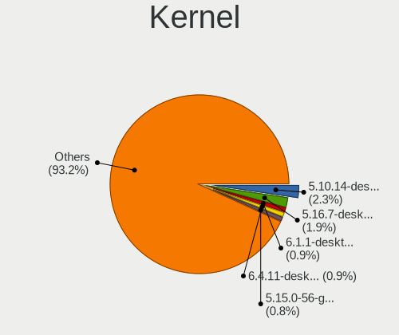
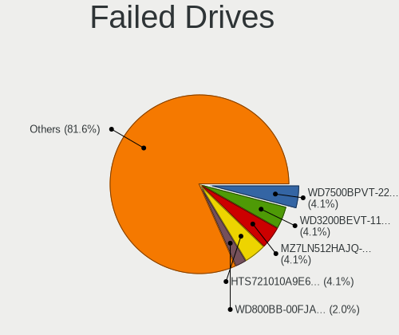
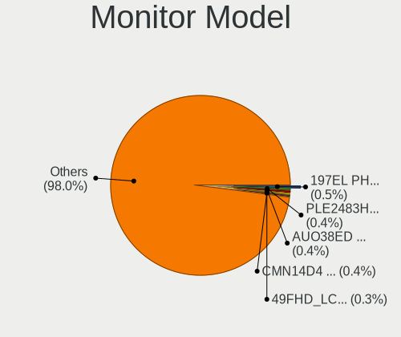
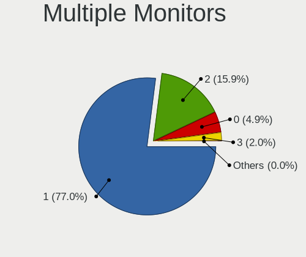
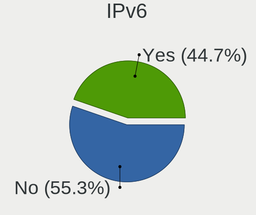
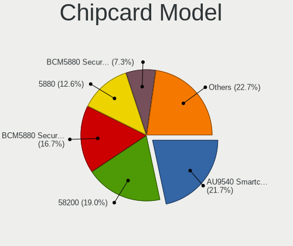

Linux in France - Tested Hardware & Statistics
----------------------------------------------

A project to collect tested hardware configurations for Linux in France.

Anyone can contribute to this report by the [hw-probe](https://github.com/linuxhw/hw-probe) tool:

    sudo -E hw-probe -all -upload

Please contribute! Especially if your hardware is rare.

This is a report for all computer types. See also reports for [desktops](/Location/France/Desktop/README.md) and [notebooks](/Location/France/Notebook/README.md).

Contents
--------

* [ Test Cases ](#test-cases)

* [ System ](#system)
  - [ OS                       ](#os)
  - [ OS Family                ](#os-family)
  - [ Kernel                   ](#kernel)
  - [ Kernel Family            ](#kernel-family)
  - [ Kernel Major Ver.        ](#kernel-major-ver)
  - [ Arch                     ](#arch)
  - [ DE                       ](#de)
  - [ Display Server           ](#display-server)
  - [ Display Manager          ](#display-manager)
  - [ OS Lang                  ](#os-lang)
  - [ Boot Mode                ](#boot-mode)
  - [ Filesystem               ](#filesystem)
  - [ Part. scheme             ](#part-scheme)
  - [ Dual Boot with Linux/BSD ](#dual-boot-with-linuxbsd)
  - [ Dual Boot (Win)          ](#dual-boot-win)

* [ Board ](#board)
  - [ Vendor                   ](#vendor)
  - [ Model                    ](#model)
  - [ Model Family             ](#model-family)
  - [ MFG Year                 ](#mfg-year)
  - [ Form Factor              ](#form-factor)
  - [ Secure Boot              ](#secure-boot)
  - [ Coreboot                 ](#coreboot)
  - [ RAM Size                 ](#ram-size)
  - [ RAM Used                 ](#ram-used)
  - [ Total Drives             ](#total-drives)
  - [ Has CD-ROM               ](#has-cd-rom)
  - [ Has Ethernet             ](#has-ethernet)
  - [ Has WiFi                 ](#has-wifi)
  - [ Has Bluetooth            ](#has-bluetooth)

* [ Location ](#location)
  - [ Country                  ](#country)
  - [ City                     ](#city)

* [ Drives ](#drives)
  - [ Drive Vendor             ](#drive-vendor)
  - [ Drive Model              ](#drive-model)
  - [ HDD Vendor               ](#hdd-vendor)
  - [ SSD Vendor               ](#ssd-vendor)
  - [ Drive Kind               ](#drive-kind)
  - [ Drive Connector          ](#drive-connector)
  - [ Drive Size               ](#drive-size)
  - [ Space Total              ](#space-total)
  - [ Space Used               ](#space-used)
  - [ Malfunc. Drives          ](#malfunc-drives)
  - [ Malfunc. Drive Vendor    ](#malfunc-drive-vendor)
  - [ Malfunc. HDD Vendor      ](#malfunc-hdd-vendor)
  - [ Malfunc. Drive Kind      ](#malfunc-drive-kind)
  - [ Failed Drives            ](#failed-drives)
  - [ Failed Drive Vendor      ](#failed-drive-vendor)
  - [ Drive Status             ](#drive-status)

* [ Storage controller ](#storage-controller)
  - [ Storage Vendor           ](#storage-vendor)
  - [ Storage Model            ](#storage-model)
  - [ Storage Kind             ](#storage-kind)

* [ Processor ](#processor)
  - [ CPU Vendor               ](#cpu-vendor)
  - [ CPU Model                ](#cpu-model)
  - [ CPU Model Family         ](#cpu-model-family)
  - [ CPU Cores                ](#cpu-cores)
  - [ CPU Sockets              ](#cpu-sockets)
  - [ CPU Threads              ](#cpu-threads)
  - [ CPU Op-Modes             ](#cpu-op-modes)
  - [ CPU Microcode            ](#cpu-microcode)
  - [ CPU Microarch            ](#cpu-microarch)

* [ Graphics ](#graphics)
  - [ GPU Vendor               ](#gpu-vendor)
  - [ GPU Model                ](#gpu-model)
  - [ GPU Combo                ](#gpu-combo)
  - [ GPU Driver               ](#gpu-driver)
  - [ GPU Memory               ](#gpu-memory)

* [ Monitor ](#monitor)
  - [ Monitor Vendor           ](#monitor-vendor)
  - [ Monitor Model            ](#monitor-model)
  - [ Monitor Resolution       ](#monitor-resolution)
  - [ Monitor Diagonal         ](#monitor-diagonal)
  - [ Monitor Width            ](#monitor-width)
  - [ Aspect Ratio             ](#aspect-ratio)
  - [ Monitor Area             ](#monitor-area)
  - [ Pixel Density            ](#pixel-density)
  - [ Multiple Monitors        ](#multiple-monitors)

* [ Network ](#network)
  - [ Net Controller Vendor    ](#net-controller-vendor)
  - [ Net Controller Model     ](#net-controller-model)
  - [ Wireless Vendor          ](#wireless-vendor)
  - [ Wireless Model           ](#wireless-model)
  - [ Ethernet Vendor          ](#ethernet-vendor)
  - [ Ethernet Model           ](#ethernet-model)
  - [ Net Controller Kind      ](#net-controller-kind)
  - [ Used Controller          ](#used-controller)
  - [ NICs                     ](#nics)
  - [ IPv6                     ](#ipv6)

* [ Bluetooth ](#bluetooth)
  - [ Bluetooth Vendor         ](#bluetooth-vendor)
  - [ Bluetooth Model          ](#bluetooth-model)

* [ Sound ](#sound)
  - [ Sound Vendor             ](#sound-vendor)
  - [ Sound Model              ](#sound-model)

* [ Memory ](#memory)
  - [ Memory Vendor            ](#memory-vendor)
  - [ Memory Model             ](#memory-model)
  - [ Memory Kind              ](#memory-kind)
  - [ Memory Form Factor       ](#memory-form-factor)
  - [ Memory Size              ](#memory-size)
  - [ Memory Speed             ](#memory-speed)

* [ Printers & scanners ](#printers--scanners)
  - [ Printer Vendor           ](#printer-vendor)
  - [ Printer Model            ](#printer-model)
  - [ Scanner Vendor           ](#scanner-vendor)
  - [ Scanner Model            ](#scanner-model)

* [ Camera ](#camera)
  - [ Camera Vendor            ](#camera-vendor)
  - [ Camera Model             ](#camera-model)

* [ Security ](#security)
  - [ Fingerprint Vendor       ](#fingerprint-vendor)
  - [ Fingerprint Model        ](#fingerprint-model)
  - [ Chipcard Vendor          ](#chipcard-vendor)
  - [ Chipcard Model           ](#chipcard-model)

* [ Unsupported ](#unsupported)
  - [ Unsupported Devices      ](#unsupported-devices)
  - [ Unsupported Device Types ](#unsupported-device-types)

Test Cases
----------

Total: 9798

| Vendor        | Model                       | Form-Factor | Probe                                                      | Date         |
|---------------|-----------------------------|-------------|------------------------------------------------------------|--------------|
| Acer          | Aspire 5715Z                | Notebook    | [82086ce1c6](https://linux-hardware.org/?probe=82086ce1c6) | Sep 01, 2022 |
| HP            | ZBook 17 G2                 | Notebook    | [e2fc506c38](https://linux-hardware.org/?probe=e2fc506c38) | Sep 01, 2022 |
| Dell          | XPS 9320                    | Notebook    | [525a1bd6b6](https://linux-hardware.org/?probe=525a1bd6b6) | Sep 01, 2022 |
| ASUSTek       | TUF Gaming B450-PLUS II     | Desktop     | [efc46d8d23](https://linux-hardware.org/?probe=efc46d8d23) | Sep 01, 2022 |
| HP            | Laptop 14s-fq1xxx           | Notebook    | [1a173c5ea0](https://linux-hardware.org/?probe=1a173c5ea0) | Sep 01, 2022 |
| Acer          | Aspire V3-571G              | Notebook    | [8f4a2b603a](https://linux-hardware.org/?probe=8f4a2b603a) | Aug 31, 2022 |
| MSI           | MAG X570S TORPEDO MAX       | Desktop     | [d98546fd95](https://linux-hardware.org/?probe=d98546fd95) | Aug 31, 2022 |
| MSI           | MPG B550I GAMING EDGE WI... | Desktop     | [aacd965d80](https://linux-hardware.org/?probe=aacd965d80) | Aug 31, 2022 |
| HP            | Notebook                    | Notebook    | [573d359faf](https://linux-hardware.org/?probe=573d359faf) | Aug 31, 2022 |
| Toshiba       | Satellite Pro L500          | Notebook    | [7f523718cf](https://linux-hardware.org/?probe=7f523718cf) | Aug 31, 2022 |
| MSI           | MPG B550I GAMING EDGE WI... | Desktop     | [c5547cac7c](https://linux-hardware.org/?probe=c5547cac7c) | Aug 31, 2022 |
| Dell          | Inspiron 7720               | Notebook    | [97883c54a3](https://linux-hardware.org/?probe=97883c54a3) | Aug 31, 2022 |
| Dell          | Precision 3551              | Notebook    | [c9ffa625ad](https://linux-hardware.org/?probe=c9ffa625ad) | Aug 31, 2022 |
| HUAWEI        | HVY-WXX9                    | Notebook    | [193310218d](https://linux-hardware.org/?probe=193310218d) | Aug 31, 2022 |
| MSI           | MPG B550I GAMING EDGE WI... | Desktop     | [e5c7462ead](https://linux-hardware.org/?probe=e5c7462ead) | Aug 31, 2022 |
| HP            | 83E0                        | Desktop     | [af9b15b8e7](https://linux-hardware.org/?probe=af9b15b8e7) | Aug 31, 2022 |
| Samsung       | RV410/RV510/S3510/E3510     | Notebook    | [d36b7bb077](https://linux-hardware.org/?probe=d36b7bb077) | Aug 31, 2022 |
| ASUSTek       | Z97-A                       | Desktop     | [1e70cd86f6](https://linux-hardware.org/?probe=1e70cd86f6) | Aug 31, 2022 |
| HP            | 250 G8 Notebook PC          | Notebook    | [c0a39342c3](https://linux-hardware.org/?probe=c0a39342c3) | Aug 31, 2022 |
| Dell          | 040DDP A00                  | Desktop     | [09ffe165d3](https://linux-hardware.org/?probe=09ffe165d3) | Aug 30, 2022 |
| HP            | Compaq nc6400 (RU626ET#A... | Notebook    | [e94cb8e943](https://linux-hardware.org/?probe=e94cb8e943) | Aug 30, 2022 |
| MSI           | MPG B550I GAMING EDGE WI... | Desktop     | [e770273b10](https://linux-hardware.org/?probe=e770273b10) | Aug 30, 2022 |
| ASUSTek       | X550CC                      | Notebook    | [f9a9be3a35](https://linux-hardware.org/?probe=f9a9be3a35) | Aug 30, 2022 |
| Dell          | Latitude E5530 non-vPro     | Notebook    | [7e839a0ef4](https://linux-hardware.org/?probe=7e839a0ef4) | Aug 30, 2022 |
| ASUSTek       | K501LX                      | Notebook    | [993e5d9848](https://linux-hardware.org/?probe=993e5d9848) | Aug 29, 2022 |
| ASUSTek       | P8P67 PRO                   | Desktop     | [aa43ab7091](https://linux-hardware.org/?probe=aa43ab7091) | Aug 29, 2022 |
| ASUSTek       | P8P67 PRO                   | Desktop     | [4882cfb195](https://linux-hardware.org/?probe=4882cfb195) | Aug 29, 2022 |
| Apple         | Mac-F2238BAE iMac11,3       | All in one  | [fd6324377f](https://linux-hardware.org/?probe=fd6324377f) | Aug 29, 2022 |
| MSI           | B250M PRO-VD                | Desktop     | [d462e3b9d0](https://linux-hardware.org/?probe=d462e3b9d0) | Aug 29, 2022 |
| MSI           | H310M PRO-M2 PLUS           | Desktop     | [a561fb6354](https://linux-hardware.org/?probe=a561fb6354) | Aug 29, 2022 |
| Lenovo        | MAHOBAY NO DPK              | Desktop     | [2d013c60ed](https://linux-hardware.org/?probe=2d013c60ed) | Aug 29, 2022 |
| MSI           | MAG B550 TORPEDO            | Desktop     | [58f0ba95c3](https://linux-hardware.org/?probe=58f0ba95c3) | Aug 29, 2022 |
| Acer          | TravelMate P215-53          | Notebook    | [4ba2e9fbba](https://linux-hardware.org/?probe=4ba2e9fbba) | Aug 29, 2022 |
| Dell          | Precision 3570              | Notebook    | [7f7a44c923](https://linux-hardware.org/?probe=7f7a44c923) | Aug 29, 2022 |
| ASUSTek       | X751LJC                     | Notebook    | [36c35406c9](https://linux-hardware.org/?probe=36c35406c9) | Aug 29, 2022 |
| Gigabyte      | GA-MA790FXT-UD5P            | Desktop     | [e692fe97cb](https://linux-hardware.org/?probe=e692fe97cb) | Aug 28, 2022 |
| ASUSTek       | N71Jv                       | Notebook    | [b30a3030ae](https://linux-hardware.org/?probe=b30a3030ae) | Aug 28, 2022 |
| ASUSTek       | ZenBook UX333FA_UX333FA     | Notebook    | [a66f7c7a3a](https://linux-hardware.org/?probe=a66f7c7a3a) | Aug 28, 2022 |
| Medion        | B460H6-EM                   | Desktop     | [91371e505d](https://linux-hardware.org/?probe=91371e505d) | Aug 28, 2022 |
| Gigabyte      | B450 AORUS ELITE            | Desktop     | [859b3cb78a](https://linux-hardware.org/?probe=859b3cb78a) | Aug 28, 2022 |
| Apple         | MacBookAir6,2               | Notebook    | [0454b1e087](https://linux-hardware.org/?probe=0454b1e087) | Aug 27, 2022 |
| Dell          | Inspiron N5010              | Notebook    | [b9953ab67e](https://linux-hardware.org/?probe=b9953ab67e) | Aug 27, 2022 |
| HUAWEI        | NBLBZ-WAX9N                 | Notebook    | [3d1138a71c](https://linux-hardware.org/?probe=3d1138a71c) | Aug 27, 2022 |
| Dell          | Latitude E5470              | Notebook    | [7d49878b0d](https://linux-hardware.org/?probe=7d49878b0d) | Aug 27, 2022 |
| Lenovo        | IdeaPad 3 15ALC6 82KU       | Notebook    | [8231da35ed](https://linux-hardware.org/?probe=8231da35ed) | Aug 27, 2022 |
| Gigabyte      | G41M-Combo                  | Desktop     | [353da69160](https://linux-hardware.org/?probe=353da69160) | Aug 26, 2022 |
| ASUSTek       | VivoBook_ASUSLaptop M340... | Notebook    | [3f94d521d4](https://linux-hardware.org/?probe=3f94d521d4) | Aug 26, 2022 |
| SLIMBOOK      | PROX15-AMD                  | Notebook    | [73c598ebe7](https://linux-hardware.org/?probe=73c598ebe7) | Aug 26, 2022 |
| Apple         | MacBookPro9,2               | Notebook    | [49b01e516c](https://linux-hardware.org/?probe=49b01e516c) | Aug 26, 2022 |
| Intel         | X79G V2.x                   | Desktop     | [8418a8e83c](https://linux-hardware.org/?probe=8418a8e83c) | Aug 26, 2022 |
| Intel         | X79G V2.x                   | Desktop     | [2a3114af33](https://linux-hardware.org/?probe=2a3114af33) | Aug 26, 2022 |
| Foxconn       | 2ABF                        | Desktop     | [46efca142c](https://linux-hardware.org/?probe=46efca142c) | Aug 26, 2022 |
| Lenovo        | ThinkPad T400 2768BM2       | Notebook    | [f2d91055c9](https://linux-hardware.org/?probe=f2d91055c9) | Aug 26, 2022 |
| Lenovo        | ThinkPad T440p 20AWS17N0... | Notebook    | [a624a45cda](https://linux-hardware.org/?probe=a624a45cda) | Aug 26, 2022 |
| Dell          | 0K7CVF A03                  | Server      | [e4ead551b7](https://linux-hardware.org/?probe=e4ead551b7) | Aug 26, 2022 |
| HP            | 18E5                        | Desktop     | [9196bf639b](https://linux-hardware.org/?probe=9196bf639b) | Aug 26, 2022 |
| Lenovo        | 7033EW4                     | Desktop     | [54417ae55f](https://linux-hardware.org/?probe=54417ae55f) | Aug 26, 2022 |
| Lenovo        | Yoga S740-15IRH 81NX        | Notebook    | [b56c1d75a6](https://linux-hardware.org/?probe=b56c1d75a6) | Aug 25, 2022 |
| Packard Be... | IMEDIA S1300                | Desktop     | [4b8f3feaa7](https://linux-hardware.org/?probe=4b8f3feaa7) | Aug 25, 2022 |
| Dell          | 0RJ290                      | Desktop     | [ca82162ed5](https://linux-hardware.org/?probe=ca82162ed5) | Aug 25, 2022 |
| Acer          | Aspire XC-710 V:1.1         | Desktop     | [0b76e0f97d](https://linux-hardware.org/?probe=0b76e0f97d) | Aug 25, 2022 |
| ASUSTek       | UN62                        | Desktop     | [49fcd1324f](https://linux-hardware.org/?probe=49fcd1324f) | Aug 25, 2022 |
| Notebook      | W65_67SZ                    | Notebook    | [0bf839f496](https://linux-hardware.org/?probe=0bf839f496) | Aug 25, 2022 |
| Lenovo        | ThinkPad P70 20ERCTO1WW     | Notebook    | [d269aaa456](https://linux-hardware.org/?probe=d269aaa456) | Aug 25, 2022 |
| Dell          | Precision M4800             | Notebook    | [b00f73e4a3](https://linux-hardware.org/?probe=b00f73e4a3) | Aug 24, 2022 |
| HP            | Compaq CQ58                 | Notebook    | [c4f7e439a9](https://linux-hardware.org/?probe=c4f7e439a9) | Aug 24, 2022 |
| Dell          | Latitude E7240              | Notebook    | [0e15063cb3](https://linux-hardware.org/?probe=0e15063cb3) | Aug 24, 2022 |
| HP            | ZBook 15 G6                 | Notebook    | [e51675ce88](https://linux-hardware.org/?probe=e51675ce88) | Aug 24, 2022 |
| ASUSTek       | X751LD                      | Notebook    | [4306baa541](https://linux-hardware.org/?probe=4306baa541) | Aug 24, 2022 |
| HP            | ProBook 4540s               | Notebook    | [f082a7566a](https://linux-hardware.org/?probe=f082a7566a) | Aug 24, 2022 |
| HP            | ProBook 4540s               | Notebook    | [de08e9b296](https://linux-hardware.org/?probe=de08e9b296) | Aug 24, 2022 |
| ASUSTek       | PRIME X570-PRO              | Desktop     | [663509c999](https://linux-hardware.org/?probe=663509c999) | Aug 24, 2022 |
| ASUSTek       | PRIME X570-PRO              | Desktop     | [2b7d1d59a1](https://linux-hardware.org/?probe=2b7d1d59a1) | Aug 24, 2022 |
| HP            | 21D0                        | Desktop     | [1bd58d519c](https://linux-hardware.org/?probe=1bd58d519c) | Aug 24, 2022 |
| Gigabyte      | A320M-H-CF                  | Desktop     | [476ca6c833](https://linux-hardware.org/?probe=476ca6c833) | Aug 24, 2022 |
| Dell          | XPS L421X                   | Notebook    | [227df9dc9e](https://linux-hardware.org/?probe=227df9dc9e) | Aug 24, 2022 |
| Dell          | 0MWYPT A02                  | Desktop     | [017af6f58d](https://linux-hardware.org/?probe=017af6f58d) | Aug 23, 2022 |
| Lenovo        | Yoga S740-15IRH 81NX        | Notebook    | [fc9bb1e6fa](https://linux-hardware.org/?probe=fc9bb1e6fa) | Aug 23, 2022 |
| Dell          | XPS L421X                   | Notebook    | [80a474140e](https://linux-hardware.org/?probe=80a474140e) | Aug 22, 2022 |
| HP            | 3397                        | Desktop     | [335f59c96f](https://linux-hardware.org/?probe=335f59c96f) | Aug 22, 2022 |
| HP            | EliteBook 840 G8 Noteboo... | Notebook    | [2aa681b773](https://linux-hardware.org/?probe=2aa681b773) | Aug 22, 2022 |
| HP            | EliteBook 840 G8 Noteboo... | Notebook    | [a51a82210b](https://linux-hardware.org/?probe=a51a82210b) | Aug 22, 2022 |
| Biostar       | H81MHV3 5.0                 | Desktop     | [161cae6726](https://linux-hardware.org/?probe=161cae6726) | Aug 22, 2022 |
| ASRock        | A320M-HDV R4.0              | Desktop     | [82481d6225](https://linux-hardware.org/?probe=82481d6225) | Aug 22, 2022 |
| ASRock        | A520M-HVS                   | Desktop     | [842ad7d4d2](https://linux-hardware.org/?probe=842ad7d4d2) | Aug 22, 2022 |
| ASUSTek       | X751LN                      | Notebook    | [68cd0152fb](https://linux-hardware.org/?probe=68cd0152fb) | Aug 22, 2022 |
| Apple         | MacBookPro6,1               | Notebook    | [52a1f16ef3](https://linux-hardware.org/?probe=52a1f16ef3) | Aug 22, 2022 |
| Apple         | MacBookPro6,1               | Notebook    | [ae19610f33](https://linux-hardware.org/?probe=ae19610f33) | Aug 21, 2022 |
| Fujitsu       | LIFEBOOK UH552              | Notebook    | [15a1f49654](https://linux-hardware.org/?probe=15a1f49654) | Aug 21, 2022 |
| Acer          | AO725                       | Notebook    | [5eed64f77d](https://linux-hardware.org/?probe=5eed64f77d) | Aug 21, 2022 |
| MSI           | GE60 0NC/GE60 0ND           | Notebook    | [838dcef1f9](https://linux-hardware.org/?probe=838dcef1f9) | Aug 21, 2022 |
| ZOTAC         | ZBOX-CI323NANO              | Mini pc     | [a8bf4ad2a0](https://linux-hardware.org/?probe=a8bf4ad2a0) | Aug 21, 2022 |
| ASUSTek       | Z87-C                       | Desktop     | [8de83c544f](https://linux-hardware.org/?probe=8de83c544f) | Aug 21, 2022 |
| ASUSTek       | K53SD                       | Notebook    | [1b2c4f25a7](https://linux-hardware.org/?probe=1b2c4f25a7) | Aug 21, 2022 |
| Foxconn       | 2ABF                        | Desktop     | [3eed86b908](https://linux-hardware.org/?probe=3eed86b908) | Aug 21, 2022 |
| Packard Be... | PT890-8237A                 | Desktop     | [36a4120390](https://linux-hardware.org/?probe=36a4120390) | Aug 20, 2022 |
| ASUSTek       | TUF B350M-PLUS GAMING       | Desktop     | [b2ac87cffc](https://linux-hardware.org/?probe=b2ac87cffc) | Aug 20, 2022 |
| HP            | Compaq CQ58                 | Notebook    | [59fadaa084](https://linux-hardware.org/?probe=59fadaa084) | Aug 20, 2022 |
| MSI           | MAG X570S TORPEDO MAX       | Desktop     | [d5e91a17b8](https://linux-hardware.org/?probe=d5e91a17b8) | Aug 20, 2022 |
| HP            | 805D                        | Desktop     | [6748d722e7](https://linux-hardware.org/?probe=6748d722e7) | Aug 19, 2022 |
| HP            | EliteBook 840 G8 Noteboo... | Notebook    | [45bfdfa985](https://linux-hardware.org/?probe=45bfdfa985) | Aug 19, 2022 |
| Packard Be... | EasyNote TJ66               | Notebook    | [96c3144e93](https://linux-hardware.org/?probe=96c3144e93) | Aug 19, 2022 |
| HP            | 1497                        | Desktop     | [580e1a6efe](https://linux-hardware.org/?probe=580e1a6efe) | Aug 19, 2022 |
| Lenovo        | ThinkPad T520 4239CTO       | Notebook    | [c88fbf8cc5](https://linux-hardware.org/?probe=c88fbf8cc5) | Aug 19, 2022 |
| HP            | EliteBook 840 G8 Noteboo... | Notebook    | [e6003f393e](https://linux-hardware.org/?probe=e6003f393e) | Aug 19, 2022 |
| Lenovo        | ThinkPad X1 Carbon 4th 2... | Notebook    | [bdb88a532f](https://linux-hardware.org/?probe=bdb88a532f) | Aug 19, 2022 |
| CompuLab      | fitlet2                     | Mini pc     | [f7fc2a9686](https://linux-hardware.org/?probe=f7fc2a9686) | Aug 19, 2022 |
| Dell          | Latitude 5500               | Notebook    | [1c7c8639aa](https://linux-hardware.org/?probe=1c7c8639aa) | Aug 19, 2022 |
| ASUSTek       | VivoBook_ASUSLaptop X509... | Notebook    | [f9ec8eaac3](https://linux-hardware.org/?probe=f9ec8eaac3) | Aug 18, 2022 |
| Acer          | Veriton X2631G V:1.0        | Desktop     | [de98920808](https://linux-hardware.org/?probe=de98920808) | Aug 18, 2022 |
| Intel         | D54250WYK H13922-302        | Desktop     | [ba78bd360c](https://linux-hardware.org/?probe=ba78bd360c) | Aug 18, 2022 |
| eMachines     | ET1350                      | Desktop     | [96e9f7aba7](https://linux-hardware.org/?probe=96e9f7aba7) | Aug 18, 2022 |
| Foxconn       | 2ADA                        | Desktop     | [015ccc4b06](https://linux-hardware.org/?probe=015ccc4b06) | Aug 18, 2022 |
| Intel         | NUC10i7FNB M38062-307       | Mini pc     | [ea6140bf28](https://linux-hardware.org/?probe=ea6140bf28) | Aug 18, 2022 |
| Packard Be... | EasyNote TJ65               | Notebook    | [df3b457c00](https://linux-hardware.org/?probe=df3b457c00) | Aug 18, 2022 |
| ASUSTek       | K70IJ                       | Notebook    | [99bb1459e7](https://linux-hardware.org/?probe=99bb1459e7) | Aug 17, 2022 |
| Lenovo        | ThinkPad E14 Gen 2 20TAC... | Notebook    | [ee7cbda038](https://linux-hardware.org/?probe=ee7cbda038) | Aug 17, 2022 |
| Notebook      | NLx0MU                      | Notebook    | [0e2658915d](https://linux-hardware.org/?probe=0e2658915d) | Aug 17, 2022 |
| Dell          | 0FDY5C A00                  | Desktop     | [4cd1658b87](https://linux-hardware.org/?probe=4cd1658b87) | Aug 17, 2022 |
| ASUSTek       | ASUS EXPERTBOOK P5440FA_... | Notebook    | [eb159f06ab](https://linux-hardware.org/?probe=eb159f06ab) | Aug 17, 2022 |
| ASUSTek       | ASUS EXPERTBOOK P5440FA_... | Notebook    | [36fb0e2471](https://linux-hardware.org/?probe=36fb0e2471) | Aug 17, 2022 |
| Packard Be... | EasyNote TK37               | Notebook    | [996a14d9f4](https://linux-hardware.org/?probe=996a14d9f4) | Aug 17, 2022 |
| Intel         | NUC10i7FNB M38062-307       | Mini pc     | [d38b463d7d](https://linux-hardware.org/?probe=d38b463d7d) | Aug 17, 2022 |
| ASUSTek       | X556UQ                      | Notebook    | [cc792932e6](https://linux-hardware.org/?probe=cc792932e6) | Aug 17, 2022 |
| Lenovo        | IdeaPad 3 15ALC6 82KU       | Notebook    | [e9d1b72a88](https://linux-hardware.org/?probe=e9d1b72a88) | Aug 17, 2022 |
| MSI           | X470 GAMING PRO             | Desktop     | [b648d56b04](https://linux-hardware.org/?probe=b648d56b04) | Aug 17, 2022 |
| Toshiba       | Satellite C870-1F3          | Notebook    | [6738afe025](https://linux-hardware.org/?probe=6738afe025) | Aug 17, 2022 |
| HP            | Victus by Laptop 16-e0xx... | Notebook    | [dd79ae2b92](https://linux-hardware.org/?probe=dd79ae2b92) | Aug 17, 2022 |
| Dell          | 00V62H A01                  | Desktop     | [34b4c61308](https://linux-hardware.org/?probe=34b4c61308) | Aug 17, 2022 |
| Gigabyte      | B85M-D3PH                   | Desktop     | [a5ed221478](https://linux-hardware.org/?probe=a5ed221478) | Aug 17, 2022 |
| ASUSTek       | T101HA                      | Tablet      | [8e32248e29](https://linux-hardware.org/?probe=8e32248e29) | Aug 17, 2022 |
| MSI           | PS63 Modern 8RD             | Notebook    | [ad3134e010](https://linux-hardware.org/?probe=ad3134e010) | Aug 17, 2022 |
| Dell          | 0YXT71 A00                  | Desktop     | [def7e10c65](https://linux-hardware.org/?probe=def7e10c65) | Aug 17, 2022 |
| HP            | Laptop 14s-fq1xxx           | Notebook    | [92c0a6fe2a](https://linux-hardware.org/?probe=92c0a6fe2a) | Aug 17, 2022 |
| Acer          | Veriton X2631G V:1.0        | Desktop     | [a7af0ea5e7](https://linux-hardware.org/?probe=a7af0ea5e7) | Aug 17, 2022 |
| MSI           | H170M PRO-VDH               | Desktop     | [4d7aa09763](https://linux-hardware.org/?probe=4d7aa09763) | Aug 16, 2022 |
| ASUSTek       | TUF Gaming B450-PLUS II     | Desktop     | [dd98185972](https://linux-hardware.org/?probe=dd98185972) | Aug 16, 2022 |
| ASUSTek       | UX303LN                     | Notebook    | [63d5525864](https://linux-hardware.org/?probe=63d5525864) | Aug 16, 2022 |
| Dell          | 0T656F A01                  | Desktop     | [ec4014a549](https://linux-hardware.org/?probe=ec4014a549) | Aug 16, 2022 |
| Lenovo        | 370A SDK0J40700 WIN 3258... | Desktop     | [ed6155d213](https://linux-hardware.org/?probe=ed6155d213) | Aug 16, 2022 |
| Dell          | Inspiron 5547               | Notebook    | [84a3ba511d](https://linux-hardware.org/?probe=84a3ba511d) | Aug 16, 2022 |
| Dell          | 0GM819                      | Desktop     | [f7745d3d3a](https://linux-hardware.org/?probe=f7745d3d3a) | Aug 16, 2022 |
| ASRock        | X470 Master SLI             | Desktop     | [ce62975b20](https://linux-hardware.org/?probe=ce62975b20) | Aug 15, 2022 |
| Gigabyte      | B75M-D3V                    | Desktop     | [cdea2e0afd](https://linux-hardware.org/?probe=cdea2e0afd) | Aug 15, 2022 |
| Gigabyte      | B75M-D3V                    | Desktop     | [87f8cc8553](https://linux-hardware.org/?probe=87f8cc8553) | Aug 15, 2022 |
| Lenovo        | IdeaPad 3 17ADA05 81W2      | Notebook    | [da0503d5dd](https://linux-hardware.org/?probe=da0503d5dd) | Aug 15, 2022 |
| ASUSTek       | X541UV                      | Notebook    | [d5b4217f4a](https://linux-hardware.org/?probe=d5b4217f4a) | Aug 15, 2022 |
| MSI           | A320M-A PRO MAX             | Desktop     | [bf211d4e64](https://linux-hardware.org/?probe=bf211d4e64) | Aug 15, 2022 |
| Dell          | G3 3500                     | Notebook    | [6a860d7c0f](https://linux-hardware.org/?probe=6a860d7c0f) | Aug 15, 2022 |
| Gigabyte      | B450M H                     | Desktop     | [a16dfdfe7b](https://linux-hardware.org/?probe=a16dfdfe7b) | Aug 15, 2022 |
| Notebook      | N15_17RD                    | Notebook    | [eef224fc6b](https://linux-hardware.org/?probe=eef224fc6b) | Aug 15, 2022 |
| ASUSTek       | P7P55D                      | Desktop     | [cd43fbf16a](https://linux-hardware.org/?probe=cd43fbf16a) | Aug 15, 2022 |
| ASUSTek       | TUF Gaming X570-PLUS        | Desktop     | [53429d945b](https://linux-hardware.org/?probe=53429d945b) | Aug 15, 2022 |
| Lenovo        | V110-15ISK 80TL             | Notebook    | [757de6f4df](https://linux-hardware.org/?probe=757de6f4df) | Aug 15, 2022 |
| ASUSTek       | Z170 PRO GAMING             | Desktop     | [3d2bd6d842](https://linux-hardware.org/?probe=3d2bd6d842) | Aug 15, 2022 |
| HP            | 0B4Ch D                     | Desktop     | [deaaa5c32c](https://linux-hardware.org/?probe=deaaa5c32c) | Aug 15, 2022 |
| UNOWHY        | Y13G010S4EI                 | Notebook    | [b7352cd745](https://linux-hardware.org/?probe=b7352cd745) | Aug 14, 2022 |
| ASUSTek       | T101HA                      | Tablet      | [9374a96d80](https://linux-hardware.org/?probe=9374a96d80) | Aug 14, 2022 |
| ASUSTek       | T101HA                      | Tablet      | [33c14d0936](https://linux-hardware.org/?probe=33c14d0936) | Aug 14, 2022 |
| Gigabyte      | B460 AORUS PRO AC           | Desktop     | [ab9e6d26d6](https://linux-hardware.org/?probe=ab9e6d26d6) | Aug 14, 2022 |
| Lenovo        | ThinkPad W540 20BHS0F206    | Notebook    | [7f24672b73](https://linux-hardware.org/?probe=7f24672b73) | Aug 14, 2022 |
| Toshiba       | Satellite C55-C             | Notebook    | [44a8059d13](https://linux-hardware.org/?probe=44a8059d13) | Aug 14, 2022 |
| Lenovo        | ThinkBook 14 G2 ITL 20VD    | Notebook    | [644fbe551a](https://linux-hardware.org/?probe=644fbe551a) | Aug 13, 2022 |
| HP            | 470 G7 Notebook PC          | Notebook    | [adae536639](https://linux-hardware.org/?probe=adae536639) | Aug 13, 2022 |
| HP            | 470 G7 Notebook PC          | Notebook    | [5a319a7a29](https://linux-hardware.org/?probe=5a319a7a29) | Aug 13, 2022 |
| Gigabyte      | H97N-WIFI                   | Desktop     | [966a3e1593](https://linux-hardware.org/?probe=966a3e1593) | Aug 13, 2022 |
| MSI           | GE75 Raider 10SF            | Notebook    | [0fafeaaa76](https://linux-hardware.org/?probe=0fafeaaa76) | Aug 13, 2022 |
| Panasonic     | CF-31XEUAXMF                | Notebook    | [914e54f984](https://linux-hardware.org/?probe=914e54f984) | Aug 13, 2022 |
| ASRock        | H61M-DGS                    | Desktop     | [50b7221c5a](https://linux-hardware.org/?probe=50b7221c5a) | Aug 12, 2022 |
| ASUSTek       | ROG STRIX B550-F GAMING     | Desktop     | [8c792d555c](https://linux-hardware.org/?probe=8c792d555c) | Aug 12, 2022 |
| HP            | 15                          | Notebook    | [30a35c4e04](https://linux-hardware.org/?probe=30a35c4e04) | Aug 12, 2022 |
| HP            | ProBook 6570b               | Notebook    | [d67ec558d4](https://linux-hardware.org/?probe=d67ec558d4) | Aug 12, 2022 |
| Lenovo        | ThinkPad T61 64665DG        | Notebook    | [ff1be50f8c](https://linux-hardware.org/?probe=ff1be50f8c) | Aug 12, 2022 |
| Gigabyte      | H370 HD3-CF                 | Desktop     | [3d93d807ca](https://linux-hardware.org/?probe=3d93d807ca) | Aug 12, 2022 |
| MSI           | Z87-G45 GAMING              | Desktop     | [2f541727e1](https://linux-hardware.org/?probe=2f541727e1) | Aug 12, 2022 |
| ASUSTek       | ZenBook UX534FAC            | Notebook    | [419660b78b](https://linux-hardware.org/?probe=419660b78b) | Aug 12, 2022 |
| HP            | EliteBook 820 G3            | Notebook    | [c1b14847f1](https://linux-hardware.org/?probe=c1b14847f1) | Aug 12, 2022 |
| ASUSTek       | PRIME A320M-K               | Desktop     | [1f75df3828](https://linux-hardware.org/?probe=1f75df3828) | Aug 12, 2022 |
| Lenovo        | ThinkPad X200 7458VL3       | Notebook    | [82762528a7](https://linux-hardware.org/?probe=82762528a7) | Aug 12, 2022 |
| ASRock        | Z97M Pro4                   | Desktop     | [245d189a61](https://linux-hardware.org/?probe=245d189a61) | Aug 11, 2022 |
| Panasonic     | CF-53JSWZGFF                | Notebook    | [88c83a7e28](https://linux-hardware.org/?probe=88c83a7e28) | Aug 11, 2022 |
| Dell          | System XPS 15Z              | Notebook    | [45a22d4855](https://linux-hardware.org/?probe=45a22d4855) | Aug 11, 2022 |
| Dell          | XPS 9320                    | Notebook    | [2c76534231](https://linux-hardware.org/?probe=2c76534231) | Aug 11, 2022 |
| Gigabyte      | H370 AORUS GAMING 3 WIFI... | Desktop     | [d2f7a86fd8](https://linux-hardware.org/?probe=d2f7a86fd8) | Aug 11, 2022 |
| ASUSTek       | GL502VT                     | Notebook    | [5e95e514a4](https://linux-hardware.org/?probe=5e95e514a4) | Aug 11, 2022 |
| ASRock        | H61M/U3S3                   | Desktop     | [be0d853621](https://linux-hardware.org/?probe=be0d853621) | Aug 11, 2022 |
| Gigabyte      | B450M DS3H V2               | Desktop     | [33dc68fe04](https://linux-hardware.org/?probe=33dc68fe04) | Aug 11, 2022 |
| Notebook      | N141CU                      | Notebook    | [4d96f7358c](https://linux-hardware.org/?probe=4d96f7358c) | Aug 10, 2022 |
| Toshiba       | Satellite L875-11M          | Notebook    | [5a01928c94](https://linux-hardware.org/?probe=5a01928c94) | Aug 10, 2022 |
| Lenovo        | MIIX 320-10ICR 80XF         | Tablet      | [1b439cee14](https://linux-hardware.org/?probe=1b439cee14) | Aug 10, 2022 |
| Vorke         | V1 Plus                     | Desktop     | [a31728f53e](https://linux-hardware.org/?probe=a31728f53e) | Aug 10, 2022 |
| HP            | Laptop 17-ca1xxx            | Notebook    | [f57b28ff2c](https://linux-hardware.org/?probe=f57b28ff2c) | Aug 10, 2022 |
| ASUSTek       | X751LJ                      | Notebook    | [5c3767ccc2](https://linux-hardware.org/?probe=5c3767ccc2) | Aug 10, 2022 |
| Lenovo        | SHARKBAY NOK                | Desktop     | [9a77cf2f22](https://linux-hardware.org/?probe=9a77cf2f22) | Aug 10, 2022 |
| Dell          | XPS 9320                    | Notebook    | [f1ce1578ed](https://linux-hardware.org/?probe=f1ce1578ed) | Aug 10, 2022 |
| Dell          | Inspiron 5523               | Notebook    | [6a6928a8a5](https://linux-hardware.org/?probe=6a6928a8a5) | Aug 10, 2022 |
| Acer          | Veriton Z4810G              | All in one  | [d85c47c623](https://linux-hardware.org/?probe=d85c47c623) | Aug 10, 2022 |
| eMachines     | Veriton V2110               | Desktop     | [3492540d77](https://linux-hardware.org/?probe=3492540d77) | Aug 09, 2022 |
| MSI           | MPG X570S EDGE MAX WIFI     | Desktop     | [346b22a42e](https://linux-hardware.org/?probe=346b22a42e) | Aug 09, 2022 |
| ASRock        | G41M-VS3                    | Desktop     | [16a2e0ab5d](https://linux-hardware.org/?probe=16a2e0ab5d) | Aug 09, 2022 |
| Lenovo        | ThinkPad T460p 20FWCTO1W... | Notebook    | [2ac0968200](https://linux-hardware.org/?probe=2ac0968200) | Aug 09, 2022 |
| ASUSTek       | X751LJ                      | Notebook    | [e35689c8f1](https://linux-hardware.org/?probe=e35689c8f1) | Aug 09, 2022 |
| MSI           | MPG B550I GAMING EDGE WI... | Desktop     | [77396822d3](https://linux-hardware.org/?probe=77396822d3) | Aug 09, 2022 |
| Toshiba       | Satellite L875-11M          | Notebook    | [1b423f639e](https://linux-hardware.org/?probe=1b423f639e) | Aug 09, 2022 |
| HUAWEI        | KLVC-WXX9                   | Notebook    | [fa0e4ba168](https://linux-hardware.org/?probe=fa0e4ba168) | Aug 09, 2022 |
| Notebook      | N230WU                      | Notebook    | [f00a446001](https://linux-hardware.org/?probe=f00a446001) | Aug 09, 2022 |
| MSI           | MAG B550 TOMAHAWK           | Desktop     | [1713317338](https://linux-hardware.org/?probe=1713317338) | Aug 09, 2022 |
| Sony          | VPCYB3V1E                   | Notebook    | [a6cd208cf2](https://linux-hardware.org/?probe=a6cd208cf2) | Aug 09, 2022 |
| OEM           | Unknown                     | Notebook    | [d95f8f1502](https://linux-hardware.org/?probe=d95f8f1502) | Aug 09, 2022 |
| Lenovo        | Bantry CRB NOK              | Desktop     | [fbeb21c99a](https://linux-hardware.org/?probe=fbeb21c99a) | Aug 09, 2022 |
| Foxconn       | 2ABF                        | Desktop     | [89d9f69018](https://linux-hardware.org/?probe=89d9f69018) | Aug 09, 2022 |
| Lenovo        | ThinkPad P14s Gen 2i 20V... | Notebook    | [66235597aa](https://linux-hardware.org/?probe=66235597aa) | Aug 09, 2022 |
| Lenovo        | ThinkPad X230 23259T0       | Notebook    | [04b33f4a65](https://linux-hardware.org/?probe=04b33f4a65) | Aug 08, 2022 |
| Lenovo        | SHARKBAY NOK                | Desktop     | [c9bb066a9b](https://linux-hardware.org/?probe=c9bb066a9b) | Aug 08, 2022 |
| Lenovo        | SHARKBAY NOK                | Desktop     | [7bc9d5090f](https://linux-hardware.org/?probe=7bc9d5090f) | Aug 08, 2022 |
| ASUSTek       | X751LD                      | Notebook    | [e9d631e886](https://linux-hardware.org/?probe=e9d631e886) | Aug 08, 2022 |
| Intel         | NUC11TNBi3 M11908-403       | Mini pc     | [8e83a5b7d3](https://linux-hardware.org/?probe=8e83a5b7d3) | Aug 08, 2022 |
| Lenovo        | Yoga S740-15IRH 81NX        | Notebook    | [d1215796fb](https://linux-hardware.org/?probe=d1215796fb) | Aug 08, 2022 |
| ASUSTek       | G20AJ                       | Desktop     | [613f8a0c36](https://linux-hardware.org/?probe=613f8a0c36) | Aug 08, 2022 |
| HP            | ZBook 15 G6                 | Notebook    | [f833eca9da](https://linux-hardware.org/?probe=f833eca9da) | Aug 08, 2022 |
| Lenovo        | IdeaPad 330s-15ARR 81FB     | Notebook    | [4546912e7b](https://linux-hardware.org/?probe=4546912e7b) | Aug 08, 2022 |
| Dell          | Precision 5510              | Notebook    | [02dd64eff3](https://linux-hardware.org/?probe=02dd64eff3) | Aug 08, 2022 |
| Lenovo        | ThinkPad E15 Gen 2 20TD0... | Notebook    | [21e646de39](https://linux-hardware.org/?probe=21e646de39) | Aug 08, 2022 |
| Foxconn       | 2ABF                        | Desktop     | [ee62b165ef](https://linux-hardware.org/?probe=ee62b165ef) | Aug 08, 2022 |
| Intel         | JV10_CS                     | Notebook    | [07ca100ab3](https://linux-hardware.org/?probe=07ca100ab3) | Aug 08, 2022 |
| Dell          | 060K5C A06                  | Server      | [56aaa332b3](https://linux-hardware.org/?probe=56aaa332b3) | Aug 08, 2022 |
| Acer          | Swift SF113-31              | Notebook    | [1c4298ff33](https://linux-hardware.org/?probe=1c4298ff33) | Aug 08, 2022 |
| Acer          | Swift SF113-31              | Notebook    | [0f1ad8ccf7](https://linux-hardware.org/?probe=0f1ad8ccf7) | Aug 08, 2022 |
| ASUSTek       | PRIME A320M-K               | Desktop     | [40808a05c1](https://linux-hardware.org/?probe=40808a05c1) | Aug 07, 2022 |
| HP            | Compaq 15                   | Notebook    | [de4b6e0511](https://linux-hardware.org/?probe=de4b6e0511) | Aug 07, 2022 |
| HP            | OMEN Laptop 15-ek0xxx       | Notebook    | [19b3f7fe4b](https://linux-hardware.org/?probe=19b3f7fe4b) | Aug 07, 2022 |
| ASUSTek       | VivoBook 15_ASUS Laptop ... | Notebook    | [977159d1d8](https://linux-hardware.org/?probe=977159d1d8) | Aug 07, 2022 |
| Foxconn       | 2ABF                        | Desktop     | [bfa218709f](https://linux-hardware.org/?probe=bfa218709f) | Aug 07, 2022 |
| Gigabyte      | H370 AORUS GAMING 3 WIFI... | Desktop     | [6eac3041ec](https://linux-hardware.org/?probe=6eac3041ec) | Aug 07, 2022 |
| ASUSTek       | VivoBook_ASUSLaptop X421... | Notebook    | [f9850e0a1e](https://linux-hardware.org/?probe=f9850e0a1e) | Aug 07, 2022 |
| Intel         | NUC11ATBC4 M53051-202       | Mini pc     | [95e97a827b](https://linux-hardware.org/?probe=95e97a827b) | Aug 07, 2022 |
| ASUSTek       | VivoBook_ASUSLaptop X712... | Notebook    | [13a118ae0b](https://linux-hardware.org/?probe=13a118ae0b) | Aug 06, 2022 |
| Lenovo        | ThinkPad T440p 20AWS17N0... | Notebook    | [89b2da04d8](https://linux-hardware.org/?probe=89b2da04d8) | Aug 06, 2022 |
| Acer          | Aspire V3-372T              | Notebook    | [9dc2882992](https://linux-hardware.org/?probe=9dc2882992) | Aug 06, 2022 |
| Gigabyte      | F2A78M-HD2                  | Desktop     | [64b08b679f](https://linux-hardware.org/?probe=64b08b679f) | Aug 05, 2022 |
| Lenovo        | IdeaPad C340-14IWL 81N4     | Convertible | [bbcc5fa79d](https://linux-hardware.org/?probe=bbcc5fa79d) | Aug 05, 2022 |
| Lenovo        | ThinkPad R500 27148UG       | Notebook    | [1b7557ac14](https://linux-hardware.org/?probe=1b7557ac14) | Aug 05, 2022 |
| MSI           | MPG B550I GAMING EDGE WI... | Desktop     | [255c2dd960](https://linux-hardware.org/?probe=255c2dd960) | Aug 05, 2022 |
| HP            | ZBook 15 G6                 | Notebook    | [034cd98301](https://linux-hardware.org/?probe=034cd98301) | Aug 05, 2022 |
| Lenovo        | Yoga 300-11IBY 80M0         | Notebook    | [237cf11989](https://linux-hardware.org/?probe=237cf11989) | Aug 05, 2022 |
| Lenovo        | Yoga 300-11IBY 80M0         | Notebook    | [aec2ac880f](https://linux-hardware.org/?probe=aec2ac880f) | Aug 05, 2022 |
| MSI           | MAG B460M BAZOOKA           | Desktop     | [85037ebcb0](https://linux-hardware.org/?probe=85037ebcb0) | Aug 05, 2022 |
| ASUSTek       | ROG Maximus XI HERO         | Desktop     | [d725206bff](https://linux-hardware.org/?probe=d725206bff) | Aug 04, 2022 |
| Notebook      | NJ50_70CU                   | Notebook    | [fc31dfa99e](https://linux-hardware.org/?probe=fc31dfa99e) | Aug 04, 2022 |
| ASUSTek       | P5N-E SLI                   | Desktop     | [237c4a2367](https://linux-hardware.org/?probe=237c4a2367) | Aug 04, 2022 |
| ASUSTek       | X75VC                       | Notebook    | [f293c53dec](https://linux-hardware.org/?probe=f293c53dec) | Aug 04, 2022 |
| Dell          | Latitude E5520              | Notebook    | [1e3f6832b1](https://linux-hardware.org/?probe=1e3f6832b1) | Aug 04, 2022 |
| Dell          | 0HGFJM A00                  | Desktop     | [b1011ae242](https://linux-hardware.org/?probe=b1011ae242) | Aug 04, 2022 |
| MSI           | Z170A GAMING M5             | Desktop     | [37ccdc4cf7](https://linux-hardware.org/?probe=37ccdc4cf7) | Aug 04, 2022 |
| Intel         | NUC8BEB J72692-310          | Mini pc     | [fa975ac535](https://linux-hardware.org/?probe=fa975ac535) | Aug 04, 2022 |
| Lenovo        | SDK0E50510 WIN              | Desktop     | [e43f32d47e](https://linux-hardware.org/?probe=e43f32d47e) | Aug 04, 2022 |
| ASRock        | G41M-VS3                    | Desktop     | [16c2b30680](https://linux-hardware.org/?probe=16c2b30680) | Aug 04, 2022 |
| MSI           | 970 GAMING                  | Desktop     | [5eee2883a9](https://linux-hardware.org/?probe=5eee2883a9) | Aug 04, 2022 |
| ASUSTek       | P6T                         | Desktop     | [978f8623ff](https://linux-hardware.org/?probe=978f8623ff) | Aug 03, 2022 |
| HP            | Pavilion 17                 | Notebook    | [cbbaa8f0db](https://linux-hardware.org/?probe=cbbaa8f0db) | Aug 03, 2022 |
| HUAWEI        | NBLBZ-WAX9N                 | Notebook    | [0aa70716b7](https://linux-hardware.org/?probe=0aa70716b7) | Aug 03, 2022 |
| Foxconn       | 2ADA                        | Desktop     | [81b60bd487](https://linux-hardware.org/?probe=81b60bd487) | Aug 03, 2022 |
| HP            | ZBook 15 G3                 | Notebook    | [06e06f9c67](https://linux-hardware.org/?probe=06e06f9c67) | Aug 03, 2022 |
| Dell          | Latitude E7440              | Notebook    | [4d132a5fd7](https://linux-hardware.org/?probe=4d132a5fd7) | Aug 03, 2022 |
| ASRock        | NUC-8265U                   | Desktop     | [32b0ae0f97](https://linux-hardware.org/?probe=32b0ae0f97) | Aug 03, 2022 |
| Supermicro    | X7DCL                       | Desktop     | [4b841e9401](https://linux-hardware.org/?probe=4b841e9401) | Aug 03, 2022 |
| ASUSTek       | 1225B                       | Notebook    | [a5fb38b287](https://linux-hardware.org/?probe=a5fb38b287) | Aug 03, 2022 |
| Dell          | 0KW626                      | Desktop     | [629c1c7800](https://linux-hardware.org/?probe=629c1c7800) | Aug 03, 2022 |
| Lenovo        | ThinkPad SL510 28477NG      | Notebook    | [5ddf195177](https://linux-hardware.org/?probe=5ddf195177) | Aug 03, 2022 |
| ASUSTek       | K50IE                       | Notebook    | [0472e4609b](https://linux-hardware.org/?probe=0472e4609b) | Aug 03, 2022 |
| Acer          | Veriton X2631G V:1.0        | Desktop     | [182bfa1039](https://linux-hardware.org/?probe=182bfa1039) | Aug 02, 2022 |
| Lenovo        | SHARKBAY NOK                | Desktop     | [7f574acfee](https://linux-hardware.org/?probe=7f574acfee) | Aug 02, 2022 |
| ASUSTek       | Z87-EXPERT                  | Desktop     | [f513bdb1f5](https://linux-hardware.org/?probe=f513bdb1f5) | Aug 02, 2022 |
| ASUSTek       | Z87-EXPERT                  | Desktop     | [ec9385b488](https://linux-hardware.org/?probe=ec9385b488) | Aug 02, 2022 |
| HP            | Notebook                    | Notebook    | [5320991330](https://linux-hardware.org/?probe=5320991330) | Aug 02, 2022 |
| Toshiba       | PORTEGE R30-A               | Notebook    | [89d09548e4](https://linux-hardware.org/?probe=89d09548e4) | Aug 02, 2022 |
| MSI           | Z97 GAMING 5                | Desktop     | [d2c534d06f](https://linux-hardware.org/?probe=d2c534d06f) | Aug 02, 2022 |
| Acer          | EM61SM/EM61PM               | Desktop     | [1a35a6d7dc](https://linux-hardware.org/?probe=1a35a6d7dc) | Aug 02, 2022 |
| Lenovo        | 314F SDK0Q40112 WIN 3305... | Desktop     | [e906976bea](https://linux-hardware.org/?probe=e906976bea) | Aug 02, 2022 |
| Intel         | NUC11PABi3 M11790-305       | Mini pc     | [792c8d97b5](https://linux-hardware.org/?probe=792c8d97b5) | Aug 02, 2022 |
| ASUSTek       | X751LJC                     | Notebook    | [e71a9f6a85](https://linux-hardware.org/?probe=e71a9f6a85) | Aug 02, 2022 |
| Acer          | Veriton X2631G V:1.0        | Desktop     | [e63e46c5a4](https://linux-hardware.org/?probe=e63e46c5a4) | Aug 02, 2022 |
| Acidanther... | MacBookPro13,1              | Notebook    | [5c8158f059](https://linux-hardware.org/?probe=5c8158f059) | Aug 01, 2022 |
| Gigabyte      | G1.SNIPER B7-CF             | Desktop     | [83e4b444ae](https://linux-hardware.org/?probe=83e4b444ae) | Aug 01, 2022 |
| Gigabyte      | G1.SNIPER B7-CF             | Desktop     | [4e335cb7ce](https://linux-hardware.org/?probe=4e335cb7ce) | Aug 01, 2022 |
| Dell          | XPS 13 9380                 | Notebook    | [d4524b40db](https://linux-hardware.org/?probe=d4524b40db) | Aug 01, 2022 |
| HP            | Spectre                     | Convertible | [65226ddc27](https://linux-hardware.org/?probe=65226ddc27) | Aug 01, 2022 |
| HP            | Spectre                     | Convertible | [4d0f459190](https://linux-hardware.org/?probe=4d0f459190) | Aug 01, 2022 |
| Gigabyte      | H87-HD3                     | Desktop     | [daaf600950](https://linux-hardware.org/?probe=daaf600950) | Aug 01, 2022 |
| ASUSTek       | ROG Strix G713RM_G713RM     | Notebook    | [41b26f984c](https://linux-hardware.org/?probe=41b26f984c) | Aug 01, 2022 |
| HP            | Spectre                     | Convertible | [afab893436](https://linux-hardware.org/?probe=afab893436) | Aug 01, 2022 |
| HP            | Spectre                     | Convertible | [60d75d422c](https://linux-hardware.org/?probe=60d75d422c) | Aug 01, 2022 |
| MSI           | MAG B550 TOMAHAWK           | Desktop     | [0d7342cca0](https://linux-hardware.org/?probe=0d7342cca0) | Aug 01, 2022 |
| ASUSTek       | GL553VE                     | Notebook    | [d67cc48957](https://linux-hardware.org/?probe=d67cc48957) | Aug 01, 2022 |
| ASUSTek       | Z170-A                      | Desktop     | [5f41623898](https://linux-hardware.org/?probe=5f41623898) | Aug 01, 2022 |
| HP            | Laptop 14s-dq2xxx           | Notebook    | [7137ca1923](https://linux-hardware.org/?probe=7137ca1923) | Aug 01, 2022 |
| HP            | Laptop 14s-dq2xxx           | Notebook    | [9a5e39bf87](https://linux-hardware.org/?probe=9a5e39bf87) | Aug 01, 2022 |
| Acer          | Aspire 7741                 | Notebook    | [4e266f6d7f](https://linux-hardware.org/?probe=4e266f6d7f) | Jul 31, 2022 |
| Lenovo        | IdeaPad 3 15ITL6 82H8       | Notebook    | [7ae6c1826c](https://linux-hardware.org/?probe=7ae6c1826c) | Jul 31, 2022 |
| Acer          | Aspire 7741                 | Notebook    | [932a460553](https://linux-hardware.org/?probe=932a460553) | Jul 31, 2022 |
| HP            | Pavilion Notebook           | Notebook    | [f312865dc0](https://linux-hardware.org/?probe=f312865dc0) | Jul 31, 2022 |
| ASUSTek       | E200HA                      | Notebook    | [86ef744d76](https://linux-hardware.org/?probe=86ef744d76) | Jul 31, 2022 |
| MSI           | Z490-A PRO                  | Desktop     | [054fdc9187](https://linux-hardware.org/?probe=054fdc9187) | Jul 31, 2022 |
| HP            | EliteBook 840 G6            | Notebook    | [1a2713a2b0](https://linux-hardware.org/?probe=1a2713a2b0) | Jul 31, 2022 |
| Lenovo        | Legion Y540-17IRH 81Q4      | Notebook    | [5dcf2bfdbd](https://linux-hardware.org/?probe=5dcf2bfdbd) | Jul 30, 2022 |
| MSI           | A68HM-E33 V2                | Desktop     | [86af6982c5](https://linux-hardware.org/?probe=86af6982c5) | Jul 30, 2022 |
| ASUSTek       | P5P43TD PRO                 | Desktop     | [7325fb8135](https://linux-hardware.org/?probe=7325fb8135) | Jul 30, 2022 |
| Lenovo        | IdeaPad S340-15API 81NC     | Notebook    | [76083d81dc](https://linux-hardware.org/?probe=76083d81dc) | Jul 30, 2022 |
| Gigabyte      | AB350-Gaming 3-CF           | Desktop     | [bc1c5d997f](https://linux-hardware.org/?probe=bc1c5d997f) | Jul 30, 2022 |
| ASUSTek       | TUF Gaming X570-PLUS        | Desktop     | [9ea9e6f737](https://linux-hardware.org/?probe=9ea9e6f737) | Jul 30, 2022 |
| ASUSTek       | TUF Gaming X570-PLUS        | Desktop     | [c2e42e1cbb](https://linux-hardware.org/?probe=c2e42e1cbb) | Jul 30, 2022 |
| Sony          | SVE1511Y1ESI                | Notebook    | [7e5ced1b91](https://linux-hardware.org/?probe=7e5ced1b91) | Jul 30, 2022 |
| Gigabyte      | G41M-Combo                  | Desktop     | [3ec038d45b](https://linux-hardware.org/?probe=3ec038d45b) | Jul 30, 2022 |
| HP            | Pavilion dm4                | Notebook    | [2bde69365c](https://linux-hardware.org/?probe=2bde69365c) | Jul 29, 2022 |
| MSI           | MPG B550I GAMING EDGE WI... | Desktop     | [efa02942f2](https://linux-hardware.org/?probe=efa02942f2) | Jul 29, 2022 |
| ASUSTek       | T100TAM                     | Notebook    | [fca54dfc19](https://linux-hardware.org/?probe=fca54dfc19) | Jul 29, 2022 |
| ASUSTek       | T100TAM                     | Notebook    | [4321f0776b](https://linux-hardware.org/?probe=4321f0776b) | Jul 29, 2022 |
| Dell          | Latitude E6410              | Notebook    | [f2220a772e](https://linux-hardware.org/?probe=f2220a772e) | Jul 29, 2022 |
| Lenovo        | ThinkPad S5 Yoga 15 20DR... | Notebook    | [147d305ac1](https://linux-hardware.org/?probe=147d305ac1) | Jul 29, 2022 |
| HP            | Pavilion Aero Laptop 13-... | Notebook    | [74626c2a4d](https://linux-hardware.org/?probe=74626c2a4d) | Jul 29, 2022 |
| ASUSTek       | B85M-E/DASH                 | Desktop     | [2ebbaa4052](https://linux-hardware.org/?probe=2ebbaa4052) | Jul 29, 2022 |
| Dell          | Latitude 9420               | Notebook    | [1ee70bdfc6](https://linux-hardware.org/?probe=1ee70bdfc6) | Jul 29, 2022 |
| Lenovo        | IdeaPad C340-14API 81N6     | Notebook    | [4158c1696a](https://linux-hardware.org/?probe=4158c1696a) | Jul 29, 2022 |
| HP            | 339A                        | Desktop     | [fa0d80162a](https://linux-hardware.org/?probe=fa0d80162a) | Jul 29, 2022 |
| Lenovo        | IdeaPad C340-14API 81N6     | Notebook    | [1a5b34b200](https://linux-hardware.org/?probe=1a5b34b200) | Jul 29, 2022 |
| Dell          | 0W0CHX A00                  | Desktop     | [be7cc4f033](https://linux-hardware.org/?probe=be7cc4f033) | Jul 29, 2022 |
| Dell          | Latitude 5480               | Notebook    | [2e2d540cb0](https://linux-hardware.org/?probe=2e2d540cb0) | Jul 29, 2022 |
| Intel         | SHARKBAY                    | Desktop     | [bd5b812271](https://linux-hardware.org/?probe=bd5b812271) | Jul 29, 2022 |
| Acer          | Veriton M4610G              | Desktop     | [00ec5bea11](https://linux-hardware.org/?probe=00ec5bea11) | Jul 29, 2022 |
| Dell          | Vostro 3700                 | Notebook    | [0a4b552d69](https://linux-hardware.org/?probe=0a4b552d69) | Jul 28, 2022 |
| ASUSTek       | TUF Gaming B550-PLUS        | Desktop     | [2953cb274f](https://linux-hardware.org/?probe=2953cb274f) | Jul 28, 2022 |
| ASUSTek       | H81M-PLUS                   | Desktop     | [db534130d2](https://linux-hardware.org/?probe=db534130d2) | Jul 28, 2022 |
| HP            | 21F5                        | Desktop     | [27cf2d6a42](https://linux-hardware.org/?probe=27cf2d6a42) | Jul 28, 2022 |
| HP            | 8754                        | Mini pc     | [1b0ae59d1f](https://linux-hardware.org/?probe=1b0ae59d1f) | Jul 28, 2022 |
| ASUSTek       | X75A                        | Notebook    | [646a5239a8](https://linux-hardware.org/?probe=646a5239a8) | Jul 28, 2022 |
| HP            | 245 G8 Notebook PC          | Notebook    | [7922ab1018](https://linux-hardware.org/?probe=7922ab1018) | Jul 28, 2022 |
| Gigabyte      | Z77-D3H                     | Desktop     | [2d3706b78b](https://linux-hardware.org/?probe=2d3706b78b) | Jul 28, 2022 |
| Notebook      | NL4x_NL5xLU                 | Notebook    | [12d6dbed8b](https://linux-hardware.org/?probe=12d6dbed8b) | Jul 28, 2022 |
| HP            | 8860 A                      | Desktop     | [10dc51c925](https://linux-hardware.org/?probe=10dc51c925) | Jul 28, 2022 |
| Acer          | Aspire 5755G                | Notebook    | [ba944df1b9](https://linux-hardware.org/?probe=ba944df1b9) | Jul 28, 2022 |
| HP            | ProLiant MicroServer        | Desktop     | [8104eee56e](https://linux-hardware.org/?probe=8104eee56e) | Jul 28, 2022 |
| Gigabyte      | A520M DS3H                  | Desktop     | [900a5b4f7f](https://linux-hardware.org/?probe=900a5b4f7f) | Jul 28, 2022 |
| ASUSTek       | P7P55D                      | Desktop     | [0c9828e226](https://linux-hardware.org/?probe=0c9828e226) | Jul 28, 2022 |
| MSI           | B250M PRO-VDH               | Desktop     | [737604edb6](https://linux-hardware.org/?probe=737604edb6) | Jul 28, 2022 |
| Intel         | DH61AG AAG23736-505         | Desktop     | [7fd3a18899](https://linux-hardware.org/?probe=7fd3a18899) | Jul 28, 2022 |
| HP            | EliteBook 820 G2            | Notebook    | [0735a357ee](https://linux-hardware.org/?probe=0735a357ee) | Jul 28, 2022 |
| Lenovo        | Legion 7 16ACHg6 82N6       | Notebook    | [7356bc9abc](https://linux-hardware.org/?probe=7356bc9abc) | Jul 28, 2022 |
| MSI           | B450M PRO-M2 MAX            | Desktop     | [ab8af10726](https://linux-hardware.org/?probe=ab8af10726) | Jul 28, 2022 |
| Dell          | Latitude E5500              | Notebook    | [ba214335da](https://linux-hardware.org/?probe=ba214335da) | Jul 28, 2022 |
| ASUSTek       | VivoBook_ASUSLaptop X705... | Notebook    | [e82d2e1076](https://linux-hardware.org/?probe=e82d2e1076) | Jul 28, 2022 |
| HP            | 3048h                       | Desktop     | [01d1b1e99a](https://linux-hardware.org/?probe=01d1b1e99a) | Jul 28, 2022 |
| MSI           | H110I PRO                   | Desktop     | [1dcc4b694a](https://linux-hardware.org/?probe=1dcc4b694a) | Jul 28, 2022 |
| Lenovo        | ThinkPad X1 Carbon Gen 8... | Notebook    | [50da53281b](https://linux-hardware.org/?probe=50da53281b) | Jul 28, 2022 |
| ASUSTek       | PRIME X470-PRO              | Desktop     | [ce5af45a80](https://linux-hardware.org/?probe=ce5af45a80) | Jul 28, 2022 |
| ASUSTek       | GRYPHON Z87                 | Desktop     | [73b9d340d2](https://linux-hardware.org/?probe=73b9d340d2) | Jul 28, 2022 |
| ASUSTek       | PN50                        | Mini pc     | [033cb3886a](https://linux-hardware.org/?probe=033cb3886a) | Jul 28, 2022 |
| HP            | 1495                        | Desktop     | [e5f22db975](https://linux-hardware.org/?probe=e5f22db975) | Jul 28, 2022 |
| Toshiba       | Satellite C850D-11K         | Notebook    | [544f2db462](https://linux-hardware.org/?probe=544f2db462) | Jul 28, 2022 |
| Supermicro    | X11SSE-F                    | Mini pc     | [8dc6b94cbd](https://linux-hardware.org/?probe=8dc6b94cbd) | Jul 27, 2022 |
| Dell          | Latitude E6430              | Notebook    | [f04523ef5a](https://linux-hardware.org/?probe=f04523ef5a) | Jul 27, 2022 |
| MSI           | X370 GAMING PLUS            | Desktop     | [a39ccd24ff](https://linux-hardware.org/?probe=a39ccd24ff) | Jul 27, 2022 |
| Dell          | Inspiron 7791 2n1           | Convertible | [bd8bf191fd](https://linux-hardware.org/?probe=bd8bf191fd) | Jul 27, 2022 |
| Dell          | Inspiron 7791 2n1           | Convertible | [8b027b07d9](https://linux-hardware.org/?probe=8b027b07d9) | Jul 27, 2022 |
| HP            | Pavilion dv5                | Notebook    | [5e73f42d72](https://linux-hardware.org/?probe=5e73f42d72) | Jul 27, 2022 |
| Supermicro    | X11SSE-F                    | Mini pc     | [9b8c296eb2](https://linux-hardware.org/?probe=9b8c296eb2) | Jul 27, 2022 |
| Acer          | Aspire V3-371               | Notebook    | [0da78400c9](https://linux-hardware.org/?probe=0da78400c9) | Jul 27, 2022 |
| Lenovo        | V145-15AST 81MT             | Notebook    | [ee800b1d9e](https://linux-hardware.org/?probe=ee800b1d9e) | Jul 27, 2022 |
| Dell          | 09KPNV A00                  | Desktop     | [610282a0e6](https://linux-hardware.org/?probe=610282a0e6) | Jul 27, 2022 |
| Intel         | NUC8BEB J72692-310          | Mini pc     | [e00ce5c880](https://linux-hardware.org/?probe=e00ce5c880) | Jul 27, 2022 |
| Pegatron      | 2A94h                       | Desktop     | [3a92c9c971](https://linux-hardware.org/?probe=3a92c9c971) | Jul 27, 2022 |
| MSI           | MPG X570S EDGE MAX WIFI     | Desktop     | [29780cf747](https://linux-hardware.org/?probe=29780cf747) | Jul 27, 2022 |
| Notebook      | P7xxDM(-G)                  | Notebook    | [5ec2e8ed2b](https://linux-hardware.org/?probe=5ec2e8ed2b) | Jul 27, 2022 |
| ASUSTek       | TUF Gaming B550-PLUS        | Desktop     | [ed58dd6bb4](https://linux-hardware.org/?probe=ed58dd6bb4) | Jul 27, 2022 |
| ASUSTek       | H61-PLUS                    | Desktop     | [fd45d5c31b](https://linux-hardware.org/?probe=fd45d5c31b) | Jul 27, 2022 |
| HP            | Pavilion Gaming Laptop 1... | Notebook    | [f4f4bdfefd](https://linux-hardware.org/?probe=f4f4bdfefd) | Jul 27, 2022 |
| Gigabyte      | H470M DS3H                  | Desktop     | [5f90ec9763](https://linux-hardware.org/?probe=5f90ec9763) | Jul 27, 2022 |
| HP            | Notebook                    | Notebook    | [9a4fc65b6a](https://linux-hardware.org/?probe=9a4fc65b6a) | Jul 26, 2022 |
| Dell          | 0C27VV A03                  | Desktop     | [c1c4edd1e5](https://linux-hardware.org/?probe=c1c4edd1e5) | Jul 26, 2022 |
| ASUSTek       | K50IJ                       | Notebook    | [0d908da71a](https://linux-hardware.org/?probe=0d908da71a) | Jul 26, 2022 |
| ASRock        | H510M-HDV/M.2               | Desktop     | [e7672c215b](https://linux-hardware.org/?probe=e7672c215b) | Jul 26, 2022 |
| Gigabyte      | X570 AORUS ULTRA            | Desktop     | [af32973765](https://linux-hardware.org/?probe=af32973765) | Jul 26, 2022 |
| HP            | 870C                        | Desktop     | [b88964a379](https://linux-hardware.org/?probe=b88964a379) | Jul 26, 2022 |
| Dell          | Latitude E6540              | Notebook    | [d5f66c66fa](https://linux-hardware.org/?probe=d5f66c66fa) | Jul 26, 2022 |
| HP            | Pavilion Gaming Laptop 1... | Notebook    | [3073b497ce](https://linux-hardware.org/?probe=3073b497ce) | Jul 26, 2022 |
| Lenovo        | ThinkPad P15 Gen 2i 20YQ... | Notebook    | [a1605eaae0](https://linux-hardware.org/?probe=a1605eaae0) | Jul 26, 2022 |
| ASUSTek       | AT5NM10T-I                  | Desktop     | [9738c4bebc](https://linux-hardware.org/?probe=9738c4bebc) | Jul 26, 2022 |
| Lenovo        | IdeaPad 330-15IKB 81DC      | Notebook    | [3451f0e8b5](https://linux-hardware.org/?probe=3451f0e8b5) | Jul 26, 2022 |
| ASUSTek       | X751LD                      | Notebook    | [0c7a0b98b4](https://linux-hardware.org/?probe=0c7a0b98b4) | Jul 25, 2022 |
| Lenovo        | G50-30 80G0                 | Notebook    | [c380d02bbf](https://linux-hardware.org/?probe=c380d02bbf) | Jul 25, 2022 |
| Notebook      | N150ZU                      | Notebook    | [6956315543](https://linux-hardware.org/?probe=6956315543) | Jul 25, 2022 |
| Unknown       | Beelink GT1                 | Soc         | [2e00352c95](https://linux-hardware.org/?probe=2e00352c95) | Jul 25, 2022 |
| HP            | Pavilion Notebook           | Notebook    | [660665c762](https://linux-hardware.org/?probe=660665c762) | Jul 25, 2022 |
| MSI           | Modern 14 B10MW             | Notebook    | [b9cde08864](https://linux-hardware.org/?probe=b9cde08864) | Jul 25, 2022 |
| HP            | Laptop 17-ca1xxx            | Notebook    | [64dad58b71](https://linux-hardware.org/?probe=64dad58b71) | Jul 25, 2022 |
| ASUSTek       | GL502VMZ                    | Notebook    | [5fbc1992e5](https://linux-hardware.org/?probe=5fbc1992e5) | Jul 25, 2022 |
| ASUSTek       | K55VJ                       | Notebook    | [7c0ae7deec](https://linux-hardware.org/?probe=7c0ae7deec) | Jul 25, 2022 |
| HP            | 8381 1000                   | All in one  | [6745fd4bac](https://linux-hardware.org/?probe=6745fd4bac) | Jul 25, 2022 |
| HP            | EliteBook 2560p             | Notebook    | [6493da2069](https://linux-hardware.org/?probe=6493da2069) | Jul 23, 2022 |
| HP            | Compaq CQ58                 | Notebook    | [73199f32a4](https://linux-hardware.org/?probe=73199f32a4) | Jul 23, 2022 |
| Notebook      | NLx0MU                      | Notebook    | [7cb795f428](https://linux-hardware.org/?probe=7cb795f428) | Jul 22, 2022 |
| ASRock        | H81M-HDS                    | Desktop     | [5a42337e2b](https://linux-hardware.org/?probe=5a42337e2b) | Jul 22, 2022 |
| HP            | 0A68h                       | Desktop     | [cc4b39e6d0](https://linux-hardware.org/?probe=cc4b39e6d0) | Jul 22, 2022 |
| ASRock        | H81M-HDS                    | Desktop     | [ba68702925](https://linux-hardware.org/?probe=ba68702925) | Jul 22, 2022 |
| HP            | EliteBook x360 1040 G8 N... | Convertible | [d4a0fd9637](https://linux-hardware.org/?probe=d4a0fd9637) | Jul 22, 2022 |
| Toshiba       | Satellite Pro L500          | Notebook    | [5dd6e66215](https://linux-hardware.org/?probe=5dd6e66215) | Jul 22, 2022 |
| Gigabyte      | H370 AORUS GAMING 3 WIFI... | Desktop     | [b08505b90e](https://linux-hardware.org/?probe=b08505b90e) | Jul 21, 2022 |
| Dell          | XPS 15 9510                 | Notebook    | [6b6e8fd2da](https://linux-hardware.org/?probe=6b6e8fd2da) | Jul 21, 2022 |
| Dell          | Latitude 5420               | Notebook    | [51cf24b119](https://linux-hardware.org/?probe=51cf24b119) | Jul 21, 2022 |
| Dell          | 0KJCC5 A00                  | Desktop     | [4eec45d964](https://linux-hardware.org/?probe=4eec45d964) | Jul 21, 2022 |
| HP            | 0B4Ch D                     | Desktop     | [15e71f4f03](https://linux-hardware.org/?probe=15e71f4f03) | Jul 21, 2022 |
| HP            | ZBook 15 G3                 | Notebook    | [758ce4f6b4](https://linux-hardware.org/?probe=758ce4f6b4) | Jul 21, 2022 |
| Dell          | 0HD5W2 A01                  | Desktop     | [e2eca7122c](https://linux-hardware.org/?probe=e2eca7122c) | Jul 21, 2022 |
| Lenovo        | 1.0                         | Desktop     | [e520e716cf](https://linux-hardware.org/?probe=e520e716cf) | Jul 21, 2022 |
| Lenovo        | ThinkPad E570 20H5006TFR    | Notebook    | [1a1220dc79](https://linux-hardware.org/?probe=1a1220dc79) | Jul 21, 2022 |
| Supermicro    | X9DRD-7LN4F                 | Server      | [f4be3f5af7](https://linux-hardware.org/?probe=f4be3f5af7) | Jul 20, 2022 |
| ASRock        | B550 Extreme4               | Desktop     | [226924706f](https://linux-hardware.org/?probe=226924706f) | Jul 20, 2022 |
| MSI           | MPG X570S EDGE MAX WIFI     | Desktop     | [f7678fb134](https://linux-hardware.org/?probe=f7678fb134) | Jul 20, 2022 |
| HP            | ProBook 450 G8 Notebook ... | Notebook    | [c1204438f8](https://linux-hardware.org/?probe=c1204438f8) | Jul 20, 2022 |
| MSI           | PRO B660M-A DDR4            | Desktop     | [ba0058e96e](https://linux-hardware.org/?probe=ba0058e96e) | Jul 20, 2022 |
| Gigabyte      | Z590M                       | Desktop     | [b173d6beaa](https://linux-hardware.org/?probe=b173d6beaa) | Jul 20, 2022 |
| ASUSTek       | P8Z68-V LX                  | Desktop     | [0de7d2f427](https://linux-hardware.org/?probe=0de7d2f427) | Jul 20, 2022 |
| Gigabyte      | H61M-S2PV                   | Desktop     | [44b9b405c2](https://linux-hardware.org/?probe=44b9b405c2) | Jul 20, 2022 |
| HP            | Pavilion Laptop 14-ce0xx... | Notebook    | [29847a6864](https://linux-hardware.org/?probe=29847a6864) | Jul 20, 2022 |
| MSI           | MPG X570S EDGE MAX WIFI     | Desktop     | [fdc7518bfd](https://linux-hardware.org/?probe=fdc7518bfd) | Jul 19, 2022 |
| Gigabyte      | B150M-D3H-CF                | Desktop     | [65fb347b62](https://linux-hardware.org/?probe=65fb347b62) | Jul 19, 2022 |
| Lenovo        | 370A SDK0J40700 WIN 3258... | Desktop     | [2c81e24a1a](https://linux-hardware.org/?probe=2c81e24a1a) | Jul 19, 2022 |
| Lenovo        | 370A SDK0J40700 WIN 3258... | Desktop     | [290d973b31](https://linux-hardware.org/?probe=290d973b31) | Jul 19, 2022 |
| MSI           | B75MA-P45                   | Desktop     | [89af63cf6f](https://linux-hardware.org/?probe=89af63cf6f) | Jul 19, 2022 |
| Dell          | XPS 13 9370                 | Notebook    | [3222136926](https://linux-hardware.org/?probe=3222136926) | Jul 19, 2022 |
| ASUSTek       | FX503VM                     | Notebook    | [47c70e3628](https://linux-hardware.org/?probe=47c70e3628) | Jul 19, 2022 |
| ASUSTek       | K50IJ                       | Notebook    | [cda673cd62](https://linux-hardware.org/?probe=cda673cd62) | Jul 19, 2022 |
| ASUSTek       | K50IJ                       | Notebook    | [c1d4ce2667](https://linux-hardware.org/?probe=c1d4ce2667) | Jul 19, 2022 |
| Microsoft     | Surface Pro 4               | Tablet      | [76b994344e](https://linux-hardware.org/?probe=76b994344e) | Jul 19, 2022 |
| HP            | EliteBook 850 G5            | Notebook    | [753ec36553](https://linux-hardware.org/?probe=753ec36553) | Jul 18, 2022 |
| HUAWEI        | HVY-WXX9                    | Notebook    | [82966b0f63](https://linux-hardware.org/?probe=82966b0f63) | Jul 18, 2022 |
| AZW           | SER V01                     | Mini pc     | [0bf81855b6](https://linux-hardware.org/?probe=0bf81855b6) | Jul 18, 2022 |
| HP            | ProBook 6570b               | Notebook    | [db3db082b6](https://linux-hardware.org/?probe=db3db082b6) | Jul 18, 2022 |
| Apple         | MacBookPro9,1               | Notebook    | [ced057bb18](https://linux-hardware.org/?probe=ced057bb18) | Jul 17, 2022 |
| Lenovo        | Yoga Slim 7 15ITL05 82AC    | Notebook    | [f9f25bbbfe](https://linux-hardware.org/?probe=f9f25bbbfe) | Jul 17, 2022 |
| Lenovo        | ThinkPad Edge 0328A11       | Notebook    | [4305889043](https://linux-hardware.org/?probe=4305889043) | Jul 17, 2022 |
| ASUSTek       | TUF Gaming Z690-PLUS D4     | Desktop     | [dc94f6ef14](https://linux-hardware.org/?probe=dc94f6ef14) | Jul 17, 2022 |
| Dell          | System Vostro 3450          | Notebook    | [8c0f346c80](https://linux-hardware.org/?probe=8c0f346c80) | Jul 17, 2022 |
| Valve         | Jupiter                     | Notebook    | [7f27efe00e](https://linux-hardware.org/?probe=7f27efe00e) | Jul 17, 2022 |
| Gigabyte      | B75M-D3H                    | Desktop     | [1c0d0a79d1](https://linux-hardware.org/?probe=1c0d0a79d1) | Jul 17, 2022 |
| ASUSTek       | N73SV                       | Notebook    | [db493240aa](https://linux-hardware.org/?probe=db493240aa) | Jul 17, 2022 |
| Gigabyte      | F2A78M-DS2                  | Desktop     | [00a709911c](https://linux-hardware.org/?probe=00a709911c) | Jul 17, 2022 |
| Toshiba       | PORTEGE R930                | Notebook    | [0e8e3b5a24](https://linux-hardware.org/?probe=0e8e3b5a24) | Jul 17, 2022 |
| Google        | Coral                       | Notebook    | [ebf34e57e6](https://linux-hardware.org/?probe=ebf34e57e6) | Jul 17, 2022 |
| Acer          | Nitro AN515-55              | Notebook    | [c9e61ec6c4](https://linux-hardware.org/?probe=c9e61ec6c4) | Jul 16, 2022 |
| HP            | Laptop 17-cp0xxx            | Notebook    | [17803a39aa](https://linux-hardware.org/?probe=17803a39aa) | Jul 16, 2022 |
| Acer          | Aspire A317-53              | Notebook    | [020dfc5580](https://linux-hardware.org/?probe=020dfc5580) | Jul 16, 2022 |
| Acer          | Aspire A317-53              | Notebook    | [d8838cbae7](https://linux-hardware.org/?probe=d8838cbae7) | Jul 16, 2022 |
| HP            | 350 G1                      | Notebook    | [a95c89dfa1](https://linux-hardware.org/?probe=a95c89dfa1) | Jul 16, 2022 |
| HP            | 350 G1                      | Notebook    | [9a154ddcf2](https://linux-hardware.org/?probe=9a154ddcf2) | Jul 16, 2022 |
| Lenovo        | ThinkPad T420 4236C92       | Notebook    | [40d837716b](https://linux-hardware.org/?probe=40d837716b) | Jul 16, 2022 |
| ASUSTek       | X751MA                      | Notebook    | [e8c8c0d6ec](https://linux-hardware.org/?probe=e8c8c0d6ec) | Jul 16, 2022 |
| Toshiba       | Satellite Pro C660          | Notebook    | [9196a0ceb8](https://linux-hardware.org/?probe=9196a0ceb8) | Jul 16, 2022 |
| Toshiba       | Satellite Pro C660          | Notebook    | [fe173bf190](https://linux-hardware.org/?probe=fe173bf190) | Jul 15, 2022 |
| MSI           | MPG B550I GAMING EDGE WI... | Desktop     | [d3a4952274](https://linux-hardware.org/?probe=d3a4952274) | Jul 15, 2022 |
| HP            | Laptop 17-ca1xxx            | Notebook    | [68e5da78cd](https://linux-hardware.org/?probe=68e5da78cd) | Jul 15, 2022 |
| MSI           | GE72 6QL                    | Notebook    | [7c22c38989](https://linux-hardware.org/?probe=7c22c38989) | Jul 15, 2022 |
| Dell          | Latitude E6530              | Notebook    | [67eec0ba19](https://linux-hardware.org/?probe=67eec0ba19) | Jul 15, 2022 |
| MSI           | MPG B550I GAMING EDGE WI... | Desktop     | [047f24d3e3](https://linux-hardware.org/?probe=047f24d3e3) | Jul 15, 2022 |
| Lenovo        | 7033EW4                     | Desktop     | [e471fc8ecd](https://linux-hardware.org/?probe=e471fc8ecd) | Jul 15, 2022 |
| MSI           | Z170A GAMING M5             | Desktop     | [16d2d7469b](https://linux-hardware.org/?probe=16d2d7469b) | Jul 15, 2022 |
| Acer          | Aspire 7740                 | Notebook    | [243f8e0be2](https://linux-hardware.org/?probe=243f8e0be2) | Jul 14, 2022 |
| Dell          | 0MFHTR A00                  | Desktop     | [2ba698429a](https://linux-hardware.org/?probe=2ba698429a) | Jul 14, 2022 |
| MSI           | G41M-P28                    | Desktop     | [8bd39aa164](https://linux-hardware.org/?probe=8bd39aa164) | Jul 14, 2022 |
| Lenovo        | V145-15AST 81MT             | Notebook    | [8b3e5af205](https://linux-hardware.org/?probe=8b3e5af205) | Jul 14, 2022 |
| Chuwi         | LarkBook                    | Notebook    | [501967d2e1](https://linux-hardware.org/?probe=501967d2e1) | Jul 14, 2022 |
| HP            | 250 G6 Notebook PC          | Notebook    | [00deb1f759](https://linux-hardware.org/?probe=00deb1f759) | Jul 13, 2022 |
| Lenovo        | G50-45 80E3                 | Notebook    | [10f3f2b135](https://linux-hardware.org/?probe=10f3f2b135) | Jul 13, 2022 |
| Notebook      | NL40_50GU                   | Notebook    | [d4e652dc65](https://linux-hardware.org/?probe=d4e652dc65) | Jul 13, 2022 |
| Toshiba       | Satellite Pro R50-C         | Notebook    | [25d6e4de23](https://linux-hardware.org/?probe=25d6e4de23) | Jul 13, 2022 |
| ASRock        | X570 Taichi                 | Desktop     | [98ffa2e8b0](https://linux-hardware.org/?probe=98ffa2e8b0) | Jul 13, 2022 |
| Gigabyte      | M68M-S2P                    | Desktop     | [7096026beb](https://linux-hardware.org/?probe=7096026beb) | Jul 13, 2022 |
| Intel         | DH55TC AAE70932-303         | Desktop     | [0005417882](https://linux-hardware.org/?probe=0005417882) | Jul 13, 2022 |
| ASRock        | B550 Extreme4               | Desktop     | [6106db3d9a](https://linux-hardware.org/?probe=6106db3d9a) | Jul 12, 2022 |
| MSI           | MPG X570S EDGE MAX WIFI     | Desktop     | [fafb6deae6](https://linux-hardware.org/?probe=fafb6deae6) | Jul 12, 2022 |
| Lenovo        | Yoga 500-15IBD 80N6         | Notebook    | [b9a6630267](https://linux-hardware.org/?probe=b9a6630267) | Jul 12, 2022 |
| Apple         | Mac-942B5BF58194151B        | All in one  | [cce19df6f9](https://linux-hardware.org/?probe=cce19df6f9) | Jul 12, 2022 |
| Gigabyte      | GA-MA785GM-US2H             | Desktop     | [8a5a5a0987](https://linux-hardware.org/?probe=8a5a5a0987) | Jul 12, 2022 |
| MSI           | MAG X570S TORPEDO MAX       | Desktop     | [80de38308d](https://linux-hardware.org/?probe=80de38308d) | Jul 11, 2022 |
| MSI           | H97M-G43                    | Desktop     | [c8b2844540](https://linux-hardware.org/?probe=c8b2844540) | Jul 11, 2022 |
| HP            | ProBook 640 G1              | Notebook    | [bc5945b570](https://linux-hardware.org/?probe=bc5945b570) | Jul 11, 2022 |
| HP            | ProBook 640 G1              | Notebook    | [f25593cec7](https://linux-hardware.org/?probe=f25593cec7) | Jul 11, 2022 |
| HP            | ProBook 6570b               | Notebook    | [5796920cf8](https://linux-hardware.org/?probe=5796920cf8) | Jul 11, 2022 |
| Jumper        | EZbook                      | Notebook    | [4b0935af93](https://linux-hardware.org/?probe=4b0935af93) | Jul 11, 2022 |
| Lenovo        | IdeaPad 320-15IAP 80XR      | Notebook    | [1599e9e013](https://linux-hardware.org/?probe=1599e9e013) | Jul 11, 2022 |
| ASUSTek       | H61M-C                      | Desktop     | [1ff5597164](https://linux-hardware.org/?probe=1ff5597164) | Jul 11, 2022 |
| Dell          | Latitude E5440              | Notebook    | [2b94e70ac9](https://linux-hardware.org/?probe=2b94e70ac9) | Jul 11, 2022 |
| ASUSTek       | UX310UAK                    | Notebook    | [2574834337](https://linux-hardware.org/?probe=2574834337) | Jul 10, 2022 |
| ASUSTek       | UX310UAK                    | Notebook    | [9cc9bae948](https://linux-hardware.org/?probe=9cc9bae948) | Jul 10, 2022 |
| Dell          | Latitude 5420               | Notebook    | [1cc724cf75](https://linux-hardware.org/?probe=1cc724cf75) | Jul 10, 2022 |
| HP            | Pavilion dv7                | Notebook    | [0dcf6b98e8](https://linux-hardware.org/?probe=0dcf6b98e8) | Jul 10, 2022 |
| HP            | ProBook 470 G2              | Notebook    | [318374978e](https://linux-hardware.org/?probe=318374978e) | Jul 10, 2022 |
| HP            | ProBook 6570b               | Notebook    | [4b10924d6a](https://linux-hardware.org/?probe=4b10924d6a) | Jul 10, 2022 |
| Gigabyte      | GA-A75-UD4H                 | Desktop     | [eba82e4b87](https://linux-hardware.org/?probe=eba82e4b87) | Jul 10, 2022 |
| Lenovo        | V15-ADA 82C7                | Notebook    | [3324f369f7](https://linux-hardware.org/?probe=3324f369f7) | Jul 09, 2022 |
| Toshiba       | Satellite L655              | Notebook    | [d8990c4f88](https://linux-hardware.org/?probe=d8990c4f88) | Jul 09, 2022 |
| HP            | ProBook 6570b               | Notebook    | [b90b75215d](https://linux-hardware.org/?probe=b90b75215d) | Jul 09, 2022 |
| Packard Be... | EasyNote TS44HR             | Notebook    | [2961959421](https://linux-hardware.org/?probe=2961959421) | Jul 09, 2022 |
| Toshiba       | TECRA S11                   | Notebook    | [c33fa181ba](https://linux-hardware.org/?probe=c33fa181ba) | Jul 08, 2022 |
| ASUSTek       | VivoBook_ASUSLaptop X705... | Notebook    | [82ddcf66ec](https://linux-hardware.org/?probe=82ddcf66ec) | Jul 08, 2022 |
| HP            | ProBook 4510s               | Notebook    | [ae51b4e466](https://linux-hardware.org/?probe=ae51b4e466) | Jul 08, 2022 |
| ASUSTek       | S551LN                      | Notebook    | [1e64e5d64e](https://linux-hardware.org/?probe=1e64e5d64e) | Jul 08, 2022 |
| Gigabyte      | EP45-UD3                    | Desktop     | [195c60abeb](https://linux-hardware.org/?probe=195c60abeb) | Jul 08, 2022 |
| ASUSTek       | X550CC                      | Notebook    | [a57dba854b](https://linux-hardware.org/?probe=a57dba854b) | Jul 08, 2022 |
| Gigabyte      | M68M-S2P                    | Desktop     | [ab2da6e00c](https://linux-hardware.org/?probe=ab2da6e00c) | Jul 08, 2022 |
| Gigabyte      | M68M-S2P                    | Desktop     | [b4bfeb947f](https://linux-hardware.org/?probe=b4bfeb947f) | Jul 08, 2022 |
| Dell          | 0590KW A02                  | Server      | [470ccef528](https://linux-hardware.org/?probe=470ccef528) | Jul 08, 2022 |
| ASUSTek       | VivoBook_ASUSLaptop X513... | Notebook    | [4f02f261b3](https://linux-hardware.org/?probe=4f02f261b3) | Jul 08, 2022 |
| ASUSTek       | ROG Flow X13 GV301QE_GV3... | Notebook    | [24cd72e0bf](https://linux-hardware.org/?probe=24cd72e0bf) | Jul 08, 2022 |
| MSI           | Z590-A PRO                  | Desktop     | [45155c9045](https://linux-hardware.org/?probe=45155c9045) | Jul 07, 2022 |
| HP            | Notebook                    | Notebook    | [0c64a91465](https://linux-hardware.org/?probe=0c64a91465) | Jul 07, 2022 |
| ASUSTek       | TUF Gaming X570-PLUS        | Desktop     | [8b1d9534ff](https://linux-hardware.org/?probe=8b1d9534ff) | Jul 07, 2022 |
| MSI           | Z590-A PRO                  | Desktop     | [2685bc5f4f](https://linux-hardware.org/?probe=2685bc5f4f) | Jul 07, 2022 |
| Dell          | Vostro 5625                 | Notebook    | [b2fde3bdef](https://linux-hardware.org/?probe=b2fde3bdef) | Jul 07, 2022 |
| ASUSTek       | X705UAP                     | Notebook    | [cf63a63e99](https://linux-hardware.org/?probe=cf63a63e99) | Jul 07, 2022 |
| ASUSTek       | STRIX Z270F GAMING          | Desktop     | [758112a61d](https://linux-hardware.org/?probe=758112a61d) | Jul 07, 2022 |
| ASUSTek       | GL553VD                     | Notebook    | [6b5e1735a7](https://linux-hardware.org/?probe=6b5e1735a7) | Jul 07, 2022 |
| Lenovo        | IdeaPad 3 17ADA05 81W2      | Notebook    | [e8806ee656](https://linux-hardware.org/?probe=e8806ee656) | Jul 07, 2022 |
| HP            | ProBook 455 G7              | Notebook    | [ddb273e392](https://linux-hardware.org/?probe=ddb273e392) | Jul 07, 2022 |
| Gigabyte      | Z170XP-SLI-CF               | Desktop     | [36546bd458](https://linux-hardware.org/?probe=36546bd458) | Jul 06, 2022 |
| Gigabyte      | Z170XP-SLI-CF               | Desktop     | [b523713f83](https://linux-hardware.org/?probe=b523713f83) | Jul 06, 2022 |
| ASUSTek       | ROG Strix G733ZS_G733ZS     | Notebook    | [3df6db337d](https://linux-hardware.org/?probe=3df6db337d) | Jul 06, 2022 |
| HP            | Laptop 17-cp0xxx            | Notebook    | [82b34535ae](https://linux-hardware.org/?probe=82b34535ae) | Jul 06, 2022 |
| HP            | 870C                        | Desktop     | [17993cf668](https://linux-hardware.org/?probe=17993cf668) | Jul 06, 2022 |
| Acer          | Aspire E1-531               | Notebook    | [ead9f24980](https://linux-hardware.org/?probe=ead9f24980) | Jul 06, 2022 |
| Alienware     | x17 R2                      | Notebook    | [1ab946220b](https://linux-hardware.org/?probe=1ab946220b) | Jul 05, 2022 |
| Chuwi         | LarkBox Pro                 | Mini pc     | [8e4a14c19c](https://linux-hardware.org/?probe=8e4a14c19c) | Jul 05, 2022 |
| Intel         | NUC10i5FNB K61361-303       | Mini pc     | [cb9b207471](https://linux-hardware.org/?probe=cb9b207471) | Jul 05, 2022 |
| Dell          | Inspiron 3558               | Notebook    | [09fd55b256](https://linux-hardware.org/?probe=09fd55b256) | Jul 05, 2022 |
| Acer          | Aspire F5-573G              | Notebook    | [c1978d81c7](https://linux-hardware.org/?probe=c1978d81c7) | Jul 05, 2022 |
| Gigabyte      | H77N-WIFI                   | Desktop     | [dc12f11117](https://linux-hardware.org/?probe=dc12f11117) | Jul 05, 2022 |
| Gigabyte      | H110M-S2H-CF                | Desktop     | [e400d050db](https://linux-hardware.org/?probe=e400d050db) | Jul 05, 2022 |
| HP            | EliteBook 8570p             | Notebook    | [8782b09be9](https://linux-hardware.org/?probe=8782b09be9) | Jul 05, 2022 |
| Gigabyte      | G41M-ES2L                   | Desktop     | [d1aa8fe23d](https://linux-hardware.org/?probe=d1aa8fe23d) | Jul 05, 2022 |
| Acer          | Aspire Z3-715               | All in one  | [03c59534f5](https://linux-hardware.org/?probe=03c59534f5) | Jul 05, 2022 |
| ASUSTek       | FX503VD                     | Notebook    | [3f26062c31](https://linux-hardware.org/?probe=3f26062c31) | Jul 04, 2022 |
| ASUSTek       | FX503VD                     | Notebook    | [3749a75218](https://linux-hardware.org/?probe=3749a75218) | Jul 04, 2022 |
| Packard Be... | H17HV                       | Notebook    | [8b05e7f955](https://linux-hardware.org/?probe=8b05e7f955) | Jul 04, 2022 |
| ASUSTek       | H97-PLUS                    | Desktop     | [07a45bcfef](https://linux-hardware.org/?probe=07a45bcfef) | Jul 04, 2022 |
| Lenovo        | IdeaPad 700-15ISK 80RU      | Notebook    | [582d281a5c](https://linux-hardware.org/?probe=582d281a5c) | Jul 04, 2022 |
| ASUSTek       | TUF Gaming B560-PLUS WIF... | Desktop     | [fa17eccd81](https://linux-hardware.org/?probe=fa17eccd81) | Jul 04, 2022 |
| Thomson       | N17CSL512                   | Notebook    | [11d0b3229b](https://linux-hardware.org/?probe=11d0b3229b) | Jul 04, 2022 |
| Lenovo        | ThinkPad Edge E320 1298A... | Notebook    | [842be4aea2](https://linux-hardware.org/?probe=842be4aea2) | Jul 04, 2022 |
| Acer          | Predator PT516-52s          | Notebook    | [3992d41a65](https://linux-hardware.org/?probe=3992d41a65) | Jul 04, 2022 |
| HP            | 470 G7 Notebook PC          | Notebook    | [49d49283d6](https://linux-hardware.org/?probe=49d49283d6) | Jul 04, 2022 |
| Gigabyte      | B550 AORUS ELITE V2         | Desktop     | [2cabe9acd0](https://linux-hardware.org/?probe=2cabe9acd0) | Jul 03, 2022 |
| Dell          | 0MFHTR A00                  | Desktop     | [2967b54913](https://linux-hardware.org/?probe=2967b54913) | Jul 03, 2022 |
| BESSTAR Te... | VB9                         | All in one  | [3b0d30ff16](https://linux-hardware.org/?probe=3b0d30ff16) | Jul 03, 2022 |
| Samsung       | RV411/RV511/E3511/S3511/... | Notebook    | [eb23a7916c](https://linux-hardware.org/?probe=eb23a7916c) | Jul 03, 2022 |
| MSI           | PRO B660M-A DDR4            | Desktop     | [7b470f27d3](https://linux-hardware.org/?probe=7b470f27d3) | Jul 03, 2022 |
| Thomson       | N17V3C8WH512                | Notebook    | [118835a499](https://linux-hardware.org/?probe=118835a499) | Jul 03, 2022 |
| Intel         | DP55KG AAE47218-404         | Desktop     | [aaa7656f44](https://linux-hardware.org/?probe=aaa7656f44) | Jul 03, 2022 |
| Lenovo        | IdeaPad 320S-14IKB 80X4     | Notebook    | [172847b24c](https://linux-hardware.org/?probe=172847b24c) | Jul 03, 2022 |
| Dell          | Venue 10 Pro 5056           | Notebook    | [7676cdf093](https://linux-hardware.org/?probe=7676cdf093) | Jul 02, 2022 |
| ASUSTek       | P5K-VM                      | Desktop     | [ad9d0f9183](https://linux-hardware.org/?probe=ad9d0f9183) | Jul 02, 2022 |
| MSI           | MPG X570S EDGE MAX WIFI     | Desktop     | [7d5d5c1a7e](https://linux-hardware.org/?probe=7d5d5c1a7e) | Jul 02, 2022 |
| MSI           | MPG B550I GAMING EDGE WI... | Desktop     | [1e952feb96](https://linux-hardware.org/?probe=1e952feb96) | Jul 02, 2022 |
| ASUSTek       | H97-PLUS                    | Desktop     | [85de5cfaff](https://linux-hardware.org/?probe=85de5cfaff) | Jul 02, 2022 |
| Dell          | Inspiron 5415               | Notebook    | [d906735fe5](https://linux-hardware.org/?probe=d906735fe5) | Jul 02, 2022 |
| HP            | 212B                        | Desktop     | [bd8ef053fd](https://linux-hardware.org/?probe=bd8ef053fd) | Jul 02, 2022 |
| MSI           | MPG B550I GAMING EDGE WI... | Desktop     | [ddd3132e39](https://linux-hardware.org/?probe=ddd3132e39) | Jul 02, 2022 |
| Gigabyte      | X470 AORUS ULTRA GAMING-... | Desktop     | [3633eb51d4](https://linux-hardware.org/?probe=3633eb51d4) | Jul 01, 2022 |
| Dell          | 0NRKPK A02                  | Desktop     | [c483bc3c81](https://linux-hardware.org/?probe=c483bc3c81) | Jul 01, 2022 |
| Dell          | 06NWYK A01                  | Desktop     | [91408af847](https://linux-hardware.org/?probe=91408af847) | Jul 01, 2022 |
| Gigabyte      | H81M-S2PH                   | Desktop     | [cc62a478ac](https://linux-hardware.org/?probe=cc62a478ac) | Jul 01, 2022 |
| Dell          | 0MFHTR A00                  | Desktop     | [bb4d1c2872](https://linux-hardware.org/?probe=bb4d1c2872) | Jul 01, 2022 |
| Lenovo        | ThinkBook 15 G2 ITL 20VE    | Notebook    | [7cdf221ced](https://linux-hardware.org/?probe=7cdf221ced) | Jul 01, 2022 |
| HP            | Pavilion 17                 | Notebook    | [1efb06e77e](https://linux-hardware.org/?probe=1efb06e77e) | Jul 01, 2022 |
| Framework     | Laptop                      | Notebook    | [1089f37daf](https://linux-hardware.org/?probe=1089f37daf) | Jul 01, 2022 |
| Dell          | G5 5500                     | Notebook    | [edfdebf28d](https://linux-hardware.org/?probe=edfdebf28d) | Jun 30, 2022 |
| Thomson       | N17V3C8WH512                | Notebook    | [518a227ae9](https://linux-hardware.org/?probe=518a227ae9) | Jun 30, 2022 |
| Unknown       | Unknown                     | Desktop     | [1de34d9bf9](https://linux-hardware.org/?probe=1de34d9bf9) | Jun 30, 2022 |
| MACHINIST     | X99-RS9 V2.0                | Desktop     | [0924d664a1](https://linux-hardware.org/?probe=0924d664a1) | Jun 30, 2022 |
| Gigabyte      | B450 AORUS ELITE            | Desktop     | [7287dd0ad5](https://linux-hardware.org/?probe=7287dd0ad5) | Jun 30, 2022 |
| Gigabyte      | B450 AORUS ELITE            | Desktop     | [3c478faa0c](https://linux-hardware.org/?probe=3c478faa0c) | Jun 30, 2022 |
| Apple         | Mac-FC02E91DDD3FA6A4 iMa... | All in one  | [5e8ae112a5](https://linux-hardware.org/?probe=5e8ae112a5) | Jun 30, 2022 |
| Lenovo        | ThinkPad E14 Gen 3 20Y70... | Notebook    | [03854f8307](https://linux-hardware.org/?probe=03854f8307) | Jun 29, 2022 |
| Notebook      | P7xxDM3(-G)                 | Notebook    | [6abdc9b40d](https://linux-hardware.org/?probe=6abdc9b40d) | Jun 29, 2022 |
| MSI           | MPG Z390I GAMING EDGE AC    | Desktop     | [389293962a](https://linux-hardware.org/?probe=389293962a) | Jun 29, 2022 |
| ASUSTek       | B85M-E                      | Desktop     | [2423d184c0](https://linux-hardware.org/?probe=2423d184c0) | Jun 29, 2022 |
| MSI           | B450M PRO-VDH MAX           | Desktop     | [f01192b57e](https://linux-hardware.org/?probe=f01192b57e) | Jun 29, 2022 |
| HP            | EliteBook 840 G6            | Notebook    | [faaa7b9c81](https://linux-hardware.org/?probe=faaa7b9c81) | Jun 29, 2022 |
| MSI           | H110M GAMING                | Desktop     | [e33051cbd0](https://linux-hardware.org/?probe=e33051cbd0) | Jun 28, 2022 |
| HP            | EliteBook 840 G2            | Notebook    | [79a978476b](https://linux-hardware.org/?probe=79a978476b) | Jun 28, 2022 |
| Dell          | 0NRKPK A01                  | Desktop     | [dca04c3b5b](https://linux-hardware.org/?probe=dca04c3b5b) | Jun 28, 2022 |
| Dell          | 0NRKPK A01                  | Desktop     | [2af61a0a3c](https://linux-hardware.org/?probe=2af61a0a3c) | Jun 28, 2022 |
| ASUSTek       | PRIME B450-PLUS             | Desktop     | [f2f78497e6](https://linux-hardware.org/?probe=f2f78497e6) | Jun 28, 2022 |
| Dell          | Latitude 5420               | Notebook    | [58838b9e58](https://linux-hardware.org/?probe=58838b9e58) | Jun 28, 2022 |
| Acer          | Aspire E5-722               | Notebook    | [eda8e07df0](https://linux-hardware.org/?probe=eda8e07df0) | Jun 28, 2022 |
| Acer          | Aspire E5-722               | Notebook    | [7270206115](https://linux-hardware.org/?probe=7270206115) | Jun 28, 2022 |
| Lenovo        | IdeaPad 330S-15IKB 81F5     | Notebook    | [372d361276](https://linux-hardware.org/?probe=372d361276) | Jun 28, 2022 |
| MSI           | VR630                       | Notebook    | [097cd732b3](https://linux-hardware.org/?probe=097cd732b3) | Jun 27, 2022 |
| HP            | Pavilion Laptop 15-eg0xx... | Notebook    | [3fd9c5042f](https://linux-hardware.org/?probe=3fd9c5042f) | Jun 27, 2022 |
| ASUSTek       | PRIME B450M-K               | Desktop     | [441cba3212](https://linux-hardware.org/?probe=441cba3212) | Jun 27, 2022 |
| HP            | Pavilion Laptop 15-eg0xx... | Notebook    | [bde3725b5d](https://linux-hardware.org/?probe=bde3725b5d) | Jun 27, 2022 |
| HP            | ProBook 450 G8 Notebook ... | Notebook    | [409ca4eba4](https://linux-hardware.org/?probe=409ca4eba4) | Jun 27, 2022 |
| Dell          | Latitude 5510               | Notebook    | [06199cdfe6](https://linux-hardware.org/?probe=06199cdfe6) | Jun 27, 2022 |
| Lenovo        | ThinkPad X1 Carbon 4th 2... | Notebook    | [aa51c70192](https://linux-hardware.org/?probe=aa51c70192) | Jun 27, 2022 |
| HP            | Pavilion dv5                | Notebook    | [4d0e23962a](https://linux-hardware.org/?probe=4d0e23962a) | Jun 27, 2022 |
| ASUSTek       | VivoBook_ASUSLaptop X515... | Notebook    | [78d7beacec](https://linux-hardware.org/?probe=78d7beacec) | Jun 27, 2022 |
| ASUSTek       | VivoBook_ASUSLaptop X515... | Notebook    | [c4351d9d15](https://linux-hardware.org/?probe=c4351d9d15) | Jun 27, 2022 |
| Intel Clie... | LAPKC71F                    | Notebook    | [11d7e1ecc7](https://linux-hardware.org/?probe=11d7e1ecc7) | Jun 26, 2022 |
| Intel Clie... | LAPKC71F                    | Notebook    | [6452ae1060](https://linux-hardware.org/?probe=6452ae1060) | Jun 26, 2022 |
| ASUSTek       | TUF Gaming B550M-E WIFI     | Desktop     | [e3fcc67ecc](https://linux-hardware.org/?probe=e3fcc67ecc) | Jun 26, 2022 |
| MSI           | 760GM-P23                   | Desktop     | [ff0f44e63c](https://linux-hardware.org/?probe=ff0f44e63c) | Jun 26, 2022 |
| MSI           | B450M PRO-M2                | Desktop     | [516abfbea1](https://linux-hardware.org/?probe=516abfbea1) | Jun 26, 2022 |
| Dell          | 0VRWRC A00                  | Desktop     | [fe159bf237](https://linux-hardware.org/?probe=fe159bf237) | Jun 26, 2022 |
| Minix         | NEO Z83-4 V1.1              | Desktop     | [4fd5881226](https://linux-hardware.org/?probe=4fd5881226) | Jun 26, 2022 |
| Minix         | NEO Z83-4 V1.1              | Desktop     | [01e2541b47](https://linux-hardware.org/?probe=01e2541b47) | Jun 26, 2022 |
| Dell          | 088DT1 A01                  | Desktop     | [6b2aa6c257](https://linux-hardware.org/?probe=6b2aa6c257) | Jun 26, 2022 |
| ASUSTek       | P8Z68-V LX                  | Desktop     | [5935ab812a](https://linux-hardware.org/?probe=5935ab812a) | Jun 26, 2022 |
| Dell          | 088DT1 A01                  | Desktop     | [dae78cdc9e](https://linux-hardware.org/?probe=dae78cdc9e) | Jun 26, 2022 |
| Maxtang       | FP30 V1.0                   | Desktop     | [6d86a132d4](https://linux-hardware.org/?probe=6d86a132d4) | Jun 26, 2022 |
| Toshiba       | Satellite C855-2CF          | Notebook    | [9e062a8425](https://linux-hardware.org/?probe=9e062a8425) | Jun 26, 2022 |
| Acer          | Aspire A114-31              | Notebook    | [8fd4467dfd](https://linux-hardware.org/?probe=8fd4467dfd) | Jun 25, 2022 |
| ASUSTek       | ROG STRIX Z370-G GAMING     | Desktop     | [519e378380](https://linux-hardware.org/?probe=519e378380) | Jun 25, 2022 |
| MSI           | Stealth GS66 12UHS          | Notebook    | [4cee5507af](https://linux-hardware.org/?probe=4cee5507af) | Jun 25, 2022 |
| MSI           | Z97 GAMING 5                | Desktop     | [473a0abca4](https://linux-hardware.org/?probe=473a0abca4) | Jun 25, 2022 |
| MSI           | H61MA-E35                   | Desktop     | [697fc8150b](https://linux-hardware.org/?probe=697fc8150b) | Jun 25, 2022 |
| BESSTAR Te... | HM90                        | Desktop     | [e8a4e37cc6](https://linux-hardware.org/?probe=e8a4e37cc6) | Jun 25, 2022 |
| Dell          | Latitude D630               | Notebook    | [9b1cf4028b](https://linux-hardware.org/?probe=9b1cf4028b) | Jun 25, 2022 |
| Dell          | Latitude D630               | Notebook    | [b3eef0f278](https://linux-hardware.org/?probe=b3eef0f278) | Jun 25, 2022 |
| MSI           | H61MA-E35                   | Desktop     | [46a7f113c9](https://linux-hardware.org/?probe=46a7f113c9) | Jun 25, 2022 |
| Lenovo        | Legion 5 Pro 16ACH6H 82J... | Notebook    | [8a6b59bd5d](https://linux-hardware.org/?probe=8a6b59bd5d) | Jun 25, 2022 |
| Lenovo        | Legion 5 Pro 16ACH6H 82J... | Notebook    | [9d53805c9a](https://linux-hardware.org/?probe=9d53805c9a) | Jun 25, 2022 |
| HP            | Pavilion dv7                | Notebook    | [a0c6c78c33](https://linux-hardware.org/?probe=a0c6c78c33) | Jun 25, 2022 |
| ASUSTek       | ROG Strix G513QM_G513QM     | Notebook    | [3b78b34416](https://linux-hardware.org/?probe=3b78b34416) | Jun 24, 2022 |
| ASUSTek       | PRIME X570-P                | Desktop     | [fc1716de1f](https://linux-hardware.org/?probe=fc1716de1f) | Jun 24, 2022 |
| ASUSTek       | PRIME X570-P                | Desktop     | [785ec99ee8](https://linux-hardware.org/?probe=785ec99ee8) | Jun 24, 2022 |
| Samsung       | 300E5EV/300E4EV/270E5EV/... | Notebook    | [ce17a478c3](https://linux-hardware.org/?probe=ce17a478c3) | Jun 24, 2022 |
| Dell          | 0KW626                      | Desktop     | [ceb37aeba1](https://linux-hardware.org/?probe=ceb37aeba1) | Jun 24, 2022 |
| HP            | Pavilion dv7                | Notebook    | [334a6079e5](https://linux-hardware.org/?probe=334a6079e5) | Jun 24, 2022 |
| Intel         | D33217GKE G76540-203        | Desktop     | [9bc1116d3a](https://linux-hardware.org/?probe=9bc1116d3a) | Jun 24, 2022 |
| ASUSTek       | Z97-A                       | Desktop     | [17840d3ad6](https://linux-hardware.org/?probe=17840d3ad6) | Jun 23, 2022 |
| MSI           | X570-A PRO                  | Desktop     | [f23e2ad2eb](https://linux-hardware.org/?probe=f23e2ad2eb) | Jun 23, 2022 |
| Fujitsu       | LIFEBOOK U7411              | Notebook    | [2bbef77636](https://linux-hardware.org/?probe=2bbef77636) | Jun 23, 2022 |
| ASUSTek       | H61M-K                      | Desktop     | [1a568c2e5f](https://linux-hardware.org/?probe=1a568c2e5f) | Jun 23, 2022 |
| Sony          | SVS1312J3EW                 | Notebook    | [95e0cb21c4](https://linux-hardware.org/?probe=95e0cb21c4) | Jun 23, 2022 |
| TUXEDO        | Pulse 15 Gen1               | Notebook    | [69e0965863](https://linux-hardware.org/?probe=69e0965863) | Jun 23, 2022 |
| HP            | ENVY x360 Convertible 15... | Convertible | [dede0c6694](https://linux-hardware.org/?probe=dede0c6694) | Jun 23, 2022 |
| Raspberry ... | Raspberry Pi 400 Rev 1.1    | Soc         | [19449c5073](https://linux-hardware.org/?probe=19449c5073) | Jun 22, 2022 |
| HP            | ENVY x360 Convertible 15... | Convertible | [ebacc3616d](https://linux-hardware.org/?probe=ebacc3616d) | Jun 22, 2022 |
| HP            | Pavilion Laptop 15-cs3xx... | Notebook    | [13d9478b12](https://linux-hardware.org/?probe=13d9478b12) | Jun 22, 2022 |
| Dell          | XPS 13 9360                 | Notebook    | [d5d7479c46](https://linux-hardware.org/?probe=d5d7479c46) | Jun 22, 2022 |
| ASUSTek       | STRIX Z270F GAMING          | Desktop     | [d5d735e981](https://linux-hardware.org/?probe=d5d735e981) | Jun 22, 2022 |
| Dell          | Precision 7560              | Notebook    | [760bb908b9](https://linux-hardware.org/?probe=760bb908b9) | Jun 22, 2022 |
| Toshiba       | Satellite Pro L500          | Notebook    | [e745bcf24b](https://linux-hardware.org/?probe=e745bcf24b) | Jun 22, 2022 |
| ASUSTek       | H61-PLUS                    | Desktop     | [3e7e83322b](https://linux-hardware.org/?probe=3e7e83322b) | Jun 22, 2022 |
| Dell          | G15 5510                    | Notebook    | [cfd6e8f4d6](https://linux-hardware.org/?probe=cfd6e8f4d6) | Jun 21, 2022 |
| Dell          | 0G919G A00                  | Desktop     | [753f0bf2a8](https://linux-hardware.org/?probe=753f0bf2a8) | Jun 21, 2022 |
| HP            | 3395                        | All in one  | [ae7ed1946d](https://linux-hardware.org/?probe=ae7ed1946d) | Jun 21, 2022 |
| Dell          | 0C7195                      | Desktop     | [de1b3a50c4](https://linux-hardware.org/?probe=de1b3a50c4) | Jun 21, 2022 |
| Dell          | 0C7195                      | Desktop     | [849bd15857](https://linux-hardware.org/?probe=849bd15857) | Jun 21, 2022 |
| Dell          | Latitude E7270              | Notebook    | [5b1c572f56](https://linux-hardware.org/?probe=5b1c572f56) | Jun 21, 2022 |
| ASUSTek       | P8Z68-V LE                  | Desktop     | [5aa18e7ef9](https://linux-hardware.org/?probe=5aa18e7ef9) | Jun 20, 2022 |
| HP            | ProBook 440 G6              | Notebook    | [eeeee7321e](https://linux-hardware.org/?probe=eeeee7321e) | Jun 20, 2022 |
| Samsung       | 300E5EV/300E4EV/270E5EV/... | Notebook    | [926b001aa9](https://linux-hardware.org/?probe=926b001aa9) | Jun 20, 2022 |
| TUXEDO        | InfinityBook S 15 Gen6      | Notebook    | [ff5ed1835c](https://linux-hardware.org/?probe=ff5ed1835c) | Jun 20, 2022 |
| ASUSTek       | ROG Zephyrus G14 GA401IU... | Notebook    | [87abe6b88c](https://linux-hardware.org/?probe=87abe6b88c) | Jun 20, 2022 |
| MSI           | GL62 6QF                    | Notebook    | [39e2d35166](https://linux-hardware.org/?probe=39e2d35166) | Jun 20, 2022 |
| Notebook      | NL40_50CU                   | Notebook    | [b0b1068b47](https://linux-hardware.org/?probe=b0b1068b47) | Jun 20, 2022 |
| MSI           | X370 XPOWER GAMING TITAN... | Desktop     | [4e9034764b](https://linux-hardware.org/?probe=4e9034764b) | Jun 20, 2022 |
| ASUSTek       | X99-A                       | Desktop     | [b4635a7e21](https://linux-hardware.org/?probe=b4635a7e21) | Jun 20, 2022 |
| ASUSTek       | TUF Gaming X570-PLUS        | Desktop     | [4879f19d4a](https://linux-hardware.org/?probe=4879f19d4a) | Jun 20, 2022 |
| MSI           | Pulse GL66 12UEK            | Notebook    | [9bffffd652](https://linux-hardware.org/?probe=9bffffd652) | Jun 20, 2022 |
| MSI           | Pulse GL66 12UEK            | Notebook    | [a8d859700b](https://linux-hardware.org/?probe=a8d859700b) | Jun 20, 2022 |
| Dell          | XPS 17 9720                 | Notebook    | [2a36b8d90d](https://linux-hardware.org/?probe=2a36b8d90d) | Jun 20, 2022 |
| MSI           | CR70 2M/CX70 2OC/CX70 2O... | Notebook    | [e6bb96869e](https://linux-hardware.org/?probe=e6bb96869e) | Jun 19, 2022 |
| ASRock        | X470 Master SLI             | Desktop     | [42b74b0907](https://linux-hardware.org/?probe=42b74b0907) | Jun 19, 2022 |
| Gigabyte      | Z590 AORUS ELITE AX         | Desktop     | [3d4d492e9d](https://linux-hardware.org/?probe=3d4d492e9d) | Jun 19, 2022 |
| Toshiba       | Satellite Click 10 LX5W-... | Notebook    | [b8f87c8ede](https://linux-hardware.org/?probe=b8f87c8ede) | Jun 19, 2022 |
| Gigabyte      | Z590 AORUS ELITE AX         | Desktop     | [8cff182bbf](https://linux-hardware.org/?probe=8cff182bbf) | Jun 19, 2022 |
| ASRock        | H55M                        | Desktop     | [980af488d9](https://linux-hardware.org/?probe=980af488d9) | Jun 19, 2022 |
| MSI           | B450 TOMAHAWK MAX           | Desktop     | [19199f4c55](https://linux-hardware.org/?probe=19199f4c55) | Jun 19, 2022 |
| Intel         | NUC7i5BNB J31144-309        | Mini pc     | [c63264dd83](https://linux-hardware.org/?probe=c63264dd83) | Jun 19, 2022 |
| MSI           | GE75 Raider 10SF            | Notebook    | [eee0889229](https://linux-hardware.org/?probe=eee0889229) | Jun 19, 2022 |
| ASUSTek       | N550JV                      | Notebook    | [d1d647724c](https://linux-hardware.org/?probe=d1d647724c) | Jun 19, 2022 |
| Packard Be... | H17HV                       | Notebook    | [daa945363e](https://linux-hardware.org/?probe=daa945363e) | Jun 19, 2022 |
| Gigabyte      | Z87X-UD3H-CF                | Desktop     | [4c91d4b394](https://linux-hardware.org/?probe=4c91d4b394) | Jun 19, 2022 |
| Gigabyte      | Z87X-UD3H-CF                | Desktop     | [571829be67](https://linux-hardware.org/?probe=571829be67) | Jun 19, 2022 |
| Dell          | Latitude 5420               | Notebook    | [14f75e40fd](https://linux-hardware.org/?probe=14f75e40fd) | Jun 18, 2022 |
| Dell          | Latitude E6540              | Notebook    | [e023336620](https://linux-hardware.org/?probe=e023336620) | Jun 18, 2022 |
| MSI           | Creator Z16 A11UET          | Notebook    | [0a6d214b2e](https://linux-hardware.org/?probe=0a6d214b2e) | Jun 18, 2022 |
| ASUSTek       | Q170M2                      | Desktop     | [76f5dd0027](https://linux-hardware.org/?probe=76f5dd0027) | Jun 18, 2022 |
| ASUSTek       | Q170M2                      | Desktop     | [32713d6759](https://linux-hardware.org/?probe=32713d6759) | Jun 18, 2022 |
| Lenovo        | MIIX 3-830 80JB             | Tablet      | [621742ba14](https://linux-hardware.org/?probe=621742ba14) | Jun 18, 2022 |
| HP            | 1790                        | Desktop     | [5162585f07](https://linux-hardware.org/?probe=5162585f07) | Jun 18, 2022 |
| HP            | 843B                        | Desktop     | [b0e1ab726c](https://linux-hardware.org/?probe=b0e1ab726c) | Jun 18, 2022 |
| Packard Be... | EasyNote TS44HR             | Notebook    | [bc731a2920](https://linux-hardware.org/?probe=bc731a2920) | Jun 18, 2022 |
| ASUSTek       | N71Vg                       | Notebook    | [6926193d76](https://linux-hardware.org/?probe=6926193d76) | Jun 18, 2022 |
| Intel         | NUC7i3BNB J22859-312        | Mini pc     | [89d99d840f](https://linux-hardware.org/?probe=89d99d840f) | Jun 17, 2022 |
| Dell          | G3 3500                     | Notebook    | [396a536231](https://linux-hardware.org/?probe=396a536231) | Jun 17, 2022 |
| Lenovo        | ThinkCentre M71e 5033AR1    | Desktop     | [dd0f797f78](https://linux-hardware.org/?probe=dd0f797f78) | Jun 17, 2022 |
| Dell          | Inspiron 7590               | Notebook    | [2e4fc22b64](https://linux-hardware.org/?probe=2e4fc22b64) | Jun 17, 2022 |
| ASUSTek       | TUF Gaming B550M-PLUS       | Desktop     | [e048d9df09](https://linux-hardware.org/?probe=e048d9df09) | Jun 17, 2022 |
| Lenovo        | ThinkPad X1 Carbon 5th 2... | Notebook    | [cb6bf6ab7c](https://linux-hardware.org/?probe=cb6bf6ab7c) | Jun 17, 2022 |
| Lenovo        | ThinkPad T460s 20FAS76R0... | Notebook    | [21d6816b13](https://linux-hardware.org/?probe=21d6816b13) | Jun 17, 2022 |
| Dell          | 0KRC95 A00                  | Desktop     | [c47403b875](https://linux-hardware.org/?probe=c47403b875) | Jun 17, 2022 |
| ASUSTek       | ROG Flow X13 GV301QE_GV3... | Notebook    | [2a28e582b5](https://linux-hardware.org/?probe=2a28e582b5) | Jun 17, 2022 |
| Gigabyte      | X399 AORUS Gaming 7         | Desktop     | [b9de371265](https://linux-hardware.org/?probe=b9de371265) | Jun 17, 2022 |
| Gigabyte      | X399 AORUS Gaming 7         | Desktop     | [d987e4522e](https://linux-hardware.org/?probe=d987e4522e) | Jun 17, 2022 |
| Samsung       | RV411/RV511/E3511/S3511/... | Notebook    | [bf18000c3c](https://linux-hardware.org/?probe=bf18000c3c) | Jun 17, 2022 |
| Lenovo        | SHARKBAY SDK0E50510 WIN     | Desktop     | [13d8bcbf2d](https://linux-hardware.org/?probe=13d8bcbf2d) | Jun 16, 2022 |
| Medion        | E2221T MD60684              | Convertible | [559733f94d](https://linux-hardware.org/?probe=559733f94d) | Jun 16, 2022 |
| MSI           | Raider GE66 12UGS           | Notebook    | [d69dc59622](https://linux-hardware.org/?probe=d69dc59622) | Jun 16, 2022 |
| ASUSTek       | X411UA                      | Notebook    | [da7deca26c](https://linux-hardware.org/?probe=da7deca26c) | Jun 16, 2022 |
| MSI           | B450M PRO-M2 MAX            | Desktop     | [f005c585bd](https://linux-hardware.org/?probe=f005c585bd) | Jun 16, 2022 |
| TUXEDO        | Aura 15 Gen1                | Notebook    | [cc3a77a798](https://linux-hardware.org/?probe=cc3a77a798) | Jun 16, 2022 |
| Dell          | 0C7195                      | Desktop     | [fd059539b2](https://linux-hardware.org/?probe=fd059539b2) | Jun 16, 2022 |
| Dell          | 0C7195                      | Desktop     | [192423f74c](https://linux-hardware.org/?probe=192423f74c) | Jun 16, 2022 |
| Unknown       | Unknown                     | Desktop     | [87eb57392c](https://linux-hardware.org/?probe=87eb57392c) | Jun 16, 2022 |
| ASUSTek       | PRIME Z390-A                | Desktop     | [e156236584](https://linux-hardware.org/?probe=e156236584) | Jun 16, 2022 |
| Nvidia        | Tegra                       | Soc         | [4d32910c65](https://linux-hardware.org/?probe=4d32910c65) | Jun 16, 2022 |
| Lenovo        | ThinkPad X1 Carbon 6th 2... | Notebook    | [d2ec826b81](https://linux-hardware.org/?probe=d2ec826b81) | Jun 16, 2022 |
| Lenovo        | ThinkPad X1 Carbon 6th 2... | Notebook    | [e889572d35](https://linux-hardware.org/?probe=e889572d35) | Jun 16, 2022 |
| HP            | Stream Laptop 11-y0XX       | Notebook    | [5a762627ab](https://linux-hardware.org/?probe=5a762627ab) | Jun 16, 2022 |
| MSI           | Z77A-G43                    | Desktop     | [ead05322dd](https://linux-hardware.org/?probe=ead05322dd) | Jun 15, 2022 |
| Dell          | 05R2TK A00                  | All in one  | [5e0726466b](https://linux-hardware.org/?probe=5e0726466b) | Jun 15, 2022 |
| Dell          | Vostro 3525                 | Notebook    | [97e8f44feb](https://linux-hardware.org/?probe=97e8f44feb) | Jun 15, 2022 |
| Lenovo        | ThinkPad E490 20N8002APB    | Notebook    | [3a17ac0192](https://linux-hardware.org/?probe=3a17ac0192) | Jun 15, 2022 |
| HP            | 18E7                        | Desktop     | [664241d366](https://linux-hardware.org/?probe=664241d366) | Jun 15, 2022 |
| ASUSTek       | TUF B360M-PLUS GAMING       | Desktop     | [88104c621b](https://linux-hardware.org/?probe=88104c621b) | Jun 15, 2022 |
| HP            | ProBook 430 G6              | Notebook    | [c7b3318ac4](https://linux-hardware.org/?probe=c7b3318ac4) | Jun 14, 2022 |
| Lenovo        | SHARKBAY NOK                | Desktop     | [ef09475b7c](https://linux-hardware.org/?probe=ef09475b7c) | Jun 14, 2022 |
| Acer          | Aspire E5-722               | Notebook    | [3085e9b7ad](https://linux-hardware.org/?probe=3085e9b7ad) | Jun 14, 2022 |
| HP            | 83E1                        | Desktop     | [2c365ffc9b](https://linux-hardware.org/?probe=2c365ffc9b) | Jun 14, 2022 |
| ASUSTek       | P8Z68-V GEN3                | Desktop     | [863fc6a3bd](https://linux-hardware.org/?probe=863fc6a3bd) | Jun 14, 2022 |
| Gigabyte      | Z87X-UD3H-CF                | Desktop     | [aeb975478b](https://linux-hardware.org/?probe=aeb975478b) | Jun 14, 2022 |
| Lenovo        | SHARKBAY NOK                | Desktop     | [f0ea730ac9](https://linux-hardware.org/?probe=f0ea730ac9) | Jun 14, 2022 |
| Packard Be... | MCP73                       | Desktop     | [0542e4233e](https://linux-hardware.org/?probe=0542e4233e) | Jun 14, 2022 |
| ASUSTek       | VivoBook E14 E402WAS        | Notebook    | [2570d889fd](https://linux-hardware.org/?probe=2570d889fd) | Jun 14, 2022 |
| ASRock        | B85M-HDS                    | Desktop     | [c85e275160](https://linux-hardware.org/?probe=c85e275160) | Jun 14, 2022 |
| Lenovo        | SHARKBAY NOK                | Desktop     | [e66e451439](https://linux-hardware.org/?probe=e66e451439) | Jun 14, 2022 |
| Pegatron      | Benicia                     | Desktop     | [393861cd07](https://linux-hardware.org/?probe=393861cd07) | Jun 13, 2022 |
| ASUSTek       | UX51VZ                      | Notebook    | [d58122ba72](https://linux-hardware.org/?probe=d58122ba72) | Jun 13, 2022 |
| Acer          | Veriton X2631G V:1.0        | Desktop     | [8f7cca461c](https://linux-hardware.org/?probe=8f7cca461c) | Jun 13, 2022 |
| HP            | ENVY m6                     | Notebook    | [f8a6325caa](https://linux-hardware.org/?probe=f8a6325caa) | Jun 13, 2022 |
| Dell          | 0NR282 A00                  | Server      | [75a840c1d8](https://linux-hardware.org/?probe=75a840c1d8) | Jun 13, 2022 |
| MSI           | MS-7360                     | Desktop     | [fe6f5deaa0](https://linux-hardware.org/?probe=fe6f5deaa0) | Jun 13, 2022 |
| ASUSTek       | ROG Flow X13 GV301QE_GV3... | Notebook    | [221099208b](https://linux-hardware.org/?probe=221099208b) | Jun 13, 2022 |
| Unknown       | 1.0                         | Desktop     | [8c8f612260](https://linux-hardware.org/?probe=8c8f612260) | Jun 13, 2022 |
| ASUSTek       | UX303LN                     | Notebook    | [9ce42e1b01](https://linux-hardware.org/?probe=9ce42e1b01) | Jun 12, 2022 |
| MSI           | Raider GE76 12UH            | Notebook    | [c29e79e22d](https://linux-hardware.org/?probe=c29e79e22d) | Jun 12, 2022 |
| MSI           | Raider GE76 12UH            | Notebook    | [02e4c63249](https://linux-hardware.org/?probe=02e4c63249) | Jun 12, 2022 |
| MSI           | MS-7360                     | Desktop     | [df15dd80d4](https://linux-hardware.org/?probe=df15dd80d4) | Jun 12, 2022 |
| Acer          | Aspire ES1-523              | Notebook    | [89fbabafb5](https://linux-hardware.org/?probe=89fbabafb5) | Jun 12, 2022 |
| Acer          | Aspire TC-391               | Desktop     | [0925911d72](https://linux-hardware.org/?probe=0925911d72) | Jun 12, 2022 |
| ASUSTek       | H170M-PLUS                  | Desktop     | [416fd6d121](https://linux-hardware.org/?probe=416fd6d121) | Jun 11, 2022 |
| Packard Be... | EasyNote TK11BZ             | Notebook    | [f9c69ea1c6](https://linux-hardware.org/?probe=f9c69ea1c6) | Jun 11, 2022 |
| Lenovo        | G505 20240                  | Notebook    | [0b0d5e5252](https://linux-hardware.org/?probe=0b0d5e5252) | Jun 11, 2022 |
| ASUSTek       | SABERTOOTH X58              | Desktop     | [4cc4a7c1b3](https://linux-hardware.org/?probe=4cc4a7c1b3) | Jun 11, 2022 |
| ASUSTek       | SABERTOOTH X58              | Desktop     | [25a8936801](https://linux-hardware.org/?probe=25a8936801) | Jun 11, 2022 |
| Gigabyte      | F2A88XM-D3H                 | Desktop     | [6818c8dc03](https://linux-hardware.org/?probe=6818c8dc03) | Jun 11, 2022 |
| Acer          | Veriton X2631G V:1.0        | Desktop     | [943f097be0](https://linux-hardware.org/?probe=943f097be0) | Jun 11, 2022 |
| ASUSTek       | ROG Flow X13 GV301QE_GV3... | Notebook    | [14e32dc3cb](https://linux-hardware.org/?probe=14e32dc3cb) | Jun 10, 2022 |
| HP            | Pavilion Sleekbook 15 PC    | Notebook    | [1a41b08f4f](https://linux-hardware.org/?probe=1a41b08f4f) | Jun 10, 2022 |
| HP            | Laptop 17-bs0xx             | Notebook    | [a4587cc1de](https://linux-hardware.org/?probe=a4587cc1de) | Jun 10, 2022 |
| ASUSTek       | PRIME X570-P                | Desktop     | [1e73a95e9e](https://linux-hardware.org/?probe=1e73a95e9e) | Jun 10, 2022 |
| HUAWEI        | HN-WX9X                     | Notebook    | [d57d295c58](https://linux-hardware.org/?probe=d57d295c58) | Jun 10, 2022 |
| ASUSTek       | M5A97 PLUS                  | Desktop     | [668b715efd](https://linux-hardware.org/?probe=668b715efd) | Jun 10, 2022 |
| Dell          | 0HV8FN A01                  | Desktop     | [33d201cb1d](https://linux-hardware.org/?probe=33d201cb1d) | Jun 10, 2022 |
| MSI           | H97 GAMING 3                | Desktop     | [839bbee3fa](https://linux-hardware.org/?probe=839bbee3fa) | Jun 10, 2022 |
| Dell          | Latitude 5290               | Notebook    | [930e34a606](https://linux-hardware.org/?probe=930e34a606) | Jun 10, 2022 |
| TUXEDO        | Pulse 15 Gen1               | Notebook    | [2c789d1a84](https://linux-hardware.org/?probe=2c789d1a84) | Jun 10, 2022 |
| ASUSTek       | ROG Strix G513QR_G513QR     | Notebook    | [e33e73a70f](https://linux-hardware.org/?probe=e33e73a70f) | Jun 10, 2022 |
| ASUSTek       | TUF Gaming FX505DY_FX505... | Notebook    | [e20ce4899d](https://linux-hardware.org/?probe=e20ce4899d) | Jun 09, 2022 |
| MSI           | H310M PRO-VDH PLUS          | Desktop     | [a40e002fc4](https://linux-hardware.org/?probe=a40e002fc4) | Jun 09, 2022 |
| Lenovo        | ThinkCentre M58p 9965A5G    | Desktop     | [35ee376f8a](https://linux-hardware.org/?probe=35ee376f8a) | Jun 09, 2022 |
| Dell          | Latitude 7389               | Notebook    | [88dad6a75c](https://linux-hardware.org/?probe=88dad6a75c) | Jun 09, 2022 |
| Dell          | 06JWJY A01                  | Desktop     | [d4675eb5c0](https://linux-hardware.org/?probe=d4675eb5c0) | Jun 09, 2022 |
| Dell          | 0XCR8D A03                  | Desktop     | [08cc695028](https://linux-hardware.org/?probe=08cc695028) | Jun 09, 2022 |
| ASUSTek       | N56VZ                       | Notebook    | [3c1a5025f1](https://linux-hardware.org/?probe=3c1a5025f1) | Jun 09, 2022 |
| ASUSTek       | ROG STRIX B360-I GAMING     | Desktop     | [1b4307a298](https://linux-hardware.org/?probe=1b4307a298) | Jun 09, 2022 |
| Acer          | Aspire V5-531               | Notebook    | [3a462d28a4](https://linux-hardware.org/?probe=3a462d28a4) | Jun 08, 2022 |
| Lenovo        | G50-30 80G0                 | Notebook    | [0de0854560](https://linux-hardware.org/?probe=0de0854560) | Jun 08, 2022 |
| Gigabyte      | H97-HD3                     | Desktop     | [7f48bb6a8a](https://linux-hardware.org/?probe=7f48bb6a8a) | Jun 08, 2022 |
| MSI           | GP76 Leopard 11UH           | Notebook    | [8a3c021b8a](https://linux-hardware.org/?probe=8a3c021b8a) | Jun 08, 2022 |
| ASRock        | N68C-S UCC                  | Desktop     | [ca2987cf23](https://linux-hardware.org/?probe=ca2987cf23) | Jun 08, 2022 |
| ASUSTek       | ROG STRIX Z390-E GAMING     | Desktop     | [44aa7de1c8](https://linux-hardware.org/?probe=44aa7de1c8) | Jun 08, 2022 |
| Lenovo        | ThinkPad X1 Carbon 4th 2... | Notebook    | [6d9c3da618](https://linux-hardware.org/?probe=6d9c3da618) | Jun 08, 2022 |
| HP            | ProLiant ML350 G6           | Desktop     | [e0769abb37](https://linux-hardware.org/?probe=e0769abb37) | Jun 08, 2022 |
| HP            | ProBook 640 G1              | Notebook    | [34ecb184f9](https://linux-hardware.org/?probe=34ecb184f9) | Jun 08, 2022 |
| Fujitsu       | CELSIUS H730                | Notebook    | [734b6c125f](https://linux-hardware.org/?probe=734b6c125f) | Jun 08, 2022 |
| ASUSTek       | ASUS TUF Gaming F17 FX70... | Notebook    | [7e3c31382f](https://linux-hardware.org/?probe=7e3c31382f) | Jun 08, 2022 |
| ASUSTek       | ProArt X570-CREATOR WIFI    | Desktop     | [35b29ccf1d](https://linux-hardware.org/?probe=35b29ccf1d) | Jun 08, 2022 |
| Acer          | Aspire E5-722               | Notebook    | [a096ce91cf](https://linux-hardware.org/?probe=a096ce91cf) | Jun 08, 2022 |
| Acer          | Aspire E5-722               | Notebook    | [10fbd3326b](https://linux-hardware.org/?probe=10fbd3326b) | Jun 08, 2022 |
| Gigabyte      | A520M DS3H                  | Desktop     | [e12c11bc94](https://linux-hardware.org/?probe=e12c11bc94) | Jun 08, 2022 |
| ASUSTek       | Zenbook UX3402ZA_UX3402Z... | Convertible | [3a58a9889b](https://linux-hardware.org/?probe=3a58a9889b) | Jun 08, 2022 |
| Acer          | Veriton X2631G V:1.0        | Desktop     | [0c5963ea95](https://linux-hardware.org/?probe=0c5963ea95) | Jun 07, 2022 |
| HP            | EliteBook 8740w             | Notebook    | [a835c8f6c8](https://linux-hardware.org/?probe=a835c8f6c8) | Jun 07, 2022 |
| Acer          | WG43M                       | Desktop     | [dc4b41b107](https://linux-hardware.org/?probe=dc4b41b107) | Jun 07, 2022 |
| Dell          | 040DDP A01                  | Desktop     | [94cce73a9d](https://linux-hardware.org/?probe=94cce73a9d) | Jun 07, 2022 |
| Lenovo        | 103D SDK0J40697 WIN 3305... | Desktop     | [03c6ee002e](https://linux-hardware.org/?probe=03c6ee002e) | Jun 07, 2022 |
| Lenovo        | ThinkPad T495 20NJ0007US    | Notebook    | [2b3ee11cad](https://linux-hardware.org/?probe=2b3ee11cad) | Jun 07, 2022 |
| Shuttle       | FL10J                       | Desktop     | [8c27549c9e](https://linux-hardware.org/?probe=8c27549c9e) | Jun 07, 2022 |
| Sony          | VGN-SZ71WN_C                | Notebook    | [aece18b520](https://linux-hardware.org/?probe=aece18b520) | Jun 06, 2022 |
| Toshiba       | Satellite C850D-115         | Notebook    | [35f95dcc1c](https://linux-hardware.org/?probe=35f95dcc1c) | Jun 06, 2022 |
| Dell          | Latitude E5530 non-vPro     | Notebook    | [e4ba25767a](https://linux-hardware.org/?probe=e4ba25767a) | Jun 06, 2022 |
| Notebook      | NS50MU                      | Notebook    | [d54906a6c5](https://linux-hardware.org/?probe=d54906a6c5) | Jun 06, 2022 |
| ASUSTek       | TUF Gaming FX705DT_FX705... | Notebook    | [9400ad4984](https://linux-hardware.org/?probe=9400ad4984) | Jun 06, 2022 |
| MSI           | Bravo 15 A4DDR              | Notebook    | [3281dce7d5](https://linux-hardware.org/?probe=3281dce7d5) | Jun 06, 2022 |
| Lenovo        | G580 2689PWG                | Notebook    | [e7e658bc95](https://linux-hardware.org/?probe=e7e658bc95) | Jun 06, 2022 |
| HP            | Pavilion g7                 | Notebook    | [b31de17368](https://linux-hardware.org/?probe=b31de17368) | Jun 06, 2022 |
| Lenovo        | G580 2689PWG                | Notebook    | [e51b9086bd](https://linux-hardware.org/?probe=e51b9086bd) | Jun 06, 2022 |
| MSI           | A55M-P33                    | Desktop     | [7b11750186](https://linux-hardware.org/?probe=7b11750186) | Jun 06, 2022 |
| Notebook      | NS50MU                      | Notebook    | [bf6d177bf1](https://linux-hardware.org/?probe=bf6d177bf1) | Jun 06, 2022 |
| Lenovo        | ThinkPad E15 Gen 2 20TD0... | Notebook    | [91abfe378e](https://linux-hardware.org/?probe=91abfe378e) | Jun 06, 2022 |
| Lenovo        | ThinkPad P14s Gen 2a 21A... | Notebook    | [228fe8f3f1](https://linux-hardware.org/?probe=228fe8f3f1) | Jun 06, 2022 |
| MSI           | Bravo 15 A4DDR              | Notebook    | [f1bad1050e](https://linux-hardware.org/?probe=f1bad1050e) | Jun 06, 2022 |
| Fujitsu Si... | ESPRIMO Mobile V5535        | Notebook    | [2e08398c9a](https://linux-hardware.org/?probe=2e08398c9a) | Jun 06, 2022 |
| Fujitsu Si... | ESPRIMO Mobile V5535        | Notebook    | [8edffcde03](https://linux-hardware.org/?probe=8edffcde03) | Jun 06, 2022 |
| Dell          | G3 3500                     | Notebook    | [edbd452524](https://linux-hardware.org/?probe=edbd452524) | Jun 05, 2022 |
| ASRock        | X470 Master SLI             | Desktop     | [eb62d09265](https://linux-hardware.org/?probe=eb62d09265) | Jun 05, 2022 |
| AZW           | GT-R                        | Notebook    | [d86ab00f24](https://linux-hardware.org/?probe=d86ab00f24) | Jun 05, 2022 |
| HP            | 2B29                        | Desktop     | [2915ed219f](https://linux-hardware.org/?probe=2915ed219f) | Jun 05, 2022 |
| MSI           | A320M-A PRO                 | Desktop     | [488a6e3259](https://linux-hardware.org/?probe=488a6e3259) | Jun 05, 2022 |
| Lenovo        | ThinkPad T14 Gen 1 20S1S... | Notebook    | [721f0da2de](https://linux-hardware.org/?probe=721f0da2de) | Jun 05, 2022 |
| HP            | Pavilion 17                 | Notebook    | [b2a29d34f0](https://linux-hardware.org/?probe=b2a29d34f0) | Jun 05, 2022 |
| HP            | 81B4                        | Desktop     | [011cceca53](https://linux-hardware.org/?probe=011cceca53) | Jun 05, 2022 |
| HP            | OMEN by Laptop 15-dc0xxx    | Notebook    | [f2ca17eb5d](https://linux-hardware.org/?probe=f2ca17eb5d) | Jun 05, 2022 |
| HP            | Pavilion dv6                | Notebook    | [8e20121256](https://linux-hardware.org/?probe=8e20121256) | Jun 04, 2022 |
| Valve         | Jupiter                     | Notebook    | [2fb1bfad12](https://linux-hardware.org/?probe=2fb1bfad12) | Jun 04, 2022 |
| Gigabyte      | H110M-S2H-CF                | Desktop     | [7ccdf657a0](https://linux-hardware.org/?probe=7ccdf657a0) | Jun 04, 2022 |
| HP            | ProBook 6550b               | Notebook    | [005fa13ca2](https://linux-hardware.org/?probe=005fa13ca2) | Jun 04, 2022 |
| HP            | 81B4                        | Desktop     | [cbcdcf9d37](https://linux-hardware.org/?probe=cbcdcf9d37) | Jun 04, 2022 |
| Lenovo        | ThinkPad X230 23259T0       | Notebook    | [d0bb09f4ee](https://linux-hardware.org/?probe=d0bb09f4ee) | Jun 04, 2022 |
| Lenovo        | ThinkPad E470 20H2S01A00    | Notebook    | [b98fdbbd2b](https://linux-hardware.org/?probe=b98fdbbd2b) | Jun 04, 2022 |
| Packard Be... | EasyNote LS11HR             | Notebook    | [78cae55082](https://linux-hardware.org/?probe=78cae55082) | Jun 04, 2022 |
| ASUSTek       | PRIME A320M-A               | Desktop     | [b610820278](https://linux-hardware.org/?probe=b610820278) | Jun 03, 2022 |
| Lenovo        | Z51-70 80K6                 | Notebook    | [b29848facc](https://linux-hardware.org/?probe=b29848facc) | Jun 03, 2022 |
| Lenovo        | IdeaPad 3 15ADA05 81W1      | Notebook    | [befecc30e3](https://linux-hardware.org/?probe=befecc30e3) | Jun 03, 2022 |
| MSI           | MPG Z390I GAMING EDGE AC    | Desktop     | [a31e1dac27](https://linux-hardware.org/?probe=a31e1dac27) | Jun 03, 2022 |
| Dell          | 00V62H A01                  | Desktop     | [20544feb00](https://linux-hardware.org/?probe=20544feb00) | Jun 03, 2022 |
| Dell          | XPS 13 9360                 | Notebook    | [73746e5672](https://linux-hardware.org/?probe=73746e5672) | Jun 03, 2022 |
| Gigabyte      | MX33-BS1-V1                 | Server      | [b5f65c4f56](https://linux-hardware.org/?probe=b5f65c4f56) | Jun 03, 2022 |
| ASUSTek       | 1001PX                      | Notebook    | [097a218d03](https://linux-hardware.org/?probe=097a218d03) | Jun 03, 2022 |
| Lenovo        | ThinkPad W510 431963G       | Notebook    | [dfe3e4b66b](https://linux-hardware.org/?probe=dfe3e4b66b) | Jun 02, 2022 |
| Lenovo        | ThinkPad W510 431963G       | Notebook    | [d620bac2cb](https://linux-hardware.org/?probe=d620bac2cb) | Jun 02, 2022 |
| Lenovo        | IdeaPad L340-15API 81LW     | Notebook    | [b47b9118af](https://linux-hardware.org/?probe=b47b9118af) | Jun 02, 2022 |
| Lenovo        | ThinkPad X230 23259T0       | Notebook    | [54fffce502](https://linux-hardware.org/?probe=54fffce502) | Jun 02, 2022 |
| ASUSTek       | ROG CROSSHAIR VIII HERO     | Desktop     | [35ff0536a6](https://linux-hardware.org/?probe=35ff0536a6) | Jun 02, 2022 |
| Lenovo        | CRESCENTBAY 31900058 WIN... | All in one  | [e6d1adfce1](https://linux-hardware.org/?probe=e6d1adfce1) | Jun 02, 2022 |
| ASUSTek       | Zenbook UX3402ZA_UX3402Z... | Convertible | [fb18d30478](https://linux-hardware.org/?probe=fb18d30478) | Jun 02, 2022 |
| Microsoft     | Surface Pro 3               | Tablet      | [0d9cd2f91f](https://linux-hardware.org/?probe=0d9cd2f91f) | Jun 02, 2022 |
| HP            | Pavilion 17                 | Notebook    | [426dba3868](https://linux-hardware.org/?probe=426dba3868) | Jun 01, 2022 |
| HP            | 0AE4h                       | Desktop     | [da9e188e92](https://linux-hardware.org/?probe=da9e188e92) | Jun 01, 2022 |
| MSI           | MPG Z390I GAMING EDGE AC    | Desktop     | [db32f9ad3e](https://linux-hardware.org/?probe=db32f9ad3e) | Jun 01, 2022 |
| Toshiba       | Satellite C660              | Notebook    | [927caeb015](https://linux-hardware.org/?probe=927caeb015) | Jun 01, 2022 |
| Dell          | Precision 3530              | Notebook    | [0371c8be1b](https://linux-hardware.org/?probe=0371c8be1b) | Jun 01, 2022 |
| ASUSTek       | ASUS EXPERTBOOK P3540FA_... | Notebook    | [46c75dbe1d](https://linux-hardware.org/?probe=46c75dbe1d) | Jun 01, 2022 |
| Gigabyte      | B450M DS3H-CF               | Desktop     | [3a7e7b471a](https://linux-hardware.org/?probe=3a7e7b471a) | Jun 01, 2022 |
| Dell          | XPS 13 9310                 | Notebook    | [726e3b4cd7](https://linux-hardware.org/?probe=726e3b4cd7) | May 31, 2022 |
| HP            | EliteBook 2570p             | Notebook    | [dabb678748](https://linux-hardware.org/?probe=dabb678748) | May 31, 2022 |
| Lenovo        | 3148 SDK0K13476 WIN 3306... | Desktop     | [5723328e24](https://linux-hardware.org/?probe=5723328e24) | May 31, 2022 |
| Lenovo        | ThinkPad W510 431963G       | Notebook    | [e46a1497d8](https://linux-hardware.org/?probe=e46a1497d8) | May 31, 2022 |
| Toshiba       | Satellite C850D-115         | Notebook    | [fca373e327](https://linux-hardware.org/?probe=fca373e327) | May 31, 2022 |
| ASRock        | N68C-GS4 FX                 | Desktop     | [d7db5b0968](https://linux-hardware.org/?probe=d7db5b0968) | May 30, 2022 |
| Packard Be... | EasyNote TE11HC             | Notebook    | [8350bd6d87](https://linux-hardware.org/?probe=8350bd6d87) | May 30, 2022 |
| Dell          | Latitude 5400               | Notebook    | [0440362644](https://linux-hardware.org/?probe=0440362644) | May 30, 2022 |
| Gigabyte      | Z87X-UD3H-CF                | Desktop     | [b0e96de917](https://linux-hardware.org/?probe=b0e96de917) | May 30, 2022 |
| Gigabyte      | Z87X-UD3H-CF                | Desktop     | [b4f73129a2](https://linux-hardware.org/?probe=b4f73129a2) | May 30, 2022 |
| Lenovo        | ThinkPad X1 Carbon 7th 2... | Notebook    | [6e43e1d4f1](https://linux-hardware.org/?probe=6e43e1d4f1) | May 30, 2022 |
| Timi          | TM1604                      | Notebook    | [cd9b839800](https://linux-hardware.org/?probe=cd9b839800) | May 29, 2022 |
| Dell          | Latitude E6420              | Notebook    | [e109444519](https://linux-hardware.org/?probe=e109444519) | May 29, 2022 |
| Gigabyte      | X570 UD                     | Desktop     | [627604d5dc](https://linux-hardware.org/?probe=627604d5dc) | May 29, 2022 |
| Lenovo        | Legion 5 Pro 16ACH6H 82J... | Notebook    | [b9eae1074f](https://linux-hardware.org/?probe=b9eae1074f) | May 29, 2022 |
| ASRock        | B85M-HDS                    | Desktop     | [54a1e6b445](https://linux-hardware.org/?probe=54a1e6b445) | May 29, 2022 |
| Samsung       | RV410/RV510/S3510/E3510     | Notebook    | [d7800ffe07](https://linux-hardware.org/?probe=d7800ffe07) | May 29, 2022 |
| Apple         | Mac-FFE5EF870D7BA81A iMa... | All in one  | [e054e02eba](https://linux-hardware.org/?probe=e054e02eba) | May 29, 2022 |
| Gigabyte      | Z87X-UD3H-CF                | Desktop     | [c1dd2cf1be](https://linux-hardware.org/?probe=c1dd2cf1be) | May 29, 2022 |
| Gigabyte      | Z87X-UD3H-CF                | Desktop     | [0df520da7e](https://linux-hardware.org/?probe=0df520da7e) | May 29, 2022 |
| MSI           | GF63 Thin 10SCXR            | Notebook    | [0d556408f3](https://linux-hardware.org/?probe=0d556408f3) | May 29, 2022 |
| Valve         | Jupiter                     | Notebook    | [0af4b9c805](https://linux-hardware.org/?probe=0af4b9c805) | May 29, 2022 |
| ASUSTek       | ASUS EXPERTBOOK P5440FA_... | Notebook    | [a0e5cf5b03](https://linux-hardware.org/?probe=a0e5cf5b03) | May 29, 2022 |
| Shuttle       | FS81                        | Desktop     | [756f86d9fc](https://linux-hardware.org/?probe=756f86d9fc) | May 28, 2022 |
| Acer          | Veriton X2631G V:1.0        | Desktop     | [3c144d36f0](https://linux-hardware.org/?probe=3c144d36f0) | May 28, 2022 |
| ASUSTek       | H110M-K                     | Desktop     | [9ff7306bbd](https://linux-hardware.org/?probe=9ff7306bbd) | May 28, 2022 |
| Dell          | XPS 15 9500                 | Notebook    | [ec336b7bfb](https://linux-hardware.org/?probe=ec336b7bfb) | May 28, 2022 |
| Gigabyte      | B450M DS3H-CF               | Desktop     | [ed9c55ffc6](https://linux-hardware.org/?probe=ed9c55ffc6) | May 28, 2022 |
| ASUSTek       | T101HA                      | Tablet      | [de0b2a5b77](https://linux-hardware.org/?probe=de0b2a5b77) | May 28, 2022 |
| ASUSTek       | VivoBook E14 E402WAS        | Notebook    | [9f3d329e42](https://linux-hardware.org/?probe=9f3d329e42) | May 28, 2022 |
| Acer          | Veriton X2631G V:1.0        | Desktop     | [26e26a3995](https://linux-hardware.org/?probe=26e26a3995) | May 28, 2022 |
| MSI           | B450 TOMAHAWK               | Desktop     | [2651c1881a](https://linux-hardware.org/?probe=2651c1881a) | May 27, 2022 |
| ASRock        | N68C-GS4 FX                 | Desktop     | [e78421dc9f](https://linux-hardware.org/?probe=e78421dc9f) | May 27, 2022 |
| HP            | EliteBook 840 G2            | Notebook    | [eeab3d23c4](https://linux-hardware.org/?probe=eeab3d23c4) | May 27, 2022 |
| Dell          | Vostro 15-3568              | Notebook    | [ee23f2618c](https://linux-hardware.org/?probe=ee23f2618c) | May 27, 2022 |
| Dell          | 0YJPT1 A00                  | Desktop     | [b122151e55](https://linux-hardware.org/?probe=b122151e55) | May 27, 2022 |
| ASUSTek       | P8H61                       | Desktop     | [0145453c1a](https://linux-hardware.org/?probe=0145453c1a) | May 27, 2022 |
| ASUSTek       | VivoBook E14 E402WAS        | Notebook    | [8234e83675](https://linux-hardware.org/?probe=8234e83675) | May 27, 2022 |
| Lenovo        | Legion 5 Pro 16ACH6H 82J... | Notebook    | [de0614be43](https://linux-hardware.org/?probe=de0614be43) | May 26, 2022 |
| Lenovo        | Legion 5 Pro 16ACH6H 82J... | Notebook    | [30eed68f77](https://linux-hardware.org/?probe=30eed68f77) | May 26, 2022 |
| ASUSTek       | X205TA                      | Notebook    | [9fa4c6beef](https://linux-hardware.org/?probe=9fa4c6beef) | May 26, 2022 |
| Fujitsu Si... | D2840-A1 S26361-D2840-A1    | Desktop     | [a9d7621b8d](https://linux-hardware.org/?probe=a9d7621b8d) | May 26, 2022 |
| MSI           | X370 GAMING PLUS            | Desktop     | [2f96ea6c22](https://linux-hardware.org/?probe=2f96ea6c22) | May 26, 2022 |
| ASUSTek       | PRIME X570-P                | Desktop     | [3774c9e6e6](https://linux-hardware.org/?probe=3774c9e6e6) | May 26, 2022 |
| MSI           | MPG B550I GAMING EDGE WI... | Desktop     | [740aeb1dff](https://linux-hardware.org/?probe=740aeb1dff) | May 26, 2022 |
| ASUSTek       | PRIME X470-PRO              | Desktop     | [496399846f](https://linux-hardware.org/?probe=496399846f) | May 26, 2022 |
| MSI           | A320M-A PRO MAX             | Desktop     | [f1ccdbbba4](https://linux-hardware.org/?probe=f1ccdbbba4) | May 26, 2022 |
| Gigabyte      | F2A78M-HD2                  | Desktop     | [fc9dd3db05](https://linux-hardware.org/?probe=fc9dd3db05) | May 26, 2022 |
| ASUSTek       | PRIME X570-P                | Desktop     | [f52de609a0](https://linux-hardware.org/?probe=f52de609a0) | May 26, 2022 |
| Gigabyte      | B450M H                     | Desktop     | [9c3f88c494](https://linux-hardware.org/?probe=9c3f88c494) | May 25, 2022 |
| ASUSTek       | ZenBook S UX391UA           | Notebook    | [aa6a60a379](https://linux-hardware.org/?probe=aa6a60a379) | May 25, 2022 |
| MSI           | MPG B550I GAMING EDGE WI... | Desktop     | [44386f8bae](https://linux-hardware.org/?probe=44386f8bae) | May 25, 2022 |
| ASUSTek       | P8Z77-M                     | Desktop     | [6e2da39201](https://linux-hardware.org/?probe=6e2da39201) | May 25, 2022 |
| HP            | ZBook 15 G2                 | Notebook    | [42ebc7f075](https://linux-hardware.org/?probe=42ebc7f075) | May 25, 2022 |
| Acer          | Aspire E5-571               | Notebook    | [b43bf0505e](https://linux-hardware.org/?probe=b43bf0505e) | May 25, 2022 |
| Lenovo        | ThinkPad L540 20AUS39X00    | Notebook    | [6a294d74f4](https://linux-hardware.org/?probe=6a294d74f4) | May 25, 2022 |
| Pegatron      | 2A94                        | Desktop     | [0b4773f876](https://linux-hardware.org/?probe=0b4773f876) | May 25, 2022 |
| Clevo         | W55xEU                      | Notebook    | [c5fd2417f4](https://linux-hardware.org/?probe=c5fd2417f4) | May 25, 2022 |
| Lenovo        | MAHOBAY NOK                 | Desktop     | [aa8d9cb3b9](https://linux-hardware.org/?probe=aa8d9cb3b9) | May 25, 2022 |
| Dell          | Inspiron 7501               | Notebook    | [81f3b14e0a](https://linux-hardware.org/?probe=81f3b14e0a) | May 25, 2022 |
| ASUSTek       | X540LA                      | Notebook    | [2015df99d9](https://linux-hardware.org/?probe=2015df99d9) | May 25, 2022 |
| Packard Be... | IMEDIA S3840                | Desktop     | [d102437a6f](https://linux-hardware.org/?probe=d102437a6f) | May 25, 2022 |
| Quanta        | Leopard ORv2-DDR4 31F06M... | Server      | [b133e19c7a](https://linux-hardware.org/?probe=b133e19c7a) | May 25, 2022 |
| ASUSTek       | X540LJ                      | Notebook    | [dbbcdcd2b5](https://linux-hardware.org/?probe=dbbcdcd2b5) | May 25, 2022 |
| Lenovo        | ThinkPad P14s Gen 1 20Y1... | Notebook    | [0a468b99d2](https://linux-hardware.org/?probe=0a468b99d2) | May 25, 2022 |
| HP            | EliteBook 2560p             | Notebook    | [00b2e6d758](https://linux-hardware.org/?probe=00b2e6d758) | May 24, 2022 |
| Lenovo        | ThinkPad P14s Gen 1 20Y1... | Notebook    | [8b214b9114](https://linux-hardware.org/?probe=8b214b9114) | May 24, 2022 |
| Dell          | XPS 13 9305                 | Notebook    | [c06270a534](https://linux-hardware.org/?probe=c06270a534) | May 24, 2022 |
| Apple         | MacBookAir3,2               | Notebook    | [d53c4aa502](https://linux-hardware.org/?probe=d53c4aa502) | May 24, 2022 |
| ASUSTek       | 1001PXD                     | Notebook    | [8c3e0451e1](https://linux-hardware.org/?probe=8c3e0451e1) | May 24, 2022 |
| ASUSTek       | M4N68T-M-V2                 | Desktop     | [e317246d50](https://linux-hardware.org/?probe=e317246d50) | May 24, 2022 |
| Shuttle       | FH170                       | Desktop     | [2645369ebc](https://linux-hardware.org/?probe=2645369ebc) | May 24, 2022 |
| HP            | 83EE                        | Desktop     | [dba7684d63](https://linux-hardware.org/?probe=dba7684d63) | May 24, 2022 |
| Dell          | Precision 3561              | Notebook    | [71657d24c1](https://linux-hardware.org/?probe=71657d24c1) | May 24, 2022 |
| Dell          | Precision 3561              | Notebook    | [385a286d0d](https://linux-hardware.org/?probe=385a286d0d) | May 24, 2022 |
| ASRock        | H470M-ITX/ac                | Desktop     | [181f7decc6](https://linux-hardware.org/?probe=181f7decc6) | May 24, 2022 |
| Dell          | XPS 13 9360                 | Notebook    | [41f966f459](https://linux-hardware.org/?probe=41f966f459) | May 24, 2022 |
| ASRockRack    | E3C232D2I                   | Desktop     | [0442460b97](https://linux-hardware.org/?probe=0442460b97) | May 24, 2022 |
| Lenovo        | ThinkPad P14s Gen 1 20Y1... | Notebook    | [a59234d081](https://linux-hardware.org/?probe=a59234d081) | May 24, 2022 |
| Gigabyte      | 970A-DS3P                   | Desktop     | [23d890ffc6](https://linux-hardware.org/?probe=23d890ffc6) | May 23, 2022 |
| Shuttle       | FS110                       | Desktop     | [d1147263be](https://linux-hardware.org/?probe=d1147263be) | May 23, 2022 |
| Acer          | Aspire 5736Z                | Notebook    | [78318327dd](https://linux-hardware.org/?probe=78318327dd) | May 23, 2022 |
| Acer          | Aspire 5736Z                | Notebook    | [621183d005](https://linux-hardware.org/?probe=621183d005) | May 23, 2022 |
| HUAWEI        | BOHB-WAX9                   | Notebook    | [64a3f31676](https://linux-hardware.org/?probe=64a3f31676) | May 23, 2022 |
| Timi          | TM1612                      | Notebook    | [50c4a534fb](https://linux-hardware.org/?probe=50c4a534fb) | May 23, 2022 |
| Timi          | TM1612                      | Notebook    | [8eb7ad8654](https://linux-hardware.org/?probe=8eb7ad8654) | May 23, 2022 |
| ASUSTek       | H61M-C                      | Desktop     | [4b17ea4a7f](https://linux-hardware.org/?probe=4b17ea4a7f) | May 23, 2022 |
| Lenovo        | ThinkPad T440p 20AWS17N0... | Notebook    | [0a9f7ecc76](https://linux-hardware.org/?probe=0a9f7ecc76) | May 23, 2022 |
| Dell          | 0F6X5P A00                  | Desktop     | [506150769b](https://linux-hardware.org/?probe=506150769b) | May 23, 2022 |
| ASUSTek       | ROG Maximus XII FORMULA     | Desktop     | [685e1fb0e9](https://linux-hardware.org/?probe=685e1fb0e9) | May 22, 2022 |
| MSI           | MPG B550 GAMING EDGE WIF... | Desktop     | [3e34ce179d](https://linux-hardware.org/?probe=3e34ce179d) | May 22, 2022 |
| Gigabyte      | TRX40 AORUS PRO WIFI        | Desktop     | [0c144ce08f](https://linux-hardware.org/?probe=0c144ce08f) | May 22, 2022 |
| ASUSTek       | ROG Maximus XII FORMULA     | Desktop     | [d702284a55](https://linux-hardware.org/?probe=d702284a55) | May 22, 2022 |
| ASUSTek       | X705UAP                     | Notebook    | [bd15f53ec3](https://linux-hardware.org/?probe=bd15f53ec3) | May 22, 2022 |
| Intel         | D33217GKE G76540-203        | Desktop     | [306d3e6caf](https://linux-hardware.org/?probe=306d3e6caf) | May 22, 2022 |
| ASUSTek       | X510UA                      | Notebook    | [51d57b9e53](https://linux-hardware.org/?probe=51d57b9e53) | May 22, 2022 |
| Shuttle       | FS110                       | Desktop     | [4845946b59](https://linux-hardware.org/?probe=4845946b59) | May 22, 2022 |
| MSI           | H97M-G43                    | Desktop     | [3869b1146e](https://linux-hardware.org/?probe=3869b1146e) | May 22, 2022 |
| Lenovo        | IdeaPad 320S-14IKB 80X4     | Notebook    | [aa6aefb86a](https://linux-hardware.org/?probe=aa6aefb86a) | May 21, 2022 |
| MSI           | Modern 14 A10M              | Notebook    | [97a0996658](https://linux-hardware.org/?probe=97a0996658) | May 21, 2022 |
| Toshiba       | Satellite L655              | Notebook    | [3ea531093a](https://linux-hardware.org/?probe=3ea531093a) | May 21, 2022 |
| ASUSTek       | P7P55D-E PRO                | Desktop     | [dfa1010543](https://linux-hardware.org/?probe=dfa1010543) | May 21, 2022 |
| Gigabyte      | Z77P-D3                     | Desktop     | [fc0a2b2595](https://linux-hardware.org/?probe=fc0a2b2595) | May 21, 2022 |
| ASUSTek       | F7L                         | Notebook    | [f5bcd583ac](https://linux-hardware.org/?probe=f5bcd583ac) | May 21, 2022 |
| ASUSTek       | K73SD                       | Notebook    | [8c77e10639](https://linux-hardware.org/?probe=8c77e10639) | May 21, 2022 |
| HP            | Notebook                    | Notebook    | [a1be02b2d6](https://linux-hardware.org/?probe=a1be02b2d6) | May 21, 2022 |
| PC Special... | NP5x_NP6x_NP7xPNK_PNH_PN... | Notebook    | [e002072665](https://linux-hardware.org/?probe=e002072665) | May 21, 2022 |
| eMachines     | E525                        | Notebook    | [ca296b06c9](https://linux-hardware.org/?probe=ca296b06c9) | May 21, 2022 |
| MSI           | B450-A PRO MAX              | Desktop     | [0fe6809527](https://linux-hardware.org/?probe=0fe6809527) | May 20, 2022 |
| Acer          | Aspire 7750G                | Notebook    | [0fd6c8569c](https://linux-hardware.org/?probe=0fd6c8569c) | May 20, 2022 |
| MSI           | MAG Z490 TOMAHAWK           | Desktop     | [a21b574411](https://linux-hardware.org/?probe=a21b574411) | May 20, 2022 |
| ASUSTek       | Maximus III Formula         | Desktop     | [866cd3e9f6](https://linux-hardware.org/?probe=866cd3e9f6) | May 20, 2022 |
| Lenovo        | ThinkPad X1 Carbon 4th 2... | Notebook    | [e876753143](https://linux-hardware.org/?probe=e876753143) | May 20, 2022 |
| ASUSTek       | Z87-DELUXE                  | Desktop     | [bcd22d5d0e](https://linux-hardware.org/?probe=bcd22d5d0e) | May 20, 2022 |
| Gigabyte      | GA-78LMT-S2P                | Desktop     | [73fdd642c6](https://linux-hardware.org/?probe=73fdd642c6) | May 19, 2022 |
| ASUSTek       | TUF Gaming B450-PLUS II     | Desktop     | [6a9166ca20](https://linux-hardware.org/?probe=6a9166ca20) | May 19, 2022 |
| MSI           | H110M PRO-VD                | Desktop     | [5c61e35792](https://linux-hardware.org/?probe=5c61e35792) | May 19, 2022 |
| Lenovo        | ThinkPad E14 Gen 2 20TA0... | Notebook    | [2972e28673](https://linux-hardware.org/?probe=2972e28673) | May 19, 2022 |
| MSI           | MAG B560M MORTAR WIFI       | Desktop     | [4e7e663f39](https://linux-hardware.org/?probe=4e7e663f39) | May 19, 2022 |
| ASUSTek       | Z97-C                       | Desktop     | [11968efbc5](https://linux-hardware.org/?probe=11968efbc5) | May 19, 2022 |
| ASUSTek       | VivoBook E14 E402WAS        | Notebook    | [df0ca9457c](https://linux-hardware.org/?probe=df0ca9457c) | May 18, 2022 |
| Unknown       | Unknown                     | Notebook    | [f3395963a9](https://linux-hardware.org/?probe=f3395963a9) | May 18, 2022 |
| ASRock        | B560M Pro4                  | Desktop     | [ba3b29db98](https://linux-hardware.org/?probe=ba3b29db98) | May 18, 2022 |
| ASUSTek       | PRIME B450M-K               | Desktop     | [54f3323bd2](https://linux-hardware.org/?probe=54f3323bd2) | May 18, 2022 |
| Dell          | Inspiron 14 7420 2-in-1     | Notebook    | [6ce320a4ac](https://linux-hardware.org/?probe=6ce320a4ac) | May 18, 2022 |
| Dell          | Inspiron 14 7420 2-in-1     | Notebook    | [63e24c7f2d](https://linux-hardware.org/?probe=63e24c7f2d) | May 18, 2022 |
| ASUSTek       | UX305FA                     | Notebook    | [5ec0821cdf](https://linux-hardware.org/?probe=5ec0821cdf) | May 18, 2022 |
| MSI           | B350M MORTAR                | Desktop     | [fd66fd9a5a](https://linux-hardware.org/?probe=fd66fd9a5a) | May 18, 2022 |
| ASUSTek       | P8Z68-V PRO GEN3            | Desktop     | [8a6fc346c5](https://linux-hardware.org/?probe=8a6fc346c5) | May 18, 2022 |
| ASUSTek       | X556URK                     | Notebook    | [b217fd2c65](https://linux-hardware.org/?probe=b217fd2c65) | May 18, 2022 |
| ASUSTek       | PRIME B450M-K               | Desktop     | [1dba88e243](https://linux-hardware.org/?probe=1dba88e243) | May 18, 2022 |
| Dell          | Latitude D610               | Notebook    | [2e945626d4](https://linux-hardware.org/?probe=2e945626d4) | May 17, 2022 |
| Apple         | Mac-F221BEC8                | Desktop     | [92c20deb50](https://linux-hardware.org/?probe=92c20deb50) | May 17, 2022 |
| Dell          | Latitude D610               | Notebook    | [9ee1df5d0e](https://linux-hardware.org/?probe=9ee1df5d0e) | May 17, 2022 |
| ASUSTek       | ROG Strix G513RM_G513RM     | Notebook    | [331099a3da](https://linux-hardware.org/?probe=331099a3da) | May 17, 2022 |
| Lenovo        | Legion 5 Pro 16ACH6H 82J... | Notebook    | [1ccddf153e](https://linux-hardware.org/?probe=1ccddf153e) | May 17, 2022 |
| Dell          | XPS 13 7390                 | Notebook    | [395da9a242](https://linux-hardware.org/?probe=395da9a242) | May 17, 2022 |
| Dell          | XPS 13 7390                 | Notebook    | [b2543f26eb](https://linux-hardware.org/?probe=b2543f26eb) | May 17, 2022 |
| Gigabyte      | B75N                        | Desktop     | [b3e561590b](https://linux-hardware.org/?probe=b3e561590b) | May 17, 2022 |
| Toshiba       | Satellite L655              | Notebook    | [7709c37037](https://linux-hardware.org/?probe=7709c37037) | May 17, 2022 |
| ASUSTek       | PRIME Z690M-PLUS D4         | Desktop     | [818ee286b7](https://linux-hardware.org/?probe=818ee286b7) | May 17, 2022 |
| Toshiba       | Satellite L655              | Notebook    | [1d12d6b59a](https://linux-hardware.org/?probe=1d12d6b59a) | May 17, 2022 |
| Pegatron      | 2A94                        | Desktop     | [c54b357993](https://linux-hardware.org/?probe=c54b357993) | May 16, 2022 |
| Dell          | 0GTK4K A02                  | Desktop     | [fba6de28d9](https://linux-hardware.org/?probe=fba6de28d9) | May 16, 2022 |
| Lenovo        | ThinkPad X1 Carbon 4th 2... | Notebook    | [1454db93a0](https://linux-hardware.org/?probe=1454db93a0) | May 16, 2022 |
| Lenovo        | ThinkPad T420 4236JV8       | Notebook    | [93ea3c3211](https://linux-hardware.org/?probe=93ea3c3211) | May 16, 2022 |
| ASUSTek       | K30AD_M31AD_M51AD_M32AD     | Desktop     | [efe02f8593](https://linux-hardware.org/?probe=efe02f8593) | May 16, 2022 |
| Dell          | Latitude E6400              | Notebook    | [d89696196c](https://linux-hardware.org/?probe=d89696196c) | May 16, 2022 |
| ASUSTek       | H110T                       | Desktop     | [e1d711b496](https://linux-hardware.org/?probe=e1d711b496) | May 16, 2022 |
| HP            | EliteBook 2560p             | Notebook    | [04c60d52d9](https://linux-hardware.org/?probe=04c60d52d9) | May 16, 2022 |
| ASUSTek       | VivoBook E14 E402WAS        | Notebook    | [4961cf3603](https://linux-hardware.org/?probe=4961cf3603) | May 16, 2022 |
| Lenovo        | ThinkPad T400 276521G       | Notebook    | [9a2f5118c5](https://linux-hardware.org/?probe=9a2f5118c5) | May 15, 2022 |
| Lenovo        | ThinkPad L540 20AUA27UFR    | Notebook    | [4a6dd68139](https://linux-hardware.org/?probe=4a6dd68139) | May 15, 2022 |
| Lenovo        | 3168 NOK                    | Desktop     | [273ebcdba6](https://linux-hardware.org/?probe=273ebcdba6) | May 15, 2022 |
| MSI           | MEG X570 UNIFY              | Desktop     | [4d00452dcb](https://linux-hardware.org/?probe=4d00452dcb) | May 15, 2022 |
| Gigabyte      | PH67A-D3-B3                 | Desktop     | [e819cbe6f7](https://linux-hardware.org/?probe=e819cbe6f7) | May 15, 2022 |
| Acer          | Aspire A317-32              | Notebook    | [8a8e910ffc](https://linux-hardware.org/?probe=8a8e910ffc) | May 15, 2022 |
| ASUSTek       | H170M-PLUS                  | Desktop     | [c1f5cb662f](https://linux-hardware.org/?probe=c1f5cb662f) | May 15, 2022 |
| Acer          | Swift SF314-54              | Notebook    | [1624fff74b](https://linux-hardware.org/?probe=1624fff74b) | May 15, 2022 |
| Thomson       | NEO14SBK                    | Notebook    | [2ae5fbd212](https://linux-hardware.org/?probe=2ae5fbd212) | May 15, 2022 |
| Gigabyte      | PH67A-D3-B3                 | Desktop     | [a292b16ff7](https://linux-hardware.org/?probe=a292b16ff7) | May 14, 2022 |
| ASUSTek       | GL552VW                     | Notebook    | [ef37144b46](https://linux-hardware.org/?probe=ef37144b46) | May 14, 2022 |
| Lenovo        | ThinkPad L14 Gen 2 20X10... | Notebook    | [bf7abc840c](https://linux-hardware.org/?probe=bf7abc840c) | May 14, 2022 |
| Dell          | 0JGM7F A00                  | Desktop     | [49bb61d936](https://linux-hardware.org/?probe=49bb61d936) | May 14, 2022 |
| MSI           | MPG B550 GAMING PLUS        | Desktop     | [3112931a28](https://linux-hardware.org/?probe=3112931a28) | May 14, 2022 |
| Dell          | 0JGM7F A00                  | Desktop     | [1f5b1d9c0a](https://linux-hardware.org/?probe=1f5b1d9c0a) | May 14, 2022 |
| HP            | 8924 0100                   | All in one  | [e4fdb39fd8](https://linux-hardware.org/?probe=e4fdb39fd8) | May 14, 2022 |
| MSI           | 970 GAMING                  | Desktop     | [bb9d221b00](https://linux-hardware.org/?probe=bb9d221b00) | May 14, 2022 |
| Lenovo        | ThinkPad L14 Gen 2 20X10... | Notebook    | [107ca55bd4](https://linux-hardware.org/?probe=107ca55bd4) | May 14, 2022 |
| Fujitsu       | LIFEBOOK E746               | Notebook    | [dd9eac2f81](https://linux-hardware.org/?probe=dd9eac2f81) | May 14, 2022 |
| Gigabyte      | P55-UD3R                    | Desktop     | [638e77ebd8](https://linux-hardware.org/?probe=638e77ebd8) | May 13, 2022 |
| Lenovo        | ThinkPad T14 Gen 1 20UDC... | Notebook    | [d8cfc5384f](https://linux-hardware.org/?probe=d8cfc5384f) | May 13, 2022 |
| Lenovo        | ThinkPad L520 5017W5C       | Notebook    | [7e841df590](https://linux-hardware.org/?probe=7e841df590) | May 13, 2022 |
| Acer          | Veriton M670G               | Desktop     | [a583d3a342](https://linux-hardware.org/?probe=a583d3a342) | May 13, 2022 |
| ASUSTek       | F1A75-M LE                  | Desktop     | [823a7381c9](https://linux-hardware.org/?probe=823a7381c9) | May 13, 2022 |
| MSI           | B450M MORTAR TITANIUM       | Desktop     | [b03899e10b](https://linux-hardware.org/?probe=b03899e10b) | May 13, 2022 |
| ASUSTek       | F1A75-M LE                  | Desktop     | [d7733a6d5e](https://linux-hardware.org/?probe=d7733a6d5e) | May 13, 2022 |
| Shuttle       | FH170                       | Desktop     | [9a5b55b35c](https://linux-hardware.org/?probe=9a5b55b35c) | May 13, 2022 |
| MSI           | Z97 GAMING 5                | Desktop     | [e395176aad](https://linux-hardware.org/?probe=e395176aad) | May 13, 2022 |
| ASUSTek       | PRIME A320M-K               | Desktop     | [a0a6e09b95](https://linux-hardware.org/?probe=a0a6e09b95) | May 13, 2022 |
| Dell          | G3 3779                     | Notebook    | [c1da54a43b](https://linux-hardware.org/?probe=c1da54a43b) | May 13, 2022 |
| Apple         | MacBookPro5,2               | Notebook    | [0a3017f333](https://linux-hardware.org/?probe=0a3017f333) | May 13, 2022 |
| Dell          | Inspiron 16 5620            | Notebook    | [b42e1cf95b](https://linux-hardware.org/?probe=b42e1cf95b) | May 13, 2022 |
| HUAWEI        | WRTB-WXX9                   | Notebook    | [7f2b79a6fa](https://linux-hardware.org/?probe=7f2b79a6fa) | May 12, 2022 |
| Lenovo        | Yoga 2 13 20344             | Notebook    | [bdd61986c1](https://linux-hardware.org/?probe=bdd61986c1) | May 12, 2022 |
| HP            | ProBook 4330s               | Notebook    | [52494be83b](https://linux-hardware.org/?probe=52494be83b) | May 12, 2022 |
| Fujitsu       | LIFEBOOK E746               | Notebook    | [8551aac5e5](https://linux-hardware.org/?probe=8551aac5e5) | May 12, 2022 |
| Dell          | Latitude E5570              | Notebook    | [ec640c6644](https://linux-hardware.org/?probe=ec640c6644) | May 12, 2022 |
| ASUSTek       | TUF Gaming B550-PLUS        | Desktop     | [bf4afe4481](https://linux-hardware.org/?probe=bf4afe4481) | May 12, 2022 |
| Lenovo        | ThinkPad E595 20NFS05500    | Notebook    | [8656f72354](https://linux-hardware.org/?probe=8656f72354) | May 11, 2022 |
| ASUSTek       | A7K                         | Notebook    | [29ca1c7e33](https://linux-hardware.org/?probe=29ca1c7e33) | May 11, 2022 |
| HP            | ENVY Laptop 13-ba1xxx       | Notebook    | [2591f59c80](https://linux-hardware.org/?probe=2591f59c80) | May 11, 2022 |
| MSI           | GT60 2OC/2OD                | Notebook    | [aa055927a2](https://linux-hardware.org/?probe=aa055927a2) | May 11, 2022 |
| Lenovo        | SHARKBAY NOK                | Desktop     | [7923c29010](https://linux-hardware.org/?probe=7923c29010) | May 11, 2022 |
| MSI           | X370 GAMING PRO CARBON      | Desktop     | [b1d977cd69](https://linux-hardware.org/?probe=b1d977cd69) | May 11, 2022 |
| HUAWEI        | NBLK-WAX9X                  | Notebook    | [d5df500fa3](https://linux-hardware.org/?probe=d5df500fa3) | May 10, 2022 |
| Dell          | Latitude 5290               | Notebook    | [f83f9858f3](https://linux-hardware.org/?probe=f83f9858f3) | May 10, 2022 |
| MSI           | Modern 15 A11M              | Notebook    | [8fe60eb961](https://linux-hardware.org/?probe=8fe60eb961) | May 10, 2022 |
| Toshiba       | Satellite C55-A-1N0         | Notebook    | [c64d31da4e](https://linux-hardware.org/?probe=c64d31da4e) | May 10, 2022 |
| Apple         | Mac-031AEE4D24BFF0B1 Mac... | Mini pc     | [ac9cea2d6c](https://linux-hardware.org/?probe=ac9cea2d6c) | May 10, 2022 |
| Dell          | 0DR845                      | Desktop     | [ab501b0efe](https://linux-hardware.org/?probe=ab501b0efe) | May 10, 2022 |
| ASUSTek       | VivoBook_ASUSLaptop X412... | Notebook    | [e6d579fd5b](https://linux-hardware.org/?probe=e6d579fd5b) | May 10, 2022 |
| Dell          | XPS 13 9310                 | Notebook    | [cae0934838](https://linux-hardware.org/?probe=cae0934838) | May 10, 2022 |
| MSI           | B360 GAMING PLUS            | Desktop     | [4591877807](https://linux-hardware.org/?probe=4591877807) | May 10, 2022 |
| Lenovo        | Flex 2-14 20404             | Notebook    | [92ea1dc23f](https://linux-hardware.org/?probe=92ea1dc23f) | May 10, 2022 |
| MSI           | X370 GAMING PRO CARBON      | Desktop     | [c8eccf75df](https://linux-hardware.org/?probe=c8eccf75df) | May 09, 2022 |
| MSI           | X370 GAMING PRO CARBON      | Desktop     | [ca1de5c6ae](https://linux-hardware.org/?probe=ca1de5c6ae) | May 09, 2022 |
| Gigabyte      | X570 UD                     | Desktop     | [20c66a91ff](https://linux-hardware.org/?probe=20c66a91ff) | May 09, 2022 |
| HP            | ProBook 4510s               | Notebook    | [1464ea43d3](https://linux-hardware.org/?probe=1464ea43d3) | May 09, 2022 |
| MSI           | Modern 15 A10M              | Notebook    | [88c226c079](https://linux-hardware.org/?probe=88c226c079) | May 09, 2022 |
| HP            | Pavilion Notebook           | Notebook    | [637a04a2d1](https://linux-hardware.org/?probe=637a04a2d1) | May 09, 2022 |
| ASUSTek       | K95VJ                       | Notebook    | [5e07819ad6](https://linux-hardware.org/?probe=5e07819ad6) | May 09, 2022 |
| MSI           | 760GM-P34                   | Desktop     | [85bea22dfe](https://linux-hardware.org/?probe=85bea22dfe) | May 09, 2022 |
| ASUSTek       | Z87-A                       | Desktop     | [ecff4161ad](https://linux-hardware.org/?probe=ecff4161ad) | May 08, 2022 |
| ASUSTek       | TUF Gaming B560-PLUS WIF... | Desktop     | [8f09cb9a0e](https://linux-hardware.org/?probe=8f09cb9a0e) | May 08, 2022 |
| Dell          | Inspiron 5482               | Notebook    | [fb9b420ea8](https://linux-hardware.org/?probe=fb9b420ea8) | May 08, 2022 |
| Pegatron      | Eureka3                     | Desktop     | [e383533179](https://linux-hardware.org/?probe=e383533179) | May 08, 2022 |
| Samsung       | 350V5C/351V5C/3540VC/344... | Notebook    | [877b9a8dea](https://linux-hardware.org/?probe=877b9a8dea) | May 08, 2022 |
| Packard Be... | 1.XX                        | Desktop     | [d06b70fd87](https://linux-hardware.org/?probe=d06b70fd87) | May 08, 2022 |
| Packard Be... | 1.XX                        | Desktop     | [9f3bfe5333](https://linux-hardware.org/?probe=9f3bfe5333) | May 08, 2022 |
| ASUSTek       | TUF X470-PLUS GAMING        | Desktop     | [dc9b228486](https://linux-hardware.org/?probe=dc9b228486) | May 08, 2022 |
| Apple         | MacBookAir6,2               | Notebook    | [1e1f4caa54](https://linux-hardware.org/?probe=1e1f4caa54) | May 08, 2022 |
| Chuwi         | GemiBook Pro                | Notebook    | [b5145fe094](https://linux-hardware.org/?probe=b5145fe094) | May 08, 2022 |
| ASUSTek       | SABERTOOTH X58              | Desktop     | [c276639676](https://linux-hardware.org/?probe=c276639676) | May 08, 2022 |
| ASUSTek       | P8H77-V LE                  | Desktop     | [acf562b58b](https://linux-hardware.org/?probe=acf562b58b) | May 08, 2022 |
| ASUSTek       | P8H77-V LE                  | Desktop     | [1a3e2da376](https://linux-hardware.org/?probe=1a3e2da376) | May 08, 2022 |
| Acer          | Aspire 5253G                | Notebook    | [6f6b26ee56](https://linux-hardware.org/?probe=6f6b26ee56) | May 08, 2022 |
| ASUSTek       | SABERTOOTH X58              | Desktop     | [3aa3223913](https://linux-hardware.org/?probe=3aa3223913) | May 07, 2022 |
| Lenovo        | ThinkPad X250 20CLS2TQ22    | Notebook    | [8fa9fd80a0](https://linux-hardware.org/?probe=8fa9fd80a0) | May 07, 2022 |
| MSI           | Katana GF76 12UEK           | Notebook    | [10e7f811ff](https://linux-hardware.org/?probe=10e7f811ff) | May 07, 2022 |
| Acer          | F690GVM                     | Desktop     | [4883e77b23](https://linux-hardware.org/?probe=4883e77b23) | May 07, 2022 |
| Timi          | TM1604                      | Notebook    | [bc97206a3a](https://linux-hardware.org/?probe=bc97206a3a) | May 07, 2022 |
| Dell          | Latitude 3540               | Notebook    | [e4dd2ae509](https://linux-hardware.org/?probe=e4dd2ae509) | May 06, 2022 |
| HP            | 1495                        | Desktop     | [4b63b733be](https://linux-hardware.org/?probe=4b63b733be) | May 06, 2022 |
| MSI           | B450 TOMAHAWK MAX II        | Desktop     | [216b5bc826](https://linux-hardware.org/?probe=216b5bc826) | May 06, 2022 |
| MSI           | B450 TOMAHAWK MAX II        | Desktop     | [54046196e9](https://linux-hardware.org/?probe=54046196e9) | May 06, 2022 |
| Dell          | 0GK35Y A00                  | Desktop     | [0be64397bb](https://linux-hardware.org/?probe=0be64397bb) | May 06, 2022 |
| ASUSTek       | EB1501P                     | Desktop     | [f1d427d32b](https://linux-hardware.org/?probe=f1d427d32b) | May 06, 2022 |
| Toshiba       | Satellite C70D-B            | Notebook    | [fa4a4b7ffc](https://linux-hardware.org/?probe=fa4a4b7ffc) | May 06, 2022 |
| Dell          | Inspiron 15 5510            | Notebook    | [c927d230e7](https://linux-hardware.org/?probe=c927d230e7) | May 06, 2022 |
| Acer          | Aspire A317-32              | Notebook    | [ae2c984a96](https://linux-hardware.org/?probe=ae2c984a96) | May 06, 2022 |
| Acer          | Nitro AN515-45              | Notebook    | [aefe7a52e0](https://linux-hardware.org/?probe=aefe7a52e0) | May 06, 2022 |
| Packard Be... | EasyNote TSX66HR            | Notebook    | [becf9e42b8](https://linux-hardware.org/?probe=becf9e42b8) | May 05, 2022 |
| HP            | 1495                        | Desktop     | [c845f7b657](https://linux-hardware.org/?probe=c845f7b657) | May 05, 2022 |
| Dell          | Latitude 7420               | Notebook    | [384325350c](https://linux-hardware.org/?probe=384325350c) | May 05, 2022 |
| ASUSTek       | K55VD                       | Notebook    | [8ff47b2a2c](https://linux-hardware.org/?probe=8ff47b2a2c) | May 05, 2022 |
| Dell          | Inspiron 14 5410            | Notebook    | [8cf21cf03f](https://linux-hardware.org/?probe=8cf21cf03f) | May 05, 2022 |
| Toshiba       | Satellite C670D-12N         | Notebook    | [f6bd692d1f](https://linux-hardware.org/?probe=f6bd692d1f) | May 05, 2022 |
| Teclast       | F7 Plus                     | Notebook    | [6aedd4e799](https://linux-hardware.org/?probe=6aedd4e799) | May 05, 2022 |
| HP            | ProBook 450 G5              | Notebook    | [cfa52783d2](https://linux-hardware.org/?probe=cfa52783d2) | May 05, 2022 |
| Acer          | Aspire 7740                 | Notebook    | [b7f708e626](https://linux-hardware.org/?probe=b7f708e626) | May 05, 2022 |
| Intel         | NUC7JYB J67967-404          | Mini pc     | [23b39ddb3a](https://linux-hardware.org/?probe=23b39ddb3a) | May 05, 2022 |
| HUAWEI        | WRTB-WXX9                   | Notebook    | [9af4db58d6](https://linux-hardware.org/?probe=9af4db58d6) | May 05, 2022 |
| ASUSTek       | TUF Gaming B450-PLUS II     | Desktop     | [d0a7dbb1e0](https://linux-hardware.org/?probe=d0a7dbb1e0) | May 04, 2022 |
| ASUSTek       | GL552VX                     | Notebook    | [d153ef27fa](https://linux-hardware.org/?probe=d153ef27fa) | May 04, 2022 |
| eMachines     | E525                        | Notebook    | [dfc36c2ea0](https://linux-hardware.org/?probe=dfc36c2ea0) | May 04, 2022 |
| TUXEDO        | Pulse 15 Gen1               | Notebook    | [eeb6685345](https://linux-hardware.org/?probe=eeb6685345) | May 04, 2022 |
| Dell          | Inspiron 5502               | Notebook    | [ccc57cd99e](https://linux-hardware.org/?probe=ccc57cd99e) | May 04, 2022 |
| ASUSTek       | PRIME B360-PLUS             | Desktop     | [4ce66ff579](https://linux-hardware.org/?probe=4ce66ff579) | May 04, 2022 |
| HUAWEI        | DRC-WXX                     | Tablet      | [4398a5b70f](https://linux-hardware.org/?probe=4398a5b70f) | May 04, 2022 |
| HP            | ProBook 470 G0              | Notebook    | [17a1e97761](https://linux-hardware.org/?probe=17a1e97761) | May 04, 2022 |
| Lenovo        | Legion Y540-15IRH 81SX      | Notebook    | [5a36e4d0fc](https://linux-hardware.org/?probe=5a36e4d0fc) | May 04, 2022 |
| MSI           | H97M-G43                    | Desktop     | [498fd4cdca](https://linux-hardware.org/?probe=498fd4cdca) | May 03, 2022 |
| Lenovo        | G50-70 20351                | Notebook    | [95a85a5620](https://linux-hardware.org/?probe=95a85a5620) | May 03, 2022 |
| Lenovo        | Legion Y540-15IRH 81SX      | Notebook    | [840bfcee31](https://linux-hardware.org/?probe=840bfcee31) | May 03, 2022 |
| MSI           | H97 GAMING 3                | Desktop     | [c3694433d0](https://linux-hardware.org/?probe=c3694433d0) | May 03, 2022 |
| Lenovo        | ThinkPad T490 20N2CTO1WW    | Notebook    | [79491af642](https://linux-hardware.org/?probe=79491af642) | May 03, 2022 |
| Valve         | Jupiter                     | Notebook    | [771539d18d](https://linux-hardware.org/?probe=771539d18d) | May 03, 2022 |
| Notebook      | NL40_50CU                   | Notebook    | [6cbd46444f](https://linux-hardware.org/?probe=6cbd46444f) | May 02, 2022 |
| Raspberry ... | Raspberry Pi 3 Model B R... | Soc         | [8e925e1c6d](https://linux-hardware.org/?probe=8e925e1c6d) | May 02, 2022 |
| Lenovo        | ThinkCentre M57e 6176A13    | Desktop     | [c920b52ec3](https://linux-hardware.org/?probe=c920b52ec3) | May 02, 2022 |
| Dell          | Latitude E6440              | Notebook    | [d2ab063048](https://linux-hardware.org/?probe=d2ab063048) | May 02, 2022 |
| ASUSTek       | E403SA                      | Notebook    | [c59815fc46](https://linux-hardware.org/?probe=c59815fc46) | May 02, 2022 |
| MSI           | B450I GAMING PLUS AC        | Desktop     | [c0ef0738b5](https://linux-hardware.org/?probe=c0ef0738b5) | May 02, 2022 |
| ASUSTek       | E403SA                      | Notebook    | [1036fd29cb](https://linux-hardware.org/?probe=1036fd29cb) | May 02, 2022 |
| Dell          | 0K7CVF A03                  | Server      | [05ac618789](https://linux-hardware.org/?probe=05ac618789) | May 02, 2022 |
| Sony          | VPCS13V9E                   | Notebook    | [0b565d3fac](https://linux-hardware.org/?probe=0b565d3fac) | May 02, 2022 |
| Dell          | Precision 7530              | Notebook    | [ef011e846b](https://linux-hardware.org/?probe=ef011e846b) | May 02, 2022 |
| ASUSTek       | TUF Gaming B550-PLUS        | Desktop     | [04c7c1f7f4](https://linux-hardware.org/?probe=04c7c1f7f4) | May 02, 2022 |
| Dell          | Precision 3520              | Notebook    | [caae9a5055](https://linux-hardware.org/?probe=caae9a5055) | May 02, 2022 |
| HP            | ZBook 15 G5                 | Notebook    | [334e009f9c](https://linux-hardware.org/?probe=334e009f9c) | May 02, 2022 |
| ASUSTek       | PRIME B450M-A               | Desktop     | [fac138a25c](https://linux-hardware.org/?probe=fac138a25c) | May 02, 2022 |
| Lenovo        | IdeaPad 5 15ALC05 82LN      | Notebook    | [f937431614](https://linux-hardware.org/?probe=f937431614) | May 01, 2022 |
| Dell          | Inspiron 7577               | Notebook    | [e039fa0209](https://linux-hardware.org/?probe=e039fa0209) | May 01, 2022 |
| HP            | Laptop 14-dk0xxx            | Notebook    | [c59146fbec](https://linux-hardware.org/?probe=c59146fbec) | May 01, 2022 |
| HP            | EliteBook 8570p             | Notebook    | [2dffdad8a4](https://linux-hardware.org/?probe=2dffdad8a4) | May 01, 2022 |
| ASUSTek       | F1A75-M LE                  | Desktop     | [93232d0716](https://linux-hardware.org/?probe=93232d0716) | May 01, 2022 |
| Dell          | Inspiron 7577               | Notebook    | [132a55cc40](https://linux-hardware.org/?probe=132a55cc40) | Apr 30, 2022 |
| Gigabyte      | H61M-DS2 x.x                | Desktop     | [463e99eb8c](https://linux-hardware.org/?probe=463e99eb8c) | Apr 30, 2022 |
| ASUSTek       | TUF Gaming X570-PLUS        | Desktop     | [22008db28a](https://linux-hardware.org/?probe=22008db28a) | Apr 30, 2022 |
| ASRock        | B550 Extreme4               | Desktop     | [7a90a198f5](https://linux-hardware.org/?probe=7a90a198f5) | Apr 30, 2022 |
| Dell          | Precision M6500             | Notebook    | [a3d82a4f1a](https://linux-hardware.org/?probe=a3d82a4f1a) | Apr 30, 2022 |
| Dell          | Precision M6500             | Notebook    | [cb7e68eb50](https://linux-hardware.org/?probe=cb7e68eb50) | Apr 30, 2022 |
| ASUSTek       | P8H61-M                     | Desktop     | [942f86f88a](https://linux-hardware.org/?probe=942f86f88a) | Apr 30, 2022 |
| Dell          | G5 5590                     | Notebook    | [4738729947](https://linux-hardware.org/?probe=4738729947) | Apr 30, 2022 |
| Acer          | Aspire ES1-512              | Notebook    | [642d72d06d](https://linux-hardware.org/?probe=642d72d06d) | Apr 30, 2022 |
| HP            | Pavilion dv7                | Notebook    | [f66df9ca5b](https://linux-hardware.org/?probe=f66df9ca5b) | Apr 30, 2022 |
| HP            | Pavilion dv7                | Notebook    | [150931746e](https://linux-hardware.org/?probe=150931746e) | Apr 30, 2022 |
| Lenovo        | ThinkPad T530 2394CTO       | Notebook    | [73ee1262a6](https://linux-hardware.org/?probe=73ee1262a6) | Apr 30, 2022 |
| ASRock        | B550 Extreme4               | Desktop     | [75362e2061](https://linux-hardware.org/?probe=75362e2061) | Apr 30, 2022 |
| Dell          | Latitude 5480               | Notebook    | [ba1ff8183e](https://linux-hardware.org/?probe=ba1ff8183e) | Apr 30, 2022 |
| Gigabyte      | 990FXA-UD3                  | Desktop     | [9b128bc47e](https://linux-hardware.org/?probe=9b128bc47e) | Apr 30, 2022 |
| HP            | ZBook 15 G5                 | Notebook    | [aac5097e2a](https://linux-hardware.org/?probe=aac5097e2a) | Apr 29, 2022 |
| ASUSTek       | ROG STRIX X570-E GAMING     | Desktop     | [970d30df6d](https://linux-hardware.org/?probe=970d30df6d) | Apr 29, 2022 |
| ASUSTek       | S551LN                      | Notebook    | [a5f0e1cee7](https://linux-hardware.org/?probe=a5f0e1cee7) | Apr 29, 2022 |
| Lenovo        | IdeaPad 100-15IBD 80QQ      | Notebook    | [4af637024a](https://linux-hardware.org/?probe=4af637024a) | Apr 29, 2022 |
| ASUSTek       | M5A97 LE R2.0               | Desktop     | [686f4acac4](https://linux-hardware.org/?probe=686f4acac4) | Apr 29, 2022 |
| ASUSTek       | B150 PRO GAMING D3          | Desktop     | [e258d71e2e](https://linux-hardware.org/?probe=e258d71e2e) | Apr 29, 2022 |
| HP            | Pavilion Gaming Laptop 1... | Notebook    | [bd2dda1d8a](https://linux-hardware.org/?probe=bd2dda1d8a) | Apr 29, 2022 |
| HP            | Pavilion Gaming Laptop 1... | Notebook    | [cfc9c5dbf7](https://linux-hardware.org/?probe=cfc9c5dbf7) | Apr 29, 2022 |
| Foxconn       | 2A8C                        | Desktop     | [eb747a3063](https://linux-hardware.org/?probe=eb747a3063) | Apr 29, 2022 |
| Apple         | MacBookPro8,2               | Notebook    | [50c8a02c35](https://linux-hardware.org/?probe=50c8a02c35) | Apr 29, 2022 |
| HP            | Pavilion Laptop 15-cs3xx... | Notebook    | [ac2800ef82](https://linux-hardware.org/?probe=ac2800ef82) | Apr 28, 2022 |
| HP            | Pavilion 17                 | Notebook    | [d865ef2ed1](https://linux-hardware.org/?probe=d865ef2ed1) | Apr 28, 2022 |
| ASUSTek       | VivoBook_ASUSLaptop X521... | Notebook    | [e8349bba13](https://linux-hardware.org/?probe=e8349bba13) | Apr 28, 2022 |
| Dell          | Latitude 5310               | Notebook    | [b4e7215e3b](https://linux-hardware.org/?probe=b4e7215e3b) | Apr 28, 2022 |
| Acer          | Nitro AN515-57              | Notebook    | [3206e0f075](https://linux-hardware.org/?probe=3206e0f075) | Apr 27, 2022 |
| Dell          | 08NPPY A00                  | Desktop     | [6c4d2173a5](https://linux-hardware.org/?probe=6c4d2173a5) | Apr 27, 2022 |
| ASRock        | B550 Extreme4               | Desktop     | [a7061bdb08](https://linux-hardware.org/?probe=a7061bdb08) | Apr 27, 2022 |
| HP            | EliteBook 840 G2            | Notebook    | [8c0c59e517](https://linux-hardware.org/?probe=8c0c59e517) | Apr 27, 2022 |
| Lenovo        | IdeaPad S340-15API 81NC     | Notebook    | [1a773927c4](https://linux-hardware.org/?probe=1a773927c4) | Apr 27, 2022 |
| Lenovo        | ThinkPad P14s Gen 1 20Y1... | Notebook    | [3314e78ec8](https://linux-hardware.org/?probe=3314e78ec8) | Apr 27, 2022 |
| ASUSTek       | TUF Gaming B450-PLUS II     | Desktop     | [f06ce3d416](https://linux-hardware.org/?probe=f06ce3d416) | Apr 27, 2022 |
| Samsung       | 350V5C/351V5C/3540VC/344... | Notebook    | [6e793edd01](https://linux-hardware.org/?probe=6e793edd01) | Apr 27, 2022 |
| ASUSTek       | ROG Zephyrus G14 GA401IH... | Notebook    | [863612cc05](https://linux-hardware.org/?probe=863612cc05) | Apr 27, 2022 |
| Acer          | Aspire A515-55              | Notebook    | [fa33f58948](https://linux-hardware.org/?probe=fa33f58948) | Apr 27, 2022 |
| Gigabyte      | B560M DS3H V2               | Desktop     | [4854a84496](https://linux-hardware.org/?probe=4854a84496) | Apr 27, 2022 |
| Lenovo        | ThinkPad T530 2394CTO       | Notebook    | [9fffc0babc](https://linux-hardware.org/?probe=9fffc0babc) | Apr 26, 2022 |
| Lenovo        | ThinkPad T530 2394CTO       | Notebook    | [b5f175a650](https://linux-hardware.org/?probe=b5f175a650) | Apr 26, 2022 |
| ASUSTek       | X705UA                      | Notebook    | [8c12b4587e](https://linux-hardware.org/?probe=8c12b4587e) | Apr 26, 2022 |
| ASRock        | B550 Extreme4               | Desktop     | [fcd8a2962e](https://linux-hardware.org/?probe=fcd8a2962e) | Apr 26, 2022 |
| ASUSTek       | G750JS                      | Notebook    | [24dab87910](https://linux-hardware.org/?probe=24dab87910) | Apr 26, 2022 |
| Dell          | Latitude 7480               | Notebook    | [7e85baf2f4](https://linux-hardware.org/?probe=7e85baf2f4) | Apr 26, 2022 |
| Dell          | 0FDT3J A04                  | Server      | [20586ef3ab](https://linux-hardware.org/?probe=20586ef3ab) | Apr 26, 2022 |
| ASUSTek       | P6T DELUXE V2               | Desktop     | [0e266b4987](https://linux-hardware.org/?probe=0e266b4987) | Apr 25, 2022 |
| Lenovo        | ThinkPad T14 Gen 2i 20W0... | Notebook    | [37a92322aa](https://linux-hardware.org/?probe=37a92322aa) | Apr 25, 2022 |
| MSI           | GF65 Thin 10UE              | Notebook    | [b099b2ab43](https://linux-hardware.org/?probe=b099b2ab43) | Apr 25, 2022 |
| MSI           | GF65 Thin 10UE              | Notebook    | [79fc46c6f0](https://linux-hardware.org/?probe=79fc46c6f0) | Apr 25, 2022 |
| MSI           | MEG X570 ACE                | Desktop     | [6807da5804](https://linux-hardware.org/?probe=6807da5804) | Apr 25, 2022 |
| Toshiba       | Satellite C50t-B            | Notebook    | [d2a6276ca3](https://linux-hardware.org/?probe=d2a6276ca3) | Apr 25, 2022 |
| ASUSTek       | VivoBook_ASUSLaptop X513... | Notebook    | [a33d02fb0e](https://linux-hardware.org/?probe=a33d02fb0e) | Apr 25, 2022 |
| Lenovo        | G50-30 80G0                 | Notebook    | [c7ea70f7ba](https://linux-hardware.org/?probe=c7ea70f7ba) | Apr 25, 2022 |
| ASUSTek       | G20AJ                       | Desktop     | [ed023008e4](https://linux-hardware.org/?probe=ed023008e4) | Apr 25, 2022 |
| ASUSTek       | P5KPL-AM EPU                | Desktop     | [71c83c7998](https://linux-hardware.org/?probe=71c83c7998) | Apr 25, 2022 |
| MSI           | MEG X570 ACE                | Desktop     | [e558893ff0](https://linux-hardware.org/?probe=e558893ff0) | Apr 25, 2022 |
| MSI           | MEG B550 UNIFY              | Desktop     | [3cf3319591](https://linux-hardware.org/?probe=3cf3319591) | Apr 25, 2022 |
| Dell          | Latitude E7270              | Notebook    | [d8dedbd4f6](https://linux-hardware.org/?probe=d8dedbd4f6) | Apr 25, 2022 |
| Dell          | Precision 3561              | Notebook    | [251f19b464](https://linux-hardware.org/?probe=251f19b464) | Apr 25, 2022 |
| Fujitsu       | D3173-A1 S26361-D3173-A1    | Mini pc     | [16265ec944](https://linux-hardware.org/?probe=16265ec944) | Apr 25, 2022 |
| TUXEDO        | Pulse 15 Gen1               | Notebook    | [5b54f10afa](https://linux-hardware.org/?probe=5b54f10afa) | Apr 24, 2022 |
| HP            | ProBook x360 11 G5 EE       | Convertible | [ef1e814871](https://linux-hardware.org/?probe=ef1e814871) | Apr 24, 2022 |
| Gigabyte      | G41M-Combo                  | Desktop     | [5bfd7adb54](https://linux-hardware.org/?probe=5bfd7adb54) | Apr 24, 2022 |
| ASUSTek       | S551LN                      | Notebook    | [779fe5a429](https://linux-hardware.org/?probe=779fe5a429) | Apr 24, 2022 |
| Alienware     | 17 R2                       | Notebook    | [93cc7785c3](https://linux-hardware.org/?probe=93cc7785c3) | Apr 24, 2022 |
| HP            | ProBook x360 11 G5 EE       | Convertible | [3ea846ae2a](https://linux-hardware.org/?probe=3ea846ae2a) | Apr 24, 2022 |
| ASUSTek       | X540LA                      | Notebook    | [370a60692a](https://linux-hardware.org/?probe=370a60692a) | Apr 24, 2022 |
| ASUSTek       | X550CC                      | Notebook    | [4f77777c97](https://linux-hardware.org/?probe=4f77777c97) | Apr 24, 2022 |
| Dell          | G3 3500                     | Notebook    | [e3f0210b87](https://linux-hardware.org/?probe=e3f0210b87) | Apr 24, 2022 |
| HP            | EliteBook 850 G6            | Notebook    | [438ad440d0](https://linux-hardware.org/?probe=438ad440d0) | Apr 24, 2022 |
| MSI           | MAG B550 TOMAHAWK           | Desktop     | [3f1d42f10f](https://linux-hardware.org/?probe=3f1d42f10f) | Apr 24, 2022 |
| ASUSTek       | B85M-E                      | Desktop     | [31572b098d](https://linux-hardware.org/?probe=31572b098d) | Apr 24, 2022 |
| HP            | 2820h                       | Desktop     | [3918640e67](https://linux-hardware.org/?probe=3918640e67) | Apr 23, 2022 |
| Gigabyte      | X470 AORUS ULTRA GAMING-... | Desktop     | [31ff0c4c22](https://linux-hardware.org/?probe=31ff0c4c22) | Apr 23, 2022 |
| Pegatron      | IPPPV-D3G                   | Desktop     | [2eea78768b](https://linux-hardware.org/?probe=2eea78768b) | Apr 23, 2022 |
| Gigabyte      | Z390 M GAMING-CF            | Desktop     | [929f99800a](https://linux-hardware.org/?probe=929f99800a) | Apr 23, 2022 |
| Dell          | Latitude E4300              | Notebook    | [0bc4953a89](https://linux-hardware.org/?probe=0bc4953a89) | Apr 23, 2022 |
| Dell          | Precision 3551              | Notebook    | [e1921eba79](https://linux-hardware.org/?probe=e1921eba79) | Apr 23, 2022 |
| MSI           | P67A-GD65                   | Desktop     | [ff96b12477](https://linux-hardware.org/?probe=ff96b12477) | Apr 23, 2022 |
| Dell          | XPS 13 9305                 | Notebook    | [51daefb9d3](https://linux-hardware.org/?probe=51daefb9d3) | Apr 22, 2022 |
| Lenovo        | ThinkBook 15p Gen 2 21B1    | Notebook    | [ce0b6939ac](https://linux-hardware.org/?probe=ce0b6939ac) | Apr 22, 2022 |
| Timi          | RedmiBook 14-APCS           | Notebook    | [32cb202a0e](https://linux-hardware.org/?probe=32cb202a0e) | Apr 22, 2022 |
| Lenovo        | Legion Y530-15ICH 81FV      | Notebook    | [2c17462cda](https://linux-hardware.org/?probe=2c17462cda) | Apr 22, 2022 |
| Acer          | Nitro AN515-57              | Notebook    | [848b9d8f5c](https://linux-hardware.org/?probe=848b9d8f5c) | Apr 22, 2022 |
| AMI           | Cherry Trail Tablet         | Desktop     | [a2179e3116](https://linux-hardware.org/?probe=a2179e3116) | Apr 22, 2022 |
| Acer          | Nitro AN515-57              | Notebook    | [da630d58cf](https://linux-hardware.org/?probe=da630d58cf) | Apr 22, 2022 |
| MSI           | Z77A-G43                    | Desktop     | [e0729e8375](https://linux-hardware.org/?probe=e0729e8375) | Apr 22, 2022 |
| Dell          | Inspiron 15 5510            | Notebook    | [73a8933099](https://linux-hardware.org/?probe=73a8933099) | Apr 22, 2022 |
| ASUSTek       | P5QC                        | Desktop     | [63f53fd6cb](https://linux-hardware.org/?probe=63f53fd6cb) | Apr 22, 2022 |
| HUAWEI        | DRC-WXX                     | Tablet      | [b2b1324db9](https://linux-hardware.org/?probe=b2b1324db9) | Apr 22, 2022 |
| MSI           | Pulse GL76 11UEK            | Notebook    | [beff2fb2f8](https://linux-hardware.org/?probe=beff2fb2f8) | Apr 22, 2022 |
| HUAWEI        | DRC-WXX                     | Tablet      | [d459a4ef7d](https://linux-hardware.org/?probe=d459a4ef7d) | Apr 22, 2022 |
| Pegatron      | EVANS                       | Desktop     | [118f512619](https://linux-hardware.org/?probe=118f512619) | Apr 21, 2022 |
| Dell          | XPS 15 7590                 | Notebook    | [5266d4c66b](https://linux-hardware.org/?probe=5266d4c66b) | Apr 21, 2022 |
| Dell          | XPS 15 7590                 | Notebook    | [70d107a754](https://linux-hardware.org/?probe=70d107a754) | Apr 21, 2022 |
| Dell          | 0590KW A01                  | Server      | [e86a005fd7](https://linux-hardware.org/?probe=e86a005fd7) | Apr 21, 2022 |
| Lenovo        | ThinkBook 15 G2 ITL 20VE    | Notebook    | [85b1934bfd](https://linux-hardware.org/?probe=85b1934bfd) | Apr 21, 2022 |
| Dell          | Latitude 5400               | Notebook    | [b9d83d936e](https://linux-hardware.org/?probe=b9d83d936e) | Apr 21, 2022 |
| Sony          | SVE1713V1EB                 | Notebook    | [84441dd32d](https://linux-hardware.org/?probe=84441dd32d) | Apr 21, 2022 |
| Acer          | Nitro N50-600 V:1.1         | Desktop     | [15332404e6](https://linux-hardware.org/?probe=15332404e6) | Apr 21, 2022 |
| Acer          | Nitro N50-600 V:1.1         | Desktop     | [b272388aa6](https://linux-hardware.org/?probe=b272388aa6) | Apr 21, 2022 |
| Dell          | Precision 3561              | Notebook    | [26fa0f202c](https://linux-hardware.org/?probe=26fa0f202c) | Apr 20, 2022 |
| ASUSTek       | X540LJ                      | Notebook    | [33a74b2070](https://linux-hardware.org/?probe=33a74b2070) | Apr 20, 2022 |
| Dell          | 040DDP A01                  | Desktop     | [0830bf0a35](https://linux-hardware.org/?probe=0830bf0a35) | Apr 20, 2022 |
| Lenovo        | Legion 5 15ITH6H 82JH       | Notebook    | [b9f3f2d21f](https://linux-hardware.org/?probe=b9f3f2d21f) | Apr 20, 2022 |
| HP            | G72                         | Notebook    | [255c100d4f](https://linux-hardware.org/?probe=255c100d4f) | Apr 20, 2022 |
| MSI           | H110M PRO-VD PLUS           | Desktop     | [37d0f0bb74](https://linux-hardware.org/?probe=37d0f0bb74) | Apr 20, 2022 |
| Lenovo        | IdeaPad 3 15ADA05 81W1      | Notebook    | [ee565a2f35](https://linux-hardware.org/?probe=ee565a2f35) | Apr 19, 2022 |
| ASUSTek       | Leonite2                    | Desktop     | [e8813012dd](https://linux-hardware.org/?probe=e8813012dd) | Apr 19, 2022 |
| Lenovo        | ThinkPad X1 Extreme Gen ... | Notebook    | [4047b55bcf](https://linux-hardware.org/?probe=4047b55bcf) | Apr 19, 2022 |
| ASUSTek       | VivoBook_ASUSLaptop X340... | Notebook    | [b5e3c59f45](https://linux-hardware.org/?probe=b5e3c59f45) | Apr 18, 2022 |
| Toshiba       | Satellite Pro C660          | Notebook    | [6af3fd0dea](https://linux-hardware.org/?probe=6af3fd0dea) | Apr 18, 2022 |
| HP            | 2B0D A01                    | All in one  | [26c0536db2](https://linux-hardware.org/?probe=26c0536db2) | Apr 18, 2022 |
| HUAWEI        | HVY-WXX9                    | Notebook    | [9629510a6c](https://linux-hardware.org/?probe=9629510a6c) | Apr 18, 2022 |
| ASUSTek       | ASUS TUF Gaming F17 FX70... | Notebook    | [885a3f046f](https://linux-hardware.org/?probe=885a3f046f) | Apr 18, 2022 |
| Acer          | Aspire 7730ZG               | Notebook    | [4129ff8d3a](https://linux-hardware.org/?probe=4129ff8d3a) | Apr 18, 2022 |
| Gigabyte      | H170-HD3-CF                 | Desktop     | [cebf5b3135](https://linux-hardware.org/?probe=cebf5b3135) | Apr 17, 2022 |
| HP            | 18E5                        | Desktop     | [211d35a24b](https://linux-hardware.org/?probe=211d35a24b) | Apr 17, 2022 |
| Intel         | DH61BE AAG14062-206         | Desktop     | [4816f51374](https://linux-hardware.org/?probe=4816f51374) | Apr 17, 2022 |
| MSI           | Modern 14 B10MW             | Notebook    | [b5d0d5b10b](https://linux-hardware.org/?probe=b5d0d5b10b) | Apr 17, 2022 |
| HP            | Pavilion Gaming Laptop 1... | Notebook    | [c5e6eae8d7](https://linux-hardware.org/?probe=c5e6eae8d7) | Apr 16, 2022 |
| ASUSTek       | G752VY                      | Notebook    | [a497ac3b95](https://linux-hardware.org/?probe=a497ac3b95) | Apr 16, 2022 |
| HP            | 250 G7 Notebook PC          | Notebook    | [2b3ac63766](https://linux-hardware.org/?probe=2b3ac63766) | Apr 16, 2022 |
| HP            | EliteBook 820 G2            | Notebook    | [65c9ced61d](https://linux-hardware.org/?probe=65c9ced61d) | Apr 16, 2022 |
| MSI           | MPG B550I GAMING EDGE WI... | Desktop     | [7afe8794c5](https://linux-hardware.org/?probe=7afe8794c5) | Apr 16, 2022 |
| HP            | EliteBook Folio 1040 G2     | Notebook    | [53eb30d6a6](https://linux-hardware.org/?probe=53eb30d6a6) | Apr 16, 2022 |
| ASUSTek       | G20AJ                       | Desktop     | [f83ee2cc17](https://linux-hardware.org/?probe=f83ee2cc17) | Apr 16, 2022 |
| ASUSTek       | G20AJ                       | Desktop     | [eef3c69fcd](https://linux-hardware.org/?probe=eef3c69fcd) | Apr 16, 2022 |
| HP            | Pavilion dv7                | Notebook    | [60eee202a1](https://linux-hardware.org/?probe=60eee202a1) | Apr 16, 2022 |
| Fujitsu       | LIFEBOOK E746               | Notebook    | [ae8fe4a156](https://linux-hardware.org/?probe=ae8fe4a156) | Apr 16, 2022 |
| Google        | Squawks                     | Notebook    | [a6dc68bba1](https://linux-hardware.org/?probe=a6dc68bba1) | Apr 15, 2022 |
| HP            | Pavilion Laptop 15-eg0xx... | Notebook    | [e9a5e187ad](https://linux-hardware.org/?probe=e9a5e187ad) | Apr 15, 2022 |
| MSI           | MAG B550M MORTAR WIFI       | Desktop     | [eae3d7f803](https://linux-hardware.org/?probe=eae3d7f803) | Apr 15, 2022 |
| Dell          | 0M5DCD A00                  | Desktop     | [8da74b67c8](https://linux-hardware.org/?probe=8da74b67c8) | Apr 15, 2022 |
| Notebook      | NH5x_NH7x_HHx_HJx_HKx       | Notebook    | [c14702d147](https://linux-hardware.org/?probe=c14702d147) | Apr 15, 2022 |
| Sony          | VGN-NS38E_S                 | Notebook    | [1b8177c97a](https://linux-hardware.org/?probe=1b8177c97a) | Apr 14, 2022 |
| Dell          | XPS 13 9300                 | Notebook    | [0f845854f8](https://linux-hardware.org/?probe=0f845854f8) | Apr 14, 2022 |
| ASUSTek       | Z97-K/USB                   | Desktop     | [16aaadda77](https://linux-hardware.org/?probe=16aaadda77) | Apr 14, 2022 |
| Clevo         | W240EU/W250EUQ/W270EUQ      | Notebook    | [799b4d2e08](https://linux-hardware.org/?probe=799b4d2e08) | Apr 14, 2022 |
| Dell          | Inspiron MP061              | Notebook    | [2e9f19b2e7](https://linux-hardware.org/?probe=2e9f19b2e7) | Apr 14, 2022 |
| Lenovo        | ThinkPad X1 Extreme 2nd ... | Notebook    | [8b693a6221](https://linux-hardware.org/?probe=8b693a6221) | Apr 14, 2022 |
| BESSTAR Te... | HM80                        | Desktop     | [80b368187a](https://linux-hardware.org/?probe=80b368187a) | Apr 14, 2022 |
| MSI           | Z390-A PRO                  | Desktop     | [a642b9ec3a](https://linux-hardware.org/?probe=a642b9ec3a) | Apr 14, 2022 |
| ASUSTek       | P8P67 LE                    | Desktop     | [84abfd3112](https://linux-hardware.org/?probe=84abfd3112) | Apr 14, 2022 |
| TUXEDO        | InfinityBook Pro 14 Gen6    | Notebook    | [4d46d1ce45](https://linux-hardware.org/?probe=4d46d1ce45) | Apr 14, 2022 |
| TUXEDO        | InfinityBook Pro 14 Gen6    | Notebook    | [f3d294f808](https://linux-hardware.org/?probe=f3d294f808) | Apr 14, 2022 |
| MSI           | MAG B550M MORTAR WIFI       | Desktop     | [191880e24b](https://linux-hardware.org/?probe=191880e24b) | Apr 14, 2022 |
| Lenovo        | ThinkPad W510 4391DK3       | Notebook    | [d73ef83ae7](https://linux-hardware.org/?probe=d73ef83ae7) | Apr 14, 2022 |
| MSI           | B150M PRO-VD D3             | Desktop     | [84bd94d672](https://linux-hardware.org/?probe=84bd94d672) | Apr 13, 2022 |
| Gigabyte      | Z97X-Gaming 3               | Desktop     | [5d45d7b3f7](https://linux-hardware.org/?probe=5d45d7b3f7) | Apr 13, 2022 |
| Gigabyte      | Z97X-UD3H-CF                | Desktop     | [a676bf83eb](https://linux-hardware.org/?probe=a676bf83eb) | Apr 13, 2022 |
| ASUSTek       | ROG STRIX Z390-E GAMING     | Desktop     | [392f621ca6](https://linux-hardware.org/?probe=392f621ca6) | Apr 13, 2022 |
| HP            | Pavilion dv6500             | Notebook    | [31d34f3d2d](https://linux-hardware.org/?probe=31d34f3d2d) | Apr 13, 2022 |
| ASRock        | B550 Extreme4               | Desktop     | [f74831788b](https://linux-hardware.org/?probe=f74831788b) | Apr 13, 2022 |
| HP            | OMEN by Laptop              | Notebook    | [3775d7e528](https://linux-hardware.org/?probe=3775d7e528) | Apr 13, 2022 |
| MSI           | MPG B550 GAMING PLUS        | Desktop     | [fe40f7c199](https://linux-hardware.org/?probe=fe40f7c199) | Apr 13, 2022 |
| HP            | 3648h                       | Desktop     | [fef6cf4c12](https://linux-hardware.org/?probe=fef6cf4c12) | Apr 13, 2022 |
| HP            | EliteBook 845 G8 Noteboo... | Notebook    | [eff12a28fd](https://linux-hardware.org/?probe=eff12a28fd) | Apr 13, 2022 |
| Lenovo        | ThinkPad T490s 20NXCTO1W... | Notebook    | [2edcc0aefa](https://linux-hardware.org/?probe=2edcc0aefa) | Apr 13, 2022 |
| MSI           | X470 GAMING PRO             | Desktop     | [1ba8ee75be](https://linux-hardware.org/?probe=1ba8ee75be) | Apr 13, 2022 |
| ASUSTek       | H97-PLUS                    | Desktop     | [234fd15d56](https://linux-hardware.org/?probe=234fd15d56) | Apr 13, 2022 |
| Dell          | Latitude 5310               | Notebook    | [5b0e8b3b6a](https://linux-hardware.org/?probe=5b0e8b3b6a) | Apr 13, 2022 |
| Pegatron      | 2AD5                        | Desktop     | [3a1253ff97](https://linux-hardware.org/?probe=3a1253ff97) | Apr 13, 2022 |
| ASUSTek       | H81M-A                      | Desktop     | [9d42acb7dc](https://linux-hardware.org/?probe=9d42acb7dc) | Apr 13, 2022 |
| Lenovo        | IdeaPad 330-15AST 81D6      | Notebook    | [280c9288d4](https://linux-hardware.org/?probe=280c9288d4) | Apr 13, 2022 |
| Lenovo        | ThinkPad X1 Carbon 4th 2... | Notebook    | [c6e4cb5abf](https://linux-hardware.org/?probe=c6e4cb5abf) | Apr 13, 2022 |
| Gigabyte      | H87M-D3H                    | Desktop     | [f638f9b557](https://linux-hardware.org/?probe=f638f9b557) | Apr 13, 2022 |
| MSI           | PS42 Modern 8RA             | Notebook    | [ed7332a282](https://linux-hardware.org/?probe=ed7332a282) | Apr 13, 2022 |
| Dell          | 0YXT71 A01                  | Desktop     | [682a5bc6cc](https://linux-hardware.org/?probe=682a5bc6cc) | Apr 13, 2022 |
| HP            | ProBook 640 G8 Notebook ... | Notebook    | [0357e04d4f](https://linux-hardware.org/?probe=0357e04d4f) | Apr 13, 2022 |
| Gigabyte      | B560M DS3H V2               | Desktop     | [175d1ee5ad](https://linux-hardware.org/?probe=175d1ee5ad) | Apr 12, 2022 |
| Gigabyte      | X570 AORUS PRO              | Desktop     | [7819bdfd17](https://linux-hardware.org/?probe=7819bdfd17) | Apr 12, 2022 |
| Raspberry ... | Raspberry Pi                | Soc         | [b1a3f02bf0](https://linux-hardware.org/?probe=b1a3f02bf0) | Apr 12, 2022 |
| Microsoft     | Surface Pro                 | Tablet      | [aa5e10cc7a](https://linux-hardware.org/?probe=aa5e10cc7a) | Apr 12, 2022 |
| Acer          | Aspire A114-32              | Notebook    | [3c048f588e](https://linux-hardware.org/?probe=3c048f588e) | Apr 12, 2022 |
| Dell          | Vostro 3700                 | Notebook    | [32c9c08613](https://linux-hardware.org/?probe=32c9c08613) | Apr 11, 2022 |
| Lenovo        | Yoga 7 14ITL5 82BH          | Convertible | [801d12367e](https://linux-hardware.org/?probe=801d12367e) | Apr 11, 2022 |
| Acer          | Aspire E5-721               | Notebook    | [abdc523e93](https://linux-hardware.org/?probe=abdc523e93) | Apr 11, 2022 |
| MSI           | H510M-A PRO                 | Desktop     | [fdb4e581a9](https://linux-hardware.org/?probe=fdb4e581a9) | Apr 11, 2022 |
| ASUSTek       | PRIME Z270-A                | Desktop     | [c31ef29891](https://linux-hardware.org/?probe=c31ef29891) | Apr 11, 2022 |
| Lenovo        | 312A SDK0J40697 WIN 3305... | Desktop     | [2a33f087e6](https://linux-hardware.org/?probe=2a33f087e6) | Apr 11, 2022 |
| Lenovo        | 312A SDK0J40697 WIN 3305... | Desktop     | [05b9ec80c6](https://linux-hardware.org/?probe=05b9ec80c6) | Apr 11, 2022 |
| Fujitsu       | LIFEBOOK E746               | Notebook    | [9380c2aaf9](https://linux-hardware.org/?probe=9380c2aaf9) | Apr 11, 2022 |
| Dell          | Latitude 7420               | Convertible | [b4868ec992](https://linux-hardware.org/?probe=b4868ec992) | Apr 11, 2022 |
| Jetway        | 1.0                         | Desktop     | [dbfff94911](https://linux-hardware.org/?probe=dbfff94911) | Apr 10, 2022 |
| Dell          | 0200DY A00                  | Desktop     | [38488f5c3a](https://linux-hardware.org/?probe=38488f5c3a) | Apr 10, 2022 |
| HP            | 3048h                       | Desktop     | [c55f6bc20c](https://linux-hardware.org/?probe=c55f6bc20c) | Apr 10, 2022 |
| HP            | 1998                        | Desktop     | [28dcd611cc](https://linux-hardware.org/?probe=28dcd611cc) | Apr 10, 2022 |
| HP            | Pavilion Notebook           | Notebook    | [51c96e48de](https://linux-hardware.org/?probe=51c96e48de) | Apr 10, 2022 |
| ASUSTek       | H110I-PLUS                  | Desktop     | [e367ac99ce](https://linux-hardware.org/?probe=e367ac99ce) | Apr 10, 2022 |
| Dell          | G7 7790                     | Notebook    | [6cdb296d8e](https://linux-hardware.org/?probe=6cdb296d8e) | Apr 10, 2022 |
| Lenovo        | ThinkPad X260 20F5S6QV00    | Notebook    | [315f7326a1](https://linux-hardware.org/?probe=315f7326a1) | Apr 10, 2022 |
| HP            | OMEN by Laptop              | Notebook    | [f83f7f076a](https://linux-hardware.org/?probe=f83f7f076a) | Apr 10, 2022 |
| Dell          | Precision 7560              | Notebook    | [f8641cc115](https://linux-hardware.org/?probe=f8641cc115) | Apr 10, 2022 |
| HP            | Notebook                    | Notebook    | [85a43844c8](https://linux-hardware.org/?probe=85a43844c8) | Apr 09, 2022 |
| ASRock        | Z87 Pro4                    | Desktop     | [03ee27c2ea](https://linux-hardware.org/?probe=03ee27c2ea) | Apr 09, 2022 |
| HP            | Pavilion dv7                | Notebook    | [031ac42e46](https://linux-hardware.org/?probe=031ac42e46) | Apr 09, 2022 |
| ASUSTek       | PRIME B450-PLUS             | Desktop     | [48c13b2a02](https://linux-hardware.org/?probe=48c13b2a02) | Apr 09, 2022 |
| eMachines     | eM350                       | Notebook    | [13c805d75b](https://linux-hardware.org/?probe=13c805d75b) | Apr 09, 2022 |
| ASUSTek       | P7P55-M                     | Desktop     | [dd609f533b](https://linux-hardware.org/?probe=dd609f533b) | Apr 09, 2022 |
| System76      | Gazelle                     | Notebook    | [9edcac1b2c](https://linux-hardware.org/?probe=9edcac1b2c) | Apr 09, 2022 |
| Lenovo        | IdeaPad 5 14ALC05 82LM      | Notebook    | [225f8e5c86](https://linux-hardware.org/?probe=225f8e5c86) | Apr 09, 2022 |
| Lenovo        | ThinkBook 15p Gen 2 21B1    | Notebook    | [e76eb71b7f](https://linux-hardware.org/?probe=e76eb71b7f) | Apr 09, 2022 |
| Lenovo        | ThinkPad T440p 20AWS3AG0... | Notebook    | [b995f1fe33](https://linux-hardware.org/?probe=b995f1fe33) | Apr 09, 2022 |
| MSI           | GS70 6QE                    | Notebook    | [8e387655c0](https://linux-hardware.org/?probe=8e387655c0) | Apr 08, 2022 |
| Dell          | Inspiron N7010              | Notebook    | [c0ce083329](https://linux-hardware.org/?probe=c0ce083329) | Apr 08, 2022 |
| MSI           | X370 XPOWER GAMING TITAN... | Desktop     | [2db23c062e](https://linux-hardware.org/?probe=2db23c062e) | Apr 08, 2022 |
| Supermicro    | X9SRH-7F/7TF                | Server      | [6241aab42a](https://linux-hardware.org/?probe=6241aab42a) | Apr 08, 2022 |
| Supermicro    | X10SDV-TLN4F                | Server      | [bd1e7ab252](https://linux-hardware.org/?probe=bd1e7ab252) | Apr 08, 2022 |
| Supermicro    | X9SRE/X9SRE-3F/X9SRi/X9S... | Server      | [21e11ad4fe](https://linux-hardware.org/?probe=21e11ad4fe) | Apr 08, 2022 |
| Gigabyte      | F2A88XM-D3H                 | Desktop     | [7305c4d766](https://linux-hardware.org/?probe=7305c4d766) | Apr 08, 2022 |
| ASUSTek       | ROG STRIX Z490-I GAMING     | Desktop     | [3cfcaa0d11](https://linux-hardware.org/?probe=3cfcaa0d11) | Apr 08, 2022 |
| HP            | 82F2 A01                    | Desktop     | [6eb23290be](https://linux-hardware.org/?probe=6eb23290be) | Apr 08, 2022 |
| HP            | ENVY 17                     | Notebook    | [dc478e704e](https://linux-hardware.org/?probe=dc478e704e) | Apr 08, 2022 |
| HP            | ENVY 17                     | Notebook    | [41b4c812c5](https://linux-hardware.org/?probe=41b4c812c5) | Apr 08, 2022 |
| System76      | Gazelle                     | Notebook    | [e22baecee4](https://linux-hardware.org/?probe=e22baecee4) | Apr 07, 2022 |
| ASUSTek       | X556UQ                      | Notebook    | [ee38be8ddd](https://linux-hardware.org/?probe=ee38be8ddd) | Apr 07, 2022 |
| Intel         | NUC8CCHB K44767-503         | Mini pc     | [d686b50ba5](https://linux-hardware.org/?probe=d686b50ba5) | Apr 07, 2022 |
| HP            | EliteBook 840 G8 Noteboo... | Notebook    | [8ab4c1618d](https://linux-hardware.org/?probe=8ab4c1618d) | Apr 07, 2022 |
| MSI           | Z77A-GD65                   | Desktop     | [030e3f6ea9](https://linux-hardware.org/?probe=030e3f6ea9) | Apr 07, 2022 |
| Lenovo        | ThinkPad T450s 20BWS0PF0... | Notebook    | [e73d2ba91e](https://linux-hardware.org/?probe=e73d2ba91e) | Apr 07, 2022 |
| Lenovo        | ThinkPad L440 20ASS34K00    | Notebook    | [357d9151c6](https://linux-hardware.org/?probe=357d9151c6) | Apr 07, 2022 |
| ASUSTek       | STRIKER II FORMULA          | Desktop     | [5dfea21930](https://linux-hardware.org/?probe=5dfea21930) | Apr 07, 2022 |
| ASUSTek       | STRIKER II FORMULA          | Desktop     | [040990b3fc](https://linux-hardware.org/?probe=040990b3fc) | Apr 07, 2022 |
| Dell          | XPS 13 9310                 | Notebook    | [a497a79602](https://linux-hardware.org/?probe=a497a79602) | Apr 07, 2022 |
| Dell          | XPS 13 9310                 | Notebook    | [f5d617af1b](https://linux-hardware.org/?probe=f5d617af1b) | Apr 07, 2022 |
| ASUSTek       | ROG Strix G731GU_G731GU     | Notebook    | [c4ed41947f](https://linux-hardware.org/?probe=c4ed41947f) | Apr 07, 2022 |
| Dell          | Studio 1747                 | Notebook    | [e1e79d7825](https://linux-hardware.org/?probe=e1e79d7825) | Apr 07, 2022 |
| Gigabyte      | F2A88XM-D3H                 | Desktop     | [e50ab269b2](https://linux-hardware.org/?probe=e50ab269b2) | Apr 06, 2022 |
| MSI           | Z370-A PRO                  | Desktop     | [c4f0f0573c](https://linux-hardware.org/?probe=c4f0f0573c) | Apr 06, 2022 |
| Dell          | Studio 1747                 | Notebook    | [4c452dc4f5](https://linux-hardware.org/?probe=4c452dc4f5) | Apr 06, 2022 |
| Dell          | 0Y2MRG A00                  | Desktop     | [d764d51af9](https://linux-hardware.org/?probe=d764d51af9) | Apr 06, 2022 |
| Gigabyte      | F2A88XM-D3H                 | Desktop     | [05e3166f60](https://linux-hardware.org/?probe=05e3166f60) | Apr 06, 2022 |
| Dell          | 0M5DCD A00                  | Desktop     | [209a69c333](https://linux-hardware.org/?probe=209a69c333) | Apr 06, 2022 |
| Packard Be... | EasyNote MH45               | Notebook    | [5e33894ebd](https://linux-hardware.org/?probe=5e33894ebd) | Apr 06, 2022 |
| Dell          | G5 5590                     | Notebook    | [86d53d1c79](https://linux-hardware.org/?probe=86d53d1c79) | Apr 06, 2022 |
| Lenovo        | ThinkBook 15p Gen 2 21B1    | Notebook    | [dbb3f589ad](https://linux-hardware.org/?probe=dbb3f589ad) | Apr 06, 2022 |
| ASUSTek       | A8N-VM CSM                  | Desktop     | [eac824e348](https://linux-hardware.org/?probe=eac824e348) | Apr 06, 2022 |
| Samsung       | RV411/RV511/E3511/S3511/... | Notebook    | [fd62bf7f91](https://linux-hardware.org/?probe=fd62bf7f91) | Apr 05, 2022 |
| Star Labs     | Lite                        | Notebook    | [7a49876efc](https://linux-hardware.org/?probe=7a49876efc) | Apr 05, 2022 |
| Valve         | Jupiter                     | Notebook    | [6129b15fb5](https://linux-hardware.org/?probe=6129b15fb5) | Apr 05, 2022 |
| ASUSTek       | VivoBook_ASUSLaptop X412... | Notebook    | [9b7950cd38](https://linux-hardware.org/?probe=9b7950cd38) | Apr 05, 2022 |
| Dell          | XPS 13 9370                 | Notebook    | [a2dd193a18](https://linux-hardware.org/?probe=a2dd193a18) | Apr 05, 2022 |
| Dell          | Precision 7730              | Notebook    | [df577a297b](https://linux-hardware.org/?probe=df577a297b) | Apr 05, 2022 |
| Gigabyte      | X570 AORUS PRO              | Desktop     | [fe22c5530c](https://linux-hardware.org/?probe=fe22c5530c) | Apr 05, 2022 |
| ASUSTek       | TUF X470-PLUS GAMING        | Desktop     | [f98a0cf73b](https://linux-hardware.org/?probe=f98a0cf73b) | Apr 05, 2022 |
| MSI           | Prestige 14Evo A11M         | Notebook    | [29b43c3e27](https://linux-hardware.org/?probe=29b43c3e27) | Apr 05, 2022 |
| Dell          | Precision 7520              | Notebook    | [7404842400](https://linux-hardware.org/?probe=7404842400) | Apr 05, 2022 |
| Dell          | 0T656F A02                  | Desktop     | [260c2183c2](https://linux-hardware.org/?probe=260c2183c2) | Apr 04, 2022 |
| Acer          | Swift SF314-41              | Notebook    | [564cfd1f31](https://linux-hardware.org/?probe=564cfd1f31) | Apr 04, 2022 |
| Dell          | 0DR845                      | Desktop     | [26a919fc82](https://linux-hardware.org/?probe=26a919fc82) | Apr 04, 2022 |
| Packard Be... | IMEDIA S2110A               | Desktop     | [b8bf871708](https://linux-hardware.org/?probe=b8bf871708) | Apr 04, 2022 |
| Lenovo        | G50-45 80E3                 | Notebook    | [5eac45729d](https://linux-hardware.org/?probe=5eac45729d) | Apr 04, 2022 |
| Unknown       | Unknown                     | Notebook    | [9ec92432e1](https://linux-hardware.org/?probe=9ec92432e1) | Apr 04, 2022 |
| HP            | 250 G7 Notebook PC          | Notebook    | [9170392920](https://linux-hardware.org/?probe=9170392920) | Apr 04, 2022 |
| PC Special... | Standard                    | Notebook    | [4584680506](https://linux-hardware.org/?probe=4584680506) | Apr 04, 2022 |
| Gigabyte      | Z590 UD AC                  | Desktop     | [ddd9e641ee](https://linux-hardware.org/?probe=ddd9e641ee) | Apr 04, 2022 |
| MSI           | P45 Neo-F                   | Desktop     | [8f1c621674](https://linux-hardware.org/?probe=8f1c621674) | Apr 04, 2022 |
| Dell          | Latitude D820               | Notebook    | [d07a035b7b](https://linux-hardware.org/?probe=d07a035b7b) | Apr 04, 2022 |
| ASUSTek       | PRIME B250M-K               | Desktop     | [cc6c7d17d9](https://linux-hardware.org/?probe=cc6c7d17d9) | Apr 03, 2022 |
| Packard Be... | Cuba MS-7301                | Desktop     | [1a89e021cd](https://linux-hardware.org/?probe=1a89e021cd) | Apr 03, 2022 |
| Sony          | VGN-FZ31M                   | Notebook    | [5e1ef6c19a](https://linux-hardware.org/?probe=5e1ef6c19a) | Apr 03, 2022 |
| Dell          | Inspiron N5110              | Notebook    | [cd682e107d](https://linux-hardware.org/?probe=cd682e107d) | Apr 03, 2022 |
| Acer          | Aspire X1700                | Desktop     | [dd39a6a660](https://linux-hardware.org/?probe=dd39a6a660) | Apr 03, 2022 |
| Acer          | Predator G3-605             | Desktop     | [7e8eef4976](https://linux-hardware.org/?probe=7e8eef4976) | Apr 03, 2022 |
| Dell          | Latitude 7490               | Notebook    | [2e43979827](https://linux-hardware.org/?probe=2e43979827) | Apr 03, 2022 |
| eMachines     | eM350                       | Notebook    | [0c2afeefb3](https://linux-hardware.org/?probe=0c2afeefb3) | Apr 03, 2022 |
| Dell          | Precision 5530              | Notebook    | [96b22b6124](https://linux-hardware.org/?probe=96b22b6124) | Apr 03, 2022 |
| Lenovo        | ThinkPad L470 W10DG 20JV... | Notebook    | [597f814e58](https://linux-hardware.org/?probe=597f814e58) | Apr 03, 2022 |
| Dell          | Latitude E6420              | Notebook    | [41c4a5b886](https://linux-hardware.org/?probe=41c4a5b886) | Apr 02, 2022 |
| LincPlus      | LINNCPLUS P1                | Notebook    | [22406313dc](https://linux-hardware.org/?probe=22406313dc) | Apr 02, 2022 |
| HP            | 18E5                        | Desktop     | [3474ce6335](https://linux-hardware.org/?probe=3474ce6335) | Apr 02, 2022 |
| ASRock        | B85M-HDS R2.0               | Desktop     | [9a446ac5fd](https://linux-hardware.org/?probe=9a446ac5fd) | Apr 02, 2022 |
| ASRock        | B560M Pro4                  | Desktop     | [5a4174b74d](https://linux-hardware.org/?probe=5a4174b74d) | Apr 02, 2022 |
| Dell          | 0WM839 A00                  | All in one  | [b5edf6760d](https://linux-hardware.org/?probe=b5edf6760d) | Apr 02, 2022 |
| ASUSTek       | TUF Gaming FX505GE_FX505... | Notebook    | [3c89c6c9d8](https://linux-hardware.org/?probe=3c89c6c9d8) | Apr 02, 2022 |
| Dell          | Inspiron 14 5401            | Notebook    | [d357bf876a](https://linux-hardware.org/?probe=d357bf876a) | Apr 02, 2022 |
| Pegatron      | 2A73h                       | Desktop     | [1aff91c424](https://linux-hardware.org/?probe=1aff91c424) | Apr 02, 2022 |
| Lenovo        | ThinkPad L470 W10DG 20JV... | Notebook    | [b022cbc8be](https://linux-hardware.org/?probe=b022cbc8be) | Apr 02, 2022 |
| Lenovo        | ThinkPad X240 20AMS00J00    | Notebook    | [f8d2abf5f9](https://linux-hardware.org/?probe=f8d2abf5f9) | Apr 01, 2022 |
| Gigabyte      | X570 UD                     | Desktop     | [860fedd7f0](https://linux-hardware.org/?probe=860fedd7f0) | Apr 01, 2022 |
| Dell          | Latitude 3390 2-in-1        | Convertible | [602e9005e7](https://linux-hardware.org/?probe=602e9005e7) | Apr 01, 2022 |
| HP            | ProBook 450 G8 Notebook ... | Notebook    | [712ca55ca9](https://linux-hardware.org/?probe=712ca55ca9) | Apr 01, 2022 |
| Dell          | Inspiron 14 5401            | Notebook    | [995691e022](https://linux-hardware.org/?probe=995691e022) | Apr 01, 2022 |
| HP            | EliteBook 850 G8 Noteboo... | Notebook    | [24fe7f7148](https://linux-hardware.org/?probe=24fe7f7148) | Apr 01, 2022 |
| Lenovo        | IdeaPad 510S-13IKB 80V0     | Notebook    | [97505bf353](https://linux-hardware.org/?probe=97505bf353) | Apr 01, 2022 |
| Dell          | 06JWJY A01                  | Desktop     | [afe97da13d](https://linux-hardware.org/?probe=afe97da13d) | Apr 01, 2022 |
| ASUSTek       | B85M-E                      | Desktop     | [b81a77ca49](https://linux-hardware.org/?probe=b81a77ca49) | Apr 01, 2022 |
| Samsung       | 305U1A                      | Notebook    | [f69394d574](https://linux-hardware.org/?probe=f69394d574) | Apr 01, 2022 |
| MSI           | B85-G43 GAMING              | Desktop     | [70574c396b](https://linux-hardware.org/?probe=70574c396b) | Mar 31, 2022 |
| ASUSTek       | PRIME Z690-P WIFI D4        | Desktop     | [ec4c49e5b2](https://linux-hardware.org/?probe=ec4c49e5b2) | Mar 31, 2022 |
| Gigabyte      | Z390 AORUS ULTRA-CF         | Desktop     | [ff4a7768d2](https://linux-hardware.org/?probe=ff4a7768d2) | Mar 31, 2022 |
| HUAWEI        | HVY-WXX9                    | Notebook    | [6eb9c66f7d](https://linux-hardware.org/?probe=6eb9c66f7d) | Mar 31, 2022 |
| Dell          | XPS 13 9310                 | Notebook    | [cbdf6cd38b](https://linux-hardware.org/?probe=cbdf6cd38b) | Mar 31, 2022 |
| Dell          | XPS 13 9310                 | Notebook    | [54ebfbd580](https://linux-hardware.org/?probe=54ebfbd580) | Mar 31, 2022 |
| Sony          | VGN-NS38E_S                 | Notebook    | [e55061b0ab](https://linux-hardware.org/?probe=e55061b0ab) | Mar 31, 2022 |
| Sony          | VGN-NS38E_S                 | Notebook    | [a6fad3260a](https://linux-hardware.org/?probe=a6fad3260a) | Mar 31, 2022 |
| ASUSTek       | VivoBook_ASUSLaptop X435... | Notebook    | [0cfca0c3f1](https://linux-hardware.org/?probe=0cfca0c3f1) | Mar 30, 2022 |
| ASUSTek       | PRIME Z270-A                | Desktop     | [e8bc504167](https://linux-hardware.org/?probe=e8bc504167) | Mar 30, 2022 |
| ASUSTek       | PRIME X470-PRO              | Desktop     | [3cd8bdb60c](https://linux-hardware.org/?probe=3cd8bdb60c) | Mar 30, 2022 |
| HP            | EliteBook x360 830 G5       | Convertible | [d384ca307e](https://linux-hardware.org/?probe=d384ca307e) | Mar 30, 2022 |
| Lenovo        | B550 20053                  | Notebook    | [e3c65a5e44](https://linux-hardware.org/?probe=e3c65a5e44) | Mar 30, 2022 |
| Dell          | 0KV3RP A00                  | Desktop     | [7b36bbe047](https://linux-hardware.org/?probe=7b36bbe047) | Mar 30, 2022 |
| Dell          | 0XGMD0 A00                  | All in one  | [4ea1550be2](https://linux-hardware.org/?probe=4ea1550be2) | Mar 30, 2022 |
| HP            | Pavilion g7                 | Notebook    | [a162ae9ffa](https://linux-hardware.org/?probe=a162ae9ffa) | Mar 30, 2022 |
| ASUSTek       | NCL-DS                      | Desktop     | [e078564242](https://linux-hardware.org/?probe=e078564242) | Mar 30, 2022 |
| Dell          | Latitude 5520               | Notebook    | [19ae38fc11](https://linux-hardware.org/?probe=19ae38fc11) | Mar 30, 2022 |
| Lenovo        | MIIX 320-10ICR 80XF         | Tablet      | [f47336bbed](https://linux-hardware.org/?probe=f47336bbed) | Mar 30, 2022 |
| Lenovo        | ThinkPad X230 23259S9       | Notebook    | [a461555ba9](https://linux-hardware.org/?probe=a461555ba9) | Mar 30, 2022 |
| Samsung       | 300E4A/300E5A/300E7A/343... | Notebook    | [7abb97f630](https://linux-hardware.org/?probe=7abb97f630) | Mar 30, 2022 |
| Gigabyte      | F2A88XM-D3H                 | Desktop     | [2491111c9d](https://linux-hardware.org/?probe=2491111c9d) | Mar 30, 2022 |
| TUXEDO        | Polaris Intel Gen3 (TGL)    | Notebook    | [c6e30abf8c](https://linux-hardware.org/?probe=c6e30abf8c) | Mar 29, 2022 |
| MSI           | GP62 7QF                    | Notebook    | [c15ac1cd59](https://linux-hardware.org/?probe=c15ac1cd59) | Mar 29, 2022 |
| Intel         | D33217GKE G76540-203        | Desktop     | [d178add858](https://linux-hardware.org/?probe=d178add858) | Mar 29, 2022 |
| Gigabyte      | GA-78LMT-USB3 SEx           | Desktop     | [2955e87822](https://linux-hardware.org/?probe=2955e87822) | Mar 29, 2022 |
| HUAWEI        | BOHB-WAX9                   | Notebook    | [f398041b40](https://linux-hardware.org/?probe=f398041b40) | Mar 29, 2022 |
| Dell          | Latitude 9410               | Convertible | [e541a22d07](https://linux-hardware.org/?probe=e541a22d07) | Mar 29, 2022 |
| Dell          | Inspiron N5110              | Notebook    | [ce630f6abb](https://linux-hardware.org/?probe=ce630f6abb) | Mar 29, 2022 |
| Lenovo        | ThinkPad E15 Gen 2 20T80... | Notebook    | [ee491ed7f4](https://linux-hardware.org/?probe=ee491ed7f4) | Mar 29, 2022 |
| HP            | Pavilion dv6                | Notebook    | [560cb55002](https://linux-hardware.org/?probe=560cb55002) | Mar 29, 2022 |
| Acer          | Aspire 1640                 | Notebook    | [93f44fda5e](https://linux-hardware.org/?probe=93f44fda5e) | Mar 28, 2022 |
| Lenovo        | IdeaPad 310-15ABR 80ST      | Notebook    | [60aa56878d](https://linux-hardware.org/?probe=60aa56878d) | Mar 28, 2022 |
| Lenovo        | 0C48431 PRO                 | Desktop     | [5376a37772](https://linux-hardware.org/?probe=5376a37772) | Mar 28, 2022 |
| ASUSTek       | ROG STRIX B550-E GAMING     | Desktop     | [3d9b292e29](https://linux-hardware.org/?probe=3d9b292e29) | Mar 28, 2022 |
| Gigabyte      | A520M S2H                   | Desktop     | [eb0a725911](https://linux-hardware.org/?probe=eb0a725911) | Mar 28, 2022 |
| Thomson       | NEO14-2.32BS                | Notebook    | [7d8d2dd456](https://linux-hardware.org/?probe=7d8d2dd456) | Mar 28, 2022 |
| Gigabyte      | F2A78M-HD2                  | Desktop     | [1991a3f990](https://linux-hardware.org/?probe=1991a3f990) | Mar 28, 2022 |
| ASUSTek       | P5Q-PRO                     | Desktop     | [c5d26f3dc7](https://linux-hardware.org/?probe=c5d26f3dc7) | Mar 27, 2022 |
| ASUSTek       | P5Q-PRO                     | Desktop     | [53da8c0cdf](https://linux-hardware.org/?probe=53da8c0cdf) | Mar 27, 2022 |
| Samsung       | R530/R730/R540              | Notebook    | [186f96a5a1](https://linux-hardware.org/?probe=186f96a5a1) | Mar 27, 2022 |
| SHENZHEN Y... | A8S PRO                     | Notebook    | [b4a38330e4](https://linux-hardware.org/?probe=b4a38330e4) | Mar 27, 2022 |
| ASUSTek       | M5A78L-M PLUS/USB3          | Desktop     | [3ed10cce06](https://linux-hardware.org/?probe=3ed10cce06) | Mar 27, 2022 |
| HP            | EliteBook 850 G6            | Notebook    | [084d60ff3b](https://linux-hardware.org/?probe=084d60ff3b) | Mar 27, 2022 |
| HP            | Compaq 615                  | Notebook    | [906354c0ce](https://linux-hardware.org/?probe=906354c0ce) | Mar 27, 2022 |
| Lenovo        | ThinkPad T495 20NKS13Q00    | Notebook    | [95d0d1e82a](https://linux-hardware.org/?probe=95d0d1e82a) | Mar 27, 2022 |
| HP            | EliteBook 2560p             | Notebook    | [124d170dc9](https://linux-hardware.org/?probe=124d170dc9) | Mar 27, 2022 |
| Lenovo        | 36FD SDK0J40709 WIN 3259... | All in one  | [75410d5871](https://linux-hardware.org/?probe=75410d5871) | Mar 27, 2022 |
| MSI           | GP62 7QF                    | Notebook    | [f05a7cf0e8](https://linux-hardware.org/?probe=f05a7cf0e8) | Mar 26, 2022 |
| MSI           | GE72 2QF                    | Notebook    | [3966a755c3](https://linux-hardware.org/?probe=3966a755c3) | Mar 26, 2022 |
| Packard Be... | ENLE11BZ                    | Notebook    | [4fb836698c](https://linux-hardware.org/?probe=4fb836698c) | Mar 26, 2022 |
| Notebook      | NV4XMB,ME,MZ                | Notebook    | [8c3ffc28b7](https://linux-hardware.org/?probe=8c3ffc28b7) | Mar 26, 2022 |
| SHENZHEN Y... | A8S PRO                     | Notebook    | [90d0fd195b](https://linux-hardware.org/?probe=90d0fd195b) | Mar 26, 2022 |
| ASUSTek       | N76VJ                       | Notebook    | [53ec863214](https://linux-hardware.org/?probe=53ec863214) | Mar 26, 2022 |
| Dell          | 0D24M8 A01                  | Desktop     | [60b0ea7dd1](https://linux-hardware.org/?probe=60b0ea7dd1) | Mar 26, 2022 |
| MSI           | MPG B550I GAMING EDGE WI... | Desktop     | [90299bc344](https://linux-hardware.org/?probe=90299bc344) | Mar 26, 2022 |
| HUAWEI        | HVY-WXX9                    | Notebook    | [cc9e9e5839](https://linux-hardware.org/?probe=cc9e9e5839) | Mar 25, 2022 |
| Alienware     | 0R3FWM A00                  | Desktop     | [46a5c111c3](https://linux-hardware.org/?probe=46a5c111c3) | Mar 25, 2022 |
| HP            | Compaq 615                  | Notebook    | [28368f4366](https://linux-hardware.org/?probe=28368f4366) | Mar 25, 2022 |
| ASUSTek       | K70IJ                       | Notebook    | [90b9aed933](https://linux-hardware.org/?probe=90b9aed933) | Mar 25, 2022 |
| Dell          | Latitude E5440              | Notebook    | [1aa586207c](https://linux-hardware.org/?probe=1aa586207c) | Mar 25, 2022 |
| Dell          | XPS 15 9570                 | Notebook    | [43c9e3966a](https://linux-hardware.org/?probe=43c9e3966a) | Mar 25, 2022 |
| Dell          | 05KX61 A00                  | Server      | [77d570f7ae](https://linux-hardware.org/?probe=77d570f7ae) | Mar 25, 2022 |
| Dell          | 0JP3NX A01                  | Desktop     | [60eeaf871f](https://linux-hardware.org/?probe=60eeaf871f) | Mar 25, 2022 |
| Lenovo        | G500 20236                  | Notebook    | [bb5a60710e](https://linux-hardware.org/?probe=bb5a60710e) | Mar 24, 2022 |
| ASRock        | N68C-S UCC                  | Desktop     | [da1fd40737](https://linux-hardware.org/?probe=da1fd40737) | Mar 24, 2022 |
| ASUSTek       | TUF B450-PLUS GAMING        | Desktop     | [93014492bd](https://linux-hardware.org/?probe=93014492bd) | Mar 24, 2022 |
| Intel         | DH61BE AAG14062-206         | Desktop     | [08a352b1d2](https://linux-hardware.org/?probe=08a352b1d2) | Mar 24, 2022 |
| Lenovo        | SHARKBAY SDK0E50510 WIN     | Desktop     | [9da89c589d](https://linux-hardware.org/?probe=9da89c589d) | Mar 24, 2022 |
| ASRock        | H110M-HDV R3.0              | Desktop     | [5409f0281e](https://linux-hardware.org/?probe=5409f0281e) | Mar 24, 2022 |
| ASUSTek       | U31SD                       | Notebook    | [00cff36d3f](https://linux-hardware.org/?probe=00cff36d3f) | Mar 24, 2022 |
| MSI           | H310M PRO-VDH PLUS          | Desktop     | [f7248b112d](https://linux-hardware.org/?probe=f7248b112d) | Mar 24, 2022 |
| MSI           | H310M PRO-VDH PLUS          | Desktop     | [0e85a5ee68](https://linux-hardware.org/?probe=0e85a5ee68) | Mar 24, 2022 |
| HUAWEI        | HVY-WXX9                    | Notebook    | [aa7427e650](https://linux-hardware.org/?probe=aa7427e650) | Mar 23, 2022 |
| ASUSTek       | G752VY                      | Notebook    | [2b82008ffc](https://linux-hardware.org/?probe=2b82008ffc) | Mar 23, 2022 |
| MSI           | GE72VR 6RF                  | Notebook    | [b957669e37](https://linux-hardware.org/?probe=b957669e37) | Mar 23, 2022 |
| Dell          | 0Y7WYT A00                  | Desktop     | [2376c46c04](https://linux-hardware.org/?probe=2376c46c04) | Mar 23, 2022 |
| HP            | ZBook Firefly 15 G7 Mobi... | Notebook    | [c923ffc942](https://linux-hardware.org/?probe=c923ffc942) | Mar 23, 2022 |
| MSI           | GL63 8RC                    | Notebook    | [21ffd75625](https://linux-hardware.org/?probe=21ffd75625) | Mar 23, 2022 |
| Teclast       | F15Plus 2                   | Notebook    | [0aa346d34a](https://linux-hardware.org/?probe=0aa346d34a) | Mar 23, 2022 |
| HP            | ProBook 430 G3              | Notebook    | [71a1efb495](https://linux-hardware.org/?probe=71a1efb495) | Mar 23, 2022 |
| HP            | ProBook 430 G1              | Notebook    | [e62a0f9e56](https://linux-hardware.org/?probe=e62a0f9e56) | Mar 23, 2022 |
| HP            | Pavilion dv5                | Notebook    | [22ae3dae3d](https://linux-hardware.org/?probe=22ae3dae3d) | Mar 22, 2022 |
| Acer          | Aspire 5830TG               | Notebook    | [681005049f](https://linux-hardware.org/?probe=681005049f) | Mar 22, 2022 |
| ASUSTek       | G752VY                      | Notebook    | [ffc0cdf0bd](https://linux-hardware.org/?probe=ffc0cdf0bd) | Mar 22, 2022 |
| ASUSTek       | G75VW                       | Notebook    | [202d109eb5](https://linux-hardware.org/?probe=202d109eb5) | Mar 22, 2022 |
| Thomson       | N17C8SR1T                   | Notebook    | [cbdfe9edf6](https://linux-hardware.org/?probe=cbdfe9edf6) | Mar 22, 2022 |
| Thomson       | N17C8SR1T                   | Notebook    | [1e426be12c](https://linux-hardware.org/?probe=1e426be12c) | Mar 22, 2022 |
| Gigabyte      | MU71-SU0-00 01000100        | Server      | [10e5711367](https://linux-hardware.org/?probe=10e5711367) | Mar 22, 2022 |
| Lenovo        | SHARKBAY SDK0E50510 WIN     | Desktop     | [7a02e1b55c](https://linux-hardware.org/?probe=7a02e1b55c) | Mar 22, 2022 |
| Acer          | Aspire 5100                 | Notebook    | [87b141a6ce](https://linux-hardware.org/?probe=87b141a6ce) | Mar 22, 2022 |
| Samsung       | RV410/RV510/S3510/E3510     | Notebook    | [c6af42491f](https://linux-hardware.org/?probe=c6af42491f) | Mar 22, 2022 |
| ASRock        | X370 Killer SLI             | Desktop     | [8f2239d221](https://linux-hardware.org/?probe=8f2239d221) | Mar 22, 2022 |
| Dell          | XPS 15 9570                 | Notebook    | [d4b19324b2](https://linux-hardware.org/?probe=d4b19324b2) | Mar 22, 2022 |
| ASUSTek       | A88XM-A                     | Desktop     | [052225ab9a](https://linux-hardware.org/?probe=052225ab9a) | Mar 22, 2022 |
| Dell          | Latitude E6400              | Notebook    | [49b4e17d7a](https://linux-hardware.org/?probe=49b4e17d7a) | Mar 22, 2022 |
| MSI           | GE72VR 6RF                  | Notebook    | [73be3ca633](https://linux-hardware.org/?probe=73be3ca633) | Mar 22, 2022 |
| MSI           | GP76 Leopard 11UH           | Notebook    | [d398e3284e](https://linux-hardware.org/?probe=d398e3284e) | Mar 22, 2022 |
| MSI           | B450M BAZOOKA MAX WIFI      | Desktop     | [747e4d92cf](https://linux-hardware.org/?probe=747e4d92cf) | Mar 21, 2022 |
| ASUSTek       | VivoBook_ASUSLaptop X570... | Notebook    | [4c23faece4](https://linux-hardware.org/?probe=4c23faece4) | Mar 21, 2022 |
| Dell          | Latitude 5510               | Notebook    | [d83be08c5d](https://linux-hardware.org/?probe=d83be08c5d) | Mar 21, 2022 |
| Dell          | Latitude E6420              | Notebook    | [dd8dd6e0fa](https://linux-hardware.org/?probe=dd8dd6e0fa) | Mar 21, 2022 |
| ASUSTek       | X705UA                      | Notebook    | [5b05567a86](https://linux-hardware.org/?probe=5b05567a86) | Mar 21, 2022 |
| HP            | ProBook 450 G5              | Notebook    | [8ff982fca7](https://linux-hardware.org/?probe=8ff982fca7) | Mar 21, 2022 |
| MSI           | MPG B550I GAMING EDGE WI... | Desktop     | [279bb03666](https://linux-hardware.org/?probe=279bb03666) | Mar 21, 2022 |
| ASUSTek       | PRIME Z370-P                | Desktop     | [a5937e694a](https://linux-hardware.org/?probe=a5937e694a) | Mar 20, 2022 |
| Thomson       | N14C4WH64                   | Notebook    | [9b3b9c113d](https://linux-hardware.org/?probe=9b3b9c113d) | Mar 20, 2022 |
| Acer          | Aspire A515-41G             | Notebook    | [50fe287748](https://linux-hardware.org/?probe=50fe287748) | Mar 20, 2022 |
| HP            | ENVY dv7                    | Notebook    | [b15a265c66](https://linux-hardware.org/?probe=b15a265c66) | Mar 20, 2022 |
| Lenovo        | 3140 SDK0J40700 WIN 3258... | Desktop     | [8ab51e0212](https://linux-hardware.org/?probe=8ab51e0212) | Mar 20, 2022 |
| MSI           | B560M PRO-VDH               | Desktop     | [b171a344f7](https://linux-hardware.org/?probe=b171a344f7) | Mar 20, 2022 |
| Lenovo        | ThinkPad T520 4243M75       | Notebook    | [d7a393fd7b](https://linux-hardware.org/?probe=d7a393fd7b) | Mar 20, 2022 |
| Intel         | NUC8BEB J72688-305          | Mini pc     | [2c4122809e](https://linux-hardware.org/?probe=2c4122809e) | Mar 20, 2022 |
| Chuwi         | GemiBook                    | Notebook    | [f7e06f0d6a](https://linux-hardware.org/?probe=f7e06f0d6a) | Mar 20, 2022 |
| Acer          | Acadia V1.21                | Notebook    | [e6541adef3](https://linux-hardware.org/?probe=e6541adef3) | Mar 20, 2022 |
| ASUSTek       | K73SV                       | Notebook    | [515f3d895e](https://linux-hardware.org/?probe=515f3d895e) | Mar 19, 2022 |
| ASUSTek       | K73SV                       | Notebook    | [34bd1f29eb](https://linux-hardware.org/?probe=34bd1f29eb) | Mar 19, 2022 |
| Lenovo        | Legion 5 17ACH6H 82JY       | Notebook    | [8e148f567b](https://linux-hardware.org/?probe=8e148f567b) | Mar 19, 2022 |
| Lenovo        | Legion 5 17ACH6H 82JY       | Notebook    | [52558a7cc2](https://linux-hardware.org/?probe=52558a7cc2) | Mar 19, 2022 |
| ASRock        | A55M-HVS                    | Desktop     | [b10a9e37bb](https://linux-hardware.org/?probe=b10a9e37bb) | Mar 19, 2022 |
| ASUSTek       | X705UAR                     | Notebook    | [c84459b828](https://linux-hardware.org/?probe=c84459b828) | Mar 19, 2022 |
| Timi          | TM1701                      | Notebook    | [5127044e2a](https://linux-hardware.org/?probe=5127044e2a) | Mar 19, 2022 |
| ASUSTek       | H110I-PLUS                  | Desktop     | [6a83a88b15](https://linux-hardware.org/?probe=6a83a88b15) | Mar 19, 2022 |
| ASUSTek       | P7P55D LE                   | Desktop     | [df99604e73](https://linux-hardware.org/?probe=df99604e73) | Mar 19, 2022 |
| Unknown       | X79-P3                      | Desktop     | [df0d4ee1a9](https://linux-hardware.org/?probe=df0d4ee1a9) | Mar 19, 2022 |
| Unknown       | X79-P3                      | Desktop     | [ab104fe8c0](https://linux-hardware.org/?probe=ab104fe8c0) | Mar 19, 2022 |
| HP            | EliteBook 8470p             | Notebook    | [3c40b29b63](https://linux-hardware.org/?probe=3c40b29b63) | Mar 19, 2022 |
| Dell          | 08HPGT A01                  | Desktop     | [30ecdb0b0e](https://linux-hardware.org/?probe=30ecdb0b0e) | Mar 19, 2022 |
| Lenovo        | ThinkPad P14s Gen 2a 21A... | Notebook    | [35e488d04a](https://linux-hardware.org/?probe=35e488d04a) | Mar 19, 2022 |
| Acer          | Aspire A717-71G             | Notebook    | [0c30cab21d](https://linux-hardware.org/?probe=0c30cab21d) | Mar 18, 2022 |
| Dell          | 035YY8 A02                  | Server      | [c1c5bd8cc6](https://linux-hardware.org/?probe=c1c5bd8cc6) | Mar 18, 2022 |
| Dell          | 035YY8 A02                  | Server      | [a1c90164b6](https://linux-hardware.org/?probe=a1c90164b6) | Mar 18, 2022 |
| Notebook      | NL4x_NL5xLU                 | Notebook    | [3a2af88613](https://linux-hardware.org/?probe=3a2af88613) | Mar 18, 2022 |
| Samsung       | R530/R730/R540              | Notebook    | [17c8c47d7b](https://linux-hardware.org/?probe=17c8c47d7b) | Mar 18, 2022 |
| HP            | Laptop 17-cp0xxx            | Notebook    | [a736b9986e](https://linux-hardware.org/?probe=a736b9986e) | Mar 18, 2022 |
| Dell          | 040DDP A01                  | Desktop     | [4cf633a014](https://linux-hardware.org/?probe=4cf633a014) | Mar 18, 2022 |
| ASUSTek       | U31SD                       | Notebook    | [63c0093cea](https://linux-hardware.org/?probe=63c0093cea) | Mar 18, 2022 |
| Lenovo        | Legion Y530-15ICH 81FV      | Notebook    | [3e5b21240c](https://linux-hardware.org/?probe=3e5b21240c) | Mar 17, 2022 |
| HP            | 81B3                        | Desktop     | [1924290221](https://linux-hardware.org/?probe=1924290221) | Mar 17, 2022 |
| MSI           | GT80 2QE                    | Notebook    | [d49ae40664](https://linux-hardware.org/?probe=d49ae40664) | Mar 17, 2022 |
| Dell          | 06JWJY A01                  | Desktop     | [55cad08f99](https://linux-hardware.org/?probe=55cad08f99) | Mar 17, 2022 |
| HP            | Pavilion dv6                | Notebook    | [e039f6eb58](https://linux-hardware.org/?probe=e039f6eb58) | Mar 17, 2022 |
| HUAWEI        | MACHD-WXX9                  | Notebook    | [5813e3000a](https://linux-hardware.org/?probe=5813e3000a) | Mar 17, 2022 |
| ASUSTek       | V272UA                      | All in one  | [4e7328c365](https://linux-hardware.org/?probe=4e7328c365) | Mar 17, 2022 |
| MSI           | H110M GAMING                | Desktop     | [d15ac7e6d5](https://linux-hardware.org/?probe=d15ac7e6d5) | Mar 16, 2022 |
| Toshiba       | Satellite C75-A             | Notebook    | [3a690077f0](https://linux-hardware.org/?probe=3a690077f0) | Mar 16, 2022 |
| Lenovo        | ThinkPad T14 Gen 1 20S1S... | Notebook    | [5ac68bc542](https://linux-hardware.org/?probe=5ac68bc542) | Mar 16, 2022 |
| Acer          | Aspire V5-531               | Notebook    | [35a2f77398](https://linux-hardware.org/?probe=35a2f77398) | Mar 16, 2022 |
| Acer          | Aspire 7741                 | Notebook    | [abbf6e7e7b](https://linux-hardware.org/?probe=abbf6e7e7b) | Mar 16, 2022 |
| MSI           | GE72VR 6RF                  | Notebook    | [b64205ca2e](https://linux-hardware.org/?probe=b64205ca2e) | Mar 15, 2022 |
| Dell          | 06JWJY A01                  | Desktop     | [562922f633](https://linux-hardware.org/?probe=562922f633) | Mar 15, 2022 |
| Dell          | Inspiron 7437               | Notebook    | [83eed6eaef](https://linux-hardware.org/?probe=83eed6eaef) | Mar 14, 2022 |
| Lenovo        | ThinkPad L15 Gen 2a 20X7... | Notebook    | [1829c59f64](https://linux-hardware.org/?probe=1829c59f64) | Mar 14, 2022 |
| MSI           | G31TM-P35                   | Desktop     | [47bfa2ee49](https://linux-hardware.org/?probe=47bfa2ee49) | Mar 14, 2022 |
| Dell          | Latitude D830               | Notebook    | [d1059491da](https://linux-hardware.org/?probe=d1059491da) | Mar 14, 2022 |
| Acer          | TravelMate 420              | Notebook    | [13cae0e399](https://linux-hardware.org/?probe=13cae0e399) | Mar 14, 2022 |
| HP            | EliteBook 840 G8 Noteboo... | Notebook    | [b51f3eeab9](https://linux-hardware.org/?probe=b51f3eeab9) | Mar 14, 2022 |
| Lenovo        | ThinkPad P15v Gen 1 20TQ... | Notebook    | [2ea48b8569](https://linux-hardware.org/?probe=2ea48b8569) | Mar 14, 2022 |
| Dell          | Latitude E5440              | Notebook    | [cc385d8327](https://linux-hardware.org/?probe=cc385d8327) | Mar 14, 2022 |
| ASUSTek       | M5A78L-M/USB3               | Desktop     | [34c10545c2](https://linux-hardware.org/?probe=34c10545c2) | Mar 14, 2022 |
| Acer          | Aspire V5-531               | Notebook    | [29bb11a9da](https://linux-hardware.org/?probe=29bb11a9da) | Mar 14, 2022 |
| Lenovo        | IdeaPad 5 14ALC05 82LM      | Notebook    | [6e3228111a](https://linux-hardware.org/?probe=6e3228111a) | Mar 14, 2022 |
| Dell          | OptiPlex 980                | Desktop     | [14cf2b23f7](https://linux-hardware.org/?probe=14cf2b23f7) | Mar 14, 2022 |
| Acer          | Aspire 5720Z                | Notebook    | [722af64178](https://linux-hardware.org/?probe=722af64178) | Mar 13, 2022 |
| ASRock        | B450 Gaming-ITX/ac          | Desktop     | [b0d2c76aa3](https://linux-hardware.org/?probe=b0d2c76aa3) | Mar 13, 2022 |
| HP            | 2AFB                        | Desktop     | [38a1e87f23](https://linux-hardware.org/?probe=38a1e87f23) | Mar 13, 2022 |
| ASUSTek       | H170M-PLUS                  | Desktop     | [ed2262d433](https://linux-hardware.org/?probe=ed2262d433) | Mar 13, 2022 |
| ASRock        | Q1900M                      | Desktop     | [44eb8c4b87](https://linux-hardware.org/?probe=44eb8c4b87) | Mar 13, 2022 |
| Lenovo        | ThinkCentre M58e 7491B1G    | Desktop     | [4464b6adb3](https://linux-hardware.org/?probe=4464b6adb3) | Mar 13, 2022 |
| Dell          | Inspiron 1545               | Notebook    | [e20996ff36](https://linux-hardware.org/?probe=e20996ff36) | Mar 13, 2022 |
| Gigabyte      | GA-MA770-UD3                | Desktop     | [7092d99cc8](https://linux-hardware.org/?probe=7092d99cc8) | Mar 13, 2022 |
| Lenovo        | ThinkPad X230 23252EG       | Notebook    | [6acfb59dd3](https://linux-hardware.org/?probe=6acfb59dd3) | Mar 13, 2022 |
| ASRock        | B450 Gaming-ITX/ac          | Desktop     | [668a2b2bdb](https://linux-hardware.org/?probe=668a2b2bdb) | Mar 13, 2022 |
| ASRock        | B85M-ITX                    | Desktop     | [252e96684a](https://linux-hardware.org/?probe=252e96684a) | Mar 13, 2022 |
| Dell          | Precision 5540              | Notebook    | [99b2435d7a](https://linux-hardware.org/?probe=99b2435d7a) | Mar 12, 2022 |
| ASUSTek       | SABERTOOTH P67              | Desktop     | [2ee9a56044](https://linux-hardware.org/?probe=2ee9a56044) | Mar 12, 2022 |
| Samsung       | RV411/RV511/E3511/S3511/... | Notebook    | [7f9721781e](https://linux-hardware.org/?probe=7f9721781e) | Mar 12, 2022 |
| Lenovo        | ThinkPad T420 4236JY2       | Notebook    | [bc5d95b759](https://linux-hardware.org/?probe=bc5d95b759) | Mar 12, 2022 |
| MSI           | MPG B550I GAMING EDGE WI... | Desktop     | [29a5d5b8f2](https://linux-hardware.org/?probe=29a5d5b8f2) | Mar 12, 2022 |
| Foxconn       | 2AAF                        | Desktop     | [5160788fcc](https://linux-hardware.org/?probe=5160788fcc) | Mar 11, 2022 |
| MSI           | MPG B550I GAMING EDGE WI... | Desktop     | [32676b1a27](https://linux-hardware.org/?probe=32676b1a27) | Mar 11, 2022 |
| Dell          | Latitude E5440              | Notebook    | [ba08290ab8](https://linux-hardware.org/?probe=ba08290ab8) | Mar 11, 2022 |
| Lenovo        | Yoga 530-14IKB 81EK         | Convertible | [ffae437989](https://linux-hardware.org/?probe=ffae437989) | Mar 11, 2022 |
| Dell          | Latitude E5440              | Notebook    | [3aed7a6e34](https://linux-hardware.org/?probe=3aed7a6e34) | Mar 11, 2022 |
| ASUSTek       | N752VX                      | Notebook    | [5e4484efd4](https://linux-hardware.org/?probe=5e4484efd4) | Mar 11, 2022 |
| Acer          | Nitro AN515-56              | Notebook    | [39cdee5411](https://linux-hardware.org/?probe=39cdee5411) | Mar 11, 2022 |
| Lenovo        | ThinkPad T14s Gen 2i 20W... | Notebook    | [afa82246d8](https://linux-hardware.org/?probe=afa82246d8) | Mar 11, 2022 |
| eMachines     | eM350                       | Notebook    | [bfcb30a68a](https://linux-hardware.org/?probe=bfcb30a68a) | Mar 11, 2022 |
| HP            | 1495                        | Desktop     | [65180550c1](https://linux-hardware.org/?probe=65180550c1) | Mar 11, 2022 |
| Dell          | 01CTXG A06                  | Server      | [91ad706a90](https://linux-hardware.org/?probe=91ad706a90) | Mar 11, 2022 |
| Intel         | NUC8BEB J72692-310          | Mini pc     | [88296140c2](https://linux-hardware.org/?probe=88296140c2) | Mar 11, 2022 |
| ASUSTek       | VivoBook_ASUSLaptop M350... | Notebook    | [14237b32d9](https://linux-hardware.org/?probe=14237b32d9) | Mar 11, 2022 |
| Lenovo        | 36E0 SDK0J40709 WIN 3259... | All in one  | [0dd6576588](https://linux-hardware.org/?probe=0dd6576588) | Mar 11, 2022 |
| Dell          | Latitude 5500               | Notebook    | [37d1e90c32](https://linux-hardware.org/?probe=37d1e90c32) | Mar 11, 2022 |
| Dell          | Inspiron 1525               | Notebook    | [83a319f258](https://linux-hardware.org/?probe=83a319f258) | Mar 11, 2022 |
| Toshiba       | QOSMIO X770                 | Notebook    | [86f68b585b](https://linux-hardware.org/?probe=86f68b585b) | Mar 10, 2022 |
| Toshiba       | Satellite C870-1F3          | Notebook    | [14ac6c1f51](https://linux-hardware.org/?probe=14ac6c1f51) | Mar 10, 2022 |
| Dell          | Precision M4500             | Notebook    | [e7bec31798](https://linux-hardware.org/?probe=e7bec31798) | Mar 10, 2022 |
| Dell          | Precision M4500             | Notebook    | [7df433d476](https://linux-hardware.org/?probe=7df433d476) | Mar 10, 2022 |
| ASUSTek       | ZenBook UX463FA_UX463FA     | Convertible | [e3aada5dec](https://linux-hardware.org/?probe=e3aada5dec) | Mar 10, 2022 |
| Dell          | 0T32V9 A16                  | Server      | [3021bdc8e0](https://linux-hardware.org/?probe=3021bdc8e0) | Mar 10, 2022 |
| Dell          | Inspiron 3531               | Notebook    | [5b544e4af7](https://linux-hardware.org/?probe=5b544e4af7) | Mar 10, 2022 |
| ASUSTek       | PRIME Z370-P                | Desktop     | [7a11ca484c](https://linux-hardware.org/?probe=7a11ca484c) | Mar 10, 2022 |
| HUAWEI        | HVY-WXX9                    | Notebook    | [e9eeb0b8c7](https://linux-hardware.org/?probe=e9eeb0b8c7) | Mar 09, 2022 |
| Lenovo        | IdeaPadFlex 15D 20334       | Notebook    | [ad1c61d29f](https://linux-hardware.org/?probe=ad1c61d29f) | Mar 09, 2022 |
| ASRock        | N68C-S UCC                  | Desktop     | [28e6a0766d](https://linux-hardware.org/?probe=28e6a0766d) | Mar 09, 2022 |
| ASRock        | N68C-S UCC                  | Desktop     | [8e6ae6265b](https://linux-hardware.org/?probe=8e6ae6265b) | Mar 09, 2022 |
| HP            | OMEN by Laptop              | Notebook    | [3b338f456b](https://linux-hardware.org/?probe=3b338f456b) | Mar 09, 2022 |
| ASUSTek       | 1011PX                      | Notebook    | [776d052837](https://linux-hardware.org/?probe=776d052837) | Mar 09, 2022 |
| Dell          | Vostro 3583                 | Notebook    | [3c0c1d1ec2](https://linux-hardware.org/?probe=3c0c1d1ec2) | Mar 09, 2022 |
| HP            | Pavilion dv7                | Notebook    | [708bc5f491](https://linux-hardware.org/?probe=708bc5f491) | Mar 09, 2022 |
| ASUSTek       | SABERTOOTH P67              | Desktop     | [8e6dca57f5](https://linux-hardware.org/?probe=8e6dca57f5) | Mar 08, 2022 |
| Dell          | XPS 15 9570                 | Notebook    | [3f8fe40793](https://linux-hardware.org/?probe=3f8fe40793) | Mar 08, 2022 |
| Medion        | E3222                       | Convertible | [064457ad59](https://linux-hardware.org/?probe=064457ad59) | Mar 08, 2022 |
| Medion        | E3222                       | Convertible | [287046ff17](https://linux-hardware.org/?probe=287046ff17) | Mar 08, 2022 |
| Acer          | Aspire A114-32              | Notebook    | [1260b41068](https://linux-hardware.org/?probe=1260b41068) | Mar 08, 2022 |
| Dell          | Latitude E6400              | Notebook    | [bcacefe427](https://linux-hardware.org/?probe=bcacefe427) | Mar 08, 2022 |
| EVGA          | X58 SLI FTW3 Tylersburg     | Desktop     | [4946a1c5b0](https://linux-hardware.org/?probe=4946a1c5b0) | Mar 07, 2022 |
| EVGA          | X58 SLI FTW3 Tylersburg     | Desktop     | [f68258a39f](https://linux-hardware.org/?probe=f68258a39f) | Mar 07, 2022 |
| ASUSTek       | P5QPL-AM                    | Desktop     | [5c6c47dafa](https://linux-hardware.org/?probe=5c6c47dafa) | Mar 07, 2022 |
| Foxconn       | 2A8C                        | Desktop     | [9bcfd85a21](https://linux-hardware.org/?probe=9bcfd85a21) | Mar 07, 2022 |
| Toshiba       | Satellite C70               | Notebook    | [d8f6f051b3](https://linux-hardware.org/?probe=d8f6f051b3) | Mar 07, 2022 |
| MSI           | B450M MORTAR                | Desktop     | [f0f74fc82a](https://linux-hardware.org/?probe=f0f74fc82a) | Mar 07, 2022 |
| Dell          | Latitude E6400              | Notebook    | [4e626b238b](https://linux-hardware.org/?probe=4e626b238b) | Mar 07, 2022 |
| Dell          | Latitude E5430 non-vPro     | Notebook    | [2d2bd57c8b](https://linux-hardware.org/?probe=2d2bd57c8b) | Mar 06, 2022 |
| Lenovo        | ThinkPad T420 4236JY2       | Notebook    | [caa5c3eef1](https://linux-hardware.org/?probe=caa5c3eef1) | Mar 06, 2022 |
| Lenovo        | G50-30 80G0                 | Notebook    | [efc41b55f4](https://linux-hardware.org/?probe=efc41b55f4) | Mar 06, 2022 |
| Packard Be... | EasyNote TK11BZ             | Notebook    | [d52d456239](https://linux-hardware.org/?probe=d52d456239) | Mar 06, 2022 |
| Lenovo        | IdeaPad 3 14ITL6 82H7       | Notebook    | [bad433fa2f](https://linux-hardware.org/?probe=bad433fa2f) | Mar 06, 2022 |
| ASUSTek       | ASUS EXPERTBOOK B1400CEA... | Notebook    | [052e483cb5](https://linux-hardware.org/?probe=052e483cb5) | Mar 06, 2022 |
| Lenovo        | IdeaPadFlex 15D 20334       | Notebook    | [f5724fa5f6](https://linux-hardware.org/?probe=f5724fa5f6) | Mar 06, 2022 |
| Lenovo        | IdeaPadFlex 15D 20334       | Notebook    | [8955525fc5](https://linux-hardware.org/?probe=8955525fc5) | Mar 06, 2022 |
| HP            | Laptop 15-bs0xx             | Notebook    | [e1ae6c63f7](https://linux-hardware.org/?probe=e1ae6c63f7) | Mar 05, 2022 |
| HP            | Laptop 15-bs0xx             | Notebook    | [d95b517604](https://linux-hardware.org/?probe=d95b517604) | Mar 05, 2022 |
| ASUSTek       | ASUS EXPERTBOOK B1400CEA... | Notebook    | [7a52c91d68](https://linux-hardware.org/?probe=7a52c91d68) | Mar 05, 2022 |
| HP            | 1589                        | Desktop     | [88876808e9](https://linux-hardware.org/?probe=88876808e9) | Mar 05, 2022 |
| ASUSTek       | VivoBook_ASUSLaptop X571... | Notebook    | [85f724141f](https://linux-hardware.org/?probe=85f724141f) | Mar 05, 2022 |
| Teclast       | F15Plus 2                   | Notebook    | [35e76a0681](https://linux-hardware.org/?probe=35e76a0681) | Mar 05, 2022 |
| ASUSTek       | ZenBook UX325EA_UX325EA     | Notebook    | [c97d8d1ccb](https://linux-hardware.org/?probe=c97d8d1ccb) | Mar 05, 2022 |
| Dell          | 0G5GJ6 A03                  | Desktop     | [66f88a032f](https://linux-hardware.org/?probe=66f88a032f) | Mar 05, 2022 |
| Dell          | Inspiron 3501               | Notebook    | [b3ed851b52](https://linux-hardware.org/?probe=b3ed851b52) | Mar 05, 2022 |
| Dell          | Inspiron 3501               | Notebook    | [3422206208](https://linux-hardware.org/?probe=3422206208) | Mar 05, 2022 |
| MSI           | B450M MORTAR                | Desktop     | [1fb41e944f](https://linux-hardware.org/?probe=1fb41e944f) | Mar 05, 2022 |
| ASUSTek       | P8H61-M LE/USB3             | Desktop     | [7e772f422e](https://linux-hardware.org/?probe=7e772f422e) | Mar 05, 2022 |
| Lenovo        | MAHOBAY                     | Desktop     | [b05aa15bb2](https://linux-hardware.org/?probe=b05aa15bb2) | Mar 04, 2022 |
| ASUSTek       | X705UA                      | Notebook    | [90b627cc35](https://linux-hardware.org/?probe=90b627cc35) | Mar 04, 2022 |
| HP            | ProBook 445 G7              | Notebook    | [b0b810cf14](https://linux-hardware.org/?probe=b0b810cf14) | Mar 04, 2022 |
| ASUSTek       | P8H61-M LE/USB3             | Desktop     | [ebcfbc4212](https://linux-hardware.org/?probe=ebcfbc4212) | Mar 04, 2022 |
| HP            | x360 310 G2 PC              | Notebook    | [699c6bfcf4](https://linux-hardware.org/?probe=699c6bfcf4) | Mar 04, 2022 |
| Lenovo        | ThinkPad X260 20F5S5QU00    | Notebook    | [a715e66cac](https://linux-hardware.org/?probe=a715e66cac) | Mar 03, 2022 |
| HP            | EliteBook 2560p             | Notebook    | [bfe5a63158](https://linux-hardware.org/?probe=bfe5a63158) | Mar 03, 2022 |
| ASUSTek       | X450CC                      | Notebook    | [835313a116](https://linux-hardware.org/?probe=835313a116) | Mar 03, 2022 |
| Lenovo        | ThinkPad L14 Gen 1 20U10... | Notebook    | [7ff30fc453](https://linux-hardware.org/?probe=7ff30fc453) | Mar 03, 2022 |
| Microsoft     | Surface Go                  | Tablet      | [547e8c2e0b](https://linux-hardware.org/?probe=547e8c2e0b) | Mar 02, 2022 |
| UNOWHY        | Y14G101S2E                  | Notebook    | [1c7bb4416a](https://linux-hardware.org/?probe=1c7bb4416a) | Mar 02, 2022 |
| Medion        | E3222                       | Convertible | [ee2111791a](https://linux-hardware.org/?probe=ee2111791a) | Mar 02, 2022 |
| HP            | 805D                        | Desktop     | [2a09665009](https://linux-hardware.org/?probe=2a09665009) | Mar 02, 2022 |
| Lenovo        | IdeaPadFlex 15D 20334       | Notebook    | [b33617ac92](https://linux-hardware.org/?probe=b33617ac92) | Mar 02, 2022 |
| ASUSTek       | PRIME B450M-A               | Desktop     | [eb61ea7985](https://linux-hardware.org/?probe=eb61ea7985) | Mar 02, 2022 |
| UNOWHY        | Y14G101S2E                  | Notebook    | [1b4f96aec6](https://linux-hardware.org/?probe=1b4f96aec6) | Mar 02, 2022 |
| HP            | 212B                        | Desktop     | [c183489268](https://linux-hardware.org/?probe=c183489268) | Mar 01, 2022 |
| Microsoft     | Surface Go                  | Tablet      | [65a2479cda](https://linux-hardware.org/?probe=65a2479cda) | Mar 01, 2022 |
| HP            | Laptop 17-bs0xx             | Notebook    | [86ed155040](https://linux-hardware.org/?probe=86ed155040) | Mar 01, 2022 |
| Dell          | XPS 13 9310 2-in-1          | Convertible | [6f14fd298c](https://linux-hardware.org/?probe=6f14fd298c) | Mar 01, 2022 |
| Dell          | 04JN2K A09                  | Server      | [4b1dc70687](https://linux-hardware.org/?probe=4b1dc70687) | Mar 01, 2022 |
| Dell          | 04JN2K A09                  | Server      | [dfc56ee37b](https://linux-hardware.org/?probe=dfc56ee37b) | Mar 01, 2022 |
| Lenovo        | ThinkPad T490 20N2CTO1WW    | Notebook    | [7b1b6a2873](https://linux-hardware.org/?probe=7b1b6a2873) | Mar 01, 2022 |
| MSI           | H81M-E34                    | Desktop     | [563e906e47](https://linux-hardware.org/?probe=563e906e47) | Mar 01, 2022 |
| Chuwi         | GemiBook                    | Notebook    | [bb9f45273a](https://linux-hardware.org/?probe=bb9f45273a) | Mar 01, 2022 |
| Dell          | Inspiron N5110              | Notebook    | [4206238fce](https://linux-hardware.org/?probe=4206238fce) | Mar 01, 2022 |
| Toshiba       | Satellite C850D-11R         | Notebook    | [b9c2500ba7](https://linux-hardware.org/?probe=b9c2500ba7) | Feb 28, 2022 |
| Lenovo        | ThinkPad X1 Carbon 4th 2... | Notebook    | [b8d4561ffd](https://linux-hardware.org/?probe=b8d4561ffd) | Feb 28, 2022 |
| ASUSTek       | N501VW                      | Notebook    | [86c422e545](https://linux-hardware.org/?probe=86c422e545) | Feb 28, 2022 |
| Toshiba       | Satellite C50D-A-138        | Notebook    | [06b11bf254](https://linux-hardware.org/?probe=06b11bf254) | Feb 28, 2022 |
| Dell          | Latitude 3510               | Notebook    | [3dbf4851ac](https://linux-hardware.org/?probe=3dbf4851ac) | Feb 28, 2022 |
| ASUSTek       | X705UA                      | Notebook    | [7259618c61](https://linux-hardware.org/?probe=7259618c61) | Feb 27, 2022 |
| eMachines     | E525                        | Notebook    | [3dcd8ced36](https://linux-hardware.org/?probe=3dcd8ced36) | Feb 27, 2022 |
| Lenovo        | IdeaPadFlex 15D 20334       | Notebook    | [242c8f311b](https://linux-hardware.org/?probe=242c8f311b) | Feb 27, 2022 |
| ASRock        | B450M Pro4                  | Desktop     | [469f1aa208](https://linux-hardware.org/?probe=469f1aa208) | Feb 27, 2022 |
| Lenovo        | IdeaPadFlex 15D 20334       | Notebook    | [8c46fef09b](https://linux-hardware.org/?probe=8c46fef09b) | Feb 27, 2022 |
| Lenovo        | NO DPK                      | Desktop     | [a720d5bcaf](https://linux-hardware.org/?probe=a720d5bcaf) | Feb 27, 2022 |
| ASUSTek       | ROG STRIX B550-F GAMING     | Desktop     | [4f0307c6be](https://linux-hardware.org/?probe=4f0307c6be) | Feb 26, 2022 |
| Foxconn       | 2ADA                        | Desktop     | [fe3763eb05](https://linux-hardware.org/?probe=fe3763eb05) | Feb 26, 2022 |
| Lenovo        | ThinkPad T510 4384VJM       | Notebook    | [19e8d8425e](https://linux-hardware.org/?probe=19e8d8425e) | Feb 26, 2022 |
| Gigabyte      | G41M-ES2H                   | Desktop     | [b3d54bc211](https://linux-hardware.org/?probe=b3d54bc211) | Feb 26, 2022 |
| Dell          | Latitude 5520               | Notebook    | [734b05475a](https://linux-hardware.org/?probe=734b05475a) | Feb 26, 2022 |
| congatec      | conga-SA5 B.3               | Mini pc     | [31b3259d6f](https://linux-hardware.org/?probe=31b3259d6f) | Feb 26, 2022 |
| Lenovo        | IdeaPad 530S-14ARR 81H1     | Notebook    | [408821b06e](https://linux-hardware.org/?probe=408821b06e) | Feb 25, 2022 |
| ASRock        | Z87 Extreme9/ac             | Desktop     | [09664674b6](https://linux-hardware.org/?probe=09664674b6) | Feb 25, 2022 |
| Acer          | Aspire X3990                | Desktop     | [65a154d7fd](https://linux-hardware.org/?probe=65a154d7fd) | Feb 25, 2022 |
| HP            | 3397                        | Desktop     | [96bb93ffa4](https://linux-hardware.org/?probe=96bb93ffa4) | Feb 25, 2022 |
| Gigabyte      | B450M DS3H-CF               | Desktop     | [2ffdc9f169](https://linux-hardware.org/?probe=2ffdc9f169) | Feb 25, 2022 |
| Pegatron      | Narra6                      | Desktop     | [ad9a06f14d](https://linux-hardware.org/?probe=ad9a06f14d) | Feb 25, 2022 |
| MSI           | KA780G                      | Desktop     | [f6bc0eda57](https://linux-hardware.org/?probe=f6bc0eda57) | Feb 25, 2022 |
| MSI           | MAG B550M MORTAR WIFI       | Desktop     | [f2a6491fc3](https://linux-hardware.org/?probe=f2a6491fc3) | Feb 24, 2022 |
| MSI           | MPG B550 GAMING EDGE WIF... | Desktop     | [bca185ed94](https://linux-hardware.org/?probe=bca185ed94) | Feb 24, 2022 |
| ASUSTek       | TUF Gaming B550-PLUS        | Desktop     | [69ac34390b](https://linux-hardware.org/?probe=69ac34390b) | Feb 24, 2022 |
| Gigabyte      | H97N-WIFI                   | Desktop     | [06aa2ee2d6](https://linux-hardware.org/?probe=06aa2ee2d6) | Feb 24, 2022 |
| Dell          | 0GDG8Y A00                  | Desktop     | [2d0234e231](https://linux-hardware.org/?probe=2d0234e231) | Feb 24, 2022 |
| MSI           | A320M GAMING PRO            | Desktop     | [9cc531a056](https://linux-hardware.org/?probe=9cc531a056) | Feb 24, 2022 |
| ASUSTek       | X751LK                      | Notebook    | [231b6d4413](https://linux-hardware.org/?probe=231b6d4413) | Feb 24, 2022 |
| Dell          | Inspiron 3541               | Notebook    | [efd2dc8d13](https://linux-hardware.org/?probe=efd2dc8d13) | Feb 24, 2022 |
| Dell          | Inspiron 3541               | Notebook    | [a37855e3e8](https://linux-hardware.org/?probe=a37855e3e8) | Feb 24, 2022 |
| Dell          | Latitude E5500              | Notebook    | [1b8d8ffa33](https://linux-hardware.org/?probe=1b8d8ffa33) | Feb 24, 2022 |
| ASUSTek       | ROG STRIX B550-E GAMING     | Desktop     | [487957580f](https://linux-hardware.org/?probe=487957580f) | Feb 24, 2022 |
| Unknown       | TB-4000                     | Desktop     | [70155eb876](https://linux-hardware.org/?probe=70155eb876) | Feb 24, 2022 |
| HP            | ENVY x360 Convertible 15... | Convertible | [a10ed61ff3](https://linux-hardware.org/?probe=a10ed61ff3) | Feb 24, 2022 |
| ASUSTek       | ASUS EXPERTBOOK B1500CEA... | Notebook    | [ffa7218795](https://linux-hardware.org/?probe=ffa7218795) | Feb 24, 2022 |
| ASUSTek       | PRIME Z390M-PLUS            | Desktop     | [544dbac379](https://linux-hardware.org/?probe=544dbac379) | Feb 23, 2022 |
| ASUSTek       | VivoBook_ASUSLaptop X515... | Notebook    | [8160f79ae0](https://linux-hardware.org/?probe=8160f79ae0) | Feb 23, 2022 |
| ASUSTek       | UX303UA                     | Notebook    | [0ed28fa881](https://linux-hardware.org/?probe=0ed28fa881) | Feb 23, 2022 |
| HP            | Spectre x360 Convertible... | Convertible | [b4c8253286](https://linux-hardware.org/?probe=b4c8253286) | Feb 23, 2022 |
| MSI           | G41M-P25                    | Desktop     | [c8ebea2807](https://linux-hardware.org/?probe=c8ebea2807) | Feb 23, 2022 |
| Dell          | Inspiron N5050              | Notebook    | [88c13620a2](https://linux-hardware.org/?probe=88c13620a2) | Feb 23, 2022 |
| Toshiba       | Satellite Pro R50-C         | Notebook    | [37ebd6d5b2](https://linux-hardware.org/?probe=37ebd6d5b2) | Feb 23, 2022 |
| Raspberry ... | Raspberry Pi 3 Model B P... | Soc         | [6a686b1a1d](https://linux-hardware.org/?probe=6a686b1a1d) | Feb 23, 2022 |
| Lenovo        | ThinkPad T430 23495P8       | Notebook    | [03266eea0a](https://linux-hardware.org/?probe=03266eea0a) | Feb 23, 2022 |
| HP            | Notebook                    | Notebook    | [93a85593c3](https://linux-hardware.org/?probe=93a85593c3) | Feb 23, 2022 |
| Lenovo        | ThinkPad W540 20BG001KUK    | Notebook    | [ae867aeab0](https://linux-hardware.org/?probe=ae867aeab0) | Feb 23, 2022 |
| ASUSTek       | PRIME X570-P                | Desktop     | [9bef02ada7](https://linux-hardware.org/?probe=9bef02ada7) | Feb 22, 2022 |
| MSI           | B450 GAMING PLUS MAX        | Desktop     | [c31bdc38a5](https://linux-hardware.org/?probe=c31bdc38a5) | Feb 22, 2022 |
| Lenovo        | ThinkPad P14s Gen 2a 21A... | Notebook    | [59846bd87b](https://linux-hardware.org/?probe=59846bd87b) | Feb 22, 2022 |
| Dell          | Vostro V130                 | Notebook    | [75b7360134](https://linux-hardware.org/?probe=75b7360134) | Feb 22, 2022 |
| MSI           | MAG B550 TOMAHAWK           | Desktop     | [4fb61ea315](https://linux-hardware.org/?probe=4fb61ea315) | Feb 22, 2022 |
| Dell          | G15 5515                    | Notebook    | [820ff78ebe](https://linux-hardware.org/?probe=820ff78ebe) | Feb 22, 2022 |
| ASUSTek       | GL753VD                     | Notebook    | [e1e83bde9c](https://linux-hardware.org/?probe=e1e83bde9c) | Feb 22, 2022 |
| Gigabyte      | Z77-D3H                     | Desktop     | [a0d52488b2](https://linux-hardware.org/?probe=a0d52488b2) | Feb 22, 2022 |
| Lenovo        | ThinkPad P14s Gen 2a 21A... | Notebook    | [10d9500000](https://linux-hardware.org/?probe=10d9500000) | Feb 22, 2022 |
| Apple         | MacBookPro3,1               | Notebook    | [43d4159da3](https://linux-hardware.org/?probe=43d4159da3) | Feb 21, 2022 |
| HP            | ProBook 4720s               | Notebook    | [532e0a288f](https://linux-hardware.org/?probe=532e0a288f) | Feb 21, 2022 |
| Notebook      | NP5x_NP7xHH_HJ_HK           | Notebook    | [04622692c4](https://linux-hardware.org/?probe=04622692c4) | Feb 21, 2022 |
| ASUSTek       | PRIME X570-P                | Desktop     | [177c3db384](https://linux-hardware.org/?probe=177c3db384) | Feb 21, 2022 |
| Gigabyte      | GA-990XA-UD3                | Desktop     | [d24cd3d1e1](https://linux-hardware.org/?probe=d24cd3d1e1) | Feb 21, 2022 |
| Timi          | RedmiBook 16                | Notebook    | [cca94f2eda](https://linux-hardware.org/?probe=cca94f2eda) | Feb 21, 2022 |
| MSI           | B450M PRO-VDH MAX           | Desktop     | [f4ded8b967](https://linux-hardware.org/?probe=f4ded8b967) | Feb 20, 2022 |
| Gigabyte      | B360N WIFI-CF               | Desktop     | [6fd8316a53](https://linux-hardware.org/?probe=6fd8316a53) | Feb 20, 2022 |
| ASRock        | X570 Steel Legend           | Desktop     | [c8f8294a07](https://linux-hardware.org/?probe=c8f8294a07) | Feb 20, 2022 |
| Gigabyte      | B460 HD3                    | Desktop     | [ceeb703cf4](https://linux-hardware.org/?probe=ceeb703cf4) | Feb 20, 2022 |
| Apple         | MacBookPro5,5               | Notebook    | [2ef0397f90](https://linux-hardware.org/?probe=2ef0397f90) | Feb 20, 2022 |
| Apple         | MacBookPro5,5               | Notebook    | [33c341d85e](https://linux-hardware.org/?probe=33c341d85e) | Feb 20, 2022 |
| ASUSTek       | PRIME X370-PRO              | Desktop     | [cd61ef5a5d](https://linux-hardware.org/?probe=cd61ef5a5d) | Feb 20, 2022 |
| ASRock        | M3A UCC                     | Desktop     | [eaa75fb3f4](https://linux-hardware.org/?probe=eaa75fb3f4) | Feb 20, 2022 |
| HP            | Compaq Presario CQ61        | Notebook    | [a9e075e530](https://linux-hardware.org/?probe=a9e075e530) | Feb 20, 2022 |
| ASRock        | M3A UCC                     | Desktop     | [ce306a4c86](https://linux-hardware.org/?probe=ce306a4c86) | Feb 20, 2022 |
| Chuwi         | GemiBook Pro                | Notebook    | [2b35ab322f](https://linux-hardware.org/?probe=2b35ab322f) | Feb 20, 2022 |
| MSI           | H61M-P31/W8                 | Desktop     | [d91667374d](https://linux-hardware.org/?probe=d91667374d) | Feb 20, 2022 |
| ASUSTek       | PRIME B450-PLUS             | Desktop     | [c5fc2ff073](https://linux-hardware.org/?probe=c5fc2ff073) | Feb 20, 2022 |
| Intel         | CRESCENTBAY                 | Desktop     | [281c863152](https://linux-hardware.org/?probe=281c863152) | Feb 20, 2022 |
| ASUSTek       | G771JM                      | Notebook    | [309615910e](https://linux-hardware.org/?probe=309615910e) | Feb 20, 2022 |
| Dell          | G3 3779                     | Notebook    | [a5eae29522](https://linux-hardware.org/?probe=a5eae29522) | Feb 19, 2022 |
| MSI           | MPG B550I GAMING EDGE WI... | Desktop     | [090e6be6c1](https://linux-hardware.org/?probe=090e6be6c1) | Feb 19, 2022 |
| ASUSTek       | PRIME B350-PLUS             | Desktop     | [e4f6077e95](https://linux-hardware.org/?probe=e4f6077e95) | Feb 19, 2022 |
| Lenovo        | G50-70 20351                | Notebook    | [9c8c1d0b8d](https://linux-hardware.org/?probe=9c8c1d0b8d) | Feb 19, 2022 |
| HP            | Pavilion g6                 | Notebook    | [792465ee85](https://linux-hardware.org/?probe=792465ee85) | Feb 19, 2022 |
| Timi          | RedmiBook 16                | Notebook    | [558cad8df9](https://linux-hardware.org/?probe=558cad8df9) | Feb 19, 2022 |
| Lenovo        | IdeaPad L340-15API 81LW     | Notebook    | [45f481bc37](https://linux-hardware.org/?probe=45f481bc37) | Feb 19, 2022 |
| Lenovo        | Legion 5 15ARH05 82B5       | Notebook    | [7757b90e55](https://linux-hardware.org/?probe=7757b90e55) | Feb 19, 2022 |
| Samsung       | R519/R719                   | Notebook    | [33c8e55a2e](https://linux-hardware.org/?probe=33c8e55a2e) | Feb 19, 2022 |
| ASUSTek       | Z97-A                       | Desktop     | [f5a62e4392](https://linux-hardware.org/?probe=f5a62e4392) | Feb 19, 2022 |
| Toshiba       | Satellite L775-11N          | Notebook    | [497c03b2e2](https://linux-hardware.org/?probe=497c03b2e2) | Feb 19, 2022 |
| Apple         | MacBookPro10,1              | Notebook    | [bce5253028](https://linux-hardware.org/?probe=bce5253028) | Feb 19, 2022 |
| Dell          | Inspiron 5593               | Notebook    | [f4bce4423f](https://linux-hardware.org/?probe=f4bce4423f) | Feb 19, 2022 |
| MSI           | GE60 2OC\2OD\2OE            | Notebook    | [9a1b100a82](https://linux-hardware.org/?probe=9a1b100a82) | Feb 19, 2022 |
| Lenovo        | IdeaPad 530S-14ARR 81H1     | Notebook    | [831a8be43b](https://linux-hardware.org/?probe=831a8be43b) | Feb 19, 2022 |
| Lenovo        | IdeaPad 530S-14ARR 81H1     | Notebook    | [b799f689a4](https://linux-hardware.org/?probe=b799f689a4) | Feb 19, 2022 |
| ASUSTek       | ROG Strix G731GU_G731GU     | Notebook    | [f358f74d41](https://linux-hardware.org/?probe=f358f74d41) | Feb 18, 2022 |
| Dell          | Latitude E6440              | Notebook    | [c9fdefcaa6](https://linux-hardware.org/?probe=c9fdefcaa6) | Feb 18, 2022 |
| Acer          | Aspire F5-771G              | Notebook    | [056c9c48f6](https://linux-hardware.org/?probe=056c9c48f6) | Feb 18, 2022 |
| Huanan        | X99-F8 V2.0                 | Desktop     | [23c722f6cf](https://linux-hardware.org/?probe=23c722f6cf) | Feb 18, 2022 |
| Lenovo        | ThinkCentre xxx 7090A17     | Desktop     | [f46ff370b9](https://linux-hardware.org/?probe=f46ff370b9) | Feb 17, 2022 |
| Lenovo        | Yoga Slim 7 Pro 14ACH5 O... | Notebook    | [24ec19a092](https://linux-hardware.org/?probe=24ec19a092) | Feb 17, 2022 |
| ASUSTek       | A2D                         | Notebook    | [6fbba6195d](https://linux-hardware.org/?probe=6fbba6195d) | Feb 17, 2022 |
| Gigabyte      | H81M-HD3                    | Desktop     | [fe34b72551](https://linux-hardware.org/?probe=fe34b72551) | Feb 17, 2022 |
| MSI           | Stealth GS66 12UHS          | Notebook    | [bb8ef51c23](https://linux-hardware.org/?probe=bb8ef51c23) | Feb 17, 2022 |
| Lenovo        | ThinkPad R500 2716A54       | Notebook    | [9aa87e9270](https://linux-hardware.org/?probe=9aa87e9270) | Feb 17, 2022 |
| MSI           | Stealth GS66 12UHS          | Notebook    | [76d8378c4f](https://linux-hardware.org/?probe=76d8378c4f) | Feb 17, 2022 |
| MSI           | B450 TOMAHAWK MAX           | Desktop     | [740ff0ffcc](https://linux-hardware.org/?probe=740ff0ffcc) | Feb 17, 2022 |
| Chuwi         | GemiBook                    | Notebook    | [25f5f358cb](https://linux-hardware.org/?probe=25f5f358cb) | Feb 17, 2022 |
| Huanan        | X99-F8 V2.0                 | Desktop     | [f4fec6a5be](https://linux-hardware.org/?probe=f4fec6a5be) | Feb 17, 2022 |
| Pegatron      | Narra6                      | Desktop     | [712b5069b6](https://linux-hardware.org/?probe=712b5069b6) | Feb 17, 2022 |
| ASUSTek       | N76VZ                       | Notebook    | [924a8f6b7f](https://linux-hardware.org/?probe=924a8f6b7f) | Feb 16, 2022 |
| ASUSTek       | PRIME Z590-A                | Desktop     | [6beda6e2da](https://linux-hardware.org/?probe=6beda6e2da) | Feb 16, 2022 |
| MSI           | Stealth GS66 12UHS          | Notebook    | [5272f7aa5b](https://linux-hardware.org/?probe=5272f7aa5b) | Feb 16, 2022 |
| ASUSTek       | ROG STRIX Z370-G GAMING     | Desktop     | [a74d65bfe6](https://linux-hardware.org/?probe=a74d65bfe6) | Feb 16, 2022 |
| ASUSTek       | TUF X470-PLUS GAMING        | Desktop     | [9773bc9c72](https://linux-hardware.org/?probe=9773bc9c72) | Feb 16, 2022 |
| ASUSTek       | NCL-DS                      | Desktop     | [6b6f1e1dbd](https://linux-hardware.org/?probe=6b6f1e1dbd) | Feb 16, 2022 |
| ASUSTek       | GL702VMK                    | Notebook    | [a87200e9ba](https://linux-hardware.org/?probe=a87200e9ba) | Feb 16, 2022 |
| MSI           | MPG B550I GAMING EDGE WI... | Desktop     | [3bdbe20aed](https://linux-hardware.org/?probe=3bdbe20aed) | Feb 16, 2022 |
| Lenovo        | ThinkPad T470 W10DG 20JN... | Notebook    | [a62793c371](https://linux-hardware.org/?probe=a62793c371) | Feb 16, 2022 |
| MSI           | B450-A PRO MAX              | Desktop     | [538072f18d](https://linux-hardware.org/?probe=538072f18d) | Feb 16, 2022 |
| Gigabyte      | Z690 GAMING X DDR4          | Desktop     | [e91478dbc2](https://linux-hardware.org/?probe=e91478dbc2) | Feb 16, 2022 |
| ASUSTek       | X550JX                      | Notebook    | [9f76eff077](https://linux-hardware.org/?probe=9f76eff077) | Feb 16, 2022 |
| AZW           | U59                         | Desktop     | [f3eee45bda](https://linux-hardware.org/?probe=f3eee45bda) | Feb 16, 2022 |
| HP            | Laptop 15s-fq2xxx           | Notebook    | [1d89d4df7c](https://linux-hardware.org/?probe=1d89d4df7c) | Feb 16, 2022 |
| Lenovo        | ThinkPad T450s 20BXCTO1W... | Notebook    | [ee898ad2ba](https://linux-hardware.org/?probe=ee898ad2ba) | Feb 16, 2022 |
| Fujitsu       | D3041-A1 S26361-D3041-A1    | Desktop     | [4bc183685a](https://linux-hardware.org/?probe=4bc183685a) | Feb 16, 2022 |
| Lenovo        | Yoga 510-14IKB 80VB         | Convertible | [5a7d92aa02](https://linux-hardware.org/?probe=5a7d92aa02) | Feb 15, 2022 |
| Toshiba       | Satellite Pro NB10-A-109    | Notebook    | [c3049f32df](https://linux-hardware.org/?probe=c3049f32df) | Feb 15, 2022 |
| Lenovo        | ThinkPad P14s Gen 2a 21A... | Notebook    | [9dda4043d1](https://linux-hardware.org/?probe=9dda4043d1) | Feb 15, 2022 |
| Lenovo        | ThinkCentre M58p 7630A38    | Desktop     | [5317cf122d](https://linux-hardware.org/?probe=5317cf122d) | Feb 15, 2022 |
| ASUSTek       | UX303UB                     | Notebook    | [ef498b262a](https://linux-hardware.org/?probe=ef498b262a) | Feb 15, 2022 |
| ASUSTek       | P7H55-M PRO                 | Desktop     | [a3ebde02ae](https://linux-hardware.org/?probe=a3ebde02ae) | Feb 15, 2022 |
| HP            | Pavilion TS 15              | Notebook    | [6248023e72](https://linux-hardware.org/?probe=6248023e72) | Feb 15, 2022 |
| Dell          | XPS 13 9305                 | Notebook    | [8a191d5b66](https://linux-hardware.org/?probe=8a191d5b66) | Feb 15, 2022 |
| ASRock        | 970M Pro3                   | Desktop     | [9f10f0a7a0](https://linux-hardware.org/?probe=9f10f0a7a0) | Feb 15, 2022 |
| MSI           | MS-7204                     | Desktop     | [5f95f68df7](https://linux-hardware.org/?probe=5f95f68df7) | Feb 15, 2022 |
| Lenovo        | ThinkPad X1 Carbon 4th 2... | Notebook    | [f899917050](https://linux-hardware.org/?probe=f899917050) | Feb 15, 2022 |
| MSI           | 970A-G46                    | Desktop     | [36ec26d9e5](https://linux-hardware.org/?probe=36ec26d9e5) | Feb 15, 2022 |
| ASUSTek       | ZenBook UX434DA_UM433DA     | Notebook    | [2210f1c17c](https://linux-hardware.org/?probe=2210f1c17c) | Feb 15, 2022 |
| Lenovo        | G70-35 80Q5                 | Notebook    | [bdf84bbcc1](https://linux-hardware.org/?probe=bdf84bbcc1) | Feb 14, 2022 |
| HP            | ENVY x360 Convertible 15... | Convertible | [905ad02036](https://linux-hardware.org/?probe=905ad02036) | Feb 14, 2022 |
| Dell          | 0JP3NX A01                  | Desktop     | [b7696b0129](https://linux-hardware.org/?probe=b7696b0129) | Feb 14, 2022 |
| Dell          | 0JP3NX A01                  | Desktop     | [504bb820fe](https://linux-hardware.org/?probe=504bb820fe) | Feb 14, 2022 |
| Acer          | Swift SF114-32              | Notebook    | [92d9e3e1eb](https://linux-hardware.org/?probe=92d9e3e1eb) | Feb 14, 2022 |
| Acer          | Swift SF114-32              | Notebook    | [031e61417a](https://linux-hardware.org/?probe=031e61417a) | Feb 14, 2022 |
| Dell          | 0KWVT8 A03                  | Desktop     | [8112bfd058](https://linux-hardware.org/?probe=8112bfd058) | Feb 14, 2022 |
| HP            | OMEN by Laptop              | Notebook    | [863340bab2](https://linux-hardware.org/?probe=863340bab2) | Feb 14, 2022 |
| Lenovo        | ThinkPad T470 20HES18S0F    | Notebook    | [5af61cca75](https://linux-hardware.org/?probe=5af61cca75) | Feb 14, 2022 |
| Lenovo        | IdeaPad 5 15ALC05 82LN      | Notebook    | [b64b02ec69](https://linux-hardware.org/?probe=b64b02ec69) | Feb 14, 2022 |
| ASUSTek       | Z170-A                      | Desktop     | [046f5cdbd7](https://linux-hardware.org/?probe=046f5cdbd7) | Feb 14, 2022 |
| Biostar       | H81MHV3 5.0                 | Desktop     | [c70891d986](https://linux-hardware.org/?probe=c70891d986) | Feb 14, 2022 |
| ASRock        | A320M-HDV R4.0              | Desktop     | [27e20ff1d8](https://linux-hardware.org/?probe=27e20ff1d8) | Feb 14, 2022 |
| ASUSTek       | UX490UA                     | Notebook    | [5e40078555](https://linux-hardware.org/?probe=5e40078555) | Feb 14, 2022 |
| Shenzhen A... | X96 Max                     | Soc         | [440ca2b84f](https://linux-hardware.org/?probe=440ca2b84f) | Feb 14, 2022 |
| Gigabyte      | Z87X-D3H-CF                 | Desktop     | [ba5c642fd0](https://linux-hardware.org/?probe=ba5c642fd0) | Feb 14, 2022 |
| HP            | 1791                        | Desktop     | [2e6f278aca](https://linux-hardware.org/?probe=2e6f278aca) | Feb 14, 2022 |
| Dell          | Inspiron 3793               | Notebook    | [108edf2064](https://linux-hardware.org/?probe=108edf2064) | Feb 13, 2022 |
| ASUSTek       | PRIME Z590-A                | Desktop     | [825734953d](https://linux-hardware.org/?probe=825734953d) | Feb 13, 2022 |
| Dell          | Precision M6600             | Notebook    | [e9737d434f](https://linux-hardware.org/?probe=e9737d434f) | Feb 13, 2022 |
| MSI           | Z97 GAMING 5                | Desktop     | [fa15ba7f8a](https://linux-hardware.org/?probe=fa15ba7f8a) | Feb 13, 2022 |
| HP            | Stream Notebook PC 13       | Notebook    | [33d5b7046b](https://linux-hardware.org/?probe=33d5b7046b) | Feb 13, 2022 |
| Samsung       | 900X1B                      | Notebook    | [c609dfc310](https://linux-hardware.org/?probe=c609dfc310) | Feb 13, 2022 |
| MSI           | H61M-E33                    | Desktop     | [86bdb696b0](https://linux-hardware.org/?probe=86bdb696b0) | Feb 13, 2022 |
| Lenovo        | 36DB SDK0J40700 WIN 3258... | All in one  | [d10a3cb152](https://linux-hardware.org/?probe=d10a3cb152) | Feb 13, 2022 |
| HP            | 805D                        | Desktop     | [db88b9cb70](https://linux-hardware.org/?probe=db88b9cb70) | Feb 13, 2022 |
| HP            | Compaq 6530b (NA755ES#AB... | Notebook    | [5bc4fdcfb0](https://linux-hardware.org/?probe=5bc4fdcfb0) | Feb 13, 2022 |
| ASUSTek       | TUF B450-PLUS GAMING        | Desktop     | [d2a90294b3](https://linux-hardware.org/?probe=d2a90294b3) | Feb 13, 2022 |
| ASUSTek       | ROG STRIX Z390-F GAMING     | Desktop     | [ee8d1e4b48](https://linux-hardware.org/?probe=ee8d1e4b48) | Feb 13, 2022 |
| HP            | Pavilion dv7                | Notebook    | [937e0f27c0](https://linux-hardware.org/?probe=937e0f27c0) | Feb 13, 2022 |
| MSI           | GS73VR 7RF                  | Notebook    | [132f615f1d](https://linux-hardware.org/?probe=132f615f1d) | Feb 13, 2022 |
| ASUSTek       | ROG STRIX Z390-F GAMING     | Desktop     | [7a511b44b6](https://linux-hardware.org/?probe=7a511b44b6) | Feb 12, 2022 |
| Lenovo        | ThinkPad R500 2716A54       | Notebook    | [dd6737fb25](https://linux-hardware.org/?probe=dd6737fb25) | Feb 12, 2022 |
| ASUSTek       | X202E                       | Notebook    | [74bdbf8e59](https://linux-hardware.org/?probe=74bdbf8e59) | Feb 12, 2022 |
| Dell          | Inspiron 1525               | Notebook    | [673daa75d1](https://linux-hardware.org/?probe=673daa75d1) | Feb 12, 2022 |
| Toshiba       | Satellite C70-C-18E         | Notebook    | [c9ca181b40](https://linux-hardware.org/?probe=c9ca181b40) | Feb 12, 2022 |
| ASUSTek       | X756UXM                     | Notebook    | [d4ecf98490](https://linux-hardware.org/?probe=d4ecf98490) | Feb 12, 2022 |
| MSI           | G31TM-P21                   | Desktop     | [d9dbe1d02f](https://linux-hardware.org/?probe=d9dbe1d02f) | Feb 11, 2022 |
| Sony          | VGN-SZ71WN_C                | Notebook    | [677d24e366](https://linux-hardware.org/?probe=677d24e366) | Feb 11, 2022 |
| HP            | Compaq Presario CQ71        | Notebook    | [5061491140](https://linux-hardware.org/?probe=5061491140) | Feb 11, 2022 |
| Gigabyte      | G41M-Combo                  | Desktop     | [a72979e0f8](https://linux-hardware.org/?probe=a72979e0f8) | Feb 11, 2022 |
| HP            | Compaq Presario CQ71        | Notebook    | [cd89130dcd](https://linux-hardware.org/?probe=cd89130dcd) | Feb 11, 2022 |
| Foxconn       | 2A8C                        | Desktop     | [9dc9075c9b](https://linux-hardware.org/?probe=9dc9075c9b) | Feb 11, 2022 |
| ASUSTek       | ROG Strix G513QY_G513QY     | Notebook    | [7b71e39aa7](https://linux-hardware.org/?probe=7b71e39aa7) | Feb 11, 2022 |
| ASRock        | H110M-HDV R3.0              | Desktop     | [b18b1304b6](https://linux-hardware.org/?probe=b18b1304b6) | Feb 11, 2022 |
| Gigabyte      | B250M-DS3H-CF               | Desktop     | [41452f28a6](https://linux-hardware.org/?probe=41452f28a6) | Feb 11, 2022 |
| ASUSTek       | P5QC                        | Desktop     | [82f706b315](https://linux-hardware.org/?probe=82f706b315) | Feb 11, 2022 |
| Dell          | 06NWYK A00                  | Desktop     | [a4654ee182](https://linux-hardware.org/?probe=a4654ee182) | Feb 11, 2022 |
| ASUSTek       | X540SAA                     | Notebook    | [ba2f0c614d](https://linux-hardware.org/?probe=ba2f0c614d) | Feb 11, 2022 |
| Lenovo        | Y520-15IKBM 80YY            | Notebook    | [41b701725d](https://linux-hardware.org/?probe=41b701725d) | Feb 11, 2022 |
| Dell          | 0D24M8 A01                  | Desktop     | [a45da375c0](https://linux-hardware.org/?probe=a45da375c0) | Feb 11, 2022 |
| Notebook      | NK50S5_SZ                   | Notebook    | [c5a3485d32](https://linux-hardware.org/?probe=c5a3485d32) | Feb 11, 2022 |
| Toshiba       | Satellite A200              | Notebook    | [fcc19d0759](https://linux-hardware.org/?probe=fcc19d0759) | Feb 11, 2022 |
| Unknown       | Unknown                     | Desktop     | [f8ea6734a8](https://linux-hardware.org/?probe=f8ea6734a8) | Feb 11, 2022 |
| Toshiba       | Satellite A200              | Notebook    | [1a59a757f0](https://linux-hardware.org/?probe=1a59a757f0) | Feb 11, 2022 |
| Dell          | Inspiron 16 7610            | Notebook    | [337d8cd616](https://linux-hardware.org/?probe=337d8cd616) | Feb 10, 2022 |
| Apple         | MacBookPro5,5               | Notebook    | [75ee9c8a17](https://linux-hardware.org/?probe=75ee9c8a17) | Feb 10, 2022 |
| Acer          | EG43M                       | Desktop     | [9d294230e4](https://linux-hardware.org/?probe=9d294230e4) | Feb 10, 2022 |
| HP            | Laptop 17-ca0xxx            | Notebook    | [9be0b91a9a](https://linux-hardware.org/?probe=9be0b91a9a) | Feb 10, 2022 |
| Lenovo        | IdeaPad S145-15API 81UT     | Notebook    | [aba110f180](https://linux-hardware.org/?probe=aba110f180) | Feb 10, 2022 |
| ASUSTek       | X580VD                      | Notebook    | [5826f694e9](https://linux-hardware.org/?probe=5826f694e9) | Feb 10, 2022 |
| Acer          | Swift SF314-57              | Notebook    | [4f72a85e69](https://linux-hardware.org/?probe=4f72a85e69) | Feb 10, 2022 |
| MSI           | Z370 GAMING PLUS            | Desktop     | [f0de0b509f](https://linux-hardware.org/?probe=f0de0b509f) | Feb 10, 2022 |
| Lenovo        | ThinkPad X230 2325CZ1       | Notebook    | [77b71981b3](https://linux-hardware.org/?probe=77b71981b3) | Feb 10, 2022 |
| Notebook      | W65_67SZ                    | Notebook    | [747ffa0acc](https://linux-hardware.org/?probe=747ffa0acc) | Feb 09, 2022 |
| MSI           | MAG B550 TOMAHAWK           | Desktop     | [aaff820712](https://linux-hardware.org/?probe=aaff820712) | Feb 09, 2022 |
| ECS           | Livermore8                  | Desktop     | [e400ebae28](https://linux-hardware.org/?probe=e400ebae28) | Feb 09, 2022 |
| Dell          | Latitude E5530 non-vPro     | Notebook    | [953a03517c](https://linux-hardware.org/?probe=953a03517c) | Feb 09, 2022 |
| Lenovo        | IdeaPad 3 14IIL05 81WD      | Notebook    | [bde2ec769e](https://linux-hardware.org/?probe=bde2ec769e) | Feb 09, 2022 |
| Dell          | Inspiron 5379               | Notebook    | [f6ed0f4fdc](https://linux-hardware.org/?probe=f6ed0f4fdc) | Feb 09, 2022 |
| Fujitsu Si... | G31T-M2 V3.02               | Desktop     | [acfc17126b](https://linux-hardware.org/?probe=acfc17126b) | Feb 09, 2022 |
| ASUSTek       | Z170-A                      | Desktop     | [aa66dba98f](https://linux-hardware.org/?probe=aa66dba98f) | Feb 09, 2022 |
| ASUSTek       | X555LD                      | Notebook    | [bdda853706](https://linux-hardware.org/?probe=bdda853706) | Feb 09, 2022 |
| ASUSTek       | TUF Gaming X570-PLUS        | Desktop     | [a752207fe2](https://linux-hardware.org/?probe=a752207fe2) | Feb 09, 2022 |
| MSI           | B450M PRO-VDH MAX           | Desktop     | [c3ad47497a](https://linux-hardware.org/?probe=c3ad47497a) | Feb 09, 2022 |
| HP            | 158B                        | Desktop     | [1884efdb3d](https://linux-hardware.org/?probe=1884efdb3d) | Feb 09, 2022 |
| HP            | 3397                        | Desktop     | [b5bf60705d](https://linux-hardware.org/?probe=b5bf60705d) | Feb 09, 2022 |
| HP            | Pavilion Aero Laptop 13-... | Notebook    | [d596970450](https://linux-hardware.org/?probe=d596970450) | Feb 09, 2022 |
| Toshiba       | Satellite C855-139          | Notebook    | [0f6b738eb8](https://linux-hardware.org/?probe=0f6b738eb8) | Feb 09, 2022 |
| Raspberry ... | Raspberry Pi 3 Model B R... | Soc         | [f826957241](https://linux-hardware.org/?probe=f826957241) | Feb 08, 2022 |
| Packard Be... | EasyNote TE69CX             | Notebook    | [fb1073cdd0](https://linux-hardware.org/?probe=fb1073cdd0) | Feb 08, 2022 |
| HP            | 8053                        | Desktop     | [d197acb85f](https://linux-hardware.org/?probe=d197acb85f) | Feb 08, 2022 |
| Dell          | 0HX555                      | Desktop     | [f8c149fc7c](https://linux-hardware.org/?probe=f8c149fc7c) | Feb 08, 2022 |
| ASUSTek       | P5W DH Deluxe               | Desktop     | [7c3fa0c43b](https://linux-hardware.org/?probe=7c3fa0c43b) | Feb 08, 2022 |
| Gigabyte      | B365 M AORUS ELITE-CF       | Desktop     | [3c0edffcbd](https://linux-hardware.org/?probe=3c0edffcbd) | Feb 08, 2022 |
| ASUSTek       | TUF Gaming B450-PLUS II     | Desktop     | [10fa8a5f53](https://linux-hardware.org/?probe=10fa8a5f53) | Feb 08, 2022 |
| Clevo         | W251ESQ/W270ESQ             | Notebook    | [ece30938ed](https://linux-hardware.org/?probe=ece30938ed) | Feb 08, 2022 |
| MSI           | B550-A PRO                  | Desktop     | [a7c60ed07d](https://linux-hardware.org/?probe=a7c60ed07d) | Feb 08, 2022 |
| HP            | Pavilion 17                 | Notebook    | [3d6c666b77](https://linux-hardware.org/?probe=3d6c666b77) | Feb 08, 2022 |
| MSI           | Z370 GAMING PLUS            | Desktop     | [08e26250a7](https://linux-hardware.org/?probe=08e26250a7) | Feb 08, 2022 |
| Gigabyte      | H81M-D2V                    | Desktop     | [fb079a5d70](https://linux-hardware.org/?probe=fb079a5d70) | Feb 08, 2022 |
| Gigabyte      | H81M-D2V                    | Desktop     | [99626fa6fd](https://linux-hardware.org/?probe=99626fa6fd) | Feb 08, 2022 |
| Dell          | Latitude 5480               | Notebook    | [a57eb8e517](https://linux-hardware.org/?probe=a57eb8e517) | Feb 08, 2022 |
| HP            | Laptop 17-ak0xx             | Notebook    | [fe99f0793f](https://linux-hardware.org/?probe=fe99f0793f) | Feb 08, 2022 |
| ASUSTek       | ROG Strix G513QY_G513QY     | Notebook    | [7a7ec8b299](https://linux-hardware.org/?probe=7a7ec8b299) | Feb 07, 2022 |
| ASUSTek       | T-P5G31A                    | Desktop     | [87ad84da68](https://linux-hardware.org/?probe=87ad84da68) | Feb 07, 2022 |
| Dell          | 0K240Y A01                  | Desktop     | [e76acf08bd](https://linux-hardware.org/?probe=e76acf08bd) | Feb 07, 2022 |
| Lenovo        | V130-15IGM 81HL             | Notebook    | [c2ea636dd2](https://linux-hardware.org/?probe=c2ea636dd2) | Feb 07, 2022 |
| Acer          | Aspire A515-51G             | Notebook    | [2e9e49a246](https://linux-hardware.org/?probe=2e9e49a246) | Feb 07, 2022 |
| ASRock        | P67 Extreme4 Gen3           | Desktop     | [3a7e065d08](https://linux-hardware.org/?probe=3a7e065d08) | Feb 07, 2022 |
| Lenovo        | MAHOBAY Win8 STD MM DPK ... | All in one  | [485e063883](https://linux-hardware.org/?probe=485e063883) | Feb 07, 2022 |
| HP            | 3397                        | Desktop     | [1f567723ba](https://linux-hardware.org/?probe=1f567723ba) | Feb 07, 2022 |
| HP            | 802F                        | Desktop     | [d581c9200c](https://linux-hardware.org/?probe=d581c9200c) | Feb 07, 2022 |
| ASUSTek       | K30AD_M31AD_M51AD_M32AD     | Desktop     | [0b667cb9f8](https://linux-hardware.org/?probe=0b667cb9f8) | Feb 07, 2022 |
| Lenovo        | 3102 SDK0K13476 WIN 3306... | Desktop     | [10be720f0d](https://linux-hardware.org/?probe=10be720f0d) | Feb 07, 2022 |
| ASUSTek       | Z170-P D3                   | Desktop     | [4146cd6bcb](https://linux-hardware.org/?probe=4146cd6bcb) | Feb 07, 2022 |
| Dell          | 0RJJKJ A00                  | All in one  | [727e0d3a2e](https://linux-hardware.org/?probe=727e0d3a2e) | Feb 07, 2022 |
| HP            | Pavilion dm3                | Notebook    | [d8c2f04630](https://linux-hardware.org/?probe=d8c2f04630) | Feb 07, 2022 |
| ASRock        | P67 Performance             | Desktop     | [4bed91b4a7](https://linux-hardware.org/?probe=4bed91b4a7) | Feb 07, 2022 |
| SLIMBOOK      | ESSENTIAL15-AMD             | Notebook    | [609b645899](https://linux-hardware.org/?probe=609b645899) | Feb 07, 2022 |
| Acer          | Aspire 7730G                | Notebook    | [2da9bdb8af](https://linux-hardware.org/?probe=2da9bdb8af) | Feb 07, 2022 |
| ASUSTek       | PRIME B250M-K               | Desktop     | [72f22c503d](https://linux-hardware.org/?probe=72f22c503d) | Feb 07, 2022 |
| HP            | Notebook                    | Notebook    | [be3e049297](https://linux-hardware.org/?probe=be3e049297) | Feb 07, 2022 |
| HP            | ProBook 4730s               | Notebook    | [cba8e2a121](https://linux-hardware.org/?probe=cba8e2a121) | Feb 07, 2022 |
| ASUSTek       | M4A88TD-V EVO/USB3          | Desktop     | [3326f61a1d](https://linux-hardware.org/?probe=3326f61a1d) | Feb 06, 2022 |
| Toshiba       | Satellite C855-22N          | Notebook    | [e8a4451a9d](https://linux-hardware.org/?probe=e8a4451a9d) | Feb 06, 2022 |
| MSI           | MPG X570 GAMING PRO CARB... | Desktop     | [972365b3d4](https://linux-hardware.org/?probe=972365b3d4) | Feb 06, 2022 |
| HP            | 8053                        | Desktop     | [0327caabc3](https://linux-hardware.org/?probe=0327caabc3) | Feb 06, 2022 |
| MSI           | Z170A XPOWER GAMING TITA... | Desktop     | [f7d707147c](https://linux-hardware.org/?probe=f7d707147c) | Feb 06, 2022 |
| HUAWEI        | NBLK-WAX9X                  | Notebook    | [73db0d90e9](https://linux-hardware.org/?probe=73db0d90e9) | Feb 06, 2022 |
| Acer          | Aspire 7735                 | Notebook    | [38d97cd9da](https://linux-hardware.org/?probe=38d97cd9da) | Feb 06, 2022 |
| Lenovo        | ThinkPad L380 Yoga 20M8S... | Convertible | [29730d4b9d](https://linux-hardware.org/?probe=29730d4b9d) | Feb 06, 2022 |
| Lenovo        | ThinkPad L380 Yoga 20M8S... | Convertible | [e30b75282f](https://linux-hardware.org/?probe=e30b75282f) | Feb 06, 2022 |
| MSI           | B450-A PRO MAX              | Desktop     | [830c0232b6](https://linux-hardware.org/?probe=830c0232b6) | Feb 06, 2022 |
| HP            | Pavilion dv7                | Notebook    | [28bb1241de](https://linux-hardware.org/?probe=28bb1241de) | Feb 06, 2022 |
| HP            | Notebook                    | Notebook    | [810d680c8b](https://linux-hardware.org/?probe=810d680c8b) | Feb 06, 2022 |
| Samsung       | 300E4C/300E5C/300E7C        | Notebook    | [338f25a016](https://linux-hardware.org/?probe=338f25a016) | Feb 06, 2022 |
| HONOR         | HLYL-WXX9                   | Notebook    | [9cb5307823](https://linux-hardware.org/?probe=9cb5307823) | Feb 06, 2022 |
| Toshiba       | PORTEGE Z30-C               | Notebook    | [bcd18d223c](https://linux-hardware.org/?probe=bcd18d223c) | Feb 06, 2022 |
| HP            | Notebook                    | Notebook    | [66cbbf48ac](https://linux-hardware.org/?probe=66cbbf48ac) | Feb 05, 2022 |
| Dell          | Latitude D630               | Notebook    | [b2d5d4aa5a](https://linux-hardware.org/?probe=b2d5d4aa5a) | Feb 05, 2022 |
| ASUSTek       | P8Z68-V LX                  | Desktop     | [5f2710fb3a](https://linux-hardware.org/?probe=5f2710fb3a) | Feb 05, 2022 |
| Apple         | MacBookPro5,5               | Notebook    | [cc840b5085](https://linux-hardware.org/?probe=cc840b5085) | Feb 05, 2022 |
| Lenovo        | ThinkPad X395 20NLCTO1WW    | Notebook    | [ce23fdbead](https://linux-hardware.org/?probe=ce23fdbead) | Feb 05, 2022 |
| Dell          | Latitude E5430 non-vPro     | Notebook    | [e5c9f58792](https://linux-hardware.org/?probe=e5c9f58792) | Feb 05, 2022 |
| BESSTAR Te... | HM50                        | Desktop     | [4a771cafbd](https://linux-hardware.org/?probe=4a771cafbd) | Feb 05, 2022 |
| Lenovo        | IdeaPad 330S-14AST 81F8     | Notebook    | [895bbcb050](https://linux-hardware.org/?probe=895bbcb050) | Feb 05, 2022 |
| Lenovo        | ThinkPad T15 Gen 2i 20W4... | Notebook    | [c2d57771a1](https://linux-hardware.org/?probe=c2d57771a1) | Feb 04, 2022 |
| Lenovo        | 316E SDK0J40697 WIN 3305... | Mini pc     | [b961721ed1](https://linux-hardware.org/?probe=b961721ed1) | Feb 04, 2022 |
| Dell          | 0Y2K8N A01                  | Desktop     | [e3922aecf0](https://linux-hardware.org/?probe=e3922aecf0) | Feb 04, 2022 |
| Intel         | DH67VR AAG27177-201         | Desktop     | [554a5bc8bb](https://linux-hardware.org/?probe=554a5bc8bb) | Feb 04, 2022 |
| HP            | Pavilion 17                 | Notebook    | [f0d4a99870](https://linux-hardware.org/?probe=f0d4a99870) | Feb 04, 2022 |
| Chuwi         | GemiBook Pro                | Notebook    | [39298baf68](https://linux-hardware.org/?probe=39298baf68) | Feb 04, 2022 |
| Dell          | Precision 5550              | Notebook    | [2853896d4c](https://linux-hardware.org/?probe=2853896d4c) | Feb 04, 2022 |
| Intel         | NUC8BEB J72692-309          | Mini pc     | [85d07f0cc8](https://linux-hardware.org/?probe=85d07f0cc8) | Feb 03, 2022 |
| Intel         | NUC8BEB J72692-309          | Mini pc     | [f3e2292b52](https://linux-hardware.org/?probe=f3e2292b52) | Feb 03, 2022 |
| MSI           | MAG B550M MORTAR            | Desktop     | [06714fad25](https://linux-hardware.org/?probe=06714fad25) | Feb 03, 2022 |
| HP            | ProBook 640 G1              | Notebook    | [5d9fd312b4](https://linux-hardware.org/?probe=5d9fd312b4) | Feb 03, 2022 |
| ASUSTek       | ROG Zephyrus G14 GA401QM... | Notebook    | [862367b523](https://linux-hardware.org/?probe=862367b523) | Feb 03, 2022 |
| HP            | 1495                        | Desktop     | [b5cb1ae686](https://linux-hardware.org/?probe=b5cb1ae686) | Feb 03, 2022 |
| Lenovo        | IdeaPad Gaming 3 15ARH05... | Notebook    | [1423dee02a](https://linux-hardware.org/?probe=1423dee02a) | Feb 03, 2022 |
| Clevo         | P150HMx                     | Notebook    | [8f04d16711](https://linux-hardware.org/?probe=8f04d16711) | Feb 03, 2022 |
| MSI           | B450M MORTAR                | Desktop     | [a2fbd7d84e](https://linux-hardware.org/?probe=a2fbd7d84e) | Feb 03, 2022 |
| Dell          | Inspiron 7400               | Notebook    | [81a8943847](https://linux-hardware.org/?probe=81a8943847) | Feb 03, 2022 |
| MSI           | MS-7309                     | Desktop     | [75c2bc30ee](https://linux-hardware.org/?probe=75c2bc30ee) | Feb 03, 2022 |
| Gigabyte      | GB-BRR7H-4800               | Desktop     | [dca1097e4a](https://linux-hardware.org/?probe=dca1097e4a) | Feb 02, 2022 |
| ASUSTek       | Z97-C                       | Desktop     | [160b2468d6](https://linux-hardware.org/?probe=160b2468d6) | Feb 02, 2022 |
| Unknown       | GB01                        | Desktop     | [3b894ab0d8](https://linux-hardware.org/?probe=3b894ab0d8) | Feb 02, 2022 |
| MSI           | GF63 Thin 9SC               | Notebook    | [22c4c38de5](https://linux-hardware.org/?probe=22c4c38de5) | Feb 02, 2022 |
| ASUSTek       | X200MA                      | Notebook    | [993f670034](https://linux-hardware.org/?probe=993f670034) | Feb 02, 2022 |
| ASUSTek       | X200MA                      | Notebook    | [3208b602d6](https://linux-hardware.org/?probe=3208b602d6) | Feb 02, 2022 |
| Neousys Te... | NVS-8208 Rev. A1            | Server      | [4a717f6348](https://linux-hardware.org/?probe=4a717f6348) | Feb 02, 2022 |
| MSI           | GP73 Leopard 8RE            | Notebook    | [98271a4acb](https://linux-hardware.org/?probe=98271a4acb) | Feb 02, 2022 |
| HP            | EliteBook 840 G8 Noteboo... | Notebook    | [d22073c454](https://linux-hardware.org/?probe=d22073c454) | Feb 02, 2022 |
| ASRock        | G41M-VS3                    | Desktop     | [825356bf6c](https://linux-hardware.org/?probe=825356bf6c) | Feb 02, 2022 |
| ASUSTek       | Z97-C                       | Desktop     | [b7abddb5e1](https://linux-hardware.org/?probe=b7abddb5e1) | Feb 02, 2022 |
| Dell          | 0Y7WYT A00                  | Desktop     | [f7cf8b586e](https://linux-hardware.org/?probe=f7cf8b586e) | Feb 01, 2022 |
| Toshiba       | Satellite Pro C660          | Notebook    | [8be575e86a](https://linux-hardware.org/?probe=8be575e86a) | Feb 01, 2022 |
| MSI           | MPG B550 GAMING PLUS        | Desktop     | [d424a8e145](https://linux-hardware.org/?probe=d424a8e145) | Feb 01, 2022 |
| MSI           | MPG B550 GAMING PLUS        | Desktop     | [89dbe92caf](https://linux-hardware.org/?probe=89dbe92caf) | Feb 01, 2022 |
| Neousys Te... | NVS-8208 Rev. A1            | Server      | [7f7720253e](https://linux-hardware.org/?probe=7f7720253e) | Feb 01, 2022 |
| MSI           | GP73 Leopard 8RE            | Notebook    | [9638de228d](https://linux-hardware.org/?probe=9638de228d) | Feb 01, 2022 |
| Dell          | 08K0X7 A00                  | Desktop     | [8a390406ca](https://linux-hardware.org/?probe=8a390406ca) | Feb 01, 2022 |
| ASUSTek       | VivoBook_ASUSLaptop X515... | Notebook    | [bba0be98c7](https://linux-hardware.org/?probe=bba0be98c7) | Feb 01, 2022 |
| HP            | 250 G7 Notebook PC          | Notebook    | [b8f0614b9c](https://linux-hardware.org/?probe=b8f0614b9c) | Feb 01, 2022 |
| HP            | 805D                        | Desktop     | [19295e5827](https://linux-hardware.org/?probe=19295e5827) | Feb 01, 2022 |
| Lenovo        | IdeaPad 5 Pro 16ACH6 82L... | Notebook    | [3ecb394afb](https://linux-hardware.org/?probe=3ecb394afb) | Feb 01, 2022 |
| ASUSTek       | H110I-PLUS                  | Desktop     | [ebeaf681e3](https://linux-hardware.org/?probe=ebeaf681e3) | Feb 01, 2022 |
| Sophos        | SG                          | Firewall    | [4a3e898f12](https://linux-hardware.org/?probe=4a3e898f12) | Feb 01, 2022 |
| Lenovo        | ThinkPad T540p 20BE00B8F... | Notebook    | [ce5123c914](https://linux-hardware.org/?probe=ce5123c914) | Feb 01, 2022 |
| Apple         | MacBook5,1                  | Notebook    | [c1a6e6796d](https://linux-hardware.org/?probe=c1a6e6796d) | Jan 31, 2022 |
| Dell          | Precision 5530              | Notebook    | [3bb85a7897](https://linux-hardware.org/?probe=3bb85a7897) | Jan 31, 2022 |
| Intel         | DH67GD AAG10206-208         | Desktop     | [512d94c497](https://linux-hardware.org/?probe=512d94c497) | Jan 31, 2022 |
| ASUSTek       | PRIME B350-PLUS             | Desktop     | [00314992e5](https://linux-hardware.org/?probe=00314992e5) | Jan 31, 2022 |
| ASUSTek       | ZenBook 13 UX331UAL         | Notebook    | [1202dc6569](https://linux-hardware.org/?probe=1202dc6569) | Jan 31, 2022 |
| HP            | 3031h                       | Desktop     | [6d72e2608a](https://linux-hardware.org/?probe=6d72e2608a) | Jan 31, 2022 |
| HP            | 3031h                       | Desktop     | [dcda450860](https://linux-hardware.org/?probe=dcda450860) | Jan 31, 2022 |
| HP            | 18E7                        | Desktop     | [2e3af3e4c6](https://linux-hardware.org/?probe=2e3af3e4c6) | Jan 31, 2022 |
| Dell          | Vostro 2520                 | Notebook    | [a78ce3401f](https://linux-hardware.org/?probe=a78ce3401f) | Jan 31, 2022 |
| Fujitsu Si... | ESPRIMO Mobile V6535        | Notebook    | [460a295f83](https://linux-hardware.org/?probe=460a295f83) | Jan 30, 2022 |
| Dell          | XPS 13 9310                 | Notebook    | [7632d43439](https://linux-hardware.org/?probe=7632d43439) | Jan 30, 2022 |
| Apple         | MacBookPro5,5               | Notebook    | [34a7deb292](https://linux-hardware.org/?probe=34a7deb292) | Jan 30, 2022 |
| Lenovo        | Legion 5 15ARH05H 82B1      | Notebook    | [e41e701a15](https://linux-hardware.org/?probe=e41e701a15) | Jan 30, 2022 |
| Apple         | MacBookPro5,5               | Notebook    | [add488b5fe](https://linux-hardware.org/?probe=add488b5fe) | Jan 30, 2022 |
| Apple         | Mac-942B59F58194171B iMa... | All in one  | [93f280e643](https://linux-hardware.org/?probe=93f280e643) | Jan 30, 2022 |
| Intel         | NUC5i3RYB H41000-502        | Mini pc     | [da46965e22](https://linux-hardware.org/?probe=da46965e22) | Jan 30, 2022 |
| Lenovo        | ThinkPad T490 20N2000LFR    | Notebook    | [0c7293a8ec](https://linux-hardware.org/?probe=0c7293a8ec) | Jan 30, 2022 |
| Lenovo        | ThinkPad X390 20Q1S9RB00    | Notebook    | [9970037d9d](https://linux-hardware.org/?probe=9970037d9d) | Jan 30, 2022 |
| Packard Be... | IMEDIA S2291                | Desktop     | [02485b0d91](https://linux-hardware.org/?probe=02485b0d91) | Jan 30, 2022 |
| HP            | Pavilion dv6700             | Notebook    | [ca3c205049](https://linux-hardware.org/?probe=ca3c205049) | Jan 30, 2022 |
| Lenovo        | Legion Y540-15IRH-PG0 81... | Notebook    | [91f859c774](https://linux-hardware.org/?probe=91f859c774) | Jan 30, 2022 |
| Dell          | XPS 15 9500                 | Notebook    | [ac78806c22](https://linux-hardware.org/?probe=ac78806c22) | Jan 30, 2022 |
| Dell          | XPS 15 9500                 | Notebook    | [657fbc0f6d](https://linux-hardware.org/?probe=657fbc0f6d) | Jan 30, 2022 |
| Lenovo        | ThinkPad X1 Carbon 6th 2... | Notebook    | [b4793addec](https://linux-hardware.org/?probe=b4793addec) | Jan 30, 2022 |
| ASRock        | N68C-S                      | Desktop     | [a53e0201fe](https://linux-hardware.org/?probe=a53e0201fe) | Jan 30, 2022 |
| MSI           | Z97 GAMING 5                | Desktop     | [26005d669e](https://linux-hardware.org/?probe=26005d669e) | Jan 29, 2022 |
| Dell          | Precision M6800             | Notebook    | [616f865a0b](https://linux-hardware.org/?probe=616f865a0b) | Jan 29, 2022 |
| Lenovo        | ThinkPad X230 2324CH6       | Notebook    | [6dd5aee076](https://linux-hardware.org/?probe=6dd5aee076) | Jan 29, 2022 |
| Apple         | MacBookAir6,2               | Notebook    | [2440be23b6](https://linux-hardware.org/?probe=2440be23b6) | Jan 29, 2022 |
| ASUSTek       | T-P5G31A                    | Desktop     | [fb83efdcef](https://linux-hardware.org/?probe=fb83efdcef) | Jan 29, 2022 |
| Lenovo        | ThinkPad T430 2350B58       | Notebook    | [9c867cc4a8](https://linux-hardware.org/?probe=9c867cc4a8) | Jan 29, 2022 |
| ASUSTek       | X555YI                      | Notebook    | [cd204fc648](https://linux-hardware.org/?probe=cd204fc648) | Jan 29, 2022 |
| Toshiba       | Satellite Pro P200          | Notebook    | [2edecbff69](https://linux-hardware.org/?probe=2edecbff69) | Jan 29, 2022 |
| BESSTAR Te... | HM50                        | Desktop     | [d144b3e6f3](https://linux-hardware.org/?probe=d144b3e6f3) | Jan 29, 2022 |
| ASRock        | FM2A88X+ Killer             | Desktop     | [efc653778b](https://linux-hardware.org/?probe=efc653778b) | Jan 29, 2022 |
| Packard Be... | EasyNote LM98               | Notebook    | [92ea2431b4](https://linux-hardware.org/?probe=92ea2431b4) | Jan 29, 2022 |
| Apple         | MacBookPro11,1              | Notebook    | [c6bbc9eee8](https://linux-hardware.org/?probe=c6bbc9eee8) | Jan 29, 2022 |
| Toshiba       | Satellite C855-28Z          | Notebook    | [ad84e5fbf7](https://linux-hardware.org/?probe=ad84e5fbf7) | Jan 29, 2022 |
| HP            | ProBook 440 G7              | Notebook    | [e97cf8f315](https://linux-hardware.org/?probe=e97cf8f315) | Jan 28, 2022 |
| Dell          | XPS 15 9570                 | Notebook    | [cd1ab231e7](https://linux-hardware.org/?probe=cd1ab231e7) | Jan 28, 2022 |
| ASUSTek       | TUF Gaming FX505DY_FX505... | Notebook    | [2309c1e501](https://linux-hardware.org/?probe=2309c1e501) | Jan 28, 2022 |
| ASUSTek       | Berkeley                    | Desktop     | [a4a0a9e165](https://linux-hardware.org/?probe=a4a0a9e165) | Jan 27, 2022 |
| ASUSTek       | M2R-FVM                     | Desktop     | [17fd122470](https://linux-hardware.org/?probe=17fd122470) | Jan 27, 2022 |
| HP            | OMEN Laptop 15-ek0xxx       | Notebook    | [b2461c5213](https://linux-hardware.org/?probe=b2461c5213) | Jan 27, 2022 |
| MSI           | H110M GAMING                | Desktop     | [71c6952d90](https://linux-hardware.org/?probe=71c6952d90) | Jan 27, 2022 |
| Gigabyte      | H81M-DS2                    | Desktop     | [c0328d5402](https://linux-hardware.org/?probe=c0328d5402) | Jan 27, 2022 |
| ASUSTek       | P9D-I Series                | Server      | [26beb89fbe](https://linux-hardware.org/?probe=26beb89fbe) | Jan 27, 2022 |
| ASUSTek       | P7P55D-E PRO                | Desktop     | [7daa77d5ba](https://linux-hardware.org/?probe=7daa77d5ba) | Jan 27, 2022 |
| Jetway        | 1.0                         | Desktop     | [49169b21a3](https://linux-hardware.org/?probe=49169b21a3) | Jan 27, 2022 |
| Dell          | Vostro 15-3568              | Notebook    | [e5664c23d0](https://linux-hardware.org/?probe=e5664c23d0) | Jan 26, 2022 |
| Microsoft     | Surface Pro 3               | Tablet      | [92f8b5cbfa](https://linux-hardware.org/?probe=92f8b5cbfa) | Jan 26, 2022 |
| Acer          | Nitro AN515-52              | Notebook    | [34c8096b74](https://linux-hardware.org/?probe=34c8096b74) | Jan 26, 2022 |
| Gigabyte      | X570 AORUS ULTRA            | Desktop     | [f867a4e327](https://linux-hardware.org/?probe=f867a4e327) | Jan 26, 2022 |
| Intel         | NUC8BEB J72688-307          | Mini pc     | [8c47598f7b](https://linux-hardware.org/?probe=8c47598f7b) | Jan 26, 2022 |
| Gigabyte      | H61M-DS2                    | Desktop     | [e800b95c58](https://linux-hardware.org/?probe=e800b95c58) | Jan 26, 2022 |
| ASUSTek       | S551LN                      | Notebook    | [934ebdf176](https://linux-hardware.org/?probe=934ebdf176) | Jan 26, 2022 |
| Lenovo        | G50-45 80E3                 | Notebook    | [f7fafa6976](https://linux-hardware.org/?probe=f7fafa6976) | Jan 26, 2022 |
| MSI           | GP73 Leopard 8RE            | Notebook    | [908e003892](https://linux-hardware.org/?probe=908e003892) | Jan 26, 2022 |
| Dell          | Precision 3551              | Notebook    | [35e4b29c99](https://linux-hardware.org/?probe=35e4b29c99) | Jan 26, 2022 |
| HP            | Pavilion dv5                | Notebook    | [62a18fa26b](https://linux-hardware.org/?probe=62a18fa26b) | Jan 26, 2022 |
| HP            | Pavilion dv6700             | Notebook    | [998dbc252c](https://linux-hardware.org/?probe=998dbc252c) | Jan 26, 2022 |
| HP            | EliteBook 840 G3            | Notebook    | [fe9fed2a45](https://linux-hardware.org/?probe=fe9fed2a45) | Jan 26, 2022 |
| Lenovo        | IdeaPad 320-15AST 80XV      | Notebook    | [4df21e66db](https://linux-hardware.org/?probe=4df21e66db) | Jan 25, 2022 |
| Intel         | NUC8BEB J72688-308          | Mini pc     | [ed7ef9e839](https://linux-hardware.org/?probe=ed7ef9e839) | Jan 25, 2022 |
| Lenovo        | ThinkPad E15 Gen 3 20YGC... | Notebook    | [d1bc8d2e34](https://linux-hardware.org/?probe=d1bc8d2e34) | Jan 25, 2022 |
| Medion        | H110H4-CM2                  | Desktop     | [8574d37f58](https://linux-hardware.org/?probe=8574d37f58) | Jan 25, 2022 |
| HP            | ProBook 650 G1              | Notebook    | [446b36de5b](https://linux-hardware.org/?probe=446b36de5b) | Jan 25, 2022 |
| ASUSTek       | PRIME H310I-PLUS R2.0       | Desktop     | [ab4d7bb5c0](https://linux-hardware.org/?probe=ab4d7bb5c0) | Jan 24, 2022 |
| Acer          | Aspire 1640                 | Notebook    | [f46c03801f](https://linux-hardware.org/?probe=f46c03801f) | Jan 24, 2022 |
| Dell          | Latitude E6420              | Notebook    | [027f726453](https://linux-hardware.org/?probe=027f726453) | Jan 24, 2022 |
| Dell          | 051FJ8 A00                  | Desktop     | [4248fcfd47](https://linux-hardware.org/?probe=4248fcfd47) | Jan 24, 2022 |
| Dell          | 0W13NR A02                  | Server      | [fbe32aca1d](https://linux-hardware.org/?probe=fbe32aca1d) | Jan 24, 2022 |
| ASUSTek       | A88XM-E/USB                 | Desktop     | [5133eb5fcd](https://linux-hardware.org/?probe=5133eb5fcd) | Jan 24, 2022 |
| Gigabyte      | A320M-S2H-CF                | Desktop     | [fcde789242](https://linux-hardware.org/?probe=fcde789242) | Jan 24, 2022 |
| Lenovo        | IdeaPad 330-15IKB 81DE      | Notebook    | [3db7f38137](https://linux-hardware.org/?probe=3db7f38137) | Jan 24, 2022 |
| Gigabyte      | F2A88XM-HD3P                | Desktop     | [0cd1cb73e3](https://linux-hardware.org/?probe=0cd1cb73e3) | Jan 24, 2022 |
| Intel         | NUC7i3DNB J57625-508        | Mini pc     | [0261508ba5](https://linux-hardware.org/?probe=0261508ba5) | Jan 24, 2022 |
| Toshiba       | Satellite Pro C660          | Notebook    | [49c83041f3](https://linux-hardware.org/?probe=49c83041f3) | Jan 24, 2022 |
| Dell          | XPS 17 9700                 | Notebook    | [b14a462835](https://linux-hardware.org/?probe=b14a462835) | Jan 23, 2022 |
| Dell          | XPS 15 9570                 | Notebook    | [1ccb1fd970](https://linux-hardware.org/?probe=1ccb1fd970) | Jan 23, 2022 |
| ASUSTek       | UX370UAF                    | Convertible | [7a28c6dd1d](https://linux-hardware.org/?probe=7a28c6dd1d) | Jan 23, 2022 |
| HP            | 2ADC                        | Desktop     | [39d0f275b9](https://linux-hardware.org/?probe=39d0f275b9) | Jan 23, 2022 |
| Acer          | Swift SF514-54T             | Notebook    | [bcd7543bdf](https://linux-hardware.org/?probe=bcd7543bdf) | Jan 23, 2022 |
| ASRock        | B550 Extreme4               | Desktop     | [a6e7a03b85](https://linux-hardware.org/?probe=a6e7a03b85) | Jan 23, 2022 |
| SCHNEIDER     | SCL141CTP                   | Notebook    | [ff14e3fa97](https://linux-hardware.org/?probe=ff14e3fa97) | Jan 23, 2022 |
| HP            | ENVY x360 Convertible 13... | Convertible | [1d1b5d06c7](https://linux-hardware.org/?probe=1d1b5d06c7) | Jan 23, 2022 |
| ASUSTek       | X580VD                      | Notebook    | [299f1c8cca](https://linux-hardware.org/?probe=299f1c8cca) | Jan 23, 2022 |
| Raspberry ... | Raspberry Pi 4 Model B R... | Soc         | [1af14d5559](https://linux-hardware.org/?probe=1af14d5559) | Jan 23, 2022 |
| Intel         | DG965MQ AAD37419-302        | Desktop     | [0c7117815f](https://linux-hardware.org/?probe=0c7117815f) | Jan 23, 2022 |
| Lenovo        | IdeaPad S340-15API 81NC     | Notebook    | [529d021548](https://linux-hardware.org/?probe=529d021548) | Jan 22, 2022 |
| Online Lab... | SR 42                       | Desktop     | [e3037eb087](https://linux-hardware.org/?probe=e3037eb087) | Jan 22, 2022 |
| Gigabyte      | H310M S2H x.x               | Desktop     | [9e14e04f7f](https://linux-hardware.org/?probe=9e14e04f7f) | Jan 22, 2022 |
| ASUSTek       | K55VJ                       | Notebook    | [562262b9eb](https://linux-hardware.org/?probe=562262b9eb) | Jan 22, 2022 |
| ASUSTek       | ROG STRIX B560-I GAMING ... | Desktop     | [012cafbe22](https://linux-hardware.org/?probe=012cafbe22) | Jan 22, 2022 |
| ECS           | CDC-I                       | Desktop     | [b37fc67319](https://linux-hardware.org/?probe=b37fc67319) | Jan 22, 2022 |
| ASUSTek       | PRIME B360M-A               | Desktop     | [3825d7e113](https://linux-hardware.org/?probe=3825d7e113) | Jan 22, 2022 |
| ASUSTek       | EB1501P                     | Desktop     | [bd43e4b748](https://linux-hardware.org/?probe=bd43e4b748) | Jan 22, 2022 |
| ASUSTek       | EB1501P                     | Desktop     | [fec419577b](https://linux-hardware.org/?probe=fec419577b) | Jan 22, 2022 |
| Gigabyte      | GB-BRR7H-4800               | Desktop     | [992e0c224c](https://linux-hardware.org/?probe=992e0c224c) | Jan 22, 2022 |
| Lenovo        | IdeaPad 3 15IML05 81WB      | Notebook    | [eebb00a00f](https://linux-hardware.org/?probe=eebb00a00f) | Jan 22, 2022 |
| TUXEDO        | Pulse 15 Gen1               | Notebook    | [909aca1407](https://linux-hardware.org/?probe=909aca1407) | Jan 22, 2022 |
| ASUSTek       | VivoBook_ASUSLaptop X412... | Notebook    | [73b2a2c79c](https://linux-hardware.org/?probe=73b2a2c79c) | Jan 21, 2022 |
| ASUSTek       | TUF B450-PLUS GAMING        | Desktop     | [52e78b26c2](https://linux-hardware.org/?probe=52e78b26c2) | Jan 21, 2022 |
| ASUSTek       | P8H67-M EVO                 | Desktop     | [515ba182ff](https://linux-hardware.org/?probe=515ba182ff) | Jan 21, 2022 |
| Hardkernel    | ODROID-N2Plus               | Soc         | [55067d6afe](https://linux-hardware.org/?probe=55067d6afe) | Jan 21, 2022 |
| Unknown       | Unknown                     | Notebook    | [05e17dc297](https://linux-hardware.org/?probe=05e17dc297) | Jan 21, 2022 |
| ASUSTek       | M2N-E SLI                   | Desktop     | [bac342fc0f](https://linux-hardware.org/?probe=bac342fc0f) | Jan 21, 2022 |
| Lenovo        | B590 37612MG                | Notebook    | [cc8d1271b0](https://linux-hardware.org/?probe=cc8d1271b0) | Jan 21, 2022 |
| ASRock        | N68C-GS FX                  | Desktop     | [7023fd83fc](https://linux-hardware.org/?probe=7023fd83fc) | Jan 21, 2022 |
| Gigabyte      | A320M-S2H-CF                | Desktop     | [dd92029684](https://linux-hardware.org/?probe=dd92029684) | Jan 21, 2022 |
| Lenovo        | ThinkPad T480s 20L7CTO1W... | Notebook    | [1d478097a3](https://linux-hardware.org/?probe=1d478097a3) | Jan 21, 2022 |
| Dell          | Precision 5550              | Notebook    | [d918e1f390](https://linux-hardware.org/?probe=d918e1f390) | Jan 21, 2022 |
| Lenovo        | IdeaPad 530S-14IKB 81EU     | Notebook    | [c63c055197](https://linux-hardware.org/?probe=c63c055197) | Jan 21, 2022 |
| HP            | 18E7                        | Desktop     | [e2c42c2813](https://linux-hardware.org/?probe=e2c42c2813) | Jan 21, 2022 |
| ASUSTek       | Maximus VI HERO             | Desktop     | [2bdeafa547](https://linux-hardware.org/?probe=2bdeafa547) | Jan 21, 2022 |
| HP            | EliteBook 840 G8 Noteboo... | Notebook    | [5801a84f9e](https://linux-hardware.org/?probe=5801a84f9e) | Jan 20, 2022 |
| Dell          | Precision 5550              | Notebook    | [66ccaaa19f](https://linux-hardware.org/?probe=66ccaaa19f) | Jan 20, 2022 |
| Acer          | WMCP78M                     | Desktop     | [96428e77d6](https://linux-hardware.org/?probe=96428e77d6) | Jan 20, 2022 |
| Lenovo        | ThinkCentre A70 7099A5G     | Desktop     | [db3da2bd92](https://linux-hardware.org/?probe=db3da2bd92) | Jan 20, 2022 |
| Google        | Magolor                     | Notebook    | [c310bf0eba](https://linux-hardware.org/?probe=c310bf0eba) | Jan 20, 2022 |
| Hardkernel    | ODROID-H2                   | Desktop     | [8571d32884](https://linux-hardware.org/?probe=8571d32884) | Jan 20, 2022 |
| Clevo         | W35_37ET                    | Notebook    | [f8858fd0c3](https://linux-hardware.org/?probe=f8858fd0c3) | Jan 20, 2022 |
| ASUSTek       | Z97-C                       | Desktop     | [d777f4e71b](https://linux-hardware.org/?probe=d777f4e71b) | Jan 20, 2022 |
| Microsoft     | Surface Pro 7               | Tablet      | [94e7c9e1ed](https://linux-hardware.org/?probe=94e7c9e1ed) | Jan 20, 2022 |
| Apple         | MacBook6,1                  | Notebook    | [6907df60fb](https://linux-hardware.org/?probe=6907df60fb) | Jan 20, 2022 |
| Chuwi         | HeroBook                    | Notebook    | [67990dbe7f](https://linux-hardware.org/?probe=67990dbe7f) | Jan 19, 2022 |
| Dell          | 09WH54 A00                  | Desktop     | [7a4a69082a](https://linux-hardware.org/?probe=7a4a69082a) | Jan 19, 2022 |
| Dell          | Precision 3561              | Notebook    | [05b06d8c48](https://linux-hardware.org/?probe=05b06d8c48) | Jan 19, 2022 |
| Gigabyte      | AB350M-Gaming 3-CF          | Desktop     | [bddb19b4e9](https://linux-hardware.org/?probe=bddb19b4e9) | Jan 19, 2022 |
| ASUSTek       | G74Sx                       | Notebook    | [3e5038609a](https://linux-hardware.org/?probe=3e5038609a) | Jan 19, 2022 |
| MSI           | A68HM-E33 V2                | Desktop     | [c17caa5493](https://linux-hardware.org/?probe=c17caa5493) | Jan 19, 2022 |
| Lenovo        | G50-45 80E3                 | Notebook    | [e45b9230c9](https://linux-hardware.org/?probe=e45b9230c9) | Jan 19, 2022 |
| Sony          | VPCF12C5E                   | Notebook    | [7c8ee2ed3b](https://linux-hardware.org/?probe=7c8ee2ed3b) | Jan 19, 2022 |
| Dell          | Inspiron 7501               | Notebook    | [6d72c9d945](https://linux-hardware.org/?probe=6d72c9d945) | Jan 19, 2022 |
| HP            | ProBook 6550b               | Notebook    | [d4ab3277b0](https://linux-hardware.org/?probe=d4ab3277b0) | Jan 19, 2022 |
| Intel         | NUC9i9QNB K49243-403        | Mini pc     | [eff399191d](https://linux-hardware.org/?probe=eff399191d) | Jan 18, 2022 |
| ASUSTek       | G74Sx                       | Notebook    | [ad3f9e91a5](https://linux-hardware.org/?probe=ad3f9e91a5) | Jan 18, 2022 |
| Acer          | Aspire V3-771               | Notebook    | [2bf1416bf5](https://linux-hardware.org/?probe=2bf1416bf5) | Jan 18, 2022 |
| ASUSTek       | ROG STRIX B550-F GAMING     | Desktop     | [0fdf95e1d5](https://linux-hardware.org/?probe=0fdf95e1d5) | Jan 18, 2022 |
| Dell          | 060K5C A06                  | Server      | [2e5507b849](https://linux-hardware.org/?probe=2e5507b849) | Jan 18, 2022 |
| Clevo         | W251ESQ/W270ESQ             | Notebook    | [50380c8301](https://linux-hardware.org/?probe=50380c8301) | Jan 18, 2022 |
| Alienware     | 2                           | Desktop     | [e149bdddfa](https://linux-hardware.org/?probe=e149bdddfa) | Jan 18, 2022 |
| ASUSTek       | K93SV                       | Notebook    | [30f5830a2d](https://linux-hardware.org/?probe=30f5830a2d) | Jan 18, 2022 |
| Dell          | Latitude 7520               | Notebook    | [57f285f50a](https://linux-hardware.org/?probe=57f285f50a) | Jan 18, 2022 |
| ASUSTek       | TUF Gaming X570-PLUS        | Desktop     | [5cccda3e40](https://linux-hardware.org/?probe=5cccda3e40) | Jan 18, 2022 |
| ASRock        | B450M Pro4                  | Desktop     | [556d0fb884](https://linux-hardware.org/?probe=556d0fb884) | Jan 18, 2022 |
| ASRock        | B450M Pro4                  | Desktop     | [5232d69014](https://linux-hardware.org/?probe=5232d69014) | Jan 18, 2022 |
| ASUSTek       | PRIME X470-PRO              | Desktop     | [24fedcca0a](https://linux-hardware.org/?probe=24fedcca0a) | Jan 18, 2022 |
| HP            | EliteBook 840 G1            | Notebook    | [743d1b6641](https://linux-hardware.org/?probe=743d1b6641) | Jan 18, 2022 |
| eMachines     | G640                        | Notebook    | [3d750908c7](https://linux-hardware.org/?probe=3d750908c7) | Jan 17, 2022 |
| Lenovo        | G50-45 80E3                 | Notebook    | [98ff0f7580](https://linux-hardware.org/?probe=98ff0f7580) | Jan 17, 2022 |
| ASUSTek       | F7SR                        | Notebook    | [986fe60df0](https://linux-hardware.org/?probe=986fe60df0) | Jan 17, 2022 |
| ASUSTek       | F7SR                        | Notebook    | [0b18b5e31b](https://linux-hardware.org/?probe=0b18b5e31b) | Jan 17, 2022 |
| Gigabyte      | A320MA-M.2-CF               | Desktop     | [3dacdab227](https://linux-hardware.org/?probe=3dacdab227) | Jan 17, 2022 |
| Dell          | Inspiron 3501               | Notebook    | [898eb7ce85](https://linux-hardware.org/?probe=898eb7ce85) | Jan 16, 2022 |
| Foxconn       | 2ABF                        | Desktop     | [54a4320a98](https://linux-hardware.org/?probe=54a4320a98) | Jan 16, 2022 |
| ASUSTek       | X751YI                      | Notebook    | [7b3834fb55](https://linux-hardware.org/?probe=7b3834fb55) | Jan 16, 2022 |
| ASUSTek       | VivoBook_ASUSLaptop TP42... | Convertible | [7e08b66a40](https://linux-hardware.org/?probe=7e08b66a40) | Jan 16, 2022 |
| Apple         | MacBookPro5,5               | Notebook    | [05a41ad625](https://linux-hardware.org/?probe=05a41ad625) | Jan 16, 2022 |
| ASUSTek       | PRIME B250-PLUS             | Desktop     | [6a024b63f0](https://linux-hardware.org/?probe=6a024b63f0) | Jan 16, 2022 |
| ASUSTek       | UX430UNR                    | Notebook    | [00396e230d](https://linux-hardware.org/?probe=00396e230d) | Jan 16, 2022 |
| Apple         | MacBookPro10,2              | Notebook    | [804b4adedc](https://linux-hardware.org/?probe=804b4adedc) | Jan 15, 2022 |
| ASUSTek       | VivoBook_ASUSLaptop X515... | Notebook    | [047f9adb4a](https://linux-hardware.org/?probe=047f9adb4a) | Jan 15, 2022 |
| Lenovo        | ThinkPad E15 Gen 2 20TD0... | Notebook    | [e37b97a3e7](https://linux-hardware.org/?probe=e37b97a3e7) | Jan 15, 2022 |
| Toshiba       | Satellite Pro L500          | Notebook    | [987c5a92d0](https://linux-hardware.org/?probe=987c5a92d0) | Jan 15, 2022 |
| Dell          | 040DDP A01                  | Desktop     | [4eca922a4c](https://linux-hardware.org/?probe=4eca922a4c) | Jan 15, 2022 |
| MSI           | B85I                        | Desktop     | [dc1862e477](https://linux-hardware.org/?probe=dc1862e477) | Jan 15, 2022 |
| ASUSTek       | P5QL PRO                    | Desktop     | [18abe058ad](https://linux-hardware.org/?probe=18abe058ad) | Jan 15, 2022 |
| HP            | 1998                        | Desktop     | [7849d3e43a](https://linux-hardware.org/?probe=7849d3e43a) | Jan 15, 2022 |
| Toshiba       | TECRA R850                  | Notebook    | [cd13f4b4ab](https://linux-hardware.org/?probe=cd13f4b4ab) | Jan 15, 2022 |
| Dell          | Inspiron 14 5410            | Notebook    | [4baf66d9cd](https://linux-hardware.org/?probe=4baf66d9cd) | Jan 15, 2022 |
| Toshiba       | TECRA R850                  | Notebook    | [445c000697](https://linux-hardware.org/?probe=445c000697) | Jan 15, 2022 |
| Gigabyte      | B450M DS3H-CF               | Desktop     | [671180553c](https://linux-hardware.org/?probe=671180553c) | Jan 14, 2022 |
| Insyde        | Braswell                    | Notebook    | [a5bca1e5e8](https://linux-hardware.org/?probe=a5bca1e5e8) | Jan 14, 2022 |
| ASUSTek       | PRIME A320M-K               | Desktop     | [d93c0f1e9c](https://linux-hardware.org/?probe=d93c0f1e9c) | Jan 14, 2022 |
| Lenovo        | G50-70 20351                | Notebook    | [0e27bd03c9](https://linux-hardware.org/?probe=0e27bd03c9) | Jan 14, 2022 |
| ASUSTek       | X550CC                      | Notebook    | [aa8734376b](https://linux-hardware.org/?probe=aa8734376b) | Jan 14, 2022 |
| Acer          | Aspire A515-44              | Notebook    | [85b27e6814](https://linux-hardware.org/?probe=85b27e6814) | Jan 14, 2022 |
| Lenovo        | ThinkCentre A70 7099A5G     | Desktop     | [78902354bb](https://linux-hardware.org/?probe=78902354bb) | Jan 14, 2022 |
| HUAWEI        | NBLB-WAX9N                  | Notebook    | [5e11c31117](https://linux-hardware.org/?probe=5e11c31117) | Jan 14, 2022 |
| HP            | EliteBook 840 G8 Noteboo... | Notebook    | [d376565476](https://linux-hardware.org/?probe=d376565476) | Jan 14, 2022 |
| Dell          | Latitude 7520               | Notebook    | [a2457e4b1f](https://linux-hardware.org/?probe=a2457e4b1f) | Jan 14, 2022 |
| PC Special... | N150CU                      | Notebook    | [c323ee1b7d](https://linux-hardware.org/?probe=c323ee1b7d) | Jan 14, 2022 |
| ASUSTek       | VivoBook_ASUSLaptop X515... | Notebook    | [a0574d0765](https://linux-hardware.org/?probe=a0574d0765) | Jan 14, 2022 |
| HP            | ProBook 440 G7              | Notebook    | [7801a14800](https://linux-hardware.org/?probe=7801a14800) | Jan 14, 2022 |
| ASUSTek       | Maximus IV GENE-Z           | Desktop     | [e1d5a4a319](https://linux-hardware.org/?probe=e1d5a4a319) | Jan 14, 2022 |
| Clevo         | W251ESQ/W270ESQ             | Notebook    | [69cd1a1ecd](https://linux-hardware.org/?probe=69cd1a1ecd) | Jan 14, 2022 |
| ASUSTek       | G20AJ                       | Desktop     | [2289107616](https://linux-hardware.org/?probe=2289107616) | Jan 14, 2022 |
| MSI           | MS-7255                     | Desktop     | [bf4604061a](https://linux-hardware.org/?probe=bf4604061a) | Jan 14, 2022 |
| Acer          | Predator PH317-52           | Notebook    | [1de1d4e14c](https://linux-hardware.org/?probe=1de1d4e14c) | Jan 14, 2022 |
| ASUSTek       | Z97-AR                      | Desktop     | [3ed202b80d](https://linux-hardware.org/?probe=3ed202b80d) | Jan 13, 2022 |
| ASUSTek       | GL752VW                     | Notebook    | [2bc7b76882](https://linux-hardware.org/?probe=2bc7b76882) | Jan 13, 2022 |
| Lenovo        | Legion 5 15ACH6H 82JU       | Notebook    | [dd4336aeba](https://linux-hardware.org/?probe=dd4336aeba) | Jan 13, 2022 |
| ASUSTek       | ASUS EXPERTBOOK B1400CEP... | Notebook    | [d57b07dcea](https://linux-hardware.org/?probe=d57b07dcea) | Jan 13, 2022 |
| ASUSTek       | ASUS EXPERTBOOK B1400CEP... | Notebook    | [7e5c6d4e15](https://linux-hardware.org/?probe=7e5c6d4e15) | Jan 13, 2022 |
| Dell          | 0KWVT8 A00                  | Desktop     | [c4a3e67da7](https://linux-hardware.org/?probe=c4a3e67da7) | Jan 13, 2022 |
| Dell          | Inspiron 7791 2n1           | Convertible | [703604f04b](https://linux-hardware.org/?probe=703604f04b) | Jan 13, 2022 |
| ASUSTek       | TUF Gaming FX505DT_TUF50... | Notebook    | [b694d6fa5f](https://linux-hardware.org/?probe=b694d6fa5f) | Jan 13, 2022 |
| ASUSTek       | TUF Gaming FX505DT_TUF50... | Notebook    | [0f2222fc06](https://linux-hardware.org/?probe=0f2222fc06) | Jan 13, 2022 |
| Dell          | 0TT708 A01                  | Desktop     | [805a0e93cb](https://linux-hardware.org/?probe=805a0e93cb) | Jan 13, 2022 |
| Lenovo        | ThinkPad T440p 20AWS17N0... | Notebook    | [43f8f76683](https://linux-hardware.org/?probe=43f8f76683) | Jan 13, 2022 |
| Lenovo        | ThinkPad T440p 20AWS17N0... | Notebook    | [328af2e60a](https://linux-hardware.org/?probe=328af2e60a) | Jan 13, 2022 |
| Clevo         | W251ESQ/W270ESQ             | Notebook    | [9ff58d4725](https://linux-hardware.org/?probe=9ff58d4725) | Jan 12, 2022 |
| Toshiba       | Satellite Pro L770-15L      | Notebook    | [e69ea4b4d3](https://linux-hardware.org/?probe=e69ea4b4d3) | Jan 12, 2022 |
| HP            | ProBook 6470b               | Notebook    | [1d463f955b](https://linux-hardware.org/?probe=1d463f955b) | Jan 12, 2022 |
| MSI           | GF615M-P33                  | Desktop     | [b214018b58](https://linux-hardware.org/?probe=b214018b58) | Jan 12, 2022 |
| Dell          | Latitude 5510               | Notebook    | [cde48eb685](https://linux-hardware.org/?probe=cde48eb685) | Jan 12, 2022 |
| Lenovo        | ThinkCentre M58e 7491B1G    | Desktop     | [568741947f](https://linux-hardware.org/?probe=568741947f) | Jan 12, 2022 |
| MSI           | B350M PRO-VDH               | Desktop     | [29b6159e9c](https://linux-hardware.org/?probe=29b6159e9c) | Jan 12, 2022 |
| Gigabyte      | B550 AORUS PRO AC           | Desktop     | [1bc317c3e4](https://linux-hardware.org/?probe=1bc317c3e4) | Jan 12, 2022 |
| ASRock        | Z77 Pro3                    | Desktop     | [fd49163d5c](https://linux-hardware.org/?probe=fd49163d5c) | Jan 12, 2022 |
| Gigabyte      | A320M-S2H-CF                | Desktop     | [4c24369bb7](https://linux-hardware.org/?probe=4c24369bb7) | Jan 11, 2022 |
| HP            | 250 G7 Notebook PC          | Notebook    | [3c1a0039d7](https://linux-hardware.org/?probe=3c1a0039d7) | Jan 11, 2022 |
| ASUSTek       | M4A88T-M/USB3               | Desktop     | [14d1da1771](https://linux-hardware.org/?probe=14d1da1771) | Jan 11, 2022 |
| Intel         | DQ77KB AAG81483-500         | Desktop     | [86eec4d66c](https://linux-hardware.org/?probe=86eec4d66c) | Jan 11, 2022 |
| Intel         | DQ77KB AAG81483-500         | Desktop     | [ee451ffe45](https://linux-hardware.org/?probe=ee451ffe45) | Jan 11, 2022 |
| Lenovo        | IdeaPad 120S-14IAP 81A5     | Notebook    | [45e02e5604](https://linux-hardware.org/?probe=45e02e5604) | Jan 11, 2022 |
| Dell          | G5 5590                     | Notebook    | [a90d8e8f73](https://linux-hardware.org/?probe=a90d8e8f73) | Jan 10, 2022 |
| Dell          | Latitude E6540              | Notebook    | [fcc3620eca](https://linux-hardware.org/?probe=fcc3620eca) | Jan 10, 2022 |
| Dell          | Precision 7550              | Notebook    | [278c6860e3](https://linux-hardware.org/?probe=278c6860e3) | Jan 10, 2022 |
| Dell          | 048DY8 A01                  | Desktop     | [a7e349dead](https://linux-hardware.org/?probe=a7e349dead) | Jan 10, 2022 |
| Dell          | Inspiron 15-3567            | Notebook    | [acd9a0596c](https://linux-hardware.org/?probe=acd9a0596c) | Jan 10, 2022 |
| Dell          | XPS 17 9700                 | Notebook    | [9fec61c0c6](https://linux-hardware.org/?probe=9fec61c0c6) | Jan 10, 2022 |
| ASUSTek       | TUF Gaming X570-PLUS        | Desktop     | [c973caf482](https://linux-hardware.org/?probe=c973caf482) | Jan 10, 2022 |
| Lenovo        | ThinkPad E595 20NF0000GE    | Notebook    | [c78518f0ac](https://linux-hardware.org/?probe=c78518f0ac) | Jan 10, 2022 |
| ASUSTek       | H81-GAMER                   | Desktop     | [e123597c40](https://linux-hardware.org/?probe=e123597c40) | Jan 09, 2022 |
| HP            | 18E7                        | Desktop     | [0a1687e6fa](https://linux-hardware.org/?probe=0a1687e6fa) | Jan 09, 2022 |
| HP            | Pavilion 15                 | Notebook    | [6f97aded30](https://linux-hardware.org/?probe=6f97aded30) | Jan 09, 2022 |
| Acer          | Aspire E5-571G              | Notebook    | [3265422783](https://linux-hardware.org/?probe=3265422783) | Jan 09, 2022 |
| Toshiba       | Satellite C50D-A-12M        | Notebook    | [5d477f988f](https://linux-hardware.org/?probe=5d477f988f) | Jan 09, 2022 |
| Fujitsu       | D3230-A1 S26361-D3230-A1    | Desktop     | [7f94c66f93](https://linux-hardware.org/?probe=7f94c66f93) | Jan 09, 2022 |
| Dell          | Inspiron 15-3567            | Notebook    | [bd9f3dfc93](https://linux-hardware.org/?probe=bd9f3dfc93) | Jan 09, 2022 |
| Lenovo        | ThinkPad E550 20DF00CNFR    | Notebook    | [39e59be820](https://linux-hardware.org/?probe=39e59be820) | Jan 09, 2022 |
| ASUSTek       | VivoBook_ASUSLaptop X515... | Notebook    | [3bf9ad038a](https://linux-hardware.org/?probe=3bf9ad038a) | Jan 09, 2022 |
| Gigabyte      | F2A88XM-D3H                 | Desktop     | [02fe041d02](https://linux-hardware.org/?probe=02fe041d02) | Jan 09, 2022 |
| HP            | EliteBook 840 G2            | Notebook    | [5de9fddbf7](https://linux-hardware.org/?probe=5de9fddbf7) | Jan 09, 2022 |
| ASUSTek       | X756UVK                     | Notebook    | [47ab0d62c0](https://linux-hardware.org/?probe=47ab0d62c0) | Jan 09, 2022 |
| ASUSTek       | PRIME Z690-P WIFI D4        | Desktop     | [1cbc81e5c2](https://linux-hardware.org/?probe=1cbc81e5c2) | Jan 09, 2022 |
| Lenovo        | ThinkCentre M58e 7491B1G    | Desktop     | [a77218c72c](https://linux-hardware.org/?probe=a77218c72c) | Jan 09, 2022 |
| MSI           | B450M BAZOOKA MAX WIFI      | Desktop     | [6cb48fa647](https://linux-hardware.org/?probe=6cb48fa647) | Jan 08, 2022 |
| ASUSTek       | ROG STRIX B560-I GAMING ... | Desktop     | [c290fc6fc3](https://linux-hardware.org/?probe=c290fc6fc3) | Jan 08, 2022 |
| Gigabyte      | F2A88XM-D3H                 | Desktop     | [8875c8251a](https://linux-hardware.org/?probe=8875c8251a) | Jan 08, 2022 |
| Dell          | Latitude E6430              | Notebook    | [55794dd17d](https://linux-hardware.org/?probe=55794dd17d) | Jan 08, 2022 |
| IBM           | ThinkPad T43 1872W26        | Notebook    | [b5cf237473](https://linux-hardware.org/?probe=b5cf237473) | Jan 08, 2022 |
| Acer          | Predator PH317-52           | Notebook    | [4596b71283](https://linux-hardware.org/?probe=4596b71283) | Jan 08, 2022 |
| HP            | Pavilion dv6                | Notebook    | [fa4b3f600d](https://linux-hardware.org/?probe=fa4b3f600d) | Jan 08, 2022 |
| HP            | Pavilion dv6                | Notebook    | [98357f61a1](https://linux-hardware.org/?probe=98357f61a1) | Jan 08, 2022 |
| MSI           | Z170A GAMING M3             | Desktop     | [19ec6b28dd](https://linux-hardware.org/?probe=19ec6b28dd) | Jan 07, 2022 |
| System76      | Serval WS                   | Notebook    | [3c09405e80](https://linux-hardware.org/?probe=3c09405e80) | Jan 07, 2022 |
| HP            | ENVY 15                     | Notebook    | [ee0d28a571](https://linux-hardware.org/?probe=ee0d28a571) | Jan 07, 2022 |
| ASUSTek       | ROG STRIX Z490-I GAMING     | Desktop     | [c3a0a425f9](https://linux-hardware.org/?probe=c3a0a425f9) | Jan 07, 2022 |
| Notebook      | W65_67SZ                    | Notebook    | [a38592dcaf](https://linux-hardware.org/?probe=a38592dcaf) | Jan 06, 2022 |
| ASUSTek       | ROG STRIX Z490-I GAMING     | Desktop     | [ea4bdf8279](https://linux-hardware.org/?probe=ea4bdf8279) | Jan 06, 2022 |
| Dell          | Latitude 5480               | Notebook    | [25e067d7cd](https://linux-hardware.org/?probe=25e067d7cd) | Jan 06, 2022 |
| Dell          | Latitude 5480               | Notebook    | [d53f380ad3](https://linux-hardware.org/?probe=d53f380ad3) | Jan 06, 2022 |
| HP            | 18E7                        | Desktop     | [b9844ec9ca](https://linux-hardware.org/?probe=b9844ec9ca) | Jan 06, 2022 |
| ASUSTek       | All Series                  | Notebook    | [951c8c3ffc](https://linux-hardware.org/?probe=951c8c3ffc) | Jan 06, 2022 |
| HUAWEI        | HVY-WXX9                    | Notebook    | [0089d749e5](https://linux-hardware.org/?probe=0089d749e5) | Jan 05, 2022 |
| Gigabyte      | M57SLI-S4                   | Desktop     | [ec63d82626](https://linux-hardware.org/?probe=ec63d82626) | Jan 05, 2022 |
| ASUSTek       | M5A78L-M/USB3               | Desktop     | [7a0e13a7c1](https://linux-hardware.org/?probe=7a0e13a7c1) | Jan 05, 2022 |
| UNOWHY        | Y13G010S4EI                 | Notebook    | [66d00e2cd5](https://linux-hardware.org/?probe=66d00e2cd5) | Jan 05, 2022 |
| UNOWHY        | Y13G010S4EI                 | Notebook    | [7cf1327087](https://linux-hardware.org/?probe=7cf1327087) | Jan 05, 2022 |
| ASUSTek       | N752VX                      | Notebook    | [073f2c3d43](https://linux-hardware.org/?probe=073f2c3d43) | Jan 05, 2022 |
| HP            | ENVY Laptop 13-ah0xxx       | Notebook    | [0e938bc906](https://linux-hardware.org/?probe=0e938bc906) | Jan 05, 2022 |
| MSI           | B550M-A PRO                 | Desktop     | [40770f71e7](https://linux-hardware.org/?probe=40770f71e7) | Jan 05, 2022 |
| Dell          | Latitude D520               | Notebook    | [be135c2ebd](https://linux-hardware.org/?probe=be135c2ebd) | Jan 05, 2022 |
| ASUSTek       | UX490UA                     | Notebook    | [d8024aef8a](https://linux-hardware.org/?probe=d8024aef8a) | Jan 05, 2022 |
| Dell          | XPS L322X                   | Notebook    | [97388c82c7](https://linux-hardware.org/?probe=97388c82c7) | Jan 04, 2022 |
| Dell          | Latitude 7310               | Notebook    | [67a55c60e6](https://linux-hardware.org/?probe=67a55c60e6) | Jan 04, 2022 |
| Lenovo        | ThinkPad E15 20RDCTO1WW     | Notebook    | [cfb624ad9d](https://linux-hardware.org/?probe=cfb624ad9d) | Jan 04, 2022 |
| Lenovo        | ThinkPad E15 Gen 2 20TD0... | Notebook    | [91bf5fbf1c](https://linux-hardware.org/?probe=91bf5fbf1c) | Jan 04, 2022 |
| Packard Be... | EasyNote MH36               | Notebook    | [fb546da831](https://linux-hardware.org/?probe=fb546da831) | Jan 04, 2022 |
| HP            | 1791                        | Desktop     | [74122badef](https://linux-hardware.org/?probe=74122badef) | Jan 04, 2022 |
| Lenovo        | ThinkPad E15 Gen 2 20TD0... | Notebook    | [4dbb6731ed](https://linux-hardware.org/?probe=4dbb6731ed) | Jan 04, 2022 |
| Dell          | Latitude D520               | Notebook    | [9f5c582fb8](https://linux-hardware.org/?probe=9f5c582fb8) | Jan 04, 2022 |
| ASUSTek       | VivoBook_ASUSLaptop X509... | Notebook    | [11fd76f8e3](https://linux-hardware.org/?probe=11fd76f8e3) | Jan 04, 2022 |
| Intel         | DG965MQ AAD37419-302        | Desktop     | [1792f6a645](https://linux-hardware.org/?probe=1792f6a645) | Jan 04, 2022 |
| Toshiba       | Satellite Pro C660          | Notebook    | [4d080d5d7a](https://linux-hardware.org/?probe=4d080d5d7a) | Jan 03, 2022 |
| HP            | EliteBook 2540p             | Notebook    | [12ce36d52f](https://linux-hardware.org/?probe=12ce36d52f) | Jan 03, 2022 |
| Dell          | 0MWYPT A01                  | Desktop     | [59421d72cc](https://linux-hardware.org/?probe=59421d72cc) | Jan 03, 2022 |
| Gigabyte      | Z390 AORUS PRO WIFI-CF      | Desktop     | [608b8edfd4](https://linux-hardware.org/?probe=608b8edfd4) | Jan 03, 2022 |
| Gigabyte      | Z390 AORUS PRO WIFI-CF      | Desktop     | [157c5615eb](https://linux-hardware.org/?probe=157c5615eb) | Jan 03, 2022 |
| HP            | Pavilion Gaming Laptop 1... | Notebook    | [cdc07b4295](https://linux-hardware.org/?probe=cdc07b4295) | Jan 03, 2022 |
| Sony          | VGN-AR61E                   | Notebook    | [3068c7aa95](https://linux-hardware.org/?probe=3068c7aa95) | Jan 03, 2022 |
| ASUSTek       | X75VCP                      | Notebook    | [7f4c66b96a](https://linux-hardware.org/?probe=7f4c66b96a) | Jan 03, 2022 |
| ASUSTek       | P5Q-PRO                     | Desktop     | [960b50cf61](https://linux-hardware.org/?probe=960b50cf61) | Jan 03, 2022 |
| Dell          | Latitude 7490               | Notebook    | [8d2ea0eb2c](https://linux-hardware.org/?probe=8d2ea0eb2c) | Jan 03, 2022 |
| Lenovo        | IdeaPad 5 15ARE05 81YQ      | Notebook    | [c9d1e057c3](https://linux-hardware.org/?probe=c9d1e057c3) | Jan 03, 2022 |
| ASUSTek       | Z97-C                       | Desktop     | [acdca2de8b](https://linux-hardware.org/?probe=acdca2de8b) | Jan 03, 2022 |
| HP            | EliteBook 8570p             | Notebook    | [89e8a067b2](https://linux-hardware.org/?probe=89e8a067b2) | Jan 02, 2022 |
| Dell          | 03X6X0 A05                  | Server      | [e0e68efc2f](https://linux-hardware.org/?probe=e0e68efc2f) | Jan 02, 2022 |
| ASUSTek       | PRIME A320M-K               | Desktop     | [9d1d46c08a](https://linux-hardware.org/?probe=9d1d46c08a) | Jan 02, 2022 |
| Toshiba       | Satellite P300              | Notebook    | [7540ebe059](https://linux-hardware.org/?probe=7540ebe059) | Jan 02, 2022 |
| Lenovo        | ThinkPad E14 Gen 3 20Y7C... | Notebook    | [b93cc280ea](https://linux-hardware.org/?probe=b93cc280ea) | Jan 02, 2022 |
| HP            | Pavilion dv7                | Notebook    | [c8e2178f07](https://linux-hardware.org/?probe=c8e2178f07) | Jan 02, 2022 |
| Dell          | Precision 7560              | Notebook    | [158ff657e7](https://linux-hardware.org/?probe=158ff657e7) | Jan 02, 2022 |
| MSI           | MAG Z490 TOMAHAWK           | Desktop     | [8de00c21aa](https://linux-hardware.org/?probe=8de00c21aa) | Jan 01, 2022 |
| Dell          | Inspiron 3721               | Notebook    | [f3a7112e5f](https://linux-hardware.org/?probe=f3a7112e5f) | Jan 01, 2022 |
| HUAWEI        | BOHK-WAX9X                  | Notebook    | [d5e6362672](https://linux-hardware.org/?probe=d5e6362672) | Jan 01, 2022 |
| ASRock        | 870iCafe R2.0               | Desktop     | [f67cc91b2e](https://linux-hardware.org/?probe=f67cc91b2e) | Dec 31, 2021 |
| ASUSTek       | P5K-E                       | Desktop     | [f1c3532217](https://linux-hardware.org/?probe=f1c3532217) | Dec 31, 2021 |
| Lenovo        | ThinkPad E15 Gen 3 20YGC... | Notebook    | [3b65c20517](https://linux-hardware.org/?probe=3b65c20517) | Dec 31, 2021 |
| HP            | Laptop 14-dk1xxx            | Notebook    | [28705ffd61](https://linux-hardware.org/?probe=28705ffd61) | Dec 31, 2021 |
| Pegatron      | E66                         | Desktop     | [6646bf482c](https://linux-hardware.org/?probe=6646bf482c) | Dec 31, 2021 |
| Sony          | VPCEB3D4E                   | Notebook    | [284e5c371d](https://linux-hardware.org/?probe=284e5c371d) | Dec 31, 2021 |
| UNOWHY        | Y13G010S4EI                 | Notebook    | [5f302f16e2](https://linux-hardware.org/?probe=5f302f16e2) | Dec 31, 2021 |
| ASUSTek       | STRIX X99 GAMING            | Desktop     | [f7f99c478d](https://linux-hardware.org/?probe=f7f99c478d) | Dec 31, 2021 |
| ASUSTek       | X756UVK                     | Notebook    | [abf08232c4](https://linux-hardware.org/?probe=abf08232c4) | Dec 31, 2021 |
| ASUSTek       | PRIME B450M-A               | Desktop     | [58cb628601](https://linux-hardware.org/?probe=58cb628601) | Dec 31, 2021 |
| Dell          | XPS 13 9380                 | Notebook    | [30f398ec1c](https://linux-hardware.org/?probe=30f398ec1c) | Dec 30, 2021 |
| Google        | Akemi                       | Notebook    | [a691fb7115](https://linux-hardware.org/?probe=a691fb7115) | Dec 30, 2021 |
| Lenovo        | ThinkPad X1 Yoga Gen 6 2... | Convertible | [05f7f3990c](https://linux-hardware.org/?probe=05f7f3990c) | Dec 30, 2021 |
| Lenovo        | V510-15IKB 80WQ             | Notebook    | [6c9b6a80bd](https://linux-hardware.org/?probe=6c9b6a80bd) | Dec 30, 2021 |
| Lenovo        | V510-15IKB 80WQ             | Notebook    | [b9180c6589](https://linux-hardware.org/?probe=b9180c6589) | Dec 30, 2021 |
| Lenovo        | ThinkPad E15 Gen 2 20TD0... | Notebook    | [4ee18a044c](https://linux-hardware.org/?probe=4ee18a044c) | Dec 30, 2021 |
| Lenovo        | ThinkPad E15 Gen 2 20TD0... | Notebook    | [b6fc9edaaf](https://linux-hardware.org/?probe=b6fc9edaaf) | Dec 30, 2021 |
| HP            | 1589                        | Desktop     | [d123a8de64](https://linux-hardware.org/?probe=d123a8de64) | Dec 30, 2021 |
| Dell          | 0804P1 A04                  | Server      | [5a2fcb7023](https://linux-hardware.org/?probe=5a2fcb7023) | Dec 30, 2021 |
| ASUSTek       | PRIME Z690-P WIFI           | Desktop     | [428d5b007d](https://linux-hardware.org/?probe=428d5b007d) | Dec 30, 2021 |
| Pegatron      | 2A73                        | Desktop     | [7bd7b908f5](https://linux-hardware.org/?probe=7bd7b908f5) | Dec 29, 2021 |
| HP            | Pavilion dv6                | Notebook    | [d39214a966](https://linux-hardware.org/?probe=d39214a966) | Dec 29, 2021 |
| Dell          | G3 3579                     | Notebook    | [873c470afd](https://linux-hardware.org/?probe=873c470afd) | Dec 29, 2021 |
| Dell          | Inspiron 3721               | Notebook    | [31b2b27c56](https://linux-hardware.org/?probe=31b2b27c56) | Dec 29, 2021 |
| Apple         | Mac-F42386C8 PVT            | All in one  | [c33bd0b1cb](https://linux-hardware.org/?probe=c33bd0b1cb) | Dec 28, 2021 |
| Apple         | Mac-F226BEC8 PVT            | All in one  | [461677d69d](https://linux-hardware.org/?probe=461677d69d) | Dec 28, 2021 |
| Dell          | Latitude E4310              | Notebook    | [8b6976bdd2](https://linux-hardware.org/?probe=8b6976bdd2) | Dec 28, 2021 |
| HP            | Pavilion dv6700             | Notebook    | [ce62bcd9b0](https://linux-hardware.org/?probe=ce62bcd9b0) | Dec 28, 2021 |
| Dell          | XPS 15 9500                 | Notebook    | [59d2f4a4da](https://linux-hardware.org/?probe=59d2f4a4da) | Dec 28, 2021 |
| Sony          | VPCEJ1E1E                   | Notebook    | [0211323709](https://linux-hardware.org/?probe=0211323709) | Dec 28, 2021 |
| Dell          | Latitude 5500               | Notebook    | [33ec1bce93](https://linux-hardware.org/?probe=33ec1bce93) | Dec 28, 2021 |
| Toshiba       | Satellite Pro R50-C         | Notebook    | [012f2de3d5](https://linux-hardware.org/?probe=012f2de3d5) | Dec 28, 2021 |
| ASUSTek       | VivoBook_ASUSLaptop TP40... | Convertible | [0f2350ed15](https://linux-hardware.org/?probe=0f2350ed15) | Dec 28, 2021 |
| ASUSTek       | TUF Gaming FX505DY_FX505... | Notebook    | [18f0151a7b](https://linux-hardware.org/?probe=18f0151a7b) | Dec 28, 2021 |
| HP            | ProBook 6450b               | Notebook    | [3b1bcce13d](https://linux-hardware.org/?probe=3b1bcce13d) | Dec 28, 2021 |
| ASUSTek       | ZenBook UX482EA_UX482EA     | Notebook    | [0bfbd2adc1](https://linux-hardware.org/?probe=0bfbd2adc1) | Dec 28, 2021 |
| Dell          | XPS 15 9510                 | Notebook    | [5f594735cc](https://linux-hardware.org/?probe=5f594735cc) | Dec 28, 2021 |
| ASUSTek       | N75SF                       | Notebook    | [6587985fe7](https://linux-hardware.org/?probe=6587985fe7) | Dec 28, 2021 |
| MSI           | P45 Neo-F                   | Desktop     | [438c7c7ab9](https://linux-hardware.org/?probe=438c7c7ab9) | Dec 27, 2021 |
| Dell          | Precision 7560              | Notebook    | [bfb31f5a6c](https://linux-hardware.org/?probe=bfb31f5a6c) | Dec 27, 2021 |
| Packard Be... | MCP73VT-PM                  | Desktop     | [c4f47dca10](https://linux-hardware.org/?probe=c4f47dca10) | Dec 27, 2021 |
| ASUSTek       | TUF X470-PLUS GAMING        | Desktop     | [f9a93f6a5e](https://linux-hardware.org/?probe=f9a93f6a5e) | Dec 27, 2021 |
| Dell          | XPS 13 9305                 | Notebook    | [fcf909bf7b](https://linux-hardware.org/?probe=fcf909bf7b) | Dec 27, 2021 |
| Dell          | Latitude 5420               | Notebook    | [9cface9ae3](https://linux-hardware.org/?probe=9cface9ae3) | Dec 27, 2021 |
| ASUSTek       | TUF Gaming FX505DY_FX505... | Notebook    | [712f1bf709](https://linux-hardware.org/?probe=712f1bf709) | Dec 27, 2021 |
| Dell          | Studio 1737                 | Notebook    | [6b5362714f](https://linux-hardware.org/?probe=6b5362714f) | Dec 27, 2021 |
| Samsung       | 900X3G                      | Notebook    | [2fb7be579f](https://linux-hardware.org/?probe=2fb7be579f) | Dec 27, 2021 |
| Toshiba       | Satellite C50-A-19U         | Notebook    | [6a61931dde](https://linux-hardware.org/?probe=6a61931dde) | Dec 26, 2021 |
| Dell          | Inspiron 15 3515            | Notebook    | [8d130910ab](https://linux-hardware.org/?probe=8d130910ab) | Dec 26, 2021 |
| ASUSTek       | M3N78-EMH HDMI              | Desktop     | [9c23b50b11](https://linux-hardware.org/?probe=9c23b50b11) | Dec 26, 2021 |
| Gigabyte      | H67MA-UD2H-B3               | Desktop     | [e32af6a3de](https://linux-hardware.org/?probe=e32af6a3de) | Dec 26, 2021 |
| HP            | Laptop 15-db0xxx            | Notebook    | [02aa67904d](https://linux-hardware.org/?probe=02aa67904d) | Dec 26, 2021 |
| Toshiba       | Satellite Pro R50-C         | Notebook    | [2e716df6c6](https://linux-hardware.org/?probe=2e716df6c6) | Dec 26, 2021 |
| MSI           | Z170A GAMING M3             | Desktop     | [44aaf06363](https://linux-hardware.org/?probe=44aaf06363) | Dec 26, 2021 |
| Dell          | Latitude 7490               | Notebook    | [614767fe9b](https://linux-hardware.org/?probe=614767fe9b) | Dec 26, 2021 |
| Lenovo        | Inagua CRB                  | All in one  | [7d3a0a3ad9](https://linux-hardware.org/?probe=7d3a0a3ad9) | Dec 26, 2021 |
| HP            | ENVY Laptop 17-ch0xxx       | Notebook    | [d1aceeb32d](https://linux-hardware.org/?probe=d1aceeb32d) | Dec 26, 2021 |
| ASRock        | Z690M-ITX/ax                | Desktop     | [0a35834719](https://linux-hardware.org/?probe=0a35834719) | Dec 26, 2021 |
| Lenovo        | SHARKBAY NOK                | Desktop     | [2a7c56982c](https://linux-hardware.org/?probe=2a7c56982c) | Dec 26, 2021 |
| ASRock        | Z690M-ITX/ax                | Desktop     | [fcc19136e0](https://linux-hardware.org/?probe=fcc19136e0) | Dec 26, 2021 |
| JGINYUE       | X99-D8 Server V1.0          | Desktop     | [d1548e5cd1](https://linux-hardware.org/?probe=d1548e5cd1) | Dec 25, 2021 |
| Lenovo        | IdeaPad 330-17AST 81D7      | Notebook    | [f5924cb8b4](https://linux-hardware.org/?probe=f5924cb8b4) | Dec 25, 2021 |
| Dell          | XPS 13 9310                 | Notebook    | [eb095b1264](https://linux-hardware.org/?probe=eb095b1264) | Dec 25, 2021 |
| Lenovo        | V145-15AST 81MT             | Notebook    | [24ba3bb7a0](https://linux-hardware.org/?probe=24ba3bb7a0) | Dec 25, 2021 |
| HP            | ENVY Laptop 17-ch0xxx       | Notebook    | [1c92087fe8](https://linux-hardware.org/?probe=1c92087fe8) | Dec 25, 2021 |
| Dell          | XPS 17 9700                 | Notebook    | [f82235d02f](https://linux-hardware.org/?probe=f82235d02f) | Dec 25, 2021 |
| Lenovo        | ThinkPad T14s 20UJ0014FR    | Notebook    | [e7ccf2fa85](https://linux-hardware.org/?probe=e7ccf2fa85) | Dec 25, 2021 |
| HUAWEI        | NBLK-WAX9X                  | Notebook    | [1e8ce2ec6d](https://linux-hardware.org/?probe=1e8ce2ec6d) | Dec 25, 2021 |
| HP            | Pavilion Notebook           | Notebook    | [eea6113710](https://linux-hardware.org/?probe=eea6113710) | Dec 25, 2021 |
| Lenovo        | ThinkPad T420 4236B28       | Notebook    | [1c9b796c43](https://linux-hardware.org/?probe=1c9b796c43) | Dec 25, 2021 |
| Dell          | Latitude 7410               | Notebook    | [71a96bfc8f](https://linux-hardware.org/?probe=71a96bfc8f) | Dec 25, 2021 |
| Dell          | Latitude 3440               | Notebook    | [e80fdcee0c](https://linux-hardware.org/?probe=e80fdcee0c) | Dec 25, 2021 |
| MSI           | MS-7255                     | Desktop     | [8bb001fa61](https://linux-hardware.org/?probe=8bb001fa61) | Dec 25, 2021 |
| Apple         | MacBookAir6,2               | Notebook    | [35772aa50a](https://linux-hardware.org/?probe=35772aa50a) | Dec 25, 2021 |
| Lenovo        | SHARKBAY SDK0E50510 WIN     | Desktop     | [6c2dae2ca3](https://linux-hardware.org/?probe=6c2dae2ca3) | Dec 25, 2021 |
| Toshiba       | Satellite Pro L670          | Notebook    | [f3e7e35222](https://linux-hardware.org/?probe=f3e7e35222) | Dec 24, 2021 |
| Acer          | Aspire E5-521G              | Notebook    | [e39d6256d4](https://linux-hardware.org/?probe=e39d6256d4) | Dec 24, 2021 |
| Sony          | VPCEJ1E1E                   | Notebook    | [d8d2b553bf](https://linux-hardware.org/?probe=d8d2b553bf) | Dec 24, 2021 |
| Gigabyte      | B150M-HD3-CF                | Desktop     | [1f8dbcbdc7](https://linux-hardware.org/?probe=1f8dbcbdc7) | Dec 24, 2021 |
| ASUSTek       | ROG CROSSHAIR VIII HERO     | Desktop     | [1e9acda341](https://linux-hardware.org/?probe=1e9acda341) | Dec 24, 2021 |
| Gigabyte      | B150M-HD3-CF                | Desktop     | [8b9eeb5990](https://linux-hardware.org/?probe=8b9eeb5990) | Dec 24, 2021 |
| ASUSTek       | TUF Gaming Z690-PLUS WIF... | Desktop     | [26b64d67a9](https://linux-hardware.org/?probe=26b64d67a9) | Dec 24, 2021 |
| Raspberry ... | Raspberry Pi                | Soc         | [80a1a1a3f2](https://linux-hardware.org/?probe=80a1a1a3f2) | Dec 24, 2021 |
| Dell          | Latitude E4310              | Notebook    | [e5b46c1542](https://linux-hardware.org/?probe=e5b46c1542) | Dec 24, 2021 |
| ASUSTek       | TUF Gaming Z690-PLUS WIF... | Desktop     | [04bcdd10e9](https://linux-hardware.org/?probe=04bcdd10e9) | Dec 24, 2021 |
| HP            | Pav Gaming Laptop 15-dk1... | Notebook    | [b0f9889c91](https://linux-hardware.org/?probe=b0f9889c91) | Dec 24, 2021 |
| ASUSTek       | X705UAR                     | Notebook    | [4c77d5fe30](https://linux-hardware.org/?probe=4c77d5fe30) | Dec 24, 2021 |
| MSI           | MAG B550 TOMAHAWK           | Desktop     | [adf33163a2](https://linux-hardware.org/?probe=adf33163a2) | Dec 24, 2021 |
| Samsung       | 350V5C/351V5C/3540VC/344... | Notebook    | [82c8ca7bce](https://linux-hardware.org/?probe=82c8ca7bce) | Dec 24, 2021 |
| Dell          | Latitude E4310              | Notebook    | [c82f146aa6](https://linux-hardware.org/?probe=c82f146aa6) | Dec 24, 2021 |
| ASUSTek       | A8N5X                       | Desktop     | [4786d6b56c](https://linux-hardware.org/?probe=4786d6b56c) | Dec 24, 2021 |
| Samsung       | 3570R/370R/470R/450R/510... | Notebook    | [8e6899196e](https://linux-hardware.org/?probe=8e6899196e) | Dec 24, 2021 |
| Apple         | MacBookAir6,2               | Notebook    | [41d30a91a2](https://linux-hardware.org/?probe=41d30a91a2) | Dec 24, 2021 |
| Apple         | MacBookPro3,1               | Notebook    | [e4e2085912](https://linux-hardware.org/?probe=e4e2085912) | Dec 23, 2021 |
| ASUSTek       | ZenBook UX433FN_UX433FN     | Notebook    | [082e803629](https://linux-hardware.org/?probe=082e803629) | Dec 23, 2021 |
| Apple         | MacBookPro3,1               | Notebook    | [1dd9331f30](https://linux-hardware.org/?probe=1dd9331f30) | Dec 23, 2021 |
| Teclast       | F15S                        | Notebook    | [8be33fb7e2](https://linux-hardware.org/?probe=8be33fb7e2) | Dec 23, 2021 |
| Dell          | Inspiron 3501               | Notebook    | [a3b29a5a75](https://linux-hardware.org/?probe=a3b29a5a75) | Dec 23, 2021 |
| Packard Be... | IXTREME M5850               | Desktop     | [27a73b1bee](https://linux-hardware.org/?probe=27a73b1bee) | Dec 23, 2021 |
| HP            | ProBook 6450b               | Notebook    | [da7840b49c](https://linux-hardware.org/?probe=da7840b49c) | Dec 23, 2021 |
| HP            | ProBook 6450b               | Notebook    | [0bad0405df](https://linux-hardware.org/?probe=0bad0405df) | Dec 23, 2021 |
| HP            | ENVY Laptop 17-ch0xxx       | Notebook    | [d95c689189](https://linux-hardware.org/?probe=d95c689189) | Dec 23, 2021 |
| MSI           | Z590-A PRO                  | Desktop     | [4b20c43b53](https://linux-hardware.org/?probe=4b20c43b53) | Dec 22, 2021 |
| Intel         | DH67BL AAG10189-213         | Desktop     | [5fa9087a0f](https://linux-hardware.org/?probe=5fa9087a0f) | Dec 22, 2021 |
| Lenovo        | ThinkPad P51 20HJS16Q0K     | Notebook    | [5390e6662b](https://linux-hardware.org/?probe=5390e6662b) | Dec 22, 2021 |
| ASUSTek       | K53SC                       | Notebook    | [b47180ca0f](https://linux-hardware.org/?probe=b47180ca0f) | Dec 22, 2021 |
| HP            | 2B47                        | Desktop     | [64a4b36df8](https://linux-hardware.org/?probe=64a4b36df8) | Dec 22, 2021 |
| MSI           | P67A-GD65                   | Desktop     | [125fa6f8fe](https://linux-hardware.org/?probe=125fa6f8fe) | Dec 22, 2021 |
| HP            | Pavilion Gaming Laptop 1... | Notebook    | [60aac1eeb0](https://linux-hardware.org/?probe=60aac1eeb0) | Dec 22, 2021 |
| ASUSTek       | H81M-C                      | Desktop     | [f0e03ffaed](https://linux-hardware.org/?probe=f0e03ffaed) | Dec 22, 2021 |
| ASUSTek       | VivoBook_ASUSLaptop X712... | Notebook    | [36431daa99](https://linux-hardware.org/?probe=36431daa99) | Dec 22, 2021 |
| ASUSTek       | F1A75-V EVO                 | Desktop     | [fa17fae5a5](https://linux-hardware.org/?probe=fa17fae5a5) | Dec 22, 2021 |
| ASUSTek       | PRIME Z590-A                | Desktop     | [7d5af78d9b](https://linux-hardware.org/?probe=7d5af78d9b) | Dec 21, 2021 |
| ASUSTek       | Z97-A                       | Desktop     | [1d27772094](https://linux-hardware.org/?probe=1d27772094) | Dec 21, 2021 |
| Dell          | Latitude E6510              | Notebook    | [e637c26490](https://linux-hardware.org/?probe=e637c26490) | Dec 21, 2021 |
| Gigabyte      | B150M-D3H-CF                | Desktop     | [22f2f5c84b](https://linux-hardware.org/?probe=22f2f5c84b) | Dec 21, 2021 |
| Lenovo        | ThinkPad P14s Gen 1 20Y1... | Notebook    | [897aac29d2](https://linux-hardware.org/?probe=897aac29d2) | Dec 21, 2021 |
| Unknown       | Beelink GT1                 | Soc         | [a8749745a4](https://linux-hardware.org/?probe=a8749745a4) | Dec 21, 2021 |
| Intel         | NUC8BEB J72692-310          | Mini pc     | [f51d57d3bc](https://linux-hardware.org/?probe=f51d57d3bc) | Dec 21, 2021 |
| ASUSTek       | ROG ZENITH EXTREME          | Desktop     | [e3d82aebbe](https://linux-hardware.org/?probe=e3d82aebbe) | Dec 20, 2021 |
| ASUSTek       | M5A99X EVO R2.0             | Desktop     | [9813973b1b](https://linux-hardware.org/?probe=9813973b1b) | Dec 20, 2021 |
| Dell          | 0NDYHG A01                  | Desktop     | [093e7e5784](https://linux-hardware.org/?probe=093e7e5784) | Dec 20, 2021 |
| ASUSTek       | PRIME Z390-P                | Desktop     | [499419ee06](https://linux-hardware.org/?probe=499419ee06) | Dec 20, 2021 |
| Dell          | Vostro 3500                 | Notebook    | [91efbf7a41](https://linux-hardware.org/?probe=91efbf7a41) | Dec 20, 2021 |
| MSI           | GS70 6QE                    | Notebook    | [7b24bd01d3](https://linux-hardware.org/?probe=7b24bd01d3) | Dec 20, 2021 |
| Lenovo        | ThinkPad X1 Carbon 4th 2... | Notebook    | [c337fc0730](https://linux-hardware.org/?probe=c337fc0730) | Dec 20, 2021 |
| Sony          | VGN-AW41JF_H                | Notebook    | [81075bb34d](https://linux-hardware.org/?probe=81075bb34d) | Dec 20, 2021 |
| Sony          | VGN-AW41JF_H                | Notebook    | [093a892d37](https://linux-hardware.org/?probe=093a892d37) | Dec 20, 2021 |
| ASUSTek       | PRIME H310M-R R2.0          | Desktop     | [32340d057e](https://linux-hardware.org/?probe=32340d057e) | Dec 20, 2021 |
| ASUSTek       | 1015CX                      | Notebook    | [e146dc65ee](https://linux-hardware.org/?probe=e146dc65ee) | Dec 19, 2021 |
| Acer          | Aspire V3-571               | Notebook    | [5189bf7726](https://linux-hardware.org/?probe=5189bf7726) | Dec 19, 2021 |
| Gigabyte      | H110M-S2H-CF                | Desktop     | [c64c369808](https://linux-hardware.org/?probe=c64c369808) | Dec 19, 2021 |
| ASUSTek       | CM6330_CM6630_CM6730_CM6... | Desktop     | [f86ed2049c](https://linux-hardware.org/?probe=f86ed2049c) | Dec 19, 2021 |
| MSI           | MPG Z490 GAMING PLUS        | Desktop     | [2089bb7833](https://linux-hardware.org/?probe=2089bb7833) | Dec 19, 2021 |
| MSI           | 2A9C                        | Desktop     | [0e6220a2e6](https://linux-hardware.org/?probe=0e6220a2e6) | Dec 18, 2021 |
| ASUSTek       | TUF Gaming FX505DY_FX505... | Notebook    | [2b4333b426](https://linux-hardware.org/?probe=2b4333b426) | Dec 18, 2021 |
| Gigabyte      | H370 HD3-CF                 | Desktop     | [2497b24eda](https://linux-hardware.org/?probe=2497b24eda) | Dec 18, 2021 |
| Shenzhen A... | X96 Max                     | Soc         | [94f3848f94](https://linux-hardware.org/?probe=94f3848f94) | Dec 18, 2021 |
| HP            | Spectre x360 Convertible... | Convertible | [bc76e4bc78](https://linux-hardware.org/?probe=bc76e4bc78) | Dec 18, 2021 |
| ASUSTek       | ROG Strix G713QM_G713QM     | Notebook    | [2f9bd4cca2](https://linux-hardware.org/?probe=2f9bd4cca2) | Dec 18, 2021 |
| ASUSTek       | ROG STRIX X570-E GAMING     | Desktop     | [ac70723f1b](https://linux-hardware.org/?probe=ac70723f1b) | Dec 18, 2021 |
| HP            | Spectre x360 Convertible... | Convertible | [9a24ef697f](https://linux-hardware.org/?probe=9a24ef697f) | Dec 18, 2021 |
| ASUSTek       | X751YI                      | Notebook    | [ad5655f899](https://linux-hardware.org/?probe=ad5655f899) | Dec 17, 2021 |
| ASUSTek       | VivoBook_ASUSLaptop X515... | Notebook    | [93a290de09](https://linux-hardware.org/?probe=93a290de09) | Dec 17, 2021 |
| ASUSTek       | ZenBook UX331FA_UX331FA     | Notebook    | [0239a8682e](https://linux-hardware.org/?probe=0239a8682e) | Dec 17, 2021 |
| Lenovo        | ThinkCentre M57e 9489W1U    | Desktop     | [ba5156ef68](https://linux-hardware.org/?probe=ba5156ef68) | Dec 17, 2021 |
| Lenovo        | ThinkPad W541 20EGS07C01    | Notebook    | [5852ad7bef](https://linux-hardware.org/?probe=5852ad7bef) | Dec 17, 2021 |
| Sony          | VPCEF3E1E                   | Notebook    | [f26bff938f](https://linux-hardware.org/?probe=f26bff938f) | Dec 17, 2021 |
| Lenovo        | ThinkPad T470 20HES0KW0B    | Notebook    | [cfd8c36a80](https://linux-hardware.org/?probe=cfd8c36a80) | Dec 17, 2021 |
| ASUSTek       | P8H61-M LE                  | Desktop     | [b8be0cdaef](https://linux-hardware.org/?probe=b8be0cdaef) | Dec 17, 2021 |
| Dell          | Latitude 5590               | Notebook    | [a4e08f05eb](https://linux-hardware.org/?probe=a4e08f05eb) | Dec 17, 2021 |
| Lenovo        | ThinkPad T510 4349A49       | Notebook    | [109add4bfe](https://linux-hardware.org/?probe=109add4bfe) | Dec 17, 2021 |
| HP            | 0A00h                       | Desktop     | [56585a2839](https://linux-hardware.org/?probe=56585a2839) | Dec 17, 2021 |
| ASUSTek       | UX410UAK                    | Notebook    | [39dcbe0f57](https://linux-hardware.org/?probe=39dcbe0f57) | Dec 17, 2021 |
| Unknown       | Beelink GT1                 | Soc         | [51e764f297](https://linux-hardware.org/?probe=51e764f297) | Dec 17, 2021 |
| Unknown       | Unknown                     | Notebook    | [1892cdff8d](https://linux-hardware.org/?probe=1892cdff8d) | Dec 17, 2021 |
| Dell          | Latitude 7389               | Notebook    | [9c25379d7d](https://linux-hardware.org/?probe=9c25379d7d) | Dec 16, 2021 |
| MSI           | MPG Z490 GAMING PLUS        | Desktop     | [e498196491](https://linux-hardware.org/?probe=e498196491) | Dec 16, 2021 |
| Unknown       | Beelink GT1                 | Soc         | [c5f5fd7e8f](https://linux-hardware.org/?probe=c5f5fd7e8f) | Dec 16, 2021 |
| MSI           | 2AE0                        | Desktop     | [f40b9dbbbe](https://linux-hardware.org/?probe=f40b9dbbbe) | Dec 16, 2021 |
| Khadas        | VIM2                        | Soc         | [77b3e7305b](https://linux-hardware.org/?probe=77b3e7305b) | Dec 16, 2021 |
| Acer          | Swift SF114-32              | Notebook    | [87041f9c2d](https://linux-hardware.org/?probe=87041f9c2d) | Dec 16, 2021 |
| ASUSTek       | ZenBook UX433FN_UX433FN     | Notebook    | [7cb6974555](https://linux-hardware.org/?probe=7cb6974555) | Dec 16, 2021 |
| Dell          | 0Y2MRG A00                  | Desktop     | [dfb598a85c](https://linux-hardware.org/?probe=dfb598a85c) | Dec 16, 2021 |
| Lenovo        | ThinkPad P14s Gen 1 20Y1... | Notebook    | [9bfacb8a1c](https://linux-hardware.org/?probe=9bfacb8a1c) | Dec 16, 2021 |
| Lenovo        | ThinkPad P14s Gen 1 20Y1... | Notebook    | [c5fdc87e48](https://linux-hardware.org/?probe=c5fdc87e48) | Dec 16, 2021 |
| NEC Comput... | Packard Bell EasyNote       | Notebook    | [3f56973b16](https://linux-hardware.org/?probe=3f56973b16) | Dec 15, 2021 |
| Sony          | VPCEA3S1E                   | Notebook    | [87a583d203](https://linux-hardware.org/?probe=87a583d203) | Dec 15, 2021 |
| HP            | 18E7                        | Desktop     | [c600f1f2bb](https://linux-hardware.org/?probe=c600f1f2bb) | Dec 15, 2021 |
| NEC Comput... | Packard Bell EasyNote       | Notebook    | [6ff5b1b0cf](https://linux-hardware.org/?probe=6ff5b1b0cf) | Dec 15, 2021 |
| ASUSTek       | H81-GAMER                   | Desktop     | [74658e6a83](https://linux-hardware.org/?probe=74658e6a83) | Dec 15, 2021 |
| ASUSTek       | Q170M2                      | Desktop     | [83811b886e](https://linux-hardware.org/?probe=83811b886e) | Dec 15, 2021 |
| Acer          | Aspire E5-774G              | Notebook    | [59984816e6](https://linux-hardware.org/?probe=59984816e6) | Dec 15, 2021 |
| Lenovo        | ThinkPad T530 24296JG       | Notebook    | [e8d6ff471a](https://linux-hardware.org/?probe=e8d6ff471a) | Dec 15, 2021 |
| Unknown       | CN700-8237                  | Desktop     | [c55be123a1](https://linux-hardware.org/?probe=c55be123a1) | Dec 15, 2021 |
| Acer          | Aspire ES1-523              | Notebook    | [66a8186276](https://linux-hardware.org/?probe=66a8186276) | Dec 15, 2021 |
| Acer          | Aspire XC-704               | Desktop     | [598246c9fd](https://linux-hardware.org/?probe=598246c9fd) | Dec 15, 2021 |
| ASUSTek       | ZenBook UX433FN_UX433FN     | Notebook    | [c0e72732c6](https://linux-hardware.org/?probe=c0e72732c6) | Dec 14, 2021 |
| Notebook      | W65_W670SZ                  | Notebook    | [f91ee1991b](https://linux-hardware.org/?probe=f91ee1991b) | Dec 14, 2021 |
| ASUSTek       | P8B75-M LX                  | Desktop     | [4575aea29e](https://linux-hardware.org/?probe=4575aea29e) | Dec 14, 2021 |
| Dell          | Latitude 7490               | Notebook    | [ae8a45bc5a](https://linux-hardware.org/?probe=ae8a45bc5a) | Dec 14, 2021 |
| Gigabyte      | AB350-Gaming-CF             | Desktop     | [705efd4d1a](https://linux-hardware.org/?probe=705efd4d1a) | Dec 14, 2021 |
| ASUSTek       | STRIX Z270E GAMING          | Desktop     | [a3dd0b366d](https://linux-hardware.org/?probe=a3dd0b366d) | Dec 13, 2021 |
| Acer          | Aspire A315-54K             | Notebook    | [56741904bd](https://linux-hardware.org/?probe=56741904bd) | Dec 13, 2021 |
| MSI           | GL72M 7REX                  | Notebook    | [6ada534c8b](https://linux-hardware.org/?probe=6ada534c8b) | Dec 13, 2021 |
| Packard Be... | EasyNote LS11HR             | Notebook    | [6acd743eb4](https://linux-hardware.org/?probe=6acd743eb4) | Dec 13, 2021 |
| ASUSTek       | PRIME H410M-A               | Desktop     | [fb0903d979](https://linux-hardware.org/?probe=fb0903d979) | Dec 13, 2021 |
| Lenovo        | Flex 2-15 20405             | Notebook    | [ccc85b0783](https://linux-hardware.org/?probe=ccc85b0783) | Dec 13, 2021 |
| Dell          | 0T656F A02                  | Desktop     | [c6fcad51e9](https://linux-hardware.org/?probe=c6fcad51e9) | Dec 13, 2021 |
| Acer          | Aspire 7730G                | Notebook    | [9fbca311de](https://linux-hardware.org/?probe=9fbca311de) | Dec 13, 2021 |
| HP            | EliteBook 8530w             | Notebook    | [ca82257ff8](https://linux-hardware.org/?probe=ca82257ff8) | Dec 13, 2021 |
| Toshiba       | Satellite L755              | Notebook    | [62e66068da](https://linux-hardware.org/?probe=62e66068da) | Dec 13, 2021 |
| Dell          | Latitude E6430              | Notebook    | [aadf9bd175](https://linux-hardware.org/?probe=aadf9bd175) | Dec 13, 2021 |
| ASRock        | B560M Pro4                  | Desktop     | [f03914de42](https://linux-hardware.org/?probe=f03914de42) | Dec 13, 2021 |
| HP            | EliteBook 725 G3            | Notebook    | [88a4be9c2e](https://linux-hardware.org/?probe=88a4be9c2e) | Dec 12, 2021 |
| ASUSTek       | PRIME B360M-K               | Desktop     | [abb6a94373](https://linux-hardware.org/?probe=abb6a94373) | Dec 12, 2021 |
| Dell          | G3 3500                     | Notebook    | [d431b25755](https://linux-hardware.org/?probe=d431b25755) | Dec 12, 2021 |
| ASUSTek       | ROG Zephyrus G14 GA401IV... | Notebook    | [1dae2fa1e7](https://linux-hardware.org/?probe=1dae2fa1e7) | Dec 12, 2021 |
| Dell          | XPS 13 9370                 | Notebook    | [b6b4424229](https://linux-hardware.org/?probe=b6b4424229) | Dec 12, 2021 |
| Dell          | Precision 5550              | Notebook    | [9e88f6034f](https://linux-hardware.org/?probe=9e88f6034f) | Dec 12, 2021 |
| HP            | Pavilion TS 11              | Notebook    | [1617abd2f4](https://linux-hardware.org/?probe=1617abd2f4) | Dec 12, 2021 |
| HP            | ENVY x360 Convertible 13... | Convertible | [1609282738](https://linux-hardware.org/?probe=1609282738) | Dec 12, 2021 |
| Dell          | XPS 17 9700                 | Notebook    | [babaaa8280](https://linux-hardware.org/?probe=babaaa8280) | Dec 12, 2021 |
| Intel         | S1200BTL E98681-352         | Server      | [0051160b0d](https://linux-hardware.org/?probe=0051160b0d) | Dec 12, 2021 |
| Dell          | Latitude E5450              | Notebook    | [df3a889eab](https://linux-hardware.org/?probe=df3a889eab) | Dec 12, 2021 |
| Dell          | Latitude E5450              | Notebook    | [26872b847f](https://linux-hardware.org/?probe=26872b847f) | Dec 12, 2021 |
| Dell          | Inspiron 3501               | Notebook    | [3b33dbdc6b](https://linux-hardware.org/?probe=3b33dbdc6b) | Dec 12, 2021 |
| ASRock        | H310M-STX                   | Desktop     | [96a7160cee](https://linux-hardware.org/?probe=96a7160cee) | Dec 11, 2021 |
| Acer          | Swift SF314-41              | Notebook    | [4e9e6b5c99](https://linux-hardware.org/?probe=4e9e6b5c99) | Dec 11, 2021 |
| ASRock        | H310M-STX                   | Desktop     | [f40860a3ed](https://linux-hardware.org/?probe=f40860a3ed) | Dec 11, 2021 |
| ASUSTek       | ASUS TUF Gaming A17 FA70... | Notebook    | [1eabca6907](https://linux-hardware.org/?probe=1eabca6907) | Dec 11, 2021 |
| Gigabyte      | X470 AORUS ULTRA GAMING-... | Desktop     | [9c363da2d7](https://linux-hardware.org/?probe=9c363da2d7) | Dec 11, 2021 |
| Dell          | Inspiron 15 3510            | Notebook    | [7d97420d98](https://linux-hardware.org/?probe=7d97420d98) | Dec 11, 2021 |
| ASUSTek       | M5A78L-M LX3                | Desktop     | [92d870bb08](https://linux-hardware.org/?probe=92d870bb08) | Dec 11, 2021 |
| Dell          | Inspiron 3501               | Notebook    | [61e912c283](https://linux-hardware.org/?probe=61e912c283) | Dec 11, 2021 |
| Gigabyte      | AB350-Gaming-CF             | Desktop     | [4b61220ac3](https://linux-hardware.org/?probe=4b61220ac3) | Dec 11, 2021 |
| Acer          | Aspire A314-22              | Notebook    | [96d81f3199](https://linux-hardware.org/?probe=96d81f3199) | Dec 11, 2021 |
| HP            | Spectre x360 Convertible... | Convertible | [4d1880c589](https://linux-hardware.org/?probe=4d1880c589) | Dec 11, 2021 |
| HP            | Spectre x360 Convertible... | Convertible | [c02de63750](https://linux-hardware.org/?probe=c02de63750) | Dec 11, 2021 |
| Acer          | Aspire E5-575G              | Notebook    | [37cd7ae0c0](https://linux-hardware.org/?probe=37cd7ae0c0) | Dec 10, 2021 |
| Sony          | SVE1513B1EW                 | Notebook    | [094d9138e5](https://linux-hardware.org/?probe=094d9138e5) | Dec 10, 2021 |
| ASUSTek       | H81M-PLUS                   | Desktop     | [7ffe169cf9](https://linux-hardware.org/?probe=7ffe169cf9) | Dec 10, 2021 |
| Toshiba       | PORTEGE A600                | Notebook    | [7a5e987cb3](https://linux-hardware.org/?probe=7a5e987cb3) | Dec 10, 2021 |
| TUXEDO        | Pulse 15 Gen1               | Notebook    | [e261e82842](https://linux-hardware.org/?probe=e261e82842) | Dec 10, 2021 |
| ASUSTek       | X751YI                      | Notebook    | [59993760f8](https://linux-hardware.org/?probe=59993760f8) | Dec 10, 2021 |
| ASUSTek       | VivoBook_ASUSLaptop X412... | Notebook    | [fd5ad714f1](https://linux-hardware.org/?probe=fd5ad714f1) | Dec 10, 2021 |
| ASUSTek       | VivoBook_ASUSLaptop X435... | Notebook    | [4fe4d7393e](https://linux-hardware.org/?probe=4fe4d7393e) | Dec 10, 2021 |
| MSI           | GL73 8RC                    | Notebook    | [b4f620dd63](https://linux-hardware.org/?probe=b4f620dd63) | Dec 10, 2021 |
| HP            | EliteBook 840 G1            | Notebook    | [f04d152dbc](https://linux-hardware.org/?probe=f04d152dbc) | Dec 10, 2021 |
| Dell          | Precision M6500             | Notebook    | [eff4bd68bc](https://linux-hardware.org/?probe=eff4bd68bc) | Dec 10, 2021 |
| Lenovo        | Legion 5 Pro 16ITH6 82JF    | Notebook    | [0a616e7228](https://linux-hardware.org/?probe=0a616e7228) | Dec 10, 2021 |
| Lenovo        | ThinkPad X13 Gen 1 20UGS... | Notebook    | [87d91182e5](https://linux-hardware.org/?probe=87d91182e5) | Dec 09, 2021 |
| ASUSTek       | K95VJ                       | Notebook    | [bc3a33333a](https://linux-hardware.org/?probe=bc3a33333a) | Dec 09, 2021 |
| Lenovo        | G585 2181                   | Notebook    | [392cee4b42](https://linux-hardware.org/?probe=392cee4b42) | Dec 09, 2021 |
| HP            | EliteBook Folio 9470m       | Notebook    | [c505dc1521](https://linux-hardware.org/?probe=c505dc1521) | Dec 09, 2021 |
| HP            | 3048h                       | Desktop     | [b583a7dd31](https://linux-hardware.org/?probe=b583a7dd31) | Dec 09, 2021 |
| MSI           | Z87-G45 GAMING              | Desktop     | [1a012f2f1f](https://linux-hardware.org/?probe=1a012f2f1f) | Dec 09, 2021 |
| ASRock        | B560M Pro4                  | Desktop     | [ca363e419b](https://linux-hardware.org/?probe=ca363e419b) | Dec 09, 2021 |
| Dell          | 081N4V A02                  | Server      | [b689a1c943](https://linux-hardware.org/?probe=b689a1c943) | Dec 09, 2021 |
| Lenovo        | Y520-15IKBM 80YY            | Notebook    | [abe258b7ec](https://linux-hardware.org/?probe=abe258b7ec) | Dec 09, 2021 |
| Lenovo        | Y520-15IKBM 80YY            | Notebook    | [ddc7b8c96f](https://linux-hardware.org/?probe=ddc7b8c96f) | Dec 09, 2021 |
| Dell          | Latitude 5500               | Notebook    | [d293fa8753](https://linux-hardware.org/?probe=d293fa8753) | Dec 09, 2021 |
| Dell          | Latitude 5500               | Notebook    | [a2b09ae92d](https://linux-hardware.org/?probe=a2b09ae92d) | Dec 09, 2021 |
| MSI           | 970 GAMING                  | Desktop     | [1a5b0a8d39](https://linux-hardware.org/?probe=1a5b0a8d39) | Dec 09, 2021 |
| MSI           | 970 GAMING                  | Desktop     | [f4d8f580dc](https://linux-hardware.org/?probe=f4d8f580dc) | Dec 09, 2021 |
| MSI           | Katana GF76 11UC            | Notebook    | [73fd53a50c](https://linux-hardware.org/?probe=73fd53a50c) | Dec 08, 2021 |
| Gigabyte      | 945GCM-S2L                  | Desktop     | [a253c74be5](https://linux-hardware.org/?probe=a253c74be5) | Dec 08, 2021 |
| ASUSTek       | P8H61-M LX R2.0             | Desktop     | [d16919abc9](https://linux-hardware.org/?probe=d16919abc9) | Dec 08, 2021 |
| Unknown       | Unknown                     | Notebook    | [a07a7dd038](https://linux-hardware.org/?probe=a07a7dd038) | Dec 08, 2021 |
| Toshiba       | PORTEGE A600                | Notebook    | [2ecaddef09](https://linux-hardware.org/?probe=2ecaddef09) | Dec 08, 2021 |
| Acer          | M945G                       | Desktop     | [5c72066083](https://linux-hardware.org/?probe=5c72066083) | Dec 08, 2021 |
| Gigabyte      | B550 AORUS ELITE V2         | Desktop     | [0bd9e5cc80](https://linux-hardware.org/?probe=0bd9e5cc80) | Dec 08, 2021 |
| Dell          | 0HGFJM A00                  | Desktop     | [db1f27a7c7](https://linux-hardware.org/?probe=db1f27a7c7) | Dec 08, 2021 |
| Dell          | 0HGFJM A00                  | Desktop     | [1a392b6f38](https://linux-hardware.org/?probe=1a392b6f38) | Dec 08, 2021 |
| ASUSTek       | VivoBook_ASUSLaptop X515... | Notebook    | [2ac4810e93](https://linux-hardware.org/?probe=2ac4810e93) | Dec 08, 2021 |
| TUXEDO        | Pulse 15 Gen1               | Notebook    | [d11e027c87](https://linux-hardware.org/?probe=d11e027c87) | Dec 08, 2021 |
| Dell          | XPS 13 7390 2-in-1          | Convertible | [c30d3b2812](https://linux-hardware.org/?probe=c30d3b2812) | Dec 08, 2021 |
| Dell          | XPS 13 7390 2-in-1          | Convertible | [fd0301bd08](https://linux-hardware.org/?probe=fd0301bd08) | Dec 08, 2021 |
| HP            | EliteBook 840 G2            | Notebook    | [fbc33ca9af](https://linux-hardware.org/?probe=fbc33ca9af) | Dec 08, 2021 |
| ASUSTek       | VivoBook_ASUSLaptop X515... | Notebook    | [5f9f761ed0](https://linux-hardware.org/?probe=5f9f761ed0) | Dec 08, 2021 |
| ASUSTek       | VivoBook_ASUSLaptop X515... | Notebook    | [669a87825e](https://linux-hardware.org/?probe=669a87825e) | Dec 08, 2021 |
| Dell          | Latitude 7490               | Notebook    | [187ce36374](https://linux-hardware.org/?probe=187ce36374) | Dec 07, 2021 |
| ECS           | Nettle2                     | Desktop     | [bb67b27e67](https://linux-hardware.org/?probe=bb67b27e67) | Dec 07, 2021 |
| Lenovo        | G585 2181                   | Notebook    | [c03b3fab75](https://linux-hardware.org/?probe=c03b3fab75) | Dec 07, 2021 |
| ASRock        | Z370M Pro4                  | Desktop     | [ade1f1db1a](https://linux-hardware.org/?probe=ade1f1db1a) | Dec 07, 2021 |
| ASUSTek       | P5Q-PRO                     | Desktop     | [b31cb16e0b](https://linux-hardware.org/?probe=b31cb16e0b) | Dec 07, 2021 |
| ASUSTek       | VivoBook_ASUSLaptop X415... | Notebook    | [04fc6209b4](https://linux-hardware.org/?probe=04fc6209b4) | Dec 07, 2021 |
| ASUSTek       | ZenBook UX425QA_UM425QA     | Notebook    | [208868fbae](https://linux-hardware.org/?probe=208868fbae) | Dec 07, 2021 |
| Apple         | Mac-F221BEC8                | Desktop     | [94181f0230](https://linux-hardware.org/?probe=94181f0230) | Dec 07, 2021 |
| ASUSTek       | P5Q-PRO                     | Desktop     | [873bcda612](https://linux-hardware.org/?probe=873bcda612) | Dec 06, 2021 |
| Foxconn       | 2AAF                        | Desktop     | [db9d51686c](https://linux-hardware.org/?probe=db9d51686c) | Dec 06, 2021 |
| ASUSTek       | X751BP                      | Notebook    | [e1acc83725](https://linux-hardware.org/?probe=e1acc83725) | Dec 06, 2021 |
| Lenovo        | ThinkPad W540 20BG001KUK    | Notebook    | [68023d22af](https://linux-hardware.org/?probe=68023d22af) | Dec 06, 2021 |
| Dell          | Latitude E5570              | Notebook    | [38032eae74](https://linux-hardware.org/?probe=38032eae74) | Dec 06, 2021 |
| Lenovo        | ThinkBook 14 G2 ITL 20VD    | Notebook    | [4bccf8e78e](https://linux-hardware.org/?probe=4bccf8e78e) | Dec 06, 2021 |
| Dell          | Latitude E5570              | Notebook    | [9314738bbb](https://linux-hardware.org/?probe=9314738bbb) | Dec 06, 2021 |
| UNOWHY        | Y13G002S4EI                 | Notebook    | [d3328717de](https://linux-hardware.org/?probe=d3328717de) | Dec 06, 2021 |
| HP            | Laptop 17-ca2xxx            | Notebook    | [be9501862a](https://linux-hardware.org/?probe=be9501862a) | Dec 05, 2021 |
| Gigabyte      | Z390 AORUS PRO-CF           | Desktop     | [a323c197dc](https://linux-hardware.org/?probe=a323c197dc) | Dec 05, 2021 |
| Toshiba       | PORTEGE Z10T-A              | Notebook    | [5257d76a92](https://linux-hardware.org/?probe=5257d76a92) | Dec 05, 2021 |
| HP            | Spectre x360 Convertible... | Convertible | [66cbadb1c1](https://linux-hardware.org/?probe=66cbadb1c1) | Dec 05, 2021 |
| Dell          | Vostro 3460                 | Notebook    | [a85777f80f](https://linux-hardware.org/?probe=a85777f80f) | Dec 05, 2021 |
| HP            | Notebook                    | Notebook    | [d7c2bef552](https://linux-hardware.org/?probe=d7c2bef552) | Dec 05, 2021 |
| Lenovo        | ThinkPad T530 2429FA9       | Notebook    | [95ab90b0da](https://linux-hardware.org/?probe=95ab90b0da) | Dec 05, 2021 |
| HP            | Spectre x360 Convertible... | Convertible | [dedcb1a236](https://linux-hardware.org/?probe=dedcb1a236) | Dec 05, 2021 |
| HP            | Spectre x360 Convertible... | Convertible | [9c6465b0ee](https://linux-hardware.org/?probe=9c6465b0ee) | Dec 05, 2021 |
| Lenovo        | ThinkPad T450 20BUS46900    | Notebook    | [980d2b1409](https://linux-hardware.org/?probe=980d2b1409) | Dec 04, 2021 |
| HUAWEI        | KLVL-WXX9                   | Notebook    | [c32e5cdf4e](https://linux-hardware.org/?probe=c32e5cdf4e) | Dec 04, 2021 |
| Google        | Rammus                      | Notebook    | [5cdd87fe56](https://linux-hardware.org/?probe=5cdd87fe56) | Dec 04, 2021 |
| Clevo         | W2xxHSQ                     | Notebook    | [46aa39258c](https://linux-hardware.org/?probe=46aa39258c) | Dec 04, 2021 |
| ASUSTek       | K72Jr                       | Notebook    | [10bd6955bd](https://linux-hardware.org/?probe=10bd6955bd) | Dec 04, 2021 |
| HP            | 1587h                       | Desktop     | [aaa0c74349](https://linux-hardware.org/?probe=aaa0c74349) | Dec 04, 2021 |
| Lenovo        | ThinkBook 15-IIL 20SM       | Notebook    | [93cefb0cce](https://linux-hardware.org/?probe=93cefb0cce) | Dec 04, 2021 |
| Lenovo        | ThinkPad T530 2429FA9       | Notebook    | [6add05a1be](https://linux-hardware.org/?probe=6add05a1be) | Dec 04, 2021 |
| ASUSTek       | M2N68-AM Plus               | Desktop     | [e9b454a745](https://linux-hardware.org/?probe=e9b454a745) | Dec 04, 2021 |
| Packard Be... | PT890-8237A                 | Desktop     | [47f9bd515f](https://linux-hardware.org/?probe=47f9bd515f) | Dec 04, 2021 |
| Packard Be... | PT890-8237A                 | Desktop     | [300819afb3](https://linux-hardware.org/?probe=300819afb3) | Dec 04, 2021 |
| HP            | Pavilion g7                 | Notebook    | [795980ab4c](https://linux-hardware.org/?probe=795980ab4c) | Dec 04, 2021 |
| HP            | 250 G5 Notebook PC          | Notebook    | [c977d7c465](https://linux-hardware.org/?probe=c977d7c465) | Dec 04, 2021 |
| Dell          | 0G254H A00                  | Desktop     | [11897b38da](https://linux-hardware.org/?probe=11897b38da) | Dec 03, 2021 |
| Clevo         | W2xxHSQ                     | Notebook    | [11c73cfc5c](https://linux-hardware.org/?probe=11c73cfc5c) | Dec 03, 2021 |
| Notebook      | NV4XMB,ME,MZ                | Notebook    | [ec05196354](https://linux-hardware.org/?probe=ec05196354) | Dec 03, 2021 |
| Gigabyte      | Z590 VISION G               | Desktop     | [51e33fc095](https://linux-hardware.org/?probe=51e33fc095) | Dec 03, 2021 |
| Packard Be... | EasyNote ENLG81BA           | Notebook    | [65df411fac](https://linux-hardware.org/?probe=65df411fac) | Dec 03, 2021 |
| Dell          | XPS 13 9310                 | Notebook    | [9139950324](https://linux-hardware.org/?probe=9139950324) | Dec 03, 2021 |
| Dell          | 09WH54 A00                  | Desktop     | [27eb39e7f9](https://linux-hardware.org/?probe=27eb39e7f9) | Dec 03, 2021 |
| Acer          | F672CR R01-A4               | Desktop     | [ee1bc7199e](https://linux-hardware.org/?probe=ee1bc7199e) | Dec 03, 2021 |
| MSI           | B450M-A PRO MAX             | Desktop     | [17a6983b50](https://linux-hardware.org/?probe=17a6983b50) | Dec 03, 2021 |
| ASUSTek       | M2N68-AM Plus               | Desktop     | [b096d0494e](https://linux-hardware.org/?probe=b096d0494e) | Dec 02, 2021 |
| Dell          | XPS 13 9310                 | Notebook    | [4d1d806bf8](https://linux-hardware.org/?probe=4d1d806bf8) | Dec 02, 2021 |
| Huanan        | X99-F8 V2.0                 | Desktop     | [039bbca776](https://linux-hardware.org/?probe=039bbca776) | Dec 02, 2021 |
| HP            | EliteBook x360 830 G5       | Convertible | [33ef9926a3](https://linux-hardware.org/?probe=33ef9926a3) | Dec 02, 2021 |
| Lenovo        | IdeaPad Gaming 3 15ACH6 ... | Notebook    | [6ef4706e82](https://linux-hardware.org/?probe=6ef4706e82) | Dec 02, 2021 |
| ASUSTek       | A55BM-E                     | Desktop     | [9596c8e51d](https://linux-hardware.org/?probe=9596c8e51d) | Dec 02, 2021 |
| ASUSTek       | ROG STRIX B560-A GAMING ... | Desktop     | [859bf9eacb](https://linux-hardware.org/?probe=859bf9eacb) | Dec 02, 2021 |
| Dell          | Latitude E7440              | Notebook    | [413a4f9017](https://linux-hardware.org/?probe=413a4f9017) | Dec 02, 2021 |
| ASUSTek       | ASUS EXPERTBOOK B1400CEA... | Notebook    | [37d28d8425](https://linux-hardware.org/?probe=37d28d8425) | Dec 02, 2021 |
| ASUSTek       | H81M-A                      | Desktop     | [50acb69e6e](https://linux-hardware.org/?probe=50acb69e6e) | Dec 02, 2021 |
| ASUSTek       | P8Z77-V LX                  | Desktop     | [c9ed75dd92](https://linux-hardware.org/?probe=c9ed75dd92) | Dec 02, 2021 |
| Lenovo        | ThinkPad L390 20NSS43600    | Notebook    | [e9aae12812](https://linux-hardware.org/?probe=e9aae12812) | Dec 02, 2021 |
| HUAWEI        | KLVL-WXX9                   | Notebook    | [eed6b1cd5d](https://linux-hardware.org/?probe=eed6b1cd5d) | Dec 02, 2021 |
| eMachines     | E527                        | Notebook    | [a38a6f82d8](https://linux-hardware.org/?probe=a38a6f82d8) | Dec 01, 2021 |
| MSI           | B550M-A PRO                 | Desktop     | [052c17dd21](https://linux-hardware.org/?probe=052c17dd21) | Dec 01, 2021 |
| MSI           | CR61 2M/CX61 2OC/CX61 2O... | Notebook    | [a42ba12bea](https://linux-hardware.org/?probe=a42ba12bea) | Dec 01, 2021 |
| Gigabyte      | B75-D3V                     | Desktop     | [c6885625b9](https://linux-hardware.org/?probe=c6885625b9) | Dec 01, 2021 |
| ASUSTek       | TUF Gaming B550M-PLUS       | Desktop     | [0a3e70b938](https://linux-hardware.org/?probe=0a3e70b938) | Dec 01, 2021 |
| ASUSTek       | GL553VW                     | Notebook    | [4ad555a692](https://linux-hardware.org/?probe=4ad555a692) | Dec 01, 2021 |
| Dell          | 0RY007                      | Desktop     | [814e4720d3](https://linux-hardware.org/?probe=814e4720d3) | Nov 30, 2021 |
| Apple         | MacBookPro9,2               | Notebook    | [4b1e061cf3](https://linux-hardware.org/?probe=4b1e061cf3) | Nov 30, 2021 |
| ASUSTek       | E203NAS                     | Notebook    | [c400f4df81](https://linux-hardware.org/?probe=c400f4df81) | Nov 30, 2021 |
| ASUSTek       | M2N                         | Desktop     | [8f674fd086](https://linux-hardware.org/?probe=8f674fd086) | Nov 30, 2021 |
| HP            | ProBook 440 G5              | Notebook    | [ca5415d694](https://linux-hardware.org/?probe=ca5415d694) | Nov 30, 2021 |
| ASUSTek       | N56VM                       | Notebook    | [4ae50a5146](https://linux-hardware.org/?probe=4ae50a5146) | Nov 30, 2021 |
| Dell          | XPS 15 7590                 | Notebook    | [22d048c93d](https://linux-hardware.org/?probe=22d048c93d) | Nov 30, 2021 |
| ASUSTek       | ROG STRIX B560-A GAMING ... | Desktop     | [cab4a8d09e](https://linux-hardware.org/?probe=cab4a8d09e) | Nov 30, 2021 |
| ASUSTek       | ZenBook UX482EA_UX482EA     | Notebook    | [fbeac79b31](https://linux-hardware.org/?probe=fbeac79b31) | Nov 30, 2021 |
| ASUSTek       | H81M-PLUS                   | Desktop     | [6d6caad964](https://linux-hardware.org/?probe=6d6caad964) | Nov 29, 2021 |
| ASUSTek       | Z10PE-D16 WS                | Desktop     | [3188aa78c9](https://linux-hardware.org/?probe=3188aa78c9) | Nov 29, 2021 |
| ASUSTek       | P8P67 PRO                   | Desktop     | [c3b84208ce](https://linux-hardware.org/?probe=c3b84208ce) | Nov 29, 2021 |
| Lenovo        | ThinkPad T490 20N2CTO1WW    | Notebook    | [cca6a99387](https://linux-hardware.org/?probe=cca6a99387) | Nov 29, 2021 |
| Lenovo        | ThinkPad T440p 20AWS0KK0... | Notebook    | [ba677dbc9e](https://linux-hardware.org/?probe=ba677dbc9e) | Nov 29, 2021 |
| ASUSTek       | 1015CX                      | Notebook    | [d1c7a213b8](https://linux-hardware.org/?probe=d1c7a213b8) | Nov 29, 2021 |
| ASUSTek       | 1015CX                      | Notebook    | [a8922b1da6](https://linux-hardware.org/?probe=a8922b1da6) | Nov 29, 2021 |
| ASRock        | FM2A78M-DG3+                | Desktop     | [72dfdf487b](https://linux-hardware.org/?probe=72dfdf487b) | Nov 29, 2021 |
| HP            | Pavilion 15                 | Notebook    | [83d0016188](https://linux-hardware.org/?probe=83d0016188) | Nov 29, 2021 |
| MSI           | MS-N014                     | Notebook    | [f98cf89699](https://linux-hardware.org/?probe=f98cf89699) | Nov 29, 2021 |
| MSI           | MS-N014                     | Notebook    | [a90d5979be](https://linux-hardware.org/?probe=a90d5979be) | Nov 29, 2021 |
| Notebook      | NB50TL                      | Notebook    | [15a716161c](https://linux-hardware.org/?probe=15a716161c) | Nov 28, 2021 |
| Pegatron      | 2A99                        | Desktop     | [dcbf9d1032](https://linux-hardware.org/?probe=dcbf9d1032) | Nov 28, 2021 |
| Notebook      | NH5x_NH7x_HHx_HJx_HKx       | Notebook    | [8e5c4cc27b](https://linux-hardware.org/?probe=8e5c4cc27b) | Nov 28, 2021 |
| HP            | Notebook                    | Notebook    | [4a3ecf085e](https://linux-hardware.org/?probe=4a3ecf085e) | Nov 28, 2021 |
| Intel         | X79G V2.x                   | Desktop     | [a04ccc0b10](https://linux-hardware.org/?probe=a04ccc0b10) | Nov 28, 2021 |
| MSI           | P45 Neo-F                   | Desktop     | [8e6e31f42c](https://linux-hardware.org/?probe=8e6e31f42c) | Nov 28, 2021 |
| HUAWEI        | KLVL-WXX9                   | Notebook    | [34898be259](https://linux-hardware.org/?probe=34898be259) | Nov 28, 2021 |
| Pegatron      | 2A99                        | Desktop     | [bae15d38f8](https://linux-hardware.org/?probe=bae15d38f8) | Nov 28, 2021 |
| HP            | ProBook 4720s               | Notebook    | [5bac723b10](https://linux-hardware.org/?probe=5bac723b10) | Nov 28, 2021 |
| ASUSTek       | X550LA                      | Notebook    | [831f0654c4](https://linux-hardware.org/?probe=831f0654c4) | Nov 27, 2021 |
| ASUSTek       | P8Z77-V LX                  | Desktop     | [d47afa3352](https://linux-hardware.org/?probe=d47afa3352) | Nov 27, 2021 |
| Dell          | Inspiron 15 5518            | Notebook    | [55fe449c8d](https://linux-hardware.org/?probe=55fe449c8d) | Nov 27, 2021 |
| Packard Be... | EasyNote ENLG81BA           | Notebook    | [3fcadd0f73](https://linux-hardware.org/?probe=3fcadd0f73) | Nov 27, 2021 |
| Dell          | Vostro 3700                 | Notebook    | [18f091832c](https://linux-hardware.org/?probe=18f091832c) | Nov 27, 2021 |
| Samsung       | N130                        | Notebook    | [1a88380af6](https://linux-hardware.org/?probe=1a88380af6) | Nov 27, 2021 |
| Lenovo        | ThinkBook 15 G2 ITL 20VE    | Notebook    | [0e12642e78](https://linux-hardware.org/?probe=0e12642e78) | Nov 27, 2021 |
| Lenovo        | ThinkPad T440p 20AWS0KK0... | Notebook    | [b1f9c5861a](https://linux-hardware.org/?probe=b1f9c5861a) | Nov 27, 2021 |
| ASUSTek       | M3A32-MVP DELUXE            | Desktop     | [2b259d6d47](https://linux-hardware.org/?probe=2b259d6d47) | Nov 27, 2021 |
| ASUSTek       | P8H67-M PRO                 | Desktop     | [5c3b79adb4](https://linux-hardware.org/?probe=5c3b79adb4) | Nov 27, 2021 |
| ASUSTek       | P8H67-M PRO                 | Desktop     | [691afaf7d0](https://linux-hardware.org/?probe=691afaf7d0) | Nov 27, 2021 |
| Lenovo        | ThinkPad T440p 20AWS0KK0... | Notebook    | [50087315d8](https://linux-hardware.org/?probe=50087315d8) | Nov 27, 2021 |
| Notebook      | L140CU                      | Notebook    | [59021b2a31](https://linux-hardware.org/?probe=59021b2a31) | Nov 27, 2021 |
| MSI           | MPG Z490 GAMING PLUS        | Desktop     | [46a63cf369](https://linux-hardware.org/?probe=46a63cf369) | Nov 27, 2021 |
| MSI           | MPG Z490 GAMING PLUS        | Desktop     | [d8109a1195](https://linux-hardware.org/?probe=d8109a1195) | Nov 27, 2021 |
| Dell          | 0M5DCD A00                  | Desktop     | [53441b22f8](https://linux-hardware.org/?probe=53441b22f8) | Nov 27, 2021 |
| Dell          | XPS 13 9310                 | Notebook    | [c3abf33b86](https://linux-hardware.org/?probe=c3abf33b86) | Nov 27, 2021 |
| Dell          | XPS 13 9310                 | Notebook    | [87c80403ae](https://linux-hardware.org/?probe=87c80403ae) | Nov 27, 2021 |
| Acer          | Aspire 6920                 | Notebook    | [ecd71d1bde](https://linux-hardware.org/?probe=ecd71d1bde) | Nov 26, 2021 |
| Dell          | Latitude D830               | Notebook    | [080fac6354](https://linux-hardware.org/?probe=080fac6354) | Nov 26, 2021 |
| Lenovo        | ThinkPad T460 20FMS0B400    | Notebook    | [0304c067bd](https://linux-hardware.org/?probe=0304c067bd) | Nov 26, 2021 |
| ASUSTek       | P8Z77-V                     | Desktop     | [9ceba48554](https://linux-hardware.org/?probe=9ceba48554) | Nov 26, 2021 |
| Lenovo        | IdeaPad 100-15IBY 80MJ      | Notebook    | [71d58a102c](https://linux-hardware.org/?probe=71d58a102c) | Nov 26, 2021 |
| Lenovo        | IdeaPad 100-15IBY 80MJ      | Notebook    | [d9b3bd7851](https://linux-hardware.org/?probe=d9b3bd7851) | Nov 26, 2021 |
| Microsoft     | Surface Laptop 4            | Tablet      | [51711f9018](https://linux-hardware.org/?probe=51711f9018) | Nov 26, 2021 |
| ASUSTek       | P8Z77-V                     | Desktop     | [a8c5a39f21](https://linux-hardware.org/?probe=a8c5a39f21) | Nov 26, 2021 |
| Gigabyte      | GA-990FXA-UD3               | Desktop     | [20e8f6655f](https://linux-hardware.org/?probe=20e8f6655f) | Nov 26, 2021 |
| Samsung       | RV410/RV510/S3510/E3510     | Notebook    | [9240ce23bd](https://linux-hardware.org/?probe=9240ce23bd) | Nov 26, 2021 |
| ASUSTek       | UX550VE                     | Notebook    | [7da1de80ed](https://linux-hardware.org/?probe=7da1de80ed) | Nov 26, 2021 |
| MSI           | H81M-P33                    | Desktop     | [3d2583b1f1](https://linux-hardware.org/?probe=3d2583b1f1) | Nov 26, 2021 |
| Dell          | XPS 13 9310                 | Notebook    | [2e9f47c5fb](https://linux-hardware.org/?probe=2e9f47c5fb) | Nov 26, 2021 |
| MSI           | GE62VR 6RF                  | Notebook    | [48db051c10](https://linux-hardware.org/?probe=48db051c10) | Nov 26, 2021 |
| Acer          | Aspire 7740                 | Notebook    | [b4e964d2fe](https://linux-hardware.org/?probe=b4e964d2fe) | Nov 25, 2021 |
| Microsoft     | Surface Laptop 4            | Tablet      | [92fdb2f531](https://linux-hardware.org/?probe=92fdb2f531) | Nov 25, 2021 |
| Lenovo        | IdeaPad S145-15API 81UT     | Notebook    | [dea62ab6ef](https://linux-hardware.org/?probe=dea62ab6ef) | Nov 25, 2021 |
| Dell          | Latitude 5520               | Notebook    | [6fae6c9e46](https://linux-hardware.org/?probe=6fae6c9e46) | Nov 25, 2021 |
| HP            | ProBook 640 G1              | Notebook    | [311cb04cc5](https://linux-hardware.org/?probe=311cb04cc5) | Nov 25, 2021 |
| HP            | 3646h                       | Desktop     | [096733a0fa](https://linux-hardware.org/?probe=096733a0fa) | Nov 25, 2021 |
| ASUSTek       | PRIME Z390-P                | Desktop     | [457371fa9a](https://linux-hardware.org/?probe=457371fa9a) | Nov 25, 2021 |
| HP            | 3646h                       | Desktop     | [36b1e0c879](https://linux-hardware.org/?probe=36b1e0c879) | Nov 25, 2021 |
| ASUSTek       | PRIME B360-PLUS             | Desktop     | [515b608f63](https://linux-hardware.org/?probe=515b608f63) | Nov 25, 2021 |
| Dell          | Latitude 5420               | Notebook    | [71dd86d113](https://linux-hardware.org/?probe=71dd86d113) | Nov 25, 2021 |
| Dell          | 0G254H A00                  | Desktop     | [2e6c744703](https://linux-hardware.org/?probe=2e6c744703) | Nov 24, 2021 |
| HP            | Pavilion 17                 | Notebook    | [43944b4f78](https://linux-hardware.org/?probe=43944b4f78) | Nov 24, 2021 |
| ASUSTek       | K50IN                       | Notebook    | [b3baa5bea0](https://linux-hardware.org/?probe=b3baa5bea0) | Nov 24, 2021 |
| Apple         | Mac-00BE6ED71E35EB86 iMa... | All in one  | [ee1c5bfbac](https://linux-hardware.org/?probe=ee1c5bfbac) | Nov 24, 2021 |
| Lenovo        | ThinkPad W540 20BG0042FR    | Notebook    | [02b8528d76](https://linux-hardware.org/?probe=02b8528d76) | Nov 24, 2021 |
| Dell          | XPS 17 9710                 | Notebook    | [c97bbaf0c5](https://linux-hardware.org/?probe=c97bbaf0c5) | Nov 24, 2021 |
| HP            | Laptop 17-ca2xxx            | Notebook    | [8e483cf65c](https://linux-hardware.org/?probe=8e483cf65c) | Nov 24, 2021 |
| Lenovo        | Legion Y540-15IRH 81SX      | Notebook    | [e409895033](https://linux-hardware.org/?probe=e409895033) | Nov 24, 2021 |
| Fujitsu       | D2990-A1 S26361-D2990-A1    | Desktop     | [2ebf5505af](https://linux-hardware.org/?probe=2ebf5505af) | Nov 24, 2021 |
| Gigabyte      | H87N-WIFI                   | Desktop     | [90c2875d6d](https://linux-hardware.org/?probe=90c2875d6d) | Nov 24, 2021 |
| HP            | EliteBook 855 G8 Noteboo... | Notebook    | [7893bf2643](https://linux-hardware.org/?probe=7893bf2643) | Nov 24, 2021 |
| ASUSTek       | STRIX Z270F GAMING          | Desktop     | [148f8b6de1](https://linux-hardware.org/?probe=148f8b6de1) | Nov 24, 2021 |
| ASUSTek       | STRIX Z270F GAMING          | Desktop     | [021d70dbf2](https://linux-hardware.org/?probe=021d70dbf2) | Nov 24, 2021 |
| HP            | OMEN by Laptop 15-dc0xxx    | Notebook    | [f473a174c6](https://linux-hardware.org/?probe=f473a174c6) | Nov 24, 2021 |
| HP            | ProBook x360 11 G1 EE       | Notebook    | [df1011f2fc](https://linux-hardware.org/?probe=df1011f2fc) | Nov 24, 2021 |
| HP            | OMEN by Laptop 15-dc0xxx    | Notebook    | [698d70a723](https://linux-hardware.org/?probe=698d70a723) | Nov 24, 2021 |
| Dell          | XPS 17 9710                 | Notebook    | [fb1cce8ab4](https://linux-hardware.org/?probe=fb1cce8ab4) | Nov 24, 2021 |
| Clevo         | W240EU/W250EUQ/W270EUQ      | Notebook    | [2ee3a41100](https://linux-hardware.org/?probe=2ee3a41100) | Nov 24, 2021 |
| ASUSTek       | P8P67 DELUXE                | Desktop     | [f3453925e5](https://linux-hardware.org/?probe=f3453925e5) | Nov 23, 2021 |
| ASUSTek       | Z97-A                       | Desktop     | [856ecc2b70](https://linux-hardware.org/?probe=856ecc2b70) | Nov 23, 2021 |
| Toshiba       | Satellite Pro C50-A-154     | Notebook    | [6fb1dbf0e0](https://linux-hardware.org/?probe=6fb1dbf0e0) | Nov 23, 2021 |
| Toshiba       | Satellite P200              | Notebook    | [7d116b80a2](https://linux-hardware.org/?probe=7d116b80a2) | Nov 23, 2021 |
| Gigabyte      | B450M DS3H-CF               | Desktop     | [f5cadf9b2e](https://linux-hardware.org/?probe=f5cadf9b2e) | Nov 23, 2021 |
| HP            | EliteBook 840 G1            | Notebook    | [1422e1e009](https://linux-hardware.org/?probe=1422e1e009) | Nov 23, 2021 |
| ASUSTek       | PRIME B365M-K               | Desktop     | [523372b197](https://linux-hardware.org/?probe=523372b197) | Nov 23, 2021 |
| MSI           | MS-7030                     | Desktop     | [dc2b0207b3](https://linux-hardware.org/?probe=dc2b0207b3) | Nov 23, 2021 |
| Gigabyte      | H61N-USB3                   | Desktop     | [83e388363c](https://linux-hardware.org/?probe=83e388363c) | Nov 23, 2021 |
| Lenovo        | ThinkPad P52s 20LB000AFR    | Notebook    | [a677c12001](https://linux-hardware.org/?probe=a677c12001) | Nov 23, 2021 |
| ASRock        | FM2A88X+ Killer             | Desktop     | [2b2b399b41](https://linux-hardware.org/?probe=2b2b399b41) | Nov 23, 2021 |
| Dell          | 0PC5F7 A03                  | Desktop     | [5ee25c6894](https://linux-hardware.org/?probe=5ee25c6894) | Nov 23, 2021 |
| Dell          | 0PC5F7 A03                  | Desktop     | [7995f7e3a8](https://linux-hardware.org/?probe=7995f7e3a8) | Nov 23, 2021 |
| ASUSTek       | K70IC                       | Notebook    | [a84273ed9d](https://linux-hardware.org/?probe=a84273ed9d) | Nov 22, 2021 |
| Dell          | G5 5590                     | Notebook    | [cd847db99e](https://linux-hardware.org/?probe=cd847db99e) | Nov 22, 2021 |
| Lenovo        | Flex 2-15 20405             | Notebook    | [d191e3f97f](https://linux-hardware.org/?probe=d191e3f97f) | Nov 22, 2021 |
| Lenovo        | Flex 2-15 20405             | Notebook    | [6381b11078](https://linux-hardware.org/?probe=6381b11078) | Nov 22, 2021 |
| Dell          | 0TP412                      | Desktop     | [f759f2084b](https://linux-hardware.org/?probe=f759f2084b) | Nov 22, 2021 |
| HUAWEI        | BOHK-WAX9X                  | Notebook    | [3079189f6d](https://linux-hardware.org/?probe=3079189f6d) | Nov 22, 2021 |
| Samsung       | RV420/RV520/RV720/E3530/... | Notebook    | [d279b3f946](https://linux-hardware.org/?probe=d279b3f946) | Nov 22, 2021 |
| Dell          | Latitude 5421               | Notebook    | [21f7411827](https://linux-hardware.org/?probe=21f7411827) | Nov 22, 2021 |
| Lenovo        | Legion Y540-15IRH 81SX      | Notebook    | [216cb27097](https://linux-hardware.org/?probe=216cb27097) | Nov 22, 2021 |
| Acer          | Aspire 7740                 | Notebook    | [220e9b62b2](https://linux-hardware.org/?probe=220e9b62b2) | Nov 22, 2021 |
| Lenovo        | ThinkPad L540 20AV0051FR    | Notebook    | [2deafbfdcb](https://linux-hardware.org/?probe=2deafbfdcb) | Nov 21, 2021 |
| ASRock        | FM2A78M-HD+ R2.0            | Desktop     | [a518c0d17a](https://linux-hardware.org/?probe=a518c0d17a) | Nov 21, 2021 |
| ASUSTek       | ROG STRIX B460-F GAMING     | Desktop     | [c10736a15e](https://linux-hardware.org/?probe=c10736a15e) | Nov 21, 2021 |
| Packard Be... | EasyNote_ST85-M-010FR       | Notebook    | [867419b410](https://linux-hardware.org/?probe=867419b410) | Nov 21, 2021 |
| Dell          | Latitude E5470              | Notebook    | [75736bccbe](https://linux-hardware.org/?probe=75736bccbe) | Nov 21, 2021 |
| Dell          | 0TP412                      | Desktop     | [a162484e1f](https://linux-hardware.org/?probe=a162484e1f) | Nov 21, 2021 |
| ASUSTek       | ZenBook UX482EG_UX482EG     | Notebook    | [2e109e9059](https://linux-hardware.org/?probe=2e109e9059) | Nov 21, 2021 |
| Unknown       | Unknown                     | Phone       | [1476f81556](https://linux-hardware.org/?probe=1476f81556) | Nov 21, 2021 |
| Unknown       | Intel X79                   | Desktop     | [b272698078](https://linux-hardware.org/?probe=b272698078) | Nov 21, 2021 |
| ASUSTek       | X71SL                       | Notebook    | [dafa5d33ce](https://linux-hardware.org/?probe=dafa5d33ce) | Nov 21, 2021 |
| ASUSTek       | X71SL                       | Notebook    | [fbc7485402](https://linux-hardware.org/?probe=fbc7485402) | Nov 21, 2021 |
| Toshiba       | Satellite NB10t-A-102       | Notebook    | [cc3c046ba9](https://linux-hardware.org/?probe=cc3c046ba9) | Nov 21, 2021 |
| Lenovo        | IdeaPad 320-15IKB 80XL      | Notebook    | [933eda02dc](https://linux-hardware.org/?probe=933eda02dc) | Nov 21, 2021 |
| MSI           | GP73 Leopard 8RD            | Notebook    | [5bafb43f78](https://linux-hardware.org/?probe=5bafb43f78) | Nov 21, 2021 |
| Lenovo        | IdeaPad 120S-14IAP 81A5     | Notebook    | [09569b7a42](https://linux-hardware.org/?probe=09569b7a42) | Nov 21, 2021 |
| Gigabyte      | B450M GAMING                | Desktop     | [2355c29da1](https://linux-hardware.org/?probe=2355c29da1) | Nov 21, 2021 |
| MSI           | GL65 9SE                    | Notebook    | [153bfebb8e](https://linux-hardware.org/?probe=153bfebb8e) | Nov 20, 2021 |
| HP            | ProBook 470 G3              | Notebook    | [8c647fdf61](https://linux-hardware.org/?probe=8c647fdf61) | Nov 20, 2021 |
| Lenovo        | IdeaPad 120S-14IAP 81A5     | Notebook    | [059be1d157](https://linux-hardware.org/?probe=059be1d157) | Nov 20, 2021 |
| Lenovo        | Legion 5 15ACH6H 82JU       | Notebook    | [543c242614](https://linux-hardware.org/?probe=543c242614) | Nov 20, 2021 |
| Dell          | Precision 5520              | Notebook    | [0ca00fe3e9](https://linux-hardware.org/?probe=0ca00fe3e9) | Nov 20, 2021 |
| ASUSTek       | PRIME B360-PLUS             | Desktop     | [8c90375658](https://linux-hardware.org/?probe=8c90375658) | Nov 20, 2021 |
| Lenovo        | ThinkPad T450 20BUS03M00    | Notebook    | [585e1732f5](https://linux-hardware.org/?probe=585e1732f5) | Nov 20, 2021 |
| Dell          | 014GRG A02                  | Desktop     | [c23455dd49](https://linux-hardware.org/?probe=c23455dd49) | Nov 20, 2021 |
| ASUSTek       | M52AD_M12AD_A_F_K31AD       | Desktop     | [a13103a9ad](https://linux-hardware.org/?probe=a13103a9ad) | Nov 20, 2021 |
| MSI           | B360 GAMING PLUS            | Desktop     | [abb51a9107](https://linux-hardware.org/?probe=abb51a9107) | Nov 20, 2021 |
| ASUSTek       | PRIME B360-PLUS             | Desktop     | [a385b829b0](https://linux-hardware.org/?probe=a385b829b0) | Nov 20, 2021 |
| Alienware     | m15 R4                      | Notebook    | [32c71e4245](https://linux-hardware.org/?probe=32c71e4245) | Nov 20, 2021 |
| HP            | EliteBook 8460p             | Notebook    | [518ecd1329](https://linux-hardware.org/?probe=518ecd1329) | Nov 19, 2021 |
| HP            | ProBook 640 G1              | Notebook    | [b75a64f96a](https://linux-hardware.org/?probe=b75a64f96a) | Nov 19, 2021 |
| Dell          | Latitude E6410              | Notebook    | [867adcb040](https://linux-hardware.org/?probe=867adcb040) | Nov 19, 2021 |
| ASUSTek       | ROG STRIX Z590-F GAMING ... | Desktop     | [bd795eb1c2](https://linux-hardware.org/?probe=bd795eb1c2) | Nov 19, 2021 |
| Dell          | 0R230R A00                  | Desktop     | [ed396bc8af](https://linux-hardware.org/?probe=ed396bc8af) | Nov 19, 2021 |
| Gigabyte      | B85M-D3H                    | Desktop     | [7119b7f25b](https://linux-hardware.org/?probe=7119b7f25b) | Nov 19, 2021 |
| Dell          | Latitude 7370               | Notebook    | [13a9acb8b9](https://linux-hardware.org/?probe=13a9acb8b9) | Nov 19, 2021 |
| HP            | 15                          | Notebook    | [09be55672e](https://linux-hardware.org/?probe=09be55672e) | Nov 19, 2021 |
| ASUSTek       | Z97M-PLUS                   | Desktop     | [b63110a5f3](https://linux-hardware.org/?probe=b63110a5f3) | Nov 19, 2021 |
| Toshiba       | Satellite C50-A-1G2         | Notebook    | [1ac8ec3b66](https://linux-hardware.org/?probe=1ac8ec3b66) | Nov 19, 2021 |
| ECS           | H81H3-M3                    | Desktop     | [019a8bc90a](https://linux-hardware.org/?probe=019a8bc90a) | Nov 19, 2021 |
| Lenovo        | Legion 5 15ACH6H 82JU       | Notebook    | [6cffd04481](https://linux-hardware.org/?probe=6cffd04481) | Nov 19, 2021 |
| OEM           | Unknown                     | Desktop     | [fe641f4c72](https://linux-hardware.org/?probe=fe641f4c72) | Nov 19, 2021 |
| ASUSTek       | K73SD                       | Notebook    | [75b029cf30](https://linux-hardware.org/?probe=75b029cf30) | Nov 19, 2021 |
| Dell          | Precision 5510              | Notebook    | [1d46cced08](https://linux-hardware.org/?probe=1d46cced08) | Nov 19, 2021 |
| OEM           | Unknown                     | Desktop     | [793c116a8d](https://linux-hardware.org/?probe=793c116a8d) | Nov 19, 2021 |
| HP            | 82F2                        | Desktop     | [864b1b1731](https://linux-hardware.org/?probe=864b1b1731) | Nov 18, 2021 |
| ASUSTek       | Z87-A                       | Desktop     | [906510b2cd](https://linux-hardware.org/?probe=906510b2cd) | Nov 18, 2021 |
| ASUSTek       | ROG STRIX B460-F GAMING     | Desktop     | [483c332cbf](https://linux-hardware.org/?probe=483c332cbf) | Nov 18, 2021 |
| Dell          | Latitude E6540              | Notebook    | [ef3f0bbd7f](https://linux-hardware.org/?probe=ef3f0bbd7f) | Nov 18, 2021 |
| HP            | 3397                        | Desktop     | [7a9bd82ef2](https://linux-hardware.org/?probe=7a9bd82ef2) | Nov 18, 2021 |
| Intel         | NUC7i5BNB J31144-309        | Mini pc     | [82c4f6b3af](https://linux-hardware.org/?probe=82c4f6b3af) | Nov 18, 2021 |
| ASUSTek       | TUF Gaming X570-PLUS        | Desktop     | [2dc50bf90a](https://linux-hardware.org/?probe=2dc50bf90a) | Nov 18, 2021 |
| Samsung       | 305U1A                      | Notebook    | [c602ad4903](https://linux-hardware.org/?probe=c602ad4903) | Nov 18, 2021 |
| HP            | 8599                        | Desktop     | [4103117abb](https://linux-hardware.org/?probe=4103117abb) | Nov 18, 2021 |
| Intel         | DQ45CB AAE30148-207         | Desktop     | [37c8f0eb6b](https://linux-hardware.org/?probe=37c8f0eb6b) | Nov 18, 2021 |
| Dell          | Latitude 5480               | Notebook    | [0812afa273](https://linux-hardware.org/?probe=0812afa273) | Nov 18, 2021 |
| HP            | Compaq CQ58                 | Notebook    | [9523e1fbb6](https://linux-hardware.org/?probe=9523e1fbb6) | Nov 18, 2021 |
| Toshiba       | Satellite C50-A-1G2         | Notebook    | [aabda89a33](https://linux-hardware.org/?probe=aabda89a33) | Nov 18, 2021 |
| ASUSTek       | TUF X470-PLUS GAMING        | Desktop     | [589cb14b9f](https://linux-hardware.org/?probe=589cb14b9f) | Nov 18, 2021 |
| ASRockRack    | EPC621D8A                   | Server      | [baa2c57359](https://linux-hardware.org/?probe=baa2c57359) | Nov 18, 2021 |
| Dell          | Latitude 5590               | Notebook    | [8bef1790bd](https://linux-hardware.org/?probe=8bef1790bd) | Nov 18, 2021 |
| MSI           | GS73 Stealth 8RF            | Notebook    | [6808d215ec](https://linux-hardware.org/?probe=6808d215ec) | Nov 17, 2021 |
| HP            | EliteBook 850 G8 Noteboo... | Notebook    | [2a47b54df2](https://linux-hardware.org/?probe=2a47b54df2) | Nov 17, 2021 |
| Unknown       | Unknown                     | Desktop     | [f6332ae0c5](https://linux-hardware.org/?probe=f6332ae0c5) | Nov 17, 2021 |
| Dell          | Latitude E5570              | Notebook    | [16117a945a](https://linux-hardware.org/?probe=16117a945a) | Nov 17, 2021 |
| HP            | 15                          | Notebook    | [0bebc1fe98](https://linux-hardware.org/?probe=0bebc1fe98) | Nov 17, 2021 |
| MSI           | Z97-G45 GAMING              | Desktop     | [fc7a1caa36](https://linux-hardware.org/?probe=fc7a1caa36) | Nov 17, 2021 |
| Dell          | XPS 15 9500                 | Notebook    | [33bae5fe01](https://linux-hardware.org/?probe=33bae5fe01) | Nov 17, 2021 |
| Dell          | XPS 15 9500                 | Notebook    | [31c87c9fb0](https://linux-hardware.org/?probe=31c87c9fb0) | Nov 17, 2021 |
| Acer          | Predator PH315-51           | Notebook    | [77c52e9cd3](https://linux-hardware.org/?probe=77c52e9cd3) | Nov 17, 2021 |
| ASRock        | X470 Master SLI             | Desktop     | [c48f95d233](https://linux-hardware.org/?probe=c48f95d233) | Nov 17, 2021 |
| ASUSTek       | X510UAR                     | Notebook    | [c0b8fbf2da](https://linux-hardware.org/?probe=c0b8fbf2da) | Nov 17, 2021 |
| ASUSTek       | X540YA                      | Notebook    | [c26ac34fcd](https://linux-hardware.org/?probe=c26ac34fcd) | Nov 17, 2021 |
| Apple         | Mac-F2268CC8                | All in one  | [bdae470ccb](https://linux-hardware.org/?probe=bdae470ccb) | Nov 17, 2021 |
| Dell          | Latitude 9420               | Convertible | [8d049ae3d0](https://linux-hardware.org/?probe=8d049ae3d0) | Nov 17, 2021 |
| ASUSTek       | Z87-A                       | Desktop     | [6f2c01d947](https://linux-hardware.org/?probe=6f2c01d947) | Nov 16, 2021 |
| ASUSTek       | H97-PLUS                    | Desktop     | [ed3c10b44f](https://linux-hardware.org/?probe=ed3c10b44f) | Nov 16, 2021 |
| Dell          | Latitude E5520              | Notebook    | [4cdf5273ab](https://linux-hardware.org/?probe=4cdf5273ab) | Nov 16, 2021 |
| HP            | ProBook 4520s               | Notebook    | [1d9f0ec825](https://linux-hardware.org/?probe=1d9f0ec825) | Nov 16, 2021 |
| HP            | ProBook 4520s               | Notebook    | [1fb5221e00](https://linux-hardware.org/?probe=1fb5221e00) | Nov 16, 2021 |
| ASUSTek       | VivoBook E14 E402YA_E402... | Notebook    | [5b90bc1ed9](https://linux-hardware.org/?probe=5b90bc1ed9) | Nov 16, 2021 |
| ASUSTek       | X99-E                       | Desktop     | [c8deed9ea3](https://linux-hardware.org/?probe=c8deed9ea3) | Nov 16, 2021 |
| Dell          | 03X6X0 A05                  | Server      | [d9c04abaaf](https://linux-hardware.org/?probe=d9c04abaaf) | Nov 16, 2021 |
| MSI           | GF63 Thin 10SCXR            | Notebook    | [890e8ec1d4](https://linux-hardware.org/?probe=890e8ec1d4) | Nov 16, 2021 |
| Dell          | Latitude 7370               | Notebook    | [b43fadb11c](https://linux-hardware.org/?probe=b43fadb11c) | Nov 16, 2021 |
| MSI           | MPG B550 GAMING PLUS        | Desktop     | [e4375ff53a](https://linux-hardware.org/?probe=e4375ff53a) | Nov 16, 2021 |
| MSI           | MPG B550 GAMING PLUS        | Desktop     | [b8aa4af077](https://linux-hardware.org/?probe=b8aa4af077) | Nov 16, 2021 |
| Apple         | MacBookPro9,2               | Notebook    | [4a66b579ae](https://linux-hardware.org/?probe=4a66b579ae) | Nov 16, 2021 |
| ASUSTek       | P5Q                         | Desktop     | [f544ee5b12](https://linux-hardware.org/?probe=f544ee5b12) | Nov 16, 2021 |
| Gigabyte      | H87N-WIFI                   | Desktop     | [cc51562a6c](https://linux-hardware.org/?probe=cc51562a6c) | Nov 16, 2021 |
| HP            | 3397                        | Desktop     | [be170ea3c0](https://linux-hardware.org/?probe=be170ea3c0) | Nov 15, 2021 |
| HP            | 3397                        | Desktop     | [33500b1506](https://linux-hardware.org/?probe=33500b1506) | Nov 15, 2021 |
| AMI           | Cherry Trail CR             | Mini pc     | [97310ac67d](https://linux-hardware.org/?probe=97310ac67d) | Nov 15, 2021 |
| Dell          | Latitude 5421               | Notebook    | [ce996eacde](https://linux-hardware.org/?probe=ce996eacde) | Nov 15, 2021 |
| ASRock        | K8Upgrade-VM800             | Desktop     | [082a3abfd7](https://linux-hardware.org/?probe=082a3abfd7) | Nov 15, 2021 |
| ASUSTek       | P5KPL/1600                  | Desktop     | [16fc189abd](https://linux-hardware.org/?probe=16fc189abd) | Nov 15, 2021 |
| Toshiba       | Satellite NB10t-A-102       | Notebook    | [81b679850b](https://linux-hardware.org/?probe=81b679850b) | Nov 15, 2021 |
| TUXEDO        | InfinityBook S 15 Gen6      | Notebook    | [90b63564bb](https://linux-hardware.org/?probe=90b63564bb) | Nov 15, 2021 |
| Gigabyte      | Z77X-D3H                    | Desktop     | [be03431631](https://linux-hardware.org/?probe=be03431631) | Nov 15, 2021 |
| Lenovo        | ThinkCentre A70z 1165AEG    | Desktop     | [0e36428c44](https://linux-hardware.org/?probe=0e36428c44) | Nov 14, 2021 |
| Gigabyte      | H87M-D3H                    | Desktop     | [2d14af5192](https://linux-hardware.org/?probe=2d14af5192) | Nov 14, 2021 |
| Acer          | Swift SF114-32              | Notebook    | [008cd729a5](https://linux-hardware.org/?probe=008cd729a5) | Nov 14, 2021 |
| MSI           | B350 PC MATE                | Desktop     | [e8420e53fd](https://linux-hardware.org/?probe=e8420e53fd) | Nov 14, 2021 |
| Lenovo        | ThinkPad Yoga 260 20FES2... | Notebook    | [e881f41269](https://linux-hardware.org/?probe=e881f41269) | Nov 14, 2021 |
| HPE           | ProLiant MicroServer Gen... | Desktop     | [1c302d3d99](https://linux-hardware.org/?probe=1c302d3d99) | Nov 14, 2021 |
| ASUSTek       | 1015BX                      | Notebook    | [51933ea3ac](https://linux-hardware.org/?probe=51933ea3ac) | Nov 14, 2021 |
| Dell          | Precision 3541              | Notebook    | [a21fd45ac3](https://linux-hardware.org/?probe=a21fd45ac3) | Nov 14, 2021 |
| ASUSTek       | A88XM-A                     | Desktop     | [b30ab99344](https://linux-hardware.org/?probe=b30ab99344) | Nov 14, 2021 |
| HP            | Pavilion Notebook           | Notebook    | [d2eb7d0dc2](https://linux-hardware.org/?probe=d2eb7d0dc2) | Nov 14, 2021 |
| Acer          | Aspire A317-52              | Notebook    | [f42c8a05a7](https://linux-hardware.org/?probe=f42c8a05a7) | Nov 14, 2021 |
| Raspberry ... | Raspberry Pi                | Soc         | [46d79de66e](https://linux-hardware.org/?probe=46d79de66e) | Nov 13, 2021 |
| HP            | Pavilion Notebook           | Notebook    | [1b93110fd9](https://linux-hardware.org/?probe=1b93110fd9) | Nov 13, 2021 |
| HP            | 0B4Ch D                     | Desktop     | [c5bd8d37eb](https://linux-hardware.org/?probe=c5bd8d37eb) | Nov 13, 2021 |
| Gigabyte      | F2A88XM-D3H                 | Desktop     | [43cad93f6f](https://linux-hardware.org/?probe=43cad93f6f) | Nov 13, 2021 |
| MSI           | E3M WORKSTATION V5          | Desktop     | [8defc9a3ab](https://linux-hardware.org/?probe=8defc9a3ab) | Nov 13, 2021 |
| Dell          | Precision 7520              | Notebook    | [55077aa291](https://linux-hardware.org/?probe=55077aa291) | Nov 13, 2021 |
| MSI           | E3M WORKSTATION V5          | Desktop     | [d46343ea4b](https://linux-hardware.org/?probe=d46343ea4b) | Nov 13, 2021 |
| ASUSTek       | ASUS EXPERTBOOK B1500CEA... | Notebook    | [c1a976d644](https://linux-hardware.org/?probe=c1a976d644) | Nov 13, 2021 |
| Acer          | Aspire Z3-615               | All in one  | [3c765ba03a](https://linux-hardware.org/?probe=3c765ba03a) | Nov 13, 2021 |
| Acer          | RS780DV                     | Desktop     | [415847f244](https://linux-hardware.org/?probe=415847f244) | Nov 13, 2021 |
| HP            | ZBook 15 G6                 | Notebook    | [a23fa06de5](https://linux-hardware.org/?probe=a23fa06de5) | Nov 13, 2021 |
| Gigabyte      | H97M-HD3                    | Desktop     | [c8d9d803dc](https://linux-hardware.org/?probe=c8d9d803dc) | Nov 13, 2021 |
| Intel         | DN2800MT AAG81515-900       | Desktop     | [9c80fda1da](https://linux-hardware.org/?probe=9c80fda1da) | Nov 13, 2021 |
| ASUSTek       | 1002HA                      | Notebook    | [2eb3d438b2](https://linux-hardware.org/?probe=2eb3d438b2) | Nov 12, 2021 |
| Acer          | Aspire 5250                 | Notebook    | [cc25c5b2f9](https://linux-hardware.org/?probe=cc25c5b2f9) | Nov 12, 2021 |
| HP            | Pavilion TS 11              | Notebook    | [746f0808f4](https://linux-hardware.org/?probe=746f0808f4) | Nov 12, 2021 |
| Acer          | Aspire 5250                 | Notebook    | [7be8d3dc3d](https://linux-hardware.org/?probe=7be8d3dc3d) | Nov 12, 2021 |
| Packard Be... | AAXSKB-VA                   | All in one  | [f741138c3d](https://linux-hardware.org/?probe=f741138c3d) | Nov 12, 2021 |
| Acer          | RS780DV                     | Desktop     | [610927f2e1](https://linux-hardware.org/?probe=610927f2e1) | Nov 12, 2021 |
| Dell          | Inspiron 5515               | Notebook    | [c4f55dcfb7](https://linux-hardware.org/?probe=c4f55dcfb7) | Nov 12, 2021 |
| ASUSTek       | P8Z77-V LE                  | Desktop     | [4662796030](https://linux-hardware.org/?probe=4662796030) | Nov 12, 2021 |
| Lenovo        | ThinkPad T430 2349S6S       | Notebook    | [ae13a6eb9a](https://linux-hardware.org/?probe=ae13a6eb9a) | Nov 12, 2021 |
| Dell          | Precision 5510              | Notebook    | [80bbc48bce](https://linux-hardware.org/?probe=80bbc48bce) | Nov 12, 2021 |
| Dell          | Precision 7540              | Notebook    | [321b2a1ab3](https://linux-hardware.org/?probe=321b2a1ab3) | Nov 12, 2021 |
| ASUSTek       | GL553VD                     | Notebook    | [d152d41284](https://linux-hardware.org/?probe=d152d41284) | Nov 12, 2021 |
| Dell          | System Inspiron N4110       | Notebook    | [4f3af77a00](https://linux-hardware.org/?probe=4f3af77a00) | Nov 12, 2021 |
| Toshiba       | Satellite S50-B             | Notebook    | [cec0dd749a](https://linux-hardware.org/?probe=cec0dd749a) | Nov 12, 2021 |
| Dell          | Inspiron 3543               | Notebook    | [008e241f39](https://linux-hardware.org/?probe=008e241f39) | Nov 11, 2021 |
| ASUSTek       | N750JV                      | Notebook    | [113e7a90e0](https://linux-hardware.org/?probe=113e7a90e0) | Nov 11, 2021 |
| ASRock        | Z97E-ITX/ac                 | Desktop     | [b6d11ec1ba](https://linux-hardware.org/?probe=b6d11ec1ba) | Nov 11, 2021 |
| HP            | Notebook                    | Notebook    | [edc2933fa1](https://linux-hardware.org/?probe=edc2933fa1) | Nov 11, 2021 |
| Acer          | Aspire E5-571G              | Notebook    | [7856462a4f](https://linux-hardware.org/?probe=7856462a4f) | Nov 11, 2021 |
| ASRock        | X470 Master SLI             | Desktop     | [7058d85808](https://linux-hardware.org/?probe=7058d85808) | Nov 11, 2021 |
| TUXEDO        | InfinityBook S 14 v5        | Notebook    | [fe64477039](https://linux-hardware.org/?probe=fe64477039) | Nov 11, 2021 |
| Notebook      | P64_HJ,HK1                  | Notebook    | [f15a333240](https://linux-hardware.org/?probe=f15a333240) | Nov 11, 2021 |
| Acer          | Aspire X3995                | Desktop     | [351c694ae4](https://linux-hardware.org/?probe=351c694ae4) | Nov 11, 2021 |
| Intel         | NUC5i5RYB H40999-504        | Mini pc     | [16c15c2ad8](https://linux-hardware.org/?probe=16c15c2ad8) | Nov 11, 2021 |
| Toshiba       | Satellite NB10t-A-102       | Notebook    | [1e07fc1b9d](https://linux-hardware.org/?probe=1e07fc1b9d) | Nov 10, 2021 |
| Dell          | 0M5DCD A00                  | Desktop     | [afe9c5ca6f](https://linux-hardware.org/?probe=afe9c5ca6f) | Nov 10, 2021 |
| ASUSTek       | K30AD_M31AD_M51AD_M32AD     | Desktop     | [36e64b8256](https://linux-hardware.org/?probe=36e64b8256) | Nov 10, 2021 |
| ASUSTek       | X58L                        | Notebook    | [c3df58b13b](https://linux-hardware.org/?probe=c3df58b13b) | Nov 10, 2021 |
| ASUSTek       | X58L                        | Notebook    | [e1425f037e](https://linux-hardware.org/?probe=e1425f037e) | Nov 10, 2021 |
| HP            | ZBook 15                    | Notebook    | [835fb0e921](https://linux-hardware.org/?probe=835fb0e921) | Nov 10, 2021 |
| Lenovo        | ThinkPad T400 276812G       | Notebook    | [f118ccc696](https://linux-hardware.org/?probe=f118ccc696) | Nov 10, 2021 |
| Lenovo        | ThinkPad T400 276812G       | Notebook    | [fc96e3965e](https://linux-hardware.org/?probe=fc96e3965e) | Nov 10, 2021 |
| Huanan        | X99-F8 V2.0                 | Desktop     | [7463b38c9c](https://linux-hardware.org/?probe=7463b38c9c) | Nov 10, 2021 |
| Dell          | Precision 5520              | Notebook    | [c48f47a337](https://linux-hardware.org/?probe=c48f47a337) | Nov 10, 2021 |
| ASUSTek       | X58L                        | Notebook    | [f64ba3a9e4](https://linux-hardware.org/?probe=f64ba3a9e4) | Nov 10, 2021 |
| ASUSTek       | ROG STRIX B460-F GAMING     | Desktop     | [81726142d7](https://linux-hardware.org/?probe=81726142d7) | Nov 10, 2021 |
| AMI           | Cherry Trail CR             | Mini pc     | [4e770aaec7](https://linux-hardware.org/?probe=4e770aaec7) | Nov 10, 2021 |
| HP            | ProBook 640 G1              | Notebook    | [31d983a217](https://linux-hardware.org/?probe=31d983a217) | Nov 10, 2021 |
| Lenovo        | ThinkPad L450 20DTCTO1WW    | Notebook    | [ad9b4ec784](https://linux-hardware.org/?probe=ad9b4ec784) | Nov 09, 2021 |
| Lenovo        | ThinkPad E14 Gen 3 20Y7C... | Notebook    | [81605538eb](https://linux-hardware.org/?probe=81605538eb) | Nov 09, 2021 |
| ASUSTek       | ROG Strix G731GU_G731GU     | Notebook    | [86ba55d67a](https://linux-hardware.org/?probe=86ba55d67a) | Nov 09, 2021 |
| ASUSTek       | ROG Strix G712LV_G712LV     | Notebook    | [9154e175ad](https://linux-hardware.org/?probe=9154e175ad) | Nov 09, 2021 |
| Lenovo        | ThinkPad E15 Gen 3 20YGC... | Notebook    | [f8888515f4](https://linux-hardware.org/?probe=f8888515f4) | Nov 09, 2021 |
| Lenovo        | ThinkPad X250 20CLS7R400    | Notebook    | [55f197a179](https://linux-hardware.org/?probe=55f197a179) | Nov 09, 2021 |
| Acer          | Swift SF114-32              | Notebook    | [9ebb713a28](https://linux-hardware.org/?probe=9ebb713a28) | Nov 09, 2021 |
| Acer          | AO725                       | Notebook    | [e39e3a5527](https://linux-hardware.org/?probe=e39e3a5527) | Nov 08, 2021 |
| HP            | Stream Laptop 11-y0XX       | Notebook    | [1bd1ac9ae2](https://linux-hardware.org/?probe=1bd1ac9ae2) | Nov 08, 2021 |
| Fujitsu Si... | AMILO Si 2636               | Notebook    | [ca32959cf7](https://linux-hardware.org/?probe=ca32959cf7) | Nov 08, 2021 |
| Dell          | Latitude 7480               | Notebook    | [db025270b7](https://linux-hardware.org/?probe=db025270b7) | Nov 08, 2021 |
| ASUSTek       | UX303LAB                    | Notebook    | [7237b03c4b](https://linux-hardware.org/?probe=7237b03c4b) | Nov 08, 2021 |
| Supermicro    | C9Z390-PGWA                 | Server      | [b943041fbf](https://linux-hardware.org/?probe=b943041fbf) | Nov 08, 2021 |
| ASUSTek       | PRIME Z490-P                | Desktop     | [c25ef7b482](https://linux-hardware.org/?probe=c25ef7b482) | Nov 08, 2021 |
| ASUSTek       | TUF B450-PLUS GAMING        | Desktop     | [0ef80f43bb](https://linux-hardware.org/?probe=0ef80f43bb) | Nov 08, 2021 |
| ASRock        | G31M-S                      | Desktop     | [2ff442af20](https://linux-hardware.org/?probe=2ff442af20) | Nov 08, 2021 |
| Apple         | Mac-F2268DC8                | All in one  | [ad1e48835f](https://linux-hardware.org/?probe=ad1e48835f) | Nov 08, 2021 |
| MSI           | X370 GAMING PLUS            | Desktop     | [f04a2bdf6e](https://linux-hardware.org/?probe=f04a2bdf6e) | Nov 07, 2021 |
| Dell          | XPS 13 9310                 | Notebook    | [0c99cea4ba](https://linux-hardware.org/?probe=0c99cea4ba) | Nov 07, 2021 |
| Notebook      | W54_55SU1,SUW               | Notebook    | [a0e93f5294](https://linux-hardware.org/?probe=a0e93f5294) | Nov 07, 2021 |
| Dell          | 0M5DCD A00                  | Desktop     | [637bbc0c25](https://linux-hardware.org/?probe=637bbc0c25) | Nov 07, 2021 |
| ASUSTek       | H87-PLUS                    | Desktop     | [a699d4683c](https://linux-hardware.org/?probe=a699d4683c) | Nov 07, 2021 |
| Dell          | Vostro 3460                 | Notebook    | [ea23bde227](https://linux-hardware.org/?probe=ea23bde227) | Nov 07, 2021 |
| ASRock        | B450M Pro4                  | Desktop     | [1fb0114a05](https://linux-hardware.org/?probe=1fb0114a05) | Nov 07, 2021 |
| Apple         | Mac-F2268DC8                | All in one  | [c9f61e4c60](https://linux-hardware.org/?probe=c9f61e4c60) | Nov 07, 2021 |
| Lenovo        | ThinkPad T560 20FJS47K00    | Notebook    | [ccaedbd5cf](https://linux-hardware.org/?probe=ccaedbd5cf) | Nov 07, 2021 |
| Pegatron      | EVANS                       | Desktop     | [00cdced4d4](https://linux-hardware.org/?probe=00cdced4d4) | Nov 06, 2021 |
| Gigabyte      | B450 I AORUS PRO WIFI-CF    | Desktop     | [d7e365ed4b](https://linux-hardware.org/?probe=d7e365ed4b) | Nov 06, 2021 |
| Gigabyte      | B450M DS3H-CF               | Desktop     | [4b112de56d](https://linux-hardware.org/?probe=4b112de56d) | Nov 06, 2021 |
| Lenovo        | SHARKBAY No DPK             | Desktop     | [92be8f6c8b](https://linux-hardware.org/?probe=92be8f6c8b) | Nov 06, 2021 |
| MSI           | MEG X570 UNIFY              | Desktop     | [37685b5198](https://linux-hardware.org/?probe=37685b5198) | Nov 06, 2021 |
| Lenovo        | ThinkPad T495s 20QJCTO1W... | Notebook    | [305cca4bc8](https://linux-hardware.org/?probe=305cca4bc8) | Nov 06, 2021 |
| ASUSTek       | P8Z77-V LX                  | Desktop     | [2297044b3a](https://linux-hardware.org/?probe=2297044b3a) | Nov 06, 2021 |
| ASUSTek       | E402SA                      | Notebook    | [345438c3cd](https://linux-hardware.org/?probe=345438c3cd) | Nov 06, 2021 |
| Lenovo        | ThinkPad E14 Gen 3 20Y7C... | Notebook    | [28363f1eea](https://linux-hardware.org/?probe=28363f1eea) | Nov 05, 2021 |
| Raspberry ... | Raspberry Pi 4 Model B R... | Soc         | [6e8b50e148](https://linux-hardware.org/?probe=6e8b50e148) | Nov 05, 2021 |
| Lenovo        | ThinkPad T14 Gen 1 20S1S... | Notebook    | [e95d2fa980](https://linux-hardware.org/?probe=e95d2fa980) | Nov 05, 2021 |
| Lenovo        | ThinkPad T460 20FMS3MA01    | Notebook    | [7533e922dd](https://linux-hardware.org/?probe=7533e922dd) | Nov 04, 2021 |
| HP            | Laptop 14-ck0xxx            | Notebook    | [8d24d56a03](https://linux-hardware.org/?probe=8d24d56a03) | Nov 04, 2021 |
| Intel         | BTC-T37                     | Desktop     | [7c29416d55](https://linux-hardware.org/?probe=7c29416d55) | Nov 04, 2021 |
| HP            | ProLiant ML110 G7           | Desktop     | [2c91f2a607](https://linux-hardware.org/?probe=2c91f2a607) | Nov 04, 2021 |
| ASUSTek       | Z97-K                       | Desktop     | [3164be18f3](https://linux-hardware.org/?probe=3164be18f3) | Nov 04, 2021 |
| MSI           | B150 PC MATE                | Desktop     | [3fdd2f72ac](https://linux-hardware.org/?probe=3fdd2f72ac) | Nov 04, 2021 |
| Gigabyte      | B150M-D3H-CF                | Desktop     | [f5ef935897](https://linux-hardware.org/?probe=f5ef935897) | Nov 04, 2021 |
| HUAWEI        | HVY-WXX9                    | Notebook    | [c338e7c775](https://linux-hardware.org/?probe=c338e7c775) | Nov 04, 2021 |
| Lenovo        | ThinkPad T460 20FNCTO1WW    | Notebook    | [6ee78bd50a](https://linux-hardware.org/?probe=6ee78bd50a) | Nov 04, 2021 |
| Toshiba       | Satellite C70D-B            | Notebook    | [9fd353eaff](https://linux-hardware.org/?probe=9fd353eaff) | Nov 04, 2021 |
| HP            | 8860 A                      | Desktop     | [567271f7e7](https://linux-hardware.org/?probe=567271f7e7) | Nov 03, 2021 |
| Timi          | TM1613                      | Notebook    | [92fcd1ae43](https://linux-hardware.org/?probe=92fcd1ae43) | Nov 03, 2021 |
| HP            | 8860 A                      | Desktop     | [2176b7b19a](https://linux-hardware.org/?probe=2176b7b19a) | Nov 03, 2021 |
| Dell          | Precision 5510              | Notebook    | [eb702ce1e6](https://linux-hardware.org/?probe=eb702ce1e6) | Nov 03, 2021 |
| Lenovo        | Yoga S740-14IIL 81RS        | Notebook    | [833500916c](https://linux-hardware.org/?probe=833500916c) | Nov 03, 2021 |
| HUAWEI        | HVY-WXX9                    | Notebook    | [fdb3a089a2](https://linux-hardware.org/?probe=fdb3a089a2) | Nov 03, 2021 |
| Dell          | 0NK5PH A01                  | Desktop     | [817c2b6d6b](https://linux-hardware.org/?probe=817c2b6d6b) | Nov 03, 2021 |
| Lenovo        | ThinkPad X1 Carbon 7th 2... | Notebook    | [ce0c5aa1d8](https://linux-hardware.org/?probe=ce0c5aa1d8) | Nov 03, 2021 |
| Dell          | Latitude 7490               | Notebook    | [0d88552a3f](https://linux-hardware.org/?probe=0d88552a3f) | Nov 03, 2021 |
| Gigabyte      | H61M-S1                     | Desktop     | [772accc103](https://linux-hardware.org/?probe=772accc103) | Nov 03, 2021 |
| Dell          | Latitude 5590               | Notebook    | [5bc1ed5978](https://linux-hardware.org/?probe=5bc1ed5978) | Nov 03, 2021 |
| Gigabyte      | H61M-S1                     | Desktop     | [a601cc3ed9](https://linux-hardware.org/?probe=a601cc3ed9) | Nov 03, 2021 |
| HP            | EliteBook 850 G8 Noteboo... | Notebook    | [04290ed7d8](https://linux-hardware.org/?probe=04290ed7d8) | Nov 03, 2021 |
| ASUSTek       | Z87M-PLUS                   | Desktop     | [c26ea680eb](https://linux-hardware.org/?probe=c26ea680eb) | Nov 03, 2021 |
| Gigabyte      | F2A88XM-D3H                 | Desktop     | [b20a9e2eb0](https://linux-hardware.org/?probe=b20a9e2eb0) | Nov 03, 2021 |
| MSI           | A88XM-E35                   | Desktop     | [c8d4d0f9c5](https://linux-hardware.org/?probe=c8d4d0f9c5) | Nov 03, 2021 |
| MSI           | A88XM-E35                   | Desktop     | [7079674844](https://linux-hardware.org/?probe=7079674844) | Nov 03, 2021 |
| HP            | Pavilion dm3                | Notebook    | [b5ad1d85a6](https://linux-hardware.org/?probe=b5ad1d85a6) | Nov 03, 2021 |
| ASUSTek       | EB1501P                     | Desktop     | [b4407d37ce](https://linux-hardware.org/?probe=b4407d37ce) | Nov 03, 2021 |
| Biostar       | A68MD PRO                   | Desktop     | [19a6612e0a](https://linux-hardware.org/?probe=19a6612e0a) | Nov 03, 2021 |
| Lenovo        | ThinkPad X1 Carbon 6th 2... | Notebook    | [810980b4bd](https://linux-hardware.org/?probe=810980b4bd) | Nov 03, 2021 |
| Foxconn       | 2AA9h                       | Desktop     | [92ec7d0070](https://linux-hardware.org/?probe=92ec7d0070) | Nov 03, 2021 |
| Dell          | Inspiron 16 7610            | Notebook    | [896b145390](https://linux-hardware.org/?probe=896b145390) | Nov 02, 2021 |
| Notebook      | W65_W67RZ                   | Notebook    | [6eddddd430](https://linux-hardware.org/?probe=6eddddd430) | Nov 02, 2021 |
| Timi          | RedmiBook 16                | Notebook    | [9c25707942](https://linux-hardware.org/?probe=9c25707942) | Nov 02, 2021 |
| HP            | Pavilion Laptop 15-eg0xx... | Notebook    | [f466debd1a](https://linux-hardware.org/?probe=f466debd1a) | Nov 02, 2021 |
| ASUSTek       | ROG Zephyrus G14 GA401IV... | Notebook    | [834d5535cd](https://linux-hardware.org/?probe=834d5535cd) | Nov 02, 2021 |
| HP            | 8860 A                      | Desktop     | [7c3c80b113](https://linux-hardware.org/?probe=7c3c80b113) | Nov 02, 2021 |
| Biostar       | A68MD PRO                   | Desktop     | [417cbcba6a](https://linux-hardware.org/?probe=417cbcba6a) | Nov 02, 2021 |
| Dell          | 0KP561                      | Desktop     | [e0c7723977](https://linux-hardware.org/?probe=e0c7723977) | Nov 02, 2021 |
| ASUSTek       | UX310UA                     | Notebook    | [35b437bca5](https://linux-hardware.org/?probe=35b437bca5) | Nov 02, 2021 |
| Dell          | G3 3579                     | Notebook    | [a616f7e8bb](https://linux-hardware.org/?probe=a616f7e8bb) | Nov 02, 2021 |
| Dell          | 09WH54 A01                  | Desktop     | [71b3674e8c](https://linux-hardware.org/?probe=71b3674e8c) | Nov 02, 2021 |

...

See full list of test cases in the file [Test_Cases.md](</Location/France/All/Test_Cases.md>).

System
------

OS
--

Installed operating systems

| Name                         | Computers | Percent |
|------------------------------|-----------|---------|
| Ubuntu 20.04                 | 1644      | 22.67%  |
| Ubuntu 18.04                 | 549       | 7.57%   |
| OpenMandriva 4.2             | 349       | 4.81%   |
| Debian 11                    | 211       | 2.91%   |
| OpenMandriva 4.3             | 197       | 2.72%   |
| Xubuntu 20.04                | 181       | 2.5%    |
| Ubuntu 22.04                 | 151       | 2.08%   |
| Linux Mint 20.3              | 147       | 2.03%   |
| Debian 10                    | 133       | 1.83%   |
| Ubuntu 21.10                 | 122       | 1.68%   |
| Arch                         | 116       | 1.6%    |
| Ubuntu 20.10                 | 110       | 1.52%   |
| Ubuntu 21.04                 | 105       | 1.45%   |
| Linux Mint 20.1              | 103       | 1.42%   |
| Linux Mint 20.2              | 101       | 1.39%   |
| Arch Rolling                 | 99        | 1.37%   |
| Fedora 33                    | 88        | 1.21%   |
| Ubuntu 19.10                 | 86        | 1.19%   |
| Linux Mint 19.3              | 86        | 1.19%   |
| Kubuntu 20.04                | 81        | 1.12%   |
| Xubuntu 18.04                | 73        | 1.01%   |
| Manjaro                      | 73        | 1.01%   |
| Fedora 34                    | 73        | 1.01%   |
| Linux Mint 20                | 72        | 0.99%   |
| Ubuntu 19.04                 | 71        | 0.98%   |
| Fedora 32                    | 69        | 0.95%   |
| KDE neon 20.04               | 67        | 0.92%   |
| Fedora 35                    | 63        | 0.87%   |
| Ubuntu MATE 20.04            | 54        | 0.74%   |
| Zorin 16                     | 53        | 0.73%   |
| Lubuntu 20.04                | 52        | 0.72%   |
| Pop!_OS 21.04                | 50        | 0.69%   |
| Pop!_OS 20.04                | 49        | 0.68%   |
| ROSA R11                     | 47        | 0.65%   |
| Pop!_OS 20.10                | 46        | 0.63%   |
| Ubuntu 16.04                 | 43        | 0.59%   |
| ROSA R9                      | 40        | 0.55%   |
| Fedora 31                    | 40        | 0.55%   |
| Debian Testing               | 40        | 0.55%   |
| Zorin 15                     | 39        | 0.54%   |
| Fedora 36                    | 39        | 0.54%   |
| ROSA R10                     | 37        | 0.51%   |
| ArcoLinux Rolling            | 36        | 0.5%    |
| openSUSE Tumbleweed-XXXXXXXX | 32        | 0.44%   |
| Debian Unstable              | 32        | 0.44%   |
| BlackPanther 18.1            | 29        | 0.4%    |
| ROSA R11.1                   | 28        | 0.39%   |
| OpenMandriva 4.90            | 27        | 0.37%   |
| Pop!_OS 22.04                | 25        | 0.34%   |
| Pop!_OS 21.10                | 25        | 0.34%   |
| Ubuntu 18.10                 | 24        | 0.33%   |
| OpenMandriva 4.50            | 24        | 0.33%   |
| Gentoo 2.7                   | 24        | 0.33%   |
| Linux Mint 19.2              | 23        | 0.32%   |
| EndeavourOS Rolling          | 23        | 0.32%   |
| ROSA R8.1                    | 21        | 0.29%   |
| Kubuntu 22.04                | 19        | 0.26%   |
| Kubuntu 20.10                | 19        | 0.26%   |
| Linux Mint 19.1              | 18        | 0.25%   |
| Kubuntu 21.10                | 18        | 0.25%   |

OS Family
---------

OS without a version

| Name             | Computers | Percent |
|------------------|-----------|---------|
| Ubuntu           | 2810      | 40.73%  |
| OpenMandriva     | 601       | 8.71%   |
| Linux Mint       | 541       | 7.84%   |
| Debian           | 423       | 6.13%   |
| Fedora           | 318       | 4.61%   |
| Xubuntu          | 307       | 4.45%   |
| Arch             | 211       | 3.06%   |
| Manjaro          | 198       | 2.87%   |
| Pop!_OS          | 185       | 2.68%   |
| ROSA             | 167       | 2.42%   |
| Kubuntu          | 158       | 2.29%   |
| Zorin            | 95        | 1.38%   |
| Ubuntu MATE      | 94        | 1.36%   |
| Lubuntu          | 79        | 1.15%   |
| KDE neon         | 74        | 1.07%   |
| openSUSE         | 54        | 0.78%   |
| Endless          | 48        | 0.7%    |
| Gentoo           | 46        | 0.67%   |
| Kali             | 39        | 0.57%   |
| ArcoLinux        | 37        | 0.54%   |
| Elementary       | 35        | 0.51%   |
| Ubuntu Budgie    | 34        | 0.49%   |
| BlackPanther     | 31        | 0.45%   |
| EndeavourOS      | 28        | 0.41%   |
| LMDE             | 25        | 0.36%   |
| CentOS           | 23        | 0.33%   |
| Ubuntu Studio    | 19        | 0.28%   |
| Mageia           | 17        | 0.25%   |
| Clear Linux      | 17        | 0.25%   |
| Parrot           | 13        | 0.19%   |
| Kaisen           | 11        | 0.16%   |
| MX               | 10        | 0.14%   |
| Artix            | 10        | 0.14%   |
| Manjaro-ARM      | 8         | 0.12%   |
| LinuxFX          | 8         | 0.12%   |
| Devuan           | 8         | 0.12%   |
| Linux Lite       | 7         | 0.1%    |
| SteamOS          | 6         | 0.09%   |
| Solus            | 6         | 0.09%   |
| RHEL             | 6         | 0.09%   |
| Android          | 6         | 0.09%   |
| Trisquel         | 5         | 0.07%   |
| Slackware        | 5         | 0.07%   |
| Peppermint       | 5         | 0.07%   |
| Void Linux       | 4         | 0.06%   |
| UbuntuDDE        | 4         | 0.06%   |
| Garuda Linux     | 4         | 0.06%   |
| antergos         | 4         | 0.06%   |
| Xero             | 3         | 0.04%   |
| Sparky           | 3         | 0.04%   |
| Raspbian         | 3         | 0.04%   |
| Nobara           | 3         | 0.04%   |
| GNOME OS         | 3         | 0.04%   |
| AlmaLinux        | 3         | 0.04%   |
| Q4OS             | 2         | 0.03%   |
| org.kde.Platform | 2         | 0.03%   |
| NixOS            | 2         | 0.03%   |
| Generic          | 2         | 0.03%   |
| GalliumOS        | 2         | 0.03%   |
| Exherbo          | 2         | 0.03%   |

Kernel
------

Version of the Linux kernel

| Version                  | Computers | Percent |
|--------------------------|-----------|---------|
| 5.10.14-desktop-1omv4002 | 332       | 4.18%   |
| 5.16.7-desktop-1omv4003  | 190       | 2.39%   |
| 5.4.0-42-generic         | 128       | 1.61%   |
| 5.4.0-58-generic         | 99        | 1.25%   |
| 5.4.0-52-generic         | 79        | 0.99%   |
| 5.11.0-38-generic        | 74        | 0.93%   |
| 5.11.0-27-generic        | 72        | 0.91%   |
| 5.4.0-48-generic         | 69        | 0.87%   |
| 5.4.0-26-generic         | 69        | 0.87%   |
| 5.8.0-43-generic         | 68        | 0.86%   |
| 5.11.0-37-generic        | 66        | 0.83%   |
| 5.4.0-65-generic         | 65        | 0.82%   |
| 5.8.0-50-generic         | 63        | 0.79%   |
| 5.11.0-40-generic        | 57        | 0.72%   |
| 5.4.0-29-generic         | 55        | 0.69%   |
| 5.13.0-28-generic        | 55        | 0.69%   |
| 5.8.0-44-generic         | 54        | 0.68%   |
| 5.4.0-91-generic         | 54        | 0.68%   |
| 5.4.0-54-generic         | 54        | 0.68%   |
| 5.8.0-48-generic         | 53        | 0.67%   |
| 5.4.0-37-generic         | 53        | 0.67%   |
| 5.15.0-46-generic        | 52        | 0.65%   |
| 5.13.0-39-generic        | 52        | 0.65%   |
| 5.11.0-43-generic        | 50        | 0.63%   |
| 5.11.0-34-generic        | 48        | 0.6%    |
| 5.4.0-81-generic         | 47        | 0.59%   |
| 5.8.0-59-generic         | 46        | 0.58%   |
| 5.4.0-31-generic         | 45        | 0.57%   |
| 5.13.0-40-generic        | 45        | 0.57%   |
| 5.13.0-27-generic        | 42        | 0.53%   |
| 5.8.0-53-generic         | 41        | 0.52%   |
| 5.4.0-73-generic         | 40        | 0.5%    |
| 5.15.0-41-generic        | 40        | 0.5%    |
| 5.10.0-8-amd64           | 40        | 0.5%    |
| 5.8.0-41-generic         | 39        | 0.49%   |
| 5.4.0-66-generic         | 39        | 0.49%   |
| 5.15.0-43-generic        | 39        | 0.49%   |
| 5.13.0-30-generic        | 39        | 0.49%   |
| 5.4.0-72-generic         | 38        | 0.48%   |
| 5.11.0-41-generic        | 38        | 0.48%   |
| 5.4.0-80-generic         | 36        | 0.45%   |
| 5.4.0-74-generic         | 36        | 0.45%   |
| 5.4.0-70-generic         | 35        | 0.44%   |
| 5.4.0-47-generic         | 35        | 0.44%   |
| 5.3.0-40-generic         | 35        | 0.44%   |
| 5.13.0-35-generic        | 35        | 0.44%   |
| 5.4.0-40-generic         | 34        | 0.43%   |
| 5.4.0-33-generic         | 34        | 0.43%   |
| 5.8.0-55-generic         | 33        | 0.42%   |
| 5.3.0-46-generic         | 33        | 0.42%   |
| 5.3.0-42-generic         | 33        | 0.42%   |
| 5.10.0-9-amd64           | 33        | 0.42%   |
| 5.4.0-90-generic         | 32        | 0.4%    |
| 5.4.0-122-generic        | 32        | 0.4%    |
| 5.4.0-56-generic         | 30        | 0.38%   |
| 5.4.0-53-generic         | 29        | 0.36%   |
| 5.4.0-89-generic         | 28        | 0.35%   |
| 5.8.0-38-generic         | 27        | 0.34%   |
| 5.4.0-100-generic        | 27        | 0.34%   |
| 5.3.0-28-generic         | 27        | 0.34%   |

Kernel Family
-------------

Linux kernel without a distro release

| Version | Computers | Percent |
|---------|-----------|---------|
| 5.4.0   | 1660      | 22.23%  |
| 5.11.0  | 617       | 8.26%   |
| 5.8.0   | 607       | 8.13%   |
| 5.13.0  | 491       | 6.58%   |
| 4.15.0  | 420       | 5.63%   |
| 5.10.14 | 335       | 4.49%   |
| 5.3.0   | 288       | 3.86%   |
| 5.15.0  | 279       | 3.74%   |
| 5.10.0  | 245       | 3.28%   |
| 5.16.7  | 192       | 2.57%   |
| 5.0.0   | 164       | 2.2%    |
| 4.18.0  | 136       | 1.82%   |
| 4.19.0  | 127       | 1.7%    |
| 4.9.20  | 35        | 0.47%   |
| 5.14.0  | 33        | 0.44%   |
| 5.11.12 | 31        | 0.42%   |
| 5.18.12 | 28        | 0.38%   |
| 5.17.5  | 28        | 0.38%   |
| 5.16.0  | 28        | 0.38%   |
| 4.18.16 | 28        | 0.38%   |
| 4.4.0   | 26        | 0.35%   |
| 5.9.0   | 25        | 0.33%   |
| 5.12.4  | 23        | 0.31%   |
| 4.9.60  | 23        | 0.31%   |
| 5.18.0  | 21        | 0.28%   |
| 5.13.19 | 19        | 0.25%   |
| 5.9.16  | 18        | 0.24%   |
| 5.9.11  | 18        | 0.24%   |
| 5.7.0   | 18        | 0.24%   |
| 5.6.0   | 18        | 0.24%   |
| 5.17.1  | 17        | 0.23%   |
| 4.9.0   | 17        | 0.23%   |
| 5.13.12 | 16        | 0.21%   |
| 5.14.14 | 15        | 0.2%    |
| 5.4.32  | 14        | 0.19%   |
| 5.14.9  | 14        | 0.19%   |
| 5.8.18  | 13        | 0.17%   |
| 4.1.38  | 13        | 0.17%   |
| 5.9.1   | 12        | 0.16%   |
| 5.15.10 | 12        | 0.16%   |
| 5.13.13 | 12        | 0.16%   |
| 4.9.155 | 12        | 0.16%   |
| 5.16.16 | 11        | 0.15%   |
| 5.15.15 | 11        | 0.15%   |
| 5.11.11 | 11        | 0.15%   |
| 3.10.0  | 11        | 0.15%   |
| 5.9.14  | 10        | 0.13%   |
| 5.8.11  | 10        | 0.13%   |
| 5.6.7   | 10        | 0.13%   |
| 5.3.18  | 10        | 0.13%   |
| 5.17.0  | 10        | 0.13%   |
| 5.15.12 | 10        | 0.13%   |
| 5.9.8   | 9         | 0.12%   |
| 5.8.16  | 9         | 0.12%   |
| 5.8.15  | 9         | 0.12%   |
| 5.6.19  | 9         | 0.12%   |
| 5.18.5  | 9         | 0.12%   |
| 5.18.16 | 9         | 0.12%   |
| 5.17.15 | 9         | 0.12%   |
| 5.16.15 | 9         | 0.12%   |

Kernel Major Ver.
-----------------

Linux kernel major version

| Version  | Computers | Percent |
|----------|-----------|---------|
| 5.4      | 1753      | 23.78%  |
| 5.10     | 712       | 9.66%   |
| 5.11     | 709       | 9.62%   |
| 5.8      | 696       | 9.44%   |
| 5.13     | 574       | 7.79%   |
| 5.15     | 425       | 5.77%   |
| 4.15     | 421       | 5.71%   |
| 5.3      | 327       | 4.44%   |
| 5.16     | 301       | 4.08%   |
| 5.0      | 177       | 2.4%    |
| 4.18     | 167       | 2.27%   |
| 4.19     | 144       | 1.95%   |
| 5.9      | 118       | 1.6%    |
| 4.9      | 118       | 1.6%    |
| 5.14     | 115       | 1.56%   |
| 5.18     | 113       | 1.53%   |
| 5.17     | 93        | 1.26%   |
| 5.6      | 82        | 1.11%   |
| 5.7      | 73        | 0.99%   |
| 5.12     | 70        | 0.95%   |
| 5.5      | 39        | 0.53%   |
| 4.4      | 30        | 0.41%   |
| 4.1      | 24        | 0.33%   |
| 5.2      | 13        | 0.18%   |
| 4.14     | 12        | 0.16%   |
| 3.10     | 12        | 0.16%   |
| 4.12     | 9         | 0.12%   |
| 5.19     | 8         | 0.11%   |
| 4.20     | 7         | 0.09%   |
| 4.13     | 7         | 0.09%   |
| 5.1      | 6         | 0.08%   |
| 4.10     | 4         | 0.05%   |
| 4.8      | 3         | 0.04%   |
| 4.17     | 2         | 0.03%   |
| 3.4      | 2         | 0.03%   |
| 5        | 1         | 0.01%   |
| 4.9.273~ | 1         | 0.01%   |
| 3.14     | 1         | 0.01%   |
| 2.6      | 1         | 0.01%   |
| Unknown  | 1         | 0.01%   |

Arch
----

OS architecture (x86_64, i586, etc.)

| Name    | Computers | Percent |
|---------|-----------|---------|
| x86_64  | 6462      | 96.18%  |
| i686    | 205       | 3.05%   |
| aarch64 | 36        | 0.54%   |
| armv7l  | 13        | 0.19%   |
| armv8l  | 2         | 0.03%   |
| Unknown | 1         | 0.01%   |

DE
--

Desktop Environment

| Name              | Computers | Percent |
|-------------------|-----------|---------|
| GNOME             | 3146      | 45.1%   |
| KDE5              | 1087      | 15.58%  |
| Unknown           | 779       | 11.17%  |
| XFCE              | 630       | 9.03%   |
| X-Cinnamon        | 367       | 5.26%   |
| MATE              | 253       | 3.63%   |
| KDE4              | 114       | 1.63%   |
| KDE               | 113       | 1.62%   |
| Cinnamon          | 100       | 1.43%   |
| LXQt              | 82        | 1.18%   |
| Unity             | 69        | 0.99%   |
| i3                | 53        | 0.76%   |
| Budgie            | 41        | 0.59%   |
| Pantheon          | 35        | 0.5%    |
| LXDE              | 32        | 0.46%   |
| GNOME Flashback   | 19        | 0.27%   |
| Deepin            | 10        | 0.14%   |
| GNOME Classic     | 9         | 0.13%   |
| bspwm             | 5         | 0.07%   |
| awesome           | 4         | 0.06%   |
| trinity           | 3         | 0.04%   |
| sway              | 3         | 0.04%   |
| qtile             | 3         | 0.04%   |
| i3-with-shmlog    | 3         | 0.04%   |
| Openbox           | 2         | 0.03%   |
| lightdm-xsession  | 2         | 0.03%   |
| ICEWM             | 2         | 0.03%   |
| Enlightenment     | 2         | 0.03%   |
| Yaru:ubuntu:GNOME | 1         | 0.01%   |
| xmonad            | 1         | 0.01%   |
| wmaker-common     | 1         | 0.01%   |
| LeftWM            | 1         | 0.01%   |
| GNUstep           | 1         | 0.01%   |
| fluxbox           | 1         | 0.01%   |
| dwm-sc            | 1         | 0.01%   |
| DWM               | 1         | 0.01%   |

Display Server
--------------

X11 or Wayland

| Name    | Computers | Percent |
|---------|-----------|---------|
| X11     | 5592      | 81.22%  |
| Wayland | 729       | 10.59%  |
| Unknown | 386       | 5.61%   |
| Tty     | 178       | 2.59%   |

Display Manager
---------------

SDDM, LightDM, etc.

| Name    | Computers | Percent |
|---------|-----------|---------|
| Unknown | 2991      | 42.92%  |
| GDM     | 1314      | 18.86%  |
| SDDM    | 1111      | 15.94%  |
| LightDM | 624       | 8.96%   |
| GDM3    | 453       | 6.5%    |
| TDM     | 339       | 4.87%   |
| KDM     | 111       | 1.59%   |
| XDM     | 9         | 0.13%   |
| SLiM    | 6         | 0.09%   |
| Ly      | 5         | 0.07%   |
| NODM    | 2         | 0.03%   |
| WDM     | 1         | 0.01%   |
| MDM     | 1         | 0.01%   |
| LXDM    | 1         | 0.01%   |

OS Lang
-------

Language

| Lang        | Computers | Percent |
|-------------|-----------|---------|
| fr_FR       | 4699      | 68.65%  |
| en_US       | 1069      | 15.62%  |
| Unknown     | 732       | 10.69%  |
| en_GB       | 100       | 1.46%   |
| C           | 77        | 1.12%   |
| de_DE       | 19        | 0.28%   |
| ru_RU       | 16        | 0.23%   |
| es_ES       | 14        | 0.2%    |
| it_IT       | 13        | 0.19%   |
| nl_NL       | 12        | 0.18%   |
| pl_PL       | 9         | 0.13%   |
| fr_CH       | 8         | 0.12%   |
| fr_CA       | 8         | 0.12%   |
| pt_PT       | 7         | 0.1%    |
| fr_BE       | 7         | 0.1%    |
| POSIX       | 5         | 0.07%   |
| C.UTF8      | 4         | 0.06%   |
| sv_SE       | 3         | 0.04%   |
| pt_BR       | 3         | 0.04%   |
| fr_FR.UTF8  | 3         | 0.04%   |
| en_IE       | 3         | 0.04%   |
| ru_UA       | 2         | 0.03%   |
| hu_HU       | 2         | 0.03%   |
| fr_LU       | 2         | 0.03%   |
| en_IN       | 2         | 0.03%   |
| en_DK       | 2         | 0.03%   |
| en_AU       | 2         | 0.03%   |
| cs_CZ       | 2         | 0.03%   |
| sr_RS@latin | 1         | 0.01%   |
| sr_RS       | 1         | 0.01%   |
| sk_SK       | 1         | 0.01%   |
| ro_RO       | 1         | 0.01%   |
| nb_NO       | 1         | 0.01%   |
| eu_ES       | 1         | 0.01%   |
| es_VE       | 1         | 0.01%   |
| es_UY       | 1         | 0.01%   |
| es_AR       | 1         | 0.01%   |
| en_ZA       | 1         | 0.01%   |
| en_US.utf-8 | 1         | 0.01%   |
| en_FR       | 1         | 0.01%   |
| en_EN       | 1         | 0.01%   |
| en_CA       | 1         | 0.01%   |
| en_AG       | 1         | 0.01%   |
| de_CH       | 1         | 0.01%   |
| de_BE       | 1         | 0.01%   |
| de_AT       | 1         | 0.01%   |
| da_DK       | 1         | 0.01%   |
| ca_ES       | 1         | 0.01%   |

Boot Mode
---------

EFI or BIOS

| Mode | Computers | Percent |
|------|-----------|---------|
| EFI  | 3425      | 50.07%  |
| BIOS | 3415      | 49.93%  |

Filesystem
----------

Type of filesystem

| Type     | Computers | Percent |
|----------|-----------|---------|
| Ext4     | 5525      | 80.77%  |
| Overlay  | 594       | 8.68%   |
| Btrfs    | 352       | 5.15%   |
| Unknown  | 221       | 3.23%   |
| Xfs      | 71        | 1.04%   |
| Zfs      | 39        | 0.57%   |
| Ext2     | 14        | 0.2%    |
| Ext3     | 10        | 0.15%   |
| F2fs     | 8         | 0.12%   |
| Reiserfs | 2         | 0.03%   |
| Tmpfs    | 1         | 0.01%   |
| Rootfs   | 1         | 0.01%   |
| Jfs      | 1         | 0.01%   |
| Aufs     | 1         | 0.01%   |

Part. scheme
------------

Scheme of partitioning

| Type    | Computers | Percent |
|---------|-----------|---------|
| Unknown | 3234      | 47.29%  |
| GPT     | 2548      | 37.26%  |
| MBR     | 1057      | 15.46%  |

Dual Boot with Linux/BSD
------------------------

Hosting more than one Linux/BSD

| Dual boot | Computers | Percent |
|-----------|-----------|---------|
| No        | 5550      | 81.21%  |
| Yes       | 1284      | 18.79%  |

Dual Boot (Win)
---------------

Hosting Linux and Windows

| Dual boot | Computers | Percent |
|-----------|-----------|---------|
| No        | 4584      | 67.07%  |
| Yes       | 2251      | 32.93%  |

Board
-----

Vendor
------

Motherboard manufacturer

| Name                    | Computers | Percent |
|-------------------------|-----------|---------|
| ASUSTek Computer        | 1384      | 20.61%  |
| Dell                    | 948       | 14.12%  |
| Hewlett-Packard         | 856       | 12.75%  |
| Lenovo                  | 723       | 10.77%  |
| MSI                     | 585       | 8.71%   |
| Gigabyte Technology     | 386       | 5.75%   |
| Acer                    | 339       | 5.05%   |
| ASRock                  | 171       | 2.55%   |
| Toshiba                 | 127       | 1.89%   |
| Apple                   | 122       | 1.82%   |
| Intel                   | 103       | 1.53%   |
| Packard Bell            | 81        | 1.21%   |
| Notebook                | 73        | 1.09%   |
| Samsung Electronics     | 59        | 0.88%   |
| HUAWEI                  | 53        | 0.79%   |
| Unknown                 | 52        | 0.77%   |
| Sony                    | 48        | 0.71%   |
| Foxconn                 | 38        | 0.57%   |
| Pegatron                | 37        | 0.55%   |
| eMachines               | 32        | 0.48%   |
| Fujitsu                 | 30        | 0.45%   |
| Medion                  | 26        | 0.39%   |
| Raspberry Pi Foundation | 25        | 0.37%   |
| Supermicro              | 23        | 0.34%   |
| TUXEDO                  | 22        | 0.33%   |
| Clevo                   | 20        | 0.3%    |
| Timi                    | 18        | 0.27%   |
| Fujitsu Siemens         | 18        | 0.27%   |
| Microsoft               | 17        | 0.25%   |
| Alienware               | 15        | 0.22%   |
| Thomson                 | 14        | 0.21%   |
| Shuttle                 | 13        | 0.19%   |
| ECS                     | 13        | 0.19%   |
| Chuwi                   | 12        | 0.18%   |
| AZW                     | 12        | 0.18%   |
| UNOWHY                  | 11        | 0.16%   |
| Razer                   | 11        | 0.16%   |
| PC Specialist           | 11        | 0.16%   |
| BESSTAR Tech            | 11        | 0.16%   |
| AMI                     | 11        | 0.16%   |
| Teclast                 | 9         | 0.13%   |
| ZOTAC                   | 8         | 0.12%   |
| Google                  | 8         | 0.12%   |
| NEC Computers           | 7         | 0.1%    |
| Biostar                 | 6         | 0.09%   |
| ASRockRack              | 5         | 0.07%   |
| Valve                   | 4         | 0.06%   |
| OEM                     | 4         | 0.06%   |
| Huanan                  | 4         | 0.06%   |
| Hardkernel              | 4         | 0.06%   |
| SCHNEIDER               | 3         | 0.04%   |
| Panasonic               | 3         | 0.04%   |
| Nvidia                  | 3         | 0.04%   |
| IP3 Tech                | 3         | 0.04%   |
| HONOR                   | 3         | 0.04%   |
| Essentiel B             | 3         | 0.04%   |
| ABIT                    | 3         | 0.04%   |
| System76                | 2         | 0.03%   |
| SLIMBOOK                | 2         | 0.03%   |
| Schenker                | 2         | 0.03%   |

Model
-----

Motherboard model

| Name                                   | Computers | Percent |
|----------------------------------------|-----------|---------|
| ASUS All Series                        | 103       | 1.53%   |
| Unknown                                | 69        | 1.03%   |
| HP Notebook                            | 28        | 0.42%   |
| HP Pavilion dv6                        | 24        | 0.36%   |
| HP Pavilion dv7                        | 21        | 0.31%   |
| Gigabyte B450M DS3H                    | 21        | 0.31%   |
| Dell XPS 13 9310                       | 17        | 0.25%   |
| HP Pavilion g7                         | 16        | 0.24%   |
| HP Pavilion 17                         | 16        | 0.24%   |
| Dell OptiPlex 390                      | 16        | 0.24%   |
| Dell OptiPlex 9020                     | 15        | 0.22%   |
| MSI MS-7C91                            | 14        | 0.21%   |
| Dell XPS 13 7390                       | 14        | 0.21%   |
| ASUS PRIME A320M-K                     | 14        | 0.21%   |
| Dell XPS 15 7590                       | 13        | 0.19%   |
| Dell OptiPlex 7010                     | 13        | 0.19%   |
| HP Pavilion Notebook                   | 12        | 0.18%   |
| HP EliteBook 840 G2                    | 12        | 0.18%   |
| Dell XPS 15 9570                       | 12        | 0.18%   |
| Dell XPS 13 9380                       | 12        | 0.18%   |
| MSI MS-7C02                            | 11        | 0.16%   |
| MSI MS-7816                            | 11        | 0.16%   |
| HP Pavilion g6                         | 11        | 0.16%   |
| Dell OptiPlex 3020                     | 11        | 0.16%   |
| Dell Latitude E6420                    | 11        | 0.16%   |
| MSI MS-7C37                            | 10        | 0.15%   |
| MSI MS-7B79                            | 10        | 0.15%   |
| MSI MS-7A38                            | 10        | 0.15%   |
| MSI MS-7758                            | 10        | 0.15%   |
| MSI MS-7693                            | 10        | 0.15%   |
| HUAWEI HVY-WXX9                        | 10        | 0.15%   |
| HP ProBook 650 G1                      | 10        | 0.15%   |
| HP Pavilion 15                         | 10        | 0.15%   |
| HP Compaq Elite 8300 SFF               | 10        | 0.15%   |
| Dell Latitude E6400                    | 10        | 0.15%   |
| ASUS S551LN                            | 10        | 0.15%   |
| ASUS PRIME X470-PRO                    | 10        | 0.15%   |
| MSI MS-7850                            | 9         | 0.13%   |
| MSI MS-7817                            | 9         | 0.13%   |
| Lenovo G50-30 80G0                     | 9         | 0.13%   |
| HUAWEI NBLK-WAX9X                      | 9         | 0.13%   |
| Gigabyte 970A-DS3P                     | 9         | 0.13%   |
| ASUS TUF Gaming X570-PLUS              | 9         | 0.13%   |
| ASUS PRIME B450M-A                     | 9         | 0.13%   |
| ASUS P7P55D                            | 9         | 0.13%   |
| ASRock B450M Pro4                      | 9         | 0.13%   |
| MSI MS-7B86                            | 8         | 0.12%   |
| MSI MS-7821                            | 8         | 0.12%   |
| Lenovo G50-45 80E3                     | 8         | 0.12%   |
| HP ProBook 640 G1                      | 8         | 0.12%   |
| HP OMEN by Laptop                      | 8         | 0.12%   |
| HP EliteBook 840 G3                    | 8         | 0.12%   |
| HP Compaq 8200 Elite SFF PC            | 8         | 0.12%   |
| Gigabyte G41M-Combo                    | 8         | 0.12%   |
| Dell XPS 15 9500                       | 8         | 0.12%   |
| Dell Latitude 7490                     | 8         | 0.12%   |
| Dell Latitude 5420                     | 8         | 0.12%   |
| ASUS VivoBook_ASUSLaptop X570ZD_X570ZD | 8         | 0.12%   |
| ASUS TUF B450-PLUS GAMING              | 8         | 0.12%   |
| Acer Aspire ES1-523                    | 8         | 0.12%   |

Model Family
------------

Motherboard model prefix

| Name                  | Computers | Percent |
|-----------------------|-----------|---------|
| Lenovo ThinkPad       | 355       | 5.29%   |
| Dell Latitude         | 273       | 4.07%   |
| Acer Aspire           | 228       | 3.4%    |
| HP Pavilion           | 196       | 2.92%   |
| Dell Precision        | 158       | 2.35%   |
| Dell XPS              | 150       | 2.23%   |
| Dell OptiPlex         | 129       | 1.92%   |
| Dell Inspiron         | 123       | 1.83%   |
| Lenovo IdeaPad        | 115       | 1.71%   |
| HP EliteBook          | 115       | 1.71%   |
| HP ProBook            | 111       | 1.65%   |
| Toshiba Satellite     | 108       | 1.61%   |
| ASUS PRIME            | 103       | 1.53%   |
| ASUS All              | 103       | 1.53%   |
| HP Compaq             | 89        | 1.33%   |
| ASUS VivoBook         | 89        | 1.33%   |
| ASUS ROG              | 85        | 1.27%   |
| Unknown               | 69        | 1.03%   |
| Lenovo ThinkCentre    | 65        | 0.97%   |
| ASUS TUF              | 63        | 0.94%   |
| HP Laptop             | 51        | 0.76%   |
| Packard Bell EasyNote | 42        | 0.63%   |
| Dell Vostro           | 39        | 0.58%   |
| ASUS ZenBook          | 36        | 0.54%   |
| Acer Swift            | 36        | 0.54%   |
| Lenovo Legion         | 29        | 0.43%   |
| HP Notebook           | 28        | 0.42%   |
| Gigabyte B450M        | 26        | 0.39%   |
| RPi Raspberry         | 25        | 0.37%   |
| HP ENVY               | 25        | 0.37%   |
| Lenovo Yoga           | 23        | 0.34%   |
| HP ZBook              | 23        | 0.34%   |
| Packard Bell IMEDIA   | 22        | 0.33%   |
| HP ProDesk            | 22        | 0.33%   |
| HP EliteDesk          | 20        | 0.3%    |
| Dell PowerEdge        | 19        | 0.28%   |
| HP OMEN               | 18        | 0.27%   |
| ASUS P8Z77-V          | 18        | 0.27%   |
| Microsoft Surface     | 17        | 0.25%   |
| Gigabyte X570         | 17        | 0.25%   |
| Dell G5               | 17        | 0.25%   |
| Acer Veriton          | 17        | 0.25%   |
| Acer Nitro            | 17        | 0.25%   |
| HP ProLiant           | 16        | 0.24%   |
| Fujitsu ESPRIMO       | 15        | 0.22%   |
| MSI MS-7C91           | 14        | 0.21%   |
| Gigabyte B450         | 14        | 0.21%   |
| ASUS P7P55D           | 14        | 0.21%   |
| MSI Modern            | 13        | 0.19%   |
| ASUS ASUS             | 13        | 0.19%   |
| ASRock B450M          | 13        | 0.19%   |
| Acer TravelMate       | 13        | 0.19%   |
| Lenovo ThinkBook      | 12        | 0.18%   |
| Dell G3               | 12        | 0.18%   |
| ASUS P8P67            | 12        | 0.18%   |
| ASUS P8H61-M          | 12        | 0.18%   |
| Razer Blade           | 11        | 0.16%   |
| MSI MS-7C02           | 11        | 0.16%   |
| MSI MS-7816           | 11        | 0.16%   |
| Fujitsu LIFEBOOK      | 11        | 0.16%   |

MFG Year
--------

Motherboard manufacture year

| Year    | Computers | Percent |
|---------|-----------|---------|
| 2018    | 669       | 9.96%   |
| 2019    | 638       | 9.5%    |
| 2020    | 594       | 8.85%   |
| 2012    | 532       | 7.92%   |
| 2013    | 520       | 7.74%   |
| 2011    | 469       | 6.98%   |
| 2017    | 412       | 6.14%   |
| 2015    | 395       | 5.88%   |
| 2014    | 395       | 5.88%   |
| 2010    | 385       | 5.73%   |
| 2016    | 336       | 5%      |
| 2021    | 327       | 4.87%   |
| 2009    | 327       | 4.87%   |
| 2008    | 321       | 4.78%   |
| 2007    | 172       | 2.56%   |
| 2006    | 81        | 1.21%   |
| Unknown | 46        | 0.69%   |
| 2005    | 42        | 0.63%   |
| 2022    | 33        | 0.49%   |
| 2004    | 12        | 0.18%   |
| 2003    | 6         | 0.09%   |
| 2002    | 2         | 0.03%   |
| 2001    | 1         | 0.01%   |

Form Factor
-----------

Physical design of the computer

| Name           | Computers | Percent |
|----------------|-----------|---------|
| Notebook       | 3694      | 55.01%  |
| Desktop        | 2615      | 38.94%  |
| Convertible    | 98        | 1.46%   |
| Mini pc        | 90        | 1.34%   |
| All in one     | 75        | 1.12%   |
| Server         | 54        | 0.8%    |
| Tablet         | 42        | 0.63%   |
| System on chip | 38        | 0.57%   |
| Phone          | 8         | 0.12%   |
| Firewall       | 1         | 0.01%   |

Secure Boot
-----------

Enabled or disabled

| State    | Computers | Percent |
|----------|-----------|---------|
| Disabled | 6185      | 91.55%  |
| Enabled  | 571       | 8.45%   |

Coreboot
--------

Have coreboot on board

| Used | Computers | Percent |
|------|-----------|---------|
| No   | 6701      | 99.78%  |
| Yes  | 15        | 0.22%   |

RAM Size
--------

Total RAM memory

| Size in GB      | Computers | Percent |
|-----------------|-----------|---------|
| 3.01-4.0        | 1512      | 22.25%  |
| 4.01-8.0        | 1501      | 22.09%  |
| 16.01-24.0      | 1396      | 20.54%  |
| 8.01-16.0       | 1147      | 16.88%  |
| 32.01-64.0      | 519       | 7.64%   |
| 1.01-2.0        | 304       | 4.47%   |
| 64.01-256.0     | 135       | 1.99%   |
| 2.01-3.0        | 121       | 1.78%   |
| 24.01-32.0      | 88        | 1.29%   |
| 0.51-1.0        | 55        | 0.81%   |
| 0.01-0.5        | 9         | 0.13%   |
| Unknown         | 5         | 0.07%   |
| More than 256.0 | 4         | 0.06%   |

RAM Used
--------

Used RAM memory

| Used GB     | Computers | Percent |
|-------------|-----------|---------|
| 1.01-2.0    | 2719      | 37%     |
| 2.01-3.0    | 1774      | 24.14%  |
| 4.01-8.0    | 995       | 13.54%  |
| 3.01-4.0    | 888       | 12.08%  |
| 0.51-1.0    | 537       | 7.31%   |
| 8.01-16.0   | 266       | 3.62%   |
| 0.01-0.5    | 102       | 1.39%   |
| 16.01-24.0  | 35        | 0.48%   |
| 32.01-64.0  | 13        | 0.18%   |
| 24.01-32.0  | 10        | 0.14%   |
| Unknown     | 9         | 0.12%   |
| 64.01-256.0 | 1         | 0.01%   |

Total Drives
------------

Number of drives on board

| Drives  | Computers | Percent |
|---------|-----------|---------|
| 1       | 4016      | 58.33%  |
| 2       | 1732      | 25.16%  |
| 3       | 570       | 8.28%   |
| 4       | 274       | 3.98%   |
| 5       | 124       | 1.8%    |
| 0       | 65        | 0.94%   |
| 6       | 55        | 0.8%    |
| 7       | 28        | 0.41%   |
| 8       | 8         | 0.12%   |
| 9       | 5         | 0.07%   |
| Unknown | 4         | 0.06%   |
| 22      | 1         | 0.01%   |
| 14      | 1         | 0.01%   |
| 11      | 1         | 0.01%   |
| 10      | 1         | 0.01%   |

Has CD-ROM
----------

Has CD-ROM on board

| Presented | Computers | Percent |
|-----------|-----------|---------|
| No        | 3625      | 53.49%  |
| Yes       | 3152      | 46.51%  |

Has Ethernet
------------

Has Ethernet on board

| Presented | Computers | Percent |
|-----------|-----------|---------|
| Yes       | 5931      | 88.14%  |
| No        | 798       | 11.86%  |

Has WiFi
--------

Has WiFi module

| Presented | Computers | Percent |
|-----------|-----------|---------|
| Yes       | 4916      | 72.69%  |
| No        | 1847      | 27.31%  |

Has Bluetooth
-------------

Has Bluetooth module

| Presented | Computers | Percent |
|-----------|-----------|---------|
| Yes       | 3676      | 54.11%  |
| No        | 3117      | 45.89%  |

Location
--------

Country
-------

Geographic location (country)

| Country | Computers | Percent |
|---------|-----------|---------|
| France  | 6715      | 100%    |

City
----

Geographic location (city)

| City                   | Computers | Percent |
|------------------------|-----------|---------|
| Paris                  | 1064      | 14.79%  |
| Lyon                   | 149       | 2.07%   |
| Marseille              | 119       | 1.65%   |
| Toulouse               | 114       | 1.58%   |
| Nantes                 | 90        | 1.25%   |
| Strasbourg             | 81        | 1.13%   |
| Montpellier            | 61        | 0.85%   |
| Rennes                 | 58        | 0.81%   |
| Lille                  | 56        | 0.78%   |
| Clichy-sous-Bois       | 54        | 0.75%   |
| Grenoble               | 52        | 0.72%   |
| Nice                   | 49        | 0.68%   |
| Bordeaux               | 48        | 0.67%   |
| Roubaix                | 46        | 0.64%   |
| Brest                  | 37        | 0.51%   |
| Tours                  | 35        | 0.49%   |
| La Rochelle            | 32        | 0.44%   |
| Toulon                 | 28        | 0.39%   |
| Villeurbanne           | 26        | 0.36%   |
| Poitiers               | 25        | 0.35%   |
| Caen                   | 25        | 0.35%   |
| Rouen                  | 24        | 0.33%   |
| Metz                   | 24        | 0.33%   |
| Clermont-Ferrand       | 24        | 0.33%   |
| Nmes                 | 23        | 0.32%   |
| Amiens                 | 23        | 0.32%   |
| Nancy                  | 22        | 0.31%   |
| Besanon              | 22        | 0.31%   |
| Argenteuil             | 21        | 0.29%   |
| Aix-en-Provence        | 21        | 0.29%   |
| Versailles             | 20        | 0.28%   |
| Perpignan              | 20        | 0.28%   |
| Orlans               | 20        | 0.28%   |
| Cergy                  | 20        | 0.28%   |
| Pau                    | 19        | 0.26%   |
| Angers                 | 19        | 0.26%   |
| Dijon                  | 18        | 0.25%   |
| Colmar                 | 18        | 0.25%   |
| Violes                 | 17        | 0.24%   |
| Saint-Denis            | 17        | 0.24%   |
| Ivry-sur-Seine         | 17        | 0.24%   |
| Villejuif              | 16        | 0.22%   |
| Mieuxc               | 16        | 0.22%   |
| Limoges                | 16        | 0.22%   |
| Le Mans                | 16        | 0.22%   |
| Boulogne-Billancourt   | 16        | 0.22%   |
| Reims                  | 15        | 0.21%   |
| Niort                  | 15        | 0.21%   |
| Meylan                 | 15        | 0.21%   |
| Bziers               | 15        | 0.21%   |
| Aubervilliers          | 15        | 0.21%   |
| Talence                | 14        | 0.19%   |
| Clamart                | 14        | 0.19%   |
| Charleville-Mzires | 14        | 0.19%   |
| Aulnay-sous-Bois       | 14        | 0.19%   |
| Annecy                 | 14        | 0.19%   |
| Vitry-sur-Seine        | 13        | 0.18%   |
| Vannes                 | 13        | 0.18%   |
| Valence                | 13        | 0.18%   |
| Rueil-Malmaison        | 13        | 0.18%   |

Drives
------

Drive Vendor
------------

Hard drive vendors

| Vendor                    | Computers | Drives | Percent |
|---------------------------|-----------|--------|---------|
| Seagate                   | 1613      | 2440   | 16.38%  |
| Samsung Electronics       | 1492      | 2276   | 15.15%  |
| WDC                       | 1464      | 2196   | 14.87%  |
| Crucial                   | 683       | 939    | 6.94%   |
| Toshiba                   | 662       | 862    | 6.72%   |
| Kingston                  | 492       | 600    | 5%      |
| SanDisk                   | 469       | 579    | 4.76%   |
| Unknown                   | 356       | 474    | 3.62%   |
| Hitachi                   | 330       | 403    | 3.35%   |
| HGST                      | 274       | 363    | 2.78%   |
| SK hynix                  | 272       | 327    | 2.76%   |
| Intel                     | 204       | 254    | 2.07%   |
| Micron Technology         | 143       | 171    | 1.45%   |
| PNY                       | 116       | 138    | 1.18%   |
| Maxtor                    | 88        | 113    | 0.89%   |
| LDLC                      | 79        | 119    | 0.8%    |
| Phison                    | 68        | 86     | 0.69%   |
| Transcend                 | 64        | 72     | 0.65%   |
| KIOXIA                    | 64        | 72     | 0.65%   |
| Corsair                   | 60        | 68     | 0.61%   |
| China                     | 54        | 69     | 0.55%   |
| Apple                     | 50        | 64     | 0.51%   |
| OCZ                       | 46        | 63     | 0.47%   |
| Fujitsu                   | 45        | 62     | 0.46%   |
| Micron/Crucial Technology | 37        | 46     | 0.38%   |
| LITEON                    | 35        | 39     | 0.36%   |
| A-DATA Technology         | 33        | 41     | 0.34%   |
| SPCC                      | 31        | 39     | 0.31%   |
| LITEONIT                  | 25        | 25     | 0.25%   |
| Silicon Motion            | 23        | 31     | 0.23%   |
| JMicron Technology        | 22        | 27     | 0.22%   |
| Unknown                   | 20        | 23     | 0.2%    |
| Gigabyte Technology       | 17        | 21     | 0.17%   |
| Patriot                   | 14        | 20     | 0.14%   |
| ASMT                      | 14        | 16     | 0.14%   |
| Intenso                   | 13        | 14     | 0.13%   |
| Hewlett-Packard           | 13        | 20     | 0.13%   |
| EMTEC                     | 13        | 16     | 0.13%   |
| KingSpec                  | 11        | 14     | 0.11%   |
| SABRENT                   | 10        | 10     | 0.1%    |
| Lite-On                   | 10        | 14     | 0.1%    |
| TEXTORM                   | 9         | 9      | 0.09%   |
| Plextor                   | 9         | 10     | 0.09%   |
| LaCie                     | 9         | 10     | 0.09%   |
| Dogfish                   | 9         | 11     | 0.09%   |
| Netac                     | 8         | 9      | 0.08%   |
| KingDian                  | 8         | 10     | 0.08%   |
| BHT                       | 8         | 9      | 0.08%   |
| Apacer                    | 8         | 8      | 0.08%   |
| SSSTC                     | 7         | 9      | 0.07%   |
| Magnetic Data             | 7         | 8      | 0.07%   |
| Lenovo                    | 7         | 9      | 0.07%   |
| Inateck                   | 7         | 7      | 0.07%   |
| Verbatim                  | 6         | 6      | 0.06%   |
| Union Memory              | 6         | 6      | 0.06%   |
| TCSUNBOW                  | 6         | 9      | 0.06%   |
| GALAX                     | 6         | 6      | 0.06%   |
| BAITITON                  | 6         | 6      | 0.06%   |
| YMTC                      | 5         | 6      | 0.05%   |
| XPG                       | 5         | 9      | 0.05%   |

Drive Model
-----------

Hard drive models

| Model                              | Computers | Percent |
|------------------------------------|-----------|---------|
| Samsung SSD 860 EVO 500GB          | 116       | 1.07%   |
| Crucial CT240BX500SSD1 240GB       | 107       | 0.99%   |
| Crucial CT500MX500SSD1 500GB       | 102       | 0.94%   |
| HGST HTS721010A9E630 1TB           | 92        | 0.85%   |
| Seagate ST1000LM035-1RK172 1TB     | 90        | 0.83%   |
| Seagate ST1000LM024 HN-M101MBB 1TB | 84        | 0.78%   |
| Toshiba MQ01ABD100 1TB             | 78        | 0.72%   |
| Samsung SSD 850 EVO 250GB          | 78        | 0.72%   |
| Kingston SA400S37240G 240GB SSD    | 74        | 0.69%   |
| Seagate ST500DM002-1BD142 500GB    | 71        | 0.66%   |
| Seagate ST1000DM010-2EP102 1TB     | 71        | 0.66%   |
| Seagate ST2000DM008-2FR102 2TB     | 66        | 0.61%   |
| Samsung SSD 850 EVO 500GB          | 63        | 0.58%   |
| Crucial CT1000MX500SSD1 1TB        | 58        | 0.54%   |
| Samsung SSD 860 EVO 1TB            | 57        | 0.53%   |
| Unknown MMC Card  32GB             | 55        | 0.51%   |
| Seagate ST2000DM001-1ER164 2TB     | 53        | 0.49%   |
| Samsung SSD 860 EVO 250GB          | 53        | 0.49%   |
| Samsung NVMe SSD Drive 512GB       | 53        | 0.49%   |
| Kingston SA400S37120G 120GB SSD    | 52        | 0.48%   |
| Crucial CT480BX500SSD1 480GB       | 51        | 0.47%   |
| Toshiba MQ04ABF100 1TB             | 50        | 0.46%   |
| Seagate ST1000DM003-1ER162 1TB     | 49        | 0.45%   |
| Seagate ST1000DM003-1CH162 1TB     | 47        | 0.44%   |
| Toshiba DT01ACA100 1TB             | 46        | 0.43%   |
| Samsung NVMe SSD Drive 500GB       | 46        | 0.43%   |
| Kingston SV300S37A120G 120GB SSD   | 45        | 0.42%   |
| Seagate ST2000DM001-1CH164 2TB     | 44        | 0.41%   |
| HGST HTS541010A9E680 1TB           | 44        | 0.41%   |
| Samsung SSD 870 QVO 1TB            | 43        | 0.4%    |
| Unknown MMC Card  64GB             | 42        | 0.39%   |
| Unknown SD/MMC/MS PRO 128GB        | 40        | 0.37%   |
| SanDisk NVMe SSD Drive 512GB       | 40        | 0.37%   |
| Samsung SSD 860 QVO 1TB            | 39        | 0.36%   |
| PNY CS900 240GB SSD                | 39        | 0.36%   |
| PNY CS900 120GB SSD                | 37        | 0.34%   |
| Kingston SA400S37480G 480GB SSD    | 37        | 0.34%   |
| Seagate ST1000LM048-2E7172 1TB     | 35        | 0.32%   |
| Seagate ST9500325AS 500GB          | 34        | 0.31%   |
| Samsung NVMe SSD Drive 1TB         | 34        | 0.31%   |
| Crucial CT120BX500SSD1 120GB       | 34        | 0.31%   |
| WDC WD10EZEX-08WN4A0 1TB           | 33        | 0.31%   |
| Seagate ST500LT012-1DG142 500GB    | 33        | 0.31%   |
| Seagate ST2000DM006-2DM164 2TB     | 32        | 0.3%    |
| Samsung NVMe SSD Drive 256GB       | 32        | 0.3%    |
| Seagate ST3500418AS 500GB          | 31        | 0.29%   |
| Seagate Expansion 500GB            | 31        | 0.29%   |
| Samsung HD103SJ 1TB                | 31        | 0.29%   |
| Seagate ST1000LM049-2GH172 1TB     | 30        | 0.28%   |
| Samsung SSD 970 EVO Plus 500GB     | 29        | 0.27%   |
| Samsung SSD 840 EVO 250GB          | 29        | 0.27%   |
| HGST HTS725050A7E630 500GB         | 29        | 0.27%   |
| Toshiba NVMe SSD Drive 512GB       | 28        | 0.26%   |
| Seagate ST31000524AS 1TB           | 28        | 0.26%   |
| Intel NVMe SSD Drive 512GB         | 28        | 0.26%   |
| Samsung NVMe SSD Drive 250GB       | 27        | 0.25%   |
| WDC WD20EZRX-00D8PB0 2TB           | 26        | 0.24%   |
| Crucial CT250MX500SSD1 250GB       | 26        | 0.24%   |
| WDC WD10JPVX-22JC3T0 1TB           | 25        | 0.23%   |
| SK hynix NVMe SSD Drive 512GB      | 25        | 0.23%   |

HDD Vendor
----------

Hard disk drive vendors

| Vendor              | Computers | Drives | Percent |
|---------------------|-----------|--------|---------|
| Seagate             | 1595      | 2390   | 36.18%  |
| WDC                 | 1228      | 1879   | 27.85%  |
| Toshiba             | 507       | 643    | 11.5%   |
| Hitachi             | 330       | 403    | 7.48%   |
| HGST                | 274       | 363    | 6.21%   |
| Samsung Electronics | 213       | 315    | 4.83%   |
| Maxtor              | 88        | 113    | 2%      |
| Unknown             | 46        | 54     | 1.04%   |
| Fujitsu             | 44        | 61     | 1%      |
| Apple               | 14        | 15     | 0.32%   |
| ASMT                | 12        | 14     | 0.27%   |
| SABRENT             | 10        | 10     | 0.23%   |
| Hewlett-Packard     | 7         | 13     | 0.16%   |
| Magnetic Data       | 6         | 6      | 0.14%   |
| IBM/Hitachi         | 5         | 6      | 0.11%   |
| JMicron Technology  | 3         | 4      | 0.07%   |
| ASMT109x            | 3         | 4      | 0.07%   |
| ASMedia             | 3         | 5      | 0.07%   |
| USB                 | 2         | 2      | 0.05%   |
| RSH-319             | 2         | 3      | 0.05%   |
| PHD 3.0             | 2         | 2      | 0.05%   |
| LaCie               | 2         | 2      | 0.05%   |
| Intenso             | 2         | 2      | 0.05%   |
| HGST HTS            | 2         | 2      | 0.05%   |
| USB3.0              | 1         | 1      | 0.02%   |
| Storeva             | 1         | 1      | 0.02%   |
| SILICONMOTION       | 1         | 1      | 0.02%   |
| MDT                 | 1         | 1      | 0.02%   |
| MARVELL             | 1         | 1      | 0.02%   |
| H/W                 | 1         | 1      | 0.02%   |
| Generic-            | 1         | 1      | 0.02%   |
| DELLBOSS            | 1         | 1      | 0.02%   |
| APPLE HD            | 1         | 1      | 0.02%   |

SSD Vendor
----------

Solid state drive vendors

| Vendor              | Computers | Drives | Percent |
|---------------------|-----------|--------|---------|
| Samsung Electronics | 838       | 1185   | 25.25%  |
| Crucial             | 620       | 852    | 18.68%  |
| Kingston            | 412       | 501    | 12.41%  |
| SanDisk             | 337       | 416    | 10.15%  |
| PNY                 | 105       | 123    | 3.16%   |
| WDC                 | 96        | 115    | 2.89%   |
| Intel               | 88        | 104    | 2.65%   |
| Micron Technology   | 72        | 94     | 2.17%   |
| SK hynix            | 69        | 86     | 2.08%   |
| Transcend           | 61        | 69     | 1.84%   |
| LDLC                | 57        | 75     | 1.72%   |
| China               | 52        | 67     | 1.57%   |
| OCZ                 | 45        | 59     | 1.36%   |
| Toshiba             | 38        | 52     | 1.14%   |
| Corsair             | 34        | 38     | 1.02%   |
| Apple               | 33        | 45     | 0.99%   |
| LITEON              | 29        | 31     | 0.87%   |
| SPCC                | 28        | 36     | 0.84%   |
| A-DATA Technology   | 26        | 34     | 0.78%   |
| LITEONIT            | 25        | 25     | 0.75%   |
| JMicron Technology  | 14        | 17     | 0.42%   |
| Patriot             | 13        | 18     | 0.39%   |
| Emtec               | 12        | 14     | 0.36%   |
| Unknown             | 12        | 14     | 0.36%   |
| KingSpec            | 11        | 14     | 0.33%   |
| Intenso             | 10        | 11     | 0.3%    |
| Dogfish             | 9         | 11     | 0.27%   |
| TEXTORM             | 8         | 8      | 0.24%   |
| Plextor             | 8         | 9      | 0.24%   |
| KingDian            | 8         | 10     | 0.24%   |
| BHT                 | 8         | 9      | 0.24%   |
| Apacer              | 8         | 8      | 0.24%   |
| Verbatim            | 6         | 6      | 0.18%   |
| Unknown             | 6         | 10     | 0.18%   |
| Netac               | 6         | 7      | 0.18%   |
| BAITITON            | 6         | 6      | 0.18%   |
| TO Exter            | 5         | 5      | 0.15%   |
| TCSUNBOW            | 5         | 8      | 0.15%   |
| Inateck             | 5         | 5      | 0.15%   |
| Gigabyte Technology | 5         | 8      | 0.15%   |
| GALAX               | 5         | 5      | 0.15%   |
| Teclast             | 4         | 6      | 0.12%   |
| Seagate             | 4         | 4      | 0.12%   |
| GOODRAM             | 4         | 6      | 0.12%   |
| PNY CS90            | 3         | 3      | 0.09%   |
| ORTIAL              | 3         | 5      | 0.09%   |
| Drevo               | 3         | 3      | 0.09%   |
| Vaseky              | 2         | 2      | 0.06%   |
| Union Memory        | 2         | 2      | 0.06%   |
| TYPEC 1T            | 2         | 2      | 0.06%   |
| Team                | 2         | 2      | 0.06%   |
| StoreJet            | 2         | 2      | 0.06%   |
| ORICO               | 2         | 2      | 0.06%   |
| NMICRO              | 2         | 2      | 0.06%   |
| INTEL SS            | 2         | 2      | 0.06%   |
| Integral            | 2         | 2      | 0.06%   |
| FORESEE             | 2         | 2      | 0.06%   |
| ASMT                | 2         | 2      | 0.06%   |
| ASMedia             | 2         | 2      | 0.06%   |
| WDC WDS1            | 1         | 1      | 0.03%   |

Drive Kind
----------

HDD or SSD

| Kind    | Computers | Drives | Percent |
|---------|-----------|--------|---------|
| HDD     | 3693      | 6320   | 42.08%  |
| SSD     | 2887      | 4306   | 32.9%   |
| NVMe    | 1746      | 2347   | 19.9%   |
| MMC     | 313       | 422    | 3.57%   |
| Unknown | 137       | 202    | 1.56%   |

Drive Connector
---------------

SATA, SAS, NVMe, etc.

| Type | Computers | Drives | Percent |
|------|-----------|--------|---------|
| SATA | 5283      | 10344  | 68.82%  |
| NVMe | 1743      | 2339   | 22.7%   |
| SAS  | 338       | 492    | 4.4%    |
| MMC  | 313       | 422    | 4.08%   |

Drive Size
----------

Size of hard drive

| Size in TB | Computers | Drives | Percent |
|------------|-----------|--------|---------|
| 0.01-0.5   | 3941      | 6282   | 57.39%  |
| 0.51-1.0   | 2056      | 2946   | 29.94%  |
| 1.01-2.0   | 538       | 858    | 7.83%   |
| 3.01-4.0   | 156       | 256    | 2.27%   |
| 2.01-3.0   | 110       | 165    | 1.6%    |
| 4.01-10.0  | 56        | 105    | 0.82%   |
| 10.01-20.0 | 10        | 14     | 0.15%   |

Space Total
-----------

Amount of disk space available on the file system

| Size in GB     | Computers | Percent |
|----------------|-----------|---------|
| 101-250        | 1823      | 25.81%  |
| 251-500        | 1561      | 22.1%   |
| 501-1000       | 1125      | 15.93%  |
| 1001-2000      | 559       | 7.91%   |
| 1-20           | 551       | 7.8%    |
| 51-100         | 398       | 5.63%   |
| More than 3000 | 317       | 4.49%   |
| 21-50          | 278       | 3.94%   |
| Unknown        | 235       | 3.33%   |
| 2001-3000      | 216       | 3.06%   |

Space Used
----------

Amount of used disk space

| Used GB        | Computers | Percent |
|----------------|-----------|---------|
| 1-20           | 2701      | 37.01%  |
| 21-50          | 1125      | 15.41%  |
| 101-250        | 915       | 12.54%  |
| 51-100         | 849       | 11.63%  |
| 251-500        | 589       | 8.07%   |
| 501-1000       | 441       | 6.04%   |
| 1001-2000      | 249       | 3.41%   |
| Unknown        | 235       | 3.22%   |
| More than 3000 | 106       | 1.45%   |
| 2001-3000      | 87        | 1.19%   |
| 0              | 2         | 0.03%   |

Malfunc. Drives
---------------

Drive models with a malfunction

| Model                                               | Computers | Drives | Percent |
|-----------------------------------------------------|-----------|--------|---------|
| HGST HTS721010A9E630 1TB                            | 16        | 19     | 2.04%   |
| HGST HTS541010A9E680 1TB                            | 11        | 11     | 1.4%    |
| Seagate ST9500325AS 500GB                           | 9         | 10     | 1.15%   |
| Seagate ST500DM002-1BD142 500GB                     | 9         | 10     | 1.15%   |
| Toshiba MQ01ABD100 1TB                              | 8         | 10     | 1.02%   |
| Seagate ST500LM021-1KJ152 500GB                     | 8         | 10     | 1.02%   |
| WDC WD10JPVX-22JC3T0 1TB                            | 7         | 7      | 0.89%   |
| Seagate ST1000LM024 HN-M101MBB 1TB                  | 7         | 7      | 0.89%   |
| Kingston SV300S37A120G 120GB SSD                    | 6         | 8      | 0.77%   |
| Toshiba MQ01ABD050 500GB                            | 5         | 5      | 0.64%   |
| Seagate ST31000524AS 1TB                            | 5         | 5      | 0.64%   |
| Seagate ST1000LM035-1RK172 1TB                      | 5         | 5      | 0.64%   |
| Seagate ST1000DM003-1CH162 1TB                      | 5         | 5      | 0.64%   |
| Hitachi HTS545050B9A300 500GB                       | 5         | 5      | 0.64%   |
| HGST HTS725050A7E630 500GB                          | 5         | 7      | 0.64%   |
| WDC WD5000AAKX-001CA0 500GB                         | 4         | 4      | 0.51%   |
| WDC WD10EADS-00M2B0 1TB                             | 4         | 6      | 0.51%   |
| Toshiba MK5055GSX 500GB                             | 4         | 4      | 0.51%   |
| Toshiba MK3265GSX 320GB                             | 4         | 5      | 0.51%   |
| Toshiba DT01ACA100 1TB                              | 4         | 5      | 0.51%   |
| SK hynix HFS256G39TND-N210A 256GB SSD               | 4         | 4      | 0.51%   |
| Seagate ST500LT012-1DG142 500GB                     | 4         | 4      | 0.51%   |
| Seagate ST3500320AS 500GB                           | 4         | 4      | 0.51%   |
| Seagate ST2000DM001-1CH164 2TB                      | 4         | 5      | 0.51%   |
| Seagate ST1000LM048-2E7172 1TB                      | 4         | 4      | 0.51%   |
| Samsung Electronics HD321KJ 320GB                   | 4         | 4      | 0.51%   |
| Samsung Electronics HD103SJ 1TB                     | 4         | 5      | 0.51%   |
| LDLC SSD 120GB                                      | 4         | 6      | 0.51%   |
| Hitachi HTS727575A9E364 752GB                       | 4         | 4      | 0.51%   |
| Hitachi HTS547575A9E384 752GB                       | 4         | 4      | 0.51%   |
| Hitachi HTS545050A7E380 500GB                       | 4         | 4      | 0.51%   |
| Hitachi HTS543232A7A384 320GB                       | 4         | 6      | 0.51%   |
| Crucial CT525MX300SSD1 528GB                        | 4         | 4      | 0.51%   |
| Crucial CT275MX300SSD1 275GB                        | 4         | 5      | 0.51%   |
| Crucial CT120M500SSD1 120GB                         | 4         | 5      | 0.51%   |
| WDC WD6400AAKS-22A7B2 640GB                         | 3         | 5      | 0.38%   |
| WDC WD5000BEKT-75KA9T0 500GB                        | 3         | 3      | 0.38%   |
| WDC WD5000AADS-00S9B0 500GB                         | 3         | 3      | 0.38%   |
| WDC WD3200AAKS-00L9A0 320GB                         | 3         | 3      | 0.38%   |
| WDC WD3200AAJS-08L7A0 320GB                         | 3         | 3      | 0.38%   |
| WDC WD20PURZ-85GU6Y0 2TB                            | 3         | 3      | 0.38%   |
| WDC WD20EARS-00MVWB0 2TB                            | 3         | 3      | 0.38%   |
| WDC WD10EADS-22M2B0 1TB                             | 3         | 3      | 0.38%   |
| Toshiba MK3261GSYN 320GB                            | 3         | 3      | 0.38%   |
| Seagate ST9250315AS 250GB                           | 3         | 5      | 0.38%   |
| Seagate ST3500418AS 500GB                           | 3         | 3      | 0.38%   |
| Seagate ST3320820AS 320GB                           | 3         | 3      | 0.38%   |
| Seagate ST3320418AS 320GB                           | 3         | 3      | 0.38%   |
| Seagate ST320LT007-9ZV142 320GB                     | 3         | 3      | 0.38%   |
| Seagate ST3160815AS 160GB                           | 3         | 3      | 0.38%   |
| Seagate ST31000528AS 1TB                            | 3         | 3      | 0.38%   |
| Seagate ST3000DM001-1CH166 3TB                      | 3         | 3      | 0.38%   |
| Seagate ST2000DM001-1ER164 2TB                      | 3         | 3      | 0.38%   |
| Seagate ST1000DX001-1NS162 1TB                      | 3         | 3      | 0.38%   |
| Seagate ST1000DM003-9YN162 1TB                      | 3         | 3      | 0.38%   |
| Samsung Electronics SSD 870 EVO 1TB                 | 3         | 3      | 0.38%   |
| Samsung Electronics HD502HJ 500GB                   | 3         | 3      | 0.38%   |
| Micron Technology MTFDDAV256TDL-1AW1ZABHA 256GB SSD | 3         | 3      | 0.38%   |
| Maxtor STM3500320AS 500GB                           | 3         | 4      | 0.38%   |
| Maxtor STM3250310AS 250GB                           | 3         | 5      | 0.38%   |

Malfunc. Drive Vendor
---------------------

Vendors of faulty drives

| Vendor              | Computers | Drives | Percent |
|---------------------|-----------|--------|---------|
| Seagate             | 184       | 211    | 23.77%  |
| WDC                 | 169       | 200    | 21.83%  |
| Hitachi             | 70        | 79     | 9.04%   |
| Samsung Electronics | 57        | 63     | 7.36%   |
| Toshiba             | 54        | 64     | 6.98%   |
| HGST                | 45        | 50     | 5.81%   |
| Crucial             | 28        | 31     | 3.62%   |
| Maxtor              | 24        | 28     | 3.1%    |
| Kingston            | 24        | 27     | 3.1%    |
| Intel               | 21        | 23     | 2.71%   |
| SK hynix            | 19        | 24     | 2.45%   |
| SanDisk             | 15        | 18     | 1.94%   |
| Fujitsu             | 8         | 8      | 1.03%   |
| OCZ                 | 7         | 7      | 0.9%    |
| Micron Technology   | 6         | 8      | 0.78%   |
| LDLC                | 6         | 8      | 0.78%   |
| A-DATA Technology   | 4         | 4      | 0.52%   |
| LITEONIT            | 3         | 3      | 0.39%   |
| Corsair             | 3         | 3      | 0.39%   |
| Apacer              | 3         | 3      | 0.39%   |
| SPCC                | 2         | 2      | 0.26%   |
| LITEON              | 2         | 2      | 0.26%   |
| KingSpec            | 2         | 2      | 0.26%   |
| Dogfish             | 2         | 2      | 0.26%   |
| China               | 2         | 2      | 0.26%   |
| Unknown             | 1         | 1      | 0.13%   |
| TEXTORM             | 1         | 1      | 0.13%   |
| TakeMS              | 1         | 1      | 0.13%   |
| Phison              | 1         | 1      | 0.13%   |
| OCZ-VERTEX          | 1         | 1      | 0.13%   |
| Magnetic Data       | 1         | 1      | 0.13%   |
| Intenso             | 1         | 1      | 0.13%   |
| INNOVATION IT       | 1         | 1      | 0.13%   |
| IBM/Hitachi         | 1         | 1      | 0.13%   |
| Hewlett-Packard     | 1         | 1      | 0.13%   |
| ASMT                | 1         | 1      | 0.13%   |
| ASENNO              | 1         | 1      | 0.13%   |
| Apple               | 1         | 1      | 0.13%   |
| 2.5"                | 1         | 1      | 0.13%   |

Malfunc. HDD Vendor
-------------------

Vendors of faulty HDD drives

| Vendor              | Computers | Drives | Percent |
|---------------------|-----------|--------|---------|
| Seagate             | 184       | 211    | 30.92%  |
| WDC                 | 167       | 198    | 28.07%  |
| Hitachi             | 70        | 79     | 11.76%  |
| Toshiba             | 53        | 63     | 8.91%   |
| HGST                | 45        | 50     | 7.56%   |
| Samsung Electronics | 39        | 42     | 6.55%   |
| Maxtor              | 24        | 28     | 4.03%   |
| Fujitsu             | 8         | 8      | 1.34%   |
| Unknown             | 1         | 1      | 0.17%   |
| Magnetic Data       | 1         | 1      | 0.17%   |
| IBM/Hitachi         | 1         | 1      | 0.17%   |
| Hewlett-Packard     | 1         | 1      | 0.17%   |
| ASMT                | 1         | 1      | 0.17%   |

Malfunc. Drive Kind
-------------------

Kinds of faulty drives

| Kind | Computers | Drives | Percent |
|------|-----------|--------|---------|
| HDD  | 555       | 684    | 75.92%  |
| SSD  | 164       | 187    | 22.44%  |
| NVMe | 12        | 15     | 1.64%   |

Failed Drives
-------------

Failed drive models

| Model                                            | Computers | Drives | Percent |
|--------------------------------------------------|-----------|--------|---------|
| WDC WD7500BPVT-22HXZT1 752GB                     | 2         | 2      | 7.41%   |
| WDC WD3200BEVT-11ZCT0 320GB                      | 2         | 2      | 7.41%   |
| Samsung Electronics MZ7LN512HAJQ-00000 512GB SSD | 2         | 5      | 7.41%   |
| WDC WD5000BEVT-35A0RT0 500GB                     | 1         | 1      | 3.7%    |
| WDC WD4000FYYZ-01UL1B2 4TB                       | 1         | 1      | 3.7%    |
| WDC WD20EARS-00J99B0 2TB                         | 1         | 1      | 3.7%    |
| WDC WD10SPZX-21Z10T0 1TB                         | 1         | 1      | 3.7%    |
| WDC WD10EALX-759BA1 1TB                          | 1         | 1      | 3.7%    |
| Toshiba MQ02ABF050H 500GB                        | 1         | 1      | 3.7%    |
| Toshiba MQ01ABF050 500GB                         | 1         | 1      | 3.7%    |
| Toshiba MQ01ABD075 752GB                         | 1         | 1      | 3.7%    |
| Toshiba MK5055GSX 500GB                          | 1         | 1      | 3.7%    |
| Toshiba MK3259GSXP 320GB                         | 1         | 1      | 3.7%    |
| SK hynix HFS128G39TND-N210A 128GB SSD            | 1         | 1      | 3.7%    |
| Seagate ST3500418ASQ 500GB                       | 1         | 1      | 3.7%    |
| Seagate ST3500418AS 500GB                        | 1         | 1      | 3.7%    |
| Seagate ST3250318AS 250GB                        | 1         | 1      | 3.7%    |
| Seagate ST1000LM048-2E7172 1TB                   | 1         | 1      | 3.7%    |
| Samsung Electronics HM251JI 250GB                | 1         | 1      | 3.7%    |
| Samsung Electronics HE103SJ 1TB                  | 1         | 2      | 3.7%    |
| Samsung Electronics HD753LJ 752GB                | 1         | 1      | 3.7%    |
| Samsung Electronics HD501LJ 500GB                | 1         | 1      | 3.7%    |
| Kingston SMS200S360G 64GB SSD                    | 1         | 1      | 3.7%    |
| HGST HTS545050A7E380 500GB                       | 1         | 1      | 3.7%    |

Failed Drive Vendor
-------------------

Failed drive vendors

| Vendor              | Computers | Drives | Percent |
|---------------------|-----------|--------|---------|
| WDC                 | 9         | 9      | 33.33%  |
| Samsung Electronics | 6         | 10     | 22.22%  |
| Toshiba             | 5         | 5      | 18.52%  |
| Seagate             | 4         | 4      | 14.81%  |
| SK hynix            | 1         | 1      | 3.7%    |
| Kingston            | 1         | 1      | 3.7%    |
| HGST                | 1         | 1      | 3.7%    |

Drive Status
------------

Number of failed and malfunc. drives

| Status   | Computers | Drives | Percent |
|----------|-----------|--------|---------|
| Detected | 3495      | 7251   | 47.49%  |
| Works    | 3123      | 5428   | 42.44%  |
| Malfunc  | 713       | 886    | 9.69%   |
| Failed   | 27        | 31     | 0.37%   |
| Limited  | 1         | 1      | 0.01%   |

Storage controller
------------------

Storage Vendor
--------------

Storage controller vendors

| Vendor                           | Computers | Percent |
|----------------------------------|-----------|---------|
| Intel                            | 4637      | 56.12%  |
| AMD                              | 1183      | 14.32%  |
| Samsung Electronics              | 590       | 7.14%   |
| SanDisk                          | 276       | 3.34%   |
| SK hynix                         | 197       | 2.38%   |
| Nvidia                           | 174       | 2.11%   |
| Marvell Technology Group         | 141       | 1.71%   |
| Toshiba America Info Systems     | 138       | 1.67%   |
| JMicron Technology               | 122       | 1.48%   |
| Phison Electronics               | 113       | 1.37%   |
| Micron/Crucial Technology        | 105       | 1.27%   |
| ASMedia Technology               | 104       | 1.26%   |
| Kingston Technology Company      | 86        | 1.04%   |
| Micron Technology                | 77        | 0.93%   |
| KIOXIA                           | 60        | 0.73%   |
| VIA Technologies                 | 49        | 0.59%   |
| Silicon Motion                   | 30        | 0.36%   |
| Silicon Image                    | 20        | 0.24%   |
| LSI Logic / Symbios Logic        | 19        | 0.23%   |
| Silicon Integrated Systems [SiS] | 17        | 0.21%   |
| Union Memory (Shenzhen)          | 16        | 0.19%   |
| Lite-On Technology               | 16        | 0.19%   |
| Broadcom / LSI                   | 16        | 0.19%   |
| ADATA Technology                 | 10        | 0.12%   |
| Solid State Storage Technology   | 8         | 0.1%    |
| Adaptec                          | 8         | 0.1%    |
| Yangtze Memory Technologies      | 6         | 0.07%   |
| Seagate Technology               | 6         | 0.07%   |
| Lenovo                           | 6         | 0.07%   |
| Integrated Technology Express    | 6         | 0.07%   |
| Hewlett-Packard                  | 6         | 0.07%   |
| Realtek Semiconductor            | 5         | 0.06%   |
| Apple                            | 4         | 0.05%   |
| ULi Electronics                  | 2         | 0.02%   |
| Promise Technology               | 2         | 0.02%   |
| Unknown                          | 1         | 0.01%   |
| Tekram Technology                | 1         | 0.01%   |
| Shenzhen Longsys Electronics     | 1         | 0.01%   |
| OCZ Technology Group             | 1         | 0.01%   |
| MAXIO Technology (Hangzhou)      | 1         | 0.01%   |
| Dell                             | 1         | 0.01%   |
| Areca Technology                 | 1         | 0.01%   |
| 3ware                            | 1         | 0.01%   |

Storage Model
-------------

Storage controller models

| Model                                                                                   | Computers | Percent |
|-----------------------------------------------------------------------------------------|-----------|---------|
| AMD FCH SATA Controller [AHCI mode]                                                     | 795       | 8.27%   |
| Intel 8 Series/C220 Series Chipset Family 6-port SATA Controller 1 [AHCI mode]          | 382       | 3.97%   |
| Samsung NVMe SSD Controller SM981/PM981/PM983                                           | 313       | 3.25%   |
| Intel 7 Series Chipset Family 6-port SATA Controller [AHCI mode]                        | 294       | 3.06%   |
| Intel Sunrise Point-LP SATA Controller [AHCI mode]                                      | 290       | 3.02%   |
| Intel 82801 Mobile SATA Controller [RAID mode]                                          | 228       | 2.37%   |
| Intel Q170/Q150/B150/H170/H110/Z170/CM236 Chipset SATA Controller [AHCI Mode]           | 182       | 1.89%   |
| Intel 6 Series/C200 Series Chipset Family 6 port Mobile SATA AHCI Controller            | 179       | 1.86%   |
| AMD 400 Series Chipset SATA Controller                                                  | 174       | 1.81%   |
| Intel Cannon Lake Mobile PCH SATA AHCI Controller                                       | 173       | 1.8%    |
| AMD SB7x0/SB8x0/SB9x0 SATA Controller [AHCI mode]                                       | 163       | 1.69%   |
| Intel 82801IBM/IEM (ICH9M/ICH9M-E) 4 port SATA Controller [AHCI mode]                   | 161       | 1.67%   |
| Intel 6 Series/C200 Series Chipset Family 6 port Desktop SATA AHCI Controller           | 158       | 1.64%   |
| Intel SATA Controller [RAID mode]                                                       | 139       | 1.45%   |
| Intel NM10/ICH7 Family SATA Controller [IDE mode]                                       | 136       | 1.41%   |
| Intel Wildcat Point-LP SATA Controller [AHCI Mode]                                      | 132       | 1.37%   |
| Intel Volume Management Device NVMe RAID Controller                                     | 128       | 1.33%   |
| Intel 8 Series SATA Controller 1 [AHCI mode]                                            | 124       | 1.29%   |
| AMD SB7x0/SB8x0/SB9x0 IDE Controller                                                    | 123       | 1.28%   |
| Intel 82801G (ICH7 Family) IDE Controller                                               | 119       | 1.24%   |
| Samsung NVMe SSD Controller 980                                                         | 111       | 1.15%   |
| Intel HM170/QM170 Chipset SATA Controller [AHCI Mode]                                   | 109       | 1.13%   |
| Intel 7 Series/C210 Series Chipset Family 6-port SATA Controller [AHCI mode]            | 106       | 1.1%    |
| Intel 200 Series PCH SATA controller [AHCI mode]                                        | 103       | 1.07%   |
| Intel 5 Series/3400 Series Chipset 4 port SATA AHCI Controller                          | 97        | 1.01%   |
| Intel 82801HM/HEM (ICH8M/ICH8M-E) IDE Controller                                        | 94        | 0.98%   |
| ASMedia ASM1062 Serial ATA Controller                                                   | 94        | 0.98%   |
| Intel Cannon Lake PCH SATA AHCI Controller                                              | 91        | 0.95%   |
| Samsung NVMe SSD Controller SM961/PM961/SM963                                           | 86        | 0.89%   |
| Intel Comet Lake SATA AHCI Controller                                                   | 83        | 0.86%   |
| Intel 5 Series/3400 Series Chipset 6 port SATA AHCI Controller                          | 81        | 0.84%   |
| SanDisk WD Black SN750 / PC SN730 NVMe SSD                                              | 80        | 0.83%   |
| Intel 82801HM/HEM (ICH8M/ICH8M-E) SATA Controller [AHCI mode]                           | 79        | 0.82%   |
| Intel 9 Series Chipset Family SATA Controller [AHCI Mode]                               | 78        | 0.81%   |
| Micron Non-Volatile memory controller                                                   | 77        | 0.8%    |
| AMD SB7x0/SB8x0/SB9x0 SATA Controller [IDE mode]                                        | 77        | 0.8%    |
| Intel Celeron/Pentium Silver Processor SATA Controller                                  | 76        | 0.79%   |
| AMD 500 Series Chipset SATA Controller                                                  | 70        | 0.73%   |
| Nvidia MCP61 SATA Controller                                                            | 67        | 0.7%    |
| Intel 6 Series/C200 Series Chipset Family Desktop SATA Controller (IDE mode, ports 4-5) | 66        | 0.69%   |
| Intel 6 Series/C200 Series Chipset Family Desktop SATA Controller (IDE mode, ports 0-3) | 66        | 0.69%   |
| Toshiba America Info Systems XG6 NVMe SSD Controller                                    | 65        | 0.68%   |
| Phison E12 NVMe Controller                                                              | 65        | 0.68%   |
| Intel Atom Processor E3800 Series SATA AHCI Controller                                  | 63        | 0.66%   |
| JMicron JMB363 SATA/IDE Controller                                                      | 61        | 0.63%   |
| Intel Cannon Point-LP SATA Controller [AHCI Mode]                                       | 61        | 0.63%   |
| SanDisk WD Blue SN550 NVMe SSD                                                          | 59        | 0.61%   |
| Nvidia MCP61 IDE                                                                        | 58        | 0.6%    |
| KIOXIA NVMe SSD Controller BG4                                                          | 56        | 0.58%   |
| Intel SSD 660P Series                                                                   | 54        | 0.56%   |
| SK hynix Non-Volatile memory controller                                                 | 53        | 0.55%   |
| Intel Atom/Celeron/Pentium Processor x5-E8000/J3xxx/N3xxx Series SATA Controller        | 51        | 0.53%   |
| SK hynix Gold P31 SSD                                                                   | 50        | 0.52%   |
| Samsung NVMe SSD Controller PM9A1/PM9A3/980PRO                                          | 49        | 0.51%   |
| Intel 82801JI (ICH10 Family) 4 port SATA IDE Controller #1                              | 49        | 0.51%   |
| Micron/Crucial P2 NVMe PCIe SSD                                                         | 48        | 0.5%    |
| Intel Celeron N3350/Pentium N4200/Atom E3900 Series SATA AHCI Controller                | 48        | 0.5%    |
| AMD FCH SATA Controller D                                                               | 48        | 0.5%    |
| Intel 82801JI (ICH10 Family) 2 port SATA IDE Controller #2                              | 47        | 0.49%   |
| Intel 400 Series Chipset Family SATA AHCI Controller                                    | 46        | 0.48%   |

Storage Kind
------------

Kind of storage controller (IDE, SATA, NVMe, SAS, ...)

| Kind | Computers | Percent |
|------|-----------|---------|
| SATA | 4843      | 58.06%  |
| NVMe | 1770      | 21.22%  |
| IDE  | 1090      | 13.07%  |
| RAID | 601       | 7.21%   |
| SAS  | 23        | 0.28%   |
| SCSI | 14        | 0.17%   |

Processor
---------

CPU Vendor
----------

Processor vendors

| Vendor                | Computers | Percent |
|-----------------------|-----------|---------|
| Intel                 | 5207      | 77.54%  |
| AMD                   | 1455      | 21.67%  |
| ARM                   | 44        | 0.66%   |
| QUALCOMM              | 4         | 0.06%   |
| CentaurHauls          | 3         | 0.04%   |
| Marvell Semiconductor | 1         | 0.01%   |
| Unknown               | 1         | 0.01%   |

CPU Model
---------

Processor models

| Model                                         | Computers | Percent |
|-----------------------------------------------|-----------|---------|
| Intel 11th Gen Core i7-1165G7 @ 2.80GHz       | 91        | 1.35%   |
| Intel Core i7-8750H CPU @ 2.20GHz             | 62        | 0.92%   |
| Intel Core i5-8250U CPU @ 1.60GHz             | 60        | 0.89%   |
| Intel Core i7-9750H CPU @ 2.60GHz             | 58        | 0.86%   |
| Intel Core i5-7200U CPU @ 2.50GHz             | 58        | 0.86%   |
| Intel Core i7-8565U CPU @ 1.80GHz             | 57        | 0.85%   |
| Intel Core i7-10510U CPU @ 1.80GHz            | 54        | 0.8%    |
| Intel Atom x5-Z8350 CPU @ 1.44GHz             | 50        | 0.74%   |
| Intel Core i7-8550U CPU @ 1.80GHz             | 48        | 0.71%   |
| Intel Core i7-6700HQ CPU @ 2.60GHz            | 46        | 0.68%   |
| Intel Core i5-3210M CPU @ 2.50GHz             | 44        | 0.65%   |
| AMD Ryzen 5 3600 6-Core Processor             | 43        | 0.64%   |
| AMD Ryzen 5 3500U with Radeon Vega Mobile Gfx | 42        | 0.62%   |
| Intel Core i5-8265U CPU @ 1.60GHz             | 40        | 0.59%   |
| Intel Core i5-3320M CPU @ 2.60GHz             | 40        | 0.59%   |
| Intel Core i5-10210U CPU @ 1.60GHz            | 40        | 0.59%   |
| AMD Ryzen 7 3700X 8-Core Processor            | 40        | 0.59%   |
| Intel Core i7-3770 CPU @ 3.40GHz              | 38        | 0.56%   |
| Intel Core i5-6200U CPU @ 2.30GHz             | 38        | 0.56%   |
| Intel Core i5-2520M CPU @ 2.50GHz             | 38        | 0.56%   |
| Intel Core i5-5200U CPU @ 2.20GHz             | 36        | 0.54%   |
| Intel Core i7-7700HQ CPU @ 2.80GHz            | 35        | 0.52%   |
| Intel Core i5-8300H CPU @ 2.30GHz             | 34        | 0.51%   |
| Intel 11th Gen Core i5-1135G7 @ 2.40GHz       | 34        | 0.51%   |
| ARM Processor                                 | 33        | 0.49%   |
| Intel Core i5-6300U CPU @ 2.40GHz             | 31        | 0.46%   |
| Intel Core i7-10750H CPU @ 2.60GHz            | 29        | 0.43%   |
| Intel Core i5-4460 CPU @ 3.20GHz              | 29        | 0.43%   |
| Intel Core 2 Duo CPU E8400 @ 3.00GHz          | 29        | 0.43%   |
| Intel 11th Gen Core i7-1185G7 @ 3.00GHz       | 29        | 0.43%   |
| Intel Core i7-4790K CPU @ 4.00GHz             | 28        | 0.42%   |
| Intel Core i5-4210U CPU @ 1.70GHz             | 28        | 0.42%   |
| Intel Core i3-2120 CPU @ 3.30GHz              | 28        | 0.42%   |
| AMD Ryzen 5 2600 Six-Core Processor           | 27        | 0.4%    |
| Intel Core i7-4790 CPU @ 3.60GHz              | 26        | 0.39%   |
| Intel Core i7-3630QM CPU @ 2.40GHz            | 26        | 0.39%   |
| Intel Core i5-7300HQ CPU @ 2.50GHz            | 26        | 0.39%   |
| Intel Core i5-2400 CPU @ 3.10GHz              | 26        | 0.39%   |
| AMD Ryzen 5 2500U with Radeon Vega Mobile Gfx | 26        | 0.39%   |
| Intel Core i7-7500U CPU @ 2.70GHz             | 25        | 0.37%   |
| Intel Core i5-6500 CPU @ 3.20GHz              | 25        | 0.37%   |
| Intel Core i5-3230M CPU @ 2.60GHz             | 25        | 0.37%   |
| Intel Core i3-5005U CPU @ 2.00GHz             | 25        | 0.37%   |
| AMD Ryzen 9 3900X 12-Core Processor           | 25        | 0.37%   |
| Intel Core i7-1065G7 CPU @ 1.30GHz            | 24        | 0.36%   |
| Intel Core i5-1035G1 CPU @ 1.00GHz            | 24        | 0.36%   |
| Intel Core i3 CPU M 380 @ 2.53GHz             | 24        | 0.36%   |
| Intel Core i5-5300U CPU @ 2.30GHz             | 23        | 0.34%   |
| AMD Ryzen 7 4800H with Radeon Graphics        | 23        | 0.34%   |
| AMD Ryzen 7 3700U with Radeon Vega Mobile Gfx | 23        | 0.34%   |
| Intel Core i5-2500K CPU @ 3.30GHz             | 22        | 0.33%   |
| AMD Ryzen 5 4600H with Radeon Graphics        | 22        | 0.33%   |
| Intel Core i7-6700K CPU @ 4.00GHz             | 21        | 0.31%   |
| Intel Core i7-2670QM CPU @ 2.20GHz            | 21        | 0.31%   |
| Intel Core i5-3570K CPU @ 3.40GHz             | 21        | 0.31%   |
| Intel Core i5-2410M CPU @ 2.30GHz             | 21        | 0.31%   |
| AMD Ryzen 5 4500U with Radeon Graphics        | 21        | 0.31%   |
| Intel Core i5-4570 CPU @ 3.20GHz              | 20        | 0.3%    |
| Intel Core i3-4030U CPU @ 1.90GHz             | 20        | 0.3%    |
| Intel Celeron CPU N3050 @ 1.60GHz             | 20        | 0.3%    |

CPU Model Family
----------------

Processor model prefix

| Model                   | Computers | Percent |
|-------------------------|-----------|---------|
| Intel Core i5           | 1516      | 22.55%  |
| Intel Core i7           | 1279      | 19.03%  |
| Intel Core i3           | 531       | 7.9%    |
| Intel Core 2 Duo        | 328       | 4.88%   |
| Other                   | 327       | 4.86%   |
| AMD Ryzen 5             | 321       | 4.78%   |
| Intel Celeron           | 285       | 4.24%   |
| AMD Ryzen 7             | 234       | 3.48%   |
| Intel Pentium           | 207       | 3.08%   |
| Intel Xeon              | 167       | 2.48%   |
| Intel Atom              | 143       | 2.13%   |
| Intel Pentium Dual-Core | 97        | 1.44%   |
| Intel Core 2 Quad       | 80        | 1.19%   |
| AMD Ryzen 9             | 70        | 1.04%   |
| AMD FX                  | 70        | 1.04%   |
| AMD Ryzen 3             | 65        | 0.97%   |
| Intel Pentium Dual      | 58        | 0.86%   |
| AMD A4                  | 58        | 0.86%   |
| AMD Athlon II X2        | 57        | 0.85%   |
| Intel Core 2            | 52        | 0.77%   |
| AMD Athlon 64 X2        | 51        | 0.76%   |
| AMD E1                  | 50        | 0.74%   |
| Intel Core i9           | 47        | 0.7%    |
| AMD A6                  | 41        | 0.61%   |
| AMD A8                  | 38        | 0.57%   |
| AMD Phenom II X4        | 37        | 0.55%   |
| AMD E2                  | 37        | 0.55%   |
| AMD E                   | 32        | 0.48%   |
| Intel Pentium 4         | 30        | 0.45%   |
| Intel Genuine           | 24        | 0.36%   |
| AMD Ryzen 7 PRO         | 24        | 0.36%   |
| AMD Athlon              | 23        | 0.34%   |
| AMD Athlon 64           | 19        | 0.28%   |
| Intel Pentium Silver    | 17        | 0.25%   |
| Intel Pentium D         | 16        | 0.24%   |
| AMD Ryzen 5 PRO         | 16        | 0.24%   |
| AMD A10                 | 16        | 0.24%   |
| AMD Sempron             | 14        | 0.21%   |
| Intel Pentium Gold      | 13        | 0.19%   |
| AMD Ryzen Threadripper  | 13        | 0.19%   |
| AMD Athlon II X4        | 12        | 0.18%   |
| AMD Athlon II           | 12        | 0.18%   |
| AMD Phenom II X6        | 11        | 0.16%   |
| Intel Xeon Silver       | 10        | 0.15%   |
| Intel Celeron Dual-Core | 10        | 0.15%   |
| Intel Pentium M         | 9         | 0.13%   |
| AMD Athlon X2           | 9         | 0.13%   |
| AMD Athlon Dual Core    | 9         | 0.13%   |
| AMD A12                 | 9         | 0.13%   |
| Intel Celeron M         | 8         | 0.12%   |
| Intel Core m3           | 7         | 0.1%    |
| AMD Athlon X4           | 7         | 0.1%    |
| AMD Athlon II Dual-Core | 7         | 0.1%    |
| AMD Turion 64 X2 Mobile | 6         | 0.09%   |
| ARM BCM                 | 5         | 0.07%   |
| AMD Phenom II X2        | 5         | 0.07%   |
| AMD Phenom              | 5         | 0.07%   |
| AMD C-60                | 5         | 0.07%   |
| AMD Athlon II X3        | 5         | 0.07%   |
| AMD Turion II Neo       | 4         | 0.06%   |

CPU Cores
---------

Number of processor cores

| Number  | Computers | Percent |
|---------|-----------|---------|
| 2       | 2740      | 40.7%   |
| 4       | 2581      | 38.34%  |
| 6       | 601       | 8.93%   |
| 8       | 391       | 5.81%   |
| 1       | 203       | 3.02%   |
| 12      | 73        | 1.08%   |
| 3       | 35        | 0.52%   |
| Unknown | 35        | 0.52%   |
| 16      | 16        | 0.24%   |
| 10      | 15        | 0.22%   |
| 14      | 10        | 0.15%   |
| 20      | 9         | 0.13%   |
| 32      | 8         | 0.12%   |
| 24      | 6         | 0.09%   |
| 64      | 3         | 0.04%   |
| 40      | 2         | 0.03%   |
| 48      | 1         | 0.01%   |
| 36      | 1         | 0.01%   |
| 28      | 1         | 0.01%   |
| 18      | 1         | 0.01%   |

CPU Sockets
-----------

Number of sockets

| Number  | Computers | Percent |
|---------|-----------|---------|
| 1       | 6652      | 98.99%  |
| 2       | 61        | 0.91%   |
| Unknown | 5         | 0.07%   |
| 4       | 1         | 0.01%   |
| 3       | 1         | 0.01%   |

CPU Threads
-----------

Threads per core (Hyper-Threading)

| Number  | Computers | Percent |
|---------|-----------|---------|
| 2       | 4115      | 61.1%   |
| 1       | 2584      | 38.37%  |
| Unknown | 35        | 0.52%   |
| 4       | 1         | 0.01%   |

CPU Op-Modes
------------

CPU Operation Modes (32-bit, 64-bit)

| Op mode        | Computers | Percent |
|----------------|-----------|---------|
| 32-bit, 64-bit | 6556      | 97.43%  |
| Unknown        | 106       | 1.58%   |
| 32-bit         | 63        | 0.94%   |
| 64-bit         | 4         | 0.06%   |

CPU Microcode
-------------

Microcode number

| Number     | Computers | Percent |
|------------|-----------|---------|
| Unknown    | 1183      | 17.1%   |
| 0x306c3    | 429       | 6.2%    |
| 0x206a7    | 418       | 6.04%   |
| 0x306a9    | 407       | 5.88%   |
| 0x1067a    | 299       | 4.32%   |
| 0x906ea    | 232       | 3.35%   |
| 0x506e3    | 190       | 2.75%   |
| 0x806ec    | 173       | 2.5%    |
| 0x806c1    | 151       | 2.18%   |
| 0x806ea    | 141       | 2.04%   |
| 0x906e9    | 135       | 1.95%   |
| 0x306d4    | 133       | 1.92%   |
| 0x806e9    | 124       | 1.79%   |
| 0x40651    | 123       | 1.78%   |
| 0x406e3    | 122       | 1.76%   |
| 0x6fd      | 119       | 1.72%   |
| 0x20655    | 117       | 1.69%   |
| 0x010000c8 | 87        | 1.26%   |
| 0x10676    | 82        | 1.19%   |
| 0x08108109 | 82        | 1.19%   |
| 0x406c4    | 71        | 1.03%   |
| 0x08701021 | 71        | 1.03%   |
| 0x0800820d | 66        | 0.95%   |
| 0x08600106 | 65        | 0.94%   |
| 0xa0652    | 58        | 0.84%   |
| 0x30678    | 56        | 0.81%   |
| 0x106e5    | 56        | 0.81%   |
| 0x706e5    | 54        | 0.78%   |
| 0x906ed    | 51        | 0.74%   |
| 0x06001119 | 48        | 0.69%   |
| 0x406c3    | 46        | 0.66%   |
| 0x08701013 | 46        | 0.66%   |
| 0x706a1    | 44        | 0.64%   |
| 0x07030105 | 44        | 0.64%   |
| 0x06000852 | 44        | 0.64%   |
| 0x806eb    | 43        | 0.62%   |
| 0x05000119 | 43        | 0.62%   |
| 0x506c9    | 41        | 0.59%   |
| 0x08108102 | 41        | 0.59%   |
| 0x20652    | 40        | 0.58%   |
| 0x6fb      | 39        | 0.56%   |
| 0x0a50000c | 35        | 0.51%   |
| 0x0810100b | 35        | 0.51%   |
| 0x6f6      | 33        | 0.48%   |
| 0x806d1    | 30        | 0.43%   |
| 0x106ca    | 29        | 0.42%   |
| 0x06006705 | 29        | 0.42%   |
| 0x0700010f | 28        | 0.4%    |
| 0xa0653    | 26        | 0.38%   |
| 0x706a8    | 25        | 0.36%   |
| 0x106a5    | 23        | 0.33%   |
| 0x0a201016 | 23        | 0.33%   |
| 0xa0655    | 22        | 0.32%   |
| 0x08608103 | 22        | 0.32%   |
| 0x08600104 | 22        | 0.32%   |
| 0x08001138 | 22        | 0.32%   |
| 0x306f2    | 20        | 0.29%   |
| 0x08600103 | 20        | 0.29%   |
| 0x03000027 | 20        | 0.29%   |
| 0x08001137 | 19        | 0.27%   |

CPU Microarch
-------------

Microarchitecture

| Name             | Computers | Percent |
|------------------|-----------|---------|
| KabyLake         | 1090      | 16.22%  |
| Haswell          | 668       | 9.94%   |
| SandyBridge      | 490       | 7.29%   |
| IvyBridge        | 472       | 7.02%   |
| Penryn           | 441       | 6.56%   |
| Skylake          | 399       | 5.94%   |
| Zen 2            | 286       | 4.26%   |
| Core             | 247       | 3.68%   |
| Zen+             | 222       | 3.3%    |
| Silvermont       | 212       | 3.16%   |
| Westmere         | 196       | 2.92%   |
| TigerLake        | 181       | 2.69%   |
| Broadwell        | 171       | 2.55%   |
| K10              | 167       | 2.49%   |
| CometLake        | 139       | 2.07%   |
| Zen              | 120       | 1.79%   |
| Unknown          | 118       | 1.76%   |
| Piledriver       | 116       | 1.73%   |
| Zen 3            | 109       | 1.62%   |
| K8 Hammer        | 106       | 1.58%   |
| IceLake          | 102       | 1.52%   |
| Nehalem          | 96        | 1.43%   |
| Goldmont plus    | 76        | 1.13%   |
| Bobcat           | 74        | 1.1%    |
| Excavator        | 63        | 0.94%   |
| Puma             | 62        | 0.92%   |
| Bonnell          | 59        | 0.88%   |
| Goldmont         | 50        | 0.74%   |
| NetBurst         | 49        | 0.73%   |
| Jaguar           | 35        | 0.52%   |
| K10 Llano        | 23        | 0.34%   |
| P6               | 21        | 0.31%   |
| Alderlake Hybrid | 17        | 0.25%   |
| Steamroller      | 12        | 0.18%   |
| Bulldozer        | 11        | 0.16%   |
| K8 & K10 hybrid  | 9         | 0.13%   |
| Tremont          | 5         | 0.07%   |
| K6               | 5         | 0.07%   |

Graphics
--------

GPU Vendor
----------

Vendors of graphics cards

| Vendor                                       | Computers | Percent |
|----------------------------------------------|-----------|---------|
| Intel                                        | 3748      | 47.13%  |
| Nvidia                                       | 2467      | 31.02%  |
| AMD                                          | 1652      | 20.77%  |
| Matrox Electronics Systems                   | 39        | 0.49%   |
| ASPEED Technology                            | 22        | 0.28%   |
| Silicon Integrated Systems [SiS]             | 10        | 0.13%   |
| VIA Technologies                             | 9         | 0.11%   |
| ATI Technologies                             | 3         | 0.04%   |
| XGI Technology (eXtreme Graphics Innovation) | 1         | 0.01%   |
| S3 Graphics                                  | 1         | 0.01%   |

GPU Model
---------

Graphics card models

| Model                                                                                    | Computers | Percent |
|------------------------------------------------------------------------------------------|-----------|---------|
| Intel 2nd Generation Core Processor Family Integrated Graphics Controller                | 336       | 4.11%   |
| Intel 3rd Gen Core processor Graphics Controller                                         | 267       | 3.26%   |
| Intel CoffeeLake-H GT2 [UHD Graphics 630]                                                | 197       | 2.41%   |
| Intel TigerLake-LP GT2 [Iris Xe Graphics]                                                | 173       | 2.12%   |
| Intel Xeon E3-1200 v3/4th Gen Core Processor Integrated Graphics Controller              | 163       | 1.99%   |
| Intel UHD Graphics 620                                                                   | 140       | 1.71%   |
| Intel Haswell-ULT Integrated Graphics Controller                                         | 140       | 1.71%   |
| Intel HD Graphics 530                                                                    | 139       | 1.7%    |
| AMD Renoir                                                                               | 132       | 1.61%   |
| AMD Picasso/Raven 2 [Radeon Vega Series / Radeon Vega Mobile Series]                     | 132       | 1.61%   |
| Intel Mobile 4 Series Chipset Integrated Graphics Controller                             | 131       | 1.6%    |
| Intel Skylake GT2 [HD Graphics 520]                                                      | 130       | 1.59%   |
| Intel 4th Gen Core Processor Integrated Graphics Controller                              | 130       | 1.59%   |
| Intel WhiskeyLake-U GT2 [UHD Graphics 620]                                               | 129       | 1.58%   |
| Intel Atom/Celeron/Pentium Processor x5-E8000/J3xxx/N3xxx Integrated Graphics Controller | 128       | 1.56%   |
| Intel HD Graphics 5500                                                                   | 125       | 1.53%   |
| Intel CometLake-U GT2 [UHD Graphics]                                                     | 122       | 1.49%   |
| Intel HD Graphics 620                                                                    | 119       | 1.45%   |
| Intel Core Processor Integrated Graphics Controller                                      | 101       | 1.23%   |
| Intel HD Graphics 630                                                                    | 98        | 1.2%    |
| AMD Ellesmere [Radeon RX 470/480/570/570X/580/580X/590]                                  | 86        | 1.05%   |
| Nvidia GP107M [GeForce GTX 1050 Mobile]                                                  | 82        | 1%      |
| Intel Atom Processor Z36xxx/Z37xxx Series Graphics & Display                             | 80        | 0.98%   |
| Nvidia GK208B [GeForce GT 710]                                                           | 72        | 0.88%   |
| Nvidia GP107 [GeForce GTX 1050 Ti]                                                       | 69        | 0.84%   |
| Intel CoffeeLake-S GT2 [UHD Graphics 630]                                                | 63        | 0.77%   |
| Intel CometLake-H GT2 [UHD Graphics]                                                     | 61        | 0.75%   |
| Intel GeminiLake [UHD Graphics 600]                                                      | 60        | 0.73%   |
| Intel 4 Series Chipset Integrated Graphics Controller                                    | 58        | 0.71%   |
| Intel Mobile GM965/GL960 Integrated Graphics Controller (secondary)                      | 57        | 0.7%    |
| Intel Mobile GM965/GL960 Integrated Graphics Controller (primary)                        | 57        | 0.7%    |
| Nvidia GT218 [GeForce 210]                                                               | 54        | 0.66%   |
| AMD Raven Ridge [Radeon Vega Series / Radeon Vega Mobile Series]                         | 51        | 0.62%   |
| AMD Cezanne                                                                              | 50        | 0.61%   |
| Nvidia GF117M [GeForce 610M/710M/810M/820M / GT 620M/625M/630M/720M]                     | 47        | 0.57%   |
| Nvidia GP106 [GeForce GTX 1060 6GB]                                                      | 44        | 0.54%   |
| Nvidia TU117M [GeForce GTX 1650 Mobile / Max-Q]                                          | 43        | 0.53%   |
| Nvidia GM204 [GeForce GTX 970]                                                           | 42        | 0.51%   |
| Nvidia GP108 [GeForce GT 1030]                                                           | 41        | 0.5%    |
| Nvidia GP107M [GeForce GTX 1050 Ti Mobile]                                               | 41        | 0.5%    |
| Nvidia GM107M [GeForce GTX 950M]                                                         | 41        | 0.5%    |
| AMD Stoney [Radeon R2/R3/R4/R5 Graphics]                                                 | 41        | 0.5%    |
| AMD Cedar [Radeon HD 5000/6000/7350/8350 Series]                                         | 41        | 0.5%    |
| Intel HD Graphics 500                                                                    | 40        | 0.49%   |
| Intel Xeon E3-1200 v2/3rd Gen Core processor Graphics Controller                         | 36        | 0.44%   |
| Nvidia TU106M [GeForce RTX 2060 Mobile]                                                  | 35        | 0.43%   |
| AMD Park [Mobility Radeon HD 5430/5450/5470]                                             | 35        | 0.43%   |
| Nvidia GM206 [GeForce GTX 960]                                                           | 34        | 0.42%   |
| Intel TigerLake-H GT1 [UHD Graphics]                                                     | 34        | 0.42%   |
| Nvidia GF119 [GeForce GT 610]                                                            | 33        | 0.4%    |
| Nvidia GP106M [GeForce GTX 1060 Mobile]                                                  | 32        | 0.39%   |
| Nvidia GM108M [GeForce 840M]                                                             | 32        | 0.39%   |
| Nvidia GM107M [GeForce GTX 960M]                                                         | 32        | 0.39%   |
| Intel Iris Plus Graphics G1 (Ice Lake)                                                   | 32        | 0.39%   |
| Intel 4th Generation Core Processor Family Integrated Graphics Controller                | 30        | 0.37%   |
| Nvidia GK208B [GeForce GT 730]                                                           | 29        | 0.35%   |
| AMD Sun XT [Radeon HD 8670A/8670M/8690M / R5 M330 / M430 / Radeon 520 Mobile]            | 29        | 0.35%   |
| AMD Seymour [Radeon HD 6400M/7400M Series]                                               | 29        | 0.35%   |
| AMD Navi 10 [Radeon RX 5600 OEM/5600 XT / 5700/5700 XT]                                  | 29        | 0.35%   |
| Intel IvyBridge GT2 [HD Graphics 4000]                                                   | 27        | 0.33%   |

GPU Combo
---------

Combinations of graphics cards

| Name                 | Computers | Percent |
|----------------------|-----------|---------|
| 1 x Intel            | 2574      | 38.04%  |
| 1 x Nvidia           | 1443      | 21.32%  |
| 1 x AMD              | 1301      | 19.23%  |
| Intel + Nvidia       | 931       | 13.76%  |
| Intel + AMD          | 171       | 2.53%   |
| 2 x AMD              | 102       | 1.51%   |
| AMD + Nvidia         | 81        | 1.2%    |
| Other                | 56        | 0.83%   |
| 1 x Matrox           | 34        | 0.5%    |
| 2 x Nvidia           | 20        | 0.3%    |
| 1 x ASPEED           | 19        | 0.28%   |
| 1 x SiS              | 10        | 0.15%   |
| 1 x VIA              | 9         | 0.13%   |
| Nvidia + Matrox      | 4         | 0.06%   |
| 2 x Intel            | 3         | 0.04%   |
| AMD + ASPEED         | 2         | 0.03%   |
| 3 x Nvidia           | 1         | 0.01%   |
| 3 x AMD              | 1         | 0.01%   |
| 2 x AMD + 1 x Nvidia | 1         | 0.01%   |
| 1 x XGI              | 1         | 0.01%   |
| 1 x S3 Graphics      | 1         | 0.01%   |
| Nvidia + ASPEED      | 1         | 0.01%   |
| Intel + 2 x Nvidia   | 1         | 0.01%   |

GPU Driver
----------

Free vs proprietary

| Driver      | Computers | Percent |
|-------------|-----------|---------|
| Free        | 5327      | 78.19%  |
| Proprietary | 1192      | 17.5%   |
| Unknown     | 294       | 4.32%   |

GPU Memory
----------

Total video memory

| Size in GB | Computers | Percent |
|------------|-----------|---------|
| Unknown    | 3451      | 50.2%   |
| 0.01-0.5   | 974       | 14.17%  |
| 1.01-2.0   | 904       | 13.15%  |
| 0.51-1.0   | 601       | 8.74%   |
| 3.01-4.0   | 454       | 6.6%    |
| 7.01-8.0   | 214       | 3.11%   |
| 5.01-6.0   | 156       | 2.27%   |
| 2.01-3.0   | 57        | 0.83%   |
| 8.01-16.0  | 55        | 0.8%    |
| 16.01-24.0 | 6         | 0.09%   |
| 4.01-5.0   | 3         | 0.04%   |

Monitor
-------

Monitor Vendor
--------------

Monitor vendors

| Vendor                  | Computers | Percent |
|-------------------------|-----------|---------|
| Samsung Electronics     | 949       | 12.83%  |
| AU Optronics            | 885       | 11.97%  |
| LG Display              | 592       | 8.01%   |
| Chimei Innolux          | 577       | 7.8%    |
| BOE                     | 487       | 6.59%   |
| Iiyama                  | 389       | 5.26%   |
| Dell                    | 379       | 5.13%   |
| Hewlett-Packard         | 296       | 4%      |
| Acer                    | 269       | 3.64%   |
| Goldstar                | 255       | 3.45%   |
| Ancor Communications    | 217       | 2.93%   |
| Philips                 | 186       | 2.52%   |
| AOC                     | 164       | 2.22%   |
| Sharp                   | 159       | 2.15%   |
| BenQ                    | 146       | 1.97%   |
| Chi Mei Optoelectronics | 127       | 1.72%   |
| Lenovo                  | 118       | 1.6%    |
| Apple                   | 111       | 1.5%    |
| ViewSonic               | 86        | 1.16%   |
| PANDA                   | 58        | 0.78%   |
| ASUSTek Computer        | 56        | 0.76%   |
| LG Philips              | 53        | 0.72%   |
| InfoVision              | 48        | 0.65%   |
| HannStar                | 43        | 0.58%   |
| Unknown                 | 41        | 0.55%   |
| Sony                    | 41        | 0.55%   |
| Packard Bell            | 29        | 0.39%   |
| LG Electronics          | 27        | 0.37%   |
| Idek Iiyama             | 27        | 0.37%   |
| Fujitsu Siemens         | 27        | 0.37%   |
| Vestel Elektronik       | 25        | 0.34%   |
| NEC Computers           | 21        | 0.28%   |
| Panasonic               | 20        | 0.27%   |
| Medion                  | 20        | 0.27%   |
| Hitachi                 | 20        | 0.27%   |
| Eizo                    | 19        | 0.26%   |
| Toshiba                 | 18        | 0.24%   |
| CPT                     | 17        | 0.23%   |
| Denver                  | 15        | 0.2%    |
| Hyundai ImageQuest      | 14        | 0.19%   |
| CSO                     | 14        | 0.19%   |
| MSI                     | 13        | 0.18%   |
| SNC                     | 11        | 0.15%   |
| Belinea                 | 11        | 0.15%   |
| HKC                     | 9         | 0.12%   |
| Unknown                 | 9         | 0.12%   |
| Seiko/Epson             | 8         | 0.11%   |
| RTK                     | 8         | 0.11%   |
| RS                      | 8         | 0.11%   |
| NECCI                   | 8         | 0.11%   |
| Plain Tree Systems      | 7         | 0.09%   |
| AGO                     | 7         | 0.09%   |
| ___                     | 6         | 0.08%   |
| Lenovo Group Limited    | 6         | 0.08%   |
| InnoLux Display         | 6         | 0.08%   |
| CHR                     | 6         | 0.08%   |
| UGD                     | 5         | 0.07%   |
| TMX                     | 5         | 0.07%   |
| RIS                     | 5         | 0.07%   |
| OEM                     | 5         | 0.07%   |

Monitor Model
-------------

Monitor models

| Model                                                                     | Computers | Percent |
|---------------------------------------------------------------------------|-----------|---------|
| AU Optronics LCD Monitor AUO38ED 1920x1080 344x193mm 15.5-inch            | 40        | 0.52%   |
| Iiyama PLE2483H IVM6113 1920x1080 531x299mm 24.0-inch                     | 33        | 0.43%   |
| Chimei Innolux LCD Monitor CMN14D4 1920x1080 309x173mm 13.9-inch          | 32        | 0.42%   |
| Samsung Electronics LCD Monitor SEC5441 1366x768 344x194mm 15.5-inch      | 31        | 0.41%   |
| AU Optronics LCD Monitor AUO21ED 1920x1080 344x193mm 15.5-inch            | 28        | 0.37%   |
| Vestel Elektronik 50UHD_LCD_TV VES3700 3840x2160 1872x1053mm 84.6-inch    | 25        | 0.33%   |
| Samsung Electronics LCD Monitor SEC544B 1600x900 382x215mm 17.3-inch      | 23        | 0.3%    |
| AU Optronics LCD Monitor AUO61ED 1920x1080 344x193mm 15.5-inch            | 23        | 0.3%    |
| Samsung Electronics S24F350 SAM0D20 1920x1080 521x293mm 23.5-inch         | 22        | 0.29%   |
| Samsung Electronics C27F390 SAM0D32 1920x1080 600x340mm 27.2-inch         | 22        | 0.29%   |
| AU Optronics LCD Monitor AUO5B2D 1920x1080 293x162mm 13.2-inch            | 22        | 0.29%   |
| AU Optronics LCD Monitor AUO26EC 1366x768 344x193mm 15.5-inch             | 22        | 0.29%   |
| Chimei Innolux LCD Monitor CMN15F5 1920x1080 344x193mm 15.5-inch          | 21        | 0.27%   |
| Chi Mei Optoelectronics LCD Monitor CMO1720 1920x1080 382x215mm 17.3-inch | 21        | 0.27%   |
| AU Optronics LCD Monitor AUO106C 1366x768 277x156mm 12.5-inch             | 21        | 0.27%   |
| Chimei Innolux LCD Monitor CMN1728 1600x900 382x215mm 17.3-inch           | 20        | 0.26%   |
| LG Display LCD Monitor LGD033A 1366x768 344x194mm 15.5-inch               | 18        | 0.24%   |
| Chimei Innolux LCD Monitor CMN14D5 1920x1080 309x173mm 13.9-inch          | 18        | 0.24%   |
| Chi Mei Optoelectronics LCD Monitor CMO15A7 1366x768 344x193mm 15.5-inch  | 18        | 0.24%   |
| Chimei Innolux LCD Monitor CMN1735 1920x1080 382x215mm 17.3-inch          | 17        | 0.22%   |
| AU Optronics LCD Monitor AUO403D 1920x1080 309x173mm 13.9-inch            | 16        | 0.21%   |
| AU Optronics LCD Monitor AUO159E 1600x900 382x214mm 17.2-inch             | 16        | 0.21%   |
| Samsung Electronics C24F390 SAM0D2C 1920x1080 520x290mm 23.4-inch         | 15        | 0.2%    |
| LG Display LCD Monitor LGD02DC 1366x768 344x194mm 15.5-inch               | 15        | 0.2%    |
| Iiyama PLX2783H IVM6611 1920x1080 598x336mm 27.0-inch                     | 15        | 0.2%    |
| Chimei Innolux LCD Monitor CMN1734 1600x900 382x214mm 17.2-inch           | 15        | 0.2%    |
| Chi Mei Optoelectronics LCD Monitor CMO1592 1366x768 350x190mm 15.7-inch  | 15        | 0.2%    |
| AU Optronics LCD Monitor AUO139E 1600x900 382x214mm 17.2-inch             | 15        | 0.2%    |
| Sharp LCD Monitor SHP14F9 1920x1200 288x180mm 13.4-inch                   | 14        | 0.18%   |
| Sharp LCD Monitor SHP149A 1920x1080 344x194mm 15.5-inch                   | 14        | 0.18%   |
| Dell U2412M DELA07A 1920x1200 518x324mm 24.1-inch                         | 14        | 0.18%   |
| Chimei Innolux LCD Monitor CMN15DC 1366x768 344x193mm 15.5-inch           | 14        | 0.18%   |
| Iiyama PLE2283H IVM562E 1920x1080 477x268mm 21.5-inch                     | 13        | 0.17%   |
| Goldstar ULTRAWIDE GSM59F1 2560x1080 673x284mm 28.8-inch                  | 13        | 0.17%   |
| Chimei Innolux LCD Monitor CMN1747 1920x1080 381x214mm 17.2-inch          | 13        | 0.17%   |
| Chimei Innolux LCD Monitor CMN1738 1920x1080 381x214mm 17.2-inch          | 13        | 0.17%   |
| Chimei Innolux LCD Monitor CMN15E8 1920x1080 344x193mm 15.5-inch          | 13        | 0.17%   |
| AU Optronics LCD Monitor AUO45EC 1366x768 344x193mm 15.5-inch             | 13        | 0.17%   |
| AU Optronics LCD Monitor AUO22EC 1366x768 344x193mm 15.5-inch             | 13        | 0.17%   |
| AU Optronics LCD Monitor AUO109E 1600x900 382x214mm 17.2-inch             | 13        | 0.17%   |
| Samsung Electronics S22D300 SAM0B3F 1920x1080 477x268mm 21.5-inch         | 12        | 0.16%   |
| Samsung Electronics LCD Monitor SDC4852 1366x768 344x194mm 15.5-inch      | 12        | 0.16%   |
| Iiyama X2483/2481 IVM6128 1920x1080 527x296mm 23.8-inch                   | 12        | 0.16%   |
| Iiyama PL2530H IVM6132 1920x1080 540x300mm 24.3-inch                      | 12        | 0.16%   |
| Chimei Innolux LCD Monitor CMN15DB 1366x768 344x193mm 15.5-inch           | 12        | 0.16%   |
| BOE LCD Monitor BOE069C 1920x1080 344x193mm 15.5-inch                     | 12        | 0.16%   |
| BenQ GW2270 BNQ78DB 1920x1080 476x268mm 21.5-inch                         | 12        | 0.16%   |
| AU Optronics LCD Monitor AUO70EC 1366x768 344x193mm 15.5-inch             | 12        | 0.16%   |
| AOC 24B1W1 AOC2401 1920x1080 527x296mm 23.8-inch                          | 12        | 0.16%   |
| Ancor Communications ASUS VS247 ACI249A 1920x1080 521x293mm 23.5-inch     | 12        | 0.16%   |
| ViewSonic VX2457 VSCB931 1920x1080 521x293mm 23.5-inch                    | 11        | 0.14%   |
| Sharp LCD Monitor SHP14D1 1920x1200 336x210mm 15.6-inch                   | 11        | 0.14%   |
| Sharp LCD Monitor SHP14BA 1920x1080 344x194mm 15.5-inch                   | 11        | 0.14%   |
| LG Display LCD Monitor LGD04E8 1920x1080 382x215mm 17.3-inch              | 11        | 0.14%   |
| LG Display LCD Monitor LGD0395 1366x768 344x194mm 15.5-inch               | 11        | 0.14%   |
| Lenovo LCD Monitor LEN40B0 1366x768 344x193mm 15.5-inch                   | 11        | 0.14%   |
| Iiyama PL2474H IVM6146 1920x1080 521x293mm 23.5-inch                      | 11        | 0.14%   |
| Iiyama PL2409HD IVM560C 1920x1080 521x293mm 23.5-inch                     | 11        | 0.14%   |
| Dell P2419H DELD0DA 1920x1080 527x296mm 23.8-inch                         | 11        | 0.14%   |
| Chimei Innolux LCD Monitor CMN14D6 1366x768 309x173mm 13.9-inch           | 11        | 0.14%   |

Monitor Resolution
------------------

Monitor screen resolution

| Resolution         | Computers | Percent |
|--------------------|-----------|---------|
| 1920x1080 (FHD)    | 3138      | 44.69%  |
| 1366x768 (WXGA)    | 1072      | 15.27%  |
| 1600x900 (HD+)     | 453       | 6.45%   |
| 3840x2160 (4K)     | 312       | 4.44%   |
| 1680x1050 (WSXGA+) | 298       | 4.24%   |
| 2560x1440 (QHD)    | 285       | 4.06%   |
| 1280x1024 (SXGA)   | 279       | 3.97%   |
| 1440x900 (WXGA+)   | 216       | 3.08%   |
| 1920x1200 (WUXGA)  | 205       | 2.92%   |
| 1280x800 (WXGA)    | 163       | 2.32%   |
| Unknown            | 104       | 1.48%   |
| 3440x1440          | 43        | 0.61%   |
| 3840x1080          | 42        | 0.6%    |
| 1360x768           | 40        | 0.57%   |
| 2560x1080          | 39        | 0.56%   |
| 1024x600           | 29        | 0.41%   |
| 2560x1600          | 27        | 0.38%   |
| 1600x1200          | 27        | 0.38%   |
| 1024x768 (XGA)     | 24        | 0.34%   |
| 2160x1440          | 19        | 0.27%   |
| 2880x1800          | 16        | 0.23%   |
| 1920x540           | 15        | 0.21%   |
| 3840x2400          | 14        | 0.2%    |
| 3200x1800 (QHD+)   | 12        | 0.17%   |
| 4480x1440          | 8         | 0.11%   |
| 3840x1600          | 7         | 0.1%    |
| 3200x1080          | 7         | 0.1%    |
| 2736x1824          | 7         | 0.1%    |
| 3000x2000          | 6         | 0.09%   |
| 2288x1287          | 6         | 0.09%   |
| 1680x945           | 6         | 0.09%   |
| 800x1280           | 5         | 0.07%   |
| 5760x2160          | 5         | 0.07%   |
| 3600x1080          | 5         | 0.07%   |
| 5760x1080          | 4         | 0.06%   |
| 3840x1200          | 4         | 0.06%   |
| 2048x1152          | 4         | 0.06%   |
| 1920x515           | 4         | 0.06%   |
| 1280x960           | 4         | 0.06%   |
| 1280x768           | 4         | 0.06%   |
| 1280x720 (HD)      | 4         | 0.06%   |
| 5760x1200          | 3         | 0.04%   |
| 2560x1024          | 3         | 0.04%   |
| 1400x1050          | 3         | 0.04%   |
| 7680x2160          | 2         | 0.03%   |
| 4480x1600          | 2         | 0.03%   |
| 3286x1080          | 2         | 0.03%   |
| 3200x1200          | 2         | 0.03%   |
| 3120x1050          | 2         | 0.03%   |
| 3072x1920          | 2         | 0.03%   |
| 2960x1050          | 2         | 0.03%   |
| 720x480            | 1         | 0.01%   |
| 720x1280           | 1         | 0.01%   |
| 6720x2160          | 1         | 0.01%   |
| 6400x2160          | 1         | 0.01%   |
| 6400x1080          | 1         | 0.01%   |
| 5040x1080          | 1         | 0.01%   |
| 4880x1080          | 1         | 0.01%   |
| 4240x1440          | 1         | 0.01%   |
| 4160x1440          | 1         | 0.01%   |

Monitor Diagonal
----------------

Diagonal size in inches

| Inches  | Computers | Percent |
|---------|-----------|---------|
| 15      | 1639      | 22.29%  |
| 17      | 732       | 9.96%   |
| 13      | 635       | 8.64%   |
| 23      | 590       | 8.02%   |
| 24      | 587       | 7.98%   |
| 27      | 524       | 7.13%   |
| 21      | 434       | 5.9%    |
| 14      | 415       | 5.64%   |
| Unknown | 377       | 5.13%   |
| 19      | 260       | 3.54%   |
| 22      | 201       | 2.73%   |
| 12      | 130       | 1.77%   |
| 20      | 128       | 1.74%   |
| 18      | 116       | 1.58%   |
| 31      | 79        | 1.07%   |
| 34      | 68        | 0.92%   |
| 11      | 65        | 0.88%   |
| 84      | 48        | 0.65%   |
| 10      | 44        | 0.6%    |
| 72      | 40        | 0.54%   |
| 16      | 37        | 0.5%    |
| 32      | 32        | 0.44%   |
| 25      | 29        | 0.39%   |
| 54      | 25        | 0.34%   |
| 33      | 16        | 0.22%   |
| 26      | 15        | 0.2%    |
| 46      | 10        | 0.14%   |
| 40      | 10        | 0.14%   |
| 65      | 8         | 0.11%   |
| 52      | 5         | 0.07%   |
| 49      | 5         | 0.07%   |
| 48      | 5         | 0.07%   |
| 37      | 5         | 0.07%   |
| 43      | 4         | 0.05%   |
| 39      | 4         | 0.05%   |
| 35      | 4         | 0.05%   |
| 29      | 4         | 0.05%   |
| 142     | 3         | 0.04%   |
| 42      | 3         | 0.04%   |
| 28      | 3         | 0.04%   |
| 47      | 2         | 0.03%   |
| 38      | 2         | 0.03%   |
| 30      | 2         | 0.03%   |
| 74      | 1         | 0.01%   |
| 66      | 1         | 0.01%   |
| 64      | 1         | 0.01%   |
| 60      | 1         | 0.01%   |
| 55      | 1         | 0.01%   |
| 50      | 1         | 0.01%   |
| 9       | 1         | 0.01%   |
| 8       | 1         | 0.01%   |

Monitor Width
-------------

Physical width

| Width in mm    | Computers | Percent |
|----------------|-----------|---------|
| 301-350        | 2424      | 33.67%  |
| 501-600        | 1555      | 21.6%   |
| 401-500        | 977       | 13.57%  |
| 351-400        | 828       | 11.5%   |
| 201-300        | 591       | 8.21%   |
| Unknown        | 377       | 5.24%   |
| 601-700        | 143       | 1.99%   |
| 701-800        | 115       | 1.6%    |
| 1501-2000      | 89        | 1.24%   |
| 1001-1500      | 65        | 0.9%    |
| 801-900        | 26        | 0.36%   |
| 901-1000       | 5         | 0.07%   |
| More than 2000 | 3         | 0.04%   |
| 101-200        | 2         | 0.03%   |

Aspect Ratio
------------

Proportional relationship between the width and the height

| Ratio   | Computers | Percent |
|---------|-----------|---------|
| 16/9    | 4897      | 73.83%  |
| 16/10   | 894       | 13.48%  |
| Unknown | 318       | 4.79%   |
| 5/4     | 268       | 4.04%   |
| 21/9    | 81        | 1.22%   |
| 4/3     | 68        | 1.03%   |
| 3/2     | 67        | 1.01%   |
| 6/5     | 11        | 0.17%   |
| 32/9    | 8         | 0.12%   |
| 0.62    | 6         | 0.09%   |
| 3.73    | 3         | 0.05%   |
| 3.20    | 3         | 0.05%   |
| 1.00    | 3         | 0.05%   |
| 11/10   | 2         | 0.03%   |
| 3.88    | 1         | 0.02%   |
| 1.03    | 1         | 0.02%   |
| 0.56    | 1         | 0.02%   |
| 0.45    | 1         | 0.02%   |

Monitor Area
------------

Area in inch

| Area in inch | Computers | Percent |
|----------------|-----------|---------|
| 101-110        | 1649      | 22.67%  |
| 201-250        | 1455      | 20%     |
| 81-90          | 749       | 10.3%   |
| 301-350        | 541       | 7.44%   |
| 151-200        | 535       | 7.35%   |
| 121-130        | 504       | 6.93%   |
| Unknown        | 377       | 5.18%   |
| 71-80          | 312       | 4.29%   |
| 251-300        | 213       | 2.93%   |
| 141-150        | 205       | 2.82%   |
| 351-500        | 199       | 2.74%   |
| More than 1000 | 136       | 1.87%   |
| 61-70          | 112       | 1.54%   |
| 131-140        | 97        | 1.33%   |
| 51-60          | 65        | 0.89%   |
| 501-1000       | 48        | 0.66%   |
| 41-50          | 45        | 0.62%   |
| 111-120        | 18        | 0.25%   |
| 91-100         | 13        | 0.18%   |
| 1-40           | 2         | 0.03%   |

Pixel Density
-------------

Pixels per inch

| Density       | Computers | Percent |
|---------------|-----------|---------|
| 51-100        | 2560      | 36.22%  |
| 101-120       | 1839      | 26.02%  |
| 121-160       | 1734      | 24.53%  |
| Unknown       | 377       | 5.33%   |
| 161-240       | 327       | 4.63%   |
| More than 240 | 124       | 1.75%   |
| 1-50          | 107       | 1.51%   |

Multiple Monitors
-----------------

Total monitors connected

| Total | Computers | Percent |
|-------|-----------|---------|
| 1     | 5330      | 77.75%  |
| 2     | 1075      | 15.68%  |
| 0     | 326       | 4.76%   |
| 3     | 117       | 1.71%   |
| 4     | 5         | 0.07%   |
| 6     | 1         | 0.01%   |
| 5     | 1         | 0.01%   |

Network
-------

Net Controller Vendor
---------------------

Controller vendors

| Vendor                            | Computers | Percent |
|-----------------------------------|-----------|---------|
| Realtek Semiconductor             | 3578      | 35.75%  |
| Intel                             | 3154      | 31.51%  |
| Qualcomm Atheros                  | 1283      | 12.82%  |
| Broadcom                          | 576       | 5.75%   |
| Marvell Technology Group          | 164       | 1.64%   |
| Nvidia                            | 130       | 1.3%    |
| Ralink                            | 121       | 1.21%   |
| Broadcom Limited                  | 116       | 1.16%   |
| TP-Link                           | 77        | 0.77%   |
| Ralink Technology                 | 64        | 0.64%   |
| NetGear                           | 59        | 0.59%   |
| MediaTek                          | 57        | 0.57%   |
| Samsung Electronics               | 44        | 0.44%   |
| Dell                              | 39        | 0.39%   |
| ASIX Electronics                  | 38        | 0.38%   |
| D-Link System                     | 32        | 0.32%   |
| Xiaomi                            | 26        | 0.26%   |
| Huawei Technologies               | 24        | 0.24%   |
| VIA Technologies                  | 23        | 0.23%   |
| Ericsson Business Mobile Networks | 22        | 0.22%   |
| D-Link                            | 22        | 0.22%   |
| Microsoft                         | 20        | 0.2%    |
| JMicron Technology                | 19        | 0.19%   |
| Sierra Wireless                   | 17        | 0.17%   |
| DisplayLink                       | 17        | 0.17%   |
| Belkin Components                 | 17        | 0.17%   |
| Aquantia                          | 16        | 0.16%   |
| Silicon Integrated Systems [SiS]  | 14        | 0.14%   |
| Attansic Technology               | 13        | 0.13%   |
| Lenovo                            | 12        | 0.12%   |
| Qualcomm Atheros Communications   | 11        | 0.11%   |
| Qualcomm                          | 11        | 0.11%   |
| Guillemot                         | 11        | 0.11%   |
| Hewlett-Packard                   | 9         | 0.09%   |
| Google                            | 9         | 0.09%   |
| ASUSTek Computer                  | 9         | 0.09%   |
| OnePlus Technology (Shenzhen)     | 8         | 0.08%   |
| Edimax Technology                 | 8         | 0.08%   |
| Microchip Technology              | 6         | 0.06%   |
| ICS Advent                        | 6         | 0.06%   |
| Arduino SA                        | 6         | 0.06%   |
| Toshiba                           | 5         | 0.05%   |
| Sagem                             | 5         | 0.05%   |
| IMC Networks                      | 5         | 0.05%   |
| Fibocom                           | 5         | 0.05%   |
| Apple                             | 5         | 0.05%   |
| TRENDnet                          | 4         | 0.04%   |
| Realtek                           | 4         | 0.04%   |
| OPPO Electronics                  | 4         | 0.04%   |
| Linksys                           | 4         | 0.04%   |
| U-Blox                            | 3         | 0.03%   |
| STMicroelectronics                | 3         | 0.03%   |
| Motorola PCS                      | 3         | 0.03%   |
| Mellanox Technologies             | 3         | 0.03%   |
| Gemtek                            | 3         | 0.03%   |
| Accton Technology                 | 3         | 0.03%   |
| 3Com                              | 3         | 0.03%   |
| ZyDAS                             | 2         | 0.02%   |
| Texas Instruments                 | 2         | 0.02%   |
| Sigma Designs                     | 2         | 0.02%   |

Net Controller Model
--------------------

Controller models

| Model                                                                   | Computers | Percent |
|-------------------------------------------------------------------------|-----------|---------|
| Realtek RTL8111/8168/8411 PCI Express Gigabit Ethernet Controller       | 2515      | 21.45%  |
| Realtek RTL810xE PCI Express Fast Ethernet controller                   | 364       | 3.11%   |
| Intel Wi-Fi 6 AX200                                                     | 286       | 2.44%   |
| Realtek RTL8153 Gigabit Ethernet Adapter                                | 230       | 1.96%   |
| Intel 82579LM Gigabit Network Connection (Lewisville)                   | 220       | 1.88%   |
| Intel Wireless 8265 / 8275                                              | 186       | 1.59%   |
| Qualcomm Atheros QCA9377 802.11ac Wireless Network Adapter              | 171       | 1.46%   |
| Intel Wireless 7265                                                     | 163       | 1.39%   |
| Qualcomm Atheros AR9485 Wireless Network Adapter                        | 156       | 1.33%   |
| Qualcomm Atheros AR9285 Wireless Network Adapter (PCI-Express)          | 151       | 1.29%   |
| Intel Wi-Fi 6 AX201                                                     | 145       | 1.24%   |
| Intel Cannon Lake PCH CNVi WiFi                                         | 140       | 1.19%   |
| Qualcomm Atheros QCA9565 / AR9565 Wireless Network Adapter              | 122       | 1.04%   |
| Intel Wireless 8260                                                     | 122       | 1.04%   |
| Intel Wireless 7260                                                     | 121       | 1.03%   |
| Qualcomm Atheros QCA6174 802.11ac Wireless Network Adapter              | 114       | 0.97%   |
| Intel I211 Gigabit Network Connection                                   | 114       | 0.97%   |
| Realtek RTL8821CE 802.11ac PCIe Wireless Network Adapter                | 107       | 0.91%   |
| Intel Ethernet Connection (2) I219-V                                    | 107       | 0.91%   |
| Realtek RTL8125 2.5GbE Controller                                       | 103       | 0.88%   |
| Intel Ethernet Connection I217-LM                                       | 103       | 0.88%   |
| Intel Comet Lake PCH-LP CNVi WiFi                                       | 99        | 0.84%   |
| Intel Centrino Advanced-N 6205 [Taylor Peak]                            | 96        | 0.82%   |
| Realtek RTL8723BE PCIe Wireless Network Adapter                         | 93        | 0.79%   |
| Intel Cannon Point-LP CNVi [Wireless-AC]                                | 92        | 0.78%   |
| Intel Wireless 3165                                                     | 87        | 0.74%   |
| Broadcom BCM4313 802.11bgn Wireless Network Adapter                     | 80        | 0.68%   |
| Qualcomm Atheros AR8151 v2.0 Gigabit Ethernet                           | 77        | 0.66%   |
| Intel Wireless-AC 9260                                                  | 77        | 0.66%   |
| Intel 82579V Gigabit Network Connection                                 | 74        | 0.63%   |
| Realtek RTL8822CE 802.11ac PCIe Wireless Network Adapter                | 73        | 0.62%   |
| Intel Comet Lake PCH CNVi WiFi                                          | 73        | 0.62%   |
| Realtek RTL8188CE 802.11b/g/n WiFi Adapter                              | 69        | 0.59%   |
| Qualcomm Atheros AR8161 Gigabit Ethernet                                | 66        | 0.56%   |
| Qualcomm Atheros Killer E220x Gigabit Ethernet Controller               | 62        | 0.53%   |
| Intel Ethernet Connection (7) I219-V                                    | 60        | 0.51%   |
| Intel Ethernet Connection I217-V                                        | 58        | 0.49%   |
| Qualcomm Atheros AR928X Wireless Network Adapter (PCI-Express)          | 53        | 0.45%   |
| Broadcom BCM43142 802.11b/g/n                                           | 53        | 0.45%   |
| Intel Ethernet Connection (2) I219-LM                                   | 52        | 0.44%   |
| Realtek RTL-8100/8101L/8139 PCI Fast Ethernet Adapter                   | 51        | 0.44%   |
| Qualcomm Atheros AR9462 Wireless Network Adapter                        | 50        | 0.43%   |
| Nvidia MCP61 Ethernet                                                   | 50        | 0.43%   |
| Intel Ethernet Connection (4) I219-LM                                   | 49        | 0.42%   |
| Intel PRO/Wireless 3945ABG [Golan] Network Connection                   | 48        | 0.41%   |
| Intel Wireless 3160                                                     | 46        | 0.39%   |
| Intel WiFi Link 5100                                                    | 45        | 0.38%   |
| Intel Ethernet Connection (7) I219-LM                                   | 45        | 0.38%   |
| Intel Ethernet Connection (3) I218-LM                                   | 45        | 0.38%   |
| Qualcomm Atheros AR9287 Wireless Network Adapter (PCI-Express)          | 44        | 0.38%   |
| Intel Dual Band Wireless-AC 3168NGW [Stone Peak]                        | 44        | 0.38%   |
| Realtek RTL8188EE Wireless Network Adapter                              | 43        | 0.37%   |
| Intel Ethernet Connection (2) I218-V                                    | 43        | 0.37%   |
| Qualcomm Atheros AR242x / AR542x Wireless Network Adapter (PCI-Express) | 42        | 0.36%   |
| Intel Ice Lake-LP PCH CNVi WiFi                                         | 42        | 0.36%   |
| Intel Ethernet Connection (6) I219-V                                    | 42        | 0.36%   |
| Qualcomm Atheros Killer E2400 Gigabit Ethernet Controller               | 40        | 0.34%   |
| Intel Ethernet Connection I219-LM                                       | 40        | 0.34%   |
| Intel Centrino Wireless-N 2230                                          | 40        | 0.34%   |
| Intel 82574L Gigabit Network Connection                                 | 39        | 0.33%   |

Wireless Vendor
---------------

Wireless vendors

| Vendor                                | Computers | Percent |
|---------------------------------------|-----------|---------|
| Intel                                 | 2313      | 45.17%  |
| Qualcomm Atheros                      | 978       | 19.1%   |
| Realtek Semiconductor                 | 840       | 16.4%   |
| Broadcom                              | 352       | 6.87%   |
| Ralink                                | 121       | 2.36%   |
| TP-Link                               | 72        | 1.41%   |
| Broadcom Limited                      | 67        | 1.31%   |
| Ralink Technology                     | 64        | 1.25%   |
| NetGear                               | 55        | 1.07%   |
| MediaTek                              | 44        | 0.86%   |
| D-Link                                | 21        | 0.41%   |
| Microsoft                             | 20        | 0.39%   |
| Dell                                  | 18        | 0.35%   |
| Belkin Components                     | 17        | 0.33%   |
| D-Link System                         | 16        | 0.31%   |
| Sierra Wireless                       | 13        | 0.25%   |
| Marvell Technology Group              | 13        | 0.25%   |
| Qualcomm Atheros Communications       | 11        | 0.21%   |
| Guillemot                             | 11        | 0.21%   |
| ASUSTek Computer                      | 9         | 0.18%   |
| Edimax Technology                     | 8         | 0.16%   |
| Ericsson Business Mobile Networks     | 7         | 0.14%   |
| Sagem                                 | 5         | 0.1%    |
| IMC Networks                          | 5         | 0.1%    |
| TRENDnet                              | 4         | 0.08%   |
| Realtek                               | 4         | 0.08%   |
| Qualcomm                              | 4         | 0.08%   |
| Hewlett-Packard                       | 4         | 0.08%   |
| Fibocom                               | 4         | 0.08%   |
| Gemtek                                | 3         | 0.06%   |
| Accton Technology                     | 3         | 0.06%   |
| ZyDAS                                 | 2         | 0.04%   |
| Toshiba                               | 2         | 0.04%   |
| Linksys                               | 2         | 0.04%   |
| Fujitsu Siemens Computers             | 2         | 0.04%   |
| 802.11g Adapter [Linksys WUSB54GC v3] | 2         | 0.04%   |
| Wilocity                              | 1         | 0.02%   |
| Texas Instruments                     | 1         | 0.02%   |
| Micro Star International              | 1         | 0.02%   |
| BUFFALO                               | 1         | 0.02%   |
| Apple                                 | 1         | 0.02%   |

Wireless Model
--------------

Wireless models

| Model                                                                   | Computers | Percent |
|-------------------------------------------------------------------------|-----------|---------|
| Intel Wi-Fi 6 AX200                                                     | 286       | 5.55%   |
| Intel Wireless 8265 / 8275                                              | 186       | 3.61%   |
| Qualcomm Atheros QCA9377 802.11ac Wireless Network Adapter              | 171       | 3.32%   |
| Intel Wireless 7265                                                     | 163       | 3.16%   |
| Qualcomm Atheros AR9485 Wireless Network Adapter                        | 156       | 3.03%   |
| Qualcomm Atheros AR9285 Wireless Network Adapter (PCI-Express)          | 151       | 2.93%   |
| Intel Wi-Fi 6 AX201                                                     | 145       | 2.81%   |
| Intel Cannon Lake PCH CNVi WiFi                                         | 140       | 2.72%   |
| Qualcomm Atheros QCA9565 / AR9565 Wireless Network Adapter              | 122       | 2.37%   |
| Intel Wireless 8260                                                     | 122       | 2.37%   |
| Intel Wireless 7260                                                     | 121       | 2.35%   |
| Qualcomm Atheros QCA6174 802.11ac Wireless Network Adapter              | 114       | 2.21%   |
| Realtek RTL8821CE 802.11ac PCIe Wireless Network Adapter                | 107       | 2.08%   |
| Intel Comet Lake PCH-LP CNVi WiFi                                       | 99        | 1.92%   |
| Intel Centrino Advanced-N 6205 [Taylor Peak]                            | 96        | 1.86%   |
| Realtek RTL8723BE PCIe Wireless Network Adapter                         | 93        | 1.8%    |
| Intel Cannon Point-LP CNVi [Wireless-AC]                                | 92        | 1.79%   |
| Intel Wireless 3165                                                     | 87        | 1.69%   |
| Broadcom BCM4313 802.11bgn Wireless Network Adapter                     | 80        | 1.55%   |
| Intel Wireless-AC 9260                                                  | 77        | 1.49%   |
| Realtek RTL8822CE 802.11ac PCIe Wireless Network Adapter                | 73        | 1.42%   |
| Intel Comet Lake PCH CNVi WiFi                                          | 73        | 1.42%   |
| Realtek RTL8188CE 802.11b/g/n WiFi Adapter                              | 69        | 1.34%   |
| Qualcomm Atheros AR928X Wireless Network Adapter (PCI-Express)          | 53        | 1.03%   |
| Broadcom BCM43142 802.11b/g/n                                           | 53        | 1.03%   |
| Qualcomm Atheros AR9462 Wireless Network Adapter                        | 50        | 0.97%   |
| Intel PRO/Wireless 3945ABG [Golan] Network Connection                   | 48        | 0.93%   |
| Intel Wireless 3160                                                     | 46        | 0.89%   |
| Intel WiFi Link 5100                                                    | 45        | 0.87%   |
| Qualcomm Atheros AR9287 Wireless Network Adapter (PCI-Express)          | 44        | 0.85%   |
| Intel Dual Band Wireless-AC 3168NGW [Stone Peak]                        | 44        | 0.85%   |
| Realtek RTL8188EE Wireless Network Adapter                              | 43        | 0.83%   |
| Qualcomm Atheros AR242x / AR542x Wireless Network Adapter (PCI-Express) | 42        | 0.81%   |
| Intel Ice Lake-LP PCH CNVi WiFi                                         | 42        | 0.81%   |
| Intel Centrino Wireless-N 2230                                          | 40        | 0.78%   |
| Realtek RTL8188EUS 802.11n Wireless Network Adapter                     | 38        | 0.74%   |
| Realtek RTL88x2bu [AC1200 Techkey]                                      | 37        | 0.72%   |
| Realtek RTL8821AE 802.11ac PCIe Wireless Network Adapter                | 36        | 0.7%    |
| Realtek RTL8822BE 802.11a/b/g/n/ac WiFi adapter                         | 35        | 0.68%   |
| Realtek RTL8723DE Wireless Network Adapter                              | 33        | 0.64%   |
| Intel Wi-Fi 6 AX210/AX211/AX411 160MHz                                  | 33        | 0.64%   |
| TP-Link TL-WN823N v2/v3 [Realtek RTL8192EU]                             | 32        | 0.62%   |
| Ralink RT3090 Wireless 802.11n 1T/1R PCIe                               | 32        | 0.62%   |
| Realtek 802.11ac NIC                                                    | 31        | 0.6%    |
| Intel Tiger Lake PCH CNVi WiFi                                          | 31        | 0.6%    |
| Intel Dual Band Wireless-AC 3165 Plus Bluetooth                         | 31        | 0.6%    |
| Intel Centrino Advanced-N 6235                                          | 30        | 0.58%   |
| Broadcom BCM43224 802.11a/b/g/n                                         | 30        | 0.58%   |
| Ralink RT3290 Wireless 802.11n 1T/1R PCIe                               | 29        | 0.56%   |
| Intel PRO/Wireless 4965 AG or AGN [Kedron] Network Connection           | 29        | 0.56%   |
| Broadcom BCM43228 802.11a/b/g/n                                         | 29        | 0.56%   |
| Intel Centrino Advanced-N 6200                                          | 28        | 0.54%   |
| Realtek RTL8192EE PCIe Wireless Network Adapter                         | 25        | 0.49%   |
| Intel PRO/Wireless 5100 AGN [Shiloh] Network Connection                 | 25        | 0.49%   |
| Realtek RTL8192CU 802.11n WLAN Adapter                                  | 23        | 0.45%   |
| Realtek RTL8191SEvB Wireless LAN Controller                             | 23        | 0.45%   |
| Ralink MT7601U Wireless Adapter                                         | 23        | 0.45%   |
| Qualcomm Atheros AR9227 Wireless Network Adapter                        | 23        | 0.45%   |
| MediaTek MT7921 802.11ax PCI Express Wireless Network Adapter           | 22        | 0.43%   |
| Intel Gemini Lake PCH CNVi WiFi                                         | 22        | 0.43%   |

Ethernet Vendor
---------------

Ethernet vendors

| Vendor                            | Computers | Percent |
|-----------------------------------|-----------|---------|
| Realtek Semiconductor             | 3280      | 52.05%  |
| Intel                             | 1612      | 25.58%  |
| Qualcomm Atheros                  | 450       | 7.14%   |
| Broadcom                          | 277       | 4.4%    |
| Marvell Technology Group          | 151       | 2.4%    |
| Nvidia                            | 130       | 2.06%   |
| Broadcom Limited                  | 51        | 0.81%   |
| Samsung Electronics               | 43        | 0.68%   |
| ASIX Electronics                  | 38        | 0.6%    |
| Xiaomi                            | 26        | 0.41%   |
| VIA Technologies                  | 20        | 0.32%   |
| JMicron Technology                | 19        | 0.3%    |
| Huawei Technologies               | 18        | 0.29%   |
| DisplayLink                       | 17        | 0.27%   |
| D-Link System                     | 16        | 0.25%   |
| Aquantia                          | 16        | 0.25%   |
| Silicon Integrated Systems [SiS]  | 13        | 0.21%   |
| Attansic Technology               | 13        | 0.21%   |
| MediaTek                          | 12        | 0.19%   |
| Lenovo                            | 12        | 0.19%   |
| Google                            | 9         | 0.14%   |
| Qualcomm                          | 7         | 0.11%   |
| OnePlus Technology (Shenzhen)     | 6         | 0.1%    |
| ICS Advent                        | 6         | 0.1%    |
| TP-Link                           | 5         | 0.08%   |
| Sierra Wireless                   | 4         | 0.06%   |
| OPPO Electronics                  | 4         | 0.06%   |
| NetGear                           | 4         | 0.06%   |
| Apple                             | 4         | 0.06%   |
| Motorola PCS                      | 3         | 0.05%   |
| Microchip Technology              | 3         | 0.05%   |
| Mellanox Technologies             | 3         | 0.05%   |
| 3Com                              | 3         | 0.05%   |
| QLogic                            | 2         | 0.03%   |
| Linksys                           | 2         | 0.03%   |
| HTC (High Tech Computer)          | 2         | 0.03%   |
| Cypress Semiconductor             | 2         | 0.03%   |
| ZTE WCDMA Technologies MSM        | 1         | 0.02%   |
| ULi Electronics                   | 1         | 0.02%   |
| Tehuti Networks                   | 1         | 0.02%   |
| Sundance Technology Inc / IC Plus | 1         | 0.02%   |
| Standard Microsystems             | 1         | 0.02%   |
| Netchip Technology                | 1         | 0.02%   |
| National Semiconductor            | 1         | 0.02%   |
| Intellon                          | 1         | 0.02%   |
| IBM                               | 1         | 0.02%   |
| HMD Global                        | 1         | 0.02%   |
| Hisense                           | 1         | 0.02%   |
| Hewlett-Packard                   | 1         | 0.02%   |
| Foxconn / Hon Hai                 | 1         | 0.02%   |
| Fibocom                           | 1         | 0.02%   |
| Emulex                            | 1         | 0.02%   |
| Davicom Semiconductor             | 1         | 0.02%   |
| D-Link                            | 1         | 0.02%   |
| Archos                            | 1         | 0.02%   |
| AMD                               | 1         | 0.02%   |

Ethernet Model
--------------

Ethernet models

| Model                                                             | Computers | Percent |
|-------------------------------------------------------------------|-----------|---------|
| Realtek RTL8111/8168/8411 PCI Express Gigabit Ethernet Controller | 2515      | 38.98%  |
| Realtek RTL810xE PCI Express Fast Ethernet controller             | 364       | 5.64%   |
| Realtek RTL8153 Gigabit Ethernet Adapter                          | 230       | 3.56%   |
| Intel 82579LM Gigabit Network Connection (Lewisville)             | 220       | 3.41%   |
| Intel I211 Gigabit Network Connection                             | 114       | 1.77%   |
| Intel Ethernet Connection (2) I219-V                              | 107       | 1.66%   |
| Realtek RTL8125 2.5GbE Controller                                 | 103       | 1.6%    |
| Intel Ethernet Connection I217-LM                                 | 103       | 1.6%    |
| Qualcomm Atheros AR8151 v2.0 Gigabit Ethernet                     | 77        | 1.19%   |
| Intel 82579V Gigabit Network Connection                           | 74        | 1.15%   |
| Qualcomm Atheros AR8161 Gigabit Ethernet                          | 66        | 1.02%   |
| Qualcomm Atheros Killer E220x Gigabit Ethernet Controller         | 62        | 0.96%   |
| Intel Ethernet Connection (7) I219-V                              | 60        | 0.93%   |
| Intel Ethernet Connection I217-V                                  | 58        | 0.9%    |
| Intel Ethernet Connection (2) I219-LM                             | 52        | 0.81%   |
| Realtek RTL-8100/8101L/8139 PCI Fast Ethernet Adapter             | 51        | 0.79%   |
| Nvidia MCP61 Ethernet                                             | 50        | 0.77%   |
| Intel Ethernet Connection (4) I219-LM                             | 49        | 0.76%   |
| Intel Ethernet Connection (7) I219-LM                             | 45        | 0.7%    |
| Intel Ethernet Connection (3) I218-LM                             | 45        | 0.7%    |
| Intel Ethernet Connection (2) I218-V                              | 43        | 0.67%   |
| Intel Ethernet Connection (6) I219-V                              | 42        | 0.65%   |
| Qualcomm Atheros Killer E2400 Gigabit Ethernet Controller         | 40        | 0.62%   |
| Intel Ethernet Connection I219-LM                                 | 40        | 0.62%   |
| Intel 82574L Gigabit Network Connection                           | 39        | 0.6%    |
| Qualcomm Atheros AR8131 Gigabit Ethernet                          | 38        | 0.59%   |
| Qualcomm Atheros AR8121/AR8113/AR8114 Gigabit or Fast Ethernet    | 37        | 0.57%   |
| Samsung Galaxy series, misc. (tethering mode)                     | 35        | 0.54%   |
| Marvell Group 88E8056 PCI-E Gigabit Ethernet Controller           | 35        | 0.54%   |
| Intel I210 Gigabit Network Connection                             | 35        | 0.54%   |
| Intel 82567LM-3 Gigabit Network Connection                        | 34        | 0.53%   |
| Intel 82577LM Gigabit Network Connection                          | 33        | 0.51%   |
| Intel 82567LM Gigabit Network Connection                          | 33        | 0.51%   |
| ASIX AX88179 Gigabit Ethernet                                     | 32        | 0.5%    |
| Intel Ethernet Connection I218-LM                                 | 31        | 0.48%   |
| Intel Ethernet Connection (4) I219-V                              | 29        | 0.45%   |
| Broadcom NetLink BCM57780 Gigabit Ethernet PCIe                   | 29        | 0.45%   |
| Intel Ethernet Controller I225-V                                  | 28        | 0.43%   |
| Qualcomm Atheros QCA8171 Gigabit Ethernet                         | 27        | 0.42%   |
| Nvidia MCP79 Ethernet                                             | 27        | 0.42%   |
| Intel Ethernet Connection I219-V                                  | 25        | 0.39%   |
| Broadcom NetXtreme BCM5764M Gigabit Ethernet PCIe                 | 24        | 0.37%   |
| Broadcom NetXtreme BCM5761 Gigabit Ethernet PCIe                  | 24        | 0.37%   |
| Broadcom NetLink BCM57785 Gigabit Ethernet PCIe                   | 24        | 0.37%   |
| Qualcomm Atheros AR8132 Fast Ethernet                             | 23        | 0.36%   |
| Intel Ethernet Connection (6) I219-LM                             | 23        | 0.36%   |
| Broadcom NetLink BCM5784M Gigabit Ethernet PCIe                   | 23        | 0.36%   |
| Broadcom NetXtreme BCM57765 Gigabit Ethernet PCIe                 | 22        | 0.34%   |
| Realtek RTL8152 Fast Ethernet Adapter                             | 21        | 0.33%   |
| Marvell Group 88E8040 PCI-E Fast Ethernet Controller              | 21        | 0.33%   |
| Intel Ethernet Connection (5) I219-LM                             | 21        | 0.33%   |
| Xiaomi Mi/Redmi series (RNDIS)                                    | 20        | 0.31%   |
| JMicron JMC250 PCI Express Gigabit Ethernet Controller            | 19        | 0.29%   |
| Intel Ethernet Connection (10) I219-V                             | 19        | 0.29%   |
| VIA VT6102/VT6103 [Rhine-II]                                      | 18        | 0.28%   |
| Qualcomm Atheros Killer E2500 Gigabit Ethernet Controller         | 18        | 0.28%   |
| Intel Ethernet Connection (13) I219-V                             | 18        | 0.28%   |
| Qualcomm Atheros QCA8172 Fast Ethernet                            | 17        | 0.26%   |
| Marvell Group 88E8055 PCI-E Gigabit Ethernet Controller           | 17        | 0.26%   |
| Realtek RTL8169 PCI Gigabit Ethernet Controller                   | 16        | 0.25%   |

Net Controller Kind
-------------------

Ethernet, WiFi or modem

| Kind     | Computers | Percent |
|----------|-----------|---------|
| Ethernet | 5925      | 54.08%  |
| WiFi     | 4915      | 44.86%  |
| Modem    | 102       | 0.93%   |
| Unknown  | 14        | 0.13%   |

Used Controller
---------------

Currently used network controller

| Kind     | Computers | Percent |
|----------|-----------|---------|
| WiFi     | 3673      | 52.44%  |
| Ethernet | 3330      | 47.54%  |
| Unknown  | 1         | 0.01%   |

NICs
----

Total network controllers on board

| Total | Computers | Percent |
|-------|-----------|---------|
| 2     | 3716      | 55.13%  |
| 1     | 2740      | 40.65%  |
| 3     | 129       | 1.91%   |
| 0     | 121       | 1.79%   |
| 4     | 24        | 0.36%   |
| 5     | 5         | 0.07%   |
| 8     | 3         | 0.04%   |
| 6     | 3         | 0.04%   |

IPv6
----

IPv6 vs IPv4

| Used | Computers | Percent |
|------|-----------|---------|
| No   | 4762      | 68.95%  |
| Yes  | 2144      | 31.05%  |

Bluetooth
---------

Bluetooth Vendor
----------------

Controller vendors

| Vendor                          | Computers | Percent |
|---------------------------------|-----------|---------|
| Intel                           | 1821      | 49.04%  |
| Realtek Semiconductor           | 291       | 7.84%   |
| Cambridge Silicon Radio         | 251       | 6.76%   |
| IMC Networks                    | 239       | 6.44%   |
| Qualcomm Atheros Communications | 234       | 6.3%    |
| Broadcom                        | 184       | 4.96%   |
| Apple                           | 120       | 3.23%   |
| Lite-On Technology              | 110       | 2.96%   |
| Foxconn / Hon Hai               | 90        | 2.42%   |
| ASUSTek Computer                | 75        | 2.02%   |
| Dell                            | 68        | 1.83%   |
| Realtek                         | 35        | 0.94%   |
| Hewlett-Packard                 | 34        | 0.92%   |
| Toshiba                         | 31        | 0.83%   |
| Ralink                          | 29        | 0.78%   |
| Ralink Technology               | 18        | 0.48%   |
| Belkin Components               | 13        | 0.35%   |
| Marvell Semiconductor           | 11        | 0.3%    |
| Alps Electric                   | 11        | 0.3%    |
| Foxconn International           | 10        | 0.27%   |
| MediaTek                        | 8         | 0.22%   |
| TP-Link                         | 6         | 0.16%   |
| Integrated System Solution      | 5         | 0.13%   |
| Chicony Electronics             | 5         | 0.13%   |
| HTC (High Tech Computer)        | 3         | 0.08%   |
| Conwise Technology              | 2         | 0.05%   |
| TRENDnet                        | 1         | 0.03%   |
| Syntek                          | 1         | 0.03%   |
| Micro Star International        | 1         | 0.03%   |
| Logitech                        | 1         | 0.03%   |
| Kensington                      | 1         | 0.03%   |
| Fujitsu                         | 1         | 0.03%   |
| D-Link System                   | 1         | 0.03%   |
| Creative Technology             | 1         | 0.03%   |
| Com One                         | 1         | 0.03%   |

Bluetooth Model
---------------

Controller models

| Model                                                 | Computers | Percent |
|-------------------------------------------------------|-----------|---------|
| Intel Bluetooth wireless interface                    | 685       | 18.44%  |
| Intel AX201 Bluetooth                                 | 335       | 9.02%   |
| Intel Bluetooth 9460/9560 Jefferson Peak (JfP)        | 286       | 7.7%    |
| Intel AX200 Bluetooth                                 | 270       | 7.27%   |
| Cambridge Silicon Radio Bluetooth Dongle (HCI mode)   | 251       | 6.76%   |
| Realtek Bluetooth Radio                               | 182       | 4.9%    |
| IMC Networks Bluetooth Device                         | 104       | 2.8%    |
| Qualcomm Atheros  Bluetooth Device                    | 87        | 2.34%   |
| Realtek  Bluetooth 4.2 Adapter                        | 76        | 2.05%   |
| Intel Wireless-AC 9260 Bluetooth Adapter              | 67        | 1.8%    |
| IMC Networks Bluetooth Radio                          | 66        | 1.78%   |
| Intel Centrino Bluetooth Wireless Transceiver         | 62        | 1.67%   |
| Foxconn / Hon Hai Bluetooth Device                    | 46        | 1.24%   |
| Qualcomm Atheros AR3012 Bluetooth 4.0                 | 45        | 1.21%   |
| Apple Bluetooth Host Controller                       | 45        | 1.21%   |
| Qualcomm Atheros AR3011 Bluetooth                     | 42        | 1.13%   |
| Intel Wireless-AC 3168 Bluetooth                      | 42        | 1.13%   |
| Lite-On Qualcomm Atheros QCA9377 Bluetooth            | 40        | 1.08%   |
| Qualcomm Atheros QCA61x4 Bluetooth 4.0                | 39        | 1.05%   |
| Realtek Bluetooth Radio                               | 35        | 0.94%   |
| Lite-On Bluetooth Device                              | 34        | 0.92%   |
| Apple Bluetooth USB Host Controller                   | 33        | 0.89%   |
| Intel Centrino Advanced-N 6230 Bluetooth adapter      | 30        | 0.81%   |
| Ralink RT3290 Bluetooth                               | 29        | 0.78%   |
| Intel AX210 Bluetooth                                 | 28        | 0.75%   |
| Dell DW375 Bluetooth Module                           | 27        | 0.73%   |
| Broadcom BCM2045B (BDC-2.1)                           | 24        | 0.65%   |
| IMC Networks Atheros AR3012 Bluetooth 4.0 Adapter     | 22        | 0.59%   |
| Broadcom BCM20702 Bluetooth 4.0 [ThinkPad]            | 22        | 0.59%   |
| Lite-On Atheros AR3012 Bluetooth                      | 21        | 0.57%   |
| Apple Built-in Bluetooth 2.0+EDR HCI                  | 21        | 0.57%   |
| Broadcom BCM20702A0 Bluetooth 4.0                     | 20        | 0.54%   |
| Apple Bluetooth HCI                                   | 20        | 0.54%   |
| Realtek RTL8723B Bluetooth                            | 18        | 0.48%   |
| HP Broadcom 2070 Bluetooth Combo                      | 18        | 0.48%   |
| ASUS Broadcom BCM20702A0 Bluetooth                    | 18        | 0.48%   |
| Intel Bluetooth Device                                | 16        | 0.43%   |
| Broadcom BCM2045B (BDC-2.1) [Bluetooth Controller]    | 15        | 0.4%    |
| Dell BCM20702A0 Bluetooth Module                      | 14        | 0.38%   |
| IMC Networks Wireless_Device                          | 13        | 0.35%   |
| IMC Networks Bluetooth                                | 13        | 0.35%   |
| HP Bluetooth 2.0 Interface [Broadcom BCM2045]         | 13        | 0.35%   |
| Broadcom HP Portable Bumble Bee                       | 13        | 0.35%   |
| Toshiba Bluetooth Device                              | 12        | 0.32%   |
| Ralink Motorola BC4 Bluetooth 3.0+HS Adapter          | 12        | 0.32%   |
| Broadcom HP Portable SoftSailing                      | 12        | 0.32%   |
| Broadcom BCM43142A0 Bluetooth 4.0                     | 12        | 0.32%   |
| Realtek RTL8821A Bluetooth                            | 11        | 0.3%    |
| Broadcom BCM43142A0 Bluetooth Device                  | 11        | 0.3%    |
| Foxconn International BCM43142A0 Bluetooth module     | 10        | 0.27%   |
| Foxconn / Hon Hai Wireless_Device                     | 10        | 0.27%   |
| ASUS Qualcomm Bluetooth 4.1                           | 10        | 0.27%   |
| ASUS Bluetooth Adapter                                | 9         | 0.24%   |
| Broadcom BCM2070 Bluetooth 2.1 + EDR                  | 8         | 0.22%   |
| Broadcom BCM2045 Bluetooth                            | 8         | 0.22%   |
| Belkin Components F8T065BF Mini Bluetooth 4.0 Adapter | 8         | 0.22%   |
| ASUS Bluetooth Radio                                  | 8         | 0.22%   |
| ASUS BCM20702A0                                       | 8         | 0.22%   |
| Marvell Bluetooth and Wireless LAN Composite          | 7         | 0.19%   |
| Foxconn / Hon Hai BT                                  | 7         | 0.19%   |

Sound
-----

Sound Vendor
------------

Sound card vendors

| Vendor                            | Computers | Percent |
|-----------------------------------|-----------|---------|
| Intel                             | 4917      | 52.34%  |
| AMD                               | 1763      | 18.77%  |
| Nvidia                            | 1759      | 18.72%  |
| C-Media Electronics               | 138       | 1.47%   |
| Logitech                          | 87        | 0.93%   |
| Creative Labs                     | 68        | 0.72%   |
| Realtek Semiconductor             | 52        | 0.55%   |
| GN Netcom                         | 52        | 0.55%   |
| Texas Instruments                 | 35        | 0.37%   |
| JMTek                             | 35        | 0.37%   |
| Plantronics                       | 33        | 0.35%   |
| Kingston Technology               | 33        | 0.35%   |
| VIA Technologies                  | 31        | 0.33%   |
| Corsair                           | 28        | 0.3%    |
| Sennheiser Communications         | 23        | 0.24%   |
| Focusrite-Novation                | 21        | 0.22%   |
| SteelSeries ApS                   | 20        | 0.21%   |
| Silicon Integrated Systems [SiS]  | 17        | 0.18%   |
| Razer USA                         | 16        | 0.17%   |
| Generalplus Technology            | 16        | 0.17%   |
| Lenovo                            | 14        | 0.15%   |
| Creative Technology               | 10        | 0.11%   |
| XMOS                              | 8         | 0.09%   |
| M-Audio                           | 8         | 0.09%   |
| Hewlett-Packard                   | 8         | 0.09%   |
| Sony                              | 7         | 0.07%   |
| Dell                              | 6         | 0.06%   |
| BEHRINGER International           | 6         | 0.06%   |
| ASUSTek Computer                  | 6         | 0.06%   |
| Turtle Beach                      | 5         | 0.05%   |
| Tenx Technology                   | 5         | 0.05%   |
| Medeli Electronics                | 5         | 0.05%   |
| GYROCOM C&C                       | 5         | 0.05%   |
| Ensoniq                           | 5         | 0.05%   |
| Blue Microphones                  | 5         | 0.05%   |
| Yamaha                            | 4         | 0.04%   |
| Unknown                           | 4         | 0.04%   |
| RODE Microphones                  | 4         | 0.04%   |
| Bose                              | 4         | 0.04%   |
| Apple                             | 4         | 0.04%   |
| ZOOM                              | 3         | 0.03%   |
| Roland                            | 3         | 0.03%   |
| ROCCAT                            | 3         | 0.03%   |
| PreSonus Audio Electronics        | 3         | 0.03%   |
| Micro Star International          | 3         | 0.03%   |
| Guillemot                         | 3         | 0.03%   |
| FiiO Electronics Technology       | 3         | 0.03%   |
| Elitegroup Computer Systems (ECS) | 3         | 0.03%   |
| Cooler Master                     | 3         | 0.03%   |
| Cambridge Silicon Radio           | 3         | 0.03%   |
| Cambridge Audio                   | 3         | 0.03%   |
| Barco Display Systems             | 3         | 0.03%   |
| Avid Technology                   | 3         | 0.03%   |
| Audio-Technica                    | 3         | 0.03%   |
| ATI Technologies                  | 3         | 0.03%   |
| Astro Gaming                      | 3         | 0.03%   |
| Alesis                            | 3         | 0.03%   |
| AKAI Professional M.I.            | 3         | 0.03%   |
| ULi Electronics                   | 2         | 0.02%   |
| TerraTec Electronic               | 2         | 0.02%   |

Sound Model
-----------

Sound card models

| Model                                                                                             | Computers | Percent |
|---------------------------------------------------------------------------------------------------|-----------|---------|
| Intel 7 Series/C216 Chipset Family High Definition Audio Controller                               | 472       | 4.3%    |
| Intel 6 Series/C200 Series Chipset Family High Definition Audio Controller                        | 438       | 3.99%   |
| Intel Sunrise Point-LP HD Audio                                                                   | 435       | 3.96%   |
| Intel 8 Series/C220 Series Chipset High Definition Audio Controller                               | 413       | 3.76%   |
| AMD Family 17h/19h HD Audio Controller                                                            | 400       | 3.65%   |
| Intel Cannon Lake PCH cAVS                                                                        | 314       | 2.86%   |
| Intel Xeon E3-1200 v3/4th Gen Core Processor HD Audio Controller                                  | 311       | 2.83%   |
| Intel 82801I (ICH9 Family) HD Audio Controller                                                    | 258       | 2.35%   |
| AMD SBx00 Azalia (Intel HDA)                                                                      | 255       | 2.32%   |
| Intel 100 Series/C230 Series Chipset Family HD Audio Controller                                   | 237       | 2.16%   |
| Intel 5 Series/3400 Series Chipset High Definition Audio                                          | 232       | 2.11%   |
| AMD FCH Azalia Controller                                                                         | 222       | 2.02%   |
| Intel NM10/ICH7 Family High Definition Audio Controller                                           | 214       | 1.95%   |
| AMD Starship/Matisse HD Audio Controller                                                          | 199       | 1.81%   |
| AMD Renoir Radeon High Definition Audio Controller                                                | 194       | 1.77%   |
| Intel Tiger Lake-LP Smart Sound Technology Audio Controller                                       | 181       | 1.65%   |
| AMD Raven/Raven2/Fenghuang HDMI/DP Audio Controller                                               | 175       | 1.59%   |
| Nvidia GP107GL High Definition Audio Controller                                                   | 172       | 1.57%   |
| Intel Broadwell-U Audio Controller                                                                | 151       | 1.38%   |
| Intel Wildcat Point-LP High Definition Audio Controller                                           | 147       | 1.34%   |
| Intel Cannon Point-LP High Definition Audio Controller                                            | 143       | 1.3%    |
| Intel 8 Series HD Audio Controller                                                                | 143       | 1.3%    |
| AMD Family 17h (Models 00h-0fh) HD Audio Controller                                               | 143       | 1.3%    |
| Intel Haswell-ULT HD Audio Controller                                                             | 140       | 1.28%   |
| Nvidia GK208 HDMI/DP Audio Controller                                                             | 135       | 1.23%   |
| Intel Comet Lake PCH-LP cAVS                                                                      | 133       | 1.21%   |
| Intel 200 Series PCH HD Audio                                                                     | 119       | 1.08%   |
| AMD Kabini HDMI/DP Audio                                                                          | 111       | 1.01%   |
| Intel 82801H (ICH8 Family) HD Audio Controller                                                    | 110       | 1%      |
| Nvidia High Definition Audio Controller                                                           | 109       | 0.99%   |
| Nvidia GF108 High Definition Audio Controller                                                     | 109       | 0.99%   |
| Intel Comet Lake PCH cAVS                                                                         | 95        | 0.87%   |
| Nvidia GP106 High Definition Audio Controller                                                     | 94        | 0.86%   |
| Nvidia TU106 High Definition Audio Controller                                                     | 89        | 0.81%   |
| AMD Ellesmere HDMI Audio [Radeon RX 470/480 / 570/580/590]                                        | 87        | 0.79%   |
| Intel 9 Series Chipset Family HD Audio Controller                                                 | 86        | 0.78%   |
| Intel 82801JI (ICH10 Family) HD Audio Controller                                                  | 83        | 0.76%   |
| Intel CM238 HD Audio Controller                                                                   | 82        | 0.75%   |
| AMD Cedar HDMI Audio [Radeon HD 5400/6300/7300 Series]                                            | 80        | 0.73%   |
| Intel Celeron/Pentium Silver Processor High Definition Audio                                      | 76        | 0.69%   |
| Nvidia TU107 GeForce GTX 1650 High Definition Audio Controller                                    | 71        | 0.65%   |
| Nvidia GK107 HDMI Audio Controller                                                                | 71        | 0.65%   |
| AMD RV710/730 HDMI Audio [Radeon HD 4000 series]                                                  | 71        | 0.65%   |
| Nvidia GM107 High Definition Audio Controller [GeForce 940MX]                                     | 69        | 0.63%   |
| Nvidia GP104 High Definition Audio Controller                                                     | 68        | 0.62%   |
| Nvidia GF119 HDMI Audio Controller                                                                | 67        | 0.61%   |
| Intel Atom Processor Z36xxx/Z37xxx Series High Definition Audio Controller                        | 67        | 0.61%   |
| Nvidia MCP61 High Definition Audio                                                                | 65        | 0.59%   |
| Intel Atom/Celeron/Pentium Processor x5-E8000/J3xxx/N3xxx Series High Definition Audio Controller | 63        | 0.57%   |
| AMD Wrestler HDMI Audio                                                                           | 63        | 0.57%   |
| AMD Family 15h (Models 60h-6fh) Audio Controller                                                  | 59        | 0.54%   |
| Nvidia GK104 HDMI Audio Controller                                                                | 58        | 0.53%   |
| Intel Ice Lake-LP Smart Sound Technology Audio Controller                                         | 58        | 0.53%   |
| AMD Oland/Hainan/Cape Verde/Pitcairn HDMI Audio [Radeon HD 7000 Series]                           | 58        | 0.53%   |
| Nvidia GM204 High Definition Audio Controller                                                     | 57        | 0.52%   |
| Intel Tiger Lake-H HD Audio Controller                                                            | 54        | 0.49%   |
| Nvidia TU116 High Definition Audio Controller                                                     | 53        | 0.48%   |
| Realtek Semiconductor USB Audio                                                                   | 50        | 0.46%   |
| Intel Celeron N3350/Pentium N4200/Atom E3900 Series Audio Cluster                                 | 49        | 0.45%   |
| Nvidia GM206 High Definition Audio Controller                                                     | 47        | 0.43%   |

Memory
------

Memory Vendor
-------------

Memory module vendors

| Vendor                                           | Computers | Percent |
|--------------------------------------------------|-----------|---------|
| Samsung Electronics                              | 1040      | 21.58%  |
| SK hynix                                         | 957       | 19.86%  |
| Unknown                                          | 533       | 11.06%  |
| Kingston                                         | 488       | 10.13%  |
| Micron Technology                                | 438       | 9.09%   |
| Corsair                                          | 338       | 7.01%   |
| Crucial                                          | 318       | 6.6%    |
| G.Skill                                          | 237       | 4.92%   |
| Elpida                                           | 79        | 1.64%   |
| Nanya Technology                                 | 67        | 1.39%   |
| Ramaxel Technology                               | 57        | 1.18%   |
| A-DATA Technology                                | 47        | 0.98%   |
| Unknown (ABCD)                                   | 38        | 0.79%   |
| Transcend                                        | 24        | 0.5%    |
| Team                                             | 14        | 0.29%   |
| PNY                                              | 13        | 0.27%   |
| Patriot                                          | 13        | 0.27%   |
| Unknown                                          | 11        | 0.23%   |
| Unifosa                                          | 8         | 0.17%   |
| ASint Technology                                 | 6         | 0.12%   |
| Toshiba                                          | 5         | 0.1%    |
| Qimonda                                          | 5         | 0.1%    |
| Apacer                                           | 4         | 0.08%   |
| V-Color                                          | 3         | 0.06%   |
| Timetec                                          | 3         | 0.06%   |
| TEXTORM                                          | 3         | 0.06%   |
| Swissbit                                         | 3         | 0.06%   |
| Silicon Power                                    | 3         | 0.06%   |
| SHARETRONIC                                      | 3         | 0.06%   |
| OCZ                                              | 3         | 0.06%   |
| Innodisk                                         | 3         | 0.06%   |
| Hewlett-Packard                                  | 3         | 0.06%   |
| Unknown (0x0C97)                                 | 2         | 0.04%   |
| Unknown (07FB)                                   | 2         | 0.04%   |
| Lexar                                            | 2         | 0.04%   |
| Kllisre                                          | 2         | 0.04%   |
| KLEVV                                            | 2         | 0.04%   |
| Goldkey                                          | 2         | 0.04%   |
| GeIL                                             | 2         | 0.04%   |
| Essencore                                        | 2         | 0.04%   |
| Axiom                                            | 2         | 0.04%   |
| Avant                                            | 2         | 0.04%   |
| Unknown (F301)                                   | 1         | 0.02%   |
| Unknown (0x8634)                                 | 1         | 0.02%   |
| Unknown (0x7301)                                 | 1         | 0.02%   |
| Unknown (0x4D3420373054353636334548332D43463720) | 1         | 0.02%   |
| Unknown (0x4D342037305432383634515A332D43463720) | 1         | 0.02%   |
| Unknown (0x36345431323830323145444C335342322020) | 1         | 0.02%   |
| Unknown (01F3)                                   | 1         | 0.02%   |
| Texas_Instrument                                 | 1         | 0.02%   |
| TakeMS                                           | 1         | 0.02%   |
| Sesame                                           | 1         | 0.02%   |
| Ramos Technology                                 | 1         | 0.02%   |
| PKI                                              | 1         | 0.02%   |
| Patriot Memory                                   | 1         | 0.02%   |
| OnBoard                                          | 1         | 0.02%   |
| Netlist                                          | 1         | 0.02%   |
| Neo Forza                                        | 1         | 0.02%   |
| M                                                | 1         | 0.02%   |
| Kreton                                           | 1         | 0.02%   |

Memory Model
------------

Memory module models

| Model                                                               | Computers | Percent |
|---------------------------------------------------------------------|-----------|---------|
| Samsung RAM M471A5244CB0-CTD 4096MB SODIMM DDR4 3266MT/s            | 46        | 0.89%   |
| SK hynix RAM HMT351S6CFR8C-PB 4GB SODIMM DDR3 1600MT/s              | 42        | 0.82%   |
| SK hynix RAM HMA81GS6AFR8N-UH 8GB SODIMM DDR4 2667MT/s              | 42        | 0.82%   |
| Samsung RAM M471B5173DB0-YK0 4096MB SODIMM DDR3 1600MT/s            | 42        | 0.82%   |
| SK hynix RAM HMT451S6BFR8A-PB 4GB SODIMM DDR3 1600MT/s              | 40        | 0.78%   |
| Samsung RAM M471A1G44AB0-CWE 8GB SODIMM DDR4 3200MT/s               | 37        | 0.72%   |
| SK hynix RAM HMT41GS6BFR8A-PB 8GB SODIMM DDR3 1600MT/s              | 31        | 0.6%    |
| SK hynix RAM HMA81GS6DJR8N-XN 8GB SODIMM DDR4 3200MT/s              | 31        | 0.6%    |
| Samsung RAM M471A1K43CB1-CTD 8GB SODIMM DDR4 2667MT/s               | 31        | 0.6%    |
| Samsung RAM M471A1K43CB1-CRC 8GB SODIMM DDR4 2667MT/s               | 31        | 0.6%    |
| Samsung RAM M471B5273DH0-CH9 4096MB SODIMM DDR3 1334MT/s            | 30        | 0.58%   |
| Samsung RAM M471B1G73DB0-YK0 8GB SODIMM DDR3 1600MT/s               | 29        | 0.56%   |
| Samsung RAM M471A1K43DB1-CWE 8GB SODIMM DDR4 3200MT/s               | 29        | 0.56%   |
| Unknown (ABCD) RAM 123456789012345678 2048MB SODIMM LPDDR4 2400MT/s | 28        | 0.54%   |
| Samsung RAM M471B5173QH0-YK0 4GB SODIMM DDR3 1600MT/s               | 28        | 0.54%   |
| Samsung RAM M471B5173EB0-YK0 4GB SODIMM DDR3 1600MT/s               | 28        | 0.54%   |
| SK hynix RAM HMA81GS6JJR8N-VK 8GB SODIMM DDR4 2667MT/s              | 27        | 0.53%   |
| Samsung RAM M471B5273CH0-CH9 4096MB SODIMM DDR3 1334MT/s            | 27        | 0.53%   |
| Samsung RAM M471A1K43DB1-CTD 8GB SODIMM DDR4 2667MT/s               | 25        | 0.49%   |
| Samsung RAM M471A5244CB0-CRC 4GB SODIMM DDR4 2667MT/s               | 24        | 0.47%   |
| SK hynix RAM HMAA1GS6CJR6N-XN 8GB SODIMM DDR4 3200MT/s              | 23        | 0.45%   |
| SK hynix RAM HMA81GS6CJR8N-VK 8GB SODIMM DDR4 2667MT/s              | 23        | 0.45%   |
| SK hynix RAM HMT451S6AFR8A-PB 4096MB SODIMM DDR3 1600MT/s           | 21        | 0.41%   |
| Corsair RAM CMK16GX4M2B3200C16 8GB DIMM DDR4 3600MT/s               | 21        | 0.41%   |
| Micron RAM 4ATF51264HZ-2G6E1 4GB SODIMM DDR4 2667MT/s               | 18        | 0.35%   |
| SK hynix RAM H9CCNNNCLGALAR-NVD 8GB Row Of Chips LPDDR3 2133MT/s    | 16        | 0.31%   |
| Kingston RAM KHX1600C9D3/4GX 4GB DIMM DDR3 2400MT/s                 | 16        | 0.31%   |
| SK hynix RAM HMA82GS6DJR8N-XN 16GB SODIMM DDR4 3200MT/s             | 15        | 0.29%   |
| Samsung RAM M471B1G73QH0-YK0 8GB SODIMM DDR3 1600MT/s               | 15        | 0.29%   |
| SK hynix RAM HMT41GS6AFR8A-PB 8GB SODIMM DDR3 1600MT/s              | 14        | 0.27%   |
| SK hynix RAM HMA41GS6AFR8N-TF 8GB SODIMM DDR4 2667MT/s              | 14        | 0.27%   |
| Samsung RAM M471A2K43DB1-CWE 16GB SODIMM DDR4 3200MT/s              | 14        | 0.27%   |
| Samsung RAM M471A2K43CB1-CRC 16GB SODIMM DDR4 2667MT/s              | 14        | 0.27%   |
| SK hynix RAM HMT351S6CFR8C-H9 4GB SODIMM DDR3 1333MT/s              | 13        | 0.25%   |
| SK hynix RAM HMAA2GS6CJR8N-XN 16GB SODIMM DDR4 3200MT/s             | 13        | 0.25%   |
| Samsung RAM M471B5773DH0-CH9 2048MB SODIMM DDR3 1600MT/s            | 13        | 0.25%   |
| Samsung RAM M378B5173DB0-CK0 4GB DIMM DDR3 1600MT/s                 | 13        | 0.25%   |
| Micron RAM 8ATF1G64HZ-3G2J1 8GB SODIMM DDR4 3200MT/s                | 13        | 0.25%   |
| Crucial RAM CT51264BF160B.C16F 4GB SODIMM DDR3 1600MT/s             | 13        | 0.25%   |
| Crucial RAM CT102464BF160B.M16 8GB SODIMM DDR3 1600MT/s             | 13        | 0.25%   |
| Corsair RAM CMK16GX4M2B3000C15 8GB DIMM DDR4 3000MT/s               | 13        | 0.25%   |
| Unknown RAM Module 4096MB DIMM 1333MT/s                             | 12        | 0.23%   |
| SK hynix RAM HMT351S6EFR8A-PB 4GB SODIMM DDR3 1600MT/s              | 12        | 0.23%   |
| SK hynix RAM HMA851S6CJR6N-VK 4GB SODIMM DDR4 2667MT/s              | 12        | 0.23%   |
| Samsung RAM M471A4G43AB1-CWE 32GB SODIMM DDR4 3200MT/s              | 12        | 0.23%   |
| Samsung RAM M471A1K43BB0-CPB 8GB SODIMM DDR4 2133MT/s               | 12        | 0.23%   |
| Samsung RAM M4 70T5663EH3-CF7 2GB SODIMM DDR2 975MT/s               | 12        | 0.23%   |
| Micron RAM 8KTF51264HZ-1G6E1 4096MB SODIMM DDR3 1600MT/s            | 12        | 0.23%   |
| Micron RAM 4ATF51264HZ-3G2J1 4GB SODIMM DDR4 3200MT/s               | 12        | 0.23%   |
| Kingston RAM KHX2666C16/8G 8GB DIMM DDR4 3466MT/s                   | 12        | 0.23%   |
| G.Skill RAM F3-12800CL9-4GBXL 4GB DIMM DDR3 1867MT/s                | 12        | 0.23%   |
| Unknown RAM Module 2GB SODIMM DDR2 667MT/s                          | 11        | 0.21%   |
| Unknown RAM Module 2GB Row Of Chips LPDDR4 4267MT/s                 | 11        | 0.21%   |
| SK hynix RAM HMA851S6CJR6N-VK 4096MB Row Of Chips DDR4 2667MT/s     | 11        | 0.21%   |
| Samsung RAM M471B5273DH0-CK0 4GB SODIMM DDR3 1600MT/s               | 11        | 0.21%   |
| Micron RAM Module 4GB SODIMM DDR3 1600MT/s                          | 11        | 0.21%   |
| Micron RAM 4ATS2G64HZ-3G2B1 16384MB SODIMM DDR4 3200MT/s            | 11        | 0.21%   |
| Micron RAM 4ATF1G64HZ-3G2E1 8GB Row Of Chips DDR4 3200MT/s          | 11        | 0.21%   |
| Crucial RAM CT102464BF160B.C16 8GB SODIMM DDR3 1600MT/s             | 11        | 0.21%   |
| Unknown                                                             | 11        | 0.21%   |

Memory Kind
-----------

Memory module kinds

| Kind    | Computers | Percent |
|---------|-----------|---------|
| DDR4    | 1799      | 42.94%  |
| DDR3    | 1548      | 36.95%  |
| DDR2    | 259       | 6.18%   |
| SDRAM   | 145       | 3.46%   |
| Unknown | 136       | 3.25%   |
| LPDDR4  | 134       | 3.2%    |
| LPDDR3  | 99        | 2.36%   |
| DDR     | 54        | 1.29%   |
| DRAM    | 7         | 0.17%   |
| DDR5    | 6         | 0.14%   |
| LPDDR5  | 2         | 0.05%   |
| EEPROM  | 1         | 0.02%   |

Memory Form Factor
------------------

Physical design of the memory module

| Name         | Computers | Percent |
|--------------|-----------|---------|
| SODIMM       | 2287      | 55.08%  |
| DIMM         | 1598      | 38.49%  |
| Row Of Chips | 239       | 5.76%   |
| Chip         | 12        | 0.29%   |
| FB-DIMM      | 6         | 0.14%   |
| Unknown      | 6         | 0.14%   |
| RIMM         | 4         | 0.1%    |

Memory Size
-----------

Memory module size

| Size  | Computers | Percent |
|-------|-----------|---------|
| 8192  | 1527      | 33.68%  |
| 4096  | 1462      | 32.25%  |
| 2048  | 686       | 15.13%  |
| 16384 | 525       | 11.58%  |
| 1024  | 221       | 4.87%   |
| 32768 | 70        | 1.54%   |
| 512   | 38        | 0.84%   |
| 256   | 3         | 0.07%   |
| 65536 | 1         | 0.02%   |
| 1     | 1         | 0.02%   |

Memory Speed
------------

Memory module speed

| Speed   | Computers | Percent |
|---------|-----------|---------|
| 1600    | 991       | 21.97%  |
| 2667    | 650       | 14.41%  |
| 3200    | 559       | 12.39%  |
| 1333    | 339       | 7.51%   |
| 2400    | 321       | 7.12%   |
| 2133    | 240       | 5.32%   |
| 1334    | 145       | 3.21%   |
| 667     | 136       | 3.01%   |
| 800     | 134       | 2.97%   |
| 1867    | 91        | 2.02%   |
| Unknown | 89        | 1.97%   |
| 3600    | 86        | 1.91%   |
| 1066    | 74        | 1.64%   |
| 4267    | 65        | 1.44%   |
| 1067    | 58        | 1.29%   |
| 3266    | 53        | 1.17%   |
| 2933    | 35        | 0.78%   |
| 3466    | 34        | 0.75%   |
| 3000    | 33        | 0.73%   |
| 2048    | 33        | 0.73%   |
| 2666    | 29        | 0.64%   |
| 1866    | 29        | 0.64%   |
| 533     | 25        | 0.55%   |
| 4199    | 24        | 0.53%   |
| 1800    | 24        | 0.53%   |
| 400     | 20        | 0.44%   |
| 2800    | 14        | 0.31%   |
| 333     | 13        | 0.29%   |
| 4800    | 12        | 0.27%   |
| 975     | 11        | 0.24%   |
| 3733    | 10        | 0.22%   |
| 1639    | 10        | 0.22%   |
| 4266    | 9         | 0.2%    |
| 8400    | 8         | 0.18%   |
| 3800    | 8         | 0.18%   |
| 3400    | 8         | 0.18%   |
| 2465    | 8         | 0.18%   |
| 2000    | 8         | 0.18%   |
| 3100    | 6         | 0.13%   |
| 6400    | 5         | 0.11%   |
| 3151    | 5         | 0.11%   |
| 1400    | 5         | 0.11%   |
| 49926   | 4         | 0.09%   |
| 3007    | 4         | 0.09%   |
| 2733    | 4         | 0.09%   |
| 266     | 4         | 0.09%   |
| 3666    | 3         | 0.07%   |
| 2473    | 3         | 0.07%   |
| 52217   | 2         | 0.04%   |
| 4333    | 2         | 0.04%   |
| 3500    | 2         | 0.04%   |
| 3334    | 2         | 0.04%   |
| 3333    | 2         | 0.04%   |
| 3066    | 2         | 0.04%   |
| 2200    | 2         | 0.04%   |
| 2134    | 2         | 0.04%   |
| 1777    | 2         | 0.04%   |
| 4000    | 1         | 0.02%   |
| 3533    | 1         | 0.02%   |
| 3001    | 1         | 0.02%   |

Printers & scanners
-------------------

Printer Vendor
--------------

Printer device vendors

| Vendor              | Computers | Percent |
|---------------------|-----------|---------|
| Hewlett-Packard     | 97        | 46.41%  |
| Canon               | 33        | 15.79%  |
| Brother Industries  | 27        | 12.92%  |
| Samsung Electronics | 24        | 11.48%  |
| Seiko Epson         | 16        | 7.66%   |
| Prolific Technology | 3         | 1.44%   |
| STMicroelectronics  | 2         | 0.96%   |
| Ricoh               | 2         | 0.96%   |
| QinHeng Electronics | 2         | 0.96%   |
| Xiaomi              | 1         | 0.48%   |
| Xerox               | 1         | 0.48%   |
| Kyocera             | 1         | 0.48%   |

Printer Model
-------------

Printer device models

| Model                                                      | Computers | Percent |
|------------------------------------------------------------|-----------|---------|
| HP DeskJet 3630 series                                     | 9         | 4.29%   |
| HP DeskJet 2700 series                                     | 9         | 4.29%   |
| HP ENVY 4520 series                                        | 8         | 3.81%   |
| Samsung M2070 Series                                       | 6         | 2.86%   |
| Canon PIXMA MG3600 Series                                  | 6         | 2.86%   |
| HP ENVY Photo 6200 series                                  | 5         | 2.38%   |
| HP DeskJet Plus 4100 series                                | 4         | 1.9%    |
| HP DeskJet 3700 series                                     | 4         | 1.9%    |
| Seiko Epson XP-243 245 247 Series                          | 3         | 1.43%   |
| Samsung M2020 Series                                       | 3         | 1.43%   |
| Prolific PL2305 Parallel Port                              | 3         | 1.43%   |
| HP OfficeJet 3830 series                                   | 3         | 1.43%   |
| HP ENVY 5000 series                                        | 3         | 1.43%   |
| HP Deskjet 3050A                                           | 3         | 1.43%   |
| HP DeskJet 2620 All-in-One Printer                         | 3         | 1.43%   |
| Brother Printer                                            | 3         | 1.43%   |
| Brother MFC-L2710DW series                                 | 3         | 1.43%   |
| Brother HL-2030 Laser Printer                              | 3         | 1.43%   |
| STMicroelectronics LED badge -- mini LED display -- 11x44  | 2         | 0.95%   |
| Seiko Epson XP-255 257 Series                              | 2         | 0.95%   |
| Seiko Epson XP-2100 Series                                 | 2         | 0.95%   |
| Seiko Epson WF-2830 Series                                 | 2         | 0.95%   |
| Samsung SCX-3400 Series                                    | 2         | 0.95%   |
| Samsung SCX-3200 Series                                    | 2         | 0.95%   |
| Samsung CLX-3180 Series                                    | 2         | 0.95%   |
| Samsung CLX-3170 Series                                    | 2         | 0.95%   |
| QinHeng CH340S                                             | 2         | 0.95%   |
| HP OfficeJet Pro 69                                        | 2         | 0.95%   |
| HP ENVY 5540 series                                        | 2         | 0.95%   |
| HP ENVY 4500 series                                        | 2         | 0.95%   |
| HP DeskJet F4200 series                                    | 2         | 0.95%   |
| HP DeskJet 5550                                            | 2         | 0.95%   |
| HP Deskjet 3070 B611 series                                | 2         | 0.95%   |
| HP Deskjet 1510                                            | 2         | 0.95%   |
| Canon PIXMA MP270 All-In-One Printer                       | 2         | 0.95%   |
| Canon PIXMA MG3500 Series                                  | 2         | 0.95%   |
| Canon PIXMA MG2500 Series                                  | 2         | 0.95%   |
| Canon iP7200 series                                        | 2         | 0.95%   |
| Brother MFC-J5335DW                                        | 2         | 0.95%   |
| Brother HL-L2350DW series                                  | 2         | 0.95%   |
| Xiaomi MiMouse 2                                           | 1         | 0.48%   |
| Xerox ColorQube 8580DN                                     | 1         | 0.48%   |
| Seiko Epson XP-2150 Series                                 | 1         | 0.48%   |
| Seiko Epson WF-2510 Series                                 | 1         | 0.48%   |
| Seiko Epson WF-2010 Series                                 | 1         | 0.48%   |
| Seiko Epson ME 320/330 Series [Stylus SX125]               | 1         | 0.48%   |
| Seiko Epson ET-4750 [WorkForce ET-4750 EcoTank All-in-One] | 1         | 0.48%   |
| Seiko Epson ET-2720 Series                                 | 1         | 0.48%   |
| Seiko Epson AcuLaser CX17NF                                | 1         | 0.48%   |
| Samsung ML-216x Series Laser Printer                       | 1         | 0.48%   |
| Samsung ML-2010P Mono Laser Printer                        | 1         | 0.48%   |
| Samsung ML-1660 Series                                     | 1         | 0.48%   |
| Samsung ML-1630 Series                                     | 1         | 0.48%   |
| Samsung M288x Series                                       | 1         | 0.48%   |
| Samsung CLP-300 Series                                     | 1         | 0.48%   |
| Samsung C48x Series Color Laser Multifunction Printer      | 1         | 0.48%   |
| Ricoh SP 211                                               | 1         | 0.48%   |
| Ricoh SP 112                                               | 1         | 0.48%   |
| Kyocera FS-1370DN                                          | 1         | 0.48%   |
| HP Printing Support                                        | 1         | 0.48%   |

Scanner Vendor
--------------

Scanner device vendors

| Vendor          | Computers | Percent |
|-----------------|-----------|---------|
| Canon           | 46        | 64.79%  |
| Seiko Epson     | 15        | 21.13%  |
| Hewlett-Packard | 8         | 11.27%  |
| AGFA-Gevaert NV | 2         | 2.82%   |

Scanner Model
-------------

Scanner device models

| Model                                                         | Computers | Percent |
|---------------------------------------------------------------|-----------|---------|
| Canon CanoScan N1240U/LiDE 30                                 | 9         | 12.68%  |
| Canon CanoScan N670U/N676U/LiDE 20                            | 7         | 9.86%   |
| Canon CanoScan LiDE 110                                       | 7         | 9.86%   |
| Canon CanoScan LIDE 25                                        | 6         | 8.45%   |
| Seiko Epson GT-X770 [Perfection V500]                         | 4         | 5.63%   |
| Canon CanoScan LiDE 50/LiDE 35/LiDE 40                        | 3         | 4.23%   |
| Seiko Epson GT-F730 [GT-S630/Perfection V33/V330 Photo]       | 2         | 2.82%   |
| HP ScanJet 3570c                                              | 2         | 2.82%   |
| Canon CanoScan N650U/N656U                                    | 2         | 2.82%   |
| Canon CanoScan LiDE 60                                        | 2         | 2.82%   |
| Canon CanoScan LiDE 220                                       | 2         | 2.82%   |
| Canon CanoScan LiDE 210                                       | 2         | 2.82%   |
| Canon CanoScan LiDE 200                                       | 2         | 2.82%   |
| Seiko Epson Scanner                                           | 1         | 1.41%   |
| Seiko Epson GT-X750 [Perfection 4490 Photo]                   | 1         | 1.41%   |
| Seiko Epson GT-F650 [GT-S600/Perfection V10/V100]             | 1         | 1.41%   |
| Seiko Epson GT-F600 [Perfection 4180]                         | 1         | 1.41%   |
| Seiko Epson GT-9800F [Perfection 3200]                        | 1         | 1.41%   |
| Seiko Epson GT-9300UF [Perfection 2400 PHOTO]                 | 1         | 1.41%   |
| Seiko Epson GT-8700/GT-8700F [Perfection 1640SU/1640SU PHOTO] | 1         | 1.41%   |
| Seiko Epson GT-8200U/GT-8200UF [Perfection 1650/1650 PHOTO]   | 1         | 1.41%   |
| Seiko Epson GT-7700U [Perfection 1240U]                       | 1         | 1.41%   |
| HP ScanJet G4010                                              | 1         | 1.41%   |
| HP ScanJet 5200c                                              | 1         | 1.41%   |
| HP ScanJet 4570c                                              | 1         | 1.41%   |
| HP ScanJet 3500c                                              | 1         | 1.41%   |
| HP ScanJet 2300c                                              | 1         | 1.41%   |
| HP PSC 1200                                                   | 1         | 1.41%   |
| Canon CanoScan LiDE 120                                       | 1         | 1.41%   |
| Canon CanoScan 9000F Mark II                                  | 1         | 1.41%   |
| Canon CanoScan 4400F                                          | 1         | 1.41%   |
| Canon CanoScan 4200F                                          | 1         | 1.41%   |
| AGFA-Gevaert NV SnapScan e20                                  | 1         | 1.41%   |
| AGFA-Gevaert NV SnapScan 1212U (?)                            | 1         | 1.41%   |

Camera
------

Camera Vendor
-------------

Camera device vendors

| Vendor                                 | Computers | Percent |
|----------------------------------------|-----------|---------|
| Chicony Electronics                    | 852       | 21.53%  |
| IMC Networks                           | 413       | 10.43%  |
| Microdia                               | 363       | 9.17%   |
| Realtek Semiconductor                  | 327       | 8.26%   |
| Acer                                   | 301       | 7.6%    |
| Logitech                               | 264       | 6.67%   |
| Sunplus Innovation Technology          | 217       | 5.48%   |
| Suyin                                  | 149       | 3.76%   |
| Cheng Uei Precision Industry (Foxlink) | 146       | 3.69%   |
| Quanta                                 | 115       | 2.91%   |
| Apple                                  | 112       | 2.83%   |
| Lite-On Technology                     | 102       | 2.58%   |
| Syntek                                 | 71        | 1.79%   |
| Alcor Micro                            | 50        | 1.26%   |
| Samsung Electronics                    | 46        | 1.16%   |
| Silicon Motion                         | 42        | 1.06%   |
| Microsoft                              | 42        | 1.06%   |
| Ricoh                                  | 38        | 0.96%   |
| Luxvisions Innotech Limited            | 28        | 0.71%   |
| Lenovo                                 | 19        | 0.48%   |
| Guillemot                              | 18        | 0.45%   |
| Primax Electronics                     | 17        | 0.43%   |
| Z-Star Microelectronics                | 15        | 0.38%   |
| GEMBIRD                                | 14        | 0.35%   |
| Importek                               | 13        | 0.33%   |
| Sonix Technology                       | 12        | 0.3%    |
| Generalplus Technology                 | 12        | 0.3%    |
| DigiTech                               | 12        | 0.3%    |
| ARC International                      | 12        | 0.3%    |
| Creative Technology                    | 11        | 0.28%   |
| Hewlett-Packard                        | 9         | 0.23%   |
| ALi                                    | 9         | 0.23%   |
| webcam                                 | 6         | 0.15%   |
| OmniVision Technologies                | 6         | 0.15%   |
| KYE Systems (Mouse Systems)            | 6         | 0.15%   |
| Cubeternet                             | 6         | 0.15%   |
| Jieli Technology                       | 4         | 0.1%    |
| Intel                                  | 4         | 0.1%    |
| Arkmicro Technologies                  | 4         | 0.1%    |
| WaveRider Communications               | 3         | 0.08%   |
| Sunplus Technology                     | 3         | 0.08%   |
| Sunplus IT                             | 3         | 0.08%   |
| Pixart Imaging                         | 3         | 0.08%   |
| Genesys Logic                          | 3         | 0.08%   |
| AVerMedia Technologies                 | 3         | 0.08%   |
| Y Media                                | 2         | 0.05%   |
| Xiaomi                                 | 2         | 0.05%   |
| WCM_USB                                | 2         | 0.05%   |
| Vimicro                                | 2         | 0.05%   |
| SJ-180517-N                            | 2         | 0.05%   |
| Razer USA                              | 2         | 0.05%   |
| Philips (or NXP)                       | 2         | 0.05%   |
| Novatek Microelectronics               | 2         | 0.05%   |
| MacroSilicon                           | 2         | 0.05%   |
| icSpring                               | 2         | 0.05%   |
| Huawei Technologies                    | 2         | 0.05%   |
| Denron                                 | 2         | 0.05%   |
| YGTek                                  | 1         | 0.03%   |
| Yealink Network Technology             | 1         | 0.03%   |
| Xiongmai                               | 1         | 0.03%   |

Camera Model
------------

Camera device models

| Model                                                                      | Computers | Percent |
|----------------------------------------------------------------------------|-----------|---------|
| Microdia Integrated_Webcam_HD                                              | 184       | 4.63%   |
| Realtek Integrated_Webcam_HD                                               | 143       | 3.6%    |
| Chicony Integrated Camera                                                  | 120       | 3.02%   |
| IMC Networks USB2.0 HD UVC WebCam                                          | 93        | 2.34%   |
| Chicony HD Webcam                                                          | 87        | 2.19%   |
| IMC Networks USB2.0 VGA UVC WebCam                                         | 77        | 1.94%   |
| IMC Networks Integrated Camera                                             | 75        | 1.89%   |
| Acer Integrated Camera                                                     | 67        | 1.69%   |
| Logitech Webcam C270                                                       | 58        | 1.46%   |
| Sunplus Integrated_Webcam_HD                                               | 50        | 1.26%   |
| Samsung Galaxy series, misc. (MTP mode)                                    | 46        | 1.16%   |
| Acer HD Webcam                                                             | 42        | 1.06%   |
| Chicony USB2.0 VGA UVC WebCam                                              | 39        | 0.98%   |
| Chicony USB2.0 HD UVC WebCam                                               | 38        | 0.96%   |
| Apple Built-in iSight                                                      | 38        | 0.96%   |
| Realtek USB Camera                                                         | 37        | 0.93%   |
| Chicony USB2.0 Camera                                                      | 37        | 0.93%   |
| Apple iPhone 5/5C/5S/6/SE                                                  | 35        | 0.88%   |
| Chicony TOSHIBA Web Camera - HD                                            | 34        | 0.86%   |
| Acer BisonCam,NB Pro                                                       | 33        | 0.83%   |
| Microdia Integrated Webcam                                                 | 32        | 0.81%   |
| Chicony HP HD Camera                                                       | 32        | 0.81%   |
| Logitech HD Pro Webcam C920                                                | 31        | 0.78%   |
| Lite-On Integrated Camera                                                  | 31        | 0.78%   |
| Syntek Integrated Camera                                                   | 30        | 0.75%   |
| Sunplus ASUS USB2.0 Webcam                                                 | 30        | 0.75%   |
| Realtek USB2.0 HD UVC WebCam                                               | 30        | 0.75%   |
| Chicony USB 2.0 Camera                                                     | 30        | 0.75%   |
| Chicony HP Truevision HD                                                   | 30        | 0.75%   |
| Chicony HP HD Webcam                                                       | 30        | 0.75%   |
| Acer BisonCam, NB Pro                                                      | 29        | 0.73%   |
| Logitech HD Webcam C525                                                    | 25        | 0.63%   |
| Alcor Micro USB 2.0 Camera                                                 | 25        | 0.63%   |
| Acer Lenovo EasyCamera                                                     | 25        | 0.63%   |
| Suyin Acer/HP Integrated Webcam [CN0314]                                   | 24        | 0.6%    |
| IMC Networks UVC VGA Webcam                                                | 24        | 0.6%    |
| Chicony VGA Webcam                                                         | 22        | 0.55%   |
| Chicony HP Truevision HD camera                                            | 21        | 0.53%   |
| Sunplus HD WebCam                                                          | 20        | 0.5%    |
| Quanta HP HD Camera                                                        | 19        | 0.48%   |
| Chicony EasyCamera                                                         | 19        | 0.48%   |
| Lite-On HP HD Webcam                                                       | 18        | 0.45%   |
| IMC Networks USB2.0 HD IR UVC WebCam                                       | 18        | 0.45%   |
| Cheng Uei Precision Industry (Foxlink) HD Camera                           | 18        | 0.45%   |
| Apple FaceTime HD Camera (Built-in)                                        | 18        | 0.45%   |
| Realtek USB2.0 VGA UVC WebCam                                              | 17        | 0.43%   |
| Lite-On HP HD Camera                                                       | 17        | 0.43%   |
| IMC Networks ov9734_azurewave_camera                                       | 17        | 0.43%   |
| Cheng Uei Precision Industry (Foxlink) Webcam                              | 17        | 0.43%   |
| Apple FaceTime HD Camera                                                   | 17        | 0.43%   |
| IMC Networks USB2.0 UVC HD Webcam                                          | 16        | 0.4%    |
| Chicony Integrated Camera (1280x720@30)                                    | 16        | 0.4%    |
| Syntek Lenovo EasyCamera                                                   | 15        | 0.38%   |
| Cheng Uei Precision Industry (Foxlink) HP Wide Vision HD Integrated Webcam | 15        | 0.38%   |
| Cheng Uei Precision Industry (Foxlink) HP TrueVision HD                    | 15        | 0.38%   |
| Acer EasyCamera                                                            | 15        | 0.38%   |
| Realtek Lenovo EasyCamera                                                  | 14        | 0.35%   |
| Quanta HD User Facing                                                      | 14        | 0.35%   |
| Microsoft LifeCam HD-3000                                                  | 14        | 0.35%   |
| Microdia Webcam Vitade AF                                                  | 14        | 0.35%   |

Security
--------

Fingerprint Vendor
------------------

Fingerprint sensor vendors

| Vendor                     | Computers | Percent |
|----------------------------|-----------|---------|
| Validity Sensors           | 235       | 35.88%  |
| Synaptics                  | 149       | 22.75%  |
| Shenzhen Goodix Technology | 122       | 18.63%  |
| AuthenTec                  | 47        | 7.18%   |
| Elan Microelectronics      | 39        | 5.95%   |
| LighTuning Technology      | 33        | 5.04%   |
| Upek                       | 23        | 3.51%   |
| STMicroelectronics         | 6         | 0.92%   |
| Focal-systems.Corp         | 1         | 0.15%   |

Fingerprint Model
-----------------

Fingerprint sensor models

| Model                                                                      | Computers | Percent |
|----------------------------------------------------------------------------|-----------|---------|
| Validity Sensors VFS495 Fingerprint Reader                                 | 64        | 9.77%   |
| Shenzhen Goodix  Fingerprint Device                                        | 55        | 8.4%    |
| Synaptics Prometheus MIS Touch Fingerprint Reader                          | 52        | 7.94%   |
| Unknown                                                                    | 41        | 6.26%   |
| Shenzhen Goodix FingerPrint                                                | 34        | 5.19%   |
| Shenzhen Goodix Fingerprint Reader                                         | 33        | 5.04%   |
| LighTuning EgisTec Touch Fingerprint Sensor                                | 30        | 4.58%   |
| Elan ELAN:Fingerprint                                                      | 30        | 4.58%   |
| Validity Sensors VFS 5011 fingerprint sensor                               | 25        | 3.82%   |
| Synaptics Metallica MIS Touch Fingerprint Reader                           | 21        | 3.21%   |
| Validity Sensors VFS491                                                    | 20        | 3.05%   |
| Upek Biometric Touchchip/Touchstrip Fingerprint Sensor                     | 19        | 2.9%    |
| AuthenTec AES2810                                                          | 18        | 2.75%   |
| Validity Sensors VFS301 Fingerprint Reader                                 | 16        | 2.44%   |
| Validity Sensors VFS5011 Fingerprint Reader                                | 15        | 2.29%   |
| Validity Sensors VFS471 Fingerprint Reader                                 | 15        | 2.29%   |
| Validity Sensors Fingerprint scanner                                       | 15        | 2.29%   |
| Validity Sensors VFS451 Fingerprint Reader                                 | 12        | 1.83%   |
| Synaptics  VFS7552 Touch Fingerprint Sensor with PurePrint                 | 11        | 1.68%   |
| Validity Sensors Swipe Fingerprint Sensor                                  | 10        | 1.53%   |
| AuthenTec AES1600                                                          | 10        | 1.53%   |
| Validity Sensors Synaptics WBDI                                            | 9         | 1.37%   |
| Validity Sensors Synaptics VFS7552 Touch Fingerprint Sensor with PurePrint | 9         | 1.37%   |
| AuthenTec Fingerprint Sensor                                               | 9         | 1.37%   |
| Validity Sensors VFS7500 Touch Fingerprint Sensor                          | 8         | 1.22%   |
| Synaptics  WBDI                                                            | 8         | 1.22%   |
| Synaptics  FS7604 Touch Fingerprint Sensor with PurePrint                  | 7         | 1.07%   |
| Elan ELAN:ARM-M4                                                           | 7         | 1.07%   |
| STMicroelectronics Fingerprint Reader                                      | 6         | 0.92%   |
| AuthenTec AES2501 Fingerprint Sensor                                       | 6         | 0.92%   |
| Validity Sensors VFS101 Fingerprint Reader                                 | 5         | 0.76%   |
| Synaptics WBDI Device                                                      | 5         | 0.76%   |
| Validity Sensors VFS Fingerprint sensor                                    | 4         | 0.61%   |
| Upek TCS5B Fingerprint sensor                                              | 4         | 0.61%   |
| Validity Sensors VFS7552 Touch Fingerprint Sensor                          | 3         | 0.46%   |
| Validity Sensors VFS300 Fingerprint Reader                                 | 3         | 0.46%   |
| Synaptics Metallica MOH Touch Fingerprint Reader                           | 3         | 0.46%   |
| AuthenTec AES1660 Fingerprint Sensor                                       | 3         | 0.46%   |
| Validity Sensors Synaptics VFS7552 Touch Fingerprint Sensor                | 2         | 0.31%   |
| LighTuning ES603 Swipe Fingerprint Sensor                                  | 2         | 0.31%   |
| Elan fingerprint sensor [FeinTech FPS00200]                                | 2         | 0.31%   |
| Synaptics  WBDI Fingerprint Reader - USB 052                               | 1         | 0.15%   |
| LighTuning Fingerprint Reader                                              | 1         | 0.15%   |
| Focal-systems.Corp FT9201Fingerprint.                                      | 1         | 0.15%   |
| AuthenTec AES2550 Fingerprint Sensor                                       | 1         | 0.15%   |

Chipcard Vendor
---------------

Chipcard module vendors

| Vendor                    | Computers | Percent |
|---------------------------|-----------|---------|
| Broadcom                  | 175       | 52.55%  |
| Alcor Micro               | 66        | 19.82%  |
| O2 Micro                  | 30        | 9.01%   |
| Upek                      | 14        | 4.2%    |
| Lenovo                    | 11        | 3.3%    |
| Hewlett-Packard           | 9         | 2.7%    |
| Gemalto (was Gemplus)     | 9         | 2.7%    |
| Clay Logic                | 3         | 0.9%    |
| Aladdin Knowledge Systems | 3         | 0.9%    |
| Yubico.com                | 2         | 0.6%    |
| SCM Microsystems          | 2         | 0.6%    |
| Feitian Technologies      | 2         | 0.6%    |
| ST-Ericsson               | 1         | 0.3%    |
| SpringCard                | 1         | 0.3%    |
| Realtek Semiconductor     | 1         | 0.3%    |
| OmniKey                   | 1         | 0.3%    |
| Chicony Electronics       | 1         | 0.3%    |
| Cherry                    | 1         | 0.3%    |
| Advanced Card Systems     | 1         | 0.3%    |

Chipcard Model
--------------

Chipcard module models

| Model                                                                        | Computers | Percent |
|------------------------------------------------------------------------------|-----------|---------|
| Alcor Micro AU9540 Smartcard Reader                                          | 65        | 19.52%  |
| Broadcom BCM5880 Secure Applications Processor                               | 61        | 18.32%  |
| Broadcom 58200                                                               | 49        | 14.71%  |
| Broadcom 5880                                                                | 38        | 11.41%  |
| O2 Micro OZ776 CCID Smartcard Reader                                         | 27        | 8.11%   |
| Broadcom BCM5880 Secure Applications Processor with fingerprint swipe sensor | 26        | 7.81%   |
| Upek TouchChip Fingerprint Coprocessor (WBF advanced mode)                   | 14        | 4.2%    |
| Lenovo Integrated Smart Card Reader                                          | 11        | 3.3%    |
| Hewlett-Packard SC Keyboard - Apollo (Liteon)                                | 9         | 2.7%    |
| Gemalto (was Gemplus) GemPC Twin SmartCard Reader                            | 6         | 1.8%    |
| O2 Micro Oz776 SmartCard Reader                                              | 3         | 0.9%    |
| Aladdin Knowledge Systems Token JC                                           | 3         | 0.9%    |
| Yubico.com Yubikey 4 U2F+CCID                                                | 2         | 0.6%    |
| Gemalto (was Gemplus) GemPC Key SmartCard Reader                             | 2         | 0.6%    |
| Clay Logic Nitrokey Pro                                                      | 2         | 0.6%    |
| ST-Ericsson Chipcard Reader                                                  | 1         | 0.3%    |
| SpringCard Two                                                               | 1         | 0.3%    |
| SCM Microsystems SCR335 SmartCard Reader                                     | 1         | 0.3%    |
| SCM Microsystems CLOUD 2700 F Smart Card Reader                              | 1         | 0.3%    |
| Realtek Semiconductor Smart Card Reader Interface                            | 1         | 0.3%    |
| OmniKey 3x21 Smart Card Reader                                               | 1         | 0.3%    |
| Gemalto (was Gemplus) Compact Smart Card Reader Writer                       | 1         | 0.3%    |
| Feitian Technologies U2F CCID KB                                             | 1         | 0.3%    |
| Feitian Technologies FT SCR310                                               | 1         | 0.3%    |
| Clay Logic Nitrokey Start                                                    | 1         | 0.3%    |
| Chicony Electronics HP Skylab USB Smartcard Keyboard                         | 1         | 0.3%    |
| Cherry Cherry GmbH CHERRY SECURE BOARD 1.0                                   | 1         | 0.3%    |
| Broadcom BCM5880 Secure Applications Processor with fingerprint touch sensor | 1         | 0.3%    |
| Alcor Micro Watchdata W 1981                                                 | 1         | 0.3%    |
| Advanced Card Systems ACR122U                                                | 1         | 0.3%    |

Unsupported
-----------

Unsupported Devices
-------------------

Total unsupported devices on board

| Total | Computers | Percent |
|-------|-----------|---------|
| 0     | 4952      | 72.03%  |
| 1     | 1537      | 22.36%  |
| 2     | 296       | 4.31%   |
| 3     | 59        | 0.86%   |
| 4     | 16        | 0.23%   |
| 5     | 7         | 0.1%    |
| 7     | 3         | 0.04%   |
| 6     | 3         | 0.04%   |
| 9     | 1         | 0.01%   |
| 8     | 1         | 0.01%   |

Unsupported Device Types
------------------------

Types of unsupported devices

| Type                     | Computers | Percent |
|--------------------------|-----------|---------|
| Fingerprint reader       | 646       | 27.8%   |
| Graphics card            | 522       | 22.46%  |
| Chipcard                 | 302       | 12.99%  |
| Net/wireless             | 253       | 10.89%  |
| Multimedia controller    | 114       | 4.91%   |
| Communication controller | 102       | 4.39%   |
| Camera                   | 68        | 2.93%   |
| Bluetooth                | 66        | 2.84%   |
| Unassigned class         | 55        | 2.37%   |
| Storage                  | 44        | 1.89%   |
| Sound                    | 40        | 1.72%   |
| Card reader              | 33        | 1.42%   |
| Net/ethernet             | 24        | 1.03%   |
| Modem                    | 18        | 0.77%   |
| Network                  | 10        | 0.43%   |
| Firewire controller      | 6         | 0.26%   |
| Storage/raid             | 5         | 0.22%   |
| Storage/ide              | 3         | 0.13%   |
| Flash memory             | 3         | 0.13%   |
| Dvb card                 | 3         | 0.13%   |
| Wireless                 | 2         | 0.09%   |
| Unclassified device      | 2         | 0.09%   |
| Tv card                  | 1         | 0.04%   |
| Storage/nvme             | 1         | 0.04%   |
| Storage/ata              | 1         | 0.04%   |

