Linux in Germany - Tested Hardware & Statistics
-----------------------------------------------

A project to collect tested hardware configurations for Linux in Germany.

Anyone can contribute to this report by the [hw-probe](https://github.com/linuxhw/hw-probe) tool:

    sudo -E hw-probe -all -upload

Please contribute! Especially if your hardware is rare.

This is a report for all computer types. See also reports for [desktops](/Location/Germany/Desktop/README.md) and [notebooks](/Location/Germany/Notebook/README.md).

Contents
--------

* [ Test Cases ](#test-cases)

* [ System ](#system)
  - [ OS                       ](#os)
  - [ OS Family                ](#os-family)
  - [ Kernel                   ](#kernel)
  - [ Kernel Family            ](#kernel-family)
  - [ Kernel Major Ver.        ](#kernel-major-ver)
  - [ Arch                     ](#arch)
  - [ DE                       ](#de)
  - [ Display Server           ](#display-server)
  - [ Display Manager          ](#display-manager)
  - [ OS Lang                  ](#os-lang)
  - [ Boot Mode                ](#boot-mode)
  - [ Filesystem               ](#filesystem)
  - [ Part. scheme             ](#part-scheme)
  - [ Dual Boot with Linux/BSD ](#dual-boot-with-linuxbsd)
  - [ Dual Boot (Win)          ](#dual-boot-win)

* [ Board ](#board)
  - [ Vendor                   ](#vendor)
  - [ Model                    ](#model)
  - [ Model Family             ](#model-family)
  - [ MFG Year                 ](#mfg-year)
  - [ Form Factor              ](#form-factor)
  - [ Secure Boot              ](#secure-boot)
  - [ Coreboot                 ](#coreboot)
  - [ RAM Size                 ](#ram-size)
  - [ RAM Used                 ](#ram-used)
  - [ Total Drives             ](#total-drives)
  - [ Has CD-ROM               ](#has-cd-rom)
  - [ Has Ethernet             ](#has-ethernet)
  - [ Has WiFi                 ](#has-wifi)
  - [ Has Bluetooth            ](#has-bluetooth)

* [ Location ](#location)
  - [ Country                  ](#country)
  - [ City                     ](#city)

* [ Drives ](#drives)
  - [ Drive Vendor             ](#drive-vendor)
  - [ Drive Model              ](#drive-model)
  - [ HDD Vendor               ](#hdd-vendor)
  - [ SSD Vendor               ](#ssd-vendor)
  - [ Drive Kind               ](#drive-kind)
  - [ Drive Connector          ](#drive-connector)
  - [ Drive Size               ](#drive-size)
  - [ Space Total              ](#space-total)
  - [ Space Used               ](#space-used)
  - [ Malfunc. Drives          ](#malfunc-drives)
  - [ Malfunc. Drive Vendor    ](#malfunc-drive-vendor)
  - [ Malfunc. HDD Vendor      ](#malfunc-hdd-vendor)
  - [ Malfunc. Drive Kind      ](#malfunc-drive-kind)
  - [ Failed Drives            ](#failed-drives)
  - [ Failed Drive Vendor      ](#failed-drive-vendor)
  - [ Drive Status             ](#drive-status)

* [ Storage controller ](#storage-controller)
  - [ Storage Vendor           ](#storage-vendor)
  - [ Storage Model            ](#storage-model)
  - [ Storage Kind             ](#storage-kind)

* [ Processor ](#processor)
  - [ CPU Vendor               ](#cpu-vendor)
  - [ CPU Model                ](#cpu-model)
  - [ CPU Model Family         ](#cpu-model-family)
  - [ CPU Cores                ](#cpu-cores)
  - [ CPU Sockets              ](#cpu-sockets)
  - [ CPU Threads              ](#cpu-threads)
  - [ CPU Op-Modes             ](#cpu-op-modes)
  - [ CPU Microcode            ](#cpu-microcode)
  - [ CPU Microarch            ](#cpu-microarch)

* [ Graphics ](#graphics)
  - [ GPU Vendor               ](#gpu-vendor)
  - [ GPU Model                ](#gpu-model)
  - [ GPU Combo                ](#gpu-combo)
  - [ GPU Driver               ](#gpu-driver)
  - [ GPU Memory               ](#gpu-memory)

* [ Monitor ](#monitor)
  - [ Monitor Vendor           ](#monitor-vendor)
  - [ Monitor Model            ](#monitor-model)
  - [ Monitor Resolution       ](#monitor-resolution)
  - [ Monitor Diagonal         ](#monitor-diagonal)
  - [ Monitor Width            ](#monitor-width)
  - [ Aspect Ratio             ](#aspect-ratio)
  - [ Monitor Area             ](#monitor-area)
  - [ Pixel Density            ](#pixel-density)
  - [ Multiple Monitors        ](#multiple-monitors)

* [ Network ](#network)
  - [ Net Controller Vendor    ](#net-controller-vendor)
  - [ Net Controller Model     ](#net-controller-model)
  - [ Wireless Vendor          ](#wireless-vendor)
  - [ Wireless Model           ](#wireless-model)
  - [ Ethernet Vendor          ](#ethernet-vendor)
  - [ Ethernet Model           ](#ethernet-model)
  - [ Net Controller Kind      ](#net-controller-kind)
  - [ Used Controller          ](#used-controller)
  - [ NICs                     ](#nics)
  - [ IPv6                     ](#ipv6)

* [ Bluetooth ](#bluetooth)
  - [ Bluetooth Vendor         ](#bluetooth-vendor)
  - [ Bluetooth Model          ](#bluetooth-model)

* [ Sound ](#sound)
  - [ Sound Vendor             ](#sound-vendor)
  - [ Sound Model              ](#sound-model)

* [ Memory ](#memory)
  - [ Memory Vendor            ](#memory-vendor)
  - [ Memory Model             ](#memory-model)
  - [ Memory Kind              ](#memory-kind)
  - [ Memory Form Factor       ](#memory-form-factor)
  - [ Memory Size              ](#memory-size)
  - [ Memory Speed             ](#memory-speed)

* [ Printers & scanners ](#printers--scanners)
  - [ Printer Vendor           ](#printer-vendor)
  - [ Printer Model            ](#printer-model)
  - [ Scanner Vendor           ](#scanner-vendor)
  - [ Scanner Model            ](#scanner-model)

* [ Camera ](#camera)
  - [ Camera Vendor            ](#camera-vendor)
  - [ Camera Model             ](#camera-model)

* [ Security ](#security)
  - [ Fingerprint Vendor       ](#fingerprint-vendor)
  - [ Fingerprint Model        ](#fingerprint-model)
  - [ Chipcard Vendor          ](#chipcard-vendor)
  - [ Chipcard Model           ](#chipcard-model)

* [ Unsupported ](#unsupported)
  - [ Unsupported Devices      ](#unsupported-devices)
  - [ Unsupported Device Types ](#unsupported-device-types)

Test Cases
----------

Total: 51700

| Vendor        | Model                       | Form-Factor | Probe                                                      | Date         |
|---------------|-----------------------------|-------------|------------------------------------------------------------|--------------|
| Fujitsu Si... | AMILO M7440D                | Notebook    | [dd140c1d5e](https://linux-hardware.org/?probe=dd140c1d5e) | Jan 03, 2026 |
| HP            | ProBook 4530s               | Notebook    | [a40d1ba485](https://linux-hardware.org/?probe=a40d1ba485) | Jan 03, 2026 |
| Medion        | TJ4125                      | Desktop     | [349b9f3f33](https://linux-hardware.org/?probe=349b9f3f33) | Jan 03, 2026 |
| Lenovo        | ThinkPad L570 20J9S2U400    | Notebook    | [399af3e91f](https://linux-hardware.org/?probe=399af3e91f) | Jan 03, 2026 |
| MSI           | A320M-A PRO                 | Desktop     | [50d5206632](https://linux-hardware.org/?probe=50d5206632) | Jan 03, 2026 |
| Intel         | NUC13ANBi5 M89647-203       | Mini pc     | [72cfa6f80f](https://linux-hardware.org/?probe=72cfa6f80f) | Jan 03, 2026 |
| Lenovo        | IdeaPadFlex 5 14ALC7 82R... | Convertible | [84d76e99c0](https://linux-hardware.org/?probe=84d76e99c0) | Jan 03, 2026 |
| HP            | 255 G7 Notebook PC          | Notebook    | [21d0a56f5a](https://linux-hardware.org/?probe=21d0a56f5a) | Jan 03, 2026 |
| ASUSTek       | A68HM-PLUS                  | Desktop     | [e85d4f34e4](https://linux-hardware.org/?probe=e85d4f34e4) | Jan 03, 2026 |
| ASUSTek       | TUF Gaming Z790-PLUS WIF... | Desktop     | [d2638819dc](https://linux-hardware.org/?probe=d2638819dc) | Jan 03, 2026 |
| Lenovo        | ThinkPad T440s 20ARS14S0... | Notebook    | [560a2610f2](https://linux-hardware.org/?probe=560a2610f2) | Jan 03, 2026 |
| Lenovo        | ThinkPad T440s 20ARS14S0... | Notebook    | [c45cc3ffc6](https://linux-hardware.org/?probe=c45cc3ffc6) | Jan 03, 2026 |
| PC Engines    | APU2                        | Desktop     | [6f89573ba1](https://linux-hardware.org/?probe=6f89573ba1) | Jan 03, 2026 |
| ASUSTek       | ROG STRIX B850-F GAMING ... | Desktop     | [8e9d385901](https://linux-hardware.org/?probe=8e9d385901) | Jan 03, 2026 |
| ASUSTek       | PRIME A320M-K               | Desktop     | [4efb8a6f7b](https://linux-hardware.org/?probe=4efb8a6f7b) | Jan 03, 2026 |
| ASRock        | H81M-HDS                    | Desktop     | [8f5c33a6b5](https://linux-hardware.org/?probe=8f5c33a6b5) | Jan 03, 2026 |
| Gigabyte      | X870E AORUS ELITE WIFI7     | Desktop     | [1d43157396](https://linux-hardware.org/?probe=1d43157396) | Jan 03, 2026 |
| Gigabyte      | X870E AORUS ELITE WIFI7     | Desktop     | [a9a8467632](https://linux-hardware.org/?probe=a9a8467632) | Jan 03, 2026 |
| Dell          | 0JP3NX A01                  | Desktop     | [0908bc3e7e](https://linux-hardware.org/?probe=0908bc3e7e) | Jan 03, 2026 |
| ASUSTek       | M5A78L-M LX                 | Desktop     | [a43d8eddfa](https://linux-hardware.org/?probe=a43d8eddfa) | Jan 03, 2026 |
| MSI           | B560M PRO                   | Desktop     | [f0f438eb43](https://linux-hardware.org/?probe=f0f438eb43) | Jan 03, 2026 |
| Unknown       | RX16                        | Notebook    | [4a6cece2c9](https://linux-hardware.org/?probe=4a6cece2c9) | Jan 03, 2026 |
| Shenzhen M... | F7BSL                       | Mini pc     | [b94a2d367f](https://linux-hardware.org/?probe=b94a2d367f) | Jan 03, 2026 |
| Gigabyte      | B550 GAMING X V2            | Desktop     | [7879fcb8e4](https://linux-hardware.org/?probe=7879fcb8e4) | Jan 03, 2026 |
| Gigabyte      | AORUS 16X 9SG               | Notebook    | [0823e38a6d](https://linux-hardware.org/?probe=0823e38a6d) | Jan 03, 2026 |
| Gigabyte      | B85M-D3H                    | Desktop     | [26a175c6d5](https://linux-hardware.org/?probe=26a175c6d5) | Jan 03, 2026 |
| Gigabyte      | X870E AORUS ELITE WIFI7     | Desktop     | [2db823294a](https://linux-hardware.org/?probe=2db823294a) | Jan 03, 2026 |
| Gigabyte      | B450M S2H V2                | Desktop     | [6612df4e71](https://linux-hardware.org/?probe=6612df4e71) | Jan 03, 2026 |
| ASRock        | Q1900M                      | Desktop     | [36792da906](https://linux-hardware.org/?probe=36792da906) | Jan 02, 2026 |
| Biostar       | A960D+                      | Desktop     | [66444ef6bd](https://linux-hardware.org/?probe=66444ef6bd) | Jan 02, 2026 |
| Biostar       | A960D+                      | Desktop     | [aa14b41ca3](https://linux-hardware.org/?probe=aa14b41ca3) | Jan 02, 2026 |
| ASRock        | Q1900M                      | Desktop     | [3cd59d93de](https://linux-hardware.org/?probe=3cd59d93de) | Jan 02, 2026 |
| Lenovo        | 3102 SDK0J40697 WIN 3305... | Desktop     | [994e6a0feb](https://linux-hardware.org/?probe=994e6a0feb) | Jan 02, 2026 |
| Fujitsu       | D3230-A1 S26361-D3230-A1    | Desktop     | [8f17e68870](https://linux-hardware.org/?probe=8f17e68870) | Jan 02, 2026 |
| Unknown       | AX16PRO                     | Notebook    | [d0382f0dc3](https://linux-hardware.org/?probe=d0382f0dc3) | Jan 02, 2026 |
| MSI           | H110M PRO-D                 | Desktop     | [3958c48062](https://linux-hardware.org/?probe=3958c48062) | Jan 02, 2026 |
| ZOTAC         | ZBOX-ID92/ZBOX-IQ01         | Mini pc     | [bfdab10ade](https://linux-hardware.org/?probe=bfdab10ade) | Jan 02, 2026 |
| HP            | 8299                        | Desktop     | [78ca8c0e40](https://linux-hardware.org/?probe=78ca8c0e40) | Jan 02, 2026 |
| HP            | EliteBook 830 G7 Noteboo... | Notebook    | [19554cf8f4](https://linux-hardware.org/?probe=19554cf8f4) | Jan 02, 2026 |
| HP            | ProBook 450 G7              | Notebook    | [b660996b56](https://linux-hardware.org/?probe=b660996b56) | Jan 02, 2026 |
| HP            | ProBook 450 G7              | Notebook    | [8dfaafc0ec](https://linux-hardware.org/?probe=8dfaafc0ec) | Jan 02, 2026 |
| ASUSTek       | PRIME B450M-K               | Desktop     | [660e482a8f](https://linux-hardware.org/?probe=660e482a8f) | Jan 02, 2026 |
| Lenovo        | G780                        | Notebook    | [6198d78216](https://linux-hardware.org/?probe=6198d78216) | Jan 02, 2026 |
| ZOTAC         | ZBOX-ID92/ZBOX-IQ01         | Mini pc     | [6edf5be6a9](https://linux-hardware.org/?probe=6edf5be6a9) | Jan 02, 2026 |
| Medion        | Akoya P6638                 | Notebook    | [d20af3a9af](https://linux-hardware.org/?probe=d20af3a9af) | Jan 02, 2026 |
| BBEN          | N14W                        | Notebook    | [0f00331ed9](https://linux-hardware.org/?probe=0f00331ed9) | Jan 02, 2026 |
| Lenovo        | IdeaPad Slim 3 15AMN8 82... | Notebook    | [66e0de5cce](https://linux-hardware.org/?probe=66e0de5cce) | Jan 02, 2026 |
| MSI           | Z170A KRAIT GAMING          | Desktop     | [0afb370a03](https://linux-hardware.org/?probe=0afb370a03) | Jan 02, 2026 |
| Fujitsu       | D3220-A1 S26361-D3220-A1    | Desktop     | [a2343ee413](https://linux-hardware.org/?probe=a2343ee413) | Jan 02, 2026 |
| MSI           | B450 TOMAHAWK MAX           | Desktop     | [100bec76e1](https://linux-hardware.org/?probe=100bec76e1) | Jan 02, 2026 |
| Lenovo        | ThinkPad T440p 20AWS2MV0... | Notebook    | [05e235bfba](https://linux-hardware.org/?probe=05e235bfba) | Jan 02, 2026 |
| Fujitsu       | D3220-A1 S26361-D3220-A1    | Desktop     | [c9201ffff3](https://linux-hardware.org/?probe=c9201ffff3) | Jan 02, 2026 |
| Medion        | TJ4125                      | Desktop     | [0d34b4cd08](https://linux-hardware.org/?probe=0d34b4cd08) | Jan 02, 2026 |
| HP            | EliteBook 840 G7 Noteboo... | Notebook    | [759aba404c](https://linux-hardware.org/?probe=759aba404c) | Jan 02, 2026 |
| Apple         | Mac-B809C3757DA9BB8D iMa... | All in one  | [db464f7528](https://linux-hardware.org/?probe=db464f7528) | Jan 02, 2026 |
| MSI           | B450 GAMING PRO CARBON A... | Desktop     | [0cb584d957](https://linux-hardware.org/?probe=0cb584d957) | Jan 02, 2026 |
| Fujitsu       | D3161-A1 S26361-D3161-A1    | Desktop     | [1f6c3f5db6](https://linux-hardware.org/?probe=1f6c3f5db6) | Jan 01, 2026 |
| MSI           | A320M BAZOOKA               | Desktop     | [5bba275ca5](https://linux-hardware.org/?probe=5bba275ca5) | Jan 01, 2026 |
| HP            | Pavilion g7                 | Notebook    | [b2482fe78d](https://linux-hardware.org/?probe=b2482fe78d) | Jan 01, 2026 |
| Dell          | System XPS L702X            | Notebook    | [2df82f2b93](https://linux-hardware.org/?probe=2df82f2b93) | Jan 01, 2026 |
| MSI           | B560M PRO                   | Desktop     | [5d61be6f70](https://linux-hardware.org/?probe=5d61be6f70) | Jan 01, 2026 |
| Packard Be... | EasyNote TE69KB             | Notebook    | [587c4317fa](https://linux-hardware.org/?probe=587c4317fa) | Jan 01, 2026 |
| ASRock        | 960GM-VGS3 FX               | Desktop     | [2b5f2cec37](https://linux-hardware.org/?probe=2b5f2cec37) | Jan 01, 2026 |
| HP            | EliteBook 820 G2            | Notebook    | [800d119ed2](https://linux-hardware.org/?probe=800d119ed2) | Jan 01, 2026 |
| Gigabyte      | B85M-D3H                    | Desktop     | [f1d9fa32e7](https://linux-hardware.org/?probe=f1d9fa32e7) | Jan 01, 2026 |
| Intel         | NUC13ANBi5 M89647-203       | Mini pc     | [e879375360](https://linux-hardware.org/?probe=e879375360) | Jan 01, 2026 |
| Toshiba       | Satellite C850D-119         | Notebook    | [94c9e1ceba](https://linux-hardware.org/?probe=94c9e1ceba) | Jan 01, 2026 |
| HP            | Laptop 15s-eq2xxx           | Notebook    | [80004573e2](https://linux-hardware.org/?probe=80004573e2) | Jan 01, 2026 |
| Lenovo        | IdeaPad 3 15IGL05 81WQ      | Notebook    | [d7747a9fd3](https://linux-hardware.org/?probe=d7747a9fd3) | Jan 01, 2026 |
| ASRock        | X299 Extreme4               | Desktop     | [e6bae0f608](https://linux-hardware.org/?probe=e6bae0f608) | Jan 01, 2026 |
| Toshiba       | Satellite C75D-A            | Notebook    | [1e7eba6bb8](https://linux-hardware.org/?probe=1e7eba6bb8) | Jan 01, 2026 |
| Gigabyte      | B650 GAMING X AX V2         | Desktop     | [dba8e22f63](https://linux-hardware.org/?probe=dba8e22f63) | Jan 01, 2026 |
| Apple         | MacBookPro5,5               | Notebook    | [eefba9be5a](https://linux-hardware.org/?probe=eefba9be5a) | Jan 01, 2026 |
| Gigabyte      | B85M-D3H                    | Desktop     | [fc7019227b](https://linux-hardware.org/?probe=fc7019227b) | Jan 01, 2026 |
| MSI           | MPG Z490 GAMING PLUS        | Desktop     | [ae37109e73](https://linux-hardware.org/?probe=ae37109e73) | Dec 31, 2025 |
| Medion        | A17                         | Notebook    | [7f5ac8f94f](https://linux-hardware.org/?probe=7f5ac8f94f) | Dec 31, 2025 |
| Dell          | 0HHV7N A00                  | Desktop     | [5175808401](https://linux-hardware.org/?probe=5175808401) | Dec 31, 2025 |
| GEEKOM        | A5                          | Desktop     | [c838604840](https://linux-hardware.org/?probe=c838604840) | Dec 31, 2025 |
| ASUSTek       | P8H61-MX R2.0               | Desktop     | [2ecb264aac](https://linux-hardware.org/?probe=2ecb264aac) | Dec 31, 2025 |
| Medion        | TJ4125                      | Desktop     | [51d5103855](https://linux-hardware.org/?probe=51d5103855) | Dec 31, 2025 |
| Gigabyte      | B85M-D3H                    | Desktop     | [e8a048432f](https://linux-hardware.org/?probe=e8a048432f) | Dec 31, 2025 |
| Medion        | TJ4125                      | Desktop     | [c310d29f92](https://linux-hardware.org/?probe=c310d29f92) | Dec 31, 2025 |
| LG Electro... | 17Z90SP-G.AD7BG             | Notebook    | [d956e63618](https://linux-hardware.org/?probe=d956e63618) | Dec 31, 2025 |
| Intel         | D34010WYK H14771-304        | Desktop     | [0067043374](https://linux-hardware.org/?probe=0067043374) | Dec 31, 2025 |
| Gigabyte      | B85M-D3H                    | Desktop     | [01f623530e](https://linux-hardware.org/?probe=01f623530e) | Dec 31, 2025 |
| Medion        | TJ4125                      | Desktop     | [a8527bcac3](https://linux-hardware.org/?probe=a8527bcac3) | Dec 31, 2025 |
| Gigabyte      | Z87MX-D3H-CF                | Desktop     | [acb845dae5](https://linux-hardware.org/?probe=acb845dae5) | Dec 31, 2025 |
| Dell          | 0HHV7N A00                  | Desktop     | [1be14a35fb](https://linux-hardware.org/?probe=1be14a35fb) | Dec 31, 2025 |
| Dell          | 0VRWRC A00                  | Desktop     | [856253a21a](https://linux-hardware.org/?probe=856253a21a) | Dec 31, 2025 |
| ASUSTek       | VivoBook_ASUSLaptop X150... | Notebook    | [da3e6c1380](https://linux-hardware.org/?probe=da3e6c1380) | Dec 31, 2025 |
| ECS           | A780GM-A                    | Desktop     | [457a3514b8](https://linux-hardware.org/?probe=457a3514b8) | Dec 31, 2025 |
| TUXEDO        | Pulse 15 Gen1               | Notebook    | [f9752e2b38](https://linux-hardware.org/?probe=f9752e2b38) | Dec 31, 2025 |
| Lenovo        | IdeaPad 3 15IGL05 81WQ      | Notebook    | [1cf145d066](https://linux-hardware.org/?probe=1cf145d066) | Dec 31, 2025 |
| ASRock        | B450M Pro4                  | Desktop     | [099c16225d](https://linux-hardware.org/?probe=099c16225d) | Dec 31, 2025 |
| Gigabyte      | GA-78LMT-USB3 R2 sex        | Desktop     | [106fa592cd](https://linux-hardware.org/?probe=106fa592cd) | Dec 31, 2025 |
| ASUSTek       | PRIME H610M-K D4            | Desktop     | [dd3320d156](https://linux-hardware.org/?probe=dd3320d156) | Dec 31, 2025 |
| HP            | 255 G7 Notebook PC          | Notebook    | [98e23d648f](https://linux-hardware.org/?probe=98e23d648f) | Dec 31, 2025 |
| ASRock        | 970 Extreme4                | Desktop     | [55654d544e](https://linux-hardware.org/?probe=55654d544e) | Dec 31, 2025 |
| ASRock        | X299 Extreme4               | Desktop     | [77034d7839](https://linux-hardware.org/?probe=77034d7839) | Dec 31, 2025 |
| Fujitsu       | D3220-A1 S26361-D3220-A1    | Desktop     | [79136f3c3b](https://linux-hardware.org/?probe=79136f3c3b) | Dec 31, 2025 |
| Gigabyte      | B85M-D3H                    | Desktop     | [e9a41c29f7](https://linux-hardware.org/?probe=e9a41c29f7) | Dec 31, 2025 |
| Fujitsu       | LIFEBOOK E751               | Notebook    | [377f73575c](https://linux-hardware.org/?probe=377f73575c) | Dec 31, 2025 |
| Intel         | D34010WYK H14771-304        | Desktop     | [86338f7dfe](https://linux-hardware.org/?probe=86338f7dfe) | Dec 31, 2025 |
| Lenovo        | 3111 SDK0J40697 WIN 3305... | Mini pc     | [28b882f722](https://linux-hardware.org/?probe=28b882f722) | Dec 31, 2025 |
| GEEKOM        | MiniAir 11                  | Server      | [83eff5dcb5](https://linux-hardware.org/?probe=83eff5dcb5) | Dec 31, 2025 |
| Gigabyte      | Z77X-UD5H                   | Desktop     | [1932bc33bd](https://linux-hardware.org/?probe=1932bc33bd) | Dec 31, 2025 |
| Lenovo        | ThinkPad E525 12003EG       | Notebook    | [085441aaee](https://linux-hardware.org/?probe=085441aaee) | Dec 31, 2025 |
| Dell          | Latitude E6540              | Notebook    | [372594b2b4](https://linux-hardware.org/?probe=372594b2b4) | Dec 31, 2025 |
| ASUSTek       | ROG CROSSHAIR VIII IMPAC... | Desktop     | [8d2cffe7da](https://linux-hardware.org/?probe=8d2cffe7da) | Dec 31, 2025 |
| Lenovo        | ThinkBook 14-IIL 20SL       | Notebook    | [64fdda06e6](https://linux-hardware.org/?probe=64fdda06e6) | Dec 31, 2025 |
| Acer          | Predator PO3-650            | Desktop     | [a10cd55f90](https://linux-hardware.org/?probe=a10cd55f90) | Dec 31, 2025 |
| Lenovo        | SHARKBAY 0B98401 WIN        | Desktop     | [a600ef953a](https://linux-hardware.org/?probe=a600ef953a) | Dec 31, 2025 |
| Gigabyte      | Z97-HD3                     | Desktop     | [e910eac568](https://linux-hardware.org/?probe=e910eac568) | Dec 31, 2025 |
| ASUSTek       | GL752VW                     | Notebook    | [b879655d60](https://linux-hardware.org/?probe=b879655d60) | Dec 31, 2025 |
| ASRock        | 960GM-VGS3 FX               | Desktop     | [dd90af4941](https://linux-hardware.org/?probe=dd90af4941) | Dec 31, 2025 |
| ASUSTek       | G75VW                       | Notebook    | [e3d987f048](https://linux-hardware.org/?probe=e3d987f048) | Dec 30, 2025 |
| ASUSTek       | PRIME A320M-K               | Desktop     | [62ee3b3ff1](https://linux-hardware.org/?probe=62ee3b3ff1) | Dec 30, 2025 |
| ASUSTek       | G75VW                       | Notebook    | [85ee1b90b8](https://linux-hardware.org/?probe=85ee1b90b8) | Dec 30, 2025 |
| Lenovo        | IdeaPad 3 17ITL6 82H9       | Notebook    | [3c2aac7c89](https://linux-hardware.org/?probe=3c2aac7c89) | Dec 30, 2025 |
| Lenovo        | ThinkPad T14 Gen 6 21QCC... | Notebook    | [3c3521eeef](https://linux-hardware.org/?probe=3c3521eeef) | Dec 30, 2025 |
| HP            | Pavilion Gaming Laptop 1... | Notebook    | [62e0b47af5](https://linux-hardware.org/?probe=62e0b47af5) | Dec 30, 2025 |
| Dell          | 0VV74D A00                  | Desktop     | [4eee2edbfd](https://linux-hardware.org/?probe=4eee2edbfd) | Dec 30, 2025 |
| ASRock        | Z590 Phantom Gaming-ITX/... | Desktop     | [1421d2f645](https://linux-hardware.org/?probe=1421d2f645) | Dec 30, 2025 |
| Toshiba       | Satellite C670-12E          | Notebook    | [58c06f5a29](https://linux-hardware.org/?probe=58c06f5a29) | Dec 30, 2025 |
| HP            | EliteBook 8540p             | Notebook    | [2f4e248b39](https://linux-hardware.org/?probe=2f4e248b39) | Dec 30, 2025 |
| HP            | OmniBook X Flip Laptop 1... | Convertible | [69ee9c30e7](https://linux-hardware.org/?probe=69ee9c30e7) | Dec 30, 2025 |
| Intel         | NUC13ANBi5 M89647-203       | Mini pc     | [f673cd4a18](https://linux-hardware.org/?probe=f673cd4a18) | Dec 30, 2025 |
| Lenovo        | ThinkPad X240 20AMS08816    | Notebook    | [8afdfdc809](https://linux-hardware.org/?probe=8afdfdc809) | Dec 30, 2025 |
| Lenovo        | ThinkPad P14s Gen 2a 21A... | Notebook    | [5bd98c1860](https://linux-hardware.org/?probe=5bd98c1860) | Dec 30, 2025 |
| ASUSTek       | K53SV                       | Notebook    | [3c552c49fd](https://linux-hardware.org/?probe=3c552c49fd) | Dec 30, 2025 |
| TUXEDO        | Stellaris Intel Gen4        | Notebook    | [15e7bfb4e8](https://linux-hardware.org/?probe=15e7bfb4e8) | Dec 30, 2025 |
| ASUSTek       | PRIME H510M-A               | Desktop     | [68d1455bfa](https://linux-hardware.org/?probe=68d1455bfa) | Dec 30, 2025 |
| Unknown       | M4 PLUS2                    | Notebook    | [f92a0f798b](https://linux-hardware.org/?probe=f92a0f798b) | Dec 30, 2025 |
| MSI           | B450M PRO-M2 MAX            | Desktop     | [f69e1686a7](https://linux-hardware.org/?probe=f69e1686a7) | Dec 30, 2025 |
| Lenovo        | ThinkPad T440s 20AQ009CG... | Notebook    | [c45e717f42](https://linux-hardware.org/?probe=c45e717f42) | Dec 30, 2025 |
| HUAWEI        | MACHC-WAX9                  | Notebook    | [a32dadf7a8](https://linux-hardware.org/?probe=a32dadf7a8) | Dec 30, 2025 |
| Dell          | Latitude E7450              | Notebook    | [adc726ab64](https://linux-hardware.org/?probe=adc726ab64) | Dec 30, 2025 |
| Gigabyte      | U2142                       | Tablet      | [68ad67453f](https://linux-hardware.org/?probe=68ad67453f) | Dec 30, 2025 |
| ASUSTek       | Z87-DELUXE/DUAL             | Desktop     | [33a916eecb](https://linux-hardware.org/?probe=33a916eecb) | Dec 30, 2025 |
| Medion        | P6622                       | Notebook    | [b3bc3f8447](https://linux-hardware.org/?probe=b3bc3f8447) | Dec 30, 2025 |
| Dell          | Vostro 3560                 | Notebook    | [5c849c2801](https://linux-hardware.org/?probe=5c849c2801) | Dec 30, 2025 |
| Dell          | XPS 15 9560                 | Notebook    | [0dccf9d26d](https://linux-hardware.org/?probe=0dccf9d26d) | Dec 30, 2025 |
| Sony          | VPCF22S1E                   | Notebook    | [f1318dcb8f](https://linux-hardware.org/?probe=f1318dcb8f) | Dec 30, 2025 |
| ASUSTek       | X550LA                      | Notebook    | [227ab1a53a](https://linux-hardware.org/?probe=227ab1a53a) | Dec 29, 2025 |
| Lenovo        | V130-15IGM 81HL             | Notebook    | [e413f44919](https://linux-hardware.org/?probe=e413f44919) | Dec 29, 2025 |
| Lenovo        | ThinkPad X12 Detachable ... | Tablet      | [9f8a1d63ef](https://linux-hardware.org/?probe=9f8a1d63ef) | Dec 29, 2025 |
| Apple         | Mac-F60DEB81FF30ACF6 Mac... | Desktop     | [b1ac793263](https://linux-hardware.org/?probe=b1ac793263) | Dec 29, 2025 |
| Lenovo        | ThinkPad P14s Gen 1 20Y1... | Notebook    | [d8102ad023](https://linux-hardware.org/?probe=d8102ad023) | Dec 29, 2025 |
| Apple         | Mac-F60DEB81FF30ACF6 Mac... | Desktop     | [676933371f](https://linux-hardware.org/?probe=676933371f) | Dec 29, 2025 |
| Medion        | WIM2180                     | Notebook    | [7a663d28fa](https://linux-hardware.org/?probe=7a663d28fa) | Dec 29, 2025 |
| Toshiba       | Satellite C670-104          | Notebook    | [ba5ace109d](https://linux-hardware.org/?probe=ba5ace109d) | Dec 29, 2025 |
| MSI           | Z170A KRAIT GAMING          | Desktop     | [88c4c47e8a](https://linux-hardware.org/?probe=88c4c47e8a) | Dec 29, 2025 |
| ASUSTek       | PRIME B350-PLUS             | Desktop     | [a054ca0c18](https://linux-hardware.org/?probe=a054ca0c18) | Dec 29, 2025 |
| Lenovo        | IdeaPad Slim 3 14AHP10 8... | Notebook    | [93060b31fb](https://linux-hardware.org/?probe=93060b31fb) | Dec 29, 2025 |
| ASUSTek       | M5A97                       | Desktop     | [e49c753cdf](https://linux-hardware.org/?probe=e49c753cdf) | Dec 29, 2025 |
| ASUSTek       | TUF B450-PLUS GAMING        | Desktop     | [84023e6756](https://linux-hardware.org/?probe=84023e6756) | Dec 29, 2025 |
| Gigabyte      | X870 EAGLE WIFI7            | Desktop     | [6f2ae59371](https://linux-hardware.org/?probe=6f2ae59371) | Dec 29, 2025 |
| ASUSTek       | ROG STRIX X470-F GAMING     | Desktop     | [e74447b4ad](https://linux-hardware.org/?probe=e74447b4ad) | Dec 29, 2025 |
| MSI           | B850 GAMING PLUS WIFI       | Desktop     | [981b4727a0](https://linux-hardware.org/?probe=981b4727a0) | Dec 29, 2025 |
| Gigabyte      | X870 EAGLE WIFI7            | Desktop     | [535d303157](https://linux-hardware.org/?probe=535d303157) | Dec 29, 2025 |
| MSI           | B550-A PRO                  | Desktop     | [9dc0d67be0](https://linux-hardware.org/?probe=9dc0d67be0) | Dec 29, 2025 |
| Raspberry ... | Raspberry Pi 5 Model B R... | Soc         | [cc9dbafd6d](https://linux-hardware.org/?probe=cc9dbafd6d) | Dec 29, 2025 |
| Gigabyte      | A520M K V2                  | Desktop     | [9226dfb506](https://linux-hardware.org/?probe=9226dfb506) | Dec 29, 2025 |
| Lenovo        | V14-ADA 82C6                | Notebook    | [fb25e6ae83](https://linux-hardware.org/?probe=fb25e6ae83) | Dec 29, 2025 |
| Unknown       | Unknown                     | Notebook    | [4cea1e9799](https://linux-hardware.org/?probe=4cea1e9799) | Dec 29, 2025 |
| Gigabyte      | B550I AORUS PRO AX          | Desktop     | [1c96ad11d4](https://linux-hardware.org/?probe=1c96ad11d4) | Dec 29, 2025 |
| ASUSTek       | VivoBook_ASUSLaptop E510... | Notebook    | [54231261c4](https://linux-hardware.org/?probe=54231261c4) | Dec 29, 2025 |
| ASRock        | B850 Pro RS                 | Desktop     | [8621566fa2](https://linux-hardware.org/?probe=8621566fa2) | Dec 29, 2025 |
| MSI           | Z590-A PRO                  | Desktop     | [c06be14914](https://linux-hardware.org/?probe=c06be14914) | Dec 29, 2025 |
| ASUSTek       | Z87-PRO                     | Desktop     | [2205e7dfb9](https://linux-hardware.org/?probe=2205e7dfb9) | Dec 29, 2025 |
| MSI           | B550-A PRO                  | Desktop     | [a019c92f31](https://linux-hardware.org/?probe=a019c92f31) | Dec 29, 2025 |
| Gigabyte      | AERO X16 1VH                | Notebook    | [80007b31ce](https://linux-hardware.org/?probe=80007b31ce) | Dec 29, 2025 |
| TUXEDO        | InfinityBook Pro 14 Gen6    | Notebook    | [3e7e3da649](https://linux-hardware.org/?probe=3e7e3da649) | Dec 29, 2025 |
| HP            | 876C SMVB                   | Desktop     | [88d2954498](https://linux-hardware.org/?probe=88d2954498) | Dec 28, 2025 |
| ASUSTek       | X550LA                      | Notebook    | [b06e735784](https://linux-hardware.org/?probe=b06e735784) | Dec 28, 2025 |
| Gigabyte      | Z790 AORUS ELITE X WIFI7    | Desktop     | [8aaf822dfb](https://linux-hardware.org/?probe=8aaf822dfb) | Dec 28, 2025 |
| HP            | 876C SMVB                   | Desktop     | [26dc3f944c](https://linux-hardware.org/?probe=26dc3f944c) | Dec 28, 2025 |
| Toshiba       | Satellite L70-A             | Notebook    | [52994acee9](https://linux-hardware.org/?probe=52994acee9) | Dec 28, 2025 |
| ASUSTek       | VivoBook_ASUSLaptop X170... | Notebook    | [1a8ae170ee](https://linux-hardware.org/?probe=1a8ae170ee) | Dec 28, 2025 |
| MSI           | CX61 0OC/CX61 0OD/CX61 0... | Notebook    | [704f18f036](https://linux-hardware.org/?probe=704f18f036) | Dec 28, 2025 |
| Huanan        | X99-F8D PLUS V1.32          | Desktop     | [c7f8f1e4b5](https://linux-hardware.org/?probe=c7f8f1e4b5) | Dec 28, 2025 |
| Gigabyte      | B550I AORUS PRO AX          | Desktop     | [53c7113586](https://linux-hardware.org/?probe=53c7113586) | Dec 28, 2025 |
| MSI           | MAG B650 TOMAHAWK WIFI      | Desktop     | [267c5f506c](https://linux-hardware.org/?probe=267c5f506c) | Dec 28, 2025 |
| Apple         | Mac-77F17D7DA9285301 iMa... | All in one  | [b4cacc4ce8](https://linux-hardware.org/?probe=b4cacc4ce8) | Dec 28, 2025 |
| HP            | Elite x2 1012 G2            | Tablet      | [ab3df3855f](https://linux-hardware.org/?probe=ab3df3855f) | Dec 28, 2025 |
| Gigabyte      | H81M-S2H                    | Desktop     | [43095dbd4f](https://linux-hardware.org/?probe=43095dbd4f) | Dec 28, 2025 |
| HP            | 2B2C                        | Desktop     | [e6c2763b40](https://linux-hardware.org/?probe=e6c2763b40) | Dec 28, 2025 |
| Gigabyte      | H81M-S2H                    | Desktop     | [2f7fa8db41](https://linux-hardware.org/?probe=2f7fa8db41) | Dec 28, 2025 |
| Lenovo        | NO DPK                      | Desktop     | [915c6d7ae9](https://linux-hardware.org/?probe=915c6d7ae9) | Dec 28, 2025 |
| Gigabyte      | Z87MX-D3H-CF                | Desktop     | [0158aba4e7](https://linux-hardware.org/?probe=0158aba4e7) | Dec 28, 2025 |
| Dell          | Latitude E5550              | Notebook    | [636764d2b2](https://linux-hardware.org/?probe=636764d2b2) | Dec 28, 2025 |
| Lenovo        | ThinkPad X1 Fold Gen 1 2... | Tablet      | [e2f7bcb988](https://linux-hardware.org/?probe=e2f7bcb988) | Dec 28, 2025 |
| Packard Be... | EasyNote TS44HR             | Notebook    | [15053bf8a0](https://linux-hardware.org/?probe=15053bf8a0) | Dec 28, 2025 |
| Gigabyte      | B550 AORUS ELITE V2         | Desktop     | [7db5d579e2](https://linux-hardware.org/?probe=7db5d579e2) | Dec 28, 2025 |
| Gigabyte      | X870E AORUS PRO ICE         | Desktop     | [440f59fc9a](https://linux-hardware.org/?probe=440f59fc9a) | Dec 28, 2025 |
| Apple         | Mac-F2268CC8                | All in one  | [dc0cf19a8e](https://linux-hardware.org/?probe=dc0cf19a8e) | Dec 28, 2025 |
| Lenovo        | ThinkPad X1 Fold Gen 1 2... | Tablet      | [2a34567741](https://linux-hardware.org/?probe=2a34567741) | Dec 28, 2025 |
| ASUSTek       | SABERTOOTH 990FX R2.0       | Desktop     | [533691af7d](https://linux-hardware.org/?probe=533691af7d) | Dec 28, 2025 |
| Acer          | Veriton E430 v1.0           | Desktop     | [0871672bdf](https://linux-hardware.org/?probe=0871672bdf) | Dec 28, 2025 |
| ASUSTek       | TUF Gaming B850-PLUS WIF... | Desktop     | [bb0f4423e3](https://linux-hardware.org/?probe=bb0f4423e3) | Dec 28, 2025 |
| Medion        | MS-7797                     | Desktop     | [1803e1a4a4](https://linux-hardware.org/?probe=1803e1a4a4) | Dec 28, 2025 |
| MSI           | B560M PRO                   | Desktop     | [347d125ebe](https://linux-hardware.org/?probe=347d125ebe) | Dec 28, 2025 |
| Lenovo        | ThinkPad T410 2522CT3       | Notebook    | [3e97b29268](https://linux-hardware.org/?probe=3e97b29268) | Dec 28, 2025 |
| Lenovo        | ThinkPad T470 20HES3JR02    | Notebook    | [dc0d86c1b0](https://linux-hardware.org/?probe=dc0d86c1b0) | Dec 28, 2025 |
| Medion        | TJ4125                      | Desktop     | [baf04f3c95](https://linux-hardware.org/?probe=baf04f3c95) | Dec 28, 2025 |
| ASUSTek       | PRIME Z270M-PLUS            | Desktop     | [8fa27e3177](https://linux-hardware.org/?probe=8fa27e3177) | Dec 28, 2025 |
| MSI           | B250M PRO-VDH               | Desktop     | [55cfe330f1](https://linux-hardware.org/?probe=55cfe330f1) | Dec 28, 2025 |
| Lenovo        | NO DPK                      | Desktop     | [ad1e0b46f2](https://linux-hardware.org/?probe=ad1e0b46f2) | Dec 28, 2025 |
| HP            | ProBook 6550b               | Notebook    | [9d53f3e9e1](https://linux-hardware.org/?probe=9d53f3e9e1) | Dec 28, 2025 |
| Lenovo        | IdeaPad C340-14API 81N6     | Notebook    | [531b386f96](https://linux-hardware.org/?probe=531b386f96) | Dec 28, 2025 |
| Shenzhen M... | F7BRC                       | Desktop     | [c94b75f001](https://linux-hardware.org/?probe=c94b75f001) | Dec 28, 2025 |
| Lenovo        | ThinkPad R500 27147TG       | Notebook    | [c19fd4fadc](https://linux-hardware.org/?probe=c19fd4fadc) | Dec 28, 2025 |
| Lenovo        | ThinkPad R500 27147TG       | Notebook    | [e735d85dce](https://linux-hardware.org/?probe=e735d85dce) | Dec 28, 2025 |
| MSI           | MAG B550 TOMAHAWK           | Desktop     | [8925edfb32](https://linux-hardware.org/?probe=8925edfb32) | Dec 28, 2025 |
| Intel         | E5-A99 V1.2                 | Desktop     | [f83080ae09](https://linux-hardware.org/?probe=f83080ae09) | Dec 28, 2025 |
| Medion        | P6612                       | Notebook    | [01ffda6266](https://linux-hardware.org/?probe=01ffda6266) | Dec 28, 2025 |
| Gigabyte      | Q87M-D2H                    | Desktop     | [d121de6e9b](https://linux-hardware.org/?probe=d121de6e9b) | Dec 27, 2025 |
| ASRock        | B860M LiveMixer WiFi        | Desktop     | [01ea54ecc9](https://linux-hardware.org/?probe=01ea54ecc9) | Dec 27, 2025 |
| Toshiba       | Satellite L70-A             | Notebook    | [2baa6e4e25](https://linux-hardware.org/?probe=2baa6e4e25) | Dec 27, 2025 |
| HP            | EliteBook 8770w             | Notebook    | [f867365fbc](https://linux-hardware.org/?probe=f867365fbc) | Dec 27, 2025 |
| Acer          | Aspire SW5-012              | Notebook    | [55926a2534](https://linux-hardware.org/?probe=55926a2534) | Dec 27, 2025 |
| Gigabyte      | GA-78LMT-USB3 R2 sex        | Desktop     | [595a172529](https://linux-hardware.org/?probe=595a172529) | Dec 27, 2025 |
| Medion        | Akoya P6638                 | Notebook    | [647c29ca86](https://linux-hardware.org/?probe=647c29ca86) | Dec 27, 2025 |
| HP            | EliteBook 8770w             | Notebook    | [38493d95cf](https://linux-hardware.org/?probe=38493d95cf) | Dec 27, 2025 |
| Gigabyte      | B550 GAMING X V2            | Desktop     | [a119662b69](https://linux-hardware.org/?probe=a119662b69) | Dec 27, 2025 |
| Apple         | MacBookAir6,2               | Notebook    | [1d237f40b7](https://linux-hardware.org/?probe=1d237f40b7) | Dec 27, 2025 |
| Samsung       | 300E4C/300E5C/300E7C        | Notebook    | [a6aec8adc1](https://linux-hardware.org/?probe=a6aec8adc1) | Dec 27, 2025 |
| Dell          | Latitude D630               | Notebook    | [ac571df6e9](https://linux-hardware.org/?probe=ac571df6e9) | Dec 27, 2025 |
| ASUSTek       | ProArt X870E-CREATOR WIF... | Desktop     | [332a3f5508](https://linux-hardware.org/?probe=332a3f5508) | Dec 27, 2025 |
| Apple         | MacBookAir6,2               | Notebook    | [9a97970867](https://linux-hardware.org/?probe=9a97970867) | Dec 27, 2025 |
| ASUSTek       | PRIME Z270-P                | Desktop     | [8afee6bed7](https://linux-hardware.org/?probe=8afee6bed7) | Dec 27, 2025 |
| ASRock        | Z170 Gaming K4              | Desktop     | [2e3bedd774](https://linux-hardware.org/?probe=2e3bedd774) | Dec 27, 2025 |
| ASUSTek       | Z170 PRO GAMING             | Desktop     | [29ee92fbc4](https://linux-hardware.org/?probe=29ee92fbc4) | Dec 27, 2025 |
| HP            | EliteBook 830 G5            | Notebook    | [8cbbe4e2e0](https://linux-hardware.org/?probe=8cbbe4e2e0) | Dec 27, 2025 |
| Dell          | Latitude 7390               | Notebook    | [ea1f95328e](https://linux-hardware.org/?probe=ea1f95328e) | Dec 27, 2025 |
| ASUSTek       | P7P55-M                     | Desktop     | [f084fcefd3](https://linux-hardware.org/?probe=f084fcefd3) | Dec 27, 2025 |
| ASUSTek       | PRIME Z270-A                | Desktop     | [06eb78c47c](https://linux-hardware.org/?probe=06eb78c47c) | Dec 27, 2025 |
| Dell          | 0D24M8 A00                  | Desktop     | [32872e0cb0](https://linux-hardware.org/?probe=32872e0cb0) | Dec 27, 2025 |
| Dell          | 0D24M8 A00                  | Desktop     | [e043ceccd2](https://linux-hardware.org/?probe=e043ceccd2) | Dec 27, 2025 |
| ASUSTek       | VivoBook_ASUSLaptop X150... | Notebook    | [89d943cd76](https://linux-hardware.org/?probe=89d943cd76) | Dec 27, 2025 |
| Toshiba       | Satellite L350              | Notebook    | [d4464cb688](https://linux-hardware.org/?probe=d4464cb688) | Dec 27, 2025 |
| Unknown       | Unknown                     | Notebook    | [7e27cb1bae](https://linux-hardware.org/?probe=7e27cb1bae) | Dec 27, 2025 |
| Lenovo        | IdeaPad Slim 3 15IAH8 83... | Notebook    | [61dbc3e09d](https://linux-hardware.org/?probe=61dbc3e09d) | Dec 27, 2025 |
| ASUSTek       | VivoBook_ASUSLaptop X170... | Notebook    | [0222ced9c2](https://linux-hardware.org/?probe=0222ced9c2) | Dec 27, 2025 |
| ASUSTek       | ROG STRIX B760-I GAMING ... | Desktop     | [a1e19f8e3a](https://linux-hardware.org/?probe=a1e19f8e3a) | Dec 27, 2025 |
| Lenovo        | ThinkPad L15 Gen 2a 20X7... | Notebook    | [825c4e3bdb](https://linux-hardware.org/?probe=825c4e3bdb) | Dec 27, 2025 |
| Gigabyte      | X870 EAGLE WIFI7            | Desktop     | [4a0a6edc2e](https://linux-hardware.org/?probe=4a0a6edc2e) | Dec 27, 2025 |
| ASUSTek       | TUF Gaming X670E-PLUS       | Desktop     | [0cbf68e30c](https://linux-hardware.org/?probe=0cbf68e30c) | Dec 27, 2025 |
| HUAWEI        | MACHC-WAX9                  | Notebook    | [463ff97180](https://linux-hardware.org/?probe=463ff97180) | Dec 27, 2025 |
| Unknown       | V00                         | Mini pc     | [826b9b790f](https://linux-hardware.org/?probe=826b9b790f) | Dec 27, 2025 |
| Lenovo        | Legion Pro 5 16AFR10 83F... | Notebook    | [9482997283](https://linux-hardware.org/?probe=9482997283) | Dec 27, 2025 |
| Apple         | MacBookPro9,1               | Notebook    | [ea061e9476](https://linux-hardware.org/?probe=ea061e9476) | Dec 27, 2025 |
| Huanan        | X99-F8D PLUS V1.32          | Desktop     | [91353cb4b8](https://linux-hardware.org/?probe=91353cb4b8) | Dec 27, 2025 |
| Huanan        | X99-F8D PLUS V1.32          | Desktop     | [9b14c494bd](https://linux-hardware.org/?probe=9b14c494bd) | Dec 27, 2025 |
| Acer          | Aspire XC-895 V:1.0         | Desktop     | [c4dc80f25c](https://linux-hardware.org/?probe=c4dc80f25c) | Dec 27, 2025 |
| Lenovo        | ThinkPad L570 20J9S0DL01    | Notebook    | [eddae682fb](https://linux-hardware.org/?probe=eddae682fb) | Dec 27, 2025 |
| Gigabyte      | B760M DS3H DDR4             | Desktop     | [a9afe65be3](https://linux-hardware.org/?probe=a9afe65be3) | Dec 27, 2025 |
| Acer          | Aspire 5820TG               | Notebook    | [2b39dd1053](https://linux-hardware.org/?probe=2b39dd1053) | Dec 26, 2025 |
| HP            | ProBook 4740s               | Notebook    | [2eae3f60ca](https://linux-hardware.org/?probe=2eae3f60ca) | Dec 26, 2025 |
| Medion        | Defender E15                | Notebook    | [02541c5b16](https://linux-hardware.org/?probe=02541c5b16) | Dec 26, 2025 |
| MeLE          | Rev APL2                    | Mini pc     | [61ffe3e839](https://linux-hardware.org/?probe=61ffe3e839) | Dec 26, 2025 |
| Medion        | Defender E15                | Notebook    | [cf262a7b4d](https://linux-hardware.org/?probe=cf262a7b4d) | Dec 26, 2025 |
| Gigabyte      | H310M S2H                   | Desktop     | [dd14aa38bd](https://linux-hardware.org/?probe=dd14aa38bd) | Dec 26, 2025 |
| ASUSTek       | TUF B450M-PRO GAMING        | Desktop     | [0aec2c77ab](https://linux-hardware.org/?probe=0aec2c77ab) | Dec 26, 2025 |
| Acer          | Swift SFG16-74              | Notebook    | [8d279161e4](https://linux-hardware.org/?probe=8d279161e4) | Dec 26, 2025 |
| Dell          | 0NV0M7 A01                  | Desktop     | [568ea89c69](https://linux-hardware.org/?probe=568ea89c69) | Dec 26, 2025 |
| ASUSTek       | PRIME Z270-A                | Desktop     | [2001625ab1](https://linux-hardware.org/?probe=2001625ab1) | Dec 26, 2025 |
| Fujitsu       | D3313-E1 S26361-D3313-E1    | Desktop     | [2fdb6c227e](https://linux-hardware.org/?probe=2fdb6c227e) | Dec 26, 2025 |
| Gigabyte      | M57SLI-S4                   | Desktop     | [5e836caa12](https://linux-hardware.org/?probe=5e836caa12) | Dec 26, 2025 |
| Dell          | XPS 15 9530                 | Notebook    | [229fa2334e](https://linux-hardware.org/?probe=229fa2334e) | Dec 26, 2025 |
| Apple         | Mac-F2268DC8                | All in one  | [ebcb061bf0](https://linux-hardware.org/?probe=ebcb061bf0) | Dec 26, 2025 |
| HP            | OMEN by Laptop 17-an0xx     | Notebook    | [01fbd779d8](https://linux-hardware.org/?probe=01fbd779d8) | Dec 26, 2025 |
| ASRock        | A520M-HDV                   | Desktop     | [9c511e04ac](https://linux-hardware.org/?probe=9c511e04ac) | Dec 26, 2025 |
| Apple         | MacBookAir7,2               | Notebook    | [a30664f212](https://linux-hardware.org/?probe=a30664f212) | Dec 26, 2025 |
| MSI           | MS-B9201                    | Desktop     | [c1f3097568](https://linux-hardware.org/?probe=c1f3097568) | Dec 26, 2025 |
| Dell          | Inspiron 17 7000 Series ... | Notebook    | [9bc0ed05e9](https://linux-hardware.org/?probe=9bc0ed05e9) | Dec 26, 2025 |
| Dell          | Inspiron 17 7000 Series ... | Notebook    | [70066c4064](https://linux-hardware.org/?probe=70066c4064) | Dec 26, 2025 |
| Acer          | Aspire A315-56              | Notebook    | [dbc54eb2f1](https://linux-hardware.org/?probe=dbc54eb2f1) | Dec 26, 2025 |
| Dell          | Precision M4800             | Notebook    | [d8258a6d66](https://linux-hardware.org/?probe=d8258a6d66) | Dec 26, 2025 |
| ASRock        | 970 Pro3 R2.0               | Desktop     | [31be5bd9ff](https://linux-hardware.org/?probe=31be5bd9ff) | Dec 26, 2025 |
| MSI           | MAG B650 TOMAHAWK WIFI      | Desktop     | [f2bf46e68b](https://linux-hardware.org/?probe=f2bf46e68b) | Dec 26, 2025 |
| Lenovo        | ThinkPad T431s 20AA0016G... | Notebook    | [6f3fda1b44](https://linux-hardware.org/?probe=6f3fda1b44) | Dec 26, 2025 |
| MSI           | B560M PRO                   | Desktop     | [f91d98cff8](https://linux-hardware.org/?probe=f91d98cff8) | Dec 26, 2025 |
| Fujitsu Si... | AMILO Xa 2528               | Notebook    | [03b95b8a3b](https://linux-hardware.org/?probe=03b95b8a3b) | Dec 26, 2025 |
| MSI           | PRO B760-P WIFI DDR4        | Desktop     | [1fa0d6b96e](https://linux-hardware.org/?probe=1fa0d6b96e) | Dec 26, 2025 |
| ASUSTek       | ROG STRIX X670E-F GAMING... | Desktop     | [640f4df36f](https://linux-hardware.org/?probe=640f4df36f) | Dec 26, 2025 |
| MSI           | PRO B760-P WIFI DDR4        | Desktop     | [49cdbde1d8](https://linux-hardware.org/?probe=49cdbde1d8) | Dec 26, 2025 |
| Gigabyte      | B550 GAMING X V2            | Notebook    | [2886f24585](https://linux-hardware.org/?probe=2886f24585) | Dec 26, 2025 |
| Gigabyte      | U2142                       | Tablet      | [925705e5d9](https://linux-hardware.org/?probe=925705e5d9) | Dec 26, 2025 |
| Raspberry ... | Raspberry Pi 4 Model B R... | Soc         | [e1b9a85e01](https://linux-hardware.org/?probe=e1b9a85e01) | Dec 26, 2025 |
| Lenovo        | ThinkPad T14s Gen 1 20UH... | Notebook    | [42650b3ec5](https://linux-hardware.org/?probe=42650b3ec5) | Dec 25, 2025 |
| HP            | 1589                        | Desktop     | [4399c94189](https://linux-hardware.org/?probe=4399c94189) | Dec 25, 2025 |
| Lenovo        | ThinkPad E15 20RD0011GE     | Notebook    | [6a6a232939](https://linux-hardware.org/?probe=6a6a232939) | Dec 25, 2025 |
| HP            | 8055                        | Desktop     | [4e0b335621](https://linux-hardware.org/?probe=4e0b335621) | Dec 25, 2025 |
| HP            | Compaq 6735s                | Notebook    | [f9a8c75160](https://linux-hardware.org/?probe=f9a8c75160) | Dec 25, 2025 |
| Lenovo        | ThinkPad L440 20AT005EGE    | Notebook    | [2301c8cd37](https://linux-hardware.org/?probe=2301c8cd37) | Dec 25, 2025 |
| HP            | Pavilion Notebook           | Notebook    | [b6ba923155](https://linux-hardware.org/?probe=b6ba923155) | Dec 25, 2025 |
| Lenovo        | MIIX 720-12IKB 80VV         | Tablet      | [66c3515e32](https://linux-hardware.org/?probe=66c3515e32) | Dec 25, 2025 |
| Lenovo        | Legion 5 15ACH6H 82JU       | Notebook    | [307f9772ee](https://linux-hardware.org/?probe=307f9772ee) | Dec 25, 2025 |
| Lenovo        | Legion 5 15ACH6A 82NW       | Notebook    | [d6c51e32a0](https://linux-hardware.org/?probe=d6c51e32a0) | Dec 25, 2025 |
| Dell          | Vostro 16 5635              | Notebook    | [ce966db0f6](https://linux-hardware.org/?probe=ce966db0f6) | Dec 25, 2025 |
| HP            | Compaq 6735s                | Notebook    | [b2d186f711](https://linux-hardware.org/?probe=b2d186f711) | Dec 25, 2025 |
| Dell          | XPS 13 9360                 | Notebook    | [32f61185fd](https://linux-hardware.org/?probe=32f61185fd) | Dec 25, 2025 |
| Lenovo        | ThinkPad X1 Carbon 6th 2... | Notebook    | [74c9d9d32c](https://linux-hardware.org/?probe=74c9d9d32c) | Dec 25, 2025 |
| Gigabyte      | B550 GAMING X V2            | Desktop     | [f56ad2b32e](https://linux-hardware.org/?probe=f56ad2b32e) | Dec 25, 2025 |
| Sony          | VPCEH2J1E                   | Notebook    | [de9cb788dd](https://linux-hardware.org/?probe=de9cb788dd) | Dec 25, 2025 |
| ASRock        | Z370M-ITX/ac                | Desktop     | [18d1cde8fc](https://linux-hardware.org/?probe=18d1cde8fc) | Dec 25, 2025 |
| Lenovo        | 331B SDK0T76530 WIN 3556... | Desktop     | [bab3830418](https://linux-hardware.org/?probe=bab3830418) | Dec 25, 2025 |
| Lenovo        | 331B SDK0T76530 WIN 3556... | Desktop     | [b701e01151](https://linux-hardware.org/?probe=b701e01151) | Dec 25, 2025 |
| Medion        | X682X                       | Notebook    | [b5d3713529](https://linux-hardware.org/?probe=b5d3713529) | Dec 25, 2025 |
| Biostar       | A320MH                      | Desktop     | [1ff799dce2](https://linux-hardware.org/?probe=1ff799dce2) | Dec 25, 2025 |
| ASUSTek       | UX310UA                     | Notebook    | [99f2d69108](https://linux-hardware.org/?probe=99f2d69108) | Dec 25, 2025 |
| Fujitsu       | D3220-A1 S26361-D3220-A1    | Desktop     | [de2b28a135](https://linux-hardware.org/?probe=de2b28a135) | Dec 25, 2025 |
| Acer          | Aspire 8950G                | Notebook    | [d248770cd4](https://linux-hardware.org/?probe=d248770cd4) | Dec 25, 2025 |
| Lenovo        | 30D2 SDK0J40697 WIN 3305... | Desktop     | [b0f6b3ac36](https://linux-hardware.org/?probe=b0f6b3ac36) | Dec 25, 2025 |
| Acer          | Aspire SW5-173              | Notebook    | [9195fe8fda](https://linux-hardware.org/?probe=9195fe8fda) | Dec 24, 2025 |
| Acer          | Aspire SW5-173              | Notebook    | [671811d3e9](https://linux-hardware.org/?probe=671811d3e9) | Dec 24, 2025 |
| ASUSTek       | ProArt X670E-CREATOR WIF... | Desktop     | [89f8f6059d](https://linux-hardware.org/?probe=89f8f6059d) | Dec 24, 2025 |
| GEEKOM        | IT12                        | Server      | [d7d9402baf](https://linux-hardware.org/?probe=d7d9402baf) | Dec 24, 2025 |
| Dell          | 0WR7PY A02                  | Desktop     | [4e06c7f08d](https://linux-hardware.org/?probe=4e06c7f08d) | Dec 24, 2025 |
| Medion        | X682X                       | Notebook    | [8cb1689371](https://linux-hardware.org/?probe=8cb1689371) | Dec 24, 2025 |
| Dell          | 0WR7PY A02                  | Desktop     | [01202b1034](https://linux-hardware.org/?probe=01202b1034) | Dec 24, 2025 |
| Gigabyte      | B365M H                     | Desktop     | [eb2a3672ba](https://linux-hardware.org/?probe=eb2a3672ba) | Dec 24, 2025 |
| TUXEDO        | InfinityBook Pro Intel G... | Notebook    | [52dc2c6fbc](https://linux-hardware.org/?probe=52dc2c6fbc) | Dec 24, 2025 |
| Medion        | E15301                      | Notebook    | [7154d8f268](https://linux-hardware.org/?probe=7154d8f268) | Dec 24, 2025 |
| Dell          | XPS 13 7390 2-in-1          | Convertible | [3956ba25fe](https://linux-hardware.org/?probe=3956ba25fe) | Dec 24, 2025 |
| ASUSTek       | N73SV                       | Notebook    | [7ff45e86e4](https://linux-hardware.org/?probe=7ff45e86e4) | Dec 24, 2025 |
| HP            | Pavilion Gaming Laptop 1... | Notebook    | [b799c89739](https://linux-hardware.org/?probe=b799c89739) | Dec 24, 2025 |
| TongFang      | GM7IX0N                     | Notebook    | [71dfa6c4aa](https://linux-hardware.org/?probe=71dfa6c4aa) | Dec 24, 2025 |
| Samsung       | R540/R580/R780/SA41/E452... | Notebook    | [f90c5f71d2](https://linux-hardware.org/?probe=f90c5f71d2) | Dec 24, 2025 |
| TongFang      | GM7IX0N                     | Notebook    | [0ec8cd8588](https://linux-hardware.org/?probe=0ec8cd8588) | Dec 24, 2025 |
| Gigabyte      | P55-UD4                     | Desktop     | [31bd93e2c3](https://linux-hardware.org/?probe=31bd93e2c3) | Dec 24, 2025 |
| Intel         | X79-SERVER V1.1             | Desktop     | [b39495b335](https://linux-hardware.org/?probe=b39495b335) | Dec 24, 2025 |
| TYAN Compu... | S7012                       | Server      | [305d138f8e](https://linux-hardware.org/?probe=305d138f8e) | Dec 24, 2025 |
| MSI           | X670E GAMING PLUS WIFI      | Desktop     | [bf212716cc](https://linux-hardware.org/?probe=bf212716cc) | Dec 24, 2025 |
| Gigabyte      | B650 GAMING X               | Desktop     | [571f5a5004](https://linux-hardware.org/?probe=571f5a5004) | Dec 24, 2025 |
| Lenovo        | Legion 5 15IRX10 83LY       | Notebook    | [b11e868c68](https://linux-hardware.org/?probe=b11e868c68) | Dec 24, 2025 |
| Lenovo        | Legion 5 15IRX10 83LY       | Notebook    | [429997922d](https://linux-hardware.org/?probe=429997922d) | Dec 24, 2025 |
| ASUSTek       | PRIME H510M-A               | Desktop     | [8e2c9cb97c](https://linux-hardware.org/?probe=8e2c9cb97c) | Dec 24, 2025 |
| Intel         | NUC7JYB M37329-600          | Mini pc     | [358f5846d8](https://linux-hardware.org/?probe=358f5846d8) | Dec 24, 2025 |
| ASRock        | A620AM-X WiFi               | Desktop     | [7176d03824](https://linux-hardware.org/?probe=7176d03824) | Dec 24, 2025 |
| Dell          | 0XHGV1 A00                  | Desktop     | [439363b22e](https://linux-hardware.org/?probe=439363b22e) | Dec 24, 2025 |
| HP            | Compaq Presario CQ70        | Notebook    | [ff10a566f1](https://linux-hardware.org/?probe=ff10a566f1) | Dec 24, 2025 |
| ASUSTek       | NUC13ANB-M 60AS0040-MB3A... | Mini pc     | [069cac2fda](https://linux-hardware.org/?probe=069cac2fda) | Dec 23, 2025 |
| Dell          | 08WKV3 A00                  | Desktop     | [c3d3ad27be](https://linux-hardware.org/?probe=c3d3ad27be) | Dec 23, 2025 |
| Dell          | Latitude 5591               | Notebook    | [126b7f7f6b](https://linux-hardware.org/?probe=126b7f7f6b) | Dec 23, 2025 |
| Lenovo        | ThinkPad L590 20Q7000XGE    | Notebook    | [accc4f5f17](https://linux-hardware.org/?probe=accc4f5f17) | Dec 23, 2025 |
| Wortmann      | 1220794_1470489             | Notebook    | [e2148d97c3](https://linux-hardware.org/?probe=e2148d97c3) | Dec 23, 2025 |
| ASUSTek       | H97-PLUS                    | Desktop     | [2c641418ff](https://linux-hardware.org/?probe=2c641418ff) | Dec 23, 2025 |
| GMKtec        | NucBox M6 Ultra             | Mini pc     | [2285cbb97e](https://linux-hardware.org/?probe=2285cbb97e) | Dec 23, 2025 |
| Fujitsu       | D3222-A1 S26361-D3222-A1    | Desktop     | [9f2b36af2c](https://linux-hardware.org/?probe=9f2b36af2c) | Dec 23, 2025 |
| Fujitsu       | D3531-A1 S26361-D3531-A1    | Desktop     | [9c01661068](https://linux-hardware.org/?probe=9c01661068) | Dec 23, 2025 |
| Acer          | Aspire 7250                 | Notebook    | [7fb56d3527](https://linux-hardware.org/?probe=7fb56d3527) | Dec 23, 2025 |
| Chuwi         | CoreBook X                  | Notebook    | [078e8f4076](https://linux-hardware.org/?probe=078e8f4076) | Dec 23, 2025 |
| Apple         | Mac-BE088AF8C5EB4FA2 iMa... | All in one  | [66ef12647b](https://linux-hardware.org/?probe=66ef12647b) | Dec 23, 2025 |
| TrekStor      | Surfbook A13B               | Notebook    | [da42bca01f](https://linux-hardware.org/?probe=da42bca01f) | Dec 23, 2025 |
| Fujitsu Si... | AMILO Xa 2528               | Notebook    | [6b0a0a470f](https://linux-hardware.org/?probe=6b0a0a470f) | Dec 23, 2025 |
| Fujitsu       | LIFEBOOK E556               | Notebook    | [59f62a3cc3](https://linux-hardware.org/?probe=59f62a3cc3) | Dec 23, 2025 |
| Lenovo        | ThinkPad T14 Gen 6 21QJS... | Notebook    | [6d6b8783f1](https://linux-hardware.org/?probe=6d6b8783f1) | Dec 23, 2025 |
| ASRock        | H470M-STX                   | Desktop     | [27ae8222ae](https://linux-hardware.org/?probe=27ae8222ae) | Dec 23, 2025 |
| Dell          | 0D24M8 A01                  | Desktop     | [b226b8a242](https://linux-hardware.org/?probe=b226b8a242) | Dec 23, 2025 |
| Lenovo        | Yoga 7 14ARP8 82YM          | Notebook    | [36ef28c4c7](https://linux-hardware.org/?probe=36ef28c4c7) | Dec 23, 2025 |
| ASUSTek       | Unknown                     | Notebook    | [a985b4d9c1](https://linux-hardware.org/?probe=a985b4d9c1) | Dec 23, 2025 |
| MSI           | MS-B9201                    | Desktop     | [073c6c6fb5](https://linux-hardware.org/?probe=073c6c6fb5) | Dec 23, 2025 |
| Gigabyte      | B550M AORUS ELITE AX        | Desktop     | [416c9912bf](https://linux-hardware.org/?probe=416c9912bf) | Dec 23, 2025 |
| Apple         | Mac-BE088AF8C5EB4FA2 iMa... | All in one  | [48b5d79f5d](https://linux-hardware.org/?probe=48b5d79f5d) | Dec 23, 2025 |
| ASUSTek       | BU403UA                     | Notebook    | [ff342f43f0](https://linux-hardware.org/?probe=ff342f43f0) | Dec 23, 2025 |
| Gigabyte      | B550 AORUS ELITE V2         | Desktop     | [3a29c7b00d](https://linux-hardware.org/?probe=3a29c7b00d) | Dec 23, 2025 |
| HP            | OMEN by Laptop 15-dh0xxx    | Notebook    | [bf53274982](https://linux-hardware.org/?probe=bf53274982) | Dec 23, 2025 |
| Lenovo        | ThinkPad R500 27149VG       | Notebook    | [bf9662b30c](https://linux-hardware.org/?probe=bf9662b30c) | Dec 23, 2025 |
| Alienware     | m15 Ryzen Ed. R5            | Notebook    | [c0886309a2](https://linux-hardware.org/?probe=c0886309a2) | Dec 23, 2025 |
| MSI           | MPG B550 GAMING CARBON W... | Desktop     | [9cdfede9ce](https://linux-hardware.org/?probe=9cdfede9ce) | Dec 23, 2025 |
| Dell          | Latitude 5591               | Notebook    | [9401280dd3](https://linux-hardware.org/?probe=9401280dd3) | Dec 22, 2025 |
| ASUSTek       | PRIME B450M-A II            | Desktop     | [bd68cfa16d](https://linux-hardware.org/?probe=bd68cfa16d) | Dec 22, 2025 |
| Medion        | E3216 MD60900               | Convertible | [4ccba64348](https://linux-hardware.org/?probe=4ccba64348) | Dec 22, 2025 |
| LG Electro... | 17Z90N-V.AA55G              | Notebook    | [ccbf888ff9](https://linux-hardware.org/?probe=ccbf888ff9) | Dec 22, 2025 |
| Notebook      | NL5xNU                      | Notebook    | [6c24c3f04e](https://linux-hardware.org/?probe=6c24c3f04e) | Dec 22, 2025 |
| Lenovo        | ThinkPad X1 Carbon 4th 2... | Notebook    | [da7352cd92](https://linux-hardware.org/?probe=da7352cd92) | Dec 22, 2025 |
| Lenovo        | ThinkPad L530 2481CTO       | Notebook    | [2d7de5c2bd](https://linux-hardware.org/?probe=2d7de5c2bd) | Dec 22, 2025 |
| PELADN        | WI-6                        | Desktop     | [c0587aa839](https://linux-hardware.org/?probe=c0587aa839) | Dec 22, 2025 |
| MSI           | B850 GAMING PLUS WIFI6E     | Desktop     | [9d0312a7a0](https://linux-hardware.org/?probe=9d0312a7a0) | Dec 22, 2025 |
| OE            | B75 Ver:1.51                | Desktop     | [cb67b893d9](https://linux-hardware.org/?probe=cb67b893d9) | Dec 22, 2025 |
| ASRock        | Q1900M                      | Desktop     | [1100b57280](https://linux-hardware.org/?probe=1100b57280) | Dec 22, 2025 |
| ASUSTek       | M5A97 R2.0                  | Desktop     | [3339d2bb15](https://linux-hardware.org/?probe=3339d2bb15) | Dec 22, 2025 |
| ASUSTek       | N73Jn                       | Notebook    | [1f1e0fe0e7](https://linux-hardware.org/?probe=1f1e0fe0e7) | Dec 22, 2025 |
| MSI           | MAG B650 TOMAHAWK WIFI      | Desktop     | [b8d8dad208](https://linux-hardware.org/?probe=b8d8dad208) | Dec 22, 2025 |
| ASUSTek       | VivoBook_ASUSLaptop M160... | Notebook    | [d14e80c3c2](https://linux-hardware.org/?probe=d14e80c3c2) | Dec 22, 2025 |
| Foxconn       | G41M/G41M-S/G41M-V          | Desktop     | [eb68f35597](https://linux-hardware.org/?probe=eb68f35597) | Dec 22, 2025 |
| Lenovo        | Z50-70 20354                | Notebook    | [5eb7b24d25](https://linux-hardware.org/?probe=5eb7b24d25) | Dec 22, 2025 |
| Acer          | TravelMate P215-53          | Notebook    | [9c84782bcd](https://linux-hardware.org/?probe=9c84782bcd) | Dec 22, 2025 |
| AZW           | GTR V12                     | Desktop     | [e88b6a31f5](https://linux-hardware.org/?probe=e88b6a31f5) | Dec 22, 2025 |
| ASRock        | B550M Phantom Gaming 4      | Desktop     | [7782334deb](https://linux-hardware.org/?probe=7782334deb) | Dec 22, 2025 |
| Gigabyte      | H310MD2P-CF                 | Desktop     | [9728659a16](https://linux-hardware.org/?probe=9728659a16) | Dec 22, 2025 |
| Google        | Markarth                    | Notebook    | [bd53f6de31](https://linux-hardware.org/?probe=bd53f6de31) | Dec 22, 2025 |
| Gigabyte      | H310MD2P-CF                 | Desktop     | [135c69055c](https://linux-hardware.org/?probe=135c69055c) | Dec 22, 2025 |
| Google        | Markarth                    | Notebook    | [79bd4851d0](https://linux-hardware.org/?probe=79bd4851d0) | Dec 22, 2025 |
| Fujitsu Si... | D2608-A1 S26361-D2608-A1    | Desktop     | [52b522c1f8](https://linux-hardware.org/?probe=52b522c1f8) | Dec 22, 2025 |
| MSI           | X570-A PRO                  | Desktop     | [1df3e92787](https://linux-hardware.org/?probe=1df3e92787) | Dec 22, 2025 |
| Apple         | MacBookPro14,1              | Notebook    | [129b229fec](https://linux-hardware.org/?probe=129b229fec) | Dec 22, 2025 |
| MSI           | X570-A PRO                  | Desktop     | [d0e0a0c720](https://linux-hardware.org/?probe=d0e0a0c720) | Dec 22, 2025 |
| Gigabyte      | H310MD2P-CF                 | Desktop     | [ed57cd425f](https://linux-hardware.org/?probe=ed57cd425f) | Dec 22, 2025 |
| Lenovo        | ThinkPad P14s Gen 4 21K6... | Notebook    | [fbddc97f92](https://linux-hardware.org/?probe=fbddc97f92) | Dec 22, 2025 |
| Gigabyte      | G5 KF                       | Notebook    | [4775a69d5c](https://linux-hardware.org/?probe=4775a69d5c) | Dec 22, 2025 |
| ASUSTek       | H110M-A                     | Desktop     | [0257348136](https://linux-hardware.org/?probe=0257348136) | Dec 22, 2025 |
| Lenovo        | SHARKBAY 0B98401 PRO        | Desktop     | [27c2aca4a1](https://linux-hardware.org/?probe=27c2aca4a1) | Dec 22, 2025 |
| ASUSTek       | TUF X470-PLUS GAMING        | Desktop     | [44722befcf](https://linux-hardware.org/?probe=44722befcf) | Dec 22, 2025 |
| ASUSTek       | TUF X470-PLUS GAMING        | Desktop     | [0ca24c2585](https://linux-hardware.org/?probe=0ca24c2585) | Dec 22, 2025 |
| ASUSTek       | ROG Maximus X HERO          | Desktop     | [aead8644db](https://linux-hardware.org/?probe=aead8644db) | Dec 22, 2025 |
| ASRock        | Q1900M                      | Desktop     | [1891eaf3a1](https://linux-hardware.org/?probe=1891eaf3a1) | Dec 22, 2025 |
| LETSUNG       | Unknown                     | Notebook    | [774968a0e1](https://linux-hardware.org/?probe=774968a0e1) | Dec 21, 2025 |
| Lenovo        | ThinkPad P14s Gen 6 AMD ... | Notebook    | [4333cd8e05](https://linux-hardware.org/?probe=4333cd8e05) | Dec 21, 2025 |
| Lenovo        | ThinkPad T470s 20HGS2YC0... | Notebook    | [4108b57ea6](https://linux-hardware.org/?probe=4108b57ea6) | Dec 21, 2025 |
| Gigabyte      | 970A-DS3P                   | Desktop     | [445934922b](https://linux-hardware.org/?probe=445934922b) | Dec 21, 2025 |
| AZW           | GTR V12                     | Desktop     | [98d2a5025a](https://linux-hardware.org/?probe=98d2a5025a) | Dec 21, 2025 |
| Wortmann      | TERRA_MOBILE_1749           | Notebook    | [47b85499b3](https://linux-hardware.org/?probe=47b85499b3) | Dec 21, 2025 |
| Apple         | MacBookPro11,1              | Notebook    | [c41c0710f1](https://linux-hardware.org/?probe=c41c0710f1) | Dec 21, 2025 |
| Gigabyte      | B360M-D3P-WG-CF             | Desktop     | [9ec1954d1c](https://linux-hardware.org/?probe=9ec1954d1c) | Dec 21, 2025 |
| Gigabyte      | Z87MX-D3H-CF                | Desktop     | [e67351a037](https://linux-hardware.org/?probe=e67351a037) | Dec 21, 2025 |
| ASRock        | B85M-HDS                    | Desktop     | [aca612e83f](https://linux-hardware.org/?probe=aca612e83f) | Dec 21, 2025 |
| MSI           | GP72 2QE                    | Notebook    | [d4d7ac73a9](https://linux-hardware.org/?probe=d4d7ac73a9) | Dec 21, 2025 |
| MSI           | MAG X570 TOMAHAWK WIFI      | Desktop     | [0ad1532433](https://linux-hardware.org/?probe=0ad1532433) | Dec 21, 2025 |
| ASUSTek       | PRIME B450-PLUS             | Desktop     | [799a0e0fae](https://linux-hardware.org/?probe=799a0e0fae) | Dec 21, 2025 |
| HP            | 8594                        | Desktop     | [9a5bb6ef6f](https://linux-hardware.org/?probe=9a5bb6ef6f) | Dec 21, 2025 |
| ASUSTek       | TUF Gaming X570-PLUS        | Desktop     | [33970d8c8c](https://linux-hardware.org/?probe=33970d8c8c) | Dec 21, 2025 |
| ASUSTek       | TUF Gaming B760-PLUS WIF... | Desktop     | [518c0ce72c](https://linux-hardware.org/?probe=518c0ce72c) | Dec 21, 2025 |
| ASRock        | X570 Steel Legend           | Desktop     | [e55f3486a4](https://linux-hardware.org/?probe=e55f3486a4) | Dec 21, 2025 |
| ASUSTek       | TUF Gaming B650-PLUS WIF... | Desktop     | [faea44bbda](https://linux-hardware.org/?probe=faea44bbda) | Dec 21, 2025 |
| Lenovo        | IdeaPad 5 14ITL05 82FE      | Notebook    | [5ad20426c7](https://linux-hardware.org/?probe=5ad20426c7) | Dec 21, 2025 |
| ASUSTek       | P8H61-MX R2.0               | Desktop     | [b53f06d531](https://linux-hardware.org/?probe=b53f06d531) | Dec 21, 2025 |
| Lenovo        | IdeaPad Slim 5 14AHP9 83... | Notebook    | [95219ee459](https://linux-hardware.org/?probe=95219ee459) | Dec 21, 2025 |
| Dell          | Inspiron 5770               | Notebook    | [5f2f9e259a](https://linux-hardware.org/?probe=5f2f9e259a) | Dec 21, 2025 |
| ASUSTek       | ASUS Zenbook Duo UX8406M... | Tablet      | [72d472c8cc](https://linux-hardware.org/?probe=72d472c8cc) | Dec 21, 2025 |
| ASUSTek       | ROG STRIX B450-F GAMING ... | Desktop     | [dbe104a22b](https://linux-hardware.org/?probe=dbe104a22b) | Dec 21, 2025 |
| HP            | EliteBook 8460p             | Notebook    | [05f0132c07](https://linux-hardware.org/?probe=05f0132c07) | Dec 21, 2025 |
| HP            | Laptop 15-fd0xxx            | Notebook    | [074897dc6b](https://linux-hardware.org/?probe=074897dc6b) | Dec 21, 2025 |
| Fujitsu       | LIFEBOOK E756               | Notebook    | [c0c907d90d](https://linux-hardware.org/?probe=c0c907d90d) | Dec 21, 2025 |
| ASUSTek       | Vivobook Go E1504FA_E150... | Notebook    | [0b4ae1e06e](https://linux-hardware.org/?probe=0b4ae1e06e) | Dec 21, 2025 |
| HP            | 8299                        | Desktop     | [e545b7d8d3](https://linux-hardware.org/?probe=e545b7d8d3) | Dec 21, 2025 |
| Lenovo        | ThinkPad T440s 20AQ009CG... | Notebook    | [b7bd2d0047](https://linux-hardware.org/?probe=b7bd2d0047) | Dec 21, 2025 |
| MSI           | H410M-A PRO                 | Desktop     | [896e1f4d85](https://linux-hardware.org/?probe=896e1f4d85) | Dec 21, 2025 |
| MSI           | B850 GAMING PLUS WIFI       | Desktop     | [7ec2ecd94d](https://linux-hardware.org/?probe=7ec2ecd94d) | Dec 21, 2025 |
| Acer          | Aspire A515-51G             | Notebook    | [1243a28e1e](https://linux-hardware.org/?probe=1243a28e1e) | Dec 21, 2025 |
| Gigabyte      | X570 AORUS ELITE            | Desktop     | [5920751209](https://linux-hardware.org/?probe=5920751209) | Dec 21, 2025 |
| Apple         | MacBookPro8,1               | Notebook    | [8844a04b87](https://linux-hardware.org/?probe=8844a04b87) | Dec 20, 2025 |
| Lenovo        | V15 G2 ALC 82KD             | Notebook    | [1a7b70460e](https://linux-hardware.org/?probe=1a7b70460e) | Dec 20, 2025 |
| HP            | 350 G2                      | Notebook    | [59c9ec6cf5](https://linux-hardware.org/?probe=59c9ec6cf5) | Dec 20, 2025 |
| Fujitsu       | LIFEBOOK U758               | Notebook    | [2848d6bc05](https://linux-hardware.org/?probe=2848d6bc05) | Dec 20, 2025 |
| ASUSTek       | VivoBook_ASUSLaptop M160... | Notebook    | [f8fab51dd2](https://linux-hardware.org/?probe=f8fab51dd2) | Dec 20, 2025 |
| Acer          | Nitro AN517-51              | Notebook    | [6aeb2d3986](https://linux-hardware.org/?probe=6aeb2d3986) | Dec 20, 2025 |
| Lenovo        | ThinkPad X1 Carbon Gen 1... | Notebook    | [d6cc798148](https://linux-hardware.org/?probe=d6cc798148) | Dec 20, 2025 |
| Gigabyte      | 990XA-UD3                   | Desktop     | [c76715b52e](https://linux-hardware.org/?probe=c76715b52e) | Dec 20, 2025 |
| ASUSTek       | Z97-PRO GAMER               | Desktop     | [6abea08b96](https://linux-hardware.org/?probe=6abea08b96) | Dec 20, 2025 |
| ASUSTek       | ROG STRIX B550-I GAMING     | Desktop     | [8342423ad7](https://linux-hardware.org/?probe=8342423ad7) | Dec 20, 2025 |
| Toshiba       | Satellite Pro C70-B         | Notebook    | [c4ccd748a3](https://linux-hardware.org/?probe=c4ccd748a3) | Dec 20, 2025 |
| Gigabyte      | GB-BNi7HG4-950              | Notebook    | [14852011ff](https://linux-hardware.org/?probe=14852011ff) | Dec 20, 2025 |
| Fujitsu       | D3603-A1 S26361-D3603-A1    | Desktop     | [ddd47fb237](https://linux-hardware.org/?probe=ddd47fb237) | Dec 20, 2025 |
| ASUSTek       | PRIME B840M-A WIFI          | Desktop     | [e5b8b152c1](https://linux-hardware.org/?probe=e5b8b152c1) | Dec 20, 2025 |
| Lenovo        | IdeaPadFlex 15 20309        | Notebook    | [5f21324ded](https://linux-hardware.org/?probe=5f21324ded) | Dec 20, 2025 |
| Unknown       | Unknown                     | Desktop     | [d67f4bc75d](https://linux-hardware.org/?probe=d67f4bc75d) | Dec 20, 2025 |
| Lenovo        | IdeaPad 3 15ALC6 82KU       | Notebook    | [a5fb8fb7bc](https://linux-hardware.org/?probe=a5fb8fb7bc) | Dec 20, 2025 |
| HP            | EliteBook 1030 G1           | Notebook    | [c5554d5225](https://linux-hardware.org/?probe=c5554d5225) | Dec 20, 2025 |
| ASUSTek       | 1000HE                      | Notebook    | [aea8a66e54](https://linux-hardware.org/?probe=aea8a66e54) | Dec 20, 2025 |
| Lenovo        | IdeaPad 5 15ARE05 81YQ      | Notebook    | [fc53512614](https://linux-hardware.org/?probe=fc53512614) | Dec 20, 2025 |
| Gigabyte      | Z690 GAMING X DDR4          | Desktop     | [264f8035e4](https://linux-hardware.org/?probe=264f8035e4) | Dec 20, 2025 |
| TUXEDO        | Stellaris Slim 15 Intel ... | Notebook    | [04db9c6632](https://linux-hardware.org/?probe=04db9c6632) | Dec 20, 2025 |
| Dell          | Latitude 5401               | Notebook    | [2a1cb1ae44](https://linux-hardware.org/?probe=2a1cb1ae44) | Dec 20, 2025 |
| ASUSTek       | A68HM-PLUS                  | Desktop     | [3313699e30](https://linux-hardware.org/?probe=3313699e30) | Dec 20, 2025 |
| Dell          | Latitude 5401               | Notebook    | [74be8a16b2](https://linux-hardware.org/?probe=74be8a16b2) | Dec 20, 2025 |
| ASUSTek       | P9X79 LE                    | Desktop     | [6c1171d687](https://linux-hardware.org/?probe=6c1171d687) | Dec 20, 2025 |
| Dell          | Latitude 7480               | Notebook    | [2666c82bac](https://linux-hardware.org/?probe=2666c82bac) | Dec 20, 2025 |
| Pegatron      | 2AD5                        | Desktop     | [202a744a5f](https://linux-hardware.org/?probe=202a744a5f) | Dec 20, 2025 |
| Pegatron      | 2AD5                        | Desktop     | [9f03aed86d](https://linux-hardware.org/?probe=9f03aed86d) | Dec 20, 2025 |
| Fujitsu       | LIFEBOOK U7511              | Notebook    | [b83365533f](https://linux-hardware.org/?probe=b83365533f) | Dec 20, 2025 |
| Apple         | Mac-27AD2F918AE68F61 Mac... | Desktop     | [ebfaa32688](https://linux-hardware.org/?probe=ebfaa32688) | Dec 20, 2025 |
| Dell          | Latitude 5400               | Notebook    | [ab68ed5e4a](https://linux-hardware.org/?probe=ab68ed5e4a) | Dec 20, 2025 |
| Acer          | Aspire AG15-71P             | Notebook    | [c1ec5dcea8](https://linux-hardware.org/?probe=c1ec5dcea8) | Dec 19, 2025 |
| ASUSTek       | NUC12WSB-M 60AS00F0-MB5A... | Mini pc     | [a2e2a77b08](https://linux-hardware.org/?probe=a2e2a77b08) | Dec 19, 2025 |
| Dell          | Inspiron 7786               | Notebook    | [e68c12e09d](https://linux-hardware.org/?probe=e68c12e09d) | Dec 19, 2025 |
| ASUSTek       | NUC12WSB-M 60AS00F0-MB5A... | Mini pc     | [9ec86990a3](https://linux-hardware.org/?probe=9ec86990a3) | Dec 19, 2025 |
| HP            | 350 G1                      | Notebook    | [eabfea0ba9](https://linux-hardware.org/?probe=eabfea0ba9) | Dec 19, 2025 |
| Dell          | Inspiron 7786               | Notebook    | [ed7205d03f](https://linux-hardware.org/?probe=ed7205d03f) | Dec 19, 2025 |
| Gigabyte      | B85M-HD3G                   | Desktop     | [18b31ddfcf](https://linux-hardware.org/?probe=18b31ddfcf) | Dec 19, 2025 |
| Apple         | MacBookPro5,5               | Notebook    | [9d5a4fa935](https://linux-hardware.org/?probe=9d5a4fa935) | Dec 19, 2025 |
| MSI           | H410M-A PRO                 | Desktop     | [d089897af9](https://linux-hardware.org/?probe=d089897af9) | Dec 19, 2025 |
| HP            | 255 15.6 inch G10           | Notebook    | [b0019b4c27](https://linux-hardware.org/?probe=b0019b4c27) | Dec 19, 2025 |
| ASUSTek       | M5A97 R2.0                  | Desktop     | [b7a62f52d2](https://linux-hardware.org/?probe=b7a62f52d2) | Dec 19, 2025 |
| Acer          | Aspire E1-572G              | Notebook    | [091268f526](https://linux-hardware.org/?probe=091268f526) | Dec 19, 2025 |
| Lenovo        | G700 20251                  | Notebook    | [96b528695d](https://linux-hardware.org/?probe=96b528695d) | Dec 19, 2025 |
| Fujitsu       | D3600-A1 S26361-D3600-A1    | Desktop     | [89483e730b](https://linux-hardware.org/?probe=89483e730b) | Dec 19, 2025 |
| Gigabyte      | GA-MA790X-DS4               | Desktop     | [8db5a66c36](https://linux-hardware.org/?probe=8db5a66c36) | Dec 19, 2025 |
| MSI           | PRO Z690-A WIFI DDR4        | Desktop     | [61f2510161](https://linux-hardware.org/?probe=61f2510161) | Dec 19, 2025 |
| Acer          | Aspire VN7-571G             | Notebook    | [b5eb953c71](https://linux-hardware.org/?probe=b5eb953c71) | Dec 19, 2025 |
| Microsoft     | Surface Book 2              | Tablet      | [6e782f17da](https://linux-hardware.org/?probe=6e782f17da) | Dec 19, 2025 |
| HP            | EliteBook 850 G5            | Notebook    | [1140ccdda7](https://linux-hardware.org/?probe=1140ccdda7) | Dec 19, 2025 |
| Lenovo        | Yoga 7 16IAH7 82UF          | Convertible | [a93b01a114](https://linux-hardware.org/?probe=a93b01a114) | Dec 19, 2025 |
| HP            | 0B4Ch D                     | Desktop     | [9240b24fc5](https://linux-hardware.org/?probe=9240b24fc5) | Dec 19, 2025 |
| Sony          | VGN-AR88E                   | Notebook    | [720a17f874](https://linux-hardware.org/?probe=720a17f874) | Dec 19, 2025 |
| Medion        | E7214                       | Notebook    | [feacd90e5c](https://linux-hardware.org/?probe=feacd90e5c) | Dec 19, 2025 |
| Dell          | 0KWVT8 A00                  | Desktop     | [88a0e8aa3c](https://linux-hardware.org/?probe=88a0e8aa3c) | Dec 19, 2025 |
| Gigabyte      | GA-MA790X-DS4               | Desktop     | [88fc59c3a3](https://linux-hardware.org/?probe=88fc59c3a3) | Dec 19, 2025 |
| Fujitsu       | D3600-A1 S26361-D3600-A1    | Desktop     | [ec3831ad3d](https://linux-hardware.org/?probe=ec3831ad3d) | Dec 19, 2025 |
| Gigabyte      | Z270X-DESIGNARE-CF          | Desktop     | [52d1ed7ee7](https://linux-hardware.org/?probe=52d1ed7ee7) | Dec 19, 2025 |
| Shenzhen D... | MP20                        | Desktop     | [cadd447acb](https://linux-hardware.org/?probe=cadd447acb) | Dec 19, 2025 |
| Shenzhen D... | MP20                        | Desktop     | [ff7c5d4934](https://linux-hardware.org/?probe=ff7c5d4934) | Dec 19, 2025 |
| Acer          | Aspire VN7-571G             | Notebook    | [0b81471801](https://linux-hardware.org/?probe=0b81471801) | Dec 19, 2025 |
| Acer          | Aspire ES1-131              | Notebook    | [332de123ab](https://linux-hardware.org/?probe=332de123ab) | Dec 19, 2025 |
| ASUSTek       | VC60                        | Desktop     | [3b2c042638](https://linux-hardware.org/?probe=3b2c042638) | Dec 19, 2025 |
| Lenovo        | 500w 2-in-1 Gen 5 83LH      | Convertible | [490f0bf4c4](https://linux-hardware.org/?probe=490f0bf4c4) | Dec 19, 2025 |
| Fujitsu       | D3313-G1 S26361-D3313-G1    | Desktop     | [c435331072](https://linux-hardware.org/?probe=c435331072) | Dec 18, 2025 |
| Gigabyte      | B550 GAMING X V2            | Desktop     | [e9d4e71611](https://linux-hardware.org/?probe=e9d4e71611) | Dec 18, 2025 |
| ASUSTek       | ROG STRIX Z790-E GAMING ... | Desktop     | [6a599b047b](https://linux-hardware.org/?probe=6a599b047b) | Dec 18, 2025 |
| HUAWEI        | BOHBZ-WAX9                  | Notebook    | [0f9124a271](https://linux-hardware.org/?probe=0f9124a271) | Dec 18, 2025 |
| Gigabyte      | H610M H V3 DDR4             | Desktop     | [aab37fad74](https://linux-hardware.org/?probe=aab37fad74) | Dec 18, 2025 |
| Lenovo        | Legion 5 15IRX10 83LY       | Notebook    | [c1695f1c22](https://linux-hardware.org/?probe=c1695f1c22) | Dec 18, 2025 |
| HP            | Laptop 15s-eq0xxx           | Notebook    | [987eb21e32](https://linux-hardware.org/?probe=987eb21e32) | Dec 18, 2025 |
| Lenovo        | G710 20252                  | Notebook    | [f0f2255e76](https://linux-hardware.org/?probe=f0f2255e76) | Dec 18, 2025 |
| Gigabyte      | GB-BNi7HG4-950              | Notebook    | [36b5ed19b7](https://linux-hardware.org/?probe=36b5ed19b7) | Dec 18, 2025 |
| Acer          | Aspire 7741                 | Notebook    | [5f400fbc8a](https://linux-hardware.org/?probe=5f400fbc8a) | Dec 18, 2025 |
| HP            | Laptop 15s-eq2xxx           | Notebook    | [4ea9951f32](https://linux-hardware.org/?probe=4ea9951f32) | Dec 18, 2025 |
| Gigabyte      | B450M H                     | Desktop     | [b63e8691f3](https://linux-hardware.org/?probe=b63e8691f3) | Dec 18, 2025 |
| MACHINIST     | X99-MR9A-PRO V3.0           | Desktop     | [d96168f99c](https://linux-hardware.org/?probe=d96168f99c) | Dec 18, 2025 |
| ASUSTek       | ROG STRIX Z790-F GAMING ... | Desktop     | [5d078fa12c](https://linux-hardware.org/?probe=5d078fa12c) | Dec 18, 2025 |
| Lenovo        | ThinkPad T530 2394A11       | Notebook    | [73e11c5927](https://linux-hardware.org/?probe=73e11c5927) | Dec 18, 2025 |
| ASRock        | Z77 Extreme4                | Desktop     | [4076802605](https://linux-hardware.org/?probe=4076802605) | Dec 18, 2025 |
| ASRock        | X870 Pro RS                 | Desktop     | [a7fc25cb44](https://linux-hardware.org/?probe=a7fc25cb44) | Dec 18, 2025 |
| HP            | Laptop 15s-fq3xxx           | Notebook    | [bd0b7ac3e9](https://linux-hardware.org/?probe=bd0b7ac3e9) | Dec 17, 2025 |
| HP            | Victus by Gaming Laptop ... | Notebook    | [8575420334](https://linux-hardware.org/?probe=8575420334) | Dec 17, 2025 |
| Acer          | Aspire A515-48M             | Notebook    | [ba0d44e25c](https://linux-hardware.org/?probe=ba0d44e25c) | Dec 17, 2025 |
| Lenovo        | G710 20252                  | Notebook    | [d1a911d341](https://linux-hardware.org/?probe=d1a911d341) | Dec 17, 2025 |
| MSI           | MPG Z490 GAMING PLUS        | Desktop     | [f7c9dd958d](https://linux-hardware.org/?probe=f7c9dd958d) | Dec 17, 2025 |
| Lenovo        | 3743 SDK0J40709 WIN 3259... | Desktop     | [0549125aab](https://linux-hardware.org/?probe=0549125aab) | Dec 17, 2025 |
| HP            | EliteBook 840 G6            | Notebook    | [75e3843d17](https://linux-hardware.org/?probe=75e3843d17) | Dec 17, 2025 |
| Acer          | Aspire E1-572G              | Notebook    | [5837853d77](https://linux-hardware.org/?probe=5837853d77) | Dec 17, 2025 |
| ASUSTek       | PRIME B850-PLUS WIFI        | Desktop     | [b30e296feb](https://linux-hardware.org/?probe=b30e296feb) | Dec 17, 2025 |
| ASUSTek       | PRIME B360-PLUS             | Desktop     | [a79fdc5404](https://linux-hardware.org/?probe=a79fdc5404) | Dec 17, 2025 |
| Lenovo        | ThinkPad T430s 2356GDG      | Notebook    | [2c91e984e1](https://linux-hardware.org/?probe=2c91e984e1) | Dec 17, 2025 |
| Notebook      | V54x_6x_TU                  | Notebook    | [4cfc48b7a2](https://linux-hardware.org/?probe=4cfc48b7a2) | Dec 17, 2025 |
| ASUSTek       | PRIME B550-PLUS             | Desktop     | [c731052035](https://linux-hardware.org/?probe=c731052035) | Dec 17, 2025 |
| Razer         | Blade 15 Advanced Model ... | Notebook    | [a37322d11a](https://linux-hardware.org/?probe=a37322d11a) | Dec 17, 2025 |
| Dell          | XPS 13 9310                 | Notebook    | [eee8919d13](https://linux-hardware.org/?probe=eee8919d13) | Dec 17, 2025 |
| Supermicro    | X8SIL                       | Desktop     | [d65cc03c6f](https://linux-hardware.org/?probe=d65cc03c6f) | Dec 17, 2025 |
| Supermicro    | X8SIL                       | Desktop     | [7f6e08598f](https://linux-hardware.org/?probe=7f6e08598f) | Dec 17, 2025 |
| Fujitsu       | LIFEBOOK E756               | Notebook    | [d8ce545e3c](https://linux-hardware.org/?probe=d8ce545e3c) | Dec 17, 2025 |
| MSI           | H310M PRO-D                 | Desktop     | [ead1ff4e74](https://linux-hardware.org/?probe=ead1ff4e74) | Dec 17, 2025 |
| ASUSTek       | PRIME B350M-A               | Desktop     | [494b5d1948](https://linux-hardware.org/?probe=494b5d1948) | Dec 17, 2025 |
| ASRock        | A520M-HDV                   | Desktop     | [44afc16392](https://linux-hardware.org/?probe=44afc16392) | Dec 17, 2025 |
| ASUSTek       | ROG CROSSHAIR X670E HERO    | Desktop     | [09839de809](https://linux-hardware.org/?probe=09839de809) | Dec 16, 2025 |
| Lenovo        | ThinkPad T440 20B7A0PUGE    | Notebook    | [97c4fc8e94](https://linux-hardware.org/?probe=97c4fc8e94) | Dec 16, 2025 |
| Gigabyte      | X870 EAGLE WIFI7            | Desktop     | [0512ce287c](https://linux-hardware.org/?probe=0512ce287c) | Dec 16, 2025 |
| Apple         | Mac-031B6874CF7F642A iMa... | All in one  | [5c5e6690f8](https://linux-hardware.org/?probe=5c5e6690f8) | Dec 16, 2025 |
| Lenovo        | V15 G2 IJL 82QY             | Notebook    | [55308759b0](https://linux-hardware.org/?probe=55308759b0) | Dec 16, 2025 |
| Lenovo        | ThinkPad T16 Gen 2 21K8S... | Notebook    | [ed385d6b92](https://linux-hardware.org/?probe=ed385d6b92) | Dec 16, 2025 |
| Supermicro    | X9SRA/X9SRA-3               | Server      | [31d7046c0d](https://linux-hardware.org/?probe=31d7046c0d) | Dec 16, 2025 |
| Lenovo        | ThinkPad T470s W10DG 20J... | Notebook    | [da8de5e807](https://linux-hardware.org/?probe=da8de5e807) | Dec 16, 2025 |
| Lenovo        | ThinkPad T470s W10DG 20J... | Notebook    | [a47ffdf1f9](https://linux-hardware.org/?probe=a47ffdf1f9) | Dec 16, 2025 |
| Lenovo        | G70-70 80HW                 | Notebook    | [4d4bc414c6](https://linux-hardware.org/?probe=4d4bc414c6) | Dec 16, 2025 |
| Unknown       | Unknown                     | Soc         | [47a14d48fc](https://linux-hardware.org/?probe=47a14d48fc) | Dec 16, 2025 |
| Lenovo        | ThinkPad X1 Yoga Gen 5 2... | Convertible | [b7203d0d8f](https://linux-hardware.org/?probe=b7203d0d8f) | Dec 16, 2025 |
| TUXEDO        | InfinityBook Pro AMD Gen... | Notebook    | [831c8f04ec](https://linux-hardware.org/?probe=831c8f04ec) | Dec 16, 2025 |
| Lenovo        | ThinkPad T480 20L6S29E1N    | Notebook    | [d1075c4094](https://linux-hardware.org/?probe=d1075c4094) | Dec 16, 2025 |
| Acer          | TravelMate B113             | Notebook    | [cf37c037fd](https://linux-hardware.org/?probe=cf37c037fd) | Dec 16, 2025 |
| Medion        | B660H7-M20                  | Desktop     | [12b684cbb7](https://linux-hardware.org/?probe=12b684cbb7) | Dec 16, 2025 |
| ASUSTek       | VivoBook_ASUSLaptop M160... | Notebook    | [e34f1f8d54](https://linux-hardware.org/?probe=e34f1f8d54) | Dec 16, 2025 |
| HP            | 8266                        | Desktop     | [777cd8ce20](https://linux-hardware.org/?probe=777cd8ce20) | Dec 16, 2025 |
| Gigabyte      | H610M H V3 DDR4             | Desktop     | [3023b38faf](https://linux-hardware.org/?probe=3023b38faf) | Dec 16, 2025 |
| Dell          | Latitude 7420               | Convertible | [bfe0400dce](https://linux-hardware.org/?probe=bfe0400dce) | Dec 16, 2025 |
| ASUSTek       | E3 PRO GAMING V5            | Desktop     | [dafa640a04](https://linux-hardware.org/?probe=dafa640a04) | Dec 16, 2025 |
| HC Technol... | HCAR5000-MI                 | Desktop     | [897f4b5b7a](https://linux-hardware.org/?probe=897f4b5b7a) | Dec 16, 2025 |
| Fujitsu       | D3224-A1 S26361-D3224-A1    | Desktop     | [13c0fb7796](https://linux-hardware.org/?probe=13c0fb7796) | Dec 16, 2025 |
| GMKtec        | NucBox_K12                  | Mini pc     | [7de532f728](https://linux-hardware.org/?probe=7de532f728) | Dec 16, 2025 |
| ASUSTek       | ROG Strix G713PV_G713PV     | Notebook    | [908e4fdcb1](https://linux-hardware.org/?probe=908e4fdcb1) | Dec 16, 2025 |
| HP            | 255 15.6 inch G10           | Notebook    | [1d179f2b05](https://linux-hardware.org/?probe=1d179f2b05) | Dec 16, 2025 |
| Raspberry ... | Raspberry Pi 5 Model B R... | Soc         | [b9730ba912](https://linux-hardware.org/?probe=b9730ba912) | Dec 16, 2025 |
| ASUSTek       | ROG Strix G713PV_G713PV     | Notebook    | [c157287e3a](https://linux-hardware.org/?probe=c157287e3a) | Dec 16, 2025 |
| Lenovo        | IdeaPad 3 14ITL6 82H7       | Notebook    | [bd79db3687](https://linux-hardware.org/?probe=bd79db3687) | Dec 16, 2025 |
| HP            | Pro x360 435 13.3 inch G... | Convertible | [c35fb028ac](https://linux-hardware.org/?probe=c35fb028ac) | Dec 16, 2025 |
| Gigabyte      | F2A88X-D3H                  | Desktop     | [b98ee7fa68](https://linux-hardware.org/?probe=b98ee7fa68) | Dec 16, 2025 |
| Lenovo        | LNVNB161216 SDK0K17763 W... | Notebook    | [a28d5e974e](https://linux-hardware.org/?probe=a28d5e974e) | Dec 16, 2025 |
| ASRock        | Z77 Extreme4                | Desktop     | [921365caba](https://linux-hardware.org/?probe=921365caba) | Dec 16, 2025 |
| TUXEDO        | InfinityBook Pro AMD Gen... | Notebook    | [c4539640af](https://linux-hardware.org/?probe=c4539640af) | Dec 16, 2025 |
| MSI           | PRO Z690-A WIFI DDR4        | Desktop     | [795114cd7d](https://linux-hardware.org/?probe=795114cd7d) | Dec 16, 2025 |
| Shenzhen M... | F8BSW                       | Mini pc     | [b8583ba25d](https://linux-hardware.org/?probe=b8583ba25d) | Dec 15, 2025 |
| Medion        | Akoya P6638                 | Notebook    | [b581e45ce3](https://linux-hardware.org/?probe=b581e45ce3) | Dec 15, 2025 |
| GMKtec        | NucBox_K12                  | Mini pc     | [26bf2eaaa7](https://linux-hardware.org/?probe=26bf2eaaa7) | Dec 15, 2025 |
| Gigabyte      | X870E AORUS ELITE WIFI7     | Desktop     | [4333e26284](https://linux-hardware.org/?probe=4333e26284) | Dec 15, 2025 |
| Medion        | Akoya E1318T                | Notebook    | [bfaaf26f48](https://linux-hardware.org/?probe=bfaaf26f48) | Dec 15, 2025 |
| Lenovo        | IdeaPad L340-15API 81LW     | Notebook    | [bd9a28d7a1](https://linux-hardware.org/?probe=bd9a28d7a1) | Dec 15, 2025 |
| Lenovo        | ThinkPad T420 4180MBG       | Notebook    | [a93a240d0c](https://linux-hardware.org/?probe=a93a240d0c) | Dec 15, 2025 |
| Packard Be... | EasyNote TS11HR             | Notebook    | [dcf0c6718b](https://linux-hardware.org/?probe=dcf0c6718b) | Dec 15, 2025 |
| TUXEDO        | InfinityBook Pro AMD Gen... | Notebook    | [48cfdd37de](https://linux-hardware.org/?probe=48cfdd37de) | Dec 15, 2025 |
| Lenovo        | ThinkPad T16 Gen 2 21K7C... | Notebook    | [4103360ce8](https://linux-hardware.org/?probe=4103360ce8) | Dec 15, 2025 |
| Lenovo        | ThinkPad T16 Gen 2 21K7C... | Notebook    | [999c27efc6](https://linux-hardware.org/?probe=999c27efc6) | Dec 15, 2025 |
| Raspberry ... | Raspberry Pi 5 Model B R... | Soc         | [03eda17ec7](https://linux-hardware.org/?probe=03eda17ec7) | Dec 15, 2025 |
| Dell          | Latitude E7450              | Notebook    | [aaf243445a](https://linux-hardware.org/?probe=aaf243445a) | Dec 15, 2025 |
| MSI           | MPG X570 GAMING EDGE WIF... | Desktop     | [e78ce4ab2f](https://linux-hardware.org/?probe=e78ce4ab2f) | Dec 15, 2025 |
| Medion        | MS-7848                     | Desktop     | [d0891bac56](https://linux-hardware.org/?probe=d0891bac56) | Dec 15, 2025 |
| Lenovo        | 3708 SDK0J40700 WIN 3258... | Desktop     | [19472084e7](https://linux-hardware.org/?probe=19472084e7) | Dec 15, 2025 |
| Dell          | XPS 15 9510                 | Notebook    | [6989e84dc3](https://linux-hardware.org/?probe=6989e84dc3) | Dec 15, 2025 |
| Lenovo        | ThinkPad X1 Carbon Gen 1... | Notebook    | [30482d9000](https://linux-hardware.org/?probe=30482d9000) | Dec 15, 2025 |
| ERYING        | i5-14500HX HM770 NAS 10G... | Desktop     | [cae2d65ba6](https://linux-hardware.org/?probe=cae2d65ba6) | Dec 15, 2025 |
| HP            | EliteBook 8570p             | Notebook    | [7795da2267](https://linux-hardware.org/?probe=7795da2267) | Dec 15, 2025 |
| Acer          | NC-VN7-591G-770E            | Notebook    | [a232c61d06](https://linux-hardware.org/?probe=a232c61d06) | Dec 15, 2025 |
| ASUSTek       | VivoBook_ASUSLaptop E410... | Notebook    | [80de692b63](https://linux-hardware.org/?probe=80de692b63) | Dec 15, 2025 |
| ASUSTek       | VivoBook_ASUSLaptop E410... | Notebook    | [c4605c23c0](https://linux-hardware.org/?probe=c4605c23c0) | Dec 15, 2025 |
| Acer          | Aspire 5820TG               | Notebook    | [d282f488e1](https://linux-hardware.org/?probe=d282f488e1) | Dec 15, 2025 |
| Unknown       | Unknown                     | Desktop     | [33c2f1c8a8](https://linux-hardware.org/?probe=33c2f1c8a8) | Dec 15, 2025 |
| Standard      | Unknown                     | Notebook    | [250255a297](https://linux-hardware.org/?probe=250255a297) | Dec 15, 2025 |
| Lenovo        | ThinkPad T480 20L6S0AQ00    | Notebook    | [d22725c8f4](https://linux-hardware.org/?probe=d22725c8f4) | Dec 15, 2025 |
| Valve         | Jupiter                     | Notebook    | [b082df9f12](https://linux-hardware.org/?probe=b082df9f12) | Dec 15, 2025 |
| ASRock        | 960GM-VGS3 FX               | Desktop     | [5d2d95c2ad](https://linux-hardware.org/?probe=5d2d95c2ad) | Dec 15, 2025 |
| Valve         | Jupiter                     | Notebook    | [bc39afd444](https://linux-hardware.org/?probe=bc39afd444) | Dec 15, 2025 |
| MSI           | H110M PRO-VH PLUS           | Desktop     | [30fe3e1f95](https://linux-hardware.org/?probe=30fe3e1f95) | Dec 14, 2025 |
| Gigabyte      | A520 AORUS ELITE            | Desktop     | [67aa1d3e43](https://linux-hardware.org/?probe=67aa1d3e43) | Dec 14, 2025 |
| Raspberry ... | Raspberry Pi 5 Model B R... | Soc         | [39e24ac488](https://linux-hardware.org/?probe=39e24ac488) | Dec 14, 2025 |
| Acer          | Predator G5920              | Desktop     | [3f96719a93](https://linux-hardware.org/?probe=3f96719a93) | Dec 14, 2025 |
| HP            | ProBook 640 G1              | Notebook    | [259383fbfb](https://linux-hardware.org/?probe=259383fbfb) | Dec 14, 2025 |
| Shenzhen M... | AHBNW                       | Desktop     | [eae7242a29](https://linux-hardware.org/?probe=eae7242a29) | Dec 14, 2025 |
| Apple         | MacBookAir7,2               | Notebook    | [4ca98c090e](https://linux-hardware.org/?probe=4ca98c090e) | Dec 14, 2025 |
| Acer          | Aspire 8942G                | Notebook    | [ebb9310bb5](https://linux-hardware.org/?probe=ebb9310bb5) | Dec 14, 2025 |
| Acer          | Aspire TC-120               | Desktop     | [ae589bc185](https://linux-hardware.org/?probe=ae589bc185) | Dec 14, 2025 |
| Microsoft     | Surface Pro 2               | Tablet      | [c2e5a3b9d5](https://linux-hardware.org/?probe=c2e5a3b9d5) | Dec 14, 2025 |
| Unknown       | RX16                        | Notebook    | [fb8505dcd6](https://linux-hardware.org/?probe=fb8505dcd6) | Dec 14, 2025 |
| Unknown       | RX16                        | Notebook    | [98ad7a6ff5](https://linux-hardware.org/?probe=98ad7a6ff5) | Dec 14, 2025 |
| Lenovo        | ThinkPad T480 20L6S0CG08    | Notebook    | [c2376368f5](https://linux-hardware.org/?probe=c2376368f5) | Dec 14, 2025 |
| Dell          | Vostro 3350                 | Notebook    | [1226f718cd](https://linux-hardware.org/?probe=1226f718cd) | Dec 14, 2025 |
| ASUSTek       | H81M2                       | Desktop     | [5eaf47f034](https://linux-hardware.org/?probe=5eaf47f034) | Dec 14, 2025 |
| Biostar       | H410MH S2                   | Desktop     | [02955d5c2c](https://linux-hardware.org/?probe=02955d5c2c) | Dec 14, 2025 |
| HP            | Spectre x360 2-in-1 Lapt... | Convertible | [ba3091d690](https://linux-hardware.org/?probe=ba3091d690) | Dec 14, 2025 |
| MSI           | B450M PRO-VDH PLUS          | Desktop     | [0dc8cf39a6](https://linux-hardware.org/?probe=0dc8cf39a6) | Dec 14, 2025 |
| Lenovo        | 310B SDK0J40697 WIN 3305... | Mini pc     | [0d6066c693](https://linux-hardware.org/?probe=0d6066c693) | Dec 14, 2025 |
| Gigabyte      | Z690 AORUS ELITE DDR4       | Desktop     | [ac6efd3b98](https://linux-hardware.org/?probe=ac6efd3b98) | Dec 14, 2025 |
| Notebook      | P870DM-G                    | Notebook    | [0b3600b47e](https://linux-hardware.org/?probe=0b3600b47e) | Dec 14, 2025 |
| Notebook      | P870DM-G                    | Notebook    | [7e50baf6b9](https://linux-hardware.org/?probe=7e50baf6b9) | Dec 14, 2025 |
| Lenovo        | ThinkPad T480 20L6SC5502    | Notebook    | [9dc1ce5344](https://linux-hardware.org/?probe=9dc1ce5344) | Dec 14, 2025 |
| Apple         | MacBookPro5,1               | Notebook    | [b6e86aa2c5](https://linux-hardware.org/?probe=b6e86aa2c5) | Dec 14, 2025 |
| Lenovo        | 0B98401 PRO                 | Desktop     | [f0f9383cdc](https://linux-hardware.org/?probe=f0f9383cdc) | Dec 14, 2025 |
| Dell          | XPS L701X                   | Notebook    | [02d28dd637](https://linux-hardware.org/?probe=02d28dd637) | Dec 14, 2025 |
| HP            | 1589                        | Desktop     | [7f20cc74f2](https://linux-hardware.org/?probe=7f20cc74f2) | Dec 14, 2025 |
| Schenker      | XMG NEO (M22)               | Notebook    | [8b888cb694](https://linux-hardware.org/?probe=8b888cb694) | Dec 14, 2025 |
| Gigabyte      | A520 AORUS ELITE            | Desktop     | [927947ad03](https://linux-hardware.org/?probe=927947ad03) | Dec 14, 2025 |
| Lenovo        | 3181 NO DPK                 | Mini pc     | [90b2acbd93](https://linux-hardware.org/?probe=90b2acbd93) | Dec 13, 2025 |
| ASUSTek       | ROG STRIX B850-F GAMING ... | Desktop     | [5d6c6d813b](https://linux-hardware.org/?probe=5d6c6d813b) | Dec 13, 2025 |
| Acer          | Predator PT314-52s          | Notebook    | [b5b7cbc67b](https://linux-hardware.org/?probe=b5b7cbc67b) | Dec 13, 2025 |
| ASUSTek       | ROG STRIX B550-A GAMING     | Desktop     | [f60b01f6a8](https://linux-hardware.org/?probe=f60b01f6a8) | Dec 13, 2025 |
| Acer          | Predator PT314-52s          | Notebook    | [34bac21d92](https://linux-hardware.org/?probe=34bac21d92) | Dec 13, 2025 |
| ASRock        | A300M-STX                   | Desktop     | [d1a2560740](https://linux-hardware.org/?probe=d1a2560740) | Dec 13, 2025 |
| Gigabyte      | J3455N-D3H                  | Desktop     | [e43cf62916](https://linux-hardware.org/?probe=e43cf62916) | Dec 13, 2025 |
| Samsung       | 750XDA                      | Notebook    | [e9709477e7](https://linux-hardware.org/?probe=e9709477e7) | Dec 13, 2025 |
| Acer          | Aspire 8942G                | Notebook    | [05a05a486d](https://linux-hardware.org/?probe=05a05a486d) | Dec 13, 2025 |
| HP            | ProBook 470 G1              | Notebook    | [769310f03c](https://linux-hardware.org/?probe=769310f03c) | Dec 13, 2025 |
| ASRock        | B850 Pro RS                 | Desktop     | [93c05daf1c](https://linux-hardware.org/?probe=93c05daf1c) | Dec 13, 2025 |
| TUXEDO        | Unknown                     | Notebook    | [28713dc511](https://linux-hardware.org/?probe=28713dc511) | Dec 13, 2025 |
| Dell          | 0XHGV1 A00                  | Desktop     | [0cbee3ef68](https://linux-hardware.org/?probe=0cbee3ef68) | Dec 13, 2025 |
| ASUSTek       | ROG STRIX X870E-E GAMING... | Desktop     | [b0861b92bc](https://linux-hardware.org/?probe=b0861b92bc) | Dec 13, 2025 |
| ASUSTek       | PRIME B450-PLUS             | Desktop     | [491aadc825](https://linux-hardware.org/?probe=491aadc825) | Dec 13, 2025 |
| Lenovo        | Legion Go 8ASP2 83N0        | Tablet      | [5dc51e7d8d](https://linux-hardware.org/?probe=5dc51e7d8d) | Dec 13, 2025 |
| ASUSTek       | ROG STRIX X570-E GAMING     | Desktop     | [8deca9d1e4](https://linux-hardware.org/?probe=8deca9d1e4) | Dec 13, 2025 |
| Gigabyte      | Z77X-UD3H                   | Desktop     | [b36f2d94db](https://linux-hardware.org/?probe=b36f2d94db) | Dec 13, 2025 |
| HP            | 250 15.6 inch G9 Noteboo... | Notebook    | [9eca30b85e](https://linux-hardware.org/?probe=9eca30b85e) | Dec 13, 2025 |
| Dell          | Vostro 3350                 | Notebook    | [ceee35fce6](https://linux-hardware.org/?probe=ceee35fce6) | Dec 13, 2025 |
| Lenovo        | ThinkPad T440p 20AW0003G... | Notebook    | [a71322f180](https://linux-hardware.org/?probe=a71322f180) | Dec 12, 2025 |
| ASUSTek       | Pro WS TRX50-SAGE WIFI      | Desktop     | [0e908f2887](https://linux-hardware.org/?probe=0e908f2887) | Dec 12, 2025 |
| Dell          | 0GM819                      | Desktop     | [93a55c92f1](https://linux-hardware.org/?probe=93a55c92f1) | Dec 12, 2025 |
| Framework     | Laptop 13 (AMD Ryzen 704... | Notebook    | [e562591003](https://linux-hardware.org/?probe=e562591003) | Dec 12, 2025 |
| Lenovo        | ThinkPad P51 20HHS17S00     | Notebook    | [16f6437cda](https://linux-hardware.org/?probe=16f6437cda) | Dec 12, 2025 |
| ASUSTek       | ROG STRIX B650-A GAMING ... | Desktop     | [b54f4fc4e0](https://linux-hardware.org/?probe=b54f4fc4e0) | Dec 12, 2025 |
| Dell          | Inspiron 3543               | Notebook    | [8b1d42a21f](https://linux-hardware.org/?probe=8b1d42a21f) | Dec 12, 2025 |
| MSI           | MPG B650I EDGE WIFI         | Desktop     | [e4506ff303](https://linux-hardware.org/?probe=e4506ff303) | Dec 12, 2025 |
| QIYIDA        | X99 K9S                     | Desktop     | [2870349746](https://linux-hardware.org/?probe=2870349746) | Dec 12, 2025 |
| Lenovo        | ThinkPad T510 4349WHC       | Notebook    | [69d9e2988b](https://linux-hardware.org/?probe=69d9e2988b) | Dec 12, 2025 |
| Lenovo        | ThinkPad T480 20L6SHKY00    | Notebook    | [3f565a26e6](https://linux-hardware.org/?probe=3f565a26e6) | Dec 12, 2025 |
| Gigabyte      | X870E AORUS ELITE WIFI7     | Desktop     | [392d9009eb](https://linux-hardware.org/?probe=392d9009eb) | Dec 12, 2025 |
| Apple         | Mac-F221BEC8                | Desktop     | [254d101b4f](https://linux-hardware.org/?probe=254d101b4f) | Dec 12, 2025 |
| Fujitsu       | D3400-U1 S26361-D3400-U1    | Desktop     | [e9a4b1335a](https://linux-hardware.org/?probe=e9a4b1335a) | Dec 12, 2025 |
| HP            | 350 G1                      | Notebook    | [319a024030](https://linux-hardware.org/?probe=319a024030) | Dec 12, 2025 |
| Shenzhen M... | F7BFD                       | Desktop     | [77a7b898af](https://linux-hardware.org/?probe=77a7b898af) | Dec 12, 2025 |
| MSI           | MAG X670E TOMAHAWK WIFI     | Desktop     | [348fdca794](https://linux-hardware.org/?probe=348fdca794) | Dec 12, 2025 |
| Lenovo        | ThinkPad E15 Gen 2 20T80... | Notebook    | [53b0e25280](https://linux-hardware.org/?probe=53b0e25280) | Dec 12, 2025 |
| MSI           | A320M-A PRO                 | Desktop     | [fce35fcc63](https://linux-hardware.org/?probe=fce35fcc63) | Dec 12, 2025 |
| Fujitsu       | D3161-A1 S26361-D3161-A1    | Desktop     | [94d06a8c90](https://linux-hardware.org/?probe=94d06a8c90) | Dec 12, 2025 |
| MSI           | Z87-GD65 GAMING             | Desktop     | [4893edb439](https://linux-hardware.org/?probe=4893edb439) | Dec 12, 2025 |
| Lenovo        | ThinkPad T420 42365L0       | Notebook    | [27a68db996](https://linux-hardware.org/?probe=27a68db996) | Dec 12, 2025 |
| HP            | 8906 SMVB                   | Desktop     | [f09c9dff1a](https://linux-hardware.org/?probe=f09c9dff1a) | Dec 12, 2025 |
| HP            | EliteBook 8460p             | Notebook    | [39701f5e59](https://linux-hardware.org/?probe=39701f5e59) | Dec 12, 2025 |
| Lenovo        | ThinkPad T530 24292DG       | Notebook    | [91bdfa01e6](https://linux-hardware.org/?probe=91bdfa01e6) | Dec 12, 2025 |
| ASUSTek       | A68HM-PLUS                  | Desktop     | [7547ccd2b5](https://linux-hardware.org/?probe=7547ccd2b5) | Dec 12, 2025 |
| Wortmann      | TERRA_PAD_1061              | Tablet      | [dcb129d3e4](https://linux-hardware.org/?probe=dcb129d3e4) | Dec 11, 2025 |
| Valve         | Galileo                     | Notebook    | [346ca194fa](https://linux-hardware.org/?probe=346ca194fa) | Dec 11, 2025 |
| ASRock        | FM2A85X Extreme6            | Desktop     | [b7e796973f](https://linux-hardware.org/?probe=b7e796973f) | Dec 11, 2025 |
| Fujitsu       | D3501-A1 S26361-D3501-A1    | Desktop     | [246b8ac592](https://linux-hardware.org/?probe=246b8ac592) | Dec 11, 2025 |
| Unknown       | Unknown                     | Notebook    | [13651a45c9](https://linux-hardware.org/?probe=13651a45c9) | Dec 11, 2025 |
| AOpen         | i915GMt-FSA 918ET10I9C0     | Desktop     | [d4b63640a7](https://linux-hardware.org/?probe=d4b63640a7) | Dec 11, 2025 |
| ASUSTek       | B150M-C                     | Desktop     | [1fa28a35ba](https://linux-hardware.org/?probe=1fa28a35ba) | Dec 11, 2025 |
| MSI           | MS-7369                     | Desktop     | [c37ee69591](https://linux-hardware.org/?probe=c37ee69591) | Dec 11, 2025 |
| ASUSTek       | H87-PLUS                    | Desktop     | [a4d9702276](https://linux-hardware.org/?probe=a4d9702276) | Dec 11, 2025 |
| Dell          | 0XHGV1 A00                  | Desktop     | [8708d2aff4](https://linux-hardware.org/?probe=8708d2aff4) | Dec 11, 2025 |
| Notebook      | V54x_6x_TU                  | Notebook    | [4f52914685](https://linux-hardware.org/?probe=4f52914685) | Dec 11, 2025 |
| MSI           | MAG Z690 TOMAHAWK WIFI D... | Desktop     | [ae587fc91d](https://linux-hardware.org/?probe=ae587fc91d) | Dec 11, 2025 |
| Supermicro    | X9SRA/X9SRA-3               | Server      | [fc678fe6c3](https://linux-hardware.org/?probe=fc678fe6c3) | Dec 11, 2025 |
| Gigabyte      | X870I AORUS PRO ICE         | Desktop     | [f7403e8760](https://linux-hardware.org/?probe=f7403e8760) | Dec 11, 2025 |
| Lenovo        | IdeaPad Slim 5 16AKP10 8... | Notebook    | [daf5d74d7a](https://linux-hardware.org/?probe=daf5d74d7a) | Dec 11, 2025 |
| ASUSTek       | ASUS TUF Gaming A15 FA50... | Notebook    | [77fe6ba8a5](https://linux-hardware.org/?probe=77fe6ba8a5) | Dec 11, 2025 |
| Dell          | 042P49 A02                  | Desktop     | [24ba7ef4dc](https://linux-hardware.org/?probe=24ba7ef4dc) | Dec 11, 2025 |
| Dell          | 02D0WN A00                  | Mini pc     | [0f84c14622](https://linux-hardware.org/?probe=0f84c14622) | Dec 11, 2025 |
| Dell          | Inspiron 7506 2n1           | Convertible | [262b2dbcb2](https://linux-hardware.org/?probe=262b2dbcb2) | Dec 11, 2025 |
| Dell          | Inspiron 7506 2n1           | Convertible | [644fa5b73d](https://linux-hardware.org/?probe=644fa5b73d) | Dec 11, 2025 |
| Gigabyte      | Z68X-UD3H-B3                | Desktop     | [ed89428f51](https://linux-hardware.org/?probe=ed89428f51) | Dec 11, 2025 |
| HP            | Compaq 6710b (GB893ET#UU... | Notebook    | [bfbc319e80](https://linux-hardware.org/?probe=bfbc319e80) | Dec 11, 2025 |
| MSI           | MPG X670E CARBON WIFI       | Notebook    | [58164c93e0](https://linux-hardware.org/?probe=58164c93e0) | Dec 11, 2025 |
| Framework     | Laptop 12 (13th Gen Inte... | Convertible | [25128b06a4](https://linux-hardware.org/?probe=25128b06a4) | Dec 11, 2025 |
| Gigabyte      | B550 AORUS ELITE V2         | Notebook    | [c2257a2e4d](https://linux-hardware.org/?probe=c2257a2e4d) | Dec 11, 2025 |
| HP            | Pro x360 435 13.3 inch G... | Convertible | [76af065dd6](https://linux-hardware.org/?probe=76af065dd6) | Dec 11, 2025 |
| Lenovo        | ThinkPad P52s 20LB000PGE    | Notebook    | [6917e85227](https://linux-hardware.org/?probe=6917e85227) | Dec 10, 2025 |
| ASUSTek       | UX360UAK                    | Convertible | [375ff2a7ab](https://linux-hardware.org/?probe=375ff2a7ab) | Dec 10, 2025 |
| Fujitsu       | LIFEBOOK U758               | Notebook    | [a554cf7aec](https://linux-hardware.org/?probe=a554cf7aec) | Dec 10, 2025 |
| ASUSTek       | M4A785TD-M EVO              | Desktop     | [e6445d75a9](https://linux-hardware.org/?probe=e6445d75a9) | Dec 10, 2025 |
| Raspberry ... | Raspberry Pi 4 Model B R... | Soc         | [c960359934](https://linux-hardware.org/?probe=c960359934) | Dec 10, 2025 |
| Lenovo        | ThinkPad T460 20FMS64X01    | Notebook    | [7b5bc5fd53](https://linux-hardware.org/?probe=7b5bc5fd53) | Dec 10, 2025 |
| Notebook      | V1x0PNPx                    | Notebook    | [50dc614be3](https://linux-hardware.org/?probe=50dc614be3) | Dec 10, 2025 |
| Gigabyte      | A520M S2H                   | Desktop     | [f73dc71766](https://linux-hardware.org/?probe=f73dc71766) | Dec 10, 2025 |
| ASUSTek       | N73SV                       | Notebook    | [2003bab533](https://linux-hardware.org/?probe=2003bab533) | Dec 10, 2025 |
| Lenovo        | ThinkPad T14 Gen 1 20UES... | Notebook    | [aa6f51a223](https://linux-hardware.org/?probe=aa6f51a223) | Dec 10, 2025 |
| ASUSTek       | PL64                        | Mini pc     | [a1a445b336](https://linux-hardware.org/?probe=a1a445b336) | Dec 10, 2025 |
| Gigabyte      | Z87X-UD4H-CF                | Desktop     | [acb539eb48](https://linux-hardware.org/?probe=acb539eb48) | Dec 10, 2025 |
| Dell          | XPS 13 9370                 | Notebook    | [d081d78019](https://linux-hardware.org/?probe=d081d78019) | Dec 10, 2025 |
| Lenovo        | ThinkPad T480 20L50000GE    | Notebook    | [1369cc8429](https://linux-hardware.org/?probe=1369cc8429) | Dec 10, 2025 |
| Unknown       | Unknown                     | Notebook    | [7fb7dec025](https://linux-hardware.org/?probe=7fb7dec025) | Dec 10, 2025 |
| Gigabyte      | G41M-ES2L                   | Desktop     | [00659d1055](https://linux-hardware.org/?probe=00659d1055) | Dec 10, 2025 |
| Dell          | XPS 13 9360                 | Notebook    | [bc603830e8](https://linux-hardware.org/?probe=bc603830e8) | Dec 10, 2025 |
| HP            | 250 G8 Notebook PC          | Notebook    | [e44dc02d0e](https://linux-hardware.org/?probe=e44dc02d0e) | Dec 10, 2025 |
| ASRock        | B760M Steel Legend WiFi     | Desktop     | [d3fe89abcb](https://linux-hardware.org/?probe=d3fe89abcb) | Dec 10, 2025 |
| MACHINIST     | X99-MR9A-PRO V3.0           | Desktop     | [5dc3e9382c](https://linux-hardware.org/?probe=5dc3e9382c) | Dec 10, 2025 |
| HP            | 2187 A01                    | Desktop     | [af0c4c45f5](https://linux-hardware.org/?probe=af0c4c45f5) | Dec 10, 2025 |
| HP            | 2187 A01                    | Desktop     | [dd3f3fe409](https://linux-hardware.org/?probe=dd3f3fe409) | Dec 10, 2025 |
| Fujitsu       | LIFEBOOK U758               | Notebook    | [1763380b17](https://linux-hardware.org/?probe=1763380b17) | Dec 10, 2025 |
| MSI           | GE73VR 7RF                  | Notebook    | [6675d374ad](https://linux-hardware.org/?probe=6675d374ad) | Dec 10, 2025 |
| Shenzhen M... | HPBSD                       | Mini pc     | [c26bba4021](https://linux-hardware.org/?probe=c26bba4021) | Dec 10, 2025 |
| Lenovo        | IdeaPad 110-17IKB 80VK      | Notebook    | [7354c73c8e](https://linux-hardware.org/?probe=7354c73c8e) | Dec 09, 2025 |
| ECS           | JSLM-MINI                   | Desktop     | [bb14f5d2fc](https://linux-hardware.org/?probe=bb14f5d2fc) | Dec 09, 2025 |
| Gigabyte      | B550M AORUS ELITE           | Desktop     | [1c6cb7b26e](https://linux-hardware.org/?probe=1c6cb7b26e) | Dec 09, 2025 |
| ASUSTek       | ROG STRIX B550-F GAMING     | Desktop     | [07dca02e1b](https://linux-hardware.org/?probe=07dca02e1b) | Dec 09, 2025 |
| Apple         | MacBookPro8,1               | Notebook    | [4431c51690](https://linux-hardware.org/?probe=4431c51690) | Dec 09, 2025 |
| Lenovo        | ThinkPad X1 Yoga 4th 20Q... | Convertible | [6b93c980bc](https://linux-hardware.org/?probe=6b93c980bc) | Dec 09, 2025 |
| AZW           | MINI S 10                   | Desktop     | [487d479628](https://linux-hardware.org/?probe=487d479628) | Dec 09, 2025 |
| ASUSTek       | ROG STRIX B550-F GAMING ... | Desktop     | [ce7079d8d0](https://linux-hardware.org/?probe=ce7079d8d0) | Dec 09, 2025 |
| LG Electro... | 17Z990-GPV03                | Notebook    | [d97bee2710](https://linux-hardware.org/?probe=d97bee2710) | Dec 09, 2025 |
| Lenovo        | ThinkPad T440p 20AW0003G... | Notebook    | [a88beee534](https://linux-hardware.org/?probe=a88beee534) | Dec 09, 2025 |
| Microsoft     | Surface Laptop 2            | Tablet      | [5084fc04f2](https://linux-hardware.org/?probe=5084fc04f2) | Dec 09, 2025 |
| Panasonic     | FZM1-3                      | Tablet      | [c042a65f84](https://linux-hardware.org/?probe=c042a65f84) | Dec 09, 2025 |
| ASRock        | N68-GE3 UCC                 | Desktop     | [7d818b1774](https://linux-hardware.org/?probe=7d818b1774) | Dec 09, 2025 |
| Lenovo        | Yoga Pro 7 14AKP10 83KG     | Notebook    | [4552d0c2aa](https://linux-hardware.org/?probe=4552d0c2aa) | Dec 09, 2025 |
| Gigabyte      | A520M H                     | Desktop     | [0d1f8ef856](https://linux-hardware.org/?probe=0d1f8ef856) | Dec 09, 2025 |
| Fujitsu       | D3221-A1 S26361-D3221-A1    | Desktop     | [1662c52b74](https://linux-hardware.org/?probe=1662c52b74) | Dec 09, 2025 |
| Gigabyte      | Z68X-UD3H-B3                | Desktop     | [fabd50e911](https://linux-hardware.org/?probe=fabd50e911) | Dec 09, 2025 |
| Lenovo        | Yoga 7 2-in-1 14IML9 83D... | Convertible | [0fd2fdcd74](https://linux-hardware.org/?probe=0fd2fdcd74) | Dec 09, 2025 |
| Dell          | 0WWJRX A00                  | Desktop     | [f542585620](https://linux-hardware.org/?probe=f542585620) | Dec 09, 2025 |
| Medion        | P2211T                      | Tablet      | [3fcb9cdc41](https://linux-hardware.org/?probe=3fcb9cdc41) | Dec 09, 2025 |
| ASUSTek       | ROG CROSSHAIR X870E HERO    | Desktop     | [7619505c0d](https://linux-hardware.org/?probe=7619505c0d) | Dec 09, 2025 |
| MSI           | MAG B650 TOMAHAWK WIFI      | Desktop     | [aa944ddd97](https://linux-hardware.org/?probe=aa944ddd97) | Dec 09, 2025 |
| HP            | EliteBook 840 G7 Noteboo... | Notebook    | [4b4779b5db](https://linux-hardware.org/?probe=4b4779b5db) | Dec 09, 2025 |
| Gigabyte      | G41M-ES2L                   | Desktop     | [f8b23a9141](https://linux-hardware.org/?probe=f8b23a9141) | Dec 09, 2025 |
| ASUSTek       | Z170-DELUXE                 | Desktop     | [ff430d54df](https://linux-hardware.org/?probe=ff430d54df) | Dec 09, 2025 |
| NZXT          | N7 B650E                    | Desktop     | [b07afe949b](https://linux-hardware.org/?probe=b07afe949b) | Dec 09, 2025 |
| ASUSTek       | ROG STRIX B550-A GAMING     | Desktop     | [d804a849ab](https://linux-hardware.org/?probe=d804a849ab) | Dec 08, 2025 |
| Lenovo        | ThinkPad P1 Gen 8 21Q8S0... | Notebook    | [8e319cbda7](https://linux-hardware.org/?probe=8e319cbda7) | Dec 08, 2025 |
| Acer          | Aspire E1-572G              | Notebook    | [fcacff111e](https://linux-hardware.org/?probe=fcacff111e) | Dec 08, 2025 |
| Apple         | MacBookPro5,5               | Notebook    | [d934ad991b](https://linux-hardware.org/?probe=d934ad991b) | Dec 08, 2025 |
| MSI           | MPG B550 GAMING PLUS        | Desktop     | [85c9295bd5](https://linux-hardware.org/?probe=85c9295bd5) | Dec 08, 2025 |
| Lenovo        | ThinkPad T430 2349FS4       | Notebook    | [26644b7651](https://linux-hardware.org/?probe=26644b7651) | Dec 08, 2025 |
| Acer          | Aspire VN7-572G             | Notebook    | [0312ec3a11](https://linux-hardware.org/?probe=0312ec3a11) | Dec 08, 2025 |
| Unknown       | Unknown                     | Desktop     | [91f3504ab7](https://linux-hardware.org/?probe=91f3504ab7) | Dec 08, 2025 |
| HP            | Pavilion 15                 | Notebook    | [afe86c31b4](https://linux-hardware.org/?probe=afe86c31b4) | Dec 08, 2025 |
| HP            | Pavilion 15                 | Notebook    | [e906b2252b](https://linux-hardware.org/?probe=e906b2252b) | Dec 08, 2025 |
| Lenovo        | G50-45 80E3                 | Notebook    | [4ae42b6784](https://linux-hardware.org/?probe=4ae42b6784) | Dec 08, 2025 |
| Apple         | Mac-BE088AF8C5EB4FA2 iMa... | All in one  | [ed88425ceb](https://linux-hardware.org/?probe=ed88425ceb) | Dec 08, 2025 |
| Apple         | MacBookPro9,1               | Notebook    | [9e1d9798af](https://linux-hardware.org/?probe=9e1d9798af) | Dec 08, 2025 |
| Lenovo        | Legion Pro 5 16AFR10 83F... | Notebook    | [7d6a494643](https://linux-hardware.org/?probe=7d6a494643) | Dec 08, 2025 |
| Lenovo        | ThinkPad X220 4291YL5       | Notebook    | [8c9b63e559](https://linux-hardware.org/?probe=8c9b63e559) | Dec 08, 2025 |
| Lenovo        | 313E SDK0J40697 WIN 3305... | All in one  | [1f0cade422](https://linux-hardware.org/?probe=1f0cade422) | Dec 08, 2025 |
| Apple         | Mac-63001698E7A34814 iMa... | All in one  | [d22f56a1d6](https://linux-hardware.org/?probe=d22f56a1d6) | Dec 08, 2025 |
| Apple         | MacBookPro9,1               | Notebook    | [edbb6ad45a](https://linux-hardware.org/?probe=edbb6ad45a) | Dec 08, 2025 |
| Medion        | MS-7708                     | Desktop     | [38b37b9f0f](https://linux-hardware.org/?probe=38b37b9f0f) | Dec 08, 2025 |
| Fujitsu       | D3091-A1 S26361-D3091-A1    | Desktop     | [a977bcbeca](https://linux-hardware.org/?probe=a977bcbeca) | Dec 08, 2025 |
| Chuwi         | CoreBook X                  | Notebook    | [a73047c41e](https://linux-hardware.org/?probe=a73047c41e) | Dec 08, 2025 |
| MSI           | A520M-A PRO                 | Desktop     | [6343d01243](https://linux-hardware.org/?probe=6343d01243) | Dec 08, 2025 |
| Lenovo        | ThinkPad X230 2325B15       | Notebook    | [b819b88a41](https://linux-hardware.org/?probe=b819b88a41) | Dec 08, 2025 |
| Samsung       | 900X3C/900X3D/900X3E/900... | Notebook    | [4f22ba2b50](https://linux-hardware.org/?probe=4f22ba2b50) | Dec 08, 2025 |
| MSI           | CX61 0OC/CX61 0OD/CX61 0... | Notebook    | [c69944d454](https://linux-hardware.org/?probe=c69944d454) | Dec 08, 2025 |
| Gigabyte      | Z370P D3-CF                 | Desktop     | [199c5e233c](https://linux-hardware.org/?probe=199c5e233c) | Dec 08, 2025 |
| Lenovo        | ThinkPad P14s Gen 6 AMD ... | Notebook    | [25668cafa6](https://linux-hardware.org/?probe=25668cafa6) | Dec 08, 2025 |
| HP            | EliteBook 8570p             | Notebook    | [d355b8f013](https://linux-hardware.org/?probe=d355b8f013) | Dec 08, 2025 |
| Lenovo        | ThinkPad T420 4236A71       | Notebook    | [21dad9d490](https://linux-hardware.org/?probe=21dad9d490) | Dec 08, 2025 |
| Apple         | MacBookPro9,2               | Notebook    | [e987ada862](https://linux-hardware.org/?probe=e987ada862) | Dec 08, 2025 |
| Apple         | MacBookPro9,2               | Notebook    | [7f8880e2b1](https://linux-hardware.org/?probe=7f8880e2b1) | Dec 08, 2025 |
| Lenovo        | ThinkPad T14 Gen 1 20S0C... | Notebook    | [5b9be5ec63](https://linux-hardware.org/?probe=5b9be5ec63) | Dec 08, 2025 |
| Gigabyte      | X570 AORUS ELITE            | Desktop     | [957bfdf475](https://linux-hardware.org/?probe=957bfdf475) | Dec 08, 2025 |
| ASUSTek       | ROG STRIX Z790-F GAMING ... | Desktop     | [478f2cc5f4](https://linux-hardware.org/?probe=478f2cc5f4) | Dec 08, 2025 |
| ASRock        | FM2A88M-HD+ R3.0            | Desktop     | [4813bd7f05](https://linux-hardware.org/?probe=4813bd7f05) | Dec 08, 2025 |
| Fujitsu       | LIFEBOOK U727               | Notebook    | [92518c70f1](https://linux-hardware.org/?probe=92518c70f1) | Dec 08, 2025 |
| Dell          | Inspiron 5406 2n1           | Convertible | [b96fa16118](https://linux-hardware.org/?probe=b96fa16118) | Dec 07, 2025 |
| Lenovo        | LOQ 17IRX10 83JH            | Notebook    | [713af21011](https://linux-hardware.org/?probe=713af21011) | Dec 07, 2025 |
| Gigabyte      | X570 GAMING X               | Desktop     | [8f607932de](https://linux-hardware.org/?probe=8f607932de) | Dec 07, 2025 |
| Fujitsu       | LIFEBOOK U7511              | Notebook    | [5dfe1c4674](https://linux-hardware.org/?probe=5dfe1c4674) | Dec 07, 2025 |
| Fujitsu       | D3091-A1 S26361-D3091-A1    | Desktop     | [9641370dcf](https://linux-hardware.org/?probe=9641370dcf) | Dec 07, 2025 |
| ASUSTek       | ROG STRIX B550-A GAMING     | Desktop     | [0f58113477](https://linux-hardware.org/?probe=0f58113477) | Dec 07, 2025 |
| HP            | 2B2C                        | Desktop     | [01191c30e9](https://linux-hardware.org/?probe=01191c30e9) | Dec 07, 2025 |
| Apple         | Mac-942B5BF58194151B        | All in one  | [3a0ec4b6c5](https://linux-hardware.org/?probe=3a0ec4b6c5) | Dec 07, 2025 |
| Gigabyte      | X670 AORUS ELITE AX         | Desktop     | [0cda199d52](https://linux-hardware.org/?probe=0cda199d52) | Dec 07, 2025 |
| Lenovo        | ThinkPad L530 2481CTO       | Notebook    | [ee4ec72c9c](https://linux-hardware.org/?probe=ee4ec72c9c) | Dec 07, 2025 |
| MSI           | B650M PROJECT ZERO          | Notebook    | [cb5dbaea8b](https://linux-hardware.org/?probe=cb5dbaea8b) | Dec 07, 2025 |
| Fujitsu       | D3221-A1 S26361-D3221-A1    | Desktop     | [f1b738e2da](https://linux-hardware.org/?probe=f1b738e2da) | Dec 07, 2025 |
| MSI           | MEG Z390 ACE                | Desktop     | [6df4ffd05c](https://linux-hardware.org/?probe=6df4ffd05c) | Dec 07, 2025 |
| ASUSTek       | TUF Gaming B550-PLUS        | Desktop     | [1da0905f50](https://linux-hardware.org/?probe=1da0905f50) | Dec 07, 2025 |
| ASUSTek       | P8H61/USB3                  | Desktop     | [0d12f3a882](https://linux-hardware.org/?probe=0d12f3a882) | Dec 07, 2025 |
| ASUSTek       | P8H61/USB3                  | Desktop     | [2c2bc6962c](https://linux-hardware.org/?probe=2c2bc6962c) | Dec 07, 2025 |
| AZW           | MINI S 10                   | Desktop     | [6faccdb123](https://linux-hardware.org/?probe=6faccdb123) | Dec 07, 2025 |
| Lenovo        | 3190 SDK0J40697 WIN 3305... | Mini pc     | [6bc8962c9a](https://linux-hardware.org/?probe=6bc8962c9a) | Dec 07, 2025 |
| Lenovo        | ThinkPad W550s 20E2001JG... | Notebook    | [19670ea99d](https://linux-hardware.org/?probe=19670ea99d) | Dec 07, 2025 |
| Acer          | Nitro AN515-54              | Notebook    | [7148460c8f](https://linux-hardware.org/?probe=7148460c8f) | Dec 07, 2025 |
| ASUSTek       | ROG Strix G713PV_G713PV     | Notebook    | [05668fd161](https://linux-hardware.org/?probe=05668fd161) | Dec 07, 2025 |
| Lenovo        | IdeaPad 5 15ARE05 81YQ      | Notebook    | [5e34c15154](https://linux-hardware.org/?probe=5e34c15154) | Dec 07, 2025 |
| Intel         | NUC5i3RYB H41000-503        | Mini pc     | [ddcdaab9fb](https://linux-hardware.org/?probe=ddcdaab9fb) | Dec 07, 2025 |
| Acer          | Swift SF114-32              | Notebook    | [7d71b0b7fe](https://linux-hardware.org/?probe=7d71b0b7fe) | Dec 07, 2025 |
| ASRock        | FM2A88X Extreme6+           | Desktop     | [77be3fe550](https://linux-hardware.org/?probe=77be3fe550) | Dec 07, 2025 |
| ASRock        | B550 Phantom Gaming 4       | Desktop     | [ca5cac4f81](https://linux-hardware.org/?probe=ca5cac4f81) | Dec 07, 2025 |
| ASUSTek       | TUF X299 MARK 2             | Desktop     | [a25b92d6ab](https://linux-hardware.org/?probe=a25b92d6ab) | Dec 07, 2025 |
| Gigabyte      | X870E AORUS ELITE WIFI7     | Desktop     | [c1da3e7563](https://linux-hardware.org/?probe=c1da3e7563) | Dec 07, 2025 |
| HP            | 1905                        | Desktop     | [079262efe3](https://linux-hardware.org/?probe=079262efe3) | Dec 07, 2025 |
| Gigabyte      | X570 AORUS ELITE            | Desktop     | [ab72d4ccae](https://linux-hardware.org/?probe=ab72d4ccae) | Dec 07, 2025 |
| MSI           | MAG B550 TOMAHAWK           | Desktop     | [6fb756b678](https://linux-hardware.org/?probe=6fb756b678) | Dec 07, 2025 |
| ASUSTek       | ROG STRIX B550-F GAMING     | Desktop     | [660f98f6c6](https://linux-hardware.org/?probe=660f98f6c6) | Dec 07, 2025 |
| ASUSTek       | ROG STRIX B850-E GAMING ... | Desktop     | [cadd555fde](https://linux-hardware.org/?probe=cadd555fde) | Dec 07, 2025 |
| Medion        | X681X                       | Notebook    | [cde9d1e810](https://linux-hardware.org/?probe=cde9d1e810) | Dec 07, 2025 |
| Dell          | XPS 13 9305                 | Notebook    | [90b167bc7e](https://linux-hardware.org/?probe=90b167bc7e) | Dec 07, 2025 |
| Dell          | Precision 7530              | Notebook    | [8ab303e169](https://linux-hardware.org/?probe=8ab303e169) | Dec 07, 2025 |
| Lenovo        | Legion Slim 7 16APH8 82Y... | Notebook    | [85085bacff](https://linux-hardware.org/?probe=85085bacff) | Dec 07, 2025 |
| Lenovo        | ThinkPad T530 239238G       | Notebook    | [9027b6c555](https://linux-hardware.org/?probe=9027b6c555) | Dec 07, 2025 |
| ASUSTek       | ROG STRIX Z790-E GAMING ... | Desktop     | [c6d9d447bb](https://linux-hardware.org/?probe=c6d9d447bb) | Dec 07, 2025 |
| Supermicro    | X11SCA-FA                   | Server      | [0ebe834817](https://linux-hardware.org/?probe=0ebe834817) | Dec 07, 2025 |
| Lenovo        | IdeaPad 110-17IKB 80VK      | Notebook    | [d6973d7ea7](https://linux-hardware.org/?probe=d6973d7ea7) | Dec 07, 2025 |
| Lenovo        | Yoga Pro 7 14APH8 82Y8      | Notebook    | [63e72195bd](https://linux-hardware.org/?probe=63e72195bd) | Dec 07, 2025 |
| Fujitsu Si... | ESPRIMO Mobile V6545        | Notebook    | [8b19328596](https://linux-hardware.org/?probe=8b19328596) | Dec 07, 2025 |
| Gigabyte      | B450 AORUS PRO-CF           | Desktop     | [11ead0c2dc](https://linux-hardware.org/?probe=11ead0c2dc) | Dec 07, 2025 |
| MSI           | PRO Z690-A                  | Desktop     | [0e6d4364d4](https://linux-hardware.org/?probe=0e6d4364d4) | Dec 07, 2025 |
| Intel         | NUC7i5BNB J31144-311        | Mini pc     | [212c01cab6](https://linux-hardware.org/?probe=212c01cab6) | Dec 06, 2025 |
| MSI           | PRO B650-S WIFI             | Desktop     | [056a5b7ed0](https://linux-hardware.org/?probe=056a5b7ed0) | Dec 06, 2025 |
| ASUSTek       | TUF Gaming B850-PLUS WIF... | Desktop     | [4477c51c45](https://linux-hardware.org/?probe=4477c51c45) | Dec 06, 2025 |
| Dell          | Latitude E6410              | Notebook    | [209ed84c17](https://linux-hardware.org/?probe=209ed84c17) | Dec 06, 2025 |
| Lenovo        | ThinkPad T410 2522AT6       | Notebook    | [359bbced84](https://linux-hardware.org/?probe=359bbced84) | Dec 06, 2025 |
| Unknown       | Unknown                     | Desktop     | [399d1c5771](https://linux-hardware.org/?probe=399d1c5771) | Dec 06, 2025 |
| MSI           | MPG X570 GAMING PLUS        | Desktop     | [7cfc11410f](https://linux-hardware.org/?probe=7cfc11410f) | Dec 06, 2025 |
| MSI           | PRO B650-S WIFI             | Desktop     | [ca4df2a913](https://linux-hardware.org/?probe=ca4df2a913) | Dec 06, 2025 |
| Dell          | 0YXT71 A02                  | Desktop     | [d88ae8d3a3](https://linux-hardware.org/?probe=d88ae8d3a3) | Dec 06, 2025 |
| ASUSTek       | H170-PRO                    | Desktop     | [224109580d](https://linux-hardware.org/?probe=224109580d) | Dec 06, 2025 |
| Dell          | XPS 15 9520                 | Notebook    | [707afc8ac1](https://linux-hardware.org/?probe=707afc8ac1) | Dec 06, 2025 |
| Lenovo        | ThinkPad P16v Gen 1 21FE... | Notebook    | [85f00fb41b](https://linux-hardware.org/?probe=85f00fb41b) | Dec 06, 2025 |
| MSI           | Z270 GAMING PRO CARBON      | Desktop     | [d185dbbc12](https://linux-hardware.org/?probe=d185dbbc12) | Dec 06, 2025 |
| Shenzhen M... | F7BSI                       | Mini pc     | [54d97a8351](https://linux-hardware.org/?probe=54d97a8351) | Dec 06, 2025 |
| ASRock        | B650M PG Lightning          | Desktop     | [75b005301b](https://linux-hardware.org/?probe=75b005301b) | Dec 06, 2025 |
| Dell          | Inspiron 5537               | Notebook    | [d9a75d1588](https://linux-hardware.org/?probe=d9a75d1588) | Dec 06, 2025 |
| Lenovo        | ThinkBook 16 G6 ABP 21KK    | Notebook    | [8dbce76147](https://linux-hardware.org/?probe=8dbce76147) | Dec 06, 2025 |
| MSI           | H310M PRO-VDH PLUS          | Desktop     | [d683377567](https://linux-hardware.org/?probe=d683377567) | Dec 06, 2025 |
| MSI           | MPG B550 GAMING PLUS        | Desktop     | [f109cd9c36](https://linux-hardware.org/?probe=f109cd9c36) | Dec 06, 2025 |
| Gigabyte      | X570 AORUS MASTER           | Desktop     | [7942c28091](https://linux-hardware.org/?probe=7942c28091) | Dec 06, 2025 |
| Unknown       | Unknown                     | Desktop     | [7998300422](https://linux-hardware.org/?probe=7998300422) | Dec 06, 2025 |
| ASRock        | A320M-DVS R4.0              | Desktop     | [34dd678569](https://linux-hardware.org/?probe=34dd678569) | Dec 06, 2025 |
| ASRock        | X670E Pro RS                | Desktop     | [4e30560a70](https://linux-hardware.org/?probe=4e30560a70) | Dec 06, 2025 |
| ASUSTek       | P8Z77-M                     | Desktop     | [8f2c7e100f](https://linux-hardware.org/?probe=8f2c7e100f) | Dec 06, 2025 |
| MSI           | MPG X570 GAMING EDGE WIF... | Desktop     | [a44fcd74cb](https://linux-hardware.org/?probe=a44fcd74cb) | Dec 06, 2025 |
| MSI           | MAG X870 TOMAHAWK WIFI      | Desktop     | [9aa7da205e](https://linux-hardware.org/?probe=9aa7da205e) | Dec 06, 2025 |
| ASUSTek       | PRIME X570-P                | Desktop     | [b0bb24f0a9](https://linux-hardware.org/?probe=b0bb24f0a9) | Dec 06, 2025 |
| MSI           | B450M PRO-VDH MAX           | Desktop     | [7f1a822f8c](https://linux-hardware.org/?probe=7f1a822f8c) | Dec 06, 2025 |
| MSI           | MPG Z690 EDGE WIFI DDR4     | Desktop     | [f914c0bfe9](https://linux-hardware.org/?probe=f914c0bfe9) | Dec 06, 2025 |
| Gigabyte      | AX370-Gaming 5              | Desktop     | [9a0b136aad](https://linux-hardware.org/?probe=9a0b136aad) | Dec 06, 2025 |
| MSI           | MPG X570 GAMING EDGE WIF... | Desktop     | [0f47198406](https://linux-hardware.org/?probe=0f47198406) | Dec 06, 2025 |
| Intel         | NUC7i5BNB J31144-311        | Mini pc     | [3f3c14dd2f](https://linux-hardware.org/?probe=3f3c14dd2f) | Dec 06, 2025 |
| Gigabyte      | B650 GAMING X               | Desktop     | [484e7b7aba](https://linux-hardware.org/?probe=484e7b7aba) | Dec 06, 2025 |
| Gigabyte      | B650E AORUS MASTER          | Desktop     | [90cafac36d](https://linux-hardware.org/?probe=90cafac36d) | Dec 06, 2025 |
| MSI           | MAG Z690 TOMAHAWK WIFI D... | Desktop     | [dde963d589](https://linux-hardware.org/?probe=dde963d589) | Dec 06, 2025 |
| Gigabyte      | B550 AORUS PRO V2           | Desktop     | [23f2d150b0](https://linux-hardware.org/?probe=23f2d150b0) | Dec 06, 2025 |
| MSI           | MPG X670E CARBON WIFI       | Desktop     | [327daa655c](https://linux-hardware.org/?probe=327daa655c) | Dec 06, 2025 |
| Lenovo        | Legion Slim 7 16APH8 82Y... | Notebook    | [7ffcf7607e](https://linux-hardware.org/?probe=7ffcf7607e) | Dec 06, 2025 |
| Sony          | VGN-AR88E                   | Notebook    | [ef890b2f6e](https://linux-hardware.org/?probe=ef890b2f6e) | Dec 06, 2025 |
| Lenovo        | IdeaPad 3 15ADA05 81W1      | Notebook    | [d7cfc5317e](https://linux-hardware.org/?probe=d7cfc5317e) | Dec 06, 2025 |
| Dell          | XPS 13 9305                 | Notebook    | [be14709c35](https://linux-hardware.org/?probe=be14709c35) | Dec 06, 2025 |
| Fujitsu       | LIFEBOOK E780               | Notebook    | [85e97ebac2](https://linux-hardware.org/?probe=85e97ebac2) | Dec 06, 2025 |
| MSI           | 2AE0                        | Desktop     | [0b7afc03f3](https://linux-hardware.org/?probe=0b7afc03f3) | Dec 06, 2025 |
| Gigabyte      | Z68X-UD3H-B3                | Desktop     | [4be53a7e2c](https://linux-hardware.org/?probe=4be53a7e2c) | Dec 06, 2025 |
| ASUSTek       | ROG STRIX B650E-F GAMING... | Desktop     | [5b1ac59524](https://linux-hardware.org/?probe=5b1ac59524) | Dec 06, 2025 |
| Gigabyte      | X299X AORUS MASTER          | Desktop     | [dbf9010dda](https://linux-hardware.org/?probe=dbf9010dda) | Dec 06, 2025 |
| ASRock        | H110M-HDV                   | Desktop     | [d8ae0629b5](https://linux-hardware.org/?probe=d8ae0629b5) | Dec 06, 2025 |
| ASUSTek       | UX305FA                     | Notebook    | [1a956ae183](https://linux-hardware.org/?probe=1a956ae183) | Dec 06, 2025 |
| ASUSTek       | TUF Gaming B550-PLUS        | Desktop     | [b751dfd6b7](https://linux-hardware.org/?probe=b751dfd6b7) | Dec 06, 2025 |
| Gigabyte      | X570 AORUS MASTER           | Desktop     | [06c886cedb](https://linux-hardware.org/?probe=06c886cedb) | Dec 06, 2025 |
| HP            | OmniBook Ultra Laptop       | Notebook    | [d67f0cd745](https://linux-hardware.org/?probe=d67f0cd745) | Dec 06, 2025 |
| MSI           | Modern 15 H AI C1MOG        | Notebook    | [a22bb91f00](https://linux-hardware.org/?probe=a22bb91f00) | Dec 06, 2025 |
| MSI           | B550-A PRO                  | Desktop     | [6f03feaa7e](https://linux-hardware.org/?probe=6f03feaa7e) | Dec 06, 2025 |
| ASUSTek       | ROG Rampage VI EXTREME E... | Desktop     | [81891dbea8](https://linux-hardware.org/?probe=81891dbea8) | Dec 06, 2025 |
| Dell          | 040DDP A01                  | Desktop     | [b026707654](https://linux-hardware.org/?probe=b026707654) | Dec 06, 2025 |
| ASUSTek       | NUC13ANBi3 60AS0040-MB2A... | Mini pc     | [bd28a1a8d1](https://linux-hardware.org/?probe=bd28a1a8d1) | Dec 06, 2025 |
| Foxconn       | NETBOX NT-425/525 Ver       | Desktop     | [2fd9ca3045](https://linux-hardware.org/?probe=2fd9ca3045) | Dec 06, 2025 |
| ASUSTek       | TUF Gaming B850-PLUS WIF... | Desktop     | [14e1a5c238](https://linux-hardware.org/?probe=14e1a5c238) | Dec 06, 2025 |
| HP            | ProBook 470 G1              | Notebook    | [7b959a0f0b](https://linux-hardware.org/?probe=7b959a0f0b) | Dec 06, 2025 |
| ASUSTek       | P53E                        | Notebook    | [6093275b6b](https://linux-hardware.org/?probe=6093275b6b) | Dec 06, 2025 |
| Acer          | Aspire A515-44G             | Notebook    | [9227ac48a4](https://linux-hardware.org/?probe=9227ac48a4) | Dec 06, 2025 |
| Google        | Terra                       | Notebook    | [cede36936e](https://linux-hardware.org/?probe=cede36936e) | Dec 06, 2025 |
| Toshiba       | Satellite A300              | Notebook    | [50a0c8532c](https://linux-hardware.org/?probe=50a0c8532c) | Dec 06, 2025 |
| MSI           | P45 Neo3                    | Desktop     | [95d1954b04](https://linux-hardware.org/?probe=95d1954b04) | Dec 06, 2025 |
| Gigabyte      | X570 AORUS ELITE            | Desktop     | [2cc07adcc5](https://linux-hardware.org/?probe=2cc07adcc5) | Dec 06, 2025 |
| HP            | 355 G2                      | Notebook    | [9f43067984](https://linux-hardware.org/?probe=9f43067984) | Dec 06, 2025 |
| Lenovo        | ThinkPad X230 2324HV6       | Notebook    | [e322d770dc](https://linux-hardware.org/?probe=e322d770dc) | Dec 06, 2025 |
| Lenovo        | ThinkPad W530 24472H2       | Notebook    | [68b3bef434](https://linux-hardware.org/?probe=68b3bef434) | Dec 05, 2025 |
| Gigabyte      | B85M-D3H                    | Desktop     | [39b644fb27](https://linux-hardware.org/?probe=39b644fb27) | Dec 05, 2025 |
| MSI           | Z270 GAMING M3              | Desktop     | [9193eda3de](https://linux-hardware.org/?probe=9193eda3de) | Dec 05, 2025 |
| MSI           | X870E GAMING PLUS WIFI      | Desktop     | [cb5cbdb3f9](https://linux-hardware.org/?probe=cb5cbdb3f9) | Dec 05, 2025 |
| MSI           | MPG B550 GAMING PLUS        | Desktop     | [89f439bba6](https://linux-hardware.org/?probe=89f439bba6) | Dec 05, 2025 |
| Apple         | MacBookPro9,2               | Notebook    | [6a37e56e72](https://linux-hardware.org/?probe=6a37e56e72) | Dec 05, 2025 |
| Apple         | MacBookPro9,2               | Notebook    | [f54a4a4f69](https://linux-hardware.org/?probe=f54a4a4f69) | Dec 05, 2025 |
| Gigabyte      | Z270X-DESIGNARE-CF          | Desktop     | [debd3c6d74](https://linux-hardware.org/?probe=debd3c6d74) | Dec 05, 2025 |
| Lenovo        | ThinkPad T480 20L6S0CG08    | Notebook    | [933e4b3579](https://linux-hardware.org/?probe=933e4b3579) | Dec 05, 2025 |
| Apple         | MacBookAir7,2               | Notebook    | [a6fa0d6a48](https://linux-hardware.org/?probe=a6fa0d6a48) | Dec 05, 2025 |
| Medion        | E7212                       | Notebook    | [b93926d33b](https://linux-hardware.org/?probe=b93926d33b) | Dec 05, 2025 |
| Fujitsu Si... | ESPRIMO Mobile V6535        | Notebook    | [140e0c359a](https://linux-hardware.org/?probe=140e0c359a) | Dec 05, 2025 |
| ASUSTek       | N551JX                      | Notebook    | [9ea77cc5ba](https://linux-hardware.org/?probe=9ea77cc5ba) | Dec 05, 2025 |
| Gigabyte      | Z87X-UD4H-CF                | Desktop     | [df2ab8ec4b](https://linux-hardware.org/?probe=df2ab8ec4b) | Dec 05, 2025 |
| Fujitsu       | D3230-A1 S26361-D3230-A1    | Desktop     | [fd6ee3c004](https://linux-hardware.org/?probe=fd6ee3c004) | Dec 05, 2025 |
| HC Technol... | HCAR5000-MI                 | Desktop     | [9fd2cf5d8d](https://linux-hardware.org/?probe=9fd2cf5d8d) | Dec 05, 2025 |
| HP            | 1497                        | Desktop     | [48b345b4ac](https://linux-hardware.org/?probe=48b345b4ac) | Dec 05, 2025 |
| ASRock        | FM2A88X Extreme6+           | Desktop     | [029cef7e33](https://linux-hardware.org/?probe=029cef7e33) | Dec 05, 2025 |
| ASUSTek       | M3A79-T DELUXE              | Desktop     | [963f57272b](https://linux-hardware.org/?probe=963f57272b) | Dec 05, 2025 |
| ASUSTek       | VivoBook_ASUSLaptop X515... | Notebook    | [9e07e3530b](https://linux-hardware.org/?probe=9e07e3530b) | Dec 05, 2025 |
| Apple         | MacBookPro15,1              | Notebook    | [8c92a4da72](https://linux-hardware.org/?probe=8c92a4da72) | Dec 05, 2025 |
| Medion        | WN100-D4-#A                 | Desktop     | [48c49a77ec](https://linux-hardware.org/?probe=48c49a77ec) | Dec 05, 2025 |
| MSI           | X370 SLI PLUS               | Desktop     | [8ab3ac9292](https://linux-hardware.org/?probe=8ab3ac9292) | Dec 05, 2025 |
| MSI           | Z270 GAMING M3              | Desktop     | [1f3fc3af58](https://linux-hardware.org/?probe=1f3fc3af58) | Dec 05, 2025 |
| HP            | 250 G7 Notebook PC          | Notebook    | [e713098184](https://linux-hardware.org/?probe=e713098184) | Dec 05, 2025 |
| Unknown       | Unknown                     | Mini pc     | [8ede912cf6](https://linux-hardware.org/?probe=8ede912cf6) | Dec 04, 2025 |
| Gigabyte      | AORUS 16X 9SG               | Notebook    | [d3ab19baa8](https://linux-hardware.org/?probe=d3ab19baa8) | Dec 04, 2025 |
| PC Engines    | APU2                        | Desktop     | [54249261a3](https://linux-hardware.org/?probe=54249261a3) | Dec 04, 2025 |
| MSI           | MAG Z790 TOMAHAWK WIFI D... | Desktop     | [2bec9073fe](https://linux-hardware.org/?probe=2bec9073fe) | Dec 04, 2025 |
| Gigabyte      | B850 EAGLE WIFI7 ICE        | Desktop     | [331c0e5445](https://linux-hardware.org/?probe=331c0e5445) | Dec 04, 2025 |
| ASUSTek       | Z170-K                      | Desktop     | [ab4e14ed6a](https://linux-hardware.org/?probe=ab4e14ed6a) | Dec 04, 2025 |
| Microsoft     | Surface Pro 9               | Tablet      | [0c6f8b1068](https://linux-hardware.org/?probe=0c6f8b1068) | Dec 04, 2025 |
| Apple         | MacBookPro6,2               | Notebook    | [7e8bf19f10](https://linux-hardware.org/?probe=7e8bf19f10) | Dec 04, 2025 |
| Apple         | Mac-BE088AF8C5EB4FA2 iMa... | All in one  | [f53c01c9e2](https://linux-hardware.org/?probe=f53c01c9e2) | Dec 04, 2025 |
| Lenovo        | ThinkPad X230 232522G       | Notebook    | [15138d8f65](https://linux-hardware.org/?probe=15138d8f65) | Dec 04, 2025 |
| Apple         | MacBookPro15,2              | Notebook    | [a9547fbb7d](https://linux-hardware.org/?probe=a9547fbb7d) | Dec 04, 2025 |
| ASUSTek       | Pro B760M-CT                | Desktop     | [34e0283978](https://linux-hardware.org/?probe=34e0283978) | Dec 04, 2025 |
| ASUSTek       | Pro B760M-CT                | Desktop     | [0261ab004c](https://linux-hardware.org/?probe=0261ab004c) | Dec 04, 2025 |
| Microsoft     | Surface Book                | Tablet      | [2a9198636a](https://linux-hardware.org/?probe=2a9198636a) | Dec 04, 2025 |
| Medion        | MS-7728                     | Desktop     | [cdad6c057c](https://linux-hardware.org/?probe=cdad6c057c) | Dec 04, 2025 |
| Lenovo        | ThinkPad T14 Gen 1 20S0C... | Notebook    | [a77f953076](https://linux-hardware.org/?probe=a77f953076) | Dec 04, 2025 |
| Gigabyte      | Z790 UD                     | Desktop     | [1d1668a7e8](https://linux-hardware.org/?probe=1d1668a7e8) | Dec 04, 2025 |
| Lenovo        | ThinkPad P73 20QR0030GE     | Notebook    | [73fc650742](https://linux-hardware.org/?probe=73fc650742) | Dec 04, 2025 |
| ASUSTek       | P6T                         | Desktop     | [900e47edf4](https://linux-hardware.org/?probe=900e47edf4) | Dec 04, 2025 |
| Dell          | Inspiron 15 5510            | Notebook    | [b0d739b781](https://linux-hardware.org/?probe=b0d739b781) | Dec 04, 2025 |
| ASUSTek       | H110M-A/M.2                 | Desktop     | [69d0621d97](https://linux-hardware.org/?probe=69d0621d97) | Dec 04, 2025 |
| Acer          | Nitro AN515-45              | Notebook    | [7d7962356d](https://linux-hardware.org/?probe=7d7962356d) | Dec 04, 2025 |
| Raspberry ... | Raspberry Pi                | Soc         | [b63835cd79](https://linux-hardware.org/?probe=b63835cd79) | Dec 04, 2025 |
| ASRock        | X670E PG Lightning          | Desktop     | [7ebaa4d22e](https://linux-hardware.org/?probe=7ebaa4d22e) | Dec 04, 2025 |
| HP            | ProBook x360 435 G7         | Convertible | [c303f05774](https://linux-hardware.org/?probe=c303f05774) | Dec 04, 2025 |
| ASUSTek       | VivoBook_ASUSLaptop M160... | Notebook    | [3c7d2c8944](https://linux-hardware.org/?probe=3c7d2c8944) | Dec 04, 2025 |
| ASUSTek       | TUF Z370-PLUS GAMING        | Desktop     | [23b341a7cf](https://linux-hardware.org/?probe=23b341a7cf) | Dec 04, 2025 |
| ASUSTek       | VC60                        | Desktop     | [bc2ce22d69](https://linux-hardware.org/?probe=bc2ce22d69) | Dec 04, 2025 |
| ASRock        | B550 Phantom Gaming 4       | Desktop     | [12d89c0c13](https://linux-hardware.org/?probe=12d89c0c13) | Dec 04, 2025 |
| HP            | Notebook                    | Notebook    | [307e8e22aa](https://linux-hardware.org/?probe=307e8e22aa) | Dec 03, 2025 |
| Acer          | Aspire AG15-71P             | Notebook    | [22e2f5d18d](https://linux-hardware.org/?probe=22e2f5d18d) | Dec 03, 2025 |
| HP            | Compaq 6710b (GC019ET#UU... | Notebook    | [d18af1c531](https://linux-hardware.org/?probe=d18af1c531) | Dec 03, 2025 |
| MSI           | X370 GAMING PLUS            | Desktop     | [58324c7063](https://linux-hardware.org/?probe=58324c7063) | Dec 03, 2025 |
| Gigabyte      | B450 AORUS M                | Desktop     | [a9482642a1](https://linux-hardware.org/?probe=a9482642a1) | Dec 03, 2025 |
| ASUSTek       | PRIME A320M-K               | Desktop     | [33b8febd2e](https://linux-hardware.org/?probe=33b8febd2e) | Dec 03, 2025 |
| HP            | ProBook 650 G2              | Notebook    | [2b230b3dcd](https://linux-hardware.org/?probe=2b230b3dcd) | Dec 03, 2025 |
| Dell          | 0GWHMW A00                  | Desktop     | [4be3a7729b](https://linux-hardware.org/?probe=4be3a7729b) | Dec 03, 2025 |
| ASUSTek       | TUF Gaming B650M-E WIFI     | Desktop     | [8a326250da](https://linux-hardware.org/?probe=8a326250da) | Dec 03, 2025 |
| ASUSTek       | M5A88-M EVO                 | Desktop     | [ab83e6295d](https://linux-hardware.org/?probe=ab83e6295d) | Dec 03, 2025 |
| Lenovo        | ThinkPad T14 Gen 1 20UD0... | Notebook    | [e16e5944f5](https://linux-hardware.org/?probe=e16e5944f5) | Dec 03, 2025 |
| ASRock        | X670E PG Lightning          | Desktop     | [3f5f6e301e](https://linux-hardware.org/?probe=3f5f6e301e) | Dec 03, 2025 |
| ASUSTek       | NUC13ANB-M 60AS0040-MB3A... | Mini pc     | [b2bec9189d](https://linux-hardware.org/?probe=b2bec9189d) | Dec 03, 2025 |
| Gigabyte      | B550I AORUS PRO AX          | Desktop     | [7ae4bb579e](https://linux-hardware.org/?probe=7ae4bb579e) | Dec 03, 2025 |
| HP            | 2215                        | Desktop     | [d0a537f7ae](https://linux-hardware.org/?probe=d0a537f7ae) | Dec 03, 2025 |
| ASUSTek       | X751NA                      | Notebook    | [59d86c3587](https://linux-hardware.org/?probe=59d86c3587) | Dec 03, 2025 |
| ASUSTek       | X751NA                      | Notebook    | [3182d85abf](https://linux-hardware.org/?probe=3182d85abf) | Dec 03, 2025 |
| Unknown       | AM02                        | Mini pc     | [a969c73089](https://linux-hardware.org/?probe=a969c73089) | Dec 03, 2025 |
| HP            | 250 G7 Notebook PC          | Notebook    | [d600050b33](https://linux-hardware.org/?probe=d600050b33) | Dec 03, 2025 |
| Fujitsu       | CELSIUS H730                | Notebook    | [25641a4523](https://linux-hardware.org/?probe=25641a4523) | Dec 03, 2025 |
| Lenovo        | ThinkPad P53 20QQS1GXGE     | Notebook    | [d7aa32d562](https://linux-hardware.org/?probe=d7aa32d562) | Dec 03, 2025 |
| Acer          | Aspire AG17-31P             | Notebook    | [8cdec3d0b2](https://linux-hardware.org/?probe=8cdec3d0b2) | Dec 03, 2025 |
| ASUSTek       | A78M-A                      | Desktop     | [34a3f8be11](https://linux-hardware.org/?probe=34a3f8be11) | Dec 03, 2025 |
| MSI           | GF63 Thin 10UD              | Notebook    | [c9b18e198c](https://linux-hardware.org/?probe=c9b18e198c) | Dec 03, 2025 |
| ASUSTek       | M5A78L-M LX                 | Desktop     | [49c3e35726](https://linux-hardware.org/?probe=49c3e35726) | Dec 03, 2025 |
| Lenovo        | 312A SDK0J40697 WIN 3305... | Desktop     | [90bade8c8d](https://linux-hardware.org/?probe=90bade8c8d) | Dec 03, 2025 |
| Medion        | P7624                       | Notebook    | [f44f947873](https://linux-hardware.org/?probe=f44f947873) | Dec 03, 2025 |
| Lenovo        | ThinkPad X250 20CLS35M09    | Notebook    | [395201daee](https://linux-hardware.org/?probe=395201daee) | Dec 03, 2025 |
| GMKtec        | NucBoxG3S                   | Mini pc     | [6abe018478](https://linux-hardware.org/?probe=6abe018478) | Dec 03, 2025 |
| Lenovo        | ThinkPad X250 20CLS0H800    | Notebook    | [2bbfe0e737](https://linux-hardware.org/?probe=2bbfe0e737) | Dec 03, 2025 |
| MSI           | MPG B850 EDGE TI WIFI       | Desktop     | [5fd1c815f9](https://linux-hardware.org/?probe=5fd1c815f9) | Dec 03, 2025 |
| MSI           | MPG B850 EDGE TI WIFI       | Desktop     | [4ff2c8be44](https://linux-hardware.org/?probe=4ff2c8be44) | Dec 03, 2025 |
| HP            | 2215                        | Desktop     | [3e1e22d58f](https://linux-hardware.org/?probe=3e1e22d58f) | Dec 03, 2025 |
| HP            | OmniBook Ultra Laptop 14... | Notebook    | [7463166445](https://linux-hardware.org/?probe=7463166445) | Dec 03, 2025 |
| Timi          | TM1701                      | Notebook    | [0fd10cdb5e](https://linux-hardware.org/?probe=0fd10cdb5e) | Dec 03, 2025 |
| Lenovo        | ThinkPad E15 Gen 2 20T80... | Notebook    | [37c7356608](https://linux-hardware.org/?probe=37c7356608) | Dec 03, 2025 |

...

See full list of test cases in the file [Test_Cases.md](</Location/Germany/All/Test_Cases.md>).

System
------

OS
--

Installed operating systems

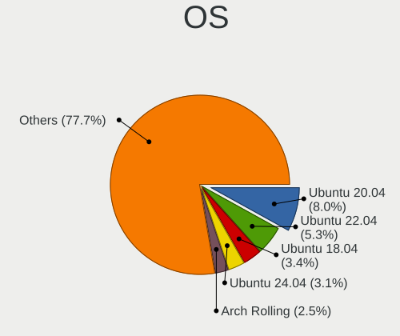

| Name                         | Computers | Percent |
|------------------------------|-----------|---------|
| Ubuntu 20.04                 | 2937      | 8.03%   |
| Ubuntu 22.04                 | 1940      | 5.31%   |
| Ubuntu 18.04                 | 1255      | 3.43%   |
| Ubuntu 24.04                 | 1122      | 3.07%   |
| Arch Rolling                 | 896       | 2.45%   |
| Debian 12                    | 888       | 2.43%   |
| Debian 11                    | 692       | 1.89%   |
| Linux Mint 22.1              | 681       | 1.86%   |
| Linux Mint 20.3              | 627       | 1.72%   |
| OpenMandriva 4.2             | 587       | 1.61%   |
| Linux Mint 20.2              | 577       | 1.58%   |
| OpenMandriva 4.3             | 558       | 1.53%   |
| Manjaro                      | 557       | 1.52%   |
| Linux Mint 22.2              | 538       | 1.47%   |
| Pop!_OS 22.04                | 530       | 1.45%   |
| Zorin 17                     | 525       | 1.44%   |
| Linux Mint 21.1              | 507       | 1.39%   |
| Linux Mint 21.2              | 468       | 1.28%   |
| Zorin 16                     | 442       | 1.21%   |
| openSUSE Tumbleweed-XXXXXXXX | 421       | 1.15%   |
| Linux Mint 21.3              | 386       | 1.06%   |
| Linux Mint 20.1              | 367       | 1%      |
| Ubuntu 20.10                 | 347       | 0.95%   |
| Ubuntu 21.10                 | 346       | 0.95%   |
| Fedora 40                    | 308       | 0.84%   |
| Linux Mint 20                | 297       | 0.81%   |
| Linux Mint 22                | 296       | 0.81%   |
| Linux Mint 19.3              | 292       | 0.8%    |
| Arch                         | 287       | 0.79%   |
| Xubuntu 20.04                | 271       | 0.74%   |
| Fedora 41                    | 271       | 0.74%   |
| ArcoLinux Rolling            | 258       | 0.71%   |
| Fedora 42                    | 257       | 0.7%    |
| Fedora 39                    | 257       | 0.7%    |
| KDE neon 20.04               | 253       | 0.69%   |
| EndeavourOS Rolling          | 249       | 0.68%   |
| OpenMandriva 23.08           | 248       | 0.68%   |
| Ubuntu 21.04                 | 239       | 0.65%   |
| Fedora 38                    | 234       | 0.64%   |
| OpenMandriva 24.12           | 233       | 0.64%   |

OS Family
---------

OS without a version

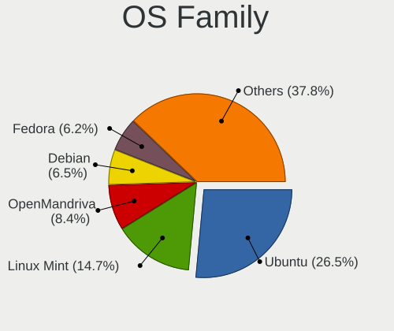

| Name          | Computers | Percent |
|---------------|-----------|---------|
| Ubuntu        | 8953      | 26.47%  |
| Linux Mint    | 4961      | 14.67%  |
| OpenMandriva  | 2827      | 8.36%   |
| Debian        | 2195      | 6.49%   |
| Fedora        | 2088      | 6.17%   |
| Zorin         | 1214      | 3.59%   |
| Arch          | 1161      | 3.43%   |
| Manjaro       | 1135      | 3.36%   |
| Pop!_OS       | 973       | 2.88%   |
| openSUSE      | 789       | 2.33%   |
| Kubuntu       | 782       | 2.31%   |
| Xubuntu       | 640       | 1.89%   |
| KDE neon      | 446       | 1.32%   |
| ROSA          | 408       | 1.21%   |
| Elementary    | 320       | 0.95%   |
| LMDE          | 304       | 0.9%    |
| Gentoo        | 283       | 0.84%   |
| Bazzite       | 278       | 0.82%   |
| ArcoLinux     | 278       | 0.82%   |
| EndeavourOS   | 265       | 0.78%   |
| Ubuntu MATE   | 235       | 0.69%   |
| SteamOS       | 222       | 0.66%   |
| Nobara        | 199       | 0.59%   |
| Kali          | 196       | 0.58%   |
| MX            | 181       | 0.54%   |
| Lubuntu       | 170       | 0.5%    |
| TUXEDO OS     | 169       | 0.5%    |
| BlackPanther  | 169       | 0.5%    |
| Endless       | 156       | 0.46%   |
| CachyOS       | 156       | 0.46%   |
| NixOS         | 144       | 0.43%   |
| Ubuntu Unity  | 130       | 0.38%   |
| Ubuntu Budgie | 111       | 0.33%   |
| Garuda Linux  | 107       | 0.32%   |
| Raspbian      | 70        | 0.21%   |
| CentOS        | 63        | 0.19%   |
| Clear Linux   | 53        | 0.16%   |
| Xero          | 50        | 0.15%   |
| Parrot        | 47        | 0.14%   |
| Alpine        | 44        | 0.13%   |

Kernel
------

Version of the Linux kernel

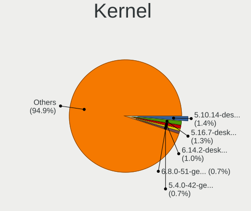

| Version                  | Computers | Percent |
|--------------------------|-----------|---------|
| 5.10.14-desktop-1omv4002 | 561       | 1.36%   |
| 5.16.7-desktop-1omv4003  | 523       | 1.27%   |
| 6.14.2-desktop-3omv2590  | 398       | 0.96%   |
| 6.8.0-51-generic         | 308       | 0.75%   |
| 5.4.0-42-generic         | 303       | 0.73%   |
| 5.15.0-56-generic        | 278       | 0.67%   |
| 5.4.0-58-generic         | 229       | 0.55%   |
| 6.4.11-desktop-1omv2390  | 222       | 0.54%   |
| 6.8.0-52-generic         | 208       | 0.5%    |
| 6.2.6-desktop-1omv2390   | 205       | 0.5%    |
| 6.12.1-desktop-1omv2490  | 202       | 0.49%   |
| 5.15.0-58-generic        | 202       | 0.49%   |
| 6.8.0-45-generic         | 193       | 0.47%   |
| 5.15.0-91-generic        | 186       | 0.45%   |
| 6.1.1-desktop-1omv2290   | 183       | 0.44%   |
| 5.4.0-91-generic         | 182       | 0.44%   |
| 5.4.0-52-generic         | 178       | 0.43%   |
| 6.14.0-33-generic        | 175       | 0.42%   |
| 5.4.0-48-generic         | 175       | 0.42%   |
| 6.8.0-60-generic         | 174       | 0.42%   |
| 6.6.2-desktop-1omv2390   | 172       | 0.42%   |
| 6.14.0-37-generic        | 150       | 0.36%   |
| 5.15.0-52-generic        | 145       | 0.35%   |
| 6.8.0-40-generic         | 143       | 0.35%   |
| 5.15.0-48-generic        | 143       | 0.35%   |
| 5.4.0-26-generic         | 141       | 0.34%   |
| 5.19.0-35-generic        | 141       | 0.34%   |
| 5.15.0-60-generic        | 141       | 0.34%   |
| 6.5.0-14-generic         | 139       | 0.34%   |
| 5.15.0-46-generic        | 139       | 0.34%   |
| 6.8.0-49-generic         | 138       | 0.33%   |
| 6.8.0-48-generic         | 131       | 0.32%   |
| 6.14.0-36-generic        | 131       | 0.32%   |
| 5.15.0-67-generic        | 128       | 0.31%   |
| 6.2.0-39-generic         | 124       | 0.3%    |
| 6.2.0-26-generic         | 124       | 0.3%    |
| 6.14.0-29-generic        | 123       | 0.3%    |
| 5.15.0-76-generic        | 119       | 0.29%   |
| 5.11.0-27-generic        | 119       | 0.29%   |
| 5.8.0-43-generic         | 118       | 0.29%   |

Kernel Family
-------------

Linux kernel without a distro release

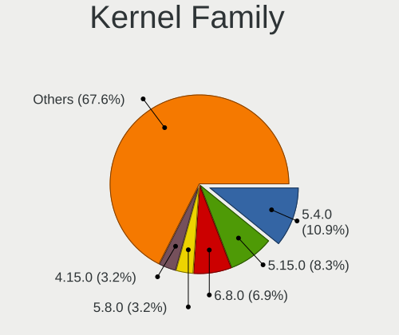

| Version | Computers | Percent |
|---------|-----------|---------|
| 5.4.0   | 4124      | 10.86%  |
| 5.15.0  | 3161      | 8.33%   |
| 6.8.0   | 2626      | 6.92%   |
| 5.8.0   | 1206      | 3.18%   |
| 4.15.0  | 1197      | 3.15%   |
| 5.11.0  | 1144      | 3.01%   |
| 5.13.0  | 1133      | 2.98%   |
| 6.5.0   | 1056      | 2.78%   |
| 6.14.0  | 1019      | 2.68%   |
| 6.1.0   | 993       | 2.62%   |
| 6.2.0   | 842       | 2.22%   |
| 5.19.0  | 829       | 2.18%   |
| 5.10.0  | 723       | 1.9%    |
| 5.3.0   | 701       | 1.85%   |
| 6.11.0  | 586       | 1.54%   |
| 5.10.14 | 566       | 1.49%   |
| 5.16.7  | 532       | 1.4%    |
| 5.0.0   | 486       | 1.28%   |
| 6.14.2  | 434       | 1.14%   |
| 4.18.0  | 377       | 0.99%   |
| 6.2.6   | 285       | 0.75%   |
| 6.4.11  | 245       | 0.65%   |
| 6.12.1  | 239       | 0.63%   |
| 6.1.1   | 204       | 0.54%   |
| 6.6.2   | 203       | 0.53%   |
| 4.19.0  | 182       | 0.48%   |
| 5.14.21 | 148       | 0.39%   |
| 6.9.3   | 139       | 0.37%   |
| 6.17.7  | 126       | 0.33%   |
| 6.4.0   | 121       | 0.32%   |
| 4.18.16 | 117       | 0.31%   |
| 6.10.0  | 111       | 0.29%   |
| 5.14.0  | 106       | 0.28%   |
| 6.16.4  | 102       | 0.27%   |
| 6.12.10 | 102       | 0.27%   |
| 6.0.0   | 90        | 0.24%   |
| 6.17.0  | 85        | 0.22%   |
| 6.5.6   | 83        | 0.22%   |
| 6.17.9  | 78        | 0.21%   |
| 6.12.57 | 78        | 0.21%   |

Kernel Major Ver.
-----------------

Linux kernel major version

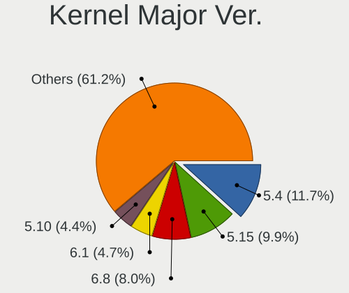

| Version | Computers | Percent |
|---------|-----------|---------|
| 5.4     | 4380      | 11.72%  |
| 5.15    | 3696      | 9.89%   |
| 6.8     | 2996      | 8.02%   |
| 6.1     | 1775      | 4.75%   |
| 5.10    | 1662      | 4.45%   |
| 6.14    | 1652      | 4.42%   |
| 5.8     | 1438      | 3.85%   |
| 6.5     | 1417      | 3.79%   |
| 5.11    | 1369      | 3.66%   |
| 6.2     | 1350      | 3.61%   |
| 5.13    | 1298      | 3.47%   |
| 4.15    | 1206      | 3.23%   |
| 6.12    | 1148      | 3.07%   |
| 5.19    | 1031      | 2.76%   |
| 6.11    | 923       | 2.47%   |
| 6.6     | 869       | 2.33%   |
| 5.3     | 840       | 2.25%   |
| 5.16    | 788       | 2.11%   |
| 6.4     | 630       | 1.69%   |
| 5.0     | 509       | 1.36%   |
| 4.18    | 508       | 1.36%   |
| 6.17    | 502       | 1.34%   |
| 6.10    | 429       | 1.15%   |
| 6.9     | 410       | 1.1%    |
| 5.14    | 381       | 1.02%   |
| 6.0     | 370       | 0.99%   |
| 6.16    | 319       | 0.85%   |
| 6.15    | 318       | 0.85%   |
| 6.13    | 281       | 0.75%   |
| 5.9     | 273       | 0.73%   |
| 6.7     | 269       | 0.72%   |
| 6.3     | 264       | 0.71%   |
| 5.18    | 249       | 0.67%   |
| 4.9     | 244       | 0.65%   |
| 5.6     | 242       | 0.65%   |
| 4.19    | 233       | 0.62%   |
| 5.17    | 223       | 0.6%    |
| 5.12    | 168       | 0.45%   |
| 5.7     | 151       | 0.4%    |
| 5.5     | 100       | 0.27%   |

Arch
----

OS architecture (x86_64, i586, etc.)

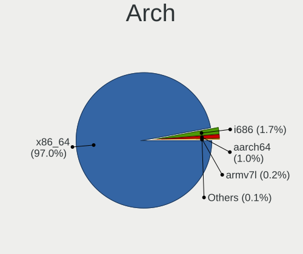

| Name     | Computers | Percent |
|----------|-----------|---------|
| x86_64   | 31426     | 97.05%  |
| i686     | 543       | 1.68%   |
| aarch64  | 311       | 0.96%   |
| armv7l   | 70        | 0.22%   |
| armv6l   | 13        | 0.04%   |
| riscv64  | 7         | 0.02%   |
| ppc      | 5         | 0.02%   |
| i586     | 2         | 0.01%   |
| armv8l   | 2         | 0.01%   |
| armv5tel | 2         | 0.01%   |
| mips     | 1         | 0.003%  |

DE
--

Desktop Environment

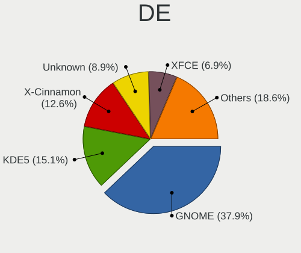

| Name             | Computers | Percent |
|------------------|-----------|---------|
| GNOME            | 12971     | 37.93%  |
| KDE5             | 5171      | 15.12%  |
| X-Cinnamon       | 4294      | 12.56%  |
| Unknown          | 3054      | 8.93%   |
| XFCE             | 2346      | 6.86%   |
| KDE6             | 2206      | 6.45%   |
| MATE             | 926       | 2.71%   |
| KDE              | 637       | 1.86%   |
| Cinnamon         | 383       | 1.12%   |
| LXQt             | 344       | 1.01%   |
| Pantheon         | 319       | 0.93%   |
| KDE4             | 244       | 0.71%   |
| Budgie           | 170       | 0.5%    |
| i3               | 166       | 0.49%   |
| LXDE             | 164       | 0.48%   |
| Unity            | 135       | 0.39%   |
| Hyprland         | 116       | 0.34%   |
| sway             | 65        | 0.19%   |
| GNOME Flashback  | 51        | 0.15%   |
| GNOME Classic    | 47        | 0.14%   |
| Deepin           | 42        | 0.12%   |
| COSMIC           | 36        | 0.11%   |
| openbox          | 35        | 0.1%    |
| awesome          | 30        | 0.09%   |
| lightdm-xsession | 25        | 0.07%   |
| ICEWM            | 19        | 0.06%   |
| labwc:wlroots    | 15        | 0.04%   |
| Endless:GNOME    | 15        | 0.04%   |
| Enlightenment    | 13        | 0.04%   |
| bspwm            | 13        | 0.04%   |
| dwm              | 12        | 0.04%   |
| Trinity          | 11        | 0.03%   |
| qtile            | 11        | 0.03%   |
| niri             | 10        | 0.03%   |
| xmonad           | 9         | 0.03%   |
| chadwm           | 9         | 0.03%   |
| herbstluftwm     | 8         | 0.02%   |
| fluxbox          | 7         | 0.02%   |
| leftwm           | 5         | 0.01%   |
| Phosh:GNOME      | 4         | 0.01%   |

Display Server
--------------

X11 or Wayland

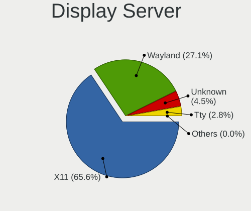

| Name        | Computers | Percent |
|-------------|-----------|---------|
| X11         | 22136     | 65.62%  |
| Wayland     | 9129      | 27.06%  |
| Unknown     | 1523      | 4.51%   |
| Tty         | 939       | 2.78%   |
| Web         | 6         | 0.02%   |
| Unspecified | 3         | 0.01%   |

Display Manager
---------------

SDDM, LightDM, etc.

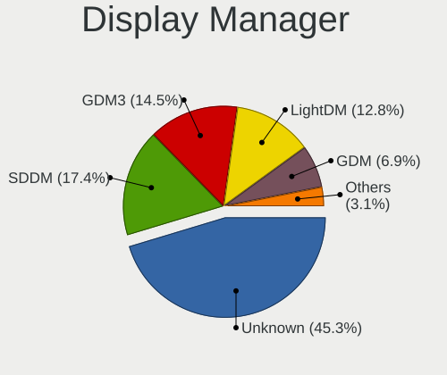

| Name                  | Computers | Percent |
|-----------------------|-----------|---------|
| Unknown               | 15358     | 45.33%  |
| SDDM                  | 5882      | 17.36%  |
| GDM3                  | 4923      | 14.53%  |
| LightDM               | 4329      | 12.78%  |
| GDM                   | 2333      | 6.89%   |
| TDM                   | 645       | 1.9%    |
| KDM                   | 208       | 0.61%   |
| XDM                   | 43        | 0.13%   |
| SLiM                  | 43        | 0.13%   |
| GREETD                | 28        | 0.08%   |
| LXDM                  | 20        | 0.06%   |
| LY-DM                 | 14        | 0.04%   |
| SLIMSKI               | 13        | 0.04%   |
| NODM                  | 12        | 0.04%   |
| COSMIC-GREETER        | 9         | 0.03%   |
| MDM                   | 6         | 0.02%   |
| Ly                    | 5         | 0.01%   |
| WDM                   | 2         | 0.01%   |
| TINYDM-RUN-SESSION    | 2         | 0.01%   |
| LEMURS                | 1         | 0.003%  |
| FLY-DM                | 1         | 0.003%  |
| EMPTTY                | 1         | 0.003%  |
| DISPLAY-MANAGER-START | 1         | 0.003%  |

OS Lang
-------

Language

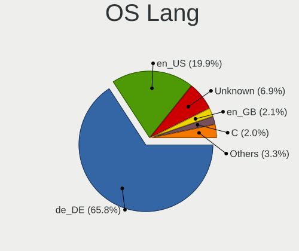

| Lang       | Computers | Percent |
|------------|-----------|---------|
| de_DE      | 21807     | 65.81%  |
| en_US      | 6610      | 19.95%  |
| Unknown    | 2279      | 6.88%   |
| en_GB      | 704       | 2.12%   |
| C          | 647       | 1.95%   |
| ru_RU      | 173       | 0.52%   |
| pl_PL      | 94        | 0.28%   |
| POSIX      | 90        | 0.27%   |
| en_DE      | 66        | 0.2%    |
| it_IT      | 56        | 0.17%   |
| fr_FR      | 53        | 0.16%   |
| es_ES      | 44        | 0.13%   |
| de_AT      | 41        | 0.12%   |
| hu_HU      | 38        | 0.11%   |
| C.UTF8     | 33        | 0.1%    |
| en_IE      | 30        | 0.09%   |
| en_DK      | 25        | 0.08%   |
| de_CH      | 25        | 0.08%   |
| ro_RO      | 21        | 0.06%   |
| nl_NL      | 21        | 0.06%   |
| en_CA      | 19        | 0.06%   |
| uk_UA      | 17        | 0.05%   |
| tr_TR      | 13        | 0.04%   |
| ru_UA      | 13        | 0.04%   |
| en_AU      | 12        | 0.04%   |
| de_BE      | 12        | 0.04%   |
| en_IN      | 11        | 0.03%   |
| de_IT      | 9         | 0.03%   |
| bg_BG      | 9         | 0.03%   |
| en_AG      | 8         | 0.02%   |
| pt_BR      | 7         | 0.02%   |
| el_GR      | 7         | 0.02%   |
| de_DE.UTF8 | 7         | 0.02%   |
| cs_CZ      | 7         | 0.02%   |
| zh_CN      | 6         | 0.02%   |
| sk_SK      | 6         | 0.02%   |
| pt_PT      | 6         | 0.02%   |
| hr_HR      | 6         | 0.02%   |
| de_LI      | 5         | 0.02%   |
| de_DE@euro | 5         | 0.02%   |

Boot Mode
---------

EFI or BIOS

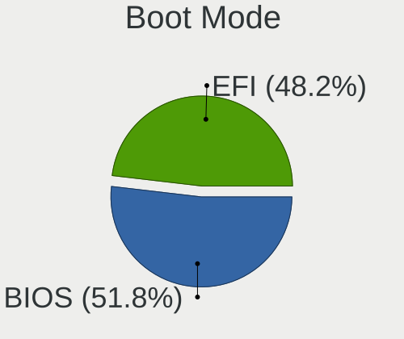

| Mode | Computers | Percent |
|------|-----------|---------|
| BIOS | 17267     | 51.85%  |
| EFI  | 16035     | 48.15%  |

Filesystem
----------

Type of filesystem

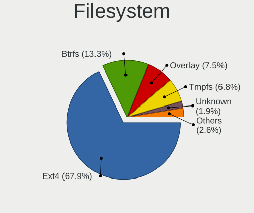

| Type          | Computers | Percent |
|---------------|-----------|---------|
| Ext4          | 22830     | 67.9%   |
| Btrfs         | 4468      | 13.29%  |
| Overlay       | 2520      | 7.49%   |
| Tmpfs         | 2288      | 6.8%    |
| Unknown       | 630       | 1.87%   |
| Xfs           | 373       | 1.11%   |
| Zfs           | 265       | 0.79%   |
| Ext2          | 82        | 0.24%   |
| Ext3          | 67        | 0.2%    |
| F2fs          | 55        | 0.16%   |
| Rootfs        | 14        | 0.04%   |
| Reiserfs      | 7         | 0.02%   |
| Aufs          | 7         | 0.02%   |
| XXXXXXX       | 3         | 0.01%   |
| XXX4          | 3         | 0.01%   |
| Jfs           | 3         | 0.01%   |
| Bcachefs      | 3         | 0.01%   |
| XXXXX         | 1         | 0.003%  |
| XXXX          | 1         | 0.003%  |
| XXXfs         | 1         | 0.003%  |
| OveXlay       | 1         | 0.003%  |
| Ntfs          | 1         | 0.003%  |
| Fuse.snapfuse | 1         | 0.003%  |

Part. scheme
------------

Scheme of partitioning

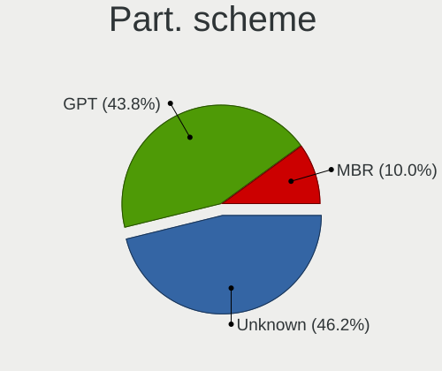

| Type    | Computers | Percent |
|---------|-----------|---------|
| Unknown | 15463     | 46.17%  |
| GPT     | 14676     | 43.82%  |
| MBR     | 3356      | 10.02%  |

Dual Boot with Linux/BSD
------------------------

Hosting more than one Linux/BSD

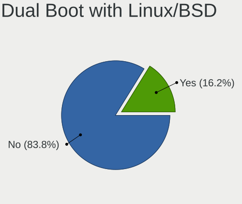

| Dual boot | Computers | Percent |
|-----------|-----------|---------|
| No        | 27854     | 83.84%  |
| Yes       | 5368      | 16.16%  |

Dual Boot (Win)
---------------

Hosting Linux and Windows

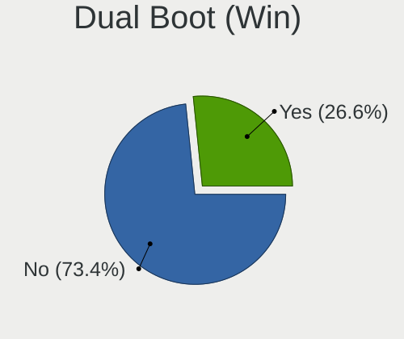

| Dual boot | Computers | Percent |
|-----------|-----------|---------|
| No        | 24282     | 73.39%  |
| Yes       | 8806      | 26.61%  |

Board
-----

Vendor
------

Motherboard manufacturer

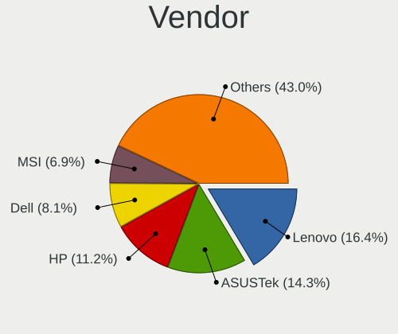

| Name                                 | Computers | Percent |
|--------------------------------------|-----------|---------|
| Lenovo                               | 5313      | 16.41%  |
| ASUSTek Computer                     | 4635      | 14.32%  |
| Hewlett-Packard                      | 3639      | 11.24%  |
| Dell                                 | 2634      | 8.14%   |
| MSI                                  | 2239      | 6.92%   |
| Gigabyte Technology                  | 2121      | 6.55%   |
| Acer                                 | 1943      | 6%      |
| ASRock                               | 1506      | 4.65%   |
| Fujitsu                              | 1009      | 3.12%   |
| Medion                               | 796       | 2.46%   |
| Apple                                | 793       | 2.45%   |
| Toshiba                              | 386       | 1.19%   |
| TUXEDO                               | 361       | 1.12%   |
| Intel                                | 356       | 1.1%    |
| Unknown                              | 337       | 1.04%   |
| Samsung Electronics                  | 307       | 0.95%   |
| Raspberry Pi Foundation              | 270       | 0.83%   |
| Sony                                 | 233       | 0.72%   |
| HUAWEI                               | 211       | 0.65%   |
| Fujitsu Siemens                      | 206       | 0.64%   |
| Valve                                | 202       | 0.62%   |
| Packard Bell                         | 148       | 0.46%   |
| Notebook                             | 148       | 0.46%   |
| Microsoft                            | 134       | 0.41%   |
| Schenker                             | 125       | 0.39%   |
| Biostar                              | 119       | 0.37%   |
| Supermicro                           | 107       | 0.33%   |
| Wortmann AG                          | 96        | 0.3%    |
| Framework                            | 88        | 0.27%   |
| Shenzhen Meigao Electronic Equipment | 77        | 0.24%   |
| BESSTAR Tech                         | 76        | 0.23%   |
| Foxconn                              | 73        | 0.23%   |
| ZOTAC                                | 67        | 0.21%   |
| Google                               | 60        | 0.19%   |
| Shuttle                              | 58        | 0.18%   |
| AZW                                  | 56        | 0.17%   |
| AMI                                  | 54        | 0.17%   |
| Pegatron                             | 49        | 0.15%   |
| GEEKOM                               | 49        | 0.15%   |
| TrekStor                             | 48        | 0.15%   |

Model
-----

Motherboard model

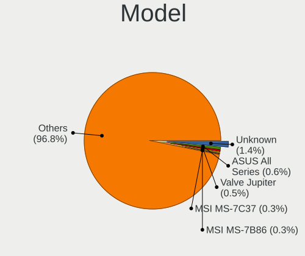

| Name                          | Computers | Percent |
|-------------------------------|-----------|---------|
| Unknown                       | 466       | 1.44%   |
| ASUS All Series               | 200       | 0.62%   |
| Valve Jupiter                 | 168       | 0.52%   |
| MSI MS-7C37                   | 105       | 0.32%   |
| MSI MS-7B86                   | 95        | 0.29%   |
| MSI MS-7C56                   | 91        | 0.28%   |
| RPi Raspberry Pi              | 75        | 0.23%   |
| HP Notebook                   | 71        | 0.22%   |
| MSI MS-7A38                   | 67        | 0.21%   |
| ASUS PRIME A320M-K            | 62        | 0.19%   |
| MSI MS-7C91                   | 59        | 0.18%   |
| MSI MS-7C02                   | 55        | 0.17%   |
| ASRock B450M Pro4             | 53        | 0.16%   |
| ASUS ROG STRIX B550-F GAMING  | 49        | 0.15%   |
| Gigabyte X570 AORUS ELITE     | 48        | 0.15%   |
| ASUS A0000001                 | 48        | 0.15%   |
| MSI MS-7B89                   | 47        | 0.15%   |
| MSI MS-7B79                   | 47        | 0.15%   |
| ASUS PRIME B350-PLUS          | 46        | 0.14%   |
| Dell OptiPlex 7010            | 43        | 0.13%   |
| ASUS PRIME X370-PRO           | 43        | 0.13%   |
| ASUS M5A78L-M/USB3            | 43        | 0.13%   |
| Supermicro Super Server       | 40        | 0.12%   |
| Gigabyte B550 AORUS ELITE V2  | 39        | 0.12%   |
| Apple MacBookAir7,2           | 39        | 0.12%   |
| Lenovo IdeaPad 5 15ARE05 81YQ | 38        | 0.12%   |
| HP Laptop 15s-eq2xxx          | 38        | 0.12%   |
| ASUS A68HM-PLUS               | 38        | 0.12%   |
| Gigabyte 970A-DS3P            | 37        | 0.11%   |
| Dell OptiPlex 790             | 36        | 0.11%   |
| ASUS TUF Gaming B550-PLUS     | 36        | 0.11%   |
| HP Pavilion 17                | 35        | 0.11%   |
| HP 255 G7 Notebook PC         | 35        | 0.11%   |
| Apple MacBookPro9,2           | 35        | 0.11%   |
| Apple MacBookPro12,1          | 35        | 0.11%   |
| Valve Galileo                 | 34        | 0.11%   |
| ASRock B450 Pro4              | 34        | 0.11%   |
| MSI MS-7C52                   | 33        | 0.1%    |
| ASUS TUF Gaming X570-PLUS     | 33        | 0.1%    |
| Dell Latitude E6430           | 32        | 0.1%    |

Model Family
------------

Motherboard model prefix

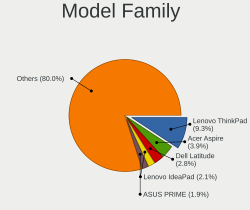

| Name               | Computers | Percent |
|--------------------|-----------|---------|
| Lenovo ThinkPad    | 3005      | 9.28%   |
| Acer Aspire        | 1275      | 3.94%   |
| Dell Latitude      | 917       | 2.83%   |
| Lenovo IdeaPad     | 670       | 2.07%   |
| ASUS PRIME         | 618       | 1.91%   |
| HP EliteBook       | 612       | 1.89%   |
| ASUS ROG           | 602       | 1.86%   |
| Unknown            | 466       | 1.44%   |
| HP Pavilion        | 447       | 1.38%   |
| HP Laptop          | 424       | 1.31%   |
| Fujitsu LIFEBOOK   | 420       | 1.3%    |
| Fujitsu ESPRIMO    | 381       | 1.18%   |
| Dell OptiPlex      | 376       | 1.16%   |
| Dell Precision     | 360       | 1.11%   |
| Dell XPS           | 346       | 1.07%   |
| HP ProBook         | 330       | 1.02%   |
| Dell Inspiron      | 318       | 0.98%   |
| Toshiba Satellite  | 317       | 0.98%   |
| HP Compaq          | 305       | 0.94%   |
| Lenovo ThinkCentre | 287       | 0.89%   |
| ASUS TUF           | 274       | 0.85%   |
| RPi Raspberry      | 268       | 0.83%   |
| Lenovo Yoga        | 241       | 0.74%   |
| ASUS VivoBook      | 231       | 0.71%   |
| ASUS All           | 200       | 0.62%   |
| HP ENVY            | 177       | 0.55%   |
| Valve Jupiter      | 168       | 0.52%   |
| Acer Swift         | 153       | 0.47%   |
| HP EliteDesk       | 152       | 0.47%   |
| Microsoft Surface  | 134       | 0.41%   |
| Acer TravelMate    | 132       | 0.41%   |
| Medion Akoya       | 118       | 0.36%   |
| Lenovo Legion      | 118       | 0.36%   |
| ASUS M5A78L-M      | 118       | 0.36%   |
| HP 255             | 116       | 0.36%   |
| Gigabyte X570      | 115       | 0.36%   |
| Gigabyte B550      | 115       | 0.36%   |
| HP ZBook           | 111       | 0.34%   |
| ASUS ZenBook       | 109       | 0.34%   |
| MSI MS-7C37        | 105       | 0.32%   |

MFG Year
--------

Motherboard manufacture year

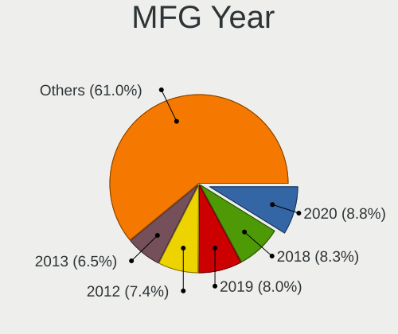

| Year    | Computers | Percent |
|---------|-----------|---------|
| 2020    | 2858      | 8.83%   |
| 2018    | 2695      | 8.33%   |
| 2019    | 2576      | 7.96%   |
| 2012    | 2391      | 7.39%   |
| 2013    | 2115      | 6.53%   |
| 2021    | 2065      | 6.38%   |
| 2011    | 2042      | 6.31%   |
| 2017    | 1987      | 6.14%   |
| 2014    | 1773      | 5.48%   |
| 2022    | 1578      | 4.87%   |
| 2010    | 1493      | 4.61%   |
| 2015    | 1485      | 4.59%   |
| 2016    | 1450      | 4.48%   |
| 2023    | 1190      | 3.68%   |
| 2009    | 1180      | 3.65%   |
| 2008    | 1065      | 3.29%   |
| 2024    | 795       | 2.46%   |
| 2007    | 563       | 1.74%   |
| Unknown | 373       | 1.15%   |
| 2006    | 297       | 0.92%   |
| 2025    | 246       | 0.76%   |
| 2005    | 97        | 0.3%    |
| 2004    | 29        | 0.09%   |
| 2003    | 15        | 0.05%   |
| 2002    | 6         | 0.02%   |
| 2000    | 5         | 0.02%   |
| 2001    | 1         | 0.003%  |
| 1999    | 1         | 0.003%  |

Form Factor
-----------

Physical design of the computer

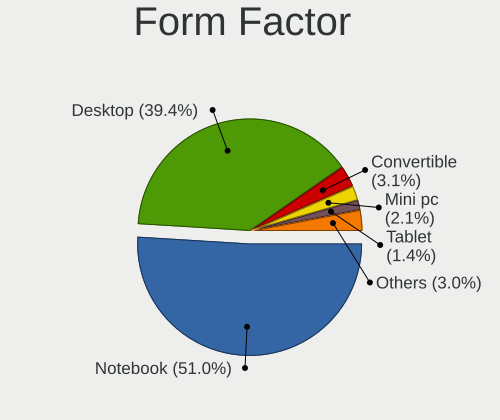

| Name           | Computers | Percent |
|----------------|-----------|---------|
| Notebook       | 16501     | 50.97%  |
| Desktop        | 12747     | 39.38%  |
| Convertible    | 1005      | 3.1%    |
| Mini pc        | 676       | 2.09%   |
| Tablet         | 462       | 1.43%   |
| System on chip | 359       | 1.11%   |
| All in one     | 350       | 1.08%   |
| Server         | 252       | 0.78%   |
| Phone          | 12        | 0.04%   |
| Other          | 4         | 0.01%   |
| Stick pc       | 2         | 0.01%   |
| Firewall       | 1         | 0.003%  |

Secure Boot
-----------

Enabled or disabled

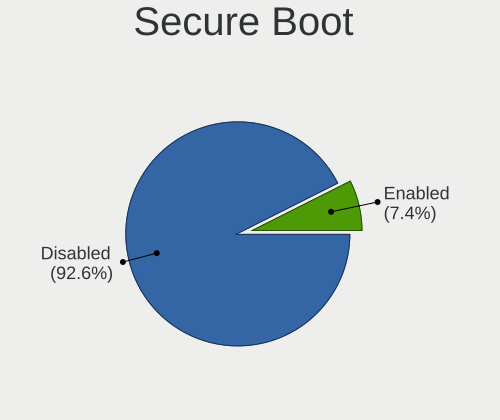

| State    | Computers | Percent |
|----------|-----------|---------|
| Disabled | 30240     | 92.58%  |
| Enabled  | 2422      | 7.42%   |

Coreboot
--------

Have coreboot on board

| Used | Computers | Percent |
|------|-----------|---------|
| No   | 32249     | 99.62%  |
| Yes  | 122       | 0.38%   |

RAM Size
--------

Total RAM memory

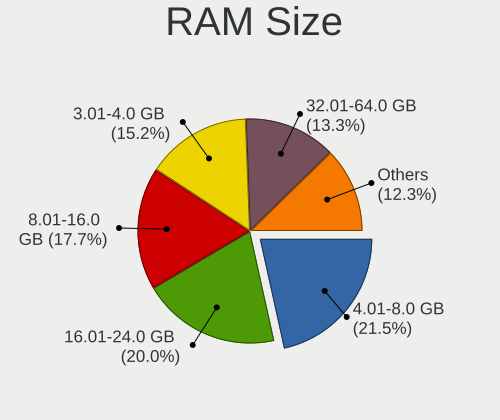

| Size in GB      | Computers | Percent |
|-----------------|-----------|---------|
| 4.01-8.0        | 7115      | 21.53%  |
| 16.01-24.0      | 6602      | 19.98%  |
| 8.01-16.0       | 5847      | 17.7%   |
| 3.01-4.0        | 5020      | 15.19%  |
| 32.01-64.0      | 4389      | 13.28%  |
| 64.01-256.0     | 1509      | 4.57%   |
| 24.01-32.0      | 1089      | 3.3%    |
| 1.01-2.0        | 815       | 2.47%   |
| 2.01-3.0        | 368       | 1.11%   |
| 0.51-1.0        | 182       | 0.55%   |
| More than 256.0 | 63        | 0.19%   |
| 0.01-0.5        | 36        | 0.11%   |
| Unknown         | 5         | 0.02%   |

RAM Used
--------

Used RAM memory

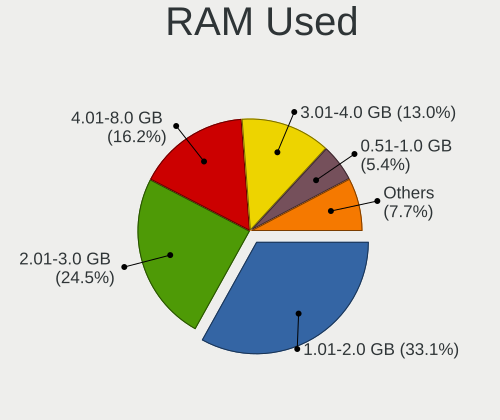

| Used GB         | Computers | Percent |
|-----------------|-----------|---------|
| 1.01-2.0        | 12139     | 33.07%  |
| 2.01-3.0        | 9000      | 24.52%  |
| 4.01-8.0        | 5952      | 16.22%  |
| 3.01-4.0        | 4786      | 13.04%  |
| 0.51-1.0        | 1999      | 5.45%   |
| 8.01-16.0       | 1788      | 4.87%   |
| 0.01-0.5        | 485       | 1.32%   |
| 16.01-24.0      | 310       | 0.84%   |
| 24.01-32.0      | 105       | 0.29%   |
| 32.01-64.0      | 93        | 0.25%   |
| 64.01-256.0     | 28        | 0.08%   |
| Unknown         | 9         | 0.02%   |
| 0               | 7         | 0.02%   |
| More than 256.0 | 3         | 0.01%   |

Total Drives
------------

Number of drives on board

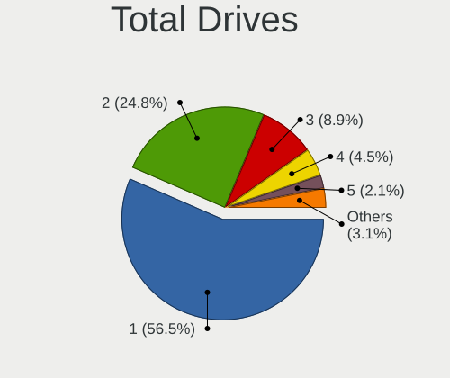

| Drives  | Computers | Percent |
|---------|-----------|---------|
| 1       | 19085     | 56.53%  |
| 2       | 8372      | 24.8%   |
| 3       | 3014      | 8.93%   |
| 4       | 1515      | 4.49%   |
| 5       | 714       | 2.11%   |
| 6       | 354       | 1.05%   |
| 0       | 302       | 0.89%   |
| 7       | 178       | 0.53%   |
| 8       | 82        | 0.24%   |
| 9       | 45        | 0.13%   |
| 10      | 23        | 0.07%   |
| 11      | 15        | 0.04%   |
| Unknown | 12        | 0.04%   |
| 13      | 11        | 0.03%   |
| 12      | 11        | 0.03%   |
| 17      | 7         | 0.02%   |
| 14      | 6         | 0.02%   |
| 16      | 3         | 0.01%   |
| 33      | 2         | 0.01%   |
| 25      | 2         | 0.01%   |
| 79      | 1         | 0.003%  |
| 56      | 1         | 0.003%  |
| 32      | 1         | 0.003%  |
| 30      | 1         | 0.003%  |
| 29      | 1         | 0.003%  |
| 24      | 1         | 0.003%  |
| 23      | 1         | 0.003%  |
| 22      | 1         | 0.003%  |
| 20      | 1         | 0.003%  |

Has CD-ROM
----------

Has CD-ROM on board

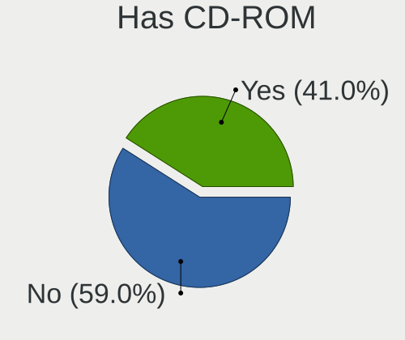

| Presented | Computers | Percent |
|-----------|-----------|---------|
| No        | 19308     | 59.04%  |
| Yes       | 13398     | 40.96%  |

Has Ethernet
------------

Has Ethernet on board

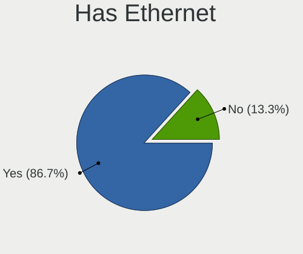

| Presented | Computers | Percent |
|-----------|-----------|---------|
| Yes       | 28200     | 86.73%  |
| No        | 4313      | 13.27%  |

Has WiFi
--------

Has WiFi module

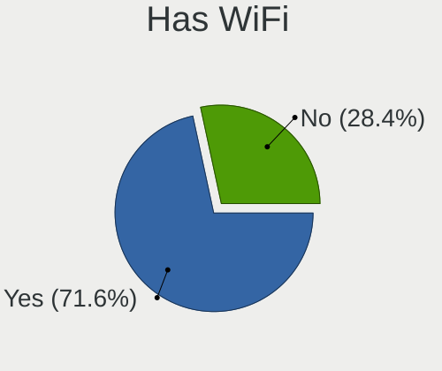

| Presented | Computers | Percent |
|-----------|-----------|---------|
| Yes       | 23381     | 71.62%  |
| No        | 9263      | 28.38%  |

Has Bluetooth
-------------

Has Bluetooth module

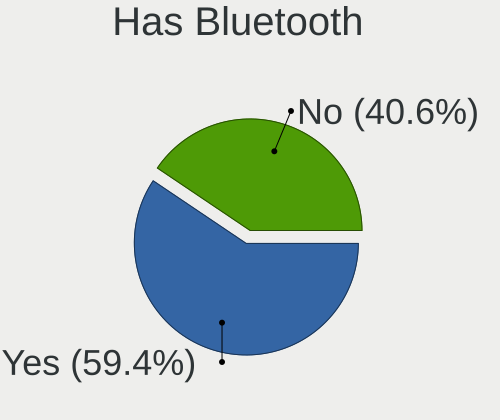

| Presented | Computers | Percent |
|-----------|-----------|---------|
| Yes       | 19579     | 59.43%  |
| No        | 13365     | 40.57%  |

Location
--------

Country
-------

Geographic location (country)

| Country | Computers | Percent |
|---------|-----------|---------|
| Germany | 32371     | 100%    |

City
----

Geographic location (city)

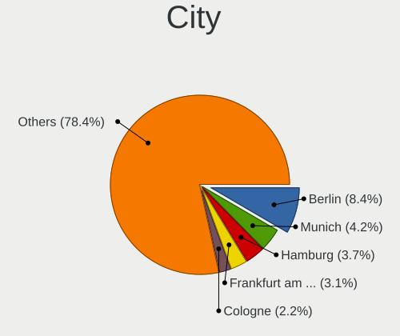

| City                  | Computers | Percent |
|-----------------------|-----------|---------|
| Berlin                | 2973      | 8.4%    |
| Munich                | 1486      | 4.2%    |
| Hamburg               | 1303      | 3.68%   |
| Frankfurt am Main     | 1096      | 3.1%    |
| Cologne               | 769       | 2.17%   |
| Stuttgart             | 668       | 1.89%   |
| Leipzig               | 543       | 1.53%   |
| Düsseldorf           | 445       | 1.26%   |
| Nuremberg             | 441       | 1.25%   |
| Dresden               | 399       | 1.13%   |
| Essen                 | 388       | 1.1%    |
| Mannheim              | 338       | 0.96%   |
| Hanover               | 331       | 0.94%   |
| Karlsruhe             | 312       | 0.88%   |
| Dortmund              | 304       | 0.86%   |
| Bremen                | 259       | 0.73%   |
| Bonn                  | 247       | 0.7%    |
| Duisburg              | 227       | 0.64%   |
| Bochum                | 204       | 0.58%   |
| Darmstadt             | 203       | 0.57%   |
| Augsburg              | 201       | 0.57%   |
| Wuppertal             | 199       | 0.56%   |
| Braunschweig          | 176       | 0.5%    |
| Bielefeld             | 175       | 0.49%   |
| Mainz                 | 160       | 0.45%   |
| Aachen                | 160       | 0.45%   |
| Münster              | 159       | 0.45%   |
| Wiesbaden             | 147       | 0.42%   |
| Reutlingen            | 143       | 0.4%    |
| Chemnitz              | 136       | 0.38%   |
| Regensburg            | 131       | 0.37%   |
| Kiel                  | 128       | 0.36%   |
| Halle                 | 123       | 0.35%   |
| Krefeld               | 119       | 0.34%   |
| Freiburg im Breisgau  | 117       | 0.33%   |
| Falkenstein           | 116       | 0.33%   |
| Ludwigshafen am Rhein | 109       | 0.31%   |
| Heidelberg            | 108       | 0.31%   |
| Erfurt                | 108       | 0.31%   |
| Saarbrücken          | 102       | 0.29%   |

Drives
------

Drive Vendor
------------

Hard drive vendors

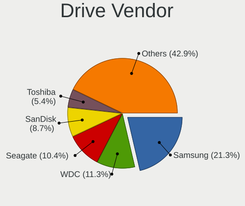

| Vendor                       | Computers | Drives | Percent |
|------------------------------|-----------|--------|---------|
| Samsung Electronics          | 10511     | 17955  | 21.34%  |
| WDC                          | 5576      | 9454   | 11.32%  |
| Seagate                      | 5107      | 8384   | 10.37%  |
| SanDisk                      | 4286      | 6436   | 8.7%    |
| Toshiba                      | 2664      | 3931   | 5.41%   |
| Crucial                      | 2428      | 3558   | 4.93%   |
| Unknown                      | 2119      | 3174   | 4.3%    |
| Intenso                      | 1584      | 2253   | 3.22%   |
| Kingston                     | 1537      | 2137   | 3.12%   |
| SK hynix                     | 1200      | 1520   | 2.44%   |
| Hitachi                      | 1170      | 1598   | 2.38%   |
| Micron Technology            | 982       | 1279   | 1.99%   |
| Intel                        | 982       | 1365   | 1.99%   |
| HGST                         | 591       | 1032   | 1.2%    |
| Micron/Crucial Technology    | 570       | 848    | 1.16%   |
| KIOXIA                       | 392       | 511    | 0.8%    |
| Apple                        | 389       | 541    | 0.79%   |
| Phison Electronics           | 377       | 506    | 0.77%   |
| A-DATA Technology            | 331       | 447    | 0.67%   |
| Kingston Technology Company  | 324       | 442    | 0.66%   |
| Phison                       | 284       | 418    | 0.58%   |
| Transcend                    | 277       | 370    | 0.56%   |
| Unknown                      | 254       | 302    | 0.52%   |
| China                        | 235       | 282    | 0.48%   |
| OCZ                          | 214       | 284    | 0.43%   |
| Silicon Motion               | 201       | 279    | 0.41%   |
| MAXIO Technology (Hangzhou)  | 169       | 230    | 0.34%   |
| Patriot                      | 164       | 235    | 0.33%   |
| SPCC                         | 163       | 211    | 0.33%   |
| Fujitsu                      | 157       | 213    | 0.32%   |
| JMicron Technology           | 155       | 181    | 0.31%   |
| LITEON                       | 153       | 174    | 0.31%   |
| ASMT                         | 147       | 189    | 0.3%    |
| Verbatim                     | 142       | 205    | 0.29%   |
| Shenzhen Longsys Electronics | 124       | 176    | 0.25%   |
| Corsair                      | 118       | 149    | 0.24%   |
| Netac                        | 105       | 150    | 0.21%   |
| Maxtor                       | 100       | 151    | 0.2%    |
| Hewlett-Packard              | 90        | 161    | 0.18%   |
| Leven                        | 89        | 123    | 0.18%   |

Drive Model
-----------

Hard drive models

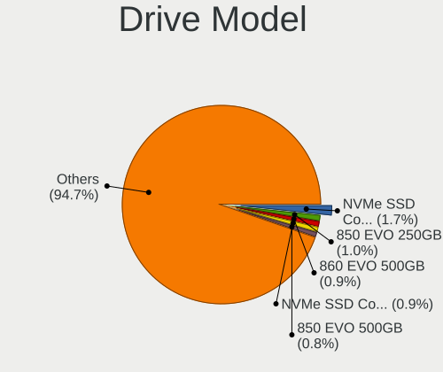

| Model                                                | Computers | Percent |
|------------------------------------------------------|-----------|---------|
| Samsung NVMe SSD Controller SM981/PM981/PM983 1TB    | 926       | 1.67%   |
| Samsung SSD 850 EVO 250GB                            | 561       | 1.01%   |
| Samsung SSD 860 EVO 500GB                            | 509       | 0.92%   |
| Samsung NVMe SSD Controller PM9A1/PM9A3/980PRO 1TB   | 496       | 0.89%   |
| Samsung SSD 850 EVO 500GB                            | 445       | 0.8%    |
| Crucial CT1000MX500SSD1 1TB                          | 401       | 0.72%   |
| Crucial CT500MX500SSD1 500GB                         | 378       | 0.68%   |
| Unknown MMC Card  64GB                               | 349       | 0.63%   |
| Samsung SSD 860 EVO 1TB                              | 336       | 0.61%   |
| Unknown MMC Card  32GB                               | 304       | 0.55%   |
| SanDisk SSD PLUS 1000GB                              | 270       | 0.49%   |
| Micron/Crucial P2 NVMe PCIe SSD 2TB                  | 255       | 0.46%   |
| Unknown                                              | 254       | 0.46%   |
| Samsung SSD 860 EVO 250GB                            | 252       | 0.45%   |
| SanDisk SSD PLUS 240GB                               | 251       | 0.45%   |
| Samsung SSD 840 EVO 250GB                            | 236       | 0.43%   |
| Toshiba MQ01ABD100 1TB                               | 232       | 0.42%   |
| Samsung SSD 980 1TB                                  | 226       | 0.41%   |
| Unknown SD/MMC/MS PRO 2GB                            | 213       | 0.38%   |
| Toshiba DT01ACA100 1TB                               | 212       | 0.38%   |
| Samsung NVMe SSD Controller SM961/PM961/SM963 1024GB | 212       | 0.38%   |
| Seagate ST1000LM024 HN-M101MBB 1TB                   | 209       | 0.38%   |
| Crucial CT240BX500SSD1 240GB                         | 203       | 0.37%   |
| Seagate ST500DM002-1BD142 500GB                      | 202       | 0.36%   |
| Samsung SSD 870 QVO 1TB                              | 199       | 0.36%   |
| SanDisk SSD PLUS 480GB                               | 197       | 0.35%   |
| Samsung SSD 970 EVO Plus 1TB                         | 190       | 0.34%   |
| Unknown MMC Card  128GB                              | 188       | 0.34%   |
| Seagate ST1000LM035-1RK172 1TB                       | 187       | 0.34%   |
| SanDisk NVMe SSD Drive 1TB                           | 187       | 0.34%   |
| Samsung NVMe SSD Drive 500GB                         | 181       | 0.33%   |
| Sandisk WD Black SN750 / PC SN730 NVMe SSD 500GB     | 171       | 0.31%   |
| Samsung SSD 870 EVO 1TB                              | 171       | 0.31%   |
| Intenso SSD SATAIII 512GB                            | 170       | 0.31%   |
| Samsung SSD 840 EVO 120GB                            | 163       | 0.29%   |
| Kingston SA400S37240G 240GB SSD                      | 163       | 0.29%   |
| Samsung NVMe SSD Drive 512GB                         | 160       | 0.29%   |
| Toshiba HDWD110 1TB                                  | 159       | 0.29%   |
| Seagate ST2000DM008-2FR102 2TB                       | 157       | 0.28%   |
| SanDisk NVMe SSD Drive 512GB                         | 153       | 0.28%   |

HDD Vendor
----------

Hard disk drive vendors

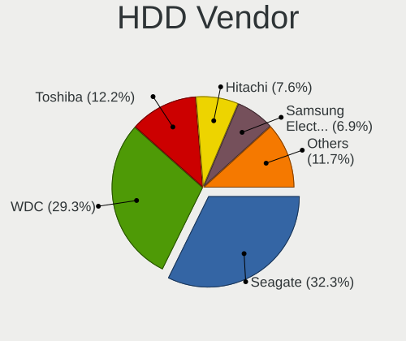

| Vendor              | Computers | Drives | Percent |
|---------------------|-----------|--------|---------|
| Seagate             | 4969      | 8176   | 32.3%   |
| WDC                 | 4505      | 7809   | 29.28%  |
| Toshiba             | 1870      | 2862   | 12.15%  |
| Hitachi             | 1170      | 1598   | 7.6%    |
| Samsung Electronics | 1066      | 1648   | 6.93%   |
| HGST                | 591       | 1030   | 3.84%   |
| Unknown             | 225       | 327    | 1.46%   |
| Intenso             | 172       | 248    | 1.12%   |
| Fujitsu             | 157       | 213    | 1.02%   |
| Maxtor              | 96        | 144    | 0.62%   |
| JMicron Technology  | 94        | 110    | 0.61%   |
| Apple               | 81        | 94     | 0.53%   |
| ASMT                | 49        | 70     | 0.32%   |
| ASMedia             | 32        | 36     | 0.21%   |
| Hewlett-Packard     | 27        | 67     | 0.18%   |
| USB3.0              | 25        | 30     | 0.16%   |
| TO Exter            | 23        | 29     | 0.15%   |
| ExcelStor           | 17        | 20     | 0.11%   |
| WD MediaMax         | 15        | 22     | 0.1%    |
| USB                 | 13        | 15     | 0.08%   |
| SSK                 | 12        | 14     | 0.08%   |
| JetFlash            | 12        | 20     | 0.08%   |
| IBM/Hitachi         | 12        | 13     | 0.08%   |
| Inateck             | 11        | 11     | 0.07%   |
| External            | 9         | 9      | 0.06%   |
| HGST HTS            | 8         | 8      | 0.05%   |
| SABRENT             | 7         | 28     | 0.05%   |
| Maxone              | 5         | 6      | 0.03%   |
| IBM                 | 5         | 9      | 0.03%   |
| IB-AC703            | 5         | 6      | 0.03%   |
| IB-377U3            | 5         | 5      | 0.03%   |
| HPE                 | 5         | 45     | 0.03%   |
| Dell                | 5         | 9      | 0.03%   |
| LIO-ORG             | 4         | 15     | 0.03%   |
| LaCie               | 4         | 4      | 0.03%   |
| Unknown             | 4         | 4      | 0.03%   |
| Synology            | 3         | 3      | 0.02%   |
| MDT                 | 3         | 3      | 0.02%   |
| KESU                | 3         | 3      | 0.02%   |
| DELLBOSS            | 3         | 4      | 0.02%   |

SSD Vendor
----------

Solid state drive vendors

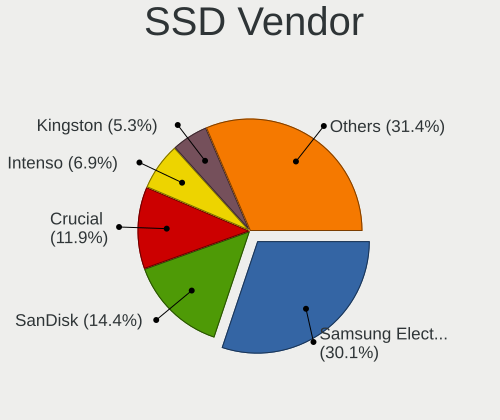

| Vendor              | Computers | Drives | Percent |
|---------------------|-----------|--------|---------|
| Samsung Electronics | 5501      | 8555   | 30.14%  |
| SanDisk             | 2624      | 4008   | 14.38%  |
| Crucial             | 2167      | 3197   | 11.87%  |
| Intenso             | 1261      | 1745   | 6.91%   |
| Kingston            | 966       | 1355   | 5.29%   |
| WDC                 | 699       | 970    | 3.83%   |
| Intel               | 398       | 537    | 2.18%   |
| Micron Technology   | 361       | 486    | 1.98%   |
| Toshiba             | 326       | 418    | 1.79%   |
| A-DATA Technology   | 275       | 369    | 1.51%   |
| SK hynix            | 253       | 304    | 1.39%   |
| Transcend           | 247       | 327    | 1.35%   |
| Apple               | 232       | 262    | 1.27%   |
| China               | 228       | 274    | 1.25%   |
| OCZ                 | 210       | 276    | 1.15%   |
| LITEON              | 144       | 164    | 0.79%   |
| SPCC                | 143       | 183    | 0.78%   |
| Patriot             | 142       | 207    | 0.78%   |
| Verbatim            | 131       | 194    | 0.72%   |
| Unknown             | 93        | 117    | 0.51%   |
| Leven               | 89        | 123    | 0.49%   |
| Netac               | 88        | 128    | 0.48%   |
| LITEONIT            | 87        | 114    | 0.48%   |
| ASMT                | 82        | 101    | 0.45%   |
| Emtec               | 71        | 79     | 0.39%   |
| PNY                 | 66        | 132    | 0.36%   |
| SABRENT             | 64        | 77     | 0.35%   |
| Corsair             | 61        | 81     | 0.33%   |
| Phison              | 60        | 113    | 0.33%   |
| Fanxiang            | 59        | 80     | 0.32%   |
| Apacer              | 58        | 68     | 0.32%   |
| INNOVATION IT       | 55        | 75     | 0.3%    |
| Hewlett-Packard     | 51        | 68     | 0.28%   |
| SD                  | 47        | 82     | 0.26%   |
| KingSpec            | 43        | 57     | 0.24%   |
| Seagate             | 38        | 46     | 0.21%   |
| Unknown             | 36        | 39     | 0.2%    |
| Lexar               | 32        | 37     | 0.18%   |
| KingDian            | 32        | 42     | 0.18%   |
| Dogfish             | 32        | 54     | 0.18%   |

Drive Kind
----------

HDD or SSD

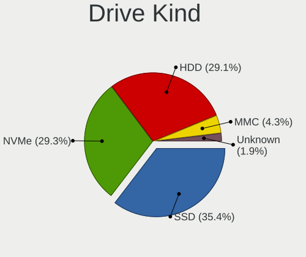

| Kind    | Computers | Drives | Percent |
|---------|-----------|--------|---------|
| SSD     | 15408     | 26481  | 35.41%  |
| NVMe    | 12760     | 20358  | 29.32%  |
| HDD     | 12648     | 24886  | 29.07%  |
| MMC     | 1859      | 2499   | 4.27%   |
| Unknown | 840       | 1391   | 1.93%   |

Drive Connector
---------------

SATA, SAS, NVMe, etc.

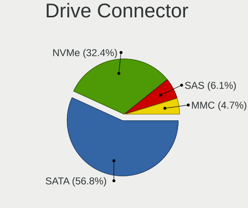

| Type | Computers | Drives | Percent |
|------|-----------|--------|---------|
| SATA | 22339     | 48892  | 56.82%  |
| NVMe | 12725     | 20146  | 32.37%  |
| SAS  | 2390      | 4078   | 6.08%   |
| MMC  | 1859      | 2499   | 4.73%   |

Drive Size
----------

Size of hard drive

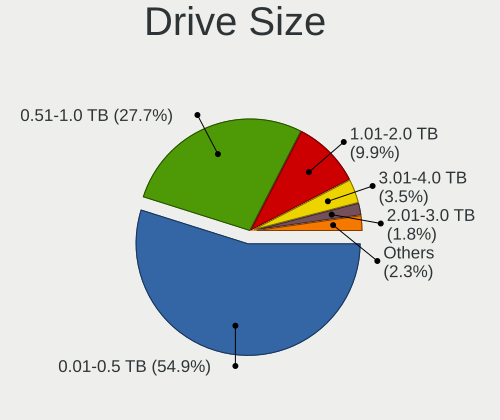

| Size in TB  | Computers | Drives | Percent |
|-------------|-----------|--------|---------|
| 0.01-0.5    | 16471     | 27685  | 54.87%  |
| 0.51-1.0    | 8311      | 13582  | 27.69%  |
| 1.01-2.0    | 2964      | 5232   | 9.87%   |
| 3.01-4.0    | 1060      | 2075   | 3.53%   |
| 2.01-3.0    | 535       | 970    | 1.78%   |
| 4.01-10.0   | 518       | 1428   | 1.73%   |
| 10.01-20.0  | 145       | 372    | 0.48%   |
| 20.01-50.0  | 10        | 16     | 0.03%   |
| 0           | 3         | 3      | 0.01%   |
| 50.01-100.0 | 1         | 4      | 0.003%  |

Space Total
-----------

Amount of disk space available on the file system

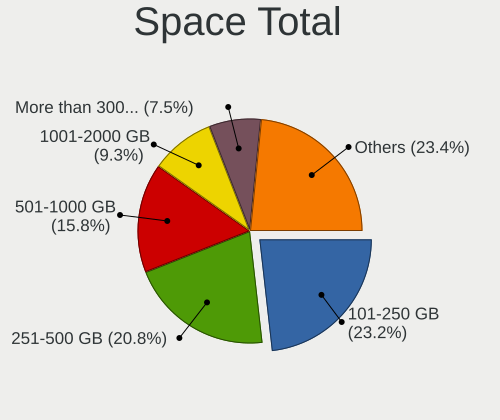

| Size in GB     | Computers | Percent |
|----------------|-----------|---------|
| 101-250        | 8146      | 23.22%  |
| 251-500        | 7301      | 20.81%  |
| 501-1000       | 5536      | 15.78%  |
| 1001-2000      | 3257      | 9.28%   |
| More than 3000 | 2623      | 7.48%   |
| 1-20           | 2554      | 7.28%   |
| 51-100         | 1906      | 5.43%   |
| Unknown        | 1395      | 3.98%   |
| 2001-3000      | 1311      | 3.74%   |
| 21-50          | 1055      | 3.01%   |

Space Used
----------

Amount of used disk space

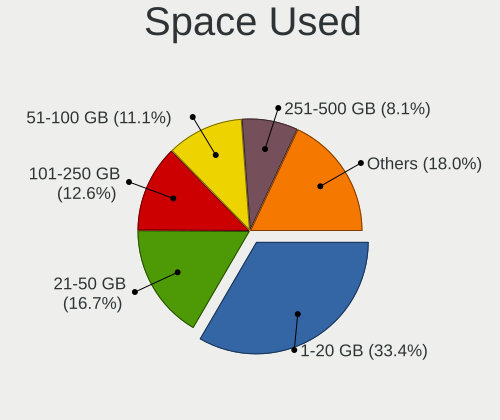

| Used GB        | Computers | Percent |
|----------------|-----------|---------|
| 1-20           | 12237     | 33.4%   |
| 21-50          | 6117      | 16.7%   |
| 101-250        | 4616      | 12.6%   |
| 51-100         | 4075      | 11.12%  |
| 251-500        | 2985      | 8.15%   |
| 501-1000       | 2271      | 6.2%    |
| 1001-2000      | 1484      | 4.05%   |
| Unknown        | 1395      | 3.81%   |
| More than 3000 | 849       | 2.32%   |
| 2001-3000      | 553       | 1.51%   |
| 0              | 55        | 0.15%   |

Malfunc. Drives
---------------

Drive models with a malfunction

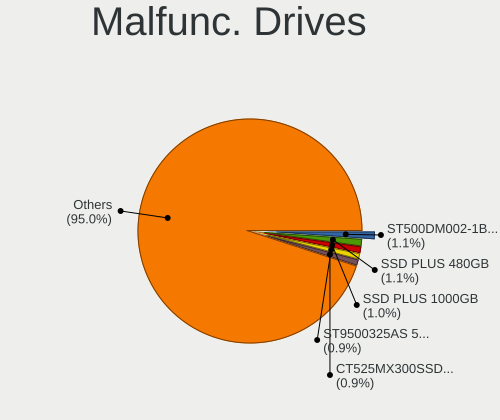

| Model                                                          | Computers | Drives | Percent |
|----------------------------------------------------------------|-----------|--------|---------|
| Seagate ST500DM002-1BD142 500GB                                | 26        | 53     | 1.12%   |
| SanDisk SSD PLUS 480GB                                         | 25        | 30     | 1.08%   |
| SanDisk SSD PLUS 1000GB                                        | 23        | 26     | 0.99%   |
| Seagate ST9500325AS 500GB                                      | 21        | 27     | 0.91%   |
| Crucial CT525MX300SSD1 528GB                                   | 21        | 25     | 0.91%   |
| Toshiba MQ01ABD100 1TB                                         | 19        | 25     | 0.82%   |
| Seagate ST1000LM024 HN-M101MBB 1TB                             | 18        | 23     | 0.78%   |
| Samsung Electronics HD103UJ 1TB                                | 18        | 21     | 0.78%   |
| SanDisk SSD PLUS 240GB                                         | 16        | 23     | 0.69%   |
| Samsung Electronics NVMe SSD Controller SM981/PM981/PM983 1TB  | 16        | 18     | 0.69%   |
| WDC WD20EFRX-68EUZN0 2TB                                       | 15        | 22     | 0.65%   |
| Seagate ST1000LM035-1RK172 1TB                                 | 15        | 15     | 0.65%   |
| Seagate ST9320325AS 320GB                                      | 14        | 15     | 0.6%    |
| Seagate ST31000528AS 1TB                                       | 13        | 16     | 0.56%   |
| Samsung Electronics SSD 870 EVO 1TB                            | 13        | 27     | 0.56%   |
| Samsung Electronics HD103SI 1TB                                | 13        | 17     | 0.56%   |
| HGST HTS725050A7E630 500GB                                     | 13        | 16     | 0.56%   |
| HGST HTS541010A9E680 1TB                                       | 13        | 15     | 0.56%   |
| WDC WDS240G2G0A-00JH30 240GB SSD                               | 12        | 14     | 0.52%   |
| WDC WD20EARS-00MVWB0 2TB                                       | 12        | 16     | 0.52%   |
| WDC WD10EARS-00Y5B1 1TB                                        | 12        | 15     | 0.52%   |
| Seagate ST500LT012-1DG142 500GB                                | 12        | 12     | 0.52%   |
| WDC WD30EFRX-68EUZN0 3TB                                       | 11        | 14     | 0.47%   |
| Samsung Electronics SP2504C 250GB                              | 11        | 13     | 0.47%   |
| Samsung Electronics HD501LJ 500GB                              | 11        | 30     | 0.47%   |
| Kingston SV300S37A120G 120GB SSD                               | 11        | 13     | 0.47%   |
| WDC WD5000AAKS-007AA0 500GB                                    | 10        | 34     | 0.43%   |
| WDC WD20EARX-00PASB0 2TB                                       | 10        | 11     | 0.43%   |
| Seagate ST500LM000-1EJ162 500GB                                | 10        | 13     | 0.43%   |
| Seagate ST3500418AS 500GB                                      | 10        | 11     | 0.43%   |
| HGST HTS545050A7E680 500GB                                     | 10        | 16     | 0.43%   |
| Seagate ST500LT012-9WS142 500GB                                | 9         | 11     | 0.39%   |
| Seagate ST2000DM001-1CH164 2TB                                 | 9         | 10     | 0.39%   |
| Samsung Electronics SSD 870 EVO 500GB                          | 9         | 9      | 0.39%   |
| Samsung Electronics NVMe SSD Controller PM9A1/PM9A3/980PRO 1TB | 9         | 9      | 0.39%   |
| Samsung Electronics HD502IJ 500GB                              | 9         | 11     | 0.39%   |
| Samsung Electronics HD154UI 1TB                                | 9         | 13     | 0.39%   |
| HGST HTS721010A9E630 1TB                                       | 9         | 10     | 0.39%   |
| WDC WD20EZRZ-00Z5HB0 2TB                                       | 8         | 14     | 0.34%   |
| WDC WD10JPVX-22JC3T0 1TB                                       | 8         | 11     | 0.34%   |

Malfunc. Drive Vendor
---------------------

Vendors of faulty drives

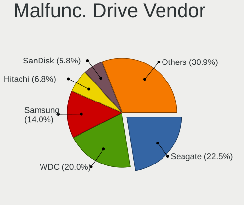

| Vendor                | Computers | Drives | Percent |
|-----------------------|-----------|--------|---------|
| Seagate               | 509       | 659    | 22.49%  |
| WDC                   | 453       | 659    | 20.02%  |
| Samsung Electronics   | 316       | 417    | 13.96%  |
| Hitachi               | 154       | 181    | 6.81%   |
| SanDisk               | 131       | 162    | 5.79%   |
| Toshiba               | 126       | 144    | 5.57%   |
| Crucial               | 76        | 99     | 3.36%   |
| HGST                  | 65        | 82     | 2.87%   |
| SK hynix              | 59        | 65     | 2.61%   |
| Intel                 | 56        | 59     | 2.47%   |
| Micron Technology     | 38        | 49     | 1.68%   |
| Intenso               | 37        | 42     | 1.63%   |
| Kingston              | 30        | 33     | 1.33%   |
| Maxtor                | 21        | 36     | 0.93%   |
| A-DATA Technology     | 21        | 26     | 0.93%   |
| Fujitsu               | 20        | 24     | 0.88%   |
| Transcend             | 18        | 21     | 0.8%    |
| Apple                 | 16        | 18     | 0.71%   |
| OCZ                   | 8         | 10     | 0.35%   |
| ASMT                  | 6         | 7      | 0.27%   |
| ASMedia               | 5         | 5      | 0.22%   |
| Unknown               | 5         | 5      | 0.22%   |
| WD MediaMax           | 4         | 4      | 0.18%   |
| SPCC                  | 4         | 4      | 0.18%   |
| LITEONIT              | 4         | 12     | 0.18%   |
| IBM                   | 4         | 7      | 0.18%   |
| Corsair               | 4         | 4      | 0.18%   |
| ADATA Technology      | 4         | 4      | 0.18%   |
| XPG                   | 3         | 3      | 0.13%   |
| Unknown               | 3         | 3      | 0.13%   |
| Plextor               | 3         | 3      | 0.13%   |
| MDT                   | 3         | 3      | 0.13%   |
| China                 | 3         | 3      | 0.13%   |
| USB3.0                | 2         | 2      | 0.09%   |
| SD                    | 2         | 2      | 0.09%   |
| Realtek Semiconductor | 2         | 2      | 0.09%   |
| PNY                   | 2         | 3      | 0.09%   |
| Phison                | 2         | 2      | 0.09%   |
| Patriot               | 2         | 2      | 0.09%   |
| Netac                 | 2         | 2      | 0.09%   |

Malfunc. HDD Vendor
-------------------

Vendors of faulty HDD drives

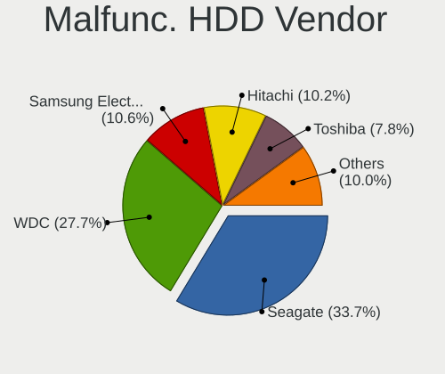

| Vendor              | Computers | Drives | Percent |
|---------------------|-----------|--------|---------|
| Seagate             | 508       | 658    | 33.66%  |
| WDC                 | 418       | 619    | 27.7%   |
| Samsung Electronics | 160       | 220    | 10.6%   |
| Hitachi             | 154       | 181    | 10.21%  |
| Toshiba             | 118       | 134    | 7.82%   |
| HGST                | 65        | 82     | 4.31%   |
| Maxtor              | 21        | 36     | 1.39%   |
| Fujitsu             | 20        | 24     | 1.33%   |
| Apple               | 11        | 13     | 0.73%   |
| WD MediaMax         | 4         | 4      | 0.27%   |
| IBM                 | 4         | 7      | 0.27%   |
| ASMT                | 4         | 5      | 0.27%   |
| MDT                 | 3         | 3      | 0.2%    |
| Intenso             | 3         | 3      | 0.2%    |
| ASMedia             | 3         | 3      | 0.2%    |
| USB3.0              | 2         | 2      | 0.13%   |
| IBM/Hitachi         | 2         | 2      | 0.13%   |
| Hewlett-Packard     | 2         | 2      | 0.13%   |
| ExcelStor           | 2         | 2      | 0.13%   |
| Unknown             | 1         | 1      | 0.07%   |
| TO Exter            | 1         | 1      | 0.07%   |
| IB                  | 1         | 1      | 0.07%   |
| HPE                 | 1         | 32     | 0.07%   |
| Unknown             | 1         | 1      | 0.07%   |

Malfunc. Drive Kind
-------------------

Kinds of faulty drives

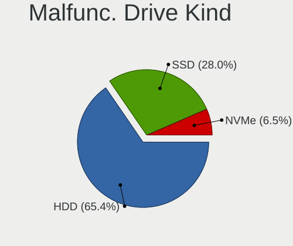

| Kind | Computers | Drives | Percent |
|------|-----------|--------|---------|
| HDD  | 1414      | 2036   | 65.43%  |
| SSD  | 606       | 746    | 28.04%  |
| NVMe | 141       | 160    | 6.52%   |

Failed Drives
-------------

Failed drive models

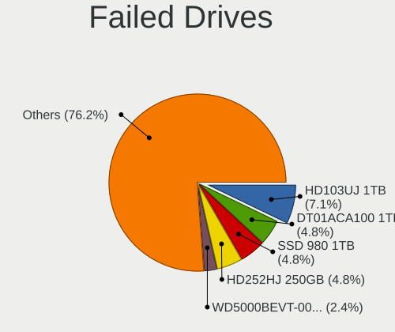

| Model                                                            | Computers | Drives | Percent |
|------------------------------------------------------------------|-----------|--------|---------|
| Samsung Electronics HD103UJ 1TB                                  | 3         | 5      | 7.14%   |
| Toshiba DT01ACA100 1TB                                           | 2         | 2      | 4.76%   |
| Samsung Electronics SSD 980 1TB                                  | 2         | 2      | 4.76%   |
| Samsung Electronics HD252HJ 250GB                                | 2         | 2      | 4.76%   |
| WDC WD5000BEVT-00A0RT0 500GB                                     | 1         | 1      | 2.38%   |
| WDC WD40EZRZ-00GXCB0 4TB                                         | 1         | 2      | 2.38%   |
| WDC WD30EZRS-00J99B0 3TB                                         | 1         | 1      | 2.38%   |
| WDC WD1600YS-23SHB0 160GB                                        | 1         | 1      | 2.38%   |
| WDC PC SN520 SDAPMUW-512G-1001 512GB                             | 1         | 1      | 2.38%   |
| TPH00800640GB 640GB                                              | 1         | 1      | 2.38%   |
| Toshiba MK5065GSX 500GB                                          | 1         | 1      | 2.38%   |
| Toshiba MK3276GSXN 320GB                                         | 1         | 1      | 2.38%   |
| Toshiba MK3265GSX 320GB                                          | 1         | 1      | 2.38%   |
| Toshiba MK2555GSX 250GB                                          | 1         | 1      | 2.38%   |
| Toshiba MK1059GSM 1TB                                            | 1         | 1      | 2.38%   |
| Toshiba MG03ACA300 3TB                                           | 1         | 1      | 2.38%   |
| SK hynix BC501 HFM512GDJTNG-8310A 512GB                          | 1         | 1      | 2.38%   |
| Seagate ST9500325AS 500GB                                        | 1         | 1      | 2.38%   |
| Seagate ST9320325AS 320GB                                        | 1         | 1      | 2.38%   |
| Seagate ST3640323AS 640GB                                        | 1         | 1      | 2.38%   |
| Samsung Electronics SSD 980 500GB                                | 1         | 1      | 2.38%   |
| Samsung Electronics SSD 850 250GB                                | 1         | 1      | 2.38%   |
| Samsung Electronics NVMe SSD Controller SM961/PM961/SM963 1024GB | 1         | 1      | 2.38%   |
| Samsung Electronics MZVLB1T0HALR-00000 1TB                       | 1         | 2      | 2.38%   |
| Samsung Electronics MZNTY128HDHP-00000 128GB SSD                 | 1         | 2      | 2.38%   |
| Samsung Electronics MZ7LN256HCHP-00000 256GB SSD                 | 1         | 2      | 2.38%   |
| Micron Technology 1100_MTFDDAV256TBN 256GB SSD                   | 1         | 1      | 2.38%   |
| Maxtor STM3500320AS 500GB                                        | 1         | 1      | 2.38%   |
| JMicron Technology Tech 250GB                                    | 1         | 1      | 2.38%   |
| Intenso SSD SATAIII 512GB                                        | 1         | 1      | 2.38%   |
| Intel SSDSCKGF256A5 SATA 256GB                                   | 1         | 1      | 2.38%   |
| Intel SSDSA2BW160G3 160GB                                        | 1         | 1      | 2.38%   |
| Intel SSDPEKKF256G7L 256GB                                       | 1         | 1      | 2.38%   |
| Hitachi HTS543225L9SA02 250GB                                    | 1         | 1      | 2.38%   |
| Hitachi HTS541010G9SA00 100GB                                    | 1         | 1      | 2.38%   |
| Hitachi HDP725040GLA360 400GB                                    | 1         | 1      | 2.38%   |
| HGST HTS721010A9E630 1TB                                         | 1         | 1      | 2.38%   |

Failed Drive Vendor
-------------------

Failed drive vendors

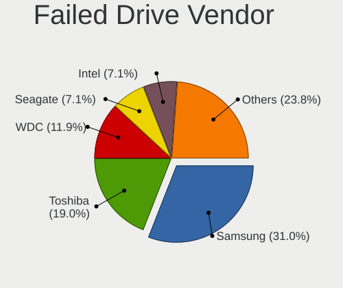

| Vendor              | Computers | Drives | Percent |
|---------------------|-----------|--------|---------|
| Samsung Electronics | 13        | 18     | 30.95%  |
| Toshiba             | 8         | 8      | 19.05%  |
| WDC                 | 5         | 6      | 11.9%   |
| Seagate             | 3         | 3      | 7.14%   |
| Intel               | 3         | 3      | 7.14%   |
| Hitachi             | 3         | 3      | 7.14%   |
| TPH00800640GB       | 1         | 1      | 2.38%   |
| SK hynix            | 1         | 1      | 2.38%   |
| Micron Technology   | 1         | 1      | 2.38%   |
| Maxtor              | 1         | 1      | 2.38%   |
| JMicron Technology  | 1         | 1      | 2.38%   |
| Intenso             | 1         | 1      | 2.38%   |
| HGST                | 1         | 1      | 2.38%   |

Drive Status
------------

Number of failed and malfunc. drives

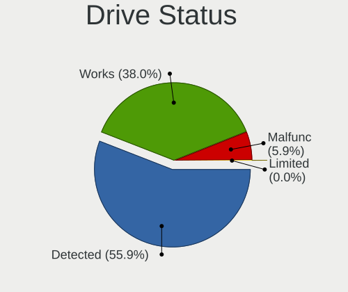

| Status   | Computers | Drives | Percent |
|----------|-----------|--------|---------|
| Detected | 19705     | 45585  | 55.91%  |
| Works    | 13409     | 27039  | 38.05%  |
| Malfunc  | 2084      | 2942   | 5.91%   |
| Failed   | 42        | 48     | 0.12%   |
| Limited  | 1         | 1      | 0.003%  |

Storage controller
------------------

Storage Vendor
--------------

Storage controller vendors

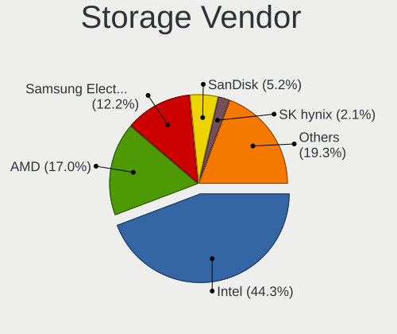

| Vendor                           | Computers | Percent |
|----------------------------------|-----------|---------|
| Intel                            | 18917     | 44.25%  |
| AMD                              | 7262      | 16.99%  |
| Samsung Electronics              | 5210      | 12.19%  |
| SanDisk                          | 2204      | 5.16%   |
| SK hynix                         | 910       | 2.13%   |
| Kingston Technology Company      | 882       | 2.06%   |
| ASMedia Technology               | 854       | 2%      |
| Micron/Crucial Technology        | 831       | 1.94%   |
| Phison Electronics               | 689       | 1.61%   |
| Micron Technology                | 646       | 1.51%   |
| Nvidia                           | 511       | 1.2%    |
| Toshiba America Info Systems     | 500       | 1.17%   |
| JMicron Technology               | 442       | 1.03%   |
| Marvell Technology Group         | 438       | 1.02%   |
| KIOXIA                           | 411       | 0.96%   |
| Silicon Motion                   | 245       | 0.57%   |
| MAXIO Technology (Hangzhou)      | 209       | 0.49%   |
| Shenzhen Longsys Electronics     | 170       | 0.4%    |
| ADATA Technology                 | 159       | 0.37%   |
| VIA Technologies                 | 121       | 0.28%   |
| Broadcom / LSI                   | 109       | 0.25%   |
| LSI Logic / Symbios Logic        | 97        | 0.23%   |
| Union Memory (Shenzhen)          | 91        | 0.21%   |
| Seagate Technology               | 84        | 0.2%    |
| Silicon Image                    | 79        | 0.18%   |
| Realtek Semiconductor            | 78        | 0.18%   |
| Adaptec                          | 74        | 0.17%   |
| Apple                            | 64        | 0.15%   |
| Solid State Storage Technology   | 60        | 0.14%   |
| Silicon Integrated Systems [SiS] | 46        | 0.11%   |
| Lenovo                           | 39        | 0.09%   |
| INNOGRIT                         | 32        | 0.07%   |
| Lite-On Technology               | 28        | 0.07%   |
| Unknown                          | 24        | 0.06%   |
| O2 Micro                         | 23        | 0.05%   |
| Hewlett-Packard                  | 23        | 0.05%   |
| Transcend                        | 20        | 0.05%   |
| Solidigm                         | 20        | 0.05%   |
| Netac Technology                 | 15        | 0.04%   |
| Biwin Storage Technology         | 15        | 0.04%   |

Storage Model
-------------

Storage controller models

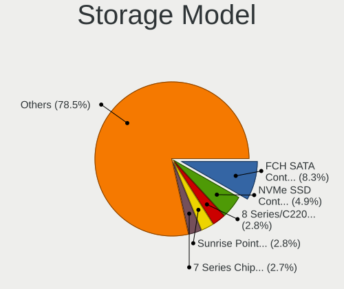

| Model                                                                          | Computers | Percent |
|--------------------------------------------------------------------------------|-----------|---------|
| AMD FCH SATA Controller [AHCI mode]                                            | 4027      | 8.26%   |
| Samsung NVMe SSD Controller SM981/PM981/PM983                                  | 2386      | 4.89%   |
| Intel 8 Series/C220 Series Chipset Family 6-port SATA Controller 1 [AHCI mode] | 1390      | 2.85%   |
| Intel Sunrise Point-LP SATA Controller [AHCI mode]                             | 1359      | 2.79%   |
| Intel 7 Series Chipset Family 6-port SATA Controller [AHCI mode]               | 1331      | 2.73%   |
| AMD 400 Series Chipset SATA Controller                                         | 1023      | 2.1%    |
| Intel 6 Series/C200 Series Chipset Family 6 port Mobile SATA AHCI Controller   | 960       | 1.97%   |
| AMD 500 Series Chipset SATA Controller                                         | 881       | 1.81%   |
| Samsung NVMe SSD Controller PM9A1/PM9A3/980PRO                                 | 876       | 1.8%    |
| AMD SB7x0/SB8x0/SB9x0 SATA Controller [AHCI mode]                              | 865       | 1.77%   |
| Intel Q170/Q150/B150/H170/H110/Z170/CM236 Chipset SATA Controller [AHCI Mode]  | 860       | 1.76%   |
| AMD SB7x0/SB8x0/SB9x0 IDE Controller                                           | 839       | 1.72%   |
| Samsung NVMe SSD Controller 980 (DRAM-less)                                    | 823       | 1.69%   |
| ASMedia ASM1061/ASM1062 Serial ATA Controller                                  | 765       | 1.57%   |
| Intel 82801 Mobile SATA Controller [RAID mode]                                 | 719       | 1.47%   |
| Intel 82801IBM/IEM (ICH9M/ICH9M-E) 4 port SATA Controller [AHCI mode]          | 640       | 1.31%   |
| Intel 8 Series SATA Controller 1 [AHCI mode]                                   | 609       | 1.25%   |
| Intel Volume Management Device NVMe RAID Controller                            | 597       | 1.22%   |
| Intel 6 Series/C200 Series Chipset Family 6 port Desktop SATA AHCI Controller  | 578       | 1.19%   |
| Intel 200 Series PCH SATA controller [AHCI mode]                               | 558       | 1.14%   |
| AMD 600 Series Chipset SATA Controller                                         | 553       | 1.13%   |
| Intel 7 Series/C210 Series Chipset Family 6-port SATA Controller [AHCI mode]   | 546       | 1.12%   |
| Samsung NVMe SSD Controller SM961/PM961/SM963                                  | 528       | 1.08%   |
| AMD SB7x0/SB8x0/SB9x0 SATA Controller [IDE mode]                               | 477       | 0.98%   |
| Intel 5 Series/3400 Series Chipset 4 port SATA AHCI Controller                 | 467       | 0.96%   |
| Intel Wildcat Point-LP SATA Controller [AHCI Mode]                             | 464       | 0.95%   |
| Intel Celeron/Pentium Silver Processor SATA Controller                         | 462       | 0.95%   |
| Intel 5 Series/3400 Series Chipset 6 port SATA AHCI Controller                 | 435       | 0.89%   |
| Intel Cannon Lake PCH SATA AHCI Controller                                     | 434       | 0.89%   |
| SanDisk Extreme Pro / WD Black SN750 / PC SN730 / Red SN700 NVMe SSD           | 425       | 0.87%   |
| Micron/Crucial P2 [Nick P2] / P3 / P3 Plus NVMe PCIe SSD (DRAM-less)           | 399       | 0.82%   |
| Intel SATA Controller [RAID mode]                                              | 397       | 0.81%   |
| Samsung NVMe SSD Controller S4LV008[Pascal]                                    | 335       | 0.69%   |
| Intel NM10/ICH7 Family SATA Controller [IDE mode]                              | 321       | 0.66%   |
| Intel Comet Lake SATA AHCI Controller                                          | 320       | 0.66%   |
| Intel Cannon Lake Mobile PCH SATA AHCI Controller                              | 318       | 0.65%   |
| Intel 82801G (ICH7 Family) IDE Controller                                      | 318       | 0.65%   |
| SanDisk Ultra 3D / WD PC SN530, IX SN530, Blue SN550 NVMe SSD (DRAM-less)      | 312       | 0.64%   |
| Intel 82801HM/HEM (ICH8M/ICH8M-E) IDE Controller                               | 306       | 0.63%   |
| Intel Atom Processor E3800 Series SATA AHCI Controller                         | 276       | 0.57%   |

Storage Kind
------------

Kind of storage controller (IDE, SATA, NVMe, SAS, ...)

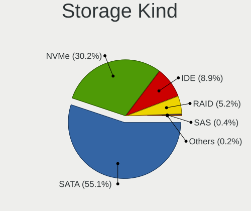

| Kind | Computers | Percent |
|------|-----------|---------|
| SATA | 23356     | 55.11%  |
| NVMe | 12794     | 30.19%  |
| IDE  | 3771      | 8.9%    |
| RAID | 2211      | 5.22%   |
| SAS  | 154       | 0.36%   |
| SCSI | 93        | 0.22%   |

Processor
---------

CPU Vendor
----------

Processor vendors

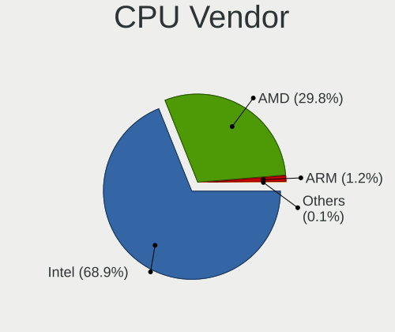

| Vendor                | Computers | Percent |
|-----------------------|-----------|---------|
| Intel                 | 22319     | 68.94%  |
| AMD                   | 9633      | 29.76%  |
| ARM                   | 376       | 1.16%   |
| Unknown               | 19        | 0.06%   |
| QUALCOMM              | 6         | 0.02%   |
| CentaurHauls          | 5         | 0.02%   |
| sifive,u74-mc         | 4         | 0.01%   |
| thead,c906            | 2         | 0.01%   |
| Marvell Semiconductor | 2         | 0.01%   |
| PowerMac3,6           | 1         | 0.003%  |
| PowerMac10,2          | 1         | 0.003%  |
| PowerBook5,6          | 1         | 0.003%  |
| PowerBook5,4          | 1         | 0.003%  |
| PowerBook3,4          | 1         | 0.003%  |
| MIPS                  | 1         | 0.003%  |
| CyrixInstead          | 1         | 0.003%  |

CPU Model
---------

Processor models

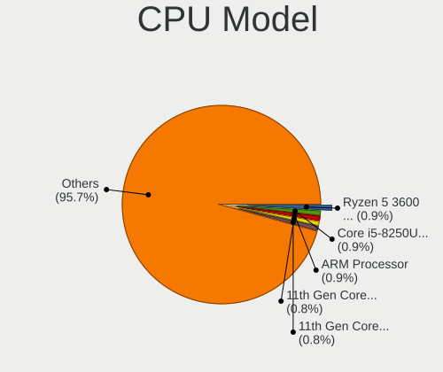

| Model                                         | Computers | Percent |
|-----------------------------------------------|-----------|---------|
| AMD Ryzen 5 3600 6-Core Processor             | 302       | 0.93%   |
| Intel Core i5-8250U CPU @ 1.60GHz             | 284       | 0.87%   |
| ARM Processor                                 | 281       | 0.86%   |
| Intel 11th Gen Core i7-1165G7 @ 2.80GHz       | 261       | 0.8%    |
| Intel 11th Gen Core i5-1135G7 @ 2.40GHz       | 256       | 0.79%   |
| Intel Core i5-7200U CPU @ 2.50GHz             | 253       | 0.78%   |
| AMD Ryzen 7 3700X 8-Core Processor            | 248       | 0.76%   |
| Intel Core i5-2520M CPU @ 2.50GHz             | 231       | 0.71%   |
| Intel Core i7-8550U CPU @ 1.80GHz             | 224       | 0.69%   |
| Intel Core i5-6300U CPU @ 2.40GHz             | 220       | 0.68%   |
| Intel Core i5-3320M CPU @ 2.60GHz             | 211       | 0.65%   |
| AMD Ryzen 5 5500U with Radeon Graphics        | 205       | 0.63%   |
| Intel Core i5-6200U CPU @ 2.30GHz             | 201       | 0.62%   |
| AMD Ryzen 7 5800X 8-Core Processor            | 190       | 0.58%   |
| AMD Ryzen 5 3500U with Radeon Vega Mobile Gfx | 189       | 0.58%   |
| Intel Core i7-8565U CPU @ 1.80GHz             | 187       | 0.58%   |
| Intel Core i7-10510U CPU @ 1.80GHz            | 186       | 0.57%   |
| Intel Core i5-8265U CPU @ 1.60GHz             | 186       | 0.57%   |
| AMD Custom APU 0405                           | 173       | 0.53%   |
| Intel Atom x5-Z8350 CPU @ 1.44GHz             | 170       | 0.52%   |
| Intel Core i5-3210M CPU @ 2.50GHz             | 163       | 0.5%    |
| Intel Core i5-10210U CPU @ 1.60GHz            | 163       | 0.5%    |
| AMD Ryzen 7 2700X Eight-Core Processor        | 153       | 0.47%   |
| AMD Ryzen 5 5600X 6-Core Processor            | 153       | 0.47%   |
| AMD Ryzen 7 5700U with Radeon Graphics        | 150       | 0.46%   |
| Intel Core i7-9750H CPU @ 2.60GHz             | 149       | 0.46%   |
| AMD Ryzen 5 2600 Six-Core Processor           | 147       | 0.45%   |
| AMD FX-8350 Eight-Core Processor              | 144       | 0.44%   |
| AMD Ryzen 9 5900X 12-Core Processor           | 143       | 0.44%   |
| Intel Core i5-8350U CPU @ 1.70GHz             | 141       | 0.43%   |
| Intel Core i5-6500 CPU @ 3.20GHz              | 137       | 0.42%   |
| Intel Core i5-3470 CPU @ 3.20GHz              | 133       | 0.41%   |
| Intel Core i7-8750H CPU @ 2.20GHz             | 131       | 0.4%    |
| Intel Core i5-5200U CPU @ 2.20GHz             | 131       | 0.4%    |
| AMD Ryzen 7 4700U with Radeon Graphics        | 130       | 0.4%    |
| AMD FX-6300 Six-Core Processor                | 126       | 0.39%   |
| Intel Core i7-7700HQ CPU @ 2.80GHz            | 121       | 0.37%   |
| Intel Core i7-7500U CPU @ 2.70GHz             | 121       | 0.37%   |
| Intel Core i7-6700K CPU @ 4.00GHz             | 119       | 0.37%   |
| AMD Ryzen 5 5600G with Radeon Graphics        | 119       | 0.37%   |

CPU Model Family
----------------

Processor model prefix

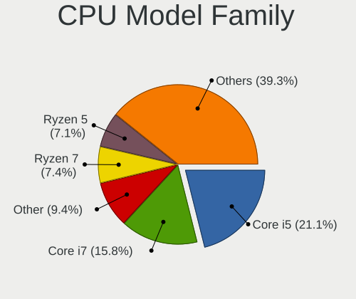

| Model                   | Computers | Percent |
|-------------------------|-----------|---------|
| Intel Core i5           | 6845      | 21.1%   |
| Intel Core i7           | 5113      | 15.76%  |
| Other                   | 3041      | 9.37%   |
| AMD Ryzen 7             | 2405      | 7.41%   |
| AMD Ryzen 5             | 2306      | 7.11%   |
| Intel Core i3           | 1707      | 5.26%   |
| Intel Celeron           | 1204      | 3.71%   |
| Intel Core 2 Duo        | 1197      | 3.69%   |
| Intel Pentium           | 806       | 2.48%   |
| AMD Ryzen 9             | 787       | 2.43%   |
| Intel Xeon              | 694       | 2.14%   |
| AMD FX                  | 582       | 1.79%   |
| Intel Atom              | 534       | 1.65%   |
| AMD Ryzen 3             | 331       | 1.02%   |
| Intel Pentium Dual-Core | 302       | 0.93%   |
| AMD Ryzen 7 PRO         | 276       | 0.85%   |
| Intel Core 2 Quad       | 260       | 0.8%    |
| AMD A8                  | 257       | 0.79%   |
| Intel Core i9           | 234       | 0.72%   |
| Intel Core              | 218       | 0.67%   |
| AMD Phenom II X4        | 210       | 0.65%   |
| AMD A10                 | 200       | 0.62%   |
| Intel Pentium Silver    | 190       | 0.59%   |
| AMD A4                  | 181       | 0.56%   |
| AMD Ryzen 5 PRO         | 168       | 0.52%   |
| AMD A6                  | 166       | 0.51%   |
| AMD Athlon II X2        | 155       | 0.48%   |
| Intel Core 2            | 143       | 0.44%   |
| AMD E                   | 124       | 0.38%   |
| Intel Pentium Dual      | 111       | 0.34%   |
| AMD Athlon 64 X2        | 101       | 0.31%   |
| AMD Athlon              | 95        | 0.29%   |
| Intel Genuine           | 85        | 0.26%   |
| AMD Athlon II X4        | 78        | 0.24%   |
| ARM BCM                 | 77        | 0.24%   |
| AMD Phenom II X6        | 71        | 0.22%   |
| AMD E2                  | 70        | 0.22%   |
| AMD Ryzen Threadripper  | 69        | 0.21%   |
| Intel Pentium 4         | 63        | 0.19%   |
| Intel Pentium M         | 53        | 0.16%   |

CPU Cores
---------

Number of processor cores

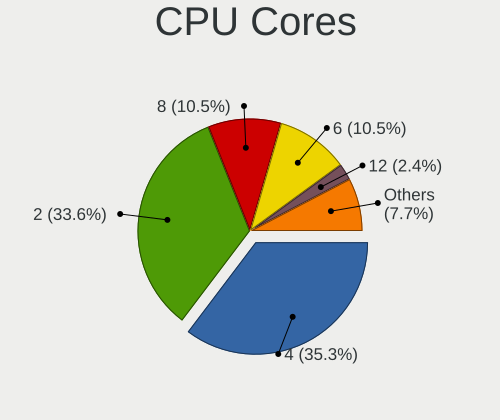

| Number  | Computers | Percent |
|---------|-----------|---------|
| 4       | 11476     | 35.31%  |
| 2       | 10929     | 33.63%  |
| 8       | 3421      | 10.53%  |
| 6       | 3416      | 10.51%  |
| 12      | 769       | 2.37%   |
| 1       | 585       | 1.8%    |
| 16      | 537       | 1.65%   |
| 10      | 400       | 1.23%   |
| 14      | 324       | 1%      |
| 3       | 207       | 0.64%   |
| 24      | 132       | 0.41%   |
| Unknown | 131       | 0.4%    |
| 20      | 58        | 0.18%   |
| 32      | 26        | 0.08%   |
| 18      | 22        | 0.07%   |
| 5       | 20        | 0.06%   |
| 64      | 8         | 0.02%   |
| 48      | 8         | 0.02%   |
| 28      | 8         | 0.02%   |
| 36      | 6         | 0.02%   |
| 40      | 5         | 0.02%   |
| 256     | 2         | 0.01%   |
| 80      | 2         | 0.01%   |
| 192     | 1         | 0.003%  |
| 68      | 1         | 0.003%  |
| 52      | 1         | 0.003%  |
| 22      | 1         | 0.003%  |
| 11      | 1         | 0.003%  |
| 7       | 1         | 0.003%  |

CPU Sockets
-----------

Number of sockets

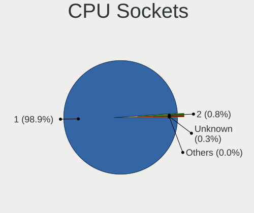

| Number  | Computers | Percent |
|---------|-----------|---------|
| 1       | 32013     | 98.86%  |
| 2       | 249       | 0.77%   |
| Unknown | 98        | 0.3%    |
| 4       | 11        | 0.03%   |
| 20      | 4         | 0.01%   |
| 8       | 2         | 0.01%   |
| 3       | 2         | 0.01%   |
| 24      | 1         | 0.003%  |
| 14      | 1         | 0.003%  |

CPU Threads
-----------

Threads per core (Hyper-Threading)

| Number  | Computers | Percent |
|---------|-----------|---------|
| 2       | 21984     | 67.7%   |
| 1       | 10347     | 31.87%  |
| Unknown | 131       | 0.4%    |
| 4       | 6         | 0.02%   |
| 8       | 2         | 0.01%   |
| 16      | 1         | 0.003%  |

CPU Op-Modes
------------

CPU Operation Modes (32-bit, 64-bit)

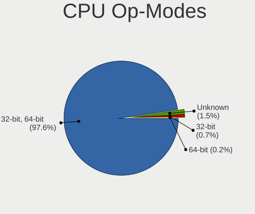

| Op mode        | Computers | Percent |
|----------------|-----------|---------|
| 32-bit, 64-bit | 31646     | 97.61%  |
| Unknown        | 481       | 1.48%   |
| 32-bit         | 240       | 0.74%   |
| 64-bit         | 55        | 0.17%   |

CPU Microcode
-------------

Microcode number

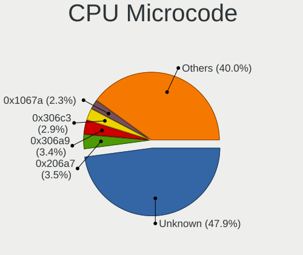

| Number     | Computers | Percent |
|------------|-----------|---------|
| Unknown    | 16270     | 47.91%  |
| 0x206a7    | 1193      | 3.51%   |
| 0x306a9    | 1162      | 3.42%   |
| 0x306c3    | 971       | 2.86%   |
| 0x1067a    | 768       | 2.26%   |
| 0x506e3    | 471       | 1.39%   |
| 0x906ea    | 444       | 1.31%   |
| 0x806ea    | 438       | 1.29%   |
| 0x806ec    | 404       | 1.19%   |
| 0x40651    | 400       | 1.18%   |
| 0x806c1    | 398       | 1.17%   |
| 0x406e3    | 391       | 1.15%   |
| 0x20655    | 376       | 1.11%   |
| 0x08701021 | 365       | 1.07%   |
| 0x806e9    | 357       | 1.05%   |
| 0x906e9    | 304       | 0.9%    |
| 0x306d4    | 304       | 0.9%    |
| 0x0800820d | 274       | 0.81%   |
| 0x010000c8 | 272       | 0.8%    |
| 0x06000852 | 255       | 0.75%   |
| 0x08108109 | 254       | 0.75%   |
| 0x0a50000c | 240       | 0.71%   |
| 0x08600106 | 232       | 0.68%   |
| 0x10676    | 230       | 0.68%   |
| 0x6fd      | 215       | 0.63%   |
| 0x406c4    | 212       | 0.62%   |
| 0x30678    | 202       | 0.59%   |
| 0x08608103 | 199       | 0.59%   |
| 0x06001119 | 184       | 0.54%   |
| 0x20652    | 179       | 0.53%   |
| 0x08108102 | 177       | 0.52%   |
| 0x706a1    | 171       | 0.5%    |
| 0x6fb      | 150       | 0.44%   |
| 0x08701013 | 147       | 0.43%   |
| 0x506c9    | 142       | 0.42%   |
| 0x0a50000d | 136       | 0.4%    |
| 0x806eb    | 135       | 0.4%    |
| 0x706a8    | 131       | 0.39%   |
| 0x106e5    | 130       | 0.38%   |
| 0x706e5    | 120       | 0.35%   |

CPU Microarch
-------------

Microarchitecture

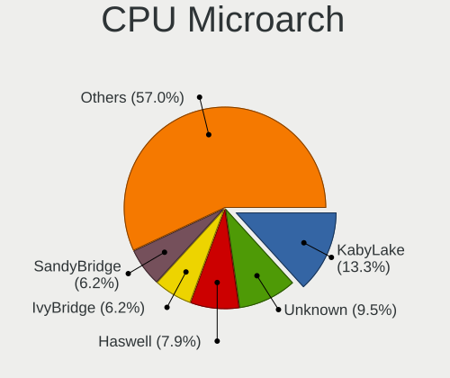

| Name              | Computers | Percent |
|-------------------|-----------|---------|
| KabyLake          | 4310      | 13.25%  |
| Unknown           | 3080      | 9.47%   |
| Haswell           | 2558      | 7.87%   |
| IvyBridge         | 2024      | 6.22%   |
| SandyBridge       | 2023      | 6.22%   |
| Skylake           | 1772      | 5.45%   |
| Zen 2             | 1607      | 4.94%   |
| Zen 3             | 1593      | 4.9%    |
| Penryn            | 1474      | 4.53%   |
| Zen+              | 1117      | 3.44%   |
| Westmere          | 935       | 2.88%   |
| Silvermont        | 848       | 2.61%   |
| Alderlake Hybrid  | 821       | 2.52%   |
| TigerLake         | 787       | 2.42%   |
| Piledriver        | 748       | 2.3%    |
| Core              | 707       | 2.17%   |
| K10               | 685       | 2.11%   |
| Broadwell         | 656       | 2.02%   |
| Zen               | 638       | 1.96%   |
| Goldmont plus     | 492       | 1.51%   |
| CometLake         | 482       | 1.48%   |
| IceLake           | 382       | 1.17%   |
| Nehalem           | 304       | 0.93%   |
| Excavator         | 302       | 0.93%   |
| Goldmont          | 264       | 0.81%   |
| K8 Hammer         | 243       | 0.75%   |
| Bobcat            | 210       | 0.65%   |
| Bonnell           | 207       | 0.64%   |
| Puma              | 184       | 0.57%   |
| P6                | 131       | 0.4%    |
| Jaguar            | 127       | 0.39%   |
| Steamroller       | 118       | 0.36%   |
| Bulldozer         | 115       | 0.35%   |
| NetBurst          | 108       | 0.33%   |
| Meteorlake Hybrid | 96        | 0.3%    |
| Tremont           | 93        | 0.29%   |
| Gracemont         | 91        | 0.28%   |
| K10 Llano         | 88        | 0.27%   |
| K8 & K10 hybrid   | 52        | 0.16%   |
| Lunarlake Hybrid  | 26        | 0.08%   |

Graphics
--------

GPU Vendor
----------

Vendors of graphics cards

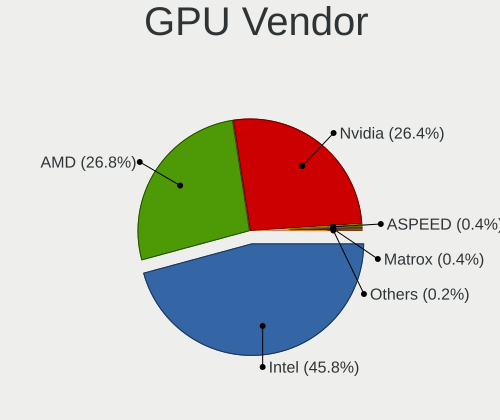

| Vendor                                       | Computers | Percent |
|----------------------------------------------|-----------|---------|
| Intel                                        | 16954     | 45.78%  |
| AMD                                          | 9919      | 26.79%  |
| Nvidia                                       | 9782      | 26.42%  |
| ASPEED Technology                            | 153       | 0.41%   |
| Matrox Electronics Systems                   | 146       | 0.39%   |
| Silicon Integrated Systems [SiS]             | 23        | 0.06%   |
| VIA Technologies                             | 21        | 0.06%   |
| ATI Technologies                             | 14        | 0.04%   |
| S3 Graphics                                  | 10        | 0.03%   |
| XGI Technology (eXtreme Graphics Innovation) | 3         | 0.01%   |
| Silicon Motion                               | 1         | 0.003%  |
| Red Hat                                      | 1         | 0.003%  |
| Neomagic                                     | 1         | 0.003%  |
| Huawei Technologies                          | 1         | 0.003%  |
| Dome Imaging Systems                         | 1         | 0.003%  |

GPU Model
---------

Graphics card models

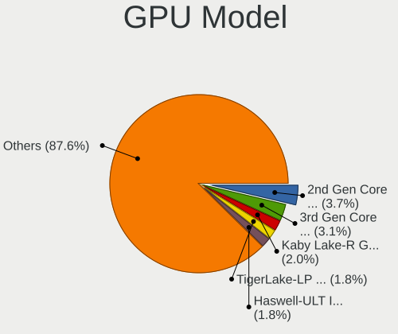

| Model                                                                                    | Computers | Percent |
|------------------------------------------------------------------------------------------|-----------|---------|
| Intel 2nd Generation Core Processor Family Integrated Graphics Controller                | 1412      | 3.69%   |
| Intel 3rd Gen Core processor Graphics Controller                                         | 1199      | 3.13%   |
| Intel Kaby Lake-R GT2 [UHD Graphics 620]                                                 | 747       | 1.95%   |
| Intel TigerLake-LP GT2 [Iris Xe Graphics]                                                | 687       | 1.79%   |
| Intel Haswell-ULT Integrated Graphics Controller                                         | 686       | 1.79%   |
| Intel Skylake-U GT2 [HD Graphics 520]                                                    | 667       | 1.74%   |
| AMD Renoir [Radeon Vega Series / Radeon Vega Mobile Series]                              | 666       | 1.74%   |
| AMD Picasso/Raven 2 [Radeon Vega Series / Radeon Vega Mobile Series]                     | 660       | 1.72%   |
| Intel Kaby Lake-U GT2 [HD Graphics 620]                                                  | 588       | 1.54%   |
| AMD Ellesmere [Radeon RX 470/480/570/570X/580/580X/590]                                  | 579       | 1.51%   |
| Intel 4th Gen Core Processor Integrated Graphics Controller                              | 534       | 1.39%   |
| Intel Xeon E3-1200 v3/4th Gen Core Processor Integrated Graphics Controller              | 526       | 1.37%   |
| Intel Core Processor Integrated Graphics Controller                                      | 525       | 1.37%   |
| AMD Cezanne [Radeon Vega Series / Radeon Vega Mobile Series]                             | 524       | 1.37%   |
| Intel WhiskeyLake-U GT2 [UHD Graphics 620]                                               | 501       | 1.31%   |
| Intel Mobile 4 Series Chipset Integrated Graphics Controller                             | 480       | 1.25%   |
| Intel Atom/Celeron/Pentium Processor x5-E8000/J3xxx/N3xxx Integrated Graphics Controller | 461       | 1.2%    |
| Intel CometLake-U GT2 [UHD Graphics]                                                     | 449       | 1.17%   |
| Intel Broadwell-U GT2 [HD Graphics 5500]                                                 | 419       | 1.09%   |
| AMD Lucienne                                                                             | 402       | 1.05%   |
| Intel CoffeeLake-H GT2 [UHD Graphics 630]                                                | 390       | 1.02%   |
| Intel Atom Processor Z36xxx/Z37xxx Series Graphics & Display                             | 384       | 1%      |
| Intel GeminiLake [UHD Graphics 600]                                                      | 360       | 0.94%   |
| Intel Skylake-S GT2 [HD Graphics 530]                                                    | 346       | 0.9%    |
| Intel CoffeeLake-S GT2 [UHD Graphics 630]                                                | 339       | 0.89%   |
| AMD Raphael                                                                              | 318       | 0.83%   |
| Nvidia GP107 [GeForce GTX 1050 Ti]                                                       | 311       | 0.81%   |
| Intel Alder Lake-P GT2 [Iris Xe Graphics]                                                | 267       | 0.7%    |
| AMD Raven Ridge [Radeon Vega Series / Radeon Vega Mobile Series]                         | 261       | 0.68%   |
| Nvidia GK208B [GeForce GT 710]                                                           | 243       | 0.63%   |
| Intel Xeon E3-1200 v2/3rd Gen Core processor Graphics Controller                         | 242       | 0.63%   |
| Nvidia GP106 [GeForce GTX 1060 6GB]                                                      | 228       | 0.6%    |
| AMD Phoenix1                                                                             | 221       | 0.58%   |
| AMD Barcelo                                                                              | 217       | 0.57%   |
| AMD Navi 10 [Radeon RX 5600 OEM/5600 XT / 5700/5700 XT]                                  | 201       | 0.52%   |
| Intel Kaby Lake-H GT2 [HD Graphics 630]                                                  | 197       | 0.51%   |
| Nvidia GP108 [GeForce GT 1030]                                                           | 196       | 0.51%   |
| AMD Rembrandt [Radeon 680M]                                                              | 191       | 0.5%    |
| Intel Raptor Lake-P [Iris Xe Graphics]                                                   | 189       | 0.49%   |
| Intel Kaby Lake-S GT2 [HD Graphics 630]                                                  | 187       | 0.49%   |

GPU Combo
---------

Combinations of graphics cards

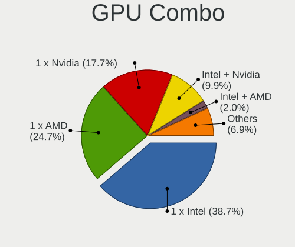

| Name                              | Computers | Percent |
|-----------------------------------|-----------|---------|
| 1 x Intel                         | 12637     | 38.66%  |
| 1 x AMD                           | 8083      | 24.73%  |
| 1 x Nvidia                        | 5800      | 17.74%  |
| Intel + Nvidia                    | 3247      | 9.93%   |
| Intel + AMD                       | 660       | 2.02%   |
| 2 x AMD                           | 603       | 1.84%   |
| AMD + Nvidia                      | 594       | 1.82%   |
| Other                             | 440       | 1.35%   |
| 2 x Intel                         | 137       | 0.42%   |
| 1 x Matrox                        | 121       | 0.37%   |
| 2 x Nvidia                        | 112       | 0.34%   |
| 1 x ASPEED                        | 108       | 0.33%   |
| Nvidia + ASPEED                   | 32        | 0.1%    |
| 1 x SiS                           | 23        | 0.07%   |
| 1 x VIA                           | 21        | 0.06%   |
| Nvidia + Matrox                   | 15        | 0.05%   |
| AMD + ASPEED                      | 11        | 0.03%   |
| 1 x S3 Graphics                   | 10        | 0.03%   |
| AMD + Matrox                      | 7         | 0.02%   |
| Intel + 2 x Nvidia                | 3         | 0.01%   |
| Nvidia + XGI                      | 2         | 0.01%   |
| Intel + Matrox                    | 2         | 0.01%   |
| Intel + AMD + 1 x Nvidia          | 2         | 0.01%   |
| 5 x AMD                           | 1         | 0.003%  |
| 4 x Nvidia                        | 1         | 0.003%  |
| 2 x Nvidia + 1 x Matrox           | 1         | 0.003%  |
| 2 x Nvidia + 1 x ASPEED           | 1         | 0.003%  |
| 2 x Intel + 1 x Nvidia            | 1         | 0.003%  |
| 2 x Intel + 1 x AMD               | 1         | 0.003%  |
| 2 x AMD + 1 x Nvidia + 1 x ASPEED | 1         | 0.003%  |
| 2 x AMD + 1 x ASPEED              | 1         | 0.003%  |
| 1 x Silicon Motion                | 1         | 0.003%  |
| 1 x Red Hat                       | 1         | 0.003%  |
| Nvidia + Dome Imaging Systems     | 1         | 0.003%  |
| 1 x Neomagic                      | 1         | 0.003%  |
| 1 x Intel + 4 x AMD               | 1         | 0.003%  |
| 1 x Intel + 3 x Nvidia            | 1         | 0.003%  |
| Intel + ASPEED                    | 1         | 0.003%  |
| 1 x Huawei Technologies           | 1         | 0.003%  |
| AMD + XGI                         | 1         | 0.003%  |

GPU Driver
----------

Free vs proprietary

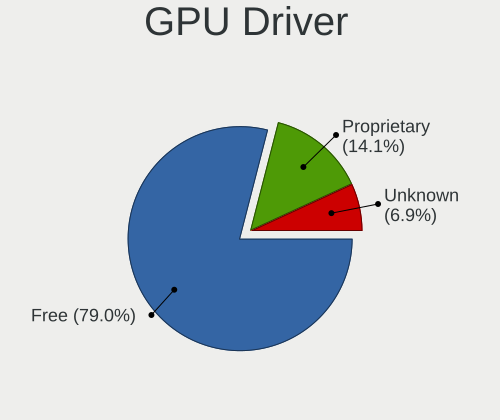

| Driver      | Computers | Percent |
|-------------|-----------|---------|
| Free        | 26107     | 79%     |
| Proprietary | 4667      | 14.12%  |
| Unknown     | 2271      | 6.87%   |

GPU Memory
----------

Total video memory

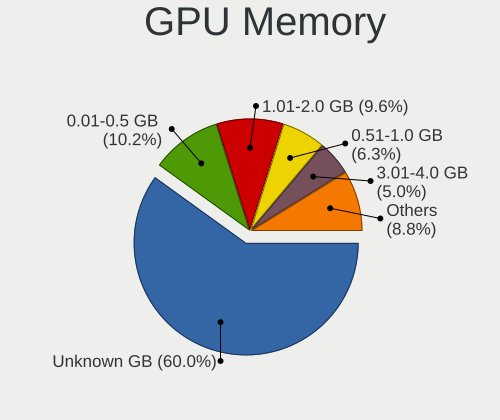

| Size in GB     | Computers | Percent |
|----------------|-----------|---------|
| Unknown        | 20166     | 59.95%  |
| 0.01-0.5       | 3441      | 10.23%  |
| 1.01-2.0       | 3245      | 9.65%   |
| 0.51-1.0       | 2128      | 6.33%   |
| 3.01-4.0       | 1695      | 5.04%   |
| 7.01-8.0       | 1416      | 4.21%   |
| 8.01-16.0      | 716       | 2.13%   |
| 5.01-6.0       | 540       | 1.61%   |
| 2.01-3.0       | 141       | 0.42%   |
| 16.01-24.0     | 129       | 0.38%   |
| 4.01-5.0       | 13        | 0.04%   |
| 24.01-32.0     | 3         | 0.01%   |
| More than 64.0 | 2         | 0.01%   |
| 32.01-64.0     | 1         | 0.003%  |

Monitor
-------

Monitor Vendor
--------------

Monitor vendors

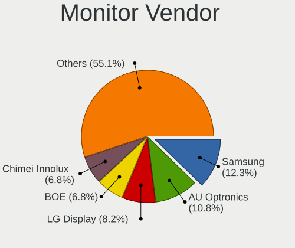

| Vendor                  | Computers | Percent |
|-------------------------|-----------|---------|
| Samsung Electronics     | 4384      | 12.28%  |
| AU Optronics            | 3850      | 10.78%  |
| LG Display              | 2926      | 8.19%   |
| BOE                     | 2440      | 6.83%   |
| Chimei Innolux          | 2435      | 6.82%   |
| Goldstar                | 1790      | 5.01%   |
| Dell                    | 1747      | 4.89%   |
| Acer                    | 1371      | 3.84%   |
| BenQ                    | 1218      | 3.41%   |
| Lenovo                  | 953       | 2.67%   |
| Hewlett-Packard         | 922       | 2.58%   |
| Ancor Communications    | 840       | 2.35%   |
| AOC                     | 776       | 2.17%   |
| Philips                 | 755       | 2.11%   |
| Apple                   | 705       | 1.97%   |
| Iiyama                  | 619       | 1.73%   |
| Sharp                   | 539       | 1.51%   |
| Fujitsu Siemens         | 534       | 1.5%    |
| Eizo                    | 449       | 1.26%   |
| Chi Mei Optoelectronics | 435       | 1.22%   |
| ASUSTek Computer        | 397       | 1.11%   |
| Medion                  | 300       | 0.84%   |
| InfoVision              | 265       | 0.74%   |
| PANDA                   | 233       | 0.65%   |
| Sony                    | 225       | 0.63%   |
| ViewSonic               | 223       | 0.62%   |
| Unknown                 | 196       | 0.55%   |
| HannStar                | 196       | 0.55%   |
| Panasonic               | 189       | 0.53%   |
| NEC Computers           | 189       | 0.53%   |
| Valve                   | 171       | 0.48%   |
| MSI                     | 167       | 0.47%   |
| LG Philips              | 167       | 0.47%   |
| CSO                     | 162       | 0.45%   |
| LG Electronics          | 145       | 0.41%   |
| Vestel Elektronik       | 123       | 0.34%   |
| Compal                  | 122       | 0.34%   |
| Gigabyte Technology     | 114       | 0.32%   |
| Belinea                 | 104       | 0.29%   |
| Toshiba                 | 103       | 0.29%   |

Monitor Model
-------------

Monitor models

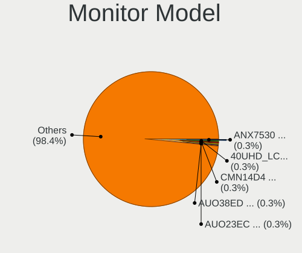

| Model                                                                     | Computers | Percent |
|---------------------------------------------------------------------------|-----------|---------|
| Valve ANX7530 U VLV3001 800x1280 100x150mm 7.1-inch                       | 127       | 0.34%   |
| Vestel Elektronik 40UHD_LCD_TV VES3700 3840x2160 880x500mm 39.8-inch      | 123       | 0.33%   |
| Chimei Innolux LCD Monitor CMN14D4 1920x1080 309x173mm 13.9-inch          | 117       | 0.31%   |
| AU Optronics LCD Monitor AUO38ED 1920x1080 344x193mm 15.5-inch            | 113       | 0.3%    |
| AU Optronics LCD Monitor AUO23EC 1366x768 344x193mm 15.5-inch             | 110       | 0.3%    |
| AU Optronics LCD Monitor AUO21ED 1920x1080 344x193mm 15.5-inch            | 99        | 0.27%   |
| BenQ GL2450H BNQ78A7 1920x1080 531x298mm 24.0-inch                        | 96        | 0.26%   |
| Samsung Electronics C27F390 SAM0D32 1920x1080 598x336mm 27.0-inch         | 95        | 0.26%   |
| Samsung Electronics U28E590 SAM0C4D 3840x2160 607x345mm 27.5-inch         | 91        | 0.24%   |
| Samsung Electronics LCD Monitor SEC5441 1280x800 331x207mm 15.4-inch      | 90        | 0.24%   |
| LG Display LCD Monitor LGD046F 1920x1080 344x194mm 15.5-inch              | 87        | 0.23%   |
| Samsung Electronics C24F390 SAM0D2C 1920x1080 521x293mm 23.5-inch         | 81        | 0.22%   |
| LG Display LCD Monitor LGD02DC 1366x768 344x194mm 15.5-inch               | 80        | 0.22%   |
| Lenovo LCD Monitor LEN40B1 1600x900 345x194mm 15.6-inch                   | 80        | 0.22%   |
| Chimei Innolux LCD Monitor CMN15E7 1920x1080 344x193mm 15.5-inch          | 79        | 0.21%   |
| AU Optronics LCD Monitor AUO403D 1920x1080 309x174mm 14.0-inch            | 78        | 0.21%   |
| Chimei Innolux LCD Monitor CMN1735 1920x1080 381x214mm 17.2-inch          | 77        | 0.21%   |
| Chimei Innolux LCD Monitor CMN15DB 1366x768 344x193mm 15.5-inch           | 75        | 0.2%    |
| AOC 27G2G4 AOC2702 1920x1080 598x336mm 27.0-inch                          | 75        | 0.2%    |
| Chimei Innolux LCD Monitor CMN14C9 1920x1080 309x173mm 13.9-inch          | 73        | 0.2%    |
| AU Optronics LCD Monitor AUO22EC 1366x768 344x193mm 15.5-inch             | 73        | 0.2%    |
| Ancor Communications VS248 ACI2498 1920x1080 531x299mm 24.0-inch          | 72        | 0.19%   |
| BOE LCD Monitor BOE0687 1920x1080 344x193mm 15.5-inch                     | 70        | 0.19%   |
| Grundig WUXGA GRU4448 1360x768                                            | 69        | 0.19%   |
| Goldstar Ultra HD GSM5B09 3840x2160 600x340mm 27.2-inch                   | 68        | 0.18%   |
| Unknown LCD Monitor FFFF 2288x1287 2550x2550mm 142.0-inch                 | 67        | 0.18%   |
| Panasonic TV MEIA296 1920x1080 698x392mm 31.5-inch                        | 67        | 0.18%   |
| Dell U2412M DELA07A 1920x1200 518x324mm 24.1-inch                         | 66        | 0.18%   |
| BOE LCD Monitor BOE084E 1920x1080 382x215mm 17.3-inch                     | 66        | 0.18%   |
| Ancor Communications ASUS VS247 ACI249A 1920x1080 521x293mm 23.5-inch     | 66        | 0.18%   |
| Chimei Innolux LCD Monitor CMN15F5 1920x1080 344x193mm 15.5-inch          | 65        | 0.17%   |
| Chi Mei Optoelectronics LCD Monitor CMO1720 1920x1080 382x215mm 17.3-inch | 65        | 0.17%   |
| Chimei Innolux LCD Monitor CMN1728 1600x900 382x215mm 17.3-inch           | 64        | 0.17%   |
| LG Display LCD Monitor LGD02E3 1366x768 344x194mm 15.5-inch               | 61        | 0.16%   |
| Lenovo LCD Monitor LEN40BA 1920x1080 344x194mm 15.5-inch                  | 60        | 0.16%   |
| Goldstar HDR 4K GSM7706 3840x2160 600x340mm 27.2-inch                     | 60        | 0.16%   |
| AU Optronics LCD Monitor AUO573D 1920x1080 309x174mm 14.0-inch            | 60        | 0.16%   |
| LG Display LCD Monitor LGD02D8 1366x768 277x156mm 12.5-inch               | 58        | 0.16%   |
| AU Optronics LCD Monitor AUO139E 1600x900 382x214mm 17.2-inch             | 58        | 0.16%   |
| Unknown                                                                   | 58        | 0.16%   |

Monitor Resolution
------------------

Monitor screen resolution

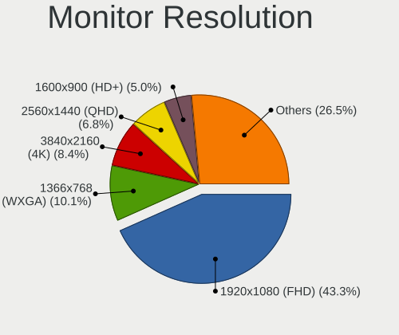

| Resolution         | Computers | Percent |
|--------------------|-----------|---------|
| 1920x1080 (FHD)    | 14829     | 43.33%  |
| 1366x768 (WXGA)    | 3444      | 10.06%  |
| 3840x2160 (4K)     | 2865      | 8.37%   |
| 2560x1440 (QHD)    | 2322      | 6.79%   |
| 1600x900 (HD+)     | 1703      | 4.98%   |
| 1920x1200 (WUXGA)  | 1426      | 4.17%   |
| 1680x1050 (WSXGA+) | 1169      | 3.42%   |
| 1280x1024 (SXGA)   | 1057      | 3.09%   |
| 1280x800 (WXGA)    | 682       | 1.99%   |
| 3440x1440          | 617       | 1.8%    |
| 1440x900 (WXGA+)   | 565       | 1.65%   |
| Unknown            | 415       | 1.21%   |
| 2560x1600          | 414       | 1.21%   |
| 2880x1800          | 300       | 0.88%   |
| 3840x1080          | 258       | 0.75%   |
| 2560x1080          | 184       | 0.54%   |
| 800x1280           | 179       | 0.52%   |
| 1920x540           | 120       | 0.35%   |
| 1600x1200          | 108       | 0.32%   |
| 1024x600           | 104       | 0.3%    |
| 1024x768 (XGA)     | 102       | 0.3%    |
| 2160x1440          | 100       | 0.29%   |
| 3840x2400          | 97        | 0.28%   |
| 1360x768           | 90        | 0.26%   |
| 2880x1920          | 84        | 0.25%   |
| 1920x1280          | 78        | 0.23%   |
| 2288x1287          | 73        | 0.21%   |
| 2256x1504          | 73        | 0.21%   |
| 3840x1600          | 71        | 0.21%   |
| 3200x1800 (QHD+)   | 61        | 0.18%   |
| 1280x720 (HD)      | 36        | 0.11%   |
| 3000x2000          | 32        | 0.09%   |
| 3840x1200          | 31        | 0.09%   |
| 1400x1050          | 31        | 0.09%   |
| 1680x945           | 30        | 0.09%   |
| 2736x1824          | 26        | 0.08%   |
| 4480x1440          | 25        | 0.07%   |
| 3072x1920          | 23        | 0.07%   |
| 2048x1152          | 20        | 0.06%   |
| 3200x2000          | 19        | 0.06%   |

Monitor Diagonal
----------------

Diagonal size in inches

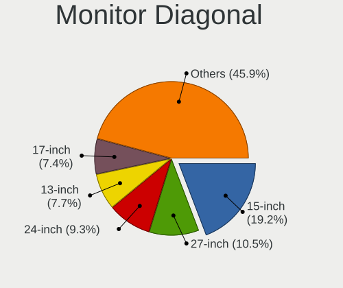

| Inches  | Computers | Percent |
|---------|-----------|---------|
| 15      | 6828      | 19.21%  |
| 27      | 3734      | 10.51%  |
| 24      | 3302      | 9.29%   |
| 13      | 2730      | 7.68%   |
| 17      | 2646      | 7.44%   |
| 14      | 2535      | 7.13%   |
| 23      | 2147      | 6.04%   |
| Unknown | 1560      | 4.39%   |
| 21      | 1423      | 4%      |
| 31      | 1064      | 2.99%   |
| 19      | 903       | 2.54%   |
| 22      | 860       | 2.42%   |
| 12      | 689       | 1.94%   |
| 34      | 668       | 1.88%   |
| 16      | 555       | 1.56%   |
| 84      | 418       | 1.18%   |
| 11      | 327       | 0.92%   |
| 18      | 281       | 0.79%   |
| 20      | 275       | 0.77%   |
| 32      | 213       | 0.6%    |
| 40      | 207       | 0.58%   |
| 72      | 196       | 0.55%   |
| 54      | 192       | 0.54%   |
| 25      | 178       | 0.5%    |
| 10      | 175       | 0.49%   |
| 7       | 170       | 0.48%   |
| 28      | 120       | 0.34%   |
| 48      | 107       | 0.3%    |
| 26      | 100       | 0.28%   |
| 65      | 92        | 0.26%   |
| 37      | 76        | 0.21%   |
| 142     | 67        | 0.19%   |
| 49      | 56        | 0.16%   |
| 33      | 53        | 0.15%   |
| 42      | 51        | 0.14%   |
| 52      | 48        | 0.14%   |
| 63      | 43        | 0.12%   |
| 43      | 41        | 0.12%   |
| 35      | 41        | 0.12%   |
| 39      | 39        | 0.11%   |

Monitor Width
-------------

Physical width

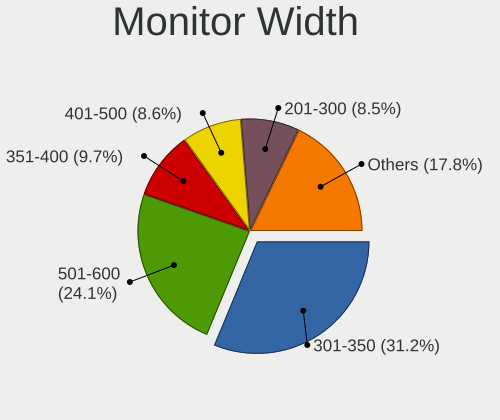

| Width in mm    | Computers | Percent |
|----------------|-----------|---------|
| 301-350        | 10871     | 31.24%  |
| 501-600        | 8386      | 24.1%   |
| 351-400        | 3389      | 9.74%   |
| 401-500        | 3002      | 8.63%   |
| 201-300        | 2943      | 8.46%   |
| 601-700        | 1609      | 4.62%   |
| Unknown        | 1560      | 4.48%   |
| 701-800        | 959       | 2.76%   |
| 1001-1500      | 687       | 1.97%   |
| 1501-2000      | 638       | 1.83%   |
| 801-900        | 365       | 1.05%   |
| 1-100          | 178       | 0.51%   |
| 901-1000       | 104       | 0.3%    |
| More than 2000 | 71        | 0.2%    |
| 101-200        | 38        | 0.11%   |

Aspect Ratio
------------

Proportional relationship between the width and the height

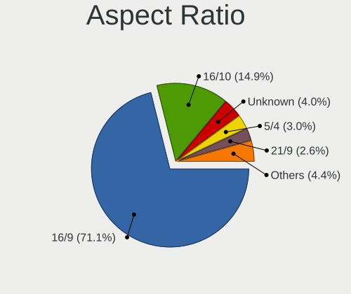

| Ratio   | Computers | Percent |
|---------|-----------|---------|
| 16/9    | 22889     | 71.13%  |
| 16/10   | 4797      | 14.91%  |
| Unknown | 1273      | 3.96%   |
| 5/4     | 975       | 3.03%   |
| 21/9    | 834       | 2.59%   |
| 3/2     | 549       | 1.71%   |
| 4/3     | 292       | 0.91%   |
| 32/9    | 173       | 0.54%   |
| 0.67    | 127       | 0.39%   |
| 6/5     | 98        | 0.3%    |
| 1.00    | 69        | 0.21%   |
| 0.62    | 43        | 0.13%   |
| 0.56    | 18        | 0.06%   |
| 0.89    | 10        | 0.03%   |
| 3.20    | 8         | 0.02%   |
| 0.63    | 7         | 0.02%   |
| 3.73    | 5         | 0.02%   |
| 3.40    | 3         | 0.01%   |
| 2.64    | 3         | 0.01%   |
| 2.00    | 2         | 0.01%   |
| 2.67    | 1         | 0.003%  |
| 1.96    | 1         | 0.003%  |
| 0.75    | 1         | 0.003%  |
| 0.65    | 1         | 0.003%  |
| 0.45    | 1         | 0.003%  |
| 0.25    | 1         | 0.003%  |

Monitor Area
------------

Area in inch²

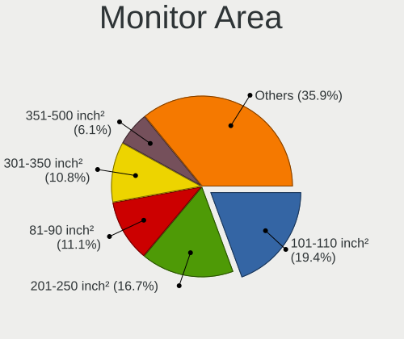

| Area in inch² | Computers | Percent |
|----------------|-----------|---------|
| 101-110        | 6819      | 19.39%  |
| 201-250        | 5872      | 16.7%   |
| 81-90          | 3900      | 11.09%  |
| 301-350        | 3807      | 10.82%  |
| 351-500        | 2141      | 6.09%   |
| 121-130        | 2074      | 5.9%    |
| 151-200        | 1563      | 4.44%   |
| Unknown        | 1560      | 4.44%   |
| 251-300        | 1467      | 4.17%   |
| 71-80          | 1330      | 3.78%   |
| More than 1000 | 1191      | 3.39%   |
| 61-70          | 665       | 1.89%   |
| 501-1000       | 644       | 1.83%   |
| 141-150        | 500       | 1.42%   |
| 111-120        | 475       | 1.35%   |
| 131-140        | 345       | 0.98%   |
| 51-60          | 342       | 0.97%   |
| 1-40           | 216       | 0.61%   |
| 41-50          | 162       | 0.46%   |
| 91-100         | 97        | 0.28%   |

Pixel Density
-------------

Pixels per inch

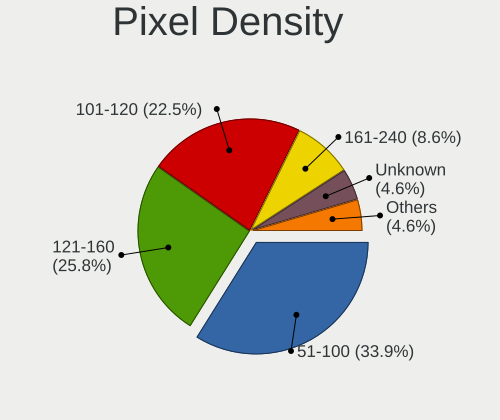

| Density       | Computers | Percent |
|---------------|-----------|---------|
| 51-100        | 11563     | 33.9%   |
| 121-160       | 8814      | 25.84%  |
| 101-120       | 7680      | 22.52%  |
| 161-240       | 2934      | 8.6%    |
| Unknown       | 1561      | 4.58%   |
| More than 240 | 833       | 2.44%   |
| 1-50          | 721       | 2.11%   |

Multiple Monitors
-----------------

Total monitors connected

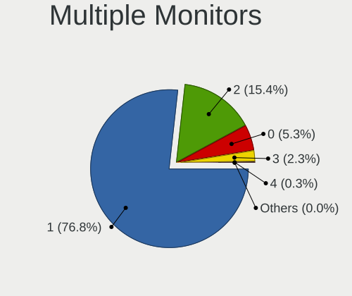

| Total | Computers | Percent |
|-------|-----------|---------|
| 1     | 25616     | 76.76%  |
| 2     | 5134      | 15.38%  |
| 0     | 1770      | 5.3%    |
| 3     | 761       | 2.28%   |
| 4     | 88        | 0.26%   |
| 5     | 3         | 0.01%   |

Network
-------

Net Controller Vendor
---------------------

Controller vendors

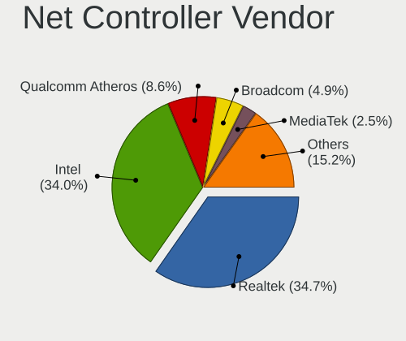

| Vendor                            | Computers | Percent |
|-----------------------------------|-----------|---------|
| Realtek Semiconductor             | 16714     | 34.71%  |
| Intel                             | 16384     | 34.02%  |
| Qualcomm Atheros                  | 4164      | 8.65%   |
| Broadcom                          | 2372      | 4.93%   |
| MediaTek                          | 1221      | 2.54%   |
| Broadcom Limited                  | 545       | 1.13%   |
| Marvell Technology Group          | 481       | 1%      |
| TP-Link                           | 426       | 0.88%   |
| Sierra Wireless                   | 416       | 0.86%   |
| ASIX Electronics                  | 408       | 0.85%   |
| Nvidia                            | 407       | 0.85%   |
| Ralink Technology                 | 341       | 0.71%   |
| Dell                              | 266       | 0.55%   |
| Ericsson Business Mobile Networks | 252       | 0.52%   |
| Ralink                            | 251       | 0.52%   |
| Lenovo                            | 222       | 0.46%   |
| Microsoft                         | 218       | 0.45%   |
| AVM                               | 202       | 0.42%   |
| Qualcomm                          | 156       | 0.32%   |
| DisplayLink                       | 151       | 0.31%   |
| Samsung Electronics               | 147       | 0.31%   |
| Hewlett-Packard                   | 137       | 0.28%   |
| Aquantia                          | 135       | 0.28%   |
| Edimax Technology                 | 123       | 0.26%   |
| Shenzhen Goodix Technology        | 119       | 0.25%   |
| Huawei Technologies               | 104       | 0.22%   |
| Fibocom                           | 103       | 0.21%   |
| ASUSTek Computer                  | 90        | 0.19%   |
| D-Link                            | 89        | 0.18%   |
| D-Link System                     | 88        | 0.18%   |
| IMC Networks                      | 86        | 0.18%   |
| Qualcomm Atheros Communications   | 83        | 0.17%   |
| Microchip Technology              | 72        | 0.15%   |
| Xiaomi                            | 70        | 0.15%   |
| NetGear                           | 68        | 0.14%   |
| JMicron Technology                | 54        | 0.11%   |
| VIA Technologies                  | 49        | 0.1%    |
| Mellanox Technologies             | 44        | 0.09%   |
| Qualcomm Technologies             | 42        | 0.09%   |
| Google                            | 38        | 0.08%   |

Net Controller Model
--------------------

Controller models

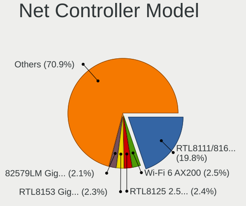

| Model                                                                  | Computers | Percent |
|------------------------------------------------------------------------|-----------|---------|
| Realtek RTL8111/8168/8211/8411 PCI Express Gigabit Ethernet Controller | 11395     | 19.81%  |
| Intel Wi-Fi 6 AX200                                                    | 1458      | 2.53%   |
| Realtek RTL8125 2.5GbE Controller                                      | 1358      | 2.36%   |
| Realtek RTL8153 Gigabit Ethernet Adapter                               | 1305      | 2.27%   |
| Intel 82579LM Gigabit Network Connection (Lewisville)                  | 1233      | 2.14%   |
| Intel Wireless 8265 / 8275                                             | 1072      | 1.86%   |
| Realtek RTL810xE PCI Express Fast Ethernet controller                  | 989       | 1.72%   |
| Intel I211 Gigabit Network Connection                                  | 796       | 1.38%   |
| Realtek RTL8821CE 802.11ac PCIe Wireless Network Adapter               | 787       | 1.37%   |
| Intel Wireless 8260                                                    | 667       | 1.16%   |
| Intel Wireless 7260                                                    | 639       | 1.11%   |
| Intel Wireless 7265                                                    | 590       | 1.03%   |
| Intel Centrino Advanced-N 6205 [Taylor Peak]                           | 590       | 1.03%   |
| Intel Wi-Fi 6 AX201                                                    | 589       | 1.02%   |
| Qualcomm Atheros AR9285 Wireless Network Adapter (PCI-Express)         | 586       | 1.02%   |
| Realtek RTL8822CE 802.11ac PCIe Wireless Network Adapter               | 553       | 0.96%   |
| Intel Ethernet Connection (2) I219-V                                   | 519       | 0.9%    |
| Qualcomm Atheros QCA9377 802.11ac Wireless Network Adapter             | 512       | 0.89%   |
| Intel Ethernet Controller I225-V                                       | 492       | 0.86%   |
| MediaTek MT7922 802.11ax PCI Express Wireless Network Adapter          | 485       | 0.84%   |
| Intel Ethernet Connection I217-LM                                      | 482       | 0.84%   |
| Intel Wi-Fi 6E(802.11ax) AX210/AX1675* 2x2 [Typhoon Peak]              | 465       | 0.81%   |
| Qualcomm Atheros AR9485 Wireless Network Adapter                       | 427       | 0.74%   |
| Intel Wireless 3165                                                    | 402       | 0.7%    |
| Intel Alder Lake-P PCH CNVi WiFi                                       | 386       | 0.67%   |
| Qualcomm Atheros QCA6174 802.11ac Wireless Network Adapter             | 382       | 0.66%   |
| ASIX AX88179 Gigabit Ethernet                                          | 355       | 0.62%   |
| Intel Comet Lake PCH-LP CNVi WiFi                                      | 348       | 0.6%    |
| Intel Wi-Fi 5(802.11ac) Wireless-AC 9x6x [Thunder Peak]                | 344       | 0.6%    |
| Intel Ethernet Connection (4) I219-LM                                  | 344       | 0.6%    |
| Intel Cannon Point-LP CNVi [Wireless-AC]                               | 342       | 0.59%   |
| Qualcomm Atheros QCA9565 / AR9565 Wireless Network Adapter             | 337       | 0.59%   |
| Intel Dual Band Wireless-AC 3168NGW [Stone Peak]                       | 337       | 0.59%   |
| Qualcomm Atheros AR8151 v2.0 Gigabit Ethernet                          | 335       | 0.58%   |
| MediaTek MT7921 802.11ax PCIe Wireless Network Adapter [Filogic 330]   | 324       | 0.56%   |
| Intel 82579V Gigabit Network Connection                                | 321       | 0.56%   |
| Realtek RTL8723BE PCIe Wireless Network Adapter                        | 299       | 0.52%   |
| Intel Ethernet Connection I219-LM                                      | 291       | 0.51%   |
| Intel Ethernet Connection (2) I219-LM                                  | 286       | 0.5%    |
| Intel Cannon Lake PCH CNVi WiFi                                        | 272       | 0.47%   |

Wireless Vendor
---------------

Wireless vendors

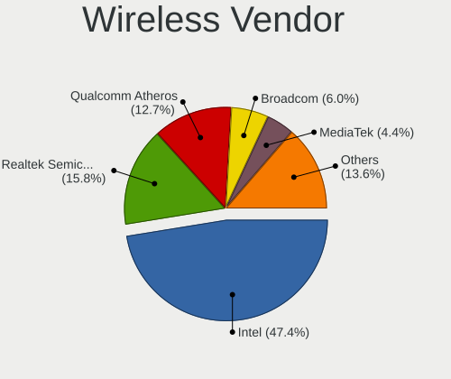

| Vendor                                | Computers | Percent |
|---------------------------------------|-----------|---------|
| Intel                                 | 11877     | 47.44%  |
| Realtek Semiconductor                 | 3956      | 15.8%   |
| Qualcomm Atheros                      | 3174      | 12.68%  |
| Broadcom                              | 1500      | 5.99%   |
| MediaTek                              | 1111      | 4.44%   |
| Sierra Wireless                       | 416       | 1.66%   |
| TP-Link                               | 398       | 1.59%   |
| Ralink Technology                     | 341       | 1.36%   |
| Broadcom Limited                      | 311       | 1.24%   |
| Ralink                                | 251       | 1%      |
| AVM                                   | 202       | 0.81%   |
| Microsoft                             | 196       | 0.78%   |
| Dell                                  | 151       | 0.6%    |
| Qualcomm                              | 135       | 0.54%   |
| Edimax Technology                     | 123       | 0.49%   |
| Fibocom                               | 103       | 0.41%   |
| ASUSTek Computer                      | 89        | 0.36%   |
| IMC Networks                          | 86        | 0.34%   |
| Qualcomm Atheros Communications       | 83        | 0.33%   |
| D-Link                                | 83        | 0.33%   |
| Marvell Technology Group              | 73        | 0.29%   |
| D-Link System                         | 71        | 0.28%   |
| NetGear                               | 66        | 0.26%   |
| Hewlett-Packard                       | 36        | 0.14%   |
| Belkin Components                     | 32        | 0.13%   |
| Sitecom Europe                        | 26        | 0.1%    |
| Qualcomm Technologies                 | 16        | 0.06%   |
| ZyXEL Communications                  | 15        | 0.06%   |
| ZyDAS                                 | 15        | 0.06%   |
| Wacom                                 | 9         | 0.04%   |
| Linksys                               | 9         | 0.04%   |
| Quectel Wireless Solutions            | 7         | 0.03%   |
| Realtek                               | 5         | 0.02%   |
| Fujitsu Siemens Computers             | 5         | 0.02%   |
| 802.11g Adapter [Linksys WUSB54GC v3] | 5         | 0.02%   |
| Winbond Electronics                   | 4         | 0.02%   |
| Texas Instruments                     | 4         | 0.02%   |
| Tenda                                 | 4         | 0.02%   |
| Philips (or NXP)                      | 4         | 0.02%   |
| Gemtek                                | 4         | 0.02%   |

Wireless Model
--------------

Wireless models

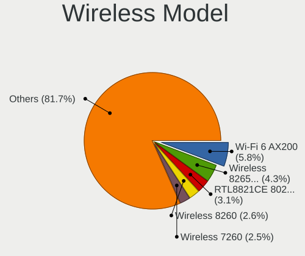

| Model                                                                   | Computers | Percent |
|-------------------------------------------------------------------------|-----------|---------|
| Intel Wi-Fi 6 AX200                                                     | 1458      | 5.78%   |
| Intel Wireless 8265 / 8275                                              | 1072      | 4.25%   |
| Realtek RTL8821CE 802.11ac PCIe Wireless Network Adapter                | 787       | 3.12%   |
| Intel Wireless 8260                                                     | 667       | 2.65%   |
| Intel Wireless 7260                                                     | 639       | 2.54%   |
| Intel Wireless 7265                                                     | 590       | 2.34%   |
| Intel Centrino Advanced-N 6205 [Taylor Peak]                            | 590       | 2.34%   |
| Intel Wi-Fi 6 AX201                                                     | 589       | 2.34%   |
| Qualcomm Atheros AR9285 Wireless Network Adapter (PCI-Express)          | 586       | 2.33%   |
| Realtek RTL8822CE 802.11ac PCIe Wireless Network Adapter                | 553       | 2.19%   |
| Qualcomm Atheros QCA9377 802.11ac Wireless Network Adapter              | 512       | 2.03%   |
| Intel Wi-Fi 6E(802.11ax) AX210/AX1675* 2x2 [Typhoon Peak]               | 465       | 1.84%   |
| MediaTek MT7922 802.11ax PCI Express Wireless Network Adapter           | 432       | 1.71%   |
| Qualcomm Atheros AR9485 Wireless Network Adapter                        | 427       | 1.69%   |
| Intel Wireless 3165                                                     | 402       | 1.59%   |
| Qualcomm Atheros QCA6174 802.11ac Wireless Network Adapter              | 382       | 1.52%   |
| Intel Comet Lake PCH-LP CNVi WiFi                                       | 348       | 1.38%   |
| Intel Wi-Fi 5(802.11ac) Wireless-AC 9x6x [Thunder Peak]                 | 344       | 1.36%   |
| Intel Cannon Point-LP CNVi [Wireless-AC]                                | 342       | 1.36%   |
| Qualcomm Atheros QCA9565 / AR9565 Wireless Network Adapter              | 337       | 1.34%   |
| Intel Dual Band Wireless-AC 3168NGW [Stone Peak]                        | 337       | 1.34%   |
| MediaTek MT7921 802.11ax PCIe Wireless Network Adapter [Filogic 330]    | 324       | 1.29%   |
| Realtek RTL8723BE PCIe Wireless Network Adapter                         | 299       | 1.19%   |
| Intel Cannon Lake PCH CNVi WiFi                                         | 272       | 1.08%   |
| Intel Wireless 3160                                                     | 270       | 1.07%   |
| Intel Centrino Ultimate-N 6300                                          | 260       | 1.03%   |
| Realtek RTL88x2bu [AC1200 Techkey]                                      | 254       | 1.01%   |
| Broadcom BCM43142 802.11b/g/n                                           | 244       | 0.97%   |
| Broadcom BCM4313 802.11bgn Wireless Network Adapter                     | 229       | 0.91%   |
| Intel Comet Lake PCH CNVi WiFi                                          | 217       | 0.86%   |
| Intel Alder Lake-P PCH CNVi WiFi                                        | 216       | 0.86%   |
| Qualcomm Atheros AR9462 Wireless Network Adapter                        | 203       | 0.81%   |
| Intel Raptor Lake PCH CNVi WiFi                                         | 194       | 0.77%   |
| Intel Centrino Wireless-N 2230                                          | 192       | 0.76%   |
| Intel WiFi Link 5100                                                    | 188       | 0.75%   |
| Qualcomm Atheros AR242x / AR542x Wireless Network Adapter (PCI-Express) | 182       | 0.72%   |
| Realtek 802.11ac NIC                                                    | 176       | 0.7%    |
| Intel Centrino Advanced-N 6200                                          | 175       | 0.69%   |
| Qualcomm Atheros AR9287 Wireless Network Adapter (PCI-Express)          | 172       | 0.68%   |
| Qualcomm Atheros AR928X Wireless Network Adapter (PCI-Express)          | 171       | 0.68%   |

Ethernet Vendor
---------------

Ethernet vendors

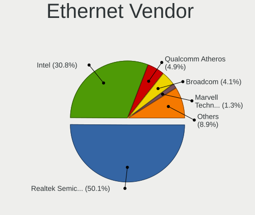

| Vendor                                 | Computers | Percent |
|----------------------------------------|-----------|---------|
| Realtek Semiconductor                  | 15173     | 50.1%   |
| Intel                                  | 9317      | 30.76%  |
| Qualcomm Atheros                       | 1472      | 4.86%   |
| Broadcom                               | 1230      | 4.06%   |
| Marvell Technology Group               | 408       | 1.35%   |
| ASIX Electronics                       | 408       | 1.35%   |
| Nvidia                                 | 407       | 1.34%   |
| Broadcom Limited                       | 244       | 0.81%   |
| Lenovo                                 | 217       | 0.72%   |
| DisplayLink                            | 151       | 0.5%    |
| Aquantia                               | 135       | 0.45%   |
| Samsung Electronics                    | 130       | 0.43%   |
| MediaTek                               | 101       | 0.33%   |
| Xiaomi                                 | 70        | 0.23%   |
| Microchip Technology                   | 67        | 0.22%   |
| JMicron Technology                     | 54        | 0.18%   |
| Huawei Technologies                    | 49        | 0.16%   |
| VIA Technologies                       | 48        | 0.16%   |
| Hewlett-Packard                        | 43        | 0.14%   |
| Google                                 | 38        | 0.13%   |
| Suzhou Motorcomm Electronic Technology | 35        | 0.12%   |
| Mellanox Technologies                  | 35        | 0.12%   |
| Silicon Integrated Systems [SiS]       | 34        | 0.11%   |
| Apple                                  | 31        | 0.1%    |
| Raspberry Pi                           | 29        | 0.1%    |
| TP-Link                                | 28        | 0.09%   |
| American Megatrends                    | 28        | 0.09%   |
| Qualcomm Technologies                  | 26        | 0.09%   |
| 3Com                                   | 22        | 0.07%   |
| Qualcomm                               | 19        | 0.06%   |
| Microsoft                              | 17        | 0.06%   |
| D-Link System                          | 17        | 0.06%   |
| Attansic Technology                    | 12        | 0.04%   |
| OPPO Electronics                       | 10        | 0.03%   |
| ICS Advent                             | 10        | 0.03%   |
| Dell                                   | 10        | 0.03%   |
| ZTE WCDMA Technologies MSM             | 8         | 0.03%   |
| Motorcomm Microelectronics.            | 8         | 0.03%   |
| Insyde Software                        | 8         | 0.03%   |
| Emulex                                 | 8         | 0.03%   |

Ethernet Model
--------------

Ethernet models

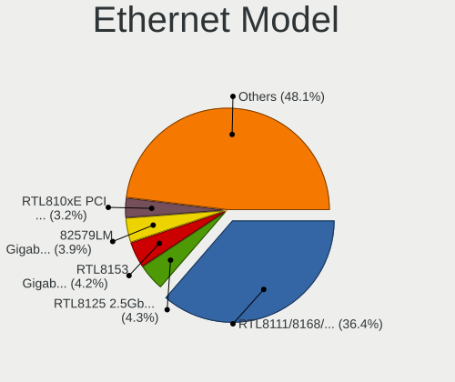

| Model                                                                  | Computers | Percent |
|------------------------------------------------------------------------|-----------|---------|
| Realtek RTL8111/8168/8211/8411 PCI Express Gigabit Ethernet Controller | 11395     | 36.36%  |
| Realtek RTL8125 2.5GbE Controller                                      | 1358      | 4.33%   |
| Realtek RTL8153 Gigabit Ethernet Adapter                               | 1305      | 4.16%   |
| Intel 82579LM Gigabit Network Connection (Lewisville)                  | 1233      | 3.93%   |
| Realtek RTL810xE PCI Express Fast Ethernet controller                  | 989       | 3.16%   |
| Intel I211 Gigabit Network Connection                                  | 796       | 2.54%   |
| Intel Ethernet Connection (2) I219-V                                   | 519       | 1.66%   |
| Intel Ethernet Controller I225-V                                       | 492       | 1.57%   |
| Intel Ethernet Connection I217-LM                                      | 482       | 1.54%   |
| ASIX AX88179 Gigabit Ethernet                                          | 355       | 1.13%   |
| Intel Ethernet Connection (4) I219-LM                                  | 344       | 1.1%    |
| Qualcomm Atheros AR8151 v2.0 Gigabit Ethernet                          | 335       | 1.07%   |
| Intel 82579V Gigabit Network Connection                                | 321       | 1.02%   |
| Intel Ethernet Connection I219-LM                                      | 291       | 0.93%   |
| Intel Ethernet Connection (2) I219-LM                                  | 286       | 0.91%   |
| Intel Ethernet Connection I217-V                                       | 257       | 0.82%   |
| Intel I210 Gigabit Network Connection                                  | 246       | 0.78%   |
| Intel 82577LM Gigabit Network Connection                               | 246       | 0.78%   |
| Intel Ethernet Connection (4) I219-V                                   | 236       | 0.75%   |
| Intel Ethernet Connection (7) I219-V                                   | 231       | 0.74%   |
| Intel Ethernet Connection I218-LM                                      | 199       | 0.63%   |
| Intel Ethernet Controller I226-V                                       | 185       | 0.59%   |
| Intel Ethernet Connection (3) I218-LM                                  | 183       | 0.58%   |
| Intel Ethernet Connection (7) I219-LM                                  | 180       | 0.57%   |
| Intel 82567LM Gigabit Network Connection                               | 179       | 0.57%   |
| Intel Ethernet Connection (6) I219-V                                   | 172       | 0.55%   |
| Intel Alder Lake-P PCH CNVi WiFi                                       | 170       | 0.54%   |
| Qualcomm Atheros AR8131 Gigabit Ethernet                               | 163       | 0.52%   |
| Qualcomm Atheros AR8161 Gigabit Ethernet                               | 158       | 0.5%    |
| Intel Ethernet Connection I219-V                                       | 143       | 0.46%   |
| Broadcom NetXtreme BCM57765 Gigabit Ethernet PCIe                      | 141       | 0.45%   |
| Intel 82574L Gigabit Network Connection                                | 138       | 0.44%   |
| Qualcomm Atheros Killer E220x Gigabit Ethernet Controller              | 132       | 0.42%   |
| Broadcom NetLink BCM57780 Gigabit Ethernet PCIe                        | 131       | 0.42%   |
| Qualcomm Atheros AR8121/AR8113/AR8114 Gigabit or Fast Ethernet         | 130       | 0.41%   |
| Intel Ethernet Connection (2) I218-V                                   | 128       | 0.41%   |
| Realtek RTL-8100/8101L/8139 PCI Fast Ethernet Adapter                  | 127       | 0.41%   |
| Broadcom NetXtreme BCM5764M Gigabit Ethernet PCIe                      | 124       | 0.4%    |
| Nvidia MCP79 Ethernet                                                  | 122       | 0.39%   |
| Nvidia MCP61 Ethernet                                                  | 121       | 0.39%   |

Net Controller Kind
-------------------

Ethernet, WiFi or modem

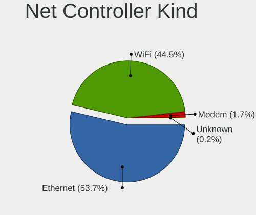

| Kind     | Computers | Percent |
|----------|-----------|---------|
| Ethernet | 28173     | 53.68%  |
| WiFi     | 23343     | 44.48%  |
| Modem    | 873       | 1.66%   |
| Unknown  | 95        | 0.18%   |

Used Controller
---------------

Currently used network controller

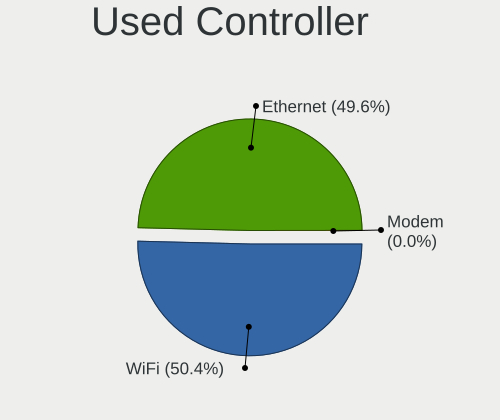

| Kind     | Computers | Percent |
|----------|-----------|---------|
| WiFi     | 17032     | 50.4%   |
| Ethernet | 16755     | 49.58%  |
| Unknown  | 6         | 0.02%   |
| Modem    | 1         | 0.003%  |

NICs
----

Total network controllers on board

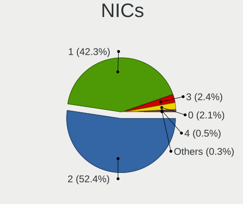

| Total | Computers | Percent |
|-------|-----------|---------|
| 2     | 17043     | 52.38%  |
| 1     | 13768     | 42.31%  |
| 3     | 792       | 2.43%   |
| 0     | 678       | 2.08%   |
| 4     | 147       | 0.45%   |
| 5     | 43        | 0.13%   |
| 6     | 35        | 0.11%   |
| 8     | 16        | 0.05%   |
| 7     | 10        | 0.03%   |
| 18    | 2         | 0.01%   |
| 10    | 2         | 0.01%   |
| 9     | 2         | 0.01%   |
| 12    | 1         | 0.003%  |

IPv6
----

IPv6 vs IPv4

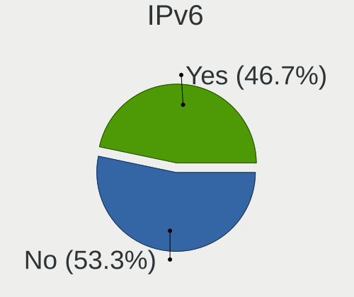

| Used | Computers | Percent |
|------|-----------|---------|
| No   | 17912     | 53.29%  |
| Yes  | 15701     | 46.71%  |

Bluetooth
---------

Bluetooth Vendor
----------------

Controller vendors

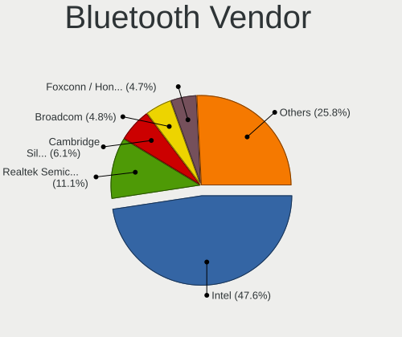

| Vendor                          | Computers | Percent |
|---------------------------------|-----------|---------|
| Intel                           | 9483      | 47.6%   |
| Realtek Semiconductor           | 2207      | 11.08%  |
| Cambridge Silicon Radio         | 1207      | 6.06%   |
| Broadcom                        | 958       | 4.81%   |
| Foxconn / Hon Hai               | 928       | 4.66%   |
| IMC Networks                    | 841       | 4.22%   |
| Qualcomm Atheros Communications | 803       | 4.03%   |
| Apple                           | 723       | 3.63%   |
| Lite-On Technology              | 582       | 2.92%   |
| MediaTek                        | 452       | 2.27%   |
| ASUSTek Computer                | 366       | 1.84%   |
| Dell                            | 261       | 1.31%   |
| Hewlett-Packard                 | 149       | 0.75%   |
| TP-Link                         | 122       | 0.61%   |
| Toshiba                         | 118       | 0.59%   |
| Realtek                         | 100       | 0.5%    |
| Foxconn International           | 75        | 0.38%   |
| Marvell Semiconductor           | 72        | 0.36%   |
| USI                             | 66        | 0.33%   |
| Askey Computer                  | 50        | 0.25%   |
| Alps Electric                   | 40        | 0.2%    |
| Integrated System Solution      | 37        | 0.19%   |
| Unknown                         | 36        | 0.18%   |
| Ralink                          | 35        | 0.18%   |
| Edimax Technology               | 30        | 0.15%   |
| Belkin Components               | 29        | 0.15%   |
| Taiyo Yuden                     | 23        | 0.12%   |
| Chicony Electronics             | 20        | 0.1%    |
| Actions                         | 18        | 0.09%   |
| Qcom                            | 13        | 0.07%   |
| Ralink Technology               | 11        | 0.06%   |
| Fujitsu                         | 10        | 0.05%   |
| Logitech                        | 9         | 0.05%   |
| HTC (High Tech Computer)        | 8         | 0.04%   |
| Micro Star International        | 5         | 0.03%   |
| Quectel Wireless Solutions      | 4         | 0.02%   |
| SiW                             | 3         | 0.02%   |
| Conwise Technology              | 3         | 0.02%   |
| AVM                             | 3         | 0.02%   |
| TRENDnet                        | 2         | 0.01%   |

Bluetooth Model
---------------

Controller models

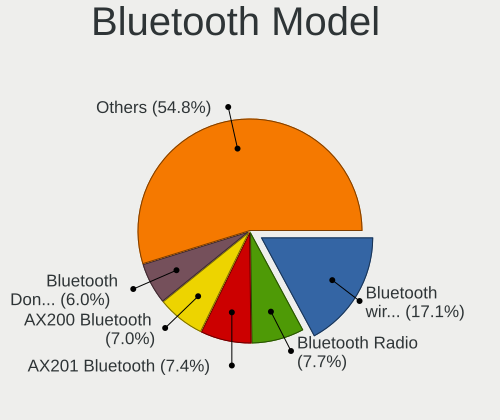

| Model                                               | Computers | Percent |
|-----------------------------------------------------|-----------|---------|
| Intel Bluetooth wireless interface                  | 3417      | 17.14%  |
| Realtek Bluetooth Radio                             | 1526      | 7.65%   |
| Intel AX201 Bluetooth                               | 1479      | 7.42%   |
| Intel AX200 Bluetooth                               | 1390      | 6.97%   |
| Cambridge Silicon Radio Bluetooth Dongle (HCI mode) | 1206      | 6.05%   |
| Intel Bluetooth 9460/9560 Jefferson Peak (JfP)      | 959       | 4.81%   |
| Intel Bluetooth Device                              | 742       | 3.72%   |
| MediaTek Wireless_Device                            | 447       | 2.24%   |
| Realtek  Bluetooth 4.2 Adapter                      | 442       | 2.22%   |
| Intel AX210 Bluetooth                               | 440       | 2.21%   |
| IMC Networks Bluetooth Radio                        | 387       | 1.94%   |
| Apple Bluetooth Host Controller                     | 329       | 1.65%   |
| Intel Wireless-AC 3168 Bluetooth                    | 327       | 1.64%   |
| Intel Wireless-AC 9260 Bluetooth Adapter            | 322       | 1.61%   |
| Intel Centrino Bluetooth Wireless Transceiver       | 310       | 1.55%   |
| Qualcomm Atheros  Bluetooth Device                  | 283       | 1.42%   |
| Foxconn / Hon Hai Wireless_Device                   | 269       | 1.35%   |
| Foxconn / Hon Hai Bluetooth Device                  | 235       | 1.18%   |
| IMC Networks Wireless_Device                        | 227       | 1.14%   |
| Broadcom BCM2045B (BDC-2.1)                         | 208       | 1.04%   |
| Apple Bluetooth USB Host Controller                 | 205       | 1.03%   |
| Qualcomm Atheros AR3011 Bluetooth                   | 180       | 0.9%    |
| Lite-On Qualcomm Atheros QCA9377 Bluetooth          | 180       | 0.9%    |
| Lite-On Bluetooth Device                            | 179       | 0.9%    |
| Qualcomm Atheros QCA61x4 Bluetooth 4.0              | 158       | 0.79%   |
| Broadcom BCM20702 Bluetooth 4.0 [ThinkPad]          | 156       | 0.78%   |
| Foxconn / Hon Hai MediaTek Bluetooth Adapter        | 145       | 0.73%   |
| Qualcomm Atheros AR3012 Bluetooth 4.0               | 139       | 0.7%    |
| IMC Networks Bluetooth Device                       | 133       | 0.67%   |
| Apple Built-in Bluetooth 2.0+EDR HCI                | 125       | 0.63%   |
| ASUS Broadcom BCM20702A0 Bluetooth                  | 123       | 0.62%   |
| TP-Link TP-T@- UB500 Adapter                        | 122       | 0.61%   |
| Broadcom BCM20702A0 Bluetooth 4.0                   | 112       | 0.56%   |
| ASUS ASUS USB-BT500                                 | 110       | 0.55%   |
| Dell DW375 Bluetooth Module                         | 102       | 0.51%   |
| Realtek Bluetooth Radio                             | 100       | 0.5%    |
| Lite-On Atheros AR3012 Bluetooth                    | 99        | 0.5%    |
| HP Broadcom 2070 Bluetooth Combo                    | 94        | 0.47%   |
| Intel Centrino Advanced-N 6230 Bluetooth adapter    | 90        | 0.45%   |
| Foxconn / Hon Hai BCM20702A0                        | 80        | 0.4%    |

Sound
-----

Sound Vendor
------------

Sound card vendors

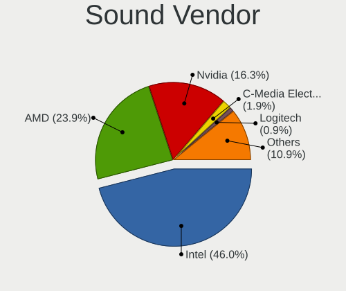

| Vendor                                       | Computers | Percent |
|----------------------------------------------|-----------|---------|
| Intel                                        | 21174     | 46.01%  |
| AMD                                          | 11019     | 23.95%  |
| Nvidia                                       | 7523      | 16.35%  |
| C-Media Electronics                          | 876       | 1.9%    |
| Logitech                                     | 423       | 0.92%   |
| Creative Labs                                | 350       | 0.76%   |
| GN Netcom                                    | 317       | 0.69%   |
| Lenovo                                       | 274       | 0.6%    |
| Texas Instruments                            | 219       | 0.48%   |
| ASUSTek Computer                             | 198       | 0.43%   |
| Realtek Semiconductor                        | 179       | 0.39%   |
| Focusrite-Novation                           | 162       | 0.35%   |
| JMTek                                        | 158       | 0.34%   |
| Creative Technology                          | 150       | 0.33%   |
| Plantronics                                  | 148       | 0.32%   |
| Kingston Technology                          | 143       | 0.31%   |
| Razer USA                                    | 139       | 0.3%    |
| Hewlett-Packard                              | 123       | 0.27%   |
| Micro Star International                     | 120       | 0.26%   |
| DSEA A/S                                     | 119       | 0.26%   |
| SteelSeries ApS                              | 117       | 0.25%   |
| Generalplus Technology                       | 109       | 0.24%   |
| Corsair                                      | 89        | 0.19%   |
| VIA Technologies                             | 88        | 0.19%   |
| RODE Microphones                             | 75        | 0.16%   |
| Yamaha                                       | 71        | 0.15%   |
| Zoran Co. Personal Media Division (Nogatech) | 62        | 0.13%   |
| BEHRINGER International                      | 58        | 0.13%   |
| Sony                                         | 52        | 0.11%   |
| Samson Technologies                          | 45        | 0.1%    |
| Dell                                         | 45        | 0.1%    |
| Silicon Integrated Systems [SiS]             | 43        | 0.09%   |
| Apple                                        | 43        | 0.09%   |
| Jieli Technology                             | 40        | 0.09%   |
| Native Instruments                           | 36        | 0.08%   |
| TerraTec Electronic                          | 35        | 0.08%   |
| ROCCAT                                       | 30        | 0.07%   |
| Conexant Systems                             | 30        | 0.07%   |
| Blue Microphones                             | 30        | 0.07%   |
| Lautsprecher Teufel                          | 28        | 0.06%   |

Sound Model
-----------

Sound card models

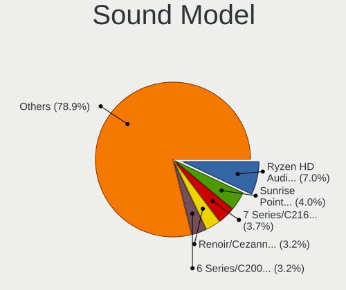

| Model                                                                      | Computers | Percent |
|----------------------------------------------------------------------------|-----------|---------|
| AMD Ryzen HD Audio Controller                                              | 3921      | 7.03%   |
| Intel Sunrise Point-LP HD Audio                                            | 2254      | 4.04%   |
| Intel 7 Series/C216 Chipset Family High Definition Audio Controller        | 2051      | 3.68%   |
| AMD Renoir/Cezanne HDMI/DP Audio Controller                                | 1782      | 3.19%   |
| Intel 6 Series/C200 Series Chipset Family High Definition Audio Controller | 1771      | 3.17%   |
| AMD Starship/Matisse HD Audio Controller                                   | 1537      | 2.75%   |
| Intel 8 Series/C220 Series Chipset High Definition Audio Controller        | 1502      | 2.69%   |
| AMD SBx00 Azalia (Intel HDA)                                               | 1343      | 2.41%   |
| AMD Radeon High Definition Audio Controller                                | 1254      | 2.25%   |
| Intel Xeon E3-1200 v3/4th Gen Core Processor HD Audio Controller           | 1099      | 1.97%   |
| Intel 5 Series/3400 Series Chipset High Definition Audio                   | 1056      | 1.89%   |
| Intel 100 Series/C230 Series Chipset Family HD Audio Controller            | 909       | 1.63%   |
| Intel 82801I (ICH9 Family) HD Audio Controller                             | 905       | 1.62%   |
| AMD Raven/Raven2/Fenghuang HDMI/DP Audio Controller                        | 898       | 1.61%   |
| Intel Cannon Lake PCH cAVS                                                 | 894       | 1.6%    |
| AMD FCH Azalia Controller                                                  | 835       | 1.5%    |
| Intel Tiger Lake-LP Smart Sound Technology Audio Controller                | 786       | 1.41%   |
| AMD Family 17h (Models 00h-0fh) HD Audio Controller                        | 740       | 1.33%   |
| Intel Haswell-ULT HD Audio Controller                                      | 695       | 1.25%   |
| Intel 8 Series HD Audio Controller                                         | 694       | 1.24%   |
| AMD Ellesmere HDMI Audio [Radeon RX 470/480 / 570/580/590]                 | 595       | 1.07%   |
| Intel Broadwell-U Audio Controller                                         | 577       | 1.03%   |
| Intel 200 Series PCH HD Audio                                              | 574       | 1.03%   |
| Intel NM10/ICH7 Family High Definition Audio Controller                    | 572       | 1.03%   |
| Intel Cannon Point-LP High Definition Audio Controller                     | 572       | 1.03%   |
| Intel Wildcat Point-LP High Definition Audio Controller                    | 560       | 1%      |
| AMD Navi 21/23 HDMI/DP Audio Controller                                    | 539       | 0.97%   |
| Nvidia GP107GL High Definition Audio Controller                            | 536       | 0.96%   |
| Intel Alder Lake PCH-P High Definition Audio Controller                    | 505       | 0.91%   |
| Intel Celeron/Pentium Silver Processor High Definition Audio               | 485       | 0.87%   |
| Intel Comet Lake PCH-LP cAVS                                               | 480       | 0.86%   |
| Nvidia GK208 HDMI/DP Audio Controller                                      | 457       | 0.82%   |
| Nvidia GF108 High Definition Audio Controller                              | 432       | 0.77%   |
| AMD Kabini HDMI/DP Audio                                                   | 385       | 0.69%   |
| Intel 82801H (ICH8 Family) HD Audio Controller                             | 382       | 0.68%   |
| Nvidia GP106 High Definition Audio Controller                              | 352       | 0.63%   |
| Nvidia GP104 High Definition Audio Controller                              | 346       | 0.62%   |
| AMD Oland/Hainan/Cape Verde/Pitcairn HDMI Audio [Radeon HD 7000 Series]    | 335       | 0.6%    |
| Nvidia GM107 High Definition Audio Controller [GeForce 940MX]              | 324       | 0.58%   |
| Nvidia High Definition Audio Controller                                    | 310       | 0.56%   |

Memory
------

Memory Vendor
-------------

Memory module vendors

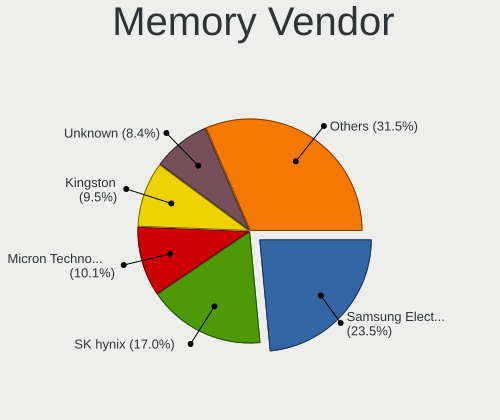

| Vendor                       | Computers | Percent |
|------------------------------|-----------|---------|
| Samsung Electronics          | 4482      | 23.51%  |
| SK hynix                     | 3244      | 17.02%  |
| Micron Technology            | 1922      | 10.08%  |
| Kingston                     | 1813      | 9.51%   |
| Unknown                      | 1602      | 8.4%    |
| Crucial                      | 1381      | 7.24%   |
| G.Skill                      | 1182      | 6.2%    |
| Corsair                      | 1087      | 5.7%    |
| Ramaxel Technology           | 335       | 1.76%   |
| A-DATA Technology            | 256       | 1.34%   |
| Nanya Technology             | 244       | 1.28%   |
| Elpida                       | 234       | 1.23%   |
| Unknown                      | 230       | 1.21%   |
| Unknown (ABCD)               | 204       | 1.07%   |
| Team                         | 99        | 0.52%   |
| Patriot                      | 61        | 0.32%   |
| Transcend                    | 60        | 0.31%   |
| Avant                        | 33        | 0.17%   |
| GOODRAM                      | 28        | 0.15%   |
| Timetec                      | 27        | 0.14%   |
| ASint Technology             | 26        | 0.14%   |
| Lexar                        | 22        | 0.12%   |
| Apacer                       | 21        | 0.11%   |
| Unifosa                      | 20        | 0.1%    |
| Toshiba                      | 20        | 0.1%    |
| GeIL                         | 18        | 0.09%   |
| 48spaces                     | 18        | 0.09%   |
| CSX                          | 16        | 0.08%   |
| Unknown (0x0E9D)             | 14        | 0.07%   |
| Qimonda                      | 14        | 0.07%   |
| Patriot Memory               | 13        | 0.07%   |
| Hewlett-Packard              | 13        | 0.07%   |
| Patriot Memory (PDP Systems) | 11        | 0.06%   |
| Unknown (0x0B45)             | 10        | 0.05%   |
| Lexar Co Limited             | 10        | 0.05%   |
| PNY                          | 9         | 0.05%   |
| INNOVATION PC                | 9         | 0.05%   |
| SHARETRONIC                  | 8         | 0.04%   |
| Mushkin                      | 8         | 0.04%   |
| Neo Forza                    | 7         | 0.04%   |

Memory Model
------------

Memory module models

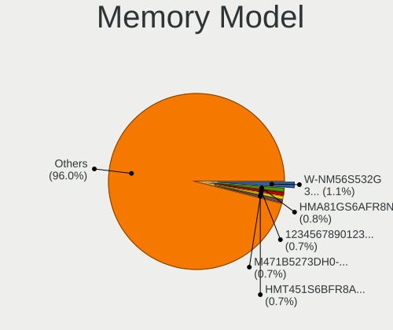

| Model                                                            | Computers | Percent |
|------------------------------------------------------------------|-----------|---------|
| Unknown                                                          | 230       | 1.13%   |
| SK hynix RAM HMA81GS6AFR8N-UH 8GB SODIMM DDR4 2667MT/s           | 164       | 0.8%    |
| Unknown (ABCD) RAM 123456789012345678 2GB SODIMM LPDDR4 2400MT/s | 143       | 0.7%    |
| Samsung RAM M471B5273DH0-CH9 4GB SODIMM DDR3 1600MT/s            | 137       | 0.67%   |
| SK hynix RAM HMT451S6BFR8A-PB 4GB SODIMM DDR3 1600MT/s           | 133       | 0.65%   |
| Samsung RAM M471A1G44AB0-CWE 8GiB SODIMM DDR4 3200MT/s           | 130       | 0.64%   |
| Samsung RAM M471A1K43DB1-CWE 8GB SODIMM DDR4 3200MT/s            | 126       | 0.62%   |
| G.Skill RAM F4-3000C16-8GISB 8GB DIMM DDR4 3200MT/s              | 122       | 0.6%    |
| Samsung RAM M471B5173QH0-YK0 4GB SODIMM DDR3 1600MT/s            | 119       | 0.58%   |
| Samsung RAM M471A5244CB0-CTD 4GB SODIMM DDR4 3266MT/s            | 113       | 0.55%   |
| Samsung RAM M471A1K43CB1-CRC 8GB SODIMM DDR4 8400MT/s            | 112       | 0.55%   |
| SK hynix RAM HMAA1GS6CJR6N-XN 8GB SODIMM DDR4 3200MT/s           | 107       | 0.52%   |
| Samsung RAM M471B5173DB0-YK0 4GB SODIMM DDR3 1600MT/s            | 107       | 0.52%   |
| Samsung RAM M471B5273CH0-CH9 4GB SODIMM DDR3 1334MT/s            | 95        | 0.47%   |
| Samsung RAM M471A1K43EB1-CWE 8GB SODIMM DDR4 3200MT/s            | 95        | 0.47%   |
| Samsung RAM M471A1G44BB0-CWE 8GB SODIMM DDR4 3200MT/s            | 91        | 0.45%   |
| Samsung RAM M471B1G73QH0-YK0 8GB SODIMM DDR3 1600MT/s            | 87        | 0.43%   |
| SK hynix RAM HMT41GS6BFR8A-PB 8GB SODIMM DDR3 2667MT/s           | 86        | 0.42%   |
| Corsair RAM CMK16GX4M2B3200C16 8GB DIMM DDR4 3600MT/s            | 86        | 0.42%   |
| Samsung RAM M471A1K43CB1-CTD 8GB SODIMM DDR4 3200MT/s            | 85        | 0.42%   |
| G.Skill RAM F4-3200C16-8GIS 8GB DIMM DDR4 3600MT/s               | 85        | 0.42%   |
| G.Skill RAM F4-3200C16-8GVKB 8GB DIMM DDR4 4000MT/s              | 83        | 0.41%   |
| Samsung RAM M471B1G73EB0-YK0 8192MB SODIMM DDR3 1600MT/s         | 82        | 0.4%    |
| Samsung RAM M471B5173EB0-YK0 4GB SODIMM DDR3 1600MT/s            | 79        | 0.39%   |
| Samsung RAM M471B1G73DB0-YK0 8GB SODIMM DDR3 1600MT/s            | 79        | 0.39%   |
| SK hynix RAM HMA81GS6DJR8N-XN 8GB SODIMM DDR4 3200MT/s           | 78        | 0.38%   |
| Samsung RAM M471A2K43DB1-CWE 16GB SODIMM DDR4 3200MT/s           | 77        | 0.38%   |
| Samsung RAM M471A1K43BB1-CRC 8GB SODIMM DDR4 2667MT/s            | 73        | 0.36%   |
| Samsung RAM M471A5244CB0-CRC 4GB SODIMM DDR4 2667MT/s            | 72        | 0.35%   |
| SK hynix RAM HMA81GS6CJR8N-VK 8GB SODIMM DDR4 2667MT/s           | 70        | 0.34%   |
| G.Skill RAM F4-3200C16-16GVK 16GB DIMM DDR4 3600MT/s             | 70        | 0.34%   |
| Micron RAM 4ATF1G64HZ-3G2E1 8GB Row Of Chips DDR4 3200MT/s       | 68        | 0.33%   |
| SK hynix RAM HMT351S6CFR8C-PB 4GB SODIMM DDR3 1600MT/s           | 66        | 0.32%   |
| Samsung RAM M471A5244CB0-CWE 4GB SODIMM DDR4 3200MT/s            | 66        | 0.32%   |
| G.Skill RAM F4-3200C16-16GIS 16GB DIMM DDR4 3600MT/s             | 65        | 0.32%   |
| Unknown (ABCD) RAM 123456789012345678 2GB DIMM LPDDR4 2133MT/s   | 61        | 0.3%    |
| Samsung RAM M471A1K43DB1-CTD 8GB SODIMM DDR4 2667MT/s            | 61        | 0.3%    |
| Samsung RAM M471A2K43CB1-CRC 16GB SODIMM DDR4 2667MT/s           | 59        | 0.29%   |
| Samsung RAM M471A2K43CB1-CTD 16GB SODIMM DDR4 8400MT/s           | 57        | 0.28%   |
| Micron RAM 8ATF1G64HZ-2G6E1 8GB SODIMM DDR4 2667MT/s             | 56        | 0.27%   |

Memory Kind
-----------

Memory module kinds

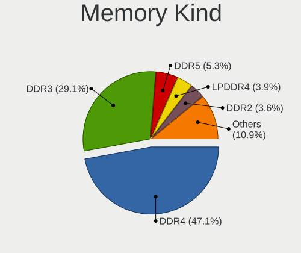

| Kind            | Computers | Percent |
|-----------------|-----------|---------|
| DDR4            | 7961      | 47.13%  |
| DDR3            | 4923      | 29.14%  |
| DDR5            | 901       | 5.33%   |
| LPDDR4          | 653       | 3.87%   |
| DDR2            | 615       | 3.64%   |
| LPDDR5          | 444       | 2.63%   |
| SDRAM           | 427       | 2.53%   |
| Unknown         | 426       | 2.52%   |
| LPDDR3          | 394       | 2.33%   |
| DDR             | 90        | 0.53%   |
| DRAM            | 53        | 0.31%   |
| RAM             | 2         | 0.01%   |
| LPDDR2          | 1         | 0.01%   |
| Logical non-vol | 1         | 0.01%   |
| EEPROM          | 1         | 0.01%   |
| DDR2 FB-DIMM    | 1         | 0.01%   |

Memory Form Factor
------------------

Physical design of the memory module

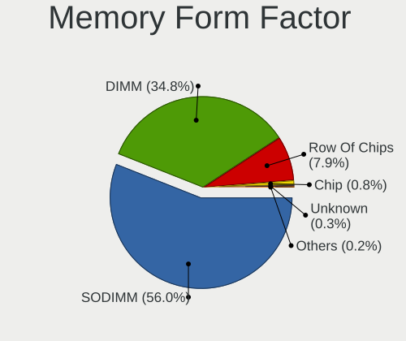

| Name            | Computers | Percent |
|-----------------|-----------|---------|
| SODIMM          | 9422      | 56%     |
| DIMM            | 5855      | 34.8%   |
| Row Of Chips    | 1333      | 7.92%   |
| Chip            | 134       | 0.8%    |
| Unknown         | 51        | 0.3%    |
| RIMM            | 14        | 0.08%   |
| FB-DIMM         | 14        | 0.08%   |
| Proprietary Car | 2         | 0.01%   |

Memory Size
-----------

Memory module size

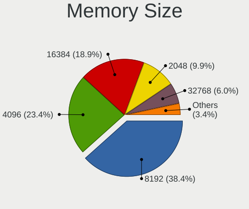

| Size   | Computers | Percent |
|--------|-----------|---------|
| 8192   | 6967      | 38.37%  |
| 4096   | 4253      | 23.42%  |
| 16384  | 3427      | 18.87%  |
| 2048   | 1806      | 9.95%   |
| 32768  | 1095      | 6.03%   |
| 1024   | 453       | 2.49%   |
| 512    | 60        | 0.33%   |
| 49152  | 42        | 0.23%   |
| 65536  | 21        | 0.12%   |
| 3072   | 7         | 0.04%   |
| 24576  | 6         | 0.03%   |
| 256    | 5         | 0.03%   |
| 128    | 4         | 0.02%   |
| 12288  | 3         | 0.02%   |
| 384    | 2         | 0.01%   |
| 129408 | 1         | 0.01%   |
| 98304  | 1         | 0.01%   |
| 8000   | 1         | 0.01%   |
| 6144   | 1         | 0.01%   |
| 1536   | 1         | 0.01%   |
| 16     | 1         | 0.01%   |
| 1      | 1         | 0.01%   |

Memory Speed
------------

Memory module speed

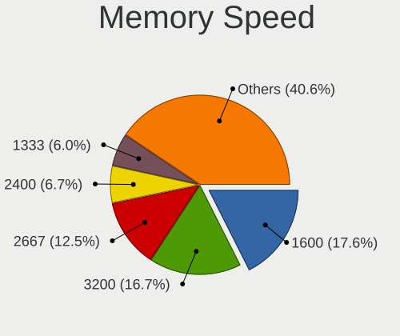

| Speed   | Computers | Percent |
|---------|-----------|---------|
| 1600    | 3191      | 17.56%  |
| 3200    | 3029      | 16.67%  |
| 2667    | 2270      | 12.49%  |
| 2400    | 1219      | 6.71%   |
| 1333    | 1084      | 5.97%   |
| 2133    | 802       | 4.41%   |
| 3600    | 675       | 3.71%   |
| 5600    | 371       | 2.04%   |
| 1334    | 362       | 1.99%   |
| 667     | 331       | 1.82%   |
| 800     | 325       | 1.79%   |
| Unknown | 314       | 1.73%   |
| 1867    | 312       | 1.72%   |
| 4267    | 262       | 1.44%   |
| 1067    | 233       | 1.28%   |
| 6400    | 227       | 1.25%   |
| 4800    | 227       | 1.25%   |
| 8400    | 169       | 0.93%   |
| 3733    | 166       | 0.91%   |
| 6000    | 158       | 0.87%   |
| 3266    | 147       | 0.81%   |
| 1866    | 146       | 0.8%    |
| 1066    | 136       | 0.75%   |
| 3800    | 135       | 0.74%   |
| 4000    | 132       | 0.73%   |
| 1800    | 117       | 0.64%   |
| 2666    | 115       | 0.63%   |
| 7500    | 114       | 0.63%   |
| 3000    | 108       | 0.59%   |
| 4199    | 101       | 0.56%   |
| 2933    | 96        | 0.53%   |
| 3400    | 83        | 0.46%   |
| 2048    | 65        | 0.36%   |
| 4266    | 62        | 0.34%   |
| 533     | 56        | 0.31%   |
| 8533    | 55        | 0.3%    |
| 400     | 48        | 0.26%   |
| 3866    | 44        | 0.24%   |
| 975     | 40        | 0.22%   |
| 6200    | 38        | 0.21%   |

Printers & scanners
-------------------

Printer Vendor
--------------

Printer device vendors

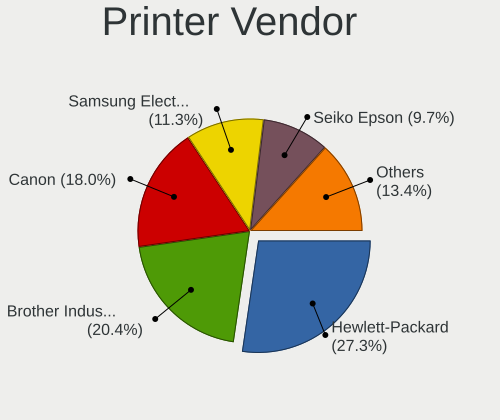

| Vendor                   | Computers | Percent |
|--------------------------|-----------|---------|
| Hewlett-Packard          | 313       | 27.31%  |
| Brother Industries       | 234       | 20.42%  |
| Canon                    | 206       | 17.98%  |
| Samsung Electronics      | 129       | 11.26%  |
| Seiko Epson              | 111       | 9.69%   |
| Kyocera                  | 30        | 2.62%   |
| Prolific Technology      | 28        | 2.44%   |
| Dymo-CoStar              | 28        | 2.44%   |
| QinHeng Electronics      | 14        | 1.22%   |
| Lexmark International    | 14        | 1.22%   |
| STMicroelectronics       | 6         | 0.52%   |
| Ricoh                    | 5         | 0.44%   |
| Xerox                    | 4         | 0.35%   |
| Oki Data                 | 4         | 0.35%   |
| Dell                     | 4         | 0.35%   |
| Magic Control Technology | 2         | 0.17%   |
| WinChipHead              | 1         | 0.09%   |
| Sharp                    | 1         | 0.09%   |
| Seiko Instruments        | 1         | 0.09%   |
| PM                       | 1         | 0.09%   |
| Pantum                   | 1         | 0.09%   |
| Panasonic (Matsushita)   | 1         | 0.09%   |
| Minolta                  | 1         | 0.09%   |
| MIIIW                    | 1         | 0.09%   |
| ICS Advent               | 1         | 0.09%   |
| GG IMAGE                 | 1         | 0.09%   |
| ATEN International       | 1         | 0.09%   |
| Apple                    | 1         | 0.09%   |
| Agere Systems (Lucent)   | 1         | 0.09%   |
| Unknown                  | 1         | 0.09%   |

Printer Model
-------------

Printer device models

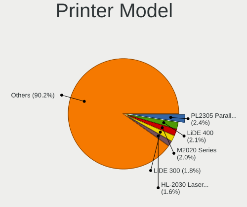

| Model                                                     | Computers | Percent |
|-----------------------------------------------------------|-----------|---------|
| Prolific PL2305 Parallel Port                             | 28        | 2.41%   |
| Canon LiDE 400                                            | 24        | 2.07%   |
| Samsung M2020 Series                                      | 23        | 1.98%   |
| Canon LiDE 300                                            | 21        | 1.81%   |
| Brother HL-2030 Laser Printer                             | 18        | 1.55%   |
| QinHeng CH340S                                            | 14        | 1.21%   |
| Canon iP7200 series                                       | 14        | 1.21%   |
| HP ENVY 4520 series                                       | 13        | 1.12%   |
| Dymo-CoStar LabelWriter 450                               | 13        | 1.12%   |
| Seiko Epson ET-2710 Series                                | 12        | 1.03%   |
| Canon PIXMA MX920 Series                                  | 12        | 1.03%   |
| Samsung C48x Series                                       | 11        | 0.95%   |
| Canon PIXMA MG3600 Series                                 | 11        | 0.95%   |
| Samsung M2070 Series                                      | 10        | 0.86%   |
| HP OfficeJet 3830 series                                  | 10        | 0.86%   |
| HP DeskJet 2700 series                                    | 10        | 0.86%   |
| HP DeskJet 4100 series                                    | 9         | 0.78%   |
| Brother HL-3142CW series                                  | 9         | 0.78%   |
| Canon TR4500 series                                       | 8         | 0.69%   |
| Brother MFC-L2710DW series                                | 8         | 0.69%   |
| Seiko Epson XP-2100 Series                                | 7         | 0.6%    |
| Samsung ML-1640 Series Laser Printer                      | 7         | 0.6%    |
| HP OfficeJet 5200 series                                  | 7         | 0.6%    |
| HP ENVY 5000 series                                       | 7         | 0.6%    |
| HP DeskJet F4200 series                                   | 7         | 0.6%    |
| HP DeskJet 3700 series                                    | 7         | 0.6%    |
| HP Deskjet 3520 series                                    | 7         | 0.6%    |
| HP DeskJet 2600 series                                    | 7         | 0.6%    |
| HP Deskjet 2540 series                                    | 7         | 0.6%    |
| Dymo-CoStar LabelWriter 400                               | 7         | 0.6%    |
| Canon TS700 series                                        | 7         | 0.6%    |
| Canon TR8500 series                                       | 7         | 0.6%    |
| Brother MFC-L2710DN series                                | 7         | 0.6%    |
| Brother HL-L2350DW series                                 | 7         | 0.6%    |
| STMicroelectronics LED badge -- mini LED display -- 11x44 | 6         | 0.52%   |
| Samsung SCX-472x Series                                   | 6         | 0.52%   |
| Samsung M283x Series                                      | 6         | 0.52%   |
| HP OfficeJet 4650 series                                  | 6         | 0.52%   |
| HP ENVY 4500 series                                       | 6         | 0.52%   |
| HP DeskJet 1110 series                                    | 6         | 0.52%   |

Scanner Vendor
--------------

Scanner device vendors

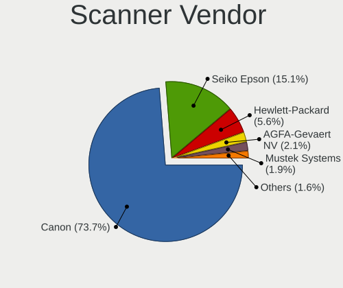

| Vendor                                         | Computers | Percent |
|------------------------------------------------|-----------|---------|
| Canon                                          | 278       | 73.74%  |
| Seiko Epson                                    | 57        | 15.12%  |
| Hewlett-Packard                                | 21        | 5.57%   |
| AGFA-Gevaert NV                                | 8         | 2.12%   |
| Mustek Systems                                 | 7         | 1.86%   |
| Plustek                                        | 2         | 0.53%   |
| Ultima Electronics                             | 1         | 0.27%   |
| Siemens Information and Communication Products | 1         | 0.27%   |
| Nikon                                          | 1         | 0.27%   |
| Microtek International                         | 1         | 0.27%   |

Scanner Model
-------------

Scanner device models

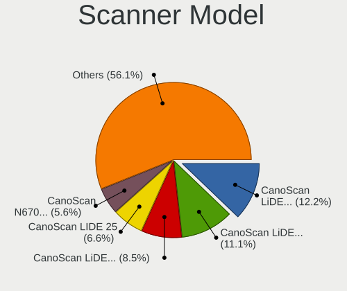

| Model                                                       | Computers | Percent |
|-------------------------------------------------------------|-----------|---------|
| Canon CanoScan LiDE 220                                     | 46        | 12.17%  |
| Canon CanoScan LiDE 210                                     | 42        | 11.11%  |
| Canon CanoScan LiDE 110                                     | 32        | 8.47%   |
| Canon CanoScan LIDE 25                                      | 25        | 6.61%   |
| Canon CanoScan N670U/N676U/LiDE 20                          | 21        | 5.56%   |
| Canon CanoScan LiDE 120                                     | 19        | 5.03%   |
| Canon CanoScan LiDE 100                                     | 17        | 4.5%    |
| Canon CanoScan LiDE 50/LiDE 35/LiDE 40                      | 11        | 2.91%   |
| Canon CanoScan LiDE 200                                     | 11        | 2.91%   |
| Canon CanoScan LiDE 90                                      | 10        | 2.65%   |
| Seiko Epson GT-F520/GT-F570 [Perfection 3590 PHOTO]         | 8         | 2.12%   |
| Canon CanoScan LiDE 60                                      | 8         | 2.12%   |
| Seiko Epson GT-X770 [Perfection V500]                       | 6         | 1.59%   |
| Seiko Epson GT-F500/GT-F550 [Perfection 2480/2580 PHOTO]    | 6         | 1.59%   |
| Seiko Epson GT-9300UF [Perfection 2400 PHOTO]               | 5         | 1.32%   |
| Canon CanoScan N1240U/LiDE 30                               | 5         | 1.32%   |
| Seiko Epson Perfection V37/V370                             | 4         | 1.06%   |
| Canon CanoScan 9000F Mark II                                | 4         | 1.06%   |
| Canon CanoScan 8800F                                        | 4         | 1.06%   |
| AGFA-Gevaert NV SnapScan 1212U (?)                          | 4         | 1.06%   |
| Seiko Epson GT-F730 [GT-S630/Perfection V33/V330 Photo]     | 3         | 0.79%   |
| Seiko Epson GT-6600U [Perfection 610]                       | 3         | 0.79%   |
| HP ScanJet 3970c                                            | 3         | 0.79%   |
| HP HP Scanjet 300                                           | 3         | 0.79%   |
| Canon CanoScan LiDE 600F                                    | 3         | 0.79%   |
| Canon CanoScan LiDE 500F                                    | 3         | 0.79%   |
| Canon CanoScan 4400F                                        | 3         | 0.79%   |
| Seiko Epson GT-F670 [Perfection V200 Photo]                 | 2         | 0.53%   |
| Seiko Epson GT-F650 [GT-S600/Perfection V10/V100]           | 2         | 0.53%   |
| Seiko Epson GT-8400UF [Perfection 1670/1670 PHOTO]          | 2         | 0.53%   |
| Seiko Epson GT-8200U/GT-8200UF [Perfection 1650/1650 PHOTO] | 2         | 0.53%   |
| Mustek Systems ScanExpress 1200 CU                          | 2         | 0.53%   |
| HP ScanJet Pro 2500 f1                                      | 2         | 0.53%   |
| HP ScanJet 82x0C                                            | 2         | 0.53%   |
| HP HP4470C                                                  | 2         | 0.53%   |
| Canon CanoScan LiDE 700F                                    | 2         | 0.53%   |
| Canon CanoScan LiDE 70                                      | 2         | 0.53%   |
| Canon CanoScan 3200F                                        | 2         | 0.53%   |
| Canon CanoScan 1220U                                        | 2         | 0.53%   |
| Canon CanoScan                                              | 2         | 0.53%   |

Camera
------

Camera Vendor
-------------

Camera device vendors

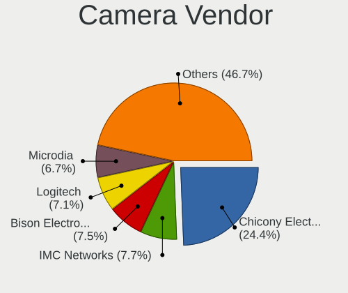

| Vendor                                 | Computers | Percent |
|----------------------------------------|-----------|---------|
| Chicony Electronics                    | 4467      | 24.38%  |
| IMC Networks                           | 1403      | 7.66%   |
| Bison Electronics                      | 1366      | 7.45%   |
| Logitech                               | 1308      | 7.14%   |
| Microdia                               | 1225      | 6.69%   |
| Realtek Semiconductor                  | 1142      | 6.23%   |
| Sunplus Innovation Technology          | 812       | 4.43%   |
| Quanta                                 | 801       | 4.37%   |
| Cheng Uei Precision Industry (Foxlink) | 601       | 3.28%   |
| Apple                                  | 553       | 3.02%   |
| Suyin                                  | 495       | 2.7%    |
| Syntek                                 | 469       | 2.56%   |
| Lite-On Technology                     | 414       | 2.26%   |
| Luxvisions Innotech Limited            | 395       | 2.16%   |
| Microsoft                              | 251       | 1.37%   |
| Alcor Micro                            | 226       | 1.23%   |
| Silicon Motion                         | 162       | 0.88%   |
| Ricoh                                  | 149       | 0.81%   |
| Lenovo                                 | 141       | 0.77%   |
| Samsung Electronics                    | 137       | 0.75%   |
| Z-Star Microelectronics                | 95        | 0.52%   |
| Sonix Technology                       | 94        | 0.51%   |
| Generalplus Technology                 | 84        | 0.46%   |
| Acer                                   | 83        | 0.45%   |
| SunplusIT                              | 68        | 0.37%   |
| ALi                                    | 68        | 0.37%   |
| ARC International                      | 65        | 0.35%   |
| Creative Technology                    | 62        | 0.34%   |
| ShineTech                              | 52        | 0.28%   |
| MacroSilicon                           | 51        | 0.28%   |
| kingcome                               | 50        | 0.27%   |
| Primax Electronics                     | 44        | 0.24%   |
| DigiTech                               | 44        | 0.24%   |
| Importek                               | 41        | 0.22%   |
| Sunplus Technology                     | 40        | 0.22%   |
| Jieli Technology                       | 37        | 0.2%    |
| Trust                                  | 36        | 0.2%    |
| Cubeternet                             | 35        | 0.19%   |
| Razer USA                              | 27        | 0.15%   |
| Genesys Logic                          | 26        | 0.14%   |

Camera Model
------------

Camera device models

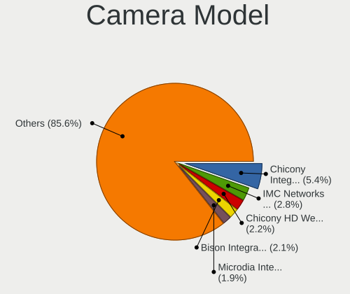

| Model                                         | Computers | Percent |
|-----------------------------------------------|-----------|---------|
| Chicony Integrated Camera                     | 994       | 5.37%   |
| IMC Networks Integrated Camera                | 522       | 2.82%   |
| Chicony HD Webcam                             | 412       | 2.23%   |
| Bison Integrated Camera                       | 385       | 2.08%   |
| Microdia Integrated_Webcam_HD                 | 344       | 1.86%   |
| Syntek Integrated Camera                      | 300       | 1.62%   |
| IMC Networks USB2.0 HD UVC WebCam             | 297       | 1.6%    |
| Realtek Integrated_Webcam_HD                  | 286       | 1.55%   |
| Chicony FJ Camera                             | 256       | 1.38%   |
| Logitech Webcam C270                          | 255       | 1.38%   |
| Logitech HD Pro Webcam C920                   | 198       | 1.07%   |
| Lite-On Integrated Camera                     | 182       | 0.98%   |
| Apple Built-in iSight                         | 180       | 0.97%   |
| Chicony HP HD Camera                          | 160       | 0.86%   |
| Apple FaceTime HD Camera (Built-in)           | 152       | 0.82%   |
| Chicony Chicony USB2.0 Camera                 | 136       | 0.73%   |
| Sunplus HD WebCam                             | 134       | 0.72%   |
| Samsung Galaxy series, misc. (MTP mode)       | 134       | 0.72%   |
| Quanta HD User Facing                         | 133       | 0.72%   |
| Microdia USB 2.0 Camera                       | 133       | 0.72%   |
| Chicony USB2.0 HD UVC WebCam                  | 130       | 0.7%    |
| Chicony Integrated Camera (1280x720@30)       | 125       | 0.68%   |
| Microdia Integrated Webcam                    | 124       | 0.67%   |
| Bison Lenovo EasyCamera                       | 122       | 0.66%   |
| Bison SunplusIT Integrated Camera             | 121       | 0.65%   |
| Quanta HP HD Camera                           | 119       | 0.64%   |
| Sunplus Integrated_Webcam_HD                  | 118       | 0.64%   |
| Chicony Integrated IR Camera                  | 108       | 0.58%   |
| Chicony HD User Facing                        | 106       | 0.57%   |
| Bison BisonCam,NB Pro                         | 106       | 0.57%   |
| Realtek USB Camera                            | 104       | 0.56%   |
| Sunplus Integrated Camera                     | 103       | 0.56%   |
| Microsoft LifeCam HD-3000                     | 103       | 0.56%   |
| Apple iPhone 5/5C/5S/6/SE/7/8/X               | 102       | 0.55%   |
| Chicony TOSHIBA Web Camera - HD               | 99        | 0.53%   |
| Luxvisions Innotech Limited Integrated Camera | 97        | 0.52%   |
| Chicony HP TrueVision HD Camera               | 96        | 0.52%   |
| IMC Networks USB2.0 VGA UVC WebCam            | 95        | 0.51%   |
| Logitech C922 Pro Stream Webcam               | 94        | 0.51%   |
| Quanta HD Webcam                              | 92        | 0.5%    |

Security
--------

Fingerprint Vendor
------------------

Fingerprint sensor vendors

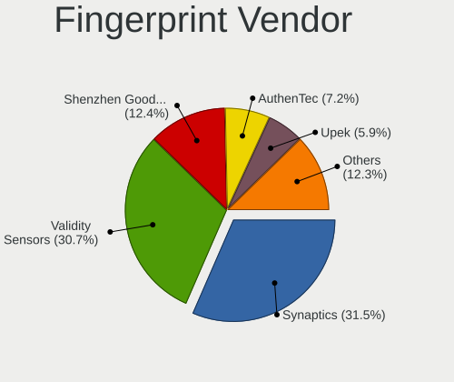

| Vendor                             | Computers | Percent |
|------------------------------------|-----------|---------|
| Synaptics                          | 1202      | 31.55%  |
| Validity Sensors                   | 1170      | 30.71%  |
| Shenzhen Goodix Technology         | 473       | 12.41%  |
| AuthenTec                          | 274       | 7.19%   |
| Upek                               | 223       | 5.85%   |
| LighTuning Technology              | 202       | 5.3%    |
| Elan Microelectronics              | 161       | 4.23%   |
| STMicroelectronics                 | 47        | 1.23%   |
| HOLTEK                             | 21        | 0.55%   |
| Realtek USB2.0 Finger Print Bridge | 10        | 0.26%   |
| Samsung Electronics                | 9         | 0.24%   |
| Next Biometrics                    | 5         | 0.13%   |
| Focal-systems.Corp                 | 5         | 0.13%   |
| DigitalPersona                     | 5         | 0.13%   |
| Dell                               | 2         | 0.05%   |
| Microsoft                          | 1         | 0.03%   |

Fingerprint Model
-----------------

Fingerprint sensor models

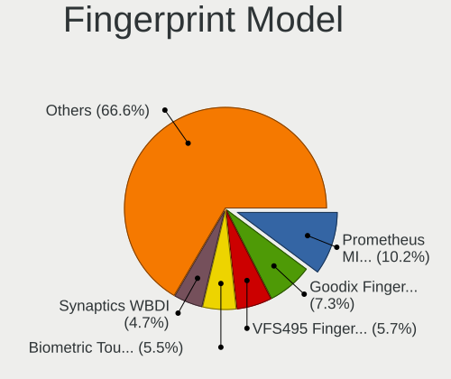

| Model                                                                      | Computers | Percent |
|----------------------------------------------------------------------------|-----------|---------|
| Synaptics Prometheus MIS Touch Fingerprint Reader                          | 388       | 10.18%  |
| Shenzhen Goodix  FingerPrint Device                                        | 280       | 7.35%   |
| Validity Sensors VFS495 Fingerprint Reader                                 | 218       | 5.72%   |
| Upek Biometric Touchchip/Touchstrip Fingerprint Sensor                     | 208       | 5.46%   |
| Validity Sensors Synaptics WBDI                                            | 180       | 4.72%   |
| Validity Sensors VFS 5011 fingerprint sensor                               | 177       | 4.64%   |
| Synaptics Metallica MIS Touch Fingerprint Reader                           | 164       | 4.3%    |
| Shenzhen Goodix Fingerprint Reader                                         | 141       | 3.7%    |
| Validity Sensors VFS5011 Fingerprint Reader                                | 102       | 2.68%   |
| AuthenTec AES2810                                                          | 94        | 2.47%   |
| Validity Sensors VFS7500 Touch Fingerprint Sensor                          | 87        | 2.28%   |
| Elan ELAN:Fingerprint                                                      | 85        | 2.23%   |
| Synaptics WBDI                                                             | 82        | 2.15%   |
| Synaptics UWP WBDI Device                                                  | 79        | 2.07%   |
| LighTuning ES603 Swipe Fingerprint Sensor                                  | 74        | 1.94%   |
| Validity Sensors Synaptics VFS7552 Touch Fingerprint Sensor with PurePrint | 73        | 1.92%   |
| LighTuning EgisTec Touch Fingerprint Sensor                                | 73        | 1.92%   |
| Validity Sensors Swipe Fingerprint Sensor                                  | 69        | 1.81%   |
| Synaptics FS7604 Touch Fingerprint Sensor with PurePrint                   | 68        | 1.78%   |
| Elan ELAN:ARM-M4                                                           | 64        | 1.68%   |
| Synaptics Metallica MOH Touch Fingerprint Reader                           | 62        | 1.63%   |
| Validity Sensors VFS471 Fingerprint Reader                                 | 61        | 1.6%    |
| Synaptics  FS7604 Touch Fingerprint Sensor with PurePrint                  | 61        | 1.6%    |
| AuthenTec AES2501 Fingerprint Sensor                                       | 61        | 1.6%    |
| Synaptics UWP WBDI                                                         | 58        | 1.52%   |
| Synaptics Fingerprint reader [HP G6]                                       | 58        | 1.52%   |
| Validity Sensors VFS491                                                    | 52        | 1.36%   |
| Shenzhen Goodix FingerPrint                                                | 52        | 1.36%   |
| STMicroelectronics Fingerprint Reader                                      | 47        | 1.23%   |
| AuthenTec Fingerprint Sensor                                               | 47        | 1.23%   |
| Synaptics  WBDI                                                            | 46        | 1.21%   |
| LighTuning Fingerprint Reader                                              | 45        | 1.18%   |
| Validity Sensors VFS451 Fingerprint Reader                                 | 42        | 1.1%    |
| Synaptics Prometheus Fingerprint Reader                                    | 41        | 1.08%   |
| AuthenTec AES1600                                                          | 40        | 1.05%   |
| Unknown                                                                    | 30        | 0.79%   |
| Synaptics TouchPad                                                         | 28        | 0.73%   |
| Validity Sensors VFS101 Fingerprint Reader                                 | 27        | 0.71%   |
| Validity Sensors Synaptics VFS7552 Touch Fingerprint Sensor                | 26        | 0.68%   |
| Validity Sensors Fingerprint scanner                                       | 25        | 0.66%   |

Chipcard Vendor
---------------

Chipcard module vendors

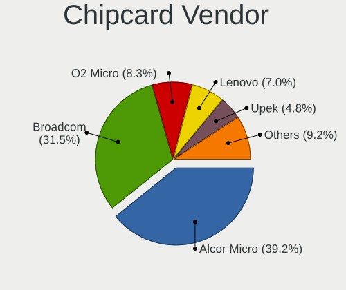

| Vendor                            | Computers | Percent |
|-----------------------------------|-----------|---------|
| Alcor Micro                       | 874       | 39.19%  |
| Broadcom                          | 702       | 31.48%  |
| O2 Micro                          | 186       | 8.34%   |
| Lenovo                            | 156       | 7%      |
| Upek                              | 106       | 4.75%   |
| Reiner SCT Kartensysteme          | 49        | 2.2%    |
| Gemalto (was Gemplus)             | 24        | 1.08%   |
| Yubico.com                        | 23        | 1.03%   |
| Cherry                            | 23        | 1.03%   |
| OmniKey                           | 16        | 0.72%   |
| Clay Logic                        | 13        | 0.58%   |
| SCM Microsystems                  | 12        | 0.54%   |
| Fujitsu Siemens Computers         | 9         | 0.4%    |
| Advanced Card Systems             | 9         | 0.4%    |
| Kobil Systems                     | 8         | 0.36%   |
| Realtek Semiconductor             | 4         | 0.18%   |
| Chicony Electronics               | 4         | 0.18%   |
| NXP Semiconductors                | 3         | 0.13%   |
| Purism, SPC                       | 2         | 0.09%   |
| In Focus Systems                  | 2         | 0.09%   |
| Swissbit                          | 1         | 0.04%   |
| Microchip Technology              | 1         | 0.04%   |
| Free Software Initiative of Japan | 1         | 0.04%   |
| Alcorlink                         | 1         | 0.04%   |
| Aladdin Knowledge Systems         | 1         | 0.04%   |

Chipcard Model
--------------

Chipcard module models

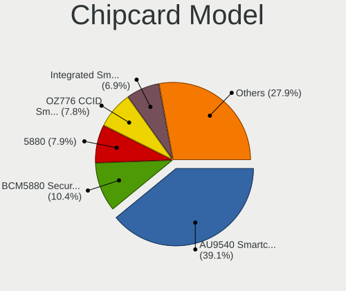

| Model                                                                        | Computers | Percent |
|------------------------------------------------------------------------------|-----------|---------|
| Alcor Micro AU9540 Smartcard Reader                                          | 872       | 39.09%  |
| Broadcom BCM5880 Secure Applications Processor                               | 231       | 10.35%  |
| Broadcom 5880                                                                | 177       | 7.93%   |
| O2 Micro OZ776 CCID Smartcard Reader                                         | 173       | 7.75%   |
| Lenovo Integrated Smart Card Reader                                          | 155       | 6.95%   |
| Broadcom BCM5880 Secure Applications Processor with fingerprint swipe sensor | 110       | 4.93%   |
| Upek TouchChip Fingerprint Coprocessor (WBF advanced mode)                   | 106       | 4.75%   |
| Broadcom BCM58200 ControlVault 3 (FingerPrint sensor + Contacted SmartCard)  | 95        | 4.26%   |
| Broadcom 58200                                                               | 79        | 3.54%   |
| Reiner SCT Kartensysteme cyberJack RFID basis contactless smartcard reader   | 35        | 1.57%   |
| Gemalto (was Gemplus) GemPC Twin SmartCard Reader                            | 15        | 0.67%   |
| Yubico.com Yubikey 4/5 U2F+CCID                                              | 14        | 0.63%   |
| O2 Micro Oz776 SmartCard Reader                                              | 13        | 0.58%   |
| Clay Logic Nitrokey Pro                                                      | 13        | 0.58%   |
| Cherry SmartCard Reader Keyboard KC 1000 SC                                  | 13        | 0.58%   |
| Broadcom BCM5880 Secure Applications Processor with fingerprint touch sensor | 11        | 0.49%   |
| Yubico.com Yubikey NEO(-N) OTP+CCID                                          | 9         | 0.4%    |
| Gemalto (was Gemplus) Compact Smart Card Reader Writer                       | 9         | 0.4%    |
| Reiner SCT Kartensysteme cyberJack one                                       | 7         | 0.31%   |
| OmniKey CardMan 3021 / 3121                                                  | 7         | 0.31%   |
| Advanced Card Systems ACR122U                                                | 7         | 0.31%   |
| Reiner SCT Kartensysteme tanJack USB                                         | 5         | 0.22%   |
| Realtek Semiconductor Smart Card Reader Interface                            | 4         | 0.18%   |
| Kobil Systems Smart Token                                                    | 4         | 0.18%   |
| Kobil Systems KOBIL Class 3 Reader                                           | 4         | 0.18%   |
| Fujitsu Siemens Computers Keyboard KB100 SCR eSIG                            | 4         | 0.18%   |
| Chicony Electronics HP Skylab USB Smartcard Keyboard                         | 4         | 0.18%   |
| Cherry SmartTerminal ST-2xxx                                                 | 4         | 0.18%   |
| SCM Microsystems SCR35xx Smart Card Reader                                   | 3         | 0.13%   |
| SCM Microsystems SCR335 SmartCard Reader                                     | 3         | 0.13%   |
| SCM Microsystems SCR3340 - ExpressCard54 Smart Card Reader                   | 3         | 0.13%   |
| OmniKey CardMan 4321                                                         | 3         | 0.13%   |
| OmniKey CardMan 3121 (HID Technologies)                                      | 3         | 0.13%   |
| NXP Semiconductors PR533                                                     | 3         | 0.13%   |
| Reiner SCT Kartensysteme cyberJack e-com/pinpad                              | 2         | 0.09%   |
| Purism, SPC Librem Key                                                       | 2         | 0.09%   |
| In Focus Systems EMV Smartcard Reader                                        | 2         | 0.09%   |
| Fujitsu Siemens Computers Smartcard Reader D323                              | 2         | 0.09%   |
| Fujitsu Siemens Computers Keyboard KB SCR                                    | 2         | 0.09%   |
| Cherry SECURE BOARD 1.0                                                      | 2         | 0.09%   |

Unsupported
-----------

Unsupported Devices
-------------------

Total unsupported devices on board

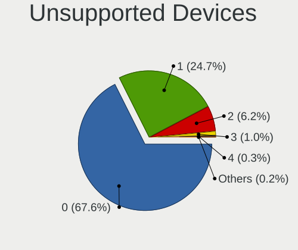

| Total | Computers | Percent |
|-------|-----------|---------|
| 0     | 22568     | 67.6%   |
| 1     | 8242      | 24.69%  |
| 2     | 2057      | 6.16%   |
| 3     | 349       | 1.05%   |
| 4     | 104       | 0.31%   |
| 5     | 45        | 0.13%   |
| 6     | 10        | 0.03%   |
| 7     | 6         | 0.02%   |
| 8     | 2         | 0.01%   |
| 9     | 1         | 0.003%  |

Unsupported Device Types
------------------------

Types of unsupported devices

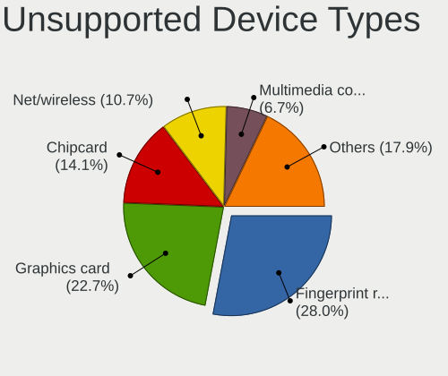

| Type                     | Computers | Percent |
|--------------------------|-----------|---------|
| Fingerprint reader       | 3762      | 27.96%  |
| Graphics card            | 3052      | 22.68%  |
| Chipcard                 | 1893      | 14.07%  |
| Net/wireless             | 1439      | 10.69%  |
| Multimedia controller    | 899       | 6.68%   |
| Communication controller | 520       | 3.86%   |
| Card reader              | 293       | 2.18%   |
| Camera                   | 285       | 2.12%   |
| Unassigned class         | 255       | 1.9%    |
| Bluetooth                | 225       | 1.67%   |
| Storage                  | 209       | 1.55%   |
| Sound                    | 198       | 1.47%   |
| Net/ethernet             | 123       | 0.91%   |
| Network                  | 79        | 0.59%   |
| Modem                    | 66        | 0.49%   |
| Storage/raid             | 42        | 0.31%   |
| Storage/ide              | 30        | 0.22%   |
| Dvb card                 | 28        | 0.21%   |
| Flash memory             | 16        | 0.12%   |
| Firewire controller      | 15        | 0.11%   |
| Storage/nvme             | 8         | 0.06%   |
| Tv card                  | 7         | 0.05%   |
| Unclassified device      | 5         | 0.04%   |
| Storage/ata              | 5         | 0.04%   |
| Video                    | 2         | 0.01%   |

