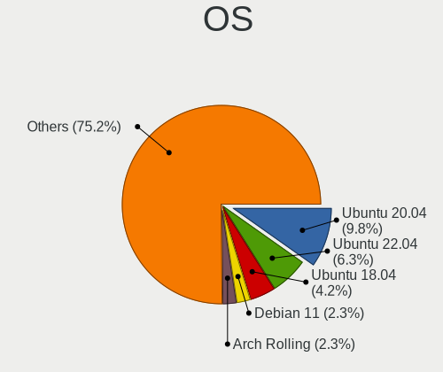
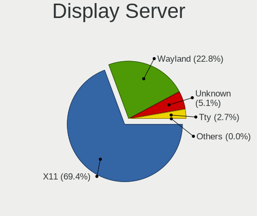
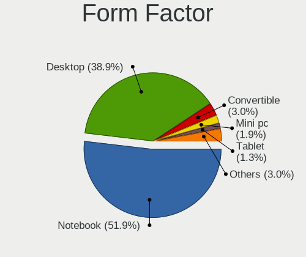
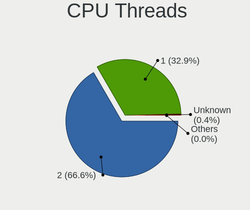
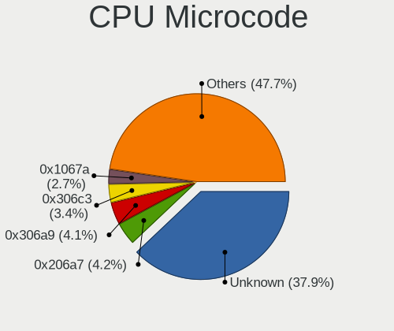
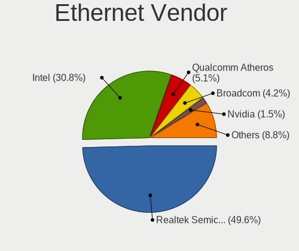

Linux in Germany - Tested Hardware & Statistics
-----------------------------------------------

A project to collect tested hardware configurations for Linux in Germany.

Anyone can contribute to this report by the [hw-probe](https://github.com/linuxhw/hw-probe) tool:

    sudo -E hw-probe -all -upload

Please contribute! Especially if your hardware is rare.

This is a report for all computer types. See also reports for [desktops](/Location/Germany/Desktop/README.md) and [notebooks](/Location/Germany/Notebook/README.md).

Contents
--------

* [ Test Cases ](#test-cases)

* [ System ](#system)
  - [ OS                       ](#os)
  - [ OS Family                ](#os-family)
  - [ Kernel                   ](#kernel)
  - [ Kernel Family            ](#kernel-family)
  - [ Kernel Major Ver.        ](#kernel-major-ver)
  - [ Arch                     ](#arch)
  - [ DE                       ](#de)
  - [ Display Server           ](#display-server)
  - [ Display Manager          ](#display-manager)
  - [ OS Lang                  ](#os-lang)
  - [ Boot Mode                ](#boot-mode)
  - [ Filesystem               ](#filesystem)
  - [ Part. scheme             ](#part-scheme)
  - [ Dual Boot with Linux/BSD ](#dual-boot-with-linuxbsd)
  - [ Dual Boot (Win)          ](#dual-boot-win)

* [ Board ](#board)
  - [ Vendor                   ](#vendor)
  - [ Model                    ](#model)
  - [ Model Family             ](#model-family)
  - [ MFG Year                 ](#mfg-year)
  - [ Form Factor              ](#form-factor)
  - [ Secure Boot              ](#secure-boot)
  - [ Coreboot                 ](#coreboot)
  - [ RAM Size                 ](#ram-size)
  - [ RAM Used                 ](#ram-used)
  - [ Total Drives             ](#total-drives)
  - [ Has CD-ROM               ](#has-cd-rom)
  - [ Has Ethernet             ](#has-ethernet)
  - [ Has WiFi                 ](#has-wifi)
  - [ Has Bluetooth            ](#has-bluetooth)

* [ Location ](#location)
  - [ Country                  ](#country)
  - [ City                     ](#city)

* [ Drives ](#drives)
  - [ Drive Vendor             ](#drive-vendor)
  - [ Drive Model              ](#drive-model)
  - [ HDD Vendor               ](#hdd-vendor)
  - [ SSD Vendor               ](#ssd-vendor)
  - [ Drive Kind               ](#drive-kind)
  - [ Drive Connector          ](#drive-connector)
  - [ Drive Size               ](#drive-size)
  - [ Space Total              ](#space-total)
  - [ Space Used               ](#space-used)
  - [ Malfunc. Drives          ](#malfunc-drives)
  - [ Malfunc. Drive Vendor    ](#malfunc-drive-vendor)
  - [ Malfunc. HDD Vendor      ](#malfunc-hdd-vendor)
  - [ Malfunc. Drive Kind      ](#malfunc-drive-kind)
  - [ Failed Drives            ](#failed-drives)
  - [ Failed Drive Vendor      ](#failed-drive-vendor)
  - [ Drive Status             ](#drive-status)

* [ Storage controller ](#storage-controller)
  - [ Storage Vendor           ](#storage-vendor)
  - [ Storage Model            ](#storage-model)
  - [ Storage Kind             ](#storage-kind)

* [ Processor ](#processor)
  - [ CPU Vendor               ](#cpu-vendor)
  - [ CPU Model                ](#cpu-model)
  - [ CPU Model Family         ](#cpu-model-family)
  - [ CPU Cores                ](#cpu-cores)
  - [ CPU Sockets              ](#cpu-sockets)
  - [ CPU Threads              ](#cpu-threads)
  - [ CPU Op-Modes             ](#cpu-op-modes)
  - [ CPU Microcode            ](#cpu-microcode)
  - [ CPU Microarch            ](#cpu-microarch)

* [ Graphics ](#graphics)
  - [ GPU Vendor               ](#gpu-vendor)
  - [ GPU Model                ](#gpu-model)
  - [ GPU Combo                ](#gpu-combo)
  - [ GPU Driver               ](#gpu-driver)
  - [ GPU Memory               ](#gpu-memory)

* [ Monitor ](#monitor)
  - [ Monitor Vendor           ](#monitor-vendor)
  - [ Monitor Model            ](#monitor-model)
  - [ Monitor Resolution       ](#monitor-resolution)
  - [ Monitor Diagonal         ](#monitor-diagonal)
  - [ Monitor Width            ](#monitor-width)
  - [ Aspect Ratio             ](#aspect-ratio)
  - [ Monitor Area             ](#monitor-area)
  - [ Pixel Density            ](#pixel-density)
  - [ Multiple Monitors        ](#multiple-monitors)

* [ Network ](#network)
  - [ Net Controller Vendor    ](#net-controller-vendor)
  - [ Net Controller Model     ](#net-controller-model)
  - [ Wireless Vendor          ](#wireless-vendor)
  - [ Wireless Model           ](#wireless-model)
  - [ Ethernet Vendor          ](#ethernet-vendor)
  - [ Ethernet Model           ](#ethernet-model)
  - [ Net Controller Kind      ](#net-controller-kind)
  - [ Used Controller          ](#used-controller)
  - [ NICs                     ](#nics)
  - [ IPv6                     ](#ipv6)

* [ Bluetooth ](#bluetooth)
  - [ Bluetooth Vendor         ](#bluetooth-vendor)
  - [ Bluetooth Model          ](#bluetooth-model)

* [ Sound ](#sound)
  - [ Sound Vendor             ](#sound-vendor)
  - [ Sound Model              ](#sound-model)

* [ Memory ](#memory)
  - [ Memory Vendor            ](#memory-vendor)
  - [ Memory Model             ](#memory-model)
  - [ Memory Kind              ](#memory-kind)
  - [ Memory Form Factor       ](#memory-form-factor)
  - [ Memory Size              ](#memory-size)
  - [ Memory Speed             ](#memory-speed)

* [ Printers & scanners ](#printers--scanners)
  - [ Printer Vendor           ](#printer-vendor)
  - [ Printer Model            ](#printer-model)
  - [ Scanner Vendor           ](#scanner-vendor)
  - [ Scanner Model            ](#scanner-model)

* [ Camera ](#camera)
  - [ Camera Vendor            ](#camera-vendor)
  - [ Camera Model             ](#camera-model)

* [ Security ](#security)
  - [ Fingerprint Vendor       ](#fingerprint-vendor)
  - [ Fingerprint Model        ](#fingerprint-model)
  - [ Chipcard Vendor          ](#chipcard-vendor)
  - [ Chipcard Model           ](#chipcard-model)

* [ Unsupported ](#unsupported)
  - [ Unsupported Devices      ](#unsupported-devices)
  - [ Unsupported Device Types ](#unsupported-device-types)

Test Cases
----------

Total: 42261

| Vendor        | Model                       | Form-Factor | Probe                                                      | Date         |
|---------------|-----------------------------|-------------|------------------------------------------------------------|--------------|
| Gigabyte      | B85M-D3H                    | Desktop     | [27053ca724](https://linux-hardware.org/?probe=27053ca724) | Jan 06, 2025 |
| HUAWEI        | MACHD-WXX9                  | Notebook    | [f10a2b06fd](https://linux-hardware.org/?probe=f10a2b06fd) | Jan 06, 2025 |
| PELADN        | WI-6                        | Desktop     | [537a11ae44](https://linux-hardware.org/?probe=537a11ae44) | Jan 06, 2025 |
| Lenovo        | ThinkPad P14s Gen 3 21J5... | Notebook    | [f5e1468f62](https://linux-hardware.org/?probe=f5e1468f62) | Jan 06, 2025 |
| Medion        | Akoya E6240T                | Notebook    | [bb72b25bf7](https://linux-hardware.org/?probe=bb72b25bf7) | Jan 06, 2025 |
| Apple         | Mac-F2238AC8                | All in one  | [acf991024f](https://linux-hardware.org/?probe=acf991024f) | Jan 06, 2025 |
| Lenovo        | ThinkPad P51 20HJS0D201     | Notebook    | [f43357e57a](https://linux-hardware.org/?probe=f43357e57a) | Jan 06, 2025 |
| Gigabyte      | B85M-D3H                    | Desktop     | [3d3b4d1ab3](https://linux-hardware.org/?probe=3d3b4d1ab3) | Jan 06, 2025 |
| ASUSTek       | ROG STRIX B550-F GAMING ... | Desktop     | [88b1c0c262](https://linux-hardware.org/?probe=88b1c0c262) | Jan 06, 2025 |
| Acidanther... | Mac-4B682C642B45593E iMa... | All in one  | [105d641565](https://linux-hardware.org/?probe=105d641565) | Jan 06, 2025 |
| MSI           | B450 GAMING PLUS MAX        | Desktop     | [89cd372074](https://linux-hardware.org/?probe=89cd372074) | Jan 06, 2025 |
| Dell          | Latitude E6230              | Notebook    | [255f27d863](https://linux-hardware.org/?probe=255f27d863) | Jan 06, 2025 |
| Lenovo        | V15 G4 IAH 83FS             | Notebook    | [54ea7cdde8](https://linux-hardware.org/?probe=54ea7cdde8) | Jan 06, 2025 |
| ASUSTek       | ROG STRIX B365-F GAMING     | Desktop     | [01012c9b3b](https://linux-hardware.org/?probe=01012c9b3b) | Jan 06, 2025 |
| ASRock        | N100M                       | Desktop     | [231da8b814](https://linux-hardware.org/?probe=231da8b814) | Jan 06, 2025 |
| ASUSTek       | TUF Gaming B650M-E WIFI     | Desktop     | [250c829e77](https://linux-hardware.org/?probe=250c829e77) | Jan 05, 2025 |
| Acidanther... | Mac-4B682C642B45593E iMa... | All in one  | [3f87777dfa](https://linux-hardware.org/?probe=3f87777dfa) | Jan 05, 2025 |
| Gigabyte      | Z68AP-D3                    | Desktop     | [7f798e706e](https://linux-hardware.org/?probe=7f798e706e) | Jan 05, 2025 |
| Lenovo        | ThinkPad T490s 20NYS60C0... | Notebook    | [795bfc1246](https://linux-hardware.org/?probe=795bfc1246) | Jan 05, 2025 |
| Gigabyte      | B650M D3HP                  | Desktop     | [0d0a62d437](https://linux-hardware.org/?probe=0d0a62d437) | Jan 05, 2025 |
| Acer          | Aspire 7520                 | Notebook    | [8633b8ad2a](https://linux-hardware.org/?probe=8633b8ad2a) | Jan 05, 2025 |
| Apple         | MacBookAir4,1               | Notebook    | [705713446f](https://linux-hardware.org/?probe=705713446f) | Jan 05, 2025 |
| Medion        | S6445 MD61489               | Notebook    | [7b72635681](https://linux-hardware.org/?probe=7b72635681) | Jan 05, 2025 |
| Dell          | Latitude 7390               | Notebook    | [48814ed45f](https://linux-hardware.org/?probe=48814ed45f) | Jan 05, 2025 |
| Lenovo        | 0x36C017AA SDK0J40700 WI... | Desktop     | [75606d7596](https://linux-hardware.org/?probe=75606d7596) | Jan 05, 2025 |
| Chuwi         | GemiBook Pro                | Notebook    | [cb3ae7cb2a](https://linux-hardware.org/?probe=cb3ae7cb2a) | Jan 05, 2025 |
| Medion        | E6214                       | Notebook    | [e72344f20c](https://linux-hardware.org/?probe=e72344f20c) | Jan 05, 2025 |
| Fujitsu       | STYLISTIC Q7310             | Tablet      | [e7db77a1ce](https://linux-hardware.org/?probe=e7db77a1ce) | Jan 05, 2025 |
| Chuwi         | GemiBook Pro                | Notebook    | [9518969af8](https://linux-hardware.org/?probe=9518969af8) | Jan 05, 2025 |
| HP            | Notebook                    | Notebook    | [077f55a6c7](https://linux-hardware.org/?probe=077f55a6c7) | Jan 05, 2025 |
| ASUSTek       | K93SV                       | Notebook    | [01d0efaf46](https://linux-hardware.org/?probe=01d0efaf46) | Jan 05, 2025 |
| Medion        | E6214                       | Notebook    | [1abed4b52d](https://linux-hardware.org/?probe=1abed4b52d) | Jan 05, 2025 |
| Dell          | XPS L412Z                   | Notebook    | [d8b969a9e6](https://linux-hardware.org/?probe=d8b969a9e6) | Jan 05, 2025 |
| Acer          | TravelMate 5210             | Notebook    | [379e44855f](https://linux-hardware.org/?probe=379e44855f) | Jan 05, 2025 |
| Dell          | XPS L412Z                   | Notebook    | [f4cfef6dcc](https://linux-hardware.org/?probe=f4cfef6dcc) | Jan 05, 2025 |
| Acer          | Aspire ES1-731              | Notebook    | [721fdec99d](https://linux-hardware.org/?probe=721fdec99d) | Jan 05, 2025 |
| Lenovo        | ThinkBook 14 G2 ITL 20VD    | Notebook    | [6a8e47f57b](https://linux-hardware.org/?probe=6a8e47f57b) | Jan 05, 2025 |
| Dell          | Precision M4400             | Notebook    | [6d8da5ac74](https://linux-hardware.org/?probe=6d8da5ac74) | Jan 05, 2025 |
| HP            | 8906 SMVB                   | Desktop     | [6fc944e5ec](https://linux-hardware.org/?probe=6fc944e5ec) | Jan 05, 2025 |
| Dell          | 0VNP2H A00                  | Desktop     | [eb43deacf0](https://linux-hardware.org/?probe=eb43deacf0) | Jan 05, 2025 |
| Medion        | P15648                      | Notebook    | [e4b0850870](https://linux-hardware.org/?probe=e4b0850870) | Jan 05, 2025 |
| Lenovo        | ThinkPad T14 Gen 5 21MCC... | Notebook    | [6e4f05f56f](https://linux-hardware.org/?probe=6e4f05f56f) | Jan 05, 2025 |
| HP            | ZBook Firefly 14 inch G8... | Notebook    | [a322d502b8](https://linux-hardware.org/?probe=a322d502b8) | Jan 05, 2025 |
| Fujitsu       | D3062-A1 S26361-D3062-A1    | Desktop     | [edc190a229](https://linux-hardware.org/?probe=edc190a229) | Jan 04, 2025 |
| Lenovo        | IdeaPad Slim 5 14AHP9 83... | Notebook    | [370ebbc151](https://linux-hardware.org/?probe=370ebbc151) | Jan 04, 2025 |
| Advantech     | MiC-770 v2                  | Desktop     | [1d7c3f988e](https://linux-hardware.org/?probe=1d7c3f988e) | Jan 04, 2025 |
| ASRock        | X600M-STX                   | Desktop     | [4a348f5b49](https://linux-hardware.org/?probe=4a348f5b49) | Jan 04, 2025 |
| ASRock        | X570 Steel Legend           | Desktop     | [2b29fc224e](https://linux-hardware.org/?probe=2b29fc224e) | Jan 04, 2025 |
| Chuwi         | Hi10 pro tablet             | Tablet      | [496c93250d](https://linux-hardware.org/?probe=496c93250d) | Jan 04, 2025 |
| MSI           | B650 GAMING PLUS WIFI       | Desktop     | [3c54d15e6e](https://linux-hardware.org/?probe=3c54d15e6e) | Jan 04, 2025 |
| ASRock        | X570M Pro4                  | Desktop     | [a049693dcf](https://linux-hardware.org/?probe=a049693dcf) | Jan 04, 2025 |
| HP            | ProBook 430 G7              | Notebook    | [f1b89f85cf](https://linux-hardware.org/?probe=f1b89f85cf) | Jan 04, 2025 |
| ASRock        | 970 Extreme3                | Desktop     | [8455ec6772](https://linux-hardware.org/?probe=8455ec6772) | Jan 04, 2025 |
| Dell          | 0F642F A00                  | Desktop     | [3ec5a43d19](https://linux-hardware.org/?probe=3ec5a43d19) | Jan 04, 2025 |
| Dell          | Latitude E6230              | Notebook    | [90371159c4](https://linux-hardware.org/?probe=90371159c4) | Jan 04, 2025 |
| Lenovo        | IdeaPad U450p 3389          | Notebook    | [c01ce6e337](https://linux-hardware.org/?probe=c01ce6e337) | Jan 04, 2025 |
| HC Technol... | HCAR5000-MI                 | Desktop     | [bbe1844c1c](https://linux-hardware.org/?probe=bbe1844c1c) | Jan 04, 2025 |
| Lenovo        | ThinkPad E15 Gen 4 21E60... | Notebook    | [efef40bae6](https://linux-hardware.org/?probe=efef40bae6) | Jan 04, 2025 |
| Apple         | MacBookAir6,2               | Notebook    | [2a0e5e8dee](https://linux-hardware.org/?probe=2a0e5e8dee) | Jan 04, 2025 |
| ASUSTek       | PRIME Z390-P                | Desktop     | [d6e8f1ee6c](https://linux-hardware.org/?probe=d6e8f1ee6c) | Jan 04, 2025 |
| TUXEDO        | Book XP15 / XP17 Gen12      | Notebook    | [be06c286bb](https://linux-hardware.org/?probe=be06c286bb) | Jan 04, 2025 |
| Apple         | Mac-F221BEC8                | Desktop     | [05de585a46](https://linux-hardware.org/?probe=05de585a46) | Jan 04, 2025 |
| MSI           | B450 TOMAHAWK MAX           | Desktop     | [88d10a1126](https://linux-hardware.org/?probe=88d10a1126) | Jan 04, 2025 |
| Lenovo        | ThinkPad T530 2394A11       | Notebook    | [87cb15684c](https://linux-hardware.org/?probe=87cb15684c) | Jan 04, 2025 |
| MSI           | B450-A PRO MAX              | Desktop     | [a829ef7128](https://linux-hardware.org/?probe=a829ef7128) | Jan 04, 2025 |
| TCL Commun... | 8085                        | Notebook    | [92e147d4fa](https://linux-hardware.org/?probe=92e147d4fa) | Jan 04, 2025 |
| Sony          | VPCSB1V9E                   | Notebook    | [b96a412efa](https://linux-hardware.org/?probe=b96a412efa) | Jan 03, 2025 |
| Apple         | MacBookAir6,2               | Notebook    | [ba9cefc697](https://linux-hardware.org/?probe=ba9cefc697) | Jan 03, 2025 |
| MSI           | MS-16Y1                     | Notebook    | [7125d07ec2](https://linux-hardware.org/?probe=7125d07ec2) | Jan 03, 2025 |
| ASUSTek       | ASUS TUF Gaming A16 FA60... | Notebook    | [c649f47fe2](https://linux-hardware.org/?probe=c649f47fe2) | Jan 03, 2025 |
| Intel         | NUC11PABi7 K90104-305       | Mini pc     | [5cb8b93a47](https://linux-hardware.org/?probe=5cb8b93a47) | Jan 03, 2025 |
| Raspberry ... | Raspberry Pi 4 Model B R... | Soc         | [b5468ebfdc](https://linux-hardware.org/?probe=b5468ebfdc) | Jan 03, 2025 |
| HP            | 250 G7 Notebook PC          | Notebook    | [6bf480c75a](https://linux-hardware.org/?probe=6bf480c75a) | Jan 03, 2025 |
| AZW           | SER V2.0                    | Mini pc     | [68a8804c89](https://linux-hardware.org/?probe=68a8804c89) | Jan 03, 2025 |
| Dell          | Latitude 5290 2-in-1        | Notebook    | [0b277582ac](https://linux-hardware.org/?probe=0b277582ac) | Jan 03, 2025 |
| Lenovo        | ThinkPad T440s 20ARS1EQ0... | Notebook    | [84f58ef48f](https://linux-hardware.org/?probe=84f58ef48f) | Jan 03, 2025 |
| Framework     | Laptop 13 (AMD Ryzen 704... | Notebook    | [041f977a25](https://linux-hardware.org/?probe=041f977a25) | Jan 03, 2025 |
| GEEKOM        | A7                          | Desktop     | [cc9ea8ad98](https://linux-hardware.org/?probe=cc9ea8ad98) | Jan 03, 2025 |
| HP            | 805D                        | Desktop     | [9dd735123b](https://linux-hardware.org/?probe=9dd735123b) | Jan 03, 2025 |
| Gigabyte      | B450 GAMING X               | Desktop     | [92b892fb46](https://linux-hardware.org/?probe=92b892fb46) | Jan 03, 2025 |
| Lenovo        | Legion 5 Pro 16IAH7H 82R... | Notebook    | [5bf46c517c](https://linux-hardware.org/?probe=5bf46c517c) | Jan 03, 2025 |
| Lenovo        | Legion 5 Pro 16IAH7H 82R... | Notebook    | [763d34b165](https://linux-hardware.org/?probe=763d34b165) | Jan 03, 2025 |
| Acer          | Extensa 215-55              | Notebook    | [fc29d8c8b1](https://linux-hardware.org/?probe=fc29d8c8b1) | Jan 03, 2025 |
| Intel         | NUC11PABi7 K90104-305       | Mini pc     | [78aeff840f](https://linux-hardware.org/?probe=78aeff840f) | Jan 03, 2025 |
| Acer          | Aspire V5-591G              | Notebook    | [fba09b3376](https://linux-hardware.org/?probe=fba09b3376) | Jan 03, 2025 |
| ASRock        | H61M-DGS R2.0               | Desktop     | [7c2b340f98](https://linux-hardware.org/?probe=7c2b340f98) | Jan 03, 2025 |
| HP            | EliteBook 850 G8 Noteboo... | Notebook    | [514cd1a8a0](https://linux-hardware.org/?probe=514cd1a8a0) | Jan 03, 2025 |
| ASUSTek       | PRIME X370-A                | Desktop     | [86c0b9c6d4](https://linux-hardware.org/?probe=86c0b9c6d4) | Jan 03, 2025 |
| ASRock        | 4X4-5000 Series             | Desktop     | [1ff935c41c](https://linux-hardware.org/?probe=1ff935c41c) | Jan 03, 2025 |
| ASRock        | 4X4-5000 Series             | Desktop     | [559f6b8201](https://linux-hardware.org/?probe=559f6b8201) | Jan 03, 2025 |
| TUXEDO        | Stellaris Slim 15 Intel ... | Notebook    | [ed65b54407](https://linux-hardware.org/?probe=ed65b54407) | Jan 03, 2025 |
| Lenovo        | IdeaPad 3 15ITL6 82H8       | Notebook    | [58e41b0f0f](https://linux-hardware.org/?probe=58e41b0f0f) | Jan 03, 2025 |
| ASUSTek       | UL50Vg                      | Notebook    | [6305475a87](https://linux-hardware.org/?probe=6305475a87) | Jan 03, 2025 |
| Lenovo        | ThinkPad T430 2349H2G       | Notebook    | [afcca700da](https://linux-hardware.org/?probe=afcca700da) | Jan 03, 2025 |
| GPD           | G1618-04                    | Tablet      | [a09e8b0e7b](https://linux-hardware.org/?probe=a09e8b0e7b) | Jan 03, 2025 |
| HP            | 15                          | Notebook    | [6f317ce763](https://linux-hardware.org/?probe=6f317ce763) | Jan 03, 2025 |
| HP            | ProBook 445 G7              | Notebook    | [8e56333050](https://linux-hardware.org/?probe=8e56333050) | Jan 03, 2025 |
| Apple         | Mac-8ED6AF5B48C039E1 Mac... | Mini pc     | [34ae2be0aa](https://linux-hardware.org/?probe=34ae2be0aa) | Jan 02, 2025 |
| HP            | 250 G8 Notebook PC          | Notebook    | [d5b66faf28](https://linux-hardware.org/?probe=d5b66faf28) | Jan 02, 2025 |
| Apple         | Mac-8ED6AF5B48C039E1 Mac... | Mini pc     | [cfb9b15c52](https://linux-hardware.org/?probe=cfb9b15c52) | Jan 02, 2025 |
| HP            | OMEN by Laptop 15-dh1xxx    | Notebook    | [c1c82e2ff7](https://linux-hardware.org/?probe=c1c82e2ff7) | Jan 02, 2025 |
| Fujitsu       | LIFEBOOK UH572              | Notebook    | [5625a23ef5](https://linux-hardware.org/?probe=5625a23ef5) | Jan 02, 2025 |
| Acer          | Aspire E5-575G              | Notebook    | [bea4bbd29a](https://linux-hardware.org/?probe=bea4bbd29a) | Jan 02, 2025 |
| ASUSTek       | M11BB                       | Desktop     | [55fb5769d0](https://linux-hardware.org/?probe=55fb5769d0) | Jan 02, 2025 |
| Lenovo        | IdeaPad 320-15IKB 80XL      | Notebook    | [b90f085315](https://linux-hardware.org/?probe=b90f085315) | Jan 02, 2025 |
| MSI           | P45 Neo3                    | Desktop     | [022b141025](https://linux-hardware.org/?probe=022b141025) | Jan 02, 2025 |
| Sony          | VPCSB1V9E                   | Notebook    | [4a49ef6e88](https://linux-hardware.org/?probe=4a49ef6e88) | Jan 02, 2025 |
| Lenovo        | ThinkPad T450s 20BX0011G... | Notebook    | [6e3771b5de](https://linux-hardware.org/?probe=6e3771b5de) | Jan 02, 2025 |
| Lenovo        | ThinkPad T14 Gen 3 21AH0... | Notebook    | [8be01ca5c2](https://linux-hardware.org/?probe=8be01ca5c2) | Jan 02, 2025 |
| HP            | 0AECh D                     | Desktop     | [9306b507f4](https://linux-hardware.org/?probe=9306b507f4) | Jan 02, 2025 |
| Medion        | Akoya E6240T                | Notebook    | [dc4b306a46](https://linux-hardware.org/?probe=dc4b306a46) | Jan 02, 2025 |
| ASUSTek       | Vivobook Go E1504FA_E150... | Notebook    | [e2dc314209](https://linux-hardware.org/?probe=e2dc314209) | Jan 02, 2025 |
| Google        | Ekko                        | Notebook    | [865ffecf0e](https://linux-hardware.org/?probe=865ffecf0e) | Jan 02, 2025 |
| Gigabyte      | AX370-Gaming K7             | Desktop     | [50b5770d28](https://linux-hardware.org/?probe=50b5770d28) | Jan 02, 2025 |
| Google        | Ekko                        | Notebook    | [54fbbe0cfb](https://linux-hardware.org/?probe=54fbbe0cfb) | Jan 01, 2025 |
| Acer          | Aspire XC600 v1.0           | Desktop     | [2f22befa4d](https://linux-hardware.org/?probe=2f22befa4d) | Jan 01, 2025 |
| ASUSTek       | M3A                         | Desktop     | [35dd91fa94](https://linux-hardware.org/?probe=35dd91fa94) | Jan 01, 2025 |
| Acer          | Aspire XC600 v1.0           | Desktop     | [cad98a7856](https://linux-hardware.org/?probe=cad98a7856) | Jan 01, 2025 |
| ASRock        | A520M-HVS                   | Desktop     | [57e6177738](https://linux-hardware.org/?probe=57e6177738) | Jan 01, 2025 |
| Intel         | DG43GT AAE62768-300         | Desktop     | [f33d4be91e](https://linux-hardware.org/?probe=f33d4be91e) | Jan 01, 2025 |
| Fujitsu       | D3427-A1 S26361-D3427-A1    | Desktop     | [0cd4d1a295](https://linux-hardware.org/?probe=0cd4d1a295) | Jan 01, 2025 |
| ASUSTek       | ASUS TUF Gaming A16 FA60... | Notebook    | [bfe08359ed](https://linux-hardware.org/?probe=bfe08359ed) | Jan 01, 2025 |
| Intel         | DG43GT AAE62768-300         | Desktop     | [c125d99d72](https://linux-hardware.org/?probe=c125d99d72) | Jan 01, 2025 |
| Acer          | Aspire E5-575G              | Notebook    | [131ac42ca5](https://linux-hardware.org/?probe=131ac42ca5) | Jan 01, 2025 |
| Sony          | VAIO                        | All in one  | [44a108150c](https://linux-hardware.org/?probe=44a108150c) | Jan 01, 2025 |
| HP            | 8433 11                     | Desktop     | [94d39a7f10](https://linux-hardware.org/?probe=94d39a7f10) | Jan 01, 2025 |
| HP            | 0AECh D                     | Desktop     | [0827eed993](https://linux-hardware.org/?probe=0827eed993) | Jan 01, 2025 |
| Acer          | Aspire 8951G                | Notebook    | [238300d1c0](https://linux-hardware.org/?probe=238300d1c0) | Jan 01, 2025 |
| Dell          | XPS 13 9310                 | Notebook    | [f07db9b11e](https://linux-hardware.org/?probe=f07db9b11e) | Jan 01, 2025 |
| ASUSTek       | K93SM                       | Notebook    | [de80ff2a02](https://linux-hardware.org/?probe=de80ff2a02) | Jan 01, 2025 |
| ASRock        | H61M-DGS R2.0               | Desktop     | [7e66f7b517](https://linux-hardware.org/?probe=7e66f7b517) | Jan 01, 2025 |
| ASRock        | A520M-HVS                   | Desktop     | [9478ad6eab](https://linux-hardware.org/?probe=9478ad6eab) | Jan 01, 2025 |
| Acer          | Aspire 5750G                | Notebook    | [4c99e58ae4](https://linux-hardware.org/?probe=4c99e58ae4) | Jan 01, 2025 |
| PELADN        | WI-6                        | Desktop     | [ed403a09ce](https://linux-hardware.org/?probe=ed403a09ce) | Jan 01, 2025 |
| ASUSTek       | VivoBook_ASUSLaptop M160... | Notebook    | [473fe2119f](https://linux-hardware.org/?probe=473fe2119f) | Jan 01, 2025 |
| Lenovo        | Yoga 7 2-in-1 14IML9 83D... | Convertible | [1f7e53a59e](https://linux-hardware.org/?probe=1f7e53a59e) | Jan 01, 2025 |
| Apple         | Mac-F65AE981FFA204ED Mac... | Mini pc     | [7bd33042fa](https://linux-hardware.org/?probe=7bd33042fa) | Jan 01, 2025 |
| HUAWEI        | MACHD-WXX9                  | Notebook    | [f7cc7cc8d1](https://linux-hardware.org/?probe=f7cc7cc8d1) | Jan 01, 2025 |
| Apple         | Mac-F2238AC8                | All in one  | [8d609f3f80](https://linux-hardware.org/?probe=8d609f3f80) | Jan 01, 2025 |
| ASUSTek       | PRIME X370-A                | Desktop     | [1138447504](https://linux-hardware.org/?probe=1138447504) | Jan 01, 2025 |
| Lenovo        | ThinkPad T430 2349SVA       | Notebook    | [654dbcabab](https://linux-hardware.org/?probe=654dbcabab) | Jan 01, 2025 |
| ASRock        | B450 Gaming-ITX/ac          | Desktop     | [c2c8b85ed0](https://linux-hardware.org/?probe=c2c8b85ed0) | Jan 01, 2025 |
| AZW           | SER V1.0                    | Mini pc     | [b68af4b0f8](https://linux-hardware.org/?probe=b68af4b0f8) | Jan 01, 2025 |
| Gigabyte      | B85M-D3H                    | Desktop     | [1766ca8469](https://linux-hardware.org/?probe=1766ca8469) | Jan 01, 2025 |
| Apple         | Mac-F2238AC8                | All in one  | [7bf0dbd618](https://linux-hardware.org/?probe=7bf0dbd618) | Dec 31, 2024 |
| Gigabyte      | B85M-D3H                    | Desktop     | [b52a4bed1c](https://linux-hardware.org/?probe=b52a4bed1c) | Dec 31, 2024 |
| Lenovo        | ThinkPad T560 20FJS44L0B    | Notebook    | [56b90e34ae](https://linux-hardware.org/?probe=56b90e34ae) | Dec 31, 2024 |
| PELADN        | WI-6                        | Desktop     | [9961c80013](https://linux-hardware.org/?probe=9961c80013) | Dec 31, 2024 |
| PELADN        | WI-6                        | Desktop     | [ad75e2844c](https://linux-hardware.org/?probe=ad75e2844c) | Dec 31, 2024 |
| Apple         | Mac-F2268DAE                | All in one  | [46feff6cc6](https://linux-hardware.org/?probe=46feff6cc6) | Dec 31, 2024 |
| ASUSTek       | PRIME X370-A                | Desktop     | [e7919fc318](https://linux-hardware.org/?probe=e7919fc318) | Dec 31, 2024 |
| HP            | Pavilion g7                 | Notebook    | [5692787b6f](https://linux-hardware.org/?probe=5692787b6f) | Dec 31, 2024 |
| AZW           | SER V1.0                    | Mini pc     | [7fe4ce12e8](https://linux-hardware.org/?probe=7fe4ce12e8) | Dec 31, 2024 |
| ASUSTek       | TUF Gaming A620M-PLUS       | Desktop     | [248853b59c](https://linux-hardware.org/?probe=248853b59c) | Dec 31, 2024 |
| HP            | 250 15.6 inch G10           | Notebook    | [94fdf69690](https://linux-hardware.org/?probe=94fdf69690) | Dec 31, 2024 |
| TUXEDO        | Stellaris Slim 15 Intel ... | Notebook    | [939d33fa22](https://linux-hardware.org/?probe=939d33fa22) | Dec 31, 2024 |
| MSI           | MPG X570 GAMING EDGE WIF... | Desktop     | [364ab4800d](https://linux-hardware.org/?probe=364ab4800d) | Dec 31, 2024 |
| Lenovo        | Yoga 7 2-in-1 14IML9 83D... | Convertible | [4cf88cdd93](https://linux-hardware.org/?probe=4cf88cdd93) | Dec 31, 2024 |
| Fujitsu       | LIFEBOOK T939               | Convertible | [86ef7e71ee](https://linux-hardware.org/?probe=86ef7e71ee) | Dec 31, 2024 |
| HP            | EliteBook 840 G3            | Notebook    | [f1bc5970f8](https://linux-hardware.org/?probe=f1bc5970f8) | Dec 31, 2024 |
| PELADN        | WI-6                        | Desktop     | [a4d452eb65](https://linux-hardware.org/?probe=a4d452eb65) | Dec 31, 2024 |
| Lenovo        | ThinkPad T560 20FJS1WT00    | Notebook    | [f78acad9fd](https://linux-hardware.org/?probe=f78acad9fd) | Dec 31, 2024 |
| Lenovo        | B560 43308LG                | Notebook    | [e4f739103a](https://linux-hardware.org/?probe=e4f739103a) | Dec 31, 2024 |
| TUXEDO        | Stellaris Slim 15 Intel ... | Notebook    | [b8198ebf58](https://linux-hardware.org/?probe=b8198ebf58) | Dec 31, 2024 |
| HP            | 82F2                        | Desktop     | [27ef0f9faa](https://linux-hardware.org/?probe=27ef0f9faa) | Dec 31, 2024 |
| Lenovo        | ThinkPad E15 Gen 4 21ED0... | Notebook    | [1a707fd487](https://linux-hardware.org/?probe=1a707fd487) | Dec 31, 2024 |
| Lenovo        | IdeaPad S540-14IWL 81ND     | Notebook    | [a1dfd54db3](https://linux-hardware.org/?probe=a1dfd54db3) | Dec 31, 2024 |
| ASUSTek       | M5A78L-M LE                 | Desktop     | [35ecdf468a](https://linux-hardware.org/?probe=35ecdf468a) | Dec 31, 2024 |
| Packard Be... | EasyNote LS11HR             | Notebook    | [2ac39a88cd](https://linux-hardware.org/?probe=2ac39a88cd) | Dec 30, 2024 |
| ASUSTek       | K53BR                       | Notebook    | [077a4205f3](https://linux-hardware.org/?probe=077a4205f3) | Dec 30, 2024 |
| Lenovo        | 312F SDK0J40697 WIN 3305... | Mini pc     | [646b14da1e](https://linux-hardware.org/?probe=646b14da1e) | Dec 30, 2024 |
| HP            | Laptop 15-fd0xxx            | Notebook    | [f48e15c91b](https://linux-hardware.org/?probe=f48e15c91b) | Dec 30, 2024 |
| AZW           | SER V1.0                    | Mini pc     | [5226136073](https://linux-hardware.org/?probe=5226136073) | Dec 30, 2024 |
| AZW           | SER V1.0                    | Mini pc     | [fe71d3daf0](https://linux-hardware.org/?probe=fe71d3daf0) | Dec 30, 2024 |
| MSI           | B450M PRO-VDH MAX           | Desktop     | [9d27b3438a](https://linux-hardware.org/?probe=9d27b3438a) | Dec 30, 2024 |
| Lenovo        | IdeaPad 1 15ALC7 82R4       | Notebook    | [4eccb193ff](https://linux-hardware.org/?probe=4eccb193ff) | Dec 30, 2024 |
| ASRock        | Z790 PG SONIC               | Desktop     | [89df77f290](https://linux-hardware.org/?probe=89df77f290) | Dec 30, 2024 |
| MSI           | B450M PRO-VDH MAX           | Desktop     | [7de6bd6878](https://linux-hardware.org/?probe=7de6bd6878) | Dec 30, 2024 |
| ASUSTek       | PRIME X370-A                | Desktop     | [a5cec19b2d](https://linux-hardware.org/?probe=a5cec19b2d) | Dec 30, 2024 |
| ASRock        | Z68 Extreme4 Gen3           | Desktop     | [9d23a9787e](https://linux-hardware.org/?probe=9d23a9787e) | Dec 30, 2024 |
| Lenovo        | ThinkPad X1 Tablet Gen 2... | Tablet      | [55d05f5e93](https://linux-hardware.org/?probe=55d05f5e93) | Dec 30, 2024 |
| ASRock        | H61M-DGS R2.0               | Desktop     | [242dfca6c8](https://linux-hardware.org/?probe=242dfca6c8) | Dec 30, 2024 |
| Lenovo        | ThinkPad E570 20H5S0CF00    | Notebook    | [1b1018c49e](https://linux-hardware.org/?probe=1b1018c49e) | Dec 30, 2024 |
| Gigabyte      | X570S UD                    | Desktop     | [ce0d2a6968](https://linux-hardware.org/?probe=ce0d2a6968) | Dec 30, 2024 |
| ASRock        | QC5000-ITX/PH               | Desktop     | [338593f255](https://linux-hardware.org/?probe=338593f255) | Dec 30, 2024 |
| HP            | Notebook                    | Notebook    | [2df48c8eb2](https://linux-hardware.org/?probe=2df48c8eb2) | Dec 30, 2024 |
| ASUSTek       | PRIME B650-PLUS             | Desktop     | [d94ee9a862](https://linux-hardware.org/?probe=d94ee9a862) | Dec 30, 2024 |
| Lenovo        | ThinkPad X220 4290EC5       | Notebook    | [0a01dc8cd8](https://linux-hardware.org/?probe=0a01dc8cd8) | Dec 30, 2024 |
| Fujitsu Si... | D2348-A3 S26361-D2348-A3    | Desktop     | [88cfef1da9](https://linux-hardware.org/?probe=88cfef1da9) | Dec 30, 2024 |
| Lenovo        | ThinkPad P50 20EQS12Q06     | Notebook    | [794c492899](https://linux-hardware.org/?probe=794c492899) | Dec 30, 2024 |
| Biostar       | X570GT8                     | Desktop     | [d6d1c90108](https://linux-hardware.org/?probe=d6d1c90108) | Dec 30, 2024 |
| Unknown       | Unknown                     | Desktop     | [ea27b3376d](https://linux-hardware.org/?probe=ea27b3376d) | Dec 30, 2024 |
| Lenovo        | 3111 SDK0J40697 WIN 3305... | Desktop     | [0f37219509](https://linux-hardware.org/?probe=0f37219509) | Dec 30, 2024 |
| ASUSTek       | X751SA                      | Notebook    | [11d8d9b891](https://linux-hardware.org/?probe=11d8d9b891) | Dec 30, 2024 |
| HP            | EliteBook 660 16 inch G1... | Notebook    | [97a21cd2b9](https://linux-hardware.org/?probe=97a21cd2b9) | Dec 30, 2024 |
| Dell          | Latitude E6320              | Notebook    | [0d3a82be0d](https://linux-hardware.org/?probe=0d3a82be0d) | Dec 30, 2024 |
| Google        | Akemi                       | Notebook    | [ed96f41d09](https://linux-hardware.org/?probe=ed96f41d09) | Dec 29, 2024 |
| Raspberry ... | Raspberry Pi 400 Rev 1.0    | Soc         | [3a664eb92f](https://linux-hardware.org/?probe=3a664eb92f) | Dec 29, 2024 |
| Lenovo        | ThinkBook 14 G2 ITL 20VD    | Notebook    | [64c5deb6a7](https://linux-hardware.org/?probe=64c5deb6a7) | Dec 29, 2024 |
| Lenovo        | IdeaPadFlex 5 14ALC05 82... | Convertible | [c50fa0e288](https://linux-hardware.org/?probe=c50fa0e288) | Dec 29, 2024 |
| HP            | Laptop 17-cp0xxx            | Notebook    | [d87a6139f6](https://linux-hardware.org/?probe=d87a6139f6) | Dec 29, 2024 |
| ASUSTek       | ROG STRIX X670E-I GAMING... | Desktop     | [0e48acaa7e](https://linux-hardware.org/?probe=0e48acaa7e) | Dec 29, 2024 |
| HP            | EliteBook 8730w             | Notebook    | [26e363efb2](https://linux-hardware.org/?probe=26e363efb2) | Dec 29, 2024 |
| HP            | Laptop 17-cp0xxx            | Notebook    | [0f9af93612](https://linux-hardware.org/?probe=0f9af93612) | Dec 29, 2024 |
| Gigabyte      | B760 GAMING X               | Desktop     | [88448d92de](https://linux-hardware.org/?probe=88448d92de) | Dec 29, 2024 |
| ASUSTek       | TUF Gaming B650-PLUS        | Desktop     | [8f62444b6a](https://linux-hardware.org/?probe=8f62444b6a) | Dec 29, 2024 |
| Intel         | NUC13ANBi5 M89647-202       | Mini pc     | [2f800631ca](https://linux-hardware.org/?probe=2f800631ca) | Dec 29, 2024 |
| Intel         | NUC13ANBi5 M89647-202       | Mini pc     | [176c7dc908](https://linux-hardware.org/?probe=176c7dc908) | Dec 29, 2024 |
| Fujitsu       | D2759 S26361-D2759-A13 W... | Server      | [486301061f](https://linux-hardware.org/?probe=486301061f) | Dec 29, 2024 |
| HP            | EliteBook 840 G5            | Notebook    | [85caa6254a](https://linux-hardware.org/?probe=85caa6254a) | Dec 29, 2024 |
| Lenovo        | ThinkPad T450s 20BWS5F40... | Notebook    | [8bb1dde48e](https://linux-hardware.org/?probe=8bb1dde48e) | Dec 29, 2024 |
| HP            | EliteBook 865 16 inch G1... | Notebook    | [7770de23f8](https://linux-hardware.org/?probe=7770de23f8) | Dec 29, 2024 |
| PELADN        | WI-6                        | Desktop     | [505a879d82](https://linux-hardware.org/?probe=505a879d82) | Dec 29, 2024 |
| ASRock        | H81M-DG4                    | Desktop     | [63308a03e7](https://linux-hardware.org/?probe=63308a03e7) | Dec 29, 2024 |
| Gigabyte      | GB-BER7-5700                | Desktop     | [915da57e07](https://linux-hardware.org/?probe=915da57e07) | Dec 29, 2024 |
| ASUSTek       | ROG STRIX Z690-F GAMING ... | Desktop     | [118dcfe37e](https://linux-hardware.org/?probe=118dcfe37e) | Dec 29, 2024 |
| GEEKOM        | A7                          | Desktop     | [366484f41f](https://linux-hardware.org/?probe=366484f41f) | Dec 29, 2024 |
| MSI           | GL73 8SC                    | Notebook    | [77d8c60ea1](https://linux-hardware.org/?probe=77d8c60ea1) | Dec 29, 2024 |
| MSI           | GL73 8SC                    | Notebook    | [57691f4432](https://linux-hardware.org/?probe=57691f4432) | Dec 29, 2024 |
| Raspberry ... | Raspberry Pi 5 Model B R... | Soc         | [58e1d1052c](https://linux-hardware.org/?probe=58e1d1052c) | Dec 29, 2024 |
| Lenovo        | 332D NOK                    | Mini pc     | [89bd7eac30](https://linux-hardware.org/?probe=89bd7eac30) | Dec 29, 2024 |
| Lenovo        | 332D NOK                    | Mini pc     | [e5e79f635a](https://linux-hardware.org/?probe=e5e79f635a) | Dec 29, 2024 |
| Gigabyte      | 970A-DS3P                   | Desktop     | [b72ca39acc](https://linux-hardware.org/?probe=b72ca39acc) | Dec 29, 2024 |
| MSI           | MPG B550 GAMING EDGE WIF... | Desktop     | [ea3e3598c1](https://linux-hardware.org/?probe=ea3e3598c1) | Dec 29, 2024 |
| MSI           | B550-A PRO                  | Desktop     | [93afafb17b](https://linux-hardware.org/?probe=93afafb17b) | Dec 29, 2024 |
| HP            | EliteBook 8470p             | Notebook    | [7eb67d9141](https://linux-hardware.org/?probe=7eb67d9141) | Dec 29, 2024 |
| Lenovo        | Yoga C740-14IML 81TC        | Convertible | [9ac85fd3e8](https://linux-hardware.org/?probe=9ac85fd3e8) | Dec 28, 2024 |
| Dell          | Inspiron 15 3511            | Notebook    | [bd840e0eeb](https://linux-hardware.org/?probe=bd840e0eeb) | Dec 28, 2024 |
| ASRock        | X370M-HDV R4.0              | Desktop     | [b11c18364f](https://linux-hardware.org/?probe=b11c18364f) | Dec 28, 2024 |
| ASUSTek       | SABERTOOTH 990FX R2.0       | Desktop     | [4f6862c902](https://linux-hardware.org/?probe=4f6862c902) | Dec 28, 2024 |
| ASUSTek       | PRIME H310I-PLUS            | Desktop     | [d6a1f13ad7](https://linux-hardware.org/?probe=d6a1f13ad7) | Dec 28, 2024 |
| Lenovo        | IdeaPad L340-15API 81LW     | Notebook    | [fe8d690d1d](https://linux-hardware.org/?probe=fe8d690d1d) | Dec 28, 2024 |
| Lenovo        | IdeaPad L340-15API 81LW     | Notebook    | [40921a0302](https://linux-hardware.org/?probe=40921a0302) | Dec 28, 2024 |
| Valve         | Jupiter                     | Notebook    | [7ae5afa5ea](https://linux-hardware.org/?probe=7ae5afa5ea) | Dec 28, 2024 |
| ASUSTek       | M4A87TD EVO                 | Desktop     | [4182d5a5ec](https://linux-hardware.org/?probe=4182d5a5ec) | Dec 28, 2024 |
| MSI           | MAG B550 TOMAHAWK           | Desktop     | [eba97e7b79](https://linux-hardware.org/?probe=eba97e7b79) | Dec 28, 2024 |
| ASUSTek       | X751SA                      | Notebook    | [2f216406f5](https://linux-hardware.org/?probe=2f216406f5) | Dec 28, 2024 |
| ASUSTek       | PRIME Z390-P                | Desktop     | [f680af729c](https://linux-hardware.org/?probe=f680af729c) | Dec 28, 2024 |
| HP            | 8265                        | Desktop     | [3b63487fcf](https://linux-hardware.org/?probe=3b63487fcf) | Dec 28, 2024 |
| Acer          | Veriton N4640G              | Desktop     | [3713dbb1e6](https://linux-hardware.org/?probe=3713dbb1e6) | Dec 28, 2024 |
| MSI           | Thin GF63 12UC              | Notebook    | [80bc381a84](https://linux-hardware.org/?probe=80bc381a84) | Dec 28, 2024 |
| ASRockRack    | ALTRAD8UD-1L2T              | Server      | [bc61f95204](https://linux-hardware.org/?probe=bc61f95204) | Dec 28, 2024 |
| ASUSTek       | ROG STRIX X570-I GAMING     | Desktop     | [2d8791ccc2](https://linux-hardware.org/?probe=2d8791ccc2) | Dec 28, 2024 |
| Lenovo        | 1056 SDK0T76557 WIN 3915... | Desktop     | [9f23de610a](https://linux-hardware.org/?probe=9f23de610a) | Dec 28, 2024 |
| Lenovo        | SHARKBAY 0B98401 PRO        | Desktop     | [2c6d3ec5d8](https://linux-hardware.org/?probe=2c6d3ec5d8) | Dec 28, 2024 |
| GEEKOM        | A7                          | Desktop     | [d9be822a41](https://linux-hardware.org/?probe=d9be822a41) | Dec 28, 2024 |
| HUAWEI        | FLMH-XX                     | Notebook    | [741c280fca](https://linux-hardware.org/?probe=741c280fca) | Dec 28, 2024 |
| HUAWEI        | FLMH-XX                     | Notebook    | [9f52e1834c](https://linux-hardware.org/?probe=9f52e1834c) | Dec 28, 2024 |
| ASRock        | G31M-GS                     | Desktop     | [4eef3a1e4e](https://linux-hardware.org/?probe=4eef3a1e4e) | Dec 27, 2024 |
| Intel         | NUC12WSBi7 M46422-302       | Mini pc     | [72c75ed73b](https://linux-hardware.org/?probe=72c75ed73b) | Dec 27, 2024 |
| Lenovo        | 3111 SDK0J40697 WIN 3305... | Desktop     | [6744d1aa53](https://linux-hardware.org/?probe=6744d1aa53) | Dec 27, 2024 |
| Gigabyte      | A520I AC                    | Desktop     | [1574cc05d9](https://linux-hardware.org/?probe=1574cc05d9) | Dec 27, 2024 |
| Gigabyte      | B650 EAGLE AX               | Desktop     | [e4b9c34646](https://linux-hardware.org/?probe=e4b9c34646) | Dec 27, 2024 |
| Lenovo        | IdeaPad 3 15ALC6 82KU       | Notebook    | [e428436322](https://linux-hardware.org/?probe=e428436322) | Dec 27, 2024 |
| Lenovo        | ThinkPad E15 Gen 3 20YG0... | Notebook    | [232b0fc3b1](https://linux-hardware.org/?probe=232b0fc3b1) | Dec 27, 2024 |
| Dell          | Venue 11 Pro 7140           | Notebook    | [a91398af2a](https://linux-hardware.org/?probe=a91398af2a) | Dec 27, 2024 |
| Gigabyte      | B550M DS3H AC               | Desktop     | [1767678641](https://linux-hardware.org/?probe=1767678641) | Dec 27, 2024 |
| Dell          | XPS L701X                   | Notebook    | [6cd016a478](https://linux-hardware.org/?probe=6cd016a478) | Dec 27, 2024 |
| ASUSTek       | TUF Gaming B650M-PLUS       | Desktop     | [aa2af1b2d7](https://linux-hardware.org/?probe=aa2af1b2d7) | Dec 27, 2024 |
| ASRock        | A320M Pro4 R2.0             | Desktop     | [21ce1b644b](https://linux-hardware.org/?probe=21ce1b644b) | Dec 27, 2024 |
| Valve         | Jupiter                     | Notebook    | [f13430f9ec](https://linux-hardware.org/?probe=f13430f9ec) | Dec 27, 2024 |
| Fujitsu Si... | LIFEBOOK S7220              | Notebook    | [7aa92e6daf](https://linux-hardware.org/?probe=7aa92e6daf) | Dec 27, 2024 |
| Fujitsu Si... | LIFEBOOK S7220              | Notebook    | [2f65653f5c](https://linux-hardware.org/?probe=2f65653f5c) | Dec 27, 2024 |
| MSI           | B450 GAMING PLUS MAX        | Desktop     | [b0e7a232a0](https://linux-hardware.org/?probe=b0e7a232a0) | Dec 27, 2024 |
| Dell          | Precision 7520              | Notebook    | [ad770a5b2a](https://linux-hardware.org/?probe=ad770a5b2a) | Dec 27, 2024 |
| Packard Be... | EasyNote TJ75               | Notebook    | [7a5bc8251a](https://linux-hardware.org/?probe=7a5bc8251a) | Dec 27, 2024 |
| Packard Be... | EasyNote TJ75               | Notebook    | [b46109e7f3](https://linux-hardware.org/?probe=b46109e7f3) | Dec 27, 2024 |
| Lenovo        | 1038 SDK0Q40104 WIN 3305... | Server      | [cafaee2fc7](https://linux-hardware.org/?probe=cafaee2fc7) | Dec 27, 2024 |
| ASRock        | B450M Pro4-F                | Desktop     | [932175112d](https://linux-hardware.org/?probe=932175112d) | Dec 27, 2024 |
| Toshiba       | Satellite Pro L70-A         | Notebook    | [ea36b0013b](https://linux-hardware.org/?probe=ea36b0013b) | Dec 27, 2024 |
| MSI           | MS-16Y1                     | Notebook    | [4083d820ac](https://linux-hardware.org/?probe=4083d820ac) | Dec 27, 2024 |
| MSI           | X670E GAMING PLUS WIFI      | Desktop     | [59a746132a](https://linux-hardware.org/?probe=59a746132a) | Dec 26, 2024 |
| ASRock        | X670E Steel Legend          | Desktop     | [77dfeca508](https://linux-hardware.org/?probe=77dfeca508) | Dec 26, 2024 |
| MicroByte     | ezbook                      | Notebook    | [0e74630fca](https://linux-hardware.org/?probe=0e74630fca) | Dec 26, 2024 |
| Dell          | 0C1R19 A01                  | Desktop     | [ce9a260977](https://linux-hardware.org/?probe=ce9a260977) | Dec 26, 2024 |
| ASUSTek       | H97M-E                      | Desktop     | [4bfb3a3198](https://linux-hardware.org/?probe=4bfb3a3198) | Dec 26, 2024 |
| MicroByte     | ezbook                      | Notebook    | [89e57e9b60](https://linux-hardware.org/?probe=89e57e9b60) | Dec 26, 2024 |
| Medion        | MS-7713                     | Desktop     | [794eb82dcb](https://linux-hardware.org/?probe=794eb82dcb) | Dec 26, 2024 |
| Acer          | Aspire 7750G                | Notebook    | [18a8d13fe9](https://linux-hardware.org/?probe=18a8d13fe9) | Dec 26, 2024 |
| Fujitsu       | D3099-B1 S26361-D3099-B1... | Server      | [ed6a47b6f9](https://linux-hardware.org/?probe=ed6a47b6f9) | Dec 26, 2024 |
| ASRock        | G41MH/USB3                  | Desktop     | [bb5fb7c7af](https://linux-hardware.org/?probe=bb5fb7c7af) | Dec 26, 2024 |
| Dell          | XPS 13 9305                 | Notebook    | [3bdc4d61ed](https://linux-hardware.org/?probe=3bdc4d61ed) | Dec 26, 2024 |
| Unknown       | Unknown                     | Notebook    | [dae997fee3](https://linux-hardware.org/?probe=dae997fee3) | Dec 26, 2024 |
| Lenovo        | ThinkPad T14s Gen 6 21M1... | Notebook    | [1111c1a9ac](https://linux-hardware.org/?probe=1111c1a9ac) | Dec 26, 2024 |
| Apple         | MacBookPro11,3              | Notebook    | [f82f2bf488](https://linux-hardware.org/?probe=f82f2bf488) | Dec 25, 2024 |
| ASUSTek       | PRIME A520M-K               | Desktop     | [61d14e44b2](https://linux-hardware.org/?probe=61d14e44b2) | Dec 25, 2024 |
| MSI           | Z790 GAMING PLUS WIFI       | Desktop     | [0d13f70a8e](https://linux-hardware.org/?probe=0d13f70a8e) | Dec 25, 2024 |
| Lenovo        | V15 G4 AMN 82YU             | Notebook    | [8fa9064e33](https://linux-hardware.org/?probe=8fa9064e33) | Dec 25, 2024 |
| ASUSTek       | PRIME X370-PRO              | Desktop     | [3b87937167](https://linux-hardware.org/?probe=3b87937167) | Dec 25, 2024 |
| MSI           | Z370-A PRO                  | Desktop     | [9ce2977625](https://linux-hardware.org/?probe=9ce2977625) | Dec 25, 2024 |
| ASUSTek       | ROG Zephyrus G14 GA401II... | Notebook    | [f561382ccd](https://linux-hardware.org/?probe=f561382ccd) | Dec 25, 2024 |
| Apple         | Mac-031B6874CF7F642A iMa... | All in one  | [8230b0cf45](https://linux-hardware.org/?probe=8230b0cf45) | Dec 25, 2024 |
| MSI           | MS-6701                     | Desktop     | [d356deb17b](https://linux-hardware.org/?probe=d356deb17b) | Dec 25, 2024 |
| MSI           | MS-6701                     | Desktop     | [0ab268cc0a](https://linux-hardware.org/?probe=0ab268cc0a) | Dec 25, 2024 |
| Acer          | Extensa 215-55              | Notebook    | [b6002937c1](https://linux-hardware.org/?probe=b6002937c1) | Dec 25, 2024 |
| HP            | Laptop 15-db1xxx            | Notebook    | [7215777564](https://linux-hardware.org/?probe=7215777564) | Dec 25, 2024 |
| Unknown       | NISB 3500                   | Desktop     | [dd5b50cff4](https://linux-hardware.org/?probe=dd5b50cff4) | Dec 25, 2024 |
| Lenovo        | IdeaPad 1 15ALC7 82R4       | Notebook    | [c499200c01](https://linux-hardware.org/?probe=c499200c01) | Dec 25, 2024 |
| HP            | 1998                        | Desktop     | [5cbefdf3a2](https://linux-hardware.org/?probe=5cbefdf3a2) | Dec 25, 2024 |
| Apple         | Mac-031B6874CF7F642A iMa... | All in one  | [4c23073f21](https://linux-hardware.org/?probe=4c23073f21) | Dec 25, 2024 |
| Lenovo        | ThinkPad T14s Gen 6 21M1... | Notebook    | [96c145445a](https://linux-hardware.org/?probe=96c145445a) | Dec 25, 2024 |
| Lenovo        | ThinkPad T470 W10DG 20JN... | Notebook    | [7e06f1b7f3](https://linux-hardware.org/?probe=7e06f1b7f3) | Dec 25, 2024 |
| Gigabyte      | B250M-Gaming 3-CF           | Desktop     | [b0f84564ba](https://linux-hardware.org/?probe=b0f84564ba) | Dec 25, 2024 |
| Lenovo        | V15-IGL 82C3                | Notebook    | [2d1b592d60](https://linux-hardware.org/?probe=2d1b592d60) | Dec 25, 2024 |
| Acer          | Aspire V5-573G              | Notebook    | [45f86a09ae](https://linux-hardware.org/?probe=45f86a09ae) | Dec 25, 2024 |
| HP            | 8906 SMVB                   | Desktop     | [7c1ad30996](https://linux-hardware.org/?probe=7c1ad30996) | Dec 25, 2024 |
| ASUSTek       | VivoBook_ASUSLaptop X515... | Notebook    | [c317540642](https://linux-hardware.org/?probe=c317540642) | Dec 24, 2024 |
| Lenovo        | 330B NOK                    | Mini pc     | [c7923dd9ce](https://linux-hardware.org/?probe=c7923dd9ce) | Dec 24, 2024 |
| Medion        | H81H3-EM2 H81EM2W08.309     | Desktop     | [4d4f395e80](https://linux-hardware.org/?probe=4d4f395e80) | Dec 24, 2024 |
| ASUSTek       | Pro WS X299 SAGE II         | Desktop     | [82572a2f0c](https://linux-hardware.org/?probe=82572a2f0c) | Dec 24, 2024 |
| HP            | ProBook 470 G5              | Notebook    | [30f50d84d3](https://linux-hardware.org/?probe=30f50d84d3) | Dec 24, 2024 |
| Intel         | DH77KC AAG39641-401         | Desktop     | [0c54d9c7a7](https://linux-hardware.org/?probe=0c54d9c7a7) | Dec 24, 2024 |
| Fujitsu       | LIFEBOOK A357               | Notebook    | [695f75c7e1](https://linux-hardware.org/?probe=695f75c7e1) | Dec 24, 2024 |
| Acer          | Aspire E5-571               | Notebook    | [30ee5ab8eb](https://linux-hardware.org/?probe=30ee5ab8eb) | Dec 24, 2024 |
| ASUSTek       | ASUS TUF Gaming A17 FA70... | Notebook    | [1c4acdd4ee](https://linux-hardware.org/?probe=1c4acdd4ee) | Dec 24, 2024 |
| HP            | Laptop 15-db1xxx            | Notebook    | [f570b2eb57](https://linux-hardware.org/?probe=f570b2eb57) | Dec 24, 2024 |
| Acer          | Aspire A517-52G             | Notebook    | [57e5324151](https://linux-hardware.org/?probe=57e5324151) | Dec 24, 2024 |
| HP            | 2B4B                        | Desktop     | [fdbc072345](https://linux-hardware.org/?probe=fdbc072345) | Dec 24, 2024 |
| Lenovo        | ThinkPad T450s 20BX000WG... | Notebook    | [f435edfb1d](https://linux-hardware.org/?probe=f435edfb1d) | Dec 24, 2024 |
| Schenker      | XMG Mobile A507 VE          | Notebook    | [883657a313](https://linux-hardware.org/?probe=883657a313) | Dec 24, 2024 |
| Sony          | VAIO                        | All in one  | [c4a89ac712](https://linux-hardware.org/?probe=c4a89ac712) | Dec 24, 2024 |
| Gigabyte      | GA-78LMT-USB3 x.x           | Desktop     | [2e5a903c16](https://linux-hardware.org/?probe=2e5a903c16) | Dec 24, 2024 |
| Fujitsu Si... | D2461-A2 S26361-D2461-A2    | Desktop     | [246c7d0034](https://linux-hardware.org/?probe=246c7d0034) | Dec 24, 2024 |
| Lenovo        | ThinkBook 15 G3 ACL 21A4    | Notebook    | [678bac446f](https://linux-hardware.org/?probe=678bac446f) | Dec 24, 2024 |
| Fujitsu       | D3432-A1 S26361-D3432-A1    | Desktop     | [47eec380bd](https://linux-hardware.org/?probe=47eec380bd) | Dec 24, 2024 |
| Lenovo        | ThinkPad T460s 20F90042G... | Notebook    | [d007cb01ec](https://linux-hardware.org/?probe=d007cb01ec) | Dec 24, 2024 |
| Lenovo        | G585 2181                   | Notebook    | [0004a20215](https://linux-hardware.org/?probe=0004a20215) | Dec 24, 2024 |
| ASRock        | X570 Steel Legend           | Desktop     | [eab49b95cc](https://linux-hardware.org/?probe=eab49b95cc) | Dec 24, 2024 |
| ASUSTek       | PRIME B450M-K II            | Desktop     | [1440d04792](https://linux-hardware.org/?probe=1440d04792) | Dec 24, 2024 |
| Fujitsu       | LIFEBOOK AH532              | Notebook    | [aa2e5f57ac](https://linux-hardware.org/?probe=aa2e5f57ac) | Dec 24, 2024 |
| Fujitsu       | STYLISTIC Q7310             | Tablet      | [a4723c1caa](https://linux-hardware.org/?probe=a4723c1caa) | Dec 24, 2024 |
| AZW           | SER V01                     | Mini pc     | [8532cd0283](https://linux-hardware.org/?probe=8532cd0283) | Dec 24, 2024 |
| HP            | ProBook x360 435 G7         | Convertible | [c4767baf9f](https://linux-hardware.org/?probe=c4767baf9f) | Dec 24, 2024 |
| Gigabyte      | F2A78M-HD2                  | Desktop     | [c92c7f0791](https://linux-hardware.org/?probe=c92c7f0791) | Dec 23, 2024 |
| Teclast       | F6 Plus                     | Notebook    | [143094aa18](https://linux-hardware.org/?probe=143094aa18) | Dec 23, 2024 |
| Notebook      | W35xSTQ_370ST               | Notebook    | [ec6c6385d5](https://linux-hardware.org/?probe=ec6c6385d5) | Dec 23, 2024 |
| Acer          | Aspire A315-58              | Notebook    | [b49f4674e2](https://linux-hardware.org/?probe=b49f4674e2) | Dec 23, 2024 |
| Gigabyte      | X570 AORUS ELITE            | Desktop     | [a847bd7a4f](https://linux-hardware.org/?probe=a847bd7a4f) | Dec 23, 2024 |
| Dell          | Venue 11 Pro 5130           | Notebook    | [f973f4c831](https://linux-hardware.org/?probe=f973f4c831) | Dec 23, 2024 |
| Samsung       | R530/R730/P530              | Notebook    | [2c69e47fef](https://linux-hardware.org/?probe=2c69e47fef) | Dec 23, 2024 |
| Samsung       | R530/R730/P530              | Notebook    | [86fbdd5542](https://linux-hardware.org/?probe=86fbdd5542) | Dec 23, 2024 |
| HP            | ProBook x360 435 G7         | Convertible | [b59d2b169e](https://linux-hardware.org/?probe=b59d2b169e) | Dec 23, 2024 |
| Dell          | XPS 13 9370                 | Notebook    | [eb470bad41](https://linux-hardware.org/?probe=eb470bad41) | Dec 23, 2024 |
| MSI           | Z77A-GD65                   | Desktop     | [2bda3d9800](https://linux-hardware.org/?probe=2bda3d9800) | Dec 23, 2024 |
| ASRockRack    | TRX40D8-2N2T                | Desktop     | [a97760eedd](https://linux-hardware.org/?probe=a97760eedd) | Dec 23, 2024 |
| Shenzhen M... | AHBNB OEM                   | Desktop     | [3d886fdf20](https://linux-hardware.org/?probe=3d886fdf20) | Dec 23, 2024 |
| Dell          | 0J1C3P A00                  | Desktop     | [97c941fc16](https://linux-hardware.org/?probe=97c941fc16) | Dec 23, 2024 |
| Shenzhen M... | AHBNB OEM                   | Desktop     | [14cd81f727](https://linux-hardware.org/?probe=14cd81f727) | Dec 23, 2024 |
| Lenovo        | V15 G4 IRU 83A1             | Notebook    | [4053c77698](https://linux-hardware.org/?probe=4053c77698) | Dec 23, 2024 |
| ECT           | Unknown                     | Notebook    | [1bcbfee6c4](https://linux-hardware.org/?probe=1bcbfee6c4) | Dec 23, 2024 |
| Lenovo        | V15 G4 IRU 83A1             | Notebook    | [252f3e5bb8](https://linux-hardware.org/?probe=252f3e5bb8) | Dec 23, 2024 |
| Lenovo        | ThinkPad X1 Carbon 6th 2... | Notebook    | [07df89f610](https://linux-hardware.org/?probe=07df89f610) | Dec 23, 2024 |
| Acer          | Aspire V5-431P              | Notebook    | [c0f17443e2](https://linux-hardware.org/?probe=c0f17443e2) | Dec 23, 2024 |
| HP            | 2129                        | Desktop     | [7c281863fb](https://linux-hardware.org/?probe=7c281863fb) | Dec 23, 2024 |
| Apple         | Mac-F2238AC8                | All in one  | [8c003b001e](https://linux-hardware.org/?probe=8c003b001e) | Dec 23, 2024 |
| Biostar       | X670E VALKYRIE              | Desktop     | [3377f74d6c](https://linux-hardware.org/?probe=3377f74d6c) | Dec 23, 2024 |
| Lenovo        | ThinkPad X220 4291SJ4       | Notebook    | [02c33be47f](https://linux-hardware.org/?probe=02c33be47f) | Dec 23, 2024 |
| MSI           | B650 GAMING PLUS WIFI       | Desktop     | [ca3ac47c6d](https://linux-hardware.org/?probe=ca3ac47c6d) | Dec 23, 2024 |
| MSI           | MPG B550 GAMING PLUS        | Desktop     | [b9260cccc7](https://linux-hardware.org/?probe=b9260cccc7) | Dec 22, 2024 |
| Apple         | MacBookPro11,3              | Notebook    | [b6aa51489b](https://linux-hardware.org/?probe=b6aa51489b) | Dec 22, 2024 |
| Apple         | MacBookPro16,1              | Notebook    | [29e232bc14](https://linux-hardware.org/?probe=29e232bc14) | Dec 22, 2024 |
| TUXEDO        | N650DU                      | Notebook    | [00621c75d7](https://linux-hardware.org/?probe=00621c75d7) | Dec 22, 2024 |
| Clevo         | P170HMx                     | Notebook    | [c0ec7e3011](https://linux-hardware.org/?probe=c0ec7e3011) | Dec 22, 2024 |
| ASUSTek       | ASUS TUF Gaming A15 FA50... | Notebook    | [3c5d68845b](https://linux-hardware.org/?probe=3c5d68845b) | Dec 22, 2024 |
| Dell          | Latitude 7320 Detachable    | Tablet      | [88d7eda3a3](https://linux-hardware.org/?probe=88d7eda3a3) | Dec 22, 2024 |
| Samsung       | 960QGK                      | Convertible | [e2a7e5a12a](https://linux-hardware.org/?probe=e2a7e5a12a) | Dec 22, 2024 |
| Dell          | Studio 1537                 | Notebook    | [fcd0982e88](https://linux-hardware.org/?probe=fcd0982e88) | Dec 22, 2024 |
| MSI           | MAG Z590 TOMAHAWK WIFI      | Desktop     | [482ce52b8d](https://linux-hardware.org/?probe=482ce52b8d) | Dec 22, 2024 |
| HP            | EliteBook 855 G7 Noteboo... | Notebook    | [b10a15562d](https://linux-hardware.org/?probe=b10a15562d) | Dec 22, 2024 |
| Dell          | Latitude E6230              | Notebook    | [dbbf8b8c46](https://linux-hardware.org/?probe=dbbf8b8c46) | Dec 22, 2024 |
| Acer          | Aspire A515-51G             | Notebook    | [6d732c3b4d](https://linux-hardware.org/?probe=6d732c3b4d) | Dec 22, 2024 |
| Gigabyte      | X570S UD                    | Desktop     | [78d70c2d5f](https://linux-hardware.org/?probe=78d70c2d5f) | Dec 22, 2024 |
| Gigabyte      | B450 I AORUS PRO WIFI-CF    | Desktop     | [9a174f4b8f](https://linux-hardware.org/?probe=9a174f4b8f) | Dec 22, 2024 |
| Apple         | MacBookAir7,2               | Notebook    | [762ab31569](https://linux-hardware.org/?probe=762ab31569) | Dec 22, 2024 |
| HP            | 843B                        | Desktop     | [6ae8cb479e](https://linux-hardware.org/?probe=6ae8cb479e) | Dec 22, 2024 |
| Toshiba       | Satellite Pro S500          | Notebook    | [4e2a69384d](https://linux-hardware.org/?probe=4e2a69384d) | Dec 22, 2024 |
| Lenovo        | IdeaPad 3 15ITL6 82H8       | Notebook    | [60574fca06](https://linux-hardware.org/?probe=60574fca06) | Dec 22, 2024 |
| ASUSTek       | PRIME A320M-K               | Desktop     | [9a1d5cefd0](https://linux-hardware.org/?probe=9a1d5cefd0) | Dec 22, 2024 |
| Lenovo        | ThinkPad X220 4290W4H       | Notebook    | [90831fdec2](https://linux-hardware.org/?probe=90831fdec2) | Dec 22, 2024 |
| Lenovo        | ThinkPad X220 4290W4H       | Notebook    | [c3d75237a3](https://linux-hardware.org/?probe=c3d75237a3) | Dec 22, 2024 |
| Supermicro    | X9DRi-LN4+/X9DR3-LN4+       | Server      | [39232dfde3](https://linux-hardware.org/?probe=39232dfde3) | Dec 22, 2024 |
| Lenovo        | ThinkPad T14 Gen 1 20UES... | Notebook    | [5d3fd9ff71](https://linux-hardware.org/?probe=5d3fd9ff71) | Dec 22, 2024 |
| Lenovo        | ThinkPad T14s 20UJS1RG00    | Notebook    | [71a8fc50f2](https://linux-hardware.org/?probe=71a8fc50f2) | Dec 22, 2024 |
| Acer          | Swift SF315-51G             | Notebook    | [52ed0ca55e](https://linux-hardware.org/?probe=52ed0ca55e) | Dec 22, 2024 |
| HP            | 2820h                       | Desktop     | [64ccd9e1f2](https://linux-hardware.org/?probe=64ccd9e1f2) | Dec 22, 2024 |
| Acer          | Swift SF315-51G             | Notebook    | [69b8980a29](https://linux-hardware.org/?probe=69b8980a29) | Dec 22, 2024 |
| Gigabyte      | P55-USB3                    | Desktop     | [3fb482feaf](https://linux-hardware.org/?probe=3fb482feaf) | Dec 22, 2024 |
| Intel         | NUC11ATBPE M49844-303       | Mini pc     | [8c390f15d5](https://linux-hardware.org/?probe=8c390f15d5) | Dec 21, 2024 |
| Dell          | Precision 3591              | Notebook    | [e1c2dd2dce](https://linux-hardware.org/?probe=e1c2dd2dce) | Dec 21, 2024 |
| Dell          | Precision 7540              | Notebook    | [8ec149c474](https://linux-hardware.org/?probe=8ec149c474) | Dec 21, 2024 |
| Lenovo        | LOQ 15AHP9 83DX             | Notebook    | [ced0769044](https://linux-hardware.org/?probe=ced0769044) | Dec 21, 2024 |
| MSI           | H110M PRO-D                 | Desktop     | [fefcbf513b](https://linux-hardware.org/?probe=fefcbf513b) | Dec 21, 2024 |
| Biostar       | H510MHP                     | Desktop     | [344aa9c0da](https://linux-hardware.org/?probe=344aa9c0da) | Dec 21, 2024 |
| TUXEDO        | InfinityBook Pro Gen8 (M... | Notebook    | [c094245674](https://linux-hardware.org/?probe=c094245674) | Dec 21, 2024 |
| ASRock        | P5B-DE                      | Desktop     | [88f13bcd5d](https://linux-hardware.org/?probe=88f13bcd5d) | Dec 21, 2024 |
| Chuwi         | GemiBook XPro               | Notebook    | [cf7ccb0604](https://linux-hardware.org/?probe=cf7ccb0604) | Dec 21, 2024 |
| Acer          | Swift SFG14-63              | Notebook    | [fcebbc10bd](https://linux-hardware.org/?probe=fcebbc10bd) | Dec 21, 2024 |
| Lenovo        | ThinkPad X1 Yoga 3rd 20L... | Convertible | [53c1394e62](https://linux-hardware.org/?probe=53c1394e62) | Dec 21, 2024 |
| HP            | ENVY 15                     | Notebook    | [2bdd1f696d](https://linux-hardware.org/?probe=2bdd1f696d) | Dec 21, 2024 |
| ASUSTek       | ROG STRIX B450-E GAMING     | Desktop     | [5ffe3ed663](https://linux-hardware.org/?probe=5ffe3ed663) | Dec 21, 2024 |
| Dell          | Latitude E7440              | Notebook    | [f9518bb970](https://linux-hardware.org/?probe=f9518bb970) | Dec 21, 2024 |
| ASUSTek       | VivoBook_ASUSLaptop M160... | Notebook    | [c846ce8e60](https://linux-hardware.org/?probe=c846ce8e60) | Dec 21, 2024 |
| Unknown       | Unknown                     | Notebook    | [1359327212](https://linux-hardware.org/?probe=1359327212) | Dec 21, 2024 |
| HP            | 82F2                        | Desktop     | [60bc9eaafd](https://linux-hardware.org/?probe=60bc9eaafd) | Dec 21, 2024 |
| ASUSTek       | P6X58D-E                    | Desktop     | [823b8d450e](https://linux-hardware.org/?probe=823b8d450e) | Dec 21, 2024 |
| Gigabyte      | B660M DS3H AX DDR4          | Desktop     | [de1dda444a](https://linux-hardware.org/?probe=de1dda444a) | Dec 21, 2024 |
| HP            | 255 G7 Notebook PC          | Notebook    | [441e9a9166](https://linux-hardware.org/?probe=441e9a9166) | Dec 21, 2024 |
| HP            | EliteBook 8460p             | Notebook    | [e6b69d0a95](https://linux-hardware.org/?probe=e6b69d0a95) | Dec 21, 2024 |
| ASRock        | X670E Steel Legend          | Desktop     | [b80495ed1a](https://linux-hardware.org/?probe=b80495ed1a) | Dec 20, 2024 |
| ASUSTek       | H97-PLUS                    | Desktop     | [a9d05502ce](https://linux-hardware.org/?probe=a9d05502ce) | Dec 20, 2024 |
| Samsung       | 300E4A/300E5A/300E7A/343... | Notebook    | [6461bf27f1](https://linux-hardware.org/?probe=6461bf27f1) | Dec 20, 2024 |
| HP            | OMEN by Laptop 16-c0xxx     | Notebook    | [95118d357e](https://linux-hardware.org/?probe=95118d357e) | Dec 20, 2024 |
| HP            | EliteBook 2570p             | Notebook    | [3c71e277f8](https://linux-hardware.org/?probe=3c71e277f8) | Dec 20, 2024 |
| Fujitsu       | LIFEBOOK U758               | Notebook    | [2c6a5d22c1](https://linux-hardware.org/?probe=2c6a5d22c1) | Dec 20, 2024 |
| MSI           | H110M PRO-D                 | Desktop     | [c72cef4631](https://linux-hardware.org/?probe=c72cef4631) | Dec 20, 2024 |
| Apple         | Mac-F2218FA9                | All in one  | [f3660a5d7b](https://linux-hardware.org/?probe=f3660a5d7b) | Dec 20, 2024 |
| Apple         | MacBookPro11,1              | Notebook    | [e46b293cc4](https://linux-hardware.org/?probe=e46b293cc4) | Dec 20, 2024 |
| HP            | EliteBook 850 G7 Noteboo... | Notebook    | [626607be57](https://linux-hardware.org/?probe=626607be57) | Dec 20, 2024 |
| HUAWEI        | HN-WX9X                     | Notebook    | [2b2541ddf3](https://linux-hardware.org/?probe=2b2541ddf3) | Dec 20, 2024 |
| HUAWEI        | HN-WX9X                     | Notebook    | [7749a94f08](https://linux-hardware.org/?probe=7749a94f08) | Dec 20, 2024 |
| AZW           | SER V2.0                    | Mini pc     | [ee8b7348c6](https://linux-hardware.org/?probe=ee8b7348c6) | Dec 20, 2024 |
| Fujitsu       | LIFEBOOK U727               | Notebook    | [b08ef8f5a1](https://linux-hardware.org/?probe=b08ef8f5a1) | Dec 20, 2024 |
| TUXEDO        | InfinityBook Pro AMD Gen... | Notebook    | [1b7b6fe18c](https://linux-hardware.org/?probe=1b7b6fe18c) | Dec 20, 2024 |
| HP            | Laptop 17-ak0xx             | Notebook    | [e6bf8e1152](https://linux-hardware.org/?probe=e6bf8e1152) | Dec 20, 2024 |
| ASUSTek       | ASUS Zenbook S 14 UX5406... | Notebook    | [2ac89c432d](https://linux-hardware.org/?probe=2ac89c432d) | Dec 19, 2024 |
| HP            | Laptop 17-cp0xxx            | Notebook    | [fb6b122d69](https://linux-hardware.org/?probe=fb6b122d69) | Dec 19, 2024 |
| Gigabyte      | Z790 AORUS ELITE X WIFI7    | Desktop     | [31d1491625](https://linux-hardware.org/?probe=31d1491625) | Dec 19, 2024 |
| TUXEDO        | W65_W67RC                   | Notebook    | [7b484dafab](https://linux-hardware.org/?probe=7b484dafab) | Dec 19, 2024 |
| ASRock        | A520M-HVS                   | Desktop     | [47c40e8f1b](https://linux-hardware.org/?probe=47c40e8f1b) | Dec 19, 2024 |
| ASRock        | A520M-HVS                   | Desktop     | [4807d91515](https://linux-hardware.org/?probe=4807d91515) | Dec 19, 2024 |
| ASUSTek       | PRIME B450M-A               | Desktop     | [42a6edcbfb](https://linux-hardware.org/?probe=42a6edcbfb) | Dec 19, 2024 |
| ASUSTek       | PRIME H510M-A R2.0          | Desktop     | [600869b46a](https://linux-hardware.org/?probe=600869b46a) | Dec 19, 2024 |
| Lenovo        | ThinkPad T430 23498F0       | Notebook    | [4b2306ff9f](https://linux-hardware.org/?probe=4b2306ff9f) | Dec 19, 2024 |
| HP            | Spectre x360 2-in-1 Lapt... | Convertible | [ec52ae183b](https://linux-hardware.org/?probe=ec52ae183b) | Dec 19, 2024 |
| Apple         | MacBookPro8,1               | Notebook    | [4d69e2afb5](https://linux-hardware.org/?probe=4d69e2afb5) | Dec 19, 2024 |
| Gigabyte      | Z77-DS3H                    | Desktop     | [8d13b458e4](https://linux-hardware.org/?probe=8d13b458e4) | Dec 19, 2024 |
| Acer          | Aspire A515-51G             | Notebook    | [283f579ff7](https://linux-hardware.org/?probe=283f579ff7) | Dec 19, 2024 |
| RuggedPC      | RuggedPadC15                | Tablet      | [2f439ab25c](https://linux-hardware.org/?probe=2f439ab25c) | Dec 19, 2024 |
| Acer          | Swift SF314-54G             | Notebook    | [3f7732cb40](https://linux-hardware.org/?probe=3f7732cb40) | Dec 19, 2024 |
| Acer          | Swift SF314-54G             | Notebook    | [c2b2b94ff9](https://linux-hardware.org/?probe=c2b2b94ff9) | Dec 19, 2024 |
| Gigabyte      | P55-UD4                     | Desktop     | [687d0cebbc](https://linux-hardware.org/?probe=687d0cebbc) | Dec 19, 2024 |
| RuggedPC      | RuggedPadC15                | Tablet      | [013204f3b0](https://linux-hardware.org/?probe=013204f3b0) | Dec 19, 2024 |
| Acer          | TravelMate B117-M           | Notebook    | [3c94b53aed](https://linux-hardware.org/?probe=3c94b53aed) | Dec 19, 2024 |
| Getac         | K120G3                      | Tablet      | [cbcde33e6c](https://linux-hardware.org/?probe=cbcde33e6c) | Dec 19, 2024 |
| ASUSTek       | ASUS TUF Gaming A15 FA50... | Notebook    | [b7eb2f1d4a](https://linux-hardware.org/?probe=b7eb2f1d4a) | Dec 19, 2024 |
| MSI           | Z390-A PRO                  | Desktop     | [8df543e380](https://linux-hardware.org/?probe=8df543e380) | Dec 19, 2024 |
| Dell          | XPS 13 9360                 | Notebook    | [ec5391814e](https://linux-hardware.org/?probe=ec5391814e) | Dec 19, 2024 |
| Fujitsu       | LIFEBOOK S751               | Notebook    | [54be502c46](https://linux-hardware.org/?probe=54be502c46) | Dec 19, 2024 |
| Valve         | Galileo                     | Notebook    | [45a67a7577](https://linux-hardware.org/?probe=45a67a7577) | Dec 19, 2024 |
| Lenovo        | ThinkPad P15 Gen 2i 20YQ... | Notebook    | [2653ad16d9](https://linux-hardware.org/?probe=2653ad16d9) | Dec 18, 2024 |
| ASUSTek       | PRIME H310-PLUS R2.0        | Desktop     | [1acad3b822](https://linux-hardware.org/?probe=1acad3b822) | Dec 18, 2024 |
| Medion        | S6445 MD61489               | Notebook    | [678fefd644](https://linux-hardware.org/?probe=678fefd644) | Dec 18, 2024 |
| ASUSTek       | Z97-K                       | Desktop     | [8150568178](https://linux-hardware.org/?probe=8150568178) | Dec 18, 2024 |
| Medion        | S6445 MD61489               | Notebook    | [ddd924a519](https://linux-hardware.org/?probe=ddd924a519) | Dec 18, 2024 |
| ASRock        | X300M-STX                   | Desktop     | [ff2733d152](https://linux-hardware.org/?probe=ff2733d152) | Dec 18, 2024 |
| Gigabyte      | X870 EAGLE WIFI7            | Desktop     | [b80f8d2129](https://linux-hardware.org/?probe=b80f8d2129) | Dec 18, 2024 |
| HPE           | ProLiant MicroServer Gen... | Desktop     | [87867b5405](https://linux-hardware.org/?probe=87867b5405) | Dec 18, 2024 |
| Gigabyte      | G5 KF                       | Notebook    | [0de16a6384](https://linux-hardware.org/?probe=0de16a6384) | Dec 18, 2024 |
| Notebook      | V5xTNC_TND_TNE              | Notebook    | [fdd2309e0b](https://linux-hardware.org/?probe=fdd2309e0b) | Dec 18, 2024 |
| Panasonic     | CF-31WFL52CM                | Notebook    | [566d39243d](https://linux-hardware.org/?probe=566d39243d) | Dec 18, 2024 |
| Fujitsu       | D3601-A1 S26361-D3601-A1    | Desktop     | [153f551d38](https://linux-hardware.org/?probe=153f551d38) | Dec 18, 2024 |
| MSI           | B550M PRO-VDH WIFI          | Desktop     | [2616349c03](https://linux-hardware.org/?probe=2616349c03) | Dec 18, 2024 |
| Fujitsu       | D3091-A1 S26361-D3091-A1    | Desktop     | [52b54f9c5f](https://linux-hardware.org/?probe=52b54f9c5f) | Dec 18, 2024 |
| ASUSTek       | M5A99X EVO                  | Desktop     | [0f9a0492e2](https://linux-hardware.org/?probe=0f9a0492e2) | Dec 18, 2024 |
| Gigabyte      | B550M S2H                   | Desktop     | [e32011dedf](https://linux-hardware.org/?probe=e32011dedf) | Dec 18, 2024 |
| HP            | Victus by Gaming Laptop ... | Notebook    | [d0585de2f5](https://linux-hardware.org/?probe=d0585de2f5) | Dec 18, 2024 |
| Intel         | S1200SP H57532-260          | Server      | [172a6309df](https://linux-hardware.org/?probe=172a6309df) | Dec 18, 2024 |
| Dell          | Latitude E6420              | Notebook    | [61b47c3fd3](https://linux-hardware.org/?probe=61b47c3fd3) | Dec 18, 2024 |
| HP            | Victus by Gaming Laptop ... | Notebook    | [49259c4221](https://linux-hardware.org/?probe=49259c4221) | Dec 18, 2024 |
| AWOW          | Unknown                     | Notebook    | [f73fb0b0a2](https://linux-hardware.org/?probe=f73fb0b0a2) | Dec 18, 2024 |
| ASUSTek       | ASUS TUF Gaming A15 FA50... | Notebook    | [e823717ef8](https://linux-hardware.org/?probe=e823717ef8) | Dec 18, 2024 |
| Framework     | Laptop 16 (AMD Ryzen 704... | Notebook    | [f332a63f55](https://linux-hardware.org/?probe=f332a63f55) | Dec 18, 2024 |
| Dell          | Precision 5530              | Notebook    | [3292cf1103](https://linux-hardware.org/?probe=3292cf1103) | Dec 18, 2024 |
| Fujitsu Si... | D2164-A1 S26361-D2164-A1    | Desktop     | [e0c065a693](https://linux-hardware.org/?probe=e0c065a693) | Dec 18, 2024 |
| ASUSTek       | VivoBook_ASUSLaptop X412... | Notebook    | [2748e82ed7](https://linux-hardware.org/?probe=2748e82ed7) | Dec 18, 2024 |
| Acer          | Aspire X3960                | Desktop     | [935796fbb9](https://linux-hardware.org/?probe=935796fbb9) | Dec 17, 2024 |
| ASUSTek       | P8H67-M PRO                 | Desktop     | [987844d0b8](https://linux-hardware.org/?probe=987844d0b8) | Dec 17, 2024 |
| Lenovo        | ThinkPad T495 20NKS2JD00    | Notebook    | [31a4026530](https://linux-hardware.org/?probe=31a4026530) | Dec 17, 2024 |
| Acer          | Aspire 1810TZ               | Notebook    | [1dd425b482](https://linux-hardware.org/?probe=1dd425b482) | Dec 17, 2024 |
| Lenovo        | ThinkPad Z13 Gen 2 21JVC... | Notebook    | [9499feb64f](https://linux-hardware.org/?probe=9499feb64f) | Dec 17, 2024 |
| Gigabyte      | X670 AORUS ELITE AX         | Desktop     | [47f7249a37](https://linux-hardware.org/?probe=47f7249a37) | Dec 17, 2024 |
| Lenovo        | ThinkPad X220 4290EC5       | Notebook    | [2226f6a8b2](https://linux-hardware.org/?probe=2226f6a8b2) | Dec 17, 2024 |
| ASUSTek       | X751MA                      | Notebook    | [016d948a0c](https://linux-hardware.org/?probe=016d948a0c) | Dec 17, 2024 |
| Gigabyte      | B85M-D3H                    | Desktop     | [bb23aa7480](https://linux-hardware.org/?probe=bb23aa7480) | Dec 17, 2024 |
| Acer          | Aspire A114-31              | Notebook    | [e0c8e5e63e](https://linux-hardware.org/?probe=e0c8e5e63e) | Dec 17, 2024 |
| Lenovo        | ThinkPad X280 20KES2EW08    | Notebook    | [bbd058898c](https://linux-hardware.org/?probe=bbd058898c) | Dec 17, 2024 |
| ASUSTek       | ROG Rampage VI EXTREME E... | Desktop     | [332bbb3a71](https://linux-hardware.org/?probe=332bbb3a71) | Dec 17, 2024 |
| ASUSTek       | TUF Z390-PLUS GAMING        | Desktop     | [3a941c604b](https://linux-hardware.org/?probe=3a941c604b) | Dec 17, 2024 |
| Radxa         | ROCK 5 Model B              | Soc         | [89b110c42d](https://linux-hardware.org/?probe=89b110c42d) | Dec 16, 2024 |
| Lenovo        | ThinkPad T440p 20AWS2LW0... | Notebook    | [3464a40343](https://linux-hardware.org/?probe=3464a40343) | Dec 16, 2024 |
| Acer          | Nitro AN517-41              | Notebook    | [f38612e788](https://linux-hardware.org/?probe=f38612e788) | Dec 16, 2024 |
| ASUSTek       | PRIME B660-PLUS D4          | Desktop     | [75dce3a5ff](https://linux-hardware.org/?probe=75dce3a5ff) | Dec 16, 2024 |
| ASRock        | Z68 Pro3                    | Desktop     | [55f5b867fc](https://linux-hardware.org/?probe=55f5b867fc) | Dec 16, 2024 |
| Lenovo        | ThinkPad T570 20H90002RI    | Notebook    | [a1ff05a59d](https://linux-hardware.org/?probe=a1ff05a59d) | Dec 16, 2024 |
| ASUSTek       | CROSSHAIR VI HERO           | Desktop     | [d87aaaf485](https://linux-hardware.org/?probe=d87aaaf485) | Dec 16, 2024 |
| ASUSTek       | PN40                        | Mini pc     | [c42eb16003](https://linux-hardware.org/?probe=c42eb16003) | Dec 16, 2024 |
| HP            | 83E8                        | Desktop     | [77d40d025a](https://linux-hardware.org/?probe=77d40d025a) | Dec 16, 2024 |
| MSI           | A320M-A PRO MAX             | Desktop     | [f160b8eebe](https://linux-hardware.org/?probe=f160b8eebe) | Dec 16, 2024 |
| Shenzhen D... | MP80                        | Mini pc     | [1a7e1409b3](https://linux-hardware.org/?probe=1a7e1409b3) | Dec 16, 2024 |
| Lenovo        | 1064 SDK0T76528 WIN 3556... | Desktop     | [5feee3480f](https://linux-hardware.org/?probe=5feee3480f) | Dec 16, 2024 |
| ASRockRack    | W680D4U-1L                  | Server      | [9cafdcb628](https://linux-hardware.org/?probe=9cafdcb628) | Dec 16, 2024 |
| HP            | EliteBook 860 16 inch G1... | Notebook    | [792e2c0b50](https://linux-hardware.org/?probe=792e2c0b50) | Dec 16, 2024 |
| ASUSTek       | ROG Zephyrus G14 GA403UI... | Notebook    | [47735961f4](https://linux-hardware.org/?probe=47735961f4) | Dec 16, 2024 |
| Lenovo        | ThinkPad T430 2344BZU       | Notebook    | [ac4fded955](https://linux-hardware.org/?probe=ac4fded955) | Dec 16, 2024 |
| MSI           | PRO Z690-A DDR4             | Desktop     | [c2fe7d3fe9](https://linux-hardware.org/?probe=c2fe7d3fe9) | Dec 16, 2024 |
| Sony          | VPCM12M1E                   | Notebook    | [eca3984533](https://linux-hardware.org/?probe=eca3984533) | Dec 16, 2024 |
| Toshiba       | Satellite S70-B             | Notebook    | [384c0e568a](https://linux-hardware.org/?probe=384c0e568a) | Dec 16, 2024 |
| ASUSTek       | P8P67                       | Desktop     | [6322c78de6](https://linux-hardware.org/?probe=6322c78de6) | Dec 15, 2024 |
| ASUSTek       | P8P67                       | Desktop     | [ee3b9d1e1e](https://linux-hardware.org/?probe=ee3b9d1e1e) | Dec 15, 2024 |
| Razer         | Blade 15 Base Model (Ear... | Notebook    | [b0bd3f61fd](https://linux-hardware.org/?probe=b0bd3f61fd) | Dec 15, 2024 |
| Supermicro    | X11SPi-TF                   | Server      | [ca329a6038](https://linux-hardware.org/?probe=ca329a6038) | Dec 15, 2024 |
| Lenovo        | ThinkPad T520 42435JG       | Notebook    | [0069219ace](https://linux-hardware.org/?probe=0069219ace) | Dec 15, 2024 |
| Morshow       | rev1.0                      | All in one  | [bd9f5dd3de](https://linux-hardware.org/?probe=bd9f5dd3de) | Dec 15, 2024 |
| MSI           | Z370 GAMING PRO CARBON A... | Desktop     | [8bf8630863](https://linux-hardware.org/?probe=8bf8630863) | Dec 15, 2024 |
| Lenovo        | IdeaPad 110-17IKB 80VK      | Notebook    | [49514aa9cc](https://linux-hardware.org/?probe=49514aa9cc) | Dec 15, 2024 |
| ASUSTek       | P7P55D                      | Desktop     | [e84de5749d](https://linux-hardware.org/?probe=e84de5749d) | Dec 15, 2024 |
| Dell          | XPS 13 9370                 | Notebook    | [e6d3cb85c1](https://linux-hardware.org/?probe=e6d3cb85c1) | Dec 15, 2024 |
| HP            | 8643 SMVB                   | Desktop     | [c6ec98e566](https://linux-hardware.org/?probe=c6ec98e566) | Dec 15, 2024 |
| Medion        | T11X5A16                    | Desktop     | [14404cc77d](https://linux-hardware.org/?probe=14404cc77d) | Dec 15, 2024 |
| Medion        | T11X5A16                    | Desktop     | [1fc28c5865](https://linux-hardware.org/?probe=1fc28c5865) | Dec 15, 2024 |
| Lenovo        | V145-15AST 81MT             | Notebook    | [65a80c8ae1](https://linux-hardware.org/?probe=65a80c8ae1) | Dec 15, 2024 |
| MSI           | Eclipse Plus                | Desktop     | [bd3c3d2f09](https://linux-hardware.org/?probe=bd3c3d2f09) | Dec 15, 2024 |
| Valve         | Jupiter                     | Notebook    | [120418f0e3](https://linux-hardware.org/?probe=120418f0e3) | Dec 15, 2024 |
| Medion        | E15410                      | Notebook    | [f980cd1638](https://linux-hardware.org/?probe=f980cd1638) | Dec 15, 2024 |
| Unknown       | V00                         | Mini pc     | [50398d822e](https://linux-hardware.org/?probe=50398d822e) | Dec 15, 2024 |
| ASUSTek       | X750LA                      | Notebook    | [5ba1e9f88d](https://linux-hardware.org/?probe=5ba1e9f88d) | Dec 15, 2024 |
| Wortmann      | TERRA_PC                    | Desktop     | [671f5d50a6](https://linux-hardware.org/?probe=671f5d50a6) | Dec 15, 2024 |
| Toshiba       | Satellite U400              | Notebook    | [c38b4b8f12](https://linux-hardware.org/?probe=c38b4b8f12) | Dec 15, 2024 |
| Fujitsu       | D3091-A1 S26361-D3091-A1    | Desktop     | [9ddeef2131](https://linux-hardware.org/?probe=9ddeef2131) | Dec 15, 2024 |
| Toshiba       | Satellite U400              | Notebook    | [0df632ce9a](https://linux-hardware.org/?probe=0df632ce9a) | Dec 15, 2024 |
| ASUSTek       | PRIME A320M-K               | Desktop     | [4fa18c588d](https://linux-hardware.org/?probe=4fa18c588d) | Dec 15, 2024 |
| Lenovo        | ThinkPad T16 Gen 2 21K8S... | Notebook    | [a684b650ea](https://linux-hardware.org/?probe=a684b650ea) | Dec 15, 2024 |
| Fujitsu       | LIFEBOOK A557               | Notebook    | [037d784a2b](https://linux-hardware.org/?probe=037d784a2b) | Dec 14, 2024 |
| MSI           | X670E GAMING PLUS WIFI      | Desktop     | [8e8893c238](https://linux-hardware.org/?probe=8e8893c238) | Dec 14, 2024 |
| Apple         | Mac-8ED6AF5B48C039E1 Mac... | Mini pc     | [4bbd294790](https://linux-hardware.org/?probe=4bbd294790) | Dec 14, 2024 |
| Dell          | Latitude 5401               | Notebook    | [f763f61857](https://linux-hardware.org/?probe=f763f61857) | Dec 14, 2024 |
| Clevo         | W25xHPx                     | Notebook    | [d99db89bfa](https://linux-hardware.org/?probe=d99db89bfa) | Dec 14, 2024 |
| Medion        | Z370H4-EM                   | Desktop     | [970f89f0fb](https://linux-hardware.org/?probe=970f89f0fb) | Dec 14, 2024 |
| Medion        | Z370H4-EM                   | Desktop     | [9f3a15494d](https://linux-hardware.org/?probe=9f3a15494d) | Dec 14, 2024 |
| MSI           | Z170A PC MATE               | Desktop     | [226a30cded](https://linux-hardware.org/?probe=226a30cded) | Dec 14, 2024 |
| Chuwi         | Hi10 pro tablet             | Tablet      | [361a72e881](https://linux-hardware.org/?probe=361a72e881) | Dec 14, 2024 |
| TUXEDO        | InfinityBook Pro Intel G... | Notebook    | [a950475b3c](https://linux-hardware.org/?probe=a950475b3c) | Dec 14, 2024 |
| Motion Com... | F5te                        | Notebook    | [d02f8aafaa](https://linux-hardware.org/?probe=d02f8aafaa) | Dec 14, 2024 |
| MSI           | B450 GAMING PLUS MAX        | Desktop     | [7beb5cea9f](https://linux-hardware.org/?probe=7beb5cea9f) | Dec 14, 2024 |
| ASRock        | Z390 Extreme4               | Desktop     | [e86a27a534](https://linux-hardware.org/?probe=e86a27a534) | Dec 14, 2024 |
| Lenovo        | Legion 5 Pro 16ARH7H 82R... | Notebook    | [083f4404b5](https://linux-hardware.org/?probe=083f4404b5) | Dec 14, 2024 |
| Dell          | Latitude 7400               | Notebook    | [79148dd5e2](https://linux-hardware.org/?probe=79148dd5e2) | Dec 14, 2024 |
| ASUSTek       | PRIME A320M-K               | Desktop     | [9e55c65b62](https://linux-hardware.org/?probe=9e55c65b62) | Dec 14, 2024 |
| Shuttle       | NC03U                       | Notebook    | [2c08bd1c21](https://linux-hardware.org/?probe=2c08bd1c21) | Dec 14, 2024 |
| ASUSTek       | VivoBook_ASUSLaptop M650... | Notebook    | [c8a07ec7a8](https://linux-hardware.org/?probe=c8a07ec7a8) | Dec 14, 2024 |
| Biostar       | A520MH                      | Desktop     | [46f468d23e](https://linux-hardware.org/?probe=46f468d23e) | Dec 14, 2024 |
| ASUSTek       | VivoBook_ASUSLaptop M650... | Notebook    | [ec437ee8c1](https://linux-hardware.org/?probe=ec437ee8c1) | Dec 14, 2024 |
| ASUSTek       | PRIME B760M-R D4            | Desktop     | [6e6705253e](https://linux-hardware.org/?probe=6e6705253e) | Dec 14, 2024 |
| Acer          | Extensa 215-55              | Notebook    | [7d41f440e2](https://linux-hardware.org/?probe=7d41f440e2) | Dec 14, 2024 |
| Dell          | Latitude E6320              | Notebook    | [80e3099e15](https://linux-hardware.org/?probe=80e3099e15) | Dec 14, 2024 |
| HP            | 8299                        | Desktop     | [44a762b74e](https://linux-hardware.org/?probe=44a762b74e) | Dec 14, 2024 |
| Gigabyte      | B650 EAGLE                  | Desktop     | [f8bb6c67f0](https://linux-hardware.org/?probe=f8bb6c67f0) | Dec 14, 2024 |
| HP            | 8299                        | Desktop     | [f0c7982d81](https://linux-hardware.org/?probe=f0c7982d81) | Dec 14, 2024 |
| Acer          | Swift SF713-51              | Notebook    | [3b97a2a00e](https://linux-hardware.org/?probe=3b97a2a00e) | Dec 14, 2024 |
| Samsung       | R530/R730                   | Notebook    | [995d2abd36](https://linux-hardware.org/?probe=995d2abd36) | Dec 14, 2024 |
| ASRock        | X570 Phantom Gaming-ITX/... | Desktop     | [ff22af564e](https://linux-hardware.org/?probe=ff22af564e) | Dec 14, 2024 |
| Dell          | 0GY6Y8 A03                  | Desktop     | [e453ed40ac](https://linux-hardware.org/?probe=e453ed40ac) | Dec 14, 2024 |
| ASRock        | B450 Gaming-ITX/ac          | Desktop     | [e6c039f6ca](https://linux-hardware.org/?probe=e6c039f6ca) | Dec 14, 2024 |
| Apple         | MacBookPro11,5              | Notebook    | [76bab8abed](https://linux-hardware.org/?probe=76bab8abed) | Dec 14, 2024 |
| Apple         | Mac-942B5BF58194151B        | All in one  | [2d92747ced](https://linux-hardware.org/?probe=2d92747ced) | Dec 14, 2024 |
| Acer          | Aspire A317-53              | Notebook    | [7f47fbace4](https://linux-hardware.org/?probe=7f47fbace4) | Dec 13, 2024 |
| Lenovo        | V15 G2 ALC 82KD             | Notebook    | [6a496d56c9](https://linux-hardware.org/?probe=6a496d56c9) | Dec 13, 2024 |
| Biostar       | A520MH                      | Desktop     | [b62ff2bde3](https://linux-hardware.org/?probe=b62ff2bde3) | Dec 13, 2024 |
| Medion        | P7818                       | Notebook    | [f79549344d](https://linux-hardware.org/?probe=f79549344d) | Dec 13, 2024 |
| ASRock        | 970 Pro3 R2.0               | Desktop     | [a80ba72f56](https://linux-hardware.org/?probe=a80ba72f56) | Dec 13, 2024 |
| ASUSTek       | TUF H370-PRO GAMING         | Desktop     | [f39f2cc1a5](https://linux-hardware.org/?probe=f39f2cc1a5) | Dec 13, 2024 |
| Fujitsu       | CELSIUS H970                | Notebook    | [998d6eca38](https://linux-hardware.org/?probe=998d6eca38) | Dec 13, 2024 |
| HP            | 8158 A01                    | Mini pc     | [6dfa235da4](https://linux-hardware.org/?probe=6dfa235da4) | Dec 13, 2024 |
| Dell          | 0C27VV A02                  | Desktop     | [f66c549cec](https://linux-hardware.org/?probe=f66c549cec) | Dec 13, 2024 |
| Lenovo        | IdeaPadFlex 5 14IAU7 82R... | Convertible | [d54a08523f](https://linux-hardware.org/?probe=d54a08523f) | Dec 13, 2024 |
| Lenovo        | IdeaPadFlex 15 20309        | Notebook    | [833506e3ba](https://linux-hardware.org/?probe=833506e3ba) | Dec 13, 2024 |
| ASRock        | Z68 Pro3                    | Desktop     | [a7b8905934](https://linux-hardware.org/?probe=a7b8905934) | Dec 13, 2024 |
| MSI           | B450 TOMAHAWK               | Desktop     | [aa7ebb1b4a](https://linux-hardware.org/?probe=aa7ebb1b4a) | Dec 13, 2024 |
| ASUSTek       | A68HM-PLUS                  | Desktop     | [f234970cc5](https://linux-hardware.org/?probe=f234970cc5) | Dec 12, 2024 |
| Dell          | Latitude 5490               | Notebook    | [d182902293](https://linux-hardware.org/?probe=d182902293) | Dec 12, 2024 |
| HP            | 255 15.6 inch G10           | Notebook    | [e23abcfd28](https://linux-hardware.org/?probe=e23abcfd28) | Dec 12, 2024 |
| Lenovo        | G770 1037                   | Notebook    | [833ac8abfb](https://linux-hardware.org/?probe=833ac8abfb) | Dec 12, 2024 |
| Medion        | Cattle24 -1M                | Desktop     | [61c76bd6c0](https://linux-hardware.org/?probe=61c76bd6c0) | Dec 12, 2024 |
| Lenovo        | Yoga 720-13IKB 81C3         | Convertible | [ffa399c8a0](https://linux-hardware.org/?probe=ffa399c8a0) | Dec 12, 2024 |
| Acer          | E1-510                      | Notebook    | [00cf06bdf1](https://linux-hardware.org/?probe=00cf06bdf1) | Dec 12, 2024 |
| Intel         | NUC7i5BNB J31144-306        | Mini pc     | [bdc5b320f1](https://linux-hardware.org/?probe=bdc5b320f1) | Dec 12, 2024 |
| Lenovo        | ThinkPad T14 Gen 2i 20W1... | Notebook    | [0cd56b6866](https://linux-hardware.org/?probe=0cd56b6866) | Dec 12, 2024 |
| Acer          | TravelMate B117-M           | Notebook    | [dcf8d8e6d6](https://linux-hardware.org/?probe=dcf8d8e6d6) | Dec 12, 2024 |
| Gigabyte      | H470M DS3H                  | Desktop     | [15f8300927](https://linux-hardware.org/?probe=15f8300927) | Dec 12, 2024 |
| Apple         | Mac-F65AE981FFA204ED Mac... | Mini pc     | [212967d2f4](https://linux-hardware.org/?probe=212967d2f4) | Dec 12, 2024 |
| Apple         | Mac-942B59F58194171B iMa... | All in one  | [c4f94e8617](https://linux-hardware.org/?probe=c4f94e8617) | Dec 12, 2024 |
| Dell          | Latitude 7280               | Notebook    | [71afb40829](https://linux-hardware.org/?probe=71afb40829) | Dec 12, 2024 |
| Dell          | Latitude 7280               | Notebook    | [811c5c9b51](https://linux-hardware.org/?probe=811c5c9b51) | Dec 12, 2024 |
| Gigabyte      | Z690 AORUS ELITE DDR4       | Desktop     | [a2e8fdca3f](https://linux-hardware.org/?probe=a2e8fdca3f) | Dec 12, 2024 |
| Apple         | MacBookPro11,1              | Notebook    | [9c84e8da0d](https://linux-hardware.org/?probe=9c84e8da0d) | Dec 12, 2024 |
| HP            | EliteBook x360 1040 G6      | Convertible | [8c02df208d](https://linux-hardware.org/?probe=8c02df208d) | Dec 12, 2024 |
| Lenovo        | ThinkPad L470 20J40010GE    | Notebook    | [f3330394f3](https://linux-hardware.org/?probe=f3330394f3) | Dec 12, 2024 |
| youyeetoo     | X1 SBC                      | Notebook    | [1abafad3a5](https://linux-hardware.org/?probe=1abafad3a5) | Dec 12, 2024 |
| ASUSTek       | STRIX Z270H GAMING          | Desktop     | [24c88ab18a](https://linux-hardware.org/?probe=24c88ab18a) | Dec 12, 2024 |
| Lenovo        | V15 G4 AMN 82YU             | Notebook    | [445c6e4b69](https://linux-hardware.org/?probe=445c6e4b69) | Dec 11, 2024 |
| HP            | Laptop 15-fc0xxx            | Notebook    | [4e952e7955](https://linux-hardware.org/?probe=4e952e7955) | Dec 11, 2024 |
| ASRock        | B450 Pro4                   | Desktop     | [685ed25a9b](https://linux-hardware.org/?probe=685ed25a9b) | Dec 11, 2024 |
| HP            | EliteBook 840 G6            | Notebook    | [23b390bd89](https://linux-hardware.org/?probe=23b390bd89) | Dec 11, 2024 |
| HUAWEI        | FLMH-XX                     | Notebook    | [240c1e7372](https://linux-hardware.org/?probe=240c1e7372) | Dec 11, 2024 |
| HP            | Laptop 17-cp0xxx            | Notebook    | [f1344c53ac](https://linux-hardware.org/?probe=f1344c53ac) | Dec 11, 2024 |
| HP            | Laptop 17-cp0xxx            | Notebook    | [8a8e971015](https://linux-hardware.org/?probe=8a8e971015) | Dec 11, 2024 |
| Gigabyte      | B660 GAMING X DDR4          | Desktop     | [1b40e982de](https://linux-hardware.org/?probe=1b40e982de) | Dec 11, 2024 |
| Foxconn       | 2A8C                        | Desktop     | [5c5f617649](https://linux-hardware.org/?probe=5c5f617649) | Dec 11, 2024 |
| ASUSTek       | UX305FA                     | Notebook    | [393415239f](https://linux-hardware.org/?probe=393415239f) | Dec 11, 2024 |
| HUAWEI        | VGHH-XX                     | Notebook    | [b6dcf78af5](https://linux-hardware.org/?probe=b6dcf78af5) | Dec 11, 2024 |
| Lenovo        | 36C5 SDK0K17763 WIN 1801... | Desktop     | [5afdeb8595](https://linux-hardware.org/?probe=5afdeb8595) | Dec 11, 2024 |
| Lenovo        | 36C5 SDK0K17763 WIN 1801... | Desktop     | [29b0f998a4](https://linux-hardware.org/?probe=29b0f998a4) | Dec 11, 2024 |
| Gigabyte      | B550I AORUS PRO AX          | Desktop     | [a7722c77ec](https://linux-hardware.org/?probe=a7722c77ec) | Dec 11, 2024 |
| Gigabyte      | B450 GAMING X               | Desktop     | [69eca05028](https://linux-hardware.org/?probe=69eca05028) | Dec 11, 2024 |
| Lenovo        | ThinkPad T590 20N5S56P00    | Notebook    | [3112d3b106](https://linux-hardware.org/?probe=3112d3b106) | Dec 11, 2024 |
| HP            | Laptop 15-fc0xxx            | Notebook    | [496d906ed4](https://linux-hardware.org/?probe=496d906ed4) | Dec 11, 2024 |
| Lenovo        | SKYBAY SDK0J40705 WIN 34... | Desktop     | [76f3b7fbe1](https://linux-hardware.org/?probe=76f3b7fbe1) | Dec 11, 2024 |
| Dell          | 0C27VV A01                  | Desktop     | [97b465f827](https://linux-hardware.org/?probe=97b465f827) | Dec 11, 2024 |
| Lenovo        | ThinkPad T410 2537P94       | Notebook    | [ef3410fac6](https://linux-hardware.org/?probe=ef3410fac6) | Dec 11, 2024 |
| HP            | Laptop 17-cp0xxx            | Notebook    | [3730405110](https://linux-hardware.org/?probe=3730405110) | Dec 11, 2024 |
| HUAWEI        | VGHH-XX                     | Notebook    | [5748f7a3f8](https://linux-hardware.org/?probe=5748f7a3f8) | Dec 11, 2024 |
| ASUSTek       | X550CL                      | Notebook    | [e471757e1c](https://linux-hardware.org/?probe=e471757e1c) | Dec 11, 2024 |
| Raspberry ... | Raspberry Pi 4 Model B R... | Soc         | [f5b020779b](https://linux-hardware.org/?probe=f5b020779b) | Dec 11, 2024 |
| Lenovo        | ThinkBook 14 G2 ITL 20VD    | Notebook    | [e74d77dcbe](https://linux-hardware.org/?probe=e74d77dcbe) | Dec 11, 2024 |
| HUAWEI        | HVY-WXX9                    | Notebook    | [7dec2ab649](https://linux-hardware.org/?probe=7dec2ab649) | Dec 11, 2024 |
| GEEKOM        | A8                          | Desktop     | [1e47174e35](https://linux-hardware.org/?probe=1e47174e35) | Dec 11, 2024 |
| Wortmann      | TERRA_PAD_1061              | Tablet      | [0c43f7a18d](https://linux-hardware.org/?probe=0c43f7a18d) | Dec 10, 2024 |
| Lenovo        | Yoga 3 14 80JH              | Notebook    | [c74f5d3654](https://linux-hardware.org/?probe=c74f5d3654) | Dec 10, 2024 |
| Acer          | TravelMate 7740G            | Notebook    | [6a53c529c4](https://linux-hardware.org/?probe=6a53c529c4) | Dec 10, 2024 |
| Fujitsu       | D3221-A1 S26361-D3221-A1    | Desktop     | [90920db494](https://linux-hardware.org/?probe=90920db494) | Dec 10, 2024 |
| Samsung       | 300E4A/300E5A/300E7A/343... | Notebook    | [a8cdd032a9](https://linux-hardware.org/?probe=a8cdd032a9) | Dec 10, 2024 |
| Fujitsu       | D3164-A1 S26361-D3164-A1    | Desktop     | [49f31af912](https://linux-hardware.org/?probe=49f31af912) | Dec 10, 2024 |
| Gigabyte      | 970A-UD3P                   | Desktop     | [2a06a7c208](https://linux-hardware.org/?probe=2a06a7c208) | Dec 10, 2024 |
| Gigabyte      | 970A-UD3P                   | Desktop     | [98ed41d685](https://linux-hardware.org/?probe=98ed41d685) | Dec 10, 2024 |
| Gigabyte      | A320M-S2H V2-CF             | Desktop     | [99750c7f81](https://linux-hardware.org/?probe=99750c7f81) | Dec 10, 2024 |
| Fujitsu       | LIFEBOOK P728               | Convertible | [7901fb49b4](https://linux-hardware.org/?probe=7901fb49b4) | Dec 10, 2024 |
| Dell          | 0F642F A00                  | Desktop     | [35ab39c91f](https://linux-hardware.org/?probe=35ab39c91f) | Dec 10, 2024 |
| Lenovo        | ThinkPad T420 4180ED3       | Notebook    | [d095b2a3c6](https://linux-hardware.org/?probe=d095b2a3c6) | Dec 10, 2024 |
| HP            | EliteBook 855 G8 Noteboo... | Notebook    | [598e26cb7c](https://linux-hardware.org/?probe=598e26cb7c) | Dec 10, 2024 |
| Dell          | XPS 13 9370                 | Notebook    | [2dfffcb44a](https://linux-hardware.org/?probe=2dfffcb44a) | Dec 10, 2024 |
| ASUSTek       | TUF Gaming A620M-PLUS       | Desktop     | [44ba385052](https://linux-hardware.org/?probe=44ba385052) | Dec 10, 2024 |
| Lenovo        | Yoga 6 13ALC6 82ND          | Convertible | [7b0470bf32](https://linux-hardware.org/?probe=7b0470bf32) | Dec 10, 2024 |
| Lenovo        | ThinkPad T480 20L6SC5502    | Notebook    | [832aa4a194](https://linux-hardware.org/?probe=832aa4a194) | Dec 10, 2024 |
| ZOTAC         | ZBOX-MI549                  | Mini pc     | [3dd81341c1](https://linux-hardware.org/?probe=3dd81341c1) | Dec 10, 2024 |
| HP            | 250 G7 Notebook PC          | Notebook    | [ecad464cdd](https://linux-hardware.org/?probe=ecad464cdd) | Dec 09, 2024 |
| ASUSTek       | VivoBook_ASUSLaptop M160... | Notebook    | [522008f269](https://linux-hardware.org/?probe=522008f269) | Dec 09, 2024 |
| Gigabyte      | B550M AORUS PRO-P           | Desktop     | [4972873070](https://linux-hardware.org/?probe=4972873070) | Dec 09, 2024 |
| ASRock        | X470 Taichi                 | Desktop     | [3ee3f476d2](https://linux-hardware.org/?probe=3ee3f476d2) | Dec 09, 2024 |
| Lenovo        | ThinkPad Z13 Gen 1 21D20... | Notebook    | [80b7eef13a](https://linux-hardware.org/?probe=80b7eef13a) | Dec 09, 2024 |
| Medion        | MS-7616                     | Desktop     | [aa5ae96667](https://linux-hardware.org/?probe=aa5ae96667) | Dec 09, 2024 |
| Microsoft     | Surface Pro 4               | Tablet      | [0180436b2b](https://linux-hardware.org/?probe=0180436b2b) | Dec 09, 2024 |
| Apple         | MacBookPro11,1              | Notebook    | [f210133353](https://linux-hardware.org/?probe=f210133353) | Dec 09, 2024 |
| Lenovo        | ThinkPad E14 Gen 3 20YDS... | Notebook    | [8733335c47](https://linux-hardware.org/?probe=8733335c47) | Dec 09, 2024 |
| Lenovo        | ThinkPad E525 12003NG       | Notebook    | [ae0a08738a](https://linux-hardware.org/?probe=ae0a08738a) | Dec 09, 2024 |
| Raspberry ... | Raspberry Pi 4 Model B R... | Soc         | [935e6ac340](https://linux-hardware.org/?probe=935e6ac340) | Dec 09, 2024 |
| Dell          | Latitude 7400               | Notebook    | [77befeb4ea](https://linux-hardware.org/?probe=77befeb4ea) | Dec 09, 2024 |
| HP            | 872C                        | Mini pc     | [5204129980](https://linux-hardware.org/?probe=5204129980) | Dec 09, 2024 |
| Apple         | Mac-F2238AC8                | All in one  | [507eba209b](https://linux-hardware.org/?probe=507eba209b) | Dec 09, 2024 |
| Gigabyte      | B650 GAMING X AX V2         | Desktop     | [0b43550c47](https://linux-hardware.org/?probe=0b43550c47) | Dec 09, 2024 |
| Raspberry ... | Raspberry Pi 4 Model B R... | Soc         | [a68416d928](https://linux-hardware.org/?probe=a68416d928) | Dec 09, 2024 |
| Dell          | Inspiron 5567               | Notebook    | [d2f763a866](https://linux-hardware.org/?probe=d2f763a866) | Dec 09, 2024 |
| Dell          | Inspiron 5579               | Notebook    | [5fc44cfb4a](https://linux-hardware.org/?probe=5fc44cfb4a) | Dec 09, 2024 |
| Gigabyte      | B560M DS3H V2               | Desktop     | [00c881af99](https://linux-hardware.org/?probe=00c881af99) | Dec 09, 2024 |
| HP            | 81B7 1001                   | All in one  | [5ee96c131d](https://linux-hardware.org/?probe=5ee96c131d) | Dec 09, 2024 |
| ASUSTek       | Z97-K                       | Desktop     | [d8ff8a4bc3](https://linux-hardware.org/?probe=d8ff8a4bc3) | Dec 09, 2024 |
| Acer          | Aspire E5-573G              | Notebook    | [d463b256b9](https://linux-hardware.org/?probe=d463b256b9) | Dec 08, 2024 |
| Raspberry ... | Raspberry Pi Zero W Rev ... | Soc         | [cf18ebf691](https://linux-hardware.org/?probe=cf18ebf691) | Dec 08, 2024 |
| HP            | ZBook 14u G6                | Notebook    | [bca0253524](https://linux-hardware.org/?probe=bca0253524) | Dec 08, 2024 |
| HP            | Spectre x360 2-in-1 Lapt... | Convertible | [a669b03a47](https://linux-hardware.org/?probe=a669b03a47) | Dec 08, 2024 |
| MSI           | B350M MORTAR                | Desktop     | [bbd843a5b9](https://linux-hardware.org/?probe=bbd843a5b9) | Dec 08, 2024 |
| ASRock        | H170M-ITX/ac                | Desktop     | [5e985bdf45](https://linux-hardware.org/?probe=5e985bdf45) | Dec 08, 2024 |
| ASRock        | H170M-ITX/ac                | Desktop     | [20b402d1b4](https://linux-hardware.org/?probe=20b402d1b4) | Dec 08, 2024 |
| Google        | juniper sku16               | Soc         | [06c4430976](https://linux-hardware.org/?probe=06c4430976) | Dec 08, 2024 |
| Sony          | VPCM12M1E                   | Notebook    | [e7896a9326](https://linux-hardware.org/?probe=e7896a9326) | Dec 08, 2024 |
| ASUSTek       | PRIME X370-A                | Desktop     | [92208ff511](https://linux-hardware.org/?probe=92208ff511) | Dec 08, 2024 |
| ASUSTek       | UX305FA                     | Notebook    | [294aae36e4](https://linux-hardware.org/?probe=294aae36e4) | Dec 08, 2024 |
| ASRock        | G31M-GS                     | Desktop     | [ff5407f029](https://linux-hardware.org/?probe=ff5407f029) | Dec 08, 2024 |
| MSI           | B450M MORTAR MAX            | Desktop     | [6dd73b8ba5](https://linux-hardware.org/?probe=6dd73b8ba5) | Dec 08, 2024 |
| MSI           | Eclipse Plus                | Desktop     | [c3573619ad](https://linux-hardware.org/?probe=c3573619ad) | Dec 08, 2024 |
| Biostar       | A520MT                      | Desktop     | [937f0e5324](https://linux-hardware.org/?probe=937f0e5324) | Dec 08, 2024 |
| HP            | EliteBook 865 16 inch G1... | Notebook    | [a59dbe7ef0](https://linux-hardware.org/?probe=a59dbe7ef0) | Dec 08, 2024 |
| MSI           | B350M MORTAR                | Desktop     | [b7546e3068](https://linux-hardware.org/?probe=b7546e3068) | Dec 08, 2024 |
| Lenovo        | ThinkPad L380 20M6S11800    | Notebook    | [fc797d558c](https://linux-hardware.org/?probe=fc797d558c) | Dec 08, 2024 |
| Medion        | E6228                       | Notebook    | [3d18a067ce](https://linux-hardware.org/?probe=3d18a067ce) | Dec 08, 2024 |
| Medion        | E6228                       | Notebook    | [9a195f327a](https://linux-hardware.org/?probe=9a195f327a) | Dec 08, 2024 |
| ASRock        | B450 Gaming-ITX/ac          | Desktop     | [73f6fbf42e](https://linux-hardware.org/?probe=73f6fbf42e) | Dec 08, 2024 |
| Gigabyte      | 970A-DS3P                   | Desktop     | [1e1f3fb374](https://linux-hardware.org/?probe=1e1f3fb374) | Dec 08, 2024 |
| Acer          | Spin SP513-54N              | Convertible | [ab1804f8be](https://linux-hardware.org/?probe=ab1804f8be) | Dec 08, 2024 |
| Medion        | E15410                      | Notebook    | [cf490cd2d6](https://linux-hardware.org/?probe=cf490cd2d6) | Dec 07, 2024 |
| Wortmann      | 1220622_1470142             | Notebook    | [73c08fe7e7](https://linux-hardware.org/?probe=73c08fe7e7) | Dec 07, 2024 |
| ASUSTek       | ASUS TUF Gaming A14 FA40... | Notebook    | [6ba761b666](https://linux-hardware.org/?probe=6ba761b666) | Dec 07, 2024 |
| Shenzhen M... | F7BSI                       | Mini pc     | [8766b955df](https://linux-hardware.org/?probe=8766b955df) | Dec 07, 2024 |
| ASRock        | G31M-GS                     | Desktop     | [2f01788063](https://linux-hardware.org/?probe=2f01788063) | Dec 07, 2024 |
| ASUSTek       | TUF Z390-PLUS GAMING        | Desktop     | [7bd1d1908f](https://linux-hardware.org/?probe=7bd1d1908f) | Dec 07, 2024 |
| Lenovo        | ThinkPad X240 20AL00EUGE    | Notebook    | [8212419b13](https://linux-hardware.org/?probe=8212419b13) | Dec 07, 2024 |
| Acer          | Nitro AN515-43              | Notebook    | [18c949e03e](https://linux-hardware.org/?probe=18c949e03e) | Dec 07, 2024 |
| Dell          | XPS 15 7590                 | Notebook    | [fbc857c378](https://linux-hardware.org/?probe=fbc857c378) | Dec 07, 2024 |
| Dell          | XPS 15 7590                 | Notebook    | [19ee3907ad](https://linux-hardware.org/?probe=19ee3907ad) | Dec 07, 2024 |
| HP            | ZBook 14u G6                | Notebook    | [99a4cf3fda](https://linux-hardware.org/?probe=99a4cf3fda) | Dec 07, 2024 |
| Dell          | Precision 7520              | Notebook    | [3a1f5573bd](https://linux-hardware.org/?probe=3a1f5573bd) | Dec 07, 2024 |
| Acer          | Aspire VN7-572G             | Notebook    | [9a6eeaf235](https://linux-hardware.org/?probe=9a6eeaf235) | Dec 07, 2024 |
| Intel         | DG41MJ AAE54659-206         | Desktop     | [3db9ae5cb9](https://linux-hardware.org/?probe=3db9ae5cb9) | Dec 07, 2024 |
| ASUSTek       | PRIME Z490-A                | Desktop     | [c9392314ab](https://linux-hardware.org/?probe=c9392314ab) | Dec 07, 2024 |
| MSI           | MPG X870E CARBON WIFI       | Desktop     | [1f5add1342](https://linux-hardware.org/?probe=1f5add1342) | Dec 07, 2024 |
| ASUSTek       | Maximus VIII HERO           | Desktop     | [57fb114501](https://linux-hardware.org/?probe=57fb114501) | Dec 07, 2024 |
| Acer          | Nitro ANV15-41              | Notebook    | [5da1501a91](https://linux-hardware.org/?probe=5da1501a91) | Dec 07, 2024 |
| ASUSTek       | ROG STRIX Z690-I GAMING ... | Desktop     | [20a1c20751](https://linux-hardware.org/?probe=20a1c20751) | Dec 06, 2024 |
| Lenovo        | IdeaPad Pro 5 16AHP9 83D... | Notebook    | [e6ba3df934](https://linux-hardware.org/?probe=e6ba3df934) | Dec 06, 2024 |
| Lenovo        | Yoga Pro 7 14AHP9 83E3      | Notebook    | [8ff09eea32](https://linux-hardware.org/?probe=8ff09eea32) | Dec 06, 2024 |
| MSI           | MS-7369                     | Desktop     | [fbfb1c6e78](https://linux-hardware.org/?probe=fbfb1c6e78) | Dec 06, 2024 |
| ASUSTek       | ASUS TUF Gaming A14 FA40... | Notebook    | [a9c5cf0de0](https://linux-hardware.org/?probe=a9c5cf0de0) | Dec 06, 2024 |
| Dell          | Latitude E6540              | Notebook    | [718496c009](https://linux-hardware.org/?probe=718496c009) | Dec 06, 2024 |
| HP            | 8054                        | Desktop     | [6ce88bae4e](https://linux-hardware.org/?probe=6ce88bae4e) | Dec 06, 2024 |
| Dell          | Latitude 7410               | Notebook    | [08d8affa67](https://linux-hardware.org/?probe=08d8affa67) | Dec 06, 2024 |
| MSI           | PRO Z790-A WIFI             | Desktop     | [386b5bb2fa](https://linux-hardware.org/?probe=386b5bb2fa) | Dec 06, 2024 |
| MSI           | MPG Z590M GAMING EDGE WI... | Desktop     | [37e465fb8f](https://linux-hardware.org/?probe=37e465fb8f) | Dec 06, 2024 |
| Dell          | Inspiron 5748               | Notebook    | [e5b0755ec1](https://linux-hardware.org/?probe=e5b0755ec1) | Dec 06, 2024 |
| Lenovo        | ThinkPad Yoga 460 20EM00... | Convertible | [c242e2916c](https://linux-hardware.org/?probe=c242e2916c) | Dec 06, 2024 |
| Lenovo        | ThinkPad E16 Gen 1 21JT0... | Notebook    | [662c1cc2bb](https://linux-hardware.org/?probe=662c1cc2bb) | Dec 06, 2024 |
| Gigabyte      | Q87M-D2H                    | Desktop     | [8331103e77](https://linux-hardware.org/?probe=8331103e77) | Dec 06, 2024 |
| HUAWEI        | FLMH-XX                     | Notebook    | [458a5ab98f](https://linux-hardware.org/?probe=458a5ab98f) | Dec 06, 2024 |
| Framework     | Laptop 16 (AMD Ryzen 704... | Notebook    | [040113880f](https://linux-hardware.org/?probe=040113880f) | Dec 06, 2024 |
| HP            | EliteBook 845 G8 Noteboo... | Notebook    | [14c1cdd699](https://linux-hardware.org/?probe=14c1cdd699) | Dec 06, 2024 |
| MSI           | A88XI AC V2                 | Desktop     | [3bd43ba035](https://linux-hardware.org/?probe=3bd43ba035) | Dec 06, 2024 |
| HUAWEI        | KPL-W0X                     | Notebook    | [4ae5f14084](https://linux-hardware.org/?probe=4ae5f14084) | Dec 06, 2024 |
| MSI           | Z87-G45 GAMING              | Desktop     | [7d5ba2293a](https://linux-hardware.org/?probe=7d5ba2293a) | Dec 06, 2024 |
| Acer          | Aspire 7750G                | Notebook    | [2cc45674a3](https://linux-hardware.org/?probe=2cc45674a3) | Dec 06, 2024 |
| Acer          | Aspire 7750G                | Notebook    | [aa8102d5b9](https://linux-hardware.org/?probe=aa8102d5b9) | Dec 06, 2024 |
| Acer          | Swift SF113-31              | Notebook    | [2e080ea3c1](https://linux-hardware.org/?probe=2e080ea3c1) | Dec 06, 2024 |
| ASUSTek       | ProArt X870E-CREATOR WIF... | Desktop     | [ea0f32ae89](https://linux-hardware.org/?probe=ea0f32ae89) | Dec 06, 2024 |
| Gigabyte      | B660M DS3H DDR4             | Desktop     | [e026d0ed7b](https://linux-hardware.org/?probe=e026d0ed7b) | Dec 06, 2024 |
| Apple         | MacBookPro8,1               | Notebook    | [13635a905e](https://linux-hardware.org/?probe=13635a905e) | Dec 06, 2024 |
| Apple         | MacBookPro8,1               | Notebook    | [645f715c2f](https://linux-hardware.org/?probe=645f715c2f) | Dec 06, 2024 |
| Dell          | Inspiron 7773               | Notebook    | [b2bf3b5b8a](https://linux-hardware.org/?probe=b2bf3b5b8a) | Dec 06, 2024 |
| Shenzhen M... | AHWSA                       | Desktop     | [2bc5597511](https://linux-hardware.org/?probe=2bc5597511) | Dec 05, 2024 |
| Packard Be... | EasyNote LS11HR             | Notebook    | [37f71f1c45](https://linux-hardware.org/?probe=37f71f1c45) | Dec 05, 2024 |
| Dell          | Latitude 9420               | Notebook    | [00fecb4861](https://linux-hardware.org/?probe=00fecb4861) | Dec 05, 2024 |
| Lenovo        | Yoga 3 14 80JH              | Notebook    | [b3d252047c](https://linux-hardware.org/?probe=b3d252047c) | Dec 05, 2024 |
| Gigabyte      | EP43-UD3L                   | Desktop     | [5e962e2194](https://linux-hardware.org/?probe=5e962e2194) | Dec 05, 2024 |
| Dell          | Inspiron 16 7640 2-in-1     | Notebook    | [3af8e24702](https://linux-hardware.org/?probe=3af8e24702) | Dec 05, 2024 |
| Fujitsu       | D3430-A1 S26361-D3430-A1    | Desktop     | [a701c134d6](https://linux-hardware.org/?probe=a701c134d6) | Dec 05, 2024 |
| ASUSTek       | P8Z77-V LE PLUS             | Desktop     | [b6c0c2bf1d](https://linux-hardware.org/?probe=b6c0c2bf1d) | Dec 05, 2024 |
| Lenovo        | ThinkPad P51 20HJS0AQ2S     | Notebook    | [2a7842f21f](https://linux-hardware.org/?probe=2a7842f21f) | Dec 05, 2024 |
| MSI           | H510M-A PRO                 | Desktop     | [fcc2b60362](https://linux-hardware.org/?probe=fcc2b60362) | Dec 05, 2024 |
| ASRock        | Z370 Pro4                   | Desktop     | [3c5ea68b84](https://linux-hardware.org/?probe=3c5ea68b84) | Dec 05, 2024 |
| Lenovo        | IdeaPad S205 1038D8G        | Notebook    | [78b460173f](https://linux-hardware.org/?probe=78b460173f) | Dec 05, 2024 |
| ASUSTek       | M5A78L-M LX3                | Desktop     | [93d9e2c966](https://linux-hardware.org/?probe=93d9e2c966) | Dec 05, 2024 |
| Gigabyte      | Q87M-D2H                    | Desktop     | [bcb77899dd](https://linux-hardware.org/?probe=bcb77899dd) | Dec 05, 2024 |
| Acer          | Aspire E1-572G              | Notebook    | [4d6e972194](https://linux-hardware.org/?probe=4d6e972194) | Dec 05, 2024 |
| TUXEDO        | Stellaris Slim 15 Intel ... | Notebook    | [a5eace7109](https://linux-hardware.org/?probe=a5eace7109) | Dec 05, 2024 |
| Fujitsu Si... | ESPRIMO Mobile D9510        | Notebook    | [4c23833013](https://linux-hardware.org/?probe=4c23833013) | Dec 05, 2024 |
| Medion        | Akoya P2214T                | Notebook    | [0c9f9d15b7](https://linux-hardware.org/?probe=0c9f9d15b7) | Dec 04, 2024 |
| Dell          | Latitude E6230              | Notebook    | [e78b1b92fc](https://linux-hardware.org/?probe=e78b1b92fc) | Dec 04, 2024 |
| Dell          | Latitude E6330              | Notebook    | [1ce6512fc8](https://linux-hardware.org/?probe=1ce6512fc8) | Dec 04, 2024 |
| Acer          | Aspire 5730                 | Notebook    | [3dcb19f95a](https://linux-hardware.org/?probe=3dcb19f95a) | Dec 04, 2024 |
| Apple         | MacBookPro12,1              | Notebook    | [efe73932c5](https://linux-hardware.org/?probe=efe73932c5) | Dec 04, 2024 |
| Lenovo        | IdeaPad Slim 5 16AHP9 83... | Notebook    | [a7fb4f1bc4](https://linux-hardware.org/?probe=a7fb4f1bc4) | Dec 04, 2024 |
| Dell          | XPS 15 9575                 | Convertible | [7c71819fcc](https://linux-hardware.org/?probe=7c71819fcc) | Dec 04, 2024 |
| Acer          | Aspire One 522              | Notebook    | [6890064fd0](https://linux-hardware.org/?probe=6890064fd0) | Dec 04, 2024 |
| Acer          | Aspire E1-572G              | Notebook    | [5fd88a9482](https://linux-hardware.org/?probe=5fd88a9482) | Dec 04, 2024 |
| Apple         | MacBookPro13,2              | Notebook    | [2e9baf39a4](https://linux-hardware.org/?probe=2e9baf39a4) | Dec 04, 2024 |
| Lenovo        | B560 43308VG                | Notebook    | [dc77ba16df](https://linux-hardware.org/?probe=dc77ba16df) | Dec 04, 2024 |
| Lenovo        | ThinkPad L470 20J40010GE    | Notebook    | [34628845b7](https://linux-hardware.org/?probe=34628845b7) | Dec 04, 2024 |
| Acer          | Aspire One 522              | Notebook    | [0fddde7f57](https://linux-hardware.org/?probe=0fddde7f57) | Dec 03, 2024 |
| Gigabyte      | Z490 UD                     | Desktop     | [93ed7e1b8b](https://linux-hardware.org/?probe=93ed7e1b8b) | Dec 03, 2024 |
| Apple         | Mac-F2268DC8                | All in one  | [c2dd28599e](https://linux-hardware.org/?probe=c2dd28599e) | Dec 03, 2024 |
| ASUSTek       | TUF Gaming B650M-PLUS WI... | Desktop     | [b5812f6c37](https://linux-hardware.org/?probe=b5812f6c37) | Dec 03, 2024 |
| ASUSTek       | PRIME B350M-A               | Desktop     | [3b2b2cdb80](https://linux-hardware.org/?probe=3b2b2cdb80) | Dec 03, 2024 |
| HP            | ProBook 650 G1              | Notebook    | [b09432c24e](https://linux-hardware.org/?probe=b09432c24e) | Dec 03, 2024 |
| HP            | ProBook 650 G1              | Notebook    | [95feb133ba](https://linux-hardware.org/?probe=95feb133ba) | Dec 03, 2024 |
| HP            | EliteBook 720 G1            | Notebook    | [4f5cb056d0](https://linux-hardware.org/?probe=4f5cb056d0) | Dec 03, 2024 |
| MSI           | MAG Z590 TOMAHAWK WIFI      | Desktop     | [898f745e60](https://linux-hardware.org/?probe=898f745e60) | Dec 03, 2024 |
| Dell          | Vostro 1500                 | Notebook    | [2b6441b829](https://linux-hardware.org/?probe=2b6441b829) | Dec 03, 2024 |
| Gigabyte      | F2A88XM-D3HP                | Desktop     | [681b6fb657](https://linux-hardware.org/?probe=681b6fb657) | Dec 03, 2024 |
| Dell          | Latitude 7480               | Notebook    | [9cca2919ac](https://linux-hardware.org/?probe=9cca2919ac) | Dec 03, 2024 |
| Lenovo        | ThinkPad T590 20N40033GE    | Notebook    | [4c47ccfa06](https://linux-hardware.org/?probe=4c47ccfa06) | Dec 02, 2024 |
| Lenovo        | ThinkPad T590 20N40033GE    | Notebook    | [618f8af0fb](https://linux-hardware.org/?probe=618f8af0fb) | Dec 02, 2024 |
| MSI           | MAG B550M MORTAR WIFI       | Desktop     | [c0c49d4324](https://linux-hardware.org/?probe=c0c49d4324) | Dec 02, 2024 |
| Dell          | Inspiron 5379               | Notebook    | [af4a4fb389](https://linux-hardware.org/?probe=af4a4fb389) | Dec 02, 2024 |
| Apple         | MacBookAir7,2               | Notebook    | [cb4b4d37ef](https://linux-hardware.org/?probe=cb4b4d37ef) | Dec 02, 2024 |
| ASUSTek       | NUC13ANB-M 60AS0040-MB3A... | Mini pc     | [d085327361](https://linux-hardware.org/?probe=d085327361) | Dec 02, 2024 |
| Dell          | Latitude 3320               | Notebook    | [30a781125e](https://linux-hardware.org/?probe=30a781125e) | Dec 02, 2024 |
| Dell          | Latitude 3320               | Notebook    | [3319f8b2dc](https://linux-hardware.org/?probe=3319f8b2dc) | Dec 02, 2024 |
| Acer          | Aspire X3960                | Desktop     | [875985a78d](https://linux-hardware.org/?probe=875985a78d) | Dec 02, 2024 |
| HP            | 8054                        | Desktop     | [ee5f3ba6a0](https://linux-hardware.org/?probe=ee5f3ba6a0) | Dec 02, 2024 |
| ASUSTek       | NUC13ANB-M 60AS0040-MB3A... | Mini pc     | [5dd8a1851e](https://linux-hardware.org/?probe=5dd8a1851e) | Dec 02, 2024 |
| HP            | ENVY Sleekbook 6 PC         | Notebook    | [1eac6be9e8](https://linux-hardware.org/?probe=1eac6be9e8) | Dec 02, 2024 |
| Fujitsu       | STYLISTIC Q7310             | Tablet      | [acde8299c2](https://linux-hardware.org/?probe=acde8299c2) | Dec 02, 2024 |
| Acer          | Aspire E5-771G              | Notebook    | [46262b8198](https://linux-hardware.org/?probe=46262b8198) | Dec 02, 2024 |
| Lenovo        | ThinkPad T14s Gen 4 21F8... | Notebook    | [86b9eec1f0](https://linux-hardware.org/?probe=86b9eec1f0) | Dec 02, 2024 |
| ASRock        | X299 Extreme4               | Desktop     | [d1ff3afc94](https://linux-hardware.org/?probe=d1ff3afc94) | Dec 02, 2024 |
| Samsung       | RC410/RC510/RC710           | Notebook    | [62b0bcca48](https://linux-hardware.org/?probe=62b0bcca48) | Dec 02, 2024 |
| Dell          | Latitude E7250              | Notebook    | [a02e607413](https://linux-hardware.org/?probe=a02e607413) | Dec 02, 2024 |
| Dell          | Precision 5690              | Notebook    | [e52f8d92d4](https://linux-hardware.org/?probe=e52f8d92d4) | Dec 02, 2024 |
| Supermicro    | H11DSi                      | Server      | [65d9ce4263](https://linux-hardware.org/?probe=65d9ce4263) | Dec 02, 2024 |
| Lenovo        | Legion 5 Pro 16IAH7H 82R... | Notebook    | [81278bd985](https://linux-hardware.org/?probe=81278bd985) | Dec 02, 2024 |
| Fujitsu Si... | D2824-A1 S26361-D2824-A1    | Desktop     | [ffa565d696](https://linux-hardware.org/?probe=ffa565d696) | Dec 02, 2024 |
| Dell          | Inspiron 3421               | Notebook    | [e5ed2eb5d8](https://linux-hardware.org/?probe=e5ed2eb5d8) | Dec 02, 2024 |
| TUXEDO        | InfinityBook Pro Gen7 (M... | Notebook    | [0e4d48294c](https://linux-hardware.org/?probe=0e4d48294c) | Dec 02, 2024 |
| Fujitsu       | D3430-A1 S26361-D3430-A1    | Desktop     | [1ef9f00235](https://linux-hardware.org/?probe=1ef9f00235) | Dec 02, 2024 |
| HP            | 3397                        | Desktop     | [e11e15de86](https://linux-hardware.org/?probe=e11e15de86) | Dec 02, 2024 |
| HP            | ENVY dv6                    | Notebook    | [4540e135f3](https://linux-hardware.org/?probe=4540e135f3) | Dec 02, 2024 |
| Insyde        | BayTrail                    | Notebook    | [101b76beeb](https://linux-hardware.org/?probe=101b76beeb) | Dec 02, 2024 |
| Apple         | Mac-F2268CC8                | All in one  | [811a008aea](https://linux-hardware.org/?probe=811a008aea) | Dec 02, 2024 |
| ASUSTek       | Pro WS X299 SAGE II         | Desktop     | [514e655bbd](https://linux-hardware.org/?probe=514e655bbd) | Dec 02, 2024 |
| MSI           | B450 TOMAHAWK MAX           | Desktop     | [90d73cbdaa](https://linux-hardware.org/?probe=90d73cbdaa) | Dec 02, 2024 |
| HP            | Laptop 15s-eq2xxx           | Notebook    | [82f639c84a](https://linux-hardware.org/?probe=82f639c84a) | Dec 02, 2024 |
| Gigabyte      | AX370-Gaming K7             | Desktop     | [5b59960dcf](https://linux-hardware.org/?probe=5b59960dcf) | Dec 02, 2024 |
| Gigabyte      | X870E AORUS ELITE WIFI7     | Desktop     | [5f3a531f82](https://linux-hardware.org/?probe=5f3a531f82) | Dec 01, 2024 |
| Gigabyte      | X870E AORUS ELITE WIFI7     | Desktop     | [b2a59cd3d4](https://linux-hardware.org/?probe=b2a59cd3d4) | Dec 01, 2024 |
| Lenovo        | IdeaPad 3 15ALC6 82KU       | Notebook    | [bbc5353eab](https://linux-hardware.org/?probe=bbc5353eab) | Dec 01, 2024 |
| Gigabyte      | B550 AORUS ELITE V2         | Desktop     | [267b731924](https://linux-hardware.org/?probe=267b731924) | Dec 01, 2024 |
| Lenovo        | NOK                         | Desktop     | [1181589067](https://linux-hardware.org/?probe=1181589067) | Dec 01, 2024 |
| Apple         | MacBookPro9,1               | Notebook    | [b618babdf5](https://linux-hardware.org/?probe=b618babdf5) | Dec 01, 2024 |
| MSI           | A88X-G43                    | Desktop     | [ed81ddd35f](https://linux-hardware.org/?probe=ed81ddd35f) | Dec 01, 2024 |
| Lenovo        | ThinkPad X240 20AL00EUGE    | Notebook    | [26e474f55c](https://linux-hardware.org/?probe=26e474f55c) | Dec 01, 2024 |
| ASUSTek       | CM6330_CM6630_CM6730_CM6... | Desktop     | [d5adf87090](https://linux-hardware.org/?probe=d5adf87090) | Dec 01, 2024 |
| Intel         | NUC5i5RYB H40999-504        | Mini pc     | [dde09fe131](https://linux-hardware.org/?probe=dde09fe131) | Dec 01, 2024 |
| Notebook      | MIM2280                     | Notebook    | [0d748efe8e](https://linux-hardware.org/?probe=0d748efe8e) | Dec 01, 2024 |
| Fujitsu       | LIFEBOOK E753               | Notebook    | [e36fbc49ec](https://linux-hardware.org/?probe=e36fbc49ec) | Dec 01, 2024 |
| Star Labs     | StarLite                    | Tablet      | [b6fe8e3fc9](https://linux-hardware.org/?probe=b6fe8e3fc9) | Dec 01, 2024 |
| Lenovo        | Legion 5 82B5               | Notebook    | [db7e4e989a](https://linux-hardware.org/?probe=db7e4e989a) | Dec 01, 2024 |
| ASRock        | Z490 Phantom Gaming 4       | Desktop     | [b8890d5a6a](https://linux-hardware.org/?probe=b8890d5a6a) | Dec 01, 2024 |
| ASUSTek       | ROG STRIX Z690-I GAMING ... | Desktop     | [b3a49c1c20](https://linux-hardware.org/?probe=b3a49c1c20) | Dec 01, 2024 |
| Schenker      | XMG Mobile A507 VE          | Notebook    | [77becf1ea3](https://linux-hardware.org/?probe=77becf1ea3) | Dec 01, 2024 |
| Samsung       | 950QDB                      | Convertible | [fc51315eb6](https://linux-hardware.org/?probe=fc51315eb6) | Dec 01, 2024 |
| MSI           | MPG B550 GAMING PLUS        | Desktop     | [734efedbfa](https://linux-hardware.org/?probe=734efedbfa) | Dec 01, 2024 |
| Unknown       | Unknown                     | Desktop     | [a70ec39bef](https://linux-hardware.org/?probe=a70ec39bef) | Dec 01, 2024 |
| MSI           | MPG B550 GAMING PLUS        | Desktop     | [10e229d327](https://linux-hardware.org/?probe=10e229d327) | Dec 01, 2024 |
| Lenovo        | ThinkPad T570 20H90002RI    | Notebook    | [9235c47547](https://linux-hardware.org/?probe=9235c47547) | Dec 01, 2024 |
| LG Electro... | 17Z90R-G.AA77G              | Notebook    | [63b72a5f86](https://linux-hardware.org/?probe=63b72a5f86) | Nov 30, 2024 |
| Lenovo        | ThinkPad T460s 20F90042G... | Notebook    | [4b13d3f5ba](https://linux-hardware.org/?probe=4b13d3f5ba) | Nov 30, 2024 |
| Gigabyte      | Z390 GAMING X-CF            | Desktop     | [dac231b470](https://linux-hardware.org/?probe=dac231b470) | Nov 30, 2024 |
| Gigabyte      | G5 GD                       | Notebook    | [919fb3ff16](https://linux-hardware.org/?probe=919fb3ff16) | Nov 30, 2024 |
| MSI           | MPG B560I GAMING EDGE WI... | Desktop     | [d2f72bf9ab](https://linux-hardware.org/?probe=d2f72bf9ab) | Nov 30, 2024 |
| HP            | 81C3                        | Desktop     | [d288c86ffa](https://linux-hardware.org/?probe=d288c86ffa) | Nov 30, 2024 |
| HP            | 81C3                        | Desktop     | [4f7761bacd](https://linux-hardware.org/?probe=4f7761bacd) | Nov 30, 2024 |
| TUXEDO        | Pulse 15 Gen1               | Notebook    | [464f624f9c](https://linux-hardware.org/?probe=464f624f9c) | Nov 30, 2024 |
| Lenovo        | Legion 5 82B5               | Notebook    | [3e5cfb2a18](https://linux-hardware.org/?probe=3e5cfb2a18) | Nov 30, 2024 |
| ASUSTek       | ROG STRIX X570-E GAMING     | Desktop     | [be0716093f](https://linux-hardware.org/?probe=be0716093f) | Nov 30, 2024 |
| Gigabyte      | Z270X-Gaming 7              | Desktop     | [47e2ee96e9](https://linux-hardware.org/?probe=47e2ee96e9) | Nov 30, 2024 |
| MSI           | Thin GF63 12UC              | Notebook    | [28a26dc03b](https://linux-hardware.org/?probe=28a26dc03b) | Nov 29, 2024 |
| TUXEDO        | Aura 15 Gen2                | Notebook    | [c10c58db56](https://linux-hardware.org/?probe=c10c58db56) | Nov 29, 2024 |
| Fujitsu       | D3302-A1 S26361-D3302-A1... | Server      | [40bb0b1415](https://linux-hardware.org/?probe=40bb0b1415) | Nov 29, 2024 |
| ASUSTek       | ROG STRIX B650E-I GAMING... | Desktop     | [341c2709d8](https://linux-hardware.org/?probe=341c2709d8) | Nov 29, 2024 |
| Gigabyte      | B760M DS3H AX DDR4          | Desktop     | [1c8b5bc5ae](https://linux-hardware.org/?probe=1c8b5bc5ae) | Nov 29, 2024 |
| Lenovo        | G70-80 80FF                 | Notebook    | [b3126b68cd](https://linux-hardware.org/?probe=b3126b68cd) | Nov 29, 2024 |
| Foxconn       | 2A8C                        | Desktop     | [2852c45500](https://linux-hardware.org/?probe=2852c45500) | Nov 29, 2024 |
| Gigabyte      | 970A-DS3P                   | Desktop     | [6d5e05ac38](https://linux-hardware.org/?probe=6d5e05ac38) | Nov 29, 2024 |
| ASRock        | H61M-DGS R2.0               | Desktop     | [4a13470c53](https://linux-hardware.org/?probe=4a13470c53) | Nov 29, 2024 |
| Dell          | Precision M4800             | Notebook    | [adfb2cc705](https://linux-hardware.org/?probe=adfb2cc705) | Nov 29, 2024 |
| Unknown       | Unknown                     | Desktop     | [cc5250290b](https://linux-hardware.org/?probe=cc5250290b) | Nov 29, 2024 |
| Lenovo        | ThinkPad T560 20FJS1WT00    | Notebook    | [8dd1e6b2c0](https://linux-hardware.org/?probe=8dd1e6b2c0) | Nov 29, 2024 |
| ASRock        | H110M-ITX                   | Desktop     | [ee07cdcf48](https://linux-hardware.org/?probe=ee07cdcf48) | Nov 29, 2024 |
| Apple         | MacBookPro7,1               | Notebook    | [533533a4a2](https://linux-hardware.org/?probe=533533a4a2) | Nov 29, 2024 |
| Razer         | Blade Stealth               | Notebook    | [09410e6f1e](https://linux-hardware.org/?probe=09410e6f1e) | Nov 29, 2024 |
| Apple         | MacBookPro7,1               | Notebook    | [2deddae67e](https://linux-hardware.org/?probe=2deddae67e) | Nov 29, 2024 |
| Unknown       | Unknown                     | Desktop     | [31c95ec85b](https://linux-hardware.org/?probe=31c95ec85b) | Nov 29, 2024 |
| Unknown       | Unknown                     | Desktop     | [54dded6aef](https://linux-hardware.org/?probe=54dded6aef) | Nov 29, 2024 |
| Fujitsu       | LIFEBOOK U7410              | Notebook    | [44fe7ab3c3](https://linux-hardware.org/?probe=44fe7ab3c3) | Nov 29, 2024 |
| Valve         | Galileo                     | Notebook    | [d08c4aac64](https://linux-hardware.org/?probe=d08c4aac64) | Nov 29, 2024 |
| Unknown       | Unknown                     | Notebook    | [9da1eaa97b](https://linux-hardware.org/?probe=9da1eaa97b) | Nov 29, 2024 |
| Lenovo        | ThinkPad E595 20NF0000GE    | Notebook    | [44bc0008b2](https://linux-hardware.org/?probe=44bc0008b2) | Nov 28, 2024 |
| MSI           | B450 TOMAHAWK MAX           | Desktop     | [5cbe341c28](https://linux-hardware.org/?probe=5cbe341c28) | Nov 28, 2024 |
| Intel         | NUC5i3MYBE H47781-205       | Mini pc     | [493f078670](https://linux-hardware.org/?probe=493f078670) | Nov 28, 2024 |
| Medion        | P6624                       | Notebook    | [e2a4657505](https://linux-hardware.org/?probe=e2a4657505) | Nov 28, 2024 |
| Medion        | P6624                       | Notebook    | [6ef254e780](https://linux-hardware.org/?probe=6ef254e780) | Nov 28, 2024 |
| HP            | 2129                        | Desktop     | [c42783b47a](https://linux-hardware.org/?probe=c42783b47a) | Nov 28, 2024 |
| MSI           | Z270 GAMING PRO CARBON      | Desktop     | [9c1b2aff8d](https://linux-hardware.org/?probe=9c1b2aff8d) | Nov 28, 2024 |
| ASRock        | B450 Steel Legend           | Desktop     | [2744870a51](https://linux-hardware.org/?probe=2744870a51) | Nov 28, 2024 |
| Acer          | Aspire A515-57              | Notebook    | [1efaac112f](https://linux-hardware.org/?probe=1efaac112f) | Nov 28, 2024 |
| Raspberry ... | Raspberry Pi 3 Model B P... | Soc         | [6d311a9465](https://linux-hardware.org/?probe=6d311a9465) | Nov 28, 2024 |
| ASRock        | X299 Extreme4               | Desktop     | [ebfb054460](https://linux-hardware.org/?probe=ebfb054460) | Nov 28, 2024 |
| Lenovo        | ThinkPad T450s 20BWS3TM0... | Notebook    | [c32b3f2dd0](https://linux-hardware.org/?probe=c32b3f2dd0) | Nov 28, 2024 |
| Raspberry ... | Raspberry Pi                | Soc         | [942f24447b](https://linux-hardware.org/?probe=942f24447b) | Nov 28, 2024 |
| Lenovo        | IdeaPad S540-15IWL 81NE     | Notebook    | [df0fa44b5d](https://linux-hardware.org/?probe=df0fa44b5d) | Nov 28, 2024 |
| MSI           | GF615M-P33                  | Desktop     | [df34126457](https://linux-hardware.org/?probe=df34126457) | Nov 28, 2024 |
| MSI           | MAG B460 TOMAHAWK           | Desktop     | [223ec21627](https://linux-hardware.org/?probe=223ec21627) | Nov 28, 2024 |
| MSI           | GF615M-P33                  | Desktop     | [2e1f2c05cd](https://linux-hardware.org/?probe=2e1f2c05cd) | Nov 28, 2024 |
| Gigabyte      | Z170-HD3P-CF                | Desktop     | [85900dda2b](https://linux-hardware.org/?probe=85900dda2b) | Nov 27, 2024 |
| Valve         | Jupiter                     | Notebook    | [82f1b41d19](https://linux-hardware.org/?probe=82f1b41d19) | Nov 27, 2024 |
| Valve         | Jupiter                     | Notebook    | [41901475f6](https://linux-hardware.org/?probe=41901475f6) | Nov 27, 2024 |
| ASRock        | Z97 Extreme4                | Desktop     | [2daa59942e](https://linux-hardware.org/?probe=2daa59942e) | Nov 27, 2024 |
| ASUSTek       | M4A89GTD-PRO/USB3           | Desktop     | [d5fbe7fe69](https://linux-hardware.org/?probe=d5fbe7fe69) | Nov 27, 2024 |
| Gigabyte      | Z170-HD3P-CF                | Desktop     | [1b415de6dd](https://linux-hardware.org/?probe=1b415de6dd) | Nov 27, 2024 |
| MSI           | MS-7318                     | Desktop     | [e117ee013a](https://linux-hardware.org/?probe=e117ee013a) | Nov 27, 2024 |
| Rockchip      | RK3288 Asus Tinker Board... | Soc         | [c25027edf1](https://linux-hardware.org/?probe=c25027edf1) | Nov 27, 2024 |
| Fujitsu       | D3230-A1 S26361-D3230-A1    | Desktop     | [f8b592b091](https://linux-hardware.org/?probe=f8b592b091) | Nov 27, 2024 |
| MSI           | MAG X670E TOMAHAWK WIFI     | Desktop     | [0cfba5ec43](https://linux-hardware.org/?probe=0cfba5ec43) | Nov 27, 2024 |
| Gigabyte      | B760 GAMING X               | Desktop     | [4dcc20cbc7](https://linux-hardware.org/?probe=4dcc20cbc7) | Nov 27, 2024 |
| ASUSTek       | ROG STRIX TRX40-XE GAMIN... | Desktop     | [3198f2c816](https://linux-hardware.org/?probe=3198f2c816) | Nov 27, 2024 |
| Dell          | Latitude E5440              | Notebook    | [61cfdd936e](https://linux-hardware.org/?probe=61cfdd936e) | Nov 27, 2024 |
| Dell          | Latitude E5440              | Notebook    | [77269b5130](https://linux-hardware.org/?probe=77269b5130) | Nov 27, 2024 |
| Medion        | P7812                       | Notebook    | [19f035bca6](https://linux-hardware.org/?probe=19f035bca6) | Nov 27, 2024 |
| Lenovo        | ThinkPad T540p 20BE00B1G... | Notebook    | [48dc32bd2f](https://linux-hardware.org/?probe=48dc32bd2f) | Nov 27, 2024 |
| MSI           | B450-A PRO MAX              | Desktop     | [c8083abe20](https://linux-hardware.org/?probe=c8083abe20) | Nov 27, 2024 |
| HP            | Pavilion Notebook           | Notebook    | [9e655c4859](https://linux-hardware.org/?probe=9e655c4859) | Nov 27, 2024 |
| Lenovo        | ThinkPad X13 Gen 4 21J3C... | Notebook    | [ef4b687e2a](https://linux-hardware.org/?probe=ef4b687e2a) | Nov 26, 2024 |
| Lenovo        | 31900003 STD                | All in one  | [71f424691e](https://linux-hardware.org/?probe=71f424691e) | Nov 26, 2024 |
| Apple         | MacBookAir5,2               | Notebook    | [42abdaa358](https://linux-hardware.org/?probe=42abdaa358) | Nov 26, 2024 |
| Apple         | MacBookAir5,2               | Notebook    | [9877a9ef9d](https://linux-hardware.org/?probe=9877a9ef9d) | Nov 26, 2024 |
| Notebook      | NJ50_70CU                   | Notebook    | [2dd8e2f64c](https://linux-hardware.org/?probe=2dd8e2f64c) | Nov 26, 2024 |
| Dell          | XPS 13 9360                 | Notebook    | [e5a87738a7](https://linux-hardware.org/?probe=e5a87738a7) | Nov 26, 2024 |
| HP            | ZBook 17 G2                 | Notebook    | [b070660f33](https://linux-hardware.org/?probe=b070660f33) | Nov 26, 2024 |
| Micro Comp... | V3                          | Tablet      | [0bc6665145](https://linux-hardware.org/?probe=0bc6665145) | Nov 26, 2024 |
| Intel         | DX79TO AAG28805-402         | Desktop     | [4b26bc3324](https://linux-hardware.org/?probe=4b26bc3324) | Nov 26, 2024 |
| HP            | ZBook Fury 15 G7 Mobile ... | Notebook    | [526766dcd4](https://linux-hardware.org/?probe=526766dcd4) | Nov 26, 2024 |
| ASUSTek       | Z87-DELUXE                  | Desktop     | [a7fd7c8dbf](https://linux-hardware.org/?probe=a7fd7c8dbf) | Nov 26, 2024 |
| ASUSTek       | UX360UAK                    | Convertible | [b619b20d5f](https://linux-hardware.org/?probe=b619b20d5f) | Nov 26, 2024 |
| Lenovo        | ThinkPad X1 Carbon Gen 1... | Notebook    | [24a75e17ae](https://linux-hardware.org/?probe=24a75e17ae) | Nov 26, 2024 |
| Lenovo        | 3722 No DPK                 | All in one  | [ed6a0b64aa](https://linux-hardware.org/?probe=ed6a0b64aa) | Nov 26, 2024 |
| ASRockRack    | X470D4U2-2T                 | Desktop     | [fbaf8b576a](https://linux-hardware.org/?probe=fbaf8b576a) | Nov 26, 2024 |
| MSI           | X470 GAMING PLUS            | Desktop     | [760b12643d](https://linux-hardware.org/?probe=760b12643d) | Nov 26, 2024 |
| MSI           | S3661                       | Server      | [f4a02ed514](https://linux-hardware.org/?probe=f4a02ed514) | Nov 25, 2024 |
| ASUSTek       | P5KPL-AM EPU                | Desktop     | [83fc08b3cc](https://linux-hardware.org/?probe=83fc08b3cc) | Nov 25, 2024 |
| Acer          | Aspire 5739G                | Notebook    | [3e6fa419ef](https://linux-hardware.org/?probe=3e6fa419ef) | Nov 25, 2024 |
| Lenovo        | IdeaPad 5 15ARE05 81YQ      | Notebook    | [0fcbbf148b](https://linux-hardware.org/?probe=0fcbbf148b) | Nov 25, 2024 |
| Tactus        | GeoFlex 110                 | Convertible | [9854c77a29](https://linux-hardware.org/?probe=9854c77a29) | Nov 25, 2024 |
| ASRock        | X870E Taichi Lite           | Desktop     | [10ce3630ff](https://linux-hardware.org/?probe=10ce3630ff) | Nov 25, 2024 |
| Apple         | MacBookPro10,1              | Notebook    | [f7e30f0833](https://linux-hardware.org/?probe=f7e30f0833) | Nov 25, 2024 |
| Dell          | Precision 5530              | Notebook    | [f03de6018a](https://linux-hardware.org/?probe=f03de6018a) | Nov 25, 2024 |
| MSI           | 790FX-GD70                  | Desktop     | [f3a3cdec59](https://linux-hardware.org/?probe=f3a3cdec59) | Nov 25, 2024 |
| Gigabyte      | B85M-D3H                    | Desktop     | [f68bc44064](https://linux-hardware.org/?probe=f68bc44064) | Nov 25, 2024 |
| Gigabyte      | B550M AORUS ELITE           | Desktop     | [72541ff724](https://linux-hardware.org/?probe=72541ff724) | Nov 25, 2024 |
| Dell          | 0F642F A00                  | Desktop     | [1d69b92d9c](https://linux-hardware.org/?probe=1d69b92d9c) | Nov 25, 2024 |
| ASUSTek       | ROG STRIX B450-E GAMING     | Desktop     | [875b7fc3ec](https://linux-hardware.org/?probe=875b7fc3ec) | Nov 25, 2024 |
| Gigabyte      | B550M AORUS ELITE           | Desktop     | [a372d0e63d](https://linux-hardware.org/?probe=a372d0e63d) | Nov 25, 2024 |
| ASUSTek       | PRIME A320M-K               | Desktop     | [32bd6e83f8](https://linux-hardware.org/?probe=32bd6e83f8) | Nov 25, 2024 |
| Apple         | MacBookPro12,1              | Notebook    | [57ae9d7c2c](https://linux-hardware.org/?probe=57ae9d7c2c) | Nov 25, 2024 |
| HC Technol... | HCAR5000-MI                 | Desktop     | [fe9e031311](https://linux-hardware.org/?probe=fe9e031311) | Nov 25, 2024 |
| Raspberry ... | Raspberry Pi 4 Model B R... | Soc         | [508074c4f0](https://linux-hardware.org/?probe=508074c4f0) | Nov 24, 2024 |
| Apple         | MacBookPro12,1              | Notebook    | [1ad2abc16d](https://linux-hardware.org/?probe=1ad2abc16d) | Nov 24, 2024 |
| HP            | Laptop 15-da1xxx            | Notebook    | [1e42ebb662](https://linux-hardware.org/?probe=1e42ebb662) | Nov 24, 2024 |
| Sony          | SVF1521C6EW                 | Notebook    | [d418b4706d](https://linux-hardware.org/?probe=d418b4706d) | Nov 24, 2024 |
| HP            | 350 G1                      | Notebook    | [cd83f0bc1a](https://linux-hardware.org/?probe=cd83f0bc1a) | Nov 24, 2024 |
| Microsoft     | Surface Pro                 | Tablet      | [e30f026fac](https://linux-hardware.org/?probe=e30f026fac) | Nov 24, 2024 |
| ASUSTek       | ROG STRIX B550-F GAMING     | Desktop     | [42ff38d61f](https://linux-hardware.org/?probe=42ff38d61f) | Nov 24, 2024 |
| Lenovo        | ThinkPad S5-S540 20B3002... | Notebook    | [5aabcad625](https://linux-hardware.org/?probe=5aabcad625) | Nov 24, 2024 |
| Lenovo        | Legion 5 Pro 16IAH7H 82R... | Notebook    | [c235d800ea](https://linux-hardware.org/?probe=c235d800ea) | Nov 24, 2024 |
| Supermicro    | H11DSi                      | Server      | [f1ed5c1348](https://linux-hardware.org/?probe=f1ed5c1348) | Nov 24, 2024 |
| Supermicro    | H11DSi                      | Server      | [f4f0453377](https://linux-hardware.org/?probe=f4f0453377) | Nov 24, 2024 |
| Lenovo        | ThinkPad X301 2776LFG       | Notebook    | [5f56e20d73](https://linux-hardware.org/?probe=5f56e20d73) | Nov 24, 2024 |
| Lenovo        | 3148 SDK0J40700 WIN 3258... | Desktop     | [10abdf7972](https://linux-hardware.org/?probe=10abdf7972) | Nov 24, 2024 |
| Dell          | 060J9C A00                  | Mini pc     | [7021fae4d0](https://linux-hardware.org/?probe=7021fae4d0) | Nov 24, 2024 |
| Lenovo        | ThinkPad T570 20H90002RI    | Notebook    | [d163c30bb6](https://linux-hardware.org/?probe=d163c30bb6) | Nov 24, 2024 |
| Acer          | Aspire VN7-593G             | Notebook    | [ad4e2f6625](https://linux-hardware.org/?probe=ad4e2f6625) | Nov 24, 2024 |
| Toshiba       | TECRA A11                   | Notebook    | [374cd7a534](https://linux-hardware.org/?probe=374cd7a534) | Nov 24, 2024 |
| MSI           | X299 XPOWER GAMING AC       | Desktop     | [76f749a1b6](https://linux-hardware.org/?probe=76f749a1b6) | Nov 24, 2024 |
| PELADN        | WI-6                        | Desktop     | [deec076d09](https://linux-hardware.org/?probe=deec076d09) | Nov 24, 2024 |
| Gigabyte      | B550M AORUS ELITE           | Desktop     | [ddd400a998](https://linux-hardware.org/?probe=ddd400a998) | Nov 24, 2024 |
| Lenovo        | ThinkPad L380 20M6S11800    | Notebook    | [fdca0fd463](https://linux-hardware.org/?probe=fdca0fd463) | Nov 24, 2024 |
| HP            | 8643 SMVB                   | Desktop     | [074a9e3202](https://linux-hardware.org/?probe=074a9e3202) | Nov 24, 2024 |
| PELADN        | WI-6                        | Desktop     | [f1daf75b91](https://linux-hardware.org/?probe=f1daf75b91) | Nov 24, 2024 |
| Tactus        | GeoFlex 110                 | Convertible | [37f6c2cf53](https://linux-hardware.org/?probe=37f6c2cf53) | Nov 24, 2024 |
| HP            | 2129                        | Desktop     | [3a95c03859](https://linux-hardware.org/?probe=3a95c03859) | Nov 23, 2024 |
| Schenker      | XMG NEO (TGL/M21)           | Notebook    | [f8ba79bd9c](https://linux-hardware.org/?probe=f8ba79bd9c) | Nov 23, 2024 |
| HP            | ZBook 17 G4                 | Notebook    | [06e6871d8c](https://linux-hardware.org/?probe=06e6871d8c) | Nov 23, 2024 |
| Dell          | 0F642F A00                  | Desktop     | [6525e05ffe](https://linux-hardware.org/?probe=6525e05ffe) | Nov 23, 2024 |
| Dell          | Latitude E6230              | Notebook    | [a32ccab459](https://linux-hardware.org/?probe=a32ccab459) | Nov 23, 2024 |
| HP            | 18E7                        | Desktop     | [39492841b7](https://linux-hardware.org/?probe=39492841b7) | Nov 23, 2024 |
| Acer          | Aspire VN7-593G             | Notebook    | [bec6c0b737](https://linux-hardware.org/?probe=bec6c0b737) | Nov 23, 2024 |
| ASRock        | H61M-DGS R2.0               | Desktop     | [369dbc0ee1](https://linux-hardware.org/?probe=369dbc0ee1) | Nov 23, 2024 |
| ASRock Ind... | 4X4-8000 Series             | Desktop     | [0220306c05](https://linux-hardware.org/?probe=0220306c05) | Nov 23, 2024 |
| Intel         | NUC8BEB J72688-304          | Mini pc     | [1e0b38853d](https://linux-hardware.org/?probe=1e0b38853d) | Nov 23, 2024 |
| Medion        | MS-7728                     | Desktop     | [a68ecaf010](https://linux-hardware.org/?probe=a68ecaf010) | Nov 23, 2024 |
| ASUSTek       | H110M-PLUS                  | Desktop     | [0edb7dce3a](https://linux-hardware.org/?probe=0edb7dce3a) | Nov 23, 2024 |
| Lenovo        | ThinkBook 13x G4 IMH 21K... | Notebook    | [e237cb84ed](https://linux-hardware.org/?probe=e237cb84ed) | Nov 23, 2024 |
| Dell          | Latitude 3540               | Notebook    | [a29c279d23](https://linux-hardware.org/?probe=a29c279d23) | Nov 23, 2024 |
| Dell          | XPS 13 9360                 | Notebook    | [e4e708ffe9](https://linux-hardware.org/?probe=e4e708ffe9) | Nov 23, 2024 |
| ASUSTek       | UX310UQK                    | Notebook    | [e3564fdb23](https://linux-hardware.org/?probe=e3564fdb23) | Nov 23, 2024 |
| HP            | ZBook 15                    | Notebook    | [9cc46c9e48](https://linux-hardware.org/?probe=9cc46c9e48) | Nov 23, 2024 |
| Lenovo        | ThinkPad P15v Gen 1 20TQ... | Notebook    | [2803626af8](https://linux-hardware.org/?probe=2803626af8) | Nov 23, 2024 |
| HP            | 83EF                        | Desktop     | [22dd145abb](https://linux-hardware.org/?probe=22dd145abb) | Nov 23, 2024 |
| ASUSTek       | TUF Gaming B650-PLUS WIF... | Desktop     | [cc807fac09](https://linux-hardware.org/?probe=cc807fac09) | Nov 23, 2024 |
| ASRock        | X870E Nova WiFi             | Desktop     | [8b6d3be567](https://linux-hardware.org/?probe=8b6d3be567) | Nov 23, 2024 |
| Acer          | Aspire ES1-523              | Notebook    | [a0b86901ed](https://linux-hardware.org/?probe=a0b86901ed) | Nov 22, 2024 |
| ASUSTek       | X751MA                      | Notebook    | [1b27d931c8](https://linux-hardware.org/?probe=1b27d931c8) | Nov 22, 2024 |
| Gigabyte      | B650 EAGLE AX               | Desktop     | [cea045ba32](https://linux-hardware.org/?probe=cea045ba32) | Nov 22, 2024 |
| Framework     | Laptop 13 (Intel Core Ul... | Notebook    | [99ae7a1286](https://linux-hardware.org/?probe=99ae7a1286) | Nov 22, 2024 |
| HP            | 829A                        | Mini pc     | [72247f64a0](https://linux-hardware.org/?probe=72247f64a0) | Nov 22, 2024 |
| ASUSTek       | X51L                        | Notebook    | [69d6dda7a9](https://linux-hardware.org/?probe=69d6dda7a9) | Nov 22, 2024 |
| HUAWEI        | KLVL-WXXW                   | Notebook    | [efdc073a5e](https://linux-hardware.org/?probe=efdc073a5e) | Nov 22, 2024 |
| Unknown       | Unknown                     | Notebook    | [8b21315b42](https://linux-hardware.org/?probe=8b21315b42) | Nov 22, 2024 |
| MSI           | MPG X570 GAMING EDGE WIF... | Desktop     | [3a27b7af40](https://linux-hardware.org/?probe=3a27b7af40) | Nov 22, 2024 |
| HUAWEI        | BOD-WXX9                    | Notebook    | [28a641e4dd](https://linux-hardware.org/?probe=28a641e4dd) | Nov 22, 2024 |
| MSI           | B150M PRO-VDH               | Desktop     | [1fbfabce4e](https://linux-hardware.org/?probe=1fbfabce4e) | Nov 22, 2024 |
| Lenovo        | ThinkPad L380 20M6S11800    | Notebook    | [d7914ef50d](https://linux-hardware.org/?probe=d7914ef50d) | Nov 22, 2024 |
| Toshiba       | Satellite P70-B             | Notebook    | [7eb6f441c8](https://linux-hardware.org/?probe=7eb6f441c8) | Nov 22, 2024 |
| ASUSTek       | H110M-A/M.2                 | Desktop     | [6c4b43e660](https://linux-hardware.org/?probe=6c4b43e660) | Nov 22, 2024 |
| MSI           | GS70 2OD                    | Notebook    | [2a6a2e14ed](https://linux-hardware.org/?probe=2a6a2e14ed) | Nov 22, 2024 |
| Chuwi         | CoreBook X                  | Notebook    | [78090333b2](https://linux-hardware.org/?probe=78090333b2) | Nov 22, 2024 |
| Chuwi         | CoreBook X                  | Notebook    | [1cb80b3cf1](https://linux-hardware.org/?probe=1cb80b3cf1) | Nov 22, 2024 |
| Medion        | MS-7800                     | Desktop     | [619160ee6e](https://linux-hardware.org/?probe=619160ee6e) | Nov 22, 2024 |
| Medion        | MS-7800                     | Desktop     | [83d62f0306](https://linux-hardware.org/?probe=83d62f0306) | Nov 22, 2024 |
| MSI           | PRO Z690-A DDR4             | Desktop     | [e102d2434c](https://linux-hardware.org/?probe=e102d2434c) | Nov 22, 2024 |
| Gigabyte      | B550 AORUS ELITE AX         | Desktop     | [170159c12d](https://linux-hardware.org/?probe=170159c12d) | Nov 22, 2024 |
| Medion        | E7220                       | Notebook    | [108ce3e7b5](https://linux-hardware.org/?probe=108ce3e7b5) | Nov 22, 2024 |
| Dell          | Latitude 7490               | Notebook    | [47d677a13e](https://linux-hardware.org/?probe=47d677a13e) | Nov 22, 2024 |
| Acer          | Aspire A315-56              | Notebook    | [d52da57ed4](https://linux-hardware.org/?probe=d52da57ed4) | Nov 22, 2024 |
| ASRock        | B450 Gaming-ITX/ac          | Desktop     | [3ea4b9e276](https://linux-hardware.org/?probe=3ea4b9e276) | Nov 22, 2024 |
| GEEKOM        | AX8Pro                      | Desktop     | [e066394d3f](https://linux-hardware.org/?probe=e066394d3f) | Nov 22, 2024 |

...

See full list of test cases in the file [Test_Cases.md](</Location/Germany/All/Test_Cases.md>).

System
------

OS
--

Installed operating systems

| Name                         | Computers | Percent |
|------------------------------|-----------|---------|
| Ubuntu 20.04                 | 2916      | 9.79%   |
| Ubuntu 22.04                 | 1868      | 6.27%   |
| Ubuntu 18.04                 | 1251      | 4.2%    |
| Debian 11                    | 681       | 2.29%   |
| Arch Rolling                 | 680       | 2.28%   |
| Debian 12                    | 631       | 2.12%   |
| Linux Mint 20.3              | 617       | 2.07%   |
| OpenMandriva 4.2             | 582       | 1.95%   |
| Linux Mint 20.2              | 573       | 1.92%   |
| OpenMandriva 4.3             | 557       | 1.87%   |
| Ubuntu 24.04                 | 514       | 1.73%   |
| Linux Mint 21.1              | 500       | 1.68%   |
| Manjaro                      | 493       | 1.66%   |
| Linux Mint 21.2              | 455       | 1.53%   |
| Zorin 16                     | 436       | 1.46%   |
| Pop!_OS 22.04                | 421       | 1.41%   |
| Linux Mint 20.1              | 367       | 1.23%   |
| openSUSE Tumbleweed-XXXXXXXX | 352       | 1.18%   |
| Ubuntu 21.10                 | 346       | 1.16%   |
| Ubuntu 20.10                 | 346       | 1.16%   |
| Linux Mint 21.3              | 314       | 1.05%   |
| Fedora 40                    | 302       | 1.01%   |
| Zorin 17                     | 299       | 1%      |
| Linux Mint 20                | 297       | 1%      |
| Linux Mint 19.3              | 291       | 0.98%   |
| Arch                         | 287       | 0.96%   |
| Xubuntu 20.04                | 267       | 0.9%    |
| Fedora 39                    | 256       | 0.86%   |
| KDE neon 20.04               | 253       | 0.85%   |
| ArcoLinux Rolling            | 244       | 0.82%   |
| Ubuntu 21.04                 | 239       | 0.8%    |
| OpenMandriva 23.08           | 235       | 0.79%   |
| Fedora 38                    | 234       | 0.79%   |
| Ubuntu 22.10                 | 227       | 0.76%   |
| Ubuntu 23.04                 | 220       | 0.74%   |
| Linux Mint 21                | 220       | 0.74%   |
| Ubuntu 19.10                 | 216       | 0.73%   |
| OpenMandriva 23.03           | 206       | 0.69%   |
| Ubuntu 19.04                 | 203       | 0.68%   |
| Ubuntu 23.10                 | 191       | 0.64%   |

OS Family
---------

OS without a version

| Name          | Computers | Percent |
|---------------|-----------|---------|
| Ubuntu        | 8117      | 29.38%  |
| Linux Mint    | 3679      | 13.32%  |
| OpenMandriva  | 2156      | 7.81%   |
| Debian        | 1732      | 6.27%   |
| Fedora        | 1606      | 5.81%   |
| Manjaro       | 1014      | 3.67%   |
| Arch          | 946       | 3.42%   |
| Zorin         | 854       | 3.09%   |
| Pop!_OS       | 844       | 3.06%   |
| openSUSE      | 668       | 2.42%   |
| Kubuntu       | 637       | 2.31%   |
| Xubuntu       | 594       | 2.15%   |
| KDE neon      | 394       | 1.43%   |
| ROSA          | 391       | 1.42%   |
| ArcoLinux     | 263       | 0.95%   |
| Gentoo        | 259       | 0.94%   |
| Elementary    | 256       | 0.93%   |
| LMDE          | 208       | 0.75%   |
| Ubuntu MATE   | 204       | 0.74%   |
| EndeavourOS   | 202       | 0.73%   |
| SteamOS       | 171       | 0.62%   |
| Kali          | 171       | 0.62%   |
| BlackPanther  | 166       | 0.6%    |
| Endless       | 150       | 0.54%   |
| Lubuntu       | 147       | 0.53%   |
| Nobara        | 142       | 0.51%   |
| Ubuntu Unity  | 126       | 0.46%   |
| MX            | 117       | 0.42%   |
| TUXEDO OS     | 115       | 0.42%   |
| Ubuntu Budgie | 105       | 0.38%   |
| NixOS         | 97        | 0.35%   |
| Garuda Linux  | 87        | 0.31%   |
| Raspbian      | 66        | 0.24%   |
| CentOS        | 59        | 0.21%   |
| Clear Linux   | 53        | 0.19%   |
| Xero          | 46        | 0.17%   |
| Parrot        | 39        | 0.14%   |
| CachyOS       | 32        | 0.12%   |
| Alpine        | 29        | 0.1%    |
| LinuxFX       | 27        | 0.1%    |

Kernel
------

Version of the Linux kernel

| Version                  | Computers | Percent |
|--------------------------|-----------|---------|
| 5.10.14-desktop-1omv4002 | 556       | 1.66%   |
| 5.16.7-desktop-1omv4003  | 522       | 1.55%   |
| 5.4.0-42-generic         | 301       | 0.9%    |
| 5.15.0-56-generic        | 276       | 0.82%   |
| 5.4.0-58-generic         | 229       | 0.68%   |
| 6.4.11-desktop-1omv2390  | 209       | 0.62%   |
| 6.2.6-desktop-1omv2390   | 203       | 0.6%    |
| 5.15.0-58-generic        | 201       | 0.6%    |
| 6.8.0-45-generic         | 191       | 0.57%   |
| 5.15.0-91-generic        | 185       | 0.55%   |
| 5.4.0-91-generic         | 180       | 0.54%   |
| 6.1.1-desktop-1omv2290   | 179       | 0.53%   |
| 5.4.0-52-generic         | 178       | 0.53%   |
| 5.4.0-48-generic         | 175       | 0.52%   |
| 5.15.0-52-generic        | 145       | 0.43%   |
| 5.15.0-48-generic        | 143       | 0.43%   |
| 6.6.2-desktop-1omv2390   | 142       | 0.42%   |
| 5.4.0-26-generic         | 141       | 0.42%   |
| 5.19.0-35-generic        | 141       | 0.42%   |
| 5.15.0-60-generic        | 141       | 0.42%   |
| 5.15.0-46-generic        | 139       | 0.41%   |
| 6.8.0-40-generic         | 137       | 0.41%   |
| 6.5.0-14-generic         | 135       | 0.4%    |
| 6.8.0-48-generic         | 129       | 0.38%   |
| 5.15.0-67-generic        | 126       | 0.38%   |
| 6.2.0-26-generic         | 123       | 0.37%   |
| 6.2.0-39-generic         | 122       | 0.36%   |
| 6.8.0-49-generic         | 121       | 0.36%   |
| 5.11.0-27-generic        | 119       | 0.35%   |
| 5.8.0-43-generic         | 117       | 0.35%   |
| 5.4.0-65-generic         | 117       | 0.35%   |
| 5.13.0-39-generic        | 116       | 0.35%   |
| 5.15.0-76-generic        | 115       | 0.34%   |
| 5.4.0-54-generic         | 113       | 0.34%   |
| 5.4.0-40-generic         | 113       | 0.34%   |
| 5.11.0-37-generic        | 113       | 0.34%   |
| 5.11.0-38-generic        | 112       | 0.33%   |
| 5.4.0-29-generic         | 110       | 0.33%   |
| 5.13.0-28-generic        | 110       | 0.33%   |
| 5.11.0-40-generic        | 107       | 0.32%   |

Kernel Family
-------------

Linux kernel without a distro release

| Version | Computers | Percent |
|---------|-----------|---------|
| 5.4.0   | 4102      | 13.26%  |
| 5.15.0  | 3039      | 9.82%   |
| 5.8.0   | 1204      | 3.89%   |
| 4.15.0  | 1193      | 3.86%   |
| 5.11.0  | 1144      | 3.7%    |
| 5.13.0  | 1133      | 3.66%   |
| 6.8.0   | 1129      | 3.65%   |
| 6.5.0   | 1023      | 3.31%   |
| 6.2.0   | 839       | 2.71%   |
| 5.19.0  | 826       | 2.67%   |
| 6.1.0   | 714       | 2.31%   |
| 5.10.0  | 707       | 2.28%   |
| 5.3.0   | 701       | 2.27%   |
| 5.10.14 | 561       | 1.81%   |
| 5.16.7  | 531       | 1.72%   |
| 5.0.0   | 486       | 1.57%   |
| 4.18.0  | 375       | 1.21%   |
| 6.2.6   | 283       | 0.91%   |
| 6.4.11  | 232       | 0.75%   |
| 6.1.1   | 200       | 0.65%   |
| 4.19.0  | 180       | 0.58%   |
| 6.6.2   | 173       | 0.56%   |
| 5.14.21 | 145       | 0.47%   |
| 6.11.0  | 135       | 0.44%   |
| 6.12.1  | 115       | 0.37%   |
| 4.18.16 | 115       | 0.37%   |
| 6.9.3   | 109       | 0.35%   |
| 6.10.0  | 99        | 0.32%   |
| 5.14.0  | 99        | 0.32%   |
| 6.0.0   | 90        | 0.29%   |
| 6.5.6   | 83        | 0.27%   |
| 6.4.0   | 75        | 0.24%   |
| 5.3.18  | 74        | 0.24%   |
| 4.9.20  | 63        | 0.2%    |
| 4.4.0   | 63        | 0.2%    |
| 6.10.6  | 61        | 0.2%    |
| 6.1.52  | 60        | 0.19%   |
| 5.18.0  | 59        | 0.19%   |
| 6.6.10  | 58        | 0.19%   |
| 6.9.7   | 57        | 0.18%   |

Kernel Major Ver.
-----------------

Linux kernel major version

| Version | Computers | Percent |
|---------|-----------|---------|
| 5.4     | 4357      | 14.3%   |
| 5.15    | 3566      | 11.7%   |
| 5.10    | 1636      | 5.37%   |
| 6.1     | 1475      | 4.84%   |
| 6.8     | 1457      | 4.78%   |
| 5.8     | 1436      | 4.71%   |
| 6.5     | 1383      | 4.54%   |
| 5.11    | 1369      | 4.49%   |
| 6.2     | 1343      | 4.41%   |
| 5.13    | 1298      | 4.26%   |
| 4.15    | 1202      | 3.94%   |
| 5.19    | 1028      | 3.37%   |
| 5.3     | 840       | 2.76%   |
| 5.16    | 786       | 2.58%   |
| 6.6     | 776       | 2.55%   |
| 6.4     | 570       | 1.87%   |
| 5.0     | 509       | 1.67%   |
| 4.18    | 504       | 1.65%   |
| 6.10    | 415       | 1.36%   |
| 6.11    | 404       | 1.33%   |
| 6.9     | 373       | 1.22%   |
| 5.14    | 371       | 1.22%   |
| 6.0     | 370       | 1.21%   |
| 5.9     | 273       | 0.9%    |
| 6.7     | 266       | 0.87%   |
| 6.3     | 263       | 0.86%   |
| 5.18    | 249       | 0.82%   |
| 4.9     | 242       | 0.79%   |
| 5.6     | 241       | 0.79%   |
| 4.19    | 231       | 0.76%   |
| 5.17    | 223       | 0.73%   |
| 6.12    | 202       | 0.66%   |
| 5.12    | 168       | 0.55%   |
| 5.7     | 151       | 0.5%    |
| 5.5     | 100       | 0.33%   |
| 4.4     | 74        | 0.24%   |
| 5.2     | 43        | 0.14%   |
| 5.1     | 43        | 0.14%   |
| 4.1     | 40        | 0.13%   |
| 4.14    | 37        | 0.12%   |

Arch
----

OS architecture (x86_64, i586, etc.)

| Name     | Computers | Percent |
|----------|-----------|---------|
| x86_64   | 25615     | 96.63%  |
| i686     | 532       | 2.01%   |
| aarch64  | 266       | 1%      |
| armv7l   | 67        | 0.25%   |
| armv6l   | 12        | 0.05%   |
| riscv64  | 5         | 0.02%   |
| ppc      | 5         | 0.02%   |
| armv8l   | 2         | 0.01%   |
| armv5tel | 2         | 0.01%   |
| mips     | 1         | 0.004%  |

DE
--

Desktop Environment

| Name              | Computers | Percent |
|-------------------|-----------|---------|
| GNOME             | 11082     | 39.7%   |
| KDE5              | 4885      | 17.5%   |
| X-Cinnamon        | 3072      | 11%     |
| Unknown           | 2907      | 10.41%  |
| XFCE              | 1985      | 7.11%   |
| MATE              | 764       | 2.74%   |
| KDE               | 559       | 2%      |
| KDE6              | 497       | 1.78%   |
| Cinnamon          | 353       | 1.26%   |
| LXQt              | 270       | 0.97%   |
| Pantheon          | 255       | 0.91%   |
| KDE4              | 223       | 0.8%    |
| i3                | 155       | 0.56%   |
| Budgie            | 151       | 0.54%   |
| LXDE              | 140       | 0.5%    |
| Unity             | 131       | 0.47%   |
| Hyprland          | 64        | 0.23%   |
| sway              | 47        | 0.17%   |
| GNOME Flashback   | 45        | 0.16%   |
| Deepin            | 41        | 0.15%   |
| GNOME Classic     | 39        | 0.14%   |
| openbox           | 31        | 0.11%   |
| awesome           | 29        | 0.1%    |
| lightdm-xsession  | 22        | 0.08%   |
| bspwm             | 13        | 0.05%   |
| icewm             | 11        | 0.04%   |
| Trinity           | 10        | 0.04%   |
| Enlightenment     | 10        | 0.04%   |
| DWM               | 10        | 0.04%   |
| xmonad            | 9         | 0.03%   |
| qtile             | 9         | 0.03%   |
| Endless:GNOME     | 9         | 0.03%   |
| chadwm            | 9         | 0.03%   |
| herbstluftwm      | 8         | 0.03%   |
| COSMIC            | 8         | 0.03%   |
| leftwm            | 5         | 0.02%   |
| Phosh:GNOME       | 4         | 0.01%   |
| fluxbox           | 4         | 0.01%   |
| Yaru:ubuntu:GNOME | 3         | 0.01%   |
| river             | 3         | 0.01%   |

Display Server
--------------

X11 or Wayland

| Name        | Computers | Percent |
|-------------|-----------|---------|
| X11         | 19126     | 69.36%  |
| Wayland     | 6297      | 22.84%  |
| Unknown     | 1393      | 5.05%   |
| Tty         | 749       | 2.72%   |
| Web         | 6         | 0.02%   |
| Unspecified | 3         | 0.01%   |

Display Manager
---------------

SDDM, LightDM, etc.

| Name           | Computers | Percent |
|----------------|-----------|---------|
| Unknown        | 12589     | 45.38%  |
| SDDM           | 4575      | 16.49%  |
| GDM3           | 4042      | 14.57%  |
| LightDM        | 3457      | 12.46%  |
| GDM            | 2067      | 7.45%   |
| TDM            | 644       | 2.32%   |
| KDM            | 208       | 0.75%   |
| XDM            | 42        | 0.15%   |
| SLiM           | 41        | 0.15%   |
| LXDM           | 19        | 0.07%   |
| GREETD         | 16        | 0.06%   |
| NODM           | 11        | 0.04%   |
| LY-DM          | 7         | 0.03%   |
| SLIMSKI        | 6         | 0.02%   |
| MDM            | 6         | 0.02%   |
| Ly             | 5         | 0.02%   |
| WDM            | 2         | 0.01%   |
| COSMIC-GREETER | 2         | 0.01%   |
| LEMURS         | 1         | 0.004%  |
| EMPTTY         | 1         | 0.004%  |

OS Lang
-------

Language

| Lang       | Computers | Percent |
|------------|-----------|---------|
| de_DE      | 17636     | 64.97%  |
| en_US      | 5326      | 19.62%  |
| Unknown    | 2228      | 8.21%   |
| en_GB      | 549       | 2.02%   |
| C          | 494       | 1.82%   |
| ru_RU      | 134       | 0.49%   |
| POSIX      | 77        | 0.28%   |
| pl_PL      | 76        | 0.28%   |
| en_DE      | 64        | 0.24%   |
| fr_FR      | 46        | 0.17%   |
| it_IT      | 45        | 0.17%   |
| es_ES      | 36        | 0.13%   |
| de_AT      | 35        | 0.13%   |
| C.UTF8     | 31        | 0.11%   |
| hu_HU      | 26        | 0.1%    |
| en_IE      | 24        | 0.09%   |
| de_CH      | 22        | 0.08%   |
| en_DK      | 21        | 0.08%   |
| ro_RO      | 19        | 0.07%   |
| nl_NL      | 19        | 0.07%   |
| en_CA      | 16        | 0.06%   |
| ru_UA      | 13        | 0.05%   |
| uk_UA      | 12        | 0.04%   |
| en_IN      | 11        | 0.04%   |
| en_AU      | 11        | 0.04%   |
| de_BE      | 11        | 0.04%   |
| tr_TR      | 10        | 0.04%   |
| en_AG      | 8         | 0.03%   |
| de_IT      | 7         | 0.03%   |
| pt_PT      | 6         | 0.02%   |
| pt_BR      | 6         | 0.02%   |
| hr_HR      | 6         | 0.02%   |
| de_DE.UTF8 | 6         | 0.02%   |
| cs_CZ      | 6         | 0.02%   |
| bg_BG      | 6         | 0.02%   |
| zh_CN      | 5         | 0.02%   |
| sk_SK      | 5         | 0.02%   |
| el_GR      | 5         | 0.02%   |
| de_LI      | 5         | 0.02%   |
| de_DE@euro | 4         | 0.01%   |

Boot Mode
---------

EFI or BIOS

| Mode | Computers | Percent |
|------|-----------|---------|
| BIOS | 14259     | 52.34%  |
| EFI  | 12983     | 47.66%  |

Filesystem
----------

Type of filesystem

| Type          | Computers | Percent |
|---------------|-----------|---------|
| Ext4          | 19219     | 69.93%  |
| Btrfs         | 3125      | 11.37%  |
| Overlay       | 2150      | 7.82%   |
| Tmpfs         | 1591      | 5.79%   |
| Unknown       | 628       | 2.29%   |
| Xfs           | 316       | 1.15%   |
| Zfs           | 230       | 0.84%   |
| Ext2          | 80        | 0.29%   |
| Ext3          | 63        | 0.23%   |
| F2fs          | 48        | 0.17%   |
| Reiserfs      | 7         | 0.03%   |
| Rootfs        | 6         | 0.02%   |
| Aufs          | 4         | 0.01%   |
| XXXXXXX       | 3         | 0.01%   |
| Jfs           | 3         | 0.01%   |
| XXX4          | 2         | 0.01%   |
| Bcachefs      | 2         | 0.01%   |
| XXXXX         | 1         | 0.004%  |
| XXXX          | 1         | 0.004%  |
| XXXfs         | 1         | 0.004%  |
| OveXlay       | 1         | 0.004%  |
| Ntfs          | 1         | 0.004%  |
| Fuse.snapfuse | 1         | 0.004%  |

Part. scheme
------------

Scheme of partitioning

| Type    | Computers | Percent |
|---------|-----------|---------|
| Unknown | 12889     | 47.03%  |
| GPT     | 11503     | 41.97%  |
| MBR     | 3016      | 11%     |

Dual Boot with Linux/BSD
------------------------

Hosting more than one Linux/BSD

| Dual boot | Computers | Percent |
|-----------|-----------|---------|
| No        | 22671     | 83.37%  |
| Yes       | 4521      | 16.63%  |

Dual Boot (Win)
---------------

Hosting Linux and Windows

| Dual boot | Computers | Percent |
|-----------|-----------|---------|
| No        | 19515     | 72.08%  |
| Yes       | 7558      | 27.92%  |

Board
-----

Vendor
------

Motherboard manufacturer

| Name                    | Computers | Percent |
|-------------------------|-----------|---------|
| Lenovo                  | 4357      | 16.44%  |
| ASUSTek Computer        | 3744      | 14.13%  |
| Hewlett-Packard         | 3018      | 11.39%  |
| Dell                    | 2200      | 8.3%    |
| MSI                     | 1754      | 6.62%   |
| Gigabyte Technology     | 1709      | 6.45%   |
| Acer                    | 1675      | 6.32%   |
| ASRock                  | 1240      | 4.68%   |
| Fujitsu                 | 838       | 3.16%   |
| Medion                  | 651       | 2.46%   |
| Apple                   | 617       | 2.33%   |
| Toshiba                 | 333       | 1.26%   |
| Intel                   | 310       | 1.17%   |
| TUXEDO                  | 307       | 1.16%   |
| Samsung Electronics     | 278       | 1.05%   |
| Raspberry Pi Foundation | 239       | 0.9%    |
| Unknown                 | 227       | 0.86%   |
| Sony                    | 207       | 0.78%   |
| Fujitsu Siemens         | 187       | 0.71%   |
| HUAWEI                  | 175       | 0.66%   |
| Valve                   | 170       | 0.64%   |
| Packard Bell            | 136       | 0.51%   |
| Notebook                | 122       | 0.46%   |
| Schenker                | 107       | 0.4%    |
| Biostar                 | 106       | 0.4%    |
| Microsoft               | 99        | 0.37%   |
| Supermicro              | 93        | 0.35%   |
| Wortmann AG             | 74        | 0.28%   |
| Foxconn                 | 68        | 0.26%   |
| BESSTAR Tech            | 66        | 0.25%   |
| ZOTAC                   | 55        | 0.21%   |
| Framework               | 52        | 0.2%    |
| Shuttle                 | 49        | 0.18%   |
| Pegatron                | 44        | 0.17%   |
| TrekStor                | 43        | 0.16%   |
| Google                  | 43        | 0.16%   |
| AMI                     | 43        | 0.16%   |
| Chuwi                   | 41        | 0.15%   |
| AZW                     | 40        | 0.15%   |
| ASRockRack              | 38        | 0.14%   |

Model
-----

Motherboard model

| Name                          | Computers | Percent |
|-------------------------------|-----------|---------|
| Unknown                       | 341       | 1.29%   |
| ASUS All Series               | 172       | 0.65%   |
| Valve Jupiter                 | 152       | 0.57%   |
| MSI MS-7C37                   | 85        | 0.32%   |
| MSI MS-7B86                   | 84        | 0.32%   |
| RPi Raspberry Pi              | 71        | 0.27%   |
| HP Notebook                   | 61        | 0.23%   |
| MSI MS-7A38                   | 60        | 0.23%   |
| ASUS PRIME A320M-K            | 55        | 0.21%   |
| MSI MS-7C56                   | 54        | 0.2%    |
| MSI MS-7C02                   | 47        | 0.18%   |
| ASRock B450M Pro4             | 45        | 0.17%   |
| MSI MS-7B89                   | 44        | 0.17%   |
| MSI MS-7B79                   | 43        | 0.16%   |
| ASUS PRIME B350-PLUS          | 43        | 0.16%   |
| ASUS PRIME X370-PRO           | 42        | 0.16%   |
| MSI MS-7C91                   | 41        | 0.15%   |
| ASUS M5A78L-M/USB3            | 39        | 0.15%   |
| Gigabyte X570 AORUS ELITE     | 38        | 0.14%   |
| ASUS A0000001                 | 38        | 0.14%   |
| Dell OptiPlex 7010            | 36        | 0.14%   |
| ASUS ROG STRIX B550-F GAMING  | 36        | 0.14%   |
| Lenovo IdeaPad 5 15ARE05 81YQ | 34        | 0.13%   |
| Dell OptiPlex 790             | 34        | 0.13%   |
| Supermicro Super Server       | 32        | 0.12%   |
| Gigabyte B550 AORUS ELITE V2  | 32        | 0.12%   |
| ASUS TUF Gaming B550-PLUS     | 32        | 0.12%   |
| HP Laptop 15s-eq2xxx          | 31        | 0.12%   |
| HP 255 G7 Notebook PC         | 31        | 0.12%   |
| Gigabyte 970A-DS3P            | 31        | 0.12%   |
| ASRock B450 Pro4              | 31        | 0.12%   |
| ASUS A68HM-PLUS               | 30        | 0.11%   |
| MSI MS-7C52                   | 29        | 0.11%   |
| ASUS P50IJ                    | 29        | 0.11%   |
| Dell Latitude E6420           | 28        | 0.11%   |
| ASUS M5A97 R2.0               | 28        | 0.11%   |
| Apple MacBookPro9,2           | 28        | 0.11%   |
| MSI MS-7693                   | 27        | 0.1%    |
| Dell XPS 13 9370              | 27        | 0.1%    |
| Dell Latitude E6430           | 27        | 0.1%    |

Model Family
------------

Motherboard model prefix

| Name                  | Computers | Percent |
|-----------------------|-----------|---------|
| Lenovo ThinkPad       | 2501      | 9.44%   |
| Acer Aspire           | 1110      | 4.19%   |
| Dell Latitude         | 765       | 2.89%   |
| Lenovo IdeaPad        | 553       | 2.09%   |
| HP EliteBook          | 491       | 1.85%   |
| ASUS PRIME            | 486       | 1.83%   |
| ASUS ROG              | 422       | 1.59%   |
| HP Pavilion           | 370       | 1.4%    |
| HP Laptop             | 349       | 1.32%   |
| Fujitsu LIFEBOOK      | 349       | 1.32%   |
| Unknown               | 341       | 1.29%   |
| Fujitsu ESPRIMO       | 318       | 1.2%    |
| Dell OptiPlex         | 317       | 1.2%    |
| Dell Precision        | 297       | 1.12%   |
| Dell XPS              | 293       | 1.11%   |
| HP ProBook            | 283       | 1.07%   |
| HP Compaq             | 282       | 1.06%   |
| Dell Inspiron         | 277       | 1.05%   |
| Toshiba Satellite     | 275       | 1.04%   |
| RPi Raspberry         | 237       | 0.89%   |
| Lenovo ThinkCentre    | 225       | 0.85%   |
| ASUS TUF              | 199       | 0.75%   |
| Lenovo Yoga           | 187       | 0.71%   |
| ASUS All              | 172       | 0.65%   |
| ASUS VivoBook         | 168       | 0.63%   |
| HP ENVY               | 155       | 0.58%   |
| Valve Jupiter         | 152       | 0.57%   |
| Acer Swift            | 133       | 0.5%    |
| HP EliteDesk          | 109       | 0.41%   |
| Acer TravelMate       | 109       | 0.41%   |
| ASUS M5A78L-M         | 103       | 0.39%   |
| Microsoft Surface     | 99        | 0.37%   |
| Medion Akoya          | 98        | 0.37%   |
| ASUS ZenBook          | 98        | 0.37%   |
| HP ZBook              | 95        | 0.36%   |
| Lenovo Legion         | 93        | 0.35%   |
| Packard Bell EasyNote | 91        | 0.34%   |
| HP 255                | 91        | 0.34%   |
| Gigabyte X570         | 90        | 0.34%   |
| Gigabyte B550         | 90        | 0.34%   |

MFG Year
--------

Motherboard manufacture year

| Year    | Computers | Percent |
|---------|-----------|---------|
| 2020    | 2345      | 8.85%   |
| 2018    | 2283      | 8.62%   |
| 2019    | 2172      | 8.2%    |
| 2012    | 2070      | 7.81%   |
| 2011    | 1764      | 6.66%   |
| 2013    | 1746      | 6.59%   |
| 2021    | 1686      | 6.36%   |
| 2017    | 1673      | 6.31%   |
| 2014    | 1503      | 5.67%   |
| 2010    | 1360      | 5.13%   |
| 2016    | 1229      | 4.64%   |
| 2022    | 1212      | 4.57%   |
| 2015    | 1195      | 4.51%   |
| 2009    | 1030      | 3.89%   |
| 2008    | 953       | 3.6%    |
| 2023    | 755       | 2.85%   |
| 2007    | 540       | 2.04%   |
| Unknown | 329       | 1.24%   |
| 2024    | 263       | 0.99%   |
| 2006    | 242       | 0.91%   |
| 2005    | 91        | 0.34%   |
| 2004    | 28        | 0.11%   |
| 2003    | 15        | 0.06%   |
| 2002    | 6         | 0.02%   |
| 2000    | 5         | 0.02%   |
| 2001    | 1         | 0.004%  |
| 1999    | 1         | 0.004%  |

Form Factor
-----------

Physical design of the computer

| Name           | Computers | Percent |
|----------------|-----------|---------|
| Notebook       | 13742     | 51.86%  |
| Desktop        | 10301     | 38.88%  |
| Convertible    | 801       | 3.02%   |
| Mini pc        | 513       | 1.94%   |
| Tablet         | 340       | 1.28%   |
| System on chip | 315       | 1.19%   |
| All in one     | 266       | 1%      |
| Server         | 202       | 0.76%   |
| Phone          | 12        | 0.05%   |
| Other          | 2         | 0.01%   |
| Stick pc       | 2         | 0.01%   |
| Firewall       | 1         | 0.004%  |

Secure Boot
-----------

Enabled or disabled

| State    | Computers | Percent |
|----------|-----------|---------|
| Disabled | 24765     | 92.65%  |
| Enabled  | 1966      | 7.35%   |

Coreboot
--------

Have coreboot on board

| Used | Computers | Percent |
|------|-----------|---------|
| No   | 26406     | 99.66%  |
| Yes  | 91        | 0.34%   |

RAM Size
--------

Total RAM memory

| Size in GB      | Computers | Percent |
|-----------------|-----------|---------|
| 4.01-8.0        | 5950      | 22.02%  |
| 16.01-24.0      | 5421      | 20.06%  |
| 8.01-16.0       | 4867      | 18.01%  |
| 3.01-4.0        | 4481      | 16.58%  |
| 32.01-64.0      | 3210      | 11.88%  |
| 64.01-256.0     | 1045      | 3.87%   |
| 1.01-2.0        | 769       | 2.85%   |
| 24.01-32.0      | 693       | 2.56%   |
| 2.01-3.0        | 327       | 1.21%   |
| 0.51-1.0        | 174       | 0.64%   |
| More than 256.0 | 50        | 0.19%   |
| 0.01-0.5        | 31        | 0.11%   |
| Unknown         | 5         | 0.02%   |

RAM Used
--------

Used RAM memory

| Used GB         | Computers | Percent |
|-----------------|-----------|---------|
| 1.01-2.0        | 10555     | 35.25%  |
| 2.01-3.0        | 7315      | 24.43%  |
| 4.01-8.0        | 4420      | 14.76%  |
| 3.01-4.0        | 3726      | 12.44%  |
| 0.51-1.0        | 1825      | 6.09%   |
| 8.01-16.0       | 1265      | 4.22%   |
| 0.01-0.5        | 443       | 1.48%   |
| 16.01-24.0      | 225       | 0.75%   |
| 24.01-32.0      | 71        | 0.24%   |
| 32.01-64.0      | 69        | 0.23%   |
| 64.01-256.0     | 17        | 0.06%   |
| Unknown         | 9         | 0.03%   |
| 0               | 5         | 0.02%   |
| More than 256.0 | 2         | 0.01%   |

Total Drives
------------

Number of drives on board

| Drives  | Computers | Percent |
|---------|-----------|---------|
| 1       | 15709     | 56.93%  |
| 2       | 6878      | 24.92%  |
| 3       | 2379      | 8.62%   |
| 4       | 1204      | 4.36%   |
| 5       | 568       | 2.06%   |
| 6       | 279       | 1.01%   |
| 0       | 259       | 0.94%   |
| 7       | 142       | 0.51%   |
| 8       | 63        | 0.23%   |
| 9       | 36        | 0.13%   |
| 10      | 19        | 0.07%   |
| Unknown | 12        | 0.04%   |
| 13      | 11        | 0.04%   |
| 11      | 8         | 0.03%   |
| 17      | 7         | 0.03%   |
| 12      | 7         | 0.03%   |
| 14      | 3         | 0.01%   |
| 79      | 1         | 0.004%  |
| 56      | 1         | 0.004%  |
| 32      | 1         | 0.004%  |
| 30      | 1         | 0.004%  |
| 29      | 1         | 0.004%  |
| 25      | 1         | 0.004%  |
| 24      | 1         | 0.004%  |
| 23      | 1         | 0.004%  |
| 22      | 1         | 0.004%  |
| 20      | 1         | 0.004%  |
| 16      | 1         | 0.004%  |

Has CD-ROM
----------

Has CD-ROM on board

| Presented | Computers | Percent |
|-----------|-----------|---------|
| No        | 15296     | 57.14%  |
| Yes       | 11474     | 42.86%  |

Has Ethernet
------------

Has Ethernet on board

| Presented | Computers | Percent |
|-----------|-----------|---------|
| Yes       | 23137     | 86.98%  |
| No        | 3463      | 13.02%  |

Has WiFi
--------

Has WiFi module

| Presented | Computers | Percent |
|-----------|-----------|---------|
| Yes       | 19123     | 71.59%  |
| No        | 7588      | 28.41%  |

Has Bluetooth
-------------

Has Bluetooth module

| Presented | Computers | Percent |
|-----------|-----------|---------|
| Yes       | 15564     | 57.74%  |
| No        | 11391     | 42.26%  |

Location
--------

Country
-------

Geographic location (country)

| Country | Computers | Percent |
|---------|-----------|---------|
| Germany | 26497     | 100%    |

City
----

Geographic location (city)

| City                 | Computers | Percent |
|----------------------|-----------|---------|
| Berlin               | 2430      | 8.38%   |
| Munich               | 1227      | 4.23%   |
| Hamburg              | 1085      | 3.74%   |
| Frankfurt am Main    | 879       | 3.03%   |
| Cologne              | 644       | 2.22%   |
| Stuttgart            | 563       | 1.94%   |
| Leipzig              | 449       | 1.55%   |
| Dsseldorf          | 350       | 1.21%   |
| Nuremberg            | 346       | 1.19%   |
| Dresden              | 340       | 1.17%   |
| Essen                | 311       | 1.07%   |
| Mannheim             | 283       | 0.98%   |
| Karlsruhe            | 262       | 0.9%    |
| Hanover              | 241       | 0.83%   |
| Dortmund             | 228       | 0.79%   |
| Bonn                 | 204       | 0.7%    |
| Duisburg             | 192       | 0.66%   |
| Bremen               | 191       | 0.66%   |
| Wuppertal            | 168       | 0.58%   |
| Darmstadt            | 168       | 0.58%   |
| Augsburg             | 168       | 0.58%   |
| Bochum               | 165       | 0.57%   |
| Braunschweig         | 148       | 0.51%   |
| Bielefeld            | 146       | 0.5%    |
| Mnster             | 140       | 0.48%   |
| Mainz                | 127       | 0.44%   |
| Aachen               | 127       | 0.44%   |
| Wiesbaden            | 125       | 0.43%   |
| Chemnitz             | 116       | 0.4%    |
| Kiel                 | 112       | 0.39%   |
| Halle                | 106       | 0.37%   |
| Regensburg           | 105       | 0.36%   |
| Falkenstein          | 105       | 0.36%   |
| Reutlingen           | 103       | 0.36%   |
| Freiburg im Breisgau | 100       | 0.34%   |
| Krefeld              | 94        | 0.32%   |
| Erfurt               | 90        | 0.31%   |
| Ulm                  | 86        | 0.3%    |
| Heilbronn            | 86        | 0.3%    |
| Saarbrcken         | 85        | 0.29%   |

Drives
------

Drive Vendor
------------

Hard drive vendors

| Vendor                      | Computers | Drives | Percent |
|-----------------------------|-----------|--------|---------|
| Samsung Electronics         | 8552      | 14224  | 21.42%  |
| WDC                         | 4826      | 8102   | 12.09%  |
| Seagate                     | 4364      | 7189   | 10.93%  |
| SanDisk                     | 3297      | 4888   | 8.26%   |
| Toshiba                     | 2293      | 3359   | 5.74%   |
| Crucial                     | 1961      | 2879   | 4.91%   |
| Unknown                     | 1796      | 2659   | 4.5%    |
| Kingston                    | 1272      | 1746   | 3.19%   |
| Intenso                     | 1231      | 1713   | 3.08%   |
| Hitachi                     | 1030      | 1395   | 2.58%   |
| SK hynix                    | 946       | 1198   | 2.37%   |
| Intel                       | 829       | 1167   | 2.08%   |
| Micron Technology           | 728       | 964    | 1.82%   |
| HGST                        | 500       | 803    | 1.25%   |
| Micron/Crucial Technology   | 343       | 490    | 0.86%   |
| Apple                       | 290       | 390    | 0.73%   |
| KIOXIA                      | 279       | 359    | 0.7%    |
| A-DATA Technology           | 278       | 367    | 0.7%    |
| Phison                      | 261       | 380    | 0.65%   |
| Phison Electronics          | 254       | 336    | 0.64%   |
| Transcend                   | 228       | 300    | 0.57%   |
| Unknown                     | 199       | 238    | 0.5%    |
| OCZ                         | 189       | 248    | 0.47%   |
| Kingston Technology Company | 180       | 245    | 0.45%   |
| China                       | 177       | 213    | 0.44%   |
| Silicon Motion              | 150       | 218    | 0.38%   |
| Fujitsu                     | 148       | 190    | 0.37%   |
| Patriot                     | 136       | 189    | 0.34%   |
| SPCC                        | 128       | 173    | 0.32%   |
| JMicron Technology          | 127       | 145    | 0.32%   |
| LITEON                      | 124       | 140    | 0.31%   |
| ASMT                        | 113       | 140    | 0.28%   |
| Corsair                     | 105       | 133    | 0.26%   |
| Verbatim                    | 94        | 137    | 0.24%   |
| Maxtor                      | 91        | 139    | 0.23%   |
| MAXIO Technology (Hangzhou) | 78        | 118    | 0.2%    |
| LITEONIT                    | 77        | 99     | 0.19%   |
| Leven                       | 76        | 106    | 0.19%   |
| Netac                       | 74        | 102    | 0.19%   |
| Hewlett-Packard             | 71        | 134    | 0.18%   |

Drive Model
-----------

Hard drive models

| Model                                                | Computers | Percent |
|------------------------------------------------------|-----------|---------|
| Samsung NVMe SSD Controller SM981/PM981/PM983 512GB  | 613       | 1.37%   |
| Samsung SSD 850 EVO 250GB                            | 490       | 1.09%   |
| Samsung SSD 860 EVO 500GB                            | 417       | 0.93%   |
| Samsung SSD 850 EVO 500GB                            | 371       | 0.83%   |
| Samsung NVMe SSD Controller PM9A1/PM9A3/980PRO 512GB | 330       | 0.73%   |
| Crucial CT1000MX500SSD1 1TB                          | 318       | 0.71%   |
| Crucial CT500MX500SSD1 500GB                         | 303       | 0.67%   |
| Unknown MMC Card  64GB                               | 288       | 0.64%   |
| Samsung SSD 860 EVO 1TB                              | 283       | 0.63%   |
| Unknown MMC Card  32GB                               | 273       | 0.61%   |
| SanDisk SSD PLUS 240GB                               | 214       | 0.48%   |
| Samsung SSD 860 EVO 250GB                            | 212       | 0.47%   |
| SanDisk SSD PLUS 1000GB                              | 210       | 0.47%   |
| Toshiba MQ01ABD100 1TB                               | 206       | 0.46%   |
| Samsung SSD 840 EVO 250GB                            | 203       | 0.45%   |
| Unknown                                              | 199       | 0.44%   |
| Toshiba DT01ACA100 1TB                               | 183       | 0.41%   |
| Samsung SSD 970 EVO Plus 1TB                         | 181       | 0.4%    |
| Samsung NVMe SSD Drive 500GB                         | 180       | 0.4%    |
| Unknown SD/MMC/MS PRO 128GB                          | 178       | 0.4%    |
| Seagate ST500DM002-1BD142 500GB                      | 177       | 0.39%   |
| Crucial CT240BX500SSD1 240GB                         | 172       | 0.38%   |
| Samsung SSD 980 1TB                                  | 171       | 0.38%   |
| Micron/Crucial P2 NVMe PCIe SSD 500GB                | 171       | 0.38%   |
| Seagate ST1000LM024 HN-M101MBB 1TB                   | 170       | 0.38%   |
| Unknown MMC Card  128GB                              | 164       | 0.37%   |
| SanDisk SSD PLUS 480GB                               | 161       | 0.36%   |
| Samsung NVMe SSD Drive 512GB                         | 160       | 0.36%   |
| Samsung SSD 870 QVO 1TB                              | 153       | 0.34%   |
| Samsung NVMe SSD Drive 1TB                           | 153       | 0.34%   |
| Seagate ST1000LM035-1RK172 1TB                       | 152       | 0.34%   |
| Kingston SA400S37240G 240GB SSD                      | 144       | 0.32%   |
| Toshiba HDWD110 1TB                                  | 141       | 0.31%   |
| SanDisk NVMe SSD Drive 512GB                         | 140       | 0.31%   |
| SanDisk NVMe SSD Drive 1TB                           | 140       | 0.31%   |
| Intenso SSD SATAIII 512GB                            | 140       | 0.31%   |
| Seagate ST2000DM008-2FR102 2TB                       | 139       | 0.31%   |
| Samsung SSD 840 EVO 120GB                            | 136       | 0.3%    |
| Samsung NVMe SSD Controller SM961/PM961/SM963 256GB  | 136       | 0.3%    |
| Seagate ST9500325AS 500GB                            | 127       | 0.28%   |

HDD Vendor
----------

Hard disk drive vendors

| Vendor              | Computers | Drives | Percent |
|---------------------|-----------|--------|---------|
| Seagate             | 4253      | 7021   | 31.91%  |
| WDC                 | 3914      | 6730   | 29.37%  |
| Toshiba             | 1634      | 2471   | 12.26%  |
| Hitachi             | 1030      | 1395   | 7.73%   |
| Samsung Electronics | 934       | 1439   | 7.01%   |
| HGST                | 500       | 801    | 3.75%   |
| Unknown             | 188       | 279    | 1.41%   |
| Fujitsu             | 148       | 190    | 1.11%   |
| Intenso             | 104       | 163    | 0.78%   |
| Maxtor              | 87        | 132    | 0.65%   |
| ASMT                | 85        | 107    | 0.64%   |
| JMicron Technology  | 82        | 94     | 0.62%   |
| Apple               | 62        | 70     | 0.47%   |
| SABRENT             | 53        | 74     | 0.4%    |
| ASMedia             | 30        | 34     | 0.23%   |
| Hewlett-Packard     | 24        | 65     | 0.18%   |
| TO Exter            | 18        | 24     | 0.14%   |
| ExcelStor           | 15        | 18     | 0.11%   |
| WD MediaMax         | 14        | 21     | 0.11%   |
| USB                 | 13        | 15     | 0.1%    |
| IBM/Hitachi         | 12        | 13     | 0.09%   |
| USB3.0              | 9         | 11     | 0.07%   |
| Inateck             | 9         | 9      | 0.07%   |
| HGST HTS            | 8         | 8      | 0.06%   |
| External            | 8         | 8      | 0.06%   |
| IBM                 | 5         | 9      | 0.04%   |
| HPE                 | 5         | 45     | 0.04%   |
| Dell                | 5         | 9      | 0.04%   |
| LIO-ORG             | 4         | 15     | 0.03%   |
| LaCie               | 4         | 4      | 0.03%   |
| Unknown             | 4         | 4      | 0.03%   |
| MDT                 | 3         | 3      | 0.02%   |
| Maxone              | 3         | 4      | 0.02%   |
| KESU                | 3         | 3      | 0.02%   |
| IB-AC703            | 3         | 3      | 0.02%   |
| IB-377U3            | 3         | 3      | 0.02%   |
| DELLBOSS            | 3         | 4      | 0.02%   |
| WD_BLACK            | 2         | 2      | 0.02%   |
| Unknown (CF)        | 2         | 2      | 0.02%   |
| Synology            | 2         | 2      | 0.02%   |

SSD Vendor
----------

Solid state drive vendors

| Vendor              | Computers | Drives | Percent |
|---------------------|-----------|--------|---------|
| Samsung Electronics | 4578      | 6992   | 30.98%  |
| SanDisk             | 2191      | 3332   | 14.83%  |
| Crucial             | 1766      | 2600   | 11.95%  |
| Intenso             | 963       | 1300   | 6.52%   |
| Kingston            | 809       | 1126   | 5.47%   |
| WDC                 | 570       | 771    | 3.86%   |
| Intel               | 326       | 455    | 2.21%   |
| Micron Technology   | 300       | 407    | 2.03%   |
| Toshiba             | 279       | 349    | 1.89%   |
| A-DATA Technology   | 227       | 301    | 1.54%   |
| Transcend           | 207       | 267    | 1.4%    |
| SK hynix            | 201       | 242    | 1.36%   |
| OCZ                 | 185       | 240    | 1.25%   |
| China               | 172       | 207    | 1.16%   |
| Apple               | 172       | 195    | 1.16%   |
| Patriot             | 121       | 170    | 0.82%   |
| LITEON              | 115       | 130    | 0.78%   |
| SPCC                | 112       | 149    | 0.76%   |
| Verbatim            | 90        | 133    | 0.61%   |
| LITEONIT            | 77        | 99     | 0.52%   |
| Unknown             | 76        | 96     | 0.51%   |
| Leven               | 74        | 104    | 0.5%    |
| Netac               | 62        | 88     | 0.42%   |
| Corsair             | 54        | 72     | 0.37%   |
| PNY                 | 53        | 99     | 0.36%   |
| Apacer              | 52        | 61     | 0.35%   |
| Emtec               | 51        | 55     | 0.35%   |
| INNOVATION IT       | 49        | 68     | 0.33%   |
| Phison              | 48        | 91     | 0.32%   |
| Fanxiang            | 42        | 55     | 0.28%   |
| Hewlett-Packard     | 38        | 48     | 0.26%   |
| Unknown             | 34        | 36     | 0.23%   |
| Seagate             | 31        | 38     | 0.21%   |
| KingDian            | 28        | 37     | 0.19%   |
| Dogfish             | 26        | 48     | 0.18%   |
| Team                | 24        | 33     | 0.16%   |
| Lexar               | 24        | 29     | 0.16%   |
| Plextor             | 23        | 25     | 0.16%   |
| Mushkin             | 23        | 38     | 0.16%   |
| GOODRAM             | 23        | 28     | 0.16%   |

Drive Kind
----------

HDD or SSD

| Kind    | Computers | Drives | Percent |
|---------|-----------|--------|---------|
| SSD     | 12609     | 21264  | 35.52%  |
| HDD     | 10961     | 21370  | 30.88%  |
| NVMe    | 9630      | 14828  | 27.13%  |
| MMC     | 1593      | 2125   | 4.49%   |
| Unknown | 705       | 1156   | 1.99%   |

Drive Connector
---------------

SATA, SAS, NVMe, etc.

| Type | Computers | Drives | Percent |
|------|-----------|--------|---------|
| SATA | 18799     | 40681  | 58.95%  |
| NVMe | 9601      | 14713  | 30.11%  |
| SAS  | 1898      | 3224   | 5.95%   |
| MMC  | 1593      | 2125   | 5%      |

Drive Size
----------

Size of hard drive

| Size in TB  | Computers | Drives | Percent |
|-------------|-----------|--------|---------|
| 0.01-0.5    | 14008     | 23341  | 55.88%  |
| 0.51-1.0    | 6913      | 11352  | 27.58%  |
| 1.01-2.0    | 2327      | 4048   | 9.28%   |
| 3.01-4.0    | 791       | 1602   | 3.16%   |
| 2.01-3.0    | 456       | 841    | 1.82%   |
| 4.01-10.0   | 435       | 1114   | 1.74%   |
| 10.01-20.0  | 129       | 317    | 0.51%   |
| 20.01-50.0  | 7         | 13     | 0.03%   |
| 0           | 2         | 2      | 0.01%   |
| 50.01-100.0 | 1         | 4      | 0.004%  |

Space Total
-----------

Amount of disk space available on the file system

| Size in GB     | Computers | Percent |
|----------------|-----------|---------|
| 101-250        | 6934      | 24.2%   |
| 251-500        | 6050      | 21.11%  |
| 501-1000       | 4425      | 15.44%  |
| 1001-2000      | 2495      | 8.71%   |
| 1-20           | 2181      | 7.61%   |
| More than 3000 | 1903      | 6.64%   |
| 51-100         | 1640      | 5.72%   |
| Unknown        | 1109      | 3.87%   |
| 2001-3000      | 974       | 3.4%    |
| 21-50          | 946       | 3.3%    |

Space Used
----------

Amount of used disk space

| Used GB        | Computers | Percent |
|----------------|-----------|---------|
| 1-20           | 10481     | 35.07%  |
| 21-50          | 4960      | 16.59%  |
| 101-250        | 3723      | 12.46%  |
| 51-100         | 3281      | 10.98%  |
| 251-500        | 2401      | 8.03%   |
| 501-1000       | 1736      | 5.81%   |
| 1001-2000      | 1121      | 3.75%   |
| Unknown        | 1109      | 3.71%   |
| More than 3000 | 638       | 2.13%   |
| 2001-3000      | 412       | 1.38%   |
| 0              | 27        | 0.09%   |

Malfunc. Drives
---------------

Drive models with a malfunction

| Model                                                           | Computers | Drives | Percent |
|-----------------------------------------------------------------|-----------|--------|---------|
| Seagate ST500DM002-1BD142 500GB                                 | 25        | 48     | 1.29%   |
| SanDisk SSD PLUS 480GB                                          | 22        | 26     | 1.14%   |
| Crucial CT525MX300SSD1 528GB                                    | 19        | 23     | 0.98%   |
| Seagate ST9500325AS 500GB                                       | 18        | 24     | 0.93%   |
| Toshiba MQ01ABD100 1TB                                          | 17        | 22     | 0.88%   |
| SanDisk SSD PLUS 1000GB                                         | 17        | 19     | 0.88%   |
| Samsung Electronics HD103UJ 1TB                                 | 15        | 18     | 0.77%   |
| WDC WD20EFRX-68EUZN0 2TB                                        | 14        | 20     | 0.72%   |
| Seagate ST1000LM024 HN-M101MBB 1TB                              | 14        | 18     | 0.72%   |
| Seagate ST1000LM035-1RK172 1TB                                  | 13        | 13     | 0.67%   |
| Seagate ST9320325AS 320GB                                       | 12        | 13     | 0.62%   |
| Seagate ST31000528AS 1TB                                        | 12        | 15     | 0.62%   |
| WDC WD10EARS-00Y5B1 1TB                                         | 11        | 14     | 0.57%   |
| Seagate ST500LT012-1DG142 500GB                                 | 11        | 11     | 0.57%   |
| SanDisk SSD PLUS 240GB                                          | 11        | 14     | 0.57%   |
| Samsung Electronics HD103SI 1TB                                 | 11        | 14     | 0.57%   |
| HGST HTS541010A9E680 1TB                                        | 11        | 12     | 0.57%   |
| WDC WD5000AAKS-007AA0 500GB                                     | 10        | 31     | 0.52%   |
| WDC WD30EFRX-68EUZN0 3TB                                        | 10        | 13     | 0.52%   |
| WDC WD20EARS-00MVWB0 2TB                                        | 10        | 13     | 0.52%   |
| Samsung Electronics NVMe SSD Controller SM981/PM981/PM983 512GB | 10        | 11     | 0.52%   |
| Samsung Electronics HD501LJ 500GB                               | 10        | 29     | 0.52%   |
| HGST HTS725050A7E630 500GB                                      | 10        | 11     | 0.52%   |
| WDC WDS240G2G0A-00JH30 240GB SSD                                | 9         | 11     | 0.46%   |
| WDC WD20EARX-00PASB0 2TB                                        | 9         | 9      | 0.46%   |
| Seagate ST3500418AS 500GB                                       | 9         | 10     | 0.46%   |
| Seagate ST2000DM001-1CH164 2TB                                  | 9         | 10     | 0.46%   |
| Samsung Electronics SP2504C 250GB                               | 9         | 11     | 0.46%   |
| HGST HTS721010A9E630 1TB                                        | 9         | 10     | 0.46%   |
| Seagate ST500LT012-9WS142 500GB                                 | 8         | 10     | 0.41%   |
| Seagate ST500LM000-1EJ162 500GB                                 | 8         | 11     | 0.41%   |
| Seagate ST2000DL003-9VT166 2TB                                  | 8         | 8      | 0.41%   |
| Samsung Electronics SSD 970 EVO 500GB                           | 8         | 9      | 0.41%   |
| Samsung Electronics SSD 870 EVO 1TB                             | 8         | 10     | 0.41%   |
| HGST HTS545050A7E680 500GB                                      | 8         | 14     | 0.41%   |
| WDC WD10JPVX-22JC3T0 1TB                                        | 7         | 9      | 0.36%   |
| SK hynix BC711 HFM512GD3JX013N 512GB                            | 7         | 7      | 0.36%   |
| Seagate ST9250315AS 250GB                                       | 7         | 8      | 0.36%   |
| Seagate ST500LM021-1KJ152 500GB                                 | 7         | 7      | 0.36%   |
| Seagate ST500LM000-SSHD-8GB                                     | 7         | 7      | 0.36%   |

Malfunc. Drive Vendor
---------------------

Vendors of faulty drives

| Vendor                    | Computers | Drives | Percent |
|---------------------------|-----------|--------|---------|
| Seagate                   | 435       | 566    | 22.98%  |
| WDC                       | 385       | 554    | 20.34%  |
| Samsung Electronics       | 254       | 333    | 13.42%  |
| Hitachi                   | 135       | 162    | 7.13%   |
| SanDisk                   | 109       | 132    | 5.76%   |
| Toshiba                   | 108       | 123    | 5.71%   |
| Crucial                   | 68        | 87     | 3.59%   |
| HGST                      | 54        | 68     | 2.85%   |
| SK hynix                  | 48        | 52     | 2.54%   |
| Intel                     | 44        | 47     | 2.32%   |
| Micron Technology         | 30        | 40     | 1.58%   |
| Intenso                   | 27        | 30     | 1.43%   |
| Kingston                  | 25        | 28     | 1.32%   |
| Fujitsu                   | 19        | 22     | 1%      |
| Maxtor                    | 18        | 31     | 0.95%   |
| A-DATA Technology         | 15        | 18     | 0.79%   |
| Transcend                 | 14        | 15     | 0.74%   |
| Apple                     | 13        | 15     | 0.69%   |
| OCZ                       | 7         | 9      | 0.37%   |
| ASMT                      | 6         | 7      | 0.32%   |
| ASMedia                   | 5         | 5      | 0.26%   |
| WD MediaMax               | 4         | 4      | 0.21%   |
| LITEONIT                  | 4         | 10     | 0.21%   |
| IBM                       | 4         | 7      | 0.21%   |
| Unknown                   | 4         | 4      | 0.21%   |
| Unknown                   | 3         | 3      | 0.16%   |
| Plextor                   | 3         | 3      | 0.16%   |
| MDT                       | 3         | 3      | 0.16%   |
| Corsair                   | 3         | 3      | 0.16%   |
| China                     | 3         | 3      | 0.16%   |
| XPG                       | 2         | 2      | 0.11%   |
| PNY                       | 2         | 3      | 0.11%   |
| Netac                     | 2         | 2      | 0.11%   |
| Micron/Crucial Technology | 2         | 2      | 0.11%   |
| LITEON                    | 2         | 2      | 0.11%   |
| Lenovo                    | 2         | 2      | 0.11%   |
| KingSpec                  | 2         | 2      | 0.11%   |
| IBM/Hitachi               | 2         | 2      | 0.11%   |
| ExcelStor                 | 2         | 2      | 0.11%   |
| Verbatim                  | 1         | 2      | 0.05%   |

Malfunc. HDD Vendor
-------------------

Vendors of faulty HDD drives

| Vendor              | Computers | Drives | Percent |
|---------------------|-----------|--------|---------|
| Seagate             | 434       | 565    | 33.57%  |
| WDC                 | 357       | 521    | 27.61%  |
| Samsung Electronics | 138       | 191    | 10.67%  |
| Hitachi             | 135       | 162    | 10.44%  |
| Toshiba             | 101       | 114    | 7.81%   |
| HGST                | 54        | 68     | 4.18%   |
| Fujitsu             | 19        | 22     | 1.47%   |
| Maxtor              | 18        | 31     | 1.39%   |
| Apple               | 9         | 11     | 0.7%    |
| WD MediaMax         | 4         | 4      | 0.31%   |
| IBM                 | 4         | 7      | 0.31%   |
| MDT                 | 3         | 3      | 0.23%   |
| ASMedia             | 3         | 3      | 0.23%   |
| Intenso             | 2         | 2      | 0.15%   |
| IBM/Hitachi         | 2         | 2      | 0.15%   |
| ExcelStor           | 2         | 2      | 0.15%   |
| ASMT                | 2         | 2      | 0.15%   |
| Unknown             | 1         | 1      | 0.08%   |
| TO Exter            | 1         | 1      | 0.08%   |
| IB                  | 1         | 1      | 0.08%   |
| HPE                 | 1         | 32     | 0.08%   |
| Hewlett-Packard     | 1         | 1      | 0.08%   |
| Unknown             | 1         | 1      | 0.08%   |

Malfunc. Drive Kind
-------------------

Kinds of faulty drives

| Kind | Computers | Drives | Percent |
|------|-----------|--------|---------|
| HDD  | 1210      | 1747   | 67.07%  |
| SSD  | 495       | 600    | 27.44%  |
| NVMe | 99        | 115    | 5.49%   |

Failed Drives
-------------

Failed drive models

| Model                                            | Computers | Drives | Percent |
|--------------------------------------------------|-----------|--------|---------|
| Samsung Electronics HD103UJ 1TB                  | 3         | 5      | 8.33%   |
| Samsung Electronics SSD 980 1TB                  | 2         | 2      | 5.56%   |
| Samsung Electronics HD252HJ 250GB                | 2         | 2      | 5.56%   |
| WDC WD5000BEVT-00A0RT0 500GB                     | 1         | 1      | 2.78%   |
| WDC WD40EZRZ-00GXCB0 4TB                         | 1         | 2      | 2.78%   |
| WDC WD30EZRS-00J99B0 3TB                         | 1         | 1      | 2.78%   |
| WDC WD1600YS-23SHB0 160GB                        | 1         | 1      | 2.78%   |
| WDC PC SN520 SDAPMUW-512G-1001 512GB             | 1         | 1      | 2.78%   |
| TPH00800640GB 640GB                              | 1         | 1      | 2.78%   |
| Toshiba MK5065GSX 500GB                          | 1         | 1      | 2.78%   |
| Toshiba MK3276GSXN 320GB                         | 1         | 1      | 2.78%   |
| Toshiba MK3265GSX 320GB                          | 1         | 1      | 2.78%   |
| Toshiba MK1059GSM 1TB                            | 1         | 1      | 2.78%   |
| Toshiba MG03ACA300 3TB                           | 1         | 1      | 2.78%   |
| Toshiba DT01ACA100 1TB                           | 1         | 1      | 2.78%   |
| Seagate ST9500325AS 500GB                        | 1         | 1      | 2.78%   |
| Seagate ST9320325AS 320GB                        | 1         | 1      | 2.78%   |
| Seagate ST3640323AS 640GB                        | 1         | 1      | 2.78%   |
| Samsung Electronics SSD 980 500GB                | 1         | 1      | 2.78%   |
| Samsung Electronics SSD 850 250GB                | 1         | 1      | 2.78%   |
| Samsung Electronics MZVLB1T0HALR-00000 1TB       | 1         | 2      | 2.78%   |
| Samsung Electronics MZNTY128HDHP-00000 128GB SSD | 1         | 2      | 2.78%   |
| Samsung Electronics MZ7LN256HCHP-00000 256GB SSD | 1         | 2      | 2.78%   |
| Micron Technology 1100_MTFDDAV256TBN 256GB SSD   | 1         | 1      | 2.78%   |
| Maxtor STM3500320AS 500GB                        | 1         | 1      | 2.78%   |
| JMicron Technology Tech 250GB                    | 1         | 1      | 2.78%   |
| Intenso SSD SATAIII 512GB                        | 1         | 1      | 2.78%   |
| Intel SSDSCKGF256A5 SATA 256GB                   | 1         | 1      | 2.78%   |
| Intel SSDSA2BW160G3 160GB                        | 1         | 1      | 2.78%   |
| Hitachi HTS541010G9SA00 100GB                    | 1         | 1      | 2.78%   |
| Hitachi HDP725040GLA360 400GB                    | 1         | 1      | 2.78%   |
| HGST HTS721010A9E630 1TB                         | 1         | 1      | 2.78%   |

Failed Drive Vendor
-------------------

Failed drive vendors

| Vendor              | Computers | Drives | Percent |
|---------------------|-----------|--------|---------|
| Samsung Electronics | 12        | 17     | 33.33%  |
| Toshiba             | 6         | 6      | 16.67%  |
| WDC                 | 5         | 6      | 13.89%  |
| Seagate             | 3         | 3      | 8.33%   |
| Intel               | 2         | 2      | 5.56%   |
| Hitachi             | 2         | 2      | 5.56%   |
| TPH00800640GB       | 1         | 1      | 2.78%   |
| Micron Technology   | 1         | 1      | 2.78%   |
| Maxtor              | 1         | 1      | 2.78%   |
| JMicron Technology  | 1         | 1      | 2.78%   |
| Intenso             | 1         | 1      | 2.78%   |
| HGST                | 1         | 1      | 2.78%   |

Drive Status
------------

Number of failed and malfunc. drives

| Status   | Computers | Drives | Percent |
|----------|-----------|--------|---------|
| Detected | 16141     | 36617  | 55.97%  |
| Works    | 10912     | 21621  | 37.84%  |
| Malfunc  | 1747      | 2462   | 6.06%   |
| Failed   | 36        | 42     | 0.12%   |
| Limited  | 1         | 1      | 0.003%  |

Storage controller
------------------

Storage Vendor
--------------

Storage controller vendors

| Vendor                           | Computers | Percent |
|----------------------------------|-----------|---------|
| Intel                            | 15921     | 46.43%  |
| AMD                              | 5809      | 16.94%  |
| Samsung Electronics              | 4043      | 11.79%  |
| SanDisk                          | 1566      | 4.57%   |
| SK hynix                         | 710       | 2.07%   |
| ASMedia Technology               | 680       | 1.98%   |
| Kingston Technology Company      | 631       | 1.84%   |
| Micron/Crucial Technology        | 549       | 1.6%    |
| Phison Electronics               | 545       | 1.59%   |
| Nvidia                           | 464       | 1.35%   |
| Micron Technology                | 443       | 1.29%   |
| Toshiba America Info Systems     | 409       | 1.19%   |
| JMicron Technology               | 387       | 1.13%   |
| Marvell Technology Group         | 377       | 1.1%    |
| KIOXIA                           | 295       | 0.86%   |
| Silicon Motion                   | 189       | 0.55%   |
| ADATA Technology                 | 117       | 0.34%   |
| VIA Technologies                 | 105       | 0.31%   |
| MAXIO Technology (Hangzhou)      | 104       | 0.3%    |
| Shenzhen Longsys Electronics     | 92        | 0.27%   |
| Broadcom / LSI                   | 87        | 0.25%   |
| LSI Logic / Symbios Logic        | 80        | 0.23%   |
| Union Memory (Shenzhen)          | 78        | 0.23%   |
| Silicon Image                    | 71        | 0.21%   |
| Seagate Technology               | 66        | 0.19%   |
| Adaptec                          | 64        | 0.19%   |
| Realtek Semiconductor            | 49        | 0.14%   |
| Silicon Integrated Systems [SiS] | 44        | 0.13%   |
| Apple                            | 44        | 0.13%   |
| Solid State Storage Technology   | 41        | 0.12%   |
| Lenovo                           | 34        | 0.1%    |
| Lite-On Technology               | 24        | 0.07%   |
| O2 Micro                         | 20        | 0.06%   |
| Hewlett-Packard                  | 20        | 0.06%   |
| INNOGRIT                         | 13        | 0.04%   |
| Unknown                          | 13        | 0.04%   |
| OCZ Technology Group             | 11        | 0.03%   |
| Integrated Technology Express    | 11        | 0.03%   |
| 3ware                            | 11        | 0.03%   |
| Transcend                        | 10        | 0.03%   |

Storage Model
-------------

Storage controller models

| Model                                                                          | Computers | Percent |
|--------------------------------------------------------------------------------|-----------|---------|
| AMD FCH SATA Controller [AHCI mode]                                            | 3414      | 8.65%   |
| Samsung NVMe SSD Controller SM981/PM981/PM983                                  | 2014      | 5.1%    |
| Intel Sunrise Point-LP SATA Controller [AHCI mode]                             | 1156      | 2.93%   |
| Intel 7 Series Chipset Family 6-port SATA Controller [AHCI mode]               | 1134      | 2.87%   |
| Intel 8 Series/C220 Series Chipset Family 6-port SATA Controller 1 [AHCI mode] | 1132      | 2.87%   |
| AMD 400 Series Chipset SATA Controller                                         | 870       | 2.2%    |
| Intel 6 Series/C200 Series Chipset Family 6 port Mobile SATA AHCI Controller   | 832       | 2.11%   |
| AMD SB7x0/SB8x0/SB9x0 SATA Controller [AHCI mode]                              | 758       | 1.92%   |
| AMD SB7x0/SB8x0/SB9x0 IDE Controller                                           | 740       | 1.88%   |
| Intel Q170/Q150/B150/H170/H110/Z170/CM236 Chipset SATA Controller [AHCI Mode]  | 711       | 1.8%    |
| Samsung NVMe SSD Controller 980 (DRAM-less)                                    | 665       | 1.68%   |
| Samsung NVMe SSD Controller PM9A1/PM9A3/980PRO                                 | 662       | 1.68%   |
| AMD 500 Series Chipset SATA Controller                                         | 626       | 1.59%   |
| ASMedia ASM1061/ASM1062 Serial ATA Controller                                  | 620       | 1.57%   |
| Intel 82801 Mobile SATA Controller [RAID mode]                                 | 616       | 1.56%   |
| Intel 82801IBM/IEM (ICH9M/ICH9M-E) 4 port SATA Controller [AHCI mode]          | 571       | 1.45%   |
| Intel 8 Series SATA Controller 1 [AHCI mode]                                   | 520       | 1.32%   |
| Intel 6 Series/C200 Series Chipset Family 6 port Desktop SATA AHCI Controller  | 506       | 1.28%   |
| Intel Volume Management Device NVMe RAID Controller                            | 492       | 1.25%   |
| Intel 7 Series/C210 Series Chipset Family 6-port SATA Controller [AHCI mode]   | 478       | 1.21%   |
| Samsung NVMe SSD Controller SM961/PM961/SM963                                  | 430       | 1.09%   |
| Intel 200 Series PCH SATA controller [AHCI mode]                               | 428       | 1.08%   |
| AMD SB7x0/SB8x0/SB9x0 SATA Controller [IDE mode]                               | 426       | 1.08%   |
| Intel 5 Series/3400 Series Chipset 4 port SATA AHCI Controller                 | 417       | 1.06%   |
| Intel Celeron/Pentium Silver Processor SATA Controller                         | 404       | 1.02%   |
| Intel Wildcat Point-LP SATA Controller [AHCI Mode]                             | 398       | 1.01%   |
| Intel 5 Series/3400 Series Chipset 6 port SATA AHCI Controller                 | 375       | 0.95%   |
| SanDisk Extreme Pro / WD Black SN750 / PC SN730 / Red SN700 NVMe SSD           | 357       | 0.9%    |
| Intel Cannon Lake PCH SATA AHCI Controller                                     | 344       | 0.87%   |
| Intel SATA Controller [RAID mode]                                              | 328       | 0.83%   |
| Intel NM10/ICH7 Family SATA Controller [IDE mode]                              | 298       | 0.76%   |
| Intel 82801G (ICH7 Family) IDE Controller                                      | 297       | 0.75%   |
| Micron/Crucial P2 [Nick P2] / P3 / P3 Plus NVMe PCIe SSD (DRAM-less)           | 288       | 0.73%   |
| Intel Cannon Lake Mobile PCH SATA AHCI Controller                              | 278       | 0.7%    |
| Intel 82801HM/HEM (ICH8M/ICH8M-E) IDE Controller                               | 269       | 0.68%   |
| SanDisk Ultra 3D / WD PC SN530, IX SN530, Blue SN550 NVMe SSD (DRAM-less)      | 264       | 0.67%   |
| Intel Comet Lake SATA AHCI Controller                                          | 255       | 0.65%   |
| Intel SSD 660P Series                                                          | 240       | 0.61%   |
| JMicron JMB363 SATA/IDE Controller                                             | 235       | 0.6%    |
| Intel Atom Processor E3800 Series SATA AHCI Controller                         | 235       | 0.6%    |

Storage Kind
------------

Kind of storage controller (IDE, SATA, NVMe, SAS, ...)

| Kind | Computers | Percent |
|------|-----------|---------|
| SATA | 19228     | 56%     |
| NVMe | 9662      | 28.14%  |
| IDE  | 3418      | 9.95%   |
| RAID | 1820      | 5.3%    |
| SAS  | 124       | 0.36%   |
| SCSI | 83        | 0.24%   |

Processor
---------

CPU Vendor
----------

Processor vendors

| Vendor                | Computers | Percent |
|-----------------------|-----------|---------|
| Intel                 | 18570     | 70.08%  |
| AMD                   | 7560      | 28.53%  |
| ARM                   | 329       | 1.24%   |
| Unknown               | 16        | 0.06%   |
| QUALCOMM              | 6         | 0.02%   |
| CentaurHauls          | 4         | 0.02%   |
| thead,c906            | 2         | 0.01%   |
| sifive,u74-mc         | 2         | 0.01%   |
| Marvell Semiconductor | 2         | 0.01%   |
| PowerMac3,6           | 1         | 0.004%  |
| PowerMac10,2          | 1         | 0.004%  |
| PowerBook5,6          | 1         | 0.004%  |
| PowerBook5,4          | 1         | 0.004%  |
| PowerBook3,4          | 1         | 0.004%  |
| MIPS                  | 1         | 0.004%  |
| CyrixInstead          | 1         | 0.004%  |

CPU Model
---------

Processor models

| Model                                         | Computers | Percent |
|-----------------------------------------------|-----------|---------|
| AMD Ryzen 5 3600 6-Core Processor             | 268       | 1.01%   |
| Intel Core i5-8250U CPU @ 1.60GHz             | 246       | 0.92%   |
| ARM Processor                                 | 239       | 0.9%    |
| Intel Core i5-7200U CPU @ 2.50GHz             | 220       | 0.83%   |
| Intel 11th Gen Core i7-1165G7 @ 2.80GHz       | 220       | 0.83%   |
| AMD Ryzen 7 3700X 8-Core Processor            | 217       | 0.82%   |
| Intel 11th Gen Core i5-1135G7 @ 2.40GHz       | 215       | 0.81%   |
| Intel Core i7-8550U CPU @ 1.80GHz             | 197       | 0.74%   |
| Intel Core i5-2520M CPU @ 2.50GHz             | 193       | 0.73%   |
| Intel Core i5-3320M CPU @ 2.60GHz             | 186       | 0.7%    |
| Intel Core i5-6300U CPU @ 2.40GHz             | 184       | 0.69%   |
| Intel Core i7-10510U CPU @ 1.80GHz            | 170       | 0.64%   |
| AMD Ryzen 5 5500U with Radeon Graphics        | 168       | 0.63%   |
| AMD Ryzen 5 3500U with Radeon Vega Mobile Gfx | 167       | 0.63%   |
| Intel Core i5-6200U CPU @ 2.30GHz             | 165       | 0.62%   |
| Intel Core i7-8565U CPU @ 1.80GHz             | 164       | 0.62%   |
| Intel Core i5-8265U CPU @ 1.60GHz             | 163       | 0.61%   |
| AMD Custom APU 0405                           | 157       | 0.59%   |
| Intel Atom x5-Z8350 CPU @ 1.44GHz             | 150       | 0.56%   |
| AMD Ryzen 7 2700X Eight-Core Processor        | 142       | 0.53%   |
| AMD Ryzen 5 2600 Six-Core Processor           | 135       | 0.51%   |
| Intel Core i5-10210U CPU @ 1.60GHz            | 134       | 0.5%    |
| Intel Core i5-3210M CPU @ 2.50GHz             | 133       | 0.5%    |
| AMD FX-8350 Eight-Core Processor              | 129       | 0.48%   |
| Intel Core i7-9750H CPU @ 2.60GHz             | 128       | 0.48%   |
| AMD Ryzen 7 5800X 8-Core Processor            | 123       | 0.46%   |
| Intel Core i7-8750H CPU @ 2.20GHz             | 121       | 0.45%   |
| AMD Ryzen 7 5700U with Radeon Graphics        | 119       | 0.45%   |
| Intel Core i5-3470 CPU @ 3.20GHz              | 111       | 0.42%   |
| Intel Core i5-5200U CPU @ 2.20GHz             | 109       | 0.41%   |
| AMD Ryzen 7 4700U with Radeon Graphics        | 106       | 0.4%    |
| AMD FX-6300 Six-Core Processor                | 106       | 0.4%    |
| Intel Core i7-7500U CPU @ 2.70GHz             | 105       | 0.39%   |
| Intel Core i5-8350U CPU @ 1.70GHz             | 105       | 0.39%   |
| AMD Ryzen 5 5600X 6-Core Processor            | 105       | 0.39%   |
| Intel Core i7-7700HQ CPU @ 2.80GHz            | 103       | 0.39%   |
| Intel Core i5-6500 CPU @ 3.20GHz              | 102       | 0.38%   |
| Intel Core i7-6700K CPU @ 4.00GHz             | 100       | 0.38%   |
| AMD Ryzen 9 5900X 12-Core Processor           | 98        | 0.37%   |
| Intel Core i5 CPU M 520 @ 2.40GHz             | 97        | 0.36%   |

CPU Model Family
----------------

Processor model prefix

| Model                   | Computers | Percent |
|-------------------------|-----------|---------|
| Intel Core i5           | 5699      | 21.46%  |
| Intel Core i7           | 4305      | 16.21%  |
| Other                   | 2241      | 8.44%   |
| AMD Ryzen 5             | 1840      | 6.93%   |
| AMD Ryzen 7             | 1727      | 6.5%    |
| Intel Core i3           | 1449      | 5.46%   |
| Intel Core 2 Duo        | 1079      | 4.06%   |
| Intel Celeron           | 1044      | 3.93%   |
| Intel Pentium           | 691       | 2.6%    |
| Intel Xeon              | 586       | 2.21%   |
| AMD Ryzen 9             | 519       | 1.95%   |
| AMD FX                  | 505       | 1.9%    |
| Intel Atom              | 484       | 1.82%   |
| Intel Pentium Dual-Core | 272       | 1.02%   |
| AMD Ryzen 3             | 270       | 1.02%   |
| Intel Core 2 Quad       | 231       | 0.87%   |
| AMD A8                  | 220       | 0.83%   |
| AMD Ryzen 7 PRO         | 215       | 0.81%   |
| AMD Phenom II X4        | 191       | 0.72%   |
| Intel Core i9           | 169       | 0.64%   |
| Intel Pentium Silver    | 163       | 0.61%   |
| AMD A10                 | 161       | 0.61%   |
| AMD A4                  | 155       | 0.58%   |
| AMD A6                  | 149       | 0.56%   |
| AMD Athlon II X2        | 144       | 0.54%   |
| AMD Ryzen 5 PRO         | 138       | 0.52%   |
| Intel Core 2            | 135       | 0.51%   |
| AMD E                   | 111       | 0.42%   |
| Intel Pentium Dual      | 94        | 0.35%   |
| AMD Athlon 64 X2        | 92        | 0.35%   |
| AMD Athlon              | 81        | 0.31%   |
| Intel Genuine           | 79        | 0.3%    |
| ARM BCM                 | 74        | 0.28%   |
| AMD Athlon II X4        | 73        | 0.27%   |
| Intel Core              | 67        | 0.25%   |
| AMD Phenom II X6        | 62        | 0.23%   |
| Intel Pentium 4         | 61        | 0.23%   |
| AMD Ryzen Threadripper  | 61        | 0.23%   |
| AMD E2                  | 61        | 0.23%   |
| AMD Turion 64 X2 Mobile | 51        | 0.19%   |

CPU Cores
---------

Number of processor cores

| Number  | Computers | Percent |
|---------|-----------|---------|
| 4       | 9580      | 36.03%  |
| 2       | 9483      | 35.67%  |
| 6       | 2706      | 10.18%  |
| 8       | 2448      | 9.21%   |
| 1       | 558       | 2.1%    |
| 12      | 526       | 1.98%   |
| 16      | 319       | 1.2%    |
| 10      | 273       | 1.03%   |
| 14      | 226       | 0.85%   |
| 3       | 182       | 0.68%   |
| Unknown | 102       | 0.38%   |
| 24      | 78        | 0.29%   |
| 32      | 22        | 0.08%   |
| 20      | 22        | 0.08%   |
| 18      | 17        | 0.06%   |
| 5       | 15        | 0.06%   |
| 64      | 8         | 0.03%   |
| 40      | 5         | 0.02%   |
| 36      | 5         | 0.02%   |
| 28      | 4         | 0.02%   |
| 48      | 3         | 0.01%   |
| 80      | 2         | 0.01%   |
| 192     | 1         | 0.004%  |
| 68      | 1         | 0.004%  |
| 52      | 1         | 0.004%  |
| 11      | 1         | 0.004%  |

CPU Sockets
-----------

Number of sockets

| Number  | Computers | Percent |
|---------|-----------|---------|
| 1       | 26216     | 98.92%  |
| 2       | 207       | 0.78%   |
| Unknown | 69        | 0.26%   |
| 4       | 7         | 0.03%   |
| 3       | 2         | 0.01%   |
| 20      | 1         | 0.004%  |

CPU Threads
-----------

Threads per core (Hyper-Threading)

| Number  | Computers | Percent |
|---------|-----------|---------|
| 2       | 17707     | 66.64%  |
| 1       | 8754      | 32.94%  |
| Unknown | 102       | 0.38%   |
| 4       | 6         | 0.02%   |
| 8       | 2         | 0.01%   |
| 16      | 1         | 0.004%  |

CPU Op-Modes
------------

CPU Operation Modes (32-bit, 64-bit)

| Op mode        | Computers | Percent |
|----------------|-----------|---------|
| 32-bit, 64-bit | 25801     | 97.2%   |
| Unknown        | 468       | 1.76%   |
| 32-bit         | 234       | 0.88%   |
| 64-bit         | 42        | 0.16%   |

CPU Microcode
-------------

Microcode number

| Number     | Computers | Percent |
|------------|-----------|---------|
| Unknown    | 10568     | 37.94%  |
| 0x206a7    | 1173      | 4.21%   |
| 0x306a9    | 1140      | 4.09%   |
| 0x306c3    | 945       | 3.39%   |
| 0x1067a    | 753       | 2.7%    |
| 0x506e3    | 458       | 1.64%   |
| 0x906ea    | 436       | 1.57%   |
| 0x806ea    | 431       | 1.55%   |
| 0x806ec    | 393       | 1.41%   |
| 0x806c1    | 393       | 1.41%   |
| 0x40651    | 393       | 1.41%   |
| 0x406e3    | 381       | 1.37%   |
| 0x20655    | 370       | 1.33%   |
| 0x08701021 | 363       | 1.3%    |
| 0x806e9    | 348       | 1.25%   |
| 0x306d4    | 295       | 1.06%   |
| 0x906e9    | 294       | 1.06%   |
| 0x0800820d | 272       | 0.98%   |
| 0x010000c8 | 267       | 0.96%   |
| 0x06000852 | 252       | 0.9%    |
| 0x08108109 | 244       | 0.88%   |
| 0x0a50000c | 238       | 0.85%   |
| 0x08600106 | 228       | 0.82%   |
| 0x10676    | 226       | 0.81%   |
| 0x6fd      | 212       | 0.76%   |
| 0x406c4    | 208       | 0.75%   |
| 0x30678    | 192       | 0.69%   |
| 0x08608103 | 191       | 0.69%   |
| 0x06001119 | 181       | 0.65%   |
| 0x20652    | 176       | 0.63%   |
| 0x08108102 | 174       | 0.62%   |
| 0x706a1    | 165       | 0.59%   |
| 0x6fb      | 147       | 0.53%   |
| 0x08701013 | 145       | 0.52%   |
| 0x506c9    | 141       | 0.51%   |
| 0x806eb    | 133       | 0.48%   |
| 0x0a50000d | 133       | 0.48%   |
| 0x106e5    | 128       | 0.46%   |
| 0x706a8    | 127       | 0.46%   |
| 0x706e5    | 118       | 0.42%   |

CPU Microarch
-------------

Microarchitecture

| Name              | Computers | Percent |
|-------------------|-----------|---------|
| KabyLake          | 3565      | 13.41%  |
| Haswell           | 2128      | 8%      |
| Unknown           | 1920      | 7.22%   |
| SandyBridge       | 1761      | 6.62%   |
| IvyBridge         | 1731      | 6.51%   |
| Skylake           | 1460      | 5.49%   |
| Zen 2             | 1378      | 5.18%   |
| Penryn            | 1313      | 4.94%   |
| Zen 3             | 1104      | 4.15%   |
| Zen+              | 969       | 3.64%   |
| Westmere          | 835       | 3.14%   |
| Silvermont        | 734       | 2.76%   |
| Core              | 649       | 2.44%   |
| TigerLake         | 648       | 2.44%   |
| Piledriver        | 641       | 2.41%   |
| K10               | 623       | 2.34%   |
| Zen               | 565       | 2.12%   |
| Alderlake Hybrid  | 558       | 2.1%    |
| Broadwell         | 532       | 2%      |
| Goldmont plus     | 421       | 1.58%   |
| CometLake         | 402       | 1.51%   |
| IceLake           | 329       | 1.24%   |
| Nehalem           | 258       | 0.97%   |
| Excavator         | 256       | 0.96%   |
| K8 Hammer         | 225       | 0.85%   |
| Goldmont          | 218       | 0.82%   |
| Bonnell           | 197       | 0.74%   |
| Bobcat            | 192       | 0.72%   |
| Puma              | 155       | 0.58%   |
| P6                | 128       | 0.48%   |
| Jaguar            | 107       | 0.4%    |
| NetBurst          | 103       | 0.39%   |
| Bulldozer         | 100       | 0.38%   |
| Steamroller       | 95        | 0.36%   |
| Tremont           | 80        | 0.3%    |
| K10 Llano         | 76        | 0.29%   |
| Meteorlake Hybrid | 43        | 0.16%   |
| K8 & K10 hybrid   | 43        | 0.16%   |
| Gracemont         | 40        | 0.15%   |
| K6                | 8         | 0.03%   |

Graphics
--------

GPU Vendor
----------

Vendors of graphics cards

| Vendor                                       | Computers | Percent |
|----------------------------------------------|-----------|---------|
| Intel                                        | 14052     | 46.43%  |
| Nvidia                                       | 8017      | 26.49%  |
| AMD                                          | 7864      | 25.99%  |
| ASPEED Technology                            | 132       | 0.44%   |
| Matrox Electronics Systems                   | 129       | 0.43%   |
| Silicon Integrated Systems [SiS]             | 21        | 0.07%   |
| VIA Technologies                             | 20        | 0.07%   |
| ATI Technologies                             | 13        | 0.04%   |
| S3 Graphics                                  | 8         | 0.03%   |
| XGI Technology (eXtreme Graphics Innovation) | 3         | 0.01%   |
| Silicon Motion                               | 1         | 0.003%  |
| Neomagic                                     | 1         | 0.003%  |
| Huawei Technologies                          | 1         | 0.003%  |
| Dome Imaging Systems                         | 1         | 0.003%  |

GPU Model
---------

Graphics card models

| Model                                                                                    | Computers | Percent |
|------------------------------------------------------------------------------------------|-----------|---------|
| Intel 2nd Generation Core Processor Family Integrated Graphics Controller                | 1230      | 3.94%   |
| Intel 3rd Gen Core processor Graphics Controller                                         | 1025      | 3.28%   |
| Intel UHD Graphics 620                                                                   | 624       | 2%      |
| Intel Haswell-ULT Integrated Graphics Controller                                         | 578       | 1.85%   |
| AMD Renoir [Radeon Vega Series / Radeon Vega Mobile Series]                              | 570       | 1.83%   |
| Intel TigerLake-LP GT2 [Iris Xe Graphics]                                                | 566       | 1.81%   |
| Intel Skylake GT2 [HD Graphics 520]                                                      | 554       | 1.78%   |
| AMD Picasso/Raven 2 [Radeon Vega Series / Radeon Vega Mobile Series]                     | 547       | 1.75%   |
| Intel HD Graphics 620                                                                    | 505       | 1.62%   |
| AMD Ellesmere [Radeon RX 470/480/570/570X/580/580X/590]                                  | 491       | 1.57%   |
| Intel Core Processor Integrated Graphics Controller                                      | 467       | 1.5%    |
| Intel 4th Gen Core Processor Integrated Graphics Controller                              | 434       | 1.39%   |
| Intel Xeon E3-1200 v3/4th Gen Core Processor Integrated Graphics Controller              | 432       | 1.38%   |
| Intel HD Graphics 530                                                                    | 430       | 1.38%   |
| Intel Mobile 4 Series Chipset Integrated Graphics Controller                             | 428       | 1.37%   |
| Intel WhiskeyLake-U GT2 [UHD Graphics 620]                                               | 425       | 1.36%   |
| AMD Cezanne [Radeon Vega Series / Radeon Vega Mobile Series]                             | 418       | 1.34%   |
| Intel Atom/Celeron/Pentium Processor x5-E8000/J3xxx/N3xxx Integrated Graphics Controller | 396       | 1.27%   |
| Intel CometLake-U GT2 [UHD Graphics]                                                     | 375       | 1.2%    |
| Intel HD Graphics 5500                                                                   | 358       | 1.15%   |
| Intel Atom Processor Z36xxx/Z37xxx Series Graphics & Display                             | 336       | 1.08%   |
| Intel CoffeeLake-H GT2 [UHD Graphics 630]                                                | 332       | 1.06%   |
| AMD Lucienne                                                                             | 324       | 1.04%   |
| Intel HD Graphics 630                                                                    | 310       | 0.99%   |
| Intel GeminiLake [UHD Graphics 600]                                                      | 310       | 0.99%   |
| Intel CoffeeLake-S GT2 [UHD Graphics 630]                                                | 270       | 0.87%   |
| Nvidia GP107 [GeForce GTX 1050 Ti]                                                       | 262       | 0.84%   |
| AMD Raven Ridge [Radeon Vega Series / Radeon Vega Mobile Series]                         | 228       | 0.73%   |
| Intel Alder Lake-P GT2 [Iris Xe Graphics]                                                | 217       | 0.7%    |
| Intel Xeon E3-1200 v2/3rd Gen Core processor Graphics Controller                         | 210       | 0.67%   |
| Nvidia GK208B [GeForce GT 710]                                                           | 206       | 0.66%   |
| Nvidia GP106 [GeForce GTX 1060 6GB]                                                      | 187       | 0.6%    |
| AMD Navi 10 [Radeon RX 5600 OEM/5600 XT / 5700/5700 XT]                                  | 168       | 0.54%   |
| Intel 4 Series Chipset Integrated Graphics Controller                                    | 167       | 0.54%   |
| Intel CometLake-H GT2 [UHD Graphics]                                                     | 165       | 0.53%   |
| AMD Raphael                                                                              | 162       | 0.52%   |
| Nvidia GP108 [GeForce GT 1030]                                                           | 159       | 0.51%   |
| Intel HD Graphics 500                                                                    | 153       | 0.49%   |
| AMD VanGogh [AMD Custom GPU 0405]                                                        | 152       | 0.49%   |
| Intel Mobile GM965/GL960 Integrated Graphics Controller (secondary)                      | 151       | 0.48%   |

GPU Combo
---------

Combinations of graphics cards

| Name                              | Computers | Percent |
|-----------------------------------|-----------|---------|
| 1 x Intel                         | 10482     | 39.2%   |
| 1 x AMD                           | 6527      | 24.41%  |
| 1 x Nvidia                        | 4780      | 17.87%  |
| Intel + Nvidia                    | 2709      | 10.13%  |
| Intel + AMD                       | 553       | 2.07%   |
| AMD + Nvidia                      | 407       | 1.52%   |
| 2 x AMD                           | 393       | 1.47%   |
| Other                             | 385       | 1.44%   |
| 1 x Matrox                        | 111       | 0.42%   |
| 2 x Nvidia                        | 96        | 0.36%   |
| 1 x ASPEED                        | 95        | 0.36%   |
| 2 x Intel                         | 81        | 0.3%    |
| Nvidia + ASPEED                   | 25        | 0.09%   |
| 1 x SiS                           | 21        | 0.08%   |
| 1 x VIA                           | 20        | 0.07%   |
| Nvidia + Matrox                   | 11        | 0.04%   |
| AMD + ASPEED                      | 10        | 0.04%   |
| 1 x S3 Graphics                   | 8         | 0.03%   |
| AMD + Matrox                      | 5         | 0.02%   |
| Intel + 2 x Nvidia                | 3         | 0.01%   |
| Nvidia + XGI                      | 2         | 0.01%   |
| Intel + AMD + 1 x Nvidia          | 2         | 0.01%   |
| 5 x AMD                           | 1         | 0.004%  |
| 4 x Nvidia                        | 1         | 0.004%  |
| 2 x Nvidia + 1 x Matrox           | 1         | 0.004%  |
| 2 x Nvidia + 1 x ASPEED           | 1         | 0.004%  |
| 2 x Intel + 1 x Nvidia            | 1         | 0.004%  |
| 2 x AMD + 1 x Nvidia + 1 x ASPEED | 1         | 0.004%  |
| 1 x Silicon Motion                | 1         | 0.004%  |
| Nvidia + Dome Imaging Systems     | 1         | 0.004%  |
| 1 x Neomagic                      | 1         | 0.004%  |
| 1 x Intel + 4 x AMD               | 1         | 0.004%  |
| 1 x Intel + 3 x Nvidia            | 1         | 0.004%  |
| Intel + Matrox                    | 1         | 0.004%  |
| Intel + ASPEED                    | 1         | 0.004%  |
| 1 x Huawei Technologies           | 1         | 0.004%  |
| AMD + XGI                         | 1         | 0.004%  |
| AMD + Nvidia + 1 x ASPEED         | 1         | 0.004%  |

GPU Driver
----------

Free vs proprietary

| Driver      | Computers | Percent |
|-------------|-----------|---------|
| Free        | 21189     | 78.47%  |
| Proprietary | 4188      | 15.51%  |
| Unknown     | 1624      | 6.01%   |

GPU Memory
----------

Total video memory

| Size in GB     | Computers | Percent |
|----------------|-----------|---------|
| Unknown        | 15868     | 57.65%  |
| 0.01-0.5       | 2961      | 10.76%  |
| 1.01-2.0       | 2909      | 10.57%  |
| 0.51-1.0       | 1911      | 6.94%   |
| 3.01-4.0       | 1521      | 5.53%   |
| 7.01-8.0       | 1196      | 4.35%   |
| 5.01-6.0       | 475       | 1.73%   |
| 8.01-16.0      | 459       | 1.67%   |
| 2.01-3.0       | 127       | 0.46%   |
| 16.01-24.0     | 83        | 0.3%    |
| 4.01-5.0       | 13        | 0.05%   |
| More than 64.0 | 1         | 0.004%  |

Monitor
-------

Monitor Vendor
--------------

Monitor vendors

| Vendor                  | Computers | Percent |
|-------------------------|-----------|---------|
| Samsung Electronics     | 3582      | 12.39%  |
| AU Optronics            | 3237      | 11.19%  |
| LG Display              | 2464      | 8.52%   |
| Chimei Innolux          | 2010      | 6.95%   |
| BOE                     | 1940      | 6.71%   |
| Goldstar                | 1405      | 4.86%   |
| Dell                    | 1396      | 4.83%   |
| Acer                    | 1116      | 3.86%   |
| BenQ                    | 1025      | 3.54%   |
| Hewlett-Packard         | 747       | 2.58%   |
| Lenovo                  | 715       | 2.47%   |
| Ancor Communications    | 709       | 2.45%   |
| AOC                     | 602       | 2.08%   |
| Philips                 | 587       | 2.03%   |
| Apple                   | 554       | 1.92%   |
| Iiyama                  | 486       | 1.68%   |
| Sharp                   | 451       | 1.56%   |
| Fujitsu Siemens         | 434       | 1.5%    |
| Eizo                    | 375       | 1.3%    |
| Chi Mei Optoelectronics | 369       | 1.28%   |
| Medion                  | 257       | 0.89%   |
| ASUSTek Computer        | 253       | 0.87%   |
| InfoVision              | 215       | 0.74%   |
| PANDA                   | 205       | 0.71%   |
| Sony                    | 194       | 0.67%   |
| ViewSonic               | 177       | 0.61%   |
| HannStar                | 165       | 0.57%   |
| CSO                     | 162       | 0.56%   |
| Unknown                 | 155       | 0.54%   |
| NEC Computers           | 154       | 0.53%   |
| Panasonic               | 153       | 0.53%   |
| LG Philips              | 147       | 0.51%   |
| Valve                   | 139       | 0.48%   |
| LG Electronics          | 138       | 0.48%   |
| Vestel Elektronik       | 101       | 0.35%   |
| Compal                  | 100       | 0.35%   |
| MSI                     | 97        | 0.34%   |
| Belinea                 | 92        | 0.32%   |
| Toshiba                 | 86        | 0.3%    |
| CPT                     | 66        | 0.23%   |

Monitor Model
-------------

Monitor models

| Model                                                                     | Computers | Percent |
|---------------------------------------------------------------------------|-----------|---------|
| Valve ANX7530 U VLV3001 800x1280 100x150mm 7.1-inch                       | 113       | 0.38%   |
| Vestel Elektronik 49FHD_LCD_TV VES3700 1920x1080 1280x720mm 57.8-inch     | 101       | 0.34%   |
| AU Optronics LCD Monitor AUO38ED 1920x1080 344x193mm 15.5-inch            | 99        | 0.33%   |
| Chimei Innolux LCD Monitor CMN14D4 1920x1080 309x173mm 13.9-inch          | 98        | 0.33%   |
| AU Optronics LCD Monitor AUO23EC 1366x768 344x193mm 15.5-inch             | 96        | 0.32%   |
| BenQ GL2450H BNQ78A7 1920x1080 530x300mm 24.0-inch                        | 84        | 0.28%   |
| Samsung Electronics LCD Monitor SEC5441 1280x800 286x179mm 13.3-inch      | 82        | 0.27%   |
| AU Optronics LCD Monitor AUO21ED 1920x1080 344x193mm 15.5-inch            | 79        | 0.26%   |
| Samsung Electronics U28E590 SAM0C4D 3840x2160 607x345mm 27.5-inch         | 75        | 0.25%   |
| Samsung Electronics C27F390 SAM0D32 1920x1080 600x340mm 27.2-inch         | 75        | 0.25%   |
| LG Display LCD Monitor LGD046F 1920x1080 344x194mm 15.5-inch              | 73        | 0.24%   |
| LG Display LCD Monitor LGD02DC 1366x768 344x194mm 15.5-inch               | 71        | 0.24%   |
| Chimei Innolux LCD Monitor CMN1735 1920x1080 382x215mm 17.3-inch          | 67        | 0.22%   |
| Lenovo LCD Monitor LEN40B1 1600x900 344x193mm 15.5-inch                   | 66        | 0.22%   |
| AU Optronics LCD Monitor AUO403D 1920x1080 309x174mm 14.0-inch            | 66        | 0.22%   |
| BOE LCD Monitor BOE0687 1920x1080 344x193mm 15.5-inch                     | 65        | 0.22%   |
| Chimei Innolux LCD Monitor CMN15DB 1366x768 344x193mm 15.5-inch           | 64        | 0.21%   |
| AU Optronics LCD Monitor AUO22EC 1366x768 344x193mm 15.5-inch             | 64        | 0.21%   |
| Chimei Innolux LCD Monitor CMN15E7 1920x1080 344x193mm 15.5-inch          | 63        | 0.21%   |
| Samsung Electronics C24F390 SAM0D2C 1920x1080 521x293mm 23.5-inch         | 62        | 0.21%   |
| Ancor Communications VS248 ACI2498 1920x1080 531x299mm 24.0-inch          | 61        | 0.2%    |
| Grundig WXGA GRU4448 1600x1200                                            | 60        | 0.2%    |
| Goldstar Ultra HD GSM5B09 3840x2160 600x340mm 27.2-inch                   | 59        | 0.2%    |
| Chimei Innolux LCD Monitor CMN14C9 1920x1080 309x173mm 13.9-inch          | 59        | 0.2%    |
| Panasonic TV MEIA296 1920x1080 698x392mm 31.5-inch                        | 56        | 0.19%   |
| Chimei Innolux LCD Monitor CMN1728 1600x900 382x215mm 17.3-inch           | 56        | 0.19%   |
| Ancor Communications ASUS VS247 ACI249A 1920x1080 521x293mm 23.5-inch     | 56        | 0.19%   |
| Chimei Innolux LCD Monitor CMN15E8 1920x1080 344x193mm 15.5-inch          | 55        | 0.18%   |
| LG Display LCD Monitor LGD02E3 1366x768 344x194mm 15.5-inch               | 54        | 0.18%   |
| AOC Q27G2WG4 AOC2702 2560x1440 597x336mm 27.0-inch                        | 54        | 0.18%   |
| AU Optronics LCD Monitor AUO573D 1920x1080 309x174mm 14.0-inch            | 53        | 0.18%   |
| LG Display LCD Monitor LGD02D8 1366x768 277x156mm 12.5-inch               | 52        | 0.17%   |
| Dell U2412M DELA07A 1920x1200 518x324mm 24.1-inch                         | 52        | 0.17%   |
| Chimei Innolux LCD Monitor CMN15F5 1920x1080 344x193mm 15.5-inch          | 52        | 0.17%   |
| Lenovo LCD Monitor LEN40BA 1920x1080 344x194mm 15.5-inch                  | 51        | 0.17%   |
| Chi Mei Optoelectronics LCD Monitor CMO1720 1920x1080 382x215mm 17.3-inch | 50        | 0.17%   |
| Samsung Electronics LCD Monitor SEC3245 1366x768 344x194mm 15.5-inch      | 48        | 0.16%   |
| AU Optronics LCD Monitor AUO213E 1600x900 309x174mm 14.0-inch             | 48        | 0.16%   |
| AU Optronics LCD Monitor AUO139E 1600x900 382x214mm 17.2-inch             | 48        | 0.16%   |
| AU Optronics LCD Monitor AUO109D 1920x1080 381x214mm 17.2-inch            | 48        | 0.16%   |

Monitor Resolution
------------------

Monitor screen resolution

| Resolution         | Computers | Percent |
|--------------------|-----------|---------|
| 1920x1080 (FHD)    | 12104     | 43.66%  |
| 1366x768 (WXGA)    | 3013      | 10.87%  |
| 3840x2160 (4K)     | 2196      | 7.92%   |
| 2560x1440 (QHD)    | 1683      | 6.07%   |
| 1600x900 (HD+)     | 1439      | 5.19%   |
| 1920x1200 (WUXGA)  | 1026      | 3.7%    |
| 1680x1050 (WSXGA+) | 1023      | 3.69%   |
| 1280x1024 (SXGA)   | 952       | 3.43%   |
| 1280x800 (WXGA)    | 605       | 2.18%   |
| 1440x900 (WXGA+)   | 477       | 1.72%   |
| 3440x1440          | 411       | 1.48%   |
| Unknown            | 356       | 1.28%   |
| 2560x1600          | 286       | 1.03%   |
| 2880x1800          | 212       | 0.76%   |
| 3840x1080          | 204       | 0.74%   |
| 800x1280           | 148       | 0.53%   |
| 2560x1080          | 148       | 0.53%   |
| 1920x540           | 97        | 0.35%   |
| 1024x600           | 97        | 0.35%   |
| 1600x1200          | 91        | 0.33%   |
| 1024x768 (XGA)     | 91        | 0.33%   |
| 3840x2400          | 87        | 0.31%   |
| 1360x768           | 80        | 0.29%   |
| 2160x1440          | 73        | 0.26%   |
| 2256x1504          | 57        | 0.21%   |
| 2880x1920          | 55        | 0.2%    |
| 1920x1280          | 55        | 0.2%    |
| 3840x1600          | 52        | 0.19%   |
| 3200x1800 (QHD+)   | 47        | 0.17%   |
| 2288x1287          | 39        | 0.14%   |
| 1280x720 (HD)      | 31        | 0.11%   |
| 3840x1200          | 29        | 0.1%    |
| 3000x2000          | 27        | 0.1%    |
| 4480x1440          | 24        | 0.09%   |
| 1680x945           | 23        | 0.08%   |
| 1400x1050          | 23        | 0.08%   |
| 2736x1824          | 22        | 0.08%   |
| 3072x1920          | 21        | 0.08%   |
| 2048x1152          | 18        | 0.06%   |
| 5760x2160          | 16        | 0.06%   |

Monitor Diagonal
----------------

Diagonal size in inches

| Inches  | Computers | Percent |
|---------|-----------|---------|
| 15      | 5786      | 20.1%   |
| 27      | 2822      | 9.8%    |
| 24      | 2673      | 9.29%   |
| 13      | 2267      | 7.88%   |
| 17      | 2203      | 7.65%   |
| 14      | 2028      | 7.04%   |
| 23      | 1703      | 5.92%   |
| Unknown | 1401      | 4.87%   |
| 21      | 1157      | 4.02%   |
| 19      | 791       | 2.75%   |
| 31      | 749       | 2.6%    |
| 22      | 737       | 2.56%   |
| 12      | 569       | 1.98%   |
| 34      | 453       | 1.57%   |
| 16      | 377       | 1.31%   |
| 84      | 325       | 1.13%   |
| 11      | 283       | 0.98%   |
| 20      | 240       | 0.83%   |
| 18      | 221       | 0.77%   |
| 40      | 166       | 0.58%   |
| 32      | 165       | 0.57%   |
| 72      | 161       | 0.56%   |
| 10      | 158       | 0.55%   |
| 54      | 154       | 0.53%   |
| 25      | 144       | 0.5%    |
| 7       | 138       | 0.48%   |
| 28      | 90        | 0.31%   |
| 65      | 76        | 0.26%   |
| 26      | 72        | 0.25%   |
| 48      | 69        | 0.24%   |
| 37      | 56        | 0.19%   |
| 33      | 44        | 0.15%   |
| 35      | 42        | 0.15%   |
| 49      | 40        | 0.14%   |
| 52      | 39        | 0.14%   |
| 42      | 37        | 0.13%   |
| 142     | 36        | 0.13%   |
| 36      | 35        | 0.12%   |
| 39      | 32        | 0.11%   |
| 43      | 31        | 0.11%   |

Monitor Width
-------------

Physical width

| Width in mm    | Computers | Percent |
|----------------|-----------|---------|
| 301-350        | 9046      | 32.03%  |
| 501-600        | 6585      | 23.32%  |
| 351-400        | 2821      | 9.99%   |
| 401-500        | 2515      | 8.91%   |
| 201-300        | 2432      | 8.61%   |
| Unknown        | 1401      | 4.96%   |
| 601-700        | 1178      | 4.17%   |
| 701-800        | 692       | 2.45%   |
| 1501-2000      | 498       | 1.76%   |
| 1001-1500      | 498       | 1.76%   |
| 801-900        | 294       | 1.04%   |
| 1-100          | 148       | 0.52%   |
| 901-1000       | 75        | 0.27%   |
| More than 2000 | 38        | 0.13%   |
| 101-200        | 21        | 0.07%   |

Aspect Ratio
------------

Proportional relationship between the width and the height

| Ratio   | Computers | Percent |
|---------|-----------|---------|
| 16/9    | 18596     | 71.17%  |
| 16/10   | 3803      | 14.55%  |
| Unknown | 1177      | 4.5%    |
| 5/4     | 877       | 3.36%   |
| 21/9    | 582       | 2.23%   |
| 3/2     | 425       | 1.63%   |
| 4/3     | 249       | 0.95%   |
| 32/9    | 117       | 0.45%   |
| 0.67    | 113       | 0.43%   |
| 6/5     | 88        | 0.34%   |
| 1.00    | 38        | 0.15%   |
| 0.62    | 21        | 0.08%   |
| 0.56    | 13        | 0.05%   |
| 0.89    | 9         | 0.03%   |
| 3.20    | 7         | 0.03%   |
| 3.73    | 4         | 0.02%   |
| 3.40    | 2         | 0.01%   |
| 2.64    | 1         | 0.004%  |
| 2.00    | 1         | 0.004%  |
| 1.96    | 1         | 0.004%  |
| 0.75    | 1         | 0.004%  |
| 0.65    | 1         | 0.004%  |
| 0.63    | 1         | 0.004%  |
| 0.45    | 1         | 0.004%  |
| 0.25    | 1         | 0.004%  |

Monitor Area
------------

Area in inch

| Area in inch | Computers | Percent |
|----------------|-----------|---------|
| 101-110        | 5779      | 20.27%  |
| 201-250        | 4782      | 16.77%  |
| 81-90          | 3171      | 11.12%  |
| 301-350        | 2877      | 10.09%  |
| 121-130        | 1690      | 5.93%   |
| 351-500        | 1541      | 5.4%    |
| Unknown        | 1401      | 4.91%   |
| 151-200        | 1354      | 4.75%   |
| 251-300        | 1160      | 4.07%   |
| 71-80          | 1095      | 3.84%   |
| More than 1000 | 884       | 3.1%    |
| 61-70          | 552       | 1.94%   |
| 501-1000       | 493       | 1.73%   |
| 141-150        | 438       | 1.54%   |
| 131-140        | 304       | 1.07%   |
| 111-120        | 302       | 1.06%   |
| 51-60          | 295       | 1.03%   |
| 1-40           | 169       | 0.59%   |
| 41-50          | 147       | 0.52%   |
| 91-100         | 78        | 0.27%   |

Pixel Density
-------------

Pixels per inch

| Density       | Computers | Percent |
|---------------|-----------|---------|
| 51-100        | 9391      | 33.97%  |
| 121-160       | 7218      | 26.11%  |
| 101-120       | 6221      | 22.5%   |
| 161-240       | 2194      | 7.94%   |
| Unknown       | 1401      | 5.07%   |
| More than 240 | 665       | 2.41%   |
| 1-50          | 556       | 2.01%   |

Multiple Monitors
-----------------

Total monitors connected

| Total | Computers | Percent |
|-------|-----------|---------|
| 1     | 21026     | 77.12%  |
| 2     | 4070      | 14.93%  |
| 0     | 1518      | 5.57%   |
| 3     | 585       | 2.15%   |
| 4     | 63        | 0.23%   |
| 5     | 3         | 0.01%   |

Network
-------

Net Controller Vendor
---------------------

Controller vendors

| Vendor                            | Computers | Percent |
|-----------------------------------|-----------|---------|
| Realtek Semiconductor             | 13501     | 34.44%  |
| Intel                             | 13453     | 34.31%  |
| Qualcomm Atheros                  | 3621      | 9.24%   |
| Broadcom                          | 2006      | 5.12%   |
| MediaTek                          | 730       | 1.86%   |
| Broadcom Limited                  | 459       | 1.17%   |
| Marvell Technology Group          | 422       | 1.08%   |
| Nvidia                            | 375       | 0.96%   |
| Sierra Wireless                   | 343       | 0.87%   |
| TP-Link                           | 326       | 0.83%   |
| Ralink Technology                 | 301       | 0.77%   |
| ASIX Electronics                  | 298       | 0.76%   |
| Dell                              | 229       | 0.58%   |
| Ralink                            | 223       | 0.57%   |
| Ericsson Business Mobile Networks | 218       | 0.56%   |
| Lenovo                            | 176       | 0.45%   |
| Microsoft                         | 175       | 0.45%   |
| AVM                               | 168       | 0.43%   |
| DisplayLink                       | 127       | 0.32%   |
| Samsung Electronics               | 118       | 0.3%    |
| Hewlett-Packard                   | 116       | 0.3%    |
| Edimax Technology                 | 107       | 0.27%   |
| Qualcomm                          | 103       | 0.26%   |
| Aquantia                          | 100       | 0.26%   |
| Huawei Technologies               | 94        | 0.24%   |
| Fibocom                           | 84        | 0.21%   |
| D-Link System                     | 84        | 0.21%   |
| ASUSTek Computer                  | 76        | 0.19%   |
| IMC Networks                      | 72        | 0.18%   |
| Microchip Technology              | 66        | 0.17%   |
| D-Link                            | 66        | 0.17%   |
| Qualcomm Atheros Communications   | 65        | 0.17%   |
| Xiaomi                            | 53        | 0.14%   |
| NetGear                           | 52        | 0.13%   |
| JMicron Technology                | 50        | 0.13%   |
| VIA Technologies                  | 48        | 0.12%   |
| Mellanox Technologies             | 35        | 0.09%   |
| Silicon Integrated Systems [SiS]  | 34        | 0.09%   |
| Belkin Components                 | 31        | 0.08%   |
| Google                            | 30        | 0.08%   |

Net Controller Model
--------------------

Controller models

| Model                                                                  | Computers | Percent |
|------------------------------------------------------------------------|-----------|---------|
| Realtek RTL8111/8168/8211/8411 PCI Express Gigabit Ethernet Controller | 9440      | 20.2%   |
| Intel Wi-Fi 6 AX200                                                    | 1197      | 2.56%   |
| Intel 82579LM Gigabit Network Connection (Lewisville)                  | 1077      | 2.3%    |
| Realtek RTL8153 Gigabit Ethernet Adapter                               | 992       | 2.12%   |
| Intel Wireless 8265 / 8275                                             | 887       | 1.9%    |
| Realtek RTL810xE PCI Express Fast Ethernet controller                  | 853       | 1.82%   |
| Realtek RTL8125 2.5GbE Controller                                      | 846       | 1.81%   |
| Intel I211 Gigabit Network Connection                                  | 683       | 1.46%   |
| Realtek RTL8821CE 802.11ac PCIe Wireless Network Adapter               | 620       | 1.33%   |
| Intel Wireless 8260                                                    | 557       | 1.19%   |
| Intel Wireless 7260                                                    | 550       | 1.18%   |
| Qualcomm Atheros AR9285 Wireless Network Adapter (PCI-Express)         | 528       | 1.13%   |
| Intel Centrino Advanced-N 6205 [Taylor Peak]                           | 520       | 1.11%   |
| Intel Wireless 7265                                                    | 489       | 1.05%   |
| Intel Wi-Fi 6 AX201                                                    | 476       | 1.02%   |
| Realtek RTL8822CE 802.11ac PCIe Wireless Network Adapter               | 466       | 1%      |
| Qualcomm Atheros QCA9377 802.11ac Wireless Network Adapter             | 452       | 0.97%   |
| Intel Ethernet Connection (2) I219-V                                   | 423       | 0.9%    |
| Intel Ethernet Connection I217-LM                                      | 400       | 0.86%   |
| Qualcomm Atheros AR9485 Wireless Network Adapter                       | 366       | 0.78%   |
| Intel Ethernet Controller I225-V                                       | 364       | 0.78%   |
| Intel Wireless 3165                                                    | 343       | 0.73%   |
| Qualcomm Atheros QCA6174 802.11ac Wireless Network Adapter             | 321       | 0.69%   |
| Intel Alder Lake-P PCH CNVi WiFi                                       | 307       | 0.66%   |
| Intel Wi-Fi 6E(802.11ax) AX210/AX1675* 2x2 [Typhoon Peak]              | 302       | 0.65%   |
| Intel Wi-Fi 5(802.11ac) Wireless-AC 9x6x [Thunder Peak]                | 297       | 0.64%   |
| Intel Cannon Point-LP CNVi [Wireless-AC]                               | 292       | 0.62%   |
| Qualcomm Atheros AR8151 v2.0 Gigabit Ethernet                          | 288       | 0.62%   |
| Intel Dual Band Wireless-AC 3168NGW [Stone Peak]                       | 286       | 0.61%   |
| Qualcomm Atheros QCA9565 / AR9565 Wireless Network Adapter             | 284       | 0.61%   |
| Intel Comet Lake PCH-LP CNVi WiFi                                      | 284       | 0.61%   |
| Intel 82579V Gigabit Network Connection                                | 276       | 0.59%   |
| Intel Ethernet Connection (4) I219-LM                                  | 262       | 0.56%   |
| MediaTek MT7921 802.11ax PCI Express Wireless Network Adapter          | 261       | 0.56%   |
| MediaTek MT7922 802.11ax PCI Express Wireless Network Adapter          | 258       | 0.55%   |
| ASIX AX88179 Gigabit Ethernet                                          | 255       | 0.55%   |
| Realtek RTL8723BE PCIe Wireless Network Adapter                        | 250       | 0.53%   |
| Intel Ethernet Connection I219-LM                                      | 247       | 0.53%   |
| Intel Ethernet Connection (2) I219-LM                                  | 235       | 0.5%    |
| Intel Cannon Lake PCH CNVi WiFi                                        | 230       | 0.49%   |

Wireless Vendor
---------------

Wireless vendors

| Vendor                                | Computers | Percent |
|---------------------------------------|-----------|---------|
| Intel                                 | 9883      | 48.27%  |
| Realtek Semiconductor                 | 3181      | 15.54%  |
| Qualcomm Atheros                      | 2767      | 13.52%  |
| Broadcom                              | 1244      | 6.08%   |
| MediaTek                              | 601       | 2.94%   |
| Sierra Wireless                       | 343       | 1.68%   |
| TP-Link                               | 311       | 1.52%   |
| Ralink Technology                     | 301       | 1.47%   |
| Broadcom Limited                      | 251       | 1.23%   |
| Ralink                                | 223       | 1.09%   |
| AVM                                   | 168       | 0.82%   |
| Microsoft                             | 159       | 0.78%   |
| Dell                                  | 130       | 0.63%   |
| Edimax Technology                     | 107       | 0.52%   |
| Qualcomm                              | 89        | 0.43%   |
| Fibocom                               | 84        | 0.41%   |
| ASUSTek Computer                      | 75        | 0.37%   |
| IMC Networks                          | 72        | 0.35%   |
| D-Link System                         | 68        | 0.33%   |
| Qualcomm Atheros Communications       | 65        | 0.32%   |
| D-Link                                | 61        | 0.3%    |
| Marvell Technology Group              | 56        | 0.27%   |
| NetGear                               | 51        | 0.25%   |
| Hewlett-Packard                       | 29        | 0.14%   |
| Belkin Components                     | 26        | 0.13%   |
| Sitecom Europe                        | 23        | 0.11%   |
| ZyXEL Communications                  | 13        | 0.06%   |
| ZyDAS                                 | 11        | 0.05%   |
| Qualcomm Technologies                 | 9         | 0.04%   |
| Wacom                                 | 8         | 0.04%   |
| Linksys                               | 8         | 0.04%   |
| Fujitsu Siemens Computers             | 5         | 0.02%   |
| 802.11g Adapter [Linksys WUSB54GC v3] | 5         | 0.02%   |
| Philips (or NXP)                      | 4         | 0.02%   |
| Winbond Electronics                   | 3         | 0.01%   |
| Texas Instruments                     | 3         | 0.01%   |
| Tenda                                 | 3         | 0.01%   |
| Gemtek                                | 3         | 0.01%   |
| Accton Technology                     | 3         | 0.01%   |
| Wilocity                              | 2         | 0.01%   |

Wireless Model
--------------

Wireless models

| Model                                                                   | Computers | Percent |
|-------------------------------------------------------------------------|-----------|---------|
| Intel Wi-Fi 6 AX200                                                     | 1197      | 5.81%   |
| Intel Wireless 8265 / 8275                                              | 887       | 4.3%    |
| Realtek RTL8821CE 802.11ac PCIe Wireless Network Adapter                | 620       | 3.01%   |
| Intel Wireless 8260                                                     | 557       | 2.7%    |
| Intel Wireless 7260                                                     | 550       | 2.67%   |
| Qualcomm Atheros AR9285 Wireless Network Adapter (PCI-Express)          | 528       | 2.56%   |
| Intel Centrino Advanced-N 6205 [Taylor Peak]                            | 520       | 2.52%   |
| Intel Wireless 7265                                                     | 489       | 2.37%   |
| Intel Wi-Fi 6 AX201                                                     | 476       | 2.31%   |
| Realtek RTL8822CE 802.11ac PCIe Wireless Network Adapter                | 466       | 2.26%   |
| Qualcomm Atheros QCA9377 802.11ac Wireless Network Adapter              | 452       | 2.19%   |
| Qualcomm Atheros AR9485 Wireless Network Adapter                        | 366       | 1.78%   |
| Intel Wireless 3165                                                     | 343       | 1.66%   |
| Qualcomm Atheros QCA6174 802.11ac Wireless Network Adapter              | 321       | 1.56%   |
| Intel Alder Lake-P PCH CNVi WiFi                                        | 304       | 1.47%   |
| Intel Wi-Fi 6E(802.11ax) AX210/AX1675* 2x2 [Typhoon Peak]               | 302       | 1.46%   |
| Intel Wi-Fi 5(802.11ac) Wireless-AC 9x6x [Thunder Peak]                 | 297       | 1.44%   |
| Intel Cannon Point-LP CNVi [Wireless-AC]                                | 292       | 1.42%   |
| Intel Dual Band Wireless-AC 3168NGW [Stone Peak]                        | 286       | 1.39%   |
| Qualcomm Atheros QCA9565 / AR9565 Wireless Network Adapter              | 284       | 1.38%   |
| Intel Comet Lake PCH-LP CNVi WiFi                                       | 284       | 1.38%   |
| MediaTek MT7921 802.11ax PCI Express Wireless Network Adapter           | 261       | 1.27%   |
| Realtek RTL8723BE PCIe Wireless Network Adapter                         | 250       | 1.21%   |
| Intel Cannon Lake PCH CNVi WiFi                                         | 230       | 1.12%   |
| Intel Centrino Ultimate-N 6300                                          | 229       | 1.11%   |
| Intel Wireless 3160                                                     | 228       | 1.11%   |
| Realtek RTL88x2bu [AC1200 Techkey]                                      | 215       | 1.04%   |
| Broadcom BCM4313 802.11bgn Wireless Network Adapter                     | 202       | 0.98%   |
| Broadcom BCM43142 802.11b/g/n                                           | 196       | 0.95%   |
| Intel Comet Lake PCH CNVi WiFi                                          | 186       | 0.9%    |
| Qualcomm Atheros AR9462 Wireless Network Adapter                        | 173       | 0.84%   |
| Qualcomm Atheros AR242x / AR542x Wireless Network Adapter (PCI-Express) | 168       | 0.81%   |
| Intel WiFi Link 5100                                                    | 168       | 0.81%   |
| Intel Centrino Wireless-N 2230                                          | 162       | 0.79%   |
| MediaTek MT7922 802.11ax PCI Express Wireless Network Adapter           | 156       | 0.76%   |
| Intel PRO/Wireless 3945ABG [Golan] Network Connection                   | 151       | 0.73%   |
| Intel Centrino Advanced-N 6200                                          | 151       | 0.73%   |
| Qualcomm Atheros AR9287 Wireless Network Adapter (PCI-Express)          | 150       | 0.73%   |
| Realtek RTL8822BE 802.11a/b/g/n/ac WiFi adapter                         | 144       | 0.7%    |
| Sierra Wireless EM7455                                                  | 143       | 0.69%   |

Ethernet Vendor
---------------

Ethernet vendors

| Vendor                                 | Computers | Percent |
|----------------------------------------|-----------|---------|
| Realtek Semiconductor                  | 12235     | 49.58%  |
| Intel                                  | 7591      | 30.76%  |
| Qualcomm Atheros                       | 1262      | 5.11%   |
| Broadcom                               | 1047      | 4.24%   |
| Nvidia                                 | 375       | 1.52%   |
| Marvell Technology Group               | 366       | 1.48%   |
| ASIX Electronics                       | 298       | 1.21%   |
| Broadcom Limited                       | 217       | 0.88%   |
| Lenovo                                 | 173       | 0.7%    |
| DisplayLink                            | 127       | 0.51%   |
| MediaTek                               | 123       | 0.5%    |
| Aquantia                               | 100       | 0.41%   |
| Samsung Electronics                    | 71        | 0.29%   |
| Microchip Technology                   | 61        | 0.25%   |
| Xiaomi                                 | 53        | 0.21%   |
| JMicron Technology                     | 50        | 0.2%    |
| VIA Technologies                       | 47        | 0.19%   |
| Huawei Technologies                    | 43        | 0.17%   |
| Hewlett-Packard                        | 38        | 0.15%   |
| Silicon Integrated Systems [SiS]       | 32        | 0.13%   |
| Mellanox Technologies                  | 28        | 0.11%   |
| Google                                 | 28        | 0.11%   |
| American Megatrends                    | 24        | 0.1%    |
| Apple                                  | 20        | 0.08%   |
| 3Com                                   | 20        | 0.08%   |
| Suzhou Motorcomm Electronic Technology | 18        | 0.07%   |
| Raspberry Pi                           | 17        | 0.07%   |
| D-Link System                          | 16        | 0.06%   |
| TP-Link                                | 15        | 0.06%   |
| Qualcomm                               | 13        | 0.05%   |
| Microsoft                              | 13        | 0.05%   |
| Attansic Technology                    | 11        | 0.04%   |
| ICS Advent                             | 10        | 0.04%   |
| Emulex                                 | 8         | 0.03%   |
| ADMtek                                 | 8         | 0.03%   |
| OPPO Electronics                       | 7         | 0.03%   |
| ZTE WCDMA Technologies MSM             | 6         | 0.02%   |
| OnePlus Technology (Shenzhen)          | 6         | 0.02%   |
| HMD Global                             | 6         | 0.02%   |
| Motorola PCS                           | 5         | 0.02%   |

Ethernet Model
--------------

Ethernet models

| Model                                                                  | Computers | Percent |
|------------------------------------------------------------------------|-----------|---------|
| Realtek RTL8111/8168/8211/8411 PCI Express Gigabit Ethernet Controller | 9440      | 37.22%  |
| Intel 82579LM Gigabit Network Connection (Lewisville)                  | 1077      | 4.25%   |
| Realtek RTL8153 Gigabit Ethernet Adapter                               | 992       | 3.91%   |
| Realtek RTL810xE PCI Express Fast Ethernet controller                  | 853       | 3.36%   |
| Realtek RTL8125 2.5GbE Controller                                      | 846       | 3.34%   |
| Intel I211 Gigabit Network Connection                                  | 683       | 2.69%   |
| Intel Ethernet Connection (2) I219-V                                   | 423       | 1.67%   |
| Intel Ethernet Connection I217-LM                                      | 400       | 1.58%   |
| Intel Ethernet Controller I225-V                                       | 364       | 1.44%   |
| Qualcomm Atheros AR8151 v2.0 Gigabit Ethernet                          | 288       | 1.14%   |
| Intel 82579V Gigabit Network Connection                                | 276       | 1.09%   |
| Intel Ethernet Connection (4) I219-LM                                  | 262       | 1.03%   |
| ASIX AX88179 Gigabit Ethernet                                          | 255       | 1.01%   |
| Intel Ethernet Connection I219-LM                                      | 247       | 0.97%   |
| Intel Ethernet Connection (2) I219-LM                                  | 235       | 0.93%   |
| Intel Ethernet Connection I217-V                                       | 216       | 0.85%   |
| Intel 82577LM Gigabit Network Connection                               | 212       | 0.84%   |
| Intel I210 Gigabit Network Connection                                  | 210       | 0.83%   |
| Intel Ethernet Connection (4) I219-V                                   | 202       | 0.8%    |
| Intel Ethernet Connection (7) I219-V                                   | 191       | 0.75%   |
| Intel Ethernet Connection I218-LM                                      | 166       | 0.65%   |
| Intel Ethernet Connection (3) I218-LM                                  | 158       | 0.62%   |
| Intel 82567LM Gigabit Network Connection                               | 158       | 0.62%   |
| Qualcomm Atheros AR8131 Gigabit Ethernet                               | 146       | 0.58%   |
| Intel Ethernet Connection (6) I219-V                                   | 146       | 0.58%   |
| Intel Ethernet Connection (7) I219-LM                                  | 144       | 0.57%   |
| Qualcomm Atheros AR8161 Gigabit Ethernet                               | 128       | 0.5%    |
| Qualcomm Atheros AR8121/AR8113/AR8114 Gigabit or Fast Ethernet         | 120       | 0.47%   |
| Realtek RTL-8100/8101L/8139 PCI Fast Ethernet Adapter                  | 118       | 0.47%   |
| Broadcom NetXtreme BCM57765 Gigabit Ethernet PCIe                      | 118       | 0.47%   |
| Broadcom NetLink BCM57780 Gigabit Ethernet PCIe                        | 117       | 0.46%   |
| Qualcomm Atheros Killer E220x Gigabit Ethernet Controller              | 116       | 0.46%   |
| Intel Ethernet Connection I219-V                                       | 116       | 0.46%   |
| Nvidia MCP61 Ethernet                                                  | 114       | 0.45%   |
| Intel 82567LM-3 Gigabit Network Connection                             | 114       | 0.45%   |
| Intel 82574L Gigabit Network Connection                                | 113       | 0.45%   |
| Intel Ethernet Connection (2) I218-V                                   | 109       | 0.43%   |
| Broadcom NetXtreme BCM5764M Gigabit Ethernet PCIe                      | 105       | 0.41%   |
| Nvidia MCP79 Ethernet                                                  | 104       | 0.41%   |
| MediaTek MT7922 802.11ax PCI Express Wireless Network Adapter          | 102       | 0.4%    |

Net Controller Kind
-------------------

Ethernet, WiFi or modem

| Kind     | Computers | Percent |
|----------|-----------|---------|
| Ethernet | 23112     | 53.8%   |
| WiFi     | 19095     | 44.45%  |
| Modem    | 680       | 1.58%   |
| Unknown  | 70        | 0.16%   |

Used Controller
---------------

Currently used network controller

| Kind     | Computers | Percent |
|----------|-----------|---------|
| WiFi     | 14025     | 50.72%  |
| Ethernet | 13615     | 49.24%  |
| Modem    | 6         | 0.02%   |
| Unknown  | 6         | 0.02%   |

NICs
----

Total network controllers on board

| Total | Computers | Percent |
|-------|-----------|---------|
| 2     | 14010     | 52.64%  |
| 1     | 11229     | 42.19%  |
| 0     | 590       | 2.22%   |
| 3     | 584       | 2.19%   |
| 4     | 111       | 0.42%   |
| 5     | 35        | 0.13%   |
| 6     | 26        | 0.1%    |
| 8     | 14        | 0.05%   |
| 7     | 9         | 0.03%   |
| 18    | 2         | 0.01%   |
| 10    | 2         | 0.01%   |
| 12    | 1         | 0.004%  |
| 9     | 1         | 0.004%  |

IPv6
----

IPv6 vs IPv4

| Used | Computers | Percent |
|------|-----------|---------|
| No   | 15817     | 57.52%  |
| Yes  | 11682     | 42.48%  |

Bluetooth
---------

Bluetooth Vendor
----------------

Controller vendors

| Vendor                          | Computers | Percent |
|---------------------------------|-----------|---------|
| Intel                           | 7620      | 48.19%  |
| Realtek Semiconductor           | 1670      | 10.56%  |
| Cambridge Silicon Radio         | 1022      | 6.46%   |
| Broadcom                        | 833       | 5.27%   |
| Foxconn / Hon Hai               | 680       | 4.3%    |
| Qualcomm Atheros Communications | 674       | 4.26%   |
| IMC Networks                    | 636       | 4.02%   |
| Apple                           | 572       | 3.62%   |
| Lite-On Technology              | 504       | 3.19%   |
| ASUSTek Computer                | 273       | 1.73%   |
| Dell                            | 232       | 1.47%   |
| MediaTek                        | 231       | 1.46%   |
| Hewlett-Packard                 | 126       | 0.8%    |
| Toshiba                         | 102       | 0.64%   |
| Realtek                         | 86        | 0.54%   |
| TP-Link                         | 70        | 0.44%   |
| Marvell Semiconductor           | 52        | 0.33%   |
| Foxconn International           | 52        | 0.33%   |
| USI                             | 44        | 0.28%   |
| Askey Computer                  | 44        | 0.28%   |
| Alps Electric                   | 36        | 0.23%   |
| Integrated System Solution      | 32        | 0.2%    |
| Ralink                          | 30        | 0.19%   |
| Belkin Components               | 28        | 0.18%   |
| Edimax Technology               | 26        | 0.16%   |
| Taiyo Yuden                     | 21        | 0.13%   |
| Chicony Electronics             | 18        | 0.11%   |
| Unknown                         | 18        | 0.11%   |
| Qcom                            | 12        | 0.08%   |
| Ralink Technology               | 10        | 0.06%   |
| Fujitsu                         | 9         | 0.06%   |
| Logitech                        | 8         | 0.05%   |
| Actions                         | 8         | 0.05%   |
| HTC (High Tech Computer)        | 7         | 0.04%   |
| Micro Star International        | 5         | 0.03%   |
| SiW                             | 3         | 0.02%   |
| SINO WEALTH                     | 2         | 0.01%   |
| Motorola PCS                    | 2         | 0.01%   |
| Fujitsu Siemens Computers       | 2         | 0.01%   |
| Conwise Technology              | 2         | 0.01%   |

Bluetooth Model
---------------

Controller models

| Model                                               | Computers | Percent |
|-----------------------------------------------------|-----------|---------|
| Intel Bluetooth wireless interface                  | 2862      | 18.08%  |
| Intel AX201 Bluetooth                               | 1175      | 7.42%   |
| Intel AX200 Bluetooth                               | 1138      | 7.19%   |
| Realtek Bluetooth Radio                             | 1050      | 6.63%   |
| Cambridge Silicon Radio Bluetooth Dongle (HCI mode) | 1021      | 6.45%   |
| Intel Bluetooth 9460/9560 Jefferson Peak (JfP)      | 813       | 5.14%   |
| Intel AX211 Bluetooth                               | 437       | 2.76%   |
| Realtek  Bluetooth 4.2 Adapter                      | 374       | 2.36%   |
| IMC Networks Bluetooth Radio                        | 305       | 1.93%   |
| Intel AX210 Bluetooth                               | 282       | 1.78%   |
| Intel Wireless-AC 9260 Bluetooth Adapter            | 279       | 1.76%   |
| Intel Wireless-AC 3168 Bluetooth                    | 277       | 1.75%   |
| Intel Centrino Bluetooth Wireless Transceiver       | 264       | 1.67%   |
| Apple Bluetooth Host Controller                     | 263       | 1.66%   |
| Qualcomm Atheros  Bluetooth Device                  | 248       | 1.57%   |
| MediaTek Wireless_Device                            | 229       | 1.45%   |
| Broadcom BCM2045B (BDC-2.1)                         | 177       | 1.12%   |
| Foxconn / Hon Hai Bluetooth Device                  | 169       | 1.07%   |
| Lite-On Qualcomm Atheros QCA9377 Bluetooth          | 161       | 1.02%   |
| Qualcomm Atheros AR3011 Bluetooth                   | 153       | 0.97%   |
| Lite-On Bluetooth Device                            | 152       | 0.96%   |
| Apple Bluetooth USB Host Controller                 | 149       | 0.94%   |
| Foxconn / Hon Hai Wireless_Device                   | 143       | 0.9%    |
| IMC Networks Wireless_Device                        | 137       | 0.87%   |
| Broadcom BCM20702 Bluetooth 4.0 [ThinkPad]          | 135       | 0.85%   |
| Qualcomm Atheros QCA61x4 Bluetooth 4.0              | 126       | 0.8%    |
| Foxconn / Hon Hai MediaTek Bluetooth Adapter        | 118       | 0.75%   |
| Qualcomm Atheros AR3012 Bluetooth 4.0               | 110       | 0.69%   |
| IMC Networks Bluetooth Device                       | 110       | 0.69%   |
| ASUS Broadcom BCM20702A0 Bluetooth                  | 104       | 0.66%   |
| Apple Built-in Bluetooth 2.0+EDR HCI                | 103       | 0.65%   |
| Broadcom BCM20702A0 Bluetooth 4.0                   | 96        | 0.61%   |
| Dell DW375 Bluetooth Module                         | 92        | 0.58%   |
| Lite-On Atheros AR3012 Bluetooth                    | 87        | 0.55%   |
| Realtek Bluetooth Radio                             | 86        | 0.54%   |
| Intel Centrino Advanced-N 6230 Bluetooth adapter    | 82        | 0.52%   |
| Realtek 802.11ac WLAN Adapter                       | 79        | 0.5%    |
| HP Broadcom 2070 Bluetooth Combo                    | 77        | 0.49%   |
| TP-Link TP-Link Bluetooth USB Adapter               | 70        | 0.44%   |
| Foxconn / Hon Hai BCM20702A0                        | 69        | 0.44%   |

Sound
-----

Sound Vendor
------------

Sound card vendors

| Vendor                                       | Computers | Percent |
|----------------------------------------------|-----------|---------|
| Intel                                        | 17545     | 47.34%  |
| AMD                                          | 8705      | 23.49%  |
| Nvidia                                       | 6069      | 16.37%  |
| C-Media Electronics                          | 719       | 1.94%   |
| Logitech                                     | 326       | 0.88%   |
| Creative Labs                                | 284       | 0.77%   |
| GN Netcom                                    | 257       | 0.69%   |
| Lenovo                                       | 216       | 0.58%   |
| Texas Instruments                            | 181       | 0.49%   |
| Realtek Semiconductor                        | 142       | 0.38%   |
| Focusrite-Novation                           | 135       | 0.36%   |
| Plantronics                                  | 122       | 0.33%   |
| JMTek                                        | 120       | 0.32%   |
| Kingston Technology                          | 117       | 0.32%   |
| Creative Technology                          | 110       | 0.3%    |
| ASUSTek Computer                             | 105       | 0.28%   |
| Razer USA                                    | 98        | 0.26%   |
| DSEA A/S                                     | 85        | 0.23%   |
| Generalplus Technology                       | 84        | 0.23%   |
| VIA Technologies                             | 80        | 0.22%   |
| Hewlett-Packard                              | 80        | 0.22%   |
| SteelSeries ApS                              | 77        | 0.21%   |
| Corsair                                      | 62        | 0.17%   |
| RODE Microphones                             | 56        | 0.15%   |
| Micro Star International                     | 55        | 0.15%   |
| Yamaha                                       | 54        | 0.15%   |
| BEHRINGER International                      | 48        | 0.13%   |
| Silicon Integrated Systems [SiS]             | 41        | 0.11%   |
| Dell                                         | 37        | 0.1%    |
| Samson Technologies                          | 36        | 0.1%    |
| TerraTec Electronic                          | 33        | 0.09%   |
| Apple                                        | 28        | 0.08%   |
| Sony                                         | 27        | 0.07%   |
| ROCCAT                                       | 26        | 0.07%   |
| Blue Microphones                             | 24        | 0.06%   |
| Zoran Co. Personal Media Division (Nogatech) | 23        | 0.06%   |
| Native Instruments                           | 23        | 0.06%   |
| Jieli Technology                             | 23        | 0.06%   |
| Sennheiser Communications                    | 22        | 0.06%   |
| M-Audio                                      | 22        | 0.06%   |

Sound Model
-----------

Sound card models

| Model                                                                      | Computers | Percent |
|----------------------------------------------------------------------------|-----------|---------|
| AMD Family 17h/19h/1ah HD Audio Controller                                 | 2799      | 6.27%   |
| Intel Sunrise Point-LP HD Audio                                            | 1885      | 4.22%   |
| Intel 7 Series/C216 Chipset Family High Definition Audio Controller        | 1759      | 3.94%   |
| Intel 6 Series/C200 Series Chipset Family High Definition Audio Controller | 1543      | 3.46%   |
| AMD Renoir Radeon High Definition Audio Controller                         | 1417      | 3.17%   |
| Intel 8 Series/C220 Series Chipset High Definition Audio Controller        | 1218      | 2.73%   |
| AMD SBx00 Azalia (Intel HDA)                                               | 1191      | 2.67%   |
| AMD Starship/Matisse HD Audio Controller                                   | 1169      | 2.62%   |
| Intel 5 Series/3400 Series Chipset High Definition Audio                   | 930       | 2.08%   |
| Intel Xeon E3-1200 v3/4th Gen Core Processor HD Audio Controller           | 896       | 2.01%   |
| Intel 82801I (ICH9 Family) HD Audio Controller                             | 808       | 1.81%   |
| AMD Raven/Raven2/Fenghuang HDMI/DP Audio Controller                        | 757       | 1.7%    |
| Intel 100 Series/C230 Series Chipset Family HD Audio Controller            | 743       | 1.66%   |
| Intel Cannon Lake PCH cAVS                                                 | 735       | 1.65%   |
| AMD FCH Azalia Controller                                                  | 704       | 1.58%   |
| AMD Family 17h (Models 00h-0fh) HD Audio Controller                        | 677       | 1.52%   |
| AMD Rembrandt Radeon High Definition Audio Controller                      | 654       | 1.46%   |
| Intel Tiger Lake-LP Smart Sound Technology Audio Controller                | 647       | 1.45%   |
| Intel Haswell-ULT HD Audio Controller                                      | 587       | 1.31%   |
| Intel 8 Series HD Audio Controller                                         | 586       | 1.31%   |
| Intel NM10/ICH7 Family High Definition Audio Controller                    | 535       | 1.2%    |
| AMD Ellesmere HDMI Audio [Radeon RX 470/480 / 570/580/590]                 | 497       | 1.11%   |
| Intel Cannon Point-LP High Definition Audio Controller                     | 484       | 1.08%   |
| Intel Broadwell-U Audio Controller                                         | 478       | 1.07%   |
| Intel Wildcat Point-LP High Definition Audio Controller                    | 466       | 1.04%   |
| Nvidia GP107GL High Definition Audio Controller                            | 453       | 1.01%   |
| Intel 200 Series PCH HD Audio                                              | 435       | 0.97%   |
| Intel Celeron/Pentium Silver Processor High Definition Audio               | 416       | 0.93%   |
| Intel Comet Lake PCH-LP cAVS                                               | 396       | 0.89%   |
| Intel Alder Lake PCH-P High Definition Audio Controller                    | 388       | 0.87%   |
| Nvidia GK208 HDMI/DP Audio Controller                                      | 384       | 0.86%   |
| Nvidia GF108 High Definition Audio Controller                              | 377       | 0.84%   |
| AMD Navi 21/23 HDMI/DP Audio Controller                                    | 376       | 0.84%   |
| Intel 82801H (ICH8 Family) HD Audio Controller                             | 342       | 0.77%   |
| AMD Kabini HDMI/DP Audio                                                   | 317       | 0.71%   |
| Nvidia GP106 High Definition Audio Controller                              | 299       | 0.67%   |
| Nvidia GP104 High Definition Audio Controller                              | 296       | 0.66%   |
| AMD Oland/Hainan/Cape Verde/Pitcairn HDMI Audio [Radeon HD 7000 Series]    | 288       | 0.65%   |
| Nvidia GM107 High Definition Audio Controller [GeForce 940MX]              | 280       | 0.63%   |
| Nvidia High Definition Audio Controller                                    | 277       | 0.62%   |

Memory
------

Memory Vendor
-------------

Memory module vendors

| Vendor              | Computers | Percent |
|---------------------|-----------|---------|
| Samsung Electronics | 3715      | 23.64%  |
| SK hynix            | 2691      | 17.12%  |
| Micron Technology   | 1528      | 9.72%   |
| Kingston            | 1472      | 9.37%   |
| Unknown             | 1431      | 9.1%    |
| Crucial             | 1178      | 7.49%   |
| G.Skill             | 948       | 6.03%   |
| Corsair             | 861       | 5.48%   |
| Ramaxel Technology  | 275       | 1.75%   |
| A-DATA Technology   | 209       | 1.33%   |
| Nanya Technology    | 204       | 1.3%    |
| Elpida              | 202       | 1.29%   |
| Unknown (ABCD)      | 184       | 1.17%   |
| Unknown             | 143       | 0.91%   |
| Team                | 83        | 0.53%   |
| Transcend           | 56        | 0.36%   |
| Patriot             | 43        | 0.27%   |
| Avant               | 30        | 0.19%   |
| GOODRAM             | 25        | 0.16%   |
| ASint Technology    | 24        | 0.15%   |
| Toshiba             | 19        | 0.12%   |
| Apacer              | 18        | 0.11%   |
| Unifosa             | 17        | 0.11%   |
| Lexar               | 17        | 0.11%   |
| GeIL                | 16        | 0.1%    |
| 48spaces            | 16        | 0.1%    |
| CSX                 | 15        | 0.1%    |
| Timetec             | 14        | 0.09%   |
| Qimonda             | 13        | 0.08%   |
| Hewlett-Packard     | 12        | 0.08%   |
| Unknown (0x0E9D)    | 10        | 0.06%   |
| Patriot Memory      | 9         | 0.06%   |
| SHARETRONIC         | 8         | 0.05%   |
| PNY                 | 8         | 0.05%   |
| Mushkin             | 8         | 0.05%   |
| Unknown (0x0B45)    | 6         | 0.04%   |
| Neo Forza           | 6         | 0.04%   |
| INNOVATION PC       | 6         | 0.04%   |
| Goldkey             | 6         | 0.04%   |
| Silicon Power       | 5         | 0.03%   |

Memory Model
------------

Memory module models

| Model                                                            | Computers | Percent |
|------------------------------------------------------------------|-----------|---------|
| Unknown                                                          | 143       | 0.85%   |
| SK hynix RAM HMA81GS6AFR8N-UH 8GB SODIMM DDR4 2667MT/s           | 136       | 0.81%   |
| Unknown (ABCD) RAM 123456789012345678 2GB SODIMM LPDDR3 2400MT/s | 130       | 0.77%   |
| Samsung RAM M471B5273DH0-CH9 4GB SODIMM DDR3 1334MT/s            | 122       | 0.72%   |
| Samsung RAM M471A1G44AB0-CWE 8GB SODIMM DDR4 3200MT/s            | 115       | 0.68%   |
| G.Skill RAM F4-3000C16-8GISB 8GB DIMM DDR4 3200MT/s              | 108       | 0.64%   |
| Samsung RAM M471B5173QH0-YK0 4GB SODIMM DDR3 1600MT/s            | 106       | 0.63%   |
| Samsung RAM M471A1K43DB1-CWE 8GB SODIMM DDR4 3200MT/s            | 103       | 0.61%   |
| Samsung RAM M471A5244CB0-CTD 4GB SODIMM DDR4 3266MT/s            | 97        | 0.58%   |
| SK hynix RAM HMT41GS6BFR8A-PB 8GB SODIMM DDR3 1600MT/s           | 95        | 0.56%   |
| Samsung RAM M471A1K43CB1-CRC 8GB SODIMM DDR4 2667MT/s            | 95        | 0.56%   |
| Samsung RAM M471B5173DB0-YK0 4GB SODIMM DDR3 1600MT/s            | 91        | 0.54%   |
| SK hynix RAM HMAA1GS6CJR6N-XN 8GB SODIMM DDR4 3200MT/s           | 88        | 0.52%   |
| SK hynix RAM HMT451S6BFR8A-PB 4096MB SODIMM DDR3 1600MT/s        | 79        | 0.47%   |
| Samsung RAM M471B5273CH0-CH9 4GB SODIMM DDR3 1334MT/s            | 77        | 0.46%   |
| Samsung RAM M471A1K43CB1-CTD 8GB SODIMM DDR4 2667MT/s            | 77        | 0.46%   |
| Samsung RAM M471A1G44BB0-CWE 8GB SODIMM DDR4 3200MT/s            | 77        | 0.46%   |
| Samsung RAM M471A1K43EB1-CWE 8GB SODIMM DDR4 3200MT/s            | 75        | 0.45%   |
| Samsung RAM M471B1G73QH0-YK0 8GB SODIMM DDR3 1600MT/s            | 74        | 0.44%   |
| G.Skill RAM F4-3200C16-8GIS 8GB DIMM DDR4 3200MT/s               | 72        | 0.43%   |
| Samsung RAM M471B5173EB0-YK0 4GB SODIMM DDR3 1600MT/s            | 71        | 0.42%   |
| Samsung RAM M471A2K43DB1-CWE 16GB SODIMM DDR4 3200MT/s           | 70        | 0.42%   |
| G.Skill RAM F4-3200C16-8GVKB 8GB DIMM DDR4 4000MT/s              | 70        | 0.42%   |
| Samsung RAM M471B1G73EB0-YK0 8GB SODIMM DDR3 1600MT/s            | 69        | 0.41%   |
| Corsair RAM CMK16GX4M2B3200C16 8GB DIMM DDR4 3600MT/s            | 69        | 0.41%   |
| SK hynix RAM HMT351S6CFR8C-PB 4GB SODIMM DDR3 1600MT/s           | 65        | 0.39%   |
| SK hynix RAM HMA81GS6DJR8N-XN 8GB SODIMM DDR4 3200MT/s           | 64        | 0.38%   |
| Samsung RAM M471B1G73DB0-YK0 8GB SODIMM DDR3 1600MT/s            | 62        | 0.37%   |
| Samsung RAM M471A5244CB0-CRC 4GB SODIMM DDR4 2667MT/s            | 62        | 0.37%   |
| Samsung RAM M471A1K43BB1-CRC 8GB SODIMM DDR4 2667MT/s            | 61        | 0.36%   |
| Micron RAM 4ATF1G64HZ-3G2E1 8GB Row Of Chips DDR4 3200MT/s       | 58        | 0.34%   |
| SK hynix RAM HMA81GS6CJR8N-VK 8GB SODIMM DDR4 2667MT/s           | 56        | 0.33%   |
| G.Skill RAM F4-3200C16-16GVK 16GB DIMM DDR4 3600MT/s             | 56        | 0.33%   |
| Unknown (ABCD) RAM 123456789012345678 2GB DIMM DDR3 2400MT/s     | 54        | 0.32%   |
| Samsung RAM M471A1K43DB1-CTD 8GB SODIMM DDR4 2667MT/s            | 54        | 0.32%   |
| Samsung RAM M471A5244CB0-CWE 4096MB SODIMM DDR4 3200MT/s         | 53        | 0.31%   |
| G.Skill RAM F4-3200C16-16GIS 16GB DIMM DDR4 3600MT/s             | 51        | 0.3%    |
| SK hynix RAM HMA851S6CJR6N-VK 4GB SODIMM DDR4 2667MT/s           | 50        | 0.3%    |
| Samsung RAM M471A2K43CB1-CTD 16GB SODIMM DDR4 8400MT/s           | 50        | 0.3%    |
| Micron RAM 4ATF1G64HZ-3G2E1 8GB SODIMM DDR4 3200MT/s             | 50        | 0.3%    |

Memory Kind
-----------

Memory module kinds

| Kind            | Computers | Percent |
|-----------------|-----------|---------|
| DDR4            | 6635      | 47.65%  |
| DDR3            | 4285      | 30.78%  |
| DDR2            | 555       | 3.99%   |
| LPDDR4          | 552       | 3.96%   |
| DDR5            | 445       | 3.2%    |
| Unknown         | 380       | 2.73%   |
| SDRAM           | 339       | 2.43%   |
| LPDDR3          | 331       | 2.38%   |
| LPDDR5          | 266       | 1.91%   |
| DDR             | 82        | 0.59%   |
| DRAM            | 49        | 0.35%   |
| RAM             | 1         | 0.01%   |
| LPDDR2          | 1         | 0.01%   |
| Logical non-vol | 1         | 0.01%   |
| EEPROM          | 1         | 0.01%   |

Memory Form Factor
------------------

Physical design of the memory module

| Name            | Computers | Percent |
|-----------------|-----------|---------|
| SODIMM          | 7809      | 56.33%  |
| DIMM            | 4861      | 35.06%  |
| Row Of Chips    | 1025      | 7.39%   |
| Chip            | 112       | 0.81%   |
| Unknown         | 31        | 0.22%   |
| FB-DIMM         | 13        | 0.09%   |
| RIMM            | 11        | 0.08%   |
| Proprietary Car | 2         | 0.01%   |

Memory Size
-----------

Memory module size

| Size   | Computers | Percent |
|--------|-----------|---------|
| 8192   | 5785      | 38.59%  |
| 4096   | 3675      | 24.51%  |
| 16384  | 2713      | 18.1%   |
| 2048   | 1595      | 10.64%  |
| 32768  | 712       | 4.75%   |
| 1024   | 412       | 2.75%   |
| 512    | 57        | 0.38%   |
| 49152  | 13        | 0.09%   |
| 65536  | 9         | 0.06%   |
| 256    | 5         | 0.03%   |
| 3072   | 4         | 0.03%   |
| 128    | 4         | 0.03%   |
| 12288  | 2         | 0.01%   |
| 129408 | 1         | 0.01%   |
| 98304  | 1         | 0.01%   |
| 24576  | 1         | 0.01%   |
| 384    | 1         | 0.01%   |
| 16     | 1         | 0.01%   |
| 1      | 1         | 0.01%   |

Memory Speed
------------

Memory module speed

| Speed   | Computers | Percent |
|---------|-----------|---------|
| 1600    | 2677      | 17.89%  |
| 3200    | 2475      | 16.54%  |
| 2667    | 1977      | 13.21%  |
| 2400    | 1076      | 7.19%   |
| 1333    | 979       | 6.54%   |
| 2133    | 689       | 4.61%   |
| 1334    | 443       | 2.96%   |
| 3600    | 424       | 2.83%   |
| 667     | 306       | 2.05%   |
| 800     | 288       | 1.93%   |
| Unknown | 285       | 1.9%    |
| 1867    | 278       | 1.86%   |
| 4267    | 209       | 1.4%    |
| 1067    | 205       | 1.37%   |
| 6400    | 171       | 1.14%   |
| 4800    | 171       | 1.14%   |
| 5600    | 152       | 1.02%   |
| 3266    | 125       | 0.84%   |
| 1866    | 123       | 0.82%   |
| 1066    | 123       | 0.82%   |
| 3733    | 122       | 0.82%   |
| 3800    | 104       | 0.7%    |
| 3000    | 102       | 0.68%   |
| 1800    | 98        | 0.66%   |
| 2666    | 97        | 0.65%   |
| 4000    | 96        | 0.64%   |
| 2933    | 95        | 0.63%   |
| 4199    | 78        | 0.52%   |
| 6000    | 71        | 0.47%   |
| 3400    | 59        | 0.39%   |
| 7500    | 57        | 0.38%   |
| 4266    | 55        | 0.37%   |
| 2048    | 52        | 0.35%   |
| 8400    | 51        | 0.34%   |
| 533     | 50        | 0.33%   |
| 400     | 43        | 0.29%   |
| 3534    | 34        | 0.23%   |
| 975     | 34        | 0.23%   |
| 3666    | 33        | 0.22%   |
| 5200    | 26        | 0.17%   |

Printers & scanners
-------------------

Printer Vendor
--------------

Printer device vendors

| Vendor                   | Computers | Percent |
|--------------------------|-----------|---------|
| Hewlett-Packard          | 271       | 28.2%   |
| Brother Industries       | 192       | 19.98%  |
| Canon                    | 173       | 18%     |
| Samsung Electronics      | 116       | 12.07%  |
| Seiko Epson              | 84        | 8.74%   |
| Kyocera                  | 25        | 2.6%    |
| Prolific Technology      | 23        | 2.39%   |
| Dymo-CoStar              | 23        | 2.39%   |
| QinHeng Electronics      | 13        | 1.35%   |
| Lexmark International    | 13        | 1.35%   |
| Xerox                    | 4         | 0.42%   |
| Ricoh                    | 4         | 0.42%   |
| Dell                     | 4         | 0.42%   |
| Oki Data                 | 3         | 0.31%   |
| STMicroelectronics       | 2         | 0.21%   |
| Magic Control Technology | 2         | 0.21%   |
| Seiko Instruments        | 1         | 0.1%    |
| Pantum                   | 1         | 0.1%    |
| Panasonic (Matsushita)   | 1         | 0.1%    |
| Minolta                  | 1         | 0.1%    |
| MIIIW                    | 1         | 0.1%    |
| GG IMAGE                 | 1         | 0.1%    |
| ATEN International       | 1         | 0.1%    |
| Agere Systems (Lucent)   | 1         | 0.1%    |
| Unknown                  | 1         | 0.1%    |

Printer Model
-------------

Printer device models

| Model                                                 | Computers | Percent |
|-------------------------------------------------------|-----------|---------|
| Prolific PL2305 Parallel Port                         | 23        | 2.37%   |
| Samsung M2020 Series                                  | 20        | 2.06%   |
| Canon CanoScan LiDE 300                               | 18        | 1.85%   |
| Brother HL-2030 Laser Printer                         | 17        | 1.75%   |
| QinHeng CH340S                                        | 13        | 1.34%   |
| Canon LiDE 400                                        | 13        | 1.34%   |
| Canon PIXMA MX920 Series                              | 12        | 1.23%   |
| Samsung C48x Series Color Laser Multifunction Printer | 11        | 1.13%   |
| Seiko Epson L3150 Series                              | 10        | 1.03%   |
| HP ENVY 4520 series                                   | 10        | 1.03%   |
| Canon iP7200 series                                   | 10        | 1.03%   |
| Samsung M2070 Series                                  | 9         | 0.93%   |
| HP DeskJet 2700 series                                | 9         | 0.93%   |
| Dymo-CoStar LabelWriter 450                           | 9         | 0.93%   |
| Canon PIXMA MG3600 Series                             | 9         | 0.93%   |
| Brother HL-3142CW series                              | 9         | 0.93%   |
| HP OfficeJet 3830 series                              | 8         | 0.82%   |
| Brother MFC-L2710DW series                            | 8         | 0.82%   |
| Seiko Epson XP-2100 Series                            | 7         | 0.72%   |
| HP DeskJet F4200 series                               | 7         | 0.72%   |
| HP Deskjet 2540 series                                | 7         | 0.72%   |
| Canon TR8500 series                                   | 7         | 0.72%   |
| Canon TR4500 series                                   | 7         | 0.72%   |
| Samsung SCX-472x Series                               | 6         | 0.62%   |
| Samsung ML-1640 Series Laser Printer                  | 6         | 0.62%   |
| HP OfficeJet 4650 series                              | 6         | 0.62%   |
| HP ENVY 5000 series                                   | 6         | 0.62%   |
| HP ENVY 4500 series                                   | 6         | 0.62%   |
| HP DeskJet 3700 series                                | 6         | 0.62%   |
| HP Deskjet 3520 series                                | 6         | 0.62%   |
| HP DeskJet 2620 All-in-One Printer                    | 6         | 0.62%   |
| HP DeskJet 1110 series                                | 6         | 0.62%   |
| Dymo-CoStar LabelWriter 400                           | 6         | 0.62%   |
| Seiko Epson XP-3100 Series                            | 5         | 0.51%   |
| Seiko Epson ET-2600 Series                            | 5         | 0.51%   |
| Samsung M283x Series                                  | 5         | 0.51%   |
| HP Officejet Pro 8100                                 | 5         | 0.51%   |
| HP OfficeJet 5200 series                              | 5         | 0.51%   |
| HP Officejet 4620 series                              | 5         | 0.51%   |
| HP DeskJet 4100 series                                | 5         | 0.51%   |

Scanner Vendor
--------------

Scanner device vendors

| Vendor                                         | Computers | Percent |
|------------------------------------------------|-----------|---------|
| Canon                                          | 244       | 73.72%  |
| Seiko Epson                                    | 51        | 15.41%  |
| Hewlett-Packard                                | 15        | 4.53%   |
| AGFA-Gevaert NV                                | 8         | 2.42%   |
| Mustek Systems                                 | 7         | 2.11%   |
| Plustek                                        | 2         | 0.6%    |
| Ultima Electronics                             | 1         | 0.3%    |
| Siemens Information and Communication Products | 1         | 0.3%    |
| Nikon                                          | 1         | 0.3%    |
| Microtek International                         | 1         | 0.3%    |

Scanner Model
-------------

Scanner device models

| Model                                                                                 | Computers | Percent |
|---------------------------------------------------------------------------------------|-----------|---------|
| Canon CanoScan LiDE 220                                                               | 41        | 12.35%  |
| Canon CanoScan LiDE 210                                                               | 37        | 11.14%  |
| Canon CanoScan LiDE 110                                                               | 28        | 8.43%   |
| Canon CanoScan N670U/N676U/LiDE 20                                                    | 21        | 6.33%   |
| Canon CanoScan LIDE 25                                                                | 21        | 6.33%   |
| Canon CanoScan LiDE 100                                                               | 16        | 4.82%   |
| Canon CanoScan LiDE 120                                                               | 15        | 4.52%   |
| Canon CanoScan LiDE 50/LiDE 35/LiDE 40                                                | 10        | 3.01%   |
| Canon CanoScan LiDE 200                                                               | 10        | 3.01%   |
| Seiko Epson GT-F520/GT-F570 [Perfection 3590 PHOTO]                                   | 8         | 2.41%   |
| Canon CanoScan LiDE 90                                                                | 8         | 2.41%   |
| Seiko Epson GT-X770 [Perfection V500]                                                 | 6         | 1.81%   |
| Canon CanoScan LiDE 60                                                                | 6         | 1.81%   |
| Seiko Epson GT-F500/GT-F550 [Perfection 2480/2580 PHOTO]                              | 5         | 1.51%   |
| Seiko Epson GT-9300UF [Perfection 2400 PHOTO]                                         | 5         | 1.51%   |
| Canon CanoScan N1240U/LiDE 30                                                         | 4         | 1.2%    |
| Canon CanoScan 9000F Mark II                                                          | 4         | 1.2%    |
| Canon CanoScan 8800F                                                                  | 4         | 1.2%    |
| AGFA-Gevaert NV SnapScan 1212U (?)                                                    | 4         | 1.2%    |
| Seiko Epson Perfection V37/V370                                                       | 3         | 0.9%    |
| Seiko Epson GT-6600U [Perfection 610]                                                 | 3         | 0.9%    |
| HP ScanJet 3970c                                                                      | 3         | 0.9%    |
| Canon CanoScan LiDE 600F                                                              | 3         | 0.9%    |
| Canon CanoScan LiDE 500F                                                              | 3         | 0.9%    |
| Seiko Epson GT-F730 [GT-S630/Perfection V33/V330 Photo]                               | 2         | 0.6%    |
| Seiko Epson GT-8400UF [Perfection 1670/1670 PHOTO]                                    | 2         | 0.6%    |
| Seiko Epson GT-8200U/GT-8200UF [Perfection 1650/1650 PHOTO]                           | 2         | 0.6%    |
| Mustek Systems ScanExpress 1200 CU                                                    | 2         | 0.6%    |
| HP HP4470C                                                                            | 2         | 0.6%    |
| Canon CanoScan LiDE 700F                                                              | 2         | 0.6%    |
| Canon CanoScan 4400F                                                                  | 2         | 0.6%    |
| Canon CanoScan 3200F                                                                  | 2         | 0.6%    |
| Canon CanoScan 1220U                                                                  | 2         | 0.6%    |
| Ultima Artec Ultima 2000 (GT6801 based)/Lifetec LT9385/ScanMagic 1200 UB Plus Scanner | 1         | 0.3%    |
| Siemens Information and Communication Products ID-Mouse with Fingerprint Reader       | 1         | 0.3%    |
| Seiko Epson Perfection 660                                                            | 1         | 0.3%    |
| Seiko Epson GT-X900 [Perfection V700/V750 Photo]                                      | 1         | 0.3%    |
| Seiko Epson GT-X750 [Perfection 4490 Photo]                                           | 1         | 0.3%    |
| Seiko Epson GT-F720 [GT-S620/Perfection V30/V300 Photo]                               | 1         | 0.3%    |
| Seiko Epson GT-F700 [Perfection V350]                                                 | 1         | 0.3%    |

Camera
------

Camera Vendor
-------------

Camera device vendors

| Vendor                                 | Computers | Percent |
|----------------------------------------|-----------|---------|
| Chicony Electronics                    | 3768      | 25.06%  |
| IMC Networks                           | 1159      | 7.71%   |
| Logitech                               | 1037      | 6.9%    |
| Microdia                               | 1022      | 6.8%    |
| Bison Electronics                      | 954       | 6.34%   |
| Realtek Semiconductor                  | 933       | 6.2%    |
| Quanta                                 | 655       | 4.36%   |
| Sunplus Innovation Technology          | 650       | 4.32%   |
| Cheng Uei Precision Industry (Foxlink) | 506       | 3.37%   |
| Suyin                                  | 440       | 2.93%   |
| Apple                                  | 439       | 2.92%   |
| Syntek                                 | 360       | 2.39%   |
| Lite-On Technology                     | 344       | 2.29%   |
| Luxvisions Innotech Limited            | 257       | 1.71%   |
| Acer                                   | 244       | 1.62%   |
| Microsoft                              | 209       | 1.39%   |
| Alcor Micro                            | 193       | 1.28%   |
| Silicon Motion                         | 150       | 1%      |
| Ricoh                                  | 131       | 0.87%   |
| Lenovo                                 | 119       | 0.79%   |
| Samsung Electronics                    | 117       | 0.78%   |
| Z-Star Microelectronics                | 87        | 0.58%   |
| Generalplus Technology                 | 73        | 0.49%   |
| Sonix Technology                       | 71        | 0.47%   |
| ALi                                    | 67        | 0.45%   |
| Creative Technology                    | 57        | 0.38%   |
| ARC International                      | 57        | 0.38%   |
| SunplusIT                              | 45        | 0.3%    |
| Primax Electronics                     | 42        | 0.28%   |
| DigiTech                               | 41        | 0.27%   |
| Importek                               | 37        | 0.25%   |
| Jieli Technology                       | 33        | 0.22%   |
| Sunplus Technology                     | 31        | 0.21%   |
| MacroSilicon                           | 30        | 0.2%    |
| Shinetech                              | 28        | 0.19%   |
| Cubeternet                             | 28        | 0.19%   |
| Trust                                  | 26        | 0.17%   |
| kingcome                               | 23        | 0.15%   |
| Genesys Logic                          | 22        | 0.15%   |
| GEMBIRD                                | 21        | 0.14%   |

Camera Model
------------

Camera device models

| Model                                            | Computers | Percent |
|--------------------------------------------------|-----------|---------|
| Chicony Integrated Camera                        | 842       | 5.55%   |
| IMC Networks Integrated Camera                   | 436       | 2.87%   |
| Chicony HD WebCam                                | 317       | 2.09%   |
| Bison Integrated Camera                          | 315       | 2.08%   |
| Microdia Integrated_Webcam_HD                    | 298       | 1.96%   |
| Realtek Integrated_Webcam_HD                     | 253       | 1.67%   |
| IMC Networks USB2.0 HD UVC WebCam                | 234       | 1.54%   |
| Syntek Integrated Camera                         | 229       | 1.51%   |
| Logitech Webcam C270                             | 211       | 1.39%   |
| Chicony FJ Camera                                | 209       | 1.38%   |
| Logitech HD Pro Webcam C920                      | 204       | 1.34%   |
| Chicony USB2.0 Camera                            | 153       | 1.01%   |
| Lite-On Integrated Camera                        | 151       | 1%      |
| Apple Built-in iSight                            | 147       | 0.97%   |
| Chicony HP HD Camera                             | 142       | 0.94%   |
| Sunplus HD WebCam                                | 116       | 0.76%   |
| Quanta HD User Facing                            | 116       | 0.76%   |
| Microdia USB 2.0 Camera                          | 115       | 0.76%   |
| Samsung Galaxy series, misc. (MTP mode)          | 114       | 0.75%   |
| Microdia Integrated Webcam                       | 113       | 0.74%   |
| Chicony USB 2.0 Camera                           | 113       | 0.74%   |
| Apple FaceTime HD Camera (Built-in)              | 109       | 0.72%   |
| Chicony USB2.0 HD UVC WebCam                     | 103       | 0.68%   |
| Chicony Integrated Camera (1280x720@30)          | 102       | 0.67%   |
| Sunplus Integrated_Webcam_HD                     | 101       | 0.67%   |
| Bison SunplusIT Integrated Camera                | 98        | 0.65%   |
| Chicony Integrated IR Camera                     | 96        | 0.63%   |
| Chicony HD User Facing                           | 94        | 0.62%   |
| Quanta HP HD Camera                              | 90        | 0.59%   |
| Microsoft LifeCam HD-3000                        | 86        | 0.57%   |
| Chicony TOSHIBA Web Camera - HD                  | 83        | 0.55%   |
| Apple iPhone 5/5C/5S/6/SE/7/8/X/XR               | 81        | 0.53%   |
| IMC Networks USB2.0 VGA UVC WebCam               | 80        | 0.53%   |
| Cheng Uei Precision Industry (Foxlink) HP Webcam | 80        | 0.53%   |
| IMC Networks HD Camera                           | 78        | 0.51%   |
| Chicony HP TrueVision HD Camera                  | 78        | 0.51%   |
| Realtek USB Camera                               | 77        | 0.51%   |
| Bison Lenovo EasyCamera                          | 77        | 0.51%   |
| Apple FaceTime HD Camera                         | 77        | 0.51%   |
| Acer BisonCam,NB Pro                             | 77        | 0.51%   |

Security
--------

Fingerprint Vendor
------------------

Fingerprint sensor vendors

| Vendor                             | Computers | Percent |
|------------------------------------|-----------|---------|
| Validity Sensors                   | 1006      | 31.14%  |
| Synaptics                          | 993       | 30.73%  |
| Shenzhen Goodix Technology         | 406       | 12.57%  |
| AuthenTec                          | 235       | 7.27%   |
| Upek                               | 197       | 6.1%    |
| LighTuning Technology              | 169       | 5.23%   |
| Elan Microelectronics              | 136       | 4.21%   |
| STMicroelectronics                 | 44        | 1.36%   |
| HOLTEK                             | 13        | 0.4%    |
| Realtek USB2.0 Finger Print Bridge | 10        | 0.31%   |
| Samsung Electronics                | 9         | 0.28%   |
| Next Biometrics                    | 4         | 0.12%   |
| Focal-systems.Corp                 | 4         | 0.12%   |
| DigitalPersona                     | 3         | 0.09%   |
| Dell                               | 2         | 0.06%   |

Fingerprint Model
-----------------

Fingerprint sensor models

| Model                                                                      | Computers | Percent |
|----------------------------------------------------------------------------|-----------|---------|
| Synaptics Prometheus MIS Touch Fingerprint Reader                          | 330       | 10.21%  |
| Shenzhen Goodix  Fingerprint Device                                        | 231       | 7.15%   |
| Validity Sensors VFS495 Fingerprint Reader                                 | 188       | 5.82%   |
| Upek Biometric Touchchip/Touchstrip Fingerprint Sensor                     | 184       | 5.69%   |
| Validity Sensors VFS 5011 fingerprint sensor                               | 157       | 4.86%   |
| Validity Sensors Synaptics WBDI                                            | 154       | 4.76%   |
| Synaptics Metallica MIS Touch Fingerprint Reader                           | 134       | 4.15%   |
| Shenzhen Goodix Fingerprint Reader                                         | 125       | 3.87%   |
| Validity Sensors VFS5011 Fingerprint Reader                                | 86        | 2.66%   |
| AuthenTec AES2810                                                          | 82        | 2.54%   |
| Validity Sensors VFS7500 Touch Fingerprint Sensor                          | 75        | 2.32%   |
| Synaptics WBDI                                                             | 70        | 2.17%   |
| LighTuning EgisTec Touch Fingerprint Sensor                                | 67        | 2.07%   |
| LighTuning ES603 Swipe Fingerprint Sensor                                  | 60        | 1.86%   |
| Validity Sensors Synaptics VFS7552 Touch Fingerprint Sensor with PurePrint | 59        | 1.83%   |
| Synaptics Metallica MOH Touch Fingerprint Reader                           | 57        | 1.76%   |
| Validity Sensors Swipe Fingerprint Sensor                                  | 56        | 1.73%   |
| Synaptics UWP WBDI                                                         | 54        | 1.67%   |
| Validity Sensors VFS471 Fingerprint Reader                                 | 52        | 1.61%   |
| AuthenTec AES2501 Fingerprint Sensor                                       | 52        | 1.61%   |
| Synaptics  FS7604 Touch Fingerprint Sensor with PurePrint                  | 51        | 1.58%   |
| Elan ELAN:ARM-M4                                                           | 51        | 1.58%   |
| Shenzhen Goodix FingerPrint                                                | 50        | 1.55%   |
| Synaptics UWP WBDI Device                                                  | 48        | 1.49%   |
| Synaptics FS7604 Touch Fingerprint Sensor with PurePrint                   | 48        | 1.49%   |
| Validity Sensors VFS491                                                    | 47        | 1.45%   |
| Synaptics Fingerprint reader [HP G6]                                       | 44        | 1.36%   |
| STMicroelectronics Fingerprint Reader                                      | 44        | 1.36%   |
| Synaptics  WBDI                                                            | 41        | 1.27%   |
| Elan ELAN:Fingerprint                                                      | 40        | 1.24%   |
| Validity Sensors VFS451 Fingerprint Reader                                 | 38        | 1.18%   |
| AuthenTec Fingerprint Sensor                                               | 38        | 1.18%   |
| LighTuning Fingerprint Reader                                              | 36        | 1.11%   |
| AuthenTec AES1600                                                          | 35        | 1.08%   |
| Elan WBF Fingerprint Sensor                                                | 34        | 1.05%   |
| Synaptics Prometheus Fingerprint Reader                                    | 32        | 0.99%   |
| Synaptics TouchPad                                                         | 27        | 0.84%   |
| Validity Sensors VFS101 Fingerprint Reader                                 | 25        | 0.77%   |
| Unknown                                                                    | 25        | 0.77%   |
| Validity Sensors Fingerprint scanner                                       | 23        | 0.71%   |

Chipcard Vendor
---------------

Chipcard module vendors

| Vendor                    | Computers | Percent |
|---------------------------|-----------|---------|
| Alcor Micro               | 753       | 40.2%   |
| Broadcom                  | 574       | 30.65%  |
| O2 Micro                  | 150       | 8.01%   |
| Lenovo                    | 140       | 7.47%   |
| Upek                      | 91        | 4.86%   |
| Reiner SCT Kartensysteme  | 35        | 1.87%   |
| Gemalto (was Gemplus)     | 22        | 1.17%   |
| Yubico.com                | 20        | 1.07%   |
| CHERRY                    | 18        | 0.96%   |
| OmniKey                   | 14        | 0.75%   |
| SCM Microsystems          | 12        | 0.64%   |
| Clay Logic                | 12        | 0.64%   |
| Fujitsu Siemens Computers | 6         | 0.32%   |
| Advanced Card Systems     | 6         | 0.32%   |
| Kobil Systems             | 5         | 0.27%   |
| Realtek Semiconductor     | 4         | 0.21%   |
| NXP Semiconductors        | 3         | 0.16%   |
| Purism, SPC               | 2         | 0.11%   |
| In Focus Systems          | 2         | 0.11%   |
| Chicony Electronics       | 2         | 0.11%   |
| Microchip Technology      | 1         | 0.05%   |
| Aladdin Knowledge Systems | 1         | 0.05%   |

Chipcard Model
--------------

Chipcard module models

| Model                                                                        | Computers | Percent |
|------------------------------------------------------------------------------|-----------|---------|
| Alcor Micro AU9540 Smartcard Reader                                          | 751       | 40.1%   |
| Broadcom BCM5880 Secure Applications Processor                               | 197       | 10.52%  |
| Lenovo Integrated Smart Card Reader                                          | 139       | 7.42%   |
| O2 Micro OZ776 CCID Smartcard Reader                                         | 137       | 7.31%   |
| Broadcom 5880                                                                | 135       | 7.21%   |
| Broadcom 58200                                                               | 131       | 6.99%   |
| Broadcom BCM5880 Secure Applications Processor with fingerprint swipe sensor | 101       | 5.39%   |
| Upek TouchChip Fingerprint Coprocessor (WBF advanced mode)                   | 91        | 4.86%   |
| Reiner SCT Kartensysteme cyberJack RFID basis contactless smartcard reader   | 22        | 1.17%   |
| O2 Micro Oz776 SmartCard Reader                                              | 13        | 0.69%   |
| Gemalto (was Gemplus) GemPC Twin SmartCard Reader                            | 13        | 0.69%   |
| CHERRY SmartCard Reader Keyboard KC 1000 SC                                  | 13        | 0.69%   |
| Clay Logic Nitrokey Pro                                                      | 12        | 0.64%   |
| Yubico.com Yubikey 4/5 U2F+CCID                                              | 11        | 0.59%   |
| Broadcom BCM5880 Secure Applications Processor with fingerprint touch sensor | 10        | 0.53%   |
| Yubico.com Yubikey NEO(-N) OTP+CCID                                          | 9         | 0.48%   |
| Gemalto (was Gemplus) Compact Smart Card Reader Writer                       | 9         | 0.48%   |
| Reiner SCT Kartensysteme cyberJack one                                       | 7         | 0.37%   |
| OmniKey CardMan 3021 / 3121                                                  | 6         | 0.32%   |
| Reiner SCT Kartensysteme tanJack USB                                         | 4         | 0.21%   |
| Realtek Semiconductor Smart Card Reader Interface                            | 4         | 0.21%   |
| Advanced Card Systems ACR122U                                                | 4         | 0.21%   |
| SCM Microsystems SCR35xx Smart Card Reader                                   | 3         | 0.16%   |
| SCM Microsystems SCR335 SmartCard Reader                                     | 3         | 0.16%   |
| SCM Microsystems SCR3340 - ExpressCard54 Smart Card Reader                   | 3         | 0.16%   |
| OmniKey CardMan 4321                                                         | 3         | 0.16%   |
| OmniKey CardMan 3121 (HID Technologies)                                      | 3         | 0.16%   |
| NXP Semiconductors PR533                                                     | 3         | 0.16%   |
| Kobil Systems KOBIL Class 3 Reader                                           | 3         | 0.16%   |
| Reiner SCT Kartensysteme cyberJack e-com/pinpad                              | 2         | 0.11%   |
| Purism, SPC Librem Key                                                       | 2         | 0.11%   |
| Kobil Systems Smart Token                                                    | 2         | 0.11%   |
| In Focus Systems EMV Smartcard Reader                                        | 2         | 0.11%   |
| Fujitsu Siemens Computers Keyboard KB100 SCR eSIG                            | 2         | 0.11%   |
| Fujitsu Siemens Computers Keyboard KB SCR                                    | 2         | 0.11%   |
| Chicony Electronics HP Skylab USB Smartcard Keyboard                         | 2         | 0.11%   |
| CHERRY SmartTerminal ST-2xxx                                                 | 2         | 0.11%   |
| Alcor Micro Watchdata W 1981                                                 | 2         | 0.11%   |
| Advanced Card Systems ACR38 SmartCard Reader                                 | 2         | 0.11%   |
| SCM Microsystems uTrust 3700 F CL Reader                                     | 1         | 0.05%   |

Unsupported
-----------

Unsupported Devices
-------------------

Total unsupported devices on board

| Total | Computers | Percent |
|-------|-----------|---------|
| 0     | 18409     | 67.39%  |
| 1     | 6698      | 24.52%  |
| 2     | 1754      | 6.42%   |
| 3     | 313       | 1.15%   |
| 4     | 91        | 0.33%   |
| 5     | 36        | 0.13%   |
| 6     | 8         | 0.03%   |
| 7     | 5         | 0.02%   |
| 8     | 2         | 0.01%   |
| 9     | 1         | 0.004%  |

Unsupported Device Types
------------------------

Types of unsupported devices

| Type                     | Computers | Percent |
|--------------------------|-----------|---------|
| Fingerprint reader       | 3189      | 28.5%   |
| Graphics card            | 2520      | 22.52%  |
| Chipcard                 | 1602      | 14.32%  |
| Net/wireless             | 1194      | 10.67%  |
| Multimedia controller    | 707       | 6.32%   |
| Communication controller | 440       | 3.93%   |
| Camera                   | 256       | 2.29%   |
| Card reader              | 222       | 1.98%   |
| Unassigned class         | 202       | 1.81%   |
| Storage                  | 183       | 1.64%   |
| Bluetooth                | 179       | 1.6%    |
| Sound                    | 163       | 1.46%   |
| Net/ethernet             | 90        | 0.8%    |
| Network                  | 60        | 0.54%   |
| Modem                    | 54        | 0.48%   |
| Storage/raid             | 32        | 0.29%   |
| Storage/ide              | 24        | 0.21%   |
| Dvb card                 | 23        | 0.21%   |
| Flash memory             | 15        | 0.13%   |
| Firewire controller      | 13        | 0.12%   |
| Tv card                  | 6         | 0.05%   |
| Storage/nvme             | 6         | 0.05%   |
| Storage/ata              | 5         | 0.04%   |
| Unclassified device      | 4         | 0.04%   |
| Video                    | 2         | 0.02%   |

