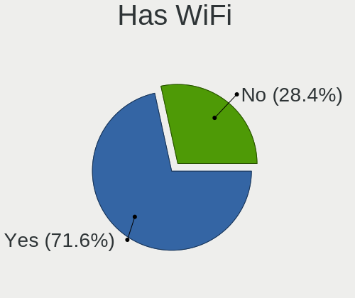
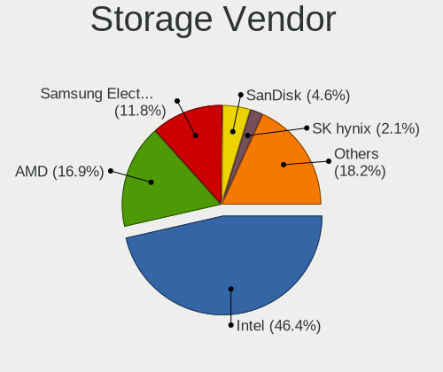

Linux in Germany - Tested Hardware & Statistics
-----------------------------------------------

A project to collect tested hardware configurations for Linux in Germany.

Anyone can contribute to this report by the [hw-probe](https://github.com/linuxhw/hw-probe) tool:

    sudo -E hw-probe -all -upload

Please contribute! Especially if your hardware is rare.

This is a report for all computer types. See also reports for [desktops](/Location/Germany/Desktop/README.md) and [notebooks](/Location/Germany/Notebook/README.md).

Contents
--------

* [ Test Cases ](#test-cases)

* [ System ](#system)
  - [ OS                       ](#os)
  - [ OS Family                ](#os-family)
  - [ Kernel                   ](#kernel)
  - [ Kernel Family            ](#kernel-family)
  - [ Kernel Major Ver.        ](#kernel-major-ver)
  - [ Arch                     ](#arch)
  - [ DE                       ](#de)
  - [ Display Server           ](#display-server)
  - [ Display Manager          ](#display-manager)
  - [ OS Lang                  ](#os-lang)
  - [ Boot Mode                ](#boot-mode)
  - [ Filesystem               ](#filesystem)
  - [ Part. scheme             ](#part-scheme)
  - [ Dual Boot with Linux/BSD ](#dual-boot-with-linuxbsd)
  - [ Dual Boot (Win)          ](#dual-boot-win)

* [ Board ](#board)
  - [ Vendor                   ](#vendor)
  - [ Model                    ](#model)
  - [ Model Family             ](#model-family)
  - [ MFG Year                 ](#mfg-year)
  - [ Form Factor              ](#form-factor)
  - [ Secure Boot              ](#secure-boot)
  - [ Coreboot                 ](#coreboot)
  - [ RAM Size                 ](#ram-size)
  - [ RAM Used                 ](#ram-used)
  - [ Total Drives             ](#total-drives)
  - [ Has CD-ROM               ](#has-cd-rom)
  - [ Has Ethernet             ](#has-ethernet)
  - [ Has WiFi                 ](#has-wifi)
  - [ Has Bluetooth            ](#has-bluetooth)

* [ Location ](#location)
  - [ Country                  ](#country)
  - [ City                     ](#city)

* [ Drives ](#drives)
  - [ Drive Vendor             ](#drive-vendor)
  - [ Drive Model              ](#drive-model)
  - [ HDD Vendor               ](#hdd-vendor)
  - [ SSD Vendor               ](#ssd-vendor)
  - [ Drive Kind               ](#drive-kind)
  - [ Drive Connector          ](#drive-connector)
  - [ Drive Size               ](#drive-size)
  - [ Space Total              ](#space-total)
  - [ Space Used               ](#space-used)
  - [ Malfunc. Drives          ](#malfunc-drives)
  - [ Malfunc. Drive Vendor    ](#malfunc-drive-vendor)
  - [ Malfunc. HDD Vendor      ](#malfunc-hdd-vendor)
  - [ Malfunc. Drive Kind      ](#malfunc-drive-kind)
  - [ Failed Drives            ](#failed-drives)
  - [ Failed Drive Vendor      ](#failed-drive-vendor)
  - [ Drive Status             ](#drive-status)

* [ Storage controller ](#storage-controller)
  - [ Storage Vendor           ](#storage-vendor)
  - [ Storage Model            ](#storage-model)
  - [ Storage Kind             ](#storage-kind)

* [ Processor ](#processor)
  - [ CPU Vendor               ](#cpu-vendor)
  - [ CPU Model                ](#cpu-model)
  - [ CPU Model Family         ](#cpu-model-family)
  - [ CPU Cores                ](#cpu-cores)
  - [ CPU Sockets              ](#cpu-sockets)
  - [ CPU Threads              ](#cpu-threads)
  - [ CPU Op-Modes             ](#cpu-op-modes)
  - [ CPU Microcode            ](#cpu-microcode)
  - [ CPU Microarch            ](#cpu-microarch)

* [ Graphics ](#graphics)
  - [ GPU Vendor               ](#gpu-vendor)
  - [ GPU Model                ](#gpu-model)
  - [ GPU Combo                ](#gpu-combo)
  - [ GPU Driver               ](#gpu-driver)
  - [ GPU Memory               ](#gpu-memory)

* [ Monitor ](#monitor)
  - [ Monitor Vendor           ](#monitor-vendor)
  - [ Monitor Model            ](#monitor-model)
  - [ Monitor Resolution       ](#monitor-resolution)
  - [ Monitor Diagonal         ](#monitor-diagonal)
  - [ Monitor Width            ](#monitor-width)
  - [ Aspect Ratio             ](#aspect-ratio)
  - [ Monitor Area             ](#monitor-area)
  - [ Pixel Density            ](#pixel-density)
  - [ Multiple Monitors        ](#multiple-monitors)

* [ Network ](#network)
  - [ Net Controller Vendor    ](#net-controller-vendor)
  - [ Net Controller Model     ](#net-controller-model)
  - [ Wireless Vendor          ](#wireless-vendor)
  - [ Wireless Model           ](#wireless-model)
  - [ Ethernet Vendor          ](#ethernet-vendor)
  - [ Ethernet Model           ](#ethernet-model)
  - [ Net Controller Kind      ](#net-controller-kind)
  - [ Used Controller          ](#used-controller)
  - [ NICs                     ](#nics)
  - [ IPv6                     ](#ipv6)

* [ Bluetooth ](#bluetooth)
  - [ Bluetooth Vendor         ](#bluetooth-vendor)
  - [ Bluetooth Model          ](#bluetooth-model)

* [ Sound ](#sound)
  - [ Sound Vendor             ](#sound-vendor)
  - [ Sound Model              ](#sound-model)

* [ Memory ](#memory)
  - [ Memory Vendor            ](#memory-vendor)
  - [ Memory Model             ](#memory-model)
  - [ Memory Kind              ](#memory-kind)
  - [ Memory Form Factor       ](#memory-form-factor)
  - [ Memory Size              ](#memory-size)
  - [ Memory Speed             ](#memory-speed)

* [ Printers & scanners ](#printers--scanners)
  - [ Printer Vendor           ](#printer-vendor)
  - [ Printer Model            ](#printer-model)
  - [ Scanner Vendor           ](#scanner-vendor)
  - [ Scanner Model            ](#scanner-model)

* [ Camera ](#camera)
  - [ Camera Vendor            ](#camera-vendor)
  - [ Camera Model             ](#camera-model)

* [ Security ](#security)
  - [ Fingerprint Vendor       ](#fingerprint-vendor)
  - [ Fingerprint Model        ](#fingerprint-model)
  - [ Chipcard Vendor          ](#chipcard-vendor)
  - [ Chipcard Model           ](#chipcard-model)

* [ Unsupported ](#unsupported)
  - [ Unsupported Devices      ](#unsupported-devices)
  - [ Unsupported Device Types ](#unsupported-device-types)

Test Cases
----------

Total: 23949

| Vendor        | Model                       | Form-Factor | Probe                                                      | Date         |
|---------------|-----------------------------|-------------|------------------------------------------------------------|--------------|
| Packard Be... | DOT S                       | Notebook    | [bb05d9a173](https://linux-hardware.org/?probe=bb05d9a173) | Dec 01, 2022 |
| Lenovo        | IdeaPad Gaming 3 15IAH7 ... | Notebook    | [fe9e8854c5](https://linux-hardware.org/?probe=fe9e8854c5) | Dec 01, 2022 |
| Lenovo        | IdeaPad Gaming 3 15IAH7 ... | Notebook    | [562e1f4b92](https://linux-hardware.org/?probe=562e1f4b92) | Dec 01, 2022 |
| ASUSTek       | P8H67                       | Desktop     | [31a7799a34](https://linux-hardware.org/?probe=31a7799a34) | Dec 01, 2022 |
| Unknown       | Unknown                     | Soc         | [05a662464d](https://linux-hardware.org/?probe=05a662464d) | Dec 01, 2022 |
| TUXEDO        | N13xWU                      | Notebook    | [55935f091d](https://linux-hardware.org/?probe=55935f091d) | Dec 01, 2022 |
| Lenovo        | ThinkPad E15 Gen 4 21EES... | Notebook    | [674157de54](https://linux-hardware.org/?probe=674157de54) | Dec 01, 2022 |
| ASUSTek       | P7P55D                      | Desktop     | [0a012accfd](https://linux-hardware.org/?probe=0a012accfd) | Dec 01, 2022 |
| Sony          | VPCEB1M1E                   | Notebook    | [988c78f70d](https://linux-hardware.org/?probe=988c78f70d) | Dec 01, 2022 |
| Dell          | XPS 13 9343                 | Notebook    | [125fcd77b9](https://linux-hardware.org/?probe=125fcd77b9) | Dec 01, 2022 |
| Fujitsu       | D3128-A1 S26361-D3128-A1    | Desktop     | [ad24dc05a0](https://linux-hardware.org/?probe=ad24dc05a0) | Dec 01, 2022 |
| Fujitsu       | D3128-A1 S26361-D3128-A1    | Desktop     | [0e38c9a3be](https://linux-hardware.org/?probe=0e38c9a3be) | Dec 01, 2022 |
| Lenovo        | MIIX 310-10ICR 80SG         | Tablet      | [64e68bf245](https://linux-hardware.org/?probe=64e68bf245) | Dec 01, 2022 |
| Acer          | TravelMate P614-51T-G2      | Notebook    | [952e89e25d](https://linux-hardware.org/?probe=952e89e25d) | Dec 01, 2022 |
| Lenovo        | SHARKBAY SDK0E50510 WIN     | Desktop     | [475ad82d2b](https://linux-hardware.org/?probe=475ad82d2b) | Nov 30, 2022 |
| Medion        | MS-7748                     | Desktop     | [0e92aa55ca](https://linux-hardware.org/?probe=0e92aa55ca) | Nov 30, 2022 |
| Sony          | VPCEB4L9E                   | Notebook    | [cad7ef5059](https://linux-hardware.org/?probe=cad7ef5059) | Nov 30, 2022 |
| HP            | 8924 0101                   | All in one  | [f9c0b53eee](https://linux-hardware.org/?probe=f9c0b53eee) | Nov 30, 2022 |
| Medion        | MS-7800                     | Desktop     | [a5658a6933](https://linux-hardware.org/?probe=a5658a6933) | Nov 30, 2022 |
| ASUSTek       | ROG STRIX Z490-A GAMING     | Desktop     | [dc5ec6eb84](https://linux-hardware.org/?probe=dc5ec6eb84) | Nov 30, 2022 |
| Dell          | 0M5DCD A00                  | Desktop     | [e9fae02409](https://linux-hardware.org/?probe=e9fae02409) | Nov 30, 2022 |
| Lenovo        | G500 20236                  | Notebook    | [43815283d9](https://linux-hardware.org/?probe=43815283d9) | Nov 30, 2022 |
| Dell          | XPS 15 9500                 | Notebook    | [42971a8394](https://linux-hardware.org/?probe=42971a8394) | Nov 30, 2022 |
| ASRock        | 970 Extreme3                | Desktop     | [4951da34da](https://linux-hardware.org/?probe=4951da34da) | Nov 30, 2022 |
| ASUSTek       | M5A78L-M LE/USB3            | Desktop     | [dd3801095f](https://linux-hardware.org/?probe=dd3801095f) | Nov 30, 2022 |
| Notebook      | RIM2520                     | Notebook    | [5f66abbb8b](https://linux-hardware.org/?probe=5f66abbb8b) | Nov 30, 2022 |
| Intel         | NUC7JYB J67967-404          | Mini pc     | [fd897211fa](https://linux-hardware.org/?probe=fd897211fa) | Nov 30, 2022 |
| ASUSTek       | VivoBook_ASUSLaptop E410... | Notebook    | [9505f905e8](https://linux-hardware.org/?probe=9505f905e8) | Nov 30, 2022 |
| ASUSTek       | M5A78L-M PLUS/USB3          | Desktop     | [efecce0072](https://linux-hardware.org/?probe=efecce0072) | Nov 30, 2022 |
| ASUSTek       | ROG STRIX B450-E GAMING     | Desktop     | [abcc431f9f](https://linux-hardware.org/?probe=abcc431f9f) | Nov 30, 2022 |
| ASUSTek       | PRIME X370-PRO              | Desktop     | [7f89d71e2e](https://linux-hardware.org/?probe=7f89d71e2e) | Nov 30, 2022 |
| ASRock        | N68-S3 UCC                  | Desktop     | [ede29d01f8](https://linux-hardware.org/?probe=ede29d01f8) | Nov 30, 2022 |
| Gigabyte      | 970A-DS3P                   | Desktop     | [22c7db0e68](https://linux-hardware.org/?probe=22c7db0e68) | Nov 30, 2022 |
| Gigabyte      | 970A-DS3P                   | Desktop     | [65493a981c](https://linux-hardware.org/?probe=65493a981c) | Nov 30, 2022 |
| Acer          | TravelMate P614-51T-G2      | Notebook    | [37e14fc1c1](https://linux-hardware.org/?probe=37e14fc1c1) | Nov 30, 2022 |
| HP            | Pavilion Gaming Laptop 1... | Notebook    | [c33e807c11](https://linux-hardware.org/?probe=c33e807c11) | Nov 30, 2022 |
| Tactus        | GeoBook 140                 | Notebook    | [91342e56df](https://linux-hardware.org/?probe=91342e56df) | Nov 29, 2022 |
| HP            | Compaq CQ58                 | Notebook    | [009ac41742](https://linux-hardware.org/?probe=009ac41742) | Nov 29, 2022 |
| Fujitsu       | D3162-A1 S26361-D3162-A1    | Desktop     | [b38075cef4](https://linux-hardware.org/?probe=b38075cef4) | Nov 29, 2022 |
| MSI           | MPG X570 GAMING EDGE WIF... | Desktop     | [c01a10b89d](https://linux-hardware.org/?probe=c01a10b89d) | Nov 29, 2022 |
| Dell          | Precision 7520              | Notebook    | [2c0cb92f23](https://linux-hardware.org/?probe=2c0cb92f23) | Nov 29, 2022 |
| Intel         | NUC5CPYB H61145-404         | Mini pc     | [c14ddb66a4](https://linux-hardware.org/?probe=c14ddb66a4) | Nov 29, 2022 |
| HP            | Pavilion Gaming Laptop 1... | Notebook    | [50e500a8fb](https://linux-hardware.org/?probe=50e500a8fb) | Nov 29, 2022 |
| HP            | 18E4                        | Desktop     | [39b839e527](https://linux-hardware.org/?probe=39b839e527) | Nov 29, 2022 |
| ASRock        | N68-S3 UCC                  | Desktop     | [fd6f368580](https://linux-hardware.org/?probe=fd6f368580) | Nov 29, 2022 |
| Lenovo        | ThinkPad E550 20DF004RGE    | Notebook    | [a06fd97ee3](https://linux-hardware.org/?probe=a06fd97ee3) | Nov 29, 2022 |
| ASUSTek       | X756UXK                     | Notebook    | [a8fde1c59a](https://linux-hardware.org/?probe=a8fde1c59a) | Nov 29, 2022 |
| Dell          | 0M859N A00                  | Desktop     | [95cf7fe257](https://linux-hardware.org/?probe=95cf7fe257) | Nov 29, 2022 |
| ASRock        | 960GM-GS3 FX                | Desktop     | [1474b9ee78](https://linux-hardware.org/?probe=1474b9ee78) | Nov 29, 2022 |
| ASUSTek       | VivoBook_ASUSLaptop X512... | Notebook    | [140872c53d](https://linux-hardware.org/?probe=140872c53d) | Nov 29, 2022 |
| ASUSTek       | TUF B450-PLUS GAMING        | Desktop     | [472530d650](https://linux-hardware.org/?probe=472530d650) | Nov 29, 2022 |
| ASUSTek       | Q170T                       | Desktop     | [99abcc63ab](https://linux-hardware.org/?probe=99abcc63ab) | Nov 29, 2022 |
| Lenovo        | ThinkPad T14s Gen 2a 20X... | Notebook    | [762b81c49e](https://linux-hardware.org/?probe=762b81c49e) | Nov 29, 2022 |
| Lenovo        | ThinkPad T14s Gen 2a 20X... | Notebook    | [01543655e9](https://linux-hardware.org/?probe=01543655e9) | Nov 29, 2022 |
| TUXEDO        | Unknown                     | Notebook    | [fd06ca029c](https://linux-hardware.org/?probe=fd06ca029c) | Nov 29, 2022 |
| Medion        | H110H4-EM2                  | Desktop     | [38b9e166f2](https://linux-hardware.org/?probe=38b9e166f2) | Nov 29, 2022 |
| Gigabyte      | B450M DS3H-CF               | Desktop     | [a73d36e579](https://linux-hardware.org/?probe=a73d36e579) | Nov 29, 2022 |
| Lenovo        | G500 20236                  | Notebook    | [6ece9d62e6](https://linux-hardware.org/?probe=6ece9d62e6) | Nov 29, 2022 |
| Lenovo        | ThinkPad T460s 20FAS16J0... | Notebook    | [142a1e8a94](https://linux-hardware.org/?probe=142a1e8a94) | Nov 29, 2022 |
| VA_IP3        | GMLR_V1                     | Mini pc     | [ac6676f125](https://linux-hardware.org/?probe=ac6676f125) | Nov 29, 2022 |
| HP            | ZBook 15                    | Notebook    | [452a6f86d5](https://linux-hardware.org/?probe=452a6f86d5) | Nov 29, 2022 |
| HUAWEI        | NBLK-WAX9X                  | Notebook    | [8f17b6a915](https://linux-hardware.org/?probe=8f17b6a915) | Nov 29, 2022 |
| Lenovo        | ThinkPad L15 Gen 1 20U70... | Notebook    | [fd821a4b54](https://linux-hardware.org/?probe=fd821a4b54) | Nov 29, 2022 |
| Lenovo        | V17 G2 ITL 82NX             | Notebook    | [6dcdb4d9ea](https://linux-hardware.org/?probe=6dcdb4d9ea) | Nov 29, 2022 |
| Dell          | G7 7790                     | Notebook    | [a85c1cd70e](https://linux-hardware.org/?probe=a85c1cd70e) | Nov 28, 2022 |
| Acer          | Aspire 5820TG               | Notebook    | [61cab6d996](https://linux-hardware.org/?probe=61cab6d996) | Nov 28, 2022 |
| Acer          | Aspire 5820TG               | Notebook    | [1e64d9426d](https://linux-hardware.org/?probe=1e64d9426d) | Nov 28, 2022 |
| Acer          | Swift SF314-43              | Notebook    | [1a6c47ad0e](https://linux-hardware.org/?probe=1a6c47ad0e) | Nov 28, 2022 |
| Acer          | Aspire A315-59              | Notebook    | [f7a1cff386](https://linux-hardware.org/?probe=f7a1cff386) | Nov 28, 2022 |
| Lenovo        | ThinkPad X301 2776LEG       | Notebook    | [ebaea0c805](https://linux-hardware.org/?probe=ebaea0c805) | Nov 28, 2022 |
| MSI           | X570-A PRO                  | Desktop     | [92ddd925db](https://linux-hardware.org/?probe=92ddd925db) | Nov 28, 2022 |
| Chuwi         | HeroBook Pro                | Notebook    | [df7f48022d](https://linux-hardware.org/?probe=df7f48022d) | Nov 28, 2022 |
| Chuwi         | HeroBook Pro                | Notebook    | [c8e48e2c0f](https://linux-hardware.org/?probe=c8e48e2c0f) | Nov 28, 2022 |
| Lenovo        | IdeaPad Y560                | Notebook    | [4918810cd1](https://linux-hardware.org/?probe=4918810cd1) | Nov 28, 2022 |
| Lenovo        | G700 20251                  | Notebook    | [49167f9f67](https://linux-hardware.org/?probe=49167f9f67) | Nov 28, 2022 |
| Apple         | Mac-B809C3757DA9BB8D iMa... | All in one  | [916343aa23](https://linux-hardware.org/?probe=916343aa23) | Nov 28, 2022 |
| ASRock        | Q1900M                      | Desktop     | [0a90a5d3a5](https://linux-hardware.org/?probe=0a90a5d3a5) | Nov 28, 2022 |
| HP            | 18E5                        | Desktop     | [e336f0ac13](https://linux-hardware.org/?probe=e336f0ac13) | Nov 28, 2022 |
| HP            | 255 G6 Notebook PC          | Notebook    | [e17172d1c5](https://linux-hardware.org/?probe=e17172d1c5) | Nov 28, 2022 |
| HP            | Pavilion Laptop 15-cw1xx... | Notebook    | [1f4c5bfc57](https://linux-hardware.org/?probe=1f4c5bfc57) | Nov 28, 2022 |
| MSI           | Z77A-G43                    | Desktop     | [207d763813](https://linux-hardware.org/?probe=207d763813) | Nov 28, 2022 |
| ASUSTek       | TUF Gaming X570-PLUS        | Desktop     | [e3f55c7b9d](https://linux-hardware.org/?probe=e3f55c7b9d) | Nov 28, 2022 |
| Shuttle       | FS35V4                      | Desktop     | [46923496a3](https://linux-hardware.org/?probe=46923496a3) | Nov 28, 2022 |
| ASUSTek       | TUF Gaming X570-PLUS        | Desktop     | [54407c7caa](https://linux-hardware.org/?probe=54407c7caa) | Nov 28, 2022 |
| HP            | EliteBook 8560w             | Notebook    | [61e60261ef](https://linux-hardware.org/?probe=61e60261ef) | Nov 28, 2022 |
| Lenovo        | ThinkPad T460 20FMS07000    | Notebook    | [0c1dece352](https://linux-hardware.org/?probe=0c1dece352) | Nov 28, 2022 |
| Microsoft     | Surface Pro 8               | Tablet      | [c0f32e47f1](https://linux-hardware.org/?probe=c0f32e47f1) | Nov 28, 2022 |
| Dell          | System XPS L502X            | Notebook    | [bd45da46bc](https://linux-hardware.org/?probe=bd45da46bc) | Nov 27, 2022 |
| Fujitsu       | LIFEBOOK S751               | Notebook    | [20cb13ada3](https://linux-hardware.org/?probe=20cb13ada3) | Nov 27, 2022 |
| Fujitsu       | LIFEBOOK S751               | Notebook    | [9062066523](https://linux-hardware.org/?probe=9062066523) | Nov 27, 2022 |
| Unknown       | V00                         | Mini pc     | [54723a3c4c](https://linux-hardware.org/?probe=54723a3c4c) | Nov 27, 2022 |
| ASUSTek       | ROG STRIX B550-E GAMING     | Desktop     | [b0078eda9b](https://linux-hardware.org/?probe=b0078eda9b) | Nov 27, 2022 |
| Lenovo        | ThinkPad E15 Gen 4 21EES... | Notebook    | [d8bb1b1d38](https://linux-hardware.org/?probe=d8bb1b1d38) | Nov 27, 2022 |
| Medion        | E11201                      | Notebook    | [0838f9db75](https://linux-hardware.org/?probe=0838f9db75) | Nov 27, 2022 |
| HP            | EliteBook 8560w             | Notebook    | [3145d17bb7](https://linux-hardware.org/?probe=3145d17bb7) | Nov 27, 2022 |
| Tactus        | GeoBook 140                 | Notebook    | [e3f4d734da](https://linux-hardware.org/?probe=e3f4d734da) | Nov 27, 2022 |
| Acer          | Veriton X4620G V1.0         | Desktop     | [37be4a2bf8](https://linux-hardware.org/?probe=37be4a2bf8) | Nov 27, 2022 |
| Lenovo        | ThinkPad E15 Gen 4 21EES... | Notebook    | [7db4db6cc7](https://linux-hardware.org/?probe=7db4db6cc7) | Nov 27, 2022 |
| Medion        | TJ4125                      | Desktop     | [a1c7ac96d3](https://linux-hardware.org/?probe=a1c7ac96d3) | Nov 27, 2022 |
| Gigabyte      | RC14UD                      | Notebook    | [37c4b79c24](https://linux-hardware.org/?probe=37c4b79c24) | Nov 27, 2022 |
| Dell          | G3 3779                     | Notebook    | [2def46f37c](https://linux-hardware.org/?probe=2def46f37c) | Nov 27, 2022 |
| MSI           | X570-A PRO                  | Desktop     | [c2c27cf47f](https://linux-hardware.org/?probe=c2c27cf47f) | Nov 27, 2022 |
| ASUSTek       | ROG STRIX B450-F GAMING ... | Desktop     | [a60076a8c2](https://linux-hardware.org/?probe=a60076a8c2) | Nov 27, 2022 |
| Medion        | E2292                       | Convertible | [98818a6a22](https://linux-hardware.org/?probe=98818a6a22) | Nov 27, 2022 |
| Acer          | Aspire A517-52              | Notebook    | [3ce1a2c42a](https://linux-hardware.org/?probe=3ce1a2c42a) | Nov 27, 2022 |
| HP            | 255 G8 Notebook PC          | Notebook    | [97cf5008bb](https://linux-hardware.org/?probe=97cf5008bb) | Nov 27, 2022 |
| ASUSTek       | PRIME B365M-A               | Desktop     | [4f3216dfdc](https://linux-hardware.org/?probe=4f3216dfdc) | Nov 27, 2022 |
| ASUSTek       | PRIME B365M-A               | Desktop     | [498f0a31dc](https://linux-hardware.org/?probe=498f0a31dc) | Nov 27, 2022 |
| ASUSTek       | VivoBook_ASUSLaptop X421... | Notebook    | [32bfa52fc1](https://linux-hardware.org/?probe=32bfa52fc1) | Nov 27, 2022 |
| Gigabyte      | B550 AORUS ELITE V2         | Desktop     | [bbf4464c41](https://linux-hardware.org/?probe=bbf4464c41) | Nov 27, 2022 |
| Lenovo        | SHARKBAY SDK0E50510 WIN     | Desktop     | [1deadcff69](https://linux-hardware.org/?probe=1deadcff69) | Nov 27, 2022 |
| HP            | ProBook 440 G7              | Notebook    | [d923cda32c](https://linux-hardware.org/?probe=d923cda32c) | Nov 26, 2022 |
| HP            | 18E4                        | Desktop     | [11c1530767](https://linux-hardware.org/?probe=11c1530767) | Nov 26, 2022 |
| Dell          | XPS 15 7590                 | Notebook    | [071f2be55e](https://linux-hardware.org/?probe=071f2be55e) | Nov 26, 2022 |
| Chuwi         | LarkBox Pro                 | Mini pc     | [2509c3dc5c](https://linux-hardware.org/?probe=2509c3dc5c) | Nov 26, 2022 |
| MSI           | 970 GAMING                  | Desktop     | [82a3d83d20](https://linux-hardware.org/?probe=82a3d83d20) | Nov 26, 2022 |
| Unknown       | V00                         | Mini pc     | [15a2312211](https://linux-hardware.org/?probe=15a2312211) | Nov 26, 2022 |
| Lenovo        | ThinkPad L13 Yoga Gen 2 ... | Convertible | [27e7464a68](https://linux-hardware.org/?probe=27e7464a68) | Nov 26, 2022 |
| ASUSTek       | Rampage IV EXTREME          | Desktop     | [e70ff25b31](https://linux-hardware.org/?probe=e70ff25b31) | Nov 26, 2022 |
| Dell          | Latitude D610               | Notebook    | [437f7630fd](https://linux-hardware.org/?probe=437f7630fd) | Nov 26, 2022 |
| Valve         | Jupiter                     | Notebook    | [ea37f7d713](https://linux-hardware.org/?probe=ea37f7d713) | Nov 26, 2022 |
| HP            | 255 G7 Notebook PC          | Notebook    | [8c389cf5d6](https://linux-hardware.org/?probe=8c389cf5d6) | Nov 26, 2022 |
| ASRock        | H61M-DGS R2.0               | Desktop     | [189b3c0ea0](https://linux-hardware.org/?probe=189b3c0ea0) | Nov 26, 2022 |
| Acer          | Swift SFX14-41G             | Notebook    | [521cb4d847](https://linux-hardware.org/?probe=521cb4d847) | Nov 26, 2022 |
| MSI           | GE70 2OC\2OE                | Notebook    | [842781ccfc](https://linux-hardware.org/?probe=842781ccfc) | Nov 26, 2022 |
| ASUSTek       | PRIME A320M-K               | Desktop     | [be12141830](https://linux-hardware.org/?probe=be12141830) | Nov 26, 2022 |
| Dell          | Latitude E6540              | Notebook    | [543ca1307c](https://linux-hardware.org/?probe=543ca1307c) | Nov 26, 2022 |
| ASUSTek       | PRIME A320M-K               | Desktop     | [f34d75bde0](https://linux-hardware.org/?probe=f34d75bde0) | Nov 26, 2022 |
| MSI           | B550-A PRO                  | Desktop     | [8d0b06aa1d](https://linux-hardware.org/?probe=8d0b06aa1d) | Nov 26, 2022 |
| Toshiba       | Satellite C670D-126         | Notebook    | [6c2fc84bf2](https://linux-hardware.org/?probe=6c2fc84bf2) | Nov 26, 2022 |
| Gigabyte      | GA-890GPA-UD3H              | Desktop     | [5b531b7b41](https://linux-hardware.org/?probe=5b531b7b41) | Nov 26, 2022 |
| Getac         | S410                        | Notebook    | [3df44aa3af](https://linux-hardware.org/?probe=3df44aa3af) | Nov 26, 2022 |
| TUXEDO        | Aura 15 Gen1                | Notebook    | [2868e94785](https://linux-hardware.org/?probe=2868e94785) | Nov 26, 2022 |
| Samsung       | RC530/RC730                 | Notebook    | [64515ff8b1](https://linux-hardware.org/?probe=64515ff8b1) | Nov 26, 2022 |
| Apple         | MacBookPro7,1               | Notebook    | [8268fc2c12](https://linux-hardware.org/?probe=8268fc2c12) | Nov 26, 2022 |
| Foxconn       | G41MXP/G41MXP-V             | Desktop     | [f8e0414c84](https://linux-hardware.org/?probe=f8e0414c84) | Nov 26, 2022 |
| Gigabyte      | X470 AORUS GAMING 5 WIFI... | Desktop     | [2a7b6d570f](https://linux-hardware.org/?probe=2a7b6d570f) | Nov 26, 2022 |
| Lenovo        | ThinkPad T430 2349I62       | Notebook    | [ab0d49b5cd](https://linux-hardware.org/?probe=ab0d49b5cd) | Nov 25, 2022 |
| MSI           | MS-16G1                     | Notebook    | [8d8233d2a9](https://linux-hardware.org/?probe=8d8233d2a9) | Nov 25, 2022 |
| Lenovo        | ThinkPad T430 23501K1       | Notebook    | [46ec8527f5](https://linux-hardware.org/?probe=46ec8527f5) | Nov 25, 2022 |
| Fujitsu       | D3221-A1 S26361-D3221-A1    | Desktop     | [a787a49407](https://linux-hardware.org/?probe=a787a49407) | Nov 25, 2022 |
| Lenovo        | ThinkPad L15 Gen 1 20U70... | Notebook    | [18130ae317](https://linux-hardware.org/?probe=18130ae317) | Nov 25, 2022 |
| Lenovo        | IdeaPad 120S-11IAP 81A4     | Notebook    | [48d797ccdc](https://linux-hardware.org/?probe=48d797ccdc) | Nov 25, 2022 |
| Lenovo        | IdeaPad 3 15ALC6 82KU       | Notebook    | [86735d895f](https://linux-hardware.org/?probe=86735d895f) | Nov 25, 2022 |
| HP            | EliteBook 850 G8 Noteboo... | Notebook    | [1f2bd09174](https://linux-hardware.org/?probe=1f2bd09174) | Nov 25, 2022 |
| ASUSTek       | X751MA                      | Notebook    | [15ea4b4462](https://linux-hardware.org/?probe=15ea4b4462) | Nov 25, 2022 |
| Samsung       | 300E4C/300E5C/300E7C        | Notebook    | [024b4da647](https://linux-hardware.org/?probe=024b4da647) | Nov 25, 2022 |
| HP            | Compaq CQ58                 | Notebook    | [e6d1387823](https://linux-hardware.org/?probe=e6d1387823) | Nov 25, 2022 |
| Lenovo        | Slim 7 ProX 14ARH7 82V2     | Notebook    | [1ed724b75e](https://linux-hardware.org/?probe=1ed724b75e) | Nov 25, 2022 |
| Lenovo        | 40684WG                     | Notebook    | [27e2eeccbf](https://linux-hardware.org/?probe=27e2eeccbf) | Nov 25, 2022 |
| Samsung       | R59P/R60P/R61P              | Notebook    | [62510109f9](https://linux-hardware.org/?probe=62510109f9) | Nov 25, 2022 |
| ASUSTek       | P8B75-M LX                  | Desktop     | [8522486d64](https://linux-hardware.org/?probe=8522486d64) | Nov 25, 2022 |
| Lenovo        | ThinkPad E470 20H2S00700    | Notebook    | [f82ee02c50](https://linux-hardware.org/?probe=f82ee02c50) | Nov 25, 2022 |
| HP            | ZBook 15                    | Notebook    | [dc8f215893](https://linux-hardware.org/?probe=dc8f215893) | Nov 25, 2022 |
| Gigabyte      | Z390 UD                     | Desktop     | [06e25ffa57](https://linux-hardware.org/?probe=06e25ffa57) | Nov 25, 2022 |
| Acer          | Veriton L6620G v1.0         | Desktop     | [33f168992e](https://linux-hardware.org/?probe=33f168992e) | Nov 25, 2022 |
| Dell          | Inspiron 7559               | Notebook    | [620f0d5cec](https://linux-hardware.org/?probe=620f0d5cec) | Nov 25, 2022 |
| Acer          | Aspire VN7-791G             | Notebook    | [7664866053](https://linux-hardware.org/?probe=7664866053) | Nov 25, 2022 |
| Lenovo        | ThinkPad T460 20FMS07000    | Notebook    | [eded61b721](https://linux-hardware.org/?probe=eded61b721) | Nov 25, 2022 |
| Apple         | MacBook3,1                  | Notebook    | [404821c7d6](https://linux-hardware.org/?probe=404821c7d6) | Nov 25, 2022 |
| Lenovo        | ThinkPad P17 Gen 2i 20YU... | Notebook    | [cd660d3210](https://linux-hardware.org/?probe=cd660d3210) | Nov 24, 2022 |
| Gigabyte      | B75M-D3H                    | Desktop     | [d70a6e41ba](https://linux-hardware.org/?probe=d70a6e41ba) | Nov 24, 2022 |
| ASRock        | 960GM-GS3 FX                | Desktop     | [1af92d9936](https://linux-hardware.org/?probe=1af92d9936) | Nov 24, 2022 |
| HP            | 255 G7 Notebook PC          | Notebook    | [f5a6bcf0fb](https://linux-hardware.org/?probe=f5a6bcf0fb) | Nov 24, 2022 |
| Acer          | Aspire E5-573               | Notebook    | [c0ccedd707](https://linux-hardware.org/?probe=c0ccedd707) | Nov 24, 2022 |
| Acer          | Aspire E5-573               | Notebook    | [f2b9fd554b](https://linux-hardware.org/?probe=f2b9fd554b) | Nov 24, 2022 |
| HP            | 339A                        | Desktop     | [52f957ef60](https://linux-hardware.org/?probe=52f957ef60) | Nov 24, 2022 |
| Acer          | Aspire ES1-711              | Notebook    | [b3260faedb](https://linux-hardware.org/?probe=b3260faedb) | Nov 24, 2022 |
| ASUSTek       | Zenbook UX5401ZA_UX5401Z... | Notebook    | [aaa0e3394f](https://linux-hardware.org/?probe=aaa0e3394f) | Nov 24, 2022 |
| Lenovo        | IdeaPad 320-15AST 80XV      | Notebook    | [b73b2c4c07](https://linux-hardware.org/?probe=b73b2c4c07) | Nov 24, 2022 |
| Lenovo        | V145-15AST 81MT             | Notebook    | [b37755877d](https://linux-hardware.org/?probe=b37755877d) | Nov 24, 2022 |
| Samsung       | 600B4B/600B5B               | Notebook    | [6cbdda4e27](https://linux-hardware.org/?probe=6cbdda4e27) | Nov 24, 2022 |
| Dell          | 0MN1TX A01                  | Desktop     | [7f0ba24aad](https://linux-hardware.org/?probe=7f0ba24aad) | Nov 24, 2022 |
| Thomson       | GEN17V3C8WH256              | Notebook    | [7b1a510e2e](https://linux-hardware.org/?probe=7b1a510e2e) | Nov 24, 2022 |
| Gigabyte      | Z390 UD                     | Desktop     | [447045be5d](https://linux-hardware.org/?probe=447045be5d) | Nov 24, 2022 |
| Fujitsu       | D3222-A1 S26361-D3222-A1    | Desktop     | [00f8658ee8](https://linux-hardware.org/?probe=00f8658ee8) | Nov 24, 2022 |
| Dell          | XPS 13 9300                 | Notebook    | [43fe4ed852](https://linux-hardware.org/?probe=43fe4ed852) | Nov 24, 2022 |
| ASUSTek       | ASUS TUF Gaming A17 FA70... | Notebook    | [cf30d2df93](https://linux-hardware.org/?probe=cf30d2df93) | Nov 24, 2022 |
| ASUSTek       | ROG Flow X13 GV301RE_GV3... | Convertible | [3995c6708e](https://linux-hardware.org/?probe=3995c6708e) | Nov 24, 2022 |
| HP            | EliteBook 820 G3            | Notebook    | [3ca3320525](https://linux-hardware.org/?probe=3ca3320525) | Nov 24, 2022 |
| Intel         | NUC7JYB J67967-404          | Mini pc     | [b4c105c294](https://linux-hardware.org/?probe=b4c105c294) | Nov 24, 2022 |
| ASRock        | FP6D4-P1                    | Desktop     | [5e52f1b520](https://linux-hardware.org/?probe=5e52f1b520) | Nov 24, 2022 |
| HP            | EliteBook 8560w             | Notebook    | [7253dd4798](https://linux-hardware.org/?probe=7253dd4798) | Nov 24, 2022 |
| Lenovo        | ThinkBook 15-IIL 20SM       | Notebook    | [0f96032f10](https://linux-hardware.org/?probe=0f96032f10) | Nov 24, 2022 |
| Packard Be... | EasyNote TM98               | Notebook    | [468831c306](https://linux-hardware.org/?probe=468831c306) | Nov 24, 2022 |
| Lenovo        | ThinkCentre M91p 4524WAP    | Desktop     | [51f3e71650](https://linux-hardware.org/?probe=51f3e71650) | Nov 24, 2022 |
| Lenovo        | ThinkPad T460 20FMS0VG25    | Notebook    | [06221c9746](https://linux-hardware.org/?probe=06221c9746) | Nov 24, 2022 |
| Dell          | Inspiron 7720               | Notebook    | [a75b9a21f9](https://linux-hardware.org/?probe=a75b9a21f9) | Nov 24, 2022 |
| Dell          | 0MN1TX A01                  | Desktop     | [8de6a24029](https://linux-hardware.org/?probe=8de6a24029) | Nov 24, 2022 |
| Chuwi         | LarkBox Pro                 | Mini pc     | [6b71a5917c](https://linux-hardware.org/?probe=6b71a5917c) | Nov 24, 2022 |
| Dell          | Latitude E6320              | Notebook    | [81f633b550](https://linux-hardware.org/?probe=81f633b550) | Nov 24, 2022 |
| Lenovo        | ThinkPad P15s Gen 2i 20W... | Notebook    | [1c65fff6e7](https://linux-hardware.org/?probe=1c65fff6e7) | Nov 24, 2022 |
| Dell          | XPS 9320                    | Notebook    | [d63a585507](https://linux-hardware.org/?probe=d63a585507) | Nov 23, 2022 |
| Lenovo        | 310B SDK0J40705 WIN 3425... | Desktop     | [7265ce493e](https://linux-hardware.org/?probe=7265ce493e) | Nov 23, 2022 |
| Medion        | TJ4125                      | Desktop     | [84084e5cdc](https://linux-hardware.org/?probe=84084e5cdc) | Nov 23, 2022 |
| Dell          | Inspiron 7720               | Notebook    | [ae4fc56cb3](https://linux-hardware.org/?probe=ae4fc56cb3) | Nov 23, 2022 |
| Medion        | TJ4125                      | Desktop     | [810477dfd9](https://linux-hardware.org/?probe=810477dfd9) | Nov 23, 2022 |
| Lenovo        | IdeaPad Y560                | Notebook    | [154702cbc6](https://linux-hardware.org/?probe=154702cbc6) | Nov 23, 2022 |
| Lenovo        | ThinkPad T495 20NK000UUS    | Notebook    | [0e8c0e6f07](https://linux-hardware.org/?probe=0e8c0e6f07) | Nov 23, 2022 |
| Lenovo        | ThinkPad T490 20N3S8T211    | Notebook    | [97ea649145](https://linux-hardware.org/?probe=97ea649145) | Nov 23, 2022 |
| HP            | 18E4                        | Desktop     | [8dd5fdb580](https://linux-hardware.org/?probe=8dd5fdb580) | Nov 23, 2022 |
| Lenovo        | ThinkPad T460 20FMS0VG25    | Notebook    | [b00a1e7f6a](https://linux-hardware.org/?probe=b00a1e7f6a) | Nov 23, 2022 |
| Dell          | 0NDYHG A01                  | Desktop     | [0e693ae457](https://linux-hardware.org/?probe=0e693ae457) | Nov 23, 2022 |
| Dell          | XPS 15 9510                 | Notebook    | [26fb968043](https://linux-hardware.org/?probe=26fb968043) | Nov 23, 2022 |
| HP            | G62                         | Notebook    | [754a471519](https://linux-hardware.org/?probe=754a471519) | Nov 23, 2022 |
| MPMAN         | CONVERTER 102               | Notebook    | [cab847edc0](https://linux-hardware.org/?probe=cab847edc0) | Nov 23, 2022 |
| Gigabyte      | X470 AORUS GAMING 5 WIFI... | Desktop     | [58b3db6784](https://linux-hardware.org/?probe=58b3db6784) | Nov 23, 2022 |
| Lenovo        | Yoga C640-13IML 81UE        | Convertible | [1bed000f1a](https://linux-hardware.org/?probe=1bed000f1a) | Nov 23, 2022 |
| ASRock        | Q1900B-ITX                  | Desktop     | [7239c46e95](https://linux-hardware.org/?probe=7239c46e95) | Nov 23, 2022 |
| ASUSTek       | GR8                         | Notebook    | [99683fc732](https://linux-hardware.org/?probe=99683fc732) | Nov 22, 2022 |
| Apple         | MacBookPro11,3              | Notebook    | [476415b4e4](https://linux-hardware.org/?probe=476415b4e4) | Nov 22, 2022 |
| Acer          | Aspire 7520                 | Notebook    | [d2f4caca66](https://linux-hardware.org/?probe=d2f4caca66) | Nov 22, 2022 |
| ASUSTek       | PRIME B450M-K               | Desktop     | [2438420107](https://linux-hardware.org/?probe=2438420107) | Nov 22, 2022 |
| Lenovo        | ThinkPad T440p 20AWS3RJ0... | Notebook    | [43f6a19d9a](https://linux-hardware.org/?probe=43f6a19d9a) | Nov 22, 2022 |
| ASUSTek       | P8H61-I LX                  | Desktop     | [a537f96848](https://linux-hardware.org/?probe=a537f96848) | Nov 22, 2022 |
| Gigabyte      | B550 AORUS ELITE V2         | Desktop     | [76ac354e17](https://linux-hardware.org/?probe=76ac354e17) | Nov 22, 2022 |
| ASUSTek       | Maximus IX HERO             | Desktop     | [587aa317bd](https://linux-hardware.org/?probe=587aa317bd) | Nov 22, 2022 |
| Gigabyte      | 970A-DS3P FX                | Desktop     | [d4d9cadf9f](https://linux-hardware.org/?probe=d4d9cadf9f) | Nov 22, 2022 |
| Fujitsu       | LIFEBOOK A3510              | Notebook    | [e1c126c1f2](https://linux-hardware.org/?probe=e1c126c1f2) | Nov 22, 2022 |
| Lenovo        | ThinkPad T450 20BUS08L00    | Notebook    | [31ddbc5ee3](https://linux-hardware.org/?probe=31ddbc5ee3) | Nov 22, 2022 |
| ASUSTek       | Pro WS C246-ACE             | Desktop     | [1a38780da8](https://linux-hardware.org/?probe=1a38780da8) | Nov 22, 2022 |
| Gigabyte      | A320M-S2H-CF                | Desktop     | [62048f37d6](https://linux-hardware.org/?probe=62048f37d6) | Nov 22, 2022 |
| ASUSTek       | PRIME B250M-PLUS            | Desktop     | [ba7795ec44](https://linux-hardware.org/?probe=ba7795ec44) | Nov 22, 2022 |
| Gigabyte      | B450 I AORUS PRO WIFI-CF    | Desktop     | [f2a00a7bb3](https://linux-hardware.org/?probe=f2a00a7bb3) | Nov 21, 2022 |
| Acer          | Aspire A315-51              | Notebook    | [3d8ef86616](https://linux-hardware.org/?probe=3d8ef86616) | Nov 21, 2022 |
| Acer          | Aspire A315-51              | Notebook    | [bcff111ecd](https://linux-hardware.org/?probe=bcff111ecd) | Nov 21, 2022 |
| HP            | 3647h                       | Desktop     | [8f77a73e9b](https://linux-hardware.org/?probe=8f77a73e9b) | Nov 21, 2022 |
| MSI           | Katana GF76 11UG            | Notebook    | [e29dda268c](https://linux-hardware.org/?probe=e29dda268c) | Nov 21, 2022 |
| MSI           | Katana GF76 11UG            | Notebook    | [9627a23b1f](https://linux-hardware.org/?probe=9627a23b1f) | Nov 21, 2022 |
| Lenovo        | ThinkPad T450 20BUA0AEIG    | Notebook    | [48956b6f61](https://linux-hardware.org/?probe=48956b6f61) | Nov 21, 2022 |
| Gigabyte      | Z690 GAMING X DDR4          | Desktop     | [89e6ad23e9](https://linux-hardware.org/?probe=89e6ad23e9) | Nov 21, 2022 |
| Intel         | SKYBAY                      | Desktop     | [7c0566f0ba](https://linux-hardware.org/?probe=7c0566f0ba) | Nov 21, 2022 |
| HP            | EliteBook 840 G5            | Notebook    | [62ffc22eea](https://linux-hardware.org/?probe=62ffc22eea) | Nov 21, 2022 |
| Lenovo        | ThinkPad T440 20B7000LGE    | Notebook    | [9194594686](https://linux-hardware.org/?probe=9194594686) | Nov 21, 2022 |
| ASUSTek       | M5A78L-M/USB3               | Desktop     | [f4e5d3bd1c](https://linux-hardware.org/?probe=f4e5d3bd1c) | Nov 21, 2022 |
| ASUSTek       | ROG STRIX H470-I GAMING     | Desktop     | [8b8ac358e4](https://linux-hardware.org/?probe=8b8ac358e4) | Nov 21, 2022 |
| Dell          | Latitude 3310 2-in-1        | Convertible | [2574454ebe](https://linux-hardware.org/?probe=2574454ebe) | Nov 21, 2022 |
| HP            | 250 G7 Notebook PC          | Notebook    | [f56bd99812](https://linux-hardware.org/?probe=f56bd99812) | Nov 21, 2022 |
| HP            | 250 G7 Notebook PC          | Notebook    | [d7e8c67720](https://linux-hardware.org/?probe=d7e8c67720) | Nov 21, 2022 |
| HP            | ZBook 17 G2                 | Notebook    | [1c5168fcfe](https://linux-hardware.org/?probe=1c5168fcfe) | Nov 21, 2022 |
| TUXEDO        | Pulse 15 Gen1               | Notebook    | [b65ee83a19](https://linux-hardware.org/?probe=b65ee83a19) | Nov 21, 2022 |
| TUXEDO        | Pulse 15 Gen1               | Notebook    | [c8d395cdcc](https://linux-hardware.org/?probe=c8d395cdcc) | Nov 21, 2022 |
| Dell          | Latitude E6320              | Notebook    | [91ebf30a5c](https://linux-hardware.org/?probe=91ebf30a5c) | Nov 21, 2022 |
| ASRock        | 960GM-VGS3 FX               | Desktop     | [c5ecd06a6f](https://linux-hardware.org/?probe=c5ecd06a6f) | Nov 21, 2022 |
| Medion        | Akoya P2214T                | Notebook    | [eb9e0cfbf8](https://linux-hardware.org/?probe=eb9e0cfbf8) | Nov 20, 2022 |
| Samsung       | 270E5J/2570EJ               | Notebook    | [f5b73b34c6](https://linux-hardware.org/?probe=f5b73b34c6) | Nov 20, 2022 |
| MSI           | CX700                       | Notebook    | [69c6ae1f04](https://linux-hardware.org/?probe=69c6ae1f04) | Nov 20, 2022 |
| Fujitsu       | D3162-C1 S26361-D3162-C1    | Desktop     | [79403c8f5d](https://linux-hardware.org/?probe=79403c8f5d) | Nov 20, 2022 |
| MSI           | A320M-A PRO MAX             | Desktop     | [486c850cd6](https://linux-hardware.org/?probe=486c850cd6) | Nov 20, 2022 |
| HUAWEI        | MACH-WX9                    | Notebook    | [32fa69ea64](https://linux-hardware.org/?probe=32fa69ea64) | Nov 20, 2022 |
| TUXEDO        | XMG FUSION 15 (XFU15L19)    | Notebook    | [d9a74ee60a](https://linux-hardware.org/?probe=d9a74ee60a) | Nov 20, 2022 |
| HP            | EliteBook 850 G8 Noteboo... | Notebook    | [2db5ac853d](https://linux-hardware.org/?probe=2db5ac853d) | Nov 20, 2022 |
| Gigabyte      | GA-890GPA-UD3H              | Desktop     | [41cca3d850](https://linux-hardware.org/?probe=41cca3d850) | Nov 20, 2022 |
| MSI           | X570-A PRO                  | Desktop     | [912f6ac7a3](https://linux-hardware.org/?probe=912f6ac7a3) | Nov 20, 2022 |
| Dell          | XPS 13 7390                 | Notebook    | [52810e28da](https://linux-hardware.org/?probe=52810e28da) | Nov 20, 2022 |
| Acer          | Aspire XC-780               | Desktop     | [bfc11805d9](https://linux-hardware.org/?probe=bfc11805d9) | Nov 20, 2022 |
| HP            | EliteBook 850 G4            | Notebook    | [30c7f00ee5](https://linux-hardware.org/?probe=30c7f00ee5) | Nov 20, 2022 |
| Acer          | Aspire XC-780               | Desktop     | [a992606b70](https://linux-hardware.org/?probe=a992606b70) | Nov 20, 2022 |
| Lenovo        | ThinkPad T460 20FMS07000    | Notebook    | [5043f6c54e](https://linux-hardware.org/?probe=5043f6c54e) | Nov 20, 2022 |
| Apple         | Mac-AA95B1DDAB278B95 iMa... | All in one  | [1e74aa696f](https://linux-hardware.org/?probe=1e74aa696f) | Nov 20, 2022 |
| Unknown       | V00                         | Mini pc     | [7ead9004a9](https://linux-hardware.org/?probe=7ead9004a9) | Nov 20, 2022 |
| ASUSTek       | PRIME Z590-A                | Desktop     | [ba2c2a39ed](https://linux-hardware.org/?probe=ba2c2a39ed) | Nov 20, 2022 |
| Lenovo        | IdeaPadFlex 5 14ALC05 82... | Convertible | [bb043b7575](https://linux-hardware.org/?probe=bb043b7575) | Nov 20, 2022 |
| ASUSTek       | PRIME Z590-A                | Desktop     | [07985535f4](https://linux-hardware.org/?probe=07985535f4) | Nov 20, 2022 |
| Lenovo        | IdeaPadFlex 5 14ALC05 82... | Convertible | [ec1395a487](https://linux-hardware.org/?probe=ec1395a487) | Nov 20, 2022 |
| Unknown       | V00                         | Mini pc     | [9b89fe3034](https://linux-hardware.org/?probe=9b89fe3034) | Nov 20, 2022 |
| Acer          | FX58M                       | Desktop     | [5e7abd5852](https://linux-hardware.org/?probe=5e7abd5852) | Nov 20, 2022 |
| Acer          | Aspire VN7-572G             | Notebook    | [314902c0f1](https://linux-hardware.org/?probe=314902c0f1) | Nov 20, 2022 |
| HP            | ZBook 15 G2                 | Notebook    | [5df677d667](https://linux-hardware.org/?probe=5df677d667) | Nov 20, 2022 |
| MPMAN         | CONVERTER 102               | Notebook    | [845925720b](https://linux-hardware.org/?probe=845925720b) | Nov 20, 2022 |
| HP            | Spectre x360 2-in-1 Lapt... | Convertible | [554267b04d](https://linux-hardware.org/?probe=554267b04d) | Nov 20, 2022 |
| Chuwi         | LapBook SE                  | Notebook    | [ecc56a3703](https://linux-hardware.org/?probe=ecc56a3703) | Nov 19, 2022 |
| Lenovo        | IdeaPadFlex 15D 20334       | Notebook    | [77dcd3bef6](https://linux-hardware.org/?probe=77dcd3bef6) | Nov 19, 2022 |
| HP            | Spectre x360 Convertible... | Convertible | [3b7077c5ab](https://linux-hardware.org/?probe=3b7077c5ab) | Nov 19, 2022 |
| Gigabyte      | B75M-D3H                    | Desktop     | [e5db58baec](https://linux-hardware.org/?probe=e5db58baec) | Nov 19, 2022 |
| HP            | EliteBook 820 G2            | Notebook    | [5d82e9f6ac](https://linux-hardware.org/?probe=5d82e9f6ac) | Nov 19, 2022 |
| HP            | EliteBook 820 G2            | Notebook    | [9d20af2c30](https://linux-hardware.org/?probe=9d20af2c30) | Nov 19, 2022 |
| HP            | 829A                        | Mini pc     | [0861dc9da2](https://linux-hardware.org/?probe=0861dc9da2) | Nov 19, 2022 |
| ASUSTek       | B451JA                      | Notebook    | [faeb294d65](https://linux-hardware.org/?probe=faeb294d65) | Nov 19, 2022 |
| Lenovo        | ThinkPad T580 20L9CTO1WW    | Notebook    | [bed1f98f04](https://linux-hardware.org/?probe=bed1f98f04) | Nov 19, 2022 |
| Acer          | FX58M                       | Desktop     | [837da7d885](https://linux-hardware.org/?probe=837da7d885) | Nov 19, 2022 |
| Lenovo        | ThinkPad X220 Tablet 429... | Notebook    | [85e0869ac9](https://linux-hardware.org/?probe=85e0869ac9) | Nov 19, 2022 |
| ASUSTek       | X99-S                       | Desktop     | [b0bb31d7d9](https://linux-hardware.org/?probe=b0bb31d7d9) | Nov 19, 2022 |
| Gigabyte      | H81M-HD3                    | Desktop     | [d858d2656d](https://linux-hardware.org/?probe=d858d2656d) | Nov 19, 2022 |
| Acer          | Aspire TC-1760              | Desktop     | [a4f03aea9c](https://linux-hardware.org/?probe=a4f03aea9c) | Nov 19, 2022 |
| Tactus        | GeoBook 140                 | Notebook    | [127ec68044](https://linux-hardware.org/?probe=127ec68044) | Nov 19, 2022 |
| HP            | Laptop 17-cp0xxx            | Notebook    | [a3fde1deaa](https://linux-hardware.org/?probe=a3fde1deaa) | Nov 19, 2022 |
| Dell          | Inspiron 3537               | Notebook    | [b8d74d8e6f](https://linux-hardware.org/?probe=b8d74d8e6f) | Nov 19, 2022 |
| Fujitsu       | LIFEBOOK A3510              | Notebook    | [9eb6a535ac](https://linux-hardware.org/?probe=9eb6a535ac) | Nov 19, 2022 |
| Lenovo        | 13w Yoga 82S1               | Convertible | [95686093ce](https://linux-hardware.org/?probe=95686093ce) | Nov 19, 2022 |
| Intel         | DH55PJ AAE93812-303         | Desktop     | [bebe890c96](https://linux-hardware.org/?probe=bebe890c96) | Nov 19, 2022 |
| Lenovo        | ThinkPad E15 Gen 4 21EES... | Notebook    | [1572414802](https://linux-hardware.org/?probe=1572414802) | Nov 19, 2022 |
| Toshiba       | Satellite C670D-126         | Notebook    | [17e464f802](https://linux-hardware.org/?probe=17e464f802) | Nov 19, 2022 |
| Dell          | Latitude 5414               | Notebook    | [a408bec327](https://linux-hardware.org/?probe=a408bec327) | Nov 18, 2022 |
| Dell          | Latitude E6540              | Notebook    | [4148292f4d](https://linux-hardware.org/?probe=4148292f4d) | Nov 18, 2022 |
| Samsung       | 600B4B/600B5B               | Notebook    | [0185c349b9](https://linux-hardware.org/?probe=0185c349b9) | Nov 18, 2022 |
| HP            | Laptop 17-cp0xxx            | Notebook    | [f4c6260289](https://linux-hardware.org/?probe=f4c6260289) | Nov 18, 2022 |
| Acer          | Aspire A515-45              | Notebook    | [482709f151](https://linux-hardware.org/?probe=482709f151) | Nov 18, 2022 |
| Samsung       | 600B4B/600B5B               | Notebook    | [6992e11b21](https://linux-hardware.org/?probe=6992e11b21) | Nov 18, 2022 |
| Dell          | Latitude E6540              | Notebook    | [31752fdaa8](https://linux-hardware.org/?probe=31752fdaa8) | Nov 18, 2022 |
| Dell          | Precision M4400             | Notebook    | [715efc61ae](https://linux-hardware.org/?probe=715efc61ae) | Nov 18, 2022 |
| Unknown       | QNAP TS-221                 | Desktop     | [b9ff535a3f](https://linux-hardware.org/?probe=b9ff535a3f) | Nov 18, 2022 |
| Lenovo        | ThinkCentre M58 7373AJ5     | Desktop     | [ac213d4e52](https://linux-hardware.org/?probe=ac213d4e52) | Nov 18, 2022 |
| Fujitsu       | LIFEBOOK E756               | Notebook    | [144470ec16](https://linux-hardware.org/?probe=144470ec16) | Nov 18, 2022 |
| MSI           | X570-A PRO                  | Desktop     | [891ed6f2dc](https://linux-hardware.org/?probe=891ed6f2dc) | Nov 18, 2022 |
| HUAWEI        | HLYL-WXX9                   | Notebook    | [560c24bf74](https://linux-hardware.org/?probe=560c24bf74) | Nov 18, 2022 |
| Lenovo        | ThinkPad L13 Yoga 20R5CT... | Convertible | [ae3bdad86d](https://linux-hardware.org/?probe=ae3bdad86d) | Nov 18, 2022 |
| Radxa         | ROCK 5B                     | Soc         | [45b734f4f8](https://linux-hardware.org/?probe=45b734f4f8) | Nov 17, 2022 |
| Packard Be... | EasyNote TK81               | Notebook    | [c396423368](https://linux-hardware.org/?probe=c396423368) | Nov 17, 2022 |
| HP            | Spectre x360 2-in-1 Lapt... | Convertible | [fabe7a0c22](https://linux-hardware.org/?probe=fabe7a0c22) | Nov 17, 2022 |
| Lenovo        | ThinkPad SL500 27464DG      | Notebook    | [13bd11ffd4](https://linux-hardware.org/?probe=13bd11ffd4) | Nov 17, 2022 |
| MSI           | A75MA-P35                   | Desktop     | [10016f0246](https://linux-hardware.org/?probe=10016f0246) | Nov 17, 2022 |
| MSI           | H310M PRO-M2 PLUS           | Desktop     | [c5a1b3e5ae](https://linux-hardware.org/?probe=c5a1b3e5ae) | Nov 17, 2022 |
| Lenovo        | ThinkPad P1 Gen 3 20TJS2... | Notebook    | [64fb254a64](https://linux-hardware.org/?probe=64fb254a64) | Nov 17, 2022 |
| Fujitsu       | D2912-A1 S26361-D2912-A1    | Desktop     | [169294b358](https://linux-hardware.org/?probe=169294b358) | Nov 17, 2022 |
| HP            | 8169                        | Desktop     | [6dd9ea2ef0](https://linux-hardware.org/?probe=6dd9ea2ef0) | Nov 17, 2022 |
| HP            | EliteBook 745 G5            | Notebook    | [9d7fefd253](https://linux-hardware.org/?probe=9d7fefd253) | Nov 17, 2022 |
| Lenovo        | ThinkPad T430 2349KQ3       | Notebook    | [aacdefc31b](https://linux-hardware.org/?probe=aacdefc31b) | Nov 17, 2022 |
| Apple         | MacBookAir7,2               | Notebook    | [b0bdd6227a](https://linux-hardware.org/?probe=b0bdd6227a) | Nov 17, 2022 |
| Lenovo        | IdeaPad 530S-15IKB 81EV     | Notebook    | [ca1def3570](https://linux-hardware.org/?probe=ca1def3570) | Nov 17, 2022 |
| Medion        | P6816                       | Notebook    | [3aadacefe7](https://linux-hardware.org/?probe=3aadacefe7) | Nov 17, 2022 |
| MSI           | X79A-GD45                   | Desktop     | [7f7b7354b8](https://linux-hardware.org/?probe=7f7b7354b8) | Nov 17, 2022 |
| MSI           | X79A-GD45                   | Desktop     | [42d08e1136](https://linux-hardware.org/?probe=42d08e1136) | Nov 17, 2022 |
| Raspberry ... | Raspberry Pi 4 Model B R... | Soc         | [14c23218a5](https://linux-hardware.org/?probe=14c23218a5) | Nov 17, 2022 |
| MSI           | B450M PRO-VDH MAX           | Desktop     | [9f45de6ee3](https://linux-hardware.org/?probe=9f45de6ee3) | Nov 17, 2022 |
| HP            | Laptop 17-by1xxx            | Notebook    | [a74914048e](https://linux-hardware.org/?probe=a74914048e) | Nov 17, 2022 |
| Lenovo        | IdeaPadFlex 15D 20334       | Notebook    | [23f8c23e8b](https://linux-hardware.org/?probe=23f8c23e8b) | Nov 17, 2022 |
| Dell          | Latitude 3320               | Notebook    | [fbaf8e5ab9](https://linux-hardware.org/?probe=fbaf8e5ab9) | Nov 16, 2022 |
| Dell          | Latitude 3320               | Notebook    | [377fbd3b41](https://linux-hardware.org/?probe=377fbd3b41) | Nov 16, 2022 |
| MSI           | A75MA-G55                   | Desktop     | [b678f31b24](https://linux-hardware.org/?probe=b678f31b24) | Nov 16, 2022 |
| Apple         | MacBookPro9,2               | Notebook    | [8e1b32a9f0](https://linux-hardware.org/?probe=8e1b32a9f0) | Nov 16, 2022 |
| ASUSTek       | A7K                         | Notebook    | [08edc83fa4](https://linux-hardware.org/?probe=08edc83fa4) | Nov 16, 2022 |
| Medion        | MS-7728                     | Desktop     | [813d86814d](https://linux-hardware.org/?probe=813d86814d) | Nov 16, 2022 |
| MSI           | CR620                       | Notebook    | [4d90de18ca](https://linux-hardware.org/?probe=4d90de18ca) | Nov 16, 2022 |
| Apple         | MacBook4,1                  | Notebook    | [06c160b1a8](https://linux-hardware.org/?probe=06c160b1a8) | Nov 16, 2022 |
| Dell          | Latitude E6430              | Notebook    | [60832751d1](https://linux-hardware.org/?probe=60832751d1) | Nov 16, 2022 |
| Fujitsu       | D3161-A1 S26361-D3161-A1    | Desktop     | [90662fa2e9](https://linux-hardware.org/?probe=90662fa2e9) | Nov 16, 2022 |
| Acer          | Aspire A315-42              | Notebook    | [121ed6e51d](https://linux-hardware.org/?probe=121ed6e51d) | Nov 16, 2022 |
| Lenovo        | IdeaPad 5 Pro 14ACN6 82L... | Notebook    | [e7343719c2](https://linux-hardware.org/?probe=e7343719c2) | Nov 16, 2022 |
| Lenovo        | Legion 5 Pro 16ARH7H 82R... | Notebook    | [c43362b7ad](https://linux-hardware.org/?probe=c43362b7ad) | Nov 16, 2022 |
| MSI           | MEG X570 UNIFY              | Desktop     | [750d7eb0d7](https://linux-hardware.org/?probe=750d7eb0d7) | Nov 16, 2022 |
| ASRock        | N68-S3 UCC                  | Desktop     | [3f0f992387](https://linux-hardware.org/?probe=3f0f992387) | Nov 16, 2022 |
| HP            | Laptop 15-dw3xxx            | Notebook    | [e656990178](https://linux-hardware.org/?probe=e656990178) | Nov 16, 2022 |
| Google        | Boten                       | Notebook    | [105e91dd04](https://linux-hardware.org/?probe=105e91dd04) | Nov 16, 2022 |
| ASRock        | FM2A68M-HD+                 | Desktop     | [e907b4c718](https://linux-hardware.org/?probe=e907b4c718) | Nov 15, 2022 |
| Gigabyte      | GA-A75M-UD2H                | Desktop     | [4da8ff348a](https://linux-hardware.org/?probe=4da8ff348a) | Nov 15, 2022 |
| ASUSTek       | T100HAN                     | Notebook    | [f973b6bcd4](https://linux-hardware.org/?probe=f973b6bcd4) | Nov 15, 2022 |
| Gigabyte      | GA-78LMT-S2P                | Desktop     | [ee8a80240d](https://linux-hardware.org/?probe=ee8a80240d) | Nov 15, 2022 |
| Dell          | Studio 1737                 | Notebook    | [883ac54ca7](https://linux-hardware.org/?probe=883ac54ca7) | Nov 15, 2022 |
| Dell          | Inspiron 3505               | Notebook    | [ce754fa34b](https://linux-hardware.org/?probe=ce754fa34b) | Nov 15, 2022 |
| Apple         | MacBook1,1                  | Notebook    | [6945006338](https://linux-hardware.org/?probe=6945006338) | Nov 15, 2022 |
| Lenovo        | ThinkPad T490s 20NYS02B0... | Notebook    | [7d2cffcf6a](https://linux-hardware.org/?probe=7d2cffcf6a) | Nov 15, 2022 |
| ASUSTek       | A7K                         | Notebook    | [ff0ca96a2e](https://linux-hardware.org/?probe=ff0ca96a2e) | Nov 15, 2022 |
| ASUSTek       | X79-DELUXE                  | Desktop     | [3005933159](https://linux-hardware.org/?probe=3005933159) | Nov 15, 2022 |
| Acer          | Aspire V3-571G              | Notebook    | [ea0093a1f6](https://linux-hardware.org/?probe=ea0093a1f6) | Nov 15, 2022 |
| Chuwi         | GemiBook Pro                | Notebook    | [d9b2356cf0](https://linux-hardware.org/?probe=d9b2356cf0) | Nov 15, 2022 |
| Schenker      | VISION 15 (SVS15E21)        | Notebook    | [dcffe478fe](https://linux-hardware.org/?probe=dcffe478fe) | Nov 14, 2022 |
| Lenovo        | ThinkPad P1 Gen 3 20TJS2... | Notebook    | [de9e18e6ca](https://linux-hardware.org/?probe=de9e18e6ca) | Nov 14, 2022 |
| Lenovo        | IdeaPadFlex 15D 20334       | Notebook    | [73bc7e7428](https://linux-hardware.org/?probe=73bc7e7428) | Nov 14, 2022 |
| Lenovo        | IdeaPadFlex 15D 20334       | Notebook    | [9d798077df](https://linux-hardware.org/?probe=9d798077df) | Nov 14, 2022 |
| Radxa         | ROCK 5B                     | Soc         | [ea1ad92d22](https://linux-hardware.org/?probe=ea1ad92d22) | Nov 14, 2022 |
| Gigabyte      | B75M-D3H                    | Desktop     | [e7f0316884](https://linux-hardware.org/?probe=e7f0316884) | Nov 14, 2022 |
| ASUSTek       | K53U                        | Notebook    | [e947ac0aab](https://linux-hardware.org/?probe=e947ac0aab) | Nov 14, 2022 |
| ASUSTek       | PRIME X570-PRO              | Desktop     | [642a889fcc](https://linux-hardware.org/?probe=642a889fcc) | Nov 14, 2022 |
| Apple         | MacBookPro11,4              | Notebook    | [9028326508](https://linux-hardware.org/?probe=9028326508) | Nov 14, 2022 |
| ASUSTek       | PRIME A520M-A II            | Desktop     | [ff1f659f4e](https://linux-hardware.org/?probe=ff1f659f4e) | Nov 14, 2022 |
| ASUSTek       | PRIME A520M-A II            | Desktop     | [a316ed1e2c](https://linux-hardware.org/?probe=a316ed1e2c) | Nov 14, 2022 |
| Lenovo        | Yoga 730-13IWL 81JR         | Convertible | [76a063602a](https://linux-hardware.org/?probe=76a063602a) | Nov 14, 2022 |
| Dell          | Inspiron 3480               | Notebook    | [699e532a38](https://linux-hardware.org/?probe=699e532a38) | Nov 14, 2022 |
| Dell          | Inspiron 3480               | Notebook    | [3fca000783](https://linux-hardware.org/?probe=3fca000783) | Nov 14, 2022 |
| Acer          | Aspire A315-42              | Notebook    | [333067d4c6](https://linux-hardware.org/?probe=333067d4c6) | Nov 14, 2022 |
| Dell          | XPS 13 9380                 | Notebook    | [1501d641b4](https://linux-hardware.org/?probe=1501d641b4) | Nov 14, 2022 |
| Dell          | XPS 9315                    | Notebook    | [9f97a6b66c](https://linux-hardware.org/?probe=9f97a6b66c) | Nov 14, 2022 |
| AXDIA Inte... | MYBOOK 14 PRO               | Notebook    | [8267ec6686](https://linux-hardware.org/?probe=8267ec6686) | Nov 14, 2022 |
| ASRock        | 960GM-GS3 FX                | Desktop     | [b47205075c](https://linux-hardware.org/?probe=b47205075c) | Nov 14, 2022 |
| Samsung       | 530U3C/530U4C/532U3C        | Notebook    | [3e1d185e6d](https://linux-hardware.org/?probe=3e1d185e6d) | Nov 14, 2022 |
| Toshiba       | Satellite P50-B-10Q         | Notebook    | [f28064cdad](https://linux-hardware.org/?probe=f28064cdad) | Nov 14, 2022 |
| Intel         | H81                         | Desktop     | [738056c2ab](https://linux-hardware.org/?probe=738056c2ab) | Nov 14, 2022 |
| Fujitsu       | LIFEBOOK U7511              | Notebook    | [66656bedcf](https://linux-hardware.org/?probe=66656bedcf) | Nov 14, 2022 |
| Dell          | 0C27VV A01                  | Desktop     | [5e87654e7a](https://linux-hardware.org/?probe=5e87654e7a) | Nov 14, 2022 |
| Valve         | Jupiter                     | Notebook    | [0bd1833d8c](https://linux-hardware.org/?probe=0bd1833d8c) | Nov 13, 2022 |
| HP            | 530 Notebook PC(KD092AA#... | Notebook    | [b6c682238c](https://linux-hardware.org/?probe=b6c682238c) | Nov 13, 2022 |
| Schenker      | VISION 15 (SVS15E21)        | Notebook    | [41dbab85c0](https://linux-hardware.org/?probe=41dbab85c0) | Nov 13, 2022 |
| Dell          | Venue 11 Pro 5130           | Notebook    | [bb8c29a397](https://linux-hardware.org/?probe=bb8c29a397) | Nov 13, 2022 |
| HP            | Laptop 17-cp0xxx            | Notebook    | [fa8dcc3eed](https://linux-hardware.org/?probe=fa8dcc3eed) | Nov 13, 2022 |
| Medion        | E7220                       | Notebook    | [7d3df30772](https://linux-hardware.org/?probe=7d3df30772) | Nov 13, 2022 |
| MSI           | B450 GAMING PLUS            | Desktop     | [2964de32f4](https://linux-hardware.org/?probe=2964de32f4) | Nov 13, 2022 |
| HP            | ProBook 640 G4              | Notebook    | [c120112085](https://linux-hardware.org/?probe=c120112085) | Nov 13, 2022 |
| HP            | Pavilion g7                 | Notebook    | [ebf3708ac3](https://linux-hardware.org/?probe=ebf3708ac3) | Nov 13, 2022 |
| Valve         | Jupiter                     | Notebook    | [0046f0e15d](https://linux-hardware.org/?probe=0046f0e15d) | Nov 13, 2022 |
| Gigabyte      | Z390 M-CF                   | Desktop     | [047686dabd](https://linux-hardware.org/?probe=047686dabd) | Nov 13, 2022 |
| ASUSTek       | SABERTOOTH Z170 MARK 1      | Desktop     | [f18af41d42](https://linux-hardware.org/?probe=f18af41d42) | Nov 13, 2022 |
| HP            | ENVY Laptop 17-ch1xxx       | Notebook    | [ff0881b6e4](https://linux-hardware.org/?probe=ff0881b6e4) | Nov 13, 2022 |
| Unknown       | Unknown                     | Desktop     | [b89a0c7341](https://linux-hardware.org/?probe=b89a0c7341) | Nov 13, 2022 |
| Acer          | Aspire SW5-171              | Notebook    | [2d44304a43](https://linux-hardware.org/?probe=2d44304a43) | Nov 13, 2022 |
| Dell          | 04YP6J A02                  | Desktop     | [5ca546d877](https://linux-hardware.org/?probe=5ca546d877) | Nov 13, 2022 |
| Packard Be... | EasyNote TM98               | Notebook    | [1b98225677](https://linux-hardware.org/?probe=1b98225677) | Nov 13, 2022 |
| Medion        | E4254 MD63100               | Notebook    | [b38503d9ac](https://linux-hardware.org/?probe=b38503d9ac) | Nov 13, 2022 |
| Medion        | E4254 MD63100               | Notebook    | [bc622b98f9](https://linux-hardware.org/?probe=bc622b98f9) | Nov 13, 2022 |
| Gigabyte      | GA-MA785GT-UD3H             | Desktop     | [4e3e53f7bb](https://linux-hardware.org/?probe=4e3e53f7bb) | Nov 12, 2022 |
| Sony          | SVF1532W4E                  | Notebook    | [33d278cd7a](https://linux-hardware.org/?probe=33d278cd7a) | Nov 12, 2022 |
| Sony          | SVT1511M1ES                 | Notebook    | [2fd916d045](https://linux-hardware.org/?probe=2fd916d045) | Nov 12, 2022 |
| Gigabyte      | H87-HD3                     | Desktop     | [e5a8d4700d](https://linux-hardware.org/?probe=e5a8d4700d) | Nov 12, 2022 |
| Valve         | Jupiter                     | Notebook    | [62e925fd8a](https://linux-hardware.org/?probe=62e925fd8a) | Nov 12, 2022 |
| ASRock        | X300M-STX                   | Desktop     | [6b2e935e07](https://linux-hardware.org/?probe=6b2e935e07) | Nov 12, 2022 |
| Lenovo        | 3111 SDK0J40697 WIN 3305... | Mini pc     | [a7c77ab00e](https://linux-hardware.org/?probe=a7c77ab00e) | Nov 12, 2022 |
| Fujitsu       | LIFEBOOK E782               | Notebook    | [f6b2530682](https://linux-hardware.org/?probe=f6b2530682) | Nov 12, 2022 |
| ASRock        | X300M-STX                   | Desktop     | [b071af765d](https://linux-hardware.org/?probe=b071af765d) | Nov 12, 2022 |
| Packard Be... | EasyNote LJ65               | Notebook    | [1de1737600](https://linux-hardware.org/?probe=1de1737600) | Nov 12, 2022 |
| Dell          | Latitude E6420              | Notebook    | [056daa7806](https://linux-hardware.org/?probe=056daa7806) | Nov 12, 2022 |
| Dell          | Precision 5570              | Notebook    | [b89bc3b56a](https://linux-hardware.org/?probe=b89bc3b56a) | Nov 12, 2022 |
| ASUSTek       | M5A78L-M LX                 | Desktop     | [7998f1d9a3](https://linux-hardware.org/?probe=7998f1d9a3) | Nov 12, 2022 |
| Lenovo        | ThinkPad A285 20MX000HMX    | Notebook    | [d199e5d35b](https://linux-hardware.org/?probe=d199e5d35b) | Nov 12, 2022 |
| Lenovo        | G710 20252                  | Notebook    | [3ae6407869](https://linux-hardware.org/?probe=3ae6407869) | Nov 12, 2022 |
| HP            | Laptop 17-cp0xxx            | Notebook    | [a5575e0c9d](https://linux-hardware.org/?probe=a5575e0c9d) | Nov 12, 2022 |
| HP            | Laptop 17-cp0xxx            | Notebook    | [2e6b12e93d](https://linux-hardware.org/?probe=2e6b12e93d) | Nov 12, 2022 |
| ASUSTek       | VivoBook_ASUSLaptop X512... | Notebook    | [0d6bd34095](https://linux-hardware.org/?probe=0d6bd34095) | Nov 12, 2022 |
| HP            | ENVY x360 Convertible 15... | Convertible | [b2530a1eab](https://linux-hardware.org/?probe=b2530a1eab) | Nov 12, 2022 |
| Google        | Shyvana                     | Notebook    | [2df69a0782](https://linux-hardware.org/?probe=2df69a0782) | Nov 12, 2022 |
| Dell          | Vostro 3300                 | Notebook    | [be3a3b081d](https://linux-hardware.org/?probe=be3a3b081d) | Nov 12, 2022 |
| AXDIA Inte... | MYBOOK 14                   | Notebook    | [0638c8c3ec](https://linux-hardware.org/?probe=0638c8c3ec) | Nov 12, 2022 |
| Intel         | NUC11PHBi7 M26151-404       | Mini pc     | [746e245653](https://linux-hardware.org/?probe=746e245653) | Nov 12, 2022 |
| Acer          | Aspire SW5-171              | Notebook    | [6b887efe23](https://linux-hardware.org/?probe=6b887efe23) | Nov 11, 2022 |
| HP            | EliteBook 8460p             | Notebook    | [0bf7762382](https://linux-hardware.org/?probe=0bf7762382) | Nov 11, 2022 |
| Dell          | Precision M4700             | Notebook    | [4fc304d429](https://linux-hardware.org/?probe=4fc304d429) | Nov 11, 2022 |
| HP            | ENVY Laptop 17-ch1xxx       | Notebook    | [22ab694d81](https://linux-hardware.org/?probe=22ab694d81) | Nov 11, 2022 |
| ASUSTek       | PRIME A320M-K               | Desktop     | [f4ed581802](https://linux-hardware.org/?probe=f4ed581802) | Nov 11, 2022 |
| ASUSTek       | PRIME A320M-K               | Desktop     | [e06ab9c0b9](https://linux-hardware.org/?probe=e06ab9c0b9) | Nov 11, 2022 |
| MSI           | H110M ECO                   | Desktop     | [f7a8135cee](https://linux-hardware.org/?probe=f7a8135cee) | Nov 11, 2022 |
| Raspberry ... | Raspberry Pi 4 Model B R... | Soc         | [4c14f36ec2](https://linux-hardware.org/?probe=4c14f36ec2) | Nov 11, 2022 |
| Google        | Volet                       | Notebook    | [ad7d4384bc](https://linux-hardware.org/?probe=ad7d4384bc) | Nov 11, 2022 |
| Acer          | AOD255E                     | Notebook    | [817724283b](https://linux-hardware.org/?probe=817724283b) | Nov 11, 2022 |
| Biostar       | TPower X58                  | Desktop     | [8662697d27](https://linux-hardware.org/?probe=8662697d27) | Nov 11, 2022 |
| ASUSTek       | P5K SE/EPU                  | Desktop     | [d5e58b3718](https://linux-hardware.org/?probe=d5e58b3718) | Nov 11, 2022 |
| MSI           | B550M PRO-VDH WIFI          | Desktop     | [518979e264](https://linux-hardware.org/?probe=518979e264) | Nov 11, 2022 |
| Gigabyte      | MZBSWAP-K4                  | Desktop     | [902fafd6cd](https://linux-hardware.org/?probe=902fafd6cd) | Nov 11, 2022 |
| Dell          | XPS 15 9510                 | Notebook    | [2db7764d25](https://linux-hardware.org/?probe=2db7764d25) | Nov 11, 2022 |
| HP            | ProLiant DL380p Gen8        | Server      | [2b59844827](https://linux-hardware.org/?probe=2b59844827) | Nov 11, 2022 |
| Gigabyte      | Z270-HD3P-CF                | Desktop     | [578b9c0e61](https://linux-hardware.org/?probe=578b9c0e61) | Nov 11, 2022 |
| Gigabyte      | H81M-D2V                    | Desktop     | [6035f1ee45](https://linux-hardware.org/?probe=6035f1ee45) | Nov 11, 2022 |
| HP            | Pavilion x360 Convertibl... | Convertible | [1772ec878e](https://linux-hardware.org/?probe=1772ec878e) | Nov 11, 2022 |
| MSI           | X79A-GD45                   | Desktop     | [cb82895374](https://linux-hardware.org/?probe=cb82895374) | Nov 11, 2022 |
| Gigabyte      | AERO 15-X9                  | Notebook    | [1d490bb7d1](https://linux-hardware.org/?probe=1d490bb7d1) | Nov 11, 2022 |
| Lenovo        | 310B SDK0J40705 WIN 3425... | Desktop     | [4c84942d2b](https://linux-hardware.org/?probe=4c84942d2b) | Nov 10, 2022 |
| Lenovo        | ThinkPad E14 Gen 4 21ECS... | Notebook    | [7aeba8b69a](https://linux-hardware.org/?probe=7aeba8b69a) | Nov 10, 2022 |
| ASUSTek       | PRIME X570-P                | Desktop     | [0e930e7a64](https://linux-hardware.org/?probe=0e930e7a64) | Nov 10, 2022 |
| Medion        | X781X                       | Notebook    | [c6dc817a03](https://linux-hardware.org/?probe=c6dc817a03) | Nov 10, 2022 |
| Gigabyte      | X58A-UD3R                   | Desktop     | [14afa89833](https://linux-hardware.org/?probe=14afa89833) | Nov 10, 2022 |
| Dell          | 00V62H A01                  | Desktop     | [d5f5f32529](https://linux-hardware.org/?probe=d5f5f32529) | Nov 10, 2022 |
| Dell          | 0DR845                      | Desktop     | [c4d2b18dd8](https://linux-hardware.org/?probe=c4d2b18dd8) | Nov 10, 2022 |
| MSI           | D2415 S26361-D2415-A10      | Desktop     | [924e18bdcc](https://linux-hardware.org/?probe=924e18bdcc) | Nov 10, 2022 |
| ASUSTek       | P5Q-E                       | Desktop     | [a37be95e80](https://linux-hardware.org/?probe=a37be95e80) | Nov 10, 2022 |
| ASRock        | FM2A88X-ITX+                | Desktop     | [9347a32d59](https://linux-hardware.org/?probe=9347a32d59) | Nov 10, 2022 |
| Samsung       | SP55S                       | Notebook    | [92ae1cf763](https://linux-hardware.org/?probe=92ae1cf763) | Nov 10, 2022 |
| HP            | EliteBook 840 14 inch G9... | Notebook    | [950c263b8a](https://linux-hardware.org/?probe=950c263b8a) | Nov 10, 2022 |
| Gigabyte      | H55M-UD2H                   | Desktop     | [d32e991d14](https://linux-hardware.org/?probe=d32e991d14) | Nov 10, 2022 |
| Lenovo        | ThinkPad T450s 20BWS33U0... | Notebook    | [ce3e5599ad](https://linux-hardware.org/?probe=ce3e5599ad) | Nov 10, 2022 |
| HUAWEI        | CREM-WXX9                   | Notebook    | [4e535c916f](https://linux-hardware.org/?probe=4e535c916f) | Nov 10, 2022 |
| Dell          | 0C27VV A01                  | Desktop     | [9e5c4960c3](https://linux-hardware.org/?probe=9e5c4960c3) | Nov 10, 2022 |
| Dell          | 0C27VV A01                  | Desktop     | [a8c3b285d0](https://linux-hardware.org/?probe=a8c3b285d0) | Nov 10, 2022 |
| CSL-Comput... | R Evolve C14i               | Notebook    | [2a99a4d733](https://linux-hardware.org/?probe=2a99a4d733) | Nov 10, 2022 |
| VALE          | Notebook Slim S132          | Notebook    | [fc8cf254ad](https://linux-hardware.org/?probe=fc8cf254ad) | Nov 10, 2022 |
| Gigabyte      | B75M-D3H                    | Desktop     | [b7619dbd72](https://linux-hardware.org/?probe=b7619dbd72) | Nov 10, 2022 |
| VALE          | Notebook Slim S132          | Notebook    | [720ddf5d0f](https://linux-hardware.org/?probe=720ddf5d0f) | Nov 10, 2022 |
| Fujitsu       | LIFEBOOK T936               | Convertible | [291d733717](https://linux-hardware.org/?probe=291d733717) | Nov 09, 2022 |
| ASUSTek       | G752VS                      | Notebook    | [d64b6e685f](https://linux-hardware.org/?probe=d64b6e685f) | Nov 09, 2022 |
| MSI           | MAG B550 TOMAHAWK           | Desktop     | [bf5e7a39a0](https://linux-hardware.org/?probe=bf5e7a39a0) | Nov 09, 2022 |
| Gigabyte      | Z170-HD3P-CF                | Desktop     | [faf531627e](https://linux-hardware.org/?probe=faf531627e) | Nov 09, 2022 |
| Lenovo        | ThinkPad T14s Gen 2i 20W... | Notebook    | [cb36e9d15c](https://linux-hardware.org/?probe=cb36e9d15c) | Nov 09, 2022 |
| Fujitsu       | D3161-A1 S26361-D3161-A1    | Desktop     | [fb87099a0d](https://linux-hardware.org/?probe=fb87099a0d) | Nov 09, 2022 |
| Lenovo        | ThinkPad X1 Yoga 1st 20F... | Convertible | [12c406f96b](https://linux-hardware.org/?probe=12c406f96b) | Nov 09, 2022 |
| HP            | Elite x2 1012 G1            | Notebook    | [0847b8a5d7](https://linux-hardware.org/?probe=0847b8a5d7) | Nov 09, 2022 |
| ASUSTek       | PRIME A320M-K               | Desktop     | [fcd0449df8](https://linux-hardware.org/?probe=fcd0449df8) | Nov 09, 2022 |
| MSI           | MEG X570 UNIFY              | Desktop     | [f419558b59](https://linux-hardware.org/?probe=f419558b59) | Nov 09, 2022 |
| ASUSTek       | PRIME B350-PLUS             | Desktop     | [b2d88e2356](https://linux-hardware.org/?probe=b2d88e2356) | Nov 09, 2022 |
| Gigabyte      | X570S AORUS PRO AX          | Desktop     | [776a9bc0b6](https://linux-hardware.org/?probe=776a9bc0b6) | Nov 09, 2022 |
| HP            | Elite x2 1012 G1            | Notebook    | [a5446ab998](https://linux-hardware.org/?probe=a5446ab998) | Nov 09, 2022 |
| HP            | Laptop 17-cp0xxx            | Notebook    | [1c51983a67](https://linux-hardware.org/?probe=1c51983a67) | Nov 09, 2022 |
| HP            | Laptop 17-ca2xxx            | Notebook    | [a31e9f30cc](https://linux-hardware.org/?probe=a31e9f30cc) | Nov 09, 2022 |
| Dell          | Inspiron 3593               | Notebook    | [be071c7456](https://linux-hardware.org/?probe=be071c7456) | Nov 08, 2022 |
| Acer          | Aspire X1930                | Desktop     | [9cdf367d20](https://linux-hardware.org/?probe=9cdf367d20) | Nov 08, 2022 |
| HP            | ProBook 650 G4              | Notebook    | [2aec71897b](https://linux-hardware.org/?probe=2aec71897b) | Nov 08, 2022 |
| Lenovo        | IdeaPad 5 15ARE05 81YQ      | Notebook    | [c17772f8e7](https://linux-hardware.org/?probe=c17772f8e7) | Nov 08, 2022 |
| Lenovo        | ThinkPad T480 20L6S24N00    | Notebook    | [0b17fc5246](https://linux-hardware.org/?probe=0b17fc5246) | Nov 08, 2022 |
| Dell          | Latitude 5300 2-in-1        | Convertible | [77117c3cf0](https://linux-hardware.org/?probe=77117c3cf0) | Nov 08, 2022 |
| Dell          | Precision 5540              | Notebook    | [4dacdf54de](https://linux-hardware.org/?probe=4dacdf54de) | Nov 08, 2022 |
| ASRock        | FM2A68M-HD+                 | Desktop     | [a90c14df17](https://linux-hardware.org/?probe=a90c14df17) | Nov 08, 2022 |
| Acer          | Aspire 7735                 | Notebook    | [6134256155](https://linux-hardware.org/?probe=6134256155) | Nov 08, 2022 |
| HP            | ProBook 430 G4              | Notebook    | [5d6f34affd](https://linux-hardware.org/?probe=5d6f34affd) | Nov 08, 2022 |
| HP            | Laptop 17-cp0xxx            | Notebook    | [91355e2bd7](https://linux-hardware.org/?probe=91355e2bd7) | Nov 08, 2022 |
| Apple         | MacBookPro12,1              | Notebook    | [2b5899e483](https://linux-hardware.org/?probe=2b5899e483) | Nov 08, 2022 |
| Lenovo        | ThinkPad L15 Gen 1 20U8S... | Notebook    | [1a4822b860](https://linux-hardware.org/?probe=1a4822b860) | Nov 08, 2022 |
| Dell          | Latitude E7470              | Notebook    | [2c04c69ac3](https://linux-hardware.org/?probe=2c04c69ac3) | Nov 08, 2022 |
| MSI           | Z77A-G43                    | Desktop     | [6dd1e1dc43](https://linux-hardware.org/?probe=6dd1e1dc43) | Nov 07, 2022 |
| Fujitsu       | D2950-A1 S26361-D2950-A1    | Desktop     | [5a88973f7b](https://linux-hardware.org/?probe=5a88973f7b) | Nov 07, 2022 |
| MSI           | GE60 0NC/GE60 0ND           | Notebook    | [c6460ff904](https://linux-hardware.org/?probe=c6460ff904) | Nov 07, 2022 |
| Apple         | MacBookPro9,2               | Notebook    | [0d548754f5](https://linux-hardware.org/?probe=0d548754f5) | Nov 07, 2022 |
| Acer          | Enduro EN314-51W            | Notebook    | [ed2102b338](https://linux-hardware.org/?probe=ed2102b338) | Nov 07, 2022 |
| Lenovo        | ThinkPad T495 20NKS01Y00    | Notebook    | [9c3a72fffb](https://linux-hardware.org/?probe=9c3a72fffb) | Nov 07, 2022 |
| HP            | ENVY x360 Convertible 15... | Convertible | [d93bdbd43a](https://linux-hardware.org/?probe=d93bdbd43a) | Nov 07, 2022 |
| Lenovo        | V15-IIL 82C5                | Notebook    | [7f372be9dc](https://linux-hardware.org/?probe=7f372be9dc) | Nov 07, 2022 |
| ASRock        | X300M-STX                   | Desktop     | [1fee3f08a9](https://linux-hardware.org/?probe=1fee3f08a9) | Nov 07, 2022 |
| Dell          | Studio 1558                 | Notebook    | [8be31a4335](https://linux-hardware.org/?probe=8be31a4335) | Nov 07, 2022 |
| Dell          | Studio 1737                 | Notebook    | [d286ea1b6c](https://linux-hardware.org/?probe=d286ea1b6c) | Nov 07, 2022 |
| Schenker      | XMG NEO (M22)               | Notebook    | [b1abd017f3](https://linux-hardware.org/?probe=b1abd017f3) | Nov 07, 2022 |
| ASRock        | 960GM-GS3 FX                | Desktop     | [ff0d4c2010](https://linux-hardware.org/?probe=ff0d4c2010) | Nov 07, 2022 |
| Lenovo        | ThinkPad E15 Gen 4 21EES... | Notebook    | [f3c625be2d](https://linux-hardware.org/?probe=f3c625be2d) | Nov 07, 2022 |
| Dell          | Inspiron 5415               | Notebook    | [48edcdeec1](https://linux-hardware.org/?probe=48edcdeec1) | Nov 07, 2022 |
| Lenovo        | ThinkPad X1 Extreme Gen ... | Notebook    | [e13f29fc81](https://linux-hardware.org/?probe=e13f29fc81) | Nov 07, 2022 |
| HP            | Spectre x360 Convertible... | Convertible | [b8d63ac6fe](https://linux-hardware.org/?probe=b8d63ac6fe) | Nov 07, 2022 |
| MSI           | MPG Z590 GAMING CARBON W... | Desktop     | [6987230f73](https://linux-hardware.org/?probe=6987230f73) | Nov 07, 2022 |
| Lenovo        | ThinkPad E14 20RA000WMH     | Notebook    | [bf3f9b3384](https://linux-hardware.org/?probe=bf3f9b3384) | Nov 07, 2022 |
| Fujitsu       | D2917-A1 S26361-D2917-A1    | Desktop     | [640298162b](https://linux-hardware.org/?probe=640298162b) | Nov 07, 2022 |
| HP            | EliteBook 850 G8 Noteboo... | Notebook    | [2e0c6e37a4](https://linux-hardware.org/?probe=2e0c6e37a4) | Nov 07, 2022 |
| Unknown       | Unknown                     | Notebook    | [6af513692f](https://linux-hardware.org/?probe=6af513692f) | Nov 07, 2022 |
| Unknown       | Unknown                     | Notebook    | [b4859caaba](https://linux-hardware.org/?probe=b4859caaba) | Nov 07, 2022 |
| ASRock        | Z170 Extreme4               | Desktop     | [f0b56da15d](https://linux-hardware.org/?probe=f0b56da15d) | Nov 07, 2022 |
| Lenovo        | ThinkPad T470p 20J60018G... | Notebook    | [b9650901a5](https://linux-hardware.org/?probe=b9650901a5) | Nov 07, 2022 |
| Fujitsu Si... | ESPRIMO Mobile V5535        | Notebook    | [a39cc50a9a](https://linux-hardware.org/?probe=a39cc50a9a) | Nov 07, 2022 |
| Pegatron      | 2AB6                        | Desktop     | [c55efc41db](https://linux-hardware.org/?probe=c55efc41db) | Nov 06, 2022 |
| Lenovo        | IdeaPad 5 15ALC05 82LN      | Notebook    | [12b14f3cbc](https://linux-hardware.org/?probe=12b14f3cbc) | Nov 06, 2022 |
| ASUSTek       | H97M-PLUS                   | Desktop     | [cb778b5593](https://linux-hardware.org/?probe=cb778b5593) | Nov 06, 2022 |
| Lenovo        | Y520-15IKB 80YY             | Notebook    | [626a442179](https://linux-hardware.org/?probe=626a442179) | Nov 06, 2022 |
| Fujitsu Si... | LIFEBOOK E8410              | Notebook    | [a2bfb0cd63](https://linux-hardware.org/?probe=a2bfb0cd63) | Nov 06, 2022 |
| Lenovo        | IdeaPadFlex 15D 20334       | Notebook    | [e44a807758](https://linux-hardware.org/?probe=e44a807758) | Nov 06, 2022 |
| Packard Be... | EasyNote LJ65               | Notebook    | [c75f470cf8](https://linux-hardware.org/?probe=c75f470cf8) | Nov 06, 2022 |
| Acer          | Aspire 5750                 | Notebook    | [83a24172bd](https://linux-hardware.org/?probe=83a24172bd) | Nov 06, 2022 |
| Valve         | Jupiter                     | Notebook    | [695f4b6a83](https://linux-hardware.org/?probe=695f4b6a83) | Nov 06, 2022 |
| TUXEDO        | Pulse 15 Gen1               | Notebook    | [a37d4887e1](https://linux-hardware.org/?probe=a37d4887e1) | Nov 06, 2022 |
| HP            | 250 G8 Notebook PC          | Notebook    | [de8ffd02b1](https://linux-hardware.org/?probe=de8ffd02b1) | Nov 06, 2022 |
| Fujitsu       | D2991-A1 S26361-D2991-A1    | Desktop     | [c46066bcee](https://linux-hardware.org/?probe=c46066bcee) | Nov 06, 2022 |
| T-bao         | MINI PC V1.0                | Desktop     | [f24987d1f0](https://linux-hardware.org/?probe=f24987d1f0) | Nov 06, 2022 |
| T-bao         | MINI PC V1.0                | Desktop     | [dfa8b217aa](https://linux-hardware.org/?probe=dfa8b217aa) | Nov 06, 2022 |
| Wortmann      | TERRA_MOBILE_1542           | Notebook    | [2a2464e0a3](https://linux-hardware.org/?probe=2a2464e0a3) | Nov 06, 2022 |
| Wortmann      | TERRA_MOBILE_1542           | Notebook    | [eded2f5469](https://linux-hardware.org/?probe=eded2f5469) | Nov 06, 2022 |
| Fujitsu       | D3222-A1 S26361-D3222-A1    | Desktop     | [99f14194db](https://linux-hardware.org/?probe=99f14194db) | Nov 06, 2022 |
| Lenovo        | ThinkPad L450 20DT0000GE    | Notebook    | [1a925e0302](https://linux-hardware.org/?probe=1a925e0302) | Nov 06, 2022 |
| MSI           | B450M MORTAR MAX            | Desktop     | [b5470f4f19](https://linux-hardware.org/?probe=b5470f4f19) | Nov 06, 2022 |
| Lenovo        | Legion 5 Pro 16IAH7H 82R... | Notebook    | [055c066a45](https://linux-hardware.org/?probe=055c066a45) | Nov 06, 2022 |
| Packard Be... | EasyNote LS44HR             | Notebook    | [375b78c3f3](https://linux-hardware.org/?probe=375b78c3f3) | Nov 06, 2022 |
| Fujitsu       | D2991-A1 S26361-D2991-A1    | Desktop     | [c95e4aacac](https://linux-hardware.org/?probe=c95e4aacac) | Nov 06, 2022 |
| ASUSTek       | GL752VW                     | Notebook    | [cc373f85e7](https://linux-hardware.org/?probe=cc373f85e7) | Nov 06, 2022 |
| ASUSTek       | P5K                         | Desktop     | [6085242cc3](https://linux-hardware.org/?probe=6085242cc3) | Nov 06, 2022 |
| ASUSTek       | P5K                         | Desktop     | [7cddfe4e9a](https://linux-hardware.org/?probe=7cddfe4e9a) | Nov 06, 2022 |
| HP            | ENVY x360 Convertible 15... | Convertible | [4b3f473c3b](https://linux-hardware.org/?probe=4b3f473c3b) | Nov 05, 2022 |
| HP            | 1850                        | Desktop     | [948d3612b1](https://linux-hardware.org/?probe=948d3612b1) | Nov 05, 2022 |
| Medion        | E6222                       | Notebook    | [5e8852fe27](https://linux-hardware.org/?probe=5e8852fe27) | Nov 05, 2022 |
| Medion        | E6222                       | Notebook    | [382425c8de](https://linux-hardware.org/?probe=382425c8de) | Nov 05, 2022 |
| Quanta        | TW8/SW8/DW8                 | Notebook    | [31caaec976](https://linux-hardware.org/?probe=31caaec976) | Nov 05, 2022 |
| Wortmann      | 1220624_1470150             | Notebook    | [2782ad2c3e](https://linux-hardware.org/?probe=2782ad2c3e) | Nov 05, 2022 |
| Raspberry ... | Raspberry Pi Model B Rev... | Soc         | [a22017a4e2](https://linux-hardware.org/?probe=a22017a4e2) | Nov 05, 2022 |
| Gigabyte      | 990FXA-UD7                  | Desktop     | [d4d7721821](https://linux-hardware.org/?probe=d4d7721821) | Nov 05, 2022 |
| ASUSTek       | M5A78L-M LE/USB3            | Desktop     | [82e39bdaf1](https://linux-hardware.org/?probe=82e39bdaf1) | Nov 05, 2022 |
| TUXEDO        | Stellaris Intel Gen4        | Notebook    | [2b4987c9e8](https://linux-hardware.org/?probe=2b4987c9e8) | Nov 05, 2022 |
| Acer          | Aspire A717-71G             | Notebook    | [a6fa794196](https://linux-hardware.org/?probe=a6fa794196) | Nov 05, 2022 |
| Gigabyte      | Z77-DS3H                    | Desktop     | [e97900160b](https://linux-hardware.org/?probe=e97900160b) | Nov 05, 2022 |
| Lenovo        | Yoga 730-15IKB 81CU         | Convertible | [1b0d72cfeb](https://linux-hardware.org/?probe=1b0d72cfeb) | Nov 05, 2022 |
| Acer          | Aspire 5737Z                | Notebook    | [272737a826](https://linux-hardware.org/?probe=272737a826) | Nov 05, 2022 |
| Notebook      | N13xWU                      | Notebook    | [1514310861](https://linux-hardware.org/?probe=1514310861) | Nov 05, 2022 |
| Lenovo        | G50-70 20351                | Notebook    | [e29a593971](https://linux-hardware.org/?probe=e29a593971) | Nov 05, 2022 |
| Lenovo        | ThinkCentre M90p 3282A9G    | Desktop     | [f60040c1b7](https://linux-hardware.org/?probe=f60040c1b7) | Nov 05, 2022 |
| Lenovo        | ThinkCentre M90p 3282A9G    | Desktop     | [cd87b011a0](https://linux-hardware.org/?probe=cd87b011a0) | Nov 05, 2022 |
| HP            | 3397                        | Desktop     | [9cb876048a](https://linux-hardware.org/?probe=9cb876048a) | Nov 05, 2022 |
| Unknown       | Unknown                     | Desktop     | [2032d5239e](https://linux-hardware.org/?probe=2032d5239e) | Nov 05, 2022 |
| Lenovo        | ThinkPad L15 Gen 1 20U70... | Notebook    | [a2905cad90](https://linux-hardware.org/?probe=a2905cad90) | Nov 04, 2022 |
| Dell          | XPS 13 9310                 | Notebook    | [104082422f](https://linux-hardware.org/?probe=104082422f) | Nov 04, 2022 |
| Dell          | XPS 13 9310                 | Notebook    | [2f2963b2fc](https://linux-hardware.org/?probe=2f2963b2fc) | Nov 04, 2022 |
| Dell          | 0GX297                      | Desktop     | [fab653cbbe](https://linux-hardware.org/?probe=fab653cbbe) | Nov 04, 2022 |
| Lenovo        | B71-80 80RJ                 | Notebook    | [25e9f48d6e](https://linux-hardware.org/?probe=25e9f48d6e) | Nov 04, 2022 |
| Apple         | MacBookPro12,1              | Notebook    | [e63f3a94fa](https://linux-hardware.org/?probe=e63f3a94fa) | Nov 04, 2022 |
| HP            | 339A                        | Desktop     | [77ddeeda51](https://linux-hardware.org/?probe=77ddeeda51) | Nov 04, 2022 |
| Fujitsu Si... | D2312-A3 S26361-D2312-A3    | Desktop     | [14dc45e331](https://linux-hardware.org/?probe=14dc45e331) | Nov 04, 2022 |
| HP            | 339A                        | Desktop     | [8ebb8b6522](https://linux-hardware.org/?probe=8ebb8b6522) | Nov 04, 2022 |
| Fujitsu       | D3061-B1 S26361-D3061-B1    | Desktop     | [0e897e5beb](https://linux-hardware.org/?probe=0e897e5beb) | Nov 04, 2022 |
| MSI           | B450-A PRO                  | Desktop     | [8ef3469319](https://linux-hardware.org/?probe=8ef3469319) | Nov 04, 2022 |
| Lenovo        | ThinkBook 13s G2 ITL 20V... | Notebook    | [58989ea140](https://linux-hardware.org/?probe=58989ea140) | Nov 04, 2022 |
| TUXEDO        | InfinityBook S 15 Gen6      | Notebook    | [4e666fbb8f](https://linux-hardware.org/?probe=4e666fbb8f) | Nov 04, 2022 |
| Medion        | E6246 MD63200               | Notebook    | [211d565292](https://linux-hardware.org/?probe=211d565292) | Nov 04, 2022 |
| Intel         | NUC12WSBi7 M46422-302       | Mini pc     | [9c72952af7](https://linux-hardware.org/?probe=9c72952af7) | Nov 04, 2022 |
| ASUSTek       | X553MA                      | Notebook    | [d70f962654](https://linux-hardware.org/?probe=d70f962654) | Nov 04, 2022 |
| MSI           | H510M PRO                   | Desktop     | [16980e0782](https://linux-hardware.org/?probe=16980e0782) | Nov 04, 2022 |
| Dell          | 00V62H A01                  | Desktop     | [d2ba0a8916](https://linux-hardware.org/?probe=d2ba0a8916) | Nov 04, 2022 |
| Lenovo        | Unknown                     | Notebook    | [0825807141](https://linux-hardware.org/?probe=0825807141) | Nov 04, 2022 |
| Fujitsu Si... | D2312-A3 S26361-D2312-A3    | Desktop     | [9aa8622017](https://linux-hardware.org/?probe=9aa8622017) | Nov 04, 2022 |
| Unknown       | Unknown                     | Desktop     | [8493dcc5e8](https://linux-hardware.org/?probe=8493dcc5e8) | Nov 04, 2022 |
| Dell          | 00V62H A01                  | Desktop     | [57bf24f3da](https://linux-hardware.org/?probe=57bf24f3da) | Nov 04, 2022 |
| HP            | 8056                        | Desktop     | [1a0c34fb50](https://linux-hardware.org/?probe=1a0c34fb50) | Nov 04, 2022 |
| Lenovo        | ThinkPad W541 20EGS2M300    | Notebook    | [28ebd68fbc](https://linux-hardware.org/?probe=28ebd68fbc) | Nov 04, 2022 |
| Lenovo        | ThinkPad W541 20EGS2M300    | Notebook    | [9dd90ba8d3](https://linux-hardware.org/?probe=9dd90ba8d3) | Nov 04, 2022 |
| ASUSTek       | P8Z77-V                     | Desktop     | [65c0f5965b](https://linux-hardware.org/?probe=65c0f5965b) | Nov 04, 2022 |
| MSI           | H510M PRO                   | Desktop     | [646aee082a](https://linux-hardware.org/?probe=646aee082a) | Nov 04, 2022 |
| Lenovo        | ThinkPad X1 Yoga 1st 20F... | Convertible | [0ec59a6241](https://linux-hardware.org/?probe=0ec59a6241) | Nov 04, 2022 |
| ASUSTek       | VivoBook_ASUSLaptop X515... | Notebook    | [efb286a3c6](https://linux-hardware.org/?probe=efb286a3c6) | Nov 03, 2022 |
| HP            | EliteBook 850 G6            | Notebook    | [3480a7be5a](https://linux-hardware.org/?probe=3480a7be5a) | Nov 03, 2022 |
| ASRock        | 960GM-GS3 FX                | Desktop     | [f0ba8ee881](https://linux-hardware.org/?probe=f0ba8ee881) | Nov 03, 2022 |
| ASRock        | Q1900M                      | Desktop     | [97544ca916](https://linux-hardware.org/?probe=97544ca916) | Nov 03, 2022 |
| MSI           | GF63 Thin 10SC              | Notebook    | [e5cf54c1c1](https://linux-hardware.org/?probe=e5cf54c1c1) | Nov 03, 2022 |
| HP            | EliteBook 840 G2            | Notebook    | [813cfb5bdf](https://linux-hardware.org/?probe=813cfb5bdf) | Nov 03, 2022 |
| Gigabyte      | B75M-D3H                    | Desktop     | [6d8a634229](https://linux-hardware.org/?probe=6d8a634229) | Nov 03, 2022 |
| Lenovo        | ThinkPad L13 Yoga Gen 2a... | Notebook    | [c868e47483](https://linux-hardware.org/?probe=c868e47483) | Nov 03, 2022 |
| Notebook      | NJ50_70CU                   | Notebook    | [0427d9b80c](https://linux-hardware.org/?probe=0427d9b80c) | Nov 03, 2022 |
| BESSTAR Te... | GB7                         | Mini pc     | [4021f75f8e](https://linux-hardware.org/?probe=4021f75f8e) | Nov 03, 2022 |
| Lenovo        | ThinkPad R500 2714AAG       | Notebook    | [456f21be22](https://linux-hardware.org/?probe=456f21be22) | Nov 03, 2022 |
| ASUSTek       | K50IJ                       | Notebook    | [5aa399c2c2](https://linux-hardware.org/?probe=5aa399c2c2) | Nov 03, 2022 |
| Unknown       | Unknown                     | Server      | [9c75002972](https://linux-hardware.org/?probe=9c75002972) | Nov 03, 2022 |
| HUAWEI        | CREM-WXX9                   | Notebook    | [870d04c833](https://linux-hardware.org/?probe=870d04c833) | Nov 03, 2022 |
| MSI           | X470 GAMING PLUS MAX        | Desktop     | [db852ba394](https://linux-hardware.org/?probe=db852ba394) | Nov 03, 2022 |
| Dell          | Inspiron 7506 2n1           | Convertible | [03447f0763](https://linux-hardware.org/?probe=03447f0763) | Nov 03, 2022 |
| Dell          | Inspiron 7506 2n1           | Convertible | [457cdcf84a](https://linux-hardware.org/?probe=457cdcf84a) | Nov 03, 2022 |
| Lenovo        | 3716                        | Desktop     | [5a04bbf315](https://linux-hardware.org/?probe=5a04bbf315) | Nov 03, 2022 |
| Dell          | Precision M6400             | Notebook    | [b98b318067](https://linux-hardware.org/?probe=b98b318067) | Nov 02, 2022 |
| Gigabyte      | H310M H                     | Desktop     | [7a49c87643](https://linux-hardware.org/?probe=7a49c87643) | Nov 02, 2022 |
| Gigabyte      | H310M H                     | Desktop     | [382965c890](https://linux-hardware.org/?probe=382965c890) | Nov 02, 2022 |
| Dell          | Latitude E6320              | Notebook    | [b66269072e](https://linux-hardware.org/?probe=b66269072e) | Nov 02, 2022 |
| Medion        | MS-7707                     | Desktop     | [d02f67ee8f](https://linux-hardware.org/?probe=d02f67ee8f) | Nov 02, 2022 |
| Acer          | Nitro AN515-43              | Notebook    | [8ca3bfde82](https://linux-hardware.org/?probe=8ca3bfde82) | Nov 02, 2022 |
| Lenovo        | G50-45 80E3                 | Notebook    | [d4f08c71a6](https://linux-hardware.org/?probe=d4f08c71a6) | Nov 02, 2022 |
| Samsung       | 600B4B/600B5B               | Notebook    | [56767f430b](https://linux-hardware.org/?probe=56767f430b) | Nov 02, 2022 |
| MSI           | MPG B550I GAMING EDGE WI... | Desktop     | [77f847ca29](https://linux-hardware.org/?probe=77f847ca29) | Nov 02, 2022 |
| ASRock        | B450 Pro4                   | Desktop     | [5da1d76cd5](https://linux-hardware.org/?probe=5da1d76cd5) | Nov 02, 2022 |
| Samsung       | 600B4B/600B5B               | Notebook    | [b1ffa94d76](https://linux-hardware.org/?probe=b1ffa94d76) | Nov 02, 2022 |
| ASUSTek       | ROG STRIX Z490-G GAMING     | Desktop     | [706fb22c95](https://linux-hardware.org/?probe=706fb22c95) | Nov 02, 2022 |
| ASRock        | Q1900B-ITX                  | Desktop     | [6305a98777](https://linux-hardware.org/?probe=6305a98777) | Nov 02, 2022 |
| ASUSTek       | ROG STRIX X570-E GAMING     | Desktop     | [86bf890d23](https://linux-hardware.org/?probe=86bf890d23) | Nov 02, 2022 |
| ASUSTek       | ROG STRIX Z490-G GAMING     | Desktop     | [da6ecef3a7](https://linux-hardware.org/?probe=da6ecef3a7) | Nov 02, 2022 |
| Schenker      | VISION 15 (SVS15E21)        | Notebook    | [2b5c165e30](https://linux-hardware.org/?probe=2b5c165e30) | Nov 02, 2022 |
| HP            | 8054                        | Desktop     | [0f866b3605](https://linux-hardware.org/?probe=0f866b3605) | Nov 02, 2022 |
| Lenovo        | Yoga 7 14ACN6 82N7          | Convertible | [2c7d7e2c8a](https://linux-hardware.org/?probe=2c7d7e2c8a) | Nov 02, 2022 |
| ASRock        | N68C-GS UCC                 | Desktop     | [9430ecf81c](https://linux-hardware.org/?probe=9430ecf81c) | Nov 02, 2022 |
| Dell          | XPS 13 9305                 | Notebook    | [4ffebc50a0](https://linux-hardware.org/?probe=4ffebc50a0) | Nov 02, 2022 |
| Lenovo        | ThinkCentre A57 970274G     | Desktop     | [809e137f17](https://linux-hardware.org/?probe=809e137f17) | Nov 02, 2022 |
| Pegatron      | 2AD5                        | Desktop     | [0b91ee456b](https://linux-hardware.org/?probe=0b91ee456b) | Nov 02, 2022 |
| ASUSTek       | F2A55-M LK                  | Desktop     | [40cedc7d2c](https://linux-hardware.org/?probe=40cedc7d2c) | Nov 02, 2022 |
| HP            | 625                         | Notebook    | [830c5c0d14](https://linux-hardware.org/?probe=830c5c0d14) | Nov 02, 2022 |
| MSI           | H97 GAMING 3                | Desktop     | [1a8c44ca83](https://linux-hardware.org/?probe=1a8c44ca83) | Nov 02, 2022 |
| HP            | 625                         | Notebook    | [4c627cab51](https://linux-hardware.org/?probe=4c627cab51) | Nov 02, 2022 |
| HUAWEI        | HVY-WXX9                    | Notebook    | [87ab6daba5](https://linux-hardware.org/?probe=87ab6daba5) | Nov 02, 2022 |
| Lenovo        | IdeaPadFlex 15D 20334       | Notebook    | [005b25ef06](https://linux-hardware.org/?probe=005b25ef06) | Nov 02, 2022 |
| Dell          | Vostro 15 3515              | Notebook    | [59c101934c](https://linux-hardware.org/?probe=59c101934c) | Nov 02, 2022 |
| Pegatron      | 2AD5                        | Desktop     | [5f90d4e478](https://linux-hardware.org/?probe=5f90d4e478) | Nov 02, 2022 |
| ASUSTek       | PRO B460M-C                 | Desktop     | [dcf7112b3d](https://linux-hardware.org/?probe=dcf7112b3d) | Nov 01, 2022 |
| ASUSTek       | PRO B460M-C                 | Desktop     | [a333f47ffa](https://linux-hardware.org/?probe=a333f47ffa) | Nov 01, 2022 |
| HP            | 1905                        | Desktop     | [df0d192970](https://linux-hardware.org/?probe=df0d192970) | Nov 01, 2022 |
| Fujitsu       | LIFEBOOK A532               | Notebook    | [d4af3b0745](https://linux-hardware.org/?probe=d4af3b0745) | Nov 01, 2022 |
| Gigabyte      | P55-UD6                     | Desktop     | [2898ec20b3](https://linux-hardware.org/?probe=2898ec20b3) | Nov 01, 2022 |
| ASUSTek       | M5A78L-M LX V2              | Desktop     | [50bd7a7436](https://linux-hardware.org/?probe=50bd7a7436) | Nov 01, 2022 |
| Dell          | 0C522T A01                  | Desktop     | [efee8139b0](https://linux-hardware.org/?probe=efee8139b0) | Nov 01, 2022 |
| Apple         | Mac-AA95B1DDAB278B95 iMa... | All in one  | [64cb818993](https://linux-hardware.org/?probe=64cb818993) | Nov 01, 2022 |
| HP            | ZBook 15 G3                 | Notebook    | [06ea8207dc](https://linux-hardware.org/?probe=06ea8207dc) | Nov 01, 2022 |
| Lenovo        | ThinkPad E14 Gen 4 21ECS... | Notebook    | [766e7fb0d0](https://linux-hardware.org/?probe=766e7fb0d0) | Nov 01, 2022 |
| Gigabyte      | Z170-HD3P-CF                | Desktop     | [5fd845ca54](https://linux-hardware.org/?probe=5fd845ca54) | Nov 01, 2022 |
| ASUSTek       | TUF Gaming X570-PLUS        | Desktop     | [6e577f6de5](https://linux-hardware.org/?probe=6e577f6de5) | Nov 01, 2022 |
| HP            | 339A                        | Desktop     | [68392c18c9](https://linux-hardware.org/?probe=68392c18c9) | Nov 01, 2022 |
| HUAWEI        | CREM-WXX9                   | Notebook    | [1d24aac4ce](https://linux-hardware.org/?probe=1d24aac4ce) | Nov 01, 2022 |
| HUAWEI        | CREM-WXX9                   | Notebook    | [2eb32b1bb3](https://linux-hardware.org/?probe=2eb32b1bb3) | Nov 01, 2022 |
| Timi          | TM1701                      | Notebook    | [84a5a6ce39](https://linux-hardware.org/?probe=84a5a6ce39) | Nov 01, 2022 |
| Lenovo        | G710 20252                  | Notebook    | [834e3f17aa](https://linux-hardware.org/?probe=834e3f17aa) | Oct 31, 2022 |
| Lenovo        | G710 20252                  | Notebook    | [acc007bae4](https://linux-hardware.org/?probe=acc007bae4) | Oct 31, 2022 |
| HP            | 1850                        | Desktop     | [b39eac8f74](https://linux-hardware.org/?probe=b39eac8f74) | Oct 31, 2022 |
| Lenovo        | ThinkPad L14 Gen 1 20U50... | Notebook    | [c9e0b81f80](https://linux-hardware.org/?probe=c9e0b81f80) | Oct 31, 2022 |
| Sony          | VPCZ12C5E                   | Notebook    | [b1e6524541](https://linux-hardware.org/?probe=b1e6524541) | Oct 31, 2022 |
| Gigabyte      | X99-SLI-CF                  | Desktop     | [d6bc77d638](https://linux-hardware.org/?probe=d6bc77d638) | Oct 31, 2022 |
| Gigabyte      | X570 AORUS ELITE            | Desktop     | [966eb5bb18](https://linux-hardware.org/?probe=966eb5bb18) | Oct 31, 2022 |
| HP            | Laptop 17-ca3xxx            | Notebook    | [2c42913712](https://linux-hardware.org/?probe=2c42913712) | Oct 31, 2022 |
| Unknown       | Unknown                     | Desktop     | [7cce0a2867](https://linux-hardware.org/?probe=7cce0a2867) | Oct 31, 2022 |
| Dell          | Latitude E6500              | Notebook    | [b7be8c3204](https://linux-hardware.org/?probe=b7be8c3204) | Oct 31, 2022 |
| Dell          | Latitude E6500              | Notebook    | [cb3b467ba8](https://linux-hardware.org/?probe=cb3b467ba8) | Oct 31, 2022 |
| Gigabyte      | X570 AORUS ELITE            | Desktop     | [860f45c4c1](https://linux-hardware.org/?probe=860f45c4c1) | Oct 31, 2022 |
| Lenovo        | ThinkPad T495 20NKS01Y00    | Notebook    | [c6a13e1ab3](https://linux-hardware.org/?probe=c6a13e1ab3) | Oct 31, 2022 |
| Lenovo        | ThinkPad T440p 20AW005BG... | Notebook    | [b25134edde](https://linux-hardware.org/?probe=b25134edde) | Oct 31, 2022 |
| Sony          | VPCZ12C5E                   | Notebook    | [85803f499a](https://linux-hardware.org/?probe=85803f499a) | Oct 31, 2022 |
| Lenovo        | G700                        | Notebook    | [9bf9b4e263](https://linux-hardware.org/?probe=9bf9b4e263) | Oct 31, 2022 |
| HP            | 18E4                        | Desktop     | [89b197e8a9](https://linux-hardware.org/?probe=89b197e8a9) | Oct 31, 2022 |
| ASUSTek       | PRIME B450M-A II            | Desktop     | [c23efa8caa](https://linux-hardware.org/?probe=c23efa8caa) | Oct 31, 2022 |
| Sony          | SVT13118FXS                 | Notebook    | [13b4af9ec3](https://linux-hardware.org/?probe=13b4af9ec3) | Oct 31, 2022 |
| Gigabyte      | GA-770TA-UD3                | Desktop     | [4833a609c3](https://linux-hardware.org/?probe=4833a609c3) | Oct 31, 2022 |
| Vulcan Ele... | Excursion XB                | Notebook    | [30ceac1216](https://linux-hardware.org/?probe=30ceac1216) | Oct 31, 2022 |
| MSI           | MAG B550M MORTAR WIFI       | Desktop     | [56ee27b737](https://linux-hardware.org/?probe=56ee27b737) | Oct 31, 2022 |
| ASRock        | Z97 Extreme3                | Desktop     | [c741e4ffe8](https://linux-hardware.org/?probe=c741e4ffe8) | Oct 31, 2022 |
| ASUSTek       | K73SV                       | Notebook    | [d505f0c0d0](https://linux-hardware.org/?probe=d505f0c0d0) | Oct 30, 2022 |
| Lenovo        | ThinkPad Z16 Gen 1 21D4C... | Notebook    | [2e39c3ce92](https://linux-hardware.org/?probe=2e39c3ce92) | Oct 30, 2022 |
| Gigabyte      | X570 GAMING X               | Desktop     | [d6c135685f](https://linux-hardware.org/?probe=d6c135685f) | Oct 30, 2022 |
| Lenovo        | IdeaPad 320-15IKB 80XL      | Notebook    | [cf460716f9](https://linux-hardware.org/?probe=cf460716f9) | Oct 30, 2022 |
| ASUSTek       | A8N32-SLI-Deluxe            | Desktop     | [85389b6454](https://linux-hardware.org/?probe=85389b6454) | Oct 30, 2022 |
| Gigabyte      | Z77M-D3H                    | Desktop     | [83cd207e4e](https://linux-hardware.org/?probe=83cd207e4e) | Oct 30, 2022 |
| HP            | ProBook 450 G6              | Notebook    | [224f9c8141](https://linux-hardware.org/?probe=224f9c8141) | Oct 30, 2022 |
| ASRock        | B550M Pro4                  | Desktop     | [078fd46e0a](https://linux-hardware.org/?probe=078fd46e0a) | Oct 30, 2022 |
| Shuttle       | FH61R                       | Desktop     | [26f86947ef](https://linux-hardware.org/?probe=26f86947ef) | Oct 30, 2022 |
| Lenovo        | ThinkPad L15 Gen 1 20U8S... | Notebook    | [4b778e52ee](https://linux-hardware.org/?probe=4b778e52ee) | Oct 30, 2022 |
| ASRock        | 960GM-VGS3 FX               | Desktop     | [ac82c6bda9](https://linux-hardware.org/?probe=ac82c6bda9) | Oct 30, 2022 |
| ASRock        | X570 Pro4                   | Desktop     | [d2407c253b](https://linux-hardware.org/?probe=d2407c253b) | Oct 30, 2022 |
| HP            | Pavilion x360 Convertibl... | Convertible | [1b3c0e501b](https://linux-hardware.org/?probe=1b3c0e501b) | Oct 30, 2022 |
| Lenovo        | ThinkPad X200 Tablet 745... | Notebook    | [d58eb8b2f0](https://linux-hardware.org/?probe=d58eb8b2f0) | Oct 30, 2022 |
| ASUSTek       | A8N32-SLI-Deluxe            | Desktop     | [55be6f23ce](https://linux-hardware.org/?probe=55be6f23ce) | Oct 30, 2022 |
| Lenovo        | V110-15IAP 80TG             | Notebook    | [01d8b89e0d](https://linux-hardware.org/?probe=01d8b89e0d) | Oct 30, 2022 |
| Lenovo        | ThinkPad X200 Tablet 745... | Notebook    | [032bc01698](https://linux-hardware.org/?probe=032bc01698) | Oct 30, 2022 |
| Lenovo        | V110-15IAP 80TG             | Notebook    | [183feb626d](https://linux-hardware.org/?probe=183feb626d) | Oct 30, 2022 |
| Medion        | MS-7707                     | Desktop     | [4f018e8577](https://linux-hardware.org/?probe=4f018e8577) | Oct 30, 2022 |
| Tactus        | GeoBook 140                 | Notebook    | [71f32a229a](https://linux-hardware.org/?probe=71f32a229a) | Oct 30, 2022 |
| MSI           | MS-7358                     | Desktop     | [3ddf4b8fff](https://linux-hardware.org/?probe=3ddf4b8fff) | Oct 30, 2022 |
| ASRock        | 960GM-VGS3 FX               | Desktop     | [5769997d2a](https://linux-hardware.org/?probe=5769997d2a) | Oct 29, 2022 |
| Lenovo        | ThinkPad E14 Gen 3 20Y70... | Notebook    | [97425e2f52](https://linux-hardware.org/?probe=97425e2f52) | Oct 29, 2022 |
| Lenovo        | ThinkPad E15 Gen 2 20T9S... | Notebook    | [42fcb880db](https://linux-hardware.org/?probe=42fcb880db) | Oct 29, 2022 |
| HP            | 0AECh D                     | Desktop     | [ee09a01e9e](https://linux-hardware.org/?probe=ee09a01e9e) | Oct 29, 2022 |
| Apple         | MacBookPro11,2              | Notebook    | [c5955c7440](https://linux-hardware.org/?probe=c5955c7440) | Oct 29, 2022 |
| Lenovo        | G710 20252                  | Notebook    | [f700e495ba](https://linux-hardware.org/?probe=f700e495ba) | Oct 29, 2022 |
| ASRock        | Z77 Pro4                    | Desktop     | [5ab5790e5f](https://linux-hardware.org/?probe=5ab5790e5f) | Oct 29, 2022 |
| Lenovo        | ThinkPad E15 Gen 2 20T9S... | Notebook    | [242fbb2c79](https://linux-hardware.org/?probe=242fbb2c79) | Oct 29, 2022 |
| ASRock        | Z77 Pro4                    | Desktop     | [74cc7f147b](https://linux-hardware.org/?probe=74cc7f147b) | Oct 29, 2022 |
| Fujitsu       | D3161-A1 S26361-D3161-A1    | Desktop     | [068d4ec2e6](https://linux-hardware.org/?probe=068d4ec2e6) | Oct 29, 2022 |
| Apple         | MacBookPro3,1               | Notebook    | [27a5553057](https://linux-hardware.org/?probe=27a5553057) | Oct 29, 2022 |
| HP            | Laptop 17-bs0xx             | Notebook    | [68238274ff](https://linux-hardware.org/?probe=68238274ff) | Oct 29, 2022 |
| Acer          | Extensa 5635ZG              | Notebook    | [8c0a7c0aa1](https://linux-hardware.org/?probe=8c0a7c0aa1) | Oct 29, 2022 |
| Fujitsu       | D3221-A1 S26361-D3221-A1    | Desktop     | [2c57f9b6a3](https://linux-hardware.org/?probe=2c57f9b6a3) | Oct 29, 2022 |
| MSI           | GE60 0NC\0ND                | Notebook    | [79bd38da8f](https://linux-hardware.org/?probe=79bd38da8f) | Oct 29, 2022 |
| Dell          | Latitude 5590               | Notebook    | [c7fa986fbd](https://linux-hardware.org/?probe=c7fa986fbd) | Oct 29, 2022 |
| Lenovo        | ThinkPad T480s 20L8S4PR1... | Notebook    | [d99f500b00](https://linux-hardware.org/?probe=d99f500b00) | Oct 29, 2022 |
| Lenovo        | V15-IGL 82C3                | Notebook    | [5bd4292187](https://linux-hardware.org/?probe=5bd4292187) | Oct 29, 2022 |
| Pine Micro... | Pine64 PinePhone (1.2)      | Phone       | [fce691523b](https://linux-hardware.org/?probe=fce691523b) | Oct 29, 2022 |
| Lenovo        | ThinkPad E15 Gen 2 20T9S... | Notebook    | [7800fc7b5b](https://linux-hardware.org/?probe=7800fc7b5b) | Oct 29, 2022 |
| Gigabyte      | X570 AORUS ELITE            | Desktop     | [836d9e4de1](https://linux-hardware.org/?probe=836d9e4de1) | Oct 29, 2022 |
| Gigabyte      | X570 AORUS ELITE            | Desktop     | [b7b7481628](https://linux-hardware.org/?probe=b7b7481628) | Oct 29, 2022 |
| Dell          | 0GY6Y8 A03                  | Desktop     | [1c95e9ba40](https://linux-hardware.org/?probe=1c95e9ba40) | Oct 28, 2022 |
| HP            | 255 G8 Notebook PC          | Notebook    | [7e9c19c994](https://linux-hardware.org/?probe=7e9c19c994) | Oct 28, 2022 |
| Lenovo        | IdeaPad 3 15ADA05 81W1      | Notebook    | [0971db18ed](https://linux-hardware.org/?probe=0971db18ed) | Oct 28, 2022 |
| ASUSTek       | PRIME H670-PLUS D4          | Desktop     | [ce9a718851](https://linux-hardware.org/?probe=ce9a718851) | Oct 28, 2022 |
| TUXEDO        | Unknown                     | Notebook    | [99555fc4eb](https://linux-hardware.org/?probe=99555fc4eb) | Oct 28, 2022 |
| Lenovo        | ThinkPad W530 2438CTO       | Notebook    | [1915c9d3b0](https://linux-hardware.org/?probe=1915c9d3b0) | Oct 28, 2022 |
| Lenovo        | ThinkPad Edge E320 1298R... | Notebook    | [c79d1e6209](https://linux-hardware.org/?probe=c79d1e6209) | Oct 28, 2022 |
| TUXEDO        | Aura 15 Gen1                | Notebook    | [4055c79756](https://linux-hardware.org/?probe=4055c79756) | Oct 28, 2022 |
| ASRock        | Z87 Extreme6                | Desktop     | [a3056065b9](https://linux-hardware.org/?probe=a3056065b9) | Oct 28, 2022 |
| Dell          | Inspiron MM061              | Notebook    | [e1709bf653](https://linux-hardware.org/?probe=e1709bf653) | Oct 28, 2022 |
| Dell          | Inspiron MM061              | Notebook    | [05cffb09e0](https://linux-hardware.org/?probe=05cffb09e0) | Oct 28, 2022 |
| Acer          | Aspire E5-575G              | Notebook    | [04d54cb9c8](https://linux-hardware.org/?probe=04d54cb9c8) | Oct 28, 2022 |
| ASRock        | Z87 Extreme6                | Desktop     | [b9e3562398](https://linux-hardware.org/?probe=b9e3562398) | Oct 28, 2022 |
| Dell          | Inspiron 15 3511            | Notebook    | [7cc13c49e2](https://linux-hardware.org/?probe=7cc13c49e2) | Oct 28, 2022 |
| HP            | 339A                        | Desktop     | [0fdbd7b1d7](https://linux-hardware.org/?probe=0fdbd7b1d7) | Oct 28, 2022 |
| HP            | 250 G5 Notebook PC          | Notebook    | [da6915a49b](https://linux-hardware.org/?probe=da6915a49b) | Oct 28, 2022 |
| ASUSTek       | ROG CROSSHAIR VI EXTREME    | Desktop     | [d66f4b6bd9](https://linux-hardware.org/?probe=d66f4b6bd9) | Oct 28, 2022 |
| Lenovo        | ThinkPad E470 20H2S00700    | Notebook    | [768c6c8357](https://linux-hardware.org/?probe=768c6c8357) | Oct 28, 2022 |
| Dell          | Inspiron 5490               | Notebook    | [bbea359211](https://linux-hardware.org/?probe=bbea359211) | Oct 28, 2022 |
| Packard Be... | EasyNote MH45               | Notebook    | [b9aa4cc6d5](https://linux-hardware.org/?probe=b9aa4cc6d5) | Oct 27, 2022 |
| Toshiba       | Satellite L300              | Notebook    | [60618ba137](https://linux-hardware.org/?probe=60618ba137) | Oct 27, 2022 |
| Lenovo        | G710 20252                  | Notebook    | [d15bee47c4](https://linux-hardware.org/?probe=d15bee47c4) | Oct 27, 2022 |
| Gigabyte      | B450 AORUS ELITE            | Desktop     | [81e31b481f](https://linux-hardware.org/?probe=81e31b481f) | Oct 27, 2022 |
| HP            | EliteBook 850 G8 Noteboo... | Notebook    | [84acb8d19b](https://linux-hardware.org/?probe=84acb8d19b) | Oct 27, 2022 |
| Radxa         | Zero                        | Soc         | [e35d41a9a6](https://linux-hardware.org/?probe=e35d41a9a6) | Oct 27, 2022 |
| LG Electro... | 16T90P-G.AA78G              | Convertible | [017014433e](https://linux-hardware.org/?probe=017014433e) | Oct 27, 2022 |
| Lenovo        | ThinkPad E15 Gen 4 21E6C... | Notebook    | [7ffc8c3537](https://linux-hardware.org/?probe=7ffc8c3537) | Oct 27, 2022 |
| Intel         | NUC5i5MYBE H47797-206       | Mini pc     | [9cc560907d](https://linux-hardware.org/?probe=9cc560907d) | Oct 27, 2022 |
| ASUSTek       | UL50VT                      | Notebook    | [e156a74255](https://linux-hardware.org/?probe=e156a74255) | Oct 27, 2022 |
| HP            | 894B 10                     | Desktop     | [56afe0f581](https://linux-hardware.org/?probe=56afe0f581) | Oct 27, 2022 |
| HUAWEI        | NBLB-WAX9N                  | Notebook    | [3541e2e011](https://linux-hardware.org/?probe=3541e2e011) | Oct 27, 2022 |
| ASUSTek       | ZenBook UX363EA_UX363EA     | Convertible | [226e4471e1](https://linux-hardware.org/?probe=226e4471e1) | Oct 27, 2022 |
| ZOTAC         | ZBOX-EN72080V/EN72070V/E... | Mini pc     | [fef5f08978](https://linux-hardware.org/?probe=fef5f08978) | Oct 27, 2022 |
| Lenovo        | ThinkPad L590 20Q7001HGE    | Notebook    | [187544b911](https://linux-hardware.org/?probe=187544b911) | Oct 27, 2022 |
| Dell          | Precision 7760              | Notebook    | [b8fce270db](https://linux-hardware.org/?probe=b8fce270db) | Oct 27, 2022 |
| Acer          | Aspire 8730                 | Notebook    | [86bffd9523](https://linux-hardware.org/?probe=86bffd9523) | Oct 27, 2022 |
| Gigabyte      | H370 HD3-CF                 | Desktop     | [275bc51aaf](https://linux-hardware.org/?probe=275bc51aaf) | Oct 27, 2022 |
| ASUSTek       | ROG CROSSHAIR VIII HERO     | Desktop     | [865ff52614](https://linux-hardware.org/?probe=865ff52614) | Oct 27, 2022 |
| ASUSTek       | ROG CROSSHAIR VIII HERO     | Desktop     | [4411ceb907](https://linux-hardware.org/?probe=4411ceb907) | Oct 27, 2022 |
| HP            | 2B17                        | Desktop     | [9e5c7e9258](https://linux-hardware.org/?probe=9e5c7e9258) | Oct 27, 2022 |
| Lenovo        | ThinkPad E15 Gen 2 20TD0... | Notebook    | [4386ec3fb8](https://linux-hardware.org/?probe=4386ec3fb8) | Oct 27, 2022 |
| Gigabyte      | B450M DS3H-CF               | Desktop     | [4659be383c](https://linux-hardware.org/?probe=4659be383c) | Oct 27, 2022 |
| HP            | 1494                        | Desktop     | [ce43cdfac1](https://linux-hardware.org/?probe=ce43cdfac1) | Oct 26, 2022 |
| HP            | 1494                        | Desktop     | [a23d74a9b3](https://linux-hardware.org/?probe=a23d74a9b3) | Oct 26, 2022 |
| Acer          | Aspire E3-112               | Notebook    | [fd34f66305](https://linux-hardware.org/?probe=fd34f66305) | Oct 26, 2022 |
| HP            | ProBook 445 G7              | Notebook    | [d9f63cbff8](https://linux-hardware.org/?probe=d9f63cbff8) | Oct 26, 2022 |
| ASUSTek       | Maximus VIII HERO           | Desktop     | [cb657f604d](https://linux-hardware.org/?probe=cb657f604d) | Oct 26, 2022 |
| ASUSTek       | X510UQ                      | Notebook    | [8907b3e019](https://linux-hardware.org/?probe=8907b3e019) | Oct 26, 2022 |
| LincPlus      | P1                          | Notebook    | [cc97e9ec36](https://linux-hardware.org/?probe=cc97e9ec36) | Oct 26, 2022 |
| Fujitsu       | D3498-A2 S26361-D3498-A2    | Desktop     | [d34926f87f](https://linux-hardware.org/?probe=d34926f87f) | Oct 26, 2022 |
| ASUSTek       | TUF Gaming B660M-PLUS D4    | Desktop     | [26c34998ae](https://linux-hardware.org/?probe=26c34998ae) | Oct 26, 2022 |
| Fujitsu       | D3313-A1 S26361-D3313-A1    | Desktop     | [8c97ee418a](https://linux-hardware.org/?probe=8c97ee418a) | Oct 26, 2022 |
| Fujitsu       | D3221-A1 S26361-D3221-A1    | Desktop     | [7a0f5285f2](https://linux-hardware.org/?probe=7a0f5285f2) | Oct 26, 2022 |
| Dell          | Precision 5570              | Notebook    | [3d5a222867](https://linux-hardware.org/?probe=3d5a222867) | Oct 26, 2022 |
| HP            | ProBook 640 G1              | Notebook    | [e30a33bfd8](https://linux-hardware.org/?probe=e30a33bfd8) | Oct 26, 2022 |
| ASRock        | B450 Pro4                   | Desktop     | [666aba57b3](https://linux-hardware.org/?probe=666aba57b3) | Oct 26, 2022 |
| MSI           | MPG Z490 GAMING EDGE WIF... | Desktop     | [ed68d3c49d](https://linux-hardware.org/?probe=ed68d3c49d) | Oct 26, 2022 |
| MSI           | MPG Z490 GAMING EDGE WIF... | Desktop     | [8248930fb7](https://linux-hardware.org/?probe=8248930fb7) | Oct 26, 2022 |
| ASRock        | FM2A78M-HD+                 | Desktop     | [2d0d5ac22b](https://linux-hardware.org/?probe=2d0d5ac22b) | Oct 26, 2022 |
| Dell          | Latitude 7480               | Notebook    | [ec106dc62b](https://linux-hardware.org/?probe=ec106dc62b) | Oct 26, 2022 |
| Fujitsu       | D2679-B1 S26361-D2679-Bx... | Desktop     | [8e957f305e](https://linux-hardware.org/?probe=8e957f305e) | Oct 26, 2022 |
| HP            | 250 G5 Notebook PC          | Notebook    | [3f112eb783](https://linux-hardware.org/?probe=3f112eb783) | Oct 26, 2022 |
| HP            | 250 G5 Notebook PC          | Notebook    | [282a978812](https://linux-hardware.org/?probe=282a978812) | Oct 26, 2022 |
| Medion        | Unknown                     | Notebook    | [4645bf772f](https://linux-hardware.org/?probe=4645bf772f) | Oct 26, 2022 |
| HUAWEI        | BOM-WXX9                    | Notebook    | [bd0f4d864e](https://linux-hardware.org/?probe=bd0f4d864e) | Oct 25, 2022 |
| ASUSTek       | ROG Zephyrus G14 GA401QC... | Notebook    | [ae3d3abdf0](https://linux-hardware.org/?probe=ae3d3abdf0) | Oct 25, 2022 |
| Gigabyte      | GA-MA770-UD3                | Desktop     | [ef555f6161](https://linux-hardware.org/?probe=ef555f6161) | Oct 25, 2022 |
| Acer          | Aspire 5750                 | Notebook    | [20df7ad008](https://linux-hardware.org/?probe=20df7ad008) | Oct 25, 2022 |
| Fujitsu       | D3161-A1 S26361-D3161-A1    | Desktop     | [46d64e9947](https://linux-hardware.org/?probe=46d64e9947) | Oct 25, 2022 |
| MSI           | B450 GAMING PLUS MAX        | Desktop     | [bb655d6ea7](https://linux-hardware.org/?probe=bb655d6ea7) | Oct 25, 2022 |
| ASUSTek       | P5K-VM                      | Desktop     | [cc1ae5c7f4](https://linux-hardware.org/?probe=cc1ae5c7f4) | Oct 25, 2022 |
| Dell          | Precision 5570              | Notebook    | [d74abc314b](https://linux-hardware.org/?probe=d74abc314b) | Oct 25, 2022 |
| ASUSTek       | TUF Gaming B550M-PLUS       | Desktop     | [3c65639aad](https://linux-hardware.org/?probe=3c65639aad) | Oct 25, 2022 |
| sunxi         | LeMaker Banana Pi           | Soc         | [f119d203e0](https://linux-hardware.org/?probe=f119d203e0) | Oct 25, 2022 |
| Valve         | Jupiter                     | Notebook    | [98a9dbc46f](https://linux-hardware.org/?probe=98a9dbc46f) | Oct 25, 2022 |
| MSI           | B450M PRO-VDH MAX           | Desktop     | [c1ce4e70e0](https://linux-hardware.org/?probe=c1ce4e70e0) | Oct 25, 2022 |
| ASUSTek       | PRIME B550M-A               | Desktop     | [64e6199c96](https://linux-hardware.org/?probe=64e6199c96) | Oct 25, 2022 |
| Lenovo        | IdeaPad U530 Touch 20289    | Notebook    | [93932086e7](https://linux-hardware.org/?probe=93932086e7) | Oct 25, 2022 |
| Intel         | NUC7JYB J67967-404          | Mini pc     | [739b6fc4a9](https://linux-hardware.org/?probe=739b6fc4a9) | Oct 25, 2022 |
| Lenovo        | IdeaPad 320-15AST 80XV      | Notebook    | [80177955c3](https://linux-hardware.org/?probe=80177955c3) | Oct 25, 2022 |
| Fujitsu       | D3161-A1 S26361-D3161-A1    | Desktop     | [4ef2a348fc](https://linux-hardware.org/?probe=4ef2a348fc) | Oct 25, 2022 |
| Lenovo        | ThinkPad X1 Carbon 5th 2... | Notebook    | [e4d7dc5f38](https://linux-hardware.org/?probe=e4d7dc5f38) | Oct 25, 2022 |
| Raspberry ... | Raspberry Pi 4 Model B R... | Soc         | [6dc9ec5190](https://linux-hardware.org/?probe=6dc9ec5190) | Oct 24, 2022 |
| Hardkernel    | ODROID-H2                   | Desktop     | [6398e45c99](https://linux-hardware.org/?probe=6398e45c99) | Oct 24, 2022 |
| Medion        | P8612                       | Notebook    | [a5c437d5f8](https://linux-hardware.org/?probe=a5c437d5f8) | Oct 24, 2022 |
| HP            | Laptop 17-cp0xxx            | Notebook    | [4a818d766f](https://linux-hardware.org/?probe=4a818d766f) | Oct 24, 2022 |
| Gigabyte      | EP45-DS3L                   | Desktop     | [ee6005f3e7](https://linux-hardware.org/?probe=ee6005f3e7) | Oct 24, 2022 |
| Gigabyte      | EP45-DS3L                   | Desktop     | [b2a8d40905](https://linux-hardware.org/?probe=b2a8d40905) | Oct 24, 2022 |
| HP            | 2B17                        | Desktop     | [4a29395403](https://linux-hardware.org/?probe=4a29395403) | Oct 24, 2022 |
| ASUSTek       | PRIME A320M-K               | Desktop     | [c0b3f0d88e](https://linux-hardware.org/?probe=c0b3f0d88e) | Oct 24, 2022 |
| Dell          | XPS 15 9500                 | Notebook    | [ebe6337ddc](https://linux-hardware.org/?probe=ebe6337ddc) | Oct 24, 2022 |
| TUXEDO        | Polaris (CML/Gen2)          | Notebook    | [3cb2ce5a02](https://linux-hardware.org/?probe=3cb2ce5a02) | Oct 24, 2022 |
| Gigabyte      | Z77-DS3H                    | Desktop     | [e894ec1b8d](https://linux-hardware.org/?probe=e894ec1b8d) | Oct 24, 2022 |
| ASUSTek       | STRIX Z270F GAMING          | Desktop     | [ce3e956a0a](https://linux-hardware.org/?probe=ce3e956a0a) | Oct 24, 2022 |
| Tactus        | GeoBook_240                 | Notebook    | [5331bf15bd](https://linux-hardware.org/?probe=5331bf15bd) | Oct 23, 2022 |
| ASUSTek       | PB62                        | Desktop     | [ddec39293d](https://linux-hardware.org/?probe=ddec39293d) | Oct 23, 2022 |
| Dell          | XPS 15 9500                 | Notebook    | [5fc8ebf31f](https://linux-hardware.org/?probe=5fc8ebf31f) | Oct 23, 2022 |
| ASUSTek       | P8Z68-V LX                  | Desktop     | [86cff422a6](https://linux-hardware.org/?probe=86cff422a6) | Oct 23, 2022 |
| Valve         | Jupiter                     | Notebook    | [6e4712d276](https://linux-hardware.org/?probe=6e4712d276) | Oct 23, 2022 |
| Medion        | MS-7707                     | Desktop     | [e6d2f4c633](https://linux-hardware.org/?probe=e6d2f4c633) | Oct 23, 2022 |
| ASRock        | FM2A88X-ITX+                | Desktop     | [4865089bf5](https://linux-hardware.org/?probe=4865089bf5) | Oct 23, 2022 |
| Lenovo        | ThinkPad E15 Gen 4 21EES... | Notebook    | [7f98afbe41](https://linux-hardware.org/?probe=7f98afbe41) | Oct 23, 2022 |
| Lenovo        | Yoga 520-14IKB 81C8         | Convertible | [dac168fe77](https://linux-hardware.org/?probe=dac168fe77) | Oct 23, 2022 |
| MSI           | A320M PRO-M2 V2             | Desktop     | [1691497b7a](https://linux-hardware.org/?probe=1691497b7a) | Oct 23, 2022 |
| Unknown       | 1.0                         | Desktop     | [2a12c33601](https://linux-hardware.org/?probe=2a12c33601) | Oct 23, 2022 |
| Lenovo        | ThinkPad L15 Gen 1 20U70... | Notebook    | [b5315c133f](https://linux-hardware.org/?probe=b5315c133f) | Oct 23, 2022 |
| Valve         | Jupiter                     | Notebook    | [719742423c](https://linux-hardware.org/?probe=719742423c) | Oct 23, 2022 |
| MSI           | 760GM-P23                   | Desktop     | [21db3e8ee8](https://linux-hardware.org/?probe=21db3e8ee8) | Oct 23, 2022 |
| HP            | 3647h                       | Desktop     | [b65d5d4bff](https://linux-hardware.org/?probe=b65d5d4bff) | Oct 23, 2022 |
| Samsung       | R59P/R60P/R61P              | Notebook    | [0465cb7dee](https://linux-hardware.org/?probe=0465cb7dee) | Oct 23, 2022 |
| Lenovo        | ThinkPad T460s 20FAS6EH0... | Notebook    | [794fa1859f](https://linux-hardware.org/?probe=794fa1859f) | Oct 23, 2022 |
| Schenker      | VISION 15 (SVS15E21)        | Notebook    | [8138e910ce](https://linux-hardware.org/?probe=8138e910ce) | Oct 23, 2022 |
| ASUSTek       | X510UQ                      | Notebook    | [6d976f6f96](https://linux-hardware.org/?probe=6d976f6f96) | Oct 23, 2022 |
| Lenovo        | IdeaPad 5 15ALC05 82LN      | Notebook    | [4884be1a24](https://linux-hardware.org/?probe=4884be1a24) | Oct 22, 2022 |
| Apple         | MacBookPro3,1               | Notebook    | [64087e63a2](https://linux-hardware.org/?probe=64087e63a2) | Oct 22, 2022 |
| ASRock        | FM2A68M-HD+                 | Desktop     | [1a49be478c](https://linux-hardware.org/?probe=1a49be478c) | Oct 22, 2022 |
| Panasonic     | CF-LX3J-50M3                | Notebook    | [949acb4c3a](https://linux-hardware.org/?probe=949acb4c3a) | Oct 22, 2022 |
| Lenovo        | IdeaPad 3 17ABA7 82RQ       | Notebook    | [a8a9cdfabc](https://linux-hardware.org/?probe=a8a9cdfabc) | Oct 22, 2022 |
| Gigabyte      | TRX40 DESIGNARE             | Desktop     | [16f90b14dc](https://linux-hardware.org/?probe=16f90b14dc) | Oct 22, 2022 |
| Lenovo        | IdeaPad 3 17ABA7 82RQ       | Notebook    | [d82378ea41](https://linux-hardware.org/?probe=d82378ea41) | Oct 22, 2022 |
| Acer          | Aspire TC-780               | Desktop     | [fd6c66dac7](https://linux-hardware.org/?probe=fd6c66dac7) | Oct 22, 2022 |
| Lenovo        | ThinkPad X200 7459J74       | Notebook    | [7ca95da1a5](https://linux-hardware.org/?probe=7ca95da1a5) | Oct 22, 2022 |
| Lenovo        | IdeaPad 5 15ALC05 82LN      | Notebook    | [079a05485d](https://linux-hardware.org/?probe=079a05485d) | Oct 22, 2022 |
| MSI           | B550-A PRO                  | Desktop     | [52d3513a9c](https://linux-hardware.org/?probe=52d3513a9c) | Oct 22, 2022 |
| ASUSTek       | X705UAP                     | Notebook    | [97de42a1ec](https://linux-hardware.org/?probe=97de42a1ec) | Oct 22, 2022 |
| Lenovo        | 1036 SDK0K17763 WIN 1801... | Desktop     | [94f3d7aa9d](https://linux-hardware.org/?probe=94f3d7aa9d) | Oct 22, 2022 |
| HP            | 81C3                        | Desktop     | [8c2524a9ba](https://linux-hardware.org/?probe=8c2524a9ba) | Oct 22, 2022 |
| Global Dis... | W11651                      | Notebook    | [9cf1e2df07](https://linux-hardware.org/?probe=9cf1e2df07) | Oct 22, 2022 |
| Lenovo        | ThinkPad X270 W10DG 20K6... | Notebook    | [c097316857](https://linux-hardware.org/?probe=c097316857) | Oct 22, 2022 |
| PC Special... | N750HU                      | Notebook    | [c90194cfb9](https://linux-hardware.org/?probe=c90194cfb9) | Oct 22, 2022 |
| Lenovo        | Legion 5 82B5               | Notebook    | [3d67f01531](https://linux-hardware.org/?probe=3d67f01531) | Oct 22, 2022 |
| MSI           | MPG X570 GAMING EDGE WIF... | Desktop     | [edf45abefe](https://linux-hardware.org/?probe=edf45abefe) | Oct 21, 2022 |
| MSI           | B550-A PRO                  | Desktop     | [d17faed180](https://linux-hardware.org/?probe=d17faed180) | Oct 21, 2022 |
| Lenovo        | ThinkPad E15 Gen 3 20YG0... | Notebook    | [8eebebb58f](https://linux-hardware.org/?probe=8eebebb58f) | Oct 21, 2022 |
| Lenovo        | Yoga 7 15ITL5 82BJ          | Convertible | [a623ace599](https://linux-hardware.org/?probe=a623ace599) | Oct 21, 2022 |
| MSI           | Katana GF76 11UG            | Notebook    | [ab90111e61](https://linux-hardware.org/?probe=ab90111e61) | Oct 21, 2022 |
| Dell          | 0GM819                      | Desktop     | [e2ebe8bae1](https://linux-hardware.org/?probe=e2ebe8bae1) | Oct 21, 2022 |
| ASUSTek       | P8Z68-V GEN3                | Desktop     | [24a7381e8b](https://linux-hardware.org/?probe=24a7381e8b) | Oct 21, 2022 |
| MSI           | A320M-A PRO MAX             | Desktop     | [774861eae7](https://linux-hardware.org/?probe=774861eae7) | Oct 21, 2022 |
| ASRock        | N68-S                       | Desktop     | [3cfa7cd9f8](https://linux-hardware.org/?probe=3cfa7cd9f8) | Oct 21, 2022 |
| Lenovo        | Legion 5 Pro 16IAH7H 82R... | Notebook    | [1ab0245c57](https://linux-hardware.org/?probe=1ab0245c57) | Oct 21, 2022 |
| Acer          | Swift SF314-42              | Notebook    | [2449f6a1b7](https://linux-hardware.org/?probe=2449f6a1b7) | Oct 21, 2022 |
| Timi          | Xiaomi Book Pro 16 2022     | Notebook    | [41bade1339](https://linux-hardware.org/?probe=41bade1339) | Oct 21, 2022 |
| Lenovo        | Legion 5 Pro 16IAH7H 82R... | Notebook    | [1c9e2ec0c2](https://linux-hardware.org/?probe=1c9e2ec0c2) | Oct 21, 2022 |
| Fujitsu       | LIFEBOOK E746               | Notebook    | [4c699ac628](https://linux-hardware.org/?probe=4c699ac628) | Oct 21, 2022 |
| MSI           | H81M-E34                    | Desktop     | [b036f0d602](https://linux-hardware.org/?probe=b036f0d602) | Oct 21, 2022 |
| Intel         | NUC12WSBi7 M46422-302       | Mini pc     | [c389b44ab5](https://linux-hardware.org/?probe=c389b44ab5) | Oct 21, 2022 |
| ASUSTek       | Z97-P                       | Desktop     | [f5b8282e1f](https://linux-hardware.org/?probe=f5b8282e1f) | Oct 21, 2022 |
| Dell          | Precision M6800             | Notebook    | [9b909039ee](https://linux-hardware.org/?probe=9b909039ee) | Oct 21, 2022 |
| Lenovo        | 310B SDK0J40705 WIN 3425... | Desktop     | [8a5ccf8170](https://linux-hardware.org/?probe=8a5ccf8170) | Oct 21, 2022 |
| ASUSTek       | ZenBook UX363EA_UX363EA     | Convertible | [27c047341d](https://linux-hardware.org/?probe=27c047341d) | Oct 21, 2022 |
| Acer          | Extensa 215-52              | Notebook    | [aaf7209d03](https://linux-hardware.org/?probe=aaf7209d03) | Oct 21, 2022 |
| ASUSTek       | H97I-PLUS                   | Desktop     | [b403dcc362](https://linux-hardware.org/?probe=b403dcc362) | Oct 21, 2022 |
| Dell          | Vostro V13                  | Notebook    | [c7cd7a2ddf](https://linux-hardware.org/?probe=c7cd7a2ddf) | Oct 21, 2022 |
| Dell          | Vostro V13                  | Notebook    | [43eb559763](https://linux-hardware.org/?probe=43eb559763) | Oct 21, 2022 |
| HP            | 2B17                        | Desktop     | [649ee9692f](https://linux-hardware.org/?probe=649ee9692f) | Oct 21, 2022 |
| Radxa         | ROCK Pi 4B (DT)             | Soc         | [f05063925b](https://linux-hardware.org/?probe=f05063925b) | Oct 21, 2022 |
| Lenovo        | ThinkPad E15 Gen 4 21EES... | Notebook    | [b13dc58884](https://linux-hardware.org/?probe=b13dc58884) | Oct 20, 2022 |
| MSI           | GT70 0NC/GT70 0NC           | Notebook    | [592b788d62](https://linux-hardware.org/?probe=592b788d62) | Oct 20, 2022 |
| ASRock        | Q1900-ITX                   | Desktop     | [c9d76cd138](https://linux-hardware.org/?probe=c9d76cd138) | Oct 20, 2022 |
| Gigabyte      | B550 AORUS ELITE V2         | Desktop     | [7a1b569725](https://linux-hardware.org/?probe=7a1b569725) | Oct 20, 2022 |
| Dell          | Latitude 5520               | Notebook    | [0455df4135](https://linux-hardware.org/?probe=0455df4135) | Oct 20, 2022 |
| HP            | 1850                        | Desktop     | [786fd367d5](https://linux-hardware.org/?probe=786fd367d5) | Oct 20, 2022 |
| Acer          | Extensa M2610 V:1.0         | Desktop     | [1791236969](https://linux-hardware.org/?probe=1791236969) | Oct 20, 2022 |
| Lenovo        | G780                        | Notebook    | [986b0fdbd0](https://linux-hardware.org/?probe=986b0fdbd0) | Oct 20, 2022 |
| Acer          | Extensa M2610 V:1.0         | Desktop     | [e482e312c8](https://linux-hardware.org/?probe=e482e312c8) | Oct 20, 2022 |
| HP            | Laptop 15-db0xxx            | Notebook    | [c9962923a9](https://linux-hardware.org/?probe=c9962923a9) | Oct 20, 2022 |
| HP            | ZBook Firefly 15 inch G8... | Notebook    | [4c0b27f18e](https://linux-hardware.org/?probe=4c0b27f18e) | Oct 20, 2022 |
| HP            | EliteBook Folio 9470m       | Notebook    | [8e8d9a5c1d](https://linux-hardware.org/?probe=8e8d9a5c1d) | Oct 20, 2022 |
| Apple         | Mac-942B59F58194171B iMa... | All in one  | [f91d8722f9](https://linux-hardware.org/?probe=f91d8722f9) | Oct 20, 2022 |
| HP            | EliteBook Folio 9470m       | Notebook    | [5b059add3e](https://linux-hardware.org/?probe=5b059add3e) | Oct 20, 2022 |
| HP            | ENVY Laptop 17-ch1xxx       | Notebook    | [162e7a20b2](https://linux-hardware.org/?probe=162e7a20b2) | Oct 20, 2022 |
| Valve         | Jupiter                     | Notebook    | [53e7ae8cd4](https://linux-hardware.org/?probe=53e7ae8cd4) | Oct 20, 2022 |
| HP            | EliteBook 850 G2            | Notebook    | [b6fd429ceb](https://linux-hardware.org/?probe=b6fd429ceb) | Oct 20, 2022 |
| Valve         | Jupiter                     | Notebook    | [bdca0279e2](https://linux-hardware.org/?probe=bdca0279e2) | Oct 20, 2022 |
| HP            | EliteBook 850 G2            | Notebook    | [f33baf66a9](https://linux-hardware.org/?probe=f33baf66a9) | Oct 20, 2022 |
| HP            | 250 G8 Notebook PC          | Notebook    | [e8dc04cc0e](https://linux-hardware.org/?probe=e8dc04cc0e) | Oct 20, 2022 |
| HUAWEI        | HLYL-WXX9                   | Notebook    | [6a7e7ac7ce](https://linux-hardware.org/?probe=6a7e7ac7ce) | Oct 19, 2022 |
| ASUSTek       | Z170 PRO GAMING             | Desktop     | [01338c4f3c](https://linux-hardware.org/?probe=01338c4f3c) | Oct 19, 2022 |
| ASRock        | B450 Pro4                   | Desktop     | [d7784759fb](https://linux-hardware.org/?probe=d7784759fb) | Oct 19, 2022 |
| MSI           | A320M PRO-M2 V2             | Desktop     | [7524f39579](https://linux-hardware.org/?probe=7524f39579) | Oct 19, 2022 |
| Dell          | Latitude 7420               | Notebook    | [332d2cd420](https://linux-hardware.org/?probe=332d2cd420) | Oct 19, 2022 |
| HP            | Pavilion Laptop 15-cs3xx... | Notebook    | [30bf540299](https://linux-hardware.org/?probe=30bf540299) | Oct 19, 2022 |
| Lenovo        | ThinkPad T460s 20FAS1Q10... | Notebook    | [a96060006f](https://linux-hardware.org/?probe=a96060006f) | Oct 19, 2022 |
| Lenovo        | IdeaPadFlex 5 14ARE05 81... | Convertible | [aeedc0bfd0](https://linux-hardware.org/?probe=aeedc0bfd0) | Oct 19, 2022 |
| Toshiba       | Satellite L300              | Notebook    | [ccd5c1a1d7](https://linux-hardware.org/?probe=ccd5c1a1d7) | Oct 19, 2022 |
| Microsoft     | Surface Laptop              | Tablet      | [e62cb4bee5](https://linux-hardware.org/?probe=e62cb4bee5) | Oct 19, 2022 |
| HP            | 3397                        | Desktop     | [b32a50dc29](https://linux-hardware.org/?probe=b32a50dc29) | Oct 19, 2022 |
| HP            | 876C SMVB                   | Desktop     | [384313312d](https://linux-hardware.org/?probe=384313312d) | Oct 19, 2022 |
| HP            | ZBook 15 G3                 | Notebook    | [a078a2f2ae](https://linux-hardware.org/?probe=a078a2f2ae) | Oct 19, 2022 |
| Tactus        | GeoBook 140                 | Notebook    | [6d01f5c57b](https://linux-hardware.org/?probe=6d01f5c57b) | Oct 19, 2022 |
| ASUSTek       | N82JV                       | Notebook    | [7157bb5872](https://linux-hardware.org/?probe=7157bb5872) | Oct 19, 2022 |
| ASUSTek       | BU201LAV                    | Notebook    | [9d1fe7cb6f](https://linux-hardware.org/?probe=9d1fe7cb6f) | Oct 19, 2022 |
| Acer          | Aspire V3-772G              | Notebook    | [b901145ed0](https://linux-hardware.org/?probe=b901145ed0) | Oct 19, 2022 |
| Tactus        | GeoFlex 110                 | Convertible | [f329d7485d](https://linux-hardware.org/?probe=f329d7485d) | Oct 19, 2022 |
| MSI           | 970A-G43                    | Desktop     | [cf36036d1d](https://linux-hardware.org/?probe=cf36036d1d) | Oct 18, 2022 |
| Tactus        | GeoFlex 110                 | Convertible | [419bdfa23d](https://linux-hardware.org/?probe=419bdfa23d) | Oct 18, 2022 |
| MSI           | GE60 0NC/GE60 0ND           | Notebook    | [829326a8e5](https://linux-hardware.org/?probe=829326a8e5) | Oct 18, 2022 |
| MSI           | GE60 0NC/GE60 0ND           | Notebook    | [697ccec46b](https://linux-hardware.org/?probe=697ccec46b) | Oct 18, 2022 |
| MSI           | Katana GF66 11UE            | Notebook    | [0e2d9432e1](https://linux-hardware.org/?probe=0e2d9432e1) | Oct 18, 2022 |
| Dell          | XPS L701X                   | Notebook    | [53c5b7ea24](https://linux-hardware.org/?probe=53c5b7ea24) | Oct 18, 2022 |
| HP            | 0A58h                       | Desktop     | [4c8d533bb0](https://linux-hardware.org/?probe=4c8d533bb0) | Oct 18, 2022 |
| Notebook      | N15_17RD,RD2                | Notebook    | [50713b916b](https://linux-hardware.org/?probe=50713b916b) | Oct 18, 2022 |
| Valve         | Jupiter                     | Notebook    | [a52a79aad6](https://linux-hardware.org/?probe=a52a79aad6) | Oct 18, 2022 |
| HP            | 3397                        | Desktop     | [549104078d](https://linux-hardware.org/?probe=549104078d) | Oct 18, 2022 |
| Lenovo        | Legion S7 16ARHA7 82UG      | Notebook    | [28a1d15220](https://linux-hardware.org/?probe=28a1d15220) | Oct 18, 2022 |
| Gigabyte      | B450 AORUS ELITE            | Desktop     | [e0b5c85988](https://linux-hardware.org/?probe=e0b5c85988) | Oct 18, 2022 |
| Lenovo        | ThinkPad X1 Carbon Gen 1... | Notebook    | [437cb780cb](https://linux-hardware.org/?probe=437cb780cb) | Oct 18, 2022 |
| HP            | EliteBook 850 G1            | Notebook    | [dfeb98414b](https://linux-hardware.org/?probe=dfeb98414b) | Oct 18, 2022 |
| Dell          | 09WH54 A00                  | Desktop     | [b16396bd74](https://linux-hardware.org/?probe=b16396bd74) | Oct 18, 2022 |
| Dell          | Precision 7760              | Notebook    | [44b60a4fcf](https://linux-hardware.org/?probe=44b60a4fcf) | Oct 18, 2022 |
| ASRock        | X300M-STX                   | Desktop     | [549fe857a6](https://linux-hardware.org/?probe=549fe857a6) | Oct 18, 2022 |
| HP            | EliteBook 850 G2            | Notebook    | [79a8b3d707](https://linux-hardware.org/?probe=79a8b3d707) | Oct 18, 2022 |
| Toshiba       | Satellite L300              | Notebook    | [5c7a54a7ad](https://linux-hardware.org/?probe=5c7a54a7ad) | Oct 18, 2022 |
| Toshiba       | Satellite L755              | Notebook    | [8a3de9dbf2](https://linux-hardware.org/?probe=8a3de9dbf2) | Oct 18, 2022 |
| HP            | Laptop 17-bs0xx             | Notebook    | [369934a06c](https://linux-hardware.org/?probe=369934a06c) | Oct 18, 2022 |
| Toshiba       | Satellite L755              | Notebook    | [3dd30d87be](https://linux-hardware.org/?probe=3dd30d87be) | Oct 18, 2022 |
| Raspberry ... | Raspberry Pi 4 Model B R... | Soc         | [40c831481b](https://linux-hardware.org/?probe=40c831481b) | Oct 18, 2022 |
| MSI           | B450M PRO-VDH MAX           | Desktop     | [71ab3d919c](https://linux-hardware.org/?probe=71ab3d919c) | Oct 18, 2022 |
| Acer          | Aspire V3-772G              | Notebook    | [8231c6e6ef](https://linux-hardware.org/?probe=8231c6e6ef) | Oct 18, 2022 |
| HP            | EliteBook 850 G1            | Notebook    | [7f8c9d778c](https://linux-hardware.org/?probe=7f8c9d778c) | Oct 18, 2022 |
| HP            | 8924 0101                   | All in one  | [0b06e0389e](https://linux-hardware.org/?probe=0b06e0389e) | Oct 18, 2022 |
| HP            | 8399                        | Desktop     | [2637ec62e5](https://linux-hardware.org/?probe=2637ec62e5) | Oct 18, 2022 |
| Lenovo        | ThinkCentre A70 7844H9G     | Desktop     | [1b0e52eddb](https://linux-hardware.org/?probe=1b0e52eddb) | Oct 18, 2022 |
| Sony          | SVF1532W4E                  | Notebook    | [e66750b690](https://linux-hardware.org/?probe=e66750b690) | Oct 18, 2022 |
| Lenovo        | IdeaPad 5 15ITL05 82FG      | Notebook    | [e33a95e0b0](https://linux-hardware.org/?probe=e33a95e0b0) | Oct 18, 2022 |
| Fujitsu Si... | D1561 S26361-D1561          | Desktop     | [ac60151848](https://linux-hardware.org/?probe=ac60151848) | Oct 18, 2022 |
| ASRock        | X570 Phantom Gaming 4       | Desktop     | [98024d1066](https://linux-hardware.org/?probe=98024d1066) | Oct 17, 2022 |
| Gigabyte      | MZBSWAP-K4                  | Desktop     | [ef6d1400a3](https://linux-hardware.org/?probe=ef6d1400a3) | Oct 17, 2022 |
| MSI           | GP72VR 7RF                  | Notebook    | [86a4902866](https://linux-hardware.org/?probe=86a4902866) | Oct 17, 2022 |
| Gigabyte      | M68MT-S2                    | Desktop     | [282e240d2b](https://linux-hardware.org/?probe=282e240d2b) | Oct 17, 2022 |
| Valve         | Jupiter                     | Notebook    | [1c513b151b](https://linux-hardware.org/?probe=1c513b151b) | Oct 17, 2022 |
| Intel         | NUC12WSBi7 M46422-302       | Mini pc     | [b6c2cf5b2e](https://linux-hardware.org/?probe=b6c2cf5b2e) | Oct 17, 2022 |
| Lenovo        | 310B SDK0J40705 WIN 3425... | Desktop     | [ca239da906](https://linux-hardware.org/?probe=ca239da906) | Oct 17, 2022 |
| Dell          | Latitude E7250              | Notebook    | [f7089d8635](https://linux-hardware.org/?probe=f7089d8635) | Oct 17, 2022 |
| Intel         | NUC12WSBi7 M46422-302       | Mini pc     | [1f6ff0e213](https://linux-hardware.org/?probe=1f6ff0e213) | Oct 17, 2022 |
| ASRock        | Z87M Pro4                   | Desktop     | [cf5be4f1e6](https://linux-hardware.org/?probe=cf5be4f1e6) | Oct 17, 2022 |
| ASUSTek       | PRIME A520M-A II            | Desktop     | [cbf3a839e2](https://linux-hardware.org/?probe=cbf3a839e2) | Oct 17, 2022 |
| Dell          | Latitude E5270              | Notebook    | [6f07cdee36](https://linux-hardware.org/?probe=6f07cdee36) | Oct 17, 2022 |
| ASUSTek       | X553MA                      | Notebook    | [71cfc713af](https://linux-hardware.org/?probe=71cfc713af) | Oct 17, 2022 |
| Acer          | MCP7A                       | Desktop     | [32f914d009](https://linux-hardware.org/?probe=32f914d009) | Oct 17, 2022 |
| ASUSTek       | UX21A                       | Notebook    | [1d7d76b463](https://linux-hardware.org/?probe=1d7d76b463) | Oct 16, 2022 |
| MSI           | MEG X570 UNIFY              | Desktop     | [0ec570b33c](https://linux-hardware.org/?probe=0ec570b33c) | Oct 16, 2022 |
| ASRock        | B450M Pro4                  | Desktop     | [d55b50c6c7](https://linux-hardware.org/?probe=d55b50c6c7) | Oct 16, 2022 |
| ASRock        | B450M Pro4                  | Desktop     | [4af4c60051](https://linux-hardware.org/?probe=4af4c60051) | Oct 16, 2022 |
| Sony          | SVE1712C1EW                 | Notebook    | [d4f9a0d03b](https://linux-hardware.org/?probe=d4f9a0d03b) | Oct 16, 2022 |
| MSI           | A75MA-G55                   | Desktop     | [79c4c3b21f](https://linux-hardware.org/?probe=79c4c3b21f) | Oct 16, 2022 |
| Dell          | 0W0CHX A00                  | Desktop     | [f305948282](https://linux-hardware.org/?probe=f305948282) | Oct 16, 2022 |
| Fujitsu       | D3413-A1 S26361-D3413-A1    | Desktop     | [62cacee577](https://linux-hardware.org/?probe=62cacee577) | Oct 16, 2022 |
| HP            | EliteBook 8460p             | Notebook    | [62291b3c66](https://linux-hardware.org/?probe=62291b3c66) | Oct 16, 2022 |
| Dell          | XPS 13 7390                 | Notebook    | [c78fae026e](https://linux-hardware.org/?probe=c78fae026e) | Oct 16, 2022 |
| ASUSTek       | PRIME B250M-PLUS            | Desktop     | [c0feb12708](https://linux-hardware.org/?probe=c0feb12708) | Oct 16, 2022 |
| Dell          | Latitude 3350               | Notebook    | [4c634a0308](https://linux-hardware.org/?probe=4c634a0308) | Oct 16, 2022 |
| Samsung       | NC10                        | Notebook    | [1ea93f5095](https://linux-hardware.org/?probe=1ea93f5095) | Oct 16, 2022 |
| Lenovo        | SHARKBAY SDK0E50510 WIN     | Desktop     | [a897ba9d5d](https://linux-hardware.org/?probe=a897ba9d5d) | Oct 16, 2022 |
| MSI           | Katana GF76 11UG            | Notebook    | [460ceb1307](https://linux-hardware.org/?probe=460ceb1307) | Oct 16, 2022 |
| Dell          | Latitude 3320               | Notebook    | [300f16471f](https://linux-hardware.org/?probe=300f16471f) | Oct 16, 2022 |
| Dell          | Latitude 3320               | Notebook    | [e4645890b8](https://linux-hardware.org/?probe=e4645890b8) | Oct 16, 2022 |
| HP            | Laptop 17-bs0xx             | Notebook    | [090cc3b6c5](https://linux-hardware.org/?probe=090cc3b6c5) | Oct 16, 2022 |
| MSI           | A320M-A PRO MAX             | Desktop     | [176bc5b449](https://linux-hardware.org/?probe=176bc5b449) | Oct 16, 2022 |
| Dell          | Inspiron 3505               | Notebook    | [ea75db9cc9](https://linux-hardware.org/?probe=ea75db9cc9) | Oct 16, 2022 |
| HP            | 8027                        | Desktop     | [9f3d6e24b5](https://linux-hardware.org/?probe=9f3d6e24b5) | Oct 15, 2022 |
| Lenovo        | G70-70 80HW                 | Notebook    | [75e3a82cdf](https://linux-hardware.org/?probe=75e3a82cdf) | Oct 15, 2022 |
| Gigabyte      | GA-78LMT-USB3               | Desktop     | [b7ebef4e11](https://linux-hardware.org/?probe=b7ebef4e11) | Oct 15, 2022 |
| Timi          | TM1701                      | Notebook    | [c2b709ff0c](https://linux-hardware.org/?probe=c2b709ff0c) | Oct 15, 2022 |
| Lenovo        | Yoga Slim 7 14ARE05 82A2    | Notebook    | [cce0f23c1a](https://linux-hardware.org/?probe=cce0f23c1a) | Oct 15, 2022 |
| TUXEDO        | InfinityBook_Pro13_14_v4    | Notebook    | [ba752883e7](https://linux-hardware.org/?probe=ba752883e7) | Oct 15, 2022 |
| Fujitsu       | LIFEBOOK E754               | Notebook    | [4a2e6b2db6](https://linux-hardware.org/?probe=4a2e6b2db6) | Oct 15, 2022 |
| Acer          | Aspire A515-44              | Notebook    | [a19fc69283](https://linux-hardware.org/?probe=a19fc69283) | Oct 15, 2022 |
| MSI           | MAG B560 TORPEDO            | Desktop     | [e4522a15ff](https://linux-hardware.org/?probe=e4522a15ff) | Oct 15, 2022 |
| MSI           | A320M-A PRO MAX             | Desktop     | [5f85879cf4](https://linux-hardware.org/?probe=5f85879cf4) | Oct 15, 2022 |
| Gigabyte      | X79S-UP5                    | Desktop     | [62f59af32c](https://linux-hardware.org/?probe=62f59af32c) | Oct 15, 2022 |
| Medion        | MS-7800                     | Desktop     | [8f5e15be42](https://linux-hardware.org/?probe=8f5e15be42) | Oct 15, 2022 |
| Gigabyte      | B75M-D3H                    | Desktop     | [7ead04b896](https://linux-hardware.org/?probe=7ead04b896) | Oct 14, 2022 |
| Panasonic     | CF-LX3J-50M3                | Notebook    | [95386977de](https://linux-hardware.org/?probe=95386977de) | Oct 14, 2022 |
| Lenovo        | V15 G2 IJL 82QY             | Notebook    | [240811f34a](https://linux-hardware.org/?probe=240811f34a) | Oct 14, 2022 |
| TUXEDO        | Pulse 15 Gen1               | Notebook    | [e93bd87f1b](https://linux-hardware.org/?probe=e93bd87f1b) | Oct 14, 2022 |
| Toshiba       | Satellite C70-B             | Notebook    | [610178423d](https://linux-hardware.org/?probe=610178423d) | Oct 14, 2022 |
| Gigabyte      | F2A55M-DS2                  | Desktop     | [1feb9942e8](https://linux-hardware.org/?probe=1feb9942e8) | Oct 14, 2022 |

...

See full list of test cases in the file [Test_Cases.md](</Location/Germany/All/Test_Cases.md>).

System
------

OS
--

Installed operating systems

| Name                         | Computers | Percent |
|------------------------------|-----------|---------|
| Ubuntu 20.04                 | 2750      | 16.15%  |
| Ubuntu 18.04                 | 1233      | 7.24%   |
| Linux Mint 20.2              | 560       | 3.29%   |
| OpenMandriva 4.2             | 553       | 3.25%   |
| Ubuntu 22.04                 | 511       | 3%      |
| Linux Mint 20.3              | 479       | 2.81%   |
| OpenMandriva 4.3             | 478       | 2.81%   |
| Debian 11                    | 379       | 2.23%   |
| Linux Mint 20.1              | 358       | 2.1%    |
| Ubuntu 20.10                 | 343       | 2.01%   |
| Ubuntu 21.10                 | 340       | 2%      |
| Manjaro                      | 319       | 1.87%   |
| Linux Mint 20                | 287       | 1.69%   |
| Arch                         | 287       | 1.69%   |
| Linux Mint 19.3              | 280       | 1.64%   |
| Xubuntu 20.04                | 250       | 1.47%   |
| KDE neon 20.04               | 250       | 1.47%   |
| Ubuntu 21.04                 | 238       | 1.4%    |
| Arch Rolling                 | 231       | 1.36%   |
| Zorin 16                     | 228       | 1.34%   |
| Ubuntu 19.10                 | 215       | 1.26%   |
| Ubuntu 19.04                 | 203       | 1.19%   |
| Debian 10                    | 164       | 0.96%   |
| Fedora 36                    | 147       | 0.86%   |
| openSUSE Tumbleweed-XXXXXXXX | 145       | 0.85%   |
| BlackPanther 18.1            | 141       | 0.83%   |
| Pop!_OS 20.10                | 138       | 0.81%   |
| Linux Mint 21                | 138       | 0.81%   |
| Kubuntu 20.04                | 138       | 0.81%   |
| Fedora 33                    | 137       | 0.8%    |
| Pop!_OS 20.04                | 115       | 0.68%   |
| Pop!_OS 21.04                | 114       | 0.67%   |
| Fedora 32                    | 113       | 0.66%   |
| Zorin 15                     | 109       | 0.64%   |
| Linux Mint 19.2              | 108       | 0.63%   |
| Fedora 34                    | 105       | 0.62%   |
| Fedora 35                    | 104       | 0.61%   |
| Ubuntu 18.10                 | 101       | 0.59%   |
| ArcoLinux Rolling            | 97        | 0.57%   |
| Xubuntu 18.04                | 94        | 0.55%   |

OS Family
---------

OS without a version

| Name          | Computers | Percent |
|---------------|-----------|---------|
| Ubuntu        | 5704      | 35.45%  |
| Linux Mint    | 2185      | 13.58%  |
| OpenMandriva  | 1129      | 7.02%   |
| Debian        | 699       | 4.34%   |
| Manjaro       | 679       | 4.22%   |
| Fedora        | 657       | 4.08%   |
| Pop!_OS       | 515       | 3.2%    |
| Arch          | 503       | 3.13%   |
| Xubuntu       | 454       | 2.82%   |
| Zorin         | 357       | 2.22%   |
| ROSA          | 340       | 2.11%   |
| Kubuntu       | 329       | 2.04%   |
| KDE neon      | 282       | 1.75%   |
| openSUSE      | 276       | 1.72%   |
| Gentoo        | 195       | 1.21%   |
| BlackPanther  | 152       | 0.94%   |
| Endless       | 135       | 0.84%   |
| Ubuntu MATE   | 128       | 0.8%    |
| Elementary    | 127       | 0.79%   |
| ArcoLinux     | 111       | 0.69%   |
| Ubuntu Unity  | 107       | 0.66%   |
| Ubuntu Budgie | 81        | 0.5%    |
| Lubuntu       | 79        | 0.49%   |
| Kali          | 77        | 0.48%   |
| LMDE          | 72        | 0.45%   |
| EndeavourOS   | 60        | 0.37%   |
| CentOS        | 48        | 0.3%    |
| Clear Linux   | 44        | 0.27%   |
| MX            | 43        | 0.27%   |
| SteamOS       | 40        | 0.25%   |
| Garuda Linux  | 34        | 0.21%   |
| Raspbian      | 31        | 0.19%   |
| Peppermint    | 25        | 0.16%   |
| LinuxFX       | 24        | 0.15%   |
| Parrot        | 22        | 0.14%   |
| QTS           | 21        | 0.13%   |
| RHEL          | 16        | 0.1%    |
| Ubuntu Studio | 15        | 0.09%   |
| Artix         | 15        | 0.09%   |
| Reborn OS     | 14        | 0.09%   |

Kernel
------

Version of the Linux kernel

| Version                  | Computers | Percent |
|--------------------------|-----------|---------|
| 5.10.14-desktop-1omv4002 | 528       | 2.77%   |
| 5.16.7-desktop-1omv4003  | 465       | 2.44%   |
| 5.4.0-42-generic         | 300       | 1.57%   |
| 5.4.0-58-generic         | 227       | 1.19%   |
| 5.4.0-52-generic         | 178       | 0.93%   |
| 5.4.0-91-generic         | 176       | 0.92%   |
| 5.4.0-48-generic         | 175       | 0.92%   |
| 5.15.0-52-generic        | 138       | 0.72%   |
| 5.4.0-26-generic         | 136       | 0.71%   |
| 5.15.0-48-generic        | 136       | 0.71%   |
| 5.15.0-46-generic        | 135       | 0.71%   |
| 5.4.0-65-generic         | 118       | 0.62%   |
| 5.8.0-43-generic         | 117       | 0.61%   |
| 5.13.0-39-generic        | 115       | 0.6%    |
| 5.11.0-27-generic        | 114       | 0.6%    |
| 5.4.0-54-generic         | 113       | 0.59%   |
| 5.4.0-40-generic         | 113       | 0.59%   |
| 5.11.0-38-generic        | 111       | 0.58%   |
| 5.11.0-37-generic        | 111       | 0.58%   |
| 5.13.0-28-generic        | 110       | 0.58%   |
| 5.4.0-29-generic         | 109       | 0.57%   |
| 5.3.0-40-generic         | 107       | 0.56%   |
| 5.11.0-40-generic        | 107       | 0.56%   |
| 4.18.16-desktop-1bP      | 101       | 0.53%   |
| 5.4.0-72-generic         | 100       | 0.52%   |
| 5.4.0-33-generic         | 98        | 0.51%   |
| 5.4.0-37-generic         | 96        | 0.5%    |
| 5.15.0-47-generic        | 96        | 0.5%    |
| 5.13.0-30-generic        | 96        | 0.5%    |
| 5.15.0-53-generic        | 95        | 0.5%    |
| 5.4.0-56-generic         | 94        | 0.49%   |
| 5.4.0-81-generic         | 92        | 0.48%   |
| 5.4.0-80-generic         | 91        | 0.48%   |
| 5.4.0-74-generic         | 91        | 0.48%   |
| 5.4.0-90-generic         | 88        | 0.46%   |
| 5.11.0-43-generic        | 87        | 0.46%   |
| 5.8.0-44-generic         | 85        | 0.45%   |
| 5.4.0-47-generic         | 85        | 0.45%   |
| 5.4.0-70-generic         | 83        | 0.44%   |
| 5.11.0-25-generic        | 82        | 0.43%   |

Kernel Family
-------------

Linux kernel without a distro release

| Version | Computers | Percent |
|---------|-----------|---------|
| 5.4.0   | 3900      | 22.2%   |
| 5.8.0   | 1197      | 6.81%   |
| 4.15.0  | 1167      | 6.64%   |
| 5.11.0  | 1126      | 6.41%   |
| 5.13.0  | 1046      | 5.95%   |
| 5.15.0  | 998       | 5.68%   |
| 5.3.0   | 700       | 3.98%   |
| 5.10.14 | 533       | 3.03%   |
| 5.0.0   | 485       | 2.76%   |
| 5.16.7  | 474       | 2.7%    |
| 5.10.0  | 414       | 2.36%   |
| 4.18.0  | 367       | 2.09%   |
| 4.19.0  | 169       | 0.96%   |
| 4.18.16 | 110       | 0.63%   |
| 5.19.0  | 88        | 0.5%    |
| 5.3.18  | 74        | 0.42%   |
| 5.14.0  | 66        | 0.38%   |
| 4.9.20  | 63        | 0.36%   |
| 4.4.0   | 61        | 0.35%   |
| 4.9.60  | 58        | 0.33%   |
| 5.18.0  | 56        | 0.32%   |
| 5.17.5  | 49        | 0.28%   |
| 5.17.1  | 49        | 0.28%   |
| 5.9.16  | 47        | 0.27%   |
| 5.6.0   | 46        | 0.26%   |
| 5.11.12 | 45        | 0.26%   |
| 5.16.0  | 44        | 0.25%   |
| 5.9.0   | 43        | 0.24%   |
| 5.6.14  | 43        | 0.24%   |
| 5.12.4  | 43        | 0.24%   |
| 5.9.11  | 42        | 0.24%   |
| 5.8.16  | 36        | 0.2%    |
| 5.7.0   | 35        | 0.2%    |
| 5.18.12 | 35        | 0.2%    |
| 4.12.14 | 35        | 0.2%    |
| 6.0.2   | 31        | 0.18%   |
| 5.9.8   | 31        | 0.18%   |
| 5.13.19 | 31        | 0.18%   |
| 5.11.16 | 30        | 0.17%   |
| 4.9.0   | 30        | 0.17%   |

Kernel Major Ver.
-----------------

Linux kernel major version

| Version | Computers | Percent |
|---------|-----------|---------|
| 5.4     | 4143      | 23.86%  |
| 5.8     | 1429      | 8.23%   |
| 5.15    | 1397      | 8.04%   |
| 5.11    | 1343      | 7.73%   |
| 5.10    | 1283      | 7.39%   |
| 5.13    | 1208      | 6.96%   |
| 4.15    | 1176      | 6.77%   |
| 5.3     | 839       | 4.83%   |
| 5.16    | 707       | 4.07%   |
| 5.0     | 508       | 2.93%   |
| 4.18    | 491       | 2.83%   |
| 5.9     | 274       | 1.58%   |
| 5.19    | 272       | 1.57%   |
| 4.9     | 239       | 1.38%   |
| 5.6     | 229       | 1.32%   |
| 5.18    | 229       | 1.32%   |
| 4.19    | 220       | 1.27%   |
| 5.17    | 212       | 1.22%   |
| 5.14    | 210       | 1.21%   |
| 5.12    | 169       | 0.97%   |
| 6.0     | 151       | 0.87%   |
| 5.7     | 151       | 0.87%   |
| 5.5     | 99        | 0.57%   |
| 4.4     | 70        | 0.4%    |
| 5.2     | 43        | 0.25%   |
| 5.1     | 43        | 0.25%   |
| 4.1     | 39        | 0.22%   |
| 4.14    | 36        | 0.21%   |
| 4.12    | 35        | 0.2%    |
| 3.10    | 28        | 0.16%   |
| 4.13    | 27        | 0.16%   |
| 4.20    | 14        | 0.08%   |
| 4.17    | 11        | 0.06%   |
| 5       | 6         | 0.03%   |
| 4.8     | 5         | 0.03%   |
| 4.10    | 5         | 0.03%   |
| 4.11    | 4         | 0.02%   |
| 6.1     | 3         | 0.02%   |
| 4.16    | 3         | 0.02%   |
| 4.6     | 2         | 0.01%   |

Arch
----

OS architecture (x86_64, i586, etc.)

| Name     | Computers | Percent |
|----------|-----------|---------|
| x86_64   | 14926     | 95.62%  |
| i686     | 471       | 3.02%   |
| aarch64  | 156       | 1%      |
| armv7l   | 38        | 0.24%   |
| armv6l   | 8         | 0.05%   |
| ppc      | 5         | 0.03%   |
| armv8l   | 2         | 0.01%   |
| armv5tel | 2         | 0.01%   |
| mips     | 1         | 0.01%   |

DE
--

Desktop Environment

| Name              | Computers | Percent |
|-------------------|-----------|---------|
| GNOME             | 6469      | 39.65%  |
| KDE5              | 2588      | 15.86%  |
| Unknown           | 2137      | 13.1%   |
| X-Cinnamon        | 1667      | 10.22%  |
| XFCE              | 1212      | 7.43%   |
| MATE              | 490       | 3%      |
| KDE               | 473       | 2.9%    |
| Cinnamon          | 243       | 1.49%   |
| KDE4              | 202       | 1.24%   |
| Pantheon          | 123       | 0.75%   |
| Unity             | 111       | 0.68%   |
| Budgie            | 105       | 0.64%   |
| LXQt              | 99        | 0.61%   |
| i3                | 87        | 0.53%   |
| LXDE              | 78        | 0.48%   |
| GNOME Flashback   | 37        | 0.23%   |
| Deepin            | 35        | 0.21%   |
| GNOME Classic     | 23        | 0.14%   |
| awesome           | 19        | 0.12%   |
| sway              | 18        | 0.11%   |
| lightdm-xsession  | 16        | 0.1%    |
| openbox           | 12        | 0.07%   |
| DWM               | 9         | 0.06%   |
| bspwm             | 9         | 0.06%   |
| Herbstluftwm      | 8         | 0.05%   |
| trinity           | 7         | 0.04%   |
| qtile             | 7         | 0.04%   |
| xmonad            | 5         | 0.03%   |
| LeftWM            | 3         | 0.02%   |
| Enlightenment     | 3         | 0.02%   |
| Yaru:ubuntu:GNOME | 2         | 0.01%   |
| hyprland          | 2         | 0.01%   |
| default           | 2         | 0.01%   |
| xubuntu           | 1         | 0.01%   |
| ubuntustudio      | 1         | 0.01%   |
| Phosh:GNOME       | 1         | 0.01%   |
| pearl:GNOME       | 1         | 0.01%   |
| nxde              | 1         | 0.01%   |
| none+awesome      | 1         | 0.01%   |
| KDE:old           | 1         | 0.01%   |

Display Server
--------------

X11 or Wayland

| Name        | Computers | Percent |
|-------------|-----------|---------|
| X11         | 12814     | 79.95%  |
| Wayland     | 1798      | 11.22%  |
| Unknown     | 1091      | 6.81%   |
| Tty         | 321       | 2%      |
| Web         | 2         | 0.01%   |
| Unspecified | 2         | 0.01%   |

Display Manager
---------------

SDDM, LightDM, etc.

| Name    | Computers | Percent |
|---------|-----------|---------|
| Unknown | 8566      | 52.76%  |
| SDDM    | 2294      | 14.13%  |
| LightDM | 1549      | 9.54%   |
| GDM3    | 1518      | 9.35%   |
| GDM     | 1388      | 8.55%   |
| TDM     | 641       | 3.95%   |
| KDM     | 203       | 1.25%   |
| XDM     | 29        | 0.18%   |
| SLiM    | 22        | 0.14%   |
| NODM    | 9         | 0.06%   |
| MDM     | 6         | 0.04%   |
| LXDM    | 5         | 0.03%   |
| Ly      | 3         | 0.02%   |
| GREETD  | 3         | 0.02%   |

OS Lang
-------

Language

| Lang       | Computers | Percent |
|------------|-----------|---------|
| de_DE      | 10184     | 63.82%  |
| en_US      | 2677      | 16.78%  |
| Unknown    | 2076      | 13.01%  |
| en_GB      | 280       | 1.75%   |
| C          | 237       | 1.49%   |
| ru_RU      | 65        | 0.41%   |
| en_DE      | 45        | 0.28%   |
| pl_PL      | 44        | 0.28%   |
| POSIX      | 33        | 0.21%   |
| it_IT      | 28        | 0.18%   |
| fr_FR      | 28        | 0.18%   |
| es_ES      | 26        | 0.16%   |
| de_AT      | 19        | 0.12%   |
| C.UTF8     | 16        | 0.1%    |
| de_CH      | 15        | 0.09%   |
| hu_HU      | 13        | 0.08%   |
| en_IE      | 13        | 0.08%   |
| en_CA      | 12        | 0.08%   |
| ro_RO      | 11        | 0.07%   |
| nl_NL      | 10        | 0.06%   |
| en_DK      | 8         | 0.05%   |
| en_AU      | 7         | 0.04%   |
| de_BE      | 7         | 0.04%   |
| ru_UA      | 6         | 0.04%   |
| en_IN      | 6         | 0.04%   |
| tr_TR      | 5         | 0.03%   |
| pt_BR      | 5         | 0.03%   |
| en_AG      | 5         | 0.03%   |
| el_GR      | 5         | 0.03%   |
| bg_BG      | 5         | 0.03%   |
| de_IT      | 4         | 0.03%   |
| sk_SK      | 3         | 0.02%   |
| pt_PT      | 3         | 0.02%   |
| nds_DE     | 3         | 0.02%   |
| hr_HR      | 3         | 0.02%   |
| de_LI      | 3         | 0.02%   |
| de_DE@euro | 3         | 0.02%   |
| de_DE.UTF8 | 3         | 0.02%   |
| cs_CZ      | 3         | 0.02%   |
| bs_BA      | 3         | 0.02%   |

Boot Mode
---------

EFI or BIOS

| Mode | Computers | Percent |
|------|-----------|---------|
| BIOS | 8736      | 54.85%  |
| EFI  | 7192      | 45.15%  |

Filesystem
----------

Type of filesystem

| Type          | Computers | Percent |
|---------------|-----------|---------|
| Ext4          | 12400     | 78.05%  |
| Overlay       | 1358      | 8.55%   |
| Btrfs         | 1049      | 6.6%    |
| Unknown       | 621       | 3.91%   |
| Xfs           | 187       | 1.18%   |
| Zfs           | 93        | 0.59%   |
| Ext2          | 68        | 0.43%   |
| Ext3          | 49        | 0.31%   |
| F2fs          | 27        | 0.17%   |
| Tmpfs         | 12        | 0.08%   |
| Reiserfs      | 7         | 0.04%   |
| Aufs          | 4         | 0.03%   |
| XXXXXXX       | 3         | 0.02%   |
| Rootfs        | 3         | 0.02%   |
| Jfs           | 2         | 0.01%   |
| XXXXX         | 1         | 0.01%   |
| XXXX          | 1         | 0.01%   |
| OveXlay       | 1         | 0.01%   |
| Fuse.snapfuse | 1         | 0.01%   |

Part. scheme
------------

Scheme of partitioning

| Type    | Computers | Percent |
|---------|-----------|---------|
| Unknown | 9402      | 59.02%  |
| GPT     | 4726      | 29.67%  |
| MBR     | 1803      | 11.32%  |

Dual Boot with Linux/BSD
------------------------

Hosting more than one Linux/BSD

| Dual boot | Computers | Percent |
|-----------|-----------|---------|
| No        | 13267     | 83.39%  |
| Yes       | 2643      | 16.61%  |

Dual Boot (Win)
---------------

Hosting Linux and Windows

| Dual boot | Computers | Percent |
|-----------|-----------|---------|
| No        | 11159     | 70.16%  |
| Yes       | 4746      | 29.84%  |

Board
-----

Vendor
------

Motherboard manufacturer

| Name                    | Computers | Percent |
|-------------------------|-----------|---------|
| Lenovo                  | 2473      | 15.85%  |
| ASUSTek Computer        | 2278      | 14.6%   |
| Hewlett-Packard         | 1741      | 11.16%  |
| Dell                    | 1333      | 8.54%   |
| MSI                     | 1067      | 6.84%   |
| Gigabyte Technology     | 1061      | 6.8%    |
| Acer                    | 1058      | 6.78%   |
| ASRock                  | 789       | 5.06%   |
| Fujitsu                 | 466       | 2.99%   |
| Medion                  | 446       | 2.86%   |
| Apple                   | 267       | 1.71%   |
| Toshiba                 | 223       | 1.43%   |
| Samsung Electronics     | 190       | 1.22%   |
| Intel                   | 178       | 1.14%   |
| Fujitsu Siemens         | 149       | 0.96%   |
| Raspberry Pi Foundation | 145       | 0.93%   |
| TUXEDO                  | 144       | 0.92%   |
| Sony                    | 142       | 0.91%   |
| Unknown                 | 108       | 0.69%   |
| Packard Bell            | 98        | 0.63%   |
| HUAWEI                  | 86        | 0.55%   |
| Notebook                | 83        | 0.53%   |
| Biostar                 | 66        | 0.42%   |
| Schenker                | 52        | 0.33%   |
| Foxconn                 | 50        | 0.32%   |
| Microsoft               | 48        | 0.31%   |
| Wortmann AG             | 46        | 0.29%   |
| Supermicro              | 45        | 0.29%   |
| Valve                   | 41        | 0.26%   |
| TrekStor                | 35        | 0.22%   |
| Pegatron                | 35        | 0.22%   |
| Shuttle                 | 31        | 0.2%    |
| BESSTAR Tech            | 31        | 0.2%    |
| ZOTAC                   | 30        | 0.19%   |
| AMI                     | 30        | 0.19%   |
| IBM                     | 25        | 0.16%   |
| eMachines               | 20        | 0.13%   |
| Chuwi                   | 20        | 0.13%   |
| Alienware               | 17        | 0.11%   |
| Panasonic               | 16        | 0.1%    |

Model
-----

Motherboard model

| Name                          | Computers | Percent |
|-------------------------------|-----------|---------|
| Unknown                       | 184       | 1.18%   |
| ASUS All Series               | 114       | 0.73%   |
| RPi Raspberry Pi              | 69        | 0.44%   |
| MSI MS-7C37                   | 59        | 0.38%   |
| MSI MS-7B86                   | 51        | 0.33%   |
| HP Notebook                   | 42        | 0.27%   |
| Valve Jupiter                 | 41        | 0.26%   |
| MSI MS-7A38                   | 39        | 0.25%   |
| ASUS PRIME A320M-K            | 34        | 0.22%   |
| ASUS PRIME B350-PLUS          | 33        | 0.21%   |
| MSI MS-7B89                   | 31        | 0.2%    |
| ASUS M5A78L-M/USB3            | 30        | 0.19%   |
| ASUS P50IJ                    | 29        | 0.19%   |
| MSI MS-7C02                   | 28        | 0.18%   |
| Dell OptiPlex 7010            | 28        | 0.18%   |
| ASRock B450M Pro4             | 27        | 0.17%   |
| ASUS PRIME X370-PRO           | 26        | 0.17%   |
| MSI MS-7B79                   | 25        | 0.16%   |
| Lenovo IdeaPad 5 15ARE05 81YQ | 25        | 0.16%   |
| Gigabyte X570 AORUS ELITE     | 25        | 0.16%   |
| Gigabyte 970A-DS3P            | 25        | 0.16%   |
| HP 255 G7 Notebook PC         | 23        | 0.15%   |
| Dell Latitude E6420           | 23        | 0.15%   |
| ASUS A68HM-PLUS               | 23        | 0.15%   |
| MSI MS-7693                   | 22        | 0.14%   |
| Dell OptiPlex 790             | 22        | 0.14%   |
| MSI MS-7C91                   | 21        | 0.13%   |
| MSI MS-7C56                   | 21        | 0.13%   |
| Gigabyte GA-78LMT-USB3 6.0    | 21        | 0.13%   |
| Dell Latitude E6410           | 20        | 0.13%   |
| ASUS TUF Gaming X570-PLUS     | 20        | 0.13%   |
| ASUS PRIME B450M-A            | 20        | 0.13%   |
| ASRock B450 Pro4              | 20        | 0.13%   |
| ASRock 970 Pro3 R2.0          | 20        | 0.13%   |
| Gigabyte GA-78LMT-S2P         | 19        | 0.12%   |
| Dell XPS 15 9570              | 19        | 0.12%   |
| ASUS PRIME X470-PRO           | 19        | 0.12%   |
| ASUS M5A97 R2.0               | 19        | 0.12%   |
| ASUS A0000001                 | 19        | 0.12%   |
| MSI MS-7816                   | 18        | 0.12%   |

Model Family
------------

Motherboard model prefix

| Name                    | Computers | Percent |
|-------------------------|-----------|---------|
| Lenovo ThinkPad         | 1416      | 9.08%   |
| Acer Aspire             | 706       | 4.53%   |
| Dell Latitude           | 458       | 2.94%   |
| Lenovo IdeaPad          | 332       | 2.13%   |
| ASUS PRIME              | 279       | 1.79%   |
| HP EliteBook            | 270       | 1.73%   |
| HP Pavilion             | 215       | 1.38%   |
| HP Compaq               | 203       | 1.3%    |
| Dell OptiPlex           | 202       | 1.29%   |
| HP Laptop               | 195       | 1.25%   |
| Unknown                 | 184       | 1.18%   |
| Fujitsu LIFEBOOK        | 183       | 1.17%   |
| Fujitsu ESPRIMO         | 181       | 1.16%   |
| Toshiba Satellite       | 178       | 1.14%   |
| Dell Inspiron           | 177       | 1.13%   |
| HP ProBook              | 176       | 1.13%   |
| Dell XPS                | 176       | 1.13%   |
| ASUS ROG                | 173       | 1.11%   |
| Dell Precision          | 157       | 1.01%   |
| RPi Raspberry           | 143       | 0.92%   |
| Lenovo ThinkCentre      | 130       | 0.83%   |
| ASUS All                | 114       | 0.73%   |
| ASUS TUF                | 104       | 0.67%   |
| Lenovo Yoga             | 95        | 0.61%   |
| Acer Swift              | 83        | 0.53%   |
| HP ENVY                 | 82        | 0.53%   |
| ASUS VivoBook           | 81        | 0.52%   |
| ASUS M5A78L-M           | 74        | 0.47%   |
| Acer TravelMate         | 70        | 0.45%   |
| Medion Akoya            | 68        | 0.44%   |
| Packard Bell EasyNote   | 61        | 0.39%   |
| Dell Vostro             | 61        | 0.39%   |
| MSI MS-7C37             | 59        | 0.38%   |
| Gigabyte X570           | 59        | 0.38%   |
| ASUS ZenBook            | 53        | 0.34%   |
| Fujitsu Siemens ESPRIMO | 52        | 0.33%   |
| MSI MS-7B86             | 51        | 0.33%   |
| Microsoft Surface       | 48        | 0.31%   |
| HP 255                  | 48        | 0.31%   |
| HP EliteDesk            | 47        | 0.3%    |

MFG Year
--------

Motherboard manufacture year

| Year    | Computers | Percent |
|---------|-----------|---------|
| 2018    | 1449      | 9.29%   |
| 2019    | 1422      | 9.12%   |
| 2012    | 1381      | 8.85%   |
| 2020    | 1339      | 8.58%   |
| 2011    | 1223      | 7.84%   |
| 2013    | 1101      | 7.06%   |
| 2017    | 1035      | 6.63%   |
| 2010    | 938       | 6.01%   |
| 2014    | 907       | 5.81%   |
| 2021    | 766       | 4.91%   |
| 2015    | 756       | 4.85%   |
| 2016    | 755       | 4.84%   |
| 2009    | 732       | 4.69%   |
| 2008    | 697       | 4.47%   |
| 2007    | 401       | 2.57%   |
| Unknown | 200       | 1.28%   |
| 2006    | 192       | 1.23%   |
| 2022    | 180       | 1.15%   |
| 2005    | 78        | 0.5%    |
| 2004    | 25        | 0.16%   |
| 2003    | 12        | 0.08%   |
| 2000    | 5         | 0.03%   |
| 2002    | 4         | 0.03%   |
| 2001    | 1         | 0.01%   |
| 1999    | 1         | 0.01%   |

Form Factor
-----------

Physical design of the computer

| Name           | Computers | Percent |
|----------------|-----------|---------|
| Notebook       | 8003      | 51.3%   |
| Desktop        | 6350      | 40.71%  |
| Convertible    | 420       | 2.69%   |
| Mini pc        | 238       | 1.53%   |
| System on chip | 181       | 1.16%   |
| Tablet         | 169       | 1.08%   |
| All in one     | 134       | 0.86%   |
| Server         | 93        | 0.6%    |
| Phone          | 10        | 0.06%   |
| Other          | 1         | 0.01%   |
| Stick pc       | 1         | 0.01%   |

Secure Boot
-----------

Enabled or disabled

| State    | Computers | Percent |
|----------|-----------|---------|
| Disabled | 14567     | 92.82%  |
| Enabled  | 1126      | 7.18%   |

Coreboot
--------

Have coreboot on board

| Used | Computers | Percent |
|------|-----------|---------|
| No   | 15562     | 99.76%  |
| Yes  | 38        | 0.24%   |

RAM Size
--------

Total RAM memory

| Size in GB      | Computers | Percent |
|-----------------|-----------|---------|
| 4.01-8.0        | 3447      | 21.76%  |
| 3.01-4.0        | 3199      | 20.19%  |
| 16.01-24.0      | 3128      | 19.74%  |
| 8.01-16.0       | 2941      | 18.56%  |
| 32.01-64.0      | 1464      | 9.24%   |
| 1.01-2.0        | 588       | 3.71%   |
| 64.01-256.0     | 422       | 2.66%   |
| 24.01-32.0      | 250       | 1.58%   |
| 2.01-3.0        | 231       | 1.46%   |
| 0.51-1.0        | 132       | 0.83%   |
| 0.01-0.5        | 21        | 0.13%   |
| More than 256.0 | 16        | 0.1%    |
| Unknown         | 4         | 0.03%   |

RAM Used
--------

Used RAM memory

| Used GB     | Computers | Percent |
|-------------|-----------|---------|
| 1.01-2.0    | 7219      | 41.68%  |
| 2.01-3.0    | 3994      | 23.06%  |
| 4.01-8.0    | 1958      | 11.31%  |
| 3.01-4.0    | 1785      | 10.31%  |
| 0.51-1.0    | 1373      | 7.93%   |
| 8.01-16.0   | 558       | 3.22%   |
| 0.01-0.5    | 271       | 1.56%   |
| 16.01-24.0  | 82        | 0.47%   |
| 24.01-32.0  | 32        | 0.18%   |
| 32.01-64.0  | 29        | 0.17%   |
| Unknown     | 8         | 0.05%   |
| 64.01-256.0 | 6         | 0.03%   |
| 0           | 3         | 0.02%   |

Total Drives
------------

Number of drives on board

| Drives  | Computers | Percent |
|---------|-----------|---------|
| 1       | 9152      | 56.72%  |
| 2       | 4066      | 25.2%   |
| 3       | 1400      | 8.68%   |
| 4       | 700       | 4.34%   |
| 5       | 330       | 2.05%   |
| 0       | 180       | 1.12%   |
| 6       | 147       | 0.91%   |
| 7       | 71        | 0.44%   |
| 8       | 31        | 0.19%   |
| 9       | 14        | 0.09%   |
| Unknown | 11        | 0.07%   |
| 10      | 10        | 0.06%   |
| 12      | 5         | 0.03%   |
| 17      | 4         | 0.02%   |
| 13      | 4         | 0.02%   |
| 11      | 4         | 0.02%   |
| 14      | 2         | 0.01%   |
| 22      | 1         | 0.01%   |
| 20      | 1         | 0.01%   |
| 16      | 1         | 0.01%   |

Has CD-ROM
----------

Has CD-ROM on board

| Presented | Computers | Percent |
|-----------|-----------|---------|
| No        | 7953      | 50.54%  |
| Yes       | 7783      | 49.46%  |

Has Ethernet
------------

Has Ethernet on board

| Presented | Computers | Percent |
|-----------|-----------|---------|
| Yes       | 13826     | 88.41%  |
| No        | 1812      | 11.59%  |

Has WiFi
--------

Has WiFi module

| Presented | Computers | Percent |
|-----------|-----------|---------|
| Yes       | 10953     | 69.72%  |
| No        | 4757      | 30.28%  |

Has Bluetooth
-------------

Has Bluetooth module

| Presented | Computers | Percent |
|-----------|-----------|---------|
| Yes       | 8309      | 52.42%  |
| No        | 7542      | 47.58%  |

Location
--------

Country
-------

Geographic location (country)

| Country | Computers | Percent |
|---------|-----------|---------|
| Germany | 15600     | 100%    |

City
----

Geographic location (city)

| City                  | Computers | Percent |
|-----------------------|-----------|---------|
| Berlin                | 1400      | 8.32%   |
| Munich                | 733       | 4.36%   |
| Hamburg               | 647       | 3.85%   |
| Frankfurt am Main     | 518       | 3.08%   |
| Cologne               | 360       | 2.14%   |
| Stuttgart             | 327       | 1.94%   |
| Leipzig               | 269       | 1.6%    |
| Dresden               | 189       | 1.12%   |
| Nuremberg             | 185       | 1.1%    |
| Essen                 | 176       | 1.05%   |
| Dsseldorf           | 176       | 1.05%   |
| Mannheim              | 159       | 0.95%   |
| Karlsruhe             | 151       | 0.9%    |
| Dortmund              | 139       | 0.83%   |
| Duisburg              | 121       | 0.72%   |
| Bremen                | 107       | 0.64%   |
| Bonn                  | 96        | 0.57%   |
| Wuppertal             | 95        | 0.56%   |
| Darmstadt             | 91        | 0.54%   |
| Mnster              | 87        | 0.52%   |
| Hanover               | 87        | 0.52%   |
| Bochum                | 86        | 0.51%   |
| Bielefeld             | 85        | 0.51%   |
| Braunschweig          | 84        | 0.5%    |
| Augsburg              | 81        | 0.48%   |
| Mainz                 | 80        | 0.48%   |
| Wiesbaden             | 78        | 0.46%   |
| Regensburg            | 75        | 0.45%   |
| Kiel                  | 71        | 0.42%   |
| Chemnitz              | 70        | 0.42%   |
| Falkenstein           | 68        | 0.4%    |
| Halle                 | 67        | 0.4%    |
| Aachen                | 66        | 0.39%   |
| Freiburg im Breisgau  | 60        | 0.36%   |
| Bamberg               | 60        | 0.36%   |
| Erfurt                | 59        | 0.35%   |
| Garbsen               | 58        | 0.34%   |
| Krefeld               | 57        | 0.34%   |
| Giessen               | 53        | 0.32%   |
| Ludwigshafen am Rhein | 52        | 0.31%   |

Drives
------

Drive Vendor
------------

Hard drive vendors

| Vendor                    | Computers | Drives | Percent |
|---------------------------|-----------|--------|---------|
| Samsung Electronics       | 4870      | 7654   | 21.06%  |
| WDC                       | 3259      | 5196   | 14.1%   |
| Seagate                   | 2988      | 4568   | 12.92%  |
| SanDisk                   | 1745      | 2463   | 7.55%   |
| Toshiba                   | 1507      | 2068   | 6.52%   |
| Crucial                   | 1100      | 1565   | 4.76%   |
| Unknown                   | 1079      | 1517   | 4.67%   |
| Kingston                  | 755       | 980    | 3.27%   |
| Hitachi                   | 730       | 950    | 3.16%   |
| Intenso                   | 619       | 845    | 2.68%   |
| SK hynix                  | 497       | 616    | 2.15%   |
| Intel                     | 482       | 665    | 2.08%   |
| HGST                      | 325       | 453    | 1.41%   |
| Micron Technology         | 322       | 416    | 1.39%   |
| Phison                    | 194       | 265    | 0.84%   |
| A-DATA Technology         | 179       | 230    | 0.77%   |
| OCZ                       | 142       | 178    | 0.61%   |
| Transcend                 | 129       | 156    | 0.56%   |
| Fujitsu                   | 115       | 147    | 0.5%    |
| KIOXIA                    | 103       | 127    | 0.45%   |
| Apple                     | 98        | 121    | 0.42%   |
| LITEON                    | 87        | 93     | 0.38%   |
| Micron/Crucial Technology | 79        | 110    | 0.34%   |
| Patriot                   | 78        | 111    | 0.34%   |
| China                     | 72        | 85     | 0.31%   |
| Maxtor                    | 71        | 109    | 0.31%   |
| Corsair                   | 67        | 85     | 0.29%   |
| SPCC                      | 63        | 85     | 0.27%   |
| JMicron Technology        | 59        | 64     | 0.26%   |
| Silicon Motion            | 56        | 75     | 0.24%   |
| Unknown                   | 53        | 64     | 0.23%   |
| ASMT                      | 51        | 66     | 0.22%   |
| LITEONIT                  | 49        | 58     | 0.21%   |
| Leven                     | 49        | 64     | 0.21%   |
| PNY                       | 37        | 50     | 0.16%   |
| Hewlett-Packard           | 36        | 54     | 0.16%   |
| INNOVATION IT             | 35        | 42     | 0.15%   |
| SABRENT                   | 34        | 37     | 0.15%   |
| Netac                     | 34        | 39     | 0.15%   |
| Apacer                    | 29        | 32     | 0.13%   |

Drive Model
-----------

Hard drive models

| Model                                  | Computers | Percent |
|----------------------------------------|-----------|---------|
| Samsung SSD 850 EVO 250GB              | 309       | 1.2%    |
| Samsung SSD 860 EVO 500GB              | 274       | 1.06%   |
| Samsung SSD 850 EVO 500GB              | 255       | 0.99%   |
| Unknown MMC Card  32GB                 | 183       | 0.71%   |
| Samsung NVMe SSD Drive 500GB           | 180       | 0.7%    |
| Unknown MMC Card  64GB                 | 179       | 0.69%   |
| Samsung SSD 860 EVO 1TB                | 179       | 0.69%   |
| Crucial CT500MX500SSD1 500GB           | 169       | 0.65%   |
| Crucial CT1000MX500SSD1 1TB            | 169       | 0.65%   |
| Samsung NVMe SSD Drive 512GB           | 160       | 0.62%   |
| Samsung NVMe SSD Drive 1TB             | 153       | 0.59%   |
| Toshiba MQ01ABD100 1TB                 | 138       | 0.53%   |
| Samsung SSD 860 EVO 250GB              | 137       | 0.53%   |
| Seagate ST500DM002-1BD142 500GB        | 130       | 0.5%    |
| SanDisk SSD PLUS 240GB                 | 130       | 0.5%    |
| Samsung SSD 840 EVO 250GB              | 125       | 0.48%   |
| Seagate ST1000LM024 HN-M101MBB 1TB     | 123       | 0.48%   |
| Toshiba DT01ACA100 1TB                 | 121       | 0.47%   |
| SanDisk SSD PLUS 1000GB                | 115       | 0.44%   |
| SanDisk NVMe SSD Drive 512GB           | 115       | 0.44%   |
| Crucial CT240BX500SSD1 240GB           | 113       | 0.44%   |
| Samsung SM963 2.5" NVMe PCIe SSD 256GB | 110       | 0.43%   |
| Samsung SSD 970 EVO Plus 1TB           | 106       | 0.41%   |
| Seagate ST9500325AS 500GB              | 103       | 0.4%    |
| Unknown SD/MMC/MS PRO 8GB              | 98        | 0.38%   |
| Seagate ST1000LM035-1RK172 1TB         | 93        | 0.36%   |
| Unknown MMC Card  128GB                | 92        | 0.36%   |
| SanDisk SSD PLUS 480GB                 | 92        | 0.36%   |
| Samsung SSD 840 EVO 120GB              | 89        | 0.34%   |
| Toshiba HDWD110 1TB                    | 87        | 0.34%   |
| Seagate ST1000DM010-2EP102 1TB         | 85        | 0.33%   |
| Samsung SSD 970 EVO Plus 500GB         | 84        | 0.32%   |
| Kingston SA400S37240G 240GB SSD        | 84        | 0.32%   |
| Samsung SSD 860 QVO 1TB                | 82        | 0.32%   |
| Intenso SSD SATAIII 128GB              | 82        | 0.32%   |
| Samsung NVMe SSD Drive 1024GB          | 80        | 0.31%   |
| Seagate ST2000DM008-2FR102 2TB         | 78        | 0.3%    |
| SK hynix NVMe SSD Drive 512GB          | 75        | 0.29%   |
| Samsung SSD 840 EVO 500GB              | 75        | 0.29%   |
| WDC WD10EZEX-08WN4A0 1TB               | 73        | 0.28%   |

HDD Vendor
----------

Hard disk drive vendors

| Vendor              | Computers | Drives | Percent |
|---------------------|-----------|--------|---------|
| Seagate             | 2930      | 4480   | 32.53%  |
| WDC                 | 2701      | 4382   | 29.98%  |
| Toshiba             | 1075      | 1498   | 11.93%  |
| Hitachi             | 730       | 950    | 8.1%    |
| Samsung Electronics | 698       | 1026   | 7.75%   |
| HGST                | 325       | 453    | 3.61%   |
| Fujitsu             | 115       | 147    | 1.28%   |
| Unknown             | 106       | 164    | 1.18%   |
| Maxtor              | 69        | 104    | 0.77%   |
| Intenso             | 67        | 101    | 0.74%   |
| ASMT                | 44        | 56     | 0.49%   |
| Apple               | 23        | 26     | 0.26%   |
| ASMedia             | 14        | 16     | 0.16%   |
| WD MediaMax         | 13        | 16     | 0.14%   |
| IBM/Hitachi         | 11        | 11     | 0.12%   |
| ExcelStor           | 10        | 11     | 0.11%   |
| USB3.0              | 7         | 7      | 0.08%   |
| USB                 | 6         | 6      | 0.07%   |
| Inateck             | 6         | 6      | 0.07%   |
| HGST HTS            | 5         | 5      | 0.06%   |
| Hewlett-Packard     | 5         | 12     | 0.06%   |
| Dell                | 5         | 9      | 0.06%   |
| IBM                 | 4         | 5      | 0.04%   |
| LIO-ORG             | 3         | 10     | 0.03%   |
| HPE                 | 3         | 11     | 0.03%   |
| SILICONMOTION       | 2         | 3      | 0.02%   |
| MDT                 | 2         | 2      | 0.02%   |
| MARVELL             | 2         | 2      | 0.02%   |
| Magnetic Data       | 2         | 3      | 0.02%   |
| KESU                | 2         | 2      | 0.02%   |
| IET                 | 2         | 2      | 0.02%   |
| China               | 2         | 2      | 0.02%   |
| TPH00800640GB       | 1         | 1      | 0.01%   |
| TANDBERG            | 1         | 1      | 0.01%   |
| Synology            | 1         | 1      | 0.01%   |
| Quantum             | 1         | 1      | 0.01%   |
| PHD 3.0             | 1         | 2      | 0.01%   |
| Maxone              | 1         | 1      | 0.01%   |
| LaCie               | 1         | 1      | 0.01%   |
| JMicron Technology  | 1         | 1      | 0.01%   |

SSD Vendor
----------

Solid state drive vendors

| Vendor              | Computers | Drives | Percent |
|---------------------|-----------|--------|---------|
| Samsung Electronics | 2815      | 4076   | 32.22%  |
| SanDisk             | 1372      | 1982   | 15.71%  |
| Crucial             | 1031      | 1464   | 11.8%   |
| Kingston            | 514       | 668    | 5.88%   |
| Intenso             | 464       | 610    | 5.31%   |
| WDC                 | 333       | 428    | 3.81%   |
| Intel               | 192       | 256    | 2.2%    |
| Toshiba             | 181       | 225    | 2.07%   |
| Micron Technology   | 174       | 217    | 1.99%   |
| A-DATA Technology   | 149       | 193    | 1.71%   |
| OCZ                 | 138       | 170    | 1.58%   |
| SK hynix            | 128       | 154    | 1.47%   |
| Transcend           | 117       | 136    | 1.34%   |
| LITEON              | 81        | 87     | 0.93%   |
| Patriot             | 74        | 105    | 0.85%   |
| China               | 69        | 82     | 0.79%   |
| Apple               | 54        | 61     | 0.62%   |
| SPCC                | 53        | 70     | 0.61%   |
| LITEONIT            | 49        | 58     | 0.56%   |
| Leven               | 45        | 57     | 0.52%   |
| JMicron Technology  | 40        | 43     | 0.46%   |
| Corsair             | 39        | 52     | 0.45%   |
| INNOVATION IT       | 35        | 42     | 0.4%    |
| Netac               | 33        | 38     | 0.38%   |
| PNY                 | 30        | 43     | 0.34%   |
| Apacer              | 27        | 30     | 0.31%   |
| Unknown             | 25        | 26     | 0.29%   |
| Unknown             | 25        | 32     | 0.29%   |
| Hewlett-Packard     | 24        | 27     | 0.27%   |
| KingDian            | 22        | 24     | 0.25%   |
| Phison              | 21        | 32     | 0.24%   |
| Seagate             | 19        | 24     | 0.22%   |
| Emtec               | 19        | 22     | 0.22%   |
| Dogfish             | 17        | 33     | 0.19%   |
| Verbatim            | 16        | 26     | 0.18%   |
| Plextor             | 16        | 17     | 0.18%   |
| Mushkin             | 16        | 26     | 0.18%   |
| Team                | 13        | 18     | 0.15%   |
| KingSpec            | 12        | 20     | 0.14%   |
| GOODRAM             | 12        | 16     | 0.14%   |

Drive Kind
----------

HDD or SSD

| Kind    | Computers | Drives | Percent |
|---------|-----------|--------|---------|
| SSD     | 7532      | 11999  | 36.48%  |
| HDD     | 7460      | 13552  | 36.13%  |
| NVMe    | 4341      | 6240   | 21.03%  |
| MMC     | 958       | 1263   | 4.64%   |
| Unknown | 354       | 545    | 1.71%   |

Drive Connector
---------------

SATA, SAS, NVMe, etc.

| Type | Computers | Drives | Percent |
|------|-----------|--------|---------|
| SATA | 12008     | 24618  | 65.77%  |
| NVMe | 4322      | 6182   | 23.67%  |
| SAS  | 970       | 1536   | 5.31%   |
| MMC  | 958       | 1263   | 5.25%   |

Drive Size
----------

Size of hard drive

| Size in TB  | Computers | Drives | Percent |
|-------------|-----------|--------|---------|
| 0.01-0.5    | 9323      | 14902  | 58.81%  |
| 0.51-1.0    | 4181      | 6502   | 26.38%  |
| 1.01-2.0    | 1263      | 2134   | 7.97%   |
| 3.01-4.0    | 422       | 773    | 2.66%   |
| 2.01-3.0    | 353       | 617    | 2.23%   |
| 4.01-10.0   | 251       | 499    | 1.58%   |
| 10.01-20.0  | 53        | 111    | 0.33%   |
| 20.01-50.0  | 4         | 8      | 0.03%   |
| 50.01-100.0 | 1         | 4      | 0.01%   |
| 0           | 1         | 1      | 0.01%   |

Space Total
-----------

Amount of disk space available on the file system

| Size in GB     | Computers | Percent |
|----------------|-----------|---------|
| 101-250        | 4387      | 26.41%  |
| 251-500        | 3613      | 21.75%  |
| 501-1000       | 2364      | 14.23%  |
| 1001-2000      | 1271      | 7.65%   |
| 1-20           | 1230      | 7.4%    |
| 51-100         | 1088      | 6.55%   |
| More than 3000 | 865       | 5.21%   |
| 21-50          | 659       | 3.97%   |
| Unknown        | 625       | 3.76%   |
| 2001-3000      | 512       | 3.08%   |

Space Used
----------

Amount of used disk space

| Used GB        | Computers | Percent |
|----------------|-----------|---------|
| 1-20           | 6669      | 38.54%  |
| 21-50          | 2804      | 16.2%   |
| 101-250        | 2070      | 11.96%  |
| 51-100         | 1864      | 10.77%  |
| 251-500        | 1264      | 7.3%    |
| 501-1000       | 906       | 5.24%   |
| Unknown        | 625       | 3.61%   |
| 1001-2000      | 579       | 3.35%   |
| More than 3000 | 307       | 1.77%   |
| 2001-3000      | 212       | 1.23%   |
| 0              | 5         | 0.03%   |

Malfunc. Drives
---------------

Drive models with a malfunction

| Model                                               | Computers | Drives | Percent |
|-----------------------------------------------------|-----------|--------|---------|
| Seagate ST500DM002-1BD142 500GB                     | 17        | 19     | 1.53%   |
| Seagate ST9500325AS 500GB                           | 13        | 19     | 1.17%   |
| Samsung Electronics HD103UJ 1TB                     | 12        | 12     | 1.08%   |
| Crucial CT525MX300SSD1 528GB                        | 12        | 13     | 1.08%   |
| Toshiba MQ01ABD100 1TB                              | 10        | 12     | 0.9%    |
| Seagate ST1000LM024 HN-M101MBB 1TB                  | 10        | 13     | 0.9%    |
| Seagate ST9320325AS 320GB                           | 9         | 10     | 0.81%   |
| Samsung Electronics SP2504C 250GB                   | 9         | 9      | 0.81%   |
| Samsung Electronics HD501LJ 500GB                   | 9         | 12     | 0.81%   |
| WDC WDS240G2G0A-00JH30 240GB SSD                    | 8         | 8      | 0.72%   |
| WDC WD20EARS-00MVWB0 2TB                            | 8         | 10     | 0.72%   |
| Seagate ST500LT012-9WS142 500GB                     | 8         | 10     | 0.72%   |
| Seagate ST500LT012-1DG142 500GB                     | 7         | 7      | 0.63%   |
| Seagate ST500LM000-SSHD-8GB                         | 7         | 7      | 0.63%   |
| Seagate ST500LM000-1EJ162 500GB                     | 7         | 9      | 0.63%   |
| Seagate ST1000LM035-1RK172 1TB                      | 7         | 7      | 0.63%   |
| HGST HTS545050A7E680 500GB                          | 7         | 11     | 0.63%   |
| WDC WD20EFRX-68EUZN0 2TB                            | 6         | 9      | 0.54%   |
| WDC WD10EARS-00Y5B1 1TB                             | 6         | 6      | 0.54%   |
| Seagate ST9250315AS 250GB                           | 6         | 7      | 0.54%   |
| Seagate ST31000528AS 1TB                            | 6         | 7      | 0.54%   |
| SanDisk SSD PLUS 480GB                              | 6         | 6      | 0.54%   |
| SanDisk SSD PLUS 240GB                              | 6         | 7      | 0.54%   |
| Samsung Electronics HD160JJ 160GB                   | 6         | 9      | 0.54%   |
| HGST HTS725050A7E630 500GB                          | 6         | 6      | 0.54%   |
| WDC WD20EARX-00PASB0 2TB                            | 5         | 5      | 0.45%   |
| WDC WD10EADS-00L5B1 1TB                             | 5         | 5      | 0.45%   |
| Seagate ST3500418AS 500GB                           | 5         | 6      | 0.45%   |
| Seagate ST1000DM003-9YN162 1TB                      | 5         | 5      | 0.45%   |
| Seagate ST1000DM003-1CH162 1TB                      | 5         | 7      | 0.45%   |
| SanDisk SSD PLUS 1000GB                             | 5         | 5      | 0.45%   |
| Samsung Electronics SSD 840 EVO 120GB               | 5         | 6      | 0.45%   |
| Samsung Electronics HD753LJ 752GB                   | 5         | 6      | 0.45%   |
| Samsung Electronics HD103SI 1TB                     | 5         | 5      | 0.45%   |
| Micron Technology MTFDDAV256TDL-1AW1ZABHA 256GB SSD | 5         | 5      | 0.45%   |
| Kingston SV300S37A120G 120GB SSD                    | 5         | 6      | 0.45%   |
| Hitachi HTS545050A7E380 500GB                       | 5         | 5      | 0.45%   |
| HGST HTS545050A7E380 500GB                          | 5         | 8      | 0.45%   |
| Crucial M4-CT256M4SSD3 256GB                        | 5         | 5      | 0.45%   |
| WDC WD5000AAKX-001CA0 500GB                         | 4         | 5      | 0.36%   |

Malfunc. Drive Vendor
---------------------

Vendors of faulty drives

| Vendor              | Computers | Drives | Percent |
|---------------------|-----------|--------|---------|
| Seagate             | 276       | 335    | 25.3%   |
| WDC                 | 224       | 301    | 20.53%  |
| Samsung Electronics | 146       | 174    | 13.38%  |
| Hitachi             | 92        | 115    | 8.43%   |
| Toshiba             | 59        | 63     | 5.41%   |
| SanDisk             | 56        | 63     | 5.13%   |
| Crucial             | 38        | 40     | 3.48%   |
| HGST                | 34        | 43     | 3.12%   |
| SK hynix            | 21        | 23     | 1.92%   |
| Intel               | 19        | 19     | 1.74%   |
| Micron Technology   | 18        | 20     | 1.65%   |
| Fujitsu             | 17        | 20     | 1.56%   |
| Kingston            | 13        | 14     | 1.19%   |
| Maxtor              | 10        | 16     | 0.92%   |
| Intenso             | 9         | 10     | 0.82%   |
| Transcend           | 7         | 8      | 0.64%   |
| Apple               | 6         | 7      | 0.55%   |
| A-DATA Technology   | 6         | 7      | 0.55%   |
| WD MediaMax         | 3         | 3      | 0.27%   |
| Unknown             | 3         | 3      | 0.27%   |
| IBM                 | 3         | 3      | 0.27%   |
| ASMedia             | 3         | 3      | 0.27%   |
| XPG                 | 2         | 2      | 0.18%   |
| OCZ                 | 2         | 4      | 0.18%   |
| MDT                 | 2         | 2      | 0.18%   |
| LITEONIT            | 2         | 3      | 0.18%   |
| IBM/Hitachi         | 2         | 2      | 0.18%   |
| TO Exter            | 1         | 1      | 0.09%   |
| SSSTC               | 1         | 1      | 0.09%   |
| SPCC                | 1         | 1      | 0.09%   |
| PNY                 | 1         | 1      | 0.09%   |
| Plextor             | 1         | 1      | 0.09%   |
| Phison              | 1         | 1      | 0.09%   |
| OCZ-VERTEX2         | 1         | 1      | 0.09%   |
| Neo Forza           | 1         | 1      | 0.09%   |
| Mushkin             | 1         | 1      | 0.09%   |
| LITEON              | 1         | 1      | 0.09%   |
| KingSpec            | 1         | 1      | 0.09%   |
| INNOVATION IT       | 1         | 1      | 0.09%   |
| IB                  | 1         | 1      | 0.09%   |

Malfunc. HDD Vendor
-------------------

Vendors of faulty HDD drives

| Vendor              | Computers | Drives | Percent |
|---------------------|-----------|--------|---------|
| Seagate             | 276       | 335    | 34.12%  |
| WDC                 | 211       | 288    | 26.08%  |
| Samsung Electronics | 98        | 116    | 12.11%  |
| Hitachi             | 92        | 115    | 11.37%  |
| Toshiba             | 53        | 56     | 6.55%   |
| HGST                | 34        | 43     | 4.2%    |
| Fujitsu             | 17        | 20     | 2.1%    |
| Maxtor              | 10        | 16     | 1.24%   |
| Apple               | 4         | 5      | 0.49%   |
| WD MediaMax         | 3         | 3      | 0.37%   |
| IBM                 | 3         | 3      | 0.37%   |
| MDT                 | 2         | 2      | 0.25%   |
| IBM/Hitachi         | 2         | 2      | 0.25%   |
| ASMedia             | 2         | 2      | 0.25%   |
| Unknown             | 1         | 1      | 0.12%   |
| IB                  | 1         | 1      | 0.12%   |

Malfunc. Drive Kind
-------------------

Kinds of faulty drives

| Kind | Computers | Drives | Percent |
|------|-----------|--------|---------|
| HDD  | 762       | 1008   | 73.06%  |
| SSD  | 246       | 271    | 23.59%  |
| NVMe | 35        | 42     | 3.36%   |

Failed Drives
-------------

Failed drive models

| Model                                            | Computers | Drives | Percent |
|--------------------------------------------------|-----------|--------|---------|
| Samsung Electronics HD252HJ 250GB                | 2         | 2      | 7.69%   |
| Samsung Electronics HD103UJ 1TB                  | 2         | 2      | 7.69%   |
| WDC WD5000BEVT-00A0RT0 500GB                     | 1         | 1      | 3.85%   |
| WDC WD40EZRZ-00GXCB0 4TB                         | 1         | 2      | 3.85%   |
| WDC WD30EZRS-00J99B0 3TB                         | 1         | 1      | 3.85%   |
| WDC WD1600YS-23SHB0 160GB                        | 1         | 1      | 3.85%   |
| WDC PC SN520 SDAPMUW-512G-1001 512GB             | 1         | 1      | 3.85%   |
| TPH00800640GB 640GB                              | 1         | 1      | 3.85%   |
| Toshiba MK5065GSX 500GB                          | 1         | 1      | 3.85%   |
| Toshiba MK1059GSM 1TB                            | 1         | 1      | 3.85%   |
| Seagate ST9500325AS 500GB                        | 1         | 1      | 3.85%   |
| Seagate ST9320325AS 320GB                        | 1         | 1      | 3.85%   |
| Seagate ST3640323AS 640GB                        | 1         | 1      | 3.85%   |
| Samsung Electronics SSD 850 250GB                | 1         | 1      | 3.85%   |
| Samsung Electronics MZVLB1T0HALR-00000 1TB       | 1         | 2      | 3.85%   |
| Samsung Electronics MZ7LN256HCHP-00000 256GB SSD | 1         | 2      | 3.85%   |
| Micron Technology 1100_MTFDDAV256TBN 256GB SSD   | 1         | 1      | 3.85%   |
| Maxtor STM3500320AS 500GB                        | 1         | 1      | 3.85%   |
| Intenso SSD SATAIII 128GB                        | 1         | 1      | 3.85%   |
| Intel SSDSCKGF256A5 SATA 256GB                   | 1         | 1      | 3.85%   |
| Intel SSDSA2BW160G3 160GB                        | 1         | 1      | 3.85%   |
| Hitachi HTS541010G9SA00 100GB                    | 1         | 1      | 3.85%   |
| Hitachi HDP725040GLA360 400GB                    | 1         | 1      | 3.85%   |
| HGST HTS721010A9E630 1TB                         | 1         | 1      | 3.85%   |

Failed Drive Vendor
-------------------

Failed drive vendors

| Vendor              | Computers | Drives | Percent |
|---------------------|-----------|--------|---------|
| Samsung Electronics | 7         | 9      | 26.92%  |
| WDC                 | 5         | 6      | 19.23%  |
| Seagate             | 3         | 3      | 11.54%  |
| Toshiba             | 2         | 2      | 7.69%   |
| Intel               | 2         | 2      | 7.69%   |
| Hitachi             | 2         | 2      | 7.69%   |
| TPH00800640GB       | 1         | 1      | 3.85%   |
| Micron Technology   | 1         | 1      | 3.85%   |
| Maxtor              | 1         | 1      | 3.85%   |
| Intenso             | 1         | 1      | 3.85%   |
| HGST                | 1         | 1      | 3.85%   |

Drive Status
------------

Number of failed and malfunc. drives

| Status   | Computers | Drives | Percent |
|----------|-----------|--------|---------|
| Detected | 10105     | 21738  | 60.4%   |
| Works    | 5581      | 10510  | 33.36%  |
| Malfunc  | 1017      | 1321   | 6.08%   |
| Failed   | 26        | 29     | 0.16%   |
| Limited  | 1         | 1      | 0.01%   |

Storage controller
------------------

Storage Vendor
--------------

Storage controller vendors

| Vendor                           | Computers | Percent |
|----------------------------------|-----------|---------|
| Intel                            | 9918      | 51.16%  |
| AMD                              | 3467      | 17.88%  |
| Samsung Electronics              | 1907      | 9.84%   |
| SanDisk                          | 643       | 3.32%   |
| ASMedia Technology               | 388       | 2%      |
| SK hynix                         | 345       | 1.78%   |
| Nvidia                           | 331       | 1.71%   |
| JMicron Technology               | 275       | 1.42%   |
| Marvell Technology Group         | 268       | 1.38%   |
| Toshiba America Info Systems     | 257       | 1.33%   |
| Kingston Technology Company      | 256       | 1.32%   |
| Phison Electronics               | 245       | 1.26%   |
| Micron/Crucial Technology        | 161       | 0.83%   |
| Micron Technology                | 151       | 0.78%   |
| KIOXIA                           | 118       | 0.61%   |
| Silicon Motion                   | 80        | 0.41%   |
| VIA Technologies                 | 75        | 0.39%   |
| ADATA Technology                 | 59        | 0.3%    |
| Silicon Image                    | 55        | 0.28%   |
| LSI Logic / Symbios Logic        | 49        | 0.25%   |
| Broadcom / LSI                   | 46        | 0.24%   |
| Adaptec                          | 43        | 0.22%   |
| Union Memory (Shenzhen)          | 34        | 0.18%   |
| Silicon Integrated Systems [SiS] | 29        | 0.15%   |
| Seagate Technology               | 25        | 0.13%   |
| Lenovo                           | 21        | 0.11%   |
| Realtek Semiconductor            | 19        | 0.1%    |
| Lite-On Technology               | 18        | 0.09%   |
| Apple                            | 16        | 0.08%   |
| Solid State Storage Technology   | 14        | 0.07%   |
| Hewlett-Packard                  | 13        | 0.07%   |
| 3ware                            | 9         | 0.05%   |
| Shenzhen Longsys Electronics     | 8         | 0.04%   |
| Integrated Technology Express    | 8         | 0.04%   |
| OCZ Technology Group             | 7         | 0.04%   |
| ULi Electronics                  | 3         | 0.02%   |
| O2 Micro                         | 3         | 0.02%   |
| Advanced System Products         | 3         | 0.02%   |
| Yangtze Memory Technologies      | 2         | 0.01%   |
| Promise Technology               | 2         | 0.01%   |

Storage Model
-------------

Storage controller models

| Model                                                                          | Computers | Percent |
|--------------------------------------------------------------------------------|-----------|---------|
| AMD FCH SATA Controller [AHCI mode]                                            | 2139      | 9.37%   |
| Samsung NVMe SSD Controller SM981/PM981/PM983                                  | 1160      | 5.08%   |
| Intel 7 Series Chipset Family 6-port SATA Controller [AHCI mode]               | 731       | 3.2%    |
| Intel 8 Series/C220 Series Chipset Family 6-port SATA Controller 1 [AHCI mode] | 710       | 3.11%   |
| Intel Sunrise Point-LP SATA Controller [AHCI mode]                             | 690       | 3.02%   |
| AMD SB7x0/SB8x0/SB9x0 IDE Controller                                           | 556       | 2.43%   |
| AMD SB7x0/SB8x0/SB9x0 SATA Controller [AHCI mode]                              | 546       | 2.39%   |
| Intel 6 Series/C200 Series Chipset Family 6 port Mobile SATA AHCI Controller   | 545       | 2.39%   |
| AMD 400 Series Chipset SATA Controller                                         | 540       | 2.36%   |
| Intel 82801IBM/IEM (ICH9M/ICH9M-E) 4 port SATA Controller [AHCI mode]          | 446       | 1.95%   |
| Intel Q170/Q150/B150/H170/H110/Z170/CM236 Chipset SATA Controller [AHCI Mode]  | 404       | 1.77%   |
| Intel 82801 Mobile SATA Controller [RAID mode]                                 | 380       | 1.66%   |
| Intel 6 Series/C200 Series Chipset Family 6 port Desktop SATA AHCI Controller  | 363       | 1.59%   |
| ASMedia ASM1062 Serial ATA Controller                                          | 361       | 1.58%   |
| Intel 7 Series/C210 Series Chipset Family 6-port SATA Controller [AHCI mode]   | 333       | 1.46%   |
| Intel 8 Series SATA Controller 1 [AHCI mode]                                   | 325       | 1.42%   |
| AMD SB7x0/SB8x0/SB9x0 SATA Controller [IDE mode]                               | 308       | 1.35%   |
| Intel 5 Series/3400 Series Chipset 4 port SATA AHCI Controller                 | 269       | 1.18%   |
| Samsung NVMe SSD Controller 980                                                | 265       | 1.16%   |
| Samsung NVMe SSD Controller SM961/PM961/SM963                                  | 256       | 1.12%   |
| Intel 5 Series/3400 Series Chipset 6 port SATA AHCI Controller                 | 255       | 1.12%   |
| AMD 500 Series Chipset SATA Controller                                         | 255       | 1.12%   |
| Intel Celeron/Pentium Silver Processor SATA Controller                         | 241       | 1.06%   |
| Intel 82801G (ICH7 Family) IDE Controller                                      | 241       | 1.06%   |
| Intel Wildcat Point-LP SATA Controller [AHCI Mode]                             | 240       | 1.05%   |
| Intel 200 Series PCH SATA controller [AHCI mode]                               | 240       | 1.05%   |
| Intel NM10/ICH7 Family SATA Controller [IDE mode]                              | 239       | 1.05%   |
| Intel 82801HM/HEM (ICH8M/ICH8M-E) IDE Controller                               | 208       | 0.91%   |
| SanDisk WD Black SN750 / PC SN730 NVMe SSD                                     | 202       | 0.88%   |
| Intel Cannon Lake PCH SATA AHCI Controller                                     | 195       | 0.85%   |
| Samsung NVMe SSD Controller PM9A1/PM9A3/980PRO                                 | 191       | 0.84%   |
| Intel Volume Management Device NVMe RAID Controller                            | 191       | 0.84%   |
| Intel 82801HM/HEM (ICH8M/ICH8M-E) SATA Controller [AHCI mode]                  | 175       | 0.77%   |
| JMicron JMB363 SATA/IDE Controller                                             | 170       | 0.74%   |
| Intel SATA Controller [RAID mode]                                              | 170       | 0.74%   |
| Intel Cannon Lake Mobile PCH SATA AHCI Controller                              | 166       | 0.73%   |
| Intel Atom Processor E3800 Series SATA AHCI Controller                         | 154       | 0.67%   |
| Micron Non-Volatile memory controller                                          | 150       | 0.66%   |
| Intel SSD 660P Series                                                          | 147       | 0.64%   |
| Intel Comet Lake SATA AHCI Controller                                          | 146       | 0.64%   |

Storage Kind
------------

Kind of storage controller (IDE, SATA, NVMe, SAS, ...)

| Kind | Computers | Percent |
|------|-----------|---------|
| SATA | 11695     | 59.17%  |
| NVMe | 4383      | 22.18%  |
| IDE  | 2590      | 13.1%   |
| RAID | 965       | 4.88%   |
| SAS  | 69        | 0.35%   |
| SCSI | 62        | 0.31%   |

Processor
---------

CPU Vendor
----------

Processor vendors

| Vendor                | Computers | Percent |
|-----------------------|-----------|---------|
| Intel                 | 11148     | 71.46%  |
| AMD                   | 4238      | 27.17%  |
| ARM                   | 194       | 1.24%   |
| QUALCOMM              | 6         | 0.04%   |
| Unknown               | 5         | 0.03%   |
| Marvell Semiconductor | 2         | 0.01%   |
| PowerMac3,6           | 1         | 0.01%   |
| PowerMac10,2          | 1         | 0.01%   |
| PowerBook5,6          | 1         | 0.01%   |
| PowerBook5,4          | 1         | 0.01%   |
| PowerBook3,4          | 1         | 0.01%   |
| MIPS                  | 1         | 0.01%   |
| CentaurHauls          | 1         | 0.01%   |

CPU Model
---------

Processor models

| Model                                         | Computers | Percent |
|-----------------------------------------------|-----------|---------|
| AMD Ryzen 5 3600 6-Core Processor             | 164       | 1.05%   |
| Intel Core i5-8250U CPU @ 1.60GHz             | 162       | 1.04%   |
| ARM Processor                                 | 146       | 0.93%   |
| AMD Ryzen 7 3700X 8-Core Processor            | 137       | 0.88%   |
| Intel Core i7-8550U CPU @ 1.80GHz             | 135       | 0.86%   |
| Intel 11th Gen Core i7-1165G7 @ 2.80GHz       | 134       | 0.86%   |
| Intel Core i5-2520M CPU @ 2.50GHz             | 133       | 0.85%   |
| Intel Core i5-3320M CPU @ 2.60GHz             | 131       | 0.84%   |
| Intel Core i5-7200U CPU @ 2.50GHz             | 124       | 0.79%   |
| Intel Core i7-8565U CPU @ 1.80GHz             | 122       | 0.78%   |
| Intel Core i7-10510U CPU @ 1.80GHz            | 117       | 0.75%   |
| AMD Ryzen 5 3500U with Radeon Vega Mobile Gfx | 116       | 0.74%   |
| AMD Ryzen 7 2700X Eight-Core Processor        | 104       | 0.66%   |
| Intel 11th Gen Core i5-1135G7 @ 2.40GHz       | 103       | 0.66%   |
| Intel Core i5-8265U CPU @ 1.60GHz             | 102       | 0.65%   |
| Intel Atom x5-Z8350 CPU @ 1.44GHz             | 102       | 0.65%   |
| Intel Core i5-6200U CPU @ 2.30GHz             | 100       | 0.64%   |
| AMD FX-8350 Eight-Core Processor              | 96        | 0.61%   |
| Intel Core i5-6300U CPU @ 2.40GHz             | 84        | 0.54%   |
| Intel Core i7-9750H CPU @ 2.60GHz             | 82        | 0.52%   |
| AMD FX-6300 Six-Core Processor                | 82        | 0.52%   |
| AMD Ryzen 7 4700U with Radeon Graphics        | 80        | 0.51%   |
| AMD Ryzen 5 5500U with Radeon Graphics        | 79        | 0.5%    |
| Intel Core i7-8750H CPU @ 2.20GHz             | 78        | 0.5%    |
| Intel Core i5-10210U CPU @ 1.60GHz            | 76        | 0.49%   |
| AMD Ryzen 5 2600 Six-Core Processor           | 76        | 0.49%   |
| Intel Core i5-3210M CPU @ 2.50GHz             | 74        | 0.47%   |
| Intel Core i5-3470 CPU @ 3.20GHz              | 72        | 0.46%   |
| Intel Core i7-6700K CPU @ 4.00GHz             | 70        | 0.45%   |
| Intel Core i5-5200U CPU @ 2.20GHz             | 70        | 0.45%   |
| AMD Ryzen 5 4500U with Radeon Graphics        | 68        | 0.43%   |
| AMD Ryzen 9 3900X 12-Core Processor           | 67        | 0.43%   |
| Intel Core i7-7500U CPU @ 2.70GHz             | 66        | 0.42%   |
| Intel Core i5 CPU M 520 @ 2.40GHz             | 66        | 0.42%   |
| Intel Core 2 Duo CPU E8400 @ 3.00GHz          | 65        | 0.42%   |
| Intel Core i7-3770 CPU @ 3.40GHz              | 64        | 0.41%   |
| Intel Core i7-7700HQ CPU @ 2.80GHz            | 63        | 0.4%    |
| AMD Ryzen 7 PRO 4750U with Radeon Graphics    | 63        | 0.4%    |
| Intel Core i5-2400 CPU @ 3.10GHz              | 61        | 0.39%   |
| Intel Core i7-6700HQ CPU @ 2.60GHz            | 58        | 0.37%   |

CPU Model Family
----------------

Processor model prefix

| Model                   | Computers | Percent |
|-------------------------|-----------|---------|
| Intel Core i5           | 3354      | 21.46%  |
| Intel Core i7           | 2710      | 17.34%  |
| AMD Ryzen 5             | 976       | 6.25%   |
| Intel Core i3           | 937       | 6%      |
| Intel Core 2 Duo        | 820       | 5.25%   |
| AMD Ryzen 7             | 803       | 5.14%   |
| Other                   | 745       | 4.77%   |
| Intel Celeron           | 630       | 4.03%   |
| Intel Pentium           | 451       | 2.89%   |
| AMD FX                  | 388       | 2.48%   |
| Intel Xeon              | 358       | 2.29%   |
| Intel Atom              | 352       | 2.25%   |
| Intel Pentium Dual-Core | 202       | 1.29%   |
| AMD Ryzen 9             | 193       | 1.24%   |
| Intel Core 2 Quad       | 182       | 1.16%   |
| AMD Ryzen 3             | 163       | 1.04%   |
| AMD A8                  | 153       | 0.98%   |
| AMD Phenom II X4        | 144       | 0.92%   |
| AMD A4                  | 119       | 0.76%   |
| AMD Ryzen 7 PRO         | 113       | 0.72%   |
| Intel Core 2            | 112       | 0.72%   |
| AMD A10                 | 112       | 0.72%   |
| AMD Athlon II X2        | 103       | 0.66%   |
| Intel Pentium Silver    | 101       | 0.65%   |
| AMD A6                  | 95        | 0.61%   |
| AMD E                   | 84        | 0.54%   |
| Intel Core i9           | 81        | 0.52%   |
| Intel Pentium Dual      | 71        | 0.45%   |
| AMD Athlon 64 X2        | 67        | 0.43%   |
| Intel Genuine           | 60        | 0.38%   |
| AMD Ryzen 5 PRO         | 60        | 0.38%   |
| AMD Athlon              | 57        | 0.36%   |
| AMD Athlon II X4        | 55        | 0.35%   |
| Intel Pentium 4         | 52        | 0.33%   |
| Intel Pentium M         | 40        | 0.26%   |
| AMD Turion 64 X2 Mobile | 40        | 0.26%   |
| AMD E2                  | 40        | 0.26%   |
| ARM BCM                 | 39        | 0.25%   |
| AMD Phenom II X6        | 37        | 0.24%   |
| AMD Ryzen Threadripper  | 32        | 0.2%    |

CPU Cores
---------

Number of processor cores

| Number  | Computers | Percent |
|---------|-----------|---------|
| 2       | 6189      | 39.57%  |
| 4       | 5931      | 37.92%  |
| 6       | 1388      | 8.87%   |
| 8       | 1109      | 7.09%   |
| 1       | 448       | 2.86%   |
| 12      | 168       | 1.07%   |
| 3       | 138       | 0.88%   |
| 16      | 105       | 0.67%   |
| 10      | 51        | 0.33%   |
| Unknown | 48        | 0.31%   |
| 14      | 26        | 0.17%   |
| 32      | 10        | 0.06%   |
| 24      | 7         | 0.04%   |
| 18      | 6         | 0.04%   |
| 40      | 4         | 0.03%   |
| 5       | 4         | 0.03%   |
| 20      | 3         | 0.02%   |
| 80      | 2         | 0.01%   |
| 64      | 2         | 0.01%   |
| 68      | 1         | 0.01%   |
| 36      | 1         | 0.01%   |

CPU Sockets
-----------

Number of sockets

| Number  | Computers | Percent |
|---------|-----------|---------|
| 1       | 15468     | 99.15%  |
| 2       | 112       | 0.72%   |
| Unknown | 15        | 0.1%    |
| 4       | 5         | 0.03%   |
| 3       | 1         | 0.01%   |

CPU Threads
-----------

Threads per core (Hyper-Threading)

| Number  | Computers | Percent |
|---------|-----------|---------|
| 2       | 9765      | 62.47%  |
| 1       | 5813      | 37.19%  |
| Unknown | 48        | 0.31%   |
| 4       | 3         | 0.02%   |
| 8       | 2         | 0.01%   |

CPU Op-Modes
------------

CPU Operation Modes (32-bit, 64-bit)

| Op mode        | Computers | Percent |
|----------------|-----------|---------|
| 32-bit, 64-bit | 15021     | 96.01%  |
| Unknown        | 409       | 2.61%   |
| 32-bit         | 199       | 1.27%   |
| 64-bit         | 16        | 0.1%    |

CPU Microcode
-------------

Microcode number

| Number     | Computers | Percent |
|------------|-----------|---------|
| Unknown    | 3296      | 20.41%  |
| 0x206a7    | 970       | 6.01%   |
| 0x306a9    | 924       | 5.72%   |
| 0x306c3    | 744       | 4.61%   |
| 0x1067a    | 647       | 4.01%   |
| 0x506e3    | 347       | 2.15%   |
| 0x806ea    | 342       | 2.12%   |
| 0x906ea    | 341       | 2.11%   |
| 0x806ec    | 314       | 1.94%   |
| 0x40651    | 291       | 1.8%    |
| 0x20655    | 290       | 1.8%    |
| 0x406e3    | 286       | 1.77%   |
| 0x806c1    | 282       | 1.75%   |
| 0x08701021 | 263       | 1.63%   |
| 0x806e9    | 253       | 1.57%   |
| 0x906e9    | 227       | 1.41%   |
| 0x306d4    | 226       | 1.4%    |
| 0x06000852 | 221       | 1.37%   |
| 0x010000c8 | 205       | 1.27%   |
| 0x0800820d | 196       | 1.21%   |
| 0x6fd      | 191       | 1.18%   |
| 0x10676    | 188       | 1.16%   |
| 0x08108109 | 173       | 1.07%   |
| 0x406c4    | 166       | 1.03%   |
| 0x30678    | 157       | 0.97%   |
| 0x06001119 | 150       | 0.93%   |
| 0x08600106 | 147       | 0.91%   |
| 0x20652    | 145       | 0.9%    |
| 0x08108102 | 140       | 0.87%   |
| 0x706a1    | 132       | 0.82%   |
| 0x6fb      | 132       | 0.82%   |
| 0x0a50000c | 126       | 0.78%   |
| 0x08701013 | 123       | 0.76%   |
| 0x506c9    | 118       | 0.73%   |
| 0x806eb    | 112       | 0.69%   |
| 0x106e5    | 110       | 0.68%   |
| 0x08608103 | 97        | 0.6%    |
| 0x706e5    | 93        | 0.58%   |
| 0xa0652    | 89        | 0.55%   |
| 0x906ed    | 80        | 0.5%    |

CPU Microarch
-------------

Microarchitecture

| Name             | Computers | Percent |
|------------------|-----------|---------|
| KabyLake         | 2073      | 13.26%  |
| Haswell          | 1297      | 8.3%    |
| SandyBridge      | 1194      | 7.64%   |
| IvyBridge        | 1124      | 7.19%   |
| Penryn           | 984       | 6.3%    |
| Zen 2            | 858       | 5.49%   |
| Skylake          | 817       | 5.23%   |
| Zen+             | 649       | 4.15%   |
| Westmere         | 555       | 3.55%   |
| Core             | 523       | 3.35%   |
| Unknown          | 499       | 3.19%   |
| Piledriver       | 493       | 3.15%   |
| Silvermont       | 482       | 3.08%   |
| K10              | 450       | 2.88%   |
| Zen              | 396       | 2.53%   |
| Zen 3            | 343       | 2.19%   |
| TigerLake        | 328       | 2.1%    |
| Broadwell        | 298       | 1.91%   |
| Goldmont plus    | 245       | 1.57%   |
| CometLake        | 218       | 1.39%   |
| Nehalem          | 189       | 1.21%   |
| K8 Hammer        | 179       | 1.15%   |
| IceLake          | 164       | 1.05%   |
| Excavator        | 161       | 1.03%   |
| Bonnell          | 156       | 1%      |
| Goldmont         | 149       | 0.95%   |
| Bobcat           | 127       | 0.81%   |
| P6               | 105       | 0.67%   |
| Puma             | 97        | 0.62%   |
| NetBurst         | 88        | 0.56%   |
| Bulldozer        | 75        | 0.48%   |
| Jaguar           | 66        | 0.42%   |
| Steamroller      | 62        | 0.4%    |
| Alderlake Hybrid | 60        | 0.38%   |
| K10 Llano        | 59        | 0.38%   |
| K8 & K10 hybrid  | 31        | 0.2%    |
| Tremont          | 28        | 0.18%   |
| K6               | 6         | 0.04%   |
| CannonLake       | 1         | 0.01%   |

Graphics
--------

GPU Vendor
----------

Vendors of graphics cards

| Vendor                                       | Computers | Percent |
|----------------------------------------------|-----------|---------|
| Intel                                        | 8168      | 46.22%  |
| Nvidia                                       | 4831      | 27.34%  |
| AMD                                          | 4492      | 25.42%  |
| Matrox Electronics Systems                   | 73        | 0.41%   |
| ASPEED Technology                            | 62        | 0.35%   |
| Silicon Integrated Systems [SiS]             | 16        | 0.09%   |
| VIA Technologies                             | 12        | 0.07%   |
| S3 Graphics                                  | 8         | 0.05%   |
| ATI Technologies                             | 5         | 0.03%   |
| XGI Technology (eXtreme Graphics Innovation) | 3         | 0.02%   |
| Neomagic                                     | 1         | 0.01%   |
| Dome Imaging Systems                         | 1         | 0.01%   |

GPU Model
---------

Graphics card models

| Model                                                                                    | Computers | Percent |
|------------------------------------------------------------------------------------------|-----------|---------|
| Intel 2nd Generation Core Processor Family Integrated Graphics Controller                | 828       | 4.54%   |
| Intel 3rd Gen Core processor Graphics Controller                                         | 661       | 3.62%   |
| Intel UHD Graphics 620                                                                   | 363       | 1.99%   |
| AMD Picasso/Raven 2 [Radeon Vega Series / Radeon Vega Mobile Series]                     | 361       | 1.98%   |
| AMD Renoir                                                                               | 356       | 1.95%   |
| Intel Haswell-ULT Integrated Graphics Controller                                         | 340       | 1.86%   |
| Intel Mobile 4 Series Chipset Integrated Graphics Controller                             | 332       | 1.82%   |
| AMD Ellesmere [Radeon RX 470/480/570/570X/580/580X/590]                                  | 320       | 1.75%   |
| Intel Skylake GT2 [HD Graphics 520]                                                      | 305       | 1.67%   |
| Intel TigerLake-LP GT2 [Iris Xe Graphics]                                                | 299       | 1.64%   |
| Intel Core Processor Integrated Graphics Controller                                      | 295       | 1.62%   |
| Intel 4th Gen Core Processor Integrated Graphics Controller                              | 272       | 1.49%   |
| Intel Xeon E3-1200 v3/4th Gen Core Processor Integrated Graphics Controller              | 271       | 1.48%   |
| Intel WhiskeyLake-U GT2 [UHD Graphics 620]                                               | 269       | 1.47%   |
| Intel Atom/Celeron/Pentium Processor x5-E8000/J3xxx/N3xxx Integrated Graphics Controller | 266       | 1.46%   |
| Intel HD Graphics 620                                                                    | 264       | 1.45%   |
| Intel HD Graphics 530                                                                    | 227       | 1.24%   |
| Intel CometLake-U GT2 [UHD Graphics]                                                     | 219       | 1.2%    |
| Intel HD Graphics 5500                                                                   | 215       | 1.18%   |
| Intel Atom Processor Z36xxx/Z37xxx Series Graphics & Display                             | 214       | 1.17%   |
| Intel CoffeeLake-H GT2 [UHD Graphics 630]                                                | 208       | 1.14%   |
| Intel HD Graphics 630                                                                    | 179       | 0.98%   |
| Intel GeminiLake [UHD Graphics 600]                                                      | 177       | 0.97%   |
| Nvidia GP107 [GeForce GTX 1050 Ti]                                                       | 171       | 0.94%   |
| AMD Raven Ridge [Radeon Vega Series / Radeon Vega Mobile Series]                         | 155       | 0.85%   |
| AMD Cezanne [Radeon Vega Series / Radeon Vega Mobile Series]                             | 153       | 0.84%   |
| Intel CoffeeLake-S GT2 [UHD Graphics 630]                                                | 148       | 0.81%   |
| AMD Lucienne                                                                             | 145       | 0.79%   |
| Nvidia GK208B [GeForce GT 710]                                                           | 144       | 0.79%   |
| Nvidia GP106 [GeForce GTX 1060 6GB]                                                      | 132       | 0.72%   |
| Intel Xeon E3-1200 v2/3rd Gen Core processor Graphics Controller                         | 132       | 0.72%   |
| Intel 4 Series Chipset Integrated Graphics Controller                                    | 129       | 0.71%   |
| Intel Mobile GM965/GL960 Integrated Graphics Controller (secondary)                      | 119       | 0.65%   |
| Intel Mobile GM965/GL960 Integrated Graphics Controller (primary)                        | 119       | 0.65%   |
| AMD Navi 10 [Radeon RX 5600 OEM/5600 XT / 5700/5700 XT]                                  | 112       | 0.61%   |
| Intel Mobile 945GM/GMS/GME, 943/940GML Express Integrated Graphics Controller            | 108       | 0.59%   |
| Intel HD Graphics 500                                                                    | 100       | 0.55%   |
| AMD Caicos [Radeon HD 6450/7450/8450 / R5 230 OEM]                                       | 100       | 0.55%   |
| Intel CometLake-H GT2 [UHD Graphics]                                                     | 98        | 0.54%   |
| AMD Stoney [Radeon R2/R3/R4/R5 Graphics]                                                 | 95        | 0.52%   |

GPU Combo
---------

Combinations of graphics cards

| Name                              | Computers | Percent |
|-----------------------------------|-----------|---------|
| 1 x Intel                         | 6128      | 38.99%  |
| 1 x AMD                           | 3815      | 24.28%  |
| 1 x Nvidia                        | 3074      | 19.56%  |
| Intel + Nvidia                    | 1548      | 9.85%   |
| Intel + AMD                       | 343       | 2.18%   |
| Other                             | 223       | 1.42%   |
| 2 x AMD                           | 199       | 1.27%   |
| AMD + Nvidia                      | 129       | 0.82%   |
| 2 x Nvidia                        | 67        | 0.43%   |
| 1 x Matrox                        | 64        | 0.41%   |
| 1 x ASPEED                        | 44        | 0.28%   |
| 1 x SiS                           | 16        | 0.1%    |
| 1 x VIA                           | 12        | 0.08%   |
| Nvidia + ASPEED                   | 11        | 0.07%   |
| 1 x S3 Graphics                   | 8         | 0.05%   |
| 2 x Intel                         | 7         | 0.04%   |
| Nvidia + Matrox                   | 5         | 0.03%   |
| AMD + ASPEED                      | 5         | 0.03%   |
| AMD + Matrox                      | 4         | 0.03%   |
| Nvidia + XGI                      | 2         | 0.01%   |
| Intel + AMD + 1 x Nvidia          | 2         | 0.01%   |
| 5 x AMD                           | 1         | 0.01%   |
| 4 x Nvidia                        | 1         | 0.01%   |
| 2 x Nvidia + 1 x ASPEED           | 1         | 0.01%   |
| 2 x AMD + 1 x Nvidia + 1 x ASPEED | 1         | 0.01%   |
| Nvidia + Dome Imaging Systems     | 1         | 0.01%   |
| 1 x Neomagic                      | 1         | 0.01%   |
| 1 x Intel + 4 x AMD               | 1         | 0.01%   |
| Intel + 2 x Nvidia                | 1         | 0.01%   |
| AMD + XGI                         | 1         | 0.01%   |

GPU Driver
----------

Free vs proprietary

| Driver      | Computers | Percent |
|-------------|-----------|---------|
| Free        | 12543     | 79.05%  |
| Proprietary | 2465      | 15.54%  |
| Unknown     | 859       | 5.41%   |

GPU Memory
----------

Total video memory

| Size in GB     | Computers | Percent |
|----------------|-----------|---------|
| Unknown        | 8313      | 51.49%  |
| 1.01-2.0       | 2096      | 12.98%  |
| 0.01-0.5       | 2001      | 12.39%  |
| 0.51-1.0       | 1407      | 8.72%   |
| 3.01-4.0       | 1033      | 6.4%    |
| 7.01-8.0       | 716       | 4.44%   |
| 5.01-6.0       | 302       | 1.87%   |
| 8.01-16.0      | 158       | 0.98%   |
| 2.01-3.0       | 99        | 0.61%   |
| 16.01-24.0     | 10        | 0.06%   |
| 4.01-5.0       | 8         | 0.05%   |
| More than 64.0 | 1         | 0.01%   |

Monitor
-------

Monitor Vendor
--------------

Monitor vendors

| Vendor                  | Computers | Percent |
|-------------------------|-----------|---------|
| Samsung Electronics     | 2155      | 12.85%  |
| AU Optronics            | 1931      | 11.52%  |
| LG Display              | 1506      | 8.98%   |
| Chimei Innolux          | 1117      | 6.66%   |
| BOE                     | 935       | 5.58%   |
| Goldstar                | 852       | 5.08%   |
| Dell                    | 797       | 4.75%   |
| Acer                    | 674       | 4.02%   |
| BenQ                    | 621       | 3.7%    |
| Ancor Communications    | 454       | 2.71%   |
| Hewlett-Packard         | 442       | 2.64%   |
| Lenovo                  | 418       | 2.49%   |
| Philips                 | 341       | 2.03%   |
| AOC                     | 331       | 1.97%   |
| Fujitsu Siemens         | 272       | 1.62%   |
| Iiyama                  | 261       | 1.56%   |
| Chi Mei Optoelectronics | 256       | 1.53%   |
| Sharp                   | 255       | 1.52%   |
| Apple                   | 242       | 1.44%   |
| Eizo                    | 225       | 1.34%   |
| Medion                  | 181       | 1.08%   |
| PANDA                   | 126       | 0.75%   |
| Sony                    | 122       | 0.73%   |
| Unknown                 | 120       | 0.72%   |
| HannStar                | 119       | 0.71%   |
| LG Philips              | 116       | 0.69%   |
| NEC Computers           | 104       | 0.62%   |
| LG Electronics          | 101       | 0.6%    |
| InfoVision              | 100       | 0.6%    |
| ASUSTek Computer        | 99        | 0.59%   |
| Panasonic               | 93        | 0.55%   |
| ViewSonic               | 80        | 0.48%   |
| Vestel Elektronik       | 69        | 0.41%   |
| Belinea                 | 59        | 0.35%   |
| Toshiba                 | 57        | 0.34%   |
| Compal                  | 53        | 0.32%   |
| CPT                     | 52        | 0.31%   |
| Idek Iiyama             | 43        | 0.26%   |
| CSO                     | 43        | 0.26%   |
| Grundig                 | 42        | 0.25%   |

Monitor Model
-------------

Monitor models

| Model                                                                     | Computers | Percent |
|---------------------------------------------------------------------------|-----------|---------|
| AU Optronics LCD Monitor AUO23EC 1366x768 344x193mm 15.5-inch             | 70        | 0.4%    |
| Vestel Elektronik 55UHD_LCD_TV VES3700 3840x2160 1872x1053mm 84.6-inch    | 69        | 0.4%    |
| Chimei Innolux LCD Monitor CMN14D4 1920x1080 309x173mm 13.9-inch          | 66        | 0.38%   |
| AU Optronics LCD Monitor AUO38ED 1920x1080 344x193mm 15.5-inch            | 60        | 0.34%   |
| Samsung Electronics LCD Monitor SEC5441 1366x768 344x194mm 15.5-inch      | 58        | 0.33%   |
| AU Optronics LCD Monitor AUO21ED 1920x1080 344x193mm 15.5-inch            | 54        | 0.31%   |
| BenQ GL2450H BNQ78A7 1920x1080 531x298mm 24.0-inch                        | 51        | 0.29%   |
| LG Display LCD Monitor LGD046F 1920x1080 345x194mm 15.6-inch              | 50        | 0.29%   |
| BOE LCD Monitor BOE0687 1920x1080 344x193mm 15.5-inch                     | 46        | 0.26%   |
| Lenovo LCD Monitor LEN40B1 1600x900 345x194mm 15.6-inch                   | 45        | 0.26%   |
| LG Display LCD Monitor LGD02DC 1366x768 344x194mm 15.5-inch               | 43        | 0.25%   |
| Chimei Innolux LCD Monitor CMN15DB 1366x768 344x193mm 15.5-inch           | 42        | 0.24%   |
| AU Optronics LCD Monitor AUO61ED 1920x1080 344x193mm 15.5-inch            | 41        | 0.23%   |
| AU Optronics LCD Monitor AUO573D 1920x1080 309x174mm 14.0-inch            | 41        | 0.23%   |
| Chimei Innolux LCD Monitor CMN14C9 1920x1080 309x173mm 13.9-inch          | 40        | 0.23%   |
| AU Optronics LCD Monitor AUO22EC 1366x768 344x193mm 15.5-inch             | 40        | 0.23%   |
| Ancor Communications VS248 ACI2498 1920x1080 530x300mm 24.0-inch          | 40        | 0.23%   |
| Samsung Electronics C27F390 SAM0D32 1920x1080 598x336mm 27.0-inch         | 39        | 0.22%   |
| Grundig WXGA GRU4448 1600x1200                                            | 39        | 0.22%   |
| AU Optronics LCD Monitor AUO403D 1920x1080 309x173mm 13.9-inch            | 38        | 0.22%   |
| LG Display LCD Monitor LGD02D8 1366x768 277x156mm 12.5-inch               | 37        | 0.21%   |
| Chimei Innolux LCD Monitor CMN1735 1920x1080 382x215mm 17.3-inch          | 37        | 0.21%   |
| AU Optronics LCD Monitor AUO213E 1600x900 309x174mm 14.0-inch             | 36        | 0.21%   |
| BOE LCD Monitor BOE0660 1600x900 382x215mm 17.3-inch                      | 35        | 0.2%    |
| AU Optronics LCD Monitor AUO139E 1600x900 382x214mm 17.2-inch             | 35        | 0.2%    |
| Samsung Electronics U28E590 SAM0C4D 3840x2160 610x350mm 27.7-inch         | 34        | 0.19%   |
| Samsung Electronics LCD Monitor SEC3245 1366x768 344x194mm 15.5-inch      | 34        | 0.19%   |
| Goldstar Ultra HD GSM5B09 3840x2160 600x340mm 27.2-inch                   | 34        | 0.19%   |
| Chimei Innolux LCD Monitor CMN15E8 1920x1080 344x193mm 15.5-inch          | 34        | 0.19%   |
| Ancor Communications ASUS VS247 ACI249A 1920x1080 520x290mm 23.4-inch     | 34        | 0.19%   |
| Samsung Electronics C24F390 SAM0D2C 1920x1080 520x290mm 23.4-inch         | 33        | 0.19%   |
| LG Display LCD Monitor LGD02E3 1366x768 344x194mm 15.5-inch               | 33        | 0.19%   |
| Dell U2412M DELA07A 1920x1200 518x324mm 24.1-inch                         | 33        | 0.19%   |
| Chimei Innolux LCD Monitor CMN1728 1600x900 382x215mm 17.3-inch           | 33        | 0.19%   |
| Panasonic TV MEIA296 3840x2160 698x392mm 31.5-inch                        | 32        | 0.18%   |
| BOE LCD Monitor BOE06A5 1366x768 344x194mm 15.5-inch                      | 32        | 0.18%   |
| LG Display LCD Monitor LGD056D 1920x1080 382x215mm 17.3-inch              | 31        | 0.18%   |
| AU Optronics LCD Monitor AUO109D 1920x1080 381x214mm 17.2-inch            | 31        | 0.18%   |
| Chi Mei Optoelectronics LCD Monitor CMO1720 1920x1080 382x215mm 17.3-inch | 30        | 0.17%   |
| Ancor Communications VS278 ACI27A1 1920x1080 598x336mm 27.0-inch          | 30        | 0.17%   |

Monitor Resolution
------------------

Monitor screen resolution

| Resolution         | Computers | Percent |
|--------------------|-----------|---------|
| 1920x1080 (FHD)    | 7001      | 43.34%  |
| 1366x768 (WXGA)    | 1972      | 12.21%  |
| 3840x2160 (4K)     | 1083      | 6.71%   |
| 1600x900 (HD+)     | 942       | 5.83%   |
| 2560x1440 (QHD)    | 812       | 5.03%   |
| 1280x1024 (SXGA)   | 696       | 4.31%   |
| 1680x1050 (WSXGA+) | 695       | 4.3%    |
| 1920x1200 (WUXGA)  | 538       | 3.33%   |
| 1280x800 (WXGA)    | 446       | 2.76%   |
| 1440x900 (WXGA+)   | 330       | 2.04%   |
| Unknown            | 266       | 1.65%   |
| 3440x1440          | 167       | 1.03%   |
| 3840x1080          | 128       | 0.79%   |
| 2560x1080          | 92        | 0.57%   |
| 1024x600           | 77        | 0.48%   |
| 2560x1600          | 74        | 0.46%   |
| 1920x540           | 65        | 0.4%    |
| 1600x1200          | 65        | 0.4%    |
| 1024x768 (XGA)     | 60        | 0.37%   |
| 1360x768           | 58        | 0.36%   |
| 800x1280           | 40        | 0.25%   |
| 2160x1440          | 40        | 0.25%   |
| 2880x1800          | 39        | 0.24%   |
| 3840x2400          | 36        | 0.22%   |
| 3200x1800 (QHD+)   | 29        | 0.18%   |
| 3840x1600          | 26        | 0.16%   |
| 2736x1824          | 22        | 0.14%   |
| 4480x1440          | 19        | 0.12%   |
| 3840x1200          | 19        | 0.12%   |
| 1920x1280          | 19        | 0.12%   |
| 1680x945           | 19        | 0.12%   |
| 2256x1504          | 17        | 0.11%   |
| 1400x1050          | 17        | 0.11%   |
| 1280x720 (HD)      | 15        | 0.09%   |
| 2048x1152          | 14        | 0.09%   |
| 5760x2160          | 13        | 0.08%   |
| 3000x2000          | 13        | 0.08%   |
| 3200x1080          | 12        | 0.07%   |
| 5760x1080          | 9         | 0.06%   |
| 2288x1287          | 9         | 0.06%   |

Monitor Diagonal
----------------

Diagonal size in inches

| Inches  | Computers | Percent |
|---------|-----------|---------|
| 15      | 3502      | 21.01%  |
| 24      | 1529      | 9.17%   |
| 27      | 1518      | 9.11%   |
| 17      | 1339      | 8.03%   |
| 13      | 1227      | 7.36%   |
| 14      | 1101      | 6.61%   |
| Unknown | 1100      | 6.6%    |
| 23      | 1034      | 6.2%    |
| 21      | 707       | 4.24%   |
| 19      | 569       | 3.41%   |
| 22      | 502       | 3.01%   |
| 12      | 346       | 2.08%   |
| 31      | 264       | 1.58%   |
| 34      | 198       | 1.19%   |
| 11      | 189       | 1.13%   |
| 84      | 183       | 1.1%    |
| 20      | 172       | 1.03%   |
| 18      | 151       | 0.91%   |
| 10      | 110       | 0.66%   |
| 54      | 104       | 0.62%   |
| 72      | 97        | 0.58%   |
| 25      | 94        | 0.56%   |
| 16      | 88        | 0.53%   |
| 32      | 83        | 0.5%    |
| 40      | 57        | 0.34%   |
| 28      | 43        | 0.26%   |
| 26      | 37        | 0.22%   |
| 65      | 30        | 0.18%   |
| 37      | 30        | 0.18%   |
| 48      | 29        | 0.17%   |
| 33      | 27        | 0.16%   |
| 52      | 24        | 0.14%   |
| 49      | 19        | 0.11%   |
| 35      | 16        | 0.1%    |
| 42      | 15        | 0.09%   |
| 43      | 13        | 0.08%   |
| 39      | 13        | 0.08%   |
| 29      | 13        | 0.08%   |
| 55      | 12        | 0.07%   |
| 50      | 12        | 0.07%   |

Monitor Width
-------------

Physical width

| Width in mm    | Computers | Percent |
|----------------|-----------|---------|
| 301-350        | 5227      | 31.89%  |
| 501-600        | 3771      | 23.01%  |
| 351-400        | 1778      | 10.85%  |
| 401-500        | 1636      | 9.98%   |
| 201-300        | 1360      | 8.3%    |
| Unknown        | 1100      | 6.71%   |
| 601-700        | 495       | 3.02%   |
| 701-800        | 310       | 1.89%   |
| 1501-2000      | 282       | 1.72%   |
| 1001-1500      | 260       | 1.59%   |
| 801-900        | 117       | 0.71%   |
| 901-1000       | 28        | 0.17%   |
| 101-200        | 13        | 0.08%   |
| More than 2000 | 8         | 0.05%   |
| 1-100          | 4         | 0.02%   |

Aspect Ratio
------------

Proportional relationship between the width and the height

| Ratio   | Computers | Percent |
|---------|-----------|---------|
| 16/9    | 10769     | 70.65%  |
| 16/10   | 2123      | 13.93%  |
| Unknown | 926       | 6.07%   |
| 5/4     | 641       | 4.21%   |
| 21/9    | 259       | 1.7%    |
| 3/2     | 199       | 1.31%   |
| 4/3     | 170       | 1.12%   |
| 32/9    | 51        | 0.33%   |
| 6/5     | 43        | 0.28%   |
| 0.62    | 39        | 0.26%   |
| 1.00    | 10        | 0.07%   |
| 0.67    | 4         | 0.03%   |
| 3.20    | 3         | 0.02%   |
| 3.73    | 1         | 0.01%   |
| 1.96    | 1         | 0.01%   |
| 0.89    | 1         | 0.01%   |
| 0.65    | 1         | 0.01%   |
| 0.56    | 1         | 0.01%   |
| 0.45    | 1         | 0.01%   |

Monitor Area
------------

Area in inch

| Area in inch | Computers | Percent |
|----------------|-----------|---------|
| 101-110        | 3504      | 21.2%   |
| 201-250        | 2907      | 17.59%  |
| 81-90          | 1721      | 10.41%  |
| 301-350        | 1545      | 9.35%   |
| Unknown        | 1100      | 6.65%   |
| 121-130        | 986       | 5.96%   |
| 151-200        | 945       | 5.72%   |
| 251-300        | 692       | 4.19%   |
| 351-500        | 634       | 3.84%   |
| 71-80          | 609       | 3.68%   |
| More than 1000 | 492       | 2.98%   |
| 61-70          | 325       | 1.97%   |
| 141-150        | 301       | 1.82%   |
| 131-140        | 192       | 1.16%   |
| 51-60          | 190       | 1.15%   |
| 501-1000       | 179       | 1.08%   |
| 41-50          | 108       | 0.65%   |
| 111-120        | 48        | 0.29%   |
| 91-100         | 35        | 0.21%   |
| 1-40           | 17        | 0.1%    |

Pixel Density
-------------

Pixels per inch

| Density       | Computers | Percent |
|---------------|-----------|---------|
| 51-100        | 5728      | 35.68%  |
| 121-160       | 3989      | 24.85%  |
| 101-120       | 3730      | 23.24%  |
| Unknown       | 1100      | 6.85%   |
| 161-240       | 916       | 5.71%   |
| 1-50          | 303       | 1.89%   |
| More than 240 | 286       | 1.78%   |

Multiple Monitors
-----------------

Total monitors connected

| Total | Computers | Percent |
|-------|-----------|---------|
| 1     | 12515     | 78.36%  |
| 2     | 2264      | 14.17%  |
| 0     | 871       | 5.45%   |
| 3     | 292       | 1.83%   |
| 4     | 28        | 0.18%   |
| 5     | 2         | 0.01%   |

Network
-------

Net Controller Vendor
---------------------

Controller vendors

| Vendor                            | Computers | Percent |
|-----------------------------------|-----------|---------|
| Realtek Semiconductor             | 7897      | 34.49%  |
| Intel                             | 7753      | 33.86%  |
| Qualcomm Atheros                  | 2405      | 10.5%   |
| Broadcom                          | 1251      | 5.46%   |
| Marvell Technology Group          | 306       | 1.34%   |
| Nvidia                            | 270       | 1.18%   |
| Broadcom Limited                  | 269       | 1.17%   |
| Ralink Technology                 | 196       | 0.86%   |
| Sierra Wireless                   | 171       | 0.75%   |
| TP-Link                           | 170       | 0.74%   |
| Ralink                            | 160       | 0.7%    |
| Ericsson Business Mobile Networks | 157       | 0.69%   |
| Dell                              | 140       | 0.61%   |
| MediaTek                          | 122       | 0.53%   |
| AVM                               | 104       | 0.45%   |
| ASIX Electronics                  | 102       | 0.45%   |
| Microsoft                         | 100       | 0.44%   |
| Lenovo                            | 96        | 0.42%   |
| Edimax Technology                 | 70        | 0.31%   |
| Samsung Electronics               | 69        | 0.3%    |
| DisplayLink                       | 66        | 0.29%   |
| Huawei Technologies               | 65        | 0.28%   |
| D-Link System                     | 65        | 0.28%   |
| Hewlett-Packard                   | 64        | 0.28%   |
| IMC Networks                      | 56        | 0.24%   |
| ASUSTek Computer                  | 51        | 0.22%   |
| Aquantia                          | 44        | 0.19%   |
| Qualcomm Atheros Communications   | 43        | 0.19%   |
| Fibocom                           | 40        | 0.17%   |
| D-Link                            | 40        | 0.17%   |
| VIA Technologies                  | 36        | 0.16%   |
| NetGear                           | 33        | 0.14%   |
| JMicron Technology                | 28        | 0.12%   |
| Xiaomi                            | 24        | 0.1%    |
| Belkin Components                 | 24        | 0.1%    |
| Microchip Technology              | 23        | 0.1%    |
| Silicon Integrated Systems [SiS]  | 22        | 0.1%    |
| Sitecom Europe                    | 18        | 0.08%   |
| Qualcomm                          | 16        | 0.07%   |
| Mellanox Technologies             | 15        | 0.07%   |

Net Controller Model
--------------------

Controller models

| Model                                                                   | Computers | Percent |
|-------------------------------------------------------------------------|-----------|---------|
| Realtek RTL8111/8168/8411 PCI Express Gigabit Ethernet Controller       | 5896      | 21.7%   |
| Intel 82579LM Gigabit Network Connection (Lewisville)                   | 738       | 2.72%   |
| Intel Wi-Fi 6 AX200                                                     | 710       | 2.61%   |
| Realtek RTL810xE PCI Express Fast Ethernet controller                   | 576       | 2.12%   |
| Intel Wireless 8265 / 8275                                              | 460       | 1.69%   |
| Intel I211 Gigabit Network Connection                                   | 438       | 1.61%   |
| Realtek RTL8153 Gigabit Ethernet Adapter                                | 411       | 1.51%   |
| Qualcomm Atheros AR9285 Wireless Network Adapter (PCI-Express)          | 372       | 1.37%   |
| Intel Wireless 7260                                                     | 363       | 1.34%   |
| Intel Centrino Advanced-N 6205 [Taylor Peak]                            | 353       | 1.3%    |
| Realtek RTL8821CE 802.11ac PCIe Wireless Network Adapter                | 337       | 1.24%   |
| Intel Wireless 8260                                                     | 301       | 1.11%   |
| Qualcomm Atheros QCA9377 802.11ac Wireless Network Adapter              | 286       | 1.05%   |
| Intel Wireless 7265                                                     | 274       | 1.01%   |
| Realtek RTL8125 2.5GbE Controller                                       | 266       | 0.98%   |
| Intel Ethernet Connection (2) I219-V                                    | 265       | 0.98%   |
| Intel Wi-Fi 6 AX201                                                     | 241       | 0.89%   |
| Qualcomm Atheros AR9485 Wireless Network Adapter                        | 226       | 0.83%   |
| Intel Ethernet Connection I217-LM                                       | 226       | 0.83%   |
| Intel Wireless 3165                                                     | 221       | 0.81%   |
| Qualcomm Atheros QCA6174 802.11ac Wireless Network Adapter              | 214       | 0.79%   |
| Intel Wireless-AC 9260                                                  | 203       | 0.75%   |
| Realtek RTL8822CE 802.11ac PCIe Wireless Network Adapter                | 200       | 0.74%   |
| Intel 82579V Gigabit Network Connection                                 | 199       | 0.73%   |
| Qualcomm Atheros AR8151 v2.0 Gigabit Ethernet                           | 194       | 0.71%   |
| Intel Cannon Point-LP CNVi [Wireless-AC]                                | 184       | 0.68%   |
| Qualcomm Atheros QCA9565 / AR9565 Wireless Network Adapter              | 177       | 0.65%   |
| Realtek RTL8723BE PCIe Wireless Network Adapter                         | 170       | 0.63%   |
| Intel Dual Band Wireless-AC 3168NGW [Stone Peak]                        | 168       | 0.62%   |
| Intel Comet Lake PCH-LP CNVi WiFi                                       | 168       | 0.62%   |
| Intel Centrino Ultimate-N 6300                                          | 149       | 0.55%   |
| Intel Wireless 3160                                                     | 148       | 0.54%   |
| Intel Ethernet Connection I217-V                                        | 146       | 0.54%   |
| Intel 82577LM Gigabit Network Connection                                | 144       | 0.53%   |
| Qualcomm Atheros AR242x / AR542x Wireless Network Adapter (PCI-Express) | 137       | 0.5%    |
| Broadcom BCM4313 802.11bgn Wireless Network Adapter                     | 136       | 0.5%    |
| Intel WiFi Link 5100                                                    | 135       | 0.5%    |
| Intel Cannon Lake PCH CNVi WiFi                                         | 126       | 0.46%   |
| Intel PRO/Wireless 3945ABG [Golan] Network Connection                   | 125       | 0.46%   |
| Broadcom BCM43142 802.11b/g/n                                           | 123       | 0.45%   |

Wireless Vendor
---------------

Wireless vendors

| Vendor                                | Computers | Percent |
|---------------------------------------|-----------|---------|
| Intel                                 | 5612      | 47.98%  |
| Qualcomm Atheros                      | 1824      | 15.59%  |
| Realtek Semiconductor                 | 1787      | 15.28%  |
| Broadcom                              | 733       | 6.27%   |
| Ralink Technology                     | 196       | 1.68%   |
| Sierra Wireless                       | 171       | 1.46%   |
| TP-Link                               | 160       | 1.37%   |
| Ralink                                | 160       | 1.37%   |
| Broadcom Limited                      | 124       | 1.06%   |
| MediaTek                              | 117       | 1%      |
| AVM                                   | 104       | 0.89%   |
| Microsoft                             | 93        | 0.8%    |
| Edimax Technology                     | 70        | 0.6%    |
| Dell                                  | 65        | 0.56%   |
| IMC Networks                          | 56        | 0.48%   |
| D-Link System                         | 53        | 0.45%   |
| ASUSTek Computer                      | 51        | 0.44%   |
| Qualcomm Atheros Communications       | 43        | 0.37%   |
| Fibocom                               | 39        | 0.33%   |
| D-Link                                | 35        | 0.3%    |
| Marvell Technology Group              | 34        | 0.29%   |
| NetGear                               | 33        | 0.28%   |
| Hewlett-Packard                       | 29        | 0.25%   |
| Belkin Components                     | 21        | 0.18%   |
| Sitecom Europe                        | 18        | 0.15%   |
| Qualcomm                              | 11        | 0.09%   |
| ZyDAS                                 | 9         | 0.08%   |
| ZyXEL Communications                  | 8         | 0.07%   |
| Linksys                               | 6         | 0.05%   |
| Wacom                                 | 4         | 0.03%   |
| Philips (or NXP)                      | 4         | 0.03%   |
| Samsung Electronics                   | 3         | 0.03%   |
| Quectel Wireless Solutions            | 3         | 0.03%   |
| Fujitsu Siemens Computers             | 3         | 0.03%   |
| Winbond Electronics                   | 2         | 0.02%   |
| Texas Instruments                     | 2         | 0.02%   |
| Micro Star International              | 2         | 0.02%   |
| Gemtek                                | 2         | 0.02%   |
| 802.11g Adapter [Linksys WUSB54GC v3] | 2         | 0.02%   |
| Wilocity                              | 1         | 0.01%   |

Wireless Model
--------------

Wireless models

| Model                                                                   | Computers | Percent |
|-------------------------------------------------------------------------|-----------|---------|
| Intel Wi-Fi 6 AX200                                                     | 710       | 6.03%   |
| Intel Wireless 8265 / 8275                                              | 460       | 3.9%    |
| Qualcomm Atheros AR9285 Wireless Network Adapter (PCI-Express)          | 372       | 3.16%   |
| Intel Wireless 7260                                                     | 363       | 3.08%   |
| Intel Centrino Advanced-N 6205 [Taylor Peak]                            | 353       | 3%      |
| Realtek RTL8821CE 802.11ac PCIe Wireless Network Adapter                | 337       | 2.86%   |
| Intel Wireless 8260                                                     | 301       | 2.55%   |
| Qualcomm Atheros QCA9377 802.11ac Wireless Network Adapter              | 286       | 2.43%   |
| Intel Wireless 7265                                                     | 274       | 2.33%   |
| Intel Wi-Fi 6 AX201                                                     | 241       | 2.05%   |
| Qualcomm Atheros AR9485 Wireless Network Adapter                        | 226       | 1.92%   |
| Intel Wireless 3165                                                     | 221       | 1.88%   |
| Qualcomm Atheros QCA6174 802.11ac Wireless Network Adapter              | 214       | 1.82%   |
| Intel Wireless-AC 9260                                                  | 203       | 1.72%   |
| Realtek RTL8822CE 802.11ac PCIe Wireless Network Adapter                | 200       | 1.7%    |
| Intel Cannon Point-LP CNVi [Wireless-AC]                                | 184       | 1.56%   |
| Qualcomm Atheros QCA9565 / AR9565 Wireless Network Adapter              | 177       | 1.5%    |
| Realtek RTL8723BE PCIe Wireless Network Adapter                         | 170       | 1.44%   |
| Intel Dual Band Wireless-AC 3168NGW [Stone Peak]                        | 168       | 1.43%   |
| Intel Comet Lake PCH-LP CNVi WiFi                                       | 168       | 1.43%   |
| Intel Centrino Ultimate-N 6300                                          | 149       | 1.26%   |
| Intel Wireless 3160                                                     | 148       | 1.26%   |
| Qualcomm Atheros AR242x / AR542x Wireless Network Adapter (PCI-Express) | 137       | 1.16%   |
| Broadcom BCM4313 802.11bgn Wireless Network Adapter                     | 136       | 1.15%   |
| Intel WiFi Link 5100                                                    | 135       | 1.15%   |
| Intel Cannon Lake PCH CNVi WiFi                                         | 126       | 1.07%   |
| Intel PRO/Wireless 3945ABG [Golan] Network Connection                   | 125       | 1.06%   |
| Broadcom BCM43142 802.11b/g/n                                           | 123       | 1.04%   |
| Realtek RTL88x2bu [AC1200 Techkey]                                      | 119       | 1.01%   |
| Intel Comet Lake PCH CNVi WiFi                                          | 110       | 0.93%   |
| Intel Centrino Wireless-N 2230                                          | 107       | 0.91%   |
| Intel Centrino Advanced-N 6200                                          | 107       | 0.91%   |
| Qualcomm Atheros AR9462 Wireless Network Adapter                        | 102       | 0.87%   |
| Qualcomm Atheros AR9287 Wireless Network Adapter (PCI-Express)          | 102       | 0.87%   |
| Realtek RTL8822BE 802.11a/b/g/n/ac WiFi adapter                         | 101       | 0.86%   |
| Intel Dual Band Wireless-AC 3165 Plus Bluetooth                         | 98        | 0.83%   |
| Realtek RTL8188CE 802.11b/g/n WiFi Adapter                              | 92        | 0.78%   |
| Qualcomm Atheros AR928X Wireless Network Adapter (PCI-Express)          | 92        | 0.78%   |
| Realtek RTL8188EUS 802.11n Wireless Network Adapter                     | 89        | 0.76%   |
| Intel PRO/Wireless 4965 AG or AGN [Kedron] Network Connection           | 83        | 0.7%    |

Ethernet Vendor
---------------

Ethernet vendors

| Vendor                           | Computers | Percent |
|----------------------------------|-----------|---------|
| Realtek Semiconductor            | 7226      | 49.54%  |
| Intel                            | 4400      | 30.17%  |
| Qualcomm Atheros                 | 864       | 5.92%   |
| Broadcom                         | 673       | 4.61%   |
| Marvell Technology Group         | 272       | 1.86%   |
| Nvidia                           | 270       | 1.85%   |
| Broadcom Limited                 | 151       | 1.04%   |
| ASIX Electronics                 | 102       | 0.7%    |
| Lenovo                           | 96        | 0.66%   |
| DisplayLink                      | 66        | 0.45%   |
| Samsung Electronics              | 62        | 0.43%   |
| Aquantia                         | 44        | 0.3%    |
| VIA Technologies                 | 36        | 0.25%   |
| Huawei Technologies              | 32        | 0.22%   |
| JMicron Technology               | 28        | 0.19%   |
| Xiaomi                           | 24        | 0.16%   |
| Microchip Technology             | 21        | 0.14%   |
| Silicon Integrated Systems [SiS] | 20        | 0.14%   |
| 3Com                             | 15        | 0.1%    |
| Apple                            | 14        | 0.1%    |
| Mellanox Technologies            | 13        | 0.09%   |
| Google                           | 12        | 0.08%   |
| D-Link System                    | 12        | 0.08%   |
| Attansic Technology              | 11        | 0.08%   |
| TP-Link                          | 10        | 0.07%   |
| American Megatrends              | 8         | 0.05%   |
| Standard Microsystems            | 7         | 0.05%   |
| Microsoft                        | 7         | 0.05%   |
| HMD Global                       | 6         | 0.04%   |
| Qualcomm                         | 5         | 0.03%   |
| ICS Advent                       | 5         | 0.03%   |
| D-Link                           | 5         | 0.03%   |
| ADMtek                           | 5         | 0.03%   |
| MediaTek                         | 4         | 0.03%   |
| IBM                              | 4         | 0.03%   |
| ZTE WCDMA Technologies MSM       | 3         | 0.02%   |
| T & A Mobile Phones              | 3         | 0.02%   |
| Netchip Technology               | 3         | 0.02%   |
| Emulex                           | 3         | 0.02%   |
| Davicom Semiconductor            | 3         | 0.02%   |

Ethernet Model
--------------

Ethernet models

| Model                                                             | Computers | Percent |
|-------------------------------------------------------------------|-----------|---------|
| Realtek RTL8111/8168/8411 PCI Express Gigabit Ethernet Controller | 5896      | 39.55%  |
| Intel 82579LM Gigabit Network Connection (Lewisville)             | 738       | 4.95%   |
| Realtek RTL810xE PCI Express Fast Ethernet controller             | 576       | 3.86%   |
| Intel I211 Gigabit Network Connection                             | 438       | 2.94%   |
| Realtek RTL8153 Gigabit Ethernet Adapter                          | 411       | 2.76%   |
| Realtek RTL8125 2.5GbE Controller                                 | 266       | 1.78%   |
| Intel Ethernet Connection (2) I219-V                              | 265       | 1.78%   |
| Intel Ethernet Connection I217-LM                                 | 226       | 1.52%   |
| Intel 82579V Gigabit Network Connection                           | 199       | 1.33%   |
| Qualcomm Atheros AR8151 v2.0 Gigabit Ethernet                     | 194       | 1.3%    |
| Intel Ethernet Connection I217-V                                  | 146       | 0.98%   |
| Intel 82577LM Gigabit Network Connection                          | 144       | 0.97%   |
| Intel Ethernet Connection I219-LM                                 | 122       | 0.82%   |
| Intel 82567LM Gigabit Network Connection                          | 122       | 0.82%   |
| Intel Ethernet Connection (2) I219-LM                             | 120       | 0.8%    |
| Intel I210 Gigabit Network Connection                             | 118       | 0.79%   |
| Intel Ethernet Connection (7) I219-V                              | 118       | 0.79%   |
| Intel Ethernet Connection (4) I219-V                              | 116       | 0.78%   |
| Intel Ethernet Connection I218-LM                                 | 107       | 0.72%   |
| Intel Ethernet Controller I225-V                                  | 104       | 0.7%    |
| Qualcomm Atheros AR8131 Gigabit Ethernet                          | 101       | 0.68%   |
| Intel Ethernet Connection (6) I219-V                              | 99        | 0.66%   |
| Realtek RTL-8100/8101L/8139 PCI Fast Ethernet Adapter             | 96        | 0.64%   |
| Nvidia MCP61 Ethernet                                             | 96        | 0.64%   |
| Intel 82567LM-3 Gigabit Network Connection                        | 93        | 0.62%   |
| Intel Ethernet Connection (3) I218-LM                             | 91        | 0.61%   |
| Qualcomm Atheros AR8121/AR8113/AR8114 Gigabit or Fast Ethernet    | 90        | 0.6%    |
| Intel Ethernet Connection (4) I219-LM                             | 89        | 0.6%    |
| Broadcom NetLink BCM57780 Gigabit Ethernet PCIe                   | 84        | 0.56%   |
| Qualcomm Atheros AR8161 Gigabit Ethernet                          | 83        | 0.56%   |
| Intel Ethernet Connection (2) I218-V                              | 79        | 0.53%   |
| Qualcomm Atheros Killer E220x Gigabit Ethernet Controller         | 75        | 0.5%    |
| ASIX AX88179 Gigabit Ethernet                                     | 75        | 0.5%    |
| Intel Ethernet Connection (7) I219-LM                             | 72        | 0.48%   |
| Intel 82574L Gigabit Network Connection                           | 72        | 0.48%   |
| Intel Ethernet Connection I219-V                                  | 67        | 0.45%   |
| Broadcom NetXtreme BCM5764M Gigabit Ethernet PCIe                 | 67        | 0.45%   |
| Intel Ethernet Connection (10) I219-V                             | 65        | 0.44%   |
| Broadcom NetLink BCM57785 Gigabit Ethernet PCIe                   | 58        | 0.39%   |
| Nvidia MCP79 Ethernet                                             | 55        | 0.37%   |

Net Controller Kind
-------------------

Ethernet, WiFi or modem

| Kind     | Computers | Percent |
|----------|-----------|---------|
| Ethernet | 13813     | 54.76%  |
| WiFi     | 10940     | 43.37%  |
| Modem    | 436       | 1.73%   |
| Unknown  | 36        | 0.14%   |

Used Controller
---------------

Currently used network controller

| Kind     | Computers | Percent |
|----------|-----------|---------|
| Ethernet | 8143      | 50.29%  |
| WiFi     | 8043      | 49.68%  |
| Unknown  | 5         | 0.03%   |

NICs
----

Total network controllers on board

| Total | Computers | Percent |
|-------|-----------|---------|
| 2     | 8255      | 52.77%  |
| 1     | 6625      | 42.35%  |
| 0     | 356       | 2.28%   |
| 3     | 311       | 1.99%   |
| 4     | 56        | 0.36%   |
| 5     | 13        | 0.08%   |
| 6     | 12        | 0.08%   |
| 8     | 6         | 0.04%   |
| 7     | 3         | 0.02%   |
| 18    | 2         | 0.01%   |
| 10    | 2         | 0.01%   |
| 12    | 1         | 0.01%   |

IPv6
----

IPv6 vs IPv4

| Used | Computers | Percent |
|------|-----------|---------|
| No   | 11202     | 69.61%  |
| Yes  | 4891      | 30.39%  |

Bluetooth
---------

Bluetooth Vendor
----------------

Controller vendors

| Vendor                          | Computers | Percent |
|---------------------------------|-----------|---------|
| Intel                           | 4001      | 47.56%  |
| Realtek Semiconductor           | 866       | 10.29%  |
| Cambridge Silicon Radio         | 657       | 7.81%   |
| Broadcom                        | 555       | 6.6%    |
| Qualcomm Atheros Communications | 433       | 5.15%   |
| Lite-On Technology              | 322       | 3.83%   |
| IMC Networks                    | 266       | 3.16%   |
| Foxconn / Hon Hai               | 264       | 3.14%   |
| Apple                           | 249       | 2.96%   |
| Dell                            | 163       | 1.94%   |
| ASUSTek Computer                | 145       | 1.72%   |
| Hewlett-Packard                 | 82        | 0.97%   |
| Toshiba                         | 63        | 0.75%   |
| Realtek                         | 42        | 0.5%    |
| Foxconn International           | 41        | 0.49%   |
| Marvell Semiconductor           | 31        | 0.37%   |
| Alps Electric                   | 28        | 0.33%   |
| Askey Computer                  | 24        | 0.29%   |
| Ralink                          | 23        | 0.27%   |
| Integrated System Solution      | 20        | 0.24%   |
| Belkin Components               | 20        | 0.24%   |
| MediaTek                        | 18        | 0.21%   |
| Taiyo Yuden                     | 15        | 0.18%   |
| Edimax Technology               | 13        | 0.15%   |
| Chicony Electronics             | 11        | 0.13%   |
| Qcom                            | 10        | 0.12%   |
| Ralink Technology               | 9         | 0.11%   |
| Logitech                        | 7         | 0.08%   |
| TP-Link                         | 6         | 0.07%   |
| HTC (High Tech Computer)        | 4         | 0.05%   |
| USI                             | 3         | 0.04%   |
| Micro Star International        | 3         | 0.04%   |
| Fujitsu                         | 3         | 0.04%   |
| SINO WEALTH                     | 2         | 0.02%   |
| Motorola PCS                    | 2         | 0.02%   |
| Conwise Technology              | 2         | 0.02%   |
| Syntek                          | 1         | 0.01%   |
| Sitecom Europe                  | 1         | 0.01%   |
| National Semiconductor          | 1         | 0.01%   |
| Microsoft                       | 1         | 0.01%   |

Bluetooth Model
---------------

Controller models

| Model                                               | Computers | Percent |
|-----------------------------------------------------|-----------|---------|
| Intel Bluetooth wireless interface                  | 1648      | 19.58%  |
| Intel AX200 Bluetooth                               | 659       | 7.83%   |
| Cambridge Silicon Radio Bluetooth Dongle (HCI mode) | 656       | 7.79%   |
| Realtek Bluetooth Radio                             | 549       | 6.52%   |
| Intel AX201 Bluetooth                               | 549       | 6.52%   |
| Intel Bluetooth 9460/9560 Jefferson Peak (JfP)      | 469       | 5.57%   |
| Realtek  Bluetooth 4.2 Adapter                      | 244       | 2.9%    |
| Intel Wireless-AC 9260 Bluetooth Adapter            | 191       | 2.27%   |
| Intel Centrino Bluetooth Wireless Transceiver       | 165       | 1.96%   |
| Intel Wireless-AC 3168 Bluetooth                    | 163       | 1.94%   |
| Qualcomm Atheros  Bluetooth Device                  | 154       | 1.83%   |
| IMC Networks Bluetooth Radio                        | 115       | 1.37%   |
| Broadcom BCM2045B (BDC-2.1)                         | 115       | 1.37%   |
| Lite-On Bluetooth Device                            | 110       | 1.31%   |
| Qualcomm Atheros AR3011 Bluetooth                   | 106       | 1.26%   |
| Lite-On Qualcomm Atheros QCA9377 Bluetooth          | 104       | 1.24%   |
| Apple Bluetooth Host Controller                     | 97        | 1.15%   |
| Foxconn / Hon Hai Bluetooth Device                  | 86        | 1.02%   |
| Broadcom BCM20702 Bluetooth 4.0 [ThinkPad]          | 82        | 0.97%   |
| Qualcomm Atheros QCA61x4 Bluetooth 4.0              | 80        | 0.95%   |
| IMC Networks Bluetooth Device                       | 72        | 0.86%   |
| Broadcom BCM20702A0 Bluetooth 4.0                   | 70        | 0.83%   |
| Qualcomm Atheros AR3012 Bluetooth 4.0               | 68        | 0.81%   |
| ASUS Broadcom BCM20702A0 Bluetooth                  | 68        | 0.81%   |
| Intel AX210 Bluetooth                               | 67        | 0.8%    |
| Dell DW375 Bluetooth Module                         | 65        | 0.77%   |
| Apple Bluetooth USB Host Controller                 | 61        | 0.72%   |
| Lite-On Atheros AR3012 Bluetooth                    | 57        | 0.68%   |
| Intel Centrino Advanced-N 6230 Bluetooth adapter    | 56        | 0.67%   |
| Apple Built-in Bluetooth 2.0+EDR HCI                | 50        | 0.59%   |
| HP Broadcom 2070 Bluetooth Combo                    | 48        | 0.57%   |
| Broadcom BCM2045B (BDC-2.1) [Bluetooth Controller]  | 48        | 0.57%   |
| Realtek RTL8723B Bluetooth                          | 44        | 0.52%   |
| Foxconn / Hon Hai BCM20702A0                        | 43        | 0.51%   |
| Realtek Bluetooth Radio                             | 42        | 0.5%    |
| Foxconn International BCM43142A0 Bluetooth module   | 41        | 0.49%   |
| Broadcom BCM2045 Bluetooth                          | 41        | 0.49%   |
| Apple Bluetooth HCI                                 | 40        | 0.48%   |
| Dell BCM20702A0 Bluetooth Module                    | 39        | 0.46%   |
| Foxconn / Hon Hai Wireless_Device                   | 36        | 0.43%   |

Sound
-----

Sound Vendor
------------

Sound card vendors

| Vendor                           | Computers | Percent |
|----------------------------------|-----------|---------|
| Intel                            | 10486     | 49.02%  |
| AMD                              | 4975      | 23.26%  |
| Nvidia                           | 3528      | 16.49%  |
| C-Media Electronics              | 405       | 1.89%   |
| Creative Labs                    | 186       | 0.87%   |
| Logitech                         | 178       | 0.83%   |
| GN Netcom                        | 121       | 0.57%   |
| Texas Instruments                | 100       | 0.47%   |
| Lenovo                           | 98        | 0.46%   |
| Realtek Semiconductor            | 86        | 0.4%    |
| Plantronics                      | 67        | 0.31%   |
| Kingston Technology              | 62        | 0.29%   |
| Focusrite-Novation               | 61        | 0.29%   |
| Creative Technology              | 60        | 0.28%   |
| VIA Technologies                 | 59        | 0.28%   |
| JMTek                            | 59        | 0.28%   |
| Sennheiser Communications        | 51        | 0.24%   |
| Razer USA                        | 40        | 0.19%   |
| Generalplus Technology           | 33        | 0.15%   |
| Yamaha                           | 30        | 0.14%   |
| SteelSeries ApS                  | 29        | 0.14%   |
| RODE Microphones                 | 28        | 0.13%   |
| Silicon Integrated Systems [SiS] | 27        | 0.13%   |
| Corsair                          | 27        | 0.13%   |
| ASUSTek Computer                 | 26        | 0.12%   |
| Samson Technologies              | 25        | 0.12%   |
| Hewlett-Packard                  | 24        | 0.11%   |
| BEHRINGER International          | 24        | 0.11%   |
| TerraTec Electronic              | 21        | 0.1%    |
| Dell                             | 21        | 0.1%    |
| Native Instruments               | 15        | 0.07%   |
| M-Audio                          | 15        | 0.07%   |
| GYROCOM C&C                      | 15        | 0.07%   |
| Blue Microphones                 | 14        | 0.07%   |
| Conexant Systems                 | 13        | 0.06%   |
| Cambridge Silicon Radio          | 12        | 0.06%   |
| ROCCAT                           | 11        | 0.05%   |
| Apple                            | 11        | 0.05%   |
| AKAI Professional M.I.           | 11        | 0.05%   |
| USB MICROPHONE                   | 9         | 0.04%   |

Sound Model
-----------

Sound card models

| Model                                                                             | Computers | Percent |
|-----------------------------------------------------------------------------------|-----------|---------|
| AMD Family 17h/19h HD Audio Controller                                            | 1219      | 4.77%   |
| Intel 7 Series/C216 Chipset Family High Definition Audio Controller               | 1147      | 4.49%   |
| Intel 6 Series/C200 Series Chipset Family High Definition Audio Controller        | 1049      | 4.11%   |
| Intel Sunrise Point-LP HD Audio                                                   | 1040      | 4.07%   |
| AMD SBx00 Azalia (Intel HDA)                                                      | 877       | 3.43%   |
| Intel 8 Series/C220 Series Chipset High Definition Audio Controller               | 738       | 2.89%   |
| Intel 82801I (ICH9 Family) HD Audio Controller                                    | 632       | 2.47%   |
| AMD Renoir Radeon High Definition Audio Controller                                | 630       | 2.47%   |
| Intel 5 Series/3400 Series Chipset High Definition Audio                          | 629       | 2.46%   |
| AMD Starship/Matisse HD Audio Controller                                          | 610       | 2.39%   |
| Intel Xeon E3-1200 v3/4th Gen Core Processor HD Audio Controller                  | 559       | 2.19%   |
| AMD Raven/Raven2/Fenghuang HDMI/DP Audio Controller                               | 507       | 1.98%   |
| AMD FCH Azalia Controller                                                         | 488       | 1.91%   |
| AMD Family 17h (Models 00h-0fh) HD Audio Controller                               | 470       | 1.84%   |
| Intel NM10/ICH7 Family High Definition Audio Controller                           | 436       | 1.71%   |
| Intel Cannon Lake PCH cAVS                                                        | 434       | 1.7%    |
| Intel 100 Series/C230 Series Chipset Family HD Audio Controller                   | 431       | 1.69%   |
| Intel Haswell-ULT HD Audio Controller                                             | 345       | 1.35%   |
| Intel 8 Series HD Audio Controller                                                | 343       | 1.34%   |
| Intel Tiger Lake-LP Smart Sound Technology Audio Controller                       | 328       | 1.28%   |
| AMD Ellesmere HDMI Audio [Radeon RX 470/480 / 570/580/590]                        | 321       | 1.26%   |
| Intel Cannon Point-LP High Definition Audio Controller                            | 313       | 1.23%   |
| Nvidia GP107GL High Definition Audio Controller                                   | 286       | 1.12%   |
| Intel Broadwell-U Audio Controller                                                | 271       | 1.06%   |
| Intel Wildcat Point-LP High Definition Audio Controller                           | 266       | 1.04%   |
| Intel 82801H (ICH8 Family) HD Audio Controller                                    | 264       | 1.03%   |
| Nvidia GK208 HDMI/DP Audio Controller                                             | 258       | 1.01%   |
| Intel 200 Series PCH HD Audio                                                     | 253       | 0.99%   |
| Nvidia GF108 High Definition Audio Controller                                     | 249       | 0.97%   |
| Intel Celeron/Pentium Silver Processor High Definition Audio                      | 242       | 0.95%   |
| Intel Comet Lake PCH-LP cAVS                                                      | 232       | 0.91%   |
| Nvidia High Definition Audio Controller                                           | 206       | 0.81%   |
| Nvidia GP106 High Definition Audio Controller                                     | 199       | 0.78%   |
| AMD Oland/Hainan/Cape Verde/Pitcairn HDMI Audio [Radeon HD 7000 Series]           | 197       | 0.77%   |
| AMD Kabini HDMI/DP Audio                                                          | 194       | 0.76%   |
| Nvidia GP104 High Definition Audio Controller                                     | 183       | 0.72%   |
| AMD Cedar HDMI Audio [Radeon HD 5400/6300/7300 Series]                            | 183       | 0.72%   |
| Intel Atom Processor Z36xxx/Z37xxx Series High Definition Audio Controller        | 171       | 0.67%   |
| AMD Caicos HDMI Audio [Radeon HD 6450 / 7450/8450/8490 OEM / R5 230/235/235X OEM] | 167       | 0.65%   |
| Nvidia GM107 High Definition Audio Controller [GeForce 940MX]                     | 159       | 0.62%   |

Memory
------

Memory Vendor
-------------

Memory module vendors

| Vendor              | Computers | Percent |
|---------------------|-----------|---------|
| Samsung Electronics | 2029      | 23.65%  |
| SK hynix            | 1401      | 16.33%  |
| Unknown             | 944       | 11%     |
| Kingston            | 812       | 9.47%   |
| Micron Technology   | 750       | 8.74%   |
| Crucial             | 620       | 7.23%   |
| G.Skill             | 525       | 6.12%   |
| Corsair             | 465       | 5.42%   |
| Ramaxel Technology  | 160       | 1.87%   |
| Elpida              | 131       | 1.53%   |
| Nanya Technology    | 123       | 1.43%   |
| A-DATA Technology   | 123       | 1.43%   |
| Unknown (ABCD)      | 115       | 1.34%   |
| Team                | 45        | 0.52%   |
| Unknown             | 44        | 0.51%   |
| Transcend           | 39        | 0.45%   |
| Patriot             | 28        | 0.33%   |
| ASint Technology    | 18        | 0.21%   |
| Goodram             | 14        | 0.16%   |
| GeIL                | 14        | 0.16%   |
| Avant               | 14        | 0.16%   |
| 48spaces            | 13        | 0.15%   |
| Toshiba             | 10        | 0.12%   |
| Unifosa             | 9         | 0.1%    |
| CSX                 | 9         | 0.1%    |
| Qimonda             | 7         | 0.08%   |
| PNY                 | 6         | 0.07%   |
| Lexar               | 6         | 0.07%   |
| Hewlett-Packard     | 6         | 0.07%   |
| Mushkin             | 5         | 0.06%   |
| Apacer              | 5         | 0.06%   |
| Aeneon              | 5         | 0.06%   |
| SHARETRONIC         | 4         | 0.05%   |
| Unknown (AB)        | 3         | 0.03%   |
| Timetec             | 3         | 0.03%   |
| Patriot Memory      | 3         | 0.03%   |
| Golden Empire       | 3         | 0.03%   |
| Exceleram           | 3         | 0.03%   |
| TakeMS              | 2         | 0.02%   |
| Swissbit            | 2         | 0.02%   |

Memory Model
------------

Memory module models

| Model                                                            | Computers | Percent |
|------------------------------------------------------------------|-----------|---------|
| Unknown (ABCD) RAM 123456789012345678 2GB SODIMM LPDDR4 2400MT/s | 83        | 0.9%    |
| SK hynix RAM HMA81GS6AFR8N-UH 8GB SODIMM DDR4 2667MT/s           | 76        | 0.82%   |
| Samsung RAM M471B5273DH0-CH9 4GB SODIMM DDR3 1334MT/s            | 73        | 0.79%   |
| Samsung RAM M471A1G44AB0-CWE 8GB SODIMM DDR4 3200MT/s            | 69        | 0.75%   |
| G.Skill RAM F4-3000C16-8GISB 8GB DIMM DDR4 3200MT/s              | 68        | 0.74%   |
| Samsung RAM M471A5244CB0-CTD 4GB SODIMM DDR4 3266MT/s            | 67        | 0.73%   |
| Samsung RAM M471B5173QH0-YK0 4GB SODIMM DDR3 1600MT/s            | 64        | 0.69%   |
| SK hynix RAM HMT451S6BFR8A-PB 4GB SODIMM DDR3 1600MT/s           | 62        | 0.67%   |
| Samsung RAM M471B5173DB0-YK0 4096MB SODIMM DDR3 1600MT/s         | 57        | 0.62%   |
| Samsung RAM M471A1K43DB1-CWE 8192MB SODIMM DDR4 3200MT/s         | 53        | 0.58%   |
| Samsung RAM M471A1K43CB1-CRC 8GB SODIMM DDR4 2667MT/s            | 49        | 0.53%   |
| Samsung RAM M471A2K43DB1-CWE 16GB SODIMM DDR4 3200MT/s           | 48        | 0.52%   |
| SK hynix RAM HMT41GS6BFR8A-PB 8GB SODIMM DDR3 1600MT/s           | 46        | 0.5%    |
| Samsung RAM M471B5273CH0-CH9 4GB SODIMM DDR3 1334MT/s            | 45        | 0.49%   |
| Samsung RAM M471B1G73QH0-YK0 8GB SODIMM DDR3 1600MT/s            | 45        | 0.49%   |
| Unknown                                                          | 44        | 0.48%   |
| G.Skill RAM F4-3200C16-8GVKB 8GB DIMM DDR4 3866MT/s              | 43        | 0.47%   |
| Samsung RAM M471B1G73DB0-YK0 8GB SODIMM DDR3 1600MT/s            | 41        | 0.44%   |
| Samsung RAM M471A1K43CB1-CTD 8GB SODIMM DDR4 2667MT/s            | 41        | 0.44%   |
| Samsung RAM M471B1G73EB0-YK0 8GB SODIMM DDR3 1600MT/s            | 40        | 0.43%   |
| Samsung RAM M471A1K43BB1-CRC 8GB SODIMM DDR4 2667MT/s            | 40        | 0.43%   |
| Unknown RAM Module 4096MB DIMM 1333MT/s                          | 39        | 0.42%   |
| SK hynix RAM HMT351S6CFR8C-PB 4GB SODIMM DDR3 1600MT/s           | 39        | 0.42%   |
| Corsair RAM CMK16GX4M2B3200C16 8GB DIMM DDR4 3600MT/s            | 39        | 0.42%   |
| SK hynix RAM HMA81GS6CJR8N-VK 8GB SODIMM DDR4 2667MT/s           | 38        | 0.41%   |
| Samsung RAM M471B5173EB0-YK0 4GB SODIMM DDR3 1600MT/s            | 36        | 0.39%   |
| G.Skill RAM F4-3200C16-16GVK 16GB DIMM DDR4 3600MT/s             | 35        | 0.38%   |
| G.Skill RAM F4-3200C16-8GIS 8GB DIMM DDR4 3200MT/s               | 34        | 0.37%   |
| Samsung RAM M471A5244CB0-CRC 4GB SODIMM DDR4 2667MT/s            | 33        | 0.36%   |
| Micron RAM 8ATF1G64HZ-2G6E1 8GB SODIMM DDR4 2667MT/s             | 33        | 0.36%   |
| Micron RAM 4ATF1G64HZ-3G2E1 8GB Row Of Chips DDR4 3200MT/s       | 33        | 0.36%   |
| Unknown (ABCD) RAM 123456789012345678 4GB DIMM DDR4 2400MT/s     | 32        | 0.35%   |
| SK hynix RAM HMAA1GS6CJR6N-XN 8GB SODIMM DDR4 3200MT/s           | 32        | 0.35%   |
| SK hynix RAM HMA81GS6DJR8N-XN 8GB SODIMM DDR4 3200MT/s           | 32        | 0.35%   |
| Samsung RAM M471A1K43DB1-CTD 8GB SODIMM DDR4 2667MT/s            | 32        | 0.35%   |
| Micron RAM 4ATF1G64HZ-3G2E1 8GB SODIMM DDR4 3200MT/s             | 32        | 0.35%   |
| Samsung RAM M471A4G43MB1-CTD 32GB SODIMM DDR4 2667MT/s           | 31        | 0.34%   |
| Samsung RAM M471A2K43DB1-CTD 16GB SODIMM DDR4 2667MT/s           | 29        | 0.31%   |
| Samsung RAM M471A2K43CB1-CTD 16GB SODIMM DDR4 8400MT/s           | 28        | 0.3%    |
| Samsung RAM M471A2G44AM0-CWE 16GB SODIMM DDR4 3200MT/s           | 28        | 0.3%    |

Memory Kind
-----------

Memory module kinds

| Kind    | Computers | Percent |
|---------|-----------|---------|
| DDR4    | 3477      | 45.88%  |
| DDR3    | 2631      | 34.71%  |
| DDR2    | 386       | 5.09%   |
| LPDDR4  | 307       | 4.05%   |
| Unknown | 269       | 3.55%   |
| SDRAM   | 222       | 2.93%   |
| LPDDR3  | 167       | 2.2%    |
| DDR     | 62        | 0.82%   |
| DRAM    | 23        | 0.3%    |
| DDR5    | 18        | 0.24%   |
| LPDDR5  | 17        | 0.22%   |

Memory Form Factor
------------------

Physical design of the memory module

| Name            | Computers | Percent |
|-----------------|-----------|---------|
| SODIMM          | 4151      | 54.99%  |
| DIMM            | 2876      | 38.1%   |
| Row Of Chips    | 441       | 5.84%   |
| Chip            | 56        | 0.74%   |
| FB-DIMM         | 9         | 0.12%   |
| RIMM            | 8         | 0.11%   |
| Unknown         | 6         | 0.08%   |
| Proprietary Car | 1         | 0.01%   |

Memory Size
-----------

Memory module size

| Size   | Computers | Percent |
|--------|-----------|---------|
| 8192   | 3108      | 38.29%  |
| 4096   | 2251      | 27.73%  |
| 16384  | 1144      | 14.09%  |
| 2048   | 1050      | 12.93%  |
| 1024   | 283       | 3.49%   |
| 32768  | 233       | 2.87%   |
| 512    | 36        | 0.44%   |
| 256    | 5         | 0.06%   |
| 128    | 4         | 0.05%   |
| 65536  | 2         | 0.02%   |
| 129408 | 1         | 0.01%   |
| 16     | 1         | 0.01%   |

Memory Speed
------------

Memory module speed

| Speed   | Computers | Percent |
|---------|-----------|---------|
| 1600    | 1665      | 20.36%  |
| 2667    | 1147      | 14.02%  |
| 3200    | 1121      | 13.71%  |
| 1333    | 650       | 7.95%   |
| 2400    | 614       | 7.51%   |
| 2133    | 407       | 4.98%   |
| 1334    | 286       | 3.5%    |
| 3600    | 220       | 2.69%   |
| 667     | 217       | 2.65%   |
| 800     | 193       | 2.36%   |
| Unknown | 190       | 2.32%   |
| 1867    | 138       | 1.69%   |
| 1067    | 130       | 1.59%   |
| 4267    | 117       | 1.43%   |
| 1866    | 80        | 0.98%   |
| 1066    | 80        | 0.98%   |
| 3000    | 71        | 0.87%   |
| 3266    | 70        | 0.86%   |
| 2666    | 58        | 0.71%   |
| 4199    | 51        | 0.62%   |
| 3733    | 49        | 0.6%    |
| 3866    | 46        | 0.56%   |
| 2933    | 44        | 0.54%   |
| 3400    | 41        | 0.5%    |
| 2048    | 37        | 0.45%   |
| 1800    | 34        | 0.42%   |
| 533     | 32        | 0.39%   |
| 400     | 31        | 0.38%   |
| 4266    | 29        | 0.35%   |
| 3466    | 29        | 0.35%   |
| 8400    | 28        | 0.34%   |
| 3800    | 27        | 0.33%   |
| 975     | 24        | 0.29%   |
| 4800    | 20        | 0.24%   |
| 2800    | 18        | 0.22%   |
| 333     | 17        | 0.21%   |
| 6400    | 16        | 0.2%    |
| 3500    | 12        | 0.15%   |
| 1639    | 10        | 0.12%   |
| 3666    | 9         | 0.11%   |

Printers & scanners
-------------------

Printer Vendor
--------------

Printer device vendors

| Vendor                   | Computers | Percent |
|--------------------------|-----------|---------|
| Hewlett-Packard          | 191       | 30.51%  |
| Brother Industries       | 118       | 18.85%  |
| Canon                    | 109       | 17.41%  |
| Samsung Electronics      | 82        | 13.1%   |
| Seiko Epson              | 39        | 6.23%   |
| Kyocera                  | 20        | 3.19%   |
| Prolific Technology      | 16        | 2.56%   |
| Dymo-CoStar              | 12        | 1.92%   |
| Lexmark International    | 11        | 1.76%   |
| QinHeng Electronics      | 10        | 1.6%    |
| Dell                     | 3         | 0.48%   |
| Xerox                    | 2         | 0.32%   |
| Ricoh                    | 2         | 0.32%   |
| Oki Data                 | 2         | 0.32%   |
| Magic Control Technology | 2         | 0.32%   |
| STMicroelectronics       | 1         | 0.16%   |
| Seiko Instruments        | 1         | 0.16%   |
| Panasonic (Matsushita)   | 1         | 0.16%   |
| MIIIW                    | 1         | 0.16%   |
| ATEN International       | 1         | 0.16%   |
| Agere Systems (Lucent)   | 1         | 0.16%   |
| Unknown                  | 1         | 0.16%   |

Printer Model
-------------

Printer device models

| Model                                | Computers | Percent |
|--------------------------------------|-----------|---------|
| Prolific PL2305 Parallel Port        | 16        | 2.54%   |
| Samsung M2020 Series                 | 14        | 2.22%   |
| Brother HL-2030 Laser Printer        | 12        | 1.9%    |
| QinHeng CH340S                       | 10        | 1.59%   |
| HP ENVY 4520 series                  | 10        | 1.59%   |
| Canon PIXMA MX920 Series             | 10        | 1.59%   |
| Samsung C48x Series                  | 8         | 1.27%   |
| Canon iP7200 series                  | 8         | 1.27%   |
| HP Deskjet 2540 series               | 7         | 1.11%   |
| Canon PIXMA MG3600 Series            | 7         | 1.11%   |
| Canon CanoScan LiDE 300              | 7         | 1.11%   |
| HP OfficeJet 3830 series             | 6         | 0.95%   |
| Canon LiDE 400                       | 6         | 0.95%   |
| Samsung ML-1640 Series Laser Printer | 5         | 0.79%   |
| Samsung M2070 Series                 | 5         | 0.79%   |
| HP ENVY 4500 series                  | 5         | 0.79%   |
| HP DeskJet F4200 series              | 5         | 0.79%   |
| HP DeskJet 2620 All-in-One Printer   | 5         | 0.79%   |
| Brother MFC-L2710DW series           | 5         | 0.79%   |
| Seiko Epson L3150 Series             | 4         | 0.63%   |
| Samsung SCX-472x Series              | 4         | 0.63%   |
| Samsung M283x Series                 | 4         | 0.63%   |
| Kyocera Mita FS-820                  | 4         | 0.63%   |
| HP Officejet Pro 8100                | 4         | 0.63%   |
| HP Officejet 4620 series             | 4         | 0.63%   |
| HP Officejet 2620 series             | 4         | 0.63%   |
| HP DeskJet 3700 series               | 4         | 0.63%   |
| HP Deskjet 3520 series               | 4         | 0.63%   |
| HP DeskJet 2700 series               | 4         | 0.63%   |
| HP DeskJet 1110 series               | 4         | 0.63%   |
| HP Deskjet 1050 J410                 | 4         | 0.63%   |
| Canon TS700 series                   | 4         | 0.63%   |
| Canon TS5100 series                  | 4         | 0.63%   |
| Canon PIXMA MG2500 Series            | 4         | 0.63%   |
| Canon Pixma iP4500 Printer           | 4         | 0.63%   |
| Brother MFC-L3750CDW                 | 4         | 0.63%   |
| Brother HL-3142CW series             | 4         | 0.63%   |
| Brother DCP-7055W                    | 4         | 0.63%   |
| Seiko Epson XP-4100 Series           | 3         | 0.48%   |
| Seiko Epson XP-2100 Series           | 3         | 0.48%   |

Scanner Vendor
--------------

Scanner device vendors

| Vendor                 | Computers | Percent |
|------------------------|-----------|---------|
| Canon                  | 159       | 70.35%  |
| Seiko Epson            | 37        | 16.37%  |
| Hewlett-Packard        | 13        | 5.75%   |
| AGFA-Gevaert NV        | 8         | 3.54%   |
| Mustek Systems         | 6         | 2.65%   |
| Plustek                | 1         | 0.44%   |
| Nikon                  | 1         | 0.44%   |
| Microtek International | 1         | 0.44%   |

Scanner Model
-------------

Scanner device models

| Model                                                         | Computers | Percent |
|---------------------------------------------------------------|-----------|---------|
| Canon CanoScan LiDE 220                                       | 22        | 9.73%   |
| Canon CanoScan LiDE 210                                       | 22        | 9.73%   |
| Canon CanoScan LIDE 25                                        | 17        | 7.52%   |
| Canon CanoScan LiDE 110                                       | 17        | 7.52%   |
| Canon CanoScan N670U/N676U/LiDE 20                            | 15        | 6.64%   |
| Canon CanoScan LiDE 120                                       | 11        | 4.87%   |
| Seiko Epson GT-F520/GT-F570 [Perfection 3590 PHOTO]           | 8         | 3.54%   |
| Canon CanoScan LiDE 100                                       | 8         | 3.54%   |
| Canon CanoScan LiDE 50/LiDE 35/LiDE 40                        | 6         | 2.65%   |
| Seiko Epson GT-X770 [Perfection V500]                         | 5         | 2.21%   |
| Seiko Epson GT-9300UF [Perfection 2400 PHOTO]                 | 5         | 2.21%   |
| Canon CanoScan LiDE 90                                        | 5         | 2.21%   |
| Seiko Epson GT-F500/GT-F550 [Perfection 2480/2580 PHOTO]      | 4         | 1.77%   |
| Canon CanoScan LiDE 60                                        | 4         | 1.77%   |
| Canon CanoScan LiDE 200                                       | 4         | 1.77%   |
| Canon CanoScan 9000F Mark II                                  | 4         | 1.77%   |
| Canon CanoScan 8800F                                          | 4         | 1.77%   |
| AGFA-Gevaert NV SnapScan 1212U (?)                            | 4         | 1.77%   |
| HP ScanJet 3970c                                              | 3         | 1.33%   |
| Canon CanoScan N1240U/LiDE 30                                 | 3         | 1.33%   |
| Canon CanoScan LiDE 600F                                      | 3         | 1.33%   |
| Canon CanoScan LiDE 500F                                      | 3         | 1.33%   |
| Seiko Epson GT-8400UF [Perfection 1670/1670 PHOTO]            | 2         | 0.88%   |
| Mustek Systems ScanExpress 1200 CU                            | 2         | 0.88%   |
| HP HP4470C                                                    | 2         | 0.88%   |
| Canon CanoScan LiDE 700F                                      | 2         | 0.88%   |
| Canon CanoScan 3200F                                          | 2         | 0.88%   |
| Seiko Epson GT-X750 [Perfection 4490 Photo]                   | 1         | 0.44%   |
| Seiko Epson GT-F730 [GT-S630/Perfection V33/V330 Photo]       | 1         | 0.44%   |
| Seiko Epson GT-F720 [GT-S620/Perfection V30/V300 Photo]       | 1         | 0.44%   |
| Seiko Epson GT-F700 [Perfection V350]                         | 1         | 0.44%   |
| Seiko Epson GT-F650 [GT-S600/Perfection V10/V100]             | 1         | 0.44%   |
| Seiko Epson GT-9700F [Perfection 2450 PHOTO]                  | 1         | 0.44%   |
| Seiko Epson GT-9400UF [Perfection 3170]                       | 1         | 0.44%   |
| Seiko Epson GT-8700/GT-8700F [Perfection 1640SU/1640SU PHOTO] | 1         | 0.44%   |
| Seiko Epson GT-8200U/GT-8200UF [Perfection 1650/1650 PHOTO]   | 1         | 0.44%   |
| Seiko Epson GT-7700U [Perfection 1240U]                       | 1         | 0.44%   |
| Seiko Epson GT-7200U [Perfection 1250/1250 PHOTO]             | 1         | 0.44%   |
| Seiko Epson ES-H300 [GT-2500]                                 | 1         | 0.44%   |
| Seiko Epson CC-570L [Stylus CX3100/CX3200]                    | 1         | 0.44%   |

Camera
------

Camera Vendor
-------------

Camera device vendors

| Vendor                                 | Computers | Percent |
|----------------------------------------|-----------|---------|
| Chicony Electronics                    | 2209      | 25.76%  |
| IMC Networks                           | 690       | 8.05%   |
| Acer                                   | 661       | 7.71%   |
| Logitech                               | 593       | 6.92%   |
| Microdia                               | 588       | 6.86%   |
| Realtek Semiconductor                  | 553       | 6.45%   |
| Sunplus Innovation Technology          | 362       | 4.22%   |
| Quanta                                 | 353       | 4.12%   |
| Cheng Uei Precision Industry (Foxlink) | 294       | 3.43%   |
| Suyin                                  | 282       | 3.29%   |
| Apple                                  | 212       | 2.47%   |
| Lite-On Technology                     | 203       | 2.37%   |
| Syntek                                 | 179       | 2.09%   |
| Microsoft                              | 138       | 1.61%   |
| Alcor Micro                            | 134       | 1.56%   |
| Silicon Motion                         | 102       | 1.19%   |
| Ricoh                                  | 94        | 1.1%    |
| Lenovo                                 | 80        | 0.93%   |
| Samsung Electronics                    | 75        | 0.87%   |
| Z-Star Microelectronics                | 70        | 0.82%   |
| Luxvisions Innotech Limited            | 67        | 0.78%   |
| ALi                                    | 46        | 0.54%   |
| Generalplus Technology                 | 43        | 0.5%    |
| Creative Technology                    | 38        | 0.44%   |
| ARC International                      | 34        | 0.4%    |
| Primax Electronics                     | 30        | 0.35%   |
| DigiTech                               | 25        | 0.29%   |
| Importek                               | 23        | 0.27%   |
| Sunplus Technology                     | 21        | 0.24%   |
| Cubeternet                             | 18        | 0.21%   |
| Trust                                  | 17        | 0.2%    |
| Sonix Technology                       | 16        | 0.19%   |
| Unknown                                | 15        | 0.17%   |
| Genesys Logic                          | 15        | 0.17%   |
| GEMBIRD                                | 15        | 0.17%   |
| SunplusIT                              | 14        | 0.16%   |
| Jieli Technology                       | 14        | 0.16%   |
| MacroSilicon                           | 12        | 0.14%   |
| KYE Systems (Mouse Systems)            | 12        | 0.14%   |
| Intel                                  | 10        | 0.12%   |

Camera Model
------------

Camera device models

| Model                                            | Computers | Percent |
|--------------------------------------------------|-----------|---------|
| Chicony Integrated Camera                        | 452       | 5.23%   |
| Chicony HD WebCam                                | 260       | 3.01%   |
| IMC Networks Integrated Camera                   | 246       | 2.85%   |
| Acer Integrated Camera                           | 184       | 2.13%   |
| Microdia Integrated_Webcam_HD                    | 171       | 1.98%   |
| Realtek Integrated_Webcam_HD                     | 144       | 1.67%   |
| Logitech Webcam C270                             | 126       | 1.46%   |
| IMC Networks USB2.0 HD UVC WebCam                | 123       | 1.42%   |
| Chicony USB2.0 Camera                            | 107       | 1.24%   |
| Chicony FJ Camera                                | 100       | 1.16%   |
| Syntek Integrated Camera                         | 93        | 1.08%   |
| Chicony USB 2.0 Camera                           | 86        | 1%      |
| Lite-On Integrated Camera                        | 83        | 0.96%   |
| Logitech HD Pro Webcam C920                      | 82        | 0.95%   |
| Samsung Galaxy series, misc. (MTP mode)          | 74        | 0.86%   |
| Acer Lenovo EasyCamera                           | 74        | 0.86%   |
| Apple Built-in iSight                            | 72        | 0.83%   |
| Realtek USB Camera                               | 67        | 0.78%   |
| Chicony USB2.0 HD UVC WebCam                     | 66        | 0.76%   |
| Chicony HD User Facing                           | 66        | 0.76%   |
| Acer BisonCam, NB Pro                            | 65        | 0.75%   |
| Microdia Integrated Webcam                       | 64        | 0.74%   |
| Alcor Micro USB 2.0 Camera                       | 64        | 0.74%   |
| Quanta HD User Facing                            | 63        | 0.73%   |
| Microdia USB 2.0 Camera                          | 63        | 0.73%   |
| Chicony Integrated Camera (1280x720@30)          | 62        | 0.72%   |
| IMC Networks USB2.0 VGA UVC WebCam               | 60        | 0.69%   |
| Sunplus HD WebCam                                | 58        | 0.67%   |
| Chicony HP HD Camera                             | 58        | 0.67%   |
| Microsoft LifeCam HD-3000                        | 57        | 0.66%   |
| Acer SunplusIT Integrated Camera                 | 56        | 0.65%   |
| Sunplus Integrated_Webcam_HD                     | 55        | 0.64%   |
| Cheng Uei Precision Industry (Foxlink) HP Webcam | 53        | 0.61%   |
| Quanta HP Webcam                                 | 52        | 0.6%    |
| Chicony HP Webcam                                | 49        | 0.57%   |
| Chicony TOSHIBA Web Camera - HD                  | 48        | 0.56%   |
| Chicony ThinkPad T490 Webcam                     | 48        | 0.56%   |
| Apple iPhone 5/5C/5S/6/SE                        | 47        | 0.54%   |
| Acer Lenovo Integrated Webcam                    | 47        | 0.54%   |
| Suyin Acer/HP Integrated Webcam [CN0314]         | 46        | 0.53%   |

Security
--------

Fingerprint Vendor
------------------

Fingerprint sensor vendors

| Vendor                     | Computers | Percent |
|----------------------------|-----------|---------|
| Validity Sensors           | 586       | 30.6%   |
| Synaptics                  | 537       | 28.04%  |
| Shenzhen Goodix Technology | 235       | 12.27%  |
| AuthenTec                  | 175       | 9.14%   |
| Upek                       | 136       | 7.1%    |
| LighTuning Technology      | 117       | 6.11%   |
| Elan Microelectronics      | 81        | 4.23%   |
| STMicroelectronics         | 36        | 1.88%   |
| Samsung Electronics        | 5         | 0.26%   |
| HOLTEK                     | 5         | 0.26%   |
| Focal-systems.Corp         | 1         | 0.05%   |
| DigitalPersona             | 1         | 0.05%   |

Fingerprint Model
-----------------

Fingerprint sensor models

| Model                                                                      | Computers | Percent |
|----------------------------------------------------------------------------|-----------|---------|
| Synaptics Prometheus MIS Touch Fingerprint Reader                          | 201       | 10.5%   |
| Upek Biometric Touchchip/Touchstrip Fingerprint Sensor                     | 129       | 6.74%   |
| Unknown                                                                    | 129       | 6.74%   |
| Shenzhen Goodix  Fingerprint Device                                        | 126       | 6.58%   |
| Validity Sensors VFS495 Fingerprint Reader                                 | 106       | 5.54%   |
| Validity Sensors VFS 5011 fingerprint sensor                               | 97        | 5.07%   |
| Shenzhen Goodix Fingerprint Reader                                         | 72        | 3.76%   |
| Validity Sensors Synaptics WBDI                                            | 69        | 3.6%    |
| AuthenTec AES2810                                                          | 64        | 3.34%   |
| Validity Sensors VFS5011 Fingerprint Reader                                | 59        | 3.08%   |
| Synaptics Metallica MIS Touch Fingerprint Reader                           | 57        | 2.98%   |
| Elan ELAN:Fingerprint                                                      | 51        | 2.66%   |
| LighTuning EgisTec Touch Fingerprint Sensor                                | 50        | 2.61%   |
| Validity Sensors VFS7500 Touch Fingerprint Sensor                          | 44        | 2.3%    |
| Synaptics Metallica MOH Touch Fingerprint Reader                           | 43        | 2.25%   |
| Validity Sensors VFS471 Fingerprint Reader                                 | 41        | 2.14%   |
| Synaptics  FS7604 Touch Fingerprint Sensor with PurePrint                  | 39        | 2.04%   |
| LighTuning ES603 Swipe Fingerprint Sensor                                  | 39        | 2.04%   |
| AuthenTec AES2501 Fingerprint Sensor                                       | 38        | 1.98%   |
| Shenzhen Goodix FingerPrint                                                | 37        | 1.93%   |
| Validity Sensors Swipe Fingerprint Sensor                                  | 36        | 1.88%   |
| STMicroelectronics Fingerprint Reader                                      | 36        | 1.88%   |
| AuthenTec AES1600                                                          | 30        | 1.57%   |
| Validity Sensors VFS491                                                    | 28        | 1.46%   |
| Validity Sensors VFS451 Fingerprint Reader                                 | 28        | 1.46%   |
| Synaptics  VFS7552 Touch Fingerprint Sensor with PurePrint                 | 27        | 1.41%   |
| Synaptics  WBDI                                                            | 26        | 1.36%   |
| LighTuning Fingerprint Reader                                              | 25        | 1.31%   |
| AuthenTec Fingerprint Sensor                                               | 25        | 1.31%   |
| Validity Sensors Synaptics VFS7552 Touch Fingerprint Sensor with PurePrint | 24        | 1.25%   |
| Elan ELAN:ARM-M4                                                           | 20        | 1.04%   |
| Validity Sensors VFS101 Fingerprint Reader                                 | 15        | 0.78%   |
| Validity Sensors Fingerprint scanner                                       | 15        | 0.78%   |
| Synaptics WBDI Device                                                      | 12        | 0.63%   |
| Elan fingerprint sensor [FeinTech FPS00200]                                | 10        | 0.52%   |
| AuthenTec AES2550 Fingerprint Sensor                                       | 9         | 0.47%   |
| AuthenTec AES1660 Fingerprint Sensor                                       | 8         | 0.42%   |
| Validity Sensors VFS Fingerprint sensor                                    | 7         | 0.37%   |
| Upek TCS5B Fingerprint sensor                                              | 7         | 0.37%   |
| Validity Sensors Synaptics VFS7552 Touch Fingerprint Sensor                | 6         | 0.31%   |

Chipcard Vendor
---------------

Chipcard module vendors

| Vendor                    | Computers | Percent |
|---------------------------|-----------|---------|
| Alcor Micro               | 427       | 38.71%  |
| Broadcom                  | 325       | 29.47%  |
| O2 Micro                  | 93        | 8.43%   |
| Lenovo                    | 93        | 8.43%   |
| Upek                      | 63        | 5.71%   |
| Reiner SCT Kartensysteme  | 23        | 2.09%   |
| Yubico.com                | 11        | 1%      |
| Gemalto (was Gemplus)     | 11        | 1%      |
| Clay Logic                | 11        | 1%      |
| OmniKey                   | 9         | 0.82%   |
| SCM Microsystems          | 8         | 0.73%   |
| Cherry                    | 7         | 0.63%   |
| Fujitsu Siemens Computers | 5         | 0.45%   |
| Kobil Systems             | 4         | 0.36%   |
| Advanced Card Systems     | 3         | 0.27%   |
| Realtek Semiconductor     | 2         | 0.18%   |
| NXP Semiconductors        | 2         | 0.18%   |
| In Focus Systems          | 2         | 0.18%   |
| Purism, SPC               | 1         | 0.09%   |
| Microchip Technology      | 1         | 0.09%   |
| Chicony Electronics       | 1         | 0.09%   |
| Aladdin Knowledge Systems | 1         | 0.09%   |

Chipcard Model
--------------

Chipcard module models

| Model                                                                        | Computers | Percent |
|------------------------------------------------------------------------------|-----------|---------|
| Alcor Micro AU9540 Smartcard Reader                                          | 425       | 38.53%  |
| Broadcom BCM5880 Secure Applications Processor                               | 133       | 12.06%  |
| Lenovo Integrated Smart Card Reader                                          | 92        | 8.34%   |
| O2 Micro OZ776 CCID Smartcard Reader                                         | 82        | 7.43%   |
| Broadcom BCM5880 Secure Applications Processor with fingerprint swipe sensor | 68        | 6.17%   |
| Broadcom 5880                                                                | 66        | 5.98%   |
| Upek TouchChip Fingerprint Coprocessor (WBF advanced mode)                   | 63        | 5.71%   |
| Broadcom 58200                                                               | 52        | 4.71%   |
| O2 Micro Oz776 SmartCard Reader                                              | 11        | 1%      |
| Clay Logic Nitrokey Pro                                                      | 11        | 1%      |
| Reiner SCT Kartensysteme cyberJack RFID basis contactless smartcard reader   | 10        | 0.91%   |
| Yubico.com Yubikey NEO(-N) OTP+CCID                                          | 8         | 0.73%   |
| Reiner SCT Kartensysteme cyberJack one                                       | 7         | 0.63%   |
| Gemalto (was Gemplus) Compact Smart Card Reader Writer                       | 6         | 0.54%   |
| Broadcom BCM5880 Secure Applications Processor with fingerprint touch sensor | 6         | 0.54%   |
| Gemalto (was Gemplus) GemPC Twin SmartCard Reader                            | 5         | 0.45%   |
| Cherry SmartCard Reader Keyboard KC 1000 SC                                  | 5         | 0.45%   |
| Reiner SCT Kartensysteme tanJack USB                                         | 4         | 0.36%   |
| OmniKey CardMan 3021 / 3121                                                  | 4         | 0.36%   |
| Yubico.com Yubikey 4/5 U2F+CCID                                              | 3         | 0.27%   |
| SCM Microsystems SCR335 SmartCard Reader                                     | 3         | 0.27%   |
| OmniKey CardMan 4321                                                         | 3         | 0.27%   |
| SCM Microsystems SCR3340 - ExpressCard54 Smart Card Reader                   | 2         | 0.18%   |
| Reiner SCT Kartensysteme cyberJack e-com/pinpad                              | 2         | 0.18%   |
| Realtek Semiconductor Smart Card Reader Interface                            | 2         | 0.18%   |
| NXP Semiconductors PR533                                                     | 2         | 0.18%   |
| Kobil Systems Smart Token                                                    | 2         | 0.18%   |
| Kobil Systems KOBIL Class 3 Reader                                           | 2         | 0.18%   |
| In Focus Systems EMV Smartcard Reader                                        | 2         | 0.18%   |
| Fujitsu Siemens Computers Keyboard KB SCR                                    | 2         | 0.18%   |
| Alcor Micro Watchdata W 1981                                                 | 2         | 0.18%   |
| Advanced Card Systems ACR122U                                                | 2         | 0.18%   |
| SCM Microsystems SCR35xx Smart Card Reader                                   | 1         | 0.09%   |
| SCM Microsystems SCR3500 A Contact Reader                                    | 1         | 0.09%   |
| SCM Microsystems SCR331 SmartCard Reader                                     | 1         | 0.09%   |
| Purism, SPC Librem Key                                                       | 1         | 0.09%   |
| OmniKey CardMan 3121 (HID Technologies)                                      | 1         | 0.09%   |
| OmniKey 3x21 Smart Card Reader                                               | 1         | 0.09%   |
| Microchip Technology SMSC USX101x Reader                                     | 1         | 0.09%   |
| Lenovo Smartcard Keyboard                                                    | 1         | 0.09%   |

Unsupported
-----------

Unsupported Devices
-------------------

Total unsupported devices on board

| Total | Computers | Percent |
|-------|-----------|---------|
| 0     | 11035     | 68.99%  |
| 1     | 3728      | 23.31%  |
| 2     | 963       | 6.02%   |
| 3     | 182       | 1.14%   |
| 4     | 49        | 0.31%   |
| 5     | 27        | 0.17%   |
| 7     | 5         | 0.03%   |
| 6     | 5         | 0.03%   |
| 9     | 1         | 0.01%   |
| 8     | 1         | 0.01%   |

Unsupported Device Types
------------------------

Types of unsupported devices

| Type                     | Computers | Percent |
|--------------------------|-----------|---------|
| Fingerprint reader       | 1892      | 30.07%  |
| Graphics card            | 1150      | 18.28%  |
| Chipcard                 | 976       | 15.51%  |
| Net/wireless             | 740       | 11.76%  |
| Multimedia controller    | 344       | 5.47%   |
| Communication controller | 284       | 4.51%   |
| Storage                  | 135       | 2.15%   |
| Camera                   | 134       | 2.13%   |
| Card reader              | 126       | 2%      |
| Unassigned class         | 113       | 1.8%    |
| Sound                    | 104       | 1.65%   |
| Bluetooth                | 101       | 1.61%   |
| Modem                    | 44        | 0.7%    |
| Net/ethernet             | 40        | 0.64%   |
| Network                  | 31        | 0.49%   |
| Storage/ide              | 17        | 0.27%   |
| Storage/raid             | 14        | 0.22%   |
| Dvb card                 | 12        | 0.19%   |
| Flash memory             | 9         | 0.14%   |
| Firewire controller      | 9         | 0.14%   |
| Tv card                  | 6         | 0.1%    |
| Unclassified device      | 4         | 0.06%   |
| Storage/ata              | 3         | 0.05%   |
| Video                    | 2         | 0.03%   |
| Storage/nvme             | 2         | 0.03%   |

