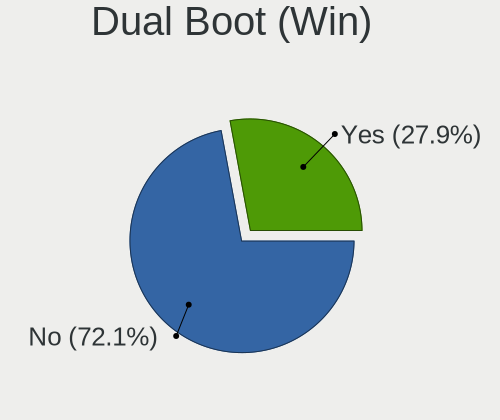
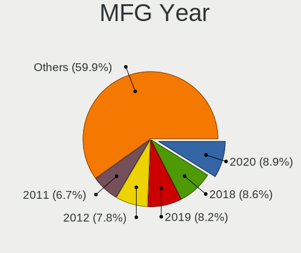
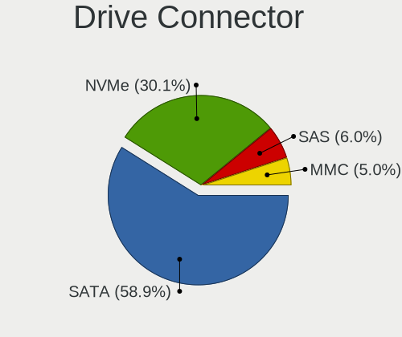
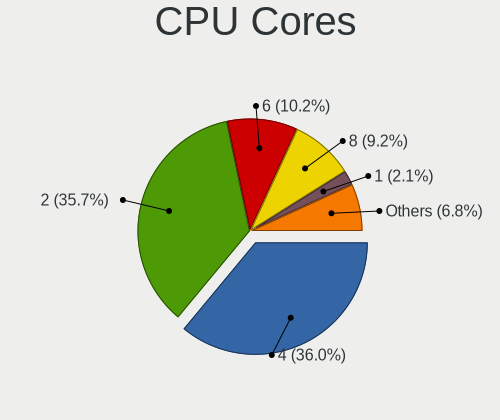
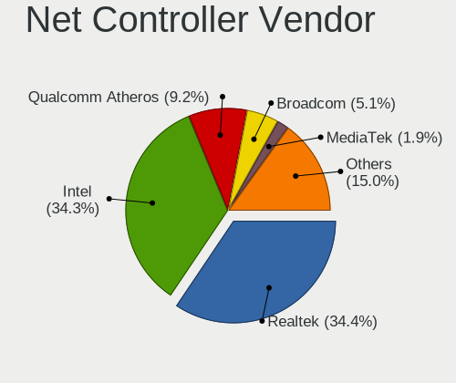
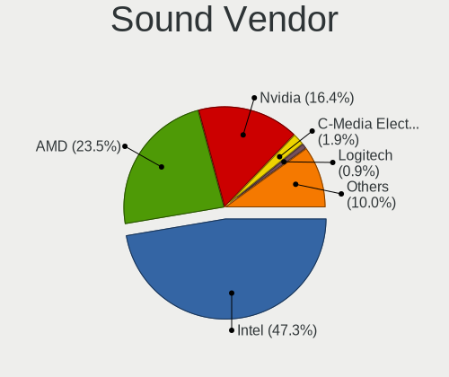

Linux in Germany - Tested Hardware & Statistics
-----------------------------------------------

A project to collect tested hardware configurations for Linux in Germany.

Anyone can contribute to this report by the [hw-probe](https://github.com/linuxhw/hw-probe) tool:

    sudo -E hw-probe -all -upload

Please contribute! Especially if your hardware is rare.

This is a report for all computer types. See also reports for [desktops](/Location/Germany/Desktop/README.md) and [notebooks](/Location/Germany/Notebook/README.md).

Contents
--------

* [ Test Cases ](#test-cases)

* [ System ](#system)
  - [ OS                       ](#os)
  - [ OS Family                ](#os-family)
  - [ Kernel                   ](#kernel)
  - [ Kernel Family            ](#kernel-family)
  - [ Kernel Major Ver.        ](#kernel-major-ver)
  - [ Arch                     ](#arch)
  - [ DE                       ](#de)
  - [ Display Server           ](#display-server)
  - [ Display Manager          ](#display-manager)
  - [ OS Lang                  ](#os-lang)
  - [ Boot Mode                ](#boot-mode)
  - [ Filesystem               ](#filesystem)
  - [ Part. scheme             ](#part-scheme)
  - [ Dual Boot with Linux/BSD ](#dual-boot-with-linuxbsd)
  - [ Dual Boot (Win)          ](#dual-boot-win)

* [ Board ](#board)
  - [ Vendor                   ](#vendor)
  - [ Model                    ](#model)
  - [ Model Family             ](#model-family)
  - [ MFG Year                 ](#mfg-year)
  - [ Form Factor              ](#form-factor)
  - [ Secure Boot              ](#secure-boot)
  - [ Coreboot                 ](#coreboot)
  - [ RAM Size                 ](#ram-size)
  - [ RAM Used                 ](#ram-used)
  - [ Total Drives             ](#total-drives)
  - [ Has CD-ROM               ](#has-cd-rom)
  - [ Has Ethernet             ](#has-ethernet)
  - [ Has WiFi                 ](#has-wifi)
  - [ Has Bluetooth            ](#has-bluetooth)

* [ Location ](#location)
  - [ Country                  ](#country)
  - [ City                     ](#city)

* [ Drives ](#drives)
  - [ Drive Vendor             ](#drive-vendor)
  - [ Drive Model              ](#drive-model)
  - [ HDD Vendor               ](#hdd-vendor)
  - [ SSD Vendor               ](#ssd-vendor)
  - [ Drive Kind               ](#drive-kind)
  - [ Drive Connector          ](#drive-connector)
  - [ Drive Size               ](#drive-size)
  - [ Space Total              ](#space-total)
  - [ Space Used               ](#space-used)
  - [ Malfunc. Drives          ](#malfunc-drives)
  - [ Malfunc. Drive Vendor    ](#malfunc-drive-vendor)
  - [ Malfunc. HDD Vendor      ](#malfunc-hdd-vendor)
  - [ Malfunc. Drive Kind      ](#malfunc-drive-kind)
  - [ Failed Drives            ](#failed-drives)
  - [ Failed Drive Vendor      ](#failed-drive-vendor)
  - [ Drive Status             ](#drive-status)

* [ Storage controller ](#storage-controller)
  - [ Storage Vendor           ](#storage-vendor)
  - [ Storage Model            ](#storage-model)
  - [ Storage Kind             ](#storage-kind)

* [ Processor ](#processor)
  - [ CPU Vendor               ](#cpu-vendor)
  - [ CPU Model                ](#cpu-model)
  - [ CPU Model Family         ](#cpu-model-family)
  - [ CPU Cores                ](#cpu-cores)
  - [ CPU Sockets              ](#cpu-sockets)
  - [ CPU Threads              ](#cpu-threads)
  - [ CPU Op-Modes             ](#cpu-op-modes)
  - [ CPU Microcode            ](#cpu-microcode)
  - [ CPU Microarch            ](#cpu-microarch)

* [ Graphics ](#graphics)
  - [ GPU Vendor               ](#gpu-vendor)
  - [ GPU Model                ](#gpu-model)
  - [ GPU Combo                ](#gpu-combo)
  - [ GPU Driver               ](#gpu-driver)
  - [ GPU Memory               ](#gpu-memory)

* [ Monitor ](#monitor)
  - [ Monitor Vendor           ](#monitor-vendor)
  - [ Monitor Model            ](#monitor-model)
  - [ Monitor Resolution       ](#monitor-resolution)
  - [ Monitor Diagonal         ](#monitor-diagonal)
  - [ Monitor Width            ](#monitor-width)
  - [ Aspect Ratio             ](#aspect-ratio)
  - [ Monitor Area             ](#monitor-area)
  - [ Pixel Density            ](#pixel-density)
  - [ Multiple Monitors        ](#multiple-monitors)

* [ Network ](#network)
  - [ Net Controller Vendor    ](#net-controller-vendor)
  - [ Net Controller Model     ](#net-controller-model)
  - [ Wireless Vendor          ](#wireless-vendor)
  - [ Wireless Model           ](#wireless-model)
  - [ Ethernet Vendor          ](#ethernet-vendor)
  - [ Ethernet Model           ](#ethernet-model)
  - [ Net Controller Kind      ](#net-controller-kind)
  - [ Used Controller          ](#used-controller)
  - [ NICs                     ](#nics)
  - [ IPv6                     ](#ipv6)

* [ Bluetooth ](#bluetooth)
  - [ Bluetooth Vendor         ](#bluetooth-vendor)
  - [ Bluetooth Model          ](#bluetooth-model)

* [ Sound ](#sound)
  - [ Sound Vendor             ](#sound-vendor)
  - [ Sound Model              ](#sound-model)

* [ Memory ](#memory)
  - [ Memory Vendor            ](#memory-vendor)
  - [ Memory Model             ](#memory-model)
  - [ Memory Kind              ](#memory-kind)
  - [ Memory Form Factor       ](#memory-form-factor)
  - [ Memory Size              ](#memory-size)
  - [ Memory Speed             ](#memory-speed)

* [ Printers & scanners ](#printers--scanners)
  - [ Printer Vendor           ](#printer-vendor)
  - [ Printer Model            ](#printer-model)
  - [ Scanner Vendor           ](#scanner-vendor)
  - [ Scanner Model            ](#scanner-model)

* [ Camera ](#camera)
  - [ Camera Vendor            ](#camera-vendor)
  - [ Camera Model             ](#camera-model)

* [ Security ](#security)
  - [ Fingerprint Vendor       ](#fingerprint-vendor)
  - [ Fingerprint Model        ](#fingerprint-model)
  - [ Chipcard Vendor          ](#chipcard-vendor)
  - [ Chipcard Model           ](#chipcard-model)

* [ Unsupported ](#unsupported)
  - [ Unsupported Devices      ](#unsupported-devices)
  - [ Unsupported Device Types ](#unsupported-device-types)

Test Cases
----------

Total: 35073

| Vendor        | Model                       | Form-Factor | Probe                                                      | Date         |
|---------------|-----------------------------|-------------|------------------------------------------------------------|--------------|
| MSI           | Z77A-GD65                   | Desktop     | [42366a1fa1](https://linux-hardware.org/?probe=42366a1fa1) | Feb 02, 2024 |
| Acer          | Aspire V5-573G              | Notebook    | [869a029714](https://linux-hardware.org/?probe=869a029714) | Feb 02, 2024 |
| Samsung       | 550P5C/550P7C               | Notebook    | [4d9464ae33](https://linux-hardware.org/?probe=4d9464ae33) | Feb 02, 2024 |
| Lenovo        | Yoga C740-15IML 81TD        | Convertible | [f4cebc212c](https://linux-hardware.org/?probe=f4cebc212c) | Feb 02, 2024 |
| HP            | 83E9                        | Desktop     | [a140a989be](https://linux-hardware.org/?probe=a140a989be) | Feb 02, 2024 |
| HP            | Spectre x360 Convertible    | Convertible | [a63a142388](https://linux-hardware.org/?probe=a63a142388) | Feb 02, 2024 |
| ASUSTek       | TUF B450-PLUS GAMING        | Desktop     | [4bcae97baa](https://linux-hardware.org/?probe=4bcae97baa) | Feb 02, 2024 |
| Medion        | E7214                       | Notebook    | [cb37ec8f5d](https://linux-hardware.org/?probe=cb37ec8f5d) | Feb 02, 2024 |
| Acer          | Aspire A517-51G             | Notebook    | [2788a21644](https://linux-hardware.org/?probe=2788a21644) | Feb 02, 2024 |
| Dell          | XPS 15 7590                 | Notebook    | [214b9d35cb](https://linux-hardware.org/?probe=214b9d35cb) | Feb 02, 2024 |
| ASRock        | Z77 Pro3                    | Desktop     | [f1d8db0641](https://linux-hardware.org/?probe=f1d8db0641) | Feb 02, 2024 |
| ASRock        | H61M-DGS R2.0               | Desktop     | [fed06b0a3c](https://linux-hardware.org/?probe=fed06b0a3c) | Feb 02, 2024 |
| ASUSTek       | PRIME X370-PRO              | Desktop     | [58d150eef2](https://linux-hardware.org/?probe=58d150eef2) | Feb 02, 2024 |
| Gigabyte      | F2A75M-D3H                  | Desktop     | [a30e9bd132](https://linux-hardware.org/?probe=a30e9bd132) | Feb 02, 2024 |
| Acer          | Aspire 5741G                | Notebook    | [935470b35c](https://linux-hardware.org/?probe=935470b35c) | Feb 02, 2024 |
| Lenovo        | ThinkPad X270 W10DG 20K5... | Notebook    | [e7400919cd](https://linux-hardware.org/?probe=e7400919cd) | Feb 02, 2024 |
| Acer          | Aspire V3-772               | Notebook    | [4a32c0297c](https://linux-hardware.org/?probe=4a32c0297c) | Feb 02, 2024 |
| Dell          | Precision 7550              | Notebook    | [c210fa0d97](https://linux-hardware.org/?probe=c210fa0d97) | Feb 02, 2024 |
| Gigabyte      | Q87M-D2H                    | Desktop     | [4c5e48c75f](https://linux-hardware.org/?probe=4c5e48c75f) | Feb 02, 2024 |
| Inventec      | DQ Class A02                | Desktop     | [4cb447dae2](https://linux-hardware.org/?probe=4cb447dae2) | Feb 02, 2024 |
| Acer          | Aspire 5741G                | Notebook    | [d598afdbe9](https://linux-hardware.org/?probe=d598afdbe9) | Feb 02, 2024 |
| Toshiba       | Satellite L50D-B            | Notebook    | [49e28cce05](https://linux-hardware.org/?probe=49e28cce05) | Feb 02, 2024 |
| Notebook      | V15x_V17xRNx                | Notebook    | [901e71289e](https://linux-hardware.org/?probe=901e71289e) | Feb 02, 2024 |
| ASRock        | H61M-DGS R2.0               | Desktop     | [a757eacac1](https://linux-hardware.org/?probe=a757eacac1) | Feb 02, 2024 |
| Schenker      | XMG PRO (Late 2021)         | Notebook    | [502d4a5570](https://linux-hardware.org/?probe=502d4a5570) | Feb 02, 2024 |
| Dell          | Latitude 5511               | Notebook    | [e7d3018c34](https://linux-hardware.org/?probe=e7d3018c34) | Feb 02, 2024 |
| Apple         | MacBookPro11,3              | Notebook    | [5bc93c37fa](https://linux-hardware.org/?probe=5bc93c37fa) | Feb 02, 2024 |
| MSI           | B450 GAMING PLUS MAX        | Desktop     | [e8554aab57](https://linux-hardware.org/?probe=e8554aab57) | Feb 02, 2024 |
| HP            | EliteBook 2570p             | Notebook    | [59778f5513](https://linux-hardware.org/?probe=59778f5513) | Feb 02, 2024 |
| Lenovo        | ThinkPad T410 2537AF8       | Notebook    | [88794835fb](https://linux-hardware.org/?probe=88794835fb) | Feb 02, 2024 |
| Acer          | Aspire A315-54              | Notebook    | [3621142f4d](https://linux-hardware.org/?probe=3621142f4d) | Feb 02, 2024 |
| Schenker      | XMG PRO (Late 2021)         | Notebook    | [0bd25ae10e](https://linux-hardware.org/?probe=0bd25ae10e) | Feb 02, 2024 |
| HP            | EliteBook Revolve 810 G2    | Notebook    | [788fb13f23](https://linux-hardware.org/?probe=788fb13f23) | Feb 02, 2024 |
| Dell          | Latitude 7280               | Notebook    | [c94b45b8f4](https://linux-hardware.org/?probe=c94b45b8f4) | Feb 02, 2024 |
| MSI           | B450 GAMING PLUS MAX        | Desktop     | [73e32179ef](https://linux-hardware.org/?probe=73e32179ef) | Feb 02, 2024 |
| Gigabyte      | AX370-Gaming K7             | Desktop     | [c2514048e9](https://linux-hardware.org/?probe=c2514048e9) | Feb 02, 2024 |
| HP            | EliteBook 840 G6            | Notebook    | [6cac3b71e0](https://linux-hardware.org/?probe=6cac3b71e0) | Feb 01, 2024 |
| MSI           | B550 GAMING GEN3            | Desktop     | [e0f8f7bf56](https://linux-hardware.org/?probe=e0f8f7bf56) | Feb 01, 2024 |
| HP            | 255 15.6 inch G10           | Notebook    | [86bdc742bd](https://linux-hardware.org/?probe=86bdc742bd) | Feb 01, 2024 |
| HP            | ENVY x360 Convertible 15... | Convertible | [34e8a186d6](https://linux-hardware.org/?probe=34e8a186d6) | Feb 01, 2024 |
| ASUSTek       | PRIME X470-PRO              | Desktop     | [50c9a44280](https://linux-hardware.org/?probe=50c9a44280) | Feb 01, 2024 |
| MSI           | B450-A PRO                  | Desktop     | [10f58dc52e](https://linux-hardware.org/?probe=10f58dc52e) | Feb 01, 2024 |
| Acer          | Aspire ES1-523              | Notebook    | [4344e68c86](https://linux-hardware.org/?probe=4344e68c86) | Feb 01, 2024 |
| Acer          | TravelMate 7740G            | Notebook    | [78bfa1b270](https://linux-hardware.org/?probe=78bfa1b270) | Feb 01, 2024 |
| Dell          | Latitude 5511               | Notebook    | [910488f306](https://linux-hardware.org/?probe=910488f306) | Feb 01, 2024 |
| HP            | 2B34                        | Desktop     | [8d74dccabc](https://linux-hardware.org/?probe=8d74dccabc) | Feb 01, 2024 |
| ASUSTek       | PRIME B560M-K               | Desktop     | [007e574396](https://linux-hardware.org/?probe=007e574396) | Feb 01, 2024 |
| Lenovo        | ThinkPad T495 20NKS1XW08    | Notebook    | [62286dc8d9](https://linux-hardware.org/?probe=62286dc8d9) | Feb 01, 2024 |
| ASUSTek       | PRIME B560M-K               | Desktop     | [9d4315d3e3](https://linux-hardware.org/?probe=9d4315d3e3) | Feb 01, 2024 |
| Lenovo        | ThinkPad E15 Gen 4 21E60... | Notebook    | [fb180a9a54](https://linux-hardware.org/?probe=fb180a9a54) | Feb 01, 2024 |
| Lenovo        | ThinkPad X280 20KES4TD0T    | Notebook    | [4af2fc13f4](https://linux-hardware.org/?probe=4af2fc13f4) | Feb 01, 2024 |
| Lenovo        | V17 G4 IRU 83A2             | Notebook    | [f33e772962](https://linux-hardware.org/?probe=f33e772962) | Feb 01, 2024 |
| ASUSTek       | TUF Z390-PLUS GAMING        | Desktop     | [f708da8a98](https://linux-hardware.org/?probe=f708da8a98) | Feb 01, 2024 |
| Acer          | Aspire A315-53              | Notebook    | [a3fde61a8b](https://linux-hardware.org/?probe=a3fde61a8b) | Feb 01, 2024 |
| Dell          | 0G214D A00                  | Desktop     | [2973076de3](https://linux-hardware.org/?probe=2973076de3) | Feb 01, 2024 |
| HP            | EliteBook 1050 G1           | Notebook    | [8799a2e9ae](https://linux-hardware.org/?probe=8799a2e9ae) | Feb 01, 2024 |
| HP            | EliteBook 1050 G1           | Notebook    | [c95847728d](https://linux-hardware.org/?probe=c95847728d) | Feb 01, 2024 |
| Apple         | MacBookAir6,2               | Notebook    | [ae8af70d31](https://linux-hardware.org/?probe=ae8af70d31) | Feb 01, 2024 |
| Dell          | 0VNGWR A00                  | All in one  | [cc68f4d744](https://linux-hardware.org/?probe=cc68f4d744) | Feb 01, 2024 |
| Apple         | MacBookAir6,2               | Notebook    | [b42c35c70b](https://linux-hardware.org/?probe=b42c35c70b) | Feb 01, 2024 |
| MSI           | B450-A PRO                  | Desktop     | [aecf5f7bf1](https://linux-hardware.org/?probe=aecf5f7bf1) | Feb 01, 2024 |
| MSI           | Z77A-GD65                   | Desktop     | [fd7e7fcc3e](https://linux-hardware.org/?probe=fd7e7fcc3e) | Feb 01, 2024 |
| Apple         | MacBookPro11,2              | Notebook    | [92dd523802](https://linux-hardware.org/?probe=92dd523802) | Feb 01, 2024 |
| Fujitsu       | LIFEBOOK E752               | Notebook    | [5bd3d39655](https://linux-hardware.org/?probe=5bd3d39655) | Feb 01, 2024 |
| HP            | Elite x2 1013 G3            | Tablet      | [bdf4429b2f](https://linux-hardware.org/?probe=bdf4429b2f) | Feb 01, 2024 |
| HP            | 0B40h                       | Desktop     | [d165885fbf](https://linux-hardware.org/?probe=d165885fbf) | Feb 01, 2024 |
| Unknown       | Apple Mac mini (M2, 2023... | Mini pc     | [d608f4a433](https://linux-hardware.org/?probe=d608f4a433) | Feb 01, 2024 |
| Sony          | SVE14A1V1EW                 | Notebook    | [0323c38fe4](https://linux-hardware.org/?probe=0323c38fe4) | Jan 31, 2024 |
| ASUSTek       | PN64                        | Mini pc     | [7123543d85](https://linux-hardware.org/?probe=7123543d85) | Jan 31, 2024 |
| Raspberry ... | Raspberry Pi 4 Model B R... | Soc         | [0f7b0cced4](https://linux-hardware.org/?probe=0f7b0cced4) | Jan 31, 2024 |
| ASRock        | A320M-HDV R4.0              | Desktop     | [9262af6ace](https://linux-hardware.org/?probe=9262af6ace) | Jan 31, 2024 |
| Apple         | Mac-F2218EA9                | All in one  | [87634c39d0](https://linux-hardware.org/?probe=87634c39d0) | Jan 31, 2024 |
| HP            | EliteBook 8560w             | Notebook    | [6d3b73b144](https://linux-hardware.org/?probe=6d3b73b144) | Jan 31, 2024 |
| Gigabyte      | Q87M-D2H                    | Desktop     | [78ef1fbd6c](https://linux-hardware.org/?probe=78ef1fbd6c) | Jan 31, 2024 |
| ASUSTek       | X555LD                      | Notebook    | [bc95890dcd](https://linux-hardware.org/?probe=bc95890dcd) | Jan 31, 2024 |
| Lenovo        | ThinkPad X1 Carbon Gen 1... | Notebook    | [a84c65f63e](https://linux-hardware.org/?probe=a84c65f63e) | Jan 31, 2024 |
| HP            | EliteBook 2570p             | Notebook    | [7d98ca3c90](https://linux-hardware.org/?probe=7d98ca3c90) | Jan 31, 2024 |
| Medion        | TJ4125                      | Desktop     | [2705de4986](https://linux-hardware.org/?probe=2705de4986) | Jan 31, 2024 |
| Gigabyte      | B85M-D3H                    | Desktop     | [059252dc92](https://linux-hardware.org/?probe=059252dc92) | Jan 31, 2024 |
| Intel         | DH55PJ AAE93812-302         | Desktop     | [acc04ef6ef](https://linux-hardware.org/?probe=acc04ef6ef) | Jan 31, 2024 |
| ASUSTek       | P5K                         | Desktop     | [2835d63be5](https://linux-hardware.org/?probe=2835d63be5) | Jan 31, 2024 |
| ASUSTek       | P5K                         | Desktop     | [5db8fad897](https://linux-hardware.org/?probe=5db8fad897) | Jan 31, 2024 |
| ASUSTek       | Zenbook UX5401ZAS_UX5401... | Notebook    | [36be131f18](https://linux-hardware.org/?probe=36be131f18) | Jan 31, 2024 |
| Dell          | 0R4CNN A02                  | Server      | [1598eeb7c8](https://linux-hardware.org/?probe=1598eeb7c8) | Jan 31, 2024 |
| Lenovo        | IdeaPad 330-17IKB 81DM      | Notebook    | [3bba660f51](https://linux-hardware.org/?probe=3bba660f51) | Jan 31, 2024 |
| ASUSTek       | TUF Gaming B650M-PLUS       | Desktop     | [0b234564e9](https://linux-hardware.org/?probe=0b234564e9) | Jan 31, 2024 |
| ASUSTek       | PRIME X670E-PRO WIFI        | Notebook    | [4af4b18a2c](https://linux-hardware.org/?probe=4af4b18a2c) | Jan 31, 2024 |
| ASUSTek       | VivoBook_ASUSLaptop M160... | Notebook    | [69eca6c154](https://linux-hardware.org/?probe=69eca6c154) | Jan 31, 2024 |
| Lenovo        | ThinkPad X1 Carbon 7th 2... | Notebook    | [afbbc9ebf0](https://linux-hardware.org/?probe=afbbc9ebf0) | Jan 31, 2024 |
| Unknown       | T3 MRD                      | Desktop     | [744984b9d3](https://linux-hardware.org/?probe=744984b9d3) | Jan 31, 2024 |
| Fujitsu       | D3401-A1 S26361-D3401-A1    | Desktop     | [2360c2cf38](https://linux-hardware.org/?probe=2360c2cf38) | Jan 31, 2024 |
| Lenovo        | Yoga 7 14ITL5 82BH          | Convertible | [c94175a3bc](https://linux-hardware.org/?probe=c94175a3bc) | Jan 31, 2024 |
| Unknown       | T3 MRD                      | Desktop     | [e3b3bc071f](https://linux-hardware.org/?probe=e3b3bc071f) | Jan 31, 2024 |
| ASRock        | B550M-ITX/ac                | Desktop     | [5996127f6c](https://linux-hardware.org/?probe=5996127f6c) | Jan 31, 2024 |
| ASUSTek       | N55SF                       | Notebook    | [03c3d9aa25](https://linux-hardware.org/?probe=03c3d9aa25) | Jan 31, 2024 |
| Acer          | Aspire ES1-523              | Notebook    | [aece88cd9b](https://linux-hardware.org/?probe=aece88cd9b) | Jan 31, 2024 |
| Google        | Cyan                        | Notebook    | [15ee2dfc2f](https://linux-hardware.org/?probe=15ee2dfc2f) | Jan 30, 2024 |
| Dell          | Latitude 7400 2-in-1        | Convertible | [bb65922479](https://linux-hardware.org/?probe=bb65922479) | Jan 30, 2024 |
| Acer          | Swift SFE16-43              | Notebook    | [efdafdd6fc](https://linux-hardware.org/?probe=efdafdd6fc) | Jan 30, 2024 |
| Acer          | Aspire E1-572G              | Notebook    | [78a08c286e](https://linux-hardware.org/?probe=78a08c286e) | Jan 30, 2024 |
| Dell          | Latitude 7400 2-in-1        | Convertible | [fe52a663b0](https://linux-hardware.org/?probe=fe52a663b0) | Jan 30, 2024 |
| HP            | ENVY x360 Convertible 15... | Convertible | [c81a513b27](https://linux-hardware.org/?probe=c81a513b27) | Jan 30, 2024 |
| ASRock        | B450M Pro4                  | Desktop     | [ec3c7a4fc6](https://linux-hardware.org/?probe=ec3c7a4fc6) | Jan 30, 2024 |
| Acer          | Aspire E1-572G              | Notebook    | [a23343d32d](https://linux-hardware.org/?probe=a23343d32d) | Jan 30, 2024 |
| ASRock        | X570 Phantom Gaming-ITX/... | Desktop     | [44c985b693](https://linux-hardware.org/?probe=44c985b693) | Jan 30, 2024 |
| Apple         | MacBook8,1                  | Notebook    | [9580d3149f](https://linux-hardware.org/?probe=9580d3149f) | Jan 30, 2024 |
| ASUSTek       | ProArt X570-CREATOR WIFI    | Desktop     | [13e5919ccf](https://linux-hardware.org/?probe=13e5919ccf) | Jan 30, 2024 |
| HP            | 8653 A                      | Desktop     | [64cfa9a25f](https://linux-hardware.org/?probe=64cfa9a25f) | Jan 30, 2024 |
| ASRock        | H61M-DGS R2.0               | Desktop     | [dd059e849e](https://linux-hardware.org/?probe=dd059e849e) | Jan 30, 2024 |
| Lenovo        | ThinkPad X1 Carbon Gen 8... | Notebook    | [1669d54762](https://linux-hardware.org/?probe=1669d54762) | Jan 30, 2024 |
| Medion        | X781X                       | Notebook    | [3665eaa65c](https://linux-hardware.org/?probe=3665eaa65c) | Jan 30, 2024 |
| Gigabyte      | Z690 UD DDR4                | Desktop     | [454433be44](https://linux-hardware.org/?probe=454433be44) | Jan 30, 2024 |
| Fujitsu       | LIFEBOOK E5512A             | Notebook    | [e4d7a0ca3a](https://linux-hardware.org/?probe=e4d7a0ca3a) | Jan 30, 2024 |
| ASUSTek       | VivoBook_ASUSLaptop K370... | Notebook    | [e935a209d7](https://linux-hardware.org/?probe=e935a209d7) | Jan 30, 2024 |
| Lenovo        | ThinkPad X1 Carbon Gen 1... | Notebook    | [69f602b6c5](https://linux-hardware.org/?probe=69f602b6c5) | Jan 30, 2024 |
| ASUSTek       | VivoBook_ASUSLaptop K370... | Notebook    | [4a1a726464](https://linux-hardware.org/?probe=4a1a726464) | Jan 30, 2024 |
| Lenovo        | ThinkPad X1 Carbon Gen 1... | Notebook    | [89f648ad66](https://linux-hardware.org/?probe=89f648ad66) | Jan 30, 2024 |
| Dell          | XPS 13 9360                 | Notebook    | [fb5ea12034](https://linux-hardware.org/?probe=fb5ea12034) | Jan 30, 2024 |
| Lenovo        | ThinkPad T495 20NKS1XW08    | Notebook    | [a046c5e912](https://linux-hardware.org/?probe=a046c5e912) | Jan 30, 2024 |
| Lenovo        | ThinkPad T495 20NKS1XW08    | Notebook    | [b15caee983](https://linux-hardware.org/?probe=b15caee983) | Jan 30, 2024 |
| Lenovo        | ThinkPad T410 2537AT1       | Notebook    | [54b5a51811](https://linux-hardware.org/?probe=54b5a51811) | Jan 30, 2024 |
| HP            | 859C                        | Desktop     | [866ac7f0ed](https://linux-hardware.org/?probe=866ac7f0ed) | Jan 30, 2024 |
| Gigabyte      | B450 AORUS PRO-CF           | Desktop     | [2a28e6308a](https://linux-hardware.org/?probe=2a28e6308a) | Jan 29, 2024 |
| ASRock        | Z77 Pro4                    | Desktop     | [c2b82aa42c](https://linux-hardware.org/?probe=c2b82aa42c) | Jan 29, 2024 |
| Packard Be... | IXTREME M5800               | Desktop     | [f31eaf65b4](https://linux-hardware.org/?probe=f31eaf65b4) | Jan 29, 2024 |
| MSI           | H81M-E34                    | Desktop     | [e7e4aeecac](https://linux-hardware.org/?probe=e7e4aeecac) | Jan 29, 2024 |
| ASRock        | B550 Phantom Gaming 4       | Desktop     | [93c0e7740f](https://linux-hardware.org/?probe=93c0e7740f) | Jan 29, 2024 |
| Lenovo        | IdeaPad 3 15ADA05 81W1      | Notebook    | [dafe3d53e0](https://linux-hardware.org/?probe=dafe3d53e0) | Jan 29, 2024 |
| MSI           | Modern 14 C12M              | Notebook    | [39450e20cc](https://linux-hardware.org/?probe=39450e20cc) | Jan 29, 2024 |
| Dell          | XPS 15 7590                 | Notebook    | [0db74aab7e](https://linux-hardware.org/?probe=0db74aab7e) | Jan 29, 2024 |
| MSI           | MPG B550 GAMING PLUS        | Desktop     | [091fe8d216](https://linux-hardware.org/?probe=091fe8d216) | Jan 29, 2024 |
| Gigabyte      | GA-MA78GM-S2H               | Desktop     | [d6436b1ea4](https://linux-hardware.org/?probe=d6436b1ea4) | Jan 29, 2024 |
| ASUSTek       | Z9PG-D16 Series             | Server      | [7955c56c67](https://linux-hardware.org/?probe=7955c56c67) | Jan 29, 2024 |
| ASUSTek       | Pro WS WRX80E-SAGE SE WI... | Desktop     | [009120e99a](https://linux-hardware.org/?probe=009120e99a) | Jan 29, 2024 |
| Medion        | P7612                       | Notebook    | [875d083de0](https://linux-hardware.org/?probe=875d083de0) | Jan 29, 2024 |
| HP            | Compaq 615                  | Notebook    | [907b046dda](https://linux-hardware.org/?probe=907b046dda) | Jan 29, 2024 |
| Fujitsu       | LIFEBOOK E744               | Notebook    | [0bdbea7dcb](https://linux-hardware.org/?probe=0bdbea7dcb) | Jan 29, 2024 |
| Fujitsu       | LIFEBOOK E744               | Notebook    | [3e03ee6e0f](https://linux-hardware.org/?probe=3e03ee6e0f) | Jan 29, 2024 |
| Dell          | 0C27VV A01                  | Desktop     | [629c3cb24c](https://linux-hardware.org/?probe=629c3cb24c) | Jan 29, 2024 |
| Lenovo        | ThinkPad T490 20N3001EGE    | Notebook    | [5681d42b6e](https://linux-hardware.org/?probe=5681d42b6e) | Jan 29, 2024 |
| Lenovo        | ThinkPad T490 20N3001EGE    | Notebook    | [d8866aae44](https://linux-hardware.org/?probe=d8866aae44) | Jan 29, 2024 |
| HP            | ENVY x360 Convertible 13... | Convertible | [1380d4cadd](https://linux-hardware.org/?probe=1380d4cadd) | Jan 29, 2024 |
| Shenzhen M... | F6BFC                       | Desktop     | [3ecbf7ef23](https://linux-hardware.org/?probe=3ecbf7ef23) | Jan 29, 2024 |
| HUAWEI        | HKD-WXX                     | Notebook    | [7c98d9521b](https://linux-hardware.org/?probe=7c98d9521b) | Jan 29, 2024 |
| Dell          | 0C2KJT A00                  | Desktop     | [bc76ac497b](https://linux-hardware.org/?probe=bc76ac497b) | Jan 29, 2024 |
| ASUSTek       | PRIME Z690-P WIFI           | Desktop     | [b9363c386a](https://linux-hardware.org/?probe=b9363c386a) | Jan 29, 2024 |
| Dell          | 0C2KJT A00                  | Desktop     | [b56c82b709](https://linux-hardware.org/?probe=b56c82b709) | Jan 29, 2024 |
| Lenovo        | ThinkPad T450s 20BWS3ET0... | Notebook    | [e9f16865c3](https://linux-hardware.org/?probe=e9f16865c3) | Jan 29, 2024 |
| Lenovo        | ThinkPad X230 2325SU3       | Notebook    | [664fffd47e](https://linux-hardware.org/?probe=664fffd47e) | Jan 29, 2024 |
| Lenovo        | ThinkPad X230 2325SU3       | Notebook    | [cc42f2d5e4](https://linux-hardware.org/?probe=cc42f2d5e4) | Jan 29, 2024 |
| Acer          | Aspire 5741G                | Notebook    | [9c171324e3](https://linux-hardware.org/?probe=9c171324e3) | Jan 29, 2024 |
| Medion        | P15648                      | Notebook    | [d906da0d95](https://linux-hardware.org/?probe=d906da0d95) | Jan 29, 2024 |
| Supermicro    | C2SBC-Q                     | Desktop     | [41edfdd3b7](https://linux-hardware.org/?probe=41edfdd3b7) | Jan 29, 2024 |
| Fujitsu       | D3221-A1 S26361-D3221-A1    | Desktop     | [292b1b06ca](https://linux-hardware.org/?probe=292b1b06ca) | Jan 28, 2024 |
| HP            | Spectre x360 Convertible... | Convertible | [07cf5f8bcf](https://linux-hardware.org/?probe=07cf5f8bcf) | Jan 28, 2024 |
| Dell          | 0C27VV A01                  | Desktop     | [522198b192](https://linux-hardware.org/?probe=522198b192) | Jan 28, 2024 |
| HP            | Pavilion x360 Convertibl... | Convertible | [a03abdfb44](https://linux-hardware.org/?probe=a03abdfb44) | Jan 28, 2024 |
| HP            | ProBook 4530s               | Notebook    | [6135fed286](https://linux-hardware.org/?probe=6135fed286) | Jan 28, 2024 |
| MSI           | B450-A PRO                  | Desktop     | [afb7d75f84](https://linux-hardware.org/?probe=afb7d75f84) | Jan 28, 2024 |
| Lenovo        | 36C5 SDK0K17763 WIN 1801... | Desktop     | [0aa2140ac2](https://linux-hardware.org/?probe=0aa2140ac2) | Jan 28, 2024 |
| Lenovo        | 36C5 SDK0K17763 WIN 1801... | Desktop     | [752e2156f6](https://linux-hardware.org/?probe=752e2156f6) | Jan 28, 2024 |
| Apple         | MacBookPro14,1              | Notebook    | [9137138717](https://linux-hardware.org/?probe=9137138717) | Jan 28, 2024 |
| ASRock        | B550M Phantom Gaming 4      | Desktop     | [19712e098a](https://linux-hardware.org/?probe=19712e098a) | Jan 28, 2024 |
| Lenovo        | IdeaPad 3 15ADA05 81W1      | Notebook    | [cab252fea3](https://linux-hardware.org/?probe=cab252fea3) | Jan 28, 2024 |
| Gigabyte      | H81M-HD3                    | Desktop     | [f6305c313c](https://linux-hardware.org/?probe=f6305c313c) | Jan 28, 2024 |
| Medion        | P651x series                | Notebook    | [078e2924c4](https://linux-hardware.org/?probe=078e2924c4) | Jan 28, 2024 |
| Dell          | Latitude 7530               | Notebook    | [ff36f2cfcc](https://linux-hardware.org/?probe=ff36f2cfcc) | Jan 28, 2024 |
| Packard Be... | IXTREME M5800               | Desktop     | [8d8f99feb9](https://linux-hardware.org/?probe=8d8f99feb9) | Jan 28, 2024 |
| Lenovo        | SDK0F82993 WIN              | All in one  | [23d9f4ae6c](https://linux-hardware.org/?probe=23d9f4ae6c) | Jan 28, 2024 |
| Panasonic     | CFXZ6-1                     | Tablet      | [4bd23f4463](https://linux-hardware.org/?probe=4bd23f4463) | Jan 28, 2024 |
| HP            | ENVY Laptop 15-ep0xxx       | Notebook    | [c2d0dabb5e](https://linux-hardware.org/?probe=c2d0dabb5e) | Jan 28, 2024 |
| Lenovo        | Flex 2-15D 20377            | Notebook    | [4f358fd188](https://linux-hardware.org/?probe=4f358fd188) | Jan 28, 2024 |
| Dell          | Latitude 7380               | Notebook    | [d11324e996](https://linux-hardware.org/?probe=d11324e996) | Jan 28, 2024 |
| Dell          | Latitude 7380               | Notebook    | [c383a1c7dc](https://linux-hardware.org/?probe=c383a1c7dc) | Jan 28, 2024 |
| Lenovo        | G575 4383                   | Notebook    | [47bcf0e076](https://linux-hardware.org/?probe=47bcf0e076) | Jan 28, 2024 |
| MSI           | A320M BAZOOKA               | Desktop     | [db3234d7aa](https://linux-hardware.org/?probe=db3234d7aa) | Jan 28, 2024 |
| Dell          | Inspiron 5415               | Notebook    | [c7bd6068fa](https://linux-hardware.org/?probe=c7bd6068fa) | Jan 28, 2024 |
| Gigabyte      | B650 GAMING X AX            | Desktop     | [f728617f20](https://linux-hardware.org/?probe=f728617f20) | Jan 28, 2024 |
| ASRock        | B760M-HDV/M.2 D4            | Desktop     | [56ef6ba880](https://linux-hardware.org/?probe=56ef6ba880) | Jan 28, 2024 |
| HP            | 21EF                        | Desktop     | [9fcfe8d663](https://linux-hardware.org/?probe=9fcfe8d663) | Jan 28, 2024 |
| Wortmann      | TERRA_PC                    | Desktop     | [670f98f66b](https://linux-hardware.org/?probe=670f98f66b) | Jan 27, 2024 |
| HP            | ENVY x360 2-in-1 Laptop ... | Convertible | [b77d6182e0](https://linux-hardware.org/?probe=b77d6182e0) | Jan 27, 2024 |
| Wortmann      | TERRA_PC                    | Desktop     | [ef0c89a597](https://linux-hardware.org/?probe=ef0c89a597) | Jan 27, 2024 |
| Fujitsu       | D3233-A1 S26361-D3233-A1    | Desktop     | [d5f5ab4b3f](https://linux-hardware.org/?probe=d5f5ab4b3f) | Jan 27, 2024 |
| ASRock        | X300-ITX                    | Desktop     | [8a850c251d](https://linux-hardware.org/?probe=8a850c251d) | Jan 27, 2024 |
| ASUSTek       | X205TA                      | Notebook    | [83899dcb83](https://linux-hardware.org/?probe=83899dcb83) | Jan 27, 2024 |
| Dell          | 042P49 A01                  | Desktop     | [c419b892e0](https://linux-hardware.org/?probe=c419b892e0) | Jan 27, 2024 |
| Framework     | Laptop 13 (AMD Ryzen 704... | Notebook    | [93970413c7](https://linux-hardware.org/?probe=93970413c7) | Jan 27, 2024 |
| MSI           | B560M PRO                   | Desktop     | [773f3d7e1c](https://linux-hardware.org/?probe=773f3d7e1c) | Jan 27, 2024 |
| HP            | ProBook 6555b               | Notebook    | [53f9430f98](https://linux-hardware.org/?probe=53f9430f98) | Jan 27, 2024 |
| HP            | 350 G2                      | Notebook    | [ad55cbfa8a](https://linux-hardware.org/?probe=ad55cbfa8a) | Jan 27, 2024 |
| ASUSTek       | ROG STRIX X570-E GAMING     | Desktop     | [a85c3034f2](https://linux-hardware.org/?probe=a85c3034f2) | Jan 27, 2024 |
| Lenovo        | ThinkPad T490s 20NYS1AM0... | Notebook    | [eb0027485d](https://linux-hardware.org/?probe=eb0027485d) | Jan 27, 2024 |
| Gigabyte      | H97-HD3                     | Desktop     | [92984a124e](https://linux-hardware.org/?probe=92984a124e) | Jan 27, 2024 |
| HP            | 158A                        | Desktop     | [03d463519d](https://linux-hardware.org/?probe=03d463519d) | Jan 27, 2024 |
| Lenovo        | ThinkPad X230 2325BA3       | Notebook    | [700fc5c431](https://linux-hardware.org/?probe=700fc5c431) | Jan 27, 2024 |
| Gigabyte      | X570 AORUS MASTER           | Desktop     | [f940181f19](https://linux-hardware.org/?probe=f940181f19) | Jan 27, 2024 |
| Dell          | Latitude 5310               | Notebook    | [334e579e92](https://linux-hardware.org/?probe=334e579e92) | Jan 27, 2024 |
| Gigabyte      | A320M-S2H V2-CF             | Desktop     | [53581eed88](https://linux-hardware.org/?probe=53581eed88) | Jan 27, 2024 |
| Lenovo        | ThinkPad T480s 20L7001SG... | Notebook    | [bb998df843](https://linux-hardware.org/?probe=bb998df843) | Jan 27, 2024 |
| Lenovo        | ThinkPad T480s 20L7001SG... | Notebook    | [5810c5dc2b](https://linux-hardware.org/?probe=5810c5dc2b) | Jan 27, 2024 |
| Acer          | Aspire A317-32              | Notebook    | [9baf9646df](https://linux-hardware.org/?probe=9baf9646df) | Jan 27, 2024 |
| Gigabyte      | B450 AORUS M                | Desktop     | [03351f8523](https://linux-hardware.org/?probe=03351f8523) | Jan 27, 2024 |
| MSI           | A320M GRENADE               | Desktop     | [0a605bfdee](https://linux-hardware.org/?probe=0a605bfdee) | Jan 27, 2024 |
| Lenovo        | ThinkPad T400 6474AW6       | Notebook    | [0ddfcaf599](https://linux-hardware.org/?probe=0ddfcaf599) | Jan 27, 2024 |
| Lenovo        | IdeaPad Z360                | Notebook    | [4aa5d9bed9](https://linux-hardware.org/?probe=4aa5d9bed9) | Jan 27, 2024 |
| MSI           | B550-A PRO                  | Desktop     | [9690cb0096](https://linux-hardware.org/?probe=9690cb0096) | Jan 27, 2024 |
| ASUSTek       | PRIME B450M-K II            | Desktop     | [46b23b4469](https://linux-hardware.org/?probe=46b23b4469) | Jan 27, 2024 |
| MSI           | MPG X570 GAMING EDGE WIF... | Desktop     | [c1267550bc](https://linux-hardware.org/?probe=c1267550bc) | Jan 27, 2024 |
| ASUSTek       | PRIME A320M-K               | Desktop     | [b1d979bcb3](https://linux-hardware.org/?probe=b1d979bcb3) | Jan 27, 2024 |
| ASUSTek       | ROG STRIX B450-F GAMING     | Desktop     | [f7b37dcead](https://linux-hardware.org/?probe=f7b37dcead) | Jan 27, 2024 |
| Lenovo        | ThinkPad T490s 20NYS1AM0... | Notebook    | [48a5f801fc](https://linux-hardware.org/?probe=48a5f801fc) | Jan 27, 2024 |
| ASUSTek       | PN40                        | Mini pc     | [fe9a58272f](https://linux-hardware.org/?probe=fe9a58272f) | Jan 27, 2024 |
| Lenovo        | 3098 NOK                    | Desktop     | [329ce0df97](https://linux-hardware.org/?probe=329ce0df97) | Jan 27, 2024 |
| HC Technol... | HCAR5000-MI2                | Desktop     | [19a4048799](https://linux-hardware.org/?probe=19a4048799) | Jan 27, 2024 |
| ASUSTek       | TUF Gaming B550M-PLUS       | Desktop     | [30139ed46d](https://linux-hardware.org/?probe=30139ed46d) | Jan 27, 2024 |
| Valve         | Jupiter                     | Notebook    | [8ae43fed66](https://linux-hardware.org/?probe=8ae43fed66) | Jan 27, 2024 |
| Dell          | Latitude E5250              | Notebook    | [29a9f5d01c](https://linux-hardware.org/?probe=29a9f5d01c) | Jan 26, 2024 |
| Lenovo        | ThinkPad T530 2394EN6       | Notebook    | [4110faba77](https://linux-hardware.org/?probe=4110faba77) | Jan 26, 2024 |
| Acer          | Aspire VN7-793G             | Notebook    | [ad72ab37d3](https://linux-hardware.org/?probe=ad72ab37d3) | Jan 26, 2024 |
| ASUSTek       | SABERTOOTH 990FX R2.0       | Desktop     | [040dbb275e](https://linux-hardware.org/?probe=040dbb275e) | Jan 26, 2024 |
| Fujitsu       | LIFEBOOK E548               | Notebook    | [515098ce8f](https://linux-hardware.org/?probe=515098ce8f) | Jan 26, 2024 |
| Lenovo        | IdeaPad C340-14API 81N6     | Notebook    | [ad13a93817](https://linux-hardware.org/?probe=ad13a93817) | Jan 26, 2024 |
| Apple         | MacBookPro8,1               | Notebook    | [fa96de4635](https://linux-hardware.org/?probe=fa96de4635) | Jan 26, 2024 |
| Apple         | MacBookPro8,1               | Notebook    | [90c57cfb01](https://linux-hardware.org/?probe=90c57cfb01) | Jan 26, 2024 |
| Gigabyte      | Z97N-WIFI                   | Desktop     | [867a17b708](https://linux-hardware.org/?probe=867a17b708) | Jan 26, 2024 |
| Medion        | E3223                       | Convertible | [86ea690f80](https://linux-hardware.org/?probe=86ea690f80) | Jan 26, 2024 |
| Dell          | Latitude 7530               | Notebook    | [e1cd3d26e8](https://linux-hardware.org/?probe=e1cd3d26e8) | Jan 26, 2024 |
| HP            | Falco                       | Notebook    | [9a82a5b9e8](https://linux-hardware.org/?probe=9a82a5b9e8) | Jan 26, 2024 |
| Notebook      | W35xSTQ_370ST               | Notebook    | [1f9e3c577b](https://linux-hardware.org/?probe=1f9e3c577b) | Jan 26, 2024 |
| TUXEDO        | Aura 15 Gen1                | Notebook    | [27fa584690](https://linux-hardware.org/?probe=27fa584690) | Jan 26, 2024 |
| Lenovo        | IdeaPad Z360                | Notebook    | [4a2c8d2c92](https://linux-hardware.org/?probe=4a2c8d2c92) | Jan 26, 2024 |
| Unknown       | P43R1600Twins-110DB         | Desktop     | [0741a919e4](https://linux-hardware.org/?probe=0741a919e4) | Jan 26, 2024 |
| HP            | Victus by Gaming Laptop ... | Notebook    | [510b7f5cc7](https://linux-hardware.org/?probe=510b7f5cc7) | Jan 26, 2024 |
| Lenovo        | IdeaPad 3 15ADA05 81W1      | Notebook    | [87d6398f5b](https://linux-hardware.org/?probe=87d6398f5b) | Jan 26, 2024 |
| HUAWEI        | MACHC-WAX9                  | Notebook    | [4cfadd11cf](https://linux-hardware.org/?probe=4cfadd11cf) | Jan 26, 2024 |
| HP            | 650                         | Notebook    | [d440902ea2](https://linux-hardware.org/?probe=d440902ea2) | Jan 26, 2024 |
| HP            | EliteBook 845 14 inch G1... | Notebook    | [c890800eff](https://linux-hardware.org/?probe=c890800eff) | Jan 26, 2024 |
| ASUSTek       | X550VXK                     | Notebook    | [4f8a5aa2c2](https://linux-hardware.org/?probe=4f8a5aa2c2) | Jan 26, 2024 |
| ASRock        | B450M Pro4 R2.0             | Desktop     | [cb67574020](https://linux-hardware.org/?probe=cb67574020) | Jan 26, 2024 |
| Toshiba       | Satellite C670D-12Q         | Notebook    | [a9a2651adc](https://linux-hardware.org/?probe=a9a2651adc) | Jan 26, 2024 |
| ASUSTek       | GR8                         | Notebook    | [f43a22b48b](https://linux-hardware.org/?probe=f43a22b48b) | Jan 26, 2024 |
| Dell          | Latitude 5520               | Notebook    | [474446918a](https://linux-hardware.org/?probe=474446918a) | Jan 26, 2024 |
| Apple         | MacBookPro11,5              | Notebook    | [d7308911e4](https://linux-hardware.org/?probe=d7308911e4) | Jan 26, 2024 |
| Dell          | Latitude 3190 2-in-1        | Convertible | [915a8fc837](https://linux-hardware.org/?probe=915a8fc837) | Jan 26, 2024 |
| Dell          | Latitude 3190 2-in-1        | Convertible | [540aa97aab](https://linux-hardware.org/?probe=540aa97aab) | Jan 26, 2024 |
| HP            | Spectre Notebook            | Notebook    | [e98f815ca2](https://linux-hardware.org/?probe=e98f815ca2) | Jan 26, 2024 |
| Gigabyte      | A520M DS3H                  | Desktop     | [296732b4f9](https://linux-hardware.org/?probe=296732b4f9) | Jan 26, 2024 |
| Dell          | Latitude E6420              | Notebook    | [f4dcc8c239](https://linux-hardware.org/?probe=f4dcc8c239) | Jan 26, 2024 |
| ASRock        | B550 Pro4                   | Desktop     | [e6dfa57418](https://linux-hardware.org/?probe=e6dfa57418) | Jan 26, 2024 |
| ASUSTek       | Z170-K                      | Desktop     | [277fb7b364](https://linux-hardware.org/?probe=277fb7b364) | Jan 25, 2024 |
| Dell          | XPS 15 9570                 | Notebook    | [4b9ba374ee](https://linux-hardware.org/?probe=4b9ba374ee) | Jan 25, 2024 |
| Lenovo        | ThinkPad X230 2325BA3       | Notebook    | [279854db8e](https://linux-hardware.org/?probe=279854db8e) | Jan 25, 2024 |
| Gigabyte      | A520M DS3H                  | Desktop     | [21d498375d](https://linux-hardware.org/?probe=21d498375d) | Jan 25, 2024 |
| Medion        | MS-7797                     | Desktop     | [16eb1fb145](https://linux-hardware.org/?probe=16eb1fb145) | Jan 25, 2024 |
| HP            | ProBook 450 G1              | Notebook    | [97c68df9c0](https://linux-hardware.org/?probe=97c68df9c0) | Jan 25, 2024 |
| Unknown       | MediaTek krane sku176       | Soc         | [b8d03de689](https://linux-hardware.org/?probe=b8d03de689) | Jan 25, 2024 |
| ASRock        | A520M-HDV                   | Desktop     | [db1260e2b7](https://linux-hardware.org/?probe=db1260e2b7) | Jan 25, 2024 |
| HP            | 3048h                       | Desktop     | [ed2d54328f](https://linux-hardware.org/?probe=ed2d54328f) | Jan 25, 2024 |
| Lenovo        | Aptio CRB NOK               | Mini pc     | [97a08f730e](https://linux-hardware.org/?probe=97a08f730e) | Jan 25, 2024 |
| Unknown       | Unknown                     | Desktop     | [57252b99d4](https://linux-hardware.org/?probe=57252b99d4) | Jan 25, 2024 |
| Apple         | MacBookAir7,2               | Notebook    | [8f3ed76279](https://linux-hardware.org/?probe=8f3ed76279) | Jan 25, 2024 |
| Lenovo        | ThinkPad Twist 334729G      | Notebook    | [0a17051b66](https://linux-hardware.org/?probe=0a17051b66) | Jan 25, 2024 |
| Gigabyte      | Z87X-D3H-CF                 | Desktop     | [5b23ab08ae](https://linux-hardware.org/?probe=5b23ab08ae) | Jan 25, 2024 |
| Acer          | Aspire ES1-731              | Notebook    | [588518fe62](https://linux-hardware.org/?probe=588518fe62) | Jan 25, 2024 |
| Gigabyte      | Z390 UD V2                  | Desktop     | [b2693bec37](https://linux-hardware.org/?probe=b2693bec37) | Jan 25, 2024 |
| Medion        | S14409                      | Notebook    | [8e8339905a](https://linux-hardware.org/?probe=8e8339905a) | Jan 25, 2024 |
| Google        | Bobba360                    | Notebook    | [a4c97c836d](https://linux-hardware.org/?probe=a4c97c836d) | Jan 25, 2024 |
| Lenovo        | ThinkPad L13 Yoga 20R6S0... | Convertible | [b992ee7c54](https://linux-hardware.org/?probe=b992ee7c54) | Jan 25, 2024 |
| 4POS          | D66 V1.2                    | All in one  | [9521b934fe](https://linux-hardware.org/?probe=9521b934fe) | Jan 24, 2024 |
| Dell          | Latitude E5470              | Notebook    | [25f5da470b](https://linux-hardware.org/?probe=25f5da470b) | Jan 24, 2024 |
| Dell          | 0K240Y A01                  | Desktop     | [fe08501f76](https://linux-hardware.org/?probe=fe08501f76) | Jan 24, 2024 |
| Toshiba       | Satellite R630              | Notebook    | [c888a8f4d5](https://linux-hardware.org/?probe=c888a8f4d5) | Jan 24, 2024 |
| Google        | Bobba360                    | Notebook    | [0b03c9a8f7](https://linux-hardware.org/?probe=0b03c9a8f7) | Jan 24, 2024 |
| Lenovo        | ThinkPad T540p 20BFS2100... | Notebook    | [1bf8988f36](https://linux-hardware.org/?probe=1bf8988f36) | Jan 24, 2024 |
| ASRock        | FM2A88X Extreme6+           | Desktop     | [806eb6a76c](https://linux-hardware.org/?probe=806eb6a76c) | Jan 24, 2024 |
| Lenovo        | ThinkPad T540p 20BFS2100... | Notebook    | [08b929fe37](https://linux-hardware.org/?probe=08b929fe37) | Jan 24, 2024 |
| Apple         | Mac-FC02E91DDD3FA6A4 iMa... | All in one  | [f917755de4](https://linux-hardware.org/?probe=f917755de4) | Jan 24, 2024 |
| HP            | Laptop 15s-eq1xxx           | Notebook    | [667112adce](https://linux-hardware.org/?probe=667112adce) | Jan 24, 2024 |
| Raspberry ... | Raspberry Pi                | Soc         | [343e08f1a6](https://linux-hardware.org/?probe=343e08f1a6) | Jan 24, 2024 |
| Gigabyte      | Z270-HD3P-CF                | Desktop     | [b0381cdfcc](https://linux-hardware.org/?probe=b0381cdfcc) | Jan 24, 2024 |
| HP            | EliteBook 2570p             | Notebook    | [34093d035a](https://linux-hardware.org/?probe=34093d035a) | Jan 24, 2024 |
| ASUSTek       | M4A77T                      | Desktop     | [082bd06cdc](https://linux-hardware.org/?probe=082bd06cdc) | Jan 24, 2024 |
| HP            | ZBook Firefly 14 inch G1... | Notebook    | [0bbf1a1e3d](https://linux-hardware.org/?probe=0bbf1a1e3d) | Jan 24, 2024 |
| Fujitsu       | D3531-A1 S26361-D3531-A1    | Desktop     | [db6de09144](https://linux-hardware.org/?probe=db6de09144) | Jan 24, 2024 |
| Fujitsu       | LIFEBOOK E736               | Notebook    | [7f0a2dd840](https://linux-hardware.org/?probe=7f0a2dd840) | Jan 24, 2024 |
| Apple         | MacBookPro11,4              | Notebook    | [c63b13e441](https://linux-hardware.org/?probe=c63b13e441) | Jan 24, 2024 |
| Lenovo        | ThinkPad L13 Yoga 20R6S0... | Convertible | [612b433dc0](https://linux-hardware.org/?probe=612b433dc0) | Jan 24, 2024 |
| Apple         | MacBookPro11,4              | Notebook    | [f48a5f9d3c](https://linux-hardware.org/?probe=f48a5f9d3c) | Jan 24, 2024 |
| Dell          | 0XKH0D A02                  | Desktop     | [7ed5013174](https://linux-hardware.org/?probe=7ed5013174) | Jan 24, 2024 |
| Lenovo        | U41-70 80JV                 | Notebook    | [48ea1ff4a5](https://linux-hardware.org/?probe=48ea1ff4a5) | Jan 24, 2024 |
| Shenzhen M... | F7BSC                       | Mini pc     | [8ee65a0454](https://linux-hardware.org/?probe=8ee65a0454) | Jan 24, 2024 |
| Lenovo        | SHARKBAY SDK0E50510 WIN     | Desktop     | [ff7fd4d2cd](https://linux-hardware.org/?probe=ff7fd4d2cd) | Jan 24, 2024 |
| Acer          | Aspire E5-573G              | Notebook    | [14eec10d5e](https://linux-hardware.org/?probe=14eec10d5e) | Jan 24, 2024 |
| Fujitsu       | LIFEBOOK E780               | Notebook    | [d26e825efc](https://linux-hardware.org/?probe=d26e825efc) | Jan 23, 2024 |
| Toshiba       | Satellite C660              | Notebook    | [b1d19ad191](https://linux-hardware.org/?probe=b1d19ad191) | Jan 23, 2024 |
| Dell          | Latitude 7400 2-in-1        | Convertible | [838933cd03](https://linux-hardware.org/?probe=838933cd03) | Jan 23, 2024 |
| ASUSTek       | PRIME A320M-K               | Desktop     | [5c2e73a06a](https://linux-hardware.org/?probe=5c2e73a06a) | Jan 23, 2024 |
| Lenovo        | ThinkPad T420s 4174HR1      | Notebook    | [ab4b7bc31f](https://linux-hardware.org/?probe=ab4b7bc31f) | Jan 23, 2024 |
| Lenovo        | ThinkPad W541 20EGS3630P    | Notebook    | [1cca38d87f](https://linux-hardware.org/?probe=1cca38d87f) | Jan 23, 2024 |
| ASUSTek       | Pro WS 565-ACE              | Desktop     | [46ef259c25](https://linux-hardware.org/?probe=46ef259c25) | Jan 23, 2024 |
| HP            | 3396                        | Desktop     | [066dd08de0](https://linux-hardware.org/?probe=066dd08de0) | Jan 23, 2024 |
| ASRock        | B450 Pro4 R2.0              | Desktop     | [a606bceea5](https://linux-hardware.org/?probe=a606bceea5) | Jan 23, 2024 |
| Lenovo        | ThinkCentre M90p 5536AN5    | Desktop     | [8305fcdce9](https://linux-hardware.org/?probe=8305fcdce9) | Jan 23, 2024 |
| Lenovo        | ThinkPad X220 4290W4H       | Notebook    | [067daab9fb](https://linux-hardware.org/?probe=067daab9fb) | Jan 23, 2024 |
| Lenovo        | V17 G2 ITL 82NX             | Notebook    | [40f906871e](https://linux-hardware.org/?probe=40f906871e) | Jan 22, 2024 |
| ASRock        | A320M-HDV R3.0              | Desktop     | [09e7370c8b](https://linux-hardware.org/?probe=09e7370c8b) | Jan 22, 2024 |
| Gigabyte      | G41MT-ES2L                  | Desktop     | [a4d37ca137](https://linux-hardware.org/?probe=a4d37ca137) | Jan 22, 2024 |
| Dell          | Latitude D610               | Notebook    | [b1f24babef](https://linux-hardware.org/?probe=b1f24babef) | Jan 22, 2024 |
| Gigabyte      | GA-78LMT-S2P                | Desktop     | [615b7dc324](https://linux-hardware.org/?probe=615b7dc324) | Jan 22, 2024 |
| Acer          | Aspire 7736                 | Notebook    | [47521c1811](https://linux-hardware.org/?probe=47521c1811) | Jan 22, 2024 |
| Lenovo        | ThinkPad T460 20FMS0HB00    | Notebook    | [67c8620ffa](https://linux-hardware.org/?probe=67c8620ffa) | Jan 22, 2024 |
| MSI           | MEG X570 ACE                | Desktop     | [85c7d79003](https://linux-hardware.org/?probe=85c7d79003) | Jan 22, 2024 |
| Fujitsu       | LIFEBOOK U7412              | Notebook    | [e5a97a5300](https://linux-hardware.org/?probe=e5a97a5300) | Jan 22, 2024 |
| Acer          | Aspire E1-570               | Notebook    | [bbe5568412](https://linux-hardware.org/?probe=bbe5568412) | Jan 22, 2024 |
| ASUSTek       | G2S                         | Notebook    | [534f9d0459](https://linux-hardware.org/?probe=534f9d0459) | Jan 22, 2024 |
| ASRock        | A520M-HDV                   | Desktop     | [34e4549f27](https://linux-hardware.org/?probe=34e4549f27) | Jan 22, 2024 |
| ASUSTek       | X751SA                      | Notebook    | [2da0669a42](https://linux-hardware.org/?probe=2da0669a42) | Jan 22, 2024 |
| Fujitsu       | D3401-A1 S26361-D3401-A1    | Desktop     | [bb111f75bd](https://linux-hardware.org/?probe=bb111f75bd) | Jan 22, 2024 |
| HP            | Compaq CQ58                 | Notebook    | [e15554b4ae](https://linux-hardware.org/?probe=e15554b4ae) | Jan 22, 2024 |
| Fujitsu       | LIFEBOOK U748               | Notebook    | [59122c1f76](https://linux-hardware.org/?probe=59122c1f76) | Jan 22, 2024 |
| ASUSTek       | UX410UAK                    | Notebook    | [1155ca8c5c](https://linux-hardware.org/?probe=1155ca8c5c) | Jan 22, 2024 |
| Gigabyte      | B550I AORUS PRO AX          | Desktop     | [0d82cd43ff](https://linux-hardware.org/?probe=0d82cd43ff) | Jan 22, 2024 |
| HP            | ProBook 430 G4              | Notebook    | [046036e7e3](https://linux-hardware.org/?probe=046036e7e3) | Jan 22, 2024 |
| Inventec      | D CLASS A02                 | Desktop     | [25d4886028](https://linux-hardware.org/?probe=25d4886028) | Jan 22, 2024 |
| Gigabyte      | B550I AORUS PRO AX          | Desktop     | [e47b62e5ed](https://linux-hardware.org/?probe=e47b62e5ed) | Jan 22, 2024 |
| Gigabyte      | H97-D3H-CF                  | Desktop     | [d32264b9cc](https://linux-hardware.org/?probe=d32264b9cc) | Jan 22, 2024 |
| Apple         | MacBookPro14,1              | Notebook    | [99f10901cf](https://linux-hardware.org/?probe=99f10901cf) | Jan 22, 2024 |
| HP            | ProBook 430 G4              | Notebook    | [262a8552de](https://linux-hardware.org/?probe=262a8552de) | Jan 22, 2024 |
| Microsoft     | Surface Pro 4               | Tablet      | [459284a7da](https://linux-hardware.org/?probe=459284a7da) | Jan 22, 2024 |
| ASUSTek       | A68HM-PLUS                  | Desktop     | [21054351d9](https://linux-hardware.org/?probe=21054351d9) | Jan 22, 2024 |
| HP            | 17E2                        | Mini pc     | [d382ed2027](https://linux-hardware.org/?probe=d382ed2027) | Jan 22, 2024 |
| Acer          | Swift SF314-511             | Notebook    | [69ce4e086f](https://linux-hardware.org/?probe=69ce4e086f) | Jan 22, 2024 |
| Apple         | MacBookPro16,1              | Notebook    | [62447a80b3](https://linux-hardware.org/?probe=62447a80b3) | Jan 22, 2024 |
| MSI           | MS-B1711                    | Desktop     | [0949139f7e](https://linux-hardware.org/?probe=0949139f7e) | Jan 22, 2024 |
| Apple         | MacBookPro16,1              | Notebook    | [f9faae4b87](https://linux-hardware.org/?probe=f9faae4b87) | Jan 22, 2024 |
| Lenovo        | ThinkPad T470 W10DG 20JN... | Notebook    | [df52747427](https://linux-hardware.org/?probe=df52747427) | Jan 22, 2024 |
| Lenovo        | ThinkPad T420 4238AC6       | Notebook    | [8c171e6ffa](https://linux-hardware.org/?probe=8c171e6ffa) | Jan 22, 2024 |
| Valve         | Jupiter                     | Notebook    | [03734c93e6](https://linux-hardware.org/?probe=03734c93e6) | Jan 21, 2024 |
| HP            | Notebook                    | Notebook    | [efbf2736f3](https://linux-hardware.org/?probe=efbf2736f3) | Jan 21, 2024 |
| Dell          | 096JG8 A01                  | Desktop     | [a397efcf1d](https://linux-hardware.org/?probe=a397efcf1d) | Jan 21, 2024 |
| Acer          | Aspire V5-573G              | Notebook    | [3863fd85b0](https://linux-hardware.org/?probe=3863fd85b0) | Jan 21, 2024 |
| HP            | 2B5B                        | Desktop     | [cdbdd68f6f](https://linux-hardware.org/?probe=cdbdd68f6f) | Jan 21, 2024 |
| HP            | ProBook 4740s               | Notebook    | [681810a3c1](https://linux-hardware.org/?probe=681810a3c1) | Jan 21, 2024 |
| MSI           | H81M ECO                    | Desktop     | [6b904323a3](https://linux-hardware.org/?probe=6b904323a3) | Jan 21, 2024 |
| ASUSTek       | PRIME A320M-K               | Desktop     | [9ba427246b](https://linux-hardware.org/?probe=9ba427246b) | Jan 21, 2024 |
| Gigabyte      | H81M-D2W                    | Desktop     | [03ec02fab4](https://linux-hardware.org/?probe=03ec02fab4) | Jan 21, 2024 |
| MSI           | Z170A GAMING M5             | Desktop     | [742588d66a](https://linux-hardware.org/?probe=742588d66a) | Jan 21, 2024 |
| ASRock        | B460M Pro4                  | Desktop     | [65b69b2422](https://linux-hardware.org/?probe=65b69b2422) | Jan 21, 2024 |
| Fujitsu       | LIFEBOOK A555/G             | Notebook    | [f87640231d](https://linux-hardware.org/?probe=f87640231d) | Jan 21, 2024 |
| TUXEDO        | InfinityBook Pro Gen8 (M... | Notebook    | [379e6473d5](https://linux-hardware.org/?probe=379e6473d5) | Jan 21, 2024 |
| Samsung       | 700T                        | Notebook    | [7268026aa6](https://linux-hardware.org/?probe=7268026aa6) | Jan 21, 2024 |
| Fujitsu       | LIFEBOOK U7412              | Notebook    | [0e896e4c18](https://linux-hardware.org/?probe=0e896e4c18) | Jan 21, 2024 |
| MSI           | PRO Z790-P WIFI             | Desktop     | [55b2a770eb](https://linux-hardware.org/?probe=55b2a770eb) | Jan 21, 2024 |
| ASUSTek       | Z9PG-D16 Series             | Server      | [f3a19638cd](https://linux-hardware.org/?probe=f3a19638cd) | Jan 21, 2024 |
| Medion        | P15648                      | Notebook    | [1c94d72e42](https://linux-hardware.org/?probe=1c94d72e42) | Jan 21, 2024 |
| ASUSTek       | PRIME B350-PLUS             | Desktop     | [fbc836a9ff](https://linux-hardware.org/?probe=fbc836a9ff) | Jan 21, 2024 |
| Medion        | P15648                      | Notebook    | [17cd0e622d](https://linux-hardware.org/?probe=17cd0e622d) | Jan 21, 2024 |
| HP            | Laptop 17-by0xxx            | Notebook    | [2e29855bb5](https://linux-hardware.org/?probe=2e29855bb5) | Jan 21, 2024 |
| ASUSTek       | T100HAN                     | Notebook    | [02f115dc2a](https://linux-hardware.org/?probe=02f115dc2a) | Jan 21, 2024 |
| ASUSTek       | ROG Zephyrus G14 GA401QM... | Notebook    | [5728acca29](https://linux-hardware.org/?probe=5728acca29) | Jan 20, 2024 |
| Sony          | SVF1421E2EW                 | Notebook    | [b28682a58b](https://linux-hardware.org/?probe=b28682a58b) | Jan 20, 2024 |
| Acer          | TravelMate Spin P614RN-5    | Convertible | [875bdb70a2](https://linux-hardware.org/?probe=875bdb70a2) | Jan 20, 2024 |
| ASUSTek       | M5A97 R2.0                  | Desktop     | [5a96118b34](https://linux-hardware.org/?probe=5a96118b34) | Jan 20, 2024 |
| Unknown       | AM02                        | Mini pc     | [e36d8fb228](https://linux-hardware.org/?probe=e36d8fb228) | Jan 20, 2024 |
| ASUSTek       | ROG STRIX B550-F GAMING     | Desktop     | [5c9deadb93](https://linux-hardware.org/?probe=5c9deadb93) | Jan 20, 2024 |
| Pegatron      | 2AB6                        | Desktop     | [660b2b76ed](https://linux-hardware.org/?probe=660b2b76ed) | Jan 20, 2024 |
| ASUSTek       | Maximus VIII HERO           | Desktop     | [4b148b87c9](https://linux-hardware.org/?probe=4b148b87c9) | Jan 20, 2024 |
| Gigabyte      | Z97P-D3                     | Desktop     | [4ec75647b3](https://linux-hardware.org/?probe=4ec75647b3) | Jan 20, 2024 |
| ASUSTek       | PRIME B760-PLUS D4          | Desktop     | [c59142fa22](https://linux-hardware.org/?probe=c59142fa22) | Jan 20, 2024 |
| MSI           | B450-A PRO                  | Desktop     | [e11e6780da](https://linux-hardware.org/?probe=e11e6780da) | Jan 20, 2024 |
| Toshiba       | NB550D                      | Notebook    | [1f743ab40e](https://linux-hardware.org/?probe=1f743ab40e) | Jan 20, 2024 |
| Acer          | Aspire 1810T                | Notebook    | [068454b849](https://linux-hardware.org/?probe=068454b849) | Jan 20, 2024 |
| Acer          | AOD255E                     | Notebook    | [379ad2d74c](https://linux-hardware.org/?probe=379ad2d74c) | Jan 20, 2024 |
| Lenovo        | ThinkPad W550s 20E2CTO1W... | Notebook    | [b3466550df](https://linux-hardware.org/?probe=b3466550df) | Jan 20, 2024 |
| Toshiba       | Satellite L670D             | Notebook    | [4b7547d3d1](https://linux-hardware.org/?probe=4b7547d3d1) | Jan 20, 2024 |
| Gigabyte      | P55-USB3                    | Desktop     | [2ae180284e](https://linux-hardware.org/?probe=2ae180284e) | Jan 20, 2024 |
| ASUSTek       | UX370UAF                    | Convertible | [170f79245c](https://linux-hardware.org/?probe=170f79245c) | Jan 20, 2024 |
| HP            | EliteBook 840 G8 Noteboo... | Notebook    | [a6f32a12ea](https://linux-hardware.org/?probe=a6f32a12ea) | Jan 20, 2024 |
| MSI           | MS-B106                     | All in one  | [253773b958](https://linux-hardware.org/?probe=253773b958) | Jan 20, 2024 |
| ASUSTek       | PRIME A320M-K               | Desktop     | [58be81f7c1](https://linux-hardware.org/?probe=58be81f7c1) | Jan 20, 2024 |
| ASUSTek       | VivoBook_ASUSLaptop M160... | Notebook    | [56d9c9b9a1](https://linux-hardware.org/?probe=56d9c9b9a1) | Jan 20, 2024 |
| ASUSTek       | PRIME B450M-K               | Desktop     | [5e16786940](https://linux-hardware.org/?probe=5e16786940) | Jan 20, 2024 |
| Gigabyte      | A320M-S2H V2-CF             | Desktop     | [726265f666](https://linux-hardware.org/?probe=726265f666) | Jan 20, 2024 |
| Gigabyte      | B550 AORUS PRO AC           | Desktop     | [b9dcb37cc9](https://linux-hardware.org/?probe=b9dcb37cc9) | Jan 20, 2024 |
| HP            | Laptop 17-by0xxx            | Notebook    | [bad5091b84](https://linux-hardware.org/?probe=bad5091b84) | Jan 20, 2024 |
| Dell          | Inspiron N5040              | Notebook    | [80702016eb](https://linux-hardware.org/?probe=80702016eb) | Jan 20, 2024 |
| Intel         | NUC13ANBi7 M89645-203       | Mini pc     | [eb11d352e9](https://linux-hardware.org/?probe=eb11d352e9) | Jan 20, 2024 |
| HP            | EliteBook 840 G1            | Notebook    | [becbec6f26](https://linux-hardware.org/?probe=becbec6f26) | Jan 20, 2024 |
| Apple         | MacBookPro3,1               | Notebook    | [057f8b6477](https://linux-hardware.org/?probe=057f8b6477) | Jan 20, 2024 |
| Fujitsu       | D3613-A1 S26361-D3613-A1    | Desktop     | [22c44fb878](https://linux-hardware.org/?probe=22c44fb878) | Jan 19, 2024 |
| Dell          | XPS 17 9700                 | Notebook    | [61c6fd00e2](https://linux-hardware.org/?probe=61c6fd00e2) | Jan 19, 2024 |
| Lenovo        | Legion 7 16ARHA7 82UH       | Notebook    | [f586c54d2c](https://linux-hardware.org/?probe=f586c54d2c) | Jan 19, 2024 |
| ASUSTek       | PRIME H410M-E               | Desktop     | [29a0aa8446](https://linux-hardware.org/?probe=29a0aa8446) | Jan 19, 2024 |
| ASUSTek       | PRIME H510M-A               | Desktop     | [6aa12bd4c7](https://linux-hardware.org/?probe=6aa12bd4c7) | Jan 19, 2024 |
| Lenovo        | 3178 SDK0J40700 WIN 3258... | Desktop     | [ed95c81dcc](https://linux-hardware.org/?probe=ed95c81dcc) | Jan 19, 2024 |
| Acer          | Aspire V3-772G              | Notebook    | [3a9c2b29e1](https://linux-hardware.org/?probe=3a9c2b29e1) | Jan 19, 2024 |
| Dell          | Latitude E7470              | Notebook    | [ea12dbebde](https://linux-hardware.org/?probe=ea12dbebde) | Jan 19, 2024 |
| ASUSTek       | PRIME X470-PRO              | Desktop     | [8601fae7df](https://linux-hardware.org/?probe=8601fae7df) | Jan 19, 2024 |
| ASUSTek       | TUF Z390-PLUS GAMING        | Desktop     | [a77218f826](https://linux-hardware.org/?probe=a77218f826) | Jan 19, 2024 |
| ASUSTek       | PRIME X470-PRO              | Desktop     | [fa525f2f78](https://linux-hardware.org/?probe=fa525f2f78) | Jan 19, 2024 |
| Lenovo        | Yoga 7 16IAH7 82UF          | Convertible | [eaa4b4106c](https://linux-hardware.org/?probe=eaa4b4106c) | Jan 19, 2024 |
| Dell          | XPS 15 7590                 | Notebook    | [f3a79354a8](https://linux-hardware.org/?probe=f3a79354a8) | Jan 19, 2024 |
| Lenovo        | Yoga 7 16IAH7 82UF          | Convertible | [b00ba2737e](https://linux-hardware.org/?probe=b00ba2737e) | Jan 19, 2024 |
| Apple         | Mac-77F17D7DA9285301 iMa... | All in one  | [47316e2746](https://linux-hardware.org/?probe=47316e2746) | Jan 19, 2024 |
| Unknown       | Unknown                     | Notebook    | [8be7dd2df4](https://linux-hardware.org/?probe=8be7dd2df4) | Jan 19, 2024 |
| Gigabyte      | B550 AORUS ELITE V2         | Desktop     | [13086bc4ce](https://linux-hardware.org/?probe=13086bc4ce) | Jan 19, 2024 |
| Dell          | Precision 5680              | Notebook    | [0a88245ac9](https://linux-hardware.org/?probe=0a88245ac9) | Jan 19, 2024 |
| Medion        | S4216                       | Notebook    | [74fd2044d5](https://linux-hardware.org/?probe=74fd2044d5) | Jan 19, 2024 |
| Biostar       | B450MHP                     | Desktop     | [16584e3717](https://linux-hardware.org/?probe=16584e3717) | Jan 19, 2024 |
| Biostar       | B450MHP                     | Desktop     | [24682bdb1f](https://linux-hardware.org/?probe=24682bdb1f) | Jan 19, 2024 |
| Fujitsu       | LIFEBOOK E780               | Notebook    | [e98f42d33f](https://linux-hardware.org/?probe=e98f42d33f) | Jan 19, 2024 |
| ASUSTek       | ROG Zephyrus G14 GA401QM... | Notebook    | [35c8f1855d](https://linux-hardware.org/?probe=35c8f1855d) | Jan 19, 2024 |
| ASRock        | Z390 Extreme4               | Desktop     | [d81097f203](https://linux-hardware.org/?probe=d81097f203) | Jan 19, 2024 |
| ASUSTek       | ROG Zephyrus G14 GA401QM... | Notebook    | [e555a2c32c](https://linux-hardware.org/?probe=e555a2c32c) | Jan 19, 2024 |
| Lenovo        | IdeaPad 320-15IAP 80XR      | Notebook    | [feffbde1cd](https://linux-hardware.org/?probe=feffbde1cd) | Jan 19, 2024 |
| Lenovo        | IdeaPad 320-15IAP 80XR      | Notebook    | [68cbc15eec](https://linux-hardware.org/?probe=68cbc15eec) | Jan 19, 2024 |
| GTZS          | Unknown                     | Notebook    | [6b926d1595](https://linux-hardware.org/?probe=6b926d1595) | Jan 19, 2024 |
| Valve         | Jupiter                     | Notebook    | [a64bc13a23](https://linux-hardware.org/?probe=a64bc13a23) | Jan 19, 2024 |
| ASUSTek       | PN40                        | Mini pc     | [4ce869baf0](https://linux-hardware.org/?probe=4ce869baf0) | Jan 19, 2024 |
| ASRock        | X370 Pro4                   | Desktop     | [9dfd5fe2cb](https://linux-hardware.org/?probe=9dfd5fe2cb) | Jan 19, 2024 |
| ASUSTek       | ROG STRIX X399-E GAMING     | Desktop     | [89d65b315c](https://linux-hardware.org/?probe=89d65b315c) | Jan 19, 2024 |
| IceWhale T... | ZimaBoard 832 ZMB           | Desktop     | [5b5d90211c](https://linux-hardware.org/?probe=5b5d90211c) | Jan 18, 2024 |
| Fujitsu       | D3120-A1 S26361-D3120-A1    | Desktop     | [27b2376cad](https://linux-hardware.org/?probe=27b2376cad) | Jan 18, 2024 |
| Lenovo        | Yoga C740-14IML 81TC        | Convertible | [2d7ec11caa](https://linux-hardware.org/?probe=2d7ec11caa) | Jan 18, 2024 |
| MSI           | MEG X570 UNIFY              | Desktop     | [01d5509c12](https://linux-hardware.org/?probe=01d5509c12) | Jan 18, 2024 |
| HP            | Pavilion dv3500             | Notebook    | [907b397e09](https://linux-hardware.org/?probe=907b397e09) | Jan 18, 2024 |
| Dell          | Inspiron 1525               | Notebook    | [8c923deb75](https://linux-hardware.org/?probe=8c923deb75) | Jan 18, 2024 |
| HP            | Pavilion 17                 | Notebook    | [eaa179919d](https://linux-hardware.org/?probe=eaa179919d) | Jan 18, 2024 |
| ASUSTek       | M5A97 EVO R2.0              | Desktop     | [f0b1918981](https://linux-hardware.org/?probe=f0b1918981) | Jan 18, 2024 |
| Lenovo        | ThinkPad X1 Carbon 3rd 2... | Notebook    | [d40c2f48dd](https://linux-hardware.org/?probe=d40c2f48dd) | Jan 18, 2024 |
| Gigabyte      | Z690 GAMING X DDR4          | Desktop     | [1aa8c64606](https://linux-hardware.org/?probe=1aa8c64606) | Jan 18, 2024 |
| Schenker      | N13xWU                      | Notebook    | [8aaa9891ee](https://linux-hardware.org/?probe=8aaa9891ee) | Jan 18, 2024 |
| Lenovo        | ThinkPad P1 Gen 4i 20Y4S... | Notebook    | [3b679561c7](https://linux-hardware.org/?probe=3b679561c7) | Jan 18, 2024 |
| Schenker      | N13xWU                      | Notebook    | [358f331708](https://linux-hardware.org/?probe=358f331708) | Jan 18, 2024 |
| ASUSTek       | PRIME B360-PLUS             | Desktop     | [7f55ddb513](https://linux-hardware.org/?probe=7f55ddb513) | Jan 18, 2024 |
| Gigabyte      | B85-HD3                     | Desktop     | [66b0dbb818](https://linux-hardware.org/?probe=66b0dbb818) | Jan 18, 2024 |
| Packard Be... | EasyNote TE69BM             | Notebook    | [351b144553](https://linux-hardware.org/?probe=351b144553) | Jan 18, 2024 |
| MSI           | GE72 6QD                    | Notebook    | [17fb69aaa6](https://linux-hardware.org/?probe=17fb69aaa6) | Jan 18, 2024 |
| HP            | Pavilion Laptop 15-cs2xx... | Notebook    | [5455618460](https://linux-hardware.org/?probe=5455618460) | Jan 18, 2024 |
| ASUSTek       | P6T SE                      | Desktop     | [6b60732b39](https://linux-hardware.org/?probe=6b60732b39) | Jan 18, 2024 |
| Acer          | Aspire 5750G                | Notebook    | [5cac95825f](https://linux-hardware.org/?probe=5cac95825f) | Jan 18, 2024 |
| Lenovo        | ThinkPad E580 20KS001JGE    | Notebook    | [079ef185ed](https://linux-hardware.org/?probe=079ef185ed) | Jan 18, 2024 |
| Intel         | NUC13ANBi7 M89645-203       | Mini pc     | [a2ddade589](https://linux-hardware.org/?probe=a2ddade589) | Jan 18, 2024 |
| Valve         | Jupiter                     | Notebook    | [3fac9b5786](https://linux-hardware.org/?probe=3fac9b5786) | Jan 18, 2024 |
| Lenovo        | ThinkPad T460 20FMS08L00    | Notebook    | [4533bec49f](https://linux-hardware.org/?probe=4533bec49f) | Jan 18, 2024 |
| MSI           | MEG X570 UNIFY              | Desktop     | [d732f80c75](https://linux-hardware.org/?probe=d732f80c75) | Jan 18, 2024 |
| ASUSTek       | ROG STRIX X670E-E GAMING... | Desktop     | [9cea75cc3c](https://linux-hardware.org/?probe=9cea75cc3c) | Jan 18, 2024 |
| TUXEDO        | InfinityBook S 15 Gen6      | Notebook    | [c80a1f64fc](https://linux-hardware.org/?probe=c80a1f64fc) | Jan 18, 2024 |
| Dell          | Latitude E5550              | Notebook    | [2887bb49af](https://linux-hardware.org/?probe=2887bb49af) | Jan 17, 2024 |
| Fujitsu Si... | LIFEBOOK T5010              | Notebook    | [dbe2ea8160](https://linux-hardware.org/?probe=dbe2ea8160) | Jan 17, 2024 |
| Fujitsu       | D3221-A1 S26361-D3221-A1    | Desktop     | [9353e2bbef](https://linux-hardware.org/?probe=9353e2bbef) | Jan 17, 2024 |
| Gigabyte      | A520M H                     | Desktop     | [2f58464c52](https://linux-hardware.org/?probe=2f58464c52) | Jan 17, 2024 |
| MSI           | MAG X570 TOMAHAWK WIFI      | Desktop     | [04707ec04e](https://linux-hardware.org/?probe=04707ec04e) | Jan 17, 2024 |
| ASUSTek       | TUF Gaming B460-PLUS        | Desktop     | [344b6767cd](https://linux-hardware.org/?probe=344b6767cd) | Jan 17, 2024 |
| MSI           | Z490-A PRO                  | Desktop     | [57eaf7e4ff](https://linux-hardware.org/?probe=57eaf7e4ff) | Jan 17, 2024 |
| FriendlyEl... | NanoPi R5S                  | Soc         | [cabd5a1ac3](https://linux-hardware.org/?probe=cabd5a1ac3) | Jan 17, 2024 |
| HP            | Pavilion 15                 | Notebook    | [d2e6250a2b](https://linux-hardware.org/?probe=d2e6250a2b) | Jan 17, 2024 |
| ASUSTek       | SABERTOOTH 990FX R2.0       | Desktop     | [d4da037a11](https://linux-hardware.org/?probe=d4da037a11) | Jan 17, 2024 |
| MSI           | Alpha 17 C7VG               | Notebook    | [262343435e](https://linux-hardware.org/?probe=262343435e) | Jan 17, 2024 |
| Dell          | Latitude E6540              | Notebook    | [5f657f15c8](https://linux-hardware.org/?probe=5f657f15c8) | Jan 17, 2024 |
| HUAWEI        | MRGFG-XX                    | Notebook    | [826b284720](https://linux-hardware.org/?probe=826b284720) | Jan 17, 2024 |
| Lenovo        | V110-15IAP 80TG             | Notebook    | [682b5589eb](https://linux-hardware.org/?probe=682b5589eb) | Jan 17, 2024 |
| HP            | 255 15.6 inch G10           | Notebook    | [b852473447](https://linux-hardware.org/?probe=b852473447) | Jan 17, 2024 |
| MSI           | X470 GAMING PLUS MAX        | Desktop     | [f5e8165d7b](https://linux-hardware.org/?probe=f5e8165d7b) | Jan 17, 2024 |
| Medion        | MS-7800                     | Desktop     | [8af71869fc](https://linux-hardware.org/?probe=8af71869fc) | Jan 17, 2024 |
| ASUSTek       | PRIME A320M-K               | Desktop     | [b4bb61edfe](https://linux-hardware.org/?probe=b4bb61edfe) | Jan 17, 2024 |
| Lenovo        | ThinkBook 14 G6 IRL 21KG    | Notebook    | [b624f93da2](https://linux-hardware.org/?probe=b624f93da2) | Jan 17, 2024 |
| Lenovo        | ThinkPad T450 20BUS1JD0B    | Notebook    | [90ef42b503](https://linux-hardware.org/?probe=90ef42b503) | Jan 17, 2024 |
| Lenovo        | ThinkPad T450 20BUS1JD0B    | Notebook    | [a3217b640d](https://linux-hardware.org/?probe=a3217b640d) | Jan 17, 2024 |
| HP            | ProBook 450 G6              | Notebook    | [6d71f55994](https://linux-hardware.org/?probe=6d71f55994) | Jan 17, 2024 |
| Lenovo        | ThinkPad X13 Gen 1 20T3S... | Notebook    | [0e05a50329](https://linux-hardware.org/?probe=0e05a50329) | Jan 16, 2024 |
| Dell          | Latitude E5550              | Notebook    | [0755281d4f](https://linux-hardware.org/?probe=0755281d4f) | Jan 16, 2024 |
| Dell          | Vostro 16 5635              | Notebook    | [41feffb377](https://linux-hardware.org/?probe=41feffb377) | Jan 16, 2024 |
| Dell          | Vostro 16 5635              | Notebook    | [087ee82354](https://linux-hardware.org/?probe=087ee82354) | Jan 16, 2024 |
| ASUSTek       | PRIME H510M-K               | Desktop     | [b780e18215](https://linux-hardware.org/?probe=b780e18215) | Jan 16, 2024 |
| Acer          | Aspire V5-573G              | Notebook    | [bc839ed2af](https://linux-hardware.org/?probe=bc839ed2af) | Jan 16, 2024 |
| ONDA          | H61V Ver:4.01               | Desktop     | [83030b6f99](https://linux-hardware.org/?probe=83030b6f99) | Jan 16, 2024 |
| TUXEDO        | Aura 15 Gen2                | Notebook    | [28a227c7d1](https://linux-hardware.org/?probe=28a227c7d1) | Jan 16, 2024 |
| ASUSTek       | PRIME Z490M-PLUS            | Desktop     | [be6d425c5a](https://linux-hardware.org/?probe=be6d425c5a) | Jan 16, 2024 |
| TUXEDO        | Pulse 15 Gen2               | Notebook    | [1ec6103b31](https://linux-hardware.org/?probe=1ec6103b31) | Jan 16, 2024 |
| TUXEDO        | Aura 15 Gen2                | Notebook    | [96e3e7f937](https://linux-hardware.org/?probe=96e3e7f937) | Jan 16, 2024 |
| Supermicro    | H12SSL-CT                   | Server      | [ec270d0cfc](https://linux-hardware.org/?probe=ec270d0cfc) | Jan 16, 2024 |
| MSI           | B450M MORTAR MAX            | Desktop     | [c2c3082933](https://linux-hardware.org/?probe=c2c3082933) | Jan 16, 2024 |
| Lenovo        | ThinkPad T580 20LAS5GE00    | Notebook    | [07609f8bbb](https://linux-hardware.org/?probe=07609f8bbb) | Jan 16, 2024 |
| Lenovo        | ThinkPad L412 0585A38       | Notebook    | [d3c2d88045](https://linux-hardware.org/?probe=d3c2d88045) | Jan 16, 2024 |
| MSI           | MAG B660M MORTAR WIFI DD... | Desktop     | [58d64e6a70](https://linux-hardware.org/?probe=58d64e6a70) | Jan 16, 2024 |
| ASUSTek       | ASUS TUF Gaming F15 FX50... | Notebook    | [ea249f8333](https://linux-hardware.org/?probe=ea249f8333) | Jan 16, 2024 |
| Lenovo        | ThinkPad SL 2746F2G         | Notebook    | [47b2e38ff4](https://linux-hardware.org/?probe=47b2e38ff4) | Jan 16, 2024 |
| Lenovo        | ThinkPad P14s Gen 3 21AK... | Notebook    | [6274216b05](https://linux-hardware.org/?probe=6274216b05) | Jan 16, 2024 |
| MSI           | X470 GAMING PLUS MAX        | Desktop     | [60694d3668](https://linux-hardware.org/?probe=60694d3668) | Jan 16, 2024 |
| LG Electro... | P300-U.ABRAG                | Notebook    | [1336576fec](https://linux-hardware.org/?probe=1336576fec) | Jan 16, 2024 |
| Apple         | MacBookAir7,2               | Notebook    | [240262c43c](https://linux-hardware.org/?probe=240262c43c) | Jan 16, 2024 |
| Apple         | MacBookAir7,2               | Notebook    | [43f1d0cbe1](https://linux-hardware.org/?probe=43f1d0cbe1) | Jan 16, 2024 |
| Dell          | Latitude 3320               | Notebook    | [3846698872](https://linux-hardware.org/?probe=3846698872) | Jan 16, 2024 |
| Dell          | Latitude 3320               | Notebook    | [8fbe313e34](https://linux-hardware.org/?probe=8fbe313e34) | Jan 16, 2024 |
| Foxconn       | G41MXP/G41MXP-V             | Desktop     | [907bccb062](https://linux-hardware.org/?probe=907bccb062) | Jan 16, 2024 |
| ASUSTek       | M5A97 R2.0                  | Desktop     | [ccbf148cb3](https://linux-hardware.org/?probe=ccbf148cb3) | Jan 16, 2024 |
| ASUSTek       | H97-PLUS                    | Desktop     | [7d8b50985d](https://linux-hardware.org/?probe=7d8b50985d) | Jan 16, 2024 |
| Dell          | XPS 13 9360                 | Notebook    | [846113dc1c](https://linux-hardware.org/?probe=846113dc1c) | Jan 16, 2024 |
| ASUSTek       | ROG STRIX B550-F GAMING ... | Desktop     | [d0c72afc2d](https://linux-hardware.org/?probe=d0c72afc2d) | Jan 15, 2024 |
| Medion        | E6417 MD99252               | Notebook    | [02157451d7](https://linux-hardware.org/?probe=02157451d7) | Jan 15, 2024 |
| MSI           | MPG X570S CARBON MAX WIF... | Desktop     | [c63804fec4](https://linux-hardware.org/?probe=c63804fec4) | Jan 15, 2024 |
| MSI           | MPG Z490 GAMING EDGE WIF... | Desktop     | [4d53425b9f](https://linux-hardware.org/?probe=4d53425b9f) | Jan 15, 2024 |
| Gigabyte      | B560M DS3H V2               | Desktop     | [01f214a86d](https://linux-hardware.org/?probe=01f214a86d) | Jan 15, 2024 |
| Lenovo        | ThinkBook 15 G3 ACL 21A4    | Notebook    | [17a792c82f](https://linux-hardware.org/?probe=17a792c82f) | Jan 15, 2024 |
| ASUSTek       | PRIME B450M-K II            | Desktop     | [fac0f6dfa7](https://linux-hardware.org/?probe=fac0f6dfa7) | Jan 15, 2024 |
| MSI           | Z170A PC MATE               | Desktop     | [9df326ae6f](https://linux-hardware.org/?probe=9df326ae6f) | Jan 15, 2024 |
| ASUSTek       | TUF Gaming B650M-PLUS       | Desktop     | [13451bf305](https://linux-hardware.org/?probe=13451bf305) | Jan 15, 2024 |
| Lenovo        | G770 1037                   | Notebook    | [8cd3704440](https://linux-hardware.org/?probe=8cd3704440) | Jan 15, 2024 |
| Lenovo        | Legion 5 15ACH6A 82NW       | Notebook    | [c2a719d955](https://linux-hardware.org/?probe=c2a719d955) | Jan 15, 2024 |
| Lenovo        | ThinkPad Edge E530c 3366... | Notebook    | [45399ef111](https://linux-hardware.org/?probe=45399ef111) | Jan 15, 2024 |
| ASUSTek       | ASUS TUF Gaming F15 FX50... | Notebook    | [5712b0783d](https://linux-hardware.org/?probe=5712b0783d) | Jan 15, 2024 |
| HP            | 250 G7 Notebook PC          | Notebook    | [3b58774e8d](https://linux-hardware.org/?probe=3b58774e8d) | Jan 15, 2024 |
| Lenovo        | ThinkPad X270 20HMS12K00    | Notebook    | [246848e065](https://linux-hardware.org/?probe=246848e065) | Jan 15, 2024 |
| Lenovo        | ThinkPad L13 Yoga Gen 4 ... | Convertible | [374fdb45b2](https://linux-hardware.org/?probe=374fdb45b2) | Jan 15, 2024 |
| Dell          | 0X8DXD A01                  | Desktop     | [d374bcb1f1](https://linux-hardware.org/?probe=d374bcb1f1) | Jan 15, 2024 |
| Lenovo        | ThinkPad X1 Carbon 7th 2... | Notebook    | [ac6ab2abea](https://linux-hardware.org/?probe=ac6ab2abea) | Jan 15, 2024 |
| TUXEDO        | Pulse 14 Gen3               | Notebook    | [f5bcb23ecb](https://linux-hardware.org/?probe=f5bcb23ecb) | Jan 15, 2024 |
| Gigabyte      | P55-USB3                    | Desktop     | [34cc055d6b](https://linux-hardware.org/?probe=34cc055d6b) | Jan 15, 2024 |
| Lenovo        | SHARKBAY SDK0E50510 WIN     | Desktop     | [c2e79b55b4](https://linux-hardware.org/?probe=c2e79b55b4) | Jan 15, 2024 |
| ASUSTek       | TUF Gaming B550-PLUS        | Desktop     | [5ba2479207](https://linux-hardware.org/?probe=5ba2479207) | Jan 15, 2024 |
| Medion        | MS-7800                     | Desktop     | [f0e70a4db4](https://linux-hardware.org/?probe=f0e70a4db4) | Jan 15, 2024 |
| Apple         | MacBookAir6,2               | Notebook    | [9bf589844a](https://linux-hardware.org/?probe=9bf589844a) | Jan 14, 2024 |
| Acer          | Swift SF114-32              | Notebook    | [d57f586cff](https://linux-hardware.org/?probe=d57f586cff) | Jan 14, 2024 |
| MSI           | B250M PRO-VDH               | Desktop     | [e3752cb3af](https://linux-hardware.org/?probe=e3752cb3af) | Jan 14, 2024 |
| Lenovo        | ThinkCentre M81 5048E2G     | Desktop     | [d4de0eb368](https://linux-hardware.org/?probe=d4de0eb368) | Jan 14, 2024 |
| Lenovo        | ThinkCentre M81 5048E2G     | Desktop     | [b4aecb91bf](https://linux-hardware.org/?probe=b4aecb91bf) | Jan 14, 2024 |
| Lenovo        | ThinkPad T440 20B7A07NGE    | Notebook    | [0038076556](https://linux-hardware.org/?probe=0038076556) | Jan 14, 2024 |
| ASRock        | X300M-STX                   | Desktop     | [2802b8b35f](https://linux-hardware.org/?probe=2802b8b35f) | Jan 14, 2024 |
| ASUSTek       | TUF Gaming X670E-PLUS       | Desktop     | [c6374ed5f1](https://linux-hardware.org/?probe=c6374ed5f1) | Jan 14, 2024 |
| ASUSTek       | G750JS                      | Notebook    | [ce24ff4784](https://linux-hardware.org/?probe=ce24ff4784) | Jan 14, 2024 |
| T-bao Tian... | GOD78                       | Desktop     | [c2f6e2c9e1](https://linux-hardware.org/?probe=c2f6e2c9e1) | Jan 14, 2024 |
| ASRock        | B450 Pro4                   | Desktop     | [b082a9bd9f](https://linux-hardware.org/?probe=b082a9bd9f) | Jan 14, 2024 |
| Dell          | Inspiron 13-5368            | Notebook    | [a6778c5783](https://linux-hardware.org/?probe=a6778c5783) | Jan 14, 2024 |
| Matsushita... | CF-30CTQAZBG                | Notebook    | [18a587bfa8](https://linux-hardware.org/?probe=18a587bfa8) | Jan 14, 2024 |
| AMI           | Intel                       | Desktop     | [b28b13aa17](https://linux-hardware.org/?probe=b28b13aa17) | Jan 14, 2024 |
| Samsung       | 750XDA                      | Notebook    | [95d390939e](https://linux-hardware.org/?probe=95d390939e) | Jan 14, 2024 |
| Fujitsu       | LIFEBOOK S762               | Notebook    | [857a0ea926](https://linux-hardware.org/?probe=857a0ea926) | Jan 14, 2024 |
| ASUSTek       | ROG STRIX B550-F GAMING ... | Desktop     | [c7e19dad56](https://linux-hardware.org/?probe=c7e19dad56) | Jan 14, 2024 |
| Raspberry ... | Raspberry Pi 5 Model B      | Soc         | [88453e89db](https://linux-hardware.org/?probe=88453e89db) | Jan 14, 2024 |
| Samsung       | R780                        | Notebook    | [68eae1df45](https://linux-hardware.org/?probe=68eae1df45) | Jan 14, 2024 |
| Lenovo        | ThinkPad X280 20KESAC100    | Notebook    | [888ed5a8d8](https://linux-hardware.org/?probe=888ed5a8d8) | Jan 14, 2024 |
| VALE          | Notebook Slim S132          | Notebook    | [32021c35d3](https://linux-hardware.org/?probe=32021c35d3) | Jan 14, 2024 |
| VALE          | Notebook Slim S132          | Notebook    | [0d2db2e184](https://linux-hardware.org/?probe=0d2db2e184) | Jan 14, 2024 |
| ASUSTek       | GR8                         | Notebook    | [e78c544c31](https://linux-hardware.org/?probe=e78c544c31) | Jan 14, 2024 |
| Samsung       | 700Z5A                      | Notebook    | [847f1c355d](https://linux-hardware.org/?probe=847f1c355d) | Jan 14, 2024 |
| Dell          | Latitude E7250              | Notebook    | [bd9ddc2751](https://linux-hardware.org/?probe=bd9ddc2751) | Jan 14, 2024 |
| GMKtec        | NucBox K4                   | Desktop     | [4b50e01269](https://linux-hardware.org/?probe=4b50e01269) | Jan 14, 2024 |
| Intel         | DP35DP AAD81073-210         | Desktop     | [690aec4d6e](https://linux-hardware.org/?probe=690aec4d6e) | Jan 14, 2024 |
| Medion        | AXIR                        | All in one  | [b1f6b771c8](https://linux-hardware.org/?probe=b1f6b771c8) | Jan 14, 2024 |
| Medion        | AXIR                        | All in one  | [49624b7b7c](https://linux-hardware.org/?probe=49624b7b7c) | Jan 14, 2024 |
| MSI           | MPG X570 GAMING PLUS        | Desktop     | [48662f6676](https://linux-hardware.org/?probe=48662f6676) | Jan 14, 2024 |
| Apple         | MacBookAir7,2               | Notebook    | [c5d8eebdd5](https://linux-hardware.org/?probe=c5d8eebdd5) | Jan 14, 2024 |
| Apple         | Mac-FFE5EF870D7BA81A iMa... | All in one  | [0d1de0324b](https://linux-hardware.org/?probe=0d1de0324b) | Jan 14, 2024 |
| Lenovo        | G50-45 80E3                 | Notebook    | [c6bd6c56d6](https://linux-hardware.org/?probe=c6bd6c56d6) | Jan 14, 2024 |
| HP            | Laptop 17-cp0xxx            | Notebook    | [31a7b00f76](https://linux-hardware.org/?probe=31a7b00f76) | Jan 14, 2024 |
| HP            | EliteBook 840 G2            | Notebook    | [33b3e5d03d](https://linux-hardware.org/?probe=33b3e5d03d) | Jan 14, 2024 |
| AXDIA Inte... | MYBOOK 14 PRO               | Notebook    | [9fcc01c1e0](https://linux-hardware.org/?probe=9fcc01c1e0) | Jan 14, 2024 |
| HP            | Laptop 17-cp0xxx            | Notebook    | [21c6fac67f](https://linux-hardware.org/?probe=21c6fac67f) | Jan 13, 2024 |
| ASUSTek       | PRIME A520M-K               | Desktop     | [98fb005bdf](https://linux-hardware.org/?probe=98fb005bdf) | Jan 13, 2024 |
| ASUSTek       | X556UQK                     | Notebook    | [151b6ad9fb](https://linux-hardware.org/?probe=151b6ad9fb) | Jan 13, 2024 |
| Dell          | Inspiron 15-3552            | Notebook    | [2a9bde666e](https://linux-hardware.org/?probe=2a9bde666e) | Jan 13, 2024 |
| Dell          | Inspiron 15-3552            | Notebook    | [87e8f38d79](https://linux-hardware.org/?probe=87e8f38d79) | Jan 13, 2024 |
| MSI           | MPG X570 GAMING PLUS        | Desktop     | [cd20d27cfa](https://linux-hardware.org/?probe=cd20d27cfa) | Jan 13, 2024 |
| Lenovo        | 312D NOK                    | Mini pc     | [cabe15fe5c](https://linux-hardware.org/?probe=cabe15fe5c) | Jan 13, 2024 |
| HP            | EliteBook 830 G6            | Notebook    | [dc433d32e3](https://linux-hardware.org/?probe=dc433d32e3) | Jan 13, 2024 |
| ASUSTek       | PRIME B550-PLUS             | Desktop     | [6443f8b7e5](https://linux-hardware.org/?probe=6443f8b7e5) | Jan 13, 2024 |
| HP            | ProBook x360 435 G7         | Convertible | [b7d724ab2e](https://linux-hardware.org/?probe=b7d724ab2e) | Jan 13, 2024 |
| Fujitsu       | D3222-A1 S26361-D3222-A1    | Desktop     | [d1ac553f96](https://linux-hardware.org/?probe=d1ac553f96) | Jan 13, 2024 |
| HP            | ProBook x360 435 G7         | Convertible | [e4a5096b30](https://linux-hardware.org/?probe=e4a5096b30) | Jan 13, 2024 |
| Lenovo        | IdeaPad 100-15IBY 80MJ      | Notebook    | [6b6751dc04](https://linux-hardware.org/?probe=6b6751dc04) | Jan 13, 2024 |
| Samsung       | RV420/RV520/RV720/E3530/... | Notebook    | [8322720a7b](https://linux-hardware.org/?probe=8322720a7b) | Jan 13, 2024 |
| Dell          | 0JP3NX A00                  | Desktop     | [ef21514ab1](https://linux-hardware.org/?probe=ef21514ab1) | Jan 13, 2024 |
| ASUSTek       | ROG Rampage VI EXTREME      | Desktop     | [d69cce27fe](https://linux-hardware.org/?probe=d69cce27fe) | Jan 13, 2024 |
| Lenovo        | Yoga Slim 7 Pro 14ARH7 8... | Notebook    | [be204b17d2](https://linux-hardware.org/?probe=be204b17d2) | Jan 13, 2024 |
| MSI           | B450M MORTAR MAX            | Desktop     | [bcd08b212b](https://linux-hardware.org/?probe=bcd08b212b) | Jan 13, 2024 |
| Unknown       | Unknown                     | Desktop     | [38bfc4e262](https://linux-hardware.org/?probe=38bfc4e262) | Jan 13, 2024 |
| Lenovo        | ThinkPad E14 Gen 4 21ECS... | Notebook    | [587226a745](https://linux-hardware.org/?probe=587226a745) | Jan 13, 2024 |
| Toshiba       | Satellite R630              | Notebook    | [0e83a06873](https://linux-hardware.org/?probe=0e83a06873) | Jan 13, 2024 |
| MSI           | Katana 17 B13VGK            | Notebook    | [b886bf650f](https://linux-hardware.org/?probe=b886bf650f) | Jan 13, 2024 |
| MSI           | MPG Z790 EDGE TI MAX WIF... | Desktop     | [f77145f9e7](https://linux-hardware.org/?probe=f77145f9e7) | Jan 13, 2024 |
| ASUSTek       | X756UXK                     | Notebook    | [16c3f8c205](https://linux-hardware.org/?probe=16c3f8c205) | Jan 13, 2024 |
| Lenovo        | IdeaPad 530S-14ARR 81H1     | Notebook    | [4990997e50](https://linux-hardware.org/?probe=4990997e50) | Jan 13, 2024 |
| Gigabyte      | Z790 AORUS ELITE AX         | Desktop     | [0b0fb2477f](https://linux-hardware.org/?probe=0b0fb2477f) | Jan 13, 2024 |
| Acer          | Aspire A517-51G             | Notebook    | [5a9f65787f](https://linux-hardware.org/?probe=5a9f65787f) | Jan 13, 2024 |
| Dell          | Precision 7720              | Notebook    | [adec0c91d9](https://linux-hardware.org/?probe=adec0c91d9) | Jan 13, 2024 |
| ASUSTek       | G750JS                      | Notebook    | [a8eb3fc6f4](https://linux-hardware.org/?probe=a8eb3fc6f4) | Jan 13, 2024 |
| ASUSTek       | TUF Gaming B550M-PLUS       | Desktop     | [daefd59105](https://linux-hardware.org/?probe=daefd59105) | Jan 13, 2024 |
| Lenovo        | 3098 NOK                    | Desktop     | [2a536e2055](https://linux-hardware.org/?probe=2a536e2055) | Jan 13, 2024 |
| Lenovo        | ThinkPad X220 4291QQ1       | Notebook    | [ad00b0ae02](https://linux-hardware.org/?probe=ad00b0ae02) | Jan 13, 2024 |
| Dell          | Inspiron 15 3520            | Notebook    | [cec67d41f8](https://linux-hardware.org/?probe=cec67d41f8) | Jan 13, 2024 |
| MSI           | X370 SLI PLUS               | Desktop     | [d36968c401](https://linux-hardware.org/?probe=d36968c401) | Jan 12, 2024 |
| MSI           | H81M-P33 V2                 | Desktop     | [5cb55d28df](https://linux-hardware.org/?probe=5cb55d28df) | Jan 12, 2024 |
| Acer          | Aspire V3-771               | Notebook    | [a9176efd80](https://linux-hardware.org/?probe=a9176efd80) | Jan 12, 2024 |
| TUXEDO        | Pulse 14 Gen3               | Notebook    | [5e82c88e53](https://linux-hardware.org/?probe=5e82c88e53) | Jan 12, 2024 |
| Acer          | Aspire V5-573G              | Notebook    | [09ddfeab43](https://linux-hardware.org/?probe=09ddfeab43) | Jan 12, 2024 |
| Lenovo        | ThinkPad T410 25184QG       | Notebook    | [8e0a17e735](https://linux-hardware.org/?probe=8e0a17e735) | Jan 12, 2024 |
| MSI           | H81M-P33 V2                 | Desktop     | [24387d4f46](https://linux-hardware.org/?probe=24387d4f46) | Jan 12, 2024 |
| ASUSTek       | ROG STRIX B450-E GAMING     | Desktop     | [cf1d697418](https://linux-hardware.org/?probe=cf1d697418) | Jan 12, 2024 |
| Lenovo        | 1046 SDK0K17763 WIN 1801... | Desktop     | [04f69940d9](https://linux-hardware.org/?probe=04f69940d9) | Jan 12, 2024 |
| Acer          | Aspire V5-571               | Notebook    | [703119fa5b](https://linux-hardware.org/?probe=703119fa5b) | Jan 12, 2024 |
| HP            | Notebook                    | Notebook    | [9742d3ad6f](https://linux-hardware.org/?probe=9742d3ad6f) | Jan 12, 2024 |
| ASUSTek       | ROG STRIX B650E-F GAMING... | Desktop     | [e73c5fda0f](https://linux-hardware.org/?probe=e73c5fda0f) | Jan 12, 2024 |
| Acer          | Aspire V5-571               | Notebook    | [b18cd90d9c](https://linux-hardware.org/?probe=b18cd90d9c) | Jan 12, 2024 |
| Gigabyte      | B450M S2H                   | Desktop     | [5ff6a8a29a](https://linux-hardware.org/?probe=5ff6a8a29a) | Jan 12, 2024 |
| Gigabyte      | B450M S2H                   | Desktop     | [ea8bf22b21](https://linux-hardware.org/?probe=ea8bf22b21) | Jan 12, 2024 |
| Inventec      | VXC Class A02               | Desktop     | [6d6e888c50](https://linux-hardware.org/?probe=6d6e888c50) | Jan 12, 2024 |
| HP            | Pavilion Gaming Laptop 1... | Notebook    | [9bed62afaf](https://linux-hardware.org/?probe=9bed62afaf) | Jan 12, 2024 |
| Apple         | MacBookAir7,2               | Notebook    | [34e2dd985d](https://linux-hardware.org/?probe=34e2dd985d) | Jan 12, 2024 |
| MSI           | Katana 17 B13VFK            | Notebook    | [f5b006ea89](https://linux-hardware.org/?probe=f5b006ea89) | Jan 12, 2024 |
| MSI           | Alpha 17 C7VG               | Notebook    | [586cfee5f8](https://linux-hardware.org/?probe=586cfee5f8) | Jan 12, 2024 |
| HP            | Pavilion Aero Laptop 13-... | Notebook    | [27a04d94e5](https://linux-hardware.org/?probe=27a04d94e5) | Jan 12, 2024 |
| Lenovo        | ThinkPad T470s W10DG 20J... | Notebook    | [f782b74751](https://linux-hardware.org/?probe=f782b74751) | Jan 12, 2024 |
| Apple         | Mac-F2268DC8                | All in one  | [ae4be6dfcd](https://linux-hardware.org/?probe=ae4be6dfcd) | Jan 12, 2024 |
| MSI           | H77MA-G43                   | Desktop     | [51882b379d](https://linux-hardware.org/?probe=51882b379d) | Jan 12, 2024 |
| HP            | Pavilion dv3500             | Notebook    | [bb0b003d81](https://linux-hardware.org/?probe=bb0b003d81) | Jan 12, 2024 |
| Gigabyte      | B550 AORUS ELITE V2         | Desktop     | [c8b80fe147](https://linux-hardware.org/?probe=c8b80fe147) | Jan 12, 2024 |
| Acer          | TravelMate 5735Z            | Notebook    | [6d759892ab](https://linux-hardware.org/?probe=6d759892ab) | Jan 12, 2024 |
| Apple         | MacBookPro11,3              | Notebook    | [9297ef72df](https://linux-hardware.org/?probe=9297ef72df) | Jan 12, 2024 |
| Apple         | Mac-F2268DC8                | All in one  | [1f8ab4c3df](https://linux-hardware.org/?probe=1f8ab4c3df) | Jan 12, 2024 |
| Apple         | MacBookPro11,3              | Notebook    | [17fa0ca044](https://linux-hardware.org/?probe=17fa0ca044) | Jan 12, 2024 |
| ASUSTek       | TUF Gaming A620M-PLUS WI... | Desktop     | [8834b80a4f](https://linux-hardware.org/?probe=8834b80a4f) | Jan 11, 2024 |
| ASUSTek       | TUF Gaming A620M-PLUS WI... | Desktop     | [ad813cead7](https://linux-hardware.org/?probe=ad813cead7) | Jan 11, 2024 |
| MSI           | MAG X570 TOMAHAWK WIFI      | Desktop     | [6f2ff7e922](https://linux-hardware.org/?probe=6f2ff7e922) | Jan 11, 2024 |
| Acer          | TravelMate 5735Z            | Notebook    | [2ad65584c2](https://linux-hardware.org/?probe=2ad65584c2) | Jan 11, 2024 |
| HP            | 0B40h                       | Desktop     | [33c3ec0511](https://linux-hardware.org/?probe=33c3ec0511) | Jan 11, 2024 |
| Lenovo        | ThinkPad T470 W10DG 20JN... | Notebook    | [70593d8eb2](https://linux-hardware.org/?probe=70593d8eb2) | Jan 11, 2024 |
| Unknown       | Unknown                     | Notebook    | [0f2d55f419](https://linux-hardware.org/?probe=0f2d55f419) | Jan 11, 2024 |
| MSI           | MS-7318                     | Desktop     | [58f55e6bd3](https://linux-hardware.org/?probe=58f55e6bd3) | Jan 11, 2024 |
| Lenovo        | ThinkPad T470 W10DG 20JN... | Notebook    | [7378080744](https://linux-hardware.org/?probe=7378080744) | Jan 11, 2024 |
| HP            | ZBook Firefly 15 inch G8... | Notebook    | [1601348335](https://linux-hardware.org/?probe=1601348335) | Jan 11, 2024 |
| Lenovo        | ThinkPad T470 W10DG 20JN... | Notebook    | [d17724d57c](https://linux-hardware.org/?probe=d17724d57c) | Jan 11, 2024 |
| Unknown       | Unknown                     | Notebook    | [f5d4b22b3c](https://linux-hardware.org/?probe=f5d4b22b3c) | Jan 11, 2024 |
| Raspberry ... | Raspberry Pi                | Soc         | [8cf8ef7602](https://linux-hardware.org/?probe=8cf8ef7602) | Jan 11, 2024 |
| Gigabyte      | Z690 AORUS MASTER           | Desktop     | [bdc05e8e4e](https://linux-hardware.org/?probe=bdc05e8e4e) | Jan 11, 2024 |
| Rockchip      | RK3288 Asus Tinker Board... | Soc         | [37e9eaf244](https://linux-hardware.org/?probe=37e9eaf244) | Jan 11, 2024 |
| HP            | Falco                       | Notebook    | [f6a8ee9181](https://linux-hardware.org/?probe=f6a8ee9181) | Jan 11, 2024 |
| Gigabyte      | MFLP5IP-00                  | Desktop     | [82e2bfd859](https://linux-hardware.org/?probe=82e2bfd859) | Jan 11, 2024 |
| Acer          | Aspire 5750G                | Notebook    | [856385e7a2](https://linux-hardware.org/?probe=856385e7a2) | Jan 11, 2024 |
| Medion        | S17403                      | Notebook    | [a1baabce52](https://linux-hardware.org/?probe=a1baabce52) | Jan 11, 2024 |
| ASRock        | B550M Pro4                  | Desktop     | [5a91b2f042](https://linux-hardware.org/?probe=5a91b2f042) | Jan 11, 2024 |
| Foxconn       | G31MX Series                | Desktop     | [44648fbf16](https://linux-hardware.org/?probe=44648fbf16) | Jan 11, 2024 |
| ASUSTek       | TUF Gaming B550-PLUS        | Desktop     | [0b4b01f1aa](https://linux-hardware.org/?probe=0b4b01f1aa) | Jan 11, 2024 |
| Dell          | Latitude 7310               | Notebook    | [6f259b88a5](https://linux-hardware.org/?probe=6f259b88a5) | Jan 11, 2024 |
| GEEKOM        | Mini IT 8                   | Desktop     | [16b759767e](https://linux-hardware.org/?probe=16b759767e) | Jan 11, 2024 |
| Acer          | Aspire XC-705               | Desktop     | [5d9f3a2b2e](https://linux-hardware.org/?probe=5d9f3a2b2e) | Jan 11, 2024 |
| Phoenix       | 945GM                       | Desktop     | [12f56a36d9](https://linux-hardware.org/?probe=12f56a36d9) | Jan 11, 2024 |
| Packard Be... | EasyNote LV44HC             | Notebook    | [54a820a7f0](https://linux-hardware.org/?probe=54a820a7f0) | Jan 11, 2024 |
| Packard Be... | EasyNote LV44HC             | Notebook    | [35faa306c7](https://linux-hardware.org/?probe=35faa306c7) | Jan 11, 2024 |
| MSI           | MS-B1711                    | Desktop     | [dc032b6456](https://linux-hardware.org/?probe=dc032b6456) | Jan 11, 2024 |
| Medion        | Akoya P2213T                | Notebook    | [156c59a514](https://linux-hardware.org/?probe=156c59a514) | Jan 11, 2024 |
| Foxconn       | G31MX Series                | Desktop     | [0062a4f8dd](https://linux-hardware.org/?probe=0062a4f8dd) | Jan 10, 2024 |
| MSI           | B350 GAMING PRO CARBON      | Desktop     | [e8b3f439b3](https://linux-hardware.org/?probe=e8b3f439b3) | Jan 10, 2024 |
| ASRock        | B760M-STX                   | Desktop     | [1648b583d6](https://linux-hardware.org/?probe=1648b583d6) | Jan 10, 2024 |
| ASUSTek       | ASUS TUF Gaming A17 FA70... | Notebook    | [6462a9e611](https://linux-hardware.org/?probe=6462a9e611) | Jan 10, 2024 |
| Apple         | MacBookPro14,1              | Notebook    | [8762757dc7](https://linux-hardware.org/?probe=8762757dc7) | Jan 10, 2024 |
| ASUSTek       | ASUS TUF Gaming A17 FA70... | Notebook    | [145f213442](https://linux-hardware.org/?probe=145f213442) | Jan 10, 2024 |
| ASUSTek       | ROG STRIX X470-F GAMING     | Desktop     | [ba35c93df7](https://linux-hardware.org/?probe=ba35c93df7) | Jan 10, 2024 |
| Lenovo        | IdeaPad Pro 5 14APH8 83A... | Notebook    | [47ca371fcb](https://linux-hardware.org/?probe=47ca371fcb) | Jan 10, 2024 |
| Biostar       | B450NH                      | Desktop     | [81337c8589](https://linux-hardware.org/?probe=81337c8589) | Jan 10, 2024 |
| Wortmann      | TERRA_MOBILE_1513A          | Notebook    | [5f7f3c9d50](https://linux-hardware.org/?probe=5f7f3c9d50) | Jan 10, 2024 |
| Lenovo        | G70-70 80HW                 | Notebook    | [b3b5cddaa9](https://linux-hardware.org/?probe=b3b5cddaa9) | Jan 10, 2024 |
| Gigabyte      | P35-DS3R                    | Desktop     | [8012464652](https://linux-hardware.org/?probe=8012464652) | Jan 10, 2024 |
| Dell          | 030VXY A01                  | Desktop     | [50a18e5eba](https://linux-hardware.org/?probe=50a18e5eba) | Jan 10, 2024 |
| VALE          | Notebook Classic C140       | Notebook    | [30c1b7fc87](https://linux-hardware.org/?probe=30c1b7fc87) | Jan 10, 2024 |
| Acer          | Aspire XC-705               | Desktop     | [0a921b1a3d](https://linux-hardware.org/?probe=0a921b1a3d) | Jan 10, 2024 |
| Fujitsu       | D3431-A1 S26361-D3431-A1    | Desktop     | [5f33f48cbe](https://linux-hardware.org/?probe=5f33f48cbe) | Jan 10, 2024 |
| Lenovo        | ThinkPad T430 2349RN6       | Notebook    | [787844bb19](https://linux-hardware.org/?probe=787844bb19) | Jan 10, 2024 |
| Dell          | Latitude E5570              | Notebook    | [8fcbbeb0f4](https://linux-hardware.org/?probe=8fcbbeb0f4) | Jan 10, 2024 |
| Acer          | Aspire 5733                 | Notebook    | [21d89e2212](https://linux-hardware.org/?probe=21d89e2212) | Jan 10, 2024 |
| Framework     | Laptop 13 (AMD Ryzen 704... | Notebook    | [d3f6265673](https://linux-hardware.org/?probe=d3f6265673) | Jan 10, 2024 |
| Microsoft     | Surface Pro 4               | Tablet      | [8f4190a60f](https://linux-hardware.org/?probe=8f4190a60f) | Jan 10, 2024 |
| ASRock        | B550 PG Riptide             | Desktop     | [5221601add](https://linux-hardware.org/?probe=5221601add) | Jan 10, 2024 |
| Lenovo        | Yoga 7 14ARB7 82QF          | Convertible | [6d0d8beeed](https://linux-hardware.org/?probe=6d0d8beeed) | Jan 10, 2024 |
| Dell          | 0YXT71 A01                  | Desktop     | [e50164b814](https://linux-hardware.org/?probe=e50164b814) | Jan 10, 2024 |
| Fujitsu       | LIFEBOOK U748               | Notebook    | [2f0cf866d6](https://linux-hardware.org/?probe=2f0cf866d6) | Jan 10, 2024 |
| MSI           | H110M PRO-D                 | Desktop     | [f5ce848a82](https://linux-hardware.org/?probe=f5ce848a82) | Jan 10, 2024 |
| Microsoft     | Surface Pro 7               | Tablet      | [f02310e366](https://linux-hardware.org/?probe=f02310e366) | Jan 10, 2024 |
| ASRock        | Q1900B-ITX                  | Desktop     | [610dfd5b71](https://linux-hardware.org/?probe=610dfd5b71) | Jan 10, 2024 |
| ASUSTek       | UX303LAB                    | Notebook    | [80e348eac3](https://linux-hardware.org/?probe=80e348eac3) | Jan 10, 2024 |
| ASUSTek       | UX303LAB                    | Notebook    | [b58e5ea5db](https://linux-hardware.org/?probe=b58e5ea5db) | Jan 10, 2024 |
| MSI           | B350 GAMING PRO CARBON      | Desktop     | [a089502ce1](https://linux-hardware.org/?probe=a089502ce1) | Jan 10, 2024 |
| Acer          | Swift SF314-43              | Notebook    | [60423ae46b](https://linux-hardware.org/?probe=60423ae46b) | Jan 10, 2024 |
| TUXEDO        | InfinityBook Pro 14 Gen6    | Notebook    | [0e2b01b85c](https://linux-hardware.org/?probe=0e2b01b85c) | Jan 10, 2024 |
| Dell          | Latitude XT2                | Notebook    | [70d16bb0e5](https://linux-hardware.org/?probe=70d16bb0e5) | Jan 09, 2024 |
| MSI           | PRO B650M-A WIFI            | Desktop     | [245ccd0eb9](https://linux-hardware.org/?probe=245ccd0eb9) | Jan 09, 2024 |
| MSI           | B550M PRO-VDH WIFI          | Desktop     | [79504ec34b](https://linux-hardware.org/?probe=79504ec34b) | Jan 09, 2024 |
| Lenovo        | ThinkPad S5-S540 20B3002... | Notebook    | [374798f039](https://linux-hardware.org/?probe=374798f039) | Jan 09, 2024 |
| Lenovo        | G780                        | Notebook    | [a8edba4c75](https://linux-hardware.org/?probe=a8edba4c75) | Jan 09, 2024 |
| ASRock        | Z87 Extreme6                | Desktop     | [def7fb52af](https://linux-hardware.org/?probe=def7fb52af) | Jan 09, 2024 |
| VALE          | Notebook Classic C140       | Notebook    | [6b7925c720](https://linux-hardware.org/?probe=6b7925c720) | Jan 09, 2024 |
| ASUSTek       | ROG STRIX X570-E GAMING     | Desktop     | [e1d9aaa0f2](https://linux-hardware.org/?probe=e1d9aaa0f2) | Jan 09, 2024 |
| Lenovo        | Legion 7 16ARHA7 82UH       | Notebook    | [66f693d85c](https://linux-hardware.org/?probe=66f693d85c) | Jan 09, 2024 |
| ASUSTek       | VivoBook_ASUSLaptop M650... | Notebook    | [6921991670](https://linux-hardware.org/?probe=6921991670) | Jan 09, 2024 |
| Unknown       | Apple MacBook Pro (16-in... | Notebook    | [bd715bd820](https://linux-hardware.org/?probe=bd715bd820) | Jan 09, 2024 |
| Micro Comp... | Venus series                | Notebook    | [7680fc8cfc](https://linux-hardware.org/?probe=7680fc8cfc) | Jan 09, 2024 |
| Micro Comp... | Venus series                | Notebook    | [4413b07a3b](https://linux-hardware.org/?probe=4413b07a3b) | Jan 09, 2024 |
| Apple         | Mac-BE088AF8C5EB4FA2 iMa... | All in one  | [3f6d4a63ee](https://linux-hardware.org/?probe=3f6d4a63ee) | Jan 09, 2024 |
| ASUSTek       | TUF Gaming B550-PLUS        | Desktop     | [8a25bf8215](https://linux-hardware.org/?probe=8a25bf8215) | Jan 09, 2024 |
| MSI           | 970A-G43                    | Desktop     | [00e0cf9c8d](https://linux-hardware.org/?probe=00e0cf9c8d) | Jan 09, 2024 |
| Lenovo        | ThinkPad E470 20H2S00700    | Notebook    | [38cefcdff9](https://linux-hardware.org/?probe=38cefcdff9) | Jan 09, 2024 |
| Fujitsu       | D3183-A1 S26361-D3183-A1    | Desktop     | [c9096376d8](https://linux-hardware.org/?probe=c9096376d8) | Jan 09, 2024 |
| HP            | 83EC                        | Desktop     | [ae8e6f1556](https://linux-hardware.org/?probe=ae8e6f1556) | Jan 09, 2024 |
| Dell          | Precision 5480              | Notebook    | [17ef519eb9](https://linux-hardware.org/?probe=17ef519eb9) | Jan 09, 2024 |
| Acer          | Aspire A515-54G             | Notebook    | [39f576ef78](https://linux-hardware.org/?probe=39f576ef78) | Jan 09, 2024 |
| Razer         | Book 13 - RZ09-0357         | Notebook    | [91bd06ba56](https://linux-hardware.org/?probe=91bd06ba56) | Jan 09, 2024 |
| Supermicro    | X12DPi-N6                   | Server      | [fe3ca134e4](https://linux-hardware.org/?probe=fe3ca134e4) | Jan 09, 2024 |
| Supermicro    | X12DPi-N6                   | Server      | [ba90dbeba2](https://linux-hardware.org/?probe=ba90dbeba2) | Jan 09, 2024 |
| ASUSTek       | ROG STRIX Z690-F GAMING ... | Desktop     | [f7db7dfd14](https://linux-hardware.org/?probe=f7db7dfd14) | Jan 09, 2024 |
| HP            | Laptop 15s-eq2xxx           | Notebook    | [36dc56b0ed](https://linux-hardware.org/?probe=36dc56b0ed) | Jan 09, 2024 |
| Sony          | VPCEH2J1E                   | Notebook    | [39cd4a0364](https://linux-hardware.org/?probe=39cd4a0364) | Jan 08, 2024 |
| Biostar       | B550MX/E PRO                | Desktop     | [8c12a7197e](https://linux-hardware.org/?probe=8c12a7197e) | Jan 08, 2024 |
| Shenzhen M... | F7BSC                       | Mini pc     | [6dab53cdd0](https://linux-hardware.org/?probe=6dab53cdd0) | Jan 08, 2024 |
| Lenovo        | IdeaPad U160 08946JG        | Notebook    | [7ce389d44b](https://linux-hardware.org/?probe=7ce389d44b) | Jan 08, 2024 |
| Apple         | Mac-4BC72D62AD45599E Mac... | Mini pc     | [171ef2a683](https://linux-hardware.org/?probe=171ef2a683) | Jan 08, 2024 |
| Acer          | Aspire XC-605               | Desktop     | [45cfea1b20](https://linux-hardware.org/?probe=45cfea1b20) | Jan 08, 2024 |
| Apple         | Mac-4BC72D62AD45599E Mac... | Mini pc     | [0ee0ceab31](https://linux-hardware.org/?probe=0ee0ceab31) | Jan 08, 2024 |
| Apple         | MacBookAir6,2               | Notebook    | [45ab810378](https://linux-hardware.org/?probe=45ab810378) | Jan 08, 2024 |
| Apple         | Mac-F4238CC8 PVT            | All in one  | [4801c48bb7](https://linux-hardware.org/?probe=4801c48bb7) | Jan 08, 2024 |
| Apple         | MacBookPro11,4              | Notebook    | [a0e28b82f1](https://linux-hardware.org/?probe=a0e28b82f1) | Jan 08, 2024 |
| Dell          | 014GRG A00                  | Desktop     | [d1dff13468](https://linux-hardware.org/?probe=d1dff13468) | Jan 08, 2024 |
| Shenzhen M... | F6BFC                       | Desktop     | [5b8c8357ea](https://linux-hardware.org/?probe=5b8c8357ea) | Jan 08, 2024 |
| Lenovo        | ThinkPad S5-S540 20B3007... | Notebook    | [9b864365c9](https://linux-hardware.org/?probe=9b864365c9) | Jan 08, 2024 |
| Notebook      | W35xSTQ_370ST               | Notebook    | [a2f670a8f0](https://linux-hardware.org/?probe=a2f670a8f0) | Jan 08, 2024 |
| OEM           | B7D                         | Desktop     | [be419ae1dd](https://linux-hardware.org/?probe=be419ae1dd) | Jan 08, 2024 |
| Fujitsu       | D2778-D1 S26361-D2778-D1    | Desktop     | [51f442f0d4](https://linux-hardware.org/?probe=51f442f0d4) | Jan 08, 2024 |
| ASUSTek       | X756UV                      | Notebook    | [8e9a0ad7c4](https://linux-hardware.org/?probe=8e9a0ad7c4) | Jan 08, 2024 |
| ASRock        | B450M Pro4                  | Desktop     | [1c83544337](https://linux-hardware.org/?probe=1c83544337) | Jan 08, 2024 |
| Fujitsu       | LIFEBOOK U7412              | Notebook    | [e7b60f15e8](https://linux-hardware.org/?probe=e7b60f15e8) | Jan 08, 2024 |
| ASUSTek       | PRIME Z490M-PLUS            | Desktop     | [f63753ff07](https://linux-hardware.org/?probe=f63753ff07) | Jan 08, 2024 |
| ASUSTek       | UL50VT                      | Notebook    | [428d20a1eb](https://linux-hardware.org/?probe=428d20a1eb) | Jan 07, 2024 |
| HP            | ZBook 15 G2                 | Notebook    | [1db012c1ff](https://linux-hardware.org/?probe=1db012c1ff) | Jan 07, 2024 |
| MSI           | MPG B550 GAMING PLUS        | Desktop     | [fab97aa087](https://linux-hardware.org/?probe=fab97aa087) | Jan 07, 2024 |
| Lenovo        | IdeaPad 3 14IIL05 81WD      | Notebook    | [9d534bf283](https://linux-hardware.org/?probe=9d534bf283) | Jan 07, 2024 |
| Acer          | TravelMate 5735Z            | Notebook    | [07415a9534](https://linux-hardware.org/?probe=07415a9534) | Jan 07, 2024 |
| Lenovo        | G500 20236                  | Notebook    | [6498b0c34f](https://linux-hardware.org/?probe=6498b0c34f) | Jan 07, 2024 |
| MSI           | B150I GAMING PRO            | Desktop     | [deead2af5c](https://linux-hardware.org/?probe=deead2af5c) | Jan 07, 2024 |
| ASUSTek       | PRIME X670-P WIFI           | Desktop     | [19d6b3732e](https://linux-hardware.org/?probe=19d6b3732e) | Jan 07, 2024 |
| ASUSTek       | ASUS EXPERTBOOK B7402FBA... | Convertible | [a643d41e16](https://linux-hardware.org/?probe=a643d41e16) | Jan 07, 2024 |
| MSI           | B150I GAMING PRO            | Desktop     | [bc1fc63e30](https://linux-hardware.org/?probe=bc1fc63e30) | Jan 07, 2024 |
| Dell          | 0M859N A00                  | Desktop     | [4717bbc785](https://linux-hardware.org/?probe=4717bbc785) | Jan 07, 2024 |
| Dell          | Latitude E6410              | Notebook    | [fafcf50723](https://linux-hardware.org/?probe=fafcf50723) | Jan 07, 2024 |
| Dell          | Latitude E6410              | Notebook    | [8bff8e0dbf](https://linux-hardware.org/?probe=8bff8e0dbf) | Jan 07, 2024 |
| HP            | EliteBook x360 1030 G3      | Convertible | [a9d26f117d](https://linux-hardware.org/?probe=a9d26f117d) | Jan 07, 2024 |
| MSI           | MS-7349                     | Desktop     | [a59b29f0fb](https://linux-hardware.org/?probe=a59b29f0fb) | Jan 07, 2024 |
| Acer          | TravelMate 5742Z            | Notebook    | [2fa4b837b1](https://linux-hardware.org/?probe=2fa4b837b1) | Jan 07, 2024 |
| Dell          | 0NK5PH A00                  | Desktop     | [6a6d55183a](https://linux-hardware.org/?probe=6a6d55183a) | Jan 07, 2024 |
| Dell          | Inspiron 15 3520            | Notebook    | [c540776adb](https://linux-hardware.org/?probe=c540776adb) | Jan 07, 2024 |
| Lenovo        | ThinkPad T60 1951YCQ        | Notebook    | [b449df298d](https://linux-hardware.org/?probe=b449df298d) | Jan 07, 2024 |
| ASUSTek       | ROG STRIX B550-F GAMING     | Desktop     | [0d23e6d4c2](https://linux-hardware.org/?probe=0d23e6d4c2) | Jan 07, 2024 |
| Acer          | Aspire A315-24P             | Notebook    | [f69689a7b8](https://linux-hardware.org/?probe=f69689a7b8) | Jan 07, 2024 |
| Dell          | Inspiron 14 7420 2-in-1     | Convertible | [e2f8052245](https://linux-hardware.org/?probe=e2f8052245) | Jan 07, 2024 |
| Lenovo        | ThinkPad T480 20L50063GE    | Notebook    | [25757e0471](https://linux-hardware.org/?probe=25757e0471) | Jan 07, 2024 |
| Acer          | Aspire 7530G                | Notebook    | [412d583cbd](https://linux-hardware.org/?probe=412d583cbd) | Jan 06, 2024 |
| ASUSTek       | ROG STRIX B650E-I GAMING... | Desktop     | [ea0e1750c9](https://linux-hardware.org/?probe=ea0e1750c9) | Jan 06, 2024 |
| Apple         | MacBookPro11,1              | Notebook    | [fcf858ac50](https://linux-hardware.org/?probe=fcf858ac50) | Jan 06, 2024 |
| ASUSTek       | ROG Ally RC71L_RC71L        | Tablet      | [6a8402b6a7](https://linux-hardware.org/?probe=6a8402b6a7) | Jan 06, 2024 |
| ASUSTek       | B85M-E                      | Desktop     | [1f5304b336](https://linux-hardware.org/?probe=1f5304b336) | Jan 06, 2024 |
| Apple         | MacBookPro7,1               | Notebook    | [75fc0fa74a](https://linux-hardware.org/?probe=75fc0fa74a) | Jan 06, 2024 |
| Apple         | MacBookPro11,1              | Notebook    | [a10fc58132](https://linux-hardware.org/?probe=a10fc58132) | Jan 06, 2024 |
| ASUSTek       | B85M-E                      | Desktop     | [7c7fb3af69](https://linux-hardware.org/?probe=7c7fb3af69) | Jan 06, 2024 |
| ASUSTek       | P5QLD PRO                   | Desktop     | [9086cfaba8](https://linux-hardware.org/?probe=9086cfaba8) | Jan 06, 2024 |
| Intel         | NUC13ANBi7 M89645-203       | Mini pc     | [0bfac6ed12](https://linux-hardware.org/?probe=0bfac6ed12) | Jan 06, 2024 |
| HP            | Pavilion 17                 | Notebook    | [6bbdc3680e](https://linux-hardware.org/?probe=6bbdc3680e) | Jan 06, 2024 |
| Acer          | Aspire 5830TG               | Notebook    | [9af8a1dfdb](https://linux-hardware.org/?probe=9af8a1dfdb) | Jan 06, 2024 |
| MSI           | B550-A PRO                  | Desktop     | [e2e58f59b7](https://linux-hardware.org/?probe=e2e58f59b7) | Jan 06, 2024 |
| Lenovo        | ThinkPad T520 4243F53       | Notebook    | [900bfdd9a8](https://linux-hardware.org/?probe=900bfdd9a8) | Jan 06, 2024 |
| Gigabyte      | B150M-DS3H-CF               | Desktop     | [428c97e8d0](https://linux-hardware.org/?probe=428c97e8d0) | Jan 06, 2024 |
| ASUSTek       | P7P55D                      | Desktop     | [3d2ef1558b](https://linux-hardware.org/?probe=3d2ef1558b) | Jan 06, 2024 |
| Unknown       | Unknown                     | Desktop     | [8f7440e4aa](https://linux-hardware.org/?probe=8f7440e4aa) | Jan 06, 2024 |
| Gigabyte      | B150M-DS3H-CF               | Desktop     | [05bbb14c15](https://linux-hardware.org/?probe=05bbb14c15) | Jan 06, 2024 |
| Lenovo        | ThinkPad L412 0585A38       | Notebook    | [527b75e8b3](https://linux-hardware.org/?probe=527b75e8b3) | Jan 06, 2024 |
| Apple         | MacBookAir4,2               | Notebook    | [0f70d0e831](https://linux-hardware.org/?probe=0f70d0e831) | Jan 06, 2024 |
| HP            | Pavilion 17                 | Notebook    | [681a177721](https://linux-hardware.org/?probe=681a177721) | Jan 06, 2024 |
| ASUSTek       | UX330UAK                    | Notebook    | [8d793240be](https://linux-hardware.org/?probe=8d793240be) | Jan 06, 2024 |
| Fujitsu       | LIFEBOOK U747               | Notebook    | [4e93444c15](https://linux-hardware.org/?probe=4e93444c15) | Jan 06, 2024 |
| Fujitsu       | LIFEBOOK U747               | Notebook    | [7bee789f15](https://linux-hardware.org/?probe=7bee789f15) | Jan 06, 2024 |
| Medion        | P7618                       | Notebook    | [fbc720e494](https://linux-hardware.org/?probe=fbc720e494) | Jan 06, 2024 |
| Acer          | Aspire 5755G                | Notebook    | [8642334cbc](https://linux-hardware.org/?probe=8642334cbc) | Jan 06, 2024 |
| ASUSTek       | ROG STRIX B550-F GAMING     | Desktop     | [7f28dd699b](https://linux-hardware.org/?probe=7f28dd699b) | Jan 06, 2024 |
| Gigabyte      | MZBSWAP-00                  | Desktop     | [eb3700b576](https://linux-hardware.org/?probe=eb3700b576) | Jan 06, 2024 |
| Intel         | JSL MRD                     | Desktop     | [546cbf14b5](https://linux-hardware.org/?probe=546cbf14b5) | Jan 06, 2024 |
| ASUSTek       | ASUS TUF Gaming A15 FA50... | Notebook    | [1ecec883dd](https://linux-hardware.org/?probe=1ecec883dd) | Jan 06, 2024 |
| Gigabyte      | A320M-S2H V2-CF             | Desktop     | [454ec37034](https://linux-hardware.org/?probe=454ec37034) | Jan 06, 2024 |
| HP            | EliteBook 8570w             | Notebook    | [a2f91183fc](https://linux-hardware.org/?probe=a2f91183fc) | Jan 06, 2024 |
| TUXEDO        | Aura 14 Gen3                | Notebook    | [eade03882d](https://linux-hardware.org/?probe=eade03882d) | Jan 06, 2024 |
| MSI           | MEG X570 UNIFY              | Desktop     | [56df310601](https://linux-hardware.org/?probe=56df310601) | Jan 06, 2024 |
| HP            | Victus by Laptop 16-e0xx... | Notebook    | [94b30c5116](https://linux-hardware.org/?probe=94b30c5116) | Jan 06, 2024 |
| HP            | Elite x2 1012 G1            | Notebook    | [f7f2644543](https://linux-hardware.org/?probe=f7f2644543) | Jan 06, 2024 |
| Acer          | Aspire A315-53              | Notebook    | [5828fad4a5](https://linux-hardware.org/?probe=5828fad4a5) | Jan 06, 2024 |
| Wortmann      | M660SE                      | Notebook    | [225361b7c3](https://linux-hardware.org/?probe=225361b7c3) | Jan 06, 2024 |
| Framework     | Laptop 13 (AMD Ryzen 704... | Notebook    | [8d63c2ea2b](https://linux-hardware.org/?probe=8d63c2ea2b) | Jan 06, 2024 |
| ASUSTek       | Maximus VIII HERO           | Desktop     | [e23adc98db](https://linux-hardware.org/?probe=e23adc98db) | Jan 06, 2024 |
| Toshiba       | Satellite C850-1MF          | Notebook    | [d8a8886c9e](https://linux-hardware.org/?probe=d8a8886c9e) | Jan 06, 2024 |
| Lenovo        | ThinkPad P14s Gen 1 20Y1... | Notebook    | [f6c39e3e76](https://linux-hardware.org/?probe=f6c39e3e76) | Jan 05, 2024 |
| Gigabyte      | Z690 AORUS MASTER           | Desktop     | [fb05620dfd](https://linux-hardware.org/?probe=fb05620dfd) | Jan 05, 2024 |
| HP            | 3397                        | Desktop     | [0ba7322ded](https://linux-hardware.org/?probe=0ba7322ded) | Jan 05, 2024 |
| ASUSTek       | UX330UAK                    | Notebook    | [947a71aaeb](https://linux-hardware.org/?probe=947a71aaeb) | Jan 05, 2024 |
| Acer          | Aspire 5749                 | Notebook    | [6d2d40e6d7](https://linux-hardware.org/?probe=6d2d40e6d7) | Jan 05, 2024 |
| ASUSTek       | ROG STRIX X470-F GAMING     | Desktop     | [ff3bea52dc](https://linux-hardware.org/?probe=ff3bea52dc) | Jan 05, 2024 |
| Fujitsu       | LIFEBOOK U745               | Notebook    | [982fb005f2](https://linux-hardware.org/?probe=982fb005f2) | Jan 05, 2024 |
| Acer          | Aspire A317-32              | Notebook    | [806a8b59fb](https://linux-hardware.org/?probe=806a8b59fb) | Jan 05, 2024 |
| HP            | 655                         | Notebook    | [312f2b3926](https://linux-hardware.org/?probe=312f2b3926) | Jan 05, 2024 |
| Toshiba       | Satellite C855-2J5          | Notebook    | [3a219077df](https://linux-hardware.org/?probe=3a219077df) | Jan 05, 2024 |
| ASUSTek       | PRIME A320M-K               | Desktop     | [aa3bcd9633](https://linux-hardware.org/?probe=aa3bcd9633) | Jan 05, 2024 |
| ASUSTek       | ROG STRIX B450-F GAMING     | Desktop     | [09e0325d35](https://linux-hardware.org/?probe=09e0325d35) | Jan 05, 2024 |
| Dell          | Latitude 5440               | Notebook    | [f7bada0b7b](https://linux-hardware.org/?probe=f7bada0b7b) | Jan 05, 2024 |
| Dell          | 06YCRT A00                  | Desktop     | [c5b422a558](https://linux-hardware.org/?probe=c5b422a558) | Jan 05, 2024 |
| Pegatron      | 2A84h                       | Desktop     | [d9de7d8df1](https://linux-hardware.org/?probe=d9de7d8df1) | Jan 05, 2024 |
| Acer          | Aspire A517-52              | Notebook    | [610817c6c9](https://linux-hardware.org/?probe=610817c6c9) | Jan 05, 2024 |
| IceWhale T... | ZimaBoard 832 ZMB           | Desktop     | [408830a147](https://linux-hardware.org/?probe=408830a147) | Jan 05, 2024 |
| Lenovo        | ThinkPad T480s 20L8S35G0... | Notebook    | [80be39268b](https://linux-hardware.org/?probe=80be39268b) | Jan 05, 2024 |
| Supermicro    | X8DTT-H                     | Server      | [50c7ee4de8](https://linux-hardware.org/?probe=50c7ee4de8) | Jan 05, 2024 |
| Supermicro    | X8DTT-H                     | Server      | [0fb61ad105](https://linux-hardware.org/?probe=0fb61ad105) | Jan 05, 2024 |
| Acer          | Nitro AN517-51              | Notebook    | [f34d450f22](https://linux-hardware.org/?probe=f34d450f22) | Jan 05, 2024 |
| Lenovo        | ThinkPad T440s 20AQS0050... | Notebook    | [fa299aaeeb](https://linux-hardware.org/?probe=fa299aaeeb) | Jan 05, 2024 |
| Medion        | Akoya E7222                 | Notebook    | [5b09c75ce1](https://linux-hardware.org/?probe=5b09c75ce1) | Jan 05, 2024 |
| ASUSTek       | B85M-E                      | Desktop     | [b0441e7d65](https://linux-hardware.org/?probe=b0441e7d65) | Jan 05, 2024 |
| ASUSTek       | ROG STRIX B550-F GAMING     | Desktop     | [6ce7cc075c](https://linux-hardware.org/?probe=6ce7cc075c) | Jan 05, 2024 |
| Lenovo        | ThinkBook 14 G4+ IAP 21C... | Notebook    | [f41e200b1c](https://linux-hardware.org/?probe=f41e200b1c) | Jan 05, 2024 |
| Dell          | XPS 13 9360                 | Notebook    | [6971ec53cd](https://linux-hardware.org/?probe=6971ec53cd) | Jan 05, 2024 |
| Lenovo        | ThinkPad T470 20HES3JR02    | Notebook    | [97d7161e3c](https://linux-hardware.org/?probe=97d7161e3c) | Jan 04, 2024 |
| Dell          | Latitude 7390               | Notebook    | [1e8c287eaa](https://linux-hardware.org/?probe=1e8c287eaa) | Jan 04, 2024 |
| Lenovo        | ThinkPad T420s 4174HR1      | Notebook    | [11fc92a512](https://linux-hardware.org/?probe=11fc92a512) | Jan 04, 2024 |
| HP            | ProBook 430 G2              | Notebook    | [2e71050736](https://linux-hardware.org/?probe=2e71050736) | Jan 04, 2024 |
| ASRock        | B550M Pro4                  | Desktop     | [0009b1d1c0](https://linux-hardware.org/?probe=0009b1d1c0) | Jan 04, 2024 |
| Acer          | Aspire 5755G                | Notebook    | [4c39ad8d76](https://linux-hardware.org/?probe=4c39ad8d76) | Jan 04, 2024 |
| Biostar       | B365MHC                     | Desktop     | [0936a451ce](https://linux-hardware.org/?probe=0936a451ce) | Jan 04, 2024 |
| ASUSTek       | B85M-E                      | Desktop     | [6207f6a6cc](https://linux-hardware.org/?probe=6207f6a6cc) | Jan 04, 2024 |
| HP            | 8AB6 SMVB                   | Desktop     | [b846966b99](https://linux-hardware.org/?probe=b846966b99) | Jan 04, 2024 |
| Toshiba       | Satellite C855-2J5          | Notebook    | [1e44b5beda](https://linux-hardware.org/?probe=1e44b5beda) | Jan 04, 2024 |
| Gigabyte      | H81M-D2V                    | Desktop     | [1c7845bdee](https://linux-hardware.org/?probe=1c7845bdee) | Jan 04, 2024 |
| Acer          | Extensa 215-54              | Notebook    | [10583893b0](https://linux-hardware.org/?probe=10583893b0) | Jan 04, 2024 |
| Dell          | Latitude 7440               | Convertible | [c48fa797f3](https://linux-hardware.org/?probe=c48fa797f3) | Jan 04, 2024 |
| HP            | 255 G4                      | Notebook    | [ad9ff6e782](https://linux-hardware.org/?probe=ad9ff6e782) | Jan 04, 2024 |
| Fujitsu       | STYLISTIC Q702              | Notebook    | [27863be159](https://linux-hardware.org/?probe=27863be159) | Jan 04, 2024 |
| Dell          | Latitude E6500              | Notebook    | [8e718bd125](https://linux-hardware.org/?probe=8e718bd125) | Jan 04, 2024 |
| Dell          | 0M858N A01                  | Desktop     | [9f73363db2](https://linux-hardware.org/?probe=9f73363db2) | Jan 04, 2024 |
| Lenovo        | ThinkPad X1 Carbon Gen 1... | Notebook    | [1973735eec](https://linux-hardware.org/?probe=1973735eec) | Jan 04, 2024 |
| Lenovo        | Flex 2-15D 20377            | Notebook    | [69b6518a5c](https://linux-hardware.org/?probe=69b6518a5c) | Jan 04, 2024 |
| HP            | 255 G4                      | Notebook    | [8afdfb35cc](https://linux-hardware.org/?probe=8afdfb35cc) | Jan 04, 2024 |
| Gigabyte      | AX370-Gaming 3-CF           | Desktop     | [e984790c53](https://linux-hardware.org/?probe=e984790c53) | Jan 04, 2024 |
| ASUSTek       | H81M-PLUS                   | Desktop     | [029706288d](https://linux-hardware.org/?probe=029706288d) | Jan 04, 2024 |
| Dell          | Inspiron 5749               | Notebook    | [de1b1d1851](https://linux-hardware.org/?probe=de1b1d1851) | Jan 04, 2024 |
| Dell          | 0NDYHG A00                  | Desktop     | [3eb6487c6e](https://linux-hardware.org/?probe=3eb6487c6e) | Jan 04, 2024 |
| Gigabyte      | B550 AORUS PRO              | Desktop     | [6b11f2a462](https://linux-hardware.org/?probe=6b11f2a462) | Jan 04, 2024 |
| ASUSTek       | ROG STRIX B550-I GAMING     | Desktop     | [121de1d27a](https://linux-hardware.org/?probe=121de1d27a) | Jan 04, 2024 |
| MSI           | GT60                        | Notebook    | [387a256e4a](https://linux-hardware.org/?probe=387a256e4a) | Jan 04, 2024 |
| Alienware     | m16 R1 AMD                  | Notebook    | [134a43f7ee](https://linux-hardware.org/?probe=134a43f7ee) | Jan 04, 2024 |
| Intel         | NUC7i7BNB J31145-306        | Mini pc     | [7c20eb2bb0](https://linux-hardware.org/?probe=7c20eb2bb0) | Jan 04, 2024 |
| Acer          | Aspire A315-54              | Notebook    | [50c718d2c6](https://linux-hardware.org/?probe=50c718d2c6) | Jan 04, 2024 |
| Dell          | Precision M6800             | Notebook    | [5049c54004](https://linux-hardware.org/?probe=5049c54004) | Jan 04, 2024 |
| Lenovo        | ThinkPad E15 Gen 4 21E60... | Notebook    | [cf1f935e69](https://linux-hardware.org/?probe=cf1f935e69) | Jan 03, 2024 |
| Medion        | E6417 MD99252               | Notebook    | [6bf9ec7bff](https://linux-hardware.org/?probe=6bf9ec7bff) | Jan 03, 2024 |
| ASUSTek       | PRIME B450M-K II            | Desktop     | [798bc45ec5](https://linux-hardware.org/?probe=798bc45ec5) | Jan 03, 2024 |
| Apple         | Mac-AA95B1DDAB278B95 iMa... | All in one  | [9dfa4f4d36](https://linux-hardware.org/?probe=9dfa4f4d36) | Jan 03, 2024 |
| HP            | ENVY x360 2-in-1 Laptop ... | Convertible | [839171e42d](https://linux-hardware.org/?probe=839171e42d) | Jan 03, 2024 |
| HP            | OMEN by Laptop 15-dh0xxx    | Notebook    | [cd96de915f](https://linux-hardware.org/?probe=cd96de915f) | Jan 03, 2024 |
| Dell          | Latitude E6410              | Notebook    | [88d0787a66](https://linux-hardware.org/?probe=88d0787a66) | Jan 03, 2024 |
| ASUSTek       | ROG Zephyrus G15 GA502IV... | Notebook    | [03cff2a666](https://linux-hardware.org/?probe=03cff2a666) | Jan 03, 2024 |
| HP            | Compaq nx6325 (EY343EA#A... | Notebook    | [6ac6fed2e0](https://linux-hardware.org/?probe=6ac6fed2e0) | Jan 03, 2024 |
| ASRock        | H61M-DGS R2.0               | Desktop     | [f8fc67e9fc](https://linux-hardware.org/?probe=f8fc67e9fc) | Jan 03, 2024 |
| Sony          | VPCF13E8E                   | Notebook    | [85fd6c4a57](https://linux-hardware.org/?probe=85fd6c4a57) | Jan 03, 2024 |
| Gowin Solu... | GW-MB-U01                   | Desktop     | [9cbf31ad86](https://linux-hardware.org/?probe=9cbf31ad86) | Jan 03, 2024 |
| Lenovo        | ThinkPad P14s Gen 4 21HF... | Notebook    | [1504d9c050](https://linux-hardware.org/?probe=1504d9c050) | Jan 03, 2024 |
| Lenovo        | Yoga 3 Pro-1370 80HE        | Notebook    | [95995dd66f](https://linux-hardware.org/?probe=95995dd66f) | Jan 03, 2024 |
| Fujitsu       | LIFEBOOK A557               | Notebook    | [5a96c8667a](https://linux-hardware.org/?probe=5a96c8667a) | Jan 03, 2024 |
| Fujitsu       | LIFEBOOK A557               | Notebook    | [e6fe224fb3](https://linux-hardware.org/?probe=e6fe224fb3) | Jan 03, 2024 |
| ASRock        | X370 Pro4                   | Desktop     | [f2bd8e4b5d](https://linux-hardware.org/?probe=f2bd8e4b5d) | Jan 03, 2024 |
| Intel         | NUC13ANBi7 M89645-203       | Mini pc     | [52caf62742](https://linux-hardware.org/?probe=52caf62742) | Jan 03, 2024 |
| Intel         | NUC13ANBi7 M89645-203       | Mini pc     | [3a13c0943e](https://linux-hardware.org/?probe=3a13c0943e) | Jan 03, 2024 |
| Lenovo        | V560 434299G                | Notebook    | [36878847e0](https://linux-hardware.org/?probe=36878847e0) | Jan 03, 2024 |
| Lenovo        | V560 434299G                | Notebook    | [915ad9a54a](https://linux-hardware.org/?probe=915ad9a54a) | Jan 02, 2024 |
| Teclast       | F15Plus 2                   | Notebook    | [2f9e8b631e](https://linux-hardware.org/?probe=2f9e8b631e) | Jan 02, 2024 |
| Shenzhen M... | F7BSC                       | Mini pc     | [4d8634b1c0](https://linux-hardware.org/?probe=4d8634b1c0) | Jan 02, 2024 |
| Dell          | Precision 7710              | Notebook    | [a2b5f2de51](https://linux-hardware.org/?probe=a2b5f2de51) | Jan 02, 2024 |
| Lenovo        | IdeaPad 3 17ITL6 82H9       | Notebook    | [f099726157](https://linux-hardware.org/?probe=f099726157) | Jan 02, 2024 |
| Lenovo        | ThinkPad T430 23493V2       | Notebook    | [8cbff5c75a](https://linux-hardware.org/?probe=8cbff5c75a) | Jan 02, 2024 |
| IBM           | ThinkPad X41 2525WB1        | Notebook    | [fe73b9a704](https://linux-hardware.org/?probe=fe73b9a704) | Jan 02, 2024 |
| ASUSTek       | PRIME X370-PRO              | Desktop     | [52935ac75e](https://linux-hardware.org/?probe=52935ac75e) | Jan 02, 2024 |
| Lenovo        | ThinkPad T460s 20FAS05P0... | Notebook    | [f46bbf8ef3](https://linux-hardware.org/?probe=f46bbf8ef3) | Jan 02, 2024 |
| Lenovo        | ThinkPad L540 20AUS2J000    | Notebook    | [a39424a752](https://linux-hardware.org/?probe=a39424a752) | Jan 02, 2024 |
| Gigabyte      | P55A-UD4                    | Desktop     | [aef8e25f5a](https://linux-hardware.org/?probe=aef8e25f5a) | Jan 02, 2024 |
| Gigabyte      | P55A-UD4                    | Desktop     | [e050707d30](https://linux-hardware.org/?probe=e050707d30) | Jan 02, 2024 |
| HP            | 84F5                        | Mini pc     | [3c416e1861](https://linux-hardware.org/?probe=3c416e1861) | Jan 02, 2024 |
| Medion        | TJ4125                      | Desktop     | [ca0e4105c2](https://linux-hardware.org/?probe=ca0e4105c2) | Jan 02, 2024 |
| Lenovo        | ThinkStation S20 4157E87    | Desktop     | [0d92b00ebc](https://linux-hardware.org/?probe=0d92b00ebc) | Jan 02, 2024 |
| Lenovo        | SHARKBAY SDK0E50510 WIN     | Desktop     | [c8dca6cd51](https://linux-hardware.org/?probe=c8dca6cd51) | Jan 02, 2024 |
| Lenovo        | ThinkPad X201 3626GWG       | Notebook    | [8a03c0729c](https://linux-hardware.org/?probe=8a03c0729c) | Jan 02, 2024 |
| Lenovo        | ThinkPad L460 20FU001LGE    | Notebook    | [37f558fd5b](https://linux-hardware.org/?probe=37f558fd5b) | Jan 02, 2024 |
| Lenovo        | ThinkPad X201 3626GWG       | Notebook    | [4cabfd49d6](https://linux-hardware.org/?probe=4cabfd49d6) | Jan 02, 2024 |
| HP            | Pavilion 15                 | Notebook    | [398d430275](https://linux-hardware.org/?probe=398d430275) | Jan 02, 2024 |
| MSI           | GF75 Thin 10UEK             | Notebook    | [046221633c](https://linux-hardware.org/?probe=046221633c) | Jan 02, 2024 |
| Gigabyte      | B85M-D3H                    | Desktop     | [a146bec6e1](https://linux-hardware.org/?probe=a146bec6e1) | Jan 02, 2024 |
| Gigabyte      | GA-78LMT-S2P                | Desktop     | [2fee56835f](https://linux-hardware.org/?probe=2fee56835f) | Jan 02, 2024 |
| Gigabyte      | Q87M-D2H                    | Desktop     | [26f77fa950](https://linux-hardware.org/?probe=26f77fa950) | Jan 02, 2024 |
| MSI           | B450-A PRO MAX              | Desktop     | [efda91dc2a](https://linux-hardware.org/?probe=efda91dc2a) | Jan 02, 2024 |
| ASUSTek       | VivoBook_ASUSLaptop X515... | Notebook    | [700ae279ed](https://linux-hardware.org/?probe=700ae279ed) | Jan 02, 2024 |
| ASRock        | J5005-ITX                   | Desktop     | [5373e7f16c](https://linux-hardware.org/?probe=5373e7f16c) | Jan 02, 2024 |
| Lenovo        | ThinkPad P16s Gen 1 21BT... | Notebook    | [e15430e53e](https://linux-hardware.org/?probe=e15430e53e) | Jan 02, 2024 |
| Dell          | 0XJ8C4 A00                  | Desktop     | [e902f5396d](https://linux-hardware.org/?probe=e902f5396d) | Jan 02, 2024 |
| Lenovo        | Legion 5 15ARH05H 82B1      | Notebook    | [502ebc99c3](https://linux-hardware.org/?probe=502ebc99c3) | Jan 02, 2024 |
| Gigabyte      | AX370-Gaming K7             | Desktop     | [435dc251c1](https://linux-hardware.org/?probe=435dc251c1) | Jan 02, 2024 |
| Fujitsu       | LIFEBOOK E780               | Notebook    | [6606e3d150](https://linux-hardware.org/?probe=6606e3d150) | Jan 01, 2024 |
| TUXEDO        | N8xxEZ                      | Notebook    | [4eb785f281](https://linux-hardware.org/?probe=4eb785f281) | Jan 01, 2024 |
| Gigabyte      | X670 GAMING X AX            | Desktop     | [6b4b87c927](https://linux-hardware.org/?probe=6b4b87c927) | Jan 01, 2024 |
| MSI           | N6105                       | Notebook    | [0b934bf922](https://linux-hardware.org/?probe=0b934bf922) | Jan 01, 2024 |
| Packard Be... | EasyNote TE11HC             | Notebook    | [8dab3905db](https://linux-hardware.org/?probe=8dab3905db) | Jan 01, 2024 |
| Lenovo        | ThinkBook 16 G6 ABP 21KK    | Notebook    | [8a14ad7cc9](https://linux-hardware.org/?probe=8a14ad7cc9) | Jan 01, 2024 |
| Lenovo        | ThinkBook 16 G6 ABP 21KK    | Notebook    | [a2acc5bb5f](https://linux-hardware.org/?probe=a2acc5bb5f) | Jan 01, 2024 |
| ASUSTek       | P8Z77-V LX                  | Desktop     | [148f8c250f](https://linux-hardware.org/?probe=148f8c250f) | Jan 01, 2024 |
| ASUSTek       | PRIME A320M-K               | Desktop     | [685d971973](https://linux-hardware.org/?probe=685d971973) | Jan 01, 2024 |
| Lenovo        | ThinkPad T460 20FMS2291P    | Notebook    | [1a86f2a3d4](https://linux-hardware.org/?probe=1a86f2a3d4) | Jan 01, 2024 |
| ASRock        | B550M-ITX/ac                | Desktop     | [2ae0bbe734](https://linux-hardware.org/?probe=2ae0bbe734) | Jan 01, 2024 |
| MSI           | N6105                       | Notebook    | [24f1343e04](https://linux-hardware.org/?probe=24f1343e04) | Jan 01, 2024 |
| ASUSTek       | PRIME X470-PRO              | Desktop     | [7cb99217f7](https://linux-hardware.org/?probe=7cb99217f7) | Jan 01, 2024 |
| Medion        | H110H4-EM                   | Desktop     | [da3367c80e](https://linux-hardware.org/?probe=da3367c80e) | Jan 01, 2024 |
| ASUSTek       | PRIME X470-PRO              | Desktop     | [1934632c28](https://linux-hardware.org/?probe=1934632c28) | Jan 01, 2024 |
| ASUSTek       | PRIME X470-PRO              | Desktop     | [7df50c6495](https://linux-hardware.org/?probe=7df50c6495) | Jan 01, 2024 |
| TUXEDO        | Polaris AMD Gen5            | Notebook    | [aa5447c317](https://linux-hardware.org/?probe=aa5447c317) | Jan 01, 2024 |
| Packard Be... | EasyNote LJ65               | Notebook    | [52bbda495f](https://linux-hardware.org/?probe=52bbda495f) | Jan 01, 2024 |
| Lenovo        | IdeaPad 3 17ITL6 82H9       | Notebook    | [a70caacf5a](https://linux-hardware.org/?probe=a70caacf5a) | Jan 01, 2024 |
| Gigabyte      | Z170X-Gaming 3              | Desktop     | [cd5e5dff22](https://linux-hardware.org/?probe=cd5e5dff22) | Jan 01, 2024 |
| Microsoft     | Surface Pro 8               | Tablet      | [eca0b8e39a](https://linux-hardware.org/?probe=eca0b8e39a) | Jan 01, 2024 |
| Sony          | VPCSB1V9E                   | Notebook    | [31cb181036](https://linux-hardware.org/?probe=31cb181036) | Jan 01, 2024 |
| Valve         | Jupiter                     | Notebook    | [e714aab1f3](https://linux-hardware.org/?probe=e714aab1f3) | Jan 01, 2024 |
| HP            | Pavilion Gaming Notebook    | Notebook    | [8fdfce9fb8](https://linux-hardware.org/?probe=8fdfce9fb8) | Dec 31, 2023 |
| Dell          | Latitude E6220              | Notebook    | [11568cda87](https://linux-hardware.org/?probe=11568cda87) | Dec 31, 2023 |
| HP            | Laptop 17-cn0xxx            | Notebook    | [b3568ff9cb](https://linux-hardware.org/?probe=b3568ff9cb) | Dec 31, 2023 |
| ASRock        | B650E PG Riptide WiFi       | Desktop     | [9c99c1bf71](https://linux-hardware.org/?probe=9c99c1bf71) | Dec 31, 2023 |
| Fujitsu Si... | LIFEBOOK E8410              | Notebook    | [eeba7c76f2](https://linux-hardware.org/?probe=eeba7c76f2) | Dec 31, 2023 |
| ASUSTek       | P8Z77-V LX                  | Desktop     | [109efb840b](https://linux-hardware.org/?probe=109efb840b) | Dec 31, 2023 |
| Gigabyte      | Q87M-D2H                    | Desktop     | [0f440edfb5](https://linux-hardware.org/?probe=0f440edfb5) | Dec 31, 2023 |
| ASUSTek       | ROG Ally RC71L_RC71L        | Tablet      | [d492f561d9](https://linux-hardware.org/?probe=d492f561d9) | Dec 31, 2023 |
| HP            | 84F5                        | Mini pc     | [b4c20746bb](https://linux-hardware.org/?probe=b4c20746bb) | Dec 31, 2023 |
| ASUSTek       | TUF Gaming B550M-PLUS       | Desktop     | [e1c9fdb53b](https://linux-hardware.org/?probe=e1c9fdb53b) | Dec 31, 2023 |
| ASUSTek       | P8Z77-V LX                  | Desktop     | [bb0f439fbe](https://linux-hardware.org/?probe=bb0f439fbe) | Dec 31, 2023 |
| HP            | 872E                        | Mini pc     | [5791679f5b](https://linux-hardware.org/?probe=5791679f5b) | Dec 31, 2023 |
| MSI           | 970 GAMING                  | Desktop     | [aa028d5af2](https://linux-hardware.org/?probe=aa028d5af2) | Dec 31, 2023 |
| Intel         | NUC7JYB M37329-600          | Mini pc     | [7237a0a423](https://linux-hardware.org/?probe=7237a0a423) | Dec 31, 2023 |
| Gigabyte      | GA-MA790GPT-UD3H            | Desktop     | [0ff4f2cb79](https://linux-hardware.org/?probe=0ff4f2cb79) | Dec 31, 2023 |
| ZOTAC         | NM10                        | Desktop     | [c0f4135bd0](https://linux-hardware.org/?probe=c0f4135bd0) | Dec 31, 2023 |
| Valve         | Jupiter                     | Notebook    | [ca7a54408f](https://linux-hardware.org/?probe=ca7a54408f) | Dec 31, 2023 |
| HP            | 3047h                       | Desktop     | [b7a000586f](https://linux-hardware.org/?probe=b7a000586f) | Dec 31, 2023 |
| Gigabyte      | Q87M-D2H                    | Desktop     | [edbe61f4fa](https://linux-hardware.org/?probe=edbe61f4fa) | Dec 31, 2023 |
| Shenzhen M... | F7BSC                       | Mini pc     | [0961855530](https://linux-hardware.org/?probe=0961855530) | Dec 31, 2023 |
| ASRock        | B450M Pro4 R2.0             | Desktop     | [f70bdb7fa5](https://linux-hardware.org/?probe=f70bdb7fa5) | Dec 31, 2023 |
| Lenovo        | ThinkPad T480s 20L8S35G0... | Notebook    | [f2357e961c](https://linux-hardware.org/?probe=f2357e961c) | Dec 31, 2023 |
| HC Technol... | HCAR5000-MI2                | Desktop     | [907ca49963](https://linux-hardware.org/?probe=907ca49963) | Dec 31, 2023 |
| Lenovo        | ThinkPad T430 2349SVA       | Notebook    | [1a897f9fbd](https://linux-hardware.org/?probe=1a897f9fbd) | Dec 31, 2023 |
| Gigabyte      | Z790 AORUS ELITE AX         | Desktop     | [5d368c5304](https://linux-hardware.org/?probe=5d368c5304) | Dec 31, 2023 |
| Valve         | Jupiter                     | Notebook    | [c459051f01](https://linux-hardware.org/?probe=c459051f01) | Dec 31, 2023 |
| Lenovo        | IdeaPad S540-14API 81NH     | Notebook    | [eb25c26beb](https://linux-hardware.org/?probe=eb25c26beb) | Dec 30, 2023 |
| Dell          | 0GN6JF A01                  | Desktop     | [19456ad0cb](https://linux-hardware.org/?probe=19456ad0cb) | Dec 30, 2023 |
| Dell          | Inspiron 3505               | Notebook    | [bbcd14000a](https://linux-hardware.org/?probe=bbcd14000a) | Dec 30, 2023 |
| Dell          | Latitude 5540               | Notebook    | [604aab0481](https://linux-hardware.org/?probe=604aab0481) | Dec 30, 2023 |
| ASUSTek       | P11C-I Series               | Desktop     | [b38bcf215d](https://linux-hardware.org/?probe=b38bcf215d) | Dec 30, 2023 |
| Dell          | 0GN6JF A01                  | Desktop     | [fcf352f5e9](https://linux-hardware.org/?probe=fcf352f5e9) | Dec 30, 2023 |
| ASRockRack    | E3C256D4U-2L2T              | Server      | [b599abfcfe](https://linux-hardware.org/?probe=b599abfcfe) | Dec 30, 2023 |
| Lenovo        | Legion 5 Pro 16IAH7H 82R... | Notebook    | [0b8c1c9e17](https://linux-hardware.org/?probe=0b8c1c9e17) | Dec 30, 2023 |
| ASRock        | X300M-STX                   | Desktop     | [7cd1d9d16c](https://linux-hardware.org/?probe=7cd1d9d16c) | Dec 30, 2023 |
| Lenovo        | Legion 5 Pro 16IAH7H 82R... | Notebook    | [ca0a0fe5cf](https://linux-hardware.org/?probe=ca0a0fe5cf) | Dec 30, 2023 |
| ASRock        | X300M-STX                   | Desktop     | [5fa6e9f755](https://linux-hardware.org/?probe=5fa6e9f755) | Dec 30, 2023 |
| Medion        | Akoya E6240T                | Notebook    | [f23e5a29d5](https://linux-hardware.org/?probe=f23e5a29d5) | Dec 30, 2023 |
| ASRock        | H170M Pro4                  | Desktop     | [27e24a6ef3](https://linux-hardware.org/?probe=27e24a6ef3) | Dec 30, 2023 |
| MSI           | B350 KRAIT GAMING           | Desktop     | [a4582db0da](https://linux-hardware.org/?probe=a4582db0da) | Dec 30, 2023 |
| ASUSTek       | TUF Gaming H670-PRO WIFI... | Desktop     | [3b26c92d22](https://linux-hardware.org/?probe=3b26c92d22) | Dec 30, 2023 |
| ASRock        | B550M-ITX/ac                | Desktop     | [2f69bdfbc7](https://linux-hardware.org/?probe=2f69bdfbc7) | Dec 30, 2023 |
| MSI           | MS-B9311                    | Desktop     | [47bab5481d](https://linux-hardware.org/?probe=47bab5481d) | Dec 30, 2023 |
| HP            | EliteBook 840 G3            | Notebook    | [d3bb35f033](https://linux-hardware.org/?probe=d3bb35f033) | Dec 30, 2023 |
| Lenovo        | IdeaPad Gaming 3 15IMH05... | Notebook    | [b94c50cb10](https://linux-hardware.org/?probe=b94c50cb10) | Dec 30, 2023 |
| HP            | EliteBook 840 G3            | Notebook    | [52ed3f7e82](https://linux-hardware.org/?probe=52ed3f7e82) | Dec 30, 2023 |
| Medion        | DEFENDER E10                | Notebook    | [811e5b34cd](https://linux-hardware.org/?probe=811e5b34cd) | Dec 30, 2023 |
| Medion        | DEFENDER E10                | Notebook    | [2e99d46be8](https://linux-hardware.org/?probe=2e99d46be8) | Dec 30, 2023 |
| Lenovo        | ThinkPad E16 Gen 1 21JNC... | Notebook    | [6410cef098](https://linux-hardware.org/?probe=6410cef098) | Dec 30, 2023 |
| ASUSTek       | M5A97 R2.0                  | Desktop     | [e14a6e4044](https://linux-hardware.org/?probe=e14a6e4044) | Dec 30, 2023 |
| Samsung       | 730QFG                      | Convertible | [3cb8ce6daf](https://linux-hardware.org/?probe=3cb8ce6daf) | Dec 30, 2023 |
| Lenovo        | V15-ADA 82C7                | Notebook    | [80604ec459](https://linux-hardware.org/?probe=80604ec459) | Dec 30, 2023 |
| HC Technol... | HCAR5000-MI2                | Desktop     | [44a9ba60e7](https://linux-hardware.org/?probe=44a9ba60e7) | Dec 29, 2023 |
| Acer          | WMCP78M                     | Desktop     | [1384395472](https://linux-hardware.org/?probe=1384395472) | Dec 29, 2023 |
| ASRock        | B550M-ITX/ac                | Desktop     | [3729a3492e](https://linux-hardware.org/?probe=3729a3492e) | Dec 29, 2023 |
| MSI           | 760GMA-P34                  | Desktop     | [4d6001354b](https://linux-hardware.org/?probe=4d6001354b) | Dec 29, 2023 |
| Gigabyte      | GA-78LMT-S2P                | Desktop     | [658dc99555](https://linux-hardware.org/?probe=658dc99555) | Dec 29, 2023 |
| LG Electro... | P420-N.AE21G                | Notebook    | [3fdf04ae52](https://linux-hardware.org/?probe=3fdf04ae52) | Dec 29, 2023 |
| Gigabyte      | P55A-UD4                    | Desktop     | [c1694a8923](https://linux-hardware.org/?probe=c1694a8923) | Dec 29, 2023 |
| Apple         | MacBookPro5,2               | Notebook    | [b6269d662d](https://linux-hardware.org/?probe=b6269d662d) | Dec 29, 2023 |
| ASUSTek       | ROG STRIX B450-F GAMING ... | Desktop     | [7108d28aab](https://linux-hardware.org/?probe=7108d28aab) | Dec 29, 2023 |
| Apple         | MacBookPro14,3              | Notebook    | [83399f5e60](https://linux-hardware.org/?probe=83399f5e60) | Dec 29, 2023 |
| ASUSTek       | K53SV                       | Notebook    | [c285275ef1](https://linux-hardware.org/?probe=c285275ef1) | Dec 29, 2023 |
| MSI           | 760GMA-P34                  | Desktop     | [0e59657bca](https://linux-hardware.org/?probe=0e59657bca) | Dec 29, 2023 |
| Gigabyte      | B75M-D3H                    | Desktop     | [1229449c91](https://linux-hardware.org/?probe=1229449c91) | Dec 29, 2023 |
| Lenovo        | ThinkPad T450 20BUS2VK00    | Notebook    | [15de64acfb](https://linux-hardware.org/?probe=15de64acfb) | Dec 29, 2023 |
| Gigabyte      | P55A-UD4                    | Desktop     | [580efd7b07](https://linux-hardware.org/?probe=580efd7b07) | Dec 29, 2023 |
| Lenovo        | Annapurna CRB NOK           | Desktop     | [1e5fb94730](https://linux-hardware.org/?probe=1e5fb94730) | Dec 29, 2023 |
| MSI           | H510M PRO                   | Desktop     | [642f22170e](https://linux-hardware.org/?probe=642f22170e) | Dec 29, 2023 |
| HP            | ProLiant DL360p Gen8        | Server      | [01d5a057b5](https://linux-hardware.org/?probe=01d5a057b5) | Dec 29, 2023 |
| Inventec      | VXC Class A02               | Desktop     | [0575404de8](https://linux-hardware.org/?probe=0575404de8) | Dec 29, 2023 |
| MSI           | MS-168B                     | Notebook    | [cd9dc4eadd](https://linux-hardware.org/?probe=cd9dc4eadd) | Dec 29, 2023 |
| ASUSTek       | PN53                        | Mini pc     | [e648f1abef](https://linux-hardware.org/?probe=e648f1abef) | Dec 29, 2023 |
| ASUSTek       | ROG STRIX X570-F GAMING     | Desktop     | [9f85581cdb](https://linux-hardware.org/?probe=9f85581cdb) | Dec 29, 2023 |

...

See full list of test cases in the file [Test_Cases.md](</Location/Germany/All/Test_Cases.md>).

System
------

OS
--

Installed operating systems

| Name                         | Computers | Percent |
|------------------------------|-----------|---------|
| Ubuntu 20.04                 | 2869      | 11.64%  |
| Ubuntu 22.04                 | 1553      | 6.3%    |
| Ubuntu 18.04                 | 1247      | 5.06%   |
| Debian 11                    | 650       | 2.64%   |
| Linux Mint 20.3              | 602       | 2.44%   |
| OpenMandriva 4.2             | 573       | 2.32%   |
| Linux Mint 20.2              | 571       | 2.32%   |
| OpenMandriva 4.3             | 556       | 2.26%   |
| Linux Mint 21.1              | 488       | 1.98%   |
| Arch Rolling                 | 466       | 1.89%   |
| Manjaro                      | 426       | 1.73%   |
| Zorin 16                     | 419       | 1.7%    |
| Linux Mint 21.2              | 411       | 1.67%   |
| Linux Mint 20.1              | 365       | 1.48%   |
| Ubuntu 20.10                 | 346       | 1.4%    |
| Ubuntu 21.10                 | 343       | 1.39%   |
| Linux Mint 20                | 297       | 1.2%    |
| Pop!_OS 22.04                | 295       | 1.2%    |
| Linux Mint 19.3              | 287       | 1.16%   |
| Debian 12                    | 287       | 1.16%   |
| Arch                         | 287       | 1.16%   |
| openSUSE Tumbleweed-XXXXXXXX | 274       | 1.11%   |
| Xubuntu 20.04                | 265       | 1.07%   |
| KDE neon 20.04               | 253       | 1.03%   |
| Ubuntu 21.04                 | 238       | 0.97%   |
| Fedora 38                    | 231       | 0.94%   |
| Ubuntu 22.10                 | 219       | 0.89%   |
| Ubuntu 19.10                 | 216       | 0.88%   |
| Ubuntu 23.04                 | 212       | 0.86%   |
| Linux Mint 21                | 210       | 0.85%   |
| Ubuntu 19.04                 | 203       | 0.82%   |
| OpenMandriva 23.03           | 199       | 0.81%   |
| OpenMandriva 23.01           | 188       | 0.76%   |
| ArcoLinux Rolling            | 183       | 0.74%   |
| Debian 10                    | 175       | 0.71%   |
| OpenMandriva 23.08           | 173       | 0.7%    |
| Fedora 37                    | 168       | 0.68%   |
| Fedora 36                    | 159       | 0.64%   |
| BlackPanther 18.1            | 149       | 0.6%    |
| Kubuntu 22.04                | 144       | 0.58%   |

OS Family
---------

OS without a version

| Name          | Computers | Percent |
|---------------|-----------|---------|
| Ubuntu        | 7206      | 31.35%  |
| Linux Mint    | 3207      | 13.95%  |
| OpenMandriva  | 1825      | 7.94%   |
| Debian        | 1303      | 5.67%   |
| Fedora        | 1116      | 4.86%   |
| Manjaro       | 891       | 3.88%   |
| Arch          | 732       | 3.18%   |
| Pop!_OS       | 715       | 3.11%   |
| Zorin         | 595       | 2.59%   |
| Xubuntu       | 545       | 2.37%   |
| Kubuntu       | 524       | 2.28%   |
| openSUSE      | 496       | 2.16%   |
| ROSA          | 371       | 1.61%   |
| KDE neon      | 341       | 1.48%   |
| Gentoo        | 239       | 1.04%   |
| ArcoLinux     | 200       | 0.87%   |
| Elementary    | 185       | 0.8%    |
| Ubuntu MATE   | 168       | 0.73%   |
| BlackPanther  | 160       | 0.7%    |
| LMDE          | 153       | 0.67%   |
| Endless       | 145       | 0.63%   |
| Kali          | 141       | 0.61%   |
| EndeavourOS   | 134       | 0.58%   |
| SteamOS       | 129       | 0.56%   |
| Ubuntu Unity  | 123       | 0.54%   |
| Lubuntu       | 116       | 0.5%    |
| Ubuntu Budgie | 98        | 0.43%   |
| Nobara        | 84        | 0.37%   |
| MX            | 82        | 0.36%   |
| Garuda Linux  | 66        | 0.29%   |
| TUXEDO OS     | 61        | 0.27%   |
| CentOS        | 56        | 0.24%   |
| Raspbian      | 55        | 0.24%   |
| Clear Linux   | 51        | 0.22%   |
| Xero          | 45        | 0.2%    |
| Parrot        | 35        | 0.15%   |
| NixOS         | 33        | 0.14%   |
| LinuxFX       | 27        | 0.12%   |
| Peppermint    | 26        | 0.11%   |
| Ubuntu Studio | 22        | 0.1%    |

Kernel
------

Version of the Linux kernel

| Version                  | Computers | Percent |
|--------------------------|-----------|---------|
| 5.10.14-desktop-1omv4002 | 547       | 1.97%   |
| 5.16.7-desktop-1omv4003  | 521       | 1.88%   |
| 5.4.0-42-generic         | 301       | 1.09%   |
| 5.15.0-56-generic        | 276       | 1%      |
| 5.4.0-58-generic         | 229       | 0.83%   |
| 5.15.0-58-generic        | 197       | 0.71%   |
| 6.2.6-desktop-1omv2390   | 195       | 0.7%    |
| 5.4.0-91-generic         | 179       | 0.65%   |
| 6.1.1-desktop-1omv2290   | 178       | 0.64%   |
| 5.4.0-52-generic         | 178       | 0.64%   |
| 5.4.0-48-generic         | 175       | 0.63%   |
| 5.15.0-91-generic        | 169       | 0.61%   |
| 6.4.11-desktop-1omv2390  | 152       | 0.55%   |
| 5.15.0-52-generic        | 145       | 0.52%   |
| 5.15.0-48-generic        | 143       | 0.52%   |
| 5.15.0-60-generic        | 141       | 0.51%   |
| 5.4.0-26-generic         | 140       | 0.51%   |
| 5.19.0-35-generic        | 140       | 0.51%   |
| 5.15.0-46-generic        | 139       | 0.5%    |
| 6.5.0-14-generic         | 130       | 0.47%   |
| 5.15.0-67-generic        | 120       | 0.43%   |
| 5.8.0-43-generic         | 119       | 0.43%   |
| 5.4.0-65-generic         | 118       | 0.43%   |
| 5.11.0-27-generic        | 116       | 0.42%   |
| 5.13.0-39-generic        | 115       | 0.42%   |
| 6.2.0-26-generic         | 114       | 0.41%   |
| 5.4.0-54-generic         | 113       | 0.41%   |
| 5.4.0-40-generic         | 113       | 0.41%   |
| 5.11.0-37-generic        | 112       | 0.4%    |
| 5.15.0-76-generic        | 111       | 0.4%    |
| 5.11.0-38-generic        | 111       | 0.4%    |
| 5.13.0-28-generic        | 110       | 0.4%    |
| 5.4.0-29-generic         | 109       | 0.39%   |
| 5.3.0-40-generic         | 107       | 0.39%   |
| 5.11.0-40-generic        | 107       | 0.39%   |
| 5.15.0-53-generic        | 106       | 0.38%   |
| 6.2.0-39-generic         | 105       | 0.38%   |
| 5.15.0-47-generic        | 105       | 0.38%   |
| 4.18.16-desktop-1bP      | 103       | 0.37%   |
| 5.4.0-72-generic         | 102       | 0.37%   |

Kernel Family
-------------

Linux kernel without a distro release

| Version | Computers | Percent |
|---------|-----------|---------|
| 5.4.0   | 4071      | 15.95%  |
| 5.15.0  | 2669      | 10.46%  |
| 5.8.0   | 1204      | 4.72%   |
| 4.15.0  | 1185      | 4.64%   |
| 5.11.0  | 1138      | 4.46%   |
| 5.13.0  | 1128      | 4.42%   |
| 5.19.0  | 814       | 3.19%   |
| 6.2.0   | 793       | 3.11%   |
| 5.3.0   | 701       | 2.75%   |
| 5.10.0  | 679       | 2.66%   |
| 5.10.14 | 552       | 2.16%   |
| 5.16.7  | 530       | 2.08%   |
| 5.0.0   | 486       | 1.9%    |
| 6.1.0   | 393       | 1.54%   |
| 4.18.0  | 372       | 1.46%   |
| 6.5.0   | 328       | 1.29%   |
| 6.2.6   | 272       | 1.07%   |
| 6.1.1   | 200       | 0.78%   |
| 4.19.0  | 179       | 0.7%    |
| 6.4.11  | 174       | 0.68%   |
| 4.18.16 | 112       | 0.44%   |
| 6.6.2   | 106       | 0.42%   |
| 5.14.21 | 98        | 0.38%   |
| 6.0.0   | 86        | 0.34%   |
| 5.14.0  | 83        | 0.33%   |
| 5.3.18  | 74        | 0.29%   |
| 6.5.6   | 70        | 0.27%   |
| 4.9.20  | 63        | 0.25%   |
| 4.4.0   | 62        | 0.24%   |
| 5.18.0  | 58        | 0.23%   |
| 4.9.60  | 58        | 0.23%   |
| 6.4.6   | 53        | 0.21%   |
| 5.17.5  | 53        | 0.21%   |
| 6.5.5   | 52        | 0.2%    |
| 6.0.12  | 52        | 0.2%    |
| 5.6.14  | 52        | 0.2%    |
| 5.17.1  | 50        | 0.2%    |
| 5.11.12 | 50        | 0.2%    |
| 6.5.9   | 49        | 0.19%   |
| 5.9.16  | 48        | 0.19%   |

Kernel Major Ver.
-----------------

Linux kernel major version

| Version | Computers | Percent |
|---------|-----------|---------|
| 5.4     | 4322      | 17.18%  |
| 5.15    | 3178      | 12.63%  |
| 5.10    | 1592      | 6.33%   |
| 5.8     | 1436      | 5.71%   |
| 5.11    | 1362      | 5.41%   |
| 5.13    | 1290      | 5.13%   |
| 6.2     | 1281      | 5.09%   |
| 4.15    | 1194      | 4.74%   |
| 6.1     | 1087      | 4.32%   |
| 5.19    | 1016      | 4.04%   |
| 5.3     | 840       | 3.34%   |
| 5.16    | 788       | 3.13%   |
| 6.5     | 663       | 2.63%   |
| 5.0     | 509       | 2.02%   |
| 4.18    | 498       | 1.98%   |
| 6.4     | 464       | 1.84%   |
| 6.6     | 415       | 1.65%   |
| 6.0     | 362       | 1.44%   |
| 5.14    | 307       | 1.22%   |
| 5.9     | 274       | 1.09%   |
| 6.3     | 259       | 1.03%   |
| 5.18    | 247       | 0.98%   |
| 4.9     | 241       | 0.96%   |
| 5.6     | 239       | 0.95%   |
| 4.19    | 230       | 0.91%   |
| 5.17    | 222       | 0.88%   |
| 5.12    | 170       | 0.68%   |
| 5.7     | 151       | 0.6%    |
| 5.5     | 100       | 0.4%    |
| 4.4     | 72        | 0.29%   |
| 5.2     | 43        | 0.17%   |
| 5.1     | 43        | 0.17%   |
| 4.1     | 39        | 0.15%   |
| 4.14    | 37        | 0.15%   |
| 4.12    | 36        | 0.14%   |
| 6.7     | 35        | 0.14%   |
| 3.10    | 29        | 0.12%   |
| 4.13    | 27        | 0.11%   |
| 4.20    | 14        | 0.06%   |
| 4.17    | 11        | 0.04%   |

Arch
----

OS architecture (x86_64, i586, etc.)

| Name     | Computers | Percent |
|----------|-----------|---------|
| x86_64   | 21336     | 96.35%  |
| i686     | 511       | 2.31%   |
| aarch64  | 217       | 0.98%   |
| armv7l   | 58        | 0.26%   |
| armv6l   | 10        | 0.05%   |
| ppc      | 5         | 0.02%   |
| riscv64  | 3         | 0.01%   |
| armv8l   | 2         | 0.01%   |
| armv5tel | 2         | 0.01%   |
| mips     | 1         | 0.005%  |

DE
--

Desktop Environment

| Name              | Computers | Percent |
|-------------------|-----------|---------|
| GNOME             | 9179      | 39.57%  |
| KDE5              | 4303      | 18.55%  |
| X-Cinnamon        | 2610      | 11.25%  |
| Unknown           | 2458      | 10.6%   |
| XFCE              | 1719      | 7.41%   |
| MATE              | 653       | 2.82%   |
| KDE               | 501       | 2.16%   |
| Cinnamon          | 323       | 1.39%   |
| KDE4              | 205       | 0.88%   |
| LXQt              | 185       | 0.8%    |
| Pantheon          | 182       | 0.78%   |
| i3                | 134       | 0.58%   |
| Budgie            | 132       | 0.57%   |
| Unity             | 128       | 0.55%   |
| LXDE              | 120       | 0.52%   |
| GNOME Flashback   | 42        | 0.18%   |
| Deepin            | 41        | 0.18%   |
| Hyprland          | 32        | 0.14%   |
| sway              | 31        | 0.13%   |
| GNOME Classic     | 31        | 0.13%   |
| awesome           | 26        | 0.11%   |
| openbox           | 21        | 0.09%   |
| lightdm-xsession  | 20        | 0.09%   |
| bspwm             | 12        | 0.05%   |
| xmonad            | 9         | 0.04%   |
| Trinity           | 9         | 0.04%   |
| qtile             | 9         | 0.04%   |
| dwm               | 9         | 0.04%   |
| herbstluftwm      | 8         | 0.03%   |
| icewm             | 7         | 0.03%   |
| enlightenment     | 7         | 0.03%   |
| chadwm            | 7         | 0.03%   |
| LeftWM            | 4         | 0.02%   |
| Yaru:ubuntu:GNOME | 3         | 0.01%   |
| fluxbox           | 3         | 0.01%   |
| x-session-manager | 2         | 0.01%   |
| Phosh:GNOME       | 2         | 0.01%   |
| KDE6              | 2         | 0.01%   |
| i3-with-shmlog    | 2         | 0.01%   |
| GNOME-Classic     | 2         | 0.01%   |

Display Server
--------------

X11 or Wayland

| Name        | Computers | Percent |
|-------------|-----------|---------|
| X11         | 16986     | 74.07%  |
| Wayland     | 4118      | 17.96%  |
| Unknown     | 1249      | 5.45%   |
| Tty         | 573       | 2.5%    |
| Web         | 3         | 0.01%   |
| Unspecified | 3         | 0.01%   |

Display Manager
---------------

SDDM, LightDM, etc.

| Name    | Computers | Percent |
|---------|-----------|---------|
| Unknown | 10901     | 47.13%  |
| SDDM    | 3642      | 15.74%  |
| GDM3    | 3065      | 13.25%  |
| LightDM | 2743      | 11.86%  |
| GDM     | 1807      | 7.81%   |
| TDM     | 643       | 2.78%   |
| KDM     | 206       | 0.89%   |
| XDM     | 41        | 0.18%   |
| SLiM    | 33        | 0.14%   |
| LXDM    | 17        | 0.07%   |
| NODM    | 11        | 0.05%   |
| GREETD  | 8         | 0.03%   |
| MDM     | 6         | 0.03%   |
| Ly      | 5         | 0.02%   |
| SLIMSKI | 2         | 0.01%   |
| WDM     | 1         | 0.004%  |
| LY-DM   | 1         | 0.004%  |

OS Lang
-------

Language

| Lang       | Computers | Percent |
|------------|-----------|---------|
| de_DE      | 14681     | 64.76%  |
| en_US      | 4269      | 18.83%  |
| Unknown    | 2164      | 9.55%   |
| en_GB      | 438       | 1.93%   |
| C          | 372       | 1.64%   |
| ru_RU      | 104       | 0.46%   |
| en_DE      | 62        | 0.27%   |
| pl_PL      | 59        | 0.26%   |
| POSIX      | 56        | 0.25%   |
| it_IT      | 42        | 0.19%   |
| fr_FR      | 38        | 0.17%   |
| de_AT      | 33        | 0.15%   |
| es_ES      | 30        | 0.13%   |
| C.UTF8     | 25        | 0.11%   |
| hu_HU      | 21        | 0.09%   |
| de_CH      | 21        | 0.09%   |
| en_IE      | 18        | 0.08%   |
| en_DK      | 18        | 0.08%   |
| nl_NL      | 16        | 0.07%   |
| ro_RO      | 14        | 0.06%   |
| en_CA      | 13        | 0.06%   |
| ru_UA      | 11        | 0.05%   |
| de_BE      | 10        | 0.04%   |
| uk_UA      | 8         | 0.04%   |
| tr_TR      | 8         | 0.04%   |
| en_IN      | 8         | 0.04%   |
| en_AU      | 8         | 0.04%   |
| pt_BR      | 6         | 0.03%   |
| en_AG      | 6         | 0.03%   |
| bg_BG      | 6         | 0.03%   |
| sk_SK      | 5         | 0.02%   |
| el_GR      | 5         | 0.02%   |
| de_IT      | 5         | 0.02%   |
| de_DE.UTF8 | 5         | 0.02%   |
| pt_PT      | 4         | 0.02%   |
| hr_HR      | 4         | 0.02%   |
| de_LI      | 4         | 0.02%   |
| de_DE@euro | 4         | 0.02%   |
| cs_CZ      | 4         | 0.02%   |
| aa_DJ      | 4         | 0.02%   |

Boot Mode
---------

EFI or BIOS

| Mode | Computers | Percent |
|------|-----------|---------|
| BIOS | 11888     | 52.37%  |
| EFI  | 10812     | 47.63%  |

Filesystem
----------

Type of filesystem

| Type          | Computers | Percent |
|---------------|-----------|---------|
| Ext4          | 16729     | 73.21%  |
| Btrfs         | 2150      | 9.41%   |
| Overlay       | 1870      | 8.18%   |
| Tmpfs         | 834       | 3.65%   |
| Unknown       | 624       | 2.73%   |
| Xfs           | 270       | 1.18%   |
| Zfs           | 169       | 0.74%   |
| Ext2          | 76        | 0.33%   |
| Ext3          | 59        | 0.26%   |
| F2fs          | 41        | 0.18%   |
| Reiserfs      | 7         | 0.03%   |
| Rootfs        | 5         | 0.02%   |
| Aufs          | 4         | 0.02%   |
| XXXXXXX       | 3         | 0.01%   |
| Jfs           | 3         | 0.01%   |
| XXX4          | 2         | 0.01%   |
| XXXXX         | 1         | 0.004%  |
| XXXX          | 1         | 0.004%  |
| XXXfs         | 1         | 0.004%  |
| OveXlay       | 1         | 0.004%  |
| Ntfs          | 1         | 0.004%  |
| Fuse.snapfuse | 1         | 0.004%  |

Part. scheme
------------

Scheme of partitioning

| Type    | Computers | Percent |
|---------|-----------|---------|
| Unknown | 11439     | 50.08%  |
| GPT     | 8788      | 38.47%  |
| MBR     | 2614      | 11.44%  |

Dual Boot with Linux/BSD
------------------------

Hosting more than one Linux/BSD

| Dual boot | Computers | Percent |
|-----------|-----------|---------|
| No        | 18870     | 83.2%   |
| Yes       | 3809      | 16.8%   |

Dual Boot (Win)
---------------

Hosting Linux and Windows

| Dual boot | Computers | Percent |
|-----------|-----------|---------|
| No        | 16124     | 71.35%  |
| Yes       | 6476      | 28.65%  |

Board
-----

Vendor
------

Motherboard manufacturer

| Name                    | Computers | Percent |
|-------------------------|-----------|---------|
| Lenovo                  | 3611      | 16.31%  |
| ASUSTek Computer        | 3154      | 14.25%  |
| Hewlett-Packard         | 2497      | 11.28%  |
| Dell                    | 1845      | 8.33%   |
| MSI                     | 1486      | 6.71%   |
| Acer                    | 1457      | 6.58%   |
| Gigabyte Technology     | 1445      | 6.53%   |
| ASRock                  | 1063      | 4.8%    |
| Fujitsu                 | 700       | 3.16%   |
| Medion                  | 584       | 2.64%   |
| Apple                   | 457       | 2.06%   |
| Toshiba                 | 290       | 1.31%   |
| Intel                   | 255       | 1.15%   |
| Samsung Electronics     | 247       | 1.12%   |
| TUXEDO                  | 243       | 1.1%    |
| Raspberry Pi Foundation | 195       | 0.88%   |
| Sony                    | 185       | 0.84%   |
| Unknown                 | 176       | 0.8%    |
| Fujitsu Siemens         | 171       | 0.77%   |
| HUAWEI                  | 146       | 0.66%   |
| Valve                   | 127       | 0.57%   |
| Packard Bell            | 126       | 0.57%   |
| Notebook                | 104       | 0.47%   |
| Biostar                 | 91        | 0.41%   |
| Schenker                | 84        | 0.38%   |
| Supermicro              | 78        | 0.35%   |
| Microsoft               | 78        | 0.35%   |
| Wortmann AG             | 67        | 0.3%    |
| Foxconn                 | 64        | 0.29%   |
| BESSTAR Tech            | 55        | 0.25%   |
| ZOTAC                   | 45        | 0.2%    |
| Shuttle                 | 45        | 0.2%    |
| Pegatron                | 43        | 0.19%   |
| TrekStor                | 40        | 0.18%   |
| AMI                     | 40        | 0.18%   |
| Google                  | 31        | 0.14%   |
| IBM                     | 30        | 0.14%   |
| Chuwi                   | 30        | 0.14%   |
| Alienware               | 29        | 0.13%   |
| AZW                     | 27        | 0.12%   |

Model
-----

Motherboard model

| Name                          | Computers | Percent |
|-------------------------------|-----------|---------|
| Unknown                       | 273       | 1.23%   |
| ASUS All Series               | 146       | 0.66%   |
| Valve Jupiter                 | 125       | 0.56%   |
| MSI MS-7C37                   | 78        | 0.35%   |
| RPi Raspberry Pi              | 71        | 0.32%   |
| MSI MS-7B86                   | 71        | 0.32%   |
| HP Notebook                   | 55        | 0.25%   |
| MSI MS-7A38                   | 52        | 0.23%   |
| ASUS PRIME A320M-K            | 49        | 0.22%   |
| MSI MS-7B79                   | 41        | 0.19%   |
| ASRock B450M Pro4             | 40        | 0.18%   |
| MSI MS-7C56                   | 39        | 0.18%   |
| ASUS PRIME B350-PLUS          | 39        | 0.18%   |
| MSI MS-7B89                   | 37        | 0.17%   |
| ASUS PRIME X370-PRO           | 37        | 0.17%   |
| MSI MS-7C02                   | 36        | 0.16%   |
| ASUS M5A78L-M/USB3            | 36        | 0.16%   |
| Gigabyte X570 AORUS ELITE     | 34        | 0.15%   |
| ASUS A0000001                 | 34        | 0.15%   |
| Dell OptiPlex 7010            | 33        | 0.15%   |
| Lenovo IdeaPad 5 15ARE05 81YQ | 32        | 0.14%   |
| Dell OptiPlex 790             | 31        | 0.14%   |
| Gigabyte 970A-DS3P            | 29        | 0.13%   |
| ASUS ROG STRIX B550-F GAMING  | 29        | 0.13%   |
| ASUS P50IJ                    | 29        | 0.13%   |
| MSI MS-7C91                   | 28        | 0.13%   |
| Supermicro Super Server       | 27        | 0.12%   |
| MSI MS-7C52                   | 27        | 0.12%   |
| HP 255 G7 Notebook PC         | 27        | 0.12%   |
| Dell Latitude E6420           | 27        | 0.12%   |
| MSI MS-7693                   | 26        | 0.12%   |
| HP Laptop 15s-eq2xxx          | 26        | 0.12%   |
| Dell Latitude E6410           | 26        | 0.12%   |
| ASUS TUF Gaming B550-PLUS     | 26        | 0.12%   |
| ASUS A68HM-PLUS               | 26        | 0.12%   |
| ASRock B450 Pro4              | 26        | 0.12%   |
| ASUS TUF Gaming X570-PLUS     | 25        | 0.11%   |
| ASUS M5A97 R2.0               | 25        | 0.11%   |
| Acer Aspire 7750G             | 25        | 0.11%   |
| Dell XPS 15 9570              | 24        | 0.11%   |

Model Family
------------

Motherboard model prefix

| Name                  | Computers | Percent |
|-----------------------|-----------|---------|
| Lenovo ThinkPad       | 2088      | 9.43%   |
| Acer Aspire           | 969       | 4.38%   |
| Dell Latitude         | 634       | 2.86%   |
| Lenovo IdeaPad        | 470       | 2.12%   |
| ASUS PRIME            | 393       | 1.78%   |
| HP EliteBook          | 390       | 1.76%   |
| ASUS ROG              | 326       | 1.47%   |
| HP Pavilion           | 313       | 1.41%   |
| Fujitsu LIFEBOOK      | 287       | 1.3%    |
| HP Laptop             | 286       | 1.29%   |
| Fujitsu ESPRIMO       | 278       | 1.26%   |
| Unknown               | 273       | 1.23%   |
| Dell OptiPlex         | 271       | 1.22%   |
| HP Compaq             | 258       | 1.17%   |
| Dell XPS              | 246       | 1.11%   |
| Dell Precision        | 246       | 1.11%   |
| Toshiba Satellite     | 237       | 1.07%   |
| Dell Inspiron         | 237       | 1.07%   |
| HP ProBook            | 236       | 1.07%   |
| RPi Raspberry         | 193       | 0.87%   |
| Lenovo ThinkCentre    | 185       | 0.84%   |
| ASUS TUF              | 152       | 0.69%   |
| Lenovo Yoga           | 146       | 0.66%   |
| ASUS All              | 146       | 0.66%   |
| ASUS VivoBook         | 130       | 0.59%   |
| Valve Jupiter         | 125       | 0.56%   |
| HP ENVY               | 125       | 0.56%   |
| Acer Swift            | 116       | 0.52%   |
| Acer TravelMate       | 96        | 0.43%   |
| ASUS M5A78L-M         | 92        | 0.42%   |
| Medion Akoya          | 91        | 0.41%   |
| Packard Bell EasyNote | 84        | 0.38%   |
| ASUS ZenBook          | 84        | 0.38%   |
| HP EliteDesk          | 80        | 0.36%   |
| MSI MS-7C37           | 78        | 0.35%   |
| Microsoft Surface     | 78        | 0.35%   |
| HP 255                | 77        | 0.35%   |
| Gigabyte X570         | 77        | 0.35%   |
| Dell Vostro           | 75        | 0.34%   |
| HP ZBook              | 74        | 0.33%   |

MFG Year
--------

Motherboard manufacture year

| Year    | Computers | Percent |
|---------|-----------|---------|
| 2018    | 1965      | 8.88%   |
| 2020    | 1960      | 8.85%   |
| 2019    | 1852      | 8.37%   |
| 2012    | 1799      | 8.13%   |
| 2011    | 1576      | 7.12%   |
| 2013    | 1505      | 6.8%    |
| 2017    | 1434      | 6.48%   |
| 2021    | 1365      | 6.17%   |
| 2014    | 1281      | 5.79%   |
| 2010    | 1201      | 5.43%   |
| 2015    | 1057      | 4.78%   |
| 2016    | 1029      | 4.65%   |
| 2009    | 927       | 4.19%   |
| 2008    | 888       | 4.01%   |
| 2022    | 848       | 3.83%   |
| 2007    | 490       | 2.21%   |
| 2023    | 313       | 1.41%   |
| Unknown | 283       | 1.28%   |
| 2006    | 220       | 0.99%   |
| 2005    | 88        | 0.4%    |
| 2004    | 27        | 0.12%   |
| 2003    | 14        | 0.06%   |
| 2002    | 5         | 0.02%   |
| 2000    | 5         | 0.02%   |
| 2024    | 2         | 0.01%   |
| 2001    | 1         | 0.005%  |
| 1999    | 1         | 0.005%  |

Form Factor
-----------

Physical design of the computer

| Name           | Computers | Percent |
|----------------|-----------|---------|
| Notebook       | 11501     | 51.96%  |
| Desktop        | 8723      | 39.41%  |
| Convertible    | 633       | 2.86%   |
| Mini pc        | 385       | 1.74%   |
| System on chip | 262       | 1.18%   |
| Tablet         | 261       | 1.18%   |
| All in one     | 205       | 0.93%   |
| Server         | 150       | 0.68%   |
| Phone          | 12        | 0.05%   |
| Stick pc       | 2         | 0.01%   |
| Other          | 1         | 0.005%  |
| Firewall       | 1         | 0.005%  |

Secure Boot
-----------

Enabled or disabled

| State    | Computers | Percent |
|----------|-----------|---------|
| Disabled | 20670     | 92.65%  |
| Enabled  | 1639      | 7.35%   |

Coreboot
--------

Have coreboot on board

| Used | Computers | Percent |
|------|-----------|---------|
| No   | 22075     | 99.72%  |
| Yes  | 61        | 0.28%   |

RAM Size
--------

Total RAM memory

| Size in GB      | Computers | Percent |
|-----------------|-----------|---------|
| 4.01-8.0        | 5004      | 22.2%   |
| 16.01-24.0      | 4500      | 19.96%  |
| 8.01-16.0       | 4099      | 18.18%  |
| 3.01-4.0        | 4062      | 18.02%  |
| 32.01-64.0      | 2432      | 10.79%  |
| 64.01-256.0     | 727       | 3.23%   |
| 1.01-2.0        | 716       | 3.18%   |
| 24.01-32.0      | 476       | 2.11%   |
| 2.01-3.0        | 301       | 1.34%   |
| 0.51-1.0        | 158       | 0.7%    |
| More than 256.0 | 36        | 0.16%   |
| 0.01-0.5        | 27        | 0.12%   |
| Unknown         | 4         | 0.02%   |

RAM Used
--------

Used RAM memory

| Used GB     | Computers | Percent |
|-------------|-----------|---------|
| 1.01-2.0    | 9439      | 37.94%  |
| 2.01-3.0    | 5995      | 24.1%   |
| 4.01-8.0    | 3323      | 13.36%  |
| 3.01-4.0    | 2870      | 11.54%  |
| 0.51-1.0    | 1657      | 6.66%   |
| 8.01-16.0   | 936       | 3.76%   |
| 0.01-0.5    | 377       | 1.52%   |
| 16.01-24.0  | 159       | 0.64%   |
| 24.01-32.0  | 53        | 0.21%   |
| 32.01-64.0  | 45        | 0.18%   |
| 64.01-256.0 | 11        | 0.04%   |
| Unknown     | 8         | 0.03%   |
| 0           | 5         | 0.02%   |

Total Drives
------------

Number of drives on board

| Drives  | Computers | Percent |
|---------|-----------|---------|
| 1       | 13133     | 57.12%  |
| 2       | 5726      | 24.9%   |
| 3       | 1969      | 8.56%   |
| 4       | 994       | 4.32%   |
| 5       | 464       | 2.02%   |
| 0       | 229       | 1%      |
| 6       | 225       | 0.98%   |
| 7       | 108       | 0.47%   |
| 8       | 49        | 0.21%   |
| 9       | 31        | 0.13%   |
| 10      | 16        | 0.07%   |
| 13      | 11        | 0.05%   |
| Unknown | 11        | 0.05%   |
| 17      | 6         | 0.03%   |
| 11      | 6         | 0.03%   |
| 12      | 5         | 0.02%   |
| 14      | 2         | 0.01%   |
| 79      | 1         | 0.004%  |
| 32      | 1         | 0.004%  |
| 29      | 1         | 0.004%  |
| 23      | 1         | 0.004%  |
| 22      | 1         | 0.004%  |
| 20      | 1         | 0.004%  |
| 16      | 1         | 0.004%  |

Has CD-ROM
----------

Has CD-ROM on board

| Presented | Computers | Percent |
|-----------|-----------|---------|
| No        | 12201     | 54.58%  |
| Yes       | 10155     | 45.42%  |

Has Ethernet
------------

Has Ethernet on board

| Presented | Computers | Percent |
|-----------|-----------|---------|
| Yes       | 19397     | 87.33%  |
| No        | 2814      | 12.67%  |

Has WiFi
--------

Has WiFi module

| Presented | Computers | Percent |
|-----------|-----------|---------|
| Yes       | 15926     | 71.39%  |
| No        | 6382      | 28.61%  |

Has Bluetooth
-------------

Has Bluetooth module

| Presented | Computers | Percent |
|-----------|-----------|---------|
| Yes       | 12524     | 55.64%  |
| No        | 9985      | 44.36%  |

Location
--------

Country
-------

Geographic location (country)

| Country | Computers | Percent |
|---------|-----------|---------|
| Germany | 22136     | 100%    |

City
----

Geographic location (city)

| City                 | Computers | Percent |
|----------------------|-----------|---------|
| Berlin               | 2008      | 8.31%   |
| Munich               | 1011      | 4.18%   |
| Hamburg              | 928       | 3.84%   |
| Frankfurt am Main    | 743       | 3.07%   |
| Cologne              | 541       | 2.24%   |
| Stuttgart            | 470       | 1.94%   |
| Leipzig              | 380       | 1.57%   |
| Nuremberg            | 284       | 1.18%   |
| Dresden              | 281       | 1.16%   |
| Dsseldorf          | 272       | 1.13%   |
| Essen                | 258       | 1.07%   |
| Mannheim             | 236       | 0.98%   |
| Karlsruhe            | 226       | 0.94%   |
| Dortmund             | 193       | 0.8%    |
| Hanover              | 169       | 0.7%    |
| Bonn                 | 166       | 0.69%   |
| Duisburg             | 164       | 0.68%   |
| Bremen               | 163       | 0.67%   |
| Wuppertal            | 140       | 0.58%   |
| Augsburg             | 135       | 0.56%   |
| Darmstadt            | 132       | 0.55%   |
| Bochum               | 130       | 0.54%   |
| Bielefeld            | 128       | 0.53%   |
| Braunschweig         | 120       | 0.5%    |
| Mnster             | 118       | 0.49%   |
| Wiesbaden            | 112       | 0.46%   |
| Mainz                | 111       | 0.46%   |
| Chemnitz             | 108       | 0.45%   |
| Kiel                 | 101       | 0.42%   |
| Aachen               | 99        | 0.41%   |
| Halle                | 93        | 0.38%   |
| Regensburg           | 91        | 0.38%   |
| Falkenstein          | 89        | 0.37%   |
| Krefeld              | 80        | 0.33%   |
| Freiburg im Breisgau | 79        | 0.33%   |
| Reutlingen           | 77        | 0.32%   |
| Mnchengladbach     | 76        | 0.31%   |
| Heilbronn            | 75        | 0.31%   |
| Erfurt               | 75        | 0.31%   |
| Bamberg              | 75        | 0.31%   |

Drives
------

Drive Vendor
------------

Hard drive vendors

| Vendor                      | Computers | Drives | Percent |
|-----------------------------|-----------|--------|---------|
| Samsung Electronics         | 7059      | 11518  | 21.32%  |
| WDC                         | 4268      | 6995   | 12.89%  |
| Seagate                     | 3827      | 6168   | 11.56%  |
| SanDisk                     | 2606      | 3797   | 7.87%   |
| Toshiba                     | 2016      | 2858   | 6.09%   |
| Crucial                     | 1617      | 2325   | 4.88%   |
| Unknown                     | 1504      | 2262   | 4.54%   |
| Kingston                    | 1070      | 1452   | 3.23%   |
| Intenso                     | 968       | 1343   | 2.92%   |
| Hitachi                     | 932       | 1249   | 2.81%   |
| SK hynix                    | 762       | 953    | 2.3%    |
| Intel                       | 691       | 965    | 2.09%   |
| Micron Technology           | 554       | 736    | 1.67%   |
| HGST                        | 437       | 646    | 1.32%   |
| A-DATA Technology           | 243       | 320    | 0.73%   |
| Phison                      | 242       | 346    | 0.73%   |
| KIOXIA                      | 212       | 263    | 0.64%   |
| Micron/Crucial Technology   | 196       | 274    | 0.59%   |
| Apple                       | 196       | 260    | 0.59%   |
| Transcend                   | 182       | 232    | 0.55%   |
| OCZ                         | 172       | 225    | 0.52%   |
| Phison Electronics          | 162       | 203    | 0.49%   |
| Fujitsu                     | 139       | 178    | 0.42%   |
| China                       | 136       | 166    | 0.41%   |
| Unknown                     | 134       | 155    | 0.4%    |
| Kingston Technology Company | 114       | 146    | 0.34%   |
| Patriot                     | 110       | 154    | 0.33%   |
| LITEON                      | 110       | 123    | 0.33%   |
| Silicon Motion              | 109       | 154    | 0.33%   |
| SPCC                        | 105       | 144    | 0.32%   |
| JMicron Technology          | 100       | 114    | 0.3%    |
| Corsair                     | 87        | 111    | 0.26%   |
| ASMT                        | 87        | 113    | 0.26%   |
| Maxtor                      | 85        | 126    | 0.26%   |
| LITEONIT                    | 68        | 83     | 0.21%   |
| Leven                       | 64        | 87     | 0.19%   |
| PNY                         | 61        | 98     | 0.18%   |
| Netac                       | 56        | 73     | 0.17%   |
| SABRENT                     | 54        | 65     | 0.16%   |
| Verbatim                    | 49        | 82     | 0.15%   |

Drive Model
-----------

Hard drive models

| Model                                              | Computers | Percent |
|----------------------------------------------------|-----------|---------|
| Samsung SSD 850 EVO 250GB                          | 427       | 1.15%   |
| Samsung NVMe SSD Controller SM981/PM981/PM983 1TB  | 401       | 1.08%   |
| Samsung SSD 860 EVO 500GB                          | 365       | 0.98%   |
| Samsung SSD 850 EVO 500GB                          | 328       | 0.88%   |
| Crucial CT1000MX500SSD1 1TB                        | 262       | 0.7%    |
| Unknown MMC Card  64GB                             | 248       | 0.67%   |
| Crucial CT500MX500SSD1 500GB                       | 245       | 0.66%   |
| Unknown MMC Card  32GB                             | 244       | 0.65%   |
| Samsung SSD 860 EVO 1TB                            | 244       | 0.65%   |
| Samsung NVMe SSD Controller PM9A1/PM9A3/980PRO 2TB | 203       | 0.54%   |
| Samsung SSD 860 EVO 250GB                          | 183       | 0.49%   |
| SanDisk SSD PLUS 240GB                             | 182       | 0.49%   |
| Toshiba MQ01ABD100 1TB                             | 181       | 0.49%   |
| Samsung NVMe SSD Drive 500GB                       | 180       | 0.48%   |
| SanDisk SSD PLUS 1000GB                            | 178       | 0.48%   |
| Samsung SSD 840 EVO 250GB                          | 169       | 0.45%   |
| Seagate ST500DM002-1BD142 500GB                    | 163       | 0.44%   |
| Toshiba DT01ACA100 1TB                             | 162       | 0.43%   |
| Samsung SSD 970 EVO Plus 1TB                       | 162       | 0.43%   |
| Samsung NVMe SSD Drive 512GB                       | 160       | 0.43%   |
| Seagate ST1000LM024 HN-M101MBB 1TB                 | 156       | 0.42%   |
| Samsung NVMe SSD Drive 1TB                         | 153       | 0.41%   |
| Crucial CT240BX500SSD1 240GB                       | 152       | 0.41%   |
| Unknown SD/MMC/MS PRO 256GB                        | 146       | 0.39%   |
| SanDisk SSD PLUS 480GB                             | 138       | 0.37%   |
| Unknown MMC Card  128GB                            | 137       | 0.37%   |
| Unknown                                            | 134       | 0.36%   |
| SanDisk NVMe SSD Drive 512GB                       | 129       | 0.35%   |
| Seagate ST1000LM035-1RK172 1TB                     | 124       | 0.33%   |
| Toshiba HDWD110 1TB                                | 121       | 0.32%   |
| Samsung SSD 840 EVO 120GB                          | 121       | 0.32%   |
| Kingston SA400S37240G 240GB SSD                    | 121       | 0.32%   |
| Samsung SSD 870 QVO 1TB                            | 120       | 0.32%   |
| Seagate ST2000DM008-2FR102 2TB                     | 119       | 0.32%   |
| Seagate ST9500325AS 500GB                          | 115       | 0.31%   |
| Intenso SSD SATAIII 1024GB                         | 112       | 0.3%    |
| Samsung SSD 980 1TB                                | 111       | 0.3%    |
| Samsung PM963 2.5" NVMe PCIe SSD 256GB             | 110       | 0.3%    |
| Samsung SSD 860 QVO 1TB                            | 109       | 0.29%   |
| Samsung SSD 970 EVO Plus 500GB                     | 108       | 0.29%   |

HDD Vendor
----------

Hard disk drive vendors

| Vendor              | Computers | Drives | Percent |
|---------------------|-----------|--------|---------|
| Seagate             | 3740      | 6035   | 32.11%  |
| WDC                 | 3467      | 5810   | 29.77%  |
| Toshiba             | 1443      | 2081   | 12.39%  |
| Hitachi             | 932       | 1249   | 8%      |
| Samsung Electronics | 850       | 1295   | 7.3%    |
| HGST                | 437       | 646    | 3.75%   |
| Unknown             | 154       | 232    | 1.32%   |
| Fujitsu             | 139       | 178    | 1.19%   |
| Intenso             | 90        | 140    | 0.77%   |
| Maxtor              | 81        | 119    | 0.7%    |
| JMicron Technology  | 70        | 79     | 0.6%    |
| Apple               | 45        | 52     | 0.39%   |
| ASMT                | 16        | 23     | 0.14%   |
| WD MediaMax         | 14        | 20     | 0.12%   |
| TO Exter            | 14        | 19     | 0.12%   |
| ExcelStor           | 12        | 14     | 0.1%    |
| IBM/Hitachi         | 11        | 11     | 0.09%   |
| USB3.0              | 8         | 8      | 0.07%   |
| USB                 | 8         | 9      | 0.07%   |
| Inateck             | 8         | 8      | 0.07%   |
| External            | 8         | 8      | 0.07%   |
| SSK                 | 7         | 9      | 0.06%   |
| HGST HTS            | 7         | 7      | 0.06%   |
| Hewlett-Packard     | 7         | 26     | 0.06%   |
| StoreJet            | 5         | 7      | 0.04%   |
| IBM                 | 5         | 6      | 0.04%   |
| Dell                | 5         | 9      | 0.04%   |
| ASMedia             | 5         | 5      | 0.04%   |
| HPE                 | 4         | 13     | 0.03%   |
| SABRENT             | 3         | 4      | 0.03%   |
| MDT                 | 3         | 3      | 0.03%   |
| Maxone              | 3         | 4      | 0.03%   |
| LIO-ORG             | 3         | 14     | 0.03%   |
| IB-377U3            | 3         | 3      | 0.03%   |
| Unknown             | 3         | 3      | 0.03%   |
| Unknown (CF)        | 2         | 2      | 0.02%   |
| SILICONMOTION       | 2         | 3      | 0.02%   |
| QUANTUM             | 2         | 2      | 0.02%   |
| MARVELL             | 2         | 2      | 0.02%   |
| Magnetic Data       | 2         | 3      | 0.02%   |

SSD Vendor
----------

Solid state drive vendors

| Vendor              | Computers | Drives | Percent |
|---------------------|-----------|--------|---------|
| Samsung Electronics | 3902      | 5829   | 31.26%  |
| SanDisk             | 1880      | 2802   | 15.06%  |
| Crucial             | 1480      | 2126   | 11.86%  |
| Intenso             | 740       | 998    | 5.93%   |
| Kingston            | 693       | 954    | 5.55%   |
| WDC                 | 485       | 645    | 3.89%   |
| Intel               | 273       | 376    | 2.19%   |
| Micron Technology   | 248       | 340    | 1.99%   |
| Toshiba             | 242       | 300    | 1.94%   |
| A-DATA Technology   | 201       | 264    | 1.61%   |
| OCZ                 | 168       | 217    | 1.35%   |
| SK hynix            | 167       | 200    | 1.34%   |
| Transcend           | 165       | 205    | 1.32%   |
| China               | 132       | 161    | 1.06%   |
| Apple               | 109       | 127    | 0.87%   |
| LITEON              | 101       | 114    | 0.81%   |
| Patriot             | 98        | 138    | 0.79%   |
| SPCC                | 89        | 120    | 0.71%   |
| LITEONIT            | 68        | 83     | 0.54%   |
| ASMT                | 66        | 83     | 0.53%   |
| Leven               | 62        | 85     | 0.5%    |
| Netac               | 50        | 65     | 0.4%    |
| SABRENT             | 48        | 57     | 0.38%   |
| Corsair             | 48        | 66     | 0.38%   |
| PNY                 | 47        | 80     | 0.38%   |
| Unknown             | 47        | 56     | 0.38%   |
| Verbatim            | 46        | 79     | 0.37%   |
| INNOVATION IT       | 46        | 61     | 0.37%   |
| Apacer              | 45        | 53     | 0.36%   |
| Phison              | 44        | 77     | 0.35%   |
| Emtec               | 39        | 43     | 0.31%   |
| Unknown             | 34        | 36     | 0.27%   |
| Hewlett-Packard     | 31        | 38     | 0.25%   |
| ASMedia             | 29        | 32     | 0.23%   |
| Fanxiang            | 27        | 36     | 0.22%   |
| Seagate             | 26        | 33     | 0.21%   |
| KingDian            | 24        | 31     | 0.19%   |
| Team                | 22        | 30     | 0.18%   |
| Plextor             | 22        | 23     | 0.18%   |
| Mushkin             | 22        | 36     | 0.18%   |

Drive Kind
----------

HDD or SSD

| Kind    | Computers | Drives | Percent |
|---------|-----------|--------|---------|
| SSD     | 10633     | 17649  | 36.07%  |
| HDD     | 9593      | 18194  | 32.55%  |
| NVMe    | 7325      | 10937  | 24.85%  |
| MMC     | 1342      | 1805   | 4.55%   |
| Unknown | 583       | 951    | 1.98%   |

Drive Connector
---------------

SATA, SAS, NVMe, etc.

| Type | Computers | Drives | Percent |
|------|-----------|--------|---------|
| SATA | 16198     | 34322  | 61.46%  |
| NVMe | 7314      | 10882  | 27.75%  |
| SAS  | 1502      | 2527   | 5.7%    |
| MMC  | 1342      | 1805   | 5.09%   |

Drive Size
----------

Size of hard drive

| Size in TB      | Computers | Drives | Percent |
|-----------------|-----------|--------|---------|
| 0.01-0.5        | 12247     | 20122  | 56.84%  |
| 0.51-1.0        | 5828      | 9344   | 27.05%  |
| 1.01-2.0        | 1960      | 3308   | 9.1%    |
| 3.01-4.0        | 596       | 1189   | 2.77%   |
| 2.01-3.0        | 464       | 848    | 2.15%   |
| 4.01-10.0       | 363       | 853    | 1.68%   |
| 10.01-20.0      | 77        | 161    | 0.36%   |
| 20.01-50.0      | 6         | 11     | 0.03%   |
| 0               | 2         | 2      | 0.01%   |
| More than 100.0 | 1         | 1      | 0.005%  |
| 50.01-100.0     | 1         | 4      | 0.005%  |

Space Total
-----------

Amount of disk space available on the file system

| Size in GB     | Computers | Percent |
|----------------|-----------|---------|
| 101-250        | 6007      | 25.2%   |
| 251-500        | 5103      | 21.41%  |
| 501-1000       | 3578      | 15.01%  |
| 1001-2000      | 1953      | 8.19%   |
| 1-20           | 1792      | 7.52%   |
| 51-100         | 1447      | 6.07%   |
| More than 3000 | 1408      | 5.91%   |
| Unknown        | 925       | 3.88%   |
| 21-50          | 840       | 3.52%   |
| 2001-3000      | 782       | 3.28%   |

Space Used
----------

Amount of used disk space

| Used GB        | Computers | Percent |
|----------------|-----------|---------|
| 1-20           | 8991      | 36.21%  |
| 21-50          | 4116      | 16.58%  |
| 101-250        | 3052      | 12.29%  |
| 51-100         | 2734      | 11.01%  |
| 251-500        | 1958      | 7.89%   |
| 501-1000       | 1359      | 5.47%   |
| Unknown        | 925       | 3.73%   |
| 1001-2000      | 877       | 3.53%   |
| More than 3000 | 477       | 1.92%   |
| 2001-3000      | 328       | 1.32%   |
| 0              | 10        | 0.04%   |

Malfunc. Drives
---------------

Drive models with a malfunction

| Model                                 | Computers | Drives | Percent |
|---------------------------------------|-----------|--------|---------|
| Seagate ST500DM002-1BD142 500GB       | 24        | 37     | 1.44%   |
| Toshiba MQ01ABD100 1TB                | 16        | 21     | 0.96%   |
| Seagate ST9500325AS 500GB             | 15        | 21     | 0.9%    |
| SanDisk SSD PLUS 1000GB               | 15        | 16     | 0.9%    |
| Crucial CT525MX300SSD1 528GB          | 15        | 17     | 0.9%    |
| Seagate ST1000LM024 HN-M101MBB 1TB    | 14        | 18     | 0.84%   |
| SanDisk SSD PLUS 480GB                | 14        | 16     | 0.84%   |
| Samsung Electronics HD103UJ 1TB       | 13        | 13     | 0.78%   |
| Seagate ST9320325AS 320GB             | 12        | 13     | 0.72%   |
| Seagate ST500LT012-1DG142 500GB       | 11        | 11     | 0.66%   |
| WDC WD20EFRX-68EUZN0 2TB              | 10        | 15     | 0.6%    |
| WDC WD20EARS-00MVWB0 2TB              | 10        | 13     | 0.6%    |
| Seagate ST1000LM035-1RK172 1TB        | 10        | 10     | 0.6%    |
| SanDisk SSD PLUS 240GB                | 10        | 12     | 0.6%    |
| Samsung Electronics HD103SI 1TB       | 10        | 11     | 0.6%    |
| HGST HTS725050A7E630 500GB            | 10        | 10     | 0.6%    |
| WDC WDS240G2G0A-00JH30 240GB SSD      | 9         | 11     | 0.54%   |
| WDC WD10EARS-00Y5B1 1TB               | 9         | 11     | 0.54%   |
| Seagate ST3500418AS 500GB             | 9         | 10     | 0.54%   |
| Seagate ST31000528AS 1TB              | 9         | 10     | 0.54%   |
| Samsung Electronics SP2504C 250GB     | 9         | 10     | 0.54%   |
| Samsung Electronics HD501LJ 500GB     | 9         | 24     | 0.54%   |
| HGST HTS541010A9E680 1TB              | 9         | 9      | 0.54%   |
| WDC WD20EARX-00PASB0 2TB              | 8         | 8      | 0.48%   |
| Seagate ST500LT012-9WS142 500GB       | 8         | 10     | 0.48%   |
| Seagate ST500LM000-1EJ162 500GB       | 8         | 11     | 0.48%   |
| Seagate ST2000DL003-9VT166 2TB        | 8         | 8      | 0.48%   |
| HGST HTS545050A7E680 500GB            | 8         | 13     | 0.48%   |
| WDC WD30EFRX-68EUZN0 3TB              | 7         | 10     | 0.42%   |
| WDC WD10JPVX-22JC3T0 1TB              | 7         | 9      | 0.42%   |
| SK hynix BC711 HFM512GD3JX013N 512GB  | 7         | 7      | 0.42%   |
| Seagate ST9250315AS 250GB             | 7         | 8      | 0.42%   |
| Seagate ST500LM000-SSHD-8GB           | 7         | 7      | 0.42%   |
| Seagate ST1000DM003-9YN162 1TB        | 7         | 11     | 0.42%   |
| Samsung Electronics SSD 970 EVO 500GB | 7         | 8      | 0.42%   |
| Kingston SV300S37A120G 120GB SSD      | 7         | 8      | 0.42%   |
| HGST HTS721010A9E630 1TB              | 7         | 8      | 0.42%   |
| HGST HTS545050A7E380 500GB            | 7         | 10     | 0.42%   |
| WDC WD5000AAKS-007AA0 500GB           | 6         | 22     | 0.36%   |
| WDC WD5000AADS-00S9B0 500GB           | 6         | 7      | 0.36%   |

Malfunc. Drive Vendor
---------------------

Vendors of faulty drives

| Vendor              | Computers | Drives | Percent |
|---------------------|-----------|--------|---------|
| Seagate             | 386       | 490    | 23.7%   |
| WDC                 | 335       | 472    | 20.56%  |
| Samsung Electronics | 211       | 267    | 12.95%  |
| Hitachi             | 117       | 142    | 7.18%   |
| Toshiba             | 99        | 112    | 6.08%   |
| SanDisk             | 92        | 108    | 5.65%   |
| Crucial             | 53        | 66     | 3.25%   |
| HGST                | 49        | 60     | 3.01%   |
| SK hynix            | 38        | 41     | 2.33%   |
| Intel               | 35        | 38     | 2.15%   |
| Micron Technology   | 26        | 36     | 1.6%    |
| Kingston            | 23        | 25     | 1.41%   |
| Intenso             | 21        | 23     | 1.29%   |
| Fujitsu             | 19        | 22     | 1.17%   |
| Maxtor              | 15        | 24     | 0.92%   |
| A-DATA Technology   | 14        | 15     | 0.86%   |
| Apple               | 11        | 13     | 0.68%   |
| Transcend           | 9         | 10     | 0.55%   |
| OCZ                 | 6         | 8      | 0.37%   |
| ASMedia             | 5         | 5      | 0.31%   |
| WD MediaMax         | 4         | 4      | 0.25%   |
| LITEONIT            | 4         | 8      | 0.25%   |
| IBM                 | 4         | 4      | 0.25%   |
| Unknown             | 3         | 3      | 0.18%   |
| MDT                 | 3         | 3      | 0.18%   |
| China               | 3         | 3      | 0.18%   |
| ASMT                | 3         | 4      | 0.18%   |
| XPG                 | 2         | 2      | 0.12%   |
| PNY                 | 2         | 3      | 0.12%   |
| Plextor             | 2         | 2      | 0.12%   |
| LITEON              | 2         | 2      | 0.12%   |
| Lenovo              | 2         | 2      | 0.12%   |
| KingSpec            | 2         | 2      | 0.12%   |
| IBM/Hitachi         | 2         | 2      | 0.12%   |
| Corsair             | 2         | 2      | 0.12%   |
| Unknown             | 2         | 2      | 0.12%   |
| USB3.0              | 1         | 1      | 0.06%   |
| TO Exter            | 1         | 1      | 0.06%   |
| SXMicro             | 1         | 1      | 0.06%   |
| SSSTC               | 1         | 1      | 0.06%   |

Malfunc. HDD Vendor
-------------------

Vendors of faulty HDD drives

| Vendor              | Computers | Drives | Percent |
|---------------------|-----------|--------|---------|
| Seagate             | 385       | 489    | 33.68%  |
| WDC                 | 311       | 443    | 27.21%  |
| Samsung Electronics | 124       | 163    | 10.85%  |
| Hitachi             | 117       | 142    | 10.24%  |
| Toshiba             | 92        | 103    | 8.05%   |
| HGST                | 49        | 60     | 4.29%   |
| Fujitsu             | 19        | 22     | 1.66%   |
| Maxtor              | 15        | 24     | 1.31%   |
| Apple               | 8         | 10     | 0.7%    |
| WD MediaMax         | 4         | 4      | 0.35%   |
| IBM                 | 4         | 4      | 0.35%   |
| MDT                 | 3         | 3      | 0.26%   |
| Intenso             | 2         | 2      | 0.17%   |
| IBM/Hitachi         | 2         | 2      | 0.17%   |
| ASMT                | 2         | 3      | 0.17%   |
| Unknown             | 1         | 1      | 0.09%   |
| TO Exter            | 1         | 1      | 0.09%   |
| IB                  | 1         | 1      | 0.09%   |
| Hewlett-Packard     | 1         | 1      | 0.09%   |
| ExcelStor           | 1         | 1      | 0.09%   |
| ASMedia             | 1         | 1      | 0.09%   |

Malfunc. Drive Kind
-------------------

Kinds of faulty drives

| Kind | Computers | Drives | Percent |
|------|-----------|--------|---------|
| HDD  | 1075      | 1480   | 69.18%  |
| SSD  | 401       | 479    | 25.8%   |
| NVMe | 78        | 90     | 5.02%   |

Failed Drives
-------------

Failed drive models

| Model                                            | Computers | Drives | Percent |
|--------------------------------------------------|-----------|--------|---------|
| Samsung Electronics HD103UJ 1TB                  | 3         | 5      | 8.82%   |
| Samsung Electronics SSD 980 1TB                  | 2         | 2      | 5.88%   |
| Samsung Electronics HD252HJ 250GB                | 2         | 2      | 5.88%   |
| WDC WD5000BEVT-00A0RT0 500GB                     | 1         | 1      | 2.94%   |
| WDC WD40EZRZ-00GXCB0 4TB                         | 1         | 2      | 2.94%   |
| WDC WD30EZRS-00J99B0 3TB                         | 1         | 1      | 2.94%   |
| WDC WD1600YS-23SHB0 160GB                        | 1         | 1      | 2.94%   |
| WDC PC SN520 SDAPMUW-512G-1001 512GB             | 1         | 1      | 2.94%   |
| TPH00800640GB 640GB                              | 1         | 1      | 2.94%   |
| Toshiba MK5065GSX 500GB                          | 1         | 1      | 2.94%   |
| Toshiba MK3265GSX 320GB                          | 1         | 1      | 2.94%   |
| Toshiba MK1059GSM 1TB                            | 1         | 1      | 2.94%   |
| Toshiba MG03ACA300 3TB                           | 1         | 1      | 2.94%   |
| Seagate ST9500325AS 500GB                        | 1         | 1      | 2.94%   |
| Seagate ST9320325AS 320GB                        | 1         | 1      | 2.94%   |
| Seagate ST3640323AS 640GB                        | 1         | 1      | 2.94%   |
| Samsung Electronics SSD 980 500GB                | 1         | 1      | 2.94%   |
| Samsung Electronics SSD 850 250GB                | 1         | 1      | 2.94%   |
| Samsung Electronics MZVLB1T0HALR-00000 1TB       | 1         | 2      | 2.94%   |
| Samsung Electronics MZNTY128HDHP-00000 128GB SSD | 1         | 1      | 2.94%   |
| Samsung Electronics MZ7LN256HCHP-00000 256GB SSD | 1         | 2      | 2.94%   |
| Micron Technology 1100_MTFDDAV256TBN 256GB SSD   | 1         | 1      | 2.94%   |
| Maxtor STM3500320AS 500GB                        | 1         | 1      | 2.94%   |
| JMicron Technology Tech 250GB                    | 1         | 1      | 2.94%   |
| Intenso SSD SATAIII 1024GB                       | 1         | 1      | 2.94%   |
| Intel SSDSCKGF256A5 SATA 256GB                   | 1         | 1      | 2.94%   |
| Intel SSDSA2BW160G3 160GB                        | 1         | 1      | 2.94%   |
| Hitachi HTS541010G9SA00 100GB                    | 1         | 1      | 2.94%   |
| Hitachi HDP725040GLA360 400GB                    | 1         | 1      | 2.94%   |
| HGST HTS721010A9E630 1TB                         | 1         | 1      | 2.94%   |

Failed Drive Vendor
-------------------

Failed drive vendors

| Vendor              | Computers | Drives | Percent |
|---------------------|-----------|--------|---------|
| Samsung Electronics | 12        | 16     | 35.29%  |
| WDC                 | 5         | 6      | 14.71%  |
| Toshiba             | 4         | 4      | 11.76%  |
| Seagate             | 3         | 3      | 8.82%   |
| Intel               | 2         | 2      | 5.88%   |
| Hitachi             | 2         | 2      | 5.88%   |
| TPH00800640GB       | 1         | 1      | 2.94%   |
| Micron Technology   | 1         | 1      | 2.94%   |
| Maxtor              | 1         | 1      | 2.94%   |
| JMicron Technology  | 1         | 1      | 2.94%   |
| Intenso             | 1         | 1      | 2.94%   |
| HGST                | 1         | 1      | 2.94%   |

Drive Status
------------

Number of failed and malfunc. drives

| Status   | Computers | Drives | Percent |
|----------|-----------|--------|---------|
| Detected | 13651     | 30460  | 56.87%  |
| Works    | 8808      | 16987  | 36.69%  |
| Malfunc  | 1510      | 2049   | 6.29%   |
| Failed   | 34        | 39     | 0.14%   |
| Limited  | 1         | 1      | 0.004%  |

Storage controller
------------------

Storage Vendor
--------------

Storage controller vendors

| Vendor                           | Computers | Percent |
|----------------------------------|-----------|---------|
| Intel                            | 13620     | 48.26%  |
| AMD                              | 4887      | 17.32%  |
| Samsung Electronics              | 3142      | 11.13%  |
| SanDisk                          | 1127      | 3.99%   |
| ASMedia Technology               | 566       | 2.01%   |
| SK hynix                         | 563       | 1.99%   |
| Kingston Technology Company      | 482       | 1.71%   |
| Phison Electronics               | 425       | 1.51%   |
| Nvidia                           | 413       | 1.46%   |
| Toshiba America Info Systems     | 352       | 1.25%   |
| Micron/Crucial Technology        | 351       | 1.24%   |
| Marvell Technology Group         | 342       | 1.21%   |
| JMicron Technology               | 340       | 1.2%    |
| Micron Technology                | 311       | 1.1%    |
| KIOXIA                           | 225       | 0.8%    |
| Silicon Motion                   | 144       | 0.51%   |
| VIA Technologies                 | 93        | 0.33%   |
| ADATA Technology                 | 90        | 0.32%   |
| Silicon Image                    | 68        | 0.24%   |
| LSI Logic / Symbios Logic        | 68        | 0.24%   |
| Union Memory (Shenzhen)          | 66        | 0.23%   |
| Broadcom / LSI                   | 66        | 0.23%   |
| Adaptec                          | 60        | 0.21%   |
| MAXIO Technology (Hangzhou)      | 49        | 0.17%   |
| Seagate Technology               | 45        | 0.16%   |
| Silicon Integrated Systems [SiS] | 36        | 0.13%   |
| Shenzhen Longsys Electronics     | 33        | 0.12%   |
| Realtek Semiconductor            | 33        | 0.12%   |
| Apple                            | 33        | 0.12%   |
| Solid State Storage Technology   | 30        | 0.11%   |
| Lenovo                           | 30        | 0.11%   |
| Lite-On Technology               | 22        | 0.08%   |
| Hewlett-Packard                  | 16        | 0.06%   |
| O2 Micro                         | 15        | 0.05%   |
| Integrated Technology Express    | 11        | 0.04%   |
| 3ware                            | 11        | 0.04%   |
| OCZ Technology Group             | 10        | 0.04%   |
| INNOGRIT                         | 7         | 0.02%   |
| Transcend                        | 6         | 0.02%   |
| Netac Technology                 | 5         | 0.02%   |

Storage Model
-------------

Storage controller models

| Model                                                                          | Computers | Percent |
|--------------------------------------------------------------------------------|-----------|---------|
| AMD FCH SATA Controller [AHCI mode]                                            | 2945      | 8.99%   |
| Samsung NVMe SSD Controller SM981/PM981/PM983                                  | 1713      | 5.23%   |
| Intel 7 Series Chipset Family 6-port SATA Controller [AHCI mode]               | 993       | 3.03%   |
| Intel 8 Series/C220 Series Chipset Family 6-port SATA Controller 1 [AHCI mode] | 983       | 3%      |
| Intel Sunrise Point-LP SATA Controller [AHCI mode]                             | 977       | 2.98%   |
| AMD 400 Series Chipset SATA Controller                                         | 748       | 2.28%   |
| Intel 6 Series/C200 Series Chipset Family 6 port Mobile SATA AHCI Controller   | 724       | 2.21%   |
| AMD SB7x0/SB8x0/SB9x0 SATA Controller [AHCI mode]                              | 696       | 2.13%   |
| AMD SB7x0/SB8x0/SB9x0 IDE Controller                                           | 682       | 2.08%   |
| Intel Q170/Q150/B150/H170/H110/Z170/CM236 Chipset SATA Controller [AHCI Mode]  | 597       | 1.82%   |
| Intel 82801 Mobile SATA Controller [RAID mode]                                 | 532       | 1.62%   |
| Intel 82801IBM/IEM (ICH9M/ICH9M-E) 4 port SATA Controller [AHCI mode]          | 523       | 1.6%    |
| ASMedia ASM1061/ASM1062 Serial ATA Controller                                  | 523       | 1.6%    |
| Samsung NVMe SSD Controller 980 (DRAM-less)                                    | 500       | 1.53%   |
| Samsung NVMe SSD Controller PM9A1/PM9A3/980PRO                                 | 475       | 1.45%   |
| AMD 500 Series Chipset SATA Controller                                         | 461       | 1.41%   |
| Intel 8 Series SATA Controller 1 [AHCI mode]                                   | 445       | 1.36%   |
| Intel 6 Series/C200 Series Chipset Family 6 port Desktop SATA AHCI Controller  | 444       | 1.36%   |
| Intel 7 Series/C210 Series Chipset Family 6-port SATA Controller [AHCI mode]   | 435       | 1.33%   |
| AMD SB7x0/SB8x0/SB9x0 SATA Controller [IDE mode]                               | 389       | 1.19%   |
| Intel Volume Management Device NVMe RAID Controller                            | 377       | 1.15%   |
| Intel Celeron/Pentium Silver Processor SATA Controller                         | 362       | 1.11%   |
| Intel 5 Series/3400 Series Chipset 4 port SATA AHCI Controller                 | 357       | 1.09%   |
| Samsung NVMe SSD Controller SM961/PM961/SM963                                  | 355       | 1.08%   |
| Intel 200 Series PCH SATA controller [AHCI mode]                               | 341       | 1.04%   |
| Intel 5 Series/3400 Series Chipset 6 port SATA AHCI Controller                 | 340       | 1.04%   |
| Intel Wildcat Point-LP SATA Controller [AHCI Mode]                             | 336       | 1.03%   |
| SanDisk Extreme Pro / WD Black SN750 / PC SN730 / Red SN700 NVMe SSD           | 296       | 0.9%    |
| Intel SATA Controller [RAID mode]                                              | 276       | 0.84%   |
| Intel NM10/ICH7 Family SATA Controller [IDE mode]                              | 276       | 0.84%   |
| Intel Cannon Lake PCH SATA AHCI Controller                                     | 276       | 0.84%   |
| Intel 82801G (ICH7 Family) IDE Controller                                      | 273       | 0.83%   |
| Intel 82801HM/HEM (ICH8M/ICH8M-E) IDE Controller                               | 251       | 0.77%   |
| Intel Cannon Lake Mobile PCH SATA AHCI Controller                              | 240       | 0.73%   |
| SanDisk Ultra 3D / WD Blue SN550 NVMe SSD                                      | 219       | 0.67%   |
| Intel 82801HM/HEM (ICH8M/ICH8M-E) SATA Controller [AHCI mode]                  | 218       | 0.67%   |
| JMicron JMB363 SATA/IDE Controller                                             | 210       | 0.64%   |
| Intel Atom Processor E3800 Series SATA AHCI Controller                         | 205       | 0.63%   |
| Intel Comet Lake SATA AHCI Controller                                          | 204       | 0.62%   |
| Intel SSD 660P Series                                                          | 203       | 0.62%   |

Storage Kind
------------

Kind of storage controller (IDE, SATA, NVMe, SAS, ...)

| Kind | Computers | Percent |
|------|-----------|---------|
| SATA | 16319     | 57.33%  |
| NVMe | 7378      | 25.92%  |
| IDE  | 3119      | 10.96%  |
| RAID | 1472      | 5.17%   |
| SAS  | 100       | 0.35%   |
| SCSI | 78        | 0.27%   |

Processor
---------

CPU Vendor
----------

Processor vendors

| Vendor                | Computers | Percent |
|-----------------------|-----------|---------|
| Intel                 | 15634     | 70.62%  |
| AMD                   | 6199      | 28%     |
| ARM                   | 274       | 1.24%   |
| Unknown               | 9         | 0.04%   |
| QUALCOMM              | 6         | 0.03%   |
| CentaurHauls          | 4         | 0.02%   |
| thead,c906            | 2         | 0.01%   |
| Marvell Semiconductor | 2         | 0.01%   |
| sifive,u74-mc         | 1         | 0.005%  |
| PowerMac3,6           | 1         | 0.005%  |
| PowerMac10,2          | 1         | 0.005%  |
| PowerBook5,6          | 1         | 0.005%  |
| PowerBook5,4          | 1         | 0.005%  |
| PowerBook3,4          | 1         | 0.005%  |
| MIPS                  | 1         | 0.005%  |

CPU Model
---------

Processor models

| Model                                         | Computers | Percent |
|-----------------------------------------------|-----------|---------|
| AMD Ryzen 5 3600 6-Core Processor             | 226       | 1.02%   |
| Intel Core i5-8250U CPU @ 1.60GHz             | 215       | 0.97%   |
| ARM Processor                                 | 195       | 0.88%   |
| AMD Ryzen 7 3700X 8-Core Processor            | 190       | 0.86%   |
| Intel 11th Gen Core i7-1165G7 @ 2.80GHz       | 188       | 0.85%   |
| Intel Core i5-7200U CPU @ 2.50GHz             | 181       | 0.81%   |
| Intel Core i7-8550U CPU @ 1.80GHz             | 177       | 0.8%    |
| Intel Core i5-2520M CPU @ 2.50GHz             | 174       | 0.78%   |
| Intel Core i5-3320M CPU @ 2.60GHz             | 173       | 0.78%   |
| Intel 11th Gen Core i5-1135G7 @ 2.40GHz       | 170       | 0.77%   |
| Intel Core i7-8565U CPU @ 1.80GHz             | 151       | 0.68%   |
| Intel Core i5-6300U CPU @ 2.40GHz             | 150       | 0.68%   |
| AMD Ryzen 5 3500U with Radeon Vega Mobile Gfx | 148       | 0.67%   |
| Intel Core i7-10510U CPU @ 1.80GHz            | 147       | 0.66%   |
| Intel Core i5-8265U CPU @ 1.60GHz             | 141       | 0.63%   |
| AMD Ryzen 5 5500U with Radeon Graphics        | 137       | 0.62%   |
| Intel Core i5-6200U CPU @ 2.30GHz             | 135       | 0.61%   |
| Intel Atom x5-Z8350 CPU @ 1.44GHz             | 130       | 0.59%   |
| AMD Custom APU 0405                           | 127       | 0.57%   |
| AMD Ryzen 7 2700X Eight-Core Processor        | 126       | 0.57%   |
| AMD FX-8350 Eight-Core Processor              | 118       | 0.53%   |
| AMD Ryzen 5 2600 Six-Core Processor           | 117       | 0.53%   |
| Intel Core i5-10210U CPU @ 1.60GHz            | 116       | 0.52%   |
| Intel Core i7-9750H CPU @ 2.60GHz             | 114       | 0.51%   |
| Intel Core i5-3210M CPU @ 2.50GHz             | 114       | 0.51%   |
| Intel Core i7-8750H CPU @ 2.20GHz             | 110       | 0.5%    |
| AMD Ryzen 7 4700U with Radeon Graphics        | 101       | 0.45%   |
| AMD FX-6300 Six-Core Processor                | 95        | 0.43%   |
| Intel Core i5-3470 CPU @ 3.20GHz              | 93        | 0.42%   |
| AMD Ryzen 7 5800X 8-Core Processor            | 93        | 0.42%   |
| AMD Ryzen 7 5700U with Radeon Graphics        | 93        | 0.42%   |
| Intel Core i7-7500U CPU @ 2.70GHz             | 91        | 0.41%   |
| Intel Core i7-6700K CPU @ 4.00GHz             | 91        | 0.41%   |
| Intel Core i5-5200U CPU @ 2.20GHz             | 88        | 0.4%    |
| Intel Core i5 CPU M 520 @ 2.40GHz             | 87        | 0.39%   |
| Intel Core i7-3770 CPU @ 3.40GHz              | 85        | 0.38%   |
| Intel Core i5-5300U CPU @ 2.30GHz             | 85        | 0.38%   |
| Intel Core i7-7700HQ CPU @ 2.80GHz            | 84        | 0.38%   |
| AMD Ryzen 5 4500U with Radeon Graphics        | 84        | 0.38%   |
| Intel Core i5-6500 CPU @ 3.20GHz              | 82        | 0.37%   |

CPU Model Family
----------------

Processor model prefix

| Model                   | Computers | Percent |
|-------------------------|-----------|---------|
| Intel Core i5           | 4818      | 21.72%  |
| Intel Core i7           | 3683      | 16.61%  |
| Other                   | 1579      | 7.12%   |
| AMD Ryzen 5             | 1496      | 6.75%   |
| AMD Ryzen 7             | 1329      | 5.99%   |
| Intel Core i3           | 1249      | 5.63%   |
| Intel Core 2 Duo        | 982       | 4.43%   |
| Intel Celeron           | 909       | 4.1%    |
| Intel Pentium           | 608       | 2.74%   |
| Intel Xeon              | 477       | 2.15%   |
| AMD FX                  | 461       | 2.08%   |
| Intel Atom              | 439       | 1.98%   |
| AMD Ryzen 9             | 349       | 1.57%   |
| Intel Pentium Dual-Core | 242       | 1.09%   |
| AMD Ryzen 3             | 237       | 1.07%   |
| Intel Core 2 Quad       | 220       | 0.99%   |
| AMD A8                  | 195       | 0.88%   |
| AMD Phenom II X4        | 183       | 0.83%   |
| AMD Ryzen 7 PRO         | 170       | 0.77%   |
| Intel Pentium Silver    | 148       | 0.67%   |
| AMD A10                 | 148       | 0.67%   |
| AMD A4                  | 139       | 0.63%   |
| AMD Athlon II X2        | 131       | 0.59%   |
| Intel Core 2            | 126       | 0.57%   |
| AMD A6                  | 126       | 0.57%   |
| Intel Core i9           | 116       | 0.52%   |
| AMD E                   | 101       | 0.46%   |
| AMD Ryzen 5 PRO         | 98        | 0.44%   |
| Intel Pentium Dual      | 88        | 0.4%    |
| AMD Athlon 64 X2        | 81        | 0.37%   |
| AMD Athlon              | 75        | 0.34%   |
| Intel Genuine           | 72        | 0.32%   |
| AMD Athlon II X4        | 65        | 0.29%   |
| ARM BCM                 | 64        | 0.29%   |
| Intel Pentium 4         | 57        | 0.26%   |
| AMD Ryzen Threadripper  | 51        | 0.23%   |
| AMD Phenom II X6        | 51        | 0.23%   |
| AMD E2                  | 50        | 0.23%   |
| Intel Pentium M         | 48        | 0.22%   |
| AMD Turion 64 X2 Mobile | 46        | 0.21%   |

CPU Cores
---------

Number of processor cores

| Number  | Computers | Percent |
|---------|-----------|---------|
| 2       | 8285      | 37.32%  |
| 4       | 8185      | 36.87%  |
| 6       | 2171      | 9.78%   |
| 8       | 1862      | 8.39%   |
| 1       | 521       | 2.35%   |
| 12      | 360       | 1.62%   |
| 16      | 195       | 0.88%   |
| 3       | 167       | 0.75%   |
| 10      | 153       | 0.69%   |
| 14      | 132       | 0.59%   |
| Unknown | 65        | 0.29%   |
| 24      | 40        | 0.18%   |
| 32      | 18        | 0.08%   |
| 18      | 12        | 0.05%   |
| 5       | 10        | 0.05%   |
| 20      | 7         | 0.03%   |
| 64      | 5         | 0.02%   |
| 40      | 4         | 0.02%   |
| 36      | 3         | 0.01%   |
| 80      | 2         | 0.01%   |
| 68      | 1         | 0.005%  |
| 52      | 1         | 0.005%  |
| 28      | 1         | 0.005%  |

CPU Sockets
-----------

Number of sockets

| Number  | Computers | Percent |
|---------|-----------|---------|
| 1       | 21940     | 99.11%  |
| 2       | 157       | 0.71%   |
| Unknown | 32        | 0.14%   |
| 4       | 7         | 0.03%   |
| 3       | 2         | 0.01%   |

CPU Threads
-----------

Threads per core (Hyper-Threading)

| Number  | Computers | Percent |
|---------|-----------|---------|
| 2       | 14451     | 65.13%  |
| 1       | 7664      | 34.54%  |
| Unknown | 65        | 0.29%   |
| 4       | 6         | 0.03%   |
| 8       | 2         | 0.01%   |

CPU Op-Modes
------------

CPU Operation Modes (32-bit, 64-bit)

| Op mode        | Computers | Percent |
|----------------|-----------|---------|
| 32-bit, 64-bit | 21480     | 96.83%  |
| Unknown        | 453       | 2.04%   |
| 32-bit         | 221       | 1%      |
| 64-bit         | 29        | 0.13%   |

CPU Microcode
-------------

Microcode number

| Number     | Computers | Percent |
|------------|-----------|---------|
| Unknown    | 6749      | 29.12%  |
| 0x206a7    | 1127      | 4.86%   |
| 0x306a9    | 1104      | 4.76%   |
| 0x306c3    | 909       | 3.92%   |
| 0x1067a    | 733       | 3.16%   |
| 0x506e3    | 436       | 1.88%   |
| 0x906ea    | 420       | 1.81%   |
| 0x806ea    | 413       | 1.78%   |
| 0x806ec    | 381       | 1.64%   |
| 0x806c1    | 380       | 1.64%   |
| 0x40651    | 374       | 1.61%   |
| 0x406e3    | 369       | 1.59%   |
| 0x20655    | 352       | 1.52%   |
| 0x08701021 | 349       | 1.51%   |
| 0x806e9    | 329       | 1.42%   |
| 0x906e9    | 281       | 1.21%   |
| 0x306d4    | 281       | 1.21%   |
| 0x0800820d | 261       | 1.13%   |
| 0x010000c8 | 261       | 1.13%   |
| 0x06000852 | 246       | 1.06%   |
| 0x08108109 | 234       | 1.01%   |
| 0x0a50000c | 225       | 0.97%   |
| 0x08600106 | 216       | 0.93%   |
| 0x10676    | 214       | 0.92%   |
| 0x6fd      | 211       | 0.91%   |
| 0x406c4    | 201       | 0.87%   |
| 0x30678    | 180       | 0.78%   |
| 0x08608103 | 177       | 0.76%   |
| 0x06001119 | 174       | 0.75%   |
| 0x20652    | 168       | 0.72%   |
| 0x08108102 | 168       | 0.72%   |
| 0x706a1    | 159       | 0.69%   |
| 0x6fb      | 146       | 0.63%   |
| 0x08701013 | 140       | 0.6%    |
| 0x506c9    | 137       | 0.59%   |
| 0x806eb    | 130       | 0.56%   |
| 0x106e5    | 125       | 0.54%   |
| 0x706a8    | 119       | 0.51%   |
| 0x0a50000d | 117       | 0.5%    |
| 0x706e5    | 114       | 0.49%   |

CPU Microarch
-------------

Microarchitecture

| Name             | Computers | Percent |
|------------------|-----------|---------|
| KabyLake         | 2940      | 13.24%  |
| Haswell          | 1814      | 8.17%   |
| SandyBridge      | 1555      | 7%      |
| IvyBridge        | 1510      | 6.8%    |
| Skylake          | 1226      | 5.52%   |
| Penryn           | 1190      | 5.36%   |
| Zen 2            | 1187      | 5.35%   |
| Unknown          | 1182      | 5.32%   |
| Zen+             | 859       | 3.87%   |
| Zen 3            | 799       | 3.6%    |
| Westmere         | 732       | 3.3%    |
| Silvermont       | 648       | 2.92%   |
| Core             | 610       | 2.75%   |
| Piledriver       | 582       | 2.62%   |
| K10              | 577       | 2.6%    |
| TigerLake        | 524       | 2.36%   |
| Zen              | 496       | 2.23%   |
| Broadwell        | 432       | 1.95%   |
| Goldmont plus    | 376       | 1.69%   |
| Alderlake Hybrid | 337       | 1.52%   |
| CometLake        | 335       | 1.51%   |
| Icelake          | 270       | 1.22%   |
| Nehalem          | 237       | 1.07%   |
| Excavator        | 216       | 0.97%   |
| K8 Hammer        | 206       | 0.93%   |
| Goldmont         | 189       | 0.85%   |
| Bonnell          | 186       | 0.84%   |
| Bobcat           | 174       | 0.78%   |
| Puma             | 130       | 0.59%   |
| P6               | 120       | 0.54%   |
| NetBurst         | 97        | 0.44%   |
| Bulldozer        | 92        | 0.41%   |
| Jaguar           | 91        | 0.41%   |
| Steamroller      | 85        | 0.38%   |
| K10 Llano        | 68        | 0.31%   |
| Tremont          | 65        | 0.29%   |
| K8 & K10 hybrid  | 41        | 0.18%   |
| Gracemont        | 14        | 0.06%   |
| K6               | 7         | 0.03%   |
| CannonLake       | 1         | 0.005%  |

Graphics
--------

GPU Vendor
----------

Vendors of graphics cards

| Vendor                                       | Computers | Percent |
|----------------------------------------------|-----------|---------|
| Intel                                        | 11708     | 46.46%  |
| Nvidia                                       | 6742      | 26.75%  |
| AMD                                          | 6484      | 25.73%  |
| ASPEED Technology                            | 104       | 0.41%   |
| Matrox Electronics Systems                   | 101       | 0.4%    |
| VIA Technologies                             | 18        | 0.07%   |
| Silicon Integrated Systems [SiS]             | 18        | 0.07%   |
| ATI Technologies                             | 10        | 0.04%   |
| S3 Graphics                                  | 8         | 0.03%   |
| XGI Technology (eXtreme Graphics Innovation) | 3         | 0.01%   |
| Silicon Motion                               | 1         | 0.004%  |
| Neomagic                                     | 1         | 0.004%  |
| Huawei Technologies                          | 1         | 0.004%  |
| Dome Imaging Systems                         | 1         | 0.004%  |

GPU Model
---------

Graphics card models

| Model                                                                                    | Computers | Percent |
|------------------------------------------------------------------------------------------|-----------|---------|
| Intel 2nd Generation Core Processor Family Integrated Graphics Controller                | 1079      | 4.15%   |
| Intel 3rd Gen Core processor Graphics Controller                                         | 898       | 3.46%   |
| Intel UHD Graphics 620                                                                   | 509       | 1.96%   |
| AMD Renoir [Radeon RX Vega 6 (Ryzen 4000/5000 Mobile Series)]                            | 499       | 1.92%   |
| Intel Haswell-ULT Integrated Graphics Controller                                         | 480       | 1.85%   |
| AMD Picasso/Raven 2 [Radeon Vega Series / Radeon Vega Mobile Series]                     | 477       | 1.84%   |
| Intel Skylake GT2 [HD Graphics 520]                                                      | 465       | 1.79%   |
| Intel TigerLake-LP GT2 [Iris Xe Graphics]                                                | 458       | 1.76%   |
| AMD Ellesmere [Radeon RX 470/480/570/570X/580/580X/590]                                  | 427       | 1.64%   |
| Intel HD Graphics 620                                                                    | 409       | 1.57%   |
| Intel Core Processor Integrated Graphics Controller                                      | 406       | 1.56%   |
| Intel Mobile 4 Series Chipset Integrated Graphics Controller                             | 391       | 1.5%    |
| Intel Xeon E3-1200 v3/4th Gen Core Processor Integrated Graphics Controller              | 383       | 1.47%   |
| Intel 4th Gen Core Processor Integrated Graphics Controller                              | 368       | 1.42%   |
| Intel WhiskeyLake-U GT2 [UHD Graphics 620]                                               | 362       | 1.39%   |
| Intel HD Graphics 530                                                                    | 356       | 1.37%   |
| Intel Atom/Celeron/Pentium Processor x5-E8000/J3xxx/N3xxx Integrated Graphics Controller | 354       | 1.36%   |
| AMD Cezanne [Radeon Vega Series / Radeon Vega Mobile Series]                             | 329       | 1.27%   |
| Intel CometLake-U GT2 [UHD Graphics]                                                     | 312       | 1.2%    |
| Intel HD Graphics 5500                                                                   | 304       | 1.17%   |
| Intel Atom Processor Z36xxx/Z37xxx Series Graphics & Display                             | 292       | 1.12%   |
| Intel CoffeeLake-H GT2 [UHD Graphics 630]                                                | 288       | 1.11%   |
| Intel GeminiLake [UHD Graphics 600]                                                      | 277       | 1.07%   |
| AMD Lucienne                                                                             | 260       | 1%      |
| Intel HD Graphics 630                                                                    | 242       | 0.93%   |
| Nvidia GP107 [GeForce GTX 1050 Ti]                                                       | 235       | 0.9%    |
| Intel CoffeeLake-S GT2 [UHD Graphics 630]                                                | 211       | 0.81%   |
| AMD Raven Ridge [Radeon Vega Series / Radeon Vega Mobile Series]                         | 197       | 0.76%   |
| Nvidia GK208B [GeForce GT 710]                                                           | 184       | 0.71%   |
| Intel Xeon E3-1200 v2/3rd Gen Core processor Graphics Controller                         | 182       | 0.7%    |
| Intel Alder Lake-P GT2 [Iris Xe Graphics]                                                | 166       | 0.64%   |
| Nvidia GP106 [GeForce GTX 1060 6GB]                                                      | 163       | 0.63%   |
| Intel 4 Series Chipset Integrated Graphics Controller                                    | 155       | 0.6%    |
| Intel Mobile GM965/GL960 Integrated Graphics Controller (secondary)                      | 143       | 0.55%   |
| Intel Mobile GM965/GL960 Integrated Graphics Controller (primary)                        | 143       | 0.55%   |
| AMD Navi 10 [Radeon RX 5600 OEM/5600 XT / 5700/5700 XT]                                  | 141       | 0.54%   |
| Intel CometLake-H GT2 [UHD Graphics]                                                     | 140       | 0.54%   |
| Nvidia GP108 [GeForce GT 1030]                                                           | 137       | 0.53%   |
| Intel HD Graphics 500                                                                    | 130       | 0.5%    |
| AMD VanGogh [AMD Custom GPU 0405]                                                        | 125       | 0.48%   |

GPU Combo
---------

Combinations of graphics cards

| Name                              | Computers | Percent |
|-----------------------------------|-----------|---------|
| 1 x Intel                         | 8750      | 39.19%  |
| 1 x AMD                           | 5442      | 24.38%  |
| 1 x Nvidia                        | 4131      | 18.5%   |
| Intel + Nvidia                    | 2240      | 10.03%  |
| Intel + AMD                       | 469       | 2.1%    |
| Other                             | 314       | 1.41%   |
| 2 x AMD                           | 304       | 1.36%   |
| AMD + Nvidia                      | 274       | 1.23%   |
| 1 x Matrox                        | 89        | 0.4%    |
| 2 x Nvidia                        | 85        | 0.38%   |
| 1 x ASPEED                        | 78        | 0.35%   |
| 2 x Intel                         | 51        | 0.23%   |
| 1 x VIA                           | 18        | 0.08%   |
| 1 x SiS                           | 18        | 0.08%   |
| Nvidia + ASPEED                   | 15        | 0.07%   |
| AMD + ASPEED                      | 9         | 0.04%   |
| 1 x S3 Graphics                   | 8         | 0.04%   |
| Nvidia + Matrox                   | 7         | 0.03%   |
| AMD + Matrox                      | 4         | 0.02%   |
| Nvidia + XGI                      | 2         | 0.01%   |
| Intel + 2 x Nvidia                | 2         | 0.01%   |
| Intel + AMD + 1 x Nvidia          | 2         | 0.01%   |
| 5 x AMD                           | 1         | 0.004%  |
| 4 x Nvidia                        | 1         | 0.004%  |
| 2 x Nvidia + 1 x Matrox           | 1         | 0.004%  |
| 2 x Nvidia + 1 x ASPEED           | 1         | 0.004%  |
| 2 x Intel + 1 x Nvidia            | 1         | 0.004%  |
| 2 x AMD + 1 x Nvidia + 1 x ASPEED | 1         | 0.004%  |
| 1 x Silicon Motion                | 1         | 0.004%  |
| Nvidia + Dome Imaging Systems     | 1         | 0.004%  |
| 1 x Neomagic                      | 1         | 0.004%  |
| 1 x Intel + 4 x AMD               | 1         | 0.004%  |
| Intel + ASPEED                    | 1         | 0.004%  |
| 1 x Huawei Technologies           | 1         | 0.004%  |
| AMD + XGI                         | 1         | 0.004%  |

GPU Driver
----------

Free vs proprietary

| Driver      | Computers | Percent |
|-------------|-----------|---------|
| Free        | 17858     | 79.24%  |
| Proprietary | 3493      | 15.5%   |
| Unknown     | 1186      | 5.26%   |

GPU Memory
----------

Total video memory

| Size in GB     | Computers | Percent |
|----------------|-----------|---------|
| Unknown        | 12625     | 55.01%  |
| 1.01-2.0       | 2656      | 11.57%  |
| 0.01-0.5       | 2637      | 11.49%  |
| 0.51-1.0       | 1744      | 7.6%    |
| 3.01-4.0       | 1354      | 5.9%    |
| 7.01-8.0       | 1012      | 4.41%   |
| 5.01-6.0       | 420       | 1.83%   |
| 8.01-16.0      | 327       | 1.42%   |
| 2.01-3.0       | 115       | 0.5%    |
| 16.01-24.0     | 47        | 0.2%    |
| 4.01-5.0       | 11        | 0.05%   |
| More than 64.0 | 1         | 0.004%  |

Monitor
-------

Monitor Vendor
--------------

Monitor vendors

| Vendor                  | Computers | Percent |
|-------------------------|-----------|---------|
| Samsung Electronics     | 3012      | 12.56%  |
| AU Optronics            | 2713      | 11.31%  |
| LG Display              | 2104      | 8.77%   |
| Chimei Innolux          | 1672      | 6.97%   |
| BOE                     | 1501      | 6.26%   |
| Dell                    | 1155      | 4.82%   |
| Goldstar                | 1141      | 4.76%   |
| Acer                    | 940       | 3.92%   |
| BenQ                    | 854       | 3.56%   |
| Hewlett-Packard         | 620       | 2.58%   |
| Ancor Communications    | 614       | 2.56%   |
| Lenovo                  | 602       | 2.51%   |
| AOC                     | 496       | 2.07%   |
| Philips                 | 475       | 1.98%   |
| Apple                   | 413       | 1.72%   |
| Iiyama                  | 397       | 1.66%   |
| Sharp                   | 373       | 1.56%   |
| Fujitsu Siemens         | 370       | 1.54%   |
| Chi Mei Optoelectronics | 333       | 1.39%   |
| Eizo                    | 318       | 1.33%   |
| Medion                  | 217       | 0.9%    |
| PANDA                   | 187       | 0.78%   |
| ASUSTek Computer        | 183       | 0.76%   |
| Sony                    | 167       | 0.7%    |
| InfoVision              | 165       | 0.69%   |
| HannStar                | 144       | 0.6%    |
| Unknown                 | 142       | 0.59%   |
| ViewSonic               | 138       | 0.58%   |
| LG Philips              | 136       | 0.57%   |
| NEC Computers           | 134       | 0.56%   |
| Panasonic               | 133       | 0.55%   |
| LG Electronics          | 128       | 0.53%   |
| CSO                     | 111       | 0.46%   |
| Valve                   | 98        | 0.41%   |
| Vestel Elektronik       | 85        | 0.35%   |
| Compal                  | 83        | 0.35%   |
| Belinea                 | 82        | 0.34%   |
| Toshiba                 | 70        | 0.29%   |
| MSI                     | 64        | 0.27%   |
| CPT                     | 61        | 0.25%   |

Monitor Model
-------------

Monitor models

| Model                                                                     | Computers | Percent |
|---------------------------------------------------------------------------|-----------|---------|
| Valve ANX7530 U VLV3001 800x1280 100x150mm 7.1-inch                       | 88        | 0.35%   |
| AU Optronics LCD Monitor AUO23EC 1366x768 344x193mm 15.5-inch             | 87        | 0.35%   |
| Vestel Elektronik 32FHD_LCD_TV VES3700 1920x1080 700x400mm 31.7-inch      | 85        | 0.34%   |
| Chimei Innolux LCD Monitor CMN14D4 1920x1080 309x173mm 13.9-inch          | 84        | 0.34%   |
| AU Optronics LCD Monitor AUO38ED 1920x1080 344x193mm 15.5-inch            | 83        | 0.33%   |
| AU Optronics LCD Monitor AUO21ED 1920x1080 344x193mm 15.5-inch            | 74        | 0.3%    |
| Samsung Electronics LCD Monitor SEC5441 1366x768 344x194mm 15.5-inch      | 70        | 0.28%   |
| BenQ GL2450H BNQ78A7 1920x1080 531x298mm 24.0-inch                        | 69        | 0.28%   |
| LG Display LCD Monitor LGD02DC 1366x768 344x194mm 15.5-inch               | 64        | 0.26%   |
| Samsung Electronics C27F390 SAM0D32 1920x1080 598x336mm 27.0-inch         | 62        | 0.25%   |
| Lenovo LCD Monitor LEN40B1 1600x900 344x193mm 15.5-inch                   | 61        | 0.24%   |
| LG Display LCD Monitor LGD046F 1920x1080 345x194mm 15.6-inch              | 60        | 0.24%   |
| Chimei Innolux LCD Monitor CMN15DB 1366x768 344x193mm 15.5-inch           | 57        | 0.23%   |
| BOE LCD Monitor BOE0687 1920x1080 344x193mm 15.5-inch                     | 57        | 0.23%   |
| Samsung Electronics U28E590 SAM0C4D 3840x2160 607x345mm 27.5-inch         | 56        | 0.22%   |
| AU Optronics LCD Monitor AUO22EC 1366x768 344x193mm 15.5-inch             | 56        | 0.22%   |
| Grundig WXGA GRU4448 1600x1200                                            | 54        | 0.22%   |
| Chimei Innolux LCD Monitor CMN1735 1920x1080 382x215mm 17.3-inch          | 54        | 0.22%   |
| Chimei Innolux LCD Monitor CMN14C9 1920x1080 309x173mm 13.9-inch          | 54        | 0.22%   |
| AU Optronics LCD Monitor AUO403D 1920x1080 309x174mm 14.0-inch            | 52        | 0.21%   |
| Panasonic TV MEIA296 3840x2160 698x392mm 31.5-inch                        | 51        | 0.2%    |
| LG Display LCD Monitor LGD02D8 1366x768 277x156mm 12.5-inch               | 51        | 0.2%    |
| Ancor Communications VS248 ACI2498 1920x1080 531x299mm 24.0-inch          | 50        | 0.2%    |
| Samsung Electronics C24F390 SAM0D2C 1920x1080 521x293mm 23.5-inch         | 48        | 0.19%   |
| Chimei Innolux LCD Monitor CMN15E7 1920x1080 344x193mm 15.5-inch          | 48        | 0.19%   |
| AU Optronics LCD Monitor AUO573D 1920x1080 309x174mm 14.0-inch            | 48        | 0.19%   |
| LG Display LCD Monitor LGD02E3 1366x768 344x194mm 15.5-inch               | 47        | 0.19%   |
| Dell U2412M DELA07A 1920x1200 518x324mm 24.1-inch                         | 47        | 0.19%   |
| Chimei Innolux LCD Monitor CMN15F5 1920x1080 344x193mm 15.5-inch          | 47        | 0.19%   |
| Chimei Innolux LCD Monitor CMN1728 1600x900 382x215mm 17.3-inch           | 46        | 0.18%   |
| Goldstar Ultra HD GSM5B09 3840x2160 600x340mm 27.2-inch                   | 45        | 0.18%   |
| AU Optronics LCD Monitor AUO213E 1600x900 309x174mm 14.0-inch             | 45        | 0.18%   |
| Ancor Communications ASUS VS247 ACI249A 1920x1080 521x293mm 23.5-inch     | 45        | 0.18%   |
| Chimei Innolux LCD Monitor CMN15E8 1920x1080 344x193mm 15.5-inch          | 44        | 0.18%   |
| Chi Mei Optoelectronics LCD Monitor CMO1720 1920x1080 382x215mm 17.3-inch | 44        | 0.18%   |
| BOE LCD Monitor BOE0660 1600x900 382x215mm 17.3-inch                      | 44        | 0.18%   |
| AU Optronics LCD Monitor AUO139E 1600x900 382x214mm 17.2-inch             | 44        | 0.18%   |
| Lenovo LCD Monitor LEN40BA 1920x1080 344x194mm 15.5-inch                  | 43        | 0.17%   |
| AU Optronics LCD Monitor AUO109D 1920x1080 381x214mm 17.2-inch            | 43        | 0.17%   |
| Ancor Communications VS278 ACI27A1 1920x1080 598x336mm 27.0-inch          | 42        | 0.17%   |

Monitor Resolution
------------------

Monitor screen resolution

| Resolution         | Computers | Percent |
|--------------------|-----------|---------|
| 1920x1080 (FHD)    | 10045     | 43.61%  |
| 1366x768 (WXGA)    | 2674      | 11.61%  |
| 3840x2160 (4K)     | 1679      | 7.29%   |
| 2560x1440 (QHD)    | 1313      | 5.7%    |
| 1600x900 (HD+)     | 1261      | 5.47%   |
| 1680x1050 (WSXGA+) | 916       | 3.98%   |
| 1280x1024 (SXGA)   | 865       | 3.76%   |
| 1920x1200 (WUXGA)  | 793       | 3.44%   |
| 1280x800 (WXGA)    | 549       | 2.38%   |
| 1440x900 (WXGA+)   | 429       | 1.86%   |
| Unknown            | 328       | 1.42%   |
| 3440x1440          | 290       | 1.26%   |
| 2560x1600          | 178       | 0.77%   |
| 3840x1080          | 172       | 0.75%   |
| 2880x1800          | 121       | 0.53%   |
| 2560x1080          | 120       | 0.52%   |
| 800x1280           | 108       | 0.47%   |
| 1024x600           | 90        | 0.39%   |
| 1600x1200          | 85        | 0.37%   |
| 1920x540           | 84        | 0.36%   |
| 1024x768 (XGA)     | 84        | 0.36%   |
| 1360x768           | 74        | 0.32%   |
| 3840x2400          | 69        | 0.3%    |
| 2160x1440          | 60        | 0.26%   |
| 2736x1824          | 42        | 0.18%   |
| 3200x1800 (QHD+)   | 41        | 0.18%   |
| 3840x1600          | 40        | 0.17%   |
| 1920x1280          | 37        | 0.16%   |
| 2256x1504          | 32        | 0.14%   |
| 3840x1200          | 26        | 0.11%   |
| 2288x1287          | 25        | 0.11%   |
| 1280x720 (HD)      | 25        | 0.11%   |
| 3000x2000          | 23        | 0.1%    |
| 1680x945           | 23        | 0.1%    |
| 4480x1440          | 22        | 0.1%    |
| 1400x1050          | 19        | 0.08%   |
| 2048x1152          | 18        | 0.08%   |
| 5760x2160          | 16        | 0.07%   |
| 3200x1080          | 14        | 0.06%   |
| 3072x1920          | 12        | 0.05%   |

Monitor Diagonal
----------------

Diagonal size in inches

| Inches  | Computers | Percent |
|---------|-----------|---------|
| 15      | 4927      | 20.63%  |
| 27      | 2232      | 9.35%   |
| 24      | 2206      | 9.24%   |
| 17      | 1902      | 7.96%   |
| 13      | 1830      | 7.66%   |
| 14      | 1645      | 6.89%   |
| 23      | 1442      | 6.04%   |
| Unknown | 1309      | 5.48%   |
| 21      | 972       | 4.07%   |
| 19      | 712       | 2.98%   |
| 22      | 659       | 2.76%   |
| 31      | 505       | 2.11%   |
| 12      | 502       | 2.1%    |
| 34      | 315       | 1.32%   |
| 84      | 266       | 1.11%   |
| 11      | 246       | 1.03%   |
| 16      | 225       | 0.94%   |
| 20      | 218       | 0.91%   |
| 18      | 195       | 0.82%   |
| 10      | 145       | 0.61%   |
| 40      | 143       | 0.6%    |
| 72      | 141       | 0.59%   |
| 54      | 139       | 0.58%   |
| 25      | 118       | 0.49%   |
| 32      | 115       | 0.48%   |
| 7       | 96        | 0.4%    |
| 28      | 70        | 0.29%   |
| 26      | 55        | 0.23%   |
| 65      | 53        | 0.22%   |
| 48      | 48        | 0.2%    |
| 37      | 43        | 0.18%   |
| 33      | 39        | 0.16%   |
| 52      | 33        | 0.14%   |
| 35      | 33        | 0.14%   |
| 36      | 31        | 0.13%   |
| 42      | 28        | 0.12%   |
| 49      | 26        | 0.11%   |
| 142     | 23        | 0.1%    |
| 3       | 23        | 0.1%    |
| 55      | 21        | 0.09%   |

Monitor Width
-------------

Physical width

| Width in mm    | Computers | Percent |
|----------------|-----------|---------|
| 301-350        | 7553      | 32.2%   |
| 501-600        | 5400      | 23.02%  |
| 351-400        | 2450      | 10.45%  |
| 401-500        | 2184      | 9.31%   |
| 201-300        | 1994      | 8.5%    |
| Unknown        | 1309      | 5.58%   |
| 601-700        | 838       | 3.57%   |
| 701-800        | 498       | 2.12%   |
| 1501-2000      | 414       | 1.77%   |
| 1001-1500      | 380       | 1.62%   |
| 801-900        | 236       | 1.01%   |
| 1-100          | 108       | 0.46%   |
| 901-1000       | 48        | 0.2%    |
| More than 2000 | 24        | 0.1%    |
| 101-200        | 18        | 0.08%   |

Aspect Ratio
------------

Proportional relationship between the width and the height

| Ratio   | Computers | Percent |
|---------|-----------|---------|
| 16/9    | 15466     | 71.17%  |
| 16/10   | 3076      | 14.15%  |
| Unknown | 1115      | 5.13%   |
| 5/4     | 795       | 3.66%   |
| 21/9    | 412       | 1.9%    |
| 3/2     | 327       | 1.5%    |
| 4/3     | 227       | 1.04%   |
| 0.67    | 88        | 0.4%    |
| 32/9    | 85        | 0.39%   |
| 6/5     | 82        | 0.38%   |
| 1.00    | 25        | 0.12%   |
| 0.56    | 9         | 0.04%   |
| 3.20    | 5         | 0.02%   |
| 0.62    | 5         | 0.02%   |
| 3.73    | 4         | 0.02%   |
| 0.89    | 3         | 0.01%   |
| 3.40    | 1         | 0.005%  |
| 2.00    | 1         | 0.005%  |
| 1.96    | 1         | 0.005%  |
| 0.75    | 1         | 0.005%  |
| 0.65    | 1         | 0.005%  |
| 0.63    | 1         | 0.005%  |
| 0.45    | 1         | 0.005%  |
| 0.25    | 1         | 0.005%  |

Monitor Area
------------

Area in inch

| Area in inch | Computers | Percent |
|----------------|-----------|---------|
| 101-110        | 4924      | 20.81%  |
| 201-250        | 4055      | 17.14%  |
| 81-90          | 2575      | 10.88%  |
| 301-350        | 2276      | 9.62%   |
| 121-130        | 1449      | 6.12%   |
| Unknown        | 1309      | 5.53%   |
| 151-200        | 1219      | 5.15%   |
| 351-500        | 1077      | 4.55%   |
| 251-300        | 941       | 3.98%   |
| 71-80          | 894       | 3.78%   |
| More than 1000 | 724       | 3.06%   |
| 61-70          | 469       | 1.98%   |
| 141-150        | 388       | 1.64%   |
| 501-1000       | 363       | 1.53%   |
| 131-140        | 258       | 1.09%   |
| 51-60          | 255       | 1.08%   |
| 111-120        | 164       | 0.69%   |
| 41-50          | 136       | 0.57%   |
| 1-40           | 126       | 0.53%   |
| 91-100         | 60        | 0.25%   |

Pixel Density
-------------

Pixels per inch

| Density       | Computers | Percent |
|---------------|-----------|---------|
| 51-100        | 7924      | 34.53%  |
| 121-160       | 5920      | 25.8%   |
| 101-120       | 5214      | 22.72%  |
| 161-240       | 1626      | 7.09%   |
| Unknown       | 1309      | 5.7%    |
| More than 240 | 520       | 2.27%   |
| 1-50          | 432       | 1.88%   |

Multiple Monitors
-----------------

Total monitors connected

| Total | Computers | Percent |
|-------|-----------|---------|
| 1     | 17640     | 77.59%  |
| 2     | 3351      | 14.74%  |
| 0     | 1232      | 5.42%   |
| 3     | 463       | 2.04%   |
| 4     | 46        | 0.2%    |
| 5     | 3         | 0.01%   |

Network
-------

Net Controller Vendor
---------------------

Controller vendors

| Vendor                            | Computers | Percent |
|-----------------------------------|-----------|---------|
| Realtek Semiconductor             | 11258     | 34.47%  |
| Intel                             | 11173     | 34.21%  |
| Qualcomm Atheros                  | 3194      | 9.78%   |
| Broadcom                          | 1725      | 5.28%   |
| MediaTek                          | 436       | 1.33%   |
| Marvell Technology Group          | 379       | 1.16%   |
| Broadcom Limited                  | 379       | 1.16%   |
| Nvidia                            | 331       | 1.01%   |
| Ralink Technology                 | 273       | 0.84%   |
| Sierra Wireless                   | 271       | 0.83%   |
| TP-Link                           | 256       | 0.78%   |
| ASIX Electronics                  | 212       | 0.65%   |
| Ralink                            | 197       | 0.6%    |
| Ericsson Business Mobile Networks | 197       | 0.6%    |
| Dell                              | 188       | 0.58%   |
| Lenovo                            | 149       | 0.46%   |
| AVM                               | 142       | 0.43%   |
| Microsoft                         | 138       | 0.42%   |
| DisplayLink                       | 104       | 0.32%   |
| Samsung Electronics               | 101       | 0.31%   |
| Hewlett-Packard                   | 96        | 0.29%   |
| Edimax Technology                 | 92        | 0.28%   |
| Huawei Technologies               | 91        | 0.28%   |
| D-Link System                     | 79        | 0.24%   |
| Fibocom                           | 70        | 0.21%   |
| Aquantia                          | 70        | 0.21%   |
| ASUSTek Computer                  | 68        | 0.21%   |
| IMC Networks                      | 66        | 0.2%    |
| D-Link                            | 59        | 0.18%   |
| Qualcomm                          | 51        | 0.16%   |
| Qualcomm Atheros Communications   | 50        | 0.15%   |
| VIA Technologies                  | 43        | 0.13%   |
| NetGear                           | 43        | 0.13%   |
| Microchip Technology              | 42        | 0.13%   |
| JMicron Technology                | 37        | 0.11%   |
| Xiaomi                            | 36        | 0.11%   |
| Mellanox Technologies             | 28        | 0.09%   |
| Belkin Components                 | 28        | 0.09%   |
| Silicon Integrated Systems [SiS]  | 27        | 0.08%   |
| Sitecom Europe                    | 22        | 0.07%   |

Net Controller Model
--------------------

Controller models

| Model                                                                  | Computers | Percent |
|------------------------------------------------------------------------|-----------|---------|
| Realtek RTL8111/8168/8211/8411 PCI Express Gigabit Ethernet Controller | 8041      | 20.69%  |
| Intel Wi-Fi 6 AX200                                                    | 1008      | 2.59%   |
| Intel 82579LM Gigabit Network Connection (Lewisville)                  | 962       | 2.48%   |
| Realtek RTL810xE PCI Express Fast Ethernet controller                  | 754       | 1.94%   |
| Realtek RTL8153 Gigabit Ethernet Adapter                               | 736       | 1.89%   |
| Intel Wireless 8265 / 8275                                             | 713       | 1.83%   |
| Intel I211 Gigabit Network Connection                                  | 592       | 1.52%   |
| Realtek RTL8125 2.5GbE Controller                                      | 564       | 1.45%   |
| Realtek RTL8821CE 802.11ac PCIe Wireless Network Adapter               | 488       | 1.26%   |
| Intel Wireless 7260                                                    | 477       | 1.23%   |
| Qualcomm Atheros AR9285 Wireless Network Adapter (PCI-Express)         | 473       | 1.22%   |
| Intel Centrino Advanced-N 6205 [Taylor Peak]                           | 466       | 1.2%    |
| Intel Wireless 8260                                                    | 459       | 1.18%   |
| Intel Wireless 7265                                                    | 398       | 1.02%   |
| Qualcomm Atheros QCA9377 802.11ac Wireless Network Adapter             | 394       | 1.01%   |
| Intel Wi-Fi 6 AX201                                                    | 385       | 0.99%   |
| Realtek RTL8822CE 802.11ac PCIe Wireless Network Adapter               | 383       | 0.99%   |
| Intel Ethernet Connection (2) I219-V                                   | 360       | 0.93%   |
| Intel Ethernet Connection I217-LM                                      | 343       | 0.88%   |
| Qualcomm Atheros AR9485 Wireless Network Adapter                       | 315       | 0.81%   |
| Intel Wireless 3165                                                    | 304       | 0.78%   |
| Qualcomm Atheros QCA6174 802.11ac Wireless Network Adapter             | 274       | 0.7%    |
| Intel Wi-Fi 5(802.11ac) Wireless-AC 9x6x [Thunder Peak]                | 265       | 0.68%   |
| Intel Ethernet Controller I225-V                                       | 262       | 0.67%   |
| Qualcomm Atheros AR8151 v2.0 Gigabit Ethernet                          | 260       | 0.67%   |
| Qualcomm Atheros QCA9565 / AR9565 Wireless Network Adapter             | 254       | 0.65%   |
| Intel 82579V Gigabit Network Connection                                | 251       | 0.65%   |
| Intel Cannon Point-LP CNVi [Wireless-AC]                               | 247       | 0.64%   |
| Intel Dual Band Wireless-AC 3168NGW [Stone Peak]                       | 242       | 0.62%   |
| Intel Comet Lake PCH-LP CNVi WiFi                                      | 238       | 0.61%   |
| Realtek RTL8723BE PCIe Wireless Network Adapter                        | 216       | 0.56%   |
| Intel Alder Lake-P PCH CNVi WiFi                                       | 214       | 0.55%   |
| Intel Ethernet Connection I219-LM                                      | 205       | 0.53%   |
| Intel Centrino Ultimate-N 6300                                         | 203       | 0.52%   |
| Intel Wireless 3160                                                    | 198       | 0.51%   |
| Intel 82577LM Gigabit Network Connection                               | 196       | 0.5%    |
| MediaTek MT7921 802.11ax PCI Express Wireless Network Adapter          | 194       | 0.5%    |
| Intel Ethernet Connection I217-V                                       | 190       | 0.49%   |
| Realtek RTL88x2bu [AC1200 Techkey]                                     | 185       | 0.48%   |
| Intel Ethernet Connection (2) I219-LM                                  | 185       | 0.48%   |

Wireless Vendor
---------------

Wireless vendors

| Vendor                                | Computers | Percent |
|---------------------------------------|-----------|---------|
| Intel                                 | 8165      | 47.87%  |
| Realtek Semiconductor                 | 2668      | 15.64%  |
| Qualcomm Atheros                      | 2430      | 14.25%  |
| Broadcom                              | 1056      | 6.19%   |
| MediaTek                              | 427       | 2.5%    |
| Ralink Technology                     | 273       | 1.6%    |
| Sierra Wireless                       | 271       | 1.59%   |
| TP-Link                               | 244       | 1.43%   |
| Ralink                                | 197       | 1.16%   |
| Broadcom Limited                      | 187       | 1.1%    |
| AVM                                   | 142       | 0.83%   |
| Microsoft                             | 128       | 0.75%   |
| Dell                                  | 95        | 0.56%   |
| Edimax Technology                     | 92        | 0.54%   |
| Fibocom                               | 70        | 0.41%   |
| ASUSTek Computer                      | 67        | 0.39%   |
| IMC Networks                          | 66        | 0.39%   |
| D-Link System                         | 66        | 0.39%   |
| D-Link                                | 54        | 0.32%   |
| Qualcomm Atheros Communications       | 50        | 0.29%   |
| Marvell Technology Group              | 45        | 0.26%   |
| NetGear                               | 42        | 0.25%   |
| Qualcomm                              | 38        | 0.22%   |
| Ericsson Business Mobile Networks     | 27        | 0.16%   |
| Belkin Components                     | 25        | 0.15%   |
| Sitecom Europe                        | 21        | 0.12%   |
| Hewlett-Packard                       | 20        | 0.12%   |
| ZyXEL Communications                  | 12        | 0.07%   |
| ZyDAS                                 | 10        | 0.06%   |
| Wacom                                 | 7         | 0.04%   |
| Linksys                               | 7         | 0.04%   |
| Philips (or NXP)                      | 4         | 0.02%   |
| Fujitsu Siemens Computers             | 4         | 0.02%   |
| 802.11g Adapter [Linksys WUSB54GC v3] | 4         | 0.02%   |
| Winbond Electronics                   | 3         | 0.02%   |
| Texas Instruments                     | 3         | 0.02%   |
| Quectel Wireless Solutions            | 3         | 0.02%   |
| Gemtek                                | 3         | 0.02%   |
| Accton Technology                     | 3         | 0.02%   |
| Wilocity                              | 2         | 0.01%   |

Wireless Model
--------------

Wireless models

| Model                                                                   | Computers | Percent |
|-------------------------------------------------------------------------|-----------|---------|
| Intel Wi-Fi 6 AX200                                                     | 1008      | 5.87%   |
| Intel Wireless 8265 / 8275                                              | 713       | 4.15%   |
| Realtek RTL8821CE 802.11ac PCIe Wireless Network Adapter                | 488       | 2.84%   |
| Intel Wireless 7260                                                     | 477       | 2.78%   |
| Qualcomm Atheros AR9285 Wireless Network Adapter (PCI-Express)          | 473       | 2.75%   |
| Intel Centrino Advanced-N 6205 [Taylor Peak]                            | 466       | 2.71%   |
| Intel Wireless 8260                                                     | 459       | 2.67%   |
| Intel Wireless 7265                                                     | 398       | 2.32%   |
| Qualcomm Atheros QCA9377 802.11ac Wireless Network Adapter              | 394       | 2.29%   |
| Intel Wi-Fi 6 AX201                                                     | 385       | 2.24%   |
| Realtek RTL8822CE 802.11ac PCIe Wireless Network Adapter                | 383       | 2.23%   |
| Qualcomm Atheros AR9485 Wireless Network Adapter                        | 315       | 1.83%   |
| Intel Wireless 3165                                                     | 304       | 1.77%   |
| Qualcomm Atheros QCA6174 802.11ac Wireless Network Adapter              | 274       | 1.6%    |
| Intel Wi-Fi 5(802.11ac) Wireless-AC 9x6x [Thunder Peak]                 | 265       | 1.54%   |
| Qualcomm Atheros QCA9565 / AR9565 Wireless Network Adapter              | 254       | 1.48%   |
| Intel Cannon Point-LP CNVi [Wireless-AC]                                | 247       | 1.44%   |
| Intel Dual Band Wireless-AC 3168NGW [Stone Peak]                        | 242       | 1.41%   |
| Intel Comet Lake PCH-LP CNVi WiFi                                       | 238       | 1.39%   |
| Realtek RTL8723BE PCIe Wireless Network Adapter                         | 216       | 1.26%   |
| Intel Alder Lake-P PCH CNVi WiFi                                        | 214       | 1.25%   |
| Intel Centrino Ultimate-N 6300                                          | 203       | 1.18%   |
| Intel Wireless 3160                                                     | 198       | 1.15%   |
| MediaTek MT7921 802.11ax PCI Express Wireless Network Adapter           | 194       | 1.13%   |
| Realtek RTL88x2bu [AC1200 Techkey]                                      | 185       | 1.08%   |
| Intel Cannon Lake PCH CNVi WiFi                                         | 185       | 1.08%   |
| Broadcom BCM4313 802.11bgn Wireless Network Adapter                     | 181       | 1.05%   |
| Intel Wi-Fi 6E(802.11ax) AX210/AX1675* 2x2 [Typhoon Peak]               | 179       | 1.04%   |
| Broadcom BCM43142 802.11b/g/n                                           | 173       | 1.01%   |
| Qualcomm Atheros AR242x / AR542x Wireless Network Adapter (PCI-Express) | 161       | 0.94%   |
| Intel WiFi Link 5100                                                    | 159       | 0.93%   |
| Intel Comet Lake PCH CNVi WiFi                                          | 158       | 0.92%   |
| Qualcomm Atheros AR9462 Wireless Network Adapter                        | 153       | 0.89%   |
| Intel Centrino Advanced-N 6200                                          | 143       | 0.83%   |
| Intel Centrino Wireless-N 2230                                          | 142       | 0.83%   |
| Intel PRO/Wireless 3945ABG [Golan] Network Connection                   | 141       | 0.82%   |
| Qualcomm Atheros AR9287 Wireless Network Adapter (PCI-Express)          | 134       | 0.78%   |
| Realtek RTL8822BE 802.11a/b/g/n/ac WiFi adapter                         | 128       | 0.75%   |
| Intel Gemini Lake PCH CNVi WiFi                                         | 127       | 0.74%   |
| Intel Dual Band Wireless-AC 3165 Plus Bluetooth                         | 125       | 0.73%   |

Ethernet Vendor
---------------

Ethernet vendors

| Vendor                           | Computers | Percent |
|----------------------------------|-----------|---------|
| Realtek Semiconductor            | 10188     | 49.5%   |
| Intel                            | 6323      | 30.72%  |
| Qualcomm Atheros                 | 1139      | 5.53%   |
| Broadcom                         | 899       | 4.37%   |
| Marvell Technology Group         | 334       | 1.62%   |
| Nvidia                           | 331       | 1.61%   |
| ASIX Electronics                 | 212       | 1.03%   |
| Broadcom Limited                 | 199       | 0.97%   |
| Lenovo                           | 146       | 0.71%   |
| DisplayLink                      | 104       | 0.51%   |
| Samsung Electronics              | 94        | 0.46%   |
| Aquantia                         | 70        | 0.34%   |
| VIA Technologies                 | 42        | 0.2%    |
| Huawei Technologies              | 42        | 0.2%    |
| Microchip Technology             | 37        | 0.18%   |
| JMicron Technology               | 37        | 0.18%   |
| Xiaomi                           | 36        | 0.17%   |
| Hewlett-Packard                  | 31        | 0.15%   |
| Silicon Integrated Systems [SiS] | 25        | 0.12%   |
| Mellanox Technologies            | 22        | 0.11%   |
| Google                           | 22        | 0.11%   |
| 3Com                             | 18        | 0.09%   |
| Apple                            | 16        | 0.08%   |
| American Megatrends              | 16        | 0.08%   |
| Qualcomm                         | 13        | 0.06%   |
| D-Link System                    | 13        | 0.06%   |
| TP-Link                          | 12        | 0.06%   |
| Standard Microsystems            | 11        | 0.05%   |
| Attansic Technology              | 11        | 0.05%   |
| Microsoft                        | 10        | 0.05%   |
| MediaTek                         | 8         | 0.04%   |
| ICS Advent                       | 8         | 0.04%   |
| ZTE WCDMA Technologies MSM       | 6         | 0.03%   |
| OPPO Electronics                 | 6         | 0.03%   |
| HMD Global                       | 6         | 0.03%   |
| Emulex                           | 6         | 0.03%   |
| ADMtek                           | 6         | 0.03%   |
| OnePlus Technology (Shenzhen)    | 5         | 0.02%   |
| Insyde Software                  | 5         | 0.02%   |
| D-Link                           | 5         | 0.02%   |

Ethernet Model
--------------

Ethernet models

| Model                                                                  | Computers | Percent |
|------------------------------------------------------------------------|-----------|---------|
| Realtek RTL8111/8168/8211/8411 PCI Express Gigabit Ethernet Controller | 8041      | 38.14%  |
| Intel 82579LM Gigabit Network Connection (Lewisville)                  | 962       | 4.56%   |
| Realtek RTL810xE PCI Express Fast Ethernet controller                  | 754       | 3.58%   |
| Realtek RTL8153 Gigabit Ethernet Adapter                               | 736       | 3.49%   |
| Intel I211 Gigabit Network Connection                                  | 592       | 2.81%   |
| Realtek RTL8125 2.5GbE Controller                                      | 564       | 2.68%   |
| Intel Ethernet Connection (2) I219-V                                   | 360       | 1.71%   |
| Intel Ethernet Connection I217-LM                                      | 343       | 1.63%   |
| Intel Ethernet Controller I225-V                                       | 262       | 1.24%   |
| Qualcomm Atheros AR8151 v2.0 Gigabit Ethernet                          | 260       | 1.23%   |
| Intel 82579V Gigabit Network Connection                                | 251       | 1.19%   |
| Intel Ethernet Connection I219-LM                                      | 205       | 0.97%   |
| Intel 82577LM Gigabit Network Connection                               | 196       | 0.93%   |
| Intel Ethernet Connection I217-V                                       | 190       | 0.9%    |
| Intel Ethernet Connection (2) I219-LM                                  | 185       | 0.88%   |
| Intel Ethernet Connection (4) I219-LM                                  | 179       | 0.85%   |
| Intel Ethernet Connection (4) I219-V                                   | 175       | 0.83%   |
| ASIX AX88179 Gigabit Ethernet                                          | 173       | 0.82%   |
| Intel I210 Gigabit Network Connection                                  | 170       | 0.81%   |
| Intel Ethernet Connection (7) I219-V                                   | 167       | 0.79%   |
| Intel Ethernet Connection I218-LM                                      | 140       | 0.66%   |
| Intel 82567LM Gigabit Network Connection                               | 140       | 0.66%   |
| Intel Ethernet Connection (3) I218-LM                                  | 134       | 0.64%   |
| Intel Ethernet Connection (6) I219-V                                   | 131       | 0.62%   |
| Qualcomm Atheros AR8131 Gigabit Ethernet                               | 130       | 0.62%   |
| Qualcomm Atheros AR8161 Gigabit Ethernet                               | 115       | 0.55%   |
| Qualcomm Atheros AR8121/AR8113/AR8114 Gigabit or Fast Ethernet         | 114       | 0.54%   |
| Realtek RTL-8100/8101L/8139 PCI Fast Ethernet Adapter                  | 112       | 0.53%   |
| Intel 82567LM-3 Gigabit Network Connection                             | 111       | 0.53%   |
| Nvidia MCP61 Ethernet                                                  | 108       | 0.51%   |
| Intel Ethernet Connection (7) I219-LM                                  | 104       | 0.49%   |
| Broadcom NetLink BCM57780 Gigabit Ethernet PCIe                        | 104       | 0.49%   |
| Qualcomm Atheros Killer E220x Gigabit Ethernet Controller              | 103       | 0.49%   |
| Intel 82574L Gigabit Network Connection                                | 99        | 0.47%   |
| Intel Ethernet Connection (2) I218-V                                   | 98        | 0.46%   |
| Intel Ethernet Connection I219-V                                       | 96        | 0.46%   |
| Broadcom NetXtreme BCM57765 Gigabit Ethernet PCIe                      | 89        | 0.42%   |
| Broadcom NetXtreme BCM5764M Gigabit Ethernet PCIe                      | 88        | 0.42%   |
| Intel Ethernet Connection (10) I219-V                                  | 86        | 0.41%   |
| Broadcom NetLink BCM57785 Gigabit Ethernet PCIe                        | 81        | 0.38%   |

Net Controller Kind
-------------------

Ethernet, WiFi or modem

| Kind     | Computers | Percent |
|----------|-----------|---------|
| Ethernet | 19379     | 54.01%  |
| WiFi     | 15905     | 44.33%  |
| Modem    | 544       | 1.52%   |
| Unknown  | 54        | 0.15%   |

Used Controller
---------------

Currently used network controller

| Kind     | Computers | Percent |
|----------|-----------|---------|
| WiFi     | 11671     | 50.57%  |
| Ethernet | 11400     | 49.4%   |
| Unknown  | 6         | 0.03%   |
| Modem    | 1         | 0.004%  |

NICs
----

Total network controllers on board

| Total | Computers | Percent |
|-------|-----------|---------|
| 2     | 11719     | 52.74%  |
| 1     | 9381      | 42.21%  |
| 0     | 513       | 2.31%   |
| 3     | 458       | 2.06%   |
| 4     | 85        | 0.38%   |
| 5     | 26        | 0.12%   |
| 6     | 18        | 0.08%   |
| 8     | 10        | 0.05%   |
| 7     | 6         | 0.03%   |
| 18    | 2         | 0.01%   |
| 10    | 2         | 0.01%   |
| 12    | 1         | 0.005%  |
| 9     | 1         | 0.005%  |

IPv6
----

IPv6 vs IPv4

| Used | Computers | Percent |
|------|-----------|---------|
| No   | 14059     | 61.32%  |
| Yes  | 8870      | 38.68%  |

Bluetooth
---------

Bluetooth Vendor
----------------

Controller vendors

| Vendor                          | Computers | Percent |
|---------------------------------|-----------|---------|
| Intel                           | 6101      | 48%     |
| Realtek Semiconductor           | 1314      | 10.34%  |
| Cambridge Silicon Radio         | 883       | 6.95%   |
| Broadcom                        | 741       | 5.83%   |
| Qualcomm Atheros Communications | 585       | 4.6%    |
| Foxconn / Hon Hai               | 504       | 3.97%   |
| IMC Networks                    | 484       | 3.81%   |
| Lite-On Technology              | 443       | 3.49%   |
| Apple                           | 420       | 3.3%    |
| ASUSTek Computer                | 216       | 1.7%    |
| Dell                            | 209       | 1.64%   |
| MediaTek                        | 123       | 0.97%   |
| Hewlett-Packard                 | 109       | 0.86%   |
| Toshiba                         | 84        | 0.66%   |
| Realtek                         | 72        | 0.57%   |
| Foxconn International           | 48        | 0.38%   |
| Marvell Semiconductor           | 41        | 0.32%   |
| Askey Computer                  | 36        | 0.28%   |
| TP-Link                         | 35        | 0.28%   |
| Alps Electric                   | 35        | 0.28%   |
| Ralink                          | 27        | 0.21%   |
| Integrated System Solution      | 27        | 0.21%   |
| Belkin Components               | 24        | 0.19%   |
| Edimax Technology               | 22        | 0.17%   |
| USI                             | 20        | 0.16%   |
| Taiyo Yuden                     | 19        | 0.15%   |
| Chicony Electronics             | 13        | 0.1%    |
| Qcom                            | 12        | 0.09%   |
| Ralink Technology               | 9         | 0.07%   |
| Logitech                        | 8         | 0.06%   |
| Fujitsu                         | 8         | 0.06%   |
| HTC (High Tech Computer)        | 7         | 0.06%   |
| Unknown                         | 5         | 0.04%   |
| Micro Star International        | 4         | 0.03%   |
| Actions                         | 4         | 0.03%   |
| SINO WEALTH                     | 2         | 0.02%   |
| Motorola PCS                    | 2         | 0.02%   |
| Fujitsu Siemens Computers       | 2         | 0.02%   |
| Conwise Technology              | 2         | 0.02%   |
| AVM                             | 2         | 0.02%   |

Bluetooth Model
---------------

Controller models

| Model                                               | Computers | Percent |
|-----------------------------------------------------|-----------|---------|
| Intel Bluetooth wireless interface                  | 2380      | 18.71%  |
| Intel AX200 Bluetooth                               | 950       | 7.47%   |
| Intel AX201 Bluetooth                               | 912       | 7.17%   |
| Realtek Bluetooth Radio                             | 899       | 7.07%   |
| Cambridge Silicon Radio Bluetooth Dongle (HCI mode) | 882       | 6.93%   |
| Intel Bluetooth 9460/9560 Jefferson Peak (JfP)      | 688       | 5.41%   |
| Realtek  Bluetooth 4.2 Adapter                      | 314       | 2.47%   |
| Intel Bluetooth Device                              | 301       | 2.37%   |
| Intel Wireless-AC 9260 Bluetooth Adapter            | 251       | 1.97%   |
| IMC Networks Bluetooth Radio                        | 236       | 1.86%   |
| Intel Wireless-AC 3168 Bluetooth                    | 234       | 1.84%   |
| Intel Centrino Bluetooth Wireless Transceiver       | 225       | 1.77%   |
| Qualcomm Atheros  Bluetooth Device                  | 211       | 1.66%   |
| Apple Bluetooth Host Controller                     | 187       | 1.47%   |
| Intel AX210 Bluetooth                               | 164       | 1.29%   |
| Broadcom BCM2045B (BDC-2.1)                         | 158       | 1.24%   |
| Foxconn / Hon Hai Wireless_Device                   | 155       | 1.22%   |
| Lite-On Qualcomm Atheros QCA9377 Bluetooth          | 141       | 1.11%   |
| Lite-On Bluetooth Device                            | 135       | 1.06%   |
| Qualcomm Atheros AR3011 Bluetooth                   | 134       | 1.05%   |
| Foxconn / Hon Hai Bluetooth Device                  | 133       | 1.05%   |
| MediaTek Wireless_Device                            | 121       | 0.95%   |
| Broadcom BCM20702 Bluetooth 4.0 [ThinkPad]          | 116       | 0.91%   |
| Qualcomm Atheros QCA61x4 Bluetooth 4.0              | 107       | 0.84%   |
| Apple Bluetooth USB Host Controller                 | 106       | 0.83%   |
| IMC Networks Bluetooth Device                       | 100       | 0.79%   |
| Qualcomm Atheros AR3012 Bluetooth 4.0               | 99        | 0.78%   |
| ASUS Broadcom BCM20702A0 Bluetooth                  | 91        | 0.72%   |
| Dell DW375 Bluetooth Module                         | 86        | 0.68%   |
| Broadcom BCM20702A0 Bluetooth 4.0                   | 85        | 0.67%   |
| Lite-On Atheros AR3012 Bluetooth                    | 78        | 0.61%   |
| IMC Networks Wireless_Device                        | 75        | 0.59%   |
| Apple Built-in Bluetooth 2.0+EDR HCI                | 73        | 0.57%   |
| Realtek Bluetooth Radio                             | 72        | 0.57%   |
| Foxconn / Hon Hai BCM20702A0                        | 69        | 0.54%   |
| HP Broadcom 2070 Bluetooth Combo                    | 67        | 0.53%   |
| Broadcom BCM2045 Bluetooth                          | 54        | 0.42%   |
| Realtek RTL8723B Bluetooth                          | 53        | 0.42%   |
| Broadcom BCM2045B (BDC-2.1) [Bluetooth Controller]  | 52        | 0.41%   |
| Dell BCM20702A0 Bluetooth Module                    | 51        | 0.4%    |

Sound
-----

Sound Vendor
------------

Sound card vendors

| Vendor                           | Computers | Percent |
|----------------------------------|-----------|---------|
| Intel                            | 14764     | 48.11%  |
| AMD                              | 7169      | 23.36%  |
| Nvidia                           | 5023      | 16.37%  |
| C-Media Electronics              | 595       | 1.94%   |
| Logitech                         | 263       | 0.86%   |
| Creative Labs                    | 242       | 0.79%   |
| GN Netcom                        | 200       | 0.65%   |
| Lenovo                           | 169       | 0.55%   |
| Texas Instruments                | 145       | 0.47%   |
| Realtek Semiconductor            | 123       | 0.4%    |
| Focusrite-Novation               | 100       | 0.33%   |
| JMTek                            | 97        | 0.32%   |
| Plantronics                      | 96        | 0.31%   |
| Kingston Technology              | 93        | 0.3%    |
| Creative Technology              | 86        | 0.28%   |
| VIA Technologies                 | 77        | 0.25%   |
| ASUSTek Computer                 | 76        | 0.25%   |
| Razer USA                        | 74        | 0.24%   |
| Generalplus Technology           | 66        | 0.22%   |
| Sennheiser Communications        | 57        | 0.19%   |
| SteelSeries ApS                  | 55        | 0.18%   |
| Hewlett-Packard                  | 47        | 0.15%   |
| Yamaha                           | 43        | 0.14%   |
| RODE Microphones                 | 42        | 0.14%   |
| Corsair                          | 41        | 0.13%   |
| Micro Star International         | 36        | 0.12%   |
| BEHRINGER International          | 36        | 0.12%   |
| Silicon Integrated Systems [SiS] | 34        | 0.11%   |
| DSEA A/S                         | 31        | 0.1%    |
| Dell                             | 30        | 0.1%    |
| TerraTec Electronic              | 29        | 0.09%   |
| Samson Technologies              | 28        | 0.09%   |
| ROCCAT                           | 21        | 0.07%   |
| Native Instruments               | 21        | 0.07%   |
| M-Audio                          | 21        | 0.07%   |
| Blue Microphones                 | 21        | 0.07%   |
| Apple                            | 20        | 0.07%   |
| GYROCOM C&C                      | 18        | 0.06%   |
| AKAI Professional M.I.           | 18        | 0.06%   |
| Sony                             | 17        | 0.06%   |

Sound Model
-----------

Sound card models

| Model                                                                      | Computers | Percent |
|----------------------------------------------------------------------------|-----------|---------|
| AMD Family 17h/19h HD Audio Controller                                     | 2096      | 5.69%   |
| Intel Sunrise Point-LP HD Audio                                            | 1549      | 4.2%    |
| Intel 7 Series/C216 Chipset Family High Definition Audio Controller        | 1549      | 4.2%    |
| Intel 6 Series/C200 Series Chipset Family High Definition Audio Controller | 1350      | 3.66%   |
| AMD Renoir Radeon High Definition Audio Controller                         | 1142      | 3.1%    |
| AMD SBx00 Azalia (Intel HDA)                                               | 1094      | 2.97%   |
| Intel 8 Series/C220 Series Chipset High Definition Audio Controller        | 1051      | 2.85%   |
| AMD Starship/Matisse HD Audio Controller                                   | 927       | 2.52%   |
| Intel 5 Series/3400 Series Chipset High Definition Audio                   | 824       | 2.24%   |
| Intel Xeon E3-1200 v3/4th Gen Core Processor HD Audio Controller           | 777       | 2.11%   |
| Intel 82801I (ICH9 Family) HD Audio Controller                             | 747       | 2.03%   |
| AMD Raven/Raven2/Fenghuang HDMI/DP Audio Controller                        | 662       | 1.8%    |
| Intel 100 Series/C230 Series Chipset Family HD Audio Controller            | 634       | 1.72%   |
| AMD FCH Azalia Controller                                                  | 620       | 1.68%   |
| Intel Cannon Lake PCH cAVS                                                 | 615       | 1.67%   |
| AMD Family 17h (Models 00h-0fh) HD Audio Controller                        | 607       | 1.65%   |
| Intel Tiger Lake-LP Smart Sound Technology Audio Controller                | 523       | 1.42%   |
| Intel NM10/ICH7 Family High Definition Audio Controller                    | 501       | 1.36%   |
| Intel Haswell-ULT HD Audio Controller                                      | 488       | 1.32%   |
| Intel 8 Series HD Audio Controller                                         | 486       | 1.32%   |
| AMD Ellesmere HDMI Audio [Radeon RX 470/480 / 570/580/590]                 | 429       | 1.16%   |
| Intel Cannon Point-LP High Definition Audio Controller                     | 414       | 1.12%   |
| Intel Broadwell-U Audio Controller                                         | 394       | 1.07%   |
| Nvidia GP107GL High Definition Audio Controller                            | 391       | 1.06%   |
| Intel Wildcat Point-LP High Definition Audio Controller                    | 384       | 1.04%   |
| Intel Celeron/Pentium Silver Processor High Definition Audio               | 372       | 1.01%   |
| Intel 200 Series PCH HD Audio                                              | 349       | 0.95%   |
| Nvidia GK208 HDMI/DP Audio Controller                                      | 336       | 0.91%   |
| Nvidia GF108 High Definition Audio Controller                              | 333       | 0.9%    |
| Intel Comet Lake PCH-LP cAVS                                               | 331       | 0.9%    |
| AMD Rembrandt Radeon High Definition Audio Controller                      | 320       | 0.87%   |
| Intel 82801H (ICH8 Family) HD Audio Controller                             | 315       | 0.85%   |
| AMD Kabini HDMI/DP Audio                                                   | 275       | 0.75%   |
| Intel Alder Lake PCH-P High Definition Audio Controller                    | 260       | 0.71%   |
| Nvidia GP106 High Definition Audio Controller                              | 257       | 0.7%    |
| Nvidia GP104 High Definition Audio Controller                              | 257       | 0.7%    |
| AMD Navi 21/23 HDMI/DP Audio Controller                                    | 257       | 0.7%    |
| Nvidia High Definition Audio Controller                                    | 256       | 0.69%   |
| AMD Oland/Hainan/Cape Verde/Pitcairn HDMI Audio [Radeon HD 7000 Series]    | 250       | 0.68%   |
| Nvidia GM107 High Definition Audio Controller [GeForce 940MX]              | 235       | 0.64%   |

Memory
------

Memory Vendor
-------------

Memory module vendors

| Vendor              | Computers | Percent |
|---------------------|-----------|---------|
| Samsung Electronics | 3073      | 23.74%  |
| SK hynix            | 2196      | 16.97%  |
| Unknown             | 1266      | 9.78%   |
| Micron Technology   | 1212      | 9.36%   |
| Kingston            | 1208      | 9.33%   |
| Crucial             | 963       | 7.44%   |
| G.Skill             | 781       | 6.03%   |
| Corsair             | 695       | 5.37%   |
| Ramaxel Technology  | 238       | 1.84%   |
| Elpida              | 182       | 1.41%   |
| A-DATA Technology   | 179       | 1.38%   |
| Nanya Technology    | 172       | 1.33%   |
| Unknown (ABCD)      | 166       | 1.28%   |
| Unknown             | 87        | 0.67%   |
| Team                | 68        | 0.53%   |
| Transcend           | 49        | 0.38%   |
| Patriot             | 36        | 0.28%   |
| GOODRAM             | 25        | 0.19%   |
| Avant               | 24        | 0.19%   |
| ASint Technology    | 21        | 0.16%   |
| Toshiba             | 17        | 0.13%   |
| GeIL                | 16        | 0.12%   |
| 48spaces            | 15        | 0.12%   |
| CSX                 | 13        | 0.1%    |
| Unifosa             | 11        | 0.08%   |
| Lexar               | 11        | 0.08%   |
| Hewlett-Packard     | 10        | 0.08%   |
| Apacer              | 10        | 0.08%   |
| Qimonda             | 9         | 0.07%   |
| SHARETRONIC         | 8         | 0.06%   |
| PNY                 | 8         | 0.06%   |
| Timetec             | 7         | 0.05%   |
| Mushkin             | 6         | 0.05%   |
| Neo Forza           | 5         | 0.04%   |
| Goldkey             | 5         | 0.04%   |
| Aeneon              | 5         | 0.04%   |
| Unknown (AB)        | 4         | 0.03%   |
| Patriot Memory      | 4         | 0.03%   |
| INNOVATION PC       | 4         | 0.03%   |
| Unknown (0x0E9D)    | 3         | 0.02%   |

Memory Model
------------

Memory module models

| Model                                                               | Computers | Percent |
|---------------------------------------------------------------------|-----------|---------|
| Unknown (ABCD) RAM 123456789012345678 2048MB SODIMM LPDDR4 2400MT/s | 119       | 0.86%   |
| SK hynix RAM HMA81GS6AFR8N-UH 8GB SODIMM DDR4 2667MT/s              | 111       | 0.8%    |
| Samsung RAM M471B5273DH0-CH9 4GB SODIMM DDR3 1334MT/s               | 108       | 0.78%   |
| SK hynix RAM HMT451S6BFR8A-PB 4GB SODIMM DDR3 1600MT/s              | 101       | 0.73%   |
| Samsung RAM M471A1G44AB0-CWE 8GB SODIMM DDR4 3200MT/s               | 95        | 0.68%   |
| Samsung RAM M471B5173QH0-YK0 4096MB SODIMM DDR3 1600MT/s            | 90        | 0.65%   |
| Samsung RAM M471A1K43DB1-CWE 8GB SODIMM DDR4 3200MT/s               | 89        | 0.64%   |
| G.Skill RAM F4-3000C16-8GISB 8192MB DIMM DDR4 3200MT/s              | 89        | 0.64%   |
| Samsung RAM M471A5244CB0-CTD 4096MB SODIMM DDR4 3266MT/s            | 87        | 0.63%   |
| Unknown                                                             | 87        | 0.63%   |
| Samsung RAM M471B5173DB0-YK0 4GB SODIMM DDR3 1600MT/s               | 80        | 0.58%   |
| SK hynix RAM HMT41GS6BFR8A-PB 8GB SODIMM DDR3 1600MT/s              | 76        | 0.55%   |
| SK hynix RAM HMAA1GS6CJR6N-XN 8GB SODIMM DDR4 3200MT/s              | 72        | 0.52%   |
| Samsung RAM M471A1K43CB1-CRC 8GB SODIMM DDR4 2667MT/s               | 72        | 0.52%   |
| Samsung RAM M471B5273CH0-CH9 4GB SODIMM DDR3 1334MT/s               | 67        | 0.48%   |
| Samsung RAM M471B1G73QH0-YK0 8GB SODIMM DDR3 1600MT/s               | 67        | 0.48%   |
| Samsung RAM M471A1K43CB1-CTD 8GB SODIMM DDR4 2667MT/s               | 63        | 0.45%   |
| Samsung RAM M471A2K43DB1-CWE 16GB SODIMM DDR4 3200MT/s              | 62        | 0.45%   |
| G.Skill RAM F4-3200C16-8GVKB 8GB DIMM DDR4 3866MT/s                 | 60        | 0.43%   |
| Samsung RAM M471A1G44BB0-CWE 8GB SODIMM DDR4 3200MT/s               | 59        | 0.42%   |
| Corsair RAM CMK16GX4M2B3200C16 8GB DIMM DDR4 3600MT/s               | 59        | 0.42%   |
| SK hynix RAM HMT351S6CFR8C-PB 4GB SODIMM DDR3 1600MT/s              | 58        | 0.42%   |
| Samsung RAM M471B5173EB0-YK0 4GB SODIMM DDR3 1600MT/s               | 57        | 0.41%   |
| Samsung RAM M471B1G73EB0-YK0 8GB SODIMM DDR3 1600MT/s               | 57        | 0.41%   |
| G.Skill RAM F4-3200C16-8GIS 8GB DIMM DDR4 3200MT/s                  | 56        | 0.4%    |
| Samsung RAM M471B1G73DB0-YK0 8GB SODIMM DDR3 1600MT/s               | 54        | 0.39%   |
| Samsung RAM M471A1K43EB1-CWE 8GB SODIMM DDR4 3200MT/s               | 54        | 0.39%   |
| Samsung RAM M471A1K43BB1-CRC 8GB SODIMM DDR4 2667MT/s               | 54        | 0.39%   |
| SK hynix RAM HMA81GS6DJR8N-XN 8GB SODIMM DDR4 3200MT/s              | 53        | 0.38%   |
| SK hynix RAM HMA81GS6CJR8N-VK 8GB SODIMM DDR4 2667MT/s              | 51        | 0.37%   |
| Samsung RAM M471A5244CB0-CWE 4GB SODIMM DDR4 3200MT/s               | 49        | 0.35%   |
| Samsung RAM M471A5244CB0-CRC 4GB SODIMM DDR4 2667MT/s               | 49        | 0.35%   |
| Micron RAM 4ATF1G64HZ-3G2E1 8GB Row Of Chips DDR4 3200MT/s          | 49        | 0.35%   |
| Unknown (ABCD) RAM 123456789012345678 2GB DIMM LPDDR4 2400MT/s      | 47        | 0.34%   |
| Samsung RAM M471A1K43DB1-CTD 8GB SODIMM DDR4 2667MT/s               | 47        | 0.34%   |
| SK hynix RAM HMA851S6CJR6N-VK 4GB SODIMM DDR4 2667MT/s              | 45        | 0.32%   |
| Samsung RAM M471A2G44AM0-CWE 16GB SODIMM DDR4 3200MT/s              | 45        | 0.32%   |
| G.Skill RAM F4-3200C16-16GVK 16GB DIMM DDR4 3600MT/s                | 45        | 0.32%   |
| G.Skill RAM F4-3200C16-16GIS 16GB DIMM DDR4 3600MT/s                | 44        | 0.32%   |
| Samsung RAM M471A2K43DB1-CTD 16GB SODIMM DDR4 2667MT/s              | 42        | 0.3%    |

Memory Kind
-----------

Memory module kinds

| Kind            | Computers | Percent |
|-----------------|-----------|---------|
| DDR4            | 5403      | 47.29%  |
| DDR3            | 3718      | 32.54%  |
| DDR2            | 501       | 4.38%   |
| LPDDR4          | 469       | 4.1%    |
| Unknown         | 352       | 3.08%   |
| SDRAM           | 297       | 2.6%    |
| LPDDR3          | 264       | 2.31%   |
| DDR5            | 188       | 1.65%   |
| LPDDR5          | 119       | 1.04%   |
| DDR             | 75        | 0.66%   |
| DRAM            | 37        | 0.32%   |
| LPDDR2          | 1         | 0.01%   |
| Logical non-vol | 1         | 0.01%   |
| EEPROM          | 1         | 0.01%   |

Memory Form Factor
------------------

Physical design of the memory module

| Name            | Computers | Percent |
|-----------------|-----------|---------|
| SODIMM          | 6390      | 56.08%  |
| DIMM            | 4102      | 36%     |
| Row Of Chips    | 770       | 6.76%   |
| Chip            | 92        | 0.81%   |
| Unknown         | 17        | 0.15%   |
| RIMM            | 11        | 0.1%    |
| FB-DIMM         | 10        | 0.09%   |
| Proprietary Car | 2         | 0.02%   |

Memory Size
-----------

Memory module size

| Size   | Computers | Percent |
|--------|-----------|---------|
| 8192   | 4855      | 39.44%  |
| 4096   | 3127      | 25.4%   |
| 16384  | 1978      | 16.07%  |
| 2048   | 1428      | 11.6%   |
| 32768  | 485       | 3.94%   |
| 1024   | 367       | 2.98%   |
| 512    | 50        | 0.41%   |
| 65536  | 5         | 0.04%   |
| 256    | 5         | 0.04%   |
| 128    | 4         | 0.03%   |
| 49152  | 2         | 0.02%   |
| 129408 | 1         | 0.01%   |
| 3072   | 1         | 0.01%   |
| 384    | 1         | 0.01%   |
| 16     | 1         | 0.01%   |
| 1      | 1         | 0.01%   |

Memory Speed
------------

Memory module speed

| Speed   | Computers | Percent |
|---------|-----------|---------|
| 1600    | 2334      | 18.95%  |
| 3200    | 1949      | 15.82%  |
| 2667    | 1657      | 13.45%  |
| 2400    | 880       | 7.14%   |
| 1333    | 866       | 7.03%   |
| 2133    | 591       | 4.8%    |
| 1334    | 390       | 3.17%   |
| 3600    | 316       | 2.57%   |
| 667     | 274       | 2.22%   |
| 800     | 266       | 2.16%   |
| Unknown | 249       | 2.02%   |
| 1867    | 231       | 1.88%   |
| 4267    | 175       | 1.42%   |
| 1067    | 170       | 1.38%   |
| 3266    | 112       | 0.91%   |
| 1066    | 112       | 0.91%   |
| 1866    | 111       | 0.9%    |
| 6400    | 108       | 0.88%   |
| 4800    | 105       | 0.85%   |
| 3733    | 104       | 0.84%   |
| 1800    | 91        | 0.74%   |
| 2933    | 83        | 0.67%   |
| 2666    | 83        | 0.67%   |
| 3800    | 74        | 0.6%    |
| 3000    | 74        | 0.6%    |
| 4199    | 68        | 0.55%   |
| 3866    | 65        | 0.53%   |
| 3400    | 51        | 0.41%   |
| 5600    | 47        | 0.38%   |
| 2048    | 47        | 0.38%   |
| 4266    | 46        | 0.37%   |
| 533     | 43        | 0.35%   |
| 8400    | 42        | 0.34%   |
| 400     | 40        | 0.32%   |
| 975     | 31        | 0.25%   |
| 3533    | 30        | 0.24%   |
| 3666    | 28        | 0.23%   |
| 333     | 24        | 0.19%   |
| 6000    | 23        | 0.19%   |
| 2800    | 22        | 0.18%   |

Printers & scanners
-------------------

Printer Vendor
--------------

Printer device vendors

| Vendor                   | Computers | Percent |
|--------------------------|-----------|---------|
| Hewlett-Packard          | 239       | 28.55%  |
| Brother Industries       | 164       | 19.59%  |
| Canon                    | 152       | 18.16%  |
| Samsung Electronics      | 103       | 12.31%  |
| Seiko Epson              | 66        | 7.89%   |
| Kyocera                  | 23        | 2.75%   |
| Prolific Technology      | 19        | 2.27%   |
| Dymo-CoStar              | 19        | 2.27%   |
| QinHeng Electronics      | 13        | 1.55%   |
| Lexmark International    | 13        | 1.55%   |
| Dell                     | 4         | 0.48%   |
| Xerox                    | 3         | 0.36%   |
| Ricoh                    | 3         | 0.36%   |
| Oki Data                 | 3         | 0.36%   |
| STMicroelectronics       | 2         | 0.24%   |
| Magic Control Technology | 2         | 0.24%   |
| Seiko Instruments        | 1         | 0.12%   |
| Pantum                   | 1         | 0.12%   |
| Panasonic (Matsushita)   | 1         | 0.12%   |
| Minolta                  | 1         | 0.12%   |
| MIIIW                    | 1         | 0.12%   |
| GG IMAGE                 | 1         | 0.12%   |
| ATEN International       | 1         | 0.12%   |
| Agere Systems (Lucent)   | 1         | 0.12%   |
| Unknown                  | 1         | 0.12%   |

Printer Model
-------------

Printer device models

| Model                                | Computers | Percent |
|--------------------------------------|-----------|---------|
| Prolific PL2305 Parallel Port        | 19        | 2.25%   |
| Samsung M2020 Series                 | 18        | 2.13%   |
| Brother HL-2030 Laser Printer        | 15        | 1.78%   |
| QinHeng CH340S                       | 13        | 1.54%   |
| Canon LiDE 400                       | 13        | 1.54%   |
| Canon PIXMA MX920 Series             | 12        | 1.42%   |
| Canon CanoScan LiDE 300              | 12        | 1.42%   |
| Samsung C48x Series                  | 10        | 1.18%   |
| HP ENVY 4520 series                  | 10        | 1.18%   |
| Canon iP7200 series                  | 9         | 1.07%   |
| Canon PIXMA MG3600 Series            | 8         | 0.95%   |
| Seiko Epson L3150 Series             | 7         | 0.83%   |
| HP DeskJet 2700 series               | 7         | 0.83%   |
| HP Deskjet 2540 series               | 7         | 0.83%   |
| Canon TR8500 series                  | 7         | 0.83%   |
| Brother MFC-L2710DW series           | 7         | 0.83%   |
| Brother HL-3142CW series             | 7         | 0.83%   |
| Seiko Epson XP-2100 Series           | 6         | 0.71%   |
| Samsung SCX-472x Series              | 6         | 0.71%   |
| Samsung ML-1640 Series Laser Printer | 6         | 0.71%   |
| Samsung M2070 Series                 | 6         | 0.71%   |
| HP OfficeJet 3830 series             | 6         | 0.71%   |
| HP ENVY 4500 series                  | 6         | 0.71%   |
| HP DeskJet 3700 series               | 6         | 0.71%   |
| Dymo-CoStar LabelWriter 450          | 6         | 0.71%   |
| Dymo-CoStar LabelWriter 400          | 6         | 0.71%   |
| Samsung M283x Series                 | 5         | 0.59%   |
| HP OfficeJet 5200 series             | 5         | 0.59%   |
| HP OfficeJet 4650 series             | 5         | 0.59%   |
| HP Officejet 4620 series             | 5         | 0.59%   |
| HP DeskJet F4200 series              | 5         | 0.59%   |
| HP DeskJet 4100 series               | 5         | 0.59%   |
| HP Deskjet 3520 series               | 5         | 0.59%   |
| HP DeskJet 2600 series               | 5         | 0.59%   |
| HP Deskjet 2050 J510                 | 5         | 0.59%   |
| HP DeskJet 1110 series               | 5         | 0.59%   |
| Canon TS700 series                   | 5         | 0.59%   |
| Canon TR4500 series                  | 5         | 0.59%   |
| Canon PIXMA MX490 Series             | 5         | 0.59%   |
| Canon Pixma iP4500 Printer           | 5         | 0.59%   |

Scanner Vendor
--------------

Scanner device vendors

| Vendor                                         | Computers | Percent |
|------------------------------------------------|-----------|---------|
| Canon                                          | 210       | 73.17%  |
| Seiko Epson                                    | 43        | 14.98%  |
| Hewlett-Packard                                | 14        | 4.88%   |
| AGFA-Gevaert NV                                | 8         | 2.79%   |
| Mustek Systems                                 | 6         | 2.09%   |
| Plustek                                        | 2         | 0.7%    |
| Ultima Electronics                             | 1         | 0.35%   |
| Siemens Information and Communication Products | 1         | 0.35%   |
| Nikon                                          | 1         | 0.35%   |
| Microtek International                         | 1         | 0.35%   |

Scanner Model
-------------

Scanner device models

| Model                                                                                 | Computers | Percent |
|---------------------------------------------------------------------------------------|-----------|---------|
| Canon CanoScan LiDE 220                                                               | 33        | 11.46%  |
| Canon CanoScan LiDE 210                                                               | 30        | 10.42%  |
| Canon CanoScan LiDE 110                                                               | 24        | 8.33%   |
| Canon CanoScan N670U/N676U/LiDE 20                                                    | 19        | 6.6%    |
| Canon CanoScan LIDE 25                                                                | 18        | 6.25%   |
| Canon CanoScan LiDE 100                                                               | 14        | 4.86%   |
| Canon CanoScan LiDE 120                                                               | 13        | 4.51%   |
| Canon CanoScan LiDE 50/LiDE 35/LiDE 40                                                | 9         | 3.13%   |
| Seiko Epson GT-F520/GT-F570 [Perfection 3590 PHOTO]                                   | 8         | 2.78%   |
| Canon CanoScan LiDE 90                                                                | 8         | 2.78%   |
| Canon CanoScan LiDE 200                                                               | 7         | 2.43%   |
| Canon CanoScan LiDE 60                                                                | 6         | 2.08%   |
| Seiko Epson GT-X770 [Perfection V500]                                                 | 5         | 1.74%   |
| Seiko Epson GT-F500/GT-F550 [Perfection 2480/2580 PHOTO]                              | 5         | 1.74%   |
| Seiko Epson GT-9300UF [Perfection 2400 PHOTO]                                         | 5         | 1.74%   |
| Canon CanoScan 9000F Mark II                                                          | 4         | 1.39%   |
| Canon CanoScan 8800F                                                                  | 4         | 1.39%   |
| AGFA-Gevaert NV SnapScan 1212U (?)                                                    | 4         | 1.39%   |
| HP ScanJet 3970c                                                                      | 3         | 1.04%   |
| Canon CanoScan N1240U/LiDE 30                                                         | 3         | 1.04%   |
| Canon CanoScan LiDE 600F                                                              | 3         | 1.04%   |
| Canon CanoScan LiDE 500F                                                              | 3         | 1.04%   |
| Seiko Epson GT-F730 [GT-S630/Perfection V33/V330 Photo]                               | 2         | 0.69%   |
| Seiko Epson GT-8400UF [Perfection 1670/1670 PHOTO]                                    | 2         | 0.69%   |
| Seiko Epson GT-8200U/GT-8200UF [Perfection 1650/1650 PHOTO]                           | 2         | 0.69%   |
| Seiko Epson GT-6600U [Perfection 610]                                                 | 2         | 0.69%   |
| Mustek Systems ScanExpress 1200 CU                                                    | 2         | 0.69%   |
| HP HP4470C                                                                            | 2         | 0.69%   |
| Canon CanoScan LiDE 700F                                                              | 2         | 0.69%   |
| Canon CanoScan 4400F                                                                  | 2         | 0.69%   |
| Canon CanoScan 3200F                                                                  | 2         | 0.69%   |
| Ultima Artec Ultima 2000 (GT6801 based)/Lifetec LT9385/ScanMagic 1200 UB Plus Scanner | 1         | 0.35%   |
| Siemens Information and Communication Products ID-Mouse with Fingerprint Reader       | 1         | 0.35%   |
| Seiko Epson Perfection 660                                                            | 1         | 0.35%   |
| Seiko Epson GT-X750 [Perfection 4490 Photo]                                           | 1         | 0.35%   |
| Seiko Epson GT-F720 [GT-S620/Perfection V30/V300 Photo]                               | 1         | 0.35%   |
| Seiko Epson GT-F700 [Perfection V350]                                                 | 1         | 0.35%   |
| Seiko Epson GT-F650 [GT-S600/Perfection V10/V100]                                     | 1         | 0.35%   |
| Seiko Epson GT-9700F [Perfection 2450 PHOTO]                                          | 1         | 0.35%   |
| Seiko Epson GT-9400UF [Perfection 3170]                                               | 1         | 0.35%   |

Camera
------

Camera Vendor
-------------

Camera device vendors

| Vendor                                 | Computers | Percent |
|----------------------------------------|-----------|---------|
| Chicony Electronics                    | 3166      | 25.45%  |
| IMC Networks                           | 987       | 7.93%   |
| Logitech                               | 857       | 6.89%   |
| Microdia                               | 854       | 6.86%   |
| Realtek Semiconductor                  | 764       | 6.14%   |
| Bison Electronics                      | 645       | 5.18%   |
| Quanta                                 | 539       | 4.33%   |
| Sunplus Innovation Technology          | 533       | 4.28%   |
| Cheng Uei Precision Industry (Foxlink) | 413       | 3.32%   |
| Suyin                                  | 385       | 3.09%   |
| Acer                                   | 353       | 2.84%   |
| Apple                                  | 335       | 2.69%   |
| Syntek                                 | 282       | 2.27%   |
| Lite-On Technology                     | 279       | 2.24%   |
| Microsoft                              | 177       | 1.42%   |
| Alcor Micro                            | 174       | 1.4%    |
| Luxvisions Innotech Limited            | 150       | 1.21%   |
| Silicon Motion                         | 135       | 1.09%   |
| Ricoh                                  | 122       | 0.98%   |
| Lenovo                                 | 111       | 0.89%   |
| Samsung Electronics                    | 98        | 0.79%   |
| Z-Star Microelectronics                | 85        | 0.68%   |
| ALi                                    | 62        | 0.5%    |
| Generalplus Technology                 | 61        | 0.49%   |
| Creative Technology                    | 48        | 0.39%   |
| ARC International                      | 47        | 0.38%   |
| Sonix Technology                       | 46        | 0.37%   |
| Primax Electronics                     | 40        | 0.32%   |
| DigiTech                               | 34        | 0.27%   |
| Importek                               | 31        | 0.25%   |
| SunplusIT                              | 29        | 0.23%   |
| Sunplus Technology                     | 28        | 0.23%   |
| Cubeternet                             | 27        | 0.22%   |
| Jieli Technology                       | 26        | 0.21%   |
| Trust                                  | 25        | 0.2%    |
| MacroSilicon                           | 23        | 0.18%   |
| GEMBIRD                                | 20        | 0.16%   |
| Genesys Logic                          | 19        | 0.15%   |
| webcamvendor                           | 16        | 0.13%   |
| USB Camera                             | 16        | 0.13%   |

Camera Model
------------

Camera device models

| Model                                            | Computers | Percent |
|--------------------------------------------------|-----------|---------|
| Chicony Integrated Camera                        | 691       | 5.51%   |
| Chicony HD WebCam                                | 372       | 2.96%   |
| IMC Networks Integrated Camera                   | 359       | 2.86%   |
| Microdia Integrated_Webcam_HD                    | 245       | 1.95%   |
| Realtek Integrated_Webcam_HD                     | 212       | 1.69%   |
| IMC Networks USB2.0 HD UVC WebCam                | 194       | 1.55%   |
| Bison Integrated Camera                          | 188       | 1.5%    |
| Logitech Webcam C270                             | 177       | 1.41%   |
| Syntek Integrated Camera                         | 173       | 1.38%   |
| Chicony FJ Camera                                | 168       | 1.34%   |
| Chicony USB2.0 Camera                            | 141       | 1.12%   |
| Logitech HD Pro Webcam C920                      | 127       | 1.01%   |
| Lite-On Integrated Camera                        | 123       | 0.98%   |
| Microdia USB 2.0 Camera                          | 113       | 0.9%    |
| Apple Built-in iSight                            | 111       | 0.88%   |
| Chicony HP HD Camera                             | 108       | 0.86%   |
| Microdia Integrated Webcam                       | 99        | 0.79%   |
| Sunplus HD WebCam                                | 98        | 0.78%   |
| Chicony USB 2.0 Camera                           | 97        | 0.77%   |
| Samsung Galaxy series, misc. (MTP mode)          | 95        | 0.76%   |
| Quanta HD User Facing                            | 94        | 0.75%   |
| Chicony USB2.0 HD UVC WebCam                     | 91        | 0.73%   |
| Acer Integrated Camera                           | 91        | 0.73%   |
| Sunplus Integrated_Webcam_HD                     | 89        | 0.71%   |
| Acer SunplusIT Integrated Camera                 | 88        | 0.7%    |
| Realtek USB Camera                               | 87        | 0.69%   |
| Chicony Integrated Camera (1280x720@30)          | 83        | 0.66%   |
| Chicony HD User Facing                           | 83        | 0.66%   |
| Apple FaceTime HD Camera (Built-in)              | 77        | 0.61%   |
| Microsoft LifeCam HD-3000                        | 74        | 0.59%   |
| Bison Lenovo EasyCamera                          | 74        | 0.59%   |
| Alcor Micro USB 2.0 Camera                       | 74        | 0.59%   |
| IMC Networks USB2.0 VGA UVC WebCam               | 72        | 0.57%   |
| Quanta HP Webcam                                 | 70        | 0.56%   |
| Quanta HP HD Camera                              | 70        | 0.56%   |
| Chicony TOSHIBA Web Camera - HD                  | 70        | 0.56%   |
| Cheng Uei Precision Industry (Foxlink) HP Webcam | 69        | 0.55%   |
| Chicony HP Webcam                                | 66        | 0.53%   |
| Apple iPhone 5/5C/5S/6/SE/7/8/X/XR               | 66        | 0.53%   |
| Suyin Acer/HP Integrated Webcam [CN0314]         | 62        | 0.49%   |

Security
--------

Fingerprint Vendor
------------------

Fingerprint sensor vendors

| Vendor                             | Computers | Percent |
|------------------------------------|-----------|---------|
| Validity Sensors                   | 832       | 30.77%  |
| Synaptics                          | 797       | 29.47%  |
| Shenzhen Goodix Technology         | 347       | 12.83%  |
| AuthenTec                          | 217       | 8.03%   |
| Upek                               | 175       | 6.47%   |
| LighTuning Technology              | 148       | 5.47%   |
| Elan Microelectronics              | 113       | 4.18%   |
| STMicroelectronics                 | 41        | 1.52%   |
| HOLTEK                             | 11        | 0.41%   |
| Realtek USB2.0 Finger Print Bridge | 9         | 0.33%   |
| Samsung Electronics                | 7         | 0.26%   |
| Focal-systems.Corp                 | 2         | 0.07%   |
| DigitalPersona                     | 2         | 0.07%   |
| Dell                               | 2         | 0.07%   |
| Next Biometrics                    | 1         | 0.04%   |

Fingerprint Model
-----------------

Fingerprint sensor models

| Model                                                                      | Computers | Percent |
|----------------------------------------------------------------------------|-----------|---------|
| Synaptics Prometheus MIS Touch Fingerprint Reader                          | 278       | 10.28%  |
| Shenzhen Goodix  Fingerprint Device                                        | 197       | 7.28%   |
| Upek Biometric Touchchip/Touchstrip Fingerprint Sensor                     | 164       | 6.06%   |
| Validity Sensors VFS495 Fingerprint Reader                                 | 152       | 5.62%   |
| Validity Sensors VFS 5011 fingerprint sensor                               | 128       | 4.73%   |
| Validity Sensors Synaptics WBDI                                            | 117       | 4.33%   |
| Synaptics Metallica MIS Touch Fingerprint Reader                           | 106       | 3.92%   |
| Shenzhen Goodix Fingerprint Reader                                         | 104       | 3.84%   |
| Validity Sensors VFS5011 Fingerprint Reader                                | 75        | 2.77%   |
| AuthenTec AES2810                                                          | 74        | 2.74%   |
| Elan ELAN:Fingerprint                                                      | 64        | 2.37%   |
| Validity Sensors VFS7500 Touch Fingerprint Sensor                          | 61        | 2.26%   |
| LighTuning EgisTec Touch Fingerprint Sensor                                | 61        | 2.26%   |
| Synaptics WBDI                                                             | 59        | 2.18%   |
| Synaptics Metallica MOH Touch Fingerprint Reader                           | 53        | 1.96%   |
| Validity Sensors VFS471 Fingerprint Reader                                 | 50        | 1.85%   |
| LighTuning ES603 Swipe Fingerprint Sensor                                  | 50        | 1.85%   |
| AuthenTec AES2501 Fingerprint Sensor                                       | 49        | 1.81%   |
| Synaptics  FS7604 Touch Fingerprint Sensor with PurePrint                  | 47        | 1.74%   |
| Synaptics UWP WBDI                                                         | 46        | 1.7%    |
| Shenzhen Goodix FingerPrint                                                | 46        | 1.7%    |
| Validity Sensors Swipe Fingerprint Sensor                                  | 45        | 1.66%   |
| Validity Sensors Synaptics VFS7552 Touch Fingerprint Sensor with PurePrint | 43        | 1.59%   |
| STMicroelectronics Fingerprint Reader                                      | 41        | 1.52%   |
| Validity Sensors VFS491                                                    | 39        | 1.44%   |
| Synaptics Fingerprint reader [HP G6]                                       | 39        | 1.44%   |
| Elan ELAN:ARM-M4                                                           | 39        | 1.44%   |
| Synaptics  WBDI                                                            | 35        | 1.29%   |
| AuthenTec Fingerprint Sensor                                               | 35        | 1.29%   |
| Validity Sensors VFS451 Fingerprint Reader                                 | 34        | 1.26%   |
| AuthenTec AES1600                                                          | 33        | 1.22%   |
| Synaptics UWP WBDI Device                                                  | 31        | 1.15%   |
| LighTuning Fingerprint Reader                                              | 31        | 1.15%   |
| Synaptics FS7604 Touch Fingerprint Sensor with PurePrint                   | 29        | 1.07%   |
| Validity Sensors VFS101 Fingerprint Reader                                 | 24        | 0.89%   |
| Unknown                                                                    | 23        | 0.85%   |
| Validity Sensors Synaptics VFS7552 Touch Fingerprint Sensor                | 21        | 0.78%   |
| Validity Sensors Fingerprint scanner                                       | 20        | 0.74%   |
| Synaptics TouchPad                                                         | 20        | 0.74%   |
| Synaptics WBDI Device                                                      | 15        | 0.55%   |

Chipcard Vendor
---------------

Chipcard module vendors

| Vendor                    | Computers | Percent |
|---------------------------|-----------|---------|
| Alcor Micro               | 634       | 39.92%  |
| Broadcom                  | 475       | 29.91%  |
| O2 Micro                  | 131       | 8.25%   |
| Lenovo                    | 126       | 7.93%   |
| Upek                      | 81        | 5.1%    |
| Reiner SCT Kartensysteme  | 30        | 1.89%   |
| Gemalto (was Gemplus)     | 19        | 1.2%    |
| Yubico.com                | 17        | 1.07%   |
| OmniKey                   | 14        | 0.88%   |
| Clay Logic                | 12        | 0.76%   |
| Cherry                    | 12        | 0.76%   |
| SCM Microsystems          | 9         | 0.57%   |
| Fujitsu Siemens Computers | 6         | 0.38%   |
| Advanced Card Systems     | 5         | 0.31%   |
| Realtek Semiconductor     | 4         | 0.25%   |
| Kobil Systems             | 4         | 0.25%   |
| NXP Semiconductors        | 2         | 0.13%   |
| In Focus Systems          | 2         | 0.13%   |
| Chicony Electronics       | 2         | 0.13%   |
| Purism, SPC               | 1         | 0.06%   |
| Microchip Technology      | 1         | 0.06%   |
| Aladdin Knowledge Systems | 1         | 0.06%   |

Chipcard Model
--------------

Chipcard module models

| Model                                                                        | Computers | Percent |
|------------------------------------------------------------------------------|-----------|---------|
| Alcor Micro AU9540 Smartcard Reader                                          | 632       | 39.8%   |
| Broadcom BCM5880 Secure Applications Processor                               | 176       | 11.08%  |
| Lenovo Integrated Smart Card Reader                                          | 125       | 7.87%   |
| O2 Micro OZ776 CCID Smartcard Reader                                         | 118       | 7.43%   |
| Broadcom 5880                                                                | 104       | 6.55%   |
| Broadcom 58200                                                               | 97        | 6.11%   |
| Broadcom BCM5880 Secure Applications Processor with fingerprint swipe sensor | 88        | 5.54%   |
| Upek TouchChip Fingerprint Coprocessor (WBF advanced mode)                   | 81        | 5.1%    |
| Reiner SCT Kartensysteme cyberJack RFID basis contactless smartcard reader   | 17        | 1.07%   |
| O2 Micro Oz776 SmartCard Reader                                              | 13        | 0.82%   |
| Clay Logic Nitrokey Pro                                                      | 12        | 0.76%   |
| Gemalto (was Gemplus) GemPC Twin SmartCard Reader                            | 10        | 0.63%   |
| Broadcom BCM5880 Secure Applications Processor with fingerprint touch sensor | 10        | 0.63%   |
| Yubico.com Yubikey NEO(-N) OTP+CCID                                          | 9         | 0.57%   |
| Gemalto (was Gemplus) Compact Smart Card Reader Writer                       | 9         | 0.57%   |
| Cherry SmartCard Reader Keyboard KC 1000 SC                                  | 9         | 0.57%   |
| Yubico.com Yubikey 4/5 U2F+CCID                                              | 8         | 0.5%    |
| Reiner SCT Kartensysteme cyberJack one                                       | 7         | 0.44%   |
| OmniKey CardMan 3021 / 3121                                                  | 6         | 0.38%   |
| Reiner SCT Kartensysteme tanJack USB                                         | 4         | 0.25%   |
| Realtek Semiconductor Smart Card Reader Interface                            | 4         | 0.25%   |
| SCM Microsystems SCR335 SmartCard Reader                                     | 3         | 0.19%   |
| OmniKey CardMan 4321                                                         | 3         | 0.19%   |
| OmniKey CardMan 3121 (HID Technologies)                                      | 3         | 0.19%   |
| Advanced Card Systems ACR122U                                                | 3         | 0.19%   |
| SCM Microsystems SCR3340 - ExpressCard54 Smart Card Reader                   | 2         | 0.13%   |
| Reiner SCT Kartensysteme cyberJack e-com/pinpad                              | 2         | 0.13%   |
| NXP Semiconductors PR533                                                     | 2         | 0.13%   |
| Kobil Systems Smart Token                                                    | 2         | 0.13%   |
| Kobil Systems KOBIL Class 3 Reader                                           | 2         | 0.13%   |
| In Focus Systems EMV Smartcard Reader                                        | 2         | 0.13%   |
| Fujitsu Siemens Computers Keyboard KB100 SCR eSIG                            | 2         | 0.13%   |
| Fujitsu Siemens Computers Keyboard KB SCR                                    | 2         | 0.13%   |
| Chicony Electronics HP Skylab USB Smartcard Keyboard                         | 2         | 0.13%   |
| Alcor Micro Watchdata W 1981                                                 | 2         | 0.13%   |
| Advanced Card Systems ACR38 SmartCard Reader                                 | 2         | 0.13%   |
| SCM Microsystems uTrust 3700 F CL Reader                                     | 1         | 0.06%   |
| SCM Microsystems SCR35xx Smart Card Reader                                   | 1         | 0.06%   |
| SCM Microsystems SCR3500 A Contact Reader                                    | 1         | 0.06%   |
| SCM Microsystems SCR331 SmartCard Reader                                     | 1         | 0.06%   |

Unsupported
-----------

Unsupported Devices
-------------------

Total unsupported devices on board

| Total | Computers | Percent |
|-------|-----------|---------|
| 0     | 15539     | 68.25%  |
| 1     | 5479      | 24.07%  |
| 2     | 1358      | 5.96%   |
| 3     | 265       | 1.16%   |
| 4     | 78        | 0.34%   |
| 5     | 33        | 0.14%   |
| 6     | 7         | 0.03%   |
| 7     | 5         | 0.02%   |
| 8     | 2         | 0.01%   |
| 9     | 1         | 0.004%  |

Unsupported Device Types
------------------------

Types of unsupported devices

| Type                     | Computers | Percent |
|--------------------------|-----------|---------|
| Fingerprint reader       | 2668      | 29.34%  |
| Graphics card            | 1798      | 19.77%  |
| Chipcard                 | 1375      | 15.12%  |
| Net/wireless             | 1020      | 11.22%  |
| Multimedia controller    | 556       | 6.11%   |
| Communication controller | 381       | 4.19%   |
| Camera                   | 219       | 2.41%   |
| Card reader              | 174       | 1.91%   |
| Storage                  | 167       | 1.84%   |
| Unassigned class         | 161       | 1.77%   |
| Bluetooth                | 150       | 1.65%   |
| Sound                    | 147       | 1.62%   |
| Net/ethernet             | 66        | 0.73%   |
| Modem                    | 53        | 0.58%   |
| Network                  | 48        | 0.53%   |
| Storage/raid             | 25        | 0.27%   |
| Dvb card                 | 21        | 0.23%   |
| Storage/ide              | 20        | 0.22%   |
| Flash memory             | 12        | 0.13%   |
| Firewire controller      | 11        | 0.12%   |
| Tv card                  | 6         | 0.07%   |
| Storage/nvme             | 6         | 0.07%   |
| Unclassified device      | 4         | 0.04%   |
| Storage/ata              | 4         | 0.04%   |
| Video                    | 2         | 0.02%   |

