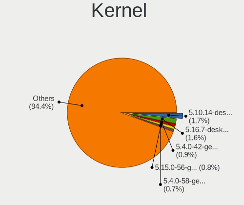
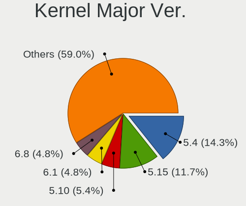
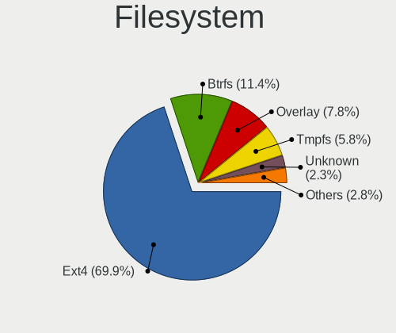
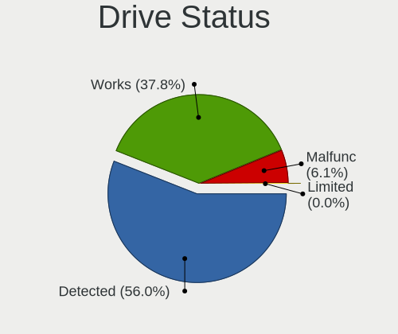
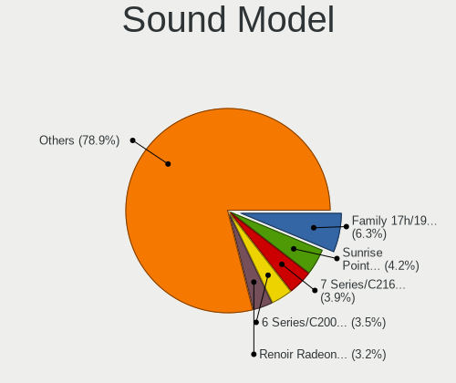

Linux in Germany - Tested Hardware & Statistics
-----------------------------------------------

A project to collect tested hardware configurations for Linux in Germany.

Anyone can contribute to this report by the [hw-probe](https://github.com/linuxhw/hw-probe) tool:

    sudo -E hw-probe -all -upload

Please contribute! Especially if your hardware is rare.

This is a report for all computer types. See also reports for [desktops](/Location/Germany/Desktop/README.md) and [notebooks](/Location/Germany/Notebook/README.md).

Contents
--------

* [ Test Cases ](#test-cases)

* [ System ](#system)
  - [ OS                       ](#os)
  - [ OS Family                ](#os-family)
  - [ Kernel                   ](#kernel)
  - [ Kernel Family            ](#kernel-family)
  - [ Kernel Major Ver.        ](#kernel-major-ver)
  - [ Arch                     ](#arch)
  - [ DE                       ](#de)
  - [ Display Server           ](#display-server)
  - [ Display Manager          ](#display-manager)
  - [ OS Lang                  ](#os-lang)
  - [ Boot Mode                ](#boot-mode)
  - [ Filesystem               ](#filesystem)
  - [ Part. scheme             ](#part-scheme)
  - [ Dual Boot with Linux/BSD ](#dual-boot-with-linuxbsd)
  - [ Dual Boot (Win)          ](#dual-boot-win)

* [ Board ](#board)
  - [ Vendor                   ](#vendor)
  - [ Model                    ](#model)
  - [ Model Family             ](#model-family)
  - [ MFG Year                 ](#mfg-year)
  - [ Form Factor              ](#form-factor)
  - [ Secure Boot              ](#secure-boot)
  - [ Coreboot                 ](#coreboot)
  - [ RAM Size                 ](#ram-size)
  - [ RAM Used                 ](#ram-used)
  - [ Total Drives             ](#total-drives)
  - [ Has CD-ROM               ](#has-cd-rom)
  - [ Has Ethernet             ](#has-ethernet)
  - [ Has WiFi                 ](#has-wifi)
  - [ Has Bluetooth            ](#has-bluetooth)

* [ Location ](#location)
  - [ Country                  ](#country)
  - [ City                     ](#city)

* [ Drives ](#drives)
  - [ Drive Vendor             ](#drive-vendor)
  - [ Drive Model              ](#drive-model)
  - [ HDD Vendor               ](#hdd-vendor)
  - [ SSD Vendor               ](#ssd-vendor)
  - [ Drive Kind               ](#drive-kind)
  - [ Drive Connector          ](#drive-connector)
  - [ Drive Size               ](#drive-size)
  - [ Space Total              ](#space-total)
  - [ Space Used               ](#space-used)
  - [ Malfunc. Drives          ](#malfunc-drives)
  - [ Malfunc. Drive Vendor    ](#malfunc-drive-vendor)
  - [ Malfunc. HDD Vendor      ](#malfunc-hdd-vendor)
  - [ Malfunc. Drive Kind      ](#malfunc-drive-kind)
  - [ Failed Drives            ](#failed-drives)
  - [ Failed Drive Vendor      ](#failed-drive-vendor)
  - [ Drive Status             ](#drive-status)

* [ Storage controller ](#storage-controller)
  - [ Storage Vendor           ](#storage-vendor)
  - [ Storage Model            ](#storage-model)
  - [ Storage Kind             ](#storage-kind)

* [ Processor ](#processor)
  - [ CPU Vendor               ](#cpu-vendor)
  - [ CPU Model                ](#cpu-model)
  - [ CPU Model Family         ](#cpu-model-family)
  - [ CPU Cores                ](#cpu-cores)
  - [ CPU Sockets              ](#cpu-sockets)
  - [ CPU Threads              ](#cpu-threads)
  - [ CPU Op-Modes             ](#cpu-op-modes)
  - [ CPU Microcode            ](#cpu-microcode)
  - [ CPU Microarch            ](#cpu-microarch)

* [ Graphics ](#graphics)
  - [ GPU Vendor               ](#gpu-vendor)
  - [ GPU Model                ](#gpu-model)
  - [ GPU Combo                ](#gpu-combo)
  - [ GPU Driver               ](#gpu-driver)
  - [ GPU Memory               ](#gpu-memory)

* [ Monitor ](#monitor)
  - [ Monitor Vendor           ](#monitor-vendor)
  - [ Monitor Model            ](#monitor-model)
  - [ Monitor Resolution       ](#monitor-resolution)
  - [ Monitor Diagonal         ](#monitor-diagonal)
  - [ Monitor Width            ](#monitor-width)
  - [ Aspect Ratio             ](#aspect-ratio)
  - [ Monitor Area             ](#monitor-area)
  - [ Pixel Density            ](#pixel-density)
  - [ Multiple Monitors        ](#multiple-monitors)

* [ Network ](#network)
  - [ Net Controller Vendor    ](#net-controller-vendor)
  - [ Net Controller Model     ](#net-controller-model)
  - [ Wireless Vendor          ](#wireless-vendor)
  - [ Wireless Model           ](#wireless-model)
  - [ Ethernet Vendor          ](#ethernet-vendor)
  - [ Ethernet Model           ](#ethernet-model)
  - [ Net Controller Kind      ](#net-controller-kind)
  - [ Used Controller          ](#used-controller)
  - [ NICs                     ](#nics)
  - [ IPv6                     ](#ipv6)

* [ Bluetooth ](#bluetooth)
  - [ Bluetooth Vendor         ](#bluetooth-vendor)
  - [ Bluetooth Model          ](#bluetooth-model)

* [ Sound ](#sound)
  - [ Sound Vendor             ](#sound-vendor)
  - [ Sound Model              ](#sound-model)

* [ Memory ](#memory)
  - [ Memory Vendor            ](#memory-vendor)
  - [ Memory Model             ](#memory-model)
  - [ Memory Kind              ](#memory-kind)
  - [ Memory Form Factor       ](#memory-form-factor)
  - [ Memory Size              ](#memory-size)
  - [ Memory Speed             ](#memory-speed)

* [ Printers & scanners ](#printers--scanners)
  - [ Printer Vendor           ](#printer-vendor)
  - [ Printer Model            ](#printer-model)
  - [ Scanner Vendor           ](#scanner-vendor)
  - [ Scanner Model            ](#scanner-model)

* [ Camera ](#camera)
  - [ Camera Vendor            ](#camera-vendor)
  - [ Camera Model             ](#camera-model)

* [ Security ](#security)
  - [ Fingerprint Vendor       ](#fingerprint-vendor)
  - [ Fingerprint Model        ](#fingerprint-model)
  - [ Chipcard Vendor          ](#chipcard-vendor)
  - [ Chipcard Model           ](#chipcard-model)

* [ Unsupported ](#unsupported)
  - [ Unsupported Devices      ](#unsupported-devices)
  - [ Unsupported Device Types ](#unsupported-device-types)

Test Cases
----------

Total: 33932

| Vendor        | Model                       | Form-Factor | Probe                                                      | Date         |
|---------------|-----------------------------|-------------|------------------------------------------------------------|--------------|
| MSI           | H97 PC Mate                 | Desktop     | [f1c5d0d405](https://linux-hardware.org/?probe=f1c5d0d405) | Dec 24, 2023 |
| Intel         | NUC13ANBi7 M89645-203       | Mini pc     | [27124f064a](https://linux-hardware.org/?probe=27124f064a) | Dec 24, 2023 |
| Intel         | NUC13ANBi7 M89645-203       | Mini pc     | [e12710e5bd](https://linux-hardware.org/?probe=e12710e5bd) | Dec 24, 2023 |
| Acer          | Aspire 5750G                | Notebook    | [a12f3e5ce6](https://linux-hardware.org/?probe=a12f3e5ce6) | Dec 24, 2023 |
| Intel         | NUC13ANBi7 M89645-203       | Mini pc     | [1fe8e8f18d](https://linux-hardware.org/?probe=1fe8e8f18d) | Dec 24, 2023 |
| Acer          | Aspire 5750G                | Notebook    | [1a31482d70](https://linux-hardware.org/?probe=1a31482d70) | Dec 24, 2023 |
| Notebook      | NL5xNU                      | Notebook    | [1cb09f63f9](https://linux-hardware.org/?probe=1cb09f63f9) | Dec 24, 2023 |
| Fujitsu       | D3061-A1 S26361-D3061-A1    | Desktop     | [646b9af5a9](https://linux-hardware.org/?probe=646b9af5a9) | Dec 24, 2023 |
| Intel         | NUC13ANBi7 M89645-203       | Mini pc     | [381955efac](https://linux-hardware.org/?probe=381955efac) | Dec 24, 2023 |
| MSI           | B350M PRO-VDH               | Desktop     | [d845a3492b](https://linux-hardware.org/?probe=d845a3492b) | Dec 24, 2023 |
| MSI           | B350M PRO-VDH               | Desktop     | [a6e1fc3b29](https://linux-hardware.org/?probe=a6e1fc3b29) | Dec 24, 2023 |
| Lenovo        | ThinkPad X1 Carbon Gen 1... | Notebook    | [1297c97e04](https://linux-hardware.org/?probe=1297c97e04) | Dec 24, 2023 |
| HP            | Presario CQ61               | Notebook    | [249a217a7c](https://linux-hardware.org/?probe=249a217a7c) | Dec 24, 2023 |
| Teclast       | F6 Plus                     | Notebook    | [a8fee53f37](https://linux-hardware.org/?probe=a8fee53f37) | Dec 24, 2023 |
| Acer          | TDPS05                      | Desktop     | [ce9b5d0c48](https://linux-hardware.org/?probe=ce9b5d0c48) | Dec 23, 2023 |
| ASUSTek       | M2V                         | Desktop     | [67c7bc43ed](https://linux-hardware.org/?probe=67c7bc43ed) | Dec 23, 2023 |
| ASUSTek       | M2V                         | Desktop     | [1d6970f290](https://linux-hardware.org/?probe=1d6970f290) | Dec 23, 2023 |
| MSI           | 970 GAMING                  | Desktop     | [275aa2eb92](https://linux-hardware.org/?probe=275aa2eb92) | Dec 23, 2023 |
| Gigabyte      | Q87M-D2H                    | Desktop     | [4b2ed8b976](https://linux-hardware.org/?probe=4b2ed8b976) | Dec 23, 2023 |
| AZW           | EQ                          | Desktop     | [a04c9735a7](https://linux-hardware.org/?probe=a04c9735a7) | Dec 23, 2023 |
| AZW           | EQ                          | Desktop     | [9b3d265cd1](https://linux-hardware.org/?probe=9b3d265cd1) | Dec 23, 2023 |
| Dell          | 0J1C3P A01                  | Desktop     | [faea7a3006](https://linux-hardware.org/?probe=faea7a3006) | Dec 23, 2023 |
| Acer          | Aspire 7750G                | Notebook    | [0b0beeca3a](https://linux-hardware.org/?probe=0b0beeca3a) | Dec 23, 2023 |
| System76      | Gazelle                     | Notebook    | [2b9bce59e7](https://linux-hardware.org/?probe=2b9bce59e7) | Dec 23, 2023 |
| Lenovo        | Yoga C740-14IML 81TC        | Convertible | [3625c673e4](https://linux-hardware.org/?probe=3625c673e4) | Dec 23, 2023 |
| TUXEDO        | N24_25JU                    | Notebook    | [8a1a153723](https://linux-hardware.org/?probe=8a1a153723) | Dec 23, 2023 |
| Fujitsu       | D3161-A1 S26361-D3161-A1    | Desktop     | [c8bab56547](https://linux-hardware.org/?probe=c8bab56547) | Dec 23, 2023 |
| Gigabyte      | GA-78LMT-S2P                | Desktop     | [6f36390142](https://linux-hardware.org/?probe=6f36390142) | Dec 23, 2023 |
| Lenovo        | IdeaPad Y500 9541           | Notebook    | [a85ec375f5](https://linux-hardware.org/?probe=a85ec375f5) | Dec 23, 2023 |
| ASRock        | AMCP7A-ION                  | Desktop     | [fb0acc2d50](https://linux-hardware.org/?probe=fb0acc2d50) | Dec 23, 2023 |
| MSI           | B550-A PRO                  | Desktop     | [64a00841b2](https://linux-hardware.org/?probe=64a00841b2) | Dec 23, 2023 |
| Acer          | TDPS05                      | Desktop     | [d0260b1327](https://linux-hardware.org/?probe=d0260b1327) | Dec 23, 2023 |
| ASUSTek       | X99-A II                    | Desktop     | [37e4430c0e](https://linux-hardware.org/?probe=37e4430c0e) | Dec 23, 2023 |
| Foxconn       | 2ABF                        | Desktop     | [d12d3a2f21](https://linux-hardware.org/?probe=d12d3a2f21) | Dec 23, 2023 |
| Lenovo        | ThinkCentre M58 7373AJ5     | Desktop     | [201981bc3f](https://linux-hardware.org/?probe=201981bc3f) | Dec 23, 2023 |
| Intel         | NUC6CAYB J23203-403         | Mini pc     | [83e47fa893](https://linux-hardware.org/?probe=83e47fa893) | Dec 23, 2023 |
| HP            | EliteBook 8570w             | Notebook    | [4b6025ed6e](https://linux-hardware.org/?probe=4b6025ed6e) | Dec 23, 2023 |
| Gigabyte      | B85-HD3                     | Desktop     | [79fbb89592](https://linux-hardware.org/?probe=79fbb89592) | Dec 23, 2023 |
| ASUSTek       | PRIME B360-PLUS             | Desktop     | [4cd7d986cd](https://linux-hardware.org/?probe=4cd7d986cd) | Dec 23, 2023 |
| T-bao Tian... | GOD78                       | Desktop     | [cd28753d06](https://linux-hardware.org/?probe=cd28753d06) | Dec 23, 2023 |
| ASRock        | AMCP7A-ION                  | Desktop     | [7d19dec574](https://linux-hardware.org/?probe=7d19dec574) | Dec 23, 2023 |
| Lenovo        | ThinkPad T480 20L5000BGE    | Notebook    | [8753b04999](https://linux-hardware.org/?probe=8753b04999) | Dec 23, 2023 |
| Dell          | 0VHWTR A02                  | Desktop     | [86e89b6ffd](https://linux-hardware.org/?probe=86e89b6ffd) | Dec 23, 2023 |
| Microsoft     | Surface Go 2                | Tablet      | [0e05c29504](https://linux-hardware.org/?probe=0e05c29504) | Dec 23, 2023 |
| Lenovo        | ThinkBook 15 G4 ABA 21DL    | Notebook    | [5aae7c7b5c](https://linux-hardware.org/?probe=5aae7c7b5c) | Dec 23, 2023 |
| Lenovo        | ThinkBook 16 G6 IRL 21KH    | Notebook    | [c197684b37](https://linux-hardware.org/?probe=c197684b37) | Dec 23, 2023 |
| HP            | EliteBook 845 G8 Noteboo... | Notebook    | [d3dabca767](https://linux-hardware.org/?probe=d3dabca767) | Dec 23, 2023 |
| Toshiba       | Satellite Pro R50-C         | Notebook    | [b4d280ac6a](https://linux-hardware.org/?probe=b4d280ac6a) | Dec 23, 2023 |
| HP            | EliteBook 845 G8 Noteboo... | Notebook    | [26673c372e](https://linux-hardware.org/?probe=26673c372e) | Dec 23, 2023 |
| Toshiba       | Satellite Pro R50-C         | Notebook    | [421d62894b](https://linux-hardware.org/?probe=421d62894b) | Dec 23, 2023 |
| ASUSTek       | ROG STRIX X570-E GAMING     | Desktop     | [391ef34135](https://linux-hardware.org/?probe=391ef34135) | Dec 23, 2023 |
| HP            | Laptop 17-bs1xx             | Notebook    | [984a979a7b](https://linux-hardware.org/?probe=984a979a7b) | Dec 23, 2023 |
| Gigabyte      | Z390 UD                     | Desktop     | [cd36fc0dc1](https://linux-hardware.org/?probe=cd36fc0dc1) | Dec 23, 2023 |
| Dell          | Latitude 3190 2-in-1        | Convertible | [f189893dcb](https://linux-hardware.org/?probe=f189893dcb) | Dec 23, 2023 |
| Apple         | MacBookPro7,1               | Notebook    | [0f291ca562](https://linux-hardware.org/?probe=0f291ca562) | Dec 23, 2023 |
| Dell          | Latitude E6540              | Notebook    | [9e3371b6b2](https://linux-hardware.org/?probe=9e3371b6b2) | Dec 23, 2023 |
| MSI           | B560M PRO                   | Desktop     | [3885df62ab](https://linux-hardware.org/?probe=3885df62ab) | Dec 23, 2023 |
| ASUSTek       | ASUS TUF Gaming A15 FA50... | Notebook    | [87b9f04878](https://linux-hardware.org/?probe=87b9f04878) | Dec 23, 2023 |
| ASUSTek       | P6T                         | Desktop     | [d90adb3a12](https://linux-hardware.org/?probe=d90adb3a12) | Dec 23, 2023 |
| Lenovo        | ThinkPad T480 20L6S69B00    | Notebook    | [16b6aaa173](https://linux-hardware.org/?probe=16b6aaa173) | Dec 23, 2023 |
| HP            | EliteBook 840 G5            | Notebook    | [5b7a85e9fc](https://linux-hardware.org/?probe=5b7a85e9fc) | Dec 23, 2023 |
| ASUSTek       | ROG STRIX X570-E GAMING     | Desktop     | [b9b670d3c0](https://linux-hardware.org/?probe=b9b670d3c0) | Dec 23, 2023 |
| Lenovo        | ThinkBook 16 G6 ABP 21KK    | Notebook    | [569ce717aa](https://linux-hardware.org/?probe=569ce717aa) | Dec 23, 2023 |
| Lenovo        | Legion 7 16ARHA7 82UH       | Notebook    | [8dad235090](https://linux-hardware.org/?probe=8dad235090) | Dec 23, 2023 |
| Lenovo        | Legion 5 15IAH7H 82RB       | Notebook    | [2ca58f3eb8](https://linux-hardware.org/?probe=2ca58f3eb8) | Dec 23, 2023 |
| ASUSTek       | ASUS TUF Gaming A17 FA70... | Notebook    | [8a36394313](https://linux-hardware.org/?probe=8a36394313) | Dec 23, 2023 |
| ASUSTek       | ASUS TUF Gaming A17 FA70... | Notebook    | [eb035a95fa](https://linux-hardware.org/?probe=eb035a95fa) | Dec 22, 2023 |
| AZW           | SER V1                      | Desktop     | [73cc7b7f87](https://linux-hardware.org/?probe=73cc7b7f87) | Dec 22, 2023 |
| MSI           | PRO B650M-A WIFI            | Desktop     | [4adc5f3f81](https://linux-hardware.org/?probe=4adc5f3f81) | Dec 22, 2023 |
| Lenovo        | ThinkPad P14s Gen 4 21K6... | Notebook    | [d53640436b](https://linux-hardware.org/?probe=d53640436b) | Dec 22, 2023 |
| HP            | Pavilion Notebook           | Notebook    | [42c72b303d](https://linux-hardware.org/?probe=42c72b303d) | Dec 22, 2023 |
| Dell          | Precision M4800             | Notebook    | [ce7a9239f4](https://linux-hardware.org/?probe=ce7a9239f4) | Dec 22, 2023 |
| HP            | Pavilion Notebook           | Notebook    | [7afecc25eb](https://linux-hardware.org/?probe=7afecc25eb) | Dec 22, 2023 |
| Medion        | X682X                       | Notebook    | [c0deb0e748](https://linux-hardware.org/?probe=c0deb0e748) | Dec 22, 2023 |
| Apple         | MacBookPro13,1              | Notebook    | [89ef1fa23c](https://linux-hardware.org/?probe=89ef1fa23c) | Dec 22, 2023 |
| ASUSTek       | X555LD                      | Notebook    | [c81a75e686](https://linux-hardware.org/?probe=c81a75e686) | Dec 22, 2023 |
| MSI           | MPG B550 GAMING PLUS        | Desktop     | [db8c00daf3](https://linux-hardware.org/?probe=db8c00daf3) | Dec 22, 2023 |
| HP            | 84F5                        | Mini pc     | [e91c19712f](https://linux-hardware.org/?probe=e91c19712f) | Dec 22, 2023 |
| ASUSTek       | VivoBook_ASUSLaptop X530... | Notebook    | [3f903fafe6](https://linux-hardware.org/?probe=3f903fafe6) | Dec 22, 2023 |
| ASUSTek       | K50AF                       | Notebook    | [367c28d17a](https://linux-hardware.org/?probe=367c28d17a) | Dec 22, 2023 |
| Samsung       | 300E4C/300E5C/300E7C        | Notebook    | [a11f0a948c](https://linux-hardware.org/?probe=a11f0a948c) | Dec 22, 2023 |
| Lenovo        | ThinkPad T440p 20AWS0280... | Notebook    | [239bc0b85a](https://linux-hardware.org/?probe=239bc0b85a) | Dec 22, 2023 |
| Gigabyte      | B550 AORUS ELITE V2         | Desktop     | [f71924e3e4](https://linux-hardware.org/?probe=f71924e3e4) | Dec 22, 2023 |
| HUAWEI        | KLVL-WXXW                   | Notebook    | [75c61bce6d](https://linux-hardware.org/?probe=75c61bce6d) | Dec 22, 2023 |
| MSI           | B450M PRO-VDH MAX           | Desktop     | [94462e79e4](https://linux-hardware.org/?probe=94462e79e4) | Dec 22, 2023 |
| Acer          | Aspire E5-576               | Notebook    | [e40f16f86b](https://linux-hardware.org/?probe=e40f16f86b) | Dec 22, 2023 |
| ASUSTek       | Maximus VI GENE             | Desktop     | [178aab1062](https://linux-hardware.org/?probe=178aab1062) | Dec 22, 2023 |
| ASUSTek       | PN53                        | Mini pc     | [1310ad15a9](https://linux-hardware.org/?probe=1310ad15a9) | Dec 22, 2023 |
| ASUSTek       | X555LD                      | Notebook    | [30e988edc9](https://linux-hardware.org/?probe=30e988edc9) | Dec 22, 2023 |
| Apple         | Mac-CFF7D910A743CAAF iMa... | All in one  | [61154d87f0](https://linux-hardware.org/?probe=61154d87f0) | Dec 22, 2023 |
| Raspberry ... | Raspberry Pi 4 Model B R... | Soc         | [dfc1d4289e](https://linux-hardware.org/?probe=dfc1d4289e) | Dec 22, 2023 |
| Medion        | S17403                      | Notebook    | [167acdd156](https://linux-hardware.org/?probe=167acdd156) | Dec 22, 2023 |
| Toshiba       | Satellite Pro L850-1L2      | Notebook    | [c3bfd150bc](https://linux-hardware.org/?probe=c3bfd150bc) | Dec 22, 2023 |
| Fujitsu       | LIFEBOOK T939               | Convertible | [2f5eddacdb](https://linux-hardware.org/?probe=2f5eddacdb) | Dec 22, 2023 |
| Lenovo        | Flex 2-15D 20377            | Notebook    | [a22602448b](https://linux-hardware.org/?probe=a22602448b) | Dec 22, 2023 |
| ASUSTek       | M5A97 R2.0                  | Desktop     | [3ff2f289b9](https://linux-hardware.org/?probe=3ff2f289b9) | Dec 22, 2023 |
| Acer          | Aspire A515-44              | Notebook    | [874744ee1f](https://linux-hardware.org/?probe=874744ee1f) | Dec 22, 2023 |
| Gigabyte      | GA-78LMT-S2P                | Desktop     | [dbc2e93666](https://linux-hardware.org/?probe=dbc2e93666) | Dec 21, 2023 |
| ASUSTek       | TUF Gaming B650M-PLUS       | Desktop     | [0dc09851b1](https://linux-hardware.org/?probe=0dc09851b1) | Dec 21, 2023 |
| Gigabyte      | B450 AORUS M                | Desktop     | [084e48827c](https://linux-hardware.org/?probe=084e48827c) | Dec 21, 2023 |
| MSI           | A320M-A PRO MAX             | Desktop     | [37e175c7a2](https://linux-hardware.org/?probe=37e175c7a2) | Dec 21, 2023 |
| Gigabyte      | GA-990XA-UD3                | Desktop     | [f8215b7e03](https://linux-hardware.org/?probe=f8215b7e03) | Dec 21, 2023 |
| Dell          | Precision 5480              | Notebook    | [382626cfb5](https://linux-hardware.org/?probe=382626cfb5) | Dec 21, 2023 |
| MSI           | MAG X570 TOMAHAWK WIFI      | Desktop     | [13b303a58b](https://linux-hardware.org/?probe=13b303a58b) | Dec 21, 2023 |
| ASRock        | A520M-HDV                   | Desktop     | [918677a1da](https://linux-hardware.org/?probe=918677a1da) | Dec 21, 2023 |
| MSI           | MPG X570 GAMING EDGE WIF... | Desktop     | [628ca02992](https://linux-hardware.org/?probe=628ca02992) | Dec 21, 2023 |
| ASRock        | A520M-HDV                   | Desktop     | [7136ba3916](https://linux-hardware.org/?probe=7136ba3916) | Dec 21, 2023 |
| Fujitsu       | LIFEBOOK T939               | Convertible | [b9c3b5a089](https://linux-hardware.org/?probe=b9c3b5a089) | Dec 21, 2023 |
| Alienware     | 14                          | Notebook    | [ee2678a24f](https://linux-hardware.org/?probe=ee2678a24f) | Dec 21, 2023 |
| HP            | ProBook 445 14 inch G10 ... | Notebook    | [0e95b32d0b](https://linux-hardware.org/?probe=0e95b32d0b) | Dec 21, 2023 |
| Fujitsu       | LIFEBOOK U749               | Notebook    | [75a3ef28b0](https://linux-hardware.org/?probe=75a3ef28b0) | Dec 21, 2023 |
| ASUSTek       | Maximus VIII RANGER         | Desktop     | [b87a575222](https://linux-hardware.org/?probe=b87a575222) | Dec 21, 2023 |
| HUAWEI        | BOD-WXX9                    | Notebook    | [f95bb7d27c](https://linux-hardware.org/?probe=f95bb7d27c) | Dec 21, 2023 |
| ASUSTek       | PRIME H510M-K               | Desktop     | [5c0166e1f8](https://linux-hardware.org/?probe=5c0166e1f8) | Dec 21, 2023 |
| Lenovo        | Yoga 9 15IMH5 82DE          | Convertible | [d0d0568d9d](https://linux-hardware.org/?probe=d0d0568d9d) | Dec 21, 2023 |
| MSI           | B450M PRO-VDH MAX           | Desktop     | [1b8100314e](https://linux-hardware.org/?probe=1b8100314e) | Dec 21, 2023 |
| Apple         | Mac-031B6874CF7F642A iMa... | All in one  | [e3a45d6095](https://linux-hardware.org/?probe=e3a45d6095) | Dec 21, 2023 |
| Lenovo        | ThinkPad X1 Nano Gen 1 2... | Notebook    | [d178358ee1](https://linux-hardware.org/?probe=d178358ee1) | Dec 21, 2023 |
| ASRock        | H61M-DGS R2.0               | Desktop     | [5693d09326](https://linux-hardware.org/?probe=5693d09326) | Dec 21, 2023 |
| ASUSTek       | M4A785TD-V EVO              | Desktop     | [8b094a74c9](https://linux-hardware.org/?probe=8b094a74c9) | Dec 21, 2023 |
| TUXEDO        | InfinityBook Pro Gen7 (M... | Notebook    | [030e411799](https://linux-hardware.org/?probe=030e411799) | Dec 21, 2023 |
| HUAWEI        | MRGFG-XX                    | Notebook    | [747de8fa3c](https://linux-hardware.org/?probe=747de8fa3c) | Dec 21, 2023 |
| Inter Sale... | NID-11125DE                 | Notebook    | [d65538541d](https://linux-hardware.org/?probe=d65538541d) | Dec 21, 2023 |
| ASUSTek       | X550LD                      | Notebook    | [bc65f1d620](https://linux-hardware.org/?probe=bc65f1d620) | Dec 21, 2023 |
| ASUSTek       | M5A97 R2.0                  | Desktop     | [93a7029d22](https://linux-hardware.org/?probe=93a7029d22) | Dec 21, 2023 |
| Lenovo        | ThinkPad L580 20LW0010GE    | Notebook    | [4bd3fc58a8](https://linux-hardware.org/?probe=4bd3fc58a8) | Dec 21, 2023 |
| Apple         | MacBookPro14,1              | Notebook    | [e221a6befb](https://linux-hardware.org/?probe=e221a6befb) | Dec 21, 2023 |
| In-S          | C116A                       | Notebook    | [ba252bb452](https://linux-hardware.org/?probe=ba252bb452) | Dec 20, 2023 |
| Fujitsu       | LIFEBOOK AH530              | Notebook    | [fb91eaef3b](https://linux-hardware.org/?probe=fb91eaef3b) | Dec 20, 2023 |
| ASUSTek       | P5G41-M                     | Desktop     | [cbab9e248d](https://linux-hardware.org/?probe=cbab9e248d) | Dec 20, 2023 |
| Lenovo        | ThinkPad T480 20L6S01W00    | Notebook    | [c38a7a8ad4](https://linux-hardware.org/?probe=c38a7a8ad4) | Dec 20, 2023 |
| Gigabyte      | B560M H                     | Desktop     | [6e7f8b2300](https://linux-hardware.org/?probe=6e7f8b2300) | Dec 20, 2023 |
| Lenovo        | ThinkPad W520 42844DG       | Notebook    | [52cd813233](https://linux-hardware.org/?probe=52cd813233) | Dec 20, 2023 |
| Wortmann      | TERRA_MOBILE_1529H          | Notebook    | [49f1bedb5a](https://linux-hardware.org/?probe=49f1bedb5a) | Dec 20, 2023 |
| Dell          | XPS 15 7590                 | Notebook    | [74136911a0](https://linux-hardware.org/?probe=74136911a0) | Dec 20, 2023 |
| Dell          | Latitude 7480               | Notebook    | [f080cc67aa](https://linux-hardware.org/?probe=f080cc67aa) | Dec 20, 2023 |
| Pegatron      | TRUCKEE                     | Desktop     | [dbf9508eef](https://linux-hardware.org/?probe=dbf9508eef) | Dec 20, 2023 |
| Lenovo        | IdeaPad 1 15ALC7 82R4       | Notebook    | [2dcde776ad](https://linux-hardware.org/?probe=2dcde776ad) | Dec 20, 2023 |
| Lenovo        | IdeaPad 320-17IKB 80XM      | Notebook    | [393c13e870](https://linux-hardware.org/?probe=393c13e870) | Dec 20, 2023 |
| Lenovo        | IdeaPad 320-17IKB 80XM      | Notebook    | [09af8afa56](https://linux-hardware.org/?probe=09af8afa56) | Dec 20, 2023 |
| HP            | 3047h                       | Desktop     | [8f868cea54](https://linux-hardware.org/?probe=8f868cea54) | Dec 20, 2023 |
| Dell          | Latitude 7490               | Notebook    | [058142d276](https://linux-hardware.org/?probe=058142d276) | Dec 20, 2023 |
| HP            | EliteBook 8560p             | Notebook    | [b9e00df8b5](https://linux-hardware.org/?probe=b9e00df8b5) | Dec 20, 2023 |
| HP            | 3047h                       | Desktop     | [6e6ab07000](https://linux-hardware.org/?probe=6e6ab07000) | Dec 20, 2023 |
| HP            | EliteBook 8560p             | Notebook    | [334bc9d94f](https://linux-hardware.org/?probe=334bc9d94f) | Dec 20, 2023 |
| HP            | 3047h                       | Desktop     | [a1f3ed3f68](https://linux-hardware.org/?probe=a1f3ed3f68) | Dec 20, 2023 |
| ASUSTek       | VivoBook_ASUSLaptop E510... | Notebook    | [2e42798435](https://linux-hardware.org/?probe=2e42798435) | Dec 20, 2023 |
| ASUSTek       | TUF Gaming B650M-PLUS       | Desktop     | [088b57605f](https://linux-hardware.org/?probe=088b57605f) | Dec 20, 2023 |
| Micro Comp... | Venus series                | Notebook    | [e01ac2dc02](https://linux-hardware.org/?probe=e01ac2dc02) | Dec 20, 2023 |
| MSI           | H61M-E33                    | Desktop     | [ab39035cef](https://linux-hardware.org/?probe=ab39035cef) | Dec 20, 2023 |
| MSI           | A78M-E45                    | Desktop     | [6d11f72d41](https://linux-hardware.org/?probe=6d11f72d41) | Dec 20, 2023 |
| Inter Sale... | NID-11125DE                 | Notebook    | [17af2fca66](https://linux-hardware.org/?probe=17af2fca66) | Dec 20, 2023 |
| ASUSTek       | ASUS TUF Gaming A15 FA50... | Notebook    | [b14bdf4602](https://linux-hardware.org/?probe=b14bdf4602) | Dec 20, 2023 |
| Raspberry ... | Raspberry Pi 4 Model B R... | Soc         | [b362feddfa](https://linux-hardware.org/?probe=b362feddfa) | Dec 20, 2023 |
| Gigabyte      | B85M-D3H                    | Desktop     | [a641f9b41d](https://linux-hardware.org/?probe=a641f9b41d) | Dec 20, 2023 |
| ASUSTek       | PRIME H510M-K               | Desktop     | [b6b4165e86](https://linux-hardware.org/?probe=b6b4165e86) | Dec 20, 2023 |
| Medion        | TJ4125                      | Desktop     | [8fce958467](https://linux-hardware.org/?probe=8fce958467) | Dec 20, 2023 |
| Valve         | Jupiter                     | Notebook    | [1265867fcf](https://linux-hardware.org/?probe=1265867fcf) | Dec 19, 2023 |
| MSI           | 970A-G46                    | Desktop     | [078bef5c72](https://linux-hardware.org/?probe=078bef5c72) | Dec 19, 2023 |
| Lenovo        | Yoga 7 14ARB7 82QF          | Convertible | [af88f0d2da](https://linux-hardware.org/?probe=af88f0d2da) | Dec 19, 2023 |
| HUAWEI        | MRGFG-XX                    | Notebook    | [6a10eb945c](https://linux-hardware.org/?probe=6a10eb945c) | Dec 19, 2023 |
| ASUSTek       | PRIME B450M-A               | Desktop     | [e66c224547](https://linux-hardware.org/?probe=e66c224547) | Dec 19, 2023 |
| Lenovo        | ThinkPad X1 Carbon 4th 2... | Notebook    | [da74c3a382](https://linux-hardware.org/?probe=da74c3a382) | Dec 19, 2023 |
| MSI           | Z77A-G45                    | Desktop     | [047feb8e76](https://linux-hardware.org/?probe=047feb8e76) | Dec 19, 2023 |
| TUXEDO        | Aura 14 Gen3                | Notebook    | [bdc38bf0fd](https://linux-hardware.org/?probe=bdc38bf0fd) | Dec 19, 2023 |
| HP            | 83E0                        | Desktop     | [8f41483d26](https://linux-hardware.org/?probe=8f41483d26) | Dec 19, 2023 |
| Lenovo        | IdeaPad 330-15ARR 81D2      | Notebook    | [2b7ff14fc2](https://linux-hardware.org/?probe=2b7ff14fc2) | Dec 19, 2023 |
| Wortmann      | TERRA_MOBILE_1542           | Notebook    | [f09218ee8f](https://linux-hardware.org/?probe=f09218ee8f) | Dec 19, 2023 |
| Lenovo        | 3704 SDK0K17763 WIN 1801... | Desktop     | [9a2472e628](https://linux-hardware.org/?probe=9a2472e628) | Dec 19, 2023 |
| HP            | ElitePad 1000 G2            | Notebook    | [533ccb0c41](https://linux-hardware.org/?probe=533ccb0c41) | Dec 19, 2023 |
| Dell          | XPS 13 9310 2-in-1          | Convertible | [492194d1fc](https://linux-hardware.org/?probe=492194d1fc) | Dec 19, 2023 |
| Lenovo        | IdeaPadFlex 15 20309        | Notebook    | [81dbec4f1a](https://linux-hardware.org/?probe=81dbec4f1a) | Dec 19, 2023 |
| TUXEDO        | Pulse 14 Gen1               | Notebook    | [031f8b45bd](https://linux-hardware.org/?probe=031f8b45bd) | Dec 19, 2023 |
| Sony          | SVE1511A1EW                 | Notebook    | [2f0fde3487](https://linux-hardware.org/?probe=2f0fde3487) | Dec 19, 2023 |
| HP            | 81B3                        | Desktop     | [86d9fc12a5](https://linux-hardware.org/?probe=86d9fc12a5) | Dec 19, 2023 |
| HP            | 655                         | Notebook    | [c0bd13830f](https://linux-hardware.org/?probe=c0bd13830f) | Dec 19, 2023 |
| Sony          | SVE1511A1EW                 | Notebook    | [e5531ecc00](https://linux-hardware.org/?probe=e5531ecc00) | Dec 19, 2023 |
| Shenzhen M... | F7BSC                       | Mini pc     | [8939d0afc4](https://linux-hardware.org/?probe=8939d0afc4) | Dec 19, 2023 |
| Lenovo        | Yoga 7 14ARB7 82QF          | Convertible | [6eb0111ee8](https://linux-hardware.org/?probe=6eb0111ee8) | Dec 19, 2023 |
| Gigabyte      | B550 AORUS MASTER           | Desktop     | [7bd446ee65](https://linux-hardware.org/?probe=7bd446ee65) | Dec 18, 2023 |
| Unknown       | HX90                        | Desktop     | [2bf61c79c6](https://linux-hardware.org/?probe=2bf61c79c6) | Dec 18, 2023 |
| MSI           | MAG X670E TOMAHAWK WIFI     | Desktop     | [5255e11641](https://linux-hardware.org/?probe=5255e11641) | Dec 18, 2023 |
| Acer          | Swift SF315-52G             | Notebook    | [26f06e876d](https://linux-hardware.org/?probe=26f06e876d) | Dec 18, 2023 |
| Fujitsu       | D3161-A1 S26361-D3161-A1    | Desktop     | [985b139723](https://linux-hardware.org/?probe=985b139723) | Dec 18, 2023 |
| MSI           | Z77A-GD65                   | Desktop     | [a6d9b065a7](https://linux-hardware.org/?probe=a6d9b065a7) | Dec 18, 2023 |
| Dell          | XPS 15 7590                 | Notebook    | [229df442f5](https://linux-hardware.org/?probe=229df442f5) | Dec 18, 2023 |
| MSI           | B550-A PRO                  | Desktop     | [d333f0b082](https://linux-hardware.org/?probe=d333f0b082) | Dec 18, 2023 |
| Acer          | Aspire E1-731               | Notebook    | [e5312bdd49](https://linux-hardware.org/?probe=e5312bdd49) | Dec 18, 2023 |
| HP            | ProBook 430 G4              | Notebook    | [c2b96a9e0f](https://linux-hardware.org/?probe=c2b96a9e0f) | Dec 18, 2023 |
| Medion        | TJ4125                      | Desktop     | [c7eeb77279](https://linux-hardware.org/?probe=c7eeb77279) | Dec 18, 2023 |
| Gigabyte      | B85M-D3H                    | Desktop     | [95d29a0474](https://linux-hardware.org/?probe=95d29a0474) | Dec 18, 2023 |
| Medion        | E6246 MD63200               | Notebook    | [eda979df79](https://linux-hardware.org/?probe=eda979df79) | Dec 18, 2023 |
| HUAWEI        | NBLB-WAX9N                  | Notebook    | [1f03d33b22](https://linux-hardware.org/?probe=1f03d33b22) | Dec 18, 2023 |
| Packard Be... | EasyNote TE69BM             | Notebook    | [6a4bc96f4b](https://linux-hardware.org/?probe=6a4bc96f4b) | Dec 18, 2023 |
| ASRock        | H61M-DGS R2.0               | Desktop     | [dc6e7e06c3](https://linux-hardware.org/?probe=dc6e7e06c3) | Dec 18, 2023 |
| ASUSTek       | Zenbook UM5302LA_UM5302L... | Notebook    | [29ee1d8ad5](https://linux-hardware.org/?probe=29ee1d8ad5) | Dec 18, 2023 |
| Lenovo        | IdeaPad 1 11ADA05 82GV      | Notebook    | [980280224f](https://linux-hardware.org/?probe=980280224f) | Dec 18, 2023 |
| Lenovo        | IdeaPad 1 11ADA05 82GV      | Notebook    | [41f03f0699](https://linux-hardware.org/?probe=41f03f0699) | Dec 18, 2023 |
| Wortmann      | TERRA_MOBILE_1542           | Notebook    | [054ed4fad9](https://linux-hardware.org/?probe=054ed4fad9) | Dec 18, 2023 |
| MSI           | MAG X570 TOMAHAWK WIFI      | Desktop     | [85358f7505](https://linux-hardware.org/?probe=85358f7505) | Dec 18, 2023 |
| MSI           | A75MA-G55                   | Desktop     | [6af3c61744](https://linux-hardware.org/?probe=6af3c61744) | Dec 18, 2023 |
| Raspberry ... | Raspberry Pi                | Soc         | [9133031c56](https://linux-hardware.org/?probe=9133031c56) | Dec 18, 2023 |
| Microsoft     | Surface Laptop Go           | Tablet      | [b1d44e2673](https://linux-hardware.org/?probe=b1d44e2673) | Dec 17, 2023 |
| Panasonic     | FZ-M1CCA17E3                | Notebook    | [87024c17b5](https://linux-hardware.org/?probe=87024c17b5) | Dec 17, 2023 |
| Panasonic     | FZ-M1CCA17E3                | Notebook    | [8f2a76eb09](https://linux-hardware.org/?probe=8f2a76eb09) | Dec 17, 2023 |
| Medion        | BEAST X30                   | Notebook    | [cec06735ba](https://linux-hardware.org/?probe=cec06735ba) | Dec 17, 2023 |
| ASRock        | Z390 Extreme4               | Desktop     | [4067f8d4cb](https://linux-hardware.org/?probe=4067f8d4cb) | Dec 17, 2023 |
| Acer          | Swift SF315-41              | Notebook    | [300b426183](https://linux-hardware.org/?probe=300b426183) | Dec 17, 2023 |
| Apple         | Mac-F60DEB81FF30ACF6 Mac... | Desktop     | [a411802ac6](https://linux-hardware.org/?probe=a411802ac6) | Dec 17, 2023 |
| Acer          | Aspire 4820TG               | Notebook    | [a9bc29a915](https://linux-hardware.org/?probe=a9bc29a915) | Dec 17, 2023 |
| HP            | ENVY Laptop 17-ch0xxx       | Notebook    | [43602a664e](https://linux-hardware.org/?probe=43602a664e) | Dec 17, 2023 |
| Lenovo        | ThinkPad W550s 20E2CTO1W... | Notebook    | [17b157ef44](https://linux-hardware.org/?probe=17b157ef44) | Dec 17, 2023 |
| ASUSTek       | M5A78L-M LE                 | Desktop     | [d70deaa140](https://linux-hardware.org/?probe=d70deaa140) | Dec 17, 2023 |
| Dell          | 0J1C3P A01                  | Desktop     | [99eb1f88a4](https://linux-hardware.org/?probe=99eb1f88a4) | Dec 17, 2023 |
| ASRock        | Z77 Extreme4                | Desktop     | [ead1dfb3ae](https://linux-hardware.org/?probe=ead1dfb3ae) | Dec 17, 2023 |
| ASUSTek       | ZenBook UX425QA_UM425QA     | Notebook    | [73693b1a91](https://linux-hardware.org/?probe=73693b1a91) | Dec 17, 2023 |
| HUAWEI        | NBLB-WAX9N                  | Notebook    | [16ebb489d4](https://linux-hardware.org/?probe=16ebb489d4) | Dec 17, 2023 |
| Dell          | 02K9CR A02                  | Desktop     | [aeb868db71](https://linux-hardware.org/?probe=aeb868db71) | Dec 17, 2023 |
| HP            | ProBook 4535s               | Notebook    | [80aa5bd12b](https://linux-hardware.org/?probe=80aa5bd12b) | Dec 17, 2023 |
| Medion        | E6214                       | Notebook    | [1bc5839854](https://linux-hardware.org/?probe=1bc5839854) | Dec 17, 2023 |
| ASRock        | Z390 Extreme4               | Desktop     | [5db549dd99](https://linux-hardware.org/?probe=5db549dd99) | Dec 17, 2023 |
| Medion        | E6214                       | Notebook    | [5269b6e576](https://linux-hardware.org/?probe=5269b6e576) | Dec 17, 2023 |
| MSI           | MAG X570S TORPEDO MAX       | Desktop     | [3a10e23529](https://linux-hardware.org/?probe=3a10e23529) | Dec 17, 2023 |
| Medion        | B660H7-M20                  | Desktop     | [749b3e49ca](https://linux-hardware.org/?probe=749b3e49ca) | Dec 17, 2023 |
| Gigabyte      | Q87M-D2H                    | Desktop     | [378b82ce2f](https://linux-hardware.org/?probe=378b82ce2f) | Dec 17, 2023 |
| ASRock        | H61M-DGS R2.0               | Desktop     | [b8bef59357](https://linux-hardware.org/?probe=b8bef59357) | Dec 17, 2023 |
| Lenovo        | IdeaPad 320-15IKB 80XL      | Notebook    | [02fb9a3f3b](https://linux-hardware.org/?probe=02fb9a3f3b) | Dec 17, 2023 |
| Acer          | Aspire V3-772               | Notebook    | [d3e1291358](https://linux-hardware.org/?probe=d3e1291358) | Dec 17, 2023 |
| Gigabyte      | Q87M-D2H                    | Desktop     | [e7f9b37ee3](https://linux-hardware.org/?probe=e7f9b37ee3) | Dec 17, 2023 |
| Gigabyte      | Q87M-D2H                    | Desktop     | [935f688c90](https://linux-hardware.org/?probe=935f688c90) | Dec 17, 2023 |
| ASRock        | H61M-DGS R2.0               | Desktop     | [d60c1bd23e](https://linux-hardware.org/?probe=d60c1bd23e) | Dec 17, 2023 |
| ASRock        | H61M-DGS R2.0               | Desktop     | [f627f950ab](https://linux-hardware.org/?probe=f627f950ab) | Dec 17, 2023 |
| Gigabyte      | Q87M-D2H                    | Desktop     | [f53d129b3d](https://linux-hardware.org/?probe=f53d129b3d) | Dec 17, 2023 |
| HP            | ZBook Fury 16 G9 Mobile ... | Notebook    | [ce0e0e1bc1](https://linux-hardware.org/?probe=ce0e0e1bc1) | Dec 17, 2023 |
| HP            | 2B5B                        | Desktop     | [fb3877b170](https://linux-hardware.org/?probe=fb3877b170) | Dec 17, 2023 |
| Lenovo        | ThinkPad W530 24491D1       | Notebook    | [bab70d44b1](https://linux-hardware.org/?probe=bab70d44b1) | Dec 17, 2023 |
| ASUSTek       | TUF B450-PLUS GAMING        | Desktop     | [a5e443e89c](https://linux-hardware.org/?probe=a5e443e89c) | Dec 17, 2023 |
| Medion        | TJ4125                      | Desktop     | [7556d73046](https://linux-hardware.org/?probe=7556d73046) | Dec 17, 2023 |
| HP            | ProBook 430 G4              | Notebook    | [253da93459](https://linux-hardware.org/?probe=253da93459) | Dec 17, 2023 |
| Apple         | Mac-F42787C8 PVT            | All in one  | [ef50f10d1f](https://linux-hardware.org/?probe=ef50f10d1f) | Dec 17, 2023 |
| Fujitsu       | LIFEBOOK U749               | Notebook    | [4ede8e182e](https://linux-hardware.org/?probe=4ede8e182e) | Dec 17, 2023 |
| Gigabyte      | B85M-D3H                    | Desktop     | [4d81e6300c](https://linux-hardware.org/?probe=4d81e6300c) | Dec 17, 2023 |
| ASUSTek       | X550LD                      | Notebook    | [f46b47b272](https://linux-hardware.org/?probe=f46b47b272) | Dec 16, 2023 |
| Lenovo        | ThinkPad X230 2325BA3       | Notebook    | [1c573f00c0](https://linux-hardware.org/?probe=1c573f00c0) | Dec 16, 2023 |
| Lenovo        | V110-15IAP 80TG             | Notebook    | [8bb410ae42](https://linux-hardware.org/?probe=8bb410ae42) | Dec 16, 2023 |
| Acer          | Aspire V5-573G              | Notebook    | [723eb61284](https://linux-hardware.org/?probe=723eb61284) | Dec 16, 2023 |
| MSI           | Z97-G43                     | Desktop     | [84486f678f](https://linux-hardware.org/?probe=84486f678f) | Dec 16, 2023 |
| HP            | ProBook 455 15.6 inch G1... | Notebook    | [56e1b0ed26](https://linux-hardware.org/?probe=56e1b0ed26) | Dec 16, 2023 |
| Lenovo        | ThinkPad T14 Gen 4 21K3C... | Notebook    | [66a8c2ad4c](https://linux-hardware.org/?probe=66a8c2ad4c) | Dec 16, 2023 |
| Medion        | E6214                       | Notebook    | [806be57bd5](https://linux-hardware.org/?probe=806be57bd5) | Dec 16, 2023 |
| Dell          | 08WKV3 A00                  | Desktop     | [75274d24c0](https://linux-hardware.org/?probe=75274d24c0) | Dec 16, 2023 |
| HP            | ProBook 430 G4              | Notebook    | [30f8fe050c](https://linux-hardware.org/?probe=30f8fe050c) | Dec 16, 2023 |
| AWOW          | Unknown                     | Notebook    | [7061726896](https://linux-hardware.org/?probe=7061726896) | Dec 16, 2023 |
| Acer          | Aspire 6920                 | Notebook    | [716c31a854](https://linux-hardware.org/?probe=716c31a854) | Dec 16, 2023 |
| Sony          | VGN-FW51MF_H                | Notebook    | [5cb2ea3418](https://linux-hardware.org/?probe=5cb2ea3418) | Dec 16, 2023 |
| Dell          | XPS 13 9360                 | Notebook    | [0aa5382212](https://linux-hardware.org/?probe=0aa5382212) | Dec 16, 2023 |
| ASUSTek       | X555LD                      | Notebook    | [109311067f](https://linux-hardware.org/?probe=109311067f) | Dec 16, 2023 |
| Dell          | Inspiron 7520               | Notebook    | [5614a9077e](https://linux-hardware.org/?probe=5614a9077e) | Dec 16, 2023 |
| MSI           | MPG Z490 GAMING PLUS        | Desktop     | [faf62fd1be](https://linux-hardware.org/?probe=faf62fd1be) | Dec 16, 2023 |
| Lenovo        | V17 G3 IAP 82U1             | Notebook    | [2598a81fd9](https://linux-hardware.org/?probe=2598a81fd9) | Dec 16, 2023 |
| ASUSTek       | ROG STRIX B550-F GAMING     | Desktop     | [72b7f2d771](https://linux-hardware.org/?probe=72b7f2d771) | Dec 16, 2023 |
| Apple         | MacBookPro10,2              | Notebook    | [01713ad0b4](https://linux-hardware.org/?probe=01713ad0b4) | Dec 16, 2023 |
| ASUSTek       | K50AF                       | Notebook    | [2d4a3c6859](https://linux-hardware.org/?probe=2d4a3c6859) | Dec 16, 2023 |
| Acer          | Aspire 7750G                | Notebook    | [32af19e996](https://linux-hardware.org/?probe=32af19e996) | Dec 16, 2023 |
| Fujitsu       | D3513-A1 S26361-D3513-A1    | Desktop     | [6f4f0f65bb](https://linux-hardware.org/?probe=6f4f0f65bb) | Dec 15, 2023 |
| Medion        | E6417 MD99252               | Notebook    | [26e9c2ba0c](https://linux-hardware.org/?probe=26e9c2ba0c) | Dec 15, 2023 |
| Lenovo        | IdeaPad 320-17IKB 81BJ      | Notebook    | [2d3b97c04a](https://linux-hardware.org/?probe=2d3b97c04a) | Dec 15, 2023 |
| Lenovo        | ThinkPad P1 20MDS02BGE      | Notebook    | [65eb962233](https://linux-hardware.org/?probe=65eb962233) | Dec 15, 2023 |
| VIA Techno... | AMOS-3005                   | Desktop     | [10cf5bf932](https://linux-hardware.org/?probe=10cf5bf932) | Dec 15, 2023 |
| VIA Techno... | AMOS-3005                   | Desktop     | [0af62d144a](https://linux-hardware.org/?probe=0af62d144a) | Dec 15, 2023 |
| ASUSTek       | X705UAR                     | Notebook    | [0ab56df890](https://linux-hardware.org/?probe=0ab56df890) | Dec 15, 2023 |
| MSI           | Z77A-GD65                   | Desktop     | [61b10e308f](https://linux-hardware.org/?probe=61b10e308f) | Dec 15, 2023 |
| ASUSTek       | X705UAR                     | Notebook    | [9f0e2069b1](https://linux-hardware.org/?probe=9f0e2069b1) | Dec 15, 2023 |
| Shenzhen M... | AHBNB OEM                   | Desktop     | [1fae1d3423](https://linux-hardware.org/?probe=1fae1d3423) | Dec 15, 2023 |
| HP            | Pavilion g6                 | Notebook    | [7863fae702](https://linux-hardware.org/?probe=7863fae702) | Dec 15, 2023 |
| Shenzhen M... | AHBNB OEM                   | Desktop     | [1a70a13ff4](https://linux-hardware.org/?probe=1a70a13ff4) | Dec 15, 2023 |
| Shenzhen M... | AHBNB OEM                   | Desktop     | [8be30808ec](https://linux-hardware.org/?probe=8be30808ec) | Dec 15, 2023 |
| Shenzhen M... | AHBNB OEM                   | Desktop     | [1e0ba866f7](https://linux-hardware.org/?probe=1e0ba866f7) | Dec 15, 2023 |
| Shenzhen M... | F7BSC                       | Mini pc     | [1b9fdf3844](https://linux-hardware.org/?probe=1b9fdf3844) | Dec 15, 2023 |
| Toshiba       | Satellite C70D-A            | Notebook    | [88b5dab876](https://linux-hardware.org/?probe=88b5dab876) | Dec 15, 2023 |
| Lenovo        | ThinkPad X1 Yoga Gen 6 2... | Convertible | [2b72d3f4a1](https://linux-hardware.org/?probe=2b72d3f4a1) | Dec 15, 2023 |
| Intel         | NUC7i5BNB J31144-310        | Mini pc     | [035b37d481](https://linux-hardware.org/?probe=035b37d481) | Dec 15, 2023 |
| Lenovo        | Legion Y530-15ICH 81FV      | Notebook    | [618978da16](https://linux-hardware.org/?probe=618978da16) | Dec 15, 2023 |
| TUXEDO        | Pulse 15 Gen2               | Notebook    | [93fea0297b](https://linux-hardware.org/?probe=93fea0297b) | Dec 15, 2023 |
| Valve         | Galileo                     | Notebook    | [cd8b629d23](https://linux-hardware.org/?probe=cd8b629d23) | Dec 15, 2023 |
| HP            | Laptop 17-bs1xx             | Notebook    | [ef29718fd5](https://linux-hardware.org/?probe=ef29718fd5) | Dec 15, 2023 |
| Gigabyte      | MZAPLBP-00                  | Desktop     | [3935358dce](https://linux-hardware.org/?probe=3935358dce) | Dec 15, 2023 |
| Lenovo        | 312D NOK                    | Mini pc     | [fb32a1a82e](https://linux-hardware.org/?probe=fb32a1a82e) | Dec 15, 2023 |
| Razer         | Blade 17 (2022) - RZ09-0... | Notebook    | [88ffce598c](https://linux-hardware.org/?probe=88ffce598c) | Dec 15, 2023 |
| Medion        | Akoya E7226                 | Notebook    | [a8677e8420](https://linux-hardware.org/?probe=a8677e8420) | Dec 15, 2023 |
| Medion        | Akoya E7226                 | Notebook    | [059918d809](https://linux-hardware.org/?probe=059918d809) | Dec 15, 2023 |
| Acer          | Aspire 5741G                | Notebook    | [2c456f017e](https://linux-hardware.org/?probe=2c456f017e) | Dec 15, 2023 |
| Acer          | Aspire 5741G                | Notebook    | [6aed980ba9](https://linux-hardware.org/?probe=6aed980ba9) | Dec 15, 2023 |
| Raspberry ... | Raspberry Pi 3 Model B P... | Soc         | [47f91c735f](https://linux-hardware.org/?probe=47f91c735f) | Dec 15, 2023 |
| Lenovo        | ThinkPad L15 Gen 1 20U30... | Notebook    | [9fa07d2004](https://linux-hardware.org/?probe=9fa07d2004) | Dec 14, 2023 |
| Dell          | Precision M6800             | Notebook    | [c3ff8fa4c5](https://linux-hardware.org/?probe=c3ff8fa4c5) | Dec 14, 2023 |
| Dell          | Inspiron 3793               | Notebook    | [90804693a6](https://linux-hardware.org/?probe=90804693a6) | Dec 14, 2023 |
| ASUSTek       | Zenbook 15 UM3504DA_UM35... | Notebook    | [cf35bfbdf4](https://linux-hardware.org/?probe=cf35bfbdf4) | Dec 14, 2023 |
| Lenovo        | ThinkPad SL510 28477MG      | Notebook    | [7a1dc9b889](https://linux-hardware.org/?probe=7a1dc9b889) | Dec 14, 2023 |
| Dell          | XPS 15 7590                 | Notebook    | [69e37f3d93](https://linux-hardware.org/?probe=69e37f3d93) | Dec 14, 2023 |
| ASUSTek       | ROG Strix G713QE_G713QE     | Notebook    | [de24d459c5](https://linux-hardware.org/?probe=de24d459c5) | Dec 14, 2023 |
| Unknown       | Unknown                     | Desktop     | [9fb745d9fe](https://linux-hardware.org/?probe=9fb745d9fe) | Dec 14, 2023 |
| Lenovo        | SDK0J40700 WIN              | Desktop     | [48c963a11d](https://linux-hardware.org/?probe=48c963a11d) | Dec 14, 2023 |
| Lenovo        | Yoga Slim 7 Pro 14ACH5 O... | Notebook    | [0b08ee22d8](https://linux-hardware.org/?probe=0b08ee22d8) | Dec 14, 2023 |
| ASUSTek       | TUF B360M-PLUS GAMING       | Desktop     | [2982c2a2c6](https://linux-hardware.org/?probe=2982c2a2c6) | Dec 14, 2023 |
| Lenovo        | ThinkPad T440s 20ARS0HC0... | Notebook    | [3aa9eb82fb](https://linux-hardware.org/?probe=3aa9eb82fb) | Dec 14, 2023 |
| ASUSTek       | X555LD                      | Notebook    | [9609ed5138](https://linux-hardware.org/?probe=9609ed5138) | Dec 14, 2023 |
| Fujitsu       | LIFEBOOK A357               | Notebook    | [b537ee14db](https://linux-hardware.org/?probe=b537ee14db) | Dec 14, 2023 |
| Acidanther... | Mac-63001698E7A34814 iMa... | All in one  | [7b96685bff](https://linux-hardware.org/?probe=7b96685bff) | Dec 14, 2023 |
| HP            | 255 15.6 inch G9 Noteboo... | Notebook    | [0d0165957f](https://linux-hardware.org/?probe=0d0165957f) | Dec 14, 2023 |
| Lenovo        | SHARKBAY SDK0E50510 WIN     | Desktop     | [ba4e95a15e](https://linux-hardware.org/?probe=ba4e95a15e) | Dec 13, 2023 |
| Acer          | TMP645-M                    | Notebook    | [bd22eef09b](https://linux-hardware.org/?probe=bd22eef09b) | Dec 13, 2023 |
| Apple         | MacBookAir6,2               | Notebook    | [9c3e8b880d](https://linux-hardware.org/?probe=9c3e8b880d) | Dec 13, 2023 |
| Gigabyte      | B550 AORUS ELITE AX V2      | Desktop     | [e101fc39e2](https://linux-hardware.org/?probe=e101fc39e2) | Dec 13, 2023 |
| ASUSTek       | ROG STRIX B650E-E GAMING... | Desktop     | [c132a249e4](https://linux-hardware.org/?probe=c132a249e4) | Dec 13, 2023 |
| MSI           | X470 GAMING PLUS MAX        | Desktop     | [5d1e9e6d47](https://linux-hardware.org/?probe=5d1e9e6d47) | Dec 13, 2023 |
| MSI           | MPG Z490 GAMING EDGE WIF... | Desktop     | [7762e5b295](https://linux-hardware.org/?probe=7762e5b295) | Dec 13, 2023 |
| ASUSTek       | ROG STRIX B450-I GAMING     | Desktop     | [913708c3f0](https://linux-hardware.org/?probe=913708c3f0) | Dec 13, 2023 |
| ASUSTek       | X55C                        | Notebook    | [13f3dbcb5f](https://linux-hardware.org/?probe=13f3dbcb5f) | Dec 13, 2023 |
| Fujitsu       | LIFEBOOK S762               | Notebook    | [9d192a95d8](https://linux-hardware.org/?probe=9d192a95d8) | Dec 13, 2023 |
| Fujitsu       | LIFEBOOK S762               | Notebook    | [19e6b5a871](https://linux-hardware.org/?probe=19e6b5a871) | Dec 13, 2023 |
| ASUSTek       | K50AF                       | Notebook    | [00e0b6dc86](https://linux-hardware.org/?probe=00e0b6dc86) | Dec 13, 2023 |
| Lenovo        | ThinkBook 14s Yoga G3 IR... | Convertible | [9849663265](https://linux-hardware.org/?probe=9849663265) | Dec 13, 2023 |
| LG Electro... | 16Z90R-G.AA76G              | Notebook    | [1e83ee89e2](https://linux-hardware.org/?probe=1e83ee89e2) | Dec 13, 2023 |
| HP            | 18E9                        | Desktop     | [ab47a5d40b](https://linux-hardware.org/?probe=ab47a5d40b) | Dec 13, 2023 |
| ASRock        | A620M Pro RS WiFi           | Desktop     | [069de62879](https://linux-hardware.org/?probe=069de62879) | Dec 13, 2023 |
| HP            | 18E5                        | Desktop     | [8195da7520](https://linux-hardware.org/?probe=8195da7520) | Dec 13, 2023 |
| Lenovo        | ThinkPad X1 Carbon Gen 8... | Notebook    | [4a5e5bbe29](https://linux-hardware.org/?probe=4a5e5bbe29) | Dec 13, 2023 |
| Apple         | Mac-F4238CC8 PVT            | All in one  | [edab90dec9](https://linux-hardware.org/?probe=edab90dec9) | Dec 13, 2023 |
| ASUSTek       | ASUS TUF Gaming F17 FX70... | Notebook    | [f9933769ef](https://linux-hardware.org/?probe=f9933769ef) | Dec 13, 2023 |
| Apple         | MacBookAir6,2               | Notebook    | [963ff854d9](https://linux-hardware.org/?probe=963ff854d9) | Dec 13, 2023 |
| Fujitsu       | LIFEBOOK S792               | Notebook    | [811be0cce0](https://linux-hardware.org/?probe=811be0cce0) | Dec 13, 2023 |
| MSI           | Z77A-GD65                   | Desktop     | [ce6556590b](https://linux-hardware.org/?probe=ce6556590b) | Dec 13, 2023 |
| MSI           | H310M PRO-M2 PLUS           | Desktop     | [60461068e8](https://linux-hardware.org/?probe=60461068e8) | Dec 13, 2023 |
| ASUSTek       | X556UQK                     | Notebook    | [1ac3287ee1](https://linux-hardware.org/?probe=1ac3287ee1) | Dec 13, 2023 |
| HP            | 8169                        | Desktop     | [e0549dcc03](https://linux-hardware.org/?probe=e0549dcc03) | Dec 12, 2023 |
| Gigabyte      | MZAPLBP-00                  | Desktop     | [fdb303e7e6](https://linux-hardware.org/?probe=fdb303e7e6) | Dec 12, 2023 |
| Apple         | Mac-F4238CC8 PVT            | All in one  | [5d09e206ea](https://linux-hardware.org/?probe=5d09e206ea) | Dec 12, 2023 |
| Lenovo        | Annapurna CRB NOK           | Desktop     | [2207f3a9a1](https://linux-hardware.org/?probe=2207f3a9a1) | Dec 12, 2023 |
| HP            | Laptop 15s-eq2xxx           | Notebook    | [8151ecbeef](https://linux-hardware.org/?probe=8151ecbeef) | Dec 12, 2023 |
| Lenovo        | ThinkPad P1 20MD0001GE      | Notebook    | [e4c9202751](https://linux-hardware.org/?probe=e4c9202751) | Dec 12, 2023 |
| Lenovo        | ThinkPad P1 20MD0001GE      | Notebook    | [5662ef46db](https://linux-hardware.org/?probe=5662ef46db) | Dec 12, 2023 |
| Lenovo        | 30BB SDK0J40709 WIN 3259... | All in one  | [9d9d96201b](https://linux-hardware.org/?probe=9d9d96201b) | Dec 12, 2023 |
| ASUSTek       | ASUS TUF Gaming F17 FX70... | Notebook    | [27b99be924](https://linux-hardware.org/?probe=27b99be924) | Dec 12, 2023 |
| Dell          | XPS 15 7590                 | Notebook    | [97ca767d40](https://linux-hardware.org/?probe=97ca767d40) | Dec 12, 2023 |
| Lenovo        | NO DPK                      | Desktop     | [2204183295](https://linux-hardware.org/?probe=2204183295) | Dec 12, 2023 |
| Intel         | NUC7i7DNB J83500-205        | Mini pc     | [1ef755944c](https://linux-hardware.org/?probe=1ef755944c) | Dec 12, 2023 |
| Intel         | NUC7i7DNB J83500-205        | Mini pc     | [e4fcf233c5](https://linux-hardware.org/?probe=e4fcf233c5) | Dec 12, 2023 |
| Fujitsu       | LIFEBOOK T902               | Notebook    | [da78a4dd31](https://linux-hardware.org/?probe=da78a4dd31) | Dec 12, 2023 |
| Gigabyte      | B450M DS3H-CF               | Desktop     | [8f2db425db](https://linux-hardware.org/?probe=8f2db425db) | Dec 12, 2023 |
| Sony          | SVE1713A1EW                 | Notebook    | [64b473222e](https://linux-hardware.org/?probe=64b473222e) | Dec 12, 2023 |
| Foxconn       | TPS01                       | Desktop     | [a417ff19ae](https://linux-hardware.org/?probe=a417ff19ae) | Dec 12, 2023 |
| Lenovo        | ThinkPad X250 20CM001PGE    | Notebook    | [920f198d61](https://linux-hardware.org/?probe=920f198d61) | Dec 12, 2023 |
| Lenovo        | IdeaPadFlex 5 14ARE05 81... | Convertible | [e33caa2659](https://linux-hardware.org/?probe=e33caa2659) | Dec 12, 2023 |
| Acer          | Extensa 215-55              | Notebook    | [40eaa33887](https://linux-hardware.org/?probe=40eaa33887) | Dec 12, 2023 |
| Fujitsu       | LIFEBOOK T902               | Notebook    | [dff662b36c](https://linux-hardware.org/?probe=dff662b36c) | Dec 12, 2023 |
| MSI           | A320M PRO-VD/S              | Desktop     | [c2a6947086](https://linux-hardware.org/?probe=c2a6947086) | Dec 12, 2023 |
| Inter Sale... | NID-11125DE                 | Notebook    | [373498e89a](https://linux-hardware.org/?probe=373498e89a) | Dec 12, 2023 |
| HP            | ProBook 650 G2              | Notebook    | [9936eed724](https://linux-hardware.org/?probe=9936eed724) | Dec 12, 2023 |
| Fujitsu       | LIFEBOOK E548               | Notebook    | [235ca8a477](https://linux-hardware.org/?probe=235ca8a477) | Dec 12, 2023 |
| Acer          | Aspire XC-705               | Desktop     | [c9193baaf8](https://linux-hardware.org/?probe=c9193baaf8) | Dec 12, 2023 |
| Lenovo        | SKYBAY SDK0J40705 WIN 34... | Desktop     | [0720cbce6b](https://linux-hardware.org/?probe=0720cbce6b) | Dec 12, 2023 |
| Lenovo        | ThinkPad T480s 20L8S5LK0... | Notebook    | [e8ebbc8111](https://linux-hardware.org/?probe=e8ebbc8111) | Dec 12, 2023 |
| ASUSTek       | Maximus VII HERO            | Desktop     | [f779186ae7](https://linux-hardware.org/?probe=f779186ae7) | Dec 11, 2023 |
| MSI           | MPG B550I GAMING EDGE WI... | Desktop     | [8b80683b06](https://linux-hardware.org/?probe=8b80683b06) | Dec 11, 2023 |
| ASRock        | B85M Pro4                   | Desktop     | [8a11fe8107](https://linux-hardware.org/?probe=8a11fe8107) | Dec 11, 2023 |
| TUXEDO        | InfinityBook Pro Gen7 (M... | Notebook    | [627ee4cb32](https://linux-hardware.org/?probe=627ee4cb32) | Dec 11, 2023 |
| Lenovo        | IdeaPad S145-15AST 81N3     | Notebook    | [c832a59f37](https://linux-hardware.org/?probe=c832a59f37) | Dec 11, 2023 |
| MSI           | Z170-A PRO                  | Desktop     | [8d77ff0fe8](https://linux-hardware.org/?probe=8d77ff0fe8) | Dec 11, 2023 |
| MSI           | X470 GAMING PLUS MAX        | Desktop     | [8a8dc0ce48](https://linux-hardware.org/?probe=8a8dc0ce48) | Dec 11, 2023 |
| Acer          | Aspire A515-52G             | Notebook    | [c6ac91a53c](https://linux-hardware.org/?probe=c6ac91a53c) | Dec 11, 2023 |
| ASUSTek       | ZenBook UX482EG_UX482EG     | Notebook    | [a644fcc63e](https://linux-hardware.org/?probe=a644fcc63e) | Dec 11, 2023 |
| Gigabyte      | Z790 GAMING X AX            | Desktop     | [8617acecda](https://linux-hardware.org/?probe=8617acecda) | Dec 11, 2023 |
| Lenovo        | ThinkPad X201 3626GWG       | Notebook    | [023f7dd390](https://linux-hardware.org/?probe=023f7dd390) | Dec 11, 2023 |
| Acer          | Aspire 7520                 | Notebook    | [70405c9fa1](https://linux-hardware.org/?probe=70405c9fa1) | Dec 10, 2023 |
| Lenovo        | 312D NOK                    | Mini pc     | [0c0de57a07](https://linux-hardware.org/?probe=0c0de57a07) | Dec 10, 2023 |
| Framework     | Laptop 13 (AMD Ryzen 704... | Notebook    | [ee7a9f7ba7](https://linux-hardware.org/?probe=ee7a9f7ba7) | Dec 10, 2023 |
| HP            | ENVY x360 Convertible 15... | Convertible | [1e3585333b](https://linux-hardware.org/?probe=1e3585333b) | Dec 10, 2023 |
| ASUSTek       | VivoBook_ASUSLaptop X571... | Notebook    | [4c6cd4453d](https://linux-hardware.org/?probe=4c6cd4453d) | Dec 10, 2023 |
| Dell          | Latitude E6410              | Notebook    | [0b8db8ccee](https://linux-hardware.org/?probe=0b8db8ccee) | Dec 10, 2023 |
| Sony          | VGN-AR51M                   | Notebook    | [d1c67ac651](https://linux-hardware.org/?probe=d1c67ac651) | Dec 10, 2023 |
| Lenovo        | ThinkPad T530 2429W1E       | Notebook    | [02a4811e8d](https://linux-hardware.org/?probe=02a4811e8d) | Dec 10, 2023 |
| ASRock        | A520M-HVS                   | Desktop     | [5d07d03602](https://linux-hardware.org/?probe=5d07d03602) | Dec 10, 2023 |
| HP            | Laptop 14-bs0xx             | Notebook    | [f096c75cf9](https://linux-hardware.org/?probe=f096c75cf9) | Dec 10, 2023 |
| HP            | Laptop 17-cn3xxx            | Notebook    | [7a93c4b54c](https://linux-hardware.org/?probe=7a93c4b54c) | Dec 10, 2023 |
| Acer          | Nitro AN517-41              | Notebook    | [6e5abc0ea5](https://linux-hardware.org/?probe=6e5abc0ea5) | Dec 10, 2023 |
| Lenovo        | Legion 7 16ARHA7 82UH       | Notebook    | [2ba6a00229](https://linux-hardware.org/?probe=2ba6a00229) | Dec 10, 2023 |
| MSI           | MS-7516                     | Desktop     | [bafee6f86e](https://linux-hardware.org/?probe=bafee6f86e) | Dec 10, 2023 |
| ASUSTek       | ROG STRIX Z390-E GAMING     | Desktop     | [5522722e53](https://linux-hardware.org/?probe=5522722e53) | Dec 10, 2023 |
| Lenovo        | Bantry CRB SDK0J40709 WI... | All in one  | [1acdbb1c74](https://linux-hardware.org/?probe=1acdbb1c74) | Dec 10, 2023 |
| Lenovo        | ThinkPad T440p 20ANCTO1W... | Notebook    | [070ba5c3c1](https://linux-hardware.org/?probe=070ba5c3c1) | Dec 10, 2023 |
| Lenovo        | Bantry CRB SDK0J40709 WI... | All in one  | [def1d2da47](https://linux-hardware.org/?probe=def1d2da47) | Dec 10, 2023 |
| Gigabyte      | B550 AORUS ELITE            | Desktop     | [6c3916c3fa](https://linux-hardware.org/?probe=6c3916c3fa) | Dec 10, 2023 |
| HP            | EliteBook 8460p             | Notebook    | [1e96233f59](https://linux-hardware.org/?probe=1e96233f59) | Dec 10, 2023 |
| ASUSTek       | ROG STRIX Z390-E GAMING     | Desktop     | [52e1cb6958](https://linux-hardware.org/?probe=52e1cb6958) | Dec 10, 2023 |
| ASUSTek       | SABERTOOTH 990FX R2.0       | Desktop     | [530b8a868e](https://linux-hardware.org/?probe=530b8a868e) | Dec 10, 2023 |
| Acer          | Spin SP513-51               | Convertible | [654c8b4199](https://linux-hardware.org/?probe=654c8b4199) | Dec 10, 2023 |
| HP            | 2AF7                        | Desktop     | [e7a6fd7a82](https://linux-hardware.org/?probe=e7a6fd7a82) | Dec 10, 2023 |
| Dell          | Latitude E6400              | Notebook    | [c23aa9b02a](https://linux-hardware.org/?probe=c23aa9b02a) | Dec 10, 2023 |
| HP            | EliteBook 845 G7 Noteboo... | Notebook    | [3cfc2b72b4](https://linux-hardware.org/?probe=3cfc2b72b4) | Dec 10, 2023 |
| BESSTAR Te... | HM90                        | Desktop     | [6d805d9e86](https://linux-hardware.org/?probe=6d805d9e86) | Dec 10, 2023 |
| ASUSTek       | M4N68T-M-LE-V2              | Desktop     | [e126cdbf4b](https://linux-hardware.org/?probe=e126cdbf4b) | Dec 10, 2023 |
| ASRock        | B760M PG Riptide            | Desktop     | [ef47cf6d30](https://linux-hardware.org/?probe=ef47cf6d30) | Dec 10, 2023 |
| Lenovo        | Legion 7 16ARHA7 82UH       | Notebook    | [d906394ed7](https://linux-hardware.org/?probe=d906394ed7) | Dec 10, 2023 |
| ASUSTek       | P8Z77-V DELUXE              | Desktop     | [6e57197ce6](https://linux-hardware.org/?probe=6e57197ce6) | Dec 10, 2023 |
| Intel         | NUC10i5FNB K61361-305       | Mini pc     | [87b9071f4a](https://linux-hardware.org/?probe=87b9071f4a) | Dec 10, 2023 |
| Dell          | Inspiron 7559               | Notebook    | [3f4af9bbdd](https://linux-hardware.org/?probe=3f4af9bbdd) | Dec 10, 2023 |
| Lenovo        | ThinkPad T480 20L6S4G700    | Notebook    | [a1ebdec411](https://linux-hardware.org/?probe=a1ebdec411) | Dec 10, 2023 |
| Inventec      | DQ Class A02                | Desktop     | [8e1c466924](https://linux-hardware.org/?probe=8e1c466924) | Dec 09, 2023 |
| Samsung       | 950XCJ/951XCJ/950XCR        | Notebook    | [2bc305a065](https://linux-hardware.org/?probe=2bc305a065) | Dec 09, 2023 |
| MSI           | Katana GF66 11UE            | Notebook    | [451c5731ae](https://linux-hardware.org/?probe=451c5731ae) | Dec 09, 2023 |
| Lenovo        | IdeaPad 5 15ARE05 81YQ      | Notebook    | [296e90c442](https://linux-hardware.org/?probe=296e90c442) | Dec 09, 2023 |
| Lenovo        | IdeaPad 5 15ARE05 81YQ      | Notebook    | [cea0431bcb](https://linux-hardware.org/?probe=cea0431bcb) | Dec 09, 2023 |
| ASUSTek       | ROG STRIX Z390-E GAMING     | Desktop     | [3bca387137](https://linux-hardware.org/?probe=3bca387137) | Dec 09, 2023 |
| MSI           | MAG B650 TOMAHAWK WIFI      | Desktop     | [09e302c4ab](https://linux-hardware.org/?probe=09e302c4ab) | Dec 09, 2023 |
| ASRock        | A520M-HDV                   | Desktop     | [c274f291c4](https://linux-hardware.org/?probe=c274f291c4) | Dec 09, 2023 |
| HUAWEI        | NBLB-WAX9N                  | Notebook    | [be35efa2be](https://linux-hardware.org/?probe=be35efa2be) | Dec 09, 2023 |
| HP            | 0B4Ch D                     | Desktop     | [d129c3b01f](https://linux-hardware.org/?probe=d129c3b01f) | Dec 09, 2023 |
| Razer         | Blade                       | Notebook    | [bf9ad5f7df](https://linux-hardware.org/?probe=bf9ad5f7df) | Dec 09, 2023 |
| Lenovo        | ThinkPad L15 Gen 1 20U8S... | Notebook    | [140789380e](https://linux-hardware.org/?probe=140789380e) | Dec 09, 2023 |
| Gigabyte      | G5 GE                       | Notebook    | [e63d83327b](https://linux-hardware.org/?probe=e63d83327b) | Dec 09, 2023 |
| ASUSTek       | PRIME B450M-K               | Desktop     | [c02997fc15](https://linux-hardware.org/?probe=c02997fc15) | Dec 09, 2023 |
| MSI           | B550-A PRO                  | Desktop     | [f4033fbe79](https://linux-hardware.org/?probe=f4033fbe79) | Dec 09, 2023 |
| Medion        | P8614                       | Notebook    | [a7689ec115](https://linux-hardware.org/?probe=a7689ec115) | Dec 09, 2023 |
| Biostar       | A10N-8800E                  | Desktop     | [283ae39c42](https://linux-hardware.org/?probe=283ae39c42) | Dec 09, 2023 |
| Samsung       | 90X3A                       | Notebook    | [45697431c1](https://linux-hardware.org/?probe=45697431c1) | Dec 09, 2023 |
| Wortmann      | 1220561_1470059             | Tablet      | [dd7d907141](https://linux-hardware.org/?probe=dd7d907141) | Dec 09, 2023 |
| HP            | Pavilion 15                 | Notebook    | [8041cb2da6](https://linux-hardware.org/?probe=8041cb2da6) | Dec 09, 2023 |
| Fujitsu Si... | LIFEBOOK T5010              | Notebook    | [7a66cc4016](https://linux-hardware.org/?probe=7a66cc4016) | Dec 09, 2023 |
| AZW           | GTR V02                     | Desktop     | [ece705bc91](https://linux-hardware.org/?probe=ece705bc91) | Dec 09, 2023 |
| Microsoft     | Surface Pro 4               | Tablet      | [d4958d9e5e](https://linux-hardware.org/?probe=d4958d9e5e) | Dec 09, 2023 |
| ASRock        | A620M Pro RS WiFi           | Desktop     | [3bbc394b2e](https://linux-hardware.org/?probe=3bbc394b2e) | Dec 08, 2023 |
| MSI           | Katana 17 B13VGK            | Notebook    | [e91a23fa88](https://linux-hardware.org/?probe=e91a23fa88) | Dec 08, 2023 |
| TUXEDO        | U931                        | Notebook    | [a73533a163](https://linux-hardware.org/?probe=a73533a163) | Dec 08, 2023 |
| Intel         | DH67CL AAG10212-206         | Desktop     | [957289310d](https://linux-hardware.org/?probe=957289310d) | Dec 08, 2023 |
| ASUSTek       | TUF Gaming B760M-PLUS       | Desktop     | [a6d71c281f](https://linux-hardware.org/?probe=a6d71c281f) | Dec 08, 2023 |
| Acer          | Aspire A517-53G             | Notebook    | [11208976d5](https://linux-hardware.org/?probe=11208976d5) | Dec 08, 2023 |
| Sony          | SVE1713Q1EB                 | Notebook    | [482c83143b](https://linux-hardware.org/?probe=482c83143b) | Dec 08, 2023 |
| ASUSTek       | M5A78L-M PLUS/USB3          | Desktop     | [beb5466523](https://linux-hardware.org/?probe=beb5466523) | Dec 08, 2023 |
| ASUSTek       | ROG STRIX B650E-F GAMING... | Desktop     | [7267af3f34](https://linux-hardware.org/?probe=7267af3f34) | Dec 08, 2023 |
| ASUSTek       | ROG STRIX B650E-F GAMING... | Desktop     | [8d7f7aebab](https://linux-hardware.org/?probe=8d7f7aebab) | Dec 08, 2023 |
| Intel         | NUC7JYB J67969-405          | Mini pc     | [4f2070eb15](https://linux-hardware.org/?probe=4f2070eb15) | Dec 08, 2023 |
| ASUSTek       | Pro WS WRX80E-SAGE SE WI... | Desktop     | [69df0251d9](https://linux-hardware.org/?probe=69df0251d9) | Dec 08, 2023 |
| ASUSTek       | ROG STRIX B550-A GAMING     | Desktop     | [07f1a6b2f7](https://linux-hardware.org/?probe=07f1a6b2f7) | Dec 08, 2023 |
| Apple         | MacBookAir7,2               | Notebook    | [e3b462d63d](https://linux-hardware.org/?probe=e3b462d63d) | Dec 08, 2023 |
| ASRock        | A520M-HDV                   | Desktop     | [8c7f7f9b91](https://linux-hardware.org/?probe=8c7f7f9b91) | Dec 08, 2023 |
| Dell          | Inspiron MM061              | Notebook    | [213b775f8b](https://linux-hardware.org/?probe=213b775f8b) | Dec 08, 2023 |
| Gigabyte      | AB350M-DS3H-CF              | Desktop     | [307525b07f](https://linux-hardware.org/?probe=307525b07f) | Dec 08, 2023 |
| Dell          | Inspiron MM061              | Notebook    | [d4c43fe4f4](https://linux-hardware.org/?probe=d4c43fe4f4) | Dec 08, 2023 |
| Hardkernel    | ODROID-M1                   | Soc         | [39d65538cb](https://linux-hardware.org/?probe=39d65538cb) | Dec 08, 2023 |
| MSI           | GF615M-P33                  | Desktop     | [577b12bc67](https://linux-hardware.org/?probe=577b12bc67) | Dec 08, 2023 |
| Apple         | Mac-F2268CC8                | All in one  | [d20dcc81df](https://linux-hardware.org/?probe=d20dcc81df) | Dec 08, 2023 |
| HP            | Compaq 6730b (NB034ET#UU... | Notebook    | [88c39cda86](https://linux-hardware.org/?probe=88c39cda86) | Dec 08, 2023 |
| ASUSTek       | B85M-E                      | Desktop     | [0677dbe5ce](https://linux-hardware.org/?probe=0677dbe5ce) | Dec 08, 2023 |
| HP            | ZBook 15v G5                | Notebook    | [96133249d0](https://linux-hardware.org/?probe=96133249d0) | Dec 08, 2023 |
| Apple         | MacBook4,1                  | Notebook    | [dfd1f871b8](https://linux-hardware.org/?probe=dfd1f871b8) | Dec 08, 2023 |
| HP            | ENVY x360 Convertible 15... | Convertible | [3cdaec0eab](https://linux-hardware.org/?probe=3cdaec0eab) | Dec 07, 2023 |
| HP            | 250 G8 Notebook PC          | Notebook    | [4efdc6d768](https://linux-hardware.org/?probe=4efdc6d768) | Dec 07, 2023 |
| ASUSTek       | VivoBook_ASUSLaptop S540... | Notebook    | [2eb0717bf1](https://linux-hardware.org/?probe=2eb0717bf1) | Dec 07, 2023 |
| Biostar       | A10N-8800E                  | Desktop     | [b56d3e163b](https://linux-hardware.org/?probe=b56d3e163b) | Dec 07, 2023 |
| HP            | Pavilion Gaming Laptop 1... | Notebook    | [e0f14fb199](https://linux-hardware.org/?probe=e0f14fb199) | Dec 07, 2023 |
| HP            | 18E9                        | Desktop     | [80f4acdcfd](https://linux-hardware.org/?probe=80f4acdcfd) | Dec 07, 2023 |
| ASRock        | B450 Gaming-ITX/ac          | Desktop     | [9da65cd80e](https://linux-hardware.org/?probe=9da65cd80e) | Dec 07, 2023 |
| Dell          | Latitude E5540              | Notebook    | [208d70d734](https://linux-hardware.org/?probe=208d70d734) | Dec 07, 2023 |
| Acer          | Aspire 7730G                | Notebook    | [c98f96bcc1](https://linux-hardware.org/?probe=c98f96bcc1) | Dec 07, 2023 |
| MSI           | Z270 GAMING M3              | Desktop     | [68bd979ae6](https://linux-hardware.org/?probe=68bd979ae6) | Dec 07, 2023 |
| Lenovo        | ThinkPad T460s 20FAS30D0... | Notebook    | [87477ed836](https://linux-hardware.org/?probe=87477ed836) | Dec 07, 2023 |
| ASUSTek       | TUF Gaming B650-PLUS WIF... | Desktop     | [04dd7cde77](https://linux-hardware.org/?probe=04dd7cde77) | Dec 07, 2023 |
| ASUSTek       | Z170-P                      | Desktop     | [d15f2a367c](https://linux-hardware.org/?probe=d15f2a367c) | Dec 07, 2023 |
| Fujitsu       | LIFEBOOK T938               | Convertible | [f89566b3c7](https://linux-hardware.org/?probe=f89566b3c7) | Dec 07, 2023 |
| HP            | 255 15.6 inch G9 Noteboo... | Notebook    | [f85ac7ef66](https://linux-hardware.org/?probe=f85ac7ef66) | Dec 07, 2023 |
| Lenovo        | ThinkPad T480s 20L7001LM... | Notebook    | [37c62fe0ba](https://linux-hardware.org/?probe=37c62fe0ba) | Dec 07, 2023 |
| HONOR         | HGF-WX6                     | Notebook    | [0ba74f97d0](https://linux-hardware.org/?probe=0ba74f97d0) | Dec 07, 2023 |
| Lenovo        | ThinkPad T540p 20BFS2600... | Notebook    | [b6ec0a5c30](https://linux-hardware.org/?probe=b6ec0a5c30) | Dec 07, 2023 |
| ASUSTek       | ASUS TUF Dash F15 FX516P... | Notebook    | [13080ba71b](https://linux-hardware.org/?probe=13080ba71b) | Dec 07, 2023 |
| Acer          | Aspire V3-772               | Notebook    | [3939d82727](https://linux-hardware.org/?probe=3939d82727) | Dec 07, 2023 |
| HP            | ZBook Power 15.6 inch G1... | Notebook    | [c58925365b](https://linux-hardware.org/?probe=c58925365b) | Dec 07, 2023 |
| Valve         | Jupiter                     | Notebook    | [1a0ea506dc](https://linux-hardware.org/?probe=1a0ea506dc) | Dec 07, 2023 |
| Medion        | Unknown                     | Notebook    | [58a27e1f8f](https://linux-hardware.org/?probe=58a27e1f8f) | Dec 07, 2023 |
| HP            | 21B4 A01                    | Desktop     | [a8f5a67f32](https://linux-hardware.org/?probe=a8f5a67f32) | Dec 07, 2023 |
| MSI           | MEG X570 ACE                | Desktop     | [18c7fcf897](https://linux-hardware.org/?probe=18c7fcf897) | Dec 06, 2023 |
| Raspberry ... | Raspberry Pi 4 Model B R... | Soc         | [dcb3b62f73](https://linux-hardware.org/?probe=dcb3b62f73) | Dec 06, 2023 |
| ASUSTek       | M4A87TD EVO                 | Desktop     | [58a4befaf3](https://linux-hardware.org/?probe=58a4befaf3) | Dec 06, 2023 |
| Raspberry ... | Raspberry Pi 4 Model B R... | Soc         | [600935b467](https://linux-hardware.org/?probe=600935b467) | Dec 06, 2023 |
| HP            | 83E0                        | Desktop     | [a4266f2a5e](https://linux-hardware.org/?probe=a4266f2a5e) | Dec 06, 2023 |
| Lenovo        | IdeaPad 3 15ITL05 81X8      | Notebook    | [6623cb7bdc](https://linux-hardware.org/?probe=6623cb7bdc) | Dec 06, 2023 |
| ASUSTek       | UX510UWK                    | Notebook    | [30a7e501ad](https://linux-hardware.org/?probe=30a7e501ad) | Dec 06, 2023 |
| Apple         | Mac-F2268CC8                | All in one  | [38d0f75f20](https://linux-hardware.org/?probe=38d0f75f20) | Dec 06, 2023 |
| HP            | Pavilion Gaming Laptop 1... | Notebook    | [21c49766ca](https://linux-hardware.org/?probe=21c49766ca) | Dec 06, 2023 |
| MSI           | MAG X570S TORPEDO MAX       | Desktop     | [0ab3c62102](https://linux-hardware.org/?probe=0ab3c62102) | Dec 06, 2023 |
| Acer          | Aspire E1-731               | Notebook    | [c9e518b7b9](https://linux-hardware.org/?probe=c9e518b7b9) | Dec 06, 2023 |
| Packard Be... | DOT S                       | Notebook    | [131c38200b](https://linux-hardware.org/?probe=131c38200b) | Dec 06, 2023 |
| Lenovo        | Yoga Pro 7 14ARP8 83AU      | Notebook    | [280a9a93e6](https://linux-hardware.org/?probe=280a9a93e6) | Dec 06, 2023 |
| Dell          | 0F642F A00                  | Desktop     | [72a8f53afa](https://linux-hardware.org/?probe=72a8f53afa) | Dec 06, 2023 |
| Lenovo        | IdeaPad 330-15ARR 81D2      | Notebook    | [20c7a1d11b](https://linux-hardware.org/?probe=20c7a1d11b) | Dec 06, 2023 |
| Acer          | Aspire A517-51G             | Notebook    | [68f538dbc9](https://linux-hardware.org/?probe=68f538dbc9) | Dec 06, 2023 |
| Lenovo        | IdeaPad 330-15ARR 81D2      | Notebook    | [b62b670195](https://linux-hardware.org/?probe=b62b670195) | Dec 06, 2023 |
| Intel         | X79M-S                      | Desktop     | [2cec7d970f](https://linux-hardware.org/?probe=2cec7d970f) | Dec 06, 2023 |
| Lenovo        | Legion Y540-17IRH 81Q4      | Notebook    | [3c1c6e89b6](https://linux-hardware.org/?probe=3c1c6e89b6) | Dec 06, 2023 |
| Lenovo        | ThinkPad E595 20NFCTO1WW    | Notebook    | [1f68b6b7c7](https://linux-hardware.org/?probe=1f68b6b7c7) | Dec 06, 2023 |
| ASUSTek       | H110M-A/M.2                 | Desktop     | [f15eca360f](https://linux-hardware.org/?probe=f15eca360f) | Dec 06, 2023 |
| ASUSTek       | ROG STRIX X570-E GAMING     | Desktop     | [7d7cf8fd3d](https://linux-hardware.org/?probe=7d7cf8fd3d) | Dec 06, 2023 |
| ASUSTek       | K52Je                       | Notebook    | [3d8e6840bf](https://linux-hardware.org/?probe=3d8e6840bf) | Dec 05, 2023 |
| LG Electro... | 16Z90R-G.AA76G              | Notebook    | [5ac1d1605a](https://linux-hardware.org/?probe=5ac1d1605a) | Dec 05, 2023 |
| HP            | Laptop 17-cp0xxx            | Notebook    | [9d4a4790f4](https://linux-hardware.org/?probe=9d4a4790f4) | Dec 05, 2023 |
| Fujitsu       | D3164-C2 S26361-D3164-C2    | Desktop     | [2c7e824ceb](https://linux-hardware.org/?probe=2c7e824ceb) | Dec 05, 2023 |
| ASUSTek       | ROG STRIX B650E-F GAMING... | Desktop     | [757356c6f7](https://linux-hardware.org/?probe=757356c6f7) | Dec 05, 2023 |
| Apple         | MacBookPro11,3              | Notebook    | [b886333167](https://linux-hardware.org/?probe=b886333167) | Dec 05, 2023 |
| Schenker      | XMG NEO 15(E20, RTX 20xx... | Notebook    | [e238c1edb9](https://linux-hardware.org/?probe=e238c1edb9) | Dec 05, 2023 |
| Micro Comp... | Venus series                | Notebook    | [fab7ae9a17](https://linux-hardware.org/?probe=fab7ae9a17) | Dec 05, 2023 |
| SDZ           | X133                        | Notebook    | [6e7c008a6a](https://linux-hardware.org/?probe=6e7c008a6a) | Dec 05, 2023 |
| HP            | 3047h                       | Desktop     | [4e580a9467](https://linux-hardware.org/?probe=4e580a9467) | Dec 05, 2023 |
| Unknown       | NISB 3500                   | Desktop     | [454871dab4](https://linux-hardware.org/?probe=454871dab4) | Dec 05, 2023 |
| Alienware     | 17                          | Notebook    | [77103bfec3](https://linux-hardware.org/?probe=77103bfec3) | Dec 05, 2023 |
| ASUSTek       | ROG STRIX Z490-G GAMING     | Desktop     | [fca34ce9bc](https://linux-hardware.org/?probe=fca34ce9bc) | Dec 05, 2023 |
| Hardkernel    | Odroid XU4                  | Soc         | [8ce2d62401](https://linux-hardware.org/?probe=8ce2d62401) | Dec 05, 2023 |
| Dell          | XPS 13 9343                 | Notebook    | [d5ee40d605](https://linux-hardware.org/?probe=d5ee40d605) | Dec 05, 2023 |
| Gigabyte      | H370M DS3H-CF               | Desktop     | [332f084cba](https://linux-hardware.org/?probe=332f084cba) | Dec 05, 2023 |
| Gigabyte      | B550 AORUS ELITE AX V2      | Desktop     | [53dbcd2c87](https://linux-hardware.org/?probe=53dbcd2c87) | Dec 05, 2023 |
| ASRock        | B450 Pro4                   | Desktop     | [1d99a563c9](https://linux-hardware.org/?probe=1d99a563c9) | Dec 05, 2023 |
| Gigabyte      | B550 AORUS ELITE AX V2      | Desktop     | [5ec26a4bca](https://linux-hardware.org/?probe=5ec26a4bca) | Dec 05, 2023 |
| ASUSTek       | ROG Strix G814JV_G814JV     | Notebook    | [6cd3d66979](https://linux-hardware.org/?probe=6cd3d66979) | Dec 05, 2023 |
| Lenovo        | ThinkPad T580 20LAS1GG00    | Notebook    | [c592d82494](https://linux-hardware.org/?probe=c592d82494) | Dec 05, 2023 |
| MSI           | MAG B550M MORTAR            | Desktop     | [d6edae5cc8](https://linux-hardware.org/?probe=d6edae5cc8) | Dec 05, 2023 |
| Fujitsu       | LIFEBOOK A357               | Notebook    | [8725242a43](https://linux-hardware.org/?probe=8725242a43) | Dec 04, 2023 |
| Lenovo        | 312A SDK0J40697 WIN 3305... | Desktop     | [599d20e4ef](https://linux-hardware.org/?probe=599d20e4ef) | Dec 04, 2023 |
| Apple         | MacBookPro5,5               | Notebook    | [82dedf4be4](https://linux-hardware.org/?probe=82dedf4be4) | Dec 04, 2023 |
| Fujitsu       | D3221-A1 S26361-D3221-A1    | Desktop     | [cfc7698579](https://linux-hardware.org/?probe=cfc7698579) | Dec 04, 2023 |
| ASUSTek       | ROG STRIX X570-E GAMING     | Desktop     | [54b2e1f4f1](https://linux-hardware.org/?probe=54b2e1f4f1) | Dec 04, 2023 |
| ASUSTek       | ROG STRIX X570-E GAMING     | Desktop     | [4d938aed80](https://linux-hardware.org/?probe=4d938aed80) | Dec 04, 2023 |
| Dell          | Inspiron 16 Plus 7620       | Notebook    | [969efab4b8](https://linux-hardware.org/?probe=969efab4b8) | Dec 04, 2023 |
| HP            | Laptop 15-bs0xx             | Notebook    | [efedef5a13](https://linux-hardware.org/?probe=efedef5a13) | Dec 04, 2023 |
| Dell          | 0RN474                      | Desktop     | [17392605bb](https://linux-hardware.org/?probe=17392605bb) | Dec 04, 2023 |
| Wortmann      | 1220657_1470295             | Notebook    | [74bac21281](https://linux-hardware.org/?probe=74bac21281) | Dec 04, 2023 |
| Valve         | Jupiter                     | Notebook    | [ea1ae6a495](https://linux-hardware.org/?probe=ea1ae6a495) | Dec 04, 2023 |
| MSI           | Z97 GAMING 7                | Desktop     | [887cbb52f3](https://linux-hardware.org/?probe=887cbb52f3) | Dec 04, 2023 |
| Dell          | XPS 13 9343                 | Notebook    | [aca11b8b22](https://linux-hardware.org/?probe=aca11b8b22) | Dec 04, 2023 |
| Lenovo        | ThinkPad L460 20FVS07C00    | Notebook    | [fd5a4dbeb9](https://linux-hardware.org/?probe=fd5a4dbeb9) | Dec 04, 2023 |
| ASUSTek       | PRIME X370-PRO              | Desktop     | [cea029e467](https://linux-hardware.org/?probe=cea029e467) | Dec 04, 2023 |
| Apple         | Mac-35C5E08120C7EEAF Mac... | Mini pc     | [db6f924b29](https://linux-hardware.org/?probe=db6f924b29) | Dec 04, 2023 |
| ASUSTek       | Z97-PRO GAMER               | Desktop     | [362161fd73](https://linux-hardware.org/?probe=362161fd73) | Dec 04, 2023 |
| Lenovo        | ThinkPad L590 20Q7001CGE    | Notebook    | [03b128fbc9](https://linux-hardware.org/?probe=03b128fbc9) | Dec 04, 2023 |
| Lenovo        | ThinkPad X1 Carbon Gen 1... | Notebook    | [dcb521e9aa](https://linux-hardware.org/?probe=dcb521e9aa) | Dec 04, 2023 |
| Unknown       | Unknown                     | Desktop     | [4800fa6c99](https://linux-hardware.org/?probe=4800fa6c99) | Dec 04, 2023 |
| HP            | Laptop 14-ma0xxx            | Notebook    | [7581ae1b5c](https://linux-hardware.org/?probe=7581ae1b5c) | Dec 04, 2023 |
| HP            | Laptop 14-ma0xxx            | Notebook    | [f42d1b765a](https://linux-hardware.org/?probe=f42d1b765a) | Dec 04, 2023 |
| ZOTAC         | NM10                        | Desktop     | [a567bbf0a7](https://linux-hardware.org/?probe=a567bbf0a7) | Dec 04, 2023 |
| Dell          | Latitude E6230              | Notebook    | [c1e6d37718](https://linux-hardware.org/?probe=c1e6d37718) | Dec 04, 2023 |
| Microsoft     | Surface Go                  | Tablet      | [3658acadc3](https://linux-hardware.org/?probe=3658acadc3) | Dec 04, 2023 |
| HP            | 255 G6 Notebook PC          | Notebook    | [626135b546](https://linux-hardware.org/?probe=626135b546) | Dec 04, 2023 |
| Lenovo        | Yoga Pro 9 14IRP8 83BU      | Notebook    | [ff7bf1a3cc](https://linux-hardware.org/?probe=ff7bf1a3cc) | Dec 04, 2023 |
| Lenovo        | Yoga Pro 9 14IRP8 83BU      | Notebook    | [1e1ea2cc1d](https://linux-hardware.org/?probe=1e1ea2cc1d) | Dec 04, 2023 |
| HP            | ENVY x360 Convertible 13... | Convertible | [748534900a](https://linux-hardware.org/?probe=748534900a) | Dec 04, 2023 |
| Acer          | Aspire V3-771               | Notebook    | [81184ba727](https://linux-hardware.org/?probe=81184ba727) | Dec 04, 2023 |
| HP            | 625                         | Notebook    | [b2a08fa60e](https://linux-hardware.org/?probe=b2a08fa60e) | Dec 04, 2023 |
| MSI           | H270 PC MATE                | Desktop     | [d1f25d8eb8](https://linux-hardware.org/?probe=d1f25d8eb8) | Dec 03, 2023 |
| BESSTAR Te... | UM350                       | Desktop     | [28b627c64a](https://linux-hardware.org/?probe=28b627c64a) | Dec 03, 2023 |
| ASUSTek       | Maximus VIII RANGER         | Desktop     | [830b83bf5c](https://linux-hardware.org/?probe=830b83bf5c) | Dec 03, 2023 |
| ASRock        | H570 Steel Legend           | Desktop     | [e1478d8694](https://linux-hardware.org/?probe=e1478d8694) | Dec 03, 2023 |
| ASUSTek       | Maximus VIII RANGER         | Desktop     | [83b954a1cd](https://linux-hardware.org/?probe=83b954a1cd) | Dec 03, 2023 |
| ASRock        | H570 Steel Legend           | Desktop     | [f1d29c75a0](https://linux-hardware.org/?probe=f1d29c75a0) | Dec 03, 2023 |
| Lenovo        | 3178 SDK0J40700 WIN 3258... | Desktop     | [e215f304c3](https://linux-hardware.org/?probe=e215f304c3) | Dec 03, 2023 |
| ASUSTek       | K50IJ                       | Notebook    | [c093780dc5](https://linux-hardware.org/?probe=c093780dc5) | Dec 03, 2023 |
| Dell          | 0HD5W2 A01                  | Desktop     | [b1b80bfd4e](https://linux-hardware.org/?probe=b1b80bfd4e) | Dec 03, 2023 |
| MSI           | A75MA-G55                   | Desktop     | [02a8179117](https://linux-hardware.org/?probe=02a8179117) | Dec 03, 2023 |
| HP            | Laptop 15s-eq2xxx           | Notebook    | [b052f32ef5](https://linux-hardware.org/?probe=b052f32ef5) | Dec 03, 2023 |
| HP            | EliteBook 840 G2            | Notebook    | [0ae6e0f882](https://linux-hardware.org/?probe=0ae6e0f882) | Dec 03, 2023 |
| HP            | ENVY Laptop 17-ch1xxx       | Notebook    | [595fc0137d](https://linux-hardware.org/?probe=595fc0137d) | Dec 03, 2023 |
| ASUSTek       | A88XM-PLUS                  | Desktop     | [f9a74ad44f](https://linux-hardware.org/?probe=f9a74ad44f) | Dec 03, 2023 |
| HP            | 8265                        | Desktop     | [1faa811cf0](https://linux-hardware.org/?probe=1faa811cf0) | Dec 03, 2023 |
| ASUSTek       | VivoBook_ASUSLaptop M350... | Notebook    | [e9e31f8aaa](https://linux-hardware.org/?probe=e9e31f8aaa) | Dec 03, 2023 |
| Dell          | 0HY9JP A00                  | Desktop     | [c5bdb91907](https://linux-hardware.org/?probe=c5bdb91907) | Dec 03, 2023 |
| Packard Be... | EasyNote LS11HR             | Notebook    | [c3d34dfe3a](https://linux-hardware.org/?probe=c3d34dfe3a) | Dec 03, 2023 |
| Dell          | Precision M4800             | Notebook    | [ff01ff15f9](https://linux-hardware.org/?probe=ff01ff15f9) | Dec 03, 2023 |
| ASUSTek       | X555LJ                      | Notebook    | [e8ed47af34](https://linux-hardware.org/?probe=e8ed47af34) | Dec 03, 2023 |
| ASUSTek       | PRIME B350-PLUS             | Desktop     | [6fca6c7335](https://linux-hardware.org/?probe=6fca6c7335) | Dec 03, 2023 |
| ASUSTek       | STRIX Z270E GAMING          | Desktop     | [e3950352ba](https://linux-hardware.org/?probe=e3950352ba) | Dec 03, 2023 |
| HP            | Laptop 17-by0xxx            | Notebook    | [d27ace68bb](https://linux-hardware.org/?probe=d27ace68bb) | Dec 03, 2023 |
| HUAWEI        | NBLK-WAX9X                  | Notebook    | [29d9e5aa67](https://linux-hardware.org/?probe=29d9e5aa67) | Dec 03, 2023 |
| Razer         | Blade 17 (2022) - RZ09-0... | Notebook    | [f4c7fc7890](https://linux-hardware.org/?probe=f4c7fc7890) | Dec 03, 2023 |
| BESSTAR Te... | GB7                         | Mini pc     | [136f4b6903](https://linux-hardware.org/?probe=136f4b6903) | Dec 03, 2023 |
| Unknown       | Unknown                     | Desktop     | [dca543f661](https://linux-hardware.org/?probe=dca543f661) | Dec 03, 2023 |
| Medion        | Unknown                     | Notebook    | [8fce2ae281](https://linux-hardware.org/?probe=8fce2ae281) | Dec 03, 2023 |
| Medion        | Unknown                     | Notebook    | [c99fd8f0b0](https://linux-hardware.org/?probe=c99fd8f0b0) | Dec 03, 2023 |
| Gigabyte      | Z390 UD                     | Desktop     | [694abd409f](https://linux-hardware.org/?probe=694abd409f) | Dec 03, 2023 |
| Fujitsu       | LIFEBOOK S751               | Notebook    | [a86f7ce9cc](https://linux-hardware.org/?probe=a86f7ce9cc) | Dec 03, 2023 |
| Gigabyte      | H81M-D2W                    | Desktop     | [98567fb8e0](https://linux-hardware.org/?probe=98567fb8e0) | Dec 03, 2023 |
| Gigabyte      | H81M-D2W                    | Desktop     | [00da9d31bd](https://linux-hardware.org/?probe=00da9d31bd) | Dec 03, 2023 |
| Gigabyte      | F2A88XM-D3HP                | Desktop     | [bc2256e5f6](https://linux-hardware.org/?probe=bc2256e5f6) | Dec 03, 2023 |
| HP            | 8169                        | Desktop     | [6bdddabb7f](https://linux-hardware.org/?probe=6bdddabb7f) | Dec 03, 2023 |
| Lenovo        | IdeaPad Slim 5 16ABR8 82... | Notebook    | [5f96e00c00](https://linux-hardware.org/?probe=5f96e00c00) | Dec 03, 2023 |
| Dell          | Latitude 7370               | Notebook    | [30fc1de681](https://linux-hardware.org/?probe=30fc1de681) | Dec 03, 2023 |
| MSI           | MPG X570 GAMING EDGE WIF... | Desktop     | [1d3323974f](https://linux-hardware.org/?probe=1d3323974f) | Dec 03, 2023 |
| Acer          | Aspire V3-771               | Notebook    | [28345ccbfb](https://linux-hardware.org/?probe=28345ccbfb) | Dec 02, 2023 |
| Gigabyte      | B75M-D3V                    | Desktop     | [62a3456f1c](https://linux-hardware.org/?probe=62a3456f1c) | Dec 02, 2023 |
| ASUSTek       | K56CB                       | Notebook    | [97e892b8ef](https://linux-hardware.org/?probe=97e892b8ef) | Dec 02, 2023 |
| ASUSTek       | A8N-SLI Premium             | Desktop     | [79f209d7a3](https://linux-hardware.org/?probe=79f209d7a3) | Dec 02, 2023 |
| Raspberry ... | Raspberry Pi 4 Model B R... | Soc         | [daa56bab51](https://linux-hardware.org/?probe=daa56bab51) | Dec 02, 2023 |
| Gigabyte      | GA-890GPA-UD3H              | Desktop     | [7a932c5570](https://linux-hardware.org/?probe=7a932c5570) | Dec 02, 2023 |
| ASRock        | B550 Phantom Gaming 4       | Desktop     | [9b46bc6583](https://linux-hardware.org/?probe=9b46bc6583) | Dec 02, 2023 |
| MSI           | Z370 GAMING PRO CARBON      | Desktop     | [4b1c01f9b4](https://linux-hardware.org/?probe=4b1c01f9b4) | Dec 02, 2023 |
| Apple         | MacBookPro13,1              | Notebook    | [165571d0a3](https://linux-hardware.org/?probe=165571d0a3) | Dec 02, 2023 |
| Dell          | Latitude E6430              | Notebook    | [fedc3b8a8d](https://linux-hardware.org/?probe=fedc3b8a8d) | Dec 02, 2023 |
| ASUSTek       | CROSSHAIR                   | Desktop     | [2b2a87350b](https://linux-hardware.org/?probe=2b2a87350b) | Dec 02, 2023 |
| HP            | EliteBook 840 G5            | Notebook    | [05b5607e47](https://linux-hardware.org/?probe=05b5607e47) | Dec 02, 2023 |
| ASUSTek       | K54C                        | Notebook    | [e9694ebc98](https://linux-hardware.org/?probe=e9694ebc98) | Dec 02, 2023 |
| Dell          | XPS 13 9360                 | Notebook    | [f2a9f68180](https://linux-hardware.org/?probe=f2a9f68180) | Dec 02, 2023 |
| Dell          | XPS 13 9360                 | Notebook    | [e6d3755007](https://linux-hardware.org/?probe=e6d3755007) | Dec 02, 2023 |
| Medion        | E3223                       | Convertible | [1c5d81c584](https://linux-hardware.org/?probe=1c5d81c584) | Dec 02, 2023 |
| Toshiba       | Satellite C650D             | Notebook    | [704507bfd5](https://linux-hardware.org/?probe=704507bfd5) | Dec 02, 2023 |
| HP            | ENVY x360 Convertible 13... | Convertible | [9aa3882678](https://linux-hardware.org/?probe=9aa3882678) | Dec 02, 2023 |
| MSI           | GE72 6QD                    | Notebook    | [2e250b81a4](https://linux-hardware.org/?probe=2e250b81a4) | Dec 02, 2023 |
| Gigabyte      | GA-970A-D3                  | Desktop     | [d01b48eb39](https://linux-hardware.org/?probe=d01b48eb39) | Dec 02, 2023 |
| HP            | 3047h                       | Desktop     | [754e0de21d](https://linux-hardware.org/?probe=754e0de21d) | Dec 02, 2023 |
| Dell          | Latitude E6430              | Notebook    | [980a0b89b5](https://linux-hardware.org/?probe=980a0b89b5) | Dec 02, 2023 |
| MSI           | PRO B660M-A WIFI            | Desktop     | [d3a2fc2cb0](https://linux-hardware.org/?probe=d3a2fc2cb0) | Dec 02, 2023 |
| ASUSTek       | VivoBook_ASUSLaptop E510... | Notebook    | [7ddcba051c](https://linux-hardware.org/?probe=7ddcba051c) | Dec 02, 2023 |
| Raspberry ... | Raspberry Pi 3 Model B R... | Soc         | [881e6d6c8d](https://linux-hardware.org/?probe=881e6d6c8d) | Dec 02, 2023 |
| Dell          | 0HY9JP A00                  | Desktop     | [0714d912db](https://linux-hardware.org/?probe=0714d912db) | Dec 02, 2023 |
| Sony          | VPCEB1S1E                   | Notebook    | [d240ac5f41](https://linux-hardware.org/?probe=d240ac5f41) | Dec 02, 2023 |
| Lenovo        | IdeaPad 1 15ALC7 82R4       | Notebook    | [5d98fa1470](https://linux-hardware.org/?probe=5d98fa1470) | Dec 02, 2023 |
| Lenovo        | 3111 SDK0J40697 WIN 3305... | Mini pc     | [13c49517db](https://linux-hardware.org/?probe=13c49517db) | Dec 02, 2023 |
| Apple         | MacBookPro14,1              | Notebook    | [9dea837056](https://linux-hardware.org/?probe=9dea837056) | Dec 02, 2023 |
| Gigabyte      | AX370-Gaming K7             | Desktop     | [ff37eb859a](https://linux-hardware.org/?probe=ff37eb859a) | Dec 02, 2023 |
| Lenovo        | IdeaPad S20-30              | Notebook    | [ae69cb9115](https://linux-hardware.org/?probe=ae69cb9115) | Dec 01, 2023 |
| Fujitsu       | LIFEBOOK E780               | Notebook    | [f1e82db736](https://linux-hardware.org/?probe=f1e82db736) | Dec 01, 2023 |
| TUXEDO        | InfinityBook Pro 14 Gen6    | Notebook    | [997f545600](https://linux-hardware.org/?probe=997f545600) | Dec 01, 2023 |
| VALE          | Notebook Classic C140       | Notebook    | [3c14d641ec](https://linux-hardware.org/?probe=3c14d641ec) | Dec 01, 2023 |
| Valve         | Galileo                     | Notebook    | [3239203d03](https://linux-hardware.org/?probe=3239203d03) | Dec 01, 2023 |
| Lenovo        | ThinkPad W550s 20E2CTO1W... | Notebook    | [1645df2234](https://linux-hardware.org/?probe=1645df2234) | Dec 01, 2023 |
| Lenovo        | ThinkPad W550s 20E2CTO1W... | Notebook    | [570da1b5b2](https://linux-hardware.org/?probe=570da1b5b2) | Dec 01, 2023 |
| ASUSTek       | PRIME A320M-K               | Desktop     | [ed158c0464](https://linux-hardware.org/?probe=ed158c0464) | Dec 01, 2023 |
| Packard Be... | EasyNote LJ75               | Notebook    | [0f21e6cb39](https://linux-hardware.org/?probe=0f21e6cb39) | Dec 01, 2023 |
| Apple         | Mac-BE088AF8C5EB4FA2 iMa... | All in one  | [eb3b0a6afb](https://linux-hardware.org/?probe=eb3b0a6afb) | Dec 01, 2023 |
| HP            | 3397                        | Desktop     | [a858c3e80b](https://linux-hardware.org/?probe=a858c3e80b) | Dec 01, 2023 |
| MSI           | MPG Z590M GAMING EDGE WI... | Desktop     | [a8495b2209](https://linux-hardware.org/?probe=a8495b2209) | Dec 01, 2023 |
| Acer          | Aspire A114-31              | Notebook    | [1eb938404f](https://linux-hardware.org/?probe=1eb938404f) | Dec 01, 2023 |
| Acer          | Aspire E5-773G              | Notebook    | [9ca60df165](https://linux-hardware.org/?probe=9ca60df165) | Dec 01, 2023 |
| Medion        | MS-7501                     | Desktop     | [4380c6e022](https://linux-hardware.org/?probe=4380c6e022) | Dec 01, 2023 |
| Fujitsu       | LIFEBOOK A555/G             | Notebook    | [5b088fb31f](https://linux-hardware.org/?probe=5b088fb31f) | Dec 01, 2023 |
| HP            | Elite x2 1012 G2            | Tablet      | [fd46463395](https://linux-hardware.org/?probe=fd46463395) | Dec 01, 2023 |
| Fujitsu       | LIFEBOOK A555/G             | Notebook    | [c0f107065e](https://linux-hardware.org/?probe=c0f107065e) | Dec 01, 2023 |
| Samsung       | R530/R730                   | Notebook    | [d307e11a95](https://linux-hardware.org/?probe=d307e11a95) | Dec 01, 2023 |
| Dell          | Precision 7520              | Notebook    | [3651203e23](https://linux-hardware.org/?probe=3651203e23) | Dec 01, 2023 |
| Acer          | Aspire A517-52G             | Notebook    | [72702ceb3f](https://linux-hardware.org/?probe=72702ceb3f) | Dec 01, 2023 |
| Dell          | Latitude E6530              | Notebook    | [a9b4f4fa6c](https://linux-hardware.org/?probe=a9b4f4fa6c) | Dec 01, 2023 |
| HP            | Elite x2 1012 G2            | Tablet      | [0a9f2b8eae](https://linux-hardware.org/?probe=0a9f2b8eae) | Dec 01, 2023 |
| ASUSTek       | ROG STRIX B460-G GAMING     | Desktop     | [320fdec41d](https://linux-hardware.org/?probe=320fdec41d) | Dec 01, 2023 |
| Dell          | Inspiron 5559               | Notebook    | [a29e779e6e](https://linux-hardware.org/?probe=a29e779e6e) | Dec 01, 2023 |
| Dell          | Inspiron 5559               | Notebook    | [06f49be71d](https://linux-hardware.org/?probe=06f49be71d) | Dec 01, 2023 |
| Shenzhen M... | F6BFC                       | Desktop     | [d18d77b15f](https://linux-hardware.org/?probe=d18d77b15f) | Dec 01, 2023 |
| Medion        | E6226                       | Notebook    | [8422a61bf7](https://linux-hardware.org/?probe=8422a61bf7) | Dec 01, 2023 |
| Lenovo        | Annapurna CRB NOK           | Desktop     | [9fe0854829](https://linux-hardware.org/?probe=9fe0854829) | Dec 01, 2023 |
| Lenovo        | ThinkPad T490s 20NYS02A0... | Notebook    | [a23499d148](https://linux-hardware.org/?probe=a23499d148) | Nov 30, 2023 |
| Lenovo        | ThinkPad L14 Gen 3 21C5C... | Notebook    | [6a029b4d87](https://linux-hardware.org/?probe=6a029b4d87) | Nov 30, 2023 |
| ASUSTek       | ROG STRIX B550-A GAMING     | Desktop     | [bb6640572b](https://linux-hardware.org/?probe=bb6640572b) | Nov 30, 2023 |
| HP            | 15                          | Notebook    | [df51360bdd](https://linux-hardware.org/?probe=df51360bdd) | Nov 30, 2023 |
| Acer          | Aspire A315-35              | Notebook    | [dad806dd8b](https://linux-hardware.org/?probe=dad806dd8b) | Nov 30, 2023 |
| Acer          | Aspire A517-52G             | Notebook    | [33126bb441](https://linux-hardware.org/?probe=33126bb441) | Nov 30, 2023 |
| HP            | Laptop 17-ca1xxx            | Notebook    | [f38c73783f](https://linux-hardware.org/?probe=f38c73783f) | Nov 30, 2023 |
| Intel         | S1200RP G62251-407          | Server      | [806a2b0d98](https://linux-hardware.org/?probe=806a2b0d98) | Nov 30, 2023 |
| Dell          | Latitude E5530 non-vPro     | Notebook    | [a8532d8b7b](https://linux-hardware.org/?probe=a8532d8b7b) | Nov 30, 2023 |
| Lenovo        | Z51-70 80K6                 | Notebook    | [e7fab4df3b](https://linux-hardware.org/?probe=e7fab4df3b) | Nov 30, 2023 |
| HP            | Compaq CQ58                 | Notebook    | [d50dd381c3](https://linux-hardware.org/?probe=d50dd381c3) | Nov 30, 2023 |
| Lenovo        | ThinkPad E14 Gen 2 20TA0... | Notebook    | [499e463561](https://linux-hardware.org/?probe=499e463561) | Nov 30, 2023 |
| HP            | Pavilion g6                 | Notebook    | [f36afef418](https://linux-hardware.org/?probe=f36afef418) | Nov 30, 2023 |
| Lenovo        | ThinkPad X1 Carbon 6th 2... | Notebook    | [1999f34fd0](https://linux-hardware.org/?probe=1999f34fd0) | Nov 30, 2023 |
| Dell          | Latitude 7370               | Notebook    | [356b2e9e31](https://linux-hardware.org/?probe=356b2e9e31) | Nov 30, 2023 |
| Acer          | TravelMate Spin B118-G2-... | Convertible | [013c0f7207](https://linux-hardware.org/?probe=013c0f7207) | Nov 30, 2023 |
| HP            | EliteBook 840 G3            | Notebook    | [fa8d37e46b](https://linux-hardware.org/?probe=fa8d37e46b) | Nov 30, 2023 |
| Toshiba       | Satellite C850-19D          | Notebook    | [cd9dbac72b](https://linux-hardware.org/?probe=cd9dbac72b) | Nov 30, 2023 |
| HP            | Laptop 17-ca0xxx            | Notebook    | [0ab91a2ff5](https://linux-hardware.org/?probe=0ab91a2ff5) | Nov 30, 2023 |
| Lenovo        | ThinkPad T590 20N5S56P00    | Notebook    | [352fffb7a9](https://linux-hardware.org/?probe=352fffb7a9) | Nov 30, 2023 |
| Valve         | Jupiter                     | Notebook    | [da673c17c8](https://linux-hardware.org/?probe=da673c17c8) | Nov 29, 2023 |
| Lenovo        | ThinkPad X13 Gen 3 21BNC... | Notebook    | [6596326097](https://linux-hardware.org/?probe=6596326097) | Nov 29, 2023 |
| Acer          | Aspire A317-32              | Notebook    | [02b205724a](https://linux-hardware.org/?probe=02b205724a) | Nov 29, 2023 |
| Unknown       | N15                         | Desktop     | [a968ec315f](https://linux-hardware.org/?probe=a968ec315f) | Nov 29, 2023 |
| Acer          | Aspire one                  | Notebook    | [5bf09e9b79](https://linux-hardware.org/?probe=5bf09e9b79) | Nov 29, 2023 |
| Fujitsu       | D3222-B1 S26361-D3222-B1    | Desktop     | [7e2d79a521](https://linux-hardware.org/?probe=7e2d79a521) | Nov 29, 2023 |
| Acer          | Aspire 7741                 | Notebook    | [21dd4594fd](https://linux-hardware.org/?probe=21dd4594fd) | Nov 29, 2023 |
| Dell          | Latitude 5420               | Notebook    | [56ad64e87a](https://linux-hardware.org/?probe=56ad64e87a) | Nov 29, 2023 |
| ASUSTek       | PRIME A520M-K               | Desktop     | [cd63a4710a](https://linux-hardware.org/?probe=cd63a4710a) | Nov 29, 2023 |
| Lenovo        | 317E SDK0K17763 WIN 1801... | Desktop     | [8bc25c47be](https://linux-hardware.org/?probe=8bc25c47be) | Nov 29, 2023 |
| Lenovo        | IdeaPad 3 17ALC6 82KV       | Notebook    | [1b7f8a15dd](https://linux-hardware.org/?probe=1b7f8a15dd) | Nov 29, 2023 |
| Lenovo        | ThinkPad W530 24412S6       | Notebook    | [35077333e3](https://linux-hardware.org/?probe=35077333e3) | Nov 29, 2023 |
| Supermicro    | X13SAE-F                    | Server      | [6fa7511431](https://linux-hardware.org/?probe=6fa7511431) | Nov 29, 2023 |
| Lenovo        | Yoga Slim 7 ProX 14ARH7 ... | Notebook    | [4fb92d7fe0](https://linux-hardware.org/?probe=4fb92d7fe0) | Nov 29, 2023 |
| Acer          | AOD260                      | Notebook    | [20594f9a03](https://linux-hardware.org/?probe=20594f9a03) | Nov 29, 2023 |
| ASUSTek       | PRIME A320M-K               | Desktop     | [1537766927](https://linux-hardware.org/?probe=1537766927) | Nov 29, 2023 |
| Acer          | AOD260                      | Notebook    | [de50f2993e](https://linux-hardware.org/?probe=de50f2993e) | Nov 29, 2023 |
| HP            | 805D                        | Desktop     | [997f828456](https://linux-hardware.org/?probe=997f828456) | Nov 29, 2023 |
| ASUSTek       | PRIME B450M-A               | Desktop     | [e47384c541](https://linux-hardware.org/?probe=e47384c541) | Nov 29, 2023 |
| Gigabyte      | GA-870A-UD3                 | Desktop     | [062cd64553](https://linux-hardware.org/?probe=062cd64553) | Nov 29, 2023 |
| Samsung       | RF511/RF411/RF711           | Notebook    | [4446f12e33](https://linux-hardware.org/?probe=4446f12e33) | Nov 29, 2023 |
| Lenovo        | ThinkPad W530 244723G       | Notebook    | [30e3d22482](https://linux-hardware.org/?probe=30e3d22482) | Nov 29, 2023 |
| Gigabyte      | F2A88X-D3H                  | Desktop     | [15c78cff63](https://linux-hardware.org/?probe=15c78cff63) | Nov 29, 2023 |
| Gigabyte      | B550 AORUS ELITE V2         | Desktop     | [1b2c06817f](https://linux-hardware.org/?probe=1b2c06817f) | Nov 29, 2023 |
| HP            | Spectre x360 Convertible... | Convertible | [423e8001ab](https://linux-hardware.org/?probe=423e8001ab) | Nov 29, 2023 |
| HP            | 1589                        | Desktop     | [4130285e5d](https://linux-hardware.org/?probe=4130285e5d) | Nov 29, 2023 |
| Unknown       | Unknown                     | Notebook    | [b6ebeab524](https://linux-hardware.org/?probe=b6ebeab524) | Nov 29, 2023 |
| ASUSTek       | VivoBook_ASUSLaptop M350... | Notebook    | [d385ea9309](https://linux-hardware.org/?probe=d385ea9309) | Nov 29, 2023 |
| Lenovo        | IdeaPad L340-15API 81LW     | Notebook    | [066daf7cac](https://linux-hardware.org/?probe=066daf7cac) | Nov 29, 2023 |
| Lenovo        | ThinkPad T490 20N3SFKX00    | Notebook    | [9d5bc38102](https://linux-hardware.org/?probe=9d5bc38102) | Nov 29, 2023 |
| Lenovo        | ThinkPad T520 4243VU3       | Notebook    | [6cbaf1893d](https://linux-hardware.org/?probe=6cbaf1893d) | Nov 29, 2023 |
| Lenovo        | ThinkPad T14 Gen 2a 20XL... | Notebook    | [66847c493b](https://linux-hardware.org/?probe=66847c493b) | Nov 29, 2023 |
| ASUSTek       | VivoBook_ASUSLaptop X571... | Notebook    | [2b2bb98701](https://linux-hardware.org/?probe=2b2bb98701) | Nov 29, 2023 |
| MSI           | KA790GX                     | Desktop     | [5bc35f82f6](https://linux-hardware.org/?probe=5bc35f82f6) | Nov 28, 2023 |
| Fujitsu       | LIFEBOOK S762               | Notebook    | [a7b0f7fe30](https://linux-hardware.org/?probe=a7b0f7fe30) | Nov 28, 2023 |
| ASRock        | X370 Pro4                   | Desktop     | [c4f19bc722](https://linux-hardware.org/?probe=c4f19bc722) | Nov 28, 2023 |
| ASUSTek       | VivoBook_ASUSLaptop M160... | Notebook    | [577a8fa908](https://linux-hardware.org/?probe=577a8fa908) | Nov 28, 2023 |
| ASUSTek       | PRIME A320M-K               | Desktop     | [7c53518c08](https://linux-hardware.org/?probe=7c53518c08) | Nov 28, 2023 |
| Google        | Lindar                      | Notebook    | [6dcdf626fc](https://linux-hardware.org/?probe=6dcdf626fc) | Nov 28, 2023 |
| HP            | Elite x2 G4                 | Tablet      | [457690ea99](https://linux-hardware.org/?probe=457690ea99) | Nov 28, 2023 |
| ASUSTek       | X200CA                      | Notebook    | [d0ea54e4fa](https://linux-hardware.org/?probe=d0ea54e4fa) | Nov 28, 2023 |
| Lenovo        | SDK0F82993 WIN              | Desktop     | [d9bc93a89f](https://linux-hardware.org/?probe=d9bc93a89f) | Nov 28, 2023 |
| HP            | Elite x2 G4                 | Tablet      | [968499c693](https://linux-hardware.org/?probe=968499c693) | Nov 28, 2023 |
| ASUSTek       | K93SV                       | Notebook    | [f85fb01be1](https://linux-hardware.org/?probe=f85fb01be1) | Nov 28, 2023 |
| Raspberry ... | Raspberry Pi 4 Model B      | Soc         | [416a759973](https://linux-hardware.org/?probe=416a759973) | Nov 28, 2023 |
| MSI           | X470 GAMING PLUS            | Desktop     | [5030903de4](https://linux-hardware.org/?probe=5030903de4) | Nov 28, 2023 |
| Lenovo        | ThinkPad X13 Gen 3 21BNC... | Notebook    | [97719198b9](https://linux-hardware.org/?probe=97719198b9) | Nov 28, 2023 |
| Apple         | MacBookPro12,1              | Notebook    | [0bf3c142b3](https://linux-hardware.org/?probe=0bf3c142b3) | Nov 28, 2023 |
| HP            | ZBook Fury 15.6 inch G8 ... | Notebook    | [4fbfde63e3](https://linux-hardware.org/?probe=4fbfde63e3) | Nov 28, 2023 |
| Samsung       | 530U3C/530U4C/532U3C        | Notebook    | [6b10244910](https://linux-hardware.org/?probe=6b10244910) | Nov 28, 2023 |
| Apple         | MacBookPro12,1              | Notebook    | [f9512696d3](https://linux-hardware.org/?probe=f9512696d3) | Nov 28, 2023 |
| HP            | ZBook Fury 15.6 inch G8 ... | Notebook    | [ff997b6ca3](https://linux-hardware.org/?probe=ff997b6ca3) | Nov 28, 2023 |
| MSI           | GE60 0NC\0ND                | Notebook    | [f1285ee8a7](https://linux-hardware.org/?probe=f1285ee8a7) | Nov 28, 2023 |
| HP            | 18E5                        | Desktop     | [a078eaa1d4](https://linux-hardware.org/?probe=a078eaa1d4) | Nov 28, 2023 |
| MSI           | X470 GAMING PLUS MAX        | Desktop     | [39cd133974](https://linux-hardware.org/?probe=39cd133974) | Nov 28, 2023 |
| ASRock        | 960GM-GS3 FX                | Desktop     | [312461ed56](https://linux-hardware.org/?probe=312461ed56) | Nov 28, 2023 |
| Lenovo        | ThinkBook 15 G3 ACL 21A4    | Notebook    | [0c4dcfe90c](https://linux-hardware.org/?probe=0c4dcfe90c) | Nov 28, 2023 |
| Unknown       | Unknown                     | Notebook    | [d7d0f11ab2](https://linux-hardware.org/?probe=d7d0f11ab2) | Nov 28, 2023 |
| MSI           | MPG X570 GAMING PLUS        | Desktop     | [5474258ca4](https://linux-hardware.org/?probe=5474258ca4) | Nov 28, 2023 |
| ASUSTek       | K55VD                       | Notebook    | [711f565945](https://linux-hardware.org/?probe=711f565945) | Nov 28, 2023 |
| Dell          | Latitude E6540              | Notebook    | [0346e7ea11](https://linux-hardware.org/?probe=0346e7ea11) | Nov 28, 2023 |
| TUXEDO        | Pulse 15 Gen1               | Notebook    | [aca3298198](https://linux-hardware.org/?probe=aca3298198) | Nov 28, 2023 |
| HP            | 355 G2                      | Notebook    | [bb79df3643](https://linux-hardware.org/?probe=bb79df3643) | Nov 28, 2023 |
| Valve         | Jupiter                     | Notebook    | [ebc4731c68](https://linux-hardware.org/?probe=ebc4731c68) | Nov 28, 2023 |
| ASUSTek       | Z170 PRO GAMING             | Desktop     | [f2dae5468d](https://linux-hardware.org/?probe=f2dae5468d) | Nov 27, 2023 |
| ASUSTek       | M5A78L-M LX3                | Desktop     | [ad30ce41a1](https://linux-hardware.org/?probe=ad30ce41a1) | Nov 27, 2023 |
| HP            | Pavilion g7                 | Notebook    | [10f5b71d45](https://linux-hardware.org/?probe=10f5b71d45) | Nov 27, 2023 |
| ZOTAC         | ZBOX-CI527/CI547NANO        | Mini pc     | [79a0fbae44](https://linux-hardware.org/?probe=79a0fbae44) | Nov 27, 2023 |
| MSI           | Z97 PC Mate                 | Desktop     | [3bc66597b8](https://linux-hardware.org/?probe=3bc66597b8) | Nov 27, 2023 |
| Packard Be... | EasyNote TK85               | Notebook    | [3beded6cde](https://linux-hardware.org/?probe=3beded6cde) | Nov 27, 2023 |
| MSI           | MAG X570 TOMAHAWK WIFI      | Desktop     | [36fb8bfcab](https://linux-hardware.org/?probe=36fb8bfcab) | Nov 27, 2023 |
| ASUSTek       | P53E                        | Notebook    | [4ae691e974](https://linux-hardware.org/?probe=4ae691e974) | Nov 27, 2023 |
| Lenovo        | Y520-15IKBN 80WK            | Notebook    | [b46ec04a69](https://linux-hardware.org/?probe=b46ec04a69) | Nov 27, 2023 |
| Dell          | Precision M4700             | Notebook    | [e63ddd94ec](https://linux-hardware.org/?probe=e63ddd94ec) | Nov 27, 2023 |
| Lenovo        | Y520-15IKBN 80WK            | Notebook    | [d3122d678f](https://linux-hardware.org/?probe=d3122d678f) | Nov 27, 2023 |
| Gigabyte      | B550 AORUS PRO V2           | Desktop     | [fccb07c19e](https://linux-hardware.org/?probe=fccb07c19e) | Nov 27, 2023 |
| Fujitsu       | D3222-A1 S26361-D3222-A1    | Desktop     | [a82d950345](https://linux-hardware.org/?probe=a82d950345) | Nov 27, 2023 |
| ASUSTek       | Z170-A                      | Desktop     | [e38428746a](https://linux-hardware.org/?probe=e38428746a) | Nov 27, 2023 |
| Biostar       | A78MD                       | Desktop     | [c7e8dd6939](https://linux-hardware.org/?probe=c7e8dd6939) | Nov 27, 2023 |
| Dell          | Precision M4600             | Notebook    | [487510b166](https://linux-hardware.org/?probe=487510b166) | Nov 27, 2023 |
| Lenovo        | ThinkPad P14s Gen 2a 21A... | Notebook    | [4c071e2ab0](https://linux-hardware.org/?probe=4c071e2ab0) | Nov 27, 2023 |
| LETSUNG       | Unknown                     | Notebook    | [bfbf7dfeaa](https://linux-hardware.org/?probe=bfbf7dfeaa) | Nov 27, 2023 |
| MSI           | X470 GAMING PLUS MAX        | Desktop     | [7a4bbea6d5](https://linux-hardware.org/?probe=7a4bbea6d5) | Nov 27, 2023 |
| MSI           | MPG B650I EDGE WIFI         | Desktop     | [e1e2845536](https://linux-hardware.org/?probe=e1e2845536) | Nov 27, 2023 |
| HP            | Pavilion dv6                | Notebook    | [5887d4ee16](https://linux-hardware.org/?probe=5887d4ee16) | Nov 27, 2023 |
| HP            | 2820h                       | Desktop     | [e9bdfab0be](https://linux-hardware.org/?probe=e9bdfab0be) | Nov 27, 2023 |
| ASRock        | H61M-DGS R2.0               | Desktop     | [47b2127822](https://linux-hardware.org/?probe=47b2127822) | Nov 27, 2023 |
| Valve         | Jupiter                     | Notebook    | [855c477023](https://linux-hardware.org/?probe=855c477023) | Nov 27, 2023 |
| TUXEDO        | Pulse 15 Gen1               | Notebook    | [02f1616520](https://linux-hardware.org/?probe=02f1616520) | Nov 27, 2023 |
| HP            | 8056                        | Desktop     | [9972a0e20f](https://linux-hardware.org/?probe=9972a0e20f) | Nov 27, 2023 |
| ASUSTek       | P6T SE                      | Desktop     | [caddbf7d43](https://linux-hardware.org/?probe=caddbf7d43) | Nov 27, 2023 |
| ASUSTek       | M5A97 R2.0                  | Desktop     | [8885a17766](https://linux-hardware.org/?probe=8885a17766) | Nov 27, 2023 |
| Lenovo        | ThinkPad T490 20N3S5DU14    | Notebook    | [37cb36a6fa](https://linux-hardware.org/?probe=37cb36a6fa) | Nov 27, 2023 |
| Micro Comp... | Venus series                | Notebook    | [fd9dbf149e](https://linux-hardware.org/?probe=fd9dbf149e) | Nov 27, 2023 |
| Apple         | Mac-F2268CC8                | All in one  | [042a42a235](https://linux-hardware.org/?probe=042a42a235) | Nov 27, 2023 |
| Acer          | Aspire XC-705               | Desktop     | [bb68899722](https://linux-hardware.org/?probe=bb68899722) | Nov 27, 2023 |
| ASRock        | Z77 Pro4                    | Desktop     | [619c36fb07](https://linux-hardware.org/?probe=619c36fb07) | Nov 27, 2023 |
| Dell          | Latitude E6400              | Notebook    | [4f978ce40b](https://linux-hardware.org/?probe=4f978ce40b) | Nov 27, 2023 |
| HP            | 82F2 A01                    | Desktop     | [21ece36869](https://linux-hardware.org/?probe=21ece36869) | Nov 27, 2023 |
| Lenovo        | ThinkBook 16 G6 IRL 21KH    | Notebook    | [b605ecdf31](https://linux-hardware.org/?probe=b605ecdf31) | Nov 26, 2023 |
| Lenovo        | ThinkPad X201 3323RKG       | Notebook    | [71242a9bc0](https://linux-hardware.org/?probe=71242a9bc0) | Nov 26, 2023 |
| Lenovo        | IdeaPad 3 14ABA7 82RM       | Notebook    | [92f23bf41c](https://linux-hardware.org/?probe=92f23bf41c) | Nov 26, 2023 |
| ASUSTek       | PRIME A320M-E               | Desktop     | [ea990a4015](https://linux-hardware.org/?probe=ea990a4015) | Nov 26, 2023 |
| Acer          | Aspire 8950G                | Notebook    | [7f8fcd90dd](https://linux-hardware.org/?probe=7f8fcd90dd) | Nov 26, 2023 |
| BESSTAR Te... | UM700 V1.0                  | Desktop     | [67225ae87e](https://linux-hardware.org/?probe=67225ae87e) | Nov 26, 2023 |
| ASRock        | B550M-ITX/ac                | Desktop     | [c28cfb7cd7](https://linux-hardware.org/?probe=c28cfb7cd7) | Nov 26, 2023 |
| Packard Be... | EasyNote LJ75               | Notebook    | [ec3c8ef712](https://linux-hardware.org/?probe=ec3c8ef712) | Nov 26, 2023 |
| Shenzhen M... | F7BAA                       | Desktop     | [8c0edc3315](https://linux-hardware.org/?probe=8c0edc3315) | Nov 26, 2023 |
| ASRock        | B450 Pro4                   | Desktop     | [5aa0f85707](https://linux-hardware.org/?probe=5aa0f85707) | Nov 26, 2023 |
| HP            | Compaq Presario CQ60        | Notebook    | [acd145c278](https://linux-hardware.org/?probe=acd145c278) | Nov 26, 2023 |
| Dell          | 0200DY A02                  | Desktop     | [7d5df62892](https://linux-hardware.org/?probe=7d5df62892) | Nov 26, 2023 |
| ASUSTek       | VivoBook_ASUSLaptop X513... | Notebook    | [fdb42ffac6](https://linux-hardware.org/?probe=fdb42ffac6) | Nov 26, 2023 |
| HP            | Laptop 17-cp0xxx            | Notebook    | [fe7c9a705c](https://linux-hardware.org/?probe=fe7c9a705c) | Nov 26, 2023 |
| Lenovo        | Legion Pro 5 16ARX8 82WM    | Notebook    | [312776837c](https://linux-hardware.org/?probe=312776837c) | Nov 26, 2023 |
| Lenovo        | ThinkPad X270 20HN0015GE    | Notebook    | [68ead98f75](https://linux-hardware.org/?probe=68ead98f75) | Nov 26, 2023 |
| ASRock        | G41M-GS3                    | Desktop     | [0e679ecab4](https://linux-hardware.org/?probe=0e679ecab4) | Nov 26, 2023 |
| Lenovo        | MIIX 520-12IKB 20M3         | Tablet      | [4db2f0d10e](https://linux-hardware.org/?probe=4db2f0d10e) | Nov 26, 2023 |
| AOCWEI        | A2                          | Notebook    | [ac8272a8a8](https://linux-hardware.org/?probe=ac8272a8a8) | Nov 26, 2023 |
| Lenovo        | MIIX 520-12IKB 20M3         | Tablet      | [192989435c](https://linux-hardware.org/?probe=192989435c) | Nov 26, 2023 |
| Apple         | Mac-F42386C8 PVT            | All in one  | [a2e8f90bc6](https://linux-hardware.org/?probe=a2e8f90bc6) | Nov 26, 2023 |
| IBM           | ThinkPad T42 2373CS8        | Notebook    | [79787555b2](https://linux-hardware.org/?probe=79787555b2) | Nov 26, 2023 |
| Fujitsu       | D3120-A1 S26361-D3120-A1    | Desktop     | [d384af59f3](https://linux-hardware.org/?probe=d384af59f3) | Nov 26, 2023 |
| Acer          | Aspire V3-771               | Notebook    | [31a2b60a50](https://linux-hardware.org/?probe=31a2b60a50) | Nov 26, 2023 |
| Lenovo        | ThinkPad R400 7440DQ6       | Notebook    | [3720b52e84](https://linux-hardware.org/?probe=3720b52e84) | Nov 26, 2023 |
| Acer          | Aspire E5-774G              | Notebook    | [c9d2305459](https://linux-hardware.org/?probe=c9d2305459) | Nov 26, 2023 |
| Gigabyte      | B550I AORUS PRO AX          | Desktop     | [007cf510b3](https://linux-hardware.org/?probe=007cf510b3) | Nov 26, 2023 |
| Lenovo        | IdeaPad 330S-15IKB 81F5     | Notebook    | [435a764eeb](https://linux-hardware.org/?probe=435a764eeb) | Nov 26, 2023 |
| HP            | Laptop 15-db0xxx            | Notebook    | [22dbbee029](https://linux-hardware.org/?probe=22dbbee029) | Nov 26, 2023 |
| Gigabyte      | X570 AORUS PRO              | Desktop     | [d6f36dff1d](https://linux-hardware.org/?probe=d6f36dff1d) | Nov 26, 2023 |
| Medion        | MS-7728                     | Desktop     | [1e13c1a36d](https://linux-hardware.org/?probe=1e13c1a36d) | Nov 26, 2023 |
| TUXEDO        | Pulse 15 Gen1               | Notebook    | [c828f995fb](https://linux-hardware.org/?probe=c828f995fb) | Nov 26, 2023 |
| TUXEDO        | Stellaris Intel Gen5        | Notebook    | [16cc1f3183](https://linux-hardware.org/?probe=16cc1f3183) | Nov 26, 2023 |
| TUXEDO        | Pulse 15 Gen1               | Notebook    | [f9d2e880ee](https://linux-hardware.org/?probe=f9d2e880ee) | Nov 26, 2023 |
| Intel         | NUC7i3BNB J22859-313        | Mini pc     | [306a30802a](https://linux-hardware.org/?probe=306a30802a) | Nov 26, 2023 |
| Lenovo        | V17 G3 IAP 82U1             | Notebook    | [12a76ad0cd](https://linux-hardware.org/?probe=12a76ad0cd) | Nov 26, 2023 |
| Acer          | Aspire X1920                | Desktop     | [c97acbf5df](https://linux-hardware.org/?probe=c97acbf5df) | Nov 26, 2023 |
| Medion        | E6214                       | Notebook    | [83d5d32938](https://linux-hardware.org/?probe=83d5d32938) | Nov 26, 2023 |
| ASUSTek       | PN53-G                      | Mini pc     | [0f779e5db7](https://linux-hardware.org/?probe=0f779e5db7) | Nov 26, 2023 |
| MSI           | MS-B1711                    | Desktop     | [963341bb09](https://linux-hardware.org/?probe=963341bb09) | Nov 26, 2023 |
| Lenovo        | IdeaPad 3 15ITL05 81X8      | Notebook    | [43e183bc2b](https://linux-hardware.org/?probe=43e183bc2b) | Nov 26, 2023 |
| MSI           | MS-7358 Fab D               | Desktop     | [689ffd51f0](https://linux-hardware.org/?probe=689ffd51f0) | Nov 26, 2023 |
| ASUSTek       | M5A97 R2.0                  | Desktop     | [a41a3d9679](https://linux-hardware.org/?probe=a41a3d9679) | Nov 26, 2023 |
| ASRock        | 970A-G                      | Desktop     | [aabcb223d0](https://linux-hardware.org/?probe=aabcb223d0) | Nov 26, 2023 |
| Raspberry ... | Raspberry Pi 3 Model B P... | Soc         | [d4d09c4033](https://linux-hardware.org/?probe=d4d09c4033) | Nov 26, 2023 |
| Gigabyte      | Z390 GAMING X-CF            | Desktop     | [5c990c2d29](https://linux-hardware.org/?probe=5c990c2d29) | Nov 25, 2023 |
| Gigabyte      | B450 AORUS PRO-CF           | Desktop     | [af8e097b69](https://linux-hardware.org/?probe=af8e097b69) | Nov 25, 2023 |
| Lenovo        | ThinkPad T580 20LAS1KA00    | Notebook    | [2cb6b8bc4c](https://linux-hardware.org/?probe=2cb6b8bc4c) | Nov 25, 2023 |
| HP            | EliteBook 845 G7 Noteboo... | Notebook    | [cf1e883f11](https://linux-hardware.org/?probe=cf1e883f11) | Nov 25, 2023 |
| Lenovo        | ThinkPad T420 4236Q23       | Notebook    | [3bfbdef979](https://linux-hardware.org/?probe=3bfbdef979) | Nov 25, 2023 |
| HP            | ProBook 470 G5              | Notebook    | [58452288b1](https://linux-hardware.org/?probe=58452288b1) | Nov 25, 2023 |
| Packard Be... | EasyNote TS11HR             | Notebook    | [cf23a5df5b](https://linux-hardware.org/?probe=cf23a5df5b) | Nov 25, 2023 |
| Lenovo        | Yoga 7 14ARP8 82YM          | Notebook    | [534d53e480](https://linux-hardware.org/?probe=534d53e480) | Nov 25, 2023 |
| ASUSTek       | Maximus VII HERO            | Desktop     | [6dce0312bc](https://linux-hardware.org/?probe=6dce0312bc) | Nov 25, 2023 |
| ASUSTek       | PRIME A320M-K               | Desktop     | [e2bbfbaca9](https://linux-hardware.org/?probe=e2bbfbaca9) | Nov 25, 2023 |
| ASUSTek       | ROG Maximus XI HERO         | Desktop     | [a18b2f2c3e](https://linux-hardware.org/?probe=a18b2f2c3e) | Nov 25, 2023 |
| Framework     | Laptop 13 (AMD Ryzen 704... | Notebook    | [f526bc07cf](https://linux-hardware.org/?probe=f526bc07cf) | Nov 25, 2023 |
| HP            | 3397                        | Desktop     | [ea69fd3531](https://linux-hardware.org/?probe=ea69fd3531) | Nov 25, 2023 |
| Lenovo        | IdeaPad 520S-14IKB 80X2     | Notebook    | [f740e978fc](https://linux-hardware.org/?probe=f740e978fc) | Nov 25, 2023 |
| ASRock        | B550M-ITX/ac                | Desktop     | [fd893be7c7](https://linux-hardware.org/?probe=fd893be7c7) | Nov 25, 2023 |
| Fujitsu       | D3161-A1 S26361-D3161-A1    | Desktop     | [29e5f23c70](https://linux-hardware.org/?probe=29e5f23c70) | Nov 25, 2023 |
| Acer          | Aspire C24-320              | All in one  | [ff2982a895](https://linux-hardware.org/?probe=ff2982a895) | Nov 25, 2023 |
| ASUSTek       | K54L                        | Notebook    | [a60f9f6279](https://linux-hardware.org/?probe=a60f9f6279) | Nov 25, 2023 |
| Acer          | Aspire C24-320              | All in one  | [df6b292a1c](https://linux-hardware.org/?probe=df6b292a1c) | Nov 25, 2023 |
| Apple         | MacBookPro8,1               | Notebook    | [eb9615352b](https://linux-hardware.org/?probe=eb9615352b) | Nov 25, 2023 |
| Apple         | MacBookPro14,1              | Notebook    | [390152e044](https://linux-hardware.org/?probe=390152e044) | Nov 25, 2023 |
| Timi          | TM1604                      | Notebook    | [6dca61908e](https://linux-hardware.org/?probe=6dca61908e) | Nov 25, 2023 |
| Lenovo        | Legion Y540-17IRH 81Q4      | Notebook    | [5c9e8496f0](https://linux-hardware.org/?probe=5c9e8496f0) | Nov 25, 2023 |
| Lenovo        | Legion Y540-17IRH 81Q4      | Notebook    | [b9644727cd](https://linux-hardware.org/?probe=b9644727cd) | Nov 25, 2023 |
| Acer          | Aspire 7750G                | Notebook    | [9d5b39aa8b](https://linux-hardware.org/?probe=9d5b39aa8b) | Nov 25, 2023 |
| Framework     | Laptop 13 (AMD Ryzen 704... | Notebook    | [7b53c24f1e](https://linux-hardware.org/?probe=7b53c24f1e) | Nov 25, 2023 |
| Lenovo        | ThinkPad E14 Gen 4 21ECS... | Notebook    | [d32adc8fff](https://linux-hardware.org/?probe=d32adc8fff) | Nov 24, 2023 |
| Medion        | TJ4125                      | Desktop     | [512206df27](https://linux-hardware.org/?probe=512206df27) | Nov 24, 2023 |
| Fujitsu       | D3221-A1 S26361-D3221-A1    | Desktop     | [541efb8e16](https://linux-hardware.org/?probe=541efb8e16) | Nov 24, 2023 |
| Medion        | P7816                       | Notebook    | [e92d0b3318](https://linux-hardware.org/?probe=e92d0b3318) | Nov 24, 2023 |
| ASUSTek       | ROG STRIX B550-F GAMING ... | Desktop     | [94177be7ac](https://linux-hardware.org/?probe=94177be7ac) | Nov 24, 2023 |
| ASUSTek       | Z170 PRO GAMING             | Desktop     | [dcc7dca975](https://linux-hardware.org/?probe=dcc7dca975) | Nov 24, 2023 |
| HP            | EliteBook 1040 14 inch G... | Notebook    | [f84212c870](https://linux-hardware.org/?probe=f84212c870) | Nov 24, 2023 |
| MSI           | MEG X570 ACE                | Desktop     | [9e25aa3d8f](https://linux-hardware.org/?probe=9e25aa3d8f) | Nov 24, 2023 |
| Gigabyte      | B560M AORUS ELITE           | Desktop     | [9e8f9907bb](https://linux-hardware.org/?probe=9e8f9907bb) | Nov 24, 2023 |
| Fujitsu       | D3233-A1 S26361-D3233-A1    | Desktop     | [dc456b5cc5](https://linux-hardware.org/?probe=dc456b5cc5) | Nov 24, 2023 |
| Lenovo        | ThinkPad X260 20F5S0V500    | Notebook    | [a293b54992](https://linux-hardware.org/?probe=a293b54992) | Nov 24, 2023 |
| Apple         | Mac-F42386C8 PVT            | All in one  | [9b44768188](https://linux-hardware.org/?probe=9b44768188) | Nov 24, 2023 |
| Intel         | NUC7JYB J67969-405          | Mini pc     | [6c51befccc](https://linux-hardware.org/?probe=6c51befccc) | Nov 24, 2023 |
| ASUSTek       | PN53-G                      | Mini pc     | [a9474555ee](https://linux-hardware.org/?probe=a9474555ee) | Nov 24, 2023 |
| HP            | ProBook x360 435 G8 Note... | Convertible | [7881b2e888](https://linux-hardware.org/?probe=7881b2e888) | Nov 24, 2023 |
| Lenovo        | V17 G3 IAP 82U1             | Notebook    | [87205535c7](https://linux-hardware.org/?probe=87205535c7) | Nov 24, 2023 |
| Lenovo        | Flex 2-15D 20377            | Notebook    | [668dae74ed](https://linux-hardware.org/?probe=668dae74ed) | Nov 24, 2023 |
| Gigabyte      | B560M AORUS ELITE           | Desktop     | [fde8cf07ef](https://linux-hardware.org/?probe=fde8cf07ef) | Nov 24, 2023 |
| Inventec      | D CLASS A02                 | Desktop     | [d8e9de7c1d](https://linux-hardware.org/?probe=d8e9de7c1d) | Nov 23, 2023 |
| ASUSTek       | PRIME A320M-K               | Desktop     | [81d1db42ea](https://linux-hardware.org/?probe=81d1db42ea) | Nov 23, 2023 |
| Medion        | E5214                       | Notebook    | [f3ab89b2d3](https://linux-hardware.org/?probe=f3ab89b2d3) | Nov 23, 2023 |
| Dell          | Latitude D820               | Notebook    | [b4944d7c0a](https://linux-hardware.org/?probe=b4944d7c0a) | Nov 23, 2023 |
| Gigabyte      | X570 AORUS PRO              | Desktop     | [6b22ebc1d6](https://linux-hardware.org/?probe=6b22ebc1d6) | Nov 23, 2023 |
| Acer          | Extensa 2540                | Notebook    | [872332e774](https://linux-hardware.org/?probe=872332e774) | Nov 23, 2023 |
| HUAWEI        | NBLB-WAX9N                  | Notebook    | [c883420b97](https://linux-hardware.org/?probe=c883420b97) | Nov 23, 2023 |
| MSI           | Thin GF63 12VF              | Notebook    | [e65041b614](https://linux-hardware.org/?probe=e65041b614) | Nov 23, 2023 |
| ASUSTek       | VivoBook_ASUSLaptop X712... | Notebook    | [ec55afa142](https://linux-hardware.org/?probe=ec55afa142) | Nov 23, 2023 |
| Dell          | 0F642F A00                  | Desktop     | [2c0a966390](https://linux-hardware.org/?probe=2c0a966390) | Nov 23, 2023 |
| Medion        | E6226                       | Notebook    | [d290548caf](https://linux-hardware.org/?probe=d290548caf) | Nov 23, 2023 |
| Lenovo        | MAHOBAY NOK                 | Desktop     | [cb6301a778](https://linux-hardware.org/?probe=cb6301a778) | Nov 23, 2023 |
| ASUSTek       | P6T SE                      | Desktop     | [60e24166f1](https://linux-hardware.org/?probe=60e24166f1) | Nov 23, 2023 |
| Raspberry ... | Raspberry Pi 4 Model B R... | Soc         | [6706fb6f0f](https://linux-hardware.org/?probe=6706fb6f0f) | Nov 23, 2023 |
| Gigabyte      | X470 AORUS ULTRA GAMING-... | Desktop     | [f34b79c5eb](https://linux-hardware.org/?probe=f34b79c5eb) | Nov 23, 2023 |
| Lenovo        | Legion 7 16ITHg6 82K6       | Notebook    | [5c0820855b](https://linux-hardware.org/?probe=5c0820855b) | Nov 23, 2023 |
| Dell          | 0JC474                      | Desktop     | [c0f2f63941](https://linux-hardware.org/?probe=c0f2f63941) | Nov 23, 2023 |
| Lenovo        | ThinkPad S1 Yoga 20CDCTO... | Notebook    | [3a3915012e](https://linux-hardware.org/?probe=3a3915012e) | Nov 23, 2023 |
| HP            | 1589                        | Desktop     | [43d2f5dae9](https://linux-hardware.org/?probe=43d2f5dae9) | Nov 23, 2023 |
| HP            | 2AF7                        | Desktop     | [5594c88f44](https://linux-hardware.org/?probe=5594c88f44) | Nov 23, 2023 |
| Lenovo        | SHARKBAY SDK0E50510 WIN     | Desktop     | [6bb22f8ebd](https://linux-hardware.org/?probe=6bb22f8ebd) | Nov 23, 2023 |
| Lenovo        | SHARKBAY SDK0E50510 WIN     | Desktop     | [5eaf549e65](https://linux-hardware.org/?probe=5eaf549e65) | Nov 23, 2023 |
| Acer          | Aspire V5-573G              | Notebook    | [dea4d9231a](https://linux-hardware.org/?probe=dea4d9231a) | Nov 23, 2023 |
| Alienware     | 14                          | Notebook    | [35c0313036](https://linux-hardware.org/?probe=35c0313036) | Nov 22, 2023 |
| Medion        | E14412                      | Notebook    | [3ba8cc6090](https://linux-hardware.org/?probe=3ba8cc6090) | Nov 22, 2023 |
| Acer          | Aspire ES1-731              | Notebook    | [649e8a4e24](https://linux-hardware.org/?probe=649e8a4e24) | Nov 22, 2023 |
| ASRock        | B450M Pro4                  | Desktop     | [1a0c353a8e](https://linux-hardware.org/?probe=1a0c353a8e) | Nov 22, 2023 |
| Dell          | XPS 13 9360                 | Notebook    | [ace74e0228](https://linux-hardware.org/?probe=ace74e0228) | Nov 22, 2023 |
| ASUSTek       | 1001PX                      | Notebook    | [74bc5aeded](https://linux-hardware.org/?probe=74bc5aeded) | Nov 22, 2023 |
| ASUSTek       | 1001PX                      | Notebook    | [2069694d95](https://linux-hardware.org/?probe=2069694d95) | Nov 22, 2023 |
| Lenovo        | G70-80 80FF                 | Notebook    | [c3acaa0cd4](https://linux-hardware.org/?probe=c3acaa0cd4) | Nov 22, 2023 |
| ASRock        | FM2A58M-VG3+                | Desktop     | [df8c7b0bdb](https://linux-hardware.org/?probe=df8c7b0bdb) | Nov 22, 2023 |
| Lenovo        | Legion 7 16ITHg6 82K6       | Notebook    | [a4cda5b12d](https://linux-hardware.org/?probe=a4cda5b12d) | Nov 22, 2023 |
| Lenovo        | ThinkPad X1 Carbon 6th 2... | Notebook    | [a1ff8b615f](https://linux-hardware.org/?probe=a1ff8b615f) | Nov 22, 2023 |
| Dell          | Latitude 5420               | Notebook    | [9b1a7a96e8](https://linux-hardware.org/?probe=9b1a7a96e8) | Nov 22, 2023 |
| Raspberry ... | Raspberry Pi 2 Model B R... | Soc         | [40cdca33eb](https://linux-hardware.org/?probe=40cdca33eb) | Nov 22, 2023 |
| Lenovo        | ThinkPad L13 Yoga Gen 2 ... | Convertible | [c95cbb7ba7](https://linux-hardware.org/?probe=c95cbb7ba7) | Nov 22, 2023 |
| Shuttle       | FH170                       | Desktop     | [3c63771810](https://linux-hardware.org/?probe=3c63771810) | Nov 22, 2023 |
| Packard Be... | FMP55                       | Desktop     | [be803156dc](https://linux-hardware.org/?probe=be803156dc) | Nov 22, 2023 |
| Alienware     | 14                          | Notebook    | [1cd772be42](https://linux-hardware.org/?probe=1cd772be42) | Nov 22, 2023 |
| Gigabyte      | B450 AORUS M                | Desktop     | [942a2e278a](https://linux-hardware.org/?probe=942a2e278a) | Nov 22, 2023 |
| Gigabyte      | B450 AORUS M                | Desktop     | [11bf0b075f](https://linux-hardware.org/?probe=11bf0b075f) | Nov 22, 2023 |
| MSI           | MAG X570 TOMAHAWK WIFI      | Desktop     | [deec229c15](https://linux-hardware.org/?probe=deec229c15) | Nov 22, 2023 |
| Dell          | Latitude E6430              | Notebook    | [5ca728bb94](https://linux-hardware.org/?probe=5ca728bb94) | Nov 22, 2023 |
| Gigabyte      | B85M-D3H                    | Desktop     | [f6c29a55ad](https://linux-hardware.org/?probe=f6c29a55ad) | Nov 22, 2023 |
| Lenovo        | ThinkPad T14s Gen 3 21CQ... | Notebook    | [b23adf2f66](https://linux-hardware.org/?probe=b23adf2f66) | Nov 22, 2023 |
| Gigabyte      | Q87M-D2H                    | Desktop     | [a0f12099c5](https://linux-hardware.org/?probe=a0f12099c5) | Nov 22, 2023 |
| Acer          | Aspire 7750G                | Notebook    | [eb37f9f9b4](https://linux-hardware.org/?probe=eb37f9f9b4) | Nov 22, 2023 |
| Fujitsu       | LIFEBOOK E736               | Notebook    | [f046d0c414](https://linux-hardware.org/?probe=f046d0c414) | Nov 22, 2023 |
| Gigabyte      | 970A-DS3P FX                | Desktop     | [eff4442629](https://linux-hardware.org/?probe=eff4442629) | Nov 22, 2023 |
| Lenovo        | ThinkPad T490s 20NYS02A0... | Notebook    | [90e2dbaa74](https://linux-hardware.org/?probe=90e2dbaa74) | Nov 21, 2023 |
| Valve         | Jupiter                     | Notebook    | [a81bb49e88](https://linux-hardware.org/?probe=a81bb49e88) | Nov 21, 2023 |
| Valve         | Jupiter                     | Notebook    | [ba3c14e8e7](https://linux-hardware.org/?probe=ba3c14e8e7) | Nov 21, 2023 |
| Dell          | Latitude E5520              | Notebook    | [7c773e173a](https://linux-hardware.org/?probe=7c773e173a) | Nov 21, 2023 |
| TUXEDO        | InfinityBook Pro Gen8 (M... | Notebook    | [4aa46817c3](https://linux-hardware.org/?probe=4aa46817c3) | Nov 21, 2023 |
| Acer          | Aspire E1-731               | Notebook    | [abb995bc38](https://linux-hardware.org/?probe=abb995bc38) | Nov 21, 2023 |
| HP            | ProBook 635 Aero G8 Note... | Notebook    | [cb6bad64b4](https://linux-hardware.org/?probe=cb6bad64b4) | Nov 21, 2023 |
| Dell          | Inspiron 3593               | Notebook    | [3e6c300167](https://linux-hardware.org/?probe=3e6c300167) | Nov 21, 2023 |
| ASUSTek       | PRIME X370-PRO              | Desktop     | [26da233e2b](https://linux-hardware.org/?probe=26da233e2b) | Nov 21, 2023 |
| Lenovo        | ThinkPad T480s 20L7004PG... | Notebook    | [32665cdd0e](https://linux-hardware.org/?probe=32665cdd0e) | Nov 21, 2023 |
| HP            | Laptop 15-da0xxx            | Notebook    | [a322cc26b1](https://linux-hardware.org/?probe=a322cc26b1) | Nov 21, 2023 |
| Gigabyte      | H81M-D2V                    | Desktop     | [db14f85966](https://linux-hardware.org/?probe=db14f85966) | Nov 21, 2023 |
| Gigabyte      | H81M-D2V                    | Desktop     | [43ee7dd2b9](https://linux-hardware.org/?probe=43ee7dd2b9) | Nov 21, 2023 |
| Acer          | Aspire V3-772G              | Notebook    | [742d987926](https://linux-hardware.org/?probe=742d987926) | Nov 21, 2023 |
| Shenzhen M... | F6BFC                       | Desktop     | [a77d63b7e0](https://linux-hardware.org/?probe=a77d63b7e0) | Nov 21, 2023 |
| Toshiba       | Satellite C50D-B            | Notebook    | [71c11bc234](https://linux-hardware.org/?probe=71c11bc234) | Nov 21, 2023 |
| ASRock        | A300M-STX                   | Desktop     | [b5a017b437](https://linux-hardware.org/?probe=b5a017b437) | Nov 21, 2023 |
| Lenovo        | G50-45 80E3                 | Notebook    | [7f6fbb3c44](https://linux-hardware.org/?probe=7f6fbb3c44) | Nov 21, 2023 |
| Lenovo        | G50-45 80E3                 | Notebook    | [497645938f](https://linux-hardware.org/?probe=497645938f) | Nov 21, 2023 |
| Lenovo        | 3706 NOK                    | Desktop     | [217aeae75c](https://linux-hardware.org/?probe=217aeae75c) | Nov 21, 2023 |
| MSI           | MAG X570 TOMAHAWK WIFI      | Desktop     | [42064a20b4](https://linux-hardware.org/?probe=42064a20b4) | Nov 21, 2023 |
| Fujitsu       | LIFEBOOK E736               | Notebook    | [eb2c46c2cc](https://linux-hardware.org/?probe=eb2c46c2cc) | Nov 21, 2023 |
| Panasonic     | CF-53JAWZYFG                | Notebook    | [cb1ce8efd5](https://linux-hardware.org/?probe=cb1ce8efd5) | Nov 20, 2023 |
| HP            | 650                         | Notebook    | [ee76251969](https://linux-hardware.org/?probe=ee76251969) | Nov 20, 2023 |
| Medion        | E3223                       | Convertible | [7fd5d80169](https://linux-hardware.org/?probe=7fd5d80169) | Nov 20, 2023 |
| HP            | Pavilion Laptop 15-eg0xx... | Notebook    | [463f733cdb](https://linux-hardware.org/?probe=463f733cdb) | Nov 20, 2023 |
| Lenovo        | ThinkPad T460 20FMS22Q00    | Notebook    | [84df1d0476](https://linux-hardware.org/?probe=84df1d0476) | Nov 20, 2023 |
| Valve         | Jupiter                     | Notebook    | [be5497e3a7](https://linux-hardware.org/?probe=be5497e3a7) | Nov 20, 2023 |
| Panasonic     | CF-33-1                     | Tablet      | [a2bfa66a7e](https://linux-hardware.org/?probe=a2bfa66a7e) | Nov 20, 2023 |
| Gigabyte      | B550M DS3H AC               | Desktop     | [a5406ad359](https://linux-hardware.org/?probe=a5406ad359) | Nov 20, 2023 |
| VALE          | Notebook Classic C140       | Notebook    | [8066e591b1](https://linux-hardware.org/?probe=8066e591b1) | Nov 20, 2023 |
| VALE          | Notebook Classic C140       | Notebook    | [ac2a036a3c](https://linux-hardware.org/?probe=ac2a036a3c) | Nov 20, 2023 |
| HP            | 1905                        | Desktop     | [7718b065fd](https://linux-hardware.org/?probe=7718b065fd) | Nov 20, 2023 |
| Medion        | E5214                       | Notebook    | [8e3148e284](https://linux-hardware.org/?probe=8e3148e284) | Nov 20, 2023 |
| Lenovo        | IdeaPad 5 15ARE05 81YQ      | Notebook    | [753bbb0ad2](https://linux-hardware.org/?probe=753bbb0ad2) | Nov 20, 2023 |
| Medion        | H81H3-EM2 H81EM2W08.309     | Desktop     | [5372788890](https://linux-hardware.org/?probe=5372788890) | Nov 20, 2023 |
| Lenovo        | ThinkPad T540p 20BFS5DV0... | Notebook    | [99ea5fbbc2](https://linux-hardware.org/?probe=99ea5fbbc2) | Nov 20, 2023 |
| Medion        | MS-7728                     | Desktop     | [d61f69eb37](https://linux-hardware.org/?probe=d61f69eb37) | Nov 20, 2023 |
| Dell          | 0C27VV A01                  | Desktop     | [402608ffea](https://linux-hardware.org/?probe=402608ffea) | Nov 20, 2023 |
| ASUSTek       | TUF Gaming B450-PLUS II     | Desktop     | [6eb6350799](https://linux-hardware.org/?probe=6eb6350799) | Nov 20, 2023 |
| Lenovo        | ThinkPad X1 Carbon 4th 2... | Notebook    | [3d7006e8b3](https://linux-hardware.org/?probe=3d7006e8b3) | Nov 20, 2023 |
| Gigabyte      | G5 GE                       | Notebook    | [85bdab2412](https://linux-hardware.org/?probe=85bdab2412) | Nov 20, 2023 |
| Lenovo        | G580 2189                   | Notebook    | [3ec9fbcdea](https://linux-hardware.org/?probe=3ec9fbcdea) | Nov 20, 2023 |
| Lenovo        | ThinkPad E15 Gen 4 21E60... | Notebook    | [6381dd5516](https://linux-hardware.org/?probe=6381dd5516) | Nov 20, 2023 |
| Biostar       | Z790 VALKYRIE               | Desktop     | [b052717bb5](https://linux-hardware.org/?probe=b052717bb5) | Nov 20, 2023 |
| Lenovo        | 3178 SDK0J40700 WIN 3258... | Desktop     | [6ed1f31ed3](https://linux-hardware.org/?probe=6ed1f31ed3) | Nov 20, 2023 |
| Acer          | Nitro AN515-51              | Notebook    | [ec5c91510c](https://linux-hardware.org/?probe=ec5c91510c) | Nov 20, 2023 |
| Lenovo        | 3706 NOK                    | Desktop     | [6b574437e8](https://linux-hardware.org/?probe=6b574437e8) | Nov 20, 2023 |
| Dell          | Latitude E5440              | Notebook    | [467d68239e](https://linux-hardware.org/?probe=467d68239e) | Nov 20, 2023 |
| HP            | 255 15.6 inch G9 Noteboo... | Notebook    | [3dfe3f0994](https://linux-hardware.org/?probe=3dfe3f0994) | Nov 20, 2023 |
| HP            | 255 15.6 inch G9 Noteboo... | Notebook    | [209008741e](https://linux-hardware.org/?probe=209008741e) | Nov 20, 2023 |
| Lenovo        | 3706 NOK                    | Desktop     | [75a75b4495](https://linux-hardware.org/?probe=75a75b4495) | Nov 20, 2023 |
| HP            | Laptop 17-cp0xxx            | Notebook    | [a01b705317](https://linux-hardware.org/?probe=a01b705317) | Nov 19, 2023 |
| Apple         | MacBookPro4,1               | Notebook    | [908ca19a6d](https://linux-hardware.org/?probe=908ca19a6d) | Nov 19, 2023 |
| Dell          | Vostro1710                  | Notebook    | [a34c5e67aa](https://linux-hardware.org/?probe=a34c5e67aa) | Nov 19, 2023 |
| Sony          | SVP1321S1EBI                | Notebook    | [589b7a8e3f](https://linux-hardware.org/?probe=589b7a8e3f) | Nov 19, 2023 |
| Lenovo        | ThinkPad X270 20HMS5QA00    | Notebook    | [2717711723](https://linux-hardware.org/?probe=2717711723) | Nov 19, 2023 |
| Lenovo        | ThinkPad T460 20FMS22Q00    | Notebook    | [626d8d9409](https://linux-hardware.org/?probe=626d8d9409) | Nov 19, 2023 |
| Gigabyte      | GA-790XTA-UD4               | Desktop     | [142c93b927](https://linux-hardware.org/?probe=142c93b927) | Nov 19, 2023 |
| Dell          | XPS 13 7390 2-in-1          | Convertible | [792754cbe2](https://linux-hardware.org/?probe=792754cbe2) | Nov 19, 2023 |
| Lenovo        | B71-80 80RJ                 | Notebook    | [88cce56690](https://linux-hardware.org/?probe=88cce56690) | Nov 19, 2023 |
| HP            | 0AECh D                     | Desktop     | [208a7b27ab](https://linux-hardware.org/?probe=208a7b27ab) | Nov 19, 2023 |
| HP            | Pavilion Laptop 15-eg0xx... | Notebook    | [9fd0ad28e8](https://linux-hardware.org/?probe=9fd0ad28e8) | Nov 19, 2023 |
| HP            | Pavilion Laptop 15-eg0xx... | Notebook    | [3e6fcc9388](https://linux-hardware.org/?probe=3e6fcc9388) | Nov 19, 2023 |
| Apple         | Mac-F4218FC8 DVT            | All in one  | [c77946bfc6](https://linux-hardware.org/?probe=c77946bfc6) | Nov 19, 2023 |
| ASRock        | Z87 Extreme6                | Desktop     | [48eb056cc2](https://linux-hardware.org/?probe=48eb056cc2) | Nov 19, 2023 |
| Gigabyte      | Q87M-D2H                    | Desktop     | [085623428e](https://linux-hardware.org/?probe=085623428e) | Nov 19, 2023 |
| ASUSTek       | ROG STRIX Z590-F GAMING ... | Desktop     | [7a4e5e7709](https://linux-hardware.org/?probe=7a4e5e7709) | Nov 19, 2023 |
| ASRock        | Z87 Extreme6                | Desktop     | [a104c2cffb](https://linux-hardware.org/?probe=a104c2cffb) | Nov 19, 2023 |
| Lenovo        | 312D NOK                    | Mini pc     | [354af02ac9](https://linux-hardware.org/?probe=354af02ac9) | Nov 19, 2023 |
| Dell          | Latitude 5290 2-in-1        | Tablet      | [75065dda24](https://linux-hardware.org/?probe=75065dda24) | Nov 19, 2023 |
| HP            | Notebook                    | Notebook    | [7ca0f11e6f](https://linux-hardware.org/?probe=7ca0f11e6f) | Nov 19, 2023 |
| HP            | Elite x2 1012 G2            | Tablet      | [acfd3b6493](https://linux-hardware.org/?probe=acfd3b6493) | Nov 19, 2023 |
| ASUSTek       | TUF B450-PLUS GAMING        | Desktop     | [e50540f1a0](https://linux-hardware.org/?probe=e50540f1a0) | Nov 19, 2023 |
| HP            | ProBook 6550b               | Notebook    | [b0ed7bd41d](https://linux-hardware.org/?probe=b0ed7bd41d) | Nov 19, 2023 |
| Gigabyte      | Z590 GAMING X               | Desktop     | [6a82caaeb1](https://linux-hardware.org/?probe=6a82caaeb1) | Nov 19, 2023 |
| Lenovo        | ThinkPad X1 Carbon Gen 1... | Notebook    | [0f7f8ed2e1](https://linux-hardware.org/?probe=0f7f8ed2e1) | Nov 19, 2023 |
| TUXEDO        | Polaris AMD Gen3 (CZN)      | Notebook    | [1048b240d5](https://linux-hardware.org/?probe=1048b240d5) | Nov 19, 2023 |
| TUXEDO        | Polaris AMD Gen3 (CZN)      | Notebook    | [74162bf452](https://linux-hardware.org/?probe=74162bf452) | Nov 19, 2023 |
| ASUSTek       | TUF Gaming B760-PLUS WIF... | Desktop     | [891cfac8cd](https://linux-hardware.org/?probe=891cfac8cd) | Nov 19, 2023 |
| ASRock        | B760M PG Riptide            | Desktop     | [fca337aea5](https://linux-hardware.org/?probe=fca337aea5) | Nov 19, 2023 |
| ASRock        | B760M PG Riptide            | Desktop     | [7c45a9b620](https://linux-hardware.org/?probe=7c45a9b620) | Nov 19, 2023 |
| ASUSTek       | Z170-A                      | Desktop     | [aacf668d6c](https://linux-hardware.org/?probe=aacf668d6c) | Nov 19, 2023 |
| Dell          | 09WH54 A00                  | Desktop     | [a40c9af400](https://linux-hardware.org/?probe=a40c9af400) | Nov 18, 2023 |
| Valve         | Jupiter                     | Notebook    | [e226cd6888](https://linux-hardware.org/?probe=e226cd6888) | Nov 18, 2023 |
| Lenovo        | ThinkPad T530 24297XG       | Notebook    | [2b1944e111](https://linux-hardware.org/?probe=2b1944e111) | Nov 18, 2023 |
| Medion        | E5214                       | Notebook    | [4513f3394d](https://linux-hardware.org/?probe=4513f3394d) | Nov 18, 2023 |
| ASUSTek       | UX31A                       | Notebook    | [31c744b241](https://linux-hardware.org/?probe=31c744b241) | Nov 18, 2023 |
| Lenovo        | 3148 SDK0J40700 WIN 3258... | Desktop     | [da62fc3c21](https://linux-hardware.org/?probe=da62fc3c21) | Nov 18, 2023 |
| Samsung       | 530U3C/530U4C/532U3C        | Notebook    | [ab94da9781](https://linux-hardware.org/?probe=ab94da9781) | Nov 18, 2023 |

...

See full list of test cases in the file [Test_Cases.md](</Location/Germany/All/Test_Cases.md>).

System
------

OS
--

Installed operating systems

| Name                         | Computers | Percent |
|------------------------------|-----------|---------|
| Ubuntu 20.04                 | 2863      | 11.99%  |
| Ubuntu 22.04                 | 1434      | 6.01%   |
| Ubuntu 18.04                 | 1247      | 5.22%   |
| Debian 11                    | 645       | 2.7%    |
| Linux Mint 20.3              | 596       | 2.5%    |
| OpenMandriva 4.2             | 573       | 2.4%    |
| Linux Mint 20.2              | 568       | 2.38%   |
| OpenMandriva 4.3             | 552       | 2.31%   |
| Linux Mint 21.1              | 482       | 2.02%   |
| Arch Rolling                 | 450       | 1.88%   |
| Zorin 16                     | 411       | 1.72%   |
| Manjaro                      | 410       | 1.72%   |
| Linux Mint 20.1              | 365       | 1.53%   |
| Linux Mint 21.2              | 354       | 1.48%   |
| Ubuntu 20.10                 | 346       | 1.45%   |
| Ubuntu 21.10                 | 342       | 1.43%   |
| Linux Mint 20                | 297       | 1.24%   |
| Arch                         | 287       | 1.2%    |
| Linux Mint 19.3              | 286       | 1.2%    |
| Pop!_OS 22.04                | 274       | 1.15%   |
| openSUSE Tumbleweed-XXXXXXXX | 263       | 1.1%    |
| Xubuntu 20.04                | 262       | 1.1%    |
| KDE neon 20.04               | 253       | 1.06%   |
| Ubuntu 21.04                 | 238       | 1%      |
| Debian 12                    | 236       | 0.99%   |
| Fedora 38                    | 228       | 0.95%   |
| Ubuntu 22.10                 | 218       | 0.91%   |
| Ubuntu 19.10                 | 216       | 0.9%    |
| Linux Mint 21                | 209       | 0.88%   |
| Ubuntu 23.04                 | 206       | 0.86%   |
| Ubuntu 19.04                 | 203       | 0.85%   |
| OpenMandriva 23.03           | 198       | 0.83%   |
| OpenMandriva 23.01           | 187       | 0.78%   |
| Debian 10                    | 173       | 0.72%   |
| Fedora 37                    | 167       | 0.7%    |
| ArcoLinux Rolling            | 167       | 0.7%    |
| Fedora 36                    | 159       | 0.67%   |
| OpenMandriva 23.08           | 154       | 0.65%   |
| BlackPanther 18.1            | 148       | 0.62%   |
| Kubuntu 20.04                | 142       | 0.59%   |

OS Family
---------

OS without a version

| Name          | Computers | Percent |
|---------------|-----------|---------|
| Ubuntu        | 7052      | 31.68%  |
| Linux Mint    | 3111      | 13.97%  |
| OpenMandriva  | 1784      | 8.01%   |
| Debian        | 1238      | 5.56%   |
| Fedora        | 1047      | 4.7%    |
| Manjaro       | 868       | 3.9%    |
| Arch          | 716       | 3.22%   |
| Pop!_OS       | 694       | 3.12%   |
| Zorin         | 551       | 2.47%   |
| Xubuntu       | 533       | 2.39%   |
| Kubuntu       | 505       | 2.27%   |
| openSUSE      | 475       | 2.13%   |
| ROSA          | 369       | 1.66%   |
| KDE neon      | 336       | 1.51%   |
| Gentoo        | 233       | 1.05%   |
| ArcoLinux     | 184       | 0.83%   |
| Elementary    | 183       | 0.82%   |
| Ubuntu MATE   | 163       | 0.73%   |
| BlackPanther  | 159       | 0.71%   |
| Endless       | 144       | 0.65%   |
| LMDE          | 143       | 0.64%   |
| Kali          | 134       | 0.6%    |
| EndeavourOS   | 125       | 0.56%   |
| SteamOS       | 123       | 0.55%   |
| Ubuntu Unity  | 119       | 0.53%   |
| Lubuntu       | 112       | 0.5%    |
| Ubuntu Budgie | 97        | 0.44%   |
| MX            | 78        | 0.35%   |
| Nobara        | 66        | 0.3%    |
| Garuda Linux  | 62        | 0.28%   |
| TUXEDO OS     | 60        | 0.27%   |
| Raspbian      | 55        | 0.25%   |
| CentOS        | 55        | 0.25%   |
| Clear Linux   | 51        | 0.23%   |
| Xero          | 43        | 0.19%   |
| Parrot        | 35        | 0.16%   |
| NixOS         | 27        | 0.12%   |
| LinuxFX       | 27        | 0.12%   |
| Peppermint    | 26        | 0.12%   |
| Ubuntu Studio | 21        | 0.09%   |

Kernel
------

Version of the Linux kernel

| Version                  | Computers | Percent |
|--------------------------|-----------|---------|
| 5.10.14-desktop-1omv4002 | 547       | 2.04%   |
| 5.16.7-desktop-1omv4003  | 518       | 1.93%   |
| 5.4.0-42-generic         | 301       | 1.12%   |
| 5.15.0-56-generic        | 274       | 1.02%   |
| 5.4.0-58-generic         | 229       | 0.85%   |
| 5.15.0-58-generic        | 197       | 0.73%   |
| 6.2.6-desktop-1omv2390   | 194       | 0.72%   |
| 5.4.0-91-generic         | 179       | 0.67%   |
| 5.4.0-52-generic         | 178       | 0.66%   |
| 6.1.1-desktop-1omv2290   | 177       | 0.66%   |
| 5.4.0-48-generic         | 175       | 0.65%   |
| 5.15.0-52-generic        | 145       | 0.54%   |
| 5.15.0-48-generic        | 143       | 0.53%   |
| 5.15.0-60-generic        | 141       | 0.53%   |
| 5.4.0-26-generic         | 140       | 0.52%   |
| 5.19.0-35-generic        | 140       | 0.52%   |
| 5.15.0-46-generic        | 139       | 0.52%   |
| 6.4.11-desktop-1omv2390  | 134       | 0.5%    |
| 5.8.0-43-generic         | 119       | 0.44%   |
| 5.15.0-67-generic        | 119       | 0.44%   |
| 5.4.0-65-generic         | 118       | 0.44%   |
| 5.11.0-27-generic        | 116       | 0.43%   |
| 5.13.0-39-generic        | 115       | 0.43%   |
| 5.4.0-54-generic         | 113       | 0.42%   |
| 5.4.0-40-generic         | 113       | 0.42%   |
| 5.11.0-37-generic        | 112       | 0.42%   |
| 5.11.0-38-generic        | 111       | 0.41%   |
| 5.13.0-28-generic        | 110       | 0.41%   |
| 5.4.0-29-generic         | 109       | 0.41%   |
| 5.3.0-40-generic         | 107       | 0.4%    |
| 5.15.0-76-generic        | 107       | 0.4%    |
| 5.11.0-40-generic        | 107       | 0.4%    |
| 5.15.0-53-generic        | 106       | 0.4%    |
| 6.2.0-26-generic         | 105       | 0.39%   |
| 5.15.0-47-generic        | 105       | 0.39%   |
| 4.18.16-desktop-1bP      | 103       | 0.38%   |
| 5.4.0-72-generic         | 102       | 0.38%   |
| 5.13.0-30-generic        | 99        | 0.37%   |
| 5.4.0-33-generic         | 98        | 0.37%   |
| 5.4.0-37-generic         | 96        | 0.36%   |

Kernel Family
-------------

Linux kernel without a distro release

| Version | Computers | Percent |
|---------|-----------|---------|
| 5.4.0   | 4060      | 16.44%  |
| 5.15.0  | 2548      | 10.32%  |
| 5.8.0   | 1204      | 4.87%   |
| 4.15.0  | 1183      | 4.79%   |
| 5.11.0  | 1136      | 4.6%    |
| 5.13.0  | 1126      | 4.56%   |
| 5.19.0  | 813       | 3.29%   |
| 6.2.0   | 718       | 2.91%   |
| 5.3.0   | 701       | 2.84%   |
| 5.10.0  | 671       | 2.72%   |
| 5.10.14 | 552       | 2.23%   |
| 5.16.7  | 527       | 2.13%   |
| 5.0.0   | 486       | 1.97%   |
| 4.18.0  | 371       | 1.5%    |
| 6.1.0   | 343       | 1.39%   |
| 6.2.6   | 271       | 1.1%    |
| 6.1.1   | 199       | 0.81%   |
| 4.19.0  | 178       | 0.72%   |
| 6.5.0   | 157       | 0.64%   |
| 6.4.11  | 156       | 0.63%   |
| 4.18.16 | 112       | 0.45%   |
| 5.14.21 | 89        | 0.36%   |
| 6.6.2   | 85        | 0.34%   |
| 6.0.0   | 85        | 0.34%   |
| 5.14.0  | 81        | 0.33%   |
| 5.3.18  | 74        | 0.3%    |
| 4.9.20  | 63        | 0.26%   |
| 4.4.0   | 62        | 0.25%   |
| 6.5.6   | 61        | 0.25%   |
| 5.18.0  | 58        | 0.23%   |
| 4.9.60  | 58        | 0.23%   |
| 6.4.6   | 52        | 0.21%   |
| 6.0.12  | 52        | 0.21%   |
| 5.17.5  | 52        | 0.21%   |
| 6.5.5   | 51        | 0.21%   |
| 5.6.14  | 51        | 0.21%   |
| 5.17.1  | 50        | 0.2%    |
| 5.11.12 | 50        | 0.2%    |
| 5.9.16  | 48        | 0.19%   |
| 5.6.0   | 47        | 0.19%   |

Kernel Major Ver.
-----------------

Linux kernel major version

| Version | Computers | Percent |
|---------|-----------|---------|
| 5.4     | 4309      | 17.69%  |
| 5.15    | 3056      | 12.54%  |
| 5.10    | 1582      | 6.49%   |
| 5.8     | 1436      | 5.89%   |
| 5.11    | 1360      | 5.58%   |
| 5.13    | 1288      | 5.29%   |
| 6.2     | 1204      | 4.94%   |
| 4.15    | 1192      | 4.89%   |
| 5.19    | 1015      | 4.17%   |
| 6.1     | 1006      | 4.13%   |
| 5.3     | 840       | 3.45%   |
| 5.16    | 784       | 3.22%   |
| 5.0     | 509       | 2.09%   |
| 4.18    | 497       | 2.04%   |
| 6.5     | 466       | 1.91%   |
| 6.4     | 442       | 1.81%   |
| 6.0     | 360       | 1.48%   |
| 5.14    | 296       | 1.21%   |
| 5.9     | 274       | 1.12%   |
| 6.3     | 256       | 1.05%   |
| 5.18    | 247       | 1.01%   |
| 4.9     | 241       | 0.99%   |
| 5.6     | 238       | 0.98%   |
| 4.19    | 229       | 0.94%   |
| 5.17    | 221       | 0.91%   |
| 6.6     | 203       | 0.83%   |
| 5.12    | 170       | 0.7%    |
| 5.7     | 151       | 0.62%   |
| 5.5     | 100       | 0.41%   |
| 4.4     | 72        | 0.3%    |
| 5.2     | 43        | 0.18%   |
| 5.1     | 43        | 0.18%   |
| 4.1     | 39        | 0.16%   |
| 4.14    | 37        | 0.15%   |
| 4.12    | 36        | 0.15%   |
| 3.10    | 28        | 0.11%   |
| 4.13    | 27        | 0.11%   |
| 4.20    | 14        | 0.06%   |
| 4.17    | 11        | 0.05%   |
| 5       | 6         | 0.02%   |

Arch
----

OS architecture (x86_64, i586, etc.)

| Name     | Computers | Percent |
|----------|-----------|---------|
| x86_64   | 20671     | 96.28%  |
| i686     | 505       | 2.35%   |
| aarch64  | 212       | 0.99%   |
| armv7l   | 58        | 0.27%   |
| armv6l   | 10        | 0.05%   |
| ppc      | 5         | 0.02%   |
| riscv64  | 3         | 0.01%   |
| armv8l   | 2         | 0.01%   |
| armv5tel | 2         | 0.01%   |
| mips     | 1         | 0.005%  |

DE
--

Desktop Environment

| Name              | Computers | Percent |
|-------------------|-----------|---------|
| GNOME             | 8871      | 39.45%  |
| KDE5              | 4152      | 18.47%  |
| X-Cinnamon        | 2524      | 11.23%  |
| Unknown           | 2427      | 10.79%  |
| XFCE              | 1658      | 7.37%   |
| MATE              | 633       | 2.82%   |
| KDE               | 496       | 2.21%   |
| Cinnamon          | 319       | 1.42%   |
| KDE4              | 203       | 0.9%    |
| Pantheon          | 180       | 0.8%    |
| LXQt              | 176       | 0.78%   |
| Budgie            | 131       | 0.58%   |
| i3                | 130       | 0.58%   |
| Unity             | 123       | 0.55%   |
| LXDE              | 116       | 0.52%   |
| GNOME Flashback   | 42        | 0.19%   |
| Deepin            | 40        | 0.18%   |
| GNOME Classic     | 31        | 0.14%   |
| sway              | 29        | 0.13%   |
| Hyprland          | 27        | 0.12%   |
| awesome           | 26        | 0.12%   |
| lightdm-xsession  | 20        | 0.09%   |
| openbox           | 19        | 0.08%   |
| bspwm             | 12        | 0.05%   |
| xmonad            | 9         | 0.04%   |
| Trinity           | 9         | 0.04%   |
| qtile             | 9         | 0.04%   |
| DWM               | 9         | 0.04%   |
| herbstluftwm      | 8         | 0.04%   |
| chadwm            | 7         | 0.03%   |
| Enlightenment     | 6         | 0.03%   |
| ICEWM             | 5         | 0.02%   |
| LeftWM            | 4         | 0.02%   |
| Yaru:ubuntu:GNOME | 3         | 0.01%   |
| fluxbox           | 3         | 0.01%   |
| x-session-manager | 2         | 0.01%   |
| Phosh:GNOME       | 2         | 0.01%   |
| i3-with-shmlog    | 2         | 0.01%   |
| GNOME-Classic     | 2         | 0.01%   |
| Endless:GNOME     | 2         | 0.01%   |

Display Server
--------------

X11 or Wayland

| Name        | Computers | Percent |
|-------------|-----------|---------|
| X11         | 16615     | 74.79%  |
| Wayland     | 3821      | 17.2%   |
| Unknown     | 1223      | 5.51%   |
| Tty         | 550       | 2.48%   |
| Web         | 3         | 0.01%   |
| Unspecified | 3         | 0.01%   |

Display Manager
---------------

SDDM, LightDM, etc.

| Name    | Computers | Percent |
|---------|-----------|---------|
| Unknown | 10644     | 47.46%  |
| SDDM    | 3530      | 15.74%  |
| GDM3    | 2897      | 12.92%  |
| LightDM | 2619      | 11.68%  |
| GDM     | 1770      | 7.89%   |
| TDM     | 643       | 2.87%   |
| KDM     | 205       | 0.91%   |
| XDM     | 38        | 0.17%   |
| SLiM    | 31        | 0.14%   |
| LXDM    | 16        | 0.07%   |
| NODM    | 11        | 0.05%   |
| GREETD  | 8         | 0.04%   |
| MDM     | 6         | 0.03%   |
| Ly      | 5         | 0.02%   |
| WDM     | 1         | 0.004%  |
| LY-DM   | 1         | 0.004%  |

OS Lang
-------

Language

| Lang       | Computers | Percent |
|------------|-----------|---------|
| de_DE      | 14237     | 64.79%  |
| en_US      | 4082      | 18.58%  |
| Unknown    | 2150      | 9.78%   |
| en_GB      | 423       | 1.92%   |
| C          | 358       | 1.63%   |
| ru_RU      | 101       | 0.46%   |
| en_DE      | 62        | 0.28%   |
| POSIX      | 55        | 0.25%   |
| pl_PL      | 55        | 0.25%   |
| it_IT      | 41        | 0.19%   |
| fr_FR      | 36        | 0.16%   |
| de_AT      | 33        | 0.15%   |
| es_ES      | 30        | 0.14%   |
| C.UTF8     | 24        | 0.11%   |
| de_CH      | 21        | 0.1%    |
| hu_HU      | 19        | 0.09%   |
| en_IE      | 18        | 0.08%   |
| en_DK      | 17        | 0.08%   |
| nl_NL      | 16        | 0.07%   |
| ro_RO      | 13        | 0.06%   |
| en_CA      | 13        | 0.06%   |
| ru_UA      | 11        | 0.05%   |
| de_BE      | 10        | 0.05%   |
| tr_TR      | 8         | 0.04%   |
| en_IN      | 8         | 0.04%   |
| en_AU      | 8         | 0.04%   |
| uk_UA      | 7         | 0.03%   |
| pt_BR      | 6         | 0.03%   |
| en_AG      | 6         | 0.03%   |
| bg_BG      | 6         | 0.03%   |
| sk_SK      | 5         | 0.02%   |
| el_GR      | 5         | 0.02%   |
| de_IT      | 5         | 0.02%   |
| de_DE.UTF8 | 5         | 0.02%   |
| pt_PT      | 4         | 0.02%   |
| hr_HR      | 4         | 0.02%   |
| de_LI      | 4         | 0.02%   |
| de_DE@euro | 4         | 0.02%   |
| cs_CZ      | 4         | 0.02%   |
| aa_DJ      | 4         | 0.02%   |

Boot Mode
---------

EFI or BIOS

| Mode | Computers | Percent |
|------|-----------|---------|
| BIOS | 11548     | 52.48%  |
| EFI  | 10458     | 47.52%  |

Filesystem
----------

Type of filesystem

| Type          | Computers | Percent |
|---------------|-----------|---------|
| Ext4          | 16339     | 73.81%  |
| Btrfs         | 2012      | 9.09%   |
| Overlay       | 1834      | 8.29%   |
| Tmpfs         | 704       | 3.18%   |
| Unknown       | 624       | 2.82%   |
| Xfs           | 260       | 1.17%   |
| Zfs           | 162       | 0.73%   |
| Ext2          | 75        | 0.34%   |
| Ext3          | 58        | 0.26%   |
| F2fs          | 39        | 0.18%   |
| Reiserfs      | 7         | 0.03%   |
| Rootfs        | 4         | 0.02%   |
| Aufs          | 4         | 0.02%   |
| XXXXXXX       | 3         | 0.01%   |
| Jfs           | 3         | 0.01%   |
| XXX4          | 2         | 0.01%   |
| XXXXX         | 1         | 0.005%  |
| XXXX          | 1         | 0.005%  |
| XXXfs         | 1         | 0.005%  |
| OveXlay       | 1         | 0.005%  |
| Ntfs          | 1         | 0.005%  |
| Fuse.snapfuse | 1         | 0.005%  |

Part. scheme
------------

Scheme of partitioning

| Type    | Computers | Percent |
|---------|-----------|---------|
| Unknown | 11218     | 50.65%  |
| GPT     | 8402      | 37.94%  |
| MBR     | 2527      | 11.41%  |

Dual Boot with Linux/BSD
------------------------

Hosting more than one Linux/BSD

| Dual boot | Computers | Percent |
|-----------|-----------|---------|
| No        | 18286     | 83.19%  |
| Yes       | 3695      | 16.81%  |

Dual Boot (Win)
---------------

Hosting Linux and Windows

| Dual boot | Computers | Percent |
|-----------|-----------|---------|
| No        | 15592     | 71.17%  |
| Yes       | 6315      | 28.83%  |

Board
-----

Vendor
------

Motherboard manufacturer

| Name                    | Computers | Percent |
|-------------------------|-----------|---------|
| Lenovo                  | 3501      | 16.31%  |
| ASUSTek Computer        | 3061      | 14.26%  |
| Hewlett-Packard         | 2425      | 11.3%   |
| Dell                    | 1781      | 8.3%    |
| MSI                     | 1439      | 6.71%   |
| Acer                    | 1423      | 6.63%   |
| Gigabyte Technology     | 1402      | 6.53%   |
| ASRock                  | 1034      | 4.82%   |
| Fujitsu                 | 677       | 3.15%   |
| Medion                  | 563       | 2.62%   |
| Apple                   | 428       | 1.99%   |
| Toshiba                 | 283       | 1.32%   |
| Intel                   | 249       | 1.16%   |
| Samsung Electronics     | 240       | 1.12%   |
| TUXEDO                  | 231       | 1.08%   |
| Raspberry Pi Foundation | 194       | 0.9%    |
| Sony                    | 181       | 0.84%   |
| Fujitsu Siemens         | 170       | 0.79%   |
| Unknown                 | 169       | 0.79%   |
| HUAWEI                  | 143       | 0.67%   |
| Packard Bell            | 124       | 0.58%   |
| Valve                   | 122       | 0.57%   |
| Notebook                | 103       | 0.48%   |
| Biostar                 | 86        | 0.4%    |
| Schenker                | 82        | 0.38%   |
| Microsoft               | 75        | 0.35%   |
| Supermicro              | 74        | 0.34%   |
| Wortmann AG             | 64        | 0.3%    |
| Foxconn                 | 63        | 0.29%   |
| BESSTAR Tech            | 55        | 0.26%   |
| ZOTAC                   | 45        | 0.21%   |
| Shuttle                 | 45        | 0.21%   |
| Pegatron                | 42        | 0.2%    |
| TrekStor                | 40        | 0.19%   |
| AMI                     | 39        | 0.18%   |
| Chuwi                   | 30        | 0.14%   |
| IBM                     | 29        | 0.14%   |
| Google                  | 29        | 0.14%   |
| AZW                     | 27        | 0.13%   |
| Alienware               | 27        | 0.13%   |

Model
-----

Motherboard model

| Name                          | Computers | Percent |
|-------------------------------|-----------|---------|
| Unknown                       | 265       | 1.23%   |
| ASUS All Series               | 142       | 0.66%   |
| Valve Jupiter                 | 120       | 0.56%   |
| MSI MS-7C37                   | 76        | 0.35%   |
| RPi Raspberry Pi              | 71        | 0.33%   |
| MSI MS-7B86                   | 68        | 0.32%   |
| HP Notebook                   | 53        | 0.25%   |
| MSI MS-7A38                   | 51        | 0.24%   |
| ASUS PRIME A320M-K            | 48        | 0.22%   |
| MSI MS-7B79                   | 40        | 0.19%   |
| ASUS PRIME B350-PLUS          | 38        | 0.18%   |
| ASRock B450M Pro4             | 38        | 0.18%   |
| MSI MS-7C56                   | 37        | 0.17%   |
| MSI MS-7B89                   | 36        | 0.17%   |
| ASUS PRIME X370-PRO           | 36        | 0.17%   |
| ASUS M5A78L-M/USB3            | 36        | 0.17%   |
| MSI MS-7C02                   | 35        | 0.16%   |
| Gigabyte X570 AORUS ELITE     | 34        | 0.16%   |
| Dell OptiPlex 7010            | 33        | 0.15%   |
| Lenovo IdeaPad 5 15ARE05 81YQ | 32        | 0.15%   |
| Dell OptiPlex 790             | 31        | 0.14%   |
| Gigabyte 970A-DS3P            | 29        | 0.14%   |
| ASUS P50IJ                    | 29        | 0.14%   |
| ASUS A0000001                 | 29        | 0.14%   |
| MSI MS-7C91                   | 28        | 0.13%   |
| MSI MS-7C52                   | 27        | 0.13%   |
| HP 255 G7 Notebook PC         | 27        | 0.13%   |
| MSI MS-7693                   | 26        | 0.12%   |
| Dell Latitude E6420           | 26        | 0.12%   |
| ASUS A68HM-PLUS               | 26        | 0.12%   |
| Supermicro Super Server       | 25        | 0.12%   |
| HP Laptop 15s-eq2xxx          | 25        | 0.12%   |
| ASUS TUF Gaming X570-PLUS     | 25        | 0.12%   |
| ASUS ROG STRIX B550-F GAMING  | 25        | 0.12%   |
| ASUS M5A97 R2.0               | 25        | 0.12%   |
| ASRock B450 Pro4              | 25        | 0.12%   |
| Acer Aspire 7750G             | 25        | 0.12%   |
| Dell Latitude E6430           | 24        | 0.11%   |
| Dell Latitude E6410           | 24        | 0.11%   |
| ASUS TUF Gaming B550-PLUS     | 24        | 0.11%   |

Model Family
------------

Motherboard model prefix

| Name                  | Computers | Percent |
|-----------------------|-----------|---------|
| Lenovo ThinkPad       | 2018      | 9.4%    |
| Acer Aspire           | 948       | 4.42%   |
| Dell Latitude         | 611       | 2.85%   |
| Lenovo IdeaPad        | 459       | 2.14%   |
| ASUS PRIME            | 382       | 1.78%   |
| HP EliteBook          | 378       | 1.76%   |
| ASUS ROG              | 304       | 1.42%   |
| HP Pavilion           | 301       | 1.4%    |
| HP Laptop             | 281       | 1.31%   |
| Fujitsu LIFEBOOK      | 276       | 1.29%   |
| Fujitsu ESPRIMO       | 269       | 1.25%   |
| Unknown               | 265       | 1.23%   |
| Dell OptiPlex         | 262       | 1.22%   |
| HP Compaq             | 252       | 1.17%   |
| Dell XPS              | 240       | 1.12%   |
| Dell Precision        | 233       | 1.09%   |
| Toshiba Satellite     | 231       | 1.08%   |
| HP ProBook            | 229       | 1.07%   |
| Dell Inspiron         | 226       | 1.05%   |
| RPi Raspberry         | 192       | 0.89%   |
| Lenovo ThinkCentre    | 181       | 0.84%   |
| ASUS TUF              | 142       | 0.66%   |
| ASUS All              | 142       | 0.66%   |
| Lenovo Yoga           | 140       | 0.65%   |
| ASUS VivoBook         | 126       | 0.59%   |
| Valve Jupiter         | 120       | 0.56%   |
| HP ENVY               | 120       | 0.56%   |
| Acer Swift            | 112       | 0.52%   |
| Acer TravelMate       | 93        | 0.43%   |
| ASUS M5A78L-M         | 92        | 0.43%   |
| Medion Akoya          | 89        | 0.41%   |
| ASUS ZenBook          | 83        | 0.39%   |
| Packard Bell EasyNote | 82        | 0.38%   |
| HP EliteDesk          | 79        | 0.37%   |
| MSI MS-7C37           | 76        | 0.35%   |
| Gigabyte X570         | 76        | 0.35%   |
| Microsoft Surface     | 75        | 0.35%   |
| HP 255                | 75        | 0.35%   |
| Dell Vostro           | 74        | 0.34%   |
| HP ZBook              | 71        | 0.33%   |

MFG Year
--------

Motherboard manufacture year

| Year    | Computers | Percent |
|---------|-----------|---------|
| 2018    | 1919      | 8.94%   |
| 2020    | 1889      | 8.8%    |
| 2019    | 1808      | 8.42%   |
| 2012    | 1805      | 8.41%   |
| 2011    | 1544      | 7.19%   |
| 2013    | 1456      | 6.78%   |
| 2017    | 1392      | 6.49%   |
| 2021    | 1323      | 6.16%   |
| 2014    | 1245      | 5.8%    |
| 2010    | 1168      | 5.44%   |
| 2015    | 1033      | 4.81%   |
| 2016    | 1003      | 4.67%   |
| 2009    | 908       | 4.23%   |
| 2008    | 821       | 3.83%   |
| 2022    | 789       | 3.68%   |
| 2007    | 477       | 2.22%   |
| Unknown | 280       | 1.3%    |
| 2023    | 242       | 1.13%   |
| 2006    | 219       | 1.02%   |
| 2005    | 86        | 0.4%    |
| 2004    | 27        | 0.13%   |
| 2003    | 14        | 0.07%   |
| 2002    | 5         | 0.02%   |
| 2000    | 5         | 0.02%   |
| 2001    | 1         | 0.005%  |
| 1999    | 1         | 0.005%  |

Form Factor
-----------

Physical design of the computer

| Name           | Computers | Percent |
|----------------|-----------|---------|
| Notebook       | 11129     | 51.86%  |
| Desktop        | 8480      | 39.52%  |
| Convertible    | 610       | 2.84%   |
| Mini pc        | 374       | 1.74%   |
| System on chip | 259       | 1.21%   |
| Tablet         | 254       | 1.18%   |
| All in one     | 195       | 0.91%   |
| Server         | 143       | 0.67%   |
| Phone          | 12        | 0.06%   |
| Stick pc       | 2         | 0.01%   |
| Other          | 1         | 0.005%  |
| Firewall       | 1         | 0.005%  |

Secure Boot
-----------

Enabled or disabled

| State    | Computers | Percent |
|----------|-----------|---------|
| Disabled | 20046     | 92.69%  |
| Enabled  | 1580      | 7.31%   |

Coreboot
--------

Have coreboot on board

| Used | Computers | Percent |
|------|-----------|---------|
| No   | 21401     | 99.73%  |
| Yes  | 59        | 0.27%   |

RAM Size
--------

Total RAM memory

| Size in GB      | Computers | Percent |
|-----------------|-----------|---------|
| 4.01-8.0        | 4836      | 22.14%  |
| 16.01-24.0      | 4357      | 19.95%  |
| 8.01-16.0       | 3992      | 18.28%  |
| 3.01-4.0        | 3980      | 18.22%  |
| 32.01-64.0      | 2333      | 10.68%  |
| 1.01-2.0        | 704       | 3.22%   |
| 64.01-256.0     | 688       | 3.15%   |
| 24.01-32.0      | 444       | 2.03%   |
| 2.01-3.0        | 289       | 1.32%   |
| 0.51-1.0        | 157       | 0.72%   |
| More than 256.0 | 32        | 0.15%   |
| 0.01-0.5        | 27        | 0.12%   |
| Unknown         | 4         | 0.02%   |

RAM Used
--------

Used RAM memory

| Used GB     | Computers | Percent |
|-------------|-----------|---------|
| 1.01-2.0    | 9250      | 38.38%  |
| 2.01-3.0    | 5753      | 23.87%  |
| 4.01-8.0    | 3169      | 13.15%  |
| 3.01-4.0    | 2755      | 11.43%  |
| 0.51-1.0    | 1634      | 6.78%   |
| 8.01-16.0   | 898       | 3.73%   |
| 0.01-0.5    | 371       | 1.54%   |
| 16.01-24.0  | 148       | 0.61%   |
| 24.01-32.0  | 53        | 0.22%   |
| 32.01-64.0  | 44        | 0.18%   |
| 64.01-256.0 | 11        | 0.05%   |
| Unknown     | 8         | 0.03%   |
| 0           | 5         | 0.02%   |

Total Drives
------------

Number of drives on board

| Drives  | Computers | Percent |
|---------|-----------|---------|
| 1       | 12716     | 57.06%  |
| 2       | 5567      | 24.98%  |
| 3       | 1907      | 8.56%   |
| 4       | 964       | 4.33%   |
| 5       | 455       | 2.04%   |
| 0       | 223       | 1%      |
| 6       | 218       | 0.98%   |
| 7       | 102       | 0.46%   |
| 8       | 46        | 0.21%   |
| 9       | 28        | 0.13%   |
| 10      | 16        | 0.07%   |
| Unknown | 11        | 0.05%   |
| 13      | 9         | 0.04%   |
| 17      | 6         | 0.03%   |
| 12      | 5         | 0.02%   |
| 11      | 5         | 0.02%   |
| 14      | 2         | 0.01%   |
| 79      | 1         | 0.004%  |
| 32      | 1         | 0.004%  |
| 29      | 1         | 0.004%  |
| 23      | 1         | 0.004%  |
| 22      | 1         | 0.004%  |
| 20      | 1         | 0.004%  |
| 16      | 1         | 0.004%  |

Has CD-ROM
----------

Has CD-ROM on board

| Presented | Computers | Percent |
|-----------|-----------|---------|
| No        | 11613     | 53.53%  |
| Yes       | 10080     | 46.47%  |

Has Ethernet
------------

Has Ethernet on board

| Presented | Computers | Percent |
|-----------|-----------|---------|
| Yes       | 18824     | 87.44%  |
| No        | 2705      | 12.56%  |

Has WiFi
--------

Has WiFi module

| Presented | Computers | Percent |
|-----------|-----------|---------|
| Yes       | 15392     | 71.18%  |
| No        | 6231      | 28.82%  |

Has Bluetooth
-------------

Has Bluetooth module

| Presented | Computers | Percent |
|-----------|-----------|---------|
| Yes       | 12087     | 55.4%   |
| No        | 9731      | 44.6%   |

Location
--------

Country
-------

Geographic location (country)

| Country | Computers | Percent |
|---------|-----------|---------|
| Germany | 21460     | 100%    |

City
----

Geographic location (city)

| City                 | Computers | Percent |
|----------------------|-----------|---------|
| Berlin               | 1950      | 8.33%   |
| Munich               | 977       | 4.17%   |
| Hamburg              | 894       | 3.82%   |
| Frankfurt am Main    | 721       | 3.08%   |
| Cologne              | 522       | 2.23%   |
| Stuttgart            | 452       | 1.93%   |
| Leipzig              | 366       | 1.56%   |
| Nuremberg            | 269       | 1.15%   |
| Dresden              | 267       | 1.14%   |
| Dsseldorf          | 261       | 1.11%   |
| Essen                | 253       | 1.08%   |
| Mannheim             | 227       | 0.97%   |
| Karlsruhe            | 222       | 0.95%   |
| Dortmund             | 188       | 0.8%    |
| Hanover              | 165       | 0.7%    |
| Duisburg             | 160       | 0.68%   |
| Bonn                 | 158       | 0.67%   |
| Bremen               | 147       | 0.63%   |
| Wuppertal            | 136       | 0.58%   |
| Augsburg             | 132       | 0.56%   |
| Darmstadt            | 128       | 0.55%   |
| Bochum               | 125       | 0.53%   |
| Bielefeld            | 123       | 0.53%   |
| Braunschweig         | 119       | 0.51%   |
| Mnster             | 114       | 0.49%   |
| Mainz                | 108       | 0.46%   |
| Wiesbaden            | 106       | 0.45%   |
| Chemnitz             | 100       | 0.43%   |
| Kiel                 | 99        | 0.42%   |
| Aachen               | 95        | 0.41%   |
| Regensburg           | 91        | 0.39%   |
| Halle                | 90        | 0.38%   |
| Falkenstein          | 88        | 0.38%   |
| Krefeld              | 79        | 0.34%   |
| Reutlingen           | 75        | 0.32%   |
| Freiburg im Breisgau | 75        | 0.32%   |
| Erfurt               | 75        | 0.32%   |
| Mnchengladbach     | 74        | 0.32%   |
| Bamberg              | 74        | 0.32%   |
| Heilbronn            | 71        | 0.3%    |

Drives
------

Drive Vendor
------------

Hard drive vendors

| Vendor                      | Computers | Drives | Percent |
|-----------------------------|-----------|--------|---------|
| Samsung Electronics         | 6832      | 11099  | 21.29%  |
| WDC                         | 4177      | 6829   | 13.01%  |
| Seagate                     | 3742      | 6014   | 11.66%  |
| SanDisk                     | 2511      | 3650   | 7.82%   |
| Toshiba                     | 1962      | 2786   | 6.11%   |
| Crucial                     | 1561      | 2238   | 4.86%   |
| Unknown                     | 1472      | 2112   | 4.59%   |
| Kingston                    | 1044      | 1406   | 3.25%   |
| Intenso                     | 927       | 1279   | 2.89%   |
| Hitachi                     | 913       | 1221   | 2.84%   |
| SK hynix                    | 732       | 913    | 2.28%   |
| Intel                       | 665       | 932    | 2.07%   |
| Micron Technology           | 538       | 711    | 1.68%   |
| HGST                        | 428       | 630    | 1.33%   |
| A-DATA Technology           | 240       | 314    | 0.75%   |
| Phison                      | 236       | 337    | 0.74%   |
| KIOXIA                      | 200       | 250    | 0.62%   |
| Micron/Crucial Technology   | 183       | 253    | 0.57%   |
| Transcend                   | 178       | 226    | 0.55%   |
| Apple                       | 176       | 228    | 0.55%   |
| OCZ                         | 165       | 217    | 0.51%   |
| Phison Electronics          | 142       | 180    | 0.44%   |
| Fujitsu                     | 136       | 175    | 0.42%   |
| China                       | 132       | 160    | 0.41%   |
| Unknown                     | 126       | 147    | 0.39%   |
| Patriot                     | 109       | 153    | 0.34%   |
| LITEON                      | 108       | 120    | 0.34%   |
| Silicon Motion              | 104       | 145    | 0.32%   |
| SPCC                        | 102       | 140    | 0.32%   |
| Kingston Technology Company | 101       | 127    | 0.31%   |
| JMicron Technology          | 95        | 105    | 0.3%    |
| Corsair                     | 86        | 110    | 0.27%   |
| Maxtor                      | 84        | 125    | 0.26%   |
| ASMT                        | 84        | 107    | 0.26%   |
| LITEONIT                    | 63        | 76     | 0.2%    |
| Leven                       | 63        | 85     | 0.2%    |
| PNY                         | 58        | 93     | 0.18%   |
| Netac                       | 53        | 69     | 0.17%   |
| SABRENT                     | 52        | 63     | 0.16%   |
| Apacer                      | 48        | 55     | 0.15%   |

Drive Model
-----------

Hard drive models

| Model                                               | Computers | Percent |
|-----------------------------------------------------|-----------|---------|
| Samsung SSD 850 EVO 250GB                           | 417       | 1.16%   |
| Samsung NVMe SSD Controller SM981/PM981/PM983 250GB | 367       | 1.02%   |
| Samsung SSD 860 EVO 500GB                           | 354       | 0.98%   |
| Samsung SSD 850 EVO 500GB                           | 322       | 0.89%   |
| Crucial CT1000MX500SSD1 1TB                         | 253       | 0.7%    |
| Unknown MMC Card  64GB                              | 244       | 0.68%   |
| Unknown MMC Card  32GB                              | 240       | 0.67%   |
| Crucial CT500MX500SSD1 500GB                        | 237       | 0.66%   |
| Samsung SSD 860 EVO 1TB                             | 233       | 0.65%   |
| Samsung NVMe SSD Controller PM9A1/PM9A3/980PRO 2TB  | 182       | 0.5%    |
| Samsung NVMe SSD Drive 500GB                        | 180       | 0.5%    |
| SanDisk SSD PLUS 240GB                              | 178       | 0.49%   |
| Samsung SSD 860 EVO 250GB                           | 177       | 0.49%   |
| Toshiba MQ01ABD100 1TB                              | 176       | 0.49%   |
| SanDisk SSD PLUS 1000GB                             | 169       | 0.47%   |
| Samsung SSD 840 EVO 250GB                           | 166       | 0.46%   |
| Samsung NVMe SSD Drive 512GB                        | 160       | 0.44%   |
| Toshiba DT01ACA100 1TB                              | 159       | 0.44%   |
| Seagate ST500DM002-1BD142 500GB                     | 158       | 0.44%   |
| Samsung SSD 970 EVO Plus 1TB                        | 157       | 0.44%   |
| Seagate ST1000LM024 HN-M101MBB 1TB                  | 153       | 0.42%   |
| Samsung NVMe SSD Drive 1TB                          | 153       | 0.42%   |
| Crucial CT240BX500SSD1 240GB                        | 148       | 0.41%   |
| Unknown SD/MMC/MS PRO 128GB                         | 142       | 0.39%   |
| Unknown MMC Card  128GB                             | 134       | 0.37%   |
| SanDisk SSD PLUS 480GB                              | 134       | 0.37%   |
| Unknown                                             | 126       | 0.35%   |
| SanDisk NVMe SSD Drive 512GB                        | 125       | 0.35%   |
| Seagate ST1000LM035-1RK172 1TB                      | 122       | 0.34%   |
| Kingston SA400S37240G 240GB SSD                     | 121       | 0.34%   |
| Samsung SSD 840 EVO 120GB                           | 118       | 0.33%   |
| Toshiba HDWD110 1TB                                 | 117       | 0.32%   |
| Seagate ST2000DM008-2FR102 2TB                      | 117       | 0.32%   |
| Samsung SSD 870 QVO 1TB                             | 114       | 0.32%   |
| Seagate ST9500325AS 500GB                           | 112       | 0.31%   |
| Intenso SSD SATAIII 512GB                           | 111       | 0.31%   |
| Samsung PM963 2.5" NVMe PCIe SSD 256GB              | 110       | 0.31%   |
| Samsung SSD 970 EVO Plus 500GB                      | 108       | 0.3%    |
| Samsung SSD 860 QVO 1TB                             | 107       | 0.3%    |
| Seagate ST1000DM010-2EP102 1TB                      | 106       | 0.29%   |

HDD Vendor
----------

Hard disk drive vendors

| Vendor              | Computers | Drives | Percent |
|---------------------|-----------|--------|---------|
| Seagate             | 3657      | 5884   | 32.2%   |
| WDC                 | 3401      | 5689   | 29.95%  |
| Toshiba             | 1408      | 2033   | 12.4%   |
| Hitachi             | 913       | 1221   | 8.04%   |
| Samsung Electronics | 840       | 1280   | 7.4%    |
| HGST                | 428       | 630    | 3.77%   |
| Unknown             | 150       | 225    | 1.32%   |
| Fujitsu             | 136       | 175    | 1.2%    |
| Intenso             | 88        | 134    | 0.77%   |
| Maxtor              | 80        | 118    | 0.7%    |
| Apple               | 43        | 48     | 0.38%   |
| ASMT                | 20        | 25     | 0.18%   |
| USB3.0              | 17        | 18     | 0.15%   |
| WD MediaMax         | 14        | 20     | 0.12%   |
| TO Exter            | 14        | 19     | 0.12%   |
| ExcelStor           | 12        | 14     | 0.11%   |
| IBM/Hitachi         | 11        | 11     | 0.1%    |
| USB                 | 10        | 11     | 0.09%   |
| Inateck             | 8         | 8      | 0.07%   |
| SSK                 | 7         | 9      | 0.06%   |
| HGST HTS            | 7         | 7      | 0.06%   |
| Hewlett-Packard     | 7         | 26     | 0.06%   |
| External            | 7         | 7      | 0.06%   |
| StoreJet            | 5         | 7      | 0.04%   |
| IBM                 | 5         | 6      | 0.04%   |
| Dell                | 5         | 9      | 0.04%   |
| ASMedia             | 5         | 5      | 0.04%   |
| HPE                 | 4         | 13     | 0.04%   |
| SABRENT             | 3         | 4      | 0.03%   |
| MDT                 | 3         | 3      | 0.03%   |
| Maxone              | 3         | 4      | 0.03%   |
| LIO-ORG             | 3         | 14     | 0.03%   |
| IB-377U3            | 3         | 3      | 0.03%   |
| Unknown             | 3         | 3      | 0.03%   |
| SILICONMOTION       | 2         | 3      | 0.02%   |
| Quantum             | 2         | 2      | 0.02%   |
| MARVELL             | 2         | 2      | 0.02%   |
| Magnetic Data       | 2         | 3      | 0.02%   |
| LaCie               | 2         | 2      | 0.02%   |
| KESU                | 2         | 2      | 0.02%   |

SSD Vendor
----------

Solid state drive vendors

| Vendor              | Computers | Drives | Percent |
|---------------------|-----------|--------|---------|
| Samsung Electronics | 3768      | 5616   | 31.19%  |
| SanDisk             | 1831      | 2730   | 15.16%  |
| Crucial             | 1430      | 2047   | 11.84%  |
| Intenso             | 708       | 951    | 5.86%   |
| Kingston            | 681       | 929    | 5.64%   |
| WDC                 | 466       | 613    | 3.86%   |
| Intel               | 262       | 363    | 2.17%   |
| Micron Technology   | 244       | 333    | 2.02%   |
| Toshiba             | 234       | 292    | 1.94%   |
| A-DATA Technology   | 199       | 259    | 1.65%   |
| Transcend           | 162       | 201    | 1.34%   |
| OCZ                 | 161       | 209    | 1.33%   |
| SK hynix            | 159       | 192    | 1.32%   |
| China               | 128       | 155    | 1.06%   |
| LITEON              | 100       | 112    | 0.83%   |
| Apple               | 98        | 115    | 0.81%   |
| Patriot             | 97        | 137    | 0.8%    |
| SPCC                | 86        | 116    | 0.71%   |
| JMicron Technology  | 64        | 70     | 0.53%   |
| LITEONIT            | 63        | 76     | 0.52%   |
| Leven               | 61        | 83     | 0.5%    |
| ASMT                | 59        | 75     | 0.49%   |
| Netac               | 48        | 63     | 0.4%    |
| Corsair             | 47        | 65     | 0.39%   |
| INNOVATION IT       | 46        | 61     | 0.38%   |
| Unknown             | 45        | 54     | 0.37%   |
| Verbatim            | 44        | 71     | 0.36%   |
| PNY                 | 44        | 75     | 0.36%   |
| Apacer              | 44        | 51     | 0.36%   |
| Phison              | 39        | 70     | 0.32%   |
| Emtec               | 38        | 42     | 0.31%   |
| Unknown             | 34        | 36     | 0.28%   |
| Hewlett-Packard     | 29        | 36     | 0.24%   |
| Seagate             | 26        | 33     | 0.22%   |
| ASMedia             | 26        | 29     | 0.22%   |
| Fanxiang            | 25        | 31     | 0.21%   |
| KingDian            | 24        | 31     | 0.2%    |
| Team                | 22        | 30     | 0.18%   |
| Plextor             | 22        | 23     | 0.18%   |
| Mushkin             | 22        | 36     | 0.18%   |

Drive Kind
----------

HDD or SSD

| Kind    | Computers | Drives | Percent |
|---------|-----------|--------|---------|
| SSD     | 10308     | 17030  | 36.11%  |
| HDD     | 9363      | 17728  | 32.8%   |
| NVMe    | 7019      | 10445  | 24.59%  |
| MMC     | 1318      | 1770   | 4.62%   |
| Unknown | 537       | 820    | 1.88%   |

Drive Connector
---------------

SATA, SAS, NVMe, etc.

| Type | Computers | Drives | Percent |
|------|-----------|--------|---------|
| SATA | 15755     | 33357  | 61.75%  |
| NVMe | 6988      | 10338  | 27.39%  |
| SAS  | 1453      | 2328   | 5.69%   |
| MMC  | 1318      | 1770   | 5.17%   |

Drive Size
----------

Size of hard drive

| Size in TB      | Computers | Drives | Percent |
|-----------------|-----------|--------|---------|
| 0.01-0.5        | 11924     | 19537  | 56.98%  |
| 0.51-1.0        | 5751      | 9232   | 27.48%  |
| 1.01-2.0        | 1788      | 3038   | 8.54%   |
| 3.01-4.0        | 636       | 1243   | 3.04%   |
| 2.01-3.0        | 384       | 712    | 1.84%   |
| 4.01-10.0       | 360       | 835    | 1.72%   |
| 10.01-20.0      | 73        | 145    | 0.35%   |
| 20.01-50.0      | 5         | 9      | 0.02%   |
| 0               | 2         | 2      | 0.01%   |
| More than 100.0 | 1         | 1      | 0.005%  |
| 50.01-100.0     | 1         | 4      | 0.005%  |

Space Total
-----------

Amount of disk space available on the file system

| Size in GB     | Computers | Percent |
|----------------|-----------|---------|
| 101-250        | 5850      | 25.32%  |
| 251-500        | 4952      | 21.44%  |
| 501-1000       | 3447      | 14.92%  |
| 1001-2000      | 1892      | 8.19%   |
| 1-20           | 1751      | 7.58%   |
| 51-100         | 1419      | 6.14%   |
| More than 3000 | 1332      | 5.77%   |
| Unknown        | 891       | 3.86%   |
| 21-50          | 823       | 3.56%   |
| 2001-3000      | 743       | 3.22%   |

Space Used
----------

Amount of used disk space

| Used GB        | Computers | Percent |
|----------------|-----------|---------|
| 1-20           | 8776      | 36.47%  |
| 21-50          | 3975      | 16.52%  |
| 101-250        | 2954      | 12.28%  |
| 51-100         | 2638      | 10.96%  |
| 251-500        | 1893      | 7.87%   |
| 501-1000       | 1310      | 5.44%   |
| Unknown        | 891       | 3.7%    |
| 1001-2000      | 842       | 3.5%    |
| More than 3000 | 462       | 1.92%   |
| 2001-3000      | 312       | 1.3%    |
| 0              | 9         | 0.04%   |

Malfunc. Drives
---------------

Drive models with a malfunction

| Model                                 | Computers | Drives | Percent |
|---------------------------------------|-----------|--------|---------|
| Seagate ST500DM002-1BD142 500GB       | 23        | 34     | 1.43%   |
| Toshiba MQ01ABD100 1TB                | 15        | 19     | 0.93%   |
| Crucial CT525MX300SSD1 528GB          | 15        | 17     | 0.93%   |
| Seagate ST9500325AS 500GB             | 14        | 20     | 0.87%   |
| SanDisk SSD PLUS 480GB                | 14        | 16     | 0.87%   |
| Seagate ST1000LM024 HN-M101MBB 1TB    | 13        | 17     | 0.81%   |
| Samsung Electronics HD103UJ 1TB       | 13        | 13     | 0.81%   |
| Seagate ST9320325AS 320GB             | 12        | 13     | 0.75%   |
| SanDisk SSD PLUS 1000GB               | 12        | 13     | 0.75%   |
| WDC WD20EFRX-68EUZN0 2TB              | 10        | 15     | 0.62%   |
| WDC WD20EARS-00MVWB0 2TB              | 10        | 13     | 0.62%   |
| Seagate ST500LT012-1DG142 500GB       | 10        | 10     | 0.62%   |
| Seagate ST1000LM035-1RK172 1TB        | 10        | 10     | 0.62%   |
| SanDisk SSD PLUS 240GB                | 10        | 12     | 0.62%   |
| Samsung Electronics HD103SI 1TB       | 10        | 11     | 0.62%   |
| HGST HTS725050A7E630 500GB            | 10        | 10     | 0.62%   |
| WDC WDS240G2G0A-00JH30 240GB SSD      | 9         | 10     | 0.56%   |
| WDC WD10EARS-00Y5B1 1TB               | 9         | 11     | 0.56%   |
| Seagate ST3500418AS 500GB             | 9         | 10     | 0.56%   |
| Seagate ST31000528AS 1TB              | 9         | 10     | 0.56%   |
| Samsung Electronics SP2504C 250GB     | 9         | 10     | 0.56%   |
| Samsung Electronics HD501LJ 500GB     | 9         | 22     | 0.56%   |
| HGST HTS541010A9E680 1TB              | 9         | 9      | 0.56%   |
| WDC WD20EARX-00PASB0 2TB              | 8         | 8      | 0.5%    |
| Seagate ST500LT012-9WS142 500GB       | 8         | 10     | 0.5%    |
| Seagate ST500LM000-1EJ162 500GB       | 8         | 11     | 0.5%    |
| HGST HTS545050A7E680 500GB            | 8         | 12     | 0.5%    |
| WDC WD30EFRX-68EUZN0 3TB              | 7         | 10     | 0.44%   |
| WDC WD10JPVX-22JC3T0 1TB              | 7         | 9      | 0.44%   |
| SK hynix BC711 HFM512GD3JX013N 512GB  | 7         | 7      | 0.44%   |
| Seagate ST9250315AS 250GB             | 7         | 8      | 0.44%   |
| Seagate ST500LM000-SSHD-8GB           | 7         | 7      | 0.44%   |
| Seagate ST2000DL003-9VT166 2TB        | 7         | 7      | 0.44%   |
| Seagate ST1000DM003-9YN162 1TB        | 7         | 11     | 0.44%   |
| Samsung Electronics SSD 970 EVO 500GB | 7         | 8      | 0.44%   |
| Kingston SV300S37A120G 120GB SSD      | 7         | 8      | 0.44%   |
| HGST HTS721010A9E630 1TB              | 7         | 8      | 0.44%   |
| WDC WD5000AADS-00S9B0 500GB           | 6         | 7      | 0.37%   |
| Toshiba DT01ACA100 1TB                | 6         | 8      | 0.37%   |
| Seagate ST2000DM001-1CH164 2TB        | 6         | 6      | 0.37%   |

Malfunc. Drive Vendor
---------------------

Vendors of faulty drives

| Vendor                | Computers | Drives | Percent |
|-----------------------|-----------|--------|---------|
| Seagate               | 372       | 471    | 23.62%  |
| WDC                   | 327       | 459    | 20.76%  |
| Samsung Electronics   | 210       | 264    | 13.33%  |
| Hitachi               | 115       | 140    | 7.3%    |
| Toshiba               | 96        | 108    | 6.1%    |
| SanDisk               | 87        | 101    | 5.52%   |
| Crucial               | 52        | 63     | 3.3%    |
| HGST                  | 48        | 58     | 3.05%   |
| SK hynix              | 34        | 37     | 2.16%   |
| Intel                 | 34        | 36     | 2.16%   |
| Micron Technology     | 26        | 36     | 1.65%   |
| Kingston              | 21        | 23     | 1.33%   |
| Intenso               | 20        | 22     | 1.27%   |
| Fujitsu               | 19        | 22     | 1.21%   |
| Maxtor                | 15        | 24     | 0.95%   |
| A-DATA Technology     | 14        | 15     | 0.89%   |
| Transcend             | 9         | 10     | 0.57%   |
| Apple                 | 9         | 10     | 0.57%   |
| OCZ                   | 5         | 7      | 0.32%   |
| ASMedia               | 5         | 5      | 0.32%   |
| WD MediaMax           | 4         | 4      | 0.25%   |
| IBM                   | 4         | 4      | 0.25%   |
| Unknown               | 3         | 3      | 0.19%   |
| MDT                   | 3         | 3      | 0.19%   |
| LITEONIT              | 3         | 6      | 0.19%   |
| China                 | 3         | 3      | 0.19%   |
| XPG                   | 2         | 2      | 0.13%   |
| PNY                   | 2         | 3      | 0.13%   |
| Plextor               | 2         | 2      | 0.13%   |
| LITEON                | 2         | 2      | 0.13%   |
| IBM/Hitachi           | 2         | 2      | 0.13%   |
| Corsair               | 2         | 2      | 0.13%   |
| ASMT                  | 2         | 3      | 0.13%   |
| Unknown               | 2         | 2      | 0.13%   |
| USB3.0                | 1         | 1      | 0.06%   |
| TO Exter              | 1         | 1      | 0.06%   |
| SSSTC                 | 1         | 1      | 0.06%   |
| SPCC                  | 1         | 1      | 0.06%   |
| Silicon Motion        | 1         | 1      | 0.06%   |
| Realtek Semiconductor | 1         | 1      | 0.06%   |

Malfunc. HDD Vendor
-------------------

Vendors of faulty HDD drives

| Vendor              | Computers | Drives | Percent |
|---------------------|-----------|--------|---------|
| Seagate             | 371       | 470    | 33.21%  |
| WDC                 | 304       | 434    | 27.22%  |
| Samsung Electronics | 124       | 161    | 11.1%   |
| Hitachi             | 115       | 140    | 10.3%   |
| Toshiba             | 90        | 100    | 8.06%   |
| HGST                | 48        | 58     | 4.3%    |
| Fujitsu             | 19        | 22     | 1.7%    |
| Maxtor              | 15        | 24     | 1.34%   |
| Apple               | 7         | 8      | 0.63%   |
| WD MediaMax         | 4         | 4      | 0.36%   |
| IBM                 | 4         | 4      | 0.36%   |
| MDT                 | 3         | 3      | 0.27%   |
| Intenso             | 2         | 2      | 0.18%   |
| IBM/Hitachi         | 2         | 2      | 0.18%   |
| ASMT                | 2         | 3      | 0.18%   |
| USB3.0              | 1         | 1      | 0.09%   |
| Unknown             | 1         | 1      | 0.09%   |
| TO Exter            | 1         | 1      | 0.09%   |
| IB                  | 1         | 1      | 0.09%   |
| Hewlett-Packard     | 1         | 1      | 0.09%   |
| ExcelStor           | 1         | 1      | 0.09%   |
| ASMedia             | 1         | 1      | 0.09%   |

Malfunc. Drive Kind
-------------------

Kinds of faulty drives

| Kind | Computers | Drives | Percent |
|------|-----------|--------|---------|
| HDD  | 1050      | 1442   | 70%     |
| SSD  | 379       | 449    | 25.27%  |
| NVMe | 71        | 83     | 4.73%   |

Failed Drives
-------------

Failed drive models

| Model                                            | Computers | Drives | Percent |
|--------------------------------------------------|-----------|--------|---------|
| Samsung Electronics HD103UJ 1TB                  | 3         | 5      | 9.09%   |
| Samsung Electronics SSD 980 1TB                  | 2         | 2      | 6.06%   |
| Samsung Electronics HD252HJ 250GB                | 2         | 2      | 6.06%   |
| WDC WD5000BEVT-00A0RT0 500GB                     | 1         | 1      | 3.03%   |
| WDC WD40EZRZ-00GXCB0 4TB                         | 1         | 2      | 3.03%   |
| WDC WD30EZRS-00J99B0 3TB                         | 1         | 1      | 3.03%   |
| WDC WD1600YS-23SHB0 160GB                        | 1         | 1      | 3.03%   |
| WDC PC SN520 SDAPMUW-512G-1001 512GB             | 1         | 1      | 3.03%   |
| TPH00800640GB 640GB                              | 1         | 1      | 3.03%   |
| Toshiba MK5065GSX 500GB                          | 1         | 1      | 3.03%   |
| Toshiba MK3265GSX 320GB                          | 1         | 1      | 3.03%   |
| Toshiba MK1059GSM 1TB                            | 1         | 1      | 3.03%   |
| Toshiba MG03ACA300 3TB                           | 1         | 1      | 3.03%   |
| Seagate ST9500325AS 500GB                        | 1         | 1      | 3.03%   |
| Seagate ST9320325AS 320GB                        | 1         | 1      | 3.03%   |
| Seagate ST3640323AS 640GB                        | 1         | 1      | 3.03%   |
| Samsung Electronics SSD 980 500GB                | 1         | 1      | 3.03%   |
| Samsung Electronics SSD 850 250GB                | 1         | 1      | 3.03%   |
| Samsung Electronics MZVLB1T0HALR-00000 1TB       | 1         | 2      | 3.03%   |
| Samsung Electronics MZNTY128HDHP-00000 128GB SSD | 1         | 1      | 3.03%   |
| Samsung Electronics MZ7LN256HCHP-00000 256GB SSD | 1         | 2      | 3.03%   |
| Micron Technology 1100_MTFDDAV256TBN 256GB SSD   | 1         | 1      | 3.03%   |
| Maxtor STM3500320AS 500GB                        | 1         | 1      | 3.03%   |
| Intenso SSD SATAIII 512GB                        | 1         | 1      | 3.03%   |
| Intel SSDSCKGF256A5 SATA 256GB                   | 1         | 1      | 3.03%   |
| Intel SSDSA2BW160G3 160GB                        | 1         | 1      | 3.03%   |
| Hitachi HTS541010G9SA00 100GB                    | 1         | 1      | 3.03%   |
| Hitachi HDP725040GLA360 400GB                    | 1         | 1      | 3.03%   |
| HGST HTS721010A9E630 1TB                         | 1         | 1      | 3.03%   |

Failed Drive Vendor
-------------------

Failed drive vendors

| Vendor              | Computers | Drives | Percent |
|---------------------|-----------|--------|---------|
| Samsung Electronics | 12        | 16     | 36.36%  |
| WDC                 | 5         | 6      | 15.15%  |
| Toshiba             | 4         | 4      | 12.12%  |
| Seagate             | 3         | 3      | 9.09%   |
| Intel               | 2         | 2      | 6.06%   |
| Hitachi             | 2         | 2      | 6.06%   |
| TPH00800640GB       | 1         | 1      | 3.03%   |
| Micron Technology   | 1         | 1      | 3.03%   |
| Maxtor              | 1         | 1      | 3.03%   |
| Intenso             | 1         | 1      | 3.03%   |
| HGST                | 1         | 1      | 3.03%   |

Drive Status
------------

Number of failed and malfunc. drives

| Status   | Computers | Drives | Percent |
|----------|-----------|--------|---------|
| Detected | 13283     | 29414  | 57.07%  |
| Works    | 8498      | 16366  | 36.51%  |
| Malfunc  | 1460      | 1974   | 6.27%   |
| Failed   | 33        | 38     | 0.14%   |
| Limited  | 1         | 1      | 0.004%  |

Storage controller
------------------

Storage Vendor
--------------

Storage controller vendors

| Vendor                           | Computers | Percent |
|----------------------------------|-----------|---------|
| Intel                            | 13237     | 48.51%  |
| AMD                              | 4733      | 17.35%  |
| Samsung Electronics              | 3011      | 11.03%  |
| SanDisk                          | 1069      | 3.92%   |
| ASMedia Technology               | 544       | 1.99%   |
| SK hynix                         | 542       | 1.99%   |
| Kingston Technology Company      | 457       | 1.67%   |
| Nvidia                           | 407       | 1.49%   |
| Phison Electronics               | 405       | 1.48%   |
| Toshiba America Info Systems     | 339       | 1.24%   |
| Marvell Technology Group         | 336       | 1.23%   |
| JMicron Technology               | 333       | 1.22%   |
| Micron/Crucial Technology        | 332       | 1.22%   |
| Micron Technology                | 298       | 1.09%   |
| KIOXIA                           | 214       | 0.78%   |
| Silicon Motion                   | 139       | 0.51%   |
| VIA Technologies                 | 92        | 0.34%   |
| ADATA Technology                 | 88        | 0.32%   |
| LSI Logic / Symbios Logic        | 67        | 0.25%   |
| Union Memory (Shenzhen)          | 66        | 0.24%   |
| Silicon Image                    | 66        | 0.24%   |
| Broadcom / LSI                   | 63        | 0.23%   |
| Adaptec                          | 59        | 0.22%   |
| Seagate Technology               | 42        | 0.15%   |
| MAXIO Technology (Hangzhou)      | 40        | 0.15%   |
| Silicon Integrated Systems [SiS] | 36        | 0.13%   |
| Realtek Semiconductor            | 32        | 0.12%   |
| Solid State Storage Technology   | 30        | 0.11%   |
| Lenovo                           | 29        | 0.11%   |
| Apple                            | 29        | 0.11%   |
| Shenzhen Longsys Electronics     | 26        | 0.1%    |
| Lite-On Technology               | 21        | 0.08%   |
| O2 Micro                         | 15        | 0.05%   |
| Hewlett-Packard                  | 15        | 0.05%   |
| OCZ Technology Group             | 10        | 0.04%   |
| Integrated Technology Express    | 10        | 0.04%   |
| 3ware                            | 10        | 0.04%   |
| INNOGRIT                         | 7         | 0.03%   |
| ULi Electronics                  | 4         | 0.01%   |
| Transcend                        | 4         | 0.01%   |

Storage Model
-------------

Storage controller models

| Model                                                                          | Computers | Percent |
|--------------------------------------------------------------------------------|-----------|---------|
| AMD FCH SATA Controller [AHCI mode]                                            | 2933      | 9.26%   |
| Samsung NVMe SSD Controller SM981/PM981/PM983                                  | 1662      | 5.25%   |
| Intel 7 Series Chipset Family 6-port SATA Controller [AHCI mode]               | 967       | 3.05%   |
| Intel 8 Series/C220 Series Chipset Family 6-port SATA Controller 1 [AHCI mode] | 955       | 3.01%   |
| Intel Sunrise Point-LP SATA Controller [AHCI mode]                             | 953       | 3.01%   |
| AMD 400 Series Chipset SATA Controller                                         | 721       | 2.28%   |
| Intel 6 Series/C200 Series Chipset Family 6 port Mobile SATA AHCI Controller   | 699       | 2.21%   |
| AMD SB7x0/SB8x0/SB9x0 SATA Controller [AHCI mode]                              | 682       | 2.15%   |
| AMD SB7x0/SB8x0/SB9x0 IDE Controller                                           | 675       | 2.13%   |
| Intel Q170/Q150/B150/H170/H110/Z170/CM236 Chipset SATA Controller [AHCI Mode]  | 578       | 1.82%   |
| Intel 82801IBM/IEM (ICH9M/ICH9M-E) 4 port SATA Controller [AHCI mode]          | 514       | 1.62%   |
| Intel 82801 Mobile SATA Controller [RAID mode]                                 | 509       | 1.61%   |
| ASMedia ASM1062 Serial ATA Controller                                          | 504       | 1.59%   |
| Samsung NVMe SSD Controller 980 (DRAM-less)                                    | 476       | 1.5%    |
| Samsung NVMe SSD Controller PM9A1/PM9A3/980PRO                                 | 448       | 1.41%   |
| Intel 6 Series/C200 Series Chipset Family 6 port Desktop SATA AHCI Controller  | 441       | 1.39%   |
| AMD 500 Series Chipset SATA Controller                                         | 431       | 1.36%   |
| Intel 8 Series SATA Controller 1 [AHCI mode]                                   | 428       | 1.35%   |
| Intel 7 Series/C210 Series Chipset Family 6-port SATA Controller [AHCI mode]   | 425       | 1.34%   |
| AMD SB7x0/SB8x0/SB9x0 SATA Controller [IDE mode]                               | 386       | 1.22%   |
| Intel Volume Management Device NVMe RAID Controller                            | 355       | 1.12%   |
| Intel Celeron/Pentium Silver Processor SATA Controller                         | 352       | 1.11%   |
| Intel 5 Series/3400 Series Chipset 4 port SATA AHCI Controller                 | 347       | 1.1%    |
| Samsung NVMe SSD Controller SM961/PM961/SM963                                  | 346       | 1.09%   |
| Intel 200 Series PCH SATA controller [AHCI mode]                               | 334       | 1.05%   |
| Intel 5 Series/3400 Series Chipset 6 port SATA AHCI Controller                 | 330       | 1.04%   |
| Intel Wildcat Point-LP SATA Controller [AHCI Mode]                             | 328       | 1.04%   |
| SanDisk Extreme Pro / WD Black SN750 / PC SN730 / Red SN700 NVMe SSD           | 285       | 0.9%    |
| Intel NM10/ICH7 Family SATA Controller [IDE mode]                              | 274       | 0.86%   |
| Intel 82801G (ICH7 Family) IDE Controller                                      | 271       | 0.86%   |
| Intel Cannon Lake PCH SATA AHCI Controller                                     | 267       | 0.84%   |
| Intel 82801HM/HEM (ICH8M/ICH8M-E) IDE Controller                               | 247       | 0.78%   |
| Intel Cannon Lake Mobile PCH SATA AHCI Controller                              | 231       | 0.73%   |
| Intel SATA Controller [RAID mode]                                              | 226       | 0.71%   |
| Intel 82801HM/HEM (ICH8M/ICH8M-E) SATA Controller [AHCI mode]                  | 213       | 0.67%   |
| SanDisk Ultra 3D / WD Blue SN550 NVMe SSD                                      | 208       | 0.66%   |
| JMicron JMB363 SATA/IDE Controller                                             | 206       | 0.65%   |
| Intel Atom Processor E3800 Series SATA AHCI Controller                         | 203       | 0.64%   |
| Intel Comet Lake SATA AHCI Controller                                          | 199       | 0.63%   |
| Intel SSD 660P Series                                                          | 196       | 0.62%   |

Storage Kind
------------

Kind of storage controller (IDE, SATA, NVMe, SAS, ...)

| Kind | Computers | Percent |
|------|-----------|---------|
| SATA | 15835     | 57.5%   |
| NVMe | 7054      | 25.61%  |
| IDE  | 3072      | 11.15%  |
| RAID | 1408      | 5.11%   |
| SAS  | 94        | 0.34%   |
| SCSI | 78        | 0.28%   |

Processor
---------

CPU Vendor
----------

Processor vendors

| Vendor                | Computers | Percent |
|-----------------------|-----------|---------|
| Intel                 | 15171     | 70.69%  |
| AMD                   | 5991      | 27.92%  |
| ARM                   | 271       | 1.26%   |
| Unknown               | 7         | 0.03%   |
| QUALCOMM              | 6         | 0.03%   |
| CentaurHauls          | 4         | 0.02%   |
| thead,c906            | 2         | 0.01%   |
| Marvell Semiconductor | 2         | 0.01%   |
| sifive,u74-mc         | 1         | 0.005%  |
| PowerMac3,6           | 1         | 0.005%  |
| PowerMac10,2          | 1         | 0.005%  |
| PowerBook5,6          | 1         | 0.005%  |
| PowerBook5,4          | 1         | 0.005%  |
| PowerBook3,4          | 1         | 0.005%  |
| MIPS                  | 1         | 0.005%  |

CPU Model
---------

Processor models

| Model                                         | Computers | Percent |
|-----------------------------------------------|-----------|---------|
| AMD Ryzen 5 3600 6-Core Processor             | 218       | 1.01%   |
| Intel Core i5-8250U CPU @ 1.60GHz             | 208       | 0.97%   |
| ARM Processor                                 | 192       | 0.89%   |
| Intel 11th Gen Core i7-1165G7 @ 2.80GHz       | 186       | 0.86%   |
| AMD Ryzen 7 3700X 8-Core Processor            | 181       | 0.84%   |
| Intel Core i5-7200U CPU @ 2.50GHz             | 179       | 0.83%   |
| Intel Core i7-8550U CPU @ 1.80GHz             | 173       | 0.8%    |
| Intel Core i5-3320M CPU @ 2.60GHz             | 168       | 0.78%   |
| Intel 11th Gen Core i5-1135G7 @ 2.40GHz       | 167       | 0.78%   |
| Intel Core i5-2520M CPU @ 2.50GHz             | 166       | 0.77%   |
| Intel Core i7-8565U CPU @ 1.80GHz             | 148       | 0.69%   |
| Intel Core i7-10510U CPU @ 1.80GHz            | 146       | 0.68%   |
| AMD Ryzen 5 3500U with Radeon Vega Mobile Gfx | 146       | 0.68%   |
| Intel Core i5-6300U CPU @ 2.40GHz             | 142       | 0.66%   |
| Intel Core i5-8265U CPU @ 1.60GHz             | 137       | 0.64%   |
| Intel Core i5-6200U CPU @ 2.30GHz             | 134       | 0.62%   |
| AMD Ryzen 5 5500U with Radeon Graphics        | 132       | 0.61%   |
| Intel Atom x5-Z8350 CPU @ 1.44GHz             | 129       | 0.6%    |
| AMD Ryzen 7 2700X Eight-Core Processor        | 122       | 0.57%   |
| AMD Custom APU 0405                           | 122       | 0.57%   |
| AMD FX-8350 Eight-Core Processor              | 117       | 0.54%   |
| AMD Ryzen 5 2600 Six-Core Processor           | 114       | 0.53%   |
| Intel Core i5-3210M CPU @ 2.50GHz             | 110       | 0.51%   |
| Intel Core i7-9750H CPU @ 2.60GHz             | 109       | 0.51%   |
| Intel Core i5-10210U CPU @ 1.60GHz            | 108       | 0.5%    |
| Intel Core i7-8750H CPU @ 2.20GHz             | 106       | 0.49%   |
| AMD Ryzen 7 4700U with Radeon Graphics        | 99        | 0.46%   |
| AMD FX-6300 Six-Core Processor                | 95        | 0.44%   |
| Intel Core i5-3470 CPU @ 3.20GHz              | 91        | 0.42%   |
| AMD Ryzen 7 5700U with Radeon Graphics        | 89        | 0.41%   |
| Intel Core i7-6700K CPU @ 4.00GHz             | 88        | 0.41%   |
| AMD Ryzen 7 5800X 8-Core Processor            | 88        | 0.41%   |
| Intel Core i7-7500U CPU @ 2.70GHz             | 87        | 0.4%    |
| Intel Core i5-5200U CPU @ 2.20GHz             | 87        | 0.4%    |
| Intel Core i5 CPU M 520 @ 2.40GHz             | 84        | 0.39%   |
| Intel Core i7-3770 CPU @ 3.40GHz              | 83        | 0.39%   |
| AMD Ryzen 5 4500U with Radeon Graphics        | 83        | 0.39%   |
| Intel Core i7-7700HQ CPU @ 2.80GHz            | 81        | 0.38%   |
| Intel Core i5-6500 CPU @ 3.20GHz              | 80        | 0.37%   |
| Intel Core i5-5300U CPU @ 2.30GHz             | 79        | 0.37%   |

CPU Model Family
----------------

Processor model prefix

| Model                   | Computers | Percent |
|-------------------------|-----------|---------|
| Intel Core i5           | 4656      | 21.65%  |
| Intel Core i7           | 3586      | 16.68%  |
| Other                   | 1499      | 6.97%   |
| AMD Ryzen 5             | 1436      | 6.68%   |
| AMD Ryzen 7             | 1264      | 5.88%   |
| Intel Core i3           | 1215      | 5.65%   |
| Intel Core 2 Duo        | 958       | 4.46%   |
| Intel Celeron           | 894       | 4.16%   |
| Intel Pentium           | 590       | 2.74%   |
| Intel Xeon              | 465       | 2.16%   |
| AMD FX                  | 458       | 2.13%   |
| Intel Atom              | 435       | 2.02%   |
| AMD Ryzen 9             | 330       | 1.53%   |
| Intel Pentium Dual-Core | 239       | 1.11%   |
| AMD Ryzen 3             | 229       | 1.07%   |
| Intel Core 2 Quad       | 218       | 1.01%   |
| AMD A8                  | 190       | 0.88%   |
| AMD Phenom II X4        | 181       | 0.84%   |
| AMD Ryzen 7 PRO         | 166       | 0.77%   |
| Intel Pentium Silver    | 142       | 0.66%   |
| AMD A10                 | 142       | 0.66%   |
| AMD A4                  | 138       | 0.64%   |
| AMD Athlon II X2        | 130       | 0.6%    |
| AMD A6                  | 126       | 0.59%   |
| Intel Core 2            | 125       | 0.58%   |
| Intel Core i9           | 111       | 0.52%   |
| AMD E                   | 99        | 0.46%   |
| AMD Ryzen 5 PRO         | 95        | 0.44%   |
| Intel Pentium Dual      | 88        | 0.41%   |
| AMD Athlon 64 X2        | 80        | 0.37%   |
| AMD Athlon              | 74        | 0.34%   |
| Intel Genuine           | 70        | 0.33%   |
| AMD Athlon II X4        | 65        | 0.3%    |
| ARM BCM                 | 64        | 0.3%    |
| Intel Pentium 4         | 57        | 0.27%   |
| AMD Phenom II X6        | 50        | 0.23%   |
| AMD E2                  | 50        | 0.23%   |
| AMD Ryzen Threadripper  | 49        | 0.23%   |
| Intel Pentium M         | 46        | 0.21%   |
| AMD Turion 64 X2 Mobile | 46        | 0.21%   |

CPU Cores
---------

Number of processor cores

| Number  | Computers | Percent |
|---------|-----------|---------|
| 2       | 8061      | 37.45%  |
| 4       | 7994      | 37.14%  |
| 6       | 2082      | 9.67%   |
| 8       | 1774      | 8.24%   |
| 1       | 512       | 2.38%   |
| 12      | 344       | 1.6%    |
| 16      | 179       | 0.83%   |
| 3       | 165       | 0.77%   |
| 10      | 135       | 0.63%   |
| 14      | 117       | 0.54%   |
| Unknown | 64        | 0.3%    |
| 24      | 37        | 0.17%   |
| 32      | 16        | 0.07%   |
| 18      | 11        | 0.05%   |
| 5       | 10        | 0.05%   |
| 20      | 6         | 0.03%   |
| 64      | 4         | 0.02%   |
| 40      | 4         | 0.02%   |
| 36      | 3         | 0.01%   |
| 80      | 2         | 0.01%   |
| 68      | 1         | 0.005%  |
| 52      | 1         | 0.005%  |
| 28      | 1         | 0.005%  |

CPU Sockets
-----------

Number of sockets

| Number  | Computers | Percent |
|---------|-----------|---------|
| 1       | 21270     | 99.11%  |
| 2       | 152       | 0.71%   |
| Unknown | 31        | 0.14%   |
| 4       | 7         | 0.03%   |
| 3       | 2         | 0.01%   |

CPU Threads
-----------

Threads per core (Hyper-Threading)

| Number  | Computers | Percent |
|---------|-----------|---------|
| 2       | 13941     | 64.82%  |
| 1       | 7495      | 34.85%  |
| Unknown | 64        | 0.3%    |
| 4       | 6         | 0.03%   |
| 8       | 2         | 0.01%   |

CPU Op-Modes
------------

CPU Operation Modes (32-bit, 64-bit)

| Op mode        | Computers | Percent |
|----------------|-----------|---------|
| 32-bit, 64-bit | 20809     | 96.76%  |
| Unknown        | 452       | 2.1%    |
| 32-bit         | 219       | 1.02%   |
| 64-bit         | 26        | 0.12%   |

CPU Microcode
-------------

Microcode number

| Number     | Computers | Percent |
|------------|-----------|---------|
| Unknown    | 6302      | 28.07%  |
| 0x206a7    | 1118      | 4.98%   |
| 0x306a9    | 1091      | 4.86%   |
| 0x306c3    | 896       | 3.99%   |
| 0x1067a    | 727       | 3.24%   |
| 0x506e3    | 433       | 1.93%   |
| 0x906ea    | 413       | 1.84%   |
| 0x806ea    | 410       | 1.83%   |
| 0x806ec    | 380       | 1.69%   |
| 0x806c1    | 378       | 1.68%   |
| 0x406e3    | 367       | 1.63%   |
| 0x40651    | 365       | 1.63%   |
| 0x20655    | 344       | 1.53%   |
| 0x08701021 | 338       | 1.51%   |
| 0x806e9    | 324       | 1.44%   |
| 0x306d4    | 278       | 1.24%   |
| 0x906e9    | 277       | 1.23%   |
| 0x010000c8 | 256       | 1.14%   |
| 0x0800820d | 254       | 1.13%   |
| 0x06000852 | 245       | 1.09%   |
| 0x08108109 | 233       | 1.04%   |
| 0x0a50000c | 222       | 0.99%   |
| 0x10676    | 210       | 0.94%   |
| 0x08600106 | 210       | 0.94%   |
| 0x6fd      | 209       | 0.93%   |
| 0x406c4    | 199       | 0.89%   |
| 0x30678    | 179       | 0.8%    |
| 0x08608103 | 172       | 0.77%   |
| 0x06001119 | 169       | 0.75%   |
| 0x08108102 | 167       | 0.74%   |
| 0x20652    | 164       | 0.73%   |
| 0x706a1    | 157       | 0.7%    |
| 0x6fb      | 145       | 0.65%   |
| 0x08701013 | 137       | 0.61%   |
| 0x506c9    | 135       | 0.6%    |
| 0x806eb    | 130       | 0.58%   |
| 0x106e5    | 125       | 0.56%   |
| 0x706a8    | 118       | 0.53%   |
| 0x706e5    | 114       | 0.51%   |
| 0xa0652    | 107       | 0.48%   |

CPU Microarch
-------------

Microarchitecture

| Name             | Computers | Percent |
|------------------|-----------|---------|
| KabyLake         | 2851      | 13.25%  |
| Haswell          | 1750      | 8.13%   |
| SandyBridge      | 1519      | 7.06%   |
| IvyBridge        | 1474      | 6.85%   |
| Skylake          | 1189      | 5.52%   |
| Penryn           | 1163      | 5.4%    |
| Zen 2            | 1147      | 5.33%   |
| Unknown          | 1100      | 5.11%   |
| Zen+             | 843       | 3.92%   |
| Zen 3            | 752       | 3.49%   |
| Westmere         | 710       | 3.3%    |
| Silvermont       | 634       | 2.95%   |
| Core             | 603       | 2.8%    |
| Piledriver       | 574       | 2.67%   |
| K10              | 568       | 2.64%   |
| TigerLake        | 512       | 2.38%   |
| Zen              | 485       | 2.25%   |
| Broadwell        | 417       | 1.94%   |
| Goldmont plus    | 365       | 1.7%    |
| CometLake        | 322       | 1.5%    |
| Alderlake Hybrid | 300       | 1.39%   |
| IceLake          | 261       | 1.21%   |
| Nehalem          | 229       | 1.06%   |
| Excavator        | 211       | 0.98%   |
| K8 Hammer        | 204       | 0.95%   |
| Goldmont         | 186       | 0.86%   |
| Bonnell          | 185       | 0.86%   |
| Bobcat           | 171       | 0.79%   |
| Puma             | 128       | 0.59%   |
| P6               | 117       | 0.54%   |
| NetBurst         | 97        | 0.45%   |
| Bulldozer        | 91        | 0.42%   |
| Jaguar           | 87        | 0.4%    |
| Steamroller      | 84        | 0.39%   |
| K10 Llano        | 68        | 0.32%   |
| Tremont          | 65        | 0.3%    |
| K8 & K10 hybrid  | 39        | 0.18%   |
| Gracemont        | 12        | 0.06%   |
| K6               | 7         | 0.03%   |
| CannonLake       | 1         | 0.005%  |

Graphics
--------

GPU Vendor
----------

Vendors of graphics cards

| Vendor                                       | Computers | Percent |
|----------------------------------------------|-----------|---------|
| Intel                                        | 11336     | 46.43%  |
| Nvidia                                       | 6543      | 26.8%   |
| AMD                                          | 6279      | 25.72%  |
| ASPEED Technology                            | 99        | 0.41%   |
| Matrox Electronics Systems                   | 97        | 0.4%    |
| Silicon Integrated Systems [SiS]             | 18        | 0.07%   |
| VIA Technologies                             | 17        | 0.07%   |
| ATI Technologies                             | 10        | 0.04%   |
| S3 Graphics                                  | 8         | 0.03%   |
| XGI Technology (eXtreme Graphics Innovation) | 3         | 0.01%   |
| Silicon Motion                               | 1         | 0.004%  |
| Neomagic                                     | 1         | 0.004%  |
| Huawei Technologies                          | 1         | 0.004%  |
| Dome Imaging Systems                         | 1         | 0.004%  |

GPU Model
---------

Graphics card models

| Model                                                                                    | Computers | Percent |
|------------------------------------------------------------------------------------------|-----------|---------|
| Intel 2nd Generation Core Processor Family Integrated Graphics Controller                | 1048      | 4.16%   |
| Intel 3rd Gen Core processor Graphics Controller                                         | 877       | 3.48%   |
| Intel UHD Graphics 620                                                                   | 493       | 1.96%   |
| AMD Renoir [Radeon RX Vega 6 (Ryzen 4000/5000 Mobile Series)]                            | 486       | 1.93%   |
| AMD Picasso/Raven 2 [Radeon Vega Series / Radeon Vega Mobile Series]                     | 471       | 1.87%   |
| Intel Haswell-ULT Integrated Graphics Controller                                         | 459       | 1.82%   |
| Intel Skylake GT2 [HD Graphics 520]                                                      | 451       | 1.79%   |
| Intel TigerLake-LP GT2 [Iris Xe Graphics]                                                | 449       | 1.78%   |
| AMD Ellesmere [Radeon RX 470/480/570/570X/580/580X/590]                                  | 412       | 1.64%   |
| Intel HD Graphics 620                                                                    | 395       | 1.57%   |
| Intel Core Processor Integrated Graphics Controller                                      | 390       | 1.55%   |
| Intel Mobile 4 Series Chipset Integrated Graphics Controller                             | 384       | 1.53%   |
| Intel Xeon E3-1200 v3/4th Gen Core Processor Integrated Graphics Controller              | 366       | 1.45%   |
| Intel 4th Gen Core Processor Integrated Graphics Controller                              | 356       | 1.41%   |
| Intel WhiskeyLake-U GT2 [UHD Graphics 620]                                               | 352       | 1.4%    |
| Intel HD Graphics 530                                                                    | 346       | 1.37%   |
| Intel Atom/Celeron/Pentium Processor x5-E8000/J3xxx/N3xxx Integrated Graphics Controller | 346       | 1.37%   |
| AMD Cezanne [Radeon Vega Series / Radeon Vega Mobile Series]                             | 311       | 1.24%   |
| Intel CometLake-U GT2 [UHD Graphics]                                                     | 300       | 1.19%   |
| Intel HD Graphics 5500                                                                   | 295       | 1.17%   |
| Intel Atom Processor Z36xxx/Z37xxx Series Graphics & Display                             | 286       | 1.14%   |
| Intel CoffeeLake-H GT2 [UHD Graphics 630]                                                | 280       | 1.11%   |
| Intel GeminiLake [UHD Graphics 600]                                                      | 272       | 1.08%   |
| AMD Lucienne                                                                             | 250       | 0.99%   |
| Intel HD Graphics 630                                                                    | 240       | 0.95%   |
| Nvidia GP107 [GeForce GTX 1050 Ti]                                                       | 227       | 0.9%    |
| Intel CoffeeLake-S GT2 [UHD Graphics 630]                                                | 203       | 0.81%   |
| AMD Raven Ridge [Radeon Vega Series / Radeon Vega Mobile Series]                         | 192       | 0.76%   |
| Nvidia GK208B [GeForce GT 710]                                                           | 178       | 0.71%   |
| Intel Xeon E3-1200 v2/3rd Gen Core processor Graphics Controller                         | 177       | 0.7%    |
| Nvidia GP106 [GeForce GTX 1060 6GB]                                                      | 162       | 0.64%   |
| Intel Alder Lake-P GT2 [Iris Xe Graphics]                                                | 159       | 0.63%   |
| Intel 4 Series Chipset Integrated Graphics Controller                                    | 151       | 0.6%    |
| Intel Mobile GM965/GL960 Integrated Graphics Controller (secondary)                      | 140       | 0.56%   |
| Intel Mobile GM965/GL960 Integrated Graphics Controller (primary)                        | 140       | 0.56%   |
| AMD Navi 10 [Radeon RX 5600 OEM/5600 XT / 5700/5700 XT]                                  | 140       | 0.56%   |
| Nvidia GP108 [GeForce GT 1030]                                                           | 135       | 0.54%   |
| Intel CometLake-H GT2 [UHD Graphics]                                                     | 134       | 0.53%   |
| Intel HD Graphics 500                                                                    | 129       | 0.51%   |
| AMD Caicos [Radeon HD 6450/7450/8450 / R5 230 OEM]                                       | 122       | 0.48%   |

GPU Combo
---------

Combinations of graphics cards

| Name                              | Computers | Percent |
|-----------------------------------|-----------|---------|
| 1 x Intel                         | 8476      | 39.17%  |
| 1 x AMD                           | 5285      | 24.42%  |
| 1 x Nvidia                        | 4019      | 18.57%  |
| Intel + Nvidia                    | 2171      | 10.03%  |
| Intel + AMD                       | 455       | 2.1%    |
| Other                             | 309       | 1.43%   |
| 2 x AMD                           | 287       | 1.33%   |
| AMD + Nvidia                      | 257       | 1.19%   |
| 1 x Matrox                        | 85        | 0.39%   |
| 2 x Nvidia                        | 82        | 0.38%   |
| 1 x ASPEED                        | 74        | 0.34%   |
| 2 x Intel                         | 44        | 0.2%    |
| 1 x SiS                           | 18        | 0.08%   |
| 1 x VIA                           | 17        | 0.08%   |
| Nvidia + ASPEED                   | 15        | 0.07%   |
| AMD + ASPEED                      | 9         | 0.04%   |
| 1 x S3 Graphics                   | 8         | 0.04%   |
| Nvidia + Matrox                   | 7         | 0.03%   |
| AMD + Matrox                      | 4         | 0.02%   |
| Nvidia + XGI                      | 2         | 0.01%   |
| Intel + 2 x Nvidia                | 2         | 0.01%   |
| Intel + AMD + 1 x Nvidia          | 2         | 0.01%   |
| 5 x AMD                           | 1         | 0.005%  |
| 4 x Nvidia                        | 1         | 0.005%  |
| 2 x Nvidia + 1 x Matrox           | 1         | 0.005%  |
| 2 x Nvidia + 1 x ASPEED           | 1         | 0.005%  |
| 2 x Intel + 1 x Nvidia            | 1         | 0.005%  |
| 2 x AMD + 1 x Nvidia + 1 x ASPEED | 1         | 0.005%  |
| 1 x Silicon Motion                | 1         | 0.005%  |
| Nvidia + Dome Imaging Systems     | 1         | 0.005%  |
| 1 x Neomagic                      | 1         | 0.005%  |
| 1 x Intel + 4 x AMD               | 1         | 0.005%  |
| 1 x Huawei Technologies           | 1         | 0.005%  |
| AMD + XGI                         | 1         | 0.005%  |

GPU Driver
----------

Free vs proprietary

| Driver      | Computers | Percent |
|-------------|-----------|---------|
| Free        | 17309     | 79.24%  |
| Proprietary | 3383      | 15.49%  |
| Unknown     | 1151      | 5.27%   |

GPU Memory
----------

Total video memory

| Size in GB     | Computers | Percent |
|----------------|-----------|---------|
| Unknown        | 12178     | 54.74%  |
| 1.01-2.0       | 2608      | 11.72%  |
| 0.01-0.5       | 2565      | 11.53%  |
| 0.51-1.0       | 1721      | 7.74%   |
| 3.01-4.0       | 1323      | 5.95%   |
| 7.01-8.0       | 981       | 4.41%   |
| 5.01-6.0       | 408       | 1.83%   |
| 8.01-16.0      | 302       | 1.36%   |
| 2.01-3.0       | 112       | 0.5%    |
| 16.01-24.0     | 40        | 0.18%   |
| 4.01-5.0       | 10        | 0.04%   |
| More than 64.0 | 1         | 0.004%  |

Monitor
-------

Monitor Vendor
--------------

Monitor vendors

| Vendor                  | Computers | Percent |
|-------------------------|-----------|---------|
| Samsung Electronics     | 2920      | 12.57%  |
| AU Optronics            | 2608      | 11.23%  |
| LG Display              | 2051      | 8.83%   |
| Chimei Innolux          | 1613      | 6.95%   |
| BOE                     | 1459      | 6.28%   |
| Dell                    | 1122      | 4.83%   |
| Goldstar                | 1103      | 4.75%   |
| Acer                    | 917       | 3.95%   |
| BenQ                    | 824       | 3.55%   |
| Hewlett-Packard         | 603       | 2.6%    |
| Ancor Communications    | 594       | 2.56%   |
| Lenovo                  | 581       | 2.5%    |
| AOC                     | 480       | 2.07%   |
| Philips                 | 461       | 1.99%   |
| Apple                   | 386       | 1.66%   |
| Iiyama                  | 380       | 1.64%   |
| Sharp                   | 364       | 1.57%   |
| Fujitsu Siemens         | 363       | 1.56%   |
| Chi Mei Optoelectronics | 326       | 1.4%    |
| Eizo                    | 311       | 1.34%   |
| Medion                  | 217       | 0.93%   |
| PANDA                   | 180       | 0.78%   |
| ASUSTek Computer        | 173       | 0.74%   |
| Sony                    | 159       | 0.68%   |
| InfoVision              | 156       | 0.67%   |
| HannStar                | 142       | 0.61%   |
| Unknown                 | 139       | 0.6%    |
| ViewSonic               | 137       | 0.59%   |
| LG Philips              | 136       | 0.59%   |
| NEC Computers           | 132       | 0.57%   |
| Panasonic               | 128       | 0.55%   |
| LG Electronics          | 125       | 0.54%   |
| CSO                     | 104       | 0.45%   |
| Valve                   | 92        | 0.4%    |
| Vestel Elektronik       | 85        | 0.37%   |
| Compal                  | 79        | 0.34%   |
| Belinea                 | 78        | 0.34%   |
| Toshiba                 | 68        | 0.29%   |
| CPT                     | 60        | 0.26%   |
| MSI                     | 59        | 0.25%   |

Monitor Model
-------------

Monitor models

| Model                                                                     | Computers | Percent |
|---------------------------------------------------------------------------|-----------|---------|
| Vestel Elektronik 32W_LCD_TV VES3700 1920x1080 706x398mm 31.9-inch        | 85        | 0.35%   |
| AU Optronics LCD Monitor AUO23EC 1366x768 344x193mm 15.5-inch             | 84        | 0.35%   |
| Chimei Innolux LCD Monitor CMN14D4 1920x1080 309x173mm 13.9-inch          | 83        | 0.34%   |
| Valve ANX7530 U VLV3001 800x1280 100x150mm 7.1-inch                       | 82        | 0.34%   |
| AU Optronics LCD Monitor AUO38ED 1920x1080 344x193mm 15.5-inch            | 81        | 0.34%   |
| AU Optronics LCD Monitor AUO21ED 1920x1080 344x194mm 15.5-inch            | 72        | 0.3%    |
| BenQ GL2450H BNQ78A7 1920x1080 530x300mm 24.0-inch                        | 67        | 0.28%   |
| Samsung Electronics LCD Monitor SEC5441 1366x768 309x174mm 14.0-inch      | 65        | 0.27%   |
| LG Display LCD Monitor LGD02DC 1366x768 344x194mm 15.5-inch               | 63        | 0.26%   |
| Samsung Electronics C27F390 SAM0D32 1920x1080 598x336mm 27.0-inch         | 62        | 0.26%   |
| Lenovo LCD Monitor LEN40B1 1600x900 345x194mm 15.6-inch                   | 60        | 0.25%   |
| LG Display LCD Monitor LGD046F 1920x1080 344x194mm 15.5-inch              | 59        | 0.24%   |
| BOE LCD Monitor BOE0687 1920x1080 344x193mm 15.5-inch                     | 57        | 0.24%   |
| Samsung Electronics U28E590 SAM0C4D 3840x2160 610x350mm 27.7-inch         | 56        | 0.23%   |
| Chimei Innolux LCD Monitor CMN15DB 1366x768 344x193mm 15.5-inch           | 55        | 0.23%   |
| AU Optronics LCD Monitor AUO22EC 1366x768 344x193mm 15.5-inch             | 54        | 0.22%   |
| Grundig WXGA GRU4448 1600x1200                                            | 53        | 0.22%   |
| Chimei Innolux LCD Monitor CMN14C9 1920x1080 309x173mm 13.9-inch          | 53        | 0.22%   |
| Chimei Innolux LCD Monitor CMN1735 1920x1080 382x215mm 17.3-inch          | 52        | 0.22%   |
| AU Optronics LCD Monitor AUO403D 1920x1080 309x174mm 14.0-inch            | 52        | 0.22%   |
| LG Display LCD Monitor LGD02D8 1366x768 277x156mm 12.5-inch               | 50        | 0.21%   |
| Ancor Communications VS248 ACI2498 1920x1080 531x299mm 24.0-inch          | 49        | 0.2%    |
| Samsung Electronics C24F390 SAM0D2C 1920x1080 521x293mm 23.5-inch         | 48        | 0.2%    |
| Panasonic TV MEIA296 1920x1080 698x392mm 31.5-inch                        | 47        | 0.19%   |
| Dell U2412M DELA07A 1920x1200 518x324mm 24.1-inch                         | 47        | 0.19%   |
| Chimei Innolux LCD Monitor CMN15E7 1920x1080 344x193mm 15.5-inch          | 47        | 0.19%   |
| LG Display LCD Monitor LGD02E3 1366x768 344x194mm 15.5-inch               | 46        | 0.19%   |
| AU Optronics LCD Monitor AUO573D 1920x1080 309x174mm 14.0-inch            | 46        | 0.19%   |
| Goldstar LG Ultra HD GSM5B09 3840x2160 600x340mm 27.2-inch                | 45        | 0.19%   |
| Chimei Innolux LCD Monitor CMN1728 1600x900 382x215mm 17.3-inch           | 45        | 0.19%   |
| Chimei Innolux LCD Monitor CMN15F5 1920x1080 344x193mm 15.5-inch          | 44        | 0.18%   |
| Chi Mei Optoelectronics LCD Monitor CMO1720 1920x1080 382x215mm 17.3-inch | 44        | 0.18%   |
| AU Optronics LCD Monitor AUO139E 1600x900 382x214mm 17.2-inch             | 44        | 0.18%   |
| Ancor Communications ASUS VS247 ACI249A 1920x1080 521x293mm 23.5-inch     | 44        | 0.18%   |
| Lenovo LCD Monitor LEN40BA 1920x1080 344x194mm 15.5-inch                  | 43        | 0.18%   |
| Chimei Innolux LCD Monitor CMN15E8 1920x1080 344x193mm 15.5-inch          | 43        | 0.18%   |
| BOE LCD Monitor BOE0660 1600x900 382x215mm 17.3-inch                      | 43        | 0.18%   |
| AU Optronics LCD Monitor AUO213E 1600x900 309x174mm 14.0-inch             | 42        | 0.17%   |
| AU Optronics LCD Monitor AUO109D 1920x1080 381x214mm 17.2-inch            | 42        | 0.17%   |
| AU Optronics LCD Monitor AUO219E 1600x900 382x214mm 17.2-inch             | 40        | 0.17%   |

Monitor Resolution
------------------

Monitor screen resolution

| Resolution         | Computers | Percent |
|--------------------|-----------|---------|
| 1920x1080 (FHD)    | 9733      | 43.63%  |
| 1366x768 (WXGA)    | 2600      | 11.66%  |
| 3840x2160 (4K)     | 1608      | 7.21%   |
| 2560x1440 (QHD)    | 1267      | 5.68%   |
| 1600x900 (HD+)     | 1220      | 5.47%   |
| 1680x1050 (WSXGA+) | 899       | 4.03%   |
| 1280x1024 (SXGA)   | 848       | 3.8%    |
| 1920x1200 (WUXGA)  | 769       | 3.45%   |
| 1280x800 (WXGA)    | 539       | 2.42%   |
| 1440x900 (WXGA+)   | 415       | 1.86%   |
| Unknown            | 326       | 1.46%   |
| 3440x1440          | 281       | 1.26%   |
| 2560x1600          | 170       | 0.76%   |
| 3840x1080          | 164       | 0.74%   |
| 2560x1080          | 116       | 0.52%   |
| 2880x1800          | 104       | 0.47%   |
| 800x1280           | 103       | 0.46%   |
| 1024x600           | 88        | 0.39%   |
| 1600x1200          | 83        | 0.37%   |
| 1920x540           | 82        | 0.37%   |
| 1024x768 (XGA)     | 76        | 0.34%   |
| 1360x768           | 71        | 0.32%   |
| 3840x2400          | 66        | 0.3%    |
| 2160x1440          | 59        | 0.26%   |
| 3200x1800 (QHD+)   | 40        | 0.18%   |
| 2736x1824          | 39        | 0.17%   |
| 3840x1600          | 37        | 0.17%   |
| 1920x1280          | 36        | 0.16%   |
| 2256x1504          | 29        | 0.13%   |
| 3840x1200          | 26        | 0.12%   |
| 1280x720 (HD)      | 24        | 0.11%   |
| 4480x1440          | 22        | 0.1%    |
| 2288x1287          | 22        | 0.1%    |
| 1680x945           | 22        | 0.1%    |
| 3000x2000          | 20        | 0.09%   |
| 1400x1050          | 19        | 0.09%   |
| 2048x1152          | 18        | 0.08%   |
| 5760x2160          | 16        | 0.07%   |
| 3200x1080          | 14        | 0.06%   |
| 3072x1920          | 12        | 0.05%   |

Monitor Diagonal
----------------

Diagonal size in inches

| Inches  | Computers | Percent |
|---------|-----------|---------|
| 15      | 4791      | 20.73%  |
| 27      | 2153      | 9.32%   |
| 24      | 2151      | 9.31%   |
| 17      | 1837      | 7.95%   |
| 13      | 1759      | 7.61%   |
| 14      | 1574      | 6.81%   |
| 23      | 1398      | 6.05%   |
| Unknown | 1294      | 5.6%    |
| 21      | 942       | 4.08%   |
| 19      | 696       | 3.01%   |
| 22      | 641       | 2.77%   |
| 12      | 483       | 2.09%   |
| 31      | 474       | 2.05%   |
| 34      | 304       | 1.32%   |
| 84      | 258       | 1.12%   |
| 11      | 236       | 1.02%   |
| 20      | 215       | 0.93%   |
| 16      | 211       | 0.91%   |
| 18      | 190       | 0.82%   |
| 10      | 143       | 0.62%   |
| 40      | 139       | 0.6%    |
| 72      | 134       | 0.58%   |
| 54      | 134       | 0.58%   |
| 25      | 116       | 0.5%    |
| 32      | 110       | 0.48%   |
| 7       | 89        | 0.39%   |
| 28      | 68        | 0.29%   |
| 26      | 53        | 0.23%   |
| 65      | 52        | 0.22%   |
| 48      | 43        | 0.19%   |
| 37      | 41        | 0.18%   |
| 33      | 39        | 0.17%   |
| 52      | 33        | 0.14%   |
| 35      | 33        | 0.14%   |
| 42      | 26        | 0.11%   |
| 36      | 26        | 0.11%   |
| 49      | 24        | 0.1%    |
| 3       | 23        | 0.1%    |
| 142     | 20        | 0.09%   |
| 55      | 20        | 0.09%   |

Monitor Width
-------------

Physical width

| Width in mm    | Computers | Percent |
|----------------|-----------|---------|
| 301-350        | 7320      | 32.25%  |
| 501-600        | 5230      | 23.04%  |
| 351-400        | 2366      | 10.42%  |
| 401-500        | 2127      | 9.37%   |
| 201-300        | 1910      | 8.42%   |
| Unknown        | 1294      | 5.7%    |
| 601-700        | 798       | 3.52%   |
| 701-800        | 479       | 2.11%   |
| 1501-2000      | 396       | 1.74%   |
| 1001-1500      | 364       | 1.6%    |
| 801-900        | 230       | 1.01%   |
| 1-100          | 103       | 0.45%   |
| 901-1000       | 42        | 0.19%   |
| More than 2000 | 21        | 0.09%   |
| 101-200        | 17        | 0.07%   |

Aspect Ratio
------------

Proportional relationship between the width and the height

| Ratio   | Computers | Percent |
|---------|-----------|---------|
| 16/9    | 14960     | 71.1%   |
| 16/10   | 2975      | 14.14%  |
| Unknown | 1106      | 5.26%   |
| 5/4     | 778       | 3.7%    |
| 21/9    | 397       | 1.89%   |
| 3/2     | 314       | 1.49%   |
| 4/3     | 216       | 1.03%   |
| 0.67    | 82        | 0.39%   |
| 6/5     | 79        | 0.38%   |
| 32/9    | 78        | 0.37%   |
| 1.00    | 22        | 0.1%    |
| 0.56    | 9         | 0.04%   |
| 3.20    | 5         | 0.02%   |
| 0.62    | 5         | 0.02%   |
| 3.73    | 4         | 0.02%   |
| 0.89    | 2         | 0.01%   |
| 3.40    | 1         | 0.005%  |
| 2.00    | 1         | 0.005%  |
| 1.96    | 1         | 0.005%  |
| 0.75    | 1         | 0.005%  |
| 0.65    | 1         | 0.005%  |
| 0.63    | 1         | 0.005%  |
| 0.45    | 1         | 0.005%  |
| 0.25    | 1         | 0.005%  |

Monitor Area
------------

Area in inch

| Area in inch | Computers | Percent |
|----------------|-----------|---------|
| 101-110        | 4786      | 20.89%  |
| 201-250        | 3938      | 17.19%  |
| 81-90          | 2471      | 10.79%  |
| 301-350        | 2196      | 9.59%   |
| 121-130        | 1392      | 6.08%   |
| Unknown        | 1294      | 5.65%   |
| 151-200        | 1195      | 5.22%   |
| 351-500        | 1029      | 4.49%   |
| 251-300        | 920       | 4.02%   |
| 71-80          | 857       | 3.74%   |
| More than 1000 | 697       | 3.04%   |
| 61-70          | 452       | 1.97%   |
| 141-150        | 379       | 1.65%   |
| 501-1000       | 337       | 1.47%   |
| 131-140        | 253       | 1.1%    |
| 51-60          | 245       | 1.07%   |
| 111-120        | 154       | 0.67%   |
| 41-50          | 134       | 0.58%   |
| 1-40           | 120       | 0.52%   |
| 91-100         | 57        | 0.25%   |

Pixel Density
-------------

Pixels per inch

| Density       | Computers | Percent |
|---------------|-----------|---------|
| 51-100        | 7698      | 34.66%  |
| 121-160       | 5709      | 25.7%   |
| 101-120       | 5058      | 22.77%  |
| 161-240       | 1549      | 6.97%   |
| Unknown       | 1294      | 5.83%   |
| More than 240 | 492       | 2.22%   |
| 1-50          | 412       | 1.85%   |

Multiple Monitors
-----------------

Total monitors connected

| Total | Computers | Percent |
|-------|-----------|---------|
| 1     | 17109     | 77.64%  |
| 2     | 3235      | 14.68%  |
| 0     | 1193      | 5.41%   |
| 3     | 451       | 2.05%   |
| 4     | 45        | 0.2%    |
| 5     | 3         | 0.01%   |

Network
-------

Net Controller Vendor
---------------------

Controller vendors

| Vendor                            | Computers | Percent |
|-----------------------------------|-----------|---------|
| Realtek Semiconductor             | 10922     | 34.53%  |
| Intel                             | 10820     | 34.2%   |
| Qualcomm Atheros                  | 3106      | 9.82%   |
| Broadcom                          | 1672      | 5.29%   |
| MediaTek                          | 396       | 1.25%   |
| Marvell Technology Group          | 370       | 1.17%   |
| Broadcom Limited                  | 362       | 1.14%   |
| Nvidia                            | 327       | 1.03%   |
| Ralink Technology                 | 267       | 0.84%   |
| Sierra Wireless                   | 261       | 0.83%   |
| TP-Link                           | 248       | 0.78%   |
| ASIX Electronics                  | 201       | 0.64%   |
| Ralink                            | 193       | 0.61%   |
| Ericsson Business Mobile Networks | 193       | 0.61%   |
| Dell                              | 181       | 0.57%   |
| Lenovo                            | 142       | 0.45%   |
| AVM                               | 137       | 0.43%   |
| Microsoft                         | 133       | 0.42%   |
| DisplayLink                       | 102       | 0.32%   |
| Samsung Electronics               | 99        | 0.31%   |
| Hewlett-Packard                   | 92        | 0.29%   |
| Edimax Technology                 | 91        | 0.29%   |
| Huawei Technologies               | 90        | 0.28%   |
| D-Link System                     | 75        | 0.24%   |
| Aquantia                          | 67        | 0.21%   |
| Fibocom                           | 66        | 0.21%   |
| IMC Networks                      | 64        | 0.2%    |
| ASUSTek Computer                  | 64        | 0.2%    |
| D-Link                            | 58        | 0.18%   |
| Qualcomm Atheros Communications   | 50        | 0.16%   |
| Qualcomm                          | 48        | 0.15%   |
| VIA Technologies                  | 42        | 0.13%   |
| Microchip Technology              | 42        | 0.13%   |
| NetGear                           | 41        | 0.13%   |
| JMicron Technology                | 37        | 0.12%   |
| Xiaomi                            | 34        | 0.11%   |
| Belkin Components                 | 28        | 0.09%   |
| Silicon Integrated Systems [SiS]  | 27        | 0.09%   |
| Mellanox Technologies             | 25        | 0.08%   |
| Sitecom Europe                    | 21        | 0.07%   |

Net Controller Model
--------------------

Controller models

| Model                                                             | Computers | Percent |
|-------------------------------------------------------------------|-----------|---------|
| Realtek RTL8111/8168/8411 PCI Express Gigabit Ethernet Controller | 7848      | 20.86%  |
| Intel Wi-Fi 6 AX200                                               | 981       | 2.61%   |
| Intel 82579LM Gigabit Network Connection (Lewisville)             | 938       | 2.49%   |
| Realtek RTL810xE PCI Express Fast Ethernet controller             | 737       | 1.96%   |
| Realtek RTL8153 Gigabit Ethernet Adapter                          | 704       | 1.87%   |
| Intel Wireless 8265 / 8275                                        | 692       | 1.84%   |
| Intel I211 Gigabit Network Connection                             | 579       | 1.54%   |
| Realtek RTL8125 2.5GbE Controller                                 | 524       | 1.39%   |
| Realtek RTL8821CE 802.11ac PCIe Wireless Network Adapter          | 475       | 1.26%   |
| Qualcomm Atheros AR9285 Wireless Network Adapter (PCI-Express)    | 461       | 1.23%   |
| Intel Wireless 7260                                               | 461       | 1.23%   |
| Intel Centrino Advanced-N 6205 [Taylor Peak]                      | 454       | 1.21%   |
| Intel Wireless 8260                                               | 439       | 1.17%   |
| Intel Wireless 7265                                               | 385       | 1.02%   |
| Qualcomm Atheros QCA9377 802.11ac Wireless Network Adapter        | 384       | 1.02%   |
| Intel Wi-Fi 6 AX201                                               | 378       | 1%      |
| Realtek RTL8822CE 802.11ac PCIe Wireless Network Adapter          | 373       | 0.99%   |
| Intel Ethernet Connection (2) I219-V                              | 351       | 0.93%   |
| Intel Ethernet Connection I217-LM                                 | 329       | 0.87%   |
| Qualcomm Atheros AR9485 Wireless Network Adapter                  | 309       | 0.82%   |
| Intel Wireless 3165                                               | 299       | 0.79%   |
| Qualcomm Atheros QCA6174 802.11ac Wireless Network Adapter        | 266       | 0.71%   |
| Intel Wireless-AC 9260                                            | 261       | 0.69%   |
| Qualcomm Atheros AR8151 v2.0 Gigabit Ethernet                     | 255       | 0.68%   |
| Intel 82579V Gigabit Network Connection                           | 249       | 0.66%   |
| Qualcomm Atheros QCA9565 / AR9565 Wireless Network Adapter        | 244       | 0.65%   |
| Intel Ethernet Controller I225-V                                  | 244       | 0.65%   |
| Intel Dual Band Wireless-AC 3168NGW [Stone Peak]                  | 238       | 0.63%   |
| Intel Cannon Point-LP CNVi [Wireless-AC]                          | 238       | 0.63%   |
| Intel Comet Lake PCH-LP CNVi WiFi                                 | 229       | 0.61%   |
| Realtek RTL8723BE PCIe Wireless Network Adapter                   | 212       | 0.56%   |
| Intel Ethernet Connection I219-LM                                 | 197       | 0.52%   |
| Intel Alder Lake-P PCH CNVi WiFi                                  | 196       | 0.52%   |
| Intel Wireless 3160                                               | 195       | 0.52%   |
| Intel Centrino Ultimate-N 6300                                    | 194       | 0.52%   |
| Intel 82577LM Gigabit Network Connection                          | 189       | 0.5%    |
| Intel Ethernet Connection I217-V                                  | 185       | 0.49%   |
| MediaTek MT7921 802.11ax PCI Express Wireless Network Adapter     | 184       | 0.49%   |
| Intel Ethernet Connection (2) I219-LM                             | 182       | 0.48%   |
| Intel Cannon Lake PCH CNVi WiFi                                   | 182       | 0.48%   |

Wireless Vendor
---------------

Wireless vendors

| Vendor                                | Computers | Percent |
|---------------------------------------|-----------|---------|
| Intel                                 | 7895      | 47.87%  |
| Realtek Semiconductor                 | 2580      | 15.64%  |
| Qualcomm Atheros                      | 2366      | 14.35%  |
| Broadcom                              | 1014      | 6.15%   |
| MediaTek                              | 384       | 2.33%   |
| Ralink Technology                     | 267       | 1.62%   |
| Sierra Wireless                       | 261       | 1.58%   |
| TP-Link                               | 236       | 1.43%   |
| Ralink                                | 193       | 1.17%   |
| Broadcom Limited                      | 175       | 1.06%   |
| AVM                                   | 137       | 0.83%   |
| Microsoft                             | 123       | 0.75%   |
| Dell                                  | 117       | 0.71%   |
| Edimax Technology                     | 91        | 0.55%   |
| Fibocom                               | 66        | 0.4%    |
| IMC Networks                          | 64        | 0.39%   |
| ASUSTek Computer                      | 63        | 0.38%   |
| D-Link System                         | 62        | 0.38%   |
| D-Link                                | 53        | 0.32%   |
| Qualcomm Atheros Communications       | 50        | 0.3%    |
| Marvell Technology Group              | 43        | 0.26%   |
| NetGear                               | 40        | 0.24%   |
| Qualcomm                              | 37        | 0.22%   |
| Ericsson Business Mobile Networks     | 27        | 0.16%   |
| Belkin Components                     | 25        | 0.15%   |
| Sitecom Europe                        | 20        | 0.12%   |
| Hewlett-Packard                       | 19        | 0.12%   |
| ZyXEL Communications                  | 11        | 0.07%   |
| ZyDAS                                 | 10        | 0.06%   |
| Wacom                                 | 7         | 0.04%   |
| Linksys                               | 7         | 0.04%   |
| Philips (or NXP)                      | 4         | 0.02%   |
| Fujitsu Siemens Computers             | 4         | 0.02%   |
| 802.11g Adapter [Linksys WUSB54GC v3] | 4         | 0.02%   |
| Winbond Electronics                   | 3         | 0.02%   |
| Texas Instruments                     | 3         | 0.02%   |
| Quectel Wireless Solutions            | 3         | 0.02%   |
| Gemtek                                | 3         | 0.02%   |
| Tenda                                 | 2         | 0.01%   |
| Sweex                                 | 2         | 0.01%   |

Wireless Model
--------------

Wireless models

| Model                                                                   | Computers | Percent |
|-------------------------------------------------------------------------|-----------|---------|
| Intel Wi-Fi 6 AX200                                                     | 981       | 5.91%   |
| Intel Wireless 8265 / 8275                                              | 692       | 4.17%   |
| Realtek RTL8821CE 802.11ac PCIe Wireless Network Adapter                | 475       | 2.86%   |
| Qualcomm Atheros AR9285 Wireless Network Adapter (PCI-Express)          | 461       | 2.78%   |
| Intel Wireless 7260                                                     | 461       | 2.78%   |
| Intel Centrino Advanced-N 6205 [Taylor Peak]                            | 454       | 2.73%   |
| Intel Wireless 8260                                                     | 439       | 2.64%   |
| Intel Wireless 7265                                                     | 385       | 2.32%   |
| Qualcomm Atheros QCA9377 802.11ac Wireless Network Adapter              | 384       | 2.31%   |
| Intel Wi-Fi 6 AX201                                                     | 378       | 2.28%   |
| Realtek RTL8822CE 802.11ac PCIe Wireless Network Adapter                | 373       | 2.25%   |
| Qualcomm Atheros AR9485 Wireless Network Adapter                        | 309       | 1.86%   |
| Intel Wireless 3165                                                     | 299       | 1.8%    |
| Qualcomm Atheros QCA6174 802.11ac Wireless Network Adapter              | 266       | 1.6%    |
| Intel Wireless-AC 9260                                                  | 261       | 1.57%   |
| Qualcomm Atheros QCA9565 / AR9565 Wireless Network Adapter              | 244       | 1.47%   |
| Intel Dual Band Wireless-AC 3168NGW [Stone Peak]                        | 238       | 1.43%   |
| Intel Cannon Point-LP CNVi [Wireless-AC]                                | 238       | 1.43%   |
| Intel Comet Lake PCH-LP CNVi WiFi                                       | 229       | 1.38%   |
| Realtek RTL8723BE PCIe Wireless Network Adapter                         | 212       | 1.28%   |
| Intel Alder Lake-P PCH CNVi WiFi                                        | 196       | 1.18%   |
| Intel Wireless 3160                                                     | 195       | 1.17%   |
| Intel Centrino Ultimate-N 6300                                          | 194       | 1.17%   |
| MediaTek MT7921 802.11ax PCI Express Wireless Network Adapter           | 184       | 1.11%   |
| Intel Cannon Lake PCH CNVi WiFi                                         | 182       | 1.1%    |
| Realtek RTL88x2bu [AC1200 Techkey]                                      | 177       | 1.07%   |
| Broadcom BCM4313 802.11bgn Wireless Network Adapter                     | 175       | 1.05%   |
| Broadcom BCM43142 802.11b/g/n                                           | 166       | 1%      |
| Intel Wi-Fi 6 AX210/AX211/AX411 160MHz                                  | 164       | 0.99%   |
| Qualcomm Atheros AR242x / AR542x Wireless Network Adapter (PCI-Express) | 160       | 0.96%   |
| Intel WiFi Link 5100                                                    | 156       | 0.94%   |
| Intel Comet Lake PCH CNVi WiFi                                          | 152       | 0.92%   |
| Qualcomm Atheros AR9462 Wireless Network Adapter                        | 147       | 0.88%   |
| Intel PRO/Wireless 3945ABG [Golan] Network Connection                   | 139       | 0.84%   |
| Intel Centrino Advanced-N 6200                                          | 139       | 0.84%   |
| Intel Centrino Wireless-N 2230                                          | 135       | 0.81%   |
| Qualcomm Atheros AR9287 Wireless Network Adapter (PCI-Express)          | 132       | 0.79%   |
| Realtek RTL8822BE 802.11a/b/g/n/ac WiFi adapter                         | 126       | 0.76%   |
| Intel Dual Band Wireless-AC 3165 Plus Bluetooth                         | 123       | 0.74%   |
| Intel Gemini Lake PCH CNVi WiFi                                         | 120       | 0.72%   |

Ethernet Vendor
---------------

Ethernet vendors

| Vendor                           | Computers | Percent |
|----------------------------------|-----------|---------|
| Realtek Semiconductor            | 9890      | 49.59%  |
| Intel                            | 6115      | 30.66%  |
| Qualcomm Atheros                 | 1104      | 5.54%   |
| Broadcom                         | 881       | 4.42%   |
| Nvidia                           | 327       | 1.64%   |
| Marvell Technology Group         | 327       | 1.64%   |
| ASIX Electronics                 | 201       | 1.01%   |
| Broadcom Limited                 | 194       | 0.97%   |
| Lenovo                           | 140       | 0.7%    |
| DisplayLink                      | 102       | 0.51%   |
| Aquantia                         | 67        | 0.34%   |
| Samsung Electronics              | 66        | 0.33%   |
| Huawei Technologies              | 42        | 0.21%   |
| VIA Technologies                 | 41        | 0.21%   |
| Microchip Technology             | 37        | 0.19%   |
| JMicron Technology               | 37        | 0.19%   |
| Xiaomi                           | 34        | 0.17%   |
| Hewlett-Packard                  | 29        | 0.15%   |
| Silicon Integrated Systems [SiS] | 25        | 0.13%   |
| Mellanox Technologies            | 21        | 0.11%   |
| Google                           | 20        | 0.1%    |
| 3Com                             | 18        | 0.09%   |
| Apple                            | 16        | 0.08%   |
| American Megatrends              | 15        | 0.08%   |
| D-Link System                    | 13        | 0.07%   |
| TP-Link                          | 12        | 0.06%   |
| Standard Microsystems            | 11        | 0.06%   |
| Qualcomm                         | 11        | 0.06%   |
| MediaTek                         | 11        | 0.06%   |
| Attansic Technology              | 11        | 0.06%   |
| Microsoft                        | 10        | 0.05%   |
| ICS Advent                       | 7         | 0.04%   |
| ZTE WCDMA Technologies MSM       | 6         | 0.03%   |
| OPPO Electronics                 | 6         | 0.03%   |
| HMD Global                       | 6         | 0.03%   |
| Emulex                           | 6         | 0.03%   |
| OnePlus Technology (Shenzhen)    | 5         | 0.03%   |
| D-Link                           | 5         | 0.03%   |
| ADMtek                           | 5         | 0.03%   |
| MosChip Semiconductor            | 4         | 0.02%   |

Ethernet Model
--------------

Ethernet models

| Model                                                             | Computers | Percent |
|-------------------------------------------------------------------|-----------|---------|
| Realtek RTL8111/8168/8411 PCI Express Gigabit Ethernet Controller | 7848      | 38.42%  |
| Intel 82579LM Gigabit Network Connection (Lewisville)             | 938       | 4.59%   |
| Realtek RTL810xE PCI Express Fast Ethernet controller             | 737       | 3.61%   |
| Realtek RTL8153 Gigabit Ethernet Adapter                          | 704       | 3.45%   |
| Intel I211 Gigabit Network Connection                             | 579       | 2.83%   |
| Realtek RTL8125 2.5GbE Controller                                 | 524       | 2.57%   |
| Intel Ethernet Connection (2) I219-V                              | 351       | 1.72%   |
| Intel Ethernet Connection I217-LM                                 | 329       | 1.61%   |
| Qualcomm Atheros AR8151 v2.0 Gigabit Ethernet                     | 255       | 1.25%   |
| Intel 82579V Gigabit Network Connection                           | 249       | 1.22%   |
| Intel Ethernet Controller I225-V                                  | 244       | 1.19%   |
| Intel Ethernet Connection I219-LM                                 | 197       | 0.96%   |
| Intel 82577LM Gigabit Network Connection                          | 189       | 0.93%   |
| Intel Ethernet Connection I217-V                                  | 185       | 0.91%   |
| Intel Ethernet Connection (2) I219-LM                             | 182       | 0.89%   |
| Intel Ethernet Connection (4) I219-V                              | 171       | 0.84%   |
| Intel Ethernet Connection (4) I219-LM                             | 168       | 0.82%   |
| Intel I210 Gigabit Network Connection                             | 164       | 0.8%    |
| ASIX AX88179 Gigabit Ethernet                                     | 164       | 0.8%    |
| Intel Ethernet Connection (7) I219-V                              | 163       | 0.8%    |
| Intel 82567LM Gigabit Network Connection                          | 138       | 0.68%   |
| Intel Ethernet Connection I218-LM                                 | 136       | 0.67%   |
| Intel Ethernet Connection (3) I218-LM                             | 128       | 0.63%   |
| Intel Ethernet Connection (6) I219-V                              | 127       | 0.62%   |
| Qualcomm Atheros AR8131 Gigabit Ethernet                          | 123       | 0.6%    |
| Qualcomm Atheros AR8121/AR8113/AR8114 Gigabit or Fast Ethernet    | 114       | 0.56%   |
| Qualcomm Atheros AR8161 Gigabit Ethernet                          | 112       | 0.55%   |
| Realtek RTL-8100/8101L/8139 PCI Fast Ethernet Adapter             | 110       | 0.54%   |
| Nvidia MCP61 Ethernet                                             | 108       | 0.53%   |
| Intel 82567LM-3 Gigabit Network Connection                        | 107       | 0.52%   |
| Intel Ethernet Connection (7) I219-LM                             | 103       | 0.5%    |
| Broadcom NetLink BCM57780 Gigabit Ethernet PCIe                   | 103       | 0.5%    |
| Qualcomm Atheros Killer E220x Gigabit Ethernet Controller         | 102       | 0.5%    |
| Intel Ethernet Connection (2) I218-V                              | 97        | 0.47%   |
| Intel Ethernet Connection I219-V                                  | 93        | 0.46%   |
| Intel 82574L Gigabit Network Connection                           | 93        | 0.46%   |
| Broadcom NetXtreme BCM57765 Gigabit Ethernet PCIe                 | 86        | 0.42%   |
| Broadcom NetXtreme BCM5764M Gigabit Ethernet PCIe                 | 86        | 0.42%   |
| Intel Ethernet Connection (10) I219-V                             | 84        | 0.41%   |
| Broadcom NetLink BCM57785 Gigabit Ethernet PCIe                   | 80        | 0.39%   |

Net Controller Kind
-------------------

Ethernet, WiFi or modem

| Kind     | Computers | Percent |
|----------|-----------|---------|
| Ethernet | 18805     | 54.12%  |
| WiFi     | 15363     | 44.22%  |
| Modem    | 530       | 1.53%   |
| Unknown  | 48        | 0.14%   |

Used Controller
---------------

Currently used network controller

| Kind     | Computers | Percent |
|----------|-----------|---------|
| WiFi     | 11269     | 50.39%  |
| Ethernet | 11084     | 49.57%  |
| Unknown  | 5         | 0.02%   |
| Modem    | 4         | 0.02%   |

NICs
----

Total network controllers on board

| Total | Computers | Percent |
|-------|-----------|---------|
| 2     | 11363     | 52.75%  |
| 1     | 9085      | 42.18%  |
| 0     | 505       | 2.34%   |
| 3     | 443       | 2.06%   |
| 4     | 80        | 0.37%   |
| 5     | 26        | 0.12%   |
| 6     | 18        | 0.08%   |
| 8     | 9         | 0.04%   |
| 7     | 6         | 0.03%   |
| 18    | 2         | 0.01%   |
| 10    | 2         | 0.01%   |
| 12    | 1         | 0.005%  |
| 9     | 1         | 0.005%  |

IPv6
----

IPv6 vs IPv4

| Used | Computers | Percent |
|------|-----------|---------|
| No   | 13795     | 62.06%  |
| Yes  | 8432      | 37.94%  |

Bluetooth
---------

Bluetooth Vendor
----------------

Controller vendors

| Vendor                          | Computers | Percent |
|---------------------------------|-----------|---------|
| Intel                           | 5896      | 48.1%   |
| Realtek Semiconductor           | 1278      | 10.42%  |
| Cambridge Silicon Radio         | 855       | 6.97%   |
| Broadcom                        | 715       | 5.83%   |
| Qualcomm Atheros Communications | 567       | 4.63%   |
| Foxconn / Hon Hai               | 475       | 3.87%   |
| IMC Networks                    | 464       | 3.78%   |
| Lite-On Technology              | 430       | 3.51%   |
| Apple                           | 395       | 3.22%   |
| ASUSTek Computer                | 205       | 1.67%   |
| Dell                            | 204       | 1.66%   |
| MediaTek                        | 107       | 0.87%   |
| Hewlett-Packard                 | 107       | 0.87%   |
| Toshiba                         | 81        | 0.66%   |
| Realtek                         | 71        | 0.58%   |
| Foxconn International           | 47        | 0.38%   |
| Marvell Semiconductor           | 40        | 0.33%   |
| Alps Electric                   | 35        | 0.29%   |
| Askey Computer                  | 34        | 0.28%   |
| TP-Link                         | 31        | 0.25%   |
| Integrated System Solution      | 27        | 0.22%   |
| Ralink                          | 26        | 0.21%   |
| Belkin Components               | 24        | 0.2%    |
| Edimax Technology               | 21        | 0.17%   |
| USI                             | 19        | 0.15%   |
| Taiyo Yuden                     | 18        | 0.15%   |
| Chicony Electronics             | 13        | 0.11%   |
| Qcom                            | 12        | 0.1%    |
| Ralink Technology               | 9         | 0.07%   |
| Logitech                        | 8         | 0.07%   |
| HTC (High Tech Computer)        | 7         | 0.06%   |
| Fujitsu                         | 7         | 0.06%   |
| Unknown                         | 5         | 0.04%   |
| Micro Star International        | 4         | 0.03%   |
| Actions                         | 4         | 0.03%   |
| SINO WEALTH                     | 2         | 0.02%   |
| Motorola PCS                    | 2         | 0.02%   |
| Fujitsu Siemens Computers       | 2         | 0.02%   |
| Conwise Technology              | 2         | 0.02%   |
| AVM                             | 2         | 0.02%   |

Bluetooth Model
---------------

Controller models

| Model                                               | Computers | Percent |
|-----------------------------------------------------|-----------|---------|
| Intel Bluetooth wireless interface                  | 2311      | 18.84%  |
| Intel AX200 Bluetooth                               | 924       | 7.53%   |
| Intel AX201 Bluetooth                               | 880       | 7.17%   |
| Cambridge Silicon Radio Bluetooth Dongle (HCI mode) | 854       | 6.96%   |
| Realtek Bluetooth Radio                             | 763       | 6.22%   |
| Intel Bluetooth 9460/9560 Jefferson Peak (JfP)      | 665       | 5.42%   |
| Realtek  Bluetooth 4.2 Adapter                      | 309       | 2.52%   |
| Intel Wireless-AC 9260 Bluetooth Adapter            | 247       | 2.01%   |
| Intel Wireless-AC 3168 Bluetooth                    | 230       | 1.87%   |
| IMC Networks Bluetooth Radio                        | 229       | 1.87%   |
| Intel Centrino Bluetooth Wireless Transceiver       | 218       | 1.78%   |
| Intel Bluetooth Device                              | 207       | 1.69%   |
| Qualcomm Atheros  Bluetooth Device                  | 205       | 1.67%   |
| Apple Bluetooth Host Controller                     | 177       | 1.44%   |
| Intel AX210 Bluetooth                               | 151       | 1.23%   |
| Broadcom BCM2045B (BDC-2.1)                         | 150       | 1.22%   |
| Lite-On Qualcomm Atheros QCA9377 Bluetooth          | 136       | 1.11%   |
| Qualcomm Atheros AR3011 Bluetooth                   | 131       | 1.07%   |
| Lite-On Bluetooth Device                            | 131       | 1.07%   |
| Foxconn / Hon Hai Bluetooth Device                  | 126       | 1.03%   |
| Broadcom BCM20702 Bluetooth 4.0 [ThinkPad]          | 115       | 0.94%   |
| MediaTek Wireless_Device                            | 105       | 0.86%   |
| Qualcomm Atheros QCA61x4 Bluetooth 4.0              | 103       | 0.84%   |
| Realtek 802.11ac WLAN Adapter                       | 98        | 0.8%    |
| Qualcomm Atheros AR3012 Bluetooth 4.0               | 97        | 0.79%   |
| IMC Networks Bluetooth Device                       | 97        | 0.79%   |
| Apple Bluetooth USB Host Controller                 | 94        | 0.77%   |
| ASUS Broadcom BCM20702A0 Bluetooth                  | 88        | 0.72%   |
| Foxconn / Hon Hai MediaTek Bluetooth Adapter        | 84        | 0.68%   |
| Dell DW375 Bluetooth Module                         | 83        | 0.68%   |
| Broadcom BCM20702A0 Bluetooth 4.0                   | 83        | 0.68%   |
| Lite-On Atheros AR3012 Bluetooth                    | 78        | 0.64%   |
| Apple Built-in Bluetooth 2.0+EDR HCI                | 71        | 0.58%   |
| IMC Networks Wireless_Device                        | 68        | 0.55%   |
| Intel Centrino Advanced-N 6230 Bluetooth adapter    | 67        | 0.55%   |
| Realtek 802.11ac WLAN Adapter                       | 66        | 0.54%   |
| HP Broadcom 2070 Bluetooth Combo                    | 65        | 0.53%   |
| Foxconn / Hon Hai BCM20702A0                        | 56        | 0.46%   |
| Broadcom BCM2045 Bluetooth                          | 53        | 0.43%   |
| Realtek RTL8723B Bluetooth                          | 52        | 0.42%   |

Sound
-----

Sound Vendor
------------

Sound card vendors

| Vendor                           | Computers | Percent |
|----------------------------------|-----------|---------|
| Intel                            | 14315     | 48.16%  |
| AMD                              | 6944      | 23.36%  |
| Nvidia                           | 4862      | 16.36%  |
| C-Media Electronics              | 572       | 1.92%   |
| Logitech                         | 252       | 0.85%   |
| Creative Labs                    | 240       | 0.81%   |
| GN Netcom                        | 194       | 0.65%   |
| Lenovo                           | 163       | 0.55%   |
| Texas Instruments                | 143       | 0.48%   |
| Realtek Semiconductor            | 121       | 0.41%   |
| JMTek                            | 96        | 0.32%   |
| Focusrite-Novation               | 95        | 0.32%   |
| Plantronics                      | 92        | 0.31%   |
| Kingston Technology              | 89        | 0.3%    |
| Creative Technology              | 84        | 0.28%   |
| VIA Technologies                 | 75        | 0.25%   |
| Razer USA                        | 71        | 0.24%   |
| ASUSTek Computer                 | 70        | 0.24%   |
| DSEA A/S                         | 68        | 0.23%   |
| Generalplus Technology           | 64        | 0.22%   |
| SteelSeries ApS                  | 52        | 0.17%   |
| Hewlett-Packard                  | 47        | 0.16%   |
| Yamaha                           | 42        | 0.14%   |
| Corsair                          | 41        | 0.14%   |
| RODE Microphones                 | 39        | 0.13%   |
| Silicon Integrated Systems [SiS] | 34        | 0.11%   |
| Micro Star International         | 33        | 0.11%   |
| BEHRINGER International          | 32        | 0.11%   |
| TerraTec Electronic              | 28        | 0.09%   |
| Dell                             | 28        | 0.09%   |
| Samson Technologies              | 27        | 0.09%   |
| ROCCAT                           | 21        | 0.07%   |
| Native Instruments               | 21        | 0.07%   |
| M-Audio                          | 21        | 0.07%   |
| Blue Microphones                 | 21        | 0.07%   |
| Apple                            | 19        | 0.06%   |
| GYROCOM C&C                      | 18        | 0.06%   |
| Sennheiser Communications        | 17        | 0.06%   |
| Conexant Systems                 | 17        | 0.06%   |
| Sony                             | 16        | 0.05%   |

Sound Model
-----------

Sound card models

| Model                                                                      | Computers | Percent |
|----------------------------------------------------------------------------|-----------|---------|
| AMD Family 17h/19h HD Audio Controller                                     | 1998      | 5.6%    |
| Intel 7 Series/C216 Chipset Family High Definition Audio Controller        | 1509      | 4.23%   |
| Intel Sunrise Point-LP HD Audio                                            | 1502      | 4.21%   |
| Intel 6 Series/C200 Series Chipset Family High Definition Audio Controller | 1321      | 3.71%   |
| AMD Renoir Radeon High Definition Audio Controller                         | 1094      | 3.07%   |
| AMD SBx00 Azalia (Intel HDA)                                               | 1078      | 3.02%   |
| Intel 8 Series/C220 Series Chipset High Definition Audio Controller        | 1013      | 2.84%   |
| AMD Starship/Matisse HD Audio Controller                                   | 887       | 2.49%   |
| Intel 5 Series/3400 Series Chipset High Definition Audio                   | 797       | 2.24%   |
| Intel Xeon E3-1200 v3/4th Gen Core Processor HD Audio Controller           | 747       | 2.1%    |
| Intel 82801I (ICH9 Family) HD Audio Controller                             | 734       | 2.06%   |
| AMD Raven/Raven2/Fenghuang HDMI/DP Audio Controller                        | 651       | 1.83%   |
| Intel 100 Series/C230 Series Chipset Family HD Audio Controller            | 614       | 1.72%   |
| AMD FCH Azalia Controller                                                  | 607       | 1.7%    |
| Intel Cannon Lake PCH cAVS                                                 | 595       | 1.67%   |
| AMD Family 17h (Models 00h-0fh) HD Audio Controller                        | 592       | 1.66%   |
| Intel Tiger Lake-LP Smart Sound Technology Audio Controller                | 511       | 1.43%   |
| Intel NM10/ICH7 Family High Definition Audio Controller                    | 497       | 1.39%   |
| Intel Haswell-ULT HD Audio Controller                                      | 467       | 1.31%   |
| Intel 8 Series HD Audio Controller                                         | 465       | 1.3%    |
| AMD Ellesmere HDMI Audio [Radeon RX 470/480 / 570/580/590]                 | 414       | 1.16%   |
| Intel Cannon Point-LP High Definition Audio Controller                     | 403       | 1.13%   |
| Nvidia GP107GL High Definition Audio Controller                            | 381       | 1.07%   |
| Intel Broadwell-U Audio Controller                                         | 380       | 1.07%   |
| Intel Wildcat Point-LP High Definition Audio Controller                    | 371       | 1.04%   |
| Intel Celeron/Pentium Silver Processor High Definition Audio               | 361       | 1.01%   |
| Intel 200 Series PCH HD Audio                                              | 342       | 0.96%   |
| Nvidia GK208 HDMI/DP Audio Controller                                      | 326       | 0.91%   |
| Nvidia GF108 High Definition Audio Controller                              | 323       | 0.91%   |
| Intel Comet Lake PCH-LP cAVS                                               | 318       | 0.89%   |
| Intel 82801H (ICH8 Family) HD Audio Controller                             | 308       | 0.86%   |
| AMD Rembrandt Radeon High Definition Audio Controller                      | 279       | 0.78%   |
| AMD Kabini HDMI/DP Audio                                                   | 267       | 0.75%   |
| Nvidia GP106 High Definition Audio Controller                              | 254       | 0.71%   |
| Nvidia High Definition Audio Controller                                    | 249       | 0.7%    |
| Nvidia GP104 High Definition Audio Controller                              | 248       | 0.7%    |
| AMD Oland/Hainan/Cape Verde/Pitcairn HDMI Audio [Radeon HD 7000 Series]    | 247       | 0.69%   |
| Intel Alder Lake PCH-P High Definition Audio Controller                    | 241       | 0.68%   |
| AMD Navi 21/23 HDMI/DP Audio Controller                                    | 233       | 0.65%   |
| AMD Cedar HDMI Audio [Radeon HD 5400/6300/7300 Series]                     | 228       | 0.64%   |

Memory
------

Memory Vendor
-------------

Memory module vendors

| Vendor              | Computers | Percent |
|---------------------|-----------|---------|
| Samsung Electronics | 2976      | 23.8%   |
| SK hynix            | 2103      | 16.82%  |
| Unknown             | 1236      | 9.88%   |
| Micron Technology   | 1168      | 9.34%   |
| Kingston            | 1156      | 9.24%   |
| Crucial             | 933       | 7.46%   |
| G.Skill             | 766       | 6.13%   |
| Corsair             | 671       | 5.37%   |
| Ramaxel Technology  | 232       | 1.86%   |
| A-DATA Technology   | 176       | 1.41%   |
| Elpida              | 175       | 1.4%    |
| Nanya Technology    | 164       | 1.31%   |
| Unknown (ABCD)      | 160       | 1.28%   |
| Unknown             | 80        | 0.64%   |
| Team                | 65        | 0.52%   |
| Transcend           | 49        | 0.39%   |
| Patriot             | 35        | 0.28%   |
| GOODRAM             | 25        | 0.2%    |
| Avant               | 22        | 0.18%   |
| ASint Technology    | 20        | 0.16%   |
| Toshiba             | 17        | 0.14%   |
| GeIL                | 16        | 0.13%   |
| 48spaces            | 15        | 0.12%   |
| CSX                 | 12        | 0.1%    |
| Unifosa             | 11        | 0.09%   |
| Lexar               | 11        | 0.09%   |
| Qimonda             | 9         | 0.07%   |
| Hewlett-Packard     | 9         | 0.07%   |
| PNY                 | 8         | 0.06%   |
| Apacer              | 8         | 0.06%   |
| Timetec             | 7         | 0.06%   |
| SHARETRONIC         | 7         | 0.06%   |
| Mushkin             | 6         | 0.05%   |
| Neo Forza           | 5         | 0.04%   |
| Goldkey             | 5         | 0.04%   |
| Aeneon              | 5         | 0.04%   |
| Unknown (AB)        | 4         | 0.03%   |
| Patriot Memory      | 4         | 0.03%   |
| INNOVATION PC       | 4         | 0.03%   |
| Unknown (0x0E9D)    | 3         | 0.02%   |

Memory Model
------------

Memory module models

| Model                                                             | Computers | Percent |
|-------------------------------------------------------------------|-----------|---------|
| Unknown (ABCD) RAM 123456789012345678 2GB SODIMM LPDDR4 2400MT/s  | 115       | 0.86%   |
| SK hynix RAM HMA81GS6AFR8N-UH 8GB SODIMM DDR4 2667MT/s            | 108       | 0.8%    |
| Samsung RAM M471B5273DH0-CH9 4GB SODIMM DDR3 1334MT/s             | 104       | 0.77%   |
| Samsung RAM M471A1G44AB0-CWE 8GB SODIMM DDR4 3200MT/s             | 92        | 0.68%   |
| SK hynix RAM HMT451S6BFR8A-PB 4GB SODIMM DDR3 1600MT/s            | 89        | 0.66%   |
| Samsung RAM M471B5173QH0-YK0 4GB SODIMM DDR3 1600MT/s             | 89        | 0.66%   |
| G.Skill RAM F4-3000C16-8GISB 8192MB DIMM DDR4 3200MT/s            | 89        | 0.66%   |
| Samsung RAM M471A5244CB0-CTD 4GB SODIMM DDR4 3266MT/s             | 84        | 0.63%   |
| Samsung RAM M471A1K43DB1-CWE 8GB SODIMM DDR4 3200MT/s             | 81        | 0.6%    |
| Samsung RAM M471B5173DB0-YK0 4GB SODIMM DDR3 1600MT/s             | 80        | 0.6%    |
| Unknown                                                           | 80        | 0.6%    |
| SK hynix RAM HMT41GS6BFR8A-PB 8GB SODIMM DDR3 1600MT/s            | 73        | 0.54%   |
| SK hynix RAM HMAA1GS6CJR6N-XN 8GB SODIMM DDR4 3200MT/s            | 67        | 0.5%    |
| Samsung RAM M471A1K43CB1-CRC 8GB SODIMM DDR4 2667MT/s             | 67        | 0.5%    |
| Samsung RAM M471B1G73QH0-YK0 8GB SODIMM DDR3 1867MT/s             | 64        | 0.48%   |
| Samsung RAM M471B5273CH0-CH9 4GB SODIMM DDR3 1334MT/s             | 63        | 0.47%   |
| Samsung RAM M471A1K43CB1-CTD 8GB SODIMM DDR4 2667MT/s             | 63        | 0.47%   |
| Samsung RAM M471A2K43DB1-CWE 16GB SODIMM DDR4 3200MT/s            | 62        | 0.46%   |
| G.Skill RAM F4-3200C16-8GVKB 8GB DIMM DDR4 3866MT/s               | 59        | 0.44%   |
| Corsair RAM CMK16GX4M2B3200C16 8GB DIMM DDR4 3600MT/s             | 58        | 0.43%   |
| Samsung RAM M471A1G44BB0-CWE 8GB SODIMM DDR4 3200MT/s             | 57        | 0.42%   |
| SK hynix RAM HMT351S6CFR8C-PB 4GB SODIMM DDR3 1600MT/s            | 56        | 0.42%   |
| Samsung RAM M471B5173EB0-YK0 4GB SODIMM DDR3 1600MT/s             | 56        | 0.42%   |
| G.Skill RAM F4-3200C16-8GIS 8192MB DIMM DDR4 3200MT/s             | 56        | 0.42%   |
| Samsung RAM M471B1G73EB0-YK0 8GB SODIMM DDR3 1600MT/s             | 55        | 0.41%   |
| Samsung RAM M471A1K43BB1-CRC 8192MB SODIMM DDR4 2667MT/s          | 54        | 0.4%    |
| SK hynix RAM HMA81GS6DJR8N-XN 8GB SODIMM DDR4 3200MT/s            | 53        | 0.39%   |
| Samsung RAM M471A1K43EB1-CWE 8GB SODIMM DDR4 3200MT/s             | 52        | 0.39%   |
| Samsung RAM M471B1G73DB0-YK0 8GB SODIMM DDR3 1600MT/s             | 51        | 0.38%   |
| Samsung RAM M471A5244CB0-CRC 4096MB SODIMM DDR4 2667MT/s          | 49        | 0.36%   |
| Micron RAM 4ATF1G64HZ-3G2E1 8GB Row Of Chips DDR4 3200MT/s        | 48        | 0.36%   |
| Samsung RAM M471A5244CB0-CWE 4GB SODIMM DDR4 3200MT/s             | 47        | 0.35%   |
| SK hynix RAM HMA81GS6CJR8N-VK 8GB SODIMM DDR4 2667MT/s            | 46        | 0.34%   |
| Unknown (ABCD) RAM 123456789012345678 1536MB DIMM LPDDR4 2400MT/s | 45        | 0.33%   |
| SK hynix RAM HMA851S6CJR6N-VK 4GB SODIMM DDR4 2667MT/s            | 45        | 0.33%   |
| Samsung RAM M471A2G44AM0-CWE 16GB SODIMM DDR4 3200MT/s            | 45        | 0.33%   |
| Samsung RAM M471A1K43DB1-CTD 8GB SODIMM DDR4 2667MT/s             | 45        | 0.33%   |
| G.Skill RAM F4-3200C16-16GVK 16GB DIMM DDR4 3600MT/s              | 44        | 0.33%   |
| G.Skill RAM F4-3200C16-16GIS 16GB DIMM DDR4 3600MT/s              | 43        | 0.32%   |
| Unknown RAM Module 4096MB DIMM 1333MT/s                           | 41        | 0.31%   |

Memory Kind
-----------

Memory module kinds

| Kind            | Computers | Percent |
|-----------------|-----------|---------|
| DDR4            | 5227      | 47.37%  |
| DDR3            | 3605      | 32.67%  |
| DDR2            | 489       | 4.43%   |
| LPDDR4          | 458       | 4.15%   |
| Unknown         | 348       | 3.15%   |
| SDRAM           | 289       | 2.62%   |
| LPDDR3          | 249       | 2.26%   |
| DDR5            | 158       | 1.43%   |
| LPDDR5          | 101       | 0.92%   |
| DDR             | 73        | 0.66%   |
| DRAM            | 36        | 0.33%   |
| Logical non-vol | 1         | 0.01%   |
| EEPROM          | 1         | 0.01%   |

Memory Form Factor
------------------

Physical design of the memory module

| Name            | Computers | Percent |
|-----------------|-----------|---------|
| SODIMM          | 6155      | 55.91%  |
| DIMM            | 3988      | 36.22%  |
| Row Of Chips    | 739       | 6.71%   |
| Chip            | 90        | 0.82%   |
| Unknown         | 16        | 0.15%   |
| FB-DIMM         | 10        | 0.09%   |
| RIMM            | 9         | 0.08%   |
| Proprietary Car | 2         | 0.02%   |

Memory Size
-----------

Memory module size

| Size   | Computers | Percent |
|--------|-----------|---------|
| 8192   | 4680      | 39.37%  |
| 4096   | 3032      | 25.51%  |
| 16384  | 1900      | 15.99%  |
| 2048   | 1395      | 11.74%  |
| 32768  | 458       | 3.85%   |
| 1024   | 355       | 2.99%   |
| 512    | 47        | 0.4%    |
| 65536  | 5         | 0.04%   |
| 256    | 5         | 0.04%   |
| 128    | 4         | 0.03%   |
| 129408 | 1         | 0.01%   |
| 3072   | 1         | 0.01%   |
| 384    | 1         | 0.01%   |
| 16     | 1         | 0.01%   |
| 1      | 1         | 0.01%   |

Memory Speed
------------

Memory module speed

| Speed   | Computers | Percent |
|---------|-----------|---------|
| 1600    | 2266      | 19.04%  |
| 3200    | 1864      | 15.66%  |
| 2667    | 1610      | 13.52%  |
| 1333    | 853       | 7.17%   |
| 2400    | 841       | 7.06%   |
| 2133    | 577       | 4.85%   |
| 1334    | 378       | 3.18%   |
| 3600    | 308       | 2.59%   |
| 667     | 265       | 2.23%   |
| 800     | 259       | 2.18%   |
| Unknown | 241       | 2.02%   |
| 1867    | 221       | 1.86%   |
| 4267    | 174       | 1.46%   |
| 1067    | 165       | 1.39%   |
| 1866    | 111       | 0.93%   |
| 3266    | 109       | 0.92%   |
| 1066    | 109       | 0.92%   |
| 3733    | 102       | 0.86%   |
| 6400    | 96        | 0.81%   |
| 4800    | 95        | 0.8%    |
| 1800    | 89        | 0.75%   |
| 3000    | 84        | 0.71%   |
| 2933    | 84        | 0.71%   |
| 2666    | 80        | 0.67%   |
| 3400    | 69        | 0.58%   |
| 4199    | 65        | 0.55%   |
| 3866    | 64        | 0.54%   |
| 3800    | 50        | 0.42%   |
| 4266    | 45        | 0.38%   |
| 2048    | 44        | 0.37%   |
| 533     | 42        | 0.35%   |
| 8400    | 39        | 0.33%   |
| 400     | 39        | 0.33%   |
| 5600    | 32        | 0.27%   |
| 975     | 31        | 0.26%   |
| 3533    | 29        | 0.24%   |
| 3666    | 28        | 0.24%   |
| 2800    | 23        | 0.19%   |
| 333     | 22        | 0.18%   |
| 6000    | 20        | 0.17%   |

Printers & scanners
-------------------

Printer Vendor
--------------

Printer device vendors

| Vendor                   | Computers | Percent |
|--------------------------|-----------|---------|
| Hewlett-Packard          | 235       | 28.76%  |
| Brother Industries       | 159       | 19.46%  |
| Canon                    | 149       | 18.24%  |
| Samsung Electronics      | 101       | 12.36%  |
| Seiko Epson              | 63        | 7.71%   |
| Kyocera                  | 23        | 2.82%   |
| Dymo-CoStar              | 19        | 2.33%   |
| Prolific Technology      | 18        | 2.2%    |
| QinHeng Electronics      | 13        | 1.59%   |
| Lexmark International    | 13        | 1.59%   |
| Dell                     | 4         | 0.49%   |
| Xerox                    | 3         | 0.37%   |
| Ricoh                    | 3         | 0.37%   |
| Oki Data                 | 3         | 0.37%   |
| Magic Control Technology | 2         | 0.24%   |
| STMicroelectronics       | 1         | 0.12%   |
| Seiko Instruments        | 1         | 0.12%   |
| Pantum                   | 1         | 0.12%   |
| Panasonic (Matsushita)   | 1         | 0.12%   |
| MIIIW                    | 1         | 0.12%   |
| GG IMAGE                 | 1         | 0.12%   |
| ATEN International       | 1         | 0.12%   |
| Agere Systems (Lucent)   | 1         | 0.12%   |
| Unknown                  | 1         | 0.12%   |

Printer Model
-------------

Printer device models

| Model                                                 | Computers | Percent |
|-------------------------------------------------------|-----------|---------|
| Samsung M2020 Series                                  | 18        | 2.19%   |
| Prolific PL2305 Parallel Port                         | 18        | 2.19%   |
| Brother HL-2030 Laser Printer                         | 14        | 1.7%    |
| QinHeng CH340S                                        | 13        | 1.58%   |
| Canon PIXMA MX920 Series                              | 12        | 1.46%   |
| Canon LiDE 400                                        | 12        | 1.46%   |
| Canon CanoScan LiDE 300                               | 12        | 1.46%   |
| Samsung C48x Series Color Laser Multifunction Printer | 10        | 1.22%   |
| HP ENVY 4520 series                                   | 10        | 1.22%   |
| Canon iP7200 series                                   | 9         | 1.09%   |
| Canon PIXMA MG3600 Series                             | 8         | 0.97%   |
| Seiko Epson L3150 Series                              | 7         | 0.85%   |
| HP DeskJet 2700 series                                | 7         | 0.85%   |
| HP Deskjet 2540 series                                | 7         | 0.85%   |
| Canon TR8500 series                                   | 7         | 0.85%   |
| Brother MFC-L2710DW series                            | 7         | 0.85%   |
| Seiko Epson XP-2100 Series                            | 6         | 0.73%   |
| Samsung SCX-472x Series                               | 6         | 0.73%   |
| Samsung M2070 Series                                  | 6         | 0.73%   |
| HP OfficeJet 3830 series                              | 6         | 0.73%   |
| HP ENVY 4500 series                                   | 6         | 0.73%   |
| Dymo-CoStar LabelWriter 450                           | 6         | 0.73%   |
| Dymo-CoStar LabelWriter 400                           | 6         | 0.73%   |
| Brother HL-3142CW series                              | 6         | 0.73%   |
| Samsung ML-1640 Series Laser Printer                  | 5         | 0.61%   |
| HP OfficeJet 5200 series                              | 5         | 0.61%   |
| HP Officejet 4620 series                              | 5         | 0.61%   |
| HP DeskJet F4200 series                               | 5         | 0.61%   |
| HP DeskJet 4100 series                                | 5         | 0.61%   |
| HP DeskJet 3700 series                                | 5         | 0.61%   |
| HP Deskjet 3520 series                                | 5         | 0.61%   |
| HP DeskJet 2620 All-in-One Printer                    | 5         | 0.61%   |
| HP Deskjet 2050 J510                                  | 5         | 0.61%   |
| HP DeskJet 1110 series                                | 5         | 0.61%   |
| Canon TS700 series                                    | 5         | 0.61%   |
| Canon PIXMA MX490 Series                              | 5         | 0.61%   |
| Canon Pixma iP4500 Printer                            | 5         | 0.61%   |
| Brother MFC-L3750CDW                                  | 5         | 0.61%   |
| Brother MFC-L2710DN series                            | 5         | 0.61%   |
| Seiko Epson XP-4100 Series                            | 4         | 0.49%   |

Scanner Vendor
--------------

Scanner device vendors

| Vendor                                         | Computers | Percent |
|------------------------------------------------|-----------|---------|
| Canon                                          | 203       | 72.76%  |
| Seiko Epson                                    | 42        | 15.05%  |
| Hewlett-Packard                                | 14        | 5.02%   |
| AGFA-Gevaert NV                                | 8         | 2.87%   |
| Mustek Systems                                 | 6         | 2.15%   |
| Plustek                                        | 2         | 0.72%   |
| Ultima Electronics                             | 1         | 0.36%   |
| Siemens Information and Communication Products | 1         | 0.36%   |
| Nikon                                          | 1         | 0.36%   |
| Microtek International                         | 1         | 0.36%   |

Scanner Model
-------------

Scanner device models

| Model                                                                                 | Computers | Percent |
|---------------------------------------------------------------------------------------|-----------|---------|
| Canon CanoScan LiDE 220                                                               | 32        | 11.43%  |
| Canon CanoScan LiDE 210                                                               | 28        | 10%     |
| Canon CanoScan LiDE 110                                                               | 24        | 8.57%   |
| Canon CanoScan N670U/N676U/LiDE 20                                                    | 19        | 6.79%   |
| Canon CanoScan LIDE 25                                                                | 18        | 6.43%   |
| Canon CanoScan LiDE 100                                                               | 14        | 5%      |
| Canon CanoScan LiDE 120                                                               | 13        | 4.64%   |
| Canon CanoScan LiDE 50/LiDE 35/LiDE 40                                                | 9         | 3.21%   |
| Seiko Epson GT-F520/GT-F570 [Perfection 3590 PHOTO]                                   | 8         | 2.86%   |
| Canon CanoScan LiDE 90                                                                | 7         | 2.5%    |
| Canon CanoScan LiDE 200                                                               | 6         | 2.14%   |
| Seiko Epson GT-X770 [Perfection V500]                                                 | 5         | 1.79%   |
| Seiko Epson GT-F500/GT-F550 [Perfection 2480/2580 PHOTO]                              | 5         | 1.79%   |
| Seiko Epson GT-9300UF [Perfection 2400 PHOTO]                                         | 5         | 1.79%   |
| Canon CanoScan LiDE 60                                                                | 5         | 1.79%   |
| Canon CanoScan 9000F Mark II                                                          | 4         | 1.43%   |
| Canon CanoScan 8800F                                                                  | 4         | 1.43%   |
| AGFA-Gevaert NV SnapScan 1212U (?)                                                    | 4         | 1.43%   |
| HP ScanJet 3970c                                                                      | 3         | 1.07%   |
| Canon CanoScan N1240U/LiDE 30                                                         | 3         | 1.07%   |
| Canon CanoScan LiDE 600F                                                              | 3         | 1.07%   |
| Canon CanoScan LiDE 500F                                                              | 3         | 1.07%   |
| Seiko Epson GT-F730 [GT-S630/Perfection V33/V330 Photo]                               | 2         | 0.71%   |
| Seiko Epson GT-8400UF [Perfection 1670/1670 PHOTO]                                    | 2         | 0.71%   |
| Seiko Epson GT-8200U/GT-8200UF [Perfection 1650/1650 PHOTO]                           | 2         | 0.71%   |
| Seiko Epson GT-6600U [Perfection 610]                                                 | 2         | 0.71%   |
| Mustek Systems ScanExpress 1200 CU                                                    | 2         | 0.71%   |
| HP HP4470C                                                                            | 2         | 0.71%   |
| Canon CanoScan LiDE 700F                                                              | 2         | 0.71%   |
| Canon CanoScan 4400F                                                                  | 2         | 0.71%   |
| Canon CanoScan 3200F                                                                  | 2         | 0.71%   |
| Ultima Artec Ultima 2000 (GT6801 based)/Lifetec LT9385/ScanMagic 1200 UB Plus Scanner | 1         | 0.36%   |
| Siemens Information and Communication Products ID-Mouse with Fingerprint Reader       | 1         | 0.36%   |
| Seiko Epson GT-X750 [Perfection 4490 Photo]                                           | 1         | 0.36%   |
| Seiko Epson GT-F720 [GT-S620/Perfection V30/V300 Photo]                               | 1         | 0.36%   |
| Seiko Epson GT-F700 [Perfection V350]                                                 | 1         | 0.36%   |
| Seiko Epson GT-F650 [GT-S600/Perfection V10/V100]                                     | 1         | 0.36%   |
| Seiko Epson GT-9700F [Perfection 2450 PHOTO]                                          | 1         | 0.36%   |
| Seiko Epson GT-9400UF [Perfection 3170]                                               | 1         | 0.36%   |
| Seiko Epson GT-8700/GT-8700F [Perfection 1640SU/1640SU PHOTO]                         | 1         | 0.36%   |

Camera
------

Camera Vendor
-------------

Camera device vendors

| Vendor                                 | Computers | Percent |
|----------------------------------------|-----------|---------|
| Chicony Electronics                    | 3062      | 25.45%  |
| IMC Networks                           | 972       | 8.08%   |
| Logitech                               | 833       | 6.92%   |
| Microdia                               | 823       | 6.84%   |
| Bison Electronics                      | 755       | 6.28%   |
| Realtek Semiconductor                  | 733       | 6.09%   |
| Quanta                                 | 527       | 4.38%   |
| Sunplus Innovation Technology          | 517       | 4.3%    |
| Cheng Uei Precision Industry (Foxlink) | 402       | 3.34%   |
| Suyin                                  | 373       | 3.1%    |
| Apple                                  | 319       | 2.65%   |
| Syntek                                 | 274       | 2.28%   |
| Lite-On Technology                     | 272       | 2.26%   |
| Acer                                   | 194       | 1.61%   |
| Microsoft                              | 176       | 1.46%   |
| Alcor Micro                            | 171       | 1.42%   |
| Luxvisions Innotech Limited            | 148       | 1.23%   |
| Silicon Motion                         | 130       | 1.08%   |
| Ricoh                                  | 120       | 1%      |
| Lenovo                                 | 106       | 0.88%   |
| Samsung Electronics                    | 96        | 0.8%    |
| Z-Star Microelectronics                | 83        | 0.69%   |
| ALi                                    | 61        | 0.51%   |
| Generalplus Technology                 | 57        | 0.47%   |
| Creative Technology                    | 48        | 0.4%    |
| ARC International                      | 45        | 0.37%   |
| Sonix Technology                       | 44        | 0.37%   |
| Primax Electronics                     | 37        | 0.31%   |
| SunplusIT                              | 33        | 0.27%   |
| DigiTech                               | 33        | 0.27%   |
| Importek                               | 31        | 0.26%   |
| Sunplus Technology                     | 28        | 0.23%   |
| Cubeternet                             | 26        | 0.22%   |
| Trust                                  | 24        | 0.2%    |
| Jieli Technology                       | 23        | 0.19%   |
| MacroSilicon                           | 21        | 0.17%   |
| Genesys Logic                          | 19        | 0.16%   |
| GEMBIRD                                | 19        | 0.16%   |
| KYE Systems (Mouse Systems)            | 16        | 0.13%   |
| HDR webcam                             | 16        | 0.13%   |

Camera Model
------------

Camera device models

| Model                                            | Computers | Percent |
|--------------------------------------------------|-----------|---------|
| Chicony Integrated Camera                        | 669       | 5.51%   |
| IMC Networks Integrated Camera                   | 353       | 2.91%   |
| Chicony HD WebCam                                | 333       | 2.74%   |
| Bison Integrated Camera                          | 243       | 2%      |
| Microdia Integrated_Webcam_HD                    | 237       | 1.95%   |
| IMC Networks USB2.0 HD UVC WebCam                | 192       | 1.58%   |
| Realtek Integrated_Webcam_HD                     | 184       | 1.52%   |
| Logitech Webcam C270                             | 173       | 1.42%   |
| Syntek Integrated Camera                         | 166       | 1.37%   |
| Chicony FJ Camera                                | 158       | 1.3%    |
| Logitech HD Pro Webcam C920                      | 122       | 1%      |
| Lite-On Integrated Camera                        | 119       | 0.98%   |
| Chicony USB2.0 Camera                            | 109       | 0.9%    |
| Apple Built-in iSight                            | 106       | 0.87%   |
| Chicony HP HD Camera                             | 105       | 0.86%   |
| Microdia Integrated Webcam                       | 98        | 0.81%   |
| Sunplus HD WebCam                                | 94        | 0.77%   |
| Samsung Galaxy series, misc. (MTP mode)          | 93        | 0.77%   |
| Quanta HD User Facing                            | 89        | 0.73%   |
| Sunplus Integrated_Webcam_HD                     | 88        | 0.72%   |
| Realtek USB Camera                               | 85        | 0.7%    |
| Bison SunplusIT Integrated Camera                | 85        | 0.7%    |
| Chicony USB2.0 HD UVC WebCam                     | 84        | 0.69%   |
| Chicony HD User Facing                           | 82        | 0.68%   |
| Chicony Integrated Camera (1280x720@30)          | 80        | 0.66%   |
| Chicony USB 2.0 Camera                           | 79        | 0.65%   |
| Microdia USB 2.0 Camera                          | 76        | 0.63%   |
| Microsoft LifeCam HD-3000                        | 73        | 0.6%    |
| Apple FaceTime HD Camera (Built-in)              | 73        | 0.6%    |
| Alcor Micro USB 2.0 Camera                       | 73        | 0.6%    |
| IMC Networks USB2.0 VGA UVC WebCam               | 70        | 0.58%   |
| Quanta HP Webcam                                 | 69        | 0.57%   |
| Quanta HP HD Camera                              | 69        | 0.57%   |
| Cheng Uei Precision Industry (Foxlink) HP Webcam | 68        | 0.56%   |
| Chicony TOSHIBA Web Camera - HD                  | 67        | 0.55%   |
| Chicony HP Webcam                                | 65        | 0.54%   |
| Bison Lenovo EasyCamera                          | 65        | 0.54%   |
| Apple iPhone 5/5C/5S/6/SE/7/8/X/XR               | 62        | 0.51%   |
| Suyin Acer/HP Integrated Webcam [CN0314]         | 60        | 0.49%   |
| Chicony ThinkPad T490 Webcam                     | 59        | 0.49%   |

Security
--------

Fingerprint Vendor
------------------

Fingerprint sensor vendors

| Vendor                             | Computers | Percent |
|------------------------------------|-----------|---------|
| Validity Sensors                   | 812       | 30.72%  |
| Synaptics                          | 778       | 29.44%  |
| Shenzhen Goodix Technology         | 340       | 12.86%  |
| AuthenTec                          | 212       | 8.02%   |
| Upek                               | 172       | 6.51%   |
| LighTuning Technology              | 146       | 5.52%   |
| Elan Microelectronics              | 109       | 4.12%   |
| STMicroelectronics                 | 41        | 1.55%   |
| HOLTEK                             | 11        | 0.42%   |
| Realtek USB2.0 Finger Print Bridge | 8         | 0.3%    |
| Samsung Electronics                | 7         | 0.26%   |
| Focal-systems.Corp                 | 2         | 0.08%   |
| DigitalPersona                     | 2         | 0.08%   |
| Dell                               | 2         | 0.08%   |
| Next Biometrics                    | 1         | 0.04%   |

Fingerprint Model
-----------------

Fingerprint sensor models

| Model                                                                      | Computers | Percent |
|----------------------------------------------------------------------------|-----------|---------|
| Synaptics Prometheus MIS Touch Fingerprint Reader                          | 273       | 10.33%  |
| Shenzhen Goodix  Fingerprint Device                                        | 193       | 7.3%    |
| Upek Biometric Touchchip/Touchstrip Fingerprint Sensor                     | 161       | 6.09%   |
| Validity Sensors VFS495 Fingerprint Reader                                 | 149       | 5.64%   |
| Validity Sensors VFS 5011 fingerprint sensor                               | 126       | 4.77%   |
| Validity Sensors Synaptics WBDI                                            | 115       | 4.35%   |
| Synaptics Metallica MIS Touch Fingerprint Reader                           | 102       | 3.86%   |
| Shenzhen Goodix Fingerprint Reader                                         | 102       | 3.86%   |
| AuthenTec AES2810                                                          | 74        | 2.8%    |
| Validity Sensors VFS5011 Fingerprint Reader                                | 72        | 2.72%   |
| Elan ELAN:Fingerprint                                                      | 63        | 2.38%   |
| Validity Sensors VFS7500 Touch Fingerprint Sensor                          | 60        | 2.27%   |
| LighTuning EgisTec Touch Fingerprint Sensor                                | 60        | 2.27%   |
| Synaptics WBDI                                                             | 58        | 2.19%   |
| Synaptics Metallica MOH Touch Fingerprint Reader                           | 52        | 1.97%   |
| LighTuning ES603 Swipe Fingerprint Sensor                                  | 50        | 1.89%   |
| Validity Sensors VFS471 Fingerprint Reader                                 | 48        | 1.82%   |
| AuthenTec AES2501 Fingerprint Sensor                                       | 47        | 1.78%   |
| Synaptics UWP WBDI                                                         | 46        | 1.74%   |
| Synaptics  FS7604 Touch Fingerprint Sensor with PurePrint                  | 46        | 1.74%   |
| Shenzhen Goodix FingerPrint                                                | 45        | 1.7%    |
| Validity Sensors Swipe Fingerprint Sensor                                  | 44        | 1.66%   |
| STMicroelectronics Fingerprint Reader                                      | 41        | 1.55%   |
| Validity Sensors Synaptics VFS7552 Touch Fingerprint Sensor with PurePrint | 40        | 1.51%   |
| Synaptics Fingerprint reader [HP G6]                                       | 38        | 1.44%   |
| Validity Sensors VFS491                                                    | 37        | 1.4%    |
| Elan ELAN:ARM-M4                                                           | 36        | 1.36%   |
| Synaptics  WBDI                                                            | 35        | 1.32%   |
| AuthenTec Fingerprint Sensor                                               | 34        | 1.29%   |
| Validity Sensors VFS451 Fingerprint Reader                                 | 33        | 1.25%   |
| AuthenTec AES1600                                                          | 32        | 1.21%   |
| LighTuning Fingerprint Reader                                              | 30        | 1.13%   |
| Synaptics UWP WBDI Device                                                  | 28        | 1.06%   |
| Synaptics FS7604 Touch Fingerprint Sensor with PurePrint                   | 27        | 1.02%   |
| Validity Sensors VFS101 Fingerprint Reader                                 | 24        | 0.91%   |
| Unknown                                                                    | 22        | 0.83%   |
| Validity Sensors Synaptics VFS7552 Touch Fingerprint Sensor                | 21        | 0.79%   |
| Validity Sensors Fingerprint scanner                                       | 20        | 0.76%   |
| Synaptics TouchPad                                                         | 20        | 0.76%   |
| Synaptics WBDI Device                                                      | 15        | 0.57%   |

Chipcard Vendor
---------------

Chipcard module vendors

| Vendor                    | Computers | Percent |
|---------------------------|-----------|---------|
| Alcor Micro               | 610       | 39.97%  |
| Broadcom                  | 449       | 29.42%  |
| O2 Micro                  | 129       | 8.45%   |
| Lenovo                    | 120       | 7.86%   |
| Upek                      | 80        | 5.24%   |
| Reiner SCT Kartensysteme  | 29        | 1.9%    |
| Gemalto (was Gemplus)     | 19        | 1.25%   |
| Yubico.com                | 17        | 1.11%   |
| OmniKey                   | 14        | 0.92%   |
| Clay Logic                | 12        | 0.79%   |
| Cherry                    | 11        | 0.72%   |
| SCM Microsystems          | 9         | 0.59%   |
| Fujitsu Siemens Computers | 5         | 0.33%   |
| Advanced Card Systems     | 5         | 0.33%   |
| Realtek Semiconductor     | 4         | 0.26%   |
| Kobil Systems             | 4         | 0.26%   |
| NXP Semiconductors        | 2         | 0.13%   |
| In Focus Systems          | 2         | 0.13%   |
| Chicony Electronics       | 2         | 0.13%   |
| Purism, SPC               | 1         | 0.07%   |
| Microchip Technology      | 1         | 0.07%   |
| Aladdin Knowledge Systems | 1         | 0.07%   |

Chipcard Model
--------------

Chipcard module models

| Model                                                                        | Computers | Percent |
|------------------------------------------------------------------------------|-----------|---------|
| Alcor Micro AU9540 Smartcard Reader                                          | 608       | 39.84%  |
| Broadcom BCM5880 Secure Applications Processor                               | 170       | 11.14%  |
| Lenovo Integrated Smart Card Reader                                          | 119       | 7.8%    |
| O2 Micro OZ776 CCID Smartcard Reader                                         | 116       | 7.6%    |
| Broadcom 5880                                                                | 98        | 6.42%   |
| Broadcom 58200                                                               | 86        | 5.64%   |
| Broadcom BCM5880 Secure Applications Processor with fingerprint swipe sensor | 85        | 5.57%   |
| Upek TouchChip Fingerprint Coprocessor (WBF advanced mode)                   | 80        | 5.24%   |
| Reiner SCT Kartensysteme cyberJack RFID basis contactless smartcard reader   | 16        | 1.05%   |
| O2 Micro Oz776 SmartCard Reader                                              | 13        | 0.85%   |
| Clay Logic Nitrokey Pro                                                      | 12        | 0.79%   |
| Gemalto (was Gemplus) GemPC Twin SmartCard Reader                            | 10        | 0.66%   |
| Broadcom BCM5880 Secure Applications Processor with fingerprint touch sensor | 10        | 0.66%   |
| Yubico.com Yubikey NEO(-N) OTP+CCID                                          | 9         | 0.59%   |
| Gemalto (was Gemplus) Compact Smart Card Reader Writer                       | 9         | 0.59%   |
| Cherry SmartCard Reader Keyboard KC 1000 SC                                  | 9         | 0.59%   |
| Yubico.com Yubikey 4/5 U2F+CCID                                              | 8         | 0.52%   |
| Reiner SCT Kartensysteme cyberJack one                                       | 7         | 0.46%   |
| OmniKey CardMan 3021 / 3121                                                  | 6         | 0.39%   |
| Reiner SCT Kartensysteme tanJack USB                                         | 4         | 0.26%   |
| Realtek Semiconductor Smart Card Reader Interface                            | 4         | 0.26%   |
| SCM Microsystems SCR335 SmartCard Reader                                     | 3         | 0.2%    |
| OmniKey CardMan 4321                                                         | 3         | 0.2%    |
| OmniKey CardMan 3121 (HID Technologies)                                      | 3         | 0.2%    |
| Advanced Card Systems ACR122U                                                | 3         | 0.2%    |
| SCM Microsystems SCR3340 - ExpressCard54 Smart Card Reader                   | 2         | 0.13%   |
| Reiner SCT Kartensysteme cyberJack e-com/pinpad                              | 2         | 0.13%   |
| NXP Semiconductors PR533                                                     | 2         | 0.13%   |
| Kobil Systems Smart Token                                                    | 2         | 0.13%   |
| Kobil Systems KOBIL Class 3 Reader                                           | 2         | 0.13%   |
| In Focus Systems EMV Smartcard Reader                                        | 2         | 0.13%   |
| Fujitsu Siemens Computers Keyboard KB SCR                                    | 2         | 0.13%   |
| Chicony Electronics HP Skylab USB Smartcard Keyboard                         | 2         | 0.13%   |
| Alcor Micro Watchdata W 1981                                                 | 2         | 0.13%   |
| Advanced Card Systems ACR38 SmartCard Reader                                 | 2         | 0.13%   |
| SCM Microsystems uTrust 3700 F CL Reader                                     | 1         | 0.07%   |
| SCM Microsystems SCR35xx Smart Card Reader                                   | 1         | 0.07%   |
| SCM Microsystems SCR3500 A Contact Reader                                    | 1         | 0.07%   |
| SCM Microsystems SCR331 SmartCard Reader                                     | 1         | 0.07%   |
| Purism, SPC Librem Key                                                       | 1         | 0.07%   |

Unsupported
-----------

Unsupported Devices
-------------------

Total unsupported devices on board

| Total | Computers | Percent |
|-------|-----------|---------|
| 0     | 14976     | 67.87%  |
| 1     | 5341      | 24.2%   |
| 2     | 1362      | 6.17%   |
| 3     | 266       | 1.21%   |
| 4     | 74        | 0.34%   |
| 5     | 32        | 0.15%   |
| 6     | 7         | 0.03%   |
| 7     | 5         | 0.02%   |
| 8     | 2         | 0.01%   |
| 9     | 1         | 0.005%  |

Unsupported Device Types
------------------------

Types of unsupported devices

| Type                     | Computers | Percent |
|--------------------------|-----------|---------|
| Fingerprint reader       | 2607      | 29.12%  |
| Graphics card            | 1860      | 20.77%  |
| Chipcard                 | 1326      | 14.81%  |
| Net/wireless             | 991       | 11.07%  |
| Multimedia controller    | 533       | 5.95%   |
| Communication controller | 376       | 4.2%    |
| Camera                   | 214       | 2.39%   |
| Card reader              | 170       | 1.9%    |
| Storage                  | 163       | 1.82%   |
| Unassigned class         | 156       | 1.74%   |
| Bluetooth                | 146       | 1.63%   |
| Sound                    | 144       | 1.61%   |
| Net/ethernet             | 62        | 0.69%   |
| Modem                    | 53        | 0.59%   |
| Network                  | 45        | 0.5%    |
| Storage/raid             | 25        | 0.28%   |
| Storage/ide              | 20        | 0.22%   |
| Dvb card                 | 20        | 0.22%   |
| Flash memory             | 11        | 0.12%   |
| Firewire controller      | 11        | 0.12%   |
| Tv card                  | 6         | 0.07%   |
| Storage/nvme             | 5         | 0.06%   |
| Unclassified device      | 4         | 0.04%   |
| Storage/ata              | 4         | 0.04%   |
| Video                    | 2         | 0.02%   |

