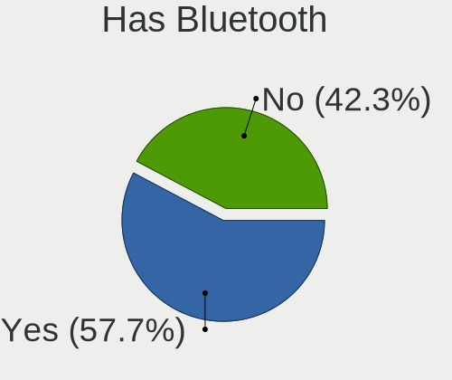
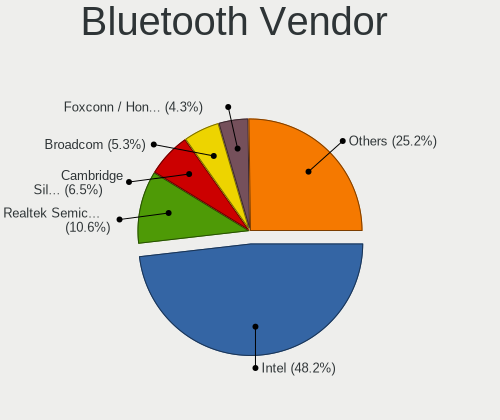

Linux in Germany - Tested Hardware & Statistics
-----------------------------------------------

A project to collect tested hardware configurations for Linux in Germany.

Anyone can contribute to this report by the [hw-probe](https://github.com/linuxhw/hw-probe) tool:

    sudo -E hw-probe -all -upload

Please contribute! Especially if your hardware is rare.

This is a report for all computer types. See also reports for [desktops](/Location/Germany/Desktop/README.md) and [notebooks](/Location/Germany/Notebook/README.md).

Contents
--------

* [ Test Cases ](#test-cases)

* [ System ](#system)
  - [ OS                       ](#os)
  - [ OS Family                ](#os-family)
  - [ Kernel                   ](#kernel)
  - [ Kernel Family            ](#kernel-family)
  - [ Kernel Major Ver.        ](#kernel-major-ver)
  - [ Arch                     ](#arch)
  - [ DE                       ](#de)
  - [ Display Server           ](#display-server)
  - [ Display Manager          ](#display-manager)
  - [ OS Lang                  ](#os-lang)
  - [ Boot Mode                ](#boot-mode)
  - [ Filesystem               ](#filesystem)
  - [ Part. scheme             ](#part-scheme)
  - [ Dual Boot with Linux/BSD ](#dual-boot-with-linuxbsd)
  - [ Dual Boot (Win)          ](#dual-boot-win)

* [ Board ](#board)
  - [ Vendor                   ](#vendor)
  - [ Model                    ](#model)
  - [ Model Family             ](#model-family)
  - [ MFG Year                 ](#mfg-year)
  - [ Form Factor              ](#form-factor)
  - [ Secure Boot              ](#secure-boot)
  - [ Coreboot                 ](#coreboot)
  - [ RAM Size                 ](#ram-size)
  - [ RAM Used                 ](#ram-used)
  - [ Total Drives             ](#total-drives)
  - [ Has CD-ROM               ](#has-cd-rom)
  - [ Has Ethernet             ](#has-ethernet)
  - [ Has WiFi                 ](#has-wifi)
  - [ Has Bluetooth            ](#has-bluetooth)

* [ Location ](#location)
  - [ Country                  ](#country)
  - [ City                     ](#city)

* [ Drives ](#drives)
  - [ Drive Vendor             ](#drive-vendor)
  - [ Drive Model              ](#drive-model)
  - [ HDD Vendor               ](#hdd-vendor)
  - [ SSD Vendor               ](#ssd-vendor)
  - [ Drive Kind               ](#drive-kind)
  - [ Drive Connector          ](#drive-connector)
  - [ Drive Size               ](#drive-size)
  - [ Space Total              ](#space-total)
  - [ Space Used               ](#space-used)
  - [ Malfunc. Drives          ](#malfunc-drives)
  - [ Malfunc. Drive Vendor    ](#malfunc-drive-vendor)
  - [ Malfunc. HDD Vendor      ](#malfunc-hdd-vendor)
  - [ Malfunc. Drive Kind      ](#malfunc-drive-kind)
  - [ Failed Drives            ](#failed-drives)
  - [ Failed Drive Vendor      ](#failed-drive-vendor)
  - [ Drive Status             ](#drive-status)

* [ Storage controller ](#storage-controller)
  - [ Storage Vendor           ](#storage-vendor)
  - [ Storage Model            ](#storage-model)
  - [ Storage Kind             ](#storage-kind)

* [ Processor ](#processor)
  - [ CPU Vendor               ](#cpu-vendor)
  - [ CPU Model                ](#cpu-model)
  - [ CPU Model Family         ](#cpu-model-family)
  - [ CPU Cores                ](#cpu-cores)
  - [ CPU Sockets              ](#cpu-sockets)
  - [ CPU Threads              ](#cpu-threads)
  - [ CPU Op-Modes             ](#cpu-op-modes)
  - [ CPU Microcode            ](#cpu-microcode)
  - [ CPU Microarch            ](#cpu-microarch)

* [ Graphics ](#graphics)
  - [ GPU Vendor               ](#gpu-vendor)
  - [ GPU Model                ](#gpu-model)
  - [ GPU Combo                ](#gpu-combo)
  - [ GPU Driver               ](#gpu-driver)
  - [ GPU Memory               ](#gpu-memory)

* [ Monitor ](#monitor)
  - [ Monitor Vendor           ](#monitor-vendor)
  - [ Monitor Model            ](#monitor-model)
  - [ Monitor Resolution       ](#monitor-resolution)
  - [ Monitor Diagonal         ](#monitor-diagonal)
  - [ Monitor Width            ](#monitor-width)
  - [ Aspect Ratio             ](#aspect-ratio)
  - [ Monitor Area             ](#monitor-area)
  - [ Pixel Density            ](#pixel-density)
  - [ Multiple Monitors        ](#multiple-monitors)

* [ Network ](#network)
  - [ Net Controller Vendor    ](#net-controller-vendor)
  - [ Net Controller Model     ](#net-controller-model)
  - [ Wireless Vendor          ](#wireless-vendor)
  - [ Wireless Model           ](#wireless-model)
  - [ Ethernet Vendor          ](#ethernet-vendor)
  - [ Ethernet Model           ](#ethernet-model)
  - [ Net Controller Kind      ](#net-controller-kind)
  - [ Used Controller          ](#used-controller)
  - [ NICs                     ](#nics)
  - [ IPv6                     ](#ipv6)

* [ Bluetooth ](#bluetooth)
  - [ Bluetooth Vendor         ](#bluetooth-vendor)
  - [ Bluetooth Model          ](#bluetooth-model)

* [ Sound ](#sound)
  - [ Sound Vendor             ](#sound-vendor)
  - [ Sound Model              ](#sound-model)

* [ Memory ](#memory)
  - [ Memory Vendor            ](#memory-vendor)
  - [ Memory Model             ](#memory-model)
  - [ Memory Kind              ](#memory-kind)
  - [ Memory Form Factor       ](#memory-form-factor)
  - [ Memory Size              ](#memory-size)
  - [ Memory Speed             ](#memory-speed)

* [ Printers & scanners ](#printers--scanners)
  - [ Printer Vendor           ](#printer-vendor)
  - [ Printer Model            ](#printer-model)
  - [ Scanner Vendor           ](#scanner-vendor)
  - [ Scanner Model            ](#scanner-model)

* [ Camera ](#camera)
  - [ Camera Vendor            ](#camera-vendor)
  - [ Camera Model             ](#camera-model)

* [ Security ](#security)
  - [ Fingerprint Vendor       ](#fingerprint-vendor)
  - [ Fingerprint Model        ](#fingerprint-model)
  - [ Chipcard Vendor          ](#chipcard-vendor)
  - [ Chipcard Model           ](#chipcard-model)

* [ Unsupported ](#unsupported)
  - [ Unsupported Devices      ](#unsupported-devices)
  - [ Unsupported Device Types ](#unsupported-device-types)

Test Cases
----------

Total: 37119

| Vendor        | Model                       | Form-Factor | Probe                                                      | Date         |
|---------------|-----------------------------|-------------|------------------------------------------------------------|--------------|
| ASRock        | H61M-DGS R2.0               | Desktop     | [47be7b76e5](https://linux-hardware.org/?probe=47be7b76e5) | May 09, 2024 |
| ASRock        | B550M Phantom Gaming 4      | Desktop     | [f8574bdf3e](https://linux-hardware.org/?probe=f8574bdf3e) | May 09, 2024 |
| Dell          | Inspiron 3481               | Notebook    | [78cf24846f](https://linux-hardware.org/?probe=78cf24846f) | May 09, 2024 |
| MSI           | MAG B460M MORTAR WIFI       | Desktop     | [d35204127f](https://linux-hardware.org/?probe=d35204127f) | May 09, 2024 |
| MSI           | B450M MORTAR MAX            | Desktop     | [51a4eae4e1](https://linux-hardware.org/?probe=51a4eae4e1) | May 09, 2024 |
| Lenovo        | ThinkBook 13x G4 IMH 21K... | Notebook    | [7cfc568eb2](https://linux-hardware.org/?probe=7cfc568eb2) | May 09, 2024 |
| Gigabyte      | G5 GE                       | Notebook    | [938a8a3f8e](https://linux-hardware.org/?probe=938a8a3f8e) | May 09, 2024 |
| Lenovo        | ThinkPad T440s 20AQ0069G... | Notebook    | [86d66670cb](https://linux-hardware.org/?probe=86d66670cb) | May 09, 2024 |
| Lenovo        | Legion Y540-15IRH 81SX      | Notebook    | [03e53efb87](https://linux-hardware.org/?probe=03e53efb87) | May 08, 2024 |
| ASUSTek       | VivoBook_ASUSLaptop K370... | Notebook    | [57bc46051b](https://linux-hardware.org/?probe=57bc46051b) | May 08, 2024 |
| Valve         | Jupiter                     | Notebook    | [fadecff7cd](https://linux-hardware.org/?probe=fadecff7cd) | May 08, 2024 |
| Apple         | MacBookPro8,2               | Notebook    | [2410273443](https://linux-hardware.org/?probe=2410273443) | May 08, 2024 |
| Lenovo        | ThinkPad T410 2537MN9       | Notebook    | [7deebe7ca3](https://linux-hardware.org/?probe=7deebe7ca3) | May 08, 2024 |
| BESSTAR Te... | GB1B                        | Mini pc     | [14c3adea64](https://linux-hardware.org/?probe=14c3adea64) | May 08, 2024 |
| HP            | ProBook 4740s               | Notebook    | [7f39194517](https://linux-hardware.org/?probe=7f39194517) | May 08, 2024 |
| ECT           | ONE GAMING Notebook K56-... | Notebook    | [64028f3e06](https://linux-hardware.org/?probe=64028f3e06) | May 08, 2024 |
| Dell          | XPS 15 7590                 | Notebook    | [a4b733d1fe](https://linux-hardware.org/?probe=a4b733d1fe) | May 08, 2024 |
| HP            | EliteBook 735 G5            | Notebook    | [628e01fd2b](https://linux-hardware.org/?probe=628e01fd2b) | May 08, 2024 |
| Acer          | Aspire 5720                 | Notebook    | [0a218dfdfe](https://linux-hardware.org/?probe=0a218dfdfe) | May 08, 2024 |
| ASRock        | B550M Phantom Gaming 4      | Desktop     | [8210b8f2f9](https://linux-hardware.org/?probe=8210b8f2f9) | May 08, 2024 |
| ASUSTek       | N61Vn                       | Notebook    | [07f83fc6c0](https://linux-hardware.org/?probe=07f83fc6c0) | May 08, 2024 |
| Dell          | Latitude E6540              | Notebook    | [c6c6acf7d2](https://linux-hardware.org/?probe=c6c6acf7d2) | May 08, 2024 |
| HP            | ZBook Power 15.6 inch G8... | Notebook    | [291c23ee80](https://linux-hardware.org/?probe=291c23ee80) | May 08, 2024 |
| Gigabyte      | B550 AORUS ELITE V2         | Desktop     | [ab440c0aca](https://linux-hardware.org/?probe=ab440c0aca) | May 08, 2024 |
| MSI           | MS-7255                     | Desktop     | [5e4c3d17d6](https://linux-hardware.org/?probe=5e4c3d17d6) | May 08, 2024 |
| ASUSTek       | PRIME X370-PRO              | Desktop     | [54f40400ed](https://linux-hardware.org/?probe=54f40400ed) | May 08, 2024 |
| ASUSTek       | PRIME A520M-K               | Desktop     | [5de84bcb38](https://linux-hardware.org/?probe=5de84bcb38) | May 08, 2024 |
| Dell          | Latitude E6540              | Notebook    | [a57f8ef498](https://linux-hardware.org/?probe=a57f8ef498) | May 08, 2024 |
| Lenovo        | ThinkPad T440s 20AQ0069G... | Notebook    | [b84ba3c6c7](https://linux-hardware.org/?probe=b84ba3c6c7) | May 08, 2024 |
| ASUSTek       | E5402WHA                    | All in one  | [9db61e60e0](https://linux-hardware.org/?probe=9db61e60e0) | May 08, 2024 |
| Schenker      | VISION 16 Pro (L22)         | Notebook    | [c54f918726](https://linux-hardware.org/?probe=c54f918726) | May 08, 2024 |
| Dell          | Latitude D830               | Notebook    | [831a2196a3](https://linux-hardware.org/?probe=831a2196a3) | May 07, 2024 |
| ASUSTek       | X555LD                      | Notebook    | [989d24a4b7](https://linux-hardware.org/?probe=989d24a4b7) | May 07, 2024 |
| ASUSTek       | P8Z77-V LX                  | Desktop     | [b245c99221](https://linux-hardware.org/?probe=b245c99221) | May 07, 2024 |
| HP            | ProBook 450 G5              | Notebook    | [4536e47198](https://linux-hardware.org/?probe=4536e47198) | May 07, 2024 |
| Fujitsu       | D3544-A1 S26361-D3544-A1... | Desktop     | [e04c4654da](https://linux-hardware.org/?probe=e04c4654da) | May 07, 2024 |
| Lenovo        | ThinkPad P14s Gen 4 21HF... | Notebook    | [85239f7dc1](https://linux-hardware.org/?probe=85239f7dc1) | May 07, 2024 |
| Acer          | Veriton N4640G              | Desktop     | [44c62400f4](https://linux-hardware.org/?probe=44c62400f4) | May 07, 2024 |
| Acer          | Veriton N4640G              | Desktop     | [ebe4fa74ca](https://linux-hardware.org/?probe=ebe4fa74ca) | May 07, 2024 |
| TUXEDO        | InfinityBook Pro Gen7 (M... | Notebook    | [bc9db74da3](https://linux-hardware.org/?probe=bc9db74da3) | May 07, 2024 |
| Intel         | NUC6i3SYB H81132-505        | Mini pc     | [de6a8d14f1](https://linux-hardware.org/?probe=de6a8d14f1) | May 07, 2024 |
| Lenovo        | Unknown                     | Notebook    | [63995e584e](https://linux-hardware.org/?probe=63995e584e) | May 07, 2024 |
| Acer          | Aspire A315-56              | Notebook    | [37f76a3652](https://linux-hardware.org/?probe=37f76a3652) | May 07, 2024 |
| PELADN        | WI-6                        | Desktop     | [73069ab9f5](https://linux-hardware.org/?probe=73069ab9f5) | May 07, 2024 |
| Dell          | XPS 15 9520                 | Notebook    | [70022231bd](https://linux-hardware.org/?probe=70022231bd) | May 07, 2024 |
| Dell          | Precision 5560              | Notebook    | [c9f03ecb24](https://linux-hardware.org/?probe=c9f03ecb24) | May 07, 2024 |
| Samsung       | RC530/RC730                 | Notebook    | [9e8af32b68](https://linux-hardware.org/?probe=9e8af32b68) | May 07, 2024 |
| Lenovo        | ThinkPad E15 Gen 4 21E60... | Notebook    | [230c054c87](https://linux-hardware.org/?probe=230c054c87) | May 07, 2024 |
| HP            | Pro x360 435 13.3 inch G... | Convertible | [52ca72625a](https://linux-hardware.org/?probe=52ca72625a) | May 07, 2024 |
| HP            | Pro x360 435 13.3 inch G... | Convertible | [14aed1eae4](https://linux-hardware.org/?probe=14aed1eae4) | May 07, 2024 |
| Framework     | Laptop 13 (AMD Ryzen 704... | Notebook    | [b3a37af0d0](https://linux-hardware.org/?probe=b3a37af0d0) | May 07, 2024 |
| Framework     | Laptop 13 (AMD Ryzen 704... | Notebook    | [63e6a64d1b](https://linux-hardware.org/?probe=63e6a64d1b) | May 07, 2024 |
| Apple         | Mac-F2268CC8                | All in one  | [b3b751a603](https://linux-hardware.org/?probe=b3b751a603) | May 07, 2024 |
| ASRock        | FM2A88X Extreme6+           | Desktop     | [d12f9a31f3](https://linux-hardware.org/?probe=d12f9a31f3) | May 07, 2024 |
| Apple         | MacBookPro11,1              | Notebook    | [c18909580d](https://linux-hardware.org/?probe=c18909580d) | May 07, 2024 |
| Apple         | MacBookPro11,1              | Notebook    | [61aed9772b](https://linux-hardware.org/?probe=61aed9772b) | May 07, 2024 |
| Sony          | VPCEB1S1E                   | Notebook    | [db144a8fd9](https://linux-hardware.org/?probe=db144a8fd9) | May 06, 2024 |
| Valve         | Galileo                     | Notebook    | [af20242820](https://linux-hardware.org/?probe=af20242820) | May 06, 2024 |
| Lenovo        | ThinkPad X1 Yoga 2nd 20J... | Convertible | [bf13a8edca](https://linux-hardware.org/?probe=bf13a8edca) | May 06, 2024 |
| ASRock        | J3710M                      | Desktop     | [ff2b73c846](https://linux-hardware.org/?probe=ff2b73c846) | May 06, 2024 |
| Fujitsu       | D3164-A1 S26361-D3164-A1    | Desktop     | [ae1edad2ab](https://linux-hardware.org/?probe=ae1edad2ab) | May 06, 2024 |
| ASUSTek       | TUF Gaming B650M-PLUS       | Desktop     | [0e930ac423](https://linux-hardware.org/?probe=0e930ac423) | May 06, 2024 |
| Unknown       | Unknown                     | Notebook    | [273d6afeb5](https://linux-hardware.org/?probe=273d6afeb5) | May 06, 2024 |
| ASUSTek       | PRIME A520M-K               | Desktop     | [602683adef](https://linux-hardware.org/?probe=602683adef) | May 06, 2024 |
| ASUSTek       | TUF B350M-PLUS GAMING       | Desktop     | [e31ea5ab17](https://linux-hardware.org/?probe=e31ea5ab17) | May 06, 2024 |
| Sony          | VPCEB1S1E                   | Notebook    | [aa8d766ae4](https://linux-hardware.org/?probe=aa8d766ae4) | May 06, 2024 |
| Lenovo        | ThinkPad P50 20ENCTO1WW     | Notebook    | [9adbb0ba2c](https://linux-hardware.org/?probe=9adbb0ba2c) | May 06, 2024 |
| HP            | EliteBook 820 G2            | Notebook    | [254af47954](https://linux-hardware.org/?probe=254af47954) | May 06, 2024 |
| Lenovo        | ThinkPad P50 20ENCTO1WW     | Notebook    | [465a5be052](https://linux-hardware.org/?probe=465a5be052) | May 06, 2024 |
| Dell          | 0F642F A00                  | Desktop     | [fc2a825e57](https://linux-hardware.org/?probe=fc2a825e57) | May 06, 2024 |
| Lenovo        | ThinkPad P51 W10DG 20MNS... | Notebook    | [76f01093f1](https://linux-hardware.org/?probe=76f01093f1) | May 06, 2024 |
| ASUSTek       | H97-PLUS                    | Desktop     | [4f4fcced1c](https://linux-hardware.org/?probe=4f4fcced1c) | May 06, 2024 |
| HP            | 650                         | Notebook    | [8fa3b11e2c](https://linux-hardware.org/?probe=8fa3b11e2c) | May 05, 2024 |
| ASUSTek       | TUF Gaming X570-PLUS        | Desktop     | [29af407035](https://linux-hardware.org/?probe=29af407035) | May 05, 2024 |
| Gigabyte      | B85M-D3H                    | Desktop     | [1d637d8802](https://linux-hardware.org/?probe=1d637d8802) | May 05, 2024 |
| Intel         | NUC11TNBi5 M11904-404       | Mini pc     | [0ddd0cd5f9](https://linux-hardware.org/?probe=0ddd0cd5f9) | May 05, 2024 |
| Lenovo        | V110-15IAP 80TG             | Notebook    | [2ba8347b04](https://linux-hardware.org/?probe=2ba8347b04) | May 05, 2024 |
| MSI           | MPG B550 GAMING PLUS        | Desktop     | [dd1cdce5af](https://linux-hardware.org/?probe=dd1cdce5af) | May 05, 2024 |
| Lenovo        | ThinkBook 16 G6 ABP 21KK    | Notebook    | [5a7ed888e1](https://linux-hardware.org/?probe=5a7ed888e1) | May 05, 2024 |
| ASUSTek       | ROG STRIX B650E-E GAMING... | Desktop     | [14b56b3e78](https://linux-hardware.org/?probe=14b56b3e78) | May 05, 2024 |
| Fujitsu       | CELSIUS H730                | Notebook    | [78e1a3550b](https://linux-hardware.org/?probe=78e1a3550b) | May 05, 2024 |
| Dell          | Inspiron 16 Plus 7620       | Notebook    | [cd8ef2428b](https://linux-hardware.org/?probe=cd8ef2428b) | May 05, 2024 |
| MSI           | H110M ECO                   | Desktop     | [2c97e6ca20](https://linux-hardware.org/?probe=2c97e6ca20) | May 05, 2024 |
| ASUSTek       | GL753VD                     | Notebook    | [735ff065db](https://linux-hardware.org/?probe=735ff065db) | May 05, 2024 |
| ASUSTek       | PRIME B450-PLUS             | Desktop     | [4c7d6f1e6a](https://linux-hardware.org/?probe=4c7d6f1e6a) | May 05, 2024 |
| HP            | ProBook 640 G1              | Notebook    | [012a8fbd0c](https://linux-hardware.org/?probe=012a8fbd0c) | May 05, 2024 |
| HUAWEI        | MACHR-WX9                   | Notebook    | [9577917e03](https://linux-hardware.org/?probe=9577917e03) | May 05, 2024 |
| Gigabyte      | B450M GAMING                | Desktop     | [dc7364667b](https://linux-hardware.org/?probe=dc7364667b) | May 05, 2024 |
| Apple         | MacBookPro6,2               | Notebook    | [01201fa443](https://linux-hardware.org/?probe=01201fa443) | May 05, 2024 |
| Intel         | NUC6CAYB J23203-403         | Mini pc     | [1820a973e3](https://linux-hardware.org/?probe=1820a973e3) | May 05, 2024 |
| ASUSTek       | N61Vn                       | Notebook    | [5aaf9f4609](https://linux-hardware.org/?probe=5aaf9f4609) | May 05, 2024 |
| HP            | 806A                        | Desktop     | [d28c449530](https://linux-hardware.org/?probe=d28c449530) | May 05, 2024 |
| Gigabyte      | Z390 UD                     | Desktop     | [af2a20709c](https://linux-hardware.org/?probe=af2a20709c) | May 05, 2024 |
| ASUSTek       | GR8                         | Notebook    | [6a8003e347](https://linux-hardware.org/?probe=6a8003e347) | May 05, 2024 |
| Panasonic     | FZM1-3                      | Tablet      | [8a7d985c38](https://linux-hardware.org/?probe=8a7d985c38) | May 05, 2024 |
| Dell          | Latitude 5410               | Notebook    | [8302f81328](https://linux-hardware.org/?probe=8302f81328) | May 04, 2024 |
| ASUSTek       | TUF Gaming B550-PLUS WIF... | Desktop     | [9176ad5eb1](https://linux-hardware.org/?probe=9176ad5eb1) | May 04, 2024 |
| HP            | EliteBook 850 G5            | Notebook    | [997c27445a](https://linux-hardware.org/?probe=997c27445a) | May 04, 2024 |
| Lenovo        | ThinkPad T520 4243W29       | Notebook    | [b1e4dde68e](https://linux-hardware.org/?probe=b1e4dde68e) | May 04, 2024 |
| Dell          | 0R6PCT A01                  | Desktop     | [61f596b724](https://linux-hardware.org/?probe=61f596b724) | May 04, 2024 |
| Lenovo        | ThinkPad X1 Yoga 2nd 20J... | Convertible | [c7d7f48a0f](https://linux-hardware.org/?probe=c7d7f48a0f) | May 04, 2024 |
| Lenovo        | ThinkPad X1 Carbon Gen 9... | Notebook    | [90ac042d36](https://linux-hardware.org/?probe=90ac042d36) | May 04, 2024 |
| Apple         | Mac-F2268CC8                | All in one  | [52e29652a0](https://linux-hardware.org/?probe=52e29652a0) | May 04, 2024 |
| HP            | 83E9                        | Desktop     | [d14ba283d6](https://linux-hardware.org/?probe=d14ba283d6) | May 04, 2024 |
| ASRock        | B650E PG Riptide WiFi       | Desktop     | [3c5e2db28c](https://linux-hardware.org/?probe=3c5e2db28c) | May 04, 2024 |
| ASUSTek       | E5402WHA                    | All in one  | [899d2f931f](https://linux-hardware.org/?probe=899d2f931f) | May 04, 2024 |
| ASRock        | A520M-HVS                   | Desktop     | [59c3452245](https://linux-hardware.org/?probe=59c3452245) | May 04, 2024 |
| ASUSTek       | PRIME A320M-K               | Desktop     | [79a0169068](https://linux-hardware.org/?probe=79a0169068) | May 04, 2024 |
| ASUSTek       | X751MA                      | Notebook    | [ab76aeaddb](https://linux-hardware.org/?probe=ab76aeaddb) | May 04, 2024 |
| AMI           | Intel                       | Desktop     | [84952c85f7](https://linux-hardware.org/?probe=84952c85f7) | May 04, 2024 |
| Gigabyte      | Z690 AORUS ELITE DDR4       | Desktop     | [055f5e4645](https://linux-hardware.org/?probe=055f5e4645) | May 04, 2024 |
| Lenovo        | ThinkPad T530 2429HR5       | Notebook    | [c5640e6fae](https://linux-hardware.org/?probe=c5640e6fae) | May 04, 2024 |
| Dell          | Latitude 5490               | Notebook    | [b31473028c](https://linux-hardware.org/?probe=b31473028c) | May 04, 2024 |
| Lenovo        | V340-17IWL 81RG             | Notebook    | [1584f1c1cf](https://linux-hardware.org/?probe=1584f1c1cf) | May 03, 2024 |
| Lenovo        | ThinkPad X1 Yoga Gen 8 2... | Convertible | [7dfe52f49a](https://linux-hardware.org/?probe=7dfe52f49a) | May 03, 2024 |
| ASUSTek       | ROG Zephyrus M16 GU604VI... | Notebook    | [d22fed35ce](https://linux-hardware.org/?probe=d22fed35ce) | May 03, 2024 |
| IGEL Techn... | M340C                       | Notebook    | [dbb60f0c71](https://linux-hardware.org/?probe=dbb60f0c71) | May 03, 2024 |
| HP            | 18E7                        | Desktop     | [22c3e77e54](https://linux-hardware.org/?probe=22c3e77e54) | May 03, 2024 |
| MSI           | B450 GAMING PRO CARBON A... | Desktop     | [9101a05646](https://linux-hardware.org/?probe=9101a05646) | May 03, 2024 |
| Gigabyte      | Z170X-Gaming 7              | Desktop     | [ce86347dd1](https://linux-hardware.org/?probe=ce86347dd1) | May 03, 2024 |
| HP            | EliteBook 840 G4            | Notebook    | [f9fed717ee](https://linux-hardware.org/?probe=f9fed717ee) | May 03, 2024 |
| ASRock        | X370 Taichi                 | Desktop     | [08bb9f240a](https://linux-hardware.org/?probe=08bb9f240a) | May 03, 2024 |
| Lenovo        | Legion Slim 5 14APH8 82Y... | Notebook    | [9b8008703d](https://linux-hardware.org/?probe=9b8008703d) | May 03, 2024 |
| ASUSTek       | TUF Gaming FX504GE_FX80G... | Notebook    | [6fb2e2c6d4](https://linux-hardware.org/?probe=6fb2e2c6d4) | May 03, 2024 |
| Raspberry ... | Raspberry Pi 5 Model B R... | Soc         | [3b15ff3048](https://linux-hardware.org/?probe=3b15ff3048) | May 03, 2024 |
| Acer          | Swift SFG14-72              | Notebook    | [00c7e89498](https://linux-hardware.org/?probe=00c7e89498) | May 03, 2024 |
| Gigabyte      | Z690 AORUS ELITE DDR4       | Desktop     | [82d8781e9b](https://linux-hardware.org/?probe=82d8781e9b) | May 03, 2024 |
| ASRock        | Z77 WS                      | Desktop     | [8a8bbdb0fe](https://linux-hardware.org/?probe=8a8bbdb0fe) | May 03, 2024 |
| Lenovo        | ThinkPad T460 20FMS0VG25    | Notebook    | [754611f403](https://linux-hardware.org/?probe=754611f403) | May 03, 2024 |
| ASUSTek       | M5A99X EVO                  | Desktop     | [9d375acdb0](https://linux-hardware.org/?probe=9d375acdb0) | May 03, 2024 |
| ASUSTek       | GR8                         | Notebook    | [ded6da2442](https://linux-hardware.org/?probe=ded6da2442) | May 02, 2024 |
| Toshiba       | Satellite A200              | Notebook    | [47b52c0fce](https://linux-hardware.org/?probe=47b52c0fce) | May 02, 2024 |
| Schenker      | XMG CORE 15(M20, RTX 206... | Notebook    | [e22a67c560](https://linux-hardware.org/?probe=e22a67c560) | May 02, 2024 |
| Lenovo        | B560 43308UG                | Notebook    | [3a36ef2f10](https://linux-hardware.org/?probe=3a36ef2f10) | May 02, 2024 |
| Star Labs     | StarBook                    | Notebook    | [637a8da717](https://linux-hardware.org/?probe=637a8da717) | May 02, 2024 |
| Chuwi         | HeroBook Pro                | Notebook    | [76e47767d1](https://linux-hardware.org/?probe=76e47767d1) | May 02, 2024 |
| ASRock        | FM2A88X Extreme4+           | Desktop     | [64005c86c7](https://linux-hardware.org/?probe=64005c86c7) | May 02, 2024 |
| Acer          | EG43M                       | Desktop     | [2ec9d89dd5](https://linux-hardware.org/?probe=2ec9d89dd5) | May 02, 2024 |
| Acer          | EG43M                       | Desktop     | [066562b548](https://linux-hardware.org/?probe=066562b548) | May 02, 2024 |
| Lenovo        | MIIX 320-10ICR 80XF         | Tablet      | [94cf2334b9](https://linux-hardware.org/?probe=94cf2334b9) | May 02, 2024 |
| Lenovo        | ThinkPad E14 Gen 5 21JRC... | Notebook    | [8c996ba957](https://linux-hardware.org/?probe=8c996ba957) | May 02, 2024 |
| Lenovo        | V14-ADA 82C6                | Notebook    | [1e4ba01e31](https://linux-hardware.org/?probe=1e4ba01e31) | May 02, 2024 |
| TUXEDO        | Aura 15 Gen2                | Notebook    | [93d15c44da](https://linux-hardware.org/?probe=93d15c44da) | May 02, 2024 |
| Gigabyte      | 945GM-S2                    | Desktop     | [a0e44d4417](https://linux-hardware.org/?probe=a0e44d4417) | May 02, 2024 |
| Schenker      | XMG NEO (CZN/E21)           | Notebook    | [c6e0886125](https://linux-hardware.org/?probe=c6e0886125) | May 02, 2024 |
| ASUSTek       | X553MA                      | Notebook    | [0418112d2f](https://linux-hardware.org/?probe=0418112d2f) | May 02, 2024 |
| HP            | Unknown                     | Notebook    | [2105666632](https://linux-hardware.org/?probe=2105666632) | May 02, 2024 |
| Lenovo        | V145-15AST 81MT             | Notebook    | [9f845a3577](https://linux-hardware.org/?probe=9f845a3577) | May 02, 2024 |
| ASRock        | Z270 Extreme4               | Desktop     | [7e548f1855](https://linux-hardware.org/?probe=7e548f1855) | May 02, 2024 |
| Fujitsu       | CELSIUS H730                | Notebook    | [49cfbc7ba1](https://linux-hardware.org/?probe=49cfbc7ba1) | May 01, 2024 |
| Acer          | TravelMate Spin P414RN-5... | Convertible | [238ec54d15](https://linux-hardware.org/?probe=238ec54d15) | May 01, 2024 |
| Gigabyte      | AX370-Gaming K7             | Desktop     | [e759e41a51](https://linux-hardware.org/?probe=e759e41a51) | May 01, 2024 |
| Unknown       | Unknown                     | Soc         | [ce163446bc](https://linux-hardware.org/?probe=ce163446bc) | May 01, 2024 |
| Medion        | P662X                       | Notebook    | [3689ca2476](https://linux-hardware.org/?probe=3689ca2476) | May 01, 2024 |
| American M... | E5 Ver:3.2S                 | Desktop     | [748bf7d3e8](https://linux-hardware.org/?probe=748bf7d3e8) | May 01, 2024 |
| ASRock        | Q1900M                      | Desktop     | [edec3b8384](https://linux-hardware.org/?probe=edec3b8384) | May 01, 2024 |
| HP            | 250 G7 Notebook PC          | Notebook    | [d53b36801f](https://linux-hardware.org/?probe=d53b36801f) | May 01, 2024 |
| Dell          | Latitude 5490               | Notebook    | [c83e9f5562](https://linux-hardware.org/?probe=c83e9f5562) | May 01, 2024 |
| Notebook      | V15x_V17xRNx                | Notebook    | [ec53c078f5](https://linux-hardware.org/?probe=ec53c078f5) | May 01, 2024 |
| HP            | ProBook 450 15.6 inch G1... | Notebook    | [e39ccf215f](https://linux-hardware.org/?probe=e39ccf215f) | May 01, 2024 |
| Samsung       | 355V4C/356V4C/3445VC/354... | Notebook    | [b861055064](https://linux-hardware.org/?probe=b861055064) | May 01, 2024 |
| Wortmann      | TERRA_MOBILE_1749           | Notebook    | [cdfcbe795b](https://linux-hardware.org/?probe=cdfcbe795b) | May 01, 2024 |
| Dell          | XPS 13 7390 2-in-1          | Convertible | [f423bbac77](https://linux-hardware.org/?probe=f423bbac77) | May 01, 2024 |
| ECT           | Unknown                     | Notebook    | [0ebb9fcdd0](https://linux-hardware.org/?probe=0ebb9fcdd0) | May 01, 2024 |
| ASUSTek       | ASUS Vivobook S 16 S5606... | Notebook    | [bfe20c3d58](https://linux-hardware.org/?probe=bfe20c3d58) | May 01, 2024 |
| Unknown       | Unknown                     | Desktop     | [4b7050ad24](https://linux-hardware.org/?probe=4b7050ad24) | May 01, 2024 |
| AMI           | Intel                       | Desktop     | [0be237c95a](https://linux-hardware.org/?probe=0be237c95a) | May 01, 2024 |
| PC Engines    | APU2                        | Desktop     | [a73d02f1d2](https://linux-hardware.org/?probe=a73d02f1d2) | May 01, 2024 |
| PC Engines    | APU2                        | Desktop     | [218aeb1d8f](https://linux-hardware.org/?probe=218aeb1d8f) | May 01, 2024 |
| MSI           | B450M MORTAR MAX            | Desktop     | [527f3123a6](https://linux-hardware.org/?probe=527f3123a6) | May 01, 2024 |
| LG Electro... | 16Z90P-G.AA76G              | Notebook    | [f9bdc22f6f](https://linux-hardware.org/?probe=f9bdc22f6f) | May 01, 2024 |
| Dell          | Inspiron 7537               | Notebook    | [d27f9ad169](https://linux-hardware.org/?probe=d27f9ad169) | May 01, 2024 |
| HP            | EliteBook 850 G1            | Notebook    | [c6effb94ba](https://linux-hardware.org/?probe=c6effb94ba) | May 01, 2024 |
| Lenovo        | Y50-70 20378                | Notebook    | [f7076c4db1](https://linux-hardware.org/?probe=f7076c4db1) | May 01, 2024 |
| Lenovo        | 36E7 SDK0J40700 WIN 3258... | Desktop     | [03d6226580](https://linux-hardware.org/?probe=03d6226580) | May 01, 2024 |
| HP            | 18E7                        | Desktop     | [f98543789e](https://linux-hardware.org/?probe=f98543789e) | May 01, 2024 |
| Dell          | XPS 13 9360                 | Notebook    | [da66fe35d4](https://linux-hardware.org/?probe=da66fe35d4) | May 01, 2024 |
| MSI           | EX623                       | Notebook    | [76a2472e9d](https://linux-hardware.org/?probe=76a2472e9d) | Apr 30, 2024 |
| TUXEDO        | InfinityBook Pro 14 Gen6    | Notebook    | [290ff65bc7](https://linux-hardware.org/?probe=290ff65bc7) | Apr 30, 2024 |
| ASUSTek       | ROG STRIX Z390-E GAMING     | Desktop     | [e04f6d1c77](https://linux-hardware.org/?probe=e04f6d1c77) | Apr 30, 2024 |
| Medion        | B360H4-EM V1.0              | Desktop     | [1dce3c5ac9](https://linux-hardware.org/?probe=1dce3c5ac9) | Apr 30, 2024 |
| HP            | 828A                        | Desktop     | [2c199ea595](https://linux-hardware.org/?probe=2c199ea595) | Apr 30, 2024 |
| MSI           | A320M-A PRO                 | Desktop     | [da0306ed47](https://linux-hardware.org/?probe=da0306ed47) | Apr 30, 2024 |
| HP            | 83E1                        | Desktop     | [56debab2d5](https://linux-hardware.org/?probe=56debab2d5) | Apr 30, 2024 |
| Gigabyte      | Z790 UD                     | Desktop     | [64ccf744b7](https://linux-hardware.org/?probe=64ccf744b7) | Apr 30, 2024 |
| ASUSTek       | TUF B450M-PRO GAMING        | Desktop     | [e442e79602](https://linux-hardware.org/?probe=e442e79602) | Apr 30, 2024 |
| Acer          | Aspire E5-521G              | Notebook    | [0236376455](https://linux-hardware.org/?probe=0236376455) | Apr 30, 2024 |
| Unknown       | Unknown                     | Desktop     | [ac60c18ae7](https://linux-hardware.org/?probe=ac60c18ae7) | Apr 30, 2024 |
| ASUSTek       | ROG CROSSHAIR VII HERO      | Desktop     | [d78b88c308](https://linux-hardware.org/?probe=d78b88c308) | Apr 29, 2024 |
| ASUSTek       | ROG CROSSHAIR VII HERO      | Desktop     | [8b2208ed39](https://linux-hardware.org/?probe=8b2208ed39) | Apr 29, 2024 |
| Apple         | MacBookPro9,1               | Notebook    | [ab5152538c](https://linux-hardware.org/?probe=ab5152538c) | Apr 29, 2024 |
| HP            | ProBook 650 G8 Notebook ... | Notebook    | [18585f423b](https://linux-hardware.org/?probe=18585f423b) | Apr 29, 2024 |
| HUAWEI        | DRC-WXX                     | Tablet      | [bb9985f901](https://linux-hardware.org/?probe=bb9985f901) | Apr 29, 2024 |
| NCR           | Pocono                      | Desktop     | [b0073723fe](https://linux-hardware.org/?probe=b0073723fe) | Apr 29, 2024 |
| ASUSTek       | P8H61-I R2.0                | Desktop     | [2e6e9ca3ee](https://linux-hardware.org/?probe=2e6e9ca3ee) | Apr 29, 2024 |
| HP            | 3647h                       | Desktop     | [1c095b792f](https://linux-hardware.org/?probe=1c095b792f) | Apr 29, 2024 |
| ASUSTek       | TUF Gaming FX705DT_FX705... | Notebook    | [442e237079](https://linux-hardware.org/?probe=442e237079) | Apr 29, 2024 |
| ASUSTek       | TUF Gaming FX705DT_FX705... | Notebook    | [c785d9440f](https://linux-hardware.org/?probe=c785d9440f) | Apr 29, 2024 |
| Apple         | MacBookPro9,1               | Notebook    | [d670f48308](https://linux-hardware.org/?probe=d670f48308) | Apr 29, 2024 |
| ASUSTek       | M5A99X EVO                  | Desktop     | [aedd483ccc](https://linux-hardware.org/?probe=aedd483ccc) | Apr 29, 2024 |
| Acer          | Swift SFE16-43              | Notebook    | [02fa8654df](https://linux-hardware.org/?probe=02fa8654df) | Apr 29, 2024 |
| ASUSTek       | F2A85-M_PRO                 | Desktop     | [b4beb034b2](https://linux-hardware.org/?probe=b4beb034b2) | Apr 29, 2024 |
| HP            | 255 15.6 inch G9 Noteboo... | Notebook    | [184f4e1a7c](https://linux-hardware.org/?probe=184f4e1a7c) | Apr 29, 2024 |
| HP            | Victus by Laptop 16-e0xx... | Notebook    | [1cd614027a](https://linux-hardware.org/?probe=1cd614027a) | Apr 29, 2024 |
| HP            | ProBook x360 11 G5 EE       | Convertible | [c1fd92b90d](https://linux-hardware.org/?probe=c1fd92b90d) | Apr 29, 2024 |
| TUXEDO        | Pulse 14 Gen3               | Notebook    | [d298ae16e1](https://linux-hardware.org/?probe=d298ae16e1) | Apr 29, 2024 |
| Medion        | TJ4125                      | Desktop     | [5107c56945](https://linux-hardware.org/?probe=5107c56945) | Apr 29, 2024 |
| Lenovo        | IdeaPad 5 Pro 14ITL6 82L... | Notebook    | [80821a7004](https://linux-hardware.org/?probe=80821a7004) | Apr 29, 2024 |
| Dell          | Latitude 5420               | Notebook    | [121f841401](https://linux-hardware.org/?probe=121f841401) | Apr 29, 2024 |
| HP            | 82A2                        | Desktop     | [d9af0d7008](https://linux-hardware.org/?probe=d9af0d7008) | Apr 29, 2024 |
| Apple         | Mac-031AEE4D24BFF0B1 Mac... | Mini pc     | [f21540e01f](https://linux-hardware.org/?probe=f21540e01f) | Apr 29, 2024 |
| Gigabyte      | GA-880GM-USB3               | Desktop     | [3645662c80](https://linux-hardware.org/?probe=3645662c80) | Apr 29, 2024 |
| MSI           | X570-A PRO                  | Desktop     | [8495c2639d](https://linux-hardware.org/?probe=8495c2639d) | Apr 29, 2024 |
| Lenovo        | ThinkPad L15 Gen 1 20U70... | Notebook    | [d4e717f7b6](https://linux-hardware.org/?probe=d4e717f7b6) | Apr 29, 2024 |
| ASRock        | B450M Pro4                  | Desktop     | [96fbd89691](https://linux-hardware.org/?probe=96fbd89691) | Apr 29, 2024 |
| TUXEDO        | InfinityBook Pro Gen8 (M... | Notebook    | [93815a6cda](https://linux-hardware.org/?probe=93815a6cda) | Apr 28, 2024 |
| Dell          | Precision M6800             | Notebook    | [394b2b0f31](https://linux-hardware.org/?probe=394b2b0f31) | Apr 28, 2024 |
| Apple         | Mac-F2268CC8                | All in one  | [73011a7b73](https://linux-hardware.org/?probe=73011a7b73) | Apr 28, 2024 |
| ASUSTek       | PRIME H770-PLUS D4          | Desktop     | [d05be00e83](https://linux-hardware.org/?probe=d05be00e83) | Apr 28, 2024 |
| Lenovo        | ThinkPad W530 24474KG       | Notebook    | [0019533554](https://linux-hardware.org/?probe=0019533554) | Apr 28, 2024 |
| HUAWEI        | HVY-WXX9                    | Notebook    | [6f9f3a855d](https://linux-hardware.org/?probe=6f9f3a855d) | Apr 28, 2024 |
| ASUSTek       | ROG Flow X16 GV601VI_GV6... | Convertible | [1f06de22c7](https://linux-hardware.org/?probe=1f06de22c7) | Apr 28, 2024 |
| HUAWEI        | HVY-WXX9                    | Notebook    | [1f145f5fb5](https://linux-hardware.org/?probe=1f145f5fb5) | Apr 28, 2024 |
| Raspberry ... | Raspberry Pi 4 Model B R... | Soc         | [a802b0c72d](https://linux-hardware.org/?probe=a802b0c72d) | Apr 28, 2024 |
| Lenovo        | B570 1068EMG                | Notebook    | [9617fb7082](https://linux-hardware.org/?probe=9617fb7082) | Apr 28, 2024 |
| MSI           | A68HM GRENADE               | Desktop     | [c1a1b60624](https://linux-hardware.org/?probe=c1a1b60624) | Apr 28, 2024 |
| MSI           | FM2-A75MA-E35               | Desktop     | [9ab41ba299](https://linux-hardware.org/?probe=9ab41ba299) | Apr 28, 2024 |
| Raspberry ... | Raspberry Pi 4 Model B R... | Soc         | [c35533dfbf](https://linux-hardware.org/?probe=c35533dfbf) | Apr 28, 2024 |
| Samsung       | RC530/RC730                 | Notebook    | [ef8bb7edf5](https://linux-hardware.org/?probe=ef8bb7edf5) | Apr 28, 2024 |
| ASUSTek       | Zenbook Flip UP3404VA_UP... | Convertible | [97758ba3a4](https://linux-hardware.org/?probe=97758ba3a4) | Apr 28, 2024 |
| Unknown       | Unknown                     | Desktop     | [8b5d3a333e](https://linux-hardware.org/?probe=8b5d3a333e) | Apr 28, 2024 |
| Fujitsu       | LIFEBOOK UH572              | Notebook    | [18bdace363](https://linux-hardware.org/?probe=18bdace363) | Apr 28, 2024 |
| ASRock        | 980DE3/U3S3                 | Desktop     | [9ed5c55a61](https://linux-hardware.org/?probe=9ed5c55a61) | Apr 28, 2024 |
| Gigabyte      | GA-880GM-USB3               | Desktop     | [ae905aacaf](https://linux-hardware.org/?probe=ae905aacaf) | Apr 28, 2024 |
| ASRock        | B760M-HDV/M.2               | Desktop     | [01633e2e6d](https://linux-hardware.org/?probe=01633e2e6d) | Apr 28, 2024 |
| Apple         | MacBookPro11,1              | Notebook    | [0a30ad8b47](https://linux-hardware.org/?probe=0a30ad8b47) | Apr 28, 2024 |
| ASRock        | B760M-HDV/M.2               | Desktop     | [324ac4ff48](https://linux-hardware.org/?probe=324ac4ff48) | Apr 27, 2024 |
| Lenovo        | ThinkPad X390 20Q1S62G00    | Notebook    | [e7319a730f](https://linux-hardware.org/?probe=e7319a730f) | Apr 27, 2024 |
| HP            | 2187 A01                    | Desktop     | [5aad523baf](https://linux-hardware.org/?probe=5aad523baf) | Apr 27, 2024 |
| ASUSTek       | TUF Gaming A620M-PLUS WI... | Desktop     | [f5547c4f67](https://linux-hardware.org/?probe=f5547c4f67) | Apr 27, 2024 |
| Lenovo        | IdeaPadFlex 15D 20334       | Notebook    | [a05b704ec4](https://linux-hardware.org/?probe=a05b704ec4) | Apr 27, 2024 |
| Lenovo        | ThinkPad X1 Yoga 2nd 20J... | Convertible | [b4ef3a187f](https://linux-hardware.org/?probe=b4ef3a187f) | Apr 27, 2024 |
| Gigabyte      | B550M DS3H                  | Desktop     | [158b44fbb4](https://linux-hardware.org/?probe=158b44fbb4) | Apr 27, 2024 |
| Gigabyte      | B550M DS3H                  | Desktop     | [12aab4742e](https://linux-hardware.org/?probe=12aab4742e) | Apr 27, 2024 |
| TUXEDO        | InfinityBook Pro 14 Gen6    | Notebook    | [f6d6805396](https://linux-hardware.org/?probe=f6d6805396) | Apr 27, 2024 |
| MSI           | MAG B650 TOMAHAWK WIFI      | Desktop     | [ed27359470](https://linux-hardware.org/?probe=ed27359470) | Apr 27, 2024 |
| Dell          | 0W0CHX A00                  | Desktop     | [9da5e84704](https://linux-hardware.org/?probe=9da5e84704) | Apr 27, 2024 |
| HP            | EliteBook 735 G5            | Notebook    | [9e1b0b4220](https://linux-hardware.org/?probe=9e1b0b4220) | Apr 27, 2024 |
| Lenovo        | ThinkPad X240 20AMA0SE00    | Notebook    | [be7a1e7b0c](https://linux-hardware.org/?probe=be7a1e7b0c) | Apr 27, 2024 |
| Dell          | 0W0CHX A00                  | Desktop     | [dd4600928f](https://linux-hardware.org/?probe=dd4600928f) | Apr 27, 2024 |
| ASUSTek       | PRIME A320M-K               | Desktop     | [64c6882150](https://linux-hardware.org/?probe=64c6882150) | Apr 27, 2024 |
| HP            | EliteBook 830 G6            | Notebook    | [6b74d2c1b5](https://linux-hardware.org/?probe=6b74d2c1b5) | Apr 27, 2024 |
| ASUSTek       | X555LD                      | Notebook    | [95724fb189](https://linux-hardware.org/?probe=95724fb189) | Apr 27, 2024 |
| Microsoft     | Surface Pro 7+              | Tablet      | [1646a631c8](https://linux-hardware.org/?probe=1646a631c8) | Apr 27, 2024 |
| Samsung       | 355V4C/356V4C/3445VC/354... | Notebook    | [4b825a61db](https://linux-hardware.org/?probe=4b825a61db) | Apr 27, 2024 |
| Dell          | Latitude 5300               | Notebook    | [0bacb68e71](https://linux-hardware.org/?probe=0bacb68e71) | Apr 27, 2024 |
| Acer          | Aspire A515-57              | Notebook    | [99f1c965f4](https://linux-hardware.org/?probe=99f1c965f4) | Apr 27, 2024 |
| Dell          | 0T10XW A02                  | Desktop     | [5836e0e02a](https://linux-hardware.org/?probe=5836e0e02a) | Apr 27, 2024 |
| ASUSTek       | PRIME B350-PLUS             | Desktop     | [3bd346f0cf](https://linux-hardware.org/?probe=3bd346f0cf) | Apr 27, 2024 |
| Valve         | Jupiter                     | Notebook    | [2c0ec8539f](https://linux-hardware.org/?probe=2c0ec8539f) | Apr 26, 2024 |
| Gigabyte      | AERO 15-X9                  | Notebook    | [a62c895461](https://linux-hardware.org/?probe=a62c895461) | Apr 26, 2024 |
| ASUSTek       | PN64-E1                     | Mini pc     | [3a26ded607](https://linux-hardware.org/?probe=3a26ded607) | Apr 26, 2024 |
| ASUSTek       | PN64-E1                     | Mini pc     | [eff166f351](https://linux-hardware.org/?probe=eff166f351) | Apr 26, 2024 |
| Medion        | Akoya E6227                 | Notebook    | [76bfce53f4](https://linux-hardware.org/?probe=76bfce53f4) | Apr 26, 2024 |
| Gigabyte      | AERO 15-X9                  | Notebook    | [25245adc43](https://linux-hardware.org/?probe=25245adc43) | Apr 26, 2024 |
| Lenovo        | Unknown                     | Notebook    | [314b707335](https://linux-hardware.org/?probe=314b707335) | Apr 26, 2024 |
| HP            | ZBook 17 G3 Mobile Works... | Notebook    | [e56b499574](https://linux-hardware.org/?probe=e56b499574) | Apr 26, 2024 |
| HP            | 84F5                        | Mini pc     | [6ae1eb8502](https://linux-hardware.org/?probe=6ae1eb8502) | Apr 26, 2024 |
| Acer          | Aspire 7745G                | Notebook    | [2db24c493d](https://linux-hardware.org/?probe=2db24c493d) | Apr 26, 2024 |
| ASUSTek       | 1000H                       | Notebook    | [0463a4d88b](https://linux-hardware.org/?probe=0463a4d88b) | Apr 26, 2024 |
| Lenovo        | Legion 5 Pro 16ACH6H 82J... | Notebook    | [46e559a9de](https://linux-hardware.org/?probe=46e559a9de) | Apr 26, 2024 |
| MSI           | B550-A PRO                  | Desktop     | [083c88fe82](https://linux-hardware.org/?probe=083c88fe82) | Apr 26, 2024 |
| Apple         | MacBookAir7,2               | Notebook    | [00973a82c8](https://linux-hardware.org/?probe=00973a82c8) | Apr 26, 2024 |
| Dell          | XPS 14 9440                 | Notebook    | [9eef0b7d62](https://linux-hardware.org/?probe=9eef0b7d62) | Apr 26, 2024 |
| ZOTAC         | ZBOX-ECM73070C/7307LH/53... | Mini pc     | [c63109b6e1](https://linux-hardware.org/?probe=c63109b6e1) | Apr 26, 2024 |
| ASUSTek       | X55A                        | Notebook    | [6b6ea50d41](https://linux-hardware.org/?probe=6b6ea50d41) | Apr 26, 2024 |
| Lenovo        | 3102 SDK0J40697 WIN 3305... | Desktop     | [d378d3e2a8](https://linux-hardware.org/?probe=d378d3e2a8) | Apr 26, 2024 |
| ASUSTek       | TUF Gaming Z590-PLUS WIF... | Desktop     | [e32fd35808](https://linux-hardware.org/?probe=e32fd35808) | Apr 26, 2024 |
| ASUSTek       | ASUS TUF Gaming A15 FA50... | Notebook    | [703d565003](https://linux-hardware.org/?probe=703d565003) | Apr 26, 2024 |
| Dell          | Latitude 5290 2-in-1        | Tablet      | [b447e031ce](https://linux-hardware.org/?probe=b447e031ce) | Apr 26, 2024 |
| Lenovo        | ThinkPad T470s 20HGS45C0... | Notebook    | [f39ba0b079](https://linux-hardware.org/?probe=f39ba0b079) | Apr 26, 2024 |
| Chuwi         | MiniBook X                  | Notebook    | [72a19fbe38](https://linux-hardware.org/?probe=72a19fbe38) | Apr 26, 2024 |
| HP            | EliteBook 8730w             | Notebook    | [da4db94e97](https://linux-hardware.org/?probe=da4db94e97) | Apr 26, 2024 |
| Valve         | Jupiter                     | Notebook    | [3b3674f61e](https://linux-hardware.org/?probe=3b3674f61e) | Apr 26, 2024 |
| Fujitsu       | D3348-B1 S26361-D3348-B1    | Desktop     | [7dec9416f7](https://linux-hardware.org/?probe=7dec9416f7) | Apr 26, 2024 |
| Fujitsu       | D3348-B1 S26361-D3348-B1    | Desktop     | [3d1b636742](https://linux-hardware.org/?probe=3d1b636742) | Apr 26, 2024 |
| Gigabyte      | W251U                       | Notebook    | [ae6076979a](https://linux-hardware.org/?probe=ae6076979a) | Apr 25, 2024 |
| Gigabyte      | B550 GAMING X V2            | Desktop     | [29da9c39e9](https://linux-hardware.org/?probe=29da9c39e9) | Apr 25, 2024 |
| HP            | EliteBook 840 G8 Noteboo... | Notebook    | [eaf4d9f0b7](https://linux-hardware.org/?probe=eaf4d9f0b7) | Apr 25, 2024 |
| Lenovo        | IdeaPad 5 Pro 14ACN6 82L... | Notebook    | [ae5dddd784](https://linux-hardware.org/?probe=ae5dddd784) | Apr 25, 2024 |
| HP            | EliteBook 850 G5            | Notebook    | [4da2348bbe](https://linux-hardware.org/?probe=4da2348bbe) | Apr 25, 2024 |
| Lenovo        | ThinkPad T450s 20BX001EU... | Notebook    | [b1cd1d7df2](https://linux-hardware.org/?probe=b1cd1d7df2) | Apr 25, 2024 |
| ASUSTek       | PRIME B450M-K II            | Desktop     | [5e0533ba7a](https://linux-hardware.org/?probe=5e0533ba7a) | Apr 25, 2024 |
| Lenovo        | ThinkPad T450s 20BX001EU... | Notebook    | [9acc3eed8d](https://linux-hardware.org/?probe=9acc3eed8d) | Apr 25, 2024 |
| HP            | ProBook 4340s               | Notebook    | [a33e5a73ef](https://linux-hardware.org/?probe=a33e5a73ef) | Apr 25, 2024 |
| ASUSTek       | N751JK                      | Notebook    | [1d2d8c3d7a](https://linux-hardware.org/?probe=1d2d8c3d7a) | Apr 25, 2024 |
| Fujitsu       | LIFEBOOK P702               | Notebook    | [e7b04de0c7](https://linux-hardware.org/?probe=e7b04de0c7) | Apr 25, 2024 |
| Dell          | Latitude E6540              | Notebook    | [270b868041](https://linux-hardware.org/?probe=270b868041) | Apr 25, 2024 |
| ASUSTek       | N751JK                      | Notebook    | [f49afec710](https://linux-hardware.org/?probe=f49afec710) | Apr 25, 2024 |
| Lenovo        | U31-70 80M5                 | Notebook    | [2a4ad09169](https://linux-hardware.org/?probe=2a4ad09169) | Apr 25, 2024 |
| ASUSTek       | P8B WS                      | Desktop     | [5fa13cfb75](https://linux-hardware.org/?probe=5fa13cfb75) | Apr 25, 2024 |
| HP            | Dragonfly 13.5 inch G4 N... | Notebook    | [09ff8bf6dd](https://linux-hardware.org/?probe=09ff8bf6dd) | Apr 25, 2024 |
| Apple         | MacBookPro15,1              | Notebook    | [cd32029949](https://linux-hardware.org/?probe=cd32029949) | Apr 24, 2024 |
| ASUSTek       | P8Z77-V LX                  | Desktop     | [4b42dd83cd](https://linux-hardware.org/?probe=4b42dd83cd) | Apr 24, 2024 |
| ASUSTek       | M5A97 R2.0                  | Desktop     | [f1a984f467](https://linux-hardware.org/?probe=f1a984f467) | Apr 24, 2024 |
| MSI           | MAG B650M MORTAR WIFI       | Desktop     | [d4c46c8278](https://linux-hardware.org/?probe=d4c46c8278) | Apr 24, 2024 |
| Apple         | MacBookPro9,2               | Notebook    | [bc2a0115a8](https://linux-hardware.org/?probe=bc2a0115a8) | Apr 24, 2024 |
| ASUSTek       | PRIME H510M-A               | Desktop     | [a0eca89d4e](https://linux-hardware.org/?probe=a0eca89d4e) | Apr 24, 2024 |
| Lenovo        | ThinkPad T470s 20HGS6Y80... | Notebook    | [96569e2ad7](https://linux-hardware.org/?probe=96569e2ad7) | Apr 24, 2024 |
| Lenovo        | ThinkPad T570 20H90002RI    | Notebook    | [eeccbdaf2a](https://linux-hardware.org/?probe=eeccbdaf2a) | Apr 24, 2024 |
| ASUSTek       | H81M-PLUS                   | Desktop     | [b170729452](https://linux-hardware.org/?probe=b170729452) | Apr 24, 2024 |
| ASRock        | B450M Pro4 R2.0             | Desktop     | [188e5e5bde](https://linux-hardware.org/?probe=188e5e5bde) | Apr 24, 2024 |
| Lenovo        | V15 G4 IAH 83FS             | Notebook    | [b922fc6d5e](https://linux-hardware.org/?probe=b922fc6d5e) | Apr 24, 2024 |
| Gigabyte      | G5 GE                       | Notebook    | [82e2ab72fe](https://linux-hardware.org/?probe=82e2ab72fe) | Apr 24, 2024 |
| ASRock        | B550M-HDV                   | Desktop     | [a3fef16e3a](https://linux-hardware.org/?probe=a3fef16e3a) | Apr 24, 2024 |
| Lenovo        | ThinkPad T470s W10DG 20J... | Notebook    | [a06bcc63e8](https://linux-hardware.org/?probe=a06bcc63e8) | Apr 24, 2024 |
| Lenovo        | ThinkPad T470s W10DG 20J... | Notebook    | [bc030e73d5](https://linux-hardware.org/?probe=bc030e73d5) | Apr 24, 2024 |
| Dell          | Precision 3581              | Notebook    | [93a95856e0](https://linux-hardware.org/?probe=93a95856e0) | Apr 24, 2024 |
| ASUSTek       | PRIME N100I-D D4            | Desktop     | [d6c9b24678](https://linux-hardware.org/?probe=d6c9b24678) | Apr 24, 2024 |
| ASUSTek       | P8B75-M LX                  | Desktop     | [addc5b5356](https://linux-hardware.org/?probe=addc5b5356) | Apr 24, 2024 |
| Lenovo        | ThinkPad T460 20FMS0VG25    | Notebook    | [3367162736](https://linux-hardware.org/?probe=3367162736) | Apr 24, 2024 |
| Apple         | MacBookPro8,1               | Notebook    | [cf1ac0276a](https://linux-hardware.org/?probe=cf1ac0276a) | Apr 24, 2024 |
| Gigabyte      | B660 GAMING X DDR4          | Desktop     | [2894e9f653](https://linux-hardware.org/?probe=2894e9f653) | Apr 23, 2024 |
| Microsoft     | Surface Go                  | Tablet      | [1db80a733f](https://linux-hardware.org/?probe=1db80a733f) | Apr 23, 2024 |
| ASRock        | B660M-ITX/ac                | Desktop     | [7bcb91a927](https://linux-hardware.org/?probe=7bcb91a927) | Apr 23, 2024 |
| Lenovo        | ThinkPad E14 Gen 2 20TA0... | Notebook    | [038bd79a48](https://linux-hardware.org/?probe=038bd79a48) | Apr 23, 2024 |
| Gigabyte      | B660 GAMING X DDR4          | Desktop     | [cd7b10e8c0](https://linux-hardware.org/?probe=cd7b10e8c0) | Apr 23, 2024 |
| HP            | ProBook x360 435 G7         | Convertible | [0996327fea](https://linux-hardware.org/?probe=0996327fea) | Apr 23, 2024 |
| Fujitsu       | D3061-B1 S26361-D3061-B1    | Desktop     | [7d7fda2b7a](https://linux-hardware.org/?probe=7d7fda2b7a) | Apr 23, 2024 |
| Lenovo        | ThinkPad T14s Gen 4 21F8... | Notebook    | [1f13f4d924](https://linux-hardware.org/?probe=1f13f4d924) | Apr 23, 2024 |
| Toshiba       | Satellite C50-A             | Notebook    | [cabe5d7a20](https://linux-hardware.org/?probe=cabe5d7a20) | Apr 23, 2024 |
| Gigabyte      | Z790 AERO G                 | Desktop     | [8ef54b37b2](https://linux-hardware.org/?probe=8ef54b37b2) | Apr 23, 2024 |
| Framework     | Laptop (12th Gen Intel C... | Notebook    | [e79a07e085](https://linux-hardware.org/?probe=e79a07e085) | Apr 23, 2024 |
| Dell          | Latitude E5550              | Notebook    | [2193ab1cfa](https://linux-hardware.org/?probe=2193ab1cfa) | Apr 23, 2024 |
| Biostar       | A960D+V2                    | Desktop     | [e6d3b07d8e](https://linux-hardware.org/?probe=e6d3b07d8e) | Apr 23, 2024 |
| ASUSTek       | PRIME X470-PRO              | Desktop     | [e86b7c32f6](https://linux-hardware.org/?probe=e86b7c32f6) | Apr 23, 2024 |
| ASUSTek       | A68HM-PLUS                  | Desktop     | [c495b7e3d7](https://linux-hardware.org/?probe=c495b7e3d7) | Apr 23, 2024 |
| ASUSTek       | CROSSHAIR V FORMULA-Z       | Desktop     | [f80ac54e1e](https://linux-hardware.org/?probe=f80ac54e1e) | Apr 23, 2024 |
| Fujitsu Si... | MS-7504VP-PV                | Desktop     | [e9d468f027](https://linux-hardware.org/?probe=e9d468f027) | Apr 23, 2024 |
| Lenovo        | ThinkPad P15 Gen 1 20SU0... | Notebook    | [3ccc4413fb](https://linux-hardware.org/?probe=3ccc4413fb) | Apr 22, 2024 |
| MSI           | MPG B550 GAMING PLUS        | Desktop     | [02cbf8c1ed](https://linux-hardware.org/?probe=02cbf8c1ed) | Apr 22, 2024 |
| MSI           | A320M PRO-VD/S              | Desktop     | [64c7f84ead](https://linux-hardware.org/?probe=64c7f84ead) | Apr 22, 2024 |
| Lenovo        | ThinkPad L13 Yoga 20R500... | Convertible | [6fac122933](https://linux-hardware.org/?probe=6fac122933) | Apr 22, 2024 |
| Acer          | Aspire A315-56              | Notebook    | [994d2b8b2d](https://linux-hardware.org/?probe=994d2b8b2d) | Apr 22, 2024 |
| Acer          | Aspire A315-56              | Notebook    | [92fb8268cc](https://linux-hardware.org/?probe=92fb8268cc) | Apr 22, 2024 |
| ASUSTek       | ROG STRIX Z390-E GAMING     | Desktop     | [00dea34dc8](https://linux-hardware.org/?probe=00dea34dc8) | Apr 22, 2024 |
| Acer          | Aspire E5-575T              | Notebook    | [d91600e2a3](https://linux-hardware.org/?probe=d91600e2a3) | Apr 22, 2024 |
| ASUSTek       | Pro WS X570-ACE             | Desktop     | [164050cba4](https://linux-hardware.org/?probe=164050cba4) | Apr 22, 2024 |
| HP            | ZBook Studio G3             | Notebook    | [c78e54109c](https://linux-hardware.org/?probe=c78e54109c) | Apr 22, 2024 |
| MSI           | MPG B650I EDGE WIFI         | Desktop     | [2655453b82](https://linux-hardware.org/?probe=2655453b82) | Apr 22, 2024 |
| Lenovo        | IdeaPad 320-17IKB 80XM      | Notebook    | [43ec460c41](https://linux-hardware.org/?probe=43ec460c41) | Apr 22, 2024 |
| HP            | ENVY 15                     | Notebook    | [1f59ab10af](https://linux-hardware.org/?probe=1f59ab10af) | Apr 22, 2024 |
| Lenovo        | ThinkPad X1 Yoga 4th 20Q... | Convertible | [ec24097ebe](https://linux-hardware.org/?probe=ec24097ebe) | Apr 22, 2024 |
| Lenovo        | ThinkPad E15 Gen 2 20T80... | Notebook    | [fdad15cab2](https://linux-hardware.org/?probe=fdad15cab2) | Apr 22, 2024 |
| Microsoft     | Surface Go                  | Tablet      | [7bc00f9635](https://linux-hardware.org/?probe=7bc00f9635) | Apr 21, 2024 |
| HP            | 1497                        | Desktop     | [067e8422b4](https://linux-hardware.org/?probe=067e8422b4) | Apr 21, 2024 |
| HP            | ENVY x360 Convertible 13... | Convertible | [567542b658](https://linux-hardware.org/?probe=567542b658) | Apr 21, 2024 |
| Lenovo        | ThinkPad W530 24474KG       | Notebook    | [f5bb127a05](https://linux-hardware.org/?probe=f5bb127a05) | Apr 21, 2024 |
| ASUSTek       | X555UF                      | Notebook    | [0ad869f641](https://linux-hardware.org/?probe=0ad869f641) | Apr 21, 2024 |
| Gigabyte      | Z390 UD                     | Desktop     | [60d76632dc](https://linux-hardware.org/?probe=60d76632dc) | Apr 21, 2024 |
| HP            | EliteBook 8460p             | Notebook    | [10abeed71a](https://linux-hardware.org/?probe=10abeed71a) | Apr 21, 2024 |
| Gigabyte      | MZAPLBP-00                  | Desktop     | [8efe3f3d72](https://linux-hardware.org/?probe=8efe3f3d72) | Apr 21, 2024 |
| Acer          | Aspire F5-573               | Notebook    | [c71f150bd8](https://linux-hardware.org/?probe=c71f150bd8) | Apr 21, 2024 |
| MSI           | Thin GF63 12VE              | Notebook    | [797980dc42](https://linux-hardware.org/?probe=797980dc42) | Apr 21, 2024 |
| MSI           | PRO Z690-A DDR4             | Desktop     | [f426cfb62e](https://linux-hardware.org/?probe=f426cfb62e) | Apr 21, 2024 |
| Dell          | Latitude 5440               | Notebook    | [58cc268fb3](https://linux-hardware.org/?probe=58cc268fb3) | Apr 21, 2024 |
| ASUSTek       | PRIME X370-PRO              | Desktop     | [a4e68832be](https://linux-hardware.org/?probe=a4e68832be) | Apr 21, 2024 |
| ASUSTek       | VivoBook_ASUSLaptop M160... | Notebook    | [09f4ed7915](https://linux-hardware.org/?probe=09f4ed7915) | Apr 21, 2024 |
| Lenovo        | B5400 80B6QB0               | Notebook    | [e7a82d8d18](https://linux-hardware.org/?probe=e7a82d8d18) | Apr 21, 2024 |
| ASUSTek       | TUF Gaming B550M-PLUS WI... | Desktop     | [66ef509347](https://linux-hardware.org/?probe=66ef509347) | Apr 21, 2024 |
| Apple         | MacBookPro8,2               | Notebook    | [86d1293b64](https://linux-hardware.org/?probe=86d1293b64) | Apr 21, 2024 |
| HP            | Laptop 17-cp0xxx            | Notebook    | [9eff554fa4](https://linux-hardware.org/?probe=9eff554fa4) | Apr 21, 2024 |
| Lenovo        | Legion 5 15ACH6H 82JU       | Notebook    | [63baa07920](https://linux-hardware.org/?probe=63baa07920) | Apr 21, 2024 |
| Medion        | Akoya E6227                 | Notebook    | [180d5db57d](https://linux-hardware.org/?probe=180d5db57d) | Apr 20, 2024 |
| Supermicro    | H12SSL-CT                   | Server      | [165f049bbe](https://linux-hardware.org/?probe=165f049bbe) | Apr 20, 2024 |
| ASUSTek       | ASUS TUF Gaming A15 FA50... | Notebook    | [4c782693bf](https://linux-hardware.org/?probe=4c782693bf) | Apr 20, 2024 |
| Lenovo        | ThinkPad L13 Yoga 20R500... | Convertible | [0ff8000c59](https://linux-hardware.org/?probe=0ff8000c59) | Apr 20, 2024 |
| Acer          | Extensa 215-55              | Notebook    | [2639558ab5](https://linux-hardware.org/?probe=2639558ab5) | Apr 20, 2024 |
| ASRock        | FM2A68M-HD+                 | Desktop     | [055514e3cc](https://linux-hardware.org/?probe=055514e3cc) | Apr 20, 2024 |
| Teclast       | F6 Plus                     | Notebook    | [58aa179f3b](https://linux-hardware.org/?probe=58aa179f3b) | Apr 20, 2024 |
| AMI           | Unknown                     | Notebook    | [8330483e6e](https://linux-hardware.org/?probe=8330483e6e) | Apr 20, 2024 |
| HP            | Laptop 17-cp0xxx            | Notebook    | [fea13a098d](https://linux-hardware.org/?probe=fea13a098d) | Apr 20, 2024 |
| ASUSTek       | TUF Gaming B760M-PLUS II    | Desktop     | [9666b7dd0c](https://linux-hardware.org/?probe=9666b7dd0c) | Apr 20, 2024 |
| Gigabyte      | B85-HD3                     | Desktop     | [110fafe0b0](https://linux-hardware.org/?probe=110fafe0b0) | Apr 20, 2024 |
| GEEKOM        | Mini Air12                  | Server      | [fef2c94714](https://linux-hardware.org/?probe=fef2c94714) | Apr 20, 2024 |
| XMG           | N85_N87,HJ,HJ1,HK1          | Notebook    | [88ab8ac1a1](https://linux-hardware.org/?probe=88ab8ac1a1) | Apr 20, 2024 |
| ASUSTek       | H110M-PLUS                  | Desktop     | [98eba50e5b](https://linux-hardware.org/?probe=98eba50e5b) | Apr 20, 2024 |
| Toshiba       | Satellite L50-C             | Notebook    | [ca2755b614](https://linux-hardware.org/?probe=ca2755b614) | Apr 20, 2024 |
| Toshiba       | Satellite L50-C             | Notebook    | [8eec3bacc7](https://linux-hardware.org/?probe=8eec3bacc7) | Apr 20, 2024 |
| HP            | ProBook 450 G8 Notebook ... | Notebook    | [6bb7ef988e](https://linux-hardware.org/?probe=6bb7ef988e) | Apr 20, 2024 |
| ASUSTek       | ROG STRIX B650E-E GAMING... | Desktop     | [7c9a2419bf](https://linux-hardware.org/?probe=7c9a2419bf) | Apr 20, 2024 |
| ASUSTek       | P5G41T-M LX2/GB             | Desktop     | [9834b68734](https://linux-hardware.org/?probe=9834b68734) | Apr 20, 2024 |
| ASUSTek       | VivoBook_ASUSLaptop X712... | Notebook    | [35685d6f90](https://linux-hardware.org/?probe=35685d6f90) | Apr 20, 2024 |
| Dell          | XPS 13 9360                 | Notebook    | [5f76fcfd59](https://linux-hardware.org/?probe=5f76fcfd59) | Apr 20, 2024 |
| Lenovo        | ThinkPad X1 Yoga 4th 20S... | Convertible | [94fe70153d](https://linux-hardware.org/?probe=94fe70153d) | Apr 20, 2024 |
| Fujitsu       | LIFEBOOK U727               | Notebook    | [2d96690752](https://linux-hardware.org/?probe=2d96690752) | Apr 20, 2024 |
| Supermicro    | X9DRi-LN4+/X9DR3-LN4+       | Desktop     | [2bbb8098a6](https://linux-hardware.org/?probe=2bbb8098a6) | Apr 20, 2024 |
| Fujitsu       | D3417-B1 S26361-D3417-B1    | Desktop     | [f0e2928850](https://linux-hardware.org/?probe=f0e2928850) | Apr 20, 2024 |
| ASUSTek       | TUF Z370-PLUS GAMING        | Desktop     | [542fb126b0](https://linux-hardware.org/?probe=542fb126b0) | Apr 20, 2024 |
| ASUSTek       | ASUS TUF Gaming F15 FX50... | Notebook    | [1e8f14cb22](https://linux-hardware.org/?probe=1e8f14cb22) | Apr 20, 2024 |
| Lenovo        | Yoga 730-13IWL 81JR         | Convertible | [d3ce883d3e](https://linux-hardware.org/?probe=d3ce883d3e) | Apr 20, 2024 |
| ASUSTek       | ROG Flow X16 GV601VV_GV6... | Convertible | [1bf1523c67](https://linux-hardware.org/?probe=1bf1523c67) | Apr 19, 2024 |
| Chuwi         | MiniBook X                  | Notebook    | [d65bae182c](https://linux-hardware.org/?probe=d65bae182c) | Apr 19, 2024 |
| HP            | ZBook 15 G5                 | Notebook    | [e6dc5df04b](https://linux-hardware.org/?probe=e6dc5df04b) | Apr 19, 2024 |
| Apple         | MacBookPro9,2               | Notebook    | [f8fa58a83b](https://linux-hardware.org/?probe=f8fa58a83b) | Apr 19, 2024 |
| Acer          | Swift SF316-51              | Notebook    | [f1400c4a39](https://linux-hardware.org/?probe=f1400c4a39) | Apr 19, 2024 |
| Foxconn       | G41MX/G41MX-K 2.0 1.0       | Desktop     | [a55114abfa](https://linux-hardware.org/?probe=a55114abfa) | Apr 19, 2024 |
| Lenovo        | ThinkBook 16 G4+ IAP 21C... | Notebook    | [06f11dee2c](https://linux-hardware.org/?probe=06f11dee2c) | Apr 19, 2024 |
| Apple         | MacBookPro9,2               | Notebook    | [8dde47a60c](https://linux-hardware.org/?probe=8dde47a60c) | Apr 19, 2024 |
| Medion        | E6214                       | Notebook    | [fef41424b0](https://linux-hardware.org/?probe=fef41424b0) | Apr 19, 2024 |
| Acer          | NG-F5-771G-74P9             | Notebook    | [efaac96b3d](https://linux-hardware.org/?probe=efaac96b3d) | Apr 19, 2024 |
| AXDIA Inte... | MAVEN WIN 12 PRO            | Tablet      | [963dab8edc](https://linux-hardware.org/?probe=963dab8edc) | Apr 19, 2024 |
| Dell          | Latitude 7440               | Notebook    | [abc0600b15](https://linux-hardware.org/?probe=abc0600b15) | Apr 19, 2024 |
| Dell          | Latitude 7440               | Notebook    | [bc75c7249a](https://linux-hardware.org/?probe=bc75c7249a) | Apr 19, 2024 |
| Apple         | MacBook6,1                  | Notebook    | [3f4764c0ee](https://linux-hardware.org/?probe=3f4764c0ee) | Apr 19, 2024 |
| Medion        | E6214                       | Notebook    | [f6e648f8a4](https://linux-hardware.org/?probe=f6e648f8a4) | Apr 19, 2024 |
| Fujitsu       | LIFEBOOK T902               | Notebook    | [1f6b5be9dc](https://linux-hardware.org/?probe=1f6b5be9dc) | Apr 19, 2024 |
| Medion        | E11202                      | Notebook    | [aadb8a9e0a](https://linux-hardware.org/?probe=aadb8a9e0a) | Apr 19, 2024 |
| Gigabyte      | Z370 HD3-OP-CF              | Desktop     | [0f88ddd572](https://linux-hardware.org/?probe=0f88ddd572) | Apr 19, 2024 |
| Medion        | E11202                      | Notebook    | [3de0e202c9](https://linux-hardware.org/?probe=3de0e202c9) | Apr 19, 2024 |
| Dell          | Inspiron 910                | Notebook    | [150577a3da](https://linux-hardware.org/?probe=150577a3da) | Apr 19, 2024 |
| Lenovo        | ThinkPad X1 Yoga Gen 6 2... | Convertible | [f61c1dcda7](https://linux-hardware.org/?probe=f61c1dcda7) | Apr 19, 2024 |
| ASUSTek       | P8H67-M PRO                 | Desktop     | [46ac746bf3](https://linux-hardware.org/?probe=46ac746bf3) | Apr 19, 2024 |
| Lenovo        | G700 20251                  | Notebook    | [6f7a2c121a](https://linux-hardware.org/?probe=6f7a2c121a) | Apr 19, 2024 |
| ASUSTek       | A68HM-PLUS                  | Desktop     | [94cd362057](https://linux-hardware.org/?probe=94cd362057) | Apr 19, 2024 |
| Lenovo        | MIIX 320-10ICR 80XF         | Tablet      | [59b4f4a7fe](https://linux-hardware.org/?probe=59b4f4a7fe) | Apr 19, 2024 |
| Raspberry ... | Raspberry Pi Model B Rev... | Soc         | [6e0ced4315](https://linux-hardware.org/?probe=6e0ced4315) | Apr 18, 2024 |
| Gigabyte      | B650E AORUS MASTER          | Desktop     | [4301ea7b67](https://linux-hardware.org/?probe=4301ea7b67) | Apr 18, 2024 |
| Lenovo        | ThinkPad T410 2539W2Q       | Notebook    | [9cb003f852](https://linux-hardware.org/?probe=9cb003f852) | Apr 18, 2024 |
| Medion        | MS-7728                     | Desktop     | [32c28c5a59](https://linux-hardware.org/?probe=32c28c5a59) | Apr 18, 2024 |
| Lenovo        | B570 1068EMG                | Notebook    | [87cf443603](https://linux-hardware.org/?probe=87cf443603) | Apr 18, 2024 |
| HP            | ZBook Power 15.6 inch G1... | Notebook    | [f82450896d](https://linux-hardware.org/?probe=f82450896d) | Apr 18, 2024 |
| Lenovo        | G50-80 80E5                 | Notebook    | [184f2cf756](https://linux-hardware.org/?probe=184f2cf756) | Apr 18, 2024 |
| Unknown       | i855-W83627HF               | Desktop     | [e1c3562c4a](https://linux-hardware.org/?probe=e1c3562c4a) | Apr 18, 2024 |
| ASUSTek       | X756UXK                     | Notebook    | [c529e5199d](https://linux-hardware.org/?probe=c529e5199d) | Apr 18, 2024 |
| Packard Be... | EasyNote TK85               | Notebook    | [ae661b7230](https://linux-hardware.org/?probe=ae661b7230) | Apr 18, 2024 |
| Acer          | TravelMate P253             | Notebook    | [d3081b2d18](https://linux-hardware.org/?probe=d3081b2d18) | Apr 18, 2024 |
| ASUSTek       | X55A                        | Notebook    | [5603d8ff5e](https://linux-hardware.org/?probe=5603d8ff5e) | Apr 18, 2024 |
| Lenovo        | ThinkPad X380 Yoga 20LJS... | Convertible | [352177e630](https://linux-hardware.org/?probe=352177e630) | Apr 18, 2024 |
| Gigabyte      | GA-870A-UD3                 | Desktop     | [7cd79d20e0](https://linux-hardware.org/?probe=7cd79d20e0) | Apr 18, 2024 |
| ASRock        | A520M-HVS                   | Desktop     | [d1a1528321](https://linux-hardware.org/?probe=d1a1528321) | Apr 18, 2024 |
| Medion        | TJ4125                      | Desktop     | [283e08c36b](https://linux-hardware.org/?probe=283e08c36b) | Apr 18, 2024 |
| ASRock        | A520M-HVS                   | Desktop     | [0a2d73cc82](https://linux-hardware.org/?probe=0a2d73cc82) | Apr 18, 2024 |
| ASUSTek       | W680/MB DC                  | Desktop     | [85352380c6](https://linux-hardware.org/?probe=85352380c6) | Apr 18, 2024 |
| Valve         | Jupiter                     | Notebook    | [85092eabaa](https://linux-hardware.org/?probe=85092eabaa) | Apr 18, 2024 |
| HP            | 8055                        | Desktop     | [c30b60c56d](https://linux-hardware.org/?probe=c30b60c56d) | Apr 18, 2024 |
| ASUSTek       | ROG STRIX B450-F GAMING     | Desktop     | [91410dd38c](https://linux-hardware.org/?probe=91410dd38c) | Apr 18, 2024 |
| ASUSTek       | Pro WS 665-ACE              | Desktop     | [f895b19d4c](https://linux-hardware.org/?probe=f895b19d4c) | Apr 18, 2024 |
| ASUSTek       | Pro WS 665-ACE              | Desktop     | [e5e21c8cb2](https://linux-hardware.org/?probe=e5e21c8cb2) | Apr 18, 2024 |
| ASUSTek       | PRIME X570-P                | Desktop     | [e7bc6ac35e](https://linux-hardware.org/?probe=e7bc6ac35e) | Apr 17, 2024 |
| Lenovo        | ThinkPad T490 20N3SBU219    | Notebook    | [f9900101cc](https://linux-hardware.org/?probe=f9900101cc) | Apr 17, 2024 |
| Intel         | NUC9i7QNB K49245-403        | Mini pc     | [29bc0e84a8](https://linux-hardware.org/?probe=29bc0e84a8) | Apr 17, 2024 |
| Gigabyte      | P55-UD4                     | Desktop     | [fb43a8d266](https://linux-hardware.org/?probe=fb43a8d266) | Apr 17, 2024 |
| Lenovo        | ThinkPad T450s 20BWS00V0... | Notebook    | [c6cafaee9d](https://linux-hardware.org/?probe=c6cafaee9d) | Apr 17, 2024 |
| Lenovo        | ThinkPad W550s 20E2CTO1W... | Notebook    | [121d5593e0](https://linux-hardware.org/?probe=121d5593e0) | Apr 17, 2024 |
| Lenovo        | Yoga 720-13 IKB 80X6        | Convertible | [bbaeecc514](https://linux-hardware.org/?probe=bbaeecc514) | Apr 17, 2024 |
| Dell          | Inspiron 7737               | Notebook    | [a19a0ef17f](https://linux-hardware.org/?probe=a19a0ef17f) | Apr 17, 2024 |
| ASRock        | X670E Taichi                | Desktop     | [aebc928b10](https://linux-hardware.org/?probe=aebc928b10) | Apr 17, 2024 |
| HP            | ProLiant DL360p Gen8        | Server      | [4f8f62dd7c](https://linux-hardware.org/?probe=4f8f62dd7c) | Apr 17, 2024 |
| TrekStor      | SurfTab twin 11.6           | Convertible | [a72554e3cd](https://linux-hardware.org/?probe=a72554e3cd) | Apr 17, 2024 |
| Lenovo        | ThinkPad T580 20LAS2VM00    | Notebook    | [6a81f0c31f](https://linux-hardware.org/?probe=6a81f0c31f) | Apr 17, 2024 |
| Gigabyte      | Z370M D3H-CF                | Desktop     | [f14f8b8b13](https://linux-hardware.org/?probe=f14f8b8b13) | Apr 17, 2024 |
| Apple         | MacBookPro13,2              | Notebook    | [25f6afbbd6](https://linux-hardware.org/?probe=25f6afbbd6) | Apr 17, 2024 |
| Microsoft     | Surface Go 3                | Tablet      | [30cfc28189](https://linux-hardware.org/?probe=30cfc28189) | Apr 17, 2024 |
| ASUSTek       | A68HM-PLUS                  | Desktop     | [ff144e4ebc](https://linux-hardware.org/?probe=ff144e4ebc) | Apr 17, 2024 |
| Mini PC       | Rev ADLN5 DDR4              | Mini pc     | [4088ddac66](https://linux-hardware.org/?probe=4088ddac66) | Apr 17, 2024 |
| Lenovo        | ThinkPad L15 Gen 3 21C70... | Notebook    | [15cf4a7e8f](https://linux-hardware.org/?probe=15cf4a7e8f) | Apr 17, 2024 |
| HP            | Laptop 15-db0xxx            | Notebook    | [a3eb57bb17](https://linux-hardware.org/?probe=a3eb57bb17) | Apr 16, 2024 |
| Unknown       | Unknown                     | Soc         | [5671bbd298](https://linux-hardware.org/?probe=5671bbd298) | Apr 16, 2024 |
| HP            | 1495                        | Desktop     | [cd403691ad](https://linux-hardware.org/?probe=cd403691ad) | Apr 16, 2024 |
| GEEKOM        | Mini IT12                   | Desktop     | [fd2c385c1b](https://linux-hardware.org/?probe=fd2c385c1b) | Apr 16, 2024 |
| ASUSTek       | P6T SE                      | Desktop     | [31a598cb35](https://linux-hardware.org/?probe=31a598cb35) | Apr 16, 2024 |
| Dell          | Latitude 5430               | Notebook    | [5f23ced920](https://linux-hardware.org/?probe=5f23ced920) | Apr 16, 2024 |
| ASUSTek       | P7H55-M                     | Desktop     | [f4c4f689d2](https://linux-hardware.org/?probe=f4c4f689d2) | Apr 16, 2024 |
| Lenovo        | ThinkPad T470s W10DG 20J... | Notebook    | [58c5fd150d](https://linux-hardware.org/?probe=58c5fd150d) | Apr 16, 2024 |
| Valve         | Jupiter                     | Notebook    | [7de67bf8c5](https://linux-hardware.org/?probe=7de67bf8c5) | Apr 16, 2024 |
| HP            | Laptop 14-cm0xxx            | Notebook    | [9dd5160f8f](https://linux-hardware.org/?probe=9dd5160f8f) | Apr 16, 2024 |
| HP            | 250 G7 Notebook PC          | Notebook    | [714eb8d9ea](https://linux-hardware.org/?probe=714eb8d9ea) | Apr 16, 2024 |
| ASUSTek       | N751JK                      | Notebook    | [39bb3da888](https://linux-hardware.org/?probe=39bb3da888) | Apr 16, 2024 |
| Dell          | Latitude 5410               | Notebook    | [700b37dcf0](https://linux-hardware.org/?probe=700b37dcf0) | Apr 16, 2024 |
| Apple         | MacBookAir6,2               | Notebook    | [22c88e1591](https://linux-hardware.org/?probe=22c88e1591) | Apr 16, 2024 |
| Samsung       | 750XED                      | Notebook    | [fee3c81bf3](https://linux-hardware.org/?probe=fee3c81bf3) | Apr 16, 2024 |
| Dell          | Latitude E6330              | Notebook    | [14d0cfe948](https://linux-hardware.org/?probe=14d0cfe948) | Apr 16, 2024 |
| ASUSTek       | H87-PLUS                    | Desktop     | [7da05aaadf](https://linux-hardware.org/?probe=7da05aaadf) | Apr 16, 2024 |
| Acer          | Aspire E5-521G              | Notebook    | [27ed8e5b6e](https://linux-hardware.org/?probe=27ed8e5b6e) | Apr 16, 2024 |
| Medion        | E5218                       | Notebook    | [62b09e7720](https://linux-hardware.org/?probe=62b09e7720) | Apr 16, 2024 |
| Lenovo        | ThinkPad T480s 20L8S02E0... | Notebook    | [4f6dc2dd34](https://linux-hardware.org/?probe=4f6dc2dd34) | Apr 16, 2024 |
| HP            | EliteBook 840 G1            | Notebook    | [a41037f2e9](https://linux-hardware.org/?probe=a41037f2e9) | Apr 15, 2024 |
| Lenovo        | ThinkPad P16s Gen 2 21K9... | Notebook    | [3a87512dcd](https://linux-hardware.org/?probe=3a87512dcd) | Apr 15, 2024 |
| HP            | 250 G3                      | Notebook    | [954137cff4](https://linux-hardware.org/?probe=954137cff4) | Apr 15, 2024 |
| Gigabyte      | 945GM-S2                    | Desktop     | [b7a1a47f74](https://linux-hardware.org/?probe=b7a1a47f74) | Apr 15, 2024 |
| Lenovo        | ThinkPad E460 20EUS00000    | Notebook    | [aa85d58506](https://linux-hardware.org/?probe=aa85d58506) | Apr 15, 2024 |
| Lenovo        | ThinkBook 15p Gen 2 21B1    | Notebook    | [e7a52d5a3c](https://linux-hardware.org/?probe=e7a52d5a3c) | Apr 15, 2024 |
| ASUSTek       | M4A78LT-M                   | Desktop     | [529b10fee7](https://linux-hardware.org/?probe=529b10fee7) | Apr 15, 2024 |
| Lenovo        | ThinkPad X13 Gen 3 21CMA... | Notebook    | [9820ac9335](https://linux-hardware.org/?probe=9820ac9335) | Apr 15, 2024 |
| Lenovo        | ThinkPad T410 2539W2Q       | Notebook    | [54c60f5622](https://linux-hardware.org/?probe=54c60f5622) | Apr 15, 2024 |
| MSI           | PRO Z690-A                  | Desktop     | [d84c8bfb91](https://linux-hardware.org/?probe=d84c8bfb91) | Apr 15, 2024 |
| LG Electro... | 17Z90R-G.AA77G              | Notebook    | [c3c12d00f2](https://linux-hardware.org/?probe=c3c12d00f2) | Apr 15, 2024 |
| ASUSTek       | X502CA                      | Notebook    | [80390054a8](https://linux-hardware.org/?probe=80390054a8) | Apr 15, 2024 |
| ASUSTek       | TUF Gaming FX504GE_FX80G... | Notebook    | [9826a53ffb](https://linux-hardware.org/?probe=9826a53ffb) | Apr 15, 2024 |
| HP            | Pavilion 17                 | Notebook    | [ee03c38da0](https://linux-hardware.org/?probe=ee03c38da0) | Apr 15, 2024 |
| Lenovo        | IdeaPad 1 15ALC7 82R4       | Notebook    | [ccbc40e1d5](https://linux-hardware.org/?probe=ccbc40e1d5) | Apr 15, 2024 |
| LG Electro... | 17Z90R-G.AA77G              | Notebook    | [9adb0d4728](https://linux-hardware.org/?probe=9adb0d4728) | Apr 15, 2024 |
| MSI           | MS-7501                     | Desktop     | [8f30f794e5](https://linux-hardware.org/?probe=8f30f794e5) | Apr 14, 2024 |
| Intel         | H61M-S2PV                   | Desktop     | [5f788a9df0](https://linux-hardware.org/?probe=5f788a9df0) | Apr 14, 2024 |
| HP            | 255 15.6 inch G10           | Notebook    | [3858a294e8](https://linux-hardware.org/?probe=3858a294e8) | Apr 14, 2024 |
| iOTA          | Unknown                     | Tablet      | [ad2e65fccd](https://linux-hardware.org/?probe=ad2e65fccd) | Apr 14, 2024 |
| ASUSTek       | CROSSHAIR VI HERO           | Desktop     | [5b1221e03a](https://linux-hardware.org/?probe=5b1221e03a) | Apr 14, 2024 |
| Intel         | NUC6CAYB J23203-403         | Mini pc     | [fb1d212b35](https://linux-hardware.org/?probe=fb1d212b35) | Apr 14, 2024 |
| Gigabyte      | B550 AORUS ELITE V2         | Desktop     | [026488f4e9](https://linux-hardware.org/?probe=026488f4e9) | Apr 14, 2024 |
| Fujitsu       | D3222-A1 S26361-D3222-A1    | Desktop     | [74d9844cb6](https://linux-hardware.org/?probe=74d9844cb6) | Apr 14, 2024 |
| Lenovo        | ThinkPad T470s 20HGS6Y80... | Notebook    | [56bf2bd4d4](https://linux-hardware.org/?probe=56bf2bd4d4) | Apr 14, 2024 |
| Lenovo        | IdeaPad Slim 1-14AST-05 ... | Notebook    | [6720cd6b1d](https://linux-hardware.org/?probe=6720cd6b1d) | Apr 14, 2024 |
| ASUSTek       | P10S-I Series               | Desktop     | [c0afefe9bc](https://linux-hardware.org/?probe=c0afefe9bc) | Apr 14, 2024 |
| Lenovo        | MIIX 320-10ICR 80XF         | Tablet      | [bb3f0ec77c](https://linux-hardware.org/?probe=bb3f0ec77c) | Apr 14, 2024 |
| Razer         | Blade                       | Notebook    | [8ff543883a](https://linux-hardware.org/?probe=8ff543883a) | Apr 14, 2024 |
| HP            | 255 15.6 inch G10           | Notebook    | [b72fb5d156](https://linux-hardware.org/?probe=b72fb5d156) | Apr 14, 2024 |
| ASUSTek       | ROG STRIX B450-F GAMING     | Desktop     | [a829e68e1f](https://linux-hardware.org/?probe=a829e68e1f) | Apr 14, 2024 |
| Medion        | E6226                       | Notebook    | [be5a69a09e](https://linux-hardware.org/?probe=be5a69a09e) | Apr 14, 2024 |
| HP            | ENVY Notebook               | Notebook    | [2a30e00bec](https://linux-hardware.org/?probe=2a30e00bec) | Apr 14, 2024 |
| ASUSTek       | PRIME B550-PLUS             | Desktop     | [fc7619c19b](https://linux-hardware.org/?probe=fc7619c19b) | Apr 14, 2024 |
| Framework     | Laptop 13 (AMD Ryzen 704... | Notebook    | [d6d03b4ad2](https://linux-hardware.org/?probe=d6d03b4ad2) | Apr 14, 2024 |
| TUXEDO        | Sirius 16 Gen1              | Notebook    | [6b5703bf76](https://linux-hardware.org/?probe=6b5703bf76) | Apr 14, 2024 |
| HP            | EliteBook 8760w             | Notebook    | [d405776640](https://linux-hardware.org/?probe=d405776640) | Apr 13, 2024 |
| Lenovo        | IdeaPad Slim 1-14AST-05 ... | Notebook    | [59540c163c](https://linux-hardware.org/?probe=59540c163c) | Apr 13, 2024 |
| NZXT          | N7 B550                     | Desktop     | [4a8cd3ae3d](https://linux-hardware.org/?probe=4a8cd3ae3d) | Apr 13, 2024 |
| Foxconn       | G41MX/G41MX-K 2.0 1.0       | Desktop     | [b003cebf01](https://linux-hardware.org/?probe=b003cebf01) | Apr 13, 2024 |
| Apple         | MacBookPro11,5              | Notebook    | [16393b1211](https://linux-hardware.org/?probe=16393b1211) | Apr 13, 2024 |
| Medion        | Z370H4-EM                   | Desktop     | [39cb6c0afb](https://linux-hardware.org/?probe=39cb6c0afb) | Apr 13, 2024 |
| Acer          | Extensa 2540                | Notebook    | [ff3d1b60d2](https://linux-hardware.org/?probe=ff3d1b60d2) | Apr 13, 2024 |
| Gigabyte      | Z370P D3-CF                 | Desktop     | [70446389fb](https://linux-hardware.org/?probe=70446389fb) | Apr 13, 2024 |
| Razer         | Blade 14 - RZ09-0370        | Notebook    | [caa72afe3c](https://linux-hardware.org/?probe=caa72afe3c) | Apr 13, 2024 |
| HP            | Pavilion 17                 | Notebook    | [d0e707c518](https://linux-hardware.org/?probe=d0e707c518) | Apr 13, 2024 |
| Samsung       | R519/R719                   | Notebook    | [236c296c4d](https://linux-hardware.org/?probe=236c296c4d) | Apr 13, 2024 |
| Acer          | Aspire E1-572G              | Notebook    | [39e93654ec](https://linux-hardware.org/?probe=39e93654ec) | Apr 13, 2024 |
| Acer          | Aspire E1-572G              | Notebook    | [562a3aa8fe](https://linux-hardware.org/?probe=562a3aa8fe) | Apr 13, 2024 |
| ASUSTek       | Pro WS X570-ACE             | Desktop     | [2292771038](https://linux-hardware.org/?probe=2292771038) | Apr 13, 2024 |
| Notebook      | W65_67SZ                    | Notebook    | [e5d65368f2](https://linux-hardware.org/?probe=e5d65368f2) | Apr 13, 2024 |
| Medion        | E6226                       | Notebook    | [7337c330bf](https://linux-hardware.org/?probe=7337c330bf) | Apr 13, 2024 |
| Dell          | Latitude 7490               | Notebook    | [94c0f4c16e](https://linux-hardware.org/?probe=94c0f4c16e) | Apr 13, 2024 |
| Intel         | NUC9i7QNB K49245-403        | Mini pc     | [15fee94530](https://linux-hardware.org/?probe=15fee94530) | Apr 13, 2024 |
| MSI           | B650 GAMING PLUS WIFI       | Desktop     | [49db2f183b](https://linux-hardware.org/?probe=49db2f183b) | Apr 13, 2024 |
| Acer          | Aspire VN7-791              | Notebook    | [c8ea58dedf](https://linux-hardware.org/?probe=c8ea58dedf) | Apr 13, 2024 |
| HP            | Pavilion Laptop 15-eh0xx... | Notebook    | [416a662c16](https://linux-hardware.org/?probe=416a662c16) | Apr 13, 2024 |
| ASRock        | 970 Performance             | Desktop     | [f631fc640a](https://linux-hardware.org/?probe=f631fc640a) | Apr 13, 2024 |
| Lenovo        | IdeaPad Slim 1-14AST-05 ... | Notebook    | [6c2703c57b](https://linux-hardware.org/?probe=6c2703c57b) | Apr 13, 2024 |
| Acer          | Aspire 8943G                | Notebook    | [02488e8ac4](https://linux-hardware.org/?probe=02488e8ac4) | Apr 12, 2024 |
| Lenovo        | ThinkPad T14s Gen 4 21F8... | Notebook    | [b29f521f01](https://linux-hardware.org/?probe=b29f521f01) | Apr 12, 2024 |
| MSI           | MPG B550 GAMING PLUS        | Desktop     | [a996f7b2e9](https://linux-hardware.org/?probe=a996f7b2e9) | Apr 12, 2024 |
| Acer          | Nitro AN515-44              | Notebook    | [8b8b4193c8](https://linux-hardware.org/?probe=8b8b4193c8) | Apr 12, 2024 |
| HP            | Pavilion x360 Convertibl... | Convertible | [a678b9a33b](https://linux-hardware.org/?probe=a678b9a33b) | Apr 12, 2024 |
| Dell          | Latitude E6440              | Notebook    | [2474a0cb33](https://linux-hardware.org/?probe=2474a0cb33) | Apr 12, 2024 |
| Lenovo        | ThinkPad X270 20HMS5QA00    | Notebook    | [1f5a7a6e2f](https://linux-hardware.org/?probe=1f5a7a6e2f) | Apr 12, 2024 |
| Gigabyte      | X570 AORUS XTREME           | Desktop     | [f0de46fc9a](https://linux-hardware.org/?probe=f0de46fc9a) | Apr 12, 2024 |
| Gigabyte      | B550M AORUS ELITE           | Desktop     | [f79c4fd06b](https://linux-hardware.org/?probe=f79c4fd06b) | Apr 12, 2024 |
| Samsung       | R530/R730                   | Notebook    | [8c14b05ec6](https://linux-hardware.org/?probe=8c14b05ec6) | Apr 12, 2024 |
| Gigabyte      | GA-870A-UD3                 | Desktop     | [bd4be0124b](https://linux-hardware.org/?probe=bd4be0124b) | Apr 12, 2024 |
| ASUSTek       | GL753VE                     | Notebook    | [0a705b21d4](https://linux-hardware.org/?probe=0a705b21d4) | Apr 12, 2024 |
| Lenovo        | ThinkPad L13 Yoga 20R6S0... | Convertible | [9a6ed6ca9d](https://linux-hardware.org/?probe=9a6ed6ca9d) | Apr 12, 2024 |
| HP            | Pavilion x360 Convertibl... | Convertible | [44a31677ab](https://linux-hardware.org/?probe=44a31677ab) | Apr 12, 2024 |
| Dell          | XPS 15 9520                 | Notebook    | [b6bd2872da](https://linux-hardware.org/?probe=b6bd2872da) | Apr 12, 2024 |
| Lenovo        | ThinkPad T520 4243F53       | Notebook    | [9996ba8710](https://linux-hardware.org/?probe=9996ba8710) | Apr 12, 2024 |
| MSI           | MPG B550 GAMING PLUS        | Desktop     | [9eed5870ee](https://linux-hardware.org/?probe=9eed5870ee) | Apr 12, 2024 |
| Shuttle       | X50V6                       | Notebook    | [c6b8ac2413](https://linux-hardware.org/?probe=c6b8ac2413) | Apr 12, 2024 |
| Lenovo        | ThinkPad S5-S540 20B3007... | Notebook    | [696b2e9290](https://linux-hardware.org/?probe=696b2e9290) | Apr 12, 2024 |
| Lenovo        | ThinkPad S5-S540 20B3007... | Notebook    | [7d473643db](https://linux-hardware.org/?probe=7d473643db) | Apr 12, 2024 |
| System76      | Oryx Pro                    | Notebook    | [0204db931b](https://linux-hardware.org/?probe=0204db931b) | Apr 12, 2024 |
| CYX           | v1.0                        | Mini pc     | [0caf88f55c](https://linux-hardware.org/?probe=0caf88f55c) | Apr 11, 2024 |
| HP            | 3397                        | Desktop     | [878192f0bd](https://linux-hardware.org/?probe=878192f0bd) | Apr 11, 2024 |
| Lenovo        | ThinkPad T470s 20HFCT01W... | Notebook    | [e72d400eb3](https://linux-hardware.org/?probe=e72d400eb3) | Apr 11, 2024 |
| Apple         | MacBookPro14,1              | Notebook    | [b824a3a76c](https://linux-hardware.org/?probe=b824a3a76c) | Apr 11, 2024 |
| Dell          | Latitude 7310               | Convertible | [2156e0a9cf](https://linux-hardware.org/?probe=2156e0a9cf) | Apr 11, 2024 |
| Toshiba       | Satellite L50D-B            | Notebook    | [37d988b60d](https://linux-hardware.org/?probe=37d988b60d) | Apr 11, 2024 |
| Fujitsu       | D3403-U1 S26361-D3403-U1    | Desktop     | [5757303d9a](https://linux-hardware.org/?probe=5757303d9a) | Apr 11, 2024 |
| Lenovo        | ThinkPad T14 Gen 4 21K3C... | Notebook    | [6800f41004](https://linux-hardware.org/?probe=6800f41004) | Apr 11, 2024 |
| HP            | 250 G5 Notebook PC          | Notebook    | [288ebeb8ba](https://linux-hardware.org/?probe=288ebeb8ba) | Apr 11, 2024 |
| Lenovo        | ThinkPad P16s Gen 2 21K9... | Notebook    | [90946053e1](https://linux-hardware.org/?probe=90946053e1) | Apr 11, 2024 |
| AZW           | MINI S 10                   | Desktop     | [c35d67dc45](https://linux-hardware.org/?probe=c35d67dc45) | Apr 11, 2024 |
| HP            | ENVY x360 2-in-1 Laptop ... | Convertible | [9f7c031ba4](https://linux-hardware.org/?probe=9f7c031ba4) | Apr 11, 2024 |
| ASRock        | H61M-DGS R2.0               | Desktop     | [6cc6864692](https://linux-hardware.org/?probe=6cc6864692) | Apr 11, 2024 |
| Dell          | XPS 15 7590                 | Notebook    | [245aabbb91](https://linux-hardware.org/?probe=245aabbb91) | Apr 11, 2024 |
| Supermicro    | H12SSL-CT                   | Server      | [33e7aacb2c](https://linux-hardware.org/?probe=33e7aacb2c) | Apr 11, 2024 |
| ASUSTek       | PRIME H310T R2.0            | Desktop     | [66cbd66636](https://linux-hardware.org/?probe=66cbd66636) | Apr 11, 2024 |
| MSI           | X299 GAMING PRO CARBON      | Desktop     | [3ae56d9b16](https://linux-hardware.org/?probe=3ae56d9b16) | Apr 11, 2024 |
| TUXEDO        | Sirius 16 Gen1              | Notebook    | [d8b9d651e3](https://linux-hardware.org/?probe=d8b9d651e3) | Apr 11, 2024 |
| Dell          | Latitude E5450              | Notebook    | [0498f11080](https://linux-hardware.org/?probe=0498f11080) | Apr 10, 2024 |
| Dell          | Latitude E5450              | Notebook    | [6dce980379](https://linux-hardware.org/?probe=6dce980379) | Apr 10, 2024 |
| ASUSTek       | ROG Zephyrus M16 GU604VI... | Notebook    | [d1322ccf2d](https://linux-hardware.org/?probe=d1322ccf2d) | Apr 10, 2024 |
| MSI           | A320M PRO-VD/S              | Desktop     | [fad7dacfc2](https://linux-hardware.org/?probe=fad7dacfc2) | Apr 10, 2024 |
| MSI           | B560M PRO                   | Desktop     | [8fb8045266](https://linux-hardware.org/?probe=8fb8045266) | Apr 10, 2024 |
| NCR           | Pocono                      | Desktop     | [fb4ef04821](https://linux-hardware.org/?probe=fb4ef04821) | Apr 10, 2024 |
| Acer          | E1-510                      | Notebook    | [c53095abd3](https://linux-hardware.org/?probe=c53095abd3) | Apr 10, 2024 |
| HP            | ProBook 430 G4              | Notebook    | [7aa6a736a5](https://linux-hardware.org/?probe=7aa6a736a5) | Apr 10, 2024 |
| Lenovo        | Legion 5 Pro 16ACH6H 82J... | Notebook    | [9a15677135](https://linux-hardware.org/?probe=9a15677135) | Apr 10, 2024 |
| Dell          | Inspiron 14 5425            | Notebook    | [65702761a8](https://linux-hardware.org/?probe=65702761a8) | Apr 10, 2024 |
| Lenovo        | IdeaPad 3 15ITL6 82H8       | Notebook    | [184f279e1e](https://linux-hardware.org/?probe=184f279e1e) | Apr 10, 2024 |
| MSI           | X299 GAMING PRO CARBON      | Desktop     | [cabbba0b48](https://linux-hardware.org/?probe=cabbba0b48) | Apr 10, 2024 |
| ASRock        | B550M-ITX/ac                | Desktop     | [edf7dfcacb](https://linux-hardware.org/?probe=edf7dfcacb) | Apr 10, 2024 |
| Lenovo        | ThinkPad T470s W10DG 20J... | Notebook    | [32010db3bd](https://linux-hardware.org/?probe=32010db3bd) | Apr 09, 2024 |
| MSI           | B560M PRO                   | Desktop     | [9f35872df2](https://linux-hardware.org/?probe=9f35872df2) | Apr 09, 2024 |
| Lenovo        | ThinkPad X1 Nano Gen 1 2... | Notebook    | [1c025781a3](https://linux-hardware.org/?probe=1c025781a3) | Apr 09, 2024 |
| Raspberry ... | Raspberry Pi 4 Model B R... | Soc         | [23e552156c](https://linux-hardware.org/?probe=23e552156c) | Apr 09, 2024 |
| ASRock        | Z87 Extreme6                | Desktop     | [61f216c065](https://linux-hardware.org/?probe=61f216c065) | Apr 09, 2024 |
| GEEKOM        | Mini IT12                   | Desktop     | [a5050366da](https://linux-hardware.org/?probe=a5050366da) | Apr 09, 2024 |
| HP            | 2215                        | Desktop     | [7e6e6d5a8e](https://linux-hardware.org/?probe=7e6e6d5a8e) | Apr 09, 2024 |
| Lenovo        | IdeaPadFlex 5 15ALC05 82... | Convertible | [b0310dc9d9](https://linux-hardware.org/?probe=b0310dc9d9) | Apr 09, 2024 |
| Dell          | Latitude 7420               | Notebook    | [8dc657f9e2](https://linux-hardware.org/?probe=8dc657f9e2) | Apr 09, 2024 |
| Intel         | NUC5i3RYB H41000-502        | Mini pc     | [57eaccfbcb](https://linux-hardware.org/?probe=57eaccfbcb) | Apr 09, 2024 |
| ASRock        | X570 Phantom Gaming 4       | Desktop     | [ffd26f8255](https://linux-hardware.org/?probe=ffd26f8255) | Apr 09, 2024 |
| MSI           | Z97-G43                     | Desktop     | [f8d06c2432](https://linux-hardware.org/?probe=f8d06c2432) | Apr 09, 2024 |
| HP            | ENVY x360 Convertible 15... | Convertible | [45c33d4770](https://linux-hardware.org/?probe=45c33d4770) | Apr 09, 2024 |
| Dell          | Latitude E7240              | Notebook    | [08dd3e8b44](https://linux-hardware.org/?probe=08dd3e8b44) | Apr 09, 2024 |
| ASUSTek       | PRIME B350-PLUS             | Desktop     | [34d2175a48](https://linux-hardware.org/?probe=34d2175a48) | Apr 09, 2024 |
| Fujitsu       | D3401-H1 S26361-D3401-H1    | Desktop     | [2f2ae87a60](https://linux-hardware.org/?probe=2f2ae87a60) | Apr 08, 2024 |
| Lenovo        | ThinkPad T420s 4174HR1      | Notebook    | [f79b6e4265](https://linux-hardware.org/?probe=f79b6e4265) | Apr 08, 2024 |
| Lenovo        | IdeaPadFlex 15 20309        | Notebook    | [4b373f33aa](https://linux-hardware.org/?probe=4b373f33aa) | Apr 08, 2024 |
| Toshiba       | Satellite C670-12E          | Notebook    | [766fbef61b](https://linux-hardware.org/?probe=766fbef61b) | Apr 08, 2024 |
| ASUSTek       | ROG Strix G513QY_G513QY     | Notebook    | [d856b1bbba](https://linux-hardware.org/?probe=d856b1bbba) | Apr 08, 2024 |
| Lenovo        | ThinkPad T14s Gen 4 21F8... | Notebook    | [a9fbbbcdde](https://linux-hardware.org/?probe=a9fbbbcdde) | Apr 08, 2024 |
| Dell          | Latitude E6330              | Notebook    | [36773b72a0](https://linux-hardware.org/?probe=36773b72a0) | Apr 08, 2024 |
| Dell          | Latitude E5470              | Notebook    | [5117e65d62](https://linux-hardware.org/?probe=5117e65d62) | Apr 08, 2024 |
| HP            | Laptop 17-cp0xxx            | Notebook    | [f38bf5b9a6](https://linux-hardware.org/?probe=f38bf5b9a6) | Apr 08, 2024 |
| ASUSTek       | VivoBook_ASUSLaptop M160... | Notebook    | [26939f8d07](https://linux-hardware.org/?probe=26939f8d07) | Apr 08, 2024 |
| Lenovo        | ThinkPad T15 Gen 2i 20W4... | Notebook    | [e9cd6d780b](https://linux-hardware.org/?probe=e9cd6d780b) | Apr 08, 2024 |
| Toshiba       | Satellite Pro L670          | Notebook    | [6466d3ca99](https://linux-hardware.org/?probe=6466d3ca99) | Apr 08, 2024 |
| Gigabyte      | Q87M-D2H                    | Desktop     | [3d748511c8](https://linux-hardware.org/?probe=3d748511c8) | Apr 08, 2024 |
| Lenovo        | Legion 5 17ACH6H 82JY       | Notebook    | [4393607015](https://linux-hardware.org/?probe=4393607015) | Apr 08, 2024 |
| Lenovo        | ThinkPad L14 Gen 2a 20X5... | Notebook    | [95b6780794](https://linux-hardware.org/?probe=95b6780794) | Apr 08, 2024 |
| ASUSTek       | H81M-PLUS                   | Desktop     | [dbecf611a8](https://linux-hardware.org/?probe=dbecf611a8) | Apr 08, 2024 |
| Unknown       | Unknown                     | Desktop     | [d516a5ac2d](https://linux-hardware.org/?probe=d516a5ac2d) | Apr 07, 2024 |
| Hardkernel    | ODROID-H2                   | Desktop     | [64075f354e](https://linux-hardware.org/?probe=64075f354e) | Apr 07, 2024 |
| Gigabyte      | B550M DS3H                  | Desktop     | [f57ed12779](https://linux-hardware.org/?probe=f57ed12779) | Apr 07, 2024 |
| Gigabyte      | B85M-D3H                    | Desktop     | [fa70861321](https://linux-hardware.org/?probe=fa70861321) | Apr 07, 2024 |
| Lenovo        | Legion Pro 5 16ARX8 82WM    | Notebook    | [25ee9e6b9c](https://linux-hardware.org/?probe=25ee9e6b9c) | Apr 07, 2024 |
| MSI           | MEG X570 UNIFY              | Desktop     | [3b882c0d29](https://linux-hardware.org/?probe=3b882c0d29) | Apr 07, 2024 |
| Lenovo        | V15-ADA 82C7                | Notebook    | [48910343a8](https://linux-hardware.org/?probe=48910343a8) | Apr 07, 2024 |
| Apple         | MacBookPro12,1              | Notebook    | [3939e35d26](https://linux-hardware.org/?probe=3939e35d26) | Apr 07, 2024 |
| Acer          | Aspire TC-105               | Desktop     | [7ecc002fc3](https://linux-hardware.org/?probe=7ecc002fc3) | Apr 07, 2024 |
| MSI           | MS-7369                     | Desktop     | [87eaeb2873](https://linux-hardware.org/?probe=87eaeb2873) | Apr 07, 2024 |
| PELADN        | WI-6                        | Desktop     | [16b9fe150d](https://linux-hardware.org/?probe=16b9fe150d) | Apr 07, 2024 |
| Packard Be... | FMCP7A-ION                  | Desktop     | [6416d4370c](https://linux-hardware.org/?probe=6416d4370c) | Apr 07, 2024 |
| Lenovo        | IdeaPad L340-15API 81LW     | Notebook    | [a130a64c11](https://linux-hardware.org/?probe=a130a64c11) | Apr 07, 2024 |
| Lenovo        | Yoga 2 13 20344             | Notebook    | [62b5514e4f](https://linux-hardware.org/?probe=62b5514e4f) | Apr 07, 2024 |
| ASUSTek       | PRIME B450-PLUS             | Desktop     | [5e5d778bb2](https://linux-hardware.org/?probe=5e5d778bb2) | Apr 07, 2024 |
| HP            | 2215                        | Desktop     | [eb7f7c122d](https://linux-hardware.org/?probe=eb7f7c122d) | Apr 07, 2024 |
| Dell          | 0F642F A00                  | Desktop     | [80ed0986ae](https://linux-hardware.org/?probe=80ed0986ae) | Apr 07, 2024 |
| Packard Be... | FMCP7A-ION                  | Desktop     | [980f8d3802](https://linux-hardware.org/?probe=980f8d3802) | Apr 07, 2024 |
| Acer          | Aspire TC-105               | Desktop     | [9c7c1f6869](https://linux-hardware.org/?probe=9c7c1f6869) | Apr 07, 2024 |
| ASUSTek       | M4A88T-M/USB3               | Desktop     | [69cf49e1b1](https://linux-hardware.org/?probe=69cf49e1b1) | Apr 07, 2024 |
| Gigabyte      | Z390 UD                     | Desktop     | [3378d48eb3](https://linux-hardware.org/?probe=3378d48eb3) | Apr 07, 2024 |
| Samsung       | R530/R730                   | Notebook    | [edc9fc5a6f](https://linux-hardware.org/?probe=edc9fc5a6f) | Apr 07, 2024 |
| ASUSTek       | PRIME B660-PLUS D4          | Desktop     | [92dd5d1690](https://linux-hardware.org/?probe=92dd5d1690) | Apr 07, 2024 |
| Getac         | S410                        | Notebook    | [eaed5d075c](https://linux-hardware.org/?probe=eaed5d075c) | Apr 07, 2024 |
| Getac         | S410                        | Notebook    | [abe2ec7a25](https://linux-hardware.org/?probe=abe2ec7a25) | Apr 07, 2024 |
| Getac         | S410                        | Notebook    | [b8619aa32c](https://linux-hardware.org/?probe=b8619aa32c) | Apr 06, 2024 |
| ASUSTek       | PRIME A320M-K               | Desktop     | [4a15d1a355](https://linux-hardware.org/?probe=4a15d1a355) | Apr 06, 2024 |
| Dell          | Inspiron N5110              | Notebook    | [e6d6bf8f56](https://linux-hardware.org/?probe=e6d6bf8f56) | Apr 06, 2024 |
| ASUSTek       | TUF Gaming B550-PLUS        | Desktop     | [041f56c14b](https://linux-hardware.org/?probe=041f56c14b) | Apr 06, 2024 |
| ASUSTek       | PRIME B450-PLUS             | Desktop     | [f6d44a7557](https://linux-hardware.org/?probe=f6d44a7557) | Apr 06, 2024 |
| ASRock        | X570 Phantom Gaming 4       | Desktop     | [bc0f74721a](https://linux-hardware.org/?probe=bc0f74721a) | Apr 06, 2024 |
| MSI           | MAG B760M MORTAR WIFI       | Desktop     | [29e4279833](https://linux-hardware.org/?probe=29e4279833) | Apr 06, 2024 |
| Biostar       | A960D+V2                    | Desktop     | [1b995511d1](https://linux-hardware.org/?probe=1b995511d1) | Apr 06, 2024 |
| Acer          | Aspire A315-59              | Notebook    | [f436469297](https://linux-hardware.org/?probe=f436469297) | Apr 06, 2024 |
| Unknown       | Unknown                     | Desktop     | [ac2a7ce77d](https://linux-hardware.org/?probe=ac2a7ce77d) | Apr 06, 2024 |
| Unknown       | Unknown                     | Desktop     | [1ada20ef48](https://linux-hardware.org/?probe=1ada20ef48) | Apr 06, 2024 |
| Samsung       | DP515A2G-K02FR SAMSUNG_S... | All in one  | [b029695fa9](https://linux-hardware.org/?probe=b029695fa9) | Apr 06, 2024 |
| Lenovo        | IdeaPad 3 17ABA7 82RQ       | Notebook    | [b87b1a20b9](https://linux-hardware.org/?probe=b87b1a20b9) | Apr 06, 2024 |
| Dell          | XPS 14 9440                 | Notebook    | [1d91483497](https://linux-hardware.org/?probe=1d91483497) | Apr 06, 2024 |
| Medion        | E6214                       | Notebook    | [5ddeb441b9](https://linux-hardware.org/?probe=5ddeb441b9) | Apr 06, 2024 |
| MSI           | CX600                       | Notebook    | [a8d66c3a93](https://linux-hardware.org/?probe=a8d66c3a93) | Apr 06, 2024 |
| MSI           | CX600                       | Notebook    | [edf0e2393f](https://linux-hardware.org/?probe=edf0e2393f) | Apr 06, 2024 |
| SZMZ          | X99-S3                      | Desktop     | [a3be3fb7ae](https://linux-hardware.org/?probe=a3be3fb7ae) | Apr 06, 2024 |
| MSI           | MAG B550M MORTAR WIFI       | Desktop     | [d6cd423d7a](https://linux-hardware.org/?probe=d6cd423d7a) | Apr 06, 2024 |
| Medion        | E6214                       | Notebook    | [20d0838443](https://linux-hardware.org/?probe=20d0838443) | Apr 06, 2024 |
| Dell          | Latitude 5411               | Notebook    | [c4b5b0e4e2](https://linux-hardware.org/?probe=c4b5b0e4e2) | Apr 06, 2024 |
| Dell          | 0GY6Y8 A03                  | Desktop     | [1f6be3c2b9](https://linux-hardware.org/?probe=1f6be3c2b9) | Apr 06, 2024 |
| ASUSTek       | TUF Z370-PLUS GAMING        | Desktop     | [ec2b31f421](https://linux-hardware.org/?probe=ec2b31f421) | Apr 06, 2024 |
| ASUSTek       | VM62                        | Desktop     | [0c51119ff9](https://linux-hardware.org/?probe=0c51119ff9) | Apr 06, 2024 |
| Lenovo        | V15 G2 IJL 82QY             | Notebook    | [7044fe413f](https://linux-hardware.org/?probe=7044fe413f) | Apr 06, 2024 |
| Lenovo        | V15 G2 IJL 82QY             | Notebook    | [df78f47ed8](https://linux-hardware.org/?probe=df78f47ed8) | Apr 06, 2024 |
| System76      | Oryx Pro                    | Notebook    | [4592d774b4](https://linux-hardware.org/?probe=4592d774b4) | Apr 06, 2024 |
| TUXEDO        | InfinityBook S 14 v5        | Notebook    | [d977cefb34](https://linux-hardware.org/?probe=d977cefb34) | Apr 06, 2024 |
| MSI           | MPG X570 GAMING PLUS        | Desktop     | [282f54846f](https://linux-hardware.org/?probe=282f54846f) | Apr 05, 2024 |
| MSI           | MS-B9241                    | Desktop     | [f0b74d9e54](https://linux-hardware.org/?probe=f0b74d9e54) | Apr 05, 2024 |
| Gigabyte      | X570 AORUS PRO              | Desktop     | [e11774a346](https://linux-hardware.org/?probe=e11774a346) | Apr 05, 2024 |
| Lenovo        | 3307 NOK                    | Mini pc     | [06b644930d](https://linux-hardware.org/?probe=06b644930d) | Apr 05, 2024 |
| Apple         | MacBookPro8,2               | Notebook    | [d7077a5910](https://linux-hardware.org/?probe=d7077a5910) | Apr 05, 2024 |
| ASUSTek       | ROG Zephyrus M16 GU604VI... | Notebook    | [f06c2345e5](https://linux-hardware.org/?probe=f06c2345e5) | Apr 05, 2024 |
| HP            | EliteBook 8540p             | Notebook    | [aa42d66ce3](https://linux-hardware.org/?probe=aa42d66ce3) | Apr 05, 2024 |
| ASRock        | H61M-DGS R2.0               | Desktop     | [79f551af8b](https://linux-hardware.org/?probe=79f551af8b) | Apr 05, 2024 |
| Dell          | Latitude 5411               | Notebook    | [5b71370c46](https://linux-hardware.org/?probe=5b71370c46) | Apr 05, 2024 |
| Lenovo        | 330B NOK                    | Mini pc     | [452cd8332b](https://linux-hardware.org/?probe=452cd8332b) | Apr 05, 2024 |
| Medion        | S14406                      | Convertible | [5fc361d14e](https://linux-hardware.org/?probe=5fc361d14e) | Apr 05, 2024 |
| Acer          | Veriton N4640-G2            | Desktop     | [b2aea55359](https://linux-hardware.org/?probe=b2aea55359) | Apr 05, 2024 |
| Lenovo        | ThinkPad T410 2539W2Q       | Notebook    | [22001152a2](https://linux-hardware.org/?probe=22001152a2) | Apr 05, 2024 |
| Acer          | Extensa 2540                | Notebook    | [5bf929579c](https://linux-hardware.org/?probe=5bf929579c) | Apr 05, 2024 |
| Lenovo        | MIIX 510-12ISK 80U1         | Tablet      | [3f4822d0a4](https://linux-hardware.org/?probe=3f4822d0a4) | Apr 05, 2024 |
| Dell          | 08HPGT A01                  | Desktop     | [355095de09](https://linux-hardware.org/?probe=355095de09) | Apr 05, 2024 |
| Dell          | 08HPGT A01                  | Desktop     | [8d0476dbc7](https://linux-hardware.org/?probe=8d0476dbc7) | Apr 05, 2024 |
| PELADN        | WI-6                        | Desktop     | [e3e158c12c](https://linux-hardware.org/?probe=e3e158c12c) | Apr 05, 2024 |
| Apple         | Mac-AA95B1DDAB278B95 iMa... | All in one  | [78d7f649a6](https://linux-hardware.org/?probe=78d7f649a6) | Apr 05, 2024 |
| ASUSTek       | ROG Zephyrus M16 GU604VI... | Notebook    | [5abe3f3d6a](https://linux-hardware.org/?probe=5abe3f3d6a) | Apr 05, 2024 |
| Framework     | Laptop                      | Notebook    | [3349129590](https://linux-hardware.org/?probe=3349129590) | Apr 05, 2024 |
| ASRock        | X470 Master SLI             | Desktop     | [9738841123](https://linux-hardware.org/?probe=9738841123) | Apr 05, 2024 |
| Gigabyte      | GA-78LMT-S2 R2 sex          | Desktop     | [2d8c4c947f](https://linux-hardware.org/?probe=2d8c4c947f) | Apr 05, 2024 |
| Acer          | Aspire XC-710 V:1.1         | Desktop     | [b6e8461941](https://linux-hardware.org/?probe=b6e8461941) | Apr 05, 2024 |
| HP            | ENVY x360 Convertible 15... | Convertible | [a599488fba](https://linux-hardware.org/?probe=a599488fba) | Apr 05, 2024 |
| HP            | Laptop 15-dw3xxx            | Notebook    | [e009d9dd56](https://linux-hardware.org/?probe=e009d9dd56) | Apr 05, 2024 |
| Apple         | Mac-FFE5EF870D7BA81A iMa... | All in one  | [cee5393de5](https://linux-hardware.org/?probe=cee5393de5) | Apr 05, 2024 |
| ASRock        | B450M Pro4-F                | Desktop     | [c70e4f20eb](https://linux-hardware.org/?probe=c70e4f20eb) | Apr 05, 2024 |
| ASRock        | Z170 Gaming K4              | Desktop     | [6903ba43b4](https://linux-hardware.org/?probe=6903ba43b4) | Apr 04, 2024 |
| Lenovo        | 312F SDK0J40697 WIN 3305... | Mini pc     | [58d2a59187](https://linux-hardware.org/?probe=58d2a59187) | Apr 04, 2024 |
| Lenovo        | ThinkPad T420 4180W1A       | Notebook    | [274454a883](https://linux-hardware.org/?probe=274454a883) | Apr 04, 2024 |
| HP            | EliteBook 820 G3            | Notebook    | [5179c6e5f3](https://linux-hardware.org/?probe=5179c6e5f3) | Apr 04, 2024 |
| Acer          | Aspire 5750                 | Notebook    | [ee4bb4963a](https://linux-hardware.org/?probe=ee4bb4963a) | Apr 04, 2024 |
| TUXEDO        | Polaris AMD Gen5            | Notebook    | [352afa7567](https://linux-hardware.org/?probe=352afa7567) | Apr 04, 2024 |
| Lenovo        | ThinkPad X13 Gen 3 21BN0... | Notebook    | [46844a5ee4](https://linux-hardware.org/?probe=46844a5ee4) | Apr 04, 2024 |
| Lenovo        | ThinkPad X240 20AMS0RR00    | Notebook    | [667aa572cf](https://linux-hardware.org/?probe=667aa572cf) | Apr 04, 2024 |
| Lenovo        | G700 20251                  | Notebook    | [e0f1bd8006](https://linux-hardware.org/?probe=e0f1bd8006) | Apr 04, 2024 |
| ASUSTek       | TUF Gaming X670E-PLUS WI... | Desktop     | [c41b82e141](https://linux-hardware.org/?probe=c41b82e141) | Apr 04, 2024 |
| Toshiba       | Satellite C670-12E          | Notebook    | [c0b10bc723](https://linux-hardware.org/?probe=c0b10bc723) | Apr 04, 2024 |
| Dell          | XPS 14 9440                 | Notebook    | [82e31ff137](https://linux-hardware.org/?probe=82e31ff137) | Apr 04, 2024 |
| Clevo         | W240EU/W250EUQ/W270EUQ      | Notebook    | [1479db147d](https://linux-hardware.org/?probe=1479db147d) | Apr 04, 2024 |
| Apple         | MacBookAir6,2               | Notebook    | [7a303875c9](https://linux-hardware.org/?probe=7a303875c9) | Apr 04, 2024 |
| Lenovo        | 1030 SDK0E50510 WIN 2625... | Desktop     | [b0cc62ba97](https://linux-hardware.org/?probe=b0cc62ba97) | Apr 04, 2024 |
| HP            | 255 15.6 inch G10           | Notebook    | [b8ca6d353e](https://linux-hardware.org/?probe=b8ca6d353e) | Apr 04, 2024 |
| Medion        | TJ4125                      | Desktop     | [9d159ef9de](https://linux-hardware.org/?probe=9d159ef9de) | Apr 04, 2024 |
| Medion        | TJ4125                      | Desktop     | [3133554055](https://linux-hardware.org/?probe=3133554055) | Apr 04, 2024 |
| ASRock        | B650E PG Riptide WiFi       | Desktop     | [57bfb487f6](https://linux-hardware.org/?probe=57bfb487f6) | Apr 04, 2024 |
| Gigabyte      | B85M-D3H                    | Desktop     | [f4641bc90c](https://linux-hardware.org/?probe=f4641bc90c) | Apr 04, 2024 |
| Dell          | XPS 13 9360                 | Notebook    | [4bff34786c](https://linux-hardware.org/?probe=4bff34786c) | Apr 04, 2024 |
| Sony          | SVF1521C6EW                 | Notebook    | [36dc49fd34](https://linux-hardware.org/?probe=36dc49fd34) | Apr 04, 2024 |
| ASRock        | B450M Pro4                  | Desktop     | [1acd0f0250](https://linux-hardware.org/?probe=1acd0f0250) | Apr 04, 2024 |
| Gigabyte      | X570 AORUS MASTER           | Desktop     | [a9b4ee8ca9](https://linux-hardware.org/?probe=a9b4ee8ca9) | Apr 04, 2024 |
| Toshiba       | Satellite Pro L850-1L2      | Notebook    | [b8049607c2](https://linux-hardware.org/?probe=b8049607c2) | Apr 03, 2024 |
| Toshiba       | Satellite Pro L850-1L2      | Notebook    | [492fa43c95](https://linux-hardware.org/?probe=492fa43c95) | Apr 03, 2024 |
| MSI           | MAG B560 TORPEDO            | Desktop     | [ece27ae2f9](https://linux-hardware.org/?probe=ece27ae2f9) | Apr 03, 2024 |
| Lenovo        | ThinkPad X13 Gen 3 21BN0... | Notebook    | [91168e1623](https://linux-hardware.org/?probe=91168e1623) | Apr 03, 2024 |
| EXTRA Comp... | MS-1758                     | Notebook    | [2035bb619e](https://linux-hardware.org/?probe=2035bb619e) | Apr 03, 2024 |
| ASUSTek       | X555LD                      | Notebook    | [da49e24bdb](https://linux-hardware.org/?probe=da49e24bdb) | Apr 03, 2024 |
| MSI           | B450-A PRO MAX              | Desktop     | [c7935b0d92](https://linux-hardware.org/?probe=c7935b0d92) | Apr 03, 2024 |
| Toshiba       | Satellite L10W-B-101        | Notebook    | [eaa5927086](https://linux-hardware.org/?probe=eaa5927086) | Apr 03, 2024 |
| Dell          | 0F642F A00                  | Desktop     | [4b165080d8](https://linux-hardware.org/?probe=4b165080d8) | Apr 03, 2024 |
| ASUSTek       | VivoBook_ASUSLaptop K660... | Notebook    | [eb3179b973](https://linux-hardware.org/?probe=eb3179b973) | Apr 03, 2024 |
| Fujitsu       | LIFEBOOK A557               | Notebook    | [0c26980268](https://linux-hardware.org/?probe=0c26980268) | Apr 03, 2024 |
| HP            | 255 15.6 inch G10           | Notebook    | [79c4373ce0](https://linux-hardware.org/?probe=79c4373ce0) | Apr 03, 2024 |
| HP            | 250 G6 Notebook PC          | Notebook    | [bddda9964b](https://linux-hardware.org/?probe=bddda9964b) | Apr 03, 2024 |
| MSI           | MAG B560 TORPEDO            | Desktop     | [492005acf0](https://linux-hardware.org/?probe=492005acf0) | Apr 03, 2024 |
| ASRock        | P5B-DE                      | Desktop     | [bcf35bb538](https://linux-hardware.org/?probe=bcf35bb538) | Apr 03, 2024 |
| EXTRA Comp... | MS-1758                     | Notebook    | [eb223535ec](https://linux-hardware.org/?probe=eb223535ec) | Apr 03, 2024 |
| Gigabyte      | MC12-LE0-00 01000100        | Server      | [2d77943e65](https://linux-hardware.org/?probe=2d77943e65) | Apr 02, 2024 |
| MSI           | X299 GAMING PRO CARBON      | Desktop     | [03b2438836](https://linux-hardware.org/?probe=03b2438836) | Apr 02, 2024 |
| Lenovo        | ThinkPad X1 Yoga Gen 7 2... | Convertible | [58db4322b8](https://linux-hardware.org/?probe=58db4322b8) | Apr 02, 2024 |
| Lenovo        | ThinkPad X1 Yoga Gen 7 2... | Convertible | [4ba0812bcd](https://linux-hardware.org/?probe=4ba0812bcd) | Apr 02, 2024 |
| ASRock        | Z97 Extreme4                | Desktop     | [0a83391fdb](https://linux-hardware.org/?probe=0a83391fdb) | Apr 02, 2024 |
| MSI           | X299 GAMING PRO CARBON      | Desktop     | [d39c4c71eb](https://linux-hardware.org/?probe=d39c4c71eb) | Apr 02, 2024 |
| HUAWEI        | BOM-WXX9                    | Notebook    | [7fdae0c660](https://linux-hardware.org/?probe=7fdae0c660) | Apr 02, 2024 |
| Lenovo        | Legion Slim 5 14APH8 82Y... | Notebook    | [bb84e6292b](https://linux-hardware.org/?probe=bb84e6292b) | Apr 02, 2024 |
| HP            | Laptop 17-cp0xxx            | Notebook    | [05643228c4](https://linux-hardware.org/?probe=05643228c4) | Apr 02, 2024 |
| Lenovo        | ThinkPad S5-S531 20B0004... | Notebook    | [2dd77820c8](https://linux-hardware.org/?probe=2dd77820c8) | Apr 02, 2024 |
| Hardkernel    | ODROID-C4                   | Soc         | [3f534ee7c9](https://linux-hardware.org/?probe=3f534ee7c9) | Apr 02, 2024 |
| Microsoft     | Surface Pro 4               | Tablet      | [b11c8d5ca0](https://linux-hardware.org/?probe=b11c8d5ca0) | Apr 02, 2024 |
| Gigabyte      | B75M-D3H                    | Desktop     | [1fe25a96ab](https://linux-hardware.org/?probe=1fe25a96ab) | Apr 02, 2024 |
| ASUSTek       | M5A78L-M PLUS/USB3          | Desktop     | [f16c1fe48e](https://linux-hardware.org/?probe=f16c1fe48e) | Apr 02, 2024 |
| Acer          | TravelMate P277-MG          | Notebook    | [49a90af61e](https://linux-hardware.org/?probe=49a90af61e) | Apr 02, 2024 |
| Fujitsu       | LIFEBOOK E746               | Notebook    | [14c4b1ca3a](https://linux-hardware.org/?probe=14c4b1ca3a) | Apr 02, 2024 |
| Gigabyte      | AX370-Gaming K7             | Desktop     | [bba7520a79](https://linux-hardware.org/?probe=bba7520a79) | Apr 01, 2024 |
| Lenovo        | ThinkPad T540p 20BFS06B0... | Notebook    | [290e63ab76](https://linux-hardware.org/?probe=290e63ab76) | Apr 01, 2024 |
| ASRock        | B760M Steel Legend WiFi     | Desktop     | [73bcf62b59](https://linux-hardware.org/?probe=73bcf62b59) | Apr 01, 2024 |
| Acer          | Aspire E5-575               | Notebook    | [1b68289c29](https://linux-hardware.org/?probe=1b68289c29) | Apr 01, 2024 |
| Dell          | Latitude E6500              | Notebook    | [f4c661e581](https://linux-hardware.org/?probe=f4c661e581) | Apr 01, 2024 |
| HP            | ZBook 15 G3                 | Notebook    | [871f096cb4](https://linux-hardware.org/?probe=871f096cb4) | Apr 01, 2024 |
| ASUSTek       | PRIME B360-PLUS             | Desktop     | [1fd384a408](https://linux-hardware.org/?probe=1fd384a408) | Apr 01, 2024 |
| ASUSTek       | M5A97 R2.0                  | Desktop     | [bb4170e7fc](https://linux-hardware.org/?probe=bb4170e7fc) | Apr 01, 2024 |
| ASUSTek       | M5A97 R2.0                  | Desktop     | [9dc48f27f9](https://linux-hardware.org/?probe=9dc48f27f9) | Apr 01, 2024 |
| MSI           | X399 SLI PLUS               | Desktop     | [e519990ad6](https://linux-hardware.org/?probe=e519990ad6) | Apr 01, 2024 |
| Lenovo        | ThinkPad T540p 20BFS06B0... | Notebook    | [83f55034f4](https://linux-hardware.org/?probe=83f55034f4) | Apr 01, 2024 |
| Acer          | Aspire ES1-111              | Notebook    | [5135f2fbd2](https://linux-hardware.org/?probe=5135f2fbd2) | Apr 01, 2024 |
| ASUSTek       | TUF Gaming B450-PLUS II     | Desktop     | [d7f9c31025](https://linux-hardware.org/?probe=d7f9c31025) | Apr 01, 2024 |
| ASUSTek       | TUF Gaming B450-PLUS II     | Desktop     | [790377d8c3](https://linux-hardware.org/?probe=790377d8c3) | Apr 01, 2024 |
| TrekStor      | Surfbook A13B               | Notebook    | [ca0eef1b3c](https://linux-hardware.org/?probe=ca0eef1b3c) | Apr 01, 2024 |
| Medion        | E6217                       | Notebook    | [c2ca377a05](https://linux-hardware.org/?probe=c2ca377a05) | Mar 31, 2024 |
| Unknown       | Orange Pi 5                 | Soc         | [9e7e0e84bb](https://linux-hardware.org/?probe=9e7e0e84bb) | Mar 31, 2024 |
| Dell          | G5 5505                     | Notebook    | [1948ababd2](https://linux-hardware.org/?probe=1948ababd2) | Mar 31, 2024 |
| MSI           | Vector GP78HX 13VG          | Notebook    | [74268fafe5](https://linux-hardware.org/?probe=74268fafe5) | Mar 31, 2024 |
| Gigabyte      | B550M DS3H                  | Desktop     | [4eaa4702ec](https://linux-hardware.org/?probe=4eaa4702ec) | Mar 31, 2024 |
| HP            | Laptop 17-by3xxx            | Notebook    | [a027e6d87b](https://linux-hardware.org/?probe=a027e6d87b) | Mar 31, 2024 |
| ASUSTek       | A68HM-PLUS                  | Desktop     | [d346c3ccc9](https://linux-hardware.org/?probe=d346c3ccc9) | Mar 31, 2024 |
| MSI           | GF63 Thin 11UC              | Notebook    | [7019c31494](https://linux-hardware.org/?probe=7019c31494) | Mar 31, 2024 |
| HUAWEI        | BOM-WXX9                    | Notebook    | [55199df248](https://linux-hardware.org/?probe=55199df248) | Mar 31, 2024 |
| MSI           | B350M MORTAR                | Desktop     | [fa958acf10](https://linux-hardware.org/?probe=fa958acf10) | Mar 31, 2024 |
| ASUSTek       | H87-PLUS                    | Desktop     | [a32a6e5814](https://linux-hardware.org/?probe=a32a6e5814) | Mar 31, 2024 |
| Gigabyte      | B85-HD3                     | Desktop     | [bd45787501](https://linux-hardware.org/?probe=bd45787501) | Mar 31, 2024 |
| ASUSTek       | M5A78L-M PLUS/USB3          | Desktop     | [553bf2a728](https://linux-hardware.org/?probe=553bf2a728) | Mar 31, 2024 |
| ASUSTek       | ROG Maximus XII HERO        | Desktop     | [ee05fe3752](https://linux-hardware.org/?probe=ee05fe3752) | Mar 31, 2024 |
| AZW           | SER V2.0                    | Mini pc     | [1dd2fa7d48](https://linux-hardware.org/?probe=1dd2fa7d48) | Mar 31, 2024 |
| Apple         | MacBookAir4,2               | Notebook    | [9dce51f88e](https://linux-hardware.org/?probe=9dce51f88e) | Mar 31, 2024 |
| Radxa         | ROCK 5 Model B              | Soc         | [c251818c1a](https://linux-hardware.org/?probe=c251818c1a) | Mar 30, 2024 |
| ASUSTek       | PRIME X570-PRO              | Desktop     | [740eb90402](https://linux-hardware.org/?probe=740eb90402) | Mar 30, 2024 |
| Apple         | Mac-81E3E92DD6088272 iMa... | All in one  | [6cec34e881](https://linux-hardware.org/?probe=6cec34e881) | Mar 30, 2024 |
| Fujitsu       | LIFEBOOK T902               | Notebook    | [791d0e46d7](https://linux-hardware.org/?probe=791d0e46d7) | Mar 30, 2024 |
| HP            | Laptop 17-ca1xxx            | Notebook    | [e88f2fde95](https://linux-hardware.org/?probe=e88f2fde95) | Mar 30, 2024 |
| Acer          | Extensa 5220                | Notebook    | [5748186120](https://linux-hardware.org/?probe=5748186120) | Mar 30, 2024 |
| Lenovo        | Yoga 7 16IAH7 82UF          | Convertible | [48e1b75074](https://linux-hardware.org/?probe=48e1b75074) | Mar 30, 2024 |
| Apple         | Mac-F4238CC8 PVT            | All in one  | [115bac67be](https://linux-hardware.org/?probe=115bac67be) | Mar 30, 2024 |
| HP            | Laptop 14s-fq0xxx           | Notebook    | [a45f20b822](https://linux-hardware.org/?probe=a45f20b822) | Mar 30, 2024 |
| Lenovo        | ThinkPad L14 Gen 1 20U50... | Notebook    | [1ac53d0197](https://linux-hardware.org/?probe=1ac53d0197) | Mar 30, 2024 |
| Gigabyte      | Z87X-UD5H-CF                | Desktop     | [890d342e54](https://linux-hardware.org/?probe=890d342e54) | Mar 30, 2024 |
| HP            | EliteBook 2740p             | Notebook    | [796c12edc5](https://linux-hardware.org/?probe=796c12edc5) | Mar 30, 2024 |
| Gigabyte      | H87-HD3                     | Desktop     | [2dc48c8319](https://linux-hardware.org/?probe=2dc48c8319) | Mar 30, 2024 |
| Lenovo        | LOQ 16APH8 82XU             | Notebook    | [818d4cdfe2](https://linux-hardware.org/?probe=818d4cdfe2) | Mar 30, 2024 |
| ASRock        | B550 Steel Legend           | Desktop     | [80bcca8e5b](https://linux-hardware.org/?probe=80bcca8e5b) | Mar 30, 2024 |
| ASUSTek       | VivoBook_ASUSLaptop M160... | Notebook    | [f231d9a041](https://linux-hardware.org/?probe=f231d9a041) | Mar 30, 2024 |
| ASUSTek       | TUF Gaming B650M-PLUS       | Desktop     | [6da13432e0](https://linux-hardware.org/?probe=6da13432e0) | Mar 30, 2024 |
| Lenovo        | ThinkPad T480 20L6S29E02    | Notebook    | [55c9ebc175](https://linux-hardware.org/?probe=55c9ebc175) | Mar 30, 2024 |
| Wortmann      | 1220571_1470066             | Notebook    | [702441f1cb](https://linux-hardware.org/?probe=702441f1cb) | Mar 30, 2024 |
| Acer          | Aspire 7750G                | Notebook    | [2a5cf029d6](https://linux-hardware.org/?probe=2a5cf029d6) | Mar 30, 2024 |
| MSI           | PRO Z790-P WIFI             | Desktop     | [b42b2b71ce](https://linux-hardware.org/?probe=b42b2b71ce) | Mar 30, 2024 |
| ASUSTek       | VivoBook_ASUSLaptop X515... | Notebook    | [edbe2be086](https://linux-hardware.org/?probe=edbe2be086) | Mar 30, 2024 |
| Google        | Shyvana                     | Notebook    | [62bb3ea760](https://linux-hardware.org/?probe=62bb3ea760) | Mar 30, 2024 |
| ASUSTek       | P8B WS                      | Desktop     | [774c65357c](https://linux-hardware.org/?probe=774c65357c) | Mar 30, 2024 |
| HP            | Laptop 17-cp0xxx            | Notebook    | [ad835fa809](https://linux-hardware.org/?probe=ad835fa809) | Mar 30, 2024 |
| AZW           | SER V2.0                    | Mini pc     | [feb0c64ad4](https://linux-hardware.org/?probe=feb0c64ad4) | Mar 30, 2024 |
| ASUSTek       | GR8                         | Notebook    | [1135229a2d](https://linux-hardware.org/?probe=1135229a2d) | Mar 30, 2024 |
| ASRock        | B650M Pro RS WiFi           | Desktop     | [ffda527258](https://linux-hardware.org/?probe=ffda527258) | Mar 30, 2024 |
| Lenovo        | ThinkPad T490 20N3SEYA00    | Notebook    | [62aa4b3862](https://linux-hardware.org/?probe=62aa4b3862) | Mar 29, 2024 |
| MSI           | B550-A PRO                  | Desktop     | [da4de8a0b3](https://linux-hardware.org/?probe=da4de8a0b3) | Mar 29, 2024 |
| Lenovo        | ThinkPad X220 4291W3B       | Notebook    | [c4fdbba9d2](https://linux-hardware.org/?probe=c4fdbba9d2) | Mar 29, 2024 |
| ASUSTek       | P8H77-M PRO                 | Desktop     | [f30dd46998](https://linux-hardware.org/?probe=f30dd46998) | Mar 29, 2024 |
| Lenovo        | ThinkPad X270 20HMS5QA00    | Notebook    | [c8e1d6d36a](https://linux-hardware.org/?probe=c8e1d6d36a) | Mar 29, 2024 |
| Fujitsu       | LIFEBOOK E558               | Notebook    | [7c2ec1d730](https://linux-hardware.org/?probe=7c2ec1d730) | Mar 29, 2024 |
| Acer          | Aspire A515-43              | Notebook    | [caa01a6b16](https://linux-hardware.org/?probe=caa01a6b16) | Mar 29, 2024 |
| Framework     | Laptop (12th Gen Intel C... | Notebook    | [3ccfef4564](https://linux-hardware.org/?probe=3ccfef4564) | Mar 29, 2024 |
| MSI           | PRO B760-P WIFI DDR4        | Desktop     | [12ae68d7a3](https://linux-hardware.org/?probe=12ae68d7a3) | Mar 29, 2024 |
| HP            | EliteBook 850 G1            | Notebook    | [3448f4cb60](https://linux-hardware.org/?probe=3448f4cb60) | Mar 29, 2024 |
| Lenovo        | ThinkPad T540p 20BE00B2G... | Notebook    | [158444c545](https://linux-hardware.org/?probe=158444c545) | Mar 29, 2024 |
| Lenovo        | ThinkPad Yoga 370 20JJS0... | Convertible | [2436c8e791](https://linux-hardware.org/?probe=2436c8e791) | Mar 29, 2024 |
| Lenovo        | SHARKBAY NOK                | Desktop     | [14f3a55c33](https://linux-hardware.org/?probe=14f3a55c33) | Mar 29, 2024 |
| Dell          | 0478VN A00                  | Desktop     | [7300a27a93](https://linux-hardware.org/?probe=7300a27a93) | Mar 29, 2024 |
| Lenovo        | ThinkPad X220 429137G       | Notebook    | [07863dff89](https://linux-hardware.org/?probe=07863dff89) | Mar 29, 2024 |
| Lenovo        | ThinkPad T480s 20L8SBK60... | Notebook    | [26a17a556d](https://linux-hardware.org/?probe=26a17a556d) | Mar 29, 2024 |
| Medion        | E6226                       | Notebook    | [6b8e087aa7](https://linux-hardware.org/?probe=6b8e087aa7) | Mar 28, 2024 |
| Unknown       | Unknown                     | Notebook    | [e296d5b81b](https://linux-hardware.org/?probe=e296d5b81b) | Mar 28, 2024 |
| Lenovo        | ThinkPad X380 Yoga 20LJS... | Convertible | [637615cd5f](https://linux-hardware.org/?probe=637615cd5f) | Mar 28, 2024 |
| ASRock        | Z790M-ITX WiFi              | Desktop     | [f1b559f2f5](https://linux-hardware.org/?probe=f1b559f2f5) | Mar 28, 2024 |
| ASUSTek       | VivoBook_ASUSLaptop X515... | Notebook    | [4b1c2afd39](https://linux-hardware.org/?probe=4b1c2afd39) | Mar 28, 2024 |
| ASUSTek       | PRIME B660M-K D4            | Desktop     | [ec561b98c0](https://linux-hardware.org/?probe=ec561b98c0) | Mar 28, 2024 |
| Raspberry ... | Raspberry Pi 5 Model B R... | Soc         | [e963c8d60d](https://linux-hardware.org/?probe=e963c8d60d) | Mar 28, 2024 |
| GEEKOM        | A5                          | Desktop     | [c7e07714cc](https://linux-hardware.org/?probe=c7e07714cc) | Mar 28, 2024 |
| Biostar       | A960D+V2                    | Desktop     | [1295e48af0](https://linux-hardware.org/?probe=1295e48af0) | Mar 28, 2024 |
| Dell          | Latitude E7440              | Notebook    | [506236e3d3](https://linux-hardware.org/?probe=506236e3d3) | Mar 28, 2024 |
| Lenovo        | Yoga C640-13IML 81UE        | Convertible | [f1696b5290](https://linux-hardware.org/?probe=f1696b5290) | Mar 28, 2024 |
| Lenovo        | ThinkPad E470 20H1006KGE    | Notebook    | [494ac5439c](https://linux-hardware.org/?probe=494ac5439c) | Mar 28, 2024 |
| Lenovo        | ThinkPad S5-S540 20B3007... | Notebook    | [d4d11d40bd](https://linux-hardware.org/?probe=d4d11d40bd) | Mar 28, 2024 |
| Dell          | Precision 7710              | Notebook    | [02cc10dc57](https://linux-hardware.org/?probe=02cc10dc57) | Mar 28, 2024 |
| Lenovo        | V15 G4 IAH 83FS             | Notebook    | [ec668db660](https://linux-hardware.org/?probe=ec668db660) | Mar 28, 2024 |
| ASRock        | B550M-ITX/ac                | Desktop     | [82cd14327e](https://linux-hardware.org/?probe=82cd14327e) | Mar 28, 2024 |
| Samsung       | 730U3E/740U3E               | Notebook    | [cbadd5a34d](https://linux-hardware.org/?probe=cbadd5a34d) | Mar 28, 2024 |
| Medion        | E6226                       | Notebook    | [68db525087](https://linux-hardware.org/?probe=68db525087) | Mar 28, 2024 |
| Lenovo        | ThinkStation S20 4157E87    | Desktop     | [ba8ccbd43a](https://linux-hardware.org/?probe=ba8ccbd43a) | Mar 28, 2024 |
| Toshiba       | Satellite C70D-A            | Notebook    | [8489c1e38c](https://linux-hardware.org/?probe=8489c1e38c) | Mar 28, 2024 |
| Lenovo        | ThinkPad E15 Gen 3 20YGC... | Notebook    | [2129863d24](https://linux-hardware.org/?probe=2129863d24) | Mar 28, 2024 |
| HP            | 2B4B                        | Desktop     | [d091c29c46](https://linux-hardware.org/?probe=d091c29c46) | Mar 28, 2024 |
| Acer          | Veriton N4640-G2            | Desktop     | [7880084088](https://linux-hardware.org/?probe=7880084088) | Mar 28, 2024 |
| ASUSTek       | PRIME B550-PLUS             | Desktop     | [cda6040806](https://linux-hardware.org/?probe=cda6040806) | Mar 28, 2024 |
| TUXEDO        | N24_25JU                    | Notebook    | [c49066a6fc](https://linux-hardware.org/?probe=c49066a6fc) | Mar 27, 2024 |
| HP            | Pavilion Notebook           | Notebook    | [3e40c71136](https://linux-hardware.org/?probe=3e40c71136) | Mar 27, 2024 |
| Gigabyte      | Q87M-D2H                    | Desktop     | [7de05d2618](https://linux-hardware.org/?probe=7de05d2618) | Mar 27, 2024 |
| Gigabyte      | Q87M-D2H                    | Desktop     | [577e8ee500](https://linux-hardware.org/?probe=577e8ee500) | Mar 27, 2024 |
| ASUSTek       | X555LD                      | Notebook    | [a9907de646](https://linux-hardware.org/?probe=a9907de646) | Mar 27, 2024 |
| Toshiba       | Satellite C70D-A            | Notebook    | [38fce9b527](https://linux-hardware.org/?probe=38fce9b527) | Mar 27, 2024 |
| Fujitsu       | D3164-A1 S26361-D3164-A1    | Desktop     | [84dd1e7ebd](https://linux-hardware.org/?probe=84dd1e7ebd) | Mar 27, 2024 |
| Dell          | Latitude E6520              | Notebook    | [b0934dd20e](https://linux-hardware.org/?probe=b0934dd20e) | Mar 27, 2024 |
| Lenovo        | B50-10 80QR                 | Notebook    | [cf333072f0](https://linux-hardware.org/?probe=cf333072f0) | Mar 27, 2024 |
| Toshiba       | Satellite C70D-B            | Notebook    | [6800119330](https://linux-hardware.org/?probe=6800119330) | Mar 27, 2024 |
| Lenovo        | ThinkPad T16 Gen 1 21BWS... | Notebook    | [b0c568a57a](https://linux-hardware.org/?probe=b0c568a57a) | Mar 27, 2024 |
| Lenovo        | ThinkPad T16 Gen 1 21BWS... | Notebook    | [d055521ca4](https://linux-hardware.org/?probe=d055521ca4) | Mar 27, 2024 |
| ASRock        | Z790M-ITX WiFi              | Desktop     | [b6c8ed2284](https://linux-hardware.org/?probe=b6c8ed2284) | Mar 27, 2024 |
| Fujitsu       | LIFEBOOK E752               | Notebook    | [cb9025799c](https://linux-hardware.org/?probe=cb9025799c) | Mar 27, 2024 |
| Gigabyte      | Z77-D3H                     | Desktop     | [f74c46802a](https://linux-hardware.org/?probe=f74c46802a) | Mar 27, 2024 |
| ASUSTek       | M5A99X EVO R2.0             | Desktop     | [cffa8a89ce](https://linux-hardware.org/?probe=cffa8a89ce) | Mar 27, 2024 |
| MSI           | B450M MORTAR MAX            | Desktop     | [ae5952b714](https://linux-hardware.org/?probe=ae5952b714) | Mar 27, 2024 |
| HP            | Laptop 15s-eq2xxx           | Notebook    | [b4e434bb17](https://linux-hardware.org/?probe=b4e434bb17) | Mar 27, 2024 |
| ASRock        | J3455-ITX                   | Desktop     | [a0f0f8fc52](https://linux-hardware.org/?probe=a0f0f8fc52) | Mar 26, 2024 |
| HP            | 255 15.6 inch G10           | Notebook    | [4fb9cfdc6b](https://linux-hardware.org/?probe=4fb9cfdc6b) | Mar 26, 2024 |
| Lenovo        | ThinkPad P1 20MDCTO1WW      | Notebook    | [1f9d8fad3e](https://linux-hardware.org/?probe=1f9d8fad3e) | Mar 26, 2024 |
| Samsung       | RC530/RC730                 | Notebook    | [f0bacda01a](https://linux-hardware.org/?probe=f0bacda01a) | Mar 26, 2024 |
| Lenovo        | ThinkPad P50 20EQS6LN1P     | Notebook    | [6e68290d5f](https://linux-hardware.org/?probe=6e68290d5f) | Mar 26, 2024 |
| Medion        | MS-7728                     | Desktop     | [240988c558](https://linux-hardware.org/?probe=240988c558) | Mar 26, 2024 |
| HP            | 829A                        | Mini pc     | [5714e4e197](https://linux-hardware.org/?probe=5714e4e197) | Mar 26, 2024 |
| ASUSTek       | ROG STRIX B550-I GAMING     | Desktop     | [3f052410d3](https://linux-hardware.org/?probe=3f052410d3) | Mar 26, 2024 |
| Toshiba       | Satellite Z830              | Notebook    | [ad324a7f50](https://linux-hardware.org/?probe=ad324a7f50) | Mar 26, 2024 |
| MSI           | B550M PRO-VDH WIFI          | Desktop     | [21456be41e](https://linux-hardware.org/?probe=21456be41e) | Mar 26, 2024 |
| ASUSTek       | Pro WS X570-ACE             | Desktop     | [63eb2889bf](https://linux-hardware.org/?probe=63eb2889bf) | Mar 26, 2024 |
| Dell          | System XPS L502X            | Notebook    | [d5930c810f](https://linux-hardware.org/?probe=d5930c810f) | Mar 26, 2024 |
| Toshiba       | Satellite Z830              | Notebook    | [65016e9943](https://linux-hardware.org/?probe=65016e9943) | Mar 26, 2024 |
| ASUSTek       | ROG Zephyrus G14 GA402RK... | Notebook    | [57aabe3115](https://linux-hardware.org/?probe=57aabe3115) | Mar 26, 2024 |
| Unknown       | Unknown                     | Desktop     | [e7b9242afd](https://linux-hardware.org/?probe=e7b9242afd) | Mar 26, 2024 |
| ASUSTek       | VivoBook_ASUSLaptop X712... | Notebook    | [3bc8347b2c](https://linux-hardware.org/?probe=3bc8347b2c) | Mar 25, 2024 |
| Fujitsu       | LIFEBOOK E752               | Notebook    | [2677c98a6d](https://linux-hardware.org/?probe=2677c98a6d) | Mar 25, 2024 |
| MSI           | MPG B550 GAMING PLUS        | Desktop     | [724ab910bd](https://linux-hardware.org/?probe=724ab910bd) | Mar 25, 2024 |
| Apple         | Mac-F2268DC8                | All in one  | [79ef65a1d0](https://linux-hardware.org/?probe=79ef65a1d0) | Mar 25, 2024 |
| HUAWEI        | MRGFG-XX                    | Notebook    | [3fa2d0c5fa](https://linux-hardware.org/?probe=3fa2d0c5fa) | Mar 25, 2024 |
| Apple         | MacBookAir4,2               | Notebook    | [d31e841f4d](https://linux-hardware.org/?probe=d31e841f4d) | Mar 25, 2024 |
| ASUSTek       | GL553VD                     | Notebook    | [4ff584a0d8](https://linux-hardware.org/?probe=4ff584a0d8) | Mar 25, 2024 |
| HP            | 859C                        | Desktop     | [85e83d81b6](https://linux-hardware.org/?probe=85e83d81b6) | Mar 25, 2024 |
| Unknown       | Unknown                     | Desktop     | [e4035a3519](https://linux-hardware.org/?probe=e4035a3519) | Mar 25, 2024 |
| Lenovo        | ThinkPad T14s Gen 1 20T1... | Notebook    | [3936c99d1e](https://linux-hardware.org/?probe=3936c99d1e) | Mar 25, 2024 |
| MSI           | MAG Z690 TOMAHAWK WIFI D... | Desktop     | [d108b92174](https://linux-hardware.org/?probe=d108b92174) | Mar 25, 2024 |
| Medion        | E6232                       | Notebook    | [15ab49b13b](https://linux-hardware.org/?probe=15ab49b13b) | Mar 25, 2024 |
| HP            | Laptop 15-fc0xxx            | Notebook    | [660ce9b8ae](https://linux-hardware.org/?probe=660ce9b8ae) | Mar 25, 2024 |
| Lenovo        | Legion 7 16ACHg6 82N6       | Notebook    | [77bfcb26fe](https://linux-hardware.org/?probe=77bfcb26fe) | Mar 25, 2024 |
| Gigabyte      | Q87M-D2H                    | Desktop     | [14cbf1cf7d](https://linux-hardware.org/?probe=14cbf1cf7d) | Mar 25, 2024 |
| AWOW          | AiBook 10                   | Tablet      | [0d7ddf1922](https://linux-hardware.org/?probe=0d7ddf1922) | Mar 25, 2024 |
| Lenovo        | G50-80 80E5                 | Notebook    | [6dc1223032](https://linux-hardware.org/?probe=6dc1223032) | Mar 25, 2024 |
| Dell          | Latitude 7370               | Notebook    | [47ed88571a](https://linux-hardware.org/?probe=47ed88571a) | Mar 25, 2024 |
| ASUSTek       | ZenBook UX534FTC_UX534FT    | Notebook    | [a99d39c0b4](https://linux-hardware.org/?probe=a99d39c0b4) | Mar 24, 2024 |
| ASUSTek       | M4A87TD/USB3                | Desktop     | [9a817cbe67](https://linux-hardware.org/?probe=9a817cbe67) | Mar 24, 2024 |
| ASRock        | X670E Steel Legend          | Desktop     | [a595f178d8](https://linux-hardware.org/?probe=a595f178d8) | Mar 24, 2024 |
| Lenovo        | Yoga 9 14IAP7 82LU          | Convertible | [c1be723424](https://linux-hardware.org/?probe=c1be723424) | Mar 24, 2024 |
| HP            | 86F1 10100                  | All in one  | [b322e697b4](https://linux-hardware.org/?probe=b322e697b4) | Mar 24, 2024 |
| ASUSTek       | P8B75-M LX                  | Desktop     | [ed517cdf25](https://linux-hardware.org/?probe=ed517cdf25) | Mar 24, 2024 |
| Apple         | MacBookPro1,1               | Notebook    | [4046c97819](https://linux-hardware.org/?probe=4046c97819) | Mar 24, 2024 |
| Lenovo        | IdeaPad C340-15IML 81TL     | Convertible | [5104e23058](https://linux-hardware.org/?probe=5104e23058) | Mar 24, 2024 |
| Fujitsu       | D3400-A1 S26361-D3400-A1    | Desktop     | [b58c3d38ef](https://linux-hardware.org/?probe=b58c3d38ef) | Mar 24, 2024 |
| Lenovo        | IdeaPad S340-15API 81NC     | Notebook    | [4f98b7fda2](https://linux-hardware.org/?probe=4f98b7fda2) | Mar 24, 2024 |
| HP            | ProBook 445 G7              | Notebook    | [5586958ad8](https://linux-hardware.org/?probe=5586958ad8) | Mar 24, 2024 |
| Lenovo        | IdeaPad 5 14ITL05 82FE      | Notebook    | [401ed2252e](https://linux-hardware.org/?probe=401ed2252e) | Mar 24, 2024 |
| MSI           | CR70 2M/CX70 2OC/CX70 2O... | Notebook    | [2709ea9b5c](https://linux-hardware.org/?probe=2709ea9b5c) | Mar 24, 2024 |
| Lenovo        | IdeaPad 5 14ITL05 82FE      | Notebook    | [9afa8e9c42](https://linux-hardware.org/?probe=9afa8e9c42) | Mar 24, 2024 |
| Lenovo        | ThinkPad X200T 7450CTO      | Notebook    | [71d0b95323](https://linux-hardware.org/?probe=71d0b95323) | Mar 24, 2024 |
| HP            | Pavilion Laptop 15-cw1xx... | Notebook    | [ff1c38eea1](https://linux-hardware.org/?probe=ff1c38eea1) | Mar 24, 2024 |
| Lenovo        | ThinkPad L15 Gen 1 20U70... | Notebook    | [2cf44c6715](https://linux-hardware.org/?probe=2cf44c6715) | Mar 24, 2024 |
| GEEKOM        | Mini IT11                   | Desktop     | [959133190b](https://linux-hardware.org/?probe=959133190b) | Mar 24, 2024 |
| Chuwi         | GemiBook Pro                | Notebook    | [c6525579e2](https://linux-hardware.org/?probe=c6525579e2) | Mar 24, 2024 |
| Chuwi         | GemiBook Pro                | Notebook    | [056eb38fe1](https://linux-hardware.org/?probe=056eb38fe1) | Mar 24, 2024 |
| Fujitsu       | LIFEBOOK S760               | Notebook    | [9ef9218d97](https://linux-hardware.org/?probe=9ef9218d97) | Mar 24, 2024 |
| Raspberry ... | Raspberry Pi 5 Model B R... | Soc         | [8a9482cb42](https://linux-hardware.org/?probe=8a9482cb42) | Mar 24, 2024 |
| Lenovo        | IdeaPad 320-15IAP 80XR      | Notebook    | [049e2594d8](https://linux-hardware.org/?probe=049e2594d8) | Mar 24, 2024 |
| Dell          | G5 5505                     | Notebook    | [bbe548c3a5](https://linux-hardware.org/?probe=bbe548c3a5) | Mar 24, 2024 |
| ASRock        | M3N78D FX                   | Desktop     | [ac75a8caa6](https://linux-hardware.org/?probe=ac75a8caa6) | Mar 24, 2024 |
| HP            | EliteBook 840 G1            | Notebook    | [afa5872c09](https://linux-hardware.org/?probe=afa5872c09) | Mar 24, 2024 |
| HP            | Spectre x360 Convertible... | Convertible | [0cd4aa5f8a](https://linux-hardware.org/?probe=0cd4aa5f8a) | Mar 24, 2024 |
| HP            | EliteBook 840 G2            | Notebook    | [b911c5e72d](https://linux-hardware.org/?probe=b911c5e72d) | Mar 24, 2024 |
| HP            | 1494                        | Desktop     | [21e1184473](https://linux-hardware.org/?probe=21e1184473) | Mar 24, 2024 |
| HP            | 859C                        | Desktop     | [01765c28f2](https://linux-hardware.org/?probe=01765c28f2) | Mar 24, 2024 |
| Gigabyte      | P43-ES3G                    | Desktop     | [2ad81b1242](https://linux-hardware.org/?probe=2ad81b1242) | Mar 24, 2024 |
| ASUSTek       | PRIME X370-PRO              | Desktop     | [1cbf811621](https://linux-hardware.org/?probe=1cbf811621) | Mar 24, 2024 |
| MSI           | Z87-G45 GAMING              | Desktop     | [8a396f9c6f](https://linux-hardware.org/?probe=8a396f9c6f) | Mar 24, 2024 |
| Lenovo        | ThinkPad T14 Gen 1 20UES... | Notebook    | [95ba85ab58](https://linux-hardware.org/?probe=95ba85ab58) | Mar 24, 2024 |
| Lenovo        | ThinkPad T14 Gen 1 20UES... | Notebook    | [67fc1bc6d4](https://linux-hardware.org/?probe=67fc1bc6d4) | Mar 24, 2024 |
| MSI           | B450 TOMAHAWK MAX           | Desktop     | [0defdbcedd](https://linux-hardware.org/?probe=0defdbcedd) | Mar 24, 2024 |
| HP            | EliteBook 820 G3            | Notebook    | [49d688fd51](https://linux-hardware.org/?probe=49d688fd51) | Mar 24, 2024 |
| Medion        | Akoya E6227                 | Notebook    | [7cc5c6951e](https://linux-hardware.org/?probe=7cc5c6951e) | Mar 23, 2024 |
| PELADN        | WI-6                        | Desktop     | [76b4088a9e](https://linux-hardware.org/?probe=76b4088a9e) | Mar 23, 2024 |
| Apple         | MacBookPro1,1               | Notebook    | [ca5449cab6](https://linux-hardware.org/?probe=ca5449cab6) | Mar 23, 2024 |
| Fujitsu       | D3400-A1 S26361-D3400-A1    | Desktop     | [8ab7c6d8dc](https://linux-hardware.org/?probe=8ab7c6d8dc) | Mar 23, 2024 |
| HP            | 250 G8 Notebook PC          | Notebook    | [d0c0e017d3](https://linux-hardware.org/?probe=d0c0e017d3) | Mar 23, 2024 |
| Lenovo        | B570 1068EMG                | Notebook    | [a13540b755](https://linux-hardware.org/?probe=a13540b755) | Mar 23, 2024 |
| Gigabyte      | H77-DS3H                    | Desktop     | [d9af37b2ce](https://linux-hardware.org/?probe=d9af37b2ce) | Mar 23, 2024 |
| MSI           | B450 TOMAHAWK MAX           | Desktop     | [810fea77aa](https://linux-hardware.org/?probe=810fea77aa) | Mar 23, 2024 |
| MSI           | B450-A PRO MAX              | Desktop     | [5448e71afb](https://linux-hardware.org/?probe=5448e71afb) | Mar 23, 2024 |
| Huanan        | X99-F8 GAMING V5.0          | Desktop     | [99f9849b94](https://linux-hardware.org/?probe=99f9849b94) | Mar 23, 2024 |
| Lenovo        | V15-ADA 82C7                | Notebook    | [9fce956c50](https://linux-hardware.org/?probe=9fce956c50) | Mar 23, 2024 |
| ASRock        | B450M Pro4 R2.0             | Desktop     | [b733831ad1](https://linux-hardware.org/?probe=b733831ad1) | Mar 23, 2024 |
| Fujitsu       | D3222-A1 S26361-D3222-A1    | Desktop     | [c0ac754a59](https://linux-hardware.org/?probe=c0ac754a59) | Mar 23, 2024 |
| HP            | ProLiant MicroServer Gen... | Desktop     | [e309e43757](https://linux-hardware.org/?probe=e309e43757) | Mar 23, 2024 |
| Toshiba       | Satellite C70D-B            | Notebook    | [85a82b979c](https://linux-hardware.org/?probe=85a82b979c) | Mar 23, 2024 |
| Dell          | Precision 7710              | Notebook    | [7e5fbab156](https://linux-hardware.org/?probe=7e5fbab156) | Mar 23, 2024 |
| ASRock        | B450M Pro4 R2.0             | Desktop     | [4d4bbd4d22](https://linux-hardware.org/?probe=4d4bbd4d22) | Mar 23, 2024 |
| ASRock        | B550 Steel Legend           | Desktop     | [01f9275812](https://linux-hardware.org/?probe=01f9275812) | Mar 23, 2024 |
| Dell          | Latitude 5400               | Notebook    | [20fa0e002d](https://linux-hardware.org/?probe=20fa0e002d) | Mar 23, 2024 |
| HUAWEI        | BOHK-WAX9X                  | Notebook    | [f5d05f888f](https://linux-hardware.org/?probe=f5d05f888f) | Mar 23, 2024 |
| Lenovo        | ThinkPad T14s Gen 4 21F8... | Notebook    | [674e134686](https://linux-hardware.org/?probe=674e134686) | Mar 23, 2024 |
| Lenovo        | ThinkPad T460 20FMS08H00    | Notebook    | [8dfcfff063](https://linux-hardware.org/?probe=8dfcfff063) | Mar 23, 2024 |
| Lenovo        | Yoga 500-14IBD 80N4         | Notebook    | [f3a0db8de0](https://linux-hardware.org/?probe=f3a0db8de0) | Mar 23, 2024 |
| Lenovo        | ThinkPad T14s Gen 4 21F8... | Notebook    | [cef6c03ce2](https://linux-hardware.org/?probe=cef6c03ce2) | Mar 23, 2024 |
| Maxtang       | BYT50                       | Desktop     | [57d132dab0](https://linux-hardware.org/?probe=57d132dab0) | Mar 23, 2024 |
| Lenovo        | Yoga 730-13IWL 81JR         | Convertible | [9e383cdba8](https://linux-hardware.org/?probe=9e383cdba8) | Mar 23, 2024 |
| MSI           | PRO X670-P WIFI             | Desktop     | [a4cf76123c](https://linux-hardware.org/?probe=a4cf76123c) | Mar 23, 2024 |
| HP            | EliteBook 8560w             | Notebook    | [1bf5084448](https://linux-hardware.org/?probe=1bf5084448) | Mar 23, 2024 |
| Intel         | D34010WYK H14771-303        | Desktop     | [4c578b4a13](https://linux-hardware.org/?probe=4c578b4a13) | Mar 23, 2024 |
| ASRock        | B650E PG Riptide WiFi       | Desktop     | [085d42e647](https://linux-hardware.org/?probe=085d42e647) | Mar 23, 2024 |
| Acer          | Aspire V5-573G              | Notebook    | [0ffca5c7aa](https://linux-hardware.org/?probe=0ffca5c7aa) | Mar 23, 2024 |
| Gigabyte      | B450M DS3H-CF               | Desktop     | [c21a61a96d](https://linux-hardware.org/?probe=c21a61a96d) | Mar 23, 2024 |
| Gigabyte      | Z390 UD                     | Desktop     | [9052435efd](https://linux-hardware.org/?probe=9052435efd) | Mar 23, 2024 |
| Acer          | Aspire E1-570               | Notebook    | [ca6c2802b8](https://linux-hardware.org/?probe=ca6c2802b8) | Mar 23, 2024 |
| Dell          | Latitude E7240              | Notebook    | [ccabe8257d](https://linux-hardware.org/?probe=ccabe8257d) | Mar 23, 2024 |
| Dell          | Precision 7710              | Notebook    | [c02d57103f](https://linux-hardware.org/?probe=c02d57103f) | Mar 23, 2024 |
| Gigabyte      | B550 AORUS ELITE V2         | Desktop     | [2441f80f98](https://linux-hardware.org/?probe=2441f80f98) | Mar 23, 2024 |
| Fujitsu       | D3430-A1 S26361-D3430-A1    | Desktop     | [d6d7a1ee5c](https://linux-hardware.org/?probe=d6d7a1ee5c) | Mar 23, 2024 |
| Lenovo        | Flex 2-15D 20377            | Notebook    | [e285a594eb](https://linux-hardware.org/?probe=e285a594eb) | Mar 23, 2024 |
| Raspberry ... | Raspberry Pi 5 Model B R... | Soc         | [ea8c9e4fdb](https://linux-hardware.org/?probe=ea8c9e4fdb) | Mar 23, 2024 |
| ASRock        | X300M-STX                   | Desktop     | [6a74f1f889](https://linux-hardware.org/?probe=6a74f1f889) | Mar 23, 2024 |
| Fujitsu       | LIFEBOOK U772               | Notebook    | [b8d7fc9d90](https://linux-hardware.org/?probe=b8d7fc9d90) | Mar 23, 2024 |
| Dell          | 0272WF A00                  | Server      | [ecb7c501fd](https://linux-hardware.org/?probe=ecb7c501fd) | Mar 23, 2024 |
| Acer          | Veriton M4620G v1.0         | Desktop     | [d6f6ee455f](https://linux-hardware.org/?probe=d6f6ee455f) | Mar 23, 2024 |
| Inventec      | DQ Class A02                | Desktop     | [6539e1cbe7](https://linux-hardware.org/?probe=6539e1cbe7) | Mar 22, 2024 |
| HP            | 212B                        | Desktop     | [c2e77d634d](https://linux-hardware.org/?probe=c2e77d634d) | Mar 22, 2024 |
| HP            | 212B                        | Desktop     | [6862acf2e2](https://linux-hardware.org/?probe=6862acf2e2) | Mar 22, 2024 |
| Valve         | Galileo                     | Notebook    | [5e7e2c39df](https://linux-hardware.org/?probe=5e7e2c39df) | Mar 22, 2024 |

...

See full list of test cases in the file [Test_Cases.md](</Location/Germany/All/Test_Cases.md>).

System
------

OS
--

Installed operating systems

| Name                         | Computers | Percent |
|------------------------------|-----------|---------|
| Ubuntu 20.04                 | 2888      | 11.08%  |
| Ubuntu 22.04                 | 1723      | 6.61%   |
| Ubuntu 18.04                 | 1249      | 4.79%   |
| Debian 11                    | 664       | 2.55%   |
| Linux Mint 20.3              | 607       | 2.33%   |
| OpenMandriva 4.2             | 577       | 2.21%   |
| Linux Mint 20.2              | 572       | 2.19%   |
| OpenMandriva 4.3             | 556       | 2.13%   |
| Arch Rolling                 | 527       | 2.02%   |
| Linux Mint 21.1              | 494       | 1.9%    |
| Manjaro                      | 445       | 1.71%   |
| Linux Mint 21.2              | 431       | 1.65%   |
| Zorin 16                     | 427       | 1.64%   |
| Debian 12                    | 380       | 1.46%   |
| Linux Mint 20.1              | 365       | 1.4%    |
| Ubuntu 20.10                 | 346       | 1.33%   |
| Ubuntu 21.10                 | 344       | 1.32%   |
| Pop!_OS 22.04                | 323       | 1.24%   |
| openSUSE Tumbleweed-XXXXXXXX | 299       | 1.15%   |
| Linux Mint 20                | 297       | 1.14%   |
| Linux Mint 19.3              | 287       | 1.1%    |
| Arch                         | 287       | 1.1%    |
| Xubuntu 20.04                | 267       | 1.02%   |
| KDE neon 20.04               | 253       | 0.97%   |
| Fedora 39                    | 243       | 0.93%   |
| Ubuntu 21.04                 | 239       | 0.92%   |
| Fedora 38                    | 234       | 0.9%    |
| Ubuntu 22.10                 | 223       | 0.86%   |
| Ubuntu 23.04                 | 216       | 0.83%   |
| Ubuntu 19.10                 | 216       | 0.83%   |
| ArcoLinux Rolling            | 215       | 0.82%   |
| Linux Mint 21                | 212       | 0.81%   |
| OpenMandriva 23.03           | 204       | 0.78%   |
| Ubuntu 19.04                 | 203       | 0.78%   |
| OpenMandriva 23.08           | 202       | 0.78%   |
| OpenMandriva 23.01           | 188       | 0.72%   |
| Debian 10                    | 176       | 0.68%   |
| Ubuntu 23.10                 | 175       | 0.67%   |
| Fedora 37                    | 169       | 0.65%   |
| Kubuntu 22.04                | 160       | 0.61%   |

OS Family
---------

OS without a version

| Name          | Computers | Percent |
|---------------|-----------|---------|
| Ubuntu        | 7477      | 30.81%  |
| Linux Mint    | 3312      | 13.65%  |
| OpenMandriva  | 1886      | 7.77%   |
| Debian        | 1423      | 5.86%   |
| Fedora        | 1257      | 5.18%   |
| Manjaro       | 926       | 3.82%   |
| Arch          | 793       | 3.27%   |
| Pop!_OS       | 743       | 3.06%   |
| Zorin         | 677       | 2.79%   |
| Xubuntu       | 563       | 2.32%   |
| Kubuntu       | 555       | 2.29%   |
| openSUSE      | 553       | 2.28%   |
| ROSA          | 381       | 1.57%   |
| KDE neon      | 357       | 1.47%   |
| Gentoo        | 245       | 1.01%   |
| ArcoLinux     | 233       | 0.96%   |
| Elementary    | 202       | 0.83%   |
| Ubuntu MATE   | 180       | 0.74%   |
| LMDE          | 169       | 0.7%    |
| BlackPanther  | 161       | 0.66%   |
| EndeavourOS   | 151       | 0.62%   |
| Kali          | 150       | 0.62%   |
| Endless       | 146       | 0.6%    |
| SteamOS       | 144       | 0.59%   |
| Ubuntu Unity  | 124       | 0.51%   |
| Lubuntu       | 121       | 0.5%    |
| Nobara        | 113       | 0.47%   |
| Ubuntu Budgie | 101       | 0.42%   |
| MX            | 89        | 0.37%   |
| TUXEDO OS     | 74        | 0.3%    |
| Garuda Linux  | 73        | 0.3%    |
| Raspbian      | 57        | 0.23%   |
| CentOS        | 57        | 0.23%   |
| Clear Linux   | 51        | 0.21%   |
| Xero          | 46        | 0.19%   |
| NixOS         | 44        | 0.18%   |
| Parrot        | 35        | 0.14%   |
| LinuxFX       | 27        | 0.11%   |
| Peppermint    | 26        | 0.11%   |
| Ubuntu Studio | 23        | 0.09%   |

Kernel
------

Version of the Linux kernel

| Version                  | Computers | Percent |
|--------------------------|-----------|---------|
| 5.10.14-desktop-1omv4002 | 551       | 1.88%   |
| 5.16.7-desktop-1omv4003  | 521       | 1.77%   |
| 5.4.0-42-generic         | 301       | 1.03%   |
| 5.15.0-56-generic        | 276       | 0.94%   |
| 5.4.0-58-generic         | 228       | 0.78%   |
| 6.2.6-desktop-1omv2390   | 200       | 0.68%   |
| 5.15.0-58-generic        | 198       | 0.67%   |
| 6.4.11-desktop-1omv2390  | 180       | 0.61%   |
| 6.1.1-desktop-1omv2290   | 179       | 0.61%   |
| 5.4.0-91-generic         | 179       | 0.61%   |
| 5.4.0-52-generic         | 178       | 0.61%   |
| 5.15.0-91-generic        | 177       | 0.6%    |
| 5.4.0-48-generic         | 175       | 0.6%    |
| 5.15.0-52-generic        | 145       | 0.49%   |
| 5.15.0-48-generic        | 143       | 0.49%   |
| 5.4.0-26-generic         | 141       | 0.48%   |
| 5.19.0-35-generic        | 141       | 0.48%   |
| 5.15.0-60-generic        | 140       | 0.48%   |
| 5.15.0-46-generic        | 139       | 0.47%   |
| 6.5.0-14-generic         | 134       | 0.46%   |
| 5.15.0-67-generic        | 124       | 0.42%   |
| 6.2.0-26-generic         | 121       | 0.41%   |
| 5.11.0-27-generic        | 119       | 0.41%   |
| 5.8.0-43-generic         | 117       | 0.4%    |
| 5.4.0-65-generic         | 117       | 0.4%    |
| 6.2.0-39-generic         | 116       | 0.4%    |
| 5.13.0-39-generic        | 116       | 0.4%    |
| 5.4.0-54-generic         | 113       | 0.38%   |
| 5.4.0-40-generic         | 113       | 0.38%   |
| 5.11.0-37-generic        | 113       | 0.38%   |
| 5.15.0-76-generic        | 112       | 0.38%   |
| 5.11.0-38-generic        | 111       | 0.38%   |
| 5.13.0-28-generic        | 110       | 0.37%   |
| 5.4.0-29-generic         | 109       | 0.37%   |
| 5.11.0-40-generic        | 107       | 0.36%   |
| 5.3.0-40-generic         | 106       | 0.36%   |
| 5.15.0-53-generic        | 106       | 0.36%   |
| 5.15.0-47-generic        | 105       | 0.36%   |
| 4.18.16-desktop-1bP      | 104       | 0.35%   |
| 6.6.2-desktop-1omv2390   | 102       | 0.35%   |

Kernel Family
-------------

Linux kernel without a distro release

| Version | Computers | Percent |
|---------|-----------|---------|
| 5.4.0   | 4080      | 15.1%   |
| 5.15.0  | 2804      | 10.38%  |
| 5.8.0   | 1203      | 4.45%   |
| 4.15.0  | 1187      | 4.39%   |
| 5.11.0  | 1143      | 4.23%   |
| 5.13.0  | 1131      | 4.19%   |
| 5.19.0  | 819       | 3.03%   |
| 6.2.0   | 817       | 3.02%   |
| 6.5.0   | 758       | 2.81%   |
| 5.3.0   | 701       | 2.59%   |
| 5.10.0  | 693       | 2.56%   |
| 5.10.14 | 556       | 2.06%   |
| 5.16.7  | 530       | 1.96%   |
| 6.1.0   | 492       | 1.82%   |
| 5.0.0   | 486       | 1.8%    |
| 4.18.0  | 374       | 1.38%   |
| 6.2.6   | 276       | 1.02%   |
| 6.4.11  | 203       | 0.75%   |
| 6.1.1   | 200       | 0.74%   |
| 4.19.0  | 179       | 0.66%   |
| 6.6.2   | 133       | 0.49%   |
| 5.14.21 | 124       | 0.46%   |
| 4.18.16 | 113       | 0.42%   |
| 6.0.0   | 88        | 0.33%   |
| 5.14.0  | 87        | 0.32%   |
| 6.5.6   | 81        | 0.3%    |
| 5.3.18  | 74        | 0.27%   |
| 4.9.20  | 63        | 0.23%   |
| 4.4.0   | 62        | 0.23%   |
| 5.18.0  | 59        | 0.22%   |
| 4.9.60  | 57        | 0.21%   |
| 6.6.10  | 56        | 0.21%   |
| 6.8.0   | 55        | 0.2%    |
| 6.5.5   | 54        | 0.2%    |
| 6.4.6   | 54        | 0.2%    |
| 5.17.5  | 53        | 0.2%    |
| 6.0.12  | 52        | 0.19%   |
| 5.6.14  | 52        | 0.19%   |
| 6.5.9   | 50        | 0.19%   |
| 5.17.1  | 50        | 0.19%   |

Kernel Major Ver.
-----------------

Linux kernel major version

| Version | Computers | Percent |
|---------|-----------|---------|
| 5.4     | 4334      | 16.27%  |
| 5.15    | 3318      | 12.46%  |
| 5.10    | 1611      | 6.05%   |
| 5.8     | 1435      | 5.39%   |
| 5.11    | 1367      | 5.13%   |
| 6.2     | 1312      | 4.93%   |
| 5.13    | 1295      | 4.86%   |
| 6.1     | 1218      | 4.57%   |
| 4.15    | 1196      | 4.49%   |
| 6.5     | 1113      | 4.18%   |
| 5.19    | 1021      | 3.83%   |
| 5.3     | 840       | 3.15%   |
| 5.16    | 785       | 2.95%   |
| 6.6     | 575       | 2.16%   |
| 5.0     | 509       | 1.91%   |
| 4.18    | 501       | 1.88%   |
| 6.4     | 495       | 1.86%   |
| 6.0     | 365       | 1.37%   |
| 5.14    | 338       | 1.27%   |
| 5.9     | 273       | 1.03%   |
| 6.3     | 261       | 0.98%   |
| 6.7     | 249       | 0.94%   |
| 5.18    | 248       | 0.93%   |
| 4.9     | 242       | 0.91%   |
| 5.6     | 239       | 0.9%    |
| 4.19    | 230       | 0.86%   |
| 5.17    | 223       | 0.84%   |
| 6.8     | 221       | 0.83%   |
| 5.12    | 168       | 0.63%   |
| 5.7     | 151       | 0.57%   |
| 5.5     | 100       | 0.38%   |
| 4.4     | 72        | 0.27%   |
| 5.2     | 43        | 0.16%   |
| 5.1     | 43        | 0.16%   |
| 4.1     | 40        | 0.15%   |
| 4.14    | 37        | 0.14%   |
| 4.12    | 36        | 0.14%   |
| 3.10    | 29        | 0.11%   |
| 4.13    | 27        | 0.1%    |
| 4.20    | 14        | 0.05%   |

Arch
----

OS architecture (x86_64, i586, etc.)

| Name     | Computers | Percent |
|----------|-----------|---------|
| x86_64   | 22519     | 96.44%  |
| i686     | 519       | 2.22%   |
| aarch64  | 230       | 0.98%   |
| armv7l   | 59        | 0.25%   |
| armv6l   | 11        | 0.05%   |
| ppc      | 5         | 0.02%   |
| riscv64  | 3         | 0.01%   |
| armv8l   | 2         | 0.01%   |
| armv5tel | 2         | 0.01%   |
| mips     | 1         | 0.004%  |

DE
--

Desktop Environment

| Name              | Computers | Percent |
|-------------------|-----------|---------|
| GNOME             | 9735      | 39.75%  |
| KDE5              | 4548      | 18.57%  |
| X-Cinnamon        | 2719      | 11.1%   |
| Unknown           | 2523      | 10.3%   |
| XFCE              | 1802      | 7.36%   |
| MATE              | 696       | 2.84%   |
| KDE               | 511       | 2.09%   |
| Cinnamon          | 329       | 1.34%   |
| KDE4              | 209       | 0.85%   |
| Pantheon          | 200       | 0.82%   |
| LXQt              | 200       | 0.82%   |
| i3                | 141       | 0.58%   |
| Budgie            | 140       | 0.57%   |
| Unity             | 129       | 0.53%   |
| LXDE              | 126       | 0.51%   |
| KDE6              | 83        | 0.34%   |
| Hyprland          | 45        | 0.18%   |
| GNOME Flashback   | 43        | 0.18%   |
| Deepin            | 41        | 0.17%   |
| GNOME Classic     | 36        | 0.15%   |
| Sway              | 34        | 0.14%   |
| awesome           | 27        | 0.11%   |
| openbox           | 24        | 0.1%    |
| lightdm-xsession  | 20        | 0.08%   |
| bspwm             | 13        | 0.05%   |
| trinity           | 10        | 0.04%   |
| xmonad            | 9         | 0.04%   |
| qtile             | 9         | 0.04%   |
| dwm               | 9         | 0.04%   |
| icewm             | 8         | 0.03%   |
| herbstluftwm      | 8         | 0.03%   |
| chadwm            | 8         | 0.03%   |
| Enlightenment     | 7         | 0.03%   |
| LeftWM            | 4         | 0.02%   |
| Endless:GNOME     | 4         | 0.02%   |
| Yaru:ubuntu:GNOME | 3         | 0.01%   |
| LXDE-pi-wayfire   | 3         | 0.01%   |
| fluxbox           | 3         | 0.01%   |
| x-session-manager | 2         | 0.01%   |
| Phosh:GNOME       | 2         | 0.01%   |

Display Server
--------------

X11 or Wayland

| Name        | Computers | Percent |
|-------------|-----------|---------|
| X11         | 17603     | 72.68%  |
| Wayland     | 4709      | 19.44%  |
| Unknown     | 1284      | 5.3%    |
| Tty         | 616       | 2.54%   |
| Web         | 4         | 0.02%   |
| Unspecified | 3         | 0.01%   |

Display Manager
---------------

SDDM, LightDM, etc.

| Name    | Computers | Percent |
|---------|-----------|---------|
| Unknown | 11369     | 46.58%  |
| SDDM    | 3876      | 15.88%  |
| GDM3    | 3354      | 13.74%  |
| LightDM | 2942      | 12.05%  |
| GDM     | 1880      | 7.7%    |
| TDM     | 644       | 2.64%   |
| KDM     | 208       | 0.85%   |
| XDM     | 41        | 0.17%   |
| SLiM    | 35        | 0.14%   |
| LXDM    | 18        | 0.07%   |
| NODM    | 11        | 0.05%   |
| GREETD  | 9         | 0.04%   |
| MDM     | 6         | 0.02%   |
| Ly      | 5         | 0.02%   |
| LY-DM   | 4         | 0.02%   |
| SLIMSKI | 3         | 0.01%   |
| WDM     | 1         | 0.004%  |
| LEMURS  | 1         | 0.004%  |

OS Lang
-------

Language

| Lang       | Computers | Percent |
|------------|-----------|---------|
| de_DE      | 15491     | 64.8%   |
| en_US      | 4567      | 19.1%   |
| Unknown    | 2185      | 9.14%   |
| en_GB      | 468       | 1.96%   |
| C          | 394       | 1.65%   |
| ru_RU      | 112       | 0.47%   |
| pl_PL      | 64        | 0.27%   |
| en_DE      | 64        | 0.27%   |
| POSIX      | 63        | 0.26%   |
| it_IT      | 42        | 0.18%   |
| fr_FR      | 42        | 0.18%   |
| de_AT      | 35        | 0.15%   |
| es_ES      | 33        | 0.14%   |
| C.UTF8     | 27        | 0.11%   |
| hu_HU      | 22        | 0.09%   |
| en_IE      | 22        | 0.09%   |
| de_CH      | 22        | 0.09%   |
| en_DK      | 19        | 0.08%   |
| ro_RO      | 17        | 0.07%   |
| nl_NL      | 17        | 0.07%   |
| en_CA      | 14        | 0.06%   |
| ru_UA      | 12        | 0.05%   |
| de_BE      | 10        | 0.04%   |
| uk_UA      | 9         | 0.04%   |
| tr_TR      | 9         | 0.04%   |
| en_AU      | 9         | 0.04%   |
| en_IN      | 8         | 0.03%   |
| pt_BR      | 6         | 0.03%   |
| en_AG      | 6         | 0.03%   |
| bg_BG      | 6         | 0.03%   |
| sk_SK      | 5         | 0.02%   |
| hr_HR      | 5         | 0.02%   |
| el_GR      | 5         | 0.02%   |
| de_IT      | 5         | 0.02%   |
| de_DE.UTF8 | 5         | 0.02%   |
| cs_CZ      | 5         | 0.02%   |
| pt_PT      | 4         | 0.02%   |
| de_LI      | 4         | 0.02%   |
| de_DE@euro | 4         | 0.02%   |
| aa_DJ      | 4         | 0.02%   |

Boot Mode
---------

EFI or BIOS

| Mode | Computers | Percent |
|------|-----------|---------|
| BIOS | 12557     | 52.4%   |
| EFI  | 11407     | 47.6%   |

Filesystem
----------

Type of filesystem

| Type          | Computers | Percent |
|---------------|-----------|---------|
| Ext4          | 17422     | 72.14%  |
| Btrfs         | 2435      | 10.08%  |
| Overlay       | 1921      | 7.95%   |
| Tmpfs         | 1069      | 4.43%   |
| Unknown       | 625       | 2.59%   |
| Xfs           | 280       | 1.16%   |
| Zfs           | 182       | 0.75%   |
| Ext2          | 79        | 0.33%   |
| Ext3          | 60        | 0.25%   |
| F2fs          | 45        | 0.19%   |
| Reiserfs      | 7         | 0.03%   |
| Rootfs        | 5         | 0.02%   |
| Aufs          | 4         | 0.02%   |
| XXXXXXX       | 3         | 0.01%   |
| Jfs           | 3         | 0.01%   |
| XXX4          | 2         | 0.01%   |
| XXXXX         | 1         | 0.004%  |
| XXXX          | 1         | 0.004%  |
| XXXfs         | 1         | 0.004%  |
| OveXlay       | 1         | 0.004%  |
| Ntfs          | 1         | 0.004%  |
| Fuse.snapfuse | 1         | 0.004%  |
| Bcachefs      | 1         | 0.004%  |

Part. scheme
------------

Scheme of partitioning

| Type    | Computers | Percent |
|---------|-----------|---------|
| Unknown | 11851     | 49.15%  |
| GPT     | 9518      | 39.48%  |
| MBR     | 2741      | 11.37%  |

Dual Boot with Linux/BSD
------------------------

Hosting more than one Linux/BSD

| Dual boot | Computers | Percent |
|-----------|-----------|---------|
| No        | 19920     | 83.26%  |
| Yes       | 4005      | 16.74%  |

Dual Boot (Win)
---------------

Hosting Linux and Windows

| Dual boot | Computers | Percent |
|-----------|-----------|---------|
| No        | 17058     | 71.55%  |
| Yes       | 6784      | 28.45%  |

Board
-----

Vendor
------

Motherboard manufacturer

| Name                    | Computers | Percent |
|-------------------------|-----------|---------|
| Lenovo                  | 3827      | 16.4%   |
| ASUSTek Computer        | 3330      | 14.27%  |
| Hewlett-Packard         | 2629      | 11.26%  |
| Dell                    | 1941      | 8.32%   |
| MSI                     | 1555      | 6.66%   |
| Acer                    | 1514      | 6.49%   |
| Gigabyte Technology     | 1512      | 6.48%   |
| ASRock                  | 1116      | 4.78%   |
| Fujitsu                 | 742       | 3.18%   |
| Medion                  | 602       | 2.58%   |
| Apple                   | 507       | 2.17%   |
| Toshiba                 | 304       | 1.3%    |
| Intel                   | 269       | 1.15%   |
| Samsung Electronics     | 262       | 1.12%   |
| TUXEDO                  | 255       | 1.09%   |
| Raspberry Pi Foundation | 204       | 0.87%   |
| Sony                    | 193       | 0.83%   |
| Unknown                 | 190       | 0.81%   |
| Fujitsu Siemens         | 171       | 0.73%   |
| HUAWEI                  | 155       | 0.66%   |
| Valve                   | 140       | 0.6%    |
| Packard Bell            | 127       | 0.54%   |
| Notebook                | 107       | 0.46%   |
| Biostar                 | 95        | 0.41%   |
| Schenker                | 87        | 0.37%   |
| Microsoft               | 85        | 0.36%   |
| Supermicro              | 82        | 0.35%   |
| Wortmann AG             | 67        | 0.29%   |
| Foxconn                 | 66        | 0.28%   |
| BESSTAR Tech            | 60        | 0.26%   |
| ZOTAC                   | 48        | 0.21%   |
| Shuttle                 | 46        | 0.2%    |
| TrekStor                | 42        | 0.18%   |
| Pegatron                | 42        | 0.18%   |
| AMI                     | 42        | 0.18%   |
| Chuwi                   | 35        | 0.15%   |
| Google                  | 32        | 0.14%   |
| IBM                     | 30        | 0.13%   |
| AZW                     | 30        | 0.13%   |
| Framework               | 29        | 0.12%   |

Model
-----

Motherboard model

| Name                          | Computers | Percent |
|-------------------------------|-----------|---------|
| Unknown                       | 293       | 1.26%   |
| ASUS All Series               | 150       | 0.64%   |
| Valve Jupiter                 | 132       | 0.57%   |
| MSI MS-7C37                   | 80        | 0.34%   |
| MSI MS-7B86                   | 74        | 0.32%   |
| RPi Raspberry Pi              | 71        | 0.3%    |
| HP Notebook                   | 55        | 0.24%   |
| MSI MS-7A38                   | 52        | 0.22%   |
| ASUS PRIME A320M-K            | 52        | 0.22%   |
| MSI MS-7C56                   | 43        | 0.18%   |
| MSI MS-7B79                   | 41        | 0.18%   |
| ASUS PRIME X370-PRO           | 41        | 0.18%   |
| ASRock B450M Pro4             | 41        | 0.18%   |
| MSI MS-7B89                   | 40        | 0.17%   |
| ASUS PRIME B350-PLUS          | 39        | 0.17%   |
| MSI MS-7C02                   | 38        | 0.16%   |
| ASUS M5A78L-M/USB3            | 37        | 0.16%   |
| ASUS A0000001                 | 36        | 0.15%   |
| Dell OptiPlex 7010            | 35        | 0.15%   |
| Gigabyte X570 AORUS ELITE     | 34        | 0.15%   |
| Lenovo IdeaPad 5 15ARE05 81YQ | 33        | 0.14%   |
| Dell OptiPlex 790             | 32        | 0.14%   |
| MSI MS-7C91                   | 31        | 0.13%   |
| ASUS ROG STRIX B550-F GAMING  | 30        | 0.13%   |
| Supermicro Super Server       | 29        | 0.12%   |
| Gigabyte 970A-DS3P            | 29        | 0.12%   |
| ASUS TUF Gaming B550-PLUS     | 29        | 0.12%   |
| ASUS P50IJ                    | 29        | 0.12%   |
| MSI MS-7C52                   | 28        | 0.12%   |
| HP 255 G7 Notebook PC         | 28        | 0.12%   |
| ASUS A68HM-PLUS               | 28        | 0.12%   |
| HP Laptop 15s-eq2xxx          | 27        | 0.12%   |
| Dell Latitude E6420           | 27        | 0.12%   |
| ASUS M5A97 R2.0               | 27        | 0.12%   |
| MSI MS-7693                   | 26        | 0.11%   |
| Dell Latitude E6410           | 26        | 0.11%   |
| ASUS PRIME X470-PRO           | 26        | 0.11%   |
| ASRock B450 Pro4              | 26        | 0.11%   |
| ASRock 970 Pro3 R2.0          | 26        | 0.11%   |
| Acer Aspire 7750G             | 26        | 0.11%   |

Model Family
------------

Motherboard model prefix

| Name                  | Computers | Percent |
|-----------------------|-----------|---------|
| Lenovo ThinkPad       | 2206      | 9.45%   |
| Acer Aspire           | 1003      | 4.3%    |
| Dell Latitude         | 675       | 2.89%   |
| Lenovo IdeaPad        | 487       | 2.09%   |
| ASUS PRIME            | 427       | 1.83%   |
| HP EliteBook          | 410       | 1.76%   |
| ASUS ROG              | 353       | 1.51%   |
| HP Pavilion           | 330       | 1.41%   |
| Fujitsu LIFEBOOK      | 308       | 1.32%   |
| HP Laptop             | 305       | 1.31%   |
| Unknown               | 293       | 1.26%   |
| Fujitsu ESPRIMO       | 290       | 1.24%   |
| Dell OptiPlex         | 277       | 1.19%   |
| HP Compaq             | 267       | 1.14%   |
| Dell Precision        | 261       | 1.12%   |
| Dell XPS              | 257       | 1.1%    |
| Toshiba Satellite     | 250       | 1.07%   |
| HP ProBook            | 248       | 1.06%   |
| Dell Inspiron         | 248       | 1.06%   |
| RPi Raspberry         | 202       | 0.87%   |
| Lenovo ThinkCentre    | 191       | 0.82%   |
| ASUS TUF              | 166       | 0.71%   |
| Lenovo Yoga           | 158       | 0.68%   |
| ASUS All              | 150       | 0.64%   |
| ASUS VivoBook         | 142       | 0.61%   |
| Valve Jupiter         | 132       | 0.57%   |
| HP ENVY               | 132       | 0.57%   |
| Acer Swift            | 121       | 0.52%   |
| Acer TravelMate       | 101       | 0.43%   |
| ASUS M5A78L-M         | 93        | 0.4%    |
| Medion Akoya          | 92        | 0.39%   |
| ASUS ZenBook          | 87        | 0.37%   |
| HP EliteDesk          | 86        | 0.37%   |
| Microsoft Surface     | 85        | 0.36%   |
| Packard Bell EasyNote | 84        | 0.36%   |
| Lenovo Legion         | 83        | 0.36%   |
| HP ZBook              | 82        | 0.35%   |
| HP 255                | 82        | 0.35%   |
| MSI MS-7C37           | 80        | 0.34%   |
| Gigabyte X570         | 80        | 0.34%   |

MFG Year
--------

Motherboard manufacture year

| Year    | Computers | Percent |
|---------|-----------|---------|
| 2020    | 2073      | 8.88%   |
| 2018    | 2056      | 8.81%   |
| 2019    | 1932      | 8.28%   |
| 2012    | 1880      | 8.05%   |
| 2011    | 1630      | 6.98%   |
| 2013    | 1580      | 6.77%   |
| 2017    | 1507      | 6.46%   |
| 2021    | 1466      | 6.28%   |
| 2014    | 1343      | 5.75%   |
| 2010    | 1234      | 5.29%   |
| 2015    | 1088      | 4.66%   |
| 2016    | 1077      | 4.61%   |
| 2009    | 968       | 4.15%   |
| 2022    | 945       | 4.05%   |
| 2008    | 908       | 3.89%   |
| 2007    | 508       | 2.18%   |
| 2023    | 458       | 1.96%   |
| Unknown | 300       | 1.29%   |
| 2006    | 225       | 0.96%   |
| 2005    | 89        | 0.38%   |
| 2004    | 28        | 0.12%   |
| 2024    | 20        | 0.09%   |
| 2003    | 14        | 0.06%   |
| 2002    | 5         | 0.02%   |
| 2000    | 5         | 0.02%   |
| 2001    | 1         | 0.004%  |
| 1999    | 1         | 0.004%  |

Form Factor
-----------

Physical design of the computer

| Name           | Computers | Percent |
|----------------|-----------|---------|
| Notebook       | 12130     | 51.97%  |
| Desktop        | 9165      | 39.27%  |
| Convertible    | 676       | 2.9%    |
| Mini pc        | 416       | 1.78%   |
| Tablet         | 284       | 1.22%   |
| System on chip | 274       | 1.17%   |
| All in one     | 222       | 0.95%   |
| Server         | 158       | 0.68%   |
| Phone          | 12        | 0.05%   |
| Stick pc       | 2         | 0.01%   |
| Other          | 1         | 0.004%  |
| Firewall       | 1         | 0.004%  |

Secure Boot
-----------

Enabled or disabled

| State    | Computers | Percent |
|----------|-----------|---------|
| Disabled | 21805     | 92.66%  |
| Enabled  | 1728      | 7.34%   |

Coreboot
--------

Have coreboot on board

| Used | Computers | Percent |
|------|-----------|---------|
| No   | 23273     | 99.71%  |
| Yes  | 68        | 0.29%   |

RAM Size
--------

Total RAM memory

| Size in GB      | Computers | Percent |
|-----------------|-----------|---------|
| 4.01-8.0        | 5268      | 22.15%  |
| 16.01-24.0      | 4753      | 19.98%  |
| 8.01-16.0       | 4321      | 18.17%  |
| 3.01-4.0        | 4194      | 17.63%  |
| 32.01-64.0      | 2641      | 11.1%   |
| 64.01-256.0     | 815       | 3.43%   |
| 1.01-2.0        | 730       | 3.07%   |
| 24.01-32.0      | 525       | 2.21%   |
| 2.01-3.0        | 307       | 1.29%   |
| 0.51-1.0        | 160       | 0.67%   |
| More than 256.0 | 37        | 0.16%   |
| 0.01-0.5        | 29        | 0.12%   |
| Unknown         | 4         | 0.02%   |

RAM Used
--------

Used RAM memory

| Used GB     | Computers | Percent |
|-------------|-----------|---------|
| 1.01-2.0    | 9771      | 37.14%  |
| 2.01-3.0    | 6378      | 24.25%  |
| 4.01-8.0    | 3638      | 13.83%  |
| 3.01-4.0    | 3096      | 11.77%  |
| 0.51-1.0    | 1694      | 6.44%   |
| 8.01-16.0   | 1018      | 3.87%   |
| 0.01-0.5    | 393       | 1.49%   |
| 16.01-24.0  | 179       | 0.68%   |
| 24.01-32.0  | 59        | 0.22%   |
| 32.01-64.0  | 53        | 0.2%    |
| 64.01-256.0 | 14        | 0.05%   |
| Unknown     | 8         | 0.03%   |
| 0           | 5         | 0.02%   |

Total Drives
------------

Number of drives on board

| Drives  | Computers | Percent |
|---------|-----------|---------|
| 1       | 13849     | 57.06%  |
| 2       | 6044      | 24.9%   |
| 3       | 2088      | 8.6%    |
| 4       | 1053      | 4.34%   |
| 5       | 494       | 2.04%   |
| 6       | 238       | 0.98%   |
| 0       | 233       | 0.96%   |
| 7       | 118       | 0.49%   |
| 8       | 51        | 0.21%   |
| 9       | 31        | 0.13%   |
| 10      | 17        | 0.07%   |
| Unknown | 12        | 0.05%   |
| 13      | 11        | 0.05%   |
| 17      | 7         | 0.03%   |
| 11      | 7         | 0.03%   |
| 12      | 6         | 0.02%   |
| 14      | 3         | 0.01%   |
| 79      | 1         | 0.004%  |
| 32      | 1         | 0.004%  |
| 29      | 1         | 0.004%  |
| 25      | 1         | 0.004%  |
| 23      | 1         | 0.004%  |
| 22      | 1         | 0.004%  |
| 20      | 1         | 0.004%  |
| 16      | 1         | 0.004%  |

Has CD-ROM
----------

Has CD-ROM on board

| Presented | Computers | Percent |
|-----------|-----------|---------|
| No        | 13037     | 55.3%   |
| Yes       | 10540     | 44.7%   |

Has Ethernet
------------

Has Ethernet on board

| Presented | Computers | Percent |
|-----------|-----------|---------|
| Yes       | 20420     | 87.17%  |
| No        | 3006      | 12.83%  |

Has WiFi
--------

Has WiFi module

| Presented | Computers | Percent |
|-----------|-----------|---------|
| Yes       | 16859     | 71.64%  |
| No        | 6674      | 28.36%  |

Has Bluetooth
-------------

Has Bluetooth module

| Presented | Computers | Percent |
|-----------|-----------|---------|
| Yes       | 13361     | 56.28%  |
| No        | 10379     | 43.72%  |

Location
--------

Country
-------

Geographic location (country)

| Country | Computers | Percent |
|---------|-----------|---------|
| Germany | 23341     | 100%    |

City
----

Geographic location (city)

| City                 | Computers | Percent |
|----------------------|-----------|---------|
| Berlin               | 2122      | 8.32%   |
| Munich               | 1063      | 4.17%   |
| Hamburg              | 975       | 3.82%   |
| Frankfurt am Main    | 781       | 3.06%   |
| Cologne              | 569       | 2.23%   |
| Stuttgart            | 492       | 1.93%   |
| Leipzig              | 404       | 1.58%   |
| Nuremberg            | 306       | 1.2%    |
| Dresden              | 297       | 1.16%   |
| Dsseldorf          | 290       | 1.14%   |
| Essen                | 275       | 1.08%   |
| Mannheim             | 249       | 0.98%   |
| Karlsruhe            | 238       | 0.93%   |
| Dortmund             | 205       | 0.8%    |
| Hanover              | 184       | 0.72%   |
| Bonn                 | 180       | 0.71%   |
| Duisburg             | 176       | 0.69%   |
| Bremen               | 170       | 0.67%   |
| Wuppertal            | 146       | 0.57%   |
| Darmstadt            | 144       | 0.56%   |
| Augsburg             | 142       | 0.56%   |
| Bochum               | 138       | 0.54%   |
| Bielefeld            | 131       | 0.51%   |
| Braunschweig         | 128       | 0.5%    |
| Mnster             | 121       | 0.47%   |
| Wiesbaden            | 117       | 0.46%   |
| Mainz                | 114       | 0.45%   |
| Chemnitz             | 111       | 0.44%   |
| Aachen               | 106       | 0.42%   |
| Kiel                 | 105       | 0.41%   |
| Regensburg           | 96        | 0.38%   |
| Halle                | 96        | 0.38%   |
| Falkenstein          | 95        | 0.37%   |
| Krefeld              | 88        | 0.34%   |
| Freiburg im Breisgau | 84        | 0.33%   |
| Reutlingen           | 82        | 0.32%   |
| Erfurt               | 79        | 0.31%   |
| Heilbronn            | 78        | 0.31%   |
| Ulm                  | 77        | 0.3%    |
| Mnchengladbach     | 77        | 0.3%    |

Drives
------

Drive Vendor
------------

Hard drive vendors

| Vendor                      | Computers | Drives | Percent |
|-----------------------------|-----------|--------|---------|
| Samsung Electronics         | 7447      | 12204  | 21.26%  |
| WDC                         | 4422      | 7316   | 12.63%  |
| Seagate                     | 3984      | 6468   | 11.38%  |
| SanDisk                     | 2805      | 4101   | 8.01%   |
| Toshiba                     | 2091      | 3011   | 5.97%   |
| Crucial                     | 1719      | 2494   | 4.91%   |
| Unknown                     | 1580      | 2364   | 4.51%   |
| Kingston                    | 1136      | 1541   | 3.24%   |
| Intenso                     | 1046      | 1456   | 2.99%   |
| Hitachi                     | 958       | 1290   | 2.74%   |
| SK hynix                    | 811       | 1020   | 2.32%   |
| Intel                       | 720       | 1013   | 2.06%   |
| Micron Technology           | 601       | 805    | 1.72%   |
| HGST                        | 452       | 675    | 1.29%   |
| A-DATA Technology           | 252       | 335    | 0.72%   |
| Phison                      | 248       | 356    | 0.71%   |
| Micron/Crucial Technology   | 238       | 333    | 0.68%   |
| KIOXIA                      | 236       | 298    | 0.67%   |
| Apple                       | 225       | 301    | 0.64%   |
| Transcend                   | 196       | 251    | 0.56%   |
| Phison Electronics          | 191       | 248    | 0.55%   |
| OCZ                         | 178       | 235    | 0.51%   |
| Unknown                     | 150       | 178    | 0.43%   |
| China                       | 147       | 178    | 0.42%   |
| Fujitsu                     | 142       | 182    | 0.41%   |
| Kingston Technology Company | 135       | 177    | 0.39%   |
| Patriot                     | 124       | 170    | 0.35%   |
| Silicon Motion              | 121       | 175    | 0.35%   |
| LITEON                      | 114       | 127    | 0.33%   |
| SPCC                        | 108       | 148    | 0.31%   |
| JMicron Technology          | 106       | 122    | 0.3%    |
| ASMT                        | 97        | 124    | 0.28%   |
| Corsair                     | 92        | 117    | 0.26%   |
| Maxtor                      | 88        | 132    | 0.25%   |
| LITEONIT                    | 72        | 88     | 0.21%   |
| Leven                       | 68        | 93     | 0.19%   |
| Hewlett-Packard             | 66        | 118    | 0.19%   |
| PNY                         | 65        | 105    | 0.19%   |
| Netac                       | 61        | 81     | 0.17%   |
| Verbatim                    | 60        | 96     | 0.17%   |

Drive Model
-----------

Hard drive models

| Model                                              | Computers | Percent |
|----------------------------------------------------|-----------|---------|
| Samsung NVMe SSD Controller SM981/PM981/PM983 1TB  | 461       | 1.17%   |
| Samsung SSD 850 EVO 250GB                          | 436       | 1.11%   |
| Samsung SSD 860 EVO 500GB                          | 376       | 0.95%   |
| Samsung SSD 850 EVO 500GB                          | 344       | 0.87%   |
| Crucial CT1000MX500SSD1 1TB                        | 283       | 0.72%   |
| Crucial CT500MX500SSD1 500GB                       | 262       | 0.66%   |
| Unknown MMC Card  64GB                             | 260       | 0.66%   |
| Unknown MMC Card  32GB                             | 257       | 0.65%   |
| Samsung SSD 860 EVO 1TB                            | 256       | 0.65%   |
| Samsung NVMe SSD Controller PM9A1/PM9A3/980PRO 1TB | 239       | 0.61%   |
| Samsung SSD 860 EVO 250GB                          | 195       | 0.49%   |
| SanDisk SSD PLUS 240GB                             | 194       | 0.49%   |
| SanDisk SSD PLUS 1000GB                            | 192       | 0.49%   |
| Toshiba MQ01ABD100 1TB                             | 186       | 0.47%   |
| Samsung NVMe SSD Drive 500GB                       | 180       | 0.46%   |
| Samsung SSD 840 EVO 250GB                          | 176       | 0.45%   |
| Toshiba DT01ACA100 1TB                             | 167       | 0.42%   |
| Seagate ST500DM002-1BD142 500GB                    | 165       | 0.42%   |
| Samsung SSD 970 EVO Plus 1TB                       | 164       | 0.42%   |
| Samsung NVMe SSD Drive 512GB                       | 160       | 0.41%   |
| Crucial CT240BX500SSD1 240GB                       | 160       | 0.41%   |
| Seagate ST1000LM024 HN-M101MBB 1TB                 | 159       | 0.4%    |
| Unknown SD/MMC/MS PRO 128GB                        | 154       | 0.39%   |
| Samsung NVMe SSD Drive 1TB                         | 153       | 0.39%   |
| Unknown                                            | 150       | 0.38%   |
| Unknown MMC Card  128GB                            | 146       | 0.37%   |
| SanDisk SSD PLUS 480GB                             | 143       | 0.36%   |
| Seagate ST1000LM035-1RK172 1TB                     | 132       | 0.33%   |
| SanDisk NVMe SSD Drive 512GB                       | 132       | 0.33%   |
| Samsung SSD 870 QVO 1TB                            | 129       | 0.33%   |
| Kingston SA400S37240G 240GB SSD                    | 129       | 0.33%   |
| Seagate ST2000DM008-2FR102 2TB                     | 126       | 0.32%   |
| Toshiba HDWD110 1TB                                | 125       | 0.32%   |
| Samsung SSD 840 EVO 120GB                          | 125       | 0.32%   |
| Samsung SSD 980 1TB                                | 124       | 0.31%   |
| Intenso SSD SATAIII 240GB                          | 120       | 0.3%    |
| Micron/Crucial P2 NVMe PCIe SSD 4TB                | 119       | 0.3%    |
| Seagate ST9500325AS 500GB                          | 118       | 0.3%    |
| Samsung SSD 860 QVO 1TB                            | 114       | 0.29%   |
| Samsung SSD 970 EVO Plus 500GB                     | 113       | 0.29%   |

HDD Vendor
----------

Hard disk drive vendors

| Vendor              | Computers | Drives | Percent |
|---------------------|-----------|--------|---------|
| Seagate             | 3891      | 6327   | 32.05%  |
| WDC                 | 3598      | 6087   | 29.64%  |
| Toshiba             | 1488      | 2196   | 12.26%  |
| Hitachi             | 958       | 1290   | 7.89%   |
| Samsung Electronics | 873       | 1329   | 7.19%   |
| HGST                | 452       | 675    | 3.72%   |
| Unknown             | 162       | 245    | 1.33%   |
| Fujitsu             | 142       | 182    | 1.17%   |
| Intenso             | 94        | 147    | 0.77%   |
| Maxtor              | 84        | 125    | 0.69%   |
| JMicron Technology  | 74        | 85     | 0.61%   |
| Apple               | 52        | 59     | 0.43%   |
| SABRENT             | 46        | 55     | 0.38%   |
| ASMT                | 24        | 31     | 0.2%    |
| Hewlett-Packard     | 22        | 57     | 0.18%   |
| ASMedia             | 18        | 20     | 0.15%   |
| WD MediaMax         | 14        | 20     | 0.12%   |
| TO Exter            | 14        | 19     | 0.12%   |
| ExcelStor           | 13        | 15     | 0.11%   |
| IBM/Hitachi         | 11        | 11     | 0.09%   |
| USB3.0              | 9         | 11     | 0.07%   |
| USB                 | 8         | 9      | 0.07%   |
| Inateck             | 8         | 8      | 0.07%   |
| HGST HTS            | 7         | 7      | 0.06%   |
| IBM                 | 5         | 6      | 0.04%   |
| Dell                | 5         | 9      | 0.04%   |
| HPE                 | 4         | 13     | 0.03%   |
| Unknown             | 4         | 4      | 0.03%   |
| MDT                 | 3         | 3      | 0.02%   |
| Maxone              | 3         | 4      | 0.02%   |
| LIO-ORG             | 3         | 14     | 0.02%   |
| LaCie               | 3         | 3      | 0.02%   |
| IB-377U3            | 3         | 3      | 0.02%   |
| DELLBOSS            | 3         | 4      | 0.02%   |
| Unknown (CF)        | 2         | 2      | 0.02%   |
| SILICONMOTION       | 2         | 3      | 0.02%   |
| QUANTUM             | 2         | 2      | 0.02%   |
| MARVELL             | 2         | 2      | 0.02%   |
| Magnetic Data       | 2         | 3      | 0.02%   |
| KESU                | 2         | 2      | 0.02%   |

SSD Vendor
----------

Solid state drive vendors

| Vendor              | Computers | Drives | Percent |
|---------------------|-----------|--------|---------|
| Samsung Electronics | 4063      | 6102   | 30.93%  |
| SanDisk             | 1973      | 2963   | 15.02%  |
| Crucial             | 1567      | 2275   | 11.93%  |
| Intenso             | 805       | 1088   | 6.13%   |
| Kingston            | 731       | 1007   | 5.56%   |
| WDC                 | 503       | 674    | 3.83%   |
| Intel               | 285       | 395    | 2.17%   |
| Micron Technology   | 264       | 364    | 2.01%   |
| Toshiba             | 257       | 319    | 1.96%   |
| A-DATA Technology   | 210       | 278    | 1.6%    |
| Transcend           | 178       | 223    | 1.36%   |
| SK hynix            | 178       | 214    | 1.36%   |
| OCZ                 | 174       | 227    | 1.32%   |
| China               | 142       | 172    | 1.08%   |
| Apple               | 126       | 145    | 0.96%   |
| Patriot             | 112       | 154    | 0.85%   |
| LITEON              | 105       | 118    | 0.8%    |
| SPCC                | 92        | 124    | 0.7%    |
| LITEONIT            | 72        | 88     | 0.55%   |
| ASMT                | 68        | 86     | 0.52%   |
| Leven               | 66        | 91     | 0.5%    |
| Verbatim            | 58        | 94     | 0.44%   |
| Unknown             | 58        | 71     | 0.44%   |
| Netac               | 55        | 73     | 0.42%   |
| PNY                 | 51        | 87     | 0.39%   |
| Corsair             | 49        | 67     | 0.37%   |
| Apacer              | 48        | 56     | 0.37%   |
| INNOVATION IT       | 46        | 62     | 0.35%   |
| Phison              | 45        | 79     | 0.34%   |
| Emtec               | 44        | 48     | 0.33%   |
| Hewlett-Packard     | 35        | 42     | 0.27%   |
| Unknown             | 34        | 36     | 0.26%   |
| Fanxiang            | 32        | 41     | 0.24%   |
| Seagate             | 28        | 35     | 0.21%   |
| KingDian            | 26        | 35     | 0.2%    |
| Dogfish             | 24        | 45     | 0.18%   |
| Team                | 22        | 31     | 0.17%   |
| Plextor             | 22        | 23     | 0.17%   |
| Mushkin             | 22        | 36     | 0.17%   |
| GOODRAM             | 21        | 26     | 0.16%   |

Drive Kind
----------

HDD or SSD

| Kind    | Computers | Drives | Percent |
|---------|-----------|--------|---------|
| SSD     | 11193     | 18669  | 35.93%  |
| HDD     | 9999      | 19121  | 32.1%   |
| NVMe    | 7947      | 11998  | 25.51%  |
| MMC     | 1407      | 1893   | 4.52%   |
| Unknown | 607       | 989    | 1.95%   |

Drive Connector
---------------

SATA, SAS, NVMe, etc.

| Type | Computers | Drives | Percent |
|------|-----------|--------|---------|
| SATA | 16946     | 36148  | 60.75%  |
| NVMe | 7934      | 11911  | 28.44%  |
| SAS  | 1609      | 2718   | 5.77%   |
| MMC  | 1407      | 1893   | 5.04%   |

Drive Size
----------

Size of hard drive

| Size in TB      | Computers | Drives | Percent |
|-----------------|-----------|--------|---------|
| 0.01-0.5        | 12853     | 21325  | 57.08%  |
| 0.51-1.0        | 6046      | 9671   | 26.85%  |
| 1.01-2.0        | 1976      | 3423   | 8.78%   |
| 3.01-4.0        | 691       | 1356   | 3.07%   |
| 2.01-3.0        | 484       | 887    | 2.15%   |
| 4.01-10.0       | 356       | 877    | 1.58%   |
| 10.01-20.0      | 101       | 233    | 0.45%   |
| 20.01-50.0      | 6         | 11     | 0.03%   |
| 0               | 2         | 2      | 0.01%   |
| More than 100.0 | 1         | 1      | 0.004%  |
| 50.01-100.0     | 1         | 4      | 0.004%  |

Space Total
-----------

Amount of disk space available on the file system

| Size in GB     | Computers | Percent |
|----------------|-----------|---------|
| 101-250        | 6304      | 25.02%  |
| 251-500        | 5380      | 21.36%  |
| 501-1000       | 3825      | 15.18%  |
| 1001-2000      | 2098      | 8.33%   |
| 1-20           | 1878      | 7.46%   |
| More than 3000 | 1537      | 6.1%    |
| 51-100         | 1507      | 5.98%   |
| Unknown        | 967       | 3.84%   |
| 21-50          | 861       | 3.42%   |
| 2001-3000      | 834       | 3.31%   |

Space Used
----------

Amount of used disk space

| Used GB        | Computers | Percent |
|----------------|-----------|---------|
| 1-20           | 9379      | 35.74%  |
| 21-50          | 4378      | 16.68%  |
| 101-250        | 3264      | 12.44%  |
| 51-100         | 2892      | 11.02%  |
| 251-500        | 2070      | 7.89%   |
| 501-1000       | 1467      | 5.59%   |
| Unknown        | 967       | 3.68%   |
| 1001-2000      | 941       | 3.59%   |
| More than 3000 | 523       | 1.99%   |
| 2001-3000      | 349       | 1.33%   |
| 0              | 15        | 0.06%   |

Malfunc. Drives
---------------

Drive models with a malfunction

| Model                                                         | Computers | Drives | Percent |
|---------------------------------------------------------------|-----------|--------|---------|
| Seagate ST500DM002-1BD142 500GB                               | 25        | 41     | 1.45%   |
| SanDisk SSD PLUS 480GB                                        | 17        | 19     | 0.98%   |
| Toshiba MQ01ABD100 1TB                                        | 16        | 21     | 0.93%   |
| SanDisk SSD PLUS 1000GB                                       | 16        | 17     | 0.93%   |
| Crucial CT525MX300SSD1 528GB                                  | 16        | 18     | 0.93%   |
| Seagate ST9500325AS 500GB                                     | 15        | 21     | 0.87%   |
| Seagate ST1000LM024 HN-M101MBB 1TB                            | 14        | 18     | 0.81%   |
| Samsung Electronics HD103UJ 1TB                               | 13        | 13     | 0.75%   |
| Seagate ST9320325AS 320GB                                     | 12        | 13     | 0.7%    |
| WDC WD20EFRX-68EUZN0 2TB                                      | 11        | 16     | 0.64%   |
| Seagate ST500LT012-1DG142 500GB                               | 11        | 11     | 0.64%   |
| WDC WD20EARS-00MVWB0 2TB                                      | 10        | 13     | 0.58%   |
| Seagate ST31000528AS 1TB                                      | 10        | 11     | 0.58%   |
| Seagate ST1000LM035-1RK172 1TB                                | 10        | 10     | 0.58%   |
| SanDisk SSD PLUS 240GB                                        | 10        | 13     | 0.58%   |
| Samsung Electronics HD501LJ 500GB                             | 10        | 28     | 0.58%   |
| Samsung Electronics HD103SI 1TB                               | 10        | 11     | 0.58%   |
| HGST HTS725050A7E630 500GB                                    | 10        | 10     | 0.58%   |
| WDC WDS240G2G0A-00JH30 240GB SSD                              | 9         | 11     | 0.52%   |
| WDC WD10EARS-00Y5B1 1TB                                       | 9         | 11     | 0.52%   |
| Seagate ST3500418AS 500GB                                     | 9         | 10     | 0.52%   |
| Samsung Electronics SP2504C 250GB                             | 9         | 10     | 0.52%   |
| HGST HTS541010A9E680 1TB                                      | 9         | 10     | 0.52%   |
| WDC WD20EARX-00PASB0 2TB                                      | 8         | 8      | 0.46%   |
| Seagate ST500LT012-9WS142 500GB                               | 8         | 10     | 0.46%   |
| Seagate ST500LM000-1EJ162 500GB                               | 8         | 11     | 0.46%   |
| Seagate ST2000DL003-9VT166 2TB                                | 8         | 8      | 0.46%   |
| HGST HTS721010A9E630 1TB                                      | 8         | 9      | 0.46%   |
| HGST HTS545050A7E680 500GB                                    | 8         | 13     | 0.46%   |
| WDC WD5000AAKS-007AA0 500GB                                   | 7         | 26     | 0.41%   |
| WDC WD30EFRX-68EUZN0 3TB                                      | 7         | 10     | 0.41%   |
| WDC WD10JPVX-22JC3T0 1TB                                      | 7         | 9      | 0.41%   |
| SK hynix BC711 HFM512GD3JX013N 512GB                          | 7         | 7      | 0.41%   |
| Seagate ST9250315AS 250GB                                     | 7         | 8      | 0.41%   |
| Seagate ST500LM000-SSHD-8GB                                   | 7         | 7      | 0.41%   |
| Seagate ST2000DM001-1CH164 2TB                                | 7         | 7      | 0.41%   |
| Seagate ST1000DM003-9YN162 1TB                                | 7         | 11     | 0.41%   |
| Samsung Electronics SSD 970 EVO 500GB                         | 7         | 8      | 0.41%   |
| Samsung Electronics NVMe SSD Controller SM981/PM981/PM983 1TB | 7         | 8      | 0.41%   |
| Kingston SV300S37A120G 120GB SSD                              | 7         | 9      | 0.41%   |

Malfunc. Drive Vendor
---------------------

Vendors of faulty drives

| Vendor              | Computers | Drives | Percent |
|---------------------|-----------|--------|---------|
| Seagate             | 399       | 510    | 23.58%  |
| WDC                 | 347       | 493    | 20.51%  |
| Samsung Electronics | 221       | 280    | 13.06%  |
| Hitachi             | 119       | 144    | 7.03%   |
| Toshiba             | 100       | 114    | 5.91%   |
| SanDisk             | 96        | 114    | 5.67%   |
| Crucial             | 56        | 72     | 3.31%   |
| HGST                | 51        | 63     | 3.01%   |
| SK hynix            | 41        | 45     | 2.42%   |
| Intel               | 38        | 41     | 2.25%   |
| Micron Technology   | 27        | 37     | 1.6%    |
| Kingston            | 23        | 26     | 1.36%   |
| Intenso             | 23        | 26     | 1.36%   |
| Fujitsu             | 19        | 22     | 1.12%   |
| Maxtor              | 16        | 26     | 0.95%   |
| A-DATA Technology   | 14        | 16     | 0.83%   |
| Apple               | 12        | 14     | 0.71%   |
| Transcend           | 11        | 12     | 0.65%   |
| OCZ                 | 6         | 8      | 0.35%   |
| ASMedia             | 5         | 5      | 0.3%    |
| WD MediaMax         | 4         | 4      | 0.24%   |
| LITEONIT            | 4         | 8      | 0.24%   |
| IBM                 | 4         | 4      | 0.24%   |
| ASMT                | 4         | 5      | 0.24%   |
| Unknown             | 4         | 4      | 0.24%   |
| Unknown             | 3         | 3      | 0.18%   |
| MDT                 | 3         | 3      | 0.18%   |
| China               | 3         | 3      | 0.18%   |
| XPG                 | 2         | 2      | 0.12%   |
| PNY                 | 2         | 3      | 0.12%   |
| Plextor             | 2         | 2      | 0.12%   |
| LITEON              | 2         | 2      | 0.12%   |
| Lenovo              | 2         | 2      | 0.12%   |
| KingSpec            | 2         | 2      | 0.12%   |
| IBM/Hitachi         | 2         | 2      | 0.12%   |
| Corsair             | 2         | 2      | 0.12%   |
| USB3.0              | 1         | 1      | 0.06%   |
| TO Exter            | 1         | 1      | 0.06%   |
| SXMicro             | 1         | 1      | 0.06%   |
| SSSTC               | 1         | 1      | 0.06%   |

Malfunc. HDD Vendor
-------------------

Vendors of faulty HDD drives

| Vendor              | Computers | Drives | Percent |
|---------------------|-----------|--------|---------|
| Seagate             | 398       | 509    | 33.7%   |
| WDC                 | 322       | 463    | 27.27%  |
| Samsung Electronics | 127       | 169    | 10.75%  |
| Hitachi             | 119       | 144    | 10.08%  |
| Toshiba             | 93        | 105    | 7.87%   |
| HGST                | 51        | 63     | 4.32%   |
| Fujitsu             | 19        | 22     | 1.61%   |
| Maxtor              | 16        | 26     | 1.35%   |
| Apple               | 9         | 11     | 0.76%   |
| WD MediaMax         | 4         | 4      | 0.34%   |
| IBM                 | 4         | 4      | 0.34%   |
| ASMT                | 4         | 5      | 0.34%   |
| MDT                 | 3         | 3      | 0.25%   |
| Intenso             | 2         | 2      | 0.17%   |
| IBM/Hitachi         | 2         | 2      | 0.17%   |
| ASMedia             | 2         | 2      | 0.17%   |
| Unknown             | 1         | 1      | 0.08%   |
| TO Exter            | 1         | 1      | 0.08%   |
| IB                  | 1         | 1      | 0.08%   |
| Hewlett-Packard     | 1         | 1      | 0.08%   |
| ExcelStor           | 1         | 1      | 0.08%   |
| Unknown             | 1         | 1      | 0.08%   |

Malfunc. Drive Kind
-------------------

Kinds of faulty drives

| Kind | Computers | Drives | Percent |
|------|-----------|--------|---------|
| HDD  | 1108      | 1540   | 68.69%  |
| SSD  | 422       | 508    | 26.16%  |
| NVMe | 83        | 95     | 5.15%   |

Failed Drives
-------------

Failed drive models

| Model                                            | Computers | Drives | Percent |
|--------------------------------------------------|-----------|--------|---------|
| Samsung Electronics HD103UJ 1TB                  | 3         | 5      | 8.57%   |
| Samsung Electronics SSD 980 1TB                  | 2         | 2      | 5.71%   |
| Samsung Electronics HD252HJ 250GB                | 2         | 2      | 5.71%   |
| WDC WD5000BEVT-00A0RT0 500GB                     | 1         | 1      | 2.86%   |
| WDC WD40EZRZ-00GXCB0 4TB                         | 1         | 2      | 2.86%   |
| WDC WD30EZRS-00J99B0 3TB                         | 1         | 1      | 2.86%   |
| WDC WD1600YS-23SHB0 160GB                        | 1         | 1      | 2.86%   |
| WDC PC SN520 SDAPMUW-512G-1001 512GB             | 1         | 1      | 2.86%   |
| TPH00800640GB 640GB                              | 1         | 1      | 2.86%   |
| Toshiba MK5065GSX 500GB                          | 1         | 1      | 2.86%   |
| Toshiba MK3276GSXN 320GB                         | 1         | 1      | 2.86%   |
| Toshiba MK3265GSX 320GB                          | 1         | 1      | 2.86%   |
| Toshiba MK1059GSM 1TB                            | 1         | 1      | 2.86%   |
| Toshiba MG03ACA300 3TB                           | 1         | 1      | 2.86%   |
| Seagate ST9500325AS 500GB                        | 1         | 1      | 2.86%   |
| Seagate ST9320325AS 320GB                        | 1         | 1      | 2.86%   |
| Seagate ST3640323AS 640GB                        | 1         | 1      | 2.86%   |
| Samsung Electronics SSD 980 500GB                | 1         | 1      | 2.86%   |
| Samsung Electronics SSD 850 250GB                | 1         | 1      | 2.86%   |
| Samsung Electronics MZVLB1T0HALR-00000 1TB       | 1         | 2      | 2.86%   |
| Samsung Electronics MZNTY128HDHP-00000 128GB SSD | 1         | 1      | 2.86%   |
| Samsung Electronics MZ7LN256HCHP-00000 256GB SSD | 1         | 2      | 2.86%   |
| Micron Technology 1100_MTFDDAV256TBN 256GB SSD   | 1         | 1      | 2.86%   |
| Maxtor STM3500320AS 500GB                        | 1         | 1      | 2.86%   |
| JMicron Technology Tech 250GB                    | 1         | 1      | 2.86%   |
| Intenso SSD SATAIII 240GB                        | 1         | 1      | 2.86%   |
| Intel SSDSCKGF256A5 SATA 256GB                   | 1         | 1      | 2.86%   |
| Intel SSDSA2BW160G3 160GB                        | 1         | 1      | 2.86%   |
| Hitachi HTS541010G9SA00 100GB                    | 1         | 1      | 2.86%   |
| Hitachi HDP725040GLA360 400GB                    | 1         | 1      | 2.86%   |
| HGST HTS721010A9E630 1TB                         | 1         | 1      | 2.86%   |

Failed Drive Vendor
-------------------

Failed drive vendors

| Vendor              | Computers | Drives | Percent |
|---------------------|-----------|--------|---------|
| Samsung Electronics | 12        | 16     | 34.29%  |
| WDC                 | 5         | 6      | 14.29%  |
| Toshiba             | 5         | 5      | 14.29%  |
| Seagate             | 3         | 3      | 8.57%   |
| Intel               | 2         | 2      | 5.71%   |
| Hitachi             | 2         | 2      | 5.71%   |
| TPH00800640GB       | 1         | 1      | 2.86%   |
| Micron Technology   | 1         | 1      | 2.86%   |
| Maxtor              | 1         | 1      | 2.86%   |
| JMicron Technology  | 1         | 1      | 2.86%   |
| Intenso             | 1         | 1      | 2.86%   |
| HGST                | 1         | 1      | 2.86%   |

Drive Status
------------

Number of failed and malfunc. drives

| Status   | Computers | Drives | Percent |
|----------|-----------|--------|---------|
| Detected | 14372     | 32324  | 56.73%  |
| Works    | 9360      | 18162  | 36.95%  |
| Malfunc  | 1564      | 2143   | 6.17%   |
| Failed   | 35        | 40     | 0.14%   |
| Limited  | 1         | 1      | 0.004%  |

Storage controller
------------------

Storage Vendor
--------------

Storage controller vendors

| Vendor                           | Computers | Percent |
|----------------------------------|-----------|---------|
| Intel                            | 14241     | 47.61%  |
| AMD                              | 5171      | 17.29%  |
| Samsung Electronics              | 3380      | 11.3%   |
| SanDisk                          | 1243      | 4.16%   |
| ASMedia Technology               | 603       | 2.02%   |
| SK hynix                         | 602       | 2.01%   |
| Kingston Technology Company      | 531       | 1.78%   |
| Phison Electronics               | 461       | 1.54%   |
| Nvidia                           | 430       | 1.44%   |
| Micron/Crucial Technology        | 409       | 1.37%   |
| Toshiba America Info Systems     | 372       | 1.24%   |
| JMicron Technology               | 352       | 1.18%   |
| Marvell Technology Group         | 351       | 1.17%   |
| Micron Technology                | 343       | 1.15%   |
| KIOXIA                           | 250       | 0.84%   |
| Silicon Motion                   | 156       | 0.52%   |
| VIA Technologies                 | 98        | 0.33%   |
| ADATA Technology                 | 92        | 0.31%   |
| LSI Logic / Symbios Logic        | 71        | 0.24%   |
| Broadcom / LSI                   | 70        | 0.23%   |
| Silicon Image                    | 69        | 0.23%   |
| Union Memory (Shenzhen)          | 67        | 0.22%   |
| MAXIO Technology (Hangzhou)      | 66        | 0.22%   |
| Adaptec                          | 60        | 0.2%    |
| Seagate Technology               | 49        | 0.16%   |
| Shenzhen Longsys Electronics     | 45        | 0.15%   |
| Silicon Integrated Systems [SiS] | 41        | 0.14%   |
| Realtek Semiconductor            | 40        | 0.13%   |
| Apple                            | 36        | 0.12%   |
| Solid State Storage Technology   | 32        | 0.11%   |
| Lenovo                           | 32        | 0.11%   |
| Lite-On Technology               | 22        | 0.07%   |
| O2 Micro                         | 18        | 0.06%   |
| Hewlett-Packard                  | 17        | 0.06%   |
| OCZ Technology Group             | 11        | 0.04%   |
| Integrated Technology Express    | 11        | 0.04%   |
| 3ware                            | 11        | 0.04%   |
| INNOGRIT                         | 9         | 0.03%   |
| Transcend                        | 7         | 0.02%   |
| Netac Technology                 | 5         | 0.02%   |

Storage Model
-------------

Storage controller models

| Model                                                                          | Computers | Percent |
|--------------------------------------------------------------------------------|-----------|---------|
| AMD FCH SATA Controller [AHCI mode]                                            | 3095      | 8.94%   |
| Samsung NVMe SSD Controller SM981/PM981/PM983                                  | 1791      | 5.17%   |
| Intel 8 Series/C220 Series Chipset Family 6-port SATA Controller 1 [AHCI mode] | 1033      | 2.98%   |
| Intel 7 Series Chipset Family 6-port SATA Controller [AHCI mode]               | 1029      | 2.97%   |
| Intel Sunrise Point-LP SATA Controller [AHCI mode]                             | 1026      | 2.96%   |
| AMD 400 Series Chipset SATA Controller                                         | 780       | 2.25%   |
| Intel 6 Series/C200 Series Chipset Family 6 port Mobile SATA AHCI Controller   | 757       | 2.19%   |
| AMD SB7x0/SB8x0/SB9x0 SATA Controller [AHCI mode]                              | 716       | 2.07%   |
| AMD SB7x0/SB8x0/SB9x0 IDE Controller                                           | 702       | 2.03%   |
| Intel Q170/Q150/B150/H170/H110/Z170/CM236 Chipset SATA Controller [AHCI Mode]  | 628       | 1.81%   |
| ASMedia ASM1061/ASM1062 Serial ATA Controller                                  | 553       | 1.6%    |
| Intel 82801 Mobile SATA Controller [RAID mode]                                 | 552       | 1.59%   |
| Samsung NVMe SSD Controller 980 (DRAM-less)                                    | 548       | 1.58%   |
| Intel 82801IBM/IEM (ICH9M/ICH9M-E) 4 port SATA Controller [AHCI mode]          | 536       | 1.55%   |
| Samsung NVMe SSD Controller PM9A1/PM9A3/980PRO                                 | 527       | 1.52%   |
| AMD 500 Series Chipset SATA Controller                                         | 519       | 1.5%    |
| Intel 8 Series SATA Controller 1 [AHCI mode]                                   | 468       | 1.35%   |
| Intel 6 Series/C200 Series Chipset Family 6 port Desktop SATA AHCI Controller  | 457       | 1.32%   |
| Intel 7 Series/C210 Series Chipset Family 6-port SATA Controller [AHCI mode]   | 447       | 1.29%   |
| Intel Volume Management Device NVMe RAID Controller                            | 403       | 1.16%   |
| AMD SB7x0/SB8x0/SB9x0 SATA Controller [IDE mode]                               | 401       | 1.16%   |
| Samsung NVMe SSD Controller SM961/PM961/SM963                                  | 380       | 1.1%    |
| Intel Celeron/Pentium Silver Processor SATA Controller                         | 379       | 1.09%   |
| Intel 5 Series/3400 Series Chipset 4 port SATA AHCI Controller                 | 374       | 1.08%   |
| Intel 200 Series PCH SATA controller [AHCI mode]                               | 361       | 1.04%   |
| Intel Wildcat Point-LP SATA Controller [AHCI Mode]                             | 354       | 1.02%   |
| Intel 5 Series/3400 Series Chipset 6 port SATA AHCI Controller                 | 352       | 1.02%   |
| SanDisk Extreme Pro / WD Black SN750 / PC SN730 / Red SN700 NVMe SSD           | 313       | 0.9%    |
| Intel SATA Controller [RAID mode]                                              | 294       | 0.85%   |
| Intel Cannon Lake PCH SATA AHCI Controller                                     | 285       | 0.82%   |
| Intel NM10/ICH7 Family SATA Controller [IDE mode]                              | 281       | 0.81%   |
| Intel 82801G (ICH7 Family) IDE Controller                                      | 281       | 0.81%   |
| Intel 82801HM/HEM (ICH8M/ICH8M-E) IDE Controller                               | 258       | 0.75%   |
| Intel Cannon Lake Mobile PCH SATA AHCI Controller                              | 246       | 0.71%   |
| SanDisk Ultra 3D / WD Blue SN550 NVMe SSD                                      | 229       | 0.66%   |
| Intel 82801HM/HEM (ICH8M/ICH8M-E) SATA Controller [AHCI mode]                  | 224       | 0.65%   |
| Micron/Crucial P2 [Nick P2] / P3 / P3 Plus NVMe PCIe SSD (DRAM-less)           | 216       | 0.62%   |
| Intel Comet Lake SATA AHCI Controller                                          | 215       | 0.62%   |
| JMicron JMB363 SATA/IDE Controller                                             | 213       | 0.62%   |
| Intel Atom Processor E3800 Series SATA AHCI Controller                         | 213       | 0.62%   |

Storage Kind
------------

Kind of storage controller (IDE, SATA, NVMe, SAS, ...)

| Kind | Computers | Percent |
|------|-----------|---------|
| SATA | 17136     | 56.92%  |
| NVMe | 7997      | 26.56%  |
| IDE  | 3224      | 10.71%  |
| RAID | 1564      | 5.19%   |
| SAS  | 107       | 0.36%   |
| SCSI | 78        | 0.26%   |

Processor
---------

CPU Vendor
----------

Processor vendors

| Vendor                | Computers | Percent |
|-----------------------|-----------|---------|
| Intel                 | 16438     | 70.42%  |
| AMD                   | 6584      | 28.21%  |
| ARM                   | 287       | 1.23%   |
| Unknown               | 11        | 0.05%   |
| QUALCOMM              | 6         | 0.03%   |
| CentaurHauls          | 4         | 0.02%   |
| thead,c906            | 2         | 0.01%   |
| Marvell Semiconductor | 2         | 0.01%   |
| sifive,u74-mc         | 1         | 0.004%  |
| PowerMac3,6           | 1         | 0.004%  |
| PowerMac10,2          | 1         | 0.004%  |
| PowerBook5,6          | 1         | 0.004%  |
| PowerBook5,4          | 1         | 0.004%  |
| PowerBook3,4          | 1         | 0.004%  |
| MIPS                  | 1         | 0.004%  |
| CyrixInstead          | 1         | 0.004%  |

CPU Model
---------

Processor models

| Model                                         | Computers | Percent |
|-----------------------------------------------|-----------|---------|
| AMD Ryzen 5 3600 6-Core Processor             | 237       | 1.01%   |
| Intel Core i5-8250U CPU @ 1.60GHz             | 222       | 0.95%   |
| ARM Processor                                 | 206       | 0.88%   |
| AMD Ryzen 7 3700X 8-Core Processor            | 198       | 0.85%   |
| Intel 11th Gen Core i7-1165G7 @ 2.80GHz       | 197       | 0.84%   |
| Intel Core i5-7200U CPU @ 2.50GHz             | 191       | 0.82%   |
| Intel Core i7-8550U CPU @ 1.80GHz             | 183       | 0.78%   |
| Intel 11th Gen Core i5-1135G7 @ 2.40GHz       | 183       | 0.78%   |
| Intel Core i5-2520M CPU @ 2.50GHz             | 182       | 0.78%   |
| Intel Core i5-3320M CPU @ 2.60GHz             | 177       | 0.76%   |
| Intel Core i5-6300U CPU @ 2.40GHz             | 160       | 0.68%   |
| Intel Core i7-10510U CPU @ 1.80GHz            | 157       | 0.67%   |
| Intel Core i7-8565U CPU @ 1.80GHz             | 155       | 0.66%   |
| AMD Ryzen 5 3500U with Radeon Vega Mobile Gfx | 155       | 0.66%   |
| Intel Core i5-8265U CPU @ 1.60GHz             | 147       | 0.63%   |
| AMD Ryzen 5 5500U with Radeon Graphics        | 145       | 0.62%   |
| Intel Core i5-6200U CPU @ 2.30GHz             | 142       | 0.61%   |
| Intel Atom x5-Z8350 CPU @ 1.44GHz             | 138       | 0.59%   |
| AMD Custom APU 0405                           | 136       | 0.58%   |
| AMD Ryzen 7 2700X Eight-Core Processor        | 134       | 0.57%   |
| AMD Ryzen 5 2600 Six-Core Processor           | 125       | 0.53%   |
| AMD FX-8350 Eight-Core Processor              | 123       | 0.53%   |
| Intel Core i5-10210U CPU @ 1.60GHz            | 119       | 0.51%   |
| Intel Core i5-3210M CPU @ 2.50GHz             | 118       | 0.5%    |
| Intel Core i7-9750H CPU @ 2.60GHz             | 117       | 0.5%    |
| Intel Core i7-8750H CPU @ 2.20GHz             | 113       | 0.48%   |
| AMD Ryzen 7 4700U with Radeon Graphics        | 102       | 0.44%   |
| AMD Ryzen 7 5800X 8-Core Processor            | 101       | 0.43%   |
| Intel Core i5-3470 CPU @ 3.20GHz              | 100       | 0.43%   |
| AMD Ryzen 7 5700U with Radeon Graphics        | 98        | 0.42%   |
| AMD FX-6300 Six-Core Processor                | 98        | 0.42%   |
| Intel Core i7-7500U CPU @ 2.70GHz             | 96        | 0.41%   |
| Intel Core i7-6700K CPU @ 4.00GHz             | 93        | 0.4%    |
| Intel Core i5-5200U CPU @ 2.20GHz             | 92        | 0.39%   |
| Intel Core i7-7700HQ CPU @ 2.80GHz            | 91        | 0.39%   |
| Intel Core i5 CPU M 520 @ 2.40GHz             | 90        | 0.38%   |
| Intel Core i7-3770 CPU @ 3.40GHz              | 88        | 0.38%   |
| Intel Core i5-5300U CPU @ 2.30GHz             | 88        | 0.38%   |
| AMD Ryzen 5 5600X 6-Core Processor            | 88        | 0.38%   |
| AMD Ryzen 5 4500U with Radeon Graphics        | 88        | 0.38%   |

CPU Model Family
----------------

Processor model prefix

| Model                   | Computers | Percent |
|-------------------------|-----------|---------|
| Intel Core i5           | 5040      | 21.55%  |
| Intel Core i7           | 3864      | 16.52%  |
| Other                   | 1771      | 7.57%   |
| AMD Ryzen 5             | 1595      | 6.82%   |
| AMD Ryzen 7             | 1428      | 6.11%   |
| Intel Core i3           | 1306      | 5.58%   |
| Intel Core 2 Duo        | 1011      | 4.32%   |
| Intel Celeron           | 950       | 4.06%   |
| Intel Pentium           | 632       | 2.7%    |
| Intel Xeon              | 507       | 2.17%   |
| AMD FX                  | 474       | 2.03%   |
| Intel Atom              | 452       | 1.93%   |
| AMD Ryzen 9             | 396       | 1.69%   |
| Intel Pentium Dual-Core | 250       | 1.07%   |
| AMD Ryzen 3             | 246       | 1.05%   |
| Intel Core 2 Quad       | 224       | 0.96%   |
| AMD A8                  | 203       | 0.87%   |
| AMD Ryzen 7 PRO         | 187       | 0.8%    |
| AMD Phenom II X4        | 187       | 0.8%    |
| Intel Pentium Silver    | 155       | 0.66%   |
| AMD A10                 | 152       | 0.65%   |
| AMD A4                  | 143       | 0.61%   |
| AMD Athlon II X2        | 136       | 0.58%   |
| AMD A6                  | 133       | 0.57%   |
| Intel Core 2            | 130       | 0.56%   |
| Intel Core i9           | 126       | 0.54%   |
| AMD Ryzen 5 PRO         | 108       | 0.46%   |
| AMD E                   | 105       | 0.45%   |
| Intel Pentium Dual      | 90        | 0.38%   |
| AMD Athlon 64 X2        | 84        | 0.36%   |
| AMD Athlon              | 77        | 0.33%   |
| Intel Genuine           | 74        | 0.32%   |
| AMD Athlon II X4        | 68        | 0.29%   |
| ARM BCM                 | 66        | 0.28%   |
| Intel Pentium 4         | 57        | 0.24%   |
| AMD Ryzen Threadripper  | 57        | 0.24%   |
| AMD Phenom II X6        | 54        | 0.23%   |
| AMD E2                  | 53        | 0.23%   |
| Intel Pentium M         | 48        | 0.21%   |
| AMD Turion 64 X2 Mobile | 47        | 0.2%    |

CPU Cores
---------

Number of processor cores

| Number  | Computers | Percent |
|---------|-----------|---------|
| 2       | 8640      | 36.91%  |
| 4       | 8569      | 36.61%  |
| 6       | 2309      | 9.86%   |
| 8       | 2011      | 8.59%   |
| 1       | 533       | 2.28%   |
| 12      | 406       | 1.73%   |
| 16      | 226       | 0.97%   |
| 10      | 182       | 0.78%   |
| 3       | 170       | 0.73%   |
| 14      | 169       | 0.72%   |
| Unknown | 72        | 0.31%   |
| 24      | 48        | 0.21%   |
| 32      | 18        | 0.08%   |
| 20      | 13        | 0.06%   |
| 18      | 13        | 0.06%   |
| 5       | 12        | 0.05%   |
| 64      | 5         | 0.02%   |
| 40      | 5         | 0.02%   |
| 36      | 3         | 0.01%   |
| 80      | 2         | 0.01%   |
| 68      | 1         | 0.004%  |
| 52      | 1         | 0.004%  |
| 28      | 1         | 0.004%  |

CPU Sockets
-----------

Number of sockets

| Number  | Computers | Percent |
|---------|-----------|---------|
| 1       | 23129     | 99.08%  |
| 2       | 166       | 0.71%   |
| Unknown | 39        | 0.17%   |
| 4       | 7         | 0.03%   |
| 3       | 2         | 0.01%   |

CPU Threads
-----------

Threads per core (Hyper-Threading)

| Number  | Computers | Percent |
|---------|-----------|---------|
| 2       | 15352     | 65.61%  |
| 1       | 7966      | 34.05%  |
| Unknown | 72        | 0.31%   |
| 4       | 6         | 0.03%   |
| 8       | 2         | 0.01%   |

CPU Op-Modes
------------

CPU Operation Modes (32-bit, 64-bit)

| Op mode        | Computers | Percent |
|----------------|-----------|---------|
| 32-bit, 64-bit | 22673     | 96.94%  |
| Unknown        | 455       | 1.95%   |
| 32-bit         | 227       | 0.97%   |
| 64-bit         | 33        | 0.14%   |

CPU Microcode
-------------

Microcode number

| Number     | Computers | Percent |
|------------|-----------|---------|
| Unknown    | 7711      | 31.51%  |
| 0x206a7    | 1139      | 4.65%   |
| 0x306a9    | 1118      | 4.57%   |
| 0x306c3    | 921       | 3.76%   |
| 0x1067a    | 740       | 3.02%   |
| 0x506e3    | 444       | 1.81%   |
| 0x906ea    | 428       | 1.75%   |
| 0x806ea    | 418       | 1.71%   |
| 0x806ec    | 382       | 1.56%   |
| 0x806c1    | 382       | 1.56%   |
| 0x40651    | 381       | 1.56%   |
| 0x406e3    | 375       | 1.53%   |
| 0x20655    | 361       | 1.48%   |
| 0x08701021 | 357       | 1.46%   |
| 0x806e9    | 338       | 1.38%   |
| 0x306d4    | 284       | 1.16%   |
| 0x906e9    | 283       | 1.16%   |
| 0x0800820d | 267       | 1.09%   |
| 0x010000c8 | 265       | 1.08%   |
| 0x06000852 | 249       | 1.02%   |
| 0x08108109 | 237       | 0.97%   |
| 0x0a50000c | 230       | 0.94%   |
| 0x08600106 | 222       | 0.91%   |
| 0x10676    | 218       | 0.89%   |
| 0x6fd      | 211       | 0.86%   |
| 0x406c4    | 203       | 0.83%   |
| 0x30678    | 184       | 0.75%   |
| 0x08608103 | 183       | 0.75%   |
| 0x06001119 | 179       | 0.73%   |
| 0x20652    | 173       | 0.71%   |
| 0x08108102 | 171       | 0.7%    |
| 0x706a1    | 162       | 0.66%   |
| 0x6fb      | 147       | 0.6%    |
| 0x08701013 | 143       | 0.58%   |
| 0x506c9    | 138       | 0.56%   |
| 0x806eb    | 131       | 0.54%   |
| 0x106e5    | 125       | 0.51%   |
| 0x0a50000d | 125       | 0.51%   |
| 0x706a8    | 123       | 0.5%    |
| 0x706e5    | 115       | 0.47%   |

CPU Microarch
-------------

Microarchitecture

| Name              | Computers | Percent |
|-------------------|-----------|---------|
| KabyLake          | 3094      | 13.21%  |
| Haswell           | 1908      | 8.15%   |
| SandyBridge       | 1611      | 6.88%   |
| IvyBridge         | 1574      | 6.72%   |
| Unknown           | 1354      | 5.78%   |
| Skylake           | 1291      | 5.51%   |
| Zen 2             | 1244      | 5.31%   |
| Penryn            | 1223      | 5.22%   |
| Zen+              | 895       | 3.82%   |
| Zen 3             | 894       | 3.82%   |
| Westmere          | 763       | 3.26%   |
| Silvermont        | 668       | 2.85%   |
| Core              | 626       | 2.67%   |
| Piledriver        | 604       | 2.58%   |
| K10               | 593       | 2.53%   |
| TigerLake         | 560       | 2.39%   |
| Zen               | 520       | 2.22%   |
| Broadwell         | 462       | 1.97%   |
| Alderlake Hybrid  | 407       | 1.74%   |
| Goldmont plus     | 394       | 1.68%   |
| CometLake         | 355       | 1.52%   |
| Icelake           | 285       | 1.22%   |
| Nehalem           | 239       | 1.02%   |
| Excavator         | 224       | 0.96%   |
| K8 Hammer         | 212       | 0.91%   |
| Goldmont          | 198       | 0.85%   |
| Bonnell           | 190       | 0.81%   |
| Bobcat            | 179       | 0.76%   |
| Puma              | 138       | 0.59%   |
| P6                | 122       | 0.52%   |
| NetBurst          | 99        | 0.42%   |
| Jaguar            | 99        | 0.42%   |
| Bulldozer         | 93        | 0.4%    |
| Steamroller       | 89        | 0.38%   |
| Tremont           | 69        | 0.29%   |
| K10 Llano         | 68        | 0.29%   |
| K8 & K10 hybrid   | 42        | 0.18%   |
| Gracemont         | 19        | 0.08%   |
| K6                | 8         | 0.03%   |
| Meteorlake Hybrid | 3         | 0.01%   |

Graphics
--------

GPU Vendor
----------

Vendors of graphics cards

| Vendor                                       | Computers | Percent |
|----------------------------------------------|-----------|---------|
| Intel                                        | 12353     | 46.47%  |
| Nvidia                                       | 7075      | 26.62%  |
| AMD                                          | 6874      | 25.86%  |
| ASPEED Technology                            | 111       | 0.42%   |
| Matrox Electronics Systems                   | 104       | 0.39%   |
| VIA Technologies                             | 19        | 0.07%   |
| Silicon Integrated Systems [SiS]             | 19        | 0.07%   |
| ATI Technologies                             | 10        | 0.04%   |
| S3 Graphics                                  | 8         | 0.03%   |
| XGI Technology (eXtreme Graphics Innovation) | 3         | 0.01%   |
| Silicon Motion                               | 1         | 0.004%  |
| Neomagic                                     | 1         | 0.004%  |
| Huawei Technologies                          | 1         | 0.004%  |
| Dome Imaging Systems                         | 1         | 0.004%  |

GPU Model
---------

Graphics card models

| Model                                                                                    | Computers | Percent |
|------------------------------------------------------------------------------------------|-----------|---------|
| Intel 2nd Generation Core Processor Family Integrated Graphics Controller                | 1121      | 4.09%   |
| Intel 3rd Gen Core processor Graphics Controller                                         | 931       | 3.4%    |
| Intel UHD Graphics 620                                                                   | 538       | 1.96%   |
| AMD Renoir [Radeon RX Vega 6 (Ryzen 4000/5000 Mobile Series)]                            | 523       | 1.91%   |
| Intel Haswell-ULT Integrated Graphics Controller                                         | 511       | 1.86%   |
| AMD Picasso/Raven 2 [Radeon Vega Series / Radeon Vega Mobile Series]                     | 498       | 1.82%   |
| Intel TigerLake-LP GT2 [Iris Xe Graphics]                                                | 488       | 1.78%   |
| Intel Skylake GT2 [HD Graphics 520]                                                      | 488       | 1.78%   |
| AMD Ellesmere [Radeon RX 470/480/570/570X/580/580X/590]                                  | 446       | 1.63%   |
| Intel HD Graphics 620                                                                    | 435       | 1.59%   |
| Intel Core Processor Integrated Graphics Controller                                      | 428       | 1.56%   |
| Intel Mobile 4 Series Chipset Integrated Graphics Controller                             | 403       | 1.47%   |
| Intel Xeon E3-1200 v3/4th Gen Core Processor Integrated Graphics Controller              | 397       | 1.45%   |
| Intel 4th Gen Core Processor Integrated Graphics Controller                              | 389       | 1.42%   |
| Intel WhiskeyLake-U GT2 [UHD Graphics 620]                                               | 380       | 1.39%   |
| Intel HD Graphics 530                                                                    | 373       | 1.36%   |
| Intel Atom/Celeron/Pentium Processor x5-E8000/J3xxx/N3xxx Integrated Graphics Controller | 363       | 1.32%   |
| AMD Cezanne [Radeon Vega Series / Radeon Vega Mobile Series]                             | 355       | 1.29%   |
| Intel CometLake-U GT2 [UHD Graphics]                                                     | 330       | 1.2%    |
| Intel HD Graphics 5500                                                                   | 321       | 1.17%   |
| Intel Atom Processor Z36xxx/Z37xxx Series Graphics & Display                             | 303       | 1.11%   |
| Intel CoffeeLake-H GT2 [UHD Graphics 630]                                                | 295       | 1.08%   |
| Intel GeminiLake [UHD Graphics 600]                                                      | 289       | 1.05%   |
| AMD Lucienne                                                                             | 276       | 1.01%   |
| Intel HD Graphics 630                                                                    | 254       | 0.93%   |
| Nvidia GP107 [GeForce GTX 1050 Ti]                                                       | 246       | 0.9%    |
| Intel CoffeeLake-S GT2 [UHD Graphics 630]                                                | 224       | 0.82%   |
| AMD Raven Ridge [Radeon Vega Series / Radeon Vega Mobile Series]                         | 207       | 0.76%   |
| Nvidia GK208B [GeForce GT 710]                                                           | 191       | 0.7%    |
| Intel Xeon E3-1200 v2/3rd Gen Core processor Graphics Controller                         | 190       | 0.69%   |
| Intel Alder Lake-P GT2 [Iris Xe Graphics]                                                | 186       | 0.68%   |
| Nvidia GP106 [GeForce GTX 1060 6GB]                                                      | 175       | 0.64%   |
| Intel 4 Series Chipset Integrated Graphics Controller                                    | 159       | 0.58%   |
| AMD Navi 10 [Radeon RX 5600 OEM/5600 XT / 5700/5700 XT]                                  | 154       | 0.56%   |
| Intel CometLake-H GT2 [UHD Graphics]                                                     | 147       | 0.54%   |
| Intel Mobile GM965/GL960 Integrated Graphics Controller (secondary)                      | 146       | 0.53%   |
| Intel Mobile GM965/GL960 Integrated Graphics Controller (primary)                        | 146       | 0.53%   |
| Nvidia GP108 [GeForce GT 1030]                                                           | 141       | 0.51%   |
| Intel HD Graphics 500                                                                    | 137       | 0.5%    |
| AMD VanGogh [AMD Custom GPU 0405]                                                        | 132       | 0.48%   |

GPU Combo
---------

Combinations of graphics cards

| Name                              | Computers | Percent |
|-----------------------------------|-----------|---------|
| 1 x Intel                         | 9242      | 39.25%  |
| 1 x AMD                           | 5750      | 24.42%  |
| 1 x Nvidia                        | 4311      | 18.31%  |
| Intel + Nvidia                    | 2356      | 10.01%  |
| Intel + AMD                       | 493       | 2.09%   |
| Other                             | 331       | 1.41%   |
| 2 x AMD                           | 331       | 1.41%   |
| AMD + Nvidia                      | 307       | 1.3%    |
| 1 x Matrox                        | 92        | 0.39%   |
| 2 x Nvidia                        | 89        | 0.38%   |
| 1 x ASPEED                        | 83        | 0.35%   |
| 2 x Intel                         | 59        | 0.25%   |
| 1 x VIA                           | 19        | 0.08%   |
| 1 x SiS                           | 19        | 0.08%   |
| Nvidia + ASPEED                   | 16        | 0.07%   |
| AMD + ASPEED                      | 10        | 0.04%   |
| 1 x S3 Graphics                   | 8         | 0.03%   |
| Nvidia + Matrox                   | 7         | 0.03%   |
| AMD + Matrox                      | 4         | 0.02%   |
| Nvidia + XGI                      | 2         | 0.01%   |
| Intel + 2 x Nvidia                | 2         | 0.01%   |
| Intel + AMD + 1 x Nvidia          | 2         | 0.01%   |
| 5 x AMD                           | 1         | 0.004%  |
| 4 x Nvidia                        | 1         | 0.004%  |
| 2 x Nvidia + 1 x Matrox           | 1         | 0.004%  |
| 2 x Nvidia + 1 x ASPEED           | 1         | 0.004%  |
| 2 x Intel + 1 x Nvidia            | 1         | 0.004%  |
| 2 x AMD + 1 x Nvidia + 1 x ASPEED | 1         | 0.004%  |
| 1 x Silicon Motion                | 1         | 0.004%  |
| Nvidia + Dome Imaging Systems     | 1         | 0.004%  |
| 1 x Neomagic                      | 1         | 0.004%  |
| 1 x Intel + 4 x AMD               | 1         | 0.004%  |
| Intel + ASPEED                    | 1         | 0.004%  |
| 1 x Huawei Technologies           | 1         | 0.004%  |
| AMD + XGI                         | 1         | 0.004%  |

GPU Driver
----------

Free vs proprietary

| Driver      | Computers | Percent |
|-------------|-----------|---------|
| Free        | 18802     | 79.09%  |
| Proprietary | 3682      | 15.49%  |
| Unknown     | 1289      | 5.42%   |

GPU Memory
----------

Total video memory

| Size in GB     | Computers | Percent |
|----------------|-----------|---------|
| Unknown        | 13531     | 55.87%  |
| 0.01-0.5       | 2713      | 11.2%   |
| 1.01-2.0       | 2710      | 11.19%  |
| 0.51-1.0       | 1798      | 7.42%   |
| 3.01-4.0       | 1398      | 5.77%   |
| 7.01-8.0       | 1074      | 4.43%   |
| 5.01-6.0       | 436       | 1.8%    |
| 8.01-16.0      | 373       | 1.54%   |
| 2.01-3.0       | 117       | 0.48%   |
| 16.01-24.0     | 54        | 0.22%   |
| 4.01-5.0       | 12        | 0.05%   |
| More than 64.0 | 1         | 0.004%  |

Monitor
-------

Monitor Vendor
--------------

Monitor vendors

| Vendor                  | Computers | Percent |
|-------------------------|-----------|---------|
| Samsung Electronics     | 3165      | 12.5%   |
| AU Optronics            | 2858      | 11.29%  |
| LG Display              | 2215      | 8.75%   |
| Chimei Innolux          | 1750      | 6.91%   |
| BOE                     | 1620      | 6.4%    |
| Dell                    | 1210      | 4.78%   |
| Goldstar                | 1209      | 4.77%   |
| Acer                    | 993       | 3.92%   |
| BenQ                    | 898       | 3.55%   |
| Hewlett-Packard         | 653       | 2.58%   |
| Ancor Communications    | 646       | 2.55%   |
| Lenovo                  | 638       | 2.52%   |
| AOC                     | 530       | 2.09%   |
| Philips                 | 497       | 1.96%   |
| Apple                   | 455       | 1.8%    |
| Iiyama                  | 417       | 1.65%   |
| Fujitsu Siemens         | 391       | 1.54%   |
| Sharp                   | 390       | 1.54%   |
| Chi Mei Optoelectronics | 342       | 1.35%   |
| Eizo                    | 335       | 1.32%   |
| Medion                  | 229       | 0.9%    |
| ASUSTek Computer        | 199       | 0.79%   |
| PANDA                   | 193       | 0.76%   |
| InfoVision              | 177       | 0.7%    |
| Sony                    | 175       | 0.69%   |
| HannStar                | 151       | 0.6%    |
| ViewSonic               | 150       | 0.59%   |
| Unknown                 | 144       | 0.57%   |
| NEC Computers           | 143       | 0.56%   |
| LG Philips              | 141       | 0.56%   |
| Panasonic               | 140       | 0.55%   |
| LG Electronics          | 132       | 0.52%   |
| CSO                     | 129       | 0.51%   |
| Valve                   | 111       | 0.44%   |
| Vestel Elektronik       | 94        | 0.37%   |
| Compal                  | 86        | 0.34%   |
| Belinea                 | 83        | 0.33%   |
| Toshiba                 | 76        | 0.3%    |
| MSI                     | 69        | 0.27%   |
| CPT                     | 63        | 0.25%   |

Monitor Model
-------------

Monitor models

| Model                                                                     | Computers | Percent |
|---------------------------------------------------------------------------|-----------|---------|
| Valve ANX7530 U VLV3001 800x1280 100x150mm 7.1-inch                       | 95        | 0.36%   |
| Vestel Elektronik 22W_LCD_TV VES3700 1920x540                             | 94        | 0.36%   |
| AU Optronics LCD Monitor AUO23EC 1366x768 344x193mm 15.5-inch             | 90        | 0.34%   |
| Chimei Innolux LCD Monitor CMN14D4 1920x1080 309x173mm 13.9-inch          | 88        | 0.33%   |
| AU Optronics LCD Monitor AUO38ED 1920x1080 344x193mm 15.5-inch            | 88        | 0.33%   |
| AU Optronics LCD Monitor AUO21ED 1920x1080 344x193mm 15.5-inch            | 75        | 0.28%   |
| Samsung Electronics LCD Monitor SEC5441 1366x768 344x194mm 15.5-inch      | 74        | 0.28%   |
| BenQ GL2450H BNQ78A7 1920x1080 531x298mm 24.0-inch                        | 72        | 0.27%   |
| Samsung Electronics C27F390 SAM0D32 1920x1080 598x336mm 27.0-inch         | 66        | 0.25%   |
| LG Display LCD Monitor LGD02DC 1366x768 344x194mm 15.5-inch               | 66        | 0.25%   |
| Lenovo LCD Monitor LEN40B1 1600x900 345x194mm 15.6-inch                   | 65        | 0.25%   |
| Samsung Electronics U28E590 SAM0C4D 3840x2160 607x345mm 27.5-inch         | 63        | 0.24%   |
| LG Display LCD Monitor LGD046F 1920x1080 340x190mm 15.3-inch              | 62        | 0.24%   |
| AU Optronics LCD Monitor AUO22EC 1366x768 344x193mm 15.5-inch             | 60        | 0.23%   |
| BOE LCD Monitor BOE0687 1920x1080 344x193mm 15.5-inch                     | 59        | 0.22%   |
| Chimei Innolux LCD Monitor CMN1735 1920x1080 382x215mm 17.3-inch          | 58        | 0.22%   |
| Grundig WXGA GRU4448 1600x1200                                            | 57        | 0.22%   |
| Chimei Innolux LCD Monitor CMN15DB 1366x768 344x193mm 15.5-inch           | 57        | 0.22%   |
| Chimei Innolux LCD Monitor CMN14C9 1920x1080 309x173mm 13.9-inch          | 56        | 0.21%   |
| Ancor Communications VS248 ACI2498 1920x1080 531x299mm 24.0-inch          | 54        | 0.2%    |
| Samsung Electronics C24F390 SAM0D2C 1920x1080 521x293mm 23.5-inch         | 53        | 0.2%    |
| Panasonic TV MEIA296 1920x1080 698x392mm 31.5-inch                        | 53        | 0.2%    |
| Chimei Innolux LCD Monitor CMN15E7 1920x1080 344x193mm 15.5-inch          | 53        | 0.2%    |
| AU Optronics LCD Monitor AUO403D 1920x1080 309x174mm 14.0-inch            | 53        | 0.2%    |
| LG Display LCD Monitor LGD02E3 1366x768 344x194mm 15.5-inch               | 52        | 0.2%    |
| LG Display LCD Monitor LGD02D8 1366x768 277x156mm 12.5-inch               | 51        | 0.19%   |
| Ancor Communications ASUS VS247 ACI249A 1920x1080 521x293mm 23.5-inch     | 51        | 0.19%   |
| Dell U2412M DELA07A 1920x1200 518x324mm 24.1-inch                         | 50        | 0.19%   |
| Chimei Innolux LCD Monitor CMN1728 1600x900 382x215mm 17.3-inch           | 50        | 0.19%   |
| Goldstar Ultra HD GSM5B09 3840x2160 600x340mm 27.2-inch                   | 49        | 0.19%   |
| AU Optronics LCD Monitor AUO573D 1920x1080 309x174mm 14.0-inch            | 49        | 0.19%   |
| Chimei Innolux LCD Monitor CMN15F5 1920x1080 344x193mm 15.5-inch          | 47        | 0.18%   |
| Chimei Innolux LCD Monitor CMN15E8 1920x1080 344x193mm 15.5-inch          | 47        | 0.18%   |
| Chi Mei Optoelectronics LCD Monitor CMO1720 1920x1080 382x215mm 17.3-inch | 45        | 0.17%   |
| BOE LCD Monitor BOE0660 1600x900 382x215mm 17.3-inch                      | 45        | 0.17%   |
| AU Optronics LCD Monitor AUO213E 1600x900 309x174mm 14.0-inch             | 45        | 0.17%   |
| Lenovo LCD Monitor LEN40BA 1920x1080 344x194mm 15.5-inch                  | 44        | 0.17%   |
| AU Optronics LCD Monitor AUO139E 1600x900 382x214mm 17.2-inch             | 44        | 0.17%   |
| Samsung Electronics LCD Monitor SEC3245 1366x768 344x194mm 15.5-inch      | 43        | 0.16%   |
| AU Optronics LCD Monitor AUO109D 1920x1080 381x214mm 17.2-inch            | 43        | 0.16%   |

Monitor Resolution
------------------

Monitor screen resolution

| Resolution         | Computers | Percent |
|--------------------|-----------|---------|
| 1920x1080 (FHD)    | 10596     | 43.57%  |
| 1366x768 (WXGA)    | 2776      | 11.42%  |
| 3840x2160 (4K)     | 1813      | 7.46%   |
| 2560x1440 (QHD)    | 1429      | 5.88%   |
| 1600x900 (HD+)     | 1306      | 5.37%   |
| 1680x1050 (WSXGA+) | 944       | 3.88%   |
| 1280x1024 (SXGA)   | 892       | 3.67%   |
| 1920x1200 (WUXGA)  | 855       | 3.52%   |
| 1280x800 (WXGA)    | 566       | 2.33%   |
| 1440x900 (WXGA+)   | 454       | 1.87%   |
| Unknown            | 333       | 1.37%   |
| 3440x1440          | 322       | 1.32%   |
| 2560x1600          | 205       | 0.84%   |
| 3840x1080          | 178       | 0.73%   |
| 2880x1800          | 139       | 0.57%   |
| 2560x1080          | 128       | 0.53%   |
| 800x1280           | 121       | 0.5%    |
| 1024x600           | 92        | 0.38%   |
| 1920x540           | 87        | 0.36%   |
| 1600x1200          | 87        | 0.36%   |
| 1024x768 (XGA)     | 87        | 0.36%   |
| 1360x768           | 77        | 0.32%   |
| 3840x2400          | 75        | 0.31%   |
| 2160x1440          | 63        | 0.26%   |
| 2736x1824          | 48        | 0.2%    |
| 3200x1800 (QHD+)   | 44        | 0.18%   |
| 3840x1600          | 41        | 0.17%   |
| 1920x1280          | 41        | 0.17%   |
| 2256x1504          | 38        | 0.16%   |
| 2288x1287          | 28        | 0.12%   |
| 1280x720 (HD)      | 27        | 0.11%   |
| 3840x1200          | 26        | 0.11%   |
| 3000x2000          | 24        | 0.1%    |
| 4480x1440          | 23        | 0.09%   |
| 1680x945           | 23        | 0.09%   |
| 1400x1050          | 19        | 0.08%   |
| 2048x1152          | 18        | 0.07%   |
| 5760x2160          | 16        | 0.07%   |
| 3072x1920          | 15        | 0.06%   |
| 3200x1080          | 14        | 0.06%   |

Monitor Diagonal
----------------

Diagonal size in inches

| Inches  | Computers | Percent |
|---------|-----------|---------|
| 15      | 5188      | 20.58%  |
| 27      | 2378      | 9.43%   |
| 24      | 2359      | 9.36%   |
| 17      | 1985      | 7.87%   |
| 13      | 1947      | 7.72%   |
| 14      | 1746      | 6.93%   |
| 23      | 1493      | 5.92%   |
| Unknown | 1330      | 5.28%   |
| 21      | 1027      | 4.07%   |
| 19      | 739       | 2.93%   |
| 22      | 678       | 2.69%   |
| 31      | 555       | 2.2%    |
| 12      | 534       | 2.12%   |
| 34      | 349       | 1.38%   |
| 84      | 283       | 1.12%   |
| 16      | 270       | 1.07%   |
| 11      | 254       | 1.01%   |
| 20      | 221       | 0.88%   |
| 18      | 202       | 0.8%    |
| 72      | 148       | 0.59%   |
| 10      | 147       | 0.58%   |
| 54      | 146       | 0.58%   |
| 40      | 146       | 0.58%   |
| 25      | 126       | 0.5%    |
| 32      | 120       | 0.48%   |
| 7       | 110       | 0.44%   |
| 28      | 74        | 0.29%   |
| 65      | 60        | 0.24%   |
| 26      | 59        | 0.23%   |
| 48      | 50        | 0.2%    |
| 37      | 46        | 0.18%   |
| 33      | 40        | 0.16%   |
| 36      | 36        | 0.14%   |
| 35      | 34        | 0.13%   |
| 52      | 33        | 0.13%   |
| 42      | 30        | 0.12%   |
| 49      | 27        | 0.11%   |
| 142     | 25        | 0.1%    |
| 29      | 23        | 0.09%   |
| 3       | 23        | 0.09%   |

Monitor Width
-------------

Physical width

| Width in mm    | Computers | Percent |
|----------------|-----------|---------|
| 301-350        | 7987      | 32.26%  |
| 501-600        | 5712      | 23.07%  |
| 351-400        | 2551      | 10.3%   |
| 401-500        | 2277      | 9.2%    |
| 201-300        | 2122      | 8.57%   |
| Unknown        | 1330      | 5.37%   |
| 601-700        | 921       | 3.72%   |
| 701-800        | 542       | 2.19%   |
| 1501-2000      | 440       | 1.78%   |
| 1001-1500      | 409       | 1.65%   |
| 801-900        | 246       | 0.99%   |
| 1-100          | 121       | 0.49%   |
| 901-1000       | 52        | 0.21%   |
| More than 2000 | 26        | 0.11%   |
| 101-200        | 20        | 0.08%   |

Aspect Ratio
------------

Proportional relationship between the width and the height

| Ratio   | Computers | Percent |
|---------|-----------|---------|
| 16/9    | 16332     | 71.21%  |
| 16/10   | 3281      | 14.31%  |
| Unknown | 1128      | 4.92%   |
| 5/4     | 825       | 3.6%    |
| 21/9    | 449       | 1.96%   |
| 3/2     | 352       | 1.53%   |
| 4/3     | 228       | 0.99%   |
| 0.67    | 95        | 0.41%   |
| 32/9    | 90        | 0.39%   |
| 6/5     | 84        | 0.37%   |
| 1.00    | 27        | 0.12%   |
| 0.62    | 11        | 0.05%   |
| 0.56    | 10        | 0.04%   |
| 3.20    | 5         | 0.02%   |
| 0.89    | 5         | 0.02%   |
| 3.73    | 4         | 0.02%   |
| 3.40    | 1         | 0.004%  |
| 2.00    | 1         | 0.004%  |
| 1.96    | 1         | 0.004%  |
| 0.75    | 1         | 0.004%  |
| 0.65    | 1         | 0.004%  |
| 0.63    | 1         | 0.004%  |
| 0.45    | 1         | 0.004%  |
| 0.25    | 1         | 0.004%  |

Monitor Area
------------

Area in inch

| Area in inch | Computers | Percent |
|----------------|-----------|---------|
| 101-110        | 5185      | 20.76%  |
| 201-250        | 4237      | 16.96%  |
| 81-90          | 2729      | 10.93%  |
| 301-350        | 2426      | 9.71%   |
| 121-130        | 1519      | 6.08%   |
| Unknown        | 1330      | 5.32%   |
| 151-200        | 1251      | 5.01%   |
| 351-500        | 1175      | 4.7%    |
| 251-300        | 1025      | 4.1%    |
| 71-80          | 960       | 3.84%   |
| More than 1000 | 767       | 3.07%   |
| 61-70          | 496       | 1.99%   |
| 141-150        | 407       | 1.63%   |
| 501-1000       | 393       | 1.57%   |
| 131-140        | 267       | 1.07%   |
| 51-60          | 263       | 1.05%   |
| 111-120        | 205       | 0.82%   |
| 1-40           | 141       | 0.56%   |
| 41-50          | 138       | 0.55%   |
| 91-100         | 65        | 0.26%   |

Pixel Density
-------------

Pixels per inch

| Density       | Computers | Percent |
|---------------|-----------|---------|
| 51-100        | 8308      | 34.28%  |
| 121-160       | 6308      | 26.03%  |
| 101-120       | 5487      | 22.64%  |
| 161-240       | 1781      | 7.35%   |
| Unknown       | 1330      | 5.49%   |
| More than 240 | 556       | 2.29%   |
| 1-50          | 465       | 1.92%   |

Multiple Monitors
-----------------

Total monitors connected

| Total | Computers | Percent |
|-------|-----------|---------|
| 1     | 18583     | 77.43%  |
| 2     | 3559      | 14.83%  |
| 0     | 1319      | 5.5%    |
| 3     | 487       | 2.03%   |
| 4     | 50        | 0.21%   |
| 5     | 3         | 0.01%   |

Network
-------

Net Controller Vendor
---------------------

Controller vendors

| Vendor                            | Computers | Percent |
|-----------------------------------|-----------|---------|
| Realtek Semiconductor             | 11899     | 34.53%  |
| Intel                             | 11786     | 34.2%   |
| Qualcomm Atheros                  | 3318      | 9.63%   |
| Broadcom                          | 1804      | 5.23%   |
| MediaTek                          | 507       | 1.47%   |
| Broadcom Limited                  | 401       | 1.16%   |
| Marvell Technology Group          | 395       | 1.15%   |
| Nvidia                            | 348       | 1.01%   |
| Sierra Wireless                   | 289       | 0.84%   |
| Ralink Technology                 | 282       | 0.82%   |
| TP-Link                           | 273       | 0.79%   |
| ASIX Electronics                  | 236       | 0.68%   |
| Ericsson Business Mobile Networks | 206       | 0.6%    |
| Ralink                            | 201       | 0.58%   |
| Dell                              | 196       | 0.57%   |
| Lenovo                            | 156       | 0.45%   |
| AVM                               | 151       | 0.44%   |
| Microsoft                         | 143       | 0.41%   |
| DisplayLink                       | 112       | 0.33%   |
| Samsung Electronics               | 108       | 0.31%   |
| Hewlett-Packard                   | 101       | 0.29%   |
| Edimax Technology                 | 96        | 0.28%   |
| Huawei Technologies               | 91        | 0.26%   |
| D-Link System                     | 81        | 0.24%   |
| Aquantia                          | 77        | 0.22%   |
| FIBOCOM                           | 73        | 0.21%   |
| Qualcomm                          | 71        | 0.21%   |
| ASUSTek Computer                  | 71        | 0.21%   |
| IMC Networks                      | 66        | 0.19%   |
| D-Link                            | 62        | 0.18%   |
| Qualcomm Atheros Communications   | 54        | 0.16%   |
| NetGear                           | 46        | 0.13%   |
| VIA Technologies                  | 45        | 0.13%   |
| Microchip Technology              | 44        | 0.13%   |
| Xiaomi                            | 40        | 0.12%   |
| JMicron Technology                | 40        | 0.12%   |
| Silicon Integrated Systems [SiS]  | 31        | 0.09%   |
| Mellanox Technologies             | 29        | 0.08%   |
| Belkin Components                 | 28        | 0.08%   |
| Google                            | 24        | 0.07%   |

Net Controller Model
--------------------

Controller models

| Model                                                                  | Computers | Percent |
|------------------------------------------------------------------------|-----------|---------|
| Realtek RTL8111/8168/8211/8411 PCI Express Gigabit Ethernet Controller | 8462      | 20.62%  |
| Intel Wi-Fi 6 AX200                                                    | 1056      | 2.57%   |
| Intel 82579LM Gigabit Network Connection (Lewisville)                  | 994       | 2.42%   |
| Realtek RTL8153 Gigabit Ethernet Adapter                               | 800       | 1.95%   |
| Realtek RTL810xE PCI Express Fast Ethernet controller                  | 777       | 1.89%   |
| Intel Wireless 8265 / 8275                                             | 754       | 1.84%   |
| Realtek RTL8125 2.5GbE Controller                                      | 639       | 1.56%   |
| Intel I211 Gigabit Network Connection                                  | 617       | 1.5%    |
| Realtek RTL8821CE 802.11ac PCIe Wireless Network Adapter               | 528       | 1.29%   |
| Intel Wireless 7260                                                    | 507       | 1.24%   |
| Qualcomm Atheros AR9285 Wireless Network Adapter (PCI-Express)         | 491       | 1.2%    |
| Intel Wireless 8260                                                    | 485       | 1.18%   |
| Intel Centrino Advanced-N 6205 [Taylor Peak]                           | 480       | 1.17%   |
| Intel Wireless 7265                                                    | 427       | 1.04%   |
| Qualcomm Atheros QCA9377 802.11ac Wireless Network Adapter             | 415       | 1.01%   |
| Intel Wi-Fi 6 AX201                                                    | 411       | 1%      |
| Realtek RTL8822CE 802.11ac PCIe Wireless Network Adapter               | 401       | 0.98%   |
| Intel Ethernet Connection (2) I219-V                                   | 372       | 0.91%   |
| Intel Ethernet Connection I217-LM                                      | 362       | 0.88%   |
| Qualcomm Atheros AR9485 Wireless Network Adapter                       | 332       | 0.81%   |
| Intel Wireless 3165                                                    | 316       | 0.77%   |
| Intel Ethernet Controller I225-V                                       | 289       | 0.7%    |
| Qualcomm Atheros QCA6174 802.11ac Wireless Network Adapter             | 287       | 0.7%    |
| Intel Wi-Fi 5(802.11ac) Wireless-AC 9x6x [Thunder Peak]                | 275       | 0.67%   |
| Qualcomm Atheros AR8151 v2.0 Gigabit Ethernet                          | 264       | 0.64%   |
| Qualcomm Atheros QCA9565 / AR9565 Wireless Network Adapter             | 262       | 0.64%   |
| Intel 82579V Gigabit Network Connection                                | 261       | 0.64%   |
| Intel Cannon Point-LP CNVi [Wireless-AC]                               | 258       | 0.63%   |
| Intel Dual Band Wireless-AC 3168NGW [Stone Peak]                       | 255       | 0.62%   |
| Intel Comet Lake PCH-LP CNVi WiFi                                      | 252       | 0.61%   |
| Intel Alder Lake-P PCH CNVi WiFi                                       | 248       | 0.6%    |
| Realtek RTL8723BE PCIe Wireless Network Adapter                        | 226       | 0.55%   |
| Intel Ethernet Connection I219-LM                                      | 214       | 0.52%   |
| MediaTek MT7921 802.11ax PCI Express Wireless Network Adapter          | 212       | 0.52%   |
| Intel Centrino Ultimate-N 6300                                         | 210       | 0.51%   |
| Intel Wireless 3160                                                    | 204       | 0.5%    |
| Intel Wi-Fi 6E(802.11ax) AX210/AX1675* 2x2 [Typhoon Peak]              | 203       | 0.49%   |
| Intel 82577LM Gigabit Network Connection                               | 201       | 0.49%   |
| Intel Ethernet Connection (4) I219-LM                                  | 200       | 0.49%   |
| Intel Ethernet Connection (2) I219-LM                                  | 198       | 0.48%   |

Wireless Vendor
---------------

Wireless vendors

| Vendor                                | Computers | Percent |
|---------------------------------------|-----------|---------|
| Intel                                 | 8641      | 47.93%  |
| Realtek Semiconductor                 | 2824      | 15.66%  |
| Qualcomm Atheros                      | 2535      | 14.06%  |
| Broadcom                              | 1117      | 6.2%    |
| MediaTek                              | 496       | 2.75%   |
| Sierra Wireless                       | 289       | 1.6%    |
| Ralink Technology                     | 282       | 1.56%   |
| TP-Link                               | 259       | 1.44%   |
| Broadcom Limited                      | 206       | 1.14%   |
| Ralink                                | 201       | 1.11%   |
| AVM                                   | 151       | 0.84%   |
| Microsoft                             | 133       | 0.74%   |
| Dell                                  | 102       | 0.57%   |
| Edimax Technology                     | 96        | 0.53%   |
| FIBOCOM                               | 73        | 0.4%    |
| ASUSTek Computer                      | 70        | 0.39%   |
| IMC Networks                          | 66        | 0.37%   |
| D-Link System                         | 66        | 0.37%   |
| Qualcomm                              | 58        | 0.32%   |
| D-Link                                | 57        | 0.32%   |
| Qualcomm Atheros Communications       | 54        | 0.3%    |
| Marvell Technology Group              | 49        | 0.27%   |
| NetGear                               | 45        | 0.25%   |
| Belkin Components                     | 25        | 0.14%   |
| Sitecom Europe                        | 21        | 0.12%   |
| Hewlett-Packard                       | 21        | 0.12%   |
| ZyXEL Communications                  | 13        | 0.07%   |
| ZyDAS                                 | 10        | 0.06%   |
| Wacom                                 | 7         | 0.04%   |
| Linksys                               | 7         | 0.04%   |
| Philips (or NXP)                      | 4         | 0.02%   |
| Fujitsu Siemens Computers             | 4         | 0.02%   |
| 802.11g Adapter [Linksys WUSB54GC v3] | 4         | 0.02%   |
| Winbond Electronics                   | 3         | 0.02%   |
| Texas Instruments                     | 3         | 0.02%   |
| Quectel Wireless Solutions            | 3         | 0.02%   |
| Qualcomm Technologies                 | 3         | 0.02%   |
| Gemtek                                | 3         | 0.02%   |
| Accton Technology                     | 3         | 0.02%   |
| Wilocity                              | 2         | 0.01%   |

Wireless Model
--------------

Wireless models

| Model                                                                   | Computers | Percent |
|-------------------------------------------------------------------------|-----------|---------|
| Intel Wi-Fi 6 AX200                                                     | 1056      | 5.82%   |
| Intel Wireless 8265 / 8275                                              | 754       | 4.15%   |
| Realtek RTL8821CE 802.11ac PCIe Wireless Network Adapter                | 528       | 2.91%   |
| Intel Wireless 7260                                                     | 507       | 2.79%   |
| Qualcomm Atheros AR9285 Wireless Network Adapter (PCI-Express)          | 491       | 2.7%    |
| Intel Wireless 8260                                                     | 485       | 2.67%   |
| Intel Centrino Advanced-N 6205 [Taylor Peak]                            | 480       | 2.64%   |
| Intel Wireless 7265                                                     | 427       | 2.35%   |
| Qualcomm Atheros QCA9377 802.11ac Wireless Network Adapter              | 415       | 2.29%   |
| Intel Wi-Fi 6 AX201                                                     | 411       | 2.26%   |
| Realtek RTL8822CE 802.11ac PCIe Wireless Network Adapter                | 401       | 2.21%   |
| Qualcomm Atheros AR9485 Wireless Network Adapter                        | 332       | 1.83%   |
| Intel Wireless 3165                                                     | 316       | 1.74%   |
| Qualcomm Atheros QCA6174 802.11ac Wireless Network Adapter              | 287       | 1.58%   |
| Intel Wi-Fi 5(802.11ac) Wireless-AC 9x6x [Thunder Peak]                 | 275       | 1.51%   |
| Qualcomm Atheros QCA9565 / AR9565 Wireless Network Adapter              | 262       | 1.44%   |
| Intel Cannon Point-LP CNVi [Wireless-AC]                                | 258       | 1.42%   |
| Intel Dual Band Wireless-AC 3168NGW [Stone Peak]                        | 255       | 1.4%    |
| Intel Comet Lake PCH-LP CNVi WiFi                                       | 252       | 1.39%   |
| Intel Alder Lake-P PCH CNVi WiFi                                        | 248       | 1.37%   |
| Realtek RTL8723BE PCIe Wireless Network Adapter                         | 226       | 1.24%   |
| MediaTek MT7921 802.11ax PCI Express Wireless Network Adapter           | 212       | 1.17%   |
| Intel Centrino Ultimate-N 6300                                          | 210       | 1.16%   |
| Intel Wireless 3160                                                     | 204       | 1.12%   |
| Intel Wi-Fi 6E(802.11ax) AX210/AX1675* 2x2 [Typhoon Peak]               | 203       | 1.12%   |
| Intel Cannon Lake PCH CNVi WiFi                                         | 195       | 1.07%   |
| Realtek RTL88x2bu [AC1200 Techkey]                                      | 191       | 1.05%   |
| Broadcom BCM4313 802.11bgn Wireless Network Adapter                     | 186       | 1.02%   |
| Broadcom BCM43142 802.11b/g/n                                           | 182       | 1%      |
| Intel Comet Lake PCH CNVi WiFi                                          | 166       | 0.91%   |
| Qualcomm Atheros AR242x / AR542x Wireless Network Adapter (PCI-Express) | 162       | 0.89%   |
| Intel WiFi Link 5100                                                    | 162       | 0.89%   |
| Qualcomm Atheros AR9462 Wireless Network Adapter                        | 158       | 0.87%   |
| MediaTek MT7922 802.11ax PCI Express Wireless Network Adapter           | 150       | 0.83%   |
| Intel Centrino Advanced-N 6200                                          | 147       | 0.81%   |
| Intel Centrino Wireless-N 2230                                          | 146       | 0.8%    |
| Intel PRO/Wireless 3945ABG [Golan] Network Connection                   | 145       | 0.8%    |
| Qualcomm Atheros AR9287 Wireless Network Adapter (PCI-Express)          | 139       | 0.77%   |
| Realtek RTL8822BE 802.11a/b/g/n/ac WiFi adapter                         | 133       | 0.73%   |
| Intel Gemini Lake PCH CNVi WiFi                                         | 132       | 0.73%   |

Ethernet Vendor
---------------

Ethernet vendors

| Vendor                           | Computers | Percent |
|----------------------------------|-----------|---------|
| Realtek Semiconductor            | 10767     | 49.65%  |
| Intel                            | 6655      | 30.69%  |
| Qualcomm Atheros                 | 1169      | 5.39%   |
| Broadcom                         | 936       | 4.32%   |
| Nvidia                           | 348       | 1.6%    |
| Marvell Technology Group         | 346       | 1.6%    |
| ASIX Electronics                 | 236       | 1.09%   |
| Broadcom Limited                 | 202       | 0.93%   |
| Lenovo                           | 153       | 0.71%   |
| DisplayLink                      | 112       | 0.52%   |
| Samsung Electronics              | 101       | 0.47%   |
| Aquantia                         | 77        | 0.36%   |
| VIA Technologies                 | 44        | 0.2%    |
| Huawei Technologies              | 42        | 0.19%   |
| Xiaomi                           | 40        | 0.18%   |
| JMicron Technology               | 40        | 0.18%   |
| Microchip Technology             | 39        | 0.18%   |
| Hewlett-Packard                  | 33        | 0.15%   |
| Silicon Integrated Systems [SiS] | 29        | 0.13%   |
| Google                           | 24        | 0.11%   |
| Mellanox Technologies            | 23        | 0.11%   |
| 3Com                             | 18        | 0.08%   |
| Apple                            | 17        | 0.08%   |
| American Megatrends              | 17        | 0.08%   |
| D-Link System                    | 15        | 0.07%   |
| TP-Link                          | 14        | 0.06%   |
| Qualcomm                         | 13        | 0.06%   |
| Standard Microsystems            | 11        | 0.05%   |
| Attansic Technology              | 11        | 0.05%   |
| Microsoft                        | 10        | 0.05%   |
| MediaTek                         | 9         | 0.04%   |
| ICS Advent                       | 9         | 0.04%   |
| ADMtek                           | 7         | 0.03%   |
| ZTE WCDMA Technologies MSM       | 6         | 0.03%   |
| OPPO Electronics                 | 6         | 0.03%   |
| HMD Global                       | 6         | 0.03%   |
| Emulex                           | 6         | 0.03%   |
| Raspberry Pi                     | 5         | 0.02%   |
| OnePlus Technology (Shenzhen)    | 5         | 0.02%   |
| Motorola PCS                     | 5         | 0.02%   |

Ethernet Model
--------------

Ethernet models

| Model                                                                  | Computers | Percent |
|------------------------------------------------------------------------|-----------|---------|
| Realtek RTL8111/8168/8211/8411 PCI Express Gigabit Ethernet Controller | 8462      | 38.06%  |
| Intel 82579LM Gigabit Network Connection (Lewisville)                  | 994       | 4.47%   |
| Realtek RTL8153 Gigabit Ethernet Adapter                               | 800       | 3.6%    |
| Realtek RTL810xE PCI Express Fast Ethernet controller                  | 777       | 3.49%   |
| Realtek RTL8125 2.5GbE Controller                                      | 639       | 2.87%   |
| Intel I211 Gigabit Network Connection                                  | 617       | 2.78%   |
| Intel Ethernet Connection (2) I219-V                                   | 372       | 1.67%   |
| Intel Ethernet Connection I217-LM                                      | 362       | 1.63%   |
| Intel Ethernet Controller I225-V                                       | 289       | 1.3%    |
| Qualcomm Atheros AR8151 v2.0 Gigabit Ethernet                          | 264       | 1.19%   |
| Intel 82579V Gigabit Network Connection                                | 261       | 1.17%   |
| Intel Ethernet Connection I219-LM                                      | 214       | 0.96%   |
| Intel 82577LM Gigabit Network Connection                               | 201       | 0.9%    |
| Intel Ethernet Connection (4) I219-LM                                  | 200       | 0.9%    |
| Intel Ethernet Connection (2) I219-LM                                  | 198       | 0.89%   |
| Intel Ethernet Connection I217-V                                       | 196       | 0.88%   |
| ASIX AX88179 Gigabit Ethernet                                          | 196       | 0.88%   |
| Intel I210 Gigabit Network Connection                                  | 185       | 0.83%   |
| Intel Ethernet Connection (4) I219-V                                   | 183       | 0.82%   |
| Intel Ethernet Connection (7) I219-V                                   | 170       | 0.76%   |
| Intel Ethernet Connection I218-LM                                      | 149       | 0.67%   |
| Intel 82567LM Gigabit Network Connection                               | 146       | 0.66%   |
| Intel Ethernet Connection (3) I218-LM                                  | 143       | 0.64%   |
| Intel Ethernet Connection (6) I219-V                                   | 134       | 0.6%    |
| Qualcomm Atheros AR8131 Gigabit Ethernet                               | 133       | 0.6%    |
| Qualcomm Atheros AR8161 Gigabit Ethernet                               | 119       | 0.54%   |
| Qualcomm Atheros AR8121/AR8113/AR8114 Gigabit or Fast Ethernet         | 115       | 0.52%   |
| Realtek RTL-8100/8101L/8139 PCI Fast Ethernet Adapter                  | 113       | 0.51%   |
| Intel 82567LM-3 Gigabit Network Connection                             | 111       | 0.5%    |
| Broadcom NetLink BCM57780 Gigabit Ethernet PCIe                        | 111       | 0.5%    |
| Intel Ethernet Connection (7) I219-LM                                  | 110       | 0.49%   |
| Nvidia MCP61 Ethernet                                                  | 109       | 0.49%   |
| Qualcomm Atheros Killer E220x Gigabit Ethernet Controller              | 105       | 0.47%   |
| Intel 82574L Gigabit Network Connection                                | 105       | 0.47%   |
| Intel Ethernet Connection I219-V                                       | 101       | 0.45%   |
| Intel Ethernet Connection (2) I218-V                                   | 99        | 0.45%   |
| Broadcom NetXtreme BCM57765 Gigabit Ethernet PCIe                      | 97        | 0.44%   |
| Intel Ethernet Connection (10) I219-V                                  | 92        | 0.41%   |
| Broadcom NetXtreme BCM5764M Gigabit Ethernet PCIe                      | 90        | 0.4%    |
| Nvidia MCP79 Ethernet                                                  | 89        | 0.4%    |

Net Controller Kind
-------------------

Ethernet, WiFi or modem

| Kind     | Computers | Percent |
|----------|-----------|---------|
| Ethernet | 20399     | 53.85%  |
| WiFi     | 16839     | 44.45%  |
| Modem    | 586       | 1.55%   |
| Unknown  | 57        | 0.15%   |

Used Controller
---------------

Currently used network controller

| Kind     | Computers | Percent |
|----------|-----------|---------|
| WiFi     | 12398     | 50.87%  |
| Ethernet | 11968     | 49.1%   |
| Unknown  | 6         | 0.02%   |
| Modem    | 1         | 0.004%  |

NICs
----

Total network controllers on board

| Total | Computers | Percent |
|-------|-----------|---------|
| 2     | 12366     | 52.76%  |
| 1     | 9891      | 42.2%   |
| 0     | 526       | 2.24%   |
| 3     | 495       | 2.11%   |
| 4     | 90        | 0.38%   |
| 5     | 28        | 0.12%   |
| 6     | 20        | 0.09%   |
| 8     | 11        | 0.05%   |
| 7     | 6         | 0.03%   |
| 18    | 2         | 0.01%   |
| 10    | 2         | 0.01%   |
| 12    | 1         | 0.004%  |
| 9     | 1         | 0.004%  |

IPv6
----

IPv6 vs IPv4

| Used | Computers | Percent |
|------|-----------|---------|
| No   | 14550     | 60.14%  |
| Yes  | 9645      | 39.86%  |

Bluetooth
---------

Bluetooth Vendor
----------------

Controller vendors

| Vendor                          | Computers | Percent |
|---------------------------------|-----------|---------|
| Intel                           | 6513      | 48.02%  |
| Realtek Semiconductor           | 1410      | 10.4%   |
| Cambridge Silicon Radio         | 925       | 6.82%   |
| Broadcom                        | 766       | 5.65%   |
| Qualcomm Atheros Communications | 616       | 4.54%   |
| Foxconn / Hon Hai               | 550       | 4.06%   |
| IMC Networks                    | 522       | 3.85%   |
| Apple                           | 466       | 3.44%   |
| Lite-On Technology              | 459       | 3.38%   |
| ASUSTek Computer                | 229       | 1.69%   |
| Dell                            | 211       | 1.56%   |
| MediaTek                        | 152       | 1.12%   |
| Hewlett-Packard                 | 117       | 0.86%   |
| Toshiba                         | 89        | 0.66%   |
| Realtek                         | 74        | 0.55%   |
| Foxconn International           | 49        | 0.36%   |
| TP-Link                         | 45        | 0.33%   |
| Marvell Semiconductor           | 45        | 0.33%   |
| Askey Computer                  | 39        | 0.29%   |
| Alps Electric                   | 35        | 0.26%   |
| Integrated System Solution      | 30        | 0.22%   |
| USI                             | 29        | 0.21%   |
| Ralink                          | 27        | 0.2%    |
| Belkin Components               | 25        | 0.18%   |
| Edimax Technology               | 24        | 0.18%   |
| Taiyo Yuden                     | 19        | 0.14%   |
| Chicony Electronics             | 14        | 0.1%    |
| Qcom                            | 12        | 0.09%   |
| Ralink Technology               | 9         | 0.07%   |
| Logitech                        | 8         | 0.06%   |
| Fujitsu                         | 8         | 0.06%   |
| Unknown                         | 8         | 0.06%   |
| HTC (High Tech Computer)        | 7         | 0.05%   |
| Micro Star International        | 5         | 0.04%   |
| Actions                         | 5         | 0.04%   |
| SiW                             | 3         | 0.02%   |
| SINO WEALTH                     | 2         | 0.01%   |
| Motorola PCS                    | 2         | 0.01%   |
| Fujitsu Siemens Computers       | 2         | 0.01%   |
| Conwise Technology              | 2         | 0.01%   |

Bluetooth Model
---------------

Controller models

| Model                                               | Computers | Percent |
|-----------------------------------------------------|-----------|---------|
| Intel Bluetooth wireless interface                  | 1432      | 10.55%  |
| Intel Bluetooth Device                              | 1090      | 8.03%   |
| Intel AX200 Bluetooth                               | 998       | 7.35%   |
| Intel AX201 Bluetooth                               | 988       | 7.28%   |
| Cambridge Silicon Radio Bluetooth Dongle (HCI mode) | 924       | 6.81%   |
| Realtek Bluetooth Radio                             | 881       | 6.49%   |
| Intel Bluetooth 9460/9560 Jefferson Peak (JfP)      | 715       | 5.27%   |
| Intel AX211 Bluetooth                               | 297       | 2.19%   |
| Realtek  Bluetooth 4.2 Adapter                      | 282       | 2.08%   |
| Intel Wireless-AC 9260 Bluetooth Adapter            | 262       | 1.93%   |
| IMC Networks Bluetooth Radio                        | 253       | 1.86%   |
| Intel Wireless-AC 3168 Bluetooth                    | 247       | 1.82%   |
| Intel Centrino Bluetooth Wireless Transceiver       | 233       | 1.72%   |
| Qualcomm Atheros  Bluetooth Device                  | 225       | 1.66%   |
| Apple Bluetooth Host Controller                     | 207       | 1.52%   |
| Intel AX210 Bluetooth                               | 186       | 1.37%   |
| Broadcom BCM2045B (BDC-2.1)                         | 166       | 1.22%   |
| MediaTek Wireless_Device                            | 150       | 1.1%    |
| Lite-On Qualcomm Atheros QCA9377 Bluetooth          | 147       | 1.08%   |
| Foxconn / Hon Hai Bluetooth Device                  | 140       | 1.03%   |
| Qualcomm Atheros AR3011 Bluetooth                   | 138       | 1.02%   |
| Lite-On Bluetooth Device                            | 137       | 1.01%   |
| Apple Bluetooth USB Host Controller                 | 123       | 0.91%   |
| Broadcom BCM20702 Bluetooth 4.0 [ThinkPad]          | 121       | 0.89%   |
| Qualcomm Atheros QCA61x4 Bluetooth 4.0              | 115       | 0.85%   |
| Realtek 802.11ac WLAN Adapter                       | 105       | 0.77%   |
| Qualcomm Atheros AR3012 Bluetooth 4.0               | 103       | 0.76%   |
| IMC Networks Bluetooth Device                       | 103       | 0.76%   |
| Foxconn / Hon Hai MediaTek Bluetooth Adapter        | 95        | 0.7%    |
| ASUS Broadcom BCM20702A0 Bluetooth                  | 93        | 0.69%   |
| Broadcom BCM20702A0 Bluetooth 4.0                   | 90        | 0.66%   |
| IMC Networks Wireless_Device                        | 89        | 0.66%   |
| Dell DW375 Bluetooth Module                         | 87        | 0.64%   |
| Foxconn / Hon Hai Wireless_Device                   | 85        | 0.63%   |
| Lite-On Atheros AR3012 Bluetooth                    | 81        | 0.6%    |
| Apple Built-in Bluetooth 2.0+EDR HCI                | 81        | 0.6%    |
| Realtek Bluetooth Radio                             | 74        | 0.55%   |
| HP Broadcom 2070 Bluetooth Combo                    | 73        | 0.54%   |
| Intel Centrino Advanced-N 6230 Bluetooth adapter    | 71        | 0.52%   |
| Foxconn / Hon Hai BCM20702A0                        | 64        | 0.47%   |

Sound
-----

Sound Vendor
------------

Sound card vendors

| Vendor                           | Computers | Percent |
|----------------------------------|-----------|---------|
| Intel                            | 15527     | 47.86%  |
| AMD                              | 7601      | 23.43%  |
| Nvidia                           | 5300      | 16.34%  |
| C-Media Electronics              | 627       | 1.93%   |
| Logitech                         | 281       | 0.87%   |
| Creative Labs                    | 252       | 0.78%   |
| GN Netcom                        | 215       | 0.66%   |
| Lenovo                           | 181       | 0.56%   |
| Texas Instruments                | 157       | 0.48%   |
| Realtek Semiconductor            | 129       | 0.4%    |
| JMTek                            | 107       | 0.33%   |
| Focusrite-Novation               | 105       | 0.32%   |
| Plantronics                      | 104       | 0.32%   |
| Kingston Technology              | 99        | 0.31%   |
| Creative Technology              | 91        | 0.28%   |
| ASUSTek Computer                 | 85        | 0.26%   |
| Razer USA                        | 81        | 0.25%   |
| VIA Technologies                 | 78        | 0.24%   |
| DSEA A/S                         | 77        | 0.24%   |
| Generalplus Technology           | 70        | 0.22%   |
| SteelSeries ApS                  | 58        | 0.18%   |
| Hewlett-Packard                  | 58        | 0.18%   |
| Yamaha                           | 47        | 0.14%   |
| RODE Microphones                 | 47        | 0.14%   |
| Corsair                          | 47        | 0.14%   |
| Micro Star International         | 43        | 0.13%   |
| BEHRINGER International          | 39        | 0.12%   |
| Silicon Integrated Systems [SiS] | 38        | 0.12%   |
| Dell                             | 33        | 0.1%    |
| TerraTec Electronic              | 30        | 0.09%   |
| Samson Technologies              | 30        | 0.09%   |
| ROCCAT                           | 24        | 0.07%   |
| Blue Microphones                 | 23        | 0.07%   |
| Apple                            | 22        | 0.07%   |
| Native Instruments               | 21        | 0.06%   |
| M-Audio                          | 21        | 0.06%   |
| AKAI Professional M.I.           | 19        | 0.06%   |
| GYROCOM C&C                      | 18        | 0.06%   |
| Conexant Systems                 | 18        | 0.06%   |
| Sony                             | 17        | 0.05%   |

Sound Model
-----------

Sound card models

| Model                                                                      | Computers | Percent |
|----------------------------------------------------------------------------|-----------|---------|
| AMD Family 17h/19h HD Audio Controller                                     | 2277      | 5.84%   |
| Intel Sunrise Point-LP HD Audio                                            | 1642      | 4.21%   |
| Intel 7 Series/C216 Chipset Family High Definition Audio Controller        | 1610      | 4.13%   |
| Intel 6 Series/C200 Series Chipset Family High Definition Audio Controller | 1404      | 3.6%    |
| AMD Renoir Radeon High Definition Audio Controller                         | 1219      | 3.12%   |
| AMD SBx00 Azalia (Intel HDA)                                               | 1125      | 2.88%   |
| Intel 8 Series/C220 Series Chipset High Definition Audio Controller        | 1102      | 2.82%   |
| AMD Starship/Matisse HD Audio Controller                                   | 998       | 2.56%   |
| Intel 5 Series/3400 Series Chipset High Definition Audio                   | 854       | 2.19%   |
| Intel Xeon E3-1200 v3/4th Gen Core Processor HD Audio Controller           | 816       | 2.09%   |
| Intel 82801I (ICH9 Family) HD Audio Controller                             | 763       | 1.96%   |
| AMD Raven/Raven2/Fenghuang HDMI/DP Audio Controller                        | 692       | 1.77%   |
| Intel 100 Series/C230 Series Chipset Family HD Audio Controller            | 662       | 1.7%    |
| AMD FCH Azalia Controller                                                  | 651       | 1.67%   |
| Intel Cannon Lake PCH cAVS                                                 | 637       | 1.63%   |
| AMD Family 17h (Models 00h-0fh) HD Audio Controller                        | 635       | 1.63%   |
| Intel Tiger Lake-LP Smart Sound Technology Audio Controller                | 559       | 1.43%   |
| Intel Haswell-ULT HD Audio Controller                                      | 520       | 1.33%   |
| Intel 8 Series HD Audio Controller                                         | 518       | 1.33%   |
| Intel NM10/ICH7 Family High Definition Audio Controller                    | 512       | 1.31%   |
| AMD Ellesmere HDMI Audio [Radeon RX 470/480 / 570/580/590]                 | 448       | 1.15%   |
| Intel Cannon Point-LP High Definition Audio Controller                     | 433       | 1.11%   |
| Intel Broadwell-U Audio Controller                                         | 421       | 1.08%   |
| Intel Wildcat Point-LP High Definition Audio Controller                    | 410       | 1.05%   |
| Nvidia GP107GL High Definition Audio Controller                            | 409       | 1.05%   |
| Intel Celeron/Pentium Silver Processor High Definition Audio               | 390       | 1%      |
| AMD Rembrandt Radeon High Definition Audio Controller                      | 389       | 1%      |
| Intel 200 Series PCH HD Audio                                              | 369       | 0.95%   |
| Intel Comet Lake PCH-LP cAVS                                               | 349       | 0.89%   |
| Nvidia GK208 HDMI/DP Audio Controller                                      | 348       | 0.89%   |
| Nvidia GF108 High Definition Audio Controller                              | 343       | 0.88%   |
| Intel 82801H (ICH8 Family) HD Audio Controller                             | 327       | 0.84%   |
| Intel Alder Lake PCH-P High Definition Audio Controller                    | 299       | 0.77%   |
| AMD Navi 21/23 HDMI/DP Audio Controller                                    | 295       | 0.76%   |
| AMD Kabini HDMI/DP Audio                                                   | 289       | 0.74%   |
| Nvidia GP106 High Definition Audio Controller                              | 273       | 0.7%    |
| Nvidia GP104 High Definition Audio Controller                              | 266       | 0.68%   |
| Nvidia High Definition Audio Controller                                    | 261       | 0.67%   |
| AMD Oland/Hainan/Cape Verde/Pitcairn HDMI Audio [Radeon HD 7000 Series]    | 261       | 0.67%   |
| Nvidia GM107 High Definition Audio Controller [GeForce 940MX]              | 248       | 0.64%   |

Memory
------

Memory Vendor
-------------

Memory module vendors

| Vendor                       | Computers | Percent |
|------------------------------|-----------|---------|
| Samsung Electronics          | 3262      | 23.86%  |
| SK hynix                     | 2316      | 16.94%  |
| Unknown                      | 1306      | 9.55%   |
| Micron Technology            | 1283      | 9.39%   |
| Kingston                     | 1279      | 9.36%   |
| Crucial                      | 1019      | 7.45%   |
| G.Skill                      | 827       | 6.05%   |
| Corsair                      | 743       | 5.44%   |
| Ramaxel Technology           | 247       | 1.81%   |
| Elpida                       | 187       | 1.37%   |
| A-DATA Technology            | 185       | 1.35%   |
| Nanya Technology             | 176       | 1.29%   |
| Unknown (ABCD)               | 174       | 1.27%   |
| Unknown                      | 99        | 0.72%   |
| Team                         | 73        | 0.53%   |
| Transcend                    | 53        | 0.39%   |
| Patriot                      | 38        | 0.28%   |
| Avant                        | 28        | 0.2%    |
| GOODRAM                      | 25        | 0.18%   |
| ASint Technology             | 22        | 0.16%   |
| Toshiba                      | 17        | 0.12%   |
| GeIL                         | 16        | 0.12%   |
| CSX                          | 15        | 0.11%   |
| 48spaces                     | 15        | 0.11%   |
| Unifosa                      | 13        | 0.1%    |
| Lexar                        | 12        | 0.09%   |
| Timetec                      | 10        | 0.07%   |
| Qimonda                      | 10        | 0.07%   |
| Hewlett-Packard              | 10        | 0.07%   |
| Apacer                       | 10        | 0.07%   |
| SHARETRONIC                  | 8         | 0.06%   |
| PNY                          | 8         | 0.06%   |
| Mushkin                      | 6         | 0.04%   |
| Unknown (0x0E9D)             | 5         | 0.04%   |
| Patriot Memory (PDP Systems) | 5         | 0.04%   |
| Patriot Memory               | 5         | 0.04%   |
| Neo Forza                    | 5         | 0.04%   |
| Goldkey                      | 5         | 0.04%   |
| Aeneon                       | 5         | 0.04%   |
| Unknown (AB)                 | 4         | 0.03%   |

Memory Model
------------

Memory module models

| Model                                                            | Computers | Percent |
|------------------------------------------------------------------|-----------|---------|
| Unknown (ABCD) RAM 123456789012345678 2GB SODIMM LPDDR4 2400MT/s | 124       | 0.85%   |
| SK hynix RAM HMA81GS6AFR8N-UH 8GB SODIMM DDR4 2667MT/s           | 118       | 0.8%    |
| Samsung RAM M471B5273DH0-CH9 4GB SODIMM DDR3 1334MT/s            | 112       | 0.76%   |
| SK hynix RAM HMT451S6BFR8A-PB 4GB SODIMM DDR3 1600MT/s           | 104       | 0.71%   |
| Samsung RAM M471A1G44AB0-CWE 8192MB SODIMM DDR4 3200MT/s         | 103       | 0.7%    |
| Unknown                                                          | 99        | 0.67%   |
| Samsung RAM M471B5173QH0-YK0 4GB SODIMM DDR3 1600MT/s            | 97        | 0.66%   |
| G.Skill RAM F4-3000C16-8GISB 8192MB DIMM DDR4 3200MT/s           | 94        | 0.64%   |
| Samsung RAM M471A1K43DB1-CWE 8GB SODIMM DDR4 3200MT/s            | 91        | 0.62%   |
| Samsung RAM M471A5244CB0-CTD 4GB SODIMM DDR4 3266MT/s            | 88        | 0.6%    |
| Samsung RAM M471B5173DB0-YK0 4GB SODIMM DDR3 1600MT/s            | 85        | 0.58%   |
| SK hynix RAM HMT41GS6BFR8A-PB 8GB SODIMM DDR3 1600MT/s           | 80        | 0.55%   |
| SK hynix RAM HMAA1GS6CJR6N-XN 8GB SODIMM DDR4 3200MT/s           | 79        | 0.54%   |
| Samsung RAM M471A1K43CB1-CRC 8GB SODIMM DDR4 2667MT/s            | 79        | 0.54%   |
| Samsung RAM M471B5273CH0-CH9 4GB SODIMM DDR3 1334MT/s            | 72        | 0.49%   |
| Samsung RAM M471B1G73QH0-YK0 8GB SODIMM DDR3 1600MT/s            | 69        | 0.47%   |
| Samsung RAM M471A1G44BB0-CWE 8GB SODIMM DDR4 3200MT/s            | 66        | 0.45%   |
| Samsung RAM M471A2K43DB1-CWE 16GB SODIMM DDR4 3200MT/s           | 65        | 0.44%   |
| Samsung RAM M471A1K43CB1-CTD 8GB SODIMM DDR4 2667MT/s            | 64        | 0.44%   |
| G.Skill RAM F4-3200C16-8GVKB 8GB DIMM DDR4 3866MT/s              | 64        | 0.44%   |
| G.Skill RAM F4-3200C16-8GIS 8GB DIMM DDR4 3200MT/s               | 63        | 0.43%   |
| Corsair RAM CMK16GX4M2B3200C16 8GB DIMM DDR4 3600MT/s            | 61        | 0.42%   |
| Samsung RAM M471B5173EB0-YK0 4GB SODIMM DDR3 1600MT/s            | 60        | 0.41%   |
| Samsung RAM M471B1G73EB0-YK0 8GB SODIMM DDR3 1600MT/s            | 60        | 0.41%   |
| SK hynix RAM HMT351S6CFR8C-PB 4GB SODIMM DDR3 1600MT/s           | 59        | 0.4%    |
| Samsung RAM M471B1G73DB0-YK0 8GB SODIMM DDR3 1600MT/s            | 57        | 0.39%   |
| Samsung RAM M471A1K43EB1-CWE 8GB SODIMM DDR4 3200MT/s            | 57        | 0.39%   |
| Samsung RAM M471A1K43BB1-CRC 8192MB SODIMM DDR4 2667MT/s         | 56        | 0.38%   |
| Samsung RAM M471A5244CB0-CRC 4GB SODIMM DDR4 2667MT/s            | 53        | 0.36%   |
| SK hynix RAM HMA81GS6CJR8N-VK 8GB SODIMM DDR4 2667MT/s           | 52        | 0.35%   |
| Samsung RAM M471A5244CB0-CWE 4GB SODIMM DDR4 3200MT/s            | 52        | 0.35%   |
| Micron RAM 4ATF1G64HZ-3G2E1 8GB Row Of Chips DDR4 3200MT/s       | 52        | 0.35%   |
| Unknown (ABCD) RAM 123456789012345678 4GB DIMM DDR4 2400MT/s     | 50        | 0.34%   |
| G.Skill RAM F4-3200C16-16GVK 16GB DIMM DDR4 3600MT/s             | 50        | 0.34%   |
| Samsung RAM M471A1K43DB1-CTD 8GB SODIMM DDR4 2667MT/s            | 49        | 0.33%   |
| G.Skill RAM F4-3200C16-16GIS 16GB DIMM DDR4 3600MT/s             | 46        | 0.31%   |
| Samsung RAM M471A2K43CB1-CRC 16GB SODIMM DDR4 2667MT/s           | 45        | 0.31%   |
| Samsung RAM M471A2G44AM0-CWE 16GB SODIMM DDR4 3200MT/s           | 45        | 0.31%   |
| Samsung RAM M471A2K43CB1-CTD 16GB SODIMM DDR4 8400MT/s           | 44        | 0.3%    |
| Samsung RAM M471A2K43DB1-CTD 16GB SODIMM DDR4 2667MT/s           | 43        | 0.29%   |

Memory Kind
-----------

Memory module kinds

| Kind            | Computers | Percent |
|-----------------|-----------|---------|
| DDR4            | 5721      | 47.39%  |
| DDR3            | 3882      | 32.16%  |
| DDR2            | 516       | 4.27%   |
| LPDDR4          | 488       | 4.04%   |
| Unknown         | 360       | 2.98%   |
| SDRAM           | 310       | 2.57%   |
| LPDDR3          | 279       | 2.31%   |
| DDR5            | 247       | 2.05%   |
| LPDDR5          | 149       | 1.23%   |
| DDR             | 77        | 0.64%   |
| DRAM            | 40        | 0.33%   |
| LPDDR2          | 1         | 0.01%   |
| Logical non-vol | 1         | 0.01%   |
| EEPROM          | 1         | 0.01%   |

Memory Form Factor
------------------

Physical design of the memory module

| Name            | Computers | Percent |
|-----------------|-----------|---------|
| SODIMM          | 6761      | 56.13%  |
| DIMM            | 4312      | 35.8%   |
| Row Of Chips    | 833       | 6.92%   |
| Chip            | 96        | 0.8%    |
| Unknown         | 20        | 0.17%   |
| RIMM            | 11        | 0.09%   |
| FB-DIMM         | 10        | 0.08%   |
| Proprietary Car | 2         | 0.02%   |

Memory Size
-----------

Memory module size

| Size   | Computers | Percent |
|--------|-----------|---------|
| 8192   | 5090      | 39.1%   |
| 4096   | 3268      | 25.1%   |
| 16384  | 2186      | 16.79%  |
| 2048   | 1480      | 11.37%  |
| 32768  | 540       | 4.15%   |
| 1024   | 377       | 2.9%    |
| 512    | 52        | 0.4%    |
| 65536  | 6         | 0.05%   |
| 256    | 5         | 0.04%   |
| 128    | 4         | 0.03%   |
| 49152  | 3         | 0.02%   |
| 3072   | 2         | 0.02%   |
| 129408 | 1         | 0.01%   |
| 24576  | 1         | 0.01%   |
| 384    | 1         | 0.01%   |
| 16     | 1         | 0.01%   |
| 1      | 1         | 0.01%   |

Memory Speed
------------

Memory module speed

| Speed   | Computers | Percent |
|---------|-----------|---------|
| 1600    | 2454      | 18.87%  |
| 3200    | 2094      | 16.1%   |
| 2667    | 1727      | 13.28%  |
| 2400    | 929       | 7.14%   |
| 1333    | 888       | 6.83%   |
| 2133    | 614       | 4.72%   |
| 1334    | 406       | 3.12%   |
| 3600    | 353       | 2.71%   |
| 667     | 282       | 2.17%   |
| 800     | 274       | 2.11%   |
| Unknown | 261       | 2.01%   |
| 1867    | 237       | 1.82%   |
| 4267    | 183       | 1.41%   |
| 1067    | 180       | 1.38%   |
| 6400    | 128       | 0.98%   |
| 4800    | 124       | 0.95%   |
| 3733    | 115       | 0.88%   |
| 1866    | 115       | 0.88%   |
| 3266    | 114       | 0.88%   |
| 1066    | 114       | 0.88%   |
| 1800    | 93        | 0.72%   |
| 2933    | 86        | 0.66%   |
| 3866    | 84        | 0.65%   |
| 2666    | 83        | 0.64%   |
| 3800    | 80        | 0.62%   |
| 3000    | 78        | 0.6%    |
| 4199    | 69        | 0.53%   |
| 5600    | 62        | 0.48%   |
| 3400    | 57        | 0.44%   |
| 2048    | 49        | 0.38%   |
| 4266    | 46        | 0.35%   |
| 533     | 45        | 0.35%   |
| 8400    | 44        | 0.34%   |
| 400     | 41        | 0.32%   |
| 6000    | 34        | 0.26%   |
| 975     | 32        | 0.25%   |
| 3666    | 31        | 0.24%   |
| 3534    | 24        | 0.18%   |
| 333     | 24        | 0.18%   |
| 4000    | 22        | 0.17%   |

Printers & scanners
-------------------

Printer Vendor
--------------

Printer device vendors

| Vendor                   | Computers | Percent |
|--------------------------|-----------|---------|
| Hewlett-Packard          | 249       | 28.56%  |
| Brother Industries       | 170       | 19.5%   |
| Canon                    | 157       | 18%     |
| Samsung Electronics      | 109       | 12.5%   |
| Seiko Epson              | 69        | 7.91%   |
| Kyocera                  | 24        | 2.75%   |
| Prolific Technology      | 21        | 2.41%   |
| Dymo-CoStar              | 20        | 2.29%   |
| QinHeng Electronics      | 13        | 1.49%   |
| Lexmark International    | 13        | 1.49%   |
| Xerox                    | 4         | 0.46%   |
| Dell                     | 4         | 0.46%   |
| Ricoh                    | 3         | 0.34%   |
| Oki Data                 | 3         | 0.34%   |
| STMicroelectronics       | 2         | 0.23%   |
| Magic Control Technology | 2         | 0.23%   |
| Seiko Instruments        | 1         | 0.11%   |
| Pantum                   | 1         | 0.11%   |
| Panasonic (Matsushita)   | 1         | 0.11%   |
| Minolta                  | 1         | 0.11%   |
| MIIIW                    | 1         | 0.11%   |
| GG IMAGE                 | 1         | 0.11%   |
| ATEN International       | 1         | 0.11%   |
| Agere Systems (Lucent)   | 1         | 0.11%   |
| Unknown                  | 1         | 0.11%   |

Printer Model
-------------

Printer device models

| Model                                                 | Computers | Percent |
|-------------------------------------------------------|-----------|---------|
| Prolific PL2305 Parallel Port                         | 21        | 2.39%   |
| Samsung M2020 Series                                  | 19        | 2.16%   |
| Brother HL-2030 Laser Printer                         | 16        | 1.82%   |
| Canon LiDE 300                                        | 14        | 1.59%   |
| QinHeng CH340S                                        | 13        | 1.48%   |
| Canon LiDE 400                                        | 13        | 1.48%   |
| Canon PIXMA MX920 Series                              | 12        | 1.36%   |
| Samsung C48x Series Color Laser Multifunction Printer | 10        | 1.14%   |
| HP ENVY 4520 series                                   | 10        | 1.14%   |
| HP DeskJet 2700 series                                | 9         | 1.02%   |
| Canon iP7200 series                                   | 9         | 1.02%   |
| Seiko Epson ET-2710 Series                            | 8         | 0.91%   |
| Samsung M2070 Series                                  | 8         | 0.91%   |
| Canon PIXMA MG3600 Series                             | 8         | 0.91%   |
| Brother MFC-L2710DW series                            | 8         | 0.91%   |
| Brother HL-3142CW series                              | 8         | 0.91%   |
| HP Deskjet 2540 series                                | 7         | 0.8%    |
| Dymo-CoStar LabelWriter 450                           | 7         | 0.8%    |
| Canon TR8500 series                                   | 7         | 0.8%    |
| Seiko Epson XP-2100 Series                            | 6         | 0.68%   |
| Samsung SCX-472x Series                               | 6         | 0.68%   |
| Samsung ML-1640 Series Laser Printer                  | 6         | 0.68%   |
| HP OfficeJet 3830 series                              | 6         | 0.68%   |
| HP ENVY 4500 series                                   | 6         | 0.68%   |
| HP DeskJet 3700 series                                | 6         | 0.68%   |
| HP Deskjet 3520 series                                | 6         | 0.68%   |
| Dymo-CoStar LabelWriter 400                           | 6         | 0.68%   |
| Canon TR4500 series                                   | 6         | 0.68%   |
| Samsung M283x Series                                  | 5         | 0.57%   |
| HP OfficeJet 5200 series                              | 5         | 0.57%   |
| HP OfficeJet 4650 series                              | 5         | 0.57%   |
| HP Officejet 4620 series                              | 5         | 0.57%   |
| HP DeskJet F4200 series                               | 5         | 0.57%   |
| HP DeskJet 4100 series                                | 5         | 0.57%   |
| HP DeskJet 2600 series                                | 5         | 0.57%   |
| HP Deskjet 2050 J510                                  | 5         | 0.57%   |
| HP DeskJet 1110 series                                | 5         | 0.57%   |
| Canon TS700 series                                    | 5         | 0.57%   |
| Canon TS3400 series                                   | 5         | 0.57%   |
| Canon PIXMA MX490 Series                              | 5         | 0.57%   |

Scanner Vendor
--------------

Scanner device vendors

| Vendor                                         | Computers | Percent |
|------------------------------------------------|-----------|---------|
| Canon                                          | 222       | 73.75%  |
| Seiko Epson                                    | 44        | 14.62%  |
| Hewlett-Packard                                | 15        | 4.98%   |
| AGFA-Gevaert NV                                | 8         | 2.66%   |
| Mustek Systems                                 | 6         | 1.99%   |
| Plustek                                        | 2         | 0.66%   |
| Ultima Electronics                             | 1         | 0.33%   |
| Siemens Information and Communication Products | 1         | 0.33%   |
| Nikon                                          | 1         | 0.33%   |
| Microtek International                         | 1         | 0.33%   |

Scanner Model
-------------

Scanner device models

| Model                                                                                 | Computers | Percent |
|---------------------------------------------------------------------------------------|-----------|---------|
| Canon CanoScan LiDE 220                                                               | 34        | 11.26%  |
| Canon CanoScan LiDE 210                                                               | 32        | 10.6%   |
| Canon CanoScan LiDE 110                                                               | 26        | 8.61%   |
| Canon CanoScan N670U/N676U/LiDE 20                                                    | 19        | 6.29%   |
| Canon CanoScan LIDE 25                                                                | 19        | 6.29%   |
| Canon CanoScan LiDE 100                                                               | 16        | 5.3%    |
| Canon CanoScan LiDE 120                                                               | 15        | 4.97%   |
| Canon CanoScan LiDE 50/LiDE 35/LiDE 40                                                | 10        | 3.31%   |
| Seiko Epson GT-F520/GT-F570 [Perfection 3590 PHOTO]                                   | 8         | 2.65%   |
| Canon CanoScan LiDE 90                                                                | 8         | 2.65%   |
| Canon CanoScan LiDE 200                                                               | 7         | 2.32%   |
| Canon CanoScan LiDE 60                                                                | 6         | 1.99%   |
| Seiko Epson GT-X770 [Perfection V500]                                                 | 5         | 1.66%   |
| Seiko Epson GT-F500/GT-F550 [Perfection 2480/2580 PHOTO]                              | 5         | 1.66%   |
| Seiko Epson GT-9300UF [Perfection 2400 PHOTO]                                         | 5         | 1.66%   |
| Canon CanoScan 9000F Mark II                                                          | 4         | 1.32%   |
| Canon CanoScan 8800F                                                                  | 4         | 1.32%   |
| AGFA-Gevaert NV SnapScan 1212U (?)                                                    | 4         | 1.32%   |
| Seiko Epson GT-6600U [Perfection 610]                                                 | 3         | 0.99%   |
| HP ScanJet 3970c                                                                      | 3         | 0.99%   |
| Canon CanoScan N1240U/LiDE 30                                                         | 3         | 0.99%   |
| Canon CanoScan LiDE 600F                                                              | 3         | 0.99%   |
| Canon CanoScan LiDE 500F                                                              | 3         | 0.99%   |
| Seiko Epson GT-F730 [GT-S630/Perfection V33/V330 Photo]                               | 2         | 0.66%   |
| Seiko Epson GT-8400UF [Perfection 1670/1670 PHOTO]                                    | 2         | 0.66%   |
| Seiko Epson GT-8200U/GT-8200UF [Perfection 1650/1650 PHOTO]                           | 2         | 0.66%   |
| Mustek Systems ScanExpress 1200 CU                                                    | 2         | 0.66%   |
| HP HP4470C                                                                            | 2         | 0.66%   |
| Canon CanoScan LiDE 700F                                                              | 2         | 0.66%   |
| Canon CanoScan 4400F                                                                  | 2         | 0.66%   |
| Canon CanoScan 3200F                                                                  | 2         | 0.66%   |
| Canon CanoScan 1220U                                                                  | 2         | 0.66%   |
| Ultima Artec Ultima 2000 (GT6801 based)/Lifetec LT9385/ScanMagic 1200 UB Plus Scanner | 1         | 0.33%   |
| Siemens Information and Communication Products ID-Mouse with Fingerprint Reader       | 1         | 0.33%   |
| Seiko Epson Perfection 660                                                            | 1         | 0.33%   |
| Seiko Epson GT-X750 [Perfection 4490 Photo]                                           | 1         | 0.33%   |
| Seiko Epson GT-F720 [GT-S620/Perfection V30/V300 Photo]                               | 1         | 0.33%   |
| Seiko Epson GT-F700 [Perfection V350]                                                 | 1         | 0.33%   |
| Seiko Epson GT-F650 [GT-S600/Perfection V10/V100]                                     | 1         | 0.33%   |
| Seiko Epson GT-9700F [Perfection 2450 PHOTO]                                          | 1         | 0.33%   |

Camera
------

Camera Vendor
-------------

Camera device vendors

| Vendor                                 | Computers | Percent |
|----------------------------------------|-----------|---------|
| Chicony Electronics                    | 3333      | 25.34%  |
| IMC Networks                           | 1031      | 7.84%   |
| Microdia                               | 902       | 6.86%   |
| Logitech                               | 898       | 6.83%   |
| Realtek Semiconductor                  | 809       | 6.15%   |
| Bison Electronics                      | 768       | 5.84%   |
| Sunplus Innovation Technology          | 566       | 4.3%    |
| Quanta                                 | 565       | 4.3%    |
| Cheng Uei Precision Industry (Foxlink) | 444       | 3.38%   |
| Suyin                                  | 396       | 3.01%   |
| Apple                                  | 366       | 2.78%   |
| Syntek                                 | 301       | 2.29%   |
| Lite-On Technology                     | 298       | 2.27%   |
| Acer                                   | 287       | 2.18%   |
| Microsoft                              | 187       | 1.42%   |
| Luxvisions Innotech Limited            | 186       | 1.41%   |
| Alcor Micro                            | 180       | 1.37%   |
| Silicon Motion                         | 142       | 1.08%   |
| Ricoh                                  | 126       | 0.96%   |
| Lenovo                                 | 113       | 0.86%   |
| Samsung Electronics                    | 102       | 0.78%   |
| Z-Star Microelectronics                | 86        | 0.65%   |
| ALi                                    | 66        | 0.5%    |
| Generalplus Technology                 | 65        | 0.49%   |
| ARC International                      | 52        | 0.4%    |
| Sonix Technology                       | 51        | 0.39%   |
| Creative Technology                    | 50        | 0.38%   |
| Primax Electronics                     | 40        | 0.3%    |
| DigiTech                               | 36        | 0.27%   |
| Importek                               | 34        | 0.26%   |
| SunplusIT                              | 33        | 0.25%   |
| Jieli Technology                       | 31        | 0.24%   |
| Sunplus Technology                     | 28        | 0.21%   |
| MacroSilicon                           | 28        | 0.21%   |
| Cubeternet                             | 27        | 0.21%   |
| Trust                                  | 25        | 0.19%   |
| Genesys Logic                          | 21        | 0.16%   |
| GEMBIRD                                | 20        | 0.15%   |
| KYE Systems (Mouse Systems)            | 17        | 0.13%   |
| icSpring                               | 16        | 0.12%   |

Camera Model
------------

Camera device models

| Model                                            | Computers | Percent |
|--------------------------------------------------|-----------|---------|
| Chicony Integrated Camera                        | 740       | 5.57%   |
| IMC Networks Integrated Camera                   | 379       | 2.85%   |
| Chicony HD Webcam                                | 328       | 2.47%   |
| Microdia Integrated_Webcam_HD                    | 257       | 1.94%   |
| Bison Integrated Camera                          | 238       | 1.79%   |
| Realtek Integrated_Webcam_HD                     | 217       | 1.63%   |
| IMC Networks USB2.0 HD UVC WebCam                | 205       | 1.54%   |
| Syntek Integrated Camera                         | 187       | 1.41%   |
| Logitech Webcam C270                             | 183       | 1.38%   |
| Chicony FJ Camera                                | 182       | 1.37%   |
| Chicony USB2.0 Camera                            | 144       | 1.08%   |
| Logitech HD Pro Webcam C920                      | 133       | 1%      |
| Lite-On Integrated Camera                        | 129       | 0.97%   |
| Microdia USB 2.0 Camera                          | 125       | 0.94%   |
| Apple Built-in iSight                            | 122       | 0.92%   |
| Chicony HP HD Camera                             | 114       | 0.86%   |
| Microdia Integrated Webcam                       | 101       | 0.76%   |
| Sunplus HD WebCam                                | 100       | 0.75%   |
| Samsung Galaxy series, misc. (MTP mode)          | 99        | 0.75%   |
| Quanta HD User Facing                            | 98        | 0.74%   |
| Chicony USB2.0 HD UVC WebCam                     | 94        | 0.71%   |
| Realtek USB Camera                               | 93        | 0.7%    |
| Sunplus Integrated_Webcam_HD                     | 92        | 0.69%   |
| Bison SunplusIT Integrated Camera                | 89        | 0.67%   |
| Acer Integrated Camera                           | 88        | 0.66%   |
| Chicony Integrated Camera (1280x720@30)          | 87        | 0.66%   |
| Chicony HD User Facing                           | 84        | 0.63%   |
| Apple FaceTime HD Camera (Built-in)              | 84        | 0.63%   |
| Chicony Integrated IR Camera                     | 82        | 0.62%   |
| Microsoft LifeCam HD-3000                        | 79        | 0.6%    |
| Chicony TOSHIBA Web Camera - HD                  | 78        | 0.59%   |
| Quanta HP HD Camera                              | 74        | 0.56%   |
| IMC Networks USB2.0 VGA UVC WebCam               | 73        | 0.55%   |
| Chicony USB 2.0 Camera                           | 72        | 0.54%   |
| Quanta HP Webcam                                 | 71        | 0.53%   |
| Cheng Uei Precision Industry (Foxlink) HP Webcam | 70        | 0.53%   |
| Chicony HP Webcam                                | 69        | 0.52%   |
| Apple iPhone 5/5C/5S/6/SE/7/8/X                  | 69        | 0.52%   |
| Bison BisonCam,NB Pro                            | 68        | 0.51%   |
| Chicony Lenovo Integrated Camera (0.3MP)         | 67        | 0.5%    |

Security
--------

Fingerprint Vendor
------------------

Fingerprint sensor vendors

| Vendor                             | Computers | Percent |
|------------------------------------|-----------|---------|
| Validity Sensors                   | 885       | 31.06%  |
| Synaptics                          | 841       | 29.52%  |
| Shenzhen Goodix Technology         | 364       | 12.78%  |
| AuthenTec                          | 220       | 7.72%   |
| Upek                               | 184       | 6.46%   |
| LighTuning Technology              | 154       | 5.41%   |
| Elan Microelectronics              | 119       | 4.18%   |
| STMicroelectronics                 | 43        | 1.51%   |
| HOLTEK                             | 12        | 0.42%   |
| Realtek USB2.0 Finger Print Bridge | 9         | 0.32%   |
| Samsung Electronics                | 8         | 0.28%   |
| Next Biometrics                    | 3         | 0.11%   |
| Focal-systems.Corp                 | 3         | 0.11%   |
| DigitalPersona                     | 2         | 0.07%   |
| Dell                               | 2         | 0.07%   |

Fingerprint Model
-----------------

Fingerprint sensor models

| Model                                                                      | Computers | Percent |
|----------------------------------------------------------------------------|-----------|---------|
| Synaptics Prometheus MIS Touch Fingerprint Reader                          | 292       | 10.25%  |
| Shenzhen Goodix  Fingerprint Device                                        | 207       | 7.26%   |
| Upek Biometric Touchchip/Touchstrip Fingerprint Sensor                     | 173       | 6.07%   |
| Validity Sensors VFS495 Fingerprint Reader                                 | 164       | 5.75%   |
| Validity Sensors VFS 5011 fingerprint sensor                               | 137       | 4.81%   |
| Validity Sensors Synaptics WBDI                                            | 126       | 4.42%   |
| Synaptics Metallica MIS Touch Fingerprint Reader                           | 114       | 4%      |
| Shenzhen Goodix Fingerprint Reader                                         | 110       | 3.86%   |
| Validity Sensors VFS5011 Fingerprint Reader                                | 81        | 2.84%   |
| AuthenTec AES2810                                                          | 75        | 2.63%   |
| Elan ELAN:Fingerprint                                                      | 66        | 2.32%   |
| Validity Sensors VFS7500 Touch Fingerprint Sensor                          | 64        | 2.25%   |
| Synaptics WBDI                                                             | 63        | 2.21%   |
| LighTuning EgisTec Touch Fingerprint Sensor                                | 62        | 2.18%   |
| Synaptics Metallica MOH Touch Fingerprint Reader                           | 53        | 1.86%   |
| LighTuning ES603 Swipe Fingerprint Sensor                                  | 53        | 1.86%   |
| Validity Sensors VFS471 Fingerprint Reader                                 | 51        | 1.79%   |
| Validity Sensors Swipe Fingerprint Sensor                                  | 49        | 1.72%   |
| AuthenTec AES2501 Fingerprint Sensor                                       | 49        | 1.72%   |
| Validity Sensors Synaptics VFS7552 Touch Fingerprint Sensor with PurePrint | 48        | 1.68%   |
| Synaptics  FS7604 Touch Fingerprint Sensor with PurePrint                  | 48        | 1.68%   |
| Synaptics UWP WBDI                                                         | 47        | 1.65%   |
| Shenzhen Goodix FingerPrint                                                | 47        | 1.65%   |
| STMicroelectronics Fingerprint Reader                                      | 43        | 1.51%   |
| Elan ELAN:ARM-M4                                                           | 43        | 1.51%   |
| Validity Sensors VFS491                                                    | 40        | 1.4%    |
| Synaptics Fingerprint reader [HP G6]                                       | 40        | 1.4%    |
| Synaptics UWP WBDI Device                                                  | 37        | 1.3%    |
| Synaptics  WBDI                                                            | 37        | 1.3%    |
| AuthenTec Fingerprint Sensor                                               | 36        | 1.26%   |
| Validity Sensors VFS451 Fingerprint Reader                                 | 35        | 1.23%   |
| Synaptics FS7604 Touch Fingerprint Sensor with PurePrint                   | 33        | 1.16%   |
| LighTuning Fingerprint Reader                                              | 33        | 1.16%   |
| AuthenTec AES1600                                                          | 33        | 1.16%   |
| Validity Sensors VFS101 Fingerprint Reader                                 | 24        | 0.84%   |
| Synaptics TouchPad                                                         | 23        | 0.81%   |
| Unknown                                                                    | 23        | 0.81%   |
| Validity Sensors Synaptics VFS7552 Touch Fingerprint Sensor                | 21        | 0.74%   |
| Validity Sensors Fingerprint scanner                                       | 21        | 0.74%   |
| Synaptics WBDI Device                                                      | 15        | 0.53%   |

Chipcard Vendor
---------------

Chipcard module vendors

| Vendor                    | Computers | Percent |
|---------------------------|-----------|---------|
| Alcor Micro               | 665       | 39.8%   |
| Broadcom                  | 503       | 30.1%   |
| O2 Micro                  | 139       | 8.32%   |
| Lenovo                    | 129       | 7.72%   |
| Upek                      | 84        | 5.03%   |
| Reiner SCT Kartensysteme  | 31        | 1.86%   |
| Gemalto (was Gemplus)     | 20        | 1.2%    |
| Yubico.com                | 18        | 1.08%   |
| Cherry                    | 16        | 0.96%   |
| OmniKey                   | 14        | 0.84%   |
| Clay Logic                | 12        | 0.72%   |
| SCM Microsystems          | 9         | 0.54%   |
| Fujitsu Siemens Computers | 6         | 0.36%   |
| Kobil Systems             | 5         | 0.3%    |
| Advanced Card Systems     | 5         | 0.3%    |
| Realtek Semiconductor     | 4         | 0.24%   |
| NXP Semiconductors        | 3         | 0.18%   |
| Purism, SPC               | 2         | 0.12%   |
| In Focus Systems          | 2         | 0.12%   |
| Chicony Electronics       | 2         | 0.12%   |
| Microchip Technology      | 1         | 0.06%   |
| Aladdin Knowledge Systems | 1         | 0.06%   |

Chipcard Model
--------------

Chipcard module models

| Model                                                                        | Computers | Percent |
|------------------------------------------------------------------------------|-----------|---------|
| Alcor Micro AU9540 Smartcard Reader                                          | 663       | 39.68%  |
| Broadcom BCM5880 Secure Applications Processor                               | 183       | 10.95%  |
| Lenovo Integrated Smart Card Reader                                          | 128       | 7.66%   |
| O2 Micro OZ776 CCID Smartcard Reader                                         | 126       | 7.54%   |
| Broadcom 5880                                                                | 110       | 6.58%   |
| Broadcom 58200                                                               | 108       | 6.46%   |
| Broadcom BCM5880 Secure Applications Processor with fingerprint swipe sensor | 92        | 5.51%   |
| Upek TouchChip Fingerprint Coprocessor (WBF advanced mode)                   | 84        | 5.03%   |
| Reiner SCT Kartensysteme cyberJack RFID basis contactless smartcard reader   | 18        | 1.08%   |
| O2 Micro Oz776 SmartCard Reader                                              | 13        | 0.78%   |
| CHERRY SmartCard Reader Keyboard KC 1000 SC                                  | 13        | 0.78%   |
| Clay Logic Nitrokey Pro                                                      | 12        | 0.72%   |
| Gemalto (was Gemplus) GemPC Twin SmartCard Reader                            | 11        | 0.66%   |
| Broadcom BCM5880 Secure Applications Processor with fingerprint touch sensor | 10        | 0.6%    |
| Yubico.com Yubikey NEO(-N) OTP+CCID                                          | 9         | 0.54%   |
| Yubico.com Yubikey 4/5 U2F+CCID                                              | 9         | 0.54%   |
| Gemalto (was Gemplus) Compact Smart Card Reader Writer                       | 9         | 0.54%   |
| Reiner SCT Kartensysteme cyberJack one                                       | 7         | 0.42%   |
| OmniKey CardMan 3021 / 3121                                                  | 6         | 0.36%   |
| Reiner SCT Kartensysteme tanJack USB                                         | 4         | 0.24%   |
| Realtek Semiconductor Smart Card Reader Interface                            | 4         | 0.24%   |
| SCM Microsystems SCR335 SmartCard Reader                                     | 3         | 0.18%   |
| OmniKey CardMan 4321                                                         | 3         | 0.18%   |
| OmniKey CardMan 3121 (HID Technologies)                                      | 3         | 0.18%   |
| NXP Semiconductors PR533                                                     | 3         | 0.18%   |
| Kobil Systems KOBIL Class 3 Reader                                           | 3         | 0.18%   |
| Advanced Card Systems ACR122U                                                | 3         | 0.18%   |
| SCM Microsystems SCR3340 - ExpressCard54 Smart Card Reader                   | 2         | 0.12%   |
| Reiner SCT Kartensysteme cyberJack e-com/pinpad                              | 2         | 0.12%   |
| Purism, SPC Librem Key                                                       | 2         | 0.12%   |
| Kobil Systems Smart Token                                                    | 2         | 0.12%   |
| In Focus Systems EMV Smartcard Reader                                        | 2         | 0.12%   |
| Fujitsu Siemens Computers Keyboard KB100 SCR eSIG                            | 2         | 0.12%   |
| Fujitsu Siemens Computers Keyboard KB SCR                                    | 2         | 0.12%   |
| Chicony Electronics HP Skylab USB Smartcard Keyboard                         | 2         | 0.12%   |
| Alcor Micro Watchdata W 1981                                                 | 2         | 0.12%   |
| Advanced Card Systems ACR38 SmartCard Reader                                 | 2         | 0.12%   |
| SCM Microsystems uTrust 3700 F CL Reader                                     | 1         | 0.06%   |
| SCM Microsystems SCR35xx Smart Card Reader                                   | 1         | 0.06%   |
| SCM Microsystems SCR3500 A Contact Reader                                    | 1         | 0.06%   |

Unsupported
-----------

Unsupported Devices
-------------------

Total unsupported devices on board

| Total | Computers | Percent |
|-------|-----------|---------|
| 0     | 16335     | 67.98%  |
| 1     | 5832      | 24.27%  |
| 2     | 1449      | 6.03%   |
| 3     | 280       | 1.17%   |
| 4     | 85        | 0.35%   |
| 5     | 33        | 0.14%   |
| 6     | 7         | 0.03%   |
| 7     | 5         | 0.02%   |
| 8     | 2         | 0.01%   |
| 9     | 1         | 0.004%  |

Unsupported Device Types
------------------------

Types of unsupported devices

| Type                     | Computers | Percent |
|--------------------------|-----------|---------|
| Fingerprint reader       | 2812      | 29.09%  |
| Graphics card            | 1996      | 20.65%  |
| Chipcard                 | 1444      | 14.94%  |
| Net/wireless             | 1061      | 10.97%  |
| Multimedia controller    | 605       | 6.26%   |
| Communication controller | 398       | 4.12%   |
| Camera                   | 229       | 2.37%   |
| Card reader              | 187       | 1.93%   |
| Storage                  | 174       | 1.8%    |
| Unassigned class         | 170       | 1.76%   |
| Bluetooth                | 157       | 1.62%   |
| Sound                    | 151       | 1.56%   |
| Net/ethernet             | 69        | 0.71%   |
| Modem                    | 53        | 0.55%   |
| Network                  | 49        | 0.51%   |
| Storage/raid             | 25        | 0.26%   |
| Dvb card                 | 22        | 0.23%   |
| Storage/ide              | 21        | 0.22%   |
| Flash memory             | 12        | 0.12%   |
| Firewire controller      | 11        | 0.11%   |
| Tv card                  | 6         | 0.06%   |
| Storage/nvme             | 6         | 0.06%   |
| Unclassified device      | 4         | 0.04%   |
| Storage/ata              | 4         | 0.04%   |
| Video                    | 2         | 0.02%   |

