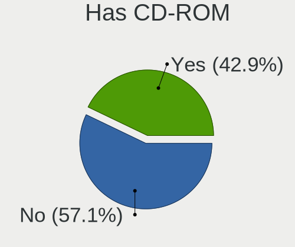
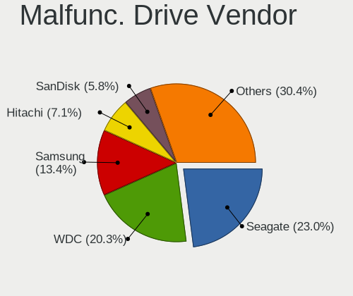
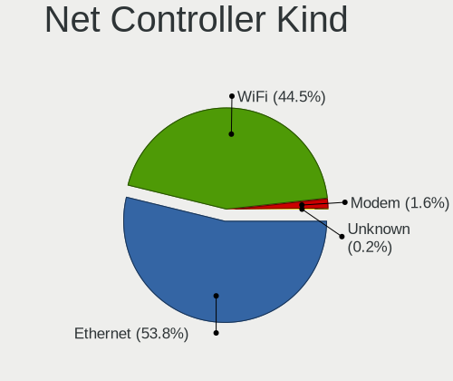
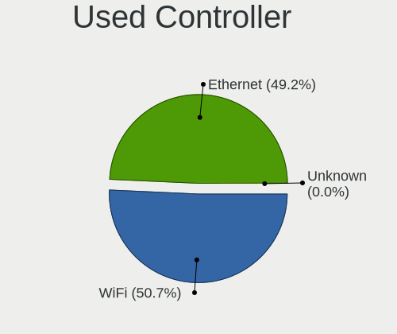
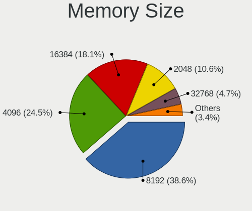

Linux in Germany - Tested Hardware & Statistics
-----------------------------------------------

A project to collect tested hardware configurations for Linux in Germany.

Anyone can contribute to this report by the [hw-probe](https://github.com/linuxhw/hw-probe) tool:

    sudo -E hw-probe -all -upload

Please contribute! Especially if your hardware is rare.

This is a report for all computer types. See also reports for [desktops](/Location/Germany/Desktop/README.md) and [notebooks](/Location/Germany/Notebook/README.md).

Contents
--------

* [ Test Cases ](#test-cases)

* [ System ](#system)
  - [ OS                       ](#os)
  - [ OS Family                ](#os-family)
  - [ Kernel                   ](#kernel)
  - [ Kernel Family            ](#kernel-family)
  - [ Kernel Major Ver.        ](#kernel-major-ver)
  - [ Arch                     ](#arch)
  - [ DE                       ](#de)
  - [ Display Server           ](#display-server)
  - [ Display Manager          ](#display-manager)
  - [ OS Lang                  ](#os-lang)
  - [ Boot Mode                ](#boot-mode)
  - [ Filesystem               ](#filesystem)
  - [ Part. scheme             ](#part-scheme)
  - [ Dual Boot with Linux/BSD ](#dual-boot-with-linuxbsd)
  - [ Dual Boot (Win)          ](#dual-boot-win)

* [ Board ](#board)
  - [ Vendor                   ](#vendor)
  - [ Model                    ](#model)
  - [ Model Family             ](#model-family)
  - [ MFG Year                 ](#mfg-year)
  - [ Form Factor              ](#form-factor)
  - [ Secure Boot              ](#secure-boot)
  - [ Coreboot                 ](#coreboot)
  - [ RAM Size                 ](#ram-size)
  - [ RAM Used                 ](#ram-used)
  - [ Total Drives             ](#total-drives)
  - [ Has CD-ROM               ](#has-cd-rom)
  - [ Has Ethernet             ](#has-ethernet)
  - [ Has WiFi                 ](#has-wifi)
  - [ Has Bluetooth            ](#has-bluetooth)

* [ Location ](#location)
  - [ Country                  ](#country)
  - [ City                     ](#city)

* [ Drives ](#drives)
  - [ Drive Vendor             ](#drive-vendor)
  - [ Drive Model              ](#drive-model)
  - [ HDD Vendor               ](#hdd-vendor)
  - [ SSD Vendor               ](#ssd-vendor)
  - [ Drive Kind               ](#drive-kind)
  - [ Drive Connector          ](#drive-connector)
  - [ Drive Size               ](#drive-size)
  - [ Space Total              ](#space-total)
  - [ Space Used               ](#space-used)
  - [ Malfunc. Drives          ](#malfunc-drives)
  - [ Malfunc. Drive Vendor    ](#malfunc-drive-vendor)
  - [ Malfunc. HDD Vendor      ](#malfunc-hdd-vendor)
  - [ Malfunc. Drive Kind      ](#malfunc-drive-kind)
  - [ Failed Drives            ](#failed-drives)
  - [ Failed Drive Vendor      ](#failed-drive-vendor)
  - [ Drive Status             ](#drive-status)

* [ Storage controller ](#storage-controller)
  - [ Storage Vendor           ](#storage-vendor)
  - [ Storage Model            ](#storage-model)
  - [ Storage Kind             ](#storage-kind)

* [ Processor ](#processor)
  - [ CPU Vendor               ](#cpu-vendor)
  - [ CPU Model                ](#cpu-model)
  - [ CPU Model Family         ](#cpu-model-family)
  - [ CPU Cores                ](#cpu-cores)
  - [ CPU Sockets              ](#cpu-sockets)
  - [ CPU Threads              ](#cpu-threads)
  - [ CPU Op-Modes             ](#cpu-op-modes)
  - [ CPU Microcode            ](#cpu-microcode)
  - [ CPU Microarch            ](#cpu-microarch)

* [ Graphics ](#graphics)
  - [ GPU Vendor               ](#gpu-vendor)
  - [ GPU Model                ](#gpu-model)
  - [ GPU Combo                ](#gpu-combo)
  - [ GPU Driver               ](#gpu-driver)
  - [ GPU Memory               ](#gpu-memory)

* [ Monitor ](#monitor)
  - [ Monitor Vendor           ](#monitor-vendor)
  - [ Monitor Model            ](#monitor-model)
  - [ Monitor Resolution       ](#monitor-resolution)
  - [ Monitor Diagonal         ](#monitor-diagonal)
  - [ Monitor Width            ](#monitor-width)
  - [ Aspect Ratio             ](#aspect-ratio)
  - [ Monitor Area             ](#monitor-area)
  - [ Pixel Density            ](#pixel-density)
  - [ Multiple Monitors        ](#multiple-monitors)

* [ Network ](#network)
  - [ Net Controller Vendor    ](#net-controller-vendor)
  - [ Net Controller Model     ](#net-controller-model)
  - [ Wireless Vendor          ](#wireless-vendor)
  - [ Wireless Model           ](#wireless-model)
  - [ Ethernet Vendor          ](#ethernet-vendor)
  - [ Ethernet Model           ](#ethernet-model)
  - [ Net Controller Kind      ](#net-controller-kind)
  - [ Used Controller          ](#used-controller)
  - [ NICs                     ](#nics)
  - [ IPv6                     ](#ipv6)

* [ Bluetooth ](#bluetooth)
  - [ Bluetooth Vendor         ](#bluetooth-vendor)
  - [ Bluetooth Model          ](#bluetooth-model)

* [ Sound ](#sound)
  - [ Sound Vendor             ](#sound-vendor)
  - [ Sound Model              ](#sound-model)

* [ Memory ](#memory)
  - [ Memory Vendor            ](#memory-vendor)
  - [ Memory Model             ](#memory-model)
  - [ Memory Kind              ](#memory-kind)
  - [ Memory Form Factor       ](#memory-form-factor)
  - [ Memory Size              ](#memory-size)
  - [ Memory Speed             ](#memory-speed)

* [ Printers & scanners ](#printers--scanners)
  - [ Printer Vendor           ](#printer-vendor)
  - [ Printer Model            ](#printer-model)
  - [ Scanner Vendor           ](#scanner-vendor)
  - [ Scanner Model            ](#scanner-model)

* [ Camera ](#camera)
  - [ Camera Vendor            ](#camera-vendor)
  - [ Camera Model             ](#camera-model)

* [ Security ](#security)
  - [ Fingerprint Vendor       ](#fingerprint-vendor)
  - [ Fingerprint Model        ](#fingerprint-model)
  - [ Chipcard Vendor          ](#chipcard-vendor)
  - [ Chipcard Model           ](#chipcard-model)

* [ Unsupported ](#unsupported)
  - [ Unsupported Devices      ](#unsupported-devices)
  - [ Unsupported Device Types ](#unsupported-device-types)

Test Cases
----------

Total: 31701

| Vendor        | Model                       | Form-Factor | Probe                                                      | Date         |
|---------------|-----------------------------|-------------|------------------------------------------------------------|--------------|
| AZW           | MINI S 10                   | Desktop     | [13e3a733fd](https://linux-hardware.org/?probe=13e3a733fd) | Oct 01, 2023 |
| Gigabyte      | Z390 UD                     | Desktop     | [e470a4941a](https://linux-hardware.org/?probe=e470a4941a) | Oct 01, 2023 |
| Lenovo        | Flex 2-15D 20377            | Notebook    | [8f9e71f454](https://linux-hardware.org/?probe=8f9e71f454) | Oct 01, 2023 |
| HP            | Laptop 17-cn0xxx            | Notebook    | [aa4b869750](https://linux-hardware.org/?probe=aa4b869750) | Oct 01, 2023 |
| Lenovo        | IdeaPad 330-15ARR 81D2      | Notebook    | [5d6364a866](https://linux-hardware.org/?probe=5d6364a866) | Oct 01, 2023 |
| HP            | ProBook 650 G8 Notebook ... | Notebook    | [b02492c1dd](https://linux-hardware.org/?probe=b02492c1dd) | Oct 01, 2023 |
| Toshiba       | Satellite C870-1C2          | Notebook    | [d9750c9040](https://linux-hardware.org/?probe=d9750c9040) | Sep 30, 2023 |
| Lenovo        | ThinkPad T480s 20L7CTO1W... | Notebook    | [1135ddac8e](https://linux-hardware.org/?probe=1135ddac8e) | Sep 30, 2023 |
| Gigabyte      | Z390 UD                     | Desktop     | [864f9a143f](https://linux-hardware.org/?probe=864f9a143f) | Sep 30, 2023 |
| Fujitsu Si... | AMILO A1650G                | Notebook    | [ec61a60044](https://linux-hardware.org/?probe=ec61a60044) | Sep 30, 2023 |
| Unknown       | Unknown                     | Soc         | [8024d770d9](https://linux-hardware.org/?probe=8024d770d9) | Sep 30, 2023 |
| HP            | EliteBook 830 G6            | Notebook    | [154150aa88](https://linux-hardware.org/?probe=154150aa88) | Sep 30, 2023 |
| ASUSTek       | A55BM-K                     | Desktop     | [532e0b0654](https://linux-hardware.org/?probe=532e0b0654) | Sep 30, 2023 |
| ASRock        | B75 Pro3-M                  | Desktop     | [05c68ef556](https://linux-hardware.org/?probe=05c68ef556) | Sep 30, 2023 |
| ASRock        | H61M-DGS R2.0               | Desktop     | [6074f655ad](https://linux-hardware.org/?probe=6074f655ad) | Sep 30, 2023 |
| HP            | ProBook 650 G1              | Notebook    | [c9aca83f04](https://linux-hardware.org/?probe=c9aca83f04) | Sep 30, 2023 |
| Acer          | Predator G3610              | Desktop     | [cddfa514ba](https://linux-hardware.org/?probe=cddfa514ba) | Sep 30, 2023 |
| Fujitsu Si... | AMILO Pa 2548               | Notebook    | [ee2d5e25d3](https://linux-hardware.org/?probe=ee2d5e25d3) | Sep 30, 2023 |
| Acer          | Aspire E1-572G              | Notebook    | [f7375967ee](https://linux-hardware.org/?probe=f7375967ee) | Sep 30, 2023 |
| Dell          | Latitude 7280               | Notebook    | [dbe9d3e4be](https://linux-hardware.org/?probe=dbe9d3e4be) | Sep 30, 2023 |
| HUAWEI        | HLYL-WXX9                   | Notebook    | [d39169bf21](https://linux-hardware.org/?probe=d39169bf21) | Sep 30, 2023 |
| ASRock        | 960GM/U3S3 FX               | Desktop     | [e2175cc32b](https://linux-hardware.org/?probe=e2175cc32b) | Sep 30, 2023 |
| Fujitsu Si... | AMILO Pa 2548               | Notebook    | [a291afc6c3](https://linux-hardware.org/?probe=a291afc6c3) | Sep 30, 2023 |
| MSI           | MPG Z390M GAMING EDGE AC    | Desktop     | [04432690a4](https://linux-hardware.org/?probe=04432690a4) | Sep 30, 2023 |
| AZW           | MINI S 10                   | Desktop     | [e065b9c701](https://linux-hardware.org/?probe=e065b9c701) | Sep 30, 2023 |
| Valve         | Jupiter                     | Notebook    | [85eac5b7ce](https://linux-hardware.org/?probe=85eac5b7ce) | Sep 30, 2023 |
| HP            | Laptop 15s-eq1xxx           | Notebook    | [2a293067f5](https://linux-hardware.org/?probe=2a293067f5) | Sep 30, 2023 |
| Toshiba       | QOSMIO X770                 | Notebook    | [c747b27390](https://linux-hardware.org/?probe=c747b27390) | Sep 30, 2023 |
| Fujitsu       | D3401-A1 S26361-D3401-A1    | Desktop     | [5d41b45d45](https://linux-hardware.org/?probe=5d41b45d45) | Sep 30, 2023 |
| Apple         | MacBookPro12,1              | Notebook    | [b3617a1e58](https://linux-hardware.org/?probe=b3617a1e58) | Sep 30, 2023 |
| Valve         | Jupiter                     | Notebook    | [1ed8509a3d](https://linux-hardware.org/?probe=1ed8509a3d) | Sep 30, 2023 |
| Dell          | Inspiron 5521               | Notebook    | [a704dd3c01](https://linux-hardware.org/?probe=a704dd3c01) | Sep 30, 2023 |
| VALE          | Notebook Classic C140       | Notebook    | [5be7208021](https://linux-hardware.org/?probe=5be7208021) | Sep 30, 2023 |
| Fujitsu       | D3401-A1 S26361-D3401-A1    | Desktop     | [65643e78ef](https://linux-hardware.org/?probe=65643e78ef) | Sep 30, 2023 |
| Pegatron      | 2AB6                        | Desktop     | [4bb43a39c1](https://linux-hardware.org/?probe=4bb43a39c1) | Sep 29, 2023 |
| Lenovo        | G770 1037                   | Notebook    | [576bbd3839](https://linux-hardware.org/?probe=576bbd3839) | Sep 29, 2023 |
| Lenovo        | 1051F 60073                 | Tablet      | [dd35e37770](https://linux-hardware.org/?probe=dd35e37770) | Sep 29, 2023 |
| ASUSTek       | X551MA                      | Notebook    | [8ba160ee59](https://linux-hardware.org/?probe=8ba160ee59) | Sep 29, 2023 |
| Acer          | Aspire E1-572G              | Notebook    | [9fe3adb466](https://linux-hardware.org/?probe=9fe3adb466) | Sep 29, 2023 |
| Lenovo        | 1051F 60073                 | Tablet      | [9b9931bd50](https://linux-hardware.org/?probe=9b9931bd50) | Sep 29, 2023 |
| Lenovo        | 0B98401 PRO                 | Desktop     | [17bb772d78](https://linux-hardware.org/?probe=17bb772d78) | Sep 29, 2023 |
| Lenovo        | ThinkPad L15 Gen 1 20U70... | Notebook    | [e51fd2a8e9](https://linux-hardware.org/?probe=e51fd2a8e9) | Sep 29, 2023 |
| ASUSTek       | T102HA                      | Tablet      | [eb48f40a27](https://linux-hardware.org/?probe=eb48f40a27) | Sep 29, 2023 |
| Lenovo        | IdeaPad Pro 5 16APH8 83A... | Notebook    | [ee6e1996b9](https://linux-hardware.org/?probe=ee6e1996b9) | Sep 29, 2023 |
| Apple         | Mac-F221BEC8                | Desktop     | [7b4a0099a9](https://linux-hardware.org/?probe=7b4a0099a9) | Sep 29, 2023 |
| ASRock        | Z490 Phantom Gaming 4       | Desktop     | [6fc3fe7a63](https://linux-hardware.org/?probe=6fc3fe7a63) | Sep 29, 2023 |
| Acer          | Aspire A517-53              | Notebook    | [6023cecfb1](https://linux-hardware.org/?probe=6023cecfb1) | Sep 29, 2023 |
| Acer          | Aspire 7745G                | Notebook    | [55ea55a771](https://linux-hardware.org/?probe=55ea55a771) | Sep 29, 2023 |
| Acer          | Nitro AN517-54              | Notebook    | [3e1448c388](https://linux-hardware.org/?probe=3e1448c388) | Sep 29, 2023 |
| Acer          | Aspire A517-53              | Notebook    | [05ff23a1a1](https://linux-hardware.org/?probe=05ff23a1a1) | Sep 29, 2023 |
| MSI           | B560M PRO                   | Desktop     | [1dc06a927c](https://linux-hardware.org/?probe=1dc06a927c) | Sep 29, 2023 |
| HP            | 1790                        | Desktop     | [b87e9dd9ad](https://linux-hardware.org/?probe=b87e9dd9ad) | Sep 29, 2023 |
| HP            | 1790                        | Desktop     | [89791e7bf0](https://linux-hardware.org/?probe=89791e7bf0) | Sep 29, 2023 |
| HP            | 3398                        | Desktop     | [13aa132a7d](https://linux-hardware.org/?probe=13aa132a7d) | Sep 29, 2023 |
| Valve         | Jupiter                     | Notebook    | [d065544135](https://linux-hardware.org/?probe=d065544135) | Sep 29, 2023 |
| MSI           | B560M PRO                   | Desktop     | [ce2f5b7349](https://linux-hardware.org/?probe=ce2f5b7349) | Sep 29, 2023 |
| HP            | 198E                        | Desktop     | [a311728a5f](https://linux-hardware.org/?probe=a311728a5f) | Sep 29, 2023 |
| System76      | Darter Pro                  | Notebook    | [d8b78103d5](https://linux-hardware.org/?probe=d8b78103d5) | Sep 29, 2023 |
| Lenovo        | ThinkPad T500 22439AG       | Notebook    | [e5a2cd9816](https://linux-hardware.org/?probe=e5a2cd9816) | Sep 29, 2023 |
| Lenovo        | ThinkPad T420s 4174PEG      | Notebook    | [cf650bb4af](https://linux-hardware.org/?probe=cf650bb4af) | Sep 29, 2023 |
| ASUSTek       | ROG STRIX Z690-A GAMING ... | Desktop     | [0177e96165](https://linux-hardware.org/?probe=0177e96165) | Sep 28, 2023 |
| HP            | 8619                        | Desktop     | [d631850d2f](https://linux-hardware.org/?probe=d631850d2f) | Sep 28, 2023 |
| Fujitsu       | D3222-A1 S26361-D3222-A1    | Desktop     | [a40dc4964e](https://linux-hardware.org/?probe=a40dc4964e) | Sep 28, 2023 |
| MSI           | A520M-A PRO                 | Desktop     | [27d7959e57](https://linux-hardware.org/?probe=27d7959e57) | Sep 28, 2023 |
| Gigabyte      | Q87M-D2H                    | Desktop     | [1d749b29ad](https://linux-hardware.org/?probe=1d749b29ad) | Sep 28, 2023 |
| Acer          | Aspire 7745G                | Notebook    | [6def421696](https://linux-hardware.org/?probe=6def421696) | Sep 28, 2023 |
| Lenovo        | ThinkPad R60 9461DXG        | Notebook    | [4f74530d68](https://linux-hardware.org/?probe=4f74530d68) | Sep 28, 2023 |
| Lenovo        | ThinkPad R60 9461DXG        | Notebook    | [5fb1e549ea](https://linux-hardware.org/?probe=5fb1e549ea) | Sep 28, 2023 |
| Lenovo        | NOK                         | Desktop     | [95ba956749](https://linux-hardware.org/?probe=95ba956749) | Sep 28, 2023 |
| Lenovo        | ThinkPad T14 Gen 3 21AJS... | Notebook    | [38e71e4fe9](https://linux-hardware.org/?probe=38e71e4fe9) | Sep 28, 2023 |
| Lenovo        | ThinkPad T14 Gen 2i 20W0... | Notebook    | [c8dfaf68d0](https://linux-hardware.org/?probe=c8dfaf68d0) | Sep 28, 2023 |
| Acer          | Aspire ES1-732              | Notebook    | [f30d62d67b](https://linux-hardware.org/?probe=f30d62d67b) | Sep 28, 2023 |
| Fujitsu       | D3041-A1 S26361-D3041-A1    | Desktop     | [013801fc61](https://linux-hardware.org/?probe=013801fc61) | Sep 28, 2023 |
| Apple         | MacBookPro9,1               | Notebook    | [555dfa4f2e](https://linux-hardware.org/?probe=555dfa4f2e) | Sep 28, 2023 |
| HP            | Compaq Presario CQ70        | Notebook    | [8913bbd459](https://linux-hardware.org/?probe=8913bbd459) | Sep 28, 2023 |
| Valve         | Jupiter                     | Notebook    | [8de9bb39df](https://linux-hardware.org/?probe=8de9bb39df) | Sep 28, 2023 |
| Toshiba       | Satellite P775              | Notebook    | [7269165fd9](https://linux-hardware.org/?probe=7269165fd9) | Sep 28, 2023 |
| Fujitsu       | D3222-A1 S26361-D3222-A1    | Desktop     | [a1ef1eb6e6](https://linux-hardware.org/?probe=a1ef1eb6e6) | Sep 28, 2023 |
| Packard Be... | EasyNote MH36               | Notebook    | [91fcf40898](https://linux-hardware.org/?probe=91fcf40898) | Sep 28, 2023 |
| Dell          | Latitude E5570              | Notebook    | [150f9e624b](https://linux-hardware.org/?probe=150f9e624b) | Sep 28, 2023 |
| Lenovo        | ThinkPad T495 20NJ000XGE    | Notebook    | [737b3910bb](https://linux-hardware.org/?probe=737b3910bb) | Sep 28, 2023 |
| Lenovo        | ThinkPad T495 20NJ000XGE    | Notebook    | [b064b5b9ca](https://linux-hardware.org/?probe=b064b5b9ca) | Sep 28, 2023 |
| HP            | Laptop 17-bs0xx             | Notebook    | [85548f2790](https://linux-hardware.org/?probe=85548f2790) | Sep 28, 2023 |
| Acer          | Aspire VN7-791G             | Notebook    | [0cfe515d00](https://linux-hardware.org/?probe=0cfe515d00) | Sep 27, 2023 |
| HP            | ElitePad 1000 G2            | Notebook    | [a53de5d0bd](https://linux-hardware.org/?probe=a53de5d0bd) | Sep 27, 2023 |
| HP            | ElitePad 1000 G2            | Notebook    | [9c4b30a15c](https://linux-hardware.org/?probe=9c4b30a15c) | Sep 27, 2023 |
| HP            | ElitePad 1000 G2            | Notebook    | [2668770971](https://linux-hardware.org/?probe=2668770971) | Sep 27, 2023 |
| Fujitsu       | LIFEBOOK E4512              | Notebook    | [08b39b38bd](https://linux-hardware.org/?probe=08b39b38bd) | Sep 27, 2023 |
| ASUSTek       | ROG STRIX B550-A GAMING     | Desktop     | [7ed50e5e43](https://linux-hardware.org/?probe=7ed50e5e43) | Sep 27, 2023 |
| Acer          | Nitro AN515-42              | Notebook    | [dd4a3f701c](https://linux-hardware.org/?probe=dd4a3f701c) | Sep 27, 2023 |
| TUXEDO        | Stellaris Intel Gen4        | Notebook    | [0dcef3e6c3](https://linux-hardware.org/?probe=0dcef3e6c3) | Sep 27, 2023 |
| Gigabyte      | B550 AORUS ELITE AX V2      | Desktop     | [7cfa1007ee](https://linux-hardware.org/?probe=7cfa1007ee) | Sep 27, 2023 |
| HP            | Laptop 17-by0xxx            | Notebook    | [6eefb5fdd2](https://linux-hardware.org/?probe=6eefb5fdd2) | Sep 27, 2023 |
| Lenovo        | ThinkPad X1 Carbon Gen 8... | Notebook    | [b5dee453a3](https://linux-hardware.org/?probe=b5dee453a3) | Sep 27, 2023 |
| Lenovo        | ThinkPad T460s 20FAS2G90... | Notebook    | [50c8df3b79](https://linux-hardware.org/?probe=50c8df3b79) | Sep 27, 2023 |
| Lenovo        | ThinkPad T460s 20FAS2G90... | Notebook    | [6cfd6e2b34](https://linux-hardware.org/?probe=6cfd6e2b34) | Sep 27, 2023 |
| HP            | 8594                        | Desktop     | [374067df48](https://linux-hardware.org/?probe=374067df48) | Sep 27, 2023 |
| Lenovo        | 310B SDK0J40697 WIN 3305... | Mini pc     | [5991ea82e7](https://linux-hardware.org/?probe=5991ea82e7) | Sep 27, 2023 |
| Lenovo        | 3102 SDK0J40697 WIN 3305... | Desktop     | [1d8c54163d](https://linux-hardware.org/?probe=1d8c54163d) | Sep 27, 2023 |
| Gigabyte      | H61MA-D3V                   | Desktop     | [a9c8158139](https://linux-hardware.org/?probe=a9c8158139) | Sep 27, 2023 |
| MSI           | PRO Z790-A WIFI DDR4        | Desktop     | [74ea1c8adf](https://linux-hardware.org/?probe=74ea1c8adf) | Sep 27, 2023 |
| Lenovo        | 0B98401 PRO                 | Desktop     | [2cdf3dac45](https://linux-hardware.org/?probe=2cdf3dac45) | Sep 27, 2023 |
| Acer          | Aspire 5951G                | Notebook    | [cae145acab](https://linux-hardware.org/?probe=cae145acab) | Sep 26, 2023 |
| HP            | ElitePad 1000 G2            | Notebook    | [ee4b3f2b76](https://linux-hardware.org/?probe=ee4b3f2b76) | Sep 26, 2023 |
| MSI           | MAG B550M MORTAR            | Desktop     | [5a2571575f](https://linux-hardware.org/?probe=5a2571575f) | Sep 26, 2023 |
| HP            | Pavilion dv6                | Notebook    | [5eaa895f6e](https://linux-hardware.org/?probe=5eaa895f6e) | Sep 26, 2023 |
| HP            | Pavilion dv6                | Notebook    | [f785da65ca](https://linux-hardware.org/?probe=f785da65ca) | Sep 26, 2023 |
| Apple         | Mac-77F17D7DA9285301 iMa... | All in one  | [81540c48ee](https://linux-hardware.org/?probe=81540c48ee) | Sep 26, 2023 |
| Medion        | D3F3-EM                     | Desktop     | [82989a21af](https://linux-hardware.org/?probe=82989a21af) | Sep 26, 2023 |
| Valve         | Jupiter                     | Notebook    | [3c758abd49](https://linux-hardware.org/?probe=3c758abd49) | Sep 26, 2023 |
| ASUSTek       | PRIME B450M-A II            | Desktop     | [d94b85c889](https://linux-hardware.org/?probe=d94b85c889) | Sep 26, 2023 |
| MSI           | MAG B550M MORTAR            | Desktop     | [efee605c17](https://linux-hardware.org/?probe=efee605c17) | Sep 26, 2023 |
| ASRock        | H61M-DGS R2.0               | Desktop     | [5ace4ce0ad](https://linux-hardware.org/?probe=5ace4ce0ad) | Sep 26, 2023 |
| Lenovo        | ThinkPad L540 20AUS00N00    | Notebook    | [a8aee3f386](https://linux-hardware.org/?probe=a8aee3f386) | Sep 26, 2023 |
| ASUSTek       | ROG STRIX B550-A GAMING     | Desktop     | [9c9070da5f](https://linux-hardware.org/?probe=9c9070da5f) | Sep 26, 2023 |
| ASUSTek       | PN41                        | Mini pc     | [40d7200bd5](https://linux-hardware.org/?probe=40d7200bd5) | Sep 26, 2023 |
| Lenovo        | ThinkPad T14 Gen 1 20S1S... | Notebook    | [b62d121676](https://linux-hardware.org/?probe=b62d121676) | Sep 26, 2023 |
| ASUSTek       | M2N-VM DVI                  | Desktop     | [7b8649cccc](https://linux-hardware.org/?probe=7b8649cccc) | Sep 26, 2023 |
| HP            | Laptop 15s-fq2xxx           | Notebook    | [22294a7a32](https://linux-hardware.org/?probe=22294a7a32) | Sep 26, 2023 |
| MSI           | MPG B650 CARBON WIFI        | Desktop     | [4b0aff27e8](https://linux-hardware.org/?probe=4b0aff27e8) | Sep 26, 2023 |
| HP            | 8643 SMVB                   | Desktop     | [64f1cd854d](https://linux-hardware.org/?probe=64f1cd854d) | Sep 26, 2023 |
| Acer          | Aspire E1-570               | Notebook    | [98ed9bca40](https://linux-hardware.org/?probe=98ed9bca40) | Sep 26, 2023 |
| Gigabyte      | GA-MA790XT-UD4P             | Desktop     | [3e59f9341a](https://linux-hardware.org/?probe=3e59f9341a) | Sep 26, 2023 |
| ASUSTek       | PRIME Z390-P                | Desktop     | [37840dad1c](https://linux-hardware.org/?probe=37840dad1c) | Sep 26, 2023 |
| ASUSTek       | M5A78L-M LE/USB3            | Desktop     | [19858af3cd](https://linux-hardware.org/?probe=19858af3cd) | Sep 26, 2023 |
| Dell          | XPS 15 9560                 | Notebook    | [a524453c71](https://linux-hardware.org/?probe=a524453c71) | Sep 25, 2023 |
| Medion        | MS-7848                     | Desktop     | [5ce2a07d18](https://linux-hardware.org/?probe=5ce2a07d18) | Sep 25, 2023 |
| HP            | Laptop 15s-fq2xxx           | Notebook    | [0aa73d620b](https://linux-hardware.org/?probe=0aa73d620b) | Sep 25, 2023 |
| HUAWEI        | NbDE-WXX9                   | Notebook    | [b3990570ee](https://linux-hardware.org/?probe=b3990570ee) | Sep 25, 2023 |
| ASUSTek       | ROG STRIX B550-A GAMING     | Desktop     | [65369ae480](https://linux-hardware.org/?probe=65369ae480) | Sep 25, 2023 |
| ASUSTek       | TUF B450-PLUS GAMING        | Desktop     | [b7dae6ef48](https://linux-hardware.org/?probe=b7dae6ef48) | Sep 25, 2023 |
| ASUSTek       | Zenbook UN5401QA_UN5401Q... | Convertible | [fee8085d8d](https://linux-hardware.org/?probe=fee8085d8d) | Sep 25, 2023 |
| Dell          | Inspiron 14 5410            | Notebook    | [863dfa9b96](https://linux-hardware.org/?probe=863dfa9b96) | Sep 25, 2023 |
| Gigabyte      | Q87M-D2H                    | Desktop     | [8bdc8129ff](https://linux-hardware.org/?probe=8bdc8129ff) | Sep 25, 2023 |
| HP            | Laptop 17-ca0xxx            | Notebook    | [b094bb2ed3](https://linux-hardware.org/?probe=b094bb2ed3) | Sep 25, 2023 |
| ASUSTek       | M51AC                       | Desktop     | [b4bd7fad24](https://linux-hardware.org/?probe=b4bd7fad24) | Sep 25, 2023 |
| HP            | EliteBook x360 1030 G2      | Convertible | [8895bccd1c](https://linux-hardware.org/?probe=8895bccd1c) | Sep 25, 2023 |
| System76      | Pangolin                    | Notebook    | [3c56c50463](https://linux-hardware.org/?probe=3c56c50463) | Sep 25, 2023 |
| HP            | EliteBook 840 G7 Noteboo... | Notebook    | [381be3d212](https://linux-hardware.org/?probe=381be3d212) | Sep 25, 2023 |
| ASUSTek       | Z170I PRO GAMING            | Desktop     | [f4d45948eb](https://linux-hardware.org/?probe=f4d45948eb) | Sep 25, 2023 |
| Acer          | Aspire 5951G                | Notebook    | [4c50b8e9b0](https://linux-hardware.org/?probe=4c50b8e9b0) | Sep 25, 2023 |
| HP            | Laptop 17-cn0xxx            | Notebook    | [10ec627bad](https://linux-hardware.org/?probe=10ec627bad) | Sep 25, 2023 |
| Apple         | Mac-F226BEC8 PVT            | All in one  | [e741b61807](https://linux-hardware.org/?probe=e741b61807) | Sep 25, 2023 |
| ASRock        | FM2A85X Extreme4-M          | Desktop     | [bef6ef227b](https://linux-hardware.org/?probe=bef6ef227b) | Sep 25, 2023 |
| MSI           | MAG X670E TOMAHAWK WIFI     | Desktop     | [666b064064](https://linux-hardware.org/?probe=666b064064) | Sep 24, 2023 |
| HP            | ElitePad 1000 G2            | Notebook    | [5e1dcb7163](https://linux-hardware.org/?probe=5e1dcb7163) | Sep 24, 2023 |
| Lenovo        | ThinkPad X1 Carbon 3rd 2... | Notebook    | [7d18eb441e](https://linux-hardware.org/?probe=7d18eb441e) | Sep 24, 2023 |
| HP            | ElitePad 1000 G2            | Notebook    | [5cfbe2e7e0](https://linux-hardware.org/?probe=5cfbe2e7e0) | Sep 24, 2023 |
| MSI           | MS-7318                     | Desktop     | [0e03a1818a](https://linux-hardware.org/?probe=0e03a1818a) | Sep 24, 2023 |
| Fujitsu       | LIFEBOOK A557               | Notebook    | [e66c8c9ca7](https://linux-hardware.org/?probe=e66c8c9ca7) | Sep 24, 2023 |
| Toshiba       | Satellite C50D-A-10E        | Notebook    | [46f0ec000d](https://linux-hardware.org/?probe=46f0ec000d) | Sep 24, 2023 |
| Dell          | Latitude E6520              | Notebook    | [9fd6a2a84f](https://linux-hardware.org/?probe=9fd6a2a84f) | Sep 24, 2023 |
| Lenovo        | ThinkPad X1 Extreme 2nd ... | Notebook    | [8a581a8a85](https://linux-hardware.org/?probe=8a581a8a85) | Sep 24, 2023 |
| MSI           | MAG B550 TOMAHAWK MAX WI... | Desktop     | [23d9e87224](https://linux-hardware.org/?probe=23d9e87224) | Sep 24, 2023 |
| Lenovo        | Yoga 2 Pro 20266            | Notebook    | [fcb38d5424](https://linux-hardware.org/?probe=fcb38d5424) | Sep 24, 2023 |
| HP            | Laptop 15s-fq2xxx           | Notebook    | [98ad01dfc0](https://linux-hardware.org/?probe=98ad01dfc0) | Sep 24, 2023 |
| Dell          | System XPS L502X            | Notebook    | [22d93fe76c](https://linux-hardware.org/?probe=22d93fe76c) | Sep 24, 2023 |
| Lenovo        | ThinkPad E14 Gen 4 21EB0... | Notebook    | [e87fa96814](https://linux-hardware.org/?probe=e87fa96814) | Sep 24, 2023 |
| Lenovo        | ThinkPad E14 Gen 4 21EB0... | Notebook    | [29399bf284](https://linux-hardware.org/?probe=29399bf284) | Sep 24, 2023 |
| Lenovo        | IdeaPad N581 7505           | Notebook    | [ed2e5eed86](https://linux-hardware.org/?probe=ed2e5eed86) | Sep 24, 2023 |
| Fujitsu       | D3067-A1 S26361-D3067-A1    | Desktop     | [14c3077129](https://linux-hardware.org/?probe=14c3077129) | Sep 24, 2023 |
| Gigabyte      | Q87M-D2H                    | Desktop     | [87cba2e3a2](https://linux-hardware.org/?probe=87cba2e3a2) | Sep 24, 2023 |
| Acer          | Aspire A515-56              | Notebook    | [3d1de53032](https://linux-hardware.org/?probe=3d1de53032) | Sep 24, 2023 |
| Dell          | XPS 15 9500                 | Notebook    | [fcff405070](https://linux-hardware.org/?probe=fcff405070) | Sep 24, 2023 |
| TrekStor      | Primebook P14               | Notebook    | [6664054d96](https://linux-hardware.org/?probe=6664054d96) | Sep 24, 2023 |
| Dell          | XPS 15 9500                 | Notebook    | [5bedca0fe9](https://linux-hardware.org/?probe=5bedca0fe9) | Sep 24, 2023 |
| HP            | 250 15.6 inch G9 Noteboo... | Notebook    | [508cf38973](https://linux-hardware.org/?probe=508cf38973) | Sep 24, 2023 |
| Dell          | System XPS L502X            | Notebook    | [a1d4f683c1](https://linux-hardware.org/?probe=a1d4f683c1) | Sep 24, 2023 |
| HP            | Laptop 15s-fq2xxx           | Notebook    | [747f5bd882](https://linux-hardware.org/?probe=747f5bd882) | Sep 24, 2023 |
| ASUSTek       | P5G41T-M LX                 | Desktop     | [a1ced3b0bd](https://linux-hardware.org/?probe=a1ced3b0bd) | Sep 24, 2023 |
| Lenovo        | IdeaPad Duet 3 10IGL5 82... | Tablet      | [a6ef657fca](https://linux-hardware.org/?probe=a6ef657fca) | Sep 24, 2023 |
| MSI           | B350 TOMAHAWK               | Desktop     | [7119229a1b](https://linux-hardware.org/?probe=7119229a1b) | Sep 24, 2023 |
| ASUSTek       | PRIME A320M-K               | Desktop     | [a3e2e5f3c0](https://linux-hardware.org/?probe=a3e2e5f3c0) | Sep 24, 2023 |
| Acer          | Aspire A317-51G             | Notebook    | [16870a488b](https://linux-hardware.org/?probe=16870a488b) | Sep 24, 2023 |
| Apple         | MacBookPro9,2               | Notebook    | [2691aa5f87](https://linux-hardware.org/?probe=2691aa5f87) | Sep 24, 2023 |
| Acer          | Aspire V3-771               | Notebook    | [8d87ce31c5](https://linux-hardware.org/?probe=8d87ce31c5) | Sep 24, 2023 |
| Dell          | Latitude 7430               | Notebook    | [eb37e129e6](https://linux-hardware.org/?probe=eb37e129e6) | Sep 24, 2023 |
| Acer          | Aspire V3-771               | Notebook    | [10dfbbd349](https://linux-hardware.org/?probe=10dfbbd349) | Sep 24, 2023 |
| MSI           | B550-A PRO                  | Desktop     | [3fce945550](https://linux-hardware.org/?probe=3fce945550) | Sep 23, 2023 |
| UMAX          | VisionBook 14Wr             | Notebook    | [5e8b69ec67](https://linux-hardware.org/?probe=5e8b69ec67) | Sep 23, 2023 |
| Gigabyte      | B85M-D3H                    | Desktop     | [e568bc8439](https://linux-hardware.org/?probe=e568bc8439) | Sep 23, 2023 |
| Medion        | TJ4125                      | Desktop     | [434dd057a6](https://linux-hardware.org/?probe=434dd057a6) | Sep 23, 2023 |
| HP            | 255 15.6 inch G10           | Notebook    | [9f02426c5d](https://linux-hardware.org/?probe=9f02426c5d) | Sep 23, 2023 |
| MSI           | B450M MORTAR MAX            | Desktop     | [da277c4d5a](https://linux-hardware.org/?probe=da277c4d5a) | Sep 23, 2023 |
| Lenovo        | ThinkPad X1 Carbon Gen 8... | Notebook    | [b5584b2b96](https://linux-hardware.org/?probe=b5584b2b96) | Sep 23, 2023 |
| HP            | 250 G4                      | Notebook    | [c9dac1b4d5](https://linux-hardware.org/?probe=c9dac1b4d5) | Sep 23, 2023 |
| BESSTAR Te... | HM80                        | Desktop     | [909cdffc4d](https://linux-hardware.org/?probe=909cdffc4d) | Sep 23, 2023 |
| ASUSTek       | ROG STRIX B550-F GAMING     | Desktop     | [e96b971928](https://linux-hardware.org/?probe=e96b971928) | Sep 23, 2023 |
| Dell          | 060J9C A00                  | Mini pc     | [338cbff584](https://linux-hardware.org/?probe=338cbff584) | Sep 23, 2023 |
| Pegatron      | 2AB6                        | Desktop     | [9b814d0254](https://linux-hardware.org/?probe=9b814d0254) | Sep 23, 2023 |
| Dell          | Latitude 7280               | Notebook    | [1d032535e1](https://linux-hardware.org/?probe=1d032535e1) | Sep 23, 2023 |
| Wortmann      | TERRA_MOBILE_1512/1712      | Notebook    | [226db4b62b](https://linux-hardware.org/?probe=226db4b62b) | Sep 23, 2023 |
| Dell          | XPS 13 9360                 | Notebook    | [6897fc6f5a](https://linux-hardware.org/?probe=6897fc6f5a) | Sep 23, 2023 |
| ASRock        | H61M/U3S3                   | Desktop     | [1d397abb90](https://linux-hardware.org/?probe=1d397abb90) | Sep 23, 2023 |
| Acer          | Aspire E5-574G              | Notebook    | [7ca9ce046e](https://linux-hardware.org/?probe=7ca9ce046e) | Sep 23, 2023 |
| Gigabyte      | B85-HD3                     | Desktop     | [5da83e8683](https://linux-hardware.org/?probe=5da83e8683) | Sep 23, 2023 |
| ASUSTek       | PRIME B360-PLUS             | Desktop     | [5629e161ab](https://linux-hardware.org/?probe=5629e161ab) | Sep 23, 2023 |
| HP            | 8055                        | Desktop     | [d8ea4bc33a](https://linux-hardware.org/?probe=d8ea4bc33a) | Sep 23, 2023 |
| Lenovo        | ThinkBook 14 G2 ARE 20VF    | Notebook    | [147b087f20](https://linux-hardware.org/?probe=147b087f20) | Sep 23, 2023 |
| Raspberry ... | Raspberry Pi 3 Model B P... | Soc         | [d80efa838b](https://linux-hardware.org/?probe=d80efa838b) | Sep 23, 2023 |
| ASUSTek       | P8H61-M LX                  | Desktop     | [48a5b6b71d](https://linux-hardware.org/?probe=48a5b6b71d) | Sep 23, 2023 |
| HP            | 8055                        | Desktop     | [fce4660553](https://linux-hardware.org/?probe=fce4660553) | Sep 22, 2023 |
| ASRock        | Z68 Pro3                    | Desktop     | [6f9b69be0e](https://linux-hardware.org/?probe=6f9b69be0e) | Sep 22, 2023 |
| HP            | 8055                        | Desktop     | [a6e2adc34a](https://linux-hardware.org/?probe=a6e2adc34a) | Sep 22, 2023 |
| Gigabyte      | 990FXA-UD3 R5               | Desktop     | [2a62bbc302](https://linux-hardware.org/?probe=2a62bbc302) | Sep 22, 2023 |
| Lenovo        | ThinkPad X220 Tablet 429... | Notebook    | [9323b69b4b](https://linux-hardware.org/?probe=9323b69b4b) | Sep 22, 2023 |
| Fujitsu       | LIFEBOOK A357               | Notebook    | [d18e2d8811](https://linux-hardware.org/?probe=d18e2d8811) | Sep 22, 2023 |
| Lenovo        | ThinkPad L13 Gen 3 21B90... | Notebook    | [e273beb83a](https://linux-hardware.org/?probe=e273beb83a) | Sep 22, 2023 |
| Acer          | Aspire A517-51              | Notebook    | [fdeb61b7c3](https://linux-hardware.org/?probe=fdeb61b7c3) | Sep 22, 2023 |
| ASUSTek       | P7P55-M                     | Desktop     | [f5b912e122](https://linux-hardware.org/?probe=f5b912e122) | Sep 22, 2023 |
| Lenovo        | ThinkPad T470s W10DG 20J... | Notebook    | [ad1b8126d2](https://linux-hardware.org/?probe=ad1b8126d2) | Sep 22, 2023 |
| Lenovo        | ThinkPad L13 Gen 3 21B90... | Notebook    | [0d786ffd74](https://linux-hardware.org/?probe=0d786ffd74) | Sep 22, 2023 |
| Sony          | VAIO                        | All in one  | [2e86f27c71](https://linux-hardware.org/?probe=2e86f27c71) | Sep 22, 2023 |
| Sony          | VAIO                        | All in one  | [5355a914a5](https://linux-hardware.org/?probe=5355a914a5) | Sep 22, 2023 |
| Dell          | Latitude 3320               | Notebook    | [cf413808cb](https://linux-hardware.org/?probe=cf413808cb) | Sep 22, 2023 |
| Dell          | Latitude 3320               | Notebook    | [bd39ee30ac](https://linux-hardware.org/?probe=bd39ee30ac) | Sep 22, 2023 |
| Fujitsu       | D3432-A1 S26361-D3432-A1    | Desktop     | [c3043092b9](https://linux-hardware.org/?probe=c3043092b9) | Sep 22, 2023 |
| Apple         | MacBookPro12,1              | Notebook    | [b8b562cc39](https://linux-hardware.org/?probe=b8b562cc39) | Sep 22, 2023 |
| Lenovo        | ThinkPad X1 Extreme 2nd ... | Notebook    | [7732f1eb9b](https://linux-hardware.org/?probe=7732f1eb9b) | Sep 22, 2023 |
| Lenovo        | ThinkCentre M58p 6137B28    | Desktop     | [25c3f2b6f8](https://linux-hardware.org/?probe=25c3f2b6f8) | Sep 22, 2023 |
| HUAWEI        | BOD-WXX9                    | Notebook    | [909efbf81b](https://linux-hardware.org/?probe=909efbf81b) | Sep 22, 2023 |
| Lenovo        | ThinkPad X220 4290EC5       | Notebook    | [3cb76d839a](https://linux-hardware.org/?probe=3cb76d839a) | Sep 22, 2023 |
| Foxconn       | 45CMX/45GMX/45CMX-K         | Desktop     | [43d9a8a827](https://linux-hardware.org/?probe=43d9a8a827) | Sep 22, 2023 |
| ASUSTek       | X540LA                      | Notebook    | [adf0d97721](https://linux-hardware.org/?probe=adf0d97721) | Sep 22, 2023 |
| HP            | ENVY 17                     | Notebook    | [4f6463148f](https://linux-hardware.org/?probe=4f6463148f) | Sep 22, 2023 |
| HP            | Pavilion g6                 | Notebook    | [c5833405a5](https://linux-hardware.org/?probe=c5833405a5) | Sep 22, 2023 |
| ASRock        | A300M-STX                   | Desktop     | [2fc60c03c3](https://linux-hardware.org/?probe=2fc60c03c3) | Sep 22, 2023 |
| Dell          | 0X2MKR A00                  | All in one  | [d141e26999](https://linux-hardware.org/?probe=d141e26999) | Sep 22, 2023 |
| ASRock        | H87 Pro4                    | Desktop     | [dc831a82cd](https://linux-hardware.org/?probe=dc831a82cd) | Sep 22, 2023 |
| Medion        | E6224                       | Notebook    | [a6087c2bdf](https://linux-hardware.org/?probe=a6087c2bdf) | Sep 22, 2023 |
| ASRock        | Z68 Pro3                    | Desktop     | [19c8215a05](https://linux-hardware.org/?probe=19c8215a05) | Sep 22, 2023 |
| ASUSTek       | M5A97 LE R2.0               | Desktop     | [d6b8e831ce](https://linux-hardware.org/?probe=d6b8e831ce) | Sep 22, 2023 |
| Fujitsu       | D3230-A1 S26361-D3230-A1    | Desktop     | [3d3b14f0f9](https://linux-hardware.org/?probe=3d3b14f0f9) | Sep 21, 2023 |
| Intel         | NUC13ANBi5 M89647-202       | Mini pc     | [8283dda5ff](https://linux-hardware.org/?probe=8283dda5ff) | Sep 21, 2023 |
| ASRock        | H61M-DGS R2.0               | Desktop     | [96847f97e6](https://linux-hardware.org/?probe=96847f97e6) | Sep 21, 2023 |
| Acer          | Aspire 5742G                | Notebook    | [ee84a8d240](https://linux-hardware.org/?probe=ee84a8d240) | Sep 21, 2023 |
| Fujitsu       | LIFEBOOK E752               | Notebook    | [c2d2a28c33](https://linux-hardware.org/?probe=c2d2a28c33) | Sep 21, 2023 |
| MSI           | PRO H610M-B DDR4            | Desktop     | [ee0a21be07](https://linux-hardware.org/?probe=ee0a21be07) | Sep 21, 2023 |
| Apple         | MacBookPro12,1              | Notebook    | [bb796b1e6e](https://linux-hardware.org/?probe=bb796b1e6e) | Sep 21, 2023 |
| DFI           | CH960                       | Desktop     | [a6514c3301](https://linux-hardware.org/?probe=a6514c3301) | Sep 21, 2023 |
| Dell          | Inspiron 3542               | Notebook    | [3e66379f73](https://linux-hardware.org/?probe=3e66379f73) | Sep 21, 2023 |
| ASUSTek       | PRIME H510M-K               | Desktop     | [4d863063d6](https://linux-hardware.org/?probe=4d863063d6) | Sep 21, 2023 |
| MSI           | MS-7318                     | Desktop     | [38f011e50d](https://linux-hardware.org/?probe=38f011e50d) | Sep 21, 2023 |
| Dell          | Precision 7520              | Notebook    | [2fd68ca236](https://linux-hardware.org/?probe=2fd68ca236) | Sep 21, 2023 |
| Samsung       | R530/R730/R540              | Notebook    | [658ca13022](https://linux-hardware.org/?probe=658ca13022) | Sep 21, 2023 |
| Valve         | Jupiter                     | Notebook    | [2c967e82b6](https://linux-hardware.org/?probe=2c967e82b6) | Sep 21, 2023 |
| Dell          | 08WKV3 A00                  | Desktop     | [55942db040](https://linux-hardware.org/?probe=55942db040) | Sep 21, 2023 |
| MSI           | MPG B460I GAMING EDGE WI... | Desktop     | [b6d619d509](https://linux-hardware.org/?probe=b6d619d509) | Sep 21, 2023 |
| Dell          | Precision 5550              | Notebook    | [c5183a7443](https://linux-hardware.org/?probe=c5183a7443) | Sep 21, 2023 |
| Dell          | Precision 5550              | Notebook    | [3d927d3dee](https://linux-hardware.org/?probe=3d927d3dee) | Sep 21, 2023 |
| Lenovo        | ThinkPad T570 20HAS1PC00    | Notebook    | [218325e9e3](https://linux-hardware.org/?probe=218325e9e3) | Sep 21, 2023 |
| HP            | Elite x2 1012 G1            | Notebook    | [dbe6ba540f](https://linux-hardware.org/?probe=dbe6ba540f) | Sep 20, 2023 |
| Lenovo        | ThinkPad X1 Tablet Gen 2... | Tablet      | [3aeaec9cee](https://linux-hardware.org/?probe=3aeaec9cee) | Sep 20, 2023 |
| ASRock        | Z270 Extreme4               | Desktop     | [0df72a698a](https://linux-hardware.org/?probe=0df72a698a) | Sep 20, 2023 |
| MSI           | MPG B460I GAMING EDGE WI... | Desktop     | [42b79f2641](https://linux-hardware.org/?probe=42b79f2641) | Sep 20, 2023 |
| MSI           | B450-A PRO MAX              | Desktop     | [2a477b71f7](https://linux-hardware.org/?probe=2a477b71f7) | Sep 20, 2023 |
| HP            | Pavilion 17                 | Notebook    | [f95a376481](https://linux-hardware.org/?probe=f95a376481) | Sep 20, 2023 |
| HP            | 8027                        | Desktop     | [e8568c8f9b](https://linux-hardware.org/?probe=e8568c8f9b) | Sep 20, 2023 |
| Lenovo        | ThinkPad T560 20FJS2BX00    | Notebook    | [85a0203a02](https://linux-hardware.org/?probe=85a0203a02) | Sep 20, 2023 |
| HP            | 859C                        | Desktop     | [7de1553287](https://linux-hardware.org/?probe=7de1553287) | Sep 20, 2023 |
| Lenovo        | ThinkPad T560 20FJS2BX00    | Notebook    | [c96d3bf498](https://linux-hardware.org/?probe=c96d3bf498) | Sep 20, 2023 |
| Lenovo        | ThinkPad L390 20NRCTO1WW    | Notebook    | [228d31bf59](https://linux-hardware.org/?probe=228d31bf59) | Sep 20, 2023 |
| TUXEDO        | P65_P67RGRERA               | Notebook    | [97bae35595](https://linux-hardware.org/?probe=97bae35595) | Sep 20, 2023 |
| Acer          | Aspire 7750G                | Notebook    | [942c136417](https://linux-hardware.org/?probe=942c136417) | Sep 20, 2023 |
| HP            | Elite x2 1012 G2            | Tablet      | [7c2b50d505](https://linux-hardware.org/?probe=7c2b50d505) | Sep 20, 2023 |
| Dell          | Precision 3510              | Notebook    | [2a10a66b9c](https://linux-hardware.org/?probe=2a10a66b9c) | Sep 20, 2023 |
| Medion        | E6417 MD99252               | Notebook    | [749d8cd6a6](https://linux-hardware.org/?probe=749d8cd6a6) | Sep 20, 2023 |
| TUXEDO        | P65_P67RGRERA               | Notebook    | [0aefa5e3c6](https://linux-hardware.org/?probe=0aefa5e3c6) | Sep 20, 2023 |
| Apple         | MacBookPro12,1              | Notebook    | [49ed4b61ff](https://linux-hardware.org/?probe=49ed4b61ff) | Sep 20, 2023 |
| Wortmann      | TERRA_MOBILE_1749           | Notebook    | [869708c900](https://linux-hardware.org/?probe=869708c900) | Sep 20, 2023 |
| CWWK          | MINIPC-G12                  | Desktop     | [003a19cc19](https://linux-hardware.org/?probe=003a19cc19) | Sep 20, 2023 |
| Toshiba       | Satellite Pro C70-B         | Notebook    | [a24c6808ba](https://linux-hardware.org/?probe=a24c6808ba) | Sep 20, 2023 |
| Lenovo        | ThinkPad T14 Gen 3 21AH0... | Notebook    | [a6fd72ec9a](https://linux-hardware.org/?probe=a6fd72ec9a) | Sep 20, 2023 |
| ASUSTek       | Z170I PRO GAMING            | Desktop     | [238224ef08](https://linux-hardware.org/?probe=238224ef08) | Sep 20, 2023 |
| Acer          | Aspire A517-52              | Notebook    | [93b7c8d721](https://linux-hardware.org/?probe=93b7c8d721) | Sep 20, 2023 |
| ASUSTek       | ZenBook UX425UAZ_UM425UA... | Notebook    | [91c2eeef2f](https://linux-hardware.org/?probe=91c2eeef2f) | Sep 20, 2023 |
| Acer          | Aspire A517-52              | Notebook    | [b88d2679f2](https://linux-hardware.org/?probe=b88d2679f2) | Sep 19, 2023 |
| Acer          | Aspire ES1-571              | Notebook    | [561ce1b44d](https://linux-hardware.org/?probe=561ce1b44d) | Sep 19, 2023 |
| Lenovo        | IdeaPad S540-14IWL 81ND     | Notebook    | [d48dce11ee](https://linux-hardware.org/?probe=d48dce11ee) | Sep 19, 2023 |
| ASUSTek       | Z170 PRO GAMING             | Desktop     | [96a7016b7e](https://linux-hardware.org/?probe=96a7016b7e) | Sep 19, 2023 |
| Supermicro    | X11DPi-N 123456789          | Server      | [ab60e84146](https://linux-hardware.org/?probe=ab60e84146) | Sep 19, 2023 |
| Medion        | D3F3-EM                     | Desktop     | [6fe93a02c7](https://linux-hardware.org/?probe=6fe93a02c7) | Sep 19, 2023 |
| Acer          | Aspire 5750                 | Notebook    | [9fb8b99e70](https://linux-hardware.org/?probe=9fb8b99e70) | Sep 19, 2023 |
| Foxconn       | G31MXP FAB:1.1              | Desktop     | [5c72d9c9a4](https://linux-hardware.org/?probe=5c72d9c9a4) | Sep 19, 2023 |
| ASUSTek       | ZenBook UX431DA_UM431DA     | Notebook    | [ca70cb035f](https://linux-hardware.org/?probe=ca70cb035f) | Sep 19, 2023 |
| ASRock        | Z68 Pro3                    | Desktop     | [4ffee8598b](https://linux-hardware.org/?probe=4ffee8598b) | Sep 19, 2023 |
| HP            | ProBook 450 G5              | Notebook    | [e1b56bb588](https://linux-hardware.org/?probe=e1b56bb588) | Sep 19, 2023 |
| Acer          | Nitro AN517-52              | Notebook    | [32f2e74fe3](https://linux-hardware.org/?probe=32f2e74fe3) | Sep 19, 2023 |
| Notebook      | P7xxDM3(-G)                 | Notebook    | [b302c7b008](https://linux-hardware.org/?probe=b302c7b008) | Sep 19, 2023 |
| Notebook      | P7xxDM3(-G)                 | Notebook    | [ec386099b2](https://linux-hardware.org/?probe=ec386099b2) | Sep 19, 2023 |
| HP            | 250 G8 Notebook PC          | Notebook    | [f31f049c9c](https://linux-hardware.org/?probe=f31f049c9c) | Sep 19, 2023 |
| ASRock        | 880GMH/U3S3                 | Desktop     | [8b16ba21ae](https://linux-hardware.org/?probe=8b16ba21ae) | Sep 19, 2023 |
| HP            | Laptop 17-cp0xxx            | Notebook    | [05e3350e1f](https://linux-hardware.org/?probe=05e3350e1f) | Sep 19, 2023 |
| ASUSTek       | P8H61-M LE/USB3             | Desktop     | [8ea05ba99b](https://linux-hardware.org/?probe=8ea05ba99b) | Sep 18, 2023 |
| AMI           | Intel                       | Convertible | [31bb2bf7aa](https://linux-hardware.org/?probe=31bb2bf7aa) | Sep 18, 2023 |
| AZW           | GTR V02                     | Desktop     | [2d4817f092](https://linux-hardware.org/?probe=2d4817f092) | Sep 18, 2023 |
| Microsoft     | Surface Pro 2               | Tablet      | [6b14cbf5b9](https://linux-hardware.org/?probe=6b14cbf5b9) | Sep 18, 2023 |
| HP            | EliteBook 840 G6            | Notebook    | [31c7a91b87](https://linux-hardware.org/?probe=31c7a91b87) | Sep 18, 2023 |
| Dell          | Precision 3570              | Notebook    | [fd3441ff1d](https://linux-hardware.org/?probe=fd3441ff1d) | Sep 18, 2023 |
| HUAWEI        | DRC-WXX                     | Tablet      | [defee9ae2d](https://linux-hardware.org/?probe=defee9ae2d) | Sep 18, 2023 |
| HP            | EliteBook 745 G5            | Notebook    | [d03b8c1860](https://linux-hardware.org/?probe=d03b8c1860) | Sep 18, 2023 |
| ASRock        | B85M                        | Desktop     | [8a3dc73931](https://linux-hardware.org/?probe=8a3dc73931) | Sep 18, 2023 |
| HP            | EliteBook 830 G6            | Notebook    | [8dcd49002d](https://linux-hardware.org/?probe=8dcd49002d) | Sep 18, 2023 |
| Acer          | Aspire E5-774G              | Notebook    | [19e013b8e8](https://linux-hardware.org/?probe=19e013b8e8) | Sep 18, 2023 |
| Acer          | Aspire 7741                 | Notebook    | [c1324275ec](https://linux-hardware.org/?probe=c1324275ec) | Sep 18, 2023 |
| HP            | 82F2                        | Desktop     | [e4fe8b67fc](https://linux-hardware.org/?probe=e4fe8b67fc) | Sep 18, 2023 |
| ASUSTek       | PRIME X370-PRO              | Desktop     | [603ddfc4cf](https://linux-hardware.org/?probe=603ddfc4cf) | Sep 18, 2023 |
| ASUSTek       | PRIME B550M-A               | Desktop     | [c6abc7bdf4](https://linux-hardware.org/?probe=c6abc7bdf4) | Sep 18, 2023 |
| Lenovo        | Yoga 530-14ARR 81H9         | Convertible | [bf099dccbc](https://linux-hardware.org/?probe=bf099dccbc) | Sep 18, 2023 |
| Unknown       | Unknown                     | Desktop     | [77f967302f](https://linux-hardware.org/?probe=77f967302f) | Sep 18, 2023 |
| Raspberry ... | Raspberry Pi 4 Model B R... | Soc         | [8f32398315](https://linux-hardware.org/?probe=8f32398315) | Sep 18, 2023 |
| Gigabyte      | B450M S2H                   | Desktop     | [75f2d2b31d](https://linux-hardware.org/?probe=75f2d2b31d) | Sep 18, 2023 |
| MSI           | MAG B550 TOMAHAWK           | Desktop     | [f6b5fab580](https://linux-hardware.org/?probe=f6b5fab580) | Sep 18, 2023 |
| TUXEDO        | InfinityBook Pro Gen7 (M... | Notebook    | [a4f7b61af6](https://linux-hardware.org/?probe=a4f7b61af6) | Sep 18, 2023 |
| ASRock        | X570 Extreme4               | Desktop     | [18bc19acdf](https://linux-hardware.org/?probe=18bc19acdf) | Sep 18, 2023 |
| Gigabyte      | B550I AORUS PRO AX          | Desktop     | [517795acfd](https://linux-hardware.org/?probe=517795acfd) | Sep 18, 2023 |
| Alienware     | 07W25T A00                  | Desktop     | [8a56672ca9](https://linux-hardware.org/?probe=8a56672ca9) | Sep 18, 2023 |
| Dell          | Latitude 5501               | Notebook    | [66b2685ca5](https://linux-hardware.org/?probe=66b2685ca5) | Sep 18, 2023 |
| ASUSTek       | M4N68T-M-LE-V2              | Desktop     | [202375fbb7](https://linux-hardware.org/?probe=202375fbb7) | Sep 18, 2023 |
| Lenovo        | 30D2 SDK0J40705 WIN 3425... | Desktop     | [4a0a0d006c](https://linux-hardware.org/?probe=4a0a0d006c) | Sep 17, 2023 |
| MSI           | X79A-GD45                   | Desktop     | [85a9bad81b](https://linux-hardware.org/?probe=85a9bad81b) | Sep 17, 2023 |
| Lenovo        | ThinkPad T410 2522AC1       | Notebook    | [693d503481](https://linux-hardware.org/?probe=693d503481) | Sep 17, 2023 |
| HP            | 250 G7 Notebook PC          | Notebook    | [428177914f](https://linux-hardware.org/?probe=428177914f) | Sep 17, 2023 |
| Fujitsu       | LIFEBOOK E752               | Notebook    | [ba8890a377](https://linux-hardware.org/?probe=ba8890a377) | Sep 17, 2023 |
| MSI           | B450 GAMING PLUS MAX        | Desktop     | [9e7069cdc3](https://linux-hardware.org/?probe=9e7069cdc3) | Sep 17, 2023 |
| Gigabyte      | X570 AORUS ELITE            | Desktop     | [1630396f5b](https://linux-hardware.org/?probe=1630396f5b) | Sep 17, 2023 |
| Acer          | TravelMate P446-MG          | Notebook    | [08d9d6868b](https://linux-hardware.org/?probe=08d9d6868b) | Sep 17, 2023 |
| HP            | Compaq Mini 311-1100        | Notebook    | [eefc7ef22f](https://linux-hardware.org/?probe=eefc7ef22f) | Sep 17, 2023 |
| ASUSTek       | P52F                        | Notebook    | [6be70b4b24](https://linux-hardware.org/?probe=6be70b4b24) | Sep 17, 2023 |
| MSI           | GF75 Thin 10SCSR            | Notebook    | [455a5e05f2](https://linux-hardware.org/?probe=455a5e05f2) | Sep 17, 2023 |
| ASUSTek       | PRIME B550M-K               | Desktop     | [524eb9d966](https://linux-hardware.org/?probe=524eb9d966) | Sep 17, 2023 |
| ASUSTek       | PRIME B550M-K               | Desktop     | [2f86649b91](https://linux-hardware.org/?probe=2f86649b91) | Sep 17, 2023 |
| ASRock        | Z77 Pro4                    | Desktop     | [13f3de6336](https://linux-hardware.org/?probe=13f3de6336) | Sep 17, 2023 |
| Acer          | Veriton L4630G V:1.0        | Desktop     | [4ee96f70b9](https://linux-hardware.org/?probe=4ee96f70b9) | Sep 17, 2023 |
| Acer          | Veriton L4630G V:1.0        | Desktop     | [1a0448ff84](https://linux-hardware.org/?probe=1a0448ff84) | Sep 17, 2023 |
| ASUSTek       | PRIME B450M-A               | Desktop     | [17e0d2ab92](https://linux-hardware.org/?probe=17e0d2ab92) | Sep 17, 2023 |
| ASUSTek       | VivoBook 17_ASUS Laptop ... | Notebook    | [757c12636e](https://linux-hardware.org/?probe=757c12636e) | Sep 17, 2023 |
| Fujitsu       | Unknown                     | Notebook    | [1d942c9607](https://linux-hardware.org/?probe=1d942c9607) | Sep 17, 2023 |
| HP            | Compaq Mini 311-1100        | Notebook    | [8bdfb6307c](https://linux-hardware.org/?probe=8bdfb6307c) | Sep 17, 2023 |
| Lenovo        | IdeaPad Duet 3 10IGL5 82... | Tablet      | [7e5fc6c3eb](https://linux-hardware.org/?probe=7e5fc6c3eb) | Sep 17, 2023 |
| Valve         | Jupiter                     | Notebook    | [ffa55f4f83](https://linux-hardware.org/?probe=ffa55f4f83) | Sep 17, 2023 |
| ASRock        | X670E Pro RS                | Desktop     | [11d9d55772](https://linux-hardware.org/?probe=11d9d55772) | Sep 17, 2023 |
| Acer          | Nitro AN515-51              | Notebook    | [09a7651061](https://linux-hardware.org/?probe=09a7651061) | Sep 17, 2023 |
| Gigabyte      | B360M D2V                   | Desktop     | [eaffff1bae](https://linux-hardware.org/?probe=eaffff1bae) | Sep 17, 2023 |
| ASUSTek       | ZenBook UX425UAZ_UM425UA... | Notebook    | [959cef0f9e](https://linux-hardware.org/?probe=959cef0f9e) | Sep 17, 2023 |
| Acer          | Aspire 8950G                | Notebook    | [b73ee31092](https://linux-hardware.org/?probe=b73ee31092) | Sep 17, 2023 |
| IP3 Tech      | GB3B                        | Mini pc     | [5f9224d4fd](https://linux-hardware.org/?probe=5f9224d4fd) | Sep 17, 2023 |
| Acer          | Aspire 5750                 | Notebook    | [e639402c30](https://linux-hardware.org/?probe=e639402c30) | Sep 17, 2023 |
| HP            | Laptop 15-db1xxx            | Notebook    | [804223592d](https://linux-hardware.org/?probe=804223592d) | Sep 17, 2023 |
| Gigabyte      | Z170X-GamingG1              | Desktop     | [b42ad40603](https://linux-hardware.org/?probe=b42ad40603) | Sep 17, 2023 |
| ASUSTek       | ROG STRIX Z590-F GAMING ... | Desktop     | [0b88f9bfaa](https://linux-hardware.org/?probe=0b88f9bfaa) | Sep 16, 2023 |
| Gigabyte      | Z170X-GamingG1              | Desktop     | [3a230dc10f](https://linux-hardware.org/?probe=3a230dc10f) | Sep 16, 2023 |
| Apple         | MacBook4,1                  | Notebook    | [3774dfea8e](https://linux-hardware.org/?probe=3774dfea8e) | Sep 16, 2023 |
| Acer          | Aspire 5742G                | Notebook    | [fa6cd2ffd8](https://linux-hardware.org/?probe=fa6cd2ffd8) | Sep 16, 2023 |
| Raspberry ... | Raspberry Pi 4 Model B R... | Soc         | [5914506b15](https://linux-hardware.org/?probe=5914506b15) | Sep 16, 2023 |
| ASUSTek       | PRIME H270-PRO              | Desktop     | [394d932643](https://linux-hardware.org/?probe=394d932643) | Sep 16, 2023 |
| ASUSTek       | TUF Gaming X570-PLUS        | Desktop     | [83c2fb6018](https://linux-hardware.org/?probe=83c2fb6018) | Sep 16, 2023 |
| HP            | ProBook 450 15.6 inch G1... | Notebook    | [88caa6c959](https://linux-hardware.org/?probe=88caa6c959) | Sep 16, 2023 |
| ASUSTek       | TUF Gaming B450M-PLUS II    | Desktop     | [eb2fcff0f3](https://linux-hardware.org/?probe=eb2fcff0f3) | Sep 16, 2023 |
| HP            | ProBook 450 15.6 inch G1... | Notebook    | [5e0eae9363](https://linux-hardware.org/?probe=5e0eae9363) | Sep 16, 2023 |
| ASUSTek       | TUF Gaming B450M-PLUS II    | Desktop     | [c95eedf70e](https://linux-hardware.org/?probe=c95eedf70e) | Sep 16, 2023 |
| Acer          | Aspire 5755G                | Notebook    | [16c14700d3](https://linux-hardware.org/?probe=16c14700d3) | Sep 16, 2023 |
| HC Technol... | HCAR5000-MI                 | Desktop     | [14ec27ff9d](https://linux-hardware.org/?probe=14ec27ff9d) | Sep 16, 2023 |
| ASUSTek       | TUF Gaming B550-PLUS        | Notebook    | [a5c073ca7a](https://linux-hardware.org/?probe=a5c073ca7a) | Sep 16, 2023 |
| Lenovo        | ThinkPad X201 3680W81       | Notebook    | [d241a0b977](https://linux-hardware.org/?probe=d241a0b977) | Sep 16, 2023 |
| ASUSTek       | K55VJ                       | Notebook    | [82cae5303a](https://linux-hardware.org/?probe=82cae5303a) | Sep 16, 2023 |
| ASUSTek       | K55VJ                       | Notebook    | [db874f0737](https://linux-hardware.org/?probe=db874f0737) | Sep 16, 2023 |
| Lenovo        | G50-70 20351                | Notebook    | [036e59efa0](https://linux-hardware.org/?probe=036e59efa0) | Sep 16, 2023 |
| ASRock        | G41M-GS3                    | Desktop     | [145d2c27ac](https://linux-hardware.org/?probe=145d2c27ac) | Sep 16, 2023 |
| Apple         | MacBookPro3,1               | Notebook    | [f6be487f38](https://linux-hardware.org/?probe=f6be487f38) | Sep 16, 2023 |
| HP            | Pavilion Gaming Laptop 1... | Notebook    | [76ca0d67e1](https://linux-hardware.org/?probe=76ca0d67e1) | Sep 16, 2023 |
| ASUSTek       | ROG STRIX B450-F GAMING ... | Desktop     | [f328796d1c](https://linux-hardware.org/?probe=f328796d1c) | Sep 16, 2023 |
| ASUSTek       | TUF Gaming B550-PLUS        | Desktop     | [18820f4980](https://linux-hardware.org/?probe=18820f4980) | Sep 15, 2023 |
| Sony          | VGN-AR71J                   | Notebook    | [adcb1c52d0](https://linux-hardware.org/?probe=adcb1c52d0) | Sep 15, 2023 |
| ASUSTek       | M5A78L-M LE/USB3            | Desktop     | [923d176004](https://linux-hardware.org/?probe=923d176004) | Sep 15, 2023 |
| HP            | Laptop 17-cn0xxx            | Notebook    | [6495df6735](https://linux-hardware.org/?probe=6495df6735) | Sep 15, 2023 |
| Acer          | Aspire XC-780               | Desktop     | [1019ced6e5](https://linux-hardware.org/?probe=1019ced6e5) | Sep 15, 2023 |
| HP            | Pavilion Gaming Laptop 1... | Notebook    | [aea37f693f](https://linux-hardware.org/?probe=aea37f693f) | Sep 15, 2023 |
| MSI           | B450 GAMING PRO CARBON M... | Desktop     | [caba916cf4](https://linux-hardware.org/?probe=caba916cf4) | Sep 15, 2023 |
| Acer          | Aspire A515-57              | Notebook    | [a73abd96f1](https://linux-hardware.org/?probe=a73abd96f1) | Sep 15, 2023 |
| Chuwi         | GemiBook Pro                | Notebook    | [1fcac33942](https://linux-hardware.org/?probe=1fcac33942) | Sep 15, 2023 |
| ASUSTek       | VivoBook_ASUSLaptop TP42... | Convertible | [0f78dca6c4](https://linux-hardware.org/?probe=0f78dca6c4) | Sep 15, 2023 |
| Lenovo        | ThinkPad A475 20KMS08300    | Notebook    | [eaaac22962](https://linux-hardware.org/?probe=eaaac22962) | Sep 15, 2023 |
| Lenovo        | ThinkPad X13 Gen 2a 20XH... | Notebook    | [5150bae6bd](https://linux-hardware.org/?probe=5150bae6bd) | Sep 15, 2023 |
| Gigabyte      | B450 AORUS PRO-CF           | Desktop     | [807a40b618](https://linux-hardware.org/?probe=807a40b618) | Sep 15, 2023 |
| ASUSTek       | ZenBook UX425UA_UM425UA     | Notebook    | [ef5ba3650e](https://linux-hardware.org/?probe=ef5ba3650e) | Sep 15, 2023 |
| Acer          | Aspire VN7-571G             | Notebook    | [4acb50cbaf](https://linux-hardware.org/?probe=4acb50cbaf) | Sep 15, 2023 |
| Dell          | Latitude 5290 2-in-1        | Tablet      | [79847c1412](https://linux-hardware.org/?probe=79847c1412) | Sep 15, 2023 |
| ASUSTek       | P8B75-M LX                  | Desktop     | [cdbfe7dc54](https://linux-hardware.org/?probe=cdbfe7dc54) | Sep 15, 2023 |
| Intel         | NUC12WSBi7 M46422-303       | Mini pc     | [28599e161c](https://linux-hardware.org/?probe=28599e161c) | Sep 15, 2023 |
| Lenovo        | ThinkPad T430 2349CV8       | Notebook    | [80e76d50db](https://linux-hardware.org/?probe=80e76d50db) | Sep 15, 2023 |
| HP            | Unknown                     | Notebook    | [2ee662b613](https://linux-hardware.org/?probe=2ee662b613) | Sep 15, 2023 |
| Lenovo        | G700 20251                  | Notebook    | [8e5d1fefba](https://linux-hardware.org/?probe=8e5d1fefba) | Sep 15, 2023 |
| HP            | Compaq 615                  | Notebook    | [f2f7659e5b](https://linux-hardware.org/?probe=f2f7659e5b) | Sep 15, 2023 |
| Acer          | Nitro AN515-57              | Notebook    | [8e044378bd](https://linux-hardware.org/?probe=8e044378bd) | Sep 15, 2023 |
| ASUSTek       | X751LN                      | Notebook    | [77ecc965aa](https://linux-hardware.org/?probe=77ecc965aa) | Sep 14, 2023 |
| Dell          | Inspiron 5770               | Notebook    | [ca5dd06f20](https://linux-hardware.org/?probe=ca5dd06f20) | Sep 14, 2023 |
| Dell          | Inspiron 5593               | Notebook    | [ea3d5cffdb](https://linux-hardware.org/?probe=ea3d5cffdb) | Sep 14, 2023 |
| Acer          | Aspire 7740                 | Notebook    | [4b5f0872ea](https://linux-hardware.org/?probe=4b5f0872ea) | Sep 14, 2023 |
| HP            | 255 15.6 inch G9 Noteboo... | Notebook    | [6d61c93aef](https://linux-hardware.org/?probe=6d61c93aef) | Sep 14, 2023 |
| HP            | EliteBook x360 1040 G7 N... | Convertible | [7baf2aedfc](https://linux-hardware.org/?probe=7baf2aedfc) | Sep 14, 2023 |
| MSI           | B550-A PRO                  | Desktop     | [83cb90361c](https://linux-hardware.org/?probe=83cb90361c) | Sep 14, 2023 |
| Lenovo        | ThinkPad L13 Yoga Gen 2 ... | Convertible | [ad9f253d50](https://linux-hardware.org/?probe=ad9f253d50) | Sep 14, 2023 |
| Medion        | Akoya E1318T                | Notebook    | [1572639d04](https://linux-hardware.org/?probe=1572639d04) | Sep 14, 2023 |
| HP            | ProBook 450 G5              | Notebook    | [077f5b81b8](https://linux-hardware.org/?probe=077f5b81b8) | Sep 14, 2023 |
| Dell          | Inspiron 5770               | Notebook    | [7056e15dc2](https://linux-hardware.org/?probe=7056e15dc2) | Sep 14, 2023 |
| Fujitsu       | LIFEBOOK AH530              | Notebook    | [a3b023f0e4](https://linux-hardware.org/?probe=a3b023f0e4) | Sep 13, 2023 |
| Notebook      | P65_P67SA                   | Notebook    | [4d11ae0ff7](https://linux-hardware.org/?probe=4d11ae0ff7) | Sep 13, 2023 |
| Unknown       | Unknown                     | Desktop     | [f3ebb86644](https://linux-hardware.org/?probe=f3ebb86644) | Sep 13, 2023 |
| Fujitsu       | D3400-A1 S26361-D3400-A1    | Desktop     | [d405b46cb7](https://linux-hardware.org/?probe=d405b46cb7) | Sep 13, 2023 |
| ASUSTek       | GL753VD                     | Notebook    | [7bf98a1052](https://linux-hardware.org/?probe=7bf98a1052) | Sep 13, 2023 |
| Intel         | X99H                        | Desktop     | [e38e67a30c](https://linux-hardware.org/?probe=e38e67a30c) | Sep 13, 2023 |
| Apple         | MacBookPro11,2              | Notebook    | [e9128ceb2a](https://linux-hardware.org/?probe=e9128ceb2a) | Sep 13, 2023 |
| Microsoft     | Surface Go 3                | Tablet      | [a672cca6e1](https://linux-hardware.org/?probe=a672cca6e1) | Sep 13, 2023 |
| ASRock        | B450 Gaming-ITX/ac          | Desktop     | [93563efdab](https://linux-hardware.org/?probe=93563efdab) | Sep 13, 2023 |
| Microsoft     | Surface Pro 7               | Tablet      | [4c45688307](https://linux-hardware.org/?probe=4c45688307) | Sep 13, 2023 |
| ASRock        | B450 Gaming-ITX/ac          | Desktop     | [87bcf1d18a](https://linux-hardware.org/?probe=87bcf1d18a) | Sep 13, 2023 |
| MSI           | A88XM GAMING                | Desktop     | [0b0a88f781](https://linux-hardware.org/?probe=0b0a88f781) | Sep 13, 2023 |
| Lenovo        | ThinkPad T61 7659VKF        | Notebook    | [1f07dfc17a](https://linux-hardware.org/?probe=1f07dfc17a) | Sep 12, 2023 |
| HP            | ENVY x360 Convertible 15... | Convertible | [8179292c32](https://linux-hardware.org/?probe=8179292c32) | Sep 12, 2023 |
| Lenovo        | ThinkPad T470s 20HGS0180... | Notebook    | [2f123cee8b](https://linux-hardware.org/?probe=2f123cee8b) | Sep 12, 2023 |
| Lenovo        | ThinkPad E15 Gen 4 21EES... | Notebook    | [b11bc1c28f](https://linux-hardware.org/?probe=b11bc1c28f) | Sep 12, 2023 |
| Fujitsu Si... | AMILO Pa 1510               | Notebook    | [c75c8ce9d3](https://linux-hardware.org/?probe=c75c8ce9d3) | Sep 12, 2023 |
| ASUSTek       | GL753VD                     | Notebook    | [c122d5178e](https://linux-hardware.org/?probe=c122d5178e) | Sep 12, 2023 |
| ASUSTek       | ROG Strix G733ZW_G733ZW     | Notebook    | [78ddadfb89](https://linux-hardware.org/?probe=78ddadfb89) | Sep 12, 2023 |
| Lenovo        | 310B SDK0J40705 WIN 3425... | Desktop     | [863317803b](https://linux-hardware.org/?probe=863317803b) | Sep 12, 2023 |
| ASUSTek       | ROG Strix G733ZW_G733ZW     | Notebook    | [3145861387](https://linux-hardware.org/?probe=3145861387) | Sep 12, 2023 |
| Dell          | Inspiron 3583               | Notebook    | [a8dfa14f71](https://linux-hardware.org/?probe=a8dfa14f71) | Sep 12, 2023 |
| HP            | 870C                        | Desktop     | [3de222afdb](https://linux-hardware.org/?probe=3de222afdb) | Sep 12, 2023 |
| Lenovo        | ThinkPad P50 20EQS37F00     | Notebook    | [0eaf502e28](https://linux-hardware.org/?probe=0eaf502e28) | Sep 12, 2023 |
| Alienware     | x14                         | Notebook    | [4fc435cc67](https://linux-hardware.org/?probe=4fc435cc67) | Sep 12, 2023 |
| ASRock        | J5005-ITX                   | Desktop     | [1ef1e0a2cb](https://linux-hardware.org/?probe=1ef1e0a2cb) | Sep 12, 2023 |
| Raspberry ... | Raspberry Pi 4 Model B R... | Soc         | [ae1f2b94e5](https://linux-hardware.org/?probe=ae1f2b94e5) | Sep 12, 2023 |
| Gigabyte      | GA-890FXA-UD5               | Desktop     | [9fc04871b0](https://linux-hardware.org/?probe=9fc04871b0) | Sep 12, 2023 |
| ASUSTek       | P8Z77-V LE PLUS             | Desktop     | [ef6f0ae453](https://linux-hardware.org/?probe=ef6f0ae453) | Sep 11, 2023 |
| Gigabyte      | GA-890FXA-UD5               | Desktop     | [a80cffbabe](https://linux-hardware.org/?probe=a80cffbabe) | Sep 11, 2023 |
| Lenovo        | ThinkPad X13 Yoga Gen 1 ... | Convertible | [fe7c5caf6a](https://linux-hardware.org/?probe=fe7c5caf6a) | Sep 11, 2023 |
| Medion        | Akoya P2213T                | Notebook    | [7d201de7d6](https://linux-hardware.org/?probe=7d201de7d6) | Sep 11, 2023 |
| ASUSTek       | PRIME X370-PRO              | Desktop     | [895c1ebe1c](https://linux-hardware.org/?probe=895c1ebe1c) | Sep 11, 2023 |
| ASRock        | B450 Pro4                   | Desktop     | [6ced8d357d](https://linux-hardware.org/?probe=6ced8d357d) | Sep 11, 2023 |
| Lenovo        | 3000 N200 0769EGG           | Notebook    | [69189d0f7a](https://linux-hardware.org/?probe=69189d0f7a) | Sep 11, 2023 |
| Lenovo        | 3000 N200 0769EGG           | Notebook    | [029772ad9a](https://linux-hardware.org/?probe=029772ad9a) | Sep 11, 2023 |
| Lenovo        | ThinkPad L380 20M50013GE    | Notebook    | [e7778dd80d](https://linux-hardware.org/?probe=e7778dd80d) | Sep 11, 2023 |
| Medion        | D3F3-EM                     | Desktop     | [93d5b4643d](https://linux-hardware.org/?probe=93d5b4643d) | Sep 11, 2023 |
| Lenovo        | Yoga 6 13ALC6 82ND          | Convertible | [32445cd84e](https://linux-hardware.org/?probe=32445cd84e) | Sep 11, 2023 |
| HP            | 250 G7 Notebook PC          | Notebook    | [6a7ee91a3f](https://linux-hardware.org/?probe=6a7ee91a3f) | Sep 11, 2023 |
| TUXEDO        | Stellaris Intel Gen5        | Notebook    | [a28ff634a0](https://linux-hardware.org/?probe=a28ff634a0) | Sep 11, 2023 |
| TUXEDO        | Stellaris Intel Gen5        | Notebook    | [28283f9fcf](https://linux-hardware.org/?probe=28283f9fcf) | Sep 11, 2023 |
| Schenker      | XMG NEO (TGL/M21)           | Notebook    | [8f9ada75e9](https://linux-hardware.org/?probe=8f9ada75e9) | Sep 11, 2023 |
| HP            | Elite x2 1012 G1            | Notebook    | [f7546a9d25](https://linux-hardware.org/?probe=f7546a9d25) | Sep 11, 2023 |
| HP            | EliteBook 845 G8 Noteboo... | Notebook    | [667560b69c](https://linux-hardware.org/?probe=667560b69c) | Sep 11, 2023 |
| Valve         | Jupiter                     | Notebook    | [e4939089f7](https://linux-hardware.org/?probe=e4939089f7) | Sep 11, 2023 |
| Lenovo        | 3741 SDK0T76463 WIN 3422... | Desktop     | [baeb174dc3](https://linux-hardware.org/?probe=baeb174dc3) | Sep 10, 2023 |
| Microsoft     | Surface Go 2                | Tablet      | [f005281aa0](https://linux-hardware.org/?probe=f005281aa0) | Sep 10, 2023 |
| MSI           | Katana GF66 11UG            | Notebook    | [817ece541a](https://linux-hardware.org/?probe=817ece541a) | Sep 10, 2023 |
| Gigabyte      | GA-880GMA-UD2H              | Desktop     | [36feb258a8](https://linux-hardware.org/?probe=36feb258a8) | Sep 10, 2023 |
| ASUSTek       | VivoBook_ASUSLaptop X705... | Notebook    | [ff1ee4d114](https://linux-hardware.org/?probe=ff1ee4d114) | Sep 10, 2023 |
| ASUSTek       | PRIME N100I-D D4            | Desktop     | [ce24c28731](https://linux-hardware.org/?probe=ce24c28731) | Sep 10, 2023 |
| ASUSTek       | VivoBook_ASUSLaptop X415... | Notebook    | [1ff3e228da](https://linux-hardware.org/?probe=1ff3e228da) | Sep 10, 2023 |
| MSI           | B450-A PRO MAX              | Desktop     | [1e60d905c5](https://linux-hardware.org/?probe=1e60d905c5) | Sep 10, 2023 |
| Acer          | Aspire E1-572G              | Notebook    | [d508e799c4](https://linux-hardware.org/?probe=d508e799c4) | Sep 10, 2023 |
| Gigabyte      | AX370-Gaming 3-CF           | Desktop     | [b037f9322d](https://linux-hardware.org/?probe=b037f9322d) | Sep 10, 2023 |
| ASUSTek       | ZenBook UX433FA_UX433FA     | Notebook    | [1b2d76894b](https://linux-hardware.org/?probe=1b2d76894b) | Sep 10, 2023 |
| Unknown       | Unknown                     | Soc         | [d1df7d73c4](https://linux-hardware.org/?probe=d1df7d73c4) | Sep 10, 2023 |
| Dell          | 0HY9JP A00                  | Desktop     | [3b642be7da](https://linux-hardware.org/?probe=3b642be7da) | Sep 10, 2023 |
| Lenovo        | ThinkPad X220 4290EC5       | Notebook    | [bf89d48687](https://linux-hardware.org/?probe=bf89d48687) | Sep 10, 2023 |
| Acer          | Aspire E1-572G              | Notebook    | [7b302f492e](https://linux-hardware.org/?probe=7b302f492e) | Sep 10, 2023 |
| Medion        | X781X                       | Notebook    | [1ce6a0aa38](https://linux-hardware.org/?probe=1ce6a0aa38) | Sep 10, 2023 |
| HP            | 876C SMVB                   | Desktop     | [f122d202cc](https://linux-hardware.org/?probe=f122d202cc) | Sep 10, 2023 |
| ASUSTek       | PRIME H510M-K               | Desktop     | [b6a07d9f09](https://linux-hardware.org/?probe=b6a07d9f09) | Sep 10, 2023 |
| Acer          | Extensa 5220                | Notebook    | [c4ea757260](https://linux-hardware.org/?probe=c4ea757260) | Sep 10, 2023 |
| Lenovo        | ThinkPad T520 4241A39       | Notebook    | [f069bafbe1](https://linux-hardware.org/?probe=f069bafbe1) | Sep 10, 2023 |
| ASUSTek       | TUF Z390-PLUS GAMING        | Desktop     | [f818765b79](https://linux-hardware.org/?probe=f818765b79) | Sep 10, 2023 |
| Valve         | Jupiter                     | Notebook    | [9c09efc5b0](https://linux-hardware.org/?probe=9c09efc5b0) | Sep 09, 2023 |
| Dell          | Precision 7540              | Notebook    | [ced1086a24](https://linux-hardware.org/?probe=ced1086a24) | Sep 09, 2023 |
| Gigabyte      | B85M-D3H                    | Desktop     | [9e26f5a8d3](https://linux-hardware.org/?probe=9e26f5a8d3) | Sep 09, 2023 |
| Medion        | TJ4125                      | Desktop     | [80a4e5fbff](https://linux-hardware.org/?probe=80a4e5fbff) | Sep 09, 2023 |
| HP            | 859C                        | Desktop     | [c113eb162e](https://linux-hardware.org/?probe=c113eb162e) | Sep 09, 2023 |
| ASUSTek       | ROG STRIX B550-E GAMING     | Desktop     | [3e5c4db7aa](https://linux-hardware.org/?probe=3e5c4db7aa) | Sep 09, 2023 |
| Lenovo        | Yoga 7 15ITL5 82BJ          | Convertible | [375f82dc0c](https://linux-hardware.org/?probe=375f82dc0c) | Sep 09, 2023 |
| Lenovo        | Yoga 7 15ITL5 82BJ          | Convertible | [de7d9282cd](https://linux-hardware.org/?probe=de7d9282cd) | Sep 09, 2023 |
| ASUSTek       | X541UVK                     | Notebook    | [1a943fda98](https://linux-hardware.org/?probe=1a943fda98) | Sep 09, 2023 |
| ASUSTek       | X75A1                       | Notebook    | [c87f518c3f](https://linux-hardware.org/?probe=c87f518c3f) | Sep 09, 2023 |
| ASRock        | FM2A68M-HD+                 | Desktop     | [a08c0789c1](https://linux-hardware.org/?probe=a08c0789c1) | Sep 09, 2023 |
| Fujitsu       | D2778-B1 S26361-D2778-B1    | Desktop     | [c043df4efb](https://linux-hardware.org/?probe=c043df4efb) | Sep 09, 2023 |
| ASRock        | J3455-ITX                   | Desktop     | [724826d84b](https://linux-hardware.org/?probe=724826d84b) | Sep 09, 2023 |
| HP            | 250 G6 Notebook PC          | Notebook    | [ceed789791](https://linux-hardware.org/?probe=ceed789791) | Sep 09, 2023 |
| ASRock        | H61M-DGS R2.0               | Desktop     | [7512caafc3](https://linux-hardware.org/?probe=7512caafc3) | Sep 09, 2023 |
| HP            | ZBook 14u G5                | Notebook    | [9ff135c2a6](https://linux-hardware.org/?probe=9ff135c2a6) | Sep 09, 2023 |
| MSI           | B450M MORTAR MAX            | Desktop     | [6526a9d926](https://linux-hardware.org/?probe=6526a9d926) | Sep 09, 2023 |
| ONDA          | H61V Ver:4.01               | Desktop     | [7423e0ce99](https://linux-hardware.org/?probe=7423e0ce99) | Sep 09, 2023 |
| Apple         | MacBookPro9,2               | Notebook    | [abb6dcaeb2](https://linux-hardware.org/?probe=abb6dcaeb2) | Sep 09, 2023 |
| Apple         | MacBookPro9,2               | Notebook    | [1e6219cb6e](https://linux-hardware.org/?probe=1e6219cb6e) | Sep 09, 2023 |
| Gigabyte      | 990FXA-UD3                  | Desktop     | [8ce4063e5b](https://linux-hardware.org/?probe=8ce4063e5b) | Sep 09, 2023 |
| Lenovo        | ThinkPad X250 20CLA1YJUK    | Notebook    | [a068fec56f](https://linux-hardware.org/?probe=a068fec56f) | Sep 09, 2023 |
| Lenovo        | ThinkPad T520 4241A39       | Notebook    | [5ff8d38a75](https://linux-hardware.org/?probe=5ff8d38a75) | Sep 09, 2023 |
| Lenovo        | Annapurna CRB NOK           | Desktop     | [dc4bc20437](https://linux-hardware.org/?probe=dc4bc20437) | Sep 09, 2023 |
| HP            | Pavilion Notebook           | Notebook    | [1eef155af0](https://linux-hardware.org/?probe=1eef155af0) | Sep 09, 2023 |
| Packard Be... | IXTREME M5800               | Desktop     | [841d189992](https://linux-hardware.org/?probe=841d189992) | Sep 09, 2023 |
| HP            | ENVY x360 2-in-1 Laptop ... | Convertible | [268513f41f](https://linux-hardware.org/?probe=268513f41f) | Sep 09, 2023 |
| ASUSTek       | PRIME B760M-K D4            | Desktop     | [4e97e7f757](https://linux-hardware.org/?probe=4e97e7f757) | Sep 09, 2023 |
| Valve         | Jupiter                     | Notebook    | [6a818c55ff](https://linux-hardware.org/?probe=6a818c55ff) | Sep 09, 2023 |
| ASRock        | AB350 Gaming-ITX/ac         | Desktop     | [a4e0bc39ba](https://linux-hardware.org/?probe=a4e0bc39ba) | Sep 09, 2023 |
| MSI           | Z170A PC MATE               | Desktop     | [8ef6db8e31](https://linux-hardware.org/?probe=8ef6db8e31) | Sep 09, 2023 |
| Chuwi         | UBook XPro                  | Convertible | [a4724d44e8](https://linux-hardware.org/?probe=a4724d44e8) | Sep 08, 2023 |
| Fujitsu       | D3427-A1 S26361-D3427-A1    | Desktop     | [cd4215585d](https://linux-hardware.org/?probe=cd4215585d) | Sep 08, 2023 |
| ASUSTek       | H110M-A/M.2                 | Desktop     | [7ccec4335d](https://linux-hardware.org/?probe=7ccec4335d) | Sep 08, 2023 |
| ASUSTek       | H110M-A/M.2                 | Desktop     | [566a29eb5e](https://linux-hardware.org/?probe=566a29eb5e) | Sep 08, 2023 |
| ASUSTek       | X200MA                      | Notebook    | [77bd4e57e6](https://linux-hardware.org/?probe=77bd4e57e6) | Sep 08, 2023 |
| Dell          | Precision M4700             | Notebook    | [919035c3c7](https://linux-hardware.org/?probe=919035c3c7) | Sep 08, 2023 |
| ASUSTek       | P6T                         | Desktop     | [50079d9e1d](https://linux-hardware.org/?probe=50079d9e1d) | Sep 08, 2023 |
| ASUSTek       | M4A78T-E                    | Desktop     | [cd885cee58](https://linux-hardware.org/?probe=cd885cee58) | Sep 08, 2023 |
| Dell          | 0F642F A00                  | Desktop     | [e8c0c5c274](https://linux-hardware.org/?probe=e8c0c5c274) | Sep 08, 2023 |
| ASUSTek       | X540LA                      | Notebook    | [b4ef54e230](https://linux-hardware.org/?probe=b4ef54e230) | Sep 08, 2023 |
| Teclast       | F15Plus 2                   | Notebook    | [d095cd667b](https://linux-hardware.org/?probe=d095cd667b) | Sep 08, 2023 |
| Lenovo        | ThinkPad T430 2349H2G       | Notebook    | [1d9d7c7f78](https://linux-hardware.org/?probe=1d9d7c7f78) | Sep 08, 2023 |
| Dell          | Latitude 5530               | Notebook    | [ae835c8d8b](https://linux-hardware.org/?probe=ae835c8d8b) | Sep 08, 2023 |
| Lenovo        | IdeaPad 5 14ALC05 82LM      | Notebook    | [6651287f02](https://linux-hardware.org/?probe=6651287f02) | Sep 08, 2023 |
| ASUSTek       | ZenBook UX325SA_UM325SA     | Notebook    | [5b0ce3438c](https://linux-hardware.org/?probe=5b0ce3438c) | Sep 08, 2023 |
| Dell          | 0427JK A00                  | Desktop     | [d6a8fc3557](https://linux-hardware.org/?probe=d6a8fc3557) | Sep 08, 2023 |
| ASUSTek       | H87-PLUS                    | Desktop     | [9cbcec0d39](https://linux-hardware.org/?probe=9cbcec0d39) | Sep 08, 2023 |
| Lenovo        | 310B SDK0J40697 WIN 3305... | Mini pc     | [c5110eb504](https://linux-hardware.org/?probe=c5110eb504) | Sep 08, 2023 |
| Gigabyte      | 970A-DS3P                   | Desktop     | [ef1d9bfdab](https://linux-hardware.org/?probe=ef1d9bfdab) | Sep 08, 2023 |
| Chuwi         | Hi10 X                      | Tablet      | [299baaff27](https://linux-hardware.org/?probe=299baaff27) | Sep 08, 2023 |
| Medion        | E16402                      | Notebook    | [307e679438](https://linux-hardware.org/?probe=307e679438) | Sep 07, 2023 |
| ASUSTek       | M51AC                       | Desktop     | [2cd8d3959a](https://linux-hardware.org/?probe=2cd8d3959a) | Sep 07, 2023 |
| Dell          | Precision M4700             | Notebook    | [2c666d6616](https://linux-hardware.org/?probe=2c666d6616) | Sep 07, 2023 |
| Lenovo        | ThinkPad T14 Gen 1 20S1S... | Notebook    | [1591677e7f](https://linux-hardware.org/?probe=1591677e7f) | Sep 07, 2023 |
| Medion        | H110H4-CM2                  | Desktop     | [184f133a7d](https://linux-hardware.org/?probe=184f133a7d) | Sep 07, 2023 |
| Gigabyte      | Q87M-D2H                    | Desktop     | [3389baa197](https://linux-hardware.org/?probe=3389baa197) | Sep 07, 2023 |
| Valve         | Jupiter                     | Notebook    | [1b3337e0ad](https://linux-hardware.org/?probe=1b3337e0ad) | Sep 07, 2023 |
| Valve         | Jupiter                     | Notebook    | [ec724ade59](https://linux-hardware.org/?probe=ec724ade59) | Sep 07, 2023 |
| Lenovo        | ThinkPad P15v Gen 2i 21A... | Notebook    | [69fc5aab82](https://linux-hardware.org/?probe=69fc5aab82) | Sep 07, 2023 |
| Lenovo        | ThinkPad P15v Gen 2i 21A... | Notebook    | [384d2074ad](https://linux-hardware.org/?probe=384d2074ad) | Sep 07, 2023 |
| Lenovo        | IdeaPad Y580 2099           | Notebook    | [d0db961274](https://linux-hardware.org/?probe=d0db961274) | Sep 07, 2023 |
| Sony          | SVF1521V6EB                 | Notebook    | [1d08716b2c](https://linux-hardware.org/?probe=1d08716b2c) | Sep 07, 2023 |
| Lenovo        | ThinkPad P16s Gen 1 21BT... | Notebook    | [79ddc77f63](https://linux-hardware.org/?probe=79ddc77f63) | Sep 07, 2023 |
| ASRock        | A68M-ITX                    | Desktop     | [f995094d6b](https://linux-hardware.org/?probe=f995094d6b) | Sep 07, 2023 |
| Dell          | Latitude E5450              | Notebook    | [1478760d8c](https://linux-hardware.org/?probe=1478760d8c) | Sep 06, 2023 |
| Unknown       | Unknown                     | Soc         | [c002635827](https://linux-hardware.org/?probe=c002635827) | Sep 06, 2023 |
| Dell          | 096JG8 A01                  | Desktop     | [00e5bebc6a](https://linux-hardware.org/?probe=00e5bebc6a) | Sep 06, 2023 |
| Fujitsu       | D3236-S1 S26361-D3236-S1    | Desktop     | [1e743d0b2d](https://linux-hardware.org/?probe=1e743d0b2d) | Sep 06, 2023 |
| Medion        | Akoya P2213T                | Notebook    | [2464869ce2](https://linux-hardware.org/?probe=2464869ce2) | Sep 06, 2023 |
| HP            | Pavilion Notebook           | Notebook    | [50777cde40](https://linux-hardware.org/?probe=50777cde40) | Sep 06, 2023 |
| Dell          | Precision M4700             | Notebook    | [3e354770b6](https://linux-hardware.org/?probe=3e354770b6) | Sep 06, 2023 |
| Lenovo        | ThinkPad T580 20LAS01H00    | Notebook    | [129e989480](https://linux-hardware.org/?probe=129e989480) | Sep 06, 2023 |
| ASRock        | H77 Pro4/MVP                | Desktop     | [9e650e7107](https://linux-hardware.org/?probe=9e650e7107) | Sep 06, 2023 |
| Intel         | NUC11PABi5 M68265-501       | Mini pc     | [3266fb476d](https://linux-hardware.org/?probe=3266fb476d) | Sep 06, 2023 |
| Shenzhen M... | F7BFD                       | Desktop     | [3f1c2a5cfa](https://linux-hardware.org/?probe=3f1c2a5cfa) | Sep 06, 2023 |
| MSI           | B450 TOMAHAWK MAX           | Desktop     | [9e7c97275d](https://linux-hardware.org/?probe=9e7c97275d) | Sep 06, 2023 |
| ASUSTek       | TUF Gaming B550-PLUS        | Desktop     | [09e4ad77a9](https://linux-hardware.org/?probe=09e4ad77a9) | Sep 06, 2023 |
| Biostar       | G31-M7 TE                   | Desktop     | [2ef74da3f9](https://linux-hardware.org/?probe=2ef74da3f9) | Sep 06, 2023 |
| DFI           | CH960                       | Desktop     | [f0caeeeae0](https://linux-hardware.org/?probe=f0caeeeae0) | Sep 06, 2023 |
| TUXEDO        | InfinityBook S 15 Gen6      | Notebook    | [bf3fa40a81](https://linux-hardware.org/?probe=bf3fa40a81) | Sep 06, 2023 |
| ASUSTek       | K70IO                       | Notebook    | [bb32d5e30c](https://linux-hardware.org/?probe=bb32d5e30c) | Sep 06, 2023 |
| HP            | Elite x2 1012 G2            | Tablet      | [659838923d](https://linux-hardware.org/?probe=659838923d) | Sep 06, 2023 |
| HP            | Elite x2 1012 G2            | Tablet      | [1c4301b1ba](https://linux-hardware.org/?probe=1c4301b1ba) | Sep 06, 2023 |
| Alienware     | 0H869M A00                  | Desktop     | [64132daa63](https://linux-hardware.org/?probe=64132daa63) | Sep 06, 2023 |
| HP            | EliteBook x360 1020 G2      | Convertible | [583006d2de](https://linux-hardware.org/?probe=583006d2de) | Sep 06, 2023 |
| Pine Micro... | Pine64 Pinebook Pro         | Notebook    | [80e1d849fd](https://linux-hardware.org/?probe=80e1d849fd) | Sep 06, 2023 |
| Dell          | Latitude 3190               | Notebook    | [60f82737fa](https://linux-hardware.org/?probe=60f82737fa) | Sep 06, 2023 |
| HUAWEI        | BOM-WXX9                    | Notebook    | [8e0ee8ad83](https://linux-hardware.org/?probe=8e0ee8ad83) | Sep 06, 2023 |
| ASRock        | H61M-DGS R2.0               | Desktop     | [69a1288adb](https://linux-hardware.org/?probe=69a1288adb) | Sep 06, 2023 |
| ASRock        | H61M-DGS R2.0               | Desktop     | [f00617a2cf](https://linux-hardware.org/?probe=f00617a2cf) | Sep 06, 2023 |
| Lenovo        | ThinkPad P1 Gen 4i 20Y30... | Notebook    | [b6b2af8418](https://linux-hardware.org/?probe=b6b2af8418) | Sep 06, 2023 |
| Dell          | Latitude E7270              | Notebook    | [b8dcc3bac9](https://linux-hardware.org/?probe=b8dcc3bac9) | Sep 06, 2023 |
| Lenovo        | ThinkPad P1 Gen 4i 20Y30... | Notebook    | [89767db9e4](https://linux-hardware.org/?probe=89767db9e4) | Sep 06, 2023 |
| VALE          | Notebook Classic C140       | Notebook    | [c2e792fccf](https://linux-hardware.org/?probe=c2e792fccf) | Sep 06, 2023 |
| VALE          | Notebook Classic C140       | Notebook    | [fb00b74b14](https://linux-hardware.org/?probe=fb00b74b14) | Sep 06, 2023 |
| VALE          | Notebook Classic C140       | Notebook    | [675a9e9b79](https://linux-hardware.org/?probe=675a9e9b79) | Sep 06, 2023 |
| Gigabyte      | 970A-DS3P                   | Desktop     | [2ce7b78a76](https://linux-hardware.org/?probe=2ce7b78a76) | Sep 06, 2023 |
| ASRockRack    | B565D4-V1L                  | Desktop     | [ff236ef40e](https://linux-hardware.org/?probe=ff236ef40e) | Sep 06, 2023 |
| ASUSTek       | K70IO                       | Notebook    | [e4f165224f](https://linux-hardware.org/?probe=e4f165224f) | Sep 06, 2023 |
| HP            | Pavilion x360 Convertibl... | Convertible | [55c623e23d](https://linux-hardware.org/?probe=55c623e23d) | Sep 06, 2023 |
| HP            | Pavilion x360 Convertibl... | Convertible | [db0c457b51](https://linux-hardware.org/?probe=db0c457b51) | Sep 06, 2023 |
| Framework     | Laptop (12th Gen Intel C... | Notebook    | [8d550b32d9](https://linux-hardware.org/?probe=8d550b32d9) | Sep 06, 2023 |
| Toshiba       | Satellite A210              | Notebook    | [54f5fb9c03](https://linux-hardware.org/?probe=54f5fb9c03) | Sep 06, 2023 |
| ASRock        | A320M-HDV R3.0              | Desktop     | [0d796a5d20](https://linux-hardware.org/?probe=0d796a5d20) | Sep 05, 2023 |
| Gigabyte      | Q87M-D2H                    | Desktop     | [f73f6d9301](https://linux-hardware.org/?probe=f73f6d9301) | Sep 05, 2023 |
| ASRock        | N68C-S UCC                  | Desktop     | [c2e1fe7134](https://linux-hardware.org/?probe=c2e1fe7134) | Sep 05, 2023 |
| DFI           | CH960                       | Desktop     | [29c9bcf1ed](https://linux-hardware.org/?probe=29c9bcf1ed) | Sep 05, 2023 |
| Gigabyte      | B550 AORUS ELITE V2         | Desktop     | [38aad324f2](https://linux-hardware.org/?probe=38aad324f2) | Sep 05, 2023 |
| Gigabyte      | Q87M-D2H                    | Desktop     | [61c5e35c02](https://linux-hardware.org/?probe=61c5e35c02) | Sep 05, 2023 |
| Dell          | Latitude E7270              | Notebook    | [5a2067c4c2](https://linux-hardware.org/?probe=5a2067c4c2) | Sep 05, 2023 |
| Dell          | Inspiron 3480               | Notebook    | [3d639d27ba](https://linux-hardware.org/?probe=3d639d27ba) | Sep 05, 2023 |
| MSI           | Z270 GAMING PRO CARBON      | Desktop     | [6644f7f91e](https://linux-hardware.org/?probe=6644f7f91e) | Sep 05, 2023 |
| HP            | Laptop 15s-eq2xxx           | Notebook    | [344c861540](https://linux-hardware.org/?probe=344c861540) | Sep 05, 2023 |
| ASRock        | FM2A68M-HD+                 | Desktop     | [5971b283b6](https://linux-hardware.org/?probe=5971b283b6) | Sep 05, 2023 |
| MSI           | MAG B560M MORTAR WIFI       | Desktop     | [376e22722b](https://linux-hardware.org/?probe=376e22722b) | Sep 05, 2023 |
| Samsung       | 750XDA                      | Notebook    | [efe919fb13](https://linux-hardware.org/?probe=efe919fb13) | Sep 05, 2023 |
| Techvision    | TVI7309X B0                 | Desktop     | [846d8027c3](https://linux-hardware.org/?probe=846d8027c3) | Sep 05, 2023 |
| Gigabyte      | H310M H                     | Desktop     | [47b2450a3e](https://linux-hardware.org/?probe=47b2450a3e) | Sep 05, 2023 |
| HP            | Spectre x360 Convertible... | Convertible | [acdd8a41d9](https://linux-hardware.org/?probe=acdd8a41d9) | Sep 05, 2023 |
| ASUSTek       | P5G41T-M LX2/GB             | Desktop     | [4823d1487d](https://linux-hardware.org/?probe=4823d1487d) | Sep 05, 2023 |
| Lenovo        | Dory CRB                    | Desktop     | [4c136b6049](https://linux-hardware.org/?probe=4c136b6049) | Sep 04, 2023 |
| Fujitsu       | D3183-A1 S26361-D3183-A1    | Desktop     | [85e1b123db](https://linux-hardware.org/?probe=85e1b123db) | Sep 04, 2023 |
| ASRock        | B450 Gaming-ITX/ac          | Desktop     | [66dedbf64b](https://linux-hardware.org/?probe=66dedbf64b) | Sep 04, 2023 |
| TUXEDO        | Unknown                     | Notebook    | [c6b62e2a29](https://linux-hardware.org/?probe=c6b62e2a29) | Sep 04, 2023 |
| HP            | 8055                        | Desktop     | [2ed2e99af3](https://linux-hardware.org/?probe=2ed2e99af3) | Sep 04, 2023 |
| HP            | Spectre x360 Convertible... | Convertible | [9f577988e1](https://linux-hardware.org/?probe=9f577988e1) | Sep 04, 2023 |
| TUXEDO        | Pulse 15 Gen2               | Notebook    | [3dd77a8c87](https://linux-hardware.org/?probe=3dd77a8c87) | Sep 04, 2023 |
| Lenovo        | 3000 N200 0769EGG           | Notebook    | [44fd3c6e60](https://linux-hardware.org/?probe=44fd3c6e60) | Sep 04, 2023 |
| HP            | 2129                        | Desktop     | [d021b12b77](https://linux-hardware.org/?probe=d021b12b77) | Sep 04, 2023 |
| HP            | Laptop 17-by0xxx            | Notebook    | [7c149b5f95](https://linux-hardware.org/?probe=7c149b5f95) | Sep 04, 2023 |
| Gigabyte      | Q87M-D2H                    | Desktop     | [f5e7afad66](https://linux-hardware.org/?probe=f5e7afad66) | Sep 04, 2023 |
| Acer          | Aspire 8930                 | Notebook    | [9901032e2b](https://linux-hardware.org/?probe=9901032e2b) | Sep 04, 2023 |
| HP            | EliteBook 8440p             | Notebook    | [37e16bb39c](https://linux-hardware.org/?probe=37e16bb39c) | Sep 04, 2023 |
| Lenovo        | V130-15IKB 81HN             | Notebook    | [760698ac8a](https://linux-hardware.org/?probe=760698ac8a) | Sep 04, 2023 |
| ASUSTek       | X75A1                       | Notebook    | [d8be6d6952](https://linux-hardware.org/?probe=d8be6d6952) | Sep 04, 2023 |
| ASRock        | H61M-DGS R2.0               | Desktop     | [3edb7718df](https://linux-hardware.org/?probe=3edb7718df) | Sep 04, 2023 |
| HP            | 250 15.6 inch G9 Noteboo... | Notebook    | [5128231fd7](https://linux-hardware.org/?probe=5128231fd7) | Sep 04, 2023 |
| ASRockRack    | X470D4U                     | Desktop     | [d38e269d11](https://linux-hardware.org/?probe=d38e269d11) | Sep 04, 2023 |
| Fujitsu       | D3603-A1 S26361-D3603-A1    | Desktop     | [caa794eff8](https://linux-hardware.org/?probe=caa794eff8) | Sep 04, 2023 |
| HUAWEI        | BC11HGSC0 V100R003          | Server      | [6ce4aa2350](https://linux-hardware.org/?probe=6ce4aa2350) | Sep 04, 2023 |
| HP            | 829E                        | Mini pc     | [205ab47a36](https://linux-hardware.org/?probe=205ab47a36) | Sep 04, 2023 |
| ASUSTek       | ZenBook UX425UA_UM425UA     | Notebook    | [49d36f6acc](https://linux-hardware.org/?probe=49d36f6acc) | Sep 04, 2023 |
| Gigabyte      | H510M S2H                   | Desktop     | [82f3e710d9](https://linux-hardware.org/?probe=82f3e710d9) | Sep 04, 2023 |
| Medion        | TJ4125                      | Desktop     | [e2e111051c](https://linux-hardware.org/?probe=e2e111051c) | Sep 03, 2023 |
| Gigabyte      | B85M-D3H                    | Desktop     | [9d4d9e6ffa](https://linux-hardware.org/?probe=9d4d9e6ffa) | Sep 03, 2023 |
| Acer          | Aspire XC-830               | Desktop     | [a3356b9a91](https://linux-hardware.org/?probe=a3356b9a91) | Sep 03, 2023 |
| ASUSTek       | X55A                        | Notebook    | [da721dec12](https://linux-hardware.org/?probe=da721dec12) | Sep 03, 2023 |
| Lenovo        | Flex 2-15D 20377            | Notebook    | [88c1e6be3b](https://linux-hardware.org/?probe=88c1e6be3b) | Sep 03, 2023 |
| HP            | EliteBook 2740p             | Notebook    | [c6d9dc5a3b](https://linux-hardware.org/?probe=c6d9dc5a3b) | Sep 03, 2023 |
| Medion        | Akoya E4214 MD99570         | Notebook    | [1454b9c6a8](https://linux-hardware.org/?probe=1454b9c6a8) | Sep 03, 2023 |
| ASUSTek       | M5A97 EVO R2.0              | Desktop     | [493d16ff67](https://linux-hardware.org/?probe=493d16ff67) | Sep 03, 2023 |
| ASUSTek       | P5E-VM SE                   | Desktop     | [6ce264a945](https://linux-hardware.org/?probe=6ce264a945) | Sep 03, 2023 |
| Apple         | Mac-27ADBB7B4CEE8E61 iMa... | All in one  | [c6a4b0aca9](https://linux-hardware.org/?probe=c6a4b0aca9) | Sep 03, 2023 |
| HP            | EliteBook 850 G3            | Notebook    | [0778936f6b](https://linux-hardware.org/?probe=0778936f6b) | Sep 03, 2023 |
| Lenovo        | Flex 2-15D 20377            | Notebook    | [7b0445b6d8](https://linux-hardware.org/?probe=7b0445b6d8) | Sep 03, 2023 |
| Fujitsu       | D3223-C1 S26361-D3223-C1    | Desktop     | [75c1744e6f](https://linux-hardware.org/?probe=75c1744e6f) | Sep 03, 2023 |
| Lenovo        | Legion Slim 5 16APH8 82Y... | Notebook    | [cdf37a1590](https://linux-hardware.org/?probe=cdf37a1590) | Sep 03, 2023 |
| Lenovo        | Legion S7 16IAH7 82TF       | Notebook    | [f4c15b0551](https://linux-hardware.org/?probe=f4c15b0551) | Sep 03, 2023 |
| Valve         | Jupiter                     | Notebook    | [25261ec140](https://linux-hardware.org/?probe=25261ec140) | Sep 03, 2023 |
| IP3 Tech      | rev1.0                      | All in one  | [d2c6f51ff8](https://linux-hardware.org/?probe=d2c6f51ff8) | Sep 03, 2023 |
| Acer          | Aspire A515-55              | Notebook    | [71305b0cca](https://linux-hardware.org/?probe=71305b0cca) | Sep 03, 2023 |
| HP            | 828A                        | Desktop     | [13126d5ce1](https://linux-hardware.org/?probe=13126d5ce1) | Sep 03, 2023 |
| Dell          | 0VHWTR A02                  | Desktop     | [be2e4d0e02](https://linux-hardware.org/?probe=be2e4d0e02) | Sep 03, 2023 |
| Acer          | Aspire 5741G                | Notebook    | [b49fa94760](https://linux-hardware.org/?probe=b49fa94760) | Sep 03, 2023 |
| Pegatron      | IPMSB-GS                    | Desktop     | [35b8f645a7](https://linux-hardware.org/?probe=35b8f645a7) | Sep 03, 2023 |
| Acer          | Nitro N50-600 V:1.1         | Desktop     | [d15e4d0045](https://linux-hardware.org/?probe=d15e4d0045) | Sep 03, 2023 |
| Apple         | MacBookPro14,1              | Notebook    | [8e63bb873b](https://linux-hardware.org/?probe=8e63bb873b) | Sep 03, 2023 |
| Lenovo        | ThinkPad L15 Gen 2 20X30... | Notebook    | [439817c540](https://linux-hardware.org/?probe=439817c540) | Sep 03, 2023 |
| Dell          | Inspiron 5770               | Notebook    | [1bed4ada1e](https://linux-hardware.org/?probe=1bed4ada1e) | Sep 03, 2023 |
| VALE          | Notebook Classic C140       | Notebook    | [05b3dfb69a](https://linux-hardware.org/?probe=05b3dfb69a) | Sep 03, 2023 |
| ASRock        | Z77 Extreme4                | Desktop     | [1115c7ff24](https://linux-hardware.org/?probe=1115c7ff24) | Sep 03, 2023 |
| ASUSTek       | X55A                        | Notebook    | [1ba0e59208](https://linux-hardware.org/?probe=1ba0e59208) | Sep 03, 2023 |
| Gigabyte      | H310M H                     | Desktop     | [ab3739f4e8](https://linux-hardware.org/?probe=ab3739f4e8) | Sep 03, 2023 |
| HP            | ProLiant MicroServer        | Desktop     | [b312bca31d](https://linux-hardware.org/?probe=b312bca31d) | Sep 03, 2023 |
| HP            | ProLiant MicroServer        | Desktop     | [734d6a99e7](https://linux-hardware.org/?probe=734d6a99e7) | Sep 03, 2023 |
| Gigabyte      | Z97X-SLI-CF                 | Desktop     | [ffc201e884](https://linux-hardware.org/?probe=ffc201e884) | Sep 02, 2023 |
| Medion        | S15449                      | Notebook    | [7e8cd1a434](https://linux-hardware.org/?probe=7e8cd1a434) | Sep 02, 2023 |
| Chuwi         | GemiBook XPro               | Notebook    | [a76e69489c](https://linux-hardware.org/?probe=a76e69489c) | Sep 02, 2023 |
| Lenovo        | ThinkPad X1 Carbon 7th 2... | Notebook    | [5a331fce10](https://linux-hardware.org/?probe=5a331fce10) | Sep 02, 2023 |
| Lenovo        | IdeaPad 110-15ISK 80UD      | Notebook    | [fdb735b431](https://linux-hardware.org/?probe=fdb735b431) | Sep 02, 2023 |
| ASRock        | Z790 PG SONIC               | Desktop     | [72f1cf1ac0](https://linux-hardware.org/?probe=72f1cf1ac0) | Sep 02, 2023 |
| Microsoft     | Surface Pro 8               | Tablet      | [219bfdb3a5](https://linux-hardware.org/?probe=219bfdb3a5) | Sep 02, 2023 |
| Fujitsu Si... | LIFEBOOK E8410              | Notebook    | [31618d06c6](https://linux-hardware.org/?probe=31618d06c6) | Sep 02, 2023 |
| ASUSTek       | Pro WS X570-ACE             | Desktop     | [c3dc3fd84b](https://linux-hardware.org/?probe=c3dc3fd84b) | Sep 02, 2023 |
| MSI           | MAG B560M MORTAR WIFI       | Desktop     | [388f380783](https://linux-hardware.org/?probe=388f380783) | Sep 02, 2023 |
| MSI           | Z270 GAMING PRO CARBON      | Desktop     | [43a2fbe118](https://linux-hardware.org/?probe=43a2fbe118) | Sep 02, 2023 |
| ASUSTek       | PRIME B550M-A               | Desktop     | [70f99195d8](https://linux-hardware.org/?probe=70f99195d8) | Sep 02, 2023 |
| Gigabyte      | B550 GAMING X V2            | Desktop     | [9259a8f3f3](https://linux-hardware.org/?probe=9259a8f3f3) | Sep 02, 2023 |
| ASRock        | B660M Pro RS                | Desktop     | [f24f7fb5bf](https://linux-hardware.org/?probe=f24f7fb5bf) | Sep 02, 2023 |
| Biostar       | H81MHV3 5.0                 | Desktop     | [8e05d94e36](https://linux-hardware.org/?probe=8e05d94e36) | Sep 02, 2023 |
| Fujitsu       | D3061-A1 S26361-D3061-A1    | Desktop     | [32a90ea48e](https://linux-hardware.org/?probe=32a90ea48e) | Sep 02, 2023 |
| Lenovo        | ThinkPad T540p 20BFCTO      | Notebook    | [6c4bd340bc](https://linux-hardware.org/?probe=6c4bd340bc) | Sep 02, 2023 |
| Dell          | Latitude 5500               | Notebook    | [77e18d6323](https://linux-hardware.org/?probe=77e18d6323) | Sep 02, 2023 |
| Lenovo        | ThinkPad T520 42435JG       | Notebook    | [aad827567e](https://linux-hardware.org/?probe=aad827567e) | Sep 02, 2023 |
| MSI           | MS-1688                     | Notebook    | [30cd2d6e9a](https://linux-hardware.org/?probe=30cd2d6e9a) | Sep 02, 2023 |
| HP            | ENVY x360 2-in-1 Laptop ... | Convertible | [fc9ec80df9](https://linux-hardware.org/?probe=fc9ec80df9) | Sep 02, 2023 |
| Lenovo        | ThinkPad T14s Gen 4 21F6... | Notebook    | [2fc5b41456](https://linux-hardware.org/?probe=2fc5b41456) | Sep 02, 2023 |
| Lenovo        | V130-15IGM 81HL             | Notebook    | [aa1ec8baed](https://linux-hardware.org/?probe=aa1ec8baed) | Sep 02, 2023 |
| Lenovo        | V130-15IGM 81HL             | Notebook    | [38371fb896](https://linux-hardware.org/?probe=38371fb896) | Sep 02, 2023 |
| Dell          | Latitude 3590               | Notebook    | [9406fe5cf7](https://linux-hardware.org/?probe=9406fe5cf7) | Sep 02, 2023 |
| Gigabyte      | AX370-Gaming K7             | Desktop     | [7dabe0d117](https://linux-hardware.org/?probe=7dabe0d117) | Sep 01, 2023 |
| Lenovo        | ThinkPad E14 Gen 2 20TA0... | Notebook    | [318dc8ce55](https://linux-hardware.org/?probe=318dc8ce55) | Sep 01, 2023 |
| Acer          | One S1003                   | Tablet      | [b49022d342](https://linux-hardware.org/?probe=b49022d342) | Sep 01, 2023 |
| Fujitsu       | D3400-A1 S26361-D3400-A1    | Desktop     | [f11dacb362](https://linux-hardware.org/?probe=f11dacb362) | Sep 01, 2023 |
| Pegatron      | 2AB6                        | Desktop     | [a0649549b3](https://linux-hardware.org/?probe=a0649549b3) | Sep 01, 2023 |
| MSI           | 760GM-P23                   | Desktop     | [76b83d4e93](https://linux-hardware.org/?probe=76b83d4e93) | Sep 01, 2023 |
| Acer          | Aspire 7740                 | Notebook    | [1ab9e5eddb](https://linux-hardware.org/?probe=1ab9e5eddb) | Sep 01, 2023 |
| HP            | Laptop 17-bs0xx             | Notebook    | [c4727ff179](https://linux-hardware.org/?probe=c4727ff179) | Sep 01, 2023 |
| Intel         | NUC5i7RYB H73774-101        | Mini pc     | [35e287844f](https://linux-hardware.org/?probe=35e287844f) | Sep 01, 2023 |
| Apple         | Mac-27ADBB7B4CEE8E61 iMa... | All in one  | [bb0b1a142a](https://linux-hardware.org/?probe=bb0b1a142a) | Sep 01, 2023 |
| Acer          | Aspire A317-32              | Notebook    | [0a46c781fc](https://linux-hardware.org/?probe=0a46c781fc) | Sep 01, 2023 |
| BESSTAR Te... | GB7                         | Mini pc     | [027ceec09f](https://linux-hardware.org/?probe=027ceec09f) | Sep 01, 2023 |
| Medion        | A17                         | Notebook    | [31b4226638](https://linux-hardware.org/?probe=31b4226638) | Sep 01, 2023 |
| ASUSTek       | PRIME H510M-K               | Desktop     | [f39e23df01](https://linux-hardware.org/?probe=f39e23df01) | Sep 01, 2023 |
| Lenovo        | ThinkPad X250 20CL001DGE    | Notebook    | [f6bc603569](https://linux-hardware.org/?probe=f6bc603569) | Sep 01, 2023 |
| HP            | 339A                        | Desktop     | [e4423b3eb7](https://linux-hardware.org/?probe=e4423b3eb7) | Sep 01, 2023 |
| Lenovo        | ThinkPad P1 Gen 4i 20Y4S... | Notebook    | [6736962dbe](https://linux-hardware.org/?probe=6736962dbe) | Sep 01, 2023 |
| Apple         | MacBookAir5,2               | Notebook    | [bda3b1837c](https://linux-hardware.org/?probe=bda3b1837c) | Sep 01, 2023 |
| Acer          | Aspire V3-771               | Notebook    | [67082ec830](https://linux-hardware.org/?probe=67082ec830) | Sep 01, 2023 |
| Razer         | Blade                       | Notebook    | [8daaeab270](https://linux-hardware.org/?probe=8daaeab270) | Sep 01, 2023 |
| ASUSTek       | H81M2                       | Desktop     | [55dd352412](https://linux-hardware.org/?probe=55dd352412) | Sep 01, 2023 |
| Gigabyte      | P55A-UD3                    | Desktop     | [d8e4c2da1e](https://linux-hardware.org/?probe=d8e4c2da1e) | Sep 01, 2023 |
| ASUSTek       | P8Q77-M                     | Desktop     | [0192700365](https://linux-hardware.org/?probe=0192700365) | Sep 01, 2023 |
| Lenovo        | 30D2 SDK0J40705 WIN 3425... | Desktop     | [6434195348](https://linux-hardware.org/?probe=6434195348) | Sep 01, 2023 |
| ASUSTek       | A68HM-PLUS                  | Desktop     | [6f84a1d68f](https://linux-hardware.org/?probe=6f84a1d68f) | Sep 01, 2023 |
| Medion        | B250H4-EM                   | Desktop     | [c2e1f2eb0b](https://linux-hardware.org/?probe=c2e1f2eb0b) | Sep 01, 2023 |
| ASRock        | B450M Pro4                  | Desktop     | [4725c2be8e](https://linux-hardware.org/?probe=4725c2be8e) | Sep 01, 2023 |
| Lenovo        | V15-IGL 82C3                | Notebook    | [4ab20a426a](https://linux-hardware.org/?probe=4ab20a426a) | Sep 01, 2023 |
| Dell          | Inspiron 5579               | Notebook    | [14fa68270f](https://linux-hardware.org/?probe=14fa68270f) | Sep 01, 2023 |
| HP            | Laptop 15s-eq2xxx           | Notebook    | [0dbf80863b](https://linux-hardware.org/?probe=0dbf80863b) | Sep 01, 2023 |
| Fujitsu       | D3410-B2 S26361-D3410-B2    | Desktop     | [924293e07f](https://linux-hardware.org/?probe=924293e07f) | Sep 01, 2023 |
| HP            | ZBook 15                    | Notebook    | [8a20670725](https://linux-hardware.org/?probe=8a20670725) | Sep 01, 2023 |
| MSI           | N6105                       | Notebook    | [8ee14b4635](https://linux-hardware.org/?probe=8ee14b4635) | Sep 01, 2023 |
| Gigabyte      | B450 I AORUS PRO WIFI-CF    | Desktop     | [d728ff01da](https://linux-hardware.org/?probe=d728ff01da) | Sep 01, 2023 |
| MSI           | N6105                       | Notebook    | [7f41073c40](https://linux-hardware.org/?probe=7f41073c40) | Sep 01, 2023 |
| Dell          | Latitude 5290 2-in-1        | Notebook    | [3a4c0e0930](https://linux-hardware.org/?probe=3a4c0e0930) | Aug 31, 2023 |
| MSI           | PRO B660M-A DDR4            | Desktop     | [b6a24176aa](https://linux-hardware.org/?probe=b6a24176aa) | Aug 31, 2023 |
| TUXEDO        | Pulse 15 Gen1               | Notebook    | [40c7e7f27b](https://linux-hardware.org/?probe=40c7e7f27b) | Aug 31, 2023 |
| MSI           | A320M-A PRO MAX             | Desktop     | [281e7176d8](https://linux-hardware.org/?probe=281e7176d8) | Aug 31, 2023 |
| HP            | 18E5                        | Desktop     | [75c3b34f87](https://linux-hardware.org/?probe=75c3b34f87) | Aug 31, 2023 |
| Dell          | Latitude 5290 2-in-1        | Notebook    | [5b632410e7](https://linux-hardware.org/?probe=5b632410e7) | Aug 31, 2023 |
| ASUSTek       | ROG STRIX B660-F GAMING ... | Desktop     | [d0a3fefd23](https://linux-hardware.org/?probe=d0a3fefd23) | Aug 31, 2023 |
| Lenovo        | ThinkPad L470 20J40010GE    | Notebook    | [53adc42d66](https://linux-hardware.org/?probe=53adc42d66) | Aug 31, 2023 |
| Lenovo        | ThinkPad X380 Yoga 20LH0... | Convertible | [2d86125311](https://linux-hardware.org/?probe=2d86125311) | Aug 31, 2023 |
| HP            | EliteBook 820 G3            | Notebook    | [5ef4c889a4](https://linux-hardware.org/?probe=5ef4c889a4) | Aug 31, 2023 |
| Acer          | Swift SF114-34              | Notebook    | [987f4bab43](https://linux-hardware.org/?probe=987f4bab43) | Aug 31, 2023 |
| ASUSTek       | ROG STRIX B660-F GAMING ... | Desktop     | [710315c4f1](https://linux-hardware.org/?probe=710315c4f1) | Aug 31, 2023 |
| Dell          | 0GM819                      | Desktop     | [8144006f85](https://linux-hardware.org/?probe=8144006f85) | Aug 31, 2023 |
| HP            | 8768 A                      | Desktop     | [99787646c5](https://linux-hardware.org/?probe=99787646c5) | Aug 31, 2023 |
| Dell          | 0GM819                      | Desktop     | [f7c99aa51b](https://linux-hardware.org/?probe=f7c99aa51b) | Aug 31, 2023 |
| Lenovo        | ThinkPad T420 42364A1       | Notebook    | [968cd5e999](https://linux-hardware.org/?probe=968cd5e999) | Aug 31, 2023 |
| Gigabyte      | H97-HD3                     | Desktop     | [ba11958a48](https://linux-hardware.org/?probe=ba11958a48) | Aug 31, 2023 |
| Lenovo        | ThinkPad X270 W10DG 20K5... | Notebook    | [5720a360fb](https://linux-hardware.org/?probe=5720a360fb) | Aug 31, 2023 |
| Acer          | Aspire A317-33              | Notebook    | [8e27446a62](https://linux-hardware.org/?probe=8e27446a62) | Aug 31, 2023 |
| ASUSTek       | PN40                        | Mini pc     | [980ae9bc2d](https://linux-hardware.org/?probe=980ae9bc2d) | Aug 31, 2023 |
| Gigabyte      | H55M-USB3                   | Desktop     | [9ebfdab7fa](https://linux-hardware.org/?probe=9ebfdab7fa) | Aug 31, 2023 |
| Acer          | Aspire A315-58              | Notebook    | [ee8a1b4fb5](https://linux-hardware.org/?probe=ee8a1b4fb5) | Aug 31, 2023 |
| Lenovo        | ThinkPad X220 4290EC5       | Notebook    | [d75bd4dfbd](https://linux-hardware.org/?probe=d75bd4dfbd) | Aug 31, 2023 |
| Gigabyte      | H97-HD3                     | Desktop     | [158ed240bf](https://linux-hardware.org/?probe=158ed240bf) | Aug 31, 2023 |
| Medion        | Akoya E6239                 | Notebook    | [ec5460d846](https://linux-hardware.org/?probe=ec5460d846) | Aug 31, 2023 |
| ASUSTek       | PRIME B550M-A               | Desktop     | [19cb61cbf6](https://linux-hardware.org/?probe=19cb61cbf6) | Aug 31, 2023 |
| Dell          | Latitude 5590               | Notebook    | [59d99ec581](https://linux-hardware.org/?probe=59d99ec581) | Aug 31, 2023 |
| Fujitsu       | D3061-A1 S26361-D3061-A1    | Desktop     | [f0e20e0089](https://linux-hardware.org/?probe=f0e20e0089) | Aug 31, 2023 |
| Lenovo        | ThinkPad T14s Gen 4 21F6... | Notebook    | [3384884acc](https://linux-hardware.org/?probe=3384884acc) | Aug 31, 2023 |
| Lenovo        | SDK0J40700 WIN              | Desktop     | [12785fd41a](https://linux-hardware.org/?probe=12785fd41a) | Aug 31, 2023 |
| Acer          | Aspire E5-774G              | Notebook    | [0e6c0b300b](https://linux-hardware.org/?probe=0e6c0b300b) | Aug 31, 2023 |
| ASRock        | NUC-8265U                   | Desktop     | [6f9f173920](https://linux-hardware.org/?probe=6f9f173920) | Aug 31, 2023 |
| Lenovo        | IdeaPad Pro 5 16APH8 83A... | Notebook    | [3c434cdeda](https://linux-hardware.org/?probe=3c434cdeda) | Aug 31, 2023 |
| MSI           | MAG B550 TOMAHAWK           | Desktop     | [085b3d4330](https://linux-hardware.org/?probe=085b3d4330) | Aug 31, 2023 |
| MSI           | MAG B550 TOMAHAWK           | Desktop     | [98b18bb67a](https://linux-hardware.org/?probe=98b18bb67a) | Aug 31, 2023 |
| MSI           | GS70 2OD                    | Notebook    | [1bc4bba326](https://linux-hardware.org/?probe=1bc4bba326) | Aug 31, 2023 |
| Dell          | 08WKV3 A00                  | Desktop     | [31138e2c0a](https://linux-hardware.org/?probe=31138e2c0a) | Aug 31, 2023 |
| Medion        | P7818                       | Notebook    | [b2e6745157](https://linux-hardware.org/?probe=b2e6745157) | Aug 30, 2023 |
| HP            | ZBook 14u G5                | Notebook    | [5d458370a6](https://linux-hardware.org/?probe=5d458370a6) | Aug 30, 2023 |
| Gigabyte      | X570 AORUS ELITE            | Desktop     | [42f87cb09b](https://linux-hardware.org/?probe=42f87cb09b) | Aug 30, 2023 |
| Lenovo        | ThinkPad T14 Gen 3 21AH0... | Notebook    | [9faf6d1836](https://linux-hardware.org/?probe=9faf6d1836) | Aug 30, 2023 |
| MSI           | H61MA-E35                   | Desktop     | [5eee145629](https://linux-hardware.org/?probe=5eee145629) | Aug 30, 2023 |
| LattePanda    | 3 Delta LP-BS-7-S70JR120... | Desktop     | [04d647ae08](https://linux-hardware.org/?probe=04d647ae08) | Aug 30, 2023 |
| Lenovo        | ThinkPad X1 Carbon 7th 2... | Notebook    | [a452d9eadf](https://linux-hardware.org/?probe=a452d9eadf) | Aug 30, 2023 |
| Lenovo        | V15-IGL 82C3                | Notebook    | [3a0999b4a7](https://linux-hardware.org/?probe=3a0999b4a7) | Aug 30, 2023 |
| Valve         | Jupiter                     | Notebook    | [acd834caed](https://linux-hardware.org/?probe=acd834caed) | Aug 30, 2023 |
| Lenovo        | SDK0E50510 WIN              | Desktop     | [d963970016](https://linux-hardware.org/?probe=d963970016) | Aug 30, 2023 |
| MSI           | Z97-G43                     | Desktop     | [74492b4424](https://linux-hardware.org/?probe=74492b4424) | Aug 30, 2023 |
| Valve         | Jupiter                     | Notebook    | [1e494aa7bf](https://linux-hardware.org/?probe=1e494aa7bf) | Aug 30, 2023 |
| Medion        | B460H6-EM                   | Desktop     | [fac263bf1a](https://linux-hardware.org/?probe=fac263bf1a) | Aug 30, 2023 |
| Fujitsu       | D3061-B1 S26361-D3061-B1    | Desktop     | [5de56db01e](https://linux-hardware.org/?probe=5de56db01e) | Aug 30, 2023 |
| ASUSTek       | M5A78L-M LE                 | Desktop     | [58446213e2](https://linux-hardware.org/?probe=58446213e2) | Aug 30, 2023 |
| Lenovo        | V17 G4 IRU 83A2             | Notebook    | [a5fd9c62e8](https://linux-hardware.org/?probe=a5fd9c62e8) | Aug 30, 2023 |
| Lenovo        | 312D SDK0J40697 WIN 3305... | Mini pc     | [28c0349031](https://linux-hardware.org/?probe=28c0349031) | Aug 30, 2023 |
| Pegatron      | 2AB6                        | Desktop     | [272508eb60](https://linux-hardware.org/?probe=272508eb60) | Aug 30, 2023 |
| Dell          | Latitude E6510              | Notebook    | [ccc08ed4ed](https://linux-hardware.org/?probe=ccc08ed4ed) | Aug 30, 2023 |
| ASUSTek       | P8H67-V                     | Desktop     | [24b196c99a](https://linux-hardware.org/?probe=24b196c99a) | Aug 30, 2023 |
| Dell          | Latitude E6510              | Notebook    | [dcf1be6cbe](https://linux-hardware.org/?probe=dcf1be6cbe) | Aug 30, 2023 |
| Gigabyte      | EP35-DS3                    | Desktop     | [c317e9aa3a](https://linux-hardware.org/?probe=c317e9aa3a) | Aug 30, 2023 |
| Lenovo        | ThinkPad T420 4236MBG       | Notebook    | [dc28b42a00](https://linux-hardware.org/?probe=dc28b42a00) | Aug 30, 2023 |
| HP            | EliteBook x360 1020 G2      | Convertible | [2a5e5f7d35](https://linux-hardware.org/?probe=2a5e5f7d35) | Aug 30, 2023 |
| ASRock        | H170M-ITX/ac                | Desktop     | [7921e28c6b](https://linux-hardware.org/?probe=7921e28c6b) | Aug 30, 2023 |
| HP            | 8054                        | Desktop     | [f73271d96e](https://linux-hardware.org/?probe=f73271d96e) | Aug 30, 2023 |
| ASRock        | 970 Pro3 R2.0               | Desktop     | [f59364572a](https://linux-hardware.org/?probe=f59364572a) | Aug 30, 2023 |
| Apple         | MacBookPro9,2               | Notebook    | [76805c8b77](https://linux-hardware.org/?probe=76805c8b77) | Aug 30, 2023 |
| Apple         | MacBookPro9,2               | Notebook    | [cc6b5178f0](https://linux-hardware.org/?probe=cc6b5178f0) | Aug 30, 2023 |
| MSI           | MPG B460I GAMING EDGE WI... | Desktop     | [5a4e0650a2](https://linux-hardware.org/?probe=5a4e0650a2) | Aug 30, 2023 |
| ASUSTek       | P8Z68-V PRO GEN3            | Desktop     | [a9d960e012](https://linux-hardware.org/?probe=a9d960e012) | Aug 29, 2023 |
| MSI           | MPG X570 GAMING PRO CARB... | Desktop     | [0b44043b10](https://linux-hardware.org/?probe=0b44043b10) | Aug 29, 2023 |
| Unknown       | Unknown                     | Desktop     | [abdd8929db](https://linux-hardware.org/?probe=abdd8929db) | Aug 29, 2023 |
| Lenovo        | ThinkPad W541 20EGS0N00H    | Notebook    | [ed94f8b9b9](https://linux-hardware.org/?probe=ed94f8b9b9) | Aug 29, 2023 |
| HP            | Stream Laptop 11-ak0xxx     | Notebook    | [64686e9027](https://linux-hardware.org/?probe=64686e9027) | Aug 29, 2023 |
| MSI           | Z97 GAMING 7                | Desktop     | [ea78ba2d46](https://linux-hardware.org/?probe=ea78ba2d46) | Aug 29, 2023 |
| Notebook      | W230ST                      | Notebook    | [0061b93424](https://linux-hardware.org/?probe=0061b93424) | Aug 29, 2023 |
| HP            | Pavilion g6                 | Notebook    | [b1836fb080](https://linux-hardware.org/?probe=b1836fb080) | Aug 29, 2023 |
| Lenovo        | ThinkCentre M57 6087D44     | Desktop     | [0b30efa677](https://linux-hardware.org/?probe=0b30efa677) | Aug 29, 2023 |
| Fujitsu       | LIFEBOOK S792               | Notebook    | [7547ab7e8e](https://linux-hardware.org/?probe=7547ab7e8e) | Aug 29, 2023 |
| ASUSTek       | ROG Strix G634JZ_G634JZ     | Notebook    | [481b37b0fc](https://linux-hardware.org/?probe=481b37b0fc) | Aug 29, 2023 |
| Gigabyte      | H81M-D2V                    | Desktop     | [079adcbbe9](https://linux-hardware.org/?probe=079adcbbe9) | Aug 29, 2023 |
| HP            | Pavilion Gaming Laptop      | Notebook    | [c9fa671277](https://linux-hardware.org/?probe=c9fa671277) | Aug 29, 2023 |
| ASUSTek       | K93SV                       | Notebook    | [01701d7ab0](https://linux-hardware.org/?probe=01701d7ab0) | Aug 29, 2023 |
| ASUSTek       | K93SV                       | Notebook    | [6da5e2d119](https://linux-hardware.org/?probe=6da5e2d119) | Aug 29, 2023 |
| Gigabyte      | P55-UD4                     | Desktop     | [071fa35482](https://linux-hardware.org/?probe=071fa35482) | Aug 29, 2023 |
| Dell          | 0KWVT8 A03                  | Desktop     | [04ee67e1ad](https://linux-hardware.org/?probe=04ee67e1ad) | Aug 29, 2023 |
| Clevo         | W150HRM                     | Notebook    | [142e1026a1](https://linux-hardware.org/?probe=142e1026a1) | Aug 29, 2023 |
| HP            | EliteBook 845 14 inch G9... | Notebook    | [41ce572b6d](https://linux-hardware.org/?probe=41ce572b6d) | Aug 29, 2023 |
| Lenovo        | ThinkCentre M91p 4518B84    | Desktop     | [e2fd5511ee](https://linux-hardware.org/?probe=e2fd5511ee) | Aug 29, 2023 |
| Gigabyte      | GA-880GA-UD3H               | Desktop     | [183437f6de](https://linux-hardware.org/?probe=183437f6de) | Aug 29, 2023 |
| ASUSTek       | A68HM-PLUS                  | Desktop     | [599a95cff7](https://linux-hardware.org/?probe=599a95cff7) | Aug 29, 2023 |
| Packard Be... | EasyNote ENTF71BM           | Notebook    | [e5923577ad](https://linux-hardware.org/?probe=e5923577ad) | Aug 28, 2023 |
| Gigabyte      | Z390 UD                     | Desktop     | [9cbff867a4](https://linux-hardware.org/?probe=9cbff867a4) | Aug 28, 2023 |
| HP            | Split 13 x2 PC              | Notebook    | [ab71a69e7e](https://linux-hardware.org/?probe=ab71a69e7e) | Aug 28, 2023 |
| Gigabyte      | Z390 UD                     | Desktop     | [8cc632de8d](https://linux-hardware.org/?probe=8cc632de8d) | Aug 28, 2023 |
| Fujitsu       | D3233-A1 S26361-D3233-A1    | Desktop     | [6d4609efa2](https://linux-hardware.org/?probe=6d4609efa2) | Aug 28, 2023 |
| Gigabyte      | Z390 UD                     | Desktop     | [16c1728f79](https://linux-hardware.org/?probe=16c1728f79) | Aug 28, 2023 |
| Sony          | VPCEH2N1E                   | Notebook    | [a3e59b2f83](https://linux-hardware.org/?probe=a3e59b2f83) | Aug 28, 2023 |
| Fujitsu       | D3817-A1 S26361-D3817-A1... | Desktop     | [50e64dbfa2](https://linux-hardware.org/?probe=50e64dbfa2) | Aug 28, 2023 |
| Lenovo        | ThinkPad T430s 2356H83      | Notebook    | [d623d73283](https://linux-hardware.org/?probe=d623d73283) | Aug 28, 2023 |
| Gigabyte      | H81M-S2H                    | Desktop     | [c04be07d75](https://linux-hardware.org/?probe=c04be07d75) | Aug 28, 2023 |
| HP            | EliteBook 830 G8 Noteboo... | Notebook    | [7abf0d31d8](https://linux-hardware.org/?probe=7abf0d31d8) | Aug 28, 2023 |
| Lenovo        | ThinkPad E470 20H2S00700    | Notebook    | [cea73826dc](https://linux-hardware.org/?probe=cea73826dc) | Aug 28, 2023 |
| HP            | Split 13 x2 PC              | Notebook    | [3df006557e](https://linux-hardware.org/?probe=3df006557e) | Aug 28, 2023 |
| ASRock        | H97M Pro4                   | Desktop     | [a9cd91e3be](https://linux-hardware.org/?probe=a9cd91e3be) | Aug 28, 2023 |
| Bluechip C... | TRAVELline TL14W4           | Notebook    | [7959987246](https://linux-hardware.org/?probe=7959987246) | Aug 28, 2023 |
| Dell          | XPS 15 9510                 | Notebook    | [63305912c4](https://linux-hardware.org/?probe=63305912c4) | Aug 28, 2023 |
| Lenovo        | ThinkPad L512 259766G       | Notebook    | [4b92af4aba](https://linux-hardware.org/?probe=4b92af4aba) | Aug 28, 2023 |
| ASUSTek       | H110M-A/M.2                 | Desktop     | [d8c81e6e37](https://linux-hardware.org/?probe=d8c81e6e37) | Aug 28, 2023 |
| Dell          | Latitude 7480               | Notebook    | [12f61ffe4a](https://linux-hardware.org/?probe=12f61ffe4a) | Aug 28, 2023 |
| MSI           | MAG B550M BAZOOKA           | Desktop     | [5b0183001d](https://linux-hardware.org/?probe=5b0183001d) | Aug 28, 2023 |
| Lenovo        | ThinkPad X380 Yoga 20LH0... | Convertible | [d302b80de1](https://linux-hardware.org/?probe=d302b80de1) | Aug 27, 2023 |
| ASUSTek       | X550VXK                     | Notebook    | [897e4f89ec](https://linux-hardware.org/?probe=897e4f89ec) | Aug 27, 2023 |
| Lenovo        | 30D2 SDK0J40697 WIN 3305... | Desktop     | [a27df9649c](https://linux-hardware.org/?probe=a27df9649c) | Aug 27, 2023 |
| Acer          | Aspire E5-774G              | Notebook    | [6e40336ff6](https://linux-hardware.org/?probe=6e40336ff6) | Aug 27, 2023 |
| BESSTAR Te... | GB7                         | Mini pc     | [cb2419d3df](https://linux-hardware.org/?probe=cb2419d3df) | Aug 27, 2023 |
| Dell          | Latitude E6410              | Notebook    | [451d5477e5](https://linux-hardware.org/?probe=451d5477e5) | Aug 27, 2023 |
| BESSTAR Te... | GB7                         | Mini pc     | [4357727561](https://linux-hardware.org/?probe=4357727561) | Aug 27, 2023 |
| TERRA         | TERRAPC                     | Notebook    | [2031fd343b](https://linux-hardware.org/?probe=2031fd343b) | Aug 27, 2023 |
| HP            | 250 G7 Notebook PC          | Notebook    | [f2b0e180d4](https://linux-hardware.org/?probe=f2b0e180d4) | Aug 27, 2023 |
| MSI           | MPG X570 GAMING EDGE WIF... | Desktop     | [929efec703](https://linux-hardware.org/?probe=929efec703) | Aug 27, 2023 |
| ASUSTek       | Z170-A                      | Desktop     | [eadbc95dc7](https://linux-hardware.org/?probe=eadbc95dc7) | Aug 27, 2023 |
| Dell          | 0FGCC7 A02                  | Server      | [dc59cd86a0](https://linux-hardware.org/?probe=dc59cd86a0) | Aug 27, 2023 |
| HP            | Pavilion Laptop 14-ec0xx... | Notebook    | [be9aaf7726](https://linux-hardware.org/?probe=be9aaf7726) | Aug 27, 2023 |
| Notebook      | NHx0EH_EJ_EK                | Notebook    | [a37b52dfbe](https://linux-hardware.org/?probe=a37b52dfbe) | Aug 27, 2023 |
| Gigabyte      | P55-UD4                     | Desktop     | [db36b0429d](https://linux-hardware.org/?probe=db36b0429d) | Aug 27, 2023 |
| Lenovo        | ThinkPad L590 20Q70019GE    | Notebook    | [7df198a7b4](https://linux-hardware.org/?probe=7df198a7b4) | Aug 27, 2023 |
| HP            | ZBook 14u G5                | Notebook    | [d012bb60bf](https://linux-hardware.org/?probe=d012bb60bf) | Aug 27, 2023 |
| ASUSTek       | TUF Gaming X670E-PLUS       | Desktop     | [f108558763](https://linux-hardware.org/?probe=f108558763) | Aug 27, 2023 |
| Fujitsu       | D3162-A1 S26361-D3162-A1    | Desktop     | [713e62f936](https://linux-hardware.org/?probe=713e62f936) | Aug 27, 2023 |
| ASUSTek       | ASUS EXPERTBOOK B1400CEA... | Notebook    | [08ec98196f](https://linux-hardware.org/?probe=08ec98196f) | Aug 27, 2023 |
| Foxconn       | 2ABF                        | Desktop     | [b0a8f65bca](https://linux-hardware.org/?probe=b0a8f65bca) | Aug 27, 2023 |
| Lenovo        | IdeaPad L340-15IRH Gamin... | Notebook    | [4112e03a31](https://linux-hardware.org/?probe=4112e03a31) | Aug 27, 2023 |
| Gigabyte      | B550 GAMING X V2            | Desktop     | [fa48902a10](https://linux-hardware.org/?probe=fa48902a10) | Aug 27, 2023 |
| Dell          | Latitude E5430 non-vPro     | Notebook    | [8586d608af](https://linux-hardware.org/?probe=8586d608af) | Aug 26, 2023 |
| Dell          | 0782GW A00                  | Desktop     | [038c293f3b](https://linux-hardware.org/?probe=038c293f3b) | Aug 26, 2023 |
| Dell          | 0782GW A00                  | Desktop     | [4b8fa7c22e](https://linux-hardware.org/?probe=4b8fa7c22e) | Aug 26, 2023 |
| Lenovo        | 30D2 SDK0J40697 WIN 3305... | Desktop     | [6f81752b36](https://linux-hardware.org/?probe=6f81752b36) | Aug 26, 2023 |
| Apple         | MacBookPro8,2               | Notebook    | [9e0b5b0b7e](https://linux-hardware.org/?probe=9e0b5b0b7e) | Aug 26, 2023 |
| Dell          | Precision 7720              | Notebook    | [2281163932](https://linux-hardware.org/?probe=2281163932) | Aug 26, 2023 |
| Dell          | Latitude 7380               | Notebook    | [396738805e](https://linux-hardware.org/?probe=396738805e) | Aug 26, 2023 |
| Dell          | Latitude 7380               | Notebook    | [4a0db5ad8a](https://linux-hardware.org/?probe=4a0db5ad8a) | Aug 26, 2023 |
| ASUSTek       | Z77-A                       | Desktop     | [1aa1747b87](https://linux-hardware.org/?probe=1aa1747b87) | Aug 26, 2023 |
| Samsung       | Galaxy Book 12 LTE          | Tablet      | [c2efac4748](https://linux-hardware.org/?probe=c2efac4748) | Aug 26, 2023 |
| Dell          | 0VRWRC A00                  | Desktop     | [e3a47f55c9](https://linux-hardware.org/?probe=e3a47f55c9) | Aug 26, 2023 |
| TUXEDO        | InfinityBook S 15 Gen6      | Notebook    | [c53e992822](https://linux-hardware.org/?probe=c53e992822) | Aug 26, 2023 |
| Lenovo        | Z51-70 80K6                 | Notebook    | [d8bb515dfb](https://linux-hardware.org/?probe=d8bb515dfb) | Aug 26, 2023 |
| MSI           | PRO Z790-A WIFI             | Desktop     | [f3874bf2fc](https://linux-hardware.org/?probe=f3874bf2fc) | Aug 26, 2023 |
| Gigabyte      | Z370 AORUS Ultra Gaming-... | Desktop     | [9bde22726b](https://linux-hardware.org/?probe=9bde22726b) | Aug 26, 2023 |
| Dell          | Precision M4800             | Notebook    | [89b88a1d3a](https://linux-hardware.org/?probe=89b88a1d3a) | Aug 26, 2023 |
| VALE          | Notebook Classic C140       | Notebook    | [c5cae456b6](https://linux-hardware.org/?probe=c5cae456b6) | Aug 26, 2023 |
| HP            | 2129                        | Desktop     | [7ebe21012d](https://linux-hardware.org/?probe=7ebe21012d) | Aug 26, 2023 |
| Acer          | Aspire E1-570               | Notebook    | [6c8db1b4dd](https://linux-hardware.org/?probe=6c8db1b4dd) | Aug 26, 2023 |
| MSI           | B550M PRO-VDH WIFI          | Desktop     | [fcfb9cd970](https://linux-hardware.org/?probe=fcfb9cd970) | Aug 26, 2023 |
| MSI           | B550M PRO-VDH WIFI          | Desktop     | [c3490914f6](https://linux-hardware.org/?probe=c3490914f6) | Aug 26, 2023 |
| HUAWEI        | CREF-XX                     | Notebook    | [c5b6554c6b](https://linux-hardware.org/?probe=c5b6554c6b) | Aug 26, 2023 |
| ASUSTek       | M5A78L-M PLUS/USB3          | Desktop     | [a29a9ddeb6](https://linux-hardware.org/?probe=a29a9ddeb6) | Aug 26, 2023 |
| ASUSTek       | AT5NM10-I                   | Desktop     | [15edd1ec31](https://linux-hardware.org/?probe=15edd1ec31) | Aug 26, 2023 |
| Wortmann      | TERRA_MOBILE_1749           | Notebook    | [d58f29d427](https://linux-hardware.org/?probe=d58f29d427) | Aug 26, 2023 |
| MSI           | H81M-P33                    | Desktop     | [e86c3faf2e](https://linux-hardware.org/?probe=e86c3faf2e) | Aug 26, 2023 |
| Lenovo        | Legion 5 82B5               | Notebook    | [c154878ecd](https://linux-hardware.org/?probe=c154878ecd) | Aug 26, 2023 |
| HP            | 84F5                        | Mini pc     | [2ba73e7bda](https://linux-hardware.org/?probe=2ba73e7bda) | Aug 26, 2023 |
| Acer          | Aspire A315-56              | Notebook    | [e212f5bc28](https://linux-hardware.org/?probe=e212f5bc28) | Aug 25, 2023 |
| Valve         | Jupiter                     | Notebook    | [437c3eee58](https://linux-hardware.org/?probe=437c3eee58) | Aug 25, 2023 |
| MSI           | X470 GAMING PLUS MAX        | Desktop     | [baa3bc61e9](https://linux-hardware.org/?probe=baa3bc61e9) | Aug 25, 2023 |
| HP            | 84F5                        | Mini pc     | [314beb9d40](https://linux-hardware.org/?probe=314beb9d40) | Aug 25, 2023 |
| HP            | ProBook 440 G3              | Notebook    | [0f16274ad6](https://linux-hardware.org/?probe=0f16274ad6) | Aug 25, 2023 |
| HP            | EliteBook 850 G5            | Notebook    | [2d3a15b432](https://linux-hardware.org/?probe=2d3a15b432) | Aug 25, 2023 |
| HP            | 859C                        | Desktop     | [978d715b29](https://linux-hardware.org/?probe=978d715b29) | Aug 25, 2023 |
| ASRock        | B250M-HDV                   | Desktop     | [1bc8a402b3](https://linux-hardware.org/?probe=1bc8a402b3) | Aug 25, 2023 |
| HUAWEI        | RLEF-XX                     | Notebook    | [b5c86f44b7](https://linux-hardware.org/?probe=b5c86f44b7) | Aug 25, 2023 |
| ASUSTek       | H97I-PLUS                   | Desktop     | [2c9e75e34a](https://linux-hardware.org/?probe=2c9e75e34a) | Aug 25, 2023 |
| ASUSTek       | P8Q77-M                     | Desktop     | [8445b944a5](https://linux-hardware.org/?probe=8445b944a5) | Aug 25, 2023 |
| Dell          | Precision 5480              | Notebook    | [c4f1e9b39b](https://linux-hardware.org/?probe=c4f1e9b39b) | Aug 25, 2023 |
| ASUSTek       | PRIME B450M-A II            | Desktop     | [255eeb3d65](https://linux-hardware.org/?probe=255eeb3d65) | Aug 25, 2023 |
| Gigabyte      | B550 AORUS ELITE            | Desktop     | [26c7035d28](https://linux-hardware.org/?probe=26c7035d28) | Aug 25, 2023 |
| Gigabyte      | B550 AORUS ELITE            | Desktop     | [e5317c3887](https://linux-hardware.org/?probe=e5317c3887) | Aug 25, 2023 |
| ASUSTek       | M4A87TD EVO                 | Desktop     | [70a6d20dbf](https://linux-hardware.org/?probe=70a6d20dbf) | Aug 25, 2023 |
| HP            | Laptop 17-by3xxx            | Notebook    | [081372c3c4](https://linux-hardware.org/?probe=081372c3c4) | Aug 25, 2023 |
| Fujitsu       | LIFEBOOK A530               | Notebook    | [01c6935221](https://linux-hardware.org/?probe=01c6935221) | Aug 25, 2023 |
| Acer          | Aspire VN7-793G             | Notebook    | [5d748b1e22](https://linux-hardware.org/?probe=5d748b1e22) | Aug 25, 2023 |
| TUXEDO        | Unknown                     | Notebook    | [13bb5e57f4](https://linux-hardware.org/?probe=13bb5e57f4) | Aug 25, 2023 |
| AZW           | SER V2.0                    | Mini pc     | [be2b9dc5de](https://linux-hardware.org/?probe=be2b9dc5de) | Aug 25, 2023 |
| Microsoft     | Surface Pro 3               | Tablet      | [3b3b6c16a0](https://linux-hardware.org/?probe=3b3b6c16a0) | Aug 25, 2023 |
| Microsoft     | Surface Pro 3               | Tablet      | [34a73b6b37](https://linux-hardware.org/?probe=34a73b6b37) | Aug 25, 2023 |
| Lenovo        | ThinkPad W530 2447GW3       | Notebook    | [3438523e90](https://linux-hardware.org/?probe=3438523e90) | Aug 25, 2023 |
| Lenovo        | ThinkPad W530 2447GW3       | Notebook    | [72d1d1be0b](https://linux-hardware.org/?probe=72d1d1be0b) | Aug 24, 2023 |
| ASUSTek       | TUF Gaming X570-PRO         | Desktop     | [85984e2830](https://linux-hardware.org/?probe=85984e2830) | Aug 24, 2023 |
| Gigabyte      | P35-DS3R                    | Desktop     | [798717deb6](https://linux-hardware.org/?probe=798717deb6) | Aug 24, 2023 |
| TERRA         | TERRAPC                     | Notebook    | [b33c6ce6e8](https://linux-hardware.org/?probe=b33c6ce6e8) | Aug 24, 2023 |
| Lenovo        | ThinkPad L15 Gen 1 20U30... | Notebook    | [24c8bedd43](https://linux-hardware.org/?probe=24c8bedd43) | Aug 24, 2023 |
| HP            | ZBook Fury 15 G7 Mobile ... | Notebook    | [a2b21f0903](https://linux-hardware.org/?probe=a2b21f0903) | Aug 24, 2023 |
| Dell          | Inspiron 5759               | Notebook    | [bf7413fc5f](https://linux-hardware.org/?probe=bf7413fc5f) | Aug 24, 2023 |
| ASUSTek       | TUF Gaming B550-PLUS        | Desktop     | [c86651dbd3](https://linux-hardware.org/?probe=c86651dbd3) | Aug 24, 2023 |
| Acer          | Aspire VN7-571G             | Notebook    | [c35939bf03](https://linux-hardware.org/?probe=c35939bf03) | Aug 24, 2023 |
| Lenovo        | 310B SDK0J40697 WIN 3305... | Mini pc     | [329842693e](https://linux-hardware.org/?probe=329842693e) | Aug 24, 2023 |
| Lenovo        | ThinkPad T560 20FJS18V00    | Notebook    | [5f18850003](https://linux-hardware.org/?probe=5f18850003) | Aug 24, 2023 |
| Lenovo        | ThinkPad T560 20FJS18V00    | Notebook    | [de37c3c7eb](https://linux-hardware.org/?probe=de37c3c7eb) | Aug 24, 2023 |
| Acer          | Aspire VN7-571G             | Notebook    | [de43925ba1](https://linux-hardware.org/?probe=de43925ba1) | Aug 24, 2023 |
| Lenovo        | ThinkPad E14 Gen 3 20Y70... | Notebook    | [ce5f964a0c](https://linux-hardware.org/?probe=ce5f964a0c) | Aug 24, 2023 |
| Lenovo        | 30D2 SDK0J40705 WIN 3425... | Desktop     | [c15e2ed529](https://linux-hardware.org/?probe=c15e2ed529) | Aug 24, 2023 |
| Dell          | Precision M4500             | Notebook    | [98b37ce3a4](https://linux-hardware.org/?probe=98b37ce3a4) | Aug 24, 2023 |
| ASUSTek       | PN52                        | Mini pc     | [97d1d3f664](https://linux-hardware.org/?probe=97d1d3f664) | Aug 23, 2023 |
| ASRock        | FP6D4-P1                    | Desktop     | [722789f2ac](https://linux-hardware.org/?probe=722789f2ac) | Aug 23, 2023 |
| Gigabyte      | G5 GE                       | Notebook    | [357d34e951](https://linux-hardware.org/?probe=357d34e951) | Aug 23, 2023 |
| ASUSTek       | PRIME B550M-A               | Desktop     | [fae1a274d9](https://linux-hardware.org/?probe=fae1a274d9) | Aug 23, 2023 |
| Thomson       | GENEO14C-4WH128             | Notebook    | [b145cbea54](https://linux-hardware.org/?probe=b145cbea54) | Aug 23, 2023 |
| ASUSTek       | ROG STRIX B550-F GAMING     | Desktop     | [acc3f87d28](https://linux-hardware.org/?probe=acc3f87d28) | Aug 23, 2023 |
| Apple         | MacBookPro8,3               | Notebook    | [3fa6f3e446](https://linux-hardware.org/?probe=3fa6f3e446) | Aug 23, 2023 |
| ASRock        | FM2A68M-HD+                 | Desktop     | [6811a2231b](https://linux-hardware.org/?probe=6811a2231b) | Aug 23, 2023 |
| TUXEDO        | Pulse 15 Gen2               | Notebook    | [da78ac9e8e](https://linux-hardware.org/?probe=da78ac9e8e) | Aug 23, 2023 |
| HP            | Laptop 17-cp2xxx            | Notebook    | [e2a5a3b1d0](https://linux-hardware.org/?probe=e2a5a3b1d0) | Aug 23, 2023 |
| Lenovo        | IdeaPad 5 15ALC05 82LN      | Notebook    | [2f4fd95449](https://linux-hardware.org/?probe=2f4fd95449) | Aug 23, 2023 |
| ASRock        | 990FX Killer                | Desktop     | [20a65c4f0d](https://linux-hardware.org/?probe=20a65c4f0d) | Aug 23, 2023 |
| Panasonic     | CFMX4-1                     | Notebook    | [fd352acae8](https://linux-hardware.org/?probe=fd352acae8) | Aug 23, 2023 |
| HP            | Victus by Laptop 16-e1xx... | Notebook    | [d31df9053b](https://linux-hardware.org/?probe=d31df9053b) | Aug 23, 2023 |
| ASRock        | Z77 Extreme6                | Desktop     | [6477cdd647](https://linux-hardware.org/?probe=6477cdd647) | Aug 23, 2023 |
| Dell          | Precision 7780              | Notebook    | [a0627634fc](https://linux-hardware.org/?probe=a0627634fc) | Aug 23, 2023 |
| Fujitsu       | LIFEBOOK E736               | Notebook    | [e5e47ca15c](https://linux-hardware.org/?probe=e5e47ca15c) | Aug 23, 2023 |
| Lenovo        | ThinkBook 15 G3 ACL 21A4    | Notebook    | [6fa7d1e35d](https://linux-hardware.org/?probe=6fa7d1e35d) | Aug 23, 2023 |
| Lenovo        | ThinkPad P51s 20HCS0660Y    | Notebook    | [e5c40536c3](https://linux-hardware.org/?probe=e5c40536c3) | Aug 23, 2023 |
| Lenovo        | V145-15AST 81MT             | Notebook    | [36e12540f3](https://linux-hardware.org/?probe=36e12540f3) | Aug 23, 2023 |
| Gigabyte      | B550 GAMING X V2            | Desktop     | [5663c30e5e](https://linux-hardware.org/?probe=5663c30e5e) | Aug 23, 2023 |
| HP            | x2 210 G2                   | Tablet      | [a1ffe6462e](https://linux-hardware.org/?probe=a1ffe6462e) | Aug 23, 2023 |
| HP            | EliteBook 2540p             | Notebook    | [62f32fc664](https://linux-hardware.org/?probe=62f32fc664) | Aug 22, 2023 |
| ASRock        | H310CM-ITX/ac               | Desktop     | [5725adebf5](https://linux-hardware.org/?probe=5725adebf5) | Aug 22, 2023 |
| Medion        | E6417 MD99252               | Notebook    | [029d764eeb](https://linux-hardware.org/?probe=029d764eeb) | Aug 22, 2023 |
| Acer          | Nitro N50-600 V:1.1         | Desktop     | [6e915a1913](https://linux-hardware.org/?probe=6e915a1913) | Aug 22, 2023 |
| Medion        | B460H6-EM                   | Desktop     | [7da77cb4d7](https://linux-hardware.org/?probe=7da77cb4d7) | Aug 22, 2023 |
| Gigabyte      | B550 GAMING X V2            | Desktop     | [5a9553b9a2](https://linux-hardware.org/?probe=5a9553b9a2) | Aug 22, 2023 |
| HP            | Laptop 17-cp3xxx            | Notebook    | [d5c63b82fb](https://linux-hardware.org/?probe=d5c63b82fb) | Aug 22, 2023 |
| Dell          | Precision M4500             | Notebook    | [71b77267fd](https://linux-hardware.org/?probe=71b77267fd) | Aug 22, 2023 |
| Dell          | XPS 15 9560                 | Notebook    | [3a3b362bd0](https://linux-hardware.org/?probe=3a3b362bd0) | Aug 22, 2023 |
| HP            | x2 210 G2                   | Tablet      | [c0b004af0e](https://linux-hardware.org/?probe=c0b004af0e) | Aug 22, 2023 |
| Acer          | Aspire V3-771               | Notebook    | [0a5af3a07b](https://linux-hardware.org/?probe=0a5af3a07b) | Aug 22, 2023 |
| Apple         | MacBookAir6,2               | Notebook    | [ec3c1320fd](https://linux-hardware.org/?probe=ec3c1320fd) | Aug 22, 2023 |
| Fujitsu       | D3162-A1 S26361-D3162-A1    | Desktop     | [888f62077c](https://linux-hardware.org/?probe=888f62077c) | Aug 22, 2023 |
| HP            | Pavilion 11 x360 PC         | Notebook    | [bf401f98a7](https://linux-hardware.org/?probe=bf401f98a7) | Aug 22, 2023 |
| Supermicro    | H12SSL-i                    | Desktop     | [0981b40b5c](https://linux-hardware.org/?probe=0981b40b5c) | Aug 22, 2023 |
| Dell          | 06D7TR A00                  | Desktop     | [6e44011ff7](https://linux-hardware.org/?probe=6e44011ff7) | Aug 22, 2023 |
| Lenovo        | ThinkPad T14 Gen 2a 20XL... | Notebook    | [b460d0aa2d](https://linux-hardware.org/?probe=b460d0aa2d) | Aug 22, 2023 |
| HP            | 859C                        | Desktop     | [63f9e00825](https://linux-hardware.org/?probe=63f9e00825) | Aug 22, 2023 |
| Dell          | 06D7TR A00                  | Desktop     | [f80faa8301](https://linux-hardware.org/?probe=f80faa8301) | Aug 22, 2023 |
| Win Elemen... | M9                          | Desktop     | [f161447dfc](https://linux-hardware.org/?probe=f161447dfc) | Aug 22, 2023 |
| HP            | 255 G5                      | Notebook    | [d7087d2b8f](https://linux-hardware.org/?probe=d7087d2b8f) | Aug 22, 2023 |
| HP            | 255 G5                      | Notebook    | [b16f43457c](https://linux-hardware.org/?probe=b16f43457c) | Aug 22, 2023 |
| HP            | 18E7                        | Desktop     | [c750e8d3e6](https://linux-hardware.org/?probe=c750e8d3e6) | Aug 22, 2023 |
| ASUSTek       | ROG STRIX B650E-I GAMING... | Desktop     | [443006ec08](https://linux-hardware.org/?probe=443006ec08) | Aug 22, 2023 |
| ASUSTek       | P5Q-PRO                     | Desktop     | [625ff7df38](https://linux-hardware.org/?probe=625ff7df38) | Aug 22, 2023 |
| Raspberry ... | Raspberry Pi 400 Rev 1.1    | Soc         | [9d52ec36c5](https://linux-hardware.org/?probe=9d52ec36c5) | Aug 22, 2023 |
| Lenovo        | ThinkPad P51s 20HCS0660Y    | Notebook    | [0f2259e2b8](https://linux-hardware.org/?probe=0f2259e2b8) | Aug 22, 2023 |
| Raspberry ... | Raspberry Pi 400 Rev 1.1    | Soc         | [a114ce9928](https://linux-hardware.org/?probe=a114ce9928) | Aug 22, 2023 |
| Lenovo        | ThinkPad T470s 20HGS09L2... | Notebook    | [55974065ac](https://linux-hardware.org/?probe=55974065ac) | Aug 22, 2023 |
| ASUSTek       | ROG Maximus Z790 HERO       | Desktop     | [b4aa1b8daa](https://linux-hardware.org/?probe=b4aa1b8daa) | Aug 22, 2023 |
| Medion        | Akoya P7818                 | Notebook    | [770447675e](https://linux-hardware.org/?probe=770447675e) | Aug 21, 2023 |
| Gigabyte      | B550 AORUS ELITE AX V2      | Desktop     | [fdfc3b92f9](https://linux-hardware.org/?probe=fdfc3b92f9) | Aug 21, 2023 |
| Dell          | 0V52N7 A02                  | Server      | [5f5f76ff98](https://linux-hardware.org/?probe=5f5f76ff98) | Aug 21, 2023 |
| HP            | EliteBook 845 14 inch G9... | Notebook    | [75776f43bf](https://linux-hardware.org/?probe=75776f43bf) | Aug 21, 2023 |
| Shuttle       | FH170                       | Desktop     | [f96106ab4c](https://linux-hardware.org/?probe=f96106ab4c) | Aug 21, 2023 |
| Apple         | MacBookPro12,1              | Notebook    | [fa1f2a4b75](https://linux-hardware.org/?probe=fa1f2a4b75) | Aug 21, 2023 |
| MSI           | MPG X570 GAMING PRO CARB... | Desktop     | [4bc2673b83](https://linux-hardware.org/?probe=4bc2673b83) | Aug 21, 2023 |
| ASUSTek       | P8Z68-V GEN3                | Desktop     | [aad70f30d7](https://linux-hardware.org/?probe=aad70f30d7) | Aug 21, 2023 |
| ASRock        | B450M Pro4                  | Desktop     | [cdbe8c2f04](https://linux-hardware.org/?probe=cdbe8c2f04) | Aug 21, 2023 |
| Apple         | Mac-FFE5EF870D7BA81A iMa... | All in one  | [33e8c204b0](https://linux-hardware.org/?probe=33e8c204b0) | Aug 21, 2023 |
| ASUSTek       | PRIME B450M-A II            | Desktop     | [156c7f4eae](https://linux-hardware.org/?probe=156c7f4eae) | Aug 21, 2023 |
| Dell          | Latitude E6330              | Notebook    | [cd36022d48](https://linux-hardware.org/?probe=cd36022d48) | Aug 21, 2023 |
| MSI           | GE63 Raider RGB 8RF         | Notebook    | [dd12e382c8](https://linux-hardware.org/?probe=dd12e382c8) | Aug 21, 2023 |
| HP            | 822A                        | Desktop     | [1bb168776a](https://linux-hardware.org/?probe=1bb168776a) | Aug 21, 2023 |
| Dell          | Inspiron 16 Plus 7620       | Notebook    | [b15b51b481](https://linux-hardware.org/?probe=b15b51b481) | Aug 21, 2023 |
| Dell          | 0D883F A04                  | Desktop     | [f76b91821d](https://linux-hardware.org/?probe=f76b91821d) | Aug 21, 2023 |
| HP            | Pavilion Gaming Laptop 1... | Notebook    | [2e4f8c0f7c](https://linux-hardware.org/?probe=2e4f8c0f7c) | Aug 21, 2023 |
| Fujitsu       | D3233-A1 S26361-D3233-A1    | Desktop     | [a7cd220563](https://linux-hardware.org/?probe=a7cd220563) | Aug 21, 2023 |
| Fujitsu       | D3602-A1 S26361-D3602-A1    | Desktop     | [8144c6d466](https://linux-hardware.org/?probe=8144c6d466) | Aug 21, 2023 |
| Medion        | WIM2210                     | Notebook    | [5ef8675128](https://linux-hardware.org/?probe=5ef8675128) | Aug 21, 2023 |
| Lenovo        | IdeaPad 3 15IAU7 82RK       | Notebook    | [e6dceda4bc](https://linux-hardware.org/?probe=e6dceda4bc) | Aug 21, 2023 |
| AZW           | GTR V11                     | Desktop     | [9aefbc3e69](https://linux-hardware.org/?probe=9aefbc3e69) | Aug 20, 2023 |
| ASUSTek       | PRIME N100I-D D4            | Desktop     | [34ef0ea7ff](https://linux-hardware.org/?probe=34ef0ea7ff) | Aug 20, 2023 |
| Apple         | Mac-AA95B1DDAB278B95 iMa... | All in one  | [2e8e2ad7f5](https://linux-hardware.org/?probe=2e8e2ad7f5) | Aug 20, 2023 |
| MSI           | MAG B550M MORTAR            | Desktop     | [1c177ea7e4](https://linux-hardware.org/?probe=1c177ea7e4) | Aug 20, 2023 |
| Medion        | DEFENDER E10                | Notebook    | [8434727e07](https://linux-hardware.org/?probe=8434727e07) | Aug 20, 2023 |
| ASUSTek       | ROG CROSSHAIR VIII HERO     | Desktop     | [f8f877ce04](https://linux-hardware.org/?probe=f8f877ce04) | Aug 20, 2023 |
| Fujitsu       | D3223-C1 S26361-D3223-C1    | Desktop     | [bca7b6990c](https://linux-hardware.org/?probe=bca7b6990c) | Aug 20, 2023 |
| Fujitsu       | D3430-A1 S26361-D3430-A1    | Desktop     | [9f7605c000](https://linux-hardware.org/?probe=9f7605c000) | Aug 20, 2023 |
| Lenovo        | G50-70 20351                | Notebook    | [a8a0c22567](https://linux-hardware.org/?probe=a8a0c22567) | Aug 20, 2023 |
| ASRock        | B550M-HDV                   | Desktop     | [2e8b5e3b34](https://linux-hardware.org/?probe=2e8b5e3b34) | Aug 20, 2023 |
| MSI           | B450 GAMING PLUS            | Desktop     | [0f2cba56cc](https://linux-hardware.org/?probe=0f2cba56cc) | Aug 20, 2023 |
| Lenovo        | Yoga 920-13IKB 80Y7         | Convertible | [4456ccbc85](https://linux-hardware.org/?probe=4456ccbc85) | Aug 20, 2023 |
| Acer          | Aspire V3-771               | Notebook    | [ccbacb7123](https://linux-hardware.org/?probe=ccbacb7123) | Aug 20, 2023 |
| Medion        | D3F3-EM                     | Desktop     | [3a91d248b9](https://linux-hardware.org/?probe=3a91d248b9) | Aug 20, 2023 |
| Fujitsu       | D3233-A1 S26361-D3233-A1    | Desktop     | [fee22676ae](https://linux-hardware.org/?probe=fee22676ae) | Aug 20, 2023 |
| HP            | Laptop 17-ca1xxx            | Notebook    | [7463f81c62](https://linux-hardware.org/?probe=7463f81c62) | Aug 20, 2023 |
| Apple         | Mac-AA95B1DDAB278B95 iMa... | All in one  | [e182ba305d](https://linux-hardware.org/?probe=e182ba305d) | Aug 20, 2023 |
| HP            | 18E7                        | Desktop     | [0bd07157fb](https://linux-hardware.org/?probe=0bd07157fb) | Aug 20, 2023 |
| ASUSTek       | PRIME A320M-K               | Desktop     | [b2e1bdd7a8](https://linux-hardware.org/?probe=b2e1bdd7a8) | Aug 20, 2023 |

...

See full list of test cases in the file [Test_Cases.md](</Location/Germany/All/Test_Cases.md>).

System
------

OS
--

Installed operating systems

| Name                         | Computers | Percent |
|------------------------------|-----------|---------|
| Ubuntu 20.04                 | 2846      | 12.75%  |
| Ubuntu 18.04                 | 1247      | 5.58%   |
| Ubuntu 22.04                 | 1227      | 5.49%   |
| Debian 11                    | 624       | 2.79%   |
| Linux Mint 20.3              | 586       | 2.62%   |
| OpenMandriva 4.2             | 569       | 2.55%   |
| Linux Mint 20.2              | 567       | 2.54%   |
| OpenMandriva 4.3             | 551       | 2.47%   |
| Linux Mint 21.1              | 464       | 2.08%   |
| Arch Rolling                 | 402       | 1.8%    |
| Manjaro                      | 393       | 1.76%   |
| Linux Mint 20.1              | 363       | 1.63%   |
| Zorin 16                     | 354       | 1.59%   |
| Ubuntu 20.10                 | 344       | 1.54%   |
| Ubuntu 21.10                 | 342       | 1.53%   |
| Linux Mint 20                | 296       | 1.33%   |
| Arch                         | 287       | 1.29%   |
| Linux Mint 19.3              | 286       | 1.28%   |
| Xubuntu 20.04                | 261       | 1.17%   |
| KDE neon 20.04               | 252       | 1.13%   |
| Ubuntu 21.04                 | 238       | 1.07%   |
| openSUSE Tumbleweed-XXXXXXXX | 230       | 1.03%   |
| Pop!_OS 22.04                | 229       | 1.03%   |
| Ubuntu 19.10                 | 216       | 0.97%   |
| Ubuntu 22.10                 | 214       | 0.96%   |
| Ubuntu 19.04                 | 203       | 0.91%   |
| Linux Mint 21                | 202       | 0.9%    |
| OpenMandriva 23.03           | 190       | 0.85%   |
| OpenMandriva 23.01           | 184       | 0.82%   |
| Fedora 38                    | 180       | 0.81%   |
| Ubuntu 23.04                 | 176       | 0.79%   |
| Debian 10                    | 172       | 0.77%   |
| Fedora 37                    | 164       | 0.73%   |
| Fedora 36                    | 159       | 0.71%   |
| ArcoLinux Rolling            | 152       | 0.68%   |
| Debian 12                    | 148       | 0.66%   |
| Linux Mint 21.2              | 147       | 0.66%   |
| BlackPanther 18.1            | 146       | 0.65%   |
| Kubuntu 20.04                | 142       | 0.64%   |
| Pop!_OS 20.10                | 138       | 0.62%   |

OS Family
---------

OS without a version

| Name          | Computers | Percent |
|---------------|-----------|---------|
| Ubuntu        | 6761      | 32.39%  |
| Linux Mint    | 2893      | 13.86%  |
| OpenMandriva  | 1671      | 8.01%   |
| Debian        | 1118      | 5.36%   |
| Fedora        | 946       | 4.53%   |
| Manjaro       | 830       | 3.98%   |
| Arch          | 668       | 3.2%    |
| Pop!_OS       | 649       | 3.11%   |
| Xubuntu       | 527       | 2.52%   |
| Zorin         | 486       | 2.33%   |
| Kubuntu       | 468       | 2.24%   |
| openSUSE      | 423       | 2.03%   |
| ROSA          | 362       | 1.73%   |
| KDE neon      | 332       | 1.59%   |
| Gentoo        | 225       | 1.08%   |
| Elementary    | 172       | 0.82%   |
| ArcoLinux     | 168       | 0.8%    |
| Ubuntu MATE   | 158       | 0.76%   |
| BlackPanther  | 157       | 0.75%   |
| Endless       | 143       | 0.69%   |
| Kali          | 122       | 0.58%   |
| LMDE          | 120       | 0.57%   |
| Ubuntu Unity  | 115       | 0.55%   |
| Lubuntu       | 109       | 0.52%   |
| SteamOS       | 105       | 0.5%    |
| EndeavourOS   | 102       | 0.49%   |
| Ubuntu Budgie | 96        | 0.46%   |
| MX            | 69        | 0.33%   |
| Garuda Linux  | 57        | 0.27%   |
| CentOS        | 55        | 0.26%   |
| Clear Linux   | 51        | 0.24%   |
| TUXEDO OS     | 49        | 0.23%   |
| Raspbian      | 49        | 0.23%   |
| Nobara        | 44        | 0.21%   |
| Parrot        | 32        | 0.15%   |
| Xero          | 29        | 0.14%   |
| LinuxFX       | 27        | 0.13%   |
| Peppermint    | 26        | 0.12%   |
| NixOS         | 23        | 0.11%   |
| QTS           | 21        | 0.1%    |

Kernel
------

Version of the Linux kernel

| Version                  | Computers | Percent |
|--------------------------|-----------|---------|
| 5.10.14-desktop-1omv4002 | 543       | 2.17%   |
| 5.16.7-desktop-1omv4003  | 517       | 2.06%   |
| 5.4.0-42-generic         | 301       | 1.2%    |
| 5.15.0-56-generic        | 269       | 1.07%   |
| 5.4.0-58-generic         | 228       | 0.91%   |
| 5.15.0-58-generic        | 197       | 0.79%   |
| 6.2.6-desktop-1omv2390   | 186       | 0.74%   |
| 5.4.0-91-generic         | 179       | 0.71%   |
| 5.4.0-52-generic         | 178       | 0.71%   |
| 5.4.0-48-generic         | 175       | 0.7%    |
| 6.1.1-desktop-1omv2290   | 174       | 0.69%   |
| 5.15.0-52-generic        | 145       | 0.58%   |
| 5.15.0-48-generic        | 143       | 0.57%   |
| 5.4.0-26-generic         | 140       | 0.56%   |
| 5.19.0-35-generic        | 140       | 0.56%   |
| 5.15.0-60-generic        | 139       | 0.55%   |
| 5.15.0-46-generic        | 139       | 0.55%   |
| 5.8.0-43-generic         | 118       | 0.47%   |
| 5.4.0-65-generic         | 118       | 0.47%   |
| 5.15.0-67-generic        | 117       | 0.47%   |
| 5.11.0-27-generic        | 116       | 0.46%   |
| 5.13.0-39-generic        | 115       | 0.46%   |
| 5.4.0-54-generic         | 113       | 0.45%   |
| 5.4.0-40-generic         | 113       | 0.45%   |
| 5.11.0-37-generic        | 112       | 0.45%   |
| 5.11.0-38-generic        | 111       | 0.44%   |
| 5.13.0-28-generic        | 110       | 0.44%   |
| 5.4.0-29-generic         | 109       | 0.43%   |
| 5.3.0-40-generic         | 107       | 0.43%   |
| 5.11.0-40-generic        | 107       | 0.43%   |
| 5.15.0-53-generic        | 106       | 0.42%   |
| 5.15.0-47-generic        | 104       | 0.41%   |
| 5.4.0-72-generic         | 102       | 0.41%   |
| 4.18.16-desktop-1bP      | 102       | 0.41%   |
| 5.13.0-30-generic        | 99        | 0.4%    |
| 5.4.0-33-generic         | 98        | 0.39%   |
| 5.4.0-37-generic         | 96        | 0.38%   |
| 5.4.0-56-generic         | 94        | 0.38%   |
| 5.4.0-74-generic         | 93        | 0.37%   |
| 5.4.0-81-generic         | 92        | 0.37%   |

Kernel Family
-------------

Linux kernel without a distro release

| Version | Computers | Percent |
|---------|-----------|---------|
| 5.4.0   | 4043      | 17.52%  |
| 5.15.0  | 2251      | 9.76%   |
| 5.8.0   | 1200      | 5.2%    |
| 4.15.0  | 1180      | 5.11%   |
| 5.11.0  | 1135      | 4.92%   |
| 5.13.0  | 1122      | 4.86%   |
| 5.19.0  | 806       | 3.49%   |
| 5.3.0   | 701       | 3.04%   |
| 5.10.0  | 659       | 2.86%   |
| 5.10.14 | 548       | 2.38%   |
| 5.16.7  | 526       | 2.28%   |
| 5.0.0   | 486       | 2.11%   |
| 6.2.0   | 420       | 1.82%   |
| 4.18.0  | 370       | 1.6%    |
| 6.2.6   | 263       | 1.14%   |
| 6.1.0   | 220       | 0.95%   |
| 6.1.1   | 196       | 0.85%   |
| 4.19.0  | 177       | 0.77%   |
| 4.18.16 | 111       | 0.48%   |
| 6.4.11  | 95        | 0.41%   |
| 6.0.0   | 84        | 0.36%   |
| 5.14.0  | 79        | 0.34%   |
| 5.14.21 | 75        | 0.33%   |
| 5.3.18  | 74        | 0.32%   |
| 4.9.20  | 63        | 0.27%   |
| 4.4.0   | 62        | 0.27%   |
| 5.18.0  | 58        | 0.25%   |
| 4.9.60  | 58        | 0.25%   |
| 6.0.12  | 52        | 0.23%   |
| 5.17.5  | 52        | 0.23%   |
| 5.6.14  | 50        | 0.22%   |
| 5.17.1  | 50        | 0.22%   |
| 5.11.12 | 50        | 0.22%   |
| 6.4.6   | 48        | 0.21%   |
| 5.9.16  | 48        | 0.21%   |
| 5.6.0   | 47        | 0.2%    |
| 5.16.0  | 46        | 0.2%    |
| 6.1.12  | 44        | 0.19%   |
| 5.16.13 | 44        | 0.19%   |
| 5.12.4  | 44        | 0.19%   |

Kernel Major Ver.
-----------------

Linux kernel major version

| Version | Computers | Percent |
|---------|-----------|---------|
| 5.4     | 4290      | 18.85%  |
| 5.15    | 2755      | 12.1%   |
| 5.10    | 1559      | 6.85%   |
| 5.8     | 1432      | 6.29%   |
| 5.11    | 1358      | 5.97%   |
| 5.13    | 1284      | 5.64%   |
| 4.15    | 1189      | 5.22%   |
| 5.19    | 1008      | 4.43%   |
| 6.2     | 888       | 3.9%    |
| 5.3     | 840       | 3.69%   |
| 6.1     | 812       | 3.57%   |
| 5.16    | 783       | 3.44%   |
| 5.0     | 509       | 2.24%   |
| 4.18    | 495       | 2.17%   |
| 6.0     | 359       | 1.58%   |
| 6.4     | 347       | 1.52%   |
| 5.14    | 280       | 1.23%   |
| 5.9     | 274       | 1.2%    |
| 5.18    | 247       | 1.09%   |
| 6.3     | 244       | 1.07%   |
| 4.9     | 240       | 1.05%   |
| 5.6     | 237       | 1.04%   |
| 4.19    | 228       | 1%      |
| 5.17    | 220       | 0.97%   |
| 5.12    | 170       | 0.75%   |
| 5.7     | 151       | 0.66%   |
| 5.5     | 100       | 0.44%   |
| 6.5     | 74        | 0.33%   |
| 4.4     | 72        | 0.32%   |
| 5.2     | 43        | 0.19%   |
| 5.1     | 43        | 0.19%   |
| 4.1     | 39        | 0.17%   |
| 4.14    | 37        | 0.16%   |
| 4.12    | 36        | 0.16%   |
| 3.10    | 28        | 0.12%   |
| 4.13    | 27        | 0.12%   |
| 4.20    | 14        | 0.06%   |
| 4.17    | 11        | 0.05%   |
| 5       | 6         | 0.03%   |
| 4.8     | 6         | 0.03%   |

Arch
----

OS architecture (x86_64, i586, etc.)

| Name     | Computers | Percent |
|----------|-----------|---------|
| x86_64   | 19382     | 96.19%  |
| i686     | 496       | 2.46%   |
| aarch64  | 197       | 0.98%   |
| armv7l   | 52        | 0.26%   |
| armv6l   | 10        | 0.05%   |
| ppc      | 5         | 0.02%   |
| riscv64  | 3         | 0.01%   |
| armv8l   | 2         | 0.01%   |
| armv5tel | 2         | 0.01%   |
| mips     | 1         | 0.005%  |

DE
--

Desktop Environment

| Name              | Computers | Percent |
|-------------------|-----------|---------|
| GNOME             | 8307      | 39.38%  |
| KDE5              | 3810      | 18.06%  |
| Unknown           | 2368      | 11.22%  |
| X-Cinnamon        | 2309      | 10.94%  |
| XFCE              | 1577      | 7.47%   |
| MATE              | 605       | 2.87%   |
| KDE               | 492       | 2.33%   |
| Cinnamon          | 303       | 1.44%   |
| KDE4              | 203       | 0.96%   |
| Pantheon          | 169       | 0.8%    |
| LXQt              | 160       | 0.76%   |
| Budgie            | 127       | 0.6%    |
| i3                | 120       | 0.57%   |
| Unity             | 118       | 0.56%   |
| LXDE              | 107       | 0.51%   |
| GNOME Flashback   | 42        | 0.2%    |
| Deepin            | 40        | 0.19%   |
| GNOME Classic     | 29        | 0.14%   |
| sway              | 27        | 0.13%   |
| awesome           | 25        | 0.12%   |
| Hyprland          | 20        | 0.09%   |
| lightdm-xsession  | 19        | 0.09%   |
| openbox           | 17        | 0.08%   |
| bspwm             | 12        | 0.06%   |
| qtile             | 9         | 0.04%   |
| DWM               | 9         | 0.04%   |
| xmonad            | 8         | 0.04%   |
| herbstluftwm      | 8         | 0.04%   |
| Trinity           | 7         | 0.03%   |
| chadwm            | 7         | 0.03%   |
| enlightenment     | 6         | 0.03%   |
| LeftWM            | 4         | 0.02%   |
| ICEWM             | 4         | 0.02%   |
| Yaru:ubuntu:GNOME | 3         | 0.01%   |
| x-session-manager | 2         | 0.01%   |
| Phosh:GNOME       | 2         | 0.01%   |
| i3-with-shmlog    | 2         | 0.01%   |
| fluxbox           | 2         | 0.01%   |
| default           | 2         | 0.01%   |
| cwm               | 2         | 0.01%   |

Display Server
--------------

X11 or Wayland

| Name        | Computers | Percent |
|-------------|-----------|---------|
| X11         | 15834     | 76.15%  |
| Wayland     | 3256      | 15.66%  |
| Unknown     | 1195      | 5.75%   |
| Tty         | 503       | 2.42%   |
| Web         | 3         | 0.01%   |
| Unspecified | 3         | 0.01%   |

Display Manager
---------------

SDDM, LightDM, etc.

| Name    | Computers | Percent |
|---------|-----------|---------|
| Unknown | 10093     | 47.99%  |
| SDDM    | 3281      | 15.6%   |
| GDM3    | 2594      | 12.33%  |
| LightDM | 2409      | 11.45%  |
| GDM     | 1699      | 8.08%   |
| TDM     | 641       | 3.05%   |
| KDM     | 205       | 0.97%   |
| XDM     | 36        | 0.17%   |
| SLiM    | 30        | 0.14%   |
| LXDM    | 13        | 0.06%   |
| NODM    | 10        | 0.05%   |
| GREETD  | 7         | 0.03%   |
| MDM     | 6         | 0.03%   |
| Ly      | 5         | 0.02%   |
| WDM     | 1         | 0.005%  |
| LY-DM   | 1         | 0.005%  |

OS Lang
-------

Language

| Lang       | Computers | Percent |
|------------|-----------|---------|
| de_DE      | 13321     | 64.61%  |
| en_US      | 3766      | 18.27%  |
| Unknown    | 2129      | 10.33%  |
| en_GB      | 394       | 1.91%   |
| C          | 324       | 1.57%   |
| ru_RU      | 94        | 0.46%   |
| en_DE      | 62        | 0.3%    |
| pl_PL      | 51        | 0.25%   |
| POSIX      | 50        | 0.24%   |
| it_IT      | 37        | 0.18%   |
| fr_FR      | 36        | 0.17%   |
| es_ES      | 29        | 0.14%   |
| de_AT      | 29        | 0.14%   |
| C.UTF8     | 23        | 0.11%   |
| hu_HU      | 19        | 0.09%   |
| de_CH      | 18        | 0.09%   |
| en_IE      | 17        | 0.08%   |
| nl_NL      | 16        | 0.08%   |
| ro_RO      | 13        | 0.06%   |
| en_DK      | 13        | 0.06%   |
| en_CA      | 13        | 0.06%   |
| ru_UA      | 10        | 0.05%   |
| de_BE      | 10        | 0.05%   |
| tr_TR      | 8         | 0.04%   |
| en_IN      | 8         | 0.04%   |
| en_AU      | 8         | 0.04%   |
| uk_UA      | 6         | 0.03%   |
| pt_BR      | 6         | 0.03%   |
| en_AG      | 6         | 0.03%   |
| bg_BG      | 6         | 0.03%   |
| el_GR      | 5         | 0.02%   |
| sk_SK      | 4         | 0.02%   |
| pt_PT      | 4         | 0.02%   |
| de_IT      | 4         | 0.02%   |
| de_DE@euro | 4         | 0.02%   |
| de_DE.UTF8 | 4         | 0.02%   |
| cs_CZ      | 4         | 0.02%   |
| nds_DE     | 3         | 0.01%   |
| hr_HR      | 3         | 0.01%   |
| en_NZ      | 3         | 0.01%   |

Boot Mode
---------

EFI or BIOS

| Mode | Computers | Percent |
|------|-----------|---------|
| BIOS | 10915     | 52.9%   |
| EFI  | 9719      | 47.1%   |

Filesystem
----------

Type of filesystem

| Type          | Computers | Percent |
|---------------|-----------|---------|
| Ext4          | 15545     | 75.02%  |
| Btrfs         | 1766      | 8.52%   |
| Overlay       | 1749      | 8.44%   |
| Unknown       | 624       | 3.01%   |
| Tmpfs         | 449       | 2.17%   |
| Xfs           | 248       | 1.2%    |
| Zfs           | 145       | 0.7%    |
| Ext2          | 73        | 0.35%   |
| Ext3          | 54        | 0.26%   |
| F2fs          | 39        | 0.19%   |
| Reiserfs      | 7         | 0.03%   |
| Rootfs        | 4         | 0.02%   |
| Aufs          | 4         | 0.02%   |
| XXXXXXX       | 3         | 0.01%   |
| XXX4          | 2         | 0.01%   |
| Jfs           | 2         | 0.01%   |
| XXXXX         | 1         | 0.005%  |
| XXXX          | 1         | 0.005%  |
| XXXfs         | 1         | 0.005%  |
| OveXlay       | 1         | 0.005%  |
| Ntfs          | 1         | 0.005%  |
| Fuse.snapfuse | 1         | 0.005%  |

Part. scheme
------------

Scheme of partitioning

| Type    | Computers | Percent |
|---------|-----------|---------|
| Unknown | 10723     | 51.67%  |
| GPT     | 7635      | 36.79%  |
| MBR     | 2396      | 11.54%  |

Dual Boot with Linux/BSD
------------------------

Hosting more than one Linux/BSD

| Dual boot | Computers | Percent |
|-----------|-----------|---------|
| No        | 17122     | 83.06%  |
| Yes       | 3493      | 16.94%  |

Dual Boot (Win)
---------------

Hosting Linux and Windows

| Dual boot | Computers | Percent |
|-----------|-----------|---------|
| No        | 14573     | 70.89%  |
| Yes       | 5985      | 29.11%  |

Board
-----

Vendor
------

Motherboard manufacturer

| Name                    | Computers | Percent |
|-------------------------|-----------|---------|
| Lenovo                  | 3256      | 16.17%  |
| ASUSTek Computer        | 2888      | 14.34%  |
| Hewlett-Packard         | 2261      | 11.23%  |
| Dell                    | 1691      | 8.4%    |
| Acer                    | 1355      | 6.73%   |
| MSI                     | 1345      | 6.68%   |
| Gigabyte Technology     | 1328      | 6.59%   |
| ASRock                  | 987       | 4.9%    |
| Fujitsu                 | 633       | 3.14%   |
| Medion                  | 536       | 2.66%   |
| Apple                   | 390       | 1.94%   |
| Toshiba                 | 269       | 1.34%   |
| Intel                   | 232       | 1.15%   |
| Samsung Electronics     | 227       | 1.13%   |
| TUXEDO                  | 212       | 1.05%   |
| Raspberry Pi Foundation | 180       | 0.89%   |
| Sony                    | 174       | 0.86%   |
| Fujitsu Siemens         | 169       | 0.84%   |
| Unknown                 | 156       | 0.77%   |
| HUAWEI                  | 132       | 0.66%   |
| Packard Bell            | 116       | 0.58%   |
| Valve                   | 104       | 0.52%   |
| Notebook                | 98        | 0.49%   |
| Biostar                 | 81        | 0.4%    |
| Schenker                | 76        | 0.38%   |
| Microsoft               | 72        | 0.36%   |
| Supermicro              | 71        | 0.35%   |
| Foxconn                 | 60        | 0.3%    |
| Wortmann AG             | 58        | 0.29%   |
| BESSTAR Tech            | 51        | 0.25%   |
| ZOTAC                   | 43        | 0.21%   |
| Shuttle                 | 43        | 0.21%   |
| Pegatron                | 41        | 0.2%    |
| TrekStor                | 39        | 0.19%   |
| AMI                     | 36        | 0.18%   |
| Chuwi                   | 28        | 0.14%   |
| Google                  | 27        | 0.13%   |
| IBM                     | 26        | 0.13%   |
| AZW                     | 25        | 0.12%   |
| ASRockRack              | 25        | 0.12%   |

Model
-----

Motherboard model

| Name                          | Computers | Percent |
|-------------------------------|-----------|---------|
| Unknown                       | 242       | 1.2%    |
| ASUS All Series               | 135       | 0.67%   |
| Valve Jupiter                 | 104       | 0.52%   |
| MSI MS-7C37                   | 71        | 0.35%   |
| RPi Raspberry Pi              | 70        | 0.35%   |
| MSI MS-7B86                   | 64        | 0.32%   |
| HP Notebook                   | 52        | 0.26%   |
| MSI MS-7A38                   | 48        | 0.24%   |
| ASUS PRIME A320M-K            | 47        | 0.23%   |
| ASUS PRIME B350-PLUS          | 38        | 0.19%   |
| ASRock B450M Pro4             | 37        | 0.18%   |
| MSI MS-7B89                   | 35        | 0.17%   |
| MSI MS-7B79                   | 35        | 0.17%   |
| MSI MS-7C02                   | 34        | 0.17%   |
| ASUS M5A78L-M/USB3            | 34        | 0.17%   |
| MSI MS-7C56                   | 33        | 0.16%   |
| Gigabyte X570 AORUS ELITE     | 33        | 0.16%   |
| Dell OptiPlex 7010            | 32        | 0.16%   |
| ASUS PRIME X370-PRO           | 32        | 0.16%   |
| Lenovo IdeaPad 5 15ARE05 81YQ | 30        | 0.15%   |
| Gigabyte 970A-DS3P            | 29        | 0.14%   |
| ASUS P50IJ                    | 29        | 0.14%   |
| Dell OptiPlex 790             | 28        | 0.14%   |
| HP 255 G7 Notebook PC         | 27        | 0.13%   |
| ASUS A0000001                 | 27        | 0.13%   |
| MSI MS-7C91                   | 25        | 0.12%   |
| MSI MS-7693                   | 25        | 0.12%   |
| ASUS TUF Gaming X570-PLUS     | 25        | 0.12%   |
| ASUS A68HM-PLUS               | 25        | 0.12%   |
| MSI MS-7C52                   | 24        | 0.12%   |
| Dell Latitude E6420           | 24        | 0.12%   |
| ASUS TUF Gaming B550-PLUS     | 24        | 0.12%   |
| HP Laptop 15s-eq2xxx          | 23        | 0.11%   |
| Gigabyte GA-78LMT-USB3 6.0    | 23        | 0.11%   |
| Dell Latitude E6430           | 23        | 0.11%   |
| ASUS ROG STRIX B550-F GAMING  | 23        | 0.11%   |
| ASUS M5A97 R2.0               | 23        | 0.11%   |
| ASRock B450 Pro4              | 23        | 0.11%   |
| ASRock 970 Pro3 R2.0          | 23        | 0.11%   |
| Supermicro Super Server       | 22        | 0.11%   |

Model Family
------------

Motherboard model prefix

| Name                  | Computers | Percent |
|-----------------------|-----------|---------|
| Lenovo ThinkPad       | 1889      | 9.38%   |
| Acer Aspire           | 898       | 4.46%   |
| Dell Latitude         | 576       | 2.86%   |
| Lenovo IdeaPad        | 428       | 2.13%   |
| ASUS PRIME            | 367       | 1.82%   |
| HP EliteBook          | 357       | 1.77%   |
| HP Pavilion           | 287       | 1.42%   |
| ASUS ROG              | 271       | 1.35%   |
| HP Laptop             | 258       | 1.28%   |
| Fujitsu LIFEBOOK      | 256       | 1.27%   |
| Fujitsu ESPRIMO       | 250       | 1.24%   |
| Dell OptiPlex         | 250       | 1.24%   |
| Unknown               | 242       | 1.2%    |
| HP Compaq             | 241       | 1.2%    |
| Dell XPS              | 229       | 1.14%   |
| Dell Inspiron         | 220       | 1.09%   |
| Toshiba Satellite     | 218       | 1.08%   |
| Dell Precision        | 213       | 1.06%   |
| HP ProBook            | 206       | 1.02%   |
| RPi Raspberry         | 178       | 0.88%   |
| Lenovo ThinkCentre    | 167       | 0.83%   |
| ASUS TUF              | 135       | 0.67%   |
| ASUS All              | 135       | 0.67%   |
| Lenovo Yoga           | 128       | 0.64%   |
| ASUS VivoBook         | 113       | 0.56%   |
| HP ENVY               | 110       | 0.55%   |
| Acer Swift            | 110       | 0.55%   |
| Valve Jupiter         | 104       | 0.52%   |
| Acer TravelMate       | 89        | 0.44%   |
| ASUS M5A78L-M         | 87        | 0.43%   |
| Medion Akoya          | 85        | 0.42%   |
| ASUS ZenBook          | 77        | 0.38%   |
| Packard Bell EasyNote | 75        | 0.37%   |
| HP EliteDesk          | 74        | 0.37%   |
| Dell Vostro           | 73        | 0.36%   |
| Microsoft Surface     | 72        | 0.36%   |
| Gigabyte X570         | 72        | 0.36%   |
| MSI MS-7C37           | 71        | 0.35%   |
| HP 255                | 67        | 0.33%   |
| MSI MS-7B86           | 64        | 0.32%   |

MFG Year
--------

Motherboard manufacture year

| Year    | Computers | Percent |
|---------|-----------|---------|
| 2018    | 1807      | 8.97%   |
| 2020    | 1767      | 8.77%   |
| 2019    | 1742      | 8.65%   |
| 2012    | 1707      | 8.48%   |
| 2011    | 1472      | 7.31%   |
| 2013    | 1365      | 6.78%   |
| 2017    | 1315      | 6.53%   |
| 2021    | 1213      | 6.02%   |
| 2014    | 1188      | 5.9%    |
| 2010    | 1126      | 5.59%   |
| 2015    | 988       | 4.91%   |
| 2016    | 946       | 4.7%    |
| 2009    | 865       | 4.29%   |
| 2008    | 793       | 3.94%   |
| 2022    | 671       | 3.33%   |
| 2007    | 454       | 2.25%   |
| Unknown | 260       | 1.29%   |
| 2006    | 213       | 1.06%   |
| 2023    | 114       | 0.57%   |
| 2005    | 84        | 0.42%   |
| 2004    | 26        | 0.13%   |
| 2003    | 13        | 0.06%   |
| 2002    | 5         | 0.02%   |
| 2000    | 5         | 0.02%   |
| 2001    | 1         | 0.005%  |
| 1999    | 1         | 0.005%  |

Form Factor
-----------

Physical design of the computer

| Name           | Computers | Percent |
|----------------|-----------|---------|
| Notebook       | 10417     | 51.72%  |
| Desktop        | 8007      | 39.75%  |
| Convertible    | 560       | 2.78%   |
| Mini pc        | 352       | 1.75%   |
| Tablet         | 242       | 1.2%    |
| System on chip | 239       | 1.19%   |
| All in one     | 177       | 0.88%   |
| Server         | 133       | 0.66%   |
| Phone          | 12        | 0.06%   |
| Stick pc       | 2         | 0.01%   |

Secure Boot
-----------

Enabled or disabled

| State    | Computers | Percent |
|----------|-----------|---------|
| Disabled | 18811     | 92.7%   |
| Enabled  | 1482      | 7.3%    |

Coreboot
--------

Have coreboot on board

| Used | Computers | Percent |
|------|-----------|---------|
| No   | 20085     | 99.72%  |
| Yes  | 56        | 0.28%   |

RAM Size
--------

Total RAM memory

| Size in GB      | Computers | Percent |
|-----------------|-----------|---------|
| 4.01-8.0        | 4534      | 22.14%  |
| 16.01-24.0      | 4060      | 19.82%  |
| 3.01-4.0        | 3834      | 18.72%  |
| 8.01-16.0       | 3756      | 18.34%  |
| 32.01-64.0      | 2110      | 10.3%   |
| 1.01-2.0        | 680       | 3.32%   |
| 64.01-256.0     | 634       | 3.1%    |
| 24.01-32.0      | 389       | 1.9%    |
| 2.01-3.0        | 275       | 1.34%   |
| 0.51-1.0        | 149       | 0.73%   |
| More than 256.0 | 29        | 0.14%   |
| 0.01-0.5        | 26        | 0.13%   |
| Unknown         | 4         | 0.02%   |

RAM Used
--------

Used RAM memory

| Used GB     | Computers | Percent |
|-------------|-----------|---------|
| 1.01-2.0    | 8841      | 39.17%  |
| 2.01-3.0    | 5372      | 23.8%   |
| 4.01-8.0    | 2876      | 12.74%  |
| 3.01-4.0    | 2497      | 11.06%  |
| 0.51-1.0    | 1577      | 6.99%   |
| 8.01-16.0   | 811       | 3.59%   |
| 0.01-0.5    | 343       | 1.52%   |
| 16.01-24.0  | 137       | 0.61%   |
| 24.01-32.0  | 48        | 0.21%   |
| 32.01-64.0  | 42        | 0.19%   |
| 64.01-256.0 | 11        | 0.05%   |
| Unknown     | 8         | 0.04%   |
| 0           | 5         | 0.02%   |

Total Drives
------------

Number of drives on board

| Drives  | Computers | Percent |
|---------|-----------|---------|
| 1       | 11916     | 57.03%  |
| 2       | 5233      | 25.05%  |
| 3       | 1770      | 8.47%   |
| 4       | 905       | 4.33%   |
| 5       | 430       | 2.06%   |
| 0       | 213       | 1.02%   |
| 6       | 203       | 0.97%   |
| 7       | 97        | 0.46%   |
| 8       | 43        | 0.21%   |
| 9       | 24        | 0.11%   |
| 10      | 16        | 0.08%   |
| Unknown | 11        | 0.05%   |
| 13      | 9         | 0.04%   |
| 17      | 5         | 0.02%   |
| 12      | 5         | 0.02%   |
| 11      | 5         | 0.02%   |
| 14      | 2         | 0.01%   |
| 79      | 1         | 0.005%  |
| 32      | 1         | 0.005%  |
| 29      | 1         | 0.005%  |
| 23      | 1         | 0.005%  |
| 22      | 1         | 0.005%  |
| 20      | 1         | 0.005%  |
| 16      | 1         | 0.005%  |

Has CD-ROM
----------

Has CD-ROM on board

| Presented | Computers | Percent |
|-----------|-----------|---------|
| No        | 10875     | 53.49%  |
| Yes       | 9455      | 46.51%  |

Has Ethernet
------------

Has Ethernet on board

| Presented | Computers | Percent |
|-----------|-----------|---------|
| Yes       | 17705     | 87.65%  |
| No        | 2494      | 12.35%  |

Has WiFi
--------

Has WiFi module

| Presented | Computers | Percent |
|-----------|-----------|---------|
| Yes       | 14375     | 70.84%  |
| No        | 5916      | 29.16%  |

Has Bluetooth
-------------

Has Bluetooth module

| Presented | Computers | Percent |
|-----------|-----------|---------|
| Yes       | 11217     | 54.81%  |
| No        | 9250      | 45.19%  |

Location
--------

Country
-------

Geographic location (country)

| Country | Computers | Percent |
|---------|-----------|---------|
| Germany | 20141     | 100%    |

City
----

Geographic location (city)

| City                 | Computers | Percent |
|----------------------|-----------|---------|
| Berlin               | 1822      | 8.3%    |
| Munich               | 920       | 4.19%   |
| Hamburg              | 848       | 3.86%   |
| Frankfurt am Main    | 683       | 3.11%   |
| Cologne              | 484       | 2.2%    |
| Stuttgart            | 424       | 1.93%   |
| Leipzig              | 336       | 1.53%   |
| Nuremberg            | 249       | 1.13%   |
| Dresden              | 245       | 1.12%   |
| Essen                | 235       | 1.07%   |
| Dsseldorf          | 235       | 1.07%   |
| Karlsruhe            | 208       | 0.95%   |
| Mannheim             | 207       | 0.94%   |
| Dortmund             | 179       | 0.82%   |
| Duisburg             | 152       | 0.69%   |
| Hanover              | 148       | 0.67%   |
| Bonn                 | 148       | 0.67%   |
| Bremen               | 136       | 0.62%   |
| Wuppertal            | 126       | 0.57%   |
| Augsburg             | 121       | 0.55%   |
| Darmstadt            | 116       | 0.53%   |
| Bochum               | 116       | 0.53%   |
| Bielefeld            | 116       | 0.53%   |
| Mnster             | 111       | 0.51%   |
| Braunschweig         | 108       | 0.49%   |
| Wiesbaden            | 100       | 0.46%   |
| Chemnitz             | 97        | 0.44%   |
| Mainz                | 96        | 0.44%   |
| Kiel                 | 94        | 0.43%   |
| Regensburg           | 90        | 0.41%   |
| Aachen               | 90        | 0.41%   |
| Falkenstein          | 87        | 0.4%    |
| Halle                | 78        | 0.36%   |
| Krefeld              | 74        | 0.34%   |
| Freiburg im Breisgau | 73        | 0.33%   |
| Bamberg              | 72        | 0.33%   |
| Reutlingen           | 71        | 0.32%   |
| Erfurt               | 70        | 0.32%   |
| Mnchengladbach     | 69        | 0.31%   |
| Heilbronn            | 69        | 0.31%   |

Drives
------

Drive Vendor
------------

Hard drive vendors

| Vendor                      | Computers | Drives | Percent |
|-----------------------------|-----------|--------|---------|
| Samsung Electronics         | 6374      | 10302  | 21.2%   |
| WDC                         | 3961      | 6466   | 13.17%  |
| Seagate                     | 3571      | 5704   | 11.87%  |
| SanDisk                     | 2335      | 3362   | 7.76%   |
| Toshiba                     | 1889      | 2648   | 6.28%   |
| Crucial                     | 1470      | 2106   | 4.89%   |
| Unknown                     | 1390      | 1987   | 4.62%   |
| Kingston                    | 996       | 1329   | 3.31%   |
| Hitachi                     | 881       | 1173   | 2.93%   |
| Intenso                     | 852       | 1181   | 2.83%   |
| SK hynix                    | 672       | 841    | 2.23%   |
| Intel                       | 626       | 875    | 2.08%   |
| Micron Technology           | 485       | 646    | 1.61%   |
| HGST                        | 401       | 590    | 1.33%   |
| Phison                      | 226       | 316    | 0.75%   |
| A-DATA Technology           | 224       | 296    | 0.74%   |
| KIOXIA                      | 175       | 217    | 0.58%   |
| Transcend                   | 167       | 209    | 0.56%   |
| OCZ                         | 163       | 213    | 0.54%   |
| Apple                       | 157       | 198    | 0.52%   |
| Micron/Crucial Technology   | 151       | 210    | 0.5%    |
| Fujitsu                     | 132       | 171    | 0.44%   |
| China                       | 116       | 141    | 0.39%   |
| Unknown                     | 113       | 129    | 0.38%   |
| Phison Electronics          | 111       | 137    | 0.37%   |
| Patriot                     | 106       | 147    | 0.35%   |
| LITEON                      | 105       | 116    | 0.35%   |
| Silicon Motion              | 96        | 127    | 0.32%   |
| SPCC                        | 95        | 128    | 0.32%   |
| JMicron Technology          | 87        | 97     | 0.29%   |
| Maxtor                      | 81        | 122    | 0.27%   |
| Kingston Technology Company | 81        | 103    | 0.27%   |
| Corsair                     | 79        | 102    | 0.26%   |
| ASMT                        | 78        | 98     | 0.26%   |
| LITEONIT                    | 62        | 74     | 0.21%   |
| Leven                       | 61        | 83     | 0.2%    |
| PNY                         | 57        | 87     | 0.19%   |
| Netac                       | 53        | 68     | 0.18%   |
| SABRENT                     | 47        | 57     | 0.16%   |
| Apacer                      | 46        | 53     | 0.15%   |

Drive Model
-----------

Hard drive models

| Model                                               | Computers | Percent |
|-----------------------------------------------------|-----------|---------|
| Samsung SSD 850 EVO 250GB                           | 390       | 1.16%   |
| Samsung SSD 860 EVO 500GB                           | 340       | 1.01%   |
| Samsung SSD 850 EVO 500GB                           | 307       | 0.91%   |
| Samsung NVMe SSD Controller SM981/PM981/PM983 256GB | 298       | 0.88%   |
| Crucial CT1000MX500SSD1 1TB                         | 234       | 0.69%   |
| Unknown MMC Card  64GB                              | 233       | 0.69%   |
| Unknown MMC Card  32GB                              | 229       | 0.68%   |
| Crucial CT500MX500SSD1 500GB                        | 221       | 0.65%   |
| Samsung SSD 860 EVO 1TB                             | 214       | 0.63%   |
| Samsung NVMe SSD Drive 500GB                        | 180       | 0.53%   |
| Toshiba MQ01ABD100 1TB                              | 166       | 0.49%   |
| SanDisk SSD PLUS 240GB                              | 164       | 0.49%   |
| Samsung SSD 860 EVO 250GB                           | 161       | 0.48%   |
| Samsung NVMe SSD Drive 512GB                        | 160       | 0.47%   |
| Toshiba DT01ACA100 1TB                              | 157       | 0.47%   |
| SanDisk SSD PLUS 1000GB                             | 156       | 0.46%   |
| Samsung SSD 840 EVO 250GB                           | 155       | 0.46%   |
| Seagate ST500DM002-1BD142 500GB                     | 153       | 0.45%   |
| Samsung NVMe SSD Drive 1TB                          | 153       | 0.45%   |
| Samsung SSD 970 EVO Plus 1TB                        | 152       | 0.45%   |
| Seagate ST1000LM024 HN-M101MBB 1TB                  | 148       | 0.44%   |
| Crucial CT240BX500SSD1 240GB                        | 140       | 0.41%   |
| Samsung NVMe SSD Controller PM9A1/PM9A3/980PRO 1TB  | 138       | 0.41%   |
| Unknown SD/MMC/MS PRO 128GB                         | 134       | 0.4%    |
| Unknown MMC Card  128GB                             | 126       | 0.37%   |
| SanDisk SSD PLUS 480GB                              | 126       | 0.37%   |
| SanDisk NVMe SSD Drive 512GB                        | 119       | 0.35%   |
| Samsung SSD 840 EVO 120GB                           | 115       | 0.34%   |
| Kingston SA400S37240G 240GB SSD                     | 114       | 0.34%   |
| Seagate ST1000LM035-1RK172 1TB                      | 113       | 0.33%   |
| Unknown                                             | 113       | 0.33%   |
| Toshiba HDWD110 1TB                                 | 112       | 0.33%   |
| Seagate ST9500325AS 500GB                           | 110       | 0.33%   |
| Samsung PM963 2.5" NVMe PCIe SSD 256GB              | 110       | 0.33%   |
| Seagate ST2000DM008-2FR102 2TB                      | 105       | 0.31%   |
| Samsung SSD 860 QVO 1TB                             | 104       | 0.31%   |
| Intenso SSD SATAIII 240GB                           | 103       | 0.31%   |
| Seagate ST1000DM010-2EP102 1TB                      | 102       | 0.3%    |
| Samsung SSD 870 QVO 1TB                             | 102       | 0.3%    |
| Samsung SSD 970 EVO Plus 500GB                      | 101       | 0.3%    |

HDD Vendor
----------

Hard disk drive vendors

| Vendor              | Computers | Drives | Percent |
|---------------------|-----------|--------|---------|
| Seagate             | 3492      | 5582   | 32.18%  |
| WDC                 | 3227      | 5395   | 29.74%  |
| Toshiba             | 1350      | 1925   | 12.44%  |
| Hitachi             | 881       | 1173   | 8.12%   |
| Samsung Electronics | 811       | 1232   | 7.47%   |
| HGST                | 401       | 590    | 3.7%    |
| Unknown             | 142       | 210    | 1.31%   |
| Fujitsu             | 132       | 171    | 1.22%   |
| Intenso             | 83        | 127    | 0.76%   |
| Maxtor              | 77        | 115    | 0.71%   |
| SABRENT             | 38        | 47     | 0.35%   |
| Apple               | 38        | 42     | 0.35%   |
| ASMT                | 15        | 18     | 0.14%   |
| USB3.0              | 14        | 15     | 0.13%   |
| WD MediaMax         | 13        | 19     | 0.12%   |
| ASMedia             | 13        | 15     | 0.12%   |
| IBM/Hitachi         | 11        | 11     | 0.1%    |
| ExcelStor           | 11        | 12     | 0.1%    |
| USB                 | 10        | 11     | 0.09%   |
| SSK                 | 7         | 8      | 0.06%   |
| Hewlett-Packard     | 7         | 26     | 0.06%   |
| External            | 7         | 7      | 0.06%   |
| HGST HTS            | 6         | 6      | 0.06%   |
| IBM                 | 5         | 6      | 0.05%   |
| Dell                | 5         | 9      | 0.05%   |
| HPE                 | 4         | 13     | 0.04%   |
| MDT                 | 3         | 3      | 0.03%   |
| Maxone              | 3         | 4      | 0.03%   |
| LIO-ORG             | 3         | 10     | 0.03%   |
| Unknown             | 3         | 3      | 0.03%   |
| SILICONMOTION       | 2         | 3      | 0.02%   |
| QUANTUM             | 2         | 2      | 0.02%   |
| MARVELL             | 2         | 2      | 0.02%   |
| Magnetic Data       | 2         | 3      | 0.02%   |
| LaCie               | 2         | 2      | 0.02%   |
| KESU                | 2         | 2      | 0.02%   |
| IET                 | 2         | 2      | 0.02%   |
| IB-377U3            | 2         | 2      | 0.02%   |
| DELLBOSS            | 2         | 2      | 0.02%   |
| China               | 2         | 3      | 0.02%   |

SSD Vendor
----------

Solid state drive vendors

| Vendor              | Computers | Drives | Percent |
|---------------------|-----------|--------|---------|
| Samsung Electronics | 3548      | 5275   | 31.16%  |
| SanDisk             | 1730      | 2552   | 15.19%  |
| Crucial             | 1351      | 1931   | 11.87%  |
| Kingston            | 656       | 887    | 5.76%   |
| Intenso             | 647       | 869    | 5.68%   |
| WDC                 | 440       | 573    | 3.86%   |
| Intel               | 249       | 345    | 2.19%   |
| Micron Technology   | 235       | 318    | 2.06%   |
| Toshiba             | 228       | 284    | 2%      |
| A-DATA Technology   | 185       | 245    | 1.62%   |
| OCZ                 | 159       | 205    | 1.4%    |
| SK hynix            | 153       | 185    | 1.34%   |
| Transcend           | 152       | 185    | 1.33%   |
| China               | 113       | 137    | 0.99%   |
| LITEON              | 97        | 108    | 0.85%   |
| Patriot             | 94        | 132    | 0.83%   |
| Apple               | 88        | 102    | 0.77%   |
| SPCC                | 80        | 106    | 0.7%    |
| LITEONIT            | 62        | 74     | 0.54%   |
| JMicron Technology  | 61        | 67     | 0.54%   |
| Leven               | 59        | 81     | 0.52%   |
| ASMT                | 58        | 73     | 0.51%   |
| Netac               | 48        | 62     | 0.42%   |
| INNOVATION IT       | 44        | 58     | 0.39%   |
| Corsair             | 44        | 61     | 0.39%   |
| PNY                 | 43        | 69     | 0.38%   |
| Apacer              | 42        | 49     | 0.37%   |
| Unknown             | 42        | 51     | 0.37%   |
| Verbatim            | 39        | 61     | 0.34%   |
| Phison              | 34        | 58     | 0.3%    |
| Unknown             | 32        | 33     | 0.28%   |
| Hewlett-Packard     | 28        | 35     | 0.25%   |
| Emtec               | 28        | 32     | 0.25%   |
| Seagate             | 24        | 31     | 0.21%   |
| KingDian            | 23        | 28     | 0.2%    |
| Team                | 20        | 27     | 0.18%   |
| Plextor             | 19        | 20     | 0.17%   |
| Mushkin             | 19        | 33     | 0.17%   |
| Fanxiang            | 19        | 24     | 0.17%   |
| GOODRAM             | 17        | 22     | 0.15%   |

Drive Kind
----------

HDD or SSD

| Kind    | Computers | Drives | Percent |
|---------|-----------|--------|---------|
| SSD     | 9736      | 15981  | 36.34%  |
| HDD     | 8949      | 16850  | 33.4%   |
| NVMe    | 6371      | 9354   | 23.78%  |
| MMC     | 1245      | 1667   | 4.65%   |
| Unknown | 492       | 754    | 1.84%   |

Drive Connector
---------------

SATA, SAS, NVMe, etc.

| Type | Computers | Drives | Percent |
|------|-----------|--------|---------|
| SATA | 14934     | 31459  | 62.51%  |
| NVMe | 6364      | 9327   | 26.64%  |
| SAS  | 1346      | 2153   | 5.63%   |
| MMC  | 1245      | 1667   | 5.21%   |

Drive Size
----------

Size of hard drive

| Size in TB      | Computers | Drives | Percent |
|-----------------|-----------|--------|---------|
| 0.01-0.5        | 11414     | 18688  | 57.59%  |
| 0.51-1.0        | 5381      | 8546   | 27.15%  |
| 1.01-2.0        | 1646      | 2803   | 8.3%    |
| 3.01-4.0        | 543       | 1075   | 2.74%   |
| 2.01-3.0        | 427       | 785    | 2.15%   |
| 4.01-10.0       | 334       | 785    | 1.69%   |
| 10.01-20.0      | 68        | 134    | 0.34%   |
| 20.01-50.0      | 4         | 8      | 0.02%   |
| 0               | 2         | 2      | 0.01%   |
| More than 100.0 | 1         | 1      | 0.01%   |
| 50.01-100.0     | 1         | 4      | 0.01%   |

Space Total
-----------

Amount of disk space available on the file system

| Size in GB     | Computers | Percent |
|----------------|-----------|---------|
| 101-250        | 5567      | 25.72%  |
| 251-500        | 4653      | 21.5%   |
| 501-1000       | 3194      | 14.76%  |
| 1001-2000      | 1726      | 7.98%   |
| 1-20           | 1644      | 7.6%    |
| 51-100         | 1352      | 6.25%   |
| More than 3000 | 1208      | 5.58%   |
| Unknown        | 824       | 3.81%   |
| 21-50          | 789       | 3.65%   |
| 2001-3000      | 685       | 3.17%   |

Space Used
----------

Amount of used disk space

| Used GB        | Computers | Percent |
|----------------|-----------|---------|
| 1-20           | 8334      | 36.99%  |
| 21-50          | 3705      | 16.44%  |
| 101-250        | 2751      | 12.21%  |
| 51-100         | 2453      | 10.89%  |
| 251-500        | 1755      | 7.79%   |
| 501-1000       | 1220      | 5.41%   |
| Unknown        | 824       | 3.66%   |
| 1001-2000      | 771       | 3.42%   |
| More than 3000 | 425       | 1.89%   |
| 2001-3000      | 287       | 1.27%   |
| 0              | 7         | 0.03%   |

Malfunc. Drives
---------------

Drive models with a malfunction

| Model                                 | Computers | Drives | Percent |
|---------------------------------------|-----------|--------|---------|
| Seagate ST500DM002-1BD142 500GB       | 21        | 29     | 1.39%   |
| Toshiba MQ01ABD100 1TB                | 14        | 18     | 0.93%   |
| Seagate ST9500325AS 500GB             | 14        | 20     | 0.93%   |
| Crucial CT525MX300SSD1 528GB          | 14        | 16     | 0.93%   |
| Seagate ST1000LM024 HN-M101MBB 1TB    | 13        | 17     | 0.86%   |
| SanDisk SSD PLUS 480GB                | 13        | 14     | 0.86%   |
| Seagate ST9320325AS 320GB             | 12        | 13     | 0.79%   |
| Samsung Electronics HD103UJ 1TB       | 12        | 12     | 0.79%   |
| WDC WD20EARS-00MVWB0 2TB              | 10        | 13     | 0.66%   |
| Seagate ST1000LM035-1RK172 1TB        | 10        | 10     | 0.66%   |
| SanDisk SSD PLUS 240GB                | 10        | 12     | 0.66%   |
| WDC WDS240G2G0A-00JH30 240GB SSD      | 9         | 10     | 0.6%    |
| WDC WD10EARS-00Y5B1 1TB               | 9         | 11     | 0.6%    |
| Seagate ST500LT012-1DG142 500GB       | 9         | 9      | 0.6%    |
| SanDisk SSD PLUS 1000GB               | 9         | 10     | 0.6%    |
| Samsung Electronics SP2504C 250GB     | 9         | 10     | 0.6%    |
| Samsung Electronics HD501LJ 500GB     | 9         | 19     | 0.6%    |
| WDC WD20EFRX-68EUZN0 2TB              | 8         | 13     | 0.53%   |
| Seagate ST500LT012-9WS142 500GB       | 8         | 10     | 0.53%   |
| Seagate ST500LM000-1EJ162 500GB       | 8         | 11     | 0.53%   |
| Seagate ST3500418AS 500GB             | 8         | 9      | 0.53%   |
| HGST HTS725050A7E630 500GB            | 8         | 8      | 0.53%   |
| HGST HTS545050A7E680 500GB            | 8         | 12     | 0.53%   |
| HGST HTS541010A9E680 1TB              | 8         | 8      | 0.53%   |
| WDC WD30EFRX-68EUZN0 3TB              | 7         | 10     | 0.46%   |
| WDC WD10JPVX-22JC3T0 1TB              | 7         | 9      | 0.46%   |
| Seagate ST500LM000-SSHD-8GB           | 7         | 7      | 0.46%   |
| Seagate ST31000528AS 1TB              | 7         | 8      | 0.46%   |
| Seagate ST1000DM003-9YN162 1TB        | 7         | 10     | 0.46%   |
| Samsung Electronics SSD 970 EVO 500GB | 7         | 8      | 0.46%   |
| Samsung Electronics HD103SI 1TB       | 7         | 7      | 0.46%   |
| Kingston SV300S37A120G 120GB SSD      | 7         | 8      | 0.46%   |
| HGST HTS721010A9E630 1TB              | 7         | 8      | 0.46%   |
| WDC WD5000AADS-00S9B0 500GB           | 6         | 7      | 0.4%    |
| WDC WD20EARX-00PASB0 2TB              | 6         | 6      | 0.4%    |
| Toshiba DT01ACA100 1TB                | 6         | 7      | 0.4%    |
| Seagate ST9250315AS 250GB             | 6         | 7      | 0.4%    |
| Seagate ST2000DM001-1CH164 2TB        | 6         | 6      | 0.4%    |
| Seagate ST2000DL003-9VT166 2TB        | 6         | 6      | 0.4%    |
| Seagate ST1000DM003-1CH162 1TB        | 6         | 8      | 0.4%    |

Malfunc. Drive Vendor
---------------------

Vendors of faulty drives

| Vendor                | Computers | Drives | Percent |
|-----------------------|-----------|--------|---------|
| Seagate               | 354       | 446    | 23.92%  |
| WDC                   | 305       | 427    | 20.61%  |
| Samsung Electronics   | 195       | 242    | 13.18%  |
| Hitachi               | 112       | 137    | 7.57%   |
| Toshiba               | 90        | 101    | 6.08%   |
| SanDisk               | 81        | 94     | 5.47%   |
| Crucial               | 51        | 60     | 3.45%   |
| HGST                  | 44        | 54     | 2.97%   |
| Intel                 | 34        | 35     | 2.3%    |
| SK hynix              | 30        | 33     | 2.03%   |
| Micron Technology     | 26        | 35     | 1.76%   |
| Kingston              | 20        | 22     | 1.35%   |
| Intenso               | 20        | 22     | 1.35%   |
| Fujitsu               | 19        | 22     | 1.28%   |
| Maxtor                | 15        | 24     | 1.01%   |
| A-DATA Technology     | 9         | 10     | 0.61%   |
| Transcend             | 8         | 9      | 0.54%   |
| Apple                 | 8         | 9      | 0.54%   |
| OCZ                   | 5         | 7      | 0.34%   |
| WD MediaMax           | 4         | 4      | 0.27%   |
| IBM                   | 4         | 4      | 0.27%   |
| ASMedia               | 4         | 4      | 0.27%   |
| Unknown               | 3         | 3      | 0.2%    |
| MDT                   | 3         | 3      | 0.2%    |
| China                 | 3         | 3      | 0.2%    |
| XPG                   | 2         | 2      | 0.14%   |
| PNY                   | 2         | 3      | 0.14%   |
| LITEONIT              | 2         | 5      | 0.14%   |
| LITEON                | 2         | 2      | 0.14%   |
| IBM/Hitachi           | 2         | 2      | 0.14%   |
| USB3.0                | 1         | 1      | 0.07%   |
| TO Exter              | 1         | 1      | 0.07%   |
| SSSTC                 | 1         | 1      | 0.07%   |
| SPCC                  | 1         | 1      | 0.07%   |
| Realtek Semiconductor | 1         | 1      | 0.07%   |
| RDM-II                | 1         | 1      | 0.07%   |
| Plextor               | 1         | 1      | 0.07%   |
| Phison                | 1         | 1      | 0.07%   |
| OCZ-VERTEX2           | 1         | 1      | 0.07%   |
| Netac                 | 1         | 1      | 0.07%   |

Malfunc. HDD Vendor
-------------------

Vendors of faulty HDD drives

| Vendor              | Computers | Drives | Percent |
|---------------------|-----------|--------|---------|
| Seagate             | 353       | 445    | 33.46%  |
| WDC                 | 284       | 404    | 26.92%  |
| Samsung Electronics | 117       | 149    | 11.09%  |
| Hitachi             | 112       | 137    | 10.62%  |
| Toshiba             | 84        | 93     | 7.96%   |
| HGST                | 44        | 54     | 4.17%   |
| Fujitsu             | 19        | 22     | 1.8%    |
| Maxtor              | 15        | 24     | 1.42%   |
| Apple               | 6         | 7      | 0.57%   |
| WD MediaMax         | 4         | 4      | 0.38%   |
| IBM                 | 4         | 4      | 0.38%   |
| MDT                 | 3         | 3      | 0.28%   |
| Intenso             | 2         | 2      | 0.19%   |
| IBM/Hitachi         | 2         | 2      | 0.19%   |
| USB3.0              | 1         | 1      | 0.09%   |
| Unknown             | 1         | 1      | 0.09%   |
| IB                  | 1         | 1      | 0.09%   |
| Hewlett-Packard     | 1         | 1      | 0.09%   |
| ExcelStor           | 1         | 1      | 0.09%   |
| ASMedia             | 1         | 1      | 0.09%   |

Malfunc. Drive Kind
-------------------

Kinds of faulty drives

| Kind | Computers | Drives | Percent |
|------|-----------|--------|---------|
| HDD  | 990       | 1356   | 70.21%  |
| SSD  | 355       | 417    | 25.18%  |
| NVMe | 65        | 76     | 4.61%   |

Failed Drives
-------------

Failed drive models

| Model                                            | Computers | Drives | Percent |
|--------------------------------------------------|-----------|--------|---------|
| Samsung Electronics HD103UJ 1TB                  | 3         | 5      | 9.09%   |
| Samsung Electronics SSD 980 1TB                  | 2         | 2      | 6.06%   |
| Samsung Electronics HD252HJ 250GB                | 2         | 2      | 6.06%   |
| WDC WD5000BEVT-00A0RT0 500GB                     | 1         | 1      | 3.03%   |
| WDC WD40EZRZ-00GXCB0 4TB                         | 1         | 2      | 3.03%   |
| WDC WD30EZRS-00J99B0 3TB                         | 1         | 1      | 3.03%   |
| WDC WD1600YS-23SHB0 160GB                        | 1         | 1      | 3.03%   |
| WDC PC SN520 SDAPMUW-512G-1001 512GB             | 1         | 1      | 3.03%   |
| TPH00800640GB 640GB                              | 1         | 1      | 3.03%   |
| Toshiba MK5065GSX 500GB                          | 1         | 1      | 3.03%   |
| Toshiba MK3265GSX 320GB                          | 1         | 1      | 3.03%   |
| Toshiba MK1059GSM 1TB                            | 1         | 1      | 3.03%   |
| Toshiba MG03ACA300 3TB                           | 1         | 1      | 3.03%   |
| Seagate ST9500325AS 500GB                        | 1         | 1      | 3.03%   |
| Seagate ST9320325AS 320GB                        | 1         | 1      | 3.03%   |
| Seagate ST3640323AS 640GB                        | 1         | 1      | 3.03%   |
| Samsung Electronics SSD 980 500GB                | 1         | 1      | 3.03%   |
| Samsung Electronics SSD 850 250GB                | 1         | 1      | 3.03%   |
| Samsung Electronics MZVLB1T0HALR-00000 1TB       | 1         | 2      | 3.03%   |
| Samsung Electronics MZNTY128HDHP-00000 128GB SSD | 1         | 1      | 3.03%   |
| Samsung Electronics MZ7LN256HCHP-00000 256GB SSD | 1         | 2      | 3.03%   |
| Micron Technology 1100_MTFDDAV256TBN 256GB SSD   | 1         | 1      | 3.03%   |
| Maxtor STM3500320AS 500GB                        | 1         | 1      | 3.03%   |
| Intenso SSD SATAIII 240GB                        | 1         | 1      | 3.03%   |
| Intel SSDSCKGF256A5 SATA 256GB                   | 1         | 1      | 3.03%   |
| Intel SSDSA2BW160G3 160GB                        | 1         | 1      | 3.03%   |
| Hitachi HTS541010G9SA00 100GB                    | 1         | 1      | 3.03%   |
| Hitachi HDP725040GLA360 400GB                    | 1         | 1      | 3.03%   |
| HGST HTS721010A9E630 1TB                         | 1         | 1      | 3.03%   |

Failed Drive Vendor
-------------------

Failed drive vendors

| Vendor              | Computers | Drives | Percent |
|---------------------|-----------|--------|---------|
| Samsung Electronics | 12        | 16     | 36.36%  |
| WDC                 | 5         | 6      | 15.15%  |
| Toshiba             | 4         | 4      | 12.12%  |
| Seagate             | 3         | 3      | 9.09%   |
| Intel               | 2         | 2      | 6.06%   |
| Hitachi             | 2         | 2      | 6.06%   |
| TPH00800640GB       | 1         | 1      | 3.03%   |
| Micron Technology   | 1         | 1      | 3.03%   |
| Maxtor              | 1         | 1      | 3.03%   |
| Intenso             | 1         | 1      | 3.03%   |
| HGST                | 1         | 1      | 3.03%   |

Drive Status
------------

Number of failed and malfunc. drives

| Status   | Computers | Drives | Percent |
|----------|-----------|--------|---------|
| Detected | 12503     | 27560  | 57.3%   |
| Works    | 7911      | 15158  | 36.26%  |
| Malfunc  | 1372      | 1849   | 6.29%   |
| Failed   | 33        | 38     | 0.15%   |
| Limited  | 1         | 1      | 0.005%  |

Storage controller
------------------

Storage Vendor
--------------

Storage controller vendors

| Vendor                           | Computers | Percent |
|----------------------------------|-----------|---------|
| Intel                            | 12524     | 49.12%  |
| AMD                              | 4450      | 17.45%  |
| Samsung Electronics              | 2756      | 10.81%  |
| SanDisk                          | 968       | 3.8%    |
| ASMedia Technology               | 503       | 1.97%   |
| SK hynix                         | 488       | 1.91%   |
| Kingston Technology Company      | 415       | 1.63%   |
| Nvidia                           | 389       | 1.53%   |
| Phison Electronics               | 368       | 1.44%   |
| Toshiba America Info Systems     | 326       | 1.28%   |
| JMicron Technology               | 319       | 1.25%   |
| Marvell Technology Group         | 318       | 1.25%   |
| Micron/Crucial Technology        | 288       | 1.13%   |
| Micron Technology                | 254       | 1%      |
| KIOXIA                           | 190       | 0.75%   |
| Silicon Motion                   | 129       | 0.51%   |
| VIA Technologies                 | 89        | 0.35%   |
| ADATA Technology                 | 82        | 0.32%   |
| Silicon Image                    | 63        | 0.25%   |
| LSI Logic / Symbios Logic        | 63        | 0.25%   |
| Broadcom / LSI                   | 60        | 0.24%   |
| Union Memory (Shenzhen)          | 57        | 0.22%   |
| Adaptec                          | 56        | 0.22%   |
| Seagate Technology               | 37        | 0.15%   |
| Silicon Integrated Systems [SiS] | 36        | 0.14%   |
| MAXIO Technology (Hangzhou)      | 30        | 0.12%   |
| Realtek Semiconductor            | 29        | 0.11%   |
| Solid State Storage Technology   | 28        | 0.11%   |
| Lenovo                           | 26        | 0.1%    |
| Apple                            | 25        | 0.1%    |
| Lite-On Technology               | 20        | 0.08%   |
| Shenzhen Longsys Electronics     | 16        | 0.06%   |
| Hewlett-Packard                  | 14        | 0.05%   |
| O2 Micro                         | 12        | 0.05%   |
| Integrated Technology Express    | 10        | 0.04%   |
| 3ware                            | 10        | 0.04%   |
| OCZ Technology Group             | 9         | 0.04%   |
| INNOGRIT                         | 5         | 0.02%   |
| ULi Electronics                  | 4         | 0.02%   |
| Netac Technology                 | 4         | 0.02%   |

Storage Model
-------------

Storage controller models

| Model                                                                          | Computers | Percent |
|--------------------------------------------------------------------------------|-----------|---------|
| AMD FCH SATA Controller [AHCI mode]                                            | 2770      | 9.33%   |
| Samsung NVMe SSD Controller SM981/PM981/PM983                                  | 1556      | 5.24%   |
| Intel 7 Series Chipset Family 6-port SATA Controller [AHCI mode]               | 914       | 3.08%   |
| Intel Sunrise Point-LP SATA Controller [AHCI mode]                             | 896       | 3.02%   |
| Intel 8 Series/C220 Series Chipset Family 6-port SATA Controller 1 [AHCI mode] | 896       | 3.02%   |
| AMD 400 Series Chipset SATA Controller                                         | 682       | 2.3%    |
| Intel 6 Series/C200 Series Chipset Family 6 port Mobile SATA AHCI Controller   | 666       | 2.24%   |
| AMD SB7x0/SB8x0/SB9x0 IDE Controller                                           | 647       | 2.18%   |
| AMD SB7x0/SB8x0/SB9x0 SATA Controller [AHCI mode]                              | 645       | 2.17%   |
| Intel Q170/Q150/B150/H170/H110/Z170/CM236 Chipset SATA Controller [AHCI Mode]  | 540       | 1.82%   |
| Intel 82801IBM/IEM (ICH9M/ICH9M-E) 4 port SATA Controller [AHCI mode]          | 504       | 1.7%    |
| Intel 82801 Mobile SATA Controller [RAID mode]                                 | 480       | 1.62%   |
| ASMedia ASM1062 Serial ATA Controller                                          | 467       | 1.57%   |
| Samsung NVMe SSD Controller 980                                                | 429       | 1.44%   |
| Intel 6 Series/C200 Series Chipset Family 6 port Desktop SATA AHCI Controller  | 426       | 1.43%   |
| Intel 8 Series SATA Controller 1 [AHCI mode]                                   | 419       | 1.41%   |
| Intel 7 Series/C210 Series Chipset Family 6-port SATA Controller [AHCI mode]   | 404       | 1.36%   |
| AMD 500 Series Chipset SATA Controller                                         | 392       | 1.32%   |
| Samsung NVMe SSD Controller PM9A1/PM9A3/980PRO                                 | 383       | 1.29%   |
| AMD SB7x0/SB8x0/SB9x0 SATA Controller [IDE mode]                               | 366       | 1.23%   |
| Intel 5 Series/3400 Series Chipset 4 port SATA AHCI Controller                 | 337       | 1.13%   |
| Samsung NVMe SSD Controller SM961/PM961/SM963                                  | 330       | 1.11%   |
| Intel Celeron/Pentium Silver Processor SATA Controller                         | 326       | 1.1%    |
| Intel Volume Management Device NVMe RAID Controller                            | 324       | 1.09%   |
| Intel 200 Series PCH SATA controller [AHCI mode]                               | 319       | 1.07%   |
| Intel 5 Series/3400 Series Chipset 6 port SATA AHCI Controller                 | 316       | 1.06%   |
| Intel Wildcat Point-LP SATA Controller [AHCI Mode]                             | 309       | 1.04%   |
| SanDisk WD Black SN750 / PC SN730 NVMe SSD                                     | 271       | 0.91%   |
| Intel NM10/ICH7 Family SATA Controller [IDE mode]                              | 266       | 0.9%    |
| Intel 82801G (ICH7 Family) IDE Controller                                      | 263       | 0.89%   |
| Intel Cannon Lake PCH SATA AHCI Controller                                     | 248       | 0.84%   |
| Intel 82801HM/HEM (ICH8M/ICH8M-E) IDE Controller                               | 238       | 0.8%    |
| Intel Cannon Lake Mobile PCH SATA AHCI Controller                              | 222       | 0.75%   |
| Intel SATA Controller [RAID mode]                                              | 213       | 0.72%   |
| Intel 82801HM/HEM (ICH8M/ICH8M-E) SATA Controller [AHCI mode]                  | 204       | 0.69%   |
| JMicron JMB363 SATA/IDE Controller                                             | 195       | 0.66%   |
| Intel Atom Processor E3800 Series SATA AHCI Controller                         | 191       | 0.64%   |
| SanDisk WD Blue SN550 NVMe SSD                                                 | 189       | 0.64%   |
| Intel SSD 660P Series                                                          | 185       | 0.62%   |
| Intel Comet Lake SATA AHCI Controller                                          | 185       | 0.62%   |

Storage Kind
------------

Kind of storage controller (IDE, SATA, NVMe, SAS, ...)

| Kind | Computers | Percent |
|------|-----------|---------|
| SATA | 14941     | 57.91%  |
| NVMe | 6420      | 24.88%  |
| IDE  | 2970      | 11.51%  |
| RAID | 1303      | 5.05%   |
| SAS  | 92        | 0.36%   |
| SCSI | 73        | 0.28%   |

Processor
---------

CPU Vendor
----------

Processor vendors

| Vendor                | Computers | Percent |
|-----------------------|-----------|---------|
| Intel                 | 14290     | 70.95%  |
| AMD                   | 5575      | 27.68%  |
| ARM                   | 251       | 1.25%   |
| QUALCOMM              | 6         | 0.03%   |
| Unknown               | 6         | 0.03%   |
| CentaurHauls          | 3         | 0.01%   |
| thead,c906            | 2         | 0.01%   |
| Marvell Semiconductor | 2         | 0.01%   |
| sifive,u74-mc         | 1         | 0.005%  |
| PowerMac3,6           | 1         | 0.005%  |
| PowerMac10,2          | 1         | 0.005%  |
| PowerBook5,6          | 1         | 0.005%  |
| PowerBook5,4          | 1         | 0.005%  |
| PowerBook3,4          | 1         | 0.005%  |
| MIPS                  | 1         | 0.005%  |

CPU Model
---------

Processor models

| Model                                         | Computers | Percent |
|-----------------------------------------------|-----------|---------|
| AMD Ryzen 5 3600 6-Core Processor             | 204       | 1.01%   |
| Intel Core i5-8250U CPU @ 1.60GHz             | 193       | 0.95%   |
| ARM Processor                                 | 180       | 0.89%   |
| AMD Ryzen 7 3700X 8-Core Processor            | 177       | 0.88%   |
| Intel 11th Gen Core i7-1165G7 @ 2.80GHz       | 173       | 0.86%   |
| Intel Core i5-3320M CPU @ 2.60GHz             | 163       | 0.81%   |
| Intel Core i7-8550U CPU @ 1.80GHz             | 162       | 0.8%    |
| Intel Core i5-7200U CPU @ 2.50GHz             | 162       | 0.8%    |
| Intel Core i5-2520M CPU @ 2.50GHz             | 158       | 0.78%   |
| Intel 11th Gen Core i5-1135G7 @ 2.40GHz       | 157       | 0.78%   |
| AMD Ryzen 5 3500U with Radeon Vega Mobile Gfx | 143       | 0.71%   |
| Intel Core i7-8565U CPU @ 1.80GHz             | 142       | 0.7%    |
| Intel Core i7-10510U CPU @ 1.80GHz            | 140       | 0.69%   |
| Intel Core i5-8265U CPU @ 1.60GHz             | 134       | 0.66%   |
| Intel Core i5-6300U CPU @ 2.40GHz             | 132       | 0.65%   |
| Intel Core i5-6200U CPU @ 2.30GHz             | 129       | 0.64%   |
| Intel Atom x5-Z8350 CPU @ 1.44GHz             | 123       | 0.61%   |
| AMD Ryzen 5 5500U with Radeon Graphics        | 121       | 0.6%    |
| AMD Ryzen 7 2700X Eight-Core Processor        | 118       | 0.58%   |
| AMD Ryzen 5 2600 Six-Core Processor           | 110       | 0.54%   |
| AMD FX-8350 Eight-Core Processor              | 110       | 0.54%   |
| Intel Core i7-9750H CPU @ 2.60GHz             | 105       | 0.52%   |
| AMD Custom APU 0405                           | 104       | 0.51%   |
| Intel Core i7-8750H CPU @ 2.20GHz             | 101       | 0.5%    |
| Intel Core i5-3210M CPU @ 2.50GHz             | 100       | 0.49%   |
| Intel Core i5-10210U CPU @ 1.60GHz            | 97        | 0.48%   |
| AMD Ryzen 7 4700U with Radeon Graphics        | 95        | 0.47%   |
| AMD FX-6300 Six-Core Processor                | 92        | 0.46%   |
| Intel Core i7-6700K CPU @ 4.00GHz             | 84        | 0.42%   |
| Intel Core i5-3470 CPU @ 3.20GHz              | 84        | 0.42%   |
| AMD Ryzen 7 5700U with Radeon Graphics        | 83        | 0.41%   |
| Intel Core i5-5200U CPU @ 2.20GHz             | 82        | 0.41%   |
| Intel Core i5 CPU M 520 @ 2.40GHz             | 82        | 0.41%   |
| Intel Core i7-7500U CPU @ 2.70GHz             | 81        | 0.4%    |
| Intel Core i7-3770 CPU @ 3.40GHz              | 80        | 0.4%    |
| AMD Ryzen 7 5800X 8-Core Processor            | 79        | 0.39%   |
| Intel Core i7-7700HQ CPU @ 2.80GHz            | 78        | 0.39%   |
| AMD Ryzen 5 4500U with Radeon Graphics        | 77        | 0.38%   |
| Intel Core i5-5300U CPU @ 2.30GHz             | 76        | 0.38%   |
| AMD Ryzen 9 3900X 12-Core Processor           | 75        | 0.37%   |

CPU Model Family
----------------

Processor model prefix

| Model                   | Computers | Percent |
|-------------------------|-----------|---------|
| Intel Core i5           | 4385      | 21.73%  |
| Intel Core i7           | 3381      | 16.75%  |
| AMD Ryzen 5             | 1334      | 6.61%   |
| Other                   | 1309      | 6.49%   |
| Intel Core i3           | 1167      | 5.78%   |
| AMD Ryzen 7             | 1152      | 5.71%   |
| Intel Core 2 Duo        | 934       | 4.63%   |
| Intel Celeron           | 838       | 4.15%   |
| Intel Pentium           | 561       | 2.78%   |
| AMD FX                  | 439       | 2.18%   |
| Intel Xeon              | 437       | 2.17%   |
| Intel Atom              | 414       | 2.05%   |
| AMD Ryzen 9             | 297       | 1.47%   |
| Intel Pentium Dual-Core | 233       | 1.15%   |
| AMD Ryzen 3             | 218       | 1.08%   |
| Intel Core 2 Quad       | 212       | 1.05%   |
| AMD A8                  | 183       | 0.91%   |
| AMD Phenom II X4        | 170       | 0.84%   |
| AMD Ryzen 7 PRO         | 149       | 0.74%   |
| AMD A10                 | 136       | 0.67%   |
| AMD A4                  | 135       | 0.67%   |
| Intel Pentium Silver    | 134       | 0.66%   |
| AMD Athlon II X2        | 123       | 0.61%   |
| Intel Core 2            | 122       | 0.6%    |
| AMD A6                  | 114       | 0.56%   |
| Intel Core i9           | 103       | 0.51%   |
| AMD E                   | 97        | 0.48%   |
| AMD Ryzen 5 PRO         | 91        | 0.45%   |
| Intel Pentium Dual      | 86        | 0.43%   |
| AMD Athlon 64 X2        | 77        | 0.38%   |
| AMD Athlon              | 69        | 0.34%   |
| Intel Genuine           | 68        | 0.34%   |
| AMD Athlon II X4        | 64        | 0.32%   |
| ARM BCM                 | 58        | 0.29%   |
| Intel Pentium 4         | 55        | 0.27%   |
| AMD Phenom II X6        | 48        | 0.24%   |
| AMD Ryzen Threadripper  | 46        | 0.23%   |
| AMD E2                  | 45        | 0.22%   |
| Intel Pentium M         | 44        | 0.22%   |
| AMD Turion 64 X2 Mobile | 44        | 0.22%   |

CPU Cores
---------

Number of processor cores

| Number  | Computers | Percent |
|---------|-----------|---------|
| 2       | 7677      | 38%     |
| 4       | 7539      | 37.32%  |
| 6       | 1925      | 9.53%   |
| 8       | 1603      | 7.93%   |
| 1       | 495       | 2.45%   |
| 12      | 304       | 1.5%    |
| 16      | 161       | 0.8%    |
| 3       | 158       | 0.78%   |
| 10      | 106       | 0.52%   |
| 14      | 90        | 0.45%   |
| Unknown | 62        | 0.31%   |
| 24      | 29        | 0.14%   |
| 32      | 16        | 0.08%   |
| 18      | 10        | 0.05%   |
| 5       | 9         | 0.04%   |
| 20      | 5         | 0.02%   |
| 40      | 4         | 0.02%   |
| 80      | 2         | 0.01%   |
| 64      | 2         | 0.01%   |
| 36      | 2         | 0.01%   |
| 68      | 1         | 0.005%  |
| 52      | 1         | 0.005%  |
| 28      | 1         | 0.005%  |

CPU Sockets
-----------

Number of sockets

| Number  | Computers | Percent |
|---------|-----------|---------|
| 1       | 19961     | 99.1%   |
| 2       | 145       | 0.72%   |
| Unknown | 29        | 0.14%   |
| 4       | 7         | 0.03%   |
| 3       | 1         | 0.005%  |

CPU Threads
-----------

Threads per core (Hyper-Threading)

| Number  | Computers | Percent |
|---------|-----------|---------|
| 2       | 13005     | 64.42%  |
| 1       | 7113      | 35.23%  |
| Unknown | 62        | 0.31%   |
| 4       | 6         | 0.03%   |
| 8       | 2         | 0.01%   |

CPU Op-Modes
------------

CPU Operation Modes (32-bit, 64-bit)

| Op mode        | Computers | Percent |
|----------------|-----------|---------|
| 32-bit, 64-bit | 19509     | 96.64%  |
| Unknown        | 442       | 2.19%   |
| 32-bit         | 212       | 1.05%   |
| 64-bit         | 24        | 0.12%   |

CPU Microcode
-------------

Microcode number

| Number     | Computers | Percent |
|------------|-----------|---------|
| Unknown    | 5486      | 26.09%  |
| 0x206a7    | 1094      | 5.2%    |
| 0x306a9    | 1066      | 5.07%   |
| 0x306c3    | 861       | 4.09%   |
| 0x1067a    | 719       | 3.42%   |
| 0x506e3    | 420       | 2%      |
| 0x906ea    | 403       | 1.92%   |
| 0x806ea    | 398       | 1.89%   |
| 0x806ec    | 374       | 1.78%   |
| 0x806c1    | 367       | 1.75%   |
| 0x40651    | 360       | 1.71%   |
| 0x406e3    | 355       | 1.69%   |
| 0x20655    | 336       | 1.6%    |
| 0x08701021 | 327       | 1.55%   |
| 0x806e9    | 316       | 1.5%    |
| 0x306d4    | 271       | 1.29%   |
| 0x906e9    | 270       | 1.28%   |
| 0x0800820d | 243       | 1.16%   |
| 0x010000c8 | 241       | 1.15%   |
| 0x06000852 | 238       | 1.13%   |
| 0x08108109 | 222       | 1.06%   |
| 0x6fd      | 207       | 0.98%   |
| 0x10676    | 205       | 0.97%   |
| 0x0a50000c | 204       | 0.97%   |
| 0x08600106 | 199       | 0.95%   |
| 0x406c4    | 194       | 0.92%   |
| 0x30678    | 176       | 0.84%   |
| 0x06001119 | 166       | 0.79%   |
| 0x08608103 | 164       | 0.78%   |
| 0x08108102 | 164       | 0.78%   |
| 0x20652    | 163       | 0.78%   |
| 0x706a1    | 156       | 0.74%   |
| 0x6fb      | 144       | 0.68%   |
| 0x08701013 | 137       | 0.65%   |
| 0x506c9    | 132       | 0.63%   |
| 0x806eb    | 126       | 0.6%    |
| 0x106e5    | 122       | 0.58%   |
| 0x706e5    | 111       | 0.53%   |
| 0x706a8    | 109       | 0.52%   |
| 0xa0652    | 105       | 0.5%    |

CPU Microarch
-------------

Microarchitecture

| Name             | Computers | Percent |
|------------------|-----------|---------|
| KabyLake         | 2672      | 13.23%  |
| Haswell          | 1652      | 8.18%   |
| SandyBridge      | 1445      | 7.15%   |
| IvyBridge        | 1399      | 6.93%   |
| Penryn           | 1131      | 5.6%    |
| Skylake          | 1120      | 5.55%   |
| Zen 2            | 1086      | 5.38%   |
| Unknown          | 944       | 4.67%   |
| Zen+             | 807       | 4%      |
| Westmere         | 683       | 3.38%   |
| Zen 3            | 650       | 3.22%   |
| Silvermont       | 604       | 2.99%   |
| Core             | 591       | 2.93%   |
| Piledriver       | 555       | 2.75%   |
| K10              | 535       | 2.65%   |
| Zen              | 476       | 2.36%   |
| TigerLake        | 475       | 2.35%   |
| Broadwell        | 390       | 1.93%   |
| Goldmont plus    | 339       | 1.68%   |
| CometLake        | 300       | 1.49%   |
| IceLake          | 241       | 1.19%   |
| Alderlake Hybrid | 228       | 1.13%   |
| Nehalem          | 219       | 1.08%   |
| K8 Hammer        | 198       | 0.98%   |
| Excavator        | 197       | 0.98%   |
| Goldmont         | 178       | 0.88%   |
| Bonnell          | 174       | 0.86%   |
| Bobcat           | 161       | 0.8%    |
| Puma             | 121       | 0.6%    |
| P6               | 113       | 0.56%   |
| NetBurst         | 95        | 0.47%   |
| Bulldozer        | 87        | 0.43%   |
| Jaguar           | 80        | 0.4%    |
| Steamroller      | 78        | 0.39%   |
| K10 Llano        | 64        | 0.32%   |
| Tremont          | 58        | 0.29%   |
| K8 & K10 hybrid  | 37        | 0.18%   |
| K6               | 7         | 0.03%   |
| Gracemont        | 7         | 0.03%   |
| CannonLake       | 1         | 0.005%  |

Graphics
--------

GPU Vendor
----------

Vendors of graphics cards

| Vendor                                       | Computers | Percent |
|----------------------------------------------|-----------|---------|
| Intel                                        | 10664     | 46.59%  |
| Nvidia                                       | 6145      | 26.84%  |
| AMD                                          | 5837      | 25.5%   |
| ASPEED Technology                            | 96        | 0.42%   |
| Matrox Electronics Systems                   | 91        | 0.4%    |
| Silicon Integrated Systems [SiS]             | 18        | 0.08%   |
| VIA Technologies                             | 16        | 0.07%   |
| ATI Technologies                             | 9         | 0.04%   |
| S3 Graphics                                  | 8         | 0.03%   |
| XGI Technology (eXtreme Graphics Innovation) | 3         | 0.01%   |
| Silicon Motion                               | 1         | 0.004%  |
| Neomagic                                     | 1         | 0.004%  |
| Huawei Technologies                          | 1         | 0.004%  |
| Dome Imaging Systems                         | 1         | 0.004%  |

GPU Model
---------

Graphics card models

| Model                                                                                    | Computers | Percent |
|------------------------------------------------------------------------------------------|-----------|---------|
| Intel 2nd Generation Core Processor Family Integrated Graphics Controller                | 999       | 4.23%   |
| Intel 3rd Gen Core processor Graphics Controller                                         | 833       | 3.53%   |
| AMD Renoir                                                                               | 456       | 1.93%   |
| Intel UHD Graphics 620                                                                   | 453       | 1.92%   |
| AMD Picasso/Raven 2 [Radeon Vega Series / Radeon Vega Mobile Series]                     | 451       | 1.91%   |
| Intel Haswell-ULT Integrated Graphics Controller                                         | 447       | 1.89%   |
| Intel Skylake GT2 [HD Graphics 520]                                                      | 423       | 1.79%   |
| Intel TigerLake-LP GT2 [Iris Xe Graphics]                                                | 422       | 1.79%   |
| AMD Ellesmere [Radeon RX 470/480/570/570X/580/580X/590]                                  | 386       | 1.64%   |
| Intel Core Processor Integrated Graphics Controller                                      | 376       | 1.59%   |
| Intel Mobile 4 Series Chipset Integrated Graphics Controller                             | 374       | 1.58%   |
| Intel HD Graphics 620                                                                    | 366       | 1.55%   |
| Intel Xeon E3-1200 v3/4th Gen Core Processor Integrated Graphics Controller              | 346       | 1.47%   |
| Intel WhiskeyLake-U GT2 [UHD Graphics 620]                                               | 333       | 1.41%   |
| Intel 4th Gen Core Processor Integrated Graphics Controller                              | 333       | 1.41%   |
| Intel Atom/Celeron/Pentium Processor x5-E8000/J3xxx/N3xxx Integrated Graphics Controller | 330       | 1.4%    |
| Intel HD Graphics 530                                                                    | 324       | 1.37%   |
| Intel CometLake-U GT2 [UHD Graphics]                                                     | 280       | 1.19%   |
| AMD Cezanne [Radeon Vega Series / Radeon Vega Mobile Series]                             | 280       | 1.19%   |
| Intel HD Graphics 5500                                                                   | 277       | 1.17%   |
| Intel Atom Processor Z36xxx/Z37xxx Series Graphics & Display                             | 272       | 1.15%   |
| Intel CoffeeLake-H GT2 [UHD Graphics 630]                                                | 269       | 1.14%   |
| Intel GeminiLake [UHD Graphics 600]                                                      | 253       | 1.07%   |
| AMD Lucienne                                                                             | 231       | 0.98%   |
| Intel HD Graphics 630                                                                    | 228       | 0.97%   |
| Nvidia GP107 [GeForce GTX 1050 Ti]                                                       | 217       | 0.92%   |
| Intel CoffeeLake-S GT2 [UHD Graphics 630]                                                | 190       | 0.81%   |
| AMD Raven Ridge [Radeon Vega Series / Radeon Vega Mobile Series]                         | 189       | 0.8%    |
| Nvidia GK208B [GeForce GT 710]                                                           | 173       | 0.73%   |
| Intel Xeon E3-1200 v2/3rd Gen Core processor Graphics Controller                         | 169       | 0.72%   |
| Nvidia GP106 [GeForce GTX 1060 6GB]                                                      | 158       | 0.67%   |
| Intel 4 Series Chipset Integrated Graphics Controller                                    | 147       | 0.62%   |
| Intel Alder Lake-P Integrated Graphics Controller                                        | 140       | 0.59%   |
| Intel Mobile GM965/GL960 Integrated Graphics Controller (secondary)                      | 138       | 0.58%   |
| Intel Mobile GM965/GL960 Integrated Graphics Controller (primary)                        | 138       | 0.58%   |
| AMD Navi 10 [Radeon RX 5600 OEM/5600 XT / 5700/5700 XT]                                  | 134       | 0.57%   |
| Intel CometLake-H GT2 [UHD Graphics]                                                     | 128       | 0.54%   |
| Nvidia GP108 [GeForce GT 1030]                                                           | 125       | 0.53%   |
| Intel HD Graphics 500                                                                    | 122       | 0.52%   |
| AMD Caicos [Radeon HD 6450/7450/8450 / R5 230 OEM]                                       | 117       | 0.5%    |

GPU Combo
---------

Combinations of graphics cards

| Name                              | Computers | Percent |
|-----------------------------------|-----------|---------|
| 1 x Intel                         | 7996      | 39.39%  |
| 1 x AMD                           | 4919      | 24.23%  |
| 1 x Nvidia                        | 3792      | 18.68%  |
| Intel + Nvidia                    | 2028      | 9.99%   |
| Intel + AMD                       | 427       | 2.1%    |
| Other                             | 288       | 1.42%   |
| 2 x AMD                           | 263       | 1.3%    |
| AMD + Nvidia                      | 230       | 1.13%   |
| 1 x Matrox                        | 80        | 0.39%   |
| 2 x Nvidia                        | 78        | 0.38%   |
| 1 x ASPEED                        | 73        | 0.36%   |
| 2 x Intel                         | 34        | 0.17%   |
| 1 x SiS                           | 18        | 0.09%   |
| 1 x VIA                           | 16        | 0.08%   |
| Nvidia + ASPEED                   | 14        | 0.07%   |
| 1 x S3 Graphics                   | 8         | 0.04%   |
| AMD + ASPEED                      | 8         | 0.04%   |
| Nvidia + Matrox                   | 7         | 0.03%   |
| AMD + Matrox                      | 4         | 0.02%   |
| Nvidia + XGI                      | 2         | 0.01%   |
| Intel + 2 x Nvidia                | 2         | 0.01%   |
| Intel + AMD + 1 x Nvidia          | 2         | 0.01%   |
| 5 x AMD                           | 1         | 0.005%  |
| 4 x Nvidia                        | 1         | 0.005%  |
| 2 x Nvidia + 1 x ASPEED           | 1         | 0.005%  |
| 2 x Intel + 1 x Nvidia            | 1         | 0.005%  |
| 2 x AMD + 1 x Nvidia + 1 x ASPEED | 1         | 0.005%  |
| 1 x Silicon Motion                | 1         | 0.005%  |
| Nvidia + Dome Imaging Systems     | 1         | 0.005%  |
| 1 x Neomagic                      | 1         | 0.005%  |
| 1 x Intel + 4 x AMD               | 1         | 0.005%  |
| 1 x Huawei Technologies           | 1         | 0.005%  |
| AMD + XGI                         | 1         | 0.005%  |

GPU Driver
----------

Free vs proprietary

| Driver      | Computers | Percent |
|-------------|-----------|---------|
| Free        | 16250     | 79.28%  |
| Proprietary | 3160      | 15.42%  |
| Unknown     | 1087      | 5.3%    |

GPU Memory
----------

Total video memory

| Size in GB     | Computers | Percent |
|----------------|-----------|---------|
| Unknown        | 11334     | 54.28%  |
| 1.01-2.0       | 2505      | 12%     |
| 0.01-0.5       | 2424      | 11.61%  |
| 0.51-1.0       | 1652      | 7.91%   |
| 3.01-4.0       | 1256      | 6.02%   |
| 7.01-8.0       | 913       | 4.37%   |
| 5.01-6.0       | 382       | 1.83%   |
| 8.01-16.0      | 259       | 1.24%   |
| 2.01-3.0       | 111       | 0.53%   |
| 16.01-24.0     | 32        | 0.15%   |
| 4.01-5.0       | 10        | 0.05%   |
| More than 64.0 | 1         | 0.005%  |

Monitor
-------

Monitor Vendor
--------------

Monitor vendors

| Vendor                  | Computers | Percent |
|-------------------------|-----------|---------|
| Samsung Electronics     | 2731      | 12.58%  |
| AU Optronics            | 2451      | 11.29%  |
| LG Display              | 1932      | 8.9%    |
| Chimei Innolux          | 1491      | 6.87%   |
| BOE                     | 1335      | 6.15%   |
| Dell                    | 1055      | 4.86%   |
| Goldstar                | 1053      | 4.85%   |
| Acer                    | 870       | 4.01%   |
| BenQ                    | 779       | 3.59%   |
| Ancor Communications    | 559       | 2.58%   |
| Hewlett-Packard         | 557       | 2.57%   |
| Lenovo                  | 537       | 2.47%   |
| AOC                     | 448       | 2.06%   |
| Philips                 | 431       | 1.99%   |
| Apple                   | 351       | 1.62%   |
| Iiyama                  | 350       | 1.61%   |
| Sharp                   | 342       | 1.58%   |
| Fujitsu Siemens         | 340       | 1.57%   |
| Chi Mei Optoelectronics | 311       | 1.43%   |
| Eizo                    | 295       | 1.36%   |
| Medion                  | 211       | 0.97%   |
| PANDA                   | 166       | 0.76%   |
| ASUSTek Computer        | 154       | 0.71%   |
| Sony                    | 151       | 0.7%    |
| InfoVision              | 145       | 0.67%   |
| HannStar                | 136       | 0.63%   |
| LG Philips              | 133       | 0.61%   |
| Unknown                 | 131       | 0.6%    |
| ViewSonic               | 125       | 0.58%   |
| LG Electronics          | 124       | 0.57%   |
| NEC Computers           | 120       | 0.55%   |
| Panasonic               | 116       | 0.53%   |
| Vestel Elektronik       | 83        | 0.38%   |
| CSO                     | 81        | 0.37%   |
| Valve                   | 73        | 0.34%   |
| Belinea                 | 71        | 0.33%   |
| Compal                  | 69        | 0.32%   |
| Toshiba                 | 66        | 0.3%    |
| CPT                     | 59        | 0.27%   |
| MSI                     | 54        | 0.25%   |

Monitor Model
-------------

Monitor models

| Model                                                                     | Computers | Percent |
|---------------------------------------------------------------------------|-----------|---------|
| AU Optronics LCD Monitor AUO23EC 1366x768 344x193mm 15.5-inch             | 84        | 0.37%   |
| Vestel Elektronik 32W_LCD_TV VES3700 1920x1080 710x400mm 32.1-inch        | 83        | 0.37%   |
| Chimei Innolux LCD Monitor CMN14D4 1920x1080 309x173mm 13.9-inch          | 79        | 0.35%   |
| AU Optronics LCD Monitor AUO38ED 1920x1080 344x193mm 15.5-inch            | 76        | 0.34%   |
| AU Optronics LCD Monitor AUO21ED 1920x1080 344x194mm 15.5-inch            | 67        | 0.3%    |
| Valve ANX7530 U VLV3001 800x1280 100x150mm 7.1-inch                       | 66        | 0.29%   |
| Samsung Electronics LCD Monitor SEC5441 1366x768 344x194mm 15.5-inch      | 62        | 0.27%   |
| LG Display LCD Monitor LGD02DC 1366x768 344x194mm 15.5-inch               | 60        | 0.27%   |
| BenQ GL2450H BNQ78A7 1920x1080 531x298mm 24.0-inch                        | 60        | 0.27%   |
| LG Display LCD Monitor LGD046F 1920x1080 345x194mm 15.6-inch              | 58        | 0.26%   |
| Lenovo LCD Monitor LEN40B1 1600x900 345x194mm 15.6-inch                   | 58        | 0.26%   |
| BOE LCD Monitor BOE0687 1920x1080 344x193mm 15.5-inch                     | 56        | 0.25%   |
| Samsung Electronics C27F390 SAM0D32 1920x1080 598x336mm 27.0-inch         | 55        | 0.24%   |
| AU Optronics LCD Monitor AUO22EC 1366x768 344x193mm 15.5-inch             | 54        | 0.24%   |
| Chimei Innolux LCD Monitor CMN15DB 1366x768 344x193mm 15.5-inch           | 51        | 0.23%   |
| LG Display LCD Monitor LGD02D8 1366x768 277x156mm 12.5-inch               | 50        | 0.22%   |
| Grundig WXGA GRU4448 1600x1200                                            | 50        | 0.22%   |
| Samsung Electronics U28E590 SAM0C4D 3840x2160 610x350mm 27.7-inch         | 49        | 0.22%   |
| AU Optronics LCD Monitor AUO403D 1920x1080 309x173mm 13.9-inch            | 49        | 0.22%   |
| Chimei Innolux LCD Monitor CMN14C9 1920x1080 309x173mm 13.9-inch          | 47        | 0.21%   |
| Ancor Communications VS248 ACI2498 1920x1080 531x299mm 24.0-inch          | 47        | 0.21%   |
| Dell U2412M DELA07A 1920x1200 518x324mm 24.1-inch                         | 46        | 0.2%    |
| Chimei Innolux LCD Monitor CMN1735 1920x1080 381x214mm 17.2-inch          | 46        | 0.2%    |
| Goldstar Ultra HD GSM5B09 3840x2160 600x340mm 27.2-inch                   | 45        | 0.2%    |
| AU Optronics LCD Monitor AUO573D 1920x1080 309x174mm 14.0-inch            | 45        | 0.2%    |
| LG Display LCD Monitor LGD02E3 1366x768 344x194mm 15.5-inch               | 44        | 0.19%   |
| Samsung Electronics C24F390 SAM0D2C 1920x1080 521x293mm 23.5-inch         | 43        | 0.19%   |
| Chimei Innolux LCD Monitor CMN1728 1600x900 382x215mm 17.3-inch           | 43        | 0.19%   |
| BOE LCD Monitor BOE0660 1600x900 382x215mm 17.3-inch                      | 43        | 0.19%   |
| Ancor Communications ASUS VS247 ACI249A 1920x1080 521x293mm 23.5-inch     | 43        | 0.19%   |
| Chimei Innolux LCD Monitor CMN15E8 1920x1080 344x193mm 15.5-inch          | 42        | 0.19%   |
| Chimei Innolux LCD Monitor CMN15E7 1920x1080 344x193mm 15.5-inch          | 42        | 0.19%   |
| Chi Mei Optoelectronics LCD Monitor CMO1720 1920x1080 380x210mm 17.1-inch | 42        | 0.19%   |
| AU Optronics LCD Monitor AUO139E 1600x900 382x214mm 17.2-inch             | 41        | 0.18%   |
| AU Optronics LCD Monitor AUO109D 1920x1080 381x214mm 17.2-inch            | 41        | 0.18%   |
| AU Optronics LCD Monitor AUO213E 1600x900 309x174mm 14.0-inch             | 40        | 0.18%   |
| Panasonic TV MEIA296 3840x2160 698x392mm 31.5-inch                        | 39        | 0.17%   |
| Chimei Innolux LCD Monitor CMN15F5 1920x1080 344x193mm 15.5-inch          | 39        | 0.17%   |
| AU Optronics LCD Monitor AUO219E 1600x900 382x214mm 17.2-inch             | 38        | 0.17%   |
| Lenovo LCD Monitor LEN40BA 1920x1080 344x194mm 15.5-inch                  | 37        | 0.16%   |

Monitor Resolution
------------------

Monitor screen resolution

| Resolution         | Computers | Percent |
|--------------------|-----------|---------|
| 1920x1080 (FHD)    | 9093      | 43.58%  |
| 1366x768 (WXGA)    | 2472      | 11.85%  |
| 3840x2160 (4K)     | 1489      | 7.14%   |
| 2560x1440 (QHD)    | 1159      | 5.55%   |
| 1600x900 (HD+)     | 1153      | 5.53%   |
| 1680x1050 (WSXGA+) | 854       | 4.09%   |
| 1280x1024 (SXGA)   | 815       | 3.91%   |
| 1920x1200 (WUXGA)  | 700       | 3.35%   |
| 1280x800 (WXGA)    | 526       | 2.52%   |
| 1440x900 (WXGA+)   | 396       | 1.9%    |
| Unknown            | 317       | 1.52%   |
| 3440x1440          | 255       | 1.22%   |
| 3840x1080          | 157       | 0.75%   |
| 2560x1600          | 141       | 0.68%   |
| 2560x1080          | 111       | 0.53%   |
| 2880x1800          | 88        | 0.42%   |
| 800x1280           | 85        | 0.41%   |
| 1024x600           | 81        | 0.39%   |
| 1600x1200          | 79        | 0.38%   |
| 1920x540           | 77        | 0.37%   |
| 1024x768 (XGA)     | 67        | 0.32%   |
| 1360x768           | 66        | 0.32%   |
| 3840x2400          | 55        | 0.26%   |
| 2160x1440          | 54        | 0.26%   |
| 3200x1800 (QHD+)   | 36        | 0.17%   |
| 3840x1600          | 35        | 0.17%   |
| 2736x1824          | 35        | 0.17%   |
| 1920x1280          | 32        | 0.15%   |
| 3840x1200          | 26        | 0.12%   |
| 2256x1504          | 25        | 0.12%   |
| 1280x720 (HD)      | 22        | 0.11%   |
| 4480x1440          | 21        | 0.1%    |
| 1680x945           | 21        | 0.1%    |
| 3000x2000          | 19        | 0.09%   |
| 1400x1050          | 19        | 0.09%   |
| 2288x1287          | 17        | 0.08%   |
| 5760x2160          | 16        | 0.08%   |
| 2048x1152          | 16        | 0.08%   |
| 3200x1080          | 13        | 0.06%   |
| 5760x1080          | 11        | 0.05%   |

Monitor Diagonal
----------------

Diagonal size in inches

| Inches  | Computers | Percent |
|---------|-----------|---------|
| 15      | 4498      | 20.83%  |
| 24      | 1993      | 9.23%   |
| 27      | 1992      | 9.22%   |
| 17      | 1728      | 8%      |
| 13      | 1628      | 7.54%   |
| 14      | 1443      | 6.68%   |
| 23      | 1336      | 6.19%   |
| Unknown | 1248      | 5.78%   |
| 21      | 890       | 4.12%   |
| 19      | 670       | 3.1%    |
| 22      | 603       | 2.79%   |
| 12      | 467       | 2.16%   |
| 31      | 426       | 1.97%   |
| 34      | 282       | 1.31%   |
| 84      | 237       | 1.1%    |
| 11      | 229       | 1.06%   |
| 20      | 203       | 0.94%   |
| 18      | 180       | 0.83%   |
| 16      | 164       | 0.76%   |
| 10      | 134       | 0.62%   |
| 54      | 129       | 0.6%    |
| 40      | 123       | 0.57%   |
| 72      | 121       | 0.56%   |
| 32      | 107       | 0.5%    |
| 25      | 107       | 0.5%    |
| 7       | 71        | 0.33%   |
| 28      | 59        | 0.27%   |
| 26      | 52        | 0.24%   |
| 65      | 46        | 0.21%   |
| 48      | 39        | 0.18%   |
| 37      | 39        | 0.18%   |
| 33      | 36        | 0.17%   |
| 52      | 32        | 0.15%   |
| 35      | 28        | 0.13%   |
| 36      | 25        | 0.12%   |
| 42      | 24        | 0.11%   |
| 3       | 23        | 0.11%   |
| 49      | 22        | 0.1%    |
| 55      | 19        | 0.09%   |
| 43      | 16        | 0.07%   |

Monitor Width
-------------

Physical width

| Width in mm    | Computers | Percent |
|----------------|-----------|---------|
| 301-350        | 6803      | 32.05%  |
| 501-600        | 4895      | 23.06%  |
| 351-400        | 2238      | 10.55%  |
| 401-500        | 2012      | 9.48%   |
| 201-300        | 1793      | 8.45%   |
| Unknown        | 1248      | 5.88%   |
| 601-700        | 717       | 3.38%   |
| 701-800        | 450       | 2.12%   |
| 1501-2000      | 362       | 1.71%   |
| 1001-1500      | 343       | 1.62%   |
| 801-900        | 207       | 0.98%   |
| 1-100          | 85        | 0.4%    |
| 901-1000       | 39        | 0.18%   |
| 101-200        | 16        | 0.08%   |
| More than 2000 | 15        | 0.07%   |

Aspect Ratio
------------

Proportional relationship between the width and the height

| Ratio   | Computers | Percent |
|---------|-----------|---------|
| 16/9    | 13986     | 71.06%  |
| 16/10   | 2760      | 14.02%  |
| Unknown | 1074      | 5.46%   |
| 5/4     | 746       | 3.79%   |
| 21/9    | 367       | 1.86%   |
| 3/2     | 290       | 1.47%   |
| 4/3     | 198       | 1.01%   |
| 6/5     | 79        | 0.4%    |
| 32/9    | 70        | 0.36%   |
| 0.67    | 66        | 0.34%   |
| 1.00    | 17        | 0.09%   |
| 0.56    | 9         | 0.05%   |
| 3.20    | 5         | 0.03%   |
| 3.73    | 4         | 0.02%   |
| 0.62    | 3         | 0.02%   |
| 3.40    | 1         | 0.01%   |
| 1.96    | 1         | 0.01%   |
| 0.89    | 1         | 0.01%   |
| 0.75    | 1         | 0.01%   |
| 0.65    | 1         | 0.01%   |
| 0.63    | 1         | 0.01%   |
| 0.45    | 1         | 0.01%   |
| 0.25    | 1         | 0.01%   |

Monitor Area
------------

Area in inch

| Area in inch | Computers | Percent |
|----------------|-----------|---------|
| 101-110        | 4491      | 20.98%  |
| 201-250        | 3710      | 17.33%  |
| 81-90          | 2274      | 10.62%  |
| 301-350        | 2034      | 9.5%    |
| 121-130        | 1294      | 6.04%   |
| Unknown        | 1248      | 5.83%   |
| 151-200        | 1135      | 5.3%    |
| 351-500        | 938       | 4.38%   |
| 251-300        | 860       | 4.02%   |
| 71-80          | 799       | 3.73%   |
| More than 1000 | 643       | 3%      |
| 61-70          | 437       | 2.04%   |
| 141-150        | 358       | 1.67%   |
| 501-1000       | 307       | 1.43%   |
| 131-140        | 243       | 1.14%   |
| 51-60          | 237       | 1.11%   |
| 41-50          | 126       | 0.59%   |
| 111-120        | 124       | 0.58%   |
| 1-40           | 101       | 0.47%   |
| 91-100         | 49        | 0.23%   |

Pixel Density
-------------

Pixels per inch

| Density       | Computers | Percent |
|---------------|-----------|---------|
| 51-100        | 7243      | 34.87%  |
| 121-160       | 5306      | 25.54%  |
| 101-120       | 4755      | 22.89%  |
| 161-240       | 1393      | 6.71%   |
| Unknown       | 1248      | 6.01%   |
| More than 240 | 446       | 2.15%   |
| 1-50          | 383       | 1.84%   |

Multiple Monitors
-----------------

Total monitors connected

| Total | Computers | Percent |
|-------|-----------|---------|
| 1     | 16063     | 77.72%  |
| 2     | 3017      | 14.6%   |
| 0     | 1130      | 5.47%   |
| 3     | 414       | 2%      |
| 4     | 40        | 0.19%   |
| 5     | 3         | 0.01%   |

Network
-------

Net Controller Vendor
---------------------

Controller vendors

| Vendor                            | Computers | Percent |
|-----------------------------------|-----------|---------|
| Realtek Semiconductor             | 10223     | 34.48%  |
| Intel                             | 10144     | 34.22%  |
| Qualcomm Atheros                  | 2940      | 9.92%   |
| Broadcom                          | 1572      | 5.3%    |
| Marvell Technology Group          | 355       | 1.2%    |
| Broadcom Limited                  | 347       | 1.17%   |
| MediaTek                          | 319       | 1.08%   |
| Nvidia                            | 313       | 1.06%   |
| Ralink Technology                 | 255       | 0.86%   |
| Sierra Wireless                   | 243       | 0.82%   |
| TP-Link                           | 227       | 0.77%   |
| Ralink                            | 190       | 0.64%   |
| Ericsson Business Mobile Networks | 187       | 0.63%   |
| ASIX Electronics                  | 176       | 0.59%   |
| Dell                              | 173       | 0.58%   |
| Lenovo                            | 132       | 0.45%   |
| AVM                               | 129       | 0.44%   |
| Microsoft                         | 119       | 0.4%    |
| Samsung Electronics               | 95        | 0.32%   |
| DisplayLink                       | 91        | 0.31%   |
| Huawei Technologies               | 86        | 0.29%   |
| Edimax Technology                 | 86        | 0.29%   |
| Hewlett-Packard                   | 85        | 0.29%   |
| D-Link System                     | 73        | 0.25%   |
| IMC Networks                      | 63        | 0.21%   |
| Aquantia                          | 62        | 0.21%   |
| ASUSTek Computer                  | 60        | 0.2%    |
| Fibocom                           | 57        | 0.19%   |
| D-Link                            | 55        | 0.19%   |
| Qualcomm Atheros Communications   | 50        | 0.17%   |
| VIA Technologies                  | 42        | 0.14%   |
| NetGear                           | 40        | 0.13%   |
| Microchip Technology              | 37        | 0.12%   |
| JMicron Technology                | 36        | 0.12%   |
| Qualcomm                          | 35        | 0.12%   |
| Xiaomi                            | 31        | 0.1%    |
| Silicon Integrated Systems [SiS]  | 27        | 0.09%   |
| Belkin Components                 | 27        | 0.09%   |
| Mellanox Technologies             | 23        | 0.08%   |
| Sitecom Europe                    | 21        | 0.07%   |

Net Controller Model
--------------------

Controller models

| Model                                                             | Computers | Percent |
|-------------------------------------------------------------------|-----------|---------|
| Realtek RTL8111/8168/8411 PCI Express Gigabit Ethernet Controller | 7401      | 21%     |
| Intel Wi-Fi 6 AX200                                               | 923       | 2.62%   |
| Intel 82579LM Gigabit Network Connection (Lewisville)             | 895       | 2.54%   |
| Realtek RTL810xE PCI Express Fast Ethernet controller             | 708       | 2.01%   |
| Intel Wireless 8265 / 8275                                        | 636       | 1.8%    |
| Realtek RTL8153 Gigabit Ethernet Adapter                          | 633       | 1.8%    |
| Intel I211 Gigabit Network Connection                             | 556       | 1.58%   |
| Realtek RTL8821CE 802.11ac PCIe Wireless Network Adapter          | 450       | 1.28%   |
| Realtek RTL8125 2.5GbE Controller                                 | 445       | 1.26%   |
| Intel Wireless 7260                                               | 443       | 1.26%   |
| Qualcomm Atheros AR9285 Wireless Network Adapter (PCI-Express)    | 439       | 1.25%   |
| Intel Centrino Advanced-N 6205 [Taylor Peak]                      | 436       | 1.24%   |
| Intel Wireless 8260                                               | 413       | 1.17%   |
| Qualcomm Atheros QCA9377 802.11ac Wireless Network Adapter        | 363       | 1.03%   |
| Intel Wireless 7265                                               | 360       | 1.02%   |
| Intel Wi-Fi 6 AX201                                               | 346       | 0.98%   |
| Realtek RTL8822CE 802.11ac PCIe Wireless Network Adapter          | 336       | 0.95%   |
| Intel Ethernet Connection (2) I219-V                              | 333       | 0.94%   |
| Intel Ethernet Connection I217-LM                                 | 303       | 0.86%   |
| Qualcomm Atheros AR9485 Wireless Network Adapter                  | 287       | 0.81%   |
| Intel Wireless 3165                                               | 282       | 0.8%    |
| Qualcomm Atheros QCA6174 802.11ac Wireless Network Adapter        | 256       | 0.73%   |
| Intel Wireless-AC 9260                                            | 253       | 0.72%   |
| Intel 82579V Gigabit Network Connection                           | 240       | 0.68%   |
| Qualcomm Atheros AR8151 v2.0 Gigabit Ethernet                     | 237       | 0.67%   |
| Qualcomm Atheros QCA9565 / AR9565 Wireless Network Adapter        | 229       | 0.65%   |
| Intel Cannon Point-LP CNVi [Wireless-AC]                          | 227       | 0.64%   |
| Intel Dual Band Wireless-AC 3168NGW [Stone Peak]                  | 226       | 0.64%   |
| Intel Ethernet Controller I225-V                                  | 215       | 0.61%   |
| Intel Comet Lake PCH-LP CNVi WiFi                                 | 215       | 0.61%   |
| Realtek RTL8723BE PCIe Wireless Network Adapter                   | 206       | 0.58%   |
| Intel Wireless 3160                                               | 188       | 0.53%   |
| Intel Ethernet Connection I219-LM                                 | 185       | 0.52%   |
| Intel Centrino Ultimate-N 6300                                    | 181       | 0.51%   |
| Intel 82577LM Gigabit Network Connection                          | 181       | 0.51%   |
| Intel Ethernet Connection I217-V                                  | 174       | 0.49%   |
| Intel Cannon Lake PCH CNVi WiFi                                   | 172       | 0.49%   |
| Intel Ethernet Connection (2) I219-LM                             | 166       | 0.47%   |
| Broadcom BCM4313 802.11bgn Wireless Network Adapter               | 164       | 0.47%   |
| Realtek RTL88x2bu [AC1200 Techkey]                                | 161       | 0.46%   |

Wireless Vendor
---------------

Wireless vendors

| Vendor                                | Computers | Percent |
|---------------------------------------|-----------|---------|
| Intel                                 | 7390      | 48.15%  |
| Realtek Semiconductor                 | 2400      | 15.64%  |
| Qualcomm Atheros                      | 2235      | 14.56%  |
| Broadcom                              | 942       | 6.14%   |
| MediaTek                              | 313       | 2.04%   |
| Ralink Technology                     | 255       | 1.66%   |
| Sierra Wireless                       | 243       | 1.58%   |
| TP-Link                               | 217       | 1.41%   |
| Ralink                                | 190       | 1.24%   |
| Broadcom Limited                      | 164       | 1.07%   |
| AVM                                   | 129       | 0.84%   |
| Microsoft                             | 110       | 0.72%   |
| Edimax Technology                     | 86        | 0.56%   |
| Dell                                  | 85        | 0.55%   |
| IMC Networks                          | 63        | 0.41%   |
| D-Link System                         | 60        | 0.39%   |
| ASUSTek Computer                      | 60        | 0.39%   |
| Fibocom                               | 57        | 0.37%   |
| Qualcomm Atheros Communications       | 50        | 0.33%   |
| D-Link                                | 50        | 0.33%   |
| Marvell Technology Group              | 42        | 0.27%   |
| NetGear                               | 39        | 0.25%   |
| Qualcomm                              | 25        | 0.16%   |
| Belkin Components                     | 24        | 0.16%   |
| Sitecom Europe                        | 20        | 0.13%   |
| Hewlett-Packard                       | 17        | 0.11%   |
| ZyXEL Communications                  | 11        | 0.07%   |
| ZyDAS                                 | 10        | 0.07%   |
| Linksys                               | 7         | 0.05%   |
| Wacom                                 | 6         | 0.04%   |
| Philips (or NXP)                      | 4         | 0.03%   |
| Fujitsu Siemens Computers             | 4         | 0.03%   |
| 802.11g Adapter [Linksys WUSB54GC v3] | 4         | 0.03%   |
| Winbond Electronics                   | 3         | 0.02%   |
| Texas Instruments                     | 3         | 0.02%   |
| Quectel Wireless Solutions            | 3         | 0.02%   |
| Gemtek                                | 3         | 0.02%   |
| Tenda                                 | 2         | 0.01%   |
| Sweex                                 | 2         | 0.01%   |
| Samsung Electronics                   | 2         | 0.01%   |

Wireless Model
--------------

Wireless models

| Model                                                                   | Computers | Percent |
|-------------------------------------------------------------------------|-----------|---------|
| Intel Wi-Fi 6 AX200                                                     | 923       | 5.97%   |
| Intel Wireless 8265 / 8275                                              | 636       | 4.11%   |
| Realtek RTL8821CE 802.11ac PCIe Wireless Network Adapter                | 450       | 2.91%   |
| Intel Wireless 7260                                                     | 443       | 2.87%   |
| Qualcomm Atheros AR9285 Wireless Network Adapter (PCI-Express)          | 439       | 2.84%   |
| Intel Centrino Advanced-N 6205 [Taylor Peak]                            | 436       | 2.82%   |
| Intel Wireless 8260                                                     | 413       | 2.67%   |
| Qualcomm Atheros QCA9377 802.11ac Wireless Network Adapter              | 363       | 2.35%   |
| Intel Wireless 7265                                                     | 360       | 2.33%   |
| Intel Wi-Fi 6 AX201                                                     | 346       | 2.24%   |
| Realtek RTL8822CE 802.11ac PCIe Wireless Network Adapter                | 336       | 2.17%   |
| Qualcomm Atheros AR9485 Wireless Network Adapter                        | 287       | 1.86%   |
| Intel Wireless 3165                                                     | 282       | 1.82%   |
| Qualcomm Atheros QCA6174 802.11ac Wireless Network Adapter              | 256       | 1.66%   |
| Intel Wireless-AC 9260                                                  | 253       | 1.64%   |
| Qualcomm Atheros QCA9565 / AR9565 Wireless Network Adapter              | 229       | 1.48%   |
| Intel Cannon Point-LP CNVi [Wireless-AC]                                | 227       | 1.47%   |
| Intel Dual Band Wireless-AC 3168NGW [Stone Peak]                        | 226       | 1.46%   |
| Intel Comet Lake PCH-LP CNVi WiFi                                       | 215       | 1.39%   |
| Realtek RTL8723BE PCIe Wireless Network Adapter                         | 206       | 1.33%   |
| Intel Wireless 3160                                                     | 188       | 1.22%   |
| Intel Centrino Ultimate-N 6300                                          | 181       | 1.17%   |
| Intel Cannon Lake PCH CNVi WiFi                                         | 172       | 1.11%   |
| Broadcom BCM4313 802.11bgn Wireless Network Adapter                     | 164       | 1.06%   |
| Realtek RTL88x2bu [AC1200 Techkey]                                      | 161       | 1.04%   |
| MediaTek MT7921 802.11ax PCI Express Wireless Network Adapter           | 161       | 1.04%   |
| Broadcom BCM43142 802.11b/g/n                                           | 159       | 1.03%   |
| Intel Alder Lake-P PCH CNVi WiFi                                        | 156       | 1.01%   |
| Qualcomm Atheros AR242x / AR542x Wireless Network Adapter (PCI-Express) | 153       | 0.99%   |
| Intel WiFi Link 5100                                                    | 152       | 0.98%   |
| Intel Comet Lake PCH CNVi WiFi                                          | 144       | 0.93%   |
| Qualcomm Atheros AR9462 Wireless Network Adapter                        | 141       | 0.91%   |
| Intel PRO/Wireless 3945ABG [Golan] Network Connection                   | 139       | 0.9%    |
| Intel Centrino Advanced-N 6200                                          | 137       | 0.89%   |
| Intel Wi-Fi 6 AX210/AX211/AX411 160MHz                                  | 134       | 0.87%   |
| Intel Centrino Wireless-N 2230                                          | 131       | 0.85%   |
| Realtek RTL8822BE 802.11a/b/g/n/ac WiFi adapter                         | 121       | 0.78%   |
| Qualcomm Atheros AR9287 Wireless Network Adapter (PCI-Express)          | 120       | 0.78%   |
| Intel Dual Band Wireless-AC 3165 Plus Bluetooth                         | 115       | 0.74%   |
| Realtek RTL8188CE 802.11b/g/n WiFi Adapter                              | 112       | 0.72%   |

Ethernet Vendor
---------------

Ethernet vendors

| Vendor                           | Computers | Percent |
|----------------------------------|-----------|---------|
| Realtek Semiconductor            | 9268      | 49.41%  |
| Intel                            | 5748      | 30.65%  |
| Qualcomm Atheros                 | 1040      | 5.54%   |
| Broadcom                         | 838       | 4.47%   |
| Nvidia                           | 313       | 1.67%   |
| Marvell Technology Group         | 313       | 1.67%   |
| Broadcom Limited                 | 190       | 1.01%   |
| ASIX Electronics                 | 176       | 0.94%   |
| Lenovo                           | 131       | 0.7%    |
| DisplayLink                      | 91        | 0.49%   |
| Samsung Electronics              | 88        | 0.47%   |
| Aquantia                         | 62        | 0.33%   |
| VIA Technologies                 | 41        | 0.22%   |
| Huawei Technologies              | 39        | 0.21%   |
| JMicron Technology               | 36        | 0.19%   |
| Microchip Technology             | 33        | 0.18%   |
| Xiaomi                           | 31        | 0.17%   |
| Hewlett-Packard                  | 28        | 0.15%   |
| Silicon Integrated Systems [SiS] | 25        | 0.13%   |
| Mellanox Technologies            | 20        | 0.11%   |
| Google                           | 19        | 0.1%    |
| 3Com                             | 18        | 0.1%    |
| Apple                            | 16        | 0.09%   |
| American Megatrends              | 14        | 0.07%   |
| D-Link System                    | 13        | 0.07%   |
| Attansic Technology              | 11        | 0.06%   |
| TP-Link                          | 10        | 0.05%   |
| Qualcomm                         | 10        | 0.05%   |
| Standard Microsystems            | 9         | 0.05%   |
| Microsoft                        | 9         | 0.05%   |
| ICS Advent                       | 7         | 0.04%   |
| ZTE WCDMA Technologies MSM       | 6         | 0.03%   |
| OPPO Electronics                 | 6         | 0.03%   |
| HMD Global                       | 6         | 0.03%   |
| Emulex                           | 6         | 0.03%   |
| MediaTek                         | 5         | 0.03%   |
| D-Link                           | 5         | 0.03%   |
| ADMtek                           | 5         | 0.03%   |
| OnePlus Technology (Shenzhen)    | 4         | 0.02%   |
| MosChip Semiconductor            | 4         | 0.02%   |

Ethernet Model
--------------

Ethernet models

| Model                                                             | Computers | Percent |
|-------------------------------------------------------------------|-----------|---------|
| Realtek RTL8111/8168/8411 PCI Express Gigabit Ethernet Controller | 7401      | 38.56%  |
| Intel 82579LM Gigabit Network Connection (Lewisville)             | 895       | 4.66%   |
| Realtek RTL810xE PCI Express Fast Ethernet controller             | 708       | 3.69%   |
| Realtek RTL8153 Gigabit Ethernet Adapter                          | 633       | 3.3%    |
| Intel I211 Gigabit Network Connection                             | 556       | 2.9%    |
| Realtek RTL8125 2.5GbE Controller                                 | 445       | 2.32%   |
| Intel Ethernet Connection (2) I219-V                              | 333       | 1.73%   |
| Intel Ethernet Connection I217-LM                                 | 303       | 1.58%   |
| Intel 82579V Gigabit Network Connection                           | 240       | 1.25%   |
| Qualcomm Atheros AR8151 v2.0 Gigabit Ethernet                     | 237       | 1.23%   |
| Intel Ethernet Controller I225-V                                  | 215       | 1.12%   |
| Intel Ethernet Connection I219-LM                                 | 185       | 0.96%   |
| Intel 82577LM Gigabit Network Connection                          | 181       | 0.94%   |
| Intel Ethernet Connection I217-V                                  | 174       | 0.91%   |
| Intel Ethernet Connection (2) I219-LM                             | 166       | 0.86%   |
| Intel I210 Gigabit Network Connection                             | 157       | 0.82%   |
| Intel Ethernet Connection (4) I219-V                              | 154       | 0.8%    |
| Intel Ethernet Connection (4) I219-LM                             | 150       | 0.78%   |
| Intel Ethernet Connection (7) I219-V                              | 149       | 0.78%   |
| ASIX AX88179 Gigabit Ethernet                                     | 140       | 0.73%   |
| Intel 82567LM Gigabit Network Connection                          | 135       | 0.7%    |
| Intel Ethernet Connection I218-LM                                 | 133       | 0.69%   |
| Qualcomm Atheros AR8131 Gigabit Ethernet                          | 122       | 0.64%   |
| Intel Ethernet Connection (6) I219-V                              | 122       | 0.64%   |
| Intel Ethernet Connection (3) I218-LM                             | 121       | 0.63%   |
| Qualcomm Atheros AR8121/AR8113/AR8114 Gigabit or Fast Ethernet    | 109       | 0.57%   |
| Realtek RTL-8100/8101L/8139 PCI Fast Ethernet Adapter             | 108       | 0.56%   |
| Qualcomm Atheros AR8161 Gigabit Ethernet                          | 107       | 0.56%   |
| Nvidia MCP61 Ethernet                                             | 106       | 0.55%   |
| Intel 82567LM-3 Gigabit Network Connection                        | 106       | 0.55%   |
| Broadcom NetLink BCM57780 Gigabit Ethernet PCIe                   | 99        | 0.52%   |
| Intel Ethernet Connection (7) I219-LM                             | 97        | 0.51%   |
| Qualcomm Atheros Killer E220x Gigabit Ethernet Controller         | 92        | 0.48%   |
| Intel Ethernet Connection (2) I218-V                              | 91        | 0.47%   |
| Intel 82574L Gigabit Network Connection                           | 89        | 0.46%   |
| Intel Ethernet Connection I219-V                                  | 86        | 0.45%   |
| Broadcom NetXtreme BCM57765 Gigabit Ethernet PCIe                 | 83        | 0.43%   |
| Broadcom NetXtreme BCM5764M Gigabit Ethernet PCIe                 | 80        | 0.42%   |
| Intel Ethernet Connection (10) I219-V                             | 79        | 0.41%   |
| Broadcom NetLink BCM57785 Gigabit Ethernet PCIe                   | 75        | 0.39%   |

Net Controller Kind
-------------------

Ethernet, WiFi or modem

| Kind     | Computers | Percent |
|----------|-----------|---------|
| Ethernet | 17688     | 54.24%  |
| WiFi     | 14348     | 44%     |
| Modem    | 531       | 1.63%   |
| Unknown  | 44        | 0.13%   |

Used Controller
---------------

Currently used network controller

| Kind     | Computers | Percent |
|----------|-----------|---------|
| WiFi     | 10536     | 50.22%  |
| Ethernet | 10439     | 49.75%  |
| Unknown  | 5         | 0.02%   |
| Modem    | 1         | 0.005%  |

NICs
----

Total network controllers on board

| Total | Computers | Percent |
|-------|-----------|---------|
| 2     | 10654     | 52.71%  |
| 1     | 8535      | 42.23%  |
| 0     | 474       | 2.35%   |
| 3     | 415       | 2.05%   |
| 4     | 78        | 0.39%   |
| 5     | 24        | 0.12%   |
| 6     | 15        | 0.07%   |
| 8     | 7         | 0.03%   |
| 7     | 3         | 0.01%   |
| 18    | 2         | 0.01%   |
| 10    | 2         | 0.01%   |
| 12    | 1         | 0.005%  |
| 9     | 1         | 0.005%  |

IPv6
----

IPv6 vs IPv4

| Used | Computers | Percent |
|------|-----------|---------|
| No   | 13241     | 63.53%  |
| Yes  | 7600      | 36.47%  |

Bluetooth
---------

Bluetooth Vendor
----------------

Controller vendors

| Vendor                          | Computers | Percent |
|---------------------------------|-----------|---------|
| Intel                           | 5472      | 48.1%   |
| Realtek Semiconductor           | 1178      | 10.36%  |
| Cambridge Silicon Radio         | 810       | 7.12%   |
| Broadcom                        | 677       | 5.95%   |
| Qualcomm Atheros Communications | 536       | 4.71%   |
| Foxconn / Hon Hai               | 423       | 3.72%   |
| IMC Networks                    | 415       | 3.65%   |
| Lite-On Technology              | 411       | 3.61%   |
| Apple                           | 361       | 3.17%   |
| Dell                            | 194       | 1.71%   |
| ASUSTek Computer                | 191       | 1.68%   |
| Hewlett-Packard                 | 101       | 0.89%   |
| MediaTek                        | 79        | 0.69%   |
| Toshiba                         | 77        | 0.68%   |
| Realtek                         | 65        | 0.57%   |
| Foxconn International           | 46        | 0.4%    |
| Marvell Semiconductor           | 39        | 0.34%   |
| Askey Computer                  | 32        | 0.28%   |
| Alps Electric                   | 32        | 0.28%   |
| Integrated System Solution      | 26        | 0.23%   |
| TP-Link                         | 25        | 0.22%   |
| Ralink                          | 25        | 0.22%   |
| Belkin Components               | 24        | 0.21%   |
| Edimax Technology               | 21        | 0.18%   |
| Taiyo Yuden                     | 18        | 0.16%   |
| Chicony Electronics             | 13        | 0.11%   |
| Qcom                            | 12        | 0.11%   |
| USI                             | 11        | 0.1%    |
| Ralink Technology               | 9         | 0.08%   |
| Logitech                        | 8         | 0.07%   |
| HTC (High Tech Computer)        | 7         | 0.06%   |
| Fujitsu                         | 7         | 0.06%   |
| Unknown                         | 5         | 0.04%   |
| Micro Star International        | 4         | 0.04%   |
| Actions                         | 3         | 0.03%   |
| SINO WEALTH                     | 2         | 0.02%   |
| Motorola PCS                    | 2         | 0.02%   |
| ISSC                            | 2         | 0.02%   |
| Fujitsu Siemens Computers       | 2         | 0.02%   |
| Conwise Technology              | 2         | 0.02%   |

Bluetooth Model
---------------

Controller models

| Model                                               | Computers | Percent |
|-----------------------------------------------------|-----------|---------|
| Intel Bluetooth wireless interface                  | 2171      | 19.07%  |
| Intel AX200 Bluetooth                               | 868       | 7.62%   |
| Cambridge Silicon Radio Bluetooth Dongle (HCI mode) | 809       | 7.11%   |
| Intel AX201 Bluetooth                               | 806       | 7.08%   |
| Realtek Bluetooth Radio                             | 757       | 6.65%   |
| Intel Bluetooth 9460/9560 Jefferson Peak (JfP)      | 621       | 5.45%   |
| Realtek  Bluetooth 4.2 Adapter                      | 297       | 2.61%   |
| Intel Wireless-AC 9260 Bluetooth Adapter            | 239       | 2.1%    |
| Intel Wireless-AC 3168 Bluetooth                    | 218       | 1.91%   |
| Intel Centrino Bluetooth Wireless Transceiver       | 205       | 1.8%    |
| IMC Networks Bluetooth Radio                        | 203       | 1.78%   |
| Qualcomm Atheros  Bluetooth Device                  | 195       | 1.71%   |
| Apple Bluetooth Host Controller                     | 161       | 1.41%   |
| Intel Bluetooth Device                              | 156       | 1.37%   |
| Broadcom BCM2045B (BDC-2.1)                         | 144       | 1.26%   |
| Lite-On Qualcomm Atheros QCA9377 Bluetooth          | 130       | 1.14%   |
| Lite-On Bluetooth Device                            | 127       | 1.12%   |
| Intel AX210 Bluetooth                               | 126       | 1.11%   |
| Qualcomm Atheros AR3011 Bluetooth                   | 125       | 1.1%    |
| Foxconn / Hon Hai Bluetooth Device                  | 120       | 1.05%   |
| Broadcom BCM20702 Bluetooth 4.0 [ThinkPad]          | 110       | 0.97%   |
| Qualcomm Atheros QCA61x4 Bluetooth 4.0              | 98        | 0.86%   |
| IMC Networks Bluetooth Device                       | 91        | 0.8%    |
| Qualcomm Atheros AR3012 Bluetooth 4.0               | 88        | 0.77%   |
| Apple Bluetooth USB Host Controller                 | 86        | 0.76%   |
| ASUS Broadcom BCM20702A0 Bluetooth                  | 83        | 0.73%   |
| Dell DW375 Bluetooth Module                         | 80        | 0.7%    |
| Broadcom BCM20702A0 Bluetooth 4.0                   | 80        | 0.7%    |
| MediaTek Wireless_Device                            | 77        | 0.68%   |
| Lite-On Atheros AR3012 Bluetooth                    | 75        | 0.66%   |
| Foxconn / Hon Hai MediaTek Bluetooth Adapter        | 72        | 0.63%   |
| Apple Built-in Bluetooth 2.0+EDR HCI                | 67        | 0.59%   |
| Intel Centrino Advanced-N 6230 Bluetooth adapter    | 66        | 0.58%   |
| Realtek Bluetooth Radio                             | 65        | 0.57%   |
| HP Broadcom 2070 Bluetooth Combo                    | 61        | 0.54%   |
| IMC Networks Wireless_Device                        | 55        | 0.48%   |
| Realtek RTL8723B Bluetooth                          | 51        | 0.45%   |
| Foxconn / Hon Hai BCM20702A0                        | 51        | 0.45%   |
| Broadcom BCM2045B (BDC-2.1) [Bluetooth Controller]  | 50        | 0.44%   |
| Broadcom BCM2045 Bluetooth                          | 49        | 0.43%   |

Sound
-----

Sound Vendor
------------

Sound card vendors

| Vendor                           | Computers | Percent |
|----------------------------------|-----------|---------|
| Intel                            | 13470     | 48.45%  |
| AMD                              | 6471      | 23.28%  |
| Nvidia                           | 4549      | 16.36%  |
| C-Media Electronics              | 528       | 1.9%    |
| Logitech                         | 240       | 0.86%   |
| Creative Labs                    | 227       | 0.82%   |
| GN Netcom                        | 183       | 0.66%   |
| Lenovo                           | 148       | 0.53%   |
| Texas Instruments                | 132       | 0.47%   |
| Realtek Semiconductor            | 115       | 0.41%   |
| JMTek                            | 88        | 0.32%   |
| Focusrite-Novation               | 88        | 0.32%   |
| Plantronics                      | 86        | 0.31%   |
| Creative Technology              | 79        | 0.28%   |
| Kingston Technology              | 78        | 0.28%   |
| VIA Technologies                 | 72        | 0.26%   |
| Razer USA                        | 63        | 0.23%   |
| ASUSTek Computer                 | 58        | 0.21%   |
| Generalplus Technology           | 55        | 0.2%    |
| Sennheiser Communications        | 48        | 0.17%   |
| SteelSeries ApS                  | 42        | 0.15%   |
| Yamaha                           | 41        | 0.15%   |
| Hewlett-Packard                  | 40        | 0.14%   |
| Corsair                          | 40        | 0.14%   |
| RODE Microphones                 | 37        | 0.13%   |
| Silicon Integrated Systems [SiS] | 34        | 0.12%   |
| BEHRINGER International          | 31        | 0.11%   |
| DSEA A/S                         | 29        | 0.1%    |
| Samson Technologies              | 27        | 0.1%    |
| TerraTec Electronic              | 26        | 0.09%   |
| Dell                             | 25        | 0.09%   |
| Micro Star International         | 23        | 0.08%   |
| Blue Microphones                 | 20        | 0.07%   |
| Native Instruments               | 19        | 0.07%   |
| M-Audio                          | 19        | 0.07%   |
| GYROCOM C&C                      | 18        | 0.06%   |
| ROCCAT                           | 17        | 0.06%   |
| Conexant Systems                 | 16        | 0.06%   |
| Apple                            | 16        | 0.06%   |
| Sony                             | 14        | 0.05%   |

Sound Model
-----------

Sound card models

| Model                                                                      | Computers | Percent |
|----------------------------------------------------------------------------|-----------|---------|
| AMD Family 17h/19h HD Audio Controller                                     | 1814      | 5.45%   |
| Intel 7 Series/C216 Chipset Family High Definition Audio Controller        | 1426      | 4.28%   |
| Intel Sunrise Point-LP HD Audio                                            | 1395      | 4.19%   |
| Intel 6 Series/C200 Series Chipset Family High Definition Audio Controller | 1262      | 3.79%   |
| AMD SBx00 Azalia (Intel HDA)                                               | 1023      | 3.07%   |
| AMD Renoir Radeon High Definition Audio Controller                         | 991       | 2.98%   |
| Intel 8 Series/C220 Series Chipset High Definition Audio Controller        | 943       | 2.83%   |
| AMD Starship/Matisse HD Audio Controller                                   | 820       | 2.46%   |
| Intel 5 Series/3400 Series Chipset High Definition Audio                   | 770       | 2.31%   |
| Intel 82801I (ICH9 Family) HD Audio Controller                             | 719       | 2.16%   |
| Intel Xeon E3-1200 v3/4th Gen Core Processor HD Audio Controller           | 704       | 2.11%   |
| AMD Raven/Raven2/Fenghuang HDMI/DP Audio Controller                        | 628       | 1.89%   |
| AMD FCH Azalia Controller                                                  | 576       | 1.73%   |
| AMD Family 17h (Models 00h-0fh) HD Audio Controller                        | 574       | 1.72%   |
| Intel 100 Series/C230 Series Chipset Family HD Audio Controller            | 573       | 1.72%   |
| Intel Cannon Lake PCH cAVS                                                 | 560       | 1.68%   |
| Intel NM10/ICH7 Family High Definition Audio Controller                    | 477       | 1.43%   |
| Intel Tiger Lake-LP Smart Sound Technology Audio Controller                | 474       | 1.42%   |
| Intel Haswell-ULT HD Audio Controller                                      | 454       | 1.36%   |
| Intel 8 Series HD Audio Controller                                         | 452       | 1.36%   |
| AMD Ellesmere HDMI Audio [Radeon RX 470/480 / 570/580/590]                 | 388       | 1.16%   |
| Intel Cannon Point-LP High Definition Audio Controller                     | 384       | 1.15%   |
| Nvidia GP107GL High Definition Audio Controller                            | 361       | 1.08%   |
| Intel Broadwell-U Audio Controller                                         | 356       | 1.07%   |
| Intel Wildcat Point-LP High Definition Audio Controller                    | 348       | 1.04%   |
| Intel Celeron/Pentium Silver Processor High Definition Audio               | 335       | 1.01%   |
| Intel 200 Series PCH HD Audio                                              | 327       | 0.98%   |
| Nvidia GK208 HDMI/DP Audio Controller                                      | 314       | 0.94%   |
| Nvidia GF108 High Definition Audio Controller                              | 306       | 0.92%   |
| Intel 82801H (ICH8 Family) HD Audio Controller                             | 299       | 0.9%    |
| Intel Comet Lake PCH-LP cAVS                                               | 297       | 0.89%   |
| Nvidia GP106 High Definition Audio Controller                              | 248       | 0.74%   |
| AMD Kabini HDMI/DP Audio                                                   | 248       | 0.74%   |
| Nvidia High Definition Audio Controller                                    | 242       | 0.73%   |
| AMD Oland/Hainan/Cape Verde/Pitcairn HDMI Audio [Radeon HD 7000 Series]    | 236       | 0.71%   |
| Nvidia GP104 High Definition Audio Controller                              | 234       | 0.7%    |
| AMD Cedar HDMI Audio [Radeon HD 5400/6300/7300 Series]                     | 222       | 0.67%   |
| Nvidia GM107 High Definition Audio Controller [GeForce 940MX]              | 213       | 0.64%   |
| Intel Atom Processor Z36xxx/Z37xxx Series High Definition Audio Controller | 213       | 0.64%   |
| AMD Rembrandt Radeon High Definition Audio Controller                      | 208       | 0.62%   |

Memory
------

Memory Vendor
-------------

Memory module vendors

| Vendor                       | Computers | Percent |
|------------------------------|-----------|---------|
| Samsung Electronics          | 2784      | 23.77%  |
| SK hynix                     | 1974      | 16.85%  |
| Unknown                      | 1178      | 10.06%  |
| Micron Technology            | 1085      | 9.26%   |
| Kingston                     | 1081      | 9.23%   |
| Crucial                      | 866       | 7.39%   |
| G.Skill                      | 717       | 6.12%   |
| Corsair                      | 634       | 5.41%   |
| Ramaxel Technology           | 217       | 1.85%   |
| A-DATA Technology            | 167       | 1.43%   |
| Elpida                       | 166       | 1.42%   |
| Nanya Technology             | 152       | 1.3%    |
| Unknown (ABCD)               | 150       | 1.28%   |
| Unknown                      | 68        | 0.58%   |
| Team                         | 63        | 0.54%   |
| Transcend                    | 49        | 0.42%   |
| Patriot                      | 33        | 0.28%   |
| GOODRAM                      | 24        | 0.2%    |
| Avant                        | 20        | 0.17%   |
| ASint Technology             | 19        | 0.16%   |
| Toshiba                      | 17        | 0.15%   |
| GeIL                         | 16        | 0.14%   |
| 48spaces                     | 14        | 0.12%   |
| CSX                          | 12        | 0.1%    |
| Unifosa                      | 11        | 0.09%   |
| Lexar                        | 9         | 0.08%   |
| Qimonda                      | 8         | 0.07%   |
| PNY                          | 8         | 0.07%   |
| Hewlett-Packard              | 8         | 0.07%   |
| Apacer                       | 7         | 0.06%   |
| Timetec                      | 6         | 0.05%   |
| SHARETRONIC                  | 6         | 0.05%   |
| Mushkin                      | 6         | 0.05%   |
| Aeneon                       | 5         | 0.04%   |
| Unknown (AB)                 | 4         | 0.03%   |
| Patriot Memory               | 4         | 0.03%   |
| Goldkey                      | 4         | 0.03%   |
| Swissbit                     | 3         | 0.03%   |
| Silicon Power                | 3         | 0.03%   |
| Patriot Memory (PDP Systems) | 3         | 0.03%   |

Memory Model
------------

Memory module models

| Model                                                            | Computers | Percent |
|------------------------------------------------------------------|-----------|---------|
| Unknown (ABCD) RAM 123456789012345678 1GB SODIMM LPDDR4 2400MT/s | 106       | 0.84%   |
| Samsung RAM M471B5273DH0-CH9 4GB SODIMM DDR3 1334MT/s            | 100       | 0.79%   |
| SK hynix RAM HMA81GS6AFR8N-UH 8GB SODIMM DDR4 2667MT/s           | 98        | 0.78%   |
| Samsung RAM M471A1G44AB0-CWE 8GB SODIMM DDR4 3200MT/s            | 89        | 0.71%   |
| SK hynix RAM HMT451S6BFR8A-PB 4GB SODIMM DDR3 1600MT/s           | 86        | 0.68%   |
| Samsung RAM M471B5173QH0-YK0 4GB SODIMM DDR3 1600MT/s            | 86        | 0.68%   |
| G.Skill RAM F4-3000C16-8GISB 8192MB DIMM DDR4 3200MT/s           | 86        | 0.68%   |
| Samsung RAM M471A5244CB0-CTD 4GB SODIMM DDR4 3266MT/s            | 81        | 0.64%   |
| Samsung RAM M471B5173DB0-YK0 4GB SODIMM DDR3 1600MT/s            | 78        | 0.62%   |
| Samsung RAM M471A1K43DB1-CWE 8GB SODIMM DDR4 3200MT/s            | 76        | 0.6%    |
| SK hynix RAM HMT41GS6BFR8A-PB 8GB SODIMM DDR3 1600MT/s           | 68        | 0.54%   |
| Unknown                                                          | 68        | 0.54%   |
| Samsung RAM M471A1K43CB1-CRC 8GB SODIMM DDR4 2667MT/s            | 63        | 0.5%    |
| SK hynix RAM HMAA1GS6CJR6N-XN 8GB SODIMM DDR4 3200MT/s           | 62        | 0.49%   |
| Samsung RAM M471B5273CH0-CH9 4GB SODIMM DDR3 1334MT/s            | 60        | 0.48%   |
| Samsung RAM M471A1K43CB1-CTD 8GB SODIMM DDR4 2667MT/s            | 60        | 0.48%   |
| Samsung RAM M471A2K43DB1-CWE 16384MB SODIMM DDR4 3200MT/s        | 59        | 0.47%   |
| Samsung RAM M471B1G73QH0-YK0 8GB SODIMM DDR3 1867MT/s            | 58        | 0.46%   |
| G.Skill RAM F4-3200C16-8GVKB 8GB DIMM DDR4 3866MT/s              | 58        | 0.46%   |
| Samsung RAM M471B5173EB0-YK0 4GB SODIMM DDR3 1600MT/s            | 54        | 0.43%   |
| SK hynix RAM HMT351S6CFR8C-PB 4GB SODIMM DDR3 1600MT/s           | 52        | 0.41%   |
| Samsung RAM M471A1K43BB1-CRC 8GB SODIMM DDR4 2667MT/s            | 52        | 0.41%   |
| Corsair RAM CMK16GX4M2B3200C16 8GB DIMM DDR4 3600MT/s            | 52        | 0.41%   |
| Samsung RAM M471B1G73EB0-YK0 8GB SODIMM DDR3 1600MT/s            | 50        | 0.4%    |
| Samsung RAM M471A1G44BB0-CWE 8GB SODIMM DDR4 3200MT/s            | 50        | 0.4%    |
| G.Skill RAM F4-3200C16-8GIS 8GB DIMM DDR4 3200MT/s               | 50        | 0.4%    |
| Samsung RAM M471B1G73DB0-YK0 8GB SODIMM DDR3 1600MT/s            | 48        | 0.38%   |
| Micron RAM 4ATF1G64HZ-3G2E1 8GB Row Of Chips DDR4 3200MT/s       | 47        | 0.37%   |
| Samsung RAM M471A5244CB0-CRC 4GB SODIMM DDR4 2667MT/s            | 45        | 0.36%   |
| Unknown (ABCD) RAM 123456789012345678 4GB DIMM LPDDR4 2400MT/s   | 44        | 0.35%   |
| SK hynix RAM HMA81GS6CJR8N-VK 8GB SODIMM DDR4 2667MT/s           | 44        | 0.35%   |
| Samsung RAM M471A2G44AM0-CWE 16GB SODIMM DDR4 3200MT/s           | 43        | 0.34%   |
| Samsung RAM M471A1K43EB1-CWE 8GB SODIMM DDR4 3200MT/s            | 43        | 0.34%   |
| G.Skill RAM F4-3200C16-16GVK 16GB DIMM DDR4 3600MT/s             | 43        | 0.34%   |
| Samsung RAM M471A1K43DB1-CTD 8GB SODIMM DDR4 2667MT/s            | 42        | 0.33%   |
| Unknown RAM Module 4096MB DIMM 1333MT/s                          | 41        | 0.33%   |
| Samsung RAM M471A5244CB0-CWE 4GB SODIMM DDR4 3200MT/s            | 40        | 0.32%   |
| Samsung RAM M471A2K43DB1-CTD 16GB SODIMM DDR4 2667MT/s           | 40        | 0.32%   |
| Samsung RAM M471A4G43MB1-CTD 32GB SODIMM DDR4 2667MT/s           | 39        | 0.31%   |
| Samsung RAM M471A2K43CB1-CTD 16GB SODIMM DDR4 8400MT/s           | 39        | 0.31%   |

Memory Kind
-----------

Memory module kinds

| Kind            | Computers | Percent |
|-----------------|-----------|---------|
| DDR4            | 4894      | 47.34%  |
| DDR3            | 3411      | 32.99%  |
| DDR2            | 465       | 4.5%    |
| LPDDR4          | 426       | 4.12%   |
| Unknown         | 335       | 3.24%   |
| SDRAM           | 280       | 2.71%   |
| LPDDR3          | 240       | 2.32%   |
| DDR5            | 105       | 1.02%   |
| LPDDR5          | 76        | 0.74%   |
| DDR             | 70        | 0.68%   |
| DRAM            | 35        | 0.34%   |
| Logical non-vol | 1         | 0.01%   |
| EEPROM          | 1         | 0.01%   |

Memory Form Factor
------------------

Physical design of the memory module

| Name            | Computers | Percent |
|-----------------|-----------|---------|
| SODIMM          | 5737      | 55.64%  |
| DIMM            | 3779      | 36.65%  |
| Row Of Chips    | 678       | 6.58%   |
| Chip            | 83        | 0.8%    |
| Unknown         | 14        | 0.14%   |
| FB-DIMM         | 10        | 0.1%    |
| RIMM            | 9         | 0.09%   |
| Proprietary Car | 1         | 0.01%   |

Memory Size
-----------

Memory module size

| Size   | Computers | Percent |
|--------|-----------|---------|
| 8192   | 4381      | 39.37%  |
| 4096   | 2868      | 25.77%  |
| 16384  | 1735      | 15.59%  |
| 2048   | 1334      | 11.99%  |
| 32768  | 413       | 3.71%   |
| 1024   | 337       | 3.03%   |
| 512    | 44        | 0.4%    |
| 256    | 5         | 0.04%   |
| 65536  | 4         | 0.04%   |
| 128    | 4         | 0.04%   |
| 129408 | 1         | 0.01%   |
| 384    | 1         | 0.01%   |
| 16     | 1         | 0.01%   |
| 1      | 1         | 0.01%   |

Memory Speed
------------

Memory module speed

| Speed   | Computers | Percent |
|---------|-----------|---------|
| 1600    | 2147      | 19.26%  |
| 3200    | 1701      | 15.26%  |
| 2667    | 1527      | 13.7%   |
| 1333    | 819       | 7.35%   |
| 2400    | 796       | 7.14%   |
| 2133    | 544       | 4.88%   |
| 1334    | 357       | 3.2%    |
| 3600    | 293       | 2.63%   |
| 800     | 249       | 2.23%   |
| 667     | 249       | 2.23%   |
| Unknown | 233       | 2.09%   |
| 1867    | 201       | 1.8%    |
| 4267    | 164       | 1.47%   |
| 1067    | 163       | 1.46%   |
| 3266    | 117       | 1.05%   |
| 1066    | 103       | 0.92%   |
| 1866    | 101       | 0.91%   |
| 1800    | 84        | 0.75%   |
| 3000    | 78        | 0.7%    |
| 2933    | 77        | 0.69%   |
| 2666    | 77        | 0.69%   |
| 6400    | 73        | 0.66%   |
| 4800    | 71        | 0.64%   |
| 3733    | 68        | 0.61%   |
| 4199    | 63        | 0.57%   |
| 3866    | 63        | 0.57%   |
| 3400    | 62        | 0.56%   |
| 3800    | 44        | 0.39%   |
| 2048    | 43        | 0.39%   |
| 4266    | 42        | 0.38%   |
| 8400    | 39        | 0.35%   |
| 533     | 39        | 0.35%   |
| 400     | 38        | 0.34%   |
| 975     | 29        | 0.26%   |
| 3533    | 28        | 0.25%   |
| 3666    | 24        | 0.22%   |
| 2800    | 23        | 0.21%   |
| 333     | 20        | 0.18%   |
| 4000    | 19        | 0.17%   |
| 3534    | 18        | 0.16%   |

Printers & scanners
-------------------

Printer Vendor
--------------

Printer device vendors

| Vendor                   | Computers | Percent |
|--------------------------|-----------|---------|
| Hewlett-Packard          | 227       | 29.29%  |
| Brother Industries       | 149       | 19.23%  |
| Canon                    | 142       | 18.32%  |
| Samsung Electronics      | 96        | 12.39%  |
| Seiko Epson              | 56        | 7.23%   |
| Kyocera                  | 23        | 2.97%   |
| Prolific Technology      | 18        | 2.32%   |
| Dymo-CoStar              | 17        | 2.19%   |
| Lexmark International    | 13        | 1.68%   |
| QinHeng Electronics      | 12        | 1.55%   |
| Dell                     | 4         | 0.52%   |
| Xerox                    | 3         | 0.39%   |
| Ricoh                    | 3         | 0.39%   |
| Oki Data                 | 3         | 0.39%   |
| Magic Control Technology | 2         | 0.26%   |
| STMicroelectronics       | 1         | 0.13%   |
| Seiko Instruments        | 1         | 0.13%   |
| Panasonic (Matsushita)   | 1         | 0.13%   |
| MIIIW                    | 1         | 0.13%   |
| ATEN International       | 1         | 0.13%   |
| Agere Systems (Lucent)   | 1         | 0.13%   |
| Unknown                  | 1         | 0.13%   |

Printer Model
-------------

Printer device models

| Model                                | Computers | Percent |
|--------------------------------------|-----------|---------|
| Prolific PL2305 Parallel Port        | 18        | 2.3%    |
| Samsung M2020 Series                 | 17        | 2.18%   |
| Brother HL-2030 Laser Printer        | 13        | 1.66%   |
| QinHeng CH340S                       | 12        | 1.54%   |
| Canon PIXMA MX920 Series             | 12        | 1.54%   |
| Canon LiDE 300                       | 12        | 1.54%   |
| Canon LiDE 400                       | 11        | 1.41%   |
| HP ENVY 4520 series                  | 10        | 1.28%   |
| Samsung C48x Series                  | 9         | 1.15%   |
| Canon iP7200 series                  | 9         | 1.15%   |
| Canon PIXMA MG3600 Series            | 8         | 1.02%   |
| HP Deskjet 2540 series               | 7         | 0.9%    |
| Canon TR8500 series                  | 7         | 0.9%    |
| Brother MFC-L2710DW series           | 7         | 0.9%    |
| Seiko Epson XP-2100 Series           | 6         | 0.77%   |
| Seiko Epson ET-2710 Series           | 6         | 0.77%   |
| Samsung M2070 Series                 | 6         | 0.77%   |
| HP OfficeJet 3830 series             | 6         | 0.77%   |
| HP ENVY 4500 series                  | 6         | 0.77%   |
| HP DeskJet 2700 series               | 6         | 0.77%   |
| Brother HL-3142CW series             | 6         | 0.77%   |
| Samsung SCX-472x Series              | 5         | 0.64%   |
| Samsung ML-1640 Series Laser Printer | 5         | 0.64%   |
| HP Officejet 4620 series             | 5         | 0.64%   |
| HP DeskJet F4200 series              | 5         | 0.64%   |
| HP DeskJet 3700 series               | 5         | 0.64%   |
| HP Deskjet 3520 series               | 5         | 0.64%   |
| HP DeskJet 2600 series               | 5         | 0.64%   |
| HP Deskjet 2050 J510                 | 5         | 0.64%   |
| HP DeskJet 1110 series               | 5         | 0.64%   |
| Dymo-CoStar LabelWriter 450          | 5         | 0.64%   |
| Dymo-CoStar LabelWriter 400          | 5         | 0.64%   |
| Canon TS700 series                   | 5         | 0.64%   |
| Canon Pixma iP4500 Printer           | 5         | 0.64%   |
| Brother MFC-L3750CDW                 | 5         | 0.64%   |
| Samsung M283x Series                 | 4         | 0.51%   |
| Kyocera Mita FS-820                  | 4         | 0.51%   |
| HP Officejet Pro 8100                | 4         | 0.51%   |
| HP OfficeJet 5200 series             | 4         | 0.51%   |
| HP OfficeJet 4650 series             | 4         | 0.51%   |

Scanner Vendor
--------------

Scanner device vendors

| Vendor                                         | Computers | Percent |
|------------------------------------------------|-----------|---------|
| Canon                                          | 189       | 71.59%  |
| Seiko Epson                                    | 42        | 15.91%  |
| Hewlett-Packard                                | 14        | 5.3%    |
| AGFA-Gevaert NV                                | 8         | 3.03%   |
| Mustek Systems                                 | 6         | 2.27%   |
| Ultima Electronics                             | 1         | 0.38%   |
| Siemens Information and Communication Products | 1         | 0.38%   |
| Plustek                                        | 1         | 0.38%   |
| Nikon                                          | 1         | 0.38%   |
| Microtek International                         | 1         | 0.38%   |

Scanner Model
-------------

Scanner device models

| Model                                                                                 | Computers | Percent |
|---------------------------------------------------------------------------------------|-----------|---------|
| Canon CanoScan LiDE 220                                                               | 28        | 10.57%  |
| Canon CanoScan LiDE 210                                                               | 25        | 9.43%   |
| Canon CanoScan LiDE 110                                                               | 21        | 7.92%   |
| Canon CanoScan N670U/N676U/LiDE 20                                                    | 18        | 6.79%   |
| Canon CanoScan LIDE 25                                                                | 18        | 6.79%   |
| Canon CanoScan LiDE 120                                                               | 13        | 4.91%   |
| Canon CanoScan LiDE 100                                                               | 13        | 4.91%   |
| Seiko Epson GT-F520/GT-F570 [Perfection 3590 PHOTO]                                   | 8         | 3.02%   |
| Canon CanoScan LiDE 50/LiDE 35/LiDE 40                                                | 8         | 3.02%   |
| Canon CanoScan LiDE 90                                                                | 7         | 2.64%   |
| Canon CanoScan LiDE 200                                                               | 6         | 2.26%   |
| Seiko Epson GT-X770 [Perfection V500]                                                 | 5         | 1.89%   |
| Seiko Epson GT-F500/GT-F550 [Perfection 2480/2580 PHOTO]                              | 5         | 1.89%   |
| Seiko Epson GT-9300UF [Perfection 2400 PHOTO]                                         | 5         | 1.89%   |
| Canon CanoScan LiDE 60                                                                | 5         | 1.89%   |
| Canon CanoScan 9000F Mark II                                                          | 4         | 1.51%   |
| Canon CanoScan 8800F                                                                  | 4         | 1.51%   |
| AGFA-Gevaert NV SnapScan 1212U (?)                                                    | 4         | 1.51%   |
| HP ScanJet 3970c                                                                      | 3         | 1.13%   |
| Canon CanoScan N1240U/LiDE 30                                                         | 3         | 1.13%   |
| Canon CanoScan LiDE 600F                                                              | 3         | 1.13%   |
| Canon CanoScan LiDE 500F                                                              | 3         | 1.13%   |
| Seiko Epson GT-F730 [GT-S630/Perfection V33/V330 Photo]                               | 2         | 0.75%   |
| Seiko Epson GT-8400UF [Perfection 1670/1670 PHOTO]                                    | 2         | 0.75%   |
| Seiko Epson GT-8200U/GT-8200UF [Perfection 1650/1650 PHOTO]                           | 2         | 0.75%   |
| Seiko Epson GT-6600U [Perfection 610]                                                 | 2         | 0.75%   |
| Mustek Systems ScanExpress 1200 CU                                                    | 2         | 0.75%   |
| HP HP4470C                                                                            | 2         | 0.75%   |
| Canon CanoScan LiDE 700F                                                              | 2         | 0.75%   |
| Canon CanoScan 3200F                                                                  | 2         | 0.75%   |
| Ultima Artec Ultima 2000 (GT6801 based)/Lifetec LT9385/ScanMagic 1200 UB Plus Scanner | 1         | 0.38%   |
| Siemens Information and Communication Products ID-Mouse with Fingerprint Reader       | 1         | 0.38%   |
| Seiko Epson GT-X750 [Perfection 4490 Photo]                                           | 1         | 0.38%   |
| Seiko Epson GT-F720 [GT-S620/Perfection V30/V300 Photo]                               | 1         | 0.38%   |
| Seiko Epson GT-F700 [Perfection V350]                                                 | 1         | 0.38%   |
| Seiko Epson GT-F650 [GT-S600/Perfection V10/V100]                                     | 1         | 0.38%   |
| Seiko Epson GT-9700F [Perfection 2450 PHOTO]                                          | 1         | 0.38%   |
| Seiko Epson GT-9400UF [Perfection 3170]                                               | 1         | 0.38%   |
| Seiko Epson GT-8700/GT-8700F [Perfection 1640SU/1640SU PHOTO]                         | 1         | 0.38%   |
| Seiko Epson GT-7700U [Perfection 1240U]                                               | 1         | 0.38%   |

Camera
------

Camera Vendor
-------------

Camera device vendors

| Vendor                                 | Computers | Percent |
|----------------------------------------|-----------|---------|
| Chicony Electronics                    | 2871      | 25.56%  |
| IMC Networks                           | 913       | 8.13%   |
| Logitech                               | 775       | 6.9%    |
| Microdia                               | 773       | 6.88%   |
| Realtek Semiconductor                  | 702       | 6.25%   |
| Bison Electronics                      | 584       | 5.2%    |
| Quanta                                 | 492       | 4.38%   |
| Sunplus Innovation Technology          | 482       | 4.29%   |
| Cheng Uei Precision Industry (Foxlink) | 379       | 3.37%   |
| Suyin                                  | 352       | 3.13%   |
| Apple                                  | 297       | 2.64%   |
| Acer                                   | 289       | 2.57%   |
| Lite-On Technology                     | 254       | 2.26%   |
| Syntek                                 | 249       | 2.22%   |
| Microsoft                              | 166       | 1.48%   |
| Alcor Micro                            | 162       | 1.44%   |
| Silicon Motion                         | 121       | 1.08%   |
| Luxvisions Innotech Limited            | 117       | 1.04%   |
| Ricoh                                  | 114       | 1.01%   |
| Lenovo                                 | 102       | 0.91%   |
| Samsung Electronics                    | 94        | 0.84%   |
| Z-Star Microelectronics                | 79        | 0.7%    |
| ALi                                    | 58        | 0.52%   |
| Generalplus Technology                 | 56        | 0.5%    |
| Creative Technology                    | 47        | 0.42%   |
| ARC International                      | 41        | 0.36%   |
| Sonix Technology                       | 37        | 0.33%   |
| Primax Electronics                     | 32        | 0.28%   |
| DigiTech                               | 30        | 0.27%   |
| SunplusIT                              | 29        | 0.26%   |
| Importek                               | 29        | 0.26%   |
| Cubeternet                             | 26        | 0.23%   |
| Sunplus Technology                     | 25        | 0.22%   |
| Trust                                  | 23        | 0.2%    |
| Jieli Technology                       | 21        | 0.19%   |
| MacroSilicon                           | 20        | 0.18%   |
| Genesys Logic                          | 18        | 0.16%   |
| GEMBIRD                                | 17        | 0.15%   |
| KYE Systems (Mouse Systems)            | 16        | 0.14%   |
| webcamvendor                           | 13        | 0.12%   |

Camera Model
------------

Camera device models

| Model                                            | Computers | Percent |
|--------------------------------------------------|-----------|---------|
| Chicony integrated camera                        | 620       | 5.47%   |
| IMC Networks Integrated Camera                   | 333       | 2.94%   |
| Chicony HD WebCam                                | 271       | 2.39%   |
| Microdia Integrated_Webcam_HD                    | 228       | 2.01%   |
| Realtek Integrated_Webcam_HD                     | 181       | 1.6%    |
| IMC Networks USB2.0 HD UVC WebCam                | 177       | 1.56%   |
| Bison Integrated Camera                          | 161       | 1.42%   |
| Logitech Webcam C270                             | 159       | 1.4%    |
| Syntek Integrated Camera                         | 144       | 1.27%   |
| Logitech HD Pro Webcam C920                      | 143       | 1.26%   |
| Chicony FJ Camera                                | 142       | 1.25%   |
| Chicony USB2.0 Camera                            | 140       | 1.24%   |
| Sunplus Integrated_Webcam_HD                     | 127       | 1.12%   |
| Lite-On Integrated Camera                        | 110       | 0.97%   |
| Chicony HP HD Camera                             | 99        | 0.87%   |
| Apple Built-in iSight                            | 96        | 0.85%   |
| Sunplus HD WebCam                                | 94        | 0.83%   |
| Samsung Galaxy series, misc. (MTP mode)          | 91        | 0.8%    |
| Microdia USB 2.0 Camera                          | 91        | 0.8%    |
| Chicony USB 2.0 Camera                           | 91        | 0.8%    |
| Microdia Integrated Webcam                       | 88        | 0.78%   |
| Quanta HD User Facing                            | 86        | 0.76%   |
| Acer Integrated Camera                           | 86        | 0.76%   |
| Chicony HD User Facing                           | 80        | 0.71%   |
| Chicony USB2.0 HD UVC WebCam                     | 79        | 0.7%    |
| Bison SunplusIT Integrated Camera                | 77        | 0.68%   |
| Chicony Integrated Camera (1280x720@30)          | 74        | 0.65%   |
| Microsoft LifeCam HD-3000                        | 70        | 0.62%   |
| IMC Networks USB2.0 VGA UVC WebCam               | 68        | 0.6%    |
| Quanta HP Webcam                                 | 65        | 0.57%   |
| Cheng Uei Precision Industry (Foxlink) HP Webcam | 65        | 0.57%   |
| Apple FaceTime HD Camera (Built-in)              | 65        | 0.57%   |
| Quanta HP HD Camera                              | 64        | 0.56%   |
| Realtek USB Camera                               | 63        | 0.56%   |
| Chicony HP Webcam                                | 62        | 0.55%   |
| Chicony Integrated IR Camera                     | 61        | 0.54%   |
| Apple iPhone 5/5C/5S/6/SE/7/8/X/XR               | 61        | 0.54%   |
| Chicony Lenovo Integrated Camera (0.3MP)         | 57        | 0.5%    |
| Chicony ThinkPad T490 Webcam                     | 56        | 0.49%   |
| Suyin Acer/HP Integrated Webcam [CN0314]         | 55        | 0.49%   |

Security
--------

Fingerprint Vendor
------------------

Fingerprint sensor vendors

| Vendor                             | Computers | Percent |
|------------------------------------|-----------|---------|
| Validity Sensors                   | 763       | 30.57%  |
| Synaptics                          | 723       | 28.97%  |
| Shenzhen Goodix Technology         | 317       | 12.7%   |
| AuthenTec                          | 208       | 8.33%   |
| Upek                               | 164       | 6.57%   |
| LighTuning Technology              | 144       | 5.77%   |
| Elan Microelectronics              | 106       | 4.25%   |
| STMicroelectronics                 | 41        | 1.64%   |
| HOLTEK                             | 11        | 0.44%   |
| Realtek USB2.0 Finger Print Bridge | 7         | 0.28%   |
| Samsung Electronics                | 6         | 0.24%   |
| Focal-systems.Corp                 | 2         | 0.08%   |
| DigitalPersona                     | 2         | 0.08%   |
| Next Biometrics                    | 1         | 0.04%   |
| Dell                               | 1         | 0.04%   |

Fingerprint Model
-----------------

Fingerprint sensor models

| Model                                                                      | Computers | Percent |
|----------------------------------------------------------------------------|-----------|---------|
| Synaptics Prometheus MIS Touch Fingerprint Reader                          | 264       | 10.58%  |
| Shenzhen Goodix  Fingerprint Device                                        | 177       | 7.09%   |
| Upek Biometric Touchchip/Touchstrip Fingerprint Sensor                     | 153       | 6.13%   |
| Validity Sensors VFS495 Fingerprint Reader                                 | 140       | 5.61%   |
| Validity Sensors VFS 5011 fingerprint sensor                               | 122       | 4.89%   |
| Validity Sensors Synaptics WBDI                                            | 108       | 4.33%   |
| Shenzhen Goodix Fingerprint Reader                                         | 96        | 3.85%   |
| Synaptics Metallica MIS Touch Fingerprint Reader                           | 88        | 3.53%   |
| AuthenTec AES2810                                                          | 73        | 2.92%   |
| Validity Sensors VFS5011 Fingerprint Reader                                | 69        | 2.76%   |
| Synaptics UWP WBDI                                                         | 60        | 2.4%    |
| LighTuning EgisTec Touch Fingerprint Sensor                                | 60        | 2.4%    |
| Validity Sensors VFS7500 Touch Fingerprint Sensor                          | 55        | 2.2%    |
| Synaptics WBDI                                                             | 50        | 2%      |
| Synaptics Metallica MOH Touch Fingerprint Reader                           | 49        | 1.96%   |
| LighTuning ES603 Swipe Fingerprint Sensor                                  | 48        | 1.92%   |
| AuthenTec AES2501 Fingerprint Sensor                                       | 46        | 1.84%   |
| Validity Sensors VFS471 Fingerprint Reader                                 | 45        | 1.8%    |
| Shenzhen Goodix FingerPrint                                                | 44        | 1.76%   |
| Synaptics  FS7604 Touch Fingerprint Sensor with PurePrint                  | 43        | 1.72%   |
| Validity Sensors Swipe Fingerprint Sensor                                  | 41        | 1.64%   |
| STMicroelectronics Fingerprint Reader                                      | 41        | 1.64%   |
| Synaptics Fingerprint reader [HP G6]                                       | 37        | 1.48%   |
| Validity Sensors Synaptics VFS7552 Touch Fingerprint Sensor with PurePrint | 36        | 1.44%   |
| Elan ELAN:Fingerprint                                                      | 36        | 1.44%   |
| Synaptics  WBDI                                                            | 34        | 1.36%   |
| Elan ELAN:ARM-M4                                                           | 34        | 1.36%   |
| Validity Sensors VFS491                                                    | 33        | 1.32%   |
| AuthenTec Fingerprint Sensor                                               | 33        | 1.32%   |
| Validity Sensors VFS451 Fingerprint Reader                                 | 32        | 1.28%   |
| AuthenTec AES1600                                                          | 32        | 1.28%   |
| LighTuning Fingerprint Reader                                              | 30        | 1.2%    |
| Elan WBF Fingerprint Sensor                                                | 26        | 1.04%   |
| Synaptics UWP WBDI Device                                                  | 25        | 1%      |
| Unknown                                                                    | 22        | 0.88%   |
| Validity Sensors VFS101 Fingerprint Reader                                 | 21        | 0.84%   |
| Synaptics FS7604 Touch Fingerprint Sensor with PurePrint                   | 21        | 0.84%   |
| Validity Sensors Fingerprint scanner                                       | 20        | 0.8%    |
| Validity Sensors Synaptics VFS7552 Touch Fingerprint Sensor                | 18        | 0.72%   |
| Synaptics WBDI Device                                                      | 14        | 0.56%   |

Chipcard Vendor
---------------

Chipcard module vendors

| Vendor                    | Computers | Percent |
|---------------------------|-----------|---------|
| Alcor Micro               | 572       | 39.94%  |
| Broadcom                  | 417       | 29.12%  |
| O2 Micro                  | 122       | 8.52%   |
| Lenovo                    | 112       | 7.82%   |
| Upek                      | 80        | 5.59%   |
| Reiner SCT Kartensysteme  | 27        | 1.89%   |
| Gemalto (was Gemplus)     | 18        | 1.26%   |
| Yubico.com                | 15        | 1.05%   |
| OmniKey                   | 13        | 0.91%   |
| Clay Logic                | 12        | 0.84%   |
| Cherry                    | 10        | 0.7%    |
| SCM Microsystems          | 8         | 0.56%   |
| Fujitsu Siemens Computers | 5         | 0.35%   |
| Advanced Card Systems     | 5         | 0.35%   |
| Kobil Systems             | 4         | 0.28%   |
| Realtek Semiconductor     | 3         | 0.21%   |
| NXP Semiconductors        | 2         | 0.14%   |
| In Focus Systems          | 2         | 0.14%   |
| Chicony Electronics       | 2         | 0.14%   |
| Purism, SPC               | 1         | 0.07%   |
| Microchip Technology      | 1         | 0.07%   |
| Aladdin Knowledge Systems | 1         | 0.07%   |

Chipcard Model
--------------

Chipcard module models

| Model                                                                        | Computers | Percent |
|------------------------------------------------------------------------------|-----------|---------|
| Alcor Micro AU9540 Smartcard Reader                                          | 570       | 39.8%   |
| Broadcom BCM5880 Secure Applications Processor                               | 161       | 11.24%  |
| Lenovo Integrated Smart Card Reader                                          | 111       | 7.75%   |
| O2 Micro OZ776 CCID Smartcard Reader                                         | 110       | 7.68%   |
| Broadcom 5880                                                                | 92        | 6.42%   |
| Upek TouchChip Fingerprint Coprocessor (WBF advanced mode)                   | 80        | 5.59%   |
| Broadcom BCM5880 Secure Applications Processor with fingerprint swipe sensor | 79        | 5.52%   |
| Broadcom 58200                                                               | 79        | 5.52%   |
| Reiner SCT Kartensysteme cyberJack RFID basis contactless smartcard reader   | 14        | 0.98%   |
| O2 Micro Oz776 SmartCard Reader                                              | 12        | 0.84%   |
| Clay Logic Nitrokey Pro                                                      | 12        | 0.84%   |
| Yubico.com Yubikey NEO(-N) OTP+CCID                                          | 9         | 0.63%   |
| Gemalto (was Gemplus) GemPC Twin SmartCard Reader                            | 9         | 0.63%   |
| Gemalto (was Gemplus) Compact Smart Card Reader Writer                       | 9         | 0.63%   |
| Cherry SmartCard Reader Keyboard KC 1000 SC                                  | 8         | 0.56%   |
| Reiner SCT Kartensysteme cyberJack one                                       | 7         | 0.49%   |
| Yubico.com Yubikey 4/5 U2F+CCID                                              | 6         | 0.42%   |
| Broadcom BCM5880 Secure Applications Processor with fingerprint touch sensor | 6         | 0.42%   |
| OmniKey CardMan 3021 / 3121                                                  | 5         | 0.35%   |
| Reiner SCT Kartensysteme tanJack USB                                         | 4         | 0.28%   |
| SCM Microsystems SCR335 SmartCard Reader                                     | 3         | 0.21%   |
| Realtek Semiconductor Smart Card Reader Interface                            | 3         | 0.21%   |
| OmniKey CardMan 4321                                                         | 3         | 0.21%   |
| OmniKey CardMan 3121 (HID Technologies)                                      | 3         | 0.21%   |
| Advanced Card Systems ACR122U                                                | 3         | 0.21%   |
| SCM Microsystems SCR3340 - ExpressCard54 Smart Card Reader                   | 2         | 0.14%   |
| Reiner SCT Kartensysteme cyberJack e-com/pinpad                              | 2         | 0.14%   |
| NXP Semiconductors PR533                                                     | 2         | 0.14%   |
| Kobil Systems Smart Token                                                    | 2         | 0.14%   |
| Kobil Systems KOBIL Class 3 Reader                                           | 2         | 0.14%   |
| In Focus Systems EMV Smartcard Reader                                        | 2         | 0.14%   |
| Fujitsu Siemens Computers Keyboard KB SCR                                    | 2         | 0.14%   |
| Chicony Electronics HP Skylab USB Smartcard Keyboard                         | 2         | 0.14%   |
| Alcor Micro Watchdata W 1981                                                 | 2         | 0.14%   |
| Advanced Card Systems ACR38 SmartCard Reader                                 | 2         | 0.14%   |
| SCM Microsystems SCR35xx Smart Card Reader                                   | 1         | 0.07%   |
| SCM Microsystems SCR3500 A Contact Reader                                    | 1         | 0.07%   |
| SCM Microsystems SCR331 SmartCard Reader                                     | 1         | 0.07%   |
| Purism, SPC Librem Key                                                       | 1         | 0.07%   |
| OmniKey CardMan Smart@Link                                                   | 1         | 0.07%   |

Unsupported
-----------

Unsupported Devices
-------------------

Total unsupported devices on board

| Total | Computers | Percent |
|-------|-----------|---------|
| 0     | 14102     | 68.12%  |
| 1     | 4924      | 23.79%  |
| 2     | 1307      | 6.31%   |
| 3     | 254       | 1.23%   |
| 4     | 70        | 0.34%   |
| 5     | 31        | 0.15%   |
| 7     | 5         | 0.02%   |
| 6     | 5         | 0.02%   |
| 8     | 2         | 0.01%   |
| 9     | 1         | 0.005%  |

Unsupported Device Types
------------------------

Types of unsupported devices

| Type                     | Computers | Percent |
|--------------------------|-----------|---------|
| Fingerprint reader       | 2463      | 29.36%  |
| Graphics card            | 1739      | 20.73%  |
| Chipcard                 | 1252      | 14.92%  |
| Net/wireless             | 924       | 11.01%  |
| Multimedia controller    | 484       | 5.77%   |
| Communication controller | 361       | 4.3%    |
| Camera                   | 195       | 2.32%   |
| Card reader              | 158       | 1.88%   |
| Storage                  | 153       | 1.82%   |
| Unassigned class         | 146       | 1.74%   |
| Bluetooth                | 134       | 1.6%    |
| Sound                    | 131       | 1.56%   |
| Net/ethernet             | 54        | 0.64%   |
| Modem                    | 51        | 0.61%   |
| Network                  | 40        | 0.48%   |
| Storage/raid             | 25        | 0.3%    |
| Storage/ide              | 20        | 0.24%   |
| Dvb card                 | 18        | 0.21%   |
| Flash memory             | 11        | 0.13%   |
| Firewire controller      | 10        | 0.12%   |
| Tv card                  | 6         | 0.07%   |
| Storage/nvme             | 5         | 0.06%   |
| Unclassified device      | 4         | 0.05%   |
| Storage/ata              | 4         | 0.05%   |
| Video                    | 2         | 0.02%   |

