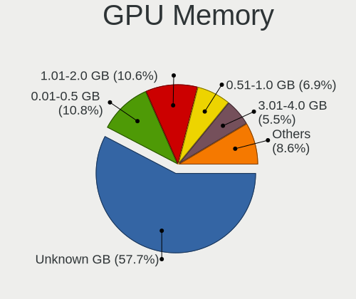

Linux in Germany - Tested Hardware & Statistics
-----------------------------------------------

A project to collect tested hardware configurations for Linux in Germany.

Anyone can contribute to this report by the [hw-probe](https://github.com/linuxhw/hw-probe) tool:

    sudo -E hw-probe -all -upload

Please contribute! Especially if your hardware is rare.

This is a report for all computer types. See also reports for [desktops](/Location/Germany/Desktop/README.md) and [notebooks](/Location/Germany/Notebook/README.md).

Contents
--------

* [ Test Cases ](#test-cases)

* [ System ](#system)
  - [ OS                       ](#os)
  - [ OS Family                ](#os-family)
  - [ Kernel                   ](#kernel)
  - [ Kernel Family            ](#kernel-family)
  - [ Kernel Major Ver.        ](#kernel-major-ver)
  - [ Arch                     ](#arch)
  - [ DE                       ](#de)
  - [ Display Server           ](#display-server)
  - [ Display Manager          ](#display-manager)
  - [ OS Lang                  ](#os-lang)
  - [ Boot Mode                ](#boot-mode)
  - [ Filesystem               ](#filesystem)
  - [ Part. scheme             ](#part-scheme)
  - [ Dual Boot with Linux/BSD ](#dual-boot-with-linuxbsd)
  - [ Dual Boot (Win)          ](#dual-boot-win)

* [ Board ](#board)
  - [ Vendor                   ](#vendor)
  - [ Model                    ](#model)
  - [ Model Family             ](#model-family)
  - [ MFG Year                 ](#mfg-year)
  - [ Form Factor              ](#form-factor)
  - [ Secure Boot              ](#secure-boot)
  - [ Coreboot                 ](#coreboot)
  - [ RAM Size                 ](#ram-size)
  - [ RAM Used                 ](#ram-used)
  - [ Total Drives             ](#total-drives)
  - [ Has CD-ROM               ](#has-cd-rom)
  - [ Has Ethernet             ](#has-ethernet)
  - [ Has WiFi                 ](#has-wifi)
  - [ Has Bluetooth            ](#has-bluetooth)

* [ Location ](#location)
  - [ Country                  ](#country)
  - [ City                     ](#city)

* [ Drives ](#drives)
  - [ Drive Vendor             ](#drive-vendor)
  - [ Drive Model              ](#drive-model)
  - [ HDD Vendor               ](#hdd-vendor)
  - [ SSD Vendor               ](#ssd-vendor)
  - [ Drive Kind               ](#drive-kind)
  - [ Drive Connector          ](#drive-connector)
  - [ Drive Size               ](#drive-size)
  - [ Space Total              ](#space-total)
  - [ Space Used               ](#space-used)
  - [ Malfunc. Drives          ](#malfunc-drives)
  - [ Malfunc. Drive Vendor    ](#malfunc-drive-vendor)
  - [ Malfunc. HDD Vendor      ](#malfunc-hdd-vendor)
  - [ Malfunc. Drive Kind      ](#malfunc-drive-kind)
  - [ Failed Drives            ](#failed-drives)
  - [ Failed Drive Vendor      ](#failed-drive-vendor)
  - [ Drive Status             ](#drive-status)

* [ Storage controller ](#storage-controller)
  - [ Storage Vendor           ](#storage-vendor)
  - [ Storage Model            ](#storage-model)
  - [ Storage Kind             ](#storage-kind)

* [ Processor ](#processor)
  - [ CPU Vendor               ](#cpu-vendor)
  - [ CPU Model                ](#cpu-model)
  - [ CPU Model Family         ](#cpu-model-family)
  - [ CPU Cores                ](#cpu-cores)
  - [ CPU Sockets              ](#cpu-sockets)
  - [ CPU Threads              ](#cpu-threads)
  - [ CPU Op-Modes             ](#cpu-op-modes)
  - [ CPU Microcode            ](#cpu-microcode)
  - [ CPU Microarch            ](#cpu-microarch)

* [ Graphics ](#graphics)
  - [ GPU Vendor               ](#gpu-vendor)
  - [ GPU Model                ](#gpu-model)
  - [ GPU Combo                ](#gpu-combo)
  - [ GPU Driver               ](#gpu-driver)
  - [ GPU Memory               ](#gpu-memory)

* [ Monitor ](#monitor)
  - [ Monitor Vendor           ](#monitor-vendor)
  - [ Monitor Model            ](#monitor-model)
  - [ Monitor Resolution       ](#monitor-resolution)
  - [ Monitor Diagonal         ](#monitor-diagonal)
  - [ Monitor Width            ](#monitor-width)
  - [ Aspect Ratio             ](#aspect-ratio)
  - [ Monitor Area             ](#monitor-area)
  - [ Pixel Density            ](#pixel-density)
  - [ Multiple Monitors        ](#multiple-monitors)

* [ Network ](#network)
  - [ Net Controller Vendor    ](#net-controller-vendor)
  - [ Net Controller Model     ](#net-controller-model)
  - [ Wireless Vendor          ](#wireless-vendor)
  - [ Wireless Model           ](#wireless-model)
  - [ Ethernet Vendor          ](#ethernet-vendor)
  - [ Ethernet Model           ](#ethernet-model)
  - [ Net Controller Kind      ](#net-controller-kind)
  - [ Used Controller          ](#used-controller)
  - [ NICs                     ](#nics)
  - [ IPv6                     ](#ipv6)

* [ Bluetooth ](#bluetooth)
  - [ Bluetooth Vendor         ](#bluetooth-vendor)
  - [ Bluetooth Model          ](#bluetooth-model)

* [ Sound ](#sound)
  - [ Sound Vendor             ](#sound-vendor)
  - [ Sound Model              ](#sound-model)

* [ Memory ](#memory)
  - [ Memory Vendor            ](#memory-vendor)
  - [ Memory Model             ](#memory-model)
  - [ Memory Kind              ](#memory-kind)
  - [ Memory Form Factor       ](#memory-form-factor)
  - [ Memory Size              ](#memory-size)
  - [ Memory Speed             ](#memory-speed)

* [ Printers & scanners ](#printers--scanners)
  - [ Printer Vendor           ](#printer-vendor)
  - [ Printer Model            ](#printer-model)
  - [ Scanner Vendor           ](#scanner-vendor)
  - [ Scanner Model            ](#scanner-model)

* [ Camera ](#camera)
  - [ Camera Vendor            ](#camera-vendor)
  - [ Camera Model             ](#camera-model)

* [ Security ](#security)
  - [ Fingerprint Vendor       ](#fingerprint-vendor)
  - [ Fingerprint Model        ](#fingerprint-model)
  - [ Chipcard Vendor          ](#chipcard-vendor)
  - [ Chipcard Model           ](#chipcard-model)

* [ Unsupported ](#unsupported)
  - [ Unsupported Devices      ](#unsupported-devices)
  - [ Unsupported Device Types ](#unsupported-device-types)

Test Cases
----------

Total: 21705

| Vendor        | Model                       | Form-Factor | Probe                                                      | Date         |
|---------------|-----------------------------|-------------|------------------------------------------------------------|--------------|
| Toshiba       | Satellite L500              | Notebook    | [21d4b0ac95](https://linux-hardware.org/?probe=21d4b0ac95) | Aug 01, 2022 |
| ASRock        | E350M1                      | Desktop     | [87efe56c26](https://linux-hardware.org/?probe=87efe56c26) | Aug 01, 2022 |
| Lenovo        | MIIX 310-10ICR 80SG         | Tablet      | [d5cc0b11b3](https://linux-hardware.org/?probe=d5cc0b11b3) | Aug 01, 2022 |
| Lenovo        | IdeaPad 330S-15IKB 81F5     | Notebook    | [e512f0884d](https://linux-hardware.org/?probe=e512f0884d) | Aug 01, 2022 |
| TrekStor      | Primebook C13               | Convertible | [e45c26fec9](https://linux-hardware.org/?probe=e45c26fec9) | Aug 01, 2022 |
| Notebook      | V15x_V17xPNKPNJPNH          | Notebook    | [ae2fa8b811](https://linux-hardware.org/?probe=ae2fa8b811) | Aug 01, 2022 |
| Lenovo        | MIIX 310-10ICR 80SG         | Tablet      | [ac55d79050](https://linux-hardware.org/?probe=ac55d79050) | Aug 01, 2022 |
| MSI           | X370 KRAIT GAMING           | Desktop     | [fe950a68a3](https://linux-hardware.org/?probe=fe950a68a3) | Aug 01, 2022 |
| ASUSTek       | F2A55-M LK2                 | Desktop     | [97a5e9c390](https://linux-hardware.org/?probe=97a5e9c390) | Aug 01, 2022 |
| ASUSTek       | M2A-VM                      | Desktop     | [4b1dabbf52](https://linux-hardware.org/?probe=4b1dabbf52) | Aug 01, 2022 |
| ASUSTek       | Maximus IX FORMULA          | Desktop     | [2212732244](https://linux-hardware.org/?probe=2212732244) | Aug 01, 2022 |
| Samsung       | R59P/R60P/R61P              | Notebook    | [93794bf0b1](https://linux-hardware.org/?probe=93794bf0b1) | Aug 01, 2022 |
| Acer          | Veriton M4620G v1.0         | Desktop     | [13304f7d9e](https://linux-hardware.org/?probe=13304f7d9e) | Jul 31, 2022 |
| Raspberry ... | Raspberry Pi                | Soc         | [d058d6504b](https://linux-hardware.org/?probe=d058d6504b) | Jul 31, 2022 |
| Dell          | 0T656F A01                  | Desktop     | [02ae993867](https://linux-hardware.org/?probe=02ae993867) | Jul 31, 2022 |
| ASRock        | AB350 Pro4                  | Desktop     | [c300f62638](https://linux-hardware.org/?probe=c300f62638) | Jul 31, 2022 |
| ASRock        | N68-S3 UCC                  | Desktop     | [bcb1d1da28](https://linux-hardware.org/?probe=bcb1d1da28) | Jul 31, 2022 |
| ASUSTek       | P8B75-M LX                  | Desktop     | [653f46c8e3](https://linux-hardware.org/?probe=653f46c8e3) | Jul 31, 2022 |
| HP            | Pavilion 17                 | Notebook    | [b2c0846cf5](https://linux-hardware.org/?probe=b2c0846cf5) | Jul 31, 2022 |
| Dell          | Latitude 5290 2-in-1        | Notebook    | [838be3a87a](https://linux-hardware.org/?probe=838be3a87a) | Jul 31, 2022 |
| Lenovo        | ThinkPad E14 Gen 3 20YDS... | Notebook    | [b2385a694b](https://linux-hardware.org/?probe=b2385a694b) | Jul 31, 2022 |
| MSI           | X399 SLI PLUS               | Desktop     | [515c5375c1](https://linux-hardware.org/?probe=515c5375c1) | Jul 31, 2022 |
| Lenovo        | Yoga C640-13IML LTE 81XL    | Convertible | [ba38f82ab8](https://linux-hardware.org/?probe=ba38f82ab8) | Jul 31, 2022 |
| ASUSTek       | PRIME X370-PRO              | Desktop     | [80007c0939](https://linux-hardware.org/?probe=80007c0939) | Jul 31, 2022 |
| MSI           | B85M-P33                    | Desktop     | [6e9af1d1e4](https://linux-hardware.org/?probe=6e9af1d1e4) | Jul 31, 2022 |
| Acer          | Swift SF314-51              | Notebook    | [f9a61fd8ad](https://linux-hardware.org/?probe=f9a61fd8ad) | Jul 31, 2022 |
| Dell          | 052RF2 A01                  | Server      | [abe955b96f](https://linux-hardware.org/?probe=abe955b96f) | Jul 31, 2022 |
| Dell          | 052RF2 A01                  | Server      | [8ffda4cfe7](https://linux-hardware.org/?probe=8ffda4cfe7) | Jul 31, 2022 |
| ASUSTek       | PRIME X399-A                | Desktop     | [4fba223020](https://linux-hardware.org/?probe=4fba223020) | Jul 31, 2022 |
| Lenovo        | 3106 SDK0J40697 WIN 3305... | Desktop     | [cc1944f4a3](https://linux-hardware.org/?probe=cc1944f4a3) | Jul 31, 2022 |
| Acer          | Aspire A315-54K             | Notebook    | [d090bce067](https://linux-hardware.org/?probe=d090bce067) | Jul 30, 2022 |
| Fujitsu       | LIFEBOOK U727               | Notebook    | [7aa483a43c](https://linux-hardware.org/?probe=7aa483a43c) | Jul 30, 2022 |
| Acer          | Swift SF314-43              | Notebook    | [36659d2410](https://linux-hardware.org/?probe=36659d2410) | Jul 30, 2022 |
| Dell          | Latitude E6320              | Notebook    | [34270898c6](https://linux-hardware.org/?probe=34270898c6) | Jul 30, 2022 |
| Samsung       | R59P/R60P/R61P              | Notebook    | [b0b9ddad28](https://linux-hardware.org/?probe=b0b9ddad28) | Jul 30, 2022 |
| Lenovo        | IdeaPad S145-15API 81UT     | Notebook    | [34958fdaac](https://linux-hardware.org/?probe=34958fdaac) | Jul 30, 2022 |
| MSI           | MEG Z690 UNIFY              | Desktop     | [571f500e5e](https://linux-hardware.org/?probe=571f500e5e) | Jul 30, 2022 |
| ASRock        | Z390 Extreme4               | Desktop     | [670d8c5f1e](https://linux-hardware.org/?probe=670d8c5f1e) | Jul 30, 2022 |
| HP            | Spectre x360 Convertible... | Convertible | [d31203b4de](https://linux-hardware.org/?probe=d31203b4de) | Jul 30, 2022 |
| Dell          | Vostro 15 3515              | Notebook    | [74b9e88d97](https://linux-hardware.org/?probe=74b9e88d97) | Jul 30, 2022 |
| Lenovo        | IdeaPad D330-10IGM 81MD     | Tablet      | [d21006410b](https://linux-hardware.org/?probe=d21006410b) | Jul 30, 2022 |
| Lenovo        | ThinkPad X270 20HMS12K00    | Notebook    | [b3d3ab37ef](https://linux-hardware.org/?probe=b3d3ab37ef) | Jul 30, 2022 |
| Dell          | Latitude E5540              | Notebook    | [67063fe669](https://linux-hardware.org/?probe=67063fe669) | Jul 30, 2022 |
| Dell          | 06NWYK A00                  | Desktop     | [1182388bb6](https://linux-hardware.org/?probe=1182388bb6) | Jul 30, 2022 |
| MSI           | MS-7418 100                 | Desktop     | [c17e48cc2b](https://linux-hardware.org/?probe=c17e48cc2b) | Jul 30, 2022 |
| MSI           | MS-7418 100                 | Desktop     | [4644e4eaa8](https://linux-hardware.org/?probe=4644e4eaa8) | Jul 30, 2022 |
| ASUSTek       | P8B75-M                     | Desktop     | [ddf26da899](https://linux-hardware.org/?probe=ddf26da899) | Jul 30, 2022 |
| ASRock        | Z390 Extreme4               | Desktop     | [8130877fa3](https://linux-hardware.org/?probe=8130877fa3) | Jul 30, 2022 |
| Intel Clie... | LAPKC71F                    | Notebook    | [0783ac445f](https://linux-hardware.org/?probe=0783ac445f) | Jul 30, 2022 |
| MSI           | B450M MORTAR MAX            | Desktop     | [1316e90024](https://linux-hardware.org/?probe=1316e90024) | Jul 30, 2022 |
| ASUSTek       | STRIX Z270F GAMING          | Desktop     | [3b1f863612](https://linux-hardware.org/?probe=3b1f863612) | Jul 30, 2022 |
| MSI           | X470 GAMING PRO MAX         | Desktop     | [5651db0a63](https://linux-hardware.org/?probe=5651db0a63) | Jul 30, 2022 |
| Lenovo        | IdeaPad Gaming 3 15ACH6 ... | Notebook    | [0dce3ee4a5](https://linux-hardware.org/?probe=0dce3ee4a5) | Jul 30, 2022 |
| Lenovo        | IdeaPad Gaming 3 15ACH6 ... | Notebook    | [90fec04191](https://linux-hardware.org/?probe=90fec04191) | Jul 30, 2022 |
| Gigabyte      | 970A-DS3                    | Desktop     | [78f00bd2aa](https://linux-hardware.org/?probe=78f00bd2aa) | Jul 30, 2022 |
| Razer         | Blade 15 Studio Edition ... | Notebook    | [359f708604](https://linux-hardware.org/?probe=359f708604) | Jul 30, 2022 |
| ASUSTek       | PRIME Z590-P                | Desktop     | [a90cc43a4b](https://linux-hardware.org/?probe=a90cc43a4b) | Jul 29, 2022 |
| Acer          | Aspire A317-33              | Notebook    | [ab07e43574](https://linux-hardware.org/?probe=ab07e43574) | Jul 29, 2022 |
| Acer          | AO756                       | Notebook    | [8203ac54d7](https://linux-hardware.org/?probe=8203ac54d7) | Jul 29, 2022 |
| ASUSTek       | GL553VE                     | Notebook    | [0bbcd152c5](https://linux-hardware.org/?probe=0bbcd152c5) | Jul 29, 2022 |
| Samsung       | R505                        | Notebook    | [4f92cf3c93](https://linux-hardware.org/?probe=4f92cf3c93) | Jul 29, 2022 |
| Gigabyte      | GA-890XA-UD3                | Desktop     | [b05155fd03](https://linux-hardware.org/?probe=b05155fd03) | Jul 29, 2022 |
| Gigabyte      | H77-D3H                     | Desktop     | [a1b47c2f81](https://linux-hardware.org/?probe=a1b47c2f81) | Jul 29, 2022 |
| Schenker      | VISION 15 (SVS15E21)        | Notebook    | [aa446a0409](https://linux-hardware.org/?probe=aa446a0409) | Jul 29, 2022 |
| ASRock        | B85 Pro4                    | Desktop     | [98e02ef2cd](https://linux-hardware.org/?probe=98e02ef2cd) | Jul 29, 2022 |
| Lenovo        | ThinkPad E14 Gen 4 21E30... | Notebook    | [0121efa569](https://linux-hardware.org/?probe=0121efa569) | Jul 29, 2022 |
| ASUSTek       | Z87-PRO                     | Desktop     | [715fac7551](https://linux-hardware.org/?probe=715fac7551) | Jul 29, 2022 |
| ASRock        | B85 Pro4                    | Desktop     | [ec68a40236](https://linux-hardware.org/?probe=ec68a40236) | Jul 29, 2022 |
| Biostar       | A880G+                      | Desktop     | [5f10c78e54](https://linux-hardware.org/?probe=5f10c78e54) | Jul 29, 2022 |
| Gigabyte      | H510M S2H                   | Desktop     | [7c42ac18e4](https://linux-hardware.org/?probe=7c42ac18e4) | Jul 29, 2022 |
| Lenovo        | 1046 SDK0T08861 WIN 3305... | Desktop     | [d3d824f468](https://linux-hardware.org/?probe=d3d824f468) | Jul 29, 2022 |
| Fujitsu       | D3313-A1 S26361-D3313-A1    | Desktop     | [902ee3b350](https://linux-hardware.org/?probe=902ee3b350) | Jul 29, 2022 |
| Dell          | Latitude 5290 2-in-1        | Notebook    | [8d93753bc7](https://linux-hardware.org/?probe=8d93753bc7) | Jul 29, 2022 |
| Dell          | Latitude 5290 2-in-1        | Notebook    | [910241c92e](https://linux-hardware.org/?probe=910241c92e) | Jul 29, 2022 |
| MSI           | B450M MORTAR                | Desktop     | [29a26324b9](https://linux-hardware.org/?probe=29a26324b9) | Jul 29, 2022 |
| ASUSTek       | P8B75-M LX                  | Desktop     | [af972287a0](https://linux-hardware.org/?probe=af972287a0) | Jul 29, 2022 |
| ASUSTek       | PRIME B450M-K               | Desktop     | [aa77364c9c](https://linux-hardware.org/?probe=aa77364c9c) | Jul 29, 2022 |
| Acer          | Aspire 7520                 | Notebook    | [934f648cb3](https://linux-hardware.org/?probe=934f648cb3) | Jul 28, 2022 |
| HP            | Pavilion 13 x360 PC         | Notebook    | [a5220ea2c0](https://linux-hardware.org/?probe=a5220ea2c0) | Jul 28, 2022 |
| Gigabyte      | P55M-UD2                    | Desktop     | [1920d703bb](https://linux-hardware.org/?probe=1920d703bb) | Jul 28, 2022 |
| Gigabyte      | B550M AORUS PRO             | Desktop     | [7a5337e18d](https://linux-hardware.org/?probe=7a5337e18d) | Jul 28, 2022 |
| Samsung       | R59P/R60P/R61P              | Notebook    | [d435057109](https://linux-hardware.org/?probe=d435057109) | Jul 28, 2022 |
| MSI           | B550-A PRO                  | Desktop     | [f597d7cc46](https://linux-hardware.org/?probe=f597d7cc46) | Jul 28, 2022 |
| HP            | Laptop 15s-eq2xxx           | Notebook    | [0b664049a0](https://linux-hardware.org/?probe=0b664049a0) | Jul 28, 2022 |
| ASUSTek       | H97-PRO                     | Desktop     | [ca77f59b41](https://linux-hardware.org/?probe=ca77f59b41) | Jul 28, 2022 |
| Dell          | Inspiron 13-7359            | Notebook    | [24fa962b0b](https://linux-hardware.org/?probe=24fa962b0b) | Jul 28, 2022 |
| MSI           | B550-A PRO                  | Desktop     | [2ae0b5a47a](https://linux-hardware.org/?probe=2ae0b5a47a) | Jul 28, 2022 |
| Timi          | TM1703                      | Notebook    | [b3c578658f](https://linux-hardware.org/?probe=b3c578658f) | Jul 28, 2022 |
| Lenovo        | ThinkPad T15g Gen 2i 20Y... | Notebook    | [387255a978](https://linux-hardware.org/?probe=387255a978) | Jul 28, 2022 |
| Biostar       | B365MHC                     | Desktop     | [9defcd36e9](https://linux-hardware.org/?probe=9defcd36e9) | Jul 28, 2022 |
| Lenovo        | ThinkPad P50 20EQS2J900     | Notebook    | [87bc2728b0](https://linux-hardware.org/?probe=87bc2728b0) | Jul 28, 2022 |
| ASUSTek       | H110M-A/M.2                 | Desktop     | [93ad7b0efb](https://linux-hardware.org/?probe=93ad7b0efb) | Jul 28, 2022 |
| Dell          | Latitude E6320              | Notebook    | [a5b77aa0e9](https://linux-hardware.org/?probe=a5b77aa0e9) | Jul 28, 2022 |
| HP            | ZBook Fury 15.6 inch G8 ... | Notebook    | [ce7d32f9d0](https://linux-hardware.org/?probe=ce7d32f9d0) | Jul 28, 2022 |
| Schenker      | WORK (Early 2021)           | Notebook    | [8666cc396a](https://linux-hardware.org/?probe=8666cc396a) | Jul 28, 2022 |
| Dell          | Latitude 3190               | Notebook    | [36027c80d2](https://linux-hardware.org/?probe=36027c80d2) | Jul 28, 2022 |
| Lenovo        | IdeaPad U430 Touch 20270    | Notebook    | [d73469794d](https://linux-hardware.org/?probe=d73469794d) | Jul 28, 2022 |
| ASUSTek       | Z170-A                      | Desktop     | [47f6481e91](https://linux-hardware.org/?probe=47f6481e91) | Jul 28, 2022 |
| Wortmann      | TERRA_MOBILE_1528P/1748P    | Notebook    | [7bcdc30be3](https://linux-hardware.org/?probe=7bcdc30be3) | Jul 28, 2022 |
| Dell          | XPS 13 7390 2-in-1          | Convertible | [ba8e73bd09](https://linux-hardware.org/?probe=ba8e73bd09) | Jul 28, 2022 |
| ASUSTek       | EB1012G                     | Desktop     | [45c78b3ee4](https://linux-hardware.org/?probe=45c78b3ee4) | Jul 28, 2022 |
| HP            | Pavilion g7                 | Notebook    | [02040b1ca1](https://linux-hardware.org/?probe=02040b1ca1) | Jul 27, 2022 |
| Lenovo        | ThinkPad P50 20EQS4QL11     | Notebook    | [bc3633b5a0](https://linux-hardware.org/?probe=bc3633b5a0) | Jul 27, 2022 |
| Lenovo        | ThinkPad T440 20B7S3UD00    | Notebook    | [a24d38402a](https://linux-hardware.org/?probe=a24d38402a) | Jul 27, 2022 |
| Dell          | 06NWYK A00                  | Desktop     | [4f90c96687](https://linux-hardware.org/?probe=4f90c96687) | Jul 27, 2022 |
| Lenovo        | IdeaPad 110-17ACL 80UM      | Notebook    | [5660ecabaa](https://linux-hardware.org/?probe=5660ecabaa) | Jul 27, 2022 |
| ASRock        | X300M-STX                   | Desktop     | [859f2b1a9c](https://linux-hardware.org/?probe=859f2b1a9c) | Jul 27, 2022 |
| Fujitsu       | D3062-A1 S26361-D3062-A1    | Desktop     | [d0ef6d20cf](https://linux-hardware.org/?probe=d0ef6d20cf) | Jul 27, 2022 |
| HP            | Compaq 6720s                | Notebook    | [d8546f791c](https://linux-hardware.org/?probe=d8546f791c) | Jul 27, 2022 |
| Gigabyte      | 970A-UD3P                   | Desktop     | [0d503b2789](https://linux-hardware.org/?probe=0d503b2789) | Jul 27, 2022 |
| Lenovo        | SHARKBAY 0B98401 PRO        | Desktop     | [55318bcefe](https://linux-hardware.org/?probe=55318bcefe) | Jul 27, 2022 |
| MSI           | B250M PRO-VDH               | Desktop     | [eb1ff40d2d](https://linux-hardware.org/?probe=eb1ff40d2d) | Jul 27, 2022 |
| HP            | 250 G6 Notebook PC          | Notebook    | [ae677e8869](https://linux-hardware.org/?probe=ae677e8869) | Jul 27, 2022 |
| Lenovo        | B560 43308UG                | Notebook    | [72c6b28a01](https://linux-hardware.org/?probe=72c6b28a01) | Jul 27, 2022 |
| Acer          | EG43M                       | Desktop     | [962c69e9fd](https://linux-hardware.org/?probe=962c69e9fd) | Jul 27, 2022 |
| Dell          | 0200DY A02                  | Desktop     | [40abd530f4](https://linux-hardware.org/?probe=40abd530f4) | Jul 27, 2022 |
| ASUSTek       | PRIME H310M-A R2.0          | Desktop     | [85378ff84a](https://linux-hardware.org/?probe=85378ff84a) | Jul 27, 2022 |
| Raspberry ... | Raspberry Pi                | Soc         | [a13d9afead](https://linux-hardware.org/?probe=a13d9afead) | Jul 27, 2022 |
| Acer          | IPXHW-RL                    | Desktop     | [d99b7cb71e](https://linux-hardware.org/?probe=d99b7cb71e) | Jul 27, 2022 |
| Acer          | Aspire VN7-792G             | Notebook    | [4d80f84b58](https://linux-hardware.org/?probe=4d80f84b58) | Jul 27, 2022 |
| Medion        | MS-7728                     | Desktop     | [662e3948f2](https://linux-hardware.org/?probe=662e3948f2) | Jul 27, 2022 |
| ASUSTek       | TUF B450-PRO GAMING         | Desktop     | [cb4bc3fa42](https://linux-hardware.org/?probe=cb4bc3fa42) | Jul 27, 2022 |
| ASUSTek       | TUF B450-PRO GAMING         | Desktop     | [9f5bf108ac](https://linux-hardware.org/?probe=9f5bf108ac) | Jul 27, 2022 |
| MSI           | B550-A PRO                  | Desktop     | [b924a924e0](https://linux-hardware.org/?probe=b924a924e0) | Jul 27, 2022 |
| Dell          | 06NWYK A00                  | Desktop     | [effad14bc0](https://linux-hardware.org/?probe=effad14bc0) | Jul 26, 2022 |
| Gigabyte      | Z590 AORUS MASTER           | Desktop     | [300ddea4d6](https://linux-hardware.org/?probe=300ddea4d6) | Jul 26, 2022 |
| Gigabyte      | Z370 AORUS Gaming 7         | Desktop     | [6cb2605585](https://linux-hardware.org/?probe=6cb2605585) | Jul 26, 2022 |
| Notebook      | V15x_V17xPNKPNJPNH          | Notebook    | [8aa5207a61](https://linux-hardware.org/?probe=8aa5207a61) | Jul 26, 2022 |
| Lenovo        | ThinkPad SL510 28477MG      | Notebook    | [23c5c0f139](https://linux-hardware.org/?probe=23c5c0f139) | Jul 26, 2022 |
| Notebook      | V15x_V17xPNKPNJPNH          | Notebook    | [fc5bf3cb22](https://linux-hardware.org/?probe=fc5bf3cb22) | Jul 26, 2022 |
| Lenovo        | B560 43308UG                | Notebook    | [4f9d97753e](https://linux-hardware.org/?probe=4f9d97753e) | Jul 26, 2022 |
| Notebook      | V15x_V17xPNKPNJPNH          | Notebook    | [c0b3aa1bea](https://linux-hardware.org/?probe=c0b3aa1bea) | Jul 26, 2022 |
| ASUSTek       | P8B75-M                     | Desktop     | [46e85f96ca](https://linux-hardware.org/?probe=46e85f96ca) | Jul 26, 2022 |
| Lenovo        | ThinkPad T14 Gen 2a 20XL... | Notebook    | [c80bf22d79](https://linux-hardware.org/?probe=c80bf22d79) | Jul 26, 2022 |
| ASRock        | J5005-ITX                   | Desktop     | [36313bb369](https://linux-hardware.org/?probe=36313bb369) | Jul 26, 2022 |
| Gigabyte      | Z590 GAMING X               | Desktop     | [6701685bb5](https://linux-hardware.org/?probe=6701685bb5) | Jul 26, 2022 |
| HP            | EliteBook 845 G7 Noteboo... | Notebook    | [b15fb90c18](https://linux-hardware.org/?probe=b15fb90c18) | Jul 26, 2022 |
| Acer          | Spin SP314-54N              | Convertible | [8f19252d3b](https://linux-hardware.org/?probe=8f19252d3b) | Jul 26, 2022 |
| MSI           | B450M PRO-VDH MAX           | Desktop     | [941092ee95](https://linux-hardware.org/?probe=941092ee95) | Jul 26, 2022 |
| Lenovo        | Legion 5 15IMH05H 81Y6      | Notebook    | [04ae47501b](https://linux-hardware.org/?probe=04ae47501b) | Jul 26, 2022 |
| ASUSTek       | PRIME Z690M-HZ              | Desktop     | [9d3da43bea](https://linux-hardware.org/?probe=9d3da43bea) | Jul 25, 2022 |
| ASRock        | M3A785GMH/128M              | Desktop     | [87836918b2](https://linux-hardware.org/?probe=87836918b2) | Jul 25, 2022 |
| Gigabyte      | X570 AORUS MASTER           | Desktop     | [3a34e9c018](https://linux-hardware.org/?probe=3a34e9c018) | Jul 25, 2022 |
| Medion        | MS-7797                     | Desktop     | [9ad7252b8a](https://linux-hardware.org/?probe=9ad7252b8a) | Jul 25, 2022 |
| MSI           | H510M PRO                   | Desktop     | [07c98d99d5](https://linux-hardware.org/?probe=07c98d99d5) | Jul 25, 2022 |
| Lenovo        | ThinkPad P14s Gen 2a 21A... | Notebook    | [52d58f31bb](https://linux-hardware.org/?probe=52d58f31bb) | Jul 25, 2022 |
| Dell          | 0FKD45 A03                  | Server      | [0caba2e4b0](https://linux-hardware.org/?probe=0caba2e4b0) | Jul 25, 2022 |
| Apple         | MacBookAir6,2               | Notebook    | [608ea688bb](https://linux-hardware.org/?probe=608ea688bb) | Jul 25, 2022 |
| MSI           | H510M PRO                   | Desktop     | [e8693a9212](https://linux-hardware.org/?probe=e8693a9212) | Jul 25, 2022 |
| ASRockRack    | B565D4-V1L                  | Desktop     | [1301ad9bd0](https://linux-hardware.org/?probe=1301ad9bd0) | Jul 25, 2022 |
| TUXEDO        | Pulse 15 Gen1               | Notebook    | [2a95697c62](https://linux-hardware.org/?probe=2a95697c62) | Jul 25, 2022 |
| Lenovo        | YB1-X91L                    | Convertible | [99c0ca0d0b](https://linux-hardware.org/?probe=99c0ca0d0b) | Jul 25, 2022 |
| Lenovo        | YB1-X91L                    | Convertible | [e39f15a1b5](https://linux-hardware.org/?probe=e39f15a1b5) | Jul 25, 2022 |
| ASUSTek       | A78M-E                      | Desktop     | [50b987b79d](https://linux-hardware.org/?probe=50b987b79d) | Jul 25, 2022 |
| TUXEDO        | Pulse 15 Gen1               | Notebook    | [56c2008bb6](https://linux-hardware.org/?probe=56c2008bb6) | Jul 25, 2022 |
| Acer          | Aspire 5741G                | Notebook    | [a4f8482423](https://linux-hardware.org/?probe=a4f8482423) | Jul 25, 2022 |
| ASUSTek       | K53SJ                       | Notebook    | [65ab921933](https://linux-hardware.org/?probe=65ab921933) | Jul 25, 2022 |
| Apple         | MacBookPro12,1              | Notebook    | [4db419918b](https://linux-hardware.org/?probe=4db419918b) | Jul 25, 2022 |
| Chuwi         | GemiBook Pro                | Notebook    | [fbc796621e](https://linux-hardware.org/?probe=fbc796621e) | Jul 25, 2022 |
| Dell          | Inspiron 15-5578            | Notebook    | [7621729bff](https://linux-hardware.org/?probe=7621729bff) | Jul 25, 2022 |
| ASUSTek       | X550JX                      | Notebook    | [52fba9d147](https://linux-hardware.org/?probe=52fba9d147) | Jul 24, 2022 |
| Lenovo        | IdeaPad 5 15ALC05 82LN      | Notebook    | [2c515ee09a](https://linux-hardware.org/?probe=2c515ee09a) | Jul 24, 2022 |
| Lenovo        | IdeaPad 5 15ALC05 82LN      | Notebook    | [e24e72037a](https://linux-hardware.org/?probe=e24e72037a) | Jul 24, 2022 |
| Lenovo        | ThinkBook 15 G2 ARE 20VG    | Notebook    | [04737cec4e](https://linux-hardware.org/?probe=04737cec4e) | Jul 24, 2022 |
| Lenovo        | ThinkPad P50 20EN0008GE     | Notebook    | [93ec0d85ab](https://linux-hardware.org/?probe=93ec0d85ab) | Jul 24, 2022 |
| Packard Be... | EasyNote_MX52-B-122GE       | Notebook    | [4072fa2654](https://linux-hardware.org/?probe=4072fa2654) | Jul 24, 2022 |
| HP            | Laptop 17-cn0xxx            | Notebook    | [55d8e5a779](https://linux-hardware.org/?probe=55d8e5a779) | Jul 24, 2022 |
| ASRock        | H81M-HDS                    | Desktop     | [b3f2310571](https://linux-hardware.org/?probe=b3f2310571) | Jul 24, 2022 |
| Dell          | 03NVJ6 A03                  | Desktop     | [9c0bb64bd9](https://linux-hardware.org/?probe=9c0bb64bd9) | Jul 24, 2022 |
| ASRock        | B450 Gaming-ITX/ac          | Desktop     | [221bb14fbd](https://linux-hardware.org/?probe=221bb14fbd) | Jul 24, 2022 |
| Dell          | Latitude E4300              | Notebook    | [47cbd9b7d7](https://linux-hardware.org/?probe=47cbd9b7d7) | Jul 24, 2022 |
| ASUSTek       | TUF Gaming B550-PLUS        | Desktop     | [a1aa08113d](https://linux-hardware.org/?probe=a1aa08113d) | Jul 24, 2022 |
| HP            | Pavilion Aero Laptop 13-... | Notebook    | [e1850b16b9](https://linux-hardware.org/?probe=e1850b16b9) | Jul 24, 2022 |
| Lenovo        | ThinkPad T590 20N5S4R800    | Notebook    | [60dd75eca9](https://linux-hardware.org/?probe=60dd75eca9) | Jul 24, 2022 |
| HP            | 255 G7 Notebook PC          | Notebook    | [8dba689d5c](https://linux-hardware.org/?probe=8dba689d5c) | Jul 24, 2022 |
| Dell          | Latitude E6430              | Notebook    | [8bc3b0f962](https://linux-hardware.org/?probe=8bc3b0f962) | Jul 23, 2022 |
| Gigabyte      | GA-78LMT-USB3               | Desktop     | [d0a69fba02](https://linux-hardware.org/?probe=d0a69fba02) | Jul 23, 2022 |
| HP            | 339A                        | Desktop     | [313af629be](https://linux-hardware.org/?probe=313af629be) | Jul 23, 2022 |
| HP            | ProBook 450 G3              | Notebook    | [288db20204](https://linux-hardware.org/?probe=288db20204) | Jul 23, 2022 |
| HP            | EliteBook 8470p             | Notebook    | [886e4c6e35](https://linux-hardware.org/?probe=886e4c6e35) | Jul 23, 2022 |
| Apple         | Mac-F2268CC8                | All in one  | [c59a4196e3](https://linux-hardware.org/?probe=c59a4196e3) | Jul 23, 2022 |
| Lenovo        | ThinkPad T480s 20L8S02D0... | Notebook    | [ce6a0d666e](https://linux-hardware.org/?probe=ce6a0d666e) | Jul 23, 2022 |
| MSI           | 970 GAMING                  | Desktop     | [2814270f24](https://linux-hardware.org/?probe=2814270f24) | Jul 23, 2022 |
| Lenovo        | ThinkPad T480s 20L8S02D0... | Notebook    | [6a1cb48f15](https://linux-hardware.org/?probe=6a1cb48f15) | Jul 23, 2022 |
| ASUSTek       | PRIME B450M-A               | Desktop     | [b0e3bc86bc](https://linux-hardware.org/?probe=b0e3bc86bc) | Jul 23, 2022 |
| ASUSTek       | PRIME B450M-A               | Desktop     | [8288af270f](https://linux-hardware.org/?probe=8288af270f) | Jul 23, 2022 |
| Lenovo        | G710 20252                  | Notebook    | [87b375d9cf](https://linux-hardware.org/?probe=87b375d9cf) | Jul 22, 2022 |
| HP            | 08B4h                       | Desktop     | [8ff662507a](https://linux-hardware.org/?probe=8ff662507a) | Jul 22, 2022 |
| Dell          | XPS 15 9500                 | Notebook    | [51963194e9](https://linux-hardware.org/?probe=51963194e9) | Jul 22, 2022 |
| MSI           | Z77A-GD65                   | Desktop     | [f0cf5d1f55](https://linux-hardware.org/?probe=f0cf5d1f55) | Jul 22, 2022 |
| Gigabyte      | GA-78LMT-USB3 R2            | Desktop     | [a57ab4e2dc](https://linux-hardware.org/?probe=a57ab4e2dc) | Jul 22, 2022 |
| Valve         | Jupiter                     | Notebook    | [44dca72cbb](https://linux-hardware.org/?probe=44dca72cbb) | Jul 22, 2022 |
| ASUSTek       | K53SJ                       | Notebook    | [59f427d2dd](https://linux-hardware.org/?probe=59f427d2dd) | Jul 22, 2022 |
| Lenovo        | ThinkPad W541 20EGS1TB00    | Notebook    | [899b18b07f](https://linux-hardware.org/?probe=899b18b07f) | Jul 22, 2022 |
| Lenovo        | B50-30 80ES                 | Notebook    | [086b4a93eb](https://linux-hardware.org/?probe=086b4a93eb) | Jul 22, 2022 |
| ASUSTek       | K93SM                       | Notebook    | [add292129b](https://linux-hardware.org/?probe=add292129b) | Jul 22, 2022 |
| ASUSTek       | K50IJ                       | Notebook    | [3b0f675b34](https://linux-hardware.org/?probe=3b0f675b34) | Jul 22, 2022 |
| MSI           | Z77A-GD65                   | Desktop     | [edfa6cb848](https://linux-hardware.org/?probe=edfa6cb848) | Jul 22, 2022 |
| Lenovo        | ThinkPad T61 6458W4B        | Notebook    | [3d51bdb900](https://linux-hardware.org/?probe=3d51bdb900) | Jul 22, 2022 |
| Biostar       | A10N-8800E                  | Desktop     | [3f61195f75](https://linux-hardware.org/?probe=3f61195f75) | Jul 22, 2022 |
| Lenovo        | IdeaPad 120S-11IAP 81A4     | Notebook    | [85475685f1](https://linux-hardware.org/?probe=85475685f1) | Jul 22, 2022 |
| Lenovo        | ThinkPad T480s 20L8S02D0... | Notebook    | [55f1eaa96c](https://linux-hardware.org/?probe=55f1eaa96c) | Jul 22, 2022 |
| Lenovo        | ThinkPad T480s 20L8S02D0... | Notebook    | [090cc78b83](https://linux-hardware.org/?probe=090cc78b83) | Jul 22, 2022 |
| MSI           | MAG B550M MORTAR            | Desktop     | [51c2b5bc3b](https://linux-hardware.org/?probe=51c2b5bc3b) | Jul 22, 2022 |
| HP            | 0AECh D                     | Desktop     | [ca7abdaae0](https://linux-hardware.org/?probe=ca7abdaae0) | Jul 22, 2022 |
| Lenovo        | ThinkPad E14 Gen 4 21ECS... | Notebook    | [da25f9d9b4](https://linux-hardware.org/?probe=da25f9d9b4) | Jul 22, 2022 |
| Dell          | 0GY6Y8 A03                  | Desktop     | [88d49ee4d4](https://linux-hardware.org/?probe=88d49ee4d4) | Jul 21, 2022 |
| HUAWEI        | NBLK-WAX9X                  | Notebook    | [83a8a7c32d](https://linux-hardware.org/?probe=83a8a7c32d) | Jul 21, 2022 |
| ASUSTek       | P9X79                       | Desktop     | [5ff04691ce](https://linux-hardware.org/?probe=5ff04691ce) | Jul 21, 2022 |
| Dell          | 0GY6Y8 A03                  | Desktop     | [636819dfaf](https://linux-hardware.org/?probe=636819dfaf) | Jul 21, 2022 |
| ASUSTek       | P9X79                       | Desktop     | [1bcee43b6e](https://linux-hardware.org/?probe=1bcee43b6e) | Jul 21, 2022 |
| Unknown       | QNAP TS-221                 | Desktop     | [fb3741faab](https://linux-hardware.org/?probe=fb3741faab) | Jul 21, 2022 |
| Toshiba       | Satellite U920T             | Notebook    | [6915cd343b](https://linux-hardware.org/?probe=6915cd343b) | Jul 21, 2022 |
| Gigabyte      | G41MT-S2PT                  | Desktop     | [b291af1e34](https://linux-hardware.org/?probe=b291af1e34) | Jul 21, 2022 |
| Dell          | Latitude E6510              | Notebook    | [83c4ec7108](https://linux-hardware.org/?probe=83c4ec7108) | Jul 21, 2022 |
| Dell          | Latitude 7490               | Notebook    | [9b66106776](https://linux-hardware.org/?probe=9b66106776) | Jul 21, 2022 |
| Gigabyte      | 970A-DS3P                   | Desktop     | [379da1a196](https://linux-hardware.org/?probe=379da1a196) | Jul 21, 2022 |
| Gigabyte      | 970A-DS3P                   | Desktop     | [4a2e56ae7b](https://linux-hardware.org/?probe=4a2e56ae7b) | Jul 21, 2022 |
| HP            | 8054                        | Desktop     | [466d7f5591](https://linux-hardware.org/?probe=466d7f5591) | Jul 21, 2022 |
| HP            | 18E9                        | Desktop     | [f15b2671b0](https://linux-hardware.org/?probe=f15b2671b0) | Jul 21, 2022 |
| Schenker      | XMG CORE 17(M20, GTX 165... | Notebook    | [c63392708b](https://linux-hardware.org/?probe=c63392708b) | Jul 21, 2022 |
| Pegatron      | Benicia                     | Desktop     | [f197aeb457](https://linux-hardware.org/?probe=f197aeb457) | Jul 21, 2022 |
| Acer          | Aspire V5-572P              | Notebook    | [b86d775234](https://linux-hardware.org/?probe=b86d775234) | Jul 20, 2022 |
| Lenovo        | G50-80 80E5                 | Notebook    | [08eac34b26](https://linux-hardware.org/?probe=08eac34b26) | Jul 20, 2022 |
| MSI           | U-100 Ver.001               | Notebook    | [b5b7407958](https://linux-hardware.org/?probe=b5b7407958) | Jul 20, 2022 |
| ASUSTek       | ASUS TUF Gaming F17 FX70... | Notebook    | [891e670c98](https://linux-hardware.org/?probe=891e670c98) | Jul 20, 2022 |
| MSI           | U-100 Ver.001               | Notebook    | [819488216f](https://linux-hardware.org/?probe=819488216f) | Jul 20, 2022 |
| Dell          | Latitude E5430 non-vPro     | Notebook    | [cb0d99b389](https://linux-hardware.org/?probe=cb0d99b389) | Jul 20, 2022 |
| Lenovo        | ThinkPad T15p Gen 2i 21A... | Notebook    | [cf2da4e2da](https://linux-hardware.org/?probe=cf2da4e2da) | Jul 20, 2022 |
| ASUSTek       | ASUS TUF Gaming F17 FX70... | Notebook    | [8c6669501d](https://linux-hardware.org/?probe=8c6669501d) | Jul 20, 2022 |
| Lenovo        | V130-15IKB 81HN             | Notebook    | [fe2f5a993c](https://linux-hardware.org/?probe=fe2f5a993c) | Jul 20, 2022 |
| Dell          | Latitude 9420               | Convertible | [c12c412f89](https://linux-hardware.org/?probe=c12c412f89) | Jul 20, 2022 |
| ASRock        | B450 Pro4                   | Desktop     | [7037061aed](https://linux-hardware.org/?probe=7037061aed) | Jul 20, 2022 |
| Dell          | Latitude 7390               | Notebook    | [805bb4b206](https://linux-hardware.org/?probe=805bb4b206) | Jul 20, 2022 |
| ASUSTek       | TUF Gaming Z690-PLUS        | Desktop     | [468283ab86](https://linux-hardware.org/?probe=468283ab86) | Jul 20, 2022 |
| Lenovo        | ThinkPad L13 Yoga Gen 2a... | Convertible | [6dfbd97685](https://linux-hardware.org/?probe=6dfbd97685) | Jul 20, 2022 |
| Foxconn       | 2AAF                        | Desktop     | [b97dc9fd47](https://linux-hardware.org/?probe=b97dc9fd47) | Jul 20, 2022 |
| Lenovo        | V145-15AST 81MT             | Notebook    | [1fe9c66d6d](https://linux-hardware.org/?probe=1fe9c66d6d) | Jul 20, 2022 |
| Acer          | EQ45M                       | Desktop     | [53a74d39e4](https://linux-hardware.org/?probe=53a74d39e4) | Jul 20, 2022 |
| Gigabyte      | Z77N-WIFI                   | Desktop     | [a29cfe60ae](https://linux-hardware.org/?probe=a29cfe60ae) | Jul 20, 2022 |
| Gigabyte      | GA-78LMT-USB3 SEx           | Desktop     | [d5ebe1a737](https://linux-hardware.org/?probe=d5ebe1a737) | Jul 20, 2022 |
| ASUSTek       | P8H61/USB3 R2.0             | Desktop     | [1076f6d59a](https://linux-hardware.org/?probe=1076f6d59a) | Jul 19, 2022 |
| Lenovo        | G550 2958                   | Notebook    | [caeec900b9](https://linux-hardware.org/?probe=caeec900b9) | Jul 19, 2022 |
| ASUSTek       | STRIX Z270G GAMING          | Desktop     | [795808bf39](https://linux-hardware.org/?probe=795808bf39) | Jul 19, 2022 |
| Acer          | Veriton M2110G              | Desktop     | [060e101a26](https://linux-hardware.org/?probe=060e101a26) | Jul 19, 2022 |
| Huanan        | X99-TF V2.0                 | Desktop     | [4217957e12](https://linux-hardware.org/?probe=4217957e12) | Jul 19, 2022 |
| ASRock        | X570 Taichi                 | Desktop     | [56d5853243](https://linux-hardware.org/?probe=56d5853243) | Jul 19, 2022 |
| MSI           | MAG B550 TOMAHAWK           | Desktop     | [63489ff6e5](https://linux-hardware.org/?probe=63489ff6e5) | Jul 19, 2022 |
| Apple         | MacBookAir7,2               | Notebook    | [5ac0670954](https://linux-hardware.org/?probe=5ac0670954) | Jul 19, 2022 |
| HP            | Laptop 15-db0xxx            | Notebook    | [500de0ae26](https://linux-hardware.org/?probe=500de0ae26) | Jul 19, 2022 |
| Medion        | MS-7797                     | Desktop     | [68faff0dba](https://linux-hardware.org/?probe=68faff0dba) | Jul 19, 2022 |
| Lenovo        | G550 2958                   | Notebook    | [ee73634801](https://linux-hardware.org/?probe=ee73634801) | Jul 19, 2022 |
| MSI           | A320M BAZOOKA               | Desktop     | [d1a4b7b468](https://linux-hardware.org/?probe=d1a4b7b468) | Jul 19, 2022 |
| Lenovo        | B580 4377A5G                | Notebook    | [09d503e36e](https://linux-hardware.org/?probe=09d503e36e) | Jul 19, 2022 |
| Gigabyte      | X570 AORUS MASTER           | Desktop     | [fd46c32d92](https://linux-hardware.org/?probe=fd46c32d92) | Jul 19, 2022 |
| Dell          | 08WKV3 A00                  | Desktop     | [05fb8c3ed5](https://linux-hardware.org/?probe=05fb8c3ed5) | Jul 19, 2022 |
| Biostar       | N61PC-M2S                   | Desktop     | [fcf3368031](https://linux-hardware.org/?probe=fcf3368031) | Jul 18, 2022 |
| Lenovo        | IdeaPad U430 Touch 20270    | Notebook    | [2c43b01e55](https://linux-hardware.org/?probe=2c43b01e55) | Jul 18, 2022 |
| Raspberry ... | Raspberry Pi                | Soc         | [9f9d73ddfb](https://linux-hardware.org/?probe=9f9d73ddfb) | Jul 18, 2022 |
| Lenovo        | ThinkPad E14 Gen 3 20YDS... | Notebook    | [9d756ec471](https://linux-hardware.org/?probe=9d756ec471) | Jul 18, 2022 |
| Apple         | MacBookPro12,1              | Notebook    | [4a5f294565](https://linux-hardware.org/?probe=4a5f294565) | Jul 18, 2022 |
| HP            | Compaq 6910p                | Notebook    | [e6a5ffa902](https://linux-hardware.org/?probe=e6a5ffa902) | Jul 18, 2022 |
| Acer          | Swift SF314-42              | Notebook    | [b4d21f89ed](https://linux-hardware.org/?probe=b4d21f89ed) | Jul 18, 2022 |
| MSI           | MS-98K3                     | Desktop     | [6cf34c40d4](https://linux-hardware.org/?probe=6cf34c40d4) | Jul 18, 2022 |
| Lenovo        | ThinkPad T460p 20FXS0550... | Notebook    | [1a394fdf59](https://linux-hardware.org/?probe=1a394fdf59) | Jul 18, 2022 |
| Notebook      | V15x_V17xPNKPNJPNH          | Notebook    | [92136ca850](https://linux-hardware.org/?probe=92136ca850) | Jul 18, 2022 |
| Notebook      | V15x_V17xPNKPNJPNH          | Notebook    | [56fbc3bbaa](https://linux-hardware.org/?probe=56fbc3bbaa) | Jul 18, 2022 |
| Lenovo        | ThinkPad T60 200749G        | Notebook    | [d5918ccb22](https://linux-hardware.org/?probe=d5918ccb22) | Jul 18, 2022 |
| Lenovo        | G700                        | Notebook    | [8a01327fb1](https://linux-hardware.org/?probe=8a01327fb1) | Jul 18, 2022 |
| Intel         | X79M-S                      | Desktop     | [225309497e](https://linux-hardware.org/?probe=225309497e) | Jul 18, 2022 |
| Intel         | X79M-S                      | Desktop     | [d788e4c74d](https://linux-hardware.org/?probe=d788e4c74d) | Jul 18, 2022 |
| Acer          | NC-A315-41G-R88F            | Notebook    | [8ffe1077fd](https://linux-hardware.org/?probe=8ffe1077fd) | Jul 17, 2022 |
| ASRock        | X300M-STX                   | Desktop     | [150da602c4](https://linux-hardware.org/?probe=150da602c4) | Jul 17, 2022 |
| ASRock        | X300M-STX                   | Desktop     | [a46f6b3901](https://linux-hardware.org/?probe=a46f6b3901) | Jul 17, 2022 |
| HP            | ENVY x360 Convertible 15... | Convertible | [e02de9c624](https://linux-hardware.org/?probe=e02de9c624) | Jul 17, 2022 |
| Gigabyte      | B560M DS3H V2               | Desktop     | [43d7f05696](https://linux-hardware.org/?probe=43d7f05696) | Jul 17, 2022 |
| Gigabyte      | G1.Sniper Z97               | Desktop     | [75a19b4509](https://linux-hardware.org/?probe=75a19b4509) | Jul 17, 2022 |
| ASUSTek       | T101HA                      | Tablet      | [084f1e11d2](https://linux-hardware.org/?probe=084f1e11d2) | Jul 17, 2022 |
| Intel         | NUC8BEB J72693-307          | Mini pc     | [35dcfb8f90](https://linux-hardware.org/?probe=35dcfb8f90) | Jul 17, 2022 |
| BESSTAR Te... | HM90                        | Desktop     | [ee18049d28](https://linux-hardware.org/?probe=ee18049d28) | Jul 17, 2022 |
| Samsung       | N130                        | Notebook    | [4874e0173d](https://linux-hardware.org/?probe=4874e0173d) | Jul 17, 2022 |
| MSI           | MAG B550 TOMAHAWK           | Desktop     | [84d62872f5](https://linux-hardware.org/?probe=84d62872f5) | Jul 17, 2022 |
| ASRock        | H110M-DGS R3.0              | Desktop     | [895550b6d3](https://linux-hardware.org/?probe=895550b6d3) | Jul 17, 2022 |
| Lenovo        | ThinkPad L13 Gen 2 20VH0... | Notebook    | [d0fd783bca](https://linux-hardware.org/?probe=d0fd783bca) | Jul 17, 2022 |
| HUAWEI        | HVY-WXX9                    | Notebook    | [b4006730ce](https://linux-hardware.org/?probe=b4006730ce) | Jul 17, 2022 |
| Lenovo        | ThinkPad E595 20NF001HGE    | Notebook    | [9d3a54dbcf](https://linux-hardware.org/?probe=9d3a54dbcf) | Jul 17, 2022 |
| ASUSTek       | ROG STRIX B550-E GAMING     | Desktop     | [1bbf3dcdf6](https://linux-hardware.org/?probe=1bbf3dcdf6) | Jul 17, 2022 |
| ASUSTek       | K53SJ                       | Notebook    | [515f269efc](https://linux-hardware.org/?probe=515f269efc) | Jul 17, 2022 |
| ASUSTek       | Z170-K                      | Desktop     | [094ba7059b](https://linux-hardware.org/?probe=094ba7059b) | Jul 16, 2022 |
| ASUSTek       | ROG STRIX X570-F GAMING     | Desktop     | [326c97ba50](https://linux-hardware.org/?probe=326c97ba50) | Jul 16, 2022 |
| ASUSTek       | PRIME B450M-A               | Desktop     | [d5a64d7baa](https://linux-hardware.org/?probe=d5a64d7baa) | Jul 16, 2022 |
| ASUSTek       | N552VW                      | Notebook    | [b29b2f27df](https://linux-hardware.org/?probe=b29b2f27df) | Jul 16, 2022 |
| Gigabyte      | M57SLI-S4                   | Desktop     | [288984fb9e](https://linux-hardware.org/?probe=288984fb9e) | Jul 16, 2022 |
| Dell          | Studio 1737                 | Notebook    | [b31591dce2](https://linux-hardware.org/?probe=b31591dce2) | Jul 16, 2022 |
| Dell          | Studio 1737                 | Notebook    | [963aa6b87f](https://linux-hardware.org/?probe=963aa6b87f) | Jul 16, 2022 |
| Lenovo        | ThinkCentre M58 7373AJ5     | Desktop     | [551385298a](https://linux-hardware.org/?probe=551385298a) | Jul 16, 2022 |
| ASUSTek       | ROG STRIX B560-I GAMING ... | Desktop     | [e6b6d3b5e6](https://linux-hardware.org/?probe=e6b6d3b5e6) | Jul 16, 2022 |
| ASUSTek       | ASUS EXPERTBOOK B9450FA_... | Notebook    | [aa025d852d](https://linux-hardware.org/?probe=aa025d852d) | Jul 16, 2022 |
| ASUSTek       | ROG STRIX B560-I GAMING ... | Desktop     | [93f8a4ce9f](https://linux-hardware.org/?probe=93f8a4ce9f) | Jul 16, 2022 |
| Lenovo        | G50-30 80G0                 | Notebook    | [27a46d46dd](https://linux-hardware.org/?probe=27a46d46dd) | Jul 16, 2022 |
| ASRock        | H61M-GS                     | Desktop     | [a653521268](https://linux-hardware.org/?probe=a653521268) | Jul 16, 2022 |
| ASRock        | H61M-GS                     | Desktop     | [1d2de44667](https://linux-hardware.org/?probe=1d2de44667) | Jul 16, 2022 |
| Dell          | XPS 13 7390                 | Notebook    | [eff723b9f2](https://linux-hardware.org/?probe=eff723b9f2) | Jul 16, 2022 |
| Lenovo        | ThinkPad X220 4291W3B       | Notebook    | [050bd3b17d](https://linux-hardware.org/?probe=050bd3b17d) | Jul 15, 2022 |
| Unknown       | Unknown                     | Desktop     | [e862207f95](https://linux-hardware.org/?probe=e862207f95) | Jul 15, 2022 |
| Gigabyte      | B550 AORUS ELITE            | Desktop     | [85a02f5d41](https://linux-hardware.org/?probe=85a02f5d41) | Jul 15, 2022 |
| Toshiba       | TECRA S11                   | Notebook    | [26ed071525](https://linux-hardware.org/?probe=26ed071525) | Jul 15, 2022 |
| Samsung       | R59P/R60P/R61P              | Notebook    | [4773de66cf](https://linux-hardware.org/?probe=4773de66cf) | Jul 15, 2022 |
| Dell          | Latitude E6320              | Notebook    | [e4104ce925](https://linux-hardware.org/?probe=e4104ce925) | Jul 15, 2022 |
| Dell          | Latitude E6320              | Notebook    | [8b0774a179](https://linux-hardware.org/?probe=8b0774a179) | Jul 15, 2022 |
| Lenovo        | G50-45 80E3                 | Notebook    | [1de9a0ab3b](https://linux-hardware.org/?probe=1de9a0ab3b) | Jul 15, 2022 |
| Lenovo        | G50-45 80E3                 | Notebook    | [3a190331d7](https://linux-hardware.org/?probe=3a190331d7) | Jul 15, 2022 |
| Medion        | MS-7633                     | Desktop     | [35af25c619](https://linux-hardware.org/?probe=35af25c619) | Jul 15, 2022 |
| Toshiba       | Satellite C50-A             | Notebook    | [1e9ec46863](https://linux-hardware.org/?probe=1e9ec46863) | Jul 15, 2022 |
| Fujitsu       | LIFEBOOK A512               | Notebook    | [7e9ba006f3](https://linux-hardware.org/?probe=7e9ba006f3) | Jul 15, 2022 |
| ASUSTek       | P8H61/USB3 R2.0             | Desktop     | [e53d3eb407](https://linux-hardware.org/?probe=e53d3eb407) | Jul 15, 2022 |
| TUXEDO        | InfinityBook_Pro13_14_v4    | Notebook    | [f1dcf09169](https://linux-hardware.org/?probe=f1dcf09169) | Jul 14, 2022 |
| Intel         | NUC11PABi3 M11790-305       | Mini pc     | [b70c08033d](https://linux-hardware.org/?probe=b70c08033d) | Jul 14, 2022 |
| ASRock        | J5005-ITX                   | Desktop     | [800d053735](https://linux-hardware.org/?probe=800d053735) | Jul 14, 2022 |
| Lenovo        | 3111 SDK0J40697 WIN 3305... | Mini pc     | [3e74ebae5a](https://linux-hardware.org/?probe=3e74ebae5a) | Jul 14, 2022 |
| HP            | Laptop 17-cn0xxx            | Notebook    | [02a5205d57](https://linux-hardware.org/?probe=02a5205d57) | Jul 14, 2022 |
| Lenovo        | ThinkPad X230 2325YHU       | Notebook    | [4720a42a7f](https://linux-hardware.org/?probe=4720a42a7f) | Jul 14, 2022 |
| ASUSTek       | P50IJ                       | Notebook    | [889eae47c2](https://linux-hardware.org/?probe=889eae47c2) | Jul 14, 2022 |
| Gigabyte      | 990FXA-UD5                  | Desktop     | [7797840c50](https://linux-hardware.org/?probe=7797840c50) | Jul 14, 2022 |
| Lenovo        | IdeaPad 5 14ALC05 82LM      | Notebook    | [367adf8f50](https://linux-hardware.org/?probe=367adf8f50) | Jul 14, 2022 |
| MSI           | MS-B0621 100                | All in one  | [2884f81fa1](https://linux-hardware.org/?probe=2884f81fa1) | Jul 14, 2022 |
| Lenovo        | MAHOBAY NO DPK              | Desktop     | [3a443e4fcb](https://linux-hardware.org/?probe=3a443e4fcb) | Jul 14, 2022 |
| HP            | Laptop 15-dw3xxx            | Notebook    | [09e66aef7e](https://linux-hardware.org/?probe=09e66aef7e) | Jul 13, 2022 |
| Gigabyte      | Z490 AORUS ELITE AC         | Desktop     | [050da1ebe6](https://linux-hardware.org/?probe=050da1ebe6) | Jul 13, 2022 |
| MSI           | Z77A-GD65                   | Desktop     | [b2990d4341](https://linux-hardware.org/?probe=b2990d4341) | Jul 13, 2022 |
| Unknown       | Unknown                     | Desktop     | [d857b93614](https://linux-hardware.org/?probe=d857b93614) | Jul 13, 2022 |
| HP            | ProBook 650 G1              | Notebook    | [a9ad150187](https://linux-hardware.org/?probe=a9ad150187) | Jul 13, 2022 |
| HP            | ProBook 650 G1              | Notebook    | [780f5c575e](https://linux-hardware.org/?probe=780f5c575e) | Jul 13, 2022 |
| ASUSTek       | VivoBook_ASUSLaptop X515... | Notebook    | [1843672503](https://linux-hardware.org/?probe=1843672503) | Jul 13, 2022 |
| Lenovo        | YB1-X91L                    | Convertible | [3ea67a64cb](https://linux-hardware.org/?probe=3ea67a64cb) | Jul 13, 2022 |
| HP            | EliteBook 840 G2            | Notebook    | [c4e14fe01a](https://linux-hardware.org/?probe=c4e14fe01a) | Jul 13, 2022 |
| HP            | 0AE8h C                     | Desktop     | [9e71cf3fbc](https://linux-hardware.org/?probe=9e71cf3fbc) | Jul 13, 2022 |
| Apple         | Mac-F65AE981FFA204ED Mac... | Mini pc     | [f1d3c3a192](https://linux-hardware.org/?probe=f1d3c3a192) | Jul 13, 2022 |
| Lenovo        | G700                        | Notebook    | [570674bf0a](https://linux-hardware.org/?probe=570674bf0a) | Jul 13, 2022 |
| Acer          | Aspire Z5710                | All in one  | [ebe2bc22a9](https://linux-hardware.org/?probe=ebe2bc22a9) | Jul 13, 2022 |
| Dell          | 0WR7PY A01                  | Desktop     | [5f479562d2](https://linux-hardware.org/?probe=5f479562d2) | Jul 13, 2022 |
| Acer          | Predator G9-792             | Notebook    | [d0d99a1c25](https://linux-hardware.org/?probe=d0d99a1c25) | Jul 13, 2022 |
| Raspberry ... | Raspberry Pi                | Soc         | [b9a2f1e689](https://linux-hardware.org/?probe=b9a2f1e689) | Jul 13, 2022 |
| Raspberry ... | Raspberry Pi                | Soc         | [eee027faf1](https://linux-hardware.org/?probe=eee027faf1) | Jul 13, 2022 |
| ASUSTek       | TUF Gaming X570-PLUS        | Desktop     | [7426ebebe1](https://linux-hardware.org/?probe=7426ebebe1) | Jul 13, 2022 |
| ASUSTek       | ROG STRIX B360-H GAMING     | Desktop     | [4cc1f4384c](https://linux-hardware.org/?probe=4cc1f4384c) | Jul 12, 2022 |
| Dell          | XPS 15 9510                 | Notebook    | [3207d8f9e9](https://linux-hardware.org/?probe=3207d8f9e9) | Jul 12, 2022 |
| Dell          | XPS 15 9510                 | Notebook    | [0f3d24f508](https://linux-hardware.org/?probe=0f3d24f508) | Jul 12, 2022 |
| Acer          | EQ45M                       | Desktop     | [22911b2564](https://linux-hardware.org/?probe=22911b2564) | Jul 12, 2022 |
| ASRock        | Z170 Gaming K4              | Desktop     | [a1bf65c2d7](https://linux-hardware.org/?probe=a1bf65c2d7) | Jul 12, 2022 |
| Lenovo        | ThinkPad X1 Carbon Gen 8... | Notebook    | [3a612ba2bd](https://linux-hardware.org/?probe=3a612ba2bd) | Jul 12, 2022 |
| Lenovo        | ThinkPad T490s 20NYS0LY0... | Notebook    | [882680a962](https://linux-hardware.org/?probe=882680a962) | Jul 12, 2022 |
| ASUSTek       | VivoBook_ASUSLaptop X515... | Notebook    | [6f4f758127](https://linux-hardware.org/?probe=6f4f758127) | Jul 12, 2022 |
| Lenovo        | IdeaPad Slim 1-14AST-05 ... | Notebook    | [b0b89af62e](https://linux-hardware.org/?probe=b0b89af62e) | Jul 12, 2022 |
| Sony          | VPCEB1S1E                   | Notebook    | [d35015a369](https://linux-hardware.org/?probe=d35015a369) | Jul 12, 2022 |
| Lenovo        | IdeaPad Slim 1-14AST-05 ... | Notebook    | [bbb311969a](https://linux-hardware.org/?probe=bbb311969a) | Jul 12, 2022 |
| Dell          | Latitude E7470              | Notebook    | [c649e1a469](https://linux-hardware.org/?probe=c649e1a469) | Jul 12, 2022 |
| MSI           | B450M MORTAR MAX            | Desktop     | [ef6695e9f9](https://linux-hardware.org/?probe=ef6695e9f9) | Jul 12, 2022 |
| Dell          | Inspiron N5040              | Notebook    | [1d5f083ba9](https://linux-hardware.org/?probe=1d5f083ba9) | Jul 12, 2022 |
| ASUSTek       | K53SJ                       | Notebook    | [f3ead95b28](https://linux-hardware.org/?probe=f3ead95b28) | Jul 12, 2022 |
| MSI           | MAG B550M MORTAR WIFI       | Desktop     | [d9122a14c0](https://linux-hardware.org/?probe=d9122a14c0) | Jul 12, 2022 |
| HP            | Laptop 15-dw3xxx            | Notebook    | [e974774285](https://linux-hardware.org/?probe=e974774285) | Jul 12, 2022 |
| Raspberry ... | Raspberry Pi                | Soc         | [6621c08a1e](https://linux-hardware.org/?probe=6621c08a1e) | Jul 12, 2022 |
| Medion        | MS-7708                     | Desktop     | [a8d0368fac](https://linux-hardware.org/?probe=a8d0368fac) | Jul 12, 2022 |
| Lenovo        | ThinkPad X1 Carbon 4th 2... | Notebook    | [ea08980c33](https://linux-hardware.org/?probe=ea08980c33) | Jul 11, 2022 |
| VALE          | Notebook Classic C140       | Notebook    | [d6cc520dbe](https://linux-hardware.org/?probe=d6cc520dbe) | Jul 11, 2022 |
| Dell          | Latitude E5520              | Notebook    | [e04cdad7b7](https://linux-hardware.org/?probe=e04cdad7b7) | Jul 11, 2022 |
| ASRock        | J5005-ITX                   | Desktop     | [1f6eafefae](https://linux-hardware.org/?probe=1f6eafefae) | Jul 11, 2022 |
| Raspberry ... | Raspberry Pi 2 Model B R... | Soc         | [7d0319d281](https://linux-hardware.org/?probe=7d0319d281) | Jul 11, 2022 |
| Nokia         | Booklet 3G                  | Notebook    | [08b1b304ae](https://linux-hardware.org/?probe=08b1b304ae) | Jul 11, 2022 |
| MSI           | B450M MORTAR MAX            | Desktop     | [ddd990405d](https://linux-hardware.org/?probe=ddd990405d) | Jul 11, 2022 |
| Lenovo        | ThinkPad X13 Yoga Gen 2 ... | Convertible | [0d6de2415e](https://linux-hardware.org/?probe=0d6de2415e) | Jul 11, 2022 |
| Lenovo        | ThinkPad P15s Gen 1 20T4... | Notebook    | [718dc2177b](https://linux-hardware.org/?probe=718dc2177b) | Jul 11, 2022 |
| Lenovo        | ThinkPad T490 20N3SEYA00    | Notebook    | [3370fd5142](https://linux-hardware.org/?probe=3370fd5142) | Jul 11, 2022 |
| ZOTAC         | ZBOXNANO-AQ02               | Mini pc     | [619bd547d1](https://linux-hardware.org/?probe=619bd547d1) | Jul 11, 2022 |
| Framework     | Laptop                      | Notebook    | [a13ef2beee](https://linux-hardware.org/?probe=a13ef2beee) | Jul 11, 2022 |
| ASUSTek       | K53SJ                       | Notebook    | [1a9d6df3b5](https://linux-hardware.org/?probe=1a9d6df3b5) | Jul 11, 2022 |
| ASUSTek       | PRIME Z690M-HZ              | Desktop     | [abf6dfebe1](https://linux-hardware.org/?probe=abf6dfebe1) | Jul 11, 2022 |
| ASUSTek       | PRIME Z690M-HZ              | Desktop     | [6aeac582a4](https://linux-hardware.org/?probe=6aeac582a4) | Jul 11, 2022 |
| Acer          | Swift SF314-59              | Notebook    | [56424874b7](https://linux-hardware.org/?probe=56424874b7) | Jul 11, 2022 |
| ASUSTek       | VivoBook_ASUSLaptop X571... | Notebook    | [98d0043f0e](https://linux-hardware.org/?probe=98d0043f0e) | Jul 10, 2022 |
| ASUSTek       | TUF Gaming B550-PLUS        | Desktop     | [0e8e13e1f2](https://linux-hardware.org/?probe=0e8e13e1f2) | Jul 10, 2022 |
| HUAWEI        | NBLK-WAX9X                  | Notebook    | [3699c0b282](https://linux-hardware.org/?probe=3699c0b282) | Jul 10, 2022 |
| MSI           | Katana GF76 11UG            | Notebook    | [8f152d3669](https://linux-hardware.org/?probe=8f152d3669) | Jul 10, 2022 |
| ASUSTek       | VivoBook_ASUSLaptop X521... | Notebook    | [66d25fd585](https://linux-hardware.org/?probe=66d25fd585) | Jul 10, 2022 |
| Packard Be... | FIH57                       | Desktop     | [80d6653bb6](https://linux-hardware.org/?probe=80d6653bb6) | Jul 10, 2022 |
| MSI           | MAG B550 TOMAHAWK           | Desktop     | [5c8deeb62c](https://linux-hardware.org/?probe=5c8deeb62c) | Jul 10, 2022 |
| Valve         | Jupiter                     | Notebook    | [f7d66c8d35](https://linux-hardware.org/?probe=f7d66c8d35) | Jul 10, 2022 |
| Gigabyte      | B550 AORUS ELITE AX V2      | Desktop     | [57227ff9c1](https://linux-hardware.org/?probe=57227ff9c1) | Jul 10, 2022 |
| ASUSTek       | P5Q-PRO                     | Desktop     | [ad6eedb5e5](https://linux-hardware.org/?probe=ad6eedb5e5) | Jul 10, 2022 |
| Apple         | MacBookAir3,2               | Notebook    | [e3f89d4d16](https://linux-hardware.org/?probe=e3f89d4d16) | Jul 10, 2022 |
| ASRock        | J5005-ITX                   | Desktop     | [0eb0582ff4](https://linux-hardware.org/?probe=0eb0582ff4) | Jul 10, 2022 |
| Lenovo        | V340-17IWL 81RG             | Notebook    | [c2a9e04e5e](https://linux-hardware.org/?probe=c2a9e04e5e) | Jul 10, 2022 |
| Dell          | Latitude XT                 | Notebook    | [9d9deeace5](https://linux-hardware.org/?probe=9d9deeace5) | Jul 10, 2022 |
| Biostar       | A68N-5600                   | Desktop     | [6e94343ca2](https://linux-hardware.org/?probe=6e94343ca2) | Jul 10, 2022 |
| Dell          | Latitude XT                 | Notebook    | [b0a096fb7d](https://linux-hardware.org/?probe=b0a096fb7d) | Jul 10, 2022 |
| Medion        | H81H3-EM2                   | Desktop     | [fbe5cf60f0](https://linux-hardware.org/?probe=fbe5cf60f0) | Jul 10, 2022 |
| Dell          | Latitude E7470              | Notebook    | [091218a766](https://linux-hardware.org/?probe=091218a766) | Jul 10, 2022 |
| Gigabyte      | PH67A-D3-B3                 | Desktop     | [5ccd729440](https://linux-hardware.org/?probe=5ccd729440) | Jul 10, 2022 |
| MSI           | A320M PRO-E                 | Desktop     | [d16a812a12](https://linux-hardware.org/?probe=d16a812a12) | Jul 10, 2022 |
| ASUSTek       | PRIME X470-PRO              | Desktop     | [314c3aaf0e](https://linux-hardware.org/?probe=314c3aaf0e) | Jul 10, 2022 |
| ASUSTek       | PRIME X470-PRO              | Desktop     | [d6f1e47bf5](https://linux-hardware.org/?probe=d6f1e47bf5) | Jul 10, 2022 |
| Lenovo        | ThinkPad W540 20BG001KGE    | Notebook    | [434091ba07](https://linux-hardware.org/?probe=434091ba07) | Jul 10, 2022 |
| HP            | Laptop 15s-eq0xxx           | Notebook    | [c57f2f9a8b](https://linux-hardware.org/?probe=c57f2f9a8b) | Jul 10, 2022 |
| HP            | 829A                        | Mini pc     | [86b4817c20](https://linux-hardware.org/?probe=86b4817c20) | Jul 10, 2022 |
| Gigabyte      | B450 AORUS M                | Desktop     | [39e99bec7a](https://linux-hardware.org/?probe=39e99bec7a) | Jul 10, 2022 |
| HP            | 250 G5 Notebook PC          | Notebook    | [fff2d717b1](https://linux-hardware.org/?probe=fff2d717b1) | Jul 09, 2022 |
| eMachines     | E720 V1.06                  | Notebook    | [ec23637bd5](https://linux-hardware.org/?probe=ec23637bd5) | Jul 09, 2022 |
| ASUSTek       | P5Q-PRO                     | Desktop     | [9860ca66f6](https://linux-hardware.org/?probe=9860ca66f6) | Jul 09, 2022 |
| HP            | Laptop 15s-eq0xxx           | Notebook    | [21a1d522e9](https://linux-hardware.org/?probe=21a1d522e9) | Jul 09, 2022 |
| Acer          | Aspire AV15-51              | Notebook    | [1a880a89af](https://linux-hardware.org/?probe=1a880a89af) | Jul 09, 2022 |
| ASUSTek       | M4A88T-M/USB3               | Desktop     | [abe1c10adf](https://linux-hardware.org/?probe=abe1c10adf) | Jul 09, 2022 |
| ASRock        | J5005-ITX                   | Desktop     | [274cff0a1f](https://linux-hardware.org/?probe=274cff0a1f) | Jul 09, 2022 |
| Gigabyte      | Z690 UD DDR4                | Desktop     | [bcec55fd41](https://linux-hardware.org/?probe=bcec55fd41) | Jul 09, 2022 |
| Gigabyte      | M57SLI-S4                   | Desktop     | [938c441bfe](https://linux-hardware.org/?probe=938c441bfe) | Jul 09, 2022 |
| MSI           | B450 GAMING PLUS MAX        | Desktop     | [8434bd1682](https://linux-hardware.org/?probe=8434bd1682) | Jul 09, 2022 |
| MSI           | B450 GAMING PLUS MAX        | Desktop     | [49cc36caf5](https://linux-hardware.org/?probe=49cc36caf5) | Jul 09, 2022 |
| Lenovo        | G50-45 80E3                 | Notebook    | [004ef496a0](https://linux-hardware.org/?probe=004ef496a0) | Jul 09, 2022 |
| Lenovo        | 1030 SDK0E50510 WIN 2625... | Desktop     | [bc7d8ae7c7](https://linux-hardware.org/?probe=bc7d8ae7c7) | Jul 09, 2022 |
| Dell          | Vostro 15 3515              | Notebook    | [38e90a5b4d](https://linux-hardware.org/?probe=38e90a5b4d) | Jul 08, 2022 |
| AMI           | Cherry Trail CR             | Desktop     | [193fba9119](https://linux-hardware.org/?probe=193fba9119) | Jul 08, 2022 |
| AXDIA Inte... | MYBOOK 14 PRO               | Notebook    | [6f45ac99b1](https://linux-hardware.org/?probe=6f45ac99b1) | Jul 08, 2022 |
| Fujitsu Si... | AMILO L Series              | Notebook    | [410cd1aeec](https://linux-hardware.org/?probe=410cd1aeec) | Jul 08, 2022 |
| Lenovo        | V14-ADA 82C6                | Notebook    | [e72ccdd0c6](https://linux-hardware.org/?probe=e72ccdd0c6) | Jul 08, 2022 |
| Acer          | Aspire 5755G                | Notebook    | [37aff6bb24](https://linux-hardware.org/?probe=37aff6bb24) | Jul 08, 2022 |
| Dell          | Latitude E7240              | Notebook    | [045554b70c](https://linux-hardware.org/?probe=045554b70c) | Jul 08, 2022 |
| Samsung       | R59P/R60P/R61P              | Notebook    | [c09a3e0c24](https://linux-hardware.org/?probe=c09a3e0c24) | Jul 08, 2022 |
| HP            | ENVY 17                     | Notebook    | [2d97952e56](https://linux-hardware.org/?probe=2d97952e56) | Jul 08, 2022 |
| Lenovo        | ThinkPad X230 2325TXB       | Notebook    | [1bf8e19c53](https://linux-hardware.org/?probe=1bf8e19c53) | Jul 08, 2022 |
| Gigabyte      | 990FXA-UD5                  | Desktop     | [9c7f4deae5](https://linux-hardware.org/?probe=9c7f4deae5) | Jul 08, 2022 |
| Gigabyte      | Z97X-UD3H-CF                | Desktop     | [b7ed1ecdf2](https://linux-hardware.org/?probe=b7ed1ecdf2) | Jul 08, 2022 |
| Fujitsu       | D3221-A1 S26361-D3221-A1    | Desktop     | [c16cbf2fd2](https://linux-hardware.org/?probe=c16cbf2fd2) | Jul 08, 2022 |
| Fujitsu       | D3221-A1 S26361-D3221-A1    | Desktop     | [6adb30e36e](https://linux-hardware.org/?probe=6adb30e36e) | Jul 08, 2022 |
| ASUSTek       | K53SJ                       | Notebook    | [f9d5ea94ec](https://linux-hardware.org/?probe=f9d5ea94ec) | Jul 08, 2022 |
| Dell          | 07T4MC A02                  | Desktop     | [88de707c31](https://linux-hardware.org/?probe=88de707c31) | Jul 08, 2022 |
| Lenovo        | ThinkPad T14s Gen 2a 20X... | Notebook    | [b28cec57f9](https://linux-hardware.org/?probe=b28cec57f9) | Jul 07, 2022 |
| Lenovo        | ThinkPad P14s Gen 2a 21A... | Notebook    | [b2d4e91300](https://linux-hardware.org/?probe=b2d4e91300) | Jul 07, 2022 |
| HP            | EliteBook x360 830 G6       | Convertible | [88e04cc797](https://linux-hardware.org/?probe=88e04cc797) | Jul 07, 2022 |
| Foxconn       | 2ACA                        | Desktop     | [92681ef1e5](https://linux-hardware.org/?probe=92681ef1e5) | Jul 07, 2022 |
| Lenovo        | G50-70 20351                | Notebook    | [68efa303fa](https://linux-hardware.org/?probe=68efa303fa) | Jul 07, 2022 |
| HP            | Victus by Laptop 16-e0xx... | Notebook    | [842c5317f7](https://linux-hardware.org/?probe=842c5317f7) | Jul 07, 2022 |
| HP            | EliteBook x360 830 G6       | Convertible | [5f64d31ef3](https://linux-hardware.org/?probe=5f64d31ef3) | Jul 07, 2022 |
| Acer          | V5-131                      | Notebook    | [620f2657d4](https://linux-hardware.org/?probe=620f2657d4) | Jul 07, 2022 |
| Dell          | Latitude 7320 Detachable    | Tablet      | [5f1b339a57](https://linux-hardware.org/?probe=5f1b339a57) | Jul 07, 2022 |
| HP            | 2B2C                        | Desktop     | [0ba46e3565](https://linux-hardware.org/?probe=0ba46e3565) | Jul 07, 2022 |
| Gigabyte      | GA-MA790XT-UD4P             | Desktop     | [46c7d18e75](https://linux-hardware.org/?probe=46c7d18e75) | Jul 07, 2022 |
| ASUSTek       | M5A97 R2.0                  | Desktop     | [b46404cc89](https://linux-hardware.org/?probe=b46404cc89) | Jul 07, 2022 |
| HP            | 250 G5 Notebook PC          | Notebook    | [8bc3b9d194](https://linux-hardware.org/?probe=8bc3b9d194) | Jul 07, 2022 |
| Acer          | Spin SP513-55N              | Convertible | [bd077334f0](https://linux-hardware.org/?probe=bd077334f0) | Jul 07, 2022 |
| Apple         | MacBookPro11,1              | Notebook    | [9be78f4466](https://linux-hardware.org/?probe=9be78f4466) | Jul 07, 2022 |
| Lenovo        | ThinkPad L14 Gen 1 20U50... | Notebook    | [f4a2814329](https://linux-hardware.org/?probe=f4a2814329) | Jul 07, 2022 |
| Dell          | Latitude 7420               | Notebook    | [e58ad8c0e6](https://linux-hardware.org/?probe=e58ad8c0e6) | Jul 07, 2022 |
| ASUSTek       | P9X79 PRO                   | Desktop     | [d7e1136386](https://linux-hardware.org/?probe=d7e1136386) | Jul 07, 2022 |
| HP            | EliteBook 840 G1            | Notebook    | [acf48e8ab1](https://linux-hardware.org/?probe=acf48e8ab1) | Jul 07, 2022 |
| ASUSTek       | P8H61-M LE/USB3             | Desktop     | [3fe5bf97c0](https://linux-hardware.org/?probe=3fe5bf97c0) | Jul 07, 2022 |
| HP            | ProBook x360 440 G1         | Convertible | [54bc7bba30](https://linux-hardware.org/?probe=54bc7bba30) | Jul 07, 2022 |
| Dell          | 0GXM1W A00                  | Desktop     | [d25a986124](https://linux-hardware.org/?probe=d25a986124) | Jul 07, 2022 |
| Valve         | Jupiter                     | Notebook    | [3ede093138](https://linux-hardware.org/?probe=3ede093138) | Jul 07, 2022 |
| Dell          | XPS 17 9710                 | Notebook    | [81b2d3fa4f](https://linux-hardware.org/?probe=81b2d3fa4f) | Jul 06, 2022 |
| Acer          | Aspire 5755G                | Notebook    | [0dcb64ed5f](https://linux-hardware.org/?probe=0dcb64ed5f) | Jul 06, 2022 |
| Acer          | Aspire A515-56G             | Notebook    | [e7ff5c2e3a](https://linux-hardware.org/?probe=e7ff5c2e3a) | Jul 06, 2022 |
| Dell          | 0DR845                      | Desktop     | [4c4a530cc5](https://linux-hardware.org/?probe=4c4a530cc5) | Jul 06, 2022 |
| Fujitsu Si... | D2840-A1 S26361-D2840-A1    | Desktop     | [30d2925108](https://linux-hardware.org/?probe=30d2925108) | Jul 06, 2022 |
| HP            | EliteBook 840 G1            | Notebook    | [55239d353e](https://linux-hardware.org/?probe=55239d353e) | Jul 06, 2022 |
| Lenovo        | Yoga 3 Pro-1370 80HE        | Notebook    | [3509bb39ac](https://linux-hardware.org/?probe=3509bb39ac) | Jul 06, 2022 |
| ASRock        | B550 Phantom Gaming 4/ac    | Desktop     | [e068e197b4](https://linux-hardware.org/?probe=e068e197b4) | Jul 06, 2022 |
| ASUSTek       | VivoBook_ASUSLaptop TP42... | Convertible | [b80097333e](https://linux-hardware.org/?probe=b80097333e) | Jul 06, 2022 |
| ASRockRack    | B565D4-V1L                  | Desktop     | [a363492ad6](https://linux-hardware.org/?probe=a363492ad6) | Jul 06, 2022 |
| HP            | Pavilion x360 Convertibl... | Convertible | [66c6d1cd37](https://linux-hardware.org/?probe=66c6d1cd37) | Jul 06, 2022 |
| ASRock        | B450M Pro4 R2.0             | Desktop     | [d9dc513be7](https://linux-hardware.org/?probe=d9dc513be7) | Jul 06, 2022 |
| ASUSTek       | VivoBook_ASUSLaptop M350... | Notebook    | [167fe0c2d1](https://linux-hardware.org/?probe=167fe0c2d1) | Jul 06, 2022 |
| Medion        | E3223                       | Convertible | [8d78a4424e](https://linux-hardware.org/?probe=8d78a4424e) | Jul 06, 2022 |
| Fujitsu       | D2981-A1 S26361-D2981-A1    | Desktop     | [5e40d26a2b](https://linux-hardware.org/?probe=5e40d26a2b) | Jul 06, 2022 |
| HP            | EliteBook 840 G5            | Notebook    | [6eca49476a](https://linux-hardware.org/?probe=6eca49476a) | Jul 06, 2022 |
| Samsung       | 300E4A/300E5A/300E7A/343... | Notebook    | [a78014db07](https://linux-hardware.org/?probe=a78014db07) | Jul 06, 2022 |
| Lenovo        | ThinkPad T470s 20HGS0KE0... | Notebook    | [2d63b4ba76](https://linux-hardware.org/?probe=2d63b4ba76) | Jul 06, 2022 |
| ASUSTek       | K50ID                       | Notebook    | [a194cebb73](https://linux-hardware.org/?probe=a194cebb73) | Jul 06, 2022 |
| ASUSTek       | K50ID                       | Notebook    | [90ccec43bf](https://linux-hardware.org/?probe=90ccec43bf) | Jul 06, 2022 |
| Valve         | Jupiter                     | Notebook    | [663562cc6b](https://linux-hardware.org/?probe=663562cc6b) | Jul 06, 2022 |
| HP            | 843C                        | Desktop     | [5f218ccb19](https://linux-hardware.org/?probe=5f218ccb19) | Jul 06, 2022 |
| HP            | Elite x2 1012 G2            | Tablet      | [9ade46617e](https://linux-hardware.org/?probe=9ade46617e) | Jul 06, 2022 |
| Lenovo        | ThinkPad T460p 20FXS0550... | Notebook    | [a3c85d395b](https://linux-hardware.org/?probe=a3c85d395b) | Jul 05, 2022 |
| Lenovo        | V14-ADA 82C6                | Notebook    | [b8e2b7b6bd](https://linux-hardware.org/?probe=b8e2b7b6bd) | Jul 05, 2022 |
| Unknown       | Unknown                     | Notebook    | [e4a8ad0984](https://linux-hardware.org/?probe=e4a8ad0984) | Jul 05, 2022 |
| HP            | 250 G8 Notebook PC          | Notebook    | [ad7894af25](https://linux-hardware.org/?probe=ad7894af25) | Jul 05, 2022 |
| Dell          | Inspiron 5593               | Notebook    | [542470182e](https://linux-hardware.org/?probe=542470182e) | Jul 05, 2022 |
| Acer          | Aspire X3950                | Desktop     | [989767c6eb](https://linux-hardware.org/?probe=989767c6eb) | Jul 05, 2022 |
| Acer          | Aspire X3950                | Desktop     | [3bc567dfcf](https://linux-hardware.org/?probe=3bc567dfcf) | Jul 05, 2022 |
| Toshiba       | Satellite L350              | Notebook    | [0991e50be1](https://linux-hardware.org/?probe=0991e50be1) | Jul 05, 2022 |
| Lenovo        | IdeaPad 5 14ALC05 82LM      | Notebook    | [876553ad6c](https://linux-hardware.org/?probe=876553ad6c) | Jul 05, 2022 |
| Microsoft     | Surface Pro 6               | Tablet      | [b264ce6ae7](https://linux-hardware.org/?probe=b264ce6ae7) | Jul 05, 2022 |
| BenQ          | Joybook P51                 | Notebook    | [488deb3d40](https://linux-hardware.org/?probe=488deb3d40) | Jul 05, 2022 |
| ASUSTek       | ROG Zephyrus G14 GA401QE... | Notebook    | [4826df34b3](https://linux-hardware.org/?probe=4826df34b3) | Jul 05, 2022 |
| HUAWEI        | CREM-WXX9                   | Notebook    | [e7e175955d](https://linux-hardware.org/?probe=e7e175955d) | Jul 05, 2022 |
| ASUSTek       | PRIME B350-PLUS             | Desktop     | [a64427981a](https://linux-hardware.org/?probe=a64427981a) | Jul 05, 2022 |
| Medion        | MS-7713                     | Desktop     | [c99970c90f](https://linux-hardware.org/?probe=c99970c90f) | Jul 05, 2022 |
| ASUSTek       | IP4BL-ME_S                  | Desktop     | [63a5ec5213](https://linux-hardware.org/?probe=63a5ec5213) | Jul 05, 2022 |
| HP            | Laptop 15-da0xxx            | Notebook    | [5c39c57896](https://linux-hardware.org/?probe=5c39c57896) | Jul 04, 2022 |
| HUAWEI        | NBLB-WAX9N                  | Notebook    | [b06bcf591e](https://linux-hardware.org/?probe=b06bcf591e) | Jul 04, 2022 |
| ASRock        | X370 Pro4                   | Desktop     | [d77bbb292c](https://linux-hardware.org/?probe=d77bbb292c) | Jul 04, 2022 |
| ASRock        | X370 Pro4                   | Desktop     | [31d8330aaa](https://linux-hardware.org/?probe=31d8330aaa) | Jul 04, 2022 |
| Lenovo        | 3190 SDK0J40697 WIN 3305... | Mini pc     | [cce90ecbf2](https://linux-hardware.org/?probe=cce90ecbf2) | Jul 04, 2022 |
| Lenovo        | Z40-70 80E6                 | Notebook    | [39acb88627](https://linux-hardware.org/?probe=39acb88627) | Jul 04, 2022 |
| Lenovo        | Z40-70 80E6                 | Notebook    | [9dd807f08d](https://linux-hardware.org/?probe=9dd807f08d) | Jul 04, 2022 |
| Biostar       | J3060NH                     | Desktop     | [63d3e6c980](https://linux-hardware.org/?probe=63d3e6c980) | Jul 04, 2022 |
| ASRock        | IMB-1213                    | Desktop     | [6e1ba0ba69](https://linux-hardware.org/?probe=6e1ba0ba69) | Jul 04, 2022 |
| Intel         | NUC6CAYB J23203-402         | Mini pc     | [11e1e526e4](https://linux-hardware.org/?probe=11e1e526e4) | Jul 03, 2022 |
| HP            | 0A9Ch                       | Desktop     | [3dafdd1a3f](https://linux-hardware.org/?probe=3dafdd1a3f) | Jul 03, 2022 |
| ASUSTek       | M5A78L-M PLUS/USB3          | Desktop     | [6069a015bb](https://linux-hardware.org/?probe=6069a015bb) | Jul 03, 2022 |
| HP            | 250 G6 Notebook PC          | Notebook    | [fed0993c92](https://linux-hardware.org/?probe=fed0993c92) | Jul 03, 2022 |
| MSI           | A68HM-E33                   | Desktop     | [262461454a](https://linux-hardware.org/?probe=262461454a) | Jul 03, 2022 |
| Lenovo        | G550 2958                   | Notebook    | [028f85bee3](https://linux-hardware.org/?probe=028f85bee3) | Jul 03, 2022 |
| Toshiba       | Satellite L350              | Notebook    | [3e85cc6a46](https://linux-hardware.org/?probe=3e85cc6a46) | Jul 03, 2022 |
| ASUSTek       | PRIME A320M-K               | Desktop     | [a381b573f6](https://linux-hardware.org/?probe=a381b573f6) | Jul 03, 2022 |
| Dell          | Latitude E5530 non-vPro     | Notebook    | [81344973a1](https://linux-hardware.org/?probe=81344973a1) | Jul 03, 2022 |
| ASUSTek       | VivoBook_ASUSLaptop X412... | Notebook    | [d9d59c6f19](https://linux-hardware.org/?probe=d9d59c6f19) | Jul 03, 2022 |
| Microsoft     | Surface 3                   | Tablet      | [af65de566c](https://linux-hardware.org/?probe=af65de566c) | Jul 03, 2022 |
| Dell          | Latitude D630               | Notebook    | [df3001a64d](https://linux-hardware.org/?probe=df3001a64d) | Jul 02, 2022 |
| Notebook      | MIM 2200                    | Notebook    | [85748618b6](https://linux-hardware.org/?probe=85748618b6) | Jul 02, 2022 |
| Dell          | Latitude E6530              | Notebook    | [80c63376ae](https://linux-hardware.org/?probe=80c63376ae) | Jul 02, 2022 |
| Lenovo        | ThinkPad T450 20BUS0VH06    | Notebook    | [c6cff6b5b5](https://linux-hardware.org/?probe=c6cff6b5b5) | Jul 02, 2022 |
| Microsoft     | Surface Book                | Tablet      | [8c5e163cd5](https://linux-hardware.org/?probe=8c5e163cd5) | Jul 02, 2022 |
| BESSTAR Te... | HM90                        | Desktop     | [064e176be8](https://linux-hardware.org/?probe=064e176be8) | Jul 02, 2022 |
| Medion        | MS-7797                     | Desktop     | [0fa607f9a5](https://linux-hardware.org/?probe=0fa607f9a5) | Jul 02, 2022 |
| TrekStor      | Primebook P14               | Notebook    | [b98e31f342](https://linux-hardware.org/?probe=b98e31f342) | Jul 02, 2022 |
| TrekStor      | Primebook P14               | Notebook    | [1097411bc8](https://linux-hardware.org/?probe=1097411bc8) | Jul 02, 2022 |
| Dell          | Precision M6800             | Notebook    | [ba446bde45](https://linux-hardware.org/?probe=ba446bde45) | Jul 02, 2022 |
| Lenovo        | ThinkPad T480 20L6S2EQ00    | Notebook    | [576f59ec1b](https://linux-hardware.org/?probe=576f59ec1b) | Jul 02, 2022 |
| Fujitsu       | D3162-A1 S26361-D3162-A1    | Desktop     | [dbeb1565c1](https://linux-hardware.org/?probe=dbeb1565c1) | Jul 02, 2022 |
| HP            | 620                         | Notebook    | [cc970fdd77](https://linux-hardware.org/?probe=cc970fdd77) | Jul 02, 2022 |
| HP            | ProBook 440 G4              | Notebook    | [ffaa37530b](https://linux-hardware.org/?probe=ffaa37530b) | Jul 02, 2022 |
| ASUSTek       | PRIME B350-PLUS             | Desktop     | [c633887935](https://linux-hardware.org/?probe=c633887935) | Jul 02, 2022 |
| ASUSTek       | PRIME Z390-A                | Desktop     | [1af80d1cdb](https://linux-hardware.org/?probe=1af80d1cdb) | Jul 01, 2022 |
| Lenovo        | ThinkPad T480 20L6S2EQ00    | Notebook    | [4d9cb098c8](https://linux-hardware.org/?probe=4d9cb098c8) | Jul 01, 2022 |
| HP            | ProBook 440 G5              | Notebook    | [f2efd3673e](https://linux-hardware.org/?probe=f2efd3673e) | Jul 01, 2022 |
| Fujitsu       | D3162-A1 S26361-D3162-A1    | Desktop     | [060a34b3a1](https://linux-hardware.org/?probe=060a34b3a1) | Jul 01, 2022 |
| Lenovo        | ThinkPad T480 20L6S2EQ00    | Notebook    | [1b45ef7d10](https://linux-hardware.org/?probe=1b45ef7d10) | Jul 01, 2022 |
| Fujitsu       | D3162-A1 S26361-D3162-A1    | Desktop     | [630bb92cd8](https://linux-hardware.org/?probe=630bb92cd8) | Jul 01, 2022 |
| MSI           | Z390 GAM PRO CARB AC        | Desktop     | [a55ab11db7](https://linux-hardware.org/?probe=a55ab11db7) | Jul 01, 2022 |
| Dell          | 042P49 A02                  | Desktop     | [110e5da723](https://linux-hardware.org/?probe=110e5da723) | Jul 01, 2022 |
| ASUSTek       | TUF X470-PLUS GAMING        | Desktop     | [80a981f992](https://linux-hardware.org/?probe=80a981f992) | Jul 01, 2022 |
| TUXEDO        | Pulse 15 Gen1               | Notebook    | [9de0586493](https://linux-hardware.org/?probe=9de0586493) | Jul 01, 2022 |
| Medion        | MS-7797                     | Desktop     | [01ff2f8272](https://linux-hardware.org/?probe=01ff2f8272) | Jul 01, 2022 |
| Dell          | 042P49 A02                  | Desktop     | [169b7b8c30](https://linux-hardware.org/?probe=169b7b8c30) | Jul 01, 2022 |
| Toshiba       | Satellite L350              | Notebook    | [06df7a6c59](https://linux-hardware.org/?probe=06df7a6c59) | Jul 01, 2022 |
| HP            | Laptop 15s-fq1xxx           | Notebook    | [bd9caa15d5](https://linux-hardware.org/?probe=bd9caa15d5) | Jul 01, 2022 |
| TUXEDO        | Pulse 15 Gen1               | Notebook    | [8c7b7c1b45](https://linux-hardware.org/?probe=8c7b7c1b45) | Jul 01, 2022 |
| Valve         | Jupiter                     | Notebook    | [c591d23b4d](https://linux-hardware.org/?probe=c591d23b4d) | Jul 01, 2022 |
| Toshiba       | Satellite L350              | Notebook    | [49c8c1b96a](https://linux-hardware.org/?probe=49c8c1b96a) | Jul 01, 2022 |
| ASUSTek       | ET2400A                     | Desktop     | [8801791f80](https://linux-hardware.org/?probe=8801791f80) | Jul 01, 2022 |
| Lenovo        | G700                        | Notebook    | [b0c0b2b8ef](https://linux-hardware.org/?probe=b0c0b2b8ef) | Jul 01, 2022 |
| ECS           | A780GM-A                    | Desktop     | [2cea4325e9](https://linux-hardware.org/?probe=2cea4325e9) | Jul 01, 2022 |
| Gigabyte      | Q170M-D3H-CF                | Desktop     | [241f8bd9da](https://linux-hardware.org/?probe=241f8bd9da) | Jul 01, 2022 |
| Medion        | E2292                       | Convertible | [155434e3b5](https://linux-hardware.org/?probe=155434e3b5) | Jul 01, 2022 |
| Lenovo        | IdeaPad 5 Pro 14ACN6 82L... | Notebook    | [54f7fcc588](https://linux-hardware.org/?probe=54f7fcc588) | Jun 30, 2022 |
| ASRock        | B450M Pro4 R2.0             | Desktop     | [d17c3a2817](https://linux-hardware.org/?probe=d17c3a2817) | Jun 30, 2022 |
| Lenovo        | IdeaPad Slim 1-14AST-05 ... | Notebook    | [75b3bd3b8c](https://linux-hardware.org/?probe=75b3bd3b8c) | Jun 30, 2022 |
| HP            | EliteBook 840 G3            | Notebook    | [9ce5b9c45c](https://linux-hardware.org/?probe=9ce5b9c45c) | Jun 30, 2022 |
| ASUSTek       | ZenBook UX392FN_UX392FN     | Notebook    | [b4699ba106](https://linux-hardware.org/?probe=b4699ba106) | Jun 30, 2022 |
| HP            | ProBook 455 G8 Notebook ... | Notebook    | [bec2a7697f](https://linux-hardware.org/?probe=bec2a7697f) | Jun 30, 2022 |
| Apple         | MacBookAir7,2               | Notebook    | [ab31abf1d5](https://linux-hardware.org/?probe=ab31abf1d5) | Jun 30, 2022 |
| MSI           | PRESTIGE X570 CREATION      | Desktop     | [7f17faf180](https://linux-hardware.org/?probe=7f17faf180) | Jun 30, 2022 |
| ASRock        | B450M Pro4 R2.0             | Desktop     | [10675bc552](https://linux-hardware.org/?probe=10675bc552) | Jun 30, 2022 |
| Dell          | 0GDG8Y A00                  | Desktop     | [4ccd9d239d](https://linux-hardware.org/?probe=4ccd9d239d) | Jun 30, 2022 |
| Gigabyte      | AX370-Gaming 5              | Desktop     | [bd54eb7f9c](https://linux-hardware.org/?probe=bd54eb7f9c) | Jun 30, 2022 |
| AXDIA Inte... | MYBOOK 14 PRO               | Notebook    | [980925115f](https://linux-hardware.org/?probe=980925115f) | Jun 30, 2022 |
| Dell          | Precision M6800             | Notebook    | [1eccdbb04e](https://linux-hardware.org/?probe=1eccdbb04e) | Jun 30, 2022 |
| MSI           | B75MA-E33                   | Desktop     | [482aec0a52](https://linux-hardware.org/?probe=482aec0a52) | Jun 30, 2022 |
| Lenovo        | G500 20236                  | Notebook    | [32916f6607](https://linux-hardware.org/?probe=32916f6607) | Jun 30, 2022 |
| Dell          | Precision M6800             | Notebook    | [5b30cb4b9a](https://linux-hardware.org/?probe=5b30cb4b9a) | Jun 29, 2022 |
| Lenovo        | ThinkPad T470 20HES2141Z    | Notebook    | [53010a4be8](https://linux-hardware.org/?probe=53010a4be8) | Jun 29, 2022 |
| Lenovo        | ThinkPad T470 20HES2141Z    | Notebook    | [8e9c8e62b1](https://linux-hardware.org/?probe=8e9c8e62b1) | Jun 29, 2022 |
| HP            | ProBook 455 G8 Notebook ... | Notebook    | [e08493100f](https://linux-hardware.org/?probe=e08493100f) | Jun 29, 2022 |
| Lenovo        | IdeaPad 330-17IKB 81DK      | Notebook    | [2fa204d33e](https://linux-hardware.org/?probe=2fa204d33e) | Jun 29, 2022 |
| Lenovo        | ThinkPad T14s Gen 1 20UH... | Notebook    | [bd4018ed46](https://linux-hardware.org/?probe=bd4018ed46) | Jun 29, 2022 |
| Lenovo        | MAHOBAY NOK                 | Desktop     | [20a14662e8](https://linux-hardware.org/?probe=20a14662e8) | Jun 29, 2022 |
| Dell          | Latitude E6410              | Notebook    | [f0fd0d2bd0](https://linux-hardware.org/?probe=f0fd0d2bd0) | Jun 29, 2022 |
| Dell          | 0TTDMJ A00                  | Desktop     | [e45e0b0c90](https://linux-hardware.org/?probe=e45e0b0c90) | Jun 29, 2022 |
| Lenovo        | ThinkPad X230 2325AEG       | Notebook    | [eaa3a2096e](https://linux-hardware.org/?probe=eaa3a2096e) | Jun 29, 2022 |
| ASRock        | B550M-ITX/ac                | Desktop     | [01614433d5](https://linux-hardware.org/?probe=01614433d5) | Jun 29, 2022 |
| Toshiba       | Satellite C50t-B            | Notebook    | [2fd1180edb](https://linux-hardware.org/?probe=2fd1180edb) | Jun 29, 2022 |
| Toshiba       | Satellite C50t-B            | Notebook    | [e767357cdf](https://linux-hardware.org/?probe=e767357cdf) | Jun 29, 2022 |
| ASRock        | X470 Gaming K4              | Desktop     | [2ec3c19308](https://linux-hardware.org/?probe=2ec3c19308) | Jun 29, 2022 |
| Unknown       | Unknown                     | Soc         | [f3b7ab67bc](https://linux-hardware.org/?probe=f3b7ab67bc) | Jun 28, 2022 |
| Dell          | Precision M6800             | Notebook    | [49b1b7edec](https://linux-hardware.org/?probe=49b1b7edec) | Jun 28, 2022 |
| Lenovo        | Legion 5 15ACH6H 82JU       | Notebook    | [c14a32dd6b](https://linux-hardware.org/?probe=c14a32dd6b) | Jun 28, 2022 |
| ASUSTek       | PRIME A520M-K               | Desktop     | [d8a4ade22e](https://linux-hardware.org/?probe=d8a4ade22e) | Jun 28, 2022 |
| ASUSTek       | TUF Gaming H670-PRO WIFI... | Desktop     | [ea4459628e](https://linux-hardware.org/?probe=ea4459628e) | Jun 28, 2022 |
| Razer         | Blade 15 Base Model (Ear... | Notebook    | [93c43f6ee7](https://linux-hardware.org/?probe=93c43f6ee7) | Jun 28, 2022 |
| MSI           | B550M PRO-VDH WIFI          | Desktop     | [6ca667e6c4](https://linux-hardware.org/?probe=6ca667e6c4) | Jun 28, 2022 |
| Lenovo        | IdeaPad 330-17IKB 81DK      | Notebook    | [2304f26a21](https://linux-hardware.org/?probe=2304f26a21) | Jun 27, 2022 |
| HP            | EliteBook 840 G1            | Notebook    | [a1bfc8261f](https://linux-hardware.org/?probe=a1bfc8261f) | Jun 27, 2022 |
| Lenovo        | ThinkPad P15 Gen 2i 20YQ... | Notebook    | [6df70abc9a](https://linux-hardware.org/?probe=6df70abc9a) | Jun 27, 2022 |
| MSI           | B450-A PRO MAX              | Desktop     | [23b355d820](https://linux-hardware.org/?probe=23b355d820) | Jun 27, 2022 |
| Gigabyte      | RC14UD                      | Notebook    | [d2b55252d8](https://linux-hardware.org/?probe=d2b55252d8) | Jun 27, 2022 |
| Gigabyte      | RC14UD                      | Notebook    | [1f3a4dad7a](https://linux-hardware.org/?probe=1f3a4dad7a) | Jun 27, 2022 |
| Raspberry ... | Raspberry Pi                | Soc         | [2944c4422a](https://linux-hardware.org/?probe=2944c4422a) | Jun 27, 2022 |
| Toshiba       | Satellite Pro S300          | Notebook    | [09f9ef25cd](https://linux-hardware.org/?probe=09f9ef25cd) | Jun 27, 2022 |
| Lenovo        | IdeaPad 330-17IKB 81DK      | Notebook    | [850cc358f4](https://linux-hardware.org/?probe=850cc358f4) | Jun 27, 2022 |
| Lenovo        | ThinkPad E15 Gen 4 21EES... | Notebook    | [2595b295a9](https://linux-hardware.org/?probe=2595b295a9) | Jun 27, 2022 |
| Dell          | Latitude E5430 non-vPro     | Notebook    | [f5c50bf737](https://linux-hardware.org/?probe=f5c50bf737) | Jun 27, 2022 |
| MSI           | B450M-A PRO MAX             | Desktop     | [666f9678a5](https://linux-hardware.org/?probe=666f9678a5) | Jun 27, 2022 |
| Unknown       | Unknown                     | Notebook    | [7c08b4e995](https://linux-hardware.org/?probe=7c08b4e995) | Jun 26, 2022 |
| Fujitsu       | D3161-A1 S26361-D3161-A1    | Desktop     | [f9630aadbb](https://linux-hardware.org/?probe=f9630aadbb) | Jun 26, 2022 |
| Fujitsu       | D3161-A1 S26361-D3161-A1    | Desktop     | [c49e821c3c](https://linux-hardware.org/?probe=c49e821c3c) | Jun 26, 2022 |
| Fujitsu       | D3417-B2 S26361-D3417-B2    | Desktop     | [f03dcf744a](https://linux-hardware.org/?probe=f03dcf744a) | Jun 26, 2022 |
| Dell          | Latitude E5550              | Notebook    | [efea5d8fab](https://linux-hardware.org/?probe=efea5d8fab) | Jun 26, 2022 |
| Fujitsu       | LIFEBOOK E752               | Notebook    | [8ddfe8d07b](https://linux-hardware.org/?probe=8ddfe8d07b) | Jun 26, 2022 |
| MSI           | B450M-A PRO MAX             | Desktop     | [aa9757e958](https://linux-hardware.org/?probe=aa9757e958) | Jun 26, 2022 |
| Acer          | AOD255E                     | Notebook    | [1737f8b906](https://linux-hardware.org/?probe=1737f8b906) | Jun 26, 2022 |
| Apple         | MacBookPro1,1               | Notebook    | [feddac03b9](https://linux-hardware.org/?probe=feddac03b9) | Jun 26, 2022 |
| HP            | Pavilion Gaming Laptop 1... | Notebook    | [0beecf61e4](https://linux-hardware.org/?probe=0beecf61e4) | Jun 26, 2022 |
| Unknown       | 1.0                         | Desktop     | [340f931c7f](https://linux-hardware.org/?probe=340f931c7f) | Jun 26, 2022 |
| ASUSTek       | ASUS EXPERTBOOK B9450FA_... | Notebook    | [88681cbb38](https://linux-hardware.org/?probe=88681cbb38) | Jun 26, 2022 |
| HP            | ENVY x360 Convertible 15... | Convertible | [6f3036d638](https://linux-hardware.org/?probe=6f3036d638) | Jun 26, 2022 |
| ASRock        | B450M Pro4 R2.0             | Desktop     | [f1e0998426](https://linux-hardware.org/?probe=f1e0998426) | Jun 25, 2022 |
| Medion        | E16402                      | Notebook    | [1e16a44daa](https://linux-hardware.org/?probe=1e16a44daa) | Jun 25, 2022 |
| Fujitsu       | D3041-A1 S26361-D3041-A1    | Desktop     | [ac7c0c7169](https://linux-hardware.org/?probe=ac7c0c7169) | Jun 25, 2022 |
| Samsung       | RV420/RV520/RV720/E3530/... | Notebook    | [8645b52b02](https://linux-hardware.org/?probe=8645b52b02) | Jun 25, 2022 |
| Medion        | E3216 MD60900               | Convertible | [2890f2581b](https://linux-hardware.org/?probe=2890f2581b) | Jun 25, 2022 |
| Lenovo        | ThinkPad T61 7659CA1        | Notebook    | [adce1c6762](https://linux-hardware.org/?probe=adce1c6762) | Jun 25, 2022 |
| AXDIA Inte... | MYBOOK 14 PRO               | Notebook    | [ba9c4d7141](https://linux-hardware.org/?probe=ba9c4d7141) | Jun 25, 2022 |
| ASUSTek       | S550CM                      | Notebook    | [c7262ada04](https://linux-hardware.org/?probe=c7262ada04) | Jun 25, 2022 |
| Lenovo        | ThinkPad E14 Gen 2 20TBS... | Notebook    | [0adc011c8b](https://linux-hardware.org/?probe=0adc011c8b) | Jun 24, 2022 |
| HUAWEI        | NBLK-WAX9X                  | Notebook    | [93ba65d03c](https://linux-hardware.org/?probe=93ba65d03c) | Jun 24, 2022 |
| Lenovo        | 3714 SDK0J40700 WIN 3258... | Desktop     | [1be22bc8af](https://linux-hardware.org/?probe=1be22bc8af) | Jun 24, 2022 |
| ASUSTek       | X751LK                      | Notebook    | [e864b5e674](https://linux-hardware.org/?probe=e864b5e674) | Jun 24, 2022 |
| ASUSTek       | UX303LAB                    | Notebook    | [ae3becae01](https://linux-hardware.org/?probe=ae3becae01) | Jun 24, 2022 |
| ASUSTek       | Maximus VIII GENE           | Desktop     | [af189c58fe](https://linux-hardware.org/?probe=af189c58fe) | Jun 24, 2022 |
| ASRock        | B450M Pro4 R2.0             | Desktop     | [abdb925c2a](https://linux-hardware.org/?probe=abdb925c2a) | Jun 24, 2022 |
| MSI           | MPG X570 GAMING PLUS        | Desktop     | [ece1eb60ef](https://linux-hardware.org/?probe=ece1eb60ef) | Jun 24, 2022 |
| Gigabyte      | Z77-DS3H                    | Desktop     | [fbde5d214f](https://linux-hardware.org/?probe=fbde5d214f) | Jun 24, 2022 |
| Dell          | Vostro 15 3515              | Notebook    | [93427bd0bf](https://linux-hardware.org/?probe=93427bd0bf) | Jun 24, 2022 |
| Lenovo        | Legion 5 82B5               | Notebook    | [f0b00bb55e](https://linux-hardware.org/?probe=f0b00bb55e) | Jun 24, 2022 |
| Dell          | Latitude XT3                | Notebook    | [87377f03e2](https://linux-hardware.org/?probe=87377f03e2) | Jun 24, 2022 |
| Medion        | E6416 MD99553               | Notebook    | [565cf137ea](https://linux-hardware.org/?probe=565cf137ea) | Jun 24, 2022 |
| MSI           | Z170A PC MATE               | Desktop     | [9ecdc2afa1](https://linux-hardware.org/?probe=9ecdc2afa1) | Jun 23, 2022 |
| ASUSTek       | B85-PLUS                    | Desktop     | [1086e71f79](https://linux-hardware.org/?probe=1086e71f79) | Jun 23, 2022 |
| Lenovo        | ThinkCentre A70 7844H9G     | Desktop     | [8cf9d783a3](https://linux-hardware.org/?probe=8cf9d783a3) | Jun 23, 2022 |
| ASUSTek       | CROSSHAIR V FORMULA-Z       | Desktop     | [5129e4893a](https://linux-hardware.org/?probe=5129e4893a) | Jun 23, 2022 |
| Lenovo        | IdeaPad Slim 1-14AST-05 ... | Notebook    | [d742e624c6](https://linux-hardware.org/?probe=d742e624c6) | Jun 23, 2022 |
| Lenovo        | IdeaPad Slim 1-14AST-05 ... | Notebook    | [8df3dc4de2](https://linux-hardware.org/?probe=8df3dc4de2) | Jun 23, 2022 |
| Lenovo        | IdeaPad 5 15ARE05 81YQ      | Notebook    | [97222f18a0](https://linux-hardware.org/?probe=97222f18a0) | Jun 23, 2022 |
| ASRock        | Z590M-ITX/ax                | Desktop     | [263e8a50af](https://linux-hardware.org/?probe=263e8a50af) | Jun 23, 2022 |
| HP            | ProBook 470 G5              | Notebook    | [eb69e60578](https://linux-hardware.org/?probe=eb69e60578) | Jun 23, 2022 |
| Dell          | XPS 13 9360                 | Notebook    | [cfe7123071](https://linux-hardware.org/?probe=cfe7123071) | Jun 23, 2022 |
| Shuttle       | DS47D                       | Notebook    | [685a228ad8](https://linux-hardware.org/?probe=685a228ad8) | Jun 23, 2022 |
| Acer          | Aspire A515-56G             | Notebook    | [2afcb99af2](https://linux-hardware.org/?probe=2afcb99af2) | Jun 23, 2022 |
| ASUSTek       | ZenBook 13 UX331UAL         | Notebook    | [2a6cf3648a](https://linux-hardware.org/?probe=2a6cf3648a) | Jun 23, 2022 |
| ASUSTek       | ZenBook 13 UX331UAL         | Notebook    | [8f59d4ab27](https://linux-hardware.org/?probe=8f59d4ab27) | Jun 23, 2022 |
| Fujitsu       | D3221-A1 S26361-D3221-A1    | Desktop     | [b21a0caebf](https://linux-hardware.org/?probe=b21a0caebf) | Jun 22, 2022 |
| Lenovo        | ThinkPad W510 431963G       | Notebook    | [672749ef0e](https://linux-hardware.org/?probe=672749ef0e) | Jun 22, 2022 |
| Clevo         | C5500Q/C4505                | Notebook    | [3e8926ebed](https://linux-hardware.org/?probe=3e8926ebed) | Jun 22, 2022 |
| Clevo         | C5500Q/C4505                | Notebook    | [86f38f22bc](https://linux-hardware.org/?probe=86f38f22bc) | Jun 22, 2022 |
| HP            | 3396                        | Desktop     | [00782afa06](https://linux-hardware.org/?probe=00782afa06) | Jun 22, 2022 |
| Acer          | NC-V3-771G-736B8G75BDWAI    | Notebook    | [5f0a81582c](https://linux-hardware.org/?probe=5f0a81582c) | Jun 22, 2022 |
| ASUSTek       | PRIME Z270-A                | Desktop     | [c8b0e5e0ca](https://linux-hardware.org/?probe=c8b0e5e0ca) | Jun 22, 2022 |
| Lenovo        | IdeaPadFlex 3 11ADA05 82... | Convertible | [0a88380fcd](https://linux-hardware.org/?probe=0a88380fcd) | Jun 22, 2022 |
| Lenovo        | V130-15IGM 81HL             | Notebook    | [62f47da7d2](https://linux-hardware.org/?probe=62f47da7d2) | Jun 22, 2022 |
| Acer          | Aspire 5750G                | Notebook    | [958b381973](https://linux-hardware.org/?probe=958b381973) | Jun 22, 2022 |
| Intel         | NUC6CAYB J23203-402         | Mini pc     | [76de84f1b2](https://linux-hardware.org/?probe=76de84f1b2) | Jun 22, 2022 |
| HP            | Laptop 15s-fq3xxx           | Notebook    | [7c68febb1e](https://linux-hardware.org/?probe=7c68febb1e) | Jun 22, 2022 |
| ASRock        | N68-S3 UCC                  | Desktop     | [5e9cdd75c7](https://linux-hardware.org/?probe=5e9cdd75c7) | Jun 22, 2022 |
| HP            | 2B4B                        | Desktop     | [fe2eceeeda](https://linux-hardware.org/?probe=fe2eceeeda) | Jun 22, 2022 |
| Dell          | 0Y7WYT A00                  | Desktop     | [51f72b720d](https://linux-hardware.org/?probe=51f72b720d) | Jun 22, 2022 |
| Acer          | NC-E5-774G-75TJ             | Notebook    | [55fce68116](https://linux-hardware.org/?probe=55fce68116) | Jun 22, 2022 |
| Dell          | Latitude E6440              | Notebook    | [ea3bfb384f](https://linux-hardware.org/?probe=ea3bfb384f) | Jun 22, 2022 |
| Gigabyte      | AORUS 5 MB                  | Notebook    | [24db3c10b5](https://linux-hardware.org/?probe=24db3c10b5) | Jun 22, 2022 |
| Valve         | Jupiter                     | Notebook    | [262a7f0cd4](https://linux-hardware.org/?probe=262a7f0cd4) | Jun 22, 2022 |
| ASUSTek       | SABERTOOTH 990FX R2.0       | Desktop     | [6fd11970ae](https://linux-hardware.org/?probe=6fd11970ae) | Jun 22, 2022 |
| Gigabyte      | AORUS 5 MB                  | Notebook    | [8ea74fbdaf](https://linux-hardware.org/?probe=8ea74fbdaf) | Jun 21, 2022 |
| Intel         | NUC6CAYB J23203-402         | Mini pc     | [dc92f871f9](https://linux-hardware.org/?probe=dc92f871f9) | Jun 21, 2022 |
| Lenovo        | ThinkPad T14s Gen 1 20T0... | Notebook    | [887fcf4e6d](https://linux-hardware.org/?probe=887fcf4e6d) | Jun 21, 2022 |
| Lenovo        | ThinkPad T14s Gen 1 20T0... | Notebook    | [9715c826f4](https://linux-hardware.org/?probe=9715c826f4) | Jun 21, 2022 |
| Lenovo        | ThinkPad W510 431963G       | Notebook    | [f395d01890](https://linux-hardware.org/?probe=f395d01890) | Jun 21, 2022 |
| Intel         | NUC5i3RYB H41000-507        | Mini pc     | [d3feec9910](https://linux-hardware.org/?probe=d3feec9910) | Jun 21, 2022 |
| MSI           | B150M PRO-VDH               | Desktop     | [ac535a081f](https://linux-hardware.org/?probe=ac535a081f) | Jun 21, 2022 |
| eMachines     | eMG420                      | Notebook    | [bcbb4fab5b](https://linux-hardware.org/?probe=bcbb4fab5b) | Jun 21, 2022 |
| Lenovo        | ThinkPad P50 20EQS28400     | Notebook    | [3bd256be91](https://linux-hardware.org/?probe=3bd256be91) | Jun 21, 2022 |
| Dell          | Latitude E5530 non-vPro     | Notebook    | [2229f26fdc](https://linux-hardware.org/?probe=2229f26fdc) | Jun 21, 2022 |
| Acer          | TravelMate B113             | Notebook    | [5033415091](https://linux-hardware.org/?probe=5033415091) | Jun 21, 2022 |
| Lenovo        | ThinkPad X13 Yoga Gen 2 ... | Convertible | [bab7d495b0](https://linux-hardware.org/?probe=bab7d495b0) | Jun 21, 2022 |
| Lenovo        | ThinkPad T14s Gen 1 20UH... | Notebook    | [0fab4a4228](https://linux-hardware.org/?probe=0fab4a4228) | Jun 21, 2022 |
| HP            | ENVY x360 Convertible       | Convertible | [d94b98aa37](https://linux-hardware.org/?probe=d94b98aa37) | Jun 21, 2022 |
| Toshiba       | Satellite C870-1C2          | Notebook    | [421b2e1975](https://linux-hardware.org/?probe=421b2e1975) | Jun 20, 2022 |
| ASUSTek       | H110M-A/M.2                 | Desktop     | [98b2b138f4](https://linux-hardware.org/?probe=98b2b138f4) | Jun 20, 2022 |
| ASUSTek       | GR8                         | Notebook    | [90afe7bdd7](https://linux-hardware.org/?probe=90afe7bdd7) | Jun 20, 2022 |
| Foxconn       | 2ADA                        | Desktop     | [d720505734](https://linux-hardware.org/?probe=d720505734) | Jun 20, 2022 |
| Foxconn       | 2ADA                        | Desktop     | [c2b0898c1a](https://linux-hardware.org/?probe=c2b0898c1a) | Jun 20, 2022 |
| Dell          | Vostro 1720                 | Notebook    | [8ef7de0a23](https://linux-hardware.org/?probe=8ef7de0a23) | Jun 20, 2022 |
| Lenovo        | G500 20236                  | Notebook    | [0b0fd88a41](https://linux-hardware.org/?probe=0b0fd88a41) | Jun 20, 2022 |
| Dell          | 0GY6Y8 A03                  | Desktop     | [d830a11b04](https://linux-hardware.org/?probe=d830a11b04) | Jun 20, 2022 |
| Medion        | AXIR                        | All in one  | [c3acbcaea0](https://linux-hardware.org/?probe=c3acbcaea0) | Jun 20, 2022 |
| Lenovo        | ThinkPad T420 4180DY4       | Notebook    | [bf292ae80a](https://linux-hardware.org/?probe=bf292ae80a) | Jun 20, 2022 |
| Lenovo        | ThinkPad X1 Carbon 4th 2... | Notebook    | [1cf9eae6e5](https://linux-hardware.org/?probe=1cf9eae6e5) | Jun 20, 2022 |
| HP            | EliteBook 8730w             | Notebook    | [14135356d6](https://linux-hardware.org/?probe=14135356d6) | Jun 20, 2022 |
| Lenovo        | ThinkPad T495s 20QJ0012G... | Notebook    | [92638f1b46](https://linux-hardware.org/?probe=92638f1b46) | Jun 20, 2022 |
| Dell          | Vostro 1720                 | Notebook    | [d8e7c4c263](https://linux-hardware.org/?probe=d8e7c4c263) | Jun 20, 2022 |
| HP            | Pavilion Laptop 13-an0xx... | Notebook    | [b845bd6003](https://linux-hardware.org/?probe=b845bd6003) | Jun 20, 2022 |
| Dell          | Latitude E5530 non-vPro     | Notebook    | [428485f49f](https://linux-hardware.org/?probe=428485f49f) | Jun 20, 2022 |
| Dell          | XPS 13 9310                 | Notebook    | [e07e56a136](https://linux-hardware.org/?probe=e07e56a136) | Jun 20, 2022 |
| Timi          | TM1604                      | Notebook    | [2f45cc25b4](https://linux-hardware.org/?probe=2f45cc25b4) | Jun 20, 2022 |
| Samsung       | 530U3BI/530U4BI/530U4BH     | Notebook    | [eb34e8db14](https://linux-hardware.org/?probe=eb34e8db14) | Jun 20, 2022 |
| HP            | EliteBook 8460p             | Notebook    | [a0a6c37152](https://linux-hardware.org/?probe=a0a6c37152) | Jun 19, 2022 |
| MSI           | X570-A PRO                  | Desktop     | [3ac49a6b54](https://linux-hardware.org/?probe=3ac49a6b54) | Jun 19, 2022 |
| Global Dis... | W11651                      | Notebook    | [a28b308f7f](https://linux-hardware.org/?probe=a28b308f7f) | Jun 19, 2022 |
| Acer          | Aspire V3-772               | Notebook    | [8ad1bd0a32](https://linux-hardware.org/?probe=8ad1bd0a32) | Jun 19, 2022 |
| ASRock        | B365M Pro4                  | Desktop     | [1cc64b4898](https://linux-hardware.org/?probe=1cc64b4898) | Jun 19, 2022 |
| ASUSTek       | T100HAN                     | Notebook    | [9e58d9ae77](https://linux-hardware.org/?probe=9e58d9ae77) | Jun 19, 2022 |
| HP            | 158B                        | Desktop     | [b66a2770e7](https://linux-hardware.org/?probe=b66a2770e7) | Jun 18, 2022 |
| MSI           | GT75VR 7RF                  | Notebook    | [a7f5bea429](https://linux-hardware.org/?probe=a7f5bea429) | Jun 18, 2022 |
| ASUSTek       | Z77-A                       | Desktop     | [b416c587af](https://linux-hardware.org/?probe=b416c587af) | Jun 18, 2022 |
| ASUSTek       | M5A97 R2.0                  | Desktop     | [8fe0980445](https://linux-hardware.org/?probe=8fe0980445) | Jun 18, 2022 |
| Dell          | 0XHGV1 A00                  | Desktop     | [aeb1a92366](https://linux-hardware.org/?probe=aeb1a92366) | Jun 18, 2022 |
| MSI           | A320M-A PRO MAX             | Desktop     | [50149d3df0](https://linux-hardware.org/?probe=50149d3df0) | Jun 18, 2022 |
| Lenovo        | ThinkPad L13 Gen 2 20VH0... | Notebook    | [215c48dcc4](https://linux-hardware.org/?probe=215c48dcc4) | Jun 18, 2022 |
| Gigabyte      | Z87X-UD3H-CF                | Desktop     | [8113862978](https://linux-hardware.org/?probe=8113862978) | Jun 18, 2022 |
| Acer          | Aspire TC-605               | Desktop     | [7356d9b33a](https://linux-hardware.org/?probe=7356d9b33a) | Jun 18, 2022 |
| MSI           | X570-A PRO                  | Desktop     | [fc761acd97](https://linux-hardware.org/?probe=fc761acd97) | Jun 18, 2022 |
| Acer          | Aspire 5930                 | Notebook    | [348ec06fd0](https://linux-hardware.org/?probe=348ec06fd0) | Jun 18, 2022 |
| ASUSTek       | PRIME A520M-K               | Desktop     | [e41f474842](https://linux-hardware.org/?probe=e41f474842) | Jun 18, 2022 |
| ASUSTek       | 970 PRO GAMING/AURA         | Desktop     | [f51215fa91](https://linux-hardware.org/?probe=f51215fa91) | Jun 18, 2022 |
| Raspberry ... | Raspberry Pi 3 Model B R... | Soc         | [8c4d011042](https://linux-hardware.org/?probe=8c4d011042) | Jun 18, 2022 |
| ZOTAC         | ZBOX-CI527/CI547            | Mini pc     | [a0aa1042a3](https://linux-hardware.org/?probe=a0aa1042a3) | Jun 18, 2022 |
| Toshiba       | Satellite C670D-11G         | Notebook    | [758d3e3f2c](https://linux-hardware.org/?probe=758d3e3f2c) | Jun 18, 2022 |
| MSI           | 760GM-P23                   | Desktop     | [7780379c50](https://linux-hardware.org/?probe=7780379c50) | Jun 18, 2022 |
| MSI           | 760GM-P23                   | Desktop     | [77f495e6f2](https://linux-hardware.org/?probe=77f495e6f2) | Jun 18, 2022 |
| ASUSTek       | B85-PLUS                    | Desktop     | [369f6c7b33](https://linux-hardware.org/?probe=369f6c7b33) | Jun 17, 2022 |
| Samsung       | R530/R730                   | Notebook    | [c745adb212](https://linux-hardware.org/?probe=c745adb212) | Jun 17, 2022 |
| HP            | Laptop 17-cp0xxx            | Notebook    | [001634b95b](https://linux-hardware.org/?probe=001634b95b) | Jun 17, 2022 |
| Schenker      | VIA 15 Pro                  | Notebook    | [1d1727713f](https://linux-hardware.org/?probe=1d1727713f) | Jun 17, 2022 |
| HP            | 255 G7 Notebook PC          | Notebook    | [b64463b913](https://linux-hardware.org/?probe=b64463b913) | Jun 17, 2022 |
| Raspberry ... | Raspberry Pi 3 Model B R... | Soc         | [17b5815fbb](https://linux-hardware.org/?probe=17b5815fbb) | Jun 17, 2022 |
| Gigabyte      | B550 AORUS PRO AC           | Desktop     | [4a18a31e47](https://linux-hardware.org/?probe=4a18a31e47) | Jun 17, 2022 |
| Gigabyte      | B550 AORUS PRO AC           | Desktop     | [c8ff6a7094](https://linux-hardware.org/?probe=c8ff6a7094) | Jun 17, 2022 |
| Dell          | Latitude XT                 | Notebook    | [c07eac8a84](https://linux-hardware.org/?probe=c07eac8a84) | Jun 17, 2022 |
| Dell          | XPS 13 7390                 | Notebook    | [9cbdc324b7](https://linux-hardware.org/?probe=9cbdc324b7) | Jun 17, 2022 |
| Gigabyte      | MQLP3AP-00                  | Desktop     | [6becedb122](https://linux-hardware.org/?probe=6becedb122) | Jun 17, 2022 |
| HP            | EliteBook 8560p             | Notebook    | [8f60c0fb25](https://linux-hardware.org/?probe=8f60c0fb25) | Jun 17, 2022 |
| Gigabyte      | MQLP3AP-00                  | Desktop     | [126eee65ed](https://linux-hardware.org/?probe=126eee65ed) | Jun 17, 2022 |
| Samsung       | 700Z3A/700Z4A/700Z5A/700... | Notebook    | [615f9fac37](https://linux-hardware.org/?probe=615f9fac37) | Jun 17, 2022 |
| HP            | ProLiant DL360e Gen8        | Server      | [d40d2af6ca](https://linux-hardware.org/?probe=d40d2af6ca) | Jun 17, 2022 |
| Dell          | 0T10XW A02                  | Desktop     | [0f85e88219](https://linux-hardware.org/?probe=0f85e88219) | Jun 17, 2022 |
| Apple         | MacBookPro8,2               | Notebook    | [15eb6c4eb1](https://linux-hardware.org/?probe=15eb6c4eb1) | Jun 16, 2022 |
| Lenovo        | ThinkPad E15 Gen 2 20T80... | Notebook    | [4e53a55031](https://linux-hardware.org/?probe=4e53a55031) | Jun 16, 2022 |
| Dell          | XPS 13 7390                 | Notebook    | [7dbb9f4adf](https://linux-hardware.org/?probe=7dbb9f4adf) | Jun 16, 2022 |
| ASUSTek       | PRIME X570-P                | Desktop     | [d1c0e8e35c](https://linux-hardware.org/?probe=d1c0e8e35c) | Jun 16, 2022 |
| Dell          | Precision 5540              | Notebook    | [860282ced4](https://linux-hardware.org/?probe=860282ced4) | Jun 16, 2022 |
| Acer          | Swift SF314-511             | Notebook    | [c414ab98c5](https://linux-hardware.org/?probe=c414ab98c5) | Jun 16, 2022 |
| HP            | ProBook 455 G8 Notebook ... | Notebook    | [52276b3971](https://linux-hardware.org/?probe=52276b3971) | Jun 16, 2022 |
| BESSTAR Te... | VB9                         | All in one  | [86eb6842e1](https://linux-hardware.org/?probe=86eb6842e1) | Jun 16, 2022 |
| Microsoft     | Surface Go                  | Tablet      | [5c9a2e5312](https://linux-hardware.org/?probe=5c9a2e5312) | Jun 16, 2022 |
| Valve         | Jupiter                     | Notebook    | [ff0ce08944](https://linux-hardware.org/?probe=ff0ce08944) | Jun 16, 2022 |
| HP            | ProBook 455R G6             | Notebook    | [31b94c71c7](https://linux-hardware.org/?probe=31b94c71c7) | Jun 16, 2022 |
| HP            | ProBook 455R G6             | Notebook    | [39d04d1188](https://linux-hardware.org/?probe=39d04d1188) | Jun 16, 2022 |
| ASUSTek       | M5A78L-M/USB3               | Desktop     | [c5ecda7a62](https://linux-hardware.org/?probe=c5ecda7a62) | Jun 16, 2022 |
| Tactus        | GeoBook 140                 | Notebook    | [f90bf7ff86](https://linux-hardware.org/?probe=f90bf7ff86) | Jun 16, 2022 |
| Lenovo        | ThinkPad L13 Gen 2 20VH0... | Notebook    | [50686b72cf](https://linux-hardware.org/?probe=50686b72cf) | Jun 15, 2022 |
| ASUSTek       | P5QL PRO                    | Desktop     | [20245460b0](https://linux-hardware.org/?probe=20245460b0) | Jun 15, 2022 |
| Acer          | Aspire XC-830               | Desktop     | [bad3539617](https://linux-hardware.org/?probe=bad3539617) | Jun 15, 2022 |
| Gigabyte      | H87-HD3                     | Desktop     | [b018aaf572](https://linux-hardware.org/?probe=b018aaf572) | Jun 15, 2022 |
| HP            | EliteBook 840 G5            | Notebook    | [33f68db1fa](https://linux-hardware.org/?probe=33f68db1fa) | Jun 15, 2022 |
| Lenovo        | ThinkCentre M58 7373AJ5     | Desktop     | [84c9b71eb9](https://linux-hardware.org/?probe=84c9b71eb9) | Jun 15, 2022 |
| ASUSTek       | CROSSHAIR VI HERO           | Desktop     | [b4a87914f3](https://linux-hardware.org/?probe=b4a87914f3) | Jun 15, 2022 |
| Medion        | MS-7728                     | Desktop     | [ae02539c17](https://linux-hardware.org/?probe=ae02539c17) | Jun 15, 2022 |
| Lenovo        | ThinkPad X1 Carbon Gen 9... | Notebook    | [ce37872e58](https://linux-hardware.org/?probe=ce37872e58) | Jun 15, 2022 |
| HP            | Laptop 15s-eq0xxx           | Notebook    | [74770880f9](https://linux-hardware.org/?probe=74770880f9) | Jun 15, 2022 |
| Lenovo        | IdeaPad Gaming 3 15ACH6 ... | Notebook    | [324a862c58](https://linux-hardware.org/?probe=324a862c58) | Jun 14, 2022 |
| Medion        | B460H6-EM                   | Desktop     | [b2d8ad91a9](https://linux-hardware.org/?probe=b2d8ad91a9) | Jun 14, 2022 |
| Dell          | Precision 7730              | Notebook    | [25e4063967](https://linux-hardware.org/?probe=25e4063967) | Jun 14, 2022 |
| Unknown       | 1.0                         | Desktop     | [de849825ee](https://linux-hardware.org/?probe=de849825ee) | Jun 14, 2022 |
| Samsung       | R530/R730                   | Notebook    | [b9bac08d9a](https://linux-hardware.org/?probe=b9bac08d9a) | Jun 14, 2022 |
| Gigabyte      | B450 AORUS ELITE            | Desktop     | [7587cca95a](https://linux-hardware.org/?probe=7587cca95a) | Jun 14, 2022 |
| ASUSTek       | K50AB                       | Notebook    | [7cb494bd03](https://linux-hardware.org/?probe=7cb494bd03) | Jun 14, 2022 |
| HP            | Pavilion Gaming Laptop 1... | Notebook    | [b6f26fecef](https://linux-hardware.org/?probe=b6f26fecef) | Jun 14, 2022 |
| HP            | 1589                        | Desktop     | [84975145b5](https://linux-hardware.org/?probe=84975145b5) | Jun 14, 2022 |
| HP            | 1589                        | Desktop     | [d1900e1d60](https://linux-hardware.org/?probe=d1900e1d60) | Jun 14, 2022 |
| ASUSTek       | F2A55-M                     | Desktop     | [845c94e939](https://linux-hardware.org/?probe=845c94e939) | Jun 14, 2022 |
| Medion        | Cattle24 1M                 | Desktop     | [6d125575d3](https://linux-hardware.org/?probe=6d125575d3) | Jun 14, 2022 |
| HP            | Elite x2 1012 G2            | Tablet      | [d8c42034fa](https://linux-hardware.org/?probe=d8c42034fa) | Jun 14, 2022 |
| Dell          | Latitude XT                 | Notebook    | [6ca0e5ca92](https://linux-hardware.org/?probe=6ca0e5ca92) | Jun 14, 2022 |
| Acer          | Aspire 5742G                | Notebook    | [54117a5f91](https://linux-hardware.org/?probe=54117a5f91) | Jun 14, 2022 |
| Lenovo        | ThinkPad T480 20L5000BGE    | Notebook    | [8f42361336](https://linux-hardware.org/?probe=8f42361336) | Jun 14, 2022 |
| Lenovo        | ThinkPad P15 Gen 1 20ST0... | Notebook    | [c87c87881e](https://linux-hardware.org/?probe=c87c87881e) | Jun 14, 2022 |
| Lenovo        | ThinkPad T480 20L5000BGE    | Notebook    | [e06841340d](https://linux-hardware.org/?probe=e06841340d) | Jun 14, 2022 |
| Lenovo        | ThinkPad X220 4291W3B       | Notebook    | [d93e3607c6](https://linux-hardware.org/?probe=d93e3607c6) | Jun 14, 2022 |
| ASUSTek       | F2A55-M                     | Desktop     | [3cf5e25cca](https://linux-hardware.org/?probe=3cf5e25cca) | Jun 14, 2022 |
| Acer          | Aspire A715-71G             | Notebook    | [3eee5b9cf4](https://linux-hardware.org/?probe=3eee5b9cf4) | Jun 14, 2022 |
| Gigabyte      | B550 AORUS ELITE AX V2      | Desktop     | [d0050d4fcd](https://linux-hardware.org/?probe=d0050d4fcd) | Jun 14, 2022 |
| HP            | EliteBook 850 G8 Noteboo... | Notebook    | [6b697edde2](https://linux-hardware.org/?probe=6b697edde2) | Jun 14, 2022 |
| Lenovo        | ThinkPad L13 Yoga Gen 2a... | Notebook    | [f4ef35b902](https://linux-hardware.org/?probe=f4ef35b902) | Jun 14, 2022 |
| HP            | 0A9Ch                       | Desktop     | [788e320860](https://linux-hardware.org/?probe=788e320860) | Jun 14, 2022 |
| Lenovo        | ThinkPad X201 4492BT6       | Notebook    | [d9b6635c28](https://linux-hardware.org/?probe=d9b6635c28) | Jun 13, 2022 |
| HP            | 255 G6 Notebook PC          | Notebook    | [81cc363d30](https://linux-hardware.org/?probe=81cc363d30) | Jun 13, 2022 |
| Lenovo        | ThinkPad X201 4492BT6       | Notebook    | [f2a221c48b](https://linux-hardware.org/?probe=f2a221c48b) | Jun 13, 2022 |
| Acer          | Aspire VN7-792G             | Notebook    | [bfef414773](https://linux-hardware.org/?probe=bfef414773) | Jun 13, 2022 |
| ASRock        | AB350M Pro4                 | Desktop     | [7a99ff7052](https://linux-hardware.org/?probe=7a99ff7052) | Jun 13, 2022 |
| Fujitsu       | LIFEBOOK E734               | Notebook    | [58d2209eba](https://linux-hardware.org/?probe=58d2209eba) | Jun 13, 2022 |
| Fujitsu       | LIFEBOOK E734               | Notebook    | [c4a3df9d50](https://linux-hardware.org/?probe=c4a3df9d50) | Jun 13, 2022 |
| HP            | 620                         | Notebook    | [fe1a420f17](https://linux-hardware.org/?probe=fe1a420f17) | Jun 13, 2022 |
| ASUSTek       | F2A55-M                     | Desktop     | [e6a15fe5a4](https://linux-hardware.org/?probe=e6a15fe5a4) | Jun 13, 2022 |
| ASUSTek       | 970 PRO GAMING/AURA         | Desktop     | [bde09cf3b5](https://linux-hardware.org/?probe=bde09cf3b5) | Jun 13, 2022 |
| ASUSTek       | K70IJ                       | Notebook    | [2eb24f0195](https://linux-hardware.org/?probe=2eb24f0195) | Jun 13, 2022 |
| ASUSTek       | K70IJ                       | Notebook    | [110ff08266](https://linux-hardware.org/?probe=110ff08266) | Jun 13, 2022 |
| Gigabyte      | P65                         | Notebook    | [5cc975e1a1](https://linux-hardware.org/?probe=5cc975e1a1) | Jun 13, 2022 |
| TUXEDO        | Unknown                     | Notebook    | [c351e553d3](https://linux-hardware.org/?probe=c351e553d3) | Jun 13, 2022 |
| Lenovo        | V17-IIL 82GX                | Notebook    | [a639f862ec](https://linux-hardware.org/?probe=a639f862ec) | Jun 13, 2022 |
| Apple         | MacBookPro8,2               | Notebook    | [9773f14f9b](https://linux-hardware.org/?probe=9773f14f9b) | Jun 12, 2022 |
| ASRock        | Z77 Extreme3                | Desktop     | [ed78c98285](https://linux-hardware.org/?probe=ed78c98285) | Jun 12, 2022 |
| Apple         | MacBookPro8,2               | Notebook    | [99d8f8ebb4](https://linux-hardware.org/?probe=99d8f8ebb4) | Jun 12, 2022 |
| Lenovo        | ThinkPad E14 Gen 4 21ECS... | Notebook    | [b35f8d011f](https://linux-hardware.org/?probe=b35f8d011f) | Jun 12, 2022 |
| Dell          | 0XHGV1 A00                  | Desktop     | [6eec9d17a5](https://linux-hardware.org/?probe=6eec9d17a5) | Jun 12, 2022 |
| TrekStor      | YOURBOOK C11B               | Convertible | [d49f1584b0](https://linux-hardware.org/?probe=d49f1584b0) | Jun 12, 2022 |
| HUAWEI        | NBLK-WAX9X                  | Notebook    | [390f872011](https://linux-hardware.org/?probe=390f872011) | Jun 12, 2022 |
| Inter Sale... | NID-11125DE                 | Notebook    | [6dee31bf20](https://linux-hardware.org/?probe=6dee31bf20) | Jun 12, 2022 |
| HP            | 0AECh D                     | Desktop     | [4710a6a676](https://linux-hardware.org/?probe=4710a6a676) | Jun 12, 2022 |
| ASUSTek       | F2A55-M                     | Desktop     | [8f99758eb8](https://linux-hardware.org/?probe=8f99758eb8) | Jun 12, 2022 |
| Valve         | Jupiter                     | Notebook    | [68a581ae0b](https://linux-hardware.org/?probe=68a581ae0b) | Jun 12, 2022 |
| Acer          | Aspire E5-573G              | Notebook    | [967ef390e0](https://linux-hardware.org/?probe=967ef390e0) | Jun 12, 2022 |
| ASRock        | B450M Pro4                  | Desktop     | [3de31234b3](https://linux-hardware.org/?probe=3de31234b3) | Jun 12, 2022 |
| HUAWEI        | NBLK-WAX9X                  | Notebook    | [d711509916](https://linux-hardware.org/?probe=d711509916) | Jun 12, 2022 |
| Fujitsu Si... | AMILO Li3910                | Notebook    | [4abeebc707](https://linux-hardware.org/?probe=4abeebc707) | Jun 12, 2022 |
| Gigabyte      | MZBSWAP-00                  | Desktop     | [6999f0da8f](https://linux-hardware.org/?probe=6999f0da8f) | Jun 12, 2022 |
| HP            | 3032h                       | Desktop     | [f59cbf10c6](https://linux-hardware.org/?probe=f59cbf10c6) | Jun 12, 2022 |
| HP            | 2129                        | Desktop     | [1e716f8086](https://linux-hardware.org/?probe=1e716f8086) | Jun 12, 2022 |
| ASUSTek       | UX430UQ                     | Notebook    | [9754c7394d](https://linux-hardware.org/?probe=9754c7394d) | Jun 12, 2022 |
| HUAWEI        | HBB-WX9                     | Notebook    | [879560b5fd](https://linux-hardware.org/?probe=879560b5fd) | Jun 12, 2022 |
| HP            | 0A9Ch                       | Desktop     | [bd8345d324](https://linux-hardware.org/?probe=bd8345d324) | Jun 12, 2022 |
| Foxconn       | 2A8C                        | Desktop     | [1e4619dbe7](https://linux-hardware.org/?probe=1e4619dbe7) | Jun 11, 2022 |
| Acer          | Aspire A314-32              | Notebook    | [f2ef4e24e0](https://linux-hardware.org/?probe=f2ef4e24e0) | Jun 11, 2022 |
| ASRock        | X99 Extreme4                | Desktop     | [40b1802c1d](https://linux-hardware.org/?probe=40b1802c1d) | Jun 11, 2022 |
| Acer          | Aspire A314-32              | Notebook    | [afcc8a467d](https://linux-hardware.org/?probe=afcc8a467d) | Jun 11, 2022 |
| Gigabyte      | M57SLI-S4                   | Desktop     | [dda722eb80](https://linux-hardware.org/?probe=dda722eb80) | Jun 11, 2022 |
| Dell          | Inspiron 7415 2-in-1        | Convertible | [2521a61389](https://linux-hardware.org/?probe=2521a61389) | Jun 11, 2022 |
| MSI           | Z77A-G43                    | Desktop     | [1e309ebe77](https://linux-hardware.org/?probe=1e309ebe77) | Jun 11, 2022 |
| HP            | 2129                        | Desktop     | [ad6f94da2e](https://linux-hardware.org/?probe=ad6f94da2e) | Jun 11, 2022 |
| MSI           | B450M MORTAR                | Desktop     | [18240b9552](https://linux-hardware.org/?probe=18240b9552) | Jun 11, 2022 |
| Dell          | Vostro 1720                 | Notebook    | [c2d78fc426](https://linux-hardware.org/?probe=c2d78fc426) | Jun 11, 2022 |
| Acer          | Aspire E1-572G              | Notebook    | [18543989e5](https://linux-hardware.org/?probe=18543989e5) | Jun 11, 2022 |
| ASUSTek       | 970 PRO GAMING/AURA         | Desktop     | [bca7de0216](https://linux-hardware.org/?probe=bca7de0216) | Jun 11, 2022 |
| Lenovo        | Yoga 7 14ITL5 82BH          | Convertible | [37b5a904ae](https://linux-hardware.org/?probe=37b5a904ae) | Jun 11, 2022 |
| Toshiba       | Satellite Pro S300L         | Notebook    | [1d2ccb561b](https://linux-hardware.org/?probe=1d2ccb561b) | Jun 11, 2022 |
| Lenovo        | ThinkPad X270 W10DG 20K5... | Notebook    | [c8f8c1a8e3](https://linux-hardware.org/?probe=c8f8c1a8e3) | Jun 10, 2022 |
| Fujitsu       | LIFEBOOK E754               | Notebook    | [b63ca266ac](https://linux-hardware.org/?probe=b63ca266ac) | Jun 10, 2022 |
| Acer          | Aspire A514-54              | Notebook    | [cae48f5ba1](https://linux-hardware.org/?probe=cae48f5ba1) | Jun 10, 2022 |
| Gigabyte      | B550M DS3H                  | Desktop     | [32415f8bd1](https://linux-hardware.org/?probe=32415f8bd1) | Jun 10, 2022 |
| HP            | 821D                        | Desktop     | [351824a4fa](https://linux-hardware.org/?probe=351824a4fa) | Jun 10, 2022 |
| Lenovo        | Yoga 7 14ITL5 82BH          | Convertible | [cbfafce90d](https://linux-hardware.org/?probe=cbfafce90d) | Jun 10, 2022 |
| Gigabyte      | Z270-HD3P-CF                | Desktop     | [317ae1383a](https://linux-hardware.org/?probe=317ae1383a) | Jun 10, 2022 |
| Lenovo        | CRESCENTBAY 31900058 STD    | Desktop     | [f42a689093](https://linux-hardware.org/?probe=f42a689093) | Jun 10, 2022 |
| Lenovo        | 102F SDK0J40705 WIN 3425... | Desktop     | [c6a4d5dc2b](https://linux-hardware.org/?probe=c6a4d5dc2b) | Jun 10, 2022 |
| HUAWEI        | CREM-WXX9                   | Notebook    | [91580d9a20](https://linux-hardware.org/?probe=91580d9a20) | Jun 10, 2022 |
| Acer          | Aspire M3970                | Desktop     | [66016e2c0d](https://linux-hardware.org/?probe=66016e2c0d) | Jun 10, 2022 |
| ASUSTek       | P5Q                         | Desktop     | [df07364c28](https://linux-hardware.org/?probe=df07364c28) | Jun 10, 2022 |
| Sony          | VPCEA3S1E                   | Notebook    | [8d74b7bb55](https://linux-hardware.org/?probe=8d74b7bb55) | Jun 10, 2022 |
| Dell          | 0XHGV1 A00                  | Desktop     | [0de2a3f1a0](https://linux-hardware.org/?probe=0de2a3f1a0) | Jun 10, 2022 |
| Acer          | TravelMate P278-M           | Notebook    | [b26b0dd7fd](https://linux-hardware.org/?probe=b26b0dd7fd) | Jun 10, 2022 |
| Fujitsu       | LIFEBOOK E556               | Notebook    | [1dd2b6a645](https://linux-hardware.org/?probe=1dd2b6a645) | Jun 10, 2022 |
| MSI           | X99S GAMING 7               | Desktop     | [d36fec156a](https://linux-hardware.org/?probe=d36fec156a) | Jun 10, 2022 |
| Lenovo        | G50-70 20351                | Notebook    | [828f110a40](https://linux-hardware.org/?probe=828f110a40) | Jun 10, 2022 |
| HP            | Laptop 15s-fq3xxx           | Notebook    | [d3a75d599a](https://linux-hardware.org/?probe=d3a75d599a) | Jun 10, 2022 |
| Lenovo        | ThinkPad 10 20C1000UGE      | Tablet      | [8f5302b888](https://linux-hardware.org/?probe=8f5302b888) | Jun 10, 2022 |
| Biostar       | A960D+V2                    | Desktop     | [67e4ebffc0](https://linux-hardware.org/?probe=67e4ebffc0) | Jun 10, 2022 |
| Google        | Ekko                        | Notebook    | [9ef19da0ca](https://linux-hardware.org/?probe=9ef19da0ca) | Jun 09, 2022 |
| Google        | Ekko                        | Notebook    | [92af4a5d59](https://linux-hardware.org/?probe=92af4a5d59) | Jun 09, 2022 |
| ASRockRack    | X470D4U                     | Desktop     | [bdf16fa487](https://linux-hardware.org/?probe=bdf16fa487) | Jun 09, 2022 |
| ASRock        | N68-S3 UCC                  | Desktop     | [535126df2b](https://linux-hardware.org/?probe=535126df2b) | Jun 09, 2022 |
| MSI           | B85M-E45                    | Desktop     | [e2055b48e0](https://linux-hardware.org/?probe=e2055b48e0) | Jun 09, 2022 |
| ASUSTek       | X541UAK                     | Notebook    | [111ebf5004](https://linux-hardware.org/?probe=111ebf5004) | Jun 09, 2022 |
| Lenovo        | MIIX 320-10ICR 80XF         | Tablet      | [670a0be2fd](https://linux-hardware.org/?probe=670a0be2fd) | Jun 09, 2022 |
| Lenovo        | ThinkPad X250 20CLS06L00    | Notebook    | [11202fb63f](https://linux-hardware.org/?probe=11202fb63f) | Jun 09, 2022 |
| MSI           | B550-A PRO                  | Desktop     | [f549e0407f](https://linux-hardware.org/?probe=f549e0407f) | Jun 09, 2022 |
| Intel         | NUC11PABi7 K90104-302       | Mini pc     | [f6d8a47058](https://linux-hardware.org/?probe=f6d8a47058) | Jun 09, 2022 |
| ASRock        | 970 Extreme3 R2.0           | Desktop     | [9dc62331f5](https://linux-hardware.org/?probe=9dc62331f5) | Jun 09, 2022 |
| Intel         | NUC7JYB J67967-404          | Mini pc     | [1d8d4724ec](https://linux-hardware.org/?probe=1d8d4724ec) | Jun 09, 2022 |
| HP            | Pavilion 17                 | Notebook    | [f4afc30981](https://linux-hardware.org/?probe=f4afc30981) | Jun 09, 2022 |
| HUAWEI        | BOM-WXX9                    | Notebook    | [ed3f107ae1](https://linux-hardware.org/?probe=ed3f107ae1) | Jun 09, 2022 |
| IP3 Tech      | GB3B                        | Mini pc     | [5da801634f](https://linux-hardware.org/?probe=5da801634f) | Jun 09, 2022 |
| MSI           | A55M-E33                    | Desktop     | [388ba5e3dd](https://linux-hardware.org/?probe=388ba5e3dd) | Jun 09, 2022 |
| Acer          | Aspire R5-471T              | Notebook    | [d621ad4f4a](https://linux-hardware.org/?probe=d621ad4f4a) | Jun 09, 2022 |
| Lenovo        | ThinkPad T480 20L60016TX    | Notebook    | [5fd8ac7ab6](https://linux-hardware.org/?probe=5fd8ac7ab6) | Jun 09, 2022 |
| Fujitsu       | LIFEBOOK E752               | Notebook    | [6047335005](https://linux-hardware.org/?probe=6047335005) | Jun 09, 2022 |
| ASUSTek       | P5G41T-M LE                 | Desktop     | [6ae73c0b67](https://linux-hardware.org/?probe=6ae73c0b67) | Jun 09, 2022 |
| MSI           | MPG B550 GAMING PLUS        | Desktop     | [bfe8486e59](https://linux-hardware.org/?probe=bfe8486e59) | Jun 09, 2022 |
| Gigabyte      | GA-MA78G-DS3H               | Desktop     | [80614713b9](https://linux-hardware.org/?probe=80614713b9) | Jun 08, 2022 |
| HP            | 085Ch                       | Desktop     | [357911a814](https://linux-hardware.org/?probe=357911a814) | Jun 08, 2022 |
| MSI           | B550M PRO-VDH WIFI          | Desktop     | [f498a9e83f](https://linux-hardware.org/?probe=f498a9e83f) | Jun 08, 2022 |
| Lenovo        | MIIX 320-10ICR 80XF         | Tablet      | [6db2f979f2](https://linux-hardware.org/?probe=6db2f979f2) | Jun 08, 2022 |
| ASUSTek       | X550VXK                     | Notebook    | [5820774a86](https://linux-hardware.org/?probe=5820774a86) | Jun 08, 2022 |
| ASRock        | B450 Gaming-ITX/ac          | Desktop     | [6daae3f4db](https://linux-hardware.org/?probe=6daae3f4db) | Jun 08, 2022 |
| Samsung       | 600B4B/600B5B               | Notebook    | [431ccbf84a](https://linux-hardware.org/?probe=431ccbf84a) | Jun 08, 2022 |
| Lenovo        | ThinkPad P15s Gen 1 20T4... | Notebook    | [54a2c4fa94](https://linux-hardware.org/?probe=54a2c4fa94) | Jun 08, 2022 |
| ASUSTek       | TUF Gaming B550M-E          | Desktop     | [06e496124a](https://linux-hardware.org/?probe=06e496124a) | Jun 08, 2022 |
| ASUSTek       | TUF Gaming B550M-E          | Desktop     | [fd421da52b](https://linux-hardware.org/?probe=fd421da52b) | Jun 08, 2022 |
| ASUSTek       | X541UAK                     | Notebook    | [6903499468](https://linux-hardware.org/?probe=6903499468) | Jun 08, 2022 |
| ASUSTek       | PRIME B350M-A               | Desktop     | [d5f5af27dc](https://linux-hardware.org/?probe=d5f5af27dc) | Jun 08, 2022 |
| HP            | 1998                        | Desktop     | [fd5184fe12](https://linux-hardware.org/?probe=fd5184fe12) | Jun 08, 2022 |
| ASUSTek       | VivoBook_ASUSLaptop X760... | Notebook    | [674cab9d61](https://linux-hardware.org/?probe=674cab9d61) | Jun 08, 2022 |
| Acer          | Predator PH317-52           | Notebook    | [fe23e710a3](https://linux-hardware.org/?probe=fe23e710a3) | Jun 08, 2022 |
| Gigabyte      | RC14UD                      | Notebook    | [0abbc978f1](https://linux-hardware.org/?probe=0abbc978f1) | Jun 08, 2022 |
| Lenovo        | ThinkPad X240 20AMS4XT01    | Notebook    | [3be7b8370b](https://linux-hardware.org/?probe=3be7b8370b) | Jun 08, 2022 |
| Lenovo        | Yoga 530-14ARR 81H9         | Convertible | [8d1b1965e1](https://linux-hardware.org/?probe=8d1b1965e1) | Jun 08, 2022 |
| Lenovo        | ThinkPad T510 4384FF3       | Notebook    | [376ff5e01b](https://linux-hardware.org/?probe=376ff5e01b) | Jun 08, 2022 |
| Lenovo        | ThinkPad 10 20C1000UGE      | Tablet      | [aa45b88098](https://linux-hardware.org/?probe=aa45b88098) | Jun 08, 2022 |
| Raspberry ... | Raspberry Pi 4 Model B R... | Soc         | [ab9d235376](https://linux-hardware.org/?probe=ab9d235376) | Jun 08, 2022 |
| Fujitsu       | D3061-A1 S26361-D3061-A1    | Desktop     | [f9d2af2ce6](https://linux-hardware.org/?probe=f9d2af2ce6) | Jun 07, 2022 |
| Medion        | H110H4-CM2                  | Desktop     | [6c7f5da497](https://linux-hardware.org/?probe=6c7f5da497) | Jun 07, 2022 |
| Lenovo        | ThinkPad L540 20AUA06000    | Notebook    | [b92aaddad5](https://linux-hardware.org/?probe=b92aaddad5) | Jun 07, 2022 |
| Acer          | Aspire XC-830               | Desktop     | [8f2c9a5210](https://linux-hardware.org/?probe=8f2c9a5210) | Jun 07, 2022 |
| HP            | Laptop 15s-fq3xxx           | Notebook    | [2646216b05](https://linux-hardware.org/?probe=2646216b05) | Jun 07, 2022 |
| Medion        | MS-7501                     | Desktop     | [e5bf3cfdc2](https://linux-hardware.org/?probe=e5bf3cfdc2) | Jun 07, 2022 |
| ASUSTek       | UL50Vg                      | Notebook    | [04b9e14817](https://linux-hardware.org/?probe=04b9e14817) | Jun 07, 2022 |
| Lenovo        | IdeaPadFlex 3 11IGL05 82... | Notebook    | [5ffb0e31a2](https://linux-hardware.org/?probe=5ffb0e31a2) | Jun 07, 2022 |
| HP            | 620                         | Notebook    | [1adcb99573](https://linux-hardware.org/?probe=1adcb99573) | Jun 07, 2022 |
| ASUSTek       | ROG STRIX B460-G GAMING     | Desktop     | [03aa0a045a](https://linux-hardware.org/?probe=03aa0a045a) | Jun 07, 2022 |
| Lenovo        | ThinkPad T440s 20AQ009DG... | Notebook    | [c4250d2ee2](https://linux-hardware.org/?probe=c4250d2ee2) | Jun 07, 2022 |
| Fujitsu       | LIFEBOOK U772               | Notebook    | [8dcf195f94](https://linux-hardware.org/?probe=8dcf195f94) | Jun 07, 2022 |
| Gigabyte      | Z77MX-D3H                   | Desktop     | [c378fa5649](https://linux-hardware.org/?probe=c378fa5649) | Jun 07, 2022 |
| Alienware     | 14                          | Notebook    | [7dabcbc673](https://linux-hardware.org/?probe=7dabcbc673) | Jun 07, 2022 |
| HP            | 805D                        | Desktop     | [78c1a75dfd](https://linux-hardware.org/?probe=78c1a75dfd) | Jun 07, 2022 |
| HP            | ENVY x360 Convertible 15... | Convertible | [5cd425083f](https://linux-hardware.org/?probe=5cd425083f) | Jun 07, 2022 |
| HP            | ENVY x360 Convertible 15... | Convertible | [f4120531ac](https://linux-hardware.org/?probe=f4120531ac) | Jun 07, 2022 |
| ASUSTek       | B150M-C                     | Desktop     | [e71ebc3456](https://linux-hardware.org/?probe=e71ebc3456) | Jun 07, 2022 |
| Acer          | Aspire A515-51              | Notebook    | [e19276f596](https://linux-hardware.org/?probe=e19276f596) | Jun 07, 2022 |
| ASUSTek       | TUF Gaming B550-PLUS        | Desktop     | [c446ea33eb](https://linux-hardware.org/?probe=c446ea33eb) | Jun 07, 2022 |
| Gigabyte      | B85M-D2V                    | Desktop     | [fabaa25753](https://linux-hardware.org/?probe=fabaa25753) | Jun 07, 2022 |
| ASUSTek       | P7F-X Series                | Desktop     | [282b61400a](https://linux-hardware.org/?probe=282b61400a) | Jun 07, 2022 |
| Lenovo        | ThinkPad T540p 20BF0038G... | Notebook    | [e7d830048d](https://linux-hardware.org/?probe=e7d830048d) | Jun 06, 2022 |
| Lenovo        | ThinkPad L380 Yoga 20M8S... | Convertible | [4f16983817](https://linux-hardware.org/?probe=4f16983817) | Jun 06, 2022 |
| MSI           | MS-AA1511                   | All in one  | [80c9ccb7c7](https://linux-hardware.org/?probe=80c9ccb7c7) | Jun 06, 2022 |
| ASUSTek       | PRIME X370-A                | Desktop     | [bd1889b281](https://linux-hardware.org/?probe=bd1889b281) | Jun 06, 2022 |
| PC Engines    | APU2                        | Desktop     | [269fa69513](https://linux-hardware.org/?probe=269fa69513) | Jun 06, 2022 |
| MSI           | B350M PRO-VDH               | Desktop     | [ae45bf67a3](https://linux-hardware.org/?probe=ae45bf67a3) | Jun 06, 2022 |
| Gigabyte      | GA-990FXA-UD5               | Desktop     | [d9e8d3957e](https://linux-hardware.org/?probe=d9e8d3957e) | Jun 06, 2022 |
| Acer          | Aspire A515-43              | Notebook    | [343315ec17](https://linux-hardware.org/?probe=343315ec17) | Jun 06, 2022 |
| HP            | ProBook 6460b               | Notebook    | [af9529c9ce](https://linux-hardware.org/?probe=af9529c9ce) | Jun 06, 2022 |
| HP            | ProBook 6460b               | Notebook    | [9c541ffc6f](https://linux-hardware.org/?probe=9c541ffc6f) | Jun 06, 2022 |
| ASUSTek       | UX410UAK                    | Notebook    | [7ce061a516](https://linux-hardware.org/?probe=7ce061a516) | Jun 06, 2022 |
| HP            | Laptop 15s-fq3xxx           | Notebook    | [fca50a2737](https://linux-hardware.org/?probe=fca50a2737) | Jun 06, 2022 |
| Lenovo        | 1036 SDK0K17763 WIN 1801... | Desktop     | [325cde32e5](https://linux-hardware.org/?probe=325cde32e5) | Jun 06, 2022 |
| Lenovo        | 1036 SDK0K17763 WIN 1801... | Desktop     | [6abee365c1](https://linux-hardware.org/?probe=6abee365c1) | Jun 06, 2022 |
| HP            | Pavilion Gaming Laptop 1... | Notebook    | [0ee8c9ed95](https://linux-hardware.org/?probe=0ee8c9ed95) | Jun 06, 2022 |
| BESSTAR Te... | DMAF5 V1.0                  | Desktop     | [9a2ab90fd4](https://linux-hardware.org/?probe=9a2ab90fd4) | Jun 06, 2022 |
| Lenovo        | V14-ADA 82C6                | Notebook    | [94d4930070](https://linux-hardware.org/?probe=94d4930070) | Jun 06, 2022 |
| ASUSTek       | ROG STRIX B560-G GAMING ... | Desktop     | [8b87017c24](https://linux-hardware.org/?probe=8b87017c24) | Jun 05, 2022 |
| Gigabyte      | A320M-S2H-CF                | Desktop     | [e3c84aefa8](https://linux-hardware.org/?probe=e3c84aefa8) | Jun 05, 2022 |
| TUXEDO        | Unknown                     | Notebook    | [ef40511693](https://linux-hardware.org/?probe=ef40511693) | Jun 05, 2022 |
| Gigabyte      | B75M-D3H                    | Desktop     | [f6580efa52](https://linux-hardware.org/?probe=f6580efa52) | Jun 05, 2022 |
| Lenovo        | Yoga 7 15ITL5 82BJ          | Convertible | [08050253c8](https://linux-hardware.org/?probe=08050253c8) | Jun 05, 2022 |
| Acer          | Aspire ES1-711              | Notebook    | [05ae07a51a](https://linux-hardware.org/?probe=05ae07a51a) | Jun 05, 2022 |
| HP            | ProBook 6570b               | Notebook    | [4b8265532d](https://linux-hardware.org/?probe=4b8265532d) | Jun 05, 2022 |
| HP            | 3398                        | Desktop     | [fe4629c354](https://linux-hardware.org/?probe=fe4629c354) | Jun 05, 2022 |
| Dell          | 0200DY A01                  | Desktop     | [00f49d760b](https://linux-hardware.org/?probe=00f49d760b) | Jun 05, 2022 |
| Raspberry ... | Raspberry Pi 3 Model B R... | Soc         | [407adc10b9](https://linux-hardware.org/?probe=407adc10b9) | Jun 05, 2022 |
| BESSTAR Te... | GB7                         | Mini pc     | [080adc93b4](https://linux-hardware.org/?probe=080adc93b4) | Jun 05, 2022 |
| TrekStor      | Surfbook A13B               | Notebook    | [a42b3de31a](https://linux-hardware.org/?probe=a42b3de31a) | Jun 05, 2022 |
| ASUSTek       | TUF Gaming B550-PLUS        | Desktop     | [1504d60bf5](https://linux-hardware.org/?probe=1504d60bf5) | Jun 05, 2022 |
| ASRock        | B450 Gaming-ITX/ac          | Desktop     | [0948fcded8](https://linux-hardware.org/?probe=0948fcded8) | Jun 05, 2022 |
| Samsung       | RF510/RF410/RF710           | Notebook    | [0747526a1c](https://linux-hardware.org/?probe=0747526a1c) | Jun 05, 2022 |
| Acer          | Aspire XC-830               | Desktop     | [0976fa3abf](https://linux-hardware.org/?probe=0976fa3abf) | Jun 05, 2022 |
| Lenovo        | Legion 5 15ACH6H 82JU       | Notebook    | [ff882995b0](https://linux-hardware.org/?probe=ff882995b0) | Jun 05, 2022 |
| ASUSTek       | ROG STRIX B550-E GAMING     | Desktop     | [f312ce5167](https://linux-hardware.org/?probe=f312ce5167) | Jun 05, 2022 |
| MSI           | E350IA-E45                  | Desktop     | [048b860a2e](https://linux-hardware.org/?probe=048b860a2e) | Jun 05, 2022 |
| Lenovo        | ThinkPad X1 Carbon 2nd 2... | Notebook    | [f3bdd4cf82](https://linux-hardware.org/?probe=f3bdd4cf82) | Jun 05, 2022 |
| Lenovo        | ThinkPad T440s 20ARS32P0... | Notebook    | [100b65a86d](https://linux-hardware.org/?probe=100b65a86d) | Jun 04, 2022 |
| ASUSTek       | ASUS TUF Gaming A15 FA50... | Notebook    | [f5ca696120](https://linux-hardware.org/?probe=f5ca696120) | Jun 04, 2022 |
| ASRock        | 870 Extreme3                | Desktop     | [e93db26e8c](https://linux-hardware.org/?probe=e93db26e8c) | Jun 04, 2022 |
| ASUSTek       | K30AD_M31AD_M51AD_M32AD     | Desktop     | [9c78c623e1](https://linux-hardware.org/?probe=9c78c623e1) | Jun 04, 2022 |
| Medion        | E6222                       | Notebook    | [a3d392b7ee](https://linux-hardware.org/?probe=a3d392b7ee) | Jun 04, 2022 |
| Medion        | E6222                       | Notebook    | [97812075bf](https://linux-hardware.org/?probe=97812075bf) | Jun 04, 2022 |
| ASRock        | 970 Extreme3                | Desktop     | [d5648a1a95](https://linux-hardware.org/?probe=d5648a1a95) | Jun 04, 2022 |
| Lenovo        | IdeaPadFlex 5 14ALC05 82... | Convertible | [81e667b442](https://linux-hardware.org/?probe=81e667b442) | Jun 04, 2022 |
| Samsung       | 950QCG                      | Convertible | [1e34480b19](https://linux-hardware.org/?probe=1e34480b19) | Jun 04, 2022 |
| TUXEDO        | Polaris Intel Gen3 (TGL)    | Notebook    | [983f898115](https://linux-hardware.org/?probe=983f898115) | Jun 04, 2022 |
| Samsung       | 950QCG                      | Convertible | [25e905cf92](https://linux-hardware.org/?probe=25e905cf92) | Jun 04, 2022 |
| Biostar       | G41U3G                      | Desktop     | [40d72e8d4a](https://linux-hardware.org/?probe=40d72e8d4a) | Jun 04, 2022 |
| ASUSTek       | PRIME B450M-A               | Desktop     | [1813b3a9a5](https://linux-hardware.org/?probe=1813b3a9a5) | Jun 04, 2022 |
| MSI           | E350IA-E45                  | Desktop     | [cf188991af](https://linux-hardware.org/?probe=cf188991af) | Jun 04, 2022 |
| Dell          | 0GDG8Y A00                  | Desktop     | [00a4463324](https://linux-hardware.org/?probe=00a4463324) | Jun 04, 2022 |
| Biostar       | G41U3G                      | Desktop     | [d3eb0d0a63](https://linux-hardware.org/?probe=d3eb0d0a63) | Jun 03, 2022 |
| HP            | Notebook                    | Notebook    | [7fdb15a4cc](https://linux-hardware.org/?probe=7fdb15a4cc) | Jun 03, 2022 |
| Acer          | Swift SF315-41              | Notebook    | [389e13e580](https://linux-hardware.org/?probe=389e13e580) | Jun 03, 2022 |
| HP            | Pavilion dm1                | Notebook    | [2ca6074176](https://linux-hardware.org/?probe=2ca6074176) | Jun 03, 2022 |
| HP            | Pavilion dm1                | Notebook    | [daf8d1688d](https://linux-hardware.org/?probe=daf8d1688d) | Jun 03, 2022 |
| Gigabyte      | GA-78LMT-USB3               | Desktop     | [fed2077ec5](https://linux-hardware.org/?probe=fed2077ec5) | Jun 03, 2022 |
| Fujitsu       | D3221-A1 S26361-D3221-A1    | Desktop     | [f011e99578](https://linux-hardware.org/?probe=f011e99578) | Jun 03, 2022 |
| Acer          | Aspire ES1-711              | Notebook    | [905c30ff0e](https://linux-hardware.org/?probe=905c30ff0e) | Jun 03, 2022 |
| Acer          | Swift SF314-511             | Notebook    | [883f386564](https://linux-hardware.org/?probe=883f386564) | Jun 03, 2022 |
| Acer          | Swift SF314-511             | Notebook    | [ecd590c347](https://linux-hardware.org/?probe=ecd590c347) | Jun 03, 2022 |
| Gigabyte      | GA-78LMT-USB3               | Desktop     | [714b071c59](https://linux-hardware.org/?probe=714b071c59) | Jun 03, 2022 |
| Dell          | Precision 5540              | Notebook    | [641aabe445](https://linux-hardware.org/?probe=641aabe445) | Jun 03, 2022 |
| ASRock        | Q1900B-ITX                  | Desktop     | [cec9d6d159](https://linux-hardware.org/?probe=cec9d6d159) | Jun 03, 2022 |
| BESSTAR Te... | TL50                        | Desktop     | [0455aba8a3](https://linux-hardware.org/?probe=0455aba8a3) | Jun 03, 2022 |
| HP            | 3029h                       | Desktop     | [d536fb8e36](https://linux-hardware.org/?probe=d536fb8e36) | Jun 03, 2022 |
| Medion        | WIM2180                     | Notebook    | [0548ef61b7](https://linux-hardware.org/?probe=0548ef61b7) | Jun 03, 2022 |
| Dell          | Inspiron N5040              | Notebook    | [de5931de8c](https://linux-hardware.org/?probe=de5931de8c) | Jun 03, 2022 |
| Medion        | WIM2180                     | Notebook    | [b645a2fa42](https://linux-hardware.org/?probe=b645a2fa42) | Jun 03, 2022 |
| Acer          | Aspire XC-830               | Desktop     | [5d508f6e59](https://linux-hardware.org/?probe=5d508f6e59) | Jun 03, 2022 |
| ASUSTek       | T102HA                      | Tablet      | [ec87718c8c](https://linux-hardware.org/?probe=ec87718c8c) | Jun 02, 2022 |
| Lenovo        | ThinkPad L540 20AUA06000    | Notebook    | [e092cd8ab5](https://linux-hardware.org/?probe=e092cd8ab5) | Jun 02, 2022 |
| Lenovo        | ThinkPad P50 20EQS28400     | Notebook    | [71e59838a5](https://linux-hardware.org/?probe=71e59838a5) | Jun 02, 2022 |
| Lenovo        | ThinkPad P50 20EQS28400     | Notebook    | [702f836250](https://linux-hardware.org/?probe=702f836250) | Jun 02, 2022 |
| HP            | Laptop 17-cn0xxx            | Notebook    | [fdadc859f1](https://linux-hardware.org/?probe=fdadc859f1) | Jun 02, 2022 |
| Biostar       | A78MD                       | Desktop     | [206b04b6d8](https://linux-hardware.org/?probe=206b04b6d8) | Jun 02, 2022 |
| ASUSTek       | N53SV                       | Notebook    | [94adad5528](https://linux-hardware.org/?probe=94adad5528) | Jun 02, 2022 |
| MSI           | B450M-A PRO MAX             | Desktop     | [86be2de304](https://linux-hardware.org/?probe=86be2de304) | Jun 02, 2022 |
| MSI           | B450M-A PRO MAX             | Desktop     | [979e6b0d13](https://linux-hardware.org/?probe=979e6b0d13) | Jun 02, 2022 |
| HP            | ProBook 430 G2              | Notebook    | [97edec8a04](https://linux-hardware.org/?probe=97edec8a04) | Jun 02, 2022 |
| HP            | OMEN by Laptop 15-ce0xx     | Notebook    | [a27fbb040b](https://linux-hardware.org/?probe=a27fbb040b) | Jun 02, 2022 |
| Gigabyte      | Z690 UD DDR4                | Desktop     | [17a0805ec2](https://linux-hardware.org/?probe=17a0805ec2) | Jun 02, 2022 |
| Acer          | Extensa 5230                | Notebook    | [c91bfad8ad](https://linux-hardware.org/?probe=c91bfad8ad) | Jun 02, 2022 |
| ASUSTek       | ROG STRIX B450-F GAMING     | Desktop     | [d4925f48cb](https://linux-hardware.org/?probe=d4925f48cb) | Jun 02, 2022 |
| MSI           | MS-7255                     | Desktop     | [772cf64635](https://linux-hardware.org/?probe=772cf64635) | Jun 02, 2022 |
| Samsung       | 300E4C/300E5C/300E7C        | Notebook    | [66e01e7706](https://linux-hardware.org/?probe=66e01e7706) | Jun 02, 2022 |
| Acer          | Aspire ES1-711              | Notebook    | [56a1826c02](https://linux-hardware.org/?probe=56a1826c02) | Jun 01, 2022 |
| ASUSTek       | UL50Vg                      | Notebook    | [0a520c949f](https://linux-hardware.org/?probe=0a520c949f) | Jun 01, 2022 |
| Acidanther... | Mac-F60DEB81FF30ACF6 Mac... | Desktop     | [a1d8839df6](https://linux-hardware.org/?probe=a1d8839df6) | Jun 01, 2022 |
| HP            | HDX 18                      | Notebook    | [1faddc5267](https://linux-hardware.org/?probe=1faddc5267) | Jun 01, 2022 |
| Biostar       | A78MD                       | Desktop     | [49ea0bd0e4](https://linux-hardware.org/?probe=49ea0bd0e4) | Jun 01, 2022 |
| HP            | Laptop 15s-fq3xxx           | Notebook    | [b089cb1095](https://linux-hardware.org/?probe=b089cb1095) | Jun 01, 2022 |
| MSI           | MS-1688                     | Notebook    | [529c9c591a](https://linux-hardware.org/?probe=529c9c591a) | Jun 01, 2022 |
| Razer         | Blade 17 (Mid 2021) - RZ... | Notebook    | [929a363cba](https://linux-hardware.org/?probe=929a363cba) | Jun 01, 2022 |
| Fujitsu       | LIFEBOOK U758               | Notebook    | [fe1d5a2b6b](https://linux-hardware.org/?probe=fe1d5a2b6b) | Jun 01, 2022 |
| Medion        | E7220                       | Notebook    | [d4a700af57](https://linux-hardware.org/?probe=d4a700af57) | Jun 01, 2022 |
| Medion        | E2292                       | Convertible | [85296d99ac](https://linux-hardware.org/?probe=85296d99ac) | Jun 01, 2022 |
| Dell          | Inspiron 5415               | Notebook    | [942b343fff](https://linux-hardware.org/?probe=942b343fff) | Jun 01, 2022 |
| Lenovo        | Yoga 2 11 20332             | Notebook    | [ad92325747](https://linux-hardware.org/?probe=ad92325747) | Jun 01, 2022 |
| ASUSTek       | G771JW                      | Notebook    | [b6c03572a0](https://linux-hardware.org/?probe=b6c03572a0) | May 31, 2022 |
| Dell          | Inspiron 5520               | Notebook    | [199523cb84](https://linux-hardware.org/?probe=199523cb84) | May 31, 2022 |
| Raspberry ... | Raspberry Pi                | Soc         | [989b41f386](https://linux-hardware.org/?probe=989b41f386) | May 31, 2022 |
| Lenovo        | IdeaPad S145-14IWL 81MU     | Notebook    | [0709fef0e8](https://linux-hardware.org/?probe=0709fef0e8) | May 31, 2022 |
| Supermicro    | X10SLL-F                    | Server      | [a271a0cc58](https://linux-hardware.org/?probe=a271a0cc58) | May 31, 2022 |
| Schenker      | XMG FUSION 15 (XFU15L19)    | Notebook    | [3195728920](https://linux-hardware.org/?probe=3195728920) | May 31, 2022 |
| Dell          | 0200DY A01                  | Desktop     | [0d7be8de90](https://linux-hardware.org/?probe=0d7be8de90) | May 31, 2022 |
| ASUSTek       | P7H55-USB3                  | Desktop     | [69107f5575](https://linux-hardware.org/?probe=69107f5575) | May 31, 2022 |
| Dell          | 0200DY A01                  | Desktop     | [c3c585ba02](https://linux-hardware.org/?probe=c3c585ba02) | May 31, 2022 |
| HUAWEI        | BOM-WXX9                    | Notebook    | [0d21170323](https://linux-hardware.org/?probe=0d21170323) | May 31, 2022 |
| MSI           | Z370M MORTAR                | Desktop     | [adf569334b](https://linux-hardware.org/?probe=adf569334b) | May 31, 2022 |
| Raspberry ... | Raspberry Pi 4 Model B R... | Soc         | [e5e0ab76de](https://linux-hardware.org/?probe=e5e0ab76de) | May 31, 2022 |
| ASUSTek       | P5QPL-AM                    | Desktop     | [accc8d064e](https://linux-hardware.org/?probe=accc8d064e) | May 31, 2022 |
| Lenovo        | ThinkPad X13 Gen 1 20UGS... | Notebook    | [7899887373](https://linux-hardware.org/?probe=7899887373) | May 30, 2022 |
| ASRock        | A75M-HVS                    | Desktop     | [8acb02e08e](https://linux-hardware.org/?probe=8acb02e08e) | May 30, 2022 |
| HP            | Stream 7 Tablet             | Tablet      | [df34e6adf2](https://linux-hardware.org/?probe=df34e6adf2) | May 30, 2022 |
| HP            | Stream 7 Tablet             | Tablet      | [767d2b361c](https://linux-hardware.org/?probe=767d2b361c) | May 30, 2022 |
| Toshiba       | Satellite C50D-B            | Notebook    | [ce4eb9abc2](https://linux-hardware.org/?probe=ce4eb9abc2) | May 30, 2022 |
| MSI           | B450M PRO-VDH MAX           | Desktop     | [07a1bcfa9e](https://linux-hardware.org/?probe=07a1bcfa9e) | May 30, 2022 |
| ASRock        | 870 Extreme3                | Desktop     | [7e2000d3a1](https://linux-hardware.org/?probe=7e2000d3a1) | May 30, 2022 |
| HP            | 339A                        | Desktop     | [a637c54b40](https://linux-hardware.org/?probe=a637c54b40) | May 30, 2022 |
| Gigabyte      | B550 AORUS PRO V2           | Desktop     | [7fe5175e37](https://linux-hardware.org/?probe=7fe5175e37) | May 30, 2022 |
| Notebook      | V15x_V17xPNKPNJPNH          | Notebook    | [9ded10943d](https://linux-hardware.org/?probe=9ded10943d) | May 30, 2022 |
| Lenovo        | SHARKBAY SDK0E50510 WIN     | Desktop     | [9a8c443285](https://linux-hardware.org/?probe=9a8c443285) | May 30, 2022 |
| Dell          | Inspiron MM061              | Notebook    | [904ddbbbb1](https://linux-hardware.org/?probe=904ddbbbb1) | May 30, 2022 |
| Gigabyte      | GA-890GPA-UD3H              | Desktop     | [3195007eb2](https://linux-hardware.org/?probe=3195007eb2) | May 30, 2022 |
| HP            | 0AECh D                     | Desktop     | [09438db418](https://linux-hardware.org/?probe=09438db418) | May 30, 2022 |
| Gigabyte      | H110N-CF                    | Desktop     | [3a0b00c45d](https://linux-hardware.org/?probe=3a0b00c45d) | May 30, 2022 |
| Packard Be... | FIH57                       | Desktop     | [87a8b26ecd](https://linux-hardware.org/?probe=87a8b26ecd) | May 30, 2022 |
| HP            | ProBook x360 435 G8 Note... | Convertible | [60a88b2d81](https://linux-hardware.org/?probe=60a88b2d81) | May 30, 2022 |
| ASUSTek       | ZenBook UX325SA_UM325SA     | Notebook    | [378e6ca9c6](https://linux-hardware.org/?probe=378e6ca9c6) | May 30, 2022 |
| Raspberry ... | Raspberry Pi 4 Model B R... | Soc         | [92a956a8b0](https://linux-hardware.org/?probe=92a956a8b0) | May 30, 2022 |
| HP            | 3398                        | Desktop     | [3ef17274f8](https://linux-hardware.org/?probe=3ef17274f8) | May 30, 2022 |
| ASUSTek       | Maximus VII RANGER          | Desktop     | [68103ecbe5](https://linux-hardware.org/?probe=68103ecbe5) | May 29, 2022 |
| HP            | 8266                        | Desktop     | [d0e35451ab](https://linux-hardware.org/?probe=d0e35451ab) | May 29, 2022 |
| Lenovo        | IdeaPad 330-17IKB 81DK      | Notebook    | [84f8bf29fd](https://linux-hardware.org/?probe=84f8bf29fd) | May 29, 2022 |
| Fujitsu Si... | D2464-A1 S26361-D2464-A1    | Desktop     | [2f5bdf6497](https://linux-hardware.org/?probe=2f5bdf6497) | May 29, 2022 |
| Dell          | XPS 13 7390 2-in-1          | Convertible | [9365d534ab](https://linux-hardware.org/?probe=9365d534ab) | May 29, 2022 |
| Medion        | E15407                      | Notebook    | [6e457b6abb](https://linux-hardware.org/?probe=6e457b6abb) | May 29, 2022 |
| Medion        | E15407                      | Notebook    | [a0d6c795e7](https://linux-hardware.org/?probe=a0d6c795e7) | May 29, 2022 |
| ASUSTek       | ROG CROSSHAIR VIII HERO     | Desktop     | [0b83e8fa79](https://linux-hardware.org/?probe=0b83e8fa79) | May 29, 2022 |
| Intel         | NUC5i3RYB H41000-507        | Mini pc     | [5874582cbc](https://linux-hardware.org/?probe=5874582cbc) | May 29, 2022 |
| Intel         | NUC5i3RYB H41000-507        | Mini pc     | [8435958f2a](https://linux-hardware.org/?probe=8435958f2a) | May 29, 2022 |
| Biostar       | A960D+V2                    | Desktop     | [e14b3c6b95](https://linux-hardware.org/?probe=e14b3c6b95) | May 29, 2022 |
| Biostar       | A960D+V2                    | Desktop     | [fcf9116768](https://linux-hardware.org/?probe=fcf9116768) | May 29, 2022 |
| Biostar       | G41U3G                      | Desktop     | [1c6caef665](https://linux-hardware.org/?probe=1c6caef665) | May 29, 2022 |
| Medion        | S6445 MD61489               | Notebook    | [a933286b06](https://linux-hardware.org/?probe=a933286b06) | May 29, 2022 |
| ASUSTek       | M4A88TD-V EVO/USB3          | Desktop     | [8de22bccc5](https://linux-hardware.org/?probe=8de22bccc5) | May 29, 2022 |
| Lenovo        | ThinkCentre A57 98517HG     | Desktop     | [b550a4b70e](https://linux-hardware.org/?probe=b550a4b70e) | May 29, 2022 |
| Gigabyte      | G1.Sniper Z97               | Desktop     | [2c3ba3123f](https://linux-hardware.org/?probe=2c3ba3123f) | May 29, 2022 |
| HP            | 0AECh D                     | Desktop     | [f415a5920f](https://linux-hardware.org/?probe=f415a5920f) | May 29, 2022 |
| Acer          | Aspire TC-895 V:1.0         | Desktop     | [19a5c1de8e](https://linux-hardware.org/?probe=19a5c1de8e) | May 29, 2022 |
| Notebook      | P65_P67SG                   | Notebook    | [a2aecd5cd3](https://linux-hardware.org/?probe=a2aecd5cd3) | May 29, 2022 |
| MSI           | X79A-GD45                   | Desktop     | [16379fe38e](https://linux-hardware.org/?probe=16379fe38e) | May 29, 2022 |
| ASRock        | B450 Pro4                   | Desktop     | [fa0b4c98df](https://linux-hardware.org/?probe=fa0b4c98df) | May 29, 2022 |
| TUXEDO        | N14xWU                      | Notebook    | [c20d682e14](https://linux-hardware.org/?probe=c20d682e14) | May 29, 2022 |
| TUXEDO        | Unknown                     | Notebook    | [6bda60151b](https://linux-hardware.org/?probe=6bda60151b) | May 29, 2022 |
| Samsung       | 535U3C                      | Notebook    | [e9f7102573](https://linux-hardware.org/?probe=e9f7102573) | May 28, 2022 |
| ASUSTek       | VivoBook_ASUSLaptop X712... | Notebook    | [d1c3a33e75](https://linux-hardware.org/?probe=d1c3a33e75) | May 28, 2022 |
| Unknown       | Unknown                     | Desktop     | [0ac7c4deee](https://linux-hardware.org/?probe=0ac7c4deee) | May 28, 2022 |
| HP            | 0AECh D                     | Desktop     | [c178fb2398](https://linux-hardware.org/?probe=c178fb2398) | May 28, 2022 |
| MSI           | X570-A PRO                  | Desktop     | [6e231b1970](https://linux-hardware.org/?probe=6e231b1970) | May 28, 2022 |
| ASRock        | B450M Pro4                  | Desktop     | [2359c2d4d6](https://linux-hardware.org/?probe=2359c2d4d6) | May 28, 2022 |
| Medion        | P6613                       | Notebook    | [715486413e](https://linux-hardware.org/?probe=715486413e) | May 28, 2022 |
| Gigabyte      | B550M AORUS PRO             | Desktop     | [0075e2d9df](https://linux-hardware.org/?probe=0075e2d9df) | May 28, 2022 |
| Raspberry ... | Raspberry Pi 3 Model B R... | Soc         | [c3f0f96b0e](https://linux-hardware.org/?probe=c3f0f96b0e) | May 28, 2022 |
| HP            | 81C3                        | Desktop     | [7a57cdec90](https://linux-hardware.org/?probe=7a57cdec90) | May 28, 2022 |
| Dell          | 0K240Y A01                  | Desktop     | [4ef7645f2d](https://linux-hardware.org/?probe=4ef7645f2d) | May 28, 2022 |
| HP            | 255 G7 Notebook PC          | Notebook    | [6d1dde1e5f](https://linux-hardware.org/?probe=6d1dde1e5f) | May 28, 2022 |
| Gigabyte      | Z270-HD3P-CF                | Desktop     | [326c7a11e6](https://linux-hardware.org/?probe=326c7a11e6) | May 28, 2022 |
| Dell          | 0NW6H5 A00                  | Desktop     | [b722cdafe4](https://linux-hardware.org/?probe=b722cdafe4) | May 28, 2022 |
| ASUSTek       | VivoBook_ASUSLaptop X421... | Notebook    | [177e92d46b](https://linux-hardware.org/?probe=177e92d46b) | May 28, 2022 |
| Medion        | E6220                       | Notebook    | [7eae842473](https://linux-hardware.org/?probe=7eae842473) | May 28, 2022 |
| Teclast       | X4                          | Tablet      | [2b831ad0d3](https://linux-hardware.org/?probe=2b831ad0d3) | May 28, 2022 |
| HP            | 17E2                        | Mini pc     | [ef752c1a0b](https://linux-hardware.org/?probe=ef752c1a0b) | May 28, 2022 |
| ASUSTek       | VivoBook_ASUSLaptop TP42... | Convertible | [09a0a17046](https://linux-hardware.org/?probe=09a0a17046) | May 28, 2022 |
| Framework     | Laptop                      | Notebook    | [03475f758c](https://linux-hardware.org/?probe=03475f758c) | May 28, 2022 |
| ASUSTek       | ROG STRIX X570-E GAMING     | Desktop     | [caeeaac144](https://linux-hardware.org/?probe=caeeaac144) | May 28, 2022 |
| HP            | 0AECh D                     | Desktop     | [c4db4a5384](https://linux-hardware.org/?probe=c4db4a5384) | May 28, 2022 |
| MSI           | PRO Z690-A DDR4             | Desktop     | [b9f38d3572](https://linux-hardware.org/?probe=b9f38d3572) | May 28, 2022 |
| Lenovo        | ThinkPad P14s Gen 1 20Y1... | Notebook    | [24fc1b394e](https://linux-hardware.org/?probe=24fc1b394e) | May 27, 2022 |
| Samsung       | 950QDB                      | Convertible | [99178c7961](https://linux-hardware.org/?probe=99178c7961) | May 27, 2022 |
| HUAWEI        | MACHD-WXX9                  | Notebook    | [6cc36ec0ae](https://linux-hardware.org/?probe=6cc36ec0ae) | May 27, 2022 |
| ASUSTek       | SABERTOOTH Z170 MARK 1      | Desktop     | [bdf54228e5](https://linux-hardware.org/?probe=bdf54228e5) | May 27, 2022 |
| Lenovo        | ThinkPad T14 Gen 1 20S00... | Notebook    | [65bccd9c04](https://linux-hardware.org/?probe=65bccd9c04) | May 27, 2022 |
| TUXEDO        | Unknown                     | Notebook    | [2d5566dd3f](https://linux-hardware.org/?probe=2d5566dd3f) | May 27, 2022 |
| ASRock        | H270M-ITX/ac                | Desktop     | [e77300d74a](https://linux-hardware.org/?probe=e77300d74a) | May 27, 2022 |
| MSI           | MAG B460 TOMAHAWK           | Desktop     | [bd499069a8](https://linux-hardware.org/?probe=bd499069a8) | May 27, 2022 |
| Gigabyte      | H87-HD3                     | Desktop     | [38875f631e](https://linux-hardware.org/?probe=38875f631e) | May 27, 2022 |
| TUXEDO        | Polaris 15 AMD Gen1         | Notebook    | [f592de92c2](https://linux-hardware.org/?probe=f592de92c2) | May 27, 2022 |
| ASUSTek       | ROG STRIX B450-F GAMING     | Desktop     | [3766ac4bad](https://linux-hardware.org/?probe=3766ac4bad) | May 27, 2022 |
| Valve         | Jupiter                     | Notebook    | [c716690aa2](https://linux-hardware.org/?probe=c716690aa2) | May 27, 2022 |
| TUXEDO        | N14xWU                      | Notebook    | [8711ac9989](https://linux-hardware.org/?probe=8711ac9989) | May 26, 2022 |
| Lenovo        | ThinkPad T14s Gen 2i 20W... | Notebook    | [9bfee4c94e](https://linux-hardware.org/?probe=9bfee4c94e) | May 26, 2022 |
| Intel         | NUC11ATBPE M49844-202       | Mini pc     | [e42cf4ab1f](https://linux-hardware.org/?probe=e42cf4ab1f) | May 26, 2022 |
| Medion        | MS-7621                     | Desktop     | [185387c178](https://linux-hardware.org/?probe=185387c178) | May 26, 2022 |
| Gigabyte      | 990XA-UD3                   | Desktop     | [6cc0861cc3](https://linux-hardware.org/?probe=6cc0861cc3) | May 26, 2022 |
| Dell          | XPS 13 7390                 | Notebook    | [4aa126f1e7](https://linux-hardware.org/?probe=4aa126f1e7) | May 26, 2022 |
| Lenovo        | ThinkPad T430 23501F9       | Notebook    | [4144c1bc41](https://linux-hardware.org/?probe=4144c1bc41) | May 26, 2022 |
| HP            | 3047h                       | Desktop     | [5ff85894f2](https://linux-hardware.org/?probe=5ff85894f2) | May 26, 2022 |
| Fujitsu Si... | ESPRIMO Mobile U9200        | Notebook    | [7e370a9b3a](https://linux-hardware.org/?probe=7e370a9b3a) | May 26, 2022 |
| Fujitsu Si... | ESPRIMO Mobile U9200        | Notebook    | [a207ad4b72](https://linux-hardware.org/?probe=a207ad4b72) | May 26, 2022 |
| Lenovo        | Yoga 530-14ARR 81H9         | Convertible | [d4b6f36ee5](https://linux-hardware.org/?probe=d4b6f36ee5) | May 26, 2022 |
| ASUSTek       | M32CD                       | Desktop     | [1c70901862](https://linux-hardware.org/?probe=1c70901862) | May 26, 2022 |
| HUAWEI        | HN-WX9X                     | Notebook    | [ebb7ce2605](https://linux-hardware.org/?probe=ebb7ce2605) | May 26, 2022 |
| Lenovo        | Yoga 530-14ARR 81H9         | Convertible | [22ce653e17](https://linux-hardware.org/?probe=22ce653e17) | May 26, 2022 |
| LG Electro... | 17Z90P-G.AA89G              | Notebook    | [2908c86fa6](https://linux-hardware.org/?probe=2908c86fa6) | May 26, 2022 |
| Fujitsu Si... | AMILO Xi 3650               | Notebook    | [1a6213307d](https://linux-hardware.org/?probe=1a6213307d) | May 26, 2022 |
| ASRock        | ALiveNF6G-GLAN              | Desktop     | [ae17b83ca5](https://linux-hardware.org/?probe=ae17b83ca5) | May 26, 2022 |
| Gigabyte      | Z77-DS3H                    | Desktop     | [fe6eb0ff04](https://linux-hardware.org/?probe=fe6eb0ff04) | May 26, 2022 |
| HP            | ProBook 650 G1              | Notebook    | [1e3cb9027d](https://linux-hardware.org/?probe=1e3cb9027d) | May 26, 2022 |
| Acer          | Aspire A517-51G             | Notebook    | [ad47cf8631](https://linux-hardware.org/?probe=ad47cf8631) | May 26, 2022 |
| Gigabyte      | X570 AORUS ELITE            | Desktop     | [c8f47b62d2](https://linux-hardware.org/?probe=c8f47b62d2) | May 26, 2022 |
| Lenovo        | IdeaPad Slim 1-14AST-05 ... | Notebook    | [0f450fb6e0](https://linux-hardware.org/?probe=0f450fb6e0) | May 26, 2022 |
| Intel         | DZ77SL-50K AAG55115-300     | Desktop     | [a05a4109f7](https://linux-hardware.org/?probe=a05a4109f7) | May 26, 2022 |
| ASUSTek       | VivoBook_ASUSLaptop X712... | Notebook    | [8120719b26](https://linux-hardware.org/?probe=8120719b26) | May 26, 2022 |
| Dell          | Inspiron 5521               | Notebook    | [69cec459af](https://linux-hardware.org/?probe=69cec459af) | May 25, 2022 |
| Dell          | Vostro 15 3515              | Notebook    | [6a41815a3a](https://linux-hardware.org/?probe=6a41815a3a) | May 25, 2022 |
| ASRock        | H670M-ITX/ax                | Desktop     | [b3f7ff3d98](https://linux-hardware.org/?probe=b3f7ff3d98) | May 25, 2022 |
| ASRock        | H670M-ITX/ax                | Desktop     | [c11c9ac073](https://linux-hardware.org/?probe=c11c9ac073) | May 25, 2022 |
| Gigabyte      | B550 AORUS PRO AC           | Desktop     | [0390e0a7c2](https://linux-hardware.org/?probe=0390e0a7c2) | May 25, 2022 |
| ASUSTek       | N552VW                      | Notebook    | [1bc0990250](https://linux-hardware.org/?probe=1bc0990250) | May 25, 2022 |
| Intel         | NUC7JYB J67967-404          | Mini pc     | [4976553dfc](https://linux-hardware.org/?probe=4976553dfc) | May 25, 2022 |
| Acer          | Aspire E5-573G              | Notebook    | [6f5b6d8d03](https://linux-hardware.org/?probe=6f5b6d8d03) | May 25, 2022 |
| Gigabyte      | G31M-S2C                    | Desktop     | [5251ce0950](https://linux-hardware.org/?probe=5251ce0950) | May 25, 2022 |
| MSI           | GP70 2PE                    | Notebook    | [8c01d681b1](https://linux-hardware.org/?probe=8c01d681b1) | May 25, 2022 |
| Packard Be... | EasyNote LM98               | Notebook    | [0024e410e9](https://linux-hardware.org/?probe=0024e410e9) | May 25, 2022 |
| Lenovo        | V15 G2 ITL 82KB             | Notebook    | [afa36e649d](https://linux-hardware.org/?probe=afa36e649d) | May 25, 2022 |
| Acer          | Aspire A715-42G             | Notebook    | [b343d4e9b9](https://linux-hardware.org/?probe=b343d4e9b9) | May 25, 2022 |
| Lenovo        | ThinkPad L540 20AV0031GE    | Notebook    | [13f326fc7d](https://linux-hardware.org/?probe=13f326fc7d) | May 25, 2022 |
| Acer          | Aspire A715-42G             | Notebook    | [89a48429dc](https://linux-hardware.org/?probe=89a48429dc) | May 25, 2022 |
| Dell          | Studio 1555                 | Notebook    | [2b61592333](https://linux-hardware.org/?probe=2b61592333) | May 25, 2022 |
| Dell          | Latitude 5520               | Notebook    | [45f6ad8868](https://linux-hardware.org/?probe=45f6ad8868) | May 25, 2022 |
| Gigabyte      | H510M S2H                   | Desktop     | [a5fb178d31](https://linux-hardware.org/?probe=a5fb178d31) | May 25, 2022 |
| Dell          | Latitude E7450              | Notebook    | [3f8f8b3b23](https://linux-hardware.org/?probe=3f8f8b3b23) | May 25, 2022 |
| ASUSTek       | X201EP                      | Notebook    | [a6e55f9bd8](https://linux-hardware.org/?probe=a6e55f9bd8) | May 25, 2022 |
| Wortmann      | TERRA_MOBILE_1450           | Notebook    | [8606815d58](https://linux-hardware.org/?probe=8606815d58) | May 24, 2022 |
| Lenovo        | ThinkPad P50 20EQS28400     | Notebook    | [a439693491](https://linux-hardware.org/?probe=a439693491) | May 24, 2022 |
| Lenovo        | ThinkPad P50 20EQS28400     | Notebook    | [cca71eec7f](https://linux-hardware.org/?probe=cca71eec7f) | May 24, 2022 |
| Raspberry ... | Raspberry Pi                | Soc         | [62974af203](https://linux-hardware.org/?probe=62974af203) | May 24, 2022 |
| ASUSTek       | M5A78L-M/USB3               | Desktop     | [8dcce6eadb](https://linux-hardware.org/?probe=8dcce6eadb) | May 24, 2022 |
| ASUSTek       | X201EP                      | Notebook    | [783e306676](https://linux-hardware.org/?probe=783e306676) | May 24, 2022 |
| LG Electro... | 17Z90N-V.AA77G              | Notebook    | [701a55dbe1](https://linux-hardware.org/?probe=701a55dbe1) | May 24, 2022 |
| Lenovo        | 313A NOK                    | Desktop     | [9df6ec850c](https://linux-hardware.org/?probe=9df6ec850c) | May 24, 2022 |
| ASUSTek       | P8H67-V                     | Desktop     | [aadb91c1a3](https://linux-hardware.org/?probe=aadb91c1a3) | May 24, 2022 |
| Fujitsu       | LIFEBOOK S760               | Notebook    | [4a88ea0c1f](https://linux-hardware.org/?probe=4a88ea0c1f) | May 24, 2022 |
| ASUSTek       | M5A78L-M/USB3               | Desktop     | [401023c3b3](https://linux-hardware.org/?probe=401023c3b3) | May 24, 2022 |
| ASUSTek       | PRIME B450M-A               | Desktop     | [0b71165d45](https://linux-hardware.org/?probe=0b71165d45) | May 24, 2022 |
| Lenovo        | G50-70 20351                | Notebook    | [e3247c6066](https://linux-hardware.org/?probe=e3247c6066) | May 24, 2022 |
| ASUSTek       | TUF Gaming B550-PLUS        | Desktop     | [282c849b82](https://linux-hardware.org/?probe=282c849b82) | May 24, 2022 |
| Medion        | P7649 MD60817               | Notebook    | [afcecb3b4e](https://linux-hardware.org/?probe=afcecb3b4e) | May 24, 2022 |
| Intel         | DX79SR AAG57199-200         | Desktop     | [0675f1755a](https://linux-hardware.org/?probe=0675f1755a) | May 24, 2022 |
| HP            | EliteBook 845 G8 Noteboo... | Notebook    | [ddd705ecaf](https://linux-hardware.org/?probe=ddd705ecaf) | May 24, 2022 |
| Unknown       | Unknown                     | Desktop     | [62b61f57ef](https://linux-hardware.org/?probe=62b61f57ef) | May 24, 2022 |
| Schenker      | VISION 15 (SVS15E21)        | Notebook    | [eb3ad5999e](https://linux-hardware.org/?probe=eb3ad5999e) | May 24, 2022 |
| Gigabyte      | H510M S2H                   | Desktop     | [f37210fa6b](https://linux-hardware.org/?probe=f37210fa6b) | May 23, 2022 |
| Acer          | Aspire M5-581TG             | Notebook    | [c6ffc6271c](https://linux-hardware.org/?probe=c6ffc6271c) | May 23, 2022 |
| Gigabyte      | Z77M-D3H                    | Desktop     | [b7369242f9](https://linux-hardware.org/?probe=b7369242f9) | May 23, 2022 |
| HP            | 1497                        | Desktop     | [4b9a65b621](https://linux-hardware.org/?probe=4b9a65b621) | May 23, 2022 |
| MSI           | Z77A-G43                    | Desktop     | [7d35f08c28](https://linux-hardware.org/?probe=7d35f08c28) | May 23, 2022 |
| Packard Be... | EasyNote LM98               | Notebook    | [5730a17a5e](https://linux-hardware.org/?probe=5730a17a5e) | May 23, 2022 |
| Gigabyte      | B450M DS3H-CF               | Desktop     | [6d2738eb29](https://linux-hardware.org/?probe=6d2738eb29) | May 23, 2022 |
| ASRock        | 970 Pro3 R2.0               | Desktop     | [afeae78ecd](https://linux-hardware.org/?probe=afeae78ecd) | May 23, 2022 |
| Unknown       | Unknown                     | Desktop     | [98a5322922](https://linux-hardware.org/?probe=98a5322922) | May 23, 2022 |
| Fujitsu       | D3822-A1 S26361-D3822-A1... | Desktop     | [3aa973e069](https://linux-hardware.org/?probe=3aa973e069) | May 23, 2022 |
| Dell          | XPS 15 7590                 | Notebook    | [b5f49ae2e9](https://linux-hardware.org/?probe=b5f49ae2e9) | May 23, 2022 |
| Fujitsu       | CELSIUS H7510               | Notebook    | [5380d9bfca](https://linux-hardware.org/?probe=5380d9bfca) | May 23, 2022 |
| Lenovo        | IdeaPad S145-14IWL 81MU     | Notebook    | [add4882c79](https://linux-hardware.org/?probe=add4882c79) | May 23, 2022 |
| LG Electro... | 17Z90P-G.AA89G              | Notebook    | [62c8debd61](https://linux-hardware.org/?probe=62c8debd61) | May 23, 2022 |
| Lenovo        | ThinkPad X230 2325AC7       | Notebook    | [bf82ad1cc3](https://linux-hardware.org/?probe=bf82ad1cc3) | May 23, 2022 |
| Lenovo        | IdeaPad S206 2638           | Notebook    | [2cc2003078](https://linux-hardware.org/?probe=2cc2003078) | May 22, 2022 |
| HP            | Laptop 15-db0xxx            | Notebook    | [fcc0ac8546](https://linux-hardware.org/?probe=fcc0ac8546) | May 22, 2022 |
| ASUSTek       | PRIME B550M-A               | Desktop     | [97fc69a492](https://linux-hardware.org/?probe=97fc69a492) | May 22, 2022 |
| ASUSTek       | PRIME B550M-A               | Desktop     | [a5cd1ea7e4](https://linux-hardware.org/?probe=a5cd1ea7e4) | May 22, 2022 |
| Gigabyte      | Z690 UD DDR4                | Desktop     | [85ec601970](https://linux-hardware.org/?probe=85ec601970) | May 22, 2022 |
| Gigabyte      | Z690 UD DDR4                | Desktop     | [1ceb70430f](https://linux-hardware.org/?probe=1ceb70430f) | May 22, 2022 |
| Acer          | Aspire XC600 v1.0           | Desktop     | [d3b38962f8](https://linux-hardware.org/?probe=d3b38962f8) | May 22, 2022 |
| AMI           | Cherry Trail CR             | Desktop     | [e3860849ce](https://linux-hardware.org/?probe=e3860849ce) | May 22, 2022 |
| Acer          | Aspire XC600 v1.0           | Desktop     | [15fe2a020b](https://linux-hardware.org/?probe=15fe2a020b) | May 22, 2022 |
| Lenovo        | ThinkPad T400 6474AL9       | Notebook    | [06ec4e94a2](https://linux-hardware.org/?probe=06ec4e94a2) | May 22, 2022 |
| Lenovo        | ThinkPad T400 6474AL9       | Notebook    | [d333d63d80](https://linux-hardware.org/?probe=d333d63d80) | May 22, 2022 |
| Gigabyte      | H81M-D2W                    | Desktop     | [6c87e24016](https://linux-hardware.org/?probe=6c87e24016) | May 22, 2022 |
| Lenovo        | ThinkPad T530 2429F86       | Notebook    | [e7c83773f1](https://linux-hardware.org/?probe=e7c83773f1) | May 22, 2022 |
| Lenovo        | G780 2182                   | Notebook    | [4ba22e506c](https://linux-hardware.org/?probe=4ba22e506c) | May 22, 2022 |
| Gigabyte      | GA-78LMT-S2P                | Desktop     | [3d856e6f83](https://linux-hardware.org/?probe=3d856e6f83) | May 22, 2022 |
| Lenovo        | SHARKBAY SDK0E50510 WIN     | Desktop     | [68cb4801ac](https://linux-hardware.org/?probe=68cb4801ac) | May 22, 2022 |
| MSI           | X570-A PRO                  | Desktop     | [d5af9cfce8](https://linux-hardware.org/?probe=d5af9cfce8) | May 22, 2022 |
| Lenovo        | ThinkPad T450s 20BXCTO1W... | Notebook    | [c1b20c63e0](https://linux-hardware.org/?probe=c1b20c63e0) | May 22, 2022 |
| Dell          | Latitude E6320              | Notebook    | [7f2af32493](https://linux-hardware.org/?probe=7f2af32493) | May 21, 2022 |
| Lenovo        | ThinkPad X220 Tablet 429... | Notebook    | [1c2288918d](https://linux-hardware.org/?probe=1c2288918d) | May 21, 2022 |
| ASRock        | AB350M-HDV R3.0             | Desktop     | [01fcce62c6](https://linux-hardware.org/?probe=01fcce62c6) | May 21, 2022 |
| HP            | Pavilion Notebook           | Notebook    | [1cd571d585](https://linux-hardware.org/?probe=1cd571d585) | May 21, 2022 |
| Dell          | Inspiron 5521               | Notebook    | [59c909c05e](https://linux-hardware.org/?probe=59c909c05e) | May 21, 2022 |
| TUXEDO        | Unknown                     | Notebook    | [487d75fce7](https://linux-hardware.org/?probe=487d75fce7) | May 21, 2022 |
| MSI           | X370 GAMING PRO CARBON      | Desktop     | [9acb45109f](https://linux-hardware.org/?probe=9acb45109f) | May 21, 2022 |
| HP            | ENVY x360 Convertible 15... | Convertible | [0c76f44992](https://linux-hardware.org/?probe=0c76f44992) | May 21, 2022 |
| ASUSTek       | M5A99X EVO R2.0             | Desktop     | [cedcf3fa98](https://linux-hardware.org/?probe=cedcf3fa98) | May 21, 2022 |
| ASUSTek       | M5A99X EVO R2.0             | Desktop     | [72560a6e0c](https://linux-hardware.org/?probe=72560a6e0c) | May 21, 2022 |
| Gigabyte      | B550 AORUS PRO V2           | Desktop     | [dffc3ea80a](https://linux-hardware.org/?probe=dffc3ea80a) | May 21, 2022 |
| Notebook      | N8xxEP6                     | Notebook    | [ae2202ea9e](https://linux-hardware.org/?probe=ae2202ea9e) | May 21, 2022 |
| ASUSTek       | K56CB                       | Notebook    | [299fbf792e](https://linux-hardware.org/?probe=299fbf792e) | May 21, 2022 |
| HP            | Laptop 15s-eq1xxx           | Notebook    | [702e495c23](https://linux-hardware.org/?probe=702e495c23) | May 21, 2022 |
| Apple         | Mac-F227BEC8 PVT            | All in one  | [77d5276ecc](https://linux-hardware.org/?probe=77d5276ecc) | May 20, 2022 |
| Lenovo        | V320-17ISK 81B6             | Notebook    | [7035b51dc0](https://linux-hardware.org/?probe=7035b51dc0) | May 20, 2022 |
| MSI           | B450M PRO-M2 MAX            | Desktop     | [1984313b19](https://linux-hardware.org/?probe=1984313b19) | May 20, 2022 |
| Sony          | SVE1712C1EW                 | Notebook    | [9410df7433](https://linux-hardware.org/?probe=9410df7433) | May 20, 2022 |
| Google        | Snappy                      | Notebook    | [c88d27b24a](https://linux-hardware.org/?probe=c88d27b24a) | May 20, 2022 |
| Google        | Snappy                      | Notebook    | [9fc85cd49a](https://linux-hardware.org/?probe=9fc85cd49a) | May 20, 2022 |
| Fujitsu       | D3164-C2 S26361-D3164-C2    | Desktop     | [942f142f46](https://linux-hardware.org/?probe=942f142f46) | May 20, 2022 |
| Google        | Snappy                      | Notebook    | [cb9e7730ad](https://linux-hardware.org/?probe=cb9e7730ad) | May 20, 2022 |
| MSI           | Z170A GAMING PRO            | Desktop     | [3a9789ed8a](https://linux-hardware.org/?probe=3a9789ed8a) | May 20, 2022 |
| ALLDOCUBE     | i1402A                      | Notebook    | [28612026f3](https://linux-hardware.org/?probe=28612026f3) | May 20, 2022 |
| Lenovo        | ThinkPad L13 Yoga Gen 2a... | Notebook    | [59279fc1ba](https://linux-hardware.org/?probe=59279fc1ba) | May 20, 2022 |
| Medion        | H81H3-EM2                   | Desktop     | [ba616a92bf](https://linux-hardware.org/?probe=ba616a92bf) | May 20, 2022 |
| ASUSTek       | 970 PRO GAMING/AURA         | Desktop     | [54f43d3430](https://linux-hardware.org/?probe=54f43d3430) | May 20, 2022 |
| Lenovo        | ThinkPad L560 20F1001YGE    | Notebook    | [8e5e8ea1ba](https://linux-hardware.org/?probe=8e5e8ea1ba) | May 20, 2022 |
| Lenovo        | ThinkPad T14s Gen 2i 20W... | Notebook    | [3447cfbef2](https://linux-hardware.org/?probe=3447cfbef2) | May 20, 2022 |
| MSI           | H510M PRO                   | Desktop     | [838a31905c](https://linux-hardware.org/?probe=838a31905c) | May 20, 2022 |
| ASUSTek       | ASUS TUF Gaming A15 FA50... | Notebook    | [d226cdf436](https://linux-hardware.org/?probe=d226cdf436) | May 20, 2022 |
| Medion        | Akoya S6214T                | Notebook    | [b0a0df98e0](https://linux-hardware.org/?probe=b0a0df98e0) | May 20, 2022 |
| HP            | 250 G3                      | Notebook    | [463622ad88](https://linux-hardware.org/?probe=463622ad88) | May 20, 2022 |
| Dell          | 0T568R A00                  | Desktop     | [68a3bee13b](https://linux-hardware.org/?probe=68a3bee13b) | May 20, 2022 |
| Medion        | MS-7728                     | Desktop     | [72b22a927a](https://linux-hardware.org/?probe=72b22a927a) | May 19, 2022 |
| Lenovo        | ThinkPad X1 Carbon 2nd 2... | Notebook    | [e8df231af7](https://linux-hardware.org/?probe=e8df231af7) | May 19, 2022 |
| Gigabyte      | A520M S2H                   | Desktop     | [74a45b7cec](https://linux-hardware.org/?probe=74a45b7cec) | May 19, 2022 |
| Lenovo        | ThinkPad P14s Gen 2a 21A... | Notebook    | [711e483bb9](https://linux-hardware.org/?probe=711e483bb9) | May 19, 2022 |
| Gigabyte      | H67MA-USB3-B3               | Desktop     | [8fd26320ef](https://linux-hardware.org/?probe=8fd26320ef) | May 19, 2022 |
| ASUSTek       | M4A79 Deluxe                | Desktop     | [83e476a7a0](https://linux-hardware.org/?probe=83e476a7a0) | May 19, 2022 |
| Lenovo        | ThinkPad X230 23255Z6       | Notebook    | [a3bc898bef](https://linux-hardware.org/?probe=a3bc898bef) | May 19, 2022 |
| ASUSTek       | P8Z77-V DELUXE              | Desktop     | [539a5b0327](https://linux-hardware.org/?probe=539a5b0327) | May 19, 2022 |
| ASUSTek       | P50IJ                       | Notebook    | [5458cbfe9b](https://linux-hardware.org/?probe=5458cbfe9b) | May 19, 2022 |
| Lenovo        | ThinkPad E580 20KS001JGE    | Notebook    | [724c06c08c](https://linux-hardware.org/?probe=724c06c08c) | May 19, 2022 |
| SKIKK         | GREEN 4                     | Notebook    | [f58c4904f7](https://linux-hardware.org/?probe=f58c4904f7) | May 19, 2022 |
| Biostar       | A68N-5600E                  | Desktop     | [025e31f0d1](https://linux-hardware.org/?probe=025e31f0d1) | May 19, 2022 |
| Dell          | Precision 7510              | Notebook    | [25f8c31c77](https://linux-hardware.org/?probe=25f8c31c77) | May 19, 2022 |
| ASUSTek       | P5K-V                       | Desktop     | [148b64ffd8](https://linux-hardware.org/?probe=148b64ffd8) | May 19, 2022 |
| Lenovo        | ThinkPad X230 2306CTO       | Notebook    | [720ba0b788](https://linux-hardware.org/?probe=720ba0b788) | May 19, 2022 |
| Packard Be... | DOT S                       | Notebook    | [2ccdc340c9](https://linux-hardware.org/?probe=2ccdc340c9) | May 19, 2022 |
| ASUSTek       | K73BR                       | Notebook    | [9344159530](https://linux-hardware.org/?probe=9344159530) | May 19, 2022 |
| ASUSTek       | PRIME B360M-D               | Desktop     | [6a00f5f597](https://linux-hardware.org/?probe=6a00f5f597) | May 18, 2022 |
| MSI           | PS63 Modern 8M              | Notebook    | [1c7a25463d](https://linux-hardware.org/?probe=1c7a25463d) | May 18, 2022 |
| Lenovo        | ThinkPad L540 20AUA06000    | Notebook    | [6406f26e69](https://linux-hardware.org/?probe=6406f26e69) | May 18, 2022 |
| ASUSTek       | VivoBook_ASUSLaptop X515... | Notebook    | [a18c103de9](https://linux-hardware.org/?probe=a18c103de9) | May 18, 2022 |
| Lenovo        | IdeaPad Slim 1-14AST-05 ... | Notebook    | [e83ddc569f](https://linux-hardware.org/?probe=e83ddc569f) | May 18, 2022 |
| Apple         | Mac-F227BEC8 PVT            | All in one  | [fba154be66](https://linux-hardware.org/?probe=fba154be66) | May 18, 2022 |
| ASUSTek       | VivoBook_ASUSLaptop X530... | Notebook    | [020f190608](https://linux-hardware.org/?probe=020f190608) | May 18, 2022 |
| ASUSTek       | PRIME X570-PRO              | Desktop     | [f7225b80ed](https://linux-hardware.org/?probe=f7225b80ed) | May 18, 2022 |
| ASUSTek       | PRIME X570-PRO              | Desktop     | [84a0dc5b83](https://linux-hardware.org/?probe=84a0dc5b83) | May 18, 2022 |
| Foxconn       | 2AAF                        | Desktop     | [dd1193f7ab](https://linux-hardware.org/?probe=dd1193f7ab) | May 18, 2022 |
| ASUSTek       | ROG CROSSHAIR VI EXTREME    | Desktop     | [bcc6954482](https://linux-hardware.org/?probe=bcc6954482) | May 18, 2022 |
| Acer          | Extensa 5230                | Notebook    | [c3bc919821](https://linux-hardware.org/?probe=c3bc919821) | May 18, 2022 |
| ASUSTek       | 1015PE                      | Notebook    | [3ca5e4d427](https://linux-hardware.org/?probe=3ca5e4d427) | May 18, 2022 |
| Lenovo        | Legion 5 82B5               | Notebook    | [40b039a144](https://linux-hardware.org/?probe=40b039a144) | May 17, 2022 |
| Lenovo        | Flex 3-1130 80LY            | Notebook    | [ed68601966](https://linux-hardware.org/?probe=ed68601966) | May 17, 2022 |
| Gigabyte      | B550 AORUS PRO V2           | Desktop     | [2b889fc85b](https://linux-hardware.org/?probe=2b889fc85b) | May 17, 2022 |
| Dell          | Vostro 1000                 | Notebook    | [d1fae6443d](https://linux-hardware.org/?probe=d1fae6443d) | May 17, 2022 |
| Gigabyte      | F2A88X-D3H                  | Desktop     | [ae481d2526](https://linux-hardware.org/?probe=ae481d2526) | May 17, 2022 |
| Shuttle       | DS20U                       | Desktop     | [c904499bfe](https://linux-hardware.org/?probe=c904499bfe) | May 17, 2022 |
| ASUSTek       | CROSSHAIR VI HERO           | Desktop     | [b5a519663c](https://linux-hardware.org/?probe=b5a519663c) | May 17, 2022 |
| ASUSTek       | TUF Gaming B550-PLUS        | Desktop     | [91638ab9be](https://linux-hardware.org/?probe=91638ab9be) | May 17, 2022 |
| MSI           | X99S GAMING 7               | Desktop     | [ff6fe109c0](https://linux-hardware.org/?probe=ff6fe109c0) | May 17, 2022 |
| Razer         | Blade 15 Advanced Model ... | Notebook    | [9ee25daa97](https://linux-hardware.org/?probe=9ee25daa97) | May 17, 2022 |
| HP            | 250 G3                      | Notebook    | [73dbcb9953](https://linux-hardware.org/?probe=73dbcb9953) | May 17, 2022 |
| ASUSTek       | P5QL PRO                    | Desktop     | [60e61a51df](https://linux-hardware.org/?probe=60e61a51df) | May 17, 2022 |
| Lenovo        | IdeaPad Gaming 3 15ACH6 ... | Notebook    | [a10241fd00](https://linux-hardware.org/?probe=a10241fd00) | May 17, 2022 |
| Medion        | E2293 MD61491               | Convertible | [e999c40f96](https://linux-hardware.org/?probe=e999c40f96) | May 17, 2022 |
| Raspberry ... | Raspberry Pi                | Soc         | [e3bdbed050](https://linux-hardware.org/?probe=e3bdbed050) | May 16, 2022 |
| Raspberry ... | Raspberry Pi                | Soc         | [097aa719da](https://linux-hardware.org/?probe=097aa719da) | May 16, 2022 |
| Acer          | Aspire 7560G                | Notebook    | [d3d9aa988f](https://linux-hardware.org/?probe=d3d9aa988f) | May 16, 2022 |
| Lenovo        | G50-70 20351                | Notebook    | [d32b43f39a](https://linux-hardware.org/?probe=d32b43f39a) | May 16, 2022 |
| Medion        | Akoya E6415                 | Notebook    | [32545030d4](https://linux-hardware.org/?probe=32545030d4) | May 16, 2022 |
| Lenovo        | ThinkPad L13 Yoga Gen 2a... | Notebook    | [3a369eed6d](https://linux-hardware.org/?probe=3a369eed6d) | May 16, 2022 |
| Raspberry ... | Raspberry Pi 4 Model B R... | Soc         | [2b7a149ede](https://linux-hardware.org/?probe=2b7a149ede) | May 16, 2022 |
| Medion        | H81H3-EM2                   | Desktop     | [c689116218](https://linux-hardware.org/?probe=c689116218) | May 16, 2022 |
| BenQ          | Joybook P51                 | Notebook    | [458b13f9d4](https://linux-hardware.org/?probe=458b13f9d4) | May 16, 2022 |
| Chuwi         | GemiBook Pro                | Notebook    | [b9b65db051](https://linux-hardware.org/?probe=b9b65db051) | May 16, 2022 |
| Dell          | Latitude 5420               | Notebook    | [113be79613](https://linux-hardware.org/?probe=113be79613) | May 16, 2022 |
| HP            | 250 G3                      | Notebook    | [a12d6710cf](https://linux-hardware.org/?probe=a12d6710cf) | May 16, 2022 |
| ASUSTek       | PRIME B350-PLUS             | Desktop     | [178d910ec8](https://linux-hardware.org/?probe=178d910ec8) | May 15, 2022 |
| Dell          | Vostro 3500                 | Notebook    | [b95339f19d](https://linux-hardware.org/?probe=b95339f19d) | May 15, 2022 |
| Gigabyte      | Z690 UD DDR4                | Desktop     | [e2ed8b47c2](https://linux-hardware.org/?probe=e2ed8b47c2) | May 15, 2022 |
| Unknown       | Unknown                     | Soc         | [20ef933f28](https://linux-hardware.org/?probe=20ef933f28) | May 15, 2022 |
| Acer          | Aspire 7560G                | Notebook    | [ad0230c428](https://linux-hardware.org/?probe=ad0230c428) | May 15, 2022 |
| Medion        | E14304                      | Notebook    | [8d1a922b7b](https://linux-hardware.org/?probe=8d1a922b7b) | May 15, 2022 |
| Dell          | 0KJCC5 A00                  | Desktop     | [bb68e24835](https://linux-hardware.org/?probe=bb68e24835) | May 15, 2022 |
| ASUSTek       | TUF Gaming B550M-PLUS       | Desktop     | [12d277d32c](https://linux-hardware.org/?probe=12d277d32c) | May 15, 2022 |
| Dell          | Latitude E5420              | Notebook    | [12b3efbfad](https://linux-hardware.org/?probe=12b3efbfad) | May 15, 2022 |
| Dell          | Latitude E5420              | Notebook    | [f6050892da](https://linux-hardware.org/?probe=f6050892da) | May 15, 2022 |
| ASRock        | 970 Pro3 R2.0               | Desktop     | [5ad0b4a6c6](https://linux-hardware.org/?probe=5ad0b4a6c6) | May 15, 2022 |
| Sony          | VPCCB3S1E                   | Notebook    | [e6451d9a9a](https://linux-hardware.org/?probe=e6451d9a9a) | May 15, 2022 |
| ASUSTek       | STRIX Z270E GAMING          | Desktop     | [3973263b34](https://linux-hardware.org/?probe=3973263b34) | May 15, 2022 |
| Dell          | 0W0CHX A00                  | Desktop     | [e545d0925d](https://linux-hardware.org/?probe=e545d0925d) | May 15, 2022 |
| MSI           | Stealth 15M A11SDK          | Notebook    | [0067badf7c](https://linux-hardware.org/?probe=0067badf7c) | May 15, 2022 |
| MSI           | GX60 1AC                    | Notebook    | [5d29d3316a](https://linux-hardware.org/?probe=5d29d3316a) | May 15, 2022 |
| Gigabyte      | Z690 UD DDR4                | Desktop     | [858abd9c59](https://linux-hardware.org/?probe=858abd9c59) | May 15, 2022 |
| MSI           | Z270 GAMING PRO CARBON      | Desktop     | [88fa75ed75](https://linux-hardware.org/?probe=88fa75ed75) | May 15, 2022 |
| Dell          | 0W0CHX A00                  | Desktop     | [4b8a2d1eec](https://linux-hardware.org/?probe=4b8a2d1eec) | May 15, 2022 |
| Dell          | 0J190T A00                  | Desktop     | [924b0c6ac0](https://linux-hardware.org/?probe=924b0c6ac0) | May 15, 2022 |
| Lenovo        | ThinkPad X270 20HMS12K00    | Notebook    | [c4e15012d5](https://linux-hardware.org/?probe=c4e15012d5) | May 15, 2022 |
| ASUSTek       | ROG STRIX Z370-H GAMING     | Desktop     | [709552ce76](https://linux-hardware.org/?probe=709552ce76) | May 15, 2022 |
| ASUSTek       | X550LD                      | Notebook    | [75c6734097](https://linux-hardware.org/?probe=75c6734097) | May 15, 2022 |
| Lenovo        | ThinkPad W520 4276CTO       | Notebook    | [28cbc6ab88](https://linux-hardware.org/?probe=28cbc6ab88) | May 15, 2022 |
| Lenovo        | ThinkBook 16p Gen 2 20YM    | Notebook    | [286db103cd](https://linux-hardware.org/?probe=286db103cd) | May 15, 2022 |
| Lenovo        | Y520-15IKBM 80YY            | Notebook    | [67b9691645](https://linux-hardware.org/?probe=67b9691645) | May 15, 2022 |
| Lenovo        | ThinkPad W520 4276CTO       | Notebook    | [142c2d12f7](https://linux-hardware.org/?probe=142c2d12f7) | May 15, 2022 |
| Lenovo        | ThinkPad X1 Carbon 4th 2... | Notebook    | [232160541d](https://linux-hardware.org/?probe=232160541d) | May 15, 2022 |
| HP            | ZBook 15 G3                 | Notebook    | [020e862674](https://linux-hardware.org/?probe=020e862674) | May 15, 2022 |
| HP            | 1497                        | Desktop     | [ba1054884c](https://linux-hardware.org/?probe=ba1054884c) | May 14, 2022 |
| Gigabyte      | GA-78LMT-USB3               | Desktop     | [baed77fcdc](https://linux-hardware.org/?probe=baed77fcdc) | May 14, 2022 |
| Gigabyte      | GA-78LMT-USB3               | Desktop     | [f39cf5fba1](https://linux-hardware.org/?probe=f39cf5fba1) | May 14, 2022 |
| Unknown       | Unknown                     | Soc         | [e6d32f9def](https://linux-hardware.org/?probe=e6d32f9def) | May 14, 2022 |
| MSI           | MPG X570 GAMING PLUS        | Desktop     | [d7f98d5384](https://linux-hardware.org/?probe=d7f98d5384) | May 14, 2022 |
| AXDIA Inte... | MYBOOK 14                   | Notebook    | [8b3a5eff38](https://linux-hardware.org/?probe=8b3a5eff38) | May 14, 2022 |
| Dell          | 03V7GF A00                  | Desktop     | [1be2673e23](https://linux-hardware.org/?probe=1be2673e23) | May 14, 2022 |
| Lenovo        | IdeaPad Flex-14IWL 81SQ     | Convertible | [5fec8110f3](https://linux-hardware.org/?probe=5fec8110f3) | May 14, 2022 |
| Fujitsu       | D3813-A1 S26361-D3813-A1... | Desktop     | [f0e3c26d56](https://linux-hardware.org/?probe=f0e3c26d56) | May 14, 2022 |
| Lenovo        | ThinkPad T420s 4174C18      | Notebook    | [d251703ac0](https://linux-hardware.org/?probe=d251703ac0) | May 14, 2022 |
| Toshiba       | Satellite C670D-126         | Notebook    | [9df3447b21](https://linux-hardware.org/?probe=9df3447b21) | May 14, 2022 |
| HP            | 0A64h                       | Desktop     | [dfa8e73918](https://linux-hardware.org/?probe=dfa8e73918) | May 14, 2022 |
| ASUSTek       | ROG STRIX Z690-E GAMING ... | Desktop     | [975e7a6b47](https://linux-hardware.org/?probe=975e7a6b47) | May 14, 2022 |
| Lenovo        | ThinkPad T420s 4174C18      | Notebook    | [e252999ba5](https://linux-hardware.org/?probe=e252999ba5) | May 14, 2022 |
| ASUSTek       | TUF Gaming B550M-E          | Desktop     | [759643a772](https://linux-hardware.org/?probe=759643a772) | May 14, 2022 |
| ASUSTek       | TUF Gaming B550M-E          | Desktop     | [e01bfd360d](https://linux-hardware.org/?probe=e01bfd360d) | May 14, 2022 |
| Foxconn       | 2ADA                        | Desktop     | [cd20eb0809](https://linux-hardware.org/?probe=cd20eb0809) | May 14, 2022 |
| Lenovo        | IdeaPad 5 14ITL05 82FE      | Notebook    | [1090b6739e](https://linux-hardware.org/?probe=1090b6739e) | May 14, 2022 |
| HUAWEI        | MACH-WX9                    | Notebook    | [6af47b6a1c](https://linux-hardware.org/?probe=6af47b6a1c) | May 14, 2022 |
| AXDIA Inte... | MYBOOK 14                   | Notebook    | [cd683452e0](https://linux-hardware.org/?probe=cd683452e0) | May 14, 2022 |
| Lenovo        | ThinkPad X260 20F5S4C000    | Notebook    | [66fe039d1a](https://linux-hardware.org/?probe=66fe039d1a) | May 14, 2022 |
| Lenovo        | ThinkPad L430 2464A26       | Notebook    | [b93f002c6e](https://linux-hardware.org/?probe=b93f002c6e) | May 14, 2022 |
| HP            | Pavilion 17                 | Notebook    | [a3f1fe480c](https://linux-hardware.org/?probe=a3f1fe480c) | May 14, 2022 |
| Lenovo        | ThinkPad L13 Yoga Gen 2a... | Notebook    | [7a2fd723d6](https://linux-hardware.org/?probe=7a2fd723d6) | May 14, 2022 |
| Lenovo        | ThinkPad X260 20F5S4C000    | Notebook    | [96693754dd](https://linux-hardware.org/?probe=96693754dd) | May 14, 2022 |
| Lenovo        | IdeaPad 5 14ITL05 82FE      | Notebook    | [8c1e37b6e8](https://linux-hardware.org/?probe=8c1e37b6e8) | May 14, 2022 |
| ASUSTek       | ROG STRIX B350-F GAMING     | Desktop     | [7a7065c273](https://linux-hardware.org/?probe=7a7065c273) | May 13, 2022 |
| HP            | Elite x2 1012 G2            | Tablet      | [507f02ae9e](https://linux-hardware.org/?probe=507f02ae9e) | May 13, 2022 |
| Razer         | Blade 14 - RZ09-0370        | Notebook    | [300f355b23](https://linux-hardware.org/?probe=300f355b23) | May 13, 2022 |
| Gigabyte      | B550M AORUS ELITE           | Desktop     | [434d2b0bec](https://linux-hardware.org/?probe=434d2b0bec) | May 13, 2022 |
| Dell          | XPS 15 9520                 | Notebook    | [dc49445fa0](https://linux-hardware.org/?probe=dc49445fa0) | May 13, 2022 |
| Lenovo        | ThinkPad L13 Yoga Gen 2a... | Notebook    | [30bb58501e](https://linux-hardware.org/?probe=30bb58501e) | May 13, 2022 |
| ASUSTek       | P8Q77-M                     | Desktop     | [e475e77554](https://linux-hardware.org/?probe=e475e77554) | May 13, 2022 |
| Acer          | Spin SP314-54N              | Convertible | [686cf246a3](https://linux-hardware.org/?probe=686cf246a3) | May 13, 2022 |
| Chuwi         | GemiBook Pro                | Notebook    | [4bc9a160a1](https://linux-hardware.org/?probe=4bc9a160a1) | May 13, 2022 |
| HP            | ZBook Fury 15.6 inch G8 ... | Notebook    | [b5427ece11](https://linux-hardware.org/?probe=b5427ece11) | May 13, 2022 |
| HP            | ZBook Fury 15.6 inch G8 ... | Notebook    | [7fb3e20399](https://linux-hardware.org/?probe=7fb3e20399) | May 13, 2022 |
| Lenovo        | ThinkBook 16p Gen 2 20YM    | Notebook    | [7e1a423d8b](https://linux-hardware.org/?probe=7e1a423d8b) | May 13, 2022 |
| Acer          | Nitro AN515-45              | Notebook    | [7269373063](https://linux-hardware.org/?probe=7269373063) | May 13, 2022 |
| Fujitsu       | D2917-A1 S26361-D2917-A1    | Desktop     | [6f58937bed](https://linux-hardware.org/?probe=6f58937bed) | May 13, 2022 |
| HP            | Elite x2 1012 G2            | Tablet      | [8a27d18cd7](https://linux-hardware.org/?probe=8a27d18cd7) | May 13, 2022 |
| Acer          | Aspire 5737Z                | Notebook    | [47aec48396](https://linux-hardware.org/?probe=47aec48396) | May 12, 2022 |
| Acer          | Swift SF114-34              | Notebook    | [5774e3f483](https://linux-hardware.org/?probe=5774e3f483) | May 12, 2022 |
| Acer          | Aspire A317-33              | Notebook    | [f3bd3e55aa](https://linux-hardware.org/?probe=f3bd3e55aa) | May 12, 2022 |
| Acer          | Aspire A317-33              | Notebook    | [3a09364bb2](https://linux-hardware.org/?probe=3a09364bb2) | May 12, 2022 |
| ASUSTek       | ZenBook UX325EA_UX325EA     | Notebook    | [2e7753a944](https://linux-hardware.org/?probe=2e7753a944) | May 12, 2022 |
| Packard Be... | EasyNote TE69CXP            | Notebook    | [de4486e0e1](https://linux-hardware.org/?probe=de4486e0e1) | May 12, 2022 |
| Fujitsu Si... | D2817-A1 S26361-D2817-A1    | Desktop     | [8dace3d601](https://linux-hardware.org/?probe=8dace3d601) | May 12, 2022 |
| Schenker      | XMG CORE (TGL/M21)          | Notebook    | [e8b1d05496](https://linux-hardware.org/?probe=e8b1d05496) | May 12, 2022 |
| Schenker      | XMG CORE (TGL/M21)          | Notebook    | [ef6c1e8be1](https://linux-hardware.org/?probe=ef6c1e8be1) | May 12, 2022 |
| Fujitsu       | LIFEBOOK E756               | Notebook    | [5cda1364ad](https://linux-hardware.org/?probe=5cda1364ad) | May 12, 2022 |
| Razer         | Blade 14 - RZ09-0370        | Notebook    | [2a24c2ef88](https://linux-hardware.org/?probe=2a24c2ef88) | May 12, 2022 |
| Lenovo        | B70-80 80MR                 | Notebook    | [73a1a28362](https://linux-hardware.org/?probe=73a1a28362) | May 12, 2022 |
| Dell          | Vostro 3500                 | Notebook    | [3824ac02d2](https://linux-hardware.org/?probe=3824ac02d2) | May 12, 2022 |
| Lenovo        | ThinkPad T510 43147UG       | Notebook    | [e4f5ef2c77](https://linux-hardware.org/?probe=e4f5ef2c77) | May 12, 2022 |
| HP            | 1495                        | Desktop     | [024e4d36fb](https://linux-hardware.org/?probe=024e4d36fb) | May 12, 2022 |
| Samsung       | 950QDB                      | Convertible | [f790d71d97](https://linux-hardware.org/?probe=f790d71d97) | May 12, 2022 |
| HP            | Laptop 15s-fq3xxx           | Notebook    | [d01456558c](https://linux-hardware.org/?probe=d01456558c) | May 12, 2022 |
| ASUSTek       | K55DR                       | Notebook    | [12c3e32108](https://linux-hardware.org/?probe=12c3e32108) | May 12, 2022 |
| Gigabyte      | B550 GAMING X V2            | Desktop     | [326b50009b](https://linux-hardware.org/?probe=326b50009b) | May 12, 2022 |
| ASUSTek       | PRIME Z490-A                | Desktop     | [1b8180d78e](https://linux-hardware.org/?probe=1b8180d78e) | May 12, 2022 |
| ASUSTek       | PRIME B550M-A WIFI II       | Desktop     | [2e8f888ca3](https://linux-hardware.org/?probe=2e8f888ca3) | May 11, 2022 |
| Foxconn       | 2A8C                        | Desktop     | [e93c1e8bf9](https://linux-hardware.org/?probe=e93c1e8bf9) | May 11, 2022 |
| ASUSTek       | Z97-PRO GAMER               | Desktop     | [17efa773c1](https://linux-hardware.org/?probe=17efa773c1) | May 11, 2022 |
| Medion        | MS-7366                     | Desktop     | [d1cc36d216](https://linux-hardware.org/?probe=d1cc36d216) | May 11, 2022 |
| MSI           | B450 TOMAHAWK MAX II        | Desktop     | [14f5c24c81](https://linux-hardware.org/?probe=14f5c24c81) | May 11, 2022 |
| ASUSTek       | PN63-S1                     | Mini pc     | [bf3d5ff386](https://linux-hardware.org/?probe=bf3d5ff386) | May 11, 2022 |
| Dell          | Vostro 3560                 | Notebook    | [81285b26f8](https://linux-hardware.org/?probe=81285b26f8) | May 11, 2022 |
| HP            | Pavilion Aero Laptop 13-... | Notebook    | [dae406c3b6](https://linux-hardware.org/?probe=dae406c3b6) | May 11, 2022 |
| ASRock        | 960GM/U3S3 FX               | Desktop     | [06dfd102d5](https://linux-hardware.org/?probe=06dfd102d5) | May 11, 2022 |
| Fujitsu       | LIFEBOOK E754               | Notebook    | [1fac04b678](https://linux-hardware.org/?probe=1fac04b678) | May 11, 2022 |
| Lenovo        | Z50-70 20354                | Notebook    | [7dd92b7a41](https://linux-hardware.org/?probe=7dd92b7a41) | May 11, 2022 |
| EVGA          | 132-YW-E178-FTW 1           | Desktop     | [f9b1fe2224](https://linux-hardware.org/?probe=f9b1fe2224) | May 10, 2022 |
| ASRock        | B450 Gaming-ITX/ac          | Desktop     | [8575f58f88](https://linux-hardware.org/?probe=8575f58f88) | May 10, 2022 |
| Dell          | XPS 13 7390                 | Notebook    | [a5630f81ad](https://linux-hardware.org/?probe=a5630f81ad) | May 10, 2022 |
| Dell          | Latitude E6540              | Notebook    | [c56dd08285](https://linux-hardware.org/?probe=c56dd08285) | May 10, 2022 |
| Raspberry ... | Raspberry Pi                | Soc         | [26e3806b59](https://linux-hardware.org/?probe=26e3806b59) | May 10, 2022 |
| ASRock        | X470 Taichi                 | Desktop     | [fb1d5703eb](https://linux-hardware.org/?probe=fb1d5703eb) | May 10, 2022 |
| Acer          | Aspire XC-105               | Desktop     | [91274d2ab8](https://linux-hardware.org/?probe=91274d2ab8) | May 10, 2022 |
| Lenovo        | ThinkBook 14s Yoga ITL 2... | Convertible | [718b76a026](https://linux-hardware.org/?probe=718b76a026) | May 10, 2022 |
| Lenovo        | ThinkPad E15 Gen 3 20YGC... | Notebook    | [b1d92dcb4e](https://linux-hardware.org/?probe=b1d92dcb4e) | May 10, 2022 |
| ASUSTek       | ROG STRIX B550-I GAMING     | Desktop     | [3e3acb2430](https://linux-hardware.org/?probe=3e3acb2430) | May 10, 2022 |
| ASUSTek       | A78M-E                      | Desktop     | [1315dba5f2](https://linux-hardware.org/?probe=1315dba5f2) | May 10, 2022 |
| ASUSTek       | SABERTOOTH 990FX            | Desktop     | [721318ecd3](https://linux-hardware.org/?probe=721318ecd3) | May 10, 2022 |
| Medion        | H110H4-EM                   | Desktop     | [b9955312c0](https://linux-hardware.org/?probe=b9955312c0) | May 10, 2022 |
| Lenovo        | IdeaPad 5 14ARE05 81YM      | Notebook    | [d2b0694da5](https://linux-hardware.org/?probe=d2b0694da5) | May 10, 2022 |
| ASRock        | Z170 Pro4                   | Desktop     | [6616c3ab54](https://linux-hardware.org/?probe=6616c3ab54) | May 10, 2022 |
| ASUSTek       | PRIME Z690M-HZ              | Desktop     | [74862d462d](https://linux-hardware.org/?probe=74862d462d) | May 10, 2022 |
| ASRock        | Z170 Pro4                   | Desktop     | [208e2c418a](https://linux-hardware.org/?probe=208e2c418a) | May 10, 2022 |
| Gigabyte      | X299 UD4 Pro-CF             | Desktop     | [a4a39dbf3a](https://linux-hardware.org/?probe=a4a39dbf3a) | May 10, 2022 |
| ASUSTek       | ASUS TUF Dash F15 FX516P... | Notebook    | [bb4a27a023](https://linux-hardware.org/?probe=bb4a27a023) | May 10, 2022 |
| Intel         | NUC7JYB J67967-404          | Mini pc     | [5f0cc663e0](https://linux-hardware.org/?probe=5f0cc663e0) | May 10, 2022 |
| MSI           | X570-A PRO                  | Desktop     | [34a59f46c4](https://linux-hardware.org/?probe=34a59f46c4) | May 10, 2022 |
| Raspberry ... | Raspberry Pi                | Soc         | [0c00ea5df7](https://linux-hardware.org/?probe=0c00ea5df7) | May 10, 2022 |
| HP            | Laptop 15s-fq3xxx           | Notebook    | [b016f7ad1e](https://linux-hardware.org/?probe=b016f7ad1e) | May 10, 2022 |
| Sony          | SVE1713A1EW                 | Notebook    | [c3a65d695d](https://linux-hardware.org/?probe=c3a65d695d) | May 10, 2022 |
| Gigabyte      | B450 I AORUS PRO WIFI-CF    | Desktop     | [4ab84df25d](https://linux-hardware.org/?probe=4ab84df25d) | May 10, 2022 |
| HP            | Laptop 15-bs0xx             | Notebook    | [a02c68969f](https://linux-hardware.org/?probe=a02c68969f) | May 10, 2022 |
| ASUSTek       | TUF Gaming B550M-E          | Desktop     | [99078d316d](https://linux-hardware.org/?probe=99078d316d) | May 10, 2022 |
| Otazak        | iPC45                       | Convertible | [a4918ca165](https://linux-hardware.org/?probe=a4918ca165) | May 10, 2022 |
| ASUSTek       | ROG Strix G513QY_G513QY     | Notebook    | [a0dd43509d](https://linux-hardware.org/?probe=a0dd43509d) | May 09, 2022 |
| ASUSTek       | H97-PLUS                    | Desktop     | [1f636c5e4a](https://linux-hardware.org/?probe=1f636c5e4a) | May 09, 2022 |
| ASUSTek       | TUF Gaming B550M-E          | Desktop     | [a3c1257116](https://linux-hardware.org/?probe=a3c1257116) | May 09, 2022 |
| ASUSTek       | PRIME Z690M-HZ              | Desktop     | [7987b700d5](https://linux-hardware.org/?probe=7987b700d5) | May 09, 2022 |
| MSI           | B450M PRO-VDH PLUS          | Desktop     | [b57ce8e7e1](https://linux-hardware.org/?probe=b57ce8e7e1) | May 09, 2022 |
| MSI           | B450M PRO-VDH PLUS          | Desktop     | [b3cac7c464](https://linux-hardware.org/?probe=b3cac7c464) | May 09, 2022 |
| ASRock        | H97 Pro4                    | Desktop     | [cc42e8d5e5](https://linux-hardware.org/?probe=cc42e8d5e5) | May 09, 2022 |
| HP            | 8704                        | Desktop     | [b66f290b02](https://linux-hardware.org/?probe=b66f290b02) | May 09, 2022 |
| Lenovo        | ThinkPad T430s 2356JR1      | Notebook    | [2c97326b6b](https://linux-hardware.org/?probe=2c97326b6b) | May 09, 2022 |
| Chuwi         | UBook X                     | Convertible | [4c17a86234](https://linux-hardware.org/?probe=4c17a86234) | May 09, 2022 |
| ASUSTek       | ROG CROSSHAIR VII HERO      | Desktop     | [d7e92b0ac7](https://linux-hardware.org/?probe=d7e92b0ac7) | May 09, 2022 |
| Gigabyte      | Z390 AORUS MASTER-CF        | Desktop     | [b438c97dca](https://linux-hardware.org/?probe=b438c97dca) | May 09, 2022 |
| TUXEDO        | InfinityBook S 15 Gen6      | Notebook    | [cc53668d3f](https://linux-hardware.org/?probe=cc53668d3f) | May 09, 2022 |
| ASUSTek       | ZenBook UX325EA_UX325EA     | Notebook    | [34a4a272f5](https://linux-hardware.org/?probe=34a4a272f5) | May 09, 2022 |
| MSI           | MPG B550 GAMING EDGE WIF... | Desktop     | [10161c9a1d](https://linux-hardware.org/?probe=10161c9a1d) | May 09, 2022 |
| Lenovo        | IdeaPad C340-15IML 81TL     | Convertible | [7bead04cef](https://linux-hardware.org/?probe=7bead04cef) | May 09, 2022 |
| Gigabyte      | B550 AORUS PRO V2           | Desktop     | [485a4916ed](https://linux-hardware.org/?probe=485a4916ed) | May 09, 2022 |
| AMI           | Aptio CRB                   | Mini pc     | [22dd4a6344](https://linux-hardware.org/?probe=22dd4a6344) | May 09, 2022 |
| HP            | EliteBook 1040 G4           | Notebook    | [17118505eb](https://linux-hardware.org/?probe=17118505eb) | May 09, 2022 |
| ASUSTek       | Pro WS 565-ACE              | Desktop     | [cbecc01c76](https://linux-hardware.org/?probe=cbecc01c76) | May 09, 2022 |
| Sony          | VGN-FZ21M                   | Notebook    | [92a40fa5c6](https://linux-hardware.org/?probe=92a40fa5c6) | May 08, 2022 |
| TUXEDO        | Unknown                     | Notebook    | [20f46751c2](https://linux-hardware.org/?probe=20f46751c2) | May 08, 2022 |
| TUXEDO        | Unknown                     | Notebook    | [c1df33620d](https://linux-hardware.org/?probe=c1df33620d) | May 08, 2022 |
| Acer          | Aspire TC-710 V:1.1         | Desktop     | [bc95d94be6](https://linux-hardware.org/?probe=bc95d94be6) | May 08, 2022 |
| Dell          | Latitude E7240              | Notebook    | [993f764137](https://linux-hardware.org/?probe=993f764137) | May 08, 2022 |
| Dell          | Latitude E7240              | Notebook    | [f0ad64884c](https://linux-hardware.org/?probe=f0ad64884c) | May 08, 2022 |
| MSI           | Summit E16Flip A12UCT       | Notebook    | [f36a82b0fb](https://linux-hardware.org/?probe=f36a82b0fb) | May 08, 2022 |
| MSI           | Summit E16Flip A12UCT       | Notebook    | [70da3bb599](https://linux-hardware.org/?probe=70da3bb599) | May 08, 2022 |
| Lenovo        | ThinkPad T400 6474AL9       | Notebook    | [0cfd533226](https://linux-hardware.org/?probe=0cfd533226) | May 08, 2022 |
| ASRock        | B550M Steel Legend          | Desktop     | [a384972a7a](https://linux-hardware.org/?probe=a384972a7a) | May 08, 2022 |
| ASUSTek       | TUF Gaming B550M-E WIFI     | Desktop     | [27b384c114](https://linux-hardware.org/?probe=27b384c114) | May 08, 2022 |
| ASUSTek       | TUF Gaming B550M-E WIFI     | Desktop     | [d427368abd](https://linux-hardware.org/?probe=d427368abd) | May 08, 2022 |
| Foxconn       | 2A8C                        | Desktop     | [ec8e568f92](https://linux-hardware.org/?probe=ec8e568f92) | May 08, 2022 |
| Lenovo        | ThinkPad X230 2325SU3       | Notebook    | [b6d1786548](https://linux-hardware.org/?probe=b6d1786548) | May 08, 2022 |
| AMI           | Cherry Trail CR             | Desktop     | [9d60dd629a](https://linux-hardware.org/?probe=9d60dd629a) | May 08, 2022 |
| Gigabyte      | Z170X-GamingG1              | Desktop     | [28fc5f92bc](https://linux-hardware.org/?probe=28fc5f92bc) | May 08, 2022 |
| ASUSTek       | K93SM                       | Notebook    | [c756deba7d](https://linux-hardware.org/?probe=c756deba7d) | May 08, 2022 |
| Acer          | WMCP78M                     | Desktop     | [bb0d37a6b8](https://linux-hardware.org/?probe=bb0d37a6b8) | May 08, 2022 |
| Dell          | XPS 15 9570                 | Notebook    | [8e6eed83cb](https://linux-hardware.org/?probe=8e6eed83cb) | May 08, 2022 |
| TUXEDO        | InfinityBook Pro 14 Gen6    | Notebook    | [36ac7ebe13](https://linux-hardware.org/?probe=36ac7ebe13) | May 08, 2022 |
| HP            | 0AE8h C                     | Desktop     | [bc0fa7f9b8](https://linux-hardware.org/?probe=bc0fa7f9b8) | May 08, 2022 |
| HP            | 0AE8h C                     | Desktop     | [fdf9e3acd8](https://linux-hardware.org/?probe=fdf9e3acd8) | May 08, 2022 |
| Gigabyte      | B450M DS3H-CF               | Desktop     | [9127ce17dc](https://linux-hardware.org/?probe=9127ce17dc) | May 08, 2022 |
| Raspberry ... | Raspberry Pi                | Soc         | [e88eeb7239](https://linux-hardware.org/?probe=e88eeb7239) | May 08, 2022 |
| Gigabyte      | Z68A-D3-B3                  | Desktop     | [573e425cb6](https://linux-hardware.org/?probe=573e425cb6) | May 08, 2022 |
| Apple         | MacBookPro8,2               | Notebook    | [2eb968b190](https://linux-hardware.org/?probe=2eb968b190) | May 07, 2022 |
| ASUSTek       | N552VW                      | Notebook    | [ee99a66c19](https://linux-hardware.org/?probe=ee99a66c19) | May 07, 2022 |
| HP            | Laptop 17-cn0xxx            | Notebook    | [eab46c9089](https://linux-hardware.org/?probe=eab46c9089) | May 07, 2022 |
| Medion        | E15303                      | Notebook    | [2373b66a69](https://linux-hardware.org/?probe=2373b66a69) | May 07, 2022 |
| Medion        | E15303                      | Notebook    | [ce48fe222c](https://linux-hardware.org/?probe=ce48fe222c) | May 07, 2022 |
| Gigabyte      | B450M DS3H-CF               | Desktop     | [4f8a4f6d1d](https://linux-hardware.org/?probe=4f8a4f6d1d) | May 07, 2022 |
| Lenovo        | ThinkBook 16p Gen 2 20YM    | Notebook    | [e99cdba363](https://linux-hardware.org/?probe=e99cdba363) | May 07, 2022 |
| Lenovo        | IdeaPad Y910-17ISK 80V1     | Notebook    | [24fd8458cf](https://linux-hardware.org/?probe=24fd8458cf) | May 07, 2022 |
| Lenovo        | ThinkCentre M81 5049W16     | Desktop     | [56136c4857](https://linux-hardware.org/?probe=56136c4857) | May 07, 2022 |
| Gigabyte      | X570 I AORUS PRO WIFI       | Desktop     | [35cfe55dac](https://linux-hardware.org/?probe=35cfe55dac) | May 07, 2022 |
| Apple         | MacBookAir7,2               | Notebook    | [54815db142](https://linux-hardware.org/?probe=54815db142) | May 07, 2022 |
| Fujitsu       | D3221-A1 S26361-D3221-A1    | Desktop     | [d7c94f5e83](https://linux-hardware.org/?probe=d7c94f5e83) | May 07, 2022 |
| MSI           | GP60 2QE                    | Notebook    | [50a45201e9](https://linux-hardware.org/?probe=50a45201e9) | May 07, 2022 |
| PC Special... | Recoil II                   | Notebook    | [4eeb154eea](https://linux-hardware.org/?probe=4eeb154eea) | May 07, 2022 |
| Medion        | B460H6-EM                   | Desktop     | [e2abcd94ce](https://linux-hardware.org/?probe=e2abcd94ce) | May 06, 2022 |
| Gigabyte      | B250M-DS3H-CF               | Desktop     | [86bb047b79](https://linux-hardware.org/?probe=86bb047b79) | May 06, 2022 |
| Fujitsu       | CELSIUS H720                | Notebook    | [7c41d6fd4d](https://linux-hardware.org/?probe=7c41d6fd4d) | May 06, 2022 |
| Lenovo        | 0B98401 WIN                 | Desktop     | [b080a2bae5](https://linux-hardware.org/?probe=b080a2bae5) | May 06, 2022 |
| MSI           | X370 KRAIT GAMING           | Desktop     | [83101fe031](https://linux-hardware.org/?probe=83101fe031) | May 06, 2022 |
| Lenovo        | ThinkPad P14s Gen 2a 21A... | Notebook    | [f3e4a840e8](https://linux-hardware.org/?probe=f3e4a840e8) | May 06, 2022 |
| Medion        | E7222                       | Notebook    | [658905b8e4](https://linux-hardware.org/?probe=658905b8e4) | May 06, 2022 |
| Gigabyte      | B550 AORUS PRO AC           | Desktop     | [033456f893](https://linux-hardware.org/?probe=033456f893) | May 06, 2022 |
| Lenovo        | ThinkPad E15 20RD0011GE     | Notebook    | [795365ba55](https://linux-hardware.org/?probe=795365ba55) | May 06, 2022 |
| MSI           | Z370-A PRO                  | Desktop     | [b8cd5b5109](https://linux-hardware.org/?probe=b8cd5b5109) | May 06, 2022 |
| Lenovo        | ThinkPad L470 20J4003WGE    | Notebook    | [79bb6b88d3](https://linux-hardware.org/?probe=79bb6b88d3) | May 06, 2022 |
| ASUSTek       | TUF Gaming FX505GE_FX505... | Notebook    | [ac270166aa](https://linux-hardware.org/?probe=ac270166aa) | May 06, 2022 |
| Lenovo        | ThinkPad X200 7459N40       | Notebook    | [f3a5a2e374](https://linux-hardware.org/?probe=f3a5a2e374) | May 06, 2022 |
| MSI           | B450 TOMAHAWK MAX           | Desktop     | [246c63d834](https://linux-hardware.org/?probe=246c63d834) | May 06, 2022 |
| Avell High... | G1713/C55 Fox               | Notebook    | [3967b8c677](https://linux-hardware.org/?probe=3967b8c677) | May 06, 2022 |
| ASUSTek       | M4A785TD-V EVO              | Desktop     | [622ff28b28](https://linux-hardware.org/?probe=622ff28b28) | May 05, 2022 |
| HUAWEI        | BOM-WXX9                    | Notebook    | [35746e52a6](https://linux-hardware.org/?probe=35746e52a6) | May 05, 2022 |
| Lenovo        | ThinkPad P1 Gen 2 20QT00... | Notebook    | [5f62eb4b30](https://linux-hardware.org/?probe=5f62eb4b30) | May 05, 2022 |
| Google        | Boten                       | Notebook    | [6204cff7de](https://linux-hardware.org/?probe=6204cff7de) | May 05, 2022 |
| Gigabyte      | Z170-HD3P-CF                | Desktop     | [7b7f29e504](https://linux-hardware.org/?probe=7b7f29e504) | May 05, 2022 |
| Gigabyte      | GA-78LMT-S2P                | Desktop     | [b2b025fb12](https://linux-hardware.org/?probe=b2b025fb12) | May 05, 2022 |
| Medion        | E7222                       | Notebook    | [1e12090b57](https://linux-hardware.org/?probe=1e12090b57) | May 05, 2022 |
| ASUSTek       | X550CC                      | Notebook    | [8306d5b694](https://linux-hardware.org/?probe=8306d5b694) | May 05, 2022 |
| Razer         | Blade 14 - RZ09-0370        | Notebook    | [fa323515aa](https://linux-hardware.org/?probe=fa323515aa) | May 05, 2022 |
| Medion        | B460H6-EM                   | Desktop     | [19650634fb](https://linux-hardware.org/?probe=19650634fb) | May 05, 2022 |
| Intel         | NUC7JYB J67967-404          | Mini pc     | [e4f2477273](https://linux-hardware.org/?probe=e4f2477273) | May 05, 2022 |
| HP            | EliteBook 840 G6            | Notebook    | [f26171e0fb](https://linux-hardware.org/?probe=f26171e0fb) | May 05, 2022 |
| ASUSTek       | PRIME X370-PRO              | Desktop     | [b0a2114a0f](https://linux-hardware.org/?probe=b0a2114a0f) | May 05, 2022 |
| ASRock        | X470 Taichi                 | Desktop     | [e133868179](https://linux-hardware.org/?probe=e133868179) | May 05, 2022 |
| HP            | Laptop 15s-eq1xxx           | Notebook    | [f255a41930](https://linux-hardware.org/?probe=f255a41930) | May 05, 2022 |
| HP            | EliteBook 8470p             | Notebook    | [d7223d4b03](https://linux-hardware.org/?probe=d7223d4b03) | May 05, 2022 |
| MSI           | 770-C45                     | Desktop     | [0e9179888b](https://linux-hardware.org/?probe=0e9179888b) | May 05, 2022 |
| Dell          | Latitude E5440              | Notebook    | [a505dc0b3c](https://linux-hardware.org/?probe=a505dc0b3c) | May 05, 2022 |
| ASRock        | X470 Taichi                 | Desktop     | [93d6fb1610](https://linux-hardware.org/?probe=93d6fb1610) | May 05, 2022 |
| Medion        | E13203                      | Notebook    | [2a8cf1f516](https://linux-hardware.org/?probe=2a8cf1f516) | May 04, 2022 |
| ASRock        | A320M Pro4                  | Desktop     | [b51c7ae18b](https://linux-hardware.org/?probe=b51c7ae18b) | May 04, 2022 |
| Gigabyte      | B550 AORUS PRO V2           | Desktop     | [699a7ea54b](https://linux-hardware.org/?probe=699a7ea54b) | May 04, 2022 |
| MSI           | H55M-E23                    | Desktop     | [d42084b294](https://linux-hardware.org/?probe=d42084b294) | May 04, 2022 |
| ASUSTek       | K93SM                       | Notebook    | [e59c89868b](https://linux-hardware.org/?probe=e59c89868b) | May 04, 2022 |
| Acer          | Veriton M490G               | Desktop     | [f55983d536](https://linux-hardware.org/?probe=f55983d536) | May 04, 2022 |
| Fujitsu       | D3128-A1 S26361-D3128-A1    | Desktop     | [31eaff1b28](https://linux-hardware.org/?probe=31eaff1b28) | May 04, 2022 |
| Gigabyte      | G33M-DS2R                   | Desktop     | [d4dff7f002](https://linux-hardware.org/?probe=d4dff7f002) | May 04, 2022 |
| Lenovo        | 0B98401 WIN                 | Desktop     | [180a5d086f](https://linux-hardware.org/?probe=180a5d086f) | May 04, 2022 |
| Lenovo        | 0B98401 WIN                 | Desktop     | [f47683cd76](https://linux-hardware.org/?probe=f47683cd76) | May 04, 2022 |
| Apple         | MacBookAir7,2               | Notebook    | [c08ef3e666](https://linux-hardware.org/?probe=c08ef3e666) | May 04, 2022 |
| MSI           | MS-7100                     | Desktop     | [3f753d8582](https://linux-hardware.org/?probe=3f753d8582) | May 04, 2022 |
| ASUSTek       | CROSSHAIR V FORMULA-Z       | Desktop     | [e5a11e0fdd](https://linux-hardware.org/?probe=e5a11e0fdd) | May 04, 2022 |
| MSI           | Z77A-GD65                   | Desktop     | [35fda687da](https://linux-hardware.org/?probe=35fda687da) | May 04, 2022 |
| ASUSTek       | CROSSHAIR V FORMULA-Z       | Desktop     | [34dcc7bc0c](https://linux-hardware.org/?probe=34dcc7bc0c) | May 04, 2022 |
| ASUSTek       | M4A785TD-V EVO              | Desktop     | [aea37c880d](https://linux-hardware.org/?probe=aea37c880d) | May 04, 2022 |
| ASUSTek       | PRIME X570-P                | Desktop     | [246546447c](https://linux-hardware.org/?probe=246546447c) | May 04, 2022 |
| MSI           | Z77A-GD65                   | Desktop     | [b6ddc1be0e](https://linux-hardware.org/?probe=b6ddc1be0e) | May 04, 2022 |
| Lenovo        | ThinkBook 16p Gen 2 20YM    | Notebook    | [ccb21427bf](https://linux-hardware.org/?probe=ccb21427bf) | May 04, 2022 |
| ASUSTek       | Z170 PRO GAMING             | Desktop     | [bd1a249d54](https://linux-hardware.org/?probe=bd1a249d54) | May 04, 2022 |
| ASUSTek       | TUF Gaming B550-PLUS        | Desktop     | [9a2b895663](https://linux-hardware.org/?probe=9a2b895663) | May 04, 2022 |
| MSI           | Z77A-G43                    | Desktop     | [362ea22fd2](https://linux-hardware.org/?probe=362ea22fd2) | May 04, 2022 |
| MSI           | MAG B550M MORTAR WIFI       | Desktop     | [0a2ba1d529](https://linux-hardware.org/?probe=0a2ba1d529) | May 04, 2022 |
| Gigabyte      | Z170-HD3P-CF                | Desktop     | [7196bf2ec6](https://linux-hardware.org/?probe=7196bf2ec6) | May 03, 2022 |
| Lenovo        | ThinkPad T400 6474WPU       | Notebook    | [ce7e91802e](https://linux-hardware.org/?probe=ce7e91802e) | May 03, 2022 |
| MSI           | PRO H610M-G DDR4            | Desktop     | [04b90d62d9](https://linux-hardware.org/?probe=04b90d62d9) | May 03, 2022 |
| HP            | ProBook x360 435 G7         | Convertible | [8e8d49463e](https://linux-hardware.org/?probe=8e8d49463e) | May 03, 2022 |
| HP            | ProBook x360 435 G7         | Convertible | [8e512a77d7](https://linux-hardware.org/?probe=8e512a77d7) | May 03, 2022 |
| ASUSTek       | PRIME X370-PRO              | Desktop     | [aed319bae8](https://linux-hardware.org/?probe=aed319bae8) | May 03, 2022 |
| Lenovo        | ThinkPad X131e 336838U      | Notebook    | [543ee221b3](https://linux-hardware.org/?probe=543ee221b3) | May 03, 2022 |
| ASUSTek       | X550CC                      | Notebook    | [e4918450ce](https://linux-hardware.org/?probe=e4918450ce) | May 03, 2022 |
| HP            | 255 G6 Notebook PC          | Notebook    | [af004a928f](https://linux-hardware.org/?probe=af004a928f) | May 03, 2022 |
| Lenovo        | ThinkPad R500 27326FG       | Notebook    | [1ed6992177](https://linux-hardware.org/?probe=1ed6992177) | May 03, 2022 |
| ASUSTek       | PRIME X370-PRO              | Desktop     | [fd61db399b](https://linux-hardware.org/?probe=fd61db399b) | May 03, 2022 |
| ASUSTek       | VivoBook_ASUSLaptop X712... | Notebook    | [0a01ebfdb1](https://linux-hardware.org/?probe=0a01ebfdb1) | May 03, 2022 |
| ASUSTek       | VivoBook_ASUSLaptop X712... | Notebook    | [93f01096ca](https://linux-hardware.org/?probe=93f01096ca) | May 03, 2022 |
| Shuttle       | FG41 V20                    | Desktop     | [fd07bdf7b5](https://linux-hardware.org/?probe=fd07bdf7b5) | May 02, 2022 |
| ASUSTek       | P8B75-M                     | Desktop     | [dadde1bbc0](https://linux-hardware.org/?probe=dadde1bbc0) | May 02, 2022 |
| Fujitsu       | LIFEBOOK A3510              | Notebook    | [d5908498e1](https://linux-hardware.org/?probe=d5908498e1) | May 02, 2022 |
| Apple         | Mac-27ADBB7B4CEE8E61 iMa... | All in one  | [046b01cae8](https://linux-hardware.org/?probe=046b01cae8) | May 02, 2022 |
| ASUSTek       | ZenBook UX325SA_UM325SA     | Notebook    | [4e21e1d28e](https://linux-hardware.org/?probe=4e21e1d28e) | May 02, 2022 |
| ASUSTek       | A6G                         | Notebook    | [a873db0112](https://linux-hardware.org/?probe=a873db0112) | May 02, 2022 |
| ASRock        | P55 Pro                     | Desktop     | [e626676348](https://linux-hardware.org/?probe=e626676348) | May 02, 2022 |
| HP            | ZBook Firefly 15 G7 Mobi... | Notebook    | [90d0e8adb2](https://linux-hardware.org/?probe=90d0e8adb2) | May 02, 2022 |
| ASUSTek       | ZenBook UX363JA_UX363JA     | Convertible | [1e03b90e28](https://linux-hardware.org/?probe=1e03b90e28) | May 02, 2022 |
| HP            | Laptop 15s-eq1xxx           | Notebook    | [7636de5c44](https://linux-hardware.org/?probe=7636de5c44) | May 02, 2022 |
| HUAWEI        | HVY-WXX9                    | Notebook    | [fbd1c44f53](https://linux-hardware.org/?probe=fbd1c44f53) | May 02, 2022 |
| Lenovo        | ThinkPad T14 Gen 2i 20W0... | Notebook    | [0c5f20e02c](https://linux-hardware.org/?probe=0c5f20e02c) | May 02, 2022 |
| MSI           | PRO H610M-G DDR4            | Desktop     | [152b42c7c6](https://linux-hardware.org/?probe=152b42c7c6) | May 02, 2022 |
| Acer          | FMP55                       | Desktop     | [264c50cbed](https://linux-hardware.org/?probe=264c50cbed) | May 02, 2022 |
| Lenovo        | ThinkPad E14 Gen 4 21ECS... | Notebook    | [332445f774](https://linux-hardware.org/?probe=332445f774) | May 02, 2022 |
| ASRock        | X570 Phantom Gaming 4       | Desktop     | [0e40616573](https://linux-hardware.org/?probe=0e40616573) | May 02, 2022 |
| Medion        | E2292                       | Convertible | [6823c98493](https://linux-hardware.org/?probe=6823c98493) | May 01, 2022 |
| Lenovo        | ThinkPad T400 6474AL9       | Notebook    | [b303038c87](https://linux-hardware.org/?probe=b303038c87) | May 01, 2022 |
| HP            | ProBook 455 G8 Notebook ... | Notebook    | [0b847ba92b](https://linux-hardware.org/?probe=0b847ba92b) | May 01, 2022 |
| Acer          | Aspire 7750G                | Notebook    | [abd7ed0c5c](https://linux-hardware.org/?probe=abd7ed0c5c) | May 01, 2022 |
| Acer          | Aspire A515-56              | Notebook    | [b728fa5844](https://linux-hardware.org/?probe=b728fa5844) | May 01, 2022 |
| ASRock        | G31M-VS2                    | Desktop     | [501dd7e38b](https://linux-hardware.org/?probe=501dd7e38b) | May 01, 2022 |
| ASUSTek       | ZenBook UX325EA_UX325EA     | Notebook    | [c37aaf2585](https://linux-hardware.org/?probe=c37aaf2585) | May 01, 2022 |
| Gigabyte      | X570S AERO G                | Desktop     | [ab6b8eaa71](https://linux-hardware.org/?probe=ab6b8eaa71) | May 01, 2022 |
| Gigabyte      | B85M-D3H                    | Desktop     | [e00cc77c41](https://linux-hardware.org/?probe=e00cc77c41) | May 01, 2022 |
| Fujitsu Si... | AMILO Xi 3650               | Notebook    | [f28a16f8de](https://linux-hardware.org/?probe=f28a16f8de) | May 01, 2022 |
| Schenker      | XMG CORE (TGL/M21)          | Notebook    | [7251434bdb](https://linux-hardware.org/?probe=7251434bdb) | May 01, 2022 |
| Gigabyte      | B550 AORUS PRO AC           | Desktop     | [5e020f2247](https://linux-hardware.org/?probe=5e020f2247) | May 01, 2022 |
| Acer          | TravelMate P253             | Notebook    | [89812a5d4a](https://linux-hardware.org/?probe=89812a5d4a) | May 01, 2022 |
| Biostar       | A960D+V2                    | Desktop     | [136145a59c](https://linux-hardware.org/?probe=136145a59c) | May 01, 2022 |
| Dell          | Vostro 1720                 | Notebook    | [fd52613ee2](https://linux-hardware.org/?probe=fd52613ee2) | May 01, 2022 |
| Intel         | DB85FL AAG89861-203         | Desktop     | [7d75948e9a](https://linux-hardware.org/?probe=7d75948e9a) | May 01, 2022 |
| HP            | 8459                        | Desktop     | [21d5d92fda](https://linux-hardware.org/?probe=21d5d92fda) | May 01, 2022 |
| Foxconn       | 2A8C                        | Desktop     | [205d18a183](https://linux-hardware.org/?probe=205d18a183) | May 01, 2022 |
| Intel         | DB85FL AAG89861-203         | Desktop     | [1d3dfb69e7](https://linux-hardware.org/?probe=1d3dfb69e7) | May 01, 2022 |
| HP            | ProBook x360 11 G3 EE       | Convertible | [e260e2021b](https://linux-hardware.org/?probe=e260e2021b) | May 01, 2022 |
| MSI           | MS-7267                     | Desktop     | [12ef52bd6d](https://linux-hardware.org/?probe=12ef52bd6d) | May 01, 2022 |
| Dell          | XPS 13 9365                 | Convertible | [3761721b90](https://linux-hardware.org/?probe=3761721b90) | May 01, 2022 |
| Razer         | Blade Stealth 13 Late 20... | Notebook    | [ba8fa66c1c](https://linux-hardware.org/?probe=ba8fa66c1c) | May 01, 2022 |
| Gigabyte      | GA-78LMT-S2P                | Desktop     | [b8194d3077](https://linux-hardware.org/?probe=b8194d3077) | May 01, 2022 |
| Dell          | 0M017G A01                  | Desktop     | [653212f53c](https://linux-hardware.org/?probe=653212f53c) | May 01, 2022 |
| HP            | ProBook 455 G7              | Notebook    | [88fcea9210](https://linux-hardware.org/?probe=88fcea9210) | Apr 30, 2022 |
| Fujitsu Si... | AMILO A1650G                | Notebook    | [fbf6d9db93](https://linux-hardware.org/?probe=fbf6d9db93) | Apr 30, 2022 |
| Fujitsu Si... | AMILO A1650G                | Notebook    | [134f0a947b](https://linux-hardware.org/?probe=134f0a947b) | Apr 30, 2022 |
| ASUSTek       | ROG Maximus X HERO          | Desktop     | [18daf9705b](https://linux-hardware.org/?probe=18daf9705b) | Apr 30, 2022 |
| ASUSTek       | PRIME B350M-A               | Desktop     | [87542ba2c2](https://linux-hardware.org/?probe=87542ba2c2) | Apr 30, 2022 |
| Medion        | MS-7616                     | Desktop     | [f3572ea9a5](https://linux-hardware.org/?probe=f3572ea9a5) | Apr 30, 2022 |
| MSI           | A320M-A PRO MAX             | Desktop     | [dc1c0d091e](https://linux-hardware.org/?probe=dc1c0d091e) | Apr 30, 2022 |
| Dell          | Vostro 1720                 | Notebook    | [bc8f50b9fb](https://linux-hardware.org/?probe=bc8f50b9fb) | Apr 30, 2022 |
| Dell          | Vostro 1720                 | Notebook    | [56cc7a9a54](https://linux-hardware.org/?probe=56cc7a9a54) | Apr 30, 2022 |
| MSI           | PRO H610M-G DDR4            | Desktop     | [f7806fa6f0](https://linux-hardware.org/?probe=f7806fa6f0) | Apr 30, 2022 |
| HP            | 0AECh D                     | Desktop     | [89441b750f](https://linux-hardware.org/?probe=89441b750f) | Apr 30, 2022 |
| Lenovo        | IdeaPad Z510 20287          | Notebook    | [058184d73c](https://linux-hardware.org/?probe=058184d73c) | Apr 30, 2022 |
| Lenovo        | ThinkBook 14 G2 ARE 20VF    | Notebook    | [b6cbc6e523](https://linux-hardware.org/?probe=b6cbc6e523) | Apr 30, 2022 |
| Lenovo        | ThinkPad T540p 20BFS26E0... | Notebook    | [06738e7bb8](https://linux-hardware.org/?probe=06738e7bb8) | Apr 30, 2022 |
| Acer          | Aspire E5-774G              | Notebook    | [32426089be](https://linux-hardware.org/?probe=32426089be) | Apr 30, 2022 |
| MSI           | B450 TOMAHAWK MAX II        | Desktop     | [6db8017245](https://linux-hardware.org/?probe=6db8017245) | Apr 30, 2022 |
| HP            | Laptop 17-ca0xxx            | Notebook    | [10eb959775](https://linux-hardware.org/?probe=10eb959775) | Apr 30, 2022 |
| Raspberry ... | Raspberry Pi 4 Model B R... | Soc         | [18eb9a1e52](https://linux-hardware.org/?probe=18eb9a1e52) | Apr 30, 2022 |
| Gigabyte      | GA-970A-UD3                 | Desktop     | [0158bc69ec](https://linux-hardware.org/?probe=0158bc69ec) | Apr 30, 2022 |
| Lenovo        | 36C5 SDK0J40700 WIN 3258... | Desktop     | [d9ac32b17d](https://linux-hardware.org/?probe=d9ac32b17d) | Apr 30, 2022 |
| HP            | Spectre x360 Convertible... | Convertible | [b81ecfb2a3](https://linux-hardware.org/?probe=b81ecfb2a3) | Apr 30, 2022 |
| ASUSTek       | PRIME B350-PLUS             | Desktop     | [13fd8e249d](https://linux-hardware.org/?probe=13fd8e249d) | Apr 30, 2022 |
| ASUSTek       | T100HAN                     | Notebook    | [5ee200cfbe](https://linux-hardware.org/?probe=5ee200cfbe) | Apr 30, 2022 |
| ASUSTek       | TUF Gaming X570-PLUS        | Desktop     | [a1199bffe2](https://linux-hardware.org/?probe=a1199bffe2) | Apr 30, 2022 |
| HP            | 255 G6 Notebook PC          | Notebook    | [f639c7c8f5](https://linux-hardware.org/?probe=f639c7c8f5) | Apr 29, 2022 |
| Dell          | Inspiron N5050              | Notebook    | [7d3cb853e6](https://linux-hardware.org/?probe=7d3cb853e6) | Apr 29, 2022 |
| MSI           | A320M PRO-E                 | Desktop     | [655905bb3b](https://linux-hardware.org/?probe=655905bb3b) | Apr 29, 2022 |
| ASRock        | ALiveNF6G-GLAN              | Desktop     | [7dfb4ca9f5](https://linux-hardware.org/?probe=7dfb4ca9f5) | Apr 29, 2022 |
| Fujitsu       | D3222-A1 S26361-D3222-A1    | Desktop     | [fe522bdf2e](https://linux-hardware.org/?probe=fe522bdf2e) | Apr 29, 2022 |
| Dell          | Precision 3551              | Notebook    | [b146dc2249](https://linux-hardware.org/?probe=b146dc2249) | Apr 29, 2022 |
| Dell          | Precision 3551              | Notebook    | [d5a3a490f4](https://linux-hardware.org/?probe=d5a3a490f4) | Apr 29, 2022 |
| Dell          | XPS 13 7390                 | Notebook    | [aadc641825](https://linux-hardware.org/?probe=aadc641825) | Apr 29, 2022 |
| Lenovo        | ThinkPad E14 Gen 4 21ECS... | Notebook    | [61bb949815](https://linux-hardware.org/?probe=61bb949815) | Apr 29, 2022 |
| ASUSTek       | Rampage IV EXTREME          | Desktop     | [111d072676](https://linux-hardware.org/?probe=111d072676) | Apr 29, 2022 |
| ASUSTek       | X411UN                      | Notebook    | [c864c65ec1](https://linux-hardware.org/?probe=c864c65ec1) | Apr 29, 2022 |
| Hardkernel    | ODROID-H2                   | Desktop     | [c3303164ff](https://linux-hardware.org/?probe=c3303164ff) | Apr 29, 2022 |
| Intel         | NUC7JYB J67967-404          | Mini pc     | [3a7104d6b4](https://linux-hardware.org/?probe=3a7104d6b4) | Apr 29, 2022 |
| Lenovo        | ThinkPad L560 20F1001YGE    | Notebook    | [c4021bd208](https://linux-hardware.org/?probe=c4021bd208) | Apr 29, 2022 |
| Gigabyte      | X570 AORUS ULTRA            | Desktop     | [6bb8f4af30](https://linux-hardware.org/?probe=6bb8f4af30) | Apr 29, 2022 |
| HP            | ZBook 15 G3                 | Notebook    | [94d74e9b78](https://linux-hardware.org/?probe=94d74e9b78) | Apr 29, 2022 |
| Lenovo        | ThinkPad T470 W10DG 20JN... | Notebook    | [e7ca44864b](https://linux-hardware.org/?probe=e7ca44864b) | Apr 29, 2022 |
| MSI           | MPG X570 GAMING PLUS        | Desktop     | [e45e120b35](https://linux-hardware.org/?probe=e45e120b35) | Apr 29, 2022 |
| HP            | EliteBook x360 1040 G8 N... | Convertible | [8c70bea200](https://linux-hardware.org/?probe=8c70bea200) | Apr 29, 2022 |
| Dell          | 0T568R A00                  | Desktop     | [290f6d6b48](https://linux-hardware.org/?probe=290f6d6b48) | Apr 29, 2022 |
| Medion        | E3215 MD60929               | Convertible | [a84ba0d682](https://linux-hardware.org/?probe=a84ba0d682) | Apr 28, 2022 |
| Fujitsu       | LIFEBOOK S762               | Notebook    | [e168087bf0](https://linux-hardware.org/?probe=e168087bf0) | Apr 28, 2022 |
| Fujitsu       | LIFEBOOK S762               | Notebook    | [c258235d05](https://linux-hardware.org/?probe=c258235d05) | Apr 28, 2022 |
| LG Electro... | 16T90P-G.AA78G              | Convertible | [42a891a892](https://linux-hardware.org/?probe=42a891a892) | Apr 28, 2022 |
| Lenovo        | ThinkPad T420 4180PC4       | Notebook    | [6c69039594](https://linux-hardware.org/?probe=6c69039594) | Apr 28, 2022 |
| Lenovo        | ThinkCentre A57 98517HG     | Desktop     | [e8cab6c0fb](https://linux-hardware.org/?probe=e8cab6c0fb) | Apr 28, 2022 |
| Lenovo        | ThinkCentre A57 98517HG     | Desktop     | [f6bfd948e9](https://linux-hardware.org/?probe=f6bfd948e9) | Apr 28, 2022 |
| ASUSTek       | PRIME B450M-A II            | Desktop     | [21b89b5942](https://linux-hardware.org/?probe=21b89b5942) | Apr 28, 2022 |
| MSI           | B450-A PRO MAX              | Desktop     | [efd0934b49](https://linux-hardware.org/?probe=efd0934b49) | Apr 28, 2022 |
| Lenovo        | ThinkPad T440s 20ARS3640... | Notebook    | [13ec979f89](https://linux-hardware.org/?probe=13ec979f89) | Apr 28, 2022 |
| Gigabyte      | B450 AORUS M                | Desktop     | [13f68cfe10](https://linux-hardware.org/?probe=13f68cfe10) | Apr 28, 2022 |
| Intel         | NUC10i7FNB K61360-305       | Mini pc     | [8ef2e84f50](https://linux-hardware.org/?probe=8ef2e84f50) | Apr 28, 2022 |
| MSI           | MAG B550M MORTAR WIFI       | Desktop     | [8d8cef9b7d](https://linux-hardware.org/?probe=8d8cef9b7d) | Apr 28, 2022 |
| MSI           | MAG B550M MORTAR WIFI       | Desktop     | [6f320b7fcb](https://linux-hardware.org/?probe=6f320b7fcb) | Apr 28, 2022 |
| MSI           | B450M PRO-VDH MAX           | Desktop     | [2514409f18](https://linux-hardware.org/?probe=2514409f18) | Apr 28, 2022 |
| Packard Be... | DOT S                       | Notebook    | [d0231bab8b](https://linux-hardware.org/?probe=d0231bab8b) | Apr 28, 2022 |
| Samsung       | RC530/RC730                 | Notebook    | [2e44e9228e](https://linux-hardware.org/?probe=2e44e9228e) | Apr 28, 2022 |
| MSI           | B450M PRO-VDH PLUS          | Desktop     | [c4f91167bb](https://linux-hardware.org/?probe=c4f91167bb) | Apr 27, 2022 |
| Fujitsu       | D3162-A1 S26361-D3162-A1    | Desktop     | [19e0445e6f](https://linux-hardware.org/?probe=19e0445e6f) | Apr 27, 2022 |
| Apple         | Mac-35C5E08120C7EEAF Mac... | Mini pc     | [e3001e38a3](https://linux-hardware.org/?probe=e3001e38a3) | Apr 27, 2022 |
| Apple         | Mac-35C5E08120C7EEAF Mac... | Mini pc     | [a4d49bf6d9](https://linux-hardware.org/?probe=a4d49bf6d9) | Apr 27, 2022 |
| Matsushita... | CF-30CTQAZBG                | Notebook    | [7935a074aa](https://linux-hardware.org/?probe=7935a074aa) | Apr 27, 2022 |
| Intel         | NUC11ATBPE M49844-202       | Mini pc     | [d5f3295927](https://linux-hardware.org/?probe=d5f3295927) | Apr 27, 2022 |
| ASUSTek       | H87-PRO                     | Desktop     | [476e417317](https://linux-hardware.org/?probe=476e417317) | Apr 27, 2022 |
| HUAWEI        | BOM-WXX9                    | Notebook    | [c07e06f794](https://linux-hardware.org/?probe=c07e06f794) | Apr 27, 2022 |
| Lenovo        | IdeaPad 110-15ISK 80UD      | Notebook    | [e51ff27a5a](https://linux-hardware.org/?probe=e51ff27a5a) | Apr 27, 2022 |
| ASUSTek       | Z170-A                      | Desktop     | [127862c3f7](https://linux-hardware.org/?probe=127862c3f7) | Apr 27, 2022 |
| Gigabyte      | B550M AORUS PRO-P           | Desktop     | [b15f34dd41](https://linux-hardware.org/?probe=b15f34dd41) | Apr 27, 2022 |
| ASUSTek       | Zephyrus S GX531GXR_GX53... | Notebook    | [882dbf87c5](https://linux-hardware.org/?probe=882dbf87c5) | Apr 27, 2022 |
| HP            | ENVY x360 Convertible 15... | Convertible | [f369da2680](https://linux-hardware.org/?probe=f369da2680) | Apr 27, 2022 |
| HP            | EliteBook x360 1040 G8 N... | Convertible | [fde127175d](https://linux-hardware.org/?probe=fde127175d) | Apr 27, 2022 |
| ASUSTek       | Z170-A                      | Desktop     | [e2461ef9a7](https://linux-hardware.org/?probe=e2461ef9a7) | Apr 27, 2022 |
| ASRockRack    | B565D4-V1L                  | Desktop     | [bf0b5a06c9](https://linux-hardware.org/?probe=bf0b5a06c9) | Apr 27, 2022 |
| Medion        | B460H6-EM                   | Desktop     | [82b4baa4ed](https://linux-hardware.org/?probe=82b4baa4ed) | Apr 27, 2022 |
| Medion        | B360H4-EM V1.0              | Desktop     | [9ed05797b0](https://linux-hardware.org/?probe=9ed05797b0) | Apr 27, 2022 |
| Medion        | B360H4-EM V1.0              | Desktop     | [7a35687e1d](https://linux-hardware.org/?probe=7a35687e1d) | Apr 27, 2022 |
| Alienware     | M18xR2                      | Notebook    | [3853b17e46](https://linux-hardware.org/?probe=3853b17e46) | Apr 27, 2022 |
| ASUSTek       | Zephyrus S GX531GXR_GX53... | Notebook    | [b540bb9d6f](https://linux-hardware.org/?probe=b540bb9d6f) | Apr 27, 2022 |
| Intel         | NUC11ATBPE M49844-202       | Mini pc     | [60b915c436](https://linux-hardware.org/?probe=60b915c436) | Apr 27, 2022 |
| Lenovo        | ThinkPad T470 W10DG 20JN... | Notebook    | [87cc990d93](https://linux-hardware.org/?probe=87cc990d93) | Apr 27, 2022 |
| MSI           | MPG X570 GAMING PLUS        | Desktop     | [bd185a521b](https://linux-hardware.org/?probe=bd185a521b) | Apr 27, 2022 |
| Gigabyte      | GA-78LMT-USB3 SEx           | Desktop     | [5721b7c107](https://linux-hardware.org/?probe=5721b7c107) | Apr 27, 2022 |
| MSI           | Z370 SLI PLUS               | Desktop     | [75dbc4ddab](https://linux-hardware.org/?probe=75dbc4ddab) | Apr 27, 2022 |
| Gigabyte      | B550I AORUS PRO AX          | Desktop     | [3c6aace75c](https://linux-hardware.org/?probe=3c6aace75c) | Apr 27, 2022 |
| Lenovo        | ThinkPad X1 Carbon 4th 2... | Notebook    | [14f1d071ae](https://linux-hardware.org/?probe=14f1d071ae) | Apr 26, 2022 |
| Samsung       | 755XDA                      | Notebook    | [eea7e3a0d3](https://linux-hardware.org/?probe=eea7e3a0d3) | Apr 26, 2022 |
| Acer          | Swift SF316-51              | Notebook    | [fe42983639](https://linux-hardware.org/?probe=fe42983639) | Apr 26, 2022 |
| HP            | ProBook x360 11 G3 EE       | Convertible | [b55ed2fbd6](https://linux-hardware.org/?probe=b55ed2fbd6) | Apr 26, 2022 |
| Raspberry ... | Raspberry Pi                | Soc         | [50c760fc94](https://linux-hardware.org/?probe=50c760fc94) | Apr 26, 2022 |
| Toshiba       | TECRA R940                  | Notebook    | [d841324245](https://linux-hardware.org/?probe=d841324245) | Apr 26, 2022 |
| Gigabyte      | F2A78M-HD2                  | Desktop     | [454d879501](https://linux-hardware.org/?probe=454d879501) | Apr 26, 2022 |
| Apple         | Mac-F2238BAE iMac11,3       | All in one  | [9468064cf9](https://linux-hardware.org/?probe=9468064cf9) | Apr 26, 2022 |
| Gigabyte      | H67MA-USB3-B3               | Desktop     | [f2fb45ef53](https://linux-hardware.org/?probe=f2fb45ef53) | Apr 26, 2022 |
| Gigabyte      | H67MA-USB3-B3               | Desktop     | [d1e23f1023](https://linux-hardware.org/?probe=d1e23f1023) | Apr 26, 2022 |
| Intel         | NUC7JYB J67967-404          | Mini pc     | [727b677ecb](https://linux-hardware.org/?probe=727b677ecb) | Apr 26, 2022 |
| ASUSTek       | P55VA                       | Notebook    | [21c5b79768](https://linux-hardware.org/?probe=21c5b79768) | Apr 26, 2022 |
| Fujitsu Si... | AMILO Xi 3650               | Notebook    | [5661c025c7](https://linux-hardware.org/?probe=5661c025c7) | Apr 26, 2022 |
| Chuwi         | UBOOK                       | Convertible | [5899252c4d](https://linux-hardware.org/?probe=5899252c4d) | Apr 26, 2022 |
| Dell          | Latitude 7480               | Notebook    | [817415642f](https://linux-hardware.org/?probe=817415642f) | Apr 26, 2022 |
| Acer          | Aspire E1-570               | Notebook    | [b8257c292a](https://linux-hardware.org/?probe=b8257c292a) | Apr 26, 2022 |
| ASUSTek       | Zephyrus S GX531GXR_GX53... | Notebook    | [54b755397c](https://linux-hardware.org/?probe=54b755397c) | Apr 26, 2022 |
| Notebook      | W35xSTQ_370ST               | Notebook    | [ef4f066fba](https://linux-hardware.org/?probe=ef4f066fba) | Apr 26, 2022 |
| Fujitsu Si... | AMILO Xi 3650               | Notebook    | [c33c4a0ca2](https://linux-hardware.org/?probe=c33c4a0ca2) | Apr 26, 2022 |
| Fujitsu       | LIFEBOOK A531               | Notebook    | [4d2a2873fb](https://linux-hardware.org/?probe=4d2a2873fb) | Apr 26, 2022 |
| Intel         | Crestline & ICH8M Chipse... | Notebook    | [b410b890ef](https://linux-hardware.org/?probe=b410b890ef) | Apr 26, 2022 |
| Intel         | Crestline & ICH8M Chipse... | Notebook    | [4435386574](https://linux-hardware.org/?probe=4435386574) | Apr 26, 2022 |
| Lenovo        | ThinkPad P15v Gen 1 20TQ... | Notebook    | [bd827295e5](https://linux-hardware.org/?probe=bd827295e5) | Apr 26, 2022 |
| HP            | Stream Laptop 11-ak0xxx     | Notebook    | [8bd50984ef](https://linux-hardware.org/?probe=8bd50984ef) | Apr 25, 2022 |
| Lenovo        | ThinkPad T440 20B7S3UD00    | Notebook    | [9c66fd444a](https://linux-hardware.org/?probe=9c66fd444a) | Apr 25, 2022 |
| Lenovo        | ThinkPad T440 20B7S3UD00    | Notebook    | [942267c99b](https://linux-hardware.org/?probe=942267c99b) | Apr 25, 2022 |
| Medion        | S17402 MD63000              | Notebook    | [fe73d0023a](https://linux-hardware.org/?probe=fe73d0023a) | Apr 25, 2022 |
| Dell          | XPS 13 9370                 | Notebook    | [08d2d58a95](https://linux-hardware.org/?probe=08d2d58a95) | Apr 25, 2022 |
| Unknown       | Unknown                     | Desktop     | [f67ff826d9](https://linux-hardware.org/?probe=f67ff826d9) | Apr 25, 2022 |
| Raspberry ... | Raspberry Pi                | Soc         | [ff35a6956d](https://linux-hardware.org/?probe=ff35a6956d) | Apr 25, 2022 |
| Acer          | Aspire A717-71G             | Notebook    | [55baa49b73](https://linux-hardware.org/?probe=55baa49b73) | Apr 25, 2022 |
| ASUSTek       | M4A87TD/USB3                | Desktop     | [9574f78f95](https://linux-hardware.org/?probe=9574f78f95) | Apr 25, 2022 |
| Lenovo        | ThinkPad T400 2767B77       | Notebook    | [54b2615503](https://linux-hardware.org/?probe=54b2615503) | Apr 25, 2022 |
| ASUSTek       | P5GC-MX/MEDION/SI           | Desktop     | [8801f8d20c](https://linux-hardware.org/?probe=8801f8d20c) | Apr 25, 2022 |
| ASUSTek       | A55BM-E                     | Desktop     | [b2b220b65d](https://linux-hardware.org/?probe=b2b220b65d) | Apr 25, 2022 |
| Lenovo        | ThinkPad P15v Gen 1 20TQ... | Notebook    | [9e7c80a9d0](https://linux-hardware.org/?probe=9e7c80a9d0) | Apr 25, 2022 |
| ASUSTek       | ROG Strix G733ZX_G733ZX     | Notebook    | [032acaf88c](https://linux-hardware.org/?probe=032acaf88c) | Apr 25, 2022 |
| Lenovo        | IdeaPad 510-15IKB 80SV      | Notebook    | [2d1a1334c6](https://linux-hardware.org/?probe=2d1a1334c6) | Apr 25, 2022 |
| ASUSTek       | B85-PRO GAMER               | Desktop     | [c76074f5e0](https://linux-hardware.org/?probe=c76074f5e0) | Apr 25, 2022 |
| ASUSTek       | PRIME B350-PLUS             | Desktop     | [b24ac490a1](https://linux-hardware.org/?probe=b24ac490a1) | Apr 25, 2022 |
| HP            | ProBook 455R G6             | Notebook    | [3118a03e9b](https://linux-hardware.org/?probe=3118a03e9b) | Apr 25, 2022 |
| Packard Be... | EasyNote TS11HR             | Notebook    | [e1731ce27f](https://linux-hardware.org/?probe=e1731ce27f) | Apr 25, 2022 |
| Packard Be... | EasyNote TS11HR             | Notebook    | [a681022e30](https://linux-hardware.org/?probe=a681022e30) | Apr 25, 2022 |
| Acer          | Aspire VN7-792G             | Notebook    | [77f5ce42de](https://linux-hardware.org/?probe=77f5ce42de) | Apr 24, 2022 |
| Lenovo        | ThinkBook 15 G3 ACL 21A4    | Notebook    | [2fcb2f9b19](https://linux-hardware.org/?probe=2fcb2f9b19) | Apr 24, 2022 |
| ASRock        | Z270 Extreme4               | Desktop     | [b060c039ca](https://linux-hardware.org/?probe=b060c039ca) | Apr 24, 2022 |
| AMI           | Intel                       | Notebook    | [87e32073a4](https://linux-hardware.org/?probe=87e32073a4) | Apr 24, 2022 |
| Notebook      | NLx0MU                      | Notebook    | [5d65012d75](https://linux-hardware.org/?probe=5d65012d75) | Apr 24, 2022 |
| ASUSTek       | 1215N                       | Notebook    | [b921f6fbae](https://linux-hardware.org/?probe=b921f6fbae) | Apr 24, 2022 |
| HP            | 255 G3                      | Notebook    | [7f8bc209d0](https://linux-hardware.org/?probe=7f8bc209d0) | Apr 24, 2022 |
| Toshiba       | PORTEGE M800                | Notebook    | [20f2ac516c](https://linux-hardware.org/?probe=20f2ac516c) | Apr 24, 2022 |
| Lenovo        | ThinkPad P1 Gen 4i 20Y30... | Notebook    | [b1895460f6](https://linux-hardware.org/?probe=b1895460f6) | Apr 24, 2022 |
| HP            | 255 G8 Notebook PC          | Notebook    | [c16cb4e0d6](https://linux-hardware.org/?probe=c16cb4e0d6) | Apr 24, 2022 |
| Lenovo        | ThinkPad P1 Gen 4i 20Y30... | Notebook    | [11e7429c51](https://linux-hardware.org/?probe=11e7429c51) | Apr 24, 2022 |
| Acer          | FX58M                       | Desktop     | [af1d52769d](https://linux-hardware.org/?probe=af1d52769d) | Apr 24, 2022 |
| Dell          | Latitude E6530              | Notebook    | [87a016871d](https://linux-hardware.org/?probe=87a016871d) | Apr 24, 2022 |
| Acer          | TravelMate Spin P614RN-5... | Convertible | [5850b85224](https://linux-hardware.org/?probe=5850b85224) | Apr 24, 2022 |
| Acer          | FX58M                       | Desktop     | [3074ddb372](https://linux-hardware.org/?probe=3074ddb372) | Apr 24, 2022 |
| Dell          | XPS 12-9Q33                 | Notebook    | [5cbe457f54](https://linux-hardware.org/?probe=5cbe457f54) | Apr 24, 2022 |
| Lenovo        | SHARKBAY 31900058 STD       | Desktop     | [b36aa38e8a](https://linux-hardware.org/?probe=b36aa38e8a) | Apr 24, 2022 |
| Raspberry ... | Raspberry Pi                | Soc         | [f7e2496340](https://linux-hardware.org/?probe=f7e2496340) | Apr 24, 2022 |
| ASUSTek       | M5A78L-M/USB3               | Desktop     | [4d564b4038](https://linux-hardware.org/?probe=4d564b4038) | Apr 24, 2022 |
| Lenovo        | ThinkPad T520 4243WRK       | Notebook    | [3600152c79](https://linux-hardware.org/?probe=3600152c79) | Apr 24, 2022 |
| Lenovo        | ThinkPad T520 4243WRK       | Notebook    | [cf390615ba](https://linux-hardware.org/?probe=cf390615ba) | Apr 24, 2022 |
| Valve         | Jupiter                     | Notebook    | [4c43342014](https://linux-hardware.org/?probe=4c43342014) | Apr 24, 2022 |
| HP            | Laptop 17-bs0xx             | Notebook    | [8a4835680a](https://linux-hardware.org/?probe=8a4835680a) | Apr 24, 2022 |
| Gigabyte      | GA-78LMT-S2P                | Desktop     | [3aeeaee161](https://linux-hardware.org/?probe=3aeeaee161) | Apr 23, 2022 |
| ASUSTek       | B85M-E                      | Desktop     | [037b7180fd](https://linux-hardware.org/?probe=037b7180fd) | Apr 23, 2022 |
| ASUSTek       | X705UQR                     | Notebook    | [e4a27bf740](https://linux-hardware.org/?probe=e4a27bf740) | Apr 23, 2022 |
| MSI           | X570-A PRO                  | Desktop     | [b6a4a77ba4](https://linux-hardware.org/?probe=b6a4a77ba4) | Apr 23, 2022 |
| HP            | 21EF                        | Desktop     | [9e37979ea3](https://linux-hardware.org/?probe=9e37979ea3) | Apr 23, 2022 |
| MSI           | E350IA-E45                  | Desktop     | [8271a7f1d5](https://linux-hardware.org/?probe=8271a7f1d5) | Apr 23, 2022 |
| HP            | ENVY x360 Convertible 15... | Convertible | [d6d999cbc8](https://linux-hardware.org/?probe=d6d999cbc8) | Apr 23, 2022 |
| Medion        | E7220                       | Notebook    | [c2d7457304](https://linux-hardware.org/?probe=c2d7457304) | Apr 23, 2022 |
| ASUSTek       | ASUS TUF Gaming F17 FX70... | Notebook    | [e63c319457](https://linux-hardware.org/?probe=e63c319457) | Apr 23, 2022 |
| ASRock        | B450 Pro4                   | Desktop     | [61ab02b4e8](https://linux-hardware.org/?probe=61ab02b4e8) | Apr 23, 2022 |
| ASUSTek       | M4A78-EM                    | Desktop     | [5ef7775195](https://linux-hardware.org/?probe=5ef7775195) | Apr 23, 2022 |
| MSI           | H510M PRO                   | Desktop     | [62b9c33cba](https://linux-hardware.org/?probe=62b9c33cba) | Apr 23, 2022 |
| HP            | 0AECh D                     | Desktop     | [5fd33a9a4e](https://linux-hardware.org/?probe=5fd33a9a4e) | Apr 23, 2022 |
| Medion        | E6436 MD61150               | Notebook    | [999d2d1526](https://linux-hardware.org/?probe=999d2d1526) | Apr 23, 2022 |
| Dell          | XPS 17 9700                 | Notebook    | [2d275ba888](https://linux-hardware.org/?probe=2d275ba888) | Apr 23, 2022 |
| Apple         | Mac-F226BEC8 PVT            | All in one  | [f9b84e295a](https://linux-hardware.org/?probe=f9b84e295a) | Apr 23, 2022 |
| ASUSTek       | ROG STRIX Z390-F GAMING     | Desktop     | [7ad6e17281](https://linux-hardware.org/?probe=7ad6e17281) | Apr 23, 2022 |
| Lenovo        | SHARKBAY SDK0E50510 WIN     | Desktop     | [7538f27511](https://linux-hardware.org/?probe=7538f27511) | Apr 23, 2022 |
| Intel         | NUC6CAYB J23203-402         | Mini pc     | [86964dccfd](https://linux-hardware.org/?probe=86964dccfd) | Apr 23, 2022 |
| ASUSTek       | PRIME A320M-C R2.0          | Desktop     | [ba551e9420](https://linux-hardware.org/?probe=ba551e9420) | Apr 23, 2022 |
| HP            | Laptop 15-bs0xx             | Notebook    | [3ce5eb80eb](https://linux-hardware.org/?probe=3ce5eb80eb) | Apr 22, 2022 |
| Lenovo        | E31-70 80KX                 | Notebook    | [21f5bdfbc7](https://linux-hardware.org/?probe=21f5bdfbc7) | Apr 22, 2022 |
| Lenovo        | E31-70 80KX                 | Notebook    | [6910bac4f7](https://linux-hardware.org/?probe=6910bac4f7) | Apr 22, 2022 |
| AWOW          | AL34                        | Notebook    | [cc4a446b9e](https://linux-hardware.org/?probe=cc4a446b9e) | Apr 22, 2022 |
| Lenovo        | NO DPK                      | Desktop     | [709f4d5f8c](https://linux-hardware.org/?probe=709f4d5f8c) | Apr 22, 2022 |
| Gigabyte      | G33M-DS2R                   | Desktop     | [d2cd51f72d](https://linux-hardware.org/?probe=d2cd51f72d) | Apr 22, 2022 |
| HP            | ENVY x360 Convert 15        | Convertible | [f3071c3072](https://linux-hardware.org/?probe=f3071c3072) | Apr 22, 2022 |
| TUXEDO        | Aura 15 Gen1                | Notebook    | [8ee6cabf43](https://linux-hardware.org/?probe=8ee6cabf43) | Apr 22, 2022 |
| Lenovo        | MIIX 310-10ICR 80SG         | Tablet      | [91fc5d74c6](https://linux-hardware.org/?probe=91fc5d74c6) | Apr 22, 2022 |
| ASUSTek       | PRIME X570-P                | Desktop     | [2c7cee55b7](https://linux-hardware.org/?probe=2c7cee55b7) | Apr 22, 2022 |
| Lenovo        | ThinkPad L15 Gen 1 20U70... | Notebook    | [618d8cab02](https://linux-hardware.org/?probe=618d8cab02) | Apr 22, 2022 |
| ASRock        | G31M-VS2                    | Desktop     | [962b281504](https://linux-hardware.org/?probe=962b281504) | Apr 22, 2022 |
| Lenovo        | IdeaPad L340-17API 81LY     | Notebook    | [4d911b0d94](https://linux-hardware.org/?probe=4d911b0d94) | Apr 22, 2022 |
| Medion        | H110H4-EM                   | Desktop     | [bdbf84afd8](https://linux-hardware.org/?probe=bdbf84afd8) | Apr 22, 2022 |
| Acer          | Aspire E1-570               | Notebook    | [b8e8a058d2](https://linux-hardware.org/?probe=b8e8a058d2) | Apr 22, 2022 |
| Acer          | Aspire V3-771               | Notebook    | [f36e209172](https://linux-hardware.org/?probe=f36e209172) | Apr 22, 2022 |
| Lenovo        | IdeaPad 320-15IKB 81BG      | Notebook    | [26b3b0efb2](https://linux-hardware.org/?probe=26b3b0efb2) | Apr 22, 2022 |
| Medion        | Erazer X7843 MD99996        | Notebook    | [02dd167b63](https://linux-hardware.org/?probe=02dd167b63) | Apr 22, 2022 |
| Dell          | Latitude 7285               | Tablet      | [0ec990ab1e](https://linux-hardware.org/?probe=0ec990ab1e) | Apr 22, 2022 |
| Acer          | Aspire 8930                 | Notebook    | [aaf1f1994a](https://linux-hardware.org/?probe=aaf1f1994a) | Apr 22, 2022 |
| Lenovo        | ThinkPad X230 2325HR9       | Notebook    | [a9d9d3fbb2](https://linux-hardware.org/?probe=a9d9d3fbb2) | Apr 21, 2022 |
| Valve         | Jupiter                     | Notebook    | [8564bded7f](https://linux-hardware.org/?probe=8564bded7f) | Apr 21, 2022 |
| Valve         | Jupiter                     | Notebook    | [d761657c3a](https://linux-hardware.org/?probe=d761657c3a) | Apr 21, 2022 |
| HP            | EliteBook 840 G5            | Notebook    | [0f748e86d4](https://linux-hardware.org/?probe=0f748e86d4) | Apr 21, 2022 |
| HP            | EliteBook 840 G5            | Notebook    | [58a8282067](https://linux-hardware.org/?probe=58a8282067) | Apr 21, 2022 |
| Dell          | Latitude 7320 Detachable    | Tablet      | [6906fd42bc](https://linux-hardware.org/?probe=6906fd42bc) | Apr 21, 2022 |
| ASUSTek       | M5A78L-M LX3                | Desktop     | [caebf74610](https://linux-hardware.org/?probe=caebf74610) | Apr 21, 2022 |
| Timi          | TM1701                      | Notebook    | [dba97f1875](https://linux-hardware.org/?probe=dba97f1875) | Apr 21, 2022 |
| HP            | EliteBook Folio 9470m       | Notebook    | [13136bcf8d](https://linux-hardware.org/?probe=13136bcf8d) | Apr 21, 2022 |
| Apple         | MacBookAir4,2               | Notebook    | [1535fd1e85](https://linux-hardware.org/?probe=1535fd1e85) | Apr 21, 2022 |
| HP            | Pavilion g6                 | Notebook    | [63f6b73d50](https://linux-hardware.org/?probe=63f6b73d50) | Apr 21, 2022 |
| ASRock        | X470 Taichi                 | Desktop     | [0da1d9833d](https://linux-hardware.org/?probe=0da1d9833d) | Apr 21, 2022 |
| HP            | 304Ah                       | Desktop     | [08fbf0f311](https://linux-hardware.org/?probe=08fbf0f311) | Apr 21, 2022 |
| Acer          | TravelMate P653-M           | Notebook    | [208913a075](https://linux-hardware.org/?probe=208913a075) | Apr 21, 2022 |
| ASUSTek       | Z170-P                      | Desktop     | [aa004d1627](https://linux-hardware.org/?probe=aa004d1627) | Apr 21, 2022 |
| HP            | ZBook Fury 15 G7 Mobile ... | Notebook    | [1fc4d30b49](https://linux-hardware.org/?probe=1fc4d30b49) | Apr 21, 2022 |
| Gigabyte      | AB350M-HD3-CF               | Desktop     | [dd16ab4768](https://linux-hardware.org/?probe=dd16ab4768) | Apr 21, 2022 |
| Lenovo        | 3000 N200 0769EQG           | Notebook    | [d9bbff0c4d](https://linux-hardware.org/?probe=d9bbff0c4d) | Apr 21, 2022 |
| HP            | ZBook 15 G3                 | Notebook    | [3b23a0c003](https://linux-hardware.org/?probe=3b23a0c003) | Apr 20, 2022 |
| Lenovo        | IdeaPad C340-14API 81N6     | Notebook    | [0ebad8c6f7](https://linux-hardware.org/?probe=0ebad8c6f7) | Apr 20, 2022 |
| Dell          | Latitude XT3                | Notebook    | [6db9585e20](https://linux-hardware.org/?probe=6db9585e20) | Apr 20, 2022 |
| Lenovo        | ThinkPad T430s 2356H83      | Notebook    | [714396bc62](https://linux-hardware.org/?probe=714396bc62) | Apr 20, 2022 |
| Acer          | Swift SF114-34              | Notebook    | [f2bfb22fea](https://linux-hardware.org/?probe=f2bfb22fea) | Apr 20, 2022 |
| Dell          | Inspiron N5040              | Notebook    | [9069ecddb3](https://linux-hardware.org/?probe=9069ecddb3) | Apr 20, 2022 |
| ASUSTek       | P8H67-M LE                  | Desktop     | [0d5a9fcacc](https://linux-hardware.org/?probe=0d5a9fcacc) | Apr 20, 2022 |
| HP            | 625                         | Notebook    | [1d14c84fe9](https://linux-hardware.org/?probe=1d14c84fe9) | Apr 20, 2022 |
| ASUSTek       | H87-PRO                     | Desktop     | [aa1df63f27](https://linux-hardware.org/?probe=aa1df63f27) | Apr 20, 2022 |
| Lenovo        | ThinkPad T400 64754B9       | Notebook    | [443f31afef](https://linux-hardware.org/?probe=443f31afef) | Apr 20, 2022 |
| Lenovo        | ThinkPad T400 64754B9       | Notebook    | [11ed3cef75](https://linux-hardware.org/?probe=11ed3cef75) | Apr 20, 2022 |
| Notebook      | NL5xNU                      | Notebook    | [bc83a39684](https://linux-hardware.org/?probe=bc83a39684) | Apr 20, 2022 |
| HP            | 255 G8 Notebook PC          | Notebook    | [d88db86125](https://linux-hardware.org/?probe=d88db86125) | Apr 20, 2022 |
| Lenovo        | ThinkPad T400 6474WBN       | Notebook    | [8bac0a70d6](https://linux-hardware.org/?probe=8bac0a70d6) | Apr 20, 2022 |
| Lenovo        | ThinkPad E480 20KN001QGE    | Notebook    | [6d0ba64623](https://linux-hardware.org/?probe=6d0ba64623) | Apr 19, 2022 |
| Gigabyte      | X570 AORUS ELITE            | Desktop     | [fd661468b9](https://linux-hardware.org/?probe=fd661468b9) | Apr 19, 2022 |
| Lenovo        | ThinkPad T400 6474WBN       | Notebook    | [b7f4f882f3](https://linux-hardware.org/?probe=b7f4f882f3) | Apr 19, 2022 |
| Medion        | Akoya E6416 MD99610         | Notebook    | [5e6e51f206](https://linux-hardware.org/?probe=5e6e51f206) | Apr 19, 2022 |
| Gigabyte      | B550M S2H                   | Desktop     | [208972e3b5](https://linux-hardware.org/?probe=208972e3b5) | Apr 19, 2022 |
| Medion        | H110H4-EM                   | Desktop     | [358d943521](https://linux-hardware.org/?probe=358d943521) | Apr 19, 2022 |
| Medion        | H81H3-EM2                   | Desktop     | [f9a0473778](https://linux-hardware.org/?probe=f9a0473778) | Apr 19, 2022 |
| Lenovo        | IdeaPad 310-15ISK 80SM      | Notebook    | [0579e465d1](https://linux-hardware.org/?probe=0579e465d1) | Apr 19, 2022 |
| Lenovo        | ThinkPad X230 2324A15       | Notebook    | [8ff57cadde](https://linux-hardware.org/?probe=8ff57cadde) | Apr 19, 2022 |
| Acer          | Swift SF114-34              | Notebook    | [d300c598e0](https://linux-hardware.org/?probe=d300c598e0) | Apr 19, 2022 |
| MSI           | AMETHYST-M                  | Desktop     | [73864e97e4](https://linux-hardware.org/?probe=73864e97e4) | Apr 19, 2022 |
| MSI           | B450 TOMAHAWK MAX           | Desktop     | [34c876e7e6](https://linux-hardware.org/?probe=34c876e7e6) | Apr 19, 2022 |
| Inventec      | D CLASS A02                 | Desktop     | [d00d37285b](https://linux-hardware.org/?probe=d00d37285b) | Apr 19, 2022 |
| MSI           | B450M PRO-VDH MAX           | Desktop     | [73dbb7e52a](https://linux-hardware.org/?probe=73dbb7e52a) | Apr 19, 2022 |
| HP            | 470 G8                      | Notebook    | [fb6853bfde](https://linux-hardware.org/?probe=fb6853bfde) | Apr 18, 2022 |
| ASUSTek       | ZenBook UX325SA_UM325SA     | Notebook    | [d3d2e2fe8a](https://linux-hardware.org/?probe=d3d2e2fe8a) | Apr 18, 2022 |
| Toshiba       | Satellite C870-1C2          | Notebook    | [c8917c947b](https://linux-hardware.org/?probe=c8917c947b) | Apr 18, 2022 |
| HP            | ML110 G4                    | Desktop     | [f8ffa1a82a](https://linux-hardware.org/?probe=f8ffa1a82a) | Apr 18, 2022 |
| Acer          | Swift SF114-34              | Notebook    | [068741773e](https://linux-hardware.org/?probe=068741773e) | Apr 18, 2022 |
| Dell          | 0TTDMJ A00                  | Desktop     | [4db6e91115](https://linux-hardware.org/?probe=4db6e91115) | Apr 18, 2022 |
| ASUSTek       | K53SD                       | Notebook    | [0b91570a33](https://linux-hardware.org/?probe=0b91570a33) | Apr 18, 2022 |
| ASUSTek       | G771JW                      | Notebook    | [9b04178e4d](https://linux-hardware.org/?probe=9b04178e4d) | Apr 18, 2022 |
| ASUSTek       | K53SD                       | Notebook    | [169b47991c](https://linux-hardware.org/?probe=169b47991c) | Apr 18, 2022 |
| ASUSTek       | WS C422 SAGE/10G            | Desktop     | [27db6c7db6](https://linux-hardware.org/?probe=27db6c7db6) | Apr 18, 2022 |
| ASUSTek       | PRIME B450-PLUS             | Desktop     | [49d51ee541](https://linux-hardware.org/?probe=49d51ee541) | Apr 18, 2022 |
| ASRock        | 970 Pro3 R2.0               | Desktop     | [fefd073d6d](https://linux-hardware.org/?probe=fefd073d6d) | Apr 18, 2022 |
| Shuttle       | FH61V                       | Desktop     | [2fae1ee493](https://linux-hardware.org/?probe=2fae1ee493) | Apr 18, 2022 |
| Timi          | TM1604                      | Notebook    | [2c182df836](https://linux-hardware.org/?probe=2c182df836) | Apr 18, 2022 |
| Packard Be... | DOTM                        | Notebook    | [fc12f3ef5e](https://linux-hardware.org/?probe=fc12f3ef5e) | Apr 18, 2022 |
| Medion        | E6215                       | Notebook    | [39eedb46b2](https://linux-hardware.org/?probe=39eedb46b2) | Apr 18, 2022 |
| MSI           | Z87-GD65 GAMING             | Desktop     | [5bfeeef88e](https://linux-hardware.org/?probe=5bfeeef88e) | Apr 18, 2022 |
| ASRock        | Z87M Extreme4               | Desktop     | [83ffe21604](https://linux-hardware.org/?probe=83ffe21604) | Apr 18, 2022 |
| BESSTAR Te... | GB1B                        | Mini pc     | [c66ed31515](https://linux-hardware.org/?probe=c66ed31515) | Apr 18, 2022 |
| Gigabyte      | GA-78LMT-USB3               | Desktop     | [70beb92c3b](https://linux-hardware.org/?probe=70beb92c3b) | Apr 18, 2022 |
| TUXEDO        | Polaris Intel Gen3 (TGL)    | Notebook    | [08f9942632](https://linux-hardware.org/?probe=08f9942632) | Apr 18, 2022 |
| MSI           | X470 GAMING PLUS            | Desktop     | [2ddbae278a](https://linux-hardware.org/?probe=2ddbae278a) | Apr 18, 2022 |
| MSI           | Katana GF76 11UG            | Notebook    | [f460a6924f](https://linux-hardware.org/?probe=f460a6924f) | Apr 18, 2022 |
| ASUSTek       | K73BR                       | Notebook    | [596b3b2df6](https://linux-hardware.org/?probe=596b3b2df6) | Apr 18, 2022 |
| Unknown       | Unknown                     | Soc         | [1d48b69381](https://linux-hardware.org/?probe=1d48b69381) | Apr 18, 2022 |
| Fujitsu       | D3162-C1 S26361-D3162-C1    | Desktop     | [3ef27dafd2](https://linux-hardware.org/?probe=3ef27dafd2) | Apr 17, 2022 |
| Gigabyte      | X570 AORUS ELITE            | Desktop     | [f7008a1e16](https://linux-hardware.org/?probe=f7008a1e16) | Apr 17, 2022 |
| Dell          | Latitude E7440              | Notebook    | [bd010335eb](https://linux-hardware.org/?probe=bd010335eb) | Apr 17, 2022 |
| HP            | 86E9 A                      | Desktop     | [11004e6442](https://linux-hardware.org/?probe=11004e6442) | Apr 17, 2022 |
| MSI           | B350M PRO-VDH               | Desktop     | [884f15c1df](https://linux-hardware.org/?probe=884f15c1df) | Apr 17, 2022 |
| Toshiba       | Satellite P200              | Notebook    | [f7726b9903](https://linux-hardware.org/?probe=f7726b9903) | Apr 17, 2022 |
| MSI           | Z77A-GD65                   | Desktop     | [0350456f3b](https://linux-hardware.org/?probe=0350456f3b) | Apr 17, 2022 |
| TUXEDO        | Stellaris Intel Gen3 (TG... | Notebook    | [c1a5e02fa5](https://linux-hardware.org/?probe=c1a5e02fa5) | Apr 17, 2022 |
| Lenovo        | ThinkPad L15 Gen 1 20U4S... | Notebook    | [e5c667382f](https://linux-hardware.org/?probe=e5c667382f) | Apr 17, 2022 |
| Gigabyte      | B550M S2H                   | Desktop     | [1127f26185](https://linux-hardware.org/?probe=1127f26185) | Apr 17, 2022 |
| Lenovo        | ThinkPad L14 Gen 2 20X2S... | Notebook    | [e0676b8bc5](https://linux-hardware.org/?probe=e0676b8bc5) | Apr 17, 2022 |
| Lenovo        | ThinkPad L14 Gen 2 20X2S... | Notebook    | [61bf43c506](https://linux-hardware.org/?probe=61bf43c506) | Apr 17, 2022 |
| Fujitsu       | D3091-A1 S26361-D3091-A1    | Desktop     | [d2559a2f19](https://linux-hardware.org/?probe=d2559a2f19) | Apr 17, 2022 |
| ASUSTek       | TUF Gaming X570-PLUS        | Desktop     | [c5bc86febb](https://linux-hardware.org/?probe=c5bc86febb) | Apr 17, 2022 |
| ASRock        | B450 Gaming-ITX/ac          | Desktop     | [063cead5c3](https://linux-hardware.org/?probe=063cead5c3) | Apr 17, 2022 |
| Dell          | Latitude XT3                | Notebook    | [c4d7d751b7](https://linux-hardware.org/?probe=c4d7d751b7) | Apr 17, 2022 |
| HP            | Laptop 15s-fq3xxx           | Notebook    | [1fef674c68](https://linux-hardware.org/?probe=1fef674c68) | Apr 17, 2022 |
| MSI           | H510M PRO                   | Desktop     | [a9ce7c295a](https://linux-hardware.org/?probe=a9ce7c295a) | Apr 17, 2022 |
| Framework     | Laptop                      | Notebook    | [25577a2915](https://linux-hardware.org/?probe=25577a2915) | Apr 16, 2022 |
| ASUSTek       | A68HM-PLUS                  | Desktop     | [0bfefd6499](https://linux-hardware.org/?probe=0bfefd6499) | Apr 16, 2022 |
| Lenovo        | ThinkPad T490 20N3S19L00    | Notebook    | [5812cc4868](https://linux-hardware.org/?probe=5812cc4868) | Apr 16, 2022 |
| ASRock        | B550M Phantom Gaming 4      | Desktop     | [3e3e2fd22f](https://linux-hardware.org/?probe=3e3e2fd22f) | Apr 16, 2022 |
| Valve         | Jupiter                     | Notebook    | [ed07e93435](https://linux-hardware.org/?probe=ed07e93435) | Apr 16, 2022 |
| Dell          | Inspiron 13-5378            | Notebook    | [3998a17f75](https://linux-hardware.org/?probe=3998a17f75) | Apr 16, 2022 |
| ASUSTek       | P52F                        | Notebook    | [0cb00534d0](https://linux-hardware.org/?probe=0cb00534d0) | Apr 16, 2022 |
| Lenovo        | IdeaPadFlex 5 14ALC05 82... | Convertible | [a8582f6cb4](https://linux-hardware.org/?probe=a8582f6cb4) | Apr 16, 2022 |
| HP            | EliteBook 840 G1            | Notebook    | [d9c6549322](https://linux-hardware.org/?probe=d9c6549322) | Apr 16, 2022 |
| HP            | 1494                        | Desktop     | [6ad3ca1745](https://linux-hardware.org/?probe=6ad3ca1745) | Apr 16, 2022 |
| Acer          | TravelMate P643-M           | Notebook    | [eaec316f95](https://linux-hardware.org/?probe=eaec316f95) | Apr 16, 2022 |
| ASUSTek       | X550LN                      | Notebook    | [2a0b2ae677](https://linux-hardware.org/?probe=2a0b2ae677) | Apr 16, 2022 |
| Raspberry ... | Raspberry Pi 3 Model B P... | Soc         | [2a3f36f9c0](https://linux-hardware.org/?probe=2a3f36f9c0) | Apr 16, 2022 |
| Framework     | Laptop                      | Notebook    | [84da421304](https://linux-hardware.org/?probe=84da421304) | Apr 16, 2022 |
| Fujitsu Si... | D2750-A2 S26361-D2750-A2    | Desktop     | [44b99daa8e](https://linux-hardware.org/?probe=44b99daa8e) | Apr 16, 2022 |
| Dell          | XPS 13 9310                 | Notebook    | [2c395ea438](https://linux-hardware.org/?probe=2c395ea438) | Apr 15, 2022 |
| Raspberry ... | BCM2835                     | Soc         | [9ee10a70be](https://linux-hardware.org/?probe=9ee10a70be) | Apr 15, 2022 |
| Schenker      | VISION 15 (SVS15E21)        | Notebook    | [48e04dd798](https://linux-hardware.org/?probe=48e04dd798) | Apr 15, 2022 |
| HP            | Pavilion x2 Detachable      | Tablet      | [fdcebf57ee](https://linux-hardware.org/?probe=fdcebf57ee) | Apr 15, 2022 |
| Samsung       | 930QDB                      | Convertible | [e04b517cae](https://linux-hardware.org/?probe=e04b517cae) | Apr 15, 2022 |
| Toshiba       | TECRA X40-E                 | Notebook    | [0ec808bca1](https://linux-hardware.org/?probe=0ec808bca1) | Apr 15, 2022 |
| Lenovo        | SDK0J40700 WIN              | Desktop     | [142a0092f1](https://linux-hardware.org/?probe=142a0092f1) | Apr 15, 2022 |
| Samsung       | 700T                        | Notebook    | [ff97fa9856](https://linux-hardware.org/?probe=ff97fa9856) | Apr 15, 2022 |
| Lenovo        | IdeaPad 320-15AST 80XV      | Notebook    | [61cad5dcd7](https://linux-hardware.org/?probe=61cad5dcd7) | Apr 15, 2022 |
| ASUSTek       | 1001PX                      | Notebook    | [520db05629](https://linux-hardware.org/?probe=520db05629) | Apr 15, 2022 |
| HP            | 255 G7 Notebook PC          | Notebook    | [c9a7153c14](https://linux-hardware.org/?probe=c9a7153c14) | Apr 15, 2022 |
| HP            | Pavilion Gaming Laptop 1... | Notebook    | [7ea86333a0](https://linux-hardware.org/?probe=7ea86333a0) | Apr 15, 2022 |
| BESSTAR Te... | TL50                        | Desktop     | [28dba12634](https://linux-hardware.org/?probe=28dba12634) | Apr 15, 2022 |
| Lenovo        | ThinkPad T495 20NK000MGE    | Notebook    | [558688bdc2](https://linux-hardware.org/?probe=558688bdc2) | Apr 15, 2022 |
| Sony          | VPCY21S1E                   | Notebook    | [48e798a45c](https://linux-hardware.org/?probe=48e798a45c) | Apr 15, 2022 |
| MSI           | Z87-GD65 GAMING             | Desktop     | [8c57fd797b](https://linux-hardware.org/?probe=8c57fd797b) | Apr 15, 2022 |
| Medion        | H110H4-EM                   | Desktop     | [d4c3d27956](https://linux-hardware.org/?probe=d4c3d27956) | Apr 15, 2022 |
| Lenovo        | Yoga Slim 7 14ARE05 82A2    | Notebook    | [078a3464bf](https://linux-hardware.org/?probe=078a3464bf) | Apr 15, 2022 |
| Acer          | TravelMate P643-M           | Notebook    | [92c833cf0b](https://linux-hardware.org/?probe=92c833cf0b) | Apr 15, 2022 |
| HP            | Laptop 15s-fq3xxx           | Notebook    | [1488e2a91f](https://linux-hardware.org/?probe=1488e2a91f) | Apr 15, 2022 |
| ASUSTek       | U33Jc                       | Notebook    | [8be18ca4d1](https://linux-hardware.org/?probe=8be18ca4d1) | Apr 15, 2022 |
| MSI           | B85I GAMING                 | Desktop     | [be865001b9](https://linux-hardware.org/?probe=be865001b9) | Apr 15, 2022 |
| Gigabyte      | B550I AORUS PRO AX          | Desktop     | [14f5389e9e](https://linux-hardware.org/?probe=14f5389e9e) | Apr 15, 2022 |
| MSI           | 790FX-GD70                  | Desktop     | [0a8776ac60](https://linux-hardware.org/?probe=0a8776ac60) | Apr 15, 2022 |
| HP            | Pavilion dv7                | Notebook    | [077e8282a3](https://linux-hardware.org/?probe=077e8282a3) | Apr 15, 2022 |
| Dell          | Latitude XT3                | Notebook    | [ce6c2e43a0](https://linux-hardware.org/?probe=ce6c2e43a0) | Apr 15, 2022 |
| ASUSTek       | A68HM-PLUS                  | Desktop     | [f52ef2faf2](https://linux-hardware.org/?probe=f52ef2faf2) | Apr 15, 2022 |
| HP            | ENVY x360 Convertible 15... | Convertible | [893e6a634e](https://linux-hardware.org/?probe=893e6a634e) | Apr 15, 2022 |
| HP            | ENVY x360 Convertible 15... | Convertible | [b6a3177491](https://linux-hardware.org/?probe=b6a3177491) | Apr 15, 2022 |
| HP            | EliteBook 2570p             | Notebook    | [6717b9e689](https://linux-hardware.org/?probe=6717b9e689) | Apr 14, 2022 |
| Gigabyte      | Z77X-D3H                    | Desktop     | [da67065e13](https://linux-hardware.org/?probe=da67065e13) | Apr 14, 2022 |
| Framework     | Laptop                      | Notebook    | [4997cab79b](https://linux-hardware.org/?probe=4997cab79b) | Apr 14, 2022 |
| Framework     | Laptop                      | Notebook    | [e4c994f47a](https://linux-hardware.org/?probe=e4c994f47a) | Apr 14, 2022 |
| Fujitsu       | D3513-A1 S26361-D3513-A1    | Desktop     | [72b9c04a51](https://linux-hardware.org/?probe=72b9c04a51) | Apr 14, 2022 |
| Dell          | Latitude E6540              | Notebook    | [2ee68b5f38](https://linux-hardware.org/?probe=2ee68b5f38) | Apr 14, 2022 |
| Lenovo        | ThinkPad T470p 20J7S0000... | Notebook    | [50325a2b5c](https://linux-hardware.org/?probe=50325a2b5c) | Apr 14, 2022 |
| Dell          | Inspiron 3505               | Notebook    | [719a1712f2](https://linux-hardware.org/?probe=719a1712f2) | Apr 14, 2022 |
| Dell          | Inspiron 3505               | Notebook    | [5781ceb5ca](https://linux-hardware.org/?probe=5781ceb5ca) | Apr 14, 2022 |
| Wortmann      | 1220663_1470189             | Notebook    | [59eed1073a](https://linux-hardware.org/?probe=59eed1073a) | Apr 14, 2022 |
| Fujitsu       | D3531-A1 S26361-D3531-A1    | Desktop     | [46dd533a5e](https://linux-hardware.org/?probe=46dd533a5e) | Apr 14, 2022 |
| TUXEDO        | PA70ES                      | Notebook    | [aa3ae14c59](https://linux-hardware.org/?probe=aa3ae14c59) | Apr 14, 2022 |
| ASRock        | X570 Phantom Gaming 4       | Desktop     | [c372810f3f](https://linux-hardware.org/?probe=c372810f3f) | Apr 14, 2022 |
| ASUSTek       | PRIME X570-P                | Desktop     | [57a3a5a999](https://linux-hardware.org/?probe=57a3a5a999) | Apr 14, 2022 |
| Lenovo        | ThinkPad P52 20MAS17228     | Notebook    | [dac73320e9](https://linux-hardware.org/?probe=dac73320e9) | Apr 14, 2022 |
| ASUSTek       | PRIME X570-P                | Desktop     | [f9b71f206c](https://linux-hardware.org/?probe=f9b71f206c) | Apr 14, 2022 |
| ASUSTek       | ASUS TUF Dash F15 FX516P... | Notebook    | [554040d7b4](https://linux-hardware.org/?probe=554040d7b4) | Apr 14, 2022 |
| Dell          | Latitude E5530 non-vPro     | Notebook    | [2f865445ce](https://linux-hardware.org/?probe=2f865445ce) | Apr 14, 2022 |
| Dell          | Latitude E5530 non-vPro     | Notebook    | [d32ffb065a](https://linux-hardware.org/?probe=d32ffb065a) | Apr 14, 2022 |
| Lenovo        | ThinkPad X230 2306CTO       | Notebook    | [7a0b2570f3](https://linux-hardware.org/?probe=7a0b2570f3) | Apr 14, 2022 |
| Chuwi         | MiniBook                    | Notebook    | [3a2e128ecd](https://linux-hardware.org/?probe=3a2e128ecd) | Apr 14, 2022 |
| Framework     | Laptop                      | Notebook    | [b8850e9dc8](https://linux-hardware.org/?probe=b8850e9dc8) | Apr 14, 2022 |
| Acer          | Aspire A717-71G             | Notebook    | [7bf2eeb5cc](https://linux-hardware.org/?probe=7bf2eeb5cc) | Apr 14, 2022 |
| Dell          | 0D24M8 A01                  | Desktop     | [fe4bb32aa1](https://linux-hardware.org/?probe=fe4bb32aa1) | Apr 14, 2022 |
| Acer          | Swift SF114-34              | Notebook    | [ca66ed7272](https://linux-hardware.org/?probe=ca66ed7272) | Apr 14, 2022 |
| Lenovo        | ThinkPad T495s 20QKS01E0... | Notebook    | [4035ec75ce](https://linux-hardware.org/?probe=4035ec75ce) | Apr 14, 2022 |
| Gigabyte      | H97-D3H-CF                  | Desktop     | [e9ad69846b](https://linux-hardware.org/?probe=e9ad69846b) | Apr 14, 2022 |
| Lenovo        | ThinkPad X13 Gen 1 20UGS... | Notebook    | [80572def69](https://linux-hardware.org/?probe=80572def69) | Apr 14, 2022 |
| Lenovo        | ThinkPad T410 2537E82       | Notebook    | [84026a1dd3](https://linux-hardware.org/?probe=84026a1dd3) | Apr 14, 2022 |
| Dell          | XPS 15 7590                 | Notebook    | [9715d61366](https://linux-hardware.org/?probe=9715d61366) | Apr 14, 2022 |
| Lenovo        | 30C9 SDK0J40697 WIN 3305... | Desktop     | [d00bde2a05](https://linux-hardware.org/?probe=d00bde2a05) | Apr 14, 2022 |
| Dell          | Precision 5540              | Notebook    | [6bd831ee00](https://linux-hardware.org/?probe=6bd831ee00) | Apr 14, 2022 |
| MSI           | MEG B550 UNIFY              | Desktop     | [8ebb61ef39](https://linux-hardware.org/?probe=8ebb61ef39) | Apr 14, 2022 |
| Lenovo        | 30D0 SDK0J40697 WIN 3305... | Desktop     | [91a7810a37](https://linux-hardware.org/?probe=91a7810a37) | Apr 14, 2022 |
| Lenovo        | ThinkPad X1 Carbon 4th 2... | Notebook    | [848f50a317](https://linux-hardware.org/?probe=848f50a317) | Apr 13, 2022 |
| HP            | EliteBook 8540p             | Notebook    | [f6c79e1461](https://linux-hardware.org/?probe=f6c79e1461) | Apr 13, 2022 |
| Lenovo        | ThinkPad L15 Gen 1 20U8S... | Notebook    | [003d57b6a3](https://linux-hardware.org/?probe=003d57b6a3) | Apr 13, 2022 |
| Dell          | G7 7700                     | Notebook    | [44407e056c](https://linux-hardware.org/?probe=44407e056c) | Apr 13, 2022 |
| Gigabyte      | X570 AORUS PRO              | Desktop     | [acd0ebed7c](https://linux-hardware.org/?probe=acd0ebed7c) | Apr 13, 2022 |
| Apple         | MacBookPro10,2              | Notebook    | [cf7c54ff19](https://linux-hardware.org/?probe=cf7c54ff19) | Apr 13, 2022 |
| Lenovo        | ThinkPad E590 20NB0029GE    | Notebook    | [1f9cb1427a](https://linux-hardware.org/?probe=1f9cb1427a) | Apr 13, 2022 |
| ASUSTek       | PRIME B450-PLUS             | Desktop     | [e3cc5e949a](https://linux-hardware.org/?probe=e3cc5e949a) | Apr 13, 2022 |
| MSI           | Modern 15 A5M               | Notebook    | [7e03ed9f70](https://linux-hardware.org/?probe=7e03ed9f70) | Apr 13, 2022 |
| Hardkernel    | ODROID-H2                   | Desktop     | [63ab4fa5ac](https://linux-hardware.org/?probe=63ab4fa5ac) | Apr 13, 2022 |
| MSI           | B450M MORTAR TITANIUM       | Desktop     | [6b11750e41](https://linux-hardware.org/?probe=6b11750e41) | Apr 13, 2022 |
| Dell          | XPS 13 9380                 | Notebook    | [0897999e8d](https://linux-hardware.org/?probe=0897999e8d) | Apr 13, 2022 |
| ASUSTek       | X99-A                       | Desktop     | [2ac66bb174](https://linux-hardware.org/?probe=2ac66bb174) | Apr 13, 2022 |
| MSI           | MAG B550M MORTAR            | Desktop     | [7a9f6e1de7](https://linux-hardware.org/?probe=7a9f6e1de7) | Apr 13, 2022 |
| Lenovo        | ThinkPad T530 24296HG       | Notebook    | [74191e7ffb](https://linux-hardware.org/?probe=74191e7ffb) | Apr 13, 2022 |
| TUXEDO        | InfinityBook S 15 Gen6      | Notebook    | [d198614ac8](https://linux-hardware.org/?probe=d198614ac8) | Apr 13, 2022 |
| Lenovo        | ThinkPad T480s 20L7001PI... | Notebook    | [53c7e12994](https://linux-hardware.org/?probe=53c7e12994) | Apr 13, 2022 |
| Sony          | SVE1713A1EW                 | Notebook    | [fda4c51d3c](https://linux-hardware.org/?probe=fda4c51d3c) | Apr 13, 2022 |
| MSI           | B450M MORTAR MAX            | Desktop     | [2ae073e712](https://linux-hardware.org/?probe=2ae073e712) | Apr 13, 2022 |
| Lenovo        | ThinkPad X1 Extreme Gen ... | Notebook    | [332355ddfa](https://linux-hardware.org/?probe=332355ddfa) | Apr 13, 2022 |
| ASUSTek       | Z87-PLUS                    | Desktop     | [22fe7aea72](https://linux-hardware.org/?probe=22fe7aea72) | Apr 13, 2022 |
| Dell          | Inspiron 5590               | Notebook    | [1605fca16d](https://linux-hardware.org/?probe=1605fca16d) | Apr 13, 2022 |
| Dell          | XPS 13 9370                 | Notebook    | [3e26cc6c66](https://linux-hardware.org/?probe=3e26cc6c66) | Apr 13, 2022 |
| Acer          | Aspire 7750G                | Notebook    | [64ff7776eb](https://linux-hardware.org/?probe=64ff7776eb) | Apr 13, 2022 |
| Dell          | Latitude 7400               | Notebook    | [2c32d69a57](https://linux-hardware.org/?probe=2c32d69a57) | Apr 13, 2022 |
| ASRock        | H97 Pro4                    | Desktop     | [db6bf8f1b9](https://linux-hardware.org/?probe=db6bf8f1b9) | Apr 13, 2022 |
| Samsung       | R505                        | Notebook    | [9ff46a8ca6](https://linux-hardware.org/?probe=9ff46a8ca6) | Apr 13, 2022 |
| HP            | Laptop 15-dw3xxx            | Notebook    | [95cff2fbb1](https://linux-hardware.org/?probe=95cff2fbb1) | Apr 13, 2022 |
| ASUSTek       | K50IJ                       | Notebook    | [1a012021cb](https://linux-hardware.org/?probe=1a012021cb) | Apr 13, 2022 |
| Fujitsu       | D3162-C1 S26361-D3162-C1    | Desktop     | [5f4fac95df](https://linux-hardware.org/?probe=5f4fac95df) | Apr 13, 2022 |
| ASRock        | X570 Phantom Gaming 4       | Desktop     | [4a91953dcb](https://linux-hardware.org/?probe=4a91953dcb) | Apr 13, 2022 |
| Dell          | Inspiron 5502               | Notebook    | [f39e4ba3dd](https://linux-hardware.org/?probe=f39e4ba3dd) | Apr 13, 2022 |
| ASUSTek       | PRIME Z690M-HZ              | Desktop     | [4bf977cb4d](https://linux-hardware.org/?probe=4bf977cb4d) | Apr 13, 2022 |
| Lenovo        | V130-15IKB 81HN             | Notebook    | [4228ebaeeb](https://linux-hardware.org/?probe=4228ebaeeb) | Apr 13, 2022 |
| Samsung       | 750XDA                      | Notebook    | [e2c10772c0](https://linux-hardware.org/?probe=e2c10772c0) | Apr 13, 2022 |
| ASUSTek       | TUF X470-PLUS GAMING        | Desktop     | [3440d2dd8c](https://linux-hardware.org/?probe=3440d2dd8c) | Apr 12, 2022 |
| Lenovo        | V130-15IGM 81HL             | Notebook    | [c74caa4194](https://linux-hardware.org/?probe=c74caa4194) | Apr 12, 2022 |
| ASUSTek       | PRIME B450-PLUS             | Desktop     | [47404cf177](https://linux-hardware.org/?probe=47404cf177) | Apr 12, 2022 |
| Fujitsu       | D3221-A1 S26361-D3221-A1    | Desktop     | [842cfcf606](https://linux-hardware.org/?probe=842cfcf606) | Apr 12, 2022 |
| Dell          | Precision 5520              | Notebook    | [eb5bfc87ed](https://linux-hardware.org/?probe=eb5bfc87ed) | Apr 12, 2022 |
| MSI           | Modern 15 A5M               | Notebook    | [bdccad7bf9](https://linux-hardware.org/?probe=bdccad7bf9) | Apr 12, 2022 |
| Fujitsu       | LIFEBOOK A512               | Notebook    | [a477479700](https://linux-hardware.org/?probe=a477479700) | Apr 12, 2022 |
| Sony          | VGN-CS31S_W                 | Notebook    | [148f5f1564](https://linux-hardware.org/?probe=148f5f1564) | Apr 12, 2022 |
| MSI           | H510M PRO                   | Desktop     | [19dffc4e17](https://linux-hardware.org/?probe=19dffc4e17) | Apr 12, 2022 |
| MSI           | H510M PRO                   | Desktop     | [c4cd29bb7f](https://linux-hardware.org/?probe=c4cd29bb7f) | Apr 12, 2022 |
| Lenovo        | ThinkPad T430 2349T2A       | Notebook    | [344710cc3a](https://linux-hardware.org/?probe=344710cc3a) | Apr 12, 2022 |
| Gigabyte      | 970A-DS3P                   | Desktop     | [97bd95a7bb](https://linux-hardware.org/?probe=97bd95a7bb) | Apr 12, 2022 |
| Fujitsu       | LIFEBOOK S760               | Notebook    | [6cb98b4c28](https://linux-hardware.org/?probe=6cb98b4c28) | Apr 12, 2022 |
| Lenovo        | ThinkPad E14 Gen 2 20T60... | Notebook    | [7007f9e0fc](https://linux-hardware.org/?probe=7007f9e0fc) | Apr 12, 2022 |
| HP            | Laptop 17-cp0xxx            | Notebook    | [15cf291bf3](https://linux-hardware.org/?probe=15cf291bf3) | Apr 12, 2022 |
| HP            | Laptop 17-cp0xxx            | Notebook    | [b8ca5707e7](https://linux-hardware.org/?probe=b8ca5707e7) | Apr 11, 2022 |
| MSI           | Z170-A PRO                  | Desktop     | [db5ab86328](https://linux-hardware.org/?probe=db5ab86328) | Apr 11, 2022 |
| Lenovo        | 3178 SDK0J40700 WIN 3258... | Desktop     | [637023ab6d](https://linux-hardware.org/?probe=637023ab6d) | Apr 11, 2022 |
| Lenovo        | ThinkPad P51 20HJS1GU00     | Notebook    | [8f92a8ffda](https://linux-hardware.org/?probe=8f92a8ffda) | Apr 11, 2022 |
| Lenovo        | ThinkPad L13 Yoga 20R500... | Convertible | [683c394458](https://linux-hardware.org/?probe=683c394458) | Apr 11, 2022 |
| Xunlong       | Orange Pi PC                | Soc         | [6280e20fbe](https://linux-hardware.org/?probe=6280e20fbe) | Apr 11, 2022 |
| Dell          | Latitude E5530 non-vPro     | Notebook    | [7a90612309](https://linux-hardware.org/?probe=7a90612309) | Apr 11, 2022 |
| Lenovo        | ThinkCentre M81 5049W16     | Desktop     | [201076a42a](https://linux-hardware.org/?probe=201076a42a) | Apr 11, 2022 |
| Medion        | P6612                       | Notebook    | [14a3483a73](https://linux-hardware.org/?probe=14a3483a73) | Apr 11, 2022 |
| Medion        | P6612                       | Notebook    | [7ac5186e28](https://linux-hardware.org/?probe=7ac5186e28) | Apr 11, 2022 |
| HP            | ProBook 455 G7              | Notebook    | [153f53dadd](https://linux-hardware.org/?probe=153f53dadd) | Apr 11, 2022 |
| Acer          | Aspire A515-54G             | Notebook    | [52b660d8fb](https://linux-hardware.org/?probe=52b660d8fb) | Apr 11, 2022 |
| Lenovo        | ThinkPad X230 23255Z6       | Notebook    | [4a9a1b9415](https://linux-hardware.org/?probe=4a9a1b9415) | Apr 11, 2022 |
| Lenovo        | ThinkPad L560 20F1001YGE    | Notebook    | [9a6b2ad9f9](https://linux-hardware.org/?probe=9a6b2ad9f9) | Apr 11, 2022 |
| HP            | Spectre x360 Conv 15-df1... | Convertible | [74cfc23ef9](https://linux-hardware.org/?probe=74cfc23ef9) | Apr 11, 2022 |
| Lenovo        | ThinkPad L560 20F1001YGE    | Notebook    | [574edf3e3b](https://linux-hardware.org/?probe=574edf3e3b) | Apr 11, 2022 |
| Dell          | Vostro 15 3515              | Notebook    | [355230b16d](https://linux-hardware.org/?probe=355230b16d) | Apr 11, 2022 |
| eMachines     | EL1850                      | Desktop     | [4c641c8e6a](https://linux-hardware.org/?probe=4c641c8e6a) | Apr 11, 2022 |
| Gigabyte      | Z97-HD3                     | Desktop     | [0f28cbb37d](https://linux-hardware.org/?probe=0f28cbb37d) | Apr 11, 2022 |
| Acer          | Aspire E5-571G              | Notebook    | [8afbbeeec0](https://linux-hardware.org/?probe=8afbbeeec0) | Apr 11, 2022 |
| HP            | ProBook 455 G7              | Notebook    | [edebd20c8e](https://linux-hardware.org/?probe=edebd20c8e) | Apr 11, 2022 |
| Samsung       | SX10P                       | Notebook    | [818c4884b1](https://linux-hardware.org/?probe=818c4884b1) | Apr 11, 2022 |
| ASUSTek       | P8B75-M                     | Desktop     | [5d36c5b15f](https://linux-hardware.org/?probe=5d36c5b15f) | Apr 11, 2022 |
| HP            | ProBook 445 G8 Notebook ... | Notebook    | [17f7c92cc6](https://linux-hardware.org/?probe=17f7c92cc6) | Apr 11, 2022 |
| MSI           | B460M PRO-VDH WIFI          | Desktop     | [27cb501628](https://linux-hardware.org/?probe=27cb501628) | Apr 11, 2022 |
| Unknown       | Unknown                     | Soc         | [0bfb497ab1](https://linux-hardware.org/?probe=0bfb497ab1) | Apr 10, 2022 |
| Fujitsu       | D2912-A1 S26361-D2912-A1    | Desktop     | [210b897284](https://linux-hardware.org/?probe=210b897284) | Apr 10, 2022 |
| ASUSTek       | GL702VM                     | Notebook    | [70ff5129b4](https://linux-hardware.org/?probe=70ff5129b4) | Apr 10, 2022 |
| MSI           | A320M-A PRO MAX             | Desktop     | [c522f42e92](https://linux-hardware.org/?probe=c522f42e92) | Apr 10, 2022 |
| MSI           | Z170-A PRO                  | Desktop     | [3bd5bb8d08](https://linux-hardware.org/?probe=3bd5bb8d08) | Apr 10, 2022 |
| Lenovo        | IdeaPad Z585                | Notebook    | [5f84c70657](https://linux-hardware.org/?probe=5f84c70657) | Apr 10, 2022 |
| TUXEDO        | N15_17RD                    | Notebook    | [f4ad87db26](https://linux-hardware.org/?probe=f4ad87db26) | Apr 10, 2022 |
| HP            | 21F5 0A                     | Desktop     | [516f2dbc9e](https://linux-hardware.org/?probe=516f2dbc9e) | Apr 10, 2022 |
| ASUSTek       | PRIME A320M-K               | Desktop     | [e55b3bf73c](https://linux-hardware.org/?probe=e55b3bf73c) | Apr 10, 2022 |
| ASUSTek       | Pro WS 565-ACE              | Desktop     | [71adeab793](https://linux-hardware.org/?probe=71adeab793) | Apr 10, 2022 |
| Gigabyte      | W480 VISION D               | Desktop     | [69e85ce80c](https://linux-hardware.org/?probe=69e85ce80c) | Apr 10, 2022 |
| ASRock        | H110M-ITX                   | Desktop     | [13dff6f000](https://linux-hardware.org/?probe=13dff6f000) | Apr 10, 2022 |
| Raspberry ... | Raspberry Pi 4 Model B R... | Soc         | [c19db93d49](https://linux-hardware.org/?probe=c19db93d49) | Apr 10, 2022 |
| Dell          | Latitude E6230              | Notebook    | [67750bdf0f](https://linux-hardware.org/?probe=67750bdf0f) | Apr 10, 2022 |
| Dell          | 0KC9NP A00                  | Desktop     | [7b3bb36e84](https://linux-hardware.org/?probe=7b3bb36e84) | Apr 10, 2022 |
| Lenovo        | IdeaPadFlex 5 14ARE05 81... | Convertible | [76b5ee9d73](https://linux-hardware.org/?probe=76b5ee9d73) | Apr 10, 2022 |
| Raspberry ... | Raspberry Pi Zero W Rev ... | Soc         | [4caf7ae4fc](https://linux-hardware.org/?probe=4caf7ae4fc) | Apr 10, 2022 |
| ASRock        | A300M-STX                   | Desktop     | [6d3fe856b8](https://linux-hardware.org/?probe=6d3fe856b8) | Apr 10, 2022 |
| Medion        | H81H3-EM2 H81EM2W08.309     | Desktop     | [9d20eaf1f2](https://linux-hardware.org/?probe=9d20eaf1f2) | Apr 10, 2022 |
| Acer          | Aspire A517-52G             | Notebook    | [27d8eebf76](https://linux-hardware.org/?probe=27d8eebf76) | Apr 10, 2022 |
| Lenovo        | IdeaPad L340-17API 81LY     | Notebook    | [8cb4405c5f](https://linux-hardware.org/?probe=8cb4405c5f) | Apr 09, 2022 |
| Lenovo        | IdeaPad 320-15IAP 80XR      | Notebook    | [ad84faeb49](https://linux-hardware.org/?probe=ad84faeb49) | Apr 09, 2022 |
| Dell          | Latitude E6230              | Notebook    | [db52ca23d3](https://linux-hardware.org/?probe=db52ca23d3) | Apr 09, 2022 |
| Acer          | Spin SP513-55N              | Convertible | [e6c72ac537](https://linux-hardware.org/?probe=e6c72ac537) | Apr 09, 2022 |
| Dell          | Latitude 5590               | Notebook    | [6ba3c2dc45](https://linux-hardware.org/?probe=6ba3c2dc45) | Apr 09, 2022 |
| Dell          | Latitude 5590               | Notebook    | [4e85ea549a](https://linux-hardware.org/?probe=4e85ea549a) | Apr 09, 2022 |
| Lenovo        | ThinkPad T460 20FMS25902    | Notebook    | [8645c57fcc](https://linux-hardware.org/?probe=8645c57fcc) | Apr 09, 2022 |
| Fujitsu       | D3500-A1 S26361-D3500-A1    | Desktop     | [50cfb4d530](https://linux-hardware.org/?probe=50cfb4d530) | Apr 09, 2022 |
| HP            | Laptop 14s-fq0xxx           | Notebook    | [18045cb759](https://linux-hardware.org/?probe=18045cb759) | Apr 09, 2022 |
| LG Electro... | 16T90P-G.AA78G              | Convertible | [ce2baa0955](https://linux-hardware.org/?probe=ce2baa0955) | Apr 09, 2022 |
| Acer          | Aspire E5-774G              | Notebook    | [5d6cbe9aa4](https://linux-hardware.org/?probe=5d6cbe9aa4) | Apr 09, 2022 |
| ASUSTek       | X555LJ                      | Notebook    | [e7e9bc2b60](https://linux-hardware.org/?probe=e7e9bc2b60) | Apr 09, 2022 |
| Unknown       | Unknown                     | Soc         | [fe909d3555](https://linux-hardware.org/?probe=fe909d3555) | Apr 09, 2022 |
| Acer          | TravelMate P258-M           | Notebook    | [9f107a3174](https://linux-hardware.org/?probe=9f107a3174) | Apr 09, 2022 |
| Lenovo        | ThinkBook 14s Yoga ITL 2... | Convertible | [bd37b65123](https://linux-hardware.org/?probe=bd37b65123) | Apr 09, 2022 |
| Lenovo        | ThinkBook 14s Yoga ITL 2... | Convertible | [37392321fc](https://linux-hardware.org/?probe=37392321fc) | Apr 09, 2022 |
| Lenovo        | ThinkPad X1 Yoga 2nd 20J... | Convertible | [17216f9bb3](https://linux-hardware.org/?probe=17216f9bb3) | Apr 09, 2022 |
| Lenovo        | ThinkPad T470 20HES18R2C    | Notebook    | [2b0c006e2b](https://linux-hardware.org/?probe=2b0c006e2b) | Apr 09, 2022 |
| MSI           | MS-7369                     | Desktop     | [0a32c9427a](https://linux-hardware.org/?probe=0a32c9427a) | Apr 09, 2022 |
| Acer          | Nitro AN515-45              | Notebook    | [ce9698e187](https://linux-hardware.org/?probe=ce9698e187) | Apr 09, 2022 |
| MSI           | Z77A-G45 GAMING             | Desktop     | [622ecbb225](https://linux-hardware.org/?probe=622ecbb225) | Apr 09, 2022 |
| Samsung       | 870Z5E/880Z5E/680Z5E        | Notebook    | [19450f9d90](https://linux-hardware.org/?probe=19450f9d90) | Apr 09, 2022 |
| Foxconn       | A7DA 3 series               | Desktop     | [2fc0654e61](https://linux-hardware.org/?probe=2fc0654e61) | Apr 09, 2022 |
| Lenovo        | IdeaPad U430 Touch 20270    | Notebook    | [dc2a98fe3d](https://linux-hardware.org/?probe=dc2a98fe3d) | Apr 09, 2022 |
| Lenovo        | ThinkPad P14s Gen 2i 20V... | Notebook    | [10d0d3a721](https://linux-hardware.org/?probe=10d0d3a721) | Apr 09, 2022 |
| ASRock        | Z77 Pro4                    | Desktop     | [38eeb648af](https://linux-hardware.org/?probe=38eeb648af) | Apr 09, 2022 |
| ASUSTek       | P50IJ                       | Notebook    | [406b6b3862](https://linux-hardware.org/?probe=406b6b3862) | Apr 09, 2022 |
| Lenovo        | ThinkPad L13 Yoga Gen 2 ... | Convertible | [e349262622](https://linux-hardware.org/?probe=e349262622) | Apr 09, 2022 |
| MSI           | 2AE0                        | Desktop     | [57e29c9110](https://linux-hardware.org/?probe=57e29c9110) | Apr 09, 2022 |
| Lenovo        | ThinkPad S1 Yoga 20CDCTO... | Notebook    | [eebc86ccbe](https://linux-hardware.org/?probe=eebc86ccbe) | Apr 09, 2022 |
| Packard Be... | EasyNote TK85               | Notebook    | [1a0e3a2e7d](https://linux-hardware.org/?probe=1a0e3a2e7d) | Apr 09, 2022 |
| Packard Be... | EasyNote TK85               | Notebook    | [a5123ca9d5](https://linux-hardware.org/?probe=a5123ca9d5) | Apr 09, 2022 |
| Apple         | MacBook5,1                  | Notebook    | [dc76bbdce6](https://linux-hardware.org/?probe=dc76bbdce6) | Apr 09, 2022 |
| Gigabyte      | 970A-DS3P                   | Desktop     | [08f79499bd](https://linux-hardware.org/?probe=08f79499bd) | Apr 09, 2022 |
| Gigabyte      | B550M AORUS ELITE           | Desktop     | [648d7a9a57](https://linux-hardware.org/?probe=648d7a9a57) | Apr 09, 2022 |
| Biostar       | B550MH                      | Desktop     | [abd373497b](https://linux-hardware.org/?probe=abd373497b) | Apr 09, 2022 |
| Gigabyte      | B360HD3PLM-CF               | Desktop     | [1c3d254151](https://linux-hardware.org/?probe=1c3d254151) | Apr 09, 2022 |
| Dell          | Latitude E6330              | Notebook    | [371edded6f](https://linux-hardware.org/?probe=371edded6f) | Apr 09, 2022 |
| Gigabyte      | B360HD3PLM-CF               | Desktop     | [d966170231](https://linux-hardware.org/?probe=d966170231) | Apr 09, 2022 |
| Medion        | TJ4125                      | Desktop     | [4541511f38](https://linux-hardware.org/?probe=4541511f38) | Apr 08, 2022 |
| Lenovo        | ThinkBook 14s Yoga ITL 2... | Convertible | [5dd55bbf65](https://linux-hardware.org/?probe=5dd55bbf65) | Apr 08, 2022 |
| Gigabyte      | MZBSWAP-K4                  | Desktop     | [8f7798d84a](https://linux-hardware.org/?probe=8f7798d84a) | Apr 08, 2022 |
| Lenovo        | ThinkBook 14s Yoga ITL 2... | Convertible | [1946a36c0f](https://linux-hardware.org/?probe=1946a36c0f) | Apr 08, 2022 |
| Lenovo        | IdeaPad S206 2638           | Notebook    | [6236abf04e](https://linux-hardware.org/?probe=6236abf04e) | Apr 08, 2022 |
| Dell          | XPS 13 7390                 | Notebook    | [03940a7514](https://linux-hardware.org/?probe=03940a7514) | Apr 08, 2022 |
| Sony          | SVE1511W1ESI                | Notebook    | [403773664b](https://linux-hardware.org/?probe=403773664b) | Apr 08, 2022 |
| Acer          | Aspire R3-131T              | Notebook    | [15f16fd968](https://linux-hardware.org/?probe=15f16fd968) | Apr 08, 2022 |
| ASUSTek       | PRIME B450-PLUS             | Desktop     | [c0d7bcd89b](https://linux-hardware.org/?probe=c0d7bcd89b) | Apr 08, 2022 |
| Unknown       | Unknown                     | Soc         | [99029e9661](https://linux-hardware.org/?probe=99029e9661) | Apr 08, 2022 |
| EVGA          | 140-SS-E177                 | Desktop     | [4af369b993](https://linux-hardware.org/?probe=4af369b993) | Apr 08, 2022 |
| MSI           | X470 GAMING PLUS MAX        | Desktop     | [d973a4378b](https://linux-hardware.org/?probe=d973a4378b) | Apr 08, 2022 |
| Fujitsu       | D3028-A1 S26361-D3028-A1    | Desktop     | [1a031845b1](https://linux-hardware.org/?probe=1a031845b1) | Apr 08, 2022 |
| MSI           | MPG X570 GAMING EDGE WIF... | Desktop     | [7438fcdda2](https://linux-hardware.org/?probe=7438fcdda2) | Apr 08, 2022 |
| ASRockRack    | B565D4-V1L                  | Desktop     | [12f3bc72ea](https://linux-hardware.org/?probe=12f3bc72ea) | Apr 08, 2022 |
| Lenovo        | ThinkPad T460 20FMS25902    | Notebook    | [ff290845fe](https://linux-hardware.org/?probe=ff290845fe) | Apr 08, 2022 |
| Lenovo        | ThinkPad T400 6475E13       | Notebook    | [cd49ac8445](https://linux-hardware.org/?probe=cd49ac8445) | Apr 08, 2022 |
| ASUSTek       | B150M-C                     | Desktop     | [008522be3f](https://linux-hardware.org/?probe=008522be3f) | Apr 08, 2022 |
| ASUSTek       | B150M-C                     | Desktop     | [5c4348526d](https://linux-hardware.org/?probe=5c4348526d) | Apr 08, 2022 |
| ASRock        | 990FX Extreme3              | Desktop     | [74624f8363](https://linux-hardware.org/?probe=74624f8363) | Apr 08, 2022 |
| Unknown       | HX90                        | Desktop     | [ab8a381a52](https://linux-hardware.org/?probe=ab8a381a52) | Apr 08, 2022 |
| Acer          | Spin SP513-55N              | Convertible | [df0eb8ce44](https://linux-hardware.org/?probe=df0eb8ce44) | Apr 07, 2022 |
| Lenovo        | ThinkPad T520 42404CG       | Notebook    | [cf8cc68083](https://linux-hardware.org/?probe=cf8cc68083) | Apr 07, 2022 |
| MSI           | B450M MORTAR MAX            | Desktop     | [bde8b0ab3c](https://linux-hardware.org/?probe=bde8b0ab3c) | Apr 07, 2022 |
| Lenovo        | 3130 SDK0J40700 WIN 3258... | Mini pc     | [b1de91e35f](https://linux-hardware.org/?probe=b1de91e35f) | Apr 07, 2022 |
| Biostar       | N68S3B                      | Desktop     | [9410ef1116](https://linux-hardware.org/?probe=9410ef1116) | Apr 07, 2022 |
| ASUSTek       | ROG STRIX Z370-G GAMING     | Desktop     | [c5ea221f34](https://linux-hardware.org/?probe=c5ea221f34) | Apr 07, 2022 |
| Fujitsu       | D3161-A1 S26361-D3161-A1    | Desktop     | [b43ffa5ce5](https://linux-hardware.org/?probe=b43ffa5ce5) | Apr 07, 2022 |
| ASRock        | Z87 Extreme6                | Desktop     | [7d74be6897](https://linux-hardware.org/?probe=7d74be6897) | Apr 07, 2022 |
| ASUSTek       | P8B75-M                     | Desktop     | [808661699f](https://linux-hardware.org/?probe=808661699f) | Apr 07, 2022 |
| Sony          | VGN-FZ21M                   | Notebook    | [74b2235e4d](https://linux-hardware.org/?probe=74b2235e4d) | Apr 07, 2022 |
| Acer          | Aspire A515-56              | Notebook    | [db6408f394](https://linux-hardware.org/?probe=db6408f394) | Apr 07, 2022 |
| Gigabyte      | 970A-UD3P                   | Desktop     | [5b3b1df897](https://linux-hardware.org/?probe=5b3b1df897) | Apr 07, 2022 |
| Gigabyte      | W480 VISION D               | Desktop     | [da6d84cf89](https://linux-hardware.org/?probe=da6d84cf89) | Apr 07, 2022 |
| Lenovo        | Yoga 730-15IWL 81JS         | Convertible | [9c8eb39bf5](https://linux-hardware.org/?probe=9c8eb39bf5) | Apr 07, 2022 |
| ASUSTek       | Z11PG-D16 Series            | Server      | [1126ae11ae](https://linux-hardware.org/?probe=1126ae11ae) | Apr 07, 2022 |
| ASUSTek       | Z10PG-D16 Series            | Desktop     | [9076954881](https://linux-hardware.org/?probe=9076954881) | Apr 07, 2022 |
| HP            | 625                         | Notebook    | [940d71be52](https://linux-hardware.org/?probe=940d71be52) | Apr 07, 2022 |
| Toshiba       | Satellite L755              | Notebook    | [be86a2f36e](https://linux-hardware.org/?probe=be86a2f36e) | Apr 07, 2022 |
| Unknown       | HX90                        | Desktop     | [a83217f763](https://linux-hardware.org/?probe=a83217f763) | Apr 07, 2022 |
| Unknown       | HX90                        | Desktop     | [fa9981d1bd](https://linux-hardware.org/?probe=fa9981d1bd) | Apr 07, 2022 |
| ASUSTek       | P5Q-E                       | Desktop     | [224591ad3c](https://linux-hardware.org/?probe=224591ad3c) | Apr 07, 2022 |
| ASRock        | 990FX Extreme3              | Desktop     | [d7ca137052](https://linux-hardware.org/?probe=d7ca137052) | Apr 07, 2022 |
| Lenovo        | ThinkPad L15 Gen 1 20U8S... | Notebook    | [dea231bf61](https://linux-hardware.org/?probe=dea231bf61) | Apr 07, 2022 |
| ASUSTek       | P5Q-E                       | Desktop     | [93aa02920a](https://linux-hardware.org/?probe=93aa02920a) | Apr 07, 2022 |
| Acer          | Aspire 7735                 | Notebook    | [e54c0831d6](https://linux-hardware.org/?probe=e54c0831d6) | Apr 07, 2022 |
| Lenovo        | ThinkPad L15 Gen 1 20U8S... | Notebook    | [b02ac7d8ce](https://linux-hardware.org/?probe=b02ac7d8ce) | Apr 07, 2022 |
| Fujitsu Si... | D2587-A1 S26361-D2587-A1    | Desktop     | [45c9919e96](https://linux-hardware.org/?probe=45c9919e96) | Apr 07, 2022 |
| Dell          | Latitude 7490               | Notebook    | [167ce24f1b](https://linux-hardware.org/?probe=167ce24f1b) | Apr 06, 2022 |
| Medion        | WIM2140                     | Notebook    | [881f38fd33](https://linux-hardware.org/?probe=881f38fd33) | Apr 06, 2022 |
| ASUSTek       | ROG STRIX B550-I GAMING     | Desktop     | [c1e66c6b66](https://linux-hardware.org/?probe=c1e66c6b66) | Apr 06, 2022 |
| HP            | ENVY x360 Convertible 15... | Convertible | [b55c08dfe9](https://linux-hardware.org/?probe=b55c08dfe9) | Apr 06, 2022 |
| Dell          | Latitude 5511               | Notebook    | [2cb0a3e451](https://linux-hardware.org/?probe=2cb0a3e451) | Apr 06, 2022 |
| ASUSTek       | Z97-K                       | Desktop     | [605aa4f068](https://linux-hardware.org/?probe=605aa4f068) | Apr 06, 2022 |
| MSI           | MS-7358 Fab D               | Desktop     | [1867be94e3](https://linux-hardware.org/?probe=1867be94e3) | Apr 06, 2022 |
| Gigabyte      | Z77-DS3H                    | Desktop     | [a3d3ff5ac5](https://linux-hardware.org/?probe=a3d3ff5ac5) | Apr 06, 2022 |
| Medion        | E2292                       | Convertible | [3302d8f658](https://linux-hardware.org/?probe=3302d8f658) | Apr 06, 2022 |
| Lenovo        | Yoga 720-13IKB 80X6         | Convertible | [fec8eba815](https://linux-hardware.org/?probe=fec8eba815) | Apr 06, 2022 |
| ASRock        | 970 Pro3 R2.0               | Desktop     | [59479b59ec](https://linux-hardware.org/?probe=59479b59ec) | Apr 06, 2022 |
| Gigabyte      | B360M D2V                   | Desktop     | [87f55ffa54](https://linux-hardware.org/?probe=87f55ffa54) | Apr 06, 2022 |
| Dell          | XPS 13 9310                 | Notebook    | [64c2c15492](https://linux-hardware.org/?probe=64c2c15492) | Apr 05, 2022 |
| Dell          | XPS 13 9310                 | Notebook    | [93dd14057b](https://linux-hardware.org/?probe=93dd14057b) | Apr 05, 2022 |
| HP            | ENVY x360 Convertible 15... | Convertible | [951f88b858](https://linux-hardware.org/?probe=951f88b858) | Apr 05, 2022 |
| Lenovo        | 3135 SDK0J40697 WIN 3305... | Mini pc     | [13aafa70b2](https://linux-hardware.org/?probe=13aafa70b2) | Apr 05, 2022 |
| Dell          | Latitude E6430              | Notebook    | [c974a805b2](https://linux-hardware.org/?probe=c974a805b2) | Apr 05, 2022 |
| Wortmann      | TERRA_MOBILE_1749           | Notebook    | [ee8ada5124](https://linux-hardware.org/?probe=ee8ada5124) | Apr 05, 2022 |
| LincPlus      | LINNCPLUS P1                | Notebook    | [742273ee3f](https://linux-hardware.org/?probe=742273ee3f) | Apr 05, 2022 |
| Microsoft     | Surface Pro 7               | Tablet      | [a4e35bec86](https://linux-hardware.org/?probe=a4e35bec86) | Apr 05, 2022 |
| ASRock        | Z97X Killer                 | Desktop     | [628d137846](https://linux-hardware.org/?probe=628d137846) | Apr 05, 2022 |
| Gigabyte      | AB350-Gaming 3-CF           | Desktop     | [c95df20756](https://linux-hardware.org/?probe=c95df20756) | Apr 05, 2022 |
| HP            | 1494                        | Desktop     | [5d81c1dd3c](https://linux-hardware.org/?probe=5d81c1dd3c) | Apr 05, 2022 |
| HP            | EliteBook 6930p             | Notebook    | [7427928bef](https://linux-hardware.org/?probe=7427928bef) | Apr 05, 2022 |
| Lenovo        | MAHOBAY                     | Desktop     | [ad714d63bc](https://linux-hardware.org/?probe=ad714d63bc) | Apr 05, 2022 |
| MSI           | MPG B550 GAMING PLUS        | Desktop     | [5600c7649a](https://linux-hardware.org/?probe=5600c7649a) | Apr 05, 2022 |
| ASUSTek       | ROG STRIX B550-I GAMING     | Desktop     | [d2f9498bd2](https://linux-hardware.org/?probe=d2f9498bd2) | Apr 05, 2022 |
| Lenovo        | 1036 SDK0K17763 WIN 1801... | Desktop     | [eec98977a3](https://linux-hardware.org/?probe=eec98977a3) | Apr 05, 2022 |
| Razer         | Blade Stealth               | Notebook    | [426dc681c4](https://linux-hardware.org/?probe=426dc681c4) | Apr 05, 2022 |
| Lenovo        | Yoga C640-13IML 81UE        | Convertible | [493d8fa69d](https://linux-hardware.org/?probe=493d8fa69d) | Apr 05, 2022 |
| MSI           | MAG X570 TOMAHAWK WIFI      | Desktop     | [3f086610fc](https://linux-hardware.org/?probe=3f086610fc) | Apr 05, 2022 |
| ASUSTek       | 1101HA                      | Notebook    | [c3d2458d59](https://linux-hardware.org/?probe=c3d2458d59) | Apr 04, 2022 |
| Lenovo        | ThinkPad X1 Carbon 5th 2... | Notebook    | [92130ffb61](https://linux-hardware.org/?probe=92130ffb61) | Apr 04, 2022 |
| MSI           | H510M PRO                   | Desktop     | [0874882b3f](https://linux-hardware.org/?probe=0874882b3f) | Apr 04, 2022 |
| Foxconn       | 2A8C                        | Desktop     | [e4d8c4ccf0](https://linux-hardware.org/?probe=e4d8c4ccf0) | Apr 04, 2022 |
| ASUSTek       | N750JK                      | Notebook    | [c17c4c69dd](https://linux-hardware.org/?probe=c17c4c69dd) | Apr 04, 2022 |
| ASUSTek       | ROG Strix G712LU_G712LU     | Notebook    | [288629b95d](https://linux-hardware.org/?probe=288629b95d) | Apr 04, 2022 |
| Dell          | 0WR7PY A02                  | Desktop     | [3086c641fb](https://linux-hardware.org/?probe=3086c641fb) | Apr 04, 2022 |
| Fujitsu       | LIFEBOOK S752               | Notebook    | [307e875610](https://linux-hardware.org/?probe=307e875610) | Apr 04, 2022 |
| ASUSTek       | P6T                         | Desktop     | [5ed6ed355f](https://linux-hardware.org/?probe=5ed6ed355f) | Apr 04, 2022 |
| Notebook      | NL40_50CU                   | Notebook    | [84ce11e08a](https://linux-hardware.org/?probe=84ce11e08a) | Apr 04, 2022 |
| MSI           | H97 PC Mate                 | Desktop     | [8e47753650](https://linux-hardware.org/?probe=8e47753650) | Apr 04, 2022 |
| Lenovo        | IdeaPad S12 20021,2959      | Notebook    | [e3fc33ffe1](https://linux-hardware.org/?probe=e3fc33ffe1) | Apr 04, 2022 |
| MSI           | H510M PRO                   | Desktop     | [e11c2453c5](https://linux-hardware.org/?probe=e11c2453c5) | Apr 04, 2022 |
| ASUSTek       | H81M-E                      | Desktop     | [2659a11330](https://linux-hardware.org/?probe=2659a11330) | Apr 04, 2022 |
| Lenovo        | SKYBAY SDK0J40709 WIN 32... | All in one  | [9f7bf085d3](https://linux-hardware.org/?probe=9f7bf085d3) | Apr 04, 2022 |
| HP            | 805D                        | Desktop     | [198cff1b8e](https://linux-hardware.org/?probe=198cff1b8e) | Apr 04, 2022 |
| Gigabyte      | Z690 UD AX                  | Desktop     | [e7083be036](https://linux-hardware.org/?probe=e7083be036) | Apr 04, 2022 |
| Shuttle       | FS35V4                      | Desktop     | [bfe34cde0c](https://linux-hardware.org/?probe=bfe34cde0c) | Apr 04, 2022 |
| Sony          | SVE1712C1EW                 | Notebook    | [989843d8cf](https://linux-hardware.org/?probe=989843d8cf) | Apr 04, 2022 |
| Raspberry ... | Raspberry Pi 4 Model B R... | Soc         | [55ad4e2b02](https://linux-hardware.org/?probe=55ad4e2b02) | Apr 04, 2022 |
| HP            | 630                         | Notebook    | [555bedb0cd](https://linux-hardware.org/?probe=555bedb0cd) | Apr 04, 2022 |
| Medion        | S6417 MD99651               | Notebook    | [2911120bc0](https://linux-hardware.org/?probe=2911120bc0) | Apr 04, 2022 |
| Rockchip      | evb_rk3399                  | Soc         | [eb6d292832](https://linux-hardware.org/?probe=eb6d292832) | Apr 04, 2022 |
| ASUSTek       | PRIME B450-PLUS             | Desktop     | [f067a2d929](https://linux-hardware.org/?probe=f067a2d929) | Apr 04, 2022 |
| Medion        | S561X                       | Notebook    | [468655cc72](https://linux-hardware.org/?probe=468655cc72) | Apr 03, 2022 |
| ASUSTek       | PRIME B350-PLUS             | Desktop     | [5348103896](https://linux-hardware.org/?probe=5348103896) | Apr 03, 2022 |
| Wortmann      | M7x0S                       | Notebook    | [f25fe54ad4](https://linux-hardware.org/?probe=f25fe54ad4) | Apr 03, 2022 |
| Wortmann      | M7x0S                       | Notebook    | [364f9cbe89](https://linux-hardware.org/?probe=364f9cbe89) | Apr 03, 2022 |
| ZOTAC         | ZBOX-CI331NANO              | Mini pc     | [82755e6bda](https://linux-hardware.org/?probe=82755e6bda) | Apr 03, 2022 |
| TUXEDO        | InfinityBook S 14 v5        | Notebook    | [6a5061e741](https://linux-hardware.org/?probe=6a5061e741) | Apr 03, 2022 |
| Lenovo        | ThinkPad T480s 20L7001SG... | Notebook    | [440bfc13d9](https://linux-hardware.org/?probe=440bfc13d9) | Apr 03, 2022 |
| Raspberry ... | Raspberry Pi 400 Rev 1.0    | Soc         | [adf5387ae0](https://linux-hardware.org/?probe=adf5387ae0) | Apr 03, 2022 |
| Sony          | SVE1712C1EW                 | Notebook    | [5e530d1a32](https://linux-hardware.org/?probe=5e530d1a32) | Apr 03, 2022 |
| HP            | EliteBook 840 G5            | Notebook    | [5bd412532b](https://linux-hardware.org/?probe=5bd412532b) | Apr 03, 2022 |
| Samsung       | R580/R590                   | Notebook    | [0b95325a5e](https://linux-hardware.org/?probe=0b95325a5e) | Apr 03, 2022 |
| ZOTAC         | ZBOX-CI331NANO              | Mini pc     | [6803d4bbe7](https://linux-hardware.org/?probe=6803d4bbe7) | Apr 03, 2022 |
| MSI           | GP76 Leopard 10UE           | Notebook    | [fa973d27a6](https://linux-hardware.org/?probe=fa973d27a6) | Apr 03, 2022 |
| ASUSTek       | PRIME H570-PLUS             | Desktop     | [4a9be0ab22](https://linux-hardware.org/?probe=4a9be0ab22) | Apr 03, 2022 |
| Raspberry ... | Raspberry Pi 400 Rev 1.0    | Soc         | [70b67b462b](https://linux-hardware.org/?probe=70b67b462b) | Apr 03, 2022 |
| ASRock        | H670M-ITX/ax                | Desktop     | [d4dc39b64e](https://linux-hardware.org/?probe=d4dc39b64e) | Apr 03, 2022 |
| MSI           | X58M                        | Desktop     | [7484dce6ce](https://linux-hardware.org/?probe=7484dce6ce) | Apr 03, 2022 |
| Medion        | E6228                       | Notebook    | [c3fadd4b16](https://linux-hardware.org/?probe=c3fadd4b16) | Apr 03, 2022 |
| Packard Be... | M2N-NM                      | Desktop     | [7231602b33](https://linux-hardware.org/?probe=7231602b33) | Apr 03, 2022 |
| ASRock        | H670M-ITX/ax                | Desktop     | [d97f9a02fe](https://linux-hardware.org/?probe=d97f9a02fe) | Apr 03, 2022 |
| Medion        | E7419 MD60827               | Notebook    | [9b5701db0b](https://linux-hardware.org/?probe=9b5701db0b) | Apr 03, 2022 |
| Lenovo        | ThinkPad X220 Tablet 429... | Notebook    | [aea5a553d9](https://linux-hardware.org/?probe=aea5a553d9) | Apr 03, 2022 |
| HP            | EliteBook 8440p             | Notebook    | [4a72f1de5f](https://linux-hardware.org/?probe=4a72f1de5f) | Apr 03, 2022 |
| Acer          | WMCP78M                     | Desktop     | [7c9d2a802f](https://linux-hardware.org/?probe=7c9d2a802f) | Apr 03, 2022 |
| HP            | 1998                        | Desktop     | [4b6628b734](https://linux-hardware.org/?probe=4b6628b734) | Apr 03, 2022 |
| MSI           | MEG X570 ACE                | Desktop     | [62b7931f9b](https://linux-hardware.org/?probe=62b7931f9b) | Apr 03, 2022 |
| Lenovo        | ThinkPad T460 20FMS07000    | Notebook    | [35057588b4](https://linux-hardware.org/?probe=35057588b4) | Apr 03, 2022 |
| Lenovo        | ThinkPad T460 20FMS07000    | Notebook    | [9050980874](https://linux-hardware.org/?probe=9050980874) | Apr 02, 2022 |
| Acer          | Swift SF114-34              | Notebook    | [5dcb0a1847](https://linux-hardware.org/?probe=5dcb0a1847) | Apr 02, 2022 |
| HP            | Laptop 17-bs0xx             | Notebook    | [b7b9288166](https://linux-hardware.org/?probe=b7b9288166) | Apr 02, 2022 |
| HP            | Pavilion Aero Laptop 13-... | Notebook    | [8865aba7b6](https://linux-hardware.org/?probe=8865aba7b6) | Apr 02, 2022 |
| Gigabyte      | MZBSWAP-K4                  | Desktop     | [dfcfb79dcb](https://linux-hardware.org/?probe=dfcfb79dcb) | Apr 02, 2022 |
| Gigabyte      | MZBSWAP-K4                  | Desktop     | [78665d8f57](https://linux-hardware.org/?probe=78665d8f57) | Apr 02, 2022 |
| Packard Be... | EasyNote LV11HC             | Notebook    | [82fef89dcc](https://linux-hardware.org/?probe=82fef89dcc) | Apr 02, 2022 |
| Lenovo        | ThinkPad E580 20KS0039GE    | Notebook    | [e6ef9c8232](https://linux-hardware.org/?probe=e6ef9c8232) | Apr 02, 2022 |
| Gigabyte      | H97-D3H-CF                  | Desktop     | [e7b9989223](https://linux-hardware.org/?probe=e7b9989223) | Apr 02, 2022 |
| HP            | Elite x2 1012 G1            | Notebook    | [6c5dee9e74](https://linux-hardware.org/?probe=6c5dee9e74) | Apr 02, 2022 |
| ASUSTek       | M5A78L-M LE                 | Desktop     | [2054f135d4](https://linux-hardware.org/?probe=2054f135d4) | Apr 02, 2022 |
| Timi          | TM1612                      | Notebook    | [7eb83bb23a](https://linux-hardware.org/?probe=7eb83bb23a) | Apr 02, 2022 |
| Medion        | E6228                       | Notebook    | [07c511bcb4](https://linux-hardware.org/?probe=07c511bcb4) | Apr 02, 2022 |
| Jumper        | EZbook                      | Notebook    | [82059d364a](https://linux-hardware.org/?probe=82059d364a) | Apr 02, 2022 |
| Jumper        | EZbook                      | Notebook    | [e27bed6542](https://linux-hardware.org/?probe=e27bed6542) | Apr 02, 2022 |
| Lenovo        | V14-ADA 82C6                | Notebook    | [8f74b48f7c](https://linux-hardware.org/?probe=8f74b48f7c) | Apr 02, 2022 |
| Lenovo        | V14-ADA 82C6                | Notebook    | [c80f6bbe22](https://linux-hardware.org/?probe=c80f6bbe22) | Apr 02, 2022 |
| AMI           | Aptio CRB                   | Mini pc     | [89f864e1d2](https://linux-hardware.org/?probe=89f864e1d2) | Apr 02, 2022 |
| Dell          | Latitude E6540              | Notebook    | [e087a37f5f](https://linux-hardware.org/?probe=e087a37f5f) | Apr 02, 2022 |
| Acer          | Aspire 5951G                | Notebook    | [845846fc58](https://linux-hardware.org/?probe=845846fc58) | Apr 02, 2022 |
| CSL-Comput... | R Evolve C14i               | Notebook    | [4b2a6fd90c](https://linux-hardware.org/?probe=4b2a6fd90c) | Apr 02, 2022 |
| Fujitsu       | D3221-A1 S26361-D3221-A1    | Desktop     | [981ddceae1](https://linux-hardware.org/?probe=981ddceae1) | Apr 02, 2022 |
| Fujitsu       | D3221-A1 S26361-D3221-A1    | Desktop     | [b88c7aef34](https://linux-hardware.org/?probe=b88c7aef34) | Apr 02, 2022 |
| Apple         | MacBookAir4,2               | Notebook    | [7fc2cd808d](https://linux-hardware.org/?probe=7fc2cd808d) | Apr 02, 2022 |
| Samsung       | 930QCA                      | Convertible | [d5991ba91f](https://linux-hardware.org/?probe=d5991ba91f) | Apr 02, 2022 |
| HP            | 255 G7 Notebook PC          | Notebook    | [290217f248](https://linux-hardware.org/?probe=290217f248) | Apr 01, 2022 |
| Notebook      | W65_67SZ                    | Notebook    | [1b085791cc](https://linux-hardware.org/?probe=1b085791cc) | Apr 01, 2022 |
| MSI           | B450-A PRO MAX              | Desktop     | [a47ab656ab](https://linux-hardware.org/?probe=a47ab656ab) | Apr 01, 2022 |
| HP            | 250 G4                      | Notebook    | [cb7cd2ea49](https://linux-hardware.org/?probe=cb7cd2ea49) | Apr 01, 2022 |
| MSI           | MS-7816                     | Notebook    | [5641d3418b](https://linux-hardware.org/?probe=5641d3418b) | Apr 01, 2022 |
| Gigabyte      | B550 GAMING X V2            | Desktop     | [3d37374fae](https://linux-hardware.org/?probe=3d37374fae) | Apr 01, 2022 |
| Shuttle       | FG41 V20                    | Desktop     | [2db99e0b09](https://linux-hardware.org/?probe=2db99e0b09) | Apr 01, 2022 |
| ASUSTek       | ZenBook UX434DA_UM433DA     | Notebook    | [78ca0e19c4](https://linux-hardware.org/?probe=78ca0e19c4) | Apr 01, 2022 |
| Dell          | XPS 15 9570                 | Notebook    | [5fdfbe6b61](https://linux-hardware.org/?probe=5fdfbe6b61) | Apr 01, 2022 |
| ASUSTek       | M4A77TD PRO                 | Desktop     | [3049a1dd96](https://linux-hardware.org/?probe=3049a1dd96) | Apr 01, 2022 |
| ASUSTek       | ZenBook UX434DA_UM433DA     | Notebook    | [1eed2ff87d](https://linux-hardware.org/?probe=1eed2ff87d) | Apr 01, 2022 |
| ASUSTek       | M5A78L-M LE/USB3            | Desktop     | [07d499a6f9](https://linux-hardware.org/?probe=07d499a6f9) | Apr 01, 2022 |
| HUAWEI        | MACH-WX9                    | Notebook    | [a799c6c916](https://linux-hardware.org/?probe=a799c6c916) | Apr 01, 2022 |
| TrekStor      | Primetab S11B               | Tablet      | [c98cdfd7c7](https://linux-hardware.org/?probe=c98cdfd7c7) | Apr 01, 2022 |
| Lenovo        | ThinkPad T480s 20L70058G... | Notebook    | [d9fb78563a](https://linux-hardware.org/?probe=d9fb78563a) | Apr 01, 2022 |
| HP            | 255 G8 Notebook PC          | Notebook    | [1b1917729b](https://linux-hardware.org/?probe=1b1917729b) | Apr 01, 2022 |
| Medion        | E7419 MD60827               | Notebook    | [d4fc165219](https://linux-hardware.org/?probe=d4fc165219) | Apr 01, 2022 |
| ASUSTek       | 901                         | Notebook    | [d118ee90d5](https://linux-hardware.org/?probe=d118ee90d5) | Apr 01, 2022 |
| Toshiba       | Satellite C50t-B            | Notebook    | [bc09e75a32](https://linux-hardware.org/?probe=bc09e75a32) | Apr 01, 2022 |
| Fujitsu       | D3223-C1 S26361-D3223-C1    | Desktop     | [f0fdc95810](https://linux-hardware.org/?probe=f0fdc95810) | Apr 01, 2022 |
| Lenovo        | ThinkPad T14s Gen 1 20UJ... | Notebook    | [ff7f2845b0](https://linux-hardware.org/?probe=ff7f2845b0) | Apr 01, 2022 |
| Lenovo        | Yoga C640-13IML 81UE        | Convertible | [7cd6d9baad](https://linux-hardware.org/?probe=7cd6d9baad) | Apr 01, 2022 |
| Acer          | Nitro AN517-41              | Notebook    | [7bce36b9fa](https://linux-hardware.org/?probe=7bce36b9fa) | Apr 01, 2022 |
| MSI           | MPG Z590 GAMING CARBON W... | Desktop     | [f7946783ea](https://linux-hardware.org/?probe=f7946783ea) | Mar 31, 2022 |
| HP            | EliteBook 8730w             | Notebook    | [caade8e7ff](https://linux-hardware.org/?probe=caade8e7ff) | Mar 31, 2022 |
| Raspberry ... | Raspberry Pi                | Soc         | [4db8daba6a](https://linux-hardware.org/?probe=4db8daba6a) | Mar 31, 2022 |
| TUXEDO        | Polaris Intel Gen3 (TGL)    | Notebook    | [c01344bd43](https://linux-hardware.org/?probe=c01344bd43) | Mar 31, 2022 |
| ASUSTek       | TUF Gaming B550-PLUS        | Desktop     | [b08e7d8589](https://linux-hardware.org/?probe=b08e7d8589) | Mar 31, 2022 |
| ASRock        | X570 Taichi                 | Desktop     | [1247f2f024](https://linux-hardware.org/?probe=1247f2f024) | Mar 31, 2022 |
| Samsung       | 530U3C/530U4C/532U3C        | Notebook    | [0330b4bb9e](https://linux-hardware.org/?probe=0330b4bb9e) | Mar 31, 2022 |
| MSI           | X370 GAMING PRO CARBON      | Desktop     | [45e05e692e](https://linux-hardware.org/?probe=45e05e692e) | Mar 31, 2022 |
| MSI           | GP76 Leopard 10UE           | Notebook    | [a0918b276a](https://linux-hardware.org/?probe=a0918b276a) | Mar 31, 2022 |
| ASUSTek       | A68HM-PLUS                  | Desktop     | [cd6ebcba97](https://linux-hardware.org/?probe=cd6ebcba97) | Mar 31, 2022 |
| HP            | Pavilion Aero Laptop 13-... | Notebook    | [a167953088](https://linux-hardware.org/?probe=a167953088) | Mar 31, 2022 |
| Dell          | Vostro 3550                 | Notebook    | [ad4ec3bdab](https://linux-hardware.org/?probe=ad4ec3bdab) | Mar 31, 2022 |
| BESSTAR Te... | JB9                         | Desktop     | [ad56d40441](https://linux-hardware.org/?probe=ad56d40441) | Mar 31, 2022 |
| Gigabyte      | H87-HD3                     | Desktop     | [e8f29093f9](https://linux-hardware.org/?probe=e8f29093f9) | Mar 31, 2022 |
| Gigabyte      | X570 AORUS ELITE            | Desktop     | [6c25b53900](https://linux-hardware.org/?probe=6c25b53900) | Mar 31, 2022 |
| Gigabyte      | F2A88XM-DS2                 | Desktop     | [f265f5e3b1](https://linux-hardware.org/?probe=f265f5e3b1) | Mar 31, 2022 |
| Biostar       | X370GT5                     | Desktop     | [efe58d6ab1](https://linux-hardware.org/?probe=efe58d6ab1) | Mar 31, 2022 |
| HP            | ProBook 4340s               | Notebook    | [01f68c1cca](https://linux-hardware.org/?probe=01f68c1cca) | Mar 31, 2022 |
| Gigabyte      | GA-E6010N                   | Desktop     | [0ab26a135d](https://linux-hardware.org/?probe=0ab26a135d) | Mar 31, 2022 |
| Lenovo        | ThinkPad P50 20EQS4QL11     | Notebook    | [3c1ccf405a](https://linux-hardware.org/?probe=3c1ccf405a) | Mar 31, 2022 |
| ASRock        | 960GM-GS3 FX                | Desktop     | [2c9c93fcb5](https://linux-hardware.org/?probe=2c9c93fcb5) | Mar 31, 2022 |
| Schenker      | XMG NEO (M19, RTX 2060)     | Notebook    | [5c85c4efaf](https://linux-hardware.org/?probe=5c85c4efaf) | Mar 31, 2022 |
| ASUSTek       | ProArt B550-CREATOR         | Desktop     | [a33c598546](https://linux-hardware.org/?probe=a33c598546) | Mar 31, 2022 |
| Gigabyte      | H61M-DS2V                   | Desktop     | [830357fbc8](https://linux-hardware.org/?probe=830357fbc8) | Mar 31, 2022 |
| Packard Be... | EasyNote ENTG71BM           | Notebook    | [f236b5007a](https://linux-hardware.org/?probe=f236b5007a) | Mar 31, 2022 |
| HP            | 630                         | Notebook    | [889f8a3ade](https://linux-hardware.org/?probe=889f8a3ade) | Mar 31, 2022 |
| ASUSTek       | M5A97 R2.0                  | Desktop     | [1cab31778a](https://linux-hardware.org/?probe=1cab31778a) | Mar 30, 2022 |
| Lenovo        | IdeaPad Slim 1-14AST-05 ... | Notebook    | [43e45df9f5](https://linux-hardware.org/?probe=43e45df9f5) | Mar 30, 2022 |
| Lenovo        | ThinkPad T460 20FMS03600    | Notebook    | [530a787652](https://linux-hardware.org/?probe=530a787652) | Mar 30, 2022 |
| MSI           | 770-C45                     | Desktop     | [f77be5fea4](https://linux-hardware.org/?probe=f77be5fea4) | Mar 30, 2022 |
| Unknown       | Unknown                     | Soc         | [1b4a3f390d](https://linux-hardware.org/?probe=1b4a3f390d) | Mar 30, 2022 |
| MSI           | MPG B550 GAMING PLUS        | Desktop     | [abacf8ed50](https://linux-hardware.org/?probe=abacf8ed50) | Mar 30, 2022 |
| Rockchip      | RK3318 BOX                  | Soc         | [6098716d3e](https://linux-hardware.org/?probe=6098716d3e) | Mar 30, 2022 |
| Acer          | TravelMate 5720             | Notebook    | [3ce4630eb3](https://linux-hardware.org/?probe=3ce4630eb3) | Mar 30, 2022 |
| Lenovo        | ThinkPad X270 W10DG 20K5... | Notebook    | [c6726e85ab](https://linux-hardware.org/?probe=c6726e85ab) | Mar 30, 2022 |
| Dell          | 0F642F A00                  | Desktop     | [b3ae697cd6](https://linux-hardware.org/?probe=b3ae697cd6) | Mar 30, 2022 |
| ASUSTek       | P5K                         | Desktop     | [c62991184f](https://linux-hardware.org/?probe=c62991184f) | Mar 30, 2022 |
| HP            | Laptop 14-dk1xxx            | Notebook    | [83f5079647](https://linux-hardware.org/?probe=83f5079647) | Mar 30, 2022 |
| Dell          | Latitude E7470              | Notebook    | [cf1faecffc](https://linux-hardware.org/?probe=cf1faecffc) | Mar 30, 2022 |
| Gigabyte      | F2A88XM-DS2                 | Desktop     | [69e5ad3c75](https://linux-hardware.org/?probe=69e5ad3c75) | Mar 30, 2022 |
| ASUSTek       | P50IJ                       | Notebook    | [7b544e4318](https://linux-hardware.org/?probe=7b544e4318) | Mar 30, 2022 |
| Schenker      | VISION 14                   | Notebook    | [f6c59875a1](https://linux-hardware.org/?probe=f6c59875a1) | Mar 30, 2022 |
| HP            | ProBook 440 G5              | Notebook    | [5ef3a5fd60](https://linux-hardware.org/?probe=5ef3a5fd60) | Mar 30, 2022 |
| Intel         | NUC7JYB J67967-404          | Mini pc     | [99de1a9e9d](https://linux-hardware.org/?probe=99de1a9e9d) | Mar 30, 2022 |
| Lenovo        | G575 4383                   | Notebook    | [e1b18b8402](https://linux-hardware.org/?probe=e1b18b8402) | Mar 30, 2022 |
| MSI           | B450M PRO-M2 MAX            | Desktop     | [f21ef43d0f](https://linux-hardware.org/?probe=f21ef43d0f) | Mar 30, 2022 |
| Pegatron      | IPMSB-GS                    | Desktop     | [57ed5ec512](https://linux-hardware.org/?probe=57ed5ec512) | Mar 30, 2022 |
| Fujitsu Si... | LIFEBOOK E8420              | Notebook    | [1f81c3ef0a](https://linux-hardware.org/?probe=1f81c3ef0a) | Mar 30, 2022 |
| Toshiba       | Satellite C50-A             | Notebook    | [6616cb2c88](https://linux-hardware.org/?probe=6616cb2c88) | Mar 30, 2022 |
| Acer          | Swift SF313-53              | Notebook    | [15d4d13a68](https://linux-hardware.org/?probe=15d4d13a68) | Mar 30, 2022 |
| Lenovo        | Myrtle CRB SDK0J40700 WI... | Desktop     | [078946745f](https://linux-hardware.org/?probe=078946745f) | Mar 30, 2022 |
| Lenovo        | ThinkPad L13 Yoga Gen 2a... | Convertible | [b78407edfa](https://linux-hardware.org/?probe=b78407edfa) | Mar 30, 2022 |
| Acer          | Aspire VN7-792G             | Notebook    | [31da1eb580](https://linux-hardware.org/?probe=31da1eb580) | Mar 30, 2022 |
| Lenovo        | ThinkPad L13 Yoga Gen 2a... | Convertible | [eab41ef6e3](https://linux-hardware.org/?probe=eab41ef6e3) | Mar 30, 2022 |
| Unknown       | Unknown                     | Soc         | [838ae818e8](https://linux-hardware.org/?probe=838ae818e8) | Mar 30, 2022 |
| Apple         | MacBookPro5,2               | Notebook    | [3f0b633075](https://linux-hardware.org/?probe=3f0b633075) | Mar 30, 2022 |
| Lenovo        | ThinkPad W520 42823CG       | Notebook    | [81d5068bf3](https://linux-hardware.org/?probe=81d5068bf3) | Mar 29, 2022 |
| Maita         | NUCCF01                     | Desktop     | [ef888d0be5](https://linux-hardware.org/?probe=ef888d0be5) | Mar 29, 2022 |
| Maita         | NUCCF01                     | Desktop     | [c3c283c0f6](https://linux-hardware.org/?probe=c3c283c0f6) | Mar 29, 2022 |
| Acer          | Aspire ES1-572              | Notebook    | [bf6df72edf](https://linux-hardware.org/?probe=bf6df72edf) | Mar 29, 2022 |
| ASUSTek       | P5K                         | Desktop     | [0ba62d4144](https://linux-hardware.org/?probe=0ba62d4144) | Mar 29, 2022 |
| Acer          | Aspire E5-771               | Notebook    | [74e7884f94](https://linux-hardware.org/?probe=74e7884f94) | Mar 29, 2022 |
| Lenovo        | ThinkPad X1 Carbon 7th 2... | Notebook    | [7a2f8d09f9](https://linux-hardware.org/?probe=7a2f8d09f9) | Mar 29, 2022 |
| ASUSTek       | ET2700I                     | Desktop     | [8379cf3a4a](https://linux-hardware.org/?probe=8379cf3a4a) | Mar 29, 2022 |
| MSI           | Stealth GS77 12UGS          | Notebook    | [d36f19cf34](https://linux-hardware.org/?probe=d36f19cf34) | Mar 29, 2022 |
| Acer          | Aspire E1-572G              | Notebook    | [3ea1291ab9](https://linux-hardware.org/?probe=3ea1291ab9) | Mar 29, 2022 |
| Lenovo        | SHARKBAY SDK0E50510 PRO     | Desktop     | [de17fecb09](https://linux-hardware.org/?probe=de17fecb09) | Mar 28, 2022 |
| ASUSTek       | A88X-GAMER                  | Desktop     | [8340e366fc](https://linux-hardware.org/?probe=8340e366fc) | Mar 28, 2022 |
| HP            | Pavilion ze2000 (EK813EA... | Notebook    | [fc14123c0f](https://linux-hardware.org/?probe=fc14123c0f) | Mar 28, 2022 |
| Dell          | Latitude 7210 2-in-1        | Tablet      | [9cca062b32](https://linux-hardware.org/?probe=9cca062b32) | Mar 28, 2022 |
| MSI           | MPG Z590 GAMING FORCE       | Desktop     | [bb7fa2ac4b](https://linux-hardware.org/?probe=bb7fa2ac4b) | Mar 28, 2022 |
| ASUSTek       | M5A99FX PRO R2.0            | Desktop     | [9aa5a3401d](https://linux-hardware.org/?probe=9aa5a3401d) | Mar 28, 2022 |
| Acer          | Predator G9-792             | Notebook    | [79ee722c5d](https://linux-hardware.org/?probe=79ee722c5d) | Mar 28, 2022 |
| Acer          | Predator G9-792             | Notebook    | [ad06ecca1d](https://linux-hardware.org/?probe=ad06ecca1d) | Mar 28, 2022 |
| Acer          | Aspire 5951G                | Notebook    | [46d759867e](https://linux-hardware.org/?probe=46d759867e) | Mar 28, 2022 |
| Radxa         | ROCK Pi 4B                  | Soc         | [9ae359b8f0](https://linux-hardware.org/?probe=9ae359b8f0) | Mar 28, 2022 |
| Radxa         | ROCK Pi 4B                  | Soc         | [a8c2931b5a](https://linux-hardware.org/?probe=a8c2931b5a) | Mar 28, 2022 |
| Lenovo        | G575 4383                   | Notebook    | [7ad8a7f864](https://linux-hardware.org/?probe=7ad8a7f864) | Mar 28, 2022 |
| Acer          | Aspire 5951G                | Notebook    | [beb50b3ce1](https://linux-hardware.org/?probe=beb50b3ce1) | Mar 28, 2022 |
| HP            | 255 G7 Notebook PC          | Notebook    | [0e63a73617](https://linux-hardware.org/?probe=0e63a73617) | Mar 28, 2022 |
| HP            | Laptop                      | Notebook    | [5f35bcfa9d](https://linux-hardware.org/?probe=5f35bcfa9d) | Mar 28, 2022 |
| Toshiba       | Satellite C70-C-1G2         | Notebook    | [034bb894e8](https://linux-hardware.org/?probe=034bb894e8) | Mar 28, 2022 |
| Raspberry ... | Raspberry Pi                | Soc         | [53cc2f0e19](https://linux-hardware.org/?probe=53cc2f0e19) | Mar 27, 2022 |
| Lenovo        | IdeaPad 500-15ISK 80NT      | Notebook    | [cbff113cb3](https://linux-hardware.org/?probe=cbff113cb3) | Mar 27, 2022 |
| Lenovo        | IdeaPad 500-15ISK 80NT      | Notebook    | [a725ee0e42](https://linux-hardware.org/?probe=a725ee0e42) | Mar 27, 2022 |
| ASUSTek       | K52Je                       | Notebook    | [647fc6e655](https://linux-hardware.org/?probe=647fc6e655) | Mar 27, 2022 |
| ASRock        | B450 Gaming-ITX/ac          | Desktop     | [a96405351a](https://linux-hardware.org/?probe=a96405351a) | Mar 27, 2022 |
| Dell          | Vostro 2520                 | Notebook    | [3e2f399fd8](https://linux-hardware.org/?probe=3e2f399fd8) | Mar 27, 2022 |
| HP            | 18E7                        | Desktop     | [18decc1420](https://linux-hardware.org/?probe=18decc1420) | Mar 27, 2022 |
| Acer          | Veriton X490G               | Desktop     | [d8283d82c4](https://linux-hardware.org/?probe=d8283d82c4) | Mar 27, 2022 |
| Intel         | NUC8BEB J72692-308          | Mini pc     | [11e1d2297b](https://linux-hardware.org/?probe=11e1d2297b) | Mar 27, 2022 |
| ASUSTek       | P5K                         | Desktop     | [6e11e7348c](https://linux-hardware.org/?probe=6e11e7348c) | Mar 27, 2022 |
| Gigabyte      | Q57M-S2H                    | Desktop     | [6f2b606477](https://linux-hardware.org/?probe=6f2b606477) | Mar 27, 2022 |
| Acer          | Predator G9-792             | Notebook    | [4720698441](https://linux-hardware.org/?probe=4720698441) | Mar 27, 2022 |
| Dell          | Latitude 5520               | Notebook    | [ca6e0db25d](https://linux-hardware.org/?probe=ca6e0db25d) | Mar 27, 2022 |
| Acer          | Swift SF114-34              | Notebook    | [3bae64bb6f](https://linux-hardware.org/?probe=3bae64bb6f) | Mar 27, 2022 |
| MSI           | MS-B1711                    | Desktop     | [29b3da3fb7](https://linux-hardware.org/?probe=29b3da3fb7) | Mar 27, 2022 |
| Intel         | NUC8BEB J72692-308          | Mini pc     | [09b7586491](https://linux-hardware.org/?probe=09b7586491) | Mar 27, 2022 |
| Acer          | Aspire E5-771               | Notebook    | [2a9d489c50](https://linux-hardware.org/?probe=2a9d489c50) | Mar 27, 2022 |
| ASUSTek       | ROG STRIX B550-I GAMING     | Desktop     | [8252c302e2](https://linux-hardware.org/?probe=8252c302e2) | Mar 27, 2022 |
| AWOW          | TX33                        | Notebook    | [f47f001038](https://linux-hardware.org/?probe=f47f001038) | Mar 26, 2022 |
| Fujitsu       | LIFEBOOK E746               | Notebook    | [dc5e0a376b](https://linux-hardware.org/?probe=dc5e0a376b) | Mar 26, 2022 |
| HP            | 0A98h                       | Desktop     | [4b9c0556af](https://linux-hardware.org/?probe=4b9c0556af) | Mar 26, 2022 |
| HUAWEI        | MACH-WX9                    | Notebook    | [64e505d8d7](https://linux-hardware.org/?probe=64e505d8d7) | Mar 26, 2022 |
| Sony          | VGN-FW21E                   | Notebook    | [77c49f23fd](https://linux-hardware.org/?probe=77c49f23fd) | Mar 26, 2022 |
| ASUSTek       | M5A78L-M LE/USB3            | Desktop     | [b31460778c](https://linux-hardware.org/?probe=b31460778c) | Mar 26, 2022 |
| MSI           | B450 GAMING PLUS            | Desktop     | [31106ba339](https://linux-hardware.org/?probe=31106ba339) | Mar 26, 2022 |
| Intel         | NUC10i3FNB M38070-307       | Mini pc     | [92b85d6fa4](https://linux-hardware.org/?probe=92b85d6fa4) | Mar 26, 2022 |
| ASRock        | 970 Pro3                    | Desktop     | [1b877e6f7a](https://linux-hardware.org/?probe=1b877e6f7a) | Mar 26, 2022 |
| Gigabyte      | X570 AORUS ELITE            | Desktop     | [8341d3f6f9](https://linux-hardware.org/?probe=8341d3f6f9) | Mar 26, 2022 |
| HP            | OMEN by Laptop              | Notebook    | [bca24e362a](https://linux-hardware.org/?probe=bca24e362a) | Mar 26, 2022 |
| ASUSTek       | N750JK                      | Notebook    | [aebfecf42d](https://linux-hardware.org/?probe=aebfecf42d) | Mar 26, 2022 |
| HP            | OMEN by Laptop              | Notebook    | [1cd6d454ed](https://linux-hardware.org/?probe=1cd6d454ed) | Mar 26, 2022 |
| MSI           | B450 GAMING PLUS MAX        | Desktop     | [02a3f1feaf](https://linux-hardware.org/?probe=02a3f1feaf) | Mar 26, 2022 |
| Toshiba       | Satellite C70D-A            | Notebook    | [c8b872d005](https://linux-hardware.org/?probe=c8b872d005) | Mar 26, 2022 |
| HP            | ProBook 6470b               | Notebook    | [02dd6d658c](https://linux-hardware.org/?probe=02dd6d658c) | Mar 26, 2022 |
| Unknown       | T3 MRD                      | Desktop     | [3e12cb02f8](https://linux-hardware.org/?probe=3e12cb02f8) | Mar 26, 2022 |
| ASUSTek       | P50IJ                       | Notebook    | [4f3b835a1e](https://linux-hardware.org/?probe=4f3b835a1e) | Mar 26, 2022 |
| Fujitsu       | D3221-A1 S26361-D3221-A1    | Desktop     | [c8a76eb9ae](https://linux-hardware.org/?probe=c8a76eb9ae) | Mar 25, 2022 |
| ASRock        | H110M-HDS                   | Desktop     | [4d571e07cc](https://linux-hardware.org/?probe=4d571e07cc) | Mar 25, 2022 |
| MSI           | B450 GAMING PLUS MAX        | Desktop     | [243d5352ef](https://linux-hardware.org/?probe=243d5352ef) | Mar 25, 2022 |
| ASUSTek       | SABERTOOTH P67              | Desktop     | [27099d48f9](https://linux-hardware.org/?probe=27099d48f9) | Mar 25, 2022 |
| HP            | ProBook 6460b               | Notebook    | [fcba632427](https://linux-hardware.org/?probe=fcba632427) | Mar 25, 2022 |
| HP            | ProBook 6460b               | Notebook    | [c301eab574](https://linux-hardware.org/?probe=c301eab574) | Mar 25, 2022 |
| Dell          | Latitude 5290 2-in-1        | Notebook    | [f0a08eb35b](https://linux-hardware.org/?probe=f0a08eb35b) | Mar 25, 2022 |
| Fujitsu       | D3500-A1 S26361-D3500-A1    | Desktop     | [d975f1b581](https://linux-hardware.org/?probe=d975f1b581) | Mar 25, 2022 |
| MSI           | B550M PRO-VDH               | Desktop     | [acd7be917a](https://linux-hardware.org/?probe=acd7be917a) | Mar 25, 2022 |
| ASUSTek       | P5G41-M LX2/GB/LPT          | Desktop     | [38f567bb43](https://linux-hardware.org/?probe=38f567bb43) | Mar 25, 2022 |
| HP            | 843E A01                    | Desktop     | [8b6e63fbd4](https://linux-hardware.org/?probe=8b6e63fbd4) | Mar 25, 2022 |
| HP            | 630                         | Notebook    | [dcad0005cb](https://linux-hardware.org/?probe=dcad0005cb) | Mar 25, 2022 |
| Teclast       | F6                          | Notebook    | [d4e2f31492](https://linux-hardware.org/?probe=d4e2f31492) | Mar 25, 2022 |
| Lenovo        | ThinkPad Edge E545 20B20... | Notebook    | [2a5e23d326](https://linux-hardware.org/?probe=2a5e23d326) | Mar 25, 2022 |
| ASRock        | A75M-HVS                    | Desktop     | [5340d6cada](https://linux-hardware.org/?probe=5340d6cada) | Mar 25, 2022 |
| Lenovo        | ThinkPad L13 Yoga Gen 2 ... | Convertible | [eef252e4f2](https://linux-hardware.org/?probe=eef252e4f2) | Mar 25, 2022 |
| MSI           | X370 GAMING PRO CARBON      | Desktop     | [0579061135](https://linux-hardware.org/?probe=0579061135) | Mar 25, 2022 |
| MSI           | GP76 Leopard 10UE           | Notebook    | [d012a7b505](https://linux-hardware.org/?probe=d012a7b505) | Mar 25, 2022 |
| TrekStor      | Primetab T13B               | Tablet      | [3c63b88471](https://linux-hardware.org/?probe=3c63b88471) | Mar 25, 2022 |
| ASUSTek       | VivoBook_ASUSLaptop X515... | Notebook    | [57c51a1a1c](https://linux-hardware.org/?probe=57c51a1a1c) | Mar 25, 2022 |
| TrekStor      | Primetab T13B               | Tablet      | [c3cd38fd2d](https://linux-hardware.org/?probe=c3cd38fd2d) | Mar 25, 2022 |
| ASUSTek       | PRIME X370-PRO              | Desktop     | [dfe9201f95](https://linux-hardware.org/?probe=dfe9201f95) | Mar 24, 2022 |
| ASRock        | B550 Taichi                 | Desktop     | [2c71d397fd](https://linux-hardware.org/?probe=2c71d397fd) | Mar 24, 2022 |
| HP            | 212B                        | Desktop     | [b7c0d8bedf](https://linux-hardware.org/?probe=b7c0d8bedf) | Mar 24, 2022 |
| Lenovo        | MAHOBAY Win8 STD MM DPK ... | Desktop     | [80fa34cf94](https://linux-hardware.org/?probe=80fa34cf94) | Mar 24, 2022 |
| Gigabyte      | H55-UD3H                    | Desktop     | [1cf4bf2cfd](https://linux-hardware.org/?probe=1cf4bf2cfd) | Mar 24, 2022 |
| Lenovo        | IdeaPad 5 Pro 14ACN6 82L... | Notebook    | [5170bfb594](https://linux-hardware.org/?probe=5170bfb594) | Mar 24, 2022 |
| Lenovo        | ThinkPad T480 20L5CTO1WW    | Notebook    | [9fc0486da6](https://linux-hardware.org/?probe=9fc0486da6) | Mar 24, 2022 |
| ASUSTek       | T103HAF                     | Tablet      | [c42d11083f](https://linux-hardware.org/?probe=c42d11083f) | Mar 24, 2022 |
| Acer          | Aspire 5740                 | Notebook    | [853a141588](https://linux-hardware.org/?probe=853a141588) | Mar 24, 2022 |
| Dell          | Latitude E7450              | Notebook    | [3d59fe35f1](https://linux-hardware.org/?probe=3d59fe35f1) | Mar 24, 2022 |
| Gigabyte      | EX58-UD5                    | Desktop     | [beb844045e](https://linux-hardware.org/?probe=beb844045e) | Mar 24, 2022 |
| Notebook      | NL5xRU                      | Notebook    | [2766f55bb8](https://linux-hardware.org/?probe=2766f55bb8) | Mar 24, 2022 |
| Gigabyte      | X570 AORUS MASTER           | Desktop     | [346857be22](https://linux-hardware.org/?probe=346857be22) | Mar 24, 2022 |
| ASUSTek       | PRIME B350-PLUS             | Desktop     | [bb1d6b4aae](https://linux-hardware.org/?probe=bb1d6b4aae) | Mar 24, 2022 |
| ASUSTek       | M5A78L-M/USB3               | Desktop     | [689868473e](https://linux-hardware.org/?probe=689868473e) | Mar 24, 2022 |
| Foxconn       | 2ADA                        | Desktop     | [b9aec6129a](https://linux-hardware.org/?probe=b9aec6129a) | Mar 23, 2022 |
| TrekStor      | Primetab T13B               | Tablet      | [43e7eab371](https://linux-hardware.org/?probe=43e7eab371) | Mar 23, 2022 |
| MSI           | Alpha 15 A3DDK              | Notebook    | [ba7e272251](https://linux-hardware.org/?probe=ba7e272251) | Mar 23, 2022 |
| AZW           | SER V01                     | Mini pc     | [57ee00cdcc](https://linux-hardware.org/?probe=57ee00cdcc) | Mar 23, 2022 |
| Dell          | 0HN7XN A01                  | Desktop     | [53f17c5666](https://linux-hardware.org/?probe=53f17c5666) | Mar 23, 2022 |
| HP            | Notebook                    | Notebook    | [7c948bb767](https://linux-hardware.org/?probe=7c948bb767) | Mar 23, 2022 |
| Gigabyte      | B660 GAMING X DDR4          | Desktop     | [1b81b37d97](https://linux-hardware.org/?probe=1b81b37d97) | Mar 23, 2022 |
| ASUSTek       | ROG STRIX B450-F GAMING ... | Desktop     | [bd0e0e448b](https://linux-hardware.org/?probe=bd0e0e448b) | Mar 23, 2022 |
| Samsung       | 950QDB                      | Convertible | [97642a3dca](https://linux-hardware.org/?probe=97642a3dca) | Mar 23, 2022 |
| Gigabyte      | H97-HD3                     | Desktop     | [33fa2b3eff](https://linux-hardware.org/?probe=33fa2b3eff) | Mar 23, 2022 |
| ASUSTek       | PRIME B550M-A               | Desktop     | [ccfdbc46a0](https://linux-hardware.org/?probe=ccfdbc46a0) | Mar 23, 2022 |
| Unknown       | T3 MRD                      | Desktop     | [3ec2149915](https://linux-hardware.org/?probe=3ec2149915) | Mar 23, 2022 |
| HP            | 1589                        | Desktop     | [8c1f30bb6f](https://linux-hardware.org/?probe=8c1f30bb6f) | Mar 23, 2022 |
| Unknown       | T3 MRD                      | Desktop     | [81ba20b0d1](https://linux-hardware.org/?probe=81ba20b0d1) | Mar 23, 2022 |
| ASUSTek       | M5A78L-M/USB3               | Desktop     | [388e425010](https://linux-hardware.org/?probe=388e425010) | Mar 23, 2022 |
| HP            | Elite x2 1012 G1            | Notebook    | [d8c3d46ad9](https://linux-hardware.org/?probe=d8c3d46ad9) | Mar 23, 2022 |
| Apple         | Mac-F2218EC8                | All in one  | [eed3af8969](https://linux-hardware.org/?probe=eed3af8969) | Mar 23, 2022 |
| ASUSTek       | ROG STRIX B550-F GAMING     | Desktop     | [c5a0300da9](https://linux-hardware.org/?probe=c5a0300da9) | Mar 23, 2022 |
| Lenovo        | IdeaPad 710S-13ISK 80SW     | Notebook    | [6285900fd7](https://linux-hardware.org/?probe=6285900fd7) | Mar 22, 2022 |
| HUAWEI        | DRC-WXX                     | Tablet      | [cbac732b10](https://linux-hardware.org/?probe=cbac732b10) | Mar 22, 2022 |
| MSI           | CR643                       | Notebook    | [24e9c1fe40](https://linux-hardware.org/?probe=24e9c1fe40) | Mar 22, 2022 |
| HUAWEI        | DRC-WXX                     | Tablet      | [ba87d92608](https://linux-hardware.org/?probe=ba87d92608) | Mar 22, 2022 |
| Gigabyte      | GA-78LMT-USB3               | Desktop     | [5298f9dcc9](https://linux-hardware.org/?probe=5298f9dcc9) | Mar 22, 2022 |
| ASUSTek       | M4A89GTD-PRO/USB3           | Desktop     | [d24fcefe24](https://linux-hardware.org/?probe=d24fcefe24) | Mar 22, 2022 |
| Acer          | Aspire A515-51              | Notebook    | [d4a6d3de3e](https://linux-hardware.org/?probe=d4a6d3de3e) | Mar 22, 2022 |
| HP            | 1589                        | Desktop     | [a97fa22164](https://linux-hardware.org/?probe=a97fa22164) | Mar 22, 2022 |
| NU591         | 1.0                         | Desktop     | [a2e3eb7d41](https://linux-hardware.org/?probe=a2e3eb7d41) | Mar 22, 2022 |
| Unknown       | T3 MRD                      | Desktop     | [1e89cedec2](https://linux-hardware.org/?probe=1e89cedec2) | Mar 22, 2022 |
| MSI           | GE70 2PE                    | Notebook    | [67066e47d3](https://linux-hardware.org/?probe=67066e47d3) | Mar 22, 2022 |
| Apple         | Mac-BE088AF8C5EB4FA2 iMa... | All in one  | [50fd3adf1a](https://linux-hardware.org/?probe=50fd3adf1a) | Mar 21, 2022 |
| HP            | 250 G3                      | Notebook    | [78f15f6ada](https://linux-hardware.org/?probe=78f15f6ada) | Mar 21, 2022 |
| Samsung       | 905S3G/906S3G/915S3G/930... | Notebook    | [5cc0fe0f1e](https://linux-hardware.org/?probe=5cc0fe0f1e) | Mar 21, 2022 |
| MSI           | E350IA-E45                  | Desktop     | [84a19b6203](https://linux-hardware.org/?probe=84a19b6203) | Mar 21, 2022 |
| MSI           | B450 GAMING PLUS MAX        | Desktop     | [4492e433cd](https://linux-hardware.org/?probe=4492e433cd) | Mar 21, 2022 |
| MSI           | MPG B550 GAMING PLUS        | Desktop     | [366258c1f2](https://linux-hardware.org/?probe=366258c1f2) | Mar 21, 2022 |
| LincPlus      | LINNCPLUS P1                | Notebook    | [ae221ac3a7](https://linux-hardware.org/?probe=ae221ac3a7) | Mar 21, 2022 |
| Supermicro    | C2SBC-Q                     | Desktop     | [338275254e](https://linux-hardware.org/?probe=338275254e) | Mar 21, 2022 |
| HP            | ENVY x360 Convertible 15... | Convertible | [b033cd1c85](https://linux-hardware.org/?probe=b033cd1c85) | Mar 21, 2022 |
| MSI           | A320M-A PRO MAX             | Desktop     | [8ffacf54c4](https://linux-hardware.org/?probe=8ffacf54c4) | Mar 21, 2022 |
| Lenovo        | ThinkPad L470 20J4003WGE    | Notebook    | [62b1219002](https://linux-hardware.org/?probe=62b1219002) | Mar 21, 2022 |
| HP            | 255 G7 Notebook PC          | Notebook    | [f8561c65dc](https://linux-hardware.org/?probe=f8561c65dc) | Mar 21, 2022 |
| Gigabyte      | Z490 VISION D               | Desktop     | [da9773a25d](https://linux-hardware.org/?probe=da9773a25d) | Mar 21, 2022 |
| Raspberry ... | Raspberry Pi 4 Model B R... | Soc         | [feb07b5f78](https://linux-hardware.org/?probe=feb07b5f78) | Mar 21, 2022 |
| Lenovo        | 102F SDK0J40697 WIN 3305... | Desktop     | [adce0625d3](https://linux-hardware.org/?probe=adce0625d3) | Mar 20, 2022 |
| Dell          | 0XJ8C4 A00                  | Desktop     | [2b010e4e7c](https://linux-hardware.org/?probe=2b010e4e7c) | Mar 20, 2022 |
| HUAWEI        | DRC-WXX                     | Tablet      | [927252e84e](https://linux-hardware.org/?probe=927252e84e) | Mar 20, 2022 |
| HUAWEI        | DRC-WXX                     | Tablet      | [be2a3fd33b](https://linux-hardware.org/?probe=be2a3fd33b) | Mar 20, 2022 |
| MSI           | X570-A PRO                  | Desktop     | [622384c18e](https://linux-hardware.org/?probe=622384c18e) | Mar 20, 2022 |
| Apple         | Mac-27ADBB7B4CEE8E61 iMa... | All in one  | [78df63a35f](https://linux-hardware.org/?probe=78df63a35f) | Mar 20, 2022 |
| MSI           | A320M-A PRO MAX             | Desktop     | [7504eeaaa1](https://linux-hardware.org/?probe=7504eeaaa1) | Mar 20, 2022 |
| HP            | ProBook 445 G8 Notebook ... | Notebook    | [a4c3638822](https://linux-hardware.org/?probe=a4c3638822) | Mar 20, 2022 |
| HP            | EliteBook 850 G8 Noteboo... | Notebook    | [906f450dd5](https://linux-hardware.org/?probe=906f450dd5) | Mar 20, 2022 |
| MSI           | B450M GAMING PLUS           | Desktop     | [9f0ed452aa](https://linux-hardware.org/?probe=9f0ed452aa) | Mar 20, 2022 |
| Lenovo        | B560 43308VG                | Notebook    | [f1e07e69d0](https://linux-hardware.org/?probe=f1e07e69d0) | Mar 20, 2022 |
| Apple         | MacBookPro6,2               | Notebook    | [d4c7ecbc5e](https://linux-hardware.org/?probe=d4c7ecbc5e) | Mar 20, 2022 |
| Fujitsu       | D3041-A1 S26361-D3041-A1    | Desktop     | [e2d7611daa](https://linux-hardware.org/?probe=e2d7611daa) | Mar 20, 2022 |
| Gigabyte      | H510M H                     | Desktop     | [4e555a8efa](https://linux-hardware.org/?probe=4e555a8efa) | Mar 20, 2022 |
| ASUSTek       | G750JH                      | Notebook    | [18441af78a](https://linux-hardware.org/?probe=18441af78a) | Mar 20, 2022 |
| MSI           | A320M-A PRO MAX             | Desktop     | [f3ed30e261](https://linux-hardware.org/?probe=f3ed30e261) | Mar 20, 2022 |
| Unknown       | Unknown                     | Desktop     | [4f882f4865](https://linux-hardware.org/?probe=4f882f4865) | Mar 20, 2022 |
| Dell          | Precision M4800             | Notebook    | [71dd646f94](https://linux-hardware.org/?probe=71dd646f94) | Mar 20, 2022 |
| ASUSTek       | T102HA                      | Tablet      | [949cc3d3c4](https://linux-hardware.org/?probe=949cc3d3c4) | Mar 20, 2022 |
| ASUSTek       | T102HA                      | Tablet      | [cd26d78db2](https://linux-hardware.org/?probe=cd26d78db2) | Mar 20, 2022 |
| Framework     | Laptop                      | Notebook    | [b8fcafa943](https://linux-hardware.org/?probe=b8fcafa943) | Mar 20, 2022 |
| Lenovo        | ThinkPad Edge E330 33544... | Notebook    | [f7a309abe4](https://linux-hardware.org/?probe=f7a309abe4) | Mar 20, 2022 |
| HP            | 8158 A01                    | Mini pc     | [3ba669d072](https://linux-hardware.org/?probe=3ba669d072) | Mar 20, 2022 |
| HP            | 255 G8 Notebook PC          | Notebook    | [b3c770fb69](https://linux-hardware.org/?probe=b3c770fb69) | Mar 19, 2022 |
| Gigabyte      | F2A78M-HD2                  | Desktop     | [ae9d2db004](https://linux-hardware.org/?probe=ae9d2db004) | Mar 19, 2022 |
| Dell          | Latitude E6400              | Notebook    | [a4e3e37f01](https://linux-hardware.org/?probe=a4e3e37f01) | Mar 19, 2022 |
| Gigabyte      | Z77X-UD3H                   | Desktop     | [9ad4cf0954](https://linux-hardware.org/?probe=9ad4cf0954) | Mar 19, 2022 |
| ASUSTek       | 1001PXD                     | Notebook    | [dada1a7622](https://linux-hardware.org/?probe=dada1a7622) | Mar 19, 2022 |
| Gigabyte      | B450M GAMING                | Desktop     | [9cc0fc6cd0](https://linux-hardware.org/?probe=9cc0fc6cd0) | Mar 19, 2022 |
| ASUSTek       | P8B75-M                     | Desktop     | [b1a437de4c](https://linux-hardware.org/?probe=b1a437de4c) | Mar 19, 2022 |
| TUXEDO        | N8xEJEK                     | Notebook    | [1201e9ffc3](https://linux-hardware.org/?probe=1201e9ffc3) | Mar 19, 2022 |
| Toshiba       | Satellite C70-C-1G2         | Notebook    | [ebd5bb48d0](https://linux-hardware.org/?probe=ebd5bb48d0) | Mar 19, 2022 |
| Toshiba       | Satellite P500              | Notebook    | [7ea81d88f5](https://linux-hardware.org/?probe=7ea81d88f5) | Mar 19, 2022 |
| MSI           | A320M-A PRO MAX             | Desktop     | [b77a3343c9](https://linux-hardware.org/?probe=b77a3343c9) | Mar 19, 2022 |
| Fujitsu       | D3162-A1 S26361-D3162-A1    | Desktop     | [a763963402](https://linux-hardware.org/?probe=a763963402) | Mar 19, 2022 |
| Lenovo        | G50-70 20351                | Notebook    | [a129b881b0](https://linux-hardware.org/?probe=a129b881b0) | Mar 19, 2022 |
| Unknown       | Apple MacBook Pro (13-in... | Notebook    | [5ec586f8e5](https://linux-hardware.org/?probe=5ec586f8e5) | Mar 19, 2022 |
| HP            | EliteBook 8460p             | Notebook    | [6004782573](https://linux-hardware.org/?probe=6004782573) | Mar 19, 2022 |
| Acer          | Aspire A517-52G             | Notebook    | [6c8231e47d](https://linux-hardware.org/?probe=6c8231e47d) | Mar 19, 2022 |
| Apple         | MacBookAir6,2               | Notebook    | [b71110144d](https://linux-hardware.org/?probe=b71110144d) | Mar 19, 2022 |
| Acer          | Swift SF114-34              | Notebook    | [0bdc39720e](https://linux-hardware.org/?probe=0bdc39720e) | Mar 19, 2022 |
| ASUSTek       | P4P800                      | Desktop     | [0cb6a89491](https://linux-hardware.org/?probe=0cb6a89491) | Mar 19, 2022 |
| Samsung       | R509                        | Notebook    | [f557f45389](https://linux-hardware.org/?probe=f557f45389) | Mar 19, 2022 |
| Samsung       | N150/N210/N220              | Notebook    | [7f8d86ea0e](https://linux-hardware.org/?probe=7f8d86ea0e) | Mar 19, 2022 |
| Acer          | Aspire VN7-572G             | Notebook    | [8e241919a3](https://linux-hardware.org/?probe=8e241919a3) | Mar 18, 2022 |
| Dell          | 08WKV3 A00                  | Desktop     | [147bdbc26d](https://linux-hardware.org/?probe=147bdbc26d) | Mar 18, 2022 |
| Raspberry ... | Raspberry Pi 400 Rev 1.0    | Soc         | [d581be232a](https://linux-hardware.org/?probe=d581be232a) | Mar 18, 2022 |
| Gigabyte      | Z77X-UD3H                   | Desktop     | [0c7c91a687](https://linux-hardware.org/?probe=0c7c91a687) | Mar 18, 2022 |
| ASUSTek       | ZenBook UX325SA_UM325SA     | Notebook    | [05c0be34be](https://linux-hardware.org/?probe=05c0be34be) | Mar 18, 2022 |
| Raspberry ... | Raspberry Pi                | Soc         | [3467378e7f](https://linux-hardware.org/?probe=3467378e7f) | Mar 18, 2022 |
| Panasonic     | FZ-M1CC-51BE                | Notebook    | [94e014ee40](https://linux-hardware.org/?probe=94e014ee40) | Mar 18, 2022 |
| Acer          | Swift SF114-34              | Notebook    | [3de3cfea52](https://linux-hardware.org/?probe=3de3cfea52) | Mar 18, 2022 |
| Apple         | MacBookPro8,1               | Notebook    | [3f5738effb](https://linux-hardware.org/?probe=3f5738effb) | Mar 18, 2022 |
| ASRock        | H570M Pro4                  | Desktop     | [b04e0c4c1c](https://linux-hardware.org/?probe=b04e0c4c1c) | Mar 18, 2022 |
| Lenovo        | IdeaPad S340-15IML 81NA     | Notebook    | [f61d2bef93](https://linux-hardware.org/?probe=f61d2bef93) | Mar 18, 2022 |
| HP            | ENVY x360 Convertible 13... | Convertible | [6a2f913bcf](https://linux-hardware.org/?probe=6a2f913bcf) | Mar 18, 2022 |
| Fujitsu       | LIFEBOOK A3510              | Notebook    | [2072cd9c30](https://linux-hardware.org/?probe=2072cd9c30) | Mar 18, 2022 |
| Medion        | Erazer X7843 MD99996        | Notebook    | [5b02a95d5d](https://linux-hardware.org/?probe=5b02a95d5d) | Mar 18, 2022 |
| Lenovo        | ThinkPad P53 20QN000HGE     | Notebook    | [db71f4d011](https://linux-hardware.org/?probe=db71f4d011) | Mar 18, 2022 |
| Samsung       | R59P/R60P/R61P              | Notebook    | [3c656a76fc](https://linux-hardware.org/?probe=3c656a76fc) | Mar 18, 2022 |
| Gigabyte      | Z690 GAMING X DDR4          | Desktop     | [8b31578713](https://linux-hardware.org/?probe=8b31578713) | Mar 18, 2022 |
| Gigabyte      | B550 GAMING X V2            | Desktop     | [a3b5b7c37e](https://linux-hardware.org/?probe=a3b5b7c37e) | Mar 18, 2022 |
| Gigabyte      | B550 GAMING X V2            | Desktop     | [5d2c6c0279](https://linux-hardware.org/?probe=5d2c6c0279) | Mar 18, 2022 |
| ASRock        | Z87 Pro4                    | Desktop     | [7c46cc65dc](https://linux-hardware.org/?probe=7c46cc65dc) | Mar 18, 2022 |
| Lenovo        | Yoga 3 Pro-1370 80HE        | Notebook    | [ebe47e4312](https://linux-hardware.org/?probe=ebe47e4312) | Mar 17, 2022 |
| Toshiba       | Satellite C70D-B            | Notebook    | [461d8aa18b](https://linux-hardware.org/?probe=461d8aa18b) | Mar 17, 2022 |
| Medion        | TJ4125                      | Desktop     | [d8535f37cc](https://linux-hardware.org/?probe=d8535f37cc) | Mar 17, 2022 |
| Fujitsu       | LIFEBOOK U748               | Notebook    | [7451bcb3ef](https://linux-hardware.org/?probe=7451bcb3ef) | Mar 17, 2022 |
| Dell          | Latitude E6520              | Notebook    | [50f5e434e5](https://linux-hardware.org/?probe=50f5e434e5) | Mar 17, 2022 |
| Packard Be... | EasyNote TM85               | Notebook    | [ec7dd9aba3](https://linux-hardware.org/?probe=ec7dd9aba3) | Mar 17, 2022 |
| Gigabyte      | GA-78LMT-USB3 SEx           | Desktop     | [b68926de8f](https://linux-hardware.org/?probe=b68926de8f) | Mar 17, 2022 |
| Gigabyte      | Z390 M GAMING-CF            | Desktop     | [d75cb4d8c6](https://linux-hardware.org/?probe=d75cb4d8c6) | Mar 17, 2022 |
| Fujitsu Si... | D2750-A2 S26361-D2750-A2    | Desktop     | [0a880e2e5c](https://linux-hardware.org/?probe=0a880e2e5c) | Mar 17, 2022 |
| Lenovo        | 1046 NO DPK                 | Desktop     | [561b1c3324](https://linux-hardware.org/?probe=561b1c3324) | Mar 17, 2022 |
| Apple         | Mac-F2238BAE iMac11,3       | All in one  | [1268effe7d](https://linux-hardware.org/?probe=1268effe7d) | Mar 17, 2022 |
| ASRock        | H510M-HVS R2.0              | Desktop     | [0af153934b](https://linux-hardware.org/?probe=0af153934b) | Mar 17, 2022 |
| ASRock        | H510M-HVS R2.0              | Desktop     | [2071129adb](https://linux-hardware.org/?probe=2071129adb) | Mar 17, 2022 |
| MSI           | H61I-E35 V2/W8              | Desktop     | [172c4ac7f6](https://linux-hardware.org/?probe=172c4ac7f6) | Mar 17, 2022 |
| ASUSTek       | PRIME B460-PLUS             | Desktop     | [c0db7c9966](https://linux-hardware.org/?probe=c0db7c9966) | Mar 17, 2022 |
| Lenovo        | MIIX 2 10 20359             | Tablet      | [212388e78b](https://linux-hardware.org/?probe=212388e78b) | Mar 17, 2022 |
| HP            | ENVY 15                     | Notebook    | [dedaac11a1](https://linux-hardware.org/?probe=dedaac11a1) | Mar 17, 2022 |
| Supermicro    | X11SDV-4C-TP8F              | Server      | [5e05b6a115](https://linux-hardware.org/?probe=5e05b6a115) | Mar 17, 2022 |
| HP            | Laptop 14s-fq0xxx           | Notebook    | [3ced3829f5](https://linux-hardware.org/?probe=3ced3829f5) | Mar 17, 2022 |
| Supermicro    | X11SDV-4C-TP8F              | Server      | [f38b55e778](https://linux-hardware.org/?probe=f38b55e778) | Mar 17, 2022 |
| Lenovo        | ThinkPad T570 20HAS0QB00    | Notebook    | [b5b110b57d](https://linux-hardware.org/?probe=b5b110b57d) | Mar 17, 2022 |
| MSI           | GE70 2PE                    | Notebook    | [f0cd55f2b2](https://linux-hardware.org/?probe=f0cd55f2b2) | Mar 17, 2022 |
| ASUSTek       | P6X58D-E                    | Desktop     | [613580cf62](https://linux-hardware.org/?probe=613580cf62) | Mar 17, 2022 |
| Gigabyte      | H110M-S2H-CF                | Desktop     | [d62422fe16](https://linux-hardware.org/?probe=d62422fe16) | Mar 17, 2022 |
| Dell          | XPS 13 7390                 | Notebook    | [d0a87aedef](https://linux-hardware.org/?probe=d0a87aedef) | Mar 16, 2022 |
| HP            | 1790                        | Desktop     | [4dbf4f5f70](https://linux-hardware.org/?probe=4dbf4f5f70) | Mar 16, 2022 |
| ASUSTek       | PRIME B550M-A               | Desktop     | [d2cf96d262](https://linux-hardware.org/?probe=d2cf96d262) | Mar 16, 2022 |
| HP            | ProBook 455 G8 Notebook ... | Notebook    | [f2d0951af4](https://linux-hardware.org/?probe=f2d0951af4) | Mar 16, 2022 |
| Lenovo        | Larne CRB 31900058 STD      | All in one  | [ce45df58c2](https://linux-hardware.org/?probe=ce45df58c2) | Mar 16, 2022 |
| Lenovo        | ThinkPad X230 23331D9       | Notebook    | [6edcc3117e](https://linux-hardware.org/?probe=6edcc3117e) | Mar 16, 2022 |
| ASUSTek       | TUF X299 MARK 2             | Desktop     | [651e0fb5eb](https://linux-hardware.org/?probe=651e0fb5eb) | Mar 16, 2022 |
| ASUSTek       | Z87-A                       | Desktop     | [b671affabe](https://linux-hardware.org/?probe=b671affabe) | Mar 16, 2022 |
| Supermicro    | X11DPU                      | Server      | [b285661c3b](https://linux-hardware.org/?probe=b285661c3b) | Mar 16, 2022 |
| Lenovo        | ThinkPad E15 Gen 2 20TD0... | Notebook    | [67e6e7097c](https://linux-hardware.org/?probe=67e6e7097c) | Mar 16, 2022 |
| HP            | ProBook 430 G2              | Notebook    | [e2ad81141c](https://linux-hardware.org/?probe=e2ad81141c) | Mar 16, 2022 |
| Fujitsu       | D3500-A1 S26361-D3500-A1    | Desktop     | [c553d7cb4c](https://linux-hardware.org/?probe=c553d7cb4c) | Mar 16, 2022 |
| ASUSTek       | X756UQK                     | Notebook    | [f7ba1c3708](https://linux-hardware.org/?probe=f7ba1c3708) | Mar 16, 2022 |
| MSI           | B75MA-P45                   | Desktop     | [f617b8e30b](https://linux-hardware.org/?probe=f617b8e30b) | Mar 16, 2022 |
| MSI           | MPG X570 GAMING EDGE WIF... | Desktop     | [ca405b99d5](https://linux-hardware.org/?probe=ca405b99d5) | Mar 16, 2022 |
| Dell          | 0WMJ54 A01                  | Desktop     | [fe21b2c644](https://linux-hardware.org/?probe=fe21b2c644) | Mar 15, 2022 |
| Sony          | VGN-FZ21M                   | Notebook    | [9a1245c454](https://linux-hardware.org/?probe=9a1245c454) | Mar 15, 2022 |
| Sony          | VGN-FW21E                   | Notebook    | [1dbc74cf43](https://linux-hardware.org/?probe=1dbc74cf43) | Mar 15, 2022 |
| LincPlus      | LINNCPLUS P1                | Notebook    | [7ae63f253a](https://linux-hardware.org/?probe=7ae63f253a) | Mar 15, 2022 |
| Dell          | Latitude E6510              | Notebook    | [e7e17cfe4e](https://linux-hardware.org/?probe=e7e17cfe4e) | Mar 15, 2022 |
| Dell          | Latitude E6510              | Notebook    | [0b6a814b38](https://linux-hardware.org/?probe=0b6a814b38) | Mar 15, 2022 |
| MSI           | MEG X570 UNIFY              | Desktop     | [0927f69114](https://linux-hardware.org/?probe=0927f69114) | Mar 15, 2022 |
| ASUSTek       | P5KPL-AM                    | Desktop     | [4fc92e9a16](https://linux-hardware.org/?probe=4fc92e9a16) | Mar 15, 2022 |
| Lenovo        | G505 20240                  | Notebook    | [c21e84e1a7](https://linux-hardware.org/?probe=c21e84e1a7) | Mar 15, 2022 |
| TUXEDO        | Pulse 15 Gen1               | Notebook    | [44175a7ff8](https://linux-hardware.org/?probe=44175a7ff8) | Mar 15, 2022 |
| Panasonic     | CF-52PFN820G                | Notebook    | [515d0d5c5b](https://linux-hardware.org/?probe=515d0d5c5b) | Mar 15, 2022 |
| MSI           | MEG X570 UNIFY              | Desktop     | [a4dd59149a](https://linux-hardware.org/?probe=a4dd59149a) | Mar 15, 2022 |
| ASUSTek       | ROG Zephyrus G15 GA503QS... | Notebook    | [a9b38043c8](https://linux-hardware.org/?probe=a9b38043c8) | Mar 14, 2022 |
| AXDIA Inte... | MYBOOK 14 PRO               | Notebook    | [89baa8a149](https://linux-hardware.org/?probe=89baa8a149) | Mar 14, 2022 |
| HP            | 255 G7 Notebook PC          | Notebook    | [4728b42945](https://linux-hardware.org/?probe=4728b42945) | Mar 14, 2022 |
| ASUSTek       | VivoBook_ASUSLaptop X515... | Notebook    | [373fa69bd1](https://linux-hardware.org/?probe=373fa69bd1) | Mar 14, 2022 |
| Acer          | Aspire VN7-572G             | Notebook    | [dc759490e1](https://linux-hardware.org/?probe=dc759490e1) | Mar 14, 2022 |
| TUXEDO        | InfinityBook Pro 14 Gen6    | Notebook    | [63ea3e99c5](https://linux-hardware.org/?probe=63ea3e99c5) | Mar 14, 2022 |
| ASUSTek       | A55BM-E                     | Desktop     | [7bbbcc53c1](https://linux-hardware.org/?probe=7bbbcc53c1) | Mar 14, 2022 |
| ASUSTek       | PRIME J4005I-C              | Desktop     | [707cb5ce3b](https://linux-hardware.org/?probe=707cb5ce3b) | Mar 14, 2022 |
| Medion        | E7416T MD99377              | Notebook    | [8ea102c9c4](https://linux-hardware.org/?probe=8ea102c9c4) | Mar 14, 2022 |
| Acer          | Extensa 5630                | Notebook    | [32cab1f9fc](https://linux-hardware.org/?probe=32cab1f9fc) | Mar 14, 2022 |
| HP            | ENVY x360 Convertible 13... | Convertible | [35fed967dd](https://linux-hardware.org/?probe=35fed967dd) | Mar 14, 2022 |
| Lenovo        | IdeaPad Slim 1-14AST-05 ... | Notebook    | [03e078e598](https://linux-hardware.org/?probe=03e078e598) | Mar 14, 2022 |
| Lenovo        | IdeaPad Slim 1-14AST-05 ... | Notebook    | [917b5794e9](https://linux-hardware.org/?probe=917b5794e9) | Mar 14, 2022 |
| HUAWEI        | HVY-WXX9                    | Notebook    | [7dd9865dc1](https://linux-hardware.org/?probe=7dd9865dc1) | Mar 14, 2022 |
| Apple         | MacBookAir7,2               | Notebook    | [911881e47f](https://linux-hardware.org/?probe=911881e47f) | Mar 14, 2022 |
| MSI           | MPG X570 GAMING PRO CARB... | Desktop     | [d555e645ce](https://linux-hardware.org/?probe=d555e645ce) | Mar 14, 2022 |
| HP            | Pavilion Laptop 14-bf1xx    | Notebook    | [35937c6572](https://linux-hardware.org/?probe=35937c6572) | Mar 14, 2022 |
| MSI           | X470 GAMING PLUS            | Desktop     | [45b54744d3](https://linux-hardware.org/?probe=45b54744d3) | Mar 13, 2022 |
| Gigabyte      | GA-78LMT-USB3 SEx           | Desktop     | [3a5b71395a](https://linux-hardware.org/?probe=3a5b71395a) | Mar 13, 2022 |
| Gigabyte      | GA-78LMT-USB3 SEx           | Desktop     | [8cfd0e9795](https://linux-hardware.org/?probe=8cfd0e9795) | Mar 13, 2022 |
| AOpen         | D1009 A1A4                  | Desktop     | [a7375d4581](https://linux-hardware.org/?probe=a7375d4581) | Mar 13, 2022 |
| MSI           | Z390-A PRO                  | Desktop     | [6645577bc5](https://linux-hardware.org/?probe=6645577bc5) | Mar 13, 2022 |
| TUXEDO        | Stellaris AMD Gen3 (CZN)    | Notebook    | [08525a320d](https://linux-hardware.org/?probe=08525a320d) | Mar 13, 2022 |
| MSI           | Z87 MPOWER                  | Desktop     | [8010ef8dd6](https://linux-hardware.org/?probe=8010ef8dd6) | Mar 13, 2022 |
| Gigabyte      | B550 AORUS ELITE            | Desktop     | [ee1dd1170b](https://linux-hardware.org/?probe=ee1dd1170b) | Mar 13, 2022 |
| MSI           | B450-A PRO MAX              | Desktop     | [467c7871eb](https://linux-hardware.org/?probe=467c7871eb) | Mar 13, 2022 |
| ASUSTek       | F2A85-M                     | Desktop     | [36d17e4fdb](https://linux-hardware.org/?probe=36d17e4fdb) | Mar 13, 2022 |
| Lenovo        | ThinkPad X390 Yoga 20NN0... | Convertible | [180f57f283](https://linux-hardware.org/?probe=180f57f283) | Mar 13, 2022 |
| ASUSTek       | F2A85-M                     | Desktop     | [453d0816b3](https://linux-hardware.org/?probe=453d0816b3) | Mar 13, 2022 |
| ASRock        | H61 Pro BTC                 | Desktop     | [43528c8a20](https://linux-hardware.org/?probe=43528c8a20) | Mar 13, 2022 |
| Dell          | Latitude E7470              | Notebook    | [7ce09d403d](https://linux-hardware.org/?probe=7ce09d403d) | Mar 13, 2022 |
| Dell          | Latitude E7470              | Notebook    | [0d9c88498d](https://linux-hardware.org/?probe=0d9c88498d) | Mar 13, 2022 |
| HP            | Pavilion dv7                | Notebook    | [91b8a77019](https://linux-hardware.org/?probe=91b8a77019) | Mar 13, 2022 |
| MSI           | MEG X570 UNIFY              | Desktop     | [ec1783840e](https://linux-hardware.org/?probe=ec1783840e) | Mar 13, 2022 |
| Dell          | Latitude E7470              | Notebook    | [31b0bbe97f](https://linux-hardware.org/?probe=31b0bbe97f) | Mar 13, 2022 |
| Samsung       | SP55S                       | Notebook    | [8f80ddd945](https://linux-hardware.org/?probe=8f80ddd945) | Mar 13, 2022 |
| Gigabyte      | X79-UD3                     | Desktop     | [32e2e3a0f0](https://linux-hardware.org/?probe=32e2e3a0f0) | Mar 13, 2022 |
| ASUSTek       | Maximus VIII GENE           | Desktop     | [f264de34b1](https://linux-hardware.org/?probe=f264de34b1) | Mar 13, 2022 |
| HP            | EliteBook 840 G2            | Notebook    | [b2ae743e44](https://linux-hardware.org/?probe=b2ae743e44) | Mar 13, 2022 |
| Microsoft     | Surface Book                | Tablet      | [00d499f50c](https://linux-hardware.org/?probe=00d499f50c) | Mar 13, 2022 |
| Medion        | B560H6-EM2                  | Desktop     | [b60d99a16b](https://linux-hardware.org/?probe=b60d99a16b) | Mar 13, 2022 |
| Acer          | Aspire 5253G                | Notebook    | [a68548c466](https://linux-hardware.org/?probe=a68548c466) | Mar 12, 2022 |
| Acer          | Aspire 5253G                | Notebook    | [b3c693dcf5](https://linux-hardware.org/?probe=b3c693dcf5) | Mar 12, 2022 |
| HP            | Pavilion dv7                | Notebook    | [5645f0fbec](https://linux-hardware.org/?probe=5645f0fbec) | Mar 12, 2022 |
| MSI           | MS-7502 Fab D               | Desktop     | [8c29483032](https://linux-hardware.org/?probe=8c29483032) | Mar 12, 2022 |
| HP            | 86F7                        | All in one  | [5f5b9f5197](https://linux-hardware.org/?probe=5f5b9f5197) | Mar 12, 2022 |
| HP            | 86F7                        | All in one  | [581cdfee01](https://linux-hardware.org/?probe=581cdfee01) | Mar 12, 2022 |
| Gigabyte      | H61MA-D3V                   | Desktop     | [d8b0e137ea](https://linux-hardware.org/?probe=d8b0e137ea) | Mar 12, 2022 |
| Gigabyte      | G1.Sniper 3                 | Desktop     | [718c17782e](https://linux-hardware.org/?probe=718c17782e) | Mar 12, 2022 |
| ASUSTek       | TUF B450M-PLUS GAMING       | Desktop     | [85920b5b34](https://linux-hardware.org/?probe=85920b5b34) | Mar 12, 2022 |
| BESSTAR Te... | DMAF5 V1.0                  | Desktop     | [64a01267e3](https://linux-hardware.org/?probe=64a01267e3) | Mar 12, 2022 |
| MSI           | B450M PRO-VDH MAX           | Desktop     | [2f53098049](https://linux-hardware.org/?probe=2f53098049) | Mar 12, 2022 |
| Samsung       | R59P/R60P/R61P              | Notebook    | [733d90f097](https://linux-hardware.org/?probe=733d90f097) | Mar 12, 2022 |
| MSI           | 970 GAMING                  | Desktop     | [72e05276c6](https://linux-hardware.org/?probe=72e05276c6) | Mar 12, 2022 |
| MSI           | 970 GAMING                  | Desktop     | [1d740c1027](https://linux-hardware.org/?probe=1d740c1027) | Mar 12, 2022 |
| Lenovo        | SHARKBAY NOK                | Desktop     | [382125d883](https://linux-hardware.org/?probe=382125d883) | Mar 12, 2022 |
| HP            | 0AECh D                     | Desktop     | [2c677684a5](https://linux-hardware.org/?probe=2c677684a5) | Mar 11, 2022 |
| MSI           | Indio                       | Desktop     | [a2b0e5c1e2](https://linux-hardware.org/?probe=a2b0e5c1e2) | Mar 11, 2022 |
| Gigabyte      | B550I AORUS PRO AX          | Desktop     | [67369297e2](https://linux-hardware.org/?probe=67369297e2) | Mar 11, 2022 |
| ASRock        | 970 Extreme3 R2.0           | Desktop     | [f417e6a6ef](https://linux-hardware.org/?probe=f417e6a6ef) | Mar 11, 2022 |
| Toshiba       | PORTEGE R600                | Notebook    | [0ef53cb367](https://linux-hardware.org/?probe=0ef53cb367) | Mar 11, 2022 |
| Acer          | TravelMate 5720             | Notebook    | [2dc6f60b5e](https://linux-hardware.org/?probe=2dc6f60b5e) | Mar 11, 2022 |
| Lenovo        | V110-15IAP 80TG             | Notebook    | [5989c71041](https://linux-hardware.org/?probe=5989c71041) | Mar 11, 2022 |
| Fujitsu       | Unknown                     | Notebook    | [f5e22dbcd5](https://linux-hardware.org/?probe=f5e22dbcd5) | Mar 11, 2022 |
| Gigabyte      | B75M-D3H                    | Desktop     | [30df05cc2f](https://linux-hardware.org/?probe=30df05cc2f) | Mar 11, 2022 |
| Pegatron      | 2AD5                        | Desktop     | [b4d7d04e65](https://linux-hardware.org/?probe=b4d7d04e65) | Mar 11, 2022 |
| Medion        | E6228                       | Notebook    | [47099a8c6c](https://linux-hardware.org/?probe=47099a8c6c) | Mar 11, 2022 |
| Hardkernel    | ODROID-N2Plus               | Soc         | [016bf7f6ab](https://linux-hardware.org/?probe=016bf7f6ab) | Mar 11, 2022 |
| MSI           | B450M MORTAR MAX            | Desktop     | [1d6563ada3](https://linux-hardware.org/?probe=1d6563ada3) | Mar 11, 2022 |
| Intel         | NUC8BEB J72688-303          | Mini pc     | [f72047dc6d](https://linux-hardware.org/?probe=f72047dc6d) | Mar 11, 2022 |
| Apple         | MacBook5,1                  | Notebook    | [0f0ef0f4a0](https://linux-hardware.org/?probe=0f0ef0f4a0) | Mar 10, 2022 |
| Apple         | MacBookPro8,1               | Notebook    | [304a1f3357](https://linux-hardware.org/?probe=304a1f3357) | Mar 10, 2022 |
| ASUSTek       | X510UAR                     | Notebook    | [3bef060804](https://linux-hardware.org/?probe=3bef060804) | Mar 10, 2022 |
| ASRock        | X99 Extreme4                | Desktop     | [d47819516a](https://linux-hardware.org/?probe=d47819516a) | Mar 10, 2022 |
| ASUSTek       | ROG Zephyrus G14 GA401QM... | Notebook    | [589486d805](https://linux-hardware.org/?probe=589486d805) | Mar 10, 2022 |
| Dell          | Latitude 5411               | Notebook    | [b56bb115a0](https://linux-hardware.org/?probe=b56bb115a0) | Mar 10, 2022 |
| Acer          | Aspire A317-33              | Notebook    | [a4c0271977](https://linux-hardware.org/?probe=a4c0271977) | Mar 10, 2022 |
| Lenovo        | ThinkPad Edge E330 33544... | Notebook    | [3cb7da8e63](https://linux-hardware.org/?probe=3cb7da8e63) | Mar 10, 2022 |
| ASUSTek       | P10S-I Series               | Desktop     | [80dfcfd4bf](https://linux-hardware.org/?probe=80dfcfd4bf) | Mar 10, 2022 |
| Acer          | Aspire ES1-311              | Notebook    | [fcd769423d](https://linux-hardware.org/?probe=fcd769423d) | Mar 10, 2022 |
| MSI           | VR630                       | Notebook    | [323001418f](https://linux-hardware.org/?probe=323001418f) | Mar 10, 2022 |
| Acer          | Aspire A515-51              | Notebook    | [8e7b1db68f](https://linux-hardware.org/?probe=8e7b1db68f) | Mar 09, 2022 |
| Lenovo        | ThinkPad X220 4290EC5       | Notebook    | [508a68f09e](https://linux-hardware.org/?probe=508a68f09e) | Mar 09, 2022 |
| Medion        | Akoya THE TOUCH 10          | Notebook    | [be2c2c791c](https://linux-hardware.org/?probe=be2c2c791c) | Mar 09, 2022 |
| Lenovo        | G700 20251                  | Notebook    | [fb6977c476](https://linux-hardware.org/?probe=fb6977c476) | Mar 09, 2022 |
| Gigabyte      | Z690 UD DDR4                | Desktop     | [40e96f459b](https://linux-hardware.org/?probe=40e96f459b) | Mar 09, 2022 |
| ASUSTek       | PRIME B350-PLUS             | Desktop     | [4a89454909](https://linux-hardware.org/?probe=4a89454909) | Mar 09, 2022 |
| Dell          | G7 7588                     | Notebook    | [6a2247e8e1](https://linux-hardware.org/?probe=6a2247e8e1) | Mar 09, 2022 |
| Toshiba       | Satellite L450D             | Notebook    | [343578bf21](https://linux-hardware.org/?probe=343578bf21) | Mar 09, 2022 |
| Gigabyte      | Z690 UD DDR4                | Desktop     | [0d20279113](https://linux-hardware.org/?probe=0d20279113) | Mar 09, 2022 |
| Raspberry ... | Raspberry Pi                | Soc         | [c7b32ff620](https://linux-hardware.org/?probe=c7b32ff620) | Mar 09, 2022 |
| Raspberry ... | Raspberry Pi                | Soc         | [257f76a0df](https://linux-hardware.org/?probe=257f76a0df) | Mar 09, 2022 |
| ASUSTek       | ROG CROSSHAIR VI EXTREME    | Desktop     | [19894bd1a8](https://linux-hardware.org/?probe=19894bd1a8) | Mar 09, 2022 |
| ASUSTek       | PN41                        | Mini pc     | [b416ba575d](https://linux-hardware.org/?probe=b416ba575d) | Mar 09, 2022 |
| MSI           | MAG X570 TOMAHAWK WIFI      | Desktop     | [f38279e396](https://linux-hardware.org/?probe=f38279e396) | Mar 09, 2022 |
| Apple         | MacBookPro9,2               | Notebook    | [ef06c07ea8](https://linux-hardware.org/?probe=ef06c07ea8) | Mar 08, 2022 |
| ASUSTek       | P5G41T-M LX                 | Desktop     | [cfd96dd963](https://linux-hardware.org/?probe=cfd96dd963) | Mar 08, 2022 |
| MSI           | H510M-A PRO                 | Desktop     | [bbd0c9e387](https://linux-hardware.org/?probe=bbd0c9e387) | Mar 08, 2022 |
| Fujitsu       | D3162-A1 S26361-D3162-A1    | Desktop     | [bd1f2169bf](https://linux-hardware.org/?probe=bd1f2169bf) | Mar 08, 2022 |
| ASUSTek       | VivoBook_ASUS Laptop X50... | Notebook    | [5939b86f71](https://linux-hardware.org/?probe=5939b86f71) | Mar 08, 2022 |
| Lenovo        | ThinkPad L15 Gen 2a 20X7... | Notebook    | [68422c3f35](https://linux-hardware.org/?probe=68422c3f35) | Mar 08, 2022 |
| Acer          | Predator G3-710             | Desktop     | [5caa62791e](https://linux-hardware.org/?probe=5caa62791e) | Mar 08, 2022 |
| Gigabyte      | Z590M GAMING X              | Desktop     | [0f91bdb0c4](https://linux-hardware.org/?probe=0f91bdb0c4) | Mar 08, 2022 |
| Lenovo        | ThinkPad E15 20RD0016GE     | Notebook    | [b48a6240bf](https://linux-hardware.org/?probe=b48a6240bf) | Mar 08, 2022 |
| Lenovo        | ThinkBook 16p Gen 2 20YM    | Notebook    | [33ce116b8a](https://linux-hardware.org/?probe=33ce116b8a) | Mar 08, 2022 |
| Packard Be... | EasyNote LS11HR             | Notebook    | [7a99940861](https://linux-hardware.org/?probe=7a99940861) | Mar 08, 2022 |
| HP            | ENVY x360 Convertible 15... | Convertible | [f50abf2114](https://linux-hardware.org/?probe=f50abf2114) | Mar 08, 2022 |
| HP            | EliteBook 2760p             | Notebook    | [04f075f04a](https://linux-hardware.org/?probe=04f075f04a) | Mar 08, 2022 |
| Apple         | Mac-942B5BF58194151B        | All in one  | [8639c407d7](https://linux-hardware.org/?probe=8639c407d7) | Mar 08, 2022 |
| Notebook      | PCx0Dx                      | Notebook    | [00b59d57b7](https://linux-hardware.org/?probe=00b59d57b7) | Mar 08, 2022 |
| HP            | 1589                        | Desktop     | [5a3c3065d0](https://linux-hardware.org/?probe=5a3c3065d0) | Mar 07, 2022 |
| Medion        | E2292 MD63390               | Convertible | [6f0eb8e6d7](https://linux-hardware.org/?probe=6f0eb8e6d7) | Mar 07, 2022 |
| Gigabyte      | GA-990FXA-D3                | Desktop     | [35e716f504](https://linux-hardware.org/?probe=35e716f504) | Mar 07, 2022 |
| Apple         | Mac-942B5BF58194151B        | All in one  | [b5be57b7d1](https://linux-hardware.org/?probe=b5be57b7d1) | Mar 07, 2022 |
| Fujitsu       | LIFEBOOK T939               | Convertible | [aa341bdff4](https://linux-hardware.org/?probe=aa341bdff4) | Mar 07, 2022 |
| ASUSTek       | X99-A                       | Desktop     | [0a0f830750](https://linux-hardware.org/?probe=0a0f830750) | Mar 07, 2022 |
| Lenovo        | MIIX 310-10ICR 80SG         | Tablet      | [fb183bfd9b](https://linux-hardware.org/?probe=fb183bfd9b) | Mar 07, 2022 |
| Lenovo        | SHARKBAY SDK0E50510 WIN     | Desktop     | [8b6d3c257a](https://linux-hardware.org/?probe=8b6d3c257a) | Mar 07, 2022 |
| Gigabyte      | B450M DS3H-CF               | Desktop     | [b69a703ea3](https://linux-hardware.org/?probe=b69a703ea3) | Mar 07, 2022 |
| HP            | ProLiant MicroServer        | Desktop     | [38c79d4929](https://linux-hardware.org/?probe=38c79d4929) | Mar 07, 2022 |
| MSI           | A320M-A PRO MAX             | Desktop     | [a658bf2304](https://linux-hardware.org/?probe=a658bf2304) | Mar 07, 2022 |
| Gigabyte      | Z68XP-UD3                   | Desktop     | [6382c70064](https://linux-hardware.org/?probe=6382c70064) | Mar 07, 2022 |
| Packard Be... | EasyNote TM85               | Notebook    | [10c87bed94](https://linux-hardware.org/?probe=10c87bed94) | Mar 07, 2022 |
| Packard Be... | EasyNote TM85               | Notebook    | [2b3ba9a762](https://linux-hardware.org/?probe=2b3ba9a762) | Mar 07, 2022 |
| Intel         | DH87RL AAG74240-403         | Desktop     | [9c8ac31778](https://linux-hardware.org/?probe=9c8ac31778) | Mar 07, 2022 |
| Medion        | E3215 MD60929               | Convertible | [6dc47facf1](https://linux-hardware.org/?probe=6dc47facf1) | Mar 07, 2022 |
| Lenovo        | ThinkPad E14 Gen 3 20YDS... | Notebook    | [eccfe5b35c](https://linux-hardware.org/?probe=eccfe5b35c) | Mar 07, 2022 |
| Lenovo        | ThinkPad E14 Gen 3 20YDS... | Notebook    | [af11e24c3a](https://linux-hardware.org/?probe=af11e24c3a) | Mar 07, 2022 |
| ASUSTek       | ProArt Z690-CREATOR WIFI    | Desktop     | [a789a0bd98](https://linux-hardware.org/?probe=a789a0bd98) | Mar 06, 2022 |
| AXDIA Inte... | WINBOOK 13                  | Notebook    | [6cf2cc07ed](https://linux-hardware.org/?probe=6cf2cc07ed) | Mar 06, 2022 |
| Lenovo        | ThinkPad X250 20CLS06L00    | Notebook    | [e6d00b85ed](https://linux-hardware.org/?probe=e6d00b85ed) | Mar 06, 2022 |
| ASUSTek       | PRIME X399-A                | Desktop     | [6ea4f3e080](https://linux-hardware.org/?probe=6ea4f3e080) | Mar 06, 2022 |
| Toshiba       | Satellite M50D-A            | Notebook    | [97beedb37f](https://linux-hardware.org/?probe=97beedb37f) | Mar 06, 2022 |
| HP            | EliteBook 820 G2            | Notebook    | [ecb1064b14](https://linux-hardware.org/?probe=ecb1064b14) | Mar 06, 2022 |
| Lenovo        | ThinkPad X230 2325ND9       | Notebook    | [02818352e0](https://linux-hardware.org/?probe=02818352e0) | Mar 06, 2022 |
| ASUSTek       | PRIME B250-PRO              | Desktop     | [aa3b366734](https://linux-hardware.org/?probe=aa3b366734) | Mar 06, 2022 |
| ASUSTek       | PRIME B660-PLUS D4          | Desktop     | [fe252970ae](https://linux-hardware.org/?probe=fe252970ae) | Mar 06, 2022 |
| Gigabyte      | B550 AORUS PRO V2           | Desktop     | [783c8d9097](https://linux-hardware.org/?probe=783c8d9097) | Mar 06, 2022 |
| HP            | Pavilion Gaming Laptop 1... | Notebook    | [c0af09f04d](https://linux-hardware.org/?probe=c0af09f04d) | Mar 06, 2022 |
| Lenovo        | ThinkPad X230 2325ND9       | Notebook    | [24a601d3aa](https://linux-hardware.org/?probe=24a601d3aa) | Mar 06, 2022 |
| ASUSTek       | M5A97 R2.0                  | Desktop     | [3a889dd69f](https://linux-hardware.org/?probe=3a889dd69f) | Mar 06, 2022 |
| Acer          | H57M01                      | Desktop     | [7519d0fded](https://linux-hardware.org/?probe=7519d0fded) | Mar 06, 2022 |
| HP            | ENVY x360 Convertible 15... | Convertible | [aaee5488dd](https://linux-hardware.org/?probe=aaee5488dd) | Mar 06, 2022 |
| Acer          | Aspire 8943G                | Notebook    | [b7e82c9025](https://linux-hardware.org/?probe=b7e82c9025) | Mar 06, 2022 |
| MSI           | H61MA-E35                   | Desktop     | [f95f2cdf47](https://linux-hardware.org/?probe=f95f2cdf47) | Mar 06, 2022 |
| MSI           | A320M-A PRO MAX             | Desktop     | [f37fbd930e](https://linux-hardware.org/?probe=f37fbd930e) | Mar 06, 2022 |
| HP            | Laptop 15-dw3xxx            | Notebook    | [2b748962fa](https://linux-hardware.org/?probe=2b748962fa) | Mar 06, 2022 |
| Lenovo        | IdeaPadFlex 5 14ALC05 82... | Convertible | [4498ec2620](https://linux-hardware.org/?probe=4498ec2620) | Mar 06, 2022 |
| Lenovo        | V110-15ISK 80TL             | Notebook    | [f6f278aca1](https://linux-hardware.org/?probe=f6f278aca1) | Mar 06, 2022 |
| Dell          | 0KWVT8 A02                  | Desktop     | [d10f2fddcf](https://linux-hardware.org/?probe=d10f2fddcf) | Mar 06, 2022 |
| Gigabyte      | EP35-DS3                    | Desktop     | [dd1758aaa7](https://linux-hardware.org/?probe=dd1758aaa7) | Mar 05, 2022 |
| ASUSTek       | ROG STRIX X570-E GAMING     | Desktop     | [dff6b97b90](https://linux-hardware.org/?probe=dff6b97b90) | Mar 05, 2022 |
| ASRock        | X570 Steel Legend           | Desktop     | [e7843ce1cf](https://linux-hardware.org/?probe=e7843ce1cf) | Mar 05, 2022 |
| Gigabyte      | H61M-S1                     | Desktop     | [50f8055f7f](https://linux-hardware.org/?probe=50f8055f7f) | Mar 05, 2022 |
| Lenovo        | SHARKBAY SDK0E50510 WIN     | Desktop     | [a95029db57](https://linux-hardware.org/?probe=a95029db57) | Mar 05, 2022 |
| Sony          | SVE1712L1EW                 | Notebook    | [7fbf3864bc](https://linux-hardware.org/?probe=7fbf3864bc) | Mar 05, 2022 |
| Gigabyte      | 970A-DS3P                   | Desktop     | [d14c8653c5](https://linux-hardware.org/?probe=d14c8653c5) | Mar 05, 2022 |
| HP            | 8381 1000                   | All in one  | [0dc8027649](https://linux-hardware.org/?probe=0dc8027649) | Mar 05, 2022 |
| HP            | ZBook 15 G5                 | Notebook    | [f86a14c16d](https://linux-hardware.org/?probe=f86a14c16d) | Mar 05, 2022 |
| ASUSTek       | PRIME B350-PLUS             | Desktop     | [072edd2dca](https://linux-hardware.org/?probe=072edd2dca) | Mar 05, 2022 |
| HP            | 255 G7 Notebook PC          | Notebook    | [0171fa003c](https://linux-hardware.org/?probe=0171fa003c) | Mar 05, 2022 |
| HP            | ENVY x360 Convertible 15... | Convertible | [efd8c169a2](https://linux-hardware.org/?probe=efd8c169a2) | Mar 05, 2022 |
| Lenovo        | 3102 SDK0J40697 WIN 3305... | Desktop     | [5ad2748e93](https://linux-hardware.org/?probe=5ad2748e93) | Mar 05, 2022 |
| Lenovo        | ThinkPad X1 Carbon 3rd 2... | Notebook    | [c719d350e4](https://linux-hardware.org/?probe=c719d350e4) | Mar 05, 2022 |
| ASUSTek       | PRIME H310-PLUS R2.0        | Desktop     | [7514554127](https://linux-hardware.org/?probe=7514554127) | Mar 05, 2022 |
| Toshiba       | Satellite S50-B             | Notebook    | [96cc83a704](https://linux-hardware.org/?probe=96cc83a704) | Mar 05, 2022 |
| HUAWEI        | MACHD-WXX9                  | Notebook    | [707b59278e](https://linux-hardware.org/?probe=707b59278e) | Mar 05, 2022 |
| ASUSTek       | P6T                         | Desktop     | [fec110ebb0](https://linux-hardware.org/?probe=fec110ebb0) | Mar 05, 2022 |
| HUAWEI        | MACH-WX9                    | Notebook    | [17cc3f10df](https://linux-hardware.org/?probe=17cc3f10df) | Mar 05, 2022 |
| HP            | EliteBook 820 G3            | Notebook    | [c6fa3e547d](https://linux-hardware.org/?probe=c6fa3e547d) | Mar 05, 2022 |
| MSI           | X99A SLI PLUS               | Desktop     | [b56033aa1d](https://linux-hardware.org/?probe=b56033aa1d) | Mar 05, 2022 |
| Dell          | Latitude E5500              | Notebook    | [0086493104](https://linux-hardware.org/?probe=0086493104) | Mar 04, 2022 |
| Foxconn       | A74ML/A74ML-K 3.0 1.0       | Desktop     | [61c50ec77f](https://linux-hardware.org/?probe=61c50ec77f) | Mar 04, 2022 |
| Apple         | MacBookPro5,2               | Notebook    | [a1728941bf](https://linux-hardware.org/?probe=a1728941bf) | Mar 04, 2022 |
| ASRock        | B450M Pro4                  | Desktop     | [87f171aaf2](https://linux-hardware.org/?probe=87f171aaf2) | Mar 04, 2022 |
| Acer          | Aspire A515-51G             | Notebook    | [058cafa79c](https://linux-hardware.org/?probe=058cafa79c) | Mar 04, 2022 |
| ASRock        | B450 Gaming K4              | Desktop     | [504b20acce](https://linux-hardware.org/?probe=504b20acce) | Mar 04, 2022 |
| MSI           | B450 GAMING PLUS MAX        | Desktop     | [61ae40f852](https://linux-hardware.org/?probe=61ae40f852) | Mar 04, 2022 |
| Lenovo        | 102F SDK0E50510 WIN 2625... | Desktop     | [efc3112f5a](https://linux-hardware.org/?probe=efc3112f5a) | Mar 04, 2022 |
| Raspberry ... | Raspberry Pi 4 Model B R... | Soc         | [8c13511a03](https://linux-hardware.org/?probe=8c13511a03) | Mar 03, 2022 |
| MSI           | H97 PC Mate                 | Desktop     | [4902f63911](https://linux-hardware.org/?probe=4902f63911) | Mar 03, 2022 |
| Dell          | 01TN68 A01                  | Desktop     | [f57cafd9b1](https://linux-hardware.org/?probe=f57cafd9b1) | Mar 03, 2022 |
| Dell          | 01TN68 A01                  | Desktop     | [a93c073676](https://linux-hardware.org/?probe=a93c073676) | Mar 03, 2022 |
| Acer          | Aspire ES1-531              | Notebook    | [fa2dbff255](https://linux-hardware.org/?probe=fa2dbff255) | Mar 03, 2022 |
| Medion        | Akoya P6638                 | Notebook    | [102c7910e5](https://linux-hardware.org/?probe=102c7910e5) | Mar 03, 2022 |
| ASUSTek       | PRIME X370-PRO              | Desktop     | [78089f6e8c](https://linux-hardware.org/?probe=78089f6e8c) | Mar 03, 2022 |
| Gigabyte      | Z77-DS3H                    | Desktop     | [16268a74aa](https://linux-hardware.org/?probe=16268a74aa) | Mar 03, 2022 |
| Dell          | Studio 1737                 | Notebook    | [874afb5afd](https://linux-hardware.org/?probe=874afb5afd) | Mar 03, 2022 |
| Unknown       | Unknown                     | Notebook    | [40bfdf6d39](https://linux-hardware.org/?probe=40bfdf6d39) | Mar 03, 2022 |
| HP            | Pavilion dv6700             | Notebook    | [42079a88f3](https://linux-hardware.org/?probe=42079a88f3) | Mar 03, 2022 |
| ASRock        | 970 Pro3 R2.0               | Desktop     | [50f5b458cf](https://linux-hardware.org/?probe=50f5b458cf) | Mar 03, 2022 |
| Lenovo        | ThinkCentre M91p 4524WAP    | Desktop     | [1d01e4616b](https://linux-hardware.org/?probe=1d01e4616b) | Mar 03, 2022 |
| Gigabyte      | GA-78LMT-USB3               | Desktop     | [154e9a732e](https://linux-hardware.org/?probe=154e9a732e) | Mar 02, 2022 |
| ASRock        | J5005-ITX                   | Desktop     | [39757e65f1](https://linux-hardware.org/?probe=39757e65f1) | Mar 02, 2022 |
| ASRock        | N68C-S UCC                  | Desktop     | [22b1e02dcd](https://linux-hardware.org/?probe=22b1e02dcd) | Mar 02, 2022 |
| Gigabyte      | B450M DS3H-CF               | Desktop     | [ea7eabcf23](https://linux-hardware.org/?probe=ea7eabcf23) | Mar 02, 2022 |
| ASUSTek       | P8P67 LE                    | Desktop     | [6cc4fbe484](https://linux-hardware.org/?probe=6cc4fbe484) | Mar 02, 2022 |
| ASRock        | Z77 Pro4                    | Desktop     | [ae5611419f](https://linux-hardware.org/?probe=ae5611419f) | Mar 02, 2022 |
| HP            | Pavilion dv7                | Notebook    | [baa28e6924](https://linux-hardware.org/?probe=baa28e6924) | Mar 02, 2022 |
| Otazak        | iPC45                       | Convertible | [9f49730dc3](https://linux-hardware.org/?probe=9f49730dc3) | Mar 02, 2022 |
| Raspberry ... | Raspberry Pi 3 Model B P... | Soc         | [053e9ac0e2](https://linux-hardware.org/?probe=053e9ac0e2) | Mar 02, 2022 |
| Otazak        | iPC45                       | Convertible | [5a1d628672](https://linux-hardware.org/?probe=5a1d628672) | Mar 02, 2022 |
| ASUSTek       | PRIME X370-PRO              | Desktop     | [b74317d80e](https://linux-hardware.org/?probe=b74317d80e) | Mar 02, 2022 |
| Lenovo        | ThinkPad E14 Gen 3 20YDS... | Notebook    | [ac1c3aef05](https://linux-hardware.org/?probe=ac1c3aef05) | Mar 02, 2022 |
| Lenovo        | ThinkPad Edge E545 20B20... | Notebook    | [fa187c3e66](https://linux-hardware.org/?probe=fa187c3e66) | Mar 02, 2022 |
| Schenker      | XMG CORE (CZN/E21)          | Notebook    | [c2aa5e4261](https://linux-hardware.org/?probe=c2aa5e4261) | Mar 02, 2022 |
| HP            | Pavilion dv7                | Notebook    | [f1e2817a55](https://linux-hardware.org/?probe=f1e2817a55) | Mar 01, 2022 |
| Medion        | E2292                       | Convertible | [e7fb0bbd0d](https://linux-hardware.org/?probe=e7fb0bbd0d) | Mar 01, 2022 |
| Samsung       | R530/R730                   | Notebook    | [d28aae8671](https://linux-hardware.org/?probe=d28aae8671) | Mar 01, 2022 |
| ASUSTek       | TUF Gaming X570-PLUS        | Desktop     | [336ddc137d](https://linux-hardware.org/?probe=336ddc137d) | Mar 01, 2022 |
| ABIT          | AN8 32X                     | Desktop     | [bd11e8ebd1](https://linux-hardware.org/?probe=bd11e8ebd1) | Mar 01, 2022 |
| Acer          | TravelMate 5760Z            | Notebook    | [b22c36a345](https://linux-hardware.org/?probe=b22c36a345) | Mar 01, 2022 |
| Gigabyte      | GA-MA770T-UD3               | Desktop     | [4bb09313d1](https://linux-hardware.org/?probe=4bb09313d1) | Mar 01, 2022 |
| Medion        | Akoya E7221                 | Notebook    | [a66540bc44](https://linux-hardware.org/?probe=a66540bc44) | Mar 01, 2022 |
| Gigabyte      | Z68A-D3H-B3                 | Desktop     | [3bba8576a0](https://linux-hardware.org/?probe=3bba8576a0) | Feb 28, 2022 |
| Chuwi         | LarkBook                    | Notebook    | [90fc748492](https://linux-hardware.org/?probe=90fc748492) | Feb 28, 2022 |
| HP            | Laptop 15-db1xxx            | Notebook    | [03394e745c](https://linux-hardware.org/?probe=03394e745c) | Feb 28, 2022 |
| ASUSTek       | A68HM-PLUS                  | Desktop     | [edfa6eb6e3](https://linux-hardware.org/?probe=edfa6eb6e3) | Feb 28, 2022 |
| Chuwi         | LarkBook                    | Notebook    | [4102a66a3e](https://linux-hardware.org/?probe=4102a66a3e) | Feb 28, 2022 |
| Fujitsu       | LIFEBOOK E544               | Notebook    | [0b2c8c1077](https://linux-hardware.org/?probe=0b2c8c1077) | Feb 28, 2022 |
| Gigabyte      | AX370-Gaming K5-CF          | Desktop     | [61f8410abd](https://linux-hardware.org/?probe=61f8410abd) | Feb 28, 2022 |
| HP            | Notebook                    | Notebook    | [f820b3f676](https://linux-hardware.org/?probe=f820b3f676) | Feb 28, 2022 |
| ASUSTek       | ROG STRIX Z370-H GAMING     | Desktop     | [0bb471d9a2](https://linux-hardware.org/?probe=0bb471d9a2) | Feb 28, 2022 |
| PC Engines    | APU2                        | Desktop     | [3865ba76a4](https://linux-hardware.org/?probe=3865ba76a4) | Feb 28, 2022 |
| BESSTAR Te... | TL50                        | Desktop     | [54383b0005](https://linux-hardware.org/?probe=54383b0005) | Feb 28, 2022 |
| Acer          | TravelMate 5760Z            | Notebook    | [da8a65dcfc](https://linux-hardware.org/?probe=da8a65dcfc) | Feb 28, 2022 |
| Schenker      | VIA 15                      | Notebook    | [c84aacc342](https://linux-hardware.org/?probe=c84aacc342) | Feb 28, 2022 |
| ASRock        | X370 Taichi                 | Desktop     | [9315349aa3](https://linux-hardware.org/?probe=9315349aa3) | Feb 28, 2022 |
| Gigabyte      | X570 AORUS MASTER           | Desktop     | [2623cf5090](https://linux-hardware.org/?probe=2623cf5090) | Feb 28, 2022 |
| ASRock        | X370 Taichi                 | Desktop     | [4fe10bf579](https://linux-hardware.org/?probe=4fe10bf579) | Feb 28, 2022 |
| HP            | 350 G2                      | Notebook    | [61e56d2d17](https://linux-hardware.org/?probe=61e56d2d17) | Feb 28, 2022 |
| MAXDATA       | PRO6100IW                   | Notebook    | [023e60cf6e](https://linux-hardware.org/?probe=023e60cf6e) | Feb 28, 2022 |
| HP            | 255 G5                      | Notebook    | [050e7b02e7](https://linux-hardware.org/?probe=050e7b02e7) | Feb 28, 2022 |
| Lenovo        | IdeaPad Slim 1-14AST-05 ... | Notebook    | [fa94978a0b](https://linux-hardware.org/?probe=fa94978a0b) | Feb 28, 2022 |
| Lenovo        | ThinkPad X220 42912WU       | Notebook    | [71cc4e2875](https://linux-hardware.org/?probe=71cc4e2875) | Feb 28, 2022 |
| ASUSTek       | UX305FA                     | Notebook    | [6618b00369](https://linux-hardware.org/?probe=6618b00369) | Feb 28, 2022 |
| Medion        | MS-7728                     | Desktop     | [c1a78e4700](https://linux-hardware.org/?probe=c1a78e4700) | Feb 28, 2022 |
| HP            | Pavilion g7                 | Notebook    | [c9fa0137bd](https://linux-hardware.org/?probe=c9fa0137bd) | Feb 27, 2022 |
| Toshiba       | QOSMIO F60                  | Notebook    | [20bc8b40ec](https://linux-hardware.org/?probe=20bc8b40ec) | Feb 27, 2022 |
| Samsung       | 930XCJ/931XCJ/930XCR        | Notebook    | [b7db3a112d](https://linux-hardware.org/?probe=b7db3a112d) | Feb 27, 2022 |
| Acer          | Aspire V3-571G              | Notebook    | [40f6802b71](https://linux-hardware.org/?probe=40f6802b71) | Feb 27, 2022 |
| ASUSTek       | PRIME B450M-A               | Desktop     | [a688333ca8](https://linux-hardware.org/?probe=a688333ca8) | Feb 27, 2022 |
| Acer          | EG43M                       | Desktop     | [eb63ef98be](https://linux-hardware.org/?probe=eb63ef98be) | Feb 27, 2022 |
| ASUSTek       | PRIME B450M-A               | Desktop     | [de3e77f3b2](https://linux-hardware.org/?probe=de3e77f3b2) | Feb 27, 2022 |
| ASUSTek       | M2N-VM DVI                  | Desktop     | [9445334bf6](https://linux-hardware.org/?probe=9445334bf6) | Feb 27, 2022 |
| Foxconn       | G41MX/G41MX-K 2.0 1.0       | Desktop     | [b1e2e1baa3](https://linux-hardware.org/?probe=b1e2e1baa3) | Feb 27, 2022 |
| Acer          | Aspire X3950                | Desktop     | [29e02ae274](https://linux-hardware.org/?probe=29e02ae274) | Feb 27, 2022 |
| ECT           | ONE UNIQUE BOOK R4-0        | Notebook    | [e4cacb360f](https://linux-hardware.org/?probe=e4cacb360f) | Feb 27, 2022 |
| Toshiba       | Satellite M50D-A            | Notebook    | [9710eeef66](https://linux-hardware.org/?probe=9710eeef66) | Feb 27, 2022 |
| Dell          | 0Y958C A00                  | Desktop     | [e2abde1282](https://linux-hardware.org/?probe=e2abde1282) | Feb 27, 2022 |
| ASUSTek       | K73BY                       | Notebook    | [ea3bb81aaf](https://linux-hardware.org/?probe=ea3bb81aaf) | Feb 27, 2022 |
| Gigabyte      | X570 AORUS ELITE            | Desktop     | [a2ab2cc330](https://linux-hardware.org/?probe=a2ab2cc330) | Feb 27, 2022 |
| Lenovo        | G560 0679                   | Notebook    | [7109402c58](https://linux-hardware.org/?probe=7109402c58) | Feb 27, 2022 |
| EVGA          | 132-CK-NF79 2               | Desktop     | [5fa52d2663](https://linux-hardware.org/?probe=5fa52d2663) | Feb 27, 2022 |
| HUAWEI        | HVY-WXX9                    | Notebook    | [c1bee41eec](https://linux-hardware.org/?probe=c1bee41eec) | Feb 27, 2022 |
| Lenovo        | Legion S7 15IMH5 82BC       | Notebook    | [c11b3c6a72](https://linux-hardware.org/?probe=c11b3c6a72) | Feb 26, 2022 |
| Medion        | Erazer X7843 MD99996        | Notebook    | [40992abdec](https://linux-hardware.org/?probe=40992abdec) | Feb 26, 2022 |
| Lenovo        | 30D0 SDK0J40705 WIN 3425... | Desktop     | [d595617abd](https://linux-hardware.org/?probe=d595617abd) | Feb 26, 2022 |
| ASRock        | H170M Pro4                  | Desktop     | [c86d644cbc](https://linux-hardware.org/?probe=c86d644cbc) | Feb 26, 2022 |
| Dell          | XPS 13 9305                 | Notebook    | [36aacb1723](https://linux-hardware.org/?probe=36aacb1723) | Feb 26, 2022 |
| HP            | ENVY x360 Convertible 15... | Convertible | [94863ceac1](https://linux-hardware.org/?probe=94863ceac1) | Feb 26, 2022 |
| HP            | ENVY x360 Convertible 15... | Convertible | [f09e586977](https://linux-hardware.org/?probe=f09e586977) | Feb 26, 2022 |
| Lenovo        | ThinkPad T520 4243W4K       | Notebook    | [41c5dd8a4a](https://linux-hardware.org/?probe=41c5dd8a4a) | Feb 26, 2022 |
| HP            | EliteBook 8560p             | Notebook    | [d440e21050](https://linux-hardware.org/?probe=d440e21050) | Feb 26, 2022 |
| HP            | Laptop 17-cn0xxx            | Notebook    | [7da971b4f7](https://linux-hardware.org/?probe=7da971b4f7) | Feb 26, 2022 |
| HP            | Laptop 17-cn0xxx            | Notebook    | [9baeef9b55](https://linux-hardware.org/?probe=9baeef9b55) | Feb 26, 2022 |
| Medion        | Erazer X7843 MD99996        | Notebook    | [495ae782c5](https://linux-hardware.org/?probe=495ae782c5) | Feb 26, 2022 |
| ASUSTek       | VivoBook_ASUSLaptop X509... | Notebook    | [a9bcae50d2](https://linux-hardware.org/?probe=a9bcae50d2) | Feb 26, 2022 |
| Lenovo        | 40684WG                     | Notebook    | [a384c932ce](https://linux-hardware.org/?probe=a384c932ce) | Feb 26, 2022 |
| MSI           | B450 TOMAHAWK               | Desktop     | [73992b02d0](https://linux-hardware.org/?probe=73992b02d0) | Feb 26, 2022 |
| Fujitsu       | FARQ0200GZ                  | Notebook    | [a309120953](https://linux-hardware.org/?probe=a309120953) | Feb 26, 2022 |
| Gigabyte      | H77-D3H                     | Desktop     | [3ee9b2192f](https://linux-hardware.org/?probe=3ee9b2192f) | Feb 26, 2022 |
| Gigabyte      | X570 AORUS ELITE            | Desktop     | [7fb770cac8](https://linux-hardware.org/?probe=7fb770cac8) | Feb 25, 2022 |
| AZW           | GTR V01                     | Mini pc     | [39d215e49d](https://linux-hardware.org/?probe=39d215e49d) | Feb 25, 2022 |
| Lenovo        | ThinkPad E15 20RD001CGE     | Notebook    | [caae85eba1](https://linux-hardware.org/?probe=caae85eba1) | Feb 25, 2022 |
| HP            | Pavilion g7                 | Notebook    | [66d6050018](https://linux-hardware.org/?probe=66d6050018) | Feb 25, 2022 |
| ASRock        | A320M-DVS R4.0              | Desktop     | [e6b5acbb9e](https://linux-hardware.org/?probe=e6b5acbb9e) | Feb 25, 2022 |
| Acer          | Aspire ES1-520              | Notebook    | [a885962e63](https://linux-hardware.org/?probe=a885962e63) | Feb 25, 2022 |
| Acer          | Aspire ES1-520              | Notebook    | [8297e9e3c9](https://linux-hardware.org/?probe=8297e9e3c9) | Feb 25, 2022 |
| ASUSTek       | PRIME B450-PLUS             | Desktop     | [cb5e72732d](https://linux-hardware.org/?probe=cb5e72732d) | Feb 25, 2022 |
| Lenovo        | G70-80 80FF                 | Notebook    | [0a349a2a70](https://linux-hardware.org/?probe=0a349a2a70) | Feb 25, 2022 |
| MSI           | B85-G41 PC Mate             | Desktop     | [ba28960b69](https://linux-hardware.org/?probe=ba28960b69) | Feb 25, 2022 |
| ASUSTek       | U33Jc                       | Notebook    | [c45cdff0f9](https://linux-hardware.org/?probe=c45cdff0f9) | Feb 25, 2022 |
| ASUSTek       | N82JV                       | Notebook    | [30b9ccdcc9](https://linux-hardware.org/?probe=30b9ccdcc9) | Feb 25, 2022 |
| ASUSTek       | M5A78L-M PLUS/USB3          | Desktop     | [284a79d341](https://linux-hardware.org/?probe=284a79d341) | Feb 25, 2022 |
| MSI           | B450M GAMING PLUS           | Desktop     | [abb828286d](https://linux-hardware.org/?probe=abb828286d) | Feb 25, 2022 |
| MSI           | H81M-E34                    | Desktop     | [af63be0001](https://linux-hardware.org/?probe=af63be0001) | Feb 25, 2022 |
| ASUSTek       | K50IJ                       | Notebook    | [97284dc322](https://linux-hardware.org/?probe=97284dc322) | Feb 25, 2022 |
| Lenovo        | ThinkPad T14s Gen 1 20UH... | Notebook    | [f904e185fb](https://linux-hardware.org/?probe=f904e185fb) | Feb 25, 2022 |
| Dell          | Inspiron 5505               | Notebook    | [42117b7c9e](https://linux-hardware.org/?probe=42117b7c9e) | Feb 25, 2022 |
| Packard Be... | Veriton M275                | Desktop     | [4957ee6cb9](https://linux-hardware.org/?probe=4957ee6cb9) | Feb 25, 2022 |
| Samsung       | R530/R730                   | Notebook    | [8786882929](https://linux-hardware.org/?probe=8786882929) | Feb 25, 2022 |
| HP            | EliteBook 840 G1            | Notebook    | [a8b2cacac9](https://linux-hardware.org/?probe=a8b2cacac9) | Feb 25, 2022 |
| ASUSTek       | P5G41T-M LE                 | Desktop     | [a8f77b99e9](https://linux-hardware.org/?probe=a8f77b99e9) | Feb 25, 2022 |
| ASUSTek       | ROG STRIX B550-E GAMING     | Desktop     | [7fa418eb00](https://linux-hardware.org/?probe=7fa418eb00) | Feb 25, 2022 |
| ASUSTek       | X555LA                      | Notebook    | [35acd46342](https://linux-hardware.org/?probe=35acd46342) | Feb 25, 2022 |
| Apple         | MacBook8,1                  | Notebook    | [b7b8d7f677](https://linux-hardware.org/?probe=b7b8d7f677) | Feb 24, 2022 |
| ZOTAC         | ZBOX-MI/CI625/645/665NAN... | Mini pc     | [28eaf0b05c](https://linux-hardware.org/?probe=28eaf0b05c) | Feb 24, 2022 |
| Biostar       | A960D+V2                    | Desktop     | [44b785c006](https://linux-hardware.org/?probe=44b785c006) | Feb 24, 2022 |
| ASUSTek       | BU203UA                     | Notebook    | [20764e8ede](https://linux-hardware.org/?probe=20764e8ede) | Feb 24, 2022 |
| HP            | 81B7 1101                   | All in one  | [35ab480926](https://linux-hardware.org/?probe=35ab480926) | Feb 24, 2022 |
| ASUSTek       | H81M-K                      | Desktop     | [22061aea18](https://linux-hardware.org/?probe=22061aea18) | Feb 24, 2022 |
| Acer          | Aspire A517-52G             | Notebook    | [640aca6d9f](https://linux-hardware.org/?probe=640aca6d9f) | Feb 24, 2022 |
| Lenovo        | ThinkPad T61 6468AE1        | Notebook    | [8ce87acc24](https://linux-hardware.org/?probe=8ce87acc24) | Feb 24, 2022 |
| MSI           | H310M PRO-D                 | Desktop     | [e81725af53](https://linux-hardware.org/?probe=e81725af53) | Feb 24, 2022 |
| Dell          | Latitude E6400              | Notebook    | [1c966f91d9](https://linux-hardware.org/?probe=1c966f91d9) | Feb 24, 2022 |
| ASUSTek       | ROG STRIX B450-F GAMING     | Desktop     | [5e9d5e778e](https://linux-hardware.org/?probe=5e9d5e778e) | Feb 24, 2022 |
| Lenovo        | ThinkPad P1 Gen 3 20TJS2... | Notebook    | [393e833123](https://linux-hardware.org/?probe=393e833123) | Feb 24, 2022 |
| Dell          | Latitude E5570              | Notebook    | [c74046ca07](https://linux-hardware.org/?probe=c74046ca07) | Feb 24, 2022 |
| ASRock        | N68C-S UCC                  | Desktop     | [8bff68d779](https://linux-hardware.org/?probe=8bff68d779) | Feb 24, 2022 |
| Dell          | Latitude E6400              | Notebook    | [f60fbfa9f0](https://linux-hardware.org/?probe=f60fbfa9f0) | Feb 24, 2022 |
| Dell          | Latitude E4300              | Notebook    | [bfa3fa7218](https://linux-hardware.org/?probe=bfa3fa7218) | Feb 24, 2022 |
| Fujitsu       | LIFEBOOK E752               | Notebook    | [f82673bb20](https://linux-hardware.org/?probe=f82673bb20) | Feb 24, 2022 |
| Lenovo        | 31900058 STD                | Desktop     | [967d48cd30](https://linux-hardware.org/?probe=967d48cd30) | Feb 24, 2022 |
| Lenovo        | ThinkPad X230 2325ND9       | Notebook    | [e9341489f1](https://linux-hardware.org/?probe=e9341489f1) | Feb 24, 2022 |
| Medion        | MS-7501                     | Desktop     | [3f2b6c92b5](https://linux-hardware.org/?probe=3f2b6c92b5) | Feb 24, 2022 |
| Acer          | Aspire XC600 v1.0           | Desktop     | [164d113d00](https://linux-hardware.org/?probe=164d113d00) | Feb 24, 2022 |
| Lenovo        | ThinkPad T420 4236A26       | Notebook    | [c0129677c2](https://linux-hardware.org/?probe=c0129677c2) | Feb 24, 2022 |
| ASUSTek       | P5Q                         | Desktop     | [73b06b11d3](https://linux-hardware.org/?probe=73b06b11d3) | Feb 24, 2022 |
| Toshiba       | Satellite L300              | Notebook    | [9f42d69f9f](https://linux-hardware.org/?probe=9f42d69f9f) | Feb 24, 2022 |
| Lenovo        | ThinkPad T500 2056Y2Z       | Notebook    | [fcf18af227](https://linux-hardware.org/?probe=fcf18af227) | Feb 23, 2022 |
| Lenovo        | IdeaPad S340-15API 81NC     | Notebook    | [9a94ad6810](https://linux-hardware.org/?probe=9a94ad6810) | Feb 23, 2022 |
| Toshiba       | Satellite C50-A             | Notebook    | [b1f2dbfcc3](https://linux-hardware.org/?probe=b1f2dbfcc3) | Feb 23, 2022 |
| ASRock        | Q1900M                      | Desktop     | [428eb82cd0](https://linux-hardware.org/?probe=428eb82cd0) | Feb 23, 2022 |
| Lenovo        | ThinkPad T400 27658JG       | Notebook    | [e02ae1e879](https://linux-hardware.org/?probe=e02ae1e879) | Feb 23, 2022 |
| ASRock        | A320M-DGS                   | Desktop     | [f01c5c6bb8](https://linux-hardware.org/?probe=f01c5c6bb8) | Feb 23, 2022 |
| Acer          | Aspire 5742G                | Notebook    | [717a30dca3](https://linux-hardware.org/?probe=717a30dca3) | Feb 23, 2022 |
| Lenovo        | ThinkPad T420 42367A4       | Notebook    | [8a65b38196](https://linux-hardware.org/?probe=8a65b38196) | Feb 23, 2022 |
| ASUSTek       | PN41                        | Mini pc     | [974ddb36b1](https://linux-hardware.org/?probe=974ddb36b1) | Feb 23, 2022 |
| Medion        | MS-7707                     | Desktop     | [563fc4ee5a](https://linux-hardware.org/?probe=563fc4ee5a) | Feb 23, 2022 |
| Medion        | MS-7707                     | Desktop     | [f3b9e8796b](https://linux-hardware.org/?probe=f3b9e8796b) | Feb 23, 2022 |
| ASRock        | P67 Professional            | Desktop     | [3135f5a2d7](https://linux-hardware.org/?probe=3135f5a2d7) | Feb 23, 2022 |
| Lenovo        | ThinkPad T61 6464WBN        | Notebook    | [dde4e34ede](https://linux-hardware.org/?probe=dde4e34ede) | Feb 23, 2022 |
| ASUSTek       | Pro WS C621-64L SAGE Ser... | Desktop     | [17aa7b3d5b](https://linux-hardware.org/?probe=17aa7b3d5b) | Feb 23, 2022 |
| Acer          | Aspire 5920G                | Notebook    | [57bf2bd14b](https://linux-hardware.org/?probe=57bf2bd14b) | Feb 23, 2022 |
| Dell          | 0DRR0P A08                  | Server      | [5011114071](https://linux-hardware.org/?probe=5011114071) | Feb 23, 2022 |
| Sony          | VPCEC2S1E                   | Notebook    | [be321607b0](https://linux-hardware.org/?probe=be321607b0) | Feb 23, 2022 |
| MSI           | P35 Platinum                | Desktop     | [e9c24cd6e9](https://linux-hardware.org/?probe=e9c24cd6e9) | Feb 23, 2022 |
| Dell          | Latitude E6520              | Notebook    | [2e2e342f0f](https://linux-hardware.org/?probe=2e2e342f0f) | Feb 23, 2022 |
| Dell          | XPS 13 9365                 | Convertible | [0908586213](https://linux-hardware.org/?probe=0908586213) | Feb 23, 2022 |
| TrekStor      | Primebook C13               | Convertible | [ddf3fa152c](https://linux-hardware.org/?probe=ddf3fa152c) | Feb 23, 2022 |
| Lenovo        | B71-80 80RJ                 | Notebook    | [a5b06f50bd](https://linux-hardware.org/?probe=a5b06f50bd) | Feb 22, 2022 |
| Lenovo        | IdeaPad N581 7505           | Notebook    | [1d5722d382](https://linux-hardware.org/?probe=1d5722d382) | Feb 22, 2022 |
| ASUSTek       | 1101HA                      | Notebook    | [b234cc741f](https://linux-hardware.org/?probe=b234cc741f) | Feb 22, 2022 |
| Dell          | Inspiron 3721               | Notebook    | [da9c47ddfc](https://linux-hardware.org/?probe=da9c47ddfc) | Feb 22, 2022 |
| ASUSTek       | 1101HA                      | Notebook    | [f8f8968f19](https://linux-hardware.org/?probe=f8f8968f19) | Feb 22, 2022 |
| HP            | 1589                        | Desktop     | [c7b43e89e4](https://linux-hardware.org/?probe=c7b43e89e4) | Feb 22, 2022 |
| Lenovo        | IdeaPad 5 15ARE05 81YQ      | Notebook    | [8b7ccdff57](https://linux-hardware.org/?probe=8b7ccdff57) | Feb 22, 2022 |
| Fujitsu       | D3227-A1 S26361-D3227-A1    | Desktop     | [7b9414055a](https://linux-hardware.org/?probe=7b9414055a) | Feb 22, 2022 |
| Acer          | Aspire E5-571               | Notebook    | [3a16589adc](https://linux-hardware.org/?probe=3a16589adc) | Feb 22, 2022 |
| Lenovo        | ThinkPad T14s Gen 1 20UH... | Notebook    | [2f36c10f42](https://linux-hardware.org/?probe=2f36c10f42) | Feb 22, 2022 |
| Medion        | MS-7707                     | Desktop     | [2e4723aea4](https://linux-hardware.org/?probe=2e4723aea4) | Feb 22, 2022 |
| MSI           | Z97 GAMING 5                | Desktop     | [779dfa3e78](https://linux-hardware.org/?probe=779dfa3e78) | Feb 22, 2022 |
| Dell          | Latitude E5270              | Notebook    | [5d2d5947f3](https://linux-hardware.org/?probe=5d2d5947f3) | Feb 22, 2022 |
| HP            | EliteBook 850 G7 Noteboo... | Notebook    | [0a9140ff8f](https://linux-hardware.org/?probe=0a9140ff8f) | Feb 22, 2022 |
| ASUSTek       | M70Vn                       | Notebook    | [ae56cd459a](https://linux-hardware.org/?probe=ae56cd459a) | Feb 22, 2022 |
| Samsung       | R530/R730                   | Notebook    | [18c21aabf3](https://linux-hardware.org/?probe=18c21aabf3) | Feb 22, 2022 |
| Lenovo        | IdeaPad Flex-14API 81SS     | Notebook    | [e24c41d802](https://linux-hardware.org/?probe=e24c41d802) | Feb 21, 2022 |
| MSI           | MPG X570 GAMING EDGE WIF... | Desktop     | [4a5f73ba98](https://linux-hardware.org/?probe=4a5f73ba98) | Feb 21, 2022 |
| Lenovo        | Yoga 7 15ITL5 82BJ          | Convertible | [5df3f1805e](https://linux-hardware.org/?probe=5df3f1805e) | Feb 21, 2022 |
| ASRock        | H61M-GS                     | Desktop     | [00b85049e6](https://linux-hardware.org/?probe=00b85049e6) | Feb 21, 2022 |
| HP            | EliteBook Revolve 810 G1    | Notebook    | [838f13e574](https://linux-hardware.org/?probe=838f13e574) | Feb 21, 2022 |
| Medion        | TJ4125                      | Desktop     | [04d5f95a16](https://linux-hardware.org/?probe=04d5f95a16) | Feb 21, 2022 |
| Medion        | P6613                       | Notebook    | [bba96ca768](https://linux-hardware.org/?probe=bba96ca768) | Feb 21, 2022 |
| Lenovo        | ThinkPad T470 20HES18R2C    | Notebook    | [64d768d709](https://linux-hardware.org/?probe=64d768d709) | Feb 21, 2022 |
| ASUSTek       | TUF Gaming B550-PLUS        | Desktop     | [f6ac7c7952](https://linux-hardware.org/?probe=f6ac7c7952) | Feb 21, 2022 |
| ASUSTek       | P8H61-M LX R2.0             | Desktop     | [de98ed057a](https://linux-hardware.org/?probe=de98ed057a) | Feb 21, 2022 |
| MSI           | MPG B560I GAMING EDGE WI... | Desktop     | [62fc974ec7](https://linux-hardware.org/?probe=62fc974ec7) | Feb 21, 2022 |
| Pegatron      | 2AB5                        | Desktop     | [2bb0bac8e9](https://linux-hardware.org/?probe=2bb0bac8e9) | Feb 21, 2022 |
| TUXEDO        | P65xRP                      | Notebook    | [54fe2cd454](https://linux-hardware.org/?probe=54fe2cd454) | Feb 21, 2022 |
| Gigabyte      | H370M DS3H-CF               | Desktop     | [c6baf7375d](https://linux-hardware.org/?probe=c6baf7375d) | Feb 21, 2022 |
| Gigabyte      | Z68MX-UD2H-B3               | Desktop     | [2e649a1179](https://linux-hardware.org/?probe=2e649a1179) | Feb 21, 2022 |
| Acer          | Swift SF114-34              | Notebook    | [ca3b04115c](https://linux-hardware.org/?probe=ca3b04115c) | Feb 20, 2022 |
| Alienware     | 0C92D0 A00                  | Desktop     | [5764fbfde4](https://linux-hardware.org/?probe=5764fbfde4) | Feb 20, 2022 |
| ASUSTek       | P8H67-M LE                  | Desktop     | [d7cea444f3](https://linux-hardware.org/?probe=d7cea444f3) | Feb 20, 2022 |
| Lenovo        | IdeaPad N581 7505           | Notebook    | [cef4ec8fe6](https://linux-hardware.org/?probe=cef4ec8fe6) | Feb 20, 2022 |
| ASUSTek       | X751LK                      | Notebook    | [59056d9df8](https://linux-hardware.org/?probe=59056d9df8) | Feb 20, 2022 |
| ASRock        | N68-GS4 FX                  | Desktop     | [a73c8072f9](https://linux-hardware.org/?probe=a73c8072f9) | Feb 20, 2022 |
| ASUSTek       | X200CA                      | Notebook    | [eea123637a](https://linux-hardware.org/?probe=eea123637a) | Feb 20, 2022 |
| Lenovo        | B560 43308VG                | Notebook    | [609ffd75b7](https://linux-hardware.org/?probe=609ffd75b7) | Feb 20, 2022 |
| Packard Be... | TBGM01                      | Desktop     | [01fcf9c4ce](https://linux-hardware.org/?probe=01fcf9c4ce) | Feb 20, 2022 |
| Toshiba       | Satellite C650D             | Notebook    | [99c0e6257f](https://linux-hardware.org/?probe=99c0e6257f) | Feb 20, 2022 |
| Dell          | 0HY9JP A02                  | Desktop     | [3c4a78636b](https://linux-hardware.org/?probe=3c4a78636b) | Feb 20, 2022 |
| Lenovo        | Yoga Slim 7 14ARE05 82A2    | Notebook    | [100666467c](https://linux-hardware.org/?probe=100666467c) | Feb 20, 2022 |
| ASRock        | N68-GS4 FX                  | Desktop     | [a457ae32df](https://linux-hardware.org/?probe=a457ae32df) | Feb 20, 2022 |
| Gigabyte      | Z77M-D3H                    | Desktop     | [b82091c19c](https://linux-hardware.org/?probe=b82091c19c) | Feb 20, 2022 |
| Gigabyte      | Z77M-D3H                    | Desktop     | [24e82fe564](https://linux-hardware.org/?probe=24e82fe564) | Feb 20, 2022 |
| Apple         | MacBookAir3,1               | Notebook    | [48dcaa8622](https://linux-hardware.org/?probe=48dcaa8622) | Feb 20, 2022 |
| Apple         | Mac-F221BEC8                | Desktop     | [7738c67892](https://linux-hardware.org/?probe=7738c67892) | Feb 20, 2022 |
| HP            | 304Bh                       | Desktop     | [5228a8de2d](https://linux-hardware.org/?probe=5228a8de2d) | Feb 20, 2022 |
| Supermicro    | X11SDV-8C-TP8F              | Server      | [9a0aaad7ed](https://linux-hardware.org/?probe=9a0aaad7ed) | Feb 20, 2022 |
| Lenovo        | ThinkPad S1 Yoga 20CD003... | Notebook    | [14748ba63b](https://linux-hardware.org/?probe=14748ba63b) | Feb 20, 2022 |
| HP            | EliteBook 850 G3            | Notebook    | [8fa5e6f026](https://linux-hardware.org/?probe=8fa5e6f026) | Feb 20, 2022 |
| Fujitsu       | LIFEBOOK E734               | Notebook    | [d521b9e2fa](https://linux-hardware.org/?probe=d521b9e2fa) | Feb 20, 2022 |
| Unknown       | T3 MRD                      | Desktop     | [bcb5d92f02](https://linux-hardware.org/?probe=bcb5d92f02) | Feb 20, 2022 |
| ASRock        | 970 Pro3 R2.0               | Desktop     | [5b7a77242b](https://linux-hardware.org/?probe=5b7a77242b) | Feb 20, 2022 |
| MSI           | B450M PRO-M2 MAX            | Desktop     | [2d6eeb7dbc](https://linux-hardware.org/?probe=2d6eeb7dbc) | Feb 20, 2022 |
| ASRock        | 970 Pro3 R2.0               | Desktop     | [8e70b5fb30](https://linux-hardware.org/?probe=8e70b5fb30) | Feb 20, 2022 |
| Lenovo        | G50-70 20351                | Notebook    | [5ff1a9a4b3](https://linux-hardware.org/?probe=5ff1a9a4b3) | Feb 20, 2022 |
| ASUSTek       | K75VJ                       | Notebook    | [e0c07cf9d2](https://linux-hardware.org/?probe=e0c07cf9d2) | Feb 20, 2022 |
| Lenovo        | IdeaPad 100S-14IBR 80R9     | Notebook    | [0f818bf6e7](https://linux-hardware.org/?probe=0f818bf6e7) | Feb 20, 2022 |
| Gigabyte      | EP35-DS4                    | Desktop     | [5810977ba5](https://linux-hardware.org/?probe=5810977ba5) | Feb 20, 2022 |
| HP            | Pavilion dv9700             | Notebook    | [13e90c97af](https://linux-hardware.org/?probe=13e90c97af) | Feb 20, 2022 |
| ASUSTek       | VM62                        | Desktop     | [b94bd6bcf1](https://linux-hardware.org/?probe=b94bd6bcf1) | Feb 20, 2022 |
| ASRock        | H110M-HDV R3.0              | Desktop     | [6fd6345632](https://linux-hardware.org/?probe=6fd6345632) | Feb 20, 2022 |
| ASRock        | H110M-HDV R3.0              | Desktop     | [f9923aebcb](https://linux-hardware.org/?probe=f9923aebcb) | Feb 20, 2022 |
| ASRock        | 970 Pro3 R2.0               | Desktop     | [9b8714532b](https://linux-hardware.org/?probe=9b8714532b) | Feb 20, 2022 |
| ASUSTek       | ZenBook UX425UA_UM425UA     | Notebook    | [571c932872](https://linux-hardware.org/?probe=571c932872) | Feb 20, 2022 |
| Medion        | P6613                       | Notebook    | [43850e4c58](https://linux-hardware.org/?probe=43850e4c58) | Feb 20, 2022 |
| MSI           | MEG Z590I UNIFY             | Desktop     | [1656e263ab](https://linux-hardware.org/?probe=1656e263ab) | Feb 20, 2022 |
| ASRock        | J4205-ITX                   | Desktop     | [e7e09c80fa](https://linux-hardware.org/?probe=e7e09c80fa) | Feb 20, 2022 |
| Acer          | Aspire V5-573G              | Notebook    | [62bd52b74c](https://linux-hardware.org/?probe=62bd52b74c) | Feb 20, 2022 |

...

See full list of test cases in the file [Test_Cases.md](</Location/Germany/All/Test_Cases.md>).

System
------

OS
--

Installed operating systems

| Name                         | Computers | Percent |
|------------------------------|-----------|---------|
| Ubuntu 20.04                 | 2694      | 17.54%  |
| Ubuntu 18.04                 | 1244      | 8.1%    |
| Linux Mint 20.2              | 553       | 3.6%    |
| OpenMandriva 4.2             | 548       | 3.57%   |
| OpenMandriva 4.3             | 413       | 2.69%   |
| Linux Mint 20.3              | 412       | 2.68%   |
| Linux Mint 20.1              | 356       | 2.32%   |
| Ubuntu 20.10                 | 343       | 2.23%   |
| Ubuntu 21.10                 | 337       | 2.19%   |
| Manjaro                      | 297       | 1.93%   |
| Linux Mint 20                | 283       | 1.84%   |
| Debian 11                    | 280       | 1.82%   |
| Linux Mint 19.3              | 278       | 1.81%   |
| Arch                         | 275       | 1.79%   |
| Xubuntu 20.04                | 239       | 1.56%   |
| Ubuntu 21.04                 | 238       | 1.55%   |
| KDE neon 20.04               | 228       | 1.48%   |
| Ubuntu 19.10                 | 216       | 1.41%   |
| Ubuntu 19.04                 | 203       | 1.32%   |
| Arch Rolling                 | 200       | 1.3%    |
| Ubuntu 22.04                 | 193       | 1.26%   |
| Zorin 16                     | 182       | 1.18%   |
| Debian 10                    | 161       | 1.05%   |
| Pop!_OS 20.10                | 138       | 0.9%    |
| BlackPanther 18.1            | 138       | 0.9%    |
| Fedora 33                    | 137       | 0.89%   |
| openSUSE Tumbleweed-XXXXXXXX | 130       | 0.85%   |
| Kubuntu 20.04                | 128       | 0.83%   |
| Pop!_OS 20.04                | 115       | 0.75%   |
| Pop!_OS 21.04                | 114       | 0.74%   |
| Fedora 32                    | 113       | 0.74%   |
| Zorin 15                     | 107       | 0.7%    |
| Linux Mint 19.2              | 107       | 0.7%    |
| Fedora 34                    | 105       | 0.68%   |
| Ubuntu 16.04                 | 103       | 0.67%   |
| Ubuntu 18.10                 | 101       | 0.66%   |
| Fedora 35                    | 100       | 0.65%   |
| Xubuntu 18.04                | 91        | 0.59%   |
| Linux Mint 19.1              | 91        | 0.59%   |
| ArcoLinux Rolling            | 84        | 0.55%   |
| ROSA R11                     | 83        | 0.54%   |
| ROSA R10                     | 83        | 0.54%   |
| Gentoo 2.7                   | 81        | 0.53%   |
| Debian Testing               | 81        | 0.53%   |
| Pop!_OS 21.10                | 75        | 0.49%   |
| Gentoo 2.6                   | 69        | 0.45%   |
| Fedora 31                    | 67        | 0.44%   |
| Ubuntu MATE 20.04            | 59        | 0.38%   |
| ROSA R9                      | 57        | 0.37%   |
| Fedora 36                    | 57        | 0.37%   |
| Elementary 6.1               | 57        | 0.37%   |
| ROSA R8.1                    | 53        | 0.35%   |
| ROSA R11.1                   | 53        | 0.35%   |
| openSUSE Leap-15.2           | 51        | 0.33%   |
| Linux Mint 19                | 47        | 0.31%   |
| Pop!_OS 22.04                | 46        | 0.3%    |
| LMDE 4                       | 46        | 0.3%    |
| Ubuntu Budgie 20.04          | 45        | 0.29%   |
| OpenMandriva 4.50            | 42        | 0.27%   |
| Manjaro 20.2.1               | 38        | 0.25%   |

OS Family
---------

OS without a version

| Name          | Computers | Percent |
|---------------|-----------|---------|
| Ubuntu        | 5407      | 37.11%  |
| Linux Mint    | 1991      | 13.66%  |
| OpenMandriva  | 1022      | 7.01%   |
| Manjaro       | 633       | 4.34%   |
| Debian        | 582       | 3.99%   |
| Fedora        | 547       | 3.75%   |
| Pop!_OS       | 470       | 3.23%   |
| Arch          | 463       | 3.18%   |
| Xubuntu       | 421       | 2.89%   |
| ROSA          | 331       | 2.27%   |
| Zorin         | 309       | 2.12%   |
| Kubuntu       | 286       | 1.96%   |
| openSUSE      | 251       | 1.72%   |
| KDE neon      | 250       | 1.72%   |
| Gentoo        | 170       | 1.17%   |
| BlackPanther  | 149       | 1.02%   |
| Endless       | 127       | 0.87%   |
| Ubuntu MATE   | 117       | 0.8%    |
| Elementary    | 112       | 0.77%   |
| ArcoLinux     | 97        | 0.67%   |
| Ubuntu Budgie | 75        | 0.51%   |
| Lubuntu       | 67        | 0.46%   |
| Kali          | 63        | 0.43%   |
| LMDE          | 56        | 0.38%   |
| EndeavourOS   | 49        | 0.34%   |
| CentOS        | 44        | 0.3%    |
| Clear Linux   | 41        | 0.28%   |
| MX            | 30        | 0.21%   |
| Garuda Linux  | 30        | 0.21%   |
| Peppermint    | 24        | 0.16%   |
| Raspbian      | 23        | 0.16%   |
| QTS           | 21        | 0.14%   |
| Parrot        | 21        | 0.14%   |
| LinuxFX       | 21        | 0.14%   |
| RHEL          | 15        | 0.1%    |
| Artix         | 15        | 0.1%    |
| SteamOS       | 13        | 0.09%   |
| Ubuntu Studio | 12        | 0.08%   |
| Siduction     | 12        | 0.08%   |
| Deepin        | 12        | 0.08%   |
| Reborn OS     | 11        | 0.08%   |
| antergos      | 10        | 0.07%   |
| Void Linux    | 9         | 0.06%   |
| Solus         | 9         | 0.06%   |
| Mageia        | 9         | 0.06%   |
| NixOS         | 8         | 0.05%   |
| Devuan        | 8         | 0.05%   |
| Oracle Linux  | 7         | 0.05%   |
| Makulu        | 7         | 0.05%   |
| Linux Lite    | 7         | 0.05%   |
| Feren OS      | 7         | 0.05%   |
| Slackware     | 6         | 0.04%   |
| PureOS        | 6         | 0.04%   |
| Alpine        | 6         | 0.04%   |
| Xero          | 5         | 0.03%   |
| UbuntuDDE     | 5         | 0.03%   |
| Sparky        | 5         | 0.03%   |
| antiX         | 5         | 0.03%   |
| Manjaro-ARM   | 4         | 0.03%   |
| Android       | 4         | 0.03%   |

Kernel
------

Version of the Linux kernel

| Version                  | Computers | Percent |
|--------------------------|-----------|---------|
| 5.10.14-desktop-1omv4002 | 523       | 3.04%   |
| 5.16.7-desktop-1omv4003  | 402       | 2.34%   |
| 5.4.0-42-generic         | 300       | 1.74%   |
| 5.4.0-58-generic         | 225       | 1.31%   |
| 5.4.0-52-generic         | 177       | 1.03%   |
| 5.4.0-48-generic         | 175       | 1.02%   |
| 5.4.0-91-generic         | 172       | 1%      |
| 5.4.0-26-generic         | 136       | 0.79%   |
| 5.4.0-65-generic         | 117       | 0.68%   |
| 5.8.0-43-generic         | 116       | 0.67%   |
| 5.11.0-27-generic        | 114       | 0.66%   |
| 5.4.0-54-generic         | 113       | 0.66%   |
| 5.4.0-40-generic         | 113       | 0.66%   |
| 5.13.0-39-generic        | 113       | 0.66%   |
| 5.13.0-28-generic        | 111       | 0.64%   |
| 5.11.0-38-generic        | 111       | 0.64%   |
| 5.11.0-37-generic        | 111       | 0.64%   |
| 5.4.0-29-generic         | 109       | 0.63%   |
| 5.3.0-40-generic         | 107       | 0.62%   |
| 5.11.0-40-generic        | 107       | 0.62%   |
| 5.4.0-72-generic         | 99        | 0.58%   |
| 4.18.16-desktop-1bP      | 99        | 0.58%   |
| 5.4.0-33-generic         | 98        | 0.57%   |
| 5.4.0-37-generic         | 96        | 0.56%   |
| 5.4.0-56-generic         | 94        | 0.55%   |
| 5.13.0-30-generic        | 94        | 0.55%   |
| 5.4.0-81-generic         | 92        | 0.53%   |
| 5.4.0-74-generic         | 91        | 0.53%   |
| 5.4.0-80-generic         | 89        | 0.52%   |
| 5.4.0-90-generic         | 88        | 0.51%   |
| 5.11.0-43-generic        | 86        | 0.5%    |
| 5.8.0-44-generic         | 85        | 0.49%   |
| 5.4.0-47-generic         | 84        | 0.49%   |
| 5.4.0-70-generic         | 82        | 0.48%   |
| 5.11.0-25-generic        | 82        | 0.48%   |
| 5.0.0-37-generic         | 82        | 0.48%   |
| 5.8.0-59-generic         | 81        | 0.47%   |
| 5.11.0-41-generic        | 80        | 0.46%   |
| 5.3.0-28-generic         | 79        | 0.46%   |
| 5.13.0-27-generic        | 79        | 0.46%   |
| 5.11.0-34-generic        | 79        | 0.46%   |
| 5.8.0-7630-generic       | 78        | 0.45%   |
| 5.4.0-66-generic         | 78        | 0.45%   |
| 5.4.0-89-generic         | 77        | 0.45%   |
| 5.4.0-77-generic         | 77        | 0.45%   |
| 5.3.0-46-generic         | 76        | 0.44%   |
| 5.8.0-53-generic         | 75        | 0.44%   |
| 5.4.0-88-generic         | 74        | 0.43%   |
| 5.4.0-73-generic         | 73        | 0.42%   |
| 5.13.0-22-generic        | 73        | 0.42%   |
| 5.8.0-48-generic         | 72        | 0.42%   |
| 5.3.0-42-generic         | 70        | 0.41%   |
| 5.8.0-41-generic         | 69        | 0.4%    |
| 5.8.0-50-generic         | 68        | 0.4%    |
| 5.4.0-31-generic         | 68        | 0.4%    |
| 5.0.0-32-generic         | 67        | 0.39%   |
| 5.4.0-45-generic         | 66        | 0.38%   |
| 4.15.0-43-generic        | 66        | 0.38%   |
| 5.13.0-40-generic        | 64        | 0.37%   |
| 4.18.0-15-generic        | 64        | 0.37%   |

Kernel Family
-------------

Linux kernel without a distro release

| Version | Computers | Percent |
|---------|-----------|---------|
| 5.4.0   | 3795      | 23.94%  |
| 5.8.0   | 1196      | 7.54%   |
| 4.15.0  | 1157      | 7.3%    |
| 5.11.0  | 1114      | 7.03%   |
| 5.13.0  | 1005      | 6.34%   |
| 5.3.0   | 698       | 4.4%    |
| 5.10.14 | 528       | 3.33%   |
| 5.0.0   | 485       | 3.06%   |
| 5.16.7  | 411       | 2.59%   |
| 4.18.0  | 360       | 2.27%   |
| 5.10.0  | 317       | 2%      |
| 5.15.0  | 300       | 1.89%   |
| 4.19.0  | 167       | 1.05%   |
| 4.18.16 | 108       | 0.68%   |
| 5.3.18  | 70        | 0.44%   |
| 4.9.20  | 63        | 0.4%    |
| 4.4.0   | 61        | 0.38%   |
| 4.9.60  | 58        | 0.37%   |
| 5.14.0  | 53        | 0.33%   |
| 5.17.1  | 49        | 0.31%   |
| 5.9.16  | 46        | 0.29%   |
| 5.6.0   | 46        | 0.29%   |
| 5.17.5  | 45        | 0.28%   |
| 5.11.12 | 45        | 0.28%   |
| 5.9.0   | 43        | 0.27%   |
| 5.16.0  | 43        | 0.27%   |
| 5.12.4  | 43        | 0.27%   |
| 5.9.11  | 42        | 0.26%   |
| 5.6.14  | 42        | 0.26%   |
| 5.8.16  | 36        | 0.23%   |
| 5.7.0   | 35        | 0.22%   |
| 4.12.14 | 34        | 0.21%   |
| 5.9.8   | 31        | 0.2%    |
| 5.13.19 | 31        | 0.2%    |
| 5.11.16 | 30        | 0.19%   |
| 5.15.12 | 29        | 0.18%   |
| 4.9.0   | 29        | 0.18%   |
| 5.8.18  | 27        | 0.17%   |
| 5.8.11  | 27        | 0.17%   |
| 5.13.8  | 26        | 0.16%   |
| 5.9.1   | 25        | 0.16%   |
| 5.18.12 | 25        | 0.16%   |
| 5.16.11 | 25        | 0.16%   |
| 5.14.14 | 25        | 0.16%   |
| 4.1.38  | 25        | 0.16%   |
| 5.18.0  | 24        | 0.15%   |
| 5.15.8  | 24        | 0.15%   |
| 5.9.10  | 23        | 0.15%   |
| 5.17.0  | 23        | 0.15%   |
| 5.15.7  | 23        | 0.15%   |
| 5.15.32 | 23        | 0.15%   |
| 5.13.13 | 23        | 0.15%   |
| 4.13.0  | 23        | 0.15%   |
| 3.10.0  | 23        | 0.15%   |
| 5.6.15  | 22        | 0.14%   |
| 5.10.74 | 22        | 0.14%   |
| 5.15.5  | 21        | 0.13%   |
| 5.10.7  | 21        | 0.13%   |
| 5.17.4  | 20        | 0.13%   |
| 5.16.18 | 20        | 0.13%   |

Kernel Major Ver.
-----------------

Linux kernel major version

| Version | Computers | Percent |
|---------|-----------|---------|
| 5.4     | 4034      | 25.74%  |
| 5.8     | 1428      | 9.11%   |
| 5.11    | 1331      | 8.49%   |
| 5.10    | 1170      | 7.47%   |
| 5.13    | 1167      | 7.45%   |
| 4.15    | 1166      | 7.44%   |
| 5.3     | 833       | 5.32%   |
| 5.16    | 636       | 4.06%   |
| 5.15    | 621       | 3.96%   |
| 5.0     | 508       | 3.24%   |
| 4.18    | 482       | 3.08%   |
| 5.9     | 273       | 1.74%   |
| 4.9     | 238       | 1.52%   |
| 5.6     | 228       | 1.46%   |
| 4.19    | 217       | 1.38%   |
| 5.17    | 203       | 1.3%    |
| 5.14    | 190       | 1.21%   |
| 5.12    | 169       | 1.08%   |
| 5.7     | 151       | 0.96%   |
| 5.18    | 144       | 0.92%   |
| 5.5     | 99        | 0.63%   |
| 4.4     | 70        | 0.45%   |
| 5.2     | 43        | 0.27%   |
| 5.1     | 43        | 0.27%   |
| 4.1     | 39        | 0.25%   |
| 4.14    | 35        | 0.22%   |
| 4.12    | 34        | 0.22%   |
| 4.13    | 27        | 0.17%   |
| 3.10    | 27        | 0.17%   |
| 4.20    | 14        | 0.09%   |
| 4.17    | 11        | 0.07%   |
| 5       | 6         | 0.04%   |
| 4.8     | 5         | 0.03%   |
| 4.10    | 5         | 0.03%   |
| 4.11    | 4         | 0.03%   |
| 4.16    | 3         | 0.02%   |
| 5.19    | 2         | 0.01%   |
| 4.6     | 2         | 0.01%   |
| 4.3     | 2         | 0.01%   |
| 4.2     | 2         | 0.01%   |
| Unknown | 2         | 0.01%   |
| 5.4.104 | 1         | 0.01%   |
| 4.7     | 1         | 0.01%   |
| 3.4     | 1         | 0.01%   |
| 3.19    | 1         | 0.01%   |
| 3.16    | 1         | 0.01%   |
| 3.12    | 1         | 0.01%   |

Arch
----

OS architecture (x86_64, i586, etc.)

| Name     | Computers | Percent |
|----------|-----------|---------|
| x86_64   | 13528     | 95.5%   |
| i686     | 458       | 3.23%   |
| aarch64  | 134       | 0.95%   |
| armv7l   | 31        | 0.22%   |
| ppc      | 5         | 0.04%   |
| armv6l   | 5         | 0.04%   |
| armv8l   | 2         | 0.01%   |
| armv5tel | 2         | 0.01%   |

DE
--

Desktop Environment

| Name                         | Computers | Percent |
|------------------------------|-----------|---------|
| GNOME                        | 5831      | 39.35%  |
| KDE5                         | 2266      | 15.29%  |
| Unknown                      | 2052      | 13.85%  |
| X-Cinnamon                   | 1485      | 10.02%  |
| XFCE                         | 1099      | 7.42%   |
| KDE                          | 467       | 3.15%   |
| MATE                         | 454       | 3.06%   |
| Cinnamon                     | 224       | 1.51%   |
| KDE4                         | 199       | 1.34%   |
| Unity                        | 114       | 0.77%   |
| Pantheon                     | 108       | 0.73%   |
| Budgie                       | 95        | 0.64%   |
| LXQt                         | 82        | 0.55%   |
| i3                           | 76        | 0.51%   |
| LXDE                         | 72        | 0.49%   |
| Deepin                       | 33        | 0.22%   |
| GNOME Flashback              | 29        | 0.2%    |
| GNOME Classic                | 22        | 0.15%   |
| awesome                      | 17        | 0.11%   |
| lightdm-xsession             | 14        | 0.09%   |
| sway                         | 13        | 0.09%   |
| openbox                      | 12        | 0.08%   |
| DWM                          | 8         | 0.05%   |
| qtile                        | 6         | 0.04%   |
| herbstluftwm                 | 6         | 0.04%   |
| bspwm                        | 6         | 0.04%   |
| trinity                      | 5         | 0.03%   |
| xmonad                       | 4         | 0.03%   |
| leftwm                       | 3         | 0.02%   |
| Yaru:ubuntu:GNOME            | 2         | 0.01%   |
| default                      | 2         | 0.01%   |
| xubuntu                      | 1         | 0.01%   |
| ubuntustudio                 | 1         | 0.01%   |
| pearl:GNOME                  | 1         | 0.01%   |
| nxde                         | 1         | 0.01%   |
| icewm                        | 1         | 0.01%   |
| i3-with-shmlog               | 1         | 0.01%   |
| hyprland                     | 1         | 0.01%   |
| GNOME:Phosh                  | 1         | 0.01%   |
| GNOME-Subgraph-Classic:GNOME | 1         | 0.01%   |
| enlightenment                | 1         | 0.01%   |
| cwm                          | 1         | 0.01%   |
| /usr/local/bin/i3            | 1         | 0.01%   |

Display Server
--------------

X11 or Wayland

| Name        | Computers | Percent |
|-------------|-----------|---------|
| X11         | 11799     | 81.3%   |
| Wayland     | 1398      | 9.63%   |
| Unknown     | 1061      | 7.31%   |
| Tty         | 251       | 1.73%   |
| Web         | 2         | 0.01%   |
| Unspecified | 2         | 0.01%   |

Display Manager
---------------

SDDM, LightDM, etc.

| Name    | Computers | Percent |
|---------|-----------|---------|
| Unknown | 8066      | 54.83%  |
| SDDM    | 2067      | 14.05%  |
| GDM     | 1277      | 8.68%   |
| LightDM | 1269      | 8.63%   |
| GDM3    | 1118      | 7.6%    |
| TDM     | 643       | 4.37%   |
| KDM     | 200       | 1.36%   |
| XDM     | 26        | 0.18%   |
| SLiM    | 20        | 0.14%   |
| NODM    | 9         | 0.06%   |
| MDM     | 6         | 0.04%   |
| LXDM    | 4         | 0.03%   |
| GREETD  | 3         | 0.02%   |
| Ly      | 2         | 0.01%   |

OS Lang
-------

Language

| Lang                 | Computers | Percent |
|----------------------|-----------|---------|
| de_DE                | 9210      | 63.58%  |
| en_US                | 2330      | 16.08%  |
| Unknown              | 2063      | 14.24%  |
| en_GB                | 245       | 1.69%   |
| C                    | 211       | 1.46%   |
| ru_RU                | 59        | 0.41%   |
| pl_PL                | 40        | 0.28%   |
| en_DE                | 37        | 0.26%   |
| POSIX                | 26        | 0.18%   |
| fr_FR                | 26        | 0.18%   |
| it_IT                | 21        | 0.14%   |
| es_ES                | 21        | 0.14%   |
| de_AT                | 18        | 0.12%   |
| de_CH                | 14        | 0.1%    |
| en_IE                | 13        | 0.09%   |
| hu_HU                | 12        | 0.08%   |
| en_CA                | 11        | 0.08%   |
| C.UTF8               | 10        | 0.07%   |
| ro_RO                | 9         | 0.06%   |
| nl_NL                | 8         | 0.06%   |
| en_DK                | 7         | 0.05%   |
| de_BE                | 7         | 0.05%   |
| en_IN                | 6         | 0.04%   |
| en_AU                | 6         | 0.04%   |
| pt_BR                | 5         | 0.03%   |
| bg_BG                | 5         | 0.03%   |
| tr_TR                | 4         | 0.03%   |
| ru_UA                | 4         | 0.03%   |
| el_GR                | 4         | 0.03%   |
| sk_SK                | 3         | 0.02%   |
| pt_PT                | 3         | 0.02%   |
| nds_DE               | 3         | 0.02%   |
| hr_HR                | 3         | 0.02%   |
| de_IT                | 3         | 0.02%   |
| de_DE.UTF8           | 3         | 0.02%   |
| cs_CZ                | 3         | 0.02%   |
| ar_EG                | 3         | 0.02%   |
| ja_JP                | 2         | 0.01%   |
| en_IL                | 2         | 0.01%   |
| de_LI                | 2         | 0.01%   |
| de_DE.utf-8          | 2         | 0.01%   |
| da_DK                | 2         | 0.01%   |
| bs_BA                | 2         | 0.01%   |
| aa_DJ                | 2         | 0.01%   |
| zh_TW                | 1         | 0.01%   |
| sv_SE                | 1         | 0.01%   |
| sl_SI                | 1         | 0.01%   |
| fr_CA                | 1         | 0.01%   |
| eo                   | 1         | 0.01%   |
| en_ZA                | 1         | 0.01%   |
| en_US.UTF8           | 1         | 0.01%   |
| en_US-UTF-8          | 1         | 0.01%   |
| en_NZ                | 1         | 0.01%   |
| en_CM                | 1         | 0.01%   |
| en_AT                | 1         | 0.01%   |
| en_150               | 1         | 0.01%   |
| en-US                | 1         | 0.01%   |
| de_DE@utf8           | 1         | 0.01%   |
| de_DE.iso885915@euro | 1         | 0.01%   |
| be_BY                | 1         | 0.01%   |

Boot Mode
---------

EFI or BIOS

| Mode | Computers | Percent |
|------|-----------|---------|
| BIOS | 7999      | 55.43%  |
| EFI  | 6433      | 44.57%  |

Filesystem
----------

Type of filesystem

| Type     | Computers | Percent |
|----------|-----------|---------|
| Ext4     | 11311     | 78.43%  |
| Overlay  | 1230      | 8.53%   |
| Btrfs    | 847       | 5.87%   |
| Unknown  | 621       | 4.31%   |
| Xfs      | 170       | 1.18%   |
| Zfs      | 74        | 0.51%   |
| Ext2     | 67        | 0.46%   |
| Ext3     | 47        | 0.33%   |
| F2fs     | 25        | 0.17%   |
| Tmpfs    | 11        | 0.08%   |
| Reiserfs | 6         | 0.04%   |
| Aufs     | 4         | 0.03%   |
| Rootfs   | 3         | 0.02%   |
| Jfs      | 2         | 0.01%   |
| XXXXXXX  | 1         | 0.01%   |
| XXXXX    | 1         | 0.01%   |
| XXXX     | 1         | 0.01%   |
| OveXlay  | 1         | 0.01%   |

Part. scheme
------------

Scheme of partitioning

| Type    | Computers | Percent |
|---------|-----------|---------|
| Unknown | 8846      | 61.49%  |
| GPT     | 3952      | 27.47%  |
| MBR     | 1588      | 11.04%  |

Dual Boot with Linux/BSD
------------------------

Hosting more than one Linux/BSD

| Dual boot | Computers | Percent |
|-----------|-----------|---------|
| No        | 12017     | 83.24%  |
| Yes       | 2420      | 16.76%  |

Dual Boot (Win)
---------------

Hosting Linux and Windows

| Dual boot | Computers | Percent |
|-----------|-----------|---------|
| No        | 10101     | 70.01%  |
| Yes       | 4326      | 29.99%  |

Board
-----

Vendor
------

Motherboard manufacturer

| Name                    | Computers | Percent |
|-------------------------|-----------|---------|
| Lenovo                  | 2213      | 15.63%  |
| ASUSTek Computer        | 2084      | 14.72%  |
| Hewlett-Packard         | 1570      | 11.09%  |
| Dell                    | 1202      | 8.49%   |
| Acer                    | 985       | 6.96%   |
| MSI                     | 976       | 6.89%   |
| Gigabyte Technology     | 973       | 6.87%   |
| ASRock                  | 723       | 5.11%   |
| Fujitsu                 | 423       | 2.99%   |
| Medion                  | 411       | 2.9%    |
| Apple                   | 240       | 1.7%    |
| Toshiba                 | 211       | 1.49%   |
| Samsung Electronics     | 179       | 1.26%   |
| Intel                   | 167       | 1.18%   |
| Fujitsu Siemens         | 143       | 1.01%   |
| Sony                    | 134       | 0.95%   |
| TUXEDO                  | 131       | 0.93%   |
| Raspberry Pi Foundation | 125       | 0.88%   |
| Unknown                 | 93        | 0.66%   |
| Packard Bell            | 89        | 0.63%   |
| Notebook                | 74        | 0.52%   |
| HUAWEI                  | 69        | 0.49%   |
| Biostar                 | 62        | 0.44%   |
| Schenker                | 49        | 0.35%   |
| Foxconn                 | 47        | 0.33%   |
| Supermicro              | 42        | 0.3%    |
| Wortmann AG             | 41        | 0.29%   |
| Microsoft               | 41        | 0.29%   |
| TrekStor                | 34        | 0.24%   |
| Pegatron                | 31        | 0.22%   |
| AMI                     | 30        | 0.21%   |
| ZOTAC                   | 29        | 0.2%    |
| Shuttle                 | 28        | 0.2%    |
| BESSTAR Tech            | 26        | 0.18%   |
| IBM                     | 23        | 0.16%   |
| eMachines               | 20        | 0.14%   |
| Chuwi                   | 16        | 0.11%   |
| ECS                     | 14        | 0.1%    |
| Clevo                   | 14        | 0.1%    |
| Alienware               | 14        | 0.1%    |
| Valve                   | 13        | 0.09%   |
| Panasonic               | 13        | 0.09%   |
| AXDIA International     | 13        | 0.09%   |
| Razer                   | 12        | 0.08%   |
| LG Electronics          | 12        | 0.08%   |
| Google                  | 12        | 0.08%   |
| AZW                     | 12        | 0.08%   |
| Timi                    | 11        | 0.08%   |
| ASRockRack              | 11        | 0.08%   |
| Teclast                 | 9         | 0.06%   |
| Pine Microsystems       | 8         | 0.06%   |
| Framework               | 8         | 0.06%   |
| AWOW                    | 8         | 0.06%   |
| Nvidia                  | 7         | 0.05%   |
| Hardkernel              | 7         | 0.05%   |
| AOpen                   | 7         | 0.05%   |
| ABIT                    | 7         | 0.05%   |
| LincPlus                | 6         | 0.04%   |
| EVGA                    | 6         | 0.04%   |
| CSL-Computer            | 5         | 0.04%   |

Model
-----

Motherboard model

| Name                          | Computers | Percent |
|-------------------------------|-----------|---------|
| Unknown                       | 164       | 1.16%   |
| ASUS All Series               | 108       | 0.76%   |
| RPi Raspberry Pi              | 65        | 0.46%   |
| MSI MS-7C37                   | 50        | 0.35%   |
| MSI MS-7B86                   | 45        | 0.32%   |
| HP Notebook                   | 42        | 0.3%    |
| MSI MS-7A38                   | 35        | 0.25%   |
| ASUS PRIME B350-PLUS          | 32        | 0.23%   |
| MSI MS-7B89                   | 31        | 0.22%   |
| ASUS PRIME A320M-K            | 30        | 0.21%   |
| ASUS P50IJ                    | 29        | 0.2%    |
| MSI MS-7C02                   | 27        | 0.19%   |
| ASUS M5A78L-M/USB3            | 27        | 0.19%   |
| Gigabyte 970A-DS3P            | 25        | 0.18%   |
| Dell OptiPlex 7010            | 25        | 0.18%   |
| ASRock B450M Pro4             | 25        | 0.18%   |
| Lenovo IdeaPad 5 15ARE05 81YQ | 24        | 0.17%   |
| Gigabyte X570 AORUS ELITE     | 24        | 0.17%   |
| MSI MS-7B79                   | 23        | 0.16%   |
| Dell OptiPlex 790             | 22        | 0.16%   |
| ASUS A68HM-PLUS               | 22        | 0.16%   |
| MSI MS-7693                   | 21        | 0.15%   |
| Gigabyte GA-78LMT-USB3 6.0    | 21        | 0.15%   |
| Dell Latitude E6420           | 21        | 0.15%   |
| ASUS PRIME X370-PRO           | 21        | 0.15%   |
| HP 255 G7 Notebook PC         | 20        | 0.14%   |
| Dell Latitude E6410           | 20        | 0.14%   |
| ASUS PRIME B450M-A            | 20        | 0.14%   |
| ASRock 970 Pro3 R2.0          | 19        | 0.13%   |
| MSI MS-7C91                   | 18        | 0.13%   |
| MSI MS-7C56                   | 18        | 0.13%   |
| Gigabyte GA-78LMT-S2P         | 18        | 0.13%   |
| Dell XPS 15 9570              | 18        | 0.13%   |
| ASUS TUF Gaming X570-PLUS     | 18        | 0.13%   |
| ASUS PRIME X470-PRO           | 18        | 0.13%   |
| MSI MS-7816                   | 17        | 0.12%   |
| HP Laptop 17-ca1xxx           | 17        | 0.12%   |
| HP Laptop 17-ca0xxx           | 17        | 0.12%   |
| HP EliteBook 8470p            | 17        | 0.12%   |
| Dell XPS 13 9370              | 17        | 0.12%   |
| Dell Latitude E6430           | 17        | 0.12%   |
| ASUS M5A97 R2.0               | 17        | 0.12%   |
| ASUS A0000001                 | 17        | 0.12%   |
| Acer Swift SF114-34           | 17        | 0.12%   |
| MSI MS-7A34                   | 16        | 0.11%   |
| MSI MS-7A32                   | 16        | 0.11%   |
| Medion MS-7728                | 16        | 0.11%   |
| HP EliteBook 8460p            | 16        | 0.11%   |
| Gigabyte B450M DS3H           | 16        | 0.11%   |
| Dell OptiPlex 780             | 16        | 0.11%   |
| ASUS TUF Gaming B550-PLUS     | 16        | 0.11%   |
| ASRock B450 Pro4              | 16        | 0.11%   |
| HP Pavilion dv7               | 15        | 0.11%   |
| HP Pavilion 17                | 15        | 0.11%   |
| HP 250 G7 Notebook PC         | 15        | 0.11%   |
| MSI MS-7C52                   | 14        | 0.1%    |
| MSI MS-7C35                   | 14        | 0.1%    |
| Medion E2292                  | 14        | 0.1%    |
| HP Laptop 15-db1xxx           | 14        | 0.1%    |
| Gigabyte TERRA_PC             | 14        | 0.1%    |

Model Family
------------

Motherboard model prefix

| Name                    | Computers | Percent |
|-------------------------|-----------|---------|
| Lenovo ThinkPad         | 1273      | 8.99%   |
| Acer Aspire             | 659       | 4.66%   |
| Dell Latitude           | 414       | 2.92%   |
| Lenovo IdeaPad          | 300       | 2.12%   |
| ASUS PRIME              | 253       | 1.79%   |
| HP EliteBook            | 239       | 1.69%   |
| HP Pavilion             | 199       | 1.41%   |
| Dell OptiPlex           | 187       | 1.32%   |
| HP Compaq               | 182       | 1.29%   |
| HP Laptop               | 180       | 1.27%   |
| Toshiba Satellite       | 168       | 1.19%   |
| Fujitsu LIFEBOOK        | 168       | 1.19%   |
| Fujitsu ESPRIMO         | 166       | 1.17%   |
| Unknown                 | 164       | 1.16%   |
| Dell Inspiron           | 163       | 1.15%   |
| HP ProBook              | 159       | 1.12%   |
| Dell XPS                | 157       | 1.11%   |
| ASUS ROG                | 152       | 1.07%   |
| Dell Precision          | 138       | 0.97%   |
| RPi Raspberry           | 123       | 0.87%   |
| Lenovo ThinkCentre      | 115       | 0.81%   |
| ASUS All                | 108       | 0.76%   |
| ASUS TUF                | 93        | 0.66%   |
| Lenovo Yoga             | 78        | 0.55%   |
| Acer Swift              | 78        | 0.55%   |
| HP ENVY                 | 72        | 0.51%   |
| ASUS M5A78L-M           | 66        | 0.47%   |
| Acer TravelMate         | 65        | 0.46%   |
| ASUS VivoBook           | 63        | 0.45%   |
| Medion Akoya            | 61        | 0.43%   |
| Dell Vostro             | 55        | 0.39%   |
| Packard Bell EasyNote   | 54        | 0.38%   |
| Gigabyte X570           | 54        | 0.38%   |
| MSI MS-7C37             | 50        | 0.35%   |
| Fujitsu Siemens ESPRIMO | 48        | 0.34%   |
| ASUS ZenBook            | 47        | 0.33%   |
| MSI MS-7B86             | 45        | 0.32%   |
| HP 255                  | 43        | 0.3%    |
| ASRock 970              | 43        | 0.3%    |
| HP Notebook             | 42        | 0.3%    |
| Gigabyte GA-78LMT-USB3  | 42        | 0.3%    |
| Microsoft Surface       | 41        | 0.29%   |
| HP 250                  | 41        | 0.29%   |
| ASUS M5A97              | 41        | 0.29%   |
| Gigabyte B450           | 40        | 0.28%   |
| Lenovo IdeaCentre       | 39        | 0.28%   |
| HP EliteDesk            | 37        | 0.26%   |
| Fujitsu Siemens AMILO   | 37        | 0.26%   |
| Fujitsu CELSIUS         | 37        | 0.26%   |
| MSI MS-7A38             | 35        | 0.25%   |
| ASRock B450             | 33        | 0.23%   |
| Acer Extensa            | 33        | 0.23%   |
| MSI MS-7B89             | 31        | 0.22%   |
| HP ZBook                | 31        | 0.22%   |
| Gigabyte B450M          | 31        | 0.22%   |
| HP Spectre              | 29        | 0.2%    |
| Gigabyte B550           | 29        | 0.2%    |
| ASUS P50IJ              | 29        | 0.2%    |
| Lenovo MIIX             | 28        | 0.2%    |
| MSI MS-7C02             | 27        | 0.19%   |

MFG Year
--------

Motherboard manufacture year

| Year    | Computers | Percent |
|---------|-----------|---------|
| 2018    | 1344      | 9.49%   |
| 2019    | 1302      | 9.2%    |
| 2012    | 1270      | 8.97%   |
| 2020    | 1176      | 8.31%   |
| 2011    | 1128      | 7.97%   |
| 2013    | 994       | 7.02%   |
| 2017    | 958       | 6.77%   |
| 2010    | 878       | 6.2%    |
| 2014    | 861       | 6.08%   |
| 2016    | 692       | 4.89%   |
| 2015    | 686       | 4.85%   |
| 2009    | 685       | 4.84%   |
| 2008    | 657       | 4.64%   |
| 2021    | 615       | 4.34%   |
| 2007    | 373       | 2.63%   |
| 2006    | 180       | 1.27%   |
| Unknown | 180       | 1.27%   |
| 2005    | 73        | 0.52%   |
| 2022    | 56        | 0.4%    |
| 2004    | 25        | 0.18%   |
| 2003    | 12        | 0.08%   |
| 2000    | 5         | 0.04%   |
| 2002    | 4         | 0.03%   |
| 2001    | 1         | 0.01%   |
| 1999    | 1         | 0.01%   |

Form Factor
-----------

Physical design of the computer

| Name           | Computers | Percent |
|----------------|-----------|---------|
| Notebook       | 7224      | 51.03%  |
| Desktop        | 5839      | 41.25%  |
| Convertible    | 368       | 2.6%    |
| Mini pc        | 210       | 1.48%   |
| System on chip | 152       | 1.07%   |
| Tablet         | 148       | 1.05%   |
| All in one     | 125       | 0.88%   |
| Server         | 80        | 0.57%   |
| Phone          | 9         | 0.06%   |
| Stick pc       | 1         | 0.01%   |

Secure Boot
-----------

Enabled or disabled

| State    | Computers | Percent |
|----------|-----------|---------|
| Disabled | 13228     | 92.95%  |
| Enabled  | 1003      | 7.05%   |

Coreboot
--------

Have coreboot on board

| Used | Computers | Percent |
|------|-----------|---------|
| No   | 14127     | 99.8%   |
| Yes  | 29        | 0.2%    |

RAM Size
--------

Total RAM memory

| Size in GB      | Computers | Percent |
|-----------------|-----------|---------|
| 4.01-8.0        | 3150      | 21.91%  |
| 3.01-4.0        | 2976      | 20.7%   |
| 16.01-24.0      | 2814      | 19.57%  |
| 8.01-16.0       | 2645      | 18.4%   |
| 32.01-64.0      | 1290      | 8.97%   |
| 1.01-2.0        | 546       | 3.8%    |
| 64.01-256.0     | 361       | 2.51%   |
| 24.01-32.0      | 223       | 1.55%   |
| 2.01-3.0        | 215       | 1.5%    |
| 0.51-1.0        | 121       | 0.84%   |
| 0.01-0.5        | 17        | 0.12%   |
| More than 256.0 | 14        | 0.1%    |
| Unknown         | 4         | 0.03%   |

RAM Used
--------

Used RAM memory

| Used GB     | Computers | Percent |
|-------------|-----------|---------|
| 1.01-2.0    | 6696      | 42.67%  |
| 2.01-3.0    | 3581      | 22.82%  |
| 4.01-8.0    | 1728      | 11.01%  |
| 3.01-4.0    | 1541      | 9.82%   |
| 0.51-1.0    | 1288      | 8.21%   |
| 8.01-16.0   | 477       | 3.04%   |
| 0.01-0.5    | 241       | 1.54%   |
| 16.01-24.0  | 72        | 0.46%   |
| 24.01-32.0  | 28        | 0.18%   |
| 32.01-64.0  | 25        | 0.16%   |
| Unknown     | 8         | 0.05%   |
| 64.01-256.0 | 5         | 0.03%   |
| 0           | 2         | 0.01%   |

Total Drives
------------

Number of drives on board

| Drives  | Computers | Percent |
|---------|-----------|---------|
| 1       | 8309      | 56.83%  |
| 2       | 3665      | 25.07%  |
| 3       | 1272      | 8.7%    |
| 4       | 643       | 4.4%    |
| 5       | 296       | 2.02%   |
| 0       | 171       | 1.17%   |
| 6       | 127       | 0.87%   |
| 7       | 61        | 0.42%   |
| 8       | 28        | 0.19%   |
| 9       | 11        | 0.08%   |
| Unknown | 11        | 0.08%   |
| 10      | 10        | 0.07%   |
| 11      | 4         | 0.03%   |
| 17      | 3         | 0.02%   |
| 13      | 3         | 0.02%   |
| 14      | 2         | 0.01%   |
| 12      | 2         | 0.01%   |
| 22      | 1         | 0.01%   |
| 20      | 1         | 0.01%   |
| 16      | 1         | 0.01%   |

Has CD-ROM
----------

Has CD-ROM on board

| Presented | Computers | Percent |
|-----------|-----------|---------|
| Yes       | 7245      | 50.72%  |
| No        | 7038      | 49.28%  |

Has Ethernet
------------

Has Ethernet on board

| Presented | Computers | Percent |
|-----------|-----------|---------|
| Yes       | 12620     | 88.95%  |
| No        | 1567      | 11.05%  |

Has WiFi
--------

Has WiFi module

| Presented | Computers | Percent |
|-----------|-----------|---------|
| Yes       | 9889      | 69.36%  |
| No        | 4368      | 30.64%  |

Has Bluetooth
-------------

Has Bluetooth module

| Presented | Computers | Percent |
|-----------|-----------|---------|
| Yes       | 7443      | 51.76%  |
| No        | 6936      | 48.24%  |

Location
--------

Country
-------

Geographic location (country)

| Country | Computers | Percent |
|---------|-----------|---------|
| Germany | 14156     | 100%    |

City
----

Geographic location (city)

| City                   | Computers | Percent |
|------------------------|-----------|---------|
| Berlin                 | 1273      | 8.34%   |
| Munich                 | 660       | 4.33%   |
| Hamburg                | 589       | 3.86%   |
| Frankfurt am Main      | 461       | 3.02%   |
| Cologne                | 326       | 2.14%   |
| Stuttgart              | 296       | 1.94%   |
| Leipzig                | 252       | 1.65%   |
| Dresden                | 169       | 1.11%   |
| Essen                  | 167       | 1.09%   |
| Nuremberg              | 163       | 1.07%   |
| Dsseldorf            | 160       | 1.05%   |
| Mannheim               | 148       | 0.97%   |
| Karlsruhe              | 138       | 0.9%    |
| Dortmund               | 129       | 0.85%   |
| Duisburg               | 111       | 0.73%   |
| Bremen                 | 96        | 0.63%   |
| Bonn                   | 89        | 0.58%   |
| Wuppertal              | 84        | 0.55%   |
| Mnster               | 84        | 0.55%   |
| Darmstadt              | 82        | 0.54%   |
| Bielefeld              | 80        | 0.52%   |
| Bochum                 | 79        | 0.52%   |
| Hanover                | 75        | 0.49%   |
| Braunschweig           | 75        | 0.49%   |
| Augsburg               | 73        | 0.48%   |
| Regensburg             | 70        | 0.46%   |
| Mainz                  | 68        | 0.45%   |
| Wiesbaden              | 67        | 0.44%   |
| Chemnitz               | 67        | 0.44%   |
| Halle                  | 65        | 0.43%   |
| Kiel                   | 64        | 0.42%   |
| Falkenstein            | 61        | 0.4%    |
| Bamberg                | 57        | 0.37%   |
| Garbsen                | 55        | 0.36%   |
| Aachen                 | 52        | 0.34%   |
| Krefeld                | 50        | 0.33%   |
| Hemmingen              | 50        | 0.33%   |
| Freiburg im Breisgau   | 50        | 0.33%   |
| Erfurt                 | 50        | 0.33%   |
| Giessen                | 49        | 0.32%   |
| Reutlingen             | 48        | 0.31%   |
| Heilbronn              | 48        | 0.31%   |
| Offenbach              | 47        | 0.31%   |
| Ludwigshafen am Rhein  | 46        | 0.3%    |
| Oldenburg              | 44        | 0.29%   |
| Mnchengladbach       | 44        | 0.29%   |
| Rsselsheim am Main   | 43        | 0.28%   |
| Kassel                 | 43        | 0.28%   |
| Aidlingen              | 43        | 0.28%   |
| Potsdam                | 42        | 0.28%   |
| Saarbrcken           | 40        | 0.26%   |
| Osnabrck             | 40        | 0.26%   |
| Villingen-Schwenningen | 38        | 0.25%   |
| Rostock                | 38        | 0.25%   |
| Heidelberg             | 38        | 0.25%   |
| Gelsenkirchen          | 37        | 0.24%   |
| Wettringen             | 35        | 0.23%   |
| Oberhausen             | 35        | 0.23%   |
| Magdeburg              | 35        | 0.23%   |
| Langenhagen            | 35        | 0.23%   |

Drives
------

Drive Vendor
------------

Hard drive vendors

| Vendor                    | Computers | Drives | Percent |
|---------------------------|-----------|--------|---------|
| Samsung Electronics       | 4400      | 6829   | 21.05%  |
| WDC                       | 2994      | 4756   | 14.32%  |
| Seagate                   | 2763      | 4203   | 13.22%  |
| SanDisk                   | 1579      | 2210   | 7.55%   |
| Toshiba                   | 1394      | 1895   | 6.67%   |
| Crucial                   | 997       | 1403   | 4.77%   |
| Unknown                   | 959       | 1348   | 4.59%   |
| Hitachi                   | 679       | 876    | 3.25%   |
| Kingston                  | 670       | 856    | 3.21%   |
| Intenso                   | 550       | 743    | 2.63%   |
| SK hynix                  | 437       | 540    | 2.09%   |
| Intel                     | 434       | 595    | 2.08%   |
| HGST                      | 298       | 412    | 1.43%   |
| Micron Technology         | 270       | 355    | 1.29%   |
| Phison                    | 185       | 254    | 0.89%   |
| A-DATA Technology         | 165       | 214    | 0.79%   |
| OCZ                       | 130       | 166    | 0.62%   |
| Transcend                 | 120       | 144    | 0.57%   |
| Fujitsu                   | 107       | 137    | 0.51%   |
| Apple                     | 88        | 110    | 0.42%   |
| LITEON                    | 77        | 83     | 0.37%   |
| KIOXIA                    | 77        | 93     | 0.37%   |
| Patriot                   | 68        | 99     | 0.33%   |
| Corsair                   | 66        | 83     | 0.32%   |
| China                     | 65        | 77     | 0.31%   |
| Maxtor                    | 64        | 98     | 0.31%   |
| Micron/Crucial Technology | 59        | 82     | 0.28%   |
| SPCC                      | 55        | 74     | 0.26%   |
| JMicron Technology        | 53        | 58     | 0.25%   |
| LITEONIT                  | 46        | 54     | 0.22%   |
| ASMT                      | 45        | 59     | 0.22%   |
| Silicon Motion            | 44        | 61     | 0.21%   |
| Leven                     | 43        | 56     | 0.21%   |
| Unknown                   | 39        | 45     | 0.19%   |
| Hewlett-Packard           | 34        | 45     | 0.16%   |
| INNOVATION IT             | 33        | 39     | 0.16%   |
| PNY                       | 31        | 43     | 0.15%   |
| SABRENT                   | 30        | 33     | 0.14%   |
| Apacer                    | 27        | 30     | 0.13%   |
| XPG                       | 25        | 28     | 0.12%   |
| WD MediaMax               | 24        | 29     | 0.11%   |
| Netac                     | 23        | 27     | 0.11%   |
| Lenovo                    | 21        | 25     | 0.1%    |
| KingDian                  | 21        | 23     | 0.1%    |
| ASMedia                   | 20        | 24     | 0.1%    |
| Mushkin                   | 19        | 28     | 0.09%   |
| Plextor                   | 18        | 18     | 0.09%   |
| TCSUNBOW                  | 15        | 32     | 0.07%   |
| EMTEC                     | 15        | 16     | 0.07%   |
| Verbatim                  | 14        | 21     | 0.07%   |
| TrekStor                  | 14        | 14     | 0.07%   |
| ExcelStor                 | 14        | 15     | 0.07%   |
| Dogfish                   | 14        | 29     | 0.07%   |
| KingSpec                  | 13        | 21     | 0.06%   |
| Gigabyte Technology       | 13        | 20     | 0.06%   |
| Team                      | 12        | 17     | 0.06%   |
| IBM/Hitachi               | 11        | 11     | 0.05%   |
| KIOXIA-EXCERIA            | 10        | 10     | 0.05%   |
| GOODRAM                   | 10        | 14     | 0.05%   |
| USB3.0                    | 9         | 10     | 0.04%   |

Drive Model
-----------

Hard drive models

| Model                              | Computers | Percent |
|------------------------------------|-----------|---------|
| Samsung SSD 850 EVO 250GB          | 295       | 1.27%   |
| Samsung SSD 860 EVO 500GB          | 256       | 1.1%    |
| Samsung SSD 850 EVO 500GB          | 231       | 0.99%   |
| Samsung NVMe SSD Drive 500GB       | 177       | 0.76%   |
| Unknown MMC Card  64GB             | 168       | 0.72%   |
| Unknown MMC Card  32GB             | 167       | 0.72%   |
| Samsung NVMe SSD Drive 512GB       | 157       | 0.67%   |
| Samsung SSD 860 EVO 1TB            | 156       | 0.67%   |
| Crucial CT1000MX500SSD1 1TB        | 153       | 0.66%   |
| Crucial CT500MX500SSD1 500GB       | 152       | 0.65%   |
| Samsung NVMe SSD Drive 1TB         | 144       | 0.62%   |
| Samsung SSD 860 EVO 250GB          | 130       | 0.56%   |
| Toshiba MQ01ABD100 1TB             | 129       | 0.55%   |
| SanDisk SSD PLUS 240GB             | 122       | 0.52%   |
| Seagate ST500DM002-1BD142 500GB    | 120       | 0.51%   |
| Toshiba DT01ACA100 1TB             | 115       | 0.49%   |
| Seagate ST1000LM024 HN-M101MBB 1TB | 115       | 0.49%   |
| Samsung SSD 840 EVO 250GB          | 114       | 0.49%   |
| SanDisk NVMe SSD Drive 512GB       | 110       | 0.47%   |
| Samsung NVMe SSD Drive 256GB       | 106       | 0.45%   |
| SanDisk SSD PLUS 1000GB            | 102       | 0.44%   |
| Crucial CT240BX500SSD1 240GB       | 102       | 0.44%   |
| Samsung SSD 970 EVO Plus 1TB       | 97        | 0.42%   |
| Seagate ST9500325AS 500GB          | 92        | 0.39%   |
| Unknown SD/MMC/MS PRO 64GB         | 86        | 0.37%   |
| SanDisk SSD PLUS 480GB             | 85        | 0.36%   |
| Seagate ST1000LM035-1RK172 1TB     | 84        | 0.36%   |
| Samsung SSD 840 EVO 120GB          | 82        | 0.35%   |
| Kingston SA400S37240G 240GB SSD    | 81        | 0.35%   |
| Seagate ST1000DM010-2EP102 1TB     | 80        | 0.34%   |
| Samsung NVMe SSD Drive 1024GB      | 79        | 0.34%   |
| Toshiba HDWD110 1TB                | 78        | 0.33%   |
| Samsung SSD 860 QVO 1TB            | 78        | 0.33%   |
| Unknown MMC Card  128GB            | 76        | 0.33%   |
| Samsung SSD 840 EVO 500GB          | 75        | 0.32%   |
| Samsung SSD 970 EVO Plus 500GB     | 73        | 0.31%   |
| Seagate ST2000DM008-2FR102 2TB     | 72        | 0.31%   |
| Intenso SSD SATAIII 512GB          | 72        | 0.31%   |
| SK hynix NVMe SSD Drive 512GB      | 71        | 0.3%    |
| WDC WD10EZEX-08WN4A0 1TB           | 68        | 0.29%   |
| Samsung SSD 850 PRO 256GB          | 68        | 0.29%   |
| Intel NVMe SSD Drive 512GB         | 67        | 0.29%   |
| Seagate ST1000DM003-1CH162 1TB     | 66        | 0.28%   |
| Kingston SA400S37120G 120GB SSD    | 66        | 0.28%   |
| SanDisk SSD PLUS 120GB             | 65        | 0.28%   |
| SanDisk SDSSDA240G 240GB           | 64        | 0.27%   |
| WDC WD10JPVX-22JC3T0 1TB           | 63        | 0.27%   |
| Toshiba DT01ACA200 2TB             | 63        | 0.27%   |
| Seagate Expansion 1TB              | 63        | 0.27%   |
| Kingston SV300S37A120G 120GB SSD   | 63        | 0.27%   |
| WDC WD20EZRZ-00Z5HB0 2TB           | 62        | 0.27%   |
| Toshiba MQ01ABF050 500GB           | 62        | 0.27%   |
| Samsung NVMe SSD Drive 250GB       | 60        | 0.26%   |
| WDC WDS500G2B0A-00SM50 500GB SSD   | 58        | 0.25%   |
| Seagate ST500LT012-1DG142 500GB    | 58        | 0.25%   |
| SanDisk SDSSDA120G 120GB           | 58        | 0.25%   |
| Intenso External USB 3.0 1TB       | 58        | 0.25%   |
| SanDisk SDSSDP128G 128GB           | 55        | 0.24%   |
| Samsung HD103SJ 1TB                | 55        | 0.24%   |
| HGST HTS721010A9E630 1TB           | 55        | 0.24%   |

HDD Vendor
----------

Hard disk drive vendors

| Vendor              | Computers | Drives | Percent |
|---------------------|-----------|--------|---------|
| Seagate             | 2708      | 4118   | 32.41%  |
| WDC                 | 2501      | 4032   | 29.93%  |
| Toshiba             | 1000      | 1375   | 11.97%  |
| Hitachi             | 679       | 876    | 8.13%   |
| Samsung Electronics | 648       | 939    | 7.76%   |
| HGST                | 298       | 412    | 3.57%   |
| Fujitsu             | 107       | 137    | 1.28%   |
| Unknown             | 94        | 146    | 1.13%   |
| Intenso             | 65        | 95     | 0.78%   |
| Maxtor              | 62        | 94     | 0.74%   |
| ASMT                | 35        | 46     | 0.42%   |
| SABRENT             | 24        | 27     | 0.29%   |
| Apple               | 23        | 26     | 0.28%   |
| ASMedia             | 14        | 17     | 0.17%   |
| WD MediaMax         | 13        | 16     | 0.16%   |
| IBM/Hitachi         | 11        | 11     | 0.13%   |
| ExcelStor           | 10        | 11     | 0.12%   |
| USB3.0              | 6         | 6      | 0.07%   |
| USB                 | 5         | 5      | 0.06%   |
| Dell                | 5         | 9      | 0.06%   |
| IBM                 | 4         | 5      | 0.05%   |
| HGST HTS            | 4         | 4      | 0.05%   |
| Hewlett-Packard     | 4         | 4      | 0.05%   |
| LIO-ORG             | 3         | 9      | 0.04%   |
| SILICONMOTION       | 2         | 3      | 0.02%   |
| MDT                 | 2         | 2      | 0.02%   |
| MARVELL             | 2         | 2      | 0.02%   |
| Magnetic Data       | 2         | 2      | 0.02%   |
| KESU                | 2         | 2      | 0.02%   |
| IET                 | 2         | 2      | 0.02%   |
| HPE                 | 2         | 5      | 0.02%   |
| China               | 2         | 2      | 0.02%   |
| TPH00800640GB       | 1         | 1      | 0.01%   |
| Synology            | 1         | 1      | 0.01%   |
| Quantum             | 1         | 1      | 0.01%   |
| PHD 3.0             | 1         | 2      | 0.01%   |
| Maxone              | 1         | 1      | 0.01%   |
| LaCie               | 1         | 1      | 0.01%   |
| JMicron Technology  | 1         | 1      | 0.01%   |
| IB-AC703            | 1         | 1      | 0.01%   |
| IB                  | 1         | 2      | 0.01%   |
| Fantom              | 1         | 1      | 0.01%   |
| DeLOCK              | 1         | 1      | 0.01%   |
| Config              | 1         | 1      | 0.01%   |
| ASUSTOR             | 1         | 2      | 0.01%   |
| ASMT109x            | 1         | 1      | 0.01%   |
| AMP                 | 1         | 1      | 0.01%   |
| 3ware               | 1         | 2      | 0.01%   |

SSD Vendor
----------

Solid state drive vendors

| Vendor              | Computers | Drives | Percent |
|---------------------|-----------|--------|---------|
| Samsung Electronics | 2592      | 3709   | 32.65%  |
| SanDisk             | 1265      | 1808   | 15.93%  |
| Crucial             | 937       | 1316   | 11.8%   |
| Kingston            | 470       | 603    | 5.92%   |
| Intenso             | 409       | 539    | 5.15%   |
| WDC                 | 300       | 383    | 3.78%   |
| Intel               | 178       | 237    | 2.24%   |
| Toshiba             | 169       | 207    | 2.13%   |
| Micron Technology   | 153       | 192    | 1.93%   |
| A-DATA Technology   | 137       | 179    | 1.73%   |
| OCZ                 | 126       | 158    | 1.59%   |
| SK hynix            | 123       | 147    | 1.55%   |
| Transcend           | 110       | 126    | 1.39%   |
| LITEON              | 72        | 78     | 0.91%   |
| Patriot             | 64        | 93     | 0.81%   |
| China               | 62        | 74     | 0.78%   |
| SPCC                | 46        | 60     | 0.58%   |
| LITEONIT            | 46        | 54     | 0.58%   |
| Apple               | 46        | 53     | 0.58%   |
| Leven               | 41        | 52     | 0.52%   |
| Corsair             | 39        | 51     | 0.49%   |
| INNOVATION IT       | 33        | 39     | 0.42%   |
| PNY                 | 26        | 38     | 0.33%   |
| Apacer              | 25        | 28     | 0.31%   |
| Hewlett-Packard     | 23        | 26     | 0.29%   |
| Unknown             | 22        | 23     | 0.28%   |
| Netac               | 22        | 26     | 0.28%   |
| KingDian            | 21        | 23     | 0.26%   |
| Unknown             | 19        | 23     | 0.24%   |
| Seagate             | 18        | 23     | 0.23%   |
| Phison              | 16        | 26     | 0.2%    |
| Plextor             | 15        | 15     | 0.19%   |
| Mushkin             | 15        | 24     | 0.19%   |
| EMTEC               | 15        | 16     | 0.19%   |
| Verbatim            | 14        | 21     | 0.18%   |
| Dogfish             | 14        | 29     | 0.18%   |
| KingSpec            | 12        | 20     | 0.15%   |
| TrekStor            | 10        | 10     | 0.13%   |
| Team                | 10        | 15     | 0.13%   |
| TCSUNBOW            | 10        | 21     | 0.13%   |
| GOODRAM             | 10        | 14     | 0.13%   |
| Drevo               | 9         | 13     | 0.11%   |
| TO Exter            | 8         | 12     | 0.1%    |
| Lexar               | 8         | 10     | 0.1%    |
| FORESEE             | 7         | 10     | 0.09%   |
| ASMT                | 7         | 9      | 0.09%   |
| KIOXIA-EXCERIA      | 6         | 6      | 0.08%   |
| OCZ-VERTEX2         | 5         | 6      | 0.06%   |
| Inateck             | 5         | 5      | 0.06%   |
| ViperTeq            | 4         | 5      | 0.05%   |
| Vaseky              | 4         | 12     | 0.05%   |
| Teclast             | 4         | 4      | 0.05%   |
| OCZ-VERTEX3         | 4         | 5      | 0.05%   |
| Gigabyte Technology | 4         | 5      | 0.05%   |
| BHT                 | 4         | 6      | 0.05%   |
| ASMedia             | 4         | 4      | 0.05%   |
| Argon               | 4         | 4      | 0.05%   |
| Zheino              | 3         | 3      | 0.04%   |
| USB3.0              | 3         | 4      | 0.04%   |
| Union Memory        | 3         | 4      | 0.04%   |

Drive Kind
----------

HDD or SSD

| Kind    | Computers | Drives | Percent |
|---------|-----------|--------|---------|
| HDD     | 6946      | 12460  | 37.11%  |
| SSD     | 6870      | 10828  | 36.71%  |
| NVMe    | 3742      | 5328   | 19.99%  |
| MMC     | 843       | 1111   | 4.5%    |
| Unknown | 314       | 473    | 1.68%   |

Drive Connector
---------------

SATA, SAS, NVMe, etc.

| Type | Computers | Drives | Percent |
|------|-----------|--------|---------|
| SATA | 11067     | 22468  | 67.14%  |
| NVMe | 3715      | 5277   | 22.54%  |
| SAS  | 858       | 1344   | 5.21%   |
| MMC  | 843       | 1111   | 5.11%   |

Drive Size
----------

Size of hard drive

| Size in TB  | Computers | Drives | Percent |
|-------------|-----------|--------|---------|
| 0.01-0.5    | 8550      | 13508  | 58.66%  |
| 0.51-1.0    | 3952      | 6154   | 27.11%  |
| 1.01-2.0    | 1150      | 1927   | 7.89%   |
| 3.01-4.0    | 431       | 771    | 2.96%   |
| 2.01-3.0    | 279       | 492    | 1.91%   |
| 4.01-10.0   | 174       | 359    | 1.19%   |
| 10.01-20.0  | 33        | 64     | 0.23%   |
| 20.01-50.0  | 4         | 8      | 0.03%   |
| 50.01-100.0 | 1         | 4      | 0.01%   |
| 0           | 1         | 1      | 0.01%   |

Space Total
-----------

Amount of disk space available on the file system

| Size in GB     | Computers | Percent |
|----------------|-----------|---------|
| 101-250        | 3999      | 26.55%  |
| 251-500        | 3269      | 21.7%   |
| 501-1000       | 2140      | 14.21%  |
| 1001-2000      | 1147      | 7.62%   |
| 1-20           | 1101      | 7.31%   |
| 51-100         | 1006      | 6.68%   |
| More than 3000 | 771       | 5.12%   |
| 21-50          | 610       | 4.05%   |
| Unknown        | 562       | 3.73%   |
| 2001-3000      | 457       | 3.03%   |

Space Used
----------

Amount of used disk space

| Used GB        | Computers | Percent |
|----------------|-----------|---------|
| 1-20           | 6113      | 39%     |
| 21-50          | 2524      | 16.1%   |
| 101-250        | 1870      | 11.93%  |
| 51-100         | 1673      | 10.67%  |
| 251-500        | 1132      | 7.22%   |
| 501-1000       | 809       | 5.16%   |
| Unknown        | 562       | 3.59%   |
| 1001-2000      | 524       | 3.34%   |
| More than 3000 | 277       | 1.77%   |
| 2001-3000      | 186       | 1.19%   |
| 0              | 3         | 0.02%   |

Malfunc. Drives
---------------

Drive models with a malfunction

| Model                                               | Computers | Drives | Percent |
|-----------------------------------------------------|-----------|--------|---------|
| Seagate ST500DM002-1BD142 500GB                     | 14        | 16     | 1.4%    |
| Seagate ST9500325AS 500GB                           | 12        | 17     | 1.2%    |
| Samsung Electronics HD103UJ 1TB                     | 12        | 12     | 1.2%    |
| Crucial CT525MX300SSD1 528GB                        | 11        | 12     | 1.1%    |
| Toshiba MQ01ABD100 1TB                              | 10        | 12     | 1%      |
| Seagate ST9320325AS 320GB                           | 9         | 10     | 0.9%    |
| Seagate ST1000LM024 HN-M101MBB 1TB                  | 9         | 12     | 0.9%    |
| Samsung Electronics HD501LJ 500GB                   | 9         | 12     | 0.9%    |
| WDC WD20EARS-00MVWB0 2TB                            | 8         | 10     | 0.8%    |
| Seagate ST500LT012-9WS142 500GB                     | 8         | 9      | 0.8%    |
| Samsung Electronics SP2504C 250GB                   | 8         | 8      | 0.8%    |
| Seagate ST500LT012-1DG142 500GB                     | 7         | 7      | 0.7%    |
| Seagate ST500LM000-1EJ162 500GB                     | 7         | 9      | 0.7%    |
| Seagate ST1000LM035-1RK172 1TB                      | 7         | 7      | 0.7%    |
| WDC WDS240G2G0A-00JH30 240GB SSD                    | 6         | 6      | 0.6%    |
| Seagate ST9250315AS 250GB                           | 6         | 7      | 0.6%    |
| Seagate ST500LM000-SSHD-8GB                         | 6         | 6      | 0.6%    |
| Seagate ST31000528AS 1TB                            | 6         | 6      | 0.6%    |
| SanDisk SSD PLUS 480GB                              | 6         | 6      | 0.6%    |
| Samsung Electronics HD160JJ/ 160GB                  | 6         | 9      | 0.6%    |
| HGST HTS725050A7E630 500GB                          | 6         | 6      | 0.6%    |
| HGST HTS545050A7E680 500GB                          | 6         | 10     | 0.6%    |
| WDC WD20EFRX-68EUZN0 2TB                            | 5         | 8      | 0.5%    |
| WDC WD20EARX-00PASB0 2TB                            | 5         | 5      | 0.5%    |
| WDC WD10EARS-00Y5B1 1TB                             | 5         | 5      | 0.5%    |
| Seagate ST1000DM003-9YN162 1TB                      | 5         | 5      | 0.5%    |
| Seagate ST1000DM003-1CH162 1TB                      | 5         | 7      | 0.5%    |
| Samsung Electronics SSD 840 EVO 120GB               | 5         | 6      | 0.5%    |
| Samsung Electronics HD753LJ 752GB                   | 5         | 6      | 0.5%    |
| Hitachi HTS545050A7E380 500GB                       | 5         | 5      | 0.5%    |
| HGST HTS545050A7E380 500GB                          | 5         | 8      | 0.5%    |
| Crucial M4-CT256M4SSD3 256GB                        | 5         | 5      | 0.5%    |
| WDC WD5000AADS-00S9B0 500GB                         | 4         | 5      | 0.4%    |
| WDC WD40EFRX-68N32N0 4TB                            | 4         | 8      | 0.4%    |
| WDC WD10JPVX-22JC3T0 1TB                            | 4         | 5      | 0.4%    |
| WDC WD10EADS-00L5B1 1TB                             | 4         | 4      | 0.4%    |
| Seagate ST9500420AS 500GB                           | 4         | 4      | 0.4%    |
| Seagate ST500LM021-1KJ152 500GB                     | 4         | 4      | 0.4%    |
| Seagate ST3500418AS 500GB                           | 4         | 5      | 0.4%    |
| Seagate ST1000DX001-1CM162 1TB                      | 4         | 4      | 0.4%    |
| SanDisk SSD PLUS 240GB                              | 4         | 4      | 0.4%    |
| SanDisk SDSSDA120G 120GB                            | 4         | 4      | 0.4%    |
| Samsung Electronics HD642JJ 640GB                   | 4         | 4      | 0.4%    |
| Samsung Electronics HD103SI 1TB                     | 4         | 4      | 0.4%    |
| Micron Technology MTFDDAV256TDL-1AW1ZABHA 256GB SSD | 4         | 4      | 0.4%    |
| Kingston SV300S37A120G 120GB SSD                    | 4         | 5      | 0.4%    |
| Hitachi HTS547575A9E384 752GB                       | 4         | 4      | 0.4%    |
| Hitachi HTS541616J9SA00 160GB                       | 4         | 5      | 0.4%    |
| Hitachi HDS721010CLA332 1TB                         | 4         | 5      | 0.4%    |
| HGST HTS721010A9E630 1TB                            | 4         | 4      | 0.4%    |
| HGST HTS541010A9E680 1TB                            | 4         | 4      | 0.4%    |
| Fujitsu MHZ2320BH G2 320GB                          | 4         | 5      | 0.4%    |
| WDC WDS240G2G0B-00EPW0 240GB SSD                    | 3         | 3      | 0.3%    |
| WDC WD5003ABYZ-011FA0 500GB                         | 3         | 3      | 0.3%    |
| WDC WD5000BPVT-22HXZT1 500GB                        | 3         | 3      | 0.3%    |
| WDC WD5000AAKX-001CA0 500GB                         | 3         | 4      | 0.3%    |
| WDC WD30EFRX-68EUZN0 3TB                            | 3         | 4      | 0.3%    |
| WDC WD20EZRZ-00Z5HB0 2TB                            | 3         | 8      | 0.3%    |
| WDC WD20EZRX-00DC0B0 2TB                            | 3         | 4      | 0.3%    |
| WDC WD2000FYYZ-01UL1B1 2TB                          | 3         | 6      | 0.3%    |

Malfunc. Drive Vendor
---------------------

Vendors of faulty drives

| Vendor              | Computers | Drives | Percent |
|---------------------|-----------|--------|---------|
| Seagate             | 255       | 305    | 25.91%  |
| WDC                 | 202       | 276    | 20.53%  |
| Samsung Electronics | 128       | 153    | 13.01%  |
| Hitachi             | 86        | 107    | 8.74%   |
| Toshiba             | 55        | 59     | 5.59%   |
| SanDisk             | 48        | 54     | 4.88%   |
| Crucial             | 35        | 37     | 3.56%   |
| HGST                | 32        | 41     | 3.25%   |
| SK hynix            | 19        | 21     | 1.93%   |
| Intel               | 16        | 16     | 1.63%   |
| Fujitsu             | 16        | 19     | 1.63%   |
| Micron Technology   | 14        | 16     | 1.42%   |
| Kingston            | 11        | 12     | 1.12%   |
| Maxtor              | 7         | 11     | 0.71%   |
| Transcend           | 6         | 7      | 0.61%   |
| Intenso             | 6         | 7      | 0.61%   |
| Apple               | 6         | 7      | 0.61%   |
| A-DATA Technology   | 5         | 6      | 0.51%   |
| WD MediaMax         | 3         | 3      | 0.3%    |
| Unknown             | 3         | 3      | 0.3%    |
| IBM                 | 3         | 3      | 0.3%    |
| XPG                 | 2         | 2      | 0.2%    |
| OCZ                 | 2         | 4      | 0.2%    |
| MDT                 | 2         | 2      | 0.2%    |
| LITEONIT            | 2         | 2      | 0.2%    |
| IBM/Hitachi         | 2         | 2      | 0.2%    |
| ASMedia             | 2         | 2      | 0.2%    |
| TO Exter            | 1         | 1      | 0.1%    |
| SSSTC               | 1         | 1      | 0.1%    |
| SPCC                | 1         | 1      | 0.1%    |
| PNY                 | 1         | 1      | 0.1%    |
| Phison              | 1         | 1      | 0.1%    |
| OCZ-VERTEX2         | 1         | 1      | 0.1%    |
| Neo Forza           | 1         | 1      | 0.1%    |
| Mushkin             | 1         | 1      | 0.1%    |
| LITEON              | 1         | 1      | 0.1%    |
| KingSpec            | 1         | 1      | 0.1%    |
| INNOVATION IT       | 1         | 1      | 0.1%    |
| IB                  | 1         | 1      | 0.1%    |
| HP Phison           | 1         | 1      | 0.1%    |
| Goodram             | 1         | 1      | 0.1%    |
| Corsair             | 1         | 1      | 0.1%    |
| Unknown             | 1         | 1      | 0.1%    |

Malfunc. HDD Vendor
-------------------

Vendors of faulty HDD drives

| Vendor              | Computers | Drives | Percent |
|---------------------|-----------|--------|---------|
| Seagate             | 255       | 305    | 34.41%  |
| WDC                 | 191       | 265    | 25.78%  |
| Samsung Electronics | 87        | 105    | 11.74%  |
| Hitachi             | 86        | 107    | 11.61%  |
| Toshiba             | 49        | 52     | 6.61%   |
| HGST                | 32        | 41     | 4.32%   |
| Fujitsu             | 16        | 19     | 2.16%   |
| Maxtor              | 7         | 11     | 0.94%   |
| Apple               | 4         | 5      | 0.54%   |
| WD MediaMax         | 3         | 3      | 0.4%    |
| IBM                 | 3         | 3      | 0.4%    |
| MDT                 | 2         | 2      | 0.27%   |
| IBM/Hitachi         | 2         | 2      | 0.27%   |
| ASMedia             | 2         | 2      | 0.27%   |
| Unknown             | 1         | 1      | 0.13%   |
| IB                  | 1         | 1      | 0.13%   |

Malfunc. Drive Kind
-------------------

Kinds of faulty drives

| Kind | Computers | Drives | Percent |
|------|-----------|--------|---------|
| HDD  | 698       | 924    | 74.1%   |
| SSD  | 214       | 232    | 22.72%  |
| NVMe | 30        | 37     | 3.18%   |

Failed Drives
-------------

Failed drive models

| Model                                            | Computers | Drives | Percent |
|--------------------------------------------------|-----------|--------|---------|
| Samsung Electronics HD252HJ 250GB                | 2         | 2      | 8.33%   |
| Samsung Electronics HD103UJ 1TB                  | 2         | 2      | 8.33%   |
| WDC WD5000BEVT-00A0RT0 500GB                     | 1         | 1      | 4.17%   |
| WDC WD40EZRZ-00GXCB0 4TB                         | 1         | 2      | 4.17%   |
| WDC WD30EZRS-00J99B0 3TB                         | 1         | 1      | 4.17%   |
| WDC PC SN520 SDAPMUW-512G-1001 512GB             | 1         | 1      | 4.17%   |
| TPH00800640GB 640GB                              | 1         | 1      | 4.17%   |
| Toshiba MK5065GSX 500GB                          | 1         | 1      | 4.17%   |
| Toshiba MK1059GSM 1TB                            | 1         | 1      | 4.17%   |
| Seagate ST9500325AS 500GB                        | 1         | 1      | 4.17%   |
| Seagate ST9320325AS 320GB                        | 1         | 1      | 4.17%   |
| Seagate ST3640323AS 640GB                        | 1         | 1      | 4.17%   |
| Samsung Electronics MZVLB1T0HALR-00000 1TB       | 1         | 2      | 4.17%   |
| Samsung Electronics MZ7LN256HCHP-00000 256GB SSD | 1         | 2      | 4.17%   |
| Micron Technology 1100_MTFDDAV256TBN 256GB SSD   | 1         | 1      | 4.17%   |
| Maxtor STM3500320AS 500GB                        | 1         | 1      | 4.17%   |
| Intenso SSD SATAIII 512GB                        | 1         | 1      | 4.17%   |
| Intel SSDSCKGF256A5 SATA 256GB                   | 1         | 1      | 4.17%   |
| Intel SSDSA2BW160G3 160GB                        | 1         | 1      | 4.17%   |
| Hitachi HTS541010G9SA00 100GB                    | 1         | 1      | 4.17%   |
| Hitachi HDP725040GLA360 400GB                    | 1         | 1      | 4.17%   |
| HGST HTS721010A9E630 1TB                         | 1         | 1      | 4.17%   |

Failed Drive Vendor
-------------------

Failed drive vendors

| Vendor              | Computers | Drives | Percent |
|---------------------|-----------|--------|---------|
| Samsung Electronics | 6         | 8      | 25%     |
| WDC                 | 4         | 5      | 16.67%  |
| Seagate             | 3         | 3      | 12.5%   |
| Toshiba             | 2         | 2      | 8.33%   |
| Intel               | 2         | 2      | 8.33%   |
| Hitachi             | 2         | 2      | 8.33%   |
| TPH00800640GB       | 1         | 1      | 4.17%   |
| Micron Technology   | 1         | 1      | 4.17%   |
| Maxtor              | 1         | 1      | 4.17%   |
| Intenso             | 1         | 1      | 4.17%   |
| HGST                | 1         | 1      | 4.17%   |

Drive Status
------------

Number of failed and malfunc. drives

| Status   | Computers | Drives | Percent |
|----------|-----------|--------|---------|
| Detected | 9268      | 19723  | 61.22%  |
| Works    | 4926      | 9256   | 32.54%  |
| Malfunc  | 921       | 1193   | 6.08%   |
| Failed   | 24        | 27     | 0.16%   |
| Limited  | 1         | 1      | 0.01%   |

Storage controller
------------------

Storage Vendor
--------------

Storage controller vendors

| Vendor                           | Computers | Percent |
|----------------------------------|-----------|---------|
| Intel                            | 9093      | 51.95%  |
| AMD                              | 3162      | 18.07%  |
| Samsung Electronics              | 1666      | 9.52%   |
| SanDisk                          | 551       | 3.15%   |
| ASMedia Technology               | 347       | 1.98%   |
| Nvidia                           | 305       | 1.74%   |
| SK hynix                         | 295       | 1.69%   |
| JMicron Technology               | 254       | 1.45%   |
| Marvell Technology Group         | 249       | 1.42%   |
| Toshiba America Info Systems     | 230       | 1.31%   |
| Phison Electronics               | 216       | 1.23%   |
| Kingston Technology Company      | 205       | 1.17%   |
| Micron/Crucial Technology        | 130       | 0.74%   |
| Micron Technology                | 120       | 0.69%   |
| KIOXIA                           | 92        | 0.53%   |
| VIA Technologies                 | 73        | 0.42%   |
| Silicon Motion                   | 67        | 0.38%   |
| ADATA Technology                 | 55        | 0.31%   |
| Silicon Image                    | 51        | 0.29%   |
| LSI Logic / Symbios Logic        | 47        | 0.27%   |
| Adaptec                          | 40        | 0.23%   |
| Broadcom / LSI                   | 39        | 0.22%   |
| Silicon Integrated Systems [SiS] | 26        | 0.15%   |
| Seagate Technology               | 22        | 0.13%   |
| Union Memory (Shenzhen)          | 21        | 0.12%   |
| Lenovo                           | 21        | 0.12%   |
| Realtek Semiconductor            | 17        | 0.1%    |
| Lite-On Technology               | 17        | 0.1%    |
| Apple                            | 15        | 0.09%   |
| Solid State Storage Technology   | 12        | 0.07%   |
| Hewlett-Packard                  | 11        | 0.06%   |
| Integrated Technology Express    | 8         | 0.05%   |
| 3ware                            | 8         | 0.05%   |
| Shenzhen Longsys Electronics     | 7         | 0.04%   |
| OCZ Technology Group             | 7         | 0.04%   |
| Unknown                          | 3         | 0.02%   |
| ULi Electronics                  | 3         | 0.02%   |
| Advanced System Products         | 3         | 0.02%   |
| Yangtze Memory Technologies      | 2         | 0.01%   |
| Promise Technology               | 2         | 0.01%   |
| Lite-On IT Corp. / Plextor       | 2         | 0.01%   |
| HighPoint Technologies           | 2         | 0.01%   |
| Chelsio Communications           | 2         | 0.01%   |
| Tekram Technology                | 1         | 0.01%   |
| MAXIO Technology (Hangzhou)      | 1         | 0.01%   |
| Broadcom                         | 1         | 0.01%   |
| Artop Electronic                 | 1         | 0.01%   |
| Unknown                          | 1         | 0.01%   |

Storage Model
-------------

Storage controller models

| Model                                                                                   | Computers | Percent |
|-----------------------------------------------------------------------------------------|-----------|---------|
| AMD FCH SATA Controller [AHCI mode]                                                     | 1951      | 9.42%   |
| Samsung NVMe SSD Controller SM981/PM981/PM983                                           | 1046      | 5.05%   |
| Intel 7 Series Chipset Family 6-port SATA Controller [AHCI mode]                        | 686       | 3.31%   |
| Intel 8 Series/C220 Series Chipset Family 6-port SATA Controller 1 [AHCI mode]          | 648       | 3.13%   |
| Intel Sunrise Point-LP SATA Controller [AHCI mode]                                      | 631       | 3.05%   |
| AMD SB7x0/SB8x0/SB9x0 IDE Controller                                                    | 524       | 2.53%   |
| AMD SB7x0/SB8x0/SB9x0 SATA Controller [AHCI mode]                                       | 519       | 2.51%   |
| Intel 6 Series/C200 Series Chipset Family 6 port Mobile SATA AHCI Controller            | 508       | 2.45%   |
| AMD 400 Series Chipset SATA Controller                                                  | 497       | 2.4%    |
| Intel 82801IBM/IEM (ICH9M/ICH9M-E) 4 port SATA Controller [AHCI mode]                   | 417       | 2.01%   |
| Intel Q170/Q150/B150/H170/H110/Z170/CM236 Chipset SATA Controller [AHCI Mode]           | 369       | 1.78%   |
| Intel 82801 Mobile SATA Controller [RAID mode]                                          | 346       | 1.67%   |
| Intel 6 Series/C200 Series Chipset Family 6 port Desktop SATA AHCI Controller           | 338       | 1.63%   |
| ASMedia ASM1062 Serial ATA Controller                                                   | 325       | 1.57%   |
| Intel 8 Series SATA Controller 1 [AHCI mode]                                            | 303       | 1.46%   |
| Intel 7 Series/C210 Series Chipset Family 6-port SATA Controller [AHCI mode]            | 302       | 1.46%   |
| AMD SB7x0/SB8x0/SB9x0 SATA Controller [IDE mode]                                        | 285       | 1.38%   |
| Intel 5 Series/3400 Series Chipset 4 port SATA AHCI Controller                          | 249       | 1.2%    |
| Intel 5 Series/3400 Series Chipset 6 port SATA AHCI Controller                          | 239       | 1.15%   |
| Intel NM10/ICH7 Family SATA Controller [IDE mode]                                       | 234       | 1.13%   |
| Intel 82801G (ICH7 Family) IDE Controller                                               | 233       | 1.13%   |
| Samsung NVMe SSD Controller SM961/PM961/SM963                                           | 229       | 1.11%   |
| AMD 500 Series Chipset SATA Controller                                                  | 225       | 1.09%   |
| Intel Wildcat Point-LP SATA Controller [AHCI Mode]                                      | 220       | 1.06%   |
| Intel 200 Series PCH SATA controller [AHCI mode]                                        | 218       | 1.05%   |
| Samsung NVMe SSD Controller 980                                                         | 217       | 1.05%   |
| Intel Celeron/Pentium Silver Processor SATA Controller                                  | 198       | 0.96%   |
| Intel 82801HM/HEM (ICH8M/ICH8M-E) IDE Controller                                        | 195       | 0.94%   |
| Intel Cannon Lake PCH SATA AHCI Controller                                              | 187       | 0.9%    |
| SanDisk WD Black SN750 / PC SN730 NVMe SSD                                              | 181       | 0.87%   |
| Intel 82801HM/HEM (ICH8M/ICH8M-E) SATA Controller [AHCI mode]                           | 162       | 0.78%   |
| Intel SATA Controller [RAID mode]                                                       | 157       | 0.76%   |
| JMicron JMB363 SATA/IDE Controller                                                      | 156       | 0.75%   |
| Intel Cannon Lake Mobile PCH SATA AHCI Controller                                       | 154       | 0.74%   |
| Intel Volume Management Device NVMe RAID Controller                                     | 143       | 0.69%   |
| Samsung NVMe SSD Controller PM9A1/PM9A3/980PRO                                          | 138       | 0.67%   |
| Intel Celeron N3350/Pentium N4200/Atom E3900 Series SATA AHCI Controller                | 138       | 0.67%   |
| Intel Atom Processor E3800 Series SATA AHCI Controller                                  | 137       | 0.66%   |
| Intel SSD 660P Series                                                                   | 134       | 0.65%   |
| Intel Comet Lake SATA AHCI Controller                                                   | 129       | 0.62%   |
| AMD 300 Series Chipset SATA Controller                                                  | 125       | 0.6%    |
| Micron Non-Volatile memory controller                                                   | 119       | 0.57%   |
| Intel HM170/QM170 Chipset SATA Controller [AHCI Mode]                                   | 118       | 0.57%   |
| Phison E12 NVMe Controller                                                              | 115       | 0.56%   |
| Intel 9 Series Chipset Family SATA Controller [AHCI Mode]                               | 113       | 0.55%   |
| Intel Cannon Point-LP SATA Controller [AHCI Mode]                                       | 111       | 0.54%   |
| SanDisk WD Blue SN550 NVMe SSD                                                          | 110       | 0.53%   |
| Intel Atom/Celeron/Pentium Processor x5-E8000/J3xxx/N3xxx Series SATA Controller        | 109       | 0.53%   |
| AMD X370 Series Chipset SATA Controller                                                 | 99        | 0.48%   |
| Nvidia MCP61 SATA Controller                                                            | 97        | 0.47%   |
| AMD FCH SATA Controller D                                                               | 97        | 0.47%   |
| SK hynix BC501 NVMe Solid State Drive                                                   | 88        | 0.43%   |
| Nvidia MCP61 IDE                                                                        | 88        | 0.43%   |
| Intel 4 Series Chipset PT IDER Controller                                               | 87        | 0.42%   |
| SanDisk WD Black 2018/SN750 / PC SN720 NVMe SSD                                         | 84        | 0.41%   |
| KIOXIA NVMe SSD Controller BG4                                                          | 83        | 0.4%    |
| Intel 82801JI (ICH10 Family) SATA AHCI Controller                                       | 82        | 0.4%    |
| Intel 82801GBM/GHM (ICH7-M Family) SATA Controller [IDE mode]                           | 79        | 0.38%   |
| Intel 6 Series/C200 Series Chipset Family Desktop SATA Controller (IDE mode, ports 4-5) | 78        | 0.38%   |
| Intel 6 Series/C200 Series Chipset Family Desktop SATA Controller (IDE mode, ports 0-3) | 78        | 0.38%   |

Storage Kind
------------

Kind of storage controller (IDE, SATA, NVMe, SAS, ...)

| Kind | Computers | Percent |
|------|-----------|---------|
| SATA | 10707     | 59.87%  |
| NVMe | 3776      | 21.12%  |
| IDE  | 2427      | 13.57%  |
| RAID | 851       | 4.76%   |
| SAS  | 62        | 0.35%   |
| SCSI | 60        | 0.34%   |

Processor
---------

CPU Vendor
----------

Processor vendors

| Vendor                | Computers | Percent |
|-----------------------|-----------|---------|
| Intel                 | 10172     | 71.86%  |
| AMD                   | 3803      | 26.86%  |
| ARM                   | 163       | 1.15%   |
| QUALCOMM              | 5         | 0.04%   |
| Unknown               | 5         | 0.04%   |
| Marvell Semiconductor | 2         | 0.01%   |
| PowerMac3,6           | 1         | 0.01%   |
| PowerMac10,2          | 1         | 0.01%   |
| PowerBook5,6          | 1         | 0.01%   |
| PowerBook5,4          | 1         | 0.01%   |
| PowerBook3,4          | 1         | 0.01%   |
| CentaurHauls          | 1         | 0.01%   |

CPU Model
---------

Processor models

| Model                                         | Computers | Percent |
|-----------------------------------------------|-----------|---------|
| Intel Core i5-8250U CPU @ 1.60GHz             | 156       | 1.1%    |
| AMD Ryzen 5 3600 6-Core Processor             | 150       | 1.06%   |
| AMD Ryzen 7 3700X 8-Core Processor            | 128       | 0.9%    |
| ARM Processor                                 | 127       | 0.89%   |
| Intel Core i7-8550U CPU @ 1.80GHz             | 125       | 0.88%   |
| Intel Core i5-2520M CPU @ 2.50GHz             | 124       | 0.87%   |
| Intel Core i5-3320M CPU @ 2.60GHz             | 119       | 0.84%   |
| Intel 11th Gen Core i7-1165G7 @ 2.80GHz       | 115       | 0.81%   |
| Intel Core i5-7200U CPU @ 2.50GHz             | 114       | 0.8%    |
| Intel Core i7-8565U CPU @ 1.80GHz             | 112       | 0.79%   |
| Intel Core i7-10510U CPU @ 1.80GHz            | 107       | 0.75%   |
| AMD Ryzen 5 3500U with Radeon Vega Mobile Gfx | 106       | 0.75%   |
| AMD Ryzen 7 2700X Eight-Core Processor        | 98        | 0.69%   |
| Intel Core i5-8265U CPU @ 1.60GHz             | 97        | 0.68%   |
| Intel Atom x5-Z8350 CPU @ 1.44GHz             | 97        | 0.68%   |
| Intel Core i5-6200U CPU @ 2.30GHz             | 90        | 0.63%   |
| AMD FX-8350 Eight-Core Processor              | 90        | 0.63%   |
| Intel 11th Gen Core i5-1135G7 @ 2.40GHz       | 85        | 0.6%    |
| AMD FX-6300 Six-Core Processor                | 77        | 0.54%   |
| Intel Core i7-8750H CPU @ 2.20GHz             | 75        | 0.53%   |
| Intel Core i7-9750H CPU @ 2.60GHz             | 74        | 0.52%   |
| AMD Ryzen 5 2600 Six-Core Processor           | 74        | 0.52%   |
| AMD Ryzen 7 4700U with Radeon Graphics        | 72        | 0.51%   |
| Intel Core i5-6300U CPU @ 2.40GHz             | 69        | 0.49%   |
| Intel Core i7-6700K CPU @ 4.00GHz             | 68        | 0.48%   |
| Intel Core i5-3210M CPU @ 2.50GHz             | 68        | 0.48%   |
| Intel Core i5-10210U CPU @ 1.60GHz            | 66        | 0.46%   |
| Intel Core i5-5200U CPU @ 2.20GHz             | 65        | 0.46%   |
| AMD Ryzen 9 3900X 12-Core Processor           | 64        | 0.45%   |
| Intel Core i5-3470 CPU @ 3.20GHz              | 63        | 0.44%   |
| Intel Core 2 Duo CPU E8400 @ 3.00GHz          | 62        | 0.44%   |
| Intel Core i5 CPU M 520 @ 2.40GHz             | 61        | 0.43%   |
| AMD Ryzen 5 4500U with Radeon Graphics        | 61        | 0.43%   |
| Intel Core i7-7500U CPU @ 2.70GHz             | 60        | 0.42%   |
| Intel Core i7-7700HQ CPU @ 2.80GHz            | 59        | 0.42%   |
| Intel Core i7-3770 CPU @ 3.40GHz              | 59        | 0.42%   |
| AMD Ryzen 5 5500U with Radeon Graphics        | 59        | 0.42%   |
| Intel Core i5-2400 CPU @ 3.10GHz              | 58        | 0.41%   |
| Intel Core i7-4790K CPU @ 4.00GHz             | 55        | 0.39%   |
| AMD Ryzen 7 PRO 4750U with Radeon Graphics    | 55        | 0.39%   |
| AMD Ryzen 5 1600 Six-Core Processor           | 54        | 0.38%   |
| Intel Core 2 Duo CPU P8600 @ 2.40GHz          | 53        | 0.37%   |
| AMD Ryzen 5 3400G with Radeon Vega Graphics   | 53        | 0.37%   |
| Intel Core i7-2670QM CPU @ 2.20GHz            | 52        | 0.37%   |
| Intel Core i3-2120 CPU @ 3.30GHz              | 52        | 0.37%   |
| Intel Core i5-4200U CPU @ 1.60GHz             | 51        | 0.36%   |
| Intel Core i7-6700HQ CPU @ 2.60GHz            | 50        | 0.35%   |
| Intel Core 2 Duo CPU P8400 @ 2.26GHz          | 49        | 0.35%   |
| Intel Core i5-4300U CPU @ 1.90GHz             | 48        | 0.34%   |
| Intel Core i5-6500 CPU @ 3.20GHz              | 47        | 0.33%   |
| AMD Ryzen 7 3700U with Radeon Vega Mobile Gfx | 47        | 0.33%   |
| Intel Core i7-10750H CPU @ 2.60GHz            | 46        | 0.32%   |
| Intel Core 2 Quad CPU Q6600 @ 2.40GHz         | 46        | 0.32%   |
| AMD Ryzen 7 5800X 8-Core Processor            | 46        | 0.32%   |
| AMD FX-4300 Quad-Core Processor               | 46        | 0.32%   |
| Intel Core i7-2600 CPU @ 3.40GHz              | 45        | 0.32%   |
| Intel Core i5-3230M CPU @ 2.60GHz             | 45        | 0.32%   |
| Intel Core i7-3520M CPU @ 2.90GHz             | 44        | 0.31%   |
| Intel Core i5-5300U CPU @ 2.30GHz             | 44        | 0.31%   |
| Intel Core i5-4570 CPU @ 3.20GHz              | 44        | 0.31%   |

CPU Model Family
----------------

Processor model prefix

| Model                   | Computers | Percent |
|-------------------------|-----------|---------|
| Intel Core i5           | 3054      | 21.54%  |
| Intel Core i7           | 2499      | 17.62%  |
| Intel Core i3           | 873       | 6.16%   |
| AMD Ryzen 5             | 858       | 6.05%   |
| Intel Core 2 Duo        | 766       | 5.4%    |
| AMD Ryzen 7             | 720       | 5.08%   |
| Other                   | 570       | 4.02%   |
| Intel Celeron           | 557       | 3.93%   |
| Intel Pentium           | 426       | 3%      |
| AMD FX                  | 365       | 2.57%   |
| Intel Atom              | 332       | 2.34%   |
| Intel Xeon              | 329       | 2.32%   |
| Intel Pentium Dual-Core | 187       | 1.32%   |
| Intel Core 2 Quad       | 173       | 1.22%   |
| AMD Ryzen 9             | 165       | 1.16%   |
| AMD Ryzen 3             | 142       | 1%      |
| AMD Phenom II X4        | 140       | 0.99%   |
| AMD A8                  | 137       | 0.97%   |
| AMD A4                  | 111       | 0.78%   |
| AMD A10                 | 105       | 0.74%   |
| Intel Core 2            | 102       | 0.72%   |
| AMD Athlon II X2        | 98        | 0.69%   |
| AMD Ryzen 7 PRO         | 96        | 0.68%   |
| AMD A6                  | 89        | 0.63%   |
| Intel Pentium Silver    | 86        | 0.61%   |
| AMD E                   | 77        | 0.54%   |
| Intel Core i9           | 69        | 0.49%   |
| Intel Pentium Dual      | 65        | 0.46%   |
| AMD Athlon 64 X2        | 62        | 0.44%   |
| Intel Genuine           | 56        | 0.39%   |
| AMD Athlon II X4        | 54        | 0.38%   |
| AMD Athlon              | 53        | 0.37%   |
| Intel Pentium 4         | 52        | 0.37%   |
| AMD Ryzen 5 PRO         | 48        | 0.34%   |
| Intel Pentium M         | 38        | 0.27%   |
| AMD E2                  | 37        | 0.26%   |
| AMD Turion 64 X2 Mobile | 36        | 0.25%   |
| AMD Phenom II X6        | 35        | 0.25%   |
| ARM BCM                 | 29        | 0.2%    |
| AMD Ryzen Threadripper  | 27        | 0.19%   |
| Intel Celeron M         | 24        | 0.17%   |
| AMD E1                  | 24        | 0.17%   |
| AMD Phenom              | 23        | 0.16%   |
| Intel Pentium D         | 20        | 0.14%   |
| AMD Athlon X2           | 20        | 0.14%   |
| Intel Core m3           | 17        | 0.12%   |
| AMD Athlon 64           | 17        | 0.12%   |
| Intel Core M            | 16        | 0.11%   |
| AMD Athlon X4           | 16        | 0.11%   |
| AMD GX                  | 15        | 0.11%   |
| AMD Athlon Dual Core    | 15        | 0.11%   |
| AMD Athlon II           | 14        | 0.1%    |
| Intel Pentium Gold      | 13        | 0.09%   |
| AMD Sempron             | 12        | 0.08%   |
| AMD Turion 64 Mobile    | 11        | 0.08%   |
| AMD G                   | 10        | 0.07%   |
| Intel Core m5           | 9         | 0.06%   |
| AMD Phenom II X2        | 9         | 0.06%   |
| AMD Athlon II X3        | 9         | 0.06%   |
| Intel Pentium III       | 8         | 0.06%   |

CPU Cores
---------

Number of processor cores

| Number  | Computers | Percent |
|---------|-----------|---------|
| 2       | 5702      | 40.17%  |
| 4       | 5370      | 37.84%  |
| 6       | 1238      | 8.72%   |
| 8       | 974       | 6.86%   |
| 1       | 427       | 3.01%   |
| 12      | 138       | 0.97%   |
| 3       | 132       | 0.93%   |
| 16      | 90        | 0.63%   |
| Unknown | 42        | 0.3%    |
| 10      | 38        | 0.27%   |
| 14      | 11        | 0.08%   |
| 32      | 9         | 0.06%   |
| 24      | 7         | 0.05%   |
| 40      | 4         | 0.03%   |
| 20      | 3         | 0.02%   |
| 5       | 3         | 0.02%   |
| 18      | 2         | 0.01%   |
| 68      | 1         | 0.01%   |
| 64      | 1         | 0.01%   |
| 36      | 1         | 0.01%   |

CPU Sockets
-----------

Number of sockets

| Number  | Computers | Percent |
|---------|-----------|---------|
| 1       | 14040     | 99.17%  |
| 2       | 103       | 0.73%   |
| Unknown | 9         | 0.06%   |
| 4       | 5         | 0.04%   |

CPU Threads
-----------

Threads per core (Hyper-Threading)

| Number  | Computers | Percent |
|---------|-----------|---------|
| 2       | 8820      | 62.19%  |
| 1       | 5317      | 37.49%  |
| Unknown | 42        | 0.3%    |
| 4       | 3         | 0.02%   |
| 8       | 1         | 0.01%   |

CPU Op-Modes
------------

CPU Operation Modes (32-bit, 64-bit)

| Op mode        | Computers | Percent |
|----------------|-----------|---------|
| 32-bit, 64-bit | 13603     | 95.79%  |
| Unknown        | 392       | 2.76%   |
| 32-bit         | 192       | 1.35%   |
| 64-bit         | 14        | 0.1%    |

CPU Microcode
-------------

Microcode number

| Number     | Computers | Percent |
|------------|-----------|---------|
| Unknown    | 2802      | 19.16%  |
| 0x206a7    | 922       | 6.31%   |
| 0x306a9    | 860       | 5.88%   |
| 0x306c3    | 695       | 4.75%   |
| 0x1067a    | 612       | 4.19%   |
| 0x906ea    | 321       | 2.2%    |
| 0x806ea    | 320       | 2.19%   |
| 0x506e3    | 316       | 2.16%   |
| 0x806ec    | 282       | 1.93%   |
| 0x40651    | 275       | 1.88%   |
| 0x20655    | 272       | 1.86%   |
| 0x406e3    | 260       | 1.78%   |
| 0x806c1    | 236       | 1.61%   |
| 0x806e9    | 235       | 1.61%   |
| 0x08701021 | 233       | 1.59%   |
| 0x906e9    | 215       | 1.47%   |
| 0x06000852 | 210       | 1.44%   |
| 0x306d4    | 209       | 1.43%   |
| 0x010000c8 | 198       | 1.35%   |
| 0x0800820d | 185       | 1.27%   |
| 0x6fd      | 183       | 1.25%   |
| 0x10676    | 176       | 1.2%    |
| 0x406c4    | 158       | 1.08%   |
| 0x08108109 | 151       | 1.03%   |
| 0x30678    | 142       | 0.97%   |
| 0x06001119 | 142       | 0.97%   |
| 0x20652    | 138       | 0.94%   |
| 0x08108102 | 130       | 0.89%   |
| 0x6fb      | 124       | 0.85%   |
| 0x08600106 | 124       | 0.85%   |
| 0x08701013 | 122       | 0.83%   |
| 0x706a1    | 117       | 0.8%    |
| 0x506c9    | 111       | 0.76%   |
| 0x806eb    | 108       | 0.74%   |
| 0x106e5    | 101       | 0.69%   |
| 0x0a50000c | 101       | 0.69%   |
| 0xa0652    | 79        | 0.54%   |
| 0x706e5    | 79        | 0.54%   |
| 0x08608103 | 79        | 0.54%   |
| 0x906ed    | 75        | 0.51%   |
| 0x6f6      | 75        | 0.51%   |
| 0x08600103 | 75        | 0.51%   |
| 0x0810100b | 73        | 0.5%    |
| 0x08001138 | 71        | 0.49%   |
| 0x05000119 | 69        | 0.47%   |
| 0x406c3    | 66        | 0.45%   |
| 0x06006705 | 66        | 0.45%   |
| 0x106ca    | 65        | 0.44%   |
| 0x106c2    | 59        | 0.4%    |
| 0x07030105 | 57        | 0.39%   |
| 0x706a8    | 56        | 0.38%   |
| 0x0600063e | 55        | 0.38%   |
| 0x08001137 | 53        | 0.36%   |
| 0x010000db | 53        | 0.36%   |
| 0x0a201009 | 52        | 0.36%   |
| 0x08101016 | 44        | 0.3%    |
| 0xa0655    | 43        | 0.29%   |
| 0x106a5    | 43        | 0.29%   |
| 0x306f2    | 42        | 0.29%   |
| 0x08600104 | 40        | 0.27%   |

CPU Microarch
-------------

Microarchitecture

| Name             | Computers | Percent |
|------------------|-----------|---------|
| KabyLake         | 1922      | 13.55%  |
| Haswell          | 1194      | 8.42%   |
| SandyBridge      | 1115      | 7.86%   |
| IvyBridge        | 1034      | 7.29%   |
| Penryn           | 917       | 6.47%   |
| Zen 2            | 775       | 5.47%   |
| Skylake          | 726       | 5.12%   |
| Zen+             | 592       | 4.17%   |
| Westmere         | 514       | 3.62%   |
| Core             | 489       | 3.45%   |
| Piledriver       | 462       | 3.26%   |
| Silvermont       | 440       | 3.1%    |
| K10              | 430       | 3.03%   |
| Unknown          | 373       | 2.63%   |
| Zen              | 367       | 2.59%   |
| TigerLake        | 270       | 1.9%    |
| Broadwell        | 270       | 1.9%    |
| Zen 3            | 269       | 1.9%    |
| Goldmont plus    | 202       | 1.42%   |
| CometLake        | 191       | 1.35%   |
| Nehalem          | 176       | 1.24%   |
| K8 Hammer        | 167       | 1.18%   |
| Bonnell          | 150       | 1.06%   |
| Excavator        | 147       | 1.04%   |
| Goldmont         | 141       | 0.99%   |
| IceLake          | 133       | 0.94%   |
| Bobcat           | 114       | 0.8%    |
| P6               | 100       | 0.71%   |
| Puma             | 96        | 0.68%   |
| NetBurst         | 87        | 0.61%   |
| Bulldozer        | 68        | 0.48%   |
| Jaguar           | 59        | 0.42%   |
| Steamroller      | 57        | 0.4%    |
| K10 Llano        | 50        | 0.35%   |
| K8 & K10 hybrid  | 31        | 0.22%   |
| Alderlake Hybrid | 23        | 0.16%   |
| Tremont          | 22        | 0.16%   |
| K6               | 6         | 0.04%   |
| CannonLake       | 1         | 0.01%   |

Graphics
--------

GPU Vendor
----------

Vendors of graphics cards

| Vendor                                       | Computers | Percent |
|----------------------------------------------|-----------|---------|
| Intel                                        | 7389      | 46.07%  |
| Nvidia                                       | 4434      | 27.65%  |
| AMD                                          | 4055      | 25.29%  |
| Matrox Electronics Systems                   | 64        | 0.4%    |
| ASPEED Technology                            | 51        | 0.32%   |
| Silicon Integrated Systems [SiS]             | 14        | 0.09%   |
| VIA Technologies                             | 12        | 0.07%   |
| S3 Graphics                                  | 8         | 0.05%   |
| ATI Technologies                             | 5         | 0.03%   |
| XGI Technology (eXtreme Graphics Innovation) | 3         | 0.02%   |
| Neomagic                                     | 1         | 0.01%   |
| Dome Imaging Systems                         | 1         | 0.01%   |

GPU Model
---------

Graphics card models

| Model                                                                                    | Computers | Percent |
|------------------------------------------------------------------------------------------|-----------|---------|
| Intel 2nd Generation Core Processor Family Integrated Graphics Controller                | 767       | 4.63%   |
| Intel 3rd Gen Core processor Graphics Controller                                         | 614       | 3.71%   |
| Intel UHD Graphics 620                                                                   | 335       | 2.02%   |
| AMD Picasso/Raven 2 [Radeon Vega Series / Radeon Vega Mobile Series]                     | 324       | 1.96%   |
| Intel Haswell-ULT Integrated Graphics Controller                                         | 319       | 1.93%   |
| AMD Renoir                                                                               | 316       | 1.91%   |
| Intel Mobile 4 Series Chipset Integrated Graphics Controller                             | 313       | 1.89%   |
| AMD Ellesmere [Radeon RX 470/480/570/570X/580/580X/590]                                  | 300       | 1.81%   |
| Intel Core Processor Integrated Graphics Controller                                      | 271       | 1.64%   |
| Intel Skylake GT2 [HD Graphics 520]                                                      | 267       | 1.61%   |
| Intel Atom/Celeron/Pentium Processor x5-E8000/J3xxx/N3xxx Integrated Graphics Controller | 251       | 1.51%   |
| Intel WhiskeyLake-U GT2 [UHD Graphics 620]                                               | 249       | 1.5%    |
| Intel TigerLake-LP GT2 [Iris Xe Graphics]                                                | 246       | 1.48%   |
| Intel 4th Gen Core Processor Integrated Graphics Controller                              | 246       | 1.48%   |
| Intel Xeon E3-1200 v3/4th Gen Core Processor Integrated Graphics Controller              | 244       | 1.47%   |
| Intel HD Graphics 620                                                                    | 237       | 1.43%   |
| Intel HD Graphics 530                                                                    | 201       | 1.21%   |
| Intel HD Graphics 5500                                                                   | 198       | 1.2%    |
| Intel CometLake-U GT2 [UHD Graphics]                                                     | 195       | 1.18%   |
| Intel CoffeeLake-H GT2 [UHD Graphics 630]                                                | 194       | 1.17%   |
| Intel Atom Processor Z36xxx/Z37xxx Series Graphics & Display                             | 187       | 1.13%   |
| Intel HD Graphics 630                                                                    | 167       | 1.01%   |
| Nvidia GP107 [GeForce GTX 1050 Ti]                                                       | 164       | 0.99%   |
| Intel GeminiLake [UHD Graphics 600]                                                      | 145       | 0.88%   |
| Intel CoffeeLake-S GT2 [UHD Graphics 630]                                                | 141       | 0.85%   |
| AMD Raven Ridge [Radeon Vega Series / Radeon Vega Mobile Series]                         | 141       | 0.85%   |
| Nvidia GK208B [GeForce GT 710]                                                           | 131       | 0.79%   |
| AMD Cezanne                                                                              | 124       | 0.75%   |
| Nvidia GP106 [GeForce GTX 1060 6GB]                                                      | 123       | 0.74%   |
| Intel 4 Series Chipset Integrated Graphics Controller                                    | 119       | 0.72%   |
| Intel Xeon E3-1200 v2/3rd Gen Core processor Graphics Controller                         | 114       | 0.69%   |
| AMD Lucienne                                                                             | 111       | 0.67%   |
| Intel Mobile GM965/GL960 Integrated Graphics Controller (secondary)                      | 110       | 0.66%   |
| Intel Mobile GM965/GL960 Integrated Graphics Controller (primary)                        | 110       | 0.66%   |
| AMD Navi 10 [Radeon RX 5600 OEM/5600 XT / 5700/5700 XT]                                  | 104       | 0.63%   |
| Intel Mobile 945GM/GMS/GME, 943/940GML Express Integrated Graphics Controller            | 102       | 0.62%   |
| Intel HD Graphics 500                                                                    | 94        | 0.57%   |
| AMD Caicos [Radeon HD 6450/7450/8450 / R5 230 OEM]                                       | 92        | 0.56%   |
| Intel CometLake-H GT2 [UHD Graphics]                                                     | 88        | 0.53%   |
| AMD Cedar [Radeon HD 5000/6000/7350/8350 Series]                                         | 88        | 0.53%   |
| AMD Stoney [Radeon R2/R3/R4/R5 Graphics]                                                 | 86        | 0.52%   |
| Nvidia GP108 [GeForce GT 1030]                                                           | 79        | 0.48%   |
| AMD Seymour [Radeon HD 6400M/7400M Series]                                               | 77        | 0.46%   |
| Nvidia GM204 [GeForce GTX 970]                                                           | 76        | 0.46%   |
| Nvidia GK208B [GeForce GT 730]                                                           | 75        | 0.45%   |
| Nvidia GT218 [GeForce 210]                                                               | 70        | 0.42%   |
| Nvidia GP104 [GeForce GTX 1070]                                                          | 70        | 0.42%   |
| AMD Vega 10 XL/XT [Radeon RX Vega 56/64]                                                 | 65        | 0.39%   |
| AMD Park [Mobility Radeon HD 5430/5450/5470]                                             | 65        | 0.39%   |
| AMD Lexa PRO [Radeon 540/540X/550/550X / RX 540X/550/550X]                               | 64        | 0.39%   |
| Nvidia GM206 [GeForce GTX 960]                                                           | 63        | 0.38%   |
| Nvidia GP108M [GeForce MX150]                                                            | 62        | 0.37%   |
| Intel Atom Processor D4xx/D5xx/N4xx/N5xx Integrated Graphics Controller                  | 62        | 0.37%   |
| AMD Mullins [Radeon R4/R5 Graphics]                                                      | 61        | 0.37%   |
| Intel Mobile 945GM/GMS, 943/940GML Express Integrated Graphics Controller                | 60        | 0.36%   |
| Intel IvyBridge GT2 [HD Graphics 4000]                                                   | 60        | 0.36%   |
| Nvidia GP104 [GeForce GTX 1080]                                                          | 59        | 0.36%   |
| AMD RS780L [Radeon 3000]                                                                 | 59        | 0.36%   |
| AMD Baffin [Radeon RX 460/560D / Pro 450/455/460/555/555X/560/560X]                      | 59        | 0.36%   |
| Nvidia GF117M [GeForce 610M/710M/810M/820M / GT 620M/625M/630M/720M]                     | 57        | 0.34%   |

GPU Combo
---------

Combinations of graphics cards

| Name                              | Computers | Percent |
|-----------------------------------|-----------|---------|
| 1 x Intel                         | 5541      | 38.87%  |
| 1 x AMD                           | 3445      | 24.17%  |
| 1 x Nvidia                        | 2850      | 19.99%  |
| Intel + Nvidia                    | 1398      | 9.81%   |
| Intel + AMD                       | 316       | 2.22%   |
| Other                             | 189       | 1.33%   |
| 2 x AMD                           | 180       | 1.26%   |
| AMD + Nvidia                      | 110       | 0.77%   |
| 2 x Nvidia                        | 64        | 0.45%   |
| 1 x Matrox                        | 56        | 0.39%   |
| 1 x ASPEED                        | 35        | 0.25%   |
| 1 x SiS                           | 14        | 0.1%    |
| 1 x VIA                           | 12        | 0.08%   |
| Nvidia + ASPEED                   | 11        | 0.08%   |
| 1 x S3 Graphics                   | 8         | 0.06%   |
| Nvidia + Matrox                   | 5         | 0.04%   |
| 2 x Intel                         | 4         | 0.03%   |
| AMD + Matrox                      | 3         | 0.02%   |
| AMD + ASPEED                      | 3         | 0.02%   |
| Nvidia + XGI                      | 2         | 0.01%   |
| Intel + AMD + 1 x Nvidia          | 2         | 0.01%   |
| 5 x AMD                           | 1         | 0.01%   |
| 4 x Nvidia                        | 1         | 0.01%   |
| 2 x Nvidia + 1 x ASPEED           | 1         | 0.01%   |
| 2 x AMD + 1 x Nvidia + 1 x ASPEED | 1         | 0.01%   |
| Nvidia + Dome Imaging Systems     | 1         | 0.01%   |
| 1 x Neomagic                      | 1         | 0.01%   |
| 1 x Intel + 4 x AMD               | 1         | 0.01%   |
| AMD + XGI                         | 1         | 0.01%   |

GPU Driver
----------

Free vs proprietary

| Driver      | Computers | Percent |
|-------------|-----------|---------|
| Free        | 11379     | 79.03%  |
| Proprietary | 2254      | 15.65%  |
| Unknown     | 765       | 5.31%   |

GPU Memory
----------

Total video memory

| Size in GB | Computers | Percent |
|------------|-----------|---------|
| Unknown    | 7349      | 50.22%  |
| 1.01-2.0   | 1957      | 13.37%  |
| 0.01-0.5   | 1870      | 12.78%  |
| 0.51-1.0   | 1314      | 8.98%   |
| 3.01-4.0   | 970       | 6.63%   |
| 7.01-8.0   | 665       | 4.54%   |
| 5.01-6.0   | 273       | 1.87%   |
| 8.01-16.0  | 129       | 0.88%   |
| 2.01-3.0   | 93        | 0.64%   |
| 16.01-24.0 | 8         | 0.05%   |
| 4.01-5.0   | 7         | 0.05%   |

Monitor
-------

Monitor Vendor
--------------

Monitor vendors

| Vendor                  | Computers | Percent |
|-------------------------|-----------|---------|
| Samsung Electronics     | 1965      | 12.95%  |
| AU Optronics            | 1744      | 11.49%  |
| LG Display              | 1366      | 9%      |
| Chimei Innolux          | 988       | 6.51%   |
| BOE                     | 815       | 5.37%   |
| Goldstar                | 780       | 5.14%   |
| Dell                    | 726       | 4.78%   |
| Acer                    | 601       | 3.96%   |
| BenQ                    | 573       | 3.78%   |
| Ancor Communications    | 420       | 2.77%   |
| Hewlett-Packard         | 403       | 2.66%   |
| Lenovo                  | 385       | 2.54%   |
| AOC                     | 308       | 2.03%   |
| Philips                 | 307       | 2.02%   |
| Fujitsu Siemens         | 253       | 1.67%   |
| Iiyama                  | 241       | 1.59%   |
| Chi Mei Optoelectronics | 231       | 1.52%   |
| Sharp                   | 225       | 1.48%   |
| Apple                   | 218       | 1.44%   |
| Eizo                    | 191       | 1.26%   |
| Medion                  | 172       | 1.13%   |
| PANDA                   | 116       | 0.76%   |
| Unknown                 | 114       | 0.75%   |
| Sony                    | 113       | 0.74%   |
| HannStar                | 107       | 0.71%   |
| LG Philips              | 106       | 0.7%    |
| LG Electronics          | 97        | 0.64%   |
| NEC Computers           | 94        | 0.62%   |
| InfoVision              | 92        | 0.61%   |
| ASUSTek Computer        | 85        | 0.56%   |
| Panasonic               | 84        | 0.55%   |
| ViewSonic               | 72        | 0.47%   |
| Vestel Elektronik       | 65        | 0.43%   |
| Belinea                 | 54        | 0.36%   |
| Toshiba                 | 53        | 0.35%   |
| CPT                     | 49        | 0.32%   |
| Compal                  | 48        | 0.32%   |
| Grundig                 | 42        | 0.28%   |
| Idek Iiyama             | 41        | 0.27%   |
| CSO                     | 34        | 0.22%   |
| Seiko/Epson             | 30        | 0.2%    |
| MSI                     | 30        | 0.2%    |
| LGD                     | 26        | 0.17%   |
| FUS                     | 24        | 0.16%   |
| DENON                   | 22        | 0.14%   |
| Hitachi                 | 19        | 0.13%   |
| Plain Tree Systems      | 18        | 0.12%   |
| CHD                     | 17        | 0.11%   |
| AUS                     | 17        | 0.11%   |
| ___                     | 16        | 0.11%   |
| MStar                   | 16        | 0.11%   |
| InnoLux Display         | 16        | 0.11%   |
| HPN                     | 16        | 0.11%   |
| HannStar Display        | 16        | 0.11%   |
| Packard Bell            | 15        | 0.1%    |
| Quanta Display          | 14        | 0.09%   |
| Denver                  | 14        | 0.09%   |
| IBM                     | 13        | 0.09%   |
| Hyundai ImageQuest      | 13        | 0.09%   |
| ANX                     | 13        | 0.09%   |

Monitor Model
-------------

Monitor models

| Model                                                                     | Computers | Percent |
|---------------------------------------------------------------------------|-----------|---------|
| Vestel Elektronik 39FHD_LCD_TV VES3700 1920x1080 1280x720mm 57.8-inch     | 65        | 0.41%   |
| AU Optronics LCD Monitor AUO23EC 1366x768 344x193mm 15.5-inch             | 65        | 0.41%   |
| Chimei Innolux LCD Monitor CMN14D4 1920x1080 309x173mm 13.9-inch          | 60        | 0.38%   |
| AU Optronics LCD Monitor AUO38ED 1920x1080 344x193mm 15.5-inch            | 56        | 0.35%   |
| Samsung Electronics LCD Monitor SEC5441 1366x768 344x194mm 15.5-inch      | 50        | 0.32%   |
| BenQ GL2450H BNQ78A7 1920x1080 530x300mm 24.0-inch                        | 49        | 0.31%   |
| AU Optronics LCD Monitor AUO21ED 1920x1080 344x194mm 15.5-inch            | 48        | 0.3%    |
| LG Display LCD Monitor LGD046F 1920x1080 345x194mm 15.6-inch              | 46        | 0.29%   |
| Lenovo LCD Monitor LEN40B1 1600x900 344x193mm 15.5-inch                   | 43        | 0.27%   |
| BOE LCD Monitor BOE0687 1920x1080 344x193mm 15.5-inch                     | 41        | 0.26%   |
| LG Display LCD Monitor LGD02DC 1366x768 344x194mm 15.5-inch               | 39        | 0.25%   |
| Grundig WUXGA GRU4448 1920x1080 1210x680mm 54.6-inch                      | 39        | 0.25%   |
| Chimei Innolux LCD Monitor CMN15DB 1366x768 344x193mm 15.5-inch           | 39        | 0.25%   |
| AU Optronics LCD Monitor AUO61ED 1920x1080 344x193mm 15.5-inch            | 37        | 0.23%   |
| AU Optronics LCD Monitor AUO403D 1920x1080 309x174mm 14.0-inch            | 37        | 0.23%   |
| AU Optronics LCD Monitor AUO22EC 1366x768 344x193mm 15.5-inch             | 37        | 0.23%   |
| Ancor Communications VS248 ACI2498 1920x1080 531x299mm 24.0-inch          | 37        | 0.23%   |
| AU Optronics LCD Monitor AUO213E 1600x900 309x174mm 14.0-inch             | 36        | 0.23%   |
| LG Display LCD Monitor LGD02D8 1366x768 277x156mm 12.5-inch               | 35        | 0.22%   |
| Chimei Innolux LCD Monitor CMN14C9 1920x1080 309x173mm 13.9-inch          | 34        | 0.22%   |
| BOE LCD Monitor BOE0660 1600x900 382x215mm 17.3-inch                      | 33        | 0.21%   |
| Samsung Electronics C27F390 SAM0D32 1920x1080 598x336mm 27.0-inch         | 32        | 0.2%    |
| AU Optronics LCD Monitor AUO573D 1920x1080 309x174mm 14.0-inch            | 32        | 0.2%    |
| Ancor Communications ASUS VS247 ACI249A 1920x1080 520x290mm 23.4-inch     | 32        | 0.2%    |
| Goldstar Ultra HD GSM5B09 3840x2160 600x340mm 27.2-inch                   | 31        | 0.2%    |
| Dell U2412M DELA07A 1920x1200 518x324mm 24.1-inch                         | 31        | 0.2%    |
| Chimei Innolux LCD Monitor CMN15E8 1920x1080 344x193mm 15.5-inch          | 31        | 0.2%    |
| Samsung Electronics LCD Monitor SEC3245 1280x800 331x207mm 15.4-inch      | 30        | 0.19%   |
| Samsung Electronics C24F390 SAM0D2C 1920x1080 521x293mm 23.5-inch         | 30        | 0.19%   |
| LG Display LCD Monitor LGD056D 1920x1080 382x215mm 17.3-inch              | 30        | 0.19%   |
| LG Display LCD Monitor LGD02E3 1366x768 344x194mm 15.5-inch               | 30        | 0.19%   |
| Chimei Innolux LCD Monitor CMN1735 1920x1080 381x214mm 17.2-inch          | 30        | 0.19%   |
| BOE LCD Monitor BOE06A5 1366x768 344x194mm 15.5-inch                      | 30        | 0.19%   |
| AU Optronics LCD Monitor AUO139E 1600x900 382x214mm 17.2-inch             | 30        | 0.19%   |
| AU Optronics LCD Monitor AUO109D 1920x1080 381x214mm 17.2-inch            | 29        | 0.18%   |
| Samsung Electronics U28E590 SAM0C4D 3840x2160 607x345mm 27.5-inch         | 28        | 0.18%   |
| Panasonic TV MEIA296 1280x1024 698x392mm 31.5-inch                        | 28        | 0.18%   |
| Chi Mei Optoelectronics LCD Monitor CMO1720 1920x1080 382x215mm 17.3-inch | 28        | 0.18%   |
| Chi Mei Optoelectronics LCD Monitor CMO15A7 1366x768 344x193mm 15.5-inch  | 28        | 0.18%   |
| Lenovo LCD Monitor LEN40B2 1920x1080 344x193mm 15.5-inch                  | 27        | 0.17%   |
| Lenovo LCD Monitor LEN40B0 1366x768 344x194mm 15.5-inch                   | 27        | 0.17%   |
| Chimei Innolux LCD Monitor CMN1728 1600x900 382x215mm 17.3-inch           | 27        | 0.17%   |
| Panasonic TDM13O56 MEI96A2 3000x2000 285x190mm 13.5-inch                  | 26        | 0.16%   |
| Goldstar ULTRAWIDE GSM59F1 2560x1080 673x284mm 28.8-inch                  | 26        | 0.16%   |
| Goldstar IPS FULLHD GSM5AB8 1920x1080 480x270mm 21.7-inch                 | 26        | 0.16%   |
| AU Optronics LCD Monitor AUO129E 1600x900 382x214mm 17.2-inch             | 26        | 0.16%   |
| Lenovo LCD Monitor LEN40BA 1920x1080 344x194mm 15.5-inch                  | 25        | 0.16%   |
| Dell U2412M DELA07B 1920x1200 518x324mm 24.1-inch                         | 25        | 0.16%   |
| AU Optronics LCD Monitor AUO219E 1600x900 382x214mm 17.2-inch             | 25        | 0.16%   |
| AU Optronics LCD Monitor AUO119E 1600x900 382x214mm 17.2-inch             | 25        | 0.16%   |
| AU Optronics LCD Monitor AUO106C 1366x768 277x156mm 12.5-inch             | 25        | 0.16%   |
| Ancor Communications VS278 ACI27A1 1920x1080 598x336mm 27.0-inch          | 25        | 0.16%   |
| LG Display LCD Monitor LGD033A 1366x768 344x194mm 15.5-inch               | 24        | 0.15%   |
| Goldstar HDR 4K GSM7706 3840x2160 600x340mm 27.2-inch                     | 24        | 0.15%   |
| AU Optronics LCD Monitor AUO313C 1366x768 309x173mm 13.9-inch             | 24        | 0.15%   |
| Samsung Electronics LCD Monitor SEC544B 1600x900 310x174mm 14.0-inch      | 23        | 0.15%   |
| BOE LCD Monitor BOE0685 1600x900 382x215mm 17.3-inch                      | 23        | 0.15%   |
| AU Optronics LCD Monitor AUO123D 1920x1080 309x173mm 13.9-inch            | 23        | 0.15%   |
| Philips PHL 243V5 PHLC0D1 1920x1080 521x293mm 23.5-inch                   | 22        | 0.14%   |
| PANDA LC116LF3L03 NCP000A 1920x1080 256x144mm 11.6-inch                   | 22        | 0.14%   |

Monitor Resolution
------------------

Monitor screen resolution

| Resolution         | Computers | Percent |
|--------------------|-----------|---------|
| 1920x1080 (FHD)    | 6301      | 43.05%  |
| 1366x768 (WXGA)    | 1835      | 12.54%  |
| 3840x2160 (4K)     | 963       | 6.58%   |
| 1600x900 (HD+)     | 865       | 5.91%   |
| 2560x1440 (QHD)    | 741       | 5.06%   |
| 1680x1050 (WSXGA+) | 641       | 4.38%   |
| 1280x1024 (SXGA)   | 640       | 4.37%   |
| 1920x1200 (WUXGA)  | 481       | 3.29%   |
| 1280x800 (WXGA)    | 415       | 2.84%   |
| 1440x900 (WXGA+)   | 311       | 2.12%   |
| Unknown            | 250       | 1.71%   |
| 3440x1440          | 140       | 0.96%   |
| 3840x1080          | 114       | 0.78%   |
| 2560x1080          | 86        | 0.59%   |
| 1024x600           | 75        | 0.51%   |
| 1600x1200          | 63        | 0.43%   |
| 2560x1600          | 59        | 0.4%    |
| 1920x540           | 59        | 0.4%    |
| 1024x768 (XGA)     | 55        | 0.38%   |
| 1360x768           | 51        | 0.35%   |
| 2160x1440          | 35        | 0.24%   |
| 2880x1800          | 29        | 0.2%    |
| 3840x2400          | 28        | 0.19%   |
| 3200x1800 (QHD+)   | 27        | 0.18%   |
| 3840x1600          | 23        | 0.16%   |
| 2736x1824          | 19        | 0.13%   |
| 3840x1200          | 18        | 0.12%   |
| 1680x945           | 17        | 0.12%   |
| 4480x1440          | 16        | 0.11%   |
| 2256x1504          | 16        | 0.11%   |
| 1920x1280          | 15        | 0.1%    |
| 1400x1050          | 15        | 0.1%    |
| 1280x720 (HD)      | 14        | 0.1%    |
| 800x1280           | 13        | 0.09%   |
| 5760x2160          | 13        | 0.09%   |
| 2048x1152          | 13        | 0.09%   |
| 3200x1080          | 11        | 0.08%   |
| 3000x2000          | 11        | 0.08%   |
| 5760x1080          | 9         | 0.06%   |
| 1280x768           | 9         | 0.06%   |
| 3600x1080          | 8         | 0.05%   |
| 2288x1287          | 7         | 0.05%   |
| 7680x2160          | 6         | 0.04%   |
| 5120x1440          | 6         | 0.04%   |
| 6400x2160          | 5         | 0.03%   |
| 3360x1080          | 5         | 0.03%   |
| 2880x1920          | 5         | 0.03%   |
| 1800x1200          | 5         | 0.03%   |
| 3360x1050          | 4         | 0.03%   |
| 2304x1440          | 4         | 0.03%   |
| 2560x1024          | 3         | 0.02%   |
| 2520x1680          | 3         | 0.02%   |
| 1280x960           | 3         | 0.02%   |
| 1280x854           | 3         | 0.02%   |
| 1024x576           | 3         | 0.02%   |
| 7680x1440          | 2         | 0.01%   |
| 7680x1080          | 2         | 0.01%   |
| 5520x1080          | 2         | 0.01%   |
| 5360x1440          | 2         | 0.01%   |
| 5280x1080          | 2         | 0.01%   |

Monitor Diagonal
----------------

Diagonal size in inches

| Inches  | Computers | Percent |
|---------|-----------|---------|
| 15      | 3153      | 20.89%  |
| 24      | 1384      | 9.17%   |
| 27      | 1357      | 8.99%   |
| 17      | 1212      | 8.03%   |
| 13      | 1109      | 7.35%   |
| Unknown | 1021      | 6.77%   |
| 14      | 974       | 6.45%   |
| 23      | 947       | 6.28%   |
| 21      | 653       | 4.33%   |
| 19      | 522       | 3.46%   |
| 22      | 465       | 3.08%   |
| 12      | 311       | 2.06%   |
| 31      | 235       | 1.56%   |
| 11      | 178       | 1.18%   |
| 34      | 173       | 1.15%   |
| 84      | 166       | 1.1%    |
| 20      | 161       | 1.07%   |
| 18      | 142       | 0.94%   |
| 10      | 105       | 0.7%    |
| 54      | 100       | 0.66%   |
| 25      | 87        | 0.58%   |
| 72      | 86        | 0.57%   |
| 32      | 74        | 0.49%   |
| 16      | 70        | 0.46%   |
| 40      | 56        | 0.37%   |
| 28      | 41        | 0.27%   |
| 26      | 32        | 0.21%   |
| 65      | 30        | 0.2%    |
| 37      | 27        | 0.18%   |
| 33      | 25        | 0.17%   |
| 52      | 22        | 0.15%   |
| 48      | 22        | 0.15%   |
| 49      | 19        | 0.13%   |
| 42      | 14        | 0.09%   |
| 46      | 13        | 0.09%   |
| 35      | 12        | 0.08%   |
| 39      | 11        | 0.07%   |
| 43      | 10        | 0.07%   |
| 29      | 10        | 0.07%   |
| 55      | 9         | 0.06%   |
| 8       | 9         | 0.06%   |
| 50      | 7         | 0.05%   |
| 142     | 6         | 0.04%   |
| 47      | 6         | 0.04%   |
| 30      | 4         | 0.03%   |
| 64      | 3         | 0.02%   |
| 57      | 3         | 0.02%   |
| 7       | 3         | 0.02%   |
| 95      | 2         | 0.01%   |
| 60      | 2         | 0.01%   |
| 41      | 2         | 0.01%   |
| 86      | 1         | 0.01%   |
| 75      | 1         | 0.01%   |
| 66      | 1         | 0.01%   |
| 63      | 1         | 0.01%   |
| 59      | 1         | 0.01%   |
| 36      | 1         | 0.01%   |

Monitor Width
-------------

Physical width

| Width in mm    | Computers | Percent |
|----------------|-----------|---------|
| 301-350        | 4684      | 31.57%  |
| 501-600        | 3412      | 23%     |
| 351-400        | 1611      | 10.86%  |
| 401-500        | 1520      | 10.24%  |
| 201-300        | 1240      | 8.36%   |
| Unknown        | 1021      | 6.88%   |
| 601-700        | 438       | 2.95%   |
| 701-800        | 272       | 1.83%   |
| 1501-2000      | 254       | 1.71%   |
| 1001-1500      | 239       | 1.61%   |
| 801-900        | 105       | 0.71%   |
| 901-1000       | 24        | 0.16%   |
| 101-200        | 12        | 0.08%   |
| More than 2000 | 6         | 0.04%   |

Aspect Ratio
------------

Proportional relationship between the width and the height

| Ratio   | Computers | Percent |
|---------|-----------|---------|
| 16/9    | 9753      | 70.6%   |
| 16/10   | 1915      | 13.86%  |
| Unknown | 885       | 6.41%   |
| 5/4     | 587       | 4.25%   |
| 21/9    | 225       | 1.63%   |
| 3/2     | 179       | 1.3%    |
| 4/3     | 157       | 1.14%   |
| 32/9    | 43        | 0.31%   |
| 6/5     | 39        | 0.28%   |
| 0.62    | 16        | 0.12%   |
| 1.00    | 7         | 0.05%   |
| 3.20    | 3         | 0.02%   |
| 3.73    | 1         | 0.01%   |
| 1.96    | 1         | 0.01%   |
| 0.89    | 1         | 0.01%   |
| 0.65    | 1         | 0.01%   |
| 0.56    | 1         | 0.01%   |
| 0.45    | 1         | 0.01%   |

Monitor Area
------------

Area in inch

| Area in inch | Computers | Percent |
|----------------|-----------|---------|
| 101-110        | 3159      | 21.11%  |
| 201-250        | 2660      | 17.77%  |
| 81-90          | 1534      | 10.25%  |
| 301-350        | 1381      | 9.23%   |
| Unknown        | 1021      | 6.82%   |
| 121-130        | 895       | 5.98%   |
| 151-200        | 875       | 5.85%   |
| 251-300        | 633       | 4.23%   |
| 351-500        | 559       | 3.73%   |
| 71-80          | 554       | 3.7%    |
| More than 1000 | 445       | 2.97%   |
| 61-70          | 292       | 1.95%   |
| 141-150        | 275       | 1.84%   |
| 51-60          | 179       | 1.2%    |
| 131-140        | 169       | 1.13%   |
| 501-1000       | 163       | 1.09%   |
| 41-50          | 103       | 0.69%   |
| 111-120        | 31        | 0.21%   |
| 91-100         | 28        | 0.19%   |
| 1-40           | 12        | 0.08%   |

Pixel Density
-------------

Pixels per inch

| Density       | Computers | Percent |
|---------------|-----------|---------|
| 51-100        | 5247      | 36.1%   |
| 121-160       | 3529      | 24.28%  |
| 101-120       | 3412      | 23.47%  |
| Unknown       | 1021      | 7.02%   |
| 161-240       | 799       | 5.5%    |
| 1-50          | 273       | 1.88%   |
| More than 240 | 254       | 1.75%   |

Multiple Monitors
-----------------

Total monitors connected

| Total | Computers | Percent |
|-------|-----------|---------|
| 1     | 11408     | 78.71%  |
| 2     | 2027      | 13.99%  |
| 0     | 769       | 5.31%   |
| 3     | 261       | 1.8%    |
| 4     | 26        | 0.18%   |
| 5     | 2         | 0.01%   |

Network
-------

Net Controller Vendor
---------------------

Controller vendors

| Vendor                            | Computers | Percent |
|-----------------------------------|-----------|---------|
| Realtek Semiconductor             | 7166      | 34.52%  |
| Intel                             | 6989      | 33.67%  |
| Qualcomm Atheros                  | 2238      | 10.78%  |
| Broadcom                          | 1152      | 5.55%   |
| Marvell Technology Group          | 287       | 1.38%   |
| Nvidia                            | 248       | 1.19%   |
| Broadcom Limited                  | 234       | 1.13%   |
| Ralink Technology                 | 178       | 0.86%   |
| Sierra Wireless                   | 154       | 0.74%   |
| Ralink                            | 152       | 0.73%   |
| Ericsson Business Mobile Networks | 147       | 0.71%   |
| TP-Link                           | 146       | 0.7%    |
| Dell                              | 124       | 0.6%    |
| AVM                               | 92        | 0.44%   |
| Microsoft                         | 90        | 0.43%   |
| Lenovo                            | 87        | 0.42%   |
| MediaTek                          | 86        | 0.41%   |
| ASIX Electronics                  | 83        | 0.4%    |
| Edimax Technology                 | 64        | 0.31%   |
| Samsung Electronics               | 62        | 0.3%    |
| DisplayLink                       | 62        | 0.3%    |
| D-Link System                     | 61        | 0.29%   |
| Hewlett-Packard                   | 59        | 0.28%   |
| Huawei Technologies               | 56        | 0.27%   |
| IMC Networks                      | 51        | 0.25%   |
| ASUSTek Computer                  | 47        | 0.23%   |
| Qualcomm Atheros Communications   | 43        | 0.21%   |
| Aquantia                          | 40        | 0.19%   |
| VIA Technologies                  | 36        | 0.17%   |
| D-Link                            | 36        | 0.17%   |
| Fibocom                           | 35        | 0.17%   |
| NetGear                           | 30        | 0.14%   |
| JMicron Technology                | 28        | 0.13%   |
| Belkin Components                 | 23        | 0.11%   |
| Xiaomi                            | 20        | 0.1%    |
| Silicon Integrated Systems [SiS]  | 19        | 0.09%   |
| Microchip Technology              | 18        | 0.09%   |
| Sitecom Europe                    | 17        | 0.08%   |
| 3Com                              | 15        | 0.07%   |
| Mellanox Technologies             | 13        | 0.06%   |
| Qualcomm                          | 12        | 0.06%   |
| Arduino SA                        | 12        | 0.06%   |
| Apple                             | 12        | 0.06%   |
| Attansic Technology               | 11        | 0.05%   |
| Google                            | 10        | 0.05%   |
| ZyXEL Communications              | 8         | 0.04%   |
| ZyDAS                             | 8         | 0.04%   |
| U-Blox                            | 8         | 0.04%   |
| Dresden Elektronik                | 7         | 0.03%   |
| AMD                               | 7         | 0.03%   |
| Toshiba                           | 6         | 0.03%   |
| Standard Microsystems             | 6         | 0.03%   |
| Texas Instruments                 | 5         | 0.02%   |
| Linksys                           | 5         | 0.02%   |
| Intersil                          | 5         | 0.02%   |
| HMD Global                        | 5         | 0.02%   |
| American Megatrends               | 5         | 0.02%   |
| ADMtek                            | 5         | 0.02%   |
| Wacom                             | 4         | 0.02%   |
| ICS Advent                        | 4         | 0.02%   |

Net Controller Model
--------------------

Controller models

| Model                                                                   | Computers | Percent |
|-------------------------------------------------------------------------|-----------|---------|
| Realtek RTL8111/8168/8411 PCI Express Gigabit Ethernet Controller       | 5403      | 21.93%  |
| Intel 82579LM Gigabit Network Connection (Lewisville)                   | 689       | 2.8%    |
| Intel Wi-Fi 6 AX200                                                     | 627       | 2.55%   |
| Realtek RTL810xE PCI Express Fast Ethernet controller                   | 538       | 2.18%   |
| Intel Wireless 8265 / 8275                                              | 409       | 1.66%   |
| Intel I211 Gigabit Network Connection                                   | 403       | 1.64%   |
| Qualcomm Atheros AR9285 Wireless Network Adapter (PCI-Express)          | 358       | 1.45%   |
| Realtek RTL8153 Gigabit Ethernet Adapter                                | 343       | 1.39%   |
| Intel Wireless 7260                                                     | 340       | 1.38%   |
| Intel Centrino Advanced-N 6205 [Taylor Peak]                            | 327       | 1.33%   |
| Realtek RTL8821CE 802.11ac PCIe Wireless Network Adapter                | 288       | 1.17%   |
| Intel Wireless 8260                                                     | 264       | 1.07%   |
| Qualcomm Atheros QCA9377 802.11ac Wireless Network Adapter              | 258       | 1.05%   |
| Intel Wireless 7265                                                     | 250       | 1.01%   |
| Intel Ethernet Connection (2) I219-V                                    | 248       | 1.01%   |
| Realtek RTL8125 2.5GbE Controller                                       | 227       | 0.92%   |
| Qualcomm Atheros AR9485 Wireless Network Adapter                        | 211       | 0.86%   |
| Intel Wireless 3165                                                     | 203       | 0.82%   |
| Qualcomm Atheros QCA6174 802.11ac Wireless Network Adapter              | 202       | 0.82%   |
| Intel Ethernet Connection I217-LM                                       | 200       | 0.81%   |
| Intel Wi-Fi 6 AX201                                                     | 197       | 0.8%    |
| Intel Wireless-AC 9260                                                  | 184       | 0.75%   |
| Intel 82579V Gigabit Network Connection                                 | 181       | 0.73%   |
| Qualcomm Atheros AR8151 v2.0 Gigabit Ethernet                           | 180       | 0.73%   |
| Intel Cannon Point-LP CNVi [Wireless-AC]                                | 174       | 0.71%   |
| Qualcomm Atheros QCA9565 / AR9565 Wireless Network Adapter              | 166       | 0.67%   |
| Realtek RTL8723BE PCIe Wireless Network Adapter                         | 163       | 0.66%   |
| Intel Dual Band Wireless-AC 3168NGW [Stone Peak]                        | 154       | 0.63%   |
| Realtek RTL8822CE 802.11ac PCIe Wireless Network Adapter                | 152       | 0.62%   |
| Intel Comet Lake PCH-LP CNVi WiFi                                       | 149       | 0.6%    |
| Intel Wireless 3160                                                     | 140       | 0.57%   |
| Intel 82577LM Gigabit Network Connection                                | 140       | 0.57%   |
| Intel Centrino Ultimate-N 6300                                          | 139       | 0.56%   |
| Intel Ethernet Connection I217-V                                        | 135       | 0.55%   |
| Qualcomm Atheros AR242x / AR542x Wireless Network Adapter (PCI-Express) | 126       | 0.51%   |
| Broadcom BCM4313 802.11bgn Wireless Network Adapter                     | 126       | 0.51%   |
| Intel WiFi Link 5100                                                    | 124       | 0.5%    |
| Intel Cannon Lake PCH CNVi WiFi                                         | 123       | 0.5%    |
| Intel PRO/Wireless 3945ABG [Golan] Network Connection                   | 117       | 0.47%   |
| Intel Ethernet Connection (7) I219-V                                    | 115       | 0.47%   |
| Intel 82567LM Gigabit Network Connection                                | 112       | 0.45%   |
| Broadcom BCM43142 802.11b/g/n                                           | 111       | 0.45%   |
| Intel Ethernet Connection (4) I219-V                                    | 110       | 0.45%   |
| Realtek RTL88x2bu [AC1200 Techkey]                                      | 109       | 0.44%   |
| Intel I210 Gigabit Network Connection                                   | 105       | 0.43%   |
| Intel Ethernet Connection I219-LM                                       | 104       | 0.42%   |
| Intel Ethernet Connection (2) I219-LM                                   | 103       | 0.42%   |
| Intel Centrino Wireless-N 2230                                          | 101       | 0.41%   |
| Intel Centrino Advanced-N 6200                                          | 101       | 0.41%   |
| Qualcomm Atheros AR9287 Wireless Network Adapter (PCI-Express)          | 99        | 0.4%    |
| Intel Ethernet Connection I218-LM                                       | 99        | 0.4%    |
| Realtek RTL8822BE 802.11a/b/g/n/ac WiFi adapter                         | 96        | 0.39%   |
| Qualcomm Atheros AR8131 Gigabit Ethernet                                | 96        | 0.39%   |
| Realtek RTL-8100/8101L/8139 PCI Fast Ethernet Adapter                   | 95        | 0.39%   |
| Intel Comet Lake PCH CNVi WiFi                                          | 95        | 0.39%   |
| Intel Ethernet Connection (6) I219-V                                    | 92        | 0.37%   |
| Qualcomm Atheros AR9462 Wireless Network Adapter                        | 91        | 0.37%   |
| Nvidia MCP61 Ethernet                                                   | 91        | 0.37%   |
| Qualcomm Atheros AR928X Wireless Network Adapter (PCI-Express)          | 88        | 0.36%   |
| Intel Dual Band Wireless-AC 3165 Plus Bluetooth                         | 87        | 0.35%   |

Wireless Vendor
---------------

Wireless vendors

| Vendor                                | Computers | Percent |
|---------------------------------------|-----------|---------|
| Intel                                 | 5041      | 47.9%   |
| Qualcomm Atheros                      | 1703      | 16.18%  |
| Realtek Semiconductor                 | 1583      | 15.04%  |
| Broadcom                              | 672       | 6.38%   |
| Ralink Technology                     | 178       | 1.69%   |
| Sierra Wireless                       | 154       | 1.46%   |
| Ralink                                | 152       | 1.44%   |
| TP-Link                               | 138       | 1.31%   |
| Broadcom Limited                      | 109       | 1.04%   |
| AVM                                   | 92        | 0.87%   |
| Microsoft                             | 84        | 0.8%    |
| MediaTek                              | 82        | 0.78%   |
| Edimax Technology                     | 64        | 0.61%   |
| Dell                                  | 54        | 0.51%   |
| IMC Networks                          | 51        | 0.48%   |
| D-Link System                         | 49        | 0.47%   |
| ASUSTek Computer                      | 47        | 0.45%   |
| Qualcomm Atheros Communications       | 43        | 0.41%   |
| D-Link                                | 34        | 0.32%   |
| NetGear                               | 30        | 0.29%   |
| Marvell Technology Group              | 30        | 0.29%   |
| Fibocom                               | 25        | 0.24%   |
| Belkin Components                     | 20        | 0.19%   |
| Sitecom Europe                        | 17        | 0.16%   |
| Hewlett-Packard                       | 13        | 0.12%   |
| ZyXEL Communications                  | 8         | 0.08%   |
| ZyDAS                                 | 8         | 0.08%   |
| Qualcomm                              | 7         | 0.07%   |
| Linksys                               | 5         | 0.05%   |
| Wacom                                 | 4         | 0.04%   |
| Samsung Electronics                   | 3         | 0.03%   |
| Fujitsu Siemens Computers             | 3         | 0.03%   |
| 802.11g Adapter [Linksys WUSB54GC v3] | 3         | 0.03%   |
| Winbond Electronics                   | 2         | 0.02%   |
| Texas Instruments                     | 2         | 0.02%   |
| Philips (or NXP)                      | 2         | 0.02%   |
| Micro Star International              | 2         | 0.02%   |
| Gemtek                                | 2         | 0.02%   |
| Wilocity                              | 1         | 0.01%   |
| Quectel Wireless Solutions            | 1         | 0.01%   |
| Qcom                                  | 1         | 0.01%   |
| PLANEX                                | 1         | 0.01%   |
| Intersil                              | 1         | 0.01%   |
| Fiberline                             | 1         | 0.01%   |
| BUFFALO                               | 1         | 0.01%   |
| Acer NeWeb                            | 1         | 0.01%   |
| Accton Technology                     | 1         | 0.01%   |

Wireless Model
--------------

Wireless models

| Model                                                                   | Computers | Percent |
|-------------------------------------------------------------------------|-----------|---------|
| Intel Wi-Fi 6 AX200                                                     | 627       | 5.91%   |
| Intel Wireless 8265 / 8275                                              | 409       | 3.86%   |
| Qualcomm Atheros AR9285 Wireless Network Adapter (PCI-Express)          | 358       | 3.38%   |
| Intel Wireless 7260                                                     | 340       | 3.21%   |
| Intel Centrino Advanced-N 6205 [Taylor Peak]                            | 327       | 3.08%   |
| Realtek RTL8821CE 802.11ac PCIe Wireless Network Adapter                | 288       | 2.72%   |
| Intel Wireless 8260                                                     | 264       | 2.49%   |
| Qualcomm Atheros QCA9377 802.11ac Wireless Network Adapter              | 258       | 2.43%   |
| Intel Wireless 7265                                                     | 250       | 2.36%   |
| Qualcomm Atheros AR9485 Wireless Network Adapter                        | 211       | 1.99%   |
| Intel Wireless 3165                                                     | 203       | 1.91%   |
| Qualcomm Atheros QCA6174 802.11ac Wireless Network Adapter              | 202       | 1.9%    |
| Intel Wi-Fi 6 AX201                                                     | 197       | 1.86%   |
| Intel Wireless-AC 9260                                                  | 184       | 1.73%   |
| Intel Cannon Point-LP CNVi [Wireless-AC]                                | 174       | 1.64%   |
| Qualcomm Atheros QCA9565 / AR9565 Wireless Network Adapter              | 166       | 1.57%   |
| Realtek RTL8723BE PCIe Wireless Network Adapter                         | 163       | 1.54%   |
| Intel Dual Band Wireless-AC 3168NGW [Stone Peak]                        | 154       | 1.45%   |
| Realtek RTL8822CE 802.11ac PCIe Wireless Network Adapter                | 152       | 1.43%   |
| Intel Comet Lake PCH-LP CNVi WiFi                                       | 149       | 1.4%    |
| Intel Wireless 3160                                                     | 140       | 1.32%   |
| Intel Centrino Ultimate-N 6300                                          | 139       | 1.31%   |
| Qualcomm Atheros AR242x / AR542x Wireless Network Adapter (PCI-Express) | 126       | 1.19%   |
| Broadcom BCM4313 802.11bgn Wireless Network Adapter                     | 126       | 1.19%   |
| Intel WiFi Link 5100                                                    | 124       | 1.17%   |
| Intel Cannon Lake PCH CNVi WiFi                                         | 123       | 1.16%   |
| Intel PRO/Wireless 3945ABG [Golan] Network Connection                   | 117       | 1.1%    |
| Broadcom BCM43142 802.11b/g/n                                           | 111       | 1.05%   |
| Realtek RTL88x2bu [AC1200 Techkey]                                      | 109       | 1.03%   |
| Intel Centrino Wireless-N 2230                                          | 101       | 0.95%   |
| Intel Centrino Advanced-N 6200                                          | 101       | 0.95%   |
| Qualcomm Atheros AR9287 Wireless Network Adapter (PCI-Express)          | 99        | 0.93%   |
| Realtek RTL8822BE 802.11a/b/g/n/ac WiFi adapter                         | 96        | 0.91%   |
| Intel Comet Lake PCH CNVi WiFi                                          | 95        | 0.9%    |
| Qualcomm Atheros AR9462 Wireless Network Adapter                        | 91        | 0.86%   |
| Qualcomm Atheros AR928X Wireless Network Adapter (PCI-Express)          | 88        | 0.83%   |
| Intel Dual Band Wireless-AC 3165 Plus Bluetooth                         | 87        | 0.82%   |
| Realtek RTL8188CE 802.11b/g/n WiFi Adapter                              | 86        | 0.81%   |
| Realtek RTL8188EUS 802.11n Wireless Network Adapter                     | 80        | 0.75%   |
| Intel PRO/Wireless 4965 AG or AGN [Kedron] Network Connection           | 76        | 0.72%   |
| Intel Centrino Advanced-N 6235                                          | 73        | 0.69%   |
| Realtek RTL8191SEvB Wireless LAN Controller                             | 72        | 0.68%   |
| Intel Gemini Lake PCH CNVi WiFi                                         | 70        | 0.66%   |
| Intel Ice Lake-LP PCH CNVi WiFi                                         | 66        | 0.62%   |
| Intel PRO/Wireless 5100 AGN [Shiloh] Network Connection                 | 63        | 0.59%   |
| Intel Ultimate N WiFi Link 5300                                         | 60        | 0.57%   |
| Realtek RTL8852AE 802.11ax PCIe Wireless Network Adapter                | 58        | 0.55%   |
| Broadcom BCM4322 802.11a/b/g/n Wireless LAN Controller                  | 55        | 0.52%   |
| TP-Link TL-WN823N v2/v3 [Realtek RTL8192EU]                             | 54        | 0.51%   |
| MediaTek MT7921 802.11ax PCI Express Wireless Network Adapter           | 54        | 0.51%   |
| Intel Wi-Fi 6 AX210/AX211/AX411 160MHz                                  | 54        | 0.51%   |
| Intel Centrino Wireless-N 1000 [Condor Peak]                            | 54        | 0.51%   |
| Realtek RTL8723DE Wireless Network Adapter                              | 53        | 0.5%    |
| Realtek 802.11ac NIC                                                    | 51        | 0.48%   |
| Microsoft Xbox 360 Wireless Adapter                                     | 48        | 0.45%   |
| Edimax EW-7811Un 802.11n Wireless Adapter [Realtek RTL8188CUS]          | 47        | 0.44%   |
| Sierra Wireless EM7455                                                  | 46        | 0.43%   |
| Realtek RTL8821AE 802.11ac PCIe Wireless Network Adapter                | 43        | 0.41%   |
| Broadcom BCM43224 802.11a/b/g/n                                         | 43        | 0.41%   |
| Intel Centrino Wireless-N 1030 [Rainbow Peak]                           | 41        | 0.39%   |

Ethernet Vendor
---------------

Ethernet vendors

| Vendor                                 | Computers | Percent |
|----------------------------------------|-----------|---------|
| Realtek Semiconductor                  | 6588      | 49.51%  |
| Intel                                  | 3990      | 29.99%  |
| Qualcomm Atheros                       | 804       | 6.04%   |
| Broadcom                               | 620       | 4.66%   |
| Marvell Technology Group               | 257       | 1.93%   |
| Nvidia                                 | 248       | 1.86%   |
| Broadcom Limited                       | 131       | 0.98%   |
| Lenovo                                 | 87        | 0.65%   |
| ASIX Electronics                       | 83        | 0.62%   |
| DisplayLink                            | 62        | 0.47%   |
| Samsung Electronics                    | 56        | 0.42%   |
| Aquantia                               | 40        | 0.3%    |
| VIA Technologies                       | 36        | 0.27%   |
| JMicron Technology                     | 28        | 0.21%   |
| Huawei Technologies                    | 28        | 0.21%   |
| Xiaomi                                 | 20        | 0.15%   |
| Silicon Integrated Systems [SiS]       | 17        | 0.13%   |
| Microchip Technology                   | 16        | 0.12%   |
| 3Com                                   | 15        | 0.11%   |
| Hewlett-Packard                        | 12        | 0.09%   |
| D-Link System                          | 12        | 0.09%   |
| Apple                                  | 12        | 0.09%   |
| Mellanox Technologies                  | 11        | 0.08%   |
| Attansic Technology                    | 11        | 0.08%   |
| Google                                 | 10        | 0.08%   |
| Fibocom                                | 9         | 0.07%   |
| TP-Link                                | 8         | 0.06%   |
| Standard Microsystems                  | 6         | 0.05%   |
| Microsoft                              | 6         | 0.05%   |
| Qualcomm                               | 5         | 0.04%   |
| HMD Global                             | 5         | 0.04%   |
| American Megatrends                    | 5         | 0.04%   |
| ADMtek                                 | 5         | 0.04%   |
| ICS Advent                             | 4         | 0.03%   |
| ZTE WCDMA Technologies MSM             | 3         | 0.02%   |
| T & A Mobile Phones                    | 3         | 0.02%   |
| Netchip Technology                     | 3         | 0.02%   |
| MediaTek                               | 3         | 0.02%   |
| IBM                                    | 3         | 0.02%   |
| Emulex                                 | 3         | 0.02%   |
| Davicom Semiconductor                  | 3         | 0.02%   |
| Chelsio Communications                 | 3         | 0.02%   |
| ULi Electronics                        | 2         | 0.02%   |
| Sony Ericsson Mobile Communications AB | 2         | 0.02%   |
| OPPO Electronics                       | 2         | 0.02%   |
| OnePlus Technology (Shenzhen)          | 2         | 0.02%   |
| National Semiconductor                 | 2         | 0.02%   |
| Foxconn / Hon Hai                      | 2         | 0.02%   |
| D-Link                                 | 2         | 0.02%   |
| Compal Electronics                     | 2         | 0.02%   |
| Belkin Components                      | 2         | 0.02%   |
| Trident Microsystems                   | 1         | 0.01%   |
| Total Phase                            | 1         | 0.01%   |
| SysKonnect                             | 1         | 0.01%   |
| Sundance Technology Inc / IC Plus      | 1         | 0.01%   |
| Research In Motion                     | 1         | 0.01%   |
| QNAP System                            | 1         | 0.01%   |
| QLogic                                 | 1         | 0.01%   |
| Pioneer DJ                             | 1         | 0.01%   |
| NetXen Incorporated                    | 1         | 0.01%   |

Ethernet Model
--------------

Ethernet models

| Model                                                                          | Computers | Percent |
|--------------------------------------------------------------------------------|-----------|---------|
| Realtek RTL8111/8168/8411 PCI Express Gigabit Ethernet Controller              | 5403      | 39.75%  |
| Intel 82579LM Gigabit Network Connection (Lewisville)                          | 689       | 5.07%   |
| Realtek RTL810xE PCI Express Fast Ethernet controller                          | 538       | 3.96%   |
| Intel I211 Gigabit Network Connection                                          | 403       | 2.96%   |
| Realtek RTL8153 Gigabit Ethernet Adapter                                       | 343       | 2.52%   |
| Intel Ethernet Connection (2) I219-V                                           | 248       | 1.82%   |
| Realtek RTL8125 2.5GbE Controller                                              | 227       | 1.67%   |
| Intel Ethernet Connection I217-LM                                              | 200       | 1.47%   |
| Intel 82579V Gigabit Network Connection                                        | 181       | 1.33%   |
| Qualcomm Atheros AR8151 v2.0 Gigabit Ethernet                                  | 180       | 1.32%   |
| Intel 82577LM Gigabit Network Connection                                       | 140       | 1.03%   |
| Intel Ethernet Connection I217-V                                               | 135       | 0.99%   |
| Intel Ethernet Connection (7) I219-V                                           | 115       | 0.85%   |
| Intel 82567LM Gigabit Network Connection                                       | 112       | 0.82%   |
| Intel Ethernet Connection (4) I219-V                                           | 110       | 0.81%   |
| Intel I210 Gigabit Network Connection                                          | 105       | 0.77%   |
| Intel Ethernet Connection I219-LM                                              | 104       | 0.77%   |
| Intel Ethernet Connection (2) I219-LM                                          | 103       | 0.76%   |
| Intel Ethernet Connection I218-LM                                              | 99        | 0.73%   |
| Qualcomm Atheros AR8131 Gigabit Ethernet                                       | 96        | 0.71%   |
| Realtek RTL-8100/8101L/8139 PCI Fast Ethernet Adapter                          | 95        | 0.7%    |
| Intel Ethernet Connection (6) I219-V                                           | 92        | 0.68%   |
| Nvidia MCP61 Ethernet                                                          | 91        | 0.67%   |
| Qualcomm Atheros AR8121/AR8113/AR8114 Gigabit or Fast Ethernet                 | 86        | 0.63%   |
| Intel Ethernet Controller I225-V                                               | 85        | 0.63%   |
| Intel 82567LM-3 Gigabit Network Connection                                     | 85        | 0.63%   |
| Intel Ethernet Connection (3) I218-LM                                          | 80        | 0.59%   |
| Broadcom NetLink BCM57780 Gigabit Ethernet PCIe                                | 78        | 0.57%   |
| Qualcomm Atheros AR8161 Gigabit Ethernet                                       | 77        | 0.57%   |
| Intel Ethernet Connection (4) I219-LM                                          | 71        | 0.52%   |
| Intel Ethernet Connection (7) I219-LM                                          | 69        | 0.51%   |
| Intel Ethernet Connection (2) I218-V                                           | 69        | 0.51%   |
| Qualcomm Atheros Killer E220x Gigabit Ethernet Controller                      | 66        | 0.49%   |
| Broadcom NetXtreme BCM5764M Gigabit Ethernet PCIe                              | 64        | 0.47%   |
| Intel 82574L Gigabit Network Connection                                        | 62        | 0.46%   |
| Intel Ethernet Connection (10) I219-V                                          | 61        | 0.45%   |
| ASIX AX88179 Gigabit Ethernet                                                  | 57        | 0.42%   |
| Intel Ethernet Connection I219-V                                               | 56        | 0.41%   |
| Broadcom NetLink BCM57785 Gigabit Ethernet PCIe                                | 51        | 0.38%   |
| Nvidia MCP79 Ethernet                                                          | 49        | 0.36%   |
| Broadcom NetXtreme BCM57765 Gigabit Ethernet PCIe                              | 49        | 0.36%   |
| Marvell Group 88E8040 PCI-E Fast Ethernet Controller                           | 46        | 0.34%   |
| Qualcomm Atheros Killer E2500 Gigabit Ethernet Controller                      | 45        | 0.33%   |
| Realtek RTL8169 PCI Gigabit Ethernet Controller                                | 44        | 0.32%   |
| Qualcomm Atheros AR8132 Fast Ethernet                                          | 43        | 0.32%   |
| Qualcomm Atheros Killer E2400 Gigabit Ethernet Controller                      | 42        | 0.31%   |
| Marvell Group 88E8055 PCI-E Gigabit Ethernet Controller                        | 42        | 0.31%   |
| Intel 82566MM Gigabit Network Connection                                       | 40        | 0.29%   |
| Qualcomm Atheros QCA8171 Gigabit Ethernet                                      | 38        | 0.28%   |
| Intel Ethernet Connection (5) I219-LM                                          | 37        | 0.27%   |
| Broadcom NetXtreme BCM5761 Gigabit Ethernet PCIe                               | 36        | 0.26%   |
| Broadcom NetLink BCM5787M Gigabit Ethernet PCI Express                         | 36        | 0.26%   |
| Aquantia AQC107 NBase-T/IEEE 802.3bz Ethernet Controller [AQtion]              | 36        | 0.26%   |
| Samsung Galaxy series, misc. (tethering mode)                                  | 35        | 0.26%   |
| Marvell Group Yukon Optima 88E8059 [PCIe Gigabit Ethernet Controller with AVB] | 33        | 0.24%   |
| Qualcomm Atheros QCA8172 Fast Ethernet                                         | 32        | 0.24%   |
| Broadcom NetLink BCM5784M Gigabit Ethernet PCIe                                | 32        | 0.24%   |
| Marvell Group 88E8056 PCI-E Gigabit Ethernet Controller                        | 31        | 0.23%   |
| Broadcom NetLink BCM57781 Gigabit Ethernet PCIe                                | 28        | 0.21%   |
| Intel Ethernet Connection (11) I219-LM                                         | 27        | 0.2%    |

Net Controller Kind
-------------------

Ethernet, WiFi or modem

| Kind     | Computers | Percent |
|----------|-----------|---------|
| Ethernet | 12608     | 55.02%  |
| WiFi     | 9875      | 43.1%   |
| Modem    | 399       | 1.74%   |
| Unknown  | 32        | 0.14%   |

Used Controller
---------------

Currently used network controller

| Kind     | Computers | Percent |
|----------|-----------|---------|
| Ethernet | 7453      | 50.69%  |
| WiFi     | 7245      | 49.28%  |
| Unknown  | 5         | 0.03%   |

NICs
----

Total network controllers on board

| Total | Computers | Percent |
|-------|-----------|---------|
| 2     | 7534      | 53.08%  |
| 1     | 5994      | 42.23%  |
| 0     | 311       | 2.19%   |
| 3     | 271       | 1.91%   |
| 4     | 50        | 0.35%   |
| 6     | 12        | 0.08%   |
| 5     | 8         | 0.06%   |
| 8     | 6         | 0.04%   |
| 7     | 3         | 0.02%   |
| 18    | 2         | 0.01%   |
| 10    | 2         | 0.01%   |

IPv6
----

IPv6 vs IPv4

| Used | Computers | Percent |
|------|-----------|---------|
| No   | 10513     | 72.04%  |
| Yes  | 4080      | 27.96%  |

Bluetooth
---------

Bluetooth Vendor
----------------

Controller vendors

| Vendor                          | Computers | Percent |
|---------------------------------|-----------|---------|
| Intel                           | 3555      | 47.21%  |
| Realtek Semiconductor           | 764       | 10.15%  |
| Cambridge Silicon Radio         | 605       | 8.03%   |
| Broadcom                        | 512       | 6.8%    |
| Qualcomm Atheros Communications | 406       | 5.39%   |
| Lite-On Technology              | 296       | 3.93%   |
| Foxconn / Hon Hai               | 237       | 3.15%   |
| Apple                           | 226       | 3%      |
| IMC Networks                    | 207       | 2.75%   |
| Dell                            | 149       | 1.98%   |
| ASUSTek Computer                | 131       | 1.74%   |
| Hewlett-Packard                 | 79        | 1.05%   |
| Toshiba                         | 58        | 0.77%   |
| Realtek                         | 34        | 0.45%   |
| Foxconn International           | 34        | 0.45%   |
| Marvell Semiconductor           | 27        | 0.36%   |
| Alps Electric                   | 26        | 0.35%   |
| Ralink                          | 23        | 0.31%   |
| Askey Computer                  | 23        | 0.31%   |
| Integrated System Solution      | 20        | 0.27%   |
| Belkin Components               | 19        | 0.25%   |
| Taiyo Yuden                     | 15        | 0.2%    |
| MediaTek                        | 12        | 0.16%   |
| Edimax Technology               | 10        | 0.13%   |
| Chicony Electronics             | 10        | 0.13%   |
| Ralink Technology               | 9         | 0.12%   |
| Qcom                            | 9         | 0.12%   |
| Logitech                        | 7         | 0.09%   |
| TP-Link                         | 4         | 0.05%   |
| HTC (High Tech Computer)        | 4         | 0.05%   |
| Micro Star International        | 3         | 0.04%   |
| Fujitsu                         | 3         | 0.04%   |
| Motorola PCS                    | 2         | 0.03%   |
| Conwise Technology              | 2         | 0.03%   |
| USI                             | 1         | 0.01%   |
| Syntek                          | 1         | 0.01%   |
| Sitecom Europe                  | 1         | 0.01%   |
| SINO WEALTH                     | 1         | 0.01%   |
| National Semiconductor          | 1         | 0.01%   |
| i.Tech Dynamic Limited          | 1         | 0.01%   |
| Fujitsu Siemens Computers       | 1         | 0.01%   |
| D-Link System                   | 1         | 0.01%   |
| AVM                             | 1         | 0.01%   |

Bluetooth Model
---------------

Controller models

| Model                                                                               | Computers | Percent |
|-------------------------------------------------------------------------------------|-----------|---------|
| Intel Bluetooth wireless interface                                                  | 1497      | 19.87%  |
| Cambridge Silicon Radio Bluetooth Dongle (HCI mode)                                 | 604       | 8.02%   |
| Intel AX200 Bluetooth                                                               | 578       | 7.67%   |
| Intel AX201 Bluetooth                                                               | 456       | 6.05%   |
| Realtek Bluetooth Radio                                                             | 441       | 5.85%   |
| Intel Bluetooth 9460/9560 Jefferson Peak (JfP)                                      | 432       | 5.73%   |
| Intel Bluetooth Device                                                              | 234       | 3.11%   |
| Realtek  Bluetooth 4.2 Adapter                                                      | 226       | 3%      |
| Qualcomm Atheros  Bluetooth Device                                                  | 215       | 2.85%   |
| Intel Centrino Bluetooth Wireless Transceiver                                       | 154       | 2.04%   |
| Intel Wireless-AC 3168 Bluetooth                                                    | 150       | 1.99%   |
| Broadcom BCM2045B (BDC-2.1)                                                         | 107       | 1.42%   |
| Qualcomm Atheros AR3011 Bluetooth                                                   | 104       | 1.38%   |
| Lite-On Bluetooth Device                                                            | 99        | 1.31%   |
| Lite-On Qualcomm Atheros QCA9377 Bluetooth                                          | 97        | 1.29%   |
| Apple Bluetooth Host Controller                                                     | 86        | 1.14%   |
| Foxconn / Hon Hai Bluetooth Device                                                  | 83        | 1.1%    |
| Broadcom BCM20702 Bluetooth 4.0 [ThinkPad]                                          | 76        | 1.01%   |
| IMC Networks Bluetooth Radio                                                        | 74        | 0.98%   |
| Broadcom BCM20702A0 Bluetooth 4.0                                                   | 65        | 0.86%   |
| Qualcomm Atheros AR3012 Bluetooth 4.0                                               | 63        | 0.84%   |
| IMC Networks Bluetooth Device                                                       | 63        | 0.84%   |
| Dell DW375 Bluetooth Module                                                         | 62        | 0.82%   |
| ASUS Broadcom BCM20702A0 Bluetooth                                                  | 60        | 0.8%    |
| Apple Bluetooth USB Host Controller                                                 | 56        | 0.74%   |
| Lite-On Atheros AR3012 Bluetooth                                                    | 55        | 0.73%   |
| Intel AX210 Bluetooth                                                               | 55        | 0.73%   |
| Apple Built-in Bluetooth 2.0+EDR HCI                                                | 48        | 0.64%   |
| HP Broadcom 2070 Bluetooth Combo                                                    | 46        | 0.61%   |
| Realtek RTL8723B Bluetooth                                                          | 43        | 0.57%   |
| Broadcom BCM2045B (BDC-2.1) [Bluetooth Controller]                                  | 41        | 0.54%   |
| Foxconn / Hon Hai BCM20702A0                                                        | 39        | 0.52%   |
| Broadcom BCM2045 Bluetooth                                                          | 37        | 0.49%   |
| Dell BCM20702A0 Bluetooth Module                                                    | 35        | 0.46%   |
| Apple Bluetooth HCI                                                                 | 35        | 0.46%   |
| Realtek Bluetooth Radio                                                             | 34        | 0.45%   |
| Foxconn International BCM43142A0 Bluetooth module                                   | 34        | 0.45%   |
| HP Bluetooth 2.0 Interface [Broadcom BCM2045]                                       | 33        | 0.44%   |
| Realtek RTL8822BE Bluetooth 4.2 Adapter                                             | 29        | 0.38%   |
| Broadcom HP Portable SoftSailing                                                    | 29        | 0.38%   |
| Realtek RTL8821A Bluetooth                                                          | 23        | 0.31%   |
| Ralink RT3290 Bluetooth                                                             | 23        | 0.31%   |
| Askey Bluetooth Device                                                              | 23        | 0.31%   |
| Foxconn / Hon Hai Wireless_Device                                                   | 22        | 0.29%   |
| Broadcom BCM2045B (BDC-2) [Bluetooth Controller]                                    | 20        | 0.27%   |
| Foxconn / Hon Hai Foxconn T77H114 BCM2070 [Single-Chip Bluetooth 2.1 + EDR Adapter] | 19        | 0.25%   |
| IMC Networks Atheros AR3012 Bluetooth 4.0 Adapter                                   | 18        | 0.24%   |
| Marvell Bluetooth and Wireless LAN Composite                                        | 17        | 0.23%   |
| Foxconn / Hon Hai Bluetooth USB Host Controller                                     | 17        | 0.23%   |
| ASUS Bluetooth Radio                                                                | 17        | 0.23%   |
| Lite-On Wireless_Device                                                             | 16        | 0.21%   |
| IMC Networks Wireless_Device                                                        | 16        | 0.21%   |
| Dell Wireless 370 Bluetooth Mini-card                                               | 14        | 0.19%   |
| Broadcom HP Portable Bumble Bee                                                     | 14        | 0.19%   |
| Broadcom BCM43142A0 Bluetooth Device                                                | 14        | 0.19%   |
| Broadcom BCM43142A0 Bluetooth 4.0                                                   | 14        | 0.19%   |
| Belkin Components F8T065BF Mini Bluetooth 4.0 Adapter                               | 14        | 0.19%   |
| Toshiba RT Bluetooth Radio                                                          | 13        | 0.17%   |
| Toshiba Bluetooth Device                                                            | 13        | 0.17%   |
| Foxconn / Hon Hai Acer Bluetooth module                                             | 13        | 0.17%   |

Sound
-----

Sound Vendor
------------

Sound card vendors

| Vendor                               | Computers | Percent |
|--------------------------------------|-----------|---------|
| Intel                                | 9573      | 49.23%  |
| AMD                                  | 4493      | 23.11%  |
| Nvidia                               | 3235      | 16.64%  |
| C-Media Electronics                  | 362       | 1.86%   |
| Creative Labs                        | 175       | 0.9%    |
| Logitech                             | 163       | 0.84%   |
| GN Netcom                            | 110       | 0.57%   |
| Texas Instruments                    | 96        | 0.49%   |
| Lenovo                               | 88        | 0.45%   |
| Realtek Semiconductor                | 77        | 0.4%    |
| Plantronics                          | 64        | 0.33%   |
| VIA Technologies                     | 56        | 0.29%   |
| Creative Technology                  | 56        | 0.29%   |
| JMTek                                | 54        | 0.28%   |
| Focusrite-Novation                   | 53        | 0.27%   |
| Kingston Technology                  | 50        | 0.26%   |
| Sennheiser Communications            | 49        | 0.25%   |
| Razer USA                            | 31        | 0.16%   |
| Generalplus Technology               | 31        | 0.16%   |
| Yamaha                               | 30        | 0.15%   |
| SteelSeries ApS                      | 26        | 0.13%   |
| Silicon Integrated Systems [SiS]     | 24        | 0.12%   |
| RODE Microphones                     | 24        | 0.12%   |
| Corsair                              | 24        | 0.12%   |
| Samson Technologies                  | 22        | 0.11%   |
| BEHRINGER International              | 22        | 0.11%   |
| Hewlett-Packard                      | 20        | 0.1%    |
| ASUSTek Computer                     | 20        | 0.1%    |
| TerraTec Electronic                  | 19        | 0.1%    |
| M-Audio                              | 15        | 0.08%   |
| Dell                                 | 15        | 0.08%   |
| GYROCOM C&C                          | 14        | 0.07%   |
| Native Instruments                   | 13        | 0.07%   |
| ROCCAT                               | 11        | 0.06%   |
| Conexant Systems                     | 11        | 0.06%   |
| Blue Microphones                     | 11        | 0.06%   |
| Microsoft                            | 9         | 0.05%   |
| Cambridge Silicon Radio              | 9         | 0.05%   |
| Apple                                | 9         | 0.05%   |
| AKAI Professional M.I.               | 9         | 0.05%   |
| XMOS                                 | 8         | 0.04%   |
| Valve Software                       | 8         | 0.04%   |
| USB MICROPHONE                       | 8         | 0.04%   |
| Tenx Technology                      | 8         | 0.04%   |
| SAVITECH                             | 7         | 0.04%   |
| Bose                                 | 6         | 0.03%   |
| Unknown                              | 5         | 0.03%   |
| Trust                                | 5         | 0.03%   |
| Thesycon Systemsoftware & Consulting | 5         | 0.03%   |
| Sony                                 | 5         | 0.03%   |
| QinHeng Electronics                  | 5         | 0.03%   |
| No brand                             | 5         | 0.03%   |
| Guillemot                            | 5         | 0.03%   |
| ESS Technology                       | 5         | 0.03%   |
| Ensoniq                              | 5         | 0.03%   |
| ATI Technologies                     | 5         | 0.03%   |
| Arturia                              | 5         | 0.03%   |
| Alesis                               | 5         | 0.03%   |
| ZOOM                                 | 4         | 0.02%   |
| Xilinx                               | 4         | 0.02%   |

Sound Model
-----------

Sound card models

| Model                                                                                             | Computers | Percent |
|---------------------------------------------------------------------------------------------------|-----------|---------|
| Intel 7 Series/C216 Chipset Family High Definition Audio Controller                               | 1058      | 4.56%   |
| AMD Family 17h/19h HD Audio Controller                                                            | 1043      | 4.5%    |
| Intel 6 Series/C200 Series Chipset Family High Definition Audio Controller                        | 978       | 4.22%   |
| Intel Sunrise Point-LP HD Audio                                                                   | 943       | 4.06%   |
| AMD SBx00 Azalia (Intel HDA)                                                                      | 827       | 3.56%   |
| Intel 8 Series/C220 Series Chipset High Definition Audio Controller                               | 674       | 2.9%    |
| Intel 82801I (ICH9 Family) HD Audio Controller                                                    | 590       | 2.54%   |
| Intel 5 Series/3400 Series Chipset High Definition Audio                                          | 584       | 2.52%   |
| AMD Starship/Matisse HD Audio Controller                                                          | 543       | 2.34%   |
| AMD Renoir Radeon High Definition Audio Controller                                                | 518       | 2.23%   |
| Intel Xeon E3-1200 v3/4th Gen Core Processor HD Audio Controller                                  | 508       | 2.19%   |
| AMD Raven/Raven2/Fenghuang HDMI/DP Audio Controller                                               | 456       | 1.97%   |
| AMD FCH Azalia Controller                                                                         | 450       | 1.94%   |
| AMD Family 17h (Models 00h-0fh) HD Audio Controller                                               | 442       | 1.91%   |
| Intel NM10/ICH7 Family High Definition Audio Controller                                           | 419       | 1.81%   |
| Intel Cannon Lake PCH cAVS                                                                        | 411       | 1.77%   |
| Intel 100 Series/C230 Series Chipset Family HD Audio Controller                                   | 393       | 1.69%   |
| Intel Haswell-ULT HD Audio Controller                                                             | 323       | 1.39%   |
| Intel 8 Series HD Audio Controller                                                                | 321       | 1.38%   |
| AMD Ellesmere HDMI Audio [Radeon RX 470/480 / 570/580/590]                                        | 301       | 1.3%    |
| Intel Cannon Point-LP High Definition Audio Controller                                            | 291       | 1.25%   |
| Nvidia GP107GL High Definition Audio Controller                                                   | 271       | 1.17%   |
| Intel Tiger Lake-LP Smart Sound Technology Audio Controller                                       | 270       | 1.16%   |
| Intel Broadwell-U Audio Controller                                                                | 247       | 1.06%   |
| Intel 82801H (ICH8 Family) HD Audio Controller                                                    | 246       | 1.06%   |
| Intel Wildcat Point-LP High Definition Audio Controller                                           | 242       | 1.04%   |
| Nvidia GK208 HDMI/DP Audio Controller                                                             | 238       | 1.03%   |
| Intel 200 Series PCH HD Audio                                                                     | 232       | 1%      |
| Nvidia GF108 High Definition Audio Controller                                                     | 229       | 0.99%   |
| Intel Comet Lake PCH-LP cAVS                                                                      | 208       | 0.9%    |
| Intel Celeron/Pentium Silver Processor High Definition Audio                                      | 199       | 0.86%   |
| Nvidia High Definition Audio Controller                                                           | 197       | 0.85%   |
| Nvidia GP106 High Definition Audio Controller                                                     | 185       | 0.8%    |
| AMD Oland/Hainan/Cape Verde/Pitcairn HDMI Audio [Radeon HD 7000 Series]                           | 185       | 0.8%    |
| AMD Kabini HDMI/DP Audio                                                                          | 182       | 0.78%   |
| AMD Cedar HDMI Audio [Radeon HD 5400/6300/7300 Series]                                            | 178       | 0.77%   |
| Nvidia GP104 High Definition Audio Controller                                                     | 168       | 0.72%   |
| AMD Caicos HDMI Audio [Radeon HD 6450 / 7450/8450/8490 OEM / R5 230/235/235X OEM]                 | 156       | 0.67%   |
| Intel Atom Processor Z36xxx/Z37xxx Series High Definition Audio Controller                        | 149       | 0.64%   |
| AMD Navi 10 HDMI Audio                                                                            | 149       | 0.64%   |
| Nvidia GM107 High Definition Audio Controller [GeForce 940MX]                                     | 146       | 0.63%   |
| Nvidia GF119 HDMI Audio Controller                                                                | 144       | 0.62%   |
| AMD Family 15h (Models 60h-6fh) Audio Controller                                                  | 144       | 0.62%   |
| Nvidia TU106 High Definition Audio Controller                                                     | 143       | 0.62%   |
| Intel 82801JI (ICH10 Family) HD Audio Controller                                                  | 143       | 0.62%   |
| Intel Celeron N3350/Pentium N4200/Atom E3900 Series Audio Cluster                                 | 138       | 0.59%   |
| AMD Baffin HDMI/DP Audio [Radeon RX 550 640SP / RX 560/560X]                                      | 132       | 0.57%   |
| AMD RV710/730 HDMI Audio [Radeon HD 4000 series]                                                  | 129       | 0.56%   |
| Intel Comet Lake PCH cAVS                                                                         | 127       | 0.55%   |
| Nvidia GK107 HDMI Audio Controller                                                                | 123       | 0.53%   |
| Nvidia GM204 High Definition Audio Controller                                                     | 121       | 0.52%   |
| AMD Trinity HDMI Audio Controller                                                                 | 120       | 0.52%   |
| Intel Atom/Celeron/Pentium Processor x5-E8000/J3xxx/N3xxx Series High Definition Audio Controller | 116       | 0.5%    |
| Nvidia TU107 GeForce GTX 1650 High Definition Audio Controller                                    | 114       | 0.49%   |
| Intel 9 Series Chipset Family HD Audio Controller                                                 | 111       | 0.48%   |
| Intel CM238 HD Audio Controller                                                                   | 107       | 0.46%   |
| AMD Turks HDMI Audio [Radeon HD 6500/6600 / 6700M Series]                                         | 104       | 0.45%   |
| Nvidia GK104 HDMI Audio Controller                                                                | 102       | 0.44%   |
| Intel 82801JD/DO (ICH10 Family) HD Audio Controller                                               | 102       | 0.44%   |
| Nvidia TU116 High Definition Audio Controller                                                     | 97        | 0.42%   |

Memory
------

Memory Vendor
-------------

Memory module vendors

| Vendor                                           | Computers | Percent |
|--------------------------------------------------|-----------|---------|
| Samsung Electronics                              | 1802      | 23.51%  |
| SK hynix                                         | 1246      | 16.26%  |
| Unknown                                          | 863       | 11.26%  |
| Kingston                                         | 745       | 9.72%   |
| Micron Technology                                | 665       | 8.68%   |
| Crucial                                          | 564       | 7.36%   |
| G.Skill                                          | 476       | 6.21%   |
| Corsair                                          | 419       | 5.47%   |
| Ramaxel Technology                               | 143       | 1.87%   |
| Elpida                                           | 116       | 1.51%   |
| Nanya Technology                                 | 112       | 1.46%   |
| A-DATA Technology                                | 111       | 1.45%   |
| Unknown (ABCD)                                   | 92        | 1.2%    |
| Team                                             | 39        | 0.51%   |
| Transcend                                        | 28        | 0.37%   |
| Unknown                                          | 27        | 0.35%   |
| Patriot                                          | 25        | 0.33%   |
| GeIL                                             | 14        | 0.18%   |
| ASint Technology                                 | 14        | 0.18%   |
| Avant                                            | 13        | 0.17%   |
| 48spaces                                         | 12        | 0.16%   |
| Goodram                                          | 11        | 0.14%   |
| Unifosa                                          | 9         | 0.12%   |
| Toshiba                                          | 8         | 0.1%    |
| CSX                                              | 8         | 0.1%    |
| Qimonda                                          | 6         | 0.08%   |
| Lexar                                            | 5         | 0.07%   |
| Apacer                                           | 5         | 0.07%   |
| SHARETRONIC                                      | 4         | 0.05%   |
| PNY                                              | 4         | 0.05%   |
| Mushkin                                          | 4         | 0.05%   |
| Aeneon                                           | 4         | 0.05%   |
| Unknown (AB)                                     | 3         | 0.04%   |
| Hewlett-Packard                                  | 3         | 0.04%   |
| Timetec                                          | 2         | 0.03%   |
| Swissbit                                         | 2         | 0.03%   |
| Silicon Power                                    | 2         | 0.03%   |
| S                                                | 2         | 0.03%   |
| Patriot Memory                                   | 2         | 0.03%   |
| Mircon                                           | 2         | 0.03%   |
| MCI Computer                                     | 2         | 0.03%   |
| INNOVATION PC                                    | 2         | 0.03%   |
| Golden Empire                                    | 2         | 0.03%   |
| Exceleram                                        | 2         | 0.03%   |
| ATP                                              | 2         | 0.03%   |
| A Force                                          | 2         | 0.03%   |
| ZIFEI                                            | 1         | 0.01%   |
| V-Color                                          | 1         | 0.01%   |
| Unknown (0x9801)                                 | 1         | 0.01%   |
| Unknown (0x8551)                                 | 1         | 0.01%   |
| Unknown (0x5D00000000000000)                     | 1         | 0.01%   |
| Unknown (0x4D342037305435363633515A332D43463720) | 1         | 0.01%   |
| Unknown (0x36345431323830323045444C322E35433220) | 1         | 0.01%   |
| Unknown (0x29E)                                  | 1         | 0.01%   |
| Unknown (0x2503)                                 | 1         | 0.01%   |
| Unknown (0x198)                                  | 1         | 0.01%   |
| Unknown (0x0100)                                 | 1         | 0.01%   |
| Unknown (0B38)                                   | 1         | 0.01%   |
| Unknown (09C7)                                   | 1         | 0.01%   |
| TECMAR                                           | 1         | 0.01%   |

Memory Model
------------

Memory module models

| Model                                                               | Computers | Percent |
|---------------------------------------------------------------------|-----------|---------|
| SK hynix RAM HMA81GS6AFR8N-UH 8GB SODIMM DDR4 2667MT/s              | 69        | 0.84%   |
| Samsung RAM M471B5273DH0-CH9 4GB SODIMM DDR3 1334MT/s               | 69        | 0.84%   |
| Unknown (ABCD) RAM 123456789012345678 4GB SODIMM LPDDR4 2400MT/s    | 66        | 0.8%    |
| G.Skill RAM F4-3000C16-8GISB 8GB DIMM DDR4 3200MT/s                 | 64        | 0.78%   |
| Samsung RAM M471A5244CB0-CTD 4096MB SODIMM DDR4 3266MT/s            | 60        | 0.73%   |
| Samsung RAM M471A1G44AB0-CWE 8192MB SODIMM DDR4 3200MT/s            | 58        | 0.7%    |
| SK hynix RAM HMT451S6BFR8A-PB 4GB SODIMM DDR3 1600MT/s              | 57        | 0.69%   |
| Samsung RAM M471B5173QH0-YK0 4GB SODIMM DDR3 1600MT/s               | 56        | 0.68%   |
| Samsung RAM M471B5173DB0-YK0 4GB SODIMM DDR3 1600MT/s               | 54        | 0.66%   |
| Samsung RAM M471A1K43DB1-CWE 8GB SODIMM DDR4 3200MT/s               | 47        | 0.57%   |
| SK hynix RAM HMT41GS6BFR8A-PB 8GB SODIMM DDR3 1600MT/s              | 43        | 0.52%   |
| Samsung RAM M471B5273CH0-CH9 4GB SODIMM DDR3 1334MT/s               | 43        | 0.52%   |
| Samsung RAM M471A2K43DB1-CWE 16GB SODIMM DDR4 3200MT/s              | 43        | 0.52%   |
| Samsung RAM M471A1K43CB1-CRC 8GB SODIMM DDR4 2667MT/s               | 43        | 0.52%   |
| Samsung RAM M471B1G73QH0-YK0 8GB SODIMM DDR3 1600MT/s               | 41        | 0.5%    |
| G.Skill RAM F4-3200C16-8GVKB 8GB DIMM DDR4 3200MT/s                 | 41        | 0.5%    |
| Samsung RAM M471A1K43BB1-CRC 8GB SODIMM DDR4 2667MT/s               | 39        | 0.47%   |
| Unknown RAM Module 4096MB DIMM 1333MT/s                             | 38        | 0.46%   |
| Samsung RAM M471B1G73DB0-YK0 8GB SODIMM DDR3 1600MT/s               | 38        | 0.46%   |
| SK hynix RAM HMT351S6CFR8C-PB 4GB SODIMM DDR3 1600MT/s              | 37        | 0.45%   |
| Samsung RAM M471B1G73EB0-YK0 8GB SODIMM DDR3 1600MT/s               | 36        | 0.44%   |
| Samsung RAM M471A1K43CB1-CTD 8GB SODIMM DDR4 2667MT/s               | 36        | 0.44%   |
| Corsair RAM CMK16GX4M2B3200C16 8GB DIMM DDR4 3600MT/s               | 35        | 0.42%   |
| Samsung RAM M471B5173EB0-YK0 4GB SODIMM DDR3 1600MT/s               | 34        | 0.41%   |
| G.Skill RAM F4-3200C16-16GVK 16GB DIMM DDR4 3600MT/s                | 34        | 0.41%   |
| Samsung RAM M471A5244CB0-CRC 4GB SODIMM DDR4 2667MT/s               | 32        | 0.39%   |
| Micron RAM 8ATF1G64HZ-2G6E1 8GB SODIMM DDR4 2667MT/s                | 32        | 0.39%   |
| Samsung RAM M471A4G43MB1-CTD 32GB SODIMM DDR4 2667MT/s              | 30        | 0.36%   |
| Samsung RAM M471A1K43DB1-CTD 8192MB SODIMM DDR4 2667MT/s            | 29        | 0.35%   |
| Micron RAM 4ATF1G64HZ-3G2E1 8GB Row Of Chips DDR4 3200MT/s          | 29        | 0.35%   |
| G.Skill RAM F4-3200C16-8GIS 8GB DIMM DDR4 3200MT/s                  | 29        | 0.35%   |
| Unknown RAM Module 2048MB DIMM 1333MT/s                             | 27        | 0.33%   |
| SK hynix RAM HMA81GS6CJR8N-VK 8GB SODIMM DDR4 2667MT/s              | 27        | 0.33%   |
| Samsung RAM M471A2K43CB1-CTD 16GB SODIMM DDR4 8400MT/s              | 27        | 0.33%   |
| Unknown                                                             | 27        | 0.33%   |
| Unknown (ABCD) RAM 123456789012345678 4GB DIMM LPDDR4 2400MT/s      | 26        | 0.32%   |
| Samsung RAM M471A2K43DB1-CTD 16GB SODIMM DDR4 2667MT/s              | 26        | 0.32%   |
| SK hynix RAM HMA851S6CJR6N-VK 4GB SODIMM DDR4 2667MT/s              | 25        | 0.3%    |
| Samsung RAM M471B5273DH0-CK0 4GB SODIMM DDR3 1600MT/s               | 25        | 0.3%    |
| Samsung RAM M471A2G44AM0-CWE 16GB SODIMM DDR4 3200MT/s              | 24        | 0.29%   |
| Micron RAM 4ATF1G64HZ-3G2E1 8GB SODIMM DDR4 3200MT/s                | 24        | 0.29%   |
| SK hynix RAM HMA81GS6DJR8N-XN 8GB SODIMM DDR4 3200MT/s              | 23        | 0.28%   |
| SK hynix RAM HMA41GS6AFR8N-TF 8192MB SODIMM DDR4 2667MT/s           | 23        | 0.28%   |
| Samsung RAM M471A1G44AB0-CWE 8GB Row Of Chips DDR4 3200MT/s         | 23        | 0.28%   |
| Unknown RAM Module 2GB SODIMM DDR2 667MT/s                          | 22        | 0.27%   |
| Unknown RAM Module 2048MB SODIMM DDR2 667MT/s                       | 22        | 0.27%   |
| Samsung RAM M471A2K43CB1-CRC 16384MB SODIMM DDR4 2667MT/s           | 22        | 0.27%   |
| SK hynix RAM HMT351S6EFR8A-PB 4GB SODIMM DDR3 1600MT/s              | 21        | 0.25%   |
| Samsung RAM M471A4G43AB1-CWE 32GB SODIMM DDR4 3200MT/s              | 21        | 0.25%   |
| Crucial RAM CT102464BF160B.C16 8GB SODIMM DDR3 1600MT/s             | 21        | 0.25%   |
| SK hynix RAM HMAA1GS6CJR6N-XN 8GB SODIMM DDR4 3200MT/s              | 20        | 0.24%   |
| SK hynix RAM HMA851S6AFR6N-UH 4GB SODIMM DDR4 2667MT/s              | 20        | 0.24%   |
| Micron RAM 4ATF51264HZ-2G6E1 4GB SODIMM DDR4 2667MT/s               | 20        | 0.24%   |
| SK hynix RAM H9CCNNNCLGALAR-NVD 8192MB Row Of Chips LPDDR3 2133MT/s | 19        | 0.23%   |
| Samsung RAM U6E3S4AA-MGCR 1024MB Row Of Chips LPDDR4 4267MT/s       | 19        | 0.23%   |
| Samsung RAM M471B5773DH0-CH9 2GB SODIMM DDR3 1600MT/s               | 19        | 0.23%   |
| Samsung RAM M471A1K43BB0-CPB 8GB SODIMM DDR4 2133MT/s               | 19        | 0.23%   |
| G.Skill RAM F4-3200C16-16GIS 16GB DIMM DDR4 3600MT/s                | 19        | 0.23%   |
| Crucial RAM BLS8G3D1609DS1S00. 8GB DIMM DDR3 1600MT/s               | 19        | 0.23%   |
| Unknown RAM Module 4GB DIMM 1333MT/s                                | 18        | 0.22%   |

Memory Kind
-----------

Memory module kinds

| Kind    | Computers | Percent |
|---------|-----------|---------|
| DDR4    | 3080      | 45.37%  |
| DDR3    | 2408      | 35.47%  |
| DDR2    | 352       | 5.19%   |
| Unknown | 260       | 3.83%   |
| LPDDR4  | 252       | 3.71%   |
| SDRAM   | 205       | 3.02%   |
| LPDDR3  | 155       | 2.28%   |
| DDR     | 55        | 0.81%   |
| DRAM    | 20        | 0.29%   |
| DDR5    | 1         | 0.01%   |

Memory Form Factor
------------------

Physical design of the memory module

| Name            | Computers | Percent |
|-----------------|-----------|---------|
| SODIMM          | 3689      | 54.63%  |
| DIMM            | 2622      | 38.83%  |
| Row Of Chips    | 373       | 5.52%   |
| Chip            | 46        | 0.68%   |
| FB-DIMM         | 9         | 0.13%   |
| RIMM            | 8         | 0.12%   |
| Unknown         | 5         | 0.07%   |
| Proprietary Car | 1         | 0.01%   |

Memory Size
-----------

Memory module size

| Size   | Computers | Percent |
|--------|-----------|---------|
| 8192   | 2703      | 37.25%  |
| 4096   | 2120      | 29.21%  |
| 2048   | 981       | 13.52%  |
| 16384  | 962       | 13.26%  |
| 1024   | 253       | 3.49%   |
| 32768  | 194       | 2.67%   |
| 512    | 32        | 0.44%   |
| 256    | 5         | 0.07%   |
| 128    | 4         | 0.06%   |
| 65536  | 2         | 0.03%   |
| 129408 | 1         | 0.01%   |

Memory Speed
------------

Memory module speed

| Speed   | Computers | Percent |
|---------|-----------|---------|
| 1600    | 1523      | 20.81%  |
| 2667    | 1031      | 14.09%  |
| 3200    | 945       | 12.91%  |
| 1333    | 586       | 8.01%   |
| 2400    | 547       | 7.47%   |
| 2133    | 369       | 5.04%   |
| 1334    | 261       | 3.57%   |
| 3600    | 200       | 2.73%   |
| 667     | 192       | 2.62%   |
| 800     | 187       | 2.56%   |
| Unknown | 176       | 2.41%   |
| 1867    | 124       | 1.69%   |
| 1067    | 119       | 1.63%   |
| 4267    | 96        | 1.31%   |
| 1066    | 75        | 1.02%   |
| 3266    | 72        | 0.98%   |
| 1866    | 70        | 0.96%   |
| 3000    | 69        | 0.94%   |
| 3466    | 66        | 0.9%    |
| 2666    | 56        | 0.77%   |
| 4199    | 48        | 0.66%   |
| 2933    | 47        | 0.64%   |
| 3733    | 37        | 0.51%   |
| 2048    | 34        | 0.46%   |
| 1800    | 32        | 0.44%   |
| 533     | 30        | 0.41%   |
| 400     | 28        | 0.38%   |
| 8400    | 27        | 0.37%   |
| 975     | 23        | 0.31%   |
| 3800    | 22        | 0.3%    |
| 4266    | 20        | 0.27%   |
| 3400    | 16        | 0.22%   |
| 2800    | 16        | 0.22%   |
| 1400    | 16        | 0.22%   |
| 333     | 16        | 0.22%   |
| 3500    | 12        | 0.16%   |
| 4000    | 9         | 0.12%   |
| 1639    | 9         | 0.12%   |
| 4800    | 8         | 0.11%   |
| 3100    | 8         | 0.11%   |
| 2465    | 8         | 0.11%   |
| 3066    | 7         | 0.1%    |
| 2000    | 7         | 0.1%    |
| 3666    | 6         | 0.08%   |
| 3334    | 6         | 0.08%   |
| 2200    | 6         | 0.08%   |
| 2733    | 4         | 0.05%   |
| 2267    | 4         | 0.05%   |
| 3533    | 3         | 0.04%   |
| 2747    | 3         | 0.04%   |
| 200     | 3         | 0.04%   |
| 133     | 3         | 0.04%   |
| 4333    | 2         | 0.03%   |
| 4133    | 2         | 0.03%   |
| 3333    | 2         | 0.03%   |
| 3067    | 2         | 0.03%   |
| 2866    | 2         | 0.03%   |
| 2134    | 2         | 0.03%   |
| 1777    | 2         | 0.03%   |
| 933     | 2         | 0.03%   |

Printers & scanners
-------------------

Printer Vendor
--------------

Printer device vendors

| Vendor                   | Computers | Percent |
|--------------------------|-----------|---------|
| Hewlett-Packard          | 175       | 30.54%  |
| Canon                    | 103       | 17.98%  |
| Brother Industries       | 103       | 17.98%  |
| Samsung Electronics      | 76        | 13.26%  |
| Seiko Epson              | 35        | 6.11%   |
| Kyocera                  | 19        | 3.32%   |
| Prolific Technology      | 15        | 2.62%   |
| Dymo-CoStar              | 12        | 2.09%   |
| Lexmark International    | 10        | 1.75%   |
| QinHeng Electronics      | 9         | 1.57%   |
| Dell                     | 3         | 0.52%   |
| Xerox                    | 2         | 0.35%   |
| Oki Data                 | 2         | 0.35%   |
| Magic Control Technology | 2         | 0.35%   |
| STMicroelectronics       | 1         | 0.17%   |
| Seiko Instruments        | 1         | 0.17%   |
| Ricoh                    | 1         | 0.17%   |
| MIIIW                    | 1         | 0.17%   |
| ATEN International       | 1         | 0.17%   |
| Agere Systems (Lucent)   | 1         | 0.17%   |
| Unknown                  | 1         | 0.17%   |

Printer Model
-------------

Printer device models

| Model                                                 | Computers | Percent |
|-------------------------------------------------------|-----------|---------|
| Prolific PL2305 Parallel Port                         | 15        | 2.6%    |
| Samsung M2020 Series                                  | 13        | 2.26%   |
| Brother HL-2030 Laser Printer                         | 12        | 2.08%   |
| HP ENVY 4520 series                                   | 10        | 1.74%   |
| QinHeng CH340S                                        | 9         | 1.56%   |
| Canon PIXMA MX920 Series                              | 9         | 1.56%   |
| Canon iP7200 series                                   | 8         | 1.39%   |
| Samsung C48x Series Color Laser Multifunction Printer | 7         | 1.22%   |
| HP Deskjet 2540 series                                | 7         | 1.22%   |
| Canon PIXMA MG3600 Series                             | 7         | 1.22%   |
| Canon LiDE 300                                        | 6         | 1.04%   |
| Samsung ML-1640 Series Laser Printer                  | 5         | 0.87%   |
| HP ENVY 4500 series                                   | 5         | 0.87%   |
| HP DeskJet F4200 series                               | 5         | 0.87%   |
| HP DeskJet 2620 All-in-One Printer                    | 5         | 0.87%   |
| Canon LiDE 400                                        | 5         | 0.87%   |
| Brother MFC-L2710DW series                            | 5         | 0.87%   |
| Seiko Epson L3150 Series                              | 4         | 0.69%   |
| Samsung SCX-472x Series                               | 4         | 0.69%   |
| Samsung M283x Series                                  | 4         | 0.69%   |
| Samsung M2070 Series                                  | 4         | 0.69%   |
| HP Officejet Pro 8100                                 | 4         | 0.69%   |
| HP Officejet 4620 series                              | 4         | 0.69%   |
| HP OfficeJet 3830 series                              | 4         | 0.69%   |
| HP Officejet 2620 series                              | 4         | 0.69%   |
| HP DeskJet 3700 series                                | 4         | 0.69%   |
| HP DeskJet 2700 series                                | 4         | 0.69%   |
| Canon TS700 series                                    | 4         | 0.69%   |
| Canon PIXMA MG2500 Series                             | 4         | 0.69%   |
| Canon Pixma iP4500 Printer                            | 4         | 0.69%   |
| Brother MFC-L3750CDW                                  | 4         | 0.69%   |
| Brother HL-3142CW series                              | 4         | 0.69%   |
| Brother DCP-7055W                                     | 4         | 0.69%   |
| Seiko Epson XP-4100 Series                            | 3         | 0.52%   |
| Seiko Epson XP-2100 Series                            | 3         | 0.52%   |
| Seiko Epson WF-2530 Series                            | 3         | 0.52%   |
| Samsung SCX-3200 Series                               | 3         | 0.52%   |
| Samsung ML-216x Series Laser Printer                  | 3         | 0.52%   |
| Samsung CLX-3300 Series                               | 3         | 0.52%   |
| Samsung CLX-3180 Series                               | 3         | 0.52%   |
| Kyocera Mita FS-820                                   | 3         | 0.52%   |
| Kyocera FS-1030D printer                              | 3         | 0.52%   |
| HP OfficeJet 5200 series                              | 3         | 0.52%   |
| HP OfficeJet 4650 series                              | 3         | 0.52%   |
| HP LaserJet 1018                                      | 3         | 0.52%   |
| HP Deskjet 3520 series                                | 3         | 0.52%   |
| HP Deskjet 2050 J510                                  | 3         | 0.52%   |
| HP DeskJet 1110 series                                | 3         | 0.52%   |
| HP Deskjet 1050 J410                                  | 3         | 0.52%   |
| Dymo-CoStar LabelWriter 400                           | 3         | 0.52%   |
| Canon TS5100 series                                   | 3         | 0.52%   |
| Canon TR4500 series                                   | 3         | 0.52%   |
| Canon PIXMA MX720 Series                              | 3         | 0.52%   |
| Brother MFC-L2700DW                                   | 3         | 0.52%   |
| Brother MFC-J470DW                                    | 3         | 0.52%   |
| Brother MFC-7320                                      | 3         | 0.52%   |
| Brother HL-L3210CW series                             | 3         | 0.52%   |
| Brother HL-52x0 series                                | 3         | 0.52%   |
| Brother HL-2250DN Laser Printer                       | 3         | 0.52%   |
| Brother HL-2140 series                                | 3         | 0.52%   |

Scanner Vendor
--------------

Scanner device vendors

| Vendor                 | Computers | Percent |
|------------------------|-----------|---------|
| Canon                  | 145       | 69.38%  |
| Seiko Epson            | 34        | 16.27%  |
| Hewlett-Packard        | 13        | 6.22%   |
| AGFA-Gevaert NV        | 8         | 3.83%   |
| Mustek Systems         | 6         | 2.87%   |
| Plustek                | 1         | 0.48%   |
| Nikon                  | 1         | 0.48%   |
| Microtek International | 1         | 0.48%   |

Scanner Model
-------------

Scanner device models

| Model                                                         | Computers | Percent |
|---------------------------------------------------------------|-----------|---------|
| Canon CanoScan LiDE 220                                       | 20        | 9.57%   |
| Canon CanoScan LiDE 210                                       | 20        | 9.57%   |
| Canon CanoScan LiDE 110                                       | 17        | 8.13%   |
| Canon CanoScan LIDE 25                                        | 16        | 7.66%   |
| Canon CanoScan N670U/N676U/LiDE 20                            | 14        | 6.7%    |
| Canon CanoScan LiDE 120                                       | 10        | 4.78%   |
| Seiko Epson GT-F520/GT-F570 [Perfection 3590 PHOTO]           | 8         | 3.83%   |
| Canon CanoScan LiDE 100                                       | 7         | 3.35%   |
| Canon CanoScan LiDE 50/LiDE 35/LiDE 40                        | 6         | 2.87%   |
| Seiko Epson GT-X770 [Perfection V500]                         | 5         | 2.39%   |
| Seiko Epson GT-9300UF [Perfection 2400 PHOTO]                 | 5         | 2.39%   |
| Canon CanoScan LiDE 90                                        | 4         | 1.91%   |
| Canon CanoScan LiDE 60                                        | 4         | 1.91%   |
| Canon CanoScan 9000F Mark II                                  | 4         | 1.91%   |
| AGFA-Gevaert NV SnapScan 1212U (?)                            | 4         | 1.91%   |
| Seiko Epson GT-F500/GT-F550 [Perfection 2480/2580 PHOTO]      | 3         | 1.44%   |
| HP ScanJet 3970c                                              | 3         | 1.44%   |
| Canon CanoScan N1240U/LiDE 30                                 | 3         | 1.44%   |
| Canon CanoScan LiDE 600F                                      | 3         | 1.44%   |
| Canon CanoScan LiDE 500F                                      | 3         | 1.44%   |
| Canon CanoScan 8800F                                          | 3         | 1.44%   |
| Seiko Epson GT-8400UF [Perfection 1670/1670 PHOTO]            | 2         | 0.96%   |
| Mustek Systems ScanExpress 1200 CU                            | 2         | 0.96%   |
| HP HP4470C                                                    | 2         | 0.96%   |
| Canon CanoScan LiDE 700F                                      | 2         | 0.96%   |
| Canon CanoScan LiDE 200                                       | 2         | 0.96%   |
| Seiko Epson GT-X750 [Perfection 4490 Photo]                   | 1         | 0.48%   |
| Seiko Epson GT-F730 [GT-S630/Perfection V33/V330 Photo]       | 1         | 0.48%   |
| Seiko Epson GT-F720 [GT-S620/Perfection V30/V300 Photo]       | 1         | 0.48%   |
| Seiko Epson GT-F650 [GT-S600/Perfection V10/V100]             | 1         | 0.48%   |
| Seiko Epson GT-9700F [Perfection 2450 PHOTO]                  | 1         | 0.48%   |
| Seiko Epson GT-9400UF [Perfection 3170]                       | 1         | 0.48%   |
| Seiko Epson GT-8700/GT-8700F [Perfection 1640SU/1640SU PHOTO] | 1         | 0.48%   |
| Seiko Epson GT-8200U/GT-8200UF [Perfection 1650/1650 PHOTO]   | 1         | 0.48%   |
| Seiko Epson GT-7700U [Perfection 1240U]                       | 1         | 0.48%   |
| Seiko Epson GT-7200U [Perfection 1250/1250 PHOTO]             | 1         | 0.48%   |
| Seiko Epson CC-570L [Stylus CX3100/CX3200]                    | 1         | 0.48%   |
| Plustek OpticPro UT12/16/24 Scanner                           | 1         | 0.48%   |
| Nikon Coolscan LS 40 ED                                       | 1         | 0.48%   |
| Mustek Systems SNAPSCAN e22                                   | 1         | 0.48%   |
| Mustek Systems ScanExpress A3 USB 1200 PRO                    | 1         | 0.48%   |
| Mustek Systems ScanExpress A3 USB                             | 1         | 0.48%   |
| Mustek Systems ScanExpress 1200 CU Plus                       | 1         | 0.48%   |
| Microtek International USB1200 Scanner                        | 1         | 0.48%   |
| HP ScanJet Pro 2500 f1                                        | 1         | 0.48%   |
| HP ScanJet G3010                                              | 1         | 0.48%   |
| HP scanjet 8270                                               | 1         | 0.48%   |
| HP ScanJet 7650                                               | 1         | 0.48%   |
| HP ScanJet 5590                                               | 1         | 0.48%   |
| HP ScanJet 4370                                               | 1         | 0.48%   |
| HP ScanJet 3400cse                                            | 1         | 0.48%   |
| HP Scanjet 300                                                | 1         | 0.48%   |
| Canon CanoScan D660U                                          | 1         | 0.48%   |
| Canon CanoScan 8000F                                          | 1         | 0.48%   |
| Canon CanoScan 5600F                                          | 1         | 0.48%   |
| Canon CanoScan 5200F                                          | 1         | 0.48%   |
| Canon CanoScan 4400F                                          | 1         | 0.48%   |
| Canon CanoScan 3200F                                          | 1         | 0.48%   |
| Canon CanoScan 1220U                                          | 1         | 0.48%   |
| AGFA-Gevaert NV SnapScan Touch                                | 1         | 0.48%   |

Camera
------

Camera Vendor
-------------

Camera device vendors

| Vendor                                 | Computers | Percent |
|----------------------------------------|-----------|---------|
| Chicony Electronics                    | 2020      | 26.2%   |
| IMC Networks                           | 619       | 8.03%   |
| Acer                                   | 585       | 7.59%   |
| Logitech                               | 531       | 6.89%   |
| Microdia                               | 508       | 6.59%   |
| Realtek Semiconductor                  | 505       | 6.55%   |
| Sunplus Innovation Technology          | 330       | 4.28%   |
| Quanta                                 | 300       | 3.89%   |
| Cheng Uei Precision Industry (Foxlink) | 265       | 3.44%   |
| Suyin                                  | 263       | 3.41%   |
| Apple                                  | 191       | 2.48%   |
| Lite-On Technology                     | 184       | 2.39%   |
| Syntek                                 | 169       | 2.19%   |
| Alcor Micro                            | 125       | 1.62%   |
| Microsoft                              | 122       | 1.58%   |
| Silicon Motion                         | 98        | 1.27%   |
| Ricoh                                  | 88        | 1.14%   |
| Lenovo                                 | 72        | 0.93%   |
| Samsung Electronics                    | 64        | 0.83%   |
| Z-Star Microelectronics                | 62        | 0.8%    |
| Luxvisions Innotech Limited            | 56        | 0.73%   |
| ALi                                    | 42        | 0.54%   |
| Creative Technology                    | 38        | 0.49%   |
| Generalplus Technology                 | 36        | 0.47%   |
| ARC International                      | 29        | 0.38%   |
| Primax Electronics                     | 27        | 0.35%   |
| Importek                               | 23        | 0.3%    |
| DigiTech                               | 23        | 0.3%    |
| Sunplus Technology                     | 19        | 0.25%   |
| Cubeternet                             | 16        | 0.21%   |
| Trust                                  | 14        | 0.18%   |
| GEMBIRD                                | 14        | 0.18%   |
| Unknown                                | 13        | 0.17%   |
| Genesys Logic                          | 13        | 0.17%   |
| Sonix Technology                       | 12        | 0.16%   |
| Jieli Technology                       | 11        | 0.14%   |
| MacroSilicon                           | 10        | 0.13%   |
| KYE Systems (Mouse Systems)            | 10        | 0.13%   |
| Intel                                  | 10        | 0.13%   |
| 2M UVC CAMERA                          | 10        | 0.13%   |
| Valve Software                         | 8         | 0.1%    |
| OmniVision Technologies                | 8         | 0.1%    |
| eMPIA Technology                       | 8         | 0.1%    |
| Google                                 | 7         | 0.09%   |
| Arkmicro Technologies                  | 7         | 0.09%   |
| Y Media                                | 6         | 0.08%   |
| SunplusIT                              | 6         | 0.08%   |
| Philips (or NXP)                       | 6         | 0.08%   |
| Huawei Technologies                    | 6         | 0.08%   |
| Guillemot                              | 6         | 0.08%   |
| WaveRider Communications               | 5         | 0.06%   |
| Razer USA                              | 5         | 0.06%   |
| Aveo Technology                        | 5         | 0.06%   |
| Alpha Imaging Technology               | 5         | 0.06%   |
| SJ-180517-N                            | 4         | 0.05%   |
| Mimaki Engineering                     | 4         | 0.05%   |
| icSpring                               | 4         | 0.05%   |
| HTC (High Tech Computer)               | 4         | 0.05%   |
| Hewlett-Packard                        | 4         | 0.05%   |
| Foxconn / Hon Hai                      | 4         | 0.05%   |

Camera Model
------------

Camera device models

| Model                                            | Computers | Percent |
|--------------------------------------------------|-----------|---------|
| Chicony Integrated Camera                        | 401       | 5.16%   |
| Chicony HD WebCam                                | 236       | 3.04%   |
| IMC Networks Integrated Camera                   | 212       | 2.73%   |
| Acer Integrated Camera                           | 159       | 2.05%   |
| Microdia Integrated_Webcam_HD                    | 142       | 1.83%   |
| Realtek Integrated_Webcam_HD                     | 130       | 1.67%   |
| Logitech Webcam C270                             | 117       | 1.51%   |
| IMC Networks USB2.0 HD UVC WebCam                | 110       | 1.42%   |
| Chicony USB2.0 Camera                            | 99        | 1.27%   |
| Chicony FJ Camera                                | 95        | 1.22%   |
| Syntek Integrated Camera                         | 86        | 1.11%   |
| Chicony USB 2.0 Camera                           | 82        | 1.06%   |
| Sunplus Integrated_Webcam_HD                     | 76        | 0.98%   |
| Lite-On Integrated Camera                        | 75        | 0.97%   |
| Logitech HD Pro Webcam C920                      | 73        | 0.94%   |
| Acer Lenovo EasyCamera                           | 70        | 0.9%    |
| Apple Built-in iSight                            | 68        | 0.88%   |
| Samsung Galaxy A5 (MTP)                          | 63        | 0.81%   |
| Acer BisonCam, NB Pro                            | 62        | 0.8%    |
| Chicony Integrated Camera (1280x720@30)          | 60        | 0.77%   |
| Chicony HD User Facing                           | 59        | 0.76%   |
| Microdia Integrated Webcam                       | 57        | 0.73%   |
| Quanta HD User Facing                            | 55        | 0.71%   |
| Microsoft LifeCam HD-3000                        | 55        | 0.71%   |
| Chicony USB2.0 HD UVC WebCam                     | 54        | 0.69%   |
| Sunplus HD WebCam                                | 53        | 0.68%   |
| IMC Networks USB2.0 VGA UVC WebCam               | 53        | 0.68%   |
| Acer SunplusIT Integrated Camera                 | 52        | 0.67%   |
| Quanta HP Webcam                                 | 51        | 0.66%   |
| Chicony HP Webcam                                | 49        | 0.63%   |
| Cheng Uei Precision Industry (Foxlink) HP Webcam | 49        | 0.63%   |
| Chicony HP HD Camera                             | 47        | 0.6%    |
| Chicony TOSHIBA Web Camera - HD                  | 46        | 0.59%   |
| Chicony ThinkPad T490 Webcam                     | 44        | 0.57%   |
| Suyin Acer/HP Integrated Webcam [CN0314]         | 42        | 0.54%   |
| Chicony VGA WebCam                               | 41        | 0.53%   |
| Realtek USB Camera                               | 40        | 0.51%   |
| Chicony Lenovo Integrated Camera (0.3MP)         | 40        | 0.51%   |
| Chicony EasyCamera                               | 40        | 0.51%   |
| Apple iPhone 5/5C/5S/6/SE                        | 40        | 0.51%   |
| Microdia USB 2.0 Camera                          | 39        | 0.5%    |
| Logitech HD Webcam C525                          | 39        | 0.5%    |
| Microdia Sonix USB 2.0 Camera                    | 38        | 0.49%   |
| Apple FaceTime HD Camera (Built-in)              | 38        | 0.49%   |
| Acer Lenovo Integrated Webcam                    | 38        | 0.49%   |
| Realtek Lenovo EasyCamera                        | 37        | 0.48%   |
| Quanta HP HD Camera                              | 37        | 0.48%   |
| Chicony Lenovo EasyCamera                        | 37        | 0.48%   |
| Chicony HP TrueVision HD Camera                  | 37        | 0.48%   |
| Syntek Lenovo EasyCamera                         | 35        | 0.45%   |
| Quanta HD Webcam                                 | 35        | 0.45%   |
| ALi Gateway Webcam                               | 35        | 0.45%   |
| Lite-On HP HD Camera                             | 34        | 0.44%   |
| Acer EasyCamera                                  | 34        | 0.44%   |
| Lite-On HP Webcam                                | 32        | 0.41%   |
| Alcor Micro USB 2.0 Camera                       | 31        | 0.4%    |
| Logitech Webcam C310                             | 30        | 0.39%   |
| IMC Networks USB2.0 UVC VGA WebCam               | 30        | 0.39%   |
| Cheng Uei Precision Industry (Foxlink) Webcam    | 30        | 0.39%   |
| Apple FaceTime HD Camera                         | 30        | 0.39%   |

Security
--------

Fingerprint Vendor
------------------

Fingerprint sensor vendors

| Vendor                     | Computers | Percent |
|----------------------------|-----------|---------|
| Validity Sensors           | 526       | 30.46%  |
| Synaptics                  | 481       | 27.85%  |
| Shenzhen Goodix Technology | 198       | 11.46%  |
| AuthenTec                  | 162       | 9.38%   |
| Upek                       | 127       | 7.35%   |
| LighTuning Technology      | 114       | 6.6%    |
| Elan Microelectronics      | 76        | 4.4%    |
| STMicroelectronics         | 33        | 1.91%   |
| Samsung Electronics        | 4         | 0.23%   |
| HOLTEK                     | 4         | 0.23%   |
| Focal-systems.Corp         | 1         | 0.06%   |
| DigitalPersona             | 1         | 0.06%   |

Fingerprint Model
-----------------

Fingerprint sensor models

| Model                                                                      | Computers | Percent |
|----------------------------------------------------------------------------|-----------|---------|
| Synaptics Prometheus MIS Touch Fingerprint Reader                          | 180       | 10.42%  |
| Upek Biometric Touchchip/Touchstrip Fingerprint Sensor                     | 121       | 7.01%   |
| Unknown                                                                    | 111       | 6.43%   |
| Shenzhen Goodix  FingerPrint Device                                        | 102       | 5.91%   |
| Validity Sensors VFS495 Fingerprint Reader                                 | 91        | 5.27%   |
| Validity Sensors VFS 5011 fingerprint sensor                               | 87        | 5.04%   |
| Shenzhen Goodix Fingerprint Reader                                         | 64        | 3.71%   |
| Validity Sensors Synaptics WBDI                                            | 62        | 3.59%   |
| Elan ELAN:Fingerprint                                                      | 58        | 3.36%   |
| AuthenTec AES2810                                                          | 58        | 3.36%   |
| Synaptics Metallica MIS Touch Fingerprint Reader                           | 52        | 3.01%   |
| Validity Sensors VFS5011 Fingerprint Reader                                | 49        | 2.84%   |
| LighTuning EgisTec Touch Fingerprint Sensor                                | 49        | 2.84%   |
| Synaptics Metallica MOH Touch Fingerprint Reader                           | 41        | 2.37%   |
| Validity Sensors VFS7500 Touch Fingerprint Sensor                          | 40        | 2.32%   |
| Validity Sensors VFS471 Fingerprint Reader                                 | 37        | 2.14%   |
| Synaptics  FS7604 Touch Fingerprint Sensor with PurePrint                  | 37        | 2.14%   |
| LighTuning ES603 Swipe Fingerprint Sensor                                  | 37        | 2.14%   |
| Validity Sensors Swipe Fingerprint Sensor                                  | 35        | 2.03%   |
| AuthenTec AES2501 Fingerprint Sensor                                       | 35        | 2.03%   |
| STMicroelectronics Fingerprint Reader                                      | 33        | 1.91%   |
| Shenzhen Goodix FingerPrint                                                | 32        | 1.85%   |
| AuthenTec AES1600                                                          | 29        | 1.68%   |
| Validity Sensors VFS451 Fingerprint Reader                                 | 28        | 1.62%   |
| Validity Sensors VFS491                                                    | 27        | 1.56%   |
| LighTuning Fingerprint Reader                                              | 25        | 1.45%   |
| Synaptics  VFS7552 Touch Fingerprint Sensor with PurePrint                 | 24        | 1.39%   |
| AuthenTec Fingerprint Sensor                                               | 23        | 1.33%   |
| Validity Sensors Synaptics VFS7552 Touch Fingerprint Sensor with PurePrint | 22        | 1.27%   |
| Synaptics  WBDI                                                            | 21        | 1.22%   |
| Elan ELAN:ARM-M4                                                           | 18        | 1.04%   |
| Validity Sensors Fingerprint scanner                                       | 15        | 0.87%   |
| Validity Sensors VFS101 Fingerprint Reader                                 | 14        | 0.81%   |
| Synaptics WBDI Device                                                      | 12        | 0.69%   |
| AuthenTec AES2550 Fingerprint Sensor                                       | 9         | 0.52%   |
| AuthenTec AES1660 Fingerprint Sensor                                       | 7         | 0.41%   |
| Upek TCS5B Fingerprint sensor                                              | 6         | 0.35%   |
| Validity Sensors VFS Fingerprint sensor                                    | 5         | 0.29%   |
| Validity Sensors Synaptics VFS7552 Touch Fingerprint Sensor                | 5         | 0.29%   |
| Samsung Fingerprint Sensor Device - 730B                                   | 4         | 0.23%   |
| HOLTEK FocalTech Fingerprint Device                                        | 4         | 0.23%   |
| Validity Sensors VFS7552 Touch Fingerprint Sensor                          | 3         | 0.17%   |
| Validity Sensors VFS301 Fingerprint Reader                                 | 3         | 0.17%   |
| Validity Sensors VFS300 Fingerprint Reader                                 | 3         | 0.17%   |
| Synaptics  WBDI Fingerprint Reader - USB 052                               | 3         | 0.17%   |
| LighTuning Fingerprint Sensor                                              | 3         | 0.17%   |
| Focal-systems.Corp FT9201Fingerprint.                                      | 1         | 0.06%   |
| DigitalPersona Fingerprint Reader                                          | 1         | 0.06%   |
| AuthenTec AES3500 TruePrint Sensor                                         | 1         | 0.06%   |

Chipcard Vendor
---------------

Chipcard module vendors

| Vendor                    | Computers | Percent |
|---------------------------|-----------|---------|
| Alcor Micro               | 374       | 37.66%  |
| Broadcom                  | 293       | 29.51%  |
| O2 Micro                  | 89        | 8.96%   |
| Lenovo                    | 88        | 8.86%   |
| Upek                      | 60        | 6.04%   |
| Reiner SCT Kartensysteme  | 19        | 1.91%   |
| Yubico.com                | 10        | 1.01%   |
| OmniKey                   | 9         | 0.91%   |
| Gemalto (was Gemplus)     | 9         | 0.91%   |
| SCM Microsystems          | 8         | 0.81%   |
| Clay Logic                | 8         | 0.81%   |
| Cherry                    | 6         | 0.6%    |
| Fujitsu Siemens Computers | 5         | 0.5%    |
| Kobil Systems             | 4         | 0.4%    |
| Realtek Semiconductor     | 2         | 0.2%    |
| In Focus Systems          | 2         | 0.2%    |
| Advanced Card Systems     | 2         | 0.2%    |
| Purism, SPC               | 1         | 0.1%    |
| NXP Semiconductors        | 1         | 0.1%    |
| Microchip Technology      | 1         | 0.1%    |
| Chicony Electronics       | 1         | 0.1%    |
| Aladdin Knowledge Systems | 1         | 0.1%    |

Chipcard Model
--------------

Chipcard module models

| Model                                                                        | Computers | Percent |
|------------------------------------------------------------------------------|-----------|---------|
| Alcor Micro AU9540 Smartcard Reader                                          | 372       | 37.46%  |
| Broadcom BCM5880 Secure Applications Processor                               | 125       | 12.59%  |
| Lenovo Integrated Smart Card Reader                                          | 87        | 8.76%   |
| O2 Micro OZ776 CCID Smartcard Reader                                         | 78        | 7.85%   |
| Broadcom BCM5880 Secure Applications Processor with fingerprint swipe sensor | 65        | 6.55%   |
| Upek TouchChip Fingerprint Coprocessor (WBF advanced mode)                   | 60        | 6.04%   |
| Broadcom 5880                                                                | 57        | 5.74%   |
| Broadcom 58200                                                               | 41        | 4.13%   |
| O2 Micro Oz776 SmartCard Reader                                              | 11        | 1.11%   |
| Clay Logic Nitrokey Pro                                                      | 8         | 0.81%   |
| Yubico.com Yubikey NEO(-N) OTP+CCID                                          | 7         | 0.7%    |
| Reiner SCT Kartensysteme cyberJack RFID basis contactless smartcard reader   | 7         | 0.7%    |
| Reiner SCT Kartensysteme cyberJack one                                       | 7         | 0.7%    |
| Gemalto (was Gemplus) Compact Smart Card Reader Writer                       | 6         | 0.6%    |
| Broadcom BCM5880 Secure Applications Processor with fingerprint touch sensor | 5         | 0.5%    |
| OmniKey CardMan 3021 / 3121                                                  | 4         | 0.4%    |
| Cherry SmartCard Reader Keyboard KC 1000 SC                                  | 4         | 0.4%    |
| Yubico.com Yubikey 4/5 U2F+CCID                                              | 3         | 0.3%    |
| SCM Microsystems SCR335 SmartCard Reader                                     | 3         | 0.3%    |
| Reiner SCT Kartensysteme tanJack USB                                         | 3         | 0.3%    |
| OmniKey CardMan 4321                                                         | 3         | 0.3%    |
| Gemalto (was Gemplus) GemPC Twin SmartCard Reader                            | 3         | 0.3%    |
| SCM Microsystems SCR3340 - ExpressCard54 Smart Card Reader                   | 2         | 0.2%    |
| Reiner SCT Kartensysteme cyberJack e-com/pinpad                              | 2         | 0.2%    |
| Realtek Semiconductor Smart Card Reader Interface                            | 2         | 0.2%    |
| Kobil Systems Smart Token                                                    | 2         | 0.2%    |
| Kobil Systems KOBIL Class 3 Reader                                           | 2         | 0.2%    |
| In Focus Systems EMV Smartcard Reader                                        | 2         | 0.2%    |
| Fujitsu Siemens Computers Keyboard KB SCR                                    | 2         | 0.2%    |
| Alcor Micro Watchdata W 1981                                                 | 2         | 0.2%    |
| SCM Microsystems SCR35xx Smart Card Reader                                   | 1         | 0.1%    |
| SCM Microsystems SCR3500 A Contact Reader                                    | 1         | 0.1%    |
| SCM Microsystems SCR331 SmartCard Reader                                     | 1         | 0.1%    |
| Purism, SPC Librem Key                                                       | 1         | 0.1%    |
| OmniKey CardMan 3121 (HID Technologies)                                      | 1         | 0.1%    |
| OmniKey 3x21 Smart Card Reader                                               | 1         | 0.1%    |
| NXP Semiconductors PR533                                                     | 1         | 0.1%    |
| Microchip Technology SMSC USX101x Reader                                     | 1         | 0.1%    |
| Lenovo Smartcard Keyboard                                                    | 1         | 0.1%    |
| Fujitsu Siemens Computers Smartcard Reader D323                              | 1         | 0.1%    |
| Fujitsu Siemens Computers SmartCard Reader 2A                                | 1         | 0.1%    |
| Fujitsu Siemens Computers Keyboard KB100 SCR eSIG                            | 1         | 0.1%    |
| Chicony Electronics HP Skylab USB Smartcard Keyboard                         | 1         | 0.1%    |
| Cherry SmartTerminal XX44                                                    | 1         | 0.1%    |
| Cherry Smart Card Reader USB                                                 | 1         | 0.1%    |
| Aladdin Knowledge Systems Token JC                                           | 1         | 0.1%    |
| Advanced Card Systems ACR38 SmartCard Reader                                 | 1         | 0.1%    |
| Advanced Card Systems ACR122U                                                | 1         | 0.1%    |

Unsupported
-----------

Unsupported Devices
-------------------

Total unsupported devices on board

| Total | Computers | Percent |
|-------|-----------|---------|
| 0     | 10042     | 69.25%  |
| 1     | 3372      | 23.25%  |
| 2     | 853       | 5.88%   |
| 3     | 157       | 1.08%   |
| 4     | 46        | 0.32%   |
| 5     | 22        | 0.15%   |
| 7     | 5         | 0.03%   |
| 6     | 4         | 0.03%   |
| 9     | 1         | 0.01%   |

Unsupported Device Types
------------------------

Types of unsupported devices

| Type                     | Computers | Percent |
|--------------------------|-----------|---------|
| Fingerprint reader       | 1707      | 30.33%  |
| Graphics card            | 1022      | 18.16%  |
| Chipcard                 | 885       | 15.72%  |
| Net/wireless             | 651       | 11.57%  |
| Multimedia controller    | 301       | 5.35%   |
| Communication controller | 257       | 4.57%   |
| Storage                  | 127       | 2.26%   |
| Card reader              | 119       | 2.11%   |
| Camera                   | 108       | 1.92%   |
| Unassigned class         | 106       | 1.88%   |
| Sound                    | 87        | 1.55%   |
| Bluetooth                | 84        | 1.49%   |
| Modem                    | 40        | 0.71%   |
| Net/ethernet             | 35        | 0.62%   |
| Network                  | 28        | 0.5%    |
| Storage/ide              | 16        | 0.28%   |
| Dvb card                 | 12        | 0.21%   |
| Storage/raid             | 11        | 0.2%    |
| Flash memory             | 9         | 0.16%   |
| Firewire controller      | 7         | 0.12%   |
| Tv card                  | 5         | 0.09%   |
| Unclassified device      | 4         | 0.07%   |
| Storage/ata              | 3         | 0.05%   |
| Video                    | 2         | 0.04%   |
| Storage/nvme             | 2         | 0.04%   |

