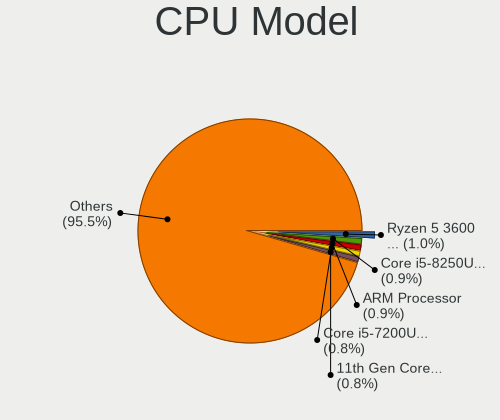
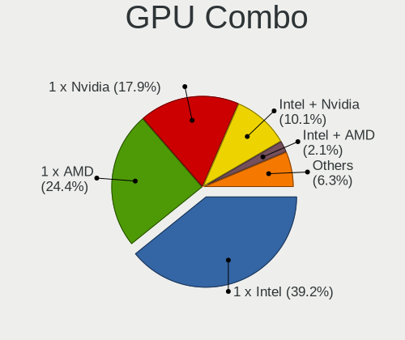
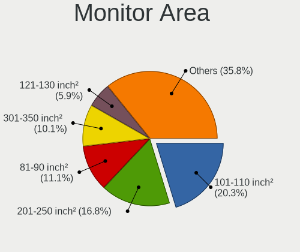
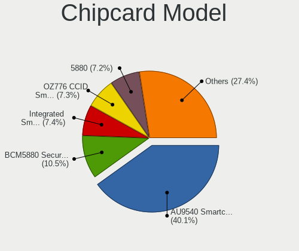

Linux in Germany - Tested Hardware & Statistics
-----------------------------------------------

A project to collect tested hardware configurations for Linux in Germany.

Anyone can contribute to this report by the [hw-probe](https://github.com/linuxhw/hw-probe) tool:

    sudo -E hw-probe -all -upload

Please contribute! Especially if your hardware is rare.

This is a report for all computer types. See also reports for [desktops](/Location/Germany/Desktop/README.md) and [notebooks](/Location/Germany/Notebook/README.md).

Contents
--------

* [ Test Cases ](#test-cases)

* [ System ](#system)
  - [ OS                       ](#os)
  - [ OS Family                ](#os-family)
  - [ Kernel                   ](#kernel)
  - [ Kernel Family            ](#kernel-family)
  - [ Kernel Major Ver.        ](#kernel-major-ver)
  - [ Arch                     ](#arch)
  - [ DE                       ](#de)
  - [ Display Server           ](#display-server)
  - [ Display Manager          ](#display-manager)
  - [ OS Lang                  ](#os-lang)
  - [ Boot Mode                ](#boot-mode)
  - [ Filesystem               ](#filesystem)
  - [ Part. scheme             ](#part-scheme)
  - [ Dual Boot with Linux/BSD ](#dual-boot-with-linuxbsd)
  - [ Dual Boot (Win)          ](#dual-boot-win)

* [ Board ](#board)
  - [ Vendor                   ](#vendor)
  - [ Model                    ](#model)
  - [ Model Family             ](#model-family)
  - [ MFG Year                 ](#mfg-year)
  - [ Form Factor              ](#form-factor)
  - [ Secure Boot              ](#secure-boot)
  - [ Coreboot                 ](#coreboot)
  - [ RAM Size                 ](#ram-size)
  - [ RAM Used                 ](#ram-used)
  - [ Total Drives             ](#total-drives)
  - [ Has CD-ROM               ](#has-cd-rom)
  - [ Has Ethernet             ](#has-ethernet)
  - [ Has WiFi                 ](#has-wifi)
  - [ Has Bluetooth            ](#has-bluetooth)

* [ Location ](#location)
  - [ Country                  ](#country)
  - [ City                     ](#city)

* [ Drives ](#drives)
  - [ Drive Vendor             ](#drive-vendor)
  - [ Drive Model              ](#drive-model)
  - [ HDD Vendor               ](#hdd-vendor)
  - [ SSD Vendor               ](#ssd-vendor)
  - [ Drive Kind               ](#drive-kind)
  - [ Drive Connector          ](#drive-connector)
  - [ Drive Size               ](#drive-size)
  - [ Space Total              ](#space-total)
  - [ Space Used               ](#space-used)
  - [ Malfunc. Drives          ](#malfunc-drives)
  - [ Malfunc. Drive Vendor    ](#malfunc-drive-vendor)
  - [ Malfunc. HDD Vendor      ](#malfunc-hdd-vendor)
  - [ Malfunc. Drive Kind      ](#malfunc-drive-kind)
  - [ Failed Drives            ](#failed-drives)
  - [ Failed Drive Vendor      ](#failed-drive-vendor)
  - [ Drive Status             ](#drive-status)

* [ Storage controller ](#storage-controller)
  - [ Storage Vendor           ](#storage-vendor)
  - [ Storage Model            ](#storage-model)
  - [ Storage Kind             ](#storage-kind)

* [ Processor ](#processor)
  - [ CPU Vendor               ](#cpu-vendor)
  - [ CPU Model                ](#cpu-model)
  - [ CPU Model Family         ](#cpu-model-family)
  - [ CPU Cores                ](#cpu-cores)
  - [ CPU Sockets              ](#cpu-sockets)
  - [ CPU Threads              ](#cpu-threads)
  - [ CPU Op-Modes             ](#cpu-op-modes)
  - [ CPU Microcode            ](#cpu-microcode)
  - [ CPU Microarch            ](#cpu-microarch)

* [ Graphics ](#graphics)
  - [ GPU Vendor               ](#gpu-vendor)
  - [ GPU Model                ](#gpu-model)
  - [ GPU Combo                ](#gpu-combo)
  - [ GPU Driver               ](#gpu-driver)
  - [ GPU Memory               ](#gpu-memory)

* [ Monitor ](#monitor)
  - [ Monitor Vendor           ](#monitor-vendor)
  - [ Monitor Model            ](#monitor-model)
  - [ Monitor Resolution       ](#monitor-resolution)
  - [ Monitor Diagonal         ](#monitor-diagonal)
  - [ Monitor Width            ](#monitor-width)
  - [ Aspect Ratio             ](#aspect-ratio)
  - [ Monitor Area             ](#monitor-area)
  - [ Pixel Density            ](#pixel-density)
  - [ Multiple Monitors        ](#multiple-monitors)

* [ Network ](#network)
  - [ Net Controller Vendor    ](#net-controller-vendor)
  - [ Net Controller Model     ](#net-controller-model)
  - [ Wireless Vendor          ](#wireless-vendor)
  - [ Wireless Model           ](#wireless-model)
  - [ Ethernet Vendor          ](#ethernet-vendor)
  - [ Ethernet Model           ](#ethernet-model)
  - [ Net Controller Kind      ](#net-controller-kind)
  - [ Used Controller          ](#used-controller)
  - [ NICs                     ](#nics)
  - [ IPv6                     ](#ipv6)

* [ Bluetooth ](#bluetooth)
  - [ Bluetooth Vendor         ](#bluetooth-vendor)
  - [ Bluetooth Model          ](#bluetooth-model)

* [ Sound ](#sound)
  - [ Sound Vendor             ](#sound-vendor)
  - [ Sound Model              ](#sound-model)

* [ Memory ](#memory)
  - [ Memory Vendor            ](#memory-vendor)
  - [ Memory Model             ](#memory-model)
  - [ Memory Kind              ](#memory-kind)
  - [ Memory Form Factor       ](#memory-form-factor)
  - [ Memory Size              ](#memory-size)
  - [ Memory Speed             ](#memory-speed)

* [ Printers & scanners ](#printers--scanners)
  - [ Printer Vendor           ](#printer-vendor)
  - [ Printer Model            ](#printer-model)
  - [ Scanner Vendor           ](#scanner-vendor)
  - [ Scanner Model            ](#scanner-model)

* [ Camera ](#camera)
  - [ Camera Vendor            ](#camera-vendor)
  - [ Camera Model             ](#camera-model)

* [ Security ](#security)
  - [ Fingerprint Vendor       ](#fingerprint-vendor)
  - [ Fingerprint Model        ](#fingerprint-model)
  - [ Chipcard Vendor          ](#chipcard-vendor)
  - [ Chipcard Model           ](#chipcard-model)

* [ Unsupported ](#unsupported)
  - [ Unsupported Devices      ](#unsupported-devices)
  - [ Unsupported Device Types ](#unsupported-device-types)

Test Cases
----------

Total: 30520

| Vendor        | Model                       | Form-Factor | Probe                                                      | Date         |
|---------------|-----------------------------|-------------|------------------------------------------------------------|--------------|
| ASRock        | H61M-DGS R2.0               | Desktop     | [6af1365446](https://linux-hardware.org/?probe=6af1365446) | Aug 12, 2023 |
| ASRock        | H61M-DGS R2.0               | Desktop     | [70e9fe8cdb](https://linux-hardware.org/?probe=70e9fe8cdb) | Aug 12, 2023 |
| Dell          | Vostro 15-3568              | Notebook    | [b422d7c8cc](https://linux-hardware.org/?probe=b422d7c8cc) | Aug 12, 2023 |
| Dell          | XPS 15 9560                 | Notebook    | [756901f27f](https://linux-hardware.org/?probe=756901f27f) | Aug 12, 2023 |
| ASUSTek       | M5A78L-M LE                 | Desktop     | [a68db843ea](https://linux-hardware.org/?probe=a68db843ea) | Aug 12, 2023 |
| Valve         | Jupiter                     | Notebook    | [61e105aa9d](https://linux-hardware.org/?probe=61e105aa9d) | Aug 12, 2023 |
| MSI           | MAG B550M MORTAR WIFI       | Desktop     | [da8cf53467](https://linux-hardware.org/?probe=da8cf53467) | Aug 12, 2023 |
| Dell          | Latitude E7270              | Notebook    | [63fd1b0d6b](https://linux-hardware.org/?probe=63fd1b0d6b) | Aug 12, 2023 |
| ASRock        | 970A-G                      | Desktop     | [5a2b77eaee](https://linux-hardware.org/?probe=5a2b77eaee) | Aug 12, 2023 |
| Acer          | Extensa 215-55              | Notebook    | [aea9ada5e8](https://linux-hardware.org/?probe=aea9ada5e8) | Aug 11, 2023 |
| Lenovo        | SHARKBAY SDK0E50510 WIN     | Desktop     | [ab2473ff49](https://linux-hardware.org/?probe=ab2473ff49) | Aug 11, 2023 |
| Biostar       | B660GTQ                     | Desktop     | [520d57cadc](https://linux-hardware.org/?probe=520d57cadc) | Aug 11, 2023 |
| ASRock        | B450M Pro4                  | Desktop     | [65d55091fa](https://linux-hardware.org/?probe=65d55091fa) | Aug 11, 2023 |
| Gigabyte      | Z790 GAMING X AX            | Desktop     | [a6d2358585](https://linux-hardware.org/?probe=a6d2358585) | Aug 11, 2023 |
| Toshiba       | Satellite T110              | Notebook    | [ecb4e047b3](https://linux-hardware.org/?probe=ecb4e047b3) | Aug 11, 2023 |
| Acer          | Aspire E5-721               | Notebook    | [f4abfc94d4](https://linux-hardware.org/?probe=f4abfc94d4) | Aug 11, 2023 |
| Acer          | Extensa 215-55              | Notebook    | [036866525c](https://linux-hardware.org/?probe=036866525c) | Aug 11, 2023 |
| ASUSTek       | PRIME B550-PLUS             | Desktop     | [7f2903e1a4](https://linux-hardware.org/?probe=7f2903e1a4) | Aug 11, 2023 |
| Toshiba       | Satellite T110              | Notebook    | [8180105119](https://linux-hardware.org/?probe=8180105119) | Aug 11, 2023 |
| Medion        | P651x series                | Notebook    | [46505da47d](https://linux-hardware.org/?probe=46505da47d) | Aug 11, 2023 |
| Dell          | 0CRWCR A01                  | All in one  | [74283f31aa](https://linux-hardware.org/?probe=74283f31aa) | Aug 11, 2023 |
| HP            | Laptop 17-cp1xxx            | Notebook    | [ac523f4e3b](https://linux-hardware.org/?probe=ac523f4e3b) | Aug 11, 2023 |
| HP            | EliteBook 8470p             | Notebook    | [320138e7f5](https://linux-hardware.org/?probe=320138e7f5) | Aug 11, 2023 |
| Acer          | Aspire G7713                | Desktop     | [cb79bdce06](https://linux-hardware.org/?probe=cb79bdce06) | Aug 11, 2023 |
| Fujitsu       | LIFEBOOK S762               | Notebook    | [1ced8ae4d0](https://linux-hardware.org/?probe=1ced8ae4d0) | Aug 11, 2023 |
| Fujitsu       | LIFEBOOK S762               | Notebook    | [cb0b5cbd5d](https://linux-hardware.org/?probe=cb0b5cbd5d) | Aug 11, 2023 |
| ASUSTek       | ROG Strix G513QY            | Notebook    | [eacd0cc54d](https://linux-hardware.org/?probe=eacd0cc54d) | Aug 11, 2023 |
| Gigabyte      | GA-78LMT-USB3               | Desktop     | [6a1d87f2aa](https://linux-hardware.org/?probe=6a1d87f2aa) | Aug 10, 2023 |
| Acer          | Aspire E1-731               | Notebook    | [b75a766ee9](https://linux-hardware.org/?probe=b75a766ee9) | Aug 10, 2023 |
| Lenovo        | Yoga 3 Pro-1370 80HE        | Notebook    | [eee160a070](https://linux-hardware.org/?probe=eee160a070) | Aug 10, 2023 |
| HP            | ProLiant ML115 G5           | Desktop     | [305ccefd04](https://linux-hardware.org/?probe=305ccefd04) | Aug 10, 2023 |
| ASRock        | H61M-DGS R2.0               | Desktop     | [4f05b77547](https://linux-hardware.org/?probe=4f05b77547) | Aug 10, 2023 |
| HP            | ProBook 430 G2              | Notebook    | [426901227d](https://linux-hardware.org/?probe=426901227d) | Aug 10, 2023 |
| Gigabyte      | B365M H                     | Desktop     | [b23c1e6e73](https://linux-hardware.org/?probe=b23c1e6e73) | Aug 10, 2023 |
| Lenovo        | ThinkPad T420 4236W1W       | Notebook    | [0b8fc947af](https://linux-hardware.org/?probe=0b8fc947af) | Aug 10, 2023 |
| Raspberry ... | Raspberry Pi 4 Model B R... | Soc         | [3e66a1f712](https://linux-hardware.org/?probe=3e66a1f712) | Aug 10, 2023 |
| Fujitsu       | LIFEBOOK A530               | Notebook    | [05e64e3a0a](https://linux-hardware.org/?probe=05e64e3a0a) | Aug 10, 2023 |
| Lenovo        | ThinkPad P51 20HH0015IX     | Notebook    | [77c11473b2](https://linux-hardware.org/?probe=77c11473b2) | Aug 10, 2023 |
| Acer          | Aspire E5-721               | Notebook    | [6743c7ca9d](https://linux-hardware.org/?probe=6743c7ca9d) | Aug 10, 2023 |
| ASUSTek       | ROG Strix G513QY_G513QY     | Notebook    | [083e25221d](https://linux-hardware.org/?probe=083e25221d) | Aug 10, 2023 |
| MSI           | A320M PRO-VD/S              | Desktop     | [7f7c988470](https://linux-hardware.org/?probe=7f7c988470) | Aug 10, 2023 |
| ASUSTek       | ROG Maximus X HERO          | Desktop     | [d5d888506b](https://linux-hardware.org/?probe=d5d888506b) | Aug 10, 2023 |
| Dell          | Inspiron 5415               | Notebook    | [69123aa283](https://linux-hardware.org/?probe=69123aa283) | Aug 10, 2023 |
| Dell          | Inspiron 5415               | Notebook    | [9c28979b9d](https://linux-hardware.org/?probe=9c28979b9d) | Aug 10, 2023 |
| ASUSTek       | H87-PRO                     | Desktop     | [817c5f9f93](https://linux-hardware.org/?probe=817c5f9f93) | Aug 09, 2023 |
| Gigabyte      | 970A-UD3P                   | Desktop     | [b1a8fc0704](https://linux-hardware.org/?probe=b1a8fc0704) | Aug 09, 2023 |
| HP            | 859C                        | Desktop     | [24dd090f2c](https://linux-hardware.org/?probe=24dd090f2c) | Aug 09, 2023 |
| ASRock        | Z77 Extreme4                | Desktop     | [aadaab77db](https://linux-hardware.org/?probe=aadaab77db) | Aug 09, 2023 |
| Gigabyte      | 970A-UD3P                   | Desktop     | [920797388b](https://linux-hardware.org/?probe=920797388b) | Aug 09, 2023 |
| ASUSTek       | Pro WS 565-ACE              | Desktop     | [3d9112e038](https://linux-hardware.org/?probe=3d9112e038) | Aug 09, 2023 |
| HUAWEI        | BOM-WXX9                    | Notebook    | [d255d00dc8](https://linux-hardware.org/?probe=d255d00dc8) | Aug 09, 2023 |
| Wortmann      | TERRA_MOBILE_1749           | Notebook    | [3986ff4298](https://linux-hardware.org/?probe=3986ff4298) | Aug 09, 2023 |
| HP            | EliteBook 830 G8 Noteboo... | Notebook    | [2f7f77225a](https://linux-hardware.org/?probe=2f7f77225a) | Aug 09, 2023 |
| Gigabyte      | X570 AORUS ELITE            | Desktop     | [13b739e83a](https://linux-hardware.org/?probe=13b739e83a) | Aug 09, 2023 |
| HP            | EliteBook 840 G2            | Notebook    | [90291816a0](https://linux-hardware.org/?probe=90291816a0) | Aug 09, 2023 |
| Dell          | 0272WF A00                  | Server      | [39abbc5ab8](https://linux-hardware.org/?probe=39abbc5ab8) | Aug 09, 2023 |
| HP            | OMEN by Laptop              | Notebook    | [fdbe025351](https://linux-hardware.org/?probe=fdbe025351) | Aug 09, 2023 |
| ASUSTek       | ROG Strix G713IH_G713IH     | Notebook    | [352fd5fea3](https://linux-hardware.org/?probe=352fd5fea3) | Aug 09, 2023 |
| HP            | 8433 11                     | Desktop     | [93432b3df2](https://linux-hardware.org/?probe=93432b3df2) | Aug 09, 2023 |
| NZXT          | N7 Z590                     | Desktop     | [3831033bdc](https://linux-hardware.org/?probe=3831033bdc) | Aug 09, 2023 |
| Unknown       | HX90                        | Desktop     | [7a14bb927e](https://linux-hardware.org/?probe=7a14bb927e) | Aug 09, 2023 |
| MSI           | Z97-G43                     | Desktop     | [b6edd8931f](https://linux-hardware.org/?probe=b6edd8931f) | Aug 09, 2023 |
| Dell          | 0CRWCR A01                  | All in one  | [8f3bc0a06a](https://linux-hardware.org/?probe=8f3bc0a06a) | Aug 09, 2023 |
| ASUSTek       | PRIME X470-PRO              | Desktop     | [afef0bb361](https://linux-hardware.org/?probe=afef0bb361) | Aug 09, 2023 |
| Lenovo        | V15 G2 ITL 82KB             | Notebook    | [dfcebaef82](https://linux-hardware.org/?probe=dfcebaef82) | Aug 09, 2023 |
| ASUSTek       | ROG Strix G713IH_G713IH     | Notebook    | [76bbb6695d](https://linux-hardware.org/?probe=76bbb6695d) | Aug 09, 2023 |
| Acer          | Aspire A317-33              | Notebook    | [6dd8126a05](https://linux-hardware.org/?probe=6dd8126a05) | Aug 09, 2023 |
| HP            | Laptop 15s-eq3xxx           | Notebook    | [284cfb0f6d](https://linux-hardware.org/?probe=284cfb0f6d) | Aug 08, 2023 |
| Lenovo        | ThinkPad T440 20B7S4NV07    | Notebook    | [af7992a11e](https://linux-hardware.org/?probe=af7992a11e) | Aug 08, 2023 |
| HP            | OMEN by Laptop              | Notebook    | [b15a5e767a](https://linux-hardware.org/?probe=b15a5e767a) | Aug 08, 2023 |
| Acer          | Aspire E5-721               | Notebook    | [82a8a2346a](https://linux-hardware.org/?probe=82a8a2346a) | Aug 08, 2023 |
| Lenovo        | ThinkPad E595 20NFCTO1WW    | Notebook    | [4f4c3a2b96](https://linux-hardware.org/?probe=4f4c3a2b96) | Aug 08, 2023 |
| Gigabyte      | B550M DS3H                  | Desktop     | [7889f62638](https://linux-hardware.org/?probe=7889f62638) | Aug 08, 2023 |
| ASUSTek       | M5A97 LE R2.0               | Desktop     | [2e30c62b25](https://linux-hardware.org/?probe=2e30c62b25) | Aug 08, 2023 |
| Acer          | Aspire 8930                 | Notebook    | [1a39769fb2](https://linux-hardware.org/?probe=1a39769fb2) | Aug 08, 2023 |
| HP            | 255 G5                      | Notebook    | [b38a912e23](https://linux-hardware.org/?probe=b38a912e23) | Aug 08, 2023 |
| Lenovo        | ThinkPad X1 Carbon Gen 8... | Notebook    | [5aa44fc15a](https://linux-hardware.org/?probe=5aa44fc15a) | Aug 08, 2023 |
| ASUSTek       | P5Q                         | Desktop     | [f485bf4b6e](https://linux-hardware.org/?probe=f485bf4b6e) | Aug 08, 2023 |
| Acer          | Aspire 4820TG               | Notebook    | [49a63e5cc4](https://linux-hardware.org/?probe=49a63e5cc4) | Aug 08, 2023 |
| Lenovo        | ThinkBook 15 G2 ITL 20VE    | Notebook    | [c90663d505](https://linux-hardware.org/?probe=c90663d505) | Aug 08, 2023 |
| Apple         | MacBookPro11,3              | Notebook    | [c415fd317b](https://linux-hardware.org/?probe=c415fd317b) | Aug 08, 2023 |
| Lenovo        | 3136 SDK0J40700 WIN 3258... | Mini pc     | [1a0f72e2d0](https://linux-hardware.org/?probe=1a0f72e2d0) | Aug 08, 2023 |
| Toshiba       | Satellite C50-A510          | Notebook    | [335af4e25a](https://linux-hardware.org/?probe=335af4e25a) | Aug 08, 2023 |
| Lenovo        | 1037 SDK0Q40104 WIN 3305... | Server      | [f9d26a8832](https://linux-hardware.org/?probe=f9d26a8832) | Aug 08, 2023 |
| HP            | Pavilion 17                 | Notebook    | [4833cfdbd8](https://linux-hardware.org/?probe=4833cfdbd8) | Aug 08, 2023 |
| Acer          | Nitro AN515-55              | Notebook    | [1d117f6031](https://linux-hardware.org/?probe=1d117f6031) | Aug 07, 2023 |
| Pegatron      | 2AB5                        | Desktop     | [9579022e6f](https://linux-hardware.org/?probe=9579022e6f) | Aug 07, 2023 |
| HP            | ENVY x360 Convertible 15... | Convertible | [791adb121f](https://linux-hardware.org/?probe=791adb121f) | Aug 07, 2023 |
| Dell          | Inspiron 3505               | Notebook    | [e07624ae41](https://linux-hardware.org/?probe=e07624ae41) | Aug 07, 2023 |
| Lenovo        | ThinkPad T530 2394EN6       | Notebook    | [d348a65379](https://linux-hardware.org/?probe=d348a65379) | Aug 07, 2023 |
| ASRock        | Z97 Extreme4                | Desktop     | [27c70b528b](https://linux-hardware.org/?probe=27c70b528b) | Aug 07, 2023 |
| Dell          | 0X2MKR A00                  | All in one  | [101fc74a47](https://linux-hardware.org/?probe=101fc74a47) | Aug 07, 2023 |
| Insyde        | BayTrail                    | Notebook    | [df18553ec6](https://linux-hardware.org/?probe=df18553ec6) | Aug 07, 2023 |
| HP            | Elite x2 1012 G1            | Notebook    | [fea0f58ed5](https://linux-hardware.org/?probe=fea0f58ed5) | Aug 07, 2023 |
| ASUSTek       | M5A97 R2.0                  | Desktop     | [783906b878](https://linux-hardware.org/?probe=783906b878) | Aug 07, 2023 |
| Wortmann      | TERRA_MOBILE_1749           | Notebook    | [22624fbda5](https://linux-hardware.org/?probe=22624fbda5) | Aug 07, 2023 |
| Acer          | Aspire V3-771               | Notebook    | [ebdbffb7da](https://linux-hardware.org/?probe=ebdbffb7da) | Aug 07, 2023 |
| HP            | EliteBook 8470p             | Notebook    | [62d3a8d08d](https://linux-hardware.org/?probe=62d3a8d08d) | Aug 07, 2023 |
| ASUSTek       | X540SA                      | Notebook    | [db952b584b](https://linux-hardware.org/?probe=db952b584b) | Aug 07, 2023 |
| Supermicro    | X10DRiB                     | Server      | [aeb76679f7](https://linux-hardware.org/?probe=aeb76679f7) | Aug 07, 2023 |
| ASUSTek       | N552VX                      | Notebook    | [1c616233ca](https://linux-hardware.org/?probe=1c616233ca) | Aug 07, 2023 |
| ASUSTek       | N76VM                       | Notebook    | [083980d0fb](https://linux-hardware.org/?probe=083980d0fb) | Aug 07, 2023 |
| Gigabyte      | Q87M-D2H                    | Desktop     | [dbcb2c4a80](https://linux-hardware.org/?probe=dbcb2c4a80) | Aug 07, 2023 |
| HP            | Laptop 17-ak0xx             | Notebook    | [67749cdc51](https://linux-hardware.org/?probe=67749cdc51) | Aug 07, 2023 |
| Fujitsu       | LIFEBOOK A359               | Notebook    | [60a09f6ca3](https://linux-hardware.org/?probe=60a09f6ca3) | Aug 07, 2023 |
| Packard Be... | EasyNote LS11HR             | Notebook    | [df59aff876](https://linux-hardware.org/?probe=df59aff876) | Aug 07, 2023 |
| Lenovo        | ThinkPad T480 20L6S29E02    | Notebook    | [a3e3489451](https://linux-hardware.org/?probe=a3e3489451) | Aug 07, 2023 |
| Timi          | TM1607                      | Notebook    | [c545853106](https://linux-hardware.org/?probe=c545853106) | Aug 07, 2023 |
| ASUSTek       | PRIME B560M-K               | Desktop     | [a5ae5a237a](https://linux-hardware.org/?probe=a5ae5a237a) | Aug 06, 2023 |
| Clevo         | W150HRM                     | Notebook    | [1ddcfcbecc](https://linux-hardware.org/?probe=1ddcfcbecc) | Aug 06, 2023 |
| Foxconn       | 2ADA                        | Desktop     | [17d44b6d2c](https://linux-hardware.org/?probe=17d44b6d2c) | Aug 06, 2023 |
| HP            | EliteBook 8570p             | Notebook    | [99635bf61d](https://linux-hardware.org/?probe=99635bf61d) | Aug 06, 2023 |
| HP            | EliteBook 8540p             | Notebook    | [4709894444](https://linux-hardware.org/?probe=4709894444) | Aug 06, 2023 |
| HP            | ENVY x360 2-in-1 Laptop ... | Convertible | [c19229d536](https://linux-hardware.org/?probe=c19229d536) | Aug 06, 2023 |
| ASUSTek       | M5A97 R2.0                  | Desktop     | [1d8737323b](https://linux-hardware.org/?probe=1d8737323b) | Aug 06, 2023 |
| Dell          | XPS 15 7590                 | Notebook    | [6a53759849](https://linux-hardware.org/?probe=6a53759849) | Aug 06, 2023 |
| Gigabyte      | EP35-DS4                    | Desktop     | [761d545a1e](https://linux-hardware.org/?probe=761d545a1e) | Aug 06, 2023 |
| ASRock        | H61M-DGS R2.0               | Desktop     | [032b99ac4f](https://linux-hardware.org/?probe=032b99ac4f) | Aug 06, 2023 |
| ASRock        | Q1900M                      | Desktop     | [51f69dffd5](https://linux-hardware.org/?probe=51f69dffd5) | Aug 06, 2023 |
| ASUSTek       | M5A97 EVO R2.0              | Desktop     | [80c705f1a7](https://linux-hardware.org/?probe=80c705f1a7) | Aug 06, 2023 |
| MSI           | H81M-P33                    | Desktop     | [ebed30097f](https://linux-hardware.org/?probe=ebed30097f) | Aug 06, 2023 |
| Packard Be... | EasyNote LS11HR             | Notebook    | [8c8e1cef1c](https://linux-hardware.org/?probe=8c8e1cef1c) | Aug 06, 2023 |
| MSI           | X470 GAMING PLUS            | Desktop     | [0e79a19ed6](https://linux-hardware.org/?probe=0e79a19ed6) | Aug 06, 2023 |
| Dell          | Latitude E5520              | Notebook    | [132e7834f7](https://linux-hardware.org/?probe=132e7834f7) | Aug 06, 2023 |
| ASUSTek       | N76VM                       | Notebook    | [80d45ff242](https://linux-hardware.org/?probe=80d45ff242) | Aug 06, 2023 |
| HP            | 2B4B                        | Desktop     | [f85fada33f](https://linux-hardware.org/?probe=f85fada33f) | Aug 06, 2023 |
| Fujitsu       | D3128-A1 S26361-D3128-A1    | Desktop     | [ac2bdfc67b](https://linux-hardware.org/?probe=ac2bdfc67b) | Aug 06, 2023 |
| ASUSTek       | PRIME B650-PLUS             | Desktop     | [93917e587f](https://linux-hardware.org/?probe=93917e587f) | Aug 06, 2023 |
| Lenovo        | ThinkPad T560 20FJS18V00    | Notebook    | [27d1d39b58](https://linux-hardware.org/?probe=27d1d39b58) | Aug 06, 2023 |
| ASRock        | X470 Taichi                 | Desktop     | [f9d29dca0d](https://linux-hardware.org/?probe=f9d29dca0d) | Aug 06, 2023 |
| ASUSTek       | K54L                        | Notebook    | [3ce0c0b7b2](https://linux-hardware.org/?probe=3ce0c0b7b2) | Aug 06, 2023 |
| ASUSTek       | K54L                        | Notebook    | [b28f27325f](https://linux-hardware.org/?probe=b28f27325f) | Aug 06, 2023 |
| HP            | Laptop 15-db0xxx            | Notebook    | [51442067d5](https://linux-hardware.org/?probe=51442067d5) | Aug 06, 2023 |
| ASUSTek       | PRIME X570-P                | Desktop     | [48ec623298](https://linux-hardware.org/?probe=48ec623298) | Aug 06, 2023 |
| Dell          | Latitude E5570              | Notebook    | [cbcea81a37](https://linux-hardware.org/?probe=cbcea81a37) | Aug 06, 2023 |
| Chuwi         | GemiBook Pro                | Notebook    | [2726702c6a](https://linux-hardware.org/?probe=2726702c6a) | Aug 06, 2023 |
| BESSTAR Te... | GB1                         | Mini pc     | [2058978754](https://linux-hardware.org/?probe=2058978754) | Aug 06, 2023 |
| HP            | ENVY x360 Convertible 13... | Convertible | [a2847b90c6](https://linux-hardware.org/?probe=a2847b90c6) | Aug 06, 2023 |
| ASRock        | B550M Steel Legend          | Desktop     | [d9107b9cb9](https://linux-hardware.org/?probe=d9107b9cb9) | Aug 06, 2023 |
| ASUSTek       | PRIME B450M-K II            | Desktop     | [06e86f7f63](https://linux-hardware.org/?probe=06e86f7f63) | Aug 06, 2023 |
| HP            | ENVY Laptop 17-ch1xxx       | Notebook    | [89119ae1fc](https://linux-hardware.org/?probe=89119ae1fc) | Aug 06, 2023 |
| Gigabyte      | Z590 GAMING X               | Desktop     | [a8c865c9bb](https://linux-hardware.org/?probe=a8c865c9bb) | Aug 06, 2023 |
| Dell          | Inspiron MM061              | Notebook    | [3e037493db](https://linux-hardware.org/?probe=3e037493db) | Aug 06, 2023 |
| TUXEDO        | N7x0WU                      | Notebook    | [1c2cb06178](https://linux-hardware.org/?probe=1c2cb06178) | Aug 06, 2023 |
| Lenovo        | ThinkPad X201 Tablet 298... | Notebook    | [7132bbeb85](https://linux-hardware.org/?probe=7132bbeb85) | Aug 06, 2023 |
| Gigabyte      | B85M-D3H                    | Desktop     | [ed642341d8](https://linux-hardware.org/?probe=ed642341d8) | Aug 06, 2023 |
| Medion        | TJ4125                      | Desktop     | [e35dc275ce](https://linux-hardware.org/?probe=e35dc275ce) | Aug 06, 2023 |
| Valve         | Jupiter                     | Notebook    | [efbeafcf8f](https://linux-hardware.org/?probe=efbeafcf8f) | Aug 05, 2023 |
| Valve         | Jupiter                     | Notebook    | [eadfa77bef](https://linux-hardware.org/?probe=eadfa77bef) | Aug 05, 2023 |
| ASUSTek       | K73SV                       | Notebook    | [c908f2bfdd](https://linux-hardware.org/?probe=c908f2bfdd) | Aug 05, 2023 |
| ASUSTek       | S301LA                      | Notebook    | [cc5477fc6b](https://linux-hardware.org/?probe=cc5477fc6b) | Aug 05, 2023 |
| HP            | ProBook x360 435 G7         | Convertible | [f9a938863a](https://linux-hardware.org/?probe=f9a938863a) | Aug 05, 2023 |
| Unknown       | Unknown                     | Soc         | [0de2cc20ed](https://linux-hardware.org/?probe=0de2cc20ed) | Aug 05, 2023 |
| ASRock        | B550M-HDV                   | Desktop     | [83ee40459a](https://linux-hardware.org/?probe=83ee40459a) | Aug 05, 2023 |
| Gigabyte      | Z790 AORUS ELITE AX         | Desktop     | [9365c3de56](https://linux-hardware.org/?probe=9365c3de56) | Aug 05, 2023 |
| Gigabyte      | Z590 GAMING X               | Desktop     | [231ad3947e](https://linux-hardware.org/?probe=231ad3947e) | Aug 05, 2023 |
| Acer          | Aspire TC-895 V:1.0         | Desktop     | [85d2740423](https://linux-hardware.org/?probe=85d2740423) | Aug 05, 2023 |
| Dell          | Venue 11 Pro 7140           | Notebook    | [7188a418fc](https://linux-hardware.org/?probe=7188a418fc) | Aug 05, 2023 |
| Fujitsu       | D3011-A1 S26361-D3011-A1    | Desktop     | [597856f529](https://linux-hardware.org/?probe=597856f529) | Aug 05, 2023 |
| Lenovo        | 3178 SDK0J40700 WIN 3258... | Desktop     | [4e0084cd74](https://linux-hardware.org/?probe=4e0084cd74) | Aug 05, 2023 |
| Unknown       | Unknown                     | Desktop     | [8ee9cccace](https://linux-hardware.org/?probe=8ee9cccace) | Aug 05, 2023 |
| MSI           | A68HM GRENADE               | Desktop     | [a186d8863f](https://linux-hardware.org/?probe=a186d8863f) | Aug 05, 2023 |
| Dell          | Latitude 7490               | Notebook    | [73efa45f4f](https://linux-hardware.org/?probe=73efa45f4f) | Aug 05, 2023 |
| Dell          | Latitude 7490               | Notebook    | [ce0e015b6e](https://linux-hardware.org/?probe=ce0e015b6e) | Aug 05, 2023 |
| Shuttle       | DS47D                       | Notebook    | [7d1ceb9b3a](https://linux-hardware.org/?probe=7d1ceb9b3a) | Aug 05, 2023 |
| Lenovo        | Yoga 7 15ITL5 82BJ          | Convertible | [3cfd827251](https://linux-hardware.org/?probe=3cfd827251) | Aug 05, 2023 |
| ASRock        | P67 Pro3                    | Desktop     | [da235e8c08](https://linux-hardware.org/?probe=da235e8c08) | Aug 05, 2023 |
| ASUSTek       | PRIME B450M-K II            | Desktop     | [fed2da6500](https://linux-hardware.org/?probe=fed2da6500) | Aug 05, 2023 |
| ASUSTek       | PRIME B450M-K II            | Desktop     | [2531b9d0db](https://linux-hardware.org/?probe=2531b9d0db) | Aug 05, 2023 |
| Lenovo        | ThinkPad X13 Gen 2a 20XH... | Notebook    | [7d17fc9ff6](https://linux-hardware.org/?probe=7d17fc9ff6) | Aug 05, 2023 |
| Apple         | MacBookPro5,5               | Notebook    | [ccbf514dc7](https://linux-hardware.org/?probe=ccbf514dc7) | Aug 04, 2023 |
| Gigabyte      | GA-880GMA-UD2H              | Desktop     | [9ffeb0adcd](https://linux-hardware.org/?probe=9ffeb0adcd) | Aug 04, 2023 |
| Supermicro    | X9SRE/X9SRE-3F/X9SRi/X9S... | Server      | [b19db5b96a](https://linux-hardware.org/?probe=b19db5b96a) | Aug 04, 2023 |
| HP            | Laptop 15s-eq1xxx           | Notebook    | [e6e6cc7b2e](https://linux-hardware.org/?probe=e6e6cc7b2e) | Aug 04, 2023 |
| Acer          | Swift SF514-52T             | Notebook    | [6b6773eeef](https://linux-hardware.org/?probe=6b6773eeef) | Aug 04, 2023 |
| Dell          | Latitude E6330              | Notebook    | [c4b0f9dfd2](https://linux-hardware.org/?probe=c4b0f9dfd2) | Aug 04, 2023 |
| ASRockRack    | X470D4U                     | Desktop     | [3c7626751d](https://linux-hardware.org/?probe=3c7626751d) | Aug 04, 2023 |
| Gigabyte      | GA-880GMA-UD2H              | Desktop     | [2886f9202b](https://linux-hardware.org/?probe=2886f9202b) | Aug 04, 2023 |
| HUAWEI        | BOHB-WAX9                   | Notebook    | [7bc7a7e01c](https://linux-hardware.org/?probe=7bc7a7e01c) | Aug 04, 2023 |
| Dell          | Latitude E6330              | Notebook    | [3c74e4818b](https://linux-hardware.org/?probe=3c74e4818b) | Aug 04, 2023 |
| Lenovo        | ThinkPad T420 4236MBG       | Notebook    | [aaaa17358f](https://linux-hardware.org/?probe=aaaa17358f) | Aug 04, 2023 |
| Lenovo        | IdeaPad 320-17IKB 80XM      | Notebook    | [5e28b5b07a](https://linux-hardware.org/?probe=5e28b5b07a) | Aug 04, 2023 |
| HUAWEI        | BOHB-WAX9                   | Notebook    | [b8fa3962ed](https://linux-hardware.org/?probe=b8fa3962ed) | Aug 04, 2023 |
| ASUSTek       | ASUS TUF Gaming A17 FA70... | Notebook    | [5799f1a89c](https://linux-hardware.org/?probe=5799f1a89c) | Aug 04, 2023 |
| ASUSTek       | ROG STRIX B550-I GAMING     | Desktop     | [01846991de](https://linux-hardware.org/?probe=01846991de) | Aug 04, 2023 |
| ASUSTek       | ASUS TUF Gaming A17 FA70... | Notebook    | [058011da0f](https://linux-hardware.org/?probe=058011da0f) | Aug 04, 2023 |
| Acer          | Swift SF114-34              | Notebook    | [2af2b0aecb](https://linux-hardware.org/?probe=2af2b0aecb) | Aug 04, 2023 |
| ASUSTek       | N501JW                      | Notebook    | [e7d254dbe5](https://linux-hardware.org/?probe=e7d254dbe5) | Aug 04, 2023 |
| Gigabyte      | B85M-D3H                    | Desktop     | [5157c58f81](https://linux-hardware.org/?probe=5157c58f81) | Aug 04, 2023 |
| Medion        | TJ4125                      | Desktop     | [0adec5cb7e](https://linux-hardware.org/?probe=0adec5cb7e) | Aug 04, 2023 |
| MSI           | 760GM-P23                   | Desktop     | [5746742389](https://linux-hardware.org/?probe=5746742389) | Aug 04, 2023 |
| ASRock        | N68-VS3 UCC                 | Desktop     | [3793d876eb](https://linux-hardware.org/?probe=3793d876eb) | Aug 04, 2023 |
| ASUSTek       | TUF Gaming B560-PLUS WIF... | Desktop     | [af4f153b11](https://linux-hardware.org/?probe=af4f153b11) | Aug 04, 2023 |
| Medion        | B360H4-EM V1.0              | Desktop     | [18146f8bc9](https://linux-hardware.org/?probe=18146f8bc9) | Aug 04, 2023 |
| ASRock        | X370 Taichi                 | Desktop     | [af453d6ef1](https://linux-hardware.org/?probe=af453d6ef1) | Aug 04, 2023 |
| Dell          | 0CRWCR A01                  | All in one  | [16511212ba](https://linux-hardware.org/?probe=16511212ba) | Aug 04, 2023 |
| ASUSTek       | ROG Strix G713PV_G713PV     | Notebook    | [848ed7bc51](https://linux-hardware.org/?probe=848ed7bc51) | Aug 04, 2023 |
| Gigabyte      | Q87M-D2H                    | Desktop     | [d3df0e8ee1](https://linux-hardware.org/?probe=d3df0e8ee1) | Aug 04, 2023 |
| HP            | EliteBook x360 1030 G2      | Convertible | [2cb4df0aab](https://linux-hardware.org/?probe=2cb4df0aab) | Aug 04, 2023 |
| Medion        | E3223                       | Convertible | [6202d5444f](https://linux-hardware.org/?probe=6202d5444f) | Aug 04, 2023 |
| Acer          | Extensa 5630                | Notebook    | [8b3c2a89a1](https://linux-hardware.org/?probe=8b3c2a89a1) | Aug 04, 2023 |
| Acer          | Extensa 5630                | Notebook    | [ba6669a5e7](https://linux-hardware.org/?probe=ba6669a5e7) | Aug 04, 2023 |
| HP            | ProBook 640 G2              | Notebook    | [7cacb46425](https://linux-hardware.org/?probe=7cacb46425) | Aug 04, 2023 |
| Dell          | 0WXD1Y A00                  | Server      | [fab223d590](https://linux-hardware.org/?probe=fab223d590) | Aug 04, 2023 |
| Medion        | Erazer X7841 MD99556        | Notebook    | [c9f4247fc1](https://linux-hardware.org/?probe=c9f4247fc1) | Aug 04, 2023 |
| ASUSTek       | B85-PRO GAMER               | Desktop     | [d4bb94e07e](https://linux-hardware.org/?probe=d4bb94e07e) | Aug 04, 2023 |
| ASUSTek       | PRIME X370-PRO              | Desktop     | [1abcf2ad6f](https://linux-hardware.org/?probe=1abcf2ad6f) | Aug 04, 2023 |
| Dell          | 0W13NR A06                  | Server      | [b1820a9229](https://linux-hardware.org/?probe=b1820a9229) | Aug 04, 2023 |
| ASRock        | B450M Pro4                  | Desktop     | [b2004d5d59](https://linux-hardware.org/?probe=b2004d5d59) | Aug 04, 2023 |
| ASRock        | Z97 Extreme4                | Desktop     | [4252e9a028](https://linux-hardware.org/?probe=4252e9a028) | Aug 04, 2023 |
| ASUSTek       | ROG STRIX B450-E GAMING     | Desktop     | [724beebcb2](https://linux-hardware.org/?probe=724beebcb2) | Aug 04, 2023 |
| Lenovo        | ThinkPad T450 20BUS3ES0A    | Notebook    | [1038e99486](https://linux-hardware.org/?probe=1038e99486) | Aug 04, 2023 |
| TUXEDO        | Aura 15 Gen2                | Notebook    | [07d668ee3d](https://linux-hardware.org/?probe=07d668ee3d) | Aug 03, 2023 |
| Acer          | Aspire V5-572P              | Notebook    | [1d27d25f8d](https://linux-hardware.org/?probe=1d27d25f8d) | Aug 03, 2023 |
| HP            | 3031h                       | Desktop     | [95b5c80f67](https://linux-hardware.org/?probe=95b5c80f67) | Aug 03, 2023 |
| MSI           | MAG B650 TOMAHAWK WIFI      | Desktop     | [983329d56b](https://linux-hardware.org/?probe=983329d56b) | Aug 03, 2023 |
| HP            | 8055                        | Desktop     | [21c8e1fdc2](https://linux-hardware.org/?probe=21c8e1fdc2) | Aug 03, 2023 |
| HP            | Notebook                    | Notebook    | [499fc30d3a](https://linux-hardware.org/?probe=499fc30d3a) | Aug 03, 2023 |
| Medion        | MS-7616                     | Desktop     | [7b9dae91ad](https://linux-hardware.org/?probe=7b9dae91ad) | Aug 03, 2023 |
| Dell          | 0F642F A00                  | Desktop     | [b2c444dc4f](https://linux-hardware.org/?probe=b2c444dc4f) | Aug 03, 2023 |
| ASUSTek       | P8H77-M                     | Desktop     | [1764158bf6](https://linux-hardware.org/?probe=1764158bf6) | Aug 03, 2023 |
| MSI           | MPG X570 GAMING PRO CARB... | Desktop     | [88e9cc22bf](https://linux-hardware.org/?probe=88e9cc22bf) | Aug 03, 2023 |
| Gigabyte      | GA-78LMT-USB3 SEx           | Desktop     | [39e2c1bfad](https://linux-hardware.org/?probe=39e2c1bfad) | Aug 03, 2023 |
| Gigabyte      | Q87M-D2H                    | Desktop     | [37725aaff8](https://linux-hardware.org/?probe=37725aaff8) | Aug 03, 2023 |
| Gigabyte      | B450M S2H V2                | Desktop     | [a01412b320](https://linux-hardware.org/?probe=a01412b320) | Aug 03, 2023 |
| ASUSTek       | ROG Strix G713PV_G713PV     | Notebook    | [620397fdc9](https://linux-hardware.org/?probe=620397fdc9) | Aug 03, 2023 |
| ZOTAC         | ZBOX-PI335                  | Mini pc     | [8b5204eccf](https://linux-hardware.org/?probe=8b5204eccf) | Aug 03, 2023 |
| Gigabyte      | B550M AORUS ELITE           | Notebook    | [882d963e19](https://linux-hardware.org/?probe=882d963e19) | Aug 03, 2023 |
| Lenovo        | G500 20236                  | Notebook    | [88a569c8ee](https://linux-hardware.org/?probe=88a569c8ee) | Aug 03, 2023 |
| MSI           | MPG X570 GAMING PRO CARB... | Desktop     | [52319a8cef](https://linux-hardware.org/?probe=52319a8cef) | Aug 03, 2023 |
| ASUSTek       | B85-PRO GAMER               | Desktop     | [e888742592](https://linux-hardware.org/?probe=e888742592) | Aug 03, 2023 |
| HP            | 3031h                       | Desktop     | [04c8ac1eee](https://linux-hardware.org/?probe=04c8ac1eee) | Aug 03, 2023 |
| Gigabyte      | B550M AORUS ELITE           | Notebook    | [38d0bcf5d1](https://linux-hardware.org/?probe=38d0bcf5d1) | Aug 03, 2023 |
| Acer          | Aspire VN7-793G             | Notebook    | [c7e996a3c2](https://linux-hardware.org/?probe=c7e996a3c2) | Aug 03, 2023 |
| HP            | Elite x2 1012 G2            | Tablet      | [a956adcb38](https://linux-hardware.org/?probe=a956adcb38) | Aug 03, 2023 |
| ASUSTek       | PRIME B450M-K II            | Desktop     | [35cf0fd859](https://linux-hardware.org/?probe=35cf0fd859) | Aug 03, 2023 |
| Samsung       | 900X3C/900X3D/900X3E/900... | Notebook    | [a3401e5a4b](https://linux-hardware.org/?probe=a3401e5a4b) | Aug 03, 2023 |
| Lenovo        | ThinkPad P51s 20HCS0660Y    | Notebook    | [6e8234ed89](https://linux-hardware.org/?probe=6e8234ed89) | Aug 03, 2023 |
| Dell          | Latitude 5420               | Notebook    | [491cea9604](https://linux-hardware.org/?probe=491cea9604) | Aug 03, 2023 |
| Packard Be... | EasyNote LS11HR             | Notebook    | [6e79cf1bf0](https://linux-hardware.org/?probe=6e79cf1bf0) | Aug 03, 2023 |
| MSI           | A320M-A PRO MAX             | Desktop     | [881ac0a0e0](https://linux-hardware.org/?probe=881ac0a0e0) | Aug 02, 2023 |
| MSI           | X370 GAMING PRO             | Desktop     | [b684b97e44](https://linux-hardware.org/?probe=b684b97e44) | Aug 02, 2023 |
| ASUSTek       | ROG STRIX Z690-E GAMING ... | Desktop     | [221b0f2db2](https://linux-hardware.org/?probe=221b0f2db2) | Aug 02, 2023 |
| MSI           | A320M-A PRO MAX             | Desktop     | [c3beec95b8](https://linux-hardware.org/?probe=c3beec95b8) | Aug 02, 2023 |
| Dell          | Latitude E6320              | Notebook    | [9b42be4945](https://linux-hardware.org/?probe=9b42be4945) | Aug 02, 2023 |
| Lenovo        | Legion 5 15ARH05 82B5       | Notebook    | [433a85501a](https://linux-hardware.org/?probe=433a85501a) | Aug 02, 2023 |
| HP            | Pavilion Laptop 15-eg0xx... | Notebook    | [101e2e7e7e](https://linux-hardware.org/?probe=101e2e7e7e) | Aug 02, 2023 |
| HP            | Pavilion Laptop 15-eg0xx... | Notebook    | [16cafd9d32](https://linux-hardware.org/?probe=16cafd9d32) | Aug 02, 2023 |
| Lenovo        | ThinkPad X1 Carbon Gen 9... | Notebook    | [cf7cad0e02](https://linux-hardware.org/?probe=cf7cad0e02) | Aug 02, 2023 |
| Lenovo        | ThinkPad X270 W10DG 20K5... | Notebook    | [37fe1d55f8](https://linux-hardware.org/?probe=37fe1d55f8) | Aug 02, 2023 |
| Lenovo        | ThinkPad X1 Yoga 2nd 20J... | Convertible | [34cfa173f7](https://linux-hardware.org/?probe=34cfa173f7) | Aug 02, 2023 |
| Lenovo        | ThinkPad X220 4290EC5       | Notebook    | [6ffb3ac7e7](https://linux-hardware.org/?probe=6ffb3ac7e7) | Aug 02, 2023 |
| Medion        | X681X                       | Notebook    | [8209a37737](https://linux-hardware.org/?probe=8209a37737) | Aug 02, 2023 |
| Schenker      | VISION 15 (SVS15E21)        | Notebook    | [0f5b976e39](https://linux-hardware.org/?probe=0f5b976e39) | Aug 02, 2023 |
| Gigabyte      | B85M-D3H                    | Desktop     | [4e092275e4](https://linux-hardware.org/?probe=4e092275e4) | Aug 02, 2023 |
| HP            | Pavilion dv7                | Notebook    | [bd9bc8e7a6](https://linux-hardware.org/?probe=bd9bc8e7a6) | Aug 02, 2023 |
| HP            | EliteBook 840 G3            | Notebook    | [0ae0b35097](https://linux-hardware.org/?probe=0ae0b35097) | Aug 02, 2023 |
| Dell          | Precision M4500             | Notebook    | [b425204301](https://linux-hardware.org/?probe=b425204301) | Aug 02, 2023 |
| Lenovo        | IdeaPad 3 15ALC6 82KU       | Notebook    | [502969280a](https://linux-hardware.org/?probe=502969280a) | Aug 02, 2023 |
| Gigabyte      | B550 AORUS ELITE            | Desktop     | [60cb0baf9d](https://linux-hardware.org/?probe=60cb0baf9d) | Aug 02, 2023 |
| Acer          | Aspire A3SP14-31PT          | Convertible | [aa4285c237](https://linux-hardware.org/?probe=aa4285c237) | Aug 02, 2023 |
| ASUSTek       | VivoBook_ASUSLaptop X415... | Notebook    | [57bac048da](https://linux-hardware.org/?probe=57bac048da) | Aug 02, 2023 |
| Dell          | 0NKW6Y A01                  | Desktop     | [6bae407930](https://linux-hardware.org/?probe=6bae407930) | Aug 02, 2023 |
| Dell          | Inspiron 13-5368            | Notebook    | [479ca68bae](https://linux-hardware.org/?probe=479ca68bae) | Aug 02, 2023 |
| HP            | ProBook 455 15.6 inch G9... | Notebook    | [8fb651def8](https://linux-hardware.org/?probe=8fb651def8) | Aug 02, 2023 |
| TUXEDO        | InfinityBook Pro Gen7 (M... | Notebook    | [c6078d0836](https://linux-hardware.org/?probe=c6078d0836) | Aug 02, 2023 |
| Apple         | MacBookPro7,1               | Notebook    | [0a3c5e5c4d](https://linux-hardware.org/?probe=0a3c5e5c4d) | Aug 02, 2023 |
| Apple         | MacBookPro7,1               | Notebook    | [9f852ea211](https://linux-hardware.org/?probe=9f852ea211) | Aug 02, 2023 |
| Gigabyte      | AX370-Gaming K7             | Desktop     | [7748df9ae9](https://linux-hardware.org/?probe=7748df9ae9) | Aug 01, 2023 |
| Acer          | Aspire ES1-521              | Notebook    | [127d7abd32](https://linux-hardware.org/?probe=127d7abd32) | Aug 01, 2023 |
| ASRock        | Z170 Extreme4               | Desktop     | [7ef89d48d6](https://linux-hardware.org/?probe=7ef89d48d6) | Aug 01, 2023 |
| Acer          | Aspire A517-52              | Notebook    | [aa9fd10def](https://linux-hardware.org/?probe=aa9fd10def) | Aug 01, 2023 |
| Dell          | Precision 7550              | Notebook    | [ab0d21bb4e](https://linux-hardware.org/?probe=ab0d21bb4e) | Aug 01, 2023 |
| Lenovo        | ThinkPad X250 20CM001PGE    | Notebook    | [9c5503cd84](https://linux-hardware.org/?probe=9c5503cd84) | Aug 01, 2023 |
| Apple         | Mac-35C5E08120C7EEAF Mac... | Mini pc     | [1abb46d019](https://linux-hardware.org/?probe=1abb46d019) | Aug 01, 2023 |
| Acer          | Aspire ES1-311              | Notebook    | [6f59479d87](https://linux-hardware.org/?probe=6f59479d87) | Aug 01, 2023 |
| HP            | 18E4                        | Desktop     | [20ebffd9a8](https://linux-hardware.org/?probe=20ebffd9a8) | Aug 01, 2023 |
| Lenovo        | ThinkPad X220 4290EC5       | Notebook    | [e6d6527380](https://linux-hardware.org/?probe=e6d6527380) | Aug 01, 2023 |
| MSI           | X470 GAMING PLUS            | Desktop     | [9e892c6bc7](https://linux-hardware.org/?probe=9e892c6bc7) | Aug 01, 2023 |
| Lenovo        | ThinkPad X270 20HMS12K00    | Notebook    | [bc84705e8f](https://linux-hardware.org/?probe=bc84705e8f) | Aug 01, 2023 |
| Medion        | E5214                       | Notebook    | [98cb0db418](https://linux-hardware.org/?probe=98cb0db418) | Aug 01, 2023 |
| HP            | EliteBook 840 G3            | Notebook    | [b53d4c2fad](https://linux-hardware.org/?probe=b53d4c2fad) | Aug 01, 2023 |
| Dell          | Latitude E6220              | Notebook    | [5b4b97df21](https://linux-hardware.org/?probe=5b4b97df21) | Aug 01, 2023 |
| ASRock        | H61M/U3S3                   | Desktop     | [33c887e577](https://linux-hardware.org/?probe=33c887e577) | Aug 01, 2023 |
| ASRock        | B450M Pro4 R2.0             | Desktop     | [244a32825d](https://linux-hardware.org/?probe=244a32825d) | Aug 01, 2023 |
| Lenovo        | 1066 SDK0T76528 WIN 3556... | Desktop     | [df0702afb0](https://linux-hardware.org/?probe=df0702afb0) | Aug 01, 2023 |
| Lenovo        | 1066 SDK0T76528 WIN 3556... | Desktop     | [0ac623dd70](https://linux-hardware.org/?probe=0ac623dd70) | Aug 01, 2023 |
| ASUSTek       | M5A78L-M/USB3               | Desktop     | [3a500cdb55](https://linux-hardware.org/?probe=3a500cdb55) | Aug 01, 2023 |
| ASUSTek       | P8H67-M PRO                 | Desktop     | [1090d19a71](https://linux-hardware.org/?probe=1090d19a71) | Aug 01, 2023 |
| ASUSTek       | P8H67-M PRO                 | Desktop     | [49e503da8e](https://linux-hardware.org/?probe=49e503da8e) | Aug 01, 2023 |
| TrekStor      | Primetab T13B               | Tablet      | [cdbe4dbe82](https://linux-hardware.org/?probe=cdbe4dbe82) | Aug 01, 2023 |
| Apple         | Mac-35C5E08120C7EEAF Mac... | Mini pc     | [b57f8ee5f8](https://linux-hardware.org/?probe=b57f8ee5f8) | Aug 01, 2023 |
| ASUSTek       | P8H67-M                     | Desktop     | [7bebd786bd](https://linux-hardware.org/?probe=7bebd786bd) | Aug 01, 2023 |
| ASRock        | X300-ITX                    | Desktop     | [70a181c62b](https://linux-hardware.org/?probe=70a181c62b) | Jul 31, 2023 |
| MSI           | H97 PC Mate                 | Desktop     | [3e200ead3c](https://linux-hardware.org/?probe=3e200ead3c) | Jul 31, 2023 |
| Dell          | Latitude 7640               | Notebook    | [ddb87f6cdb](https://linux-hardware.org/?probe=ddb87f6cdb) | Jul 31, 2023 |
| MSI           | B450M PRO-VDH MAX           | Desktop     | [a7cf8e8ef1](https://linux-hardware.org/?probe=a7cf8e8ef1) | Jul 31, 2023 |
| HP            | OMEN Laptop 15-en0xxx       | Notebook    | [5d12cf34ca](https://linux-hardware.org/?probe=5d12cf34ca) | Jul 31, 2023 |
| TUXEDO        | N7x0WU                      | Notebook    | [05c525a9a7](https://linux-hardware.org/?probe=05c525a9a7) | Jul 31, 2023 |
| HP            | 255 G8 Notebook PC          | Notebook    | [b42946849e](https://linux-hardware.org/?probe=b42946849e) | Jul 31, 2023 |
| HP            | Laptop 17-bs0xx             | Notebook    | [49dac3f2d9](https://linux-hardware.org/?probe=49dac3f2d9) | Jul 31, 2023 |
| Dell          | Precision 3571              | Notebook    | [83a85ddae5](https://linux-hardware.org/?probe=83a85ddae5) | Jul 31, 2023 |
| HP            | Pavilion 17                 | Notebook    | [38fe3ae501](https://linux-hardware.org/?probe=38fe3ae501) | Jul 31, 2023 |
| HP            | Laptop 17-bs0xx             | Notebook    | [aca7e14a0e](https://linux-hardware.org/?probe=aca7e14a0e) | Jul 31, 2023 |
| Apple         | Mac-DB15BD556843C820 iMa... | All in one  | [ec04257798](https://linux-hardware.org/?probe=ec04257798) | Jul 31, 2023 |
| HP            | ProBook 4720s               | Notebook    | [f1e4220c67](https://linux-hardware.org/?probe=f1e4220c67) | Jul 31, 2023 |
| HP            | ProBook 640 G2              | Notebook    | [9e297e7c8e](https://linux-hardware.org/?probe=9e297e7c8e) | Jul 31, 2023 |
| ASUSTek       | M4N78-AM                    | Desktop     | [a4740d2b14](https://linux-hardware.org/?probe=a4740d2b14) | Jul 31, 2023 |
| Medion        | Erazer X7841 MD99556        | Notebook    | [7b9d9dfa25](https://linux-hardware.org/?probe=7b9d9dfa25) | Jul 31, 2023 |
| Apple         | MacBookAir3,1               | Notebook    | [1859204a6f](https://linux-hardware.org/?probe=1859204a6f) | Jul 31, 2023 |
| HP            | Laptop 17-cp0xxx            | Notebook    | [e8b1218a57](https://linux-hardware.org/?probe=e8b1218a57) | Jul 31, 2023 |
| Lenovo        | ThinkPad P50 20EQS20D00     | Notebook    | [4ef8aa09c6](https://linux-hardware.org/?probe=4ef8aa09c6) | Jul 31, 2023 |
| HP            | ENVY x360 2-in-1 Laptop ... | Convertible | [264f400d7e](https://linux-hardware.org/?probe=264f400d7e) | Jul 30, 2023 |
| HP            | 3398                        | Desktop     | [444f9d27d5](https://linux-hardware.org/?probe=444f9d27d5) | Jul 30, 2023 |
| HP            | 8056                        | Desktop     | [3a98a11778](https://linux-hardware.org/?probe=3a98a11778) | Jul 30, 2023 |
| Acer          | Aspire 5741G                | Notebook    | [3c56ffebcb](https://linux-hardware.org/?probe=3c56ffebcb) | Jul 30, 2023 |
| Apple         | MacBookPro5,5               | Notebook    | [f201460a34](https://linux-hardware.org/?probe=f201460a34) | Jul 30, 2023 |
| Gigabyte      | B450 I AORUS PRO WIFI-CF    | Desktop     | [63017a7eb1](https://linux-hardware.org/?probe=63017a7eb1) | Jul 30, 2023 |
| Lenovo        | IdeaPad 320-17IKB 80XM      | Notebook    | [1fe8eab1c6](https://linux-hardware.org/?probe=1fe8eab1c6) | Jul 30, 2023 |
| ASUSTek       | PN40                        | Mini pc     | [9336495f4e](https://linux-hardware.org/?probe=9336495f4e) | Jul 30, 2023 |
| Dell          | Latitude 5421               | Notebook    | [3872b1f799](https://linux-hardware.org/?probe=3872b1f799) | Jul 30, 2023 |
| HP            | Pavilion 15                 | Notebook    | [7dcc58cdf2](https://linux-hardware.org/?probe=7dcc58cdf2) | Jul 30, 2023 |
| Acer          | Aspire G7713                | Desktop     | [e0624d410e](https://linux-hardware.org/?probe=e0624d410e) | Jul 30, 2023 |
| MSI           | MS-B1591                    | Desktop     | [9bdfd87437](https://linux-hardware.org/?probe=9bdfd87437) | Jul 30, 2023 |
| ASUSTek       | PRIME A320M-K               | Desktop     | [de6e904009](https://linux-hardware.org/?probe=de6e904009) | Jul 30, 2023 |
| ASUSTek       | PRIME A320M-K               | Desktop     | [6928788f05](https://linux-hardware.org/?probe=6928788f05) | Jul 30, 2023 |
| Medion        | E5214                       | Notebook    | [d1c634ee07](https://linux-hardware.org/?probe=d1c634ee07) | Jul 30, 2023 |
| Dell          | Latitude E6510              | Notebook    | [f8ebba29c6](https://linux-hardware.org/?probe=f8ebba29c6) | Jul 30, 2023 |
| Gigabyte      | GA-880GMA-UD2H              | Desktop     | [356dae8360](https://linux-hardware.org/?probe=356dae8360) | Jul 30, 2023 |
| Lenovo        | ThinkPad T440p 20AN009FG... | Notebook    | [f2cc6379cc](https://linux-hardware.org/?probe=f2cc6379cc) | Jul 30, 2023 |
| Unknown       | Unknown                     | Desktop     | [a15a3cfa70](https://linux-hardware.org/?probe=a15a3cfa70) | Jul 30, 2023 |
| Apple         | MacBookPro9,1               | Notebook    | [3b030b25ac](https://linux-hardware.org/?probe=3b030b25ac) | Jul 30, 2023 |
| Lenovo        | ThinkPad X220 42914XG       | Notebook    | [053a30cc87](https://linux-hardware.org/?probe=053a30cc87) | Jul 30, 2023 |
| ASUSTek       | TUF Gaming B550-PLUS        | Desktop     | [d788283742](https://linux-hardware.org/?probe=d788283742) | Jul 30, 2023 |
| Dell          | Latitude E5520              | Notebook    | [09aa4e35c4](https://linux-hardware.org/?probe=09aa4e35c4) | Jul 30, 2023 |
| Acer          | Aspire A315-42              | Notebook    | [3d1aebd069](https://linux-hardware.org/?probe=3d1aebd069) | Jul 30, 2023 |
| Dell          | 0272WF A00                  | Server      | [ab789b12e1](https://linux-hardware.org/?probe=ab789b12e1) | Jul 30, 2023 |
| ASUSTek       | Zephyrus S GX701GX_GX701... | Notebook    | [69da742061](https://linux-hardware.org/?probe=69da742061) | Jul 30, 2023 |
| Lenovo        | ThinkPad X201 3680BF5       | Notebook    | [dd11ccaaad](https://linux-hardware.org/?probe=dd11ccaaad) | Jul 29, 2023 |
| ASUSTek       | H81M-PLUS                   | Desktop     | [fde88e808d](https://linux-hardware.org/?probe=fde88e808d) | Jul 29, 2023 |
| Gigabyte      | MZAPLBP-00                  | Desktop     | [b70677782d](https://linux-hardware.org/?probe=b70677782d) | Jul 29, 2023 |
| Dell          | Inspiron 16 7610            | Notebook    | [e7befe5a64](https://linux-hardware.org/?probe=e7befe5a64) | Jul 29, 2023 |
| Gigabyte      | MZAPLBP-00                  | Desktop     | [ae8a9f3aaf](https://linux-hardware.org/?probe=ae8a9f3aaf) | Jul 29, 2023 |
| Acer          | Aspire A517-52              | Notebook    | [1df8f3a3ed](https://linux-hardware.org/?probe=1df8f3a3ed) | Jul 29, 2023 |
| ASUSTek       | K53U                        | Notebook    | [c1b84117db](https://linux-hardware.org/?probe=c1b84117db) | Jul 29, 2023 |
| Dell          | Latitude 7380               | Notebook    | [ec068abcb3](https://linux-hardware.org/?probe=ec068abcb3) | Jul 29, 2023 |
| MSI           | MPG Z490 GAMING EDGE WIF... | Desktop     | [f36740f05f](https://linux-hardware.org/?probe=f36740f05f) | Jul 29, 2023 |
| Medion        | H110H4-EM                   | Desktop     | [7c2b005f92](https://linux-hardware.org/?probe=7c2b005f92) | Jul 29, 2023 |
| ASRock        | H61M-DGS R2.0               | Desktop     | [9d6da42aec](https://linux-hardware.org/?probe=9d6da42aec) | Jul 29, 2023 |
| Panasonic     | CF-20-1                     | Notebook    | [0b59968d03](https://linux-hardware.org/?probe=0b59968d03) | Jul 29, 2023 |
| Dell          | 0272WF A00                  | Server      | [2867ef6d1f](https://linux-hardware.org/?probe=2867ef6d1f) | Jul 29, 2023 |
| Dell          | Latitude 7380               | Notebook    | [a5ea12f136](https://linux-hardware.org/?probe=a5ea12f136) | Jul 29, 2023 |
| Dell          | Latitude E6230              | Notebook    | [462496c6db](https://linux-hardware.org/?probe=462496c6db) | Jul 29, 2023 |
| Medion        | Akoya P2213T                | Notebook    | [740da3bf14](https://linux-hardware.org/?probe=740da3bf14) | Jul 29, 2023 |
| ASUSTek       | Z9PG-D16 Series             | Server      | [3a81b2b0d9](https://linux-hardware.org/?probe=3a81b2b0d9) | Jul 29, 2023 |
| HP            | 255 15.6 inch G9 Noteboo... | Notebook    | [32ad81bc5d](https://linux-hardware.org/?probe=32ad81bc5d) | Jul 29, 2023 |
| ASUSTek       | Z9PG-D16 Series             | Server      | [4d6a620df3](https://linux-hardware.org/?probe=4d6a620df3) | Jul 29, 2023 |
| Wortmann      | 1220624_1470150             | Notebook    | [b68bd8a80c](https://linux-hardware.org/?probe=b68bd8a80c) | Jul 29, 2023 |
| Apple         | Mac-F221BEC8                | Desktop     | [12932af713](https://linux-hardware.org/?probe=12932af713) | Jul 29, 2023 |
| Gigabyte      | H97-D3H-CF                  | Desktop     | [a294c01e5d](https://linux-hardware.org/?probe=a294c01e5d) | Jul 29, 2023 |
| Acer          | Aspire A315-42              | Notebook    | [02d2d041f8](https://linux-hardware.org/?probe=02d2d041f8) | Jul 29, 2023 |
| Gigabyte      | B550I AORUS PRO AX          | Desktop     | [b1b6854522](https://linux-hardware.org/?probe=b1b6854522) | Jul 29, 2023 |
| ASUSTek       | PRIME B450-PLUS             | Desktop     | [fde0e0e94f](https://linux-hardware.org/?probe=fde0e0e94f) | Jul 29, 2023 |
| HP            | EliteBook 2540p             | Notebook    | [cb13e61bae](https://linux-hardware.org/?probe=cb13e61bae) | Jul 28, 2023 |
| MSI           | A320M-A PRO MAX             | Desktop     | [36dda4bbfa](https://linux-hardware.org/?probe=36dda4bbfa) | Jul 28, 2023 |
| HP            | EliteBook 820 G2            | Notebook    | [39b9a37ad6](https://linux-hardware.org/?probe=39b9a37ad6) | Jul 28, 2023 |
| MSI           | A320M-A PRO MAX             | Desktop     | [10fa87c167](https://linux-hardware.org/?probe=10fa87c167) | Jul 28, 2023 |
| Gigabyte      | B450 I AORUS PRO WIFI-CF    | Desktop     | [aaa06048d5](https://linux-hardware.org/?probe=aaa06048d5) | Jul 28, 2023 |
| Gigabyte      | Z690 GAMING X DDR4          | Desktop     | [5a968533da](https://linux-hardware.org/?probe=5a968533da) | Jul 28, 2023 |
| ASRock        | B450M Pro4 R2.0             | Desktop     | [07feda799a](https://linux-hardware.org/?probe=07feda799a) | Jul 28, 2023 |
| IceWhale T... | ZimaBoard 832 ZMB           | Desktop     | [4cbba6622f](https://linux-hardware.org/?probe=4cbba6622f) | Jul 28, 2023 |
| Acer          | Aspire A515-52G             | Notebook    | [2ba77ece3b](https://linux-hardware.org/?probe=2ba77ece3b) | Jul 28, 2023 |
| ASUSTek       | ROG STRIX B450-F GAMING ... | Desktop     | [06731541dd](https://linux-hardware.org/?probe=06731541dd) | Jul 28, 2023 |
| Lenovo        | ThinkPad E15 Gen 4 21ED0... | Notebook    | [b9b1a625ee](https://linux-hardware.org/?probe=b9b1a625ee) | Jul 28, 2023 |
| Medion        | TJ4125                      | Desktop     | [0882778c0a](https://linux-hardware.org/?probe=0882778c0a) | Jul 28, 2023 |
| HP            | EliteBook 2540p             | Notebook    | [cedff6ca6f](https://linux-hardware.org/?probe=cedff6ca6f) | Jul 28, 2023 |
| HP            | Laptop 15s-eq2xxx           | Notebook    | [8fee6296fe](https://linux-hardware.org/?probe=8fee6296fe) | Jul 28, 2023 |
| Lenovo        | ThinkPad T470s 20HGS0180... | Notebook    | [cde4989301](https://linux-hardware.org/?probe=cde4989301) | Jul 28, 2023 |
| IceWhale T... | ZimaBoard 832 ZMB           | Desktop     | [8cf3decf30](https://linux-hardware.org/?probe=8cf3decf30) | Jul 28, 2023 |
| HUAWEI        | HVY-WXX9                    | Notebook    | [1c3edafdf4](https://linux-hardware.org/?probe=1c3edafdf4) | Jul 28, 2023 |
| Lenovo        | ThinkPad Z16 Gen 1 21D4C... | Notebook    | [4439f26a90](https://linux-hardware.org/?probe=4439f26a90) | Jul 28, 2023 |
| Raspberry ... | Raspberry Pi 400 Rev 1.1    | Soc         | [f4fbb9f121](https://linux-hardware.org/?probe=f4fbb9f121) | Jul 28, 2023 |
| ASUSTek       | VivoBook_ASUSLaptop X712... | Notebook    | [a467ce5440](https://linux-hardware.org/?probe=a467ce5440) | Jul 28, 2023 |
| Acer          | Aspire V3-771               | Notebook    | [4abc91d2fb](https://linux-hardware.org/?probe=4abc91d2fb) | Jul 28, 2023 |
| Lenovo        | ThinkPad L570 20JRS06XGE    | Notebook    | [cae3db2f8d](https://linux-hardware.org/?probe=cae3db2f8d) | Jul 28, 2023 |
| ASUSTek       | PRIME B350M-A               | Desktop     | [d52776a0a8](https://linux-hardware.org/?probe=d52776a0a8) | Jul 28, 2023 |
| ASUSTek       | TUF Gaming B550-PLUS        | Desktop     | [735d4f8f84](https://linux-hardware.org/?probe=735d4f8f84) | Jul 28, 2023 |
| ASRock        | X670E PG Lightning          | Desktop     | [b5fec7d5ff](https://linux-hardware.org/?probe=b5fec7d5ff) | Jul 28, 2023 |
| Apple         | MacBookAir7,2               | Notebook    | [3e7b8ae52e](https://linux-hardware.org/?probe=3e7b8ae52e) | Jul 28, 2023 |
| Gigabyte      | B85M-D3H                    | Desktop     | [32e3874db3](https://linux-hardware.org/?probe=32e3874db3) | Jul 28, 2023 |
| Lenovo        | IdeaPad 3 17IML05 81WC      | Notebook    | [79acef5aba](https://linux-hardware.org/?probe=79acef5aba) | Jul 28, 2023 |
| Lenovo        | MAHOBAY NOK                 | Desktop     | [ffb2276d18](https://linux-hardware.org/?probe=ffb2276d18) | Jul 28, 2023 |
| TUXEDO        | Unknown                     | Notebook    | [9c46ee9f93](https://linux-hardware.org/?probe=9c46ee9f93) | Jul 28, 2023 |
| HP            | Laptop 17-cp1xxx            | Notebook    | [29a0a48515](https://linux-hardware.org/?probe=29a0a48515) | Jul 28, 2023 |
| AZW           | SER V01                     | Mini pc     | [a3b4c40b6e](https://linux-hardware.org/?probe=a3b4c40b6e) | Jul 28, 2023 |
| Acer          | Aspire E5-573G              | Notebook    | [f07b71e1d6](https://linux-hardware.org/?probe=f07b71e1d6) | Jul 28, 2023 |
| HP            | Pavilion 17                 | Notebook    | [eb4d13c329](https://linux-hardware.org/?probe=eb4d13c329) | Jul 28, 2023 |
| Fujitsu       | LIFEBOOK A3510              | Notebook    | [49b28d270b](https://linux-hardware.org/?probe=49b28d270b) | Jul 27, 2023 |
| HP            | 829A                        | Mini pc     | [b68367db4c](https://linux-hardware.org/?probe=b68367db4c) | Jul 27, 2023 |
| Apple         | MacBookPro5,2               | Notebook    | [2c6617e2f9](https://linux-hardware.org/?probe=2c6617e2f9) | Jul 27, 2023 |
| Gigabyte      | GA-890GPA-UD3H              | Desktop     | [04fcfe86e9](https://linux-hardware.org/?probe=04fcfe86e9) | Jul 27, 2023 |
| Lenovo        | IdeaPad 330S-14IKB 81F4     | Notebook    | [8424587178](https://linux-hardware.org/?probe=8424587178) | Jul 27, 2023 |
| Medion        | MS-7797                     | Desktop     | [734c2ae113](https://linux-hardware.org/?probe=734c2ae113) | Jul 27, 2023 |
| MSI           | H97 PC Mate                 | Desktop     | [6b32ba5f5d](https://linux-hardware.org/?probe=6b32ba5f5d) | Jul 27, 2023 |
| Apple         | MacBookAir5,1               | Notebook    | [da2904da80](https://linux-hardware.org/?probe=da2904da80) | Jul 27, 2023 |
| Gigabyte      | H110-D3A-CF                 | Desktop     | [87a06556a6](https://linux-hardware.org/?probe=87a06556a6) | Jul 27, 2023 |
| ASUSTek       | M5A78L-M LE                 | Desktop     | [b7c8e3ad22](https://linux-hardware.org/?probe=b7c8e3ad22) | Jul 27, 2023 |
| Medion        | MS-7616                     | Desktop     | [349360bcba](https://linux-hardware.org/?probe=349360bcba) | Jul 27, 2023 |
| ASUSTek       | P8H67-M PRO                 | Desktop     | [a9c6664e68](https://linux-hardware.org/?probe=a9c6664e68) | Jul 27, 2023 |
| Acer          | Aspire A3SP14-31PT          | Convertible | [3652a64ac1](https://linux-hardware.org/?probe=3652a64ac1) | Jul 27, 2023 |
| ASUSTek       | P5P43TD/USB3                | Desktop     | [60397b779b](https://linux-hardware.org/?probe=60397b779b) | Jul 27, 2023 |
| Microsoft     | Surface Pro 3               | Tablet      | [2f511d7378](https://linux-hardware.org/?probe=2f511d7378) | Jul 27, 2023 |
| Dell          | XPS 15 9570                 | Notebook    | [af7b522b57](https://linux-hardware.org/?probe=af7b522b57) | Jul 27, 2023 |
| Medion        | H110H4-EM                   | Desktop     | [080a30ad72](https://linux-hardware.org/?probe=080a30ad72) | Jul 27, 2023 |
| ASUSTek       | VivoBook_ASUSLaptop X712... | Notebook    | [dc632de3b5](https://linux-hardware.org/?probe=dc632de3b5) | Jul 27, 2023 |
| Microsoft     | Surface Pro 3               | Tablet      | [a9a2a45ce6](https://linux-hardware.org/?probe=a9a2a45ce6) | Jul 27, 2023 |
| Lenovo        | ThinkPad E15 Gen 4 21ED0... | Notebook    | [9970afb7db](https://linux-hardware.org/?probe=9970afb7db) | Jul 27, 2023 |
| Fujitsu       | D3221-A1 S26361-D3221-A1    | Desktop     | [e7fdf45ff0](https://linux-hardware.org/?probe=e7fdf45ff0) | Jul 27, 2023 |
| TUXEDO        | Pulse 15 Gen1               | Notebook    | [e97688a8c1](https://linux-hardware.org/?probe=e97688a8c1) | Jul 27, 2023 |
| ASRock        | H61M-DGS R2.0               | Desktop     | [0a92529b68](https://linux-hardware.org/?probe=0a92529b68) | Jul 27, 2023 |
| Gigabyte      | GA-MA790XT-UD4P             | Desktop     | [63e4d8c8d4](https://linux-hardware.org/?probe=63e4d8c8d4) | Jul 27, 2023 |
| ASRock        | B360M Pro4                  | Desktop     | [20221ed288](https://linux-hardware.org/?probe=20221ed288) | Jul 27, 2023 |
| Intel         | H81                         | Desktop     | [6fa9f0cd2d](https://linux-hardware.org/?probe=6fa9f0cd2d) | Jul 27, 2023 |
| Fujitsu       | LIFEBOOK U748               | Notebook    | [23d71a87d0](https://linux-hardware.org/?probe=23d71a87d0) | Jul 26, 2023 |
| HP            | Laptop 17-cp0xxx            | Notebook    | [79ea58e0d1](https://linux-hardware.org/?probe=79ea58e0d1) | Jul 26, 2023 |
| ASUSTek       | PRIME B450M-K II            | Desktop     | [87bb7b0b79](https://linux-hardware.org/?probe=87bb7b0b79) | Jul 26, 2023 |
| MSI           | A520M-A PRO                 | Desktop     | [6a1aa5fbc8](https://linux-hardware.org/?probe=6a1aa5fbc8) | Jul 26, 2023 |
| Chuwi         | GemiBook Pro                | Notebook    | [d626a17105](https://linux-hardware.org/?probe=d626a17105) | Jul 26, 2023 |
| Gigabyte      | GA-78LMT-USB3 SEx           | Desktop     | [29ffe99ae1](https://linux-hardware.org/?probe=29ffe99ae1) | Jul 26, 2023 |
| ASRock        | X570 Pro4                   | Desktop     | [96dcaad094](https://linux-hardware.org/?probe=96dcaad094) | Jul 26, 2023 |
| HP            | 3646h                       | Desktop     | [fbc7ac7c08](https://linux-hardware.org/?probe=fbc7ac7c08) | Jul 26, 2023 |
| Dell          | 07978V A05                  | Server      | [8e1deb831f](https://linux-hardware.org/?probe=8e1deb831f) | Jul 26, 2023 |
| Chuwi         | GemiBook Pro                | Notebook    | [01f9930ae2](https://linux-hardware.org/?probe=01f9930ae2) | Jul 26, 2023 |
| Gigabyte      | Q87M-D2H                    | Desktop     | [374c405364](https://linux-hardware.org/?probe=374c405364) | Jul 26, 2023 |
| Intel         | X79                         | Desktop     | [46434d0a2c](https://linux-hardware.org/?probe=46434d0a2c) | Jul 26, 2023 |
| Gigabyte      | B550M DS3H                  | Desktop     | [9d891afae0](https://linux-hardware.org/?probe=9d891afae0) | Jul 26, 2023 |
| Dell          | Latitude E5430 non-vPro     | Notebook    | [b5b201f80a](https://linux-hardware.org/?probe=b5b201f80a) | Jul 26, 2023 |
| ASUSTek       | PRIME B450M-K II            | Desktop     | [2fe1d4509a](https://linux-hardware.org/?probe=2fe1d4509a) | Jul 26, 2023 |
| Lenovo        | IdeaPad 320-17IKB 80XM      | Notebook    | [784b86f367](https://linux-hardware.org/?probe=784b86f367) | Jul 25, 2023 |
| HP            | ProBook 640 G2              | Notebook    | [ae244aab21](https://linux-hardware.org/?probe=ae244aab21) | Jul 25, 2023 |
| Apple         | MacBookPro5,5               | Notebook    | [9cf2abf318](https://linux-hardware.org/?probe=9cf2abf318) | Jul 25, 2023 |
| Gateway       | MS-7399                     | Desktop     | [904775a387](https://linux-hardware.org/?probe=904775a387) | Jul 25, 2023 |
| Lenovo        | MAHOBAY Win8 Pro DPK TPG    | Desktop     | [a08da8df65](https://linux-hardware.org/?probe=a08da8df65) | Jul 25, 2023 |
| Gigabyte      | B550 AORUS ELITE V2         | Desktop     | [0e029ddc2d](https://linux-hardware.org/?probe=0e029ddc2d) | Jul 25, 2023 |
| Acer          | Aspire A515-45              | Notebook    | [914560761d](https://linux-hardware.org/?probe=914560761d) | Jul 25, 2023 |
| ASUSTek       | PRIME B450M-K II            | Desktop     | [32707549f9](https://linux-hardware.org/?probe=32707549f9) | Jul 25, 2023 |
| MSI           | GL75 Leopard 10SFR          | Notebook    | [8b976f0d08](https://linux-hardware.org/?probe=8b976f0d08) | Jul 25, 2023 |
| Acer          | Aspire E5-774G              | Notebook    | [1568ba2843](https://linux-hardware.org/?probe=1568ba2843) | Jul 25, 2023 |
| ECT           | ONE GAMING Laptop Carry ... | Notebook    | [335aad489c](https://linux-hardware.org/?probe=335aad489c) | Jul 25, 2023 |
| Lenovo        | IdeaPad 320-17IKB 80XM      | Notebook    | [9acc2dda36](https://linux-hardware.org/?probe=9acc2dda36) | Jul 25, 2023 |
| Apple         | Mac-F2238AC8                | All in one  | [0b9d6b15a7](https://linux-hardware.org/?probe=0b9d6b15a7) | Jul 25, 2023 |
| Gigabyte      | B550 AORUS ELITE            | Desktop     | [2ae4820944](https://linux-hardware.org/?probe=2ae4820944) | Jul 25, 2023 |
| Fujitsu       | LIFEBOOK A3510              | Notebook    | [1cf27b8466](https://linux-hardware.org/?probe=1cf27b8466) | Jul 25, 2023 |
| Intel         | X79                         | Desktop     | [520788cdc8](https://linux-hardware.org/?probe=520788cdc8) | Jul 25, 2023 |
| Dell          | XPS 15 9520                 | Notebook    | [54377b2911](https://linux-hardware.org/?probe=54377b2911) | Jul 25, 2023 |
| Lenovo        | B590 62743QG                | Notebook    | [d8bd2493ec](https://linux-hardware.org/?probe=d8bd2493ec) | Jul 25, 2023 |
| MSI           | WF66 11UJ                   | Notebook    | [305e24e26d](https://linux-hardware.org/?probe=305e24e26d) | Jul 25, 2023 |
| ASUSTek       | Pro WS X570-ACE             | Desktop     | [d60f3de4c7](https://linux-hardware.org/?probe=d60f3de4c7) | Jul 25, 2023 |
| ASUSTek       | X751SA                      | Notebook    | [27185d9ec1](https://linux-hardware.org/?probe=27185d9ec1) | Jul 25, 2023 |
| Apple         | MacBookPro5,1               | Notebook    | [b5771a9e3f](https://linux-hardware.org/?probe=b5771a9e3f) | Jul 25, 2023 |
| ASUSTek       | ZenBook UX325EA_UX325EA     | Notebook    | [7910b0c067](https://linux-hardware.org/?probe=7910b0c067) | Jul 25, 2023 |
| MSI           | B450 GAMING PLUS MAX        | Desktop     | [606780c010](https://linux-hardware.org/?probe=606780c010) | Jul 24, 2023 |
| HUAWEI        | HLYL-WXX9                   | Notebook    | [7da659326d](https://linux-hardware.org/?probe=7da659326d) | Jul 24, 2023 |
| Acer          | Aspire E1-571               | Notebook    | [24b5ed47e3](https://linux-hardware.org/?probe=24b5ed47e3) | Jul 24, 2023 |
| Dell          | Latitude E6230              | Notebook    | [6f832e0bb3](https://linux-hardware.org/?probe=6f832e0bb3) | Jul 24, 2023 |
| MSI           | MPG B550 GAMING PLUS        | Desktop     | [351ebe5f4f](https://linux-hardware.org/?probe=351ebe5f4f) | Jul 24, 2023 |
| Lenovo        | ThinkPad X200 7458C23       | Notebook    | [3f09abaa12](https://linux-hardware.org/?probe=3f09abaa12) | Jul 24, 2023 |
| Medion        | E14303                      | Notebook    | [c6ef5b69b3](https://linux-hardware.org/?probe=c6ef5b69b3) | Jul 24, 2023 |
| Gigabyte      | B560M AORUS ELITE           | Desktop     | [8f1677af63](https://linux-hardware.org/?probe=8f1677af63) | Jul 24, 2023 |
| Dell          | Latitude 9330               | Convertible | [715c703b85](https://linux-hardware.org/?probe=715c703b85) | Jul 24, 2023 |
| ASRock        | Z690 Phantom Gaming 4       | Desktop     | [0a334297a5](https://linux-hardware.org/?probe=0a334297a5) | Jul 24, 2023 |
| HP            | EliteBook 840 G2            | Notebook    | [598e9ca129](https://linux-hardware.org/?probe=598e9ca129) | Jul 24, 2023 |
| Acer          | Aspire X3990                | Desktop     | [7b6b27241f](https://linux-hardware.org/?probe=7b6b27241f) | Jul 24, 2023 |
| Gigabyte      | B85M-D3H                    | Desktop     | [67daf82d15](https://linux-hardware.org/?probe=67daf82d15) | Jul 24, 2023 |
| Gigabyte      | Q87M-D2H                    | Desktop     | [7aaa099507](https://linux-hardware.org/?probe=7aaa099507) | Jul 24, 2023 |
| Fujitsu       | CELSIUS H700                | Notebook    | [8a23e1d76a](https://linux-hardware.org/?probe=8a23e1d76a) | Jul 24, 2023 |
| Intel         | X79                         | Desktop     | [c0c619638e](https://linux-hardware.org/?probe=c0c619638e) | Jul 24, 2023 |
| Acer          | Aspire V5-572P              | Notebook    | [2033b22202](https://linux-hardware.org/?probe=2033b22202) | Jul 24, 2023 |
| Acer          | Aspire V5-572P              | Notebook    | [47b219049e](https://linux-hardware.org/?probe=47b219049e) | Jul 24, 2023 |
| Fujitsu       | LIFEBOOK A530               | Notebook    | [8c0fa80a0e](https://linux-hardware.org/?probe=8c0fa80a0e) | Jul 24, 2023 |
| ASRock        | H61M-DGS R2.0               | Desktop     | [d78b20715a](https://linux-hardware.org/?probe=d78b20715a) | Jul 24, 2023 |
| Lenovo        | ThinkPad E15 20RD0011GE     | Notebook    | [8ca6d932b3](https://linux-hardware.org/?probe=8ca6d932b3) | Jul 24, 2023 |
| ASUSTek       | PRIME B450M-K II            | Desktop     | [010638f417](https://linux-hardware.org/?probe=010638f417) | Jul 24, 2023 |
| Lenovo        | ThinkPad T480 20L5000BGE    | Notebook    | [f9bd193456](https://linux-hardware.org/?probe=f9bd193456) | Jul 23, 2023 |
| Gigabyte      | B650 AORUS ELITE AX         | Desktop     | [e1f3c75353](https://linux-hardware.org/?probe=e1f3c75353) | Jul 23, 2023 |
| ASUSTek       | ASUS TUF Gaming A17 FA70... | Notebook    | [3bd5c9d59c](https://linux-hardware.org/?probe=3bd5c9d59c) | Jul 23, 2023 |
| ASUSTek       | H170M-PLUS                  | Notebook    | [f17fd3bbe1](https://linux-hardware.org/?probe=f17fd3bbe1) | Jul 23, 2023 |
| ASUSTek       | PRIME A320M-K               | Desktop     | [fc09bdf7bb](https://linux-hardware.org/?probe=fc09bdf7bb) | Jul 23, 2023 |
| HP            | Pavilion x360 Convertibl... | Convertible | [ea86598c31](https://linux-hardware.org/?probe=ea86598c31) | Jul 23, 2023 |
| Gigabyte      | Z370P D3-CF                 | Desktop     | [5b4c2db6cf](https://linux-hardware.org/?probe=5b4c2db6cf) | Jul 23, 2023 |
| Lenovo        | ThinkPad T470p 20J7S0XV0... | Notebook    | [4a5ded3dcc](https://linux-hardware.org/?probe=4a5ded3dcc) | Jul 23, 2023 |
| ASUSTek       | ROG STRIX X570-F GAMING     | Desktop     | [bf4dff1328](https://linux-hardware.org/?probe=bf4dff1328) | Jul 23, 2023 |
| Fujitsu       | LIFEBOOK A3510              | Notebook    | [4824895fac](https://linux-hardware.org/?probe=4824895fac) | Jul 23, 2023 |
| ASUSTek       | X555LAB                     | Notebook    | [0e40daefd2](https://linux-hardware.org/?probe=0e40daefd2) | Jul 23, 2023 |
| ASRock        | 960GM-GS3 FX                | Desktop     | [3ddda4afa3](https://linux-hardware.org/?probe=3ddda4afa3) | Jul 23, 2023 |
| Dell          | Latitude E7270              | Notebook    | [9d14027d6c](https://linux-hardware.org/?probe=9d14027d6c) | Jul 23, 2023 |
| ASUSTek       | PRIME Z370-A                | Desktop     | [9a2136d9ef](https://linux-hardware.org/?probe=9a2136d9ef) | Jul 23, 2023 |
| Acer          | Aspire V3-772               | Notebook    | [06eca9873d](https://linux-hardware.org/?probe=06eca9873d) | Jul 23, 2023 |
| HP            | G62                         | Notebook    | [003a68db8b](https://linux-hardware.org/?probe=003a68db8b) | Jul 23, 2023 |
| Unknown       | Unknown                     | Soc         | [5e37e8043d](https://linux-hardware.org/?probe=5e37e8043d) | Jul 23, 2023 |
| Lenovo        | ThinkPad L15 Gen 1 20U8S... | Notebook    | [c741f10f18](https://linux-hardware.org/?probe=c741f10f18) | Jul 23, 2023 |
| Acer          | Aspire A517-52              | Notebook    | [25fd4c6993](https://linux-hardware.org/?probe=25fd4c6993) | Jul 22, 2023 |
| Acer          | Aspire A517-52              | Notebook    | [e07c3205da](https://linux-hardware.org/?probe=e07c3205da) | Jul 22, 2023 |
| ASUSTek       | A3AC                        | Notebook    | [1bf0a25c8e](https://linux-hardware.org/?probe=1bf0a25c8e) | Jul 22, 2023 |
| ASUSTek       | A3AC                        | Notebook    | [f7fb9875de](https://linux-hardware.org/?probe=f7fb9875de) | Jul 22, 2023 |
| Gigabyte      | 990FXA-UD7                  | Desktop     | [3600f5bc63](https://linux-hardware.org/?probe=3600f5bc63) | Jul 22, 2023 |
| ASUSTek       | ProArt X670E-CREATOR WIF... | Desktop     | [8dbf2477d3](https://linux-hardware.org/?probe=8dbf2477d3) | Jul 22, 2023 |
| ASUSTek       | ROG STRIX B550-F GAMING     | Desktop     | [83df4e51e4](https://linux-hardware.org/?probe=83df4e51e4) | Jul 22, 2023 |
| ASUSTek       | X99-DELUXE II               | Desktop     | [afc4d3c307](https://linux-hardware.org/?probe=afc4d3c307) | Jul 22, 2023 |
| Microsoft     | Surface Pro                 | Tablet      | [47cf8f41db](https://linux-hardware.org/?probe=47cf8f41db) | Jul 22, 2023 |
| MSI           | X58 Pro-E                   | Desktop     | [01f822dec1](https://linux-hardware.org/?probe=01f822dec1) | Jul 22, 2023 |
| ASUSTek       | ProArt X670E-CREATOR WIF... | Desktop     | [4bd62a58b8](https://linux-hardware.org/?probe=4bd62a58b8) | Jul 22, 2023 |
| HP            | Laptop 17-by3xxx            | Notebook    | [b5fe1f6fca](https://linux-hardware.org/?probe=b5fe1f6fca) | Jul 22, 2023 |
| ASUSTek       | ROG STRIX B550-F GAMING     | Desktop     | [cda75b5e7a](https://linux-hardware.org/?probe=cda75b5e7a) | Jul 22, 2023 |
| Dell          | Inspiron 7415 2-in-1        | Convertible | [b00e97471c](https://linux-hardware.org/?probe=b00e97471c) | Jul 22, 2023 |
| Acer          | Aspire V3-372               | Notebook    | [7223651dee](https://linux-hardware.org/?probe=7223651dee) | Jul 22, 2023 |
| Lenovo        | IdeaPad 330-15ARR 81D2      | Notebook    | [c95c0b0730](https://linux-hardware.org/?probe=c95c0b0730) | Jul 22, 2023 |
| ASUSTek       | STRIX Z270F GAMING          | Desktop     | [80e44d8594](https://linux-hardware.org/?probe=80e44d8594) | Jul 22, 2023 |
| ASRock        | 970M Pro3                   | Desktop     | [e359256b4f](https://linux-hardware.org/?probe=e359256b4f) | Jul 22, 2023 |
| Acer          | Aspire VN7-571G             | Notebook    | [9cb2aaa7da](https://linux-hardware.org/?probe=9cb2aaa7da) | Jul 22, 2023 |
| Medion        | E6224                       | Notebook    | [c33b8a1fb1](https://linux-hardware.org/?probe=c33b8a1fb1) | Jul 22, 2023 |
| ASUSTek       | ROG STRIX B450-F GAMING ... | Desktop     | [50641feb57](https://linux-hardware.org/?probe=50641feb57) | Jul 22, 2023 |
| Lenovo        | ThinkCentre M57 6087D44     | Desktop     | [2bf0872f6a](https://linux-hardware.org/?probe=2bf0872f6a) | Jul 21, 2023 |
| Acer          | Aspire VN7-571G             | Notebook    | [d517bf7f3b](https://linux-hardware.org/?probe=d517bf7f3b) | Jul 21, 2023 |
| Gigabyte      | X670 AORUS ELITE AX         | Desktop     | [8c79a454ff](https://linux-hardware.org/?probe=8c79a454ff) | Jul 21, 2023 |
| Foxconn       | TPS01                       | Desktop     | [d8e4cab1b8](https://linux-hardware.org/?probe=d8e4cab1b8) | Jul 21, 2023 |
| HP            | ProBook 470 G2              | Notebook    | [b7fc9c0c1a](https://linux-hardware.org/?probe=b7fc9c0c1a) | Jul 21, 2023 |
| Acer          | Aspire V5-551               | Notebook    | [8a13138f82](https://linux-hardware.org/?probe=8a13138f82) | Jul 21, 2023 |
| Acer          | Aspire Z5710                | All in one  | [8d0478cf81](https://linux-hardware.org/?probe=8d0478cf81) | Jul 21, 2023 |
| Gigabyte      | PA65-UD3-B3                 | Desktop     | [fc4238904c](https://linux-hardware.org/?probe=fc4238904c) | Jul 21, 2023 |
| MSI           | MPG B550 GAMING PLUS        | Desktop     | [16423d4124](https://linux-hardware.org/?probe=16423d4124) | Jul 21, 2023 |
| MSI           | H61M-P31/W8                 | Desktop     | [7313dd64c7](https://linux-hardware.org/?probe=7313dd64c7) | Jul 21, 2023 |
| Lenovo        | IdeaPad 100-15IBY 80MJ      | Notebook    | [2af4d18efd](https://linux-hardware.org/?probe=2af4d18efd) | Jul 21, 2023 |
| HP            | ZBook 15 G2                 | Notebook    | [1c164d4bc9](https://linux-hardware.org/?probe=1c164d4bc9) | Jul 21, 2023 |
| Fujitsu       | D3223-C1 S26361-D3223-C1    | Desktop     | [e35d64a41b](https://linux-hardware.org/?probe=e35d64a41b) | Jul 21, 2023 |
| ASUSTek       | ASUS TUF Gaming A15 FA50... | Notebook    | [49b784f5e2](https://linux-hardware.org/?probe=49b784f5e2) | Jul 21, 2023 |
| Lenovo        | IdeaPadFlex 14D 20333       | Notebook    | [65dfd39fb4](https://linux-hardware.org/?probe=65dfd39fb4) | Jul 21, 2023 |
| ASUSTek       | ROG STRIX B450-E GAMING     | Desktop     | [18c995e9a6](https://linux-hardware.org/?probe=18c995e9a6) | Jul 21, 2023 |
| Lenovo        | IdeaPadFlex 14D 20333       | Notebook    | [f7fcf9f782](https://linux-hardware.org/?probe=f7fcf9f782) | Jul 21, 2023 |
| Toshiba       | TECRA A50-A                 | Notebook    | [e96ff00334](https://linux-hardware.org/?probe=e96ff00334) | Jul 21, 2023 |
| HP            | ENVY x360 Convertible 15... | Convertible | [a0951bb353](https://linux-hardware.org/?probe=a0951bb353) | Jul 21, 2023 |
| Apple         | MacBookPro11,4              | Notebook    | [cce59a7f72](https://linux-hardware.org/?probe=cce59a7f72) | Jul 21, 2023 |
| Lenovo        | SHARKBAY SDK0E50510 PRO     | Desktop     | [97f8d99cd9](https://linux-hardware.org/?probe=97f8d99cd9) | Jul 21, 2023 |
| ASUSTek       | ASUS EXPERTBOOK L1400CDA... | Notebook    | [61837fa4da](https://linux-hardware.org/?probe=61837fa4da) | Jul 21, 2023 |
| Acer          | ConceptD CN715-71           | Notebook    | [ae4de8c5b2](https://linux-hardware.org/?probe=ae4de8c5b2) | Jul 21, 2023 |
| Lenovo        | G50-80 80E5                 | Notebook    | [0f212dfabe](https://linux-hardware.org/?probe=0f212dfabe) | Jul 21, 2023 |
| ASUSTek       | ROG STRIX B650E-I GAMING... | Desktop     | [2dbb6f2466](https://linux-hardware.org/?probe=2dbb6f2466) | Jul 20, 2023 |
| Lenovo        | MIIX 320-10ICR 80XF         | Tablet      | [d7fe8ef207](https://linux-hardware.org/?probe=d7fe8ef207) | Jul 20, 2023 |
| MW            | NAS-N5105                   | Desktop     | [1a5c7ab436](https://linux-hardware.org/?probe=1a5c7ab436) | Jul 20, 2023 |
| Fujitsu       | LIFEBOOK E556               | Notebook    | [d02422eb33](https://linux-hardware.org/?probe=d02422eb33) | Jul 20, 2023 |
| Acer          | Aspire E5-573G              | Notebook    | [b9e9f5f7fa](https://linux-hardware.org/?probe=b9e9f5f7fa) | Jul 20, 2023 |
| MSI           | MEG X570 UNIFY              | Desktop     | [62ab77a6f6](https://linux-hardware.org/?probe=62ab77a6f6) | Jul 20, 2023 |
| Gigabyte      | GA-880GMA-UD2H              | Desktop     | [7b6300dfc7](https://linux-hardware.org/?probe=7b6300dfc7) | Jul 20, 2023 |
| ASUSTek       | GL702VM                     | Notebook    | [f2a5e69f00](https://linux-hardware.org/?probe=f2a5e69f00) | Jul 20, 2023 |
| Gigabyte      | A520M DS3H                  | Desktop     | [3bd7501f03](https://linux-hardware.org/?probe=3bd7501f03) | Jul 20, 2023 |
| Lenovo        | ThinkPad T520 42435UG       | Notebook    | [820630ba9e](https://linux-hardware.org/?probe=820630ba9e) | Jul 20, 2023 |
| ASUSTek       | ROG STRIX B450-E GAMING     | Desktop     | [228c16fb0f](https://linux-hardware.org/?probe=228c16fb0f) | Jul 20, 2023 |
| Lenovo        | ThinkBook 16 G4+ IAP 21C... | Notebook    | [6bc352838a](https://linux-hardware.org/?probe=6bc352838a) | Jul 20, 2023 |
| HP            | Laptop 15s-eq2xxx           | Notebook    | [9a2d353d76](https://linux-hardware.org/?probe=9a2d353d76) | Jul 20, 2023 |
| HP            | Elite x2 1012 G1            | Notebook    | [78f66f7c03](https://linux-hardware.org/?probe=78f66f7c03) | Jul 20, 2023 |
| Lenovo        | IdeaPad Gaming 3 15IMH05... | Notebook    | [58882ecdfe](https://linux-hardware.org/?probe=58882ecdfe) | Jul 20, 2023 |
| Gigabyte      | 990FXA-UD3                  | Desktop     | [8be5de827d](https://linux-hardware.org/?probe=8be5de827d) | Jul 20, 2023 |
| Gigabyte      | GA-880GMA-UD2H              | Desktop     | [65da6837ae](https://linux-hardware.org/?probe=65da6837ae) | Jul 20, 2023 |
| Lenovo        | Yoga 7 14ARB7 82QF          | Convertible | [0ba223e9ae](https://linux-hardware.org/?probe=0ba223e9ae) | Jul 19, 2023 |
| Lenovo        | Yoga 7 14ARB7 82QF          | Convertible | [26313914e4](https://linux-hardware.org/?probe=26313914e4) | Jul 19, 2023 |
| ASUSTek       | H97I-PLUS                   | Desktop     | [d244fb3ef9](https://linux-hardware.org/?probe=d244fb3ef9) | Jul 19, 2023 |
| ASUSTek       | N501VW                      | Notebook    | [08cd5a81b2](https://linux-hardware.org/?probe=08cd5a81b2) | Jul 19, 2023 |
| HUAWEI        | BOM-WXX9                    | Notebook    | [fc26baabc9](https://linux-hardware.org/?probe=fc26baabc9) | Jul 19, 2023 |
| HP            | 18E4                        | Desktop     | [4668ecbc61](https://linux-hardware.org/?probe=4668ecbc61) | Jul 19, 2023 |
| Lenovo        | ThinkPad X1 Carbon 5th 2... | Notebook    | [524d69b498](https://linux-hardware.org/?probe=524d69b498) | Jul 19, 2023 |
| Lenovo        | ThinkPad L14 Gen 2a 20X5... | Notebook    | [7733ed8a40](https://linux-hardware.org/?probe=7733ed8a40) | Jul 19, 2023 |
| Lenovo        | ThinkPad L14 Gen 2a 20X5... | Notebook    | [4bba49b11c](https://linux-hardware.org/?probe=4bba49b11c) | Jul 19, 2023 |
| Lenovo        | 310B SDK0J40705 WIN 3425... | Desktop     | [ececa8856a](https://linux-hardware.org/?probe=ececa8856a) | Jul 19, 2023 |
| ASRock        | B450 Pro4                   | Desktop     | [c10ecff0f6](https://linux-hardware.org/?probe=c10ecff0f6) | Jul 19, 2023 |
| Unknown       | Unknown                     | Desktop     | [5aebab18d6](https://linux-hardware.org/?probe=5aebab18d6) | Jul 19, 2023 |
| Fujitsu       | LIFEBOOK A512               | Notebook    | [adc2f71c13](https://linux-hardware.org/?probe=adc2f71c13) | Jul 19, 2023 |
| HP            | Compaq 6510b (KE135ET#AB... | Notebook    | [5f123a3842](https://linux-hardware.org/?probe=5f123a3842) | Jul 19, 2023 |
| Gigabyte      | Z77-DS3H                    | Desktop     | [f99a99e95e](https://linux-hardware.org/?probe=f99a99e95e) | Jul 19, 2023 |
| Schenker      | XMG NEO (CML/E20)           | Notebook    | [9f99e57705](https://linux-hardware.org/?probe=9f99e57705) | Jul 19, 2023 |
| Lenovo        | 36C5 SDK0K17763 WIN 1801... | Desktop     | [290f64f841](https://linux-hardware.org/?probe=290f64f841) | Jul 19, 2023 |
| Lenovo        | 312A SDK0J40697 WIN 3305... | Desktop     | [a2779c6ac8](https://linux-hardware.org/?probe=a2779c6ac8) | Jul 19, 2023 |
| HP            | 255 G2                      | Notebook    | [eaf9befa3a](https://linux-hardware.org/?probe=eaf9befa3a) | Jul 19, 2023 |
| Lenovo        | ThinkPad X390 20Q1S0HE00    | Notebook    | [9f95f31702](https://linux-hardware.org/?probe=9f95f31702) | Jul 19, 2023 |
| Fujitsu       | LIFEBOOK A544               | Notebook    | [5643f29431](https://linux-hardware.org/?probe=5643f29431) | Jul 19, 2023 |
| Dell          | Latitude 5511               | Notebook    | [9dcb3c30b2](https://linux-hardware.org/?probe=9dcb3c30b2) | Jul 19, 2023 |
| Dell          | Latitude 7440               | Notebook    | [508d0e46e7](https://linux-hardware.org/?probe=508d0e46e7) | Jul 19, 2023 |
| Unknown       | Unknown                     | Desktop     | [32816fb789](https://linux-hardware.org/?probe=32816fb789) | Jul 19, 2023 |
| Lenovo        | ThinkPad T410 2537AT1       | Notebook    | [7d94a6effc](https://linux-hardware.org/?probe=7d94a6effc) | Jul 19, 2023 |
| Intel         | NUC13SBBi9 M58736-303       | Mini pc     | [f7075e50f4](https://linux-hardware.org/?probe=f7075e50f4) | Jul 19, 2023 |
| HP            | 8055                        | Desktop     | [5f74df3997](https://linux-hardware.org/?probe=5f74df3997) | Jul 19, 2023 |
| Valve         | Jupiter                     | Notebook    | [6ddba888cf](https://linux-hardware.org/?probe=6ddba888cf) | Jul 19, 2023 |
| Lenovo        | ThinkPad E14 Gen 3 20Y70... | Notebook    | [360ee7202f](https://linux-hardware.org/?probe=360ee7202f) | Jul 18, 2023 |
| ECS           | GeForce7050M-M              | Desktop     | [fc26acb7f8](https://linux-hardware.org/?probe=fc26acb7f8) | Jul 18, 2023 |
| Unknown       | Unknown                     | Desktop     | [ce80e4d17f](https://linux-hardware.org/?probe=ce80e4d17f) | Jul 18, 2023 |
| Lenovo        | ThinkPad T520 42435UG       | Notebook    | [f789cd31fa](https://linux-hardware.org/?probe=f789cd31fa) | Jul 18, 2023 |
| Fujitsu       | LIFEBOOK A557               | Notebook    | [96f08b7598](https://linux-hardware.org/?probe=96f08b7598) | Jul 18, 2023 |
| LattePanda    | 3 Delta LP-BS-7-S70JR120... | Desktop     | [0296e5fd5c](https://linux-hardware.org/?probe=0296e5fd5c) | Jul 18, 2023 |
| ASUSTek       | ROG Zephyrus G14 GA402RK... | Notebook    | [96585144ab](https://linux-hardware.org/?probe=96585144ab) | Jul 18, 2023 |
| Lenovo        | ThinkPad L580 20LW000WGE    | Notebook    | [1b210ca778](https://linux-hardware.org/?probe=1b210ca778) | Jul 18, 2023 |
| MSI           | MAG B550 TOMAHAWK           | Desktop     | [322db1cde6](https://linux-hardware.org/?probe=322db1cde6) | Jul 18, 2023 |
| Lenovo        | 1037 SDK0Q40104 WIN 3305... | Server      | [13654f5014](https://linux-hardware.org/?probe=13654f5014) | Jul 18, 2023 |
| Lenovo        | ThinkPad T420 4236C92       | Notebook    | [a7b56f640a](https://linux-hardware.org/?probe=a7b56f640a) | Jul 18, 2023 |
| ASRock        | X570M Pro4                  | Desktop     | [bb84df2364](https://linux-hardware.org/?probe=bb84df2364) | Jul 18, 2023 |
| ASRock        | X570M Pro4                  | Desktop     | [b8caf7c9a3](https://linux-hardware.org/?probe=b8caf7c9a3) | Jul 18, 2023 |
| Foxconn       | 2A8C                        | Desktop     | [539fb9855b](https://linux-hardware.org/?probe=539fb9855b) | Jul 18, 2023 |
| Lenovo        | V15 G4 AMN 82YU             | Notebook    | [b5e1bfb09d](https://linux-hardware.org/?probe=b5e1bfb09d) | Jul 17, 2023 |
| Lenovo        | V15 G4 AMN 82YU             | Notebook    | [bc8992d98a](https://linux-hardware.org/?probe=bc8992d98a) | Jul 17, 2023 |
| Apple         | MacBookPro11,2              | Notebook    | [6bebb2e751](https://linux-hardware.org/?probe=6bebb2e751) | Jul 17, 2023 |
| Apple         | MacBookPro8,1               | Notebook    | [7dd13cea49](https://linux-hardware.org/?probe=7dd13cea49) | Jul 17, 2023 |
| ASUSTek       | PRIME X670E-PRO WIFI        | Desktop     | [4e4d74fab5](https://linux-hardware.org/?probe=4e4d74fab5) | Jul 17, 2023 |
| Lenovo        | SHARKBAY SDK0E50510 WIN     | Desktop     | [60280e0708](https://linux-hardware.org/?probe=60280e0708) | Jul 17, 2023 |
| TUXEDO        | Aura 15 Gen1                | Notebook    | [b53aa427b9](https://linux-hardware.org/?probe=b53aa427b9) | Jul 17, 2023 |
| ASUSTek       | P5B-Deluxe                  | Desktop     | [fe065234a9](https://linux-hardware.org/?probe=fe065234a9) | Jul 17, 2023 |
| MSI           | X370 XPOWER GAMING TITAN... | Desktop     | [aac317ef80](https://linux-hardware.org/?probe=aac317ef80) | Jul 17, 2023 |
| Lenovo        | 36C5 SDK0K17763 WIN 1801... | Desktop     | [d4b5c25500](https://linux-hardware.org/?probe=d4b5c25500) | Jul 17, 2023 |
| Lenovo        | ThinkPad L13 Yoga Gen 2a... | Notebook    | [0bbd5c68bb](https://linux-hardware.org/?probe=0bbd5c68bb) | Jul 17, 2023 |
| Dell          | Inspiron 7400               | Notebook    | [793ffb4349](https://linux-hardware.org/?probe=793ffb4349) | Jul 17, 2023 |
| Gigabyte      | H310M H                     | Desktop     | [06451fbeab](https://linux-hardware.org/?probe=06451fbeab) | Jul 17, 2023 |
| ASRock        | H170 Pro4S                  | Desktop     | [e1a51f73cc](https://linux-hardware.org/?probe=e1a51f73cc) | Jul 17, 2023 |
| Dell          | Inspiron 7400               | Notebook    | [5bfc86eb6b](https://linux-hardware.org/?probe=5bfc86eb6b) | Jul 17, 2023 |
| Intel         | NUC5i5RYB H40999-507        | Mini pc     | [0c759b98c4](https://linux-hardware.org/?probe=0c759b98c4) | Jul 17, 2023 |
| Toshiba       | Satellite L755              | Notebook    | [5bb24e4fff](https://linux-hardware.org/?probe=5bb24e4fff) | Jul 17, 2023 |
| Dell          | XPS 15 9500                 | Notebook    | [5be1306636](https://linux-hardware.org/?probe=5be1306636) | Jul 17, 2023 |
| Dell          | XPS 15 9500                 | Notebook    | [2b81f8a707](https://linux-hardware.org/?probe=2b81f8a707) | Jul 17, 2023 |
| MSI           | MEG X570S ACE MAX           | Desktop     | [e6141dfd65](https://linux-hardware.org/?probe=e6141dfd65) | Jul 17, 2023 |
| Lenovo        | IdeaPad 5 15ARE05 81YQ      | Notebook    | [afb16ac821](https://linux-hardware.org/?probe=afb16ac821) | Jul 17, 2023 |
| HP            | Pavilion 15                 | Notebook    | [86870a7a20](https://linux-hardware.org/?probe=86870a7a20) | Jul 17, 2023 |
| HP            | ENVY x360 Convertible       | Convertible | [392b85a82b](https://linux-hardware.org/?probe=392b85a82b) | Jul 17, 2023 |
| ASUSTek       | ZenBook UX482EA_UX482EA     | Notebook    | [52d550e878](https://linux-hardware.org/?probe=52d550e878) | Jul 17, 2023 |
| Medion        | E6224                       | Notebook    | [4ffae87044](https://linux-hardware.org/?probe=4ffae87044) | Jul 17, 2023 |
| ASRock        | FM2A68M-HD+                 | Desktop     | [5abf5fb1c3](https://linux-hardware.org/?probe=5abf5fb1c3) | Jul 16, 2023 |
| Unknown       | Unknown                     | Desktop     | [29ed3e238d](https://linux-hardware.org/?probe=29ed3e238d) | Jul 16, 2023 |
| HP            | 83E0                        | Desktop     | [35abf30fff](https://linux-hardware.org/?probe=35abf30fff) | Jul 16, 2023 |
| ASUSTek       | X555LAB                     | Notebook    | [85fcb1e2f0](https://linux-hardware.org/?probe=85fcb1e2f0) | Jul 16, 2023 |
| ASUSTek       | X75A1                       | Notebook    | [745ef2a79f](https://linux-hardware.org/?probe=745ef2a79f) | Jul 16, 2023 |
| HP            | EliteBook 8440p             | Notebook    | [bf92089000](https://linux-hardware.org/?probe=bf92089000) | Jul 16, 2023 |
| ASUSTek       | N76VM                       | Notebook    | [b00f20954a](https://linux-hardware.org/?probe=b00f20954a) | Jul 16, 2023 |
| Gigabyte      | X570S UD                    | Desktop     | [8fb3c405c0](https://linux-hardware.org/?probe=8fb3c405c0) | Jul 16, 2023 |
| Lenovo        | ThinkPad X1 Carbon 5th 2... | Notebook    | [1625385cef](https://linux-hardware.org/?probe=1625385cef) | Jul 16, 2023 |
| MSI           | GX60 3CC                    | Notebook    | [99566dd038](https://linux-hardware.org/?probe=99566dd038) | Jul 16, 2023 |
| HP            | ProLiant MicroServer Gen... | Desktop     | [ec8fee15ed](https://linux-hardware.org/?probe=ec8fee15ed) | Jul 16, 2023 |
| Fujitsu       | D3222-A1 S26361-D3222-A1    | Desktop     | [61ed023e0c](https://linux-hardware.org/?probe=61ed023e0c) | Jul 16, 2023 |
| Dell          | 08WXMX A02                  | Desktop     | [7d6238272f](https://linux-hardware.org/?probe=7d6238272f) | Jul 15, 2023 |
| ASRock        | X300M-STX                   | Desktop     | [0b447416c6](https://linux-hardware.org/?probe=0b447416c6) | Jul 15, 2023 |
| Acer          | Aspire V3-771               | Notebook    | [75d9ed2095](https://linux-hardware.org/?probe=75d9ed2095) | Jul 15, 2023 |
| MSI           | MS-7369                     | Desktop     | [7cd5c6d6f0](https://linux-hardware.org/?probe=7cd5c6d6f0) | Jul 15, 2023 |
| Lenovo        | ThinkPad X1 Yoga 3rd 20L... | Convertible | [ba3be987e8](https://linux-hardware.org/?probe=ba3be987e8) | Jul 15, 2023 |
| Lenovo        | ThinkPad X1 Yoga 3rd 20L... | Convertible | [3577bb1c8f](https://linux-hardware.org/?probe=3577bb1c8f) | Jul 15, 2023 |
| Pegatron      | 2AB5                        | Desktop     | [f625288322](https://linux-hardware.org/?probe=f625288322) | Jul 15, 2023 |
| Dell          | Latitude 7290               | Notebook    | [4675215b5f](https://linux-hardware.org/?probe=4675215b5f) | Jul 15, 2023 |
| Lenovo        | ThinkPad Yoga 370 20JJS0... | Convertible | [9e7edc892d](https://linux-hardware.org/?probe=9e7edc892d) | Jul 15, 2023 |
| Gigabyte      | F2A88XM-D3H                 | Desktop     | [0bd37865ac](https://linux-hardware.org/?probe=0bd37865ac) | Jul 15, 2023 |
| Gigabyte      | H410M S2H V3                | Desktop     | [e31d121593](https://linux-hardware.org/?probe=e31d121593) | Jul 15, 2023 |
| Lenovo        | IdeaPad 520-15IKB 81BF      | Notebook    | [cabc9a2940](https://linux-hardware.org/?probe=cabc9a2940) | Jul 15, 2023 |
| Lenovo        | Legion Slim 7 16IRH8 82Y... | Notebook    | [437209972c](https://linux-hardware.org/?probe=437209972c) | Jul 15, 2023 |
| Gigabyte      | GA-890GPA-UD3H              | Desktop     | [57b17e7ae1](https://linux-hardware.org/?probe=57b17e7ae1) | Jul 15, 2023 |
| ASRock        | B450M Pro4                  | Desktop     | [d1aa3f2d70](https://linux-hardware.org/?probe=d1aa3f2d70) | Jul 15, 2023 |
| ASUSTek       | PRIME B450M-A               | Desktop     | [7d3eea9c76](https://linux-hardware.org/?probe=7d3eea9c76) | Jul 15, 2023 |
| Acer          | Aspire A315-51              | Notebook    | [938e7cd384](https://linux-hardware.org/?probe=938e7cd384) | Jul 15, 2023 |
| Biostar       | FX9830M                     | Desktop     | [db3c95d18d](https://linux-hardware.org/?probe=db3c95d18d) | Jul 15, 2023 |
| HUAWEI        | KLVL-WXXW                   | Notebook    | [c76e3df311](https://linux-hardware.org/?probe=c76e3df311) | Jul 14, 2023 |
| Apple         | MacBookPro6,2               | Notebook    | [990cd83468](https://linux-hardware.org/?probe=990cd83468) | Jul 14, 2023 |
| Supermicro    | X10DAL-i                    | Server      | [fb5e1afd45](https://linux-hardware.org/?probe=fb5e1afd45) | Jul 14, 2023 |
| Lenovo        | G50-70 20351                | Notebook    | [d18c64af74](https://linux-hardware.org/?probe=d18c64af74) | Jul 14, 2023 |
| MSI           | MAG X570S TOMAHAWK MAX W... | Desktop     | [7026c5b007](https://linux-hardware.org/?probe=7026c5b007) | Jul 14, 2023 |
| MSI           | MAG X570S TOMAHAWK MAX W... | Desktop     | [8e3cc576fd](https://linux-hardware.org/?probe=8e3cc576fd) | Jul 14, 2023 |
| Fujitsu       | D3223-C1 S26361-D3223-C1    | Desktop     | [e5357d4768](https://linux-hardware.org/?probe=e5357d4768) | Jul 14, 2023 |
| HP            | ProBook 640 G2              | Notebook    | [e5efd1b971](https://linux-hardware.org/?probe=e5efd1b971) | Jul 14, 2023 |
| Dell          | Latitude E6230              | Notebook    | [1577fae8ee](https://linux-hardware.org/?probe=1577fae8ee) | Jul 14, 2023 |
| Gigabyte      | H87M-D3H                    | Desktop     | [7590f7f557](https://linux-hardware.org/?probe=7590f7f557) | Jul 14, 2023 |
| Unknown       | Unknown                     | Desktop     | [a63f044df1](https://linux-hardware.org/?probe=a63f044df1) | Jul 14, 2023 |
| TUXEDO        | InfinityBook S 15/17 Gen... | Notebook    | [26fda3b894](https://linux-hardware.org/?probe=26fda3b894) | Jul 14, 2023 |
| ASRock        | B650M PG Riptide WiFi       | Desktop     | [62890116b3](https://linux-hardware.org/?probe=62890116b3) | Jul 14, 2023 |
| HP            | Pavilion HDX9000            | Notebook    | [34940122a6](https://linux-hardware.org/?probe=34940122a6) | Jul 14, 2023 |
| ASRock        | B650M PG Riptide WiFi       | Desktop     | [476c241a58](https://linux-hardware.org/?probe=476c241a58) | Jul 14, 2023 |
| Gigabyte      | B550I AORUS PRO AX          | Desktop     | [78f620581b](https://linux-hardware.org/?probe=78f620581b) | Jul 14, 2023 |
| Medion        | Akoya E6418 MD99620         | Notebook    | [7416e91f77](https://linux-hardware.org/?probe=7416e91f77) | Jul 14, 2023 |
| ASUSTek       | PRIME B365M-A               | Desktop     | [62099e9da7](https://linux-hardware.org/?probe=62099e9da7) | Jul 14, 2023 |
| Apple         | Mac-8ED6AF5B48C039E1 Mac... | Mini pc     | [81107abdff](https://linux-hardware.org/?probe=81107abdff) | Jul 14, 2023 |
| Lenovo        | ThinkPad T490s 20NYS4HL0... | Notebook    | [2213337296](https://linux-hardware.org/?probe=2213337296) | Jul 14, 2023 |
| HP            | Laptop 17-bs1xx             | Notebook    | [26a95caa91](https://linux-hardware.org/?probe=26a95caa91) | Jul 14, 2023 |
| Packard Be... | EasyNote LM85               | Notebook    | [3efd87a0d8](https://linux-hardware.org/?probe=3efd87a0d8) | Jul 14, 2023 |
| Lenovo        | ThinkPad T460s 20F90057M... | Notebook    | [698c4a8958](https://linux-hardware.org/?probe=698c4a8958) | Jul 14, 2023 |
| Acer          | Swift SF314-71              | Notebook    | [95a7d172c2](https://linux-hardware.org/?probe=95a7d172c2) | Jul 13, 2023 |
| Raspberry ... | Raspberry Pi 4 Model B R... | Soc         | [c4af2e9b6c](https://linux-hardware.org/?probe=c4af2e9b6c) | Jul 13, 2023 |
| Apple         | MacBookPro8,1               | Notebook    | [d2d9d84e27](https://linux-hardware.org/?probe=d2d9d84e27) | Jul 13, 2023 |
| Acer          | Swift SF314-71              | Notebook    | [876eb35009](https://linux-hardware.org/?probe=876eb35009) | Jul 13, 2023 |
| Biostar       | A960D+V2                    | Desktop     | [2896f9267c](https://linux-hardware.org/?probe=2896f9267c) | Jul 13, 2023 |
| Acer          | Aspire E5-774G              | Notebook    | [7f06f99146](https://linux-hardware.org/?probe=7f06f99146) | Jul 13, 2023 |
| Shenzhen M... | F7BFC                       | Desktop     | [a0c045bcd6](https://linux-hardware.org/?probe=a0c045bcd6) | Jul 13, 2023 |
| HP            | 3397                        | Desktop     | [d20efc761c](https://linux-hardware.org/?probe=d20efc761c) | Jul 13, 2023 |
| Shenzhen M... | F7BFC                       | Desktop     | [c0c4f2abb6](https://linux-hardware.org/?probe=c0c4f2abb6) | Jul 13, 2023 |
| Wortmann      | TERRA_PC                    | Desktop     | [60ece53188](https://linux-hardware.org/?probe=60ece53188) | Jul 13, 2023 |
| Aava Mobil... | INARI10-WLAN-1              | Notebook    | [46d98ecf9a](https://linux-hardware.org/?probe=46d98ecf9a) | Jul 13, 2023 |
| HP            | Laptop 15-db0xxx            | Notebook    | [301dbaa508](https://linux-hardware.org/?probe=301dbaa508) | Jul 13, 2023 |
| Acer          | Aspire 4820TG               | Notebook    | [a93793ae9c](https://linux-hardware.org/?probe=a93793ae9c) | Jul 13, 2023 |
| Fujitsu       | LIFEBOOK A530               | Notebook    | [da70565d12](https://linux-hardware.org/?probe=da70565d12) | Jul 13, 2023 |
| Aava Mobil... | INARI10-WLAN-1              | Notebook    | [d605371dc3](https://linux-hardware.org/?probe=d605371dc3) | Jul 13, 2023 |
| Acer          | Nitro AN515-45              | Notebook    | [2e11b53615](https://linux-hardware.org/?probe=2e11b53615) | Jul 13, 2023 |
| ASUSTek       | Z9PG-D16 Series             | Server      | [9b03d78d55](https://linux-hardware.org/?probe=9b03d78d55) | Jul 13, 2023 |
| HP            | 0B40h                       | Desktop     | [12ebaf7420](https://linux-hardware.org/?probe=12ebaf7420) | Jul 13, 2023 |
| HP            | Laptop 15s-fq2xxx           | Notebook    | [5aacfb69aa](https://linux-hardware.org/?probe=5aacfb69aa) | Jul 12, 2023 |
| TUXEDO        | InfinityBook S 15/17 Gen... | Notebook    | [2015dd83cb](https://linux-hardware.org/?probe=2015dd83cb) | Jul 12, 2023 |
| HP            | EliteBook 745 G2            | Notebook    | [8f732d599e](https://linux-hardware.org/?probe=8f732d599e) | Jul 12, 2023 |
| Lenovo        | G550 2958                   | Notebook    | [3be8a7bcff](https://linux-hardware.org/?probe=3be8a7bcff) | Jul 12, 2023 |
| MSI           | MEG X570S ACE MAX           | Desktop     | [a6e0425c53](https://linux-hardware.org/?probe=a6e0425c53) | Jul 12, 2023 |
| HP            | Elite x2 1012 G1            | Notebook    | [09f6949e95](https://linux-hardware.org/?probe=09f6949e95) | Jul 12, 2023 |
| ASUSTek       | VivoBook_ASUSLaptop K340... | Notebook    | [e594307388](https://linux-hardware.org/?probe=e594307388) | Jul 12, 2023 |
| Lenovo        | ThinkPad T560 20FHA03TGE    | Notebook    | [1dbf924d0e](https://linux-hardware.org/?probe=1dbf924d0e) | Jul 12, 2023 |
| MSI           | SUMMIT E13FlipEvo A12MT     | Notebook    | [90faae34f3](https://linux-hardware.org/?probe=90faae34f3) | Jul 12, 2023 |
| TUXEDO        | Pulse 15 Gen1               | Notebook    | [e2792f841d](https://linux-hardware.org/?probe=e2792f841d) | Jul 12, 2023 |
| Lenovo        | G550 2958                   | Notebook    | [be3dc3329e](https://linux-hardware.org/?probe=be3dc3329e) | Jul 12, 2023 |
| ASUSTek       | P53E                        | Notebook    | [e8081090a3](https://linux-hardware.org/?probe=e8081090a3) | Jul 12, 2023 |
| Gigabyte      | GA-78LMT-USB3 x.x           | Desktop     | [58c9a4c19c](https://linux-hardware.org/?probe=58c9a4c19c) | Jul 12, 2023 |
| ASUSTek       | PRIME B450M-A               | Desktop     | [8857b11281](https://linux-hardware.org/?probe=8857b11281) | Jul 11, 2023 |
| HP            | ENVY x360 Convertible 15... | Convertible | [780b45ac53](https://linux-hardware.org/?probe=780b45ac53) | Jul 11, 2023 |
| Fujitsu       | LIFEBOOK T939               | Convertible | [4d1ecd77ad](https://linux-hardware.org/?probe=4d1ecd77ad) | Jul 11, 2023 |
| Gigabyte      | 990FXA-UD7                  | Desktop     | [c489c76cf6](https://linux-hardware.org/?probe=c489c76cf6) | Jul 11, 2023 |
| VALE          | Notebook Classic C140       | Notebook    | [90f5732595](https://linux-hardware.org/?probe=90f5732595) | Jul 11, 2023 |
| Dell          | Inspiron 13-5368            | Notebook    | [3048699131](https://linux-hardware.org/?probe=3048699131) | Jul 11, 2023 |
| Lenovo        | IdeaPad 330-15ARR 81D2      | Notebook    | [6e7ff15b27](https://linux-hardware.org/?probe=6e7ff15b27) | Jul 11, 2023 |
| HP            | G62                         | Notebook    | [c202be1723](https://linux-hardware.org/?probe=c202be1723) | Jul 11, 2023 |
| raspberryp... | Raspberry Pi 4 Model B R... | Soc         | [a00ed74767](https://linux-hardware.org/?probe=a00ed74767) | Jul 11, 2023 |
| Fujitsu       | LIFEBOOK E780               | Notebook    | [ab432dcb0e](https://linux-hardware.org/?probe=ab432dcb0e) | Jul 11, 2023 |
| Thomson       | GEN15C8SL256                | Notebook    | [5820f59f33](https://linux-hardware.org/?probe=5820f59f33) | Jul 11, 2023 |
| Acer          | Aspire V3-771               | Notebook    | [057560f5ad](https://linux-hardware.org/?probe=057560f5ad) | Jul 11, 2023 |
| ASUSTek       | ROG STRIX B650E-E GAMING... | Desktop     | [6481c63fee](https://linux-hardware.org/?probe=6481c63fee) | Jul 11, 2023 |
| Supermicro    | X10DRiB                     | Server      | [51cfc64cff](https://linux-hardware.org/?probe=51cfc64cff) | Jul 11, 2023 |
| Lenovo        | ThinkPad T430 23501B3       | Notebook    | [8f1d64206e](https://linux-hardware.org/?probe=8f1d64206e) | Jul 11, 2023 |
| Lenovo        | ThinkPad T14s Gen 3 21BR... | Notebook    | [11eed5426e](https://linux-hardware.org/?probe=11eed5426e) | Jul 11, 2023 |
| MSI           | MPG B460I GAMING EDGE WI... | Desktop     | [93b2067918](https://linux-hardware.org/?probe=93b2067918) | Jul 11, 2023 |
| Chuwi         | Hi10 X                      | Tablet      | [4483ce93af](https://linux-hardware.org/?probe=4483ce93af) | Jul 11, 2023 |
| Lenovo        | IdeaPad Slim 3 14AMN8 82... | Notebook    | [f09d4ec214](https://linux-hardware.org/?probe=f09d4ec214) | Jul 11, 2023 |
| Lenovo        | Yoga C640-13IML 81UE        | Convertible | [6f62e1063c](https://linux-hardware.org/?probe=6f62e1063c) | Jul 11, 2023 |
| ASRock        | X79 Extreme9                | Desktop     | [bfd488feb9](https://linux-hardware.org/?probe=bfd488feb9) | Jul 10, 2023 |
| Lenovo        | IdeaPad Slim 3 14AMN8 82... | Notebook    | [47c4706927](https://linux-hardware.org/?probe=47c4706927) | Jul 10, 2023 |
| Fujitsu       | D3230-A1 S26361-D3230-A1    | Desktop     | [eda9b7d2e8](https://linux-hardware.org/?probe=eda9b7d2e8) | Jul 10, 2023 |
| Thomson       | GEN15C8SL256                | Notebook    | [e6959db4b4](https://linux-hardware.org/?probe=e6959db4b4) | Jul 10, 2023 |
| Biostar       | A960D+V2                    | Desktop     | [e6bfab517b](https://linux-hardware.org/?probe=e6bfab517b) | Jul 10, 2023 |
| ASUSTek       | H87-PRO                     | Desktop     | [ef2ca9e804](https://linux-hardware.org/?probe=ef2ca9e804) | Jul 10, 2023 |
| Lenovo        | IdeaPad 3 17ABA7 82RQ       | Notebook    | [f273c7ffee](https://linux-hardware.org/?probe=f273c7ffee) | Jul 10, 2023 |
| ASRock        | B550 Phantom Gaming 4       | Desktop     | [45f9180fd5](https://linux-hardware.org/?probe=45f9180fd5) | Jul 10, 2023 |
| HP            | OMEN Laptop 15-en0xxx       | Notebook    | [a5d9143c99](https://linux-hardware.org/?probe=a5d9143c99) | Jul 10, 2023 |
| Gigabyte      | H410M S2H V3                | Desktop     | [9c3135decf](https://linux-hardware.org/?probe=9c3135decf) | Jul 10, 2023 |
| ASUSTek       | ROG STRIX B450-I GAMING     | Desktop     | [b581326f50](https://linux-hardware.org/?probe=b581326f50) | Jul 10, 2023 |
| ASRock        | H61M-DGS R2.0               | Desktop     | [deb72736da](https://linux-hardware.org/?probe=deb72736da) | Jul 10, 2023 |
| Dell          | 0VV4V0 A00                  | All in one  | [84398237a8](https://linux-hardware.org/?probe=84398237a8) | Jul 10, 2023 |
| Lenovo        | ThinkPad T14s Gen 3 21BR... | Notebook    | [33c3fbd9ff](https://linux-hardware.org/?probe=33c3fbd9ff) | Jul 10, 2023 |
| Toshiba       | Satellite C850-1MN          | Notebook    | [dc54b6905e](https://linux-hardware.org/?probe=dc54b6905e) | Jul 10, 2023 |
| Medion        | Akoya P2214T                | Notebook    | [341fc04e6c](https://linux-hardware.org/?probe=341fc04e6c) | Jul 10, 2023 |
| ASUSTek       | Maximus IX FORMULA          | Desktop     | [72cbef111d](https://linux-hardware.org/?probe=72cbef111d) | Jul 09, 2023 |
| Medion        | TJ4125                      | Desktop     | [88fb5ecc29](https://linux-hardware.org/?probe=88fb5ecc29) | Jul 09, 2023 |
| Gigabyte      | MZAPLBP-00                  | Desktop     | [8f57c74864](https://linux-hardware.org/?probe=8f57c74864) | Jul 09, 2023 |
| Lenovo        | B560 43308UG                | Notebook    | [20ea6219d4](https://linux-hardware.org/?probe=20ea6219d4) | Jul 09, 2023 |
| Medion        | TJ4125                      | Desktop     | [efa563ec1f](https://linux-hardware.org/?probe=efa563ec1f) | Jul 09, 2023 |
| MSI           | X470 GAMING PLUS MAX        | Desktop     | [4d33bb92ce](https://linux-hardware.org/?probe=4d33bb92ce) | Jul 09, 2023 |
| Lenovo        | ThinkPad T520 42435JG       | Notebook    | [1e41ad8e38](https://linux-hardware.org/?probe=1e41ad8e38) | Jul 09, 2023 |
| Gigabyte      | B650 GAMING X AX            | Desktop     | [64e129ec04](https://linux-hardware.org/?probe=64e129ec04) | Jul 09, 2023 |
| HUAWEI        | KLVL-WXX9                   | Notebook    | [e853f79dd4](https://linux-hardware.org/?probe=e853f79dd4) | Jul 09, 2023 |
| Dell          | Latitude E6230              | Notebook    | [dd453671f3](https://linux-hardware.org/?probe=dd453671f3) | Jul 09, 2023 |
| Fujitsu Si... | AMILO Pa 1510               | Notebook    | [b51a760728](https://linux-hardware.org/?probe=b51a760728) | Jul 09, 2023 |
| ASUSTek       | B75M-A                      | Desktop     | [9120c3aa90](https://linux-hardware.org/?probe=9120c3aa90) | Jul 09, 2023 |
| HP            | Pavilion g7                 | Notebook    | [5e2cf6a804](https://linux-hardware.org/?probe=5e2cf6a804) | Jul 09, 2023 |
| Microsoft     | Surface Pro 7               | Tablet      | [2dc2abef17](https://linux-hardware.org/?probe=2dc2abef17) | Jul 09, 2023 |
| Intel         | NUC5i5RYB H40999-507        | Mini pc     | [37e116e5da](https://linux-hardware.org/?probe=37e116e5da) | Jul 09, 2023 |
| Gigabyte      | B85M-D3H                    | Desktop     | [1e85aec604](https://linux-hardware.org/?probe=1e85aec604) | Jul 09, 2023 |
| Gigabyte      | Q87M-D2H                    | Desktop     | [d660aa6f35](https://linux-hardware.org/?probe=d660aa6f35) | Jul 09, 2023 |
| Microsoft     | Surface Pro 7               | Tablet      | [5593c83f71](https://linux-hardware.org/?probe=5593c83f71) | Jul 09, 2023 |
| ASUSTek       | B75M-A                      | Desktop     | [b48f49fab3](https://linux-hardware.org/?probe=b48f49fab3) | Jul 09, 2023 |
| Samsung       | R780                        | Notebook    | [20ca919523](https://linux-hardware.org/?probe=20ca919523) | Jul 09, 2023 |
| Samsung       | R780                        | Notebook    | [c5fb0ee6aa](https://linux-hardware.org/?probe=c5fb0ee6aa) | Jul 09, 2023 |
| Fujitsu       | LIFEBOOK S752               | Notebook    | [a2bd9b682d](https://linux-hardware.org/?probe=a2bd9b682d) | Jul 08, 2023 |
| Lenovo        | ThinkPad X240 20AMS3S919    | Notebook    | [63e13bb1f2](https://linux-hardware.org/?probe=63e13bb1f2) | Jul 08, 2023 |
| Gigabyte      | Q87M-D2H                    | Desktop     | [87872596c0](https://linux-hardware.org/?probe=87872596c0) | Jul 08, 2023 |
| Medion        | TJ4125                      | Desktop     | [38d2ffe2de](https://linux-hardware.org/?probe=38d2ffe2de) | Jul 08, 2023 |
| Gigabyte      | B85M-D3H                    | Desktop     | [f73623381d](https://linux-hardware.org/?probe=f73623381d) | Jul 08, 2023 |
| ASUSTek       | BM2AD_D510MT_D310MT         | Desktop     | [d7f7dc2ef3](https://linux-hardware.org/?probe=d7f7dc2ef3) | Jul 08, 2023 |
| Apple         | MacBookPro11,1              | Notebook    | [eb31d015ff](https://linux-hardware.org/?probe=eb31d015ff) | Jul 08, 2023 |
| Gigabyte      | Z170X-UD3-CF                | Desktop     | [f36d062c95](https://linux-hardware.org/?probe=f36d062c95) | Jul 08, 2023 |
| Medion        | E2228T MD60250              | Convertible | [0d068be627](https://linux-hardware.org/?probe=0d068be627) | Jul 08, 2023 |
| Lenovo        | ThinkPad A275 20KCS08C0K    | Notebook    | [9857dab3ab](https://linux-hardware.org/?probe=9857dab3ab) | Jul 08, 2023 |
| AZW           | U59                         | Desktop     | [5cf3ddbe4b](https://linux-hardware.org/?probe=5cf3ddbe4b) | Jul 08, 2023 |
| AZW           | U59                         | Desktop     | [ea367423d1](https://linux-hardware.org/?probe=ea367423d1) | Jul 08, 2023 |
| ASUSTek       | ROG STRIX B350-F GAMING     | Desktop     | [62a68429a2](https://linux-hardware.org/?probe=62a68429a2) | Jul 08, 2023 |
| Acer          | Swift SF515-51T             | Notebook    | [9a9c9af000](https://linux-hardware.org/?probe=9a9c9af000) | Jul 08, 2023 |
| ASUSTek       | PRIME J4005I-C              | Desktop     | [8cccaeb0ed](https://linux-hardware.org/?probe=8cccaeb0ed) | Jul 08, 2023 |
| Fujitsu       | LIFEBOOK S938               | Notebook    | [8d2f776940](https://linux-hardware.org/?probe=8d2f776940) | Jul 08, 2023 |
| Lenovo        | MIIX 310-10ICR 80SG         | Tablet      | [7e1543a378](https://linux-hardware.org/?probe=7e1543a378) | Jul 08, 2023 |
| AZW           | MINI S                      | Desktop     | [b13eb96728](https://linux-hardware.org/?probe=b13eb96728) | Jul 08, 2023 |
| Rockchip      | RK3288 Asus Tinker Board... | Soc         | [6e8ac40ad2](https://linux-hardware.org/?probe=6e8ac40ad2) | Jul 08, 2023 |
| Fujitsu       | LIFEBOOK T936               | Convertible | [9769cd90f8](https://linux-hardware.org/?probe=9769cd90f8) | Jul 08, 2023 |
| Lenovo        | ThinkPad T460s 20F90057M... | Notebook    | [cd45163d47](https://linux-hardware.org/?probe=cd45163d47) | Jul 08, 2023 |
| HP            | 3048h                       | Desktop     | [0058f6686a](https://linux-hardware.org/?probe=0058f6686a) | Jul 08, 2023 |
| ASUSTek       | M5A97 R2.0                  | Desktop     | [89a1894d2a](https://linux-hardware.org/?probe=89a1894d2a) | Jul 08, 2023 |
| Dell          | Vostro 15 3535              | Notebook    | [8b67e5b282](https://linux-hardware.org/?probe=8b67e5b282) | Jul 08, 2023 |
| Medion        | MS-7633                     | Desktop     | [c559387c2a](https://linux-hardware.org/?probe=c559387c2a) | Jul 07, 2023 |
| ASRock        | B550 Taichi Razer Editio... | Desktop     | [c5578cae9e](https://linux-hardware.org/?probe=c5578cae9e) | Jul 07, 2023 |
| Acer          | AS VN7-571G                 | Notebook    | [7e0ceb9818](https://linux-hardware.org/?probe=7e0ceb9818) | Jul 07, 2023 |
| Gigabyte      | B85M-D3H                    | Desktop     | [d37d74ba93](https://linux-hardware.org/?probe=d37d74ba93) | Jul 07, 2023 |
| Medion        | TJ4125                      | Desktop     | [1de78b3365](https://linux-hardware.org/?probe=1de78b3365) | Jul 07, 2023 |
| Gigabyte      | Z170-HD3P-CF                | Desktop     | [f56d4aa99c](https://linux-hardware.org/?probe=f56d4aa99c) | Jul 07, 2023 |
| Fujitsu       | LIFEBOOK E5512A             | Notebook    | [96d1578908](https://linux-hardware.org/?probe=96d1578908) | Jul 07, 2023 |
| Schenker      | VIA 15 Pro                  | Notebook    | [bec6fac79a](https://linux-hardware.org/?probe=bec6fac79a) | Jul 07, 2023 |
| Intel         | NUC7i3BNB J22859-315        | Mini pc     | [8b2dd0b294](https://linux-hardware.org/?probe=8b2dd0b294) | Jul 07, 2023 |
| Apple         | MacBookPro11,4              | Notebook    | [4ea2a95674](https://linux-hardware.org/?probe=4ea2a95674) | Jul 07, 2023 |
| ASUSTek       | A8N-SLI Premium             | Desktop     | [a0c8acc9f2](https://linux-hardware.org/?probe=a0c8acc9f2) | Jul 07, 2023 |
| HP            | 876C SMVB                   | Desktop     | [eaef6e0f22](https://linux-hardware.org/?probe=eaef6e0f22) | Jul 07, 2023 |
| Lenovo        | ThinkPad P52 20MAS17228     | Notebook    | [cb869cfeab](https://linux-hardware.org/?probe=cb869cfeab) | Jul 07, 2023 |
| Fujitsu       | LIFEBOOK U758               | Notebook    | [eaa8bbf9da](https://linux-hardware.org/?probe=eaa8bbf9da) | Jul 07, 2023 |
| Acer          | Predator G3600              | Desktop     | [79f515acf1](https://linux-hardware.org/?probe=79f515acf1) | Jul 07, 2023 |
| Lenovo        | SHARKBAY NOK                | Desktop     | [ab73e6cc7f](https://linux-hardware.org/?probe=ab73e6cc7f) | Jul 07, 2023 |
| Lenovo        | ThinkPad X260 20F5S0V500    | Notebook    | [760a6712db](https://linux-hardware.org/?probe=760a6712db) | Jul 07, 2023 |
| Medion        | Akoya P2214T                | Notebook    | [e2c31b421a](https://linux-hardware.org/?probe=e2c31b421a) | Jul 07, 2023 |
| Supermicro    | X10DRiB                     | Server      | [511180c026](https://linux-hardware.org/?probe=511180c026) | Jul 07, 2023 |
| Supermicro    | X10DRiB                     | Server      | [170f476b6d](https://linux-hardware.org/?probe=170f476b6d) | Jul 07, 2023 |
| Lenovo        | ThinkPad L15 Gen 2 20X30... | Notebook    | [25bf789962](https://linux-hardware.org/?probe=25bf789962) | Jul 07, 2023 |
| Lenovo        | ThinkPad L15 Gen 2 20X30... | Notebook    | [a9e9fe8243](https://linux-hardware.org/?probe=a9e9fe8243) | Jul 07, 2023 |
| MSI           | B450 GAMING PRO CARBON A... | Desktop     | [2eb6b1bb05](https://linux-hardware.org/?probe=2eb6b1bb05) | Jul 07, 2023 |
| MSI           | X470 GAMING PRO CARBON      | Desktop     | [4068c56cd3](https://linux-hardware.org/?probe=4068c56cd3) | Jul 07, 2023 |
| ASUSTek       | PRIME X370-PRO              | Desktop     | [d7afc91d12](https://linux-hardware.org/?probe=d7afc91d12) | Jul 07, 2023 |
| MSI           | B450 GAMING PRO CARBON A... | Desktop     | [e177e22bff](https://linux-hardware.org/?probe=e177e22bff) | Jul 07, 2023 |
| Lenovo        | ThinkPad X1 Yoga 2nd 20J... | Convertible | [d908a5a02e](https://linux-hardware.org/?probe=d908a5a02e) | Jul 07, 2023 |
| MSI           | GP70 2QF                    | Notebook    | [5d6c0e9b23](https://linux-hardware.org/?probe=5d6c0e9b23) | Jul 06, 2023 |
| ASUSTek       | ROG STRIX B650E-I GAMING... | Desktop     | [7e3f6aabfb](https://linux-hardware.org/?probe=7e3f6aabfb) | Jul 06, 2023 |
| ASUSTek       | X75VC                       | Notebook    | [636145e5c0](https://linux-hardware.org/?probe=636145e5c0) | Jul 06, 2023 |
| Dell          | Latitude 7430               | Notebook    | [743d41d534](https://linux-hardware.org/?probe=743d41d534) | Jul 06, 2023 |
| ASRock        | H61M-DGS R2.0               | Desktop     | [1da9260d6a](https://linux-hardware.org/?probe=1da9260d6a) | Jul 06, 2023 |
| HP            | 255 G7 Notebook PC          | Notebook    | [12a6839453](https://linux-hardware.org/?probe=12a6839453) | Jul 06, 2023 |
| Lenovo        | SHARKBAY NOK                | Desktop     | [40d2eef376](https://linux-hardware.org/?probe=40d2eef376) | Jul 06, 2023 |
| HP            | 829E                        | Mini pc     | [52aaf59200](https://linux-hardware.org/?probe=52aaf59200) | Jul 06, 2023 |
| HP            | 2B2C                        | Desktop     | [3989b4f642](https://linux-hardware.org/?probe=3989b4f642) | Jul 06, 2023 |
| TUXEDO        | Book XUX7 Gen13             | Notebook    | [e480e61359](https://linux-hardware.org/?probe=e480e61359) | Jul 06, 2023 |
| HP            | EliteBook 840 G3            | Notebook    | [5af1e951c9](https://linux-hardware.org/?probe=5af1e951c9) | Jul 06, 2023 |
| HP            | Laptop 17-bs1xx             | Notebook    | [ec66938fb1](https://linux-hardware.org/?probe=ec66938fb1) | Jul 06, 2023 |
| Dell          | Latitude E7270              | Notebook    | [406e4a918b](https://linux-hardware.org/?probe=406e4a918b) | Jul 06, 2023 |
| Valve         | Jupiter                     | Notebook    | [1256447c33](https://linux-hardware.org/?probe=1256447c33) | Jul 06, 2023 |
| Sony          | VPCEA1AGG                   | Notebook    | [edbc1fff31](https://linux-hardware.org/?probe=edbc1fff31) | Jul 05, 2023 |
| HP            | 8B3B A                      | Desktop     | [b003988978](https://linux-hardware.org/?probe=b003988978) | Jul 05, 2023 |
| ASUSTek       | ROG STRIX B350-F GAMING     | Desktop     | [4cbea103d2](https://linux-hardware.org/?probe=4cbea103d2) | Jul 05, 2023 |
| HP            | EliteBook 755 G5            | Notebook    | [356eae0e07](https://linux-hardware.org/?probe=356eae0e07) | Jul 05, 2023 |
| Lenovo        | G50-70 20351                | Notebook    | [26145eba2e](https://linux-hardware.org/?probe=26145eba2e) | Jul 05, 2023 |
| HP            | 250 G7 Notebook PC          | Notebook    | [a3d75416d1](https://linux-hardware.org/?probe=a3d75416d1) | Jul 05, 2023 |
| ASUSTek       | ZenBook UX482EG_UX482EG     | Notebook    | [774ebec1d8](https://linux-hardware.org/?probe=774ebec1d8) | Jul 05, 2023 |
| MSI           | 760GM-E51                   | Desktop     | [757eefb29d](https://linux-hardware.org/?probe=757eefb29d) | Jul 05, 2023 |
| ASRock        | FP6D4-P1                    | Desktop     | [42b5bdcdd7](https://linux-hardware.org/?probe=42b5bdcdd7) | Jul 05, 2023 |
| Gigabyte      | B450M DS3H V2               | Desktop     | [4cf6a2bc14](https://linux-hardware.org/?probe=4cf6a2bc14) | Jul 05, 2023 |
| Sony          | SVF1521B4E                  | Notebook    | [31ca39bf23](https://linux-hardware.org/?probe=31ca39bf23) | Jul 05, 2023 |
| Lenovo        | IdeaPad 100-15IBY 80MJ      | Notebook    | [8e16561151](https://linux-hardware.org/?probe=8e16561151) | Jul 05, 2023 |
| MSI           | PRO X670-P WIFI             | Desktop     | [12e2330b5a](https://linux-hardware.org/?probe=12e2330b5a) | Jul 05, 2023 |
| Gigabyte      | Q87M-D2H                    | Desktop     | [22a3b2defb](https://linux-hardware.org/?probe=22a3b2defb) | Jul 05, 2023 |
| ASUSTek       | WS X299 SAGE                | Desktop     | [f97dafae6f](https://linux-hardware.org/?probe=f97dafae6f) | Jul 05, 2023 |
| Dell          | 0D6H9T A00                  | Desktop     | [03aae0870c](https://linux-hardware.org/?probe=03aae0870c) | Jul 05, 2023 |
| Gigabyte      | GA-78LMT-USB3 SEx           | Desktop     | [2e89ea0ccf](https://linux-hardware.org/?probe=2e89ea0ccf) | Jul 05, 2023 |
| Lenovo        | ThinkPad T14 Gen 3 21AH0... | Notebook    | [5e18a2d43c](https://linux-hardware.org/?probe=5e18a2d43c) | Jul 05, 2023 |
| HP            | Laptop 15-da0xxx            | Notebook    | [f634e3942a](https://linux-hardware.org/?probe=f634e3942a) | Jul 05, 2023 |
| Acer          | Nitro AN515-58              | Notebook    | [40b7950cb2](https://linux-hardware.org/?probe=40b7950cb2) | Jul 05, 2023 |
| Lenovo        | ThinkCentre A70 7844H9G     | Desktop     | [46bfb7c0ff](https://linux-hardware.org/?probe=46bfb7c0ff) | Jul 05, 2023 |
| MSI           | PRO X670-P WIFI             | Desktop     | [497e454852](https://linux-hardware.org/?probe=497e454852) | Jul 05, 2023 |
| ASUSTek       | PRIME B350-PLUS             | Desktop     | [3e2bd561bd](https://linux-hardware.org/?probe=3e2bd561bd) | Jul 05, 2023 |
| Lenovo        | SHARKBAY NOK                | Desktop     | [a89cd340ff](https://linux-hardware.org/?probe=a89cd340ff) | Jul 05, 2023 |
| MSI           | MEG X570S ACE MAX           | Desktop     | [d05d869af1](https://linux-hardware.org/?probe=d05d869af1) | Jul 05, 2023 |
| Acer          | Nitro AN515-58              | Notebook    | [73435e5646](https://linux-hardware.org/?probe=73435e5646) | Jul 05, 2023 |
| MSI           | B550-A PRO                  | Desktop     | [2fcf89fb6d](https://linux-hardware.org/?probe=2fcf89fb6d) | Jul 05, 2023 |
| Packard Be... | IPOWER                      | Notebook    | [3c116708b4](https://linux-hardware.org/?probe=3c116708b4) | Jul 05, 2023 |
| MSI           | MPG X670E CARBON WIFI       | Desktop     | [b67973ece1](https://linux-hardware.org/?probe=b67973ece1) | Jul 04, 2023 |
| Valve         | Jupiter                     | Notebook    | [3ae34472ca](https://linux-hardware.org/?probe=3ae34472ca) | Jul 04, 2023 |
| HP            | 0B40h                       | Desktop     | [691de06e29](https://linux-hardware.org/?probe=691de06e29) | Jul 04, 2023 |
| Gigabyte      | B550 GAMING X V2            | Desktop     | [6013dcdf1e](https://linux-hardware.org/?probe=6013dcdf1e) | Jul 04, 2023 |
| ASUSTek       | PRIME B350-PLUS             | Desktop     | [5de6281012](https://linux-hardware.org/?probe=5de6281012) | Jul 04, 2023 |
| MSI           | B450 GAMING PRO CARBON A... | Desktop     | [49bcd116ba](https://linux-hardware.org/?probe=49bcd116ba) | Jul 04, 2023 |
| Gigabyte      | 990XA-UD3                   | Desktop     | [848887207a](https://linux-hardware.org/?probe=848887207a) | Jul 04, 2023 |
| Acer          | Aspire 4820TG               | Notebook    | [69e40b4481](https://linux-hardware.org/?probe=69e40b4481) | Jul 04, 2023 |
| MSI           | 880GMA-E35                  | Desktop     | [27caceabea](https://linux-hardware.org/?probe=27caceabea) | Jul 04, 2023 |
| Dell          | Precision M4800             | Notebook    | [6b8b9d5bd0](https://linux-hardware.org/?probe=6b8b9d5bd0) | Jul 04, 2023 |
| ASUSTek       | N76VM                       | Notebook    | [4ea34c4ac0](https://linux-hardware.org/?probe=4ea34c4ac0) | Jul 04, 2023 |
| HP            | EliteBook 840 G6            | Notebook    | [d072001450](https://linux-hardware.org/?probe=d072001450) | Jul 04, 2023 |
| Medion        | E15301                      | Notebook    | [0682c086cb](https://linux-hardware.org/?probe=0682c086cb) | Jul 04, 2023 |
| HP            | EliteBook 6930p             | Notebook    | [b7328dc212](https://linux-hardware.org/?probe=b7328dc212) | Jul 04, 2023 |
| MSI           | GP70 2QF                    | Notebook    | [a8ffe05f9f](https://linux-hardware.org/?probe=a8ffe05f9f) | Jul 03, 2023 |
| Biostar       | X370GTN                     | Desktop     | [709f4893c8](https://linux-hardware.org/?probe=709f4893c8) | Jul 03, 2023 |
| ASUSTek       | 1015PN                      | Notebook    | [7482ea5fc2](https://linux-hardware.org/?probe=7482ea5fc2) | Jul 03, 2023 |
| Biostar       | X370GTN                     | Desktop     | [e95e7d9ee1](https://linux-hardware.org/?probe=e95e7d9ee1) | Jul 03, 2023 |
| ASUSTek       | Pro WS WRX80E-SAGE SE WI... | Desktop     | [4b9e57acb0](https://linux-hardware.org/?probe=4b9e57acb0) | Jul 03, 2023 |
| Dell          | G5 5590                     | Notebook    | [c956c1fd2e](https://linux-hardware.org/?probe=c956c1fd2e) | Jul 03, 2023 |
| HP            | Laptop 15s-eq2xxx           | Notebook    | [25d3329df1](https://linux-hardware.org/?probe=25d3329df1) | Jul 03, 2023 |
| Lenovo        | 3706 SDK0J40697 WIN 3305... | Desktop     | [35e0dd6624](https://linux-hardware.org/?probe=35e0dd6624) | Jul 03, 2023 |
| ASUSTek       | TUF B450-PLUS GAMING        | Desktop     | [a9b28705a3](https://linux-hardware.org/?probe=a9b28705a3) | Jul 03, 2023 |
| Gigabyte      | GA-78LMT-USB3 SEx           | Desktop     | [1eb50d88d7](https://linux-hardware.org/?probe=1eb50d88d7) | Jul 03, 2023 |
| Gigabyte      | B550 AORUS PRO              | Desktop     | [61c278235a](https://linux-hardware.org/?probe=61c278235a) | Jul 03, 2023 |
| Gigabyte      | B550 AORUS PRO              | Desktop     | [48f79dc803](https://linux-hardware.org/?probe=48f79dc803) | Jul 03, 2023 |
| Gigabyte      | B550 AORUS PRO              | Desktop     | [9d47ca40b8](https://linux-hardware.org/?probe=9d47ca40b8) | Jul 03, 2023 |
| Gigabyte      | MZBSWMP-00                  | Desktop     | [5e40ca68b2](https://linux-hardware.org/?probe=5e40ca68b2) | Jul 03, 2023 |
| Lenovo        | ThinkPad X1 Nano Gen 2 2... | Notebook    | [67c131f536](https://linux-hardware.org/?probe=67c131f536) | Jul 03, 2023 |
| Lenovo        | ThinkPad T590 20N4002VGE    | Notebook    | [1e805e975e](https://linux-hardware.org/?probe=1e805e975e) | Jul 03, 2023 |
| ASUSTek       | PRIME A520M-K               | Desktop     | [9b1631574e](https://linux-hardware.org/?probe=9b1631574e) | Jul 03, 2023 |
| Gigabyte      | G5 GE                       | Notebook    | [c8f96f1825](https://linux-hardware.org/?probe=c8f96f1825) | Jul 03, 2023 |
| HUAWEI        | HVY-WXX9                    | Notebook    | [2585d66bd1](https://linux-hardware.org/?probe=2585d66bd1) | Jul 03, 2023 |
| Fujitsu       | D3432-A1 S26361-D3432-A1    | Desktop     | [8b5a73fa21](https://linux-hardware.org/?probe=8b5a73fa21) | Jul 03, 2023 |
| Medion        | E15301                      | Notebook    | [2531465ecd](https://linux-hardware.org/?probe=2531465ecd) | Jul 03, 2023 |
| Dell          | Latitude 7530               | Notebook    | [0d03a052d8](https://linux-hardware.org/?probe=0d03a052d8) | Jul 03, 2023 |
| Lenovo        | Yoga S740-14IIL 81RS        | Notebook    | [cc0464c9a4](https://linux-hardware.org/?probe=cc0464c9a4) | Jul 03, 2023 |
| Medion        | BTDD-LT                     | Desktop     | [6c22cd4728](https://linux-hardware.org/?probe=6c22cd4728) | Jul 03, 2023 |
| TUXEDO        | InfinityBook Pro 14 Gen6    | Notebook    | [6686fca24b](https://linux-hardware.org/?probe=6686fca24b) | Jul 03, 2023 |
| TUXEDO        | InfinityBook Pro Gen7 (M... | Notebook    | [ccb318cd32](https://linux-hardware.org/?probe=ccb318cd32) | Jul 03, 2023 |
| ASRock        | H61M-DGS R2.0               | Desktop     | [8cfc5cebd5](https://linux-hardware.org/?probe=8cfc5cebd5) | Jul 03, 2023 |
| ASUSTek       | UN45                        | Desktop     | [487845dd55](https://linux-hardware.org/?probe=487845dd55) | Jul 03, 2023 |
| HP            | Elite x2 G4                 | Tablet      | [ae4fa28fb5](https://linux-hardware.org/?probe=ae4fa28fb5) | Jul 03, 2023 |
| TUXEDO        | Polaris 15 AMD Gen1         | Notebook    | [8fc6ae0352](https://linux-hardware.org/?probe=8fc6ae0352) | Jul 03, 2023 |
| Gigabyte      | Z390 UD                     | Desktop     | [12bdaa446f](https://linux-hardware.org/?probe=12bdaa446f) | Jul 03, 2023 |
| Sony          | SVF1521B4E                  | Notebook    | [ad4f5c5d91](https://linux-hardware.org/?probe=ad4f5c5d91) | Jul 03, 2023 |
| Unknown       | Unknown                     | Notebook    | [849c84499e](https://linux-hardware.org/?probe=849c84499e) | Jul 03, 2023 |
| Lenovo        | ThinkPad X13 Gen 2a 20XH... | Notebook    | [e8ff92b585](https://linux-hardware.org/?probe=e8ff92b585) | Jul 03, 2023 |
| HP            | EliteBook 840 G3            | Notebook    | [ed37dd6278](https://linux-hardware.org/?probe=ed37dd6278) | Jul 03, 2023 |
| Sony          | VPCEA1AGG                   | Notebook    | [de28a65daa](https://linux-hardware.org/?probe=de28a65daa) | Jul 02, 2023 |
| Gigabyte      | B550 GAMING X V2            | Desktop     | [6db9b5e42a](https://linux-hardware.org/?probe=6db9b5e42a) | Jul 02, 2023 |
| Gigabyte      | B550 GAMING X V2            | Desktop     | [73d4fb6c33](https://linux-hardware.org/?probe=73d4fb6c33) | Jul 02, 2023 |
| Lenovo        | MIIX 310-10ICR 80SG         | Tablet      | [9d82f4cd8a](https://linux-hardware.org/?probe=9d82f4cd8a) | Jul 02, 2023 |
| Fujitsu Si... | LIFEBOOK E8420              | Notebook    | [c997fd76cf](https://linux-hardware.org/?probe=c997fd76cf) | Jul 02, 2023 |
| Lenovo        | ThinkPad T520 4243B65       | Notebook    | [07584ce70c](https://linux-hardware.org/?probe=07584ce70c) | Jul 02, 2023 |
| Acer          | Aspire A517-52              | Notebook    | [7c14851b62](https://linux-hardware.org/?probe=7c14851b62) | Jul 02, 2023 |
| Apple         | MacBookPro8,2               | Notebook    | [e9440ca77a](https://linux-hardware.org/?probe=e9440ca77a) | Jul 02, 2023 |
| Lenovo        | G50-70 20351                | Notebook    | [033ce7c13d](https://linux-hardware.org/?probe=033ce7c13d) | Jul 02, 2023 |
| Fujitsu       | LIFEBOOK A544               | Notebook    | [1d192a08b6](https://linux-hardware.org/?probe=1d192a08b6) | Jul 02, 2023 |
| Medion        | TJ4125                      | Desktop     | [8d8748e1dc](https://linux-hardware.org/?probe=8d8748e1dc) | Jul 02, 2023 |
| Gigabyte      | B85M-D3H                    | Desktop     | [ce2d3b5375](https://linux-hardware.org/?probe=ce2d3b5375) | Jul 02, 2023 |
| ECS           | GeForce7050M-M              | Desktop     | [7ca7d27dfe](https://linux-hardware.org/?probe=7ca7d27dfe) | Jul 02, 2023 |
| Acer          | Aspire ES1-571              | Notebook    | [08bf46431e](https://linux-hardware.org/?probe=08bf46431e) | Jul 02, 2023 |
| Lenovo        | ThinkPad T410 2537PW4       | Notebook    | [10079a3e26](https://linux-hardware.org/?probe=10079a3e26) | Jul 02, 2023 |
| Gigabyte      | 970A-DS3P                   | Desktop     | [fc58264275](https://linux-hardware.org/?probe=fc58264275) | Jul 02, 2023 |
| Gigabyte      | X570S UD                    | Desktop     | [22ca0e18f4](https://linux-hardware.org/?probe=22ca0e18f4) | Jul 02, 2023 |
| Medion        | BTDD-LT                     | Desktop     | [fb1c5c941c](https://linux-hardware.org/?probe=fb1c5c941c) | Jul 02, 2023 |
| Dell          | 01TKCC A00                  | Desktop     | [a3a9917544](https://linux-hardware.org/?probe=a3a9917544) | Jul 02, 2023 |
| Fujitsu       | LIFEBOOK E780               | Notebook    | [2eb6c4356c](https://linux-hardware.org/?probe=2eb6c4356c) | Jul 02, 2023 |
| Gigabyte      | Q87M-D2H                    | Desktop     | [89c111d3ec](https://linux-hardware.org/?probe=89c111d3ec) | Jul 02, 2023 |
| ASUSTek       | F5SR                        | Notebook    | [8a96310d69](https://linux-hardware.org/?probe=8a96310d69) | Jul 02, 2023 |
| MSI           | 970 GAMING                  | Desktop     | [0260c066be](https://linux-hardware.org/?probe=0260c066be) | Jul 02, 2023 |
| Lenovo        | ThinkPad T530 2429AA9       | Notebook    | [708fe309bc](https://linux-hardware.org/?probe=708fe309bc) | Jul 02, 2023 |
| MSI           | PRO Z690-A WIFI             | Desktop     | [2bc4b36c94](https://linux-hardware.org/?probe=2bc4b36c94) | Jul 02, 2023 |
| Biostar       | A10N-8800E                  | Desktop     | [261bb38239](https://linux-hardware.org/?probe=261bb38239) | Jul 02, 2023 |
| Lex BayTra... | 2I380D                      | Notebook    | [d69c578d83](https://linux-hardware.org/?probe=d69c578d83) | Jul 02, 2023 |
| MSI           | GP70 2QF                    | Notebook    | [993cc6ebac](https://linux-hardware.org/?probe=993cc6ebac) | Jul 02, 2023 |
| Lex BayTra... | 2I380D                      | Notebook    | [2e20df184f](https://linux-hardware.org/?probe=2e20df184f) | Jul 02, 2023 |
| HP            | Compaq 6910p                | Notebook    | [d72eacd7ea](https://linux-hardware.org/?probe=d72eacd7ea) | Jul 02, 2023 |
| Shenzhen M... | F6BFC                       | Desktop     | [61bc4ee589](https://linux-hardware.org/?probe=61bc4ee589) | Jul 02, 2023 |
| Lenovo        | G550 2958                   | Notebook    | [d895cb5a47](https://linux-hardware.org/?probe=d895cb5a47) | Jul 02, 2023 |
| TUXEDO        | InfinityBook S 15/17 Gen... | Notebook    | [3d599df965](https://linux-hardware.org/?probe=3d599df965) | Jul 02, 2023 |
| ASRock        | H110 Pro BTC+               | Desktop     | [6be7ea1b48](https://linux-hardware.org/?probe=6be7ea1b48) | Jul 02, 2023 |
| Lenovo        | SHARKBAY 0B98401 PRO        | Desktop     | [b4e7dadba8](https://linux-hardware.org/?probe=b4e7dadba8) | Jul 02, 2023 |
| Shenzhen M... | F6BFC                       | Desktop     | [38e6f08816](https://linux-hardware.org/?probe=38e6f08816) | Jul 02, 2023 |
| Lenovo        | G550 2958                   | Notebook    | [e408b71b8c](https://linux-hardware.org/?probe=e408b71b8c) | Jul 01, 2023 |
| HP            | EliteBook 840 G4            | Notebook    | [e8c59c8c25](https://linux-hardware.org/?probe=e8c59c8c25) | Jul 01, 2023 |
| Gigabyte      | AX370-Gaming K7             | Desktop     | [1c976fee39](https://linux-hardware.org/?probe=1c976fee39) | Jul 01, 2023 |
| Acer          | Predator PT515-51           | Notebook    | [fc639c945e](https://linux-hardware.org/?probe=fc639c945e) | Jul 01, 2023 |
| Dell          | Latitude E6410              | Notebook    | [675794fe6e](https://linux-hardware.org/?probe=675794fe6e) | Jul 01, 2023 |
| HP            | ENVY x360 Convertible 15... | Convertible | [62348550bc](https://linux-hardware.org/?probe=62348550bc) | Jul 01, 2023 |
| MSI           | H61MA-E35                   | Desktop     | [a5b11bc53c](https://linux-hardware.org/?probe=a5b11bc53c) | Jul 01, 2023 |
| Lenovo        | ThinkPad E15 Gen 3 20YG0... | Notebook    | [a1a9486fc8](https://linux-hardware.org/?probe=a1a9486fc8) | Jul 01, 2023 |
| Fujitsu       | LIFEBOOK U757               | Notebook    | [f7bac40ab1](https://linux-hardware.org/?probe=f7bac40ab1) | Jul 01, 2023 |
| ASUSTek       | X510UQR                     | Notebook    | [2c5f862c42](https://linux-hardware.org/?probe=2c5f862c42) | Jul 01, 2023 |
| Medion        | TJ4125                      | Desktop     | [e99bd03d75](https://linux-hardware.org/?probe=e99bd03d75) | Jul 01, 2023 |
| T-bao         | MINI PC                     | Desktop     | [b0a115211a](https://linux-hardware.org/?probe=b0a115211a) | Jul 01, 2023 |
| Lenovo        | IdeaPad 5 Pro 14ACN6 82L... | Notebook    | [9beb3b7196](https://linux-hardware.org/?probe=9beb3b7196) | Jul 01, 2023 |
| Apple         | MacBookPro11,1              | Notebook    | [998267633e](https://linux-hardware.org/?probe=998267633e) | Jul 01, 2023 |
| Fujitsu       | LIFEBOOK E752               | Notebook    | [f182eda3d3](https://linux-hardware.org/?probe=f182eda3d3) | Jul 01, 2023 |
| HP            | OMEN by Laptop              | Notebook    | [3702fd669f](https://linux-hardware.org/?probe=3702fd669f) | Jul 01, 2023 |
| HP            | OMEN by Laptop              | Notebook    | [10dc1c07c8](https://linux-hardware.org/?probe=10dc1c07c8) | Jul 01, 2023 |
| Gigabyte      | B550 AORUS ELITE            | Desktop     | [72d0376041](https://linux-hardware.org/?probe=72d0376041) | Jul 01, 2023 |
| Gigabyte      | B85M-D3H                    | Desktop     | [0bb17f7e1b](https://linux-hardware.org/?probe=0bb17f7e1b) | Jul 01, 2023 |
| ASUSTek       | TUF Gaming X570-PLUS        | Desktop     | [a0ac212cac](https://linux-hardware.org/?probe=a0ac212cac) | Jul 01, 2023 |
| Gigabyte      | GA-78LMT-USB3 SEx           | Desktop     | [b983ec2c57](https://linux-hardware.org/?probe=b983ec2c57) | Jul 01, 2023 |
| HUAWEI        | HKD-WXX                     | Notebook    | [18b69ee7ff](https://linux-hardware.org/?probe=18b69ee7ff) | Jul 01, 2023 |
| Acer          | TDPS05                      | Desktop     | [71cf03e3a2](https://linux-hardware.org/?probe=71cf03e3a2) | Jul 01, 2023 |
| Gigabyte      | B550 GAMING X V2            | Desktop     | [a0ffc60087](https://linux-hardware.org/?probe=a0ffc60087) | Jul 01, 2023 |
| Lenovo        | ThinkPad P17 Gen 2i 20YU... | Notebook    | [2ba1cce30e](https://linux-hardware.org/?probe=2ba1cce30e) | Jul 01, 2023 |
| Gigabyte      | GA-78LMT-USB3 SEx           | Desktop     | [b2fe1d1525](https://linux-hardware.org/?probe=b2fe1d1525) | Jul 01, 2023 |
| Gigabyte      | A320M-S2H-CF                | Desktop     | [7e7099c099](https://linux-hardware.org/?probe=7e7099c099) | Jul 01, 2023 |
| Gigabyte      | Q87M-D2H                    | Desktop     | [729fb2873e](https://linux-hardware.org/?probe=729fb2873e) | Jul 01, 2023 |
| MSI           | MPG Z390M GAMING EDGE AC    | Desktop     | [cfdff3114c](https://linux-hardware.org/?probe=cfdff3114c) | Jul 01, 2023 |
| Fujitsu       | D3401-A1 S26361-D3401-A1    | Desktop     | [f50a86955f](https://linux-hardware.org/?probe=f50a86955f) | Jul 01, 2023 |
| Lenovo        | ThinkPad X1 Carbon 4th 2... | Notebook    | [a559729258](https://linux-hardware.org/?probe=a559729258) | Jul 01, 2023 |
| ASUSTek       | M4A78LT-M-LE                | Desktop     | [9564e74fb6](https://linux-hardware.org/?probe=9564e74fb6) | Jul 01, 2023 |
| Fujitsu       | LIFEBOOK E780               | Notebook    | [12c5cd0309](https://linux-hardware.org/?probe=12c5cd0309) | Jul 01, 2023 |
| Gigabyte      | Q87M-D2H                    | Desktop     | [633c55d4ba](https://linux-hardware.org/?probe=633c55d4ba) | Jun 30, 2023 |
| Medion        | TJ4125                      | Desktop     | [5cebe0a1d0](https://linux-hardware.org/?probe=5cebe0a1d0) | Jun 30, 2023 |
| Gigabyte      | B85M-D3H                    | Desktop     | [99b07ae636](https://linux-hardware.org/?probe=99b07ae636) | Jun 30, 2023 |
| Gigabyte      | H410M S2H V3                | Desktop     | [e539937c27](https://linux-hardware.org/?probe=e539937c27) | Jun 30, 2023 |
| Valve         | Jupiter                     | Notebook    | [86984d2e19](https://linux-hardware.org/?probe=86984d2e19) | Jun 30, 2023 |
| Fujitsu       | LIFEBOOK P771               | Notebook    | [9d6575a3aa](https://linux-hardware.org/?probe=9d6575a3aa) | Jun 30, 2023 |
| Acer          | Aspire A517-52              | Notebook    | [79f2cae4d6](https://linux-hardware.org/?probe=79f2cae4d6) | Jun 30, 2023 |
| Medion        | TJ4125                      | Desktop     | [327794cb1a](https://linux-hardware.org/?probe=327794cb1a) | Jun 30, 2023 |
| Gigabyte      | B85M-D3H                    | Desktop     | [498eb9b539](https://linux-hardware.org/?probe=498eb9b539) | Jun 30, 2023 |
| Pegatron      | 2AB5                        | Desktop     | [f23fa01e43](https://linux-hardware.org/?probe=f23fa01e43) | Jun 30, 2023 |
| HP            | EliteBook 850 G1            | Notebook    | [a5f3a5ad14](https://linux-hardware.org/?probe=a5f3a5ad14) | Jun 30, 2023 |
| TUXEDO        | Pulse 15 Gen1               | Notebook    | [b15b3b6025](https://linux-hardware.org/?probe=b15b3b6025) | Jun 30, 2023 |
| ASUSTek       | N76VM                       | Notebook    | [df79346cd4](https://linux-hardware.org/?probe=df79346cd4) | Jun 30, 2023 |
| HP            | Laptop 17-cp2xxx            | Notebook    | [2012cd2c37](https://linux-hardware.org/?probe=2012cd2c37) | Jun 30, 2023 |
| Acer          | Aspire A315-56              | Notebook    | [3a814856ae](https://linux-hardware.org/?probe=3a814856ae) | Jun 30, 2023 |
| Lenovo        | ThinkPad X1 Carbon Gen 1... | Notebook    | [31db4fffd0](https://linux-hardware.org/?probe=31db4fffd0) | Jun 30, 2023 |
| HP            | EliteBook 8760w             | Notebook    | [470630eb65](https://linux-hardware.org/?probe=470630eb65) | Jun 30, 2023 |
| Gigabyte      | GA-MA770-UD3                | Desktop     | [03b1ea3bfa](https://linux-hardware.org/?probe=03b1ea3bfa) | Jun 30, 2023 |
| ASUSTek       | N76VM                       | Notebook    | [d770e894db](https://linux-hardware.org/?probe=d770e894db) | Jun 30, 2023 |

...

See full list of test cases in the file [Test_Cases.md](</Location/Germany/All/Test_Cases.md>).

System
------

OS
--

Installed operating systems

| Name                         | Computers | Percent |
|------------------------------|-----------|---------|
| Ubuntu 20.04                 | 2831      | 13.17%  |
| Ubuntu 18.04                 | 1246      | 5.79%   |
| Ubuntu 22.04                 | 1111      | 5.17%   |
| Debian 11                    | 611       | 2.84%   |
| Linux Mint 20.3              | 581       | 2.7%    |
| Linux Mint 20.2              | 567       | 2.64%   |
| OpenMandriva 4.2             | 564       | 2.62%   |
| OpenMandriva 4.3             | 543       | 2.53%   |
| Linux Mint 21.1              | 458       | 2.13%   |
| Manjaro                      | 385       | 1.79%   |
| Arch Rolling                 | 382       | 1.78%   |
| Linux Mint 20.1              | 363       | 1.69%   |
| Ubuntu 20.10                 | 344       | 1.6%    |
| Ubuntu 21.10                 | 342       | 1.59%   |
| Zorin 16                     | 329       | 1.53%   |
| Linux Mint 20                | 295       | 1.37%   |
| Arch                         | 287       | 1.33%   |
| Linux Mint 19.3              | 286       | 1.33%   |
| Xubuntu 20.04                | 260       | 1.21%   |
| KDE neon 20.04               | 252       | 1.17%   |
| Ubuntu 21.04                 | 238       | 1.11%   |
| Ubuntu 19.10                 | 216       | 1%      |
| openSUSE Tumbleweed-XXXXXXXX | 215       | 1%      |
| Ubuntu 22.10                 | 213       | 0.99%   |
| Pop!_OS 22.04                | 212       | 0.99%   |
| Ubuntu 19.04                 | 203       | 0.94%   |
| Linux Mint 21                | 199       | 0.93%   |
| OpenMandriva 23.03           | 187       | 0.87%   |
| OpenMandriva 23.01           | 182       | 0.85%   |
| Debian 10                    | 171       | 0.8%    |
| Fedora 37                    | 163       | 0.76%   |
| Fedora 36                    | 159       | 0.74%   |
| BlackPanther 18.1            | 144       | 0.67%   |
| Kubuntu 20.04                | 142       | 0.66%   |
| Pop!_OS 20.10                | 138       | 0.64%   |
| Fedora 33                    | 138       | 0.64%   |
| ArcoLinux Rolling            | 138       | 0.64%   |
| Fedora 38                    | 133       | 0.62%   |
| Ubuntu 23.04                 | 124       | 0.58%   |
| Pop!_OS 20.04                | 115       | 0.53%   |

OS Family
---------

OS without a version

| Name          | Computers | Percent |
|---------------|-----------|---------|
| Ubuntu        | 6598      | 32.76%  |
| Linux Mint    | 2813      | 13.97%  |
| OpenMandriva  | 1563      | 7.76%   |
| Debian        | 1063      | 5.28%   |
| Fedora        | 901       | 4.47%   |
| Manjaro       | 812       | 4.03%   |
| Arch          | 648       | 3.22%   |
| Pop!_OS       | 632       | 3.14%   |
| Xubuntu       | 518       | 2.57%   |
| Zorin         | 461       | 2.29%   |
| Kubuntu       | 449       | 2.23%   |
| openSUSE      | 388       | 1.93%   |
| ROSA          | 361       | 1.79%   |
| KDE neon      | 327       | 1.62%   |
| Gentoo        | 218       | 1.08%   |
| Elementary    | 169       | 0.84%   |
| Ubuntu MATE   | 155       | 0.77%   |
| BlackPanther  | 155       | 0.77%   |
| ArcoLinux     | 153       | 0.76%   |
| Endless       | 142       | 0.71%   |
| Ubuntu Unity  | 115       | 0.57%   |
| Kali          | 113       | 0.56%   |
| LMDE          | 110       | 0.55%   |
| Lubuntu       | 106       | 0.53%   |
| EndeavourOS   | 95        | 0.47%   |
| Ubuntu Budgie | 94        | 0.47%   |
| SteamOS       | 92        | 0.46%   |
| MX            | 64        | 0.32%   |
| CentOS        | 55        | 0.27%   |
| Garuda Linux  | 52        | 0.26%   |
| Clear Linux   | 50        | 0.25%   |
| Raspbian      | 47        | 0.23%   |
| TUXEDO OS     | 39        | 0.19%   |
| Nobara        | 39        | 0.19%   |
| Parrot        | 30        | 0.15%   |
| LinuxFX       | 27        | 0.13%   |
| Peppermint    | 26        | 0.13%   |
| Xero          | 21        | 0.1%    |
| QTS           | 21        | 0.1%    |
| NixOS         | 21        | 0.1%    |

Kernel
------

Version of the Linux kernel

| Version                  | Computers | Percent |
|--------------------------|-----------|---------|
| 5.10.14-desktop-1omv4002 | 538       | 2.23%   |
| 5.16.7-desktop-1omv4003  | 512       | 2.12%   |
| 5.4.0-42-generic         | 301       | 1.25%   |
| 5.15.0-56-generic        | 268       | 1.11%   |
| 5.4.0-58-generic         | 228       | 0.94%   |
| 5.15.0-58-generic        | 195       | 0.81%   |
| 6.2.6-desktop-1omv2390   | 183       | 0.76%   |
| 5.4.0-91-generic         | 179       | 0.74%   |
| 5.4.0-52-generic         | 178       | 0.74%   |
| 5.4.0-48-generic         | 175       | 0.73%   |
| 6.1.1-desktop-1omv2290   | 171       | 0.71%   |
| 5.15.0-52-generic        | 145       | 0.6%    |
| 5.15.0-48-generic        | 143       | 0.59%   |
| 5.19.0-35-generic        | 140       | 0.58%   |
| 5.4.0-26-generic         | 139       | 0.58%   |
| 5.15.0-60-generic        | 139       | 0.58%   |
| 5.15.0-46-generic        | 138       | 0.57%   |
| 5.8.0-43-generic         | 118       | 0.49%   |
| 5.4.0-65-generic         | 118       | 0.49%   |
| 5.11.0-27-generic        | 116       | 0.48%   |
| 5.15.0-67-generic        | 115       | 0.48%   |
| 5.13.0-39-generic        | 115       | 0.48%   |
| 5.4.0-54-generic         | 113       | 0.47%   |
| 5.4.0-40-generic         | 113       | 0.47%   |
| 5.11.0-37-generic        | 112       | 0.46%   |
| 5.11.0-38-generic        | 111       | 0.46%   |
| 5.13.0-28-generic        | 110       | 0.46%   |
| 5.4.0-29-generic         | 109       | 0.45%   |
| 5.3.0-40-generic         | 107       | 0.44%   |
| 5.11.0-40-generic        | 107       | 0.44%   |
| 5.15.0-53-generic        | 106       | 0.44%   |
| 5.4.0-72-generic         | 102       | 0.42%   |
| 5.15.0-47-generic        | 102       | 0.42%   |
| 4.18.16-desktop-1bP      | 102       | 0.42%   |
| 5.13.0-30-generic        | 99        | 0.41%   |
| 5.4.0-33-generic         | 98        | 0.41%   |
| 5.4.0-37-generic         | 96        | 0.4%    |
| 5.4.0-56-generic         | 94        | 0.39%   |
| 5.4.0-74-generic         | 93        | 0.39%   |
| 5.4.0-81-generic         | 92        | 0.38%   |

Kernel Family
-------------

Linux kernel without a distro release

| Version | Computers | Percent |
|---------|-----------|---------|
| 5.4.0   | 4032      | 18.15%  |
| 5.15.0  | 2117      | 9.53%   |
| 5.8.0   | 1200      | 5.4%    |
| 4.15.0  | 1180      | 5.31%   |
| 5.11.0  | 1135      | 5.11%   |
| 5.13.0  | 1110      | 5%      |
| 5.19.0  | 794       | 3.57%   |
| 5.3.0   | 701       | 3.16%   |
| 5.10.0  | 643       | 2.89%   |
| 5.10.14 | 543       | 2.44%   |
| 5.16.7  | 521       | 2.35%   |
| 5.0.0   | 486       | 2.19%   |
| 4.18.0  | 370       | 1.67%   |
| 6.2.6   | 257       | 1.16%   |
| 6.2.0   | 214       | 0.96%   |
| 6.1.1   | 193       | 0.87%   |
| 6.1.0   | 179       | 0.81%   |
| 4.19.0  | 176       | 0.79%   |
| 4.18.16 | 111       | 0.5%    |
| 6.0.0   | 83        | 0.37%   |
| 5.14.0  | 78        | 0.35%   |
| 5.3.18  | 74        | 0.33%   |
| 4.9.20  | 63        | 0.28%   |
| 4.4.0   | 62        | 0.28%   |
| 5.18.0  | 58        | 0.26%   |
| 4.9.60  | 58        | 0.26%   |
| 5.14.21 | 57        | 0.26%   |
| 6.0.12  | 52        | 0.23%   |
| 5.17.5  | 52        | 0.23%   |
| 5.17.1  | 50        | 0.23%   |
| 5.11.12 | 50        | 0.23%   |
| 5.9.16  | 48        | 0.22%   |
| 5.6.14  | 47        | 0.21%   |
| 5.6.0   | 47        | 0.21%   |
| 5.16.0  | 46        | 0.21%   |
| 6.1.12  | 44        | 0.2%    |
| 5.12.4  | 44        | 0.2%    |
| 5.9.0   | 43        | 0.19%   |
| 5.9.11  | 41        | 0.18%   |
| 5.16.13 | 41        | 0.18%   |

Kernel Major Ver.
-----------------

Linux kernel major version

| Version | Computers | Percent |
|---------|-----------|---------|
| 5.4     | 4279      | 19.52%  |
| 5.15    | 2612      | 11.92%  |
| 5.10    | 1536      | 7.01%   |
| 5.8     | 1432      | 6.53%   |
| 5.11    | 1358      | 6.2%    |
| 5.13    | 1272      | 5.8%    |
| 4.15    | 1189      | 5.43%   |
| 5.19    | 996       | 4.54%   |
| 5.3     | 840       | 3.83%   |
| 5.16    | 775       | 3.54%   |
| 6.1     | 746       | 3.4%    |
| 6.2     | 666       | 3.04%   |
| 5.0     | 509       | 2.32%   |
| 4.18    | 495       | 2.26%   |
| 6.0     | 357       | 1.63%   |
| 5.9     | 274       | 1.25%   |
| 5.14    | 261       | 1.19%   |
| 5.18    | 247       | 1.13%   |
| 4.9     | 240       | 1.1%    |
| 5.6     | 234       | 1.07%   |
| 6.3     | 229       | 1.04%   |
| 4.19    | 227       | 1.04%   |
| 5.17    | 220       | 1%      |
| 5.12    | 170       | 0.78%   |
| 5.7     | 151       | 0.69%   |
| 6.4     | 113       | 0.52%   |
| 5.5     | 100       | 0.46%   |
| 4.4     | 72        | 0.33%   |
| 5.2     | 43        | 0.2%    |
| 5.1     | 43        | 0.2%    |
| 4.1     | 39        | 0.18%   |
| 4.14    | 37        | 0.17%   |
| 4.12    | 36        | 0.16%   |
| 3.10    | 28        | 0.13%   |
| 4.13    | 27        | 0.12%   |
| 4.20    | 14        | 0.06%   |
| 4.17    | 11        | 0.05%   |
| 5       | 6         | 0.03%   |
| 4.8     | 6         | 0.03%   |
| 4.10    | 5         | 0.02%   |

Arch
----

OS architecture (x86_64, i586, etc.)

| Name     | Computers | Percent |
|----------|-----------|---------|
| x86_64   | 18696     | 96.1%   |
| i686     | 494       | 2.54%   |
| aarch64  | 192       | 0.99%   |
| armv7l   | 51        | 0.26%   |
| armv6l   | 10        | 0.05%   |
| ppc      | 5         | 0.03%   |
| riscv64  | 2         | 0.01%   |
| armv8l   | 2         | 0.01%   |
| armv5tel | 2         | 0.01%   |
| mips     | 1         | 0.01%   |

DE
--

Desktop Environment

| Name              | Computers | Percent |
|-------------------|-----------|---------|
| GNOME             | 8034      | 39.46%  |
| KDE5              | 3571      | 17.54%  |
| Unknown           | 2331      | 11.45%  |
| X-Cinnamon        | 2234      | 10.97%  |
| XFCE              | 1527      | 7.5%    |
| MATE              | 589       | 2.89%   |
| KDE               | 489       | 2.4%    |
| Cinnamon          | 294       | 1.44%   |
| KDE4              | 203       | 1%      |
| Pantheon          | 166       | 0.82%   |
| LXQt              | 150       | 0.74%   |
| Budgie            | 124       | 0.61%   |
| Unity             | 118       | 0.58%   |
| i3                | 114       | 0.56%   |
| LXDE              | 105       | 0.52%   |
| GNOME Flashback   | 41        | 0.2%    |
| Deepin            | 40        | 0.2%    |
| GNOME Classic     | 29        | 0.14%   |
| sway              | 25        | 0.12%   |
| awesome           | 25        | 0.12%   |
| lightdm-xsession  | 19        | 0.09%   |
| Openbox           | 17        | 0.08%   |
| Hyprland          | 15        | 0.07%   |
| bspwm             | 12        | 0.06%   |
| qtile             | 9         | 0.04%   |
| DWM               | 9         | 0.04%   |
| xmonad            | 8         | 0.04%   |
| Herbstluftwm      | 8         | 0.04%   |
| trinity           | 7         | 0.03%   |
| chadwm            | 7         | 0.03%   |
| enlightenment     | 6         | 0.03%   |
| leftwm            | 4         | 0.02%   |
| ICEWM             | 4         | 0.02%   |
| Yaru:ubuntu:GNOME | 3         | 0.01%   |
| x-session-manager | 2         | 0.01%   |
| Phosh:GNOME       | 2         | 0.01%   |
| i3-with-shmlog    | 2         | 0.01%   |
| fluxbox           | 2         | 0.01%   |
| default           | 2         | 0.01%   |
| cwm               | 2         | 0.01%   |

Display Server
--------------

X11 or Wayland

| Name        | Computers | Percent |
|-------------|-----------|---------|
| X11         | 15433     | 76.99%  |
| Wayland     | 2950      | 14.72%  |
| Unknown     | 1181      | 5.89%   |
| Tty         | 477       | 2.38%   |
| Web         | 3         | 0.01%   |
| Unspecified | 2         | 0.01%   |

Display Manager
---------------

SDDM, LightDM, etc.

| Name    | Computers | Percent |
|---------|-----------|---------|
| Unknown | 9847      | 48.52%  |
| SDDM    | 3094      | 15.24%  |
| GDM3    | 2421      | 11.93%  |
| LightDM | 2316      | 11.41%  |
| GDM     | 1668      | 8.22%   |
| TDM     | 641       | 3.16%   |
| KDM     | 205       | 1.01%   |
| XDM     | 36        | 0.18%   |
| SLiM    | 27        | 0.13%   |
| LXDM    | 13        | 0.06%   |
| NODM    | 10        | 0.05%   |
| MDM     | 6         | 0.03%   |
| GREETD  | 6         | 0.03%   |
| Ly      | 5         | 0.02%   |
| LY-DM   | 1         | 0.005%  |

OS Lang
-------

Language

| Lang       | Computers | Percent |
|------------|-----------|---------|
| de_DE      | 12852     | 64.58%  |
| en_US      | 3592      | 18.05%  |
| Unknown    | 2118      | 10.64%  |
| en_GB      | 378       | 1.9%    |
| C          | 307       | 1.54%   |
| ru_RU      | 91        | 0.46%   |
| en_DE      | 62        | 0.31%   |
| pl_PL      | 50        | 0.25%   |
| POSIX      | 48        | 0.24%   |
| it_IT      | 35        | 0.18%   |
| fr_FR      | 35        | 0.18%   |
| es_ES      | 29        | 0.15%   |
| de_AT      | 29        | 0.15%   |
| C.UTF8     | 21        | 0.11%   |
| hu_HU      | 18        | 0.09%   |
| en_IE      | 17        | 0.09%   |
| de_CH      | 17        | 0.09%   |
| nl_NL      | 14        | 0.07%   |
| en_CA      | 13        | 0.07%   |
| ro_RO      | 12        | 0.06%   |
| en_DK      | 12        | 0.06%   |
| ru_UA      | 10        | 0.05%   |
| de_BE      | 9         | 0.05%   |
| tr_TR      | 8         | 0.04%   |
| en_IN      | 8         | 0.04%   |
| en_AU      | 7         | 0.04%   |
| pt_BR      | 6         | 0.03%   |
| en_AG      | 6         | 0.03%   |
| bg_BG      | 6         | 0.03%   |
| el_GR      | 5         | 0.03%   |
| uk_UA      | 4         | 0.02%   |
| sk_SK      | 4         | 0.02%   |
| pt_PT      | 4         | 0.02%   |
| de_IT      | 4         | 0.02%   |
| de_DE@euro | 4         | 0.02%   |
| de_DE.UTF8 | 4         | 0.02%   |
| cs_CZ      | 4         | 0.02%   |
| nds_DE     | 3         | 0.02%   |
| hr_HR      | 3         | 0.02%   |
| de_LI      | 3         | 0.02%   |

Boot Mode
---------

EFI or BIOS

| Mode | Computers | Percent |
|------|-----------|---------|
| BIOS | 10587     | 53.16%  |
| EFI  | 9329      | 46.84%  |

Filesystem
----------

Type of filesystem

| Type          | Computers | Percent |
|---------------|-----------|---------|
| Ext4          | 15132     | 75.79%  |
| Overlay       | 1690      | 8.46%   |
| Btrfs         | 1644      | 8.23%   |
| Unknown       | 624       | 3.13%   |
| Tmpfs         | 311       | 1.56%   |
| Xfs           | 241       | 1.21%   |
| Zfs           | 138       | 0.69%   |
| Ext2          | 72        | 0.36%   |
| Ext3          | 54        | 0.27%   |
| F2fs          | 34        | 0.17%   |
| Reiserfs      | 7         | 0.04%   |
| Rootfs        | 4         | 0.02%   |
| Aufs          | 4         | 0.02%   |
| XXXXXXX       | 3         | 0.02%   |
| Jfs           | 2         | 0.01%   |
| XXXXX         | 1         | 0.01%   |
| XXXX          | 1         | 0.01%   |
| XXXfs         | 1         | 0.01%   |
| XXX4          | 1         | 0.01%   |
| OveXlay       | 1         | 0.01%   |
| Fuse.snapfuse | 1         | 0.01%   |

Part. scheme
------------

Scheme of partitioning

| Type    | Computers | Percent |
|---------|-----------|---------|
| Unknown | 10506     | 52.48%  |
| GPT     | 7194      | 35.94%  |
| MBR     | 2318      | 11.58%  |

Dual Boot with Linux/BSD
------------------------

Hosting more than one Linux/BSD

| Dual boot | Computers | Percent |
|-----------|-----------|---------|
| No        | 16537     | 83.15%  |
| Yes       | 3352      | 16.85%  |

Dual Boot (Win)
---------------

Hosting Linux and Windows

| Dual boot | Computers | Percent |
|-----------|-----------|---------|
| No        | 14046     | 70.79%  |
| Yes       | 5795      | 29.21%  |

Board
-----

Vendor
------

Motherboard manufacturer

| Name                    | Computers | Percent |
|-------------------------|-----------|---------|
| Lenovo                  | 3145      | 16.17%  |
| ASUSTek Computer        | 2796      | 14.38%  |
| Hewlett-Packard         | 2164      | 11.13%  |
| Dell                    | 1637      | 8.42%   |
| Acer                    | 1312      | 6.75%   |
| MSI                     | 1301      | 6.69%   |
| Gigabyte Technology     | 1295      | 6.66%   |
| ASRock                  | 946       | 4.86%   |
| Fujitsu                 | 604       | 3.11%   |
| Medion                  | 521       | 2.68%   |
| Apple                   | 367       | 1.89%   |
| Toshiba                 | 262       | 1.35%   |
| Intel                   | 227       | 1.17%   |
| Samsung Electronics     | 224       | 1.15%   |
| TUXEDO                  | 207       | 1.06%   |
| Raspberry Pi Foundation | 175       | 0.9%    |
| Sony                    | 172       | 0.88%   |
| Fujitsu Siemens         | 168       | 0.86%   |
| Unknown                 | 153       | 0.79%   |
| HUAWEI                  | 123       | 0.63%   |
| Packard Bell            | 114       | 0.59%   |
| Notebook                | 94        | 0.48%   |
| Valve                   | 90        | 0.46%   |
| Biostar                 | 80        | 0.41%   |
| Schenker                | 73        | 0.38%   |
| Supermicro              | 69        | 0.35%   |
| Microsoft               | 69        | 0.35%   |
| Foxconn                 | 58        | 0.3%    |
| Wortmann AG             | 57        | 0.29%   |
| BESSTAR Tech            | 48        | 0.25%   |
| ZOTAC                   | 43        | 0.22%   |
| Shuttle                 | 41        | 0.21%   |
| TrekStor                | 39        | 0.2%    |
| Pegatron                | 39        | 0.2%    |
| AMI                     | 35        | 0.18%   |
| Google                  | 27        | 0.14%   |
| IBM                     | 26        | 0.13%   |
| Chuwi                   | 26        | 0.13%   |
| ASRockRack              | 23        | 0.12%   |
| eMachines               | 22        | 0.11%   |

Model
-----

Motherboard model

| Name                          | Computers | Percent |
|-------------------------------|-----------|---------|
| Unknown                       | 238       | 1.22%   |
| ASUS All Series               | 134       | 0.69%   |
| Valve Jupiter                 | 90        | 0.46%   |
| RPi Raspberry Pi              | 70        | 0.36%   |
| MSI MS-7C37                   | 70        | 0.36%   |
| MSI MS-7B86                   | 61        | 0.31%   |
| HP Notebook                   | 51        | 0.26%   |
| MSI MS-7A38                   | 48        | 0.25%   |
| ASUS PRIME A320M-K            | 47        | 0.24%   |
| ASUS PRIME B350-PLUS          | 38        | 0.2%    |
| ASRock B450M Pro4             | 35        | 0.18%   |
| ASUS M5A78L-M/USB3            | 34        | 0.17%   |
| MSI MS-7C02                   | 33        | 0.17%   |
| MSI MS-7B89                   | 33        | 0.17%   |
| MSI MS-7B79                   | 33        | 0.17%   |
| Dell OptiPlex 7010            | 32        | 0.16%   |
| MSI MS-7C56                   | 31        | 0.16%   |
| Gigabyte X570 AORUS ELITE     | 31        | 0.16%   |
| Lenovo IdeaPad 5 15ARE05 81YQ | 30        | 0.15%   |
| ASUS PRIME X370-PRO           | 30        | 0.15%   |
| ASUS P50IJ                    | 29        | 0.15%   |
| Gigabyte 970A-DS3P            | 28        | 0.14%   |
| Dell OptiPlex 790             | 28        | 0.14%   |
| HP 255 G7 Notebook PC         | 27        | 0.14%   |
| MSI MS-7693                   | 25        | 0.13%   |
| MSI MS-7C52                   | 24        | 0.12%   |
| Dell Latitude E6420           | 24        | 0.12%   |
| ASUS TUF Gaming X570-PLUS     | 24        | 0.12%   |
| ASUS A68HM-PLUS               | 24        | 0.12%   |
| ASUS A0000001                 | 24        | 0.12%   |
| HP Laptop 15s-eq2xxx          | 23        | 0.12%   |
| Gigabyte GA-78LMT-USB3 6.0    | 23        | 0.12%   |
| ASUS M5A97 R2.0               | 23        | 0.12%   |
| Supermicro Super Server       | 22        | 0.11%   |
| MSI MS-7C91                   | 22        | 0.11%   |
| Dell OptiPlex 780             | 22        | 0.11%   |
| Dell Latitude E6430           | 22        | 0.11%   |
| Dell Latitude E6410           | 22        | 0.11%   |
| ASUS TUF Gaming B550-PLUS     | 22        | 0.11%   |
| ASUS PRIME X470-PRO           | 22        | 0.11%   |

Model Family
------------

Motherboard model prefix

| Name                  | Computers | Percent |
|-----------------------|-----------|---------|
| Lenovo ThinkPad       | 1830      | 9.41%   |
| Acer Aspire           | 868       | 4.46%   |
| Dell Latitude         | 558       | 2.87%   |
| Lenovo IdeaPad        | 415       | 2.13%   |
| ASUS PRIME            | 354       | 1.82%   |
| HP EliteBook          | 340       | 1.75%   |
| HP Pavilion           | 275       | 1.41%   |
| ASUS ROG              | 254       | 1.31%   |
| Fujitsu LIFEBOOK      | 249       | 1.28%   |
| HP Laptop             | 243       | 1.25%   |
| Dell OptiPlex         | 243       | 1.25%   |
| Unknown               | 238       | 1.22%   |
| HP Compaq             | 237       | 1.22%   |
| Fujitsu ESPRIMO       | 234       | 1.2%    |
| Dell XPS              | 220       | 1.13%   |
| Dell Inspiron         | 213       | 1.1%    |
| Toshiba Satellite     | 212       | 1.09%   |
| Dell Precision        | 204       | 1.05%   |
| HP ProBook            | 203       | 1.04%   |
| RPi Raspberry         | 173       | 0.89%   |
| Lenovo ThinkCentre    | 158       | 0.81%   |
| ASUS All              | 134       | 0.69%   |
| ASUS TUF              | 128       | 0.66%   |
| Lenovo Yoga           | 123       | 0.63%   |
| ASUS VivoBook         | 109       | 0.56%   |
| Acer Swift            | 109       | 0.56%   |
| HP ENVY               | 108       | 0.56%   |
| Valve Jupiter         | 90        | 0.46%   |
| Acer TravelMate       | 88        | 0.45%   |
| ASUS M5A78L-M         | 84        | 0.43%   |
| Medion Akoya          | 80        | 0.41%   |
| Packard Bell EasyNote | 73        | 0.38%   |
| Dell Vostro           | 73        | 0.38%   |
| ASUS ZenBook          | 72        | 0.37%   |
| MSI MS-7C37           | 70        | 0.36%   |
| Gigabyte X570         | 70        | 0.36%   |
| Microsoft Surface     | 69        | 0.35%   |
| HP EliteDesk          | 68        | 0.35%   |
| HP 255                | 64        | 0.33%   |
| MSI MS-7B86           | 61        | 0.31%   |

MFG Year
--------

Motherboard manufacture year

| Year    | Computers | Percent |
|---------|-----------|---------|
| 2018    | 1754      | 9.02%   |
| 2019    | 1709      | 8.79%   |
| 2020    | 1695      | 8.72%   |
| 2012    | 1653      | 8.5%    |
| 2011    | 1438      | 7.39%   |
| 2013    | 1319      | 6.78%   |
| 2017    | 1281      | 6.59%   |
| 2021    | 1159      | 5.96%   |
| 2010    | 1106      | 5.69%   |
| 2014    | 1092      | 5.62%   |
| 2015    | 982       | 5.05%   |
| 2016    | 919       | 4.73%   |
| 2009    | 852       | 4.38%   |
| 2008    | 775       | 3.99%   |
| 2022    | 603       | 3.1%    |
| 2007    | 444       | 2.28%   |
| Unknown | 252       | 1.3%    |
| 2006    | 212       | 1.09%   |
| 2005    | 83        | 0.43%   |
| 2023    | 67        | 0.34%   |
| 2004    | 26        | 0.13%   |
| 2003    | 13        | 0.07%   |
| 2002    | 5         | 0.03%   |
| 2000    | 5         | 0.03%   |
| 2001    | 1         | 0.01%   |
| 1999    | 1         | 0.01%   |

Form Factor
-----------

Physical design of the computer

| Name           | Computers | Percent |
|----------------|-----------|---------|
| Notebook       | 10060     | 51.73%  |
| Desktop        | 7733      | 39.77%  |
| Convertible    | 541       | 2.78%   |
| Mini pc        | 335       | 1.72%   |
| System on chip | 233       | 1.2%    |
| Tablet         | 230       | 1.18%   |
| All in one     | 171       | 0.88%   |
| Server         | 129       | 0.66%   |
| Phone          | 12        | 0.06%   |
| Stick pc       | 2         | 0.01%   |

Secure Boot
-----------

Enabled or disabled

| State    | Computers | Percent |
|----------|-----------|---------|
| Disabled | 18172     | 92.75%  |
| Enabled  | 1421      | 7.25%   |

Coreboot
--------

Have coreboot on board

| Used | Computers | Percent |
|------|-----------|---------|
| No   | 19391     | 99.72%  |
| Yes  | 55        | 0.28%   |

RAM Size
--------

Total RAM memory

| Size in GB      | Computers | Percent |
|-----------------|-----------|---------|
| 4.01-8.0        | 4362      | 22.07%  |
| 16.01-24.0      | 3913      | 19.8%   |
| 3.01-4.0        | 3754      | 19%     |
| 8.01-16.0       | 3629      | 18.36%  |
| 32.01-64.0      | 2001      | 10.13%  |
| 1.01-2.0        | 670       | 3.39%   |
| 64.01-256.0     | 601       | 3.04%   |
| 24.01-32.0      | 361       | 1.83%   |
| 2.01-3.0        | 268       | 1.36%   |
| 0.51-1.0        | 148       | 0.75%   |
| More than 256.0 | 27        | 0.14%   |
| 0.01-0.5        | 24        | 0.12%   |
| Unknown         | 4         | 0.02%   |

RAM Used
--------

Used RAM memory

| Used GB     | Computers | Percent |
|-------------|-----------|---------|
| 1.01-2.0    | 8610      | 39.56%  |
| 2.01-3.0    | 5168      | 23.75%  |
| 4.01-8.0    | 2704      | 12.43%  |
| 3.01-4.0    | 2394      | 11%     |
| 0.51-1.0    | 1554      | 7.14%   |
| 8.01-16.0   | 760       | 3.49%   |
| 0.01-0.5    | 333       | 1.53%   |
| 16.01-24.0  | 129       | 0.59%   |
| 24.01-32.0  | 46        | 0.21%   |
| 32.01-64.0  | 41        | 0.19%   |
| 64.01-256.0 | 10        | 0.05%   |
| Unknown     | 8         | 0.04%   |
| 0           | 5         | 0.02%   |

Total Drives
------------

Number of drives on board

| Drives  | Computers | Percent |
|---------|-----------|---------|
| 1       | 11502     | 57.02%  |
| 2       | 5049      | 25.03%  |
| 3       | 1703      | 8.44%   |
| 4       | 883       | 4.38%   |
| 5       | 410       | 2.03%   |
| 0       | 210       | 1.04%   |
| 6       | 201       | 1%      |
| 7       | 95        | 0.47%   |
| 8       | 41        | 0.2%    |
| 9       | 21        | 0.1%    |
| 10      | 14        | 0.07%   |
| Unknown | 11        | 0.05%   |
| 13      | 9         | 0.04%   |
| 17      | 5         | 0.02%   |
| 12      | 5         | 0.02%   |
| 11      | 4         | 0.02%   |
| 14      | 2         | 0.01%   |
| 79      | 1         | 0.005%  |
| 29      | 1         | 0.005%  |
| 23      | 1         | 0.005%  |
| 22      | 1         | 0.005%  |
| 20      | 1         | 0.005%  |
| 16      | 1         | 0.005%  |

Has CD-ROM
----------

Has CD-ROM on board

| Presented | Computers | Percent |
|-----------|-----------|---------|
| No        | 10407     | 53.02%  |
| Yes       | 9223      | 46.98%  |

Has Ethernet
------------

Has Ethernet on board

| Presented | Computers | Percent |
|-----------|-----------|---------|
| Yes       | 17106     | 87.72%  |
| No        | 2394      | 12.28%  |

Has WiFi
--------

Has WiFi module

| Presented | Computers | Percent |
|-----------|-----------|---------|
| Yes       | 13869     | 70.79%  |
| No        | 5722      | 29.21%  |

Has Bluetooth
-------------

Has Bluetooth module

| Presented | Computers | Percent |
|-----------|-----------|---------|
| Yes       | 10765     | 54.48%  |
| No        | 8993      | 45.52%  |

Location
--------

Country
-------

Geographic location (country)

| Country | Computers | Percent |
|---------|-----------|---------|
| Germany | 19446     | 100%    |

City
----

Geographic location (city)

| City                 | Computers | Percent |
|----------------------|-----------|---------|
| Berlin               | 1751      | 8.27%   |
| Munich               | 894       | 4.22%   |
| Hamburg              | 810       | 3.83%   |
| Frankfurt am Main    | 660       | 3.12%   |
| Cologne              | 467       | 2.21%   |
| Stuttgart            | 406       | 1.92%   |
| Leipzig              | 326       | 1.54%   |
| Nuremberg            | 242       | 1.14%   |
| Dresden              | 241       | 1.14%   |
| Dsseldorf          | 226       | 1.07%   |
| Essen                | 222       | 1.05%   |
| Mannheim             | 200       | 0.95%   |
| Karlsruhe            | 198       | 0.94%   |
| Dortmund             | 173       | 0.82%   |
| Duisburg             | 145       | 0.69%   |
| Hanover              | 141       | 0.67%   |
| Bonn                 | 136       | 0.64%   |
| Bremen               | 131       | 0.62%   |
| Wuppertal            | 121       | 0.57%   |
| Augsburg             | 116       | 0.55%   |
| Bielefeld            | 111       | 0.52%   |
| Mnster             | 110       | 0.52%   |
| Bochum               | 110       | 0.52%   |
| Darmstadt            | 108       | 0.51%   |
| Braunschweig         | 99        | 0.47%   |
| Wiesbaden            | 97        | 0.46%   |
| Mainz                | 96        | 0.45%   |
| Chemnitz             | 95        | 0.45%   |
| Kiel                 | 91        | 0.43%   |
| Aachen               | 89        | 0.42%   |
| Regensburg           | 88        | 0.42%   |
| Falkenstein          | 85        | 0.4%    |
| Halle                | 76        | 0.36%   |
| Freiburg im Breisgau | 73        | 0.34%   |
| Krefeld              | 70        | 0.33%   |
| Erfurt               | 70        | 0.33%   |
| Bamberg              | 69        | 0.33%   |
| Reutlingen           | 67        | 0.32%   |
| Heilbronn            | 66        | 0.31%   |
| Mnchengladbach     | 65        | 0.31%   |

Drives
------

Drive Vendor
------------

Hard drive vendors

| Vendor                      | Computers | Drives | Percent |
|-----------------------------|-----------|--------|---------|
| Samsung Electronics         | 6147      | 9928   | 21.2%   |
| WDC                         | 3866      | 6287   | 13.33%  |
| Seagate                     | 3492      | 5568   | 12.04%  |
| SanDisk                     | 2239      | 3211   | 7.72%   |
| Toshiba                     | 1829      | 2560   | 6.31%   |
| Crucial                     | 1406      | 2019   | 4.85%   |
| Unknown                     | 1340      | 1900   | 4.62%   |
| Kingston                    | 954       | 1267   | 3.29%   |
| Hitachi                     | 861       | 1140   | 2.97%   |
| Intenso                     | 815       | 1129   | 2.81%   |
| SK hynix                    | 643       | 804    | 2.22%   |
| Intel                       | 607       | 848    | 2.09%   |
| Micron Technology           | 462       | 610    | 1.59%   |
| HGST                        | 386       | 541    | 1.33%   |
| Phison                      | 223       | 309    | 0.77%   |
| A-DATA Technology           | 216       | 287    | 0.74%   |
| Transcend                   | 165       | 204    | 0.57%   |
| OCZ                         | 160       | 210    | 0.55%   |
| KIOXIA                      | 159       | 196    | 0.55%   |
| Apple                       | 147       | 187    | 0.51%   |
| Micron/Crucial Technology   | 139       | 193    | 0.48%   |
| Fujitsu                     | 130       | 167    | 0.45%   |
| China                       | 111       | 134    | 0.38%   |
| Unknown                     | 106       | 120    | 0.37%   |
| LITEON                      | 104       | 113    | 0.36%   |
| Patriot                     | 99        | 139    | 0.34%   |
| Phison Electronics          | 96        | 117    | 0.33%   |
| SPCC                        | 93        | 124    | 0.32%   |
| Silicon Motion              | 85        | 114    | 0.29%   |
| JMicron Technology          | 85        | 95     | 0.29%   |
| Maxtor                      | 80        | 119    | 0.28%   |
| Corsair                     | 77        | 100    | 0.27%   |
| ASMT                        | 76        | 96     | 0.26%   |
| Kingston Technology Company | 64        | 85     | 0.22%   |
| LITEONIT                    | 62        | 74     | 0.21%   |
| Leven                       | 61        | 82     | 0.21%   |
| PNY                         | 54        | 81     | 0.19%   |
| Netac                       | 50        | 64     | 0.17%   |
| SABRENT                     | 45        | 55     | 0.16%   |
| Apacer                      | 45        | 52     | 0.16%   |

Drive Model
-----------

Hard drive models

| Model                                               | Computers | Percent |
|-----------------------------------------------------|-----------|---------|
| Samsung SSD 850 EVO 250GB                           | 379       | 1.16%   |
| Samsung SSD 860 EVO 500GB                           | 332       | 1.02%   |
| Samsung SSD 850 EVO 500GB                           | 303       | 0.93%   |
| Samsung NVMe SSD Controller SM981/PM981/PM983 500GB | 278       | 0.85%   |
| Unknown MMC Card  64GB                              | 224       | 0.69%   |
| Unknown MMC Card  32GB                              | 224       | 0.69%   |
| Crucial CT1000MX500SSD1 1TB                         | 224       | 0.69%   |
| Crucial CT500MX500SSD1 500GB                        | 211       | 0.65%   |
| Samsung SSD 860 EVO 1TB                             | 207       | 0.64%   |
| Samsung NVMe SSD Drive 500GB                        | 180       | 0.55%   |
| Toshiba MQ01ABD100 1TB                              | 164       | 0.5%    |
| Samsung NVMe SSD Drive 512GB                        | 160       | 0.49%   |
| SanDisk SSD PLUS 240GB                              | 158       | 0.49%   |
| Samsung SSD 860 EVO 250GB                           | 153       | 0.47%   |
| Samsung NVMe SSD Drive 1TB                          | 153       | 0.47%   |
| SanDisk SSD PLUS 1000GB                             | 152       | 0.47%   |
| Samsung SSD 840 EVO 250GB                           | 151       | 0.46%   |
| Toshiba DT01ACA100 1TB                              | 150       | 0.46%   |
| Seagate ST500DM002-1BD142 500GB                     | 148       | 0.45%   |
| Seagate ST1000LM024 HN-M101MBB 1TB                  | 143       | 0.44%   |
| Samsung SSD 970 EVO Plus 1TB                        | 142       | 0.44%   |
| Crucial CT240BX500SSD1 240GB                        | 136       | 0.42%   |
| Unknown SD/MMC/MS PRO 128GB                         | 127       | 0.39%   |
| Unknown MMC Card  128GB                             | 121       | 0.37%   |
| Samsung NVMe SSD Controller PM9A1/PM9A3/980PRO 1TB  | 121       | 0.37%   |
| SanDisk SSD PLUS 480GB                              | 118       | 0.36%   |
| SanDisk NVMe SSD Drive 512GB                        | 118       | 0.36%   |
| Samsung SSD 840 EVO 120GB                           | 112       | 0.34%   |
| Seagate ST9500325AS 500GB                           | 110       | 0.34%   |
| Seagate ST1000LM035-1RK172 1TB                      | 110       | 0.34%   |
| Samsung NVMe SSD Drive 256GB                        | 110       | 0.34%   |
| Toshiba HDWD110 1TB                                 | 109       | 0.33%   |
| Kingston SA400S37240G 240GB SSD                     | 109       | 0.33%   |
| Unknown                                             | 106       | 0.33%   |
| Intenso SSD SATAIII 128GB                           | 102       | 0.31%   |
| Seagate ST1000DM010-2EP102 1TB                      | 101       | 0.31%   |
| Seagate ST2000DM008-2FR102 2TB                      | 100       | 0.31%   |
| Samsung SSD 970 EVO Plus 500GB                      | 99        | 0.3%    |
| Samsung SSD 860 QVO 1TB                             | 99        | 0.3%    |
| Samsung SSD 870 QVO 1TB                             | 95        | 0.29%   |

HDD Vendor
----------

Hard disk drive vendors

| Vendor              | Computers | Drives | Percent |
|---------------------|-----------|--------|---------|
| Seagate             | 3413      | 5446   | 32%     |
| WDC                 | 3155      | 5255   | 29.58%  |
| Toshiba             | 1308      | 1861   | 12.26%  |
| Hitachi             | 861       | 1140   | 8.07%   |
| Samsung Electronics | 794       | 1214   | 7.44%   |
| HGST                | 386       | 541    | 3.62%   |
| Unknown             | 135       | 202    | 1.27%   |
| Fujitsu             | 130       | 167    | 1.22%   |
| Intenso             | 82        | 124    | 0.77%   |
| Maxtor              | 76        | 112    | 0.71%   |
| JMicron Technology  | 60        | 66     | 0.56%   |
| ASMT                | 59        | 75     | 0.55%   |
| Apple               | 34        | 38     | 0.32%   |
| ASMedia             | 27        | 30     | 0.25%   |
| USB3.0              | 14        | 15     | 0.13%   |
| WD MediaMax         | 13        | 18     | 0.12%   |
| IBM/Hitachi         | 11        | 11     | 0.1%    |
| ExcelStor           | 10        | 11     | 0.09%   |
| USB                 | 8         | 9      | 0.07%   |
| Inateck             | 8         | 8      | 0.07%   |
| SSK                 | 7         | 7      | 0.07%   |
| Hewlett-Packard     | 6         | 25     | 0.06%   |
| External            | 6         | 6      | 0.06%   |
| IBM                 | 5         | 6      | 0.05%   |
| HGST HTS            | 5         | 5      | 0.05%   |
| Dell                | 5         | 9      | 0.05%   |
| HPE                 | 4         | 13     | 0.04%   |
| MDT                 | 3         | 3      | 0.03%   |
| LIO-ORG             | 3         | 10     | 0.03%   |
| SILICONMOTION       | 2         | 3      | 0.02%   |
| Quantum             | 2         | 2      | 0.02%   |
| Maxone              | 2         | 2      | 0.02%   |
| MARVELL             | 2         | 2      | 0.02%   |
| Magnetic Data       | 2         | 3      | 0.02%   |
| LaCie               | 2         | 2      | 0.02%   |
| KESU                | 2         | 2      | 0.02%   |
| IET                 | 2         | 2      | 0.02%   |
| DELLBOSS            | 2         | 2      | 0.02%   |
| China               | 2         | 3      | 0.02%   |
| WD_BLACK            | 1         | 1      | 0.01%   |

SSD Vendor
----------

Solid state drive vendors

| Vendor              | Computers | Drives | Percent |
|---------------------|-----------|--------|---------|
| Samsung Electronics | 3430      | 5090   | 31.61%  |
| SanDisk             | 1679      | 2464   | 15.47%  |
| Crucial             | 1297      | 1860   | 11.95%  |
| Kingston            | 632       | 852    | 5.82%   |
| Intenso             | 615       | 827    | 5.67%   |
| WDC                 | 422       | 551    | 3.89%   |
| Intel               | 240       | 332    | 2.21%   |
| Micron Technology   | 225       | 299    | 2.07%   |
| Toshiba             | 220       | 275    | 2.03%   |
| A-DATA Technology   | 178       | 237    | 1.64%   |
| OCZ                 | 156       | 202    | 1.44%   |
| Transcend           | 150       | 180    | 1.38%   |
| SK hynix            | 149       | 178    | 1.37%   |
| China               | 108       | 130    | 1%      |
| LITEON              | 96        | 105    | 0.88%   |
| Patriot             | 88        | 125    | 0.81%   |
| Apple               | 83        | 96     | 0.76%   |
| SPCC                | 78        | 103    | 0.72%   |
| LITEONIT            | 62        | 74     | 0.57%   |
| Leven               | 59        | 80     | 0.54%   |
| Netac               | 45        | 58     | 0.41%   |
| Corsair             | 43        | 60     | 0.4%    |
| INNOVATION IT       | 42        | 55     | 0.39%   |
| Unknown             | 42        | 50     | 0.39%   |
| Apacer              | 41        | 48     | 0.38%   |
| PNY                 | 40        | 63     | 0.37%   |
| Verbatim            | 35        | 56     | 0.32%   |
| Phison              | 32        | 53     | 0.29%   |
| Unknown             | 31        | 32     | 0.29%   |
| Hewlett-Packard     | 27        | 33     | 0.25%   |
| Emtec               | 26        | 29     | 0.24%   |
| Seagate             | 24        | 31     | 0.22%   |
| KingDian            | 23        | 28     | 0.21%   |
| Team                | 20        | 27     | 0.18%   |
| Plextor             | 19        | 20     | 0.18%   |
| Mushkin             | 19        | 33     | 0.18%   |
| Dogfish             | 17        | 34     | 0.16%   |
| KingSpec            | 15        | 23     | 0.14%   |
| GOODRAM             | 15        | 19     | 0.14%   |
| Fanxiang            | 15        | 20     | 0.14%   |

Drive Kind
----------

HDD or SSD

| Kind    | Computers | Drives | Percent |
|---------|-----------|--------|---------|
| SSD     | 9331      | 15232  | 36.11%  |
| HDD     | 8773      | 16475  | 33.95%  |
| NVMe    | 6058      | 8895   | 23.44%  |
| MMC     | 1207      | 1605   | 4.67%   |
| Unknown | 473       | 715    | 1.83%   |

Drive Connector
---------------

SATA, SAS, NVMe, etc.

| Type | Computers | Drives | Percent |
|------|-----------|--------|---------|
| SATA | 14491     | 30453  | 62.95%  |
| NVMe | 6033      | 8826   | 26.21%  |
| SAS  | 1289      | 2038   | 5.6%    |
| MMC  | 1207      | 1605   | 5.24%   |

Drive Size
----------

Size of hard drive

| Size in TB      | Computers | Drives | Percent |
|-----------------|-----------|--------|---------|
| 0.01-0.5        | 11077     | 18039  | 57.78%  |
| 0.51-1.0        | 5244      | 8398   | 27.35%  |
| 1.01-2.0        | 1587      | 2705   | 8.28%   |
| 3.01-4.0        | 520       | 1027   | 2.71%   |
| 2.01-3.0        | 350       | 656    | 1.83%   |
| 4.01-10.0       | 326       | 743    | 1.7%    |
| 10.01-20.0      | 60        | 124    | 0.31%   |
| 20.01-50.0      | 4         | 8      | 0.02%   |
| 0               | 2         | 2      | 0.01%   |
| More than 100.0 | 1         | 1      | 0.01%   |
| 50.01-100.0     | 1         | 4      | 0.01%   |

Space Total
-----------

Amount of disk space available on the file system

| Size in GB     | Computers | Percent |
|----------------|-----------|---------|
| 101-250        | 5412      | 25.95%  |
| 251-500        | 4496      | 21.56%  |
| 501-1000       | 3065      | 14.69%  |
| 1001-2000      | 1650      | 7.91%   |
| 1-20           | 1568      | 7.52%   |
| 51-100         | 1300      | 6.23%   |
| More than 3000 | 1145      | 5.49%   |
| Unknown        | 792       | 3.8%    |
| 21-50          | 773       | 3.71%   |
| 2001-3000      | 657       | 3.15%   |

Space Used
----------

Amount of used disk space

| Used GB        | Computers | Percent |
|----------------|-----------|---------|
| 1-20           | 8067      | 37.15%  |
| 21-50          | 3578      | 16.48%  |
| 101-250        | 2642      | 12.17%  |
| 51-100         | 2357      | 10.85%  |
| 251-500        | 1674      | 7.71%   |
| 501-1000       | 1172      | 5.4%    |
| Unknown        | 792       | 3.65%   |
| 1001-2000      | 745       | 3.43%   |
| More than 3000 | 408       | 1.88%   |
| 2001-3000      | 273       | 1.26%   |
| 0              | 7         | 0.03%   |

Malfunc. Drives
---------------

Drive models with a malfunction

| Model                                 | Computers | Drives | Percent |
|---------------------------------------|-----------|--------|---------|
| Seagate ST500DM002-1BD142 500GB       | 19        | 26     | 1.3%    |
| Seagate ST9500325AS 500GB             | 14        | 20     | 0.96%   |
| Crucial CT525MX300SSD1 528GB          | 14        | 16     | 0.96%   |
| Toshiba MQ01ABD100 1TB                | 13        | 17     | 0.89%   |
| Seagate ST1000LM024 HN-M101MBB 1TB    | 13        | 16     | 0.89%   |
| SanDisk SSD PLUS 480GB                | 13        | 14     | 0.89%   |
| Seagate ST9320325AS 320GB             | 12        | 13     | 0.82%   |
| Samsung Electronics HD103UJ 1TB       | 12        | 12     | 0.82%   |
| WDC WD20EARS-00MVWB0 2TB              | 10        | 13     | 0.69%   |
| Seagate ST1000LM035-1RK172 1TB        | 10        | 10     | 0.69%   |
| SanDisk SSD PLUS 240GB                | 10        | 12     | 0.69%   |
| WDC WDS240G2G0A-00JH30 240GB SSD      | 9         | 10     | 0.62%   |
| WDC WD10EARS-00Y5B1 1TB               | 9         | 11     | 0.62%   |
| Seagate ST500LT012-1DG142 500GB       | 9         | 9      | 0.62%   |
| Samsung Electronics SP2504C 250GB     | 9         | 10     | 0.62%   |
| Samsung Electronics HD501LJ 500GB     | 9         | 18     | 0.62%   |
| WDC WD20EFRX-68EUZN0 2TB              | 8         | 13     | 0.55%   |
| Seagate ST500LT012-9WS142 500GB       | 8         | 10     | 0.55%   |
| Seagate ST3500418AS 500GB             | 8         | 9      | 0.55%   |
| SanDisk SSD PLUS 1000GB               | 8         | 9      | 0.55%   |
| HGST HTS725050A7E630 500GB            | 8         | 8      | 0.55%   |
| HGST HTS545050A7E680 500GB            | 8         | 12     | 0.55%   |
| HGST HTS541010A9E680 1TB              | 8         | 8      | 0.55%   |
| WDC WD10JPVX-22JC3T0 1TB              | 7         | 8      | 0.48%   |
| Seagate ST500LM000-SSHD-8GB           | 7         | 7      | 0.48%   |
| Seagate ST500LM000-1EJ162 500GB       | 7         | 10     | 0.48%   |
| Seagate ST1000DM003-9YN162 1TB        | 7         | 9      | 0.48%   |
| Samsung Electronics SSD 970 EVO 500GB | 7         | 8      | 0.48%   |
| Kingston SV300S37A120G 120GB SSD      | 7         | 8      | 0.48%   |
| WDC WD5000AADS-00S9B0 500GB           | 6         | 7      | 0.41%   |
| WDC WD20EARX-00PASB0 2TB              | 6         | 6      | 0.41%   |
| Toshiba DT01ACA100 1TB                | 6         | 7      | 0.41%   |
| Seagate ST9250315AS 250GB             | 6         | 7      | 0.41%   |
| Seagate ST31000528AS 1TB              | 6         | 7      | 0.41%   |
| Seagate ST2000DM001-1CH164 2TB        | 6         | 6      | 0.41%   |
| Seagate ST2000DL003-9VT166 2TB        | 6         | 6      | 0.41%   |
| Seagate ST1000DM003-1CH162 1TB        | 6         | 8      | 0.41%   |
| Samsung Electronics HD753LJ 752GB     | 6         | 7      | 0.41%   |
| Samsung Electronics HD160JJ/ 160GB    | 6         | 9      | 0.41%   |
| Samsung Electronics HD103SI 1TB       | 6         | 6      | 0.41%   |

Malfunc. Drive Vendor
---------------------

Vendors of faulty drives

| Vendor              | Computers | Drives | Percent |
|---------------------|-----------|--------|---------|
| Seagate             | 344       | 432    | 24.14%  |
| WDC                 | 293       | 408    | 20.56%  |
| Samsung Electronics | 188       | 234    | 13.19%  |
| Hitachi             | 110       | 135    | 7.72%   |
| Toshiba             | 83        | 93     | 5.82%   |
| SanDisk             | 77        | 90     | 5.4%    |
| Crucial             | 50        | 58     | 3.51%   |
| HGST                | 43        | 53     | 3.02%   |
| Intel               | 32        | 33     | 2.25%   |
| SK hynix            | 27        | 30     | 1.89%   |
| Micron Technology   | 26        | 35     | 1.82%   |
| Kingston            | 20        | 22     | 1.4%    |
| Intenso             | 20        | 22     | 1.4%    |
| Fujitsu             | 18        | 21     | 1.26%   |
| Maxtor              | 14        | 21     | 0.98%   |
| A-DATA Technology   | 9         | 10     | 0.63%   |
| Transcend           | 8         | 9      | 0.56%   |
| Apple               | 7         | 8      | 0.49%   |
| OCZ                 | 5         | 7      | 0.35%   |
| WD MediaMax         | 4         | 4      | 0.28%   |
| IBM                 | 4         | 4      | 0.28%   |
| ASMedia             | 4         | 4      | 0.28%   |
| Unknown             | 3         | 3      | 0.21%   |
| MDT                 | 3         | 3      | 0.21%   |
| China               | 3         | 3      | 0.21%   |
| XPG                 | 2         | 2      | 0.14%   |
| PNY                 | 2         | 3      | 0.14%   |
| LITEONIT            | 2         | 5      | 0.14%   |
| LITEON              | 2         | 2      | 0.14%   |
| IBM/Hitachi         | 2         | 2      | 0.14%   |
| USB3.0              | 1         | 1      | 0.07%   |
| TO Exter            | 1         | 1      | 0.07%   |
| SSSTC               | 1         | 1      | 0.07%   |
| SPCC                | 1         | 1      | 0.07%   |
| Plextor             | 1         | 1      | 0.07%   |
| Phison              | 1         | 1      | 0.07%   |
| OCZ-VERTEX2         | 1         | 1      | 0.07%   |
| Netac               | 1         | 1      | 0.07%   |
| Neo Forza           | 1         | 1      | 0.07%   |
| Mushkin             | 1         | 1      | 0.07%   |

Malfunc. HDD Vendor
-------------------

Vendors of faulty HDD drives

| Vendor              | Computers | Drives | Percent |
|---------------------|-----------|--------|---------|
| Seagate             | 343       | 431    | 33.73%  |
| WDC                 | 272       | 385    | 26.75%  |
| Samsung Electronics | 112       | 143    | 11.01%  |
| Hitachi             | 110       | 135    | 10.82%  |
| Toshiba             | 77        | 85     | 7.57%   |
| HGST                | 43        | 53     | 4.23%   |
| Fujitsu             | 18        | 21     | 1.77%   |
| Maxtor              | 14        | 21     | 1.38%   |
| Apple               | 5         | 6      | 0.49%   |
| WD MediaMax         | 4         | 4      | 0.39%   |
| IBM                 | 4         | 4      | 0.39%   |
| ASMedia             | 4         | 4      | 0.39%   |
| MDT                 | 3         | 3      | 0.29%   |
| Intenso             | 2         | 2      | 0.2%    |
| IBM/Hitachi         | 2         | 2      | 0.2%    |
| USB3.0              | 1         | 1      | 0.1%    |
| Unknown             | 1         | 1      | 0.1%    |
| IB                  | 1         | 1      | 0.1%    |
| Hewlett-Packard     | 1         | 1      | 0.1%    |

Malfunc. Drive Kind
-------------------

Kinds of faulty drives

| Kind | Computers | Drives | Percent |
|------|-----------|--------|---------|
| HDD  | 958       | 1303   | 70.34%  |
| SSD  | 343       | 402    | 25.18%  |
| NVMe | 61        | 72     | 4.48%   |

Failed Drives
-------------

Failed drive models

| Model                                            | Computers | Drives | Percent |
|--------------------------------------------------|-----------|--------|---------|
| Samsung Electronics HD103UJ 1TB                  | 3         | 5      | 9.09%   |
| Samsung Electronics SSD 980 1TB                  | 2         | 2      | 6.06%   |
| Samsung Electronics HD252HJ 250GB                | 2         | 2      | 6.06%   |
| WDC WD5000BEVT-00A0RT0 500GB                     | 1         | 1      | 3.03%   |
| WDC WD40EZRZ-00GXCB0 4TB                         | 1         | 2      | 3.03%   |
| WDC WD30EZRS-00J99B0 3TB                         | 1         | 1      | 3.03%   |
| WDC WD1600YS-23SHB0 160GB                        | 1         | 1      | 3.03%   |
| WDC PC SN520 SDAPMUW-512G-1001 512GB             | 1         | 1      | 3.03%   |
| TPH00800640GB 640GB                              | 1         | 1      | 3.03%   |
| Toshiba MK5065GSX 500GB                          | 1         | 1      | 3.03%   |
| Toshiba MK3265GSX 320GB                          | 1         | 1      | 3.03%   |
| Toshiba MK1059GSM 1TB                            | 1         | 1      | 3.03%   |
| Toshiba MG03ACA300 3TB                           | 1         | 1      | 3.03%   |
| Seagate ST9500325AS 500GB                        | 1         | 1      | 3.03%   |
| Seagate ST9320325AS 320GB                        | 1         | 1      | 3.03%   |
| Seagate ST3640323AS 640GB                        | 1         | 1      | 3.03%   |
| Samsung Electronics SSD 980 500GB                | 1         | 1      | 3.03%   |
| Samsung Electronics SSD 850 250GB                | 1         | 1      | 3.03%   |
| Samsung Electronics MZVLB1T0HALR-00000 1TB       | 1         | 2      | 3.03%   |
| Samsung Electronics MZNTY128HDHP-00000 128GB SSD | 1         | 1      | 3.03%   |
| Samsung Electronics MZ7LN256HCHP-00000 256GB SSD | 1         | 2      | 3.03%   |
| Micron Technology 1100_MTFDDAV256TBN 256GB SSD   | 1         | 1      | 3.03%   |
| Maxtor STM3500320AS 500GB                        | 1         | 1      | 3.03%   |
| Intenso SSD SATAIII 128GB                        | 1         | 1      | 3.03%   |
| Intel SSDSCKGF256A5 SATA 256GB                   | 1         | 1      | 3.03%   |
| Intel SSDSA2BW160G3 160GB                        | 1         | 1      | 3.03%   |
| Hitachi HTS541010G9SA00 100GB                    | 1         | 1      | 3.03%   |
| Hitachi HDP725040GLA360 400GB                    | 1         | 1      | 3.03%   |
| HGST HTS721010A9E630 1TB                         | 1         | 1      | 3.03%   |

Failed Drive Vendor
-------------------

Failed drive vendors

| Vendor              | Computers | Drives | Percent |
|---------------------|-----------|--------|---------|
| Samsung Electronics | 12        | 16     | 36.36%  |
| WDC                 | 5         | 6      | 15.15%  |
| Toshiba             | 4         | 4      | 12.12%  |
| Seagate             | 3         | 3      | 9.09%   |
| Intel               | 2         | 2      | 6.06%   |
| Hitachi             | 2         | 2      | 6.06%   |
| TPH00800640GB       | 1         | 1      | 3.03%   |
| Micron Technology   | 1         | 1      | 3.03%   |
| Maxtor              | 1         | 1      | 3.03%   |
| Intenso             | 1         | 1      | 3.03%   |
| HGST                | 1         | 1      | 3.03%   |

Drive Status
------------

Number of failed and malfunc. drives

| Status   | Computers | Drives | Percent |
|----------|-----------|--------|---------|
| Detected | 12125     | 26634  | 57.6%   |
| Works    | 7566      | 14472  | 35.94%  |
| Malfunc  | 1326      | 1777   | 6.3%    |
| Failed   | 33        | 38     | 0.16%   |
| Limited  | 1         | 1      | 0.005%  |

Storage controller
------------------

Storage Vendor
--------------

Storage controller vendors

| Vendor                           | Computers | Percent |
|----------------------------------|-----------|---------|
| Intel                            | 12117     | 49.38%  |
| AMD                              | 4312      | 17.57%  |
| Samsung Electronics              | 2638      | 10.75%  |
| SanDisk                          | 910       | 3.71%   |
| ASMedia Technology               | 480       | 1.96%   |
| SK hynix                         | 465       | 1.89%   |
| Nvidia                           | 385       | 1.57%   |
| Kingston Technology Company      | 381       | 1.55%   |
| Phison Electronics               | 351       | 1.43%   |
| Toshiba America Info Systems     | 315       | 1.28%   |
| Marvell Technology Group         | 310       | 1.26%   |
| JMicron Technology               | 308       | 1.26%   |
| Micron/Crucial Technology        | 263       | 1.07%   |
| Micron Technology                | 241       | 0.98%   |
| KIOXIA                           | 173       | 0.7%    |
| Silicon Motion                   | 115       | 0.47%   |
| VIA Technologies                 | 87        | 0.35%   |
| ADATA Technology                 | 79        | 0.32%   |
| Silicon Image                    | 61        | 0.25%   |
| LSI Logic / Symbios Logic        | 61        | 0.25%   |
| Broadcom / LSI                   | 58        | 0.24%   |
| Adaptec                          | 55        | 0.22%   |
| Union Memory (Shenzhen)          | 53        | 0.22%   |
| Silicon Integrated Systems [SiS] | 36        | 0.15%   |
| Seagate Technology               | 36        | 0.15%   |
| Realtek Semiconductor            | 27        | 0.11%   |
| Solid State Storage Technology   | 26        | 0.11%   |
| Apple                            | 25        | 0.1%    |
| MAXIO Technology (Hangzhou)      | 24        | 0.1%    |
| Lenovo                           | 24        | 0.1%    |
| Lite-On Technology               | 20        | 0.08%   |
| Shenzhen Longsys Electronics     | 14        | 0.06%   |
| Hewlett-Packard                  | 14        | 0.06%   |
| O2 Micro                         | 11        | 0.04%   |
| Integrated Technology Express    | 10        | 0.04%   |
| OCZ Technology Group             | 9         | 0.04%   |
| 3ware                            | 9         | 0.04%   |
| ULi Electronics                  | 4         | 0.02%   |
| HighPoint Technologies           | 4         | 0.02%   |
| Yangtze Memory Technologies      | 3         | 0.01%   |

Storage Model
-------------

Storage controller models

| Model                                                                          | Computers | Percent |
|--------------------------------------------------------------------------------|-----------|---------|
| AMD FCH SATA Controller [AHCI mode]                                            | 2687      | 9.38%   |
| Samsung NVMe SSD Controller SM981/PM981/PM983                                  | 1509      | 5.27%   |
| Intel 7 Series Chipset Family 6-port SATA Controller [AHCI mode]               | 882       | 3.08%   |
| Intel Sunrise Point-LP SATA Controller [AHCI mode]                             | 871       | 3.04%   |
| Intel 8 Series/C220 Series Chipset Family 6-port SATA Controller 1 [AHCI mode] | 866       | 3.02%   |
| AMD 400 Series Chipset SATA Controller                                         | 657       | 2.29%   |
| Intel 6 Series/C200 Series Chipset Family 6 port Mobile SATA AHCI Controller   | 650       | 2.27%   |
| AMD SB7x0/SB8x0/SB9x0 SATA Controller [AHCI mode]                              | 633       | 2.21%   |
| AMD SB7x0/SB8x0/SB9x0 IDE Controller                                           | 632       | 2.21%   |
| Intel Q170/Q150/B150/H170/H110/Z170/CM236 Chipset SATA Controller [AHCI Mode]  | 516       | 1.8%    |
| Intel 82801IBM/IEM (ICH9M/ICH9M-E) 4 port SATA Controller [AHCI mode]          | 499       | 1.74%   |
| Intel 82801 Mobile SATA Controller [RAID mode]                                 | 463       | 1.62%   |
| ASMedia ASM1062 Serial ATA Controller                                          | 447       | 1.56%   |
| Intel 6 Series/C200 Series Chipset Family 6 port Desktop SATA AHCI Controller  | 415       | 1.45%   |
| Samsung NVMe SSD Controller 980                                                | 408       | 1.42%   |
| Intel 8 Series SATA Controller 1 [AHCI mode]                                   | 408       | 1.42%   |
| Intel 7 Series/C210 Series Chipset Family 6-port SATA Controller [AHCI mode]   | 391       | 1.37%   |
| AMD 500 Series Chipset SATA Controller                                         | 365       | 1.27%   |
| AMD SB7x0/SB8x0/SB9x0 SATA Controller [IDE mode]                               | 358       | 1.25%   |
| Samsung NVMe SSD Controller PM9A1/PM9A3/980PRO                                 | 356       | 1.24%   |
| Intel 5 Series/3400 Series Chipset 4 port SATA AHCI Controller                 | 330       | 1.15%   |
| Samsung NVMe SSD Controller SM961/PM961/SM963                                  | 319       | 1.11%   |
| Intel Celeron/Pentium Silver Processor SATA Controller                         | 307       | 1.07%   |
| Intel 5 Series/3400 Series Chipset 6 port SATA AHCI Controller                 | 307       | 1.07%   |
| Intel 200 Series PCH SATA controller [AHCI mode]                               | 306       | 1.07%   |
| Intel Wildcat Point-LP SATA Controller [AHCI Mode]                             | 302       | 1.05%   |
| Intel Volume Management Device NVMe RAID Controller                            | 299       | 1.04%   |
| SanDisk WD Black SN750 / PC SN730 NVMe SSD                                     | 262       | 0.91%   |
| Intel NM10/ICH7 Family SATA Controller [IDE mode]                              | 260       | 0.91%   |
| Intel 82801G (ICH7 Family) IDE Controller                                      | 258       | 0.9%    |
| Intel Cannon Lake PCH SATA AHCI Controller                                     | 236       | 0.82%   |
| Intel 82801HM/HEM (ICH8M/ICH8M-E) IDE Controller                               | 230       | 0.8%    |
| Intel Cannon Lake Mobile PCH SATA AHCI Controller                              | 214       | 0.75%   |
| Intel SATA Controller [RAID mode]                                              | 207       | 0.72%   |
| Intel 82801HM/HEM (ICH8M/ICH8M-E) SATA Controller [AHCI mode]                  | 196       | 0.68%   |
| JMicron JMB363 SATA/IDE Controller                                             | 188       | 0.66%   |
| Intel Atom Processor E3800 Series SATA AHCI Controller                         | 186       | 0.65%   |
| Intel SSD 660P Series                                                          | 181       | 0.63%   |
| Intel Comet Lake SATA AHCI Controller                                          | 176       | 0.61%   |
| SanDisk WD Blue SN550 NVMe SSD                                                 | 175       | 0.61%   |

Storage Kind
------------

Kind of storage controller (IDE, SATA, NVMe, SAS, ...)

| Kind | Computers | Percent |
|------|-----------|---------|
| SATA | 14451     | 58.12%  |
| NVMe | 6096      | 24.52%  |
| IDE  | 2913      | 11.71%  |
| RAID | 1247      | 5.01%   |
| SAS  | 87        | 0.35%   |
| SCSI | 72        | 0.29%   |

Processor
---------

CPU Vendor
----------

Processor vendors

| Vendor                | Computers | Percent |
|-----------------------|-----------|---------|
| Intel                 | 13798     | 70.95%  |
| AMD                   | 5380      | 27.66%  |
| ARM                   | 245       | 1.26%   |
| QUALCOMM              | 6         | 0.03%   |
| Unknown               | 6         | 0.03%   |
| thead,c906            | 2         | 0.01%   |
| Marvell Semiconductor | 2         | 0.01%   |
| CentaurHauls          | 2         | 0.01%   |
| PowerMac3,6           | 1         | 0.01%   |
| PowerMac10,2          | 1         | 0.01%   |
| PowerBook5,6          | 1         | 0.01%   |
| PowerBook5,4          | 1         | 0.01%   |
| PowerBook3,4          | 1         | 0.01%   |
| MIPS                  | 1         | 0.01%   |

CPU Model
---------

Processor models

| Model                                         | Computers | Percent |
|-----------------------------------------------|-----------|---------|
| AMD Ryzen 5 3600 6-Core Processor             | 193       | 0.99%   |
| Intel Core i5-8250U CPU @ 1.60GHz             | 188       | 0.96%   |
| ARM Processor                                 | 177       | 0.91%   |
| Intel 11th Gen Core i7-1165G7 @ 2.80GHz       | 170       | 0.87%   |
| AMD Ryzen 7 3700X 8-Core Processor            | 170       | 0.87%   |
| Intel Core i5-3320M CPU @ 2.60GHz             | 161       | 0.82%   |
| Intel Core i7-8550U CPU @ 1.80GHz             | 158       | 0.81%   |
| Intel Core i5-2520M CPU @ 2.50GHz             | 156       | 0.8%    |
| Intel Core i5-7200U CPU @ 2.50GHz             | 155       | 0.79%   |
| Intel 11th Gen Core i5-1135G7 @ 2.40GHz       | 148       | 0.76%   |
| Intel Core i7-8565U CPU @ 1.80GHz             | 138       | 0.71%   |
| Intel Core i7-10510U CPU @ 1.80GHz            | 137       | 0.7%    |
| AMD Ryzen 5 3500U with Radeon Vega Mobile Gfx | 137       | 0.7%    |
| Intel Core i5-8265U CPU @ 1.60GHz             | 127       | 0.65%   |
| Intel Core i5-6200U CPU @ 2.30GHz             | 126       | 0.65%   |
| Intel Core i5-6300U CPU @ 2.40GHz             | 123       | 0.63%   |
| Intel Atom x5-Z8350 CPU @ 1.44GHz             | 121       | 0.62%   |
| AMD Ryzen 7 2700X Eight-Core Processor        | 116       | 0.59%   |
| AMD Ryzen 5 5500U with Radeon Graphics        | 115       | 0.59%   |
| AMD Ryzen 5 2600 Six-Core Processor           | 106       | 0.54%   |
| AMD FX-8350 Eight-Core Processor              | 106       | 0.54%   |
| Intel Core i7-9750H CPU @ 2.60GHz             | 101       | 0.52%   |
| Intel Core i7-8750H CPU @ 2.20GHz             | 98        | 0.5%    |
| Intel Core i5-10210U CPU @ 1.60GHz            | 94        | 0.48%   |
| AMD Ryzen 7 4700U with Radeon Graphics        | 94        | 0.48%   |
| Intel Core i5-3210M CPU @ 2.50GHz             | 92        | 0.47%   |
| AMD Custom APU 0405                           | 90        | 0.46%   |
| AMD FX-6300 Six-Core Processor                | 89        | 0.46%   |
| Intel Core i7-6700K CPU @ 4.00GHz             | 83        | 0.43%   |
| Intel Core i5-5200U CPU @ 2.20GHz             | 82        | 0.42%   |
| Intel Core i5-3470 CPU @ 3.20GHz              | 82        | 0.42%   |
| Intel Core i5 CPU M 520 @ 2.40GHz             | 80        | 0.41%   |
| AMD Ryzen 7 5700U with Radeon Graphics        | 80        | 0.41%   |
| Intel Core i7-3770 CPU @ 3.40GHz              | 79        | 0.4%    |
| Intel Core i7-7500U CPU @ 2.70GHz             | 78        | 0.4%    |
| Intel Core i7-7700HQ CPU @ 2.80GHz            | 75        | 0.38%   |
| AMD Ryzen 9 3900X 12-Core Processor           | 75        | 0.38%   |
| AMD Ryzen 7 5800X 8-Core Processor            | 75        | 0.38%   |
| AMD Ryzen 5 4500U with Radeon Graphics        | 75        | 0.38%   |
| Intel Core i5-5300U CPU @ 2.30GHz             | 73        | 0.37%   |

CPU Model Family
----------------

Processor model prefix

| Model                   | Computers | Percent |
|-------------------------|-----------|---------|
| Intel Core i5           | 4221      | 21.66%  |
| Intel Core i7           | 3268      | 16.77%  |
| AMD Ryzen 5             | 1273      | 6.53%   |
| Other                   | 1205      | 6.18%   |
| Intel Core i3           | 1140      | 5.85%   |
| AMD Ryzen 7             | 1103      | 5.66%   |
| Intel Core 2 Duo        | 923       | 4.74%   |
| Intel Celeron           | 805       | 4.13%   |
| Intel Pentium           | 552       | 2.83%   |
| AMD FX                  | 429       | 2.2%    |
| Intel Xeon              | 423       | 2.17%   |
| Intel Atom              | 404       | 2.07%   |
| AMD Ryzen 9             | 284       | 1.46%   |
| Intel Pentium Dual-Core | 230       | 1.18%   |
| AMD Ryzen 3             | 212       | 1.09%   |
| Intel Core 2 Quad       | 208       | 1.07%   |
| AMD A8                  | 179       | 0.92%   |
| AMD Phenom II X4        | 166       | 0.85%   |
| AMD Ryzen 7 PRO         | 146       | 0.75%   |
| AMD A4                  | 132       | 0.68%   |
| Intel Pentium Silver    | 126       | 0.65%   |
| AMD A10                 | 126       | 0.65%   |
| Intel Core 2            | 121       | 0.62%   |
| AMD Athlon II X2        | 121       | 0.62%   |
| AMD A6                  | 114       | 0.59%   |
| Intel Core i9           | 100       | 0.51%   |
| AMD E                   | 97        | 0.5%    |
| AMD Ryzen 5 PRO         | 88        | 0.45%   |
| Intel Pentium Dual      | 82        | 0.42%   |
| AMD Athlon 64 X2        | 74        | 0.38%   |
| Intel Genuine           | 68        | 0.35%   |
| AMD Athlon              | 67        | 0.34%   |
| AMD Athlon II X4        | 64        | 0.33%   |
| Intel Pentium 4         | 55        | 0.28%   |
| ARM BCM                 | 55        | 0.28%   |
| AMD Phenom II X6        | 47        | 0.24%   |
| AMD Ryzen Threadripper  | 45        | 0.23%   |
| AMD E2                  | 45        | 0.23%   |
| Intel Pentium M         | 44        | 0.23%   |
| AMD Turion 64 X2 Mobile | 44        | 0.23%   |

CPU Cores
---------

Number of processor cores

| Number  | Computers | Percent |
|---------|-----------|---------|
| 2       | 7488      | 38.39%  |
| 4       | 7267      | 37.26%  |
| 6       | 1825      | 9.36%   |
| 8       | 1534      | 7.86%   |
| 1       | 488       | 2.5%    |
| 12      | 286       | 1.47%   |
| 16      | 155       | 0.79%   |
| 3       | 154       | 0.79%   |
| 10      | 95        | 0.49%   |
| 14      | 80        | 0.41%   |
| Unknown | 60        | 0.31%   |
| 24      | 24        | 0.12%   |
| 32      | 16        | 0.08%   |
| 18      | 10        | 0.05%   |
| 5       | 7         | 0.04%   |
| 20      | 5         | 0.03%   |
| 40      | 4         | 0.02%   |
| 80      | 2         | 0.01%   |
| 64      | 2         | 0.01%   |
| 36      | 2         | 0.01%   |
| 68      | 1         | 0.01%   |

CPU Sockets
-----------

Number of sockets

| Number  | Computers | Percent |
|---------|-----------|---------|
| 1       | 19271     | 99.09%  |
| 2       | 142       | 0.73%   |
| Unknown | 27        | 0.14%   |
| 4       | 7         | 0.04%   |
| 3       | 1         | 0.01%   |

CPU Threads
-----------

Threads per core (Hyper-Threading)

| Number  | Computers | Percent |
|---------|-----------|---------|
| 2       | 12502     | 64.15%  |
| 1       | 6920      | 35.51%  |
| Unknown | 60        | 0.31%   |
| 4       | 6         | 0.03%   |
| 8       | 2         | 0.01%   |

CPU Op-Modes
------------

CPU Operation Modes (32-bit, 64-bit)

| Op mode        | Computers | Percent |
|----------------|-----------|---------|
| 32-bit, 64-bit | 18822     | 96.56%  |
| Unknown        | 438       | 2.25%   |
| 32-bit         | 210       | 1.08%   |
| 64-bit         | 22        | 0.11%   |

CPU Microcode
-------------

Microcode number

| Number     | Computers | Percent |
|------------|-----------|---------|
| Unknown    | 5005      | 24.7%   |
| 0x206a7    | 1083      | 5.34%   |
| 0x306a9    | 1051      | 5.19%   |
| 0x306c3    | 846       | 4.17%   |
| 0x1067a    | 715       | 3.53%   |
| 0x506e3    | 416       | 2.05%   |
| 0x906ea    | 401       | 1.98%   |
| 0x806ea    | 396       | 1.95%   |
| 0x806ec    | 371       | 1.83%   |
| 0x806c1    | 362       | 1.79%   |
| 0x40651    | 353       | 1.74%   |
| 0x406e3    | 348       | 1.72%   |
| 0x20655    | 331       | 1.63%   |
| 0x08701021 | 318       | 1.57%   |
| 0x806e9    | 313       | 1.54%   |
| 0x306d4    | 268       | 1.32%   |
| 0x906e9    | 262       | 1.29%   |
| 0x0800820d | 235       | 1.16%   |
| 0x010000c8 | 235       | 1.16%   |
| 0x06000852 | 234       | 1.15%   |
| 0x08108109 | 215       | 1.06%   |
| 0x6fd      | 204       | 1.01%   |
| 0x10676    | 204       | 1.01%   |
| 0x0a50000c | 199       | 0.98%   |
| 0x08600106 | 198       | 0.98%   |
| 0x406c4    | 192       | 0.95%   |
| 0x30678    | 175       | 0.86%   |
| 0x06001119 | 163       | 0.8%    |
| 0x20652    | 162       | 0.8%    |
| 0x08108102 | 162       | 0.8%    |
| 0x08608103 | 158       | 0.78%   |
| 0x706a1    | 156       | 0.77%   |
| 0x6fb      | 143       | 0.71%   |
| 0x08701013 | 136       | 0.67%   |
| 0x506c9    | 132       | 0.65%   |
| 0x806eb    | 126       | 0.62%   |
| 0x106e5    | 119       | 0.59%   |
| 0x706e5    | 111       | 0.55%   |
| 0x706a8    | 104       | 0.51%   |
| 0xa0652    | 103       | 0.51%   |

CPU Microarch
-------------

Microarchitecture

| Name             | Computers | Percent |
|------------------|-----------|---------|
| KabyLake         | 2576      | 13.21%  |
| Haswell          | 1601      | 8.21%   |
| SandyBridge      | 1411      | 7.24%   |
| IvyBridge        | 1350      | 6.92%   |
| Penryn           | 1115      | 5.72%   |
| Skylake          | 1076      | 5.52%   |
| Zen 2            | 1058      | 5.43%   |
| Unknown          | 869       | 4.46%   |
| Zen+             | 783       | 4.02%   |
| Westmere         | 669       | 3.43%   |
| Zen 3            | 604       | 3.1%    |
| Silvermont       | 588       | 3.02%   |
| Core             | 580       | 2.97%   |
| Piledriver       | 543       | 2.78%   |
| K10              | 526       | 2.7%    |
| Zen              | 467       | 2.39%   |
| TigerLake        | 450       | 2.31%   |
| Broadwell        | 376       | 1.93%   |
| Goldmont plus    | 318       | 1.63%   |
| CometLake        | 282       | 1.45%   |
| IceLake          | 224       | 1.15%   |
| Nehalem          | 211       | 1.08%   |
| Alderlake Hybrid | 197       | 1.01%   |
| K8 Hammer        | 194       | 0.99%   |
| Excavator        | 191       | 0.98%   |
| Goldmont         | 176       | 0.9%    |
| Bonnell          | 172       | 0.88%   |
| Bobcat           | 161       | 0.83%   |
| Puma             | 118       | 0.61%   |
| P6               | 113       | 0.58%   |
| NetBurst         | 95        | 0.49%   |
| Bulldozer        | 85        | 0.44%   |
| Jaguar           | 79        | 0.41%   |
| Steamroller      | 73        | 0.37%   |
| K10 Llano        | 64        | 0.33%   |
| Tremont          | 56        | 0.29%   |
| K8 & K10 hybrid  | 37        | 0.19%   |
| K6               | 7         | 0.04%   |
| Gracemont        | 3         | 0.02%   |
| CannonLake       | 1         | 0.01%   |

Graphics
--------

GPU Vendor
----------

Vendors of graphics cards

| Vendor                                       | Computers | Percent |
|----------------------------------------------|-----------|---------|
| Intel                                        | 10257     | 46.47%  |
| Nvidia                                       | 5941      | 26.91%  |
| AMD                                          | 5640      | 25.55%  |
| ASPEED Technology                            | 92        | 0.42%   |
| Matrox Electronics Systems                   | 89        | 0.4%    |
| Silicon Integrated Systems [SiS]             | 18        | 0.08%   |
| VIA Technologies                             | 15        | 0.07%   |
| ATI Technologies                             | 9         | 0.04%   |
| S3 Graphics                                  | 8         | 0.04%   |
| XGI Technology (eXtreme Graphics Innovation) | 3         | 0.01%   |
| Neomagic                                     | 1         | 0.005%  |
| Dome Imaging Systems                         | 1         | 0.005%  |

GPU Model
---------

Graphics card models

| Model                                                                                    | Computers | Percent |
|------------------------------------------------------------------------------------------|-----------|---------|
| Intel 2nd Generation Core Processor Family Integrated Graphics Controller                | 975       | 4.28%   |
| Intel 3rd Gen Core processor Graphics Controller                                         | 801       | 3.52%   |
| AMD Renoir                                                                               | 447       | 1.96%   |
| Intel UHD Graphics 620                                                                   | 440       | 1.93%   |
| AMD Picasso/Raven 2 [Radeon Vega Series / Radeon Vega Mobile Series]                     | 438       | 1.92%   |
| Intel Haswell-ULT Integrated Graphics Controller                                         | 435       | 1.91%   |
| Intel Skylake GT2 [HD Graphics 520]                                                      | 406       | 1.78%   |
| Intel TigerLake-LP GT2 [Iris Xe Graphics]                                                | 401       | 1.76%   |
| AMD Ellesmere [Radeon RX 470/480/570/570X/580/580X/590]                                  | 381       | 1.67%   |
| Intel Mobile 4 Series Chipset Integrated Graphics Controller                             | 372       | 1.63%   |
| Intel Core Processor Integrated Graphics Controller                                      | 366       | 1.61%   |
| Intel HD Graphics 620                                                                    | 351       | 1.54%   |
| Intel Xeon E3-1200 v3/4th Gen Core Processor Integrated Graphics Controller              | 327       | 1.44%   |
| Intel 4th Gen Core Processor Integrated Graphics Controller                              | 326       | 1.43%   |
| Intel Atom/Celeron/Pentium Processor x5-E8000/J3xxx/N3xxx Integrated Graphics Controller | 325       | 1.43%   |
| Intel WhiskeyLake-U GT2 [UHD Graphics 620]                                               | 320       | 1.41%   |
| Intel HD Graphics 530                                                                    | 306       | 1.34%   |
| Intel CometLake-U GT2 [UHD Graphics]                                                     | 273       | 1.2%    |
| Intel HD Graphics 5500                                                                   | 270       | 1.19%   |
| AMD Cezanne [Radeon Vega Series / Radeon Vega Mobile Series]                             | 262       | 1.15%   |
| Intel Atom Processor Z36xxx/Z37xxx Series Graphics & Display                             | 261       | 1.15%   |
| Intel CoffeeLake-H GT2 [UHD Graphics 630]                                                | 260       | 1.14%   |
| Intel GeminiLake [UHD Graphics 600]                                                      | 239       | 1.05%   |
| AMD Lucienne                                                                             | 221       | 0.97%   |
| Intel HD Graphics 630                                                                    | 218       | 0.96%   |
| Nvidia GP107 [GeForce GTX 1050 Ti]                                                       | 210       | 0.92%   |
| AMD Raven Ridge [Radeon Vega Series / Radeon Vega Mobile Series]                         | 184       | 0.81%   |
| Intel CoffeeLake-S GT2 [UHD Graphics 630]                                                | 179       | 0.79%   |
| Nvidia GK208B [GeForce GT 710]                                                           | 168       | 0.74%   |
| Intel Xeon E3-1200 v2/3rd Gen Core processor Graphics Controller                         | 163       | 0.72%   |
| Nvidia GP106 [GeForce GTX 1060 6GB]                                                      | 155       | 0.68%   |
| Intel 4 Series Chipset Integrated Graphics Controller                                    | 144       | 0.63%   |
| Intel Mobile GM965/GL960 Integrated Graphics Controller (secondary)                      | 133       | 0.58%   |
| Intel Mobile GM965/GL960 Integrated Graphics Controller (primary)                        | 133       | 0.58%   |
| AMD Navi 10 [Radeon RX 5600 OEM/5600 XT / 5700/5700 XT]                                  | 129       | 0.57%   |
| Intel Alder Lake-P Integrated Graphics Controller                                        | 126       | 0.55%   |
| Intel CometLake-H GT2 [UHD Graphics]                                                     | 123       | 0.54%   |
| Intel HD Graphics 500                                                                    | 120       | 0.53%   |
| Nvidia GP108 [GeForce GT 1030]                                                           | 119       | 0.52%   |
| AMD Caicos [Radeon HD 6450/7450/8450 / R5 230 OEM]                                       | 116       | 0.51%   |

GPU Combo
---------

Combinations of graphics cards

| Name                              | Computers | Percent |
|-----------------------------------|-----------|---------|
| 1 x Intel                         | 7703      | 39.31%  |
| 1 x AMD                           | 4762      | 24.3%   |
| 1 x Nvidia                        | 3687      | 18.81%  |
| Intel + Nvidia                    | 1945      | 9.92%   |
| Intel + AMD                       | 410       | 2.09%   |
| Other                             | 281       | 1.43%   |
| 2 x AMD                           | 254       | 1.3%    |
| AMD + Nvidia                      | 216       | 1.1%    |
| 1 x Matrox                        | 78        | 0.4%    |
| 2 x Nvidia                        | 77        | 0.39%   |
| 1 x ASPEED                        | 70        | 0.36%   |
| 2 x Intel                         | 28        | 0.14%   |
| 1 x SiS                           | 18        | 0.09%   |
| 1 x VIA                           | 15        | 0.08%   |
| Nvidia + ASPEED                   | 14        | 0.07%   |
| 1 x S3 Graphics                   | 8         | 0.04%   |
| Nvidia + Matrox                   | 7         | 0.04%   |
| AMD + ASPEED                      | 7         | 0.04%   |
| AMD + Matrox                      | 4         | 0.02%   |
| Nvidia + XGI                      | 2         | 0.01%   |
| Intel + 2 x Nvidia                | 2         | 0.01%   |
| Intel + AMD + 1 x Nvidia          | 2         | 0.01%   |
| 5 x AMD                           | 1         | 0.01%   |
| 4 x Nvidia                        | 1         | 0.01%   |
| 2 x Nvidia + 1 x ASPEED           | 1         | 0.01%   |
| 2 x AMD + 1 x Nvidia + 1 x ASPEED | 1         | 0.01%   |
| Nvidia + Dome Imaging Systems     | 1         | 0.01%   |
| 1 x Neomagic                      | 1         | 0.01%   |
| 1 x Intel + 4 x AMD               | 1         | 0.01%   |
| AMD + XGI                         | 1         | 0.01%   |

GPU Driver
----------

Free vs proprietary

| Driver      | Computers | Percent |
|-------------|-----------|---------|
| Free        | 15668     | 79.17%  |
| Proprietary | 3063      | 15.48%  |
| Unknown     | 1059      | 5.35%   |

GPU Memory
----------

Total video memory

| Size in GB     | Computers | Percent |
|----------------|-----------|---------|
| Unknown        | 10868     | 53.91%  |
| 1.01-2.0       | 2443      | 12.12%  |
| 0.01-0.5       | 2372      | 11.77%  |
| 0.51-1.0       | 1626      | 8.07%   |
| 3.01-4.0       | 1216      | 6.03%   |
| 7.01-8.0       | 877       | 4.35%   |
| 5.01-6.0       | 371       | 1.84%   |
| 8.01-16.0      | 240       | 1.19%   |
| 2.01-3.0       | 108       | 0.54%   |
| 16.01-24.0     | 28        | 0.14%   |
| 4.01-5.0       | 10        | 0.05%   |
| More than 64.0 | 1         | 0.005%  |

Monitor
-------

Monitor Vendor
--------------

Monitor vendors

| Vendor                  | Computers | Percent |
|-------------------------|-----------|---------|
| Samsung Electronics     | 2633      | 12.61%  |
| AU Optronics            | 2371      | 11.35%  |
| LG Display              | 1872      | 8.96%   |
| Chimei Innolux          | 1437      | 6.88%   |
| BOE                     | 1267      | 6.07%   |
| Goldstar                | 1009      | 4.83%   |
| Dell                    | 1009      | 4.83%   |
| Acer                    | 835       | 4%      |
| BenQ                    | 753       | 3.61%   |
| Ancor Communications    | 542       | 2.6%    |
| Hewlett-Packard         | 538       | 2.58%   |
| Lenovo                  | 521       | 2.49%   |
| AOC                     | 427       | 2.04%   |
| Philips                 | 412       | 1.97%   |
| Iiyama                  | 332       | 1.59%   |
| Sharp                   | 330       | 1.58%   |
| Fujitsu Siemens         | 328       | 1.57%   |
| Apple                   | 328       | 1.57%   |
| Chi Mei Optoelectronics | 298       | 1.43%   |
| Eizo                    | 286       | 1.37%   |
| Medion                  | 207       | 0.99%   |
| PANDA                   | 161       | 0.77%   |
| Sony                    | 148       | 0.71%   |
| ASUSTek Computer        | 145       | 0.69%   |
| HannStar                | 135       | 0.65%   |
| InfoVision              | 133       | 0.64%   |
| LG Philips              | 129       | 0.62%   |
| Unknown                 | 128       | 0.61%   |
| LG Electronics          | 121       | 0.58%   |
| ViewSonic               | 118       | 0.57%   |
| NEC Computers           | 115       | 0.55%   |
| Panasonic               | 114       | 0.55%   |
| Vestel Elektronik       | 81        | 0.39%   |
| CSO                     | 75        | 0.36%   |
| Belinea                 | 70        | 0.34%   |
| Compal                  | 68        | 0.33%   |
| Toshiba                 | 65        | 0.31%   |
| Valve                   | 58        | 0.28%   |
| CPT                     | 58        | 0.28%   |
| Grundig                 | 52        | 0.25%   |

Monitor Model
-------------

Monitor models

| Model                                                                     | Computers | Percent |
|---------------------------------------------------------------------------|-----------|---------|
| AU Optronics LCD Monitor AUO23EC 1366x768 344x193mm 15.5-inch             | 83        | 0.38%   |
| Vestel Elektronik 42 FHD_LCD-TV VES3700 1920x540                          | 81        | 0.37%   |
| Chimei Innolux LCD Monitor CMN14D4 1920x1080 309x173mm 13.9-inch          | 76        | 0.35%   |
| AU Optronics LCD Monitor AUO38ED 1920x1080 344x193mm 15.5-inch            | 71        | 0.33%   |
| AU Optronics LCD Monitor AUO21ED 1920x1080 344x194mm 15.5-inch            | 66        | 0.3%    |
| Samsung Electronics LCD Monitor SEC5441 1366x768 344x194mm 15.5-inch      | 62        | 0.29%   |
| BenQ GL2450H BNQ78A7 1920x1080 531x298mm 24.0-inch                        | 60        | 0.28%   |
| LG Display LCD Monitor LGD02DC 1366x768 344x194mm 15.5-inch               | 59        | 0.27%   |
| Lenovo LCD Monitor LEN40B1 1600x900 345x194mm 15.6-inch                   | 57        | 0.26%   |
| LG Display LCD Monitor LGD046F 1920x1080 344x194mm 15.5-inch              | 56        | 0.26%   |
| BOE LCD Monitor BOE0687 1920x1080 344x193mm 15.5-inch                     | 53        | 0.24%   |
| Valve ANX7530 U VLV3001 800x1280 100x150mm 7.1-inch                       | 52        | 0.24%   |
| Samsung Electronics C27F390 SAM0D32 1920x1080 598x336mm 27.0-inch         | 52        | 0.24%   |
| LG Display LCD Monitor LGD02D8 1366x768 277x156mm 12.5-inch               | 50        | 0.23%   |
| Chimei Innolux LCD Monitor CMN15DB 1366x768 344x193mm 15.5-inch           | 50        | 0.23%   |
| Samsung Electronics U28E590 SAM0C4D 3840x2160 607x345mm 27.5-inch         | 48        | 0.22%   |
| Grundig WUXGA GRU4448 1920x1080                                           | 48        | 0.22%   |
| AU Optronics LCD Monitor AUO403D 1920x1080 309x174mm 14.0-inch            | 48        | 0.22%   |
| AU Optronics LCD Monitor AUO22EC 1366x768 344x193mm 15.5-inch             | 48        | 0.22%   |
| Chimei Innolux LCD Monitor CMN14C9 1920x1080 309x173mm 13.9-inch          | 47        | 0.22%   |
| Ancor Communications VS248 ACI2498 1920x1080 531x299mm 24.0-inch          | 46        | 0.21%   |
| Chimei Innolux LCD Monitor CMN1735 1920x1080 382x215mm 17.3-inch          | 45        | 0.21%   |
| AU Optronics LCD Monitor AUO573D 1920x1080 310x170mm 13.9-inch            | 45        | 0.21%   |
| LG Display LCD Monitor LGD02E3 1366x768 344x194mm 15.5-inch               | 44        | 0.2%    |
| Dell U2412M DELA07A 1920x1200 518x324mm 24.1-inch                         | 44        | 0.2%    |
| Goldstar Ultra HD GSM5B09 3840x2160 600x340mm 27.2-inch                   | 43        | 0.2%    |
| Chimei Innolux LCD Monitor CMN15E8 1920x1080 344x193mm 15.5-inch          | 42        | 0.19%   |
| BOE LCD Monitor BOE0660 1600x900 382x215mm 17.3-inch                      | 42        | 0.19%   |
| Chimei Innolux LCD Monitor CMN1728 1600x900 382x215mm 17.3-inch           | 41        | 0.19%   |
| Chimei Innolux LCD Monitor CMN15E7 1920x1080 344x193mm 15.5-inch          | 41        | 0.19%   |
| AU Optronics LCD Monitor AUO139E 1600x900 382x214mm 17.2-inch             | 40        | 0.18%   |
| Ancor Communications ASUS VS247 ACI249A 1920x1080 521x293mm 23.5-inch     | 40        | 0.18%   |
| Samsung Electronics C24F390 SAM0D2C 1920x1080 521x293mm 23.5-inch         | 39        | 0.18%   |
| Panasonic TV MEIA296 3840x2160 698x392mm 31.5-inch                        | 39        | 0.18%   |
| AU Optronics LCD Monitor AUO109D 1920x1080 381x214mm 17.2-inch            | 39        | 0.18%   |
| AU Optronics LCD Monitor AUO213E 1600x900 309x174mm 14.0-inch             | 38        | 0.17%   |
| Chimei Innolux LCD Monitor CMN15F5 1920x1080 344x193mm 15.5-inch          | 37        | 0.17%   |
| Lenovo LCD Monitor LEN40BA 1920x1080 344x194mm 15.5-inch                  | 36        | 0.17%   |
| Goldstar LG IPS FULLHD GSM5AB8 1920x1080 480x270mm 21.7-inch              | 36        | 0.17%   |
| Chi Mei Optoelectronics LCD Monitor CMO1720 1920x1080 382x215mm 17.3-inch | 36        | 0.17%   |

Monitor Resolution
------------------

Monitor screen resolution

| Resolution         | Computers | Percent |
|--------------------|-----------|---------|
| 1920x1080 (FHD)    | 8744      | 43.53%  |
| 1366x768 (WXGA)    | 2411      | 12%     |
| 3840x2160 (4K)     | 1418      | 7.06%   |
| 1600x900 (HD+)     | 1119      | 5.57%   |
| 2560x1440 (QHD)    | 1105      | 5.5%    |
| 1680x1050 (WSXGA+) | 831       | 4.14%   |
| 1280x1024 (SXGA)   | 796       | 3.96%   |
| 1920x1200 (WUXGA)  | 655       | 3.26%   |
| 1280x800 (WXGA)    | 511       | 2.54%   |
| 1440x900 (WXGA+)   | 386       | 1.92%   |
| Unknown            | 311       | 1.55%   |
| 3440x1440          | 239       | 1.19%   |
| 3840x1080          | 152       | 0.76%   |
| 2560x1600          | 125       | 0.62%   |
| 2560x1080          | 108       | 0.54%   |
| 2880x1800          | 83        | 0.41%   |
| 1024x600           | 81        | 0.4%    |
| 1600x1200          | 78        | 0.39%   |
| 1920x540           | 74        | 0.37%   |
| 800x1280           | 71        | 0.35%   |
| 1024x768 (XGA)     | 67        | 0.33%   |
| 1360x768           | 65        | 0.32%   |
| 3840x2400          | 53        | 0.26%   |
| 2160x1440          | 51        | 0.25%   |
| 3200x1800 (QHD+)   | 35        | 0.17%   |
| 2736x1824          | 33        | 0.16%   |
| 3840x1600          | 30        | 0.15%   |
| 1920x1280          | 29        | 0.14%   |
| 3840x1200          | 24        | 0.12%   |
| 2256x1504          | 24        | 0.12%   |
| 1280x720 (HD)      | 22        | 0.11%   |
| 4480x1440          | 21        | 0.1%    |
| 1680x945           | 21        | 0.1%    |
| 3000x2000          | 19        | 0.09%   |
| 1400x1050          | 18        | 0.09%   |
| 2048x1152          | 16        | 0.08%   |
| 5760x2160          | 15        | 0.07%   |
| 2288x1287          | 15        | 0.07%   |
| 3200x1080          | 13        | 0.06%   |
| 5760x1080          | 11        | 0.05%   |

Monitor Diagonal
----------------

Diagonal size in inches

| Inches  | Computers | Percent |
|---------|-----------|---------|
| 15      | 4355      | 20.96%  |
| 27      | 1902      | 9.15%   |
| 24      | 1888      | 9.09%   |
| 17      | 1656      | 7.97%   |
| 13      | 1568      | 7.55%   |
| 14      | 1399      | 6.73%   |
| 23      | 1292      | 6.22%   |
| Unknown | 1226      | 5.9%    |
| 21      | 861       | 4.14%   |
| 19      | 656       | 3.16%   |
| 22      | 586       | 2.82%   |
| 12      | 452       | 2.18%   |
| 31      | 399       | 1.92%   |
| 34      | 266       | 1.28%   |
| 84      | 228       | 1.1%    |
| 11      | 224       | 1.08%   |
| 20      | 196       | 0.94%   |
| 18      | 174       | 0.84%   |
| 16      | 145       | 0.7%    |
| 10      | 126       | 0.61%   |
| 40      | 120       | 0.58%   |
| 54      | 119       | 0.57%   |
| 72      | 115       | 0.55%   |
| 25      | 105       | 0.51%   |
| 32      | 102       | 0.49%   |
| 28      | 58        | 0.28%   |
| 7       | 57        | 0.27%   |
| 26      | 53        | 0.26%   |
| 65      | 43        | 0.21%   |
| 48      | 39        | 0.19%   |
| 37      | 34        | 0.16%   |
| 33      | 33        | 0.16%   |
| 52      | 30        | 0.14%   |
| 35      | 26        | 0.13%   |
| 36      | 25        | 0.12%   |
| 3       | 23        | 0.11%   |
| 42      | 22        | 0.11%   |
| 49      | 19        | 0.09%   |
| 55      | 18        | 0.09%   |
| 29      | 16        | 0.08%   |

Monitor Width
-------------

Physical width

| Width in mm    | Computers | Percent |
|----------------|-----------|---------|
| 301-350        | 6567      | 32.15%  |
| 501-600        | 4684      | 22.93%  |
| 351-400        | 2157      | 10.56%  |
| 401-500        | 1950      | 9.55%   |
| 201-300        | 1730      | 8.47%   |
| Unknown        | 1226      | 6%      |
| 601-700        | 682       | 3.34%   |
| 701-800        | 426       | 2.09%   |
| 1501-2000      | 347       | 1.7%    |
| 1001-1500      | 322       | 1.58%   |
| 801-900        | 197       | 0.96%   |
| 1-100          | 71        | 0.35%   |
| 901-1000       | 37        | 0.18%   |
| 101-200        | 16        | 0.08%   |
| More than 2000 | 13        | 0.06%   |

Aspect Ratio
------------

Proportional relationship between the width and the height

| Ratio   | Computers | Percent |
|---------|-----------|---------|
| 16/9    | 13480     | 71.1%   |
| 16/10   | 2639      | 13.92%  |
| Unknown | 1059      | 5.59%   |
| 5/4     | 729       | 3.85%   |
| 21/9    | 344       | 1.81%   |
| 3/2     | 278       | 1.47%   |
| 4/3     | 200       | 1.05%   |
| 6/5     | 74        | 0.39%   |
| 32/9    | 66        | 0.35%   |
| 0.67    | 52        | 0.27%   |
| 1.00    | 15        | 0.08%   |
| 3.73    | 4         | 0.02%   |
| 3.20    | 4         | 0.02%   |
| 0.56    | 4         | 0.02%   |
| 0.62    | 3         | 0.02%   |
| 3.40    | 1         | 0.01%   |
| 1.96    | 1         | 0.01%   |
| 0.89    | 1         | 0.01%   |
| 0.65    | 1         | 0.01%   |
| 0.63    | 1         | 0.01%   |
| 0.45    | 1         | 0.01%   |
| 0.25    | 1         | 0.01%   |

Monitor Area
------------

Area in inch

| Area in inch | Computers | Percent |
|----------------|-----------|---------|
| 101-110        | 4346      | 21.1%   |
| 201-250        | 3578      | 17.37%  |
| 81-90          | 2191      | 10.64%  |
| 301-350        | 1946      | 9.45%   |
| 121-130        | 1237      | 6%      |
| Unknown        | 1226      | 5.95%   |
| 151-200        | 1102      | 5.35%   |
| 351-500        | 884       | 4.29%   |
| 251-300        | 813       | 3.95%   |
| 71-80          | 777       | 3.77%   |
| More than 1000 | 603       | 2.93%   |
| 61-70          | 423       | 2.05%   |
| 141-150        | 346       | 1.68%   |
| 501-1000       | 299       | 1.45%   |
| 131-140        | 235       | 1.14%   |
| 51-60          | 231       | 1.12%   |
| 41-50          | 119       | 0.58%   |
| 111-120        | 108       | 0.52%   |
| 1-40           | 87        | 0.42%   |
| 91-100         | 49        | 0.24%   |

Pixel Density
-------------

Pixels per inch

| Density       | Computers | Percent |
|---------------|-----------|---------|
| 51-100        | 6979      | 34.9%   |
| 121-160       | 5097      | 25.49%  |
| 101-120       | 4600      | 23%     |
| 161-240       | 1308      | 6.54%   |
| Unknown       | 1226      | 6.13%   |
| More than 240 | 428       | 2.14%   |
| 1-50          | 362       | 1.81%   |

Multiple Monitors
-----------------

Total monitors connected

| Total | Computers | Percent |
|-------|-----------|---------|
| 1     | 15528     | 77.86%  |
| 2     | 2880      | 14.44%  |
| 0     | 1099      | 5.51%   |
| 3     | 393       | 1.97%   |
| 4     | 40        | 0.2%    |
| 5     | 3         | 0.02%   |

Network
-------

Net Controller Vendor
---------------------

Controller vendors

| Vendor                            | Computers | Percent |
|-----------------------------------|-----------|---------|
| Realtek Semiconductor             | 9862      | 34.43%  |
| Intel                             | 9794      | 34.19%  |
| Qualcomm Atheros                  | 2861      | 9.99%   |
| Broadcom                          | 1522      | 5.31%   |
| Marvell Technology Group          | 351       | 1.23%   |
| Broadcom Limited                  | 342       | 1.19%   |
| Nvidia                            | 310       | 1.08%   |
| MediaTek                          | 291       | 1.02%   |
| Ralink Technology                 | 245       | 0.86%   |
| Sierra Wireless                   | 238       | 0.83%   |
| TP-Link                           | 216       | 0.75%   |
| Ralink                            | 183       | 0.64%   |
| Ericsson Business Mobile Networks | 181       | 0.63%   |
| Dell                              | 170       | 0.59%   |
| ASIX Electronics                  | 162       | 0.57%   |
| Lenovo                            | 125       | 0.44%   |
| AVM                               | 124       | 0.43%   |
| Microsoft                         | 117       | 0.41%   |
| Samsung Electronics               | 89        | 0.31%   |
| DisplayLink                       | 86        | 0.3%    |
| Edimax Technology                 | 85        | 0.3%    |
| Huawei Technologies               | 84        | 0.29%   |
| Hewlett-Packard                   | 84        | 0.29%   |
| D-Link System                     | 73        | 0.25%   |
| IMC Networks                      | 63        | 0.22%   |
| Aquantia                          | 61        | 0.21%   |
| ASUSTek Computer                  | 59        | 0.21%   |
| Fibocom                           | 56        | 0.2%    |
| D-Link                            | 52        | 0.18%   |
| Qualcomm Atheros Communications   | 50        | 0.17%   |
| VIA Technologies                  | 41        | 0.14%   |
| NetGear                           | 39        | 0.14%   |
| JMicron Technology                | 35        | 0.12%   |
| Microchip Technology              | 32        | 0.11%   |
| Qualcomm                          | 31        | 0.11%   |
| Xiaomi                            | 30        | 0.1%    |
| Silicon Integrated Systems [SiS]  | 27        | 0.09%   |
| Belkin Components                 | 27        | 0.09%   |
| Mellanox Technologies             | 22        | 0.08%   |
| Sitecom Europe                    | 21        | 0.07%   |

Net Controller Model
--------------------

Controller models

| Model                                                             | Computers | Percent |
|-------------------------------------------------------------------|-----------|---------|
| Realtek RTL8111/8168/8411 PCI Express Gigabit Ethernet Controller | 7168      | 21.07%  |
| Intel Wi-Fi 6 AX200                                               | 897       | 2.64%   |
| Intel 82579LM Gigabit Network Connection (Lewisville)             | 869       | 2.55%   |
| Realtek RTL810xE PCI Express Fast Ethernet controller             | 683       | 2.01%   |
| Intel Wireless 8265 / 8275                                        | 610       | 1.79%   |
| Realtek RTL8153 Gigabit Ethernet Adapter                          | 599       | 1.76%   |
| Intel I211 Gigabit Network Connection                             | 541       | 1.59%   |
| Intel Wireless 7260                                               | 437       | 1.28%   |
| Qualcomm Atheros AR9285 Wireless Network Adapter (PCI-Express)    | 434       | 1.28%   |
| Realtek RTL8821CE 802.11ac PCIe Wireless Network Adapter          | 431       | 1.27%   |
| Intel Centrino Advanced-N 6205 [Taylor Peak]                      | 424       | 1.25%   |
| Realtek RTL8125 2.5GbE Controller                                 | 418       | 1.23%   |
| Intel Wireless 8260                                               | 398       | 1.17%   |
| Qualcomm Atheros QCA9377 802.11ac Wireless Network Adapter        | 350       | 1.03%   |
| Intel Wireless 7265                                               | 349       | 1.03%   |
| Intel Wi-Fi 6 AX201                                               | 328       | 0.96%   |
| Intel Ethernet Connection (2) I219-V                              | 321       | 0.94%   |
| Realtek RTL8822CE 802.11ac PCIe Wireless Network Adapter          | 310       | 0.91%   |
| Intel Ethernet Connection I217-LM                                 | 288       | 0.85%   |
| Qualcomm Atheros AR9485 Wireless Network Adapter                  | 283       | 0.83%   |
| Intel Wireless 3165                                               | 276       | 0.81%   |
| Intel Wireless-AC 9260                                            | 247       | 0.73%   |
| Qualcomm Atheros QCA6174 802.11ac Wireless Network Adapter        | 243       | 0.71%   |
| Intel 82579V Gigabit Network Connection                           | 235       | 0.69%   |
| Qualcomm Atheros AR8151 v2.0 Gigabit Ethernet                     | 232       | 0.68%   |
| Qualcomm Atheros QCA9565 / AR9565 Wireless Network Adapter        | 221       | 0.65%   |
| Intel Cannon Point-LP CNVi [Wireless-AC]                          | 220       | 0.65%   |
| Intel Dual Band Wireless-AC 3168NGW [Stone Peak]                  | 214       | 0.63%   |
| Intel Comet Lake PCH-LP CNVi WiFi                                 | 209       | 0.61%   |
| Realtek RTL8723BE PCIe Wireless Network Adapter                   | 201       | 0.59%   |
| Intel Ethernet Controller I225-V                                  | 191       | 0.56%   |
| Intel Wireless 3160                                               | 184       | 0.54%   |
| Intel Ethernet Connection I219-LM                                 | 176       | 0.52%   |
| Intel 82577LM Gigabit Network Connection                          | 176       | 0.52%   |
| Intel Centrino Ultimate-N 6300                                    | 175       | 0.51%   |
| Intel Ethernet Connection I217-V                                  | 172       | 0.51%   |
| Intel Cannon Lake PCH CNVi WiFi                                   | 164       | 0.48%   |
| Broadcom BCM4313 802.11bgn Wireless Network Adapter               | 161       | 0.47%   |
| Realtek RTL88x2bu [AC1200 Techkey]                                | 160       | 0.47%   |
| Intel Ethernet Connection (2) I219-LM                             | 156       | 0.46%   |

Wireless Vendor
---------------

Wireless vendors

| Vendor                                | Computers | Percent |
|---------------------------------------|-----------|---------|
| Intel                                 | 7133      | 48.06%  |
| Realtek Semiconductor                 | 2307      | 15.54%  |
| Qualcomm Atheros                      | 2174      | 14.65%  |
| Broadcom                              | 906       | 6.1%    |
| MediaTek                              | 285       | 1.92%   |
| Ralink Technology                     | 245       | 1.65%   |
| Sierra Wireless                       | 238       | 1.6%    |
| TP-Link                               | 206       | 1.39%   |
| Ralink                                | 183       | 1.23%   |
| Broadcom Limited                      | 161       | 1.08%   |
| AVM                                   | 124       | 0.84%   |
| Microsoft                             | 108       | 0.73%   |
| Edimax Technology                     | 85        | 0.57%   |
| Dell                                  | 84        | 0.57%   |
| IMC Networks                          | 63        | 0.42%   |
| D-Link System                         | 60        | 0.4%    |
| ASUSTek Computer                      | 59        | 0.4%    |
| Fibocom                               | 56        | 0.38%   |
| Qualcomm Atheros Communications       | 50        | 0.34%   |
| D-Link                                | 47        | 0.32%   |
| Marvell Technology Group              | 42        | 0.28%   |
| NetGear                               | 38        | 0.26%   |
| Ericsson Business Mobile Networks     | 26        | 0.18%   |
| Belkin Components                     | 24        | 0.16%   |
| Qualcomm                              | 22        | 0.15%   |
| Sitecom Europe                        | 20        | 0.13%   |
| Hewlett-Packard                       | 17        | 0.11%   |
| ZyXEL Communications                  | 11        | 0.07%   |
| ZyDAS                                 | 10        | 0.07%   |
| Wacom                                 | 6         | 0.04%   |
| Linksys                               | 6         | 0.04%   |
| Philips (or NXP)                      | 4         | 0.03%   |
| Fujitsu Siemens Computers             | 4         | 0.03%   |
| 802.11g Adapter [Linksys WUSB54GC v3] | 4         | 0.03%   |
| Winbond Electronics                   | 3         | 0.02%   |
| Texas Instruments                     | 3         | 0.02%   |
| Quectel Wireless Solutions            | 3         | 0.02%   |
| Gemtek                                | 3         | 0.02%   |
| Sweex                                 | 2         | 0.01%   |
| Samsung Electronics                   | 2         | 0.01%   |

Wireless Model
--------------

Wireless models

| Model                                                                   | Computers | Percent |
|-------------------------------------------------------------------------|-----------|---------|
| Intel Wi-Fi 6 AX200                                                     | 897       | 6%      |
| Intel Wireless 8265 / 8275                                              | 610       | 4.08%   |
| Intel Wireless 7260                                                     | 437       | 2.92%   |
| Qualcomm Atheros AR9285 Wireless Network Adapter (PCI-Express)          | 434       | 2.9%    |
| Realtek RTL8821CE 802.11ac PCIe Wireless Network Adapter                | 431       | 2.88%   |
| Intel Centrino Advanced-N 6205 [Taylor Peak]                            | 424       | 2.84%   |
| Intel Wireless 8260                                                     | 398       | 2.66%   |
| Qualcomm Atheros QCA9377 802.11ac Wireless Network Adapter              | 350       | 2.34%   |
| Intel Wireless 7265                                                     | 349       | 2.33%   |
| Intel Wi-Fi 6 AX201                                                     | 328       | 2.19%   |
| Realtek RTL8822CE 802.11ac PCIe Wireless Network Adapter                | 310       | 2.07%   |
| Qualcomm Atheros AR9485 Wireless Network Adapter                        | 283       | 1.89%   |
| Intel Wireless 3165                                                     | 276       | 1.85%   |
| Intel Wireless-AC 9260                                                  | 247       | 1.65%   |
| Qualcomm Atheros QCA6174 802.11ac Wireless Network Adapter              | 243       | 1.63%   |
| Qualcomm Atheros QCA9565 / AR9565 Wireless Network Adapter              | 221       | 1.48%   |
| Intel Cannon Point-LP CNVi [Wireless-AC]                                | 220       | 1.47%   |
| Intel Dual Band Wireless-AC 3168NGW [Stone Peak]                        | 214       | 1.43%   |
| Intel Comet Lake PCH-LP CNVi WiFi                                       | 209       | 1.4%    |
| Realtek RTL8723BE PCIe Wireless Network Adapter                         | 201       | 1.34%   |
| Intel Wireless 3160                                                     | 184       | 1.23%   |
| Intel Centrino Ultimate-N 6300                                          | 175       | 1.17%   |
| Intel Cannon Lake PCH CNVi WiFi                                         | 164       | 1.1%    |
| Broadcom BCM4313 802.11bgn Wireless Network Adapter                     | 161       | 1.08%   |
| Realtek RTL88x2bu [AC1200 Techkey]                                      | 160       | 1.07%   |
| MediaTek MT7921 802.11ax PCI Express Wireless Network Adapter           | 155       | 1.04%   |
| Broadcom BCM43142 802.11b/g/n                                           | 153       | 1.02%   |
| Intel WiFi Link 5100                                                    | 151       | 1.01%   |
| Qualcomm Atheros AR242x / AR542x Wireless Network Adapter (PCI-Express) | 149       | 1%      |
| Intel Alder Lake-P PCH CNVi WiFi                                        | 140       | 0.94%   |
| Intel PRO/Wireless 3945ABG [Golan] Network Connection                   | 137       | 0.92%   |
| Intel Comet Lake PCH CNVi WiFi                                          | 137       | 0.92%   |
| Qualcomm Atheros AR9462 Wireless Network Adapter                        | 135       | 0.9%    |
| Intel Centrino Advanced-N 6200                                          | 133       | 0.89%   |
| Intel Centrino Wireless-N 2230                                          | 124       | 0.83%   |
| Intel Wi-Fi 6 AX210/AX211/AX411 160MHz                                  | 122       | 0.82%   |
| Realtek RTL8822BE 802.11a/b/g/n/ac WiFi adapter                         | 118       | 0.79%   |
| Qualcomm Atheros AR9287 Wireless Network Adapter (PCI-Express)          | 118       | 0.79%   |
| Intel Dual Band Wireless-AC 3165 Plus Bluetooth                         | 113       | 0.76%   |
| Realtek RTL8188CE 802.11b/g/n WiFi Adapter                              | 112       | 0.75%   |

Ethernet Vendor
---------------

Ethernet vendors

| Vendor                           | Computers | Percent |
|----------------------------------|-----------|---------|
| Realtek Semiconductor            | 8951      | 49.46%  |
| Intel                            | 5541      | 30.62%  |
| Qualcomm Atheros                 | 1012      | 5.59%   |
| Broadcom                         | 811       | 4.48%   |
| Nvidia                           | 310       | 1.71%   |
| Marvell Technology Group         | 309       | 1.71%   |
| Broadcom Limited                 | 188       | 1.04%   |
| ASIX Electronics                 | 162       | 0.9%    |
| Lenovo                           | 125       | 0.69%   |
| DisplayLink                      | 86        | 0.48%   |
| Samsung Electronics              | 61        | 0.34%   |
| Aquantia                         | 61        | 0.34%   |
| VIA Technologies                 | 40        | 0.22%   |
| Huawei Technologies              | 38        | 0.21%   |
| JMicron Technology               | 35        | 0.19%   |
| Xiaomi                           | 30        | 0.17%   |
| Microchip Technology             | 28        | 0.15%   |
| Hewlett-Packard                  | 27        | 0.15%   |
| Silicon Integrated Systems [SiS] | 25        | 0.14%   |
| Mellanox Technologies            | 19        | 0.1%    |
| 3Com                             | 18        | 0.1%    |
| Google                           | 17        | 0.09%   |
| Apple                            | 16        | 0.09%   |
| D-Link System                    | 13        | 0.07%   |
| American Megatrends              | 13        | 0.07%   |
| Attansic Technology              | 11        | 0.06%   |
| TP-Link                          | 10        | 0.06%   |
| Qualcomm                         | 9         | 0.05%   |
| Microsoft                        | 9         | 0.05%   |
| Standard Microsystems            | 8         | 0.04%   |
| ICS Advent                       | 7         | 0.04%   |
| HMD Global                       | 6         | 0.03%   |
| Emulex                           | 6         | 0.03%   |
| ZTE WCDMA Technologies MSM       | 5         | 0.03%   |
| MediaTek                         | 5         | 0.03%   |
| D-Link                           | 5         | 0.03%   |
| ADMtek                           | 5         | 0.03%   |
| OPPO Electronics                 | 4         | 0.02%   |
| OnePlus Technology (Shenzhen)    | 4         | 0.02%   |
| MosChip Semiconductor            | 4         | 0.02%   |

Ethernet Model
--------------

Ethernet models

| Model                                                             | Computers | Percent |
|-------------------------------------------------------------------|-----------|---------|
| Realtek RTL8111/8168/8411 PCI Express Gigabit Ethernet Controller | 7168      | 38.72%  |
| Intel 82579LM Gigabit Network Connection (Lewisville)             | 869       | 4.69%   |
| Realtek RTL810xE PCI Express Fast Ethernet controller             | 683       | 3.69%   |
| Realtek RTL8153 Gigabit Ethernet Adapter                          | 599       | 3.24%   |
| Intel I211 Gigabit Network Connection                             | 541       | 2.92%   |
| Realtek RTL8125 2.5GbE Controller                                 | 418       | 2.26%   |
| Intel Ethernet Connection (2) I219-V                              | 321       | 1.73%   |
| Intel Ethernet Connection I217-LM                                 | 288       | 1.56%   |
| Intel 82579V Gigabit Network Connection                           | 235       | 1.27%   |
| Qualcomm Atheros AR8151 v2.0 Gigabit Ethernet                     | 232       | 1.25%   |
| Intel Ethernet Controller I225-V                                  | 191       | 1.03%   |
| Intel Ethernet Connection I219-LM                                 | 176       | 0.95%   |
| Intel 82577LM Gigabit Network Connection                          | 176       | 0.95%   |
| Intel Ethernet Connection I217-V                                  | 172       | 0.93%   |
| Intel Ethernet Connection (2) I219-LM                             | 156       | 0.84%   |
| Intel I210 Gigabit Network Connection                             | 154       | 0.83%   |
| Intel Ethernet Connection (4) I219-V                              | 147       | 0.79%   |
| Intel Ethernet Connection (7) I219-V                              | 144       | 0.78%   |
| Intel Ethernet Connection (4) I219-LM                             | 142       | 0.77%   |
| Intel 82567LM Gigabit Network Connection                          | 135       | 0.73%   |
| Intel Ethernet Connection I218-LM                                 | 132       | 0.71%   |
| ASIX AX88179 Gigabit Ethernet                                     | 127       | 0.69%   |
| Qualcomm Atheros AR8131 Gigabit Ethernet                          | 120       | 0.65%   |
| Intel Ethernet Connection (3) I218-LM                             | 118       | 0.64%   |
| Intel Ethernet Connection (6) I219-V                              | 115       | 0.62%   |
| Qualcomm Atheros AR8121/AR8113/AR8114 Gigabit or Fast Ethernet    | 107       | 0.58%   |
| Nvidia MCP61 Ethernet                                             | 105       | 0.57%   |
| Realtek RTL-8100/8101L/8139 PCI Fast Ethernet Adapter             | 104       | 0.56%   |
| Intel 82567LM-3 Gigabit Network Connection                        | 104       | 0.56%   |
| Qualcomm Atheros AR8161 Gigabit Ethernet                          | 101       | 0.55%   |
| Broadcom NetLink BCM57780 Gigabit Ethernet PCIe                   | 95        | 0.51%   |
| Intel Ethernet Connection (7) I219-LM                             | 91        | 0.49%   |
| Intel Ethernet Connection (2) I218-V                              | 89        | 0.48%   |
| Qualcomm Atheros Killer E220x Gigabit Ethernet Controller         | 88        | 0.48%   |
| Intel 82574L Gigabit Network Connection                           | 86        | 0.46%   |
| Intel Ethernet Connection I219-V                                  | 85        | 0.46%   |
| Broadcom NetXtreme BCM5764M Gigabit Ethernet PCIe                 | 80        | 0.43%   |
| Intel Ethernet Connection (10) I219-V                             | 77        | 0.42%   |
| Broadcom NetXtreme BCM57765 Gigabit Ethernet PCIe                 | 77        | 0.42%   |
| Broadcom NetLink BCM57785 Gigabit Ethernet PCIe                   | 74        | 0.4%    |

Net Controller Kind
-------------------

Ethernet, WiFi or modem

| Kind     | Computers | Percent |
|----------|-----------|---------|
| Ethernet | 17090     | 54.27%  |
| WiFi     | 13842     | 43.96%  |
| Modem    | 513       | 1.63%   |
| Unknown  | 43        | 0.14%   |

Used Controller
---------------

Currently used network controller

| Kind     | Computers | Percent |
|----------|-----------|---------|
| WiFi     | 10168     | 50.25%  |
| Ethernet | 10059     | 49.71%  |
| Unknown  | 5         | 0.02%   |
| Modem    | 2         | 0.01%   |

NICs
----

Total network controllers on board

| Total | Computers | Percent |
|-------|-----------|---------|
| 2     | 10294     | 52.76%  |
| 1     | 8233      | 42.19%  |
| 0     | 453       | 2.32%   |
| 3     | 402       | 2.06%   |
| 4     | 77        | 0.39%   |
| 5     | 23        | 0.12%   |
| 6     | 14        | 0.07%   |
| 8     | 7         | 0.04%   |
| 7     | 3         | 0.02%   |
| 18    | 2         | 0.01%   |
| 10    | 2         | 0.01%   |
| 12    | 1         | 0.01%   |
| 9     | 1         | 0.01%   |

IPv6
----

IPv6 vs IPv4

| Used | Computers | Percent |
|------|-----------|---------|
| No   | 12949     | 64.39%  |
| Yes  | 7160      | 35.61%  |

Bluetooth
---------

Bluetooth Vendor
----------------

Controller vendors

| Vendor                          | Computers | Percent |
|---------------------------------|-----------|---------|
| Intel                           | 5250      | 48.09%  |
| Realtek Semiconductor           | 1132      | 10.37%  |
| Cambridge Silicon Radio         | 790       | 7.24%   |
| Broadcom                        | 657       | 6.02%   |
| Qualcomm Atheros Communications | 515       | 4.72%   |
| Foxconn / Hon Hai               | 400       | 3.66%   |
| Lite-On Technology              | 398       | 3.65%   |
| IMC Networks                    | 389       | 3.56%   |
| Apple                           | 340       | 3.11%   |
| Dell                            | 188       | 1.72%   |
| ASUSTek Computer                | 185       | 1.69%   |
| Hewlett-Packard                 | 101       | 0.93%   |
| Toshiba                         | 74        | 0.68%   |
| MediaTek                        | 66        | 0.6%    |
| Realtek                         | 61        | 0.56%   |
| Foxconn International           | 44        | 0.4%    |
| Marvell Semiconductor           | 39        | 0.36%   |
| Alps Electric                   | 32        | 0.29%   |
| Askey Computer                  | 31        | 0.28%   |
| Integrated System Solution      | 24        | 0.22%   |
| TP-Link                         | 23        | 0.21%   |
| Ralink                          | 23        | 0.21%   |
| Belkin Components               | 23        | 0.21%   |
| Edimax Technology               | 19        | 0.17%   |
| Taiyo Yuden                     | 18        | 0.16%   |
| Chicony Electronics             | 13        | 0.12%   |
| Qcom                            | 12        | 0.11%   |
| USI                             | 10        | 0.09%   |
| Ralink Technology               | 9         | 0.08%   |
| Logitech                        | 8         | 0.07%   |
| HTC (High Tech Computer)        | 7         | 0.06%   |
| Fujitsu                         | 7         | 0.06%   |
| Micro Star International        | 4         | 0.04%   |
| Unknown                         | 4         | 0.04%   |
| SINO WEALTH                     | 2         | 0.02%   |
| Motorola PCS                    | 2         | 0.02%   |
| ISSC                            | 2         | 0.02%   |
| Fujitsu Siemens Computers       | 2         | 0.02%   |
| Conwise Technology              | 2         | 0.02%   |
| Actions                         | 2         | 0.02%   |

Bluetooth Model
---------------

Controller models

| Model                                               | Computers | Percent |
|-----------------------------------------------------|-----------|---------|
| Intel Bluetooth wireless interface                  | 2107      | 19.29%  |
| Intel AX200 Bluetooth                               | 842       | 7.71%   |
| Cambridge Silicon Radio Bluetooth Dongle (HCI mode) | 789       | 7.22%   |
| Intel AX201 Bluetooth                               | 756       | 6.92%   |
| Realtek Bluetooth Radio                             | 715       | 6.54%   |
| Intel Bluetooth 9460/9560 Jefferson Peak (JfP)      | 598       | 5.47%   |
| Realtek  Bluetooth 4.2 Adapter                      | 287       | 2.63%   |
| Intel Wireless-AC 9260 Bluetooth Adapter            | 232       | 2.12%   |
| Intel Wireless-AC 3168 Bluetooth                    | 206       | 1.89%   |
| Intel Centrino Bluetooth Wireless Transceiver       | 197       | 1.8%    |
| Qualcomm Atheros  Bluetooth Device                  | 189       | 1.73%   |
| IMC Networks Bluetooth Radio                        | 185       | 1.69%   |
| Apple Bluetooth Host Controller                     | 140       | 1.28%   |
| Broadcom BCM2045B (BDC-2.1)                         | 138       | 1.26%   |
| Intel Bluetooth Device                              | 134       | 1.23%   |
| Lite-On Qualcomm Atheros QCA9377 Bluetooth          | 127       | 1.16%   |
| Qualcomm Atheros AR3011 Bluetooth                   | 122       | 1.12%   |
| Lite-On Bluetooth Device                            | 122       | 1.12%   |
| Intel AX210 Bluetooth                               | 116       | 1.06%   |
| Foxconn / Hon Hai Bluetooth Device                  | 113       | 1.03%   |
| Broadcom BCM20702 Bluetooth 4.0 [ThinkPad]          | 106       | 0.97%   |
| Apple Bluetooth USB Host Controller                 | 91        | 0.83%   |
| Qualcomm Atheros QCA61x4 Bluetooth 4.0              | 89        | 0.81%   |
| Qualcomm Atheros AR3012 Bluetooth 4.0               | 86        | 0.79%   |
| IMC Networks Bluetooth Device                       | 86        | 0.79%   |
| ASUS Broadcom BCM20702A0 Bluetooth                  | 80        | 0.73%   |
| Broadcom BCM20702A0 Bluetooth 4.0                   | 78        | 0.71%   |
| Dell DW375 Bluetooth Module                         | 77        | 0.7%    |
| Lite-On Atheros AR3012 Bluetooth                    | 73        | 0.67%   |
| Foxconn / Hon Hai MediaTek Bluetooth Adapter        | 72        | 0.66%   |
| Intel Centrino Advanced-N 6230 Bluetooth adapter    | 65        | 0.59%   |
| Apple Built-in Bluetooth 2.0+EDR HCI                | 65        | 0.59%   |
| MediaTek Wireless_Device                            | 64        | 0.59%   |
| HP Broadcom 2070 Bluetooth Combo                    | 61        | 0.56%   |
| Realtek 802.11ac WLAN Adapter                       | 57        | 0.52%   |
| IMC Networks Wireless_Device                        | 52        | 0.48%   |
| Realtek RTL8723B Bluetooth                          | 51        | 0.47%   |
| Foxconn / Hon Hai BCM20702A0                        | 49        | 0.45%   |
| Broadcom BCM2045B (BDC-2.1) [Bluetooth Controller]  | 49        | 0.45%   |
| Broadcom BCM2045 Bluetooth                          | 47        | 0.43%   |

Sound
-----

Sound Vendor
------------

Sound card vendors

| Vendor                           | Computers | Percent |
|----------------------------------|-----------|---------|
| Intel                            | 12998     | 48.49%  |
| AMD                              | 6254      | 23.33%  |
| Nvidia                           | 4393      | 16.39%  |
| C-Media Electronics              | 512       | 1.91%   |
| Logitech                         | 227       | 0.85%   |
| Creative Labs                    | 218       | 0.81%   |
| GN Netcom                        | 175       | 0.65%   |
| Lenovo                           | 137       | 0.51%   |
| Texas Instruments                | 128       | 0.48%   |
| Realtek Semiconductor            | 109       | 0.41%   |
| JMTek                            | 86        | 0.32%   |
| Plantronics                      | 84        | 0.31%   |
| Creative Technology              | 79        | 0.29%   |
| Focusrite-Novation               | 77        | 0.29%   |
| Kingston Technology              | 74        | 0.28%   |
| VIA Technologies                 | 70        | 0.26%   |
| Razer USA                        | 61        | 0.23%   |
| Generalplus Technology           | 51        | 0.19%   |
| ASUSTek Computer                 | 51        | 0.19%   |
| Sennheiser Communications        | 50        | 0.19%   |
| SteelSeries ApS                  | 41        | 0.15%   |
| Yamaha                           | 40        | 0.15%   |
| RODE Microphones                 | 37        | 0.14%   |
| Hewlett-Packard                  | 37        | 0.14%   |
| Corsair                          | 37        | 0.14%   |
| Silicon Integrated Systems [SiS] | 34        | 0.13%   |
| BEHRINGER International          | 31        | 0.12%   |
| Samson Technologies              | 27        | 0.1%    |
| TerraTec Electronic              | 26        | 0.1%    |
| DSEA A/S                         | 26        | 0.1%    |
| Dell                             | 24        | 0.09%   |
| Micro Star International         | 21        | 0.08%   |
| Native Instruments               | 19        | 0.07%   |
| M-Audio                          | 17        | 0.06%   |
| Blue Microphones                 | 17        | 0.06%   |
| GYROCOM C&C                      | 16        | 0.06%   |
| Conexant Systems                 | 16        | 0.06%   |
| Apple                            | 16        | 0.06%   |
| ROCCAT                           | 14        | 0.05%   |
| Sony                             | 13        | 0.05%   |

Sound Model
-----------

Sound card models

| Model                                                                      | Computers | Percent |
|----------------------------------------------------------------------------|-----------|---------|
| AMD Family 17h/19h HD Audio Controller                                     | 1736      | 5.41%   |
| Intel 7 Series/C216 Chipset Family High Definition Audio Controller        | 1377      | 4.29%   |
| Intel Sunrise Point-LP HD Audio                                            | 1345      | 4.19%   |
| Intel 6 Series/C200 Series Chipset Family High Definition Audio Controller | 1230      | 3.83%   |
| AMD SBx00 Azalia (Intel HDA)                                               | 1006      | 3.13%   |
| AMD Renoir Radeon High Definition Audio Controller                         | 949       | 2.95%   |
| Intel 8 Series/C220 Series Chipset High Definition Audio Controller        | 909       | 2.83%   |
| AMD Starship/Matisse HD Audio Controller                                   | 784       | 2.44%   |
| Intel 5 Series/3400 Series Chipset High Definition Audio                   | 753       | 2.34%   |
| Intel 82801I (ICH9 Family) HD Audio Controller                             | 710       | 2.21%   |
| Intel Xeon E3-1200 v3/4th Gen Core Processor HD Audio Controller           | 677       | 2.11%   |
| AMD Raven/Raven2/Fenghuang HDMI/DP Audio Controller                        | 610       | 1.9%    |
| AMD FCH Azalia Controller                                                  | 562       | 1.75%   |
| AMD Family 17h (Models 00h-0fh) HD Audio Controller                        | 560       | 1.74%   |
| Intel 100 Series/C230 Series Chipset Family HD Audio Controller            | 551       | 1.72%   |
| Intel Cannon Lake PCH cAVS                                                 | 537       | 1.67%   |
| Intel NM10/ICH7 Family High Definition Audio Controller                    | 470       | 1.46%   |
| Intel Tiger Lake-LP Smart Sound Technology Audio Controller                | 450       | 1.4%    |
| Intel Haswell-ULT HD Audio Controller                                      | 441       | 1.37%   |
| Intel 8 Series HD Audio Controller                                         | 439       | 1.37%   |
| AMD Ellesmere HDMI Audio [Radeon RX 470/480 / 570/580/590]                 | 383       | 1.19%   |
| Intel Cannon Point-LP High Definition Audio Controller                     | 371       | 1.16%   |
| Nvidia GP107GL High Definition Audio Controller                            | 348       | 1.08%   |
| Intel Broadwell-U Audio Controller                                         | 344       | 1.07%   |
| Intel Wildcat Point-LP High Definition Audio Controller                    | 337       | 1.05%   |
| Intel Celeron/Pentium Silver Processor High Definition Audio               | 314       | 0.98%   |
| Intel 200 Series PCH HD Audio                                              | 312       | 0.97%   |
| Nvidia GK208 HDMI/DP Audio Controller                                      | 308       | 0.96%   |
| Nvidia GF108 High Definition Audio Controller                              | 296       | 0.92%   |
| Intel 82801H (ICH8 Family) HD Audio Controller                             | 291       | 0.91%   |
| Intel Comet Lake PCH-LP cAVS                                               | 289       | 0.9%    |
| AMD Kabini HDMI/DP Audio                                                   | 242       | 0.75%   |
| Nvidia High Definition Audio Controller                                    | 240       | 0.75%   |
| Nvidia GP106 High Definition Audio Controller                              | 240       | 0.75%   |
| AMD Oland/Hainan/Cape Verde/Pitcairn HDMI Audio [Radeon HD 7000 Series]    | 230       | 0.72%   |
| Nvidia GP104 High Definition Audio Controller                              | 226       | 0.7%    |
| AMD Cedar HDMI Audio [Radeon HD 5400/6300/7300 Series]                     | 216       | 0.67%   |
| Intel Atom Processor Z36xxx/Z37xxx Series High Definition Audio Controller | 208       | 0.65%   |
| Nvidia GM107 High Definition Audio Controller [GeForce 940MX]              | 206       | 0.64%   |
| Nvidia TU106 High Definition Audio Controller                              | 189       | 0.59%   |

Memory
------

Memory Vendor
-------------

Memory module vendors

| Vendor              | Computers | Percent |
|---------------------|-----------|---------|
| Samsung Electronics | 2683      | 23.86%  |
| SK hynix            | 1876      | 16.68%  |
| Unknown             | 1155      | 10.27%  |
| Kingston            | 1050      | 9.34%   |
| Micron Technology   | 1038      | 9.23%   |
| Crucial             | 827       | 7.35%   |
| G.Skill             | 672       | 5.97%   |
| Corsair             | 605       | 5.38%   |
| Ramaxel Technology  | 211       | 1.88%   |
| A-DATA Technology   | 163       | 1.45%   |
| Elpida              | 162       | 1.44%   |
| Nanya Technology    | 147       | 1.31%   |
| Unknown (ABCD)      | 146       | 1.3%    |
| Team                | 60        | 0.53%   |
| Unknown             | 60        | 0.53%   |
| Transcend           | 49        | 0.44%   |
| Patriot             | 32        | 0.28%   |
| GOODRAM             | 23        | 0.2%    |
| Avant               | 18        | 0.16%   |
| ASint Technology    | 18        | 0.16%   |
| Toshiba             | 16        | 0.14%   |
| GeIL                | 16        | 0.14%   |
| 48spaces            | 14        | 0.12%   |
| Unifosa             | 11        | 0.1%    |
| CSX                 | 11        | 0.1%    |
| Qimonda             | 8         | 0.07%   |
| PNY                 | 8         | 0.07%   |
| Lexar               | 8         | 0.07%   |
| Hewlett-Packard     | 8         | 0.07%   |
| Apacer              | 7         | 0.06%   |
| Timetec             | 6         | 0.05%   |
| SHARETRONIC         | 6         | 0.05%   |
| Mushkin             | 6         | 0.05%   |
| Aeneon              | 5         | 0.04%   |
| Unknown (AB)        | 4         | 0.04%   |
| Swissbit            | 3         | 0.03%   |
| Silicon Power       | 3         | 0.03%   |
| Patriot Memory      | 3         | 0.03%   |
| Neo Forza           | 3         | 0.03%   |
| Golden Empire       | 3         | 0.03%   |

Memory Model
------------

Memory module models

| Model                                                             | Computers | Percent |
|-------------------------------------------------------------------|-----------|---------|
| Unknown (ABCD) RAM 123456789012345678 2GB SODIMM LPDDR4 2400MT/s  | 102       | 0.84%   |
| Samsung RAM M471B5273DH0-CH9 4GB SODIMM DDR3 1334MT/s             | 97        | 0.8%    |
| SK hynix RAM HMT451S6BFR8A-PB 4GB SODIMM DDR3 1600MT/s            | 92        | 0.76%   |
| SK hynix RAM HMA81GS6AFR8N-UH 8GB SODIMM DDR4 2667MT/s            | 92        | 0.76%   |
| Samsung RAM M471A1G44AB0-CWE 8GB SODIMM DDR4 3200MT/s             | 87        | 0.72%   |
| Samsung RAM M471B5173QH0-YK0 4096MB SODIMM DDR3 1600MT/s          | 85        | 0.7%    |
| G.Skill RAM F4-3000C16-8GISB 8GB DIMM DDR4 3200MT/s               | 83        | 0.69%   |
| Samsung RAM M471A5244CB0-CTD 4GB SODIMM DDR4 3266MT/s             | 79        | 0.65%   |
| Samsung RAM M471B5173DB0-YK0 4GB SODIMM DDR3 1600MT/s             | 74        | 0.61%   |
| Samsung RAM M471A1K43DB1-CWE 8192MB SODIMM DDR4 3200MT/s          | 73        | 0.6%    |
| SK hynix RAM HMT41GS6BFR8A-PB 8GB SODIMM DDR3 1600MT/s            | 67        | 0.55%   |
| Unknown                                                           | 60        | 0.5%    |
| SK hynix RAM HMAA1GS6CJR6N-XN 8GB SODIMM DDR4 3200MT/s            | 59        | 0.49%   |
| Samsung RAM M471A2K43DB1-CWE 16GB SODIMM DDR4 3200MT/s            | 59        | 0.49%   |
| Samsung RAM M471A1K43CB1-CRC 8GB SODIMM DDR4 2667MT/s             | 59        | 0.49%   |
| Samsung RAM M471B5273CH0-CH9 4GB SODIMM DDR3 1334MT/s             | 58        | 0.48%   |
| Samsung RAM M471A1K43CB1-CTD 8GB SODIMM DDR4 2667MT/s             | 57        | 0.47%   |
| Samsung RAM M471B1G73QH0-YK0 8GB SODIMM DDR3 1867MT/s             | 56        | 0.46%   |
| G.Skill RAM F4-3200C16-8GVKB 8GB DIMM DDR4 3866MT/s               | 55        | 0.46%   |
| Samsung RAM M471B5173EB0-YK0 4GB SODIMM DDR3 1600MT/s             | 53        | 0.44%   |
| Samsung RAM M471A1K43BB1-CRC 8GB SODIMM DDR4 2667MT/s             | 50        | 0.41%   |
| SK hynix RAM HMT351S6CFR8C-PB 4GB SODIMM DDR3 1600MT/s            | 49        | 0.41%   |
| SK hynix RAM HMA81GS6DJR8N-XN 8GB SODIMM DDR4 3200MT/s            | 49        | 0.41%   |
| Samsung RAM M471A1G44BB0-CWE 8GB SODIMM DDR4 3200MT/s             | 49        | 0.41%   |
| Corsair RAM CMK16GX4M2B3200C16 8GB DIMM DDR4 3600MT/s             | 49        | 0.41%   |
| Samsung RAM M471B1G73EB0-YK0 8GB SODIMM DDR3 1600MT/s             | 48        | 0.4%    |
| Samsung RAM M471B1G73DB0-YK0 8GB SODIMM DDR3 1600MT/s             | 48        | 0.4%    |
| Micron RAM 4ATF1G64HZ-3G2E1 8GB Row Of Chips DDR4 3200MT/s        | 45        | 0.37%   |
| G.Skill RAM F4-3200C16-8GIS 8GB DIMM DDR4 3200MT/s                | 45        | 0.37%   |
| Unknown (ABCD) RAM 123456789012345678 1536MB DIMM LPDDR4 2400MT/s | 44        | 0.36%   |
| SK hynix RAM HMA81GS6CJR8N-VK 8GB SODIMM DDR4 2667MT/s            | 43        | 0.36%   |
| Samsung RAM M471A2G44AM0-CWE 16GB SODIMM DDR4 3200MT/s            | 42        | 0.35%   |
| Samsung RAM M471A5244CB0-CRC 4GB SODIMM DDR4 2667MT/s             | 41        | 0.34%   |
| Unknown RAM Module 4096MB DIMM 1333MT/s                           | 40        | 0.33%   |
| Samsung RAM M471A1K43EB1-CWE 8GB SODIMM DDR4 3200MT/s             | 40        | 0.33%   |
| Samsung RAM M471A1K43DB1-CTD 8GB SODIMM DDR4 2667MT/s             | 40        | 0.33%   |
| G.Skill RAM F4-3200C16-16GVK 16GB DIMM DDR4 3600MT/s              | 40        | 0.33%   |
| Samsung RAM M471A4G43MB1-CTD 32GB SODIMM DDR4 2667MT/s            | 39        | 0.32%   |
| SK hynix RAM HMA851S6CJR6N-VK 4GB SODIMM DDR4 2667MT/s            | 38        | 0.31%   |
| Samsung RAM M471A2K43CB1-CTD 16GB SODIMM DDR4 8400MT/s            | 38        | 0.31%   |

Memory Kind
-----------

Memory module kinds

| Kind            | Computers | Percent |
|-----------------|-----------|---------|
| DDR4            | 4674      | 47.05%  |
| DDR3            | 3303      | 33.25%  |
| DDR2            | 454       | 4.57%   |
| LPDDR4          | 412       | 4.15%   |
| Unknown         | 326       | 3.28%   |
| SDRAM           | 278       | 2.8%    |
| LPDDR3          | 232       | 2.34%   |
| DDR5            | 92        | 0.93%   |
| DDR             | 69        | 0.69%   |
| LPDDR5          | 66        | 0.66%   |
| DRAM            | 27        | 0.27%   |
| Logical non-vol | 1         | 0.01%   |
| EEPROM          | 1         | 0.01%   |

Memory Form Factor
------------------

Physical design of the memory module

| Name            | Computers | Percent |
|-----------------|-----------|---------|
| SODIMM          | 5505      | 55.57%  |
| DIMM            | 3640      | 36.74%  |
| Row Of Chips    | 649       | 6.55%   |
| Chip            | 79        | 0.8%    |
| Unknown         | 14        | 0.14%   |
| FB-DIMM         | 10        | 0.1%    |
| RIMM            | 9         | 0.09%   |
| Proprietary Car | 1         | 0.01%   |

Memory Size
-----------

Memory module size

| Size   | Computers | Percent |
|--------|-----------|---------|
| 8192   | 4196      | 39.31%  |
| 4096   | 2776      | 26%     |
| 16384  | 1650      | 15.46%  |
| 2048   | 1302      | 12.2%   |
| 32768  | 363       | 3.4%    |
| 1024   | 328       | 3.07%   |
| 512    | 44        | 0.41%   |
| 256    | 5         | 0.05%   |
| 128    | 4         | 0.04%   |
| 65536  | 3         | 0.03%   |
| 129408 | 1         | 0.01%   |
| 384    | 1         | 0.01%   |
| 16     | 1         | 0.01%   |
| 1      | 1         | 0.01%   |

Memory Speed
------------

Memory module speed

| Speed   | Computers | Percent |
|---------|-----------|---------|
| 1600    | 2082      | 19.47%  |
| 3200    | 1589      | 14.86%  |
| 2667    | 1473      | 13.77%  |
| 1333    | 793       | 7.41%   |
| 2400    | 774       | 7.24%   |
| 2133    | 521       | 4.87%   |
| 1334    | 347       | 3.24%   |
| 3600    | 278       | 2.6%    |
| 667     | 247       | 2.31%   |
| 800     | 243       | 2.27%   |
| Unknown | 228       | 2.13%   |
| 1867    | 190       | 1.78%   |
| 1067    | 162       | 1.51%   |
| 4267    | 161       | 1.51%   |
| 3266    | 115       | 1.08%   |
| 1866    | 98        | 0.92%   |
| 1066    | 98        | 0.92%   |
| 1800    | 81        | 0.76%   |
| 2666    | 76        | 0.71%   |
| 3000    | 72        | 0.67%   |
| 2933    | 69        | 0.65%   |
| 6400    | 65        | 0.61%   |
| 4800    | 65        | 0.61%   |
| 3733    | 65        | 0.61%   |
| 4199    | 63        | 0.59%   |
| 3866    | 60        | 0.56%   |
| 3400    | 59        | 0.55%   |
| 3800    | 43        | 0.4%    |
| 2048    | 42        | 0.39%   |
| 4266    | 40        | 0.37%   |
| 8400    | 38        | 0.36%   |
| 400     | 38        | 0.36%   |
| 533     | 37        | 0.35%   |
| 3533    | 28        | 0.26%   |
| 975     | 28        | 0.26%   |
| 3666    | 24        | 0.22%   |
| 2800    | 22        | 0.21%   |
| 333     | 20        | 0.19%   |
| 4000    | 18        | 0.17%   |
| 3500    | 18        | 0.17%   |

Printers & scanners
-------------------

Printer Vendor
--------------

Printer device vendors

| Vendor                   | Computers | Percent |
|--------------------------|-----------|---------|
| Hewlett-Packard          | 224       | 29.55%  |
| Brother Industries       | 146       | 19.26%  |
| Canon                    | 137       | 18.07%  |
| Samsung Electronics      | 94        | 12.4%   |
| Seiko Epson              | 55        | 7.26%   |
| Kyocera                  | 22        | 2.9%    |
| Prolific Technology      | 18        | 2.37%   |
| Dymo-CoStar              | 17        | 2.24%   |
| Lexmark International    | 13        | 1.72%   |
| QinHeng Electronics      | 12        | 1.58%   |
| Xerox                    | 3         | 0.4%    |
| Ricoh                    | 3         | 0.4%    |
| Dell                     | 3         | 0.4%    |
| Oki Data                 | 2         | 0.26%   |
| Magic Control Technology | 2         | 0.26%   |
| STMicroelectronics       | 1         | 0.13%   |
| Seiko Instruments        | 1         | 0.13%   |
| Panasonic (Matsushita)   | 1         | 0.13%   |
| MIIIW                    | 1         | 0.13%   |
| ATEN International       | 1         | 0.13%   |
| Agere Systems (Lucent)   | 1         | 0.13%   |
| Unknown                  | 1         | 0.13%   |

Printer Model
-------------

Printer device models

| Model                                                 | Computers | Percent |
|-------------------------------------------------------|-----------|---------|
| Prolific PL2305 Parallel Port                         | 18        | 2.36%   |
| Samsung M2020 Series                                  | 16        | 2.1%    |
| Brother HL-2030 Laser Printer                         | 13        | 1.7%    |
| QinHeng CH340S                                        | 12        | 1.57%   |
| Canon PIXMA MX920 Series                              | 12        | 1.57%   |
| Canon CanoScan LiDE 300                               | 11        | 1.44%   |
| HP ENVY 4520 series                                   | 10        | 1.31%   |
| Canon LiDE 400                                        | 10        | 1.31%   |
| Samsung C48x Series Color Laser Multifunction Printer | 9         | 1.18%   |
| Canon iP7200 series                                   | 9         | 1.18%   |
| Canon PIXMA MG3600 Series                             | 8         | 1.05%   |
| HP Deskjet 2540 series                                | 7         | 0.92%   |
| Canon TR8500 series                                   | 7         | 0.92%   |
| Brother MFC-L2710DW series                            | 7         | 0.92%   |
| Seiko Epson XP-2100 Series                            | 6         | 0.79%   |
| Seiko Epson ET-2710 Series                            | 6         | 0.79%   |
| Samsung M2070 Series                                  | 6         | 0.79%   |
| HP OfficeJet 3830 series                              | 6         | 0.79%   |
| HP ENVY 4500 series                                   | 6         | 0.79%   |
| HP DeskJet 2700 series                                | 6         | 0.79%   |
| Brother HL-3142CW series                              | 6         | 0.79%   |
| Samsung SCX-472x Series                               | 5         | 0.66%   |
| Samsung ML-1640 Series Laser Printer                  | 5         | 0.66%   |
| HP Officejet 4620 series                              | 5         | 0.66%   |
| HP DeskJet F4200 series                               | 5         | 0.66%   |
| HP DeskJet 3700 series                                | 5         | 0.66%   |
| HP Deskjet 3520 series                                | 5         | 0.66%   |
| HP DeskJet 2620 All-in-One Printer                    | 5         | 0.66%   |
| HP DeskJet 1110 series                                | 5         | 0.66%   |
| Dymo-CoStar LabelWriter 450                           | 5         | 0.66%   |
| Dymo-CoStar LabelWriter 400                           | 5         | 0.66%   |
| Canon TS700 series                                    | 5         | 0.66%   |
| Canon Pixma iP4500 Printer                            | 5         | 0.66%   |
| Brother MFC-L3750CDW                                  | 5         | 0.66%   |
| Samsung M283x Series                                  | 4         | 0.52%   |
| Kyocera Mita FS-820                                   | 4         | 0.52%   |
| HP Officejet Pro 8100                                 | 4         | 0.52%   |
| HP OfficeJet 5200 series                              | 4         | 0.52%   |
| HP OfficeJet 4650 series                              | 4         | 0.52%   |
| HP Officejet 2620 series                              | 4         | 0.52%   |

Scanner Vendor
--------------

Scanner device vendors

| Vendor                                         | Computers | Percent |
|------------------------------------------------|-----------|---------|
| Canon                                          | 186       | 71.54%  |
| Seiko Epson                                    | 42        | 16.15%  |
| Hewlett-Packard                                | 14        | 5.38%   |
| AGFA-Gevaert NV                                | 8         | 3.08%   |
| Mustek Systems                                 | 6         | 2.31%   |
| Siemens Information and Communication Products | 1         | 0.38%   |
| Plustek                                        | 1         | 0.38%   |
| Nikon                                          | 1         | 0.38%   |
| Microtek International                         | 1         | 0.38%   |

Scanner Model
-------------

Scanner device models

| Model                                                                           | Computers | Percent |
|---------------------------------------------------------------------------------|-----------|---------|
| Canon CanoScan LiDE 220                                                         | 28        | 10.73%  |
| Canon CanoScan LiDE 210                                                         | 25        | 9.58%   |
| Canon CanoScan LiDE 110                                                         | 19        | 7.28%   |
| Canon CanoScan N670U/N676U/LiDE 20                                              | 18        | 6.9%    |
| Canon CanoScan LIDE 25                                                          | 18        | 6.9%    |
| Canon CanoScan LiDE 100                                                         | 13        | 4.98%   |
| Canon CanoScan LiDE 120                                                         | 12        | 4.6%    |
| Seiko Epson GT-F520/GT-F570 [Perfection 3590 PHOTO]                             | 8         | 3.07%   |
| Canon CanoScan LiDE 50/LiDE 35/LiDE 40                                          | 8         | 3.07%   |
| Canon CanoScan LiDE 90                                                          | 7         | 2.68%   |
| Canon CanoScan LiDE 200                                                         | 6         | 2.3%    |
| Seiko Epson GT-X770 [Perfection V500]                                           | 5         | 1.92%   |
| Seiko Epson GT-F500/GT-F550 [Perfection 2480/2580 PHOTO]                        | 5         | 1.92%   |
| Seiko Epson GT-9300UF [Perfection 2400 PHOTO]                                   | 5         | 1.92%   |
| Canon CanoScan LiDE 60                                                          | 5         | 1.92%   |
| Canon CanoScan 9000F Mark II                                                    | 4         | 1.53%   |
| Canon CanoScan 8800F                                                            | 4         | 1.53%   |
| AGFA-Gevaert NV SnapScan 1212U (?)                                              | 4         | 1.53%   |
| HP ScanJet 3970c                                                                | 3         | 1.15%   |
| Canon CanoScan N1240U/LiDE 30                                                   | 3         | 1.15%   |
| Canon CanoScan LiDE 600F                                                        | 3         | 1.15%   |
| Canon CanoScan LiDE 500F                                                        | 3         | 1.15%   |
| Seiko Epson GT-F730 [GT-S630/Perfection V33/V330 Photo]                         | 2         | 0.77%   |
| Seiko Epson GT-8400UF [Perfection 1670/1670 PHOTO]                              | 2         | 0.77%   |
| Seiko Epson GT-8200U/GT-8200UF [Perfection 1650/1650 PHOTO]                     | 2         | 0.77%   |
| Seiko Epson GT-6600U [Perfection 610]                                           | 2         | 0.77%   |
| Mustek Systems ScanExpress 1200 CU                                              | 2         | 0.77%   |
| HP HP4470C                                                                      | 2         | 0.77%   |
| Canon CanoScan LiDE 700F                                                        | 2         | 0.77%   |
| Canon CanoScan 3200F                                                            | 2         | 0.77%   |
| Siemens Information and Communication Products ID-Mouse with Fingerprint Reader | 1         | 0.38%   |
| Seiko Epson GT-X750 [Perfection 4490 Photo]                                     | 1         | 0.38%   |
| Seiko Epson GT-F720 [GT-S620/Perfection V30/V300 Photo]                         | 1         | 0.38%   |
| Seiko Epson GT-F700 [Perfection V350]                                           | 1         | 0.38%   |
| Seiko Epson GT-F650 [GT-S600/Perfection V10/V100]                               | 1         | 0.38%   |
| Seiko Epson GT-9700F [Perfection 2450 PHOTO]                                    | 1         | 0.38%   |
| Seiko Epson GT-9400UF [Perfection 3170]                                         | 1         | 0.38%   |
| Seiko Epson GT-8700/GT-8700F [Perfection 1640SU/1640SU PHOTO]                   | 1         | 0.38%   |
| Seiko Epson GT-7700U [Perfection 1240U]                                         | 1         | 0.38%   |
| Seiko Epson GT-7200U [Perfection 1250/1250 PHOTO]                               | 1         | 0.38%   |

Camera
------

Camera Vendor
-------------

Camera device vendors

| Vendor                                 | Computers | Percent |
|----------------------------------------|-----------|---------|
| Chicony Electronics                    | 2777      | 25.61%  |
| IMC Networks                           | 884       | 8.15%   |
| Logitech                               | 744       | 6.86%   |
| Microdia                               | 741       | 6.83%   |
| Realtek Semiconductor                  | 684       | 6.31%   |
| Bison Electronics                      | 513       | 4.73%   |
| Quanta                                 | 464       | 4.28%   |
| Sunplus Innovation Technology          | 463       | 4.27%   |
| Cheng Uei Precision Industry (Foxlink) | 366       | 3.38%   |
| Suyin                                  | 342       | 3.15%   |
| Acer                                   | 331       | 3.05%   |
| Apple                                  | 283       | 2.61%   |
| Lite-On Technology                     | 245       | 2.26%   |
| Syntek                                 | 238       | 2.2%    |
| Microsoft                              | 164       | 1.51%   |
| Alcor Micro                            | 159       | 1.47%   |
| Silicon Motion                         | 121       | 1.12%   |
| Luxvisions Innotech Limited            | 114       | 1.05%   |
| Ricoh                                  | 111       | 1.02%   |
| Lenovo                                 | 99        | 0.91%   |
| Samsung Electronics                    | 94        | 0.87%   |
| Z-Star Microelectronics                | 78        | 0.72%   |
| ALi                                    | 56        | 0.52%   |
| Generalplus Technology                 | 54        | 0.5%    |
| Creative Technology                    | 47        | 0.43%   |
| ARC International                      | 41        | 0.38%   |
| Primax Electronics                     | 36        | 0.33%   |
| Sonix Technology                       | 33        | 0.3%    |
| DigiTech                               | 29        | 0.27%   |
| Importek                               | 28        | 0.26%   |
| Sunplus Technology                     | 25        | 0.23%   |
| Cubeternet                             | 24        | 0.22%   |
| Trust                                  | 22        | 0.2%    |
| SunplusIT                              | 22        | 0.2%    |
| MacroSilicon                           | 19        | 0.18%   |
| Jieli Technology                       | 19        | 0.18%   |
| Genesys Logic                          | 18        | 0.17%   |
| GEMBIRD                                | 17        | 0.16%   |
| KYE Systems (Mouse Systems)            | 14        | 0.13%   |
| 2M UVC CAMERA                          | 13        | 0.12%   |

Camera Model
------------

Camera device models

| Model                                            | Computers | Percent |
|--------------------------------------------------|-----------|---------|
| Chicony Integrated Camera                        | 598       | 5.47%   |
| IMC Networks Integrated Camera                   | 327       | 2.99%   |
| Chicony HD WebCam                                | 291       | 2.66%   |
| Microdia Integrated_Webcam_HD                    | 219       | 2%      |
| Realtek Integrated_Webcam_HD                     | 171       | 1.56%   |
| IMC Networks USB2.0 HD UVC WebCam                | 169       | 1.54%   |
| Logitech Webcam C270                             | 153       | 1.4%    |
| Chicony FJ Camera                                | 140       | 1.28%   |
| Chicony USB2.0 Camera                            | 138       | 1.26%   |
| Syntek Integrated Camera                         | 137       | 1.25%   |
| Acer Integrated Camera                           | 137       | 1.25%   |
| Logitech HD Pro Webcam C920                      | 106       | 0.97%   |
| Lite-On Integrated Camera                        | 105       | 0.96%   |
| Bison Integrated Camera                          | 104       | 0.95%   |
| Apple Built-in iSight                            | 94        | 0.86%   |
| Sunplus HD WebCam                                | 91        | 0.83%   |
| Samsung Galaxy series, misc. (MTP mode)          | 91        | 0.83%   |
| Chicony HP HD Camera                             | 91        | 0.83%   |
| Chicony USB 2.0 Camera                           | 90        | 0.82%   |
| Microdia Integrated Webcam                       | 87        | 0.8%    |
| Quanta HD User Facing                            | 82        | 0.75%   |
| Microdia USB 2.0 Camera                          | 81        | 0.74%   |
| Chicony USB2.0 HD UVC WebCam                     | 77        | 0.7%    |
| Chicony HD User Facing                           | 77        | 0.7%    |
| Sunplus Integrated_Webcam_HD                     | 76        | 0.69%   |
| Bison SunplusIT Integrated Camera                | 76        | 0.69%   |
| Realtek USB Camera                               | 72        | 0.66%   |
| Chicony Integrated Camera (1280x720@30)          | 71        | 0.65%   |
| Microsoft LifeCam HD-3000                        | 70        | 0.64%   |
| Alcor Micro USB 2.0 Camera                       | 70        | 0.64%   |
| IMC Networks USB2.0 VGA UVC WebCam               | 65        | 0.59%   |
| Quanta HP Webcam                                 | 63        | 0.58%   |
| Cheng Uei Precision Industry (Foxlink) HP Webcam | 63        | 0.58%   |
| Quanta HP HD Camera                              | 61        | 0.56%   |
| Chicony Integrated IR Camera                     | 60        | 0.55%   |
| Chicony HP Webcam                                | 60        | 0.55%   |
| Bison BisonCam, NB Pro                           | 60        | 0.55%   |
| Apple iPhone 5/5C/5S/6/SE/7/8/X                  | 60        | 0.55%   |
| Apple FaceTime HD Camera (Built-in)              | 60        | 0.55%   |
| Chicony TOSHIBA Web Camera - HD                  | 59        | 0.54%   |

Security
--------

Fingerprint Vendor
------------------

Fingerprint sensor vendors

| Vendor                             | Computers | Percent |
|------------------------------------|-----------|---------|
| Validity Sensors                   | 742       | 30.74%  |
| Synaptics                          | 694       | 28.75%  |
| Shenzhen Goodix Technology         | 306       | 12.68%  |
| AuthenTec                          | 204       | 8.45%   |
| Upek                               | 161       | 6.67%   |
| LighTuning Technology              | 138       | 5.72%   |
| Elan Microelectronics              | 101       | 4.18%   |
| STMicroelectronics                 | 40        | 1.66%   |
| HOLTEK                             | 10        | 0.41%   |
| Realtek USB2.0 Finger Print Bridge | 7         | 0.29%   |
| Samsung Electronics                | 6         | 0.25%   |
| Focal-systems.Corp                 | 2         | 0.08%   |
| DigitalPersona                     | 2         | 0.08%   |
| Next Biometrics                    | 1         | 0.04%   |

Fingerprint Model
-----------------

Fingerprint sensor models

| Model                                                                      | Computers | Percent |
|----------------------------------------------------------------------------|-----------|---------|
| Synaptics Prometheus MIS Touch Fingerprint Reader                          | 254       | 10.52%  |
| Shenzhen Goodix  Fingerprint Device                                        | 173       | 7.17%   |
| Upek Biometric Touchchip/Touchstrip Fingerprint Sensor                     | 151       | 6.26%   |
| Validity Sensors VFS495 Fingerprint Reader                                 | 137       | 5.68%   |
| Validity Sensors VFS 5011 fingerprint sensor                               | 119       | 4.93%   |
| Validity Sensors Synaptics WBDI                                            | 103       | 4.27%   |
| Shenzhen Goodix Fingerprint Reader                                         | 92        | 3.81%   |
| Synaptics Metallica MIS Touch Fingerprint Reader                           | 85        | 3.52%   |
| AuthenTec AES2810                                                          | 71        | 2.94%   |
| Validity Sensors VFS5011 Fingerprint Reader                                | 68        | 2.82%   |
| Synaptics UWP WBDI                                                         | 60        | 2.49%   |
| LighTuning EgisTec Touch Fingerprint Sensor                                | 60        | 2.49%   |
| Elan ELAN:Fingerprint                                                      | 59        | 2.44%   |
| Validity Sensors VFS7500 Touch Fingerprint Sensor                          | 55        | 2.28%   |
| Synaptics WBDI                                                             | 49        | 2.03%   |
| Synaptics Metallica MOH Touch Fingerprint Reader                           | 47        | 1.95%   |
| Validity Sensors VFS471 Fingerprint Reader                                 | 45        | 1.86%   |
| LighTuning ES603 Swipe Fingerprint Sensor                                  | 45        | 1.86%   |
| AuthenTec AES2501 Fingerprint Sensor                                       | 44        | 1.82%   |
| Synaptics  FS7604 Touch Fingerprint Sensor with PurePrint                  | 42        | 1.74%   |
| Validity Sensors Swipe Fingerprint Sensor                                  | 41        | 1.7%    |
| Shenzhen Goodix FingerPrint                                                | 41        | 1.7%    |
| STMicroelectronics Fingerprint Reader                                      | 40        | 1.66%   |
| Synaptics Fingerprint reader [HP G6]                                       | 36        | 1.49%   |
| Validity Sensors VFS491                                                    | 33        | 1.37%   |
| AuthenTec Fingerprint Sensor                                               | 33        | 1.37%   |
| Validity Sensors Synaptics VFS7552 Touch Fingerprint Sensor with PurePrint | 32        | 1.33%   |
| Synaptics  WBDI                                                            | 32        | 1.33%   |
| Elan ELAN:ARM-M4                                                           | 32        | 1.33%   |
| AuthenTec AES1600                                                          | 32        | 1.33%   |
| Validity Sensors VFS451 Fingerprint Reader                                 | 31        | 1.28%   |
| LighTuning Fingerprint Reader                                              | 29        | 1.2%    |
| Unknown                                                                    | 22        | 0.91%   |
| Validity Sensors VFS101 Fingerprint Reader                                 | 20        | 0.83%   |
| Synaptics UWP WBDI Device                                                  | 20        | 0.83%   |
| Validity Sensors Fingerprint scanner                                       | 19        | 0.79%   |
| Synaptics FS7604 Touch Fingerprint Sensor with PurePrint                   | 18        | 0.75%   |
| Validity Sensors Synaptics VFS7552 Touch Fingerprint Sensor                | 16        | 0.66%   |
| Synaptics WBDI Device                                                      | 13        | 0.54%   |
| AuthenTec AES2550 Fingerprint Sensor                                       | 12        | 0.5%    |

Chipcard Vendor
---------------

Chipcard module vendors

| Vendor                    | Computers | Percent |
|---------------------------|-----------|---------|
| Alcor Micro               | 556       | 39.94%  |
| Broadcom                  | 401       | 28.81%  |
| O2 Micro                  | 121       | 8.69%   |
| Lenovo                    | 110       | 7.9%    |
| Upek                      | 78        | 5.6%    |
| Reiner SCT Kartensysteme  | 27        | 1.94%   |
| Gemalto (was Gemplus)     | 18        | 1.29%   |
| Yubico.com                | 15        | 1.08%   |
| OmniKey                   | 12        | 0.86%   |
| Clay Logic                | 12        | 0.86%   |
| Cherry                    | 10        | 0.72%   |
| SCM Microsystems          | 8         | 0.57%   |
| Fujitsu Siemens Computers | 5         | 0.36%   |
| Kobil Systems             | 4         | 0.29%   |
| Advanced Card Systems     | 4         | 0.29%   |
| Realtek Semiconductor     | 3         | 0.22%   |
| NXP Semiconductors        | 2         | 0.14%   |
| In Focus Systems          | 2         | 0.14%   |
| Purism, SPC               | 1         | 0.07%   |
| Microchip Technology      | 1         | 0.07%   |
| Chicony Electronics       | 1         | 0.07%   |
| Aladdin Knowledge Systems | 1         | 0.07%   |

Chipcard Model
--------------

Chipcard module models

| Model                                                                        | Computers | Percent |
|------------------------------------------------------------------------------|-----------|---------|
| Alcor Micro AU9540 Smartcard Reader                                          | 554       | 39.8%   |
| Broadcom BCM5880 Secure Applications Processor                               | 158       | 11.35%  |
| O2 Micro OZ776 CCID Smartcard Reader                                         | 109       | 7.83%   |
| Lenovo Integrated Smart Card Reader                                          | 109       | 7.83%   |
| Broadcom 5880                                                                | 87        | 6.25%   |
| Upek TouchChip Fingerprint Coprocessor (WBF advanced mode)                   | 78        | 5.6%    |
| Broadcom BCM5880 Secure Applications Processor with fingerprint swipe sensor | 77        | 5.53%   |
| Broadcom 58200                                                               | 73        | 5.24%   |
| Reiner SCT Kartensysteme cyberJack RFID basis contactless smartcard reader   | 14        | 1.01%   |
| O2 Micro Oz776 SmartCard Reader                                              | 12        | 0.86%   |
| Clay Logic Nitrokey Pro                                                      | 12        | 0.86%   |
| Yubico.com Yubikey NEO(-N) OTP+CCID                                          | 9         | 0.65%   |
| Gemalto (was Gemplus) GemPC Twin SmartCard Reader                            | 9         | 0.65%   |
| Gemalto (was Gemplus) Compact Smart Card Reader Writer                       | 9         | 0.65%   |
| Cherry SmartCard Reader Keyboard KC 1000 SC                                  | 8         | 0.57%   |
| Reiner SCT Kartensysteme cyberJack one                                       | 7         | 0.5%    |
| Yubico.com Yubikey 4/5 U2F+CCID                                              | 6         | 0.43%   |
| Broadcom BCM5880 Secure Applications Processor with fingerprint touch sensor | 6         | 0.43%   |
| OmniKey CardMan 3021 / 3121                                                  | 5         | 0.36%   |
| Reiner SCT Kartensysteme tanJack USB                                         | 4         | 0.29%   |
| SCM Microsystems SCR335 SmartCard Reader                                     | 3         | 0.22%   |
| Realtek Semiconductor Smart Card Reader Interface                            | 3         | 0.22%   |
| OmniKey CardMan 4321                                                         | 3         | 0.22%   |
| SCM Microsystems SCR3340 - ExpressCard54 Smart Card Reader                   | 2         | 0.14%   |
| Reiner SCT Kartensysteme cyberJack e-com/pinpad                              | 2         | 0.14%   |
| OmniKey CardMan 3121 (HID Technologies)                                      | 2         | 0.14%   |
| NXP Semiconductors PR533                                                     | 2         | 0.14%   |
| Kobil Systems Smart Token                                                    | 2         | 0.14%   |
| Kobil Systems KOBIL Class 3 Reader                                           | 2         | 0.14%   |
| In Focus Systems EMV Smartcard Reader                                        | 2         | 0.14%   |
| Fujitsu Siemens Computers Keyboard KB SCR                                    | 2         | 0.14%   |
| Alcor Micro Watchdata W 1981                                                 | 2         | 0.14%   |
| Advanced Card Systems ACR38 SmartCard Reader                                 | 2         | 0.14%   |
| Advanced Card Systems ACR122U                                                | 2         | 0.14%   |
| SCM Microsystems SCR35xx Smart Card Reader                                   | 1         | 0.07%   |
| SCM Microsystems SCR3500 A Contact Reader                                    | 1         | 0.07%   |
| SCM Microsystems SCR331 SmartCard Reader                                     | 1         | 0.07%   |
| Purism, SPC Librem Key                                                       | 1         | 0.07%   |
| OmniKey CardMan Smart@Link                                                   | 1         | 0.07%   |
| OmniKey 3x21 Smart Card Reader                                               | 1         | 0.07%   |

Unsupported
-----------

Unsupported Devices
-------------------

Total unsupported devices on board

| Total | Computers | Percent |
|-------|-----------|---------|
| 0     | 13618     | 68.16%  |
| 1     | 4774      | 23.9%   |
| 2     | 1242      | 6.22%   |
| 3     | 233       | 1.17%   |
| 4     | 67        | 0.34%   |
| 5     | 31        | 0.16%   |
| 7     | 5         | 0.03%   |
| 6     | 5         | 0.03%   |
| 8     | 2         | 0.01%   |
| 9     | 1         | 0.01%   |

Unsupported Device Types
------------------------

Types of unsupported devices

| Type                     | Computers | Percent |
|--------------------------|-----------|---------|
| Fingerprint reader       | 2383      | 29.58%  |
| Graphics card            | 1595      | 19.8%   |
| Chipcard                 | 1222      | 15.17%  |
| Net/wireless             | 905       | 11.23%  |
| Multimedia controller    | 461       | 5.72%   |
| Communication controller | 350       | 4.34%   |
| Camera                   | 190       | 2.36%   |
| Card reader              | 154       | 1.91%   |
| Storage                  | 152       | 1.89%   |
| Unassigned class         | 144       | 1.79%   |
| Sound                    | 129       | 1.6%    |
| Bluetooth                | 125       | 1.55%   |
| Net/ethernet             | 54        | 0.67%   |
| Modem                    | 51        | 0.63%   |
| Network                  | 40        | 0.5%    |
| Storage/raid             | 24        | 0.3%    |
| Storage/ide              | 20        | 0.25%   |
| Dvb card                 | 15        | 0.19%   |
| Flash memory             | 11        | 0.14%   |
| Firewire controller      | 10        | 0.12%   |
| Tv card                  | 6         | 0.07%   |
| Storage/nvme             | 5         | 0.06%   |
| Unclassified device      | 4         | 0.05%   |
| Storage/ata              | 4         | 0.05%   |
| Video                    | 2         | 0.02%   |

