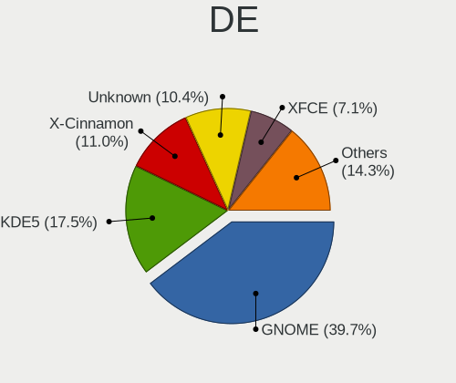
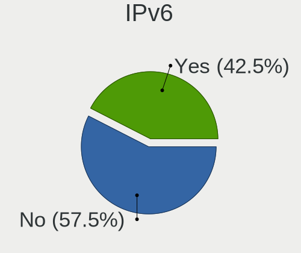

Linux in Germany - Tested Hardware & Statistics
-----------------------------------------------

A project to collect tested hardware configurations for Linux in Germany.

Anyone can contribute to this report by the [hw-probe](https://github.com/linuxhw/hw-probe) tool:

    sudo -E hw-probe -all -upload

Please contribute! Especially if your hardware is rare.

This is a report for all computer types. See also reports for [desktops](/Location/Germany/Desktop/README.md) and [notebooks](/Location/Germany/Notebook/README.md).

Contents
--------

* [ Test Cases ](#test-cases)

* [ System ](#system)
  - [ OS                       ](#os)
  - [ OS Family                ](#os-family)
  - [ Kernel                   ](#kernel)
  - [ Kernel Family            ](#kernel-family)
  - [ Kernel Major Ver.        ](#kernel-major-ver)
  - [ Arch                     ](#arch)
  - [ DE                       ](#de)
  - [ Display Server           ](#display-server)
  - [ Display Manager          ](#display-manager)
  - [ OS Lang                  ](#os-lang)
  - [ Boot Mode                ](#boot-mode)
  - [ Filesystem               ](#filesystem)
  - [ Part. scheme             ](#part-scheme)
  - [ Dual Boot with Linux/BSD ](#dual-boot-with-linuxbsd)
  - [ Dual Boot (Win)          ](#dual-boot-win)

* [ Board ](#board)
  - [ Vendor                   ](#vendor)
  - [ Model                    ](#model)
  - [ Model Family             ](#model-family)
  - [ MFG Year                 ](#mfg-year)
  - [ Form Factor              ](#form-factor)
  - [ Secure Boot              ](#secure-boot)
  - [ Coreboot                 ](#coreboot)
  - [ RAM Size                 ](#ram-size)
  - [ RAM Used                 ](#ram-used)
  - [ Total Drives             ](#total-drives)
  - [ Has CD-ROM               ](#has-cd-rom)
  - [ Has Ethernet             ](#has-ethernet)
  - [ Has WiFi                 ](#has-wifi)
  - [ Has Bluetooth            ](#has-bluetooth)

* [ Location ](#location)
  - [ Country                  ](#country)
  - [ City                     ](#city)

* [ Drives ](#drives)
  - [ Drive Vendor             ](#drive-vendor)
  - [ Drive Model              ](#drive-model)
  - [ HDD Vendor               ](#hdd-vendor)
  - [ SSD Vendor               ](#ssd-vendor)
  - [ Drive Kind               ](#drive-kind)
  - [ Drive Connector          ](#drive-connector)
  - [ Drive Size               ](#drive-size)
  - [ Space Total              ](#space-total)
  - [ Space Used               ](#space-used)
  - [ Malfunc. Drives          ](#malfunc-drives)
  - [ Malfunc. Drive Vendor    ](#malfunc-drive-vendor)
  - [ Malfunc. HDD Vendor      ](#malfunc-hdd-vendor)
  - [ Malfunc. Drive Kind      ](#malfunc-drive-kind)
  - [ Failed Drives            ](#failed-drives)
  - [ Failed Drive Vendor      ](#failed-drive-vendor)
  - [ Drive Status             ](#drive-status)

* [ Storage controller ](#storage-controller)
  - [ Storage Vendor           ](#storage-vendor)
  - [ Storage Model            ](#storage-model)
  - [ Storage Kind             ](#storage-kind)

* [ Processor ](#processor)
  - [ CPU Vendor               ](#cpu-vendor)
  - [ CPU Model                ](#cpu-model)
  - [ CPU Model Family         ](#cpu-model-family)
  - [ CPU Cores                ](#cpu-cores)
  - [ CPU Sockets              ](#cpu-sockets)
  - [ CPU Threads              ](#cpu-threads)
  - [ CPU Op-Modes             ](#cpu-op-modes)
  - [ CPU Microcode            ](#cpu-microcode)
  - [ CPU Microarch            ](#cpu-microarch)

* [ Graphics ](#graphics)
  - [ GPU Vendor               ](#gpu-vendor)
  - [ GPU Model                ](#gpu-model)
  - [ GPU Combo                ](#gpu-combo)
  - [ GPU Driver               ](#gpu-driver)
  - [ GPU Memory               ](#gpu-memory)

* [ Monitor ](#monitor)
  - [ Monitor Vendor           ](#monitor-vendor)
  - [ Monitor Model            ](#monitor-model)
  - [ Monitor Resolution       ](#monitor-resolution)
  - [ Monitor Diagonal         ](#monitor-diagonal)
  - [ Monitor Width            ](#monitor-width)
  - [ Aspect Ratio             ](#aspect-ratio)
  - [ Monitor Area             ](#monitor-area)
  - [ Pixel Density            ](#pixel-density)
  - [ Multiple Monitors        ](#multiple-monitors)

* [ Network ](#network)
  - [ Net Controller Vendor    ](#net-controller-vendor)
  - [ Net Controller Model     ](#net-controller-model)
  - [ Wireless Vendor          ](#wireless-vendor)
  - [ Wireless Model           ](#wireless-model)
  - [ Ethernet Vendor          ](#ethernet-vendor)
  - [ Ethernet Model           ](#ethernet-model)
  - [ Net Controller Kind      ](#net-controller-kind)
  - [ Used Controller          ](#used-controller)
  - [ NICs                     ](#nics)
  - [ IPv6                     ](#ipv6)

* [ Bluetooth ](#bluetooth)
  - [ Bluetooth Vendor         ](#bluetooth-vendor)
  - [ Bluetooth Model          ](#bluetooth-model)

* [ Sound ](#sound)
  - [ Sound Vendor             ](#sound-vendor)
  - [ Sound Model              ](#sound-model)

* [ Memory ](#memory)
  - [ Memory Vendor            ](#memory-vendor)
  - [ Memory Model             ](#memory-model)
  - [ Memory Kind              ](#memory-kind)
  - [ Memory Form Factor       ](#memory-form-factor)
  - [ Memory Size              ](#memory-size)
  - [ Memory Speed             ](#memory-speed)

* [ Printers & scanners ](#printers--scanners)
  - [ Printer Vendor           ](#printer-vendor)
  - [ Printer Model            ](#printer-model)
  - [ Scanner Vendor           ](#scanner-vendor)
  - [ Scanner Model            ](#scanner-model)

* [ Camera ](#camera)
  - [ Camera Vendor            ](#camera-vendor)
  - [ Camera Model             ](#camera-model)

* [ Security ](#security)
  - [ Fingerprint Vendor       ](#fingerprint-vendor)
  - [ Fingerprint Model        ](#fingerprint-model)
  - [ Chipcard Vendor          ](#chipcard-vendor)
  - [ Chipcard Model           ](#chipcard-model)

* [ Unsupported ](#unsupported)
  - [ Unsupported Devices      ](#unsupported-devices)
  - [ Unsupported Device Types ](#unsupported-device-types)

Test Cases
----------

Total: 28137

| Vendor        | Model                       | Form-Factor | Probe                                                      | Date         |
|---------------|-----------------------------|-------------|------------------------------------------------------------|--------------|
| ASUSTek       | PN41                        | Mini pc     | [99d3eca719](https://linux-hardware.org/?probe=99d3eca719) | May 01, 2023 |
| Fujitsu       | D3223-A1 S26361-D3223-A1    | Desktop     | [9b6f7cea89](https://linux-hardware.org/?probe=9b6f7cea89) | May 01, 2023 |
| Lenovo        | 3111 SDK0J40697 WIN 3305... | Desktop     | [705ff684a9](https://linux-hardware.org/?probe=705ff684a9) | Apr 30, 2023 |
| ASRock        | FM2A68M-HD+                 | Desktop     | [467bb5ded2](https://linux-hardware.org/?probe=467bb5ded2) | Apr 30, 2023 |
| Sony          | SVF1521C6EW                 | Notebook    | [57e1c14061](https://linux-hardware.org/?probe=57e1c14061) | Apr 30, 2023 |
| Shuttle       | DL20N                       | Desktop     | [3f97bcaa08](https://linux-hardware.org/?probe=3f97bcaa08) | Apr 30, 2023 |
| ASRock        | 960GM-GS3 FX                | Desktop     | [392492c032](https://linux-hardware.org/?probe=392492c032) | Apr 30, 2023 |
| Medion        | H81H3-EM2                   | Desktop     | [c85a3da4ab](https://linux-hardware.org/?probe=c85a3da4ab) | Apr 30, 2023 |
| Acer          | Aspire A315-33              | Notebook    | [fdba59c054](https://linux-hardware.org/?probe=fdba59c054) | Apr 30, 2023 |
| ASRock        | N68-GS4 FX                  | Desktop     | [354f8689e7](https://linux-hardware.org/?probe=354f8689e7) | Apr 30, 2023 |
| Lenovo        | V15 G2 IJL 82QY             | Notebook    | [1714bffa0e](https://linux-hardware.org/?probe=1714bffa0e) | Apr 30, 2023 |
| MSI           | X570-A PRO                  | Desktop     | [4d31b88bbf](https://linux-hardware.org/?probe=4d31b88bbf) | Apr 30, 2023 |
| MSI           | X570-A PRO                  | Desktop     | [47a253784a](https://linux-hardware.org/?probe=47a253784a) | Apr 30, 2023 |
| ASUSTek       | X751SA                      | Notebook    | [5192130c0e](https://linux-hardware.org/?probe=5192130c0e) | Apr 30, 2023 |
| Lenovo        | ThinkPad L15 Gen 1 20U8S... | Notebook    | [32b3bf20de](https://linux-hardware.org/?probe=32b3bf20de) | Apr 30, 2023 |
| Fujitsu       | D3161-A1 S26361-D3161-A1    | Desktop     | [ac7894081f](https://linux-hardware.org/?probe=ac7894081f) | Apr 30, 2023 |
| Gigabyte      | TRX40 AORUS XTREME          | Desktop     | [a88277b7f9](https://linux-hardware.org/?probe=a88277b7f9) | Apr 30, 2023 |
| Lenovo        | ThinkPad T490s 20NX002SG... | Notebook    | [874f19f26e](https://linux-hardware.org/?probe=874f19f26e) | Apr 30, 2023 |
| Acer          | Aspire X3950                | Desktop     | [406366d5c1](https://linux-hardware.org/?probe=406366d5c1) | Apr 30, 2023 |
| HP            | Pavilion Gaming Laptop 1... | Notebook    | [9876205c45](https://linux-hardware.org/?probe=9876205c45) | Apr 30, 2023 |
| MSI           | B450 GAMING PLUS            | Desktop     | [8aa973e0f5](https://linux-hardware.org/?probe=8aa973e0f5) | Apr 30, 2023 |
| Medion        | E6214                       | Notebook    | [7bb9f39d76](https://linux-hardware.org/?probe=7bb9f39d76) | Apr 30, 2023 |
| Medion        | E6214                       | Notebook    | [39747632e6](https://linux-hardware.org/?probe=39747632e6) | Apr 30, 2023 |
| Gigabyte      | Q87M-D2H                    | Desktop     | [16279b3c8b](https://linux-hardware.org/?probe=16279b3c8b) | Apr 30, 2023 |
| Fujitsu       | LIFEBOOK E734               | Notebook    | [f99ecceaeb](https://linux-hardware.org/?probe=f99ecceaeb) | Apr 30, 2023 |
| Fujitsu       | LIFEBOOK E734               | Notebook    | [31fa8aa587](https://linux-hardware.org/?probe=31fa8aa587) | Apr 30, 2023 |
| HP            | Pavilion Aero Laptop 13-... | Notebook    | [df9cc0160a](https://linux-hardware.org/?probe=df9cc0160a) | Apr 30, 2023 |
| HP            | 255 G6 Notebook PC          | Notebook    | [d99135522b](https://linux-hardware.org/?probe=d99135522b) | Apr 30, 2023 |
| Dell          | XPS 13 7390                 | Notebook    | [c5000ec967](https://linux-hardware.org/?probe=c5000ec967) | Apr 30, 2023 |
| Acer          | Aspire M5-481T              | Notebook    | [d215d36b64](https://linux-hardware.org/?probe=d215d36b64) | Apr 30, 2023 |
| Lenovo        | ThinkPad T14 Gen 1 20S0S... | Notebook    | [2bc3c5303f](https://linux-hardware.org/?probe=2bc3c5303f) | Apr 30, 2023 |
| Gigabyte      | B85M-D3H                    | Desktop     | [2fe28d7f43](https://linux-hardware.org/?probe=2fe28d7f43) | Apr 29, 2023 |
| Medion        | TJ4125                      | Desktop     | [ad46974b2a](https://linux-hardware.org/?probe=ad46974b2a) | Apr 29, 2023 |
| ASUSTek       | ROG CROSSHAIR X670E HERO    | Desktop     | [4ac7cbf111](https://linux-hardware.org/?probe=4ac7cbf111) | Apr 29, 2023 |
| ASUSTek       | X751MA                      | Notebook    | [c952010dbb](https://linux-hardware.org/?probe=c952010dbb) | Apr 29, 2023 |
| Gigabyte      | B450 AORUS M                | Desktop     | [ccc2fbf8a9](https://linux-hardware.org/?probe=ccc2fbf8a9) | Apr 29, 2023 |
| ASRock        | N68C-S UCC                  | Desktop     | [13628f3559](https://linux-hardware.org/?probe=13628f3559) | Apr 29, 2023 |
| ASUSTek       | X99-A                       | Desktop     | [6505e46b86](https://linux-hardware.org/?probe=6505e46b86) | Apr 29, 2023 |
| Medion        | X681X                       | Notebook    | [f65ca1e461](https://linux-hardware.org/?probe=f65ca1e461) | Apr 29, 2023 |
| MSI           | B85M-E45                    | Desktop     | [db824980e5](https://linux-hardware.org/?probe=db824980e5) | Apr 29, 2023 |
| Acer          | Aspire 8950G                | Notebook    | [348a7d728c](https://linux-hardware.org/?probe=348a7d728c) | Apr 29, 2023 |
| MSI           | B85M-E45                    | Desktop     | [42703e0a76](https://linux-hardware.org/?probe=42703e0a76) | Apr 29, 2023 |
| Intel         | DB75EN AAG39650-303         | Desktop     | [713c422641](https://linux-hardware.org/?probe=713c422641) | Apr 29, 2023 |
| Dell          | Inspiron 7773               | Notebook    | [19741ac2ea](https://linux-hardware.org/?probe=19741ac2ea) | Apr 29, 2023 |
| Hardkernel    | ODROID-H3                   | Desktop     | [139d61e128](https://linux-hardware.org/?probe=139d61e128) | Apr 29, 2023 |
| Gigabyte      | Z790 UD                     | Desktop     | [536a24a0e3](https://linux-hardware.org/?probe=536a24a0e3) | Apr 29, 2023 |
| ASRock        | N68C-S UCC                  | Desktop     | [f7f4643b8f](https://linux-hardware.org/?probe=f7f4643b8f) | Apr 29, 2023 |
| HP            | 3397                        | Desktop     | [8b84766d3d](https://linux-hardware.org/?probe=8b84766d3d) | Apr 29, 2023 |
| YANYU         | EPIC-N56_I522E Ver          | Desktop     | [4798ab5c06](https://linux-hardware.org/?probe=4798ab5c06) | Apr 29, 2023 |
| Gigabyte      | X399 DESIGNARE EX-CF        | Desktop     | [e47ae2080c](https://linux-hardware.org/?probe=e47ae2080c) | Apr 29, 2023 |
| Lenovo        | G50-70 20351                | Notebook    | [5792e8cfa2](https://linux-hardware.org/?probe=5792e8cfa2) | Apr 29, 2023 |
| HP            | 845A                        | Desktop     | [d0aa2a4a7a](https://linux-hardware.org/?probe=d0aa2a4a7a) | Apr 29, 2023 |
| HP            | 845A                        | Desktop     | [f8bc4601ef](https://linux-hardware.org/?probe=f8bc4601ef) | Apr 29, 2023 |
| Medion        | X6816                       | Notebook    | [2c1807dad7](https://linux-hardware.org/?probe=2c1807dad7) | Apr 29, 2023 |
| Medion        | TJ4125                      | Desktop     | [8f319cff50](https://linux-hardware.org/?probe=8f319cff50) | Apr 28, 2023 |
| Gigabyte      | B85M-D3H                    | Desktop     | [c0c226bf8c](https://linux-hardware.org/?probe=c0c226bf8c) | Apr 28, 2023 |
| Gigabyte      | Q87M-D2H                    | Desktop     | [6503ed5a4c](https://linux-hardware.org/?probe=6503ed5a4c) | Apr 28, 2023 |
| Dell          | Latitude E5450              | Notebook    | [85fb3ec2fd](https://linux-hardware.org/?probe=85fb3ec2fd) | Apr 28, 2023 |
| Acer          | Aspire ES1-731              | Notebook    | [140e5eb8fc](https://linux-hardware.org/?probe=140e5eb8fc) | Apr 28, 2023 |
| Fujitsu       | D3500-A1 S26361-D3500-A1    | Desktop     | [77150d1166](https://linux-hardware.org/?probe=77150d1166) | Apr 28, 2023 |
| Notebook      | W35xSTQ_370ST               | Notebook    | [a68f02482d](https://linux-hardware.org/?probe=a68f02482d) | Apr 28, 2023 |
| ASUSTek       | PRIME X370-PRO              | Desktop     | [ddb48a2def](https://linux-hardware.org/?probe=ddb48a2def) | Apr 28, 2023 |
| Lenovo        | Yoga Slim 7 Pro 14ARH7 8... | Notebook    | [39644ab1d4](https://linux-hardware.org/?probe=39644ab1d4) | Apr 28, 2023 |
| Lenovo        | ThinkPad T470p 20J60018M... | Notebook    | [a8deb2307c](https://linux-hardware.org/?probe=a8deb2307c) | Apr 28, 2023 |
| MSI           | MAG B650 TOMAHAWK WIFI      | Desktop     | [99745be007](https://linux-hardware.org/?probe=99745be007) | Apr 28, 2023 |
| ASUSTek       | TUF Gaming X570-PLUS        | Desktop     | [278ed4fdd2](https://linux-hardware.org/?probe=278ed4fdd2) | Apr 28, 2023 |
| Lenovo        | IdeaPad Y470                | Notebook    | [58c809428e](https://linux-hardware.org/?probe=58c809428e) | Apr 28, 2023 |
| Acer          | Swift SF314-59              | Notebook    | [a84de33c38](https://linux-hardware.org/?probe=a84de33c38) | Apr 28, 2023 |
| HP            | ProLiant ML350e Gen8 v2     | Desktop     | [968f941e2d](https://linux-hardware.org/?probe=968f941e2d) | Apr 28, 2023 |
| Acer          | Aspire V3-772               | Notebook    | [a1584c31ec](https://linux-hardware.org/?probe=a1584c31ec) | Apr 28, 2023 |
| Acer          | Aspire V3-772               | Notebook    | [5f191f449f](https://linux-hardware.org/?probe=5f191f449f) | Apr 28, 2023 |
| MSI           | MAG B650 TOMAHAWK WIFI      | Desktop     | [2427e67de4](https://linux-hardware.org/?probe=2427e67de4) | Apr 28, 2023 |
| ASRock        | A75M-HVS                    | Desktop     | [528362dfca](https://linux-hardware.org/?probe=528362dfca) | Apr 28, 2023 |
| Acer          | Aspire V5-572P              | Notebook    | [4fa79fb180](https://linux-hardware.org/?probe=4fa79fb180) | Apr 28, 2023 |
| Acer          | Aspire V5-572P              | Notebook    | [fdc85a159b](https://linux-hardware.org/?probe=fdc85a159b) | Apr 28, 2023 |
| ASUSTek       | K54C                        | Notebook    | [7223b97463](https://linux-hardware.org/?probe=7223b97463) | Apr 27, 2023 |
| Dell          | XPS 13 9350                 | Notebook    | [aea99797db](https://linux-hardware.org/?probe=aea99797db) | Apr 27, 2023 |
| ASUSTek       | X751MA                      | Notebook    | [eb9967626a](https://linux-hardware.org/?probe=eb9967626a) | Apr 27, 2023 |
| Unknown       | Unknown                     | Desktop     | [5f5809c40f](https://linux-hardware.org/?probe=5f5809c40f) | Apr 27, 2023 |
| HUAWEI        | HVY-WXX9                    | Notebook    | [dd5391c20d](https://linux-hardware.org/?probe=dd5391c20d) | Apr 27, 2023 |
| Shenzhen M... | F6BFC                       | Desktop     | [e2f7b853b1](https://linux-hardware.org/?probe=e2f7b853b1) | Apr 27, 2023 |
| Dell          | Inspiron 16 5630            | Notebook    | [7bfe5bb892](https://linux-hardware.org/?probe=7bfe5bb892) | Apr 27, 2023 |
| HP            | 82F2 A01                    | Desktop     | [ea8f7364db](https://linux-hardware.org/?probe=ea8f7364db) | Apr 27, 2023 |
| Lenovo        | ThinkPad R61 8943DJG        | Notebook    | [afc3fc578e](https://linux-hardware.org/?probe=afc3fc578e) | Apr 27, 2023 |
| MSI           | PE60 6QE                    | Notebook    | [1a5ae975ee](https://linux-hardware.org/?probe=1a5ae975ee) | Apr 27, 2023 |
| Microsoft     | Surface Go 2                | Tablet      | [da50afdd1c](https://linux-hardware.org/?probe=da50afdd1c) | Apr 27, 2023 |
| ASRock        | A330GC                      | Desktop     | [d1a2e8dd13](https://linux-hardware.org/?probe=d1a2e8dd13) | Apr 27, 2023 |
| Lenovo        | ThinkPad T470 W10DG 20JN... | Notebook    | [fe959d51ab](https://linux-hardware.org/?probe=fe959d51ab) | Apr 27, 2023 |
| HP            | Compaq 6910p                | Notebook    | [049253c0c8](https://linux-hardware.org/?probe=049253c0c8) | Apr 27, 2023 |
| Lenovo        | ThinkPad E14 Gen 4 21ECS... | Notebook    | [442a827555](https://linux-hardware.org/?probe=442a827555) | Apr 27, 2023 |
| HP            | 17E2                        | Mini pc     | [02ee837763](https://linux-hardware.org/?probe=02ee837763) | Apr 27, 2023 |
| Gigabyte      | GA-880GMA-UD2H              | Desktop     | [7f2f7e75b7](https://linux-hardware.org/?probe=7f2f7e75b7) | Apr 27, 2023 |
| Lenovo        | IdeaPad 5 14ALC05 82LM      | Notebook    | [e1b7846c92](https://linux-hardware.org/?probe=e1b7846c92) | Apr 27, 2023 |
| Dell          | 0HHV7N A00                  | Desktop     | [33517b7bfe](https://linux-hardware.org/?probe=33517b7bfe) | Apr 27, 2023 |
| Lenovo        | ThinkCentre M71e 3129B8G    | Desktop     | [2b6c3d498a](https://linux-hardware.org/?probe=2b6c3d498a) | Apr 27, 2023 |
| Gigabyte      | Z97P-D3                     | Desktop     | [40b51d3cae](https://linux-hardware.org/?probe=40b51d3cae) | Apr 27, 2023 |
| HP            | 18E7                        | Desktop     | [c6a760cb50](https://linux-hardware.org/?probe=c6a760cb50) | Apr 27, 2023 |
| Radxa         | ROCK Pi 4B                  | Soc         | [4382f0cce7](https://linux-hardware.org/?probe=4382f0cce7) | Apr 27, 2023 |
| Gigabyte      | H61MA-D3V                   | Desktop     | [3a1d89d5a0](https://linux-hardware.org/?probe=3a1d89d5a0) | Apr 27, 2023 |
| Apple         | MacBookAir6,1               | Notebook    | [c0f967c0bc](https://linux-hardware.org/?probe=c0f967c0bc) | Apr 27, 2023 |
| Acer          | Aspire E1-571               | Notebook    | [c95605ef8e](https://linux-hardware.org/?probe=c95605ef8e) | Apr 27, 2023 |
| ASUSTek       | TUF Gaming B550M-PLUS       | Desktop     | [812906148b](https://linux-hardware.org/?probe=812906148b) | Apr 27, 2023 |
| HUAWEI        | BOHK-WAX9X                  | Notebook    | [21577119ad](https://linux-hardware.org/?probe=21577119ad) | Apr 27, 2023 |
| MSI           | B350M PRO-VDH               | Desktop     | [a15fa484d4](https://linux-hardware.org/?probe=a15fa484d4) | Apr 26, 2023 |
| Gigabyte      | B450 I AORUS PRO WIFI-CF    | Desktop     | [2dcf65cf8e](https://linux-hardware.org/?probe=2dcf65cf8e) | Apr 26, 2023 |
| Lenovo        | ThinkPad T480 20L6S2S800    | Notebook    | [8ab4a35e8c](https://linux-hardware.org/?probe=8ab4a35e8c) | Apr 26, 2023 |
| Sony          | SVD1322X2EW                 | Notebook    | [2574ef07fb](https://linux-hardware.org/?probe=2574ef07fb) | Apr 26, 2023 |
| ASUSTek       | ZenBook UX434FAC_UX434FA    | Notebook    | [4a6eed684e](https://linux-hardware.org/?probe=4a6eed684e) | Apr 26, 2023 |
| ASUSTek       | VivoBook_ASUSLaptop X160... | Notebook    | [d470349226](https://linux-hardware.org/?probe=d470349226) | Apr 26, 2023 |
| Gigabyte      | Z97X-UD3H-CF                | Desktop     | [eaac4c0ba0](https://linux-hardware.org/?probe=eaac4c0ba0) | Apr 26, 2023 |
| Apple         | MacBookPro14,2              | Notebook    | [4e1caf5a7a](https://linux-hardware.org/?probe=4e1caf5a7a) | Apr 26, 2023 |
| TUXEDO        | InfinityBook Pro Gen7 (M... | Notebook    | [7274cefe89](https://linux-hardware.org/?probe=7274cefe89) | Apr 26, 2023 |
| Gigabyte      | Z370M D3H-CF                | Desktop     | [ada8ff75dd](https://linux-hardware.org/?probe=ada8ff75dd) | Apr 26, 2023 |
| MSI           | B450-A PRO MAX              | Desktop     | [2d7c2dd8f9](https://linux-hardware.org/?probe=2d7c2dd8f9) | Apr 26, 2023 |
| Dell          | Latitude E6440              | Notebook    | [f5cdf825fa](https://linux-hardware.org/?probe=f5cdf825fa) | Apr 26, 2023 |
| ASUSTek       | M5A97 LE R2.0               | Desktop     | [64b15b4b1d](https://linux-hardware.org/?probe=64b15b4b1d) | Apr 26, 2023 |
| Lenovo        | V15 G2 IJL 82QY             | Notebook    | [7ca1ebbe7f](https://linux-hardware.org/?probe=7ca1ebbe7f) | Apr 26, 2023 |
| Lenovo        | 36C5 SDK0K17763 WIN 1801... | Desktop     | [45c453eb4e](https://linux-hardware.org/?probe=45c453eb4e) | Apr 26, 2023 |
| Lenovo        | 36C5 SDK0K17763 WIN 1801... | Desktop     | [b79a40ebdc](https://linux-hardware.org/?probe=b79a40ebdc) | Apr 26, 2023 |
| Wortmann      | TERRA_MOBILE_1749           | Notebook    | [2d40a711f9](https://linux-hardware.org/?probe=2d40a711f9) | Apr 26, 2023 |
| Lenovo        | ThinkPad P15s Gen 1 20T4... | Notebook    | [67a77ff775](https://linux-hardware.org/?probe=67a77ff775) | Apr 26, 2023 |
| Intel         | D34010WYK H14771-304        | Desktop     | [4fbbe6e603](https://linux-hardware.org/?probe=4fbbe6e603) | Apr 26, 2023 |
| ASUSTek       | X550LB                      | Notebook    | [053e93702b](https://linux-hardware.org/?probe=053e93702b) | Apr 26, 2023 |
| Gigabyte      | B75M-D3H                    | Desktop     | [4f1e4da37e](https://linux-hardware.org/?probe=4f1e4da37e) | Apr 26, 2023 |
| Google        | Bobba                       | Notebook    | [5eb10d8965](https://linux-hardware.org/?probe=5eb10d8965) | Apr 26, 2023 |
| ASUSTek       | ROG STRIX B760-I GAMING ... | Desktop     | [6dec479f55](https://linux-hardware.org/?probe=6dec479f55) | Apr 25, 2023 |
| ASUSTek       | Z170-A                      | Desktop     | [fa21ed6900](https://linux-hardware.org/?probe=fa21ed6900) | Apr 25, 2023 |
| Microsoft     | Surface Go                  | Tablet      | [e2f309bb08](https://linux-hardware.org/?probe=e2f309bb08) | Apr 25, 2023 |
| ASUSTek       | Z170I PRO GAMING            | Desktop     | [a2875a31b2](https://linux-hardware.org/?probe=a2875a31b2) | Apr 25, 2023 |
| Lenovo        | ThinkPad P1 Gen 2 20QT00... | Notebook    | [4285b1a3d9](https://linux-hardware.org/?probe=4285b1a3d9) | Apr 25, 2023 |
| Acer          | Aspire R7-571G              | Notebook    | [d4220bc210](https://linux-hardware.org/?probe=d4220bc210) | Apr 25, 2023 |
| Lenovo        | IdeaPad 5 15ITL05 82FG      | Notebook    | [20bf63821f](https://linux-hardware.org/?probe=20bf63821f) | Apr 25, 2023 |
| Dell          | XPS 13 9305                 | Notebook    | [4db8688749](https://linux-hardware.org/?probe=4db8688749) | Apr 25, 2023 |
| ASUSTek       | PRIME B450M-A               | Desktop     | [d8c1be05af](https://linux-hardware.org/?probe=d8c1be05af) | Apr 25, 2023 |
| Gigabyte      | GA-78LMT-S2P                | Desktop     | [4668a2409b](https://linux-hardware.org/?probe=4668a2409b) | Apr 25, 2023 |
| Lenovo        | ThinkCentre A70z 0401G6G    | Desktop     | [b1b8bf3df6](https://linux-hardware.org/?probe=b1b8bf3df6) | Apr 25, 2023 |
| Sony          | VPCS13V9E                   | Notebook    | [3c1551d7be](https://linux-hardware.org/?probe=3c1551d7be) | Apr 25, 2023 |
| Gigabyte      | GA-78LMT-S2P                | Desktop     | [7b091628e5](https://linux-hardware.org/?probe=7b091628e5) | Apr 25, 2023 |
| ASUSTek       | K52JK                       | Notebook    | [dd0ced2f54](https://linux-hardware.org/?probe=dd0ced2f54) | Apr 25, 2023 |
| ASRock        | X670E Pro RS                | Desktop     | [e36216c3c7](https://linux-hardware.org/?probe=e36216c3c7) | Apr 25, 2023 |
| HP            | 255 G5 Notebook PC          | Notebook    | [c542c2df7e](https://linux-hardware.org/?probe=c542c2df7e) | Apr 25, 2023 |
| ZOTAC         | ZBOX-CI527/CI547NANO        | Mini pc     | [97f86da425](https://linux-hardware.org/?probe=97f86da425) | Apr 25, 2023 |
| HUAWEI        | BOHK-WAX9X                  | Notebook    | [c0d8e6e6b5](https://linux-hardware.org/?probe=c0d8e6e6b5) | Apr 25, 2023 |
| ASUSTek       | PRIME A520M-K               | Desktop     | [a437a858a4](https://linux-hardware.org/?probe=a437a858a4) | Apr 25, 2023 |
| Intel         | NUC10i7FNB K61360-305       | Mini pc     | [4c775782ea](https://linux-hardware.org/?probe=4c775782ea) | Apr 25, 2023 |
| MSI           | B560M PRO-VDH               | Desktop     | [61cdcbbe0c](https://linux-hardware.org/?probe=61cdcbbe0c) | Apr 25, 2023 |
| Lenovo        | ThinkPad Edge E545 20B20... | Notebook    | [fd66f3852a](https://linux-hardware.org/?probe=fd66f3852a) | Apr 25, 2023 |
| Lenovo        | ThinkPad L14 Gen 3 21C6S... | Notebook    | [554f32b909](https://linux-hardware.org/?probe=554f32b909) | Apr 25, 2023 |
| Lenovo        | V15 G2 IJL 82QY             | Notebook    | [2732f4b096](https://linux-hardware.org/?probe=2732f4b096) | Apr 25, 2023 |
| ASRock        | Z690 Extreme                | Desktop     | [3767d30290](https://linux-hardware.org/?probe=3767d30290) | Apr 25, 2023 |
| Fujitsu       | LIFEBOOK S935               | Notebook    | [418c2c626e](https://linux-hardware.org/?probe=418c2c626e) | Apr 25, 2023 |
| Apple         | Mac-BE088AF8C5EB4FA2 iMa... | All in one  | [ca4c9d7e6c](https://linux-hardware.org/?probe=ca4c9d7e6c) | Apr 25, 2023 |
| ASUSTek       | Z170 PRO GAMING             | Desktop     | [7d7fd385cc](https://linux-hardware.org/?probe=7d7fd385cc) | Apr 25, 2023 |
| Gigabyte      | B450M S2H                   | Desktop     | [db176db0db](https://linux-hardware.org/?probe=db176db0db) | Apr 25, 2023 |
| Acer          | Spin SP313-51N              | Convertible | [76646ac40d](https://linux-hardware.org/?probe=76646ac40d) | Apr 24, 2023 |
| ASUSTek       | X510UQR                     | Notebook    | [4a2e357ace](https://linux-hardware.org/?probe=4a2e357ace) | Apr 24, 2023 |
| HUAWEI        | HN-WX9X                     | Notebook    | [d07874c829](https://linux-hardware.org/?probe=d07874c829) | Apr 24, 2023 |
| Lenovo        | 313A NOK                    | Desktop     | [34a521ebad](https://linux-hardware.org/?probe=34a521ebad) | Apr 24, 2023 |
| Fujitsu       | LIFEBOOK S751               | Notebook    | [e01b26f35f](https://linux-hardware.org/?probe=e01b26f35f) | Apr 24, 2023 |
| Gigabyte      | Z97X-UD3H-CF                | Desktop     | [88c455761b](https://linux-hardware.org/?probe=88c455761b) | Apr 24, 2023 |
| ASUSTek       | ROG STRIX B450-F GAMING ... | Desktop     | [25ac3a297e](https://linux-hardware.org/?probe=25ac3a297e) | Apr 24, 2023 |
| Fujitsu       | D3221-A1 S26361-D3221-A1    | Desktop     | [e18fd8d449](https://linux-hardware.org/?probe=e18fd8d449) | Apr 24, 2023 |
| Dell          | Latitude E6540              | Notebook    | [ba8579b1a5](https://linux-hardware.org/?probe=ba8579b1a5) | Apr 24, 2023 |
| Fujitsu       | LIFEBOOK S751               | Notebook    | [07e4819355](https://linux-hardware.org/?probe=07e4819355) | Apr 24, 2023 |
| Acer          | Aspire A515-47              | Notebook    | [35a591e26a](https://linux-hardware.org/?probe=35a591e26a) | Apr 24, 2023 |
| Lenovo        | 32E9 SDK0T76463 WIN 3422... | Desktop     | [9f49daf25a](https://linux-hardware.org/?probe=9f49daf25a) | Apr 24, 2023 |
| Lenovo        | 32E9 SDK0T76463 WIN 3422... | Desktop     | [cc7a31d3d6](https://linux-hardware.org/?probe=cc7a31d3d6) | Apr 24, 2023 |
| ASUSTek       | PRIME X370-PRO              | Desktop     | [eb716c53fa](https://linux-hardware.org/?probe=eb716c53fa) | Apr 24, 2023 |
| Lenovo        | ThinkPad T480 20L50003GE    | Notebook    | [1259bb0006](https://linux-hardware.org/?probe=1259bb0006) | Apr 24, 2023 |
| ASUSTek       | ROG STRIX B550-F GAMING ... | Desktop     | [4939e609de](https://linux-hardware.org/?probe=4939e609de) | Apr 24, 2023 |
| Hampoo        | Cherry Trail CR V200        | Notebook    | [f3d90b0d4a](https://linux-hardware.org/?probe=f3d90b0d4a) | Apr 23, 2023 |
| Raspberry ... | Raspberry Pi 4 Model B R... | Soc         | [3e411bdade](https://linux-hardware.org/?probe=3e411bdade) | Apr 23, 2023 |
| ASUSTek       | Z170 PRO GAMING             | Desktop     | [2a0ee71044](https://linux-hardware.org/?probe=2a0ee71044) | Apr 23, 2023 |
| Gigabyte      | B450M S2H                   | Desktop     | [f3c853b789](https://linux-hardware.org/?probe=f3c853b789) | Apr 23, 2023 |
| Raspberry ... | Raspberry Pi                | Soc         | [5f760ed90e](https://linux-hardware.org/?probe=5f760ed90e) | Apr 23, 2023 |
| HP            | 350 G2                      | Notebook    | [ffa4ab3dc0](https://linux-hardware.org/?probe=ffa4ab3dc0) | Apr 23, 2023 |
| Valve         | Jupiter                     | Notebook    | [7501c5e0e4](https://linux-hardware.org/?probe=7501c5e0e4) | Apr 23, 2023 |
| Lenovo        | ThinkPad X220 4290EC5       | Notebook    | [f6fe80f275](https://linux-hardware.org/?probe=f6fe80f275) | Apr 23, 2023 |
| Gigabyte      | B550 AORUS PRO V2           | Desktop     | [e5c6fc2738](https://linux-hardware.org/?probe=e5c6fc2738) | Apr 23, 2023 |
| Lenovo        | ThinkPad T440s 20ARS1BH0... | Notebook    | [b76462c15b](https://linux-hardware.org/?probe=b76462c15b) | Apr 23, 2023 |
| Foxconn       | H67M-S/H67M-V/H67           | Desktop     | [92fa61186f](https://linux-hardware.org/?probe=92fa61186f) | Apr 23, 2023 |
| Sony          | SVD1322X2EW                 | Notebook    | [1652ce4c8f](https://linux-hardware.org/?probe=1652ce4c8f) | Apr 23, 2023 |
| MSI           | MEG X570S ACE MAX           | Desktop     | [b7ab5c207b](https://linux-hardware.org/?probe=b7ab5c207b) | Apr 23, 2023 |
| Apple         | MacBookPro11,3              | Notebook    | [db4dd7bc7a](https://linux-hardware.org/?probe=db4dd7bc7a) | Apr 23, 2023 |
| Gigabyte      | Q87M-D2H                    | Desktop     | [5827cd2604](https://linux-hardware.org/?probe=5827cd2604) | Apr 23, 2023 |
| HP            | 339A                        | Desktop     | [aa81655af9](https://linux-hardware.org/?probe=aa81655af9) | Apr 23, 2023 |
| Gigabyte      | B85M-D3H                    | Desktop     | [88a6d9040e](https://linux-hardware.org/?probe=88a6d9040e) | Apr 23, 2023 |
| Lenovo        | 36C5 SDK0K17763 WIN 1801... | Desktop     | [e653a5dd45](https://linux-hardware.org/?probe=e653a5dd45) | Apr 23, 2023 |
| eMachines     | E725                        | Notebook    | [7f35646c99](https://linux-hardware.org/?probe=7f35646c99) | Apr 23, 2023 |
| HP            | 255 15.6 inch G9 Noteboo... | Notebook    | [af2d38aec0](https://linux-hardware.org/?probe=af2d38aec0) | Apr 23, 2023 |
| ASUSTek       | F1A55-M LK R2.0             | Desktop     | [234e0d0738](https://linux-hardware.org/?probe=234e0d0738) | Apr 23, 2023 |
| Lenovo        | ThinkPad Edge E540 20C6C... | Notebook    | [fc22fb4921](https://linux-hardware.org/?probe=fc22fb4921) | Apr 23, 2023 |
| Microsoft     | Surface Pro 3               | Tablet      | [67dc214198](https://linux-hardware.org/?probe=67dc214198) | Apr 23, 2023 |
| Lenovo        | 36C5 SDK0K17763 WIN 1801... | Desktop     | [95e77b87f5](https://linux-hardware.org/?probe=95e77b87f5) | Apr 23, 2023 |
| Medion        | TJ4125                      | Desktop     | [faa241e4bc](https://linux-hardware.org/?probe=faa241e4bc) | Apr 23, 2023 |
| Dell          | Latitude 5290               | Notebook    | [54f92464ba](https://linux-hardware.org/?probe=54f92464ba) | Apr 23, 2023 |
| Dell          | 09KPNV A00                  | Desktop     | [0ba7a36003](https://linux-hardware.org/?probe=0ba7a36003) | Apr 23, 2023 |
| Dell          | 09KPNV A00                  | Desktop     | [a99600dad6](https://linux-hardware.org/?probe=a99600dad6) | Apr 23, 2023 |
| Dell          | Latitude E7240              | Notebook    | [1b5828d441](https://linux-hardware.org/?probe=1b5828d441) | Apr 23, 2023 |
| Lenovo        | ThinkPad T410 2537AT1       | Notebook    | [8e7059747e](https://linux-hardware.org/?probe=8e7059747e) | Apr 23, 2023 |
| ASRock        | N68-GS4 FX                  | Desktop     | [58dfb135e4](https://linux-hardware.org/?probe=58dfb135e4) | Apr 23, 2023 |
| Gigabyte      | Z97X-UD3H-CF                | Desktop     | [a65124c792](https://linux-hardware.org/?probe=a65124c792) | Apr 23, 2023 |
| ASRock        | N68-GS4 FX                  | Desktop     | [6edcfed28d](https://linux-hardware.org/?probe=6edcfed28d) | Apr 23, 2023 |
| Gigabyte      | TRX40 AORUS XTREME          | Desktop     | [eac9934073](https://linux-hardware.org/?probe=eac9934073) | Apr 23, 2023 |
| Lenovo        | Yoga 7 14ITL5 82BH          | Convertible | [c9691c3866](https://linux-hardware.org/?probe=c9691c3866) | Apr 23, 2023 |
| Intel         | NUC6i7KYB H90766-403        | Mini pc     | [f75685d3be](https://linux-hardware.org/?probe=f75685d3be) | Apr 23, 2023 |
| Gigabyte      | Z390 UD                     | Desktop     | [418754830b](https://linux-hardware.org/?probe=418754830b) | Apr 23, 2023 |
| Packard Be... | IPOWER G3610                | Desktop     | [05de2306b0](https://linux-hardware.org/?probe=05de2306b0) | Apr 23, 2023 |
| MSI           | G41M-P26                    | Desktop     | [342a1163ab](https://linux-hardware.org/?probe=342a1163ab) | Apr 23, 2023 |
| Gigabyte      | GA-78LMT-S2P                | Desktop     | [b342cd8fe0](https://linux-hardware.org/?probe=b342cd8fe0) | Apr 23, 2023 |
| ASUSTek       | X551MA                      | Notebook    | [44ca7e29c0](https://linux-hardware.org/?probe=44ca7e29c0) | Apr 23, 2023 |
| Lenovo        | V17 G2 ITL 82NX             | Notebook    | [241411df47](https://linux-hardware.org/?probe=241411df47) | Apr 23, 2023 |
| Gigabyte      | 970A-DS3P                   | Desktop     | [4a55a10fd0](https://linux-hardware.org/?probe=4a55a10fd0) | Apr 23, 2023 |
| Toshiba       | Satellite C70D-A            | Notebook    | [adee59c351](https://linux-hardware.org/?probe=adee59c351) | Apr 23, 2023 |
| Toshiba       | Satellite C70D-A            | Notebook    | [c5c43186bc](https://linux-hardware.org/?probe=c5c43186bc) | Apr 23, 2023 |
| Sony          | VPCF13M1E                   | Notebook    | [023cbeeac3](https://linux-hardware.org/?probe=023cbeeac3) | Apr 23, 2023 |
| Lenovo        | ThinkPad X220 4291WSH       | Notebook    | [5a626f5754](https://linux-hardware.org/?probe=5a626f5754) | Apr 23, 2023 |
| Valve         | Jupiter                     | Notebook    | [1ec068394a](https://linux-hardware.org/?probe=1ec068394a) | Apr 23, 2023 |
| ASUSTek       | K52JU                       | Notebook    | [74fdb1fa53](https://linux-hardware.org/?probe=74fdb1fa53) | Apr 23, 2023 |
| ASRock        | A75M-HVS                    | Desktop     | [a4964506f7](https://linux-hardware.org/?probe=a4964506f7) | Apr 23, 2023 |
| Gigabyte      | GA-78LMT-USB3 R2 sex        | Desktop     | [93790f1835](https://linux-hardware.org/?probe=93790f1835) | Apr 23, 2023 |
| ASUSTek       | ROG STRIX X570-F GAMING     | Desktop     | [fb4c86b0c4](https://linux-hardware.org/?probe=fb4c86b0c4) | Apr 23, 2023 |
| Valve         | Jupiter                     | Notebook    | [b34ccafbdf](https://linux-hardware.org/?probe=b34ccafbdf) | Apr 23, 2023 |
| Dell          | Latitude E6420              | Notebook    | [ef822feab1](https://linux-hardware.org/?probe=ef822feab1) | Apr 22, 2023 |
| Dell          | Latitude E6420              | Notebook    | [475a16531a](https://linux-hardware.org/?probe=475a16531a) | Apr 22, 2023 |
| Medion        | E2291                       | Convertible | [bd8f1509fd](https://linux-hardware.org/?probe=bd8f1509fd) | Apr 22, 2023 |
| MSI           | X470 GAMING PLUS MAX        | Desktop     | [8db6f88fd3](https://linux-hardware.org/?probe=8db6f88fd3) | Apr 22, 2023 |
| ASUSTek       | TUF Gaming B550M-PLUS       | Desktop     | [c4a5aad8a1](https://linux-hardware.org/?probe=c4a5aad8a1) | Apr 22, 2023 |
| Intel         | NUC12WSBi5 M46425-303       | Mini pc     | [9d1c8d691f](https://linux-hardware.org/?probe=9d1c8d691f) | Apr 22, 2023 |
| Lenovo        | ThinkPad L14 Gen 3 21C50... | Notebook    | [77cfc9d5b2](https://linux-hardware.org/?probe=77cfc9d5b2) | Apr 22, 2023 |
| Dell          | Latitude E6500              | Notebook    | [5de8825606](https://linux-hardware.org/?probe=5de8825606) | Apr 22, 2023 |
| ASUSTek       | TUF Gaming X670E-PLUS WI... | Desktop     | [180784b3a2](https://linux-hardware.org/?probe=180784b3a2) | Apr 22, 2023 |
| Medion        | Akoya E7416T                | Notebook    | [da5ea2c44b](https://linux-hardware.org/?probe=da5ea2c44b) | Apr 22, 2023 |
| Biostar       | A75MG                       | Desktop     | [50cb5c256e](https://linux-hardware.org/?probe=50cb5c256e) | Apr 22, 2023 |
| Acer          | Aspire E5-772               | Notebook    | [edfa9fcbef](https://linux-hardware.org/?probe=edfa9fcbef) | Apr 22, 2023 |
| Lenovo        | Z50-70 20354                | Notebook    | [76f54ae42f](https://linux-hardware.org/?probe=76f54ae42f) | Apr 22, 2023 |
| Gigabyte      | Z790 UD                     | Desktop     | [8536a23081](https://linux-hardware.org/?probe=8536a23081) | Apr 22, 2023 |
| Dell          | XPS 15 9550                 | Notebook    | [2defeff264](https://linux-hardware.org/?probe=2defeff264) | Apr 22, 2023 |
| Acer          | Aspire 7750G                | Notebook    | [afdab44276](https://linux-hardware.org/?probe=afdab44276) | Apr 22, 2023 |
| Acer          | Aspire 7750G                | Notebook    | [1f6e58080a](https://linux-hardware.org/?probe=1f6e58080a) | Apr 22, 2023 |
| Fujitsu       | D3500-A1 S26361-D3500-A1    | Desktop     | [475a4d151d](https://linux-hardware.org/?probe=475a4d151d) | Apr 22, 2023 |
| Lenovo        | B590 62743NG                | Notebook    | [ca0be4b423](https://linux-hardware.org/?probe=ca0be4b423) | Apr 22, 2023 |
| Lenovo        | B590 62743NG                | Notebook    | [74e38a8db9](https://linux-hardware.org/?probe=74e38a8db9) | Apr 22, 2023 |
| Gigabyte      | B550M S2H                   | Desktop     | [485f002152](https://linux-hardware.org/?probe=485f002152) | Apr 22, 2023 |
| Notebook      | W65_W67RB                   | Notebook    | [f34e442b8b](https://linux-hardware.org/?probe=f34e442b8b) | Apr 22, 2023 |
| MSI           | Z77A-G41                    | Desktop     | [9cd2294229](https://linux-hardware.org/?probe=9cd2294229) | Apr 22, 2023 |
| Biostar       | H410MH S2                   | Desktop     | [0f2593dc78](https://linux-hardware.org/?probe=0f2593dc78) | Apr 22, 2023 |
| Dell          | Latitude E6330              | Notebook    | [da6f0379c1](https://linux-hardware.org/?probe=da6f0379c1) | Apr 22, 2023 |
| Fujitsu Si... | D2156-A1 S26361-D2156-A1    | Desktop     | [617f821f9a](https://linux-hardware.org/?probe=617f821f9a) | Apr 22, 2023 |
| Lenovo        | ThinkPad X230T 343824G      | Notebook    | [2df9760e40](https://linux-hardware.org/?probe=2df9760e40) | Apr 22, 2023 |
| Acer          | Extensa 5635Z               | Notebook    | [015e857f63](https://linux-hardware.org/?probe=015e857f63) | Apr 22, 2023 |
| Lenovo        | V14 G2 ITL 82KA             | Notebook    | [763953fb60](https://linux-hardware.org/?probe=763953fb60) | Apr 22, 2023 |
| ASUSTek       | ROG STRIX B550-A GAMING     | Desktop     | [519c11a569](https://linux-hardware.org/?probe=519c11a569) | Apr 21, 2023 |
| Gigabyte      | TRX40 AORUS XTREME          | Desktop     | [d4d3e7f8d6](https://linux-hardware.org/?probe=d4d3e7f8d6) | Apr 21, 2023 |
| Dell          | XPS 13 9350                 | Notebook    | [63cafebe06](https://linux-hardware.org/?probe=63cafebe06) | Apr 21, 2023 |
| HP            | Pavilion Gaming Laptop 1... | Notebook    | [2a507e00bf](https://linux-hardware.org/?probe=2a507e00bf) | Apr 21, 2023 |
| Gigabyte      | AERO 16 KE5                 | Notebook    | [9e4fe316b8](https://linux-hardware.org/?probe=9e4fe316b8) | Apr 21, 2023 |
| Lenovo        | IdeaPad 110-15ISK 80UD      | Notebook    | [52cfdbde2d](https://linux-hardware.org/?probe=52cfdbde2d) | Apr 21, 2023 |
| MSI           | IONA                        | Desktop     | [3820fb6576](https://linux-hardware.org/?probe=3820fb6576) | Apr 21, 2023 |
| Raspberry ... | Raspberry Pi 4 Model B R... | Soc         | [81375e1afc](https://linux-hardware.org/?probe=81375e1afc) | Apr 21, 2023 |
| MSI           | MPG X570 GAMING PLUS        | Desktop     | [a898476ffa](https://linux-hardware.org/?probe=a898476ffa) | Apr 21, 2023 |
| ASUSTek       | N53SN                       | Notebook    | [7c0a7d4494](https://linux-hardware.org/?probe=7c0a7d4494) | Apr 21, 2023 |
| ASRock        | H81M-HDS R2.0               | Desktop     | [eaf8476afd](https://linux-hardware.org/?probe=eaf8476afd) | Apr 21, 2023 |
| Medion        | S15449                      | Notebook    | [c63e98624a](https://linux-hardware.org/?probe=c63e98624a) | Apr 21, 2023 |
| Medion        | S15449                      | Notebook    | [914511ca07](https://linux-hardware.org/?probe=914511ca07) | Apr 21, 2023 |
| Dell          | Latitude E6500              | Notebook    | [363b443628](https://linux-hardware.org/?probe=363b443628) | Apr 21, 2023 |
| Intel         | NUC11TNBi7 M11895-402       | Mini pc     | [62990532fe](https://linux-hardware.org/?probe=62990532fe) | Apr 21, 2023 |
| Gigabyte      | B550M DS3H                  | Desktop     | [e98b4fdd23](https://linux-hardware.org/?probe=e98b4fdd23) | Apr 21, 2023 |
| Lenovo        | ThinkPad E15 Gen 3 20YG0... | Notebook    | [6dcb6d41ef](https://linux-hardware.org/?probe=6dcb6d41ef) | Apr 21, 2023 |
| Intel         | NUC8BEB J72692-306          | Mini pc     | [a92b4a305f](https://linux-hardware.org/?probe=a92b4a305f) | Apr 21, 2023 |
| HP            | ZBook Power 15.6 inch G9... | Notebook    | [036616c992](https://linux-hardware.org/?probe=036616c992) | Apr 21, 2023 |
| ASUSTek       | M5A97 R2.0                  | Desktop     | [1c0e6f85fe](https://linux-hardware.org/?probe=1c0e6f85fe) | Apr 21, 2023 |
| Lenovo        | ThinkPad P14s Gen 1 20Y1... | Notebook    | [c46312dc86](https://linux-hardware.org/?probe=c46312dc86) | Apr 21, 2023 |
| HP            | ZBook Power 15.6 inch G9... | Notebook    | [8c8d2eb3b5](https://linux-hardware.org/?probe=8c8d2eb3b5) | Apr 21, 2023 |
| HP            | ZBook Power 15.6 inch G8... | Notebook    | [cb40e046d8](https://linux-hardware.org/?probe=cb40e046d8) | Apr 21, 2023 |
| Dell          | Precision 3550              | Notebook    | [7434822402](https://linux-hardware.org/?probe=7434822402) | Apr 21, 2023 |
| Packard Be... | EasyNote TSX62HR            | Notebook    | [7e7dbc9acd](https://linux-hardware.org/?probe=7e7dbc9acd) | Apr 21, 2023 |
| Dell          | Latitude E6420              | Notebook    | [5e3466ce98](https://linux-hardware.org/?probe=5e3466ce98) | Apr 21, 2023 |
| HP            | Pavilion dv7                | Notebook    | [def294f74c](https://linux-hardware.org/?probe=def294f74c) | Apr 20, 2023 |
| Dell          | Inspiron 7506 2n1           | Convertible | [293cc42c9d](https://linux-hardware.org/?probe=293cc42c9d) | Apr 20, 2023 |
| Microsoft     | Surface Go 3                | Tablet      | [0a26798f02](https://linux-hardware.org/?probe=0a26798f02) | Apr 20, 2023 |
| ASUSTek       | N53SN                       | Notebook    | [ad32ff5e4a](https://linux-hardware.org/?probe=ad32ff5e4a) | Apr 20, 2023 |
| Google        | Akali 360                   | Notebook    | [2d18714bb2](https://linux-hardware.org/?probe=2d18714bb2) | Apr 20, 2023 |
| MSI           | GF63 Thin 9SC               | Notebook    | [fbed7350fc](https://linux-hardware.org/?probe=fbed7350fc) | Apr 20, 2023 |
| Lenovo        | Legion 7 16ACHg6 82N6       | Notebook    | [8e02f43636](https://linux-hardware.org/?probe=8e02f43636) | Apr 20, 2023 |
| HP            | 8054                        | Desktop     | [0f2c12c877](https://linux-hardware.org/?probe=0f2c12c877) | Apr 20, 2023 |
| HP            | Laptop 17-ca0xxx            | Notebook    | [50f90c0b1f](https://linux-hardware.org/?probe=50f90c0b1f) | Apr 20, 2023 |
| Fujitsu       | LIFEBOOK A557               | Notebook    | [712657fa81](https://linux-hardware.org/?probe=712657fa81) | Apr 20, 2023 |
| ASUSTek       | PRIME B360-PLUS             | Desktop     | [00b1045cf9](https://linux-hardware.org/?probe=00b1045cf9) | Apr 20, 2023 |
| Gigabyte      | B85-HD3                     | Desktop     | [07ecc38bef](https://linux-hardware.org/?probe=07ecc38bef) | Apr 20, 2023 |
| Lenovo        | ThinkPad X220 4291WF5       | Notebook    | [4c78af0e05](https://linux-hardware.org/?probe=4c78af0e05) | Apr 20, 2023 |
| Medion        | E2228T MD61250              | Convertible | [a6458cae56](https://linux-hardware.org/?probe=a6458cae56) | Apr 20, 2023 |
| Fujitsu       | D3221-A1 S26361-D3221-A1    | Desktop     | [f79af9bad0](https://linux-hardware.org/?probe=f79af9bad0) | Apr 20, 2023 |
| Fujitsu       | D2917-A1 S26361-D2917-A1    | Desktop     | [9ff4edba5b](https://linux-hardware.org/?probe=9ff4edba5b) | Apr 20, 2023 |
| Acer          | Aspire E1-571G              | Notebook    | [e062ca363c](https://linux-hardware.org/?probe=e062ca363c) | Apr 20, 2023 |
| HP            | 250 G8 Notebook PC          | Notebook    | [e57b4bd7fa](https://linux-hardware.org/?probe=e57b4bd7fa) | Apr 20, 2023 |
| MSI           | MAG B650 TOMAHAWK WIFI      | Desktop     | [68e853f4c1](https://linux-hardware.org/?probe=68e853f4c1) | Apr 20, 2023 |
| ASUSTek       | ROG STRIX Z790-F GAMING ... | Desktop     | [adb291235a](https://linux-hardware.org/?probe=adb291235a) | Apr 20, 2023 |
| Samsung       | 355V4C/356V4C/3445VC/354... | Notebook    | [65a009e9dd](https://linux-hardware.org/?probe=65a009e9dd) | Apr 20, 2023 |
| MSI           | H110M PRO-VD                | Desktop     | [509d9126e1](https://linux-hardware.org/?probe=509d9126e1) | Apr 19, 2023 |
| Acer          | Veriton X2632G V:1.0        | Desktop     | [0fa4554c3c](https://linux-hardware.org/?probe=0fa4554c3c) | Apr 19, 2023 |
| Acer          | Extensa 2540                | Notebook    | [c47272dcf1](https://linux-hardware.org/?probe=c47272dcf1) | Apr 19, 2023 |
| ASUSTek       | N501VW                      | Notebook    | [a31036cae1](https://linux-hardware.org/?probe=a31036cae1) | Apr 19, 2023 |
| TUXEDO        | Book XUX7 Gen11             | Notebook    | [c92f90cd3b](https://linux-hardware.org/?probe=c92f90cd3b) | Apr 19, 2023 |
| Lenovo        | G50-30 80G0                 | Notebook    | [42cb984b27](https://linux-hardware.org/?probe=42cb984b27) | Apr 19, 2023 |
| Dell          | Latitude 7490               | Notebook    | [90177fdac8](https://linux-hardware.org/?probe=90177fdac8) | Apr 19, 2023 |
| Dell          | Latitude 7490               | Notebook    | [182c7ea2b4](https://linux-hardware.org/?probe=182c7ea2b4) | Apr 19, 2023 |
| Valve         | Jupiter                     | Notebook    | [b7ba4129b2](https://linux-hardware.org/?probe=b7ba4129b2) | Apr 19, 2023 |
| MSI           | B450 GAMING PRO CARBON A... | Desktop     | [e1da556a0b](https://linux-hardware.org/?probe=e1da556a0b) | Apr 19, 2023 |
| Lenovo        | ThinkPad T16 Gen 1 21BVC... | Notebook    | [69b2b1c95f](https://linux-hardware.org/?probe=69b2b1c95f) | Apr 19, 2023 |
| Acer          | Aspire A315-24P             | Notebook    | [f48f292cd5](https://linux-hardware.org/?probe=f48f292cd5) | Apr 19, 2023 |
| Dell          | Precision 3550              | Notebook    | [2f1a7d66f4](https://linux-hardware.org/?probe=2f1a7d66f4) | Apr 19, 2023 |
| Medion        | E2228T MD61250              | Convertible | [8901a23854](https://linux-hardware.org/?probe=8901a23854) | Apr 19, 2023 |
| ASUSTek       | PRIME B350M-A               | Desktop     | [c6cd36eaed](https://linux-hardware.org/?probe=c6cd36eaed) | Apr 19, 2023 |
| ASUSTek       | M5A78L-M PLUS/USB3          | Desktop     | [8afed7ed9c](https://linux-hardware.org/?probe=8afed7ed9c) | Apr 19, 2023 |
| HP            | ProBook x360 435 G7         | Convertible | [4c0ef2aa88](https://linux-hardware.org/?probe=4c0ef2aa88) | Apr 19, 2023 |
| Lenovo        | ThinkPad X1 Carbon Gen 1... | Notebook    | [be217cbc1e](https://linux-hardware.org/?probe=be217cbc1e) | Apr 19, 2023 |
| Microsoft     | Surface Pro 3               | Tablet      | [8538987e5c](https://linux-hardware.org/?probe=8538987e5c) | Apr 19, 2023 |
| Lenovo        | ThinkPad X1 Carbon Gen 1... | Notebook    | [d5e90c4b14](https://linux-hardware.org/?probe=d5e90c4b14) | Apr 19, 2023 |
| AMI           | Intel                       | Desktop     | [3f1890d683](https://linux-hardware.org/?probe=3f1890d683) | Apr 19, 2023 |
| ASUSTek       | VivoBook_ASUSLaptop X515... | Notebook    | [5c100e01f6](https://linux-hardware.org/?probe=5c100e01f6) | Apr 19, 2023 |
| ASUSTek       | VivoBook_ASUSLaptop X515... | Notebook    | [67030bc167](https://linux-hardware.org/?probe=67030bc167) | Apr 19, 2023 |
| HP            | Pavilion g6                 | Notebook    | [7a96ad05f1](https://linux-hardware.org/?probe=7a96ad05f1) | Apr 19, 2023 |
| Dell          | XPS 13 7390                 | Notebook    | [357c45c81c](https://linux-hardware.org/?probe=357c45c81c) | Apr 19, 2023 |
| Apple         | MacBookAir6,1               | Notebook    | [5a600ce01b](https://linux-hardware.org/?probe=5a600ce01b) | Apr 19, 2023 |
| Lenovo        | ThinkPad X1 Extreme Gen ... | Notebook    | [4185aada87](https://linux-hardware.org/?probe=4185aada87) | Apr 19, 2023 |
| Dell          | Latitude 5520               | Notebook    | [afe27daf93](https://linux-hardware.org/?probe=afe27daf93) | Apr 19, 2023 |
| MSI           | A320M-A PRO MAX             | Desktop     | [630a9718a0](https://linux-hardware.org/?probe=630a9718a0) | Apr 18, 2023 |
| MSI           | MAG B650 TOMAHAWK WIFI      | Desktop     | [47831c9091](https://linux-hardware.org/?probe=47831c9091) | Apr 18, 2023 |
| Lenovo        | ThinkPad X13 Gen 2i 20WL... | Notebook    | [315be40dae](https://linux-hardware.org/?probe=315be40dae) | Apr 18, 2023 |
| ASUSTek       | ROG STRIX B450-F GAMING ... | Desktop     | [a775ede9a0](https://linux-hardware.org/?probe=a775ede9a0) | Apr 18, 2023 |
| ASUSTek       | M5A97 EVO R2.0              | Desktop     | [da85d2406d](https://linux-hardware.org/?probe=da85d2406d) | Apr 18, 2023 |
| Lenovo        | Yoga Pro 7 14ARP8 83AU      | Notebook    | [3b3f4afdd8](https://linux-hardware.org/?probe=3b3f4afdd8) | Apr 18, 2023 |
| Acer          | TravelMate 7750             | Notebook    | [16afdc422d](https://linux-hardware.org/?probe=16afdc422d) | Apr 18, 2023 |
| Tactus        | GeoBook 140                 | Notebook    | [704da241f5](https://linux-hardware.org/?probe=704da241f5) | Apr 18, 2023 |
| Dell          | 0WMJ54 A01                  | Desktop     | [2a7fe6d74b](https://linux-hardware.org/?probe=2a7fe6d74b) | Apr 18, 2023 |
| Dell          | 0WMJ54 A01                  | Desktop     | [be92b53515](https://linux-hardware.org/?probe=be92b53515) | Apr 18, 2023 |
| Valve         | Jupiter                     | Notebook    | [80792055d4](https://linux-hardware.org/?probe=80792055d4) | Apr 18, 2023 |
| HP            | Laptop 17-cn0xxx            | Notebook    | [843dd1e105](https://linux-hardware.org/?probe=843dd1e105) | Apr 18, 2023 |
| ASUSTek       | VivoBook_ASUSLaptop E510... | Notebook    | [3d2366f479](https://linux-hardware.org/?probe=3d2366f479) | Apr 18, 2023 |
| HUAWEI        | BOHK-WAX9X                  | Notebook    | [67a6474ece](https://linux-hardware.org/?probe=67a6474ece) | Apr 18, 2023 |
| HP            | 250 15.6 inch G9 Noteboo... | Notebook    | [3166a23ce1](https://linux-hardware.org/?probe=3166a23ce1) | Apr 18, 2023 |
| Fujitsu       | LIFEBOOK U7510              | Notebook    | [21605e555f](https://linux-hardware.org/?probe=21605e555f) | Apr 18, 2023 |
| Lenovo        | ThinkPad T480 20L50003GE    | Notebook    | [e779a9606f](https://linux-hardware.org/?probe=e779a9606f) | Apr 18, 2023 |
| ASUSTek       | ROG STRIX B550-I GAMING     | Desktop     | [dc707578c9](https://linux-hardware.org/?probe=dc707578c9) | Apr 18, 2023 |
| Gigabyte      | X570 GAMING X               | Desktop     | [f9f95d964c](https://linux-hardware.org/?probe=f9f95d964c) | Apr 18, 2023 |
| Apple         | MacBookPro14,2              | Notebook    | [26a430e092](https://linux-hardware.org/?probe=26a430e092) | Apr 18, 2023 |
| Medion        | BTDD-LT                     | Desktop     | [b26cb60a3f](https://linux-hardware.org/?probe=b26cb60a3f) | Apr 18, 2023 |
| Lenovo        | ThinkPad X1 Yoga 1st 20F... | Convertible | [e8e85fe2af](https://linux-hardware.org/?probe=e8e85fe2af) | Apr 18, 2023 |
| Lenovo        | G50-70 20351                | Notebook    | [f06fd87a32](https://linux-hardware.org/?probe=f06fd87a32) | Apr 18, 2023 |
| Samsung       | 750XDA                      | Notebook    | [89f13174bc](https://linux-hardware.org/?probe=89f13174bc) | Apr 18, 2023 |
| Lenovo        | Yoga Slim 7 Pro 14IHU5 8... | Notebook    | [0dde7d44fb](https://linux-hardware.org/?probe=0dde7d44fb) | Apr 18, 2023 |
| ASUSTek       | PRIME A320M-K               | Desktop     | [fd82dc08dc](https://linux-hardware.org/?probe=fd82dc08dc) | Apr 18, 2023 |
| Gigabyte      | H77N-WIFI                   | Desktop     | [10e158aabd](https://linux-hardware.org/?probe=10e158aabd) | Apr 18, 2023 |
| Lenovo        | Legion 5 15IMH05H 81Y6      | Notebook    | [146c678131](https://linux-hardware.org/?probe=146c678131) | Apr 18, 2023 |
| ASRock        | B650M PG Riptide            | Desktop     | [89670d9e1f](https://linux-hardware.org/?probe=89670d9e1f) | Apr 17, 2023 |
| HP            | Pavilion g6                 | Notebook    | [4c6934e946](https://linux-hardware.org/?probe=4c6934e946) | Apr 17, 2023 |
| HP            | Pavilion g6                 | Notebook    | [5fc4a56d59](https://linux-hardware.org/?probe=5fc4a56d59) | Apr 17, 2023 |
| ASUSTek       | B85-PRO GAMER               | Desktop     | [bbe3e437d6](https://linux-hardware.org/?probe=bbe3e437d6) | Apr 17, 2023 |
| Dell          | 03NVJ6 A02                  | Desktop     | [2b0ef62ec7](https://linux-hardware.org/?probe=2b0ef62ec7) | Apr 17, 2023 |
| Medion        | P6634                       | Notebook    | [bb900074b5](https://linux-hardware.org/?probe=bb900074b5) | Apr 17, 2023 |
| Microsoft     | Surface Laptop Go           | Tablet      | [8166aa6314](https://linux-hardware.org/?probe=8166aa6314) | Apr 17, 2023 |
| HP            | 1850                        | Desktop     | [fa2fa68792](https://linux-hardware.org/?probe=fa2fa68792) | Apr 17, 2023 |
| Gigabyte      | B550 AORUS ELITE AX V2      | Desktop     | [307e22b0d6](https://linux-hardware.org/?probe=307e22b0d6) | Apr 17, 2023 |
| ASUSTek       | PRIME H410M-E               | Desktop     | [a537c2bd18](https://linux-hardware.org/?probe=a537c2bd18) | Apr 17, 2023 |
| MSI           | X570-A PRO                  | Desktop     | [65d3714b3b](https://linux-hardware.org/?probe=65d3714b3b) | Apr 17, 2023 |
| Microsoft     | Surface Go 2                | Tablet      | [8010776c66](https://linux-hardware.org/?probe=8010776c66) | Apr 17, 2023 |
| Apple         | Mac-00BE6ED71E35EB86 iMa... | All in one  | [d458ae07b2](https://linux-hardware.org/?probe=d458ae07b2) | Apr 17, 2023 |
| Dell          | XPS 15 9510                 | Notebook    | [94bf014457](https://linux-hardware.org/?probe=94bf014457) | Apr 17, 2023 |
| Dell          | XPS 15 9510                 | Notebook    | [2ebc6a2f61](https://linux-hardware.org/?probe=2ebc6a2f61) | Apr 17, 2023 |
| HP            | 8055                        | Desktop     | [f9b8b05db5](https://linux-hardware.org/?probe=f9b8b05db5) | Apr 17, 2023 |
| HP            | 8055                        | Desktop     | [462446d664](https://linux-hardware.org/?probe=462446d664) | Apr 17, 2023 |
| HP            | ProBook x360 11 G3 EE       | Convertible | [34df2ec3f1](https://linux-hardware.org/?probe=34df2ec3f1) | Apr 16, 2023 |
| Acer          | Aspire 3820                 | Notebook    | [2be4b1b525](https://linux-hardware.org/?probe=2be4b1b525) | Apr 16, 2023 |
| HP            | ENVY Laptop 17-cg1xxx       | Notebook    | [e4fda598c3](https://linux-hardware.org/?probe=e4fda598c3) | Apr 16, 2023 |
| Lenovo        | IdeaPad 110-17ACL 80UM      | Notebook    | [66104cc9cf](https://linux-hardware.org/?probe=66104cc9cf) | Apr 16, 2023 |
| Lenovo        | ThinkPad X13 Yoga Gen 1 ... | Convertible | [81030d59bb](https://linux-hardware.org/?probe=81030d59bb) | Apr 16, 2023 |
| Dell          | 09KPNV A00                  | Desktop     | [c55a50526d](https://linux-hardware.org/?probe=c55a50526d) | Apr 16, 2023 |
| Lenovo        | ThinkPad X13 Yoga Gen 1 ... | Convertible | [bd037bcca4](https://linux-hardware.org/?probe=bd037bcca4) | Apr 16, 2023 |
| Acer          | Aspire 7736                 | Notebook    | [0f53f9450f](https://linux-hardware.org/?probe=0f53f9450f) | Apr 16, 2023 |
| Medion        | MS-7728                     | Desktop     | [1da2d605db](https://linux-hardware.org/?probe=1da2d605db) | Apr 16, 2023 |
| Acer          | Aspire X3950                | Desktop     | [5a9abbd85f](https://linux-hardware.org/?probe=5a9abbd85f) | Apr 16, 2023 |
| Rockchip      | Orange Pi 5                 | Soc         | [17ac97dc37](https://linux-hardware.org/?probe=17ac97dc37) | Apr 16, 2023 |
| ASUSTek       | K52F                        | Notebook    | [a6b8e3a78c](https://linux-hardware.org/?probe=a6b8e3a78c) | Apr 16, 2023 |
| Acer          | Aspire V3-772               | Notebook    | [a44b73c5e5](https://linux-hardware.org/?probe=a44b73c5e5) | Apr 16, 2023 |
| Acer          | Aspire V3-772               | Notebook    | [5dec93d2ba](https://linux-hardware.org/?probe=5dec93d2ba) | Apr 16, 2023 |
| ASUSTek       | X99-A/USB                   | Desktop     | [d686a4d03c](https://linux-hardware.org/?probe=d686a4d03c) | Apr 16, 2023 |
| ASRock        | X370 Killer SLI             | Desktop     | [912a7f830b](https://linux-hardware.org/?probe=912a7f830b) | Apr 16, 2023 |
| ASUSTek       | Z170I PRO GAMING            | Desktop     | [286c8ef93c](https://linux-hardware.org/?probe=286c8ef93c) | Apr 16, 2023 |
| Gigabyte      | H61M-D2H-USB3               | Desktop     | [0134b33f82](https://linux-hardware.org/?probe=0134b33f82) | Apr 16, 2023 |
| ASRock        | A300M-STX                   | Desktop     | [8f9e883980](https://linux-hardware.org/?probe=8f9e883980) | Apr 16, 2023 |
| Medion        | E6214                       | Notebook    | [ff06e74c6d](https://linux-hardware.org/?probe=ff06e74c6d) | Apr 16, 2023 |
| Dell          | XPS 13 9305                 | Notebook    | [838519057f](https://linux-hardware.org/?probe=838519057f) | Apr 16, 2023 |
| ASRock        | Z270 Extreme4               | Desktop     | [c388675553](https://linux-hardware.org/?probe=c388675553) | Apr 16, 2023 |
| HP            | Laptop 15s-eq2xxx           | Notebook    | [325fbee473](https://linux-hardware.org/?probe=325fbee473) | Apr 16, 2023 |
| Medion        | E6214                       | Notebook    | [ab33cd63b8](https://linux-hardware.org/?probe=ab33cd63b8) | Apr 16, 2023 |
| HP            | ENVY x360 Convertible 15... | Convertible | [8d18a06897](https://linux-hardware.org/?probe=8d18a06897) | Apr 16, 2023 |
| ASUSTek       | PRIME H410M-E               | Desktop     | [fedecfd9ff](https://linux-hardware.org/?probe=fedecfd9ff) | Apr 16, 2023 |
| HP            | Pro x360 435 13.3 inch G... | Convertible | [0c49ead576](https://linux-hardware.org/?probe=0c49ead576) | Apr 16, 2023 |
| Foxconn       | A7DA 3 series               | Desktop     | [a8f557c1c3](https://linux-hardware.org/?probe=a8f557c1c3) | Apr 16, 2023 |
| ASUSTek       | VivoBook_ASUSLaptop X712... | Notebook    | [5f4a346d92](https://linux-hardware.org/?probe=5f4a346d92) | Apr 16, 2023 |
| ASUSTek       | PRIME B360-PLUS             | Desktop     | [c228cbe8e1](https://linux-hardware.org/?probe=c228cbe8e1) | Apr 16, 2023 |
| Foxconn       | A7DA 3 series               | Desktop     | [4f7648a3d0](https://linux-hardware.org/?probe=4f7648a3d0) | Apr 16, 2023 |
| Medion        | S14409                      | Notebook    | [d031a8b813](https://linux-hardware.org/?probe=d031a8b813) | Apr 16, 2023 |
| Gigabyte      | B85-HD3                     | Desktop     | [25e7d545ae](https://linux-hardware.org/?probe=25e7d545ae) | Apr 16, 2023 |
| ASUSTek       | ASUS TUF Gaming A15 FA50... | Notebook    | [411186569d](https://linux-hardware.org/?probe=411186569d) | Apr 16, 2023 |
| ASUSTek       | ASUS TUF Gaming A15 FA50... | Notebook    | [d86218a8d1](https://linux-hardware.org/?probe=d86218a8d1) | Apr 16, 2023 |
| HP            | 18E4                        | Desktop     | [bc45bcdf89](https://linux-hardware.org/?probe=bc45bcdf89) | Apr 16, 2023 |
| Dell          | 0VV4V0 A00                  | All in one  | [f1fd38b5c2](https://linux-hardware.org/?probe=f1fd38b5c2) | Apr 16, 2023 |
| HP            | Laptop 15s-eq2xxx           | Notebook    | [b1b447dbbf](https://linux-hardware.org/?probe=b1b447dbbf) | Apr 16, 2023 |
| Dell          | Latitude E6520              | Notebook    | [4cce894e16](https://linux-hardware.org/?probe=4cce894e16) | Apr 16, 2023 |
| LG Electro... | X120-G.C7VPG                | Notebook    | [2ba90d32b2](https://linux-hardware.org/?probe=2ba90d32b2) | Apr 16, 2023 |
| Sony          | VPCCA1S1E                   | Notebook    | [05ab5df066](https://linux-hardware.org/?probe=05ab5df066) | Apr 16, 2023 |
| Dell          | Precision M4500             | Notebook    | [52f0958abf](https://linux-hardware.org/?probe=52f0958abf) | Apr 15, 2023 |
| Dell          | Precision M4500             | Notebook    | [0d948fdd8a](https://linux-hardware.org/?probe=0d948fdd8a) | Apr 15, 2023 |
| Acer          | Aspire V3-772               | Notebook    | [2b6f0394d7](https://linux-hardware.org/?probe=2b6f0394d7) | Apr 15, 2023 |
| Fujitsu Si... | ESPRIMO Mobile X9515        | Notebook    | [82ffd0e4bd](https://linux-hardware.org/?probe=82ffd0e4bd) | Apr 15, 2023 |
| Sony          | VPCCA1S1E                   | Notebook    | [30625007d9](https://linux-hardware.org/?probe=30625007d9) | Apr 15, 2023 |
| Fujitsu       | D3613-A1 S26361-D3613-A1    | Desktop     | [4cb39d1136](https://linux-hardware.org/?probe=4cb39d1136) | Apr 15, 2023 |
| HP            | 8055                        | Desktop     | [7e5328ded9](https://linux-hardware.org/?probe=7e5328ded9) | Apr 15, 2023 |
| HP            | Laptop 15s-eq2xxx           | Notebook    | [861920db51](https://linux-hardware.org/?probe=861920db51) | Apr 15, 2023 |
| Sony          | VPCSB1V9E                   | Notebook    | [2764fa4b5d](https://linux-hardware.org/?probe=2764fa4b5d) | Apr 15, 2023 |
| Apple         | Mac-00BE6ED71E35EB86 iMa... | All in one  | [8d989af69a](https://linux-hardware.org/?probe=8d989af69a) | Apr 15, 2023 |
| Apple         | MacBookAir6,1               | Notebook    | [c649f1b898](https://linux-hardware.org/?probe=c649f1b898) | Apr 15, 2023 |
| Acer          | Aspire ES1-731              | Notebook    | [774333b753](https://linux-hardware.org/?probe=774333b753) | Apr 15, 2023 |
| Lenovo        | ThinkPad X1 Tablet 20GGS... | Tablet      | [cc6fe2d666](https://linux-hardware.org/?probe=cc6fe2d666) | Apr 15, 2023 |
| ASUSTek       | ROG CROSSHAIR VII HERO      | Desktop     | [e405d73576](https://linux-hardware.org/?probe=e405d73576) | Apr 15, 2023 |
| MSI           | MPG B460I GAMING EDGE WI... | Desktop     | [c34c2e032c](https://linux-hardware.org/?probe=c34c2e032c) | Apr 15, 2023 |
| Foxconn       | 2A8C                        | Desktop     | [8a75d034c7](https://linux-hardware.org/?probe=8a75d034c7) | Apr 15, 2023 |
| Fujitsu       | D3233-A1 S26361-D3233-A1    | Desktop     | [9deba6cdac](https://linux-hardware.org/?probe=9deba6cdac) | Apr 15, 2023 |
| Gigabyte      | GA-MA74GM-S2H               | Desktop     | [c7568482a9](https://linux-hardware.org/?probe=c7568482a9) | Apr 15, 2023 |
| MSI           | Z390-A PRO                  | Desktop     | [7226bd3eab](https://linux-hardware.org/?probe=7226bd3eab) | Apr 15, 2023 |
| GPD           | G1619-01                    | Notebook    | [2edac2c38e](https://linux-hardware.org/?probe=2edac2c38e) | Apr 15, 2023 |
| Gigabyte      | GA-870A-UD3                 | Desktop     | [a359e8f3ea](https://linux-hardware.org/?probe=a359e8f3ea) | Apr 15, 2023 |
| Acer          | WG43M                       | Desktop     | [a3a49836f9](https://linux-hardware.org/?probe=a3a49836f9) | Apr 15, 2023 |
| Toshiba       | TECRA R950                  | Notebook    | [8639e17658](https://linux-hardware.org/?probe=8639e17658) | Apr 14, 2023 |
| Biostar       | A960D+V2                    | Desktop     | [da262e3956](https://linux-hardware.org/?probe=da262e3956) | Apr 14, 2023 |
| Acer          | Swift SF314-511             | Notebook    | [f960c27052](https://linux-hardware.org/?probe=f960c27052) | Apr 14, 2023 |
| Acer          | Aspire V3-772               | Notebook    | [da455f59df](https://linux-hardware.org/?probe=da455f59df) | Apr 14, 2023 |
| Lenovo        | ThinkPad X240 20AMS0RR00    | Notebook    | [db0d2a4c4e](https://linux-hardware.org/?probe=db0d2a4c4e) | Apr 14, 2023 |
| ASUSTek       | ET1612I                     | Desktop     | [f67ace875b](https://linux-hardware.org/?probe=f67ace875b) | Apr 14, 2023 |
| MSI           | B450 GAMING PLUS            | Desktop     | [d49b1775be](https://linux-hardware.org/?probe=d49b1775be) | Apr 14, 2023 |
| Lenovo        | ThinkPad X250 20CLS0YR00    | Notebook    | [59dd927928](https://linux-hardware.org/?probe=59dd927928) | Apr 14, 2023 |
| Gigabyte      | B85M-D3H                    | Desktop     | [7041b36ac5](https://linux-hardware.org/?probe=7041b36ac5) | Apr 14, 2023 |
| Medion        | TJ4125                      | Desktop     | [887d24e023](https://linux-hardware.org/?probe=887d24e023) | Apr 14, 2023 |
| HP            | Laptop 17-cp0xxx            | Notebook    | [6b11fc87a5](https://linux-hardware.org/?probe=6b11fc87a5) | Apr 14, 2023 |
| Lenovo        | Yoga 7 14ARB7 82QF          | Convertible | [41ca71628b](https://linux-hardware.org/?probe=41ca71628b) | Apr 14, 2023 |
| HP            | Elite x2 1012 G1            | Notebook    | [3d58a731c0](https://linux-hardware.org/?probe=3d58a731c0) | Apr 14, 2023 |
| Lenovo        | ThinkPad T480s 20L8S1QX0... | Notebook    | [67ef588216](https://linux-hardware.org/?probe=67ef588216) | Apr 14, 2023 |
| Dell          | 00V62H A01                  | Desktop     | [a06e8fe70f](https://linux-hardware.org/?probe=a06e8fe70f) | Apr 14, 2023 |
| Fujitsu Si... | D2824-A1 S26361-D2824-A1    | Desktop     | [8a5b5b102c](https://linux-hardware.org/?probe=8a5b5b102c) | Apr 14, 2023 |
| Samsung       | 750XDA                      | Notebook    | [e447451a7a](https://linux-hardware.org/?probe=e447451a7a) | Apr 14, 2023 |
| ASUSTek       | ROG STRIX B550-F GAMING     | Desktop     | [d7768947bc](https://linux-hardware.org/?probe=d7768947bc) | Apr 14, 2023 |
| ASRock        | A75M-HVS                    | Desktop     | [4d217e7a68](https://linux-hardware.org/?probe=4d217e7a68) | Apr 14, 2023 |
| HP            | ProLiant MicroServer Gen... | Desktop     | [d00ebfbc62](https://linux-hardware.org/?probe=d00ebfbc62) | Apr 14, 2023 |
| HP            | ProLiant MicroServer Gen... | Desktop     | [8b0e1ffa20](https://linux-hardware.org/?probe=8b0e1ffa20) | Apr 14, 2023 |
| HP            | ProLiant MicroServer Gen... | Desktop     | [3b2ac9206c](https://linux-hardware.org/?probe=3b2ac9206c) | Apr 14, 2023 |
| Gigabyte      | X570 I AORUS PRO WIFI       | Desktop     | [3741318176](https://linux-hardware.org/?probe=3741318176) | Apr 14, 2023 |
| HP            | ProLiant MicroServer Gen... | Desktop     | [16ee5e0082](https://linux-hardware.org/?probe=16ee5e0082) | Apr 14, 2023 |
| HP            | ProLiant MicroServer Gen... | Desktop     | [1b21351033](https://linux-hardware.org/?probe=1b21351033) | Apr 14, 2023 |
| HP            | ProLiant MicroServer Gen... | Desktop     | [f6f55c801f](https://linux-hardware.org/?probe=f6f55c801f) | Apr 14, 2023 |
| Dell          | Inspiron 5415               | Notebook    | [83ec457b1d](https://linux-hardware.org/?probe=83ec457b1d) | Apr 14, 2023 |
| Dell          | Inspiron 5415               | Notebook    | [ccf77bf033](https://linux-hardware.org/?probe=ccf77bf033) | Apr 14, 2023 |
| HP            | 255 G8 Notebook PC          | Notebook    | [58ec498e8f](https://linux-hardware.org/?probe=58ec498e8f) | Apr 14, 2023 |
| HP            | Laptop 17-cp2xxx            | Notebook    | [b901ff7e98](https://linux-hardware.org/?probe=b901ff7e98) | Apr 14, 2023 |
| HUAWEI        | NBLK-WAX9X                  | Notebook    | [5ef7e46837](https://linux-hardware.org/?probe=5ef7e46837) | Apr 14, 2023 |
| Lenovo        | ThinkPad L13 Yoga Gen 2 ... | Convertible | [41f8567fc8](https://linux-hardware.org/?probe=41f8567fc8) | Apr 14, 2023 |
| HP            | EliteBook 830 G6            | Notebook    | [5221d5c433](https://linux-hardware.org/?probe=5221d5c433) | Apr 14, 2023 |
| Dell          | Latitude E6330              | Notebook    | [71eafecde4](https://linux-hardware.org/?probe=71eafecde4) | Apr 14, 2023 |
| Sony          | VGN-NR11Z_T                 | Notebook    | [d7d5674aa5](https://linux-hardware.org/?probe=d7d5674aa5) | Apr 14, 2023 |
| ASUSTek       | X551MA                      | Notebook    | [871fd53afd](https://linux-hardware.org/?probe=871fd53afd) | Apr 14, 2023 |
| ASUSTek       | K30AD_M31AD_M51AD_M32AD     | Desktop     | [a1c457ea48](https://linux-hardware.org/?probe=a1c457ea48) | Apr 14, 2023 |
| ASUSTek       | K30AD_M31AD_M51AD_M32AD     | Desktop     | [6cf54a6bf4](https://linux-hardware.org/?probe=6cf54a6bf4) | Apr 14, 2023 |
| ASRock        | B550 Steel Legend           | Desktop     | [9da868694f](https://linux-hardware.org/?probe=9da868694f) | Apr 14, 2023 |
| ASUSTek       | PRIME B450M-K II            | Desktop     | [9055d69d2f](https://linux-hardware.org/?probe=9055d69d2f) | Apr 14, 2023 |
| Lenovo        | ThinkPad T460 20FMS0E22C    | Notebook    | [ee911053e5](https://linux-hardware.org/?probe=ee911053e5) | Apr 13, 2023 |
| HP            | Laptop 15s-fq2xxx           | Notebook    | [7f4ed3cfde](https://linux-hardware.org/?probe=7f4ed3cfde) | Apr 13, 2023 |
| Fujitsu       | LIFEBOOK U747               | Notebook    | [489760398d](https://linux-hardware.org/?probe=489760398d) | Apr 13, 2023 |
| HUAWEI        | HLYL-WXX9                   | Notebook    | [8eaac4a62d](https://linux-hardware.org/?probe=8eaac4a62d) | Apr 13, 2023 |
| Fujitsu       | D3403-A1 S26361-D3403-A1    | Desktop     | [5be961705c](https://linux-hardware.org/?probe=5be961705c) | Apr 13, 2023 |
| Microsoft     | Surface Book                | Tablet      | [6663b66f3b](https://linux-hardware.org/?probe=6663b66f3b) | Apr 13, 2023 |
| ASUSTek       | SABERTOOTH 990FX R2.0       | Desktop     | [3aaeeb54ca](https://linux-hardware.org/?probe=3aaeeb54ca) | Apr 13, 2023 |
| Gigabyte      | Z370 HD3-CF                 | Desktop     | [505fa87a7b](https://linux-hardware.org/?probe=505fa87a7b) | Apr 13, 2023 |
| Fujitsu       | D2939-A1 S26361-D2939-A1... | Server      | [00e39935aa](https://linux-hardware.org/?probe=00e39935aa) | Apr 13, 2023 |
| Intel         | NUC6CAYB J23203-402         | Mini pc     | [ac904a4df9](https://linux-hardware.org/?probe=ac904a4df9) | Apr 13, 2023 |
| HP            | 3397                        | Desktop     | [0e4d29ffcd](https://linux-hardware.org/?probe=0e4d29ffcd) | Apr 13, 2023 |
| HP            | 21EF                        | Desktop     | [d2b3751fd1](https://linux-hardware.org/?probe=d2b3751fd1) | Apr 13, 2023 |
| Dell          | Inspiron 7506 2n1           | Convertible | [1c77d80148](https://linux-hardware.org/?probe=1c77d80148) | Apr 13, 2023 |
| Acer          | Aspire A315-56              | Notebook    | [8c2cc310b2](https://linux-hardware.org/?probe=8c2cc310b2) | Apr 13, 2023 |
| Dell          | Latitude 5520               | Notebook    | [d3422967cd](https://linux-hardware.org/?probe=d3422967cd) | Apr 13, 2023 |
| Samsung       | 300E4C/300E5C/300E7C        | Notebook    | [f983dadfeb](https://linux-hardware.org/?probe=f983dadfeb) | Apr 13, 2023 |
| Gigabyte      | B550M DS3H                  | Desktop     | [d79c9f1cf1](https://linux-hardware.org/?probe=d79c9f1cf1) | Apr 12, 2023 |
| Gigabyte      | Z270-Gaming K3              | Desktop     | [0c03014734](https://linux-hardware.org/?probe=0c03014734) | Apr 12, 2023 |
| Gigabyte      | X570 AORUS ELITE            | Desktop     | [df185fb277](https://linux-hardware.org/?probe=df185fb277) | Apr 12, 2023 |
| Lenovo        | V17 G3 IAP 82U1             | Notebook    | [3d53b9ee9e](https://linux-hardware.org/?probe=3d53b9ee9e) | Apr 12, 2023 |
| HP            | Pavilion Laptop 15-eg0xx... | Notebook    | [d809f15d99](https://linux-hardware.org/?probe=d809f15d99) | Apr 12, 2023 |
| Acer          | Aspire 5733Z                | Notebook    | [b42b19277c](https://linux-hardware.org/?probe=b42b19277c) | Apr 12, 2023 |
| HP            | 255 15.6 inch G9 Noteboo... | Notebook    | [b98cc92cd1](https://linux-hardware.org/?probe=b98cc92cd1) | Apr 12, 2023 |
| Apple         | MacBookPro7,1               | Notebook    | [7c28a5666c](https://linux-hardware.org/?probe=7c28a5666c) | Apr 12, 2023 |
| Apple         | MacBookPro7,1               | Notebook    | [d1ecfaf06b](https://linux-hardware.org/?probe=d1ecfaf06b) | Apr 12, 2023 |
| Dell          | Inspiron 7415 2-in-1        | Convertible | [b65f6a101f](https://linux-hardware.org/?probe=b65f6a101f) | Apr 12, 2023 |
| ASUSTek       | VivoBook_ASUSLaptop X340... | Notebook    | [468d9ef4bf](https://linux-hardware.org/?probe=468d9ef4bf) | Apr 12, 2023 |
| Acer          | Aspire ES1-731              | Notebook    | [3ea34efd72](https://linux-hardware.org/?probe=3ea34efd72) | Apr 12, 2023 |
| Gigabyte      | B450M DS3H V2               | Desktop     | [63c52bc5db](https://linux-hardware.org/?probe=63c52bc5db) | Apr 12, 2023 |
| ASUSTek       | PRIME B450-PLUS             | Desktop     | [108725a205](https://linux-hardware.org/?probe=108725a205) | Apr 12, 2023 |
| HP            | ENVY x360 Convertible 15... | Convertible | [f4e6c5f4b6](https://linux-hardware.org/?probe=f4e6c5f4b6) | Apr 12, 2023 |
| Acer          | TravelMate P253             | Notebook    | [e07f3af414](https://linux-hardware.org/?probe=e07f3af414) | Apr 12, 2023 |
| MiTAC         | PD10EHI                     | Desktop     | [13f79a1843](https://linux-hardware.org/?probe=13f79a1843) | Apr 12, 2023 |
| Acer          | Aspire A315-56              | Notebook    | [b504683b39](https://linux-hardware.org/?probe=b504683b39) | Apr 12, 2023 |
| Acer          | Aspire A315-56              | Notebook    | [8b8d053221](https://linux-hardware.org/?probe=8b8d053221) | Apr 12, 2023 |
| HP            | Compaq CQ58                 | Notebook    | [77ae8df47c](https://linux-hardware.org/?probe=77ae8df47c) | Apr 11, 2023 |
| Lenovo        | ThinkPad E470 20H2S00700    | Notebook    | [ea2aa5245d](https://linux-hardware.org/?probe=ea2aa5245d) | Apr 11, 2023 |
| HP            | Compaq CQ58                 | Notebook    | [31975ede32](https://linux-hardware.org/?probe=31975ede32) | Apr 11, 2023 |
| Valve         | Jupiter                     | Notebook    | [c9f69e03d8](https://linux-hardware.org/?probe=c9f69e03d8) | Apr 11, 2023 |
| MSI           | MPG X570 GAMING EDGE WIF... | Desktop     | [62a6c66983](https://linux-hardware.org/?probe=62a6c66983) | Apr 11, 2023 |
| Dell          | XPS 13 7390                 | Notebook    | [da86532b55](https://linux-hardware.org/?probe=da86532b55) | Apr 11, 2023 |
| Gigabyte      | EP45-DS3L                   | Desktop     | [ba55619ab6](https://linux-hardware.org/?probe=ba55619ab6) | Apr 11, 2023 |
| Gigabyte      | EP45-DS3L                   | Desktop     | [1a9f2f74bd](https://linux-hardware.org/?probe=1a9f2f74bd) | Apr 11, 2023 |
| MSI           | A320M-A PRO MAX             | Desktop     | [d5e033eb2e](https://linux-hardware.org/?probe=d5e033eb2e) | Apr 11, 2023 |
| Gigabyte      | GA-870A-UD3                 | Desktop     | [38d6c9f7ab](https://linux-hardware.org/?probe=38d6c9f7ab) | Apr 11, 2023 |
| Gigabyte      | X570S AORUS ELITE AX        | Desktop     | [fcb884a8aa](https://linux-hardware.org/?probe=fcb884a8aa) | Apr 11, 2023 |
| Gigabyte      | Z390 UD                     | Desktop     | [9a5ae96f52](https://linux-hardware.org/?probe=9a5ae96f52) | Apr 11, 2023 |
| MSI           | MEG X570S ACE MAX           | Desktop     | [22e5416847](https://linux-hardware.org/?probe=22e5416847) | Apr 11, 2023 |
| Acer          | Aspire 5738                 | Notebook    | [c039220e20](https://linux-hardware.org/?probe=c039220e20) | Apr 11, 2023 |
| Gigabyte      | Q87M-D2H                    | Desktop     | [d041ee40cc](https://linux-hardware.org/?probe=d041ee40cc) | Apr 11, 2023 |
| ASUSTek       | H97I-PLUS                   | Desktop     | [8fdee327be](https://linux-hardware.org/?probe=8fdee327be) | Apr 11, 2023 |
| Acer          | Spin SP314-54N              | Convertible | [8e2b7b11ec](https://linux-hardware.org/?probe=8e2b7b11ec) | Apr 11, 2023 |
| Lenovo        | 3136 SDK0J40700 WIN 3258... | Mini pc     | [bdc231eae9](https://linux-hardware.org/?probe=bdc231eae9) | Apr 11, 2023 |
| Dell          | 060K5C A04                  | Server      | [962b265260](https://linux-hardware.org/?probe=962b265260) | Apr 11, 2023 |
| Dell          | 0K240Y A01                  | Desktop     | [1daf1b0ff6](https://linux-hardware.org/?probe=1daf1b0ff6) | Apr 10, 2023 |
| Gigabyte      | X570 GAMING X               | Desktop     | [761450c579](https://linux-hardware.org/?probe=761450c579) | Apr 10, 2023 |
| MSI           | B450M MORTAR MAX            | Desktop     | [e2cffb810b](https://linux-hardware.org/?probe=e2cffb810b) | Apr 10, 2023 |
| Packard Be... | EasyNote LS11HR             | Notebook    | [56f4b51911](https://linux-hardware.org/?probe=56f4b51911) | Apr 10, 2023 |
| Lenovo        | 3138 SDK0J40697 WIN 3305... | Desktop     | [491da3c2c2](https://linux-hardware.org/?probe=491da3c2c2) | Apr 10, 2023 |
| ASRock        | B550M-ITX/ac                | Desktop     | [e043c1c94c](https://linux-hardware.org/?probe=e043c1c94c) | Apr 10, 2023 |
| Dell          | Latitude 3320               | Notebook    | [b7c2bb88b3](https://linux-hardware.org/?probe=b7c2bb88b3) | Apr 10, 2023 |
| Dell          | Latitude 3320               | Notebook    | [436e7b8903](https://linux-hardware.org/?probe=436e7b8903) | Apr 10, 2023 |
| HP            | EliteBook 2170p             | Notebook    | [34f1e1686e](https://linux-hardware.org/?probe=34f1e1686e) | Apr 10, 2023 |
| ASRock        | X670E Pro RS                | Desktop     | [0f078152ca](https://linux-hardware.org/?probe=0f078152ca) | Apr 10, 2023 |
| TUXEDO        | Book XP1511                 | Notebook    | [5f5ee54a58](https://linux-hardware.org/?probe=5f5ee54a58) | Apr 10, 2023 |
| MSI           | X470 GAMING PLUS MAX        | Desktop     | [cd7d44fb7f](https://linux-hardware.org/?probe=cd7d44fb7f) | Apr 10, 2023 |
| Lenovo        | ThinkPad L470 20J4000LGE    | Notebook    | [fec574fe0d](https://linux-hardware.org/?probe=fec574fe0d) | Apr 10, 2023 |
| Lenovo        | ThinkPad L470 20J4000LGE    | Notebook    | [f97c4e6d47](https://linux-hardware.org/?probe=f97c4e6d47) | Apr 10, 2023 |
| HP            | Pavilion 15                 | Notebook    | [cd77493427](https://linux-hardware.org/?probe=cd77493427) | Apr 09, 2023 |
| Apple         | MacBookPro5,3               | Notebook    | [7cc7bacd89](https://linux-hardware.org/?probe=7cc7bacd89) | Apr 09, 2023 |
| Fujitsu Si... | D2312-A3 S26361-D2312-A3    | Desktop     | [54fabc7712](https://linux-hardware.org/?probe=54fabc7712) | Apr 09, 2023 |
| Apple         | MacBookPro11,4              | Notebook    | [85a39124f3](https://linux-hardware.org/?probe=85a39124f3) | Apr 09, 2023 |
| ASUSTek       | ROG STRIX Z390-F GAMING     | Desktop     | [5b0601fc42](https://linux-hardware.org/?probe=5b0601fc42) | Apr 09, 2023 |
| Medion        | TJ4125                      | Desktop     | [5c5f39a8fd](https://linux-hardware.org/?probe=5c5f39a8fd) | Apr 09, 2023 |
| Gigabyte      | B85M-D3H                    | Desktop     | [87be7a6dc0](https://linux-hardware.org/?probe=87be7a6dc0) | Apr 09, 2023 |
| HUAWEI        | NBLK-WAX9X                  | Notebook    | [85dce7d0b2](https://linux-hardware.org/?probe=85dce7d0b2) | Apr 09, 2023 |
| Dell          | XPS 13 9343                 | Notebook    | [f847287142](https://linux-hardware.org/?probe=f847287142) | Apr 09, 2023 |
| HP            | Victus by Laptop 16-e0xx... | Notebook    | [d261eb3697](https://linux-hardware.org/?probe=d261eb3697) | Apr 09, 2023 |
| MSI           | B350M MORTAR                | Desktop     | [03960a3def](https://linux-hardware.org/?probe=03960a3def) | Apr 09, 2023 |
| Gigabyte      | Z690 GAMING X DDR4          | Desktop     | [e2521c6d93](https://linux-hardware.org/?probe=e2521c6d93) | Apr 09, 2023 |
| ASUSTek       | PN41                        | Mini pc     | [ec97ffea01](https://linux-hardware.org/?probe=ec97ffea01) | Apr 09, 2023 |
| MSI           | MPG X570 GAMING EDGE WIF... | Desktop     | [4644a0ea43](https://linux-hardware.org/?probe=4644a0ea43) | Apr 09, 2023 |
| MSI           | B450 GAMING PLUS            | Desktop     | [b35b8e1503](https://linux-hardware.org/?probe=b35b8e1503) | Apr 09, 2023 |
| HP            | ENVY 15                     | Notebook    | [5ecc7b36c8](https://linux-hardware.org/?probe=5ecc7b36c8) | Apr 09, 2023 |
| Lenovo        | ThinkPad X1 Yoga 3rd 20L... | Convertible | [d938c02967](https://linux-hardware.org/?probe=d938c02967) | Apr 09, 2023 |
| Intel         | DH67BL AAG10189-207         | Desktop     | [1f13dff346](https://linux-hardware.org/?probe=1f13dff346) | Apr 08, 2023 |
| Gigabyte      | Q87M-D2H                    | Desktop     | [2c83dbd3ef](https://linux-hardware.org/?probe=2c83dbd3ef) | Apr 08, 2023 |
| Medion        | MS-7848                     | Desktop     | [40e46961a4](https://linux-hardware.org/?probe=40e46961a4) | Apr 08, 2023 |
| MSI           | B350 PC MATE                | Desktop     | [5c6c535e4d](https://linux-hardware.org/?probe=5c6c535e4d) | Apr 08, 2023 |
| Dell          | 060J9C A00                  | Mini pc     | [71ee0575d4](https://linux-hardware.org/?probe=71ee0575d4) | Apr 08, 2023 |
| AMI           | Cherry Trail CR             | Desktop     | [58dea5f209](https://linux-hardware.org/?probe=58dea5f209) | Apr 08, 2023 |
| HP            | EliteBook x360 1030 G2      | Convertible | [e24e6944b6](https://linux-hardware.org/?probe=e24e6944b6) | Apr 08, 2023 |
| ASUSTek       | P8H77-M PRO                 | Desktop     | [c8b30dba27](https://linux-hardware.org/?probe=c8b30dba27) | Apr 08, 2023 |
| HPE           | ProLiant MicroServer Gen... | Desktop     | [e378272577](https://linux-hardware.org/?probe=e378272577) | Apr 08, 2023 |
| ASUSTek       | G751JT                      | Notebook    | [91ad3a3599](https://linux-hardware.org/?probe=91ad3a3599) | Apr 08, 2023 |
| HP            | Pavilion Gaming Laptop 1... | Notebook    | [1ab81a719b](https://linux-hardware.org/?probe=1ab81a719b) | Apr 08, 2023 |
| Gigabyte      | B450M S2H                   | Desktop     | [f08d8d6bbd](https://linux-hardware.org/?probe=f08d8d6bbd) | Apr 08, 2023 |
| Lenovo        | ThinkPad X230 2325BA3       | Notebook    | [37849126d4](https://linux-hardware.org/?probe=37849126d4) | Apr 08, 2023 |
| Acer          | Aspire X3990                | Desktop     | [4d4816d6f8](https://linux-hardware.org/?probe=4d4816d6f8) | Apr 08, 2023 |
| Acer          | Aspire E5-573               | Notebook    | [368e4f8489](https://linux-hardware.org/?probe=368e4f8489) | Apr 08, 2023 |
| ASUSTek       | VivoBook_ASUSLaptop X712... | Notebook    | [99305e0876](https://linux-hardware.org/?probe=99305e0876) | Apr 07, 2023 |
| Apple         | MacBook5,1                  | Notebook    | [cc4ff224bb](https://linux-hardware.org/?probe=cc4ff224bb) | Apr 07, 2023 |
| Notebook      | NJ50_70CU                   | Notebook    | [0ad152ba3c](https://linux-hardware.org/?probe=0ad152ba3c) | Apr 07, 2023 |
| ASRock        | B450 Gaming-ITX/ac          | Desktop     | [36c87da9d9](https://linux-hardware.org/?probe=36c87da9d9) | Apr 07, 2023 |
| Lenovo        | ThinkPad T450 20BUA05900    | Notebook    | [e771177cca](https://linux-hardware.org/?probe=e771177cca) | Apr 07, 2023 |
| Acer          | TravelMate 5735Z            | Notebook    | [6d50e55675](https://linux-hardware.org/?probe=6d50e55675) | Apr 07, 2023 |
| Apple         | Mac-031B6874CF7F642A iMa... | All in one  | [0a7dbd4cc4](https://linux-hardware.org/?probe=0a7dbd4cc4) | Apr 07, 2023 |
| Fujitsu       | D2990-A2 S26361-D2990-A2    | Desktop     | [c76171c0a7](https://linux-hardware.org/?probe=c76171c0a7) | Apr 07, 2023 |
| Acer          | Swift SF314-55G             | Notebook    | [e15eaec4c0](https://linux-hardware.org/?probe=e15eaec4c0) | Apr 07, 2023 |
| Intel         | NUC7i5BNB J31144-306        | Mini pc     | [05b1bdf24d](https://linux-hardware.org/?probe=05b1bdf24d) | Apr 07, 2023 |
| Samsung       | 950QED                      | Convertible | [f2568c7949](https://linux-hardware.org/?probe=f2568c7949) | Apr 07, 2023 |
| Inventec      | D CLASS A02                 | Desktop     | [3d53baddbf](https://linux-hardware.org/?probe=3d53baddbf) | Apr 07, 2023 |
| Notebook      | NL5xNU                      | Notebook    | [3d65b6c046](https://linux-hardware.org/?probe=3d65b6c046) | Apr 07, 2023 |
| HP            | ProBook 650 G4              | Notebook    | [0e9b21ff7e](https://linux-hardware.org/?probe=0e9b21ff7e) | Apr 07, 2023 |
| Fujitsu       | LIFEBOOK S935               | Notebook    | [e7ba943509](https://linux-hardware.org/?probe=e7ba943509) | Apr 07, 2023 |
| Inventec      | VXC Class A02               | Desktop     | [3ff1b18b81](https://linux-hardware.org/?probe=3ff1b18b81) | Apr 07, 2023 |
| HP            | EliteBook 820 G4            | Notebook    | [9a07514bba](https://linux-hardware.org/?probe=9a07514bba) | Apr 07, 2023 |
| Acer          | TravelMate 5735Z            | Notebook    | [a74c66fc15](https://linux-hardware.org/?probe=a74c66fc15) | Apr 07, 2023 |
| MSI           | KA790GX                     | Desktop     | [c3dfb7614d](https://linux-hardware.org/?probe=c3dfb7614d) | Apr 07, 2023 |
| Intel         | NUC7JYB J67969-401          | Mini pc     | [d955cbb060](https://linux-hardware.org/?probe=d955cbb060) | Apr 07, 2023 |
| Dell          | Latitude E5570              | Notebook    | [81eaf54f19](https://linux-hardware.org/?probe=81eaf54f19) | Apr 07, 2023 |
| Acer          | TravelMate 5735Z            | Notebook    | [46990342e8](https://linux-hardware.org/?probe=46990342e8) | Apr 06, 2023 |
| Acer          | TravelMate 5735Z            | Notebook    | [6d0065dea2](https://linux-hardware.org/?probe=6d0065dea2) | Apr 06, 2023 |
| Fujitsu       | LIFEBOOK E746               | Notebook    | [11cc5eca09](https://linux-hardware.org/?probe=11cc5eca09) | Apr 06, 2023 |
| Dell          | Latitude 5531               | Notebook    | [8d3458bff6](https://linux-hardware.org/?probe=8d3458bff6) | Apr 06, 2023 |
| Foxconn       | 2A8C                        | Desktop     | [f202bac0de](https://linux-hardware.org/?probe=f202bac0de) | Apr 06, 2023 |
| Unknown       | Unknown                     | Notebook    | [0bf91f3219](https://linux-hardware.org/?probe=0bf91f3219) | Apr 06, 2023 |
| Lenovo        | ThinkPad T440s 20ARS2QF0... | Notebook    | [806fc59e4f](https://linux-hardware.org/?probe=806fc59e4f) | Apr 06, 2023 |
| ASRock        | A320M-DVS R4.0              | Desktop     | [c6e30ff3cc](https://linux-hardware.org/?probe=c6e30ff3cc) | Apr 06, 2023 |
| Unknown       | Unknown                     | Notebook    | [ec673ad1c1](https://linux-hardware.org/?probe=ec673ad1c1) | Apr 06, 2023 |
| Dell          | Latitude E6530              | Notebook    | [05d2e25f08](https://linux-hardware.org/?probe=05d2e25f08) | Apr 06, 2023 |
| Samsung       | R540/R580/R780/SA41/E452... | Notebook    | [5c446bcf49](https://linux-hardware.org/?probe=5c446bcf49) | Apr 06, 2023 |
| HP            | Laptop 14-dk0xxx            | Notebook    | [fb1a3cbdb9](https://linux-hardware.org/?probe=fb1a3cbdb9) | Apr 06, 2023 |
| MSI           | B250M PRO-VDH               | Desktop     | [123883b7dd](https://linux-hardware.org/?probe=123883b7dd) | Apr 06, 2023 |
| Lenovo        | ThinkPad P14s Gen 3 21AK... | Notebook    | [04c16989b3](https://linux-hardware.org/?probe=04c16989b3) | Apr 06, 2023 |
| HP            | Unknown                     | Notebook    | [0af30fd642](https://linux-hardware.org/?probe=0af30fd642) | Apr 06, 2023 |
| HP            | Compaq Presario CQ71        | Notebook    | [82c50e39ad](https://linux-hardware.org/?probe=82c50e39ad) | Apr 06, 2023 |
| Toshiba       | Satellite Pro L350          | Notebook    | [a75b4d94aa](https://linux-hardware.org/?probe=a75b4d94aa) | Apr 06, 2023 |
| ASUSTek       | PRIME B450-PLUS             | Desktop     | [9e99b4150b](https://linux-hardware.org/?probe=9e99b4150b) | Apr 06, 2023 |
| eMachines     | EL1352                      | Desktop     | [ccd83551e0](https://linux-hardware.org/?probe=ccd83551e0) | Apr 06, 2023 |
| HP            | 250 G6 Notebook PC          | Notebook    | [2537675a96](https://linux-hardware.org/?probe=2537675a96) | Apr 06, 2023 |
| HP            | 8055                        | Desktop     | [8ef78a4649](https://linux-hardware.org/?probe=8ef78a4649) | Apr 06, 2023 |
| HUAWEI        | BOM-WXX9                    | Notebook    | [d4dd77439e](https://linux-hardware.org/?probe=d4dd77439e) | Apr 06, 2023 |
| HP            | 8055                        | Desktop     | [8afe68fd20](https://linux-hardware.org/?probe=8afe68fd20) | Apr 06, 2023 |
| Gigabyte      | B550 AORUS ELITE V2         | Desktop     | [c599e701fc](https://linux-hardware.org/?probe=c599e701fc) | Apr 06, 2023 |
| MSI           | MEG X570S ACE MAX           | Desktop     | [57505ad220](https://linux-hardware.org/?probe=57505ad220) | Apr 06, 2023 |
| MSI           | MEG X570S ACE MAX           | Desktop     | [f3703c6b73](https://linux-hardware.org/?probe=f3703c6b73) | Apr 06, 2023 |
| Lenovo        | ThinkPad E15 Gen 4 21E60... | Notebook    | [e4f64facb0](https://linux-hardware.org/?probe=e4f64facb0) | Apr 05, 2023 |
| ASUSTek       | PRIME Z370-A II             | Desktop     | [8f229e46c6](https://linux-hardware.org/?probe=8f229e46c6) | Apr 05, 2023 |
| Acer          | E1-510                      | Notebook    | [44b40ae5ac](https://linux-hardware.org/?probe=44b40ae5ac) | Apr 05, 2023 |
| ASUSTek       | H97M-PLUS                   | Desktop     | [ec5d1abdf5](https://linux-hardware.org/?probe=ec5d1abdf5) | Apr 05, 2023 |
| Lenovo        | 313A NOK                    | Desktop     | [824eadb157](https://linux-hardware.org/?probe=824eadb157) | Apr 05, 2023 |
| Gigabyte      | X570 AORUS ULTRA            | Desktop     | [8b89901dc6](https://linux-hardware.org/?probe=8b89901dc6) | Apr 05, 2023 |
| HUAWEI        | NBLK-WAX9X                  | Notebook    | [770d8a9253](https://linux-hardware.org/?probe=770d8a9253) | Apr 05, 2023 |
| Dell          | 0HHV7N A00                  | Desktop     | [b715735168](https://linux-hardware.org/?probe=b715735168) | Apr 05, 2023 |
| Lenovo        | ThinkPad P14s Gen 3 21AK... | Notebook    | [8c29713fe9](https://linux-hardware.org/?probe=8c29713fe9) | Apr 05, 2023 |
| ASRock        | H87 Performance             | Desktop     | [34f591b007](https://linux-hardware.org/?probe=34f591b007) | Apr 05, 2023 |
| Dell          | 0HHV7N A00                  | Desktop     | [4f1c6c0b48](https://linux-hardware.org/?probe=4f1c6c0b48) | Apr 05, 2023 |
| HP            | 250 G6 Notebook PC          | Notebook    | [f3d81b9880](https://linux-hardware.org/?probe=f3d81b9880) | Apr 05, 2023 |
| ASRock        | A320M-DVS R4.0              | Desktop     | [6da0293a4b](https://linux-hardware.org/?probe=6da0293a4b) | Apr 05, 2023 |
| Medion        | P17615                      | Notebook    | [61ab0b70f3](https://linux-hardware.org/?probe=61ab0b70f3) | Apr 05, 2023 |
| Gigabyte      | EP45-DS3L                   | Desktop     | [c400615c85](https://linux-hardware.org/?probe=c400615c85) | Apr 05, 2023 |
| Gigabyte      | EP45-DS3L                   | Desktop     | [85a4cbc899](https://linux-hardware.org/?probe=85a4cbc899) | Apr 05, 2023 |
| Fujitsu       | D3401-A1 S26361-D3401-A1    | Desktop     | [5304b3bb66](https://linux-hardware.org/?probe=5304b3bb66) | Apr 05, 2023 |
| Gigabyte      | X570 AORUS ELITE            | Desktop     | [5012c822d7](https://linux-hardware.org/?probe=5012c822d7) | Apr 05, 2023 |
| Gigabyte      | X570 AORUS ELITE            | Desktop     | [33eb81c75e](https://linux-hardware.org/?probe=33eb81c75e) | Apr 05, 2023 |
| Lenovo        | ThinkPad T14 Gen 3 21AH0... | Notebook    | [2ac5f02bb5](https://linux-hardware.org/?probe=2ac5f02bb5) | Apr 05, 2023 |
| ASUSTek       | M4A87TD EVO                 | Desktop     | [6f3f9cf977](https://linux-hardware.org/?probe=6f3f9cf977) | Apr 05, 2023 |
| Gigabyte      | GA-A75M-UD2H                | Desktop     | [7f4b812a58](https://linux-hardware.org/?probe=7f4b812a58) | Apr 05, 2023 |
| BESSTAR Te... | UM350                       | Desktop     | [ccff8e1838](https://linux-hardware.org/?probe=ccff8e1838) | Apr 05, 2023 |
| Gigabyte      | H61MA-D3V                   | Desktop     | [ba4ee67415](https://linux-hardware.org/?probe=ba4ee67415) | Apr 05, 2023 |
| ASUSTek       | N76VZ                       | Notebook    | [d87006e429](https://linux-hardware.org/?probe=d87006e429) | Apr 05, 2023 |
| Lenovo        | V15-ADA 82C7                | Notebook    | [62dd2f5f34](https://linux-hardware.org/?probe=62dd2f5f34) | Apr 05, 2023 |
| Inventec      | D CLASS A02                 | Desktop     | [58cf8c28ff](https://linux-hardware.org/?probe=58cf8c28ff) | Apr 05, 2023 |
| Inventec      | D CLASS A02                 | Desktop     | [7f904181ea](https://linux-hardware.org/?probe=7f904181ea) | Apr 04, 2023 |
| ASUSTek       | TUF Gaming B550-PLUS        | Desktop     | [aa3b0a7d6f](https://linux-hardware.org/?probe=aa3b0a7d6f) | Apr 04, 2023 |
| Acer          | Aspire A315-56              | Notebook    | [6099c7909b](https://linux-hardware.org/?probe=6099c7909b) | Apr 04, 2023 |
| ASUSTek       | N501VW                      | Notebook    | [1db257af9f](https://linux-hardware.org/?probe=1db257af9f) | Apr 04, 2023 |
| Dell          | Latitude E6400              | Notebook    | [5aa68e620c](https://linux-hardware.org/?probe=5aa68e620c) | Apr 04, 2023 |
| ASUSTek       | A68HM-PLUS                  | Desktop     | [4246e4df2b](https://linux-hardware.org/?probe=4246e4df2b) | Apr 04, 2023 |
| Acer          | TravelMate P215-53          | Notebook    | [0808bd0d17](https://linux-hardware.org/?probe=0808bd0d17) | Apr 04, 2023 |
| Dell          | 0VHWTR A02                  | Desktop     | [64ca43bef0](https://linux-hardware.org/?probe=64ca43bef0) | Apr 04, 2023 |
| Dell          | 0VHWTR A02                  | Desktop     | [ac36b6f948](https://linux-hardware.org/?probe=ac36b6f948) | Apr 04, 2023 |
| Dell          | 0GX297                      | Desktop     | [5d1513fb01](https://linux-hardware.org/?probe=5d1513fb01) | Apr 04, 2023 |
| Lenovo        | G700                        | Notebook    | [898ca706bb](https://linux-hardware.org/?probe=898ca706bb) | Apr 04, 2023 |
| Acer          | WG43M                       | Desktop     | [10bf0c0d1a](https://linux-hardware.org/?probe=10bf0c0d1a) | Apr 04, 2023 |
| MSI           | B450-A PRO MAX              | Desktop     | [31d10a7e98](https://linux-hardware.org/?probe=31d10a7e98) | Apr 04, 2023 |
| Apple         | Mac-7BA5B2D9E42DDD94 iMa... | Desktop     | [015c7769f4](https://linux-hardware.org/?probe=015c7769f4) | Apr 04, 2023 |
| ASRockRack    | W680D4U-1L                  | Server      | [82dd0c6aa9](https://linux-hardware.org/?probe=82dd0c6aa9) | Apr 04, 2023 |
| ASRockRack    | W680D4U-1L                  | Server      | [f2b531c785](https://linux-hardware.org/?probe=f2b531c785) | Apr 04, 2023 |
| Dell          | 0D6H9T A00                  | Desktop     | [2bedb15c21](https://linux-hardware.org/?probe=2bedb15c21) | Apr 04, 2023 |
| Lenovo        | ThinkPad X1 Carbon Gen 1... | Notebook    | [c2240b20c2](https://linux-hardware.org/?probe=c2240b20c2) | Apr 04, 2023 |
| Google        | Akemi                       | Notebook    | [14e5c7b93b](https://linux-hardware.org/?probe=14e5c7b93b) | Apr 04, 2023 |
| ASUSTek       | P5N-EM HDMI                 | Desktop     | [2db7dfe129](https://linux-hardware.org/?probe=2db7dfe129) | Apr 04, 2023 |
| Dell          | Vostro 3550                 | Notebook    | [3b77631ed6](https://linux-hardware.org/?probe=3b77631ed6) | Apr 04, 2023 |
| Apple         | Mac-8ED6AF5B48C039E1 Mac... | Mini pc     | [f2da8ef06f](https://linux-hardware.org/?probe=f2da8ef06f) | Apr 04, 2023 |
| Dell          | 0GX297                      | Desktop     | [80c6b0b4f3](https://linux-hardware.org/?probe=80c6b0b4f3) | Apr 04, 2023 |
| Medion        | MS-7707                     | Desktop     | [c490d9dc74](https://linux-hardware.org/?probe=c490d9dc74) | Apr 04, 2023 |
| ASUSTek       | X200MA                      | Notebook    | [8cfe6c0f97](https://linux-hardware.org/?probe=8cfe6c0f97) | Apr 04, 2023 |
| ASUSTek       | TUF Gaming X570-PLUS        | Desktop     | [2fccbc61e2](https://linux-hardware.org/?probe=2fccbc61e2) | Apr 04, 2023 |
| Samsung       | 90X3A                       | Notebook    | [e377691a42](https://linux-hardware.org/?probe=e377691a42) | Apr 04, 2023 |
| ASUSTek       | TUF B450-PLUS GAMING        | Desktop     | [60f7987af4](https://linux-hardware.org/?probe=60f7987af4) | Apr 04, 2023 |
| Lenovo        | ThinkPad Edge E531 68856... | Notebook    | [497b2fa595](https://linux-hardware.org/?probe=497b2fa595) | Apr 04, 2023 |
| Lenovo        | ThinkPad T530 242962G       | Notebook    | [58d0ea734d](https://linux-hardware.org/?probe=58d0ea734d) | Apr 03, 2023 |
| MSI           | PRO X670-P WIFI             | Desktop     | [a1457b032d](https://linux-hardware.org/?probe=a1457b032d) | Apr 03, 2023 |
| ASUSTek       | PRIME X370-PRO              | Desktop     | [c05957b7c0](https://linux-hardware.org/?probe=c05957b7c0) | Apr 03, 2023 |
| Lenovo        | ThinkPad T14 Gen 3 21CFS... | Notebook    | [0cff652e48](https://linux-hardware.org/?probe=0cff652e48) | Apr 03, 2023 |
| Apple         | Mac-8ED6AF5B48C039E1 Mac... | Mini pc     | [01569f8bef](https://linux-hardware.org/?probe=01569f8bef) | Apr 03, 2023 |
| ASUSTek       | ASUS TUF Gaming A15 FA50... | Notebook    | [9880810adc](https://linux-hardware.org/?probe=9880810adc) | Apr 03, 2023 |
| Toshiba       | Satellite Pro C850-1K0      | Notebook    | [893534249a](https://linux-hardware.org/?probe=893534249a) | Apr 03, 2023 |
| Lenovo        | Yoga 7 14ACN6 82N7          | Convertible | [8ba82ca424](https://linux-hardware.org/?probe=8ba82ca424) | Apr 03, 2023 |
| MSI           | X570-A PRO                  | Desktop     | [a03fbcf098](https://linux-hardware.org/?probe=a03fbcf098) | Apr 03, 2023 |
| HP            | EliteBook 865 16 inch G9... | Notebook    | [6906a8d309](https://linux-hardware.org/?probe=6906a8d309) | Apr 03, 2023 |
| Fujitsu       | LIFEBOOK E752               | Notebook    | [4c5c75cfcb](https://linux-hardware.org/?probe=4c5c75cfcb) | Apr 03, 2023 |
| MSI           | B450 GAMING PLUS            | Desktop     | [731bd99503](https://linux-hardware.org/?probe=731bd99503) | Apr 03, 2023 |
| Fujitsu       | D3403-A1 S26361-D3403-A1    | Desktop     | [aaa2e273c1](https://linux-hardware.org/?probe=aaa2e273c1) | Apr 03, 2023 |
| ASRock        | B550 Phantom Gaming-ITX/... | Desktop     | [db0170e4f7](https://linux-hardware.org/?probe=db0170e4f7) | Apr 03, 2023 |
| Apple         | MacBookPro11,5              | Notebook    | [80b6ae92c9](https://linux-hardware.org/?probe=80b6ae92c9) | Apr 03, 2023 |
| Dell          | Latitude 5521               | Notebook    | [35be2ed98c](https://linux-hardware.org/?probe=35be2ed98c) | Apr 03, 2023 |
| HP            | OMEN Laptop 15-en0xxx       | Notebook    | [770caf96be](https://linux-hardware.org/?probe=770caf96be) | Apr 03, 2023 |
| Fujitsu       | LIFEBOOK U747               | Notebook    | [868448ea4b](https://linux-hardware.org/?probe=868448ea4b) | Apr 03, 2023 |
| ASRock        | B550 Phantom Gaming-ITX/... | Desktop     | [11d3f42d9c](https://linux-hardware.org/?probe=11d3f42d9c) | Apr 03, 2023 |
| Lenovo        | ThinkPad X201s 5413A25      | Notebook    | [45e0212156](https://linux-hardware.org/?probe=45e0212156) | Apr 03, 2023 |
| MSI           | B450-A PRO                  | Desktop     | [c487bcedab](https://linux-hardware.org/?probe=c487bcedab) | Apr 03, 2023 |
| Unknown       | Unknown                     | Desktop     | [cbcfbb8783](https://linux-hardware.org/?probe=cbcfbb8783) | Apr 03, 2023 |
| BESSTAR Te... | HM90                        | Desktop     | [722013016f](https://linux-hardware.org/?probe=722013016f) | Apr 03, 2023 |
| Lenovo        | ThinkPad X260 20F5S1H800    | Notebook    | [752a80fb19](https://linux-hardware.org/?probe=752a80fb19) | Apr 03, 2023 |
| Supermicro    | H8SGL                       | Server      | [ea89b6e705](https://linux-hardware.org/?probe=ea89b6e705) | Apr 03, 2023 |
| TUXEDO        | InfinityBook Pro Gen7 (M... | Notebook    | [ae895f5757](https://linux-hardware.org/?probe=ae895f5757) | Apr 03, 2023 |
| Acer          | Veriton X4610G              | Desktop     | [49b3c45306](https://linux-hardware.org/?probe=49b3c45306) | Apr 03, 2023 |
| Shuttle       | FH370                       | Desktop     | [29b2ad6149](https://linux-hardware.org/?probe=29b2ad6149) | Apr 03, 2023 |
| HP            | EliteBook Folio G1          | Notebook    | [ad873ac967](https://linux-hardware.org/?probe=ad873ac967) | Apr 03, 2023 |
| Lenovo        | IdeaPad 530S-14ARR 81H1     | Notebook    | [299733170c](https://linux-hardware.org/?probe=299733170c) | Apr 03, 2023 |
| Apple         | MacBookAir6,2               | Notebook    | [d64af320d7](https://linux-hardware.org/?probe=d64af320d7) | Apr 02, 2023 |
| Apple         | MacBookAir6,2               | Notebook    | [3400bd9412](https://linux-hardware.org/?probe=3400bd9412) | Apr 02, 2023 |
| Fujitsu       | LIFEBOOK T935               | Notebook    | [1cc4178b9a](https://linux-hardware.org/?probe=1cc4178b9a) | Apr 02, 2023 |
| Dell          | XPS 15 9575                 | Convertible | [57e1b26619](https://linux-hardware.org/?probe=57e1b26619) | Apr 02, 2023 |
| Dell          | Latitude E5430 non-vPro     | Notebook    | [2381932095](https://linux-hardware.org/?probe=2381932095) | Apr 02, 2023 |
| Sony          | SVE1713Q1EB                 | Notebook    | [0ffe86aecd](https://linux-hardware.org/?probe=0ffe86aecd) | Apr 02, 2023 |
| Gigabyte      | X570 AORUS ULTRA            | Desktop     | [f9d9946012](https://linux-hardware.org/?probe=f9d9946012) | Apr 02, 2023 |
| Google        | Casta                       | Notebook    | [66e675a6b1](https://linux-hardware.org/?probe=66e675a6b1) | Apr 02, 2023 |
| MSI           | MAG H670 TOMAHAWK WIFI D... | Desktop     | [453a5fd36e](https://linux-hardware.org/?probe=453a5fd36e) | Apr 02, 2023 |
| ASRock        | B450M Pro4                  | Desktop     | [7bfb9086ab](https://linux-hardware.org/?probe=7bfb9086ab) | Apr 02, 2023 |
| Medion        | MS-7728                     | Desktop     | [83f7f01bde](https://linux-hardware.org/?probe=83f7f01bde) | Apr 02, 2023 |
| Samsung       | 355V4C/356V4C/3445VC/354... | Notebook    | [45086032e1](https://linux-hardware.org/?probe=45086032e1) | Apr 02, 2023 |
| Lenovo        | ThinkPad T530 24291Z5       | Notebook    | [d585ff50e6](https://linux-hardware.org/?probe=d585ff50e6) | Apr 02, 2023 |
| Lenovo        | ThinkPad Edge E545 20B20... | Notebook    | [fddacb7078](https://linux-hardware.org/?probe=fddacb7078) | Apr 02, 2023 |
| Lenovo        | ThinkPad T460 20FMS5E018    | Notebook    | [c846f54290](https://linux-hardware.org/?probe=c846f54290) | Apr 02, 2023 |
| ASUSTek       | PRIME B350-PLUS             | Desktop     | [ea4626fdcc](https://linux-hardware.org/?probe=ea4626fdcc) | Apr 02, 2023 |
| ASUSTek       | PRIME B350-PLUS             | Desktop     | [118effffda](https://linux-hardware.org/?probe=118effffda) | Apr 02, 2023 |
| Intel         | NUC5i3RYB H41000-507        | Mini pc     | [d89f9a2346](https://linux-hardware.org/?probe=d89f9a2346) | Apr 02, 2023 |
| AMI           | Intel                       | Notebook    | [fd8a39b865](https://linux-hardware.org/?probe=fd8a39b865) | Apr 02, 2023 |
| AMI           | Intel                       | Notebook    | [fc770f5eea](https://linux-hardware.org/?probe=fc770f5eea) | Apr 02, 2023 |
| MSI           | FM2-A75IA-E53               | Desktop     | [f8092c0da9](https://linux-hardware.org/?probe=f8092c0da9) | Apr 02, 2023 |
| HP            | Laptop 14-cm0xxx            | Notebook    | [984d71ee3d](https://linux-hardware.org/?probe=984d71ee3d) | Apr 02, 2023 |
| Acer          | TravelMate 5744             | Notebook    | [d0712ae83c](https://linux-hardware.org/?probe=d0712ae83c) | Apr 02, 2023 |
| MSI           | B350 GAMING PRO CARBON      | Desktop     | [0ffb7303f2](https://linux-hardware.org/?probe=0ffb7303f2) | Apr 02, 2023 |
| MSI           | MPG Z590 GAMING CARBON W... | Desktop     | [d0006b7678](https://linux-hardware.org/?probe=d0006b7678) | Apr 02, 2023 |
| HP            | 8959                        | All in one  | [a44d50ae5c](https://linux-hardware.org/?probe=a44d50ae5c) | Apr 02, 2023 |
| HP            | 0AA4h                       | Desktop     | [9b84d8c935](https://linux-hardware.org/?probe=9b84d8c935) | Apr 02, 2023 |
| Unknown       | Unknown                     | Notebook    | [22c0e4cdec](https://linux-hardware.org/?probe=22c0e4cdec) | Apr 02, 2023 |
| Acer          | TravelMate P215-53          | Notebook    | [bd1d2b4102](https://linux-hardware.org/?probe=bd1d2b4102) | Apr 02, 2023 |
| Dell          | Precision 5540              | Notebook    | [f25b25b590](https://linux-hardware.org/?probe=f25b25b590) | Apr 02, 2023 |
| Lenovo        | ThinkPad T495s 20QKS2R40... | Notebook    | [edb6e927bd](https://linux-hardware.org/?probe=edb6e927bd) | Apr 02, 2023 |
| Timi          | TM1604                      | Notebook    | [48e0f0529d](https://linux-hardware.org/?probe=48e0f0529d) | Apr 02, 2023 |
| Timi          | TM1604                      | Notebook    | [d621eb4471](https://linux-hardware.org/?probe=d621eb4471) | Apr 02, 2023 |
| ASUSTek       | G750JW                      | Notebook    | [b7c8d9cc5f](https://linux-hardware.org/?probe=b7c8d9cc5f) | Apr 01, 2023 |
| Schenker      | XMG CORE (REN/M20)          | Notebook    | [50e9dee7b1](https://linux-hardware.org/?probe=50e9dee7b1) | Apr 01, 2023 |
| HP            | 8431                        | All in one  | [9f9d598111](https://linux-hardware.org/?probe=9f9d598111) | Apr 01, 2023 |
| Gigabyte      | AX370-Gaming K7             | Desktop     | [bc77efa103](https://linux-hardware.org/?probe=bc77efa103) | Apr 01, 2023 |
| MSI           | MS-7318                     | Desktop     | [3d02816b24](https://linux-hardware.org/?probe=3d02816b24) | Apr 01, 2023 |
| Fujitsu       | D3061-A1 S26361-D3061-A1    | Desktop     | [d645276b0a](https://linux-hardware.org/?probe=d645276b0a) | Apr 01, 2023 |
| Lenovo        | ThinkPad T520 4243F38       | Notebook    | [3e2c564b43](https://linux-hardware.org/?probe=3e2c564b43) | Apr 01, 2023 |
| Medion        | TJ4125                      | Desktop     | [2627cc2d42](https://linux-hardware.org/?probe=2627cc2d42) | Apr 01, 2023 |
| Gigabyte      | B85M-D3H                    | Desktop     | [77187502c9](https://linux-hardware.org/?probe=77187502c9) | Apr 01, 2023 |
| Gigabyte      | Q87M-D2H                    | Desktop     | [4552b7c999](https://linux-hardware.org/?probe=4552b7c999) | Apr 01, 2023 |
| MSI           | P67A-C43                    | Desktop     | [f3e7913310](https://linux-hardware.org/?probe=f3e7913310) | Apr 01, 2023 |
| BESSTAR Te... | HM80                        | Desktop     | [4242425ada](https://linux-hardware.org/?probe=4242425ada) | Apr 01, 2023 |
| BESSTAR Te... | HM80                        | Desktop     | [702890870e](https://linux-hardware.org/?probe=702890870e) | Apr 01, 2023 |
| Unknown       | Unknown                     | Desktop     | [fdd5cd8cd8](https://linux-hardware.org/?probe=fdd5cd8cd8) | Apr 01, 2023 |
| AZW           | MINI S 10                   | Desktop     | [19d66110ff](https://linux-hardware.org/?probe=19d66110ff) | Apr 01, 2023 |
| Dell          | Latitude E5450              | Notebook    | [89701abaa1](https://linux-hardware.org/?probe=89701abaa1) | Apr 01, 2023 |
| Medion        | E6214                       | Notebook    | [79f326e572](https://linux-hardware.org/?probe=79f326e572) | Apr 01, 2023 |
| MSI           | 970A-G46                    | Desktop     | [92ee520881](https://linux-hardware.org/?probe=92ee520881) | Apr 01, 2023 |
| Schenker      | S405                        | Notebook    | [6d89f7e662](https://linux-hardware.org/?probe=6d89f7e662) | Apr 01, 2023 |
| Lenovo        | MIIX 320-10ICR 80XF         | Tablet      | [a3f98a53f0](https://linux-hardware.org/?probe=a3f98a53f0) | Apr 01, 2023 |
| Tactus        | GeoBook 140                 | Notebook    | [0ceb5a3b7c](https://linux-hardware.org/?probe=0ceb5a3b7c) | Apr 01, 2023 |
| Biostar       | A740G M2+                   | Desktop     | [182d84f68a](https://linux-hardware.org/?probe=182d84f68a) | Apr 01, 2023 |
| Lenovo        | MIIX 320-10ICR 80XF         | Tablet      | [06acff9e6b](https://linux-hardware.org/?probe=06acff9e6b) | Apr 01, 2023 |
| Gigabyte      | Q87M-D2H                    | Desktop     | [b627db43dd](https://linux-hardware.org/?probe=b627db43dd) | Apr 01, 2023 |
| Lenovo        | 317E SDK0K17763 WIN 1801... | Desktop     | [a4cad34ac9](https://linux-hardware.org/?probe=a4cad34ac9) | Apr 01, 2023 |
| Acer          | Aspire A315-35              | Notebook    | [659a4cfd5a](https://linux-hardware.org/?probe=659a4cfd5a) | Apr 01, 2023 |
| Lenovo        | V15 G2 IJL 82QY             | Notebook    | [8582f4e86e](https://linux-hardware.org/?probe=8582f4e86e) | Apr 01, 2023 |
| Lenovo        | 3111 SDK0J40697 WIN 3305... | Mini pc     | [d27ec7c05b](https://linux-hardware.org/?probe=d27ec7c05b) | Apr 01, 2023 |
| Lenovo        | V15 G2 IJL 82QY             | Notebook    | [e94e2e397e](https://linux-hardware.org/?probe=e94e2e397e) | Apr 01, 2023 |
| HP            | 8431                        | All in one  | [577af5a471](https://linux-hardware.org/?probe=577af5a471) | Apr 01, 2023 |
| Dell          | 0MGK50 A02                  | Desktop     | [3a042b5160](https://linux-hardware.org/?probe=3a042b5160) | Apr 01, 2023 |
| Gigabyte      | Z370 HD3-CF                 | Desktop     | [824aa0ae13](https://linux-hardware.org/?probe=824aa0ae13) | Apr 01, 2023 |
| ASUSTek       | PRIME X470-PRO              | Desktop     | [96fcc41161](https://linux-hardware.org/?probe=96fcc41161) | Apr 01, 2023 |
| Medion        | E6214                       | Notebook    | [5766389c97](https://linux-hardware.org/?probe=5766389c97) | Apr 01, 2023 |
| MSI           | B450 GAMING PLUS            | Desktop     | [539137fb36](https://linux-hardware.org/?probe=539137fb36) | Apr 01, 2023 |
| Lenovo        | IdeaPad U310                | Notebook    | [6add75e18c](https://linux-hardware.org/?probe=6add75e18c) | Apr 01, 2023 |
| Acer          | Aspire A515-57              | Notebook    | [4a1b8f3f21](https://linux-hardware.org/?probe=4a1b8f3f21) | Apr 01, 2023 |
| Acer          | Aspire XC-780               | Desktop     | [206239c162](https://linux-hardware.org/?probe=206239c162) | Apr 01, 2023 |
| Fujitsu       | D3432-A1 S26361-D3432-A1    | Desktop     | [86241cd6ad](https://linux-hardware.org/?probe=86241cd6ad) | Apr 01, 2023 |
| HP            | 255 G7 Notebook PC          | Notebook    | [e06d57c27a](https://linux-hardware.org/?probe=e06d57c27a) | Apr 01, 2023 |
| HP            | 84FD                        | Desktop     | [79367d5f7d](https://linux-hardware.org/?probe=79367d5f7d) | Apr 01, 2023 |
| HP            | ENVY x360 Convertible 13... | Convertible | [aabb4d79b8](https://linux-hardware.org/?probe=aabb4d79b8) | Apr 01, 2023 |
| Fujitsu       | LIFEBOOK S935               | Notebook    | [11b63a22b5](https://linux-hardware.org/?probe=11b63a22b5) | Apr 01, 2023 |
| Lenovo        | ThinkCentre M58 9728AHG     | Desktop     | [cb0fa70953](https://linux-hardware.org/?probe=cb0fa70953) | Apr 01, 2023 |
| Lenovo        | V15-IGL 82C3                | Notebook    | [4773b9449c](https://linux-hardware.org/?probe=4773b9449c) | Apr 01, 2023 |
| HP            | 2AFA                        | Desktop     | [d177838277](https://linux-hardware.org/?probe=d177838277) | Mar 31, 2023 |
| Lenovo        | ThinkPad T431s 20AA0016G... | Notebook    | [13e8d4f50b](https://linux-hardware.org/?probe=13e8d4f50b) | Mar 31, 2023 |
| ASRock        | Z87 Extreme6                | Desktop     | [675d214cbe](https://linux-hardware.org/?probe=675d214cbe) | Mar 31, 2023 |
| Dell          | 0JP3NX A00                  | Desktop     | [016632c560](https://linux-hardware.org/?probe=016632c560) | Mar 31, 2023 |
| MSI           | Z170A KRAIT GAMING 3X       | Desktop     | [672242513c](https://linux-hardware.org/?probe=672242513c) | Mar 31, 2023 |
| HP            | Pavilion g7                 | Notebook    | [3b0b792078](https://linux-hardware.org/?probe=3b0b792078) | Mar 31, 2023 |
| Lenovo        | IdeaPadFlex 5 15ALC05 82... | Convertible | [29ecf989bb](https://linux-hardware.org/?probe=29ecf989bb) | Mar 31, 2023 |
| Lenovo        | ThinkPad P14s Gen 2a 21A... | Notebook    | [36fab57ba7](https://linux-hardware.org/?probe=36fab57ba7) | Mar 31, 2023 |
| Samsung       | 950QED                      | Convertible | [fb238a74f2](https://linux-hardware.org/?probe=fb238a74f2) | Mar 31, 2023 |
| ASUSTek       | A68HM-PLUS                  | Desktop     | [520ad2ca86](https://linux-hardware.org/?probe=520ad2ca86) | Mar 31, 2023 |
| ASRock        | A320M-DVS R4.0              | Desktop     | [e6463ab36d](https://linux-hardware.org/?probe=e6463ab36d) | Mar 31, 2023 |
| Gigabyte      | A7 K1                       | Notebook    | [e5e7751054](https://linux-hardware.org/?probe=e5e7751054) | Mar 31, 2023 |
| Gigabyte      | Z390 M-CF                   | Desktop     | [a939015daa](https://linux-hardware.org/?probe=a939015daa) | Mar 31, 2023 |
| ASUSTek       | PN51-E1                     | Mini pc     | [14761d1566](https://linux-hardware.org/?probe=14761d1566) | Mar 31, 2023 |
| HP            | 250 G5 Notebook PC          | Notebook    | [d271318192](https://linux-hardware.org/?probe=d271318192) | Mar 31, 2023 |
| HP            | Laptop 15-db0xxx            | Notebook    | [c51f53a733](https://linux-hardware.org/?probe=c51f53a733) | Mar 31, 2023 |
| MSI           | B550-A PRO                  | Desktop     | [ab4f36e0fa](https://linux-hardware.org/?probe=ab4f36e0fa) | Mar 31, 2023 |
| Medion        | E6214                       | Notebook    | [298e2f9c69](https://linux-hardware.org/?probe=298e2f9c69) | Mar 31, 2023 |
| Valve         | Jupiter                     | Notebook    | [888da0cc87](https://linux-hardware.org/?probe=888da0cc87) | Mar 31, 2023 |
| ASRock        | B760M Pro RS/D4             | Desktop     | [6a63402e9c](https://linux-hardware.org/?probe=6a63402e9c) | Mar 31, 2023 |
| Lenovo        | ThinkPad P15s Gen 2i 20W... | Notebook    | [d35ddee3e1](https://linux-hardware.org/?probe=d35ddee3e1) | Mar 31, 2023 |
| ASUSTek       | TUF Gaming Z590-PLUS WIF... | Desktop     | [9addea9f4a](https://linux-hardware.org/?probe=9addea9f4a) | Mar 31, 2023 |
| Fujitsu       | D3600-A1 S26361-D3600-A1    | Desktop     | [fc9a42e387](https://linux-hardware.org/?probe=fc9a42e387) | Mar 31, 2023 |
| Lenovo        | ThinkPad Edge E545 20B20... | Notebook    | [c2061eeeb8](https://linux-hardware.org/?probe=c2061eeeb8) | Mar 31, 2023 |
| Fujitsu Si... | AMILO A Series              | Notebook    | [e551dfea34](https://linux-hardware.org/?probe=e551dfea34) | Mar 31, 2023 |
| Lenovo        | ThinkPad Edge E545 20B20... | Notebook    | [9a866f03fd](https://linux-hardware.org/?probe=9a866f03fd) | Mar 31, 2023 |
| ASUSTek       | Z97-K                       | Desktop     | [da56f6c38c](https://linux-hardware.org/?probe=da56f6c38c) | Mar 31, 2023 |
| Unknown       | Unknown                     | Notebook    | [c30740a3eb](https://linux-hardware.org/?probe=c30740a3eb) | Mar 31, 2023 |
| ASUSTek       | P8H67-M LE                  | Desktop     | [11b3a7cdb1](https://linux-hardware.org/?probe=11b3a7cdb1) | Mar 31, 2023 |
| Gigabyte      | TRX40 AORUS XTREME          | Desktop     | [0945961c85](https://linux-hardware.org/?probe=0945961c85) | Mar 31, 2023 |
| Fujitsu Si... | ESPRIMO Mobile V5535        | Notebook    | [d6c537b33b](https://linux-hardware.org/?probe=d6c537b33b) | Mar 31, 2023 |
| Gigabyte      | TRX40 AORUS XTREME          | Desktop     | [72c08c8ca9](https://linux-hardware.org/?probe=72c08c8ca9) | Mar 31, 2023 |
| Gigabyte      | B450 GAMING X               | Desktop     | [495c58a5c6](https://linux-hardware.org/?probe=495c58a5c6) | Mar 31, 2023 |
| AZW           | GTR V01                     | Mini pc     | [ccaf63588a](https://linux-hardware.org/?probe=ccaf63588a) | Mar 31, 2023 |
| ASUSTek       | H110M-R                     | Desktop     | [bd1a48e47d](https://linux-hardware.org/?probe=bd1a48e47d) | Mar 31, 2023 |
| Gigabyte      | A320M-S2H-CF                | Desktop     | [1c982255fa](https://linux-hardware.org/?probe=1c982255fa) | Mar 31, 2023 |
| ASRock        | Z97 Anniversary             | Desktop     | [c23aeb60ba](https://linux-hardware.org/?probe=c23aeb60ba) | Mar 31, 2023 |
| ECS           | G31T-M7                     | Desktop     | [c197c4ed1d](https://linux-hardware.org/?probe=c197c4ed1d) | Mar 31, 2023 |
| ASUSTek       | X751SA                      | Notebook    | [5d8ad91642](https://linux-hardware.org/?probe=5d8ad91642) | Mar 31, 2023 |
| Apple         | Mac-942B5BF58194151B        | All in one  | [53a11e07e8](https://linux-hardware.org/?probe=53a11e07e8) | Mar 31, 2023 |
| Fujitsu       | D3417-B2 S26361-D3417-B2    | Desktop     | [56c886069b](https://linux-hardware.org/?probe=56c886069b) | Mar 31, 2023 |
| Medion        | E15407                      | Notebook    | [b863362865](https://linux-hardware.org/?probe=b863362865) | Mar 30, 2023 |
| ASUSTek       | Z87-K                       | Desktop     | [e596dbb5bd](https://linux-hardware.org/?probe=e596dbb5bd) | Mar 30, 2023 |
| Medion        | E15407                      | Notebook    | [641091a85d](https://linux-hardware.org/?probe=641091a85d) | Mar 30, 2023 |
| ASUSTek       | EB1036                      | Desktop     | [955d389e06](https://linux-hardware.org/?probe=955d389e06) | Mar 30, 2023 |
| Unknown       | Unknown                     | Desktop     | [3773f3cd04](https://linux-hardware.org/?probe=3773f3cd04) | Mar 30, 2023 |
| Lenovo        | ThinkPad E595 20NF0000GE    | Notebook    | [95a77f6dcc](https://linux-hardware.org/?probe=95a77f6dcc) | Mar 30, 2023 |
| ASUSTek       | X555LAB                     | Notebook    | [f1b87ecc62](https://linux-hardware.org/?probe=f1b87ecc62) | Mar 30, 2023 |
| Packard Be... | FMP55                       | Desktop     | [88a15e20b2](https://linux-hardware.org/?probe=88a15e20b2) | Mar 30, 2023 |
| Dell          | Inspiron 15 5510            | Notebook    | [162132b606](https://linux-hardware.org/?probe=162132b606) | Mar 30, 2023 |
| Lenovo        | IdeaPad 3 15ITL6 82H8       | Notebook    | [afd41155ee](https://linux-hardware.org/?probe=afd41155ee) | Mar 30, 2023 |
| ASUSTek       | B85M-E                      | Desktop     | [7c7f9d0e36](https://linux-hardware.org/?probe=7c7f9d0e36) | Mar 30, 2023 |
| Acer          | Swift SF114-32              | Notebook    | [d15bbe8855](https://linux-hardware.org/?probe=d15bbe8855) | Mar 30, 2023 |
| Acer          | Aspire XC-1760              | Desktop     | [68e6aec940](https://linux-hardware.org/?probe=68e6aec940) | Mar 30, 2023 |
| HP            | 339A                        | Desktop     | [8f484ab259](https://linux-hardware.org/?probe=8f484ab259) | Mar 30, 2023 |
| MSI           | X79A-GD45                   | Desktop     | [6d78703b2c](https://linux-hardware.org/?probe=6d78703b2c) | Mar 30, 2023 |
| HP            | 86ED A01                    | All in one  | [e86753f364](https://linux-hardware.org/?probe=e86753f364) | Mar 30, 2023 |
| ASUSTek       | ROG STRIX TRX40-E GAMING    | Desktop     | [fbcdd4ed13](https://linux-hardware.org/?probe=fbcdd4ed13) | Mar 30, 2023 |
| ReachingTe... | Dream Quest Office 2021     | Mini pc     | [ed4291eed3](https://linux-hardware.org/?probe=ed4291eed3) | Mar 30, 2023 |
| Dell          | XPS 13 7390                 | Notebook    | [990f324256](https://linux-hardware.org/?probe=990f324256) | Mar 30, 2023 |
| HP            | 0AA4h                       | Desktop     | [97457bb10c](https://linux-hardware.org/?probe=97457bb10c) | Mar 30, 2023 |
| Acer          | Aspire A515-52G             | Notebook    | [8f357ff3e8](https://linux-hardware.org/?probe=8f357ff3e8) | Mar 30, 2023 |
| Dell          | XPS 13 7390                 | Notebook    | [b6226ae481](https://linux-hardware.org/?probe=b6226ae481) | Mar 30, 2023 |
| Medion        | S321X                       | Notebook    | [4c02136dda](https://linux-hardware.org/?probe=4c02136dda) | Mar 30, 2023 |
| Medion        | B250H4-EM                   | Desktop     | [f569d44749](https://linux-hardware.org/?probe=f569d44749) | Mar 30, 2023 |
| Lenovo        | ThinkPad X220 Tablet 429... | Notebook    | [a2e324fd92](https://linux-hardware.org/?probe=a2e324fd92) | Mar 30, 2023 |
| Fujitsu       | LIFEBOOK E781               | Notebook    | [581f3f6547](https://linux-hardware.org/?probe=581f3f6547) | Mar 30, 2023 |
| Fujitsu       | LIFEBOOK S752               | Notebook    | [bf3d484605](https://linux-hardware.org/?probe=bf3d484605) | Mar 30, 2023 |
| Fujitsu       | LIFEBOOK S752               | Notebook    | [3e4d9fac89](https://linux-hardware.org/?probe=3e4d9fac89) | Mar 30, 2023 |
| Dell          | Latitude E5470              | Notebook    | [1c26acfb63](https://linux-hardware.org/?probe=1c26acfb63) | Mar 30, 2023 |
| Dell          | Precision M6400             | Notebook    | [293957e2c0](https://linux-hardware.org/?probe=293957e2c0) | Mar 30, 2023 |
| Lenovo        | ThinkPad Edge E530 3259M... | Notebook    | [9aaa97a931](https://linux-hardware.org/?probe=9aaa97a931) | Mar 30, 2023 |
| HP            | 8399                        | Desktop     | [d8c0ad05f5](https://linux-hardware.org/?probe=d8c0ad05f5) | Mar 30, 2023 |
| Acer          | NC-M3-581T-33216G52MAKK     | Notebook    | [3f394d8b43](https://linux-hardware.org/?probe=3f394d8b43) | Mar 30, 2023 |
| Intel         | D510MO AAE76523-403         | Desktop     | [0d06f88081](https://linux-hardware.org/?probe=0d06f88081) | Mar 30, 2023 |
| Lenovo        | Unknown                     | Notebook    | [04d5f7141a](https://linux-hardware.org/?probe=04d5f7141a) | Mar 30, 2023 |
| Dell          | 0VV4V0 A00                  | All in one  | [63e8848234](https://linux-hardware.org/?probe=63e8848234) | Mar 30, 2023 |
| Acer          | Aspire 8943G                | Notebook    | [e1d172011e](https://linux-hardware.org/?probe=e1d172011e) | Mar 30, 2023 |
| Dell          | Precision M4800             | Notebook    | [ebd0442adc](https://linux-hardware.org/?probe=ebd0442adc) | Mar 30, 2023 |
| Lenovo        | SKYBAY SDK0J40705 WIN 34... | Desktop     | [936e8b10c5](https://linux-hardware.org/?probe=936e8b10c5) | Mar 30, 2023 |
| Dell          | XPS 13 7390                 | Notebook    | [2eb96be1ee](https://linux-hardware.org/?probe=2eb96be1ee) | Mar 29, 2023 |
| MSI           | B550-A PRO                  | Desktop     | [b4a4247459](https://linux-hardware.org/?probe=b4a4247459) | Mar 29, 2023 |
| ASUSTek       | ZenBook UX431FAC_UX431FA    | Notebook    | [60e9294662](https://linux-hardware.org/?probe=60e9294662) | Mar 29, 2023 |
| Notebook      | N8xxEP6                     | Notebook    | [bb4ab60dc1](https://linux-hardware.org/?probe=bb4ab60dc1) | Mar 29, 2023 |
| Acer          | Aspire A515-57              | Notebook    | [06a3c07a40](https://linux-hardware.org/?probe=06a3c07a40) | Mar 29, 2023 |
| ASUSTek       | TUF Gaming Z590-PLUS WIF... | Desktop     | [baf3c567a7](https://linux-hardware.org/?probe=baf3c567a7) | Mar 29, 2023 |
| Medion        | TJ4125                      | Desktop     | [e03693b0f0](https://linux-hardware.org/?probe=e03693b0f0) | Mar 29, 2023 |
| ASRock        | B550M Pro4                  | Desktop     | [a78f53a6b4](https://linux-hardware.org/?probe=a78f53a6b4) | Mar 29, 2023 |
| ASRock        | B550M Pro4                  | Desktop     | [a4c3b109dc](https://linux-hardware.org/?probe=a4c3b109dc) | Mar 29, 2023 |
| ASUSTek       | PRIME A320M-K               | Desktop     | [4f9eed1de2](https://linux-hardware.org/?probe=4f9eed1de2) | Mar 29, 2023 |
| MSI           | X79A-GD45                   | Desktop     | [bb4680bc5b](https://linux-hardware.org/?probe=bb4680bc5b) | Mar 29, 2023 |
| Acer          | Aspire 8930                 | Notebook    | [248dbe002e](https://linux-hardware.org/?probe=248dbe002e) | Mar 29, 2023 |
| Unknown       | Unknown                     | Notebook    | [7d3374d52b](https://linux-hardware.org/?probe=7d3374d52b) | Mar 29, 2023 |
| Acer          | Aspire E5-576               | Notebook    | [37fc62a287](https://linux-hardware.org/?probe=37fc62a287) | Mar 29, 2023 |
| HP            | 0AA4h                       | Desktop     | [801f843749](https://linux-hardware.org/?probe=801f843749) | Mar 29, 2023 |
| Lenovo        | 30D2 NOK                    | Desktop     | [e4d898e37d](https://linux-hardware.org/?probe=e4d898e37d) | Mar 29, 2023 |
| ASUSTek       | A78M-A                      | Desktop     | [e2ee931df2](https://linux-hardware.org/?probe=e2ee931df2) | Mar 28, 2023 |
| ASUSTek       | M3N78 PRO                   | Desktop     | [0f9abe9400](https://linux-hardware.org/?probe=0f9abe9400) | Mar 28, 2023 |
| Medion        | P7641 MD99856               | Notebook    | [7347a28d53](https://linux-hardware.org/?probe=7347a28d53) | Mar 28, 2023 |
| HP            | Pavilion g6                 | Notebook    | [c5b99ffdb0](https://linux-hardware.org/?probe=c5b99ffdb0) | Mar 28, 2023 |
| Acer          | Aspire V3-571G              | Notebook    | [ecde786683](https://linux-hardware.org/?probe=ecde786683) | Mar 28, 2023 |
| ASUSTek       | Z97-P                       | Desktop     | [0a0ca96d28](https://linux-hardware.org/?probe=0a0ca96d28) | Mar 28, 2023 |
| HP            | Pavilion dv5000 (EW771EA... | Notebook    | [db28f35ce0](https://linux-hardware.org/?probe=db28f35ce0) | Mar 28, 2023 |
| Acer          | Aspire E1-570               | Notebook    | [71b25255fa](https://linux-hardware.org/?probe=71b25255fa) | Mar 28, 2023 |
| Fujitsu       | D3162-A1 S26361-D3162-A1    | Desktop     | [4807db08a9](https://linux-hardware.org/?probe=4807db08a9) | Mar 28, 2023 |
| Fujitsu       | LIFEBOOK E556               | Notebook    | [bbd878e897](https://linux-hardware.org/?probe=bbd878e897) | Mar 28, 2023 |
| Unknown       | Unknown                     | Desktop     | [fb22157f03](https://linux-hardware.org/?probe=fb22157f03) | Mar 28, 2023 |
| Acer          | Aspire V3-571G              | Notebook    | [289bd8c2fd](https://linux-hardware.org/?probe=289bd8c2fd) | Mar 28, 2023 |
| Fujitsu       | D3222-A1 S26361-D3222-A1    | Desktop     | [ad5969356b](https://linux-hardware.org/?probe=ad5969356b) | Mar 28, 2023 |
| Gigabyte      | B85M-D3H                    | Desktop     | [a074e581b0](https://linux-hardware.org/?probe=a074e581b0) | Mar 28, 2023 |
| Lenovo        | 3178 SDK0J40700 WIN 3258... | Desktop     | [1c14b29af5](https://linux-hardware.org/?probe=1c14b29af5) | Mar 28, 2023 |
| Apple         | Mac-F2218EA9                | All in one  | [5590ec1365](https://linux-hardware.org/?probe=5590ec1365) | Mar 28, 2023 |
| Fujitsu       | LIFEBOOK E556               | Notebook    | [3842c12714](https://linux-hardware.org/?probe=3842c12714) | Mar 28, 2023 |
| HP            | Pavilion Notebook           | Notebook    | [783330690d](https://linux-hardware.org/?probe=783330690d) | Mar 28, 2023 |
| Dell          | Latitude E5500              | Notebook    | [6fea10bf98](https://linux-hardware.org/?probe=6fea10bf98) | Mar 28, 2023 |
| ASUSTek       | PRIME B450M-A II            | Desktop     | [4fe0ddab4b](https://linux-hardware.org/?probe=4fe0ddab4b) | Mar 28, 2023 |
| ASUSTek       | TX201LA                     | Notebook    | [27c77d0b6c](https://linux-hardware.org/?probe=27c77d0b6c) | Mar 28, 2023 |
| Gigabyte      | X58A-UD3R                   | Desktop     | [74d9c5e704](https://linux-hardware.org/?probe=74d9c5e704) | Mar 28, 2023 |
| Lenovo        | ThinkStation S30 0568E8G    | Desktop     | [ea3855cca5](https://linux-hardware.org/?probe=ea3855cca5) | Mar 28, 2023 |
| ASUSTek       | ROG STRIX Z390-F GAMING     | Desktop     | [611b42e6fd](https://linux-hardware.org/?probe=611b42e6fd) | Mar 28, 2023 |
| Lenovo        | ThinkPad T495 20NJ000XGE    | Notebook    | [70715024f2](https://linux-hardware.org/?probe=70715024f2) | Mar 28, 2023 |
| Acer          | Predator G3-605             | Desktop     | [8caea0f833](https://linux-hardware.org/?probe=8caea0f833) | Mar 27, 2023 |
| ASUSTek       | X555DG                      | Notebook    | [6a464d8e68](https://linux-hardware.org/?probe=6a464d8e68) | Mar 27, 2023 |
| Lenovo        | ThinkPad T490 20N3SBU219    | Notebook    | [b8e8125150](https://linux-hardware.org/?probe=b8e8125150) | Mar 27, 2023 |
| Gigabyte      | Z370 AORUS Gaming 7         | Desktop     | [91a63afb10](https://linux-hardware.org/?probe=91a63afb10) | Mar 27, 2023 |
| Gigabyte      | B450M S2H                   | Desktop     | [0901eb1e27](https://linux-hardware.org/?probe=0901eb1e27) | Mar 27, 2023 |
| Intel         | NUC7i5BNB J31144-314        | Mini pc     | [a43e1a0769](https://linux-hardware.org/?probe=a43e1a0769) | Mar 27, 2023 |
| Lenovo        | 36C5 SDK0J40700 WIN 3258... | Desktop     | [8d039976c9](https://linux-hardware.org/?probe=8d039976c9) | Mar 27, 2023 |
| MSI           | B550 GAMING GEN3            | Desktop     | [8b14146424](https://linux-hardware.org/?probe=8b14146424) | Mar 27, 2023 |
| Gigabyte      | H97M-HD3                    | Desktop     | [1b531d5ada](https://linux-hardware.org/?probe=1b531d5ada) | Mar 27, 2023 |
| HP            | Elite x2 1012 G2 Tablet     | Tablet      | [6df6d52151](https://linux-hardware.org/?probe=6df6d52151) | Mar 27, 2023 |
| HP            | Elite x2 1012 G2 Tablet     | Tablet      | [0963882502](https://linux-hardware.org/?probe=0963882502) | Mar 27, 2023 |
| Valve         | Jupiter                     | Notebook    | [50abca1d7d](https://linux-hardware.org/?probe=50abca1d7d) | Mar 27, 2023 |
| ASUSTek       | PRIME Z590-P                | Desktop     | [ab55adbf68](https://linux-hardware.org/?probe=ab55adbf68) | Mar 27, 2023 |
| ASRock        | 770 Extreme3                | Desktop     | [9cd5d1485c](https://linux-hardware.org/?probe=9cd5d1485c) | Mar 27, 2023 |
| Lenovo        | ThinkPad X220 42915P1       | Notebook    | [40d0cf6e14](https://linux-hardware.org/?probe=40d0cf6e14) | Mar 27, 2023 |
| Acer          | Aspire 7745G                | Notebook    | [9303cda87a](https://linux-hardware.org/?probe=9303cda87a) | Mar 27, 2023 |
| HP            | Spectre x360 2-in-1 Lapt... | Convertible | [42601709f3](https://linux-hardware.org/?probe=42601709f3) | Mar 27, 2023 |
| ASUSTek       | X540SA                      | Notebook    | [b2586a8e30](https://linux-hardware.org/?probe=b2586a8e30) | Mar 27, 2023 |
| Dell          | Latitude E6430              | Notebook    | [61ec1b65ed](https://linux-hardware.org/?probe=61ec1b65ed) | Mar 27, 2023 |
| Gigabyte      | Q87M-D2H                    | Desktop     | [dd71be113d](https://linux-hardware.org/?probe=dd71be113d) | Mar 27, 2023 |
| Medion        | TJ4125                      | Desktop     | [571b476915](https://linux-hardware.org/?probe=571b476915) | Mar 27, 2023 |
| GPD           | P3 MAX                      | Notebook    | [b3627909f1](https://linux-hardware.org/?probe=b3627909f1) | Mar 27, 2023 |
| Lenovo        | 102F NO DPK                 | Desktop     | [85a4bbf301](https://linux-hardware.org/?probe=85a4bbf301) | Mar 27, 2023 |
| Sony          | VPCSA2C5E                   | Notebook    | [60e85a64b0](https://linux-hardware.org/?probe=60e85a64b0) | Mar 27, 2023 |
| Gigabyte      | F2A88XM-D3H                 | Desktop     | [94cd15664b](https://linux-hardware.org/?probe=94cd15664b) | Mar 27, 2023 |
| HP            | 3648h                       | Desktop     | [fbc5138852](https://linux-hardware.org/?probe=fbc5138852) | Mar 27, 2023 |
| Lenovo        | ThinkCentre M71e 3157AE2    | Desktop     | [a71ced0077](https://linux-hardware.org/?probe=a71ced0077) | Mar 27, 2023 |
| ASUSTek       | X540SA                      | Notebook    | [b165f6aa7a](https://linux-hardware.org/?probe=b165f6aa7a) | Mar 27, 2023 |
| Gigabyte      | H87M-D3H                    | Desktop     | [b277bc971f](https://linux-hardware.org/?probe=b277bc971f) | Mar 27, 2023 |
| Dell          | Precision 7530              | Notebook    | [d5687ef764](https://linux-hardware.org/?probe=d5687ef764) | Mar 27, 2023 |
| Lenovo        | ThinkPad L450 20DS0001GE    | Notebook    | [17f869b10d](https://linux-hardware.org/?probe=17f869b10d) | Mar 27, 2023 |
| Lenovo        | ThinkPad X230 23255NG       | Notebook    | [b606e5e418](https://linux-hardware.org/?probe=b606e5e418) | Mar 27, 2023 |
| Lenovo        | ThinkPad X230 23255NG       | Notebook    | [3effccad22](https://linux-hardware.org/?probe=3effccad22) | Mar 27, 2023 |
| Samsung       | 300E4A/300E5A/300E7A/343... | Notebook    | [1ed601999d](https://linux-hardware.org/?probe=1ed601999d) | Mar 27, 2023 |
| Lenovo        | ThinkPad T450s 20BWS3WY0... | Notebook    | [d1e9fcddfc](https://linux-hardware.org/?probe=d1e9fcddfc) | Mar 27, 2023 |
| MSI           | B450 GAMING PLUS            | Desktop     | [5242d56a0f](https://linux-hardware.org/?probe=5242d56a0f) | Mar 27, 2023 |
| TUXEDO        | Pulse 14 Gen1               | Notebook    | [7facc52f0e](https://linux-hardware.org/?probe=7facc52f0e) | Mar 27, 2023 |
| ASUSTek       | ASUS TUF Gaming A17 FA70... | Notebook    | [1c517ff300](https://linux-hardware.org/?probe=1c517ff300) | Mar 27, 2023 |
| ASUSTek       | H110-PLUS                   | Desktop     | [b108ebc14f](https://linux-hardware.org/?probe=b108ebc14f) | Mar 27, 2023 |
| ASRock        | B450M Pro4                  | Desktop     | [a6bb6f959c](https://linux-hardware.org/?probe=a6bb6f959c) | Mar 27, 2023 |
| ASUSTek       | PRIME H310M-A R2.0          | Desktop     | [8af0f96567](https://linux-hardware.org/?probe=8af0f96567) | Mar 27, 2023 |
| MSI           | Modern 15 A5M               | Notebook    | [84092aca44](https://linux-hardware.org/?probe=84092aca44) | Mar 27, 2023 |
| Acer          | Aspire A315-56              | Notebook    | [db607e02ea](https://linux-hardware.org/?probe=db607e02ea) | Mar 27, 2023 |
| ASRock        | AM1B-ITX                    | Desktop     | [e5dc5f70ac](https://linux-hardware.org/?probe=e5dc5f70ac) | Mar 27, 2023 |
| ASUSTek       | N3150I-C                    | Desktop     | [6c977806a1](https://linux-hardware.org/?probe=6c977806a1) | Mar 27, 2023 |
| Microsoft     | Surface Pro 8               | Tablet      | [ed7e0c694b](https://linux-hardware.org/?probe=ed7e0c694b) | Mar 27, 2023 |
| Gigabyte      | A520M H                     | Desktop     | [7afe508254](https://linux-hardware.org/?probe=7afe508254) | Mar 27, 2023 |
| TUXEDO        | InfinityBook Pro Gen7 (M... | Notebook    | [84d2bfb9cc](https://linux-hardware.org/?probe=84d2bfb9cc) | Mar 27, 2023 |
| Gigabyte      | Z590 GAMING X               | Desktop     | [de1cb772e9](https://linux-hardware.org/?probe=de1cb772e9) | Mar 27, 2023 |
| Gigabyte      | Z590 GAMING X               | Desktop     | [db7671affd](https://linux-hardware.org/?probe=db7671affd) | Mar 27, 2023 |
| Acer          | Swift SF314-51              | Notebook    | [5a73818024](https://linux-hardware.org/?probe=5a73818024) | Mar 27, 2023 |
| Dell          | 0VV4V0 A00                  | All in one  | [a999e71c62](https://linux-hardware.org/?probe=a999e71c62) | Mar 27, 2023 |
| Fujitsu Si... | MS-7504VP-PV                | Desktop     | [83448b2d9b](https://linux-hardware.org/?probe=83448b2d9b) | Mar 26, 2023 |
| ASRock        | X300-ITX                    | Desktop     | [34402bbf9b](https://linux-hardware.org/?probe=34402bbf9b) | Mar 26, 2023 |
| MSI           | Z490 PLUS                   | Desktop     | [06032b5e04](https://linux-hardware.org/?probe=06032b5e04) | Mar 26, 2023 |
| ASRock        | B450M-HDV R4.0              | Desktop     | [e069fb2622](https://linux-hardware.org/?probe=e069fb2622) | Mar 26, 2023 |
| Toshiba       | Satellite C50-A510          | Notebook    | [69eb2dad8f](https://linux-hardware.org/?probe=69eb2dad8f) | Mar 26, 2023 |
| Medion        | P2A4-EM                     | Desktop     | [45e86dd60d](https://linux-hardware.org/?probe=45e86dd60d) | Mar 26, 2023 |
| Gigabyte      | X470 AORUS ULTRA GAMING-... | Desktop     | [a8d31fc431](https://linux-hardware.org/?probe=a8d31fc431) | Mar 26, 2023 |
| MSI           | Modern 15 B12M              | Notebook    | [b4143381ac](https://linux-hardware.org/?probe=b4143381ac) | Mar 26, 2023 |
| Lenovo        | 11061GG ThinkServer TS13... | Desktop     | [174e514c30](https://linux-hardware.org/?probe=174e514c30) | Mar 26, 2023 |
| Gigabyte      | H67MA-USB3-B3               | Desktop     | [ae3d30a042](https://linux-hardware.org/?probe=ae3d30a042) | Mar 26, 2023 |
| Lenovo        | ThinkPad X230 2325BA3       | Notebook    | [9022b333bd](https://linux-hardware.org/?probe=9022b333bd) | Mar 26, 2023 |
| Gigabyte      | H67MA-USB3-B3               | Desktop     | [b31a6f01f6](https://linux-hardware.org/?probe=b31a6f01f6) | Mar 26, 2023 |
| Dell          | XPS 13 7390                 | Notebook    | [7c10ad8eb9](https://linux-hardware.org/?probe=7c10ad8eb9) | Mar 26, 2023 |
| Fujitsu Si... | AMILO A Series              | Notebook    | [58391da932](https://linux-hardware.org/?probe=58391da932) | Mar 26, 2023 |
| Lenovo        | ThinkPad T440s 20AQ009DG... | Notebook    | [6f3481adc0](https://linux-hardware.org/?probe=6f3481adc0) | Mar 26, 2023 |
| Fujitsu       | D3233-A1 S26361-D3233-A1    | Desktop     | [b527095c8c](https://linux-hardware.org/?probe=b527095c8c) | Mar 26, 2023 |
| Gigabyte      | B550 AORUS ELITE V2         | Desktop     | [6553d2c85a](https://linux-hardware.org/?probe=6553d2c85a) | Mar 26, 2023 |
| Gigabyte      | A7 K1                       | Notebook    | [0eca943d2e](https://linux-hardware.org/?probe=0eca943d2e) | Mar 26, 2023 |
| ASUSTek       | K72Jr                       | Notebook    | [f80aed3ccc](https://linux-hardware.org/?probe=f80aed3ccc) | Mar 26, 2023 |
| Lenovo        | ThinkPad P14s Gen 3 21AK... | Notebook    | [13e0523db8](https://linux-hardware.org/?probe=13e0523db8) | Mar 26, 2023 |
| ASUSTek       | K50IJ                       | Notebook    | [ef0a85f5ad](https://linux-hardware.org/?probe=ef0a85f5ad) | Mar 26, 2023 |
| Medion        | E6214                       | Notebook    | [8ff346be04](https://linux-hardware.org/?probe=8ff346be04) | Mar 26, 2023 |
| Medion        | Akoya E6416                 | Notebook    | [bb2e759014](https://linux-hardware.org/?probe=bb2e759014) | Mar 26, 2023 |
| Chuwi         | RZBOX                       | Desktop     | [14ef8add03](https://linux-hardware.org/?probe=14ef8add03) | Mar 26, 2023 |
| Gigabyte      | Q87M-D2H                    | Desktop     | [8690ae647e](https://linux-hardware.org/?probe=8690ae647e) | Mar 26, 2023 |
| Apple         | MacBook1,1                  | Notebook    | [002929e495](https://linux-hardware.org/?probe=002929e495) | Mar 26, 2023 |
| Lenovo        | Yoga 7 14ITL5 82BH          | Convertible | [c322e1c537](https://linux-hardware.org/?probe=c322e1c537) | Mar 26, 2023 |
| Acer          | Aspire 7741                 | Notebook    | [176930d8ed](https://linux-hardware.org/?probe=176930d8ed) | Mar 26, 2023 |
| ASUSTek       | ROG STRIX B550-F GAMING     | Desktop     | [cba16003d7](https://linux-hardware.org/?probe=cba16003d7) | Mar 26, 2023 |
| HP            | 620                         | Notebook    | [550c23f9a3](https://linux-hardware.org/?probe=550c23f9a3) | Mar 26, 2023 |
| ASUSTek       | M2N68-AM Plus               | Desktop     | [e274c03773](https://linux-hardware.org/?probe=e274c03773) | Mar 26, 2023 |
| Acer          | Aspire 7741                 | Notebook    | [d41b865ed2](https://linux-hardware.org/?probe=d41b865ed2) | Mar 26, 2023 |
| Gigabyte      | A520M H                     | Desktop     | [cfacabcd33](https://linux-hardware.org/?probe=cfacabcd33) | Mar 26, 2023 |
| Lenovo        | V510-15IKB 80WQ             | Notebook    | [8df3d7641e](https://linux-hardware.org/?probe=8df3d7641e) | Mar 26, 2023 |
| Gigabyte      | A520M H                     | Desktop     | [ed01b04ada](https://linux-hardware.org/?probe=ed01b04ada) | Mar 26, 2023 |
| ASUSTek       | PRIME A520M-K               | Desktop     | [f01520e14a](https://linux-hardware.org/?probe=f01520e14a) | Mar 26, 2023 |
| Gigabyte      | B85M-D3H                    | Desktop     | [890cd39d63](https://linux-hardware.org/?probe=890cd39d63) | Mar 26, 2023 |
| Lenovo        | SHARKBAY NOK                | Desktop     | [74cf067852](https://linux-hardware.org/?probe=74cf067852) | Mar 26, 2023 |
| Shuttle       | B10IE01                     | Desktop     | [bc74a6b1a2](https://linux-hardware.org/?probe=bc74a6b1a2) | Mar 26, 2023 |
| Acer          | Nitro AN515-52              | Notebook    | [d2f95decbe](https://linux-hardware.org/?probe=d2f95decbe) | Mar 26, 2023 |
| HP            | Pavilion x360 Convertibl... | Convertible | [50387b06e7](https://linux-hardware.org/?probe=50387b06e7) | Mar 26, 2023 |
| HP            | Pavilion x360 Convertibl... | Convertible | [2a9ae9d859](https://linux-hardware.org/?probe=2a9ae9d859) | Mar 26, 2023 |

...

See full list of test cases in the file [Test_Cases.md](</Location/Germany/All/Test_Cases.md>).

System
------

OS
--

Installed operating systems

| Name                         | Computers | Percent |
|------------------------------|-----------|---------|
| Ubuntu 20.04                 | 2811      | 14.09%  |
| Ubuntu 18.04                 | 1244      | 6.24%   |
| Ubuntu 22.04                 | 956       | 4.79%   |
| Linux Mint 20.2              | 565       | 2.83%   |
| OpenMandriva 4.2             | 562       | 2.82%   |
| Debian 11                    | 552       | 2.77%   |
| Linux Mint 20.3              | 551       | 2.76%   |
| OpenMandriva 4.3             | 534       | 2.68%   |
| Linux Mint 20.1              | 363       | 1.82%   |
| Manjaro                      | 357       | 1.79%   |
| Ubuntu 20.10                 | 343       | 1.72%   |
| Ubuntu 21.10                 | 341       | 1.71%   |
| Arch Rolling                 | 316       | 1.58%   |
| Zorin 16                     | 302       | 1.51%   |
| Linux Mint 21.1              | 298       | 1.49%   |
| Linux Mint 20                | 290       | 1.45%   |
| Arch                         | 287       | 1.44%   |
| Linux Mint 19.3              | 283       | 1.42%   |
| Xubuntu 20.04                | 258       | 1.29%   |
| KDE neon 20.04               | 252       | 1.26%   |
| Ubuntu 21.04                 | 238       | 1.19%   |
| Ubuntu 19.10                 | 216       | 1.08%   |
| Ubuntu 19.04                 | 203       | 1.02%   |
| Ubuntu 22.10                 | 199       | 1%      |
| openSUSE Tumbleweed-XXXXXXXX | 192       | 0.96%   |
| Linux Mint 21                | 185       | 0.93%   |
| OpenMandriva 23.01           | 180       | 0.9%    |
| Pop!_OS 22.04                | 172       | 0.86%   |
| Debian 10                    | 169       | 0.85%   |
| Fedora 36                    | 158       | 0.79%   |
| Fedora 37                    | 154       | 0.77%   |
| Kubuntu 20.04                | 142       | 0.71%   |
| BlackPanther 18.1            | 142       | 0.71%   |
| Pop!_OS 20.10                | 138       | 0.69%   |
| Fedora 33                    | 138       | 0.69%   |
| OpenMandriva 23.03           | 136       | 0.68%   |
| ArcoLinux Rolling            | 116       | 0.58%   |
| Pop!_OS 20.04                | 115       | 0.58%   |
| Pop!_OS 21.04                | 114       | 0.57%   |
| Fedora 32                    | 113       | 0.57%   |

OS Family
---------

OS without a version

| Name          | Computers | Percent |
|---------------|-----------|---------|
| Ubuntu        | 6331      | 33.79%  |
| Linux Mint    | 2570      | 13.72%  |
| OpenMandriva  | 1494      | 7.97%   |
| Debian        | 922       | 4.92%   |
| Fedora        | 792       | 4.23%   |
| Manjaro       | 759       | 4.05%   |
| Pop!_OS       | 592       | 3.16%   |
| Arch          | 586       | 3.13%   |
| Xubuntu       | 503       | 2.68%   |
| Zorin         | 433       | 2.31%   |
| Kubuntu       | 397       | 2.12%   |
| ROSA          | 352       | 1.88%   |
| openSUSE      | 338       | 1.8%    |
| KDE neon      | 314       | 1.68%   |
| Gentoo        | 209       | 1.12%   |
| Elementary    | 153       | 0.82%   |
| BlackPanther  | 153       | 0.82%   |
| Ubuntu MATE   | 147       | 0.78%   |
| Endless       | 142       | 0.76%   |
| ArcoLinux     | 130       | 0.69%   |
| Ubuntu Unity  | 111       | 0.59%   |
| LMDE          | 100       | 0.53%   |
| Kali          | 100       | 0.53%   |
| Lubuntu       | 95        | 0.51%   |
| Ubuntu Budgie | 87        | 0.46%   |
| EndeavourOS   | 81        | 0.43%   |
| SteamOS       | 80        | 0.43%   |
| MX            | 58        | 0.31%   |
| CentOS        | 51        | 0.27%   |
| Clear Linux   | 48        | 0.26%   |
| Garuda Linux  | 47        | 0.25%   |
| Raspbian      | 44        | 0.23%   |
| Nobara        | 27        | 0.14%   |
| Peppermint    | 25        | 0.13%   |
| LinuxFX       | 25        | 0.13%   |
| Parrot        | 24        | 0.13%   |
| TUXEDO OS     | 21        | 0.11%   |
| QTS           | 21        | 0.11%   |
| Ubuntu Studio | 18        | 0.1%    |
| RHEL          | 18        | 0.1%    |

Kernel
------

Version of the Linux kernel

| Version                  | Computers | Percent |
|--------------------------|-----------|---------|
| 5.10.14-desktop-1omv4002 | 536       | 2.4%    |
| 5.16.7-desktop-1omv4003  | 509       | 2.28%   |
| 5.4.0-42-generic         | 301       | 1.35%   |
| 5.15.0-56-generic        | 256       | 1.15%   |
| 5.4.0-58-generic         | 228       | 1.02%   |
| 5.15.0-58-generic        | 191       | 0.86%   |
| 5.4.0-91-generic         | 179       | 0.8%    |
| 5.4.0-52-generic         | 178       | 0.8%    |
| 5.4.0-48-generic         | 175       | 0.78%   |
| 6.1.1-desktop-1omv2290   | 168       | 0.75%   |
| 5.15.0-48-generic        | 142       | 0.64%   |
| 5.15.0-52-generic        | 141       | 0.63%   |
| 5.19.0-35-generic        | 139       | 0.62%   |
| 5.15.0-60-generic        | 138       | 0.62%   |
| 5.15.0-46-generic        | 138       | 0.62%   |
| 5.4.0-26-generic         | 136       | 0.61%   |
| 6.2.6-desktop-1omv2390   | 131       | 0.59%   |
| 5.8.0-43-generic         | 118       | 0.53%   |
| 5.4.0-65-generic         | 118       | 0.53%   |
| 5.13.0-39-generic        | 115       | 0.52%   |
| 5.11.0-27-generic        | 115       | 0.52%   |
| 5.4.0-54-generic         | 113       | 0.51%   |
| 5.4.0-40-generic         | 113       | 0.51%   |
| 5.15.0-67-generic        | 113       | 0.51%   |
| 5.11.0-37-generic        | 112       | 0.5%    |
| 5.11.0-38-generic        | 111       | 0.5%    |
| 5.13.0-28-generic        | 110       | 0.49%   |
| 5.4.0-29-generic         | 109       | 0.49%   |
| 5.3.0-40-generic         | 107       | 0.48%   |
| 5.11.0-40-generic        | 107       | 0.48%   |
| 5.15.0-53-generic        | 105       | 0.47%   |
| 5.4.0-72-generic         | 102       | 0.46%   |
| 5.15.0-47-generic        | 101       | 0.45%   |
| 4.18.16-desktop-1bP      | 101       | 0.45%   |
| 5.4.0-33-generic         | 98        | 0.44%   |
| 5.13.0-30-generic        | 98        | 0.44%   |
| 5.4.0-37-generic         | 96        | 0.43%   |
| 5.4.0-56-generic         | 94        | 0.42%   |
| 5.4.0-74-generic         | 93        | 0.42%   |
| 5.4.0-81-generic         | 92        | 0.41%   |

Kernel Family
-------------

Linux kernel without a distro release

| Version | Computers | Percent |
|---------|-----------|---------|
| 5.4.0   | 3995      | 19.41%  |
| 5.15.0  | 1808      | 8.78%   |
| 5.8.0   | 1199      | 5.83%   |
| 4.15.0  | 1176      | 5.71%   |
| 5.11.0  | 1134      | 5.51%   |
| 5.13.0  | 1096      | 5.32%   |
| 5.3.0   | 701       | 3.41%   |
| 5.10.0  | 581       | 2.82%   |
| 5.19.0  | 558       | 2.71%   |
| 5.10.14 | 541       | 2.63%   |
| 5.16.7  | 518       | 2.52%   |
| 5.0.0   | 486       | 2.36%   |
| 4.18.0  | 370       | 1.8%    |
| 6.1.1   | 189       | 0.92%   |
| 4.19.0  | 173       | 0.84%   |
| 6.2.6   | 168       | 0.82%   |
| 4.18.16 | 110       | 0.53%   |
| 6.1.0   | 83        | 0.4%    |
| 6.0.0   | 75        | 0.36%   |
| 5.3.18  | 74        | 0.36%   |
| 5.14.0  | 71        | 0.34%   |
| 4.9.20  | 63        | 0.31%   |
| 4.4.0   | 62        | 0.3%    |
| 5.18.0  | 58        | 0.28%   |
| 4.9.60  | 58        | 0.28%   |
| 6.0.12  | 52        | 0.25%   |
| 5.17.5  | 52        | 0.25%   |
| 5.17.1  | 50        | 0.24%   |
| 5.9.16  | 48        | 0.23%   |
| 5.11.12 | 48        | 0.23%   |
| 5.6.0   | 47        | 0.23%   |
| 6.2.0   | 45        | 0.22%   |
| 5.16.0  | 45        | 0.22%   |
| 6.1.12  | 44        | 0.21%   |
| 5.6.14  | 44        | 0.21%   |
| 5.12.4  | 44        | 0.21%   |
| 5.9.0   | 43        | 0.21%   |
| 5.9.11  | 41        | 0.2%    |
| 5.18.12 | 39        | 0.19%   |
| 5.8.16  | 36        | 0.17%   |

Kernel Major Ver.
-----------------

Linux kernel major version

| Version | Computers | Percent |
|---------|-----------|---------|
| 5.4     | 4242      | 20.88%  |
| 5.15    | 2284      | 11.24%  |
| 5.10    | 1468      | 7.22%   |
| 5.8     | 1431      | 7.04%   |
| 5.11    | 1354      | 6.66%   |
| 5.13    | 1258      | 6.19%   |
| 4.15    | 1185      | 5.83%   |
| 5.3     | 840       | 4.13%   |
| 5.16    | 764       | 3.76%   |
| 5.19    | 760       | 3.74%   |
| 6.1     | 563       | 2.77%   |
| 5.0     | 509       | 2.51%   |
| 4.18    | 494       | 2.43%   |
| 6.2     | 349       | 1.72%   |
| 6.0     | 346       | 1.7%    |
| 5.9     | 274       | 1.35%   |
| 5.18    | 243       | 1.2%    |
| 4.9     | 239       | 1.18%   |
| 5.6     | 231       | 1.14%   |
| 5.14    | 228       | 1.12%   |
| 4.19    | 224       | 1.1%    |
| 5.17    | 220       | 1.08%   |
| 5.12    | 170       | 0.84%   |
| 5.7     | 151       | 0.74%   |
| 5.5     | 100       | 0.49%   |
| 4.4     | 72        | 0.35%   |
| 5.2     | 43        | 0.21%   |
| 5.1     | 43        | 0.21%   |
| 4.1     | 39        | 0.19%   |
| 4.14    | 37        | 0.18%   |
| 4.12    | 36        | 0.18%   |
| 3.10    | 28        | 0.14%   |
| 4.13    | 27        | 0.13%   |
| 4.20    | 14        | 0.07%   |
| 4.17    | 11        | 0.05%   |
| 5       | 6         | 0.03%   |
| 4.8     | 6         | 0.03%   |
| 4.10    | 5         | 0.02%   |
| 4.11    | 4         | 0.02%   |
| 6.3     | 3         | 0.01%   |

Arch
----

OS architecture (x86_64, i586, etc.)

| Name     | Computers | Percent |
|----------|-----------|---------|
| x86_64   | 17401     | 95.96%  |
| i686     | 485       | 2.67%   |
| aarch64  | 178       | 0.98%   |
| armv7l   | 48        | 0.26%   |
| armv6l   | 10        | 0.06%   |
| ppc      | 5         | 0.03%   |
| armv8l   | 2         | 0.01%   |
| armv5tel | 2         | 0.01%   |
| riscv64  | 1         | 0.01%   |
| mips     | 1         | 0.01%   |

DE
--

Desktop Environment

| Name              | Computers | Percent |
|-------------------|-----------|---------|
| GNOME             | 7509      | 39.59%  |
| KDE5              | 3251      | 17.14%  |
| Unknown           | 2262      | 11.93%  |
| X-Cinnamon        | 2020      | 10.65%  |
| XFCE              | 1424      | 7.51%   |
| MATE              | 549       | 2.89%   |
| KDE               | 482       | 2.54%   |
| Cinnamon          | 278       | 1.47%   |
| KDE4              | 202       | 1.07%   |
| Pantheon          | 148       | 0.78%   |
| LXQt              | 129       | 0.68%   |
| Budgie            | 116       | 0.61%   |
| Unity             | 114       | 0.6%    |
| i3                | 103       | 0.54%   |
| LXDE              | 97        | 0.51%   |
| GNOME Flashback   | 41        | 0.22%   |
| Deepin            | 38        | 0.2%    |
| sway              | 24        | 0.13%   |
| GNOME Classic     | 24        | 0.13%   |
| awesome           | 22        | 0.12%   |
| lightdm-xsession  | 17        | 0.09%   |
| Openbox           | 16        | 0.08%   |
| bspwm             | 11        | 0.06%   |
| DWM               | 9         | 0.05%   |
| xmonad            | 8         | 0.04%   |
| qtile             | 8         | 0.04%   |
| herbstluftwm      | 8         | 0.04%   |
| trinity           | 7         | 0.04%   |
| hyprland          | 7         | 0.04%   |
| Enlightenment     | 6         | 0.03%   |
| chadwm            | 6         | 0.03%   |
| Yaru:ubuntu:GNOME | 3         | 0.02%   |
| leftwm            | 3         | 0.02%   |
| ICEWM             | 3         | 0.02%   |
| x-session-manager | 2         | 0.01%   |
| Phosh:GNOME       | 2         | 0.01%   |
| default           | 2         | 0.01%   |
| cwm               | 2         | 0.01%   |
| xubuntu           | 1         | 0.01%   |
| ubuntustudio      | 1         | 0.01%   |

Display Server
--------------

X11 or Wayland

| Name        | Computers | Percent |
|-------------|-----------|---------|
| X11         | 14553     | 78.01%  |
| Wayland     | 2529      | 13.56%  |
| Unknown     | 1134      | 6.08%   |
| Tty         | 435       | 2.33%   |
| Web         | 3         | 0.02%   |
| Unspecified | 2         | 0.01%   |

Display Manager
---------------

SDDM, LightDM, etc.

| Name    | Computers | Percent |
|---------|-----------|---------|
| Unknown | 9329      | 49.34%  |
| SDDM    | 2848      | 15.06%  |
| GDM3    | 2149      | 11.37%  |
| LightDM | 2044      | 10.81%  |
| GDM     | 1595      | 8.44%   |
| TDM     | 641       | 3.39%   |
| KDM     | 204       | 1.08%   |
| XDM     | 36        | 0.19%   |
| SLiM    | 26        | 0.14%   |
| LXDM    | 10        | 0.05%   |
| NODM    | 9         | 0.05%   |
| MDM     | 6         | 0.03%   |
| GREETD  | 6         | 0.03%   |
| Ly      | 4         | 0.02%   |

OS Lang
-------

Language

| Lang       | Computers | Percent |
|------------|-----------|---------|
| de_DE      | 11959     | 64.48%  |
| en_US      | 3286      | 17.72%  |
| Unknown    | 2095      | 11.3%   |
| en_GB      | 336       | 1.81%   |
| C          | 272       | 1.47%   |
| ru_RU      | 76        | 0.41%   |
| en_DE      | 53        | 0.29%   |
| pl_PL      | 49        | 0.26%   |
| POSIX      | 43        | 0.23%   |
| fr_FR      | 33        | 0.18%   |
| it_IT      | 32        | 0.17%   |
| es_ES      | 29        | 0.16%   |
| de_AT      | 29        | 0.16%   |
| C.UTF8     | 20        | 0.11%   |
| de_CH      | 17        | 0.09%   |
| hu_HU      | 16        | 0.09%   |
| en_IE      | 15        | 0.08%   |
| nl_NL      | 13        | 0.07%   |
| en_CA      | 13        | 0.07%   |
| ro_RO      | 12        | 0.06%   |
| en_DK      | 10        | 0.05%   |
| ru_UA      | 8         | 0.04%   |
| en_IN      | 8         | 0.04%   |
| tr_TR      | 7         | 0.04%   |
| en_AU      | 7         | 0.04%   |
| de_BE      | 7         | 0.04%   |
| pt_BR      | 6         | 0.03%   |
| en_AG      | 6         | 0.03%   |
| el_GR      | 5         | 0.03%   |
| bg_BG      | 5         | 0.03%   |
| uk_UA      | 4         | 0.02%   |
| pt_PT      | 4         | 0.02%   |
| de_IT      | 4         | 0.02%   |
| de_DE.UTF8 | 4         | 0.02%   |
| cs_CZ      | 4         | 0.02%   |
| sk_SK      | 3         | 0.02%   |
| nds_DE     | 3         | 0.02%   |
| hr_HR      | 3         | 0.02%   |
| de_LI      | 3         | 0.02%   |
| de_DE@euro | 3         | 0.02%   |

Boot Mode
---------

EFI or BIOS

| Mode | Computers | Percent |
|------|-----------|---------|
| BIOS | 9953      | 53.7%   |
| EFI  | 8583      | 46.3%   |

Filesystem
----------

Type of filesystem

| Type          | Computers | Percent |
|---------------|-----------|---------|
| Ext4          | 14284     | 77.16%  |
| Overlay       | 1628      | 8.79%   |
| Btrfs         | 1398      | 7.55%   |
| Unknown       | 623       | 3.37%   |
| Xfs           | 221       | 1.19%   |
| Zfs           | 123       | 0.66%   |
| Ext2          | 69        | 0.37%   |
| Tmpfs         | 57        | 0.31%   |
| Ext3          | 50        | 0.27%   |
| F2fs          | 34        | 0.18%   |
| Reiserfs      | 7         | 0.04%   |
| Rootfs        | 4         | 0.02%   |
| Aufs          | 4         | 0.02%   |
| XXXXXXX       | 3         | 0.02%   |
| Jfs           | 2         | 0.01%   |
| XXXXX         | 1         | 0.01%   |
| XXXX          | 1         | 0.01%   |
| XXXfs         | 1         | 0.01%   |
| XXX4          | 1         | 0.01%   |
| OveXlay       | 1         | 0.01%   |
| Fuse.snapfuse | 1         | 0.01%   |

Part. scheme
------------

Scheme of partitioning

| Type    | Computers | Percent |
|---------|-----------|---------|
| Unknown | 10054     | 53.98%  |
| GPT     | 6411      | 34.42%  |
| MBR     | 2162      | 11.61%  |

Dual Boot with Linux/BSD
------------------------

Hosting more than one Linux/BSD

| Dual boot | Computers | Percent |
|-----------|-----------|---------|
| No        | 15360     | 82.96%  |
| Yes       | 3156      | 17.04%  |

Dual Boot (Win)
---------------

Hosting Linux and Windows

| Dual boot | Computers | Percent |
|-----------|-----------|---------|
| No        | 13031     | 70.51%  |
| Yes       | 5450      | 29.49%  |

Board
-----

Vendor
------

Motherboard manufacturer

| Name                    | Computers | Percent |
|-------------------------|-----------|---------|
| Lenovo                  | 2917      | 16.09%  |
| ASUSTek Computer        | 2608      | 14.39%  |
| Hewlett-Packard         | 2002      | 11.05%  |
| Dell                    | 1525      | 8.41%   |
| Acer                    | 1239      | 6.84%   |
| MSI                     | 1218      | 6.72%   |
| Gigabyte Technology     | 1207      | 6.66%   |
| ASRock                  | 896       | 4.94%   |
| Fujitsu                 | 560       | 3.09%   |
| Medion                  | 498       | 2.75%   |
| Apple                   | 327       | 1.8%    |
| Toshiba                 | 251       | 1.38%   |
| Samsung Electronics     | 217       | 1.2%    |
| Intel                   | 210       | 1.16%   |
| TUXEDO                  | 180       | 0.99%   |
| Raspberry Pi Foundation | 167       | 0.92%   |
| Sony                    | 165       | 0.91%   |
| Fujitsu Siemens         | 162       | 0.89%   |
| Unknown                 | 131       | 0.72%   |
| HUAWEI                  | 114       | 0.63%   |
| Packard Bell            | 108       | 0.6%    |
| Notebook                | 93        | 0.51%   |
| Valve                   | 79        | 0.44%   |
| Biostar                 | 73        | 0.4%    |
| Schenker                | 70        | 0.39%   |
| Supermicro              | 64        | 0.35%   |
| Microsoft               | 61        | 0.34%   |
| Foxconn                 | 57        | 0.31%   |
| Wortmann AG             | 54        | 0.3%    |
| BESSTAR Tech            | 44        | 0.24%   |
| TrekStor                | 38        | 0.21%   |
| Shuttle                 | 38        | 0.21%   |
| ZOTAC                   | 37        | 0.2%    |
| Pegatron                | 36        | 0.2%    |
| AMI                     | 35        | 0.19%   |
| IBM                     | 26        | 0.14%   |
| Google                  | 26        | 0.14%   |
| Chuwi                   | 23        | 0.13%   |
| eMachines               | 22        | 0.12%   |
| ASRockRack              | 21        | 0.12%   |

Model
-----

Motherboard model

| Name                          | Computers | Percent |
|-------------------------------|-----------|---------|
| Unknown                       | 214       | 1.18%   |
| ASUS All Series               | 129       | 0.71%   |
| Valve Jupiter                 | 79        | 0.44%   |
| RPi Raspberry Pi              | 70        | 0.39%   |
| MSI MS-7C37                   | 69        | 0.38%   |
| MSI MS-7B86                   | 57        | 0.31%   |
| HP Notebook                   | 47        | 0.26%   |
| ASUS PRIME A320M-K            | 45        | 0.25%   |
| MSI MS-7A38                   | 44        | 0.24%   |
| ASUS PRIME B350-PLUS          | 34        | 0.19%   |
| ASRock B450M Pro4             | 34        | 0.19%   |
| ASUS M5A78L-M/USB3            | 33        | 0.18%   |
| MSI MS-7B89                   | 32        | 0.18%   |
| MSI MS-7C02                   | 31        | 0.17%   |
| Dell OptiPlex 7010            | 31        | 0.17%   |
| MSI MS-7B79                   | 29        | 0.16%   |
| Lenovo IdeaPad 5 15ARE05 81YQ | 29        | 0.16%   |
| Gigabyte X570 AORUS ELITE     | 29        | 0.16%   |
| ASUS PRIME X370-PRO           | 29        | 0.16%   |
| ASUS P50IJ                    | 29        | 0.16%   |
| MSI MS-7C56                   | 28        | 0.15%   |
| Gigabyte 970A-DS3P            | 27        | 0.15%   |
| Dell OptiPlex 790             | 25        | 0.14%   |
| MSI MS-7693                   | 24        | 0.13%   |
| HP 255 G7 Notebook PC         | 24        | 0.13%   |
| Dell Latitude E6420           | 24        | 0.13%   |
| ASUS A68HM-PLUS               | 24        | 0.13%   |
| ASUS A0000001                 | 24        | 0.13%   |
| MSI MS-7C91                   | 22        | 0.12%   |
| MSI MS-7C52                   | 22        | 0.12%   |
| Dell OptiPlex 780             | 22        | 0.12%   |
| ASUS TUF Gaming X570-PLUS     | 22        | 0.12%   |
| ASUS PRIME B450M-A            | 22        | 0.12%   |
| ASRock B450 Pro4              | 22        | 0.12%   |
| ASRock 970 Pro3 R2.0          | 22        | 0.12%   |
| Supermicro Super Server       | 21        | 0.12%   |
| Medion MS-7728                | 21        | 0.12%   |
| Gigabyte GA-78LMT-USB3 6.0    | 21        | 0.12%   |
| Gigabyte GA-78LMT-S2P         | 21        | 0.12%   |
| Dell Latitude E6430           | 21        | 0.12%   |

Model Family
------------

Motherboard model prefix

| Name                    | Computers | Percent |
|-------------------------|-----------|---------|
| Lenovo ThinkPad         | 1692      | 9.34%   |
| Acer Aspire             | 823       | 4.54%   |
| Dell Latitude           | 516       | 2.85%   |
| Lenovo IdeaPad          | 386       | 2.13%   |
| ASUS PRIME              | 333       | 1.84%   |
| HP EliteBook            | 305       | 1.68%   |
| HP Pavilion             | 251       | 1.38%   |
| Dell OptiPlex           | 233       | 1.29%   |
| HP Compaq               | 225       | 1.24%   |
| Fujitsu ESPRIMO         | 225       | 1.24%   |
| HP Laptop               | 224       | 1.24%   |
| Fujitsu LIFEBOOK        | 221       | 1.22%   |
| Unknown                 | 214       | 1.18%   |
| ASUS ROG                | 212       | 1.17%   |
| Dell Inspiron           | 205       | 1.13%   |
| Dell XPS                | 204       | 1.13%   |
| Toshiba Satellite       | 203       | 1.12%   |
| HP ProBook              | 193       | 1.06%   |
| Dell Precision          | 186       | 1.03%   |
| RPi Raspberry           | 165       | 0.91%   |
| Lenovo ThinkCentre      | 148       | 0.82%   |
| ASUS All                | 129       | 0.71%   |
| ASUS TUF                | 121       | 0.67%   |
| Lenovo Yoga             | 117       | 0.65%   |
| Acer Swift              | 100       | 0.55%   |
| ASUS VivoBook           | 98        | 0.54%   |
| HP ENVY                 | 97        | 0.54%   |
| Acer TravelMate         | 85        | 0.47%   |
| ASUS M5A78L-M           | 80        | 0.44%   |
| Valve Jupiter           | 79        | 0.44%   |
| Medion Akoya            | 76        | 0.42%   |
| MSI MS-7C37             | 69        | 0.38%   |
| Dell Vostro             | 69        | 0.38%   |
| Packard Bell EasyNote   | 67        | 0.37%   |
| Gigabyte X570           | 67        | 0.37%   |
| ASUS ZenBook            | 65        | 0.36%   |
| Microsoft Surface       | 61        | 0.34%   |
| HP ZBook                | 58        | 0.32%   |
| HP EliteDesk            | 58        | 0.32%   |
| Fujitsu Siemens ESPRIMO | 58        | 0.32%   |

MFG Year
--------

Motherboard manufacture year

| Year    | Computers | Percent |
|---------|-----------|---------|
| 2018    | 1654      | 9.13%   |
| 2019    | 1620      | 8.94%   |
| 2012    | 1575      | 8.69%   |
| 2020    | 1566      | 8.64%   |
| 2011    | 1353      | 7.47%   |
| 2013    | 1244      | 6.86%   |
| 2017    | 1202      | 6.63%   |
| 2010    | 1040      | 5.74%   |
| 2021    | 1023      | 5.64%   |
| 2014    | 1023      | 5.64%   |
| 2015    | 910       | 5.02%   |
| 2016    | 863       | 4.76%   |
| 2009    | 820       | 4.52%   |
| 2008    | 744       | 4.11%   |
| 2022    | 459       | 2.53%   |
| 2007    | 434       | 2.39%   |
| Unknown | 234       | 1.29%   |
| 2006    | 205       | 1.13%   |
| 2005    | 83        | 0.46%   |
| 2004    | 26        | 0.14%   |
| 2023    | 22        | 0.12%   |
| 2003    | 13        | 0.07%   |
| 2000    | 5         | 0.03%   |
| 2002    | 4         | 0.02%   |
| 2001    | 1         | 0.01%   |
| 1999    | 1         | 0.01%   |

Form Factor
-----------

Physical design of the computer

| Name           | Computers | Percent |
|----------------|-----------|---------|
| Notebook       | 9338      | 51.52%  |
| Desktop        | 7276      | 40.15%  |
| Convertible    | 497       | 2.74%   |
| Mini pc        | 300       | 1.66%   |
| System on chip | 216       | 1.19%   |
| Tablet         | 208       | 1.15%   |
| All in one     | 160       | 0.88%   |
| Server         | 117       | 0.65%   |
| Phone          | 11        | 0.06%   |
| Stick pc       | 1         | 0.01%   |

Secure Boot
-----------

Enabled or disabled

| State    | Computers | Percent |
|----------|-----------|---------|
| Disabled | 16923     | 92.74%  |
| Enabled  | 1324      | 7.26%   |

Coreboot
--------

Have coreboot on board

| Used | Computers | Percent |
|------|-----------|---------|
| No   | 18072     | 99.71%  |
| Yes  | 52        | 0.29%   |

RAM Size
--------

Total RAM memory

| Size in GB      | Computers | Percent |
|-----------------|-----------|---------|
| 4.01-8.0        | 4015      | 21.82%  |
| 16.01-24.0      | 3646      | 19.81%  |
| 3.01-4.0        | 3578      | 19.44%  |
| 8.01-16.0       | 3413      | 18.54%  |
| 32.01-64.0      | 1800      | 9.78%   |
| 1.01-2.0        | 648       | 3.52%   |
| 64.01-256.0     | 532       | 2.89%   |
| 24.01-32.0      | 319       | 1.73%   |
| 2.01-3.0        | 262       | 1.42%   |
| 0.51-1.0        | 142       | 0.77%   |
| 0.01-0.5        | 24        | 0.13%   |
| More than 256.0 | 21        | 0.11%   |
| Unknown         | 4         | 0.02%   |

RAM Used
--------

Used RAM memory

| Used GB     | Computers | Percent |
|-------------|-----------|---------|
| 1.01-2.0    | 8171      | 40.44%  |
| 2.01-3.0    | 4776      | 23.64%  |
| 4.01-8.0    | 2405      | 11.9%   |
| 3.01-4.0    | 2152      | 10.65%  |
| 0.51-1.0    | 1496      | 7.4%    |
| 8.01-16.0   | 683       | 3.38%   |
| 0.01-0.5    | 308       | 1.52%   |
| 16.01-24.0  | 112       | 0.55%   |
| 24.01-32.0  | 41        | 0.2%    |
| 32.01-64.0  | 39        | 0.19%   |
| 64.01-256.0 | 10        | 0.05%   |
| Unknown     | 8         | 0.04%   |
| 0           | 5         | 0.02%   |

Total Drives
------------

Number of drives on board

| Drives  | Computers | Percent |
|---------|-----------|---------|
| 1       | 10682     | 56.91%  |
| 2       | 4713      | 25.11%  |
| 3       | 1595      | 8.5%    |
| 4       | 821       | 4.37%   |
| 5       | 381       | 2.03%   |
| 0       | 200       | 1.07%   |
| 6       | 177       | 0.94%   |
| 7       | 91        | 0.48%   |
| 8       | 38        | 0.2%    |
| 9       | 18        | 0.1%    |
| 10      | 13        | 0.07%   |
| Unknown | 11        | 0.06%   |
| 13      | 9         | 0.05%   |
| 17      | 5         | 0.03%   |
| 12      | 5         | 0.03%   |
| 11      | 4         | 0.02%   |
| 14      | 2         | 0.01%   |
| 29      | 1         | 0.01%   |
| 23      | 1         | 0.01%   |
| 22      | 1         | 0.01%   |
| 20      | 1         | 0.01%   |
| 16      | 1         | 0.01%   |

Has CD-ROM
----------

Has CD-ROM on board

| Presented | Computers | Percent |
|-----------|-----------|---------|
| No        | 9540      | 52.17%  |
| Yes       | 8748      | 47.83%  |

Has Ethernet
------------

Has Ethernet on board

| Presented | Computers | Percent |
|-----------|-----------|---------|
| Yes       | 15983     | 87.97%  |
| No        | 2186      | 12.03%  |

Has WiFi
--------

Has WiFi module

| Presented | Computers | Percent |
|-----------|-----------|---------|
| Yes       | 12846     | 70.37%  |
| No        | 5410      | 29.63%  |

Has Bluetooth
-------------

Has Bluetooth module

| Presented | Computers | Percent |
|-----------|-----------|---------|
| Yes       | 9898      | 53.77%  |
| No        | 8510      | 46.23%  |

Location
--------

Country
-------

Geographic location (country)

| Country | Computers | Percent |
|---------|-----------|---------|
| Germany | 18124     | 100%    |

City
----

Geographic location (city)

| City                  | Computers | Percent |
|-----------------------|-----------|---------|
| Berlin                | 1624      | 8.26%   |
| Munich                | 840       | 4.27%   |
| Hamburg               | 748       | 3.81%   |
| Frankfurt am Main     | 622       | 3.16%   |
| Cologne               | 431       | 2.19%   |
| Stuttgart             | 389       | 1.98%   |
| Leipzig               | 297       | 1.51%   |
| Nuremberg             | 224       | 1.14%   |
| Dresden               | 214       | 1.09%   |
| Dsseldorf           | 202       | 1.03%   |
| Essen                 | 198       | 1.01%   |
| Mannheim              | 186       | 0.95%   |
| Karlsruhe             | 173       | 0.88%   |
| Dortmund              | 161       | 0.82%   |
| Duisburg              | 139       | 0.71%   |
| Hanover               | 122       | 0.62%   |
| Bremen                | 120       | 0.61%   |
| Bonn                  | 118       | 0.6%    |
| Wuppertal             | 107       | 0.54%   |
| Bielefeld             | 105       | 0.53%   |
| Augsburg              | 105       | 0.53%   |
| Mnster              | 104       | 0.53%   |
| Bochum                | 104       | 0.53%   |
| Darmstadt             | 102       | 0.52%   |
| Braunschweig          | 94        | 0.48%   |
| Mainz                 | 91        | 0.46%   |
| Wiesbaden             | 89        | 0.45%   |
| Chemnitz              | 87        | 0.44%   |
| Kiel                  | 84        | 0.43%   |
| Regensburg            | 82        | 0.42%   |
| Falkenstein           | 81        | 0.41%   |
| Halle                 | 80        | 0.41%   |
| Aachen                | 80        | 0.41%   |
| Freiburg im Breisgau  | 68        | 0.35%   |
| Erfurt                | 68        | 0.35%   |
| Bamberg               | 68        | 0.35%   |
| Ludwigshafen am Rhein | 66        | 0.34%   |
| Krefeld               | 62        | 0.32%   |
| Garbsen               | 61        | 0.31%   |
| Reutlingen            | 60        | 0.31%   |

Drives
------

Drive Vendor
------------

Hard drive vendors

| Vendor                      | Computers | Drives | Percent |
|-----------------------------|-----------|--------|---------|
| Samsung Electronics         | 5707      | 9090   | 21.14%  |
| WDC                         | 3681      | 5928   | 13.64%  |
| Seagate                     | 3312      | 5161   | 12.27%  |
| SanDisk                     | 2085      | 2968   | 7.73%   |
| Toshiba                     | 1725      | 2384   | 6.39%   |
| Crucial                     | 1299      | 1851   | 4.81%   |
| Unknown                     | 1252      | 1769   | 4.64%   |
| Kingston                    | 893       | 1174   | 3.31%   |
| Hitachi                     | 817       | 1073   | 3.03%   |
| Intenso                     | 747       | 1021   | 2.77%   |
| SK hynix                    | 589       | 737    | 2.18%   |
| Intel                       | 563       | 788    | 2.09%   |
| Micron Technology           | 401       | 532    | 1.49%   |
| HGST                        | 363       | 508    | 1.34%   |
| Phison                      | 215       | 294    | 0.8%    |
| A-DATA Technology           | 203       | 268    | 0.75%   |
| Transcend                   | 154       | 186    | 0.57%   |
| OCZ                         | 154       | 201    | 0.57%   |
| KIOXIA                      | 141       | 171    | 0.52%   |
| Fujitsu                     | 125       | 159    | 0.46%   |
| Apple                       | 124       | 155    | 0.46%   |
| Micron/Crucial Technology   | 111       | 155    | 0.41%   |
| China                       | 98        | 116    | 0.36%   |
| LITEON                      | 97        | 104    | 0.36%   |
| Patriot                     | 90        | 126    | 0.33%   |
| Unknown                     | 88        | 100    | 0.33%   |
| SPCC                        | 80        | 106    | 0.3%    |
| JMicron Technology          | 80        | 89     | 0.3%    |
| Maxtor                      | 76        | 114    | 0.28%   |
| Corsair                     | 76        | 96     | 0.28%   |
| Silicon Motion              | 74        | 97     | 0.27%   |
| Phison Electronics          | 70        | 83     | 0.26%   |
| ASMT                        | 67        | 84     | 0.25%   |
| LITEONIT                    | 56        | 67     | 0.21%   |
| Leven                       | 56        | 76     | 0.21%   |
| PNY                         | 53        | 73     | 0.2%    |
| Kingston Technology Company | 46        | 58     | 0.17%   |
| Netac                       | 44        | 54     | 0.16%   |
| SABRENT                     | 41        | 50     | 0.15%   |
| INNOVATION IT               | 41        | 50     | 0.15%   |

Drive Model
-----------

Hard drive models

| Model                                             | Computers | Percent |
|---------------------------------------------------|-----------|---------|
| Samsung SSD 850 EVO 250GB                         | 356       | 1.18%   |
| Samsung SSD 860 EVO 500GB                         | 318       | 1.05%   |
| Samsung SSD 850 EVO 500GB                         | 288       | 0.95%   |
| Unknown MMC Card  32GB                            | 213       | 0.7%    |
| Unknown MMC Card  64GB                            | 203       | 0.67%   |
| Crucial CT1000MX500SSD1 1TB                       | 203       | 0.67%   |
| Crucial CT500MX500SSD1 500GB                      | 200       | 0.66%   |
| Samsung SSD 860 EVO 1TB                           | 196       | 0.65%   |
| Samsung NVMe SSD Controller SM981/PM981/PM983 1TB | 188       | 0.62%   |
| Samsung NVMe SSD Drive 500GB                      | 180       | 0.59%   |
| Samsung NVMe SSD Drive 512GB                      | 160       | 0.53%   |
| Samsung NVMe SSD Drive 1TB                        | 153       | 0.51%   |
| Toshiba MQ01ABD100 1TB                            | 150       | 0.5%    |
| Samsung SSD 860 EVO 250GB                         | 148       | 0.49%   |
| SanDisk SSD PLUS 240GB                            | 146       | 0.48%   |
| Seagate ST500DM002-1BD142 500GB                   | 143       | 0.47%   |
| SanDisk SSD PLUS 1000GB                           | 143       | 0.47%   |
| Samsung SSD 840 EVO 250GB                         | 143       | 0.47%   |
| Toshiba DT01ACA100 1TB                            | 141       | 0.47%   |
| Seagate ST1000LM024 HN-M101MBB 1TB                | 135       | 0.45%   |
| Crucial CT240BX500SSD1 240GB                      | 129       | 0.43%   |
| Samsung SSD 970 EVO Plus 1TB                      | 128       | 0.42%   |
| Unknown SD/MMC/MS PRO 249GB                       | 120       | 0.4%    |
| SanDisk NVMe SSD Drive 512GB                      | 116       | 0.38%   |
| Samsung NVMe SSD Drive 256GB                      | 110       | 0.36%   |
| Unknown MMC Card  128GB                           | 109       | 0.36%   |
| SanDisk SSD PLUS 480GB                            | 109       | 0.36%   |
| Seagate ST9500325AS 500GB                         | 108       | 0.36%   |
| Samsung SSD 840 EVO 120GB                         | 106       | 0.35%   |
| Kingston SA400S37240G 240GB SSD                   | 104       | 0.34%   |
| Toshiba HDWD110 1TB                               | 103       | 0.34%   |
| Seagate ST1000LM035-1RK172 970GB                  | 100       | 0.33%   |
| Seagate ST1000DM010-2EP102 1TB                    | 96        | 0.32%   |
| Samsung SSD 970 EVO Plus 500GB                    | 96        | 0.32%   |
| Samsung SSD 860 QVO 1TB                           | 96        | 0.32%   |
| Seagate ST2000DM008-2FR102 2TB                    | 91        | 0.3%    |
| Intenso SSD SATAIII 256GB                         | 91        | 0.3%    |
| Unknown                                           | 88        | 0.29%   |
| WDC WD20EZRZ-00Z5HB0 2TB                          | 82        | 0.27%   |
| WDC WD10JPVX-22JC3T0 1TB                          | 82        | 0.27%   |

HDD Vendor
----------

Hard disk drive vendors

| Vendor              | Computers | Drives | Percent |
|---------------------|-----------|--------|---------|
| Seagate             | 3245      | 5055   | 32.16%  |
| WDC                 | 3018      | 4969   | 29.91%  |
| Toshiba             | 1229      | 1725   | 12.18%  |
| Hitachi             | 817       | 1073   | 8.1%    |
| Samsung Electronics | 761       | 1149   | 7.54%   |
| HGST                | 363       | 508    | 3.6%    |
| Unknown             | 128       | 192    | 1.27%   |
| Fujitsu             | 125       | 159    | 1.24%   |
| Intenso             | 78        | 117    | 0.77%   |
| Maxtor              | 72        | 107    | 0.71%   |
| JMicron Technology  | 56        | 62     | 0.56%   |
| Apple               | 29        | 32     | 0.29%   |
| ASMedia             | 26        | 29     | 0.26%   |
| ASMT                | 20        | 23     | 0.2%    |
| WD MediaMax         | 13        | 17     | 0.13%   |
| USB3.0              | 13        | 14     | 0.13%   |
| IBM/Hitachi         | 11        | 11     | 0.11%   |
| ExcelStor           | 10        | 11     | 0.1%    |
| Inateck             | 8         | 8      | 0.08%   |
| USB                 | 6         | 6      | 0.06%   |
| Hewlett-Packard     | 6         | 25     | 0.06%   |
| HGST HTS            | 5         | 5      | 0.05%   |
| Dell                | 5         | 9      | 0.05%   |
| IBM                 | 4         | 5      | 0.04%   |
| HPE                 | 4         | 13     | 0.04%   |
| LIO-ORG             | 3         | 10     | 0.03%   |
| SILICONMOTION       | 2         | 3      | 0.02%   |
| MDT                 | 2         | 2      | 0.02%   |
| MARVELL             | 2         | 2      | 0.02%   |
| Magnetic Data       | 2         | 3      | 0.02%   |
| LaCie               | 2         | 2      | 0.02%   |
| KESU                | 2         | 2      | 0.02%   |
| IET                 | 2         | 2      | 0.02%   |
| China               | 2         | 3      | 0.02%   |
| TPH00800640GB       | 1         | 1      | 0.01%   |
| TANDBERG            | 1         | 1      | 0.01%   |
| Synology            | 1         | 1      | 0.01%   |
| StoreJet            | 1         | 1      | 0.01%   |
| SABRENT             | 1         | 2      | 0.01%   |
| Quantum             | 1         | 1      | 0.01%   |

SSD Vendor
----------

Solid state drive vendors

| Vendor              | Computers | Drives | Percent |
|---------------------|-----------|--------|---------|
| Samsung Electronics | 3227      | 4724   | 31.77%  |
| SanDisk             | 1584      | 2310   | 15.6%   |
| Crucial             | 1205      | 1717   | 11.86%  |
| Kingston            | 592       | 790    | 5.83%   |
| Intenso             | 561       | 742    | 5.52%   |
| WDC                 | 387       | 503    | 3.81%   |
| Intel               | 224       | 311    | 2.21%   |
| Toshiba             | 209       | 263    | 2.06%   |
| Micron Technology   | 205       | 271    | 2.02%   |
| A-DATA Technology   | 168       | 221    | 1.65%   |
| OCZ                 | 150       | 193    | 1.48%   |
| Transcend           | 141       | 165    | 1.39%   |
| SK hynix            | 141       | 169    | 1.39%   |
| China               | 95        | 112    | 0.94%   |
| LITEON              | 90        | 97     | 0.89%   |
| Patriot             | 83        | 117    | 0.82%   |
| Apple               | 67        | 78     | 0.66%   |
| SPCC                | 66        | 87     | 0.65%   |
| LITEONIT            | 56        | 67     | 0.55%   |
| Leven               | 54        | 74     | 0.53%   |
| Corsair             | 43        | 58     | 0.42%   |
| ASMT                | 43        | 55     | 0.42%   |
| INNOVATION IT       | 41        | 50     | 0.4%    |
| PNY                 | 40        | 58     | 0.39%   |
| Netac               | 40        | 49     | 0.39%   |
| Unknown             | 36        | 44     | 0.35%   |
| Apacer              | 35        | 42     | 0.34%   |
| Unknown             | 31        | 32     | 0.31%   |
| Verbatim            | 29        | 42     | 0.29%   |
| Hewlett-Packard     | 27        | 31     | 0.27%   |
| Phison              | 26        | 42     | 0.26%   |
| Seagate             | 23        | 30     | 0.23%   |
| KingDian            | 23        | 26     | 0.23%   |
| Emtec               | 23        | 26     | 0.23%   |
| Team                | 17        | 23     | 0.17%   |
| Plextor             | 17        | 18     | 0.17%   |
| Dogfish             | 17        | 34     | 0.17%   |
| Mushkin             | 16        | 28     | 0.16%   |
| KingSpec            | 15        | 23     | 0.15%   |
| GOODRAM             | 14        | 18     | 0.14%   |

Drive Kind
----------

HDD or SSD

| Kind    | Computers | Drives | Percent |
|---------|-----------|--------|---------|
| SSD     | 8723      | 14115  | 36.25%  |
| HDD     | 8322      | 15378  | 34.59%  |
| NVMe    | 5460      | 7911   | 22.69%  |
| MMC     | 1126      | 1487   | 4.68%   |
| Unknown | 431       | 650    | 1.79%   |

Drive Connector
---------------

SATA, SAS, NVMe, etc.

| Type | Computers | Drives | Percent |
|------|-----------|--------|---------|
| SATA | 13662     | 28355  | 63.82%  |
| NVMe | 5439      | 7848   | 25.41%  |
| SAS  | 1179      | 1851   | 5.51%   |
| MMC  | 1126      | 1487   | 5.26%   |

Drive Size
----------

Size of hard drive

| Size in TB  | Computers | Drives | Percent |
|-------------|-----------|--------|---------|
| 0.01-0.5    | 10465     | 16899  | 57.78%  |
| 0.51-1.0    | 4835      | 7540   | 26.69%  |
| 1.01-2.0    | 1564      | 2632   | 8.63%   |
| 3.01-4.0    | 540       | 997    | 2.98%   |
| 2.01-3.0    | 334       | 620    | 1.84%   |
| 4.01-10.0   | 291       | 641    | 1.61%   |
| 10.01-20.0  | 78        | 151    | 0.43%   |
| 20.01-50.0  | 4         | 8      | 0.02%   |
| 50.01-100.0 | 1         | 4      | 0.01%   |
| 0           | 1         | 1      | 0.01%   |

Space Total
-----------

Amount of disk space available on the file system

| Size in GB     | Computers | Percent |
|----------------|-----------|---------|
| 101-250        | 5049      | 26.08%  |
| 251-500        | 4202      | 21.7%   |
| 501-1000       | 2801      | 14.47%  |
| 1001-2000      | 1496      | 7.73%   |
| 1-20           | 1485      | 7.67%   |
| 51-100         | 1238      | 6.39%   |
| More than 3000 | 1021      | 5.27%   |
| 21-50          | 735       | 3.8%    |
| Unknown        | 735       | 3.8%    |
| 2001-3000      | 599       | 3.09%   |

Space Used
----------

Amount of used disk space

| Used GB        | Computers | Percent |
|----------------|-----------|---------|
| 1-20           | 7634      | 37.88%  |
| 21-50          | 3295      | 16.35%  |
| 101-250        | 2422      | 12.02%  |
| 51-100         | 2180      | 10.82%  |
| 251-500        | 1511      | 7.5%    |
| 501-1000       | 1081      | 5.36%   |
| Unknown        | 735       | 3.65%   |
| 1001-2000      | 676       | 3.35%   |
| More than 3000 | 363       | 1.8%    |
| 2001-3000      | 251       | 1.25%   |
| 0              | 7         | 0.03%   |

Malfunc. Drives
---------------

Drive models with a malfunction

| Model                                 | Computers | Drives | Percent |
|---------------------------------------|-----------|--------|---------|
| Seagate ST500DM002-1BD142 500GB       | 19        | 23     | 1.43%   |
| Seagate ST9500325AS 500GB             | 14        | 20     | 1.05%   |
| Crucial CT525MX300SSD1 528GB          | 14        | 15     | 1.05%   |
| SanDisk SSD PLUS 480GB                | 12        | 13     | 0.9%    |
| Samsung Electronics HD103UJ 1TB       | 12        | 12     | 0.9%    |
| Seagate ST9320325AS 320GB             | 11        | 12     | 0.83%   |
| Seagate ST1000LM024 HN-M101MBB 1TB    | 11        | 14     | 0.83%   |
| Toshiba MQ01ABD100 1TB                | 10        | 13     | 0.75%   |
| WDC WD20EARS-00MVWB0 2TB              | 9         | 12     | 0.68%   |
| Seagate ST500LT012-1DG142 500GB       | 9         | 9      | 0.68%   |
| SanDisk SSD PLUS 240GB                | 9         | 11     | 0.68%   |
| Samsung Electronics SP2504C 250GB     | 9         | 10     | 0.68%   |
| Samsung Electronics HD501LJ 500GB     | 9         | 14     | 0.68%   |
| WDC WDS240G2G0A-00JH30 240GB SSD      | 8         | 9      | 0.6%    |
| WDC WD10EARS-00Y5B1 1TB               | 8         | 9      | 0.6%    |
| Seagate ST500LT012-9WS142 500GB       | 8         | 10     | 0.6%    |
| Seagate ST1000LM035-1RK172 970GB      | 8         | 8      | 0.6%    |
| HGST HTS545050A7E680 500GB            | 8         | 12     | 0.6%    |
| WDC WD20EFRX-68EUZN0 2TB              | 7         | 11     | 0.53%   |
| Seagate ST500LM000-SSHD-8GB           | 7         | 7      | 0.53%   |
| Seagate ST500LM000-1EJ162 500GB       | 7         | 10     | 0.53%   |
| Seagate ST3500418AS 500GB             | 7         | 8      | 0.53%   |
| SanDisk SSD PLUS 1000GB               | 7         | 8      | 0.53%   |
| Samsung Electronics SSD 970 EVO 500GB | 7         | 8      | 0.53%   |
| WDC WD20EARX-00PASB0 2TB              | 6         | 6      | 0.45%   |
| WDC WD10JPVX-22JC3T0 1TB              | 6         | 7      | 0.45%   |
| Seagate ST9250315AS 250GB             | 6         | 7      | 0.45%   |
| Seagate ST31000528AS 1TB              | 6         | 7      | 0.45%   |
| Seagate ST2000DL003-9VT166 2TB        | 6         | 6      | 0.45%   |
| Seagate ST1000DM003-9YN162 1TB        | 6         | 7      | 0.45%   |
| Seagate ST1000DM003-1CH162 1TB        | 6         | 8      | 0.45%   |
| Samsung Electronics HD160JJ/ 160GB    | 6         | 9      | 0.45%   |
| Samsung Electronics HD103SI 1TB       | 6         | 6      | 0.45%   |
| Kingston SV300S37A120G 120GB SSD      | 6         | 7      | 0.45%   |
| HGST HTS725050A7E630 500GB            | 6         | 6      | 0.45%   |
| WDC WD5000AADS-00S9B0 500GB           | 5         | 6      | 0.38%   |
| WDC WD10EADS-00L5B1 1TB               | 5         | 5      | 0.38%   |
| Toshiba DT01ACA100 1TB                | 5         | 6      | 0.38%   |
| Seagate ST31000524AS 1TB              | 5         | 5      | 0.38%   |
| Seagate ST2000DM001-1CH164 2TB        | 5         | 5      | 0.38%   |

Malfunc. Drive Vendor
---------------------

Vendors of faulty drives

| Vendor              | Computers | Drives | Percent |
|---------------------|-----------|--------|---------|
| Seagate             | 323       | 398    | 24.81%  |
| WDC                 | 264       | 363    | 20.28%  |
| Samsung Electronics | 174       | 211    | 13.36%  |
| Hitachi             | 103       | 127    | 7.91%   |
| SanDisk             | 73        | 84     | 5.61%   |
| Toshiba             | 72        | 81     | 5.53%   |
| Crucial             | 46        | 50     | 3.53%   |
| HGST                | 37        | 46     | 2.84%   |
| Intel               | 29        | 30     | 2.23%   |
| Micron Technology   | 26        | 34     | 2%      |
| SK hynix            | 24        | 26     | 1.84%   |
| Fujitsu             | 18        | 21     | 1.38%   |
| Kingston            | 17        | 19     | 1.31%   |
| Intenso             | 16        | 17     | 1.23%   |
| Maxtor              | 12        | 18     | 0.92%   |
| A-DATA Technology   | 8         | 9      | 0.61%   |
| Transcend           | 7         | 8      | 0.54%   |
| Apple               | 7         | 8      | 0.54%   |
| ASMedia             | 4         | 4      | 0.31%   |
| WD MediaMax         | 3         | 3      | 0.23%   |
| Unknown             | 3         | 3      | 0.23%   |
| IBM                 | 3         | 3      | 0.23%   |
| China               | 3         | 3      | 0.23%   |
| XPG                 | 2         | 2      | 0.15%   |
| OCZ                 | 2         | 4      | 0.15%   |
| MDT                 | 2         | 2      | 0.15%   |
| LITEONIT            | 2         | 5      | 0.15%   |
| IBM/Hitachi         | 2         | 2      | 0.15%   |
| USB3.0              | 1         | 1      | 0.08%   |
| TO Exter            | 1         | 1      | 0.08%   |
| SSSTC               | 1         | 1      | 0.08%   |
| SPCC                | 1         | 1      | 0.08%   |
| PNY                 | 1         | 1      | 0.08%   |
| Plextor             | 1         | 1      | 0.08%   |
| Phison              | 1         | 1      | 0.08%   |
| OCZ-VERTEX2         | 1         | 1      | 0.08%   |
| Netac               | 1         | 1      | 0.08%   |
| Neo Forza           | 1         | 1      | 0.08%   |
| Mushkin             | 1         | 1      | 0.08%   |
| LITEON              | 1         | 1      | 0.08%   |

Malfunc. HDD Vendor
-------------------

Vendors of faulty HDD drives

| Vendor              | Computers | Drives | Percent |
|---------------------|-----------|--------|---------|
| Seagate             | 322       | 397    | 34.33%  |
| WDC                 | 248       | 346    | 26.44%  |
| Samsung Electronics | 107       | 131    | 11.41%  |
| Hitachi             | 103       | 127    | 10.98%  |
| Toshiba             | 66        | 73     | 7.04%   |
| HGST                | 37        | 46     | 3.94%   |
| Fujitsu             | 18        | 21     | 1.92%   |
| Maxtor              | 12        | 18     | 1.28%   |
| Apple               | 5         | 6      | 0.53%   |
| ASMedia             | 4         | 4      | 0.43%   |
| WD MediaMax         | 3         | 3      | 0.32%   |
| IBM                 | 3         | 3      | 0.32%   |
| MDT                 | 2         | 2      | 0.21%   |
| Intenso             | 2         | 2      | 0.21%   |
| IBM/Hitachi         | 2         | 2      | 0.21%   |
| USB3.0              | 1         | 1      | 0.11%   |
| Unknown             | 1         | 1      | 0.11%   |
| IB                  | 1         | 1      | 0.11%   |
| Hewlett-Packard     | 1         | 1      | 0.11%   |

Malfunc. Drive Kind
-------------------

Kinds of faulty drives

| Kind | Computers | Drives | Percent |
|------|-----------|--------|---------|
| HDD  | 883       | 1185   | 70.98%  |
| SSD  | 308       | 353    | 24.76%  |
| NVMe | 53        | 63     | 4.26%   |

Failed Drives
-------------

Failed drive models

| Model                                            | Computers | Drives | Percent |
|--------------------------------------------------|-----------|--------|---------|
| Samsung Electronics HD103UJ 1TB                  | 3         | 4      | 9.68%   |
| Samsung Electronics HD252HJ 250GB                | 2         | 2      | 6.45%   |
| WDC WD5000BEVT-00A0RT0 500GB                     | 1         | 1      | 3.23%   |
| WDC WD40EZRZ-00GXCB0 4TB                         | 1         | 2      | 3.23%   |
| WDC WD30EZRS-00J99B0 3TB                         | 1         | 1      | 3.23%   |
| WDC WD1600YS-23SHB0 160GB                        | 1         | 1      | 3.23%   |
| WDC PC SN520 SDAPMUW-512G-1001 512GB             | 1         | 1      | 3.23%   |
| TPH00800640GB 640GB                              | 1         | 1      | 3.23%   |
| Toshiba MK5065GSX 500GB                          | 1         | 1      | 3.23%   |
| Toshiba MK1059GSM 1TB                            | 1         | 1      | 3.23%   |
| Toshiba MG03ACA300 3TB                           | 1         | 1      | 3.23%   |
| Seagate ST9500325AS 500GB                        | 1         | 1      | 3.23%   |
| Seagate ST9320325AS 320GB                        | 1         | 1      | 3.23%   |
| Seagate ST3640323AS 640GB                        | 1         | 1      | 3.23%   |
| Samsung Electronics SSD 980 500GB                | 1         | 1      | 3.23%   |
| Samsung Electronics SSD 980 1TB                  | 1         | 1      | 3.23%   |
| Samsung Electronics SSD 850 250GB                | 1         | 1      | 3.23%   |
| Samsung Electronics MZVLB1T0HALR-00000 1TB       | 1         | 2      | 3.23%   |
| Samsung Electronics MZNTY128HDHP-00000 128GB SSD | 1         | 1      | 3.23%   |
| Samsung Electronics MZ7LN256HCHP-00000 256GB SSD | 1         | 2      | 3.23%   |
| Micron Technology 1100_MTFDDAV256TBN 256GB SSD   | 1         | 1      | 3.23%   |
| Maxtor STM3500320AS 500GB                        | 1         | 1      | 3.23%   |
| Intenso SSD SATAIII 256GB                        | 1         | 1      | 3.23%   |
| Intel SSDSCKGF256A5 SATA 256GB                   | 1         | 1      | 3.23%   |
| Intel SSDSA2BW160G3 160GB                        | 1         | 1      | 3.23%   |
| Hitachi HTS541010G9SA00 100GB                    | 1         | 1      | 3.23%   |
| Hitachi HDP725040GLA360 400GB                    | 1         | 1      | 3.23%   |
| HGST HTS721010A9E630 1TB                         | 1         | 1      | 3.23%   |

Failed Drive Vendor
-------------------

Failed drive vendors

| Vendor              | Computers | Drives | Percent |
|---------------------|-----------|--------|---------|
| Samsung Electronics | 11        | 14     | 35.48%  |
| WDC                 | 5         | 6      | 16.13%  |
| Toshiba             | 3         | 3      | 9.68%   |
| Seagate             | 3         | 3      | 9.68%   |
| Intel               | 2         | 2      | 6.45%   |
| Hitachi             | 2         | 2      | 6.45%   |
| TPH00800640GB       | 1         | 1      | 3.23%   |
| Micron Technology   | 1         | 1      | 3.23%   |
| Maxtor              | 1         | 1      | 3.23%   |
| Intenso             | 1         | 1      | 3.23%   |
| HGST                | 1         | 1      | 3.23%   |

Drive Status
------------

Number of failed and malfunc. drives

| Status   | Computers | Drives | Percent |
|----------|-----------|--------|---------|
| Detected | 11385     | 24768  | 58.13%  |
| Works    | 6951      | 13136  | 35.49%  |
| Malfunc  | 1216      | 1601   | 6.21%   |
| Failed   | 31        | 35     | 0.16%   |
| Limited  | 1         | 1      | 0.01%   |

Storage controller
------------------

Storage Vendor
--------------

Storage controller vendors

| Vendor                           | Computers | Percent |
|----------------------------------|-----------|---------|
| Intel                            | 11373     | 49.99%  |
| AMD                              | 4022      | 17.68%  |
| Samsung Electronics              | 2375      | 10.44%  |
| SanDisk                          | 828       | 3.64%   |
| ASMedia Technology               | 444       | 1.95%   |
| SK hynix                         | 420       | 1.85%   |
| Nvidia                           | 365       | 1.6%    |
| Kingston Technology Company      | 344       | 1.51%   |
| Phison Electronics               | 320       | 1.41%   |
| Toshiba America Info Systems     | 300       | 1.32%   |
| JMicron Technology               | 296       | 1.3%    |
| Marvell Technology Group         | 293       | 1.29%   |
| Micron/Crucial Technology        | 223       | 0.98%   |
| Micron Technology                | 199       | 0.87%   |
| KIOXIA                           | 157       | 0.69%   |
| Silicon Motion                   | 103       | 0.45%   |
| VIA Technologies                 | 78        | 0.34%   |
| ADATA Technology                 | 69        | 0.3%    |
| Silicon Image                    | 59        | 0.26%   |
| LSI Logic / Symbios Logic        | 55        | 0.24%   |
| Broadcom / LSI                   | 52        | 0.23%   |
| Adaptec                          | 49        | 0.22%   |
| Union Memory (Shenzhen)          | 44        | 0.19%   |
| Silicon Integrated Systems [SiS] | 35        | 0.15%   |
| Seagate Technology               | 29        | 0.13%   |
| Realtek Semiconductor            | 25        | 0.11%   |
| Lenovo                           | 22        | 0.1%    |
| Apple                            | 22        | 0.1%    |
| Solid State Storage Technology   | 21        | 0.09%   |
| Lite-On Technology               | 19        | 0.08%   |
| MAXIO Technology (Hangzhou)      | 18        | 0.08%   |
| Hewlett-Packard                  | 14        | 0.06%   |
| Shenzhen Longsys Electronics     | 10        | 0.04%   |
| OCZ Technology Group             | 9         | 0.04%   |
| O2 Micro                         | 9         | 0.04%   |
| Integrated Technology Express    | 9         | 0.04%   |
| 3ware                            | 9         | 0.04%   |
| ULi Electronics                  | 4         | 0.02%   |
| Yangtze Memory Technologies      | 3         | 0.01%   |
| INNOGRIT                         | 3         | 0.01%   |

Storage Model
-------------

Storage controller models

| Model                                                                          | Computers | Percent |
|--------------------------------------------------------------------------------|-----------|---------|
| AMD FCH SATA Controller [AHCI mode]                                            | 2503      | 9.41%   |
| Samsung NVMe SSD Controller SM981/PM981/PM983                                  | 1387      | 5.21%   |
| Intel 7 Series Chipset Family 6-port SATA Controller [AHCI mode]               | 835       | 3.14%   |
| Intel 8 Series/C220 Series Chipset Family 6-port SATA Controller 1 [AHCI mode] | 813       | 3.06%   |
| Intel Sunrise Point-LP SATA Controller [AHCI mode]                             | 801       | 3.01%   |
| AMD 400 Series Chipset SATA Controller                                         | 619       | 2.33%   |
| Intel 6 Series/C200 Series Chipset Family 6 port Mobile SATA AHCI Controller   | 612       | 2.3%    |
| AMD SB7x0/SB8x0/SB9x0 SATA Controller [AHCI mode]                              | 602       | 2.26%   |
| AMD SB7x0/SB8x0/SB9x0 IDE Controller                                           | 602       | 2.26%   |
| Intel Q170/Q150/B150/H170/H110/Z170/CM236 Chipset SATA Controller [AHCI Mode]  | 484       | 1.82%   |
| Intel 82801IBM/IEM (ICH9M/ICH9M-E) 4 port SATA Controller [AHCI mode]          | 484       | 1.82%   |
| Intel 82801 Mobile SATA Controller [RAID mode]                                 | 440       | 1.65%   |
| ASMedia ASM1062 Serial ATA Controller                                          | 413       | 1.55%   |
| Intel 6 Series/C200 Series Chipset Family 6 port Desktop SATA AHCI Controller  | 395       | 1.48%   |
| Intel 8 Series SATA Controller 1 [AHCI mode]                                   | 382       | 1.44%   |
| Intel 7 Series/C210 Series Chipset Family 6-port SATA Controller [AHCI mode]   | 374       | 1.41%   |
| Samsung NVMe SSD Controller 980                                                | 359       | 1.35%   |
| AMD SB7x0/SB8x0/SB9x0 SATA Controller [IDE mode]                               | 337       | 1.27%   |
| AMD 500 Series Chipset SATA Controller                                         | 324       | 1.22%   |
| Intel 5 Series/3400 Series Chipset 4 port SATA AHCI Controller                 | 309       | 1.16%   |
| Samsung NVMe SSD Controller SM961/PM961/SM963                                  | 302       | 1.14%   |
| Samsung NVMe SSD Controller PM9A1/PM9A3/980PRO                                 | 293       | 1.1%    |
| Intel 200 Series PCH SATA controller [AHCI mode]                               | 288       | 1.08%   |
| Intel 5 Series/3400 Series Chipset 6 port SATA AHCI Controller                 | 285       | 1.07%   |
| Intel Celeron/Pentium Silver Processor SATA Controller                         | 283       | 1.06%   |
| Intel Wildcat Point-LP SATA Controller [AHCI Mode]                             | 282       | 1.06%   |
| Intel NM10/ICH7 Family SATA Controller [IDE mode]                              | 255       | 0.96%   |
| Intel 82801G (ICH7 Family) IDE Controller                                      | 255       | 0.96%   |
| Intel Volume Management Device NVMe RAID Controller                            | 253       | 0.95%   |
| SanDisk WD Black SN750 / PC SN730 NVMe SSD                                     | 246       | 0.92%   |
| Intel Cannon Lake PCH SATA AHCI Controller                                     | 227       | 0.85%   |
| Intel 82801HM/HEM (ICH8M/ICH8M-E) IDE Controller                               | 222       | 0.83%   |
| Intel Cannon Lake Mobile PCH SATA AHCI Controller                              | 200       | 0.75%   |
| Micron NVMe Storage Controller                                                 | 197       | 0.74%   |
| Intel SATA Controller [RAID mode]                                              | 195       | 0.73%   |
| Intel 82801HM/HEM (ICH8M/ICH8M-E) SATA Controller [AHCI mode]                  | 189       | 0.71%   |
| JMicron JMB363 SATA/IDE Controller                                             | 182       | 0.68%   |
| Intel Atom Processor E3800 Series SATA AHCI Controller                         | 178       | 0.67%   |
| Intel SSD 660P Series                                                          | 169       | 0.64%   |
| Intel Comet Lake SATA AHCI Controller                                          | 165       | 0.62%   |

Storage Kind
------------

Kind of storage controller (IDE, SATA, NVMe, SAS, ...)

| Kind | Computers | Percent |
|------|-----------|---------|
| SATA | 13514     | 58.5%   |
| NVMe | 5501      | 23.81%  |
| IDE  | 2793      | 12.09%  |
| RAID | 1145      | 4.96%   |
| SAS  | 80        | 0.35%   |
| SCSI | 69        | 0.3%    |

Processor
---------

CPU Vendor
----------

Processor vendors

| Vendor                | Computers | Percent |
|-----------------------|-----------|---------|
| Intel                 | 12885     | 71.09%  |
| AMD                   | 4990      | 27.53%  |
| ARM                   | 228       | 1.26%   |
| Qualcomm              | 6         | 0.03%   |
| Unknown               | 6         | 0.03%   |
| Marvell Semiconductor | 2         | 0.01%   |
| thead,c906            | 1         | 0.01%   |
| PowerMac3,6           | 1         | 0.01%   |
| PowerMac10,2          | 1         | 0.01%   |
| PowerBook5,6          | 1         | 0.01%   |
| PowerBook5,4          | 1         | 0.01%   |
| PowerBook3,4          | 1         | 0.01%   |
| MIPS                  | 1         | 0.01%   |
| CentaurHauls          | 1         | 0.01%   |

CPU Model
---------

Processor models

| Model                                         | Computers | Percent |
|-----------------------------------------------|-----------|---------|
| AMD Ryzen 5 3600 6-Core Processor             | 184       | 1.01%   |
| Intel Core i5-8250U CPU @ 1.60GHz             | 181       | 1%      |
| ARM Processor                                 | 165       | 0.91%   |
| AMD Ryzen 7 3700X 8-Core Processor            | 161       | 0.89%   |
| Intel 11th Gen Core i7-1165G7 @ 2.80GHz       | 160       | 0.88%   |
| Intel Core i7-8550U CPU @ 1.80GHz             | 151       | 0.83%   |
| Intel Core i5-3320M CPU @ 2.60GHz             | 150       | 0.82%   |
| Intel Core i5-2520M CPU @ 2.50GHz             | 147       | 0.81%   |
| Intel Core i5-7200U CPU @ 2.50GHz             | 144       | 0.79%   |
| Intel Core i7-10510U CPU @ 1.80GHz            | 135       | 0.74%   |
| AMD Ryzen 5 3500U with Radeon Vega Mobile Gfx | 135       | 0.74%   |
| Intel 11th Gen Core i5-1135G7 @ 2.40GHz       | 134       | 0.74%   |
| Intel Core i7-8565U CPU @ 1.80GHz             | 132       | 0.73%   |
| Intel Core i5-8265U CPU @ 1.60GHz             | 117       | 0.64%   |
| Intel Core i5-6200U CPU @ 2.30GHz             | 117       | 0.64%   |
| Intel Atom x5-Z8350 CPU @ 1.44GHz             | 116       | 0.64%   |
| AMD Ryzen 7 2700X Eight-Core Processor        | 112       | 0.62%   |
| Intel Core i5-6300U CPU @ 2.40GHz             | 109       | 0.6%    |
| AMD Ryzen 5 5500U with Radeon Graphics        | 106       | 0.58%   |
| AMD FX-8350 Eight-Core Processor              | 102       | 0.56%   |
| AMD Ryzen 5 2600 Six-Core Processor           | 97        | 0.53%   |
| Intel Core i7-9750H CPU @ 2.60GHz             | 96        | 0.53%   |
| Intel Core i7-8750H CPU @ 2.20GHz             | 90        | 0.49%   |
| AMD Ryzen 7 4700U with Radeon Graphics        | 90        | 0.49%   |
| Intel Core i5-10210U CPU @ 1.60GHz            | 89        | 0.49%   |
| Intel Core i5-3210M CPU @ 2.50GHz             | 88        | 0.48%   |
| AMD FX-6300 Six-Core Processor                | 86        | 0.47%   |
| Intel Core i7-6700K CPU @ 4.00GHz             | 81        | 0.45%   |
| Intel Core i5-3470 CPU @ 3.20GHz              | 80        | 0.44%   |
| AMD Custom APU 0405                           | 79        | 0.43%   |
| Intel Core i5-5200U CPU @ 2.20GHz             | 78        | 0.43%   |
| Intel Core i7-3770 CPU @ 3.40GHz              | 76        | 0.42%   |
| Intel Core i5 CPU M 520 @ 2.40GHz             | 76        | 0.42%   |
| Intel Core i7-7500U CPU @ 2.70GHz             | 75        | 0.41%   |
| AMD Ryzen 5 4500U with Radeon Graphics        | 72        | 0.4%    |
| AMD Ryzen 9 3900X 12-Core Processor           | 71        | 0.39%   |
| Intel Core 2 Duo CPU E8400 @ 3.00GHz          | 70        | 0.38%   |
| Intel Core i7-7700HQ CPU @ 2.80GHz            | 69        | 0.38%   |
| AMD Ryzen 7 PRO 4750U with Radeon Graphics    | 69        | 0.38%   |
| AMD Ryzen 7 5700U with Radeon Graphics        | 69        | 0.38%   |

CPU Model Family
----------------

Processor model prefix

| Model                   | Computers | Percent |
|-------------------------|-----------|---------|
| Intel Core i5           | 3919      | 21.58%  |
| Intel Core i7           | 3087      | 17%     |
| AMD Ryzen 5             | 1194      | 6.57%   |
| Intel Core i3           | 1063      | 5.85%   |
| Other                   | 1031      | 5.68%   |
| AMD Ryzen 7             | 979       | 5.39%   |
| Intel Core 2 Duo        | 890       | 4.9%    |
| Intel Celeron           | 748       | 4.12%   |
| Intel Pentium           | 519       | 2.86%   |
| AMD FX                  | 413       | 2.27%   |
| Intel Xeon              | 409       | 2.25%   |
| Intel Atom              | 391       | 2.15%   |
| AMD Ryzen 9             | 244       | 1.34%   |
| Intel Pentium Dual-Core | 222       | 1.22%   |
| AMD Ryzen 3             | 197       | 1.08%   |
| Intel Core 2 Quad       | 195       | 1.07%   |
| AMD A8                  | 169       | 0.93%   |
| AMD Phenom II X4        | 159       | 0.88%   |
| AMD Ryzen 7 PRO         | 138       | 0.76%   |
| AMD A4                  | 128       | 0.7%    |
| AMD A10                 | 120       | 0.66%   |
| Intel Pentium Silver    | 119       | 0.66%   |
| Intel Core 2            | 118       | 0.65%   |
| AMD Athlon II X2        | 112       | 0.62%   |
| AMD A6                  | 108       | 0.59%   |
| Intel Core i9           | 94        | 0.52%   |
| AMD E                   | 93        | 0.51%   |
| Intel Pentium Dual      | 80        | 0.44%   |
| AMD Ryzen 5 PRO         | 80        | 0.44%   |
| AMD Athlon 64 X2        | 73        | 0.4%    |
| Intel Genuine           | 63        | 0.35%   |
| AMD Athlon              | 63        | 0.35%   |
| AMD Athlon II X4        | 61        | 0.34%   |
| Intel Pentium 4         | 55        | 0.3%    |
| ARM BCM                 | 52        | 0.29%   |
| Intel Pentium M         | 43        | 0.24%   |
| AMD E2                  | 43        | 0.24%   |
| AMD Turion 64 X2 Mobile | 42        | 0.23%   |
| AMD Phenom II X6        | 42        | 0.23%   |
| AMD Ryzen Threadripper  | 39        | 0.21%   |

CPU Cores
---------

Number of processor cores

| Number  | Computers | Percent |
|---------|-----------|---------|
| 2       | 7029      | 38.67%  |
| 4       | 6845      | 37.66%  |
| 6       | 1694      | 9.32%   |
| 8       | 1367      | 7.52%   |
| 1       | 481       | 2.65%   |
| 12      | 238       | 1.31%   |
| 3       | 146       | 0.8%    |
| 16      | 136       | 0.75%   |
| 10      | 75        | 0.41%   |
| 14      | 57        | 0.31%   |
| Unknown | 54        | 0.3%    |
| 24      | 13        | 0.07%   |
| 32      | 12        | 0.07%   |
| 18      | 8         | 0.04%   |
| 5       | 5         | 0.03%   |
| 40      | 4         | 0.02%   |
| 20      | 4         | 0.02%   |
| 80      | 2         | 0.01%   |
| 64      | 2         | 0.01%   |
| 36      | 2         | 0.01%   |
| 68      | 1         | 0.01%   |

CPU Sockets
-----------

Number of sockets

| Number  | Computers | Percent |
|---------|-----------|---------|
| 1       | 17967     | 99.12%  |
| 2       | 132       | 0.73%   |
| Unknown | 21        | 0.12%   |
| 4       | 5         | 0.03%   |
| 3       | 1         | 0.01%   |

CPU Threads
-----------

Threads per core (Hyper-Threading)

| Number  | Computers | Percent |
|---------|-----------|---------|
| 2       | 11538     | 63.52%  |
| 1       | 6565      | 36.14%  |
| Unknown | 54        | 0.3%    |
| 4       | 5         | 0.03%   |
| 8       | 2         | 0.01%   |

CPU Op-Modes
------------

CPU Operation Modes (32-bit, 64-bit)

| Op mode        | Computers | Percent |
|----------------|-----------|---------|
| 32-bit, 64-bit | 17514     | 96.39%  |
| Unknown        | 428       | 2.36%   |
| 32-bit         | 208       | 1.14%   |
| 64-bit         | 20        | 0.11%   |

CPU Microcode
-------------

Microcode number

| Number     | Computers | Percent |
|------------|-----------|---------|
| Unknown    | 4283      | 22.75%  |
| 0x206a7    | 1047      | 5.56%   |
| 0x306a9    | 1016      | 5.4%    |
| 0x306c3    | 819       | 4.35%   |
| 0x1067a    | 693       | 3.68%   |
| 0x506e3    | 396       | 2.1%    |
| 0x906ea    | 386       | 2.05%   |
| 0x806ea    | 386       | 2.05%   |
| 0x806ec    | 357       | 1.9%    |
| 0x806c1    | 339       | 1.8%    |
| 0x40651    | 339       | 1.8%    |
| 0x406e3    | 331       | 1.76%   |
| 0x20655    | 318       | 1.69%   |
| 0x08701021 | 305       | 1.62%   |
| 0x806e9    | 295       | 1.57%   |
| 0x906e9    | 257       | 1.36%   |
| 0x306d4    | 253       | 1.34%   |
| 0x06000852 | 228       | 1.21%   |
| 0x010000c8 | 225       | 1.2%    |
| 0x0800820d | 224       | 1.19%   |
| 0x08108109 | 202       | 1.07%   |
| 0x6fd      | 200       | 1.06%   |
| 0x10676    | 193       | 1.03%   |
| 0x406c4    | 188       | 1%      |
| 0x08600106 | 183       | 0.97%   |
| 0x0a50000c | 174       | 0.92%   |
| 0x30678    | 172       | 0.91%   |
| 0x06001119 | 160       | 0.85%   |
| 0x20652    | 157       | 0.83%   |
| 0x08108102 | 157       | 0.83%   |
| 0x706a1    | 152       | 0.81%   |
| 0x6fb      | 140       | 0.74%   |
| 0x08608103 | 138       | 0.73%   |
| 0x08701013 | 133       | 0.71%   |
| 0x506c9    | 130       | 0.69%   |
| 0x806eb    | 121       | 0.64%   |
| 0x106e5    | 117       | 0.62%   |
| 0x706e5    | 106       | 0.56%   |
| 0xa0652    | 97        | 0.52%   |
| 0x706a8    | 94        | 0.5%    |

CPU Microarch
-------------

Microarchitecture

| Name             | Computers | Percent |
|------------------|-----------|---------|
| KabyLake         | 2413      | 13.28%  |
| Haswell          | 1502      | 8.27%   |
| SandyBridge      | 1334      | 7.34%   |
| IvyBridge        | 1277      | 7.03%   |
| Penryn           | 1068      | 5.88%   |
| Zen 2            | 996       | 5.48%   |
| Skylake          | 988       | 5.44%   |
| Zen+             | 744       | 4.1%    |
| Unknown          | 736       | 4.05%   |
| Westmere         | 619       | 3.41%   |
| Core             | 564       | 3.1%    |
| Silvermont       | 557       | 3.07%   |
| Piledriver       | 522       | 2.87%   |
| Zen 3            | 501       | 2.76%   |
| K10              | 495       | 2.72%   |
| Zen              | 443       | 2.44%   |
| TigerLake        | 406       | 2.23%   |
| Broadwell        | 347       | 1.91%   |
| Goldmont plus    | 294       | 1.62%   |
| CometLake        | 255       | 1.4%    |
| Nehalem          | 207       | 1.14%   |
| IceLake          | 204       | 1.12%   |
| K8 Hammer        | 190       | 1.05%   |
| Excavator        | 178       | 0.98%   |
| Bonnell          | 170       | 0.94%   |
| Goldmont         | 167       | 0.92%   |
| Bobcat           | 155       | 0.85%   |
| Alderlake Hybrid | 140       | 0.77%   |
| Puma             | 112       | 0.62%   |
| P6               | 110       | 0.61%   |
| NetBurst         | 95        | 0.52%   |
| Bulldozer        | 82        | 0.45%   |
| Jaguar           | 74        | 0.41%   |
| Steamroller      | 71        | 0.39%   |
| K10 Llano        | 62        | 0.34%   |
| Tremont          | 46        | 0.25%   |
| K8 & K10 hybrid  | 35        | 0.19%   |
| K6               | 7         | 0.04%   |
| Gracemont        | 1         | 0.01%   |
| CannonLake       | 1         | 0.01%   |

Graphics
--------

GPU Vendor
----------

Vendors of graphics cards

| Vendor                                       | Computers | Percent |
|----------------------------------------------|-----------|---------|
| Intel                                        | 9527      | 46.32%  |
| Nvidia                                       | 5568      | 27.07%  |
| AMD                                          | 5250      | 25.53%  |
| Matrox Electronics Systems                   | 85        | 0.41%   |
| ASPEED Technology                            | 84        | 0.41%   |
| Silicon Integrated Systems [SiS]             | 18        | 0.09%   |
| VIA Technologies                             | 13        | 0.06%   |
| ATI Technologies                             | 9         | 0.04%   |
| S3 Graphics                                  | 8         | 0.04%   |
| XGI Technology (eXtreme Graphics Innovation) | 3         | 0.01%   |
| Neomagic                                     | 1         | 0.005%  |
| Dome Imaging Systems                         | 1         | 0.005%  |

GPU Model
---------

Graphics card models

| Model                                                                                    | Computers | Percent |
|------------------------------------------------------------------------------------------|-----------|---------|
| Intel 2nd Generation Core Processor Family Integrated Graphics Controller                | 921       | 4.34%   |
| Intel 3rd Gen Core processor Graphics Controller                                         | 753       | 3.55%   |
| AMD Picasso/Raven 2 [Radeon Vega Series / Radeon Vega Mobile Series]                     | 420       | 1.98%   |
| AMD Renoir                                                                               | 419       | 1.98%   |
| Intel UHD Graphics 620                                                                   | 412       | 1.94%   |
| Intel Haswell-ULT Integrated Graphics Controller                                         | 406       | 1.91%   |
| Intel Skylake GT2 [HD Graphics 520]                                                      | 367       | 1.73%   |
| Intel TigerLake-LP GT2 [Iris Xe Graphics]                                                | 366       | 1.73%   |
| Intel Mobile 4 Series Chipset Integrated Graphics Controller                             | 361       | 1.7%    |
| AMD Ellesmere [Radeon RX 470/480/570/570X/580/580X/590]                                  | 361       | 1.7%    |
| Intel Core Processor Integrated Graphics Controller                                      | 333       | 1.57%   |
| Intel HD Graphics 620                                                                    | 316       | 1.49%   |
| Intel Xeon E3-1200 v3/4th Gen Core Processor Integrated Graphics Controller              | 312       | 1.47%   |
| Intel 4th Gen Core Processor Integrated Graphics Controller                              | 310       | 1.46%   |
| Intel Atom/Celeron/Pentium Processor x5-E8000/J3xxx/N3xxx Integrated Graphics Controller | 308       | 1.45%   |
| Intel WhiskeyLake-U GT2 [UHD Graphics 620]                                               | 300       | 1.41%   |
| Intel HD Graphics 530                                                                    | 279       | 1.32%   |
| Intel CometLake-U GT2 [UHD Graphics]                                                     | 261       | 1.23%   |
| Intel HD Graphics 5500                                                                   | 254       | 1.2%    |
| Intel Atom Processor Z36xxx/Z37xxx Series Graphics & Display                             | 247       | 1.16%   |
| Intel CoffeeLake-H GT2 [UHD Graphics 630]                                                | 244       | 1.15%   |
| AMD Cezanne [Radeon Vega Series / Radeon Vega Mobile Series]                             | 224       | 1.06%   |
| Intel GeminiLake [UHD Graphics 600]                                                      | 218       | 1.03%   |
| Intel HD Graphics 630                                                                    | 205       | 0.97%   |
| AMD Lucienne                                                                             | 197       | 0.93%   |
| Nvidia GP107 [GeForce GTX 1050 Ti]                                                       | 195       | 0.92%   |
| AMD Raven Ridge [Radeon Vega Series / Radeon Vega Mobile Series]                         | 176       | 0.83%   |
| Intel CoffeeLake-S GT2 [UHD Graphics 630]                                                | 171       | 0.81%   |
| Nvidia GK208B [GeForce GT 710]                                                           | 162       | 0.76%   |
| Intel Xeon E3-1200 v2/3rd Gen Core processor Graphics Controller                         | 152       | 0.72%   |
| Nvidia GP106 [GeForce GTX 1060 6GB]                                                      | 148       | 0.7%    |
| Intel 4 Series Chipset Integrated Graphics Controller                                    | 140       | 0.66%   |
| Intel Mobile GM965/GL960 Integrated Graphics Controller (secondary)                      | 128       | 0.6%    |
| Intel Mobile GM965/GL960 Integrated Graphics Controller (primary)                        | 128       | 0.6%    |
| AMD Navi 10 [Radeon RX 5600 OEM/5600 XT / 5700/5700 XT]                                  | 122       | 0.58%   |
| Intel HD Graphics 500                                                                    | 114       | 0.54%   |
| Nvidia GP108 [GeForce GT 1030]                                                           | 113       | 0.53%   |
| Intel CometLake-H GT2 [UHD Graphics]                                                     | 113       | 0.53%   |
| Intel Mobile 945GM/GMS/GME, 943/940GML Express Integrated Graphics Controller            | 111       | 0.52%   |
| AMD Caicos [Radeon HD 6450/7450/8450 / R5 230 OEM]                                       | 111       | 0.52%   |

GPU Combo
---------

Combinations of graphics cards

| Name                              | Computers | Percent |
|-----------------------------------|-----------|---------|
| 1 x Intel                         | 7140      | 39.1%   |
| 1 x AMD                           | 4443      | 24.33%  |
| 1 x Nvidia                        | 3487      | 19.1%   |
| Intel + Nvidia                    | 1807      | 9.9%    |
| Intel + AMD                       | 388       | 2.12%   |
| Other                             | 261       | 1.43%   |
| 2 x AMD                           | 230       | 1.26%   |
| AMD + Nvidia                      | 189       | 1.03%   |
| 1 x Matrox                        | 75        | 0.41%   |
| 2 x Nvidia                        | 71        | 0.39%   |
| 1 x ASPEED                        | 64        | 0.35%   |
| 2 x Intel                         | 25        | 0.14%   |
| 1 x SiS                           | 18        | 0.1%    |
| 1 x VIA                           | 13        | 0.07%   |
| Nvidia + ASPEED                   | 12        | 0.07%   |
| 1 x S3 Graphics                   | 8         | 0.04%   |
| Nvidia + Matrox                   | 6         | 0.03%   |
| AMD + ASPEED                      | 6         | 0.03%   |
| AMD + Matrox                      | 4         | 0.02%   |
| Nvidia + XGI                      | 2         | 0.01%   |
| Intel + 2 x Nvidia                | 2         | 0.01%   |
| Intel + AMD + 1 x Nvidia          | 2         | 0.01%   |
| 5 x AMD                           | 1         | 0.01%   |
| 4 x Nvidia                        | 1         | 0.01%   |
| 2 x Nvidia + 1 x ASPEED           | 1         | 0.01%   |
| 2 x AMD + 1 x Nvidia + 1 x ASPEED | 1         | 0.01%   |
| Nvidia + Dome Imaging Systems     | 1         | 0.01%   |
| 1 x Neomagic                      | 1         | 0.01%   |
| 1 x Intel + 4 x AMD               | 1         | 0.01%   |
| AMD + XGI                         | 1         | 0.01%   |

GPU Driver
----------

Free vs proprietary

| Driver      | Computers | Percent |
|-------------|-----------|---------|
| Free        | 14609     | 79.22%  |
| Proprietary | 2844      | 15.42%  |
| Unknown     | 988       | 5.36%   |

GPU Memory
----------

Total video memory

| Size in GB     | Computers | Percent |
|----------------|-----------|---------|
| Unknown        | 9967      | 53.09%  |
| 1.01-2.0       | 2341      | 12.47%  |
| 0.01-0.5       | 2250      | 11.98%  |
| 0.51-1.0       | 1558      | 8.3%    |
| 3.01-4.0       | 1153      | 6.14%   |
| 7.01-8.0       | 815       | 4.34%   |
| 5.01-6.0       | 349       | 1.86%   |
| 8.01-16.0      | 207       | 1.1%    |
| 2.01-3.0       | 104       | 0.55%   |
| 16.01-24.0     | 22        | 0.12%   |
| 4.01-5.0       | 8         | 0.04%   |
| More than 64.0 | 1         | 0.01%   |

Monitor
-------

Monitor Vendor
--------------

Monitor vendors

| Vendor                  | Computers | Percent |
|-------------------------|-----------|---------|
| Samsung Electronics     | 2440      | 12.59%  |
| AU Optronics            | 2207      | 11.39%  |
| LG Display              | 1721      | 8.88%   |
| Chimei Innolux          | 1340      | 6.91%   |
| BOE                     | 1146      | 5.91%   |
| Goldstar                | 937       | 4.83%   |
| Dell                    | 916       | 4.73%   |
| Acer                    | 774       | 3.99%   |
| BenQ                    | 712       | 3.67%   |
| Ancor Communications    | 512       | 2.64%   |
| Hewlett-Packard         | 506       | 2.61%   |
| Lenovo                  | 484       | 2.5%    |
| AOC                     | 398       | 2.05%   |
| Philips                 | 386       | 1.99%   |
| Iiyama                  | 308       | 1.59%   |
| Fujitsu Siemens         | 308       | 1.59%   |
| Sharp                   | 302       | 1.56%   |
| Apple                   | 292       | 1.51%   |
| Chi Mei Optoelectronics | 287       | 1.48%   |
| Eizo                    | 267       | 1.38%   |
| Medion                  | 201       | 1.04%   |
| PANDA                   | 149       | 0.77%   |
| Sony                    | 141       | 0.73%   |
| ASUSTek Computer        | 133       | 0.69%   |
| HannStar                | 131       | 0.68%   |
| InfoVision              | 126       | 0.65%   |
| Unknown                 | 125       | 0.64%   |
| LG Philips              | 125       | 0.64%   |
| LG Electronics          | 117       | 0.6%    |
| NEC Computers           | 113       | 0.58%   |
| ViewSonic               | 107       | 0.55%   |
| Panasonic               | 104       | 0.54%   |
| Vestel Elektronik       | 78        | 0.4%    |
| CSO                     | 65        | 0.34%   |
| Belinea                 | 65        | 0.34%   |
| Compal                  | 64        | 0.33%   |
| Toshiba                 | 62        | 0.32%   |
| CPT                     | 58        | 0.3%    |
| Grundig                 | 49        | 0.25%   |
| Idek Iiyama             | 48        | 0.25%   |

Monitor Model
-------------

Monitor models

| Model                                                                  | Computers | Percent |
|------------------------------------------------------------------------|-----------|---------|
| AU Optronics LCD Monitor AUO23EC 1366x768 344x193mm 15.5-inch          | 80        | 0.4%    |
| Vestel Elektronik 55UHD_LCD_TV VES3700 3840x2160 1872x1053mm 84.6-inch | 78        | 0.39%   |
| Chimei Innolux LCD Monitor CMN14D4 1920x1080 309x173mm 13.9-inch       | 74        | 0.37%   |
| AU Optronics LCD Monitor AUO38ED 1920x1080 344x193mm 15.5-inch         | 66        | 0.33%   |
| AU Optronics LCD Monitor AUO21ED 1920x1080 344x193mm 15.5-inch         | 63        | 0.31%   |
| Samsung Electronics LCD Monitor SEC5441 1366x768 344x194mm 15.5-inch   | 59        | 0.29%   |
| BenQ GL2450H BNQ78A7 1920x1080 531x298mm 24.0-inch                     | 56        | 0.28%   |
| LG Display LCD Monitor LGD046F 1920x1080 345x194mm 15.6-inch           | 52        | 0.26%   |
| LG Display LCD Monitor LGD02DC 1366x768 344x194mm 15.5-inch            | 52        | 0.26%   |
| Lenovo LCD Monitor LEN40B1 1600x900 345x194mm 15.6-inch                | 52        | 0.26%   |
| Chimei Innolux LCD Monitor CMN15DB 1366x768 344x193mm 15.5-inch        | 50        | 0.25%   |
| BOE LCD Monitor BOE0687 1920x1080 344x193mm 15.5-inch                  | 50        | 0.25%   |
| LG Display LCD Monitor LGD02D8 1366x768 277x156mm 12.5-inch            | 48        | 0.24%   |
| Samsung Electronics C27F390 SAM0D32 1920x1080 598x336mm 27.0-inch      | 47        | 0.23%   |
| Chimei Innolux LCD Monitor CMN14C9 1920x1080 309x173mm 13.9-inch       | 46        | 0.23%   |
| Grundig WUXGA GRU4448 1920x540                                         | 45        | 0.22%   |
| AU Optronics LCD Monitor AUO573D 1920x1080 309x174mm 14.0-inch         | 45        | 0.22%   |
| AU Optronics LCD Monitor AUO22EC 1366x768 344x193mm 15.5-inch          | 45        | 0.22%   |
| Samsung Electronics U28E590 SAM0C4D 3840x2160 607x345mm 27.5-inch      | 44        | 0.22%   |
| Chimei Innolux LCD Monitor CMN1735 1920x1080 381x214mm 17.2-inch       | 44        | 0.22%   |
| AU Optronics LCD Monitor AUO403D 1920x1080 309x174mm 14.0-inch         | 44        | 0.22%   |
| Ancor Communications VS248 ACI2498 1920x1080 531x299mm 24.0-inch       | 43        | 0.21%   |
| Goldstar Ultra HD GSM5B09 3840x2160 600x340mm 27.2-inch                | 41        | 0.2%    |
| Chimei Innolux LCD Monitor CMN15E8 1920x1080 344x193mm 15.5-inch       | 40        | 0.2%    |
| AU Optronics LCD Monitor AUO139E 1600x900 382x214mm 17.2-inch          | 40        | 0.2%    |
| Valve ANX7530 U VLV3001 800x1280 100x150mm 7.1-inch                    | 39        | 0.19%   |
| LG Display LCD Monitor LGD02E3 1366x768 344x194mm 15.5-inch            | 39        | 0.19%   |
| Dell U2412M DELA07A 1920x1200 518x324mm 24.1-inch                      | 39        | 0.19%   |
| Chimei Innolux LCD Monitor CMN15E7 1920x1080 344x193mm 15.5-inch       | 38        | 0.19%   |
| Samsung Electronics C24F390 SAM0D2C 1920x1080 521x293mm 23.5-inch      | 37        | 0.18%   |
| Chimei Innolux LCD Monitor CMN1728 1600x900 382x215mm 17.3-inch        | 37        | 0.18%   |
| AU Optronics LCD Monitor AUO213E 1600x900 309x174mm 14.0-inch          | 37        | 0.18%   |
| AU Optronics LCD Monitor AUO109D 1920x1080 381x214mm 17.2-inch         | 37        | 0.18%   |
| Ancor Communications ASUS VS247 ACI249A 1920x1080 521x293mm 23.5-inch  | 37        | 0.18%   |
| Panasonic TV MEIA296 1280x1024 698x392mm 31.5-inch                     | 36        | 0.18%   |
| BOE LCD Monitor BOE0660 1600x900 382x215mm 17.3-inch                   | 36        | 0.18%   |
| Samsung Electronics LCD Monitor SEC3245 1366x768 344x194mm 15.5-inch   | 34        | 0.17%   |
| Panasonic VVY13F001G10 MEI96A2 1920x1080 344x193mm 15.5-inch           | 34        | 0.17%   |
| LG Display LCD Monitor LGD033A 1366x768 344x194mm 15.5-inch            | 34        | 0.17%   |
| BOE LCD Monitor BOE06A5 1366x768 344x194mm 15.5-inch                   | 34        | 0.17%   |

Monitor Resolution
------------------

Monitor screen resolution

| Resolution         | Computers | Percent |
|--------------------|-----------|---------|
| 1920x1080 (FHD)    | 8120      | 43.53%  |
| 1366x768 (WXGA)    | 2262      | 12.13%  |
| 3840x2160 (4K)     | 1288      | 6.91%   |
| 1600x900 (HD+)     | 1056      | 5.66%   |
| 2560x1440 (QHD)    | 992       | 5.32%   |
| 1680x1050 (WSXGA+) | 781       | 4.19%   |
| 1280x1024 (SXGA)   | 756       | 4.05%   |
| 1920x1200 (WUXGA)  | 602       | 3.23%   |
| 1280x800 (WXGA)    | 488       | 2.62%   |
| 1440x900 (WXGA+)   | 366       | 1.96%   |
| Unknown            | 300       | 1.61%   |
| 3440x1440          | 214       | 1.15%   |
| 3840x1080          | 145       | 0.78%   |
| 2560x1600          | 105       | 0.56%   |
| 2560x1080          | 99        | 0.53%   |
| 1024x600           | 81        | 0.43%   |
| 1600x1200          | 74        | 0.4%    |
| 1920x540           | 71        | 0.38%   |
| 1024x768 (XGA)     | 66        | 0.35%   |
| 2880x1800          | 64        | 0.34%   |
| 1360x768           | 64        | 0.34%   |
| 800x1280           | 60        | 0.32%   |
| 2160x1440          | 47        | 0.25%   |
| 3840x2400          | 45        | 0.24%   |
| 3200x1800 (QHD+)   | 33        | 0.18%   |
| 2736x1824          | 29        | 0.16%   |
| 3840x1600          | 27        | 0.14%   |
| 1920x1280          | 25        | 0.13%   |
| 3840x1200          | 24        | 0.13%   |
| 2256x1504          | 23        | 0.12%   |
| 4480x1440          | 21        | 0.11%   |
| 1680x945           | 20        | 0.11%   |
| 3000x2000          | 18        | 0.1%    |
| 1400x1050          | 18        | 0.1%    |
| 1280x720 (HD)      | 18        | 0.1%    |
| 5760x2160          | 15        | 0.08%   |
| 2048x1152          | 15        | 0.08%   |
| 3200x1080          | 13        | 0.07%   |
| 2288x1287          | 13        | 0.07%   |
| 5760x1080          | 10        | 0.05%   |

Monitor Diagonal
----------------

Diagonal size in inches

| Inches  | Computers | Percent |
|---------|-----------|---------|
| 15      | 4018      | 20.85%  |
| 27      | 1745      | 9.05%   |
| 24      | 1728      | 8.97%   |
| 17      | 1547      | 8.03%   |
| 13      | 1462      | 7.59%   |
| 14      | 1289      | 6.69%   |
| 23      | 1224      | 6.35%   |
| Unknown | 1200      | 6.23%   |
| 21      | 791       | 4.1%    |
| 19      | 621       | 3.22%   |
| 22      | 555       | 2.88%   |
| 12      | 409       | 2.12%   |
| 31      | 348       | 1.81%   |
| 34      | 238       | 1.23%   |
| 84      | 214       | 1.11%   |
| 11      | 214       | 1.11%   |
| 20      | 189       | 0.98%   |
| 18      | 166       | 0.86%   |
| 16      | 132       | 0.68%   |
| 10      | 124       | 0.64%   |
| 40      | 113       | 0.59%   |
| 54      | 110       | 0.57%   |
| 72      | 107       | 0.56%   |
| 32      | 100       | 0.52%   |
| 25      | 100       | 0.52%   |
| 28      | 49        | 0.25%   |
| 26      | 48        | 0.25%   |
| 7       | 43        | 0.22%   |
| 65      | 38        | 0.2%    |
| 48      | 37        | 0.19%   |
| 37      | 32        | 0.17%   |
| 33      | 31        | 0.16%   |
| 52      | 28        | 0.15%   |
| 35      | 24        | 0.12%   |
| 36      | 23        | 0.12%   |
| 42      | 20        | 0.1%    |
| 55      | 17        | 0.09%   |
| 49      | 16        | 0.08%   |
| 29      | 15        | 0.08%   |
| 39      | 14        | 0.07%   |

Monitor Width
-------------

Physical width

| Width in mm    | Computers | Percent |
|----------------|-----------|---------|
| 301-350        | 6076      | 32.06%  |
| 501-600        | 4339      | 22.9%   |
| 351-400        | 2021      | 10.66%  |
| 401-500        | 1822      | 9.61%   |
| 201-300        | 1600      | 8.44%   |
| Unknown        | 1200      | 6.33%   |
| 601-700        | 605       | 3.19%   |
| 701-800        | 392       | 2.07%   |
| 1501-2000      | 324       | 1.71%   |
| 1001-1500      | 290       | 1.53%   |
| 801-900        | 185       | 0.98%   |
| 1-100          | 39        | 0.21%   |
| 901-1000       | 32        | 0.17%   |
| 101-200        | 15        | 0.08%   |
| More than 2000 | 11        | 0.06%   |

Aspect Ratio
------------

Proportional relationship between the width and the height

| Ratio   | Computers | Percent |
|---------|-----------|---------|
| 16/9    | 12501     | 71%     |
| 16/10   | 2439      | 13.85%  |
| Unknown | 1024      | 5.82%   |
| 5/4     | 694       | 3.94%   |
| 21/9    | 310       | 1.76%   |
| 3/2     | 246       | 1.4%    |
| 4/3     | 191       | 1.08%   |
| 32/9    | 60        | 0.34%   |
| 6/5     | 49        | 0.28%   |
| 0.67    | 39        | 0.22%   |
| 0.62    | 26        | 0.15%   |
| 1.00    | 13        | 0.07%   |
| 3.20    | 4         | 0.02%   |
| 0.56    | 4         | 0.02%   |
| 3.73    | 2         | 0.01%   |
| 1.96    | 1         | 0.01%   |
| 0.89    | 1         | 0.01%   |
| 0.65    | 1         | 0.01%   |
| 0.63    | 1         | 0.01%   |
| 0.45    | 1         | 0.01%   |

Monitor Area
------------

Area in inch

| Area in inch | Computers | Percent |
|----------------|-----------|---------|
| 101-110        | 4024      | 21.05%  |
| 201-250        | 3334      | 17.44%  |
| 81-90          | 2036      | 10.65%  |
| 301-350        | 1787      | 9.35%   |
| Unknown        | 1200      | 6.28%   |
| 121-130        | 1156      | 6.05%   |
| 151-200        | 1043      | 5.46%   |
| 351-500        | 791       | 4.14%   |
| 251-300        | 753       | 3.94%   |
| 71-80          | 717       | 3.75%   |
| More than 1000 | 559       | 2.92%   |
| 61-70          | 384       | 2.01%   |
| 141-150        | 332       | 1.74%   |
| 501-1000       | 272       | 1.42%   |
| 51-60          | 220       | 1.15%   |
| 131-140        | 216       | 1.13%   |
| 41-50          | 117       | 0.61%   |
| 111-120        | 80        | 0.42%   |
| 1-40           | 54        | 0.28%   |
| 91-100         | 43        | 0.22%   |

Pixel Density
-------------

Pixels per inch

| Density       | Computers | Percent |
|---------------|-----------|---------|
| 51-100        | 6555      | 35.31%  |
| 121-160       | 4693      | 25.28%  |
| 101-120       | 4281      | 23.06%  |
| Unknown       | 1200      | 6.46%   |
| 161-240       | 1150      | 6.19%   |
| More than 240 | 356       | 1.92%   |
| 1-50          | 331       | 1.78%   |

Multiple Monitors
-----------------

Total monitors connected

| Total | Computers | Percent |
|-------|-----------|---------|
| 1     | 14510     | 78.12%  |
| 2     | 2656      | 14.3%   |
| 0     | 1027      | 5.53%   |
| 3     | 348       | 1.87%   |
| 4     | 31        | 0.17%   |
| 5     | 2         | 0.01%   |

Network
-------

Net Controller Vendor
---------------------

Controller vendors

| Vendor                            | Computers | Percent |
|-----------------------------------|-----------|---------|
| Realtek Semiconductor             | 9172      | 34.39%  |
| Intel                             | 9093      | 34.1%   |
| Qualcomm Atheros                  | 2718      | 10.19%  |
| Broadcom                          | 1426      | 5.35%   |
| Marvell Technology Group          | 338       | 1.27%   |
| Broadcom Limited                  | 321       | 1.2%    |
| Nvidia                            | 296       | 1.11%   |
| Ralink Technology                 | 228       | 0.85%   |
| MediaTek                          | 219       | 0.82%   |
| Sierra Wireless                   | 212       | 0.79%   |
| TP-Link                           | 199       | 0.75%   |
| Ralink                            | 178       | 0.67%   |
| Ericsson Business Mobile Networks | 177       | 0.66%   |
| Dell                              | 159       | 0.6%    |
| ASIX Electronics                  | 143       | 0.54%   |
| AVM                               | 117       | 0.44%   |
| Lenovo                            | 116       | 0.43%   |
| Microsoft                         | 112       | 0.42%   |
| Samsung Electronics               | 84        | 0.31%   |
| DisplayLink                       | 82        | 0.31%   |
| Edimax Technology                 | 78        | 0.29%   |
| Hewlett-Packard                   | 77        | 0.29%   |
| Huawei Technologies               | 76        | 0.28%   |
| D-Link System                     | 69        | 0.26%   |
| IMC Networks                      | 63        | 0.24%   |
| ASUSTek Computer                  | 56        | 0.21%   |
| Aquantia                          | 56        | 0.21%   |
| Fibocom                           | 50        | 0.19%   |
| Qualcomm Atheros Communications   | 49        | 0.18%   |
| D-Link                            | 49        | 0.18%   |
| VIA Technologies                  | 39        | 0.15%   |
| NetGear                           | 35        | 0.13%   |
| JMicron Technology                | 34        | 0.13%   |
| Microchip Technology              | 31        | 0.12%   |
| Qualcomm                          | 30        | 0.11%   |
| Xiaomi                            | 29        | 0.11%   |
| Belkin Components                 | 27        | 0.1%    |
| Silicon Integrated Systems [SiS]  | 26        | 0.1%    |
| Sitecom Europe                    | 21        | 0.08%   |
| Mellanox Technologies             | 21        | 0.08%   |

Net Controller Model
--------------------

Controller models

| Model                                                                   | Computers | Percent |
|-------------------------------------------------------------------------|-----------|---------|
| Realtek RTL8111/8168/8411 PCI Express Gigabit Ethernet Controller       | 6721      | 21.24%  |
| Intel Wi-Fi 6 AX200                                                     | 833       | 2.63%   |
| Intel 82579LM Gigabit Network Connection (Lewisville)                   | 824       | 2.6%    |
| Realtek RTL810xE PCI Express Fast Ethernet controller                   | 648       | 2.05%   |
| Intel Wireless 8265 / 8275                                              | 555       | 1.75%   |
| Realtek RTL8153 Gigabit Ethernet Adapter                                | 534       | 1.69%   |
| Intel I211 Gigabit Network Connection                                   | 504       | 1.59%   |
| Qualcomm Atheros AR9285 Wireless Network Adapter (PCI-Express)          | 421       | 1.33%   |
| Intel Wireless 7260                                                     | 415       | 1.31%   |
| Intel Centrino Advanced-N 6205 [Taylor Peak]                            | 398       | 1.26%   |
| Realtek RTL8821CE 802.11ac PCIe Wireless Network Adapter                | 389       | 1.23%   |
| Intel Wireless 8260                                                     | 361       | 1.14%   |
| Realtek RTL8125 2.5GbE Controller                                       | 357       | 1.13%   |
| Intel Wireless 7265                                                     | 328       | 1.04%   |
| Qualcomm Atheros QCA9377 802.11ac Wireless Network Adapter              | 327       | 1.03%   |
| Intel Ethernet Connection (2) I219-V                                    | 308       | 0.97%   |
| Intel Wi-Fi 6 AX201                                                     | 299       | 0.94%   |
| Realtek RTL8822CE 802.11ac PCIe Wireless Network Adapter                | 277       | 0.88%   |
| Intel Ethernet Connection I217-LM                                       | 269       | 0.85%   |
| Qualcomm Atheros AR9485 Wireless Network Adapter                        | 265       | 0.84%   |
| Intel Wireless 3165                                                     | 259       | 0.82%   |
| Qualcomm Atheros QCA6174 802.11ac Wireless Network Adapter              | 234       | 0.74%   |
| Intel Wireless-AC 9260                                                  | 228       | 0.72%   |
| Intel 82579V Gigabit Network Connection                                 | 224       | 0.71%   |
| Qualcomm Atheros AR8151 v2.0 Gigabit Ethernet                           | 216       | 0.68%   |
| Qualcomm Atheros QCA9565 / AR9565 Wireless Network Adapter              | 210       | 0.66%   |
| Intel Cannon Point-LP CNVi [Wireless-AC]                                | 210       | 0.66%   |
| Intel Comet Lake PCH-LP CNVi WiFi                                       | 200       | 0.63%   |
| Intel Dual Band Wireless-AC 3168NGW [Stone Peak]                        | 198       | 0.63%   |
| Realtek RTL8723BE PCIe Wireless Network Adapter                         | 193       | 0.61%   |
| Intel Wireless 3160                                                     | 169       | 0.53%   |
| Intel Centrino Ultimate-N 6300                                          | 165       | 0.52%   |
| Intel Ethernet Connection I217-V                                        | 163       | 0.52%   |
| Intel Ethernet Controller I225-V                                        | 160       | 0.51%   |
| Intel 82577LM Gigabit Network Connection                                | 157       | 0.5%    |
| Intel Ethernet Connection I219-LM                                       | 154       | 0.49%   |
| Intel Cannon Lake PCH CNVi WiFi                                         | 150       | 0.47%   |
| Qualcomm Atheros AR242x / AR542x Wireless Network Adapter (PCI-Express) | 147       | 0.46%   |
| Broadcom BCM4313 802.11bgn Wireless Network Adapter                     | 147       | 0.46%   |
| Intel WiFi Link 5100                                                    | 146       | 0.46%   |

Wireless Vendor
---------------

Wireless vendors

| Vendor                                | Computers | Percent |
|---------------------------------------|-----------|---------|
| Intel                                 | 6592      | 48.25%  |
| Realtek Semiconductor                 | 2119      | 15.51%  |
| Qualcomm Atheros                      | 2072      | 15.17%  |
| Broadcom                              | 841       | 6.16%   |
| Ralink Technology                     | 228       | 1.67%   |
| MediaTek                              | 213       | 1.56%   |
| TP-Link                               | 189       | 1.38%   |
| Ralink                                | 178       | 1.3%    |
| Sierra Wireless                       | 163       | 1.19%   |
| Broadcom Limited                      | 145       | 1.06%   |
| AVM                                   | 117       | 0.86%   |
| Microsoft                             | 104       | 0.76%   |
| Edimax Technology                     | 78        | 0.57%   |
| Dell                                  | 78        | 0.57%   |
| IMC Networks                          | 63        | 0.46%   |
| D-Link System                         | 56        | 0.41%   |
| ASUSTek Computer                      | 56        | 0.41%   |
| Fibocom                               | 50        | 0.37%   |
| Qualcomm Atheros Communications       | 49        | 0.36%   |
| D-Link                                | 44        | 0.32%   |
| Marvell Technology Group              | 38        | 0.28%   |
| NetGear                               | 35        | 0.26%   |
| Belkin Components                     | 24        | 0.18%   |
| Qualcomm                              | 23        | 0.17%   |
| Sitecom Europe                        | 20        | 0.15%   |
| Hewlett-Packard                       | 16        | 0.12%   |
| ZyDAS                                 | 10        | 0.07%   |
| ZyXEL Communications                  | 9         | 0.07%   |
| Wacom                                 | 5         | 0.04%   |
| Linksys                               | 5         | 0.04%   |
| Philips (or NXP)                      | 4         | 0.03%   |
| 802.11g Adapter [Linksys WUSB54GC v3] | 4         | 0.03%   |
| Winbond Electronics                   | 3         | 0.02%   |
| Texas Instruments                     | 3         | 0.02%   |
| Quectel Wireless Solutions            | 3         | 0.02%   |
| Fujitsu Siemens Computers             | 3         | 0.02%   |
| Samsung Electronics                   | 2         | 0.01%   |
| Micro Star International              | 2         | 0.01%   |
| Gemtek                                | 2         | 0.01%   |
| Accton Technology                     | 2         | 0.01%   |

Wireless Model
--------------

Wireless models

| Model                                                                   | Computers | Percent |
|-------------------------------------------------------------------------|-----------|---------|
| Intel Wi-Fi 6 AX200                                                     | 833       | 6.05%   |
| Intel Wireless 8265 / 8275                                              | 555       | 4.03%   |
| Qualcomm Atheros AR9285 Wireless Network Adapter (PCI-Express)          | 421       | 3.06%   |
| Intel Wireless 7260                                                     | 415       | 3.02%   |
| Intel Centrino Advanced-N 6205 [Taylor Peak]                            | 398       | 2.89%   |
| Realtek RTL8821CE 802.11ac PCIe Wireless Network Adapter                | 389       | 2.83%   |
| Intel Wireless 8260                                                     | 361       | 2.62%   |
| Intel Wireless 7265                                                     | 328       | 2.38%   |
| Qualcomm Atheros QCA9377 802.11ac Wireless Network Adapter              | 327       | 2.38%   |
| Intel Wi-Fi 6 AX201                                                     | 299       | 2.17%   |
| Realtek RTL8822CE 802.11ac PCIe Wireless Network Adapter                | 277       | 2.01%   |
| Qualcomm Atheros AR9485 Wireless Network Adapter                        | 265       | 1.93%   |
| Intel Wireless 3165                                                     | 259       | 1.88%   |
| Qualcomm Atheros QCA6174 802.11ac Wireless Network Adapter              | 234       | 1.7%    |
| Intel Wireless-AC 9260                                                  | 228       | 1.66%   |
| Qualcomm Atheros QCA9565 / AR9565 Wireless Network Adapter              | 210       | 1.53%   |
| Intel Cannon Point-LP CNVi [Wireless-AC]                                | 210       | 1.53%   |
| Intel Comet Lake PCH-LP CNVi WiFi                                       | 200       | 1.45%   |
| Intel Dual Band Wireless-AC 3168NGW [Stone Peak]                        | 198       | 1.44%   |
| Realtek RTL8723BE PCIe Wireless Network Adapter                         | 193       | 1.4%    |
| Intel Wireless 3160                                                     | 169       | 1.23%   |
| Intel Centrino Ultimate-N 6300                                          | 165       | 1.2%    |
| Intel Cannon Lake PCH CNVi WiFi                                         | 150       | 1.09%   |
| Qualcomm Atheros AR242x / AR542x Wireless Network Adapter (PCI-Express) | 147       | 1.07%   |
| Broadcom BCM4313 802.11bgn Wireless Network Adapter                     | 147       | 1.07%   |
| Intel WiFi Link 5100                                                    | 146       | 1.06%   |
| Realtek RTL88x2bu [AC1200 Techkey]                                      | 145       | 1.05%   |
| Broadcom BCM43142 802.11b/g/n                                           | 142       | 1.03%   |
| Intel PRO/Wireless 3945ABG [Golan] Network Connection                   | 134       | 0.97%   |
| Intel Comet Lake PCH CNVi WiFi                                          | 125       | 0.91%   |
| Qualcomm Atheros AR9462 Wireless Network Adapter                        | 124       | 0.9%    |
| MediaTek MT7921 802.11ax PCI Express Wireless Network Adapter           | 124       | 0.9%    |
| Intel Centrino Wireless-N 2230                                          | 119       | 0.86%   |
| Intel Centrino Advanced-N 6200                                          | 118       | 0.86%   |
| Qualcomm Atheros AR9287 Wireless Network Adapter (PCI-Express)          | 112       | 0.81%   |
| Realtek RTL8822BE 802.11a/b/g/n/ac WiFi adapter                         | 110       | 0.8%    |
| Intel Dual Band Wireless-AC 3165 Plus Bluetooth                         | 110       | 0.8%    |
| Qualcomm Atheros AR928X Wireless Network Adapter (PCI-Express)          | 104       | 0.76%   |
| Intel Wi-Fi 6 AX210/AX211/AX411 160MHz                                  | 104       | 0.76%   |
| Realtek RTL8188CE 802.11b/g/n WiFi Adapter                              | 102       | 0.74%   |

Ethernet Vendor
---------------

Ethernet vendors

| Vendor                           | Computers | Percent |
|----------------------------------|-----------|---------|
| Realtek Semiconductor            | 8338      | 49.2%   |
| Intel                            | 5157      | 30.43%  |
| Qualcomm Atheros                 | 958       | 5.65%   |
| Broadcom                         | 765       | 4.51%   |
| Marvell Technology Group         | 300       | 1.77%   |
| Nvidia                           | 296       | 1.75%   |
| Broadcom Limited                 | 182       | 1.07%   |
| ASIX Electronics                 | 143       | 0.84%   |
| Lenovo                           | 116       | 0.68%   |
| DisplayLink                      | 82        | 0.48%   |
| Samsung Electronics              | 57        | 0.34%   |
| Aquantia                         | 56        | 0.33%   |
| Sierra Wireless                  | 49        | 0.29%   |
| VIA Technologies                 | 38        | 0.22%   |
| Huawei Technologies              | 36        | 0.21%   |
| JMicron Technology               | 34        | 0.2%    |
| Xiaomi                           | 29        | 0.17%   |
| Microchip Technology             | 27        | 0.16%   |
| Silicon Integrated Systems [SiS] | 24        | 0.14%   |
| Hewlett-Packard                  | 23        | 0.14%   |
| Mellanox Technologies            | 18        | 0.11%   |
| 3Com                             | 17        | 0.1%    |
| Apple                            | 16        | 0.09%   |
| Google                           | 13        | 0.08%   |
| D-Link System                    | 13        | 0.08%   |
| American Megatrends              | 12        | 0.07%   |
| Attansic Technology              | 11        | 0.06%   |
| TP-Link                          | 10        | 0.06%   |
| Microsoft                        | 8         | 0.05%   |
| Standard Microsystems            | 7         | 0.04%   |
| Qualcomm                         | 7         | 0.04%   |
| HMD Global                       | 6         | 0.04%   |
| MediaTek                         | 5         | 0.03%   |
| ICS Advent                       | 5         | 0.03%   |
| Emulex                           | 5         | 0.03%   |
| D-Link                           | 5         | 0.03%   |
| ADMtek                           | 5         | 0.03%   |
| ZTE WCDMA Technologies MSM       | 4         | 0.02%   |
| OPPO Electronics                 | 4         | 0.02%   |
| OnePlus Technology (Shenzhen)    | 4         | 0.02%   |

Ethernet Model
--------------

Ethernet models

| Model                                                             | Computers | Percent |
|-------------------------------------------------------------------|-----------|---------|
| Realtek RTL8111/8168/8411 PCI Express Gigabit Ethernet Controller | 6721      | 38.78%  |
| Intel 82579LM Gigabit Network Connection (Lewisville)             | 824       | 4.75%   |
| Realtek RTL810xE PCI Express Fast Ethernet controller             | 648       | 3.74%   |
| Realtek RTL8153 Gigabit Ethernet Adapter                          | 534       | 3.08%   |
| Intel I211 Gigabit Network Connection                             | 504       | 2.91%   |
| Realtek RTL8125 2.5GbE Controller                                 | 357       | 2.06%   |
| Intel Ethernet Connection (2) I219-V                              | 308       | 1.78%   |
| Intel Ethernet Connection I217-LM                                 | 269       | 1.55%   |
| Intel 82579V Gigabit Network Connection                           | 224       | 1.29%   |
| Qualcomm Atheros AR8151 v2.0 Gigabit Ethernet                     | 216       | 1.25%   |
| Intel Ethernet Connection I217-V                                  | 163       | 0.94%   |
| Intel Ethernet Controller I225-V                                  | 160       | 0.92%   |
| Intel 82577LM Gigabit Network Connection                          | 157       | 0.91%   |
| Intel Ethernet Connection I219-LM                                 | 154       | 0.89%   |
| Intel Ethernet Connection (2) I219-LM                             | 144       | 0.83%   |
| Intel I210 Gigabit Network Connection                             | 141       | 0.81%   |
| Intel Ethernet Connection (4) I219-V                              | 138       | 0.8%    |
| Intel Ethernet Connection (7) I219-V                              | 136       | 0.78%   |
| Intel 82567LM Gigabit Network Connection                          | 130       | 0.75%   |
| Intel Ethernet Connection I218-LM                                 | 128       | 0.74%   |
| Intel Ethernet Connection (4) I219-LM                             | 116       | 0.67%   |
| Qualcomm Atheros AR8131 Gigabit Ethernet                          | 114       | 0.66%   |
| Intel Ethernet Connection (6) I219-V                              | 111       | 0.64%   |
| Intel Ethernet Connection (3) I218-LM                             | 110       | 0.63%   |
| ASIX AX88179 Gigabit Ethernet                                     | 109       | 0.63%   |
| Nvidia MCP61 Ethernet                                             | 102       | 0.59%   |
| Realtek RTL-8100/8101L/8139 PCI Fast Ethernet Adapter             | 101       | 0.58%   |
| Intel 82567LM-3 Gigabit Network Connection                        | 101       | 0.58%   |
| Qualcomm Atheros AR8121/AR8113/AR8114 Gigabit or Fast Ethernet    | 98        | 0.57%   |
| Qualcomm Atheros AR8161 Gigabit Ethernet                          | 95        | 0.55%   |
| Broadcom NetLink BCM57780 Gigabit Ethernet PCIe                   | 91        | 0.53%   |
| Intel Ethernet Connection (7) I219-LM                             | 87        | 0.5%    |
| Intel Ethernet Connection (2) I218-V                              | 86        | 0.5%    |
| Qualcomm Atheros Killer E220x Gigabit Ethernet Controller         | 83        | 0.48%   |
| Intel 82574L Gigabit Network Connection                           | 83        | 0.48%   |
| Intel Ethernet Connection (10) I219-V                             | 76        | 0.44%   |
| Broadcom NetXtreme BCM5764M Gigabit Ethernet PCIe                 | 76        | 0.44%   |
| Intel Ethernet Connection I219-V                                  | 75        | 0.43%   |
| Broadcom NetLink BCM57785 Gigabit Ethernet PCIe                   | 72        | 0.42%   |
| Broadcom NetXtreme BCM57765 Gigabit Ethernet PCIe                 | 69        | 0.4%    |

Net Controller Kind
-------------------

Ethernet, WiFi or modem

| Kind     | Computers | Percent |
|----------|-----------|---------|
| Ethernet | 15966     | 54.42%  |
| WiFi     | 12826     | 43.72%  |
| Modem    | 509       | 1.73%   |
| Unknown  | 37        | 0.13%   |

Used Controller
---------------

Currently used network controller

| Kind     | Computers | Percent |
|----------|-----------|---------|
| WiFi     | 9421      | 50.02%  |
| Ethernet | 9406      | 49.94%  |
| Unknown  | 5         | 0.03%   |
| Modem    | 2         | 0.01%   |

NICs
----

Total network controllers on board

| Total | Computers | Percent |
|-------|-----------|---------|
| 2     | 9566      | 52.62%  |
| 1     | 7703      | 42.37%  |
| 0     | 418       | 2.3%    |
| 3     | 375       | 2.06%   |
| 4     | 70        | 0.39%   |
| 5     | 20        | 0.11%   |
| 6     | 13        | 0.07%   |
| 8     | 7         | 0.04%   |
| 7     | 3         | 0.02%   |
| 18    | 2         | 0.01%   |
| 10    | 2         | 0.01%   |
| 12    | 1         | 0.01%   |
| 9     | 1         | 0.01%   |

IPv6
----

IPv6 vs IPv4

| Used | Computers | Percent |
|------|-----------|---------|
| No   | 12386     | 66.19%  |
| Yes  | 6326      | 33.81%  |

Bluetooth
---------

Bluetooth Vendor
----------------

Controller vendors

| Vendor                          | Computers | Percent |
|---------------------------------|-----------|---------|
| Intel                           | 4807      | 47.94%  |
| Realtek Semiconductor           | 1033      | 10.3%   |
| Cambridge Silicon Radio         | 746       | 7.44%   |
| Broadcom                        | 621       | 6.19%   |
| Qualcomm Atheros Communications | 488       | 4.87%   |
| Lite-On Technology              | 374       | 3.73%   |
| IMC Networks                    | 349       | 3.48%   |
| Foxconn / Hon Hai               | 348       | 3.47%   |
| Apple                           | 303       | 3.02%   |
| ASUSTek Computer                | 180       | 1.8%    |
| Dell                            | 179       | 1.79%   |
| Hewlett-Packard                 | 92        | 0.92%   |
| Toshiba                         | 73        | 0.73%   |
| Realtek                         | 57        | 0.57%   |
| MediaTek                        | 47        | 0.47%   |
| Foxconn International           | 43        | 0.43%   |
| Marvell Semiconductor           | 35        | 0.35%   |
| Alps Electric                   | 30        | 0.3%    |
| Askey Computer                  | 27        | 0.27%   |
| Ralink                          | 23        | 0.23%   |
| Integrated System Solution      | 22        | 0.22%   |
| Belkin Components               | 22        | 0.22%   |
| Taiyo Yuden                     | 17        | 0.17%   |
| Edimax Technology               | 16        | 0.16%   |
| TP-Link                         | 15        | 0.15%   |
| Qcom                            | 12        | 0.12%   |
| Chicony Electronics             | 11        | 0.11%   |
| USI                             | 10        | 0.1%    |
| Ralink Technology               | 9         | 0.09%   |
| Logitech                        | 8         | 0.08%   |
| Fujitsu                         | 5         | 0.05%   |
| Micro Star International        | 4         | 0.04%   |
| HTC (High Tech Computer)        | 4         | 0.04%   |
| SINO WEALTH                     | 2         | 0.02%   |
| Motorola PCS                    | 2         | 0.02%   |
| Fujitsu Siemens Computers       | 2         | 0.02%   |
| Conwise Technology              | 2         | 0.02%   |
| Syntek                          | 1         | 0.01%   |
| Sitecom Europe                  | 1         | 0.01%   |
| Roper                           | 1         | 0.01%   |

Bluetooth Model
---------------

Controller models

| Model                                               | Computers | Percent |
|-----------------------------------------------------|-----------|---------|
| Intel Bluetooth wireless interface                  | 1948      | 19.41%  |
| Intel AX200 Bluetooth                               | 779       | 7.76%   |
| Cambridge Silicon Radio Bluetooth Dongle (HCI mode) | 745       | 7.42%   |
| Intel AX201 Bluetooth                               | 693       | 6.91%   |
| Realtek Bluetooth Radio                             | 643       | 6.41%   |
| Intel Bluetooth 9460/9560 Jefferson Peak (JfP)      | 555       | 5.53%   |
| Realtek  Bluetooth 4.2 Adapter                      | 269       | 2.68%   |
| Qualcomm Atheros  Bluetooth Device                  | 263       | 2.62%   |
| Intel Wireless-AC 9260 Bluetooth Adapter            | 212       | 2.11%   |
| Intel Wireless-AC 3168 Bluetooth                    | 191       | 1.9%    |
| Intel Centrino Bluetooth Wireless Transceiver       | 187       | 1.86%   |
| IMC Networks Bluetooth Radio                        | 167       | 1.66%   |
| Apple Bluetooth Host Controller                     | 131       | 1.31%   |
| Broadcom BCM2045B (BDC-2.1)                         | 129       | 1.29%   |
| Lite-On Qualcomm Atheros QCA9377 Bluetooth          | 120       | 1.2%    |
| Lite-On Bluetooth Device                            | 119       | 1.19%   |
| Qualcomm Atheros AR3011 Bluetooth                   | 117       | 1.17%   |
| Foxconn / Hon Hai Bluetooth Device                  | 105       | 1.05%   |
| Broadcom BCM20702 Bluetooth 4.0 [ThinkPad]          | 99        | 0.99%   |
| Intel AX210 Bluetooth                               | 97        | 0.97%   |
| Intel Bluetooth Device                              | 85        | 0.85%   |
| IMC Networks Bluetooth Device                       | 80        | 0.8%    |
| Qualcomm Atheros AR3012 Bluetooth 4.0               | 79        | 0.79%   |
| ASUS Broadcom BCM20702A0 Bluetooth                  | 79        | 0.79%   |
| Broadcom BCM20702A0 Bluetooth 4.0                   | 75        | 0.75%   |
| Foxconn / Hon Hai Wireless_Device                   | 73        | 0.73%   |
| Dell DW375 Bluetooth Module                         | 71        | 0.71%   |
| Lite-On Atheros AR3012 Bluetooth                    | 69        | 0.69%   |
| Apple Bluetooth USB Host Controller                 | 69        | 0.69%   |
| Intel Centrino Advanced-N 6230 Bluetooth adapter    | 63        | 0.63%   |
| Apple Built-in Bluetooth 2.0+EDR HCI                | 61        | 0.61%   |
| HP Broadcom 2070 Bluetooth Combo                    | 55        | 0.55%   |
| Realtek 802.11ac WLAN Adapter                       | 54        | 0.54%   |
| Realtek RTL8723B Bluetooth                          | 50        | 0.5%    |
| Broadcom BCM2045B (BDC-2.1) [Bluetooth Controller]  | 48        | 0.48%   |
| Broadcom BCM2045 Bluetooth                          | 46        | 0.46%   |
| MediaTek Wireless_Device                            | 45        | 0.45%   |
| Dell BCM20702A0 Bluetooth Module                    | 44        | 0.44%   |
| Foxconn International BCM43142A0 Bluetooth module   | 43        | 0.43%   |
| Foxconn / Hon Hai BCM20702A0                        | 43        | 0.43%   |

Sound
-----

Sound Vendor
------------

Sound card vendors

| Vendor                           | Computers | Percent |
|----------------------------------|-----------|---------|
| Intel                            | 12129     | 48.64%  |
| AMD                              | 5822      | 23.35%  |
| Nvidia                           | 4102      | 16.45%  |
| C-Media Electronics              | 469       | 1.88%   |
| Creative Labs                    | 209       | 0.84%   |
| Logitech                         | 202       | 0.81%   |
| GN Netcom                        | 156       | 0.63%   |
| Lenovo                           | 123       | 0.49%   |
| Texas Instruments                | 119       | 0.48%   |
| Realtek Semiconductor            | 96        | 0.39%   |
| Plantronics                      | 78        | 0.31%   |
| JMTek                            | 76        | 0.3%    |
| Focusrite-Novation               | 75        | 0.3%    |
| Creative Technology              | 72        | 0.29%   |
| Kingston Technology              | 70        | 0.28%   |
| VIA Technologies                 | 64        | 0.26%   |
| Razer USA                        | 51        | 0.2%    |
| Generalplus Technology           | 48        | 0.19%   |
| Sennheiser Communications        | 47        | 0.19%   |
| ASUSTek Computer                 | 41        | 0.16%   |
| Yamaha                           | 39        | 0.16%   |
| SteelSeries ApS                  | 37        | 0.15%   |
| RODE Microphones                 | 35        | 0.14%   |
| Corsair                          | 34        | 0.14%   |
| Silicon Integrated Systems [SiS] | 33        | 0.13%   |
| Hewlett-Packard                  | 32        | 0.13%   |
| BEHRINGER International          | 28        | 0.11%   |
| Samson Technologies              | 27        | 0.11%   |
| Dell                             | 24        | 0.1%    |
| DSEA A/S                         | 23        | 0.09%   |
| TerraTec Electronic              | 22        | 0.09%   |
| Native Instruments               | 18        | 0.07%   |
| Blue Microphones                 | 17        | 0.07%   |
| M-Audio                          | 16        | 0.06%   |
| GYROCOM C&C                      | 16        | 0.06%   |
| Conexant Systems                 | 16        | 0.06%   |
| Apple                            | 16        | 0.06%   |
| Micro Star International         | 15        | 0.06%   |
| Cambridge Silicon Radio          | 13        | 0.05%   |
| USB MICROPHONE                   | 12        | 0.05%   |

Sound Model
-----------

Sound card models

| Model                                                                             | Computers | Percent |
|-----------------------------------------------------------------------------------|-----------|---------|
| AMD Family 17h/19h HD Audio Controller                                            | 1559      | 5.23%   |
| Intel 7 Series/C216 Chipset Family High Definition Audio Controller               | 1305      | 4.37%   |
| Intel Sunrise Point-LP HD Audio                                                   | 1230      | 4.12%   |
| Intel 6 Series/C200 Series Chipset Family High Definition Audio Controller        | 1162      | 3.89%   |
| AMD SBx00 Azalia (Intel HDA)                                                      | 962       | 3.22%   |
| Intel 8 Series/C220 Series Chipset High Definition Audio Controller               | 850       | 2.85%   |
| AMD Renoir Radeon High Definition Audio Controller                                | 835       | 2.8%    |
| AMD Starship/Matisse HD Audio Controller                                          | 727       | 2.44%   |
| Intel 5 Series/3400 Series Chipset High Definition Audio                          | 702       | 2.35%   |
| Intel 82801I (ICH9 Family) HD Audio Controller                                    | 688       | 2.31%   |
| Intel Xeon E3-1200 v3/4th Gen Core Processor HD Audio Controller                  | 642       | 2.15%   |
| AMD Raven/Raven2/Fenghuang HDMI/DP Audio Controller                               | 584       | 1.96%   |
| AMD FCH Azalia Controller                                                         | 539       | 1.81%   |
| AMD Family 17h (Models 00h-0fh) HD Audio Controller                               | 528       | 1.77%   |
| Intel 100 Series/C230 Series Chipset Family HD Audio Controller                   | 514       | 1.72%   |
| Intel Cannon Lake PCH cAVS                                                        | 506       | 1.7%    |
| Intel NM10/ICH7 Family High Definition Audio Controller                           | 463       | 1.55%   |
| Intel Haswell-ULT HD Audio Controller                                             | 411       | 1.38%   |
| Intel 8 Series HD Audio Controller                                                | 409       | 1.37%   |
| Intel Tiger Lake-LP Smart Sound Technology Audio Controller                       | 406       | 1.36%   |
| AMD Ellesmere HDMI Audio [Radeon RX 470/480 / 570/580/590]                        | 361       | 1.21%   |
| Intel Cannon Point-LP High Definition Audio Controller                            | 350       | 1.17%   |
| Nvidia GP107GL High Definition Audio Controller                                   | 323       | 1.08%   |
| Intel Broadwell-U Audio Controller                                                | 317       | 1.06%   |
| Intel Wildcat Point-LP High Definition Audio Controller                           | 312       | 1.05%   |
| Intel 200 Series PCH HD Audio                                                     | 295       | 0.99%   |
| Intel Celeron/Pentium Silver Processor High Definition Audio                      | 291       | 0.98%   |
| Nvidia GK208 HDMI/DP Audio Controller                                             | 289       | 0.97%   |
| Nvidia GF108 High Definition Audio Controller                                     | 284       | 0.95%   |
| Intel 82801H (ICH8 Family) HD Audio Controller                                    | 282       | 0.95%   |
| Intel Comet Lake PCH-LP cAVS                                                      | 275       | 0.92%   |
| Nvidia High Definition Audio Controller                                           | 230       | 0.77%   |
| Nvidia GP106 High Definition Audio Controller                                     | 227       | 0.76%   |
| AMD Kabini HDMI/DP Audio                                                          | 222       | 0.74%   |
| Nvidia GP104 High Definition Audio Controller                                     | 217       | 0.73%   |
| AMD Oland/Hainan/Cape Verde/Pitcairn HDMI Audio [Radeon HD 7000 Series]           | 216       | 0.72%   |
| AMD Cedar HDMI Audio [Radeon HD 5400/6300/7300 Series]                            | 206       | 0.69%   |
| Intel Atom Processor Z36xxx/Z37xxx Series High Definition Audio Controller        | 197       | 0.66%   |
| Nvidia GM107 High Definition Audio Controller [GeForce 940MX]                     | 190       | 0.64%   |
| AMD Caicos HDMI Audio [Radeon HD 6450 / 7450/8450/8490 OEM / R5 230/235/235X OEM] | 182       | 0.61%   |

Memory
------

Memory Vendor
-------------

Memory module vendors

| Vendor              | Computers | Percent |
|---------------------|-----------|---------|
| Samsung Electronics | 2475      | 23.74%  |
| SK hynix            | 1726      | 16.56%  |
| Unknown             | 1095      | 10.5%   |
| Kingston            | 987       | 9.47%   |
| Micron Technology   | 954       | 9.15%   |
| Crucial             | 761       | 7.3%    |
| G.Skill             | 622       | 5.97%   |
| Corsair             | 565       | 5.42%   |
| Ramaxel Technology  | 194       | 1.86%   |
| Elpida              | 152       | 1.46%   |
| A-DATA Technology   | 151       | 1.45%   |
| Nanya Technology    | 143       | 1.37%   |
| Unknown (ABCD)      | 130       | 1.25%   |
| Team                | 57        | 0.55%   |
| Unknown             | 51        | 0.49%   |
| Transcend           | 47        | 0.45%   |
| Patriot             | 32        | 0.31%   |
| GOODRAM             | 21        | 0.2%    |
| ASint Technology    | 18        | 0.17%   |
| Avant               | 17        | 0.16%   |
| GeIL                | 15        | 0.14%   |
| Toshiba             | 14        | 0.13%   |
| 48spaces            | 14        | 0.13%   |
| Unifosa             | 11        | 0.11%   |
| CSX                 | 10        | 0.1%    |
| Qimonda             | 8         | 0.08%   |
| PNY                 | 7         | 0.07%   |
| Lexar               | 7         | 0.07%   |
| Hewlett-Packard     | 7         | 0.07%   |
| Apacer              | 7         | 0.07%   |
| SHARETRONIC         | 6         | 0.06%   |
| Mushkin             | 5         | 0.05%   |
| Aeneon              | 5         | 0.05%   |
| Unknown (AB)        | 4         | 0.04%   |
| Timetec             | 3         | 0.03%   |
| Silicon Power       | 3         | 0.03%   |
| Patriot Memory      | 3         | 0.03%   |
| Neo Forza           | 3         | 0.03%   |
| Golden Empire       | 3         | 0.03%   |
| Exceleram           | 3         | 0.03%   |

Memory Model
------------

Memory module models

| Model                                                            | Computers | Percent |
|------------------------------------------------------------------|-----------|---------|
| Unknown (ABCD) RAM 123456789012345678 3GB SODIMM LPDDR4 2400MT/s | 93        | 0.83%   |
| Samsung RAM M471B5273DH0-CH9 4GB SODIMM DDR3 1334MT/s            | 93        | 0.83%   |
| SK hynix RAM HMA81GS6AFR8N-UH 8GB SODIMM DDR4 2667MT/s           | 89        | 0.79%   |
| SK hynix RAM HMT451S6BFR8A-PB 4GB SODIMM DDR3 1600MT/s           | 82        | 0.73%   |
| Samsung RAM M471A1G44AB0-CWE 8GB SODIMM DDR4 3200MT/s            | 81        | 0.72%   |
| G.Skill RAM F4-3000C16-8GISB 8192MB DIMM DDR4 3200MT/s           | 80        | 0.71%   |
| Samsung RAM M471A5244CB0-CTD 4GB SODIMM DDR4 3266MT/s            | 79        | 0.71%   |
| Samsung RAM M471B5173QH0-YK0 4GB SODIMM DDR3 1600MT/s            | 76        | 0.68%   |
| Samsung RAM M471B5173DB0-YK0 4GB SODIMM DDR3 1600MT/s            | 68        | 0.61%   |
| Samsung RAM M471A1K43DB1-CWE 8GB SODIMM DDR4 3200MT/s            | 68        | 0.61%   |
| SK hynix RAM HMT41GS6BFR8A-PB 8GB SODIMM DDR3 1600MT/s           | 62        | 0.55%   |
| Samsung RAM M471A2K43DB1-CWE 16GB SODIMM DDR4 3200MT/s           | 58        | 0.52%   |
| Samsung RAM M471A1K43CB1-CRC 8GB SODIMM DDR4 2667MT/s            | 57        | 0.51%   |
| Samsung RAM M471B5273CH0-CH9 4GB SODIMM DDR3 1334MT/s            | 55        | 0.49%   |
| Samsung RAM M471B1G73QH0-YK0 8GB SODIMM DDR3 1867MT/s            | 53        | 0.47%   |
| Samsung RAM M471A1K43CB1-CTD 8GB SODIMM DDR4 2667MT/s            | 53        | 0.47%   |
| Unknown                                                          | 51        | 0.46%   |
| G.Skill RAM F4-3200C16-8GVKB 8GB DIMM DDR4 3866MT/s              | 50        | 0.45%   |
| SK hynix RAM HMAA1GS6CJR6N-XN 8GB SODIMM DDR4 3200MT/s           | 49        | 0.44%   |
| SK hynix RAM HMT351S6CFR8C-PB 4GB SODIMM DDR3 1600MT/s           | 47        | 0.42%   |
| Samsung RAM M471B1G73DB0-YK0 8GB SODIMM DDR3 1600MT/s            | 47        | 0.42%   |
| Samsung RAM M471A1K43BB1-CRC 8GB SODIMM DDR4 2667MT/s            | 47        | 0.42%   |
| Samsung RAM M471B5173EB0-YK0 4GB SODIMM DDR3 1600MT/s            | 46        | 0.41%   |
| Corsair RAM CMK16GX4M2B3200C16 8GB DIMM DDR4 3600MT/s            | 46        | 0.41%   |
| Samsung RAM M471B1G73EB0-YK0 8GB SODIMM DDR3 1600MT/s            | 45        | 0.4%    |
| SK hynix RAM HMA81GS6CJR8N-VK 8GB SODIMM DDR4 2667MT/s           | 42        | 0.38%   |
| G.Skill RAM F4-3200C16-8GIS 8GB DIMM DDR4 3200MT/s               | 42        | 0.38%   |
| SK hynix RAM HMA81GS6DJR8N-XN 8GB SODIMM DDR4 3200MT/s           | 41        | 0.37%   |
| Samsung RAM M471A2G44AM0-CWE 16GB SODIMM DDR4 3200MT/s           | 41        | 0.37%   |
| Unknown RAM Module 4096MB DIMM 1333MT/s                          | 39        | 0.35%   |
| Micron RAM 4ATF1G64HZ-3G2E1 8GB Row Of Chips DDR4 3200MT/s       | 39        | 0.35%   |
| G.Skill RAM F4-3200C16-16GVK 16GB DIMM DDR4 3600MT/s             | 39        | 0.35%   |
| Samsung RAM M471A5244CB0-CRC 4GB SODIMM DDR4 2667MT/s            | 38        | 0.34%   |
| Samsung RAM M471A1G44BB0-CWE 8GB SODIMM DDR4 3200MT/s            | 38        | 0.34%   |
| Unknown (ABCD) RAM 123456789012345678 2GB DIMM LPDDR4 2400MT/s   | 37        | 0.33%   |
| Samsung RAM M471A4G43MB1-CTD 32GB SODIMM DDR4 2667MT/s           | 37        | 0.33%   |
| Samsung RAM M471A1K43DB1-CTD 8GB SODIMM DDR4 2667MT/s            | 37        | 0.33%   |
| Micron RAM 8ATF1G64HZ-2G6E1 8GB SODIMM DDR4 2667MT/s             | 37        | 0.33%   |
| Samsung RAM M471A1K43EB1-CWE 8GB SODIMM DDR4 3200MT/s            | 35        | 0.31%   |
| Micron RAM 4ATF1G64HZ-3G2E1 8GB SODIMM DDR4 3200MT/s             | 35        | 0.31%   |

Memory Kind
-----------

Memory module kinds

| Kind    | Computers | Percent |
|---------|-----------|---------|
| DDR4    | 4309      | 46.82%  |
| DDR3    | 3100      | 33.68%  |
| DDR2    | 444       | 4.82%   |
| LPDDR4  | 377       | 4.1%    |
| Unknown | 314       | 3.41%   |
| SDRAM   | 259       | 2.81%   |
| LPDDR3  | 209       | 2.27%   |
| DDR     | 68        | 0.74%   |
| DDR5    | 52        | 0.57%   |
| LPDDR5  | 46        | 0.5%    |
| DRAM    | 25        | 0.27%   |

Memory Form Factor
------------------

Physical design of the memory module

| Name            | Computers | Percent |
|-----------------|-----------|---------|
| SODIMM          | 5079      | 55.35%  |
| DIMM            | 3413      | 37.19%  |
| Row Of Chips    | 579       | 6.31%   |
| Chip            | 72        | 0.78%   |
| Unknown         | 13        | 0.14%   |
| FB-DIMM         | 10        | 0.11%   |
| RIMM            | 9         | 0.1%    |
| Proprietary Car | 1         | 0.01%   |

Memory Size
-----------

Memory module size

| Size   | Computers | Percent |
|--------|-----------|---------|
| 8192   | 3774      | 38.31%  |
| 4096   | 2688      | 27.29%  |
| 16384  | 1454      | 14.76%  |
| 2048   | 1233      | 12.52%  |
| 1024   | 324       | 3.29%   |
| 32768  | 321       | 3.26%   |
| 512    | 41        | 0.42%   |
| 256    | 5         | 0.05%   |
| 128    | 4         | 0.04%   |
| 65536  | 3         | 0.03%   |
| 129408 | 1         | 0.01%   |
| 384    | 1         | 0.01%   |
| 16     | 1         | 0.01%   |

Memory Speed
------------

Memory module speed

| Speed   | Computers | Percent |
|---------|-----------|---------|
| 1600    | 1982      | 20%     |
| 3200    | 1447      | 14.6%   |
| 2667    | 1360      | 13.72%  |
| 1333    | 754       | 7.61%   |
| 2400    | 731       | 7.37%   |
| 2133    | 482       | 4.86%   |
| 1334    | 328       | 3.31%   |
| 3600    | 261       | 2.63%   |
| 667     | 236       | 2.38%   |
| 800     | 233       | 2.35%   |
| Unknown | 220       | 2.22%   |
| 1867    | 174       | 1.76%   |
| 1067    | 150       | 1.51%   |
| 4267    | 147       | 1.48%   |
| 3266    | 111       | 1.12%   |
| 1066    | 93        | 0.94%   |
| 1866    | 91        | 0.92%   |
| 3000    | 68        | 0.69%   |
| 2666    | 68        | 0.69%   |
| 2933    | 63        | 0.64%   |
| 3733    | 61        | 0.62%   |
| 4199    | 59        | 0.6%    |
| 3400    | 56        | 0.56%   |
| 3866    | 55        | 0.55%   |
| 6400    | 46        | 0.46%   |
| 4800    | 44        | 0.44%   |
| 2048    | 39        | 0.39%   |
| 1800    | 39        | 0.39%   |
| 3800    | 38        | 0.38%   |
| 4266    | 37        | 0.37%   |
| 3466    | 37        | 0.37%   |
| 400     | 37        | 0.37%   |
| 533     | 36        | 0.36%   |
| 8400    | 34        | 0.34%   |
| 975     | 27        | 0.27%   |
| 333     | 20        | 0.2%    |
| 3666    | 19        | 0.19%   |
| 2800    | 19        | 0.19%   |
| 3500    | 17        | 0.17%   |
| 3534    | 13        | 0.13%   |

Printers & scanners
-------------------

Printer Vendor
--------------

Printer device vendors

| Vendor                   | Computers | Percent |
|--------------------------|-----------|---------|
| Hewlett-Packard          | 216       | 30.13%  |
| Brother Industries       | 134       | 18.69%  |
| Canon                    | 129       | 17.99%  |
| Samsung Electronics      | 90        | 12.55%  |
| Seiko Epson              | 51        | 7.11%   |
| Kyocera                  | 20        | 2.79%   |
| Prolific Technology      | 16        | 2.23%   |
| Dymo-CoStar              | 16        | 2.23%   |
| Lexmark International    | 13        | 1.81%   |
| QinHeng Electronics      | 12        | 1.67%   |
| Xerox                    | 3         | 0.42%   |
| Ricoh                    | 3         | 0.42%   |
| Dell                     | 3         | 0.42%   |
| Oki Data                 | 2         | 0.28%   |
| Magic Control Technology | 2         | 0.28%   |
| STMicroelectronics       | 1         | 0.14%   |
| Seiko Instruments        | 1         | 0.14%   |
| Panasonic (Matsushita)   | 1         | 0.14%   |
| MIIIW                    | 1         | 0.14%   |
| ATEN International       | 1         | 0.14%   |
| Agere Systems (Lucent)   | 1         | 0.14%   |
| Unknown                  | 1         | 0.14%   |

Printer Model
-------------

Printer device models

| Model                                | Computers | Percent |
|--------------------------------------|-----------|---------|
| Samsung M2020 Series                 | 16        | 2.22%   |
| Prolific PL2305 Parallel Port        | 16        | 2.22%   |
| Brother HL-2030 Laser Printer        | 13        | 1.8%    |
| QinHeng CH340S                       | 12        | 1.66%   |
| Canon PIXMA MX920 Series             | 11        | 1.53%   |
| HP ENVY 4520 series                  | 10        | 1.39%   |
| Canon LiDE 300                       | 10        | 1.39%   |
| Canon iP7200 series                  | 9         | 1.25%   |
| Samsung C48x Series                  | 8         | 1.11%   |
| Canon PIXMA MG3600 Series            | 8         | 1.11%   |
| Canon LiDE 400                       | 8         | 1.11%   |
| HP Deskjet 2540 series               | 7         | 0.97%   |
| Canon TR8500 series                  | 7         | 0.97%   |
| Brother MFC-L2710DW series           | 7         | 0.97%   |
| HP OfficeJet 3830 series             | 6         | 0.83%   |
| HP ENVY 4500 series                  | 6         | 0.83%   |
| Seiko Epson XP-2100 Series           | 5         | 0.69%   |
| Seiko Epson L3150 Series             | 5         | 0.69%   |
| Samsung SCX-472x Series              | 5         | 0.69%   |
| Samsung ML-1640 Series Laser Printer | 5         | 0.69%   |
| Samsung M2070 Series                 | 5         | 0.69%   |
| HP Officejet 4620 series             | 5         | 0.69%   |
| HP DeskJet F4200 series              | 5         | 0.69%   |
| HP Deskjet 3520 series               | 5         | 0.69%   |
| HP DeskJet 2700 series               | 5         | 0.69%   |
| HP DeskJet 2620 All-in-One Printer   | 5         | 0.69%   |
| HP DeskJet 1110 series               | 5         | 0.69%   |
| Dymo-CoStar LabelWriter 400          | 5         | 0.69%   |
| Brother HL-3142CW series             | 5         | 0.69%   |
| Samsung M283x Series                 | 4         | 0.55%   |
| Kyocera Mita FS-820                  | 4         | 0.55%   |
| HP Officejet Pro 8100                | 4         | 0.55%   |
| HP OfficeJet 5200 series             | 4         | 0.55%   |
| HP OfficeJet 4650 series             | 4         | 0.55%   |
| HP Officejet 2620 series             | 4         | 0.55%   |
| HP DeskJet 3700 series               | 4         | 0.55%   |
| HP Deskjet 2050 J510                 | 4         | 0.55%   |
| HP Deskjet 1050 J410                 | 4         | 0.55%   |
| Dymo-CoStar LabelWriter 450          | 4         | 0.55%   |
| Canon TS700 series                   | 4         | 0.55%   |

Scanner Vendor
--------------

Scanner device vendors

| Vendor                                         | Computers | Percent |
|------------------------------------------------|-----------|---------|
| Canon                                          | 179       | 71.31%  |
| Seiko Epson                                    | 40        | 15.94%  |
| Hewlett-Packard                                | 14        | 5.58%   |
| AGFA-Gevaert NV                                | 8         | 3.19%   |
| Mustek Systems                                 | 6         | 2.39%   |
| Siemens Information and Communication Products | 1         | 0.4%    |
| Plustek                                        | 1         | 0.4%    |
| Nikon                                          | 1         | 0.4%    |
| Microtek International                         | 1         | 0.4%    |

Scanner Model
-------------

Scanner device models

| Model                                                                           | Computers | Percent |
|---------------------------------------------------------------------------------|-----------|---------|
| Canon CanoScan LiDE 220                                                         | 26        | 10.36%  |
| Canon CanoScan LiDE 210                                                         | 25        | 9.96%   |
| Canon CanoScan LiDE 110                                                         | 19        | 7.57%   |
| Canon CanoScan N670U/N676U/LiDE 20                                              | 17        | 6.77%   |
| Canon CanoScan LIDE 25                                                          | 17        | 6.77%   |
| Canon CanoScan LiDE 120                                                         | 12        | 4.78%   |
| Canon CanoScan LiDE 100                                                         | 11        | 4.38%   |
| Seiko Epson GT-F520/GT-F570 [Perfection 3590 PHOTO]                             | 8         | 3.19%   |
| Canon CanoScan LiDE 50/LiDE 35/LiDE 40                                          | 8         | 3.19%   |
| Canon CanoScan LiDE 90                                                          | 6         | 2.39%   |
| Seiko Epson GT-X770 [Perfection V500]                                           | 5         | 1.99%   |
| Seiko Epson GT-9300UF [Perfection 2400 PHOTO]                                   | 5         | 1.99%   |
| Canon CanoScan LiDE 60                                                          | 5         | 1.99%   |
| Canon CanoScan LiDE 200                                                         | 5         | 1.99%   |
| Seiko Epson GT-F500/GT-F550 [Perfection 2480/2580 PHOTO]                        | 4         | 1.59%   |
| Canon CanoScan 9000F Mark II                                                    | 4         | 1.59%   |
| Canon CanoScan 8800F                                                            | 4         | 1.59%   |
| AGFA-Gevaert NV SnapScan 1212U (?)                                              | 4         | 1.59%   |
| HP ScanJet 3970c                                                                | 3         | 1.2%    |
| Canon CanoScan N1240U/LiDE 30                                                   | 3         | 1.2%    |
| Canon CanoScan LiDE 600F                                                        | 3         | 1.2%    |
| Canon CanoScan LiDE 500F                                                        | 3         | 1.2%    |
| Seiko Epson GT-8400UF [Perfection 1670/1670 PHOTO]                              | 2         | 0.8%    |
| Seiko Epson GT-8200U/GT-8200UF [Perfection 1650/1650 PHOTO]                     | 2         | 0.8%    |
| Seiko Epson GT-6600U [Perfection 610]                                           | 2         | 0.8%    |
| Mustek Systems ScanExpress 1200 CU                                              | 2         | 0.8%    |
| HP HP4470C                                                                      | 2         | 0.8%    |
| Canon CanoScan LiDE 700F                                                        | 2         | 0.8%    |
| Canon CanoScan 3200F                                                            | 2         | 0.8%    |
| Siemens Information and Communication Products ID-Mouse with Fingerprint Reader | 1         | 0.4%    |
| Seiko Epson GT-X750 [Perfection 4490 Photo]                                     | 1         | 0.4%    |
| Seiko Epson GT-F730 [GT-S630/Perfection V33/V330 Photo]                         | 1         | 0.4%    |
| Seiko Epson GT-F720 [GT-S620/Perfection V30/V300 Photo]                         | 1         | 0.4%    |
| Seiko Epson GT-F700 [Perfection V350]                                           | 1         | 0.4%    |
| Seiko Epson GT-F650 [GT-S600/Perfection V10/V100]                               | 1         | 0.4%    |
| Seiko Epson GT-9700F [Perfection 2450 PHOTO]                                    | 1         | 0.4%    |
| Seiko Epson GT-9400UF [Perfection 3170]                                         | 1         | 0.4%    |
| Seiko Epson GT-8700/GT-8700F [Perfection 1640SU/1640SU PHOTO]                   | 1         | 0.4%    |
| Seiko Epson GT-7700U [Perfection 1240U]                                         | 1         | 0.4%    |
| Seiko Epson GT-7200U [Perfection 1250/1250 PHOTO]                               | 1         | 0.4%    |

Camera
------

Camera Vendor
-------------

Camera device vendors

| Vendor                                 | Computers | Percent |
|----------------------------------------|-----------|---------|
| Chicony Electronics                    | 2581      | 25.61%  |
| IMC Networks                           | 816       | 8.1%    |
| Logitech                               | 701       | 6.96%   |
| Microdia                               | 690       | 6.85%   |
| Realtek Semiconductor                  | 631       | 6.26%   |
| Sunplus Innovation Technology          | 424       | 4.21%   |
| Quanta                                 | 422       | 4.19%   |
| Acer                                   | 406       | 4.03%   |
| Bison Electronics                      | 386       | 3.83%   |
| Cheng Uei Precision Industry (Foxlink) | 345       | 3.42%   |
| Suyin                                  | 329       | 3.26%   |
| Apple                                  | 259       | 2.57%   |
| Syntek                                 | 226       | 2.24%   |
| Lite-On Technology                     | 226       | 2.24%   |
| Microsoft                              | 154       | 1.53%   |
| Alcor Micro                            | 151       | 1.5%    |
| Silicon Motion                         | 115       | 1.14%   |
| Ricoh                                  | 107       | 1.06%   |
| Luxvisions Innotech Limited            | 99        | 0.98%   |
| Lenovo                                 | 92        | 0.91%   |
| Samsung Electronics                    | 89        | 0.88%   |
| Z-Star Microelectronics                | 76        | 0.75%   |
| ALi                                    | 50        | 0.5%    |
| Generalplus Technology                 | 49        | 0.49%   |
| Creative Technology                    | 45        | 0.45%   |
| ARC International                      | 40        | 0.4%    |
| Primax Electronics                     | 34        | 0.34%   |
| DigiTech                               | 29        | 0.29%   |
| Sonix Technology                       | 26        | 0.26%   |
| Sunplus Technology                     | 25        | 0.25%   |
| Importek                               | 25        | 0.25%   |
| Cubeternet                             | 22        | 0.22%   |
| SunplusIT                              | 21        | 0.21%   |
| Trust                                  | 18        | 0.18%   |
| Jieli Technology                       | 17        | 0.17%   |
| Genesys Logic                          | 17        | 0.17%   |
| GEMBIRD                                | 17        | 0.17%   |
| MacroSilicon                           | 15        | 0.15%   |
| KYE Systems (Mouse Systems)            | 14        | 0.14%   |
| Shenzhen Kingcome Optoelectronic       | 11        | 0.11%   |

Camera Model
------------

Camera device models

| Model                                            | Computers | Percent |
|--------------------------------------------------|-----------|---------|
| Chicony Integrated Camera                        | 552       | 5.43%   |
| Chicony HD WebCam                                | 317       | 3.12%   |
| IMC Networks Integrated Camera                   | 298       | 2.93%   |
| Microdia Integrated_Webcam_HD                    | 197       | 1.94%   |
| Realtek Integrated_Webcam_HD                     | 161       | 1.58%   |
| IMC Networks USB2.0 HD UVC WebCam                | 152       | 1.5%    |
| Logitech Webcam C270                             | 144       | 1.42%   |
| Syntek Integrated Camera                         | 131       | 1.29%   |
| Chicony USB2.0 Camera                            | 128       | 1.26%   |
| Chicony FJ Camera                                | 121       | 1.19%   |
| Bison Integrated Camera                          | 116       | 1.14%   |
| Acer Integrated Camera                           | 103       | 1.01%   |
| Logitech HD Pro Webcam C920                      | 100       | 0.98%   |
| Lite-On Integrated Camera                        | 94        | 0.93%   |
| Chicony USB 2.0 Camera                           | 89        | 0.88%   |
| Samsung Galaxy series, misc. (MTP mode)          | 88        | 0.87%   |
| Apple Built-in iSight                            | 87        | 0.86%   |
| Microdia Integrated Webcam                       | 82        | 0.81%   |
| Chicony HP HD Camera                             | 80        | 0.79%   |
| Sunplus HD WebCam                                | 76        | 0.75%   |
| Microdia USB 2.0 Camera                          | 74        | 0.73%   |
| Chicony HD User Facing                           | 74        | 0.73%   |
| Quanta HD User Facing                            | 72        | 0.71%   |
| Chicony USB2.0 HD UVC WebCam                     | 72        | 0.71%   |
| Sunplus Integrated_Webcam_HD                     | 69        | 0.68%   |
| Bison SunplusIT Integrated Camera                | 69        | 0.68%   |
| Chicony Integrated Camera (1280x720@30)          | 66        | 0.65%   |
| Microsoft LifeCam HD-3000                        | 64        | 0.63%   |
| IMC Networks USB2.0 VGA UVC WebCam               | 63        | 0.62%   |
| Cheng Uei Precision Industry (Foxlink) HP Webcam | 62        | 0.61%   |
| Acer Lenovo EasyCamera                           | 61        | 0.6%    |
| Quanta HP Webcam                                 | 57        | 0.56%   |
| Chicony HP Webcam                                | 57        | 0.56%   |
| Quanta HP HD Camera                              | 56        | 0.55%   |
| Apple iPhone 5/5C/5S/6/SE/7/8/X                  | 56        | 0.55%   |
| Chicony TOSHIBA Web Camera - HD                  | 55        | 0.54%   |
| Apple FaceTime HD Camera (Built-in)              | 54        | 0.53%   |
| Acer BisonCam, NB Pro                            | 54        | 0.53%   |
| Realtek USB Camera                               | 53        | 0.52%   |
| Chicony Lenovo Integrated Camera (0.3MP)         | 53        | 0.52%   |

Security
--------

Fingerprint Vendor
------------------

Fingerprint sensor vendors

| Vendor                             | Computers | Percent |
|------------------------------------|-----------|---------|
| Validity Sensors                   | 679       | 30.41%  |
| Synaptics                          | 640       | 28.66%  |
| Shenzhen Goodix Technology         | 285       | 12.76%  |
| AuthenTec                          | 192       | 8.6%    |
| Upek                               | 153       | 6.85%   |
| LighTuning Technology              | 132       | 5.91%   |
| Elan Microelectronics              | 93        | 4.16%   |
| STMicroelectronics                 | 38        | 1.7%    |
| HOLTEK                             | 9         | 0.4%    |
| Samsung Electronics                | 5         | 0.22%   |
| Realtek USB2.0 Finger Print Bridge | 3         | 0.13%   |
| DigitalPersona                     | 2         | 0.09%   |
| Next Biometrics                    | 1         | 0.04%   |
| Focal-systems.Corp                 | 1         | 0.04%   |

Fingerprint Model
-----------------

Fingerprint sensor models

| Model                                                                      | Computers | Percent |
|----------------------------------------------------------------------------|-----------|---------|
| Synaptics Prometheus MIS Touch Fingerprint Reader                          | 239       | 10.7%   |
| Shenzhen Goodix  Fingerprint Device                                        | 157       | 7.03%   |
| Upek Biometric Touchchip/Touchstrip Fingerprint Sensor                     | 144       | 6.45%   |
| Validity Sensors VFS495 Fingerprint Reader                                 | 124       | 5.55%   |
| Validity Sensors VFS 5011 fingerprint sensor                               | 111       | 4.97%   |
| Shenzhen Goodix Fingerprint Reader                                         | 88        | 3.94%   |
| Validity Sensors Synaptics WBDI                                            | 86        | 3.85%   |
| Synaptics Metallica MIS Touch Fingerprint Reader                           | 72        | 3.22%   |
| Validity Sensors VFS5011 Fingerprint Reader                                | 67        | 3%      |
| AuthenTec AES2810                                                          | 66        | 2.96%   |
| LighTuning EgisTec Touch Fingerprint Sensor                                | 58        | 2.6%    |
| Synaptics UWP WBDI                                                         | 57        | 2.55%   |
| Elan ELAN:Fingerprint                                                      | 57        | 2.55%   |
| Validity Sensors VFS7500 Touch Fingerprint Sensor                          | 51        | 2.28%   |
| Synaptics WBDI                                                             | 47        | 2.1%    |
| Validity Sensors VFS471 Fingerprint Reader                                 | 45        | 2.02%   |
| Synaptics Metallica MOH Touch Fingerprint Reader                           | 44        | 1.97%   |
| LighTuning ES603 Swipe Fingerprint Sensor                                  | 42        | 1.88%   |
| AuthenTec AES2501 Fingerprint Sensor                                       | 42        | 1.88%   |
| Validity Sensors Swipe Fingerprint Sensor                                  | 41        | 1.84%   |
| Synaptics  FS7604 Touch Fingerprint Sensor with PurePrint                  | 41        | 1.84%   |
| Shenzhen Goodix FingerPrint                                                | 40        | 1.79%   |
| STMicroelectronics Fingerprint Reader                                      | 38        | 1.7%    |
| Synaptics  VFS7552 Touch Fingerprint Sensor with PurePrint                 | 33        | 1.48%   |
| AuthenTec AES1600                                                          | 32        | 1.43%   |
| Synaptics  WBDI                                                            | 31        | 1.39%   |
| Validity Sensors VFS491                                                    | 30        | 1.34%   |
| AuthenTec Fingerprint Sensor                                               | 30        | 1.34%   |
| Validity Sensors VFS451 Fingerprint Reader                                 | 28        | 1.25%   |
| Validity Sensors Synaptics VFS7552 Touch Fingerprint Sensor with PurePrint | 28        | 1.25%   |
| LighTuning Fingerprint Reader                                              | 28        | 1.25%   |
| Elan ELAN:ARM-M4                                                           | 26        | 1.16%   |
| Unknown                                                                    | 19        | 0.85%   |
| Validity Sensors VFS101 Fingerprint Reader                                 | 18        | 0.81%   |
| Synaptics FS7604 Touch Fingerprint Sensor with PurePrint                   | 18        | 0.81%   |
| Validity Sensors Fingerprint scanner                                       | 16        | 0.72%   |
| Synaptics UWP WBDI Device                                                  | 14        | 0.63%   |
| Validity Sensors Synaptics VFS7552 Touch Fingerprint Sensor                | 13        | 0.58%   |
| Synaptics WBDI Device                                                      | 12        | 0.54%   |
| AuthenTec AES1660 Fingerprint Sensor                                       | 11        | 0.49%   |

Chipcard Vendor
---------------

Chipcard module vendors

| Vendor                    | Computers | Percent |
|---------------------------|-----------|---------|
| Alcor Micro               | 511       | 39.61%  |
| Broadcom                  | 372       | 28.84%  |
| O2 Micro                  | 111       | 8.6%    |
| Lenovo                    | 104       | 8.06%   |
| Upek                      | 74        | 5.74%   |
| Reiner SCT Kartensysteme  | 26        | 2.02%   |
| Gemalto (was Gemplus)     | 16        | 1.24%   |
| Yubico.com                | 13        | 1.01%   |
| Clay Logic                | 12        | 0.93%   |
| OmniKey                   | 11        | 0.85%   |
| Cherry                    | 9         | 0.7%    |
| SCM Microsystems          | 8         | 0.62%   |
| Fujitsu Siemens Computers | 5         | 0.39%   |
| Kobil Systems             | 4         | 0.31%   |
| Advanced Card Systems     | 4         | 0.31%   |
| Realtek Semiconductor     | 2         | 0.16%   |
| NXP Semiconductors        | 2         | 0.16%   |
| In Focus Systems          | 2         | 0.16%   |
| Purism, SPC               | 1         | 0.08%   |
| Microchip Technology      | 1         | 0.08%   |
| Chicony Electronics       | 1         | 0.08%   |
| Aladdin Knowledge Systems | 1         | 0.08%   |

Chipcard Model
--------------

Chipcard module models

| Model                                                                        | Computers | Percent |
|------------------------------------------------------------------------------|-----------|---------|
| Alcor Micro AU9540 Smartcard Reader                                          | 509       | 39.46%  |
| Broadcom BCM5880 Secure Applications Processor                               | 150       | 11.63%  |
| Lenovo Integrated Smart Card Reader                                          | 103       | 7.98%   |
| O2 Micro OZ776 CCID Smartcard Reader                                         | 100       | 7.75%   |
| Broadcom 5880                                                                | 80        | 6.2%    |
| Broadcom BCM5880 Secure Applications Processor with fingerprint swipe sensor | 75        | 5.81%   |
| Upek TouchChip Fingerprint Coprocessor (WBF advanced mode)                   | 74        | 5.74%   |
| Broadcom 58200                                                               | 61        | 4.73%   |
| Reiner SCT Kartensysteme cyberJack RFID basis contactless smartcard reader   | 13        | 1.01%   |
| Clay Logic Nitrokey Pro                                                      | 12        | 0.93%   |
| O2 Micro Oz776 SmartCard Reader                                              | 11        | 0.85%   |
| Gemalto (was Gemplus) GemPC Twin SmartCard Reader                            | 9         | 0.7%    |
| Yubico.com Yubikey NEO(-N) OTP+CCID                                          | 8         | 0.62%   |
| Reiner SCT Kartensysteme cyberJack one                                       | 7         | 0.54%   |
| Gemalto (was Gemplus) Compact Smart Card Reader Writer                       | 7         | 0.54%   |
| Cherry SmartCard Reader Keyboard KC 1000 SC                                  | 7         | 0.54%   |
| Broadcom BCM5880 Secure Applications Processor with fingerprint touch sensor | 6         | 0.47%   |
| Yubico.com Yubikey 4 U2F+CCID                                                | 5         | 0.39%   |
| OmniKey CardMan 3021 / 3121                                                  | 5         | 0.39%   |
| Reiner SCT Kartensysteme tanJack USB                                         | 4         | 0.31%   |
| SCM Microsystems SCR335 SmartCard Reader                                     | 3         | 0.23%   |
| OmniKey CardMan 4321                                                         | 3         | 0.23%   |
| SCM Microsystems SCR3340 - ExpressCard54 Smart Card Reader                   | 2         | 0.16%   |
| Reiner SCT Kartensysteme cyberJack e-com/pinpad                              | 2         | 0.16%   |
| Realtek Semiconductor Smart Card Reader Interface                            | 2         | 0.16%   |
| OmniKey CardMan 3121 (HID Technologies)                                      | 2         | 0.16%   |
| NXP Semiconductors PR533                                                     | 2         | 0.16%   |
| Kobil Systems Smart Token                                                    | 2         | 0.16%   |
| Kobil Systems KOBIL Class 3 Reader                                           | 2         | 0.16%   |
| In Focus Systems EMV Smartcard Reader                                        | 2         | 0.16%   |
| Fujitsu Siemens Computers Keyboard KB SCR                                    | 2         | 0.16%   |
| Alcor Micro Watchdata W 1981                                                 | 2         | 0.16%   |
| Advanced Card Systems ACR38 SmartCard Reader                                 | 2         | 0.16%   |
| Advanced Card Systems ACR122U                                                | 2         | 0.16%   |
| SCM Microsystems SCR35xx Smart Card Reader                                   | 1         | 0.08%   |
| SCM Microsystems SCR3500 A Contact Reader                                    | 1         | 0.08%   |
| SCM Microsystems SCR331 SmartCard Reader                                     | 1         | 0.08%   |
| Purism, SPC Librem Key                                                       | 1         | 0.08%   |
| OmniKey 3x21 Smart Card Reader                                               | 1         | 0.08%   |
| Microchip Technology SMSC USX101x Reader                                     | 1         | 0.08%   |

Unsupported
-----------

Unsupported Devices
-------------------

Total unsupported devices on board

| Total | Computers | Percent |
|-------|-----------|---------|
| 0     | 12688     | 68.24%  |
| 1     | 4432      | 23.84%  |
| 2     | 1143      | 6.15%   |
| 3     | 225       | 1.21%   |
| 4     | 62        | 0.33%   |
| 5     | 30        | 0.16%   |
| 7     | 5         | 0.03%   |
| 6     | 5         | 0.03%   |
| 8     | 2         | 0.01%   |
| 9     | 1         | 0.01%   |

Unsupported Device Types
------------------------

Types of unsupported devices

| Type                     | Computers | Percent |
|--------------------------|-----------|---------|
| Fingerprint reader       | 2204      | 29.41%  |
| Graphics card            | 1519      | 20.27%  |
| Chipcard                 | 1134      | 15.13%  |
| Net/wireless             | 839       | 11.19%  |
| Multimedia controller    | 406       | 5.42%   |
| Communication controller | 333       | 4.44%   |
| Camera                   | 175       | 2.33%   |
| Card reader              | 145       | 1.93%   |
| Storage                  | 143       | 1.91%   |
| Unassigned class         | 134       | 1.79%   |
| Sound                    | 125       | 1.67%   |
| Bluetooth                | 115       | 1.53%   |
| Modem                    | 50        | 0.67%   |
| Net/ethernet             | 49        | 0.65%   |
| Network                  | 35        | 0.47%   |
| Storage/raid             | 20        | 0.27%   |
| Storage/ide              | 18        | 0.24%   |
| Dvb card                 | 12        | 0.16%   |
| Flash memory             | 10        | 0.13%   |
| Firewire controller      | 9         | 0.12%   |
| Tv card                  | 6         | 0.08%   |
| Unclassified device      | 4         | 0.05%   |
| Storage/nvme             | 4         | 0.05%   |
| Storage/ata              | 4         | 0.05%   |
| Video                    | 2         | 0.03%   |

