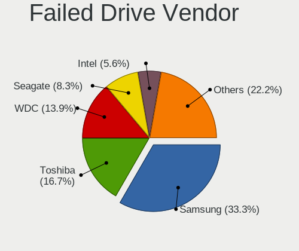
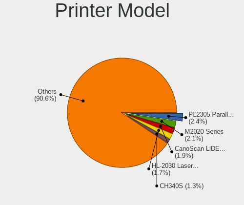

Linux in Germany - Tested Hardware & Statistics
-----------------------------------------------

A project to collect tested hardware configurations for Linux in Germany.

Anyone can contribute to this report by the [hw-probe](https://github.com/linuxhw/hw-probe) tool:

    sudo -E hw-probe -all -upload

Please contribute! Especially if your hardware is rare.

This is a report for all computer types. See also reports for [desktops](/Location/Germany/Desktop/README.md) and [notebooks](/Location/Germany/Notebook/README.md).

Contents
--------

* [ Test Cases ](#test-cases)

* [ System ](#system)
  - [ OS                       ](#os)
  - [ OS Family                ](#os-family)
  - [ Kernel                   ](#kernel)
  - [ Kernel Family            ](#kernel-family)
  - [ Kernel Major Ver.        ](#kernel-major-ver)
  - [ Arch                     ](#arch)
  - [ DE                       ](#de)
  - [ Display Server           ](#display-server)
  - [ Display Manager          ](#display-manager)
  - [ OS Lang                  ](#os-lang)
  - [ Boot Mode                ](#boot-mode)
  - [ Filesystem               ](#filesystem)
  - [ Part. scheme             ](#part-scheme)
  - [ Dual Boot with Linux/BSD ](#dual-boot-with-linuxbsd)
  - [ Dual Boot (Win)          ](#dual-boot-win)

* [ Board ](#board)
  - [ Vendor                   ](#vendor)
  - [ Model                    ](#model)
  - [ Model Family             ](#model-family)
  - [ MFG Year                 ](#mfg-year)
  - [ Form Factor              ](#form-factor)
  - [ Secure Boot              ](#secure-boot)
  - [ Coreboot                 ](#coreboot)
  - [ RAM Size                 ](#ram-size)
  - [ RAM Used                 ](#ram-used)
  - [ Total Drives             ](#total-drives)
  - [ Has CD-ROM               ](#has-cd-rom)
  - [ Has Ethernet             ](#has-ethernet)
  - [ Has WiFi                 ](#has-wifi)
  - [ Has Bluetooth            ](#has-bluetooth)

* [ Location ](#location)
  - [ Country                  ](#country)
  - [ City                     ](#city)

* [ Drives ](#drives)
  - [ Drive Vendor             ](#drive-vendor)
  - [ Drive Model              ](#drive-model)
  - [ HDD Vendor               ](#hdd-vendor)
  - [ SSD Vendor               ](#ssd-vendor)
  - [ Drive Kind               ](#drive-kind)
  - [ Drive Connector          ](#drive-connector)
  - [ Drive Size               ](#drive-size)
  - [ Space Total              ](#space-total)
  - [ Space Used               ](#space-used)
  - [ Malfunc. Drives          ](#malfunc-drives)
  - [ Malfunc. Drive Vendor    ](#malfunc-drive-vendor)
  - [ Malfunc. HDD Vendor      ](#malfunc-hdd-vendor)
  - [ Malfunc. Drive Kind      ](#malfunc-drive-kind)
  - [ Failed Drives            ](#failed-drives)
  - [ Failed Drive Vendor      ](#failed-drive-vendor)
  - [ Drive Status             ](#drive-status)

* [ Storage controller ](#storage-controller)
  - [ Storage Vendor           ](#storage-vendor)
  - [ Storage Model            ](#storage-model)
  - [ Storage Kind             ](#storage-kind)

* [ Processor ](#processor)
  - [ CPU Vendor               ](#cpu-vendor)
  - [ CPU Model                ](#cpu-model)
  - [ CPU Model Family         ](#cpu-model-family)
  - [ CPU Cores                ](#cpu-cores)
  - [ CPU Sockets              ](#cpu-sockets)
  - [ CPU Threads              ](#cpu-threads)
  - [ CPU Op-Modes             ](#cpu-op-modes)
  - [ CPU Microcode            ](#cpu-microcode)
  - [ CPU Microarch            ](#cpu-microarch)

* [ Graphics ](#graphics)
  - [ GPU Vendor               ](#gpu-vendor)
  - [ GPU Model                ](#gpu-model)
  - [ GPU Combo                ](#gpu-combo)
  - [ GPU Driver               ](#gpu-driver)
  - [ GPU Memory               ](#gpu-memory)

* [ Monitor ](#monitor)
  - [ Monitor Vendor           ](#monitor-vendor)
  - [ Monitor Model            ](#monitor-model)
  - [ Monitor Resolution       ](#monitor-resolution)
  - [ Monitor Diagonal         ](#monitor-diagonal)
  - [ Monitor Width            ](#monitor-width)
  - [ Aspect Ratio             ](#aspect-ratio)
  - [ Monitor Area             ](#monitor-area)
  - [ Pixel Density            ](#pixel-density)
  - [ Multiple Monitors        ](#multiple-monitors)

* [ Network ](#network)
  - [ Net Controller Vendor    ](#net-controller-vendor)
  - [ Net Controller Model     ](#net-controller-model)
  - [ Wireless Vendor          ](#wireless-vendor)
  - [ Wireless Model           ](#wireless-model)
  - [ Ethernet Vendor          ](#ethernet-vendor)
  - [ Ethernet Model           ](#ethernet-model)
  - [ Net Controller Kind      ](#net-controller-kind)
  - [ Used Controller          ](#used-controller)
  - [ NICs                     ](#nics)
  - [ IPv6                     ](#ipv6)

* [ Bluetooth ](#bluetooth)
  - [ Bluetooth Vendor         ](#bluetooth-vendor)
  - [ Bluetooth Model          ](#bluetooth-model)

* [ Sound ](#sound)
  - [ Sound Vendor             ](#sound-vendor)
  - [ Sound Model              ](#sound-model)

* [ Memory ](#memory)
  - [ Memory Vendor            ](#memory-vendor)
  - [ Memory Model             ](#memory-model)
  - [ Memory Kind              ](#memory-kind)
  - [ Memory Form Factor       ](#memory-form-factor)
  - [ Memory Size              ](#memory-size)
  - [ Memory Speed             ](#memory-speed)

* [ Printers & scanners ](#printers--scanners)
  - [ Printer Vendor           ](#printer-vendor)
  - [ Printer Model            ](#printer-model)
  - [ Scanner Vendor           ](#scanner-vendor)
  - [ Scanner Model            ](#scanner-model)

* [ Camera ](#camera)
  - [ Camera Vendor            ](#camera-vendor)
  - [ Camera Model             ](#camera-model)

* [ Security ](#security)
  - [ Fingerprint Vendor       ](#fingerprint-vendor)
  - [ Fingerprint Model        ](#fingerprint-model)
  - [ Chipcard Vendor          ](#chipcard-vendor)
  - [ Chipcard Model           ](#chipcard-model)

* [ Unsupported ](#unsupported)
  - [ Unsupported Devices      ](#unsupported-devices)
  - [ Unsupported Device Types ](#unsupported-device-types)

Test Cases
----------

Total: 24652

| Vendor        | Model                       | Form-Factor | Probe                                                      | Date         |
|---------------|-----------------------------|-------------|------------------------------------------------------------|--------------|
| HUAWEI        | NBLK-WAX9X                  | Notebook    | [2391058f73](https://linux-hardware.org/?probe=2391058f73) | Jan 01, 2023 |
| ASUSTek       | PRIME A320M-K               | Desktop     | [afbe6b4362](https://linux-hardware.org/?probe=afbe6b4362) | Dec 31, 2022 |
| Lenovo        | ThinkPad T410 2537DH6       | Notebook    | [23c0cbbe94](https://linux-hardware.org/?probe=23c0cbbe94) | Dec 31, 2022 |
| Dell          | 0PTTT9 A00                  | Desktop     | [7f2851fcf5](https://linux-hardware.org/?probe=7f2851fcf5) | Dec 31, 2022 |
| Acidanther... | Mac-7BA5B2D9E42DDD94 iMa... | All in one  | [a470da90e8](https://linux-hardware.org/?probe=a470da90e8) | Dec 31, 2022 |
| ASUSTek       | Crosshair IV Formula        | Desktop     | [da685b7ff8](https://linux-hardware.org/?probe=da685b7ff8) | Dec 31, 2022 |
| ASUSTek       | UN45                        | Desktop     | [bde2e2efb1](https://linux-hardware.org/?probe=bde2e2efb1) | Dec 31, 2022 |
| Lenovo        | G500 20236                  | Notebook    | [75f2e6fae1](https://linux-hardware.org/?probe=75f2e6fae1) | Dec 31, 2022 |
| Lenovo        | G500 20236                  | Notebook    | [0d3ed20685](https://linux-hardware.org/?probe=0d3ed20685) | Dec 31, 2022 |
| ASUSTek       | UX31E                       | Notebook    | [58391b15a5](https://linux-hardware.org/?probe=58391b15a5) | Dec 31, 2022 |
| Medion        | MS-7728                     | Desktop     | [3d6078552c](https://linux-hardware.org/?probe=3d6078552c) | Dec 31, 2022 |
| TrekStor      | Primebook C11B              | Convertible | [e96819bd00](https://linux-hardware.org/?probe=e96819bd00) | Dec 31, 2022 |
| HP            | Laptop 15-db0xxx            | Notebook    | [375dccca30](https://linux-hardware.org/?probe=375dccca30) | Dec 31, 2022 |
| Fujitsu       | LIFEBOOK U772               | Notebook    | [3ecdad230a](https://linux-hardware.org/?probe=3ecdad230a) | Dec 31, 2022 |
| HP            | Pavilion 17                 | Notebook    | [ce5baca257](https://linux-hardware.org/?probe=ce5baca257) | Dec 31, 2022 |
| MSI           | MS-7502 Fab D               | Desktop     | [9126e1035f](https://linux-hardware.org/?probe=9126e1035f) | Dec 31, 2022 |
| ASRock        | A320M-DGS                   | Desktop     | [a9df519d4f](https://linux-hardware.org/?probe=a9df519d4f) | Dec 31, 2022 |
| ASUSTek       | X550VXK                     | Notebook    | [b8cd38522a](https://linux-hardware.org/?probe=b8cd38522a) | Dec 31, 2022 |
| Chuwi         | UBook X                     | Convertible | [93f1861a61](https://linux-hardware.org/?probe=93f1861a61) | Dec 31, 2022 |
| Valve         | Jupiter                     | Notebook    | [1922673e86](https://linux-hardware.org/?probe=1922673e86) | Dec 31, 2022 |
| Valve         | Jupiter                     | Notebook    | [b5b95e62a1](https://linux-hardware.org/?probe=b5b95e62a1) | Dec 31, 2022 |
| Lenovo        | IdeaPad Y560                | Notebook    | [c9d3a1d0a3](https://linux-hardware.org/?probe=c9d3a1d0a3) | Dec 31, 2022 |
| ASUSTek       | P5Q-PRO                     | Desktop     | [cec0830928](https://linux-hardware.org/?probe=cec0830928) | Dec 31, 2022 |
| MSI           | MAG B650 TOMAHAWK WIFI      | Desktop     | [b1220a23ad](https://linux-hardware.org/?probe=b1220a23ad) | Dec 31, 2022 |
| MSI           | MAG B650 TOMAHAWK WIFI      | Desktop     | [31343e35f0](https://linux-hardware.org/?probe=31343e35f0) | Dec 31, 2022 |
| ASUSTek       | Pro WS X570-ACE             | Desktop     | [fc2f55c02e](https://linux-hardware.org/?probe=fc2f55c02e) | Dec 31, 2022 |
| HUAWEI        | BOHK-WAX9X                  | Notebook    | [62b14864e1](https://linux-hardware.org/?probe=62b14864e1) | Dec 30, 2022 |
| Acer          | Aspire 8943G                | Notebook    | [dd6e590470](https://linux-hardware.org/?probe=dd6e590470) | Dec 30, 2022 |
| Acer          | TravelMate B117-M           | Notebook    | [23985812a9](https://linux-hardware.org/?probe=23985812a9) | Dec 30, 2022 |
| Fujitsu       | D3003-S2 S26361-D3003-S2    | Desktop     | [cb55beafca](https://linux-hardware.org/?probe=cb55beafca) | Dec 30, 2022 |
| Acer          | Aspire XC-1660 V:1.1        | Desktop     | [9c4b578c67](https://linux-hardware.org/?probe=9c4b578c67) | Dec 30, 2022 |
| Fujitsu       | D3003-S2 S26361-D3003-S2    | Desktop     | [938db016a2](https://linux-hardware.org/?probe=938db016a2) | Dec 30, 2022 |
| HP            | EliteBook 2570p             | Notebook    | [b8eccb0fbe](https://linux-hardware.org/?probe=b8eccb0fbe) | Dec 30, 2022 |
| Dell          | 0HN7XN A00                  | Desktop     | [27fa9012d0](https://linux-hardware.org/?probe=27fa9012d0) | Dec 30, 2022 |
| HP            | ProBook 455R G6             | Notebook    | [71c9651ee2](https://linux-hardware.org/?probe=71c9651ee2) | Dec 30, 2022 |
| HP            | EliteBook 830 G5            | Notebook    | [bdd6f3912d](https://linux-hardware.org/?probe=bdd6f3912d) | Dec 30, 2022 |
| MSI           | 760GM-P23                   | Desktop     | [06c8e21a6f](https://linux-hardware.org/?probe=06c8e21a6f) | Dec 30, 2022 |
| ASUSTek       | UX31E                       | Notebook    | [5e6dc18098](https://linux-hardware.org/?probe=5e6dc18098) | Dec 30, 2022 |
| Lenovo        | G575 4383                   | Notebook    | [7c203c43cc](https://linux-hardware.org/?probe=7c203c43cc) | Dec 30, 2022 |
| Supermicro    | X11SRA-RF                   | Server      | [2887a82948](https://linux-hardware.org/?probe=2887a82948) | Dec 30, 2022 |
| Supermicro    | X11SRA-RF                   | Server      | [e5f0b1d802](https://linux-hardware.org/?probe=e5f0b1d802) | Dec 30, 2022 |
| Supermicro    | X11SRA-RF                   | Server      | [cd84ddc342](https://linux-hardware.org/?probe=cd84ddc342) | Dec 30, 2022 |
| Acer          | Aspire XC-1660 V:1.1        | Desktop     | [c352c59c64](https://linux-hardware.org/?probe=c352c59c64) | Dec 30, 2022 |
| Lenovo        | G575 4383                   | Notebook    | [c9656285fc](https://linux-hardware.org/?probe=c9656285fc) | Dec 30, 2022 |
| HP            | Laptop 17-by0xxx            | Notebook    | [0da7f8e1d5](https://linux-hardware.org/?probe=0da7f8e1d5) | Dec 30, 2022 |
| Gigabyte      | 970A-DS3P                   | Desktop     | [c841093094](https://linux-hardware.org/?probe=c841093094) | Dec 30, 2022 |
| Acer          | Aspire A517-51              | Notebook    | [7ec5b8bb3f](https://linux-hardware.org/?probe=7ec5b8bb3f) | Dec 29, 2022 |
| Medion        | Akoya E6416                 | Notebook    | [ddd9ba1ffc](https://linux-hardware.org/?probe=ddd9ba1ffc) | Dec 29, 2022 |
| Dell          | Latitude E6430              | Notebook    | [8ecaae98d3](https://linux-hardware.org/?probe=8ecaae98d3) | Dec 29, 2022 |
| MSI           | X99A RAIDER                 | Desktop     | [59f6170d5b](https://linux-hardware.org/?probe=59f6170d5b) | Dec 29, 2022 |
| MSI           | A320M-A PRO MAX             | Desktop     | [6a419b06d6](https://linux-hardware.org/?probe=6a419b06d6) | Dec 29, 2022 |
| ASRock        | B650M PG Riptide            | Desktop     | [614e6307eb](https://linux-hardware.org/?probe=614e6307eb) | Dec 29, 2022 |
| ASRock        | P67 Pro3                    | Desktop     | [47ea7331f5](https://linux-hardware.org/?probe=47ea7331f5) | Dec 29, 2022 |
| ASUSTek       | PRIME B360M-C               | Desktop     | [c38ca6386e](https://linux-hardware.org/?probe=c38ca6386e) | Dec 29, 2022 |
| Samsung       | 935XDB                      | Notebook    | [650bd43eae](https://linux-hardware.org/?probe=650bd43eae) | Dec 29, 2022 |
| Lenovo        | ThinkPad T470p 20J7S1JT0... | Notebook    | [4b7bbb186f](https://linux-hardware.org/?probe=4b7bbb186f) | Dec 29, 2022 |
| Acer          | Aspire A517-51              | Notebook    | [d6e1d87869](https://linux-hardware.org/?probe=d6e1d87869) | Dec 29, 2022 |
| Intel         | DP55WB AAE64798-206         | Desktop     | [2373b5141b](https://linux-hardware.org/?probe=2373b5141b) | Dec 29, 2022 |
| TUXEDO        | Polaris (CML/Gen2)          | Notebook    | [a14e00ab97](https://linux-hardware.org/?probe=a14e00ab97) | Dec 29, 2022 |
| ASUSTek       | ROG STRIX B650E-I GAMING... | Desktop     | [e4c8909f2c](https://linux-hardware.org/?probe=e4c8909f2c) | Dec 29, 2022 |
| ASUSTek       | Z170 PRO GAMING/AURA        | Desktop     | [87e8ae1350](https://linux-hardware.org/?probe=87e8ae1350) | Dec 29, 2022 |
| MSI           | B450M PRO-VDH MAX           | Desktop     | [0447771b4f](https://linux-hardware.org/?probe=0447771b4f) | Dec 29, 2022 |
| TUXEDO        | Polaris (CML/Gen2)          | Notebook    | [00e25b3232](https://linux-hardware.org/?probe=00e25b3232) | Dec 29, 2022 |
| Lenovo        | ThinkPad T500 2089W3A       | Notebook    | [401f529e18](https://linux-hardware.org/?probe=401f529e18) | Dec 29, 2022 |
| Lenovo        | V17 G2 ITL 82NX             | Notebook    | [5e094b34a5](https://linux-hardware.org/?probe=5e094b34a5) | Dec 29, 2022 |
| MSI           | MPG Z490 GAMING EDGE WIF... | Desktop     | [a72887241e](https://linux-hardware.org/?probe=a72887241e) | Dec 29, 2022 |
| Unknown       | Freecom Silverstore HNCN... | Desktop     | [723fbcd23f](https://linux-hardware.org/?probe=723fbcd23f) | Dec 29, 2022 |
| Lenovo        | G50-45 80E3                 | Notebook    | [05070bdc72](https://linux-hardware.org/?probe=05070bdc72) | Dec 29, 2022 |
| TrekStor      | Primebook P14               | Notebook    | [c22676280e](https://linux-hardware.org/?probe=c22676280e) | Dec 29, 2022 |
| HP            | ZBook 15 G6                 | Notebook    | [af1655497e](https://linux-hardware.org/?probe=af1655497e) | Dec 29, 2022 |
| Lenovo        | Yoga Slim 7 Pro 16ACH6 8... | Notebook    | [1c46a3fdd3](https://linux-hardware.org/?probe=1c46a3fdd3) | Dec 29, 2022 |
| HP            | ZBook 17 G4                 | Notebook    | [86eec5f93c](https://linux-hardware.org/?probe=86eec5f93c) | Dec 29, 2022 |
| ASUSTek       | P5K SE/EPU                  | Desktop     | [6eed1ad6e5](https://linux-hardware.org/?probe=6eed1ad6e5) | Dec 29, 2022 |
| Apple         | MacBookAir6,2               | Notebook    | [af9ab4ba4d](https://linux-hardware.org/?probe=af9ab4ba4d) | Dec 29, 2022 |
| HP            | EliteBook 2560p             | Notebook    | [e0c82de440](https://linux-hardware.org/?probe=e0c82de440) | Dec 29, 2022 |
| Schenker      | VISION 16 Pro (L22)         | Notebook    | [bbd6e1daf5](https://linux-hardware.org/?probe=bbd6e1daf5) | Dec 29, 2022 |
| Lenovo        | V14-IIL 82C4                | Notebook    | [9b77a1e3f3](https://linux-hardware.org/?probe=9b77a1e3f3) | Dec 29, 2022 |
| HP            | OMEN Laptop 15-en0xxx       | Notebook    | [23fe358945](https://linux-hardware.org/?probe=23fe358945) | Dec 29, 2022 |
| Schenker      | VISION 16 Pro (L22)         | Notebook    | [2412713729](https://linux-hardware.org/?probe=2412713729) | Dec 29, 2022 |
| ASUSTek       | P5K SE/EPU                  | Desktop     | [3f0c89985c](https://linux-hardware.org/?probe=3f0c89985c) | Dec 29, 2022 |
| Notebook      | W65_67SZ                    | Notebook    | [cbebefb520](https://linux-hardware.org/?probe=cbebefb520) | Dec 29, 2022 |
| Acer          | Aspire A315-41              | Notebook    | [09c901fe98](https://linux-hardware.org/?probe=09c901fe98) | Dec 29, 2022 |
| Fujitsu       | LIFEBOOK P702               | Notebook    | [4734f4370b](https://linux-hardware.org/?probe=4734f4370b) | Dec 28, 2022 |
| Gigabyte      | Z77M-D3H                    | Desktop     | [f20c6365d3](https://linux-hardware.org/?probe=f20c6365d3) | Dec 28, 2022 |
| Toshiba       | Satellite C870-1C2          | Notebook    | [cc1dd99957](https://linux-hardware.org/?probe=cc1dd99957) | Dec 28, 2022 |
| HP            | 339A                        | Desktop     | [eb2bb9bcec](https://linux-hardware.org/?probe=eb2bb9bcec) | Dec 28, 2022 |
| Apple         | Mac-F2268CC8                | All in one  | [fd1cdfc132](https://linux-hardware.org/?probe=fd1cdfc132) | Dec 28, 2022 |
| HP            | ProLiant ML30 Gen9          | Desktop     | [174e7e831b](https://linux-hardware.org/?probe=174e7e831b) | Dec 28, 2022 |
| Acer          | Aspire ES1-531              | Notebook    | [c29088a63f](https://linux-hardware.org/?probe=c29088a63f) | Dec 28, 2022 |
| HP            | EliteBook 820 G2            | Notebook    | [bd56ec4f01](https://linux-hardware.org/?probe=bd56ec4f01) | Dec 28, 2022 |
| Lenovo        | V14-IIL 82C4                | Notebook    | [58825656f9](https://linux-hardware.org/?probe=58825656f9) | Dec 28, 2022 |
| MSI           | PRO Z690-A WIFI DDR4        | Desktop     | [a4292b855d](https://linux-hardware.org/?probe=a4292b855d) | Dec 28, 2022 |
| Lenovo        | IdeaPad 5 15ARE05 81YQ      | Notebook    | [b8099c7a94](https://linux-hardware.org/?probe=b8099c7a94) | Dec 28, 2022 |
| ASUSTek       | M5A78L-M LX                 | Desktop     | [a8b80cb4f6](https://linux-hardware.org/?probe=a8b80cb4f6) | Dec 28, 2022 |
| Valve         | Jupiter                     | Notebook    | [a89e87f342](https://linux-hardware.org/?probe=a89e87f342) | Dec 28, 2022 |
| Dell          | 0JP3NX A01                  | Desktop     | [acbe3ce1ef](https://linux-hardware.org/?probe=acbe3ce1ef) | Dec 28, 2022 |
| BESSTAR Te... | F6BFC                       | Desktop     | [7c6adb6279](https://linux-hardware.org/?probe=7c6adb6279) | Dec 28, 2022 |
| Raspberry ... | Raspberry Pi Compute Mod... | Soc         | [7c60cc0210](https://linux-hardware.org/?probe=7c60cc0210) | Dec 28, 2022 |
| Lenovo        | ThinkBook 13s G3 ACN 20Y... | Notebook    | [f5c5147826](https://linux-hardware.org/?probe=f5c5147826) | Dec 28, 2022 |
| ASRock        | B75 Pro3-M                  | Desktop     | [108f0c24de](https://linux-hardware.org/?probe=108f0c24de) | Dec 28, 2022 |
| BESSTAR Te... | F6BFC                       | Desktop     | [59b38f9b63](https://linux-hardware.org/?probe=59b38f9b63) | Dec 28, 2022 |
| Lenovo        | ThinkBook 13s G3 ACN 20Y... | Notebook    | [8dfcf5860f](https://linux-hardware.org/?probe=8dfcf5860f) | Dec 28, 2022 |
| MSI           | Z370 PC PRO                 | Desktop     | [367bcf2d16](https://linux-hardware.org/?probe=367bcf2d16) | Dec 28, 2022 |
| Lenovo        | ThinkPad X1 Yoga 2nd 20J... | Convertible | [72f770277e](https://linux-hardware.org/?probe=72f770277e) | Dec 28, 2022 |
| ASUSTek       | PRIME A320M-K               | Desktop     | [20c0841830](https://linux-hardware.org/?probe=20c0841830) | Dec 28, 2022 |
| HP            | ProBook 6470b               | Notebook    | [055705b3f2](https://linux-hardware.org/?probe=055705b3f2) | Dec 28, 2022 |
| ASUSTek       | PRIME Z790-P WIFI           | Desktop     | [7bb247e453](https://linux-hardware.org/?probe=7bb247e453) | Dec 28, 2022 |
| Lenovo        | ThinkPad X1 Yoga 2nd 20J... | Convertible | [0e619635fe](https://linux-hardware.org/?probe=0e619635fe) | Dec 28, 2022 |
| HP            | EliteBook 850 G6            | Notebook    | [b30d6f1b58](https://linux-hardware.org/?probe=b30d6f1b58) | Dec 28, 2022 |
| Samsung       | 305E4A/305E5A/305E7A        | Notebook    | [75fe6d9325](https://linux-hardware.org/?probe=75fe6d9325) | Dec 28, 2022 |
| pine64,pin... | Pinebook Pro                | Soc         | [931d20e8ae](https://linux-hardware.org/?probe=931d20e8ae) | Dec 28, 2022 |
| ASUSTek       | P5K SE/EPU                  | Desktop     | [ea64c817e2](https://linux-hardware.org/?probe=ea64c817e2) | Dec 28, 2022 |
| ASUSTek       | P5K SE/EPU                  | Desktop     | [b1c95f1d21](https://linux-hardware.org/?probe=b1c95f1d21) | Dec 28, 2022 |
| ASUSTek       | Z170M-PLUS                  | Desktop     | [6b61c9a811](https://linux-hardware.org/?probe=6b61c9a811) | Dec 28, 2022 |
| HUAWEI        | BOM-WXX9                    | Notebook    | [826a683b58](https://linux-hardware.org/?probe=826a683b58) | Dec 28, 2022 |
| HP            | EliteBook 820 G3            | Notebook    | [3c494dd1eb](https://linux-hardware.org/?probe=3c494dd1eb) | Dec 28, 2022 |
| Dell          | 040DDP A01                  | Desktop     | [3548fd618d](https://linux-hardware.org/?probe=3548fd618d) | Dec 28, 2022 |
| Lenovo        | ThinkPad P50 20EQS3BT1R     | Notebook    | [a86fddc0b9](https://linux-hardware.org/?probe=a86fddc0b9) | Dec 28, 2022 |
| HP            | 2B4B                        | Desktop     | [b07e2ecc23](https://linux-hardware.org/?probe=b07e2ecc23) | Dec 28, 2022 |
| Apple         | Mac-F221BEC8                | Desktop     | [85730ed1a1](https://linux-hardware.org/?probe=85730ed1a1) | Dec 28, 2022 |
| ASUSTek       | P8H61-M LE R2.0             | Desktop     | [b9fd8381a4](https://linux-hardware.org/?probe=b9fd8381a4) | Dec 27, 2022 |
| Valve         | Jupiter                     | Notebook    | [42288a62eb](https://linux-hardware.org/?probe=42288a62eb) | Dec 27, 2022 |
| Lenovo        | G555 0873                   | Notebook    | [f705d0146a](https://linux-hardware.org/?probe=f705d0146a) | Dec 27, 2022 |
| Apple         | Mac-F221BEC8                | Desktop     | [94ae481e51](https://linux-hardware.org/?probe=94ae481e51) | Dec 27, 2022 |
| Valve         | Jupiter                     | Notebook    | [bcdce3240d](https://linux-hardware.org/?probe=bcdce3240d) | Dec 27, 2022 |
| HP            | ZBook 17 G5                 | Notebook    | [870deddfbe](https://linux-hardware.org/?probe=870deddfbe) | Dec 27, 2022 |
| HP            | EliteBook 8440p             | Notebook    | [6674099744](https://linux-hardware.org/?probe=6674099744) | Dec 27, 2022 |
| ASUSTek       | VivoBook_ASUSLaptop X712... | Notebook    | [2c2b5135eb](https://linux-hardware.org/?probe=2c2b5135eb) | Dec 27, 2022 |
| Gigabyte      | B85M-D3H                    | Desktop     | [4283e3bb1e](https://linux-hardware.org/?probe=4283e3bb1e) | Dec 27, 2022 |
| Schenker      | VISION 15 (SVS15E21)        | Notebook    | [9409e9bfce](https://linux-hardware.org/?probe=9409e9bfce) | Dec 27, 2022 |
| HP            | 255 15.6 inch G9 Noteboo... | Notebook    | [dc9d334f95](https://linux-hardware.org/?probe=dc9d334f95) | Dec 27, 2022 |
| ASUSTek       | PRIME B450-PLUS             | Desktop     | [ee1658b320](https://linux-hardware.org/?probe=ee1658b320) | Dec 27, 2022 |
| Dell          | Venue 11 Pro 5130           | Notebook    | [c68cba64e9](https://linux-hardware.org/?probe=c68cba64e9) | Dec 27, 2022 |
| ASUSTek       | H97I-PLUS                   | Desktop     | [8f039f1be9](https://linux-hardware.org/?probe=8f039f1be9) | Dec 27, 2022 |
| Lenovo        | ThinkPad X1 Carbon 6th 2... | Notebook    | [a7b2bad562](https://linux-hardware.org/?probe=a7b2bad562) | Dec 27, 2022 |
| ZOTAC         | ZBOX-AD02                   | Mini pc     | [b4447459df](https://linux-hardware.org/?probe=b4447459df) | Dec 27, 2022 |
| HP            | 876C SMVB                   | Desktop     | [7926807626](https://linux-hardware.org/?probe=7926807626) | Dec 27, 2022 |
| Valve         | Jupiter                     | Notebook    | [d244a4aa10](https://linux-hardware.org/?probe=d244a4aa10) | Dec 27, 2022 |
| Samsung       | SP55S                       | Notebook    | [ce8b6d3fdb](https://linux-hardware.org/?probe=ce8b6d3fdb) | Dec 27, 2022 |
| Lenovo        | ThinkPad T430 2347DE9       | Notebook    | [7b4305ce5a](https://linux-hardware.org/?probe=7b4305ce5a) | Dec 27, 2022 |
| Samsung       | SP55S                       | Notebook    | [f0d13bbd0d](https://linux-hardware.org/?probe=f0d13bbd0d) | Dec 27, 2022 |
| Acer          | Aspire XC-780               | Desktop     | [0d90d1884c](https://linux-hardware.org/?probe=0d90d1884c) | Dec 27, 2022 |
| Medion        | P6640                       | Notebook    | [0787385a0f](https://linux-hardware.org/?probe=0787385a0f) | Dec 26, 2022 |
| Lenovo        | ThinkPad E15 Gen 2 20TD0... | Notebook    | [29a54c4976](https://linux-hardware.org/?probe=29a54c4976) | Dec 26, 2022 |
| BESSTAR Te... | HM90                        | Desktop     | [01cd4c50dd](https://linux-hardware.org/?probe=01cd4c50dd) | Dec 26, 2022 |
| Lenovo        | IdeaPad 320-15IKB 81BG      | Notebook    | [442fcdba27](https://linux-hardware.org/?probe=442fcdba27) | Dec 26, 2022 |
| Lenovo        | IdeaPad 320-15IKB 81BG      | Notebook    | [4ad973e635](https://linux-hardware.org/?probe=4ad973e635) | Dec 26, 2022 |
| ASUSTek       | X751MA                      | Notebook    | [f63581c721](https://linux-hardware.org/?probe=f63581c721) | Dec 26, 2022 |
| MSI           | Z390-A PRO                  | Desktop     | [9bfeb5727a](https://linux-hardware.org/?probe=9bfeb5727a) | Dec 26, 2022 |
| Schenker      | VISION 15 (SVS15E21)        | Notebook    | [e5463f6249](https://linux-hardware.org/?probe=e5463f6249) | Dec 26, 2022 |
| Schenker      | VISION 15 (SVS15E21)        | Notebook    | [4cf226b65c](https://linux-hardware.org/?probe=4cf226b65c) | Dec 26, 2022 |
| Acer          | Aspire A515-51              | Notebook    | [e763dd5dfe](https://linux-hardware.org/?probe=e763dd5dfe) | Dec 26, 2022 |
| Tactus        | GeoFlex 110                 | Convertible | [3c2a7f9115](https://linux-hardware.org/?probe=3c2a7f9115) | Dec 26, 2022 |
| Schenker      | VISION 15 (SVS15E21)        | Notebook    | [8da465a60c](https://linux-hardware.org/?probe=8da465a60c) | Dec 26, 2022 |
| Lenovo        | IdeaPad 3 17ABA7 82RQ       | Notebook    | [047823ffbc](https://linux-hardware.org/?probe=047823ffbc) | Dec 26, 2022 |
| Gigabyte      | B150M-D2V DDR3-CF           | Desktop     | [cd90f1782c](https://linux-hardware.org/?probe=cd90f1782c) | Dec 26, 2022 |
| Lenovo        | IdeaPad 5 15ARE05 81YQ      | Notebook    | [06027a53fb](https://linux-hardware.org/?probe=06027a53fb) | Dec 26, 2022 |
| Toshiba       | Satellite L500              | Notebook    | [08b4f83030](https://linux-hardware.org/?probe=08b4f83030) | Dec 26, 2022 |
| Lenovo        | ThinkPad T440p 20AW007QM... | Notebook    | [6e3d39b4ae](https://linux-hardware.org/?probe=6e3d39b4ae) | Dec 25, 2022 |
| Acer          | Swift SF314-51              | Notebook    | [bfdd69d192](https://linux-hardware.org/?probe=bfdd69d192) | Dec 25, 2022 |
| Dell          | XPS 13 7390                 | Notebook    | [9131496b00](https://linux-hardware.org/?probe=9131496b00) | Dec 25, 2022 |
| Toshiba       | Satellite C850-1C8          | Notebook    | [eab4ef74de](https://linux-hardware.org/?probe=eab4ef74de) | Dec 25, 2022 |
| Toshiba       | Satellite C850-1C8          | Notebook    | [1e47b54431](https://linux-hardware.org/?probe=1e47b54431) | Dec 25, 2022 |
| Acer          | Aspire A515-57G             | Notebook    | [2e82fb3f66](https://linux-hardware.org/?probe=2e82fb3f66) | Dec 25, 2022 |
| MSI           | B450M PRO-VDH MAX           | Desktop     | [410ac6980a](https://linux-hardware.org/?probe=410ac6980a) | Dec 25, 2022 |
| Valve         | Jupiter                     | Notebook    | [8194c72bb9](https://linux-hardware.org/?probe=8194c72bb9) | Dec 25, 2022 |
| Acer          | Aspire 5739G                | Notebook    | [0d3bd3f3ec](https://linux-hardware.org/?probe=0d3bd3f3ec) | Dec 25, 2022 |
| Gigabyte      | B150M-D2V DDR3-CF           | Desktop     | [78418bfaa6](https://linux-hardware.org/?probe=78418bfaa6) | Dec 25, 2022 |
| TUXEDO        | Pulse 14 Gen1               | Notebook    | [8d2d8be057](https://linux-hardware.org/?probe=8d2d8be057) | Dec 25, 2022 |
| Acer          | Aspire A517-53              | Notebook    | [e440a77fa7](https://linux-hardware.org/?probe=e440a77fa7) | Dec 25, 2022 |
| Fujitsu       | D3221-A1 S26361-D3221-A1    | Desktop     | [8855d29d69](https://linux-hardware.org/?probe=8855d29d69) | Dec 25, 2022 |
| Acer          | Aspire XC-704               | Desktop     | [c4e808c172](https://linux-hardware.org/?probe=c4e808c172) | Dec 25, 2022 |
| Acer          | Aspire XC-704               | Desktop     | [9f3adaa228](https://linux-hardware.org/?probe=9f3adaa228) | Dec 25, 2022 |
| Supermicro    | C2SBX                       | Desktop     | [1b275899d5](https://linux-hardware.org/?probe=1b275899d5) | Dec 25, 2022 |
| Sony          | VGN-NR32M_S                 | Notebook    | [6ad0da2e88](https://linux-hardware.org/?probe=6ad0da2e88) | Dec 25, 2022 |
| Valve         | Jupiter                     | Notebook    | [f8ff1f6342](https://linux-hardware.org/?probe=f8ff1f6342) | Dec 25, 2022 |
| Acer          | Aspire ES1-523              | Notebook    | [41211efaae](https://linux-hardware.org/?probe=41211efaae) | Dec 25, 2022 |
| ASRock        | Q1900M                      | Desktop     | [051ff70bc8](https://linux-hardware.org/?probe=051ff70bc8) | Dec 25, 2022 |
| ASUSTek       | PRIME B450M-A               | Desktop     | [1fc8c5a4d4](https://linux-hardware.org/?probe=1fc8c5a4d4) | Dec 24, 2022 |
| Acer          | Swift SF314-43              | Notebook    | [b1c3a71567](https://linux-hardware.org/?probe=b1c3a71567) | Dec 24, 2022 |
| Lenovo        | ThinkPad T430 2347DE9       | Notebook    | [afc91c5da0](https://linux-hardware.org/?probe=afc91c5da0) | Dec 24, 2022 |
| Medion        | E122X                       | Notebook    | [6e4e34bcc3](https://linux-hardware.org/?probe=6e4e34bcc3) | Dec 24, 2022 |
| Medion        | E122X                       | Notebook    | [bf41c45a7d](https://linux-hardware.org/?probe=bf41c45a7d) | Dec 24, 2022 |
| Lenovo        | IdeaPad C340-14API 81N6     | Notebook    | [5e589fb2d1](https://linux-hardware.org/?probe=5e589fb2d1) | Dec 24, 2022 |
| ASRock        | X670E Pro RS                | Desktop     | [b7a0a3d703](https://linux-hardware.org/?probe=b7a0a3d703) | Dec 24, 2022 |
| Dell          | Inspiron 3593               | Notebook    | [a640541ee0](https://linux-hardware.org/?probe=a640541ee0) | Dec 24, 2022 |
| Lenovo        | ThinkPad X61s 7667WHE       | Notebook    | [d689ae23a7](https://linux-hardware.org/?probe=d689ae23a7) | Dec 24, 2022 |
| ASUSTek       | PRIME Z790-P WIFI           | Desktop     | [e853f645cf](https://linux-hardware.org/?probe=e853f645cf) | Dec 24, 2022 |
| MSI           | B450 TOMAHAWK MAX           | Desktop     | [457612540c](https://linux-hardware.org/?probe=457612540c) | Dec 24, 2022 |
| ASUSTek       | ROG Maximus Z690 EXTREME    | Desktop     | [4d19273307](https://linux-hardware.org/?probe=4d19273307) | Dec 24, 2022 |
| Raspberry ... | Raspberry Pi 400 Rev 1.0    | Soc         | [f7af4b1164](https://linux-hardware.org/?probe=f7af4b1164) | Dec 24, 2022 |
| ASUSTek       | P5K SE/EPU                  | Desktop     | [6e816fc83e](https://linux-hardware.org/?probe=6e816fc83e) | Dec 24, 2022 |
| ASUSTek       | WS C422 DC                  | Desktop     | [7be7c81575](https://linux-hardware.org/?probe=7be7c81575) | Dec 24, 2022 |
| Supermicro    | X11SRA-RF                   | Server      | [efdf519660](https://linux-hardware.org/?probe=efdf519660) | Dec 24, 2022 |
| ASUSTek       | WS C422 DC                  | Desktop     | [526414fd8f](https://linux-hardware.org/?probe=526414fd8f) | Dec 24, 2022 |
| Microsoft     | Surface Pro                 | Tablet      | [9bcea5d857](https://linux-hardware.org/?probe=9bcea5d857) | Dec 24, 2022 |
| MiTAC         | PD14RI                      | Desktop     | [eb02828e7c](https://linux-hardware.org/?probe=eb02828e7c) | Dec 24, 2022 |
| ASUSTek       | M5A78L-M/USB3               | Desktop     | [3dce1a76e7](https://linux-hardware.org/?probe=3dce1a76e7) | Dec 24, 2022 |
| Lenovo        | ThinkPad X270 20HMS16200    | Notebook    | [6ac6e552a8](https://linux-hardware.org/?probe=6ac6e552a8) | Dec 24, 2022 |
| Intel         | NUC12WSBi7 M46422-303       | Mini pc     | [3ddd96770b](https://linux-hardware.org/?probe=3ddd96770b) | Dec 24, 2022 |
| Acer          | Aspire A315-53              | Notebook    | [eb42b5e055](https://linux-hardware.org/?probe=eb42b5e055) | Dec 24, 2022 |
| Intel         | NUC12WSBi7 M46422-303       | Mini pc     | [8f10e15f9a](https://linux-hardware.org/?probe=8f10e15f9a) | Dec 24, 2022 |
| HP            | EliteBook x360 1030 G2      | Convertible | [7620b8d9f2](https://linux-hardware.org/?probe=7620b8d9f2) | Dec 23, 2022 |
| HP            | 876C SMVB                   | Desktop     | [988b03aae5](https://linux-hardware.org/?probe=988b03aae5) | Dec 23, 2022 |
| Lenovo        | ThinkPad T16 Gen 1 21BWS... | Notebook    | [9e5c4705fa](https://linux-hardware.org/?probe=9e5c4705fa) | Dec 23, 2022 |
| HP            | Pavilion Notebook           | Notebook    | [6f02a1834d](https://linux-hardware.org/?probe=6f02a1834d) | Dec 23, 2022 |
| MSI           | B550-A PRO                  | Desktop     | [a54a0884ce](https://linux-hardware.org/?probe=a54a0884ce) | Dec 23, 2022 |
| ASUSTek       | G73Sw                       | Notebook    | [3f4336472e](https://linux-hardware.org/?probe=3f4336472e) | Dec 23, 2022 |
| ZOTAC         | ZBOX-ID41                   | Mini pc     | [c963886ab5](https://linux-hardware.org/?probe=c963886ab5) | Dec 23, 2022 |
| MSI           | B450-A PRO                  | Desktop     | [ee92214342](https://linux-hardware.org/?probe=ee92214342) | Dec 23, 2022 |
| Acer          | Aspire ES1-523              | Notebook    | [476f9315a1](https://linux-hardware.org/?probe=476f9315a1) | Dec 23, 2022 |
| ASUSTek       | ROG Maximus Z790 HERO       | Desktop     | [6ca59441d7](https://linux-hardware.org/?probe=6ca59441d7) | Dec 23, 2022 |
| Dell          | 0WMJ54 A01                  | Desktop     | [b0b07249ae](https://linux-hardware.org/?probe=b0b07249ae) | Dec 23, 2022 |
| Timi          | TM1703                      | Notebook    | [5e25655f36](https://linux-hardware.org/?probe=5e25655f36) | Dec 23, 2022 |
| Lenovo        | Legion 5 15ACH6A 82NW       | Notebook    | [79b015dcea](https://linux-hardware.org/?probe=79b015dcea) | Dec 23, 2022 |
| ASRock        | Z97 Anniversary             | Desktop     | [c4e60094f3](https://linux-hardware.org/?probe=c4e60094f3) | Dec 23, 2022 |
| ASUSTek       | VivoBook_ASUSLaptop X521... | Notebook    | [aeb7addbc3](https://linux-hardware.org/?probe=aeb7addbc3) | Dec 23, 2022 |
| ASUSTek       | VivoBook_ASUSLaptop X521... | Notebook    | [2a0cacc27e](https://linux-hardware.org/?probe=2a0cacc27e) | Dec 23, 2022 |
| Raspberry ... | Raspberry Pi 400 Rev 1.0    | Soc         | [2576117d70](https://linux-hardware.org/?probe=2576117d70) | Dec 22, 2022 |
| Lenovo        | G50-80 80E5                 | Notebook    | [194eee0657](https://linux-hardware.org/?probe=194eee0657) | Dec 22, 2022 |
| Acer          | Aspire ES1-311              | Notebook    | [e5d7bd61f1](https://linux-hardware.org/?probe=e5d7bd61f1) | Dec 22, 2022 |
| ASUSTek       | K53SJ                       | Notebook    | [341becfd8a](https://linux-hardware.org/?probe=341becfd8a) | Dec 22, 2022 |
| MSI           | H61MU-E35                   | Desktop     | [cb9ec3d5ad](https://linux-hardware.org/?probe=cb9ec3d5ad) | Dec 22, 2022 |
| MSI           | H61MU-E35                   | Desktop     | [bfdc9d1e12](https://linux-hardware.org/?probe=bfdc9d1e12) | Dec 22, 2022 |
| Dell          | Latitude 5280               | Notebook    | [59002e923b](https://linux-hardware.org/?probe=59002e923b) | Dec 22, 2022 |
| Lenovo        | IdeaPad 3 17ABA7 82RQ       | Notebook    | [9100b276c2](https://linux-hardware.org/?probe=9100b276c2) | Dec 22, 2022 |
| HP            | Pavilion 17                 | Notebook    | [c58baa8506](https://linux-hardware.org/?probe=c58baa8506) | Dec 22, 2022 |
| ASUSTek       | ROG Maximus Z790 HERO       | Desktop     | [e486047e83](https://linux-hardware.org/?probe=e486047e83) | Dec 22, 2022 |
| ASUSTek       | PRIME Z690M-HZ              | Desktop     | [4a8c08c437](https://linux-hardware.org/?probe=4a8c08c437) | Dec 22, 2022 |
| Dell          | 0H4VK7 A01                  | Desktop     | [c2f0c73bec](https://linux-hardware.org/?probe=c2f0c73bec) | Dec 22, 2022 |
| Acer          | Aspire ES1-523              | Notebook    | [d034bb7c92](https://linux-hardware.org/?probe=d034bb7c92) | Dec 22, 2022 |
| Lenovo        | 310B SDK0J40705 WIN 3425... | Desktop     | [abb4201228](https://linux-hardware.org/?probe=abb4201228) | Dec 22, 2022 |
| Dell          | Latitude E6430              | Notebook    | [7fe3f11f56](https://linux-hardware.org/?probe=7fe3f11f56) | Dec 22, 2022 |
| ASUSTek       | Z170-A                      | Desktop     | [9790670c6f](https://linux-hardware.org/?probe=9790670c6f) | Dec 22, 2022 |
| ASUSTek       | K53SJ                       | Notebook    | [e60df2d8ba](https://linux-hardware.org/?probe=e60df2d8ba) | Dec 22, 2022 |
| Acer          | Aspire ES1-523              | Notebook    | [806aa49648](https://linux-hardware.org/?probe=806aa49648) | Dec 22, 2022 |
| HP            | 8027                        | Desktop     | [752200e795](https://linux-hardware.org/?probe=752200e795) | Dec 22, 2022 |
| ASUSTek       | ROG CROSSHAIR VI EXTREME    | Desktop     | [0410f7cdcf](https://linux-hardware.org/?probe=0410f7cdcf) | Dec 22, 2022 |
| Lenovo        | ThinkPad T470 W10DG 20JN... | Notebook    | [54fb90def3](https://linux-hardware.org/?probe=54fb90def3) | Dec 22, 2022 |
| Lenovo        | MIIX 510-12ISK 80U1         | Tablet      | [d43709b2f7](https://linux-hardware.org/?probe=d43709b2f7) | Dec 22, 2022 |
| Raspberry ... | Raspberry Pi 4 Model B R... | Soc         | [6e8496dfea](https://linux-hardware.org/?probe=6e8496dfea) | Dec 22, 2022 |
| Lenovo        | ThinkPad X1 Carbon 4th 2... | Notebook    | [214d584e36](https://linux-hardware.org/?probe=214d584e36) | Dec 21, 2022 |
| Valve         | Jupiter                     | Notebook    | [0bea978cf7](https://linux-hardware.org/?probe=0bea978cf7) | Dec 21, 2022 |
| ASUSTek       | M5A78L-M/USB3               | Desktop     | [ec54aedcc6](https://linux-hardware.org/?probe=ec54aedcc6) | Dec 21, 2022 |
| Samsung       | R540/R580/R780/SA41/E452... | Notebook    | [044928d818](https://linux-hardware.org/?probe=044928d818) | Dec 21, 2022 |
| Acer          | Aspire ES1-523              | Notebook    | [3528a9d40f](https://linux-hardware.org/?probe=3528a9d40f) | Dec 21, 2022 |
| HP            | 339A                        | Desktop     | [77b8b56b9d](https://linux-hardware.org/?probe=77b8b56b9d) | Dec 21, 2022 |
| HP            | 3047h                       | Desktop     | [f5492c4ad4](https://linux-hardware.org/?probe=f5492c4ad4) | Dec 21, 2022 |
| HP            | Stream Notebook PC 13       | Notebook    | [9c88ffc394](https://linux-hardware.org/?probe=9c88ffc394) | Dec 21, 2022 |
| HP            | 255 15.6 inch G9 Noteboo... | Notebook    | [54b5dfbdbb](https://linux-hardware.org/?probe=54b5dfbdbb) | Dec 21, 2022 |
| ASUSTek       | P8Z77-M PRO                 | Desktop     | [afc187a5af](https://linux-hardware.org/?probe=afc187a5af) | Dec 21, 2022 |
| HP            | ZBook Power 15.6 inch G8... | Notebook    | [6b202d6cc2](https://linux-hardware.org/?probe=6b202d6cc2) | Dec 21, 2022 |
| Lenovo        | ThinkPad X1 Yoga 2nd 20J... | Convertible | [59f4b3b5b4](https://linux-hardware.org/?probe=59f4b3b5b4) | Dec 21, 2022 |
| Gigabyte      | Z97M-DS3H                   | Desktop     | [dca79c9d6d](https://linux-hardware.org/?probe=dca79c9d6d) | Dec 21, 2022 |
| ASUSTek       | M4A88T-M                    | Desktop     | [c646f359b8](https://linux-hardware.org/?probe=c646f359b8) | Dec 21, 2022 |
| Dell          | G15 5515                    | Notebook    | [e222bc4dfc](https://linux-hardware.org/?probe=e222bc4dfc) | Dec 21, 2022 |
| ASRock        | X670E Taichi                | Desktop     | [e1b13226a4](https://linux-hardware.org/?probe=e1b13226a4) | Dec 21, 2022 |
| BESSTAR Te... | VB9                         | All in one  | [701c284bed](https://linux-hardware.org/?probe=701c284bed) | Dec 21, 2022 |
| Lenovo        | ThinkPad X250 20CM001PGE    | Notebook    | [8d98e783c2](https://linux-hardware.org/?probe=8d98e783c2) | Dec 21, 2022 |
| Valve         | Jupiter                     | Notebook    | [9a358caee7](https://linux-hardware.org/?probe=9a358caee7) | Dec 21, 2022 |
| Supermicro    | X10DRH-iT                   | Server      | [1215ed7cbf](https://linux-hardware.org/?probe=1215ed7cbf) | Dec 21, 2022 |
| Unknown       | Unknown                     | Soc         | [764115860e](https://linux-hardware.org/?probe=764115860e) | Dec 21, 2022 |
| MSI           | MS-7318                     | Desktop     | [4622016059](https://linux-hardware.org/?probe=4622016059) | Dec 21, 2022 |
| HP            | Falco                       | Notebook    | [61ce7c6739](https://linux-hardware.org/?probe=61ce7c6739) | Dec 21, 2022 |
| Acer          | TravelMate 3270             | Notebook    | [dd1f31466b](https://linux-hardware.org/?probe=dd1f31466b) | Dec 21, 2022 |
| Gigabyte      | B650 AORUS ELITE AX         | Desktop     | [58da003de3](https://linux-hardware.org/?probe=58da003de3) | Dec 21, 2022 |
| Raspberry ... | Raspberry Pi                | Soc         | [4571b799f0](https://linux-hardware.org/?probe=4571b799f0) | Dec 20, 2022 |
| Dell          | Latitude E6420              | Notebook    | [3244fe3048](https://linux-hardware.org/?probe=3244fe3048) | Dec 20, 2022 |
| Lenovo        | ThinkPad X230 2325AEG       | Notebook    | [5000a7274b](https://linux-hardware.org/?probe=5000a7274b) | Dec 20, 2022 |
| MSI           | B550-A PRO                  | Desktop     | [d2ebdf5627](https://linux-hardware.org/?probe=d2ebdf5627) | Dec 20, 2022 |
| TUXEDO        | N8xxEZ                      | Notebook    | [2e8ecb2ca4](https://linux-hardware.org/?probe=2e8ecb2ca4) | Dec 20, 2022 |
| Lenovo        | V17 G2 ITL 82NX             | Notebook    | [a285792280](https://linux-hardware.org/?probe=a285792280) | Dec 20, 2022 |
| TUXEDO        | N8xxEZ                      | Notebook    | [1055ea57f9](https://linux-hardware.org/?probe=1055ea57f9) | Dec 20, 2022 |
| MSI           | Z270 SLI PLUS               | Desktop     | [caaac44bac](https://linux-hardware.org/?probe=caaac44bac) | Dec 20, 2022 |
| Apple         | Mac-7BA5B2DFE22DDD8C Mac... | Mini pc     | [36ac1009a7](https://linux-hardware.org/?probe=36ac1009a7) | Dec 20, 2022 |
| Lenovo        | ThinkPad T480 20L50004GE    | Notebook    | [90d1d153a4](https://linux-hardware.org/?probe=90d1d153a4) | Dec 20, 2022 |
| ASUSTek       | PRIME B350-PLUS             | Desktop     | [5d3e747abe](https://linux-hardware.org/?probe=5d3e747abe) | Dec 20, 2022 |
| Acer          | Aspire XC-830               | Desktop     | [ee5a538a22](https://linux-hardware.org/?probe=ee5a538a22) | Dec 20, 2022 |
| Lenovo        | ThinkPad Edge E545 20B20... | Notebook    | [0293f9b7c3](https://linux-hardware.org/?probe=0293f9b7c3) | Dec 20, 2022 |
| Lenovo        | ThinkPad P50 20EQS3BT1R     | Notebook    | [cd16c6fb41](https://linux-hardware.org/?probe=cd16c6fb41) | Dec 20, 2022 |
| ASUSTek       | M4A88T-M/USB3               | Desktop     | [52b5b53173](https://linux-hardware.org/?probe=52b5b53173) | Dec 19, 2022 |
| HP            | 0AA8h                       | Desktop     | [f04f3c4d42](https://linux-hardware.org/?probe=f04f3c4d42) | Dec 19, 2022 |
| ASUSTek       | VivoBook_ASUSLaptop M340... | Notebook    | [90d4affad3](https://linux-hardware.org/?probe=90d4affad3) | Dec 19, 2022 |
| ASUSTek       | M4A88T-M/USB3               | Desktop     | [64972eb902](https://linux-hardware.org/?probe=64972eb902) | Dec 19, 2022 |
| Gigabyte      | Z170X-Gaming 7              | Desktop     | [d7a2fa6abf](https://linux-hardware.org/?probe=d7a2fa6abf) | Dec 19, 2022 |
| ASRock        | Z170 Extreme6+              | Desktop     | [74b4357180](https://linux-hardware.org/?probe=74b4357180) | Dec 19, 2022 |
| Fujitsu Si... | LIFEBOOK T5010              | Notebook    | [9f5485a1ed](https://linux-hardware.org/?probe=9f5485a1ed) | Dec 19, 2022 |
| Fujitsu Si... | LIFEBOOK T5010              | Notebook    | [e7fe928198](https://linux-hardware.org/?probe=e7fe928198) | Dec 19, 2022 |
| Lenovo        | V17 G2 ITL 82NX             | Notebook    | [81e26c759e](https://linux-hardware.org/?probe=81e26c759e) | Dec 19, 2022 |
| MSI           | MS-1035                     | Notebook    | [6a8a6b7de4](https://linux-hardware.org/?probe=6a8a6b7de4) | Dec 19, 2022 |
| HP            | Pavilion g6                 | Notebook    | [4ffa593ffe](https://linux-hardware.org/?probe=4ffa593ffe) | Dec 19, 2022 |
| HP            | Pavilion g6                 | Notebook    | [ede790ce3c](https://linux-hardware.org/?probe=ede790ce3c) | Dec 19, 2022 |
| ASUSTek       | X555QA                      | Notebook    | [3a7e8867bd](https://linux-hardware.org/?probe=3a7e8867bd) | Dec 19, 2022 |
| Sony          | VPCS12V9E                   | Notebook    | [a353c5ef57](https://linux-hardware.org/?probe=a353c5ef57) | Dec 19, 2022 |
| HUAWEI        | BOD-WXX9                    | Notebook    | [da35f3ec23](https://linux-hardware.org/?probe=da35f3ec23) | Dec 19, 2022 |
| Fanless Mi... | Rev GMLR1                   | Mini pc     | [57d06c0f37](https://linux-hardware.org/?probe=57d06c0f37) | Dec 19, 2022 |
| ASUSTek       | VivoBook_ASUSLaptop M340... | Notebook    | [3e4b608419](https://linux-hardware.org/?probe=3e4b608419) | Dec 19, 2022 |
| Dell          | OptiPlex 7010               | Desktop     | [dd934b17d2](https://linux-hardware.org/?probe=dd934b17d2) | Dec 19, 2022 |
| HP            | Laptop 17-by3xxx            | Notebook    | [5bce63e8cb](https://linux-hardware.org/?probe=5bce63e8cb) | Dec 19, 2022 |
| Lenovo        | ThinkPad T430 2347CM9       | Notebook    | [cc1c68fe85](https://linux-hardware.org/?probe=cc1c68fe85) | Dec 19, 2022 |
| ASUSTek       | Crosshair IV Formula        | Desktop     | [2c8eb65394](https://linux-hardware.org/?probe=2c8eb65394) | Dec 19, 2022 |
| Alienware     | x14                         | Notebook    | [d965b3510e](https://linux-hardware.org/?probe=d965b3510e) | Dec 19, 2022 |
| Sony          | VPCF23S1E                   | Notebook    | [4ab362e83b](https://linux-hardware.org/?probe=4ab362e83b) | Dec 19, 2022 |
| Sony          | VPCF23S1E                   | Notebook    | [b62decbb3f](https://linux-hardware.org/?probe=b62decbb3f) | Dec 19, 2022 |
| ASRock        | B550M-ITX/ac                | Desktop     | [21a91196b1](https://linux-hardware.org/?probe=21a91196b1) | Dec 19, 2022 |
| AMI           | Cherry Trail CR             | Desktop     | [ad74aff6fa](https://linux-hardware.org/?probe=ad74aff6fa) | Dec 19, 2022 |
| ASUSTek       | ZenBook UX482EA_UX482EA     | Notebook    | [224bdb435d](https://linux-hardware.org/?probe=224bdb435d) | Dec 19, 2022 |
| Lenovo        | ThinkCentre M91p 4524WAP    | Desktop     | [0d5c4254b7](https://linux-hardware.org/?probe=0d5c4254b7) | Dec 19, 2022 |
| ASUSTek       | M2N-TE                      | Desktop     | [b67e414d65](https://linux-hardware.org/?probe=b67e414d65) | Dec 19, 2022 |
| HP            | 0AA8h                       | Desktop     | [0c11d6bb2a](https://linux-hardware.org/?probe=0c11d6bb2a) | Dec 18, 2022 |
| Fanless Mi... | Rev GMLR1                   | Mini pc     | [97d43c4ad3](https://linux-hardware.org/?probe=97d43c4ad3) | Dec 18, 2022 |
| Gigabyte      | A520M DS3H                  | Desktop     | [4251c08b5d](https://linux-hardware.org/?probe=4251c08b5d) | Dec 18, 2022 |
| ASUSTek       | ASUS EXPERTBOOK B1400CEA... | Notebook    | [1489f7e01d](https://linux-hardware.org/?probe=1489f7e01d) | Dec 18, 2022 |
| HP            | 255 15.6 inch G9 Noteboo... | Notebook    | [145cf4199f](https://linux-hardware.org/?probe=145cf4199f) | Dec 18, 2022 |
| Dell          | 0M858N A00                  | Desktop     | [2eb73cbb7a](https://linux-hardware.org/?probe=2eb73cbb7a) | Dec 18, 2022 |
| HP            | 255 15.6 inch G9 Noteboo... | Notebook    | [ecdb6b63ee](https://linux-hardware.org/?probe=ecdb6b63ee) | Dec 18, 2022 |
| ASUSTek       | ROG Maximus XI HERO         | Desktop     | [0d4ba683ce](https://linux-hardware.org/?probe=0d4ba683ce) | Dec 18, 2022 |
| ASUSTek       | Zenbook Flip UP5302ZA_UP... | Convertible | [a9925bf157](https://linux-hardware.org/?probe=a9925bf157) | Dec 18, 2022 |
| Acer          | Aspire V3-772G              | Notebook    | [706c85a543](https://linux-hardware.org/?probe=706c85a543) | Dec 18, 2022 |
| Lenovo        | Z41-70 80K5                 | Notebook    | [2bf0954d5d](https://linux-hardware.org/?probe=2bf0954d5d) | Dec 18, 2022 |
| Lenovo        | Z41-70 80K5                 | Notebook    | [c37887c710](https://linux-hardware.org/?probe=c37887c710) | Dec 18, 2022 |
| Acer          | Aspire V3-772G              | Notebook    | [038b09e27b](https://linux-hardware.org/?probe=038b09e27b) | Dec 18, 2022 |
| ASUSTek       | K75VJ                       | Notebook    | [a1b40660b5](https://linux-hardware.org/?probe=a1b40660b5) | Dec 18, 2022 |
| Apple         | MacBookAir5,1               | Notebook    | [f80de6076d](https://linux-hardware.org/?probe=f80de6076d) | Dec 18, 2022 |
| Acer          | Aspire A517-52G             | Notebook    | [225e2eaae8](https://linux-hardware.org/?probe=225e2eaae8) | Dec 18, 2022 |
| ASUSTek       | PRIME B550M-A WIFI II       | Desktop     | [2d5d4c1d6b](https://linux-hardware.org/?probe=2d5d4c1d6b) | Dec 18, 2022 |
| Dell          | 06JWJY A00                  | Desktop     | [89ac693c2c](https://linux-hardware.org/?probe=89ac693c2c) | Dec 18, 2022 |
| Dell          | Latitude E6530              | Notebook    | [198a9bc936](https://linux-hardware.org/?probe=198a9bc936) | Dec 18, 2022 |
| ASUSTek       | ROG STRIX B550-F GAMING     | Desktop     | [d179359230](https://linux-hardware.org/?probe=d179359230) | Dec 18, 2022 |
| ASRock        | Z77 Extreme4                | Desktop     | [ac3472dcd0](https://linux-hardware.org/?probe=ac3472dcd0) | Dec 18, 2022 |
| HP            | Notebook                    | Notebook    | [ef017285ee](https://linux-hardware.org/?probe=ef017285ee) | Dec 18, 2022 |
| Gigabyte      | MQLP3AP-WG                  | Desktop     | [bdb3b0161e](https://linux-hardware.org/?probe=bdb3b0161e) | Dec 18, 2022 |
| Lenovo        | ThinkPad T470 20HES3JR02    | Notebook    | [f9e4638f19](https://linux-hardware.org/?probe=f9e4638f19) | Dec 18, 2022 |
| Lenovo        | ThinkPad T430 2347DE9       | Notebook    | [973cbefa6b](https://linux-hardware.org/?probe=973cbefa6b) | Dec 18, 2022 |
| Dell          | 0C27VV A01                  | Desktop     | [91c790d54e](https://linux-hardware.org/?probe=91c790d54e) | Dec 18, 2022 |
| Gigabyte      | B550M DS3H                  | Desktop     | [d868b73cfb](https://linux-hardware.org/?probe=d868b73cfb) | Dec 18, 2022 |
| Lenovo        | ThinkPad E15 Gen 4 21EDC... | Notebook    | [2d6dff8209](https://linux-hardware.org/?probe=2d6dff8209) | Dec 18, 2022 |
| Lenovo        | ThinkPad W550s 20E2000PG... | Notebook    | [938c10075a](https://linux-hardware.org/?probe=938c10075a) | Dec 18, 2022 |
| MSI           | A520M-A PRO                 | Desktop     | [164b37d0e5](https://linux-hardware.org/?probe=164b37d0e5) | Dec 18, 2022 |
| Acer          | Aspire 5739G                | Notebook    | [0cf9fc6ba8](https://linux-hardware.org/?probe=0cf9fc6ba8) | Dec 17, 2022 |
| Lenovo        | Yoga 7 15ITL5 82BJ          | Convertible | [35c3bb8b8c](https://linux-hardware.org/?probe=35c3bb8b8c) | Dec 17, 2022 |
| Acer          | Aspire E1-531               | Notebook    | [633910e332](https://linux-hardware.org/?probe=633910e332) | Dec 17, 2022 |
| Dell          | Latitude 5590               | Notebook    | [83e177278e](https://linux-hardware.org/?probe=83e177278e) | Dec 17, 2022 |
| Lenovo        | ThinkPad E14 Gen 3 20Y70... | Notebook    | [49969f1b81](https://linux-hardware.org/?probe=49969f1b81) | Dec 17, 2022 |
| ASUSTek       | VivoBook_ASUSLaptop M350... | Notebook    | [39de5a5168](https://linux-hardware.org/?probe=39de5a5168) | Dec 17, 2022 |
| Jumper        | EZbook                      | Notebook    | [010f6841e5](https://linux-hardware.org/?probe=010f6841e5) | Dec 17, 2022 |
| Gigabyte      | Z170X-Gaming 3              | Desktop     | [1773b79334](https://linux-hardware.org/?probe=1773b79334) | Dec 17, 2022 |
| Biostar       | H81MHV3 5.0                 | Desktop     | [57191b83bb](https://linux-hardware.org/?probe=57191b83bb) | Dec 17, 2022 |
| ASUSTek       | Crosshair IV Formula        | Desktop     | [c2eff145f7](https://linux-hardware.org/?probe=c2eff145f7) | Dec 17, 2022 |
| Lenovo        | V17 G2 ITL 82NX             | Notebook    | [f777de4f53](https://linux-hardware.org/?probe=f777de4f53) | Dec 17, 2022 |
| Intel         | NUC7i5BNB J31144-310        | Mini pc     | [53ae51748b](https://linux-hardware.org/?probe=53ae51748b) | Dec 17, 2022 |
| Acer          | Aspire E1-572G              | Notebook    | [adc5196d64](https://linux-hardware.org/?probe=adc5196d64) | Dec 17, 2022 |
| ASRock        | Z77 Extreme4                | Desktop     | [84c83fa399](https://linux-hardware.org/?probe=84c83fa399) | Dec 17, 2022 |
| ASUSTek       | ROG STRIX X470-F GAMING     | Desktop     | [67d1ddeefb](https://linux-hardware.org/?probe=67d1ddeefb) | Dec 17, 2022 |
| ASRock        | Z77 Pro4                    | Desktop     | [42cd781d07](https://linux-hardware.org/?probe=42cd781d07) | Dec 17, 2022 |
| Dell          | 0WR7PY A01                  | Desktop     | [5c1e2b0030](https://linux-hardware.org/?probe=5c1e2b0030) | Dec 17, 2022 |
| HP            | 8027                        | Desktop     | [07834099d5](https://linux-hardware.org/?probe=07834099d5) | Dec 17, 2022 |
| Jumper        | EZbook                      | Notebook    | [bbae74f641](https://linux-hardware.org/?probe=bbae74f641) | Dec 17, 2022 |
| Acer          | Aspire V3-771               | Notebook    | [f8468e696e](https://linux-hardware.org/?probe=f8468e696e) | Dec 17, 2022 |
| Acer          | Aspire V3-771               | Notebook    | [4b9551aa0e](https://linux-hardware.org/?probe=4b9551aa0e) | Dec 17, 2022 |
| HP            | Spectre x360 Convertible... | Convertible | [aa337278dd](https://linux-hardware.org/?probe=aa337278dd) | Dec 17, 2022 |
| HP            | Spectre x360 Convertible... | Convertible | [d7756f4d3a](https://linux-hardware.org/?probe=d7756f4d3a) | Dec 17, 2022 |
| Lenovo        | V130-15IGM 81HL             | Notebook    | [255499abee](https://linux-hardware.org/?probe=255499abee) | Dec 17, 2022 |
| ASUSTek       | PRIME H670-PLUS D4          | Desktop     | [54132f7285](https://linux-hardware.org/?probe=54132f7285) | Dec 17, 2022 |
| Acer          | Extensa 7630EZ              | Notebook    | [e17ca259c0](https://linux-hardware.org/?probe=e17ca259c0) | Dec 16, 2022 |
| Dell          | Latitude E7450              | Notebook    | [e5008fde53](https://linux-hardware.org/?probe=e5008fde53) | Dec 16, 2022 |
| Dell          | Precision 5570              | Notebook    | [9468beba51](https://linux-hardware.org/?probe=9468beba51) | Dec 16, 2022 |
| Acer          | Extensa 7630EZ              | Notebook    | [fac3dd4a6c](https://linux-hardware.org/?probe=fac3dd4a6c) | Dec 16, 2022 |
| ASUSTek       | ROG STRIX Z690-A GAMING ... | Desktop     | [ac15fdcc8b](https://linux-hardware.org/?probe=ac15fdcc8b) | Dec 16, 2022 |
| HP            | EliteBook x360 1030 G2      | Convertible | [1f36ddacfd](https://linux-hardware.org/?probe=1f36ddacfd) | Dec 16, 2022 |
| ASUSTek       | TUF B450-PLUS GAMING        | Desktop     | [fdb9e278dd](https://linux-hardware.org/?probe=fdb9e278dd) | Dec 16, 2022 |
| Lenovo        | ThinkPad T420s 4174NEG      | Notebook    | [85724ffd5a](https://linux-hardware.org/?probe=85724ffd5a) | Dec 16, 2022 |
| ASUSTek       | PRIME H510M-K               | Desktop     | [ca088f2039](https://linux-hardware.org/?probe=ca088f2039) | Dec 16, 2022 |
| HP            | EliteBook 8460p             | Notebook    | [f11100a29e](https://linux-hardware.org/?probe=f11100a29e) | Dec 16, 2022 |
| Toshiba       | Satellite P500              | Notebook    | [58163fa1d7](https://linux-hardware.org/?probe=58163fa1d7) | Dec 16, 2022 |
| Valve         | Jupiter                     | Notebook    | [2014e95862](https://linux-hardware.org/?probe=2014e95862) | Dec 16, 2022 |
| HP            | 876C SMVB                   | Desktop     | [e214378eea](https://linux-hardware.org/?probe=e214378eea) | Dec 16, 2022 |
| ASUSTek       | Crosshair IV Formula        | Desktop     | [7739bbf37e](https://linux-hardware.org/?probe=7739bbf37e) | Dec 16, 2022 |
| ASUSTek       | Crosshair IV Formula        | Desktop     | [645efe8dd2](https://linux-hardware.org/?probe=645efe8dd2) | Dec 16, 2022 |
| MSI           | B450 TOMAHAWK MAX           | Desktop     | [10a60af5c6](https://linux-hardware.org/?probe=10a60af5c6) | Dec 16, 2022 |
| Lenovo        | Yoga 2-11 20332             | Notebook    | [92a038a164](https://linux-hardware.org/?probe=92a038a164) | Dec 16, 2022 |
| ASRock        | X570 Steel Legend           | Desktop     | [64bdae140b](https://linux-hardware.org/?probe=64bdae140b) | Dec 16, 2022 |
| Gigabyte      | X570 AORUS ELITE            | Desktop     | [d2dce9cbfd](https://linux-hardware.org/?probe=d2dce9cbfd) | Dec 16, 2022 |
| ASUSTek       | M5A99X EVO                  | Desktop     | [7139cd000e](https://linux-hardware.org/?probe=7139cd000e) | Dec 16, 2022 |
| Gigabyte      | B150-HD3P-CF                | Desktop     | [18b9f94390](https://linux-hardware.org/?probe=18b9f94390) | Dec 16, 2022 |
| Apple         | MacBookPro13,3              | Notebook    | [26a498297f](https://linux-hardware.org/?probe=26a498297f) | Dec 16, 2022 |
| Gigabyte      | B650 AORUS ELITE AX         | Desktop     | [adb08a48f3](https://linux-hardware.org/?probe=adb08a48f3) | Dec 15, 2022 |
| Apple         | MacBookPro6,2               | Notebook    | [23aac83ffc](https://linux-hardware.org/?probe=23aac83ffc) | Dec 15, 2022 |
| Apple         | MacBookPro6,2               | Notebook    | [227363d9bd](https://linux-hardware.org/?probe=227363d9bd) | Dec 15, 2022 |
| Lenovo        | V17 G2 ITL 82NX             | Notebook    | [4f1aa7401d](https://linux-hardware.org/?probe=4f1aa7401d) | Dec 15, 2022 |
| Dell          | Vostro 3559                 | Notebook    | [7b151443b9](https://linux-hardware.org/?probe=7b151443b9) | Dec 15, 2022 |
| ASUSTek       | X751MA                      | Notebook    | [3655864f08](https://linux-hardware.org/?probe=3655864f08) | Dec 15, 2022 |
| ASUSTek       | VivoBook 15_ASUS Laptop ... | Notebook    | [7bcd1aa991](https://linux-hardware.org/?probe=7bcd1aa991) | Dec 15, 2022 |
| ASUSTek       | VivoBook 15_ASUS Laptop ... | Notebook    | [711364b4dd](https://linux-hardware.org/?probe=711364b4dd) | Dec 15, 2022 |
| Acer          | Veriton N2620G              | Desktop     | [a626bf668e](https://linux-hardware.org/?probe=a626bf668e) | Dec 15, 2022 |
| Fujitsu       | D3223-A1 S26361-D3223-A1    | Desktop     | [827fabbd5f](https://linux-hardware.org/?probe=827fabbd5f) | Dec 15, 2022 |
| ASUSTek       | N71Vn                       | Notebook    | [579adf052e](https://linux-hardware.org/?probe=579adf052e) | Dec 15, 2022 |
| Lenovo        | IdeaPad 330-17IKB 81DK      | Notebook    | [5d47df0d10](https://linux-hardware.org/?probe=5d47df0d10) | Dec 15, 2022 |
| HUAWEI        | KPL-W0X                     | Notebook    | [8caca0975b](https://linux-hardware.org/?probe=8caca0975b) | Dec 15, 2022 |
| Medion        | E3215 MD60929               | Convertible | [84f59d03aa](https://linux-hardware.org/?probe=84f59d03aa) | Dec 15, 2022 |
| Raspberry ... | Raspberry Pi 4 Model B R... | Soc         | [be0ba34f37](https://linux-hardware.org/?probe=be0ba34f37) | Dec 15, 2022 |
| HP            | 876C SMVB                   | Desktop     | [c704265799](https://linux-hardware.org/?probe=c704265799) | Dec 15, 2022 |
| ASUSTek       | PRIME B550M-A               | Desktop     | [fdcf005f22](https://linux-hardware.org/?probe=fdcf005f22) | Dec 15, 2022 |
| Dell          | Precision 7760              | Notebook    | [cbe51e9db3](https://linux-hardware.org/?probe=cbe51e9db3) | Dec 15, 2022 |
| HP            | 876C SMVB                   | Desktop     | [3a6fdcc184](https://linux-hardware.org/?probe=3a6fdcc184) | Dec 15, 2022 |
| HUAWEI        | BOM-WXX9                    | Notebook    | [a1a11b56d0](https://linux-hardware.org/?probe=a1a11b56d0) | Dec 15, 2022 |
| Gigabyte      | B550M DS3H                  | Desktop     | [81092c4ca4](https://linux-hardware.org/?probe=81092c4ca4) | Dec 15, 2022 |
| Gigabyte      | B550 AORUS ELITE V2         | Desktop     | [8df2e8b58c](https://linux-hardware.org/?probe=8df2e8b58c) | Dec 15, 2022 |
| Lenovo        | ThinkPad P14s Gen 1 20Y1... | Notebook    | [85c38f0af3](https://linux-hardware.org/?probe=85c38f0af3) | Dec 15, 2022 |
| Lenovo        | ThinkPad T14 Gen 1 20S1S... | Notebook    | [a8c1f371e5](https://linux-hardware.org/?probe=a8c1f371e5) | Dec 15, 2022 |
| Google        | Cyan                        | Notebook    | [2b9f20b7da](https://linux-hardware.org/?probe=2b9f20b7da) | Dec 15, 2022 |
| Lenovo        | ThinkPad T430 2349I62       | Notebook    | [f7590c1a07](https://linux-hardware.org/?probe=f7590c1a07) | Dec 15, 2022 |
| Lenovo        | NOK                         | Desktop     | [01d1b7fdb7](https://linux-hardware.org/?probe=01d1b7fdb7) | Dec 15, 2022 |
| ASUSTek       | VivoBook 15_ASUS Laptop ... | Notebook    | [f18b9184ca](https://linux-hardware.org/?probe=f18b9184ca) | Dec 15, 2022 |
| Dell          | 04YP6J A02                  | Desktop     | [8753f49245](https://linux-hardware.org/?probe=8753f49245) | Dec 15, 2022 |
| MiTAC         | PD10EHI                     | Desktop     | [d62826c4b8](https://linux-hardware.org/?probe=d62826c4b8) | Dec 15, 2022 |
| ASUSTek       | Z170 PRO GAMING             | Desktop     | [77fcf302d4](https://linux-hardware.org/?probe=77fcf302d4) | Dec 14, 2022 |
| ASUSTek       | K53U                        | Notebook    | [cbbffb5194](https://linux-hardware.org/?probe=cbbffb5194) | Dec 14, 2022 |
| MSI           | A320M PRO-VD/S              | Desktop     | [9e9573c0c5](https://linux-hardware.org/?probe=9e9573c0c5) | Dec 14, 2022 |
| Fujitsu       | D3313-G1 S26361-D3313-G1    | Desktop     | [4651fa0db3](https://linux-hardware.org/?probe=4651fa0db3) | Dec 14, 2022 |
| Fujitsu       | D3544-A1 S26361-D3544-A1... | Desktop     | [75180b50a8](https://linux-hardware.org/?probe=75180b50a8) | Dec 14, 2022 |
| Acer          | Aspire 5738                 | Notebook    | [c0c4581310](https://linux-hardware.org/?probe=c0c4581310) | Dec 14, 2022 |
| Dell          | 0GX297                      | Desktop     | [dbc7c02e0c](https://linux-hardware.org/?probe=dbc7c02e0c) | Dec 14, 2022 |
| Lenovo        | ThinkPad T460 20FMS2AN00    | Notebook    | [7db77c4fcd](https://linux-hardware.org/?probe=7db77c4fcd) | Dec 14, 2022 |
| Lenovo        | IdeaPad S145-15IWL 81MV     | Notebook    | [b7d1538f13](https://linux-hardware.org/?probe=b7d1538f13) | Dec 14, 2022 |
| Gigabyte      | B560M AORUS PRO AX          | Desktop     | [32a9ae4611](https://linux-hardware.org/?probe=32a9ae4611) | Dec 14, 2022 |
| Samsung       | 300E5E/300E4E/300E5V/300... | Notebook    | [37c6f8c548](https://linux-hardware.org/?probe=37c6f8c548) | Dec 14, 2022 |
| ASRockRack    | X470D4U2-2T                 | Desktop     | [47c18717db](https://linux-hardware.org/?probe=47c18717db) | Dec 14, 2022 |
| Dell          | 0M5DCD A00                  | Desktop     | [5357f2124d](https://linux-hardware.org/?probe=5357f2124d) | Dec 14, 2022 |
| Lenovo        | ThinkCentre A70 7844H9G     | Desktop     | [aad5a91184](https://linux-hardware.org/?probe=aad5a91184) | Dec 14, 2022 |
| ASUSTek       | X751MA                      | Notebook    | [ddd84e9ac8](https://linux-hardware.org/?probe=ddd84e9ac8) | Dec 14, 2022 |
| Valve         | Jupiter                     | Notebook    | [2f2528fad3](https://linux-hardware.org/?probe=2f2528fad3) | Dec 14, 2022 |
| Raspberry ... | Raspberry Pi 4 Model B R... | Soc         | [eadca468de](https://linux-hardware.org/?probe=eadca468de) | Dec 14, 2022 |
| MSI           | A320M PRO-VD/S              | Desktop     | [c428800285](https://linux-hardware.org/?probe=c428800285) | Dec 14, 2022 |
| Lenovo        | ThinkPad T530 239237G       | Notebook    | [de24340935](https://linux-hardware.org/?probe=de24340935) | Dec 14, 2022 |
| Lenovo        | ThinkPad T61 7665VJM        | Notebook    | [f1ff113e65](https://linux-hardware.org/?probe=f1ff113e65) | Dec 14, 2022 |
| Lenovo        | ThinkPad W541 20EGS06T00    | Notebook    | [2cdb5f249e](https://linux-hardware.org/?probe=2cdb5f249e) | Dec 14, 2022 |
| Lenovo        | ThinkPad E14 Gen 4 21ECS... | Notebook    | [034b34f6d6](https://linux-hardware.org/?probe=034b34f6d6) | Dec 13, 2022 |
| Unknown       | Unknown                     | Notebook    | [7c8c0bd933](https://linux-hardware.org/?probe=7c8c0bd933) | Dec 13, 2022 |
| MSI           | MS-7318                     | Desktop     | [420ae8857b](https://linux-hardware.org/?probe=420ae8857b) | Dec 13, 2022 |
| Acer          | Switch SW312-31             | Tablet      | [282ef194e5](https://linux-hardware.org/?probe=282ef194e5) | Dec 13, 2022 |
| Lenovo        | Yoga Slim 7 14ARE05 82A2    | Notebook    | [6e2b72eefe](https://linux-hardware.org/?probe=6e2b72eefe) | Dec 13, 2022 |
| Medion        | TJ4125                      | Desktop     | [6e2f722d4c](https://linux-hardware.org/?probe=6e2f722d4c) | Dec 13, 2022 |
| Lenovo        | B71-80 80RJ                 | Notebook    | [8369524e4e](https://linux-hardware.org/?probe=8369524e4e) | Dec 13, 2022 |
| Lenovo        | Yoga Slim 7 14ARE05 82A2    | Notebook    | [5dd8c45fee](https://linux-hardware.org/?probe=5dd8c45fee) | Dec 13, 2022 |
| ASUSTek       | Z170 PRO GAMING             | Desktop     | [9b056bc9ff](https://linux-hardware.org/?probe=9b056bc9ff) | Dec 13, 2022 |
| Dell          | Latitude 5420               | Notebook    | [741ffe2e7d](https://linux-hardware.org/?probe=741ffe2e7d) | Dec 13, 2022 |
| Dynabook      | Satellite Pro C50-H-11D     | Notebook    | [f2f233cc99](https://linux-hardware.org/?probe=f2f233cc99) | Dec 13, 2022 |
| Dell          | 08WKV3 A00                  | Desktop     | [f58a0ffbc3](https://linux-hardware.org/?probe=f58a0ffbc3) | Dec 13, 2022 |
| Lenovo        | ThinkPad SL510 2847A72      | Notebook    | [77518bc6c6](https://linux-hardware.org/?probe=77518bc6c6) | Dec 13, 2022 |
| Dell          | Inspiron 13-5368            | Notebook    | [952dd9d819](https://linux-hardware.org/?probe=952dd9d819) | Dec 13, 2022 |
| Dell          | Inspiron 5721               | Notebook    | [4271312a60](https://linux-hardware.org/?probe=4271312a60) | Dec 13, 2022 |
| Dell          | Studio 1747                 | Notebook    | [f2feefe033](https://linux-hardware.org/?probe=f2feefe033) | Dec 13, 2022 |
| HUAWEI        | MDZ-WXX9X                   | Notebook    | [ec151dcc1e](https://linux-hardware.org/?probe=ec151dcc1e) | Dec 12, 2022 |
| MSI           | GP73 Leopard 8RD            | Notebook    | [548de8bdae](https://linux-hardware.org/?probe=548de8bdae) | Dec 12, 2022 |
| AMI           | Cherry Trail CR             | Desktop     | [868f4725db](https://linux-hardware.org/?probe=868f4725db) | Dec 12, 2022 |
| Biostar       | A960D+V2                    | Desktop     | [6dea2bd72f](https://linux-hardware.org/?probe=6dea2bd72f) | Dec 12, 2022 |
| ASRock        | B75M R2.0                   | Desktop     | [780eecc5e8](https://linux-hardware.org/?probe=780eecc5e8) | Dec 12, 2022 |
| Dell          | Latitude 5501               | Notebook    | [1a06a1c5e3](https://linux-hardware.org/?probe=1a06a1c5e3) | Dec 12, 2022 |
| Gigabyte      | H310M S2V                   | Desktop     | [6895902fe7](https://linux-hardware.org/?probe=6895902fe7) | Dec 12, 2022 |
| ASRock        | N68C-S UCC                  | Desktop     | [c405e5bd16](https://linux-hardware.org/?probe=c405e5bd16) | Dec 12, 2022 |
| ASUSTek       | PRIME X370-PRO              | Desktop     | [7fe77a3d6f](https://linux-hardware.org/?probe=7fe77a3d6f) | Dec 12, 2022 |
| Dell          | Inspiron 3793               | Notebook    | [0aecc9e3c9](https://linux-hardware.org/?probe=0aecc9e3c9) | Dec 12, 2022 |
| MSI           | H310M PRO-M2                | Desktop     | [b470ff0f63](https://linux-hardware.org/?probe=b470ff0f63) | Dec 12, 2022 |
| Dell          | Latitude 5501               | Notebook    | [bfb65fea9d](https://linux-hardware.org/?probe=bfb65fea9d) | Dec 12, 2022 |
| HP            | EliteBook 8470p             | Notebook    | [352e496f98](https://linux-hardware.org/?probe=352e496f98) | Dec 12, 2022 |
| HP            | 255 G5 Notebook PC          | Notebook    | [3504b137ee](https://linux-hardware.org/?probe=3504b137ee) | Dec 12, 2022 |
| HP            | ProBook 6560b               | Notebook    | [78dfb8c378](https://linux-hardware.org/?probe=78dfb8c378) | Dec 12, 2022 |
| Lenovo        | ThinkPad P15s Gen 1 20T4... | Notebook    | [dba940474a](https://linux-hardware.org/?probe=dba940474a) | Dec 12, 2022 |
| ASRock        | N68C-S UCC                  | Desktop     | [6fa4a67111](https://linux-hardware.org/?probe=6fa4a67111) | Dec 12, 2022 |
| Lenovo        | ThinkPad T590 20N5S4R800    | Notebook    | [9fb659eea3](https://linux-hardware.org/?probe=9fb659eea3) | Dec 12, 2022 |
| ASUSTek       | PN41                        | Mini pc     | [ec5acc536f](https://linux-hardware.org/?probe=ec5acc536f) | Dec 12, 2022 |
| Fujitsu       | D3161-A1 S26361-D3161-A1    | Desktop     | [62f6fd5f8d](https://linux-hardware.org/?probe=62f6fd5f8d) | Dec 12, 2022 |
| Apple         | MacBookPro8,1               | Notebook    | [bc16110ca8](https://linux-hardware.org/?probe=bc16110ca8) | Dec 12, 2022 |
| MSI           | Modern 14 B11MOU            | Notebook    | [9739ffdf34](https://linux-hardware.org/?probe=9739ffdf34) | Dec 12, 2022 |
| Tactus        | GeoFlex 110                 | Convertible | [afbcd364f2](https://linux-hardware.org/?probe=afbcd364f2) | Dec 12, 2022 |
| Toshiba       | Satellite C870-1C2          | Notebook    | [477bcdd546](https://linux-hardware.org/?probe=477bcdd546) | Dec 12, 2022 |
| Valve         | Jupiter                     | Notebook    | [708d1f0ed9](https://linux-hardware.org/?probe=708d1f0ed9) | Dec 11, 2022 |
| ASRock        | H570 Steel Legend           | Desktop     | [ef9d66faf0](https://linux-hardware.org/?probe=ef9d66faf0) | Dec 11, 2022 |
| HP            | 8924 0101                   | All in one  | [53f993bf5d](https://linux-hardware.org/?probe=53f993bf5d) | Dec 11, 2022 |
| Valve         | Jupiter                     | Notebook    | [ce3ee9584d](https://linux-hardware.org/?probe=ce3ee9584d) | Dec 11, 2022 |
| Valve         | Jupiter                     | Notebook    | [0dcaa4653d](https://linux-hardware.org/?probe=0dcaa4653d) | Dec 11, 2022 |
| ZOTAC         | ZBOX-ID42-BE                | Mini pc     | [98600510bf](https://linux-hardware.org/?probe=98600510bf) | Dec 11, 2022 |
| Lenovo        | ThinkPad P51 20HH0018GE     | Notebook    | [4d5dd8fdc0](https://linux-hardware.org/?probe=4d5dd8fdc0) | Dec 11, 2022 |
| Samsung       | 930X5J/910S5J/940X5J        | Notebook    | [deb721084b](https://linux-hardware.org/?probe=deb721084b) | Dec 11, 2022 |
| Lenovo        | ThinkPad P17 Gen 2i 20YU... | Notebook    | [c68d83cbe9](https://linux-hardware.org/?probe=c68d83cbe9) | Dec 11, 2022 |
| HP            | Pavilion g7                 | Notebook    | [94cc8be22c](https://linux-hardware.org/?probe=94cc8be22c) | Dec 11, 2022 |
| ASUSTek       | PRIME B450-PLUS             | Desktop     | [822e79aa3e](https://linux-hardware.org/?probe=822e79aa3e) | Dec 11, 2022 |
| Acer          | Aspire A315-56              | Notebook    | [aa4c9c448c](https://linux-hardware.org/?probe=aa4c9c448c) | Dec 11, 2022 |
| Gigabyte      | F2A88XM-D3H                 | Desktop     | [cdc6f36d8c](https://linux-hardware.org/?probe=cdc6f36d8c) | Dec 11, 2022 |
| Lenovo        | ThinkPad P17 Gen 2i 20YU... | Notebook    | [eaba83d221](https://linux-hardware.org/?probe=eaba83d221) | Dec 11, 2022 |
| Rockchip      | Unknown                     | Soc         | [ef312297d4](https://linux-hardware.org/?probe=ef312297d4) | Dec 11, 2022 |
| Lenovo        | ThinkPad X270 20HMS16200    | Notebook    | [89e7835b90](https://linux-hardware.org/?probe=89e7835b90) | Dec 11, 2022 |
| Wortmann      | 1220569_1470092             | Notebook    | [89700d418b](https://linux-hardware.org/?probe=89700d418b) | Dec 11, 2022 |
| MSI           | B450M PRO-VDH MAX           | Desktop     | [6bf96cf0fc](https://linux-hardware.org/?probe=6bf96cf0fc) | Dec 11, 2022 |
| HUAWEI        | HVY-WXX9                    | Notebook    | [6f8c8644e2](https://linux-hardware.org/?probe=6f8c8644e2) | Dec 10, 2022 |
| Sony          | VGN-NR32M_S                 | Notebook    | [f37234d095](https://linux-hardware.org/?probe=f37234d095) | Dec 10, 2022 |
| ASUSTek       | X540SA                      | Notebook    | [ac26a0f572](https://linux-hardware.org/?probe=ac26a0f572) | Dec 10, 2022 |
| HP            | EliteBook 850 G7 Noteboo... | Notebook    | [4e67196d41](https://linux-hardware.org/?probe=4e67196d41) | Dec 10, 2022 |
| HP            | 1497                        | Desktop     | [475049bb79](https://linux-hardware.org/?probe=475049bb79) | Dec 10, 2022 |
| Apple         | Mac-F221BEC8                | Desktop     | [55a5f34bf0](https://linux-hardware.org/?probe=55a5f34bf0) | Dec 10, 2022 |
| Fusion5       | Lapbook T90B                | Notebook    | [73a67d82fd](https://linux-hardware.org/?probe=73a67d82fd) | Dec 10, 2022 |
| HP            | EliteBook 850 G7 Noteboo... | Notebook    | [71d6dc33e1](https://linux-hardware.org/?probe=71d6dc33e1) | Dec 10, 2022 |
| ASUSTek       | PRIME X370-PRO              | Desktop     | [4bb3c91677](https://linux-hardware.org/?probe=4bb3c91677) | Dec 10, 2022 |
| HUAWEI        | CREM-WXX9                   | Notebook    | [8b8b7600f2](https://linux-hardware.org/?probe=8b8b7600f2) | Dec 10, 2022 |
| Lenovo        | IdeaPad L340-17API 81LY     | Notebook    | [b262201707](https://linux-hardware.org/?probe=b262201707) | Dec 10, 2022 |
| HP            | 876C SMVB                   | Desktop     | [d6211ccceb](https://linux-hardware.org/?probe=d6211ccceb) | Dec 10, 2022 |
| ASUSTek       | ROG STRIX X570-I GAMING     | Desktop     | [9a14eb6994](https://linux-hardware.org/?probe=9a14eb6994) | Dec 10, 2022 |
| Lenovo        | ThinkPad T470p 20J6CTO1W... | Notebook    | [c06e4cdc68](https://linux-hardware.org/?probe=c06e4cdc68) | Dec 10, 2022 |
| ASUSTek       | ROG STRIX X570-I GAMING     | Desktop     | [7c41dddf3f](https://linux-hardware.org/?probe=7c41dddf3f) | Dec 10, 2022 |
| BESSTAR Te... | B550                        | Desktop     | [d9fbac807d](https://linux-hardware.org/?probe=d9fbac807d) | Dec 10, 2022 |
| ASUSTek       | X540SA                      | Notebook    | [abda33d50f](https://linux-hardware.org/?probe=abda33d50f) | Dec 10, 2022 |
| Dell          | Vostro 15-3568              | Notebook    | [a583a55071](https://linux-hardware.org/?probe=a583a55071) | Dec 10, 2022 |
| Lenovo        | ThinkPad E14 Gen 4 21EBC... | Notebook    | [bec3d9e1e0](https://linux-hardware.org/?probe=bec3d9e1e0) | Dec 10, 2022 |
| Lenovo        | ThinkPad T510 4349WHC       | Notebook    | [290bcc9d81](https://linux-hardware.org/?probe=290bcc9d81) | Dec 10, 2022 |
| ASUSTek       | TUF Gaming A520M-PLUS WI... | Desktop     | [e8d8a922a2](https://linux-hardware.org/?probe=e8d8a922a2) | Dec 10, 2022 |
| ASRock        | Z790M-ITX WiFi              | Desktop     | [32b3218ae1](https://linux-hardware.org/?probe=32b3218ae1) | Dec 10, 2022 |
| ASUSTek       | ASUS TUF Gaming A17 FA70... | Notebook    | [040652df3d](https://linux-hardware.org/?probe=040652df3d) | Dec 10, 2022 |
| HUAWEI        | CREM-WXX9                   | Notebook    | [f02aa7b2d8](https://linux-hardware.org/?probe=f02aa7b2d8) | Dec 10, 2022 |
| ASUSTek       | K75VM                       | Notebook    | [dcf550e3ae](https://linux-hardware.org/?probe=dcf550e3ae) | Dec 10, 2022 |
| ASUSTek       | K75VM                       | Notebook    | [3dd374de1a](https://linux-hardware.org/?probe=3dd374de1a) | Dec 09, 2022 |
| ASUSTek       | PN52                        | Mini pc     | [5a75bbfc48](https://linux-hardware.org/?probe=5a75bbfc48) | Dec 09, 2022 |
| Raspberry ... | Raspberry Pi 4 Model B R... | Soc         | [ee5f96d645](https://linux-hardware.org/?probe=ee5f96d645) | Dec 09, 2022 |
| ASUSTek       | PRIME B550M-A               | Desktop     | [3c18fca709](https://linux-hardware.org/?probe=3c18fca709) | Dec 09, 2022 |
| Dell          | 0F0XJ6 A11                  | Server      | [3dfa1ba4b1](https://linux-hardware.org/?probe=3dfa1ba4b1) | Dec 09, 2022 |
| Pine Micro... | Pine64 PinePhone (1.2)      | Phone       | [110e3eab7f](https://linux-hardware.org/?probe=110e3eab7f) | Dec 09, 2022 |
| ASUSTek       | ROG STRIX X570-E GAMING     | Desktop     | [499627a7b9](https://linux-hardware.org/?probe=499627a7b9) | Dec 09, 2022 |
| Fujitsu       | LIFEBOOK E752               | Notebook    | [f325091065](https://linux-hardware.org/?probe=f325091065) | Dec 09, 2022 |
| ASUSTek       | X751MA                      | Notebook    | [ecd4e8aded](https://linux-hardware.org/?probe=ecd4e8aded) | Dec 09, 2022 |
| HP            | 18E7                        | Desktop     | [9759493e06](https://linux-hardware.org/?probe=9759493e06) | Dec 09, 2022 |
| ASRock        | X300M-STX                   | Desktop     | [a6f72ec4e3](https://linux-hardware.org/?probe=a6f72ec4e3) | Dec 09, 2022 |
| System76      | Oryx Pro                    | Notebook    | [55c305af4f](https://linux-hardware.org/?probe=55c305af4f) | Dec 09, 2022 |
| ASUSTek       | M5A99X EVO                  | Desktop     | [62e7c35465](https://linux-hardware.org/?probe=62e7c35465) | Dec 09, 2022 |
| HP            | ProBook 650 G1              | Notebook    | [46d77ce0b4](https://linux-hardware.org/?probe=46d77ce0b4) | Dec 09, 2022 |
| Schenker      | VIA 15                      | Notebook    | [25883b06a1](https://linux-hardware.org/?probe=25883b06a1) | Dec 09, 2022 |
| CSL-Comput... | Mini PC AMD HX90            | Mini pc     | [31a77d0d59](https://linux-hardware.org/?probe=31a77d0d59) | Dec 09, 2022 |
| HP            | Elite x2 1013 G3            | Tablet      | [e8d1866113](https://linux-hardware.org/?probe=e8d1866113) | Dec 09, 2022 |
| Lenovo        | Yoga 7 14IAL7 82QE          | Convertible | [297991e0a2](https://linux-hardware.org/?probe=297991e0a2) | Dec 09, 2022 |
| MSI           | EX610                       | Notebook    | [389095b190](https://linux-hardware.org/?probe=389095b190) | Dec 09, 2022 |
| Valve         | Jupiter                     | Notebook    | [8a3cf19a14](https://linux-hardware.org/?probe=8a3cf19a14) | Dec 09, 2022 |
| Acer          | Aspire E1-572G              | Notebook    | [2dabd7cf91](https://linux-hardware.org/?probe=2dabd7cf91) | Dec 09, 2022 |
| Fujitsu       | D3430-U1 S26361-D3430-U1    | Desktop     | [5db82eb3e7](https://linux-hardware.org/?probe=5db82eb3e7) | Dec 09, 2022 |
| Apple         | MacBookAir5,2               | Notebook    | [30bbadcb93](https://linux-hardware.org/?probe=30bbadcb93) | Dec 09, 2022 |
| Dell          | Vostro 15-3568              | Notebook    | [2e76f24d6a](https://linux-hardware.org/?probe=2e76f24d6a) | Dec 09, 2022 |
| Dell          | 0JP3NX A01                  | Desktop     | [db2f15960f](https://linux-hardware.org/?probe=db2f15960f) | Dec 08, 2022 |
| HUAWEI        | KLVL-WXXW                   | Notebook    | [adea8bc8d8](https://linux-hardware.org/?probe=adea8bc8d8) | Dec 08, 2022 |
| Notebook      | P65_P67SA                   | Notebook    | [4f79e1d964](https://linux-hardware.org/?probe=4f79e1d964) | Dec 08, 2022 |
| ASUSTek       | ROG STRIX Z370-E GAMING     | Desktop     | [e6c64e15dd](https://linux-hardware.org/?probe=e6c64e15dd) | Dec 08, 2022 |
| Acer          | Swift SF515-51T             | Notebook    | [6c3140ce31](https://linux-hardware.org/?probe=6c3140ce31) | Dec 08, 2022 |
| ASUSTek       | ROG CROSSHAIR VI EXTREME    | Desktop     | [3814024cdc](https://linux-hardware.org/?probe=3814024cdc) | Dec 08, 2022 |
| Medion        | TJ4125                      | Desktop     | [62b9f7158b](https://linux-hardware.org/?probe=62b9f7158b) | Dec 08, 2022 |
| MSI           | X370 GAMING PRO CARBON      | Desktop     | [bf01a239b1](https://linux-hardware.org/?probe=bf01a239b1) | Dec 08, 2022 |
| HP            | ZBook 15 G2                 | Notebook    | [83117100d0](https://linux-hardware.org/?probe=83117100d0) | Dec 08, 2022 |
| Unknown       | Unknown                     | Soc         | [53a9540f6b](https://linux-hardware.org/?probe=53a9540f6b) | Dec 08, 2022 |
| Fujitsu       | D3233-A1 S26361-D3233-A1    | Desktop     | [f8e4c21cce](https://linux-hardware.org/?probe=f8e4c21cce) | Dec 08, 2022 |
| Fujitsu       | D3233-A1 S26361-D3233-A1    | Desktop     | [7a0988dc52](https://linux-hardware.org/?probe=7a0988dc52) | Dec 08, 2022 |
| Dell          | Inspiron 3593               | Notebook    | [62212b2baa](https://linux-hardware.org/?probe=62212b2baa) | Dec 08, 2022 |
| Gigabyte      | Z690 GAMING X DDR4          | Desktop     | [9ce2c75190](https://linux-hardware.org/?probe=9ce2c75190) | Dec 08, 2022 |
| Lenovo        | ThinkPad T14 Gen 3 21AHC... | Notebook    | [b0f77fed1f](https://linux-hardware.org/?probe=b0f77fed1f) | Dec 08, 2022 |
| ASUSTek       | PRIME A320M-K               | Desktop     | [543bb22214](https://linux-hardware.org/?probe=543bb22214) | Dec 08, 2022 |
| ASRock        | B550 Taichi                 | Desktop     | [0203e79add](https://linux-hardware.org/?probe=0203e79add) | Dec 08, 2022 |
| HP            | Pavilion Aero Laptop 13-... | Notebook    | [8924598f09](https://linux-hardware.org/?probe=8924598f09) | Dec 08, 2022 |
| Dell          | 0M5DCD A00                  | Desktop     | [db7ce2f1a1](https://linux-hardware.org/?probe=db7ce2f1a1) | Dec 08, 2022 |
| Dell          | 0T7D40 A00                  | Desktop     | [170971ac17](https://linux-hardware.org/?probe=170971ac17) | Dec 08, 2022 |
| Lenovo        | ThinkPad T14 Gen 3 21AHC... | Notebook    | [e56fd20ec9](https://linux-hardware.org/?probe=e56fd20ec9) | Dec 08, 2022 |
| HP            | 250 G5 Notebook PC          | Notebook    | [aca71547f1](https://linux-hardware.org/?probe=aca71547f1) | Dec 08, 2022 |
| HP            | ZBook Fury 17 G7 Mobile ... | Notebook    | [cb45484bb6](https://linux-hardware.org/?probe=cb45484bb6) | Dec 08, 2022 |
| ASRock        | B550M-ITX/ac                | Desktop     | [1d97601be2](https://linux-hardware.org/?probe=1d97601be2) | Dec 08, 2022 |
| ASRock        | B550M-ITX/ac                | Desktop     | [4943e0aa12](https://linux-hardware.org/?probe=4943e0aa12) | Dec 08, 2022 |
| BESSTAR Te... | HM80                        | Desktop     | [ca1b93abed](https://linux-hardware.org/?probe=ca1b93abed) | Dec 08, 2022 |
| HUAWEI        | MACH-WX9                    | Notebook    | [5ed19862a7](https://linux-hardware.org/?probe=5ed19862a7) | Dec 08, 2022 |
| Lenovo        | ThinkPad T510 4349WHC       | Notebook    | [fd6203739f](https://linux-hardware.org/?probe=fd6203739f) | Dec 08, 2022 |
| Dell          | Vostro 15-3568              | Notebook    | [36b349ff7f](https://linux-hardware.org/?probe=36b349ff7f) | Dec 08, 2022 |
| Gigabyte      | X570 AORUS ELITE            | Desktop     | [d6666dccec](https://linux-hardware.org/?probe=d6666dccec) | Dec 08, 2022 |
| MSI           | PRO Z790-A WIFI             | Desktop     | [9dfb20d74f](https://linux-hardware.org/?probe=9dfb20d74f) | Dec 08, 2022 |
| BESSTAR Te... | VB9                         | All in one  | [3c98715516](https://linux-hardware.org/?probe=3c98715516) | Dec 08, 2022 |
| Dell          | XPS 13 7390                 | Notebook    | [d01478d161](https://linux-hardware.org/?probe=d01478d161) | Dec 07, 2022 |
| Unknown       | Unknown                     | Desktop     | [3a5aa82738](https://linux-hardware.org/?probe=3a5aa82738) | Dec 07, 2022 |
| HP            | ProLiant MicroServer Gen... | Desktop     | [c5c0e6d78a](https://linux-hardware.org/?probe=c5c0e6d78a) | Dec 07, 2022 |
| Lenovo        | B71-80 80RJ                 | Notebook    | [b08283f242](https://linux-hardware.org/?probe=b08283f242) | Dec 07, 2022 |
| HP            | ZBook 15                    | Notebook    | [316f6e168b](https://linux-hardware.org/?probe=316f6e168b) | Dec 07, 2022 |
| HP            | Pavilion 17                 | Notebook    | [fa9fae08f8](https://linux-hardware.org/?probe=fa9fae08f8) | Dec 07, 2022 |
| Unknown       | Unknown                     | Desktop     | [4d8d2c3a47](https://linux-hardware.org/?probe=4d8d2c3a47) | Dec 07, 2022 |
| ASUSTek       | P7P55 LX                    | Desktop     | [be0753651f](https://linux-hardware.org/?probe=be0753651f) | Dec 07, 2022 |
| HP            | EliteBook 8530p             | Notebook    | [bffa0ab8f4](https://linux-hardware.org/?probe=bffa0ab8f4) | Dec 07, 2022 |
| ASUSTek       | STRIX Z270F GAMING          | Desktop     | [7766e8d043](https://linux-hardware.org/?probe=7766e8d043) | Dec 07, 2022 |
| Dell          | Latitude 5490               | Notebook    | [5ee7cf0137](https://linux-hardware.org/?probe=5ee7cf0137) | Dec 07, 2022 |
| Lenovo        | ThinkPad T510 4349WHC       | Notebook    | [8ddc2eef9c](https://linux-hardware.org/?probe=8ddc2eef9c) | Dec 07, 2022 |
| Gigabyte      | B550 GAMING X V2            | Desktop     | [7ac17baea3](https://linux-hardware.org/?probe=7ac17baea3) | Dec 07, 2022 |
| Lenovo        | ThinkPad L13 Yoga 20R6S0... | Convertible | [be3a0b7c33](https://linux-hardware.org/?probe=be3a0b7c33) | Dec 07, 2022 |
| Lenovo        | ThinkPad X230 2320CTO       | Notebook    | [b74f2893d0](https://linux-hardware.org/?probe=b74f2893d0) | Dec 07, 2022 |
| Lenovo        | ThinkPad L13 Yoga 20R6S0... | Convertible | [3a8a41be2a](https://linux-hardware.org/?probe=3a8a41be2a) | Dec 07, 2022 |
| HP            | 8460                        | Desktop     | [6089c30228](https://linux-hardware.org/?probe=6089c30228) | Dec 07, 2022 |
| MSI           | MAG B550 TOMAHAWK           | Desktop     | [a742429421](https://linux-hardware.org/?probe=a742429421) | Dec 06, 2022 |
| HP            | 255 G8 Notebook PC          | Notebook    | [020ef58a08](https://linux-hardware.org/?probe=020ef58a08) | Dec 06, 2022 |
| Lenovo        | IdeaPad Y560                | Notebook    | [64abd8c6fe](https://linux-hardware.org/?probe=64abd8c6fe) | Dec 06, 2022 |
| Gigabyte      | B450 AORUS PRO-CF           | Desktop     | [037c8e9cbc](https://linux-hardware.org/?probe=037c8e9cbc) | Dec 06, 2022 |
| Dell          | Inspiron 3593               | Notebook    | [6fc850bb3e](https://linux-hardware.org/?probe=6fc850bb3e) | Dec 06, 2022 |
| Acer          | Aspire ES1-731              | Notebook    | [8856d29995](https://linux-hardware.org/?probe=8856d29995) | Dec 06, 2022 |
| Dell          | 0T7D40 A00                  | Desktop     | [8763fcfe9d](https://linux-hardware.org/?probe=8763fcfe9d) | Dec 06, 2022 |
| Lenovo        | Yoga 6 13ALC6 82ND          | Convertible | [1b1f9b2ae3](https://linux-hardware.org/?probe=1b1f9b2ae3) | Dec 06, 2022 |
| Packard Be... | EasyNote LJ65               | Notebook    | [1ca8a161fd](https://linux-hardware.org/?probe=1ca8a161fd) | Dec 06, 2022 |
| HP            | EliteBook 8570p             | Notebook    | [056abaad2b](https://linux-hardware.org/?probe=056abaad2b) | Dec 06, 2022 |
| Dell          | G15 5515                    | Notebook    | [63fed6d448](https://linux-hardware.org/?probe=63fed6d448) | Dec 06, 2022 |
| ASUSTek       | CROSSHAIR V FORMULA-Z       | Desktop     | [3a458bc7c5](https://linux-hardware.org/?probe=3a458bc7c5) | Dec 06, 2022 |
| Valve         | Jupiter                     | Notebook    | [6fcb4cb441](https://linux-hardware.org/?probe=6fcb4cb441) | Dec 06, 2022 |
| Lenovo        | Yoga Slim 7 14ITL05 82A3    | Notebook    | [db1a2c7a74](https://linux-hardware.org/?probe=db1a2c7a74) | Dec 06, 2022 |
| Framework     | Laptop (12th Gen Intel C... | Notebook    | [a3b78e7093](https://linux-hardware.org/?probe=a3b78e7093) | Dec 06, 2022 |
| ASUSTek       | TUF Gaming B550-PLUS        | Desktop     | [5be32d156a](https://linux-hardware.org/?probe=5be32d156a) | Dec 06, 2022 |
| Dell          | Latitude 14 Rugged (5404... | Notebook    | [7850a16a1b](https://linux-hardware.org/?probe=7850a16a1b) | Dec 06, 2022 |
| ASRock        | B75M R2.0                   | Desktop     | [93dc9d7b3e](https://linux-hardware.org/?probe=93dc9d7b3e) | Dec 06, 2022 |
| Schenker      | VISION 15 (SVS15E21)        | Notebook    | [3e1e88ac7a](https://linux-hardware.org/?probe=3e1e88ac7a) | Dec 06, 2022 |
| Lenovo        | Yoga Slim 7 14ITL05 82A3    | Notebook    | [6ae5470891](https://linux-hardware.org/?probe=6ae5470891) | Dec 06, 2022 |
| ASUSTek       | P5K                         | Desktop     | [8e3fef0d6b](https://linux-hardware.org/?probe=8e3fef0d6b) | Dec 06, 2022 |
| Lenovo        | ThinkPad L15 Gen 2 20X4S... | Notebook    | [03aba4d315](https://linux-hardware.org/?probe=03aba4d315) | Dec 06, 2022 |
| HP            | 8924 0101                   | All in one  | [3fb3d5b35e](https://linux-hardware.org/?probe=3fb3d5b35e) | Dec 06, 2022 |
| HP            | 81B3                        | Desktop     | [7aa4bda274](https://linux-hardware.org/?probe=7aa4bda274) | Dec 06, 2022 |
| HP            | 81B3                        | Desktop     | [9a2e408cc4](https://linux-hardware.org/?probe=9a2e408cc4) | Dec 06, 2022 |
| Apple         | MacBookAir5,2               | Notebook    | [a4029fd324](https://linux-hardware.org/?probe=a4029fd324) | Dec 06, 2022 |
| Acer          | Swift SF313-52              | Notebook    | [3dfa942513](https://linux-hardware.org/?probe=3dfa942513) | Dec 06, 2022 |
| Apple         | Mac-F22C86C8                | Mini pc     | [13ca001c57](https://linux-hardware.org/?probe=13ca001c57) | Dec 06, 2022 |
| Lenovo        | ThinkPad L13 Yoga Gen 2a... | Notebook    | [86cd634760](https://linux-hardware.org/?probe=86cd634760) | Dec 06, 2022 |
| Dell          | Latitude E6540              | Notebook    | [20786b000c](https://linux-hardware.org/?probe=20786b000c) | Dec 05, 2022 |
| Acer          | H57M01                      | Desktop     | [581e6bfb75](https://linux-hardware.org/?probe=581e6bfb75) | Dec 05, 2022 |
| HP            | 3047h                       | Desktop     | [8d023ce0c3](https://linux-hardware.org/?probe=8d023ce0c3) | Dec 05, 2022 |
| Lenovo        | ThinkCentre M58 7637AD4     | Desktop     | [fa5c9707de](https://linux-hardware.org/?probe=fa5c9707de) | Dec 05, 2022 |
| ASUSTek       | PRIME A320M-K               | Desktop     | [6487bbd7b7](https://linux-hardware.org/?probe=6487bbd7b7) | Dec 05, 2022 |
| Medion        | P6640                       | Notebook    | [69564ba63a](https://linux-hardware.org/?probe=69564ba63a) | Dec 05, 2022 |
| Samsung       | 950QDB                      | Convertible | [f28eba8fdf](https://linux-hardware.org/?probe=f28eba8fdf) | Dec 05, 2022 |
| Medion        | P6640                       | Notebook    | [b80a41d8e0](https://linux-hardware.org/?probe=b80a41d8e0) | Dec 05, 2022 |
| Supermicro    | X11SAE                      | Server      | [ce6baa4fda](https://linux-hardware.org/?probe=ce6baa4fda) | Dec 05, 2022 |
| ASUSTek       | Z170 PRO GAMING             | Desktop     | [60d47a3b37](https://linux-hardware.org/?probe=60d47a3b37) | Dec 05, 2022 |
| Dell          | Inspiron 7386               | Convertible | [b5d25a2330](https://linux-hardware.org/?probe=b5d25a2330) | Dec 05, 2022 |
| Lenovo        | ThinkPad L512 2550A19       | Notebook    | [28a7cac896](https://linux-hardware.org/?probe=28a7cac896) | Dec 05, 2022 |
| Intel         | NUC8BEB J72692-307          | Mini pc     | [c3ca139874](https://linux-hardware.org/?probe=c3ca139874) | Dec 04, 2022 |
| Lenovo        | IdeaPadFlex 15D 20334       | Notebook    | [d5ba349e44](https://linux-hardware.org/?probe=d5ba349e44) | Dec 04, 2022 |
| MSI           | MPG Z690 CARBON WIFI        | Desktop     | [7a88ea16d8](https://linux-hardware.org/?probe=7a88ea16d8) | Dec 04, 2022 |
| Dell          | Latitude E6540              | Notebook    | [9a547affad](https://linux-hardware.org/?probe=9a547affad) | Dec 04, 2022 |
| Toshiba       | Satellite C870-1C2          | Notebook    | [0e270ccc80](https://linux-hardware.org/?probe=0e270ccc80) | Dec 04, 2022 |
| Lenovo        | ThinkPad T540p 20BE00B5G... | Notebook    | [38e0f031c1](https://linux-hardware.org/?probe=38e0f031c1) | Dec 04, 2022 |
| BESSTAR Te... | VB9                         | All in one  | [9ffbe76754](https://linux-hardware.org/?probe=9ffbe76754) | Dec 04, 2022 |
| ASRock        | 970 Extreme3 R2.0           | Desktop     | [688fd5eed6](https://linux-hardware.org/?probe=688fd5eed6) | Dec 04, 2022 |
| HUAWEI        | BOHK-WAX9X                  | Notebook    | [8b5cb6a81d](https://linux-hardware.org/?probe=8b5cb6a81d) | Dec 04, 2022 |
| ASUSTek       | ROG STRIX Z390-F GAMING     | Desktop     | [cff58a3529](https://linux-hardware.org/?probe=cff58a3529) | Dec 04, 2022 |
| HP            | Pavilion Notebook           | Notebook    | [df4873cc34](https://linux-hardware.org/?probe=df4873cc34) | Dec 04, 2022 |
| Acer          | TravelMate 5742             | Notebook    | [f4487c6ad5](https://linux-hardware.org/?probe=f4487c6ad5) | Dec 04, 2022 |
| Sony          | VGN-NW31JF_S                | Notebook    | [ebfbfb034a](https://linux-hardware.org/?probe=ebfbfb034a) | Dec 04, 2022 |
| Lenovo        | Kabini CRB 31900058 STD     | Desktop     | [4e1e3965a1](https://linux-hardware.org/?probe=4e1e3965a1) | Dec 04, 2022 |
| ASUSTek       | A55BM-PLUS                  | Desktop     | [ae8127fd3b](https://linux-hardware.org/?probe=ae8127fd3b) | Dec 04, 2022 |
| ASUSTek       | X751SA                      | Notebook    | [4d6d15b681](https://linux-hardware.org/?probe=4d6d15b681) | Dec 04, 2022 |
| Medion        | P6624                       | Notebook    | [6410b045a3](https://linux-hardware.org/?probe=6410b045a3) | Dec 04, 2022 |
| Acer          | TravelMate 3270             | Notebook    | [f984264133](https://linux-hardware.org/?probe=f984264133) | Dec 04, 2022 |
| Lenovo        | ThinkPad T540p 20BE00B5G... | Notebook    | [afa5d891bd](https://linux-hardware.org/?probe=afa5d891bd) | Dec 04, 2022 |
| MiTAC         | PD10EHI                     | Desktop     | [fe6117c822](https://linux-hardware.org/?probe=fe6117c822) | Dec 04, 2022 |
| Fujitsu       | D3222-A1 S26361-D3222-A1    | Desktop     | [3272263f3b](https://linux-hardware.org/?probe=3272263f3b) | Dec 04, 2022 |
| Fujitsu       | LIFEBOOK E544               | Notebook    | [bd465999ee](https://linux-hardware.org/?probe=bd465999ee) | Dec 04, 2022 |
| ASUSTek       | Zenbook UN5401QA_UN5401Q... | Convertible | [a4c53376b7](https://linux-hardware.org/?probe=a4c53376b7) | Dec 03, 2022 |
| Dell          | Inspiron 15-5578            | Notebook    | [61f5950e07](https://linux-hardware.org/?probe=61f5950e07) | Dec 03, 2022 |
| ASUSTek       | M5A97 R2.0                  | Desktop     | [b3b5eb90e5](https://linux-hardware.org/?probe=b3b5eb90e5) | Dec 03, 2022 |
| MiTAC         | PD10EHI                     | Desktop     | [02780973f0](https://linux-hardware.org/?probe=02780973f0) | Dec 03, 2022 |
| HP            | EliteBook x360 1030 G2      | Convertible | [b201705557](https://linux-hardware.org/?probe=b201705557) | Dec 03, 2022 |
| Acer          | Aspire 5820TG               | Notebook    | [f1ba906a03](https://linux-hardware.org/?probe=f1ba906a03) | Dec 03, 2022 |
| ASUSTek       | X555QA                      | Notebook    | [677ef3b3f2](https://linux-hardware.org/?probe=677ef3b3f2) | Dec 03, 2022 |
| Acer          | Aspire 5820TG               | Notebook    | [ff1d00ce49](https://linux-hardware.org/?probe=ff1d00ce49) | Dec 03, 2022 |
| ASUSTek       | X751SA                      | Notebook    | [d56875294a](https://linux-hardware.org/?probe=d56875294a) | Dec 03, 2022 |
| Dell          | 0N826N A02                  | Desktop     | [e9f0634dd6](https://linux-hardware.org/?probe=e9f0634dd6) | Dec 03, 2022 |
| ASRock        | Z370 Pro4                   | Desktop     | [76cd787c24](https://linux-hardware.org/?probe=76cd787c24) | Dec 03, 2022 |
| Fujitsu       | D3602-A1 S26361-D3602-A1    | Desktop     | [6f57ed994c](https://linux-hardware.org/?probe=6f57ed994c) | Dec 03, 2022 |
| ASUSTek       | ASUS BR1100FKA BR1100FKA... | Convertible | [8dd6905ba5](https://linux-hardware.org/?probe=8dd6905ba5) | Dec 03, 2022 |
| SGIN          | laptop                      | Notebook    | [1c676d77ee](https://linux-hardware.org/?probe=1c676d77ee) | Dec 03, 2022 |
| Acer          | Aspire A315-59              | Notebook    | [abc4c3e5c6](https://linux-hardware.org/?probe=abc4c3e5c6) | Dec 03, 2022 |
| HP            | 250 G8 Notebook PC          | Notebook    | [f6bba1c80e](https://linux-hardware.org/?probe=f6bba1c80e) | Dec 03, 2022 |
| Intel         | NUC7JYB J67967-404          | Mini pc     | [abb243027a](https://linux-hardware.org/?probe=abb243027a) | Dec 03, 2022 |
| TYAN Compu... | S8026GM2NRE-HOV-B           | Server      | [d2813c6963](https://linux-hardware.org/?probe=d2813c6963) | Dec 03, 2022 |
| Lenovo        | SHARKBAY SDK0E50510 WIN     | Desktop     | [7fe4c21bf6](https://linux-hardware.org/?probe=7fe4c21bf6) | Dec 03, 2022 |
| Dell          | 0C27VV A01                  | Desktop     | [f39ec1d618](https://linux-hardware.org/?probe=f39ec1d618) | Dec 03, 2022 |
| HP            | EliteBook 820 G3            | Notebook    | [6913ec89c8](https://linux-hardware.org/?probe=6913ec89c8) | Dec 03, 2022 |
| Acer          | TravelMate 3270             | Notebook    | [508b0c99e6](https://linux-hardware.org/?probe=508b0c99e6) | Dec 03, 2022 |
| Sony          | SVE1512H1EB                 | Notebook    | [8a18c5ecb7](https://linux-hardware.org/?probe=8a18c5ecb7) | Dec 03, 2022 |
| Sony          | SVE1512H1EB                 | Notebook    | [6b98a2d097](https://linux-hardware.org/?probe=6b98a2d097) | Dec 03, 2022 |
| HP            | ZBook 15                    | Notebook    | [f2868b04a8](https://linux-hardware.org/?probe=f2868b04a8) | Dec 03, 2022 |
| Tactus        | GeoFlex 110                 | Convertible | [dfe1b939d2](https://linux-hardware.org/?probe=dfe1b939d2) | Dec 02, 2022 |
| Apple         | MacBook7,1                  | Notebook    | [2ac1c5691b](https://linux-hardware.org/?probe=2ac1c5691b) | Dec 02, 2022 |
| Intel         | DP45SG AAE27733-401         | Desktop     | [bc19b3f6a3](https://linux-hardware.org/?probe=bc19b3f6a3) | Dec 02, 2022 |
| Samsung       | 300E4C/300E5C/300E7C        | Notebook    | [cde3a58a79](https://linux-hardware.org/?probe=cde3a58a79) | Dec 02, 2022 |
| Dell          | Latitude E5530 non-vPro     | Notebook    | [fe5fd075f2](https://linux-hardware.org/?probe=fe5fd075f2) | Dec 02, 2022 |
| Samsung       | 300E4C/300E5C/300E7C        | Notebook    | [778cdee8a8](https://linux-hardware.org/?probe=778cdee8a8) | Dec 02, 2022 |
| Dell          | Latitude E5530 non-vPro     | Notebook    | [476f1de597](https://linux-hardware.org/?probe=476f1de597) | Dec 02, 2022 |
| Biostar       | TPower X58                  | Desktop     | [320769fceb](https://linux-hardware.org/?probe=320769fceb) | Dec 02, 2022 |
| Unknown       | Unknown                     | Notebook    | [6d3639b02c](https://linux-hardware.org/?probe=6d3639b02c) | Dec 02, 2022 |
| Google        | Kled                        | Notebook    | [06c52b65d2](https://linux-hardware.org/?probe=06c52b65d2) | Dec 02, 2022 |
| ASUSTek       | ROG Strix G713RW_G713RW     | Notebook    | [731b31c845](https://linux-hardware.org/?probe=731b31c845) | Dec 02, 2022 |
| Gigabyte      | Z77M-D3H                    | Desktop     | [770621fcf5](https://linux-hardware.org/?probe=770621fcf5) | Dec 02, 2022 |
| Gigabyte      | Z77M-D3H                    | Desktop     | [80ef6435a3](https://linux-hardware.org/?probe=80ef6435a3) | Dec 02, 2022 |
| HP            | ENVY x360 Convertible 15... | Convertible | [04e81bb56a](https://linux-hardware.org/?probe=04e81bb56a) | Dec 02, 2022 |
| Framework     | Laptop (12th Gen Intel C... | Notebook    | [9c5bc7ca10](https://linux-hardware.org/?probe=9c5bc7ca10) | Dec 02, 2022 |
| ASUSTek       | Z170 PRO GAMING             | Desktop     | [3f642a7844](https://linux-hardware.org/?probe=3f642a7844) | Dec 02, 2022 |
| ASUSTek       | TUF Gaming X570-PLUS        | Desktop     | [ee24c782fa](https://linux-hardware.org/?probe=ee24c782fa) | Dec 02, 2022 |
| HP            | EliteBook 820 G3            | Notebook    | [2414a84e4f](https://linux-hardware.org/?probe=2414a84e4f) | Dec 02, 2022 |
| ASUSTek       | H110M-R                     | Desktop     | [6d0d8627fb](https://linux-hardware.org/?probe=6d0d8627fb) | Dec 02, 2022 |
| TUXEDO        | Book BA1510                 | Notebook    | [0e6c8cb124](https://linux-hardware.org/?probe=0e6c8cb124) | Dec 02, 2022 |
| Microsoft     | Surface Pro 7               | Tablet      | [89ab28028e](https://linux-hardware.org/?probe=89ab28028e) | Dec 02, 2022 |
| MSI           | GF75 Thin 10UEK             | Notebook    | [3f994419c5](https://linux-hardware.org/?probe=3f994419c5) | Dec 01, 2022 |
| LG Electro... | 17Z90Q-G.AA79G              | Notebook    | [4ebebe7785](https://linux-hardware.org/?probe=4ebebe7785) | Dec 01, 2022 |
| Packard Be... | DOT S                       | Notebook    | [bb05d9a173](https://linux-hardware.org/?probe=bb05d9a173) | Dec 01, 2022 |
| Lenovo        | IdeaPad Gaming 3 15IAH7 ... | Notebook    | [fe9e8854c5](https://linux-hardware.org/?probe=fe9e8854c5) | Dec 01, 2022 |
| Lenovo        | IdeaPad Gaming 3 15IAH7 ... | Notebook    | [562e1f4b92](https://linux-hardware.org/?probe=562e1f4b92) | Dec 01, 2022 |
| ASUSTek       | P8H67                       | Desktop     | [31a7799a34](https://linux-hardware.org/?probe=31a7799a34) | Dec 01, 2022 |
| Unknown       | Unknown                     | Soc         | [05a662464d](https://linux-hardware.org/?probe=05a662464d) | Dec 01, 2022 |
| TUXEDO        | N13xWU                      | Notebook    | [55935f091d](https://linux-hardware.org/?probe=55935f091d) | Dec 01, 2022 |
| Lenovo        | ThinkPad E15 Gen 4 21EES... | Notebook    | [674157de54](https://linux-hardware.org/?probe=674157de54) | Dec 01, 2022 |
| ASUSTek       | P7P55D                      | Desktop     | [0a012accfd](https://linux-hardware.org/?probe=0a012accfd) | Dec 01, 2022 |
| Sony          | VPCEB1M1E                   | Notebook    | [988c78f70d](https://linux-hardware.org/?probe=988c78f70d) | Dec 01, 2022 |
| Dell          | XPS 13 9343                 | Notebook    | [125fcd77b9](https://linux-hardware.org/?probe=125fcd77b9) | Dec 01, 2022 |
| Fujitsu       | D3128-A1 S26361-D3128-A1    | Desktop     | [ad24dc05a0](https://linux-hardware.org/?probe=ad24dc05a0) | Dec 01, 2022 |
| Fujitsu       | D3128-A1 S26361-D3128-A1    | Desktop     | [0e38c9a3be](https://linux-hardware.org/?probe=0e38c9a3be) | Dec 01, 2022 |
| Lenovo        | MIIX 310-10ICR 80SG         | Tablet      | [64e68bf245](https://linux-hardware.org/?probe=64e68bf245) | Dec 01, 2022 |
| Acer          | TravelMate P614-51T-G2      | Notebook    | [952e89e25d](https://linux-hardware.org/?probe=952e89e25d) | Dec 01, 2022 |
| Lenovo        | SHARKBAY SDK0E50510 WIN     | Desktop     | [475ad82d2b](https://linux-hardware.org/?probe=475ad82d2b) | Nov 30, 2022 |
| Medion        | MS-7748                     | Desktop     | [0e92aa55ca](https://linux-hardware.org/?probe=0e92aa55ca) | Nov 30, 2022 |
| Sony          | VPCEB4L9E                   | Notebook    | [cad7ef5059](https://linux-hardware.org/?probe=cad7ef5059) | Nov 30, 2022 |
| HP            | 8924 0101                   | All in one  | [f9c0b53eee](https://linux-hardware.org/?probe=f9c0b53eee) | Nov 30, 2022 |
| Medion        | MS-7800                     | Desktop     | [a5658a6933](https://linux-hardware.org/?probe=a5658a6933) | Nov 30, 2022 |
| ASUSTek       | ROG STRIX Z490-A GAMING     | Desktop     | [dc5ec6eb84](https://linux-hardware.org/?probe=dc5ec6eb84) | Nov 30, 2022 |
| Dell          | 0M5DCD A00                  | Desktop     | [e9fae02409](https://linux-hardware.org/?probe=e9fae02409) | Nov 30, 2022 |
| Lenovo        | G500 20236                  | Notebook    | [43815283d9](https://linux-hardware.org/?probe=43815283d9) | Nov 30, 2022 |
| Dell          | XPS 15 9500                 | Notebook    | [42971a8394](https://linux-hardware.org/?probe=42971a8394) | Nov 30, 2022 |
| ASRock        | 970 Extreme3                | Desktop     | [4951da34da](https://linux-hardware.org/?probe=4951da34da) | Nov 30, 2022 |
| ASUSTek       | M5A78L-M LE/USB3            | Desktop     | [dd3801095f](https://linux-hardware.org/?probe=dd3801095f) | Nov 30, 2022 |
| Notebook      | RIM2520                     | Notebook    | [5f66abbb8b](https://linux-hardware.org/?probe=5f66abbb8b) | Nov 30, 2022 |
| Intel         | NUC7JYB J67967-404          | Mini pc     | [fd897211fa](https://linux-hardware.org/?probe=fd897211fa) | Nov 30, 2022 |
| ASUSTek       | VivoBook_ASUSLaptop E410... | Notebook    | [9505f905e8](https://linux-hardware.org/?probe=9505f905e8) | Nov 30, 2022 |
| ASUSTek       | M5A78L-M PLUS/USB3          | Desktop     | [efecce0072](https://linux-hardware.org/?probe=efecce0072) | Nov 30, 2022 |
| ASUSTek       | ROG STRIX B450-E GAMING     | Desktop     | [abcc431f9f](https://linux-hardware.org/?probe=abcc431f9f) | Nov 30, 2022 |
| ASUSTek       | PRIME X370-PRO              | Desktop     | [7f89d71e2e](https://linux-hardware.org/?probe=7f89d71e2e) | Nov 30, 2022 |
| ASRock        | N68-S3 UCC                  | Desktop     | [ede29d01f8](https://linux-hardware.org/?probe=ede29d01f8) | Nov 30, 2022 |
| Gigabyte      | 970A-DS3P                   | Desktop     | [22c7db0e68](https://linux-hardware.org/?probe=22c7db0e68) | Nov 30, 2022 |
| Gigabyte      | 970A-DS3P                   | Desktop     | [65493a981c](https://linux-hardware.org/?probe=65493a981c) | Nov 30, 2022 |
| Acer          | TravelMate P614-51T-G2      | Notebook    | [37e14fc1c1](https://linux-hardware.org/?probe=37e14fc1c1) | Nov 30, 2022 |
| HP            | Pavilion Gaming Laptop 1... | Notebook    | [c33e807c11](https://linux-hardware.org/?probe=c33e807c11) | Nov 30, 2022 |
| Tactus        | GeoBook 140                 | Notebook    | [91342e56df](https://linux-hardware.org/?probe=91342e56df) | Nov 29, 2022 |
| HP            | Compaq CQ58                 | Notebook    | [009ac41742](https://linux-hardware.org/?probe=009ac41742) | Nov 29, 2022 |
| Fujitsu       | D3162-A1 S26361-D3162-A1    | Desktop     | [b38075cef4](https://linux-hardware.org/?probe=b38075cef4) | Nov 29, 2022 |
| MSI           | MPG X570 GAMING EDGE WIF... | Desktop     | [c01a10b89d](https://linux-hardware.org/?probe=c01a10b89d) | Nov 29, 2022 |
| Dell          | Precision 7520              | Notebook    | [2c0cb92f23](https://linux-hardware.org/?probe=2c0cb92f23) | Nov 29, 2022 |
| Intel         | NUC5CPYB H61145-404         | Mini pc     | [c14ddb66a4](https://linux-hardware.org/?probe=c14ddb66a4) | Nov 29, 2022 |
| HP            | Pavilion Gaming Laptop 1... | Notebook    | [50e500a8fb](https://linux-hardware.org/?probe=50e500a8fb) | Nov 29, 2022 |
| HP            | 18E4                        | Desktop     | [39b839e527](https://linux-hardware.org/?probe=39b839e527) | Nov 29, 2022 |
| ASRock        | N68-S3 UCC                  | Desktop     | [fd6f368580](https://linux-hardware.org/?probe=fd6f368580) | Nov 29, 2022 |
| Lenovo        | ThinkPad E550 20DF004RGE    | Notebook    | [a06fd97ee3](https://linux-hardware.org/?probe=a06fd97ee3) | Nov 29, 2022 |
| ASUSTek       | X756UXK                     | Notebook    | [a8fde1c59a](https://linux-hardware.org/?probe=a8fde1c59a) | Nov 29, 2022 |
| Dell          | 0M859N A00                  | Desktop     | [95cf7fe257](https://linux-hardware.org/?probe=95cf7fe257) | Nov 29, 2022 |
| ASRock        | 960GM-GS3 FX                | Desktop     | [1474b9ee78](https://linux-hardware.org/?probe=1474b9ee78) | Nov 29, 2022 |
| ASUSTek       | VivoBook_ASUSLaptop X512... | Notebook    | [140872c53d](https://linux-hardware.org/?probe=140872c53d) | Nov 29, 2022 |
| ASUSTek       | TUF B450-PLUS GAMING        | Desktop     | [472530d650](https://linux-hardware.org/?probe=472530d650) | Nov 29, 2022 |
| ASUSTek       | Q170T                       | Desktop     | [99abcc63ab](https://linux-hardware.org/?probe=99abcc63ab) | Nov 29, 2022 |
| Lenovo        | ThinkPad T14s Gen 2a 20X... | Notebook    | [762b81c49e](https://linux-hardware.org/?probe=762b81c49e) | Nov 29, 2022 |
| Lenovo        | ThinkPad T14s Gen 2a 20X... | Notebook    | [01543655e9](https://linux-hardware.org/?probe=01543655e9) | Nov 29, 2022 |
| TUXEDO        | Unknown                     | Notebook    | [fd06ca029c](https://linux-hardware.org/?probe=fd06ca029c) | Nov 29, 2022 |
| Medion        | H110H4-EM2                  | Desktop     | [38b9e166f2](https://linux-hardware.org/?probe=38b9e166f2) | Nov 29, 2022 |
| Gigabyte      | B450M DS3H-CF               | Desktop     | [a73d36e579](https://linux-hardware.org/?probe=a73d36e579) | Nov 29, 2022 |
| Lenovo        | G500 20236                  | Notebook    | [6ece9d62e6](https://linux-hardware.org/?probe=6ece9d62e6) | Nov 29, 2022 |
| Lenovo        | ThinkPad T460s 20FAS16J0... | Notebook    | [142a1e8a94](https://linux-hardware.org/?probe=142a1e8a94) | Nov 29, 2022 |
| VA_IP3        | GMLR_V1                     | Mini pc     | [ac6676f125](https://linux-hardware.org/?probe=ac6676f125) | Nov 29, 2022 |
| HP            | ZBook 15                    | Notebook    | [452a6f86d5](https://linux-hardware.org/?probe=452a6f86d5) | Nov 29, 2022 |
| HUAWEI        | NBLK-WAX9X                  | Notebook    | [8f17b6a915](https://linux-hardware.org/?probe=8f17b6a915) | Nov 29, 2022 |
| Lenovo        | ThinkPad L15 Gen 1 20U70... | Notebook    | [fd821a4b54](https://linux-hardware.org/?probe=fd821a4b54) | Nov 29, 2022 |
| Lenovo        | V17 G2 ITL 82NX             | Notebook    | [6dcdb4d9ea](https://linux-hardware.org/?probe=6dcdb4d9ea) | Nov 29, 2022 |
| Dell          | G7 7790                     | Notebook    | [a85c1cd70e](https://linux-hardware.org/?probe=a85c1cd70e) | Nov 28, 2022 |
| Acer          | Aspire 5820TG               | Notebook    | [61cab6d996](https://linux-hardware.org/?probe=61cab6d996) | Nov 28, 2022 |
| Acer          | Aspire 5820TG               | Notebook    | [1e64d9426d](https://linux-hardware.org/?probe=1e64d9426d) | Nov 28, 2022 |
| Acer          | Swift SF314-43              | Notebook    | [1a6c47ad0e](https://linux-hardware.org/?probe=1a6c47ad0e) | Nov 28, 2022 |
| Acer          | Aspire A315-59              | Notebook    | [f7a1cff386](https://linux-hardware.org/?probe=f7a1cff386) | Nov 28, 2022 |
| Lenovo        | ThinkPad X301 2776LEG       | Notebook    | [ebaea0c805](https://linux-hardware.org/?probe=ebaea0c805) | Nov 28, 2022 |
| MSI           | X570-A PRO                  | Desktop     | [92ddd925db](https://linux-hardware.org/?probe=92ddd925db) | Nov 28, 2022 |
| Chuwi         | HeroBook Pro                | Notebook    | [df7f48022d](https://linux-hardware.org/?probe=df7f48022d) | Nov 28, 2022 |
| Chuwi         | HeroBook Pro                | Notebook    | [c8e48e2c0f](https://linux-hardware.org/?probe=c8e48e2c0f) | Nov 28, 2022 |
| Lenovo        | IdeaPad Y560                | Notebook    | [4918810cd1](https://linux-hardware.org/?probe=4918810cd1) | Nov 28, 2022 |
| Lenovo        | G700 20251                  | Notebook    | [49167f9f67](https://linux-hardware.org/?probe=49167f9f67) | Nov 28, 2022 |
| Apple         | Mac-B809C3757DA9BB8D iMa... | All in one  | [916343aa23](https://linux-hardware.org/?probe=916343aa23) | Nov 28, 2022 |
| ASRock        | Q1900M                      | Desktop     | [0a90a5d3a5](https://linux-hardware.org/?probe=0a90a5d3a5) | Nov 28, 2022 |
| HP            | 18E5                        | Desktop     | [e336f0ac13](https://linux-hardware.org/?probe=e336f0ac13) | Nov 28, 2022 |
| HP            | 255 G6 Notebook PC          | Notebook    | [e17172d1c5](https://linux-hardware.org/?probe=e17172d1c5) | Nov 28, 2022 |
| HP            | Pavilion Laptop 15-cw1xx... | Notebook    | [1f4c5bfc57](https://linux-hardware.org/?probe=1f4c5bfc57) | Nov 28, 2022 |
| MSI           | Z77A-G43                    | Desktop     | [207d763813](https://linux-hardware.org/?probe=207d763813) | Nov 28, 2022 |
| ASUSTek       | TUF Gaming X570-PLUS        | Desktop     | [e3f55c7b9d](https://linux-hardware.org/?probe=e3f55c7b9d) | Nov 28, 2022 |
| Shuttle       | FS35V4                      | Desktop     | [46923496a3](https://linux-hardware.org/?probe=46923496a3) | Nov 28, 2022 |
| ASUSTek       | TUF Gaming X570-PLUS        | Desktop     | [54407c7caa](https://linux-hardware.org/?probe=54407c7caa) | Nov 28, 2022 |
| HP            | EliteBook 8560w             | Notebook    | [61e60261ef](https://linux-hardware.org/?probe=61e60261ef) | Nov 28, 2022 |
| Lenovo        | ThinkPad T460 20FMS07000    | Notebook    | [0c1dece352](https://linux-hardware.org/?probe=0c1dece352) | Nov 28, 2022 |
| Microsoft     | Surface Pro 8               | Tablet      | [c0f32e47f1](https://linux-hardware.org/?probe=c0f32e47f1) | Nov 28, 2022 |
| Dell          | System XPS L502X            | Notebook    | [bd45da46bc](https://linux-hardware.org/?probe=bd45da46bc) | Nov 27, 2022 |
| Fujitsu       | LIFEBOOK S751               | Notebook    | [20cb13ada3](https://linux-hardware.org/?probe=20cb13ada3) | Nov 27, 2022 |
| Fujitsu       | LIFEBOOK S751               | Notebook    | [9062066523](https://linux-hardware.org/?probe=9062066523) | Nov 27, 2022 |
| Unknown       | V00                         | Mini pc     | [54723a3c4c](https://linux-hardware.org/?probe=54723a3c4c) | Nov 27, 2022 |
| ASUSTek       | ROG STRIX B550-E GAMING     | Desktop     | [b0078eda9b](https://linux-hardware.org/?probe=b0078eda9b) | Nov 27, 2022 |
| Lenovo        | ThinkPad E15 Gen 4 21EES... | Notebook    | [d8bb1b1d38](https://linux-hardware.org/?probe=d8bb1b1d38) | Nov 27, 2022 |
| Medion        | E11201                      | Notebook    | [0838f9db75](https://linux-hardware.org/?probe=0838f9db75) | Nov 27, 2022 |
| HP            | EliteBook 8560w             | Notebook    | [3145d17bb7](https://linux-hardware.org/?probe=3145d17bb7) | Nov 27, 2022 |
| Tactus        | GeoBook 140                 | Notebook    | [e3f4d734da](https://linux-hardware.org/?probe=e3f4d734da) | Nov 27, 2022 |
| Acer          | Veriton X4620G V1.0         | Desktop     | [37be4a2bf8](https://linux-hardware.org/?probe=37be4a2bf8) | Nov 27, 2022 |
| Lenovo        | ThinkPad E15 Gen 4 21EES... | Notebook    | [7db4db6cc7](https://linux-hardware.org/?probe=7db4db6cc7) | Nov 27, 2022 |
| Medion        | TJ4125                      | Desktop     | [a1c7ac96d3](https://linux-hardware.org/?probe=a1c7ac96d3) | Nov 27, 2022 |
| Gigabyte      | RC14UD                      | Notebook    | [37c4b79c24](https://linux-hardware.org/?probe=37c4b79c24) | Nov 27, 2022 |
| Dell          | G3 3779                     | Notebook    | [2def46f37c](https://linux-hardware.org/?probe=2def46f37c) | Nov 27, 2022 |
| MSI           | X570-A PRO                  | Desktop     | [c2c27cf47f](https://linux-hardware.org/?probe=c2c27cf47f) | Nov 27, 2022 |
| ASUSTek       | ROG STRIX B450-F GAMING ... | Desktop     | [a60076a8c2](https://linux-hardware.org/?probe=a60076a8c2) | Nov 27, 2022 |
| Medion        | E2292                       | Convertible | [98818a6a22](https://linux-hardware.org/?probe=98818a6a22) | Nov 27, 2022 |
| Acer          | Aspire A517-52              | Notebook    | [3ce1a2c42a](https://linux-hardware.org/?probe=3ce1a2c42a) | Nov 27, 2022 |
| HP            | 255 G8 Notebook PC          | Notebook    | [97cf5008bb](https://linux-hardware.org/?probe=97cf5008bb) | Nov 27, 2022 |
| ASUSTek       | PRIME B365M-A               | Desktop     | [4f3216dfdc](https://linux-hardware.org/?probe=4f3216dfdc) | Nov 27, 2022 |
| ASUSTek       | PRIME B365M-A               | Desktop     | [498f0a31dc](https://linux-hardware.org/?probe=498f0a31dc) | Nov 27, 2022 |
| ASUSTek       | VivoBook_ASUSLaptop X421... | Notebook    | [32bfa52fc1](https://linux-hardware.org/?probe=32bfa52fc1) | Nov 27, 2022 |
| Gigabyte      | B550 AORUS ELITE V2         | Desktop     | [bbf4464c41](https://linux-hardware.org/?probe=bbf4464c41) | Nov 27, 2022 |
| Lenovo        | SHARKBAY SDK0E50510 WIN     | Desktop     | [1deadcff69](https://linux-hardware.org/?probe=1deadcff69) | Nov 27, 2022 |
| HP            | ProBook 440 G7              | Notebook    | [d923cda32c](https://linux-hardware.org/?probe=d923cda32c) | Nov 26, 2022 |
| HP            | 18E4                        | Desktop     | [11c1530767](https://linux-hardware.org/?probe=11c1530767) | Nov 26, 2022 |
| Dell          | XPS 15 7590                 | Notebook    | [071f2be55e](https://linux-hardware.org/?probe=071f2be55e) | Nov 26, 2022 |
| Chuwi         | LarkBox Pro                 | Mini pc     | [2509c3dc5c](https://linux-hardware.org/?probe=2509c3dc5c) | Nov 26, 2022 |
| MSI           | 970 GAMING                  | Desktop     | [82a3d83d20](https://linux-hardware.org/?probe=82a3d83d20) | Nov 26, 2022 |
| Unknown       | V00                         | Mini pc     | [15a2312211](https://linux-hardware.org/?probe=15a2312211) | Nov 26, 2022 |
| Lenovo        | ThinkPad L13 Yoga Gen 2 ... | Convertible | [27e7464a68](https://linux-hardware.org/?probe=27e7464a68) | Nov 26, 2022 |
| ASUSTek       | Rampage IV EXTREME          | Desktop     | [e70ff25b31](https://linux-hardware.org/?probe=e70ff25b31) | Nov 26, 2022 |
| Dell          | Latitude D610               | Notebook    | [437f7630fd](https://linux-hardware.org/?probe=437f7630fd) | Nov 26, 2022 |
| Valve         | Jupiter                     | Notebook    | [ea37f7d713](https://linux-hardware.org/?probe=ea37f7d713) | Nov 26, 2022 |
| HP            | 255 G7 Notebook PC          | Notebook    | [8c389cf5d6](https://linux-hardware.org/?probe=8c389cf5d6) | Nov 26, 2022 |
| ASRock        | H61M-DGS R2.0               | Desktop     | [189b3c0ea0](https://linux-hardware.org/?probe=189b3c0ea0) | Nov 26, 2022 |
| Acer          | Swift SFX14-41G             | Notebook    | [521cb4d847](https://linux-hardware.org/?probe=521cb4d847) | Nov 26, 2022 |
| MSI           | GE70 2OC\2OE                | Notebook    | [842781ccfc](https://linux-hardware.org/?probe=842781ccfc) | Nov 26, 2022 |
| ASUSTek       | PRIME A320M-K               | Desktop     | [be12141830](https://linux-hardware.org/?probe=be12141830) | Nov 26, 2022 |
| Dell          | Latitude E6540              | Notebook    | [543ca1307c](https://linux-hardware.org/?probe=543ca1307c) | Nov 26, 2022 |
| ASUSTek       | PRIME A320M-K               | Desktop     | [f34d75bde0](https://linux-hardware.org/?probe=f34d75bde0) | Nov 26, 2022 |
| MSI           | B550-A PRO                  | Desktop     | [8d0b06aa1d](https://linux-hardware.org/?probe=8d0b06aa1d) | Nov 26, 2022 |
| Toshiba       | Satellite C670D-126         | Notebook    | [6c2fc84bf2](https://linux-hardware.org/?probe=6c2fc84bf2) | Nov 26, 2022 |
| Gigabyte      | GA-890GPA-UD3H              | Desktop     | [5b531b7b41](https://linux-hardware.org/?probe=5b531b7b41) | Nov 26, 2022 |
| Getac         | S410                        | Notebook    | [3df44aa3af](https://linux-hardware.org/?probe=3df44aa3af) | Nov 26, 2022 |
| TUXEDO        | Aura 15 Gen1                | Notebook    | [2868e94785](https://linux-hardware.org/?probe=2868e94785) | Nov 26, 2022 |
| Samsung       | RC530/RC730                 | Notebook    | [64515ff8b1](https://linux-hardware.org/?probe=64515ff8b1) | Nov 26, 2022 |
| Apple         | MacBookPro7,1               | Notebook    | [8268fc2c12](https://linux-hardware.org/?probe=8268fc2c12) | Nov 26, 2022 |
| Foxconn       | G41MXP/G41MXP-V             | Desktop     | [f8e0414c84](https://linux-hardware.org/?probe=f8e0414c84) | Nov 26, 2022 |
| Gigabyte      | X470 AORUS GAMING 5 WIFI... | Desktop     | [2a7b6d570f](https://linux-hardware.org/?probe=2a7b6d570f) | Nov 26, 2022 |
| Lenovo        | ThinkPad T430 2349I62       | Notebook    | [ab0d49b5cd](https://linux-hardware.org/?probe=ab0d49b5cd) | Nov 25, 2022 |
| MSI           | MS-16G1                     | Notebook    | [8d8233d2a9](https://linux-hardware.org/?probe=8d8233d2a9) | Nov 25, 2022 |
| Lenovo        | ThinkPad T430 23501K1       | Notebook    | [46ec8527f5](https://linux-hardware.org/?probe=46ec8527f5) | Nov 25, 2022 |
| Fujitsu       | D3221-A1 S26361-D3221-A1    | Desktop     | [a787a49407](https://linux-hardware.org/?probe=a787a49407) | Nov 25, 2022 |
| Lenovo        | ThinkPad L15 Gen 1 20U70... | Notebook    | [18130ae317](https://linux-hardware.org/?probe=18130ae317) | Nov 25, 2022 |
| Lenovo        | IdeaPad 120S-11IAP 81A4     | Notebook    | [48d797ccdc](https://linux-hardware.org/?probe=48d797ccdc) | Nov 25, 2022 |
| Lenovo        | IdeaPad 3 15ALC6 82KU       | Notebook    | [86735d895f](https://linux-hardware.org/?probe=86735d895f) | Nov 25, 2022 |
| HP            | EliteBook 850 G8 Noteboo... | Notebook    | [1f2bd09174](https://linux-hardware.org/?probe=1f2bd09174) | Nov 25, 2022 |
| ASUSTek       | X751MA                      | Notebook    | [15ea4b4462](https://linux-hardware.org/?probe=15ea4b4462) | Nov 25, 2022 |
| Samsung       | 300E4C/300E5C/300E7C        | Notebook    | [024b4da647](https://linux-hardware.org/?probe=024b4da647) | Nov 25, 2022 |
| HP            | Compaq CQ58                 | Notebook    | [e6d1387823](https://linux-hardware.org/?probe=e6d1387823) | Nov 25, 2022 |
| Lenovo        | Slim 7 ProX 14ARH7 82V2     | Notebook    | [1ed724b75e](https://linux-hardware.org/?probe=1ed724b75e) | Nov 25, 2022 |
| Lenovo        | 40684WG                     | Notebook    | [27e2eeccbf](https://linux-hardware.org/?probe=27e2eeccbf) | Nov 25, 2022 |
| Samsung       | R59P/R60P/R61P              | Notebook    | [62510109f9](https://linux-hardware.org/?probe=62510109f9) | Nov 25, 2022 |
| ASUSTek       | P8B75-M LX                  | Desktop     | [8522486d64](https://linux-hardware.org/?probe=8522486d64) | Nov 25, 2022 |
| Lenovo        | ThinkPad E470 20H2S00700    | Notebook    | [f82ee02c50](https://linux-hardware.org/?probe=f82ee02c50) | Nov 25, 2022 |
| HP            | ZBook 15                    | Notebook    | [dc8f215893](https://linux-hardware.org/?probe=dc8f215893) | Nov 25, 2022 |
| Gigabyte      | Z390 UD                     | Desktop     | [06e25ffa57](https://linux-hardware.org/?probe=06e25ffa57) | Nov 25, 2022 |
| Acer          | Veriton L6620G v1.0         | Desktop     | [33f168992e](https://linux-hardware.org/?probe=33f168992e) | Nov 25, 2022 |
| Dell          | Inspiron 7559               | Notebook    | [620f0d5cec](https://linux-hardware.org/?probe=620f0d5cec) | Nov 25, 2022 |
| Acer          | Aspire VN7-791G             | Notebook    | [7664866053](https://linux-hardware.org/?probe=7664866053) | Nov 25, 2022 |
| Lenovo        | ThinkPad T460 20FMS07000    | Notebook    | [eded61b721](https://linux-hardware.org/?probe=eded61b721) | Nov 25, 2022 |
| Apple         | MacBook3,1                  | Notebook    | [404821c7d6](https://linux-hardware.org/?probe=404821c7d6) | Nov 25, 2022 |
| Lenovo        | ThinkPad P17 Gen 2i 20YU... | Notebook    | [cd660d3210](https://linux-hardware.org/?probe=cd660d3210) | Nov 24, 2022 |
| Gigabyte      | B75M-D3H                    | Desktop     | [d70a6e41ba](https://linux-hardware.org/?probe=d70a6e41ba) | Nov 24, 2022 |
| ASRock        | 960GM-GS3 FX                | Desktop     | [1af92d9936](https://linux-hardware.org/?probe=1af92d9936) | Nov 24, 2022 |
| HP            | 255 G7 Notebook PC          | Notebook    | [f5a6bcf0fb](https://linux-hardware.org/?probe=f5a6bcf0fb) | Nov 24, 2022 |
| Acer          | Aspire E5-573               | Notebook    | [c0ccedd707](https://linux-hardware.org/?probe=c0ccedd707) | Nov 24, 2022 |
| Acer          | Aspire E5-573               | Notebook    | [f2b9fd554b](https://linux-hardware.org/?probe=f2b9fd554b) | Nov 24, 2022 |
| HP            | 339A                        | Desktop     | [52f957ef60](https://linux-hardware.org/?probe=52f957ef60) | Nov 24, 2022 |
| Acer          | Aspire ES1-711              | Notebook    | [b3260faedb](https://linux-hardware.org/?probe=b3260faedb) | Nov 24, 2022 |
| ASUSTek       | Zenbook UX5401ZA_UX5401Z... | Notebook    | [aaa0e3394f](https://linux-hardware.org/?probe=aaa0e3394f) | Nov 24, 2022 |
| Lenovo        | IdeaPad 320-15AST 80XV      | Notebook    | [b73b2c4c07](https://linux-hardware.org/?probe=b73b2c4c07) | Nov 24, 2022 |
| Lenovo        | V145-15AST 81MT             | Notebook    | [b37755877d](https://linux-hardware.org/?probe=b37755877d) | Nov 24, 2022 |
| Samsung       | 600B4B/600B5B               | Notebook    | [6cbdda4e27](https://linux-hardware.org/?probe=6cbdda4e27) | Nov 24, 2022 |
| Dell          | 0MN1TX A01                  | Desktop     | [7f0ba24aad](https://linux-hardware.org/?probe=7f0ba24aad) | Nov 24, 2022 |
| Thomson       | GEN17V3C8WH256              | Notebook    | [7b1a510e2e](https://linux-hardware.org/?probe=7b1a510e2e) | Nov 24, 2022 |
| Gigabyte      | Z390 UD                     | Desktop     | [447045be5d](https://linux-hardware.org/?probe=447045be5d) | Nov 24, 2022 |
| Fujitsu       | D3222-A1 S26361-D3222-A1    | Desktop     | [00f8658ee8](https://linux-hardware.org/?probe=00f8658ee8) | Nov 24, 2022 |
| Dell          | XPS 13 9300                 | Notebook    | [43fe4ed852](https://linux-hardware.org/?probe=43fe4ed852) | Nov 24, 2022 |
| ASUSTek       | ASUS TUF Gaming A17 FA70... | Notebook    | [cf30d2df93](https://linux-hardware.org/?probe=cf30d2df93) | Nov 24, 2022 |
| ASUSTek       | ROG Flow X13 GV301RE_GV3... | Convertible | [3995c6708e](https://linux-hardware.org/?probe=3995c6708e) | Nov 24, 2022 |
| HP            | EliteBook 820 G3            | Notebook    | [3ca3320525](https://linux-hardware.org/?probe=3ca3320525) | Nov 24, 2022 |
| Intel         | NUC7JYB J67967-404          | Mini pc     | [b4c105c294](https://linux-hardware.org/?probe=b4c105c294) | Nov 24, 2022 |
| ASRock        | FP6D4-P1                    | Desktop     | [5e52f1b520](https://linux-hardware.org/?probe=5e52f1b520) | Nov 24, 2022 |
| HP            | EliteBook 8560w             | Notebook    | [7253dd4798](https://linux-hardware.org/?probe=7253dd4798) | Nov 24, 2022 |
| Lenovo        | ThinkBook 15-IIL 20SM       | Notebook    | [0f96032f10](https://linux-hardware.org/?probe=0f96032f10) | Nov 24, 2022 |
| Packard Be... | EasyNote TM98               | Notebook    | [468831c306](https://linux-hardware.org/?probe=468831c306) | Nov 24, 2022 |
| Lenovo        | ThinkCentre M91p 4524WAP    | Desktop     | [51f3e71650](https://linux-hardware.org/?probe=51f3e71650) | Nov 24, 2022 |
| Lenovo        | ThinkPad T460 20FMS0VG25    | Notebook    | [06221c9746](https://linux-hardware.org/?probe=06221c9746) | Nov 24, 2022 |
| Dell          | Inspiron 7720               | Notebook    | [a75b9a21f9](https://linux-hardware.org/?probe=a75b9a21f9) | Nov 24, 2022 |
| Dell          | 0MN1TX A01                  | Desktop     | [8de6a24029](https://linux-hardware.org/?probe=8de6a24029) | Nov 24, 2022 |
| Chuwi         | LarkBox Pro                 | Mini pc     | [6b71a5917c](https://linux-hardware.org/?probe=6b71a5917c) | Nov 24, 2022 |
| Dell          | Latitude E6320              | Notebook    | [81f633b550](https://linux-hardware.org/?probe=81f633b550) | Nov 24, 2022 |
| Lenovo        | ThinkPad P15s Gen 2i 20W... | Notebook    | [1c65fff6e7](https://linux-hardware.org/?probe=1c65fff6e7) | Nov 24, 2022 |
| Dell          | XPS 9320                    | Notebook    | [d63a585507](https://linux-hardware.org/?probe=d63a585507) | Nov 23, 2022 |
| Lenovo        | 310B SDK0J40705 WIN 3425... | Desktop     | [7265ce493e](https://linux-hardware.org/?probe=7265ce493e) | Nov 23, 2022 |
| Medion        | TJ4125                      | Desktop     | [84084e5cdc](https://linux-hardware.org/?probe=84084e5cdc) | Nov 23, 2022 |
| Dell          | Inspiron 7720               | Notebook    | [ae4fc56cb3](https://linux-hardware.org/?probe=ae4fc56cb3) | Nov 23, 2022 |
| Medion        | TJ4125                      | Desktop     | [810477dfd9](https://linux-hardware.org/?probe=810477dfd9) | Nov 23, 2022 |
| Lenovo        | IdeaPad Y560                | Notebook    | [154702cbc6](https://linux-hardware.org/?probe=154702cbc6) | Nov 23, 2022 |
| Lenovo        | ThinkPad T495 20NK000UUS    | Notebook    | [0e8c0e6f07](https://linux-hardware.org/?probe=0e8c0e6f07) | Nov 23, 2022 |
| Lenovo        | ThinkPad T490 20N3S8T211    | Notebook    | [97ea649145](https://linux-hardware.org/?probe=97ea649145) | Nov 23, 2022 |
| HP            | 18E4                        | Desktop     | [8dd5fdb580](https://linux-hardware.org/?probe=8dd5fdb580) | Nov 23, 2022 |
| Lenovo        | ThinkPad T460 20FMS0VG25    | Notebook    | [b00a1e7f6a](https://linux-hardware.org/?probe=b00a1e7f6a) | Nov 23, 2022 |
| Dell          | 0NDYHG A01                  | Desktop     | [0e693ae457](https://linux-hardware.org/?probe=0e693ae457) | Nov 23, 2022 |
| Dell          | XPS 15 9510                 | Notebook    | [26fb968043](https://linux-hardware.org/?probe=26fb968043) | Nov 23, 2022 |
| HP            | G62                         | Notebook    | [754a471519](https://linux-hardware.org/?probe=754a471519) | Nov 23, 2022 |
| MPMAN         | CONVERTER 102               | Notebook    | [cab847edc0](https://linux-hardware.org/?probe=cab847edc0) | Nov 23, 2022 |
| Gigabyte      | X470 AORUS GAMING 5 WIFI... | Desktop     | [58b3db6784](https://linux-hardware.org/?probe=58b3db6784) | Nov 23, 2022 |
| Lenovo        | Yoga C640-13IML 81UE        | Convertible | [1bed000f1a](https://linux-hardware.org/?probe=1bed000f1a) | Nov 23, 2022 |
| ASRock        | Q1900B-ITX                  | Desktop     | [7239c46e95](https://linux-hardware.org/?probe=7239c46e95) | Nov 23, 2022 |
| ASUSTek       | GR8                         | Notebook    | [99683fc732](https://linux-hardware.org/?probe=99683fc732) | Nov 22, 2022 |
| Apple         | MacBookPro11,3              | Notebook    | [476415b4e4](https://linux-hardware.org/?probe=476415b4e4) | Nov 22, 2022 |
| Acer          | Aspire 7520                 | Notebook    | [d2f4caca66](https://linux-hardware.org/?probe=d2f4caca66) | Nov 22, 2022 |
| ASUSTek       | PRIME B450M-K               | Desktop     | [2438420107](https://linux-hardware.org/?probe=2438420107) | Nov 22, 2022 |
| Lenovo        | ThinkPad T440p 20AWS3RJ0... | Notebook    | [43f6a19d9a](https://linux-hardware.org/?probe=43f6a19d9a) | Nov 22, 2022 |
| ASUSTek       | P8H61-I LX                  | Desktop     | [a537f96848](https://linux-hardware.org/?probe=a537f96848) | Nov 22, 2022 |
| Gigabyte      | B550 AORUS ELITE V2         | Desktop     | [76ac354e17](https://linux-hardware.org/?probe=76ac354e17) | Nov 22, 2022 |
| ASUSTek       | Maximus IX HERO             | Desktop     | [587aa317bd](https://linux-hardware.org/?probe=587aa317bd) | Nov 22, 2022 |
| Gigabyte      | 970A-DS3P FX                | Desktop     | [d4d9cadf9f](https://linux-hardware.org/?probe=d4d9cadf9f) | Nov 22, 2022 |
| Fujitsu       | LIFEBOOK A3510              | Notebook    | [e1c126c1f2](https://linux-hardware.org/?probe=e1c126c1f2) | Nov 22, 2022 |
| Lenovo        | ThinkPad T450 20BUS08L00    | Notebook    | [31ddbc5ee3](https://linux-hardware.org/?probe=31ddbc5ee3) | Nov 22, 2022 |
| ASUSTek       | Pro WS C246-ACE             | Desktop     | [1a38780da8](https://linux-hardware.org/?probe=1a38780da8) | Nov 22, 2022 |
| Gigabyte      | A320M-S2H-CF                | Desktop     | [62048f37d6](https://linux-hardware.org/?probe=62048f37d6) | Nov 22, 2022 |
| ASUSTek       | PRIME B250M-PLUS            | Desktop     | [ba7795ec44](https://linux-hardware.org/?probe=ba7795ec44) | Nov 22, 2022 |
| Gigabyte      | B450 I AORUS PRO WIFI-CF    | Desktop     | [f2a00a7bb3](https://linux-hardware.org/?probe=f2a00a7bb3) | Nov 21, 2022 |
| Acer          | Aspire A315-51              | Notebook    | [3d8ef86616](https://linux-hardware.org/?probe=3d8ef86616) | Nov 21, 2022 |
| Acer          | Aspire A315-51              | Notebook    | [bcff111ecd](https://linux-hardware.org/?probe=bcff111ecd) | Nov 21, 2022 |
| HP            | 3647h                       | Desktop     | [8f77a73e9b](https://linux-hardware.org/?probe=8f77a73e9b) | Nov 21, 2022 |
| MSI           | Katana GF76 11UG            | Notebook    | [e29dda268c](https://linux-hardware.org/?probe=e29dda268c) | Nov 21, 2022 |
| MSI           | Katana GF76 11UG            | Notebook    | [9627a23b1f](https://linux-hardware.org/?probe=9627a23b1f) | Nov 21, 2022 |
| Lenovo        | ThinkPad T450 20BUA0AEIG    | Notebook    | [48956b6f61](https://linux-hardware.org/?probe=48956b6f61) | Nov 21, 2022 |
| Gigabyte      | Z690 GAMING X DDR4          | Desktop     | [89e6ad23e9](https://linux-hardware.org/?probe=89e6ad23e9) | Nov 21, 2022 |
| Intel         | SKYBAY                      | Desktop     | [7c0566f0ba](https://linux-hardware.org/?probe=7c0566f0ba) | Nov 21, 2022 |
| HP            | EliteBook 840 G5            | Notebook    | [62ffc22eea](https://linux-hardware.org/?probe=62ffc22eea) | Nov 21, 2022 |
| Lenovo        | ThinkPad T440 20B7000LGE    | Notebook    | [9194594686](https://linux-hardware.org/?probe=9194594686) | Nov 21, 2022 |
| ASUSTek       | M5A78L-M/USB3               | Desktop     | [f4e5d3bd1c](https://linux-hardware.org/?probe=f4e5d3bd1c) | Nov 21, 2022 |
| ASUSTek       | ROG STRIX H470-I GAMING     | Desktop     | [8b8ac358e4](https://linux-hardware.org/?probe=8b8ac358e4) | Nov 21, 2022 |
| Dell          | Latitude 3310 2-in-1        | Convertible | [2574454ebe](https://linux-hardware.org/?probe=2574454ebe) | Nov 21, 2022 |
| HP            | 250 G7 Notebook PC          | Notebook    | [f56bd99812](https://linux-hardware.org/?probe=f56bd99812) | Nov 21, 2022 |
| HP            | 250 G7 Notebook PC          | Notebook    | [d7e8c67720](https://linux-hardware.org/?probe=d7e8c67720) | Nov 21, 2022 |
| HP            | ZBook 17 G2                 | Notebook    | [1c5168fcfe](https://linux-hardware.org/?probe=1c5168fcfe) | Nov 21, 2022 |
| TUXEDO        | Pulse 15 Gen1               | Notebook    | [b65ee83a19](https://linux-hardware.org/?probe=b65ee83a19) | Nov 21, 2022 |
| TUXEDO        | Pulse 15 Gen1               | Notebook    | [c8d395cdcc](https://linux-hardware.org/?probe=c8d395cdcc) | Nov 21, 2022 |
| Dell          | Latitude E6320              | Notebook    | [91ebf30a5c](https://linux-hardware.org/?probe=91ebf30a5c) | Nov 21, 2022 |
| ASRock        | 960GM-VGS3 FX               | Desktop     | [c5ecd06a6f](https://linux-hardware.org/?probe=c5ecd06a6f) | Nov 21, 2022 |
| Medion        | Akoya P2214T                | Notebook    | [eb9e0cfbf8](https://linux-hardware.org/?probe=eb9e0cfbf8) | Nov 20, 2022 |
| Samsung       | 270E5J/2570EJ               | Notebook    | [f5b73b34c6](https://linux-hardware.org/?probe=f5b73b34c6) | Nov 20, 2022 |
| MSI           | CX700                       | Notebook    | [69c6ae1f04](https://linux-hardware.org/?probe=69c6ae1f04) | Nov 20, 2022 |
| Fujitsu       | D3162-C1 S26361-D3162-C1    | Desktop     | [79403c8f5d](https://linux-hardware.org/?probe=79403c8f5d) | Nov 20, 2022 |
| MSI           | A320M-A PRO MAX             | Desktop     | [486c850cd6](https://linux-hardware.org/?probe=486c850cd6) | Nov 20, 2022 |
| HUAWEI        | MACH-WX9                    | Notebook    | [32fa69ea64](https://linux-hardware.org/?probe=32fa69ea64) | Nov 20, 2022 |
| TUXEDO        | XMG FUSION 15 (XFU15L19)    | Notebook    | [d9a74ee60a](https://linux-hardware.org/?probe=d9a74ee60a) | Nov 20, 2022 |
| HP            | EliteBook 850 G8 Noteboo... | Notebook    | [2db5ac853d](https://linux-hardware.org/?probe=2db5ac853d) | Nov 20, 2022 |
| Gigabyte      | GA-890GPA-UD3H              | Desktop     | [41cca3d850](https://linux-hardware.org/?probe=41cca3d850) | Nov 20, 2022 |
| MSI           | X570-A PRO                  | Desktop     | [912f6ac7a3](https://linux-hardware.org/?probe=912f6ac7a3) | Nov 20, 2022 |
| Dell          | XPS 13 7390                 | Notebook    | [52810e28da](https://linux-hardware.org/?probe=52810e28da) | Nov 20, 2022 |
| Acer          | Aspire XC-780               | Desktop     | [bfc11805d9](https://linux-hardware.org/?probe=bfc11805d9) | Nov 20, 2022 |
| HP            | EliteBook 850 G4            | Notebook    | [30c7f00ee5](https://linux-hardware.org/?probe=30c7f00ee5) | Nov 20, 2022 |
| Acer          | Aspire XC-780               | Desktop     | [a992606b70](https://linux-hardware.org/?probe=a992606b70) | Nov 20, 2022 |
| Lenovo        | ThinkPad T460 20FMS07000    | Notebook    | [5043f6c54e](https://linux-hardware.org/?probe=5043f6c54e) | Nov 20, 2022 |
| Apple         | Mac-AA95B1DDAB278B95 iMa... | All in one  | [1e74aa696f](https://linux-hardware.org/?probe=1e74aa696f) | Nov 20, 2022 |
| Unknown       | V00                         | Mini pc     | [7ead9004a9](https://linux-hardware.org/?probe=7ead9004a9) | Nov 20, 2022 |
| ASUSTek       | PRIME Z590-A                | Desktop     | [ba2c2a39ed](https://linux-hardware.org/?probe=ba2c2a39ed) | Nov 20, 2022 |
| Lenovo        | IdeaPadFlex 5 14ALC05 82... | Convertible | [bb043b7575](https://linux-hardware.org/?probe=bb043b7575) | Nov 20, 2022 |
| ASUSTek       | PRIME Z590-A                | Desktop     | [07985535f4](https://linux-hardware.org/?probe=07985535f4) | Nov 20, 2022 |
| Lenovo        | IdeaPadFlex 5 14ALC05 82... | Convertible | [ec1395a487](https://linux-hardware.org/?probe=ec1395a487) | Nov 20, 2022 |
| Unknown       | V00                         | Mini pc     | [9b89fe3034](https://linux-hardware.org/?probe=9b89fe3034) | Nov 20, 2022 |
| Acer          | FX58M                       | Desktop     | [5e7abd5852](https://linux-hardware.org/?probe=5e7abd5852) | Nov 20, 2022 |
| Acer          | Aspire VN7-572G             | Notebook    | [314902c0f1](https://linux-hardware.org/?probe=314902c0f1) | Nov 20, 2022 |
| HP            | ZBook 15 G2                 | Notebook    | [5df677d667](https://linux-hardware.org/?probe=5df677d667) | Nov 20, 2022 |
| MPMAN         | CONVERTER 102               | Notebook    | [845925720b](https://linux-hardware.org/?probe=845925720b) | Nov 20, 2022 |
| HP            | Spectre x360 2-in-1 Lapt... | Convertible | [554267b04d](https://linux-hardware.org/?probe=554267b04d) | Nov 20, 2022 |
| Chuwi         | LapBook SE                  | Notebook    | [ecc56a3703](https://linux-hardware.org/?probe=ecc56a3703) | Nov 19, 2022 |
| Lenovo        | IdeaPadFlex 15D 20334       | Notebook    | [77dcd3bef6](https://linux-hardware.org/?probe=77dcd3bef6) | Nov 19, 2022 |
| HP            | Spectre x360 Convertible... | Convertible | [3b7077c5ab](https://linux-hardware.org/?probe=3b7077c5ab) | Nov 19, 2022 |
| Gigabyte      | B75M-D3H                    | Desktop     | [e5db58baec](https://linux-hardware.org/?probe=e5db58baec) | Nov 19, 2022 |
| HP            | EliteBook 820 G2            | Notebook    | [5d82e9f6ac](https://linux-hardware.org/?probe=5d82e9f6ac) | Nov 19, 2022 |
| HP            | EliteBook 820 G2            | Notebook    | [9d20af2c30](https://linux-hardware.org/?probe=9d20af2c30) | Nov 19, 2022 |
| HP            | 829A                        | Mini pc     | [0861dc9da2](https://linux-hardware.org/?probe=0861dc9da2) | Nov 19, 2022 |
| ASUSTek       | B451JA                      | Notebook    | [faeb294d65](https://linux-hardware.org/?probe=faeb294d65) | Nov 19, 2022 |
| Lenovo        | ThinkPad T580 20L9CTO1WW    | Notebook    | [bed1f98f04](https://linux-hardware.org/?probe=bed1f98f04) | Nov 19, 2022 |
| Acer          | FX58M                       | Desktop     | [837da7d885](https://linux-hardware.org/?probe=837da7d885) | Nov 19, 2022 |
| Lenovo        | ThinkPad X220 Tablet 429... | Notebook    | [85e0869ac9](https://linux-hardware.org/?probe=85e0869ac9) | Nov 19, 2022 |
| ASUSTek       | X99-S                       | Desktop     | [b0bb31d7d9](https://linux-hardware.org/?probe=b0bb31d7d9) | Nov 19, 2022 |
| Gigabyte      | H81M-HD3                    | Desktop     | [d858d2656d](https://linux-hardware.org/?probe=d858d2656d) | Nov 19, 2022 |
| Acer          | Aspire TC-1760              | Desktop     | [a4f03aea9c](https://linux-hardware.org/?probe=a4f03aea9c) | Nov 19, 2022 |
| Tactus        | GeoBook 140                 | Notebook    | [127ec68044](https://linux-hardware.org/?probe=127ec68044) | Nov 19, 2022 |
| HP            | Laptop 17-cp0xxx            | Notebook    | [a3fde1deaa](https://linux-hardware.org/?probe=a3fde1deaa) | Nov 19, 2022 |
| Dell          | Inspiron 3537               | Notebook    | [b8d74d8e6f](https://linux-hardware.org/?probe=b8d74d8e6f) | Nov 19, 2022 |
| Fujitsu       | LIFEBOOK A3510              | Notebook    | [9eb6a535ac](https://linux-hardware.org/?probe=9eb6a535ac) | Nov 19, 2022 |
| Lenovo        | 13w Yoga 82S1               | Convertible | [95686093ce](https://linux-hardware.org/?probe=95686093ce) | Nov 19, 2022 |
| Intel         | DH55PJ AAE93812-303         | Desktop     | [bebe890c96](https://linux-hardware.org/?probe=bebe890c96) | Nov 19, 2022 |
| Lenovo        | ThinkPad E15 Gen 4 21EES... | Notebook    | [1572414802](https://linux-hardware.org/?probe=1572414802) | Nov 19, 2022 |
| Toshiba       | Satellite C670D-126         | Notebook    | [17e464f802](https://linux-hardware.org/?probe=17e464f802) | Nov 19, 2022 |
| Dell          | Latitude 5414               | Notebook    | [a408bec327](https://linux-hardware.org/?probe=a408bec327) | Nov 18, 2022 |
| Dell          | Latitude E6540              | Notebook    | [4148292f4d](https://linux-hardware.org/?probe=4148292f4d) | Nov 18, 2022 |
| Samsung       | 600B4B/600B5B               | Notebook    | [0185c349b9](https://linux-hardware.org/?probe=0185c349b9) | Nov 18, 2022 |
| HP            | Laptop 17-cp0xxx            | Notebook    | [f4c6260289](https://linux-hardware.org/?probe=f4c6260289) | Nov 18, 2022 |

...

See full list of test cases in the file [Test_Cases.md](</Location/Germany/All/Test_Cases.md>).

System
------

OS
--

Installed operating systems

| Name                         | Computers | Percent |
|------------------------------|-----------|---------|
| Ubuntu 20.04                 | 2767      | 15.8%   |
| Ubuntu 18.04                 | 1236      | 7.06%   |
| Ubuntu 22.04                 | 592       | 3.38%   |
| Linux Mint 20.2              | 561       | 3.2%    |
| OpenMandriva 4.2             | 553       | 3.16%   |
| OpenMandriva 4.3             | 493       | 2.82%   |
| Linux Mint 20.3              | 490       | 2.8%    |
| Debian 11                    | 414       | 2.36%   |
| Linux Mint 20.1              | 358       | 2.04%   |
| Ubuntu 20.10                 | 343       | 1.96%   |
| Ubuntu 21.10                 | 340       | 1.94%   |
| Manjaro                      | 322       | 1.84%   |
| Linux Mint 20                | 287       | 1.64%   |
| Arch                         | 287       | 1.64%   |
| Linux Mint 19.3              | 281       | 1.6%    |
| Xubuntu 20.04                | 250       | 1.43%   |
| KDE neon 20.04               | 250       | 1.43%   |
| Arch Rolling                 | 246       | 1.41%   |
| Zorin 16                     | 244       | 1.39%   |
| Ubuntu 21.04                 | 238       | 1.36%   |
| Ubuntu 19.10                 | 215       | 1.23%   |
| Ubuntu 19.04                 | 203       | 1.16%   |
| Linux Mint 21                | 169       | 0.97%   |
| Debian 10                    | 166       | 0.95%   |
| openSUSE Tumbleweed-XXXXXXXX | 156       | 0.89%   |
| Fedora 36                    | 151       | 0.86%   |
| BlackPanther 18.1            | 142       | 0.81%   |
| Kubuntu 20.04                | 139       | 0.79%   |
| Pop!_OS 20.10                | 138       | 0.79%   |
| Fedora 33                    | 137       | 0.78%   |
| Pop!_OS 20.04                | 115       | 0.66%   |
| Pop!_OS 21.04                | 114       | 0.65%   |
| Fedora 32                    | 113       | 0.65%   |
| Zorin 15                     | 109       | 0.62%   |
| Linux Mint 19.2              | 108       | 0.62%   |
| Pop!_OS 22.04                | 107       | 0.61%   |
| Fedora 34                    | 105       | 0.6%    |
| Fedora 35                    | 104       | 0.59%   |
| Ubuntu 18.10                 | 101       | 0.58%   |
| ArcoLinux Rolling            | 100       | 0.57%   |

OS Family
---------

OS without a version

| Name          | Computers | Percent |
|---------------|-----------|---------|
| Ubuntu        | 5821      | 35.22%  |
| Linux Mint    | 2239      | 13.55%  |
| OpenMandriva  | 1161      | 7.02%   |
| Debian        | 747       | 4.52%   |
| Manjaro       | 693       | 4.19%   |
| Fedora        | 681       | 4.12%   |
| Pop!_OS       | 530       | 3.21%   |
| Arch          | 518       | 3.13%   |
| Xubuntu       | 465       | 2.81%   |
| Zorin         | 374       | 2.26%   |
| Kubuntu       | 341       | 2.06%   |
| ROSA          | 340       | 2.06%   |
| openSUSE      | 290       | 1.75%   |
| KDE neon      | 286       | 1.73%   |
| Gentoo        | 195       | 1.18%   |
| BlackPanther  | 153       | 0.93%   |
| Endless       | 137       | 0.83%   |
| Ubuntu MATE   | 132       | 0.8%    |
| Elementary    | 132       | 0.8%    |
| ArcoLinux     | 114       | 0.69%   |
| Ubuntu Unity  | 107       | 0.65%   |
| Ubuntu Budgie | 82        | 0.5%    |
| Lubuntu       | 81        | 0.49%   |
| Kali          | 81        | 0.49%   |
| LMDE          | 80        | 0.48%   |
| EndeavourOS   | 62        | 0.38%   |
| SteamOS       | 51        | 0.31%   |
| CentOS        | 49        | 0.3%    |
| MX            | 45        | 0.27%   |
| Clear Linux   | 44        | 0.27%   |
| Garuda Linux  | 36        | 0.22%   |
| Raspbian      | 33        | 0.2%    |
| Peppermint    | 25        | 0.15%   |
| LinuxFX       | 25        | 0.15%   |
| Parrot        | 22        | 0.13%   |
| QTS           | 21        | 0.13%   |
| RHEL          | 16        | 0.1%    |
| Ubuntu Studio | 15        | 0.09%   |
| Artix         | 15        | 0.09%   |
| Reborn OS     | 14        | 0.08%   |

Kernel
------

Version of the Linux kernel

| Version                  | Computers | Percent |
|--------------------------|-----------|---------|
| 5.10.14-desktop-1omv4002 | 528       | 2.69%   |
| 5.16.7-desktop-1omv4003  | 479       | 2.44%   |
| 5.4.0-42-generic         | 300       | 1.53%   |
| 5.4.0-58-generic         | 227       | 1.16%   |
| 5.15.0-56-generic        | 193       | 0.98%   |
| 5.4.0-52-generic         | 178       | 0.91%   |
| 5.4.0-91-generic         | 176       | 0.9%    |
| 5.4.0-48-generic         | 175       | 0.89%   |
| 5.15.0-52-generic        | 140       | 0.71%   |
| 5.15.0-48-generic        | 139       | 0.71%   |
| 5.4.0-26-generic         | 136       | 0.69%   |
| 5.15.0-46-generic        | 135       | 0.69%   |
| 5.4.0-65-generic         | 118       | 0.6%    |
| 5.8.0-43-generic         | 117       | 0.6%    |
| 5.13.0-39-generic        | 115       | 0.59%   |
| 5.11.0-27-generic        | 115       | 0.59%   |
| 5.4.0-54-generic         | 113       | 0.58%   |
| 5.4.0-40-generic         | 113       | 0.58%   |
| 5.11.0-37-generic        | 112       | 0.57%   |
| 5.11.0-38-generic        | 111       | 0.57%   |
| 5.13.0-28-generic        | 110       | 0.56%   |
| 5.4.0-29-generic         | 109       | 0.56%   |
| 5.3.0-40-generic         | 107       | 0.55%   |
| 5.11.0-40-generic        | 107       | 0.55%   |
| 5.15.0-53-generic        | 103       | 0.53%   |
| 4.18.16-desktop-1bP      | 101       | 0.52%   |
| 5.4.0-72-generic         | 100       | 0.51%   |
| 5.4.0-33-generic         | 98        | 0.5%    |
| 5.4.0-37-generic         | 96        | 0.49%   |
| 5.15.0-47-generic        | 96        | 0.49%   |
| 5.13.0-30-generic        | 96        | 0.49%   |
| 5.4.0-56-generic         | 94        | 0.48%   |
| 5.4.0-81-generic         | 92        | 0.47%   |
| 5.4.0-80-generic         | 91        | 0.46%   |
| 5.4.0-74-generic         | 91        | 0.46%   |
| 5.4.0-90-generic         | 88        | 0.45%   |
| 5.11.0-43-generic        | 87        | 0.44%   |
| 5.8.0-44-generic         | 85        | 0.43%   |
| 5.4.0-47-generic         | 85        | 0.43%   |
| 5.4.0-70-generic         | 83        | 0.42%   |

Kernel Family
-------------

Linux kernel without a distro release

| Version | Computers | Percent |
|---------|-----------|---------|
| 5.4.0   | 3913      | 21.66%  |
| 5.8.0   | 1198      | 6.63%   |
| 5.15.0  | 1195      | 6.62%   |
| 4.15.0  | 1170      | 6.48%   |
| 5.11.0  | 1130      | 6.26%   |
| 5.13.0  | 1059      | 5.86%   |
| 5.3.0   | 700       | 3.88%   |
| 5.10.14 | 533       | 2.95%   |
| 5.16.7  | 488       | 2.7%    |
| 5.0.0   | 486       | 2.69%   |
| 5.10.0  | 450       | 2.49%   |
| 4.18.0  | 367       | 2.03%   |
| 4.19.0  | 171       | 0.95%   |
| 5.19.0  | 123       | 0.68%   |
| 4.18.16 | 110       | 0.61%   |
| 5.3.18  | 74        | 0.41%   |
| 5.14.0  | 67        | 0.37%   |
| 4.9.20  | 63        | 0.35%   |
| 4.4.0   | 62        | 0.34%   |
| 4.9.60  | 58        | 0.32%   |
| 5.18.0  | 57        | 0.32%   |
| 5.17.5  | 50        | 0.28%   |
| 5.17.1  | 49        | 0.27%   |
| 5.9.16  | 47        | 0.26%   |
| 5.6.0   | 46        | 0.25%   |
| 5.11.12 | 45        | 0.25%   |
| 5.6.14  | 44        | 0.24%   |
| 5.16.0  | 44        | 0.24%   |
| 5.9.0   | 43        | 0.24%   |
| 5.12.4  | 43        | 0.24%   |
| 6.0.0   | 41        | 0.23%   |
| 5.9.11  | 41        | 0.23%   |
| 5.18.12 | 38        | 0.21%   |
| 5.8.16  | 36        | 0.2%    |
| 4.12.14 | 36        | 0.2%    |
| 5.7.0   | 35        | 0.19%   |
| 6.0.2   | 31        | 0.17%   |
| 5.9.8   | 31        | 0.17%   |
| 5.13.19 | 31        | 0.17%   |
| 5.18.10 | 30        | 0.17%   |

Kernel Major Ver.
-----------------

Linux kernel major version

| Version | Computers | Percent |
|---------|-----------|---------|
| 5.4     | 4156      | 23.29%  |
| 5.15    | 1611      | 9.03%   |
| 5.8     | 1430      | 8.01%   |
| 5.11    | 1347      | 7.55%   |
| 5.10    | 1319      | 7.39%   |
| 5.13    | 1221      | 6.84%   |
| 4.15    | 1179      | 6.61%   |
| 5.3     | 839       | 4.7%    |
| 5.16    | 723       | 4.05%   |
| 5.0     | 509       | 2.85%   |
| 4.18    | 491       | 2.75%   |
| 5.19    | 319       | 1.79%   |
| 5.9     | 273       | 1.53%   |
| 6.0     | 246       | 1.38%   |
| 4.9     | 239       | 1.34%   |
| 5.18    | 236       | 1.32%   |
| 5.6     | 230       | 1.29%   |
| 4.19    | 222       | 1.24%   |
| 5.17    | 213       | 1.19%   |
| 5.14    | 212       | 1.19%   |
| 5.12    | 169       | 0.95%   |
| 5.7     | 151       | 0.85%   |
| 5.5     | 99        | 0.55%   |
| 4.4     | 72        | 0.4%    |
| 5.2     | 43        | 0.24%   |
| 5.1     | 43        | 0.24%   |
| 4.1     | 39        | 0.22%   |
| 4.14    | 36        | 0.2%    |
| 4.12    | 36        | 0.2%    |
| 3.10    | 28        | 0.16%   |
| 4.13    | 27        | 0.15%   |
| 6.1     | 24        | 0.13%   |
| 4.20    | 14        | 0.08%   |
| 4.17    | 11        | 0.06%   |
| 5       | 6         | 0.03%   |
| 4.8     | 5         | 0.03%   |
| 4.10    | 5         | 0.03%   |
| 4.11    | 4         | 0.02%   |
| 4.16    | 3         | 0.02%   |
| 4.6     | 2         | 0.01%   |

Arch
----

OS architecture (x86_64, i586, etc.)

| Name     | Computers | Percent |
|----------|-----------|---------|
| x86_64   | 15329     | 95.66%  |
| i686     | 473       | 2.95%   |
| aarch64  | 165       | 1.03%   |
| armv7l   | 39        | 0.24%   |
| armv6l   | 8         | 0.05%   |
| ppc      | 5         | 0.03%   |
| armv8l   | 2         | 0.01%   |
| armv5tel | 2         | 0.01%   |
| mips     | 1         | 0.01%   |

DE
--

Desktop Environment

| Name              | Computers | Percent |
|-------------------|-----------|---------|
| GNOME             | 6649      | 39.7%   |
| KDE5              | 2676      | 15.98%  |
| Unknown           | 2167      | 12.94%  |
| X-Cinnamon        | 1722      | 10.28%  |
| XFCE              | 1251      | 7.47%   |
| MATE              | 502       | 3%      |
| KDE               | 474       | 2.83%   |
| Cinnamon          | 249       | 1.49%   |
| KDE4              | 202       | 1.21%   |
| Pantheon          | 127       | 0.76%   |
| Unity             | 111       | 0.66%   |
| Budgie            | 106       | 0.63%   |
| LXQt              | 104       | 0.62%   |
| i3                | 90        | 0.54%   |
| LXDE              | 80        | 0.48%   |
| GNOME Flashback   | 37        | 0.22%   |
| Deepin            | 35        | 0.21%   |
| GNOME Classic     | 23        | 0.14%   |
| sway              | 20        | 0.12%   |
| awesome           | 20        | 0.12%   |
| lightdm-xsession  | 16        | 0.1%    |
| openbox           | 12        | 0.07%   |
| DWM               | 9         | 0.05%   |
| bspwm             | 9         | 0.05%   |
| herbstluftwm      | 8         | 0.05%   |
| trinity           | 7         | 0.04%   |
| qtile             | 7         | 0.04%   |
| xmonad            | 5         | 0.03%   |
| enlightenment     | 5         | 0.03%   |
| LeftWM            | 3         | 0.02%   |
| Yaru:ubuntu:GNOME | 2         | 0.01%   |
| hyprland          | 2         | 0.01%   |
| default           | 2         | 0.01%   |
| cwm               | 2         | 0.01%   |
| xubuntu           | 1         | 0.01%   |
| x-session-manager | 1         | 0.01%   |
| ubuntustudio      | 1         | 0.01%   |
| Phosh:GNOME       | 1         | 0.01%   |
| pearl:GNOME       | 1         | 0.01%   |
| nxde              | 1         | 0.01%   |

Display Server
--------------

X11 or Wayland

| Name        | Computers | Percent |
|-------------|-----------|---------|
| X11         | 13098     | 79.57%  |
| Wayland     | 1914      | 11.63%  |
| Unknown     | 1096      | 6.66%   |
| Tty         | 349       | 2.12%   |
| Web         | 2         | 0.01%   |
| Unspecified | 2         | 0.01%   |

Display Manager
---------------

SDDM, LightDM, etc.

| Name    | Computers | Percent |
|---------|-----------|---------|
| Unknown | 8721      | 52.28%  |
| SDDM    | 2365      | 14.18%  |
| GDM3    | 1637      | 9.81%   |
| LightDM | 1622      | 9.72%   |
| GDM     | 1412      | 8.47%   |
| TDM     | 641       | 3.84%   |
| KDM     | 203       | 1.22%   |
| XDM     | 30        | 0.18%   |
| SLiM    | 22        | 0.13%   |
| NODM    | 9         | 0.05%   |
| MDM     | 6         | 0.04%   |
| LXDM    | 6         | 0.04%   |
| Ly      | 3         | 0.02%   |
| GREETD  | 3         | 0.02%   |

OS Lang
-------

Language

| Lang       | Computers | Percent |
|------------|-----------|---------|
| de_DE      | 10449     | 63.78%  |
| en_US      | 2793      | 17.05%  |
| Unknown    | 2078      | 12.68%  |
| en_GB      | 291       | 1.78%   |
| C          | 249       | 1.52%   |
| ru_RU      | 65        | 0.4%    |
| en_DE      | 47        | 0.29%   |
| pl_PL      | 45        | 0.27%   |
| POSIX      | 37        | 0.23%   |
| fr_FR      | 30        | 0.18%   |
| it_IT      | 29        | 0.18%   |
| es_ES      | 27        | 0.16%   |
| de_AT      | 20        | 0.12%   |
| C.UTF8     | 16        | 0.1%    |
| de_CH      | 15        | 0.09%   |
| hu_HU      | 14        | 0.09%   |
| en_IE      | 13        | 0.08%   |
| en_CA      | 12        | 0.07%   |
| ro_RO      | 11        | 0.07%   |
| nl_NL      | 10        | 0.06%   |
| en_DK      | 8         | 0.05%   |
| ru_UA      | 7         | 0.04%   |
| en_AU      | 7         | 0.04%   |
| de_BE      | 7         | 0.04%   |
| en_IN      | 6         | 0.04%   |
| tr_TR      | 5         | 0.03%   |
| pt_BR      | 5         | 0.03%   |
| en_AG      | 5         | 0.03%   |
| el_GR      | 5         | 0.03%   |
| bg_BG      | 5         | 0.03%   |
| de_IT      | 4         | 0.02%   |
| cs_CZ      | 4         | 0.02%   |
| sk_SK      | 3         | 0.02%   |
| pt_PT      | 3         | 0.02%   |
| nds_DE     | 3         | 0.02%   |
| hr_HR      | 3         | 0.02%   |
| de_LI      | 3         | 0.02%   |
| de_DE@euro | 3         | 0.02%   |
| de_DE.UTF8 | 3         | 0.02%   |
| bs_BA      | 3         | 0.02%   |

Boot Mode
---------

EFI or BIOS

| Mode | Computers | Percent |
|------|-----------|---------|
| BIOS | 8945      | 54.68%  |
| EFI  | 7413      | 45.32%  |

Filesystem
----------

Type of filesystem

| Type          | Computers | Percent |
|---------------|-----------|---------|
| Ext4          | 12709     | 77.94%  |
| Overlay       | 1398      | 8.57%   |
| Btrfs         | 1106      | 6.78%   |
| Unknown       | 621       | 3.81%   |
| Xfs           | 196       | 1.2%    |
| Zfs           | 95        | 0.58%   |
| Ext2          | 68        | 0.42%   |
| Ext3          | 49        | 0.3%    |
| F2fs          | 28        | 0.17%   |
| Tmpfs         | 13        | 0.08%   |
| Reiserfs      | 7         | 0.04%   |
| Aufs          | 4         | 0.02%   |
| XXXXXXX       | 3         | 0.02%   |
| Rootfs        | 3         | 0.02%   |
| Jfs           | 2         | 0.01%   |
| XXXXX         | 1         | 0.01%   |
| XXXX          | 1         | 0.01%   |
| OveXlay       | 1         | 0.01%   |
| Fuse.snapfuse | 1         | 0.01%   |

Part. scheme
------------

Scheme of partitioning

| Type    | Computers | Percent |
|---------|-----------|---------|
| Unknown | 9528      | 58.16%  |
| GPT     | 4997      | 30.5%   |
| MBR     | 1856      | 11.33%  |

Dual Boot with Linux/BSD
------------------------

Hosting more than one Linux/BSD

| Dual boot | Computers | Percent |
|-----------|-----------|---------|
| No        | 13623     | 83.38%  |
| Yes       | 2715      | 16.62%  |

Dual Boot (Win)
---------------

Hosting Linux and Windows

| Dual boot | Computers | Percent |
|-----------|-----------|---------|
| No        | 11464     | 70.2%   |
| Yes       | 4866      | 29.8%   |

Board
-----

Vendor
------

Motherboard manufacturer

| Name                    | Computers | Percent |
|-------------------------|-----------|---------|
| Lenovo                  | 2539      | 15.85%  |
| ASUSTek Computer        | 2345      | 14.64%  |
| Hewlett-Packard         | 1781      | 11.12%  |
| Dell                    | 1365      | 8.52%   |
| MSI                     | 1093      | 6.82%   |
| Acer                    | 1084      | 6.77%   |
| Gigabyte Technology     | 1081      | 6.75%   |
| ASRock                  | 804       | 5.02%   |
| Fujitsu                 | 478       | 2.98%   |
| Medion                  | 450       | 2.81%   |
| Apple                   | 278       | 1.74%   |
| Toshiba                 | 226       | 1.41%   |
| Samsung Electronics     | 195       | 1.22%   |
| Intel                   | 183       | 1.14%   |
| Raspberry Pi Foundation | 151       | 0.94%   |
| Fujitsu Siemens         | 149       | 0.93%   |
| TUXEDO                  | 147       | 0.92%   |
| Sony                    | 146       | 0.91%   |
| Unknown                 | 113       | 0.71%   |
| Packard Bell            | 98        | 0.61%   |
| HUAWEI                  | 93        | 0.58%   |
| Notebook                | 84        | 0.52%   |
| Biostar                 | 67        | 0.42%   |
| Schenker                | 56        | 0.35%   |
| Supermicro              | 52        | 0.32%   |
| Valve                   | 51        | 0.32%   |
| Microsoft               | 50        | 0.31%   |
| Foxconn                 | 50        | 0.31%   |
| Wortmann AG             | 47        | 0.29%   |
| TrekStor                | 36        | 0.22%   |
| BESSTAR Tech            | 36        | 0.22%   |
| Pegatron                | 35        | 0.22%   |
| ZOTAC                   | 33        | 0.21%   |
| Shuttle                 | 31        | 0.19%   |
| AMI                     | 31        | 0.19%   |
| IBM                     | 25        | 0.16%   |
| eMachines               | 20        | 0.12%   |
| Chuwi                   | 20        | 0.12%   |
| Google                  | 18        | 0.11%   |
| Alienware               | 18        | 0.11%   |

Model
-----

Motherboard model

| Name                          | Computers | Percent |
|-------------------------------|-----------|---------|
| Unknown                       | 190       | 1.19%   |
| ASUS All Series               | 114       | 0.71%   |
| RPi Raspberry Pi              | 68        | 0.42%   |
| MSI MS-7C37                   | 59        | 0.37%   |
| MSI MS-7B86                   | 52        | 0.32%   |
| Valve Jupiter                 | 51        | 0.32%   |
| HP Notebook                   | 43        | 0.27%   |
| MSI MS-7A38                   | 41        | 0.26%   |
| ASUS PRIME A320M-K            | 36        | 0.22%   |
| ASUS PRIME B350-PLUS          | 33        | 0.21%   |
| MSI MS-7B89                   | 31        | 0.19%   |
| ASUS M5A78L-M/USB3            | 31        | 0.19%   |
| MSI MS-7C02                   | 30        | 0.19%   |
| Dell OptiPlex 7010            | 29        | 0.18%   |
| ASUS P50IJ                    | 29        | 0.18%   |
| ASUS PRIME X370-PRO           | 28        | 0.17%   |
| ASRock B450M Pro4             | 27        | 0.17%   |
| Gigabyte X570 AORUS ELITE     | 26        | 0.16%   |
| Gigabyte 970A-DS3P            | 26        | 0.16%   |
| MSI MS-7B79                   | 25        | 0.16%   |
| Lenovo IdeaPad 5 15ARE05 81YQ | 25        | 0.16%   |
| HP 255 G7 Notebook PC         | 23        | 0.14%   |
| Dell Latitude E6420           | 23        | 0.14%   |
| ASUS A68HM-PLUS               | 23        | 0.14%   |
| MSI MS-7C56                   | 22        | 0.14%   |
| MSI MS-7693                   | 22        | 0.14%   |
| Dell OptiPlex 790             | 22        | 0.14%   |
| MSI MS-7C91                   | 21        | 0.13%   |
| Gigabyte GA-78LMT-USB3 6.0    | 21        | 0.13%   |
| ASUS A0000001                 | 21        | 0.13%   |
| Dell Latitude E6410           | 20        | 0.12%   |
| ASUS TUF Gaming X570-PLUS     | 20        | 0.12%   |
| ASUS PRIME B450M-A            | 20        | 0.12%   |
| ASRock B450 Pro4              | 20        | 0.12%   |
| ASRock 970 Pro3 R2.0          | 20        | 0.12%   |
| Supermicro Super Server       | 19        | 0.12%   |
| Gigabyte GA-78LMT-S2P         | 19        | 0.12%   |
| Dell XPS 15 9570              | 19        | 0.12%   |
| Dell OptiPlex 780             | 19        | 0.12%   |
| Dell Latitude E6430           | 19        | 0.12%   |

Model Family
------------

Motherboard model prefix

| Name                    | Computers | Percent |
|-------------------------|-----------|---------|
| Lenovo ThinkPad         | 1458      | 9.1%    |
| Acer Aspire             | 723       | 4.51%   |
| Dell Latitude           | 466       | 2.91%   |
| Lenovo IdeaPad          | 338       | 2.11%   |
| ASUS PRIME              | 290       | 1.81%   |
| HP EliteBook            | 279       | 1.74%   |
| HP Pavilion             | 221       | 1.38%   |
| Dell OptiPlex           | 210       | 1.31%   |
| HP Compaq               | 205       | 1.28%   |
| HP Laptop               | 197       | 1.23%   |
| Unknown                 | 190       | 1.19%   |
| Fujitsu ESPRIMO         | 188       | 1.17%   |
| Fujitsu LIFEBOOK        | 185       | 1.16%   |
| Dell Inspiron           | 184       | 1.15%   |
| Toshiba Satellite       | 181       | 1.13%   |
| ASUS ROG                | 181       | 1.13%   |
| HP ProBook              | 178       | 1.11%   |
| Dell XPS                | 177       | 1.11%   |
| Dell Precision          | 160       | 1%      |
| RPi Raspberry           | 149       | 0.93%   |
| Lenovo ThinkCentre      | 133       | 0.83%   |
| ASUS All                | 114       | 0.71%   |
| ASUS TUF                | 105       | 0.66%   |
| Lenovo Yoga             | 100       | 0.62%   |
| Acer Swift              | 86        | 0.54%   |
| ASUS VivoBook           | 85        | 0.53%   |
| HP ENVY                 | 82        | 0.51%   |
| ASUS M5A78L-M           | 76        | 0.47%   |
| Acer TravelMate         | 73        | 0.46%   |
| Medion Akoya            | 69        | 0.43%   |
| Dell Vostro             | 62        | 0.39%   |
| Packard Bell EasyNote   | 61        | 0.38%   |
| Gigabyte X570           | 60        | 0.37%   |
| MSI MS-7C37             | 59        | 0.37%   |
| ASUS ZenBook            | 56        | 0.35%   |
| MSI MS-7B86             | 52        | 0.32%   |
| Fujitsu Siemens ESPRIMO | 52        | 0.32%   |
| Valve Jupiter           | 51        | 0.32%   |
| Microsoft Surface       | 50        | 0.31%   |
| HP 255                  | 50        | 0.31%   |

MFG Year
--------

Motherboard manufacture year

| Year    | Computers | Percent |
|---------|-----------|---------|
| 2018    | 1485      | 9.27%   |
| 2019    | 1452      | 9.07%   |
| 2012    | 1414      | 8.83%   |
| 2020    | 1366      | 8.53%   |
| 2011    | 1241      | 7.75%   |
| 2013    | 1124      | 7.02%   |
| 2017    | 1064      | 6.64%   |
| 2010    | 954       | 5.96%   |
| 2014    | 916       | 5.72%   |
| 2021    | 816       | 5.1%    |
| 2015    | 793       | 4.95%   |
| 2016    | 765       | 4.78%   |
| 2009    | 749       | 4.68%   |
| 2008    | 703       | 4.39%   |
| 2007    | 410       | 2.56%   |
| 2022    | 235       | 1.47%   |
| Unknown | 209       | 1.31%   |
| 2006    | 192       | 1.2%    |
| 2005    | 79        | 0.49%   |
| 2004    | 25        | 0.16%   |
| 2003    | 12        | 0.07%   |
| 2000    | 5         | 0.03%   |
| 2002    | 4         | 0.02%   |
| 2001    | 1         | 0.01%   |
| 1999    | 1         | 0.01%   |

Form Factor
-----------

Physical design of the computer

| Name           | Computers | Percent |
|----------------|-----------|---------|
| Notebook       | 8214      | 51.29%  |
| Desktop        | 6505      | 40.62%  |
| Convertible    | 433       | 2.7%    |
| Mini pc        | 250       | 1.56%   |
| System on chip | 190       | 1.19%   |
| Tablet         | 173       | 1.08%   |
| All in one     | 137       | 0.86%   |
| Server         | 100       | 0.62%   |
| Phone          | 11        | 0.07%   |
| Other          | 1         | 0.01%   |
| Stick pc       | 1         | 0.01%   |

Secure Boot
-----------

Enabled or disabled

| State    | Computers | Percent |
|----------|-----------|---------|
| Disabled | 14953     | 92.8%   |
| Enabled  | 1161      | 7.2%    |

Coreboot
--------

Have coreboot on board

| Used | Computers | Percent |
|------|-----------|---------|
| No   | 15974     | 99.74%  |
| Yes  | 41        | 0.26%   |

RAM Size
--------

Total RAM memory

| Size in GB      | Computers | Percent |
|-----------------|-----------|---------|
| 4.01-8.0        | 3541      | 21.77%  |
| 3.01-4.0        | 3256      | 20.02%  |
| 16.01-24.0      | 3203      | 19.7%   |
| 8.01-16.0       | 3030      | 18.63%  |
| 32.01-64.0      | 1520      | 9.35%   |
| 1.01-2.0        | 597       | 3.67%   |
| 64.01-256.0     | 449       | 2.76%   |
| 24.01-32.0      | 258       | 1.59%   |
| 2.01-3.0        | 235       | 1.45%   |
| 0.51-1.0        | 132       | 0.81%   |
| 0.01-0.5        | 21        | 0.13%   |
| More than 256.0 | 16        | 0.1%    |
| Unknown         | 4         | 0.02%   |

RAM Used
--------

Used RAM memory

| Used GB     | Computers | Percent |
|-------------|-----------|---------|
| 1.01-2.0    | 7384      | 41.5%   |
| 2.01-3.0    | 4120      | 23.15%  |
| 4.01-8.0    | 2023      | 11.37%  |
| 3.01-4.0    | 1854      | 10.42%  |
| 0.51-1.0    | 1394      | 7.83%   |
| 8.01-16.0   | 578       | 3.25%   |
| 0.01-0.5    | 275       | 1.55%   |
| 16.01-24.0  | 85        | 0.48%   |
| 24.01-32.0  | 32        | 0.18%   |
| 32.01-64.0  | 31        | 0.17%   |
| Unknown     | 8         | 0.04%   |
| 64.01-256.0 | 6         | 0.03%   |
| 0           | 4         | 0.02%   |

Total Drives
------------

Number of drives on board

| Drives  | Computers | Percent |
|---------|-----------|---------|
| 1       | 9390      | 56.69%  |
| 2       | 4187      | 25.28%  |
| 3       | 1426      | 8.61%   |
| 4       | 718       | 4.33%   |
| 5       | 340       | 2.05%   |
| 0       | 183       | 1.1%    |
| 6       | 154       | 0.93%   |
| 7       | 74        | 0.45%   |
| 8       | 31        | 0.19%   |
| 9       | 14        | 0.08%   |
| 10      | 12        | 0.07%   |
| Unknown | 11        | 0.07%   |
| 13      | 6         | 0.04%   |
| 12      | 5         | 0.03%   |
| 17      | 4         | 0.02%   |
| 11      | 4         | 0.02%   |
| 14      | 2         | 0.01%   |
| 23      | 1         | 0.01%   |
| 22      | 1         | 0.01%   |
| 20      | 1         | 0.01%   |
| 16      | 1         | 0.01%   |

Has CD-ROM
----------

Has CD-ROM on board

| Presented | Computers | Percent |
|-----------|-----------|---------|
| No        | 8236      | 50.98%  |
| Yes       | 7920      | 49.02%  |

Has Ethernet
------------

Has Ethernet on board

| Presented | Computers | Percent |
|-----------|-----------|---------|
| Yes       | 14184     | 88.35%  |
| No        | 1871      | 11.65%  |

Has WiFi
--------

Has WiFi module

| Presented | Computers | Percent |
|-----------|-----------|---------|
| Yes       | 11258     | 69.8%   |
| No        | 4870      | 30.2%   |

Has Bluetooth
-------------

Has Bluetooth module

| Presented | Computers | Percent |
|-----------|-----------|---------|
| Yes       | 8573      | 52.69%  |
| No        | 7699      | 47.31%  |

Location
--------

Country
-------

Geographic location (country)

| Country | Computers | Percent |
|---------|-----------|---------|
| Germany | 16015     | 100%    |

City
----

Geographic location (city)

| City                 | Computers | Percent |
|----------------------|-----------|---------|
| Berlin               | 1439      | 8.32%   |
| Munich               | 752       | 4.35%   |
| Hamburg              | 672       | 3.88%   |
| Frankfurt am Main    | 537       | 3.1%    |
| Cologne              | 369       | 2.13%   |
| Stuttgart            | 337       | 1.95%   |
| Leipzig              | 274       | 1.58%   |
| Nuremberg            | 195       | 1.13%   |
| Dresden              | 194       | 1.12%   |
| Dsseldorf          | 183       | 1.06%   |
| Essen                | 180       | 1.04%   |
| Mannheim             | 163       | 0.94%   |
| Karlsruhe            | 152       | 0.88%   |
| Dortmund             | 142       | 0.82%   |
| Duisburg             | 125       | 0.72%   |
| Bremen               | 112       | 0.65%   |
| Bonn                 | 99        | 0.57%   |
| Wuppertal            | 96        | 0.55%   |
| Darmstadt            | 92        | 0.53%   |
| Hanover              | 91        | 0.53%   |
| Mnster             | 90        | 0.52%   |
| Bochum               | 87        | 0.5%    |
| Bielefeld            | 87        | 0.5%    |
| Augsburg             | 87        | 0.5%    |
| Braunschweig         | 85        | 0.49%   |
| Mainz                | 81        | 0.47%   |
| Wiesbaden            | 80        | 0.46%   |
| Regensburg           | 76        | 0.44%   |
| Falkenstein          | 74        | 0.43%   |
| Chemnitz             | 73        | 0.42%   |
| Kiel                 | 71        | 0.41%   |
| Aachen               | 68        | 0.39%   |
| Halle                | 67        | 0.39%   |
| Freiburg im Breisgau | 63        | 0.36%   |
| Bamberg              | 62        | 0.36%   |
| Erfurt               | 59        | 0.34%   |
| Krefeld              | 58        | 0.34%   |
| Garbsen              | 58        | 0.34%   |
| Giessen              | 53        | 0.31%   |
| Reutlingen           | 52        | 0.3%    |

Drives
------

Drive Vendor
------------

Hard drive vendors

| Vendor                    | Computers | Drives | Percent |
|---------------------------|-----------|--------|---------|
| Samsung Electronics       | 5024      | 7926   | 21.14%  |
| WDC                       | 3324      | 5325   | 13.99%  |
| Seagate                   | 3041      | 4670   | 12.8%   |
| SanDisk                   | 1801      | 2547   | 7.58%   |
| Toshiba                   | 1543      | 2122   | 6.49%   |
| Crucial                   | 1126      | 1602   | 4.74%   |
| Unknown                   | 1123      | 1577   | 4.73%   |
| Kingston                  | 776       | 1008   | 3.27%   |
| Hitachi                   | 747       | 975    | 3.14%   |
| Intenso                   | 643       | 876    | 2.71%   |
| SK hynix                  | 511       | 635    | 2.15%   |
| Intel                     | 495       | 680    | 2.08%   |
| Micron Technology         | 332       | 432    | 1.4%    |
| HGST                      | 329       | 462    | 1.38%   |
| Phison                    | 197       | 272    | 0.83%   |
| A-DATA Technology         | 180       | 231    | 0.76%   |
| OCZ                       | 145       | 186    | 0.61%   |
| Transcend                 | 132       | 159    | 0.56%   |
| Fujitsu                   | 116       | 148    | 0.49%   |
| KIOXIA                    | 110       | 136    | 0.46%   |
| Apple                     | 104       | 127    | 0.44%   |
| LITEON                    | 87        | 93     | 0.37%   |
| Micron/Crucial Technology | 83        | 115    | 0.35%   |
| Patriot                   | 79        | 112    | 0.33%   |
| China                     | 76        | 89     | 0.32%   |
| Maxtor                    | 71        | 109    | 0.3%    |
| Corsair                   | 67        | 85     | 0.28%   |
| SPCC                      | 64        | 87     | 0.27%   |
| JMicron Technology        | 61        | 66     | 0.26%   |
| Silicon Motion            | 59        | 80     | 0.25%   |
| Unknown                   | 57        | 68     | 0.24%   |
| ASMT                      | 54        | 69     | 0.23%   |
| LITEONIT                  | 51        | 61     | 0.21%   |
| Leven                     | 49        | 64     | 0.21%   |
| Hewlett-Packard           | 39        | 58     | 0.16%   |
| PNY                       | 38        | 51     | 0.16%   |
| Netac                     | 37        | 42     | 0.16%   |
| INNOVATION IT             | 35        | 42     | 0.15%   |
| SABRENT                   | 34        | 37     | 0.14%   |
| Apacer                    | 31        | 35     | 0.13%   |

Drive Model
-----------

Hard drive models

| Model                                               | Computers | Percent |
|-----------------------------------------------------|-----------|---------|
| Samsung SSD 850 EVO 250GB                           | 318       | 1.19%   |
| Samsung SSD 860 EVO 500GB                           | 280       | 1.05%   |
| Samsung SSD 850 EVO 500GB                           | 262       | 0.98%   |
| Unknown MMC Card  32GB                              | 192       | 0.72%   |
| Samsung SSD 860 EVO 1TB                             | 182       | 0.68%   |
| Unknown MMC Card  64GB                              | 181       | 0.68%   |
| Samsung NVMe SSD Drive 500GB                        | 180       | 0.68%   |
| Crucial CT1000MX500SSD1 1TB                         | 175       | 0.66%   |
| Crucial CT500MX500SSD1 500GB                        | 172       | 0.65%   |
| Samsung NVMe SSD Drive 512GB                        | 160       | 0.6%    |
| Samsung NVMe SSD Drive 1TB                          | 153       | 0.57%   |
| Toshiba MQ01ABD100 1TB                              | 141       | 0.53%   |
| Samsung SSD 860 EVO 250GB                           | 137       | 0.51%   |
| Seagate ST500DM002-1BD142 500GB                     | 134       | 0.5%    |
| SanDisk SSD PLUS 240GB                              | 130       | 0.49%   |
| Samsung SSD 840 EVO 250GB                           | 129       | 0.48%   |
| Seagate ST1000LM024 HN-M101MBB 1TB                  | 126       | 0.47%   |
| Toshiba DT01ACA100 1TB                              | 122       | 0.46%   |
| SanDisk SSD PLUS 1000GB                             | 117       | 0.44%   |
| SanDisk NVMe SSD Drive 512GB                        | 115       | 0.43%   |
| Crucial CT240BX500SSD1 240GB                        | 113       | 0.42%   |
| Samsung SSD 970 EVO Plus 1TB                        | 112       | 0.42%   |
| Samsung SM963 2.5" NVMe PCIe SSD 256GB              | 110       | 0.41%   |
| Unknown SD/MMC/MS PRO 64GB                          | 105       | 0.39%   |
| Seagate ST9500325AS 500GB                           | 103       | 0.39%   |
| Unknown MMC Card  128GB                             | 97        | 0.36%   |
| Seagate ST1000LM035-1RK172 1TB                      | 94        | 0.35%   |
| SanDisk SSD PLUS 480GB                              | 92        | 0.35%   |
| Samsung SSD 840 EVO 120GB                           | 91        | 0.34%   |
| Toshiba HDWD110 1TB                                 | 90        | 0.34%   |
| Kingston SA400S37240G 240GB SSD                     | 89        | 0.33%   |
| Seagate ST1000DM010-2EP102 1TB                      | 88        | 0.33%   |
| Samsung SSD 970 EVO Plus 500GB                      | 87        | 0.33%   |
| Samsung NVMe SSD Controller SM981/PM981/PM983 500GB | 86        | 0.32%   |
| Samsung SSD 860 QVO 1TB                             | 84        | 0.32%   |
| Intenso SSD SATAIII 128GB                           | 83        | 0.31%   |
| Seagate ST2000DM008-2FR102 2TB                      | 81        | 0.3%    |
| Samsung NVMe SSD Drive 1024GB                       | 80        | 0.3%    |
| SK hynix NVMe SSD Drive 512GB                       | 75        | 0.28%   |
| Samsung SSD 850 PRO 256GB                           | 75        | 0.28%   |

HDD Vendor
----------

Hard disk drive vendors

| Vendor              | Computers | Drives | Percent |
|---------------------|-----------|--------|---------|
| Seagate             | 2980      | 4577   | 32.39%  |
| WDC                 | 2756      | 4494   | 29.96%  |
| Toshiba             | 1103      | 1538   | 11.99%  |
| Hitachi             | 747       | 975    | 8.12%   |
| Samsung Electronics | 713       | 1054   | 7.75%   |
| HGST                | 329       | 462    | 3.58%   |
| Fujitsu             | 116       | 148    | 1.26%   |
| Unknown             | 113       | 172    | 1.23%   |
| Intenso             | 71        | 105    | 0.77%   |
| Maxtor              | 69        | 104    | 0.75%   |
| ASMT                | 46        | 58     | 0.5%    |
| Apple               | 25        | 28     | 0.27%   |
| ASMedia             | 15        | 17     | 0.16%   |
| WD MediaMax         | 13        | 16     | 0.14%   |
| USB3.0              | 12        | 13     | 0.13%   |
| IBM/Hitachi         | 11        | 11     | 0.12%   |
| ExcelStor           | 10        | 11     | 0.11%   |
| USB                 | 6         | 6      | 0.07%   |
| Inateck             | 6         | 6      | 0.07%   |
| HGST HTS            | 5         | 5      | 0.05%   |
| Hewlett-Packard     | 5         | 12     | 0.05%   |
| Dell                | 5         | 9      | 0.05%   |
| IBM                 | 4         | 5      | 0.04%   |
| LIO-ORG             | 3         | 10     | 0.03%   |
| HPE                 | 3         | 12     | 0.03%   |
| SILICONMOTION       | 2         | 3      | 0.02%   |
| MDT                 | 2         | 2      | 0.02%   |
| MARVELL             | 2         | 2      | 0.02%   |
| Magnetic Data       | 2         | 3      | 0.02%   |
| KESU                | 2         | 2      | 0.02%   |
| IET                 | 2         | 2      | 0.02%   |
| China               | 2         | 2      | 0.02%   |
| TPH00800640GB       | 1         | 1      | 0.01%   |
| TANDBERG            | 1         | 1      | 0.01%   |
| Synology            | 1         | 1      | 0.01%   |
| StoreJet            | 1         | 1      | 0.01%   |
| Quantum             | 1         | 1      | 0.01%   |
| PHD 3.0             | 1         | 2      | 0.01%   |
| Maxone              | 1         | 1      | 0.01%   |
| LaCie               | 1         | 1      | 0.01%   |

SSD Vendor
----------

Solid state drive vendors

| Vendor              | Computers | Drives | Percent |
|---------------------|-----------|--------|---------|
| Samsung Electronics | 2893      | 4197   | 32.28%  |
| SanDisk             | 1405      | 2030   | 15.68%  |
| Crucial             | 1054      | 1498   | 11.76%  |
| Kingston            | 523       | 683    | 5.84%   |
| Intenso             | 479       | 629    | 5.35%   |
| WDC                 | 338       | 439    | 3.77%   |
| Intel               | 198       | 262    | 2.21%   |
| Toshiba             | 184       | 230    | 2.05%   |
| Micron Technology   | 181       | 227    | 2.02%   |
| A-DATA Technology   | 150       | 194    | 1.67%   |
| OCZ                 | 141       | 178    | 1.57%   |
| SK hynix            | 131       | 158    | 1.46%   |
| Transcend           | 120       | 139    | 1.34%   |
| LITEON              | 81        | 87     | 0.9%    |
| Patriot             | 74        | 105    | 0.83%   |
| China               | 73        | 86     | 0.81%   |
| Apple               | 57        | 64     | 0.64%   |
| SPCC                | 54        | 72     | 0.6%    |
| LITEONIT            | 51        | 61     | 0.57%   |
| Leven               | 45        | 57     | 0.5%    |
| JMicron Technology  | 41        | 44     | 0.46%   |
| Corsair             | 39        | 52     | 0.44%   |
| Netac               | 36        | 41     | 0.4%    |
| INNOVATION IT       | 35        | 42     | 0.39%   |
| PNY                 | 31        | 44     | 0.35%   |
| Apacer              | 29        | 33     | 0.32%   |
| Unknown             | 28        | 29     | 0.31%   |
| Hewlett-Packard     | 26        | 30     | 0.29%   |
| Unknown             | 26        | 33     | 0.29%   |
| KingDian            | 22        | 24     | 0.25%   |
| Phison              | 21        | 33     | 0.23%   |
| Seagate             | 20        | 26     | 0.22%   |
| Verbatim            | 19        | 30     | 0.21%   |
| Emtec               | 19        | 22     | 0.21%   |
| Dogfish             | 17        | 33     | 0.19%   |
| Plextor             | 16        | 17     | 0.18%   |
| Mushkin             | 16        | 26     | 0.18%   |
| Team                | 14        | 19     | 0.16%   |
| TrekStor            | 12        | 14     | 0.13%   |
| KingSpec            | 12        | 20     | 0.13%   |

Drive Kind
----------

HDD or SSD

| Kind    | Computers | Drives | Percent |
|---------|-----------|--------|---------|
| SSD     | 7724      | 12330  | 36.39%  |
| HDD     | 7609      | 13889  | 35.85%  |
| NVMe    | 4524      | 6517   | 21.31%  |
| MMC     | 995       | 1310   | 4.69%   |
| Unknown | 375       | 576    | 1.77%   |

Drive Connector
---------------

SATA, SAS, NVMe, etc.

| Type | Computers | Drives | Percent |
|------|-----------|--------|---------|
| SATA | 12277     | 25249  | 65.34%  |
| NVMe | 4505      | 6467   | 23.98%  |
| SAS  | 1013      | 1596   | 5.39%   |
| MMC  | 995       | 1310   | 5.3%    |

Drive Size
----------

Size of hard drive

| Size in TB  | Computers | Drives | Percent |
|-------------|-----------|--------|---------|
| 0.01-0.5    | 9525      | 15247  | 58.71%  |
| 0.51-1.0    | 4271      | 6656   | 26.32%  |
| 1.01-2.0    | 1312      | 2209   | 8.09%   |
| 3.01-4.0    | 496       | 898    | 3.06%   |
| 2.01-3.0    | 301       | 545    | 1.86%   |
| 4.01-10.0   | 261       | 540    | 1.61%   |
| 10.01-20.0  | 53        | 111    | 0.33%   |
| 20.01-50.0  | 4         | 8      | 0.02%   |
| 50.01-100.0 | 1         | 4      | 0.01%   |
| 0           | 1         | 1      | 0.01%   |

Space Total
-----------

Amount of disk space available on the file system

| Size in GB     | Computers | Percent |
|----------------|-----------|---------|
| 101-250        | 4502      | 26.38%  |
| 251-500        | 3726      | 21.84%  |
| 501-1000       | 2426      | 14.22%  |
| 1001-2000      | 1311      | 7.68%   |
| 1-20           | 1265      | 7.41%   |
| 51-100         | 1112      | 6.52%   |
| More than 3000 | 886       | 5.19%   |
| 21-50          | 670       | 3.93%   |
| Unknown        | 641       | 3.76%   |
| 2001-3000      | 524       | 3.07%   |

Space Used
----------

Amount of used disk space

| Used GB        | Computers | Percent |
|----------------|-----------|---------|
| 1-20           | 6832      | 38.43%  |
| 21-50          | 2894      | 16.28%  |
| 101-250        | 2125      | 11.95%  |
| 51-100         | 1918      | 10.79%  |
| 251-500        | 1308      | 7.36%   |
| 501-1000       | 932       | 5.24%   |
| Unknown        | 641       | 3.61%   |
| 1001-2000      | 590       | 3.32%   |
| More than 3000 | 317       | 1.78%   |
| 2001-3000      | 216       | 1.21%   |
| 0              | 7         | 0.04%   |

Malfunc. Drives
---------------

Drive models with a malfunction

| Model                                               | Computers | Drives | Percent |
|-----------------------------------------------------|-----------|--------|---------|
| Seagate ST500DM002-1BD142 500GB                     | 17        | 19     | 1.49%   |
| Seagate ST9500325AS 500GB                           | 13        | 19     | 1.14%   |
| Samsung Electronics HD103UJ 1TB                     | 12        | 12     | 1.05%   |
| Crucial CT525MX300SSD1 528GB                        | 12        | 13     | 1.05%   |
| Toshiba MQ01ABD100 1TB                              | 10        | 12     | 0.88%   |
| Seagate ST1000LM024 HN-M101MBB 1TB                  | 10        | 13     | 0.88%   |
| Seagate ST9320325AS 320GB                           | 9         | 10     | 0.79%   |
| Samsung Electronics SP2504C 250GB                   | 9         | 9      | 0.79%   |
| Samsung Electronics HD501LJ 500GB                   | 9         | 12     | 0.79%   |
| WDC WDS240G2G0A-00JH30 240GB SSD                    | 8         | 8      | 0.7%    |
| WDC WD20EARS-00MVWB0 2TB                            | 8         | 10     | 0.7%    |
| Seagate ST500LT012-9WS142 500GB                     | 8         | 10     | 0.7%    |
| Seagate ST500LT012-1DG142 500GB                     | 7         | 7      | 0.61%   |
| Seagate ST500LM000-SSHD-8GB                         | 7         | 7      | 0.61%   |
| Seagate ST500LM000-1EJ162 500GB                     | 7         | 9      | 0.61%   |
| Seagate ST1000LM035-1RK172 1TB                      | 7         | 7      | 0.61%   |
| HGST HTS545050A7E680 500GB                          | 7         | 11     | 0.61%   |
| WDC WD20EFRX-68EUZN0 2TB                            | 6         | 9      | 0.53%   |
| WDC WD10EARS-00Y5B1 1TB                             | 6         | 6      | 0.53%   |
| Seagate ST9250315AS 250GB                           | 6         | 7      | 0.53%   |
| Seagate ST3500418AS 500GB                           | 6         | 7      | 0.53%   |
| Seagate ST31000528AS 1TB                            | 6         | 7      | 0.53%   |
| SanDisk SSD PLUS 480GB                              | 6         | 6      | 0.53%   |
| SanDisk SSD PLUS 240GB                              | 6         | 8      | 0.53%   |
| Samsung Electronics HD160JJ/ 160GB                  | 6         | 9      | 0.53%   |
| Samsung Electronics HD103SI 1TB                     | 6         | 6      | 0.53%   |
| HGST HTS725050A7E630 500GB                          | 6         | 6      | 0.53%   |
| WDC WD20EARX-00PASB0 2TB                            | 5         | 5      | 0.44%   |
| WDC WD10EADS-00L5B1 1TB                             | 5         | 5      | 0.44%   |
| Seagate ST1000DM003-9YN162 1TB                      | 5         | 5      | 0.44%   |
| Seagate ST1000DM003-1CH162 1TB                      | 5         | 7      | 0.44%   |
| SanDisk SSD PLUS 1000GB                             | 5         | 5      | 0.44%   |
| Samsung Electronics SSD 840 EVO 120GB               | 5         | 6      | 0.44%   |
| Samsung Electronics HD753LJ 752GB                   | 5         | 6      | 0.44%   |
| Micron Technology MTFDDAV256TDL-1AW1ZABHA 256GB SSD | 5         | 5      | 0.44%   |
| Kingston SV300S37A120G 120GB SSD                    | 5         | 6      | 0.44%   |
| Hitachi HTS545050A7E380 500GB                       | 5         | 5      | 0.44%   |
| HGST HTS545050A7E380 500GB                          | 5         | 8      | 0.44%   |
| Crucial M4-CT256M4SSD3 256GB                        | 5         | 5      | 0.44%   |
| WDC WD5000AAKX-001CA0 500GB                         | 4         | 5      | 0.35%   |

Malfunc. Drive Vendor
---------------------

Vendors of faulty drives

| Vendor              | Computers | Drives | Percent |
|---------------------|-----------|--------|---------|
| Seagate             | 278       | 339    | 24.87%  |
| WDC                 | 226       | 305    | 20.21%  |
| Samsung Electronics | 153       | 182    | 13.69%  |
| Hitachi             | 94        | 117    | 8.41%   |
| Toshiba             | 61        | 66     | 5.46%   |
| SanDisk             | 57        | 65     | 5.1%    |
| Crucial             | 40        | 42     | 3.58%   |
| HGST                | 34        | 43     | 3.04%   |
| Micron Technology   | 22        | 24     | 1.97%   |
| Intel               | 22        | 22     | 1.97%   |
| SK hynix            | 21        | 23     | 1.88%   |
| Fujitsu             | 17        | 20     | 1.52%   |
| Kingston            | 13        | 14     | 1.16%   |
| Maxtor              | 10        | 16     | 0.89%   |
| Intenso             | 10        | 11     | 0.89%   |
| Transcend           | 7         | 8      | 0.63%   |
| Apple               | 6         | 7      | 0.54%   |
| A-DATA Technology   | 6         | 7      | 0.54%   |
| WD MediaMax         | 3         | 3      | 0.27%   |
| Unknown             | 3         | 3      | 0.27%   |
| IBM                 | 3         | 3      | 0.27%   |
| ASMedia             | 3         | 3      | 0.27%   |
| XPG                 | 2         | 2      | 0.18%   |
| OCZ                 | 2         | 4      | 0.18%   |
| MDT                 | 2         | 2      | 0.18%   |
| LITEONIT            | 2         | 4      | 0.18%   |
| IBM/Hitachi         | 2         | 2      | 0.18%   |
| USB3.0              | 1         | 1      | 0.09%   |
| TO Exter            | 1         | 1      | 0.09%   |
| SSSTC               | 1         | 1      | 0.09%   |
| SPCC                | 1         | 1      | 0.09%   |
| PNY                 | 1         | 1      | 0.09%   |
| Plextor             | 1         | 1      | 0.09%   |
| Phison              | 1         | 1      | 0.09%   |
| OCZ-VERTEX2         | 1         | 1      | 0.09%   |
| Neo Forza           | 1         | 1      | 0.09%   |
| Mushkin             | 1         | 1      | 0.09%   |
| LITEON              | 1         | 1      | 0.09%   |
| KingSpec            | 1         | 1      | 0.09%   |
| INNOVATION IT       | 1         | 1      | 0.09%   |

Malfunc. HDD Vendor
-------------------

Vendors of faulty HDD drives

| Vendor              | Computers | Drives | Percent |
|---------------------|-----------|--------|---------|
| Seagate             | 278       | 339    | 33.9%   |
| WDC                 | 213       | 292    | 25.98%  |
| Samsung Electronics | 100       | 119    | 12.2%   |
| Hitachi             | 94        | 117    | 11.46%  |
| Toshiba             | 55        | 58     | 6.71%   |
| HGST                | 34        | 43     | 4.15%   |
| Fujitsu             | 17        | 20     | 2.07%   |
| Maxtor              | 10        | 16     | 1.22%   |
| Apple               | 4         | 5      | 0.49%   |
| WD MediaMax         | 3         | 3      | 0.37%   |
| IBM                 | 3         | 3      | 0.37%   |
| MDT                 | 2         | 2      | 0.24%   |
| IBM/Hitachi         | 2         | 2      | 0.24%   |
| ASMedia             | 2         | 2      | 0.24%   |
| USB3.0              | 1         | 1      | 0.12%   |
| Unknown             | 1         | 1      | 0.12%   |
| IB                  | 1         | 1      | 0.12%   |

Malfunc. Drive Kind
-------------------

Kinds of faulty drives

| Kind | Computers | Drives | Percent |
|------|-----------|--------|---------|
| HDD  | 772       | 1024   | 72.28%  |
| SSD  | 258       | 287    | 24.16%  |
| NVMe | 38        | 45     | 3.56%   |

Failed Drives
-------------

Failed drive models

| Model                                            | Computers | Drives | Percent |
|--------------------------------------------------|-----------|--------|---------|
| Samsung Electronics HD252HJ 250GB                | 2         | 2      | 7.41%   |
| Samsung Electronics HD103UJ 1TB                  | 2         | 2      | 7.41%   |
| WDC WD5000BEVT-00A0RT0 500GB                     | 1         | 1      | 3.7%    |
| WDC WD40EZRZ-00GXCB0 4TB                         | 1         | 2      | 3.7%    |
| WDC WD30EZRS-00J99B0 3TB                         | 1         | 1      | 3.7%    |
| WDC WD1600YS-23SHB0 160GB                        | 1         | 1      | 3.7%    |
| WDC PC SN520 SDAPMUW-512G-1001 512GB             | 1         | 1      | 3.7%    |
| TPH00800640GB 640GB                              | 1         | 1      | 3.7%    |
| Toshiba MK5065GSX 500GB                          | 1         | 1      | 3.7%    |
| Toshiba MK1059GSM 1TB                            | 1         | 1      | 3.7%    |
| Toshiba MG03ACA300 3TB                           | 1         | 1      | 3.7%    |
| Seagate ST9500325AS 500GB                        | 1         | 1      | 3.7%    |
| Seagate ST9320325AS 320GB                        | 1         | 1      | 3.7%    |
| Seagate ST3640323AS 640GB                        | 1         | 1      | 3.7%    |
| Samsung Electronics SSD 850 250GB                | 1         | 1      | 3.7%    |
| Samsung Electronics MZVLB1T0HALR-00000 1TB       | 1         | 2      | 3.7%    |
| Samsung Electronics MZ7LN256HCHP-00000 256GB SSD | 1         | 2      | 3.7%    |
| Micron Technology 1100_MTFDDAV256TBN 256GB SSD   | 1         | 1      | 3.7%    |
| Maxtor STM3500320AS 500GB                        | 1         | 1      | 3.7%    |
| Intenso SSD SATAIII 128GB                        | 1         | 1      | 3.7%    |
| Intel SSDSCKGF256A5 SATA 256GB                   | 1         | 1      | 3.7%    |
| Intel SSDSA2BW160G3 160GB                        | 1         | 1      | 3.7%    |
| Hitachi HTS541010G9SA00 100GB                    | 1         | 1      | 3.7%    |
| Hitachi HDP725040GLA360 400GB                    | 1         | 1      | 3.7%    |
| HGST HTS721010A9E630 1TB                         | 1         | 1      | 3.7%    |

Failed Drive Vendor
-------------------

Failed drive vendors

| Vendor              | Computers | Drives | Percent |
|---------------------|-----------|--------|---------|
| Samsung Electronics | 7         | 9      | 25.93%  |
| WDC                 | 5         | 6      | 18.52%  |
| Toshiba             | 3         | 3      | 11.11%  |
| Seagate             | 3         | 3      | 11.11%  |
| Intel               | 2         | 2      | 7.41%   |
| Hitachi             | 2         | 2      | 7.41%   |
| TPH00800640GB       | 1         | 1      | 3.7%    |
| Micron Technology   | 1         | 1      | 3.7%    |
| Maxtor              | 1         | 1      | 3.7%    |
| Intenso             | 1         | 1      | 3.7%    |
| HGST                | 1         | 1      | 3.7%    |

Drive Status
------------

Number of failed and malfunc. drives

| Status   | Computers | Drives | Percent |
|----------|-----------|--------|---------|
| Detected | 10358     | 22345  | 60.24%  |
| Works    | 5768      | 10890  | 33.54%  |
| Malfunc  | 1041      | 1356   | 6.05%   |
| Failed   | 27        | 30     | 0.16%   |
| Limited  | 1         | 1      | 0.01%   |

Storage controller
------------------

Storage Vendor
--------------

Storage controller vendors

| Vendor                           | Computers | Percent |
|----------------------------------|-----------|---------|
| Intel                            | 10160     | 50.95%  |
| AMD                              | 3561      | 17.86%  |
| Samsung Electronics              | 1995      | 10.01%  |
| SanDisk                          | 672       | 3.37%   |
| ASMedia Technology               | 400       | 2.01%   |
| SK hynix                         | 355       | 1.78%   |
| Nvidia                           | 335       | 1.68%   |
| JMicron Technology               | 277       | 1.39%   |
| Kingston Technology Company      | 276       | 1.38%   |
| Marvell Technology Group         | 271       | 1.36%   |
| Toshiba America Info Systems     | 265       | 1.33%   |
| Phison Electronics               | 253       | 1.27%   |
| Micron/Crucial Technology        | 168       | 0.84%   |
| Micron Technology                | 154       | 0.77%   |
| KIOXIA                           | 123       | 0.62%   |
| Silicon Motion                   | 84        | 0.42%   |
| VIA Technologies                 | 76        | 0.38%   |
| ADATA Technology                 | 60        | 0.3%    |
| Silicon Image                    | 55        | 0.28%   |
| LSI Logic / Symbios Logic        | 51        | 0.26%   |
| Broadcom / LSI                   | 47        | 0.24%   |
| Adaptec                          | 45        | 0.23%   |
| Union Memory (Shenzhen)          | 34        | 0.17%   |
| Silicon Integrated Systems [SiS] | 29        | 0.15%   |
| Seagate Technology               | 26        | 0.13%   |
| Lenovo                           | 21        | 0.11%   |
| Realtek Semiconductor            | 19        | 0.1%    |
| Lite-On Technology               | 18        | 0.09%   |
| Apple                            | 17        | 0.09%   |
| Solid State Storage Technology   | 14        | 0.07%   |
| Hewlett-Packard                  | 13        | 0.07%   |
| 3ware                            | 9         | 0.05%   |
| Shenzhen Longsys Electronics     | 8         | 0.04%   |
| Integrated Technology Express    | 8         | 0.04%   |
| OCZ Technology Group             | 7         | 0.04%   |
| O2 Micro                         | 7         | 0.04%   |
| Yangtze Memory Technologies      | 3         | 0.02%   |
| ULi Electronics                  | 3         | 0.02%   |
| MAXIO Technology (Hangzhou)      | 3         | 0.02%   |
| Advanced System Products         | 3         | 0.02%   |

Storage Model
-------------

Storage controller models

| Model                                                                          | Computers | Percent |
|--------------------------------------------------------------------------------|-----------|---------|
| AMD FCH SATA Controller [AHCI mode]                                            | 2191      | 9.34%   |
| Samsung NVMe SSD Controller SM981/PM981/PM983                                  | 1202      | 5.12%   |
| Intel 7 Series Chipset Family 6-port SATA Controller [AHCI mode]               | 749       | 3.19%   |
| Intel 8 Series/C220 Series Chipset Family 6-port SATA Controller 1 [AHCI mode] | 729       | 3.11%   |
| Intel Sunrise Point-LP SATA Controller [AHCI mode]                             | 702       | 2.99%   |
| AMD SB7x0/SB8x0/SB9x0 IDE Controller                                           | 566       | 2.41%   |
| AMD SB7x0/SB8x0/SB9x0 SATA Controller [AHCI mode]                              | 555       | 2.37%   |
| Intel 6 Series/C200 Series Chipset Family 6 port Mobile SATA AHCI Controller   | 553       | 2.36%   |
| AMD 400 Series Chipset SATA Controller                                         | 551       | 2.35%   |
| Intel 82801IBM/IEM (ICH9M/ICH9M-E) 4 port SATA Controller [AHCI mode]          | 454       | 1.94%   |
| Intel Q170/Q150/B150/H170/H110/Z170/CM236 Chipset SATA Controller [AHCI Mode]  | 420       | 1.79%   |
| Intel 82801 Mobile SATA Controller [RAID mode]                                 | 390       | 1.66%   |
| ASMedia ASM1062 Serial ATA Controller                                          | 373       | 1.59%   |
| Intel 6 Series/C200 Series Chipset Family 6 port Desktop SATA AHCI Controller  | 364       | 1.55%   |
| Intel 7 Series/C210 Series Chipset Family 6-port SATA Controller [AHCI mode]   | 340       | 1.45%   |
| Intel 8 Series SATA Controller 1 [AHCI mode]                                   | 328       | 1.4%    |
| AMD SB7x0/SB8x0/SB9x0 SATA Controller [IDE mode]                               | 315       | 1.34%   |
| Samsung NVMe SSD Controller 980                                                | 286       | 1.22%   |
| Intel 5 Series/3400 Series Chipset 4 port SATA AHCI Controller                 | 278       | 1.19%   |
| AMD 500 Series Chipset SATA Controller                                         | 267       | 1.14%   |
| Samsung NVMe SSD Controller SM961/PM961/SM963                                  | 261       | 1.11%   |
| Intel 5 Series/3400 Series Chipset 6 port SATA AHCI Controller                 | 259       | 1.1%    |
| Intel 200 Series PCH SATA controller [AHCI mode]                               | 251       | 1.07%   |
| Intel Wildcat Point-LP SATA Controller [AHCI Mode]                             | 249       | 1.06%   |
| Intel Celeron/Pentium Silver Processor SATA Controller                         | 248       | 1.06%   |
| Intel 82801G (ICH7 Family) IDE Controller                                      | 241       | 1.03%   |
| Intel NM10/ICH7 Family SATA Controller [IDE mode]                              | 240       | 1.02%   |
| Intel 82801HM/HEM (ICH8M/ICH8M-E) IDE Controller                               | 211       | 0.9%    |
| Samsung NVMe SSD Controller PM9A1/PM9A3/980PRO                                 | 210       | 0.9%    |
| SanDisk WD Black SN750 / PC SN730 NVMe SSD                                     | 207       | 0.88%   |
| Intel Volume Management Device NVMe RAID Controller                            | 204       | 0.87%   |
| Intel Cannon Lake PCH SATA AHCI Controller                                     | 201       | 0.86%   |
| Intel 82801HM/HEM (ICH8M/ICH8M-E) SATA Controller [AHCI mode]                  | 178       | 0.76%   |
| Intel SATA Controller [RAID mode]                                              | 174       | 0.74%   |
| JMicron JMB363 SATA/IDE Controller                                             | 171       | 0.73%   |
| Intel Cannon Lake Mobile PCH SATA AHCI Controller                              | 171       | 0.73%   |
| Intel Atom Processor E3800 Series SATA AHCI Controller                         | 157       | 0.67%   |
| Micron Non-Volatile memory controller                                          | 153       | 0.65%   |
| Intel SSD 660P Series                                                          | 152       | 0.65%   |
| Intel Celeron N3350/Pentium N4200/Atom E3900 Series SATA AHCI Controller       | 149       | 0.64%   |

Storage Kind
------------

Kind of storage controller (IDE, SATA, NVMe, SAS, ...)

| Kind | Computers | Percent |
|------|-----------|---------|
| SATA | 11997     | 59.05%  |
| NVMe | 4566      | 22.48%  |
| IDE  | 2620      | 12.9%   |
| RAID | 999       | 4.92%   |
| SAS  | 69        | 0.34%   |
| SCSI | 64        | 0.32%   |

Processor
---------

CPU Vendor
----------

Processor vendors

| Vendor                | Computers | Percent |
|-----------------------|-----------|---------|
| Intel                 | 11435     | 71.4%   |
| AMD                   | 4356      | 27.2%   |
| ARM                   | 204       | 1.27%   |
| QUALCOMM              | 6         | 0.04%   |
| Unknown               | 5         | 0.03%   |
| Marvell Semiconductor | 2         | 0.01%   |
| PowerMac3,6           | 1         | 0.01%   |
| PowerMac10,2          | 1         | 0.01%   |
| PowerBook5,6          | 1         | 0.01%   |
| PowerBook5,4          | 1         | 0.01%   |
| PowerBook3,4          | 1         | 0.01%   |
| MIPS                  | 1         | 0.01%   |
| CentaurHauls          | 1         | 0.01%   |

CPU Model
---------

Processor models

| Model                                         | Computers | Percent |
|-----------------------------------------------|-----------|---------|
| AMD Ryzen 5 3600 6-Core Processor             | 169       | 1.05%   |
| Intel Core i5-8250U CPU @ 1.60GHz             | 166       | 1.03%   |
| ARM Processor                                 | 154       | 0.96%   |
| AMD Ryzen 7 3700X 8-Core Processor            | 140       | 0.87%   |
| Intel 11th Gen Core i7-1165G7 @ 2.80GHz       | 138       | 0.86%   |
| Intel Core i7-8550U CPU @ 1.80GHz             | 136       | 0.85%   |
| Intel Core i5-3320M CPU @ 2.60GHz             | 135       | 0.84%   |
| Intel Core i5-2520M CPU @ 2.50GHz             | 133       | 0.83%   |
| Intel Core i5-7200U CPU @ 2.50GHz             | 126       | 0.78%   |
| Intel Core i7-8565U CPU @ 1.80GHz             | 123       | 0.77%   |
| Intel Core i7-10510U CPU @ 1.80GHz            | 119       | 0.74%   |
| AMD Ryzen 5 3500U with Radeon Vega Mobile Gfx | 118       | 0.73%   |
| Intel 11th Gen Core i5-1135G7 @ 2.40GHz       | 110       | 0.68%   |
| Intel Core i5-8265U CPU @ 1.60GHz             | 105       | 0.65%   |
| Intel Atom x5-Z8350 CPU @ 1.44GHz             | 105       | 0.65%   |
| AMD Ryzen 7 2700X Eight-Core Processor        | 105       | 0.65%   |
| Intel Core i5-6200U CPU @ 2.30GHz             | 104       | 0.65%   |
| AMD FX-8350 Eight-Core Processor              | 98        | 0.61%   |
| Intel Core i5-6300U CPU @ 2.40GHz             | 86        | 0.54%   |
| Intel Core i7-9750H CPU @ 2.60GHz             | 83        | 0.52%   |
| AMD Ryzen 5 5500U with Radeon Graphics        | 82        | 0.51%   |
| AMD FX-6300 Six-Core Processor                | 82        | 0.51%   |
| Intel Core i7-8750H CPU @ 2.20GHz             | 80        | 0.5%    |
| AMD Ryzen 7 4700U with Radeon Graphics        | 80        | 0.5%    |
| Intel Core i5-10210U CPU @ 1.60GHz            | 78        | 0.49%   |
| AMD Ryzen 5 2600 Six-Core Processor           | 78        | 0.49%   |
| Intel Core i5-3210M CPU @ 2.50GHz             | 76        | 0.47%   |
| Intel Core i7-6700K CPU @ 4.00GHz             | 75        | 0.47%   |
| Intel Core i5-3470 CPU @ 3.20GHz              | 73        | 0.45%   |
| Intel Core i5-5200U CPU @ 2.20GHz             | 72        | 0.45%   |
| Intel Core i5 CPU M 520 @ 2.40GHz             | 70        | 0.44%   |
| AMD Ryzen 9 3900X 12-Core Processor           | 69        | 0.43%   |
| AMD Ryzen 5 4500U with Radeon Graphics        | 68        | 0.42%   |
| Intel Core i7-7500U CPU @ 2.70GHz             | 66        | 0.41%   |
| Intel Core 2 Duo CPU E8400 @ 3.00GHz          | 66        | 0.41%   |
| Intel Core i7-3770 CPU @ 3.40GHz              | 64        | 0.4%    |
| AMD Ryzen 7 PRO 4750U with Radeon Graphics    | 64        | 0.4%    |
| Intel Core i7-7700HQ CPU @ 2.80GHz            | 63        | 0.39%   |
| Intel Core i5-2400 CPU @ 3.10GHz              | 61        | 0.38%   |
| Intel Core 2 Duo CPU P8600 @ 2.40GHz          | 59        | 0.37%   |

CPU Model Family
----------------

Processor model prefix

| Model                   | Computers | Percent |
|-------------------------|-----------|---------|
| Intel Core i5           | 3447      | 21.49%  |
| Intel Core i7           | 2761      | 17.21%  |
| AMD Ryzen 5             | 1008      | 6.28%   |
| Intel Core i3           | 956       | 5.96%   |
| Intel Core 2 Duo        | 835       | 5.21%   |
| AMD Ryzen 7             | 831       | 5.18%   |
| Other                   | 802       | 5%      |
| Intel Celeron           | 648       | 4.04%   |
| Intel Pentium           | 465       | 2.9%    |
| AMD FX                  | 392       | 2.44%   |
| Intel Xeon              | 374       | 2.33%   |
| Intel Atom              | 358       | 2.23%   |
| Intel Pentium Dual-Core | 206       | 1.28%   |
| AMD Ryzen 9             | 203       | 1.27%   |
| Intel Core 2 Quad       | 186       | 1.16%   |
| AMD Ryzen 3             | 169       | 1.05%   |
| AMD A8                  | 155       | 0.97%   |
| AMD Phenom II X4        | 147       | 0.92%   |
| AMD A4                  | 120       | 0.75%   |
| AMD Ryzen 7 PRO         | 115       | 0.72%   |
| AMD A10                 | 114       | 0.71%   |
| Intel Core 2            | 113       | 0.7%    |
| Intel Pentium Silver    | 104       | 0.65%   |
| AMD Athlon II X2        | 104       | 0.65%   |
| AMD A6                  | 98        | 0.61%   |
| AMD E                   | 87        | 0.54%   |
| Intel Core i9           | 82        | 0.51%   |
| Intel Pentium Dual      | 72        | 0.45%   |
| AMD Athlon 64 X2        | 67        | 0.42%   |
| Intel Genuine           | 60        | 0.37%   |
| AMD Ryzen 5 PRO         | 60        | 0.37%   |
| AMD Athlon              | 58        | 0.36%   |
| AMD Athlon II X4        | 56        | 0.35%   |
| Intel Pentium 4         | 52        | 0.32%   |
| Intel Pentium M         | 41        | 0.26%   |
| ARM BCM                 | 41        | 0.26%   |
| AMD Turion 64 X2 Mobile | 40        | 0.25%   |
| AMD E2                  | 40        | 0.25%   |
| AMD Phenom II X6        | 38        | 0.24%   |
| AMD Ryzen Threadripper  | 32        | 0.2%    |

CPU Cores
---------

Number of processor cores

| Number  | Computers | Percent |
|---------|-----------|---------|
| 2       | 6324      | 39.39%  |
| 4       | 6082      | 37.88%  |
| 6       | 1434      | 8.93%   |
| 8       | 1151      | 7.17%   |
| 1       | 452       | 2.82%   |
| 12      | 183       | 1.14%   |
| 3       | 140       | 0.87%   |
| 16      | 113       | 0.7%    |
| 10      | 54        | 0.34%   |
| Unknown | 51        | 0.32%   |
| 14      | 29        | 0.18%   |
| 32      | 10        | 0.06%   |
| 24      | 9         | 0.06%   |
| 18      | 7         | 0.04%   |
| 40      | 4         | 0.02%   |
| 5       | 4         | 0.02%   |
| 20      | 3         | 0.02%   |
| 80      | 2         | 0.01%   |
| 64      | 2         | 0.01%   |
| 68      | 1         | 0.01%   |
| 36      | 1         | 0.01%   |

CPU Sockets
-----------

Number of sockets

| Number  | Computers | Percent |
|---------|-----------|---------|
| 1       | 15878     | 99.14%  |
| 2       | 114       | 0.71%   |
| Unknown | 18        | 0.11%   |
| 4       | 5         | 0.03%   |
| 3       | 1         | 0.01%   |

CPU Threads
-----------

Threads per core (Hyper-Threading)

| Number  | Computers | Percent |
|---------|-----------|---------|
| 2       | 10049     | 62.63%  |
| 1       | 5941      | 37.02%  |
| Unknown | 51        | 0.32%   |
| 4       | 3         | 0.02%   |
| 8       | 2         | 0.01%   |

CPU Op-Modes
------------

CPU Operation Modes (32-bit, 64-bit)

| Op mode        | Computers | Percent |
|----------------|-----------|---------|
| 32-bit, 64-bit | 15430     | 96.08%  |
| Unknown        | 412       | 2.57%   |
| 32-bit         | 200       | 1.25%   |
| 64-bit         | 18        | 0.11%   |

CPU Microcode
-------------

Microcode number

| Number     | Computers | Percent |
|------------|-----------|---------|
| Unknown    | 3438      | 20.74%  |
| 0x206a7    | 980       | 5.91%   |
| 0x306a9    | 946       | 5.71%   |
| 0x306c3    | 758       | 4.57%   |
| 0x1067a    | 660       | 3.98%   |
| 0x506e3    | 353       | 2.13%   |
| 0x806ea    | 351       | 2.12%   |
| 0x906ea    | 348       | 2.1%    |
| 0x806ec    | 318       | 1.92%   |
| 0x20655    | 295       | 1.78%   |
| 0x40651    | 294       | 1.77%   |
| 0x806c1    | 293       | 1.77%   |
| 0x406e3    | 292       | 1.76%   |
| 0x08701021 | 270       | 1.63%   |
| 0x806e9    | 260       | 1.57%   |
| 0x906e9    | 234       | 1.41%   |
| 0x306d4    | 233       | 1.41%   |
| 0x06000852 | 222       | 1.34%   |
| 0x010000c8 | 210       | 1.27%   |
| 0x0800820d | 197       | 1.19%   |
| 0x6fd      | 193       | 1.16%   |
| 0x10676    | 189       | 1.14%   |
| 0x08108109 | 178       | 1.07%   |
| 0x406c4    | 173       | 1.04%   |
| 0x30678    | 159       | 0.96%   |
| 0x08600106 | 153       | 0.92%   |
| 0x06001119 | 152       | 0.92%   |
| 0x20652    | 146       | 0.88%   |
| 0x08108102 | 142       | 0.86%   |
| 0x0a50000c | 138       | 0.83%   |
| 0x706a1    | 134       | 0.81%   |
| 0x6fb      | 134       | 0.81%   |
| 0x08701013 | 124       | 0.75%   |
| 0x506c9    | 120       | 0.72%   |
| 0x806eb    | 114       | 0.69%   |
| 0x106e5    | 112       | 0.68%   |
| 0x08608103 | 101       | 0.61%   |
| 0x706e5    | 100       | 0.6%    |
| 0xa0652    | 90        | 0.54%   |
| 0x906ed    | 83        | 0.5%    |

CPU Microarch
-------------

Microarchitecture

| Name             | Computers | Percent |
|------------------|-----------|---------|
| KabyLake         | 2127      | 13.26%  |
| Haswell          | 1327      | 8.27%   |
| SandyBridge      | 1209      | 7.53%   |
| IvyBridge        | 1149      | 7.16%   |
| Penryn           | 1002      | 6.24%   |
| Zen 2            | 878       | 5.47%   |
| Skylake          | 845       | 5.27%   |
| Zen+             | 660       | 4.11%   |
| Westmere         | 566       | 3.53%   |
| Unknown          | 540       | 3.37%   |
| Core             | 530       | 3.3%    |
| Silvermont       | 499       | 3.11%   |
| Piledriver       | 498       | 3.1%    |
| K10              | 459       | 2.86%   |
| Zen              | 402       | 2.51%   |
| Zen 3            | 375       | 2.34%   |
| TigerLake        | 342       | 2.13%   |
| Broadwell        | 307       | 1.91%   |
| Goldmont plus    | 252       | 1.57%   |
| CometLake        | 222       | 1.38%   |
| Nehalem          | 193       | 1.2%    |
| K8 Hammer        | 179       | 1.12%   |
| IceLake          | 177       | 1.1%    |
| Excavator        | 163       | 1.02%   |
| Bonnell          | 158       | 0.98%   |
| Goldmont         | 152       | 0.95%   |
| Bobcat           | 131       | 0.82%   |
| P6               | 106       | 0.66%   |
| Puma             | 101       | 0.63%   |
| NetBurst         | 88        | 0.55%   |
| Bulldozer        | 76        | 0.47%   |
| Alderlake Hybrid | 75        | 0.47%   |
| Jaguar           | 67        | 0.42%   |
| Steamroller      | 63        | 0.39%   |
| K10 Llano        | 60        | 0.37%   |
| K8 & K10 hybrid  | 31        | 0.19%   |
| Tremont          | 30        | 0.19%   |
| K6               | 6         | 0.04%   |
| CannonLake       | 1         | 0.01%   |

Graphics
--------

GPU Vendor
----------

Vendors of graphics cards

| Vendor                                       | Computers | Percent |
|----------------------------------------------|-----------|---------|
| Intel                                        | 8380      | 46.18%  |
| Nvidia                                       | 4952      | 27.29%  |
| AMD                                          | 4619      | 25.46%  |
| Matrox Electronics Systems                   | 75        | 0.41%   |
| ASPEED Technology                            | 72        | 0.4%    |
| Silicon Integrated Systems [SiS]             | 16        | 0.09%   |
| VIA Technologies                             | 12        | 0.07%   |
| S3 Graphics                                  | 8         | 0.04%   |
| ATI Technologies                             | 6         | 0.03%   |
| XGI Technology (eXtreme Graphics Innovation) | 3         | 0.02%   |
| Neomagic                                     | 1         | 0.01%   |
| Dome Imaging Systems                         | 1         | 0.01%   |

GPU Model
---------

Graphics card models

| Model                                                                                    | Computers | Percent |
|------------------------------------------------------------------------------------------|-----------|---------|
| Intel 2nd Generation Core Processor Family Integrated Graphics Controller                | 838       | 4.47%   |
| Intel 3rd Gen Core processor Graphics Controller                                         | 675       | 3.6%    |
| Intel UHD Graphics 620                                                                   | 372       | 1.99%   |
| AMD Picasso/Raven 2 [Radeon Vega Series / Radeon Vega Mobile Series]                     | 369       | 1.97%   |
| AMD Renoir                                                                               | 363       | 1.94%   |
| Intel Haswell-ULT Integrated Graphics Controller                                         | 345       | 1.84%   |
| Intel Mobile 4 Series Chipset Integrated Graphics Controller                             | 336       | 1.79%   |
| AMD Ellesmere [Radeon RX 470/480/570/570X/580/580X/590]                                  | 325       | 1.73%   |
| Intel Skylake GT2 [HD Graphics 520]                                                      | 312       | 1.67%   |
| Intel TigerLake-LP GT2 [Iris Xe Graphics]                                                | 310       | 1.65%   |
| Intel Core Processor Integrated Graphics Controller                                      | 301       | 1.61%   |
| Intel 4th Gen Core Processor Integrated Graphics Controller                              | 280       | 1.49%   |
| Intel Atom/Celeron/Pentium Processor x5-E8000/J3xxx/N3xxx Integrated Graphics Controller | 278       | 1.48%   |
| Intel Xeon E3-1200 v3/4th Gen Core Processor Integrated Graphics Controller              | 277       | 1.48%   |
| Intel WhiskeyLake-U GT2 [UHD Graphics 620]                                               | 273       | 1.46%   |
| Intel HD Graphics 620                                                                    | 273       | 1.46%   |
| Intel HD Graphics 530                                                                    | 233       | 1.24%   |
| Intel CometLake-U GT2 [UHD Graphics]                                                     | 223       | 1.19%   |
| Intel HD Graphics 5500                                                                   | 222       | 1.19%   |
| Intel Atom Processor Z36xxx/Z37xxx Series Graphics & Display                             | 219       | 1.17%   |
| Intel CoffeeLake-H GT2 [UHD Graphics 630]                                                | 214       | 1.14%   |
| Intel HD Graphics 630                                                                    | 186       | 0.99%   |
| Intel GeminiLake [UHD Graphics 600]                                                      | 182       | 0.97%   |
| Nvidia GP107 [GeForce GTX 1050 Ti]                                                       | 175       | 0.93%   |
| AMD Cezanne [Radeon Vega Series / Radeon Vega Mobile Series]                             | 168       | 0.9%    |
| AMD Raven Ridge [Radeon Vega Series / Radeon Vega Mobile Series]                         | 157       | 0.84%   |
| Intel CoffeeLake-S GT2 [UHD Graphics 630]                                                | 152       | 0.81%   |
| AMD Lucienne                                                                             | 149       | 0.8%    |
| Nvidia GK208B [GeForce GT 710]                                                           | 146       | 0.78%   |
| Intel Xeon E3-1200 v2/3rd Gen Core processor Graphics Controller                         | 136       | 0.73%   |
| Nvidia GP106 [GeForce GTX 1060 6GB]                                                      | 133       | 0.71%   |
| Intel 4 Series Chipset Integrated Graphics Controller                                    | 130       | 0.69%   |
| Intel Mobile GM965/GL960 Integrated Graphics Controller (secondary)                      | 121       | 0.65%   |
| Intel Mobile GM965/GL960 Integrated Graphics Controller (primary)                        | 121       | 0.65%   |
| AMD Navi 10 [Radeon RX 5600 OEM/5600 XT / 5700/5700 XT]                                  | 115       | 0.61%   |
| Intel Mobile 945GM/GMS/GME, 943/940GML Express Integrated Graphics Controller            | 108       | 0.58%   |
| Intel HD Graphics 500                                                                    | 102       | 0.54%   |
| AMD Caicos [Radeon HD 6450/7450/8450 / R5 230 OEM]                                       | 101       | 0.54%   |
| Intel CometLake-H GT2 [UHD Graphics]                                                     | 100       | 0.53%   |
| AMD Stoney [Radeon R2/R3/R4/R5 Graphics]                                                 | 95        | 0.51%   |

GPU Combo
---------

Combinations of graphics cards

| Name                              | Computers | Percent |
|-----------------------------------|-----------|---------|
| 1 x Intel                         | 6288      | 38.98%  |
| 1 x AMD                           | 3919      | 24.29%  |
| 1 x Nvidia                        | 3147      | 19.51%  |
| Intel + Nvidia                    | 1582      | 9.81%   |
| Intel + AMD                       | 350       | 2.17%   |
| Other                             | 233       | 1.44%   |
| 2 x AMD                           | 203       | 1.26%   |
| AMD + Nvidia                      | 142       | 0.88%   |
| 2 x Nvidia                        | 67        | 0.42%   |
| 1 x Matrox                        | 66        | 0.41%   |
| 1 x ASPEED                        | 53        | 0.33%   |
| 1 x SiS                           | 16        | 0.1%    |
| 1 x VIA                           | 12        | 0.07%   |
| Nvidia + ASPEED                   | 12        | 0.07%   |
| 2 x Intel                         | 8         | 0.05%   |
| 1 x S3 Graphics                   | 8         | 0.05%   |
| Nvidia + Matrox                   | 5         | 0.03%   |
| AMD + ASPEED                      | 5         | 0.03%   |
| AMD + Matrox                      | 4         | 0.02%   |
| Nvidia + XGI                      | 2         | 0.01%   |
| Intel + AMD + 1 x Nvidia          | 2         | 0.01%   |
| 5 x AMD                           | 1         | 0.01%   |
| 4 x Nvidia                        | 1         | 0.01%   |
| 2 x Nvidia + 1 x ASPEED           | 1         | 0.01%   |
| 2 x AMD + 1 x Nvidia + 1 x ASPEED | 1         | 0.01%   |
| Nvidia + Dome Imaging Systems     | 1         | 0.01%   |
| 1 x Neomagic                      | 1         | 0.01%   |
| 1 x Intel + 4 x AMD               | 1         | 0.01%   |
| Intel + 2 x Nvidia                | 1         | 0.01%   |
| AMD + XGI                         | 1         | 0.01%   |

GPU Driver
----------

Free vs proprietary

| Driver      | Computers | Percent |
|-------------|-----------|---------|
| Free        | 12867     | 79%     |
| Proprietary | 2533      | 15.55%  |
| Unknown     | 888       | 5.45%   |

GPU Memory
----------

Total video memory

| Size in GB     | Computers | Percent |
|----------------|-----------|---------|
| Unknown        | 8597      | 51.85%  |
| 1.01-2.0       | 2130      | 12.85%  |
| 0.01-0.5       | 2043      | 12.32%  |
| 0.51-1.0       | 1436      | 8.66%   |
| 3.01-4.0       | 1046      | 6.31%   |
| 7.01-8.0       | 734       | 4.43%   |
| 5.01-6.0       | 308       | 1.86%   |
| 8.01-16.0      | 166       | 1%      |
| 2.01-3.0       | 100       | 0.6%    |
| 16.01-24.0     | 13        | 0.08%   |
| 4.01-5.0       | 8         | 0.05%   |
| More than 64.0 | 1         | 0.01%   |

Monitor
-------

Monitor Vendor
--------------

Monitor vendors

| Vendor                  | Computers | Percent |
|-------------------------|-----------|---------|
| Samsung Electronics     | 2211      | 12.85%  |
| AU Optronics            | 1985      | 11.54%  |
| LG Display              | 1540      | 8.95%   |
| Chimei Innolux          | 1150      | 6.68%   |
| BOE                     | 970       | 5.64%   |
| Goldstar                | 869       | 5.05%   |
| Dell                    | 822       | 4.78%   |
| Acer                    | 693       | 4.03%   |
| BenQ                    | 638       | 3.71%   |
| Ancor Communications    | 471       | 2.74%   |
| Hewlett-Packard         | 453       | 2.63%   |
| Lenovo                  | 427       | 2.48%   |
| Philips                 | 351       | 2.04%   |
| AOC                     | 341       | 1.98%   |
| Fujitsu Siemens         | 275       | 1.6%    |
| Iiyama                  | 261       | 1.52%   |
| Chi Mei Optoelectronics | 260       | 1.51%   |
| Sharp                   | 258       | 1.5%    |
| Apple                   | 248       | 1.44%   |
| Eizo                    | 234       | 1.36%   |
| Medion                  | 186       | 1.08%   |
| PANDA                   | 128       | 0.74%   |
| Sony                    | 124       | 0.72%   |
| Unknown                 | 121       | 0.7%    |
| HannStar                | 119       | 0.69%   |
| LG Philips              | 117       | 0.68%   |
| NEC Computers           | 106       | 0.62%   |
| InfoVision              | 104       | 0.6%    |
| LG Electronics          | 103       | 0.6%    |
| ASUSTek Computer        | 102       | 0.59%   |
| Panasonic               | 98        | 0.57%   |
| ViewSonic               | 82        | 0.48%   |
| Vestel Elektronik       | 71        | 0.41%   |
| Belinea                 | 59        | 0.34%   |
| Toshiba                 | 57        | 0.33%   |
| Compal                  | 55        | 0.32%   |
| CPT                     | 54        | 0.31%   |
| CSO                     | 46        | 0.27%   |
| Idek Iiyama             | 43        | 0.25%   |
| Grundig                 | 43        | 0.25%   |

Monitor Model
-------------

Monitor models

| Model                                                                 | Computers | Percent |
|-----------------------------------------------------------------------|-----------|---------|
| AU Optronics LCD Monitor AUO23EC 1366x768 344x193mm 15.5-inch         | 72        | 0.4%    |
| Vestel Elektronik 40UHD_LCD_TV VES3700 3840x2160 890x500mm 40.2-inch  | 71        | 0.4%    |
| Chimei Innolux LCD Monitor CMN14D4 1920x1080 309x173mm 13.9-inch      | 67        | 0.37%   |
| AU Optronics LCD Monitor AUO38ED 1920x1080 344x193mm 15.5-inch        | 61        | 0.34%   |
| Samsung Electronics LCD Monitor SEC5441 1366x768 344x194mm 15.5-inch  | 58        | 0.32%   |
| AU Optronics LCD Monitor AUO21ED 1920x1080 344x193mm 15.5-inch        | 55        | 0.31%   |
| BenQ GL2450H BNQ78A7 1920x1080 531x298mm 24.0-inch                    | 54        | 0.3%    |
| LG Display LCD Monitor LGD046F 1920x1080 344x194mm 15.5-inch          | 50        | 0.28%   |
| Lenovo LCD Monitor LEN40B1 1600x900 344x193mm 15.5-inch               | 47        | 0.26%   |
| BOE LCD Monitor BOE0687 1920x1080 344x193mm 15.5-inch                 | 46        | 0.26%   |
| LG Display LCD Monitor LGD02DC 1366x768 344x194mm 15.5-inch           | 45        | 0.25%   |
| Chimei Innolux LCD Monitor CMN15DB 1366x768 344x193mm 15.5-inch       | 43        | 0.24%   |
| Chimei Innolux LCD Monitor CMN14C9 1920x1080 309x173mm 13.9-inch      | 42        | 0.23%   |
| AU Optronics LCD Monitor AUO61ED 1920x1080 344x194mm 15.5-inch        | 42        | 0.23%   |
| Samsung Electronics C27F390 SAM0D32 1920x1080 598x336mm 27.0-inch     | 41        | 0.23%   |
| AU Optronics LCD Monitor AUO573D 1920x1080 309x174mm 14.0-inch        | 41        | 0.23%   |
| AU Optronics LCD Monitor AUO22EC 1366x768 344x193mm 15.5-inch         | 41        | 0.23%   |
| Ancor Communications VS248 ACI2498 1920x1080 531x299mm 24.0-inch      | 41        | 0.23%   |
| Grundig WXGA GRU4448 1600x1200                                        | 40        | 0.22%   |
| LG Display LCD Monitor LGD02D8 1366x768 277x156mm 12.5-inch           | 39        | 0.22%   |
| Chimei Innolux LCD Monitor CMN1735 1920x1080 382x215mm 17.3-inch      | 39        | 0.22%   |
| AU Optronics LCD Monitor AUO403D 1920x1080 309x173mm 13.9-inch        | 38        | 0.21%   |
| Samsung Electronics U28E590 SAM0C4D 3840x2160 607x345mm 27.5-inch     | 36        | 0.2%    |
| Chimei Innolux LCD Monitor CMN15E8 1920x1080 344x193mm 15.5-inch      | 36        | 0.2%    |
| AU Optronics LCD Monitor AUO213E 1600x900 309x174mm 14.0-inch         | 36        | 0.2%    |
| Panasonic TV MEIA296 1920x1080 698x392mm 31.5-inch                    | 35        | 0.2%    |
| Goldstar Ultra HD GSM5B09 3840x2160 600x340mm 27.2-inch               | 35        | 0.2%    |
| BOE LCD Monitor BOE0660 1600x900 382x215mm 17.3-inch                  | 35        | 0.2%    |
| AU Optronics LCD Monitor AUO139E 1600x900 382x214mm 17.2-inch         | 35        | 0.2%    |
| Ancor Communications ASUS VS247 ACI249A 1920x1080 521x293mm 23.5-inch | 35        | 0.2%    |
| Samsung Electronics LCD Monitor SEC3245 1366x768 344x194mm 15.5-inch  | 34        | 0.19%   |
| LG Display LCD Monitor LGD02E3 1366x768 344x194mm 15.5-inch           | 34        | 0.19%   |
| Dell U2412M DELA07A 1920x1200 518x324mm 24.1-inch                     | 34        | 0.19%   |
| Chimei Innolux LCD Monitor CMN1728 1600x900 382x215mm 17.3-inch       | 34        | 0.19%   |
| Samsung Electronics C24F390 SAM0D2C 1920x1080 521x293mm 23.5-inch     | 33        | 0.18%   |
| BOE LCD Monitor BOE06A5 1366x768 344x194mm 15.5-inch                  | 32        | 0.18%   |
| AU Optronics LCD Monitor AUO109D 1920x1080 381x214mm 17.2-inch        | 32        | 0.18%   |
| LG Display LCD Monitor LGD056D 1920x1080 382x215mm 17.3-inch          | 31        | 0.17%   |
| Ancor Communications VS278 ACI27A1 1920x1080 598x336mm 27.0-inch      | 31        | 0.17%   |
| Panasonic LCD Monitor MEI96A2 2880x1620 344x193mm 15.5-inch           | 30        | 0.17%   |

Monitor Resolution
------------------

Monitor screen resolution

| Resolution         | Computers | Percent |
|--------------------|-----------|---------|
| 1920x1080 (FHD)    | 7186      | 43.36%  |
| 1366x768 (WXGA)    | 2018      | 12.18%  |
| 3840x2160 (4K)     | 1127      | 6.8%    |
| 1600x900 (HD+)     | 967       | 5.84%   |
| 2560x1440 (QHD)    | 838       | 5.06%   |
| 1680x1050 (WSXGA+) | 710       | 4.28%   |
| 1280x1024 (SXGA)   | 708       | 4.27%   |
| 1920x1200 (WUXGA)  | 544       | 3.28%   |
| 1280x800 (WXGA)    | 451       | 2.72%   |
| 1440x900 (WXGA+)   | 336       | 2.03%   |
| Unknown            | 268       | 1.62%   |
| 3440x1440          | 171       | 1.03%   |
| 3840x1080          | 132       | 0.8%    |
| 2560x1080          | 92        | 0.56%   |
| 2560x1600          | 78        | 0.47%   |
| 1024x600           | 78        | 0.47%   |
| 1600x1200          | 67        | 0.4%    |
| 1920x540           | 64        | 0.39%   |
| 1360x768           | 61        | 0.37%   |
| 1024x768 (XGA)     | 61        | 0.37%   |
| 800x1280           | 50        | 0.3%    |
| 2880x1800          | 43        | 0.26%   |
| 2160x1440          | 40        | 0.24%   |
| 3840x2400          | 36        | 0.22%   |
| 3200x1800 (QHD+)   | 29        | 0.18%   |
| 3840x1600          | 26        | 0.16%   |
| 2736x1824          | 24        | 0.14%   |
| 2256x1504          | 21        | 0.13%   |
| 3840x1200          | 20        | 0.12%   |
| 4480x1440          | 19        | 0.11%   |
| 1920x1280          | 19        | 0.11%   |
| 1680x945           | 19        | 0.11%   |
| 1400x1050          | 17        | 0.1%    |
| 1280x720 (HD)      | 16        | 0.1%    |
| 3000x2000          | 15        | 0.09%   |
| 2048x1152          | 14        | 0.08%   |
| 5760x2160          | 13        | 0.08%   |
| 3200x1080          | 12        | 0.07%   |
| 2288x1287          | 10        | 0.06%   |
| 5760x1080          | 9         | 0.05%   |

Monitor Diagonal
----------------

Diagonal size in inches

| Inches  | Computers | Percent |
|---------|-----------|---------|
| 15      | 3579      | 20.92%  |
| 24      | 1568      | 9.16%   |
| 27      | 1565      | 9.15%   |
| 17      | 1382      | 8.08%   |
| 13      | 1269      | 7.42%   |
| 14      | 1128      | 6.59%   |
| Unknown | 1122      | 6.56%   |
| 23      | 1063      | 6.21%   |
| 21      | 725       | 4.24%   |
| 19      | 576       | 3.37%   |
| 22      | 512       | 2.99%   |
| 12      | 357       | 2.09%   |
| 31      | 282       | 1.65%   |
| 34      | 201       | 1.17%   |
| 11      | 194       | 1.13%   |
| 84      | 190       | 1.11%   |
| 20      | 175       | 1.02%   |
| 18      | 153       | 0.89%   |
| 10      | 111       | 0.65%   |
| 54      | 105       | 0.61%   |
| 72      | 97        | 0.57%   |
| 16      | 95        | 0.56%   |
| 25      | 94        | 0.55%   |
| 32      | 84        | 0.49%   |
| 40      | 57        | 0.33%   |
| 28      | 46        | 0.27%   |
| 26      | 38        | 0.22%   |
| 65      | 31        | 0.18%   |
| 48      | 30        | 0.18%   |
| 37      | 30        | 0.18%   |
| 33      | 28        | 0.16%   |
| 52      | 24        | 0.14%   |
| 49      | 21        | 0.12%   |
| 35      | 16        | 0.09%   |
| 42      | 15        | 0.09%   |
| 43      | 14        | 0.08%   |
| 39      | 14        | 0.08%   |
| 29      | 13        | 0.08%   |
| 55      | 12        | 0.07%   |
| 50      | 12        | 0.07%   |

Monitor Width
-------------

Physical width

| Width in mm    | Computers | Percent |
|----------------|-----------|---------|
| 301-350        | 5355      | 31.84%  |
| 501-600        | 3873      | 23.02%  |
| 351-400        | 1824      | 10.84%  |
| 401-500        | 1668      | 9.92%   |
| 201-300        | 1404      | 8.35%   |
| Unknown        | 1122      | 6.67%   |
| 601-700        | 525       | 3.12%   |
| 701-800        | 318       | 1.89%   |
| 1501-2000      | 289       | 1.72%   |
| 1001-1500      | 266       | 1.58%   |
| 801-900        | 118       | 0.7%    |
| 901-1000       | 28        | 0.17%   |
| 101-200        | 13        | 0.08%   |
| More than 2000 | 9         | 0.05%   |
| 1-100          | 9         | 0.05%   |

Aspect Ratio
------------

Proportional relationship between the width and the height

| Ratio   | Computers | Percent |
|---------|-----------|---------|
| 16/9    | 11063     | 70.73%  |
| 16/10   | 2167      | 13.85%  |
| Unknown | 936       | 5.98%   |
| 5/4     | 652       | 4.17%   |
| 21/9    | 263       | 1.68%   |
| 3/2     | 208       | 1.33%   |
| 4/3     | 175       | 1.12%   |
| 32/9    | 56        | 0.36%   |
| 6/5     | 44        | 0.28%   |
| 0.62    | 44        | 0.28%   |
| 1.00    | 11        | 0.07%   |
| 0.67    | 9         | 0.06%   |
| 3.20    | 4         | 0.03%   |
| 0.56    | 3         | 0.02%   |
| 3.73    | 2         | 0.01%   |
| 1.96    | 1         | 0.01%   |
| 0.89    | 1         | 0.01%   |
| 0.65    | 1         | 0.01%   |
| 0.45    | 1         | 0.01%   |

Monitor Area
------------

Area in inch

| Area in inch | Computers | Percent |
|----------------|-----------|---------|
| 101-110        | 3581      | 21.11%  |
| 201-250        | 2987      | 17.61%  |
| 81-90          | 1773      | 10.45%  |
| 301-350        | 1592      | 9.38%   |
| Unknown        | 1122      | 6.61%   |
| 121-130        | 1022      | 6.02%   |
| 151-200        | 956       | 5.64%   |
| 251-300        | 705       | 4.16%   |
| 351-500        | 659       | 3.88%   |
| 71-80          | 628       | 3.7%    |
| More than 1000 | 505       | 2.98%   |
| 61-70          | 334       | 1.97%   |
| 141-150        | 308       | 1.82%   |
| 131-140        | 196       | 1.16%   |
| 51-60          | 195       | 1.15%   |
| 501-1000       | 184       | 1.08%   |
| 41-50          | 109       | 0.64%   |
| 111-120        | 51        | 0.3%    |
| 91-100         | 36        | 0.21%   |
| 1-40           | 22        | 0.13%   |

Pixel Density
-------------

Pixels per inch

| Density       | Computers | Percent |
|---------------|-----------|---------|
| 51-100        | 5860      | 35.57%  |
| 121-160       | 4116      | 24.98%  |
| 101-120       | 3822      | 23.2%   |
| Unknown       | 1122      | 6.81%   |
| 161-240       | 954       | 5.79%   |
| 1-50          | 308       | 1.87%   |
| More than 240 | 293       | 1.78%   |

Multiple Monitors
-----------------

Total monitors connected

| Total | Computers | Percent |
|-------|-----------|---------|
| 1     | 12843     | 78.32%  |
| 2     | 2320      | 14.15%  |
| 0     | 903       | 5.51%   |
| 3     | 302       | 1.84%   |
| 4     | 29        | 0.18%   |
| 5     | 2         | 0.01%   |

Network
-------

Net Controller Vendor
---------------------

Controller vendors

| Vendor                            | Computers | Percent |
|-----------------------------------|-----------|---------|
| Realtek Semiconductor             | 8098      | 34.44%  |
| Intel                             | 7989      | 33.98%  |
| Qualcomm Atheros                  | 2458      | 10.45%  |
| Broadcom                          | 1271      | 5.41%   |
| Marvell Technology Group          | 312       | 1.33%   |
| Nvidia                            | 274       | 1.17%   |
| Broadcom Limited                  | 274       | 1.17%   |
| Ralink Technology                 | 202       | 0.86%   |
| Sierra Wireless                   | 177       | 0.75%   |
| TP-Link                           | 175       | 0.74%   |
| Ericsson Business Mobile Networks | 164       | 0.7%    |
| Ralink                            | 162       | 0.69%   |
| MediaTek                          | 144       | 0.61%   |
| Dell                              | 143       | 0.61%   |
| ASIX Electronics                  | 109       | 0.46%   |
| AVM                               | 104       | 0.44%   |
| Microsoft                         | 101       | 0.43%   |
| Lenovo                            | 99        | 0.42%   |
| Edimax Technology                 | 73        | 0.31%   |
| Samsung Electronics               | 71        | 0.3%    |
| DisplayLink                       | 69        | 0.29%   |
| Hewlett-Packard                   | 67        | 0.28%   |
| Huawei Technologies               | 65        | 0.28%   |
| D-Link System                     | 65        | 0.28%   |
| IMC Networks                      | 58        | 0.25%   |
| ASUSTek Computer                  | 52        | 0.22%   |
| Aquantia                          | 47        | 0.2%    |
| Qualcomm Atheros Communications   | 43        | 0.18%   |
| Fibocom                           | 40        | 0.17%   |
| D-Link                            | 40        | 0.17%   |
| VIA Technologies                  | 38        | 0.16%   |
| NetGear                           | 33        | 0.14%   |
| JMicron Technology                | 28        | 0.12%   |
| Belkin Components                 | 25        | 0.11%   |
| Xiaomi                            | 24        | 0.1%    |
| Microchip Technology              | 23        | 0.1%    |
| Silicon Integrated Systems [SiS]  | 22        | 0.09%   |
| Sitecom Europe                    | 18        | 0.08%   |
| Qualcomm                          | 17        | 0.07%   |
| Mellanox Technologies             | 16        | 0.07%   |

Net Controller Model
--------------------

Controller models

| Model                                                                   | Computers | Percent |
|-------------------------------------------------------------------------|-----------|---------|
| Realtek RTL8111/8168/8411 PCI Express Gigabit Ethernet Controller       | 6020      | 21.58%  |
| Intel 82579LM Gigabit Network Connection (Lewisville)                   | 752       | 2.7%    |
| Intel Wi-Fi 6 AX200                                                     | 729       | 2.61%   |
| Realtek RTL810xE PCI Express Fast Ethernet controller                   | 590       | 2.11%   |
| Intel Wireless 8265 / 8275                                              | 478       | 1.71%   |
| Intel I211 Gigabit Network Connection                                   | 447       | 1.6%    |
| Realtek RTL8153 Gigabit Ethernet Adapter                                | 431       | 1.55%   |
| Qualcomm Atheros AR9285 Wireless Network Adapter (PCI-Express)          | 381       | 1.37%   |
| Intel Wireless 7260                                                     | 370       | 1.33%   |
| Intel Centrino Advanced-N 6205 [Taylor Peak]                            | 361       | 1.29%   |
| Realtek RTL8821CE 802.11ac PCIe Wireless Network Adapter                | 344       | 1.23%   |
| Intel Wireless 8260                                                     | 306       | 1.1%    |
| Qualcomm Atheros QCA9377 802.11ac Wireless Network Adapter              | 294       | 1.05%   |
| Intel Wireless 7265                                                     | 284       | 1.02%   |
| Realtek RTL8125 2.5GbE Controller                                       | 279       | 1%      |
| Intel Ethernet Connection (2) I219-V                                    | 276       | 0.99%   |
| Intel Wi-Fi 6 AX201                                                     | 250       | 0.9%    |
| Qualcomm Atheros AR9485 Wireless Network Adapter                        | 236       | 0.85%   |
| Intel Ethernet Connection I217-LM                                       | 236       | 0.85%   |
| Intel Wireless 3165                                                     | 226       | 0.81%   |
| Qualcomm Atheros QCA6174 802.11ac Wireless Network Adapter              | 215       | 0.77%   |
| Realtek RTL8822CE 802.11ac PCIe Wireless Network Adapter                | 213       | 0.76%   |
| Intel Wireless-AC 9260                                                  | 203       | 0.73%   |
| Intel 82579V Gigabit Network Connection                                 | 203       | 0.73%   |
| Qualcomm Atheros AR8151 v2.0 Gigabit Ethernet                           | 196       | 0.7%    |
| Intel Cannon Point-LP CNVi [Wireless-AC]                                | 189       | 0.68%   |
| Qualcomm Atheros QCA9565 / AR9565 Wireless Network Adapter              | 182       | 0.65%   |
| Intel Dual Band Wireless-AC 3168NGW [Stone Peak]                        | 175       | 0.63%   |
| Realtek RTL8723BE PCIe Wireless Network Adapter                         | 173       | 0.62%   |
| Intel Comet Lake PCH-LP CNVi WiFi                                       | 171       | 0.61%   |
| Intel Centrino Ultimate-N 6300                                          | 154       | 0.55%   |
| Intel Wireless 3160                                                     | 153       | 0.55%   |
| Intel Ethernet Connection I217-V                                        | 149       | 0.53%   |
| Intel 82577LM Gigabit Network Connection                                | 146       | 0.52%   |
| Qualcomm Atheros AR242x / AR542x Wireless Network Adapter (PCI-Express) | 138       | 0.49%   |
| Broadcom BCM4313 802.11bgn Wireless Network Adapter                     | 137       | 0.49%   |
| Intel WiFi Link 5100                                                    | 136       | 0.49%   |
| Intel Cannon Lake PCH CNVi WiFi                                         | 130       | 0.47%   |
| Intel PRO/Wireless 3945ABG [Golan] Network Connection                   | 127       | 0.46%   |
| Broadcom BCM43142 802.11b/g/n                                           | 127       | 0.46%   |

Wireless Vendor
---------------

Wireless vendors

| Vendor                                | Computers | Percent |
|---------------------------------------|-----------|---------|
| Intel                                 | 5774      | 48.09%  |
| Qualcomm Atheros                      | 1866      | 15.54%  |
| Realtek Semiconductor                 | 1837      | 15.3%   |
| Broadcom                              | 746       | 6.21%   |
| Ralink Technology                     | 202       | 1.68%   |
| Sierra Wireless                       | 177       | 1.47%   |
| TP-Link                               | 165       | 1.37%   |
| Ralink                                | 162       | 1.35%   |
| MediaTek                              | 139       | 1.16%   |
| Broadcom Limited                      | 126       | 1.05%   |
| AVM                                   | 104       | 0.87%   |
| Microsoft                             | 94        | 0.78%   |
| Edimax Technology                     | 73        | 0.61%   |
| Dell                                  | 68        | 0.57%   |
| IMC Networks                          | 58        | 0.48%   |
| D-Link System                         | 53        | 0.44%   |
| ASUSTek Computer                      | 52        | 0.43%   |
| Qualcomm Atheros Communications       | 43        | 0.36%   |
| Fibocom                               | 39        | 0.32%   |
| Marvell Technology Group              | 35        | 0.29%   |
| D-Link                                | 35        | 0.29%   |
| NetGear                               | 33        | 0.27%   |
| Belkin Components                     | 22        | 0.18%   |
| Sitecom Europe                        | 18        | 0.15%   |
| Hewlett-Packard                       | 14        | 0.12%   |
| Qualcomm                              | 11        | 0.09%   |
| ZyDAS                                 | 9         | 0.07%   |
| ZyXEL Communications                  | 8         | 0.07%   |
| Linksys                               | 6         | 0.05%   |
| Wacom                                 | 4         | 0.03%   |
| Philips (or NXP)                      | 4         | 0.03%   |
| Texas Instruments                     | 3         | 0.02%   |
| Samsung Electronics                   | 3         | 0.02%   |
| Quectel Wireless Solutions            | 3         | 0.02%   |
| Fujitsu Siemens Computers             | 3         | 0.02%   |
| Winbond Electronics                   | 2         | 0.02%   |
| Micro Star International              | 2         | 0.02%   |
| Gemtek                                | 2         | 0.02%   |
| 802.11g Adapter [Linksys WUSB54GC v3] | 2         | 0.02%   |
| Wilocity                              | 1         | 0.01%   |

Wireless Model
--------------

Wireless models

| Model                                                                   | Computers | Percent |
|-------------------------------------------------------------------------|-----------|---------|
| Intel Wi-Fi 6 AX200                                                     | 729       | 6.03%   |
| Intel Wireless 8265 / 8275                                              | 478       | 3.95%   |
| Qualcomm Atheros AR9285 Wireless Network Adapter (PCI-Express)          | 381       | 3.15%   |
| Intel Wireless 7260                                                     | 370       | 3.06%   |
| Intel Centrino Advanced-N 6205 [Taylor Peak]                            | 361       | 2.98%   |
| Realtek RTL8821CE 802.11ac PCIe Wireless Network Adapter                | 344       | 2.84%   |
| Intel Wireless 8260                                                     | 306       | 2.53%   |
| Qualcomm Atheros QCA9377 802.11ac Wireless Network Adapter              | 294       | 2.43%   |
| Intel Wireless 7265                                                     | 284       | 2.35%   |
| Intel Wi-Fi 6 AX201                                                     | 250       | 2.07%   |
| Qualcomm Atheros AR9485 Wireless Network Adapter                        | 236       | 1.95%   |
| Intel Wireless 3165                                                     | 226       | 1.87%   |
| Qualcomm Atheros QCA6174 802.11ac Wireless Network Adapter              | 215       | 1.78%   |
| Realtek RTL8822CE 802.11ac PCIe Wireless Network Adapter                | 213       | 1.76%   |
| Intel Wireless-AC 9260                                                  | 203       | 1.68%   |
| Intel Cannon Point-LP CNVi [Wireless-AC]                                | 189       | 1.56%   |
| Qualcomm Atheros QCA9565 / AR9565 Wireless Network Adapter              | 182       | 1.5%    |
| Intel Dual Band Wireless-AC 3168NGW [Stone Peak]                        | 175       | 1.45%   |
| Realtek RTL8723BE PCIe Wireless Network Adapter                         | 173       | 1.43%   |
| Intel Comet Lake PCH-LP CNVi WiFi                                       | 171       | 1.41%   |
| Intel Centrino Ultimate-N 6300                                          | 154       | 1.27%   |
| Intel Wireless 3160                                                     | 153       | 1.26%   |
| Qualcomm Atheros AR242x / AR542x Wireless Network Adapter (PCI-Express) | 138       | 1.14%   |
| Broadcom BCM4313 802.11bgn Wireless Network Adapter                     | 137       | 1.13%   |
| Intel WiFi Link 5100                                                    | 136       | 1.12%   |
| Intel Cannon Lake PCH CNVi WiFi                                         | 130       | 1.07%   |
| Intel PRO/Wireless 3945ABG [Golan] Network Connection                   | 127       | 1.05%   |
| Broadcom BCM43142 802.11b/g/n                                           | 127       | 1.05%   |
| Realtek RTL88x2bu [AC1200 Techkey]                                      | 125       | 1.03%   |
| Intel Comet Lake PCH CNVi WiFi                                          | 113       | 0.93%   |
| Intel Centrino Advanced-N 6200                                          | 110       | 0.91%   |
| Intel Centrino Wireless-N 2230                                          | 108       | 0.89%   |
| Qualcomm Atheros AR9462 Wireless Network Adapter                        | 103       | 0.85%   |
| Qualcomm Atheros AR9287 Wireless Network Adapter (PCI-Express)          | 103       | 0.85%   |
| Realtek RTL8822BE 802.11a/b/g/n/ac WiFi adapter                         | 102       | 0.84%   |
| Intel Dual Band Wireless-AC 3165 Plus Bluetooth                         | 99        | 0.82%   |
| Qualcomm Atheros AR928X Wireless Network Adapter (PCI-Express)          | 95        | 0.79%   |
| Realtek RTL8188CE 802.11b/g/n WiFi Adapter                              | 93        | 0.77%   |
| Realtek RTL8188EUS 802.11n Wireless Network Adapter                     | 90        | 0.74%   |
| MediaTek MT7921 802.11ax PCI Express Wireless Network Adapter           | 88        | 0.73%   |

Ethernet Vendor
---------------

Ethernet vendors

| Vendor                           | Computers | Percent |
|----------------------------------|-----------|---------|
| Realtek Semiconductor            | 7396      | 49.38%  |
| Intel                            | 4544      | 30.34%  |
| Qualcomm Atheros                 | 877       | 5.86%   |
| Broadcom                         | 683       | 4.56%   |
| Marvell Technology Group         | 277       | 1.85%   |
| Nvidia                           | 274       | 1.83%   |
| Broadcom Limited                 | 154       | 1.03%   |
| ASIX Electronics                 | 109       | 0.73%   |
| Lenovo                           | 99        | 0.66%   |
| DisplayLink                      | 69        | 0.46%   |
| Samsung Electronics              | 64        | 0.43%   |
| Aquantia                         | 47        | 0.31%   |
| VIA Technologies                 | 37        | 0.25%   |
| Huawei Technologies              | 32        | 0.21%   |
| JMicron Technology               | 28        | 0.19%   |
| Xiaomi                           | 24        | 0.16%   |
| Microchip Technology             | 21        | 0.14%   |
| Silicon Integrated Systems [SiS] | 20        | 0.13%   |
| Hewlett-Packard                  | 17        | 0.11%   |
| 3Com                             | 15        | 0.1%    |
| Mellanox Technologies            | 14        | 0.09%   |
| Apple                            | 14        | 0.09%   |
| Google                           | 12        | 0.08%   |
| D-Link System                    | 12        | 0.08%   |
| Attansic Technology              | 11        | 0.07%   |
| TP-Link                          | 10        | 0.07%   |
| American Megatrends              | 8         | 0.05%   |
| Standard Microsystems            | 7         | 0.05%   |
| Microsoft                        | 7         | 0.05%   |
| Qualcomm                         | 6         | 0.04%   |
| HMD Global                       | 6         | 0.04%   |
| ICS Advent                       | 5         | 0.03%   |
| D-Link                           | 5         | 0.03%   |
| ADMtek                           | 5         | 0.03%   |
| MosChip Semiconductor            | 4         | 0.03%   |
| MediaTek                         | 4         | 0.03%   |
| IBM                              | 4         | 0.03%   |
| ZTE WCDMA Technologies MSM       | 3         | 0.02%   |
| T & A Mobile Phones              | 3         | 0.02%   |
| OPPO Electronics                 | 3         | 0.02%   |

Ethernet Model
--------------

Ethernet models

| Model                                                             | Computers | Percent |
|-------------------------------------------------------------------|-----------|---------|
| Realtek RTL8111/8168/8411 PCI Express Gigabit Ethernet Controller | 6020      | 39.32%  |
| Intel 82579LM Gigabit Network Connection (Lewisville)             | 752       | 4.91%   |
| Realtek RTL810xE PCI Express Fast Ethernet controller             | 590       | 3.85%   |
| Intel I211 Gigabit Network Connection                             | 447       | 2.92%   |
| Realtek RTL8153 Gigabit Ethernet Adapter                          | 431       | 2.81%   |
| Realtek RTL8125 2.5GbE Controller                                 | 279       | 1.82%   |
| Intel Ethernet Connection (2) I219-V                              | 276       | 1.8%    |
| Intel Ethernet Connection I217-LM                                 | 236       | 1.54%   |
| Intel 82579V Gigabit Network Connection                           | 203       | 1.33%   |
| Qualcomm Atheros AR8151 v2.0 Gigabit Ethernet                     | 196       | 1.28%   |
| Intel Ethernet Connection I217-V                                  | 149       | 0.97%   |
| Intel 82577LM Gigabit Network Connection                          | 146       | 0.95%   |
| Intel I210 Gigabit Network Connection                             | 125       | 0.82%   |
| Intel Ethernet Connection I219-LM                                 | 124       | 0.81%   |
| Intel 82567LM Gigabit Network Connection                          | 124       | 0.81%   |
| Intel Ethernet Connection (2) I219-LM                             | 123       | 0.8%    |
| Intel Ethernet Connection (7) I219-V                              | 122       | 0.8%    |
| Intel Ethernet Controller I225-V                                  | 118       | 0.77%   |
| Intel Ethernet Connection (4) I219-V                              | 118       | 0.77%   |
| Intel Ethernet Connection I218-LM                                 | 108       | 0.71%   |
| Qualcomm Atheros AR8131 Gigabit Ethernet                          | 106       | 0.69%   |
| Intel Ethernet Connection (6) I219-V                              | 101       | 0.66%   |
| Intel Ethernet Connection (4) I219-LM                             | 98        | 0.64%   |
| Nvidia MCP61 Ethernet                                             | 97        | 0.63%   |
| Realtek RTL-8100/8101L/8139 PCI Fast Ethernet Adapter             | 96        | 0.63%   |
| Intel 82567LM-3 Gigabit Network Connection                        | 96        | 0.63%   |
| Intel Ethernet Connection (3) I218-LM                             | 93        | 0.61%   |
| Qualcomm Atheros AR8121/AR8113/AR8114 Gigabit or Fast Ethernet    | 91        | 0.59%   |
| Broadcom NetLink BCM57780 Gigabit Ethernet PCIe                   | 84        | 0.55%   |
| Qualcomm Atheros AR8161 Gigabit Ethernet                          | 83        | 0.54%   |
| Intel Ethernet Connection (2) I218-V                              | 80        | 0.52%   |
| ASIX AX88179 Gigabit Ethernet                                     | 80        | 0.52%   |
| Intel Ethernet Connection (7) I219-LM                             | 76        | 0.5%    |
| Intel 82574L Gigabit Network Connection                           | 76        | 0.5%    |
| Qualcomm Atheros Killer E220x Gigabit Ethernet Controller         | 75        | 0.49%   |
| Intel Ethernet Connection I219-V                                  | 69        | 0.45%   |
| Broadcom NetXtreme BCM5764M Gigabit Ethernet PCIe                 | 69        | 0.45%   |
| Intel Ethernet Connection (10) I219-V                             | 67        | 0.44%   |
| Broadcom NetLink BCM57785 Gigabit Ethernet PCIe                   | 59        | 0.39%   |
| Nvidia MCP79 Ethernet                                             | 57        | 0.37%   |

Net Controller Kind
-------------------

Ethernet, WiFi or modem

| Kind     | Computers | Percent |
|----------|-----------|---------|
| Ethernet | 14170     | 54.72%  |
| WiFi     | 11243     | 43.42%  |
| Modem    | 446       | 1.72%   |
| Unknown  | 37        | 0.14%   |

Used Controller
---------------

Currently used network controller

| Kind     | Computers | Percent |
|----------|-----------|---------|
| Ethernet | 8353      | 50.25%  |
| WiFi     | 8264      | 49.72%  |
| Unknown  | 5         | 0.03%   |

NICs
----

Total network controllers on board

| Total | Computers | Percent |
|-------|-----------|---------|
| 2     | 8466      | 52.72%  |
| 1     | 6801      | 42.35%  |
| 0     | 370       | 2.3%    |
| 3     | 324       | 2.02%   |
| 4     | 58        | 0.36%   |
| 5     | 14        | 0.09%   |
| 6     | 12        | 0.07%   |
| 8     | 6         | 0.04%   |
| 7     | 3         | 0.02%   |
| 18    | 2         | 0.01%   |
| 10    | 2         | 0.01%   |
| 12    | 1         | 0.01%   |

IPv6
----

IPv6 vs IPv4

| Used | Computers | Percent |
|------|-----------|---------|
| No   | 11398     | 68.98%  |
| Yes  | 5126      | 31.02%  |

Bluetooth
---------

Bluetooth Vendor
----------------

Controller vendors

| Vendor                          | Computers | Percent |
|---------------------------------|-----------|---------|
| Intel                           | 4131      | 47.61%  |
| Realtek Semiconductor           | 883       | 10.18%  |
| Cambridge Silicon Radio         | 674       | 7.77%   |
| Broadcom                        | 569       | 6.56%   |
| Qualcomm Atheros Communications | 440       | 5.07%   |
| Lite-On Technology              | 333       | 3.84%   |
| IMC Networks                    | 286       | 3.3%    |
| Foxconn / Hon Hai               | 276       | 3.18%   |
| Apple                           | 260       | 3%      |
| Dell                            | 162       | 1.87%   |
| ASUSTek Computer                | 154       | 1.77%   |
| Hewlett-Packard                 | 85        | 0.98%   |
| Toshiba                         | 65        | 0.75%   |
| Realtek                         | 44        | 0.51%   |
| Foxconn International           | 42        | 0.48%   |
| Marvell Semiconductor           | 32        | 0.37%   |
| Alps Electric                   | 28        | 0.32%   |
| MediaTek                        | 24        | 0.28%   |
| Askey Computer                  | 24        | 0.28%   |
| Ralink                          | 23        | 0.27%   |
| Integrated System Solution      | 20        | 0.23%   |
| Belkin Components               | 20        | 0.23%   |
| Taiyo Yuden                     | 15        | 0.17%   |
| Edimax Technology               | 13        | 0.15%   |
| Chicony Electronics             | 11        | 0.13%   |
| Qcom                            | 10        | 0.12%   |
| Ralink Technology               | 9         | 0.1%    |
| Logitech                        | 8         | 0.09%   |
| TP-Link                         | 7         | 0.08%   |
| HTC (High Tech Computer)        | 4         | 0.05%   |
| USI                             | 3         | 0.03%   |
| Micro Star International        | 3         | 0.03%   |
| Fujitsu                         | 3         | 0.03%   |
| SINO WEALTH                     | 2         | 0.02%   |
| Motorola PCS                    | 2         | 0.02%   |
| Fujitsu Siemens Computers       | 2         | 0.02%   |
| Conwise Technology              | 2         | 0.02%   |
| Syntek                          | 1         | 0.01%   |
| Sitecom Europe                  | 1         | 0.01%   |
| National Semiconductor          | 1         | 0.01%   |

Bluetooth Model
---------------

Controller models

| Model                                               | Computers | Percent |
|-----------------------------------------------------|-----------|---------|
| Intel Bluetooth wireless interface                  | 1695      | 19.53%  |
| Intel AX200 Bluetooth                               | 677       | 7.8%    |
| Cambridge Silicon Radio Bluetooth Dongle (HCI mode) | 673       | 7.75%   |
| Intel AX201 Bluetooth                               | 573       | 6.6%    |
| Realtek Bluetooth Radio                             | 563       | 6.49%   |
| Intel Bluetooth 9460/9560 Jefferson Peak (JfP)      | 482       | 5.55%   |
| Realtek  Bluetooth 4.2 Adapter                      | 246       | 2.83%   |
| Intel Wireless-AC 9260 Bluetooth Adapter            | 191       | 2.2%    |
| Intel Wireless-AC 3168 Bluetooth                    | 169       | 1.95%   |
| Intel Centrino Bluetooth Wireless Transceiver       | 168       | 1.94%   |
| Qualcomm Atheros  Bluetooth Device                  | 157       | 1.81%   |
| IMC Networks Bluetooth Radio                        | 127       | 1.46%   |
| Broadcom BCM2045B (BDC-2.1)                         | 118       | 1.36%   |
| Lite-On Bluetooth Device                            | 111       | 1.28%   |
| Lite-On Qualcomm Atheros QCA9377 Bluetooth          | 108       | 1.24%   |
| Qualcomm Atheros AR3011 Bluetooth                   | 107       | 1.23%   |
| Apple Bluetooth Host Controller                     | 100       | 1.15%   |
| Broadcom BCM20702 Bluetooth 4.0 [ThinkPad]          | 88        | 1.01%   |
| Foxconn / Hon Hai Bluetooth Device                  | 87        | 1%      |
| Qualcomm Atheros QCA61x4 Bluetooth 4.0              | 80        | 0.92%   |
| Intel AX210 Bluetooth                               | 76        | 0.88%   |
| IMC Networks Bluetooth Device                       | 74        | 0.85%   |
| Broadcom BCM20702A0 Bluetooth 4.0                   | 71        | 0.82%   |
| Qualcomm Atheros AR3012 Bluetooth 4.0               | 70        | 0.81%   |
| ASUS Broadcom BCM20702A0 Bluetooth                  | 70        | 0.81%   |
| Dell DW375 Bluetooth Module                         | 65        | 0.75%   |
| Apple Bluetooth USB Host Controller                 | 64        | 0.74%   |
| Lite-On Atheros AR3012 Bluetooth                    | 59        | 0.68%   |
| Intel Centrino Advanced-N 6230 Bluetooth adapter    | 56        | 0.65%   |
| Apple Built-in Bluetooth 2.0+EDR HCI                | 55        | 0.63%   |
| HP Broadcom 2070 Bluetooth Combo                    | 50        | 0.58%   |
| Broadcom BCM2045B (BDC-2.1) [Bluetooth Controller]  | 48        | 0.55%   |
| Intel Bluetooth Device                              | 45        | 0.52%   |
| Realtek RTL8723B Bluetooth                          | 44        | 0.51%   |
| Realtek Bluetooth Radio                             | 44        | 0.51%   |
| Foxconn / Hon Hai Wireless_Device                   | 44        | 0.51%   |
| Foxconn / Hon Hai BCM20702A0                        | 43        | 0.5%    |
| Foxconn International BCM43142A0 Bluetooth module   | 42        | 0.48%   |
| Broadcom BCM2045 Bluetooth                          | 41        | 0.47%   |
| Apple Bluetooth HCI                                 | 40        | 0.46%   |

Sound
-----

Sound Vendor
------------

Sound card vendors

| Vendor                           | Computers | Percent |
|----------------------------------|-----------|---------|
| Intel                            | 10752     | 48.91%  |
| AMD                              | 5118      | 23.28%  |
| Nvidia                           | 3630      | 16.51%  |
| C-Media Electronics              | 415       | 1.89%   |
| Creative Labs                    | 189       | 0.86%   |
| Logitech                         | 186       | 0.85%   |
| GN Netcom                        | 125       | 0.57%   |
| Lenovo                           | 102       | 0.46%   |
| Texas Instruments                | 101       | 0.46%   |
| Realtek Semiconductor            | 88        | 0.4%    |
| Plantronics                      | 67        | 0.3%    |
| Kingston Technology              | 64        | 0.29%   |
| JMTek                            | 63        | 0.29%   |
| Focusrite-Novation               | 63        | 0.29%   |
| VIA Technologies                 | 61        | 0.28%   |
| Creative Technology              | 60        | 0.27%   |
| Razer USA                        | 43        | 0.2%    |
| Generalplus Technology           | 36        | 0.16%   |
| Yamaha                           | 31        | 0.14%   |
| DSEA A/S                         | 31        | 0.14%   |
| ASUSTek Computer                 | 31        | 0.14%   |
| SteelSeries ApS                  | 30        | 0.14%   |
| Sennheiser Communications        | 29        | 0.13%   |
| RODE Microphones                 | 28        | 0.13%   |
| Corsair                          | 28        | 0.13%   |
| Silicon Integrated Systems [SiS] | 27        | 0.12%   |
| Hewlett-Packard                  | 26        | 0.12%   |
| Samson Technologies              | 25        | 0.11%   |
| BEHRINGER International          | 24        | 0.11%   |
| TerraTec Electronic              | 21        | 0.1%    |
| Dell                             | 21        | 0.1%    |
| Native Instruments               | 17        | 0.08%   |
| GYROCOM C&C                      | 16        | 0.07%   |
| M-Audio                          | 15        | 0.07%   |
| Conexant Systems                 | 14        | 0.06%   |
| Blue Microphones                 | 14        | 0.06%   |
| Cambridge Silicon Radio          | 12        | 0.05%   |
| Apple                            | 12        | 0.05%   |
| ROCCAT                           | 11        | 0.05%   |
| AKAI Professional M.I.           | 11        | 0.05%   |

Sound Model
-----------

Sound card models

| Model                                                                             | Computers | Percent |
|-----------------------------------------------------------------------------------|-----------|---------|
| AMD Family 17h/19h HD Audio Controller                                            | 1268      | 4.83%   |
| Intel 7 Series/C216 Chipset Family High Definition Audio Controller               | 1174      | 4.47%   |
| Intel Sunrise Point-LP HD Audio                                                   | 1067      | 4.06%   |
| Intel 6 Series/C200 Series Chipset Family High Definition Audio Controller        | 1060      | 4.04%   |
| AMD SBx00 Azalia (Intel HDA)                                                      | 892       | 3.4%    |
| Intel 8 Series/C220 Series Chipset High Definition Audio Controller               | 758       | 2.89%   |
| AMD Renoir Radeon High Definition Audio Controller                                | 663       | 2.53%   |
| Intel 82801I (ICH9 Family) HD Audio Controller                                    | 643       | 2.45%   |
| Intel 5 Series/3400 Series Chipset High Definition Audio                          | 642       | 2.45%   |
| AMD Starship/Matisse HD Audio Controller                                          | 629       | 2.4%    |
| Intel Xeon E3-1200 v3/4th Gen Core Processor HD Audio Controller                  | 577       | 2.2%    |
| AMD Raven/Raven2/Fenghuang HDMI/DP Audio Controller                               | 517       | 1.97%   |
| AMD FCH Azalia Controller                                                         | 497       | 1.89%   |
| AMD Family 17h (Models 00h-0fh) HD Audio Controller                               | 476       | 1.81%   |
| Intel 100 Series/C230 Series Chipset Family HD Audio Controller                   | 447       | 1.7%    |
| Intel Cannon Lake PCH cAVS                                                        | 446       | 1.7%    |
| Intel NM10/ICH7 Family High Definition Audio Controller                           | 439       | 1.67%   |
| Intel Haswell-ULT HD Audio Controller                                             | 350       | 1.33%   |
| Intel 8 Series HD Audio Controller                                                | 348       | 1.33%   |
| Intel Tiger Lake-LP Smart Sound Technology Audio Controller                       | 342       | 1.3%    |
| AMD Ellesmere HDMI Audio [Radeon RX 470/480 / 570/580/590]                        | 326       | 1.24%   |
| Intel Cannon Point-LP High Definition Audio Controller                            | 318       | 1.21%   |
| Nvidia GP107GL High Definition Audio Controller                                   | 291       | 1.11%   |
| Intel Broadwell-U Audio Controller                                                | 280       | 1.07%   |
| Intel Wildcat Point-LP High Definition Audio Controller                           | 275       | 1.05%   |
| Intel 82801H (ICH8 Family) HD Audio Controller                                    | 267       | 1.02%   |
| Nvidia GK208 HDMI/DP Audio Controller                                             | 262       | 1%      |
| Intel 200 Series PCH HD Audio                                                     | 259       | 0.99%   |
| Nvidia GF108 High Definition Audio Controller                                     | 258       | 0.98%   |
| Intel Celeron/Pentium Silver Processor High Definition Audio                      | 249       | 0.95%   |
| Intel Comet Lake PCH-LP cAVS                                                      | 236       | 0.9%    |
| Nvidia High Definition Audio Controller                                           | 211       | 0.8%    |
| Nvidia GP106 High Definition Audio Controller                                     | 201       | 0.77%   |
| AMD Oland/Hainan/Cape Verde/Pitcairn HDMI Audio [Radeon HD 7000 Series]           | 201       | 0.77%   |
| AMD Kabini HDMI/DP Audio                                                          | 200       | 0.76%   |
| Nvidia GP104 High Definition Audio Controller                                     | 193       | 0.74%   |
| AMD Cedar HDMI Audio [Radeon HD 5400/6300/7300 Series]                            | 186       | 0.71%   |
| Intel Atom Processor Z36xxx/Z37xxx Series High Definition Audio Controller        | 175       | 0.67%   |
| AMD Caicos HDMI Audio [Radeon HD 6450 / 7450/8450/8490 OEM / R5 230/235/235X OEM] | 168       | 0.64%   |
| AMD Navi 10 HDMI Audio                                                            | 164       | 0.62%   |

Memory
------

Memory Vendor
-------------

Memory module vendors

| Vendor              | Computers | Percent |
|---------------------|-----------|---------|
| Samsung Electronics | 2084      | 23.59%  |
| SK hynix            | 1447      | 16.38%  |
| Unknown             | 968       | 10.96%  |
| Kingston            | 839       | 9.5%    |
| Micron Technology   | 782       | 8.85%   |
| Crucial             | 648       | 7.34%   |
| G.Skill             | 535       | 6.06%   |
| Corsair             | 478       | 5.41%   |
| Ramaxel Technology  | 163       | 1.85%   |
| Elpida              | 133       | 1.51%   |
| A-DATA Technology   | 126       | 1.43%   |
| Nanya Technology    | 124       | 1.4%    |
| Unknown (ABCD)      | 116       | 1.31%   |
| Unknown             | 48        | 0.54%   |
| Team                | 46        | 0.52%   |
| Transcend           | 39        | 0.44%   |
| Patriot             | 29        | 0.33%   |
| ASint Technology    | 18        | 0.2%    |
| Goodram             | 15        | 0.17%   |
| GeIL                | 14        | 0.16%   |
| Avant               | 14        | 0.16%   |
| 48spaces            | 13        | 0.15%   |
| Toshiba             | 11        | 0.12%   |
| Unifosa             | 9         | 0.1%    |
| CSX                 | 9         | 0.1%    |
| Qimonda             | 7         | 0.08%   |
| PNY                 | 6         | 0.07%   |
| Lexar               | 6         | 0.07%   |
| Hewlett-Packard     | 6         | 0.07%   |
| Mushkin             | 5         | 0.06%   |
| Apacer              | 5         | 0.06%   |
| Aeneon              | 5         | 0.06%   |
| SHARETRONIC         | 4         | 0.05%   |
| Unknown (AB)        | 3         | 0.03%   |
| Timetec             | 3         | 0.03%   |
| Patriot Memory      | 3         | 0.03%   |
| Golden Empire       | 3         | 0.03%   |
| Exceleram           | 3         | 0.03%   |
| TakeMS              | 2         | 0.02%   |
| Swissbit            | 2         | 0.02%   |

Memory Model
------------

Memory module models

| Model                                                            | Computers | Percent |
|------------------------------------------------------------------|-----------|---------|
| Unknown (ABCD) RAM 123456789012345678 2GB SODIMM LPDDR4 2400MT/s | 84        | 0.89%   |
| SK hynix RAM HMA81GS6AFR8N-UH 8GB SODIMM DDR4 2667MT/s           | 80        | 0.84%   |
| Samsung RAM M471B5273DH0-CH9 4096MB SODIMM DDR3 1334MT/s         | 74        | 0.78%   |
| Samsung RAM M471A1G44AB0-CWE 8GB SODIMM DDR4 3200MT/s            | 70        | 0.74%   |
| G.Skill RAM F4-3000C16-8GISB 8GB DIMM DDR4 3200MT/s              | 70        | 0.74%   |
| Samsung RAM M471A5244CB0-CTD 4GB SODIMM DDR4 3266MT/s            | 68        | 0.72%   |
| SK hynix RAM HMT451S6BFR8A-PB 4GB SODIMM DDR3 1600MT/s           | 64        | 0.67%   |
| Samsung RAM M471B5173QH0-YK0 4GB SODIMM DDR3 1600MT/s            | 64        | 0.67%   |
| Samsung RAM M471B5173DB0-YK0 4GB SODIMM DDR3 1600MT/s            | 59        | 0.62%   |
| Samsung RAM M471A1K43DB1-CWE 8GB SODIMM DDR4 3200MT/s            | 53        | 0.56%   |
| SK hynix RAM HMT41GS6BFR8A-PB 8GB SODIMM DDR3 1600MT/s           | 51        | 0.54%   |
| Samsung RAM M471A1K43CB1-CRC 8GB SODIMM DDR4 2667MT/s            | 51        | 0.54%   |
| Samsung RAM M471A2K43DB1-CWE 16GB SODIMM DDR4 3200MT/s           | 49        | 0.52%   |
| Unknown                                                          | 48        | 0.51%   |
| Samsung RAM M471B1G73QH0-YK0 8192MB SODIMM DDR3 1600MT/s         | 47        | 0.5%    |
| Samsung RAM M471B5273CH0-CH9 4GB SODIMM DDR3 1334MT/s            | 46        | 0.48%   |
| G.Skill RAM F4-3200C16-8GVKB 8GB DIMM DDR4 3866MT/s              | 44        | 0.46%   |
| Samsung RAM M471A1K43CB1-CTD 8GB SODIMM DDR4 2667MT/s            | 42        | 0.44%   |
| Samsung RAM M471A1K43BB1-CRC 8192MB SODIMM DDR4 2667MT/s         | 42        | 0.44%   |
| SK hynix RAM HMT351S6CFR8C-PB 4GB SODIMM DDR3 1600MT/s           | 41        | 0.43%   |
| Samsung RAM M471B1G73EB0-YK0 8GB SODIMM DDR3 1600MT/s            | 41        | 0.43%   |
| Samsung RAM M471B1G73DB0-YK0 8GB SODIMM DDR3 1600MT/s            | 41        | 0.43%   |
| Unknown RAM Module 4096MB DIMM 1333MT/s                          | 39        | 0.41%   |
| Corsair RAM CMK16GX4M2B3200C16 8GB DIMM DDR4 3600MT/s            | 39        | 0.41%   |
| SK hynix RAM HMA81GS6CJR8N-VK 8GB SODIMM DDR4 2667MT/s           | 38        | 0.4%    |
| Samsung RAM M471B5173EB0-YK0 4GB SODIMM DDR3 1600MT/s            | 38        | 0.4%    |
| SK hynix RAM HMAA1GS6CJR6N-XN 8GB SODIMM DDR4 3200MT/s           | 36        | 0.38%   |
| G.Skill RAM F4-3200C16-8GIS 8192MB DIMM DDR4 3200MT/s            | 36        | 0.38%   |
| G.Skill RAM F4-3200C16-16GVK 16GB DIMM DDR4 3600MT/s             | 35        | 0.37%   |
| Micron RAM 4ATF1G64HZ-3G2E1 8GB Row Of Chips DDR4 3200MT/s       | 34        | 0.36%   |
| Samsung RAM M471A5244CB0-CRC 4GB SODIMM DDR4 2667MT/s            | 33        | 0.35%   |
| Micron RAM 8ATF1G64HZ-2G6E1 8GB SODIMM DDR4 2667MT/s             | 33        | 0.35%   |
| Unknown (ABCD) RAM 123456789012345678 4GB DIMM DDR4 2400MT/s     | 32        | 0.34%   |
| SK hynix RAM HMA81GS6DJR8N-XN 8GB SODIMM DDR4 3200MT/s           | 32        | 0.34%   |
| Samsung RAM M471A1K43DB1-CTD 8GB SODIMM DDR4 2667MT/s            | 32        | 0.34%   |
| Micron RAM 4ATF1G64HZ-3G2E1 8GB SODIMM DDR4 3200MT/s             | 32        | 0.34%   |
| Samsung RAM M471B5273DH0-CK0 4GB SODIMM DDR3 1600MT/s            | 31        | 0.33%   |
| Samsung RAM M471A4G43MB1-CTD 32GB SODIMM DDR4 2667MT/s           | 31        | 0.33%   |
| Samsung RAM M471A2K43CB1-CTD 16GB SODIMM DDR4 8400MT/s           | 30        | 0.32%   |
| Samsung RAM M471A2K43DB1-CTD 16GB SODIMM DDR4 2667MT/s           | 29        | 0.31%   |

Memory Kind
-----------

Memory module kinds

| Kind    | Computers | Percent |
|---------|-----------|---------|
| DDR4    | 3599      | 46.09%  |
| DDR3    | 2694      | 34.5%   |
| DDR2    | 393       | 5.03%   |
| LPDDR4  | 316       | 4.05%   |
| Unknown | 273       | 3.5%    |
| SDRAM   | 227       | 2.91%   |
| LPDDR3  | 172       | 2.2%    |
| DDR     | 62        | 0.79%   |
| DDR5    | 26        | 0.33%   |
| LPDDR5  | 23        | 0.29%   |
| DRAM    | 23        | 0.29%   |

Memory Form Factor
------------------

Physical design of the memory module

| Name            | Computers | Percent |
|-----------------|-----------|---------|
| SODIMM          | 4278      | 55.02%  |
| DIMM            | 2954      | 37.99%  |
| Row Of Chips    | 463       | 5.95%   |
| Chip            | 57        | 0.73%   |
| FB-DIMM         | 9         | 0.12%   |
| RIMM            | 8         | 0.1%    |
| Unknown         | 6         | 0.08%   |
| Proprietary Car | 1         | 0.01%   |

Memory Size
-----------

Memory module size

| Size   | Computers | Percent |
|--------|-----------|---------|
| 8192   | 3211      | 38.37%  |
| 4096   | 2298      | 27.46%  |
| 16384  | 1192      | 14.24%  |
| 2048   | 1076      | 12.86%  |
| 1024   | 288       | 3.44%   |
| 32768  | 254       | 3.04%   |
| 512    | 36        | 0.43%   |
| 256    | 5         | 0.06%   |
| 128    | 4         | 0.05%   |
| 65536  | 3         | 0.04%   |
| 129408 | 1         | 0.01%   |
| 16     | 1         | 0.01%   |

Memory Speed
------------

Memory module speed

| Speed   | Computers | Percent |
|---------|-----------|---------|
| 1600    | 1708      | 20.28%  |
| 3200    | 1178      | 13.99%  |
| 2667    | 1175      | 13.95%  |
| 1333    | 659       | 7.82%   |
| 2400    | 627       | 7.44%   |
| 2133    | 420       | 4.99%   |
| 1334    | 289       | 3.43%   |
| 3600    | 220       | 2.61%   |
| 667     | 219       | 2.6%    |
| 800     | 196       | 2.33%   |
| Unknown | 196       | 2.33%   |
| 1867    | 145       | 1.72%   |
| 1067    | 138       | 1.64%   |
| 4267    | 122       | 1.45%   |
| 1866    | 81        | 0.96%   |
| 1066    | 79        | 0.94%   |
| 3000    | 73        | 0.87%   |
| 3266    | 71        | 0.84%   |
| 2666    | 62        | 0.74%   |
| 4199    | 55        | 0.65%   |
| 3733    | 52        | 0.62%   |
| 2933    | 49        | 0.58%   |
| 3866    | 47        | 0.56%   |
| 3400    | 44        | 0.52%   |
| 2048    | 38        | 0.45%   |
| 1800    | 34        | 0.4%    |
| 4266    | 33        | 0.39%   |
| 533     | 32        | 0.38%   |
| 400     | 31        | 0.37%   |
| 8400    | 30        | 0.36%   |
| 3466    | 30        | 0.36%   |
| 3800    | 28        | 0.33%   |
| 4800    | 24        | 0.28%   |
| 975     | 24        | 0.28%   |
| 6400    | 21        | 0.25%   |
| 2800    | 18        | 0.21%   |
| 333     | 17        | 0.2%    |
| 3666    | 12        | 0.14%   |
| 3500    | 12        | 0.14%   |
| 1639    | 10        | 0.12%   |

Printers & scanners
-------------------

Printer Vendor
--------------

Printer device vendors

| Vendor                   | Computers | Percent |
|--------------------------|-----------|---------|
| Hewlett-Packard          | 193       | 30.16%  |
| Brother Industries       | 121       | 18.91%  |
| Canon                    | 113       | 17.66%  |
| Samsung Electronics      | 84        | 13.13%  |
| Seiko Epson              | 40        | 6.25%   |
| Kyocera                  | 20        | 3.13%   |
| Prolific Technology      | 16        | 2.5%    |
| Dymo-CoStar              | 13        | 2.03%   |
| Lexmark International    | 11        | 1.72%   |
| QinHeng Electronics      | 10        | 1.56%   |
| Ricoh                    | 3         | 0.47%   |
| Dell                     | 3         | 0.47%   |
| Xerox                    | 2         | 0.31%   |
| Oki Data                 | 2         | 0.31%   |
| Magic Control Technology | 2         | 0.31%   |
| STMicroelectronics       | 1         | 0.16%   |
| Seiko Instruments        | 1         | 0.16%   |
| Panasonic (Matsushita)   | 1         | 0.16%   |
| MIIIW                    | 1         | 0.16%   |
| ATEN International       | 1         | 0.16%   |
| Agere Systems (Lucent)   | 1         | 0.16%   |
| Unknown                  | 1         | 0.16%   |

Printer Model
-------------

Printer device models

| Model                                | Computers | Percent |
|--------------------------------------|-----------|---------|
| Samsung M2020 Series                 | 16        | 2.48%   |
| Prolific PL2305 Parallel Port        | 16        | 2.48%   |
| Brother HL-2030 Laser Printer        | 13        | 2.02%   |
| QinHeng CH340S                       | 10        | 1.55%   |
| HP ENVY 4520 series                  | 10        | 1.55%   |
| Canon PIXMA MX920 Series             | 10        | 1.55%   |
| Samsung C48x Series                  | 8         | 1.24%   |
| Canon PIXMA MG3600 Series            | 8         | 1.24%   |
| Canon iP7200 series                  | 8         | 1.24%   |
| Canon CanoScan LiDE 300              | 8         | 1.24%   |
| HP Deskjet 2540 series               | 7         | 1.09%   |
| HP OfficeJet 3830 series             | 6         | 0.93%   |
| Canon LiDE 400                       | 6         | 0.93%   |
| Samsung ML-1640 Series Laser Printer | 5         | 0.78%   |
| Samsung M2070 Series                 | 5         | 0.78%   |
| HP ENVY 4500 series                  | 5         | 0.78%   |
| HP DeskJet F4200 series              | 5         | 0.78%   |
| HP DeskJet 2620 All-in-One Printer   | 5         | 0.78%   |
| Brother MFC-L2710DW series           | 5         | 0.78%   |
| Brother HL-3142CW series             | 5         | 0.78%   |
| Seiko Epson L3150 Series             | 4         | 0.62%   |
| Samsung SCX-472x Series              | 4         | 0.62%   |
| Samsung M283x Series                 | 4         | 0.62%   |
| Kyocera Mita FS-820                  | 4         | 0.62%   |
| HP Officejet Pro 8100                | 4         | 0.62%   |
| HP Officejet 4620 series             | 4         | 0.62%   |
| HP Officejet 2620 series             | 4         | 0.62%   |
| HP DeskJet 3700 series               | 4         | 0.62%   |
| HP Deskjet 3520 series               | 4         | 0.62%   |
| HP DeskJet 2700 series               | 4         | 0.62%   |
| HP DeskJet 1110 series               | 4         | 0.62%   |
| HP Deskjet 1050 J410                 | 4         | 0.62%   |
| Canon TS700 series                   | 4         | 0.62%   |
| Canon TS5100 series                  | 4         | 0.62%   |
| Canon PIXMA MG2500 Series            | 4         | 0.62%   |
| Canon Pixma iP4500 Printer           | 4         | 0.62%   |
| Brother MFC-L3750CDW                 | 4         | 0.62%   |
| Brother MFC-L2710DN series           | 4         | 0.62%   |
| Brother DCP-7055W                    | 4         | 0.62%   |
| Seiko Epson XP-4100 Series           | 3         | 0.47%   |

Scanner Vendor
--------------

Scanner device vendors

| Vendor                 | Computers | Percent |
|------------------------|-----------|---------|
| Canon                  | 161       | 70.61%  |
| Seiko Epson            | 37        | 16.23%  |
| Hewlett-Packard        | 13        | 5.7%    |
| AGFA-Gevaert NV        | 8         | 3.51%   |
| Mustek Systems         | 6         | 2.63%   |
| Plustek                | 1         | 0.44%   |
| Nikon                  | 1         | 0.44%   |
| Microtek International | 1         | 0.44%   |

Scanner Model
-------------

Scanner device models

| Model                                                         | Computers | Percent |
|---------------------------------------------------------------|-----------|---------|
| Canon CanoScan LiDE 220                                       | 23        | 10.09%  |
| Canon CanoScan LiDE 210                                       | 22        | 9.65%   |
| Canon CanoScan LiDE 110                                       | 18        | 7.89%   |
| Canon CanoScan LIDE 25                                        | 17        | 7.46%   |
| Canon CanoScan N670U/N676U/LiDE 20                            | 15        | 6.58%   |
| Canon CanoScan LiDE 120                                       | 11        | 4.82%   |
| Seiko Epson GT-F520/GT-F570 [Perfection 3590 PHOTO]           | 8         | 3.51%   |
| Canon CanoScan LiDE 100                                       | 8         | 3.51%   |
| Canon CanoScan LiDE 50/LiDE 35/LiDE 40                        | 6         | 2.63%   |
| Seiko Epson GT-X770 [Perfection V500]                         | 5         | 2.19%   |
| Seiko Epson GT-9300UF [Perfection 2400 PHOTO]                 | 5         | 2.19%   |
| Canon CanoScan LiDE 90                                        | 5         | 2.19%   |
| Seiko Epson GT-F500/GT-F550 [Perfection 2480/2580 PHOTO]      | 4         | 1.75%   |
| Canon CanoScan LiDE 60                                        | 4         | 1.75%   |
| Canon CanoScan LiDE 200                                       | 4         | 1.75%   |
| Canon CanoScan 9000F Mark II                                  | 4         | 1.75%   |
| Canon CanoScan 8800F                                          | 4         | 1.75%   |
| AGFA-Gevaert NV SnapScan 1212U (?)                            | 4         | 1.75%   |
| HP ScanJet 3970c                                              | 3         | 1.32%   |
| Canon CanoScan N1240U/LiDE 30                                 | 3         | 1.32%   |
| Canon CanoScan LiDE 600F                                      | 3         | 1.32%   |
| Canon CanoScan LiDE 500F                                      | 3         | 1.32%   |
| Seiko Epson GT-8400UF [Perfection 1670/1670 PHOTO]            | 2         | 0.88%   |
| Mustek Systems ScanExpress 1200 CU                            | 2         | 0.88%   |
| HP HP4470C                                                    | 2         | 0.88%   |
| Canon CanoScan LiDE 700F                                      | 2         | 0.88%   |
| Canon CanoScan 3200F                                          | 2         | 0.88%   |
| Seiko Epson GT-X750 [Perfection 4490 Photo]                   | 1         | 0.44%   |
| Seiko Epson GT-F730 [GT-S630/Perfection V33/V330 Photo]       | 1         | 0.44%   |
| Seiko Epson GT-F720 [GT-S620/Perfection V30/V300 Photo]       | 1         | 0.44%   |
| Seiko Epson GT-F700 [Perfection V350]                         | 1         | 0.44%   |
| Seiko Epson GT-F650 [GT-S600/Perfection V10/V100]             | 1         | 0.44%   |
| Seiko Epson GT-9700F [Perfection 2450 PHOTO]                  | 1         | 0.44%   |
| Seiko Epson GT-9400UF [Perfection 3170]                       | 1         | 0.44%   |
| Seiko Epson GT-8700/GT-8700F [Perfection 1640SU/1640SU PHOTO] | 1         | 0.44%   |
| Seiko Epson GT-8200U/GT-8200UF [Perfection 1650/1650 PHOTO]   | 1         | 0.44%   |
| Seiko Epson GT-7700U [Perfection 1240U]                       | 1         | 0.44%   |
| Seiko Epson GT-7200U [Perfection 1250/1250 PHOTO]             | 1         | 0.44%   |
| Seiko Epson ES-H300 [GT-2500]                                 | 1         | 0.44%   |
| Seiko Epson CC-570L [Stylus CX3100/CX3200]                    | 1         | 0.44%   |

Camera
------

Camera Vendor
-------------

Camera device vendors

| Vendor                                 | Computers | Percent |
|----------------------------------------|-----------|---------|
| Chicony Electronics                    | 2255      | 25.63%  |
| IMC Networks                           | 710       | 8.07%   |
| Acer                                   | 682       | 7.75%   |
| Microdia                               | 614       | 6.98%   |
| Logitech                               | 606       | 6.89%   |
| Realtek Semiconductor                  | 562       | 6.39%   |
| Sunplus Innovation Technology          | 369       | 4.19%   |
| Quanta                                 | 365       | 4.15%   |
| Cheng Uei Precision Industry (Foxlink) | 303       | 3.44%   |
| Suyin                                  | 289       | 3.28%   |
| Apple                                  | 218       | 2.48%   |
| Lite-On Technology                     | 204       | 2.32%   |
| Syntek                                 | 184       | 2.09%   |
| Microsoft                              | 140       | 1.59%   |
| Alcor Micro                            | 137       | 1.56%   |
| Silicon Motion                         | 105       | 1.19%   |
| Ricoh                                  | 97        | 1.1%    |
| Lenovo                                 | 84        | 0.95%   |
| Samsung Electronics                    | 77        | 0.88%   |
| Luxvisions Innotech Limited            | 72        | 0.82%   |
| Z-Star Microelectronics                | 71        | 0.81%   |
| Generalplus Technology                 | 46        | 0.52%   |
| ALi                                    | 46        | 0.52%   |
| Creative Technology                    | 38        | 0.43%   |
| ARC International                      | 34        | 0.39%   |
| Primax Electronics                     | 32        | 0.36%   |
| DigiTech                               | 25        | 0.28%   |
| Importek                               | 23        | 0.26%   |
| Sunplus Technology                     | 21        | 0.24%   |
| Sonix Technology                       | 19        | 0.22%   |
| Cubeternet                             | 18        | 0.2%    |
| Trust                                  | 17        | 0.19%   |
| Unknown                                | 16        | 0.18%   |
| Genesys Logic                          | 16        | 0.18%   |
| Jieli Technology                       | 15        | 0.17%   |
| GEMBIRD                                | 15        | 0.17%   |
| SunplusIT                              | 14        | 0.16%   |
| MacroSilicon                           | 12        | 0.14%   |
| KYE Systems (Mouse Systems)            | 12        | 0.14%   |
| HD 2MP WEBCAM                          | 11        | 0.13%   |

Camera Model
------------

Camera device models

| Model                                            | Computers | Percent |
|--------------------------------------------------|-----------|---------|
| Chicony Integrated Camera                        | 466       | 5.25%   |
| Chicony HD WebCam                                | 269       | 3.03%   |
| IMC Networks Integrated Camera                   | 252       | 2.84%   |
| Acer Integrated Camera                           | 219       | 2.47%   |
| Microdia Integrated_Webcam_HD                    | 186       | 2.1%    |
| Realtek Integrated_Webcam_HD                     | 156       | 1.76%   |
| IMC Networks USB2.0 HD UVC WebCam                | 130       | 1.47%   |
| Logitech Webcam C270                             | 129       | 1.45%   |
| Chicony USB2.0 Camera                            | 108       | 1.22%   |
| Chicony FJ Camera                                | 100       | 1.13%   |
| Syntek Integrated Camera                         | 97        | 1.09%   |
| Microdia USB 2.0 Camera                          | 93        | 1.05%   |
| Chicony USB 2.0 Camera                           | 86        | 0.97%   |
| Lite-On Integrated Camera                        | 84        | 0.95%   |
| Logitech HD Pro Webcam C920                      | 83        | 0.94%   |
| Samsung Galaxy A5 (MTP)                          | 76        | 0.86%   |
| Acer Lenovo EasyCamera                           | 75        | 0.85%   |
| Apple Built-in iSight                            | 74        | 0.83%   |
| Chicony USB2.0 HD UVC WebCam                     | 67        | 0.76%   |
| Chicony HD User Facing                           | 67        | 0.76%   |
| Acer BisonCam, NB Pro                            | 67        | 0.76%   |
| Microdia Integrated Webcam                       | 66        | 0.74%   |
| Alcor Micro USB 2.0 Camera                       | 65        | 0.73%   |
| Quanta HD User Facing                            | 64        | 0.72%   |
| IMC Networks USB2.0 VGA UVC WebCam               | 62        | 0.7%    |
| Chicony Integrated Camera (1280x720@30)          | 62        | 0.7%    |
| Chicony HP HD Camera                             | 62        | 0.7%    |
| Sunplus HD WebCam                                | 61        | 0.69%   |
| Sunplus Integrated_Webcam_HD                     | 57        | 0.64%   |
| Microsoft LifeCam HD-3000                        | 57        | 0.64%   |
| Acer SunplusIT Integrated Camera                 | 57        | 0.64%   |
| Realtek USB Camera                               | 55        | 0.62%   |
| Cheng Uei Precision Industry (Foxlink) HP Webcam | 55        | 0.62%   |
| Quanta HP Webcam                                 | 52        | 0.59%   |
| Chicony HP Webcam                                | 50        | 0.56%   |
| Chicony TOSHIBA Web Camera - HD                  | 48        | 0.54%   |
| Chicony ThinkPad T490 Webcam                     | 48        | 0.54%   |
| Apple iPhone5/5C/5S/6                            | 48        | 0.54%   |
| Acer Lenovo Integrated Webcam                    | 48        | 0.54%   |
| Suyin Acer/HP Integrated Webcam [CN0314]         | 47        | 0.53%   |

Security
--------

Fingerprint Vendor
------------------

Fingerprint sensor vendors

| Vendor                     | Computers | Percent |
|----------------------------|-----------|---------|
| Validity Sensors           | 604       | 30.69%  |
| Synaptics                  | 546       | 27.74%  |
| Shenzhen Goodix Technology | 247       | 12.55%  |
| AuthenTec                  | 176       | 8.94%   |
| Upek                       | 140       | 7.11%   |
| LighTuning Technology      | 121       | 6.15%   |
| Elan Microelectronics      | 84        | 4.27%   |
| STMicroelectronics         | 37        | 1.88%   |
| Samsung Electronics        | 5         | 0.25%   |
| HOLTEK                     | 5         | 0.25%   |
| Next Biometrics            | 1         | 0.05%   |
| Focal-systems.Corp         | 1         | 0.05%   |
| DigitalPersona             | 1         | 0.05%   |

Fingerprint Model
-----------------

Fingerprint sensor models

| Model                                                                      | Computers | Percent |
|----------------------------------------------------------------------------|-----------|---------|
| Synaptics Prometheus MIS Touch Fingerprint Reader                          | 203       | 10.32%  |
| Shenzhen Goodix  Fingerprint Device                                        | 134       | 6.81%   |
| Upek Biometric Touchchip/Touchstrip Fingerprint Sensor                     | 132       | 6.71%   |
| Unknown                                                                    | 132       | 6.71%   |
| Validity Sensors VFS495 Fingerprint Reader                                 | 108       | 5.49%   |
| Validity Sensors VFS 5011 fingerprint sensor                               | 100       | 5.08%   |
| Shenzhen Goodix Fingerprint Reader                                         | 76        | 3.86%   |
| Validity Sensors Synaptics WBDI                                            | 74        | 3.76%   |
| AuthenTec AES2810                                                          | 65        | 3.3%    |
| Validity Sensors VFS5011 Fingerprint Reader                                | 59        | 3%      |
| Synaptics Metallica MIS Touch Fingerprint Reader                           | 59        | 3%      |
| LighTuning EgisTec Touch Fingerprint Sensor                                | 53        | 2.69%   |
| Elan ELAN:Fingerprint                                                      | 52        | 2.64%   |
| Validity Sensors VFS7500 Touch Fingerprint Sensor                          | 46        | 2.34%   |
| Validity Sensors VFS471 Fingerprint Reader                                 | 43        | 2.18%   |
| Synaptics Metallica MOH Touch Fingerprint Reader                           | 43        | 2.18%   |
| Synaptics  FS7604 Touch Fingerprint Sensor with PurePrint                  | 40        | 2.03%   |
| LighTuning ES603 Swipe Fingerprint Sensor                                  | 40        | 2.03%   |
| AuthenTec AES2501 Fingerprint Sensor                                       | 38        | 1.93%   |
| STMicroelectronics Fingerprint Reader                                      | 37        | 1.88%   |
| Shenzhen Goodix FingerPrint                                                | 37        | 1.88%   |
| Validity Sensors Swipe Fingerprint Sensor                                  | 36        | 1.83%   |
| AuthenTec AES1600                                                          | 30        | 1.52%   |
| Validity Sensors VFS491                                                    | 28        | 1.42%   |
| Validity Sensors VFS451 Fingerprint Reader                                 | 28        | 1.42%   |
| Synaptics  VFS7552 Touch Fingerprint Sensor with PurePrint                 | 28        | 1.42%   |
| Validity Sensors Synaptics VFS7552 Touch Fingerprint Sensor with PurePrint | 27        | 1.37%   |
| Synaptics  WBDI                                                            | 26        | 1.32%   |
| LighTuning Fingerprint Reader                                              | 25        | 1.27%   |
| AuthenTec Fingerprint Sensor                                               | 25        | 1.27%   |
| Elan ELAN:ARM-M4                                                           | 22        | 1.12%   |
| Validity Sensors VFS101 Fingerprint Reader                                 | 15        | 0.76%   |
| Validity Sensors Fingerprint scanner                                       | 15        | 0.76%   |
| Synaptics WBDI Device                                                      | 12        | 0.61%   |
| Elan fingerprint sensor [FeinTech FPS00200]                                | 10        | 0.51%   |
| AuthenTec AES2550 Fingerprint Sensor                                       | 9         | 0.46%   |
| Upek TCS5B Fingerprint sensor                                              | 8         | 0.41%   |
| AuthenTec AES1660 Fingerprint Sensor                                       | 8         | 0.41%   |
| Validity Sensors VFS Fingerprint sensor                                    | 7         | 0.36%   |
| Validity Sensors Synaptics VFS7552 Touch Fingerprint Sensor                | 7         | 0.36%   |

Chipcard Vendor
---------------

Chipcard module vendors

| Vendor                    | Computers | Percent |
|---------------------------|-----------|---------|
| Alcor Micro               | 440       | 39.15%  |
| Broadcom                  | 327       | 29.09%  |
| Lenovo                    | 96        | 8.54%   |
| O2 Micro                  | 95        | 8.45%   |
| Upek                      | 64        | 5.69%   |
| Reiner SCT Kartensysteme  | 23        | 2.05%   |
| Yubico.com                | 11        | 0.98%   |
| Gemalto (was Gemplus)     | 11        | 0.98%   |
| Clay Logic                | 11        | 0.98%   |
| OmniKey                   | 9         | 0.8%    |
| SCM Microsystems          | 8         | 0.71%   |
| Cherry                    | 7         | 0.62%   |
| Fujitsu Siemens Computers | 5         | 0.44%   |
| Kobil Systems             | 4         | 0.36%   |
| Advanced Card Systems     | 3         | 0.27%   |
| Realtek Semiconductor     | 2         | 0.18%   |
| NXP Semiconductors        | 2         | 0.18%   |
| In Focus Systems          | 2         | 0.18%   |
| Purism, SPC               | 1         | 0.09%   |
| Microchip Technology      | 1         | 0.09%   |
| Chicony Electronics       | 1         | 0.09%   |
| Aladdin Knowledge Systems | 1         | 0.09%   |

Chipcard Model
--------------

Chipcard module models

| Model                                                                        | Computers | Percent |
|------------------------------------------------------------------------------|-----------|---------|
| Alcor Micro AU9540 Smartcard Reader                                          | 438       | 38.97%  |
| Broadcom BCM5880 Secure Applications Processor                               | 133       | 11.83%  |
| Lenovo Integrated Smart Card Reader                                          | 95        | 8.45%   |
| O2 Micro OZ776 CCID Smartcard Reader                                         | 84        | 7.47%   |
| Broadcom BCM5880 Secure Applications Processor with fingerprint swipe sensor | 69        | 6.14%   |
| Broadcom 5880                                                                | 66        | 5.87%   |
| Upek TouchChip Fingerprint Coprocessor (WBF advanced mode)                   | 64        | 5.69%   |
| Broadcom 58200                                                               | 53        | 4.72%   |
| O2 Micro Oz776 SmartCard Reader                                              | 11        | 0.98%   |
| Clay Logic Nitrokey Pro                                                      | 11        | 0.98%   |
| Reiner SCT Kartensysteme cyberJack RFID basis contactless smartcard reader   | 10        | 0.89%   |
| Yubico.com Yubikey NEO(-N) OTP+CCID                                          | 8         | 0.71%   |
| Reiner SCT Kartensysteme cyberJack one                                       | 7         | 0.62%   |
| Gemalto (was Gemplus) Compact Smart Card Reader Writer                       | 6         | 0.53%   |
| Broadcom BCM5880 Secure Applications Processor with fingerprint touch sensor | 6         | 0.53%   |
| Gemalto (was Gemplus) GemPC Twin SmartCard Reader                            | 5         | 0.44%   |
| Cherry SmartCard Reader Keyboard KC 1000 SC                                  | 5         | 0.44%   |
| Reiner SCT Kartensysteme tanJack USB                                         | 4         | 0.36%   |
| OmniKey CardMan 3021 / 3121                                                  | 4         | 0.36%   |
| Yubico.com Yubikey 4/5 U2F+CCID                                              | 3         | 0.27%   |
| SCM Microsystems SCR335 SmartCard Reader                                     | 3         | 0.27%   |
| OmniKey CardMan 4321                                                         | 3         | 0.27%   |
| SCM Microsystems SCR3340 - ExpressCard54 Smart Card Reader                   | 2         | 0.18%   |
| Reiner SCT Kartensysteme cyberJack e-com/pinpad                              | 2         | 0.18%   |
| Realtek Semiconductor Smart Card Reader Interface                            | 2         | 0.18%   |
| NXP Semiconductors PR533                                                     | 2         | 0.18%   |
| Kobil Systems Smart Token                                                    | 2         | 0.18%   |
| Kobil Systems KOBIL Class 3 Reader                                           | 2         | 0.18%   |
| In Focus Systems EMV Smartcard Reader                                        | 2         | 0.18%   |
| Fujitsu Siemens Computers Keyboard KB SCR                                    | 2         | 0.18%   |
| Alcor Micro Watchdata W 1981                                                 | 2         | 0.18%   |
| Advanced Card Systems ACR122U                                                | 2         | 0.18%   |
| SCM Microsystems SCR35xx Smart Card Reader                                   | 1         | 0.09%   |
| SCM Microsystems SCR3500 A Contact Reader                                    | 1         | 0.09%   |
| SCM Microsystems SCR331 SmartCard Reader                                     | 1         | 0.09%   |
| Purism, SPC Librem Key                                                       | 1         | 0.09%   |
| OmniKey CardMan 3121 (HID Technologies)                                      | 1         | 0.09%   |
| OmniKey 3x21 Smart Card Reader                                               | 1         | 0.09%   |
| Microchip Technology SMSC USX101x Reader                                     | 1         | 0.09%   |
| Lenovo Smartcard Keyboard                                                    | 1         | 0.09%   |

Unsupported
-----------

Unsupported Devices
-------------------

Total unsupported devices on board

| Total | Computers | Percent |
|-------|-----------|---------|
| 0     | 11304     | 68.83%  |
| 1     | 3815      | 23.23%  |
| 2     | 1023      | 6.23%   |
| 3     | 190       | 1.16%   |
| 4     | 52        | 0.32%   |
| 5     | 27        | 0.16%   |
| 7     | 5         | 0.03%   |
| 6     | 5         | 0.03%   |
| 9     | 1         | 0.01%   |
| 8     | 1         | 0.01%   |

Unsupported Device Types
------------------------

Types of unsupported devices

| Type                     | Computers | Percent |
|--------------------------|-----------|---------|
| Fingerprint reader       | 1944      | 29.83%  |
| Graphics card            | 1233      | 18.92%  |
| Chipcard                 | 993       | 15.23%  |
| Net/wireless             | 762       | 11.69%  |
| Multimedia controller    | 357       | 5.48%   |
| Communication controller | 294       | 4.51%   |
| Camera                   | 140       | 2.15%   |
| Storage                  | 137       | 2.1%    |
| Card reader              | 132       | 2.03%   |
| Unassigned class         | 115       | 1.76%   |
| Sound                    | 107       | 1.64%   |
| Bluetooth                | 101       | 1.55%   |
| Modem                    | 45        | 0.69%   |
| Net/ethernet             | 42        | 0.64%   |
| Network                  | 32        | 0.49%   |
| Storage/raid             | 19        | 0.29%   |
| Storage/ide              | 18        | 0.28%   |
| Dvb card                 | 12        | 0.18%   |
| Flash memory             | 9         | 0.14%   |
| Firewire controller      | 9         | 0.14%   |
| Tv card                  | 6         | 0.09%   |
| Unclassified device      | 4         | 0.06%   |
| Storage/ata              | 3         | 0.05%   |
| Video                    | 2         | 0.03%   |
| Storage/nvme             | 2         | 0.03%   |

