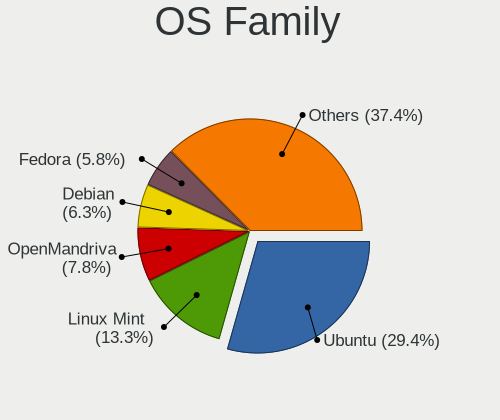
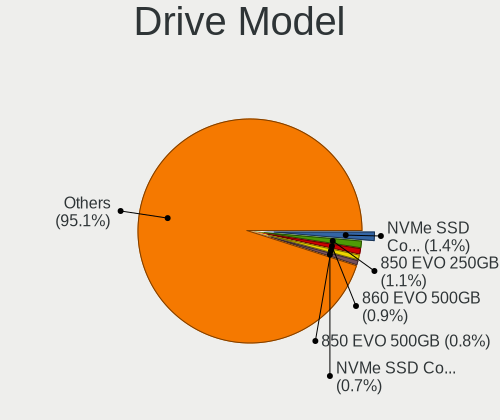
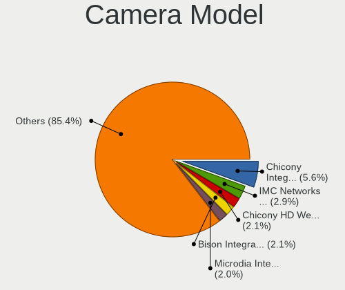

Linux in Germany - Tested Hardware & Statistics
-----------------------------------------------

A project to collect tested hardware configurations for Linux in Germany.

Anyone can contribute to this report by the [hw-probe](https://github.com/linuxhw/hw-probe) tool:

    sudo -E hw-probe -all -upload

Please contribute! Especially if your hardware is rare.

This is a report for all computer types. See also reports for [desktops](/Location/Germany/Desktop/README.md) and [notebooks](/Location/Germany/Notebook/README.md).

Contents
--------

* [ Test Cases ](#test-cases)

* [ System ](#system)
  - [ OS                       ](#os)
  - [ OS Family                ](#os-family)
  - [ Kernel                   ](#kernel)
  - [ Kernel Family            ](#kernel-family)
  - [ Kernel Major Ver.        ](#kernel-major-ver)
  - [ Arch                     ](#arch)
  - [ DE                       ](#de)
  - [ Display Server           ](#display-server)
  - [ Display Manager          ](#display-manager)
  - [ OS Lang                  ](#os-lang)
  - [ Boot Mode                ](#boot-mode)
  - [ Filesystem               ](#filesystem)
  - [ Part. scheme             ](#part-scheme)
  - [ Dual Boot with Linux/BSD ](#dual-boot-with-linuxbsd)
  - [ Dual Boot (Win)          ](#dual-boot-win)

* [ Board ](#board)
  - [ Vendor                   ](#vendor)
  - [ Model                    ](#model)
  - [ Model Family             ](#model-family)
  - [ MFG Year                 ](#mfg-year)
  - [ Form Factor              ](#form-factor)
  - [ Secure Boot              ](#secure-boot)
  - [ Coreboot                 ](#coreboot)
  - [ RAM Size                 ](#ram-size)
  - [ RAM Used                 ](#ram-used)
  - [ Total Drives             ](#total-drives)
  - [ Has CD-ROM               ](#has-cd-rom)
  - [ Has Ethernet             ](#has-ethernet)
  - [ Has WiFi                 ](#has-wifi)
  - [ Has Bluetooth            ](#has-bluetooth)

* [ Location ](#location)
  - [ Country                  ](#country)
  - [ City                     ](#city)

* [ Drives ](#drives)
  - [ Drive Vendor             ](#drive-vendor)
  - [ Drive Model              ](#drive-model)
  - [ HDD Vendor               ](#hdd-vendor)
  - [ SSD Vendor               ](#ssd-vendor)
  - [ Drive Kind               ](#drive-kind)
  - [ Drive Connector          ](#drive-connector)
  - [ Drive Size               ](#drive-size)
  - [ Space Total              ](#space-total)
  - [ Space Used               ](#space-used)
  - [ Malfunc. Drives          ](#malfunc-drives)
  - [ Malfunc. Drive Vendor    ](#malfunc-drive-vendor)
  - [ Malfunc. HDD Vendor      ](#malfunc-hdd-vendor)
  - [ Malfunc. Drive Kind      ](#malfunc-drive-kind)
  - [ Failed Drives            ](#failed-drives)
  - [ Failed Drive Vendor      ](#failed-drive-vendor)
  - [ Drive Status             ](#drive-status)

* [ Storage controller ](#storage-controller)
  - [ Storage Vendor           ](#storage-vendor)
  - [ Storage Model            ](#storage-model)
  - [ Storage Kind             ](#storage-kind)

* [ Processor ](#processor)
  - [ CPU Vendor               ](#cpu-vendor)
  - [ CPU Model                ](#cpu-model)
  - [ CPU Model Family         ](#cpu-model-family)
  - [ CPU Cores                ](#cpu-cores)
  - [ CPU Sockets              ](#cpu-sockets)
  - [ CPU Threads              ](#cpu-threads)
  - [ CPU Op-Modes             ](#cpu-op-modes)
  - [ CPU Microcode            ](#cpu-microcode)
  - [ CPU Microarch            ](#cpu-microarch)

* [ Graphics ](#graphics)
  - [ GPU Vendor               ](#gpu-vendor)
  - [ GPU Model                ](#gpu-model)
  - [ GPU Combo                ](#gpu-combo)
  - [ GPU Driver               ](#gpu-driver)
  - [ GPU Memory               ](#gpu-memory)

* [ Monitor ](#monitor)
  - [ Monitor Vendor           ](#monitor-vendor)
  - [ Monitor Model            ](#monitor-model)
  - [ Monitor Resolution       ](#monitor-resolution)
  - [ Monitor Diagonal         ](#monitor-diagonal)
  - [ Monitor Width            ](#monitor-width)
  - [ Aspect Ratio             ](#aspect-ratio)
  - [ Monitor Area             ](#monitor-area)
  - [ Pixel Density            ](#pixel-density)
  - [ Multiple Monitors        ](#multiple-monitors)

* [ Network ](#network)
  - [ Net Controller Vendor    ](#net-controller-vendor)
  - [ Net Controller Model     ](#net-controller-model)
  - [ Wireless Vendor          ](#wireless-vendor)
  - [ Wireless Model           ](#wireless-model)
  - [ Ethernet Vendor          ](#ethernet-vendor)
  - [ Ethernet Model           ](#ethernet-model)
  - [ Net Controller Kind      ](#net-controller-kind)
  - [ Used Controller          ](#used-controller)
  - [ NICs                     ](#nics)
  - [ IPv6                     ](#ipv6)

* [ Bluetooth ](#bluetooth)
  - [ Bluetooth Vendor         ](#bluetooth-vendor)
  - [ Bluetooth Model          ](#bluetooth-model)

* [ Sound ](#sound)
  - [ Sound Vendor             ](#sound-vendor)
  - [ Sound Model              ](#sound-model)

* [ Memory ](#memory)
  - [ Memory Vendor            ](#memory-vendor)
  - [ Memory Model             ](#memory-model)
  - [ Memory Kind              ](#memory-kind)
  - [ Memory Form Factor       ](#memory-form-factor)
  - [ Memory Size              ](#memory-size)
  - [ Memory Speed             ](#memory-speed)

* [ Printers & scanners ](#printers--scanners)
  - [ Printer Vendor           ](#printer-vendor)
  - [ Printer Model            ](#printer-model)
  - [ Scanner Vendor           ](#scanner-vendor)
  - [ Scanner Model            ](#scanner-model)

* [ Camera ](#camera)
  - [ Camera Vendor            ](#camera-vendor)
  - [ Camera Model             ](#camera-model)

* [ Security ](#security)
  - [ Fingerprint Vendor       ](#fingerprint-vendor)
  - [ Fingerprint Model        ](#fingerprint-model)
  - [ Chipcard Vendor          ](#chipcard-vendor)
  - [ Chipcard Model           ](#chipcard-model)

* [ Unsupported ](#unsupported)
  - [ Unsupported Devices      ](#unsupported-devices)
  - [ Unsupported Device Types ](#unsupported-device-types)

Test Cases
----------

Total: 22805

| Vendor        | Model                       | Form-Factor | Probe                                                      | Date         |
|---------------|-----------------------------|-------------|------------------------------------------------------------|--------------|
| ASRock        | Z97 Anniversary             | Desktop     | [558ca4b56e](https://linux-hardware.org/?probe=558ca4b56e) | Oct 01, 2022 |
| Acer          | Aspire 5920G                | Notebook    | [9bd67cf4f9](https://linux-hardware.org/?probe=9bd67cf4f9) | Oct 01, 2022 |
| HUAWEI        | HLYL-WXX9                   | Notebook    | [318010d949](https://linux-hardware.org/?probe=318010d949) | Oct 01, 2022 |
| ASUSTek       | ROG STRIX X570-F GAMING     | Desktop     | [ff1c77c45a](https://linux-hardware.org/?probe=ff1c77c45a) | Oct 01, 2022 |
| ASUSTek       | ROG STRIX B550-E GAMING     | Desktop     | [8a75a2c50b](https://linux-hardware.org/?probe=8a75a2c50b) | Oct 01, 2022 |
| MSI           | MAG B550 TOMAHAWK           | Desktop     | [a7268f8fba](https://linux-hardware.org/?probe=a7268f8fba) | Oct 01, 2022 |
| Lenovo        | ThinkCentre M58 9728AHG     | Desktop     | [a2bc7fc88f](https://linux-hardware.org/?probe=a2bc7fc88f) | Oct 01, 2022 |
| Medion        | MS-7366                     | Desktop     | [c8138f4ffe](https://linux-hardware.org/?probe=c8138f4ffe) | Oct 01, 2022 |
| Medion        | MS-7366                     | Desktop     | [c25c10b259](https://linux-hardware.org/?probe=c25c10b259) | Oct 01, 2022 |
| Lenovo        | IdeaPad 530S-14ARR 81H1     | Notebook    | [68b0c0ca1a](https://linux-hardware.org/?probe=68b0c0ca1a) | Oct 01, 2022 |
| ASRock        | H87M Pro4                   | Desktop     | [bf8e635afa](https://linux-hardware.org/?probe=bf8e635afa) | Oct 01, 2022 |
| Fujitsu       | D2990-A2 S26361-D2990-A2    | Desktop     | [982b143d73](https://linux-hardware.org/?probe=982b143d73) | Oct 01, 2022 |
| MSI           | MAG B550 TOMAHAWK           | Desktop     | [151510a184](https://linux-hardware.org/?probe=151510a184) | Oct 01, 2022 |
| HP            | ProBook 430 G7              | Notebook    | [bf25686a1f](https://linux-hardware.org/?probe=bf25686a1f) | Oct 01, 2022 |
| MSI           | X370 GAMING PLUS            | Desktop     | [2aa92cb043](https://linux-hardware.org/?probe=2aa92cb043) | Oct 01, 2022 |
| Apple         | Mac-F65AE981FFA204ED Mac... | Mini pc     | [f97d2b97ad](https://linux-hardware.org/?probe=f97d2b97ad) | Oct 01, 2022 |
| Lenovo        | ThinkPad X270 W10DG 20K5... | Notebook    | [012add7349](https://linux-hardware.org/?probe=012add7349) | Oct 01, 2022 |
| ASUSTek       | M4N72-E                     | Desktop     | [c1c308be2a](https://linux-hardware.org/?probe=c1c308be2a) | Oct 01, 2022 |
| Lenovo        | Yoga 7 14ITL5 82BH          | Convertible | [d60b15ea91](https://linux-hardware.org/?probe=d60b15ea91) | Oct 01, 2022 |
| HP            | ZBook 17 G4                 | Notebook    | [1476da42c3](https://linux-hardware.org/?probe=1476da42c3) | Sep 30, 2022 |
| MSI           | A55M-E33                    | Desktop     | [13bd049f55](https://linux-hardware.org/?probe=13bd049f55) | Sep 30, 2022 |
| MSI           | MEG X570 UNIFY              | Desktop     | [4d2e449699](https://linux-hardware.org/?probe=4d2e449699) | Sep 30, 2022 |
| Lenovo        | Yoga 7 15ITL5 82BJ          | Convertible | [2e9261e2a7](https://linux-hardware.org/?probe=2e9261e2a7) | Sep 30, 2022 |
| OEM           | Unknown                     | Notebook    | [af7df2aea6](https://linux-hardware.org/?probe=af7df2aea6) | Sep 30, 2022 |
| OEM           | Unknown                     | Notebook    | [1d851fe024](https://linux-hardware.org/?probe=1d851fe024) | Sep 30, 2022 |
| OEM           | Unknown                     | Notebook    | [4fd2ca7d03](https://linux-hardware.org/?probe=4fd2ca7d03) | Sep 30, 2022 |
| ASUSTek       | M5A78L-M LX3                | Desktop     | [938523ed34](https://linux-hardware.org/?probe=938523ed34) | Sep 30, 2022 |
| ASRock        | H87M Pro4                   | Desktop     | [f8bb8b6de8](https://linux-hardware.org/?probe=f8bb8b6de8) | Sep 30, 2022 |
| Dell          | Precision 3551              | Notebook    | [d0341acb53](https://linux-hardware.org/?probe=d0341acb53) | Sep 30, 2022 |
| HP            | Compaq CQ58                 | Notebook    | [28048a6d3e](https://linux-hardware.org/?probe=28048a6d3e) | Sep 30, 2022 |
| MSI           | B450 GAMING PLUS MAX        | Desktop     | [c06e7e3586](https://linux-hardware.org/?probe=c06e7e3586) | Sep 30, 2022 |
| ASUSTek       | PRIME B450M-A               | Desktop     | [cfe1aba7e6](https://linux-hardware.org/?probe=cfe1aba7e6) | Sep 30, 2022 |
| MSI           | Z97 MPOWER                  | Desktop     | [f16a15a5b7](https://linux-hardware.org/?probe=f16a15a5b7) | Sep 30, 2022 |
| Sony          | SVE1512C6EB                 | Notebook    | [c47a3a5bd7](https://linux-hardware.org/?probe=c47a3a5bd7) | Sep 30, 2022 |
| Gigabyte      | B660M DS3H AX DDR4          | Desktop     | [97e7d2d80f](https://linux-hardware.org/?probe=97e7d2d80f) | Sep 30, 2022 |
| Acer          | Aspire E1-531               | Notebook    | [fbe026b995](https://linux-hardware.org/?probe=fbe026b995) | Sep 30, 2022 |
| Valve         | Jupiter                     | Notebook    | [5e7ec518d4](https://linux-hardware.org/?probe=5e7ec518d4) | Sep 30, 2022 |
| ASUSTek       | EX-A320M-GAMING             | Desktop     | [33d5d34654](https://linux-hardware.org/?probe=33d5d34654) | Sep 30, 2022 |
| Acer          | Aspire A315-56              | Notebook    | [1ee3922873](https://linux-hardware.org/?probe=1ee3922873) | Sep 30, 2022 |
| Lenovo        | ThinkPad T470s 20HGS09L0... | Notebook    | [7c384e5578](https://linux-hardware.org/?probe=7c384e5578) | Sep 30, 2022 |
| SIEMENS       | SIMATIC ITP1000             | Notebook    | [adbd7dbca6](https://linux-hardware.org/?probe=adbd7dbca6) | Sep 30, 2022 |
| Lenovo        | ThinkCentre M58 9728AHG     | Desktop     | [773ae7f01e](https://linux-hardware.org/?probe=773ae7f01e) | Sep 30, 2022 |
| Intel         | NUC11ATBPE M49844-202       | Mini pc     | [9e0aff1fbd](https://linux-hardware.org/?probe=9e0aff1fbd) | Sep 30, 2022 |
| Dell          | Inspiron 3505               | Notebook    | [097825430f](https://linux-hardware.org/?probe=097825430f) | Sep 30, 2022 |
| Timi          | Xiaomi Book Pro 16 2022     | Notebook    | [d2a3575975](https://linux-hardware.org/?probe=d2a3575975) | Sep 30, 2022 |
| Valve         | Jupiter                     | Notebook    | [a031955ffb](https://linux-hardware.org/?probe=a031955ffb) | Sep 30, 2022 |
| ASRock        | Q1900M                      | Desktop     | [e6804dc6b7](https://linux-hardware.org/?probe=e6804dc6b7) | Sep 29, 2022 |
| HP            | 3398                        | Desktop     | [c2190a0657](https://linux-hardware.org/?probe=c2190a0657) | Sep 29, 2022 |
| Toshiba       | TECRA M10                   | Notebook    | [64ad67c8e9](https://linux-hardware.org/?probe=64ad67c8e9) | Sep 29, 2022 |
| ASUSTek       | Zenbook UM3402YA_UM3402Y... | Notebook    | [36ad3c69ee](https://linux-hardware.org/?probe=36ad3c69ee) | Sep 29, 2022 |
| Acer          | Aspire ES1-311              | Notebook    | [0f40a045a9](https://linux-hardware.org/?probe=0f40a045a9) | Sep 29, 2022 |
| ASUSTek       | AM1I-A                      | Desktop     | [201c745d4e](https://linux-hardware.org/?probe=201c745d4e) | Sep 29, 2022 |
| HP            | Compaq nx6325 (EY344EA#A... | Notebook    | [8808f98c62](https://linux-hardware.org/?probe=8808f98c62) | Sep 29, 2022 |
| ASUSTek       | N56VZ                       | Notebook    | [2b78a7c7f1](https://linux-hardware.org/?probe=2b78a7c7f1) | Sep 29, 2022 |
| Apple         | MacBookPro3,1               | Notebook    | [00f2a6e705](https://linux-hardware.org/?probe=00f2a6e705) | Sep 29, 2022 |
| Dell          | Latitude E7250              | Notebook    | [bed2e025b0](https://linux-hardware.org/?probe=bed2e025b0) | Sep 29, 2022 |
| HP            | ProBook 6560b               | Notebook    | [902ef8ef79](https://linux-hardware.org/?probe=902ef8ef79) | Sep 29, 2022 |
| HUAWEI        | KLVL-WXXW                   | Notebook    | [fd8b95bb3b](https://linux-hardware.org/?probe=fd8b95bb3b) | Sep 29, 2022 |
| Lenovo        | IdeaPad 720-15IKB 81AG      | Notebook    | [9ac63cdce6](https://linux-hardware.org/?probe=9ac63cdce6) | Sep 29, 2022 |
| ASRock        | Z97 Pro3                    | Desktop     | [7b34a50df8](https://linux-hardware.org/?probe=7b34a50df8) | Sep 28, 2022 |
| Medion        | Akoya E6422 MD99680         | Notebook    | [52c1708200](https://linux-hardware.org/?probe=52c1708200) | Sep 28, 2022 |
| Gigabyte      | H81M-D2W                    | Desktop     | [467845e1c1](https://linux-hardware.org/?probe=467845e1c1) | Sep 28, 2022 |
| Notebook      | PB50_70RF,RD,RC             | Notebook    | [d56e485c88](https://linux-hardware.org/?probe=d56e485c88) | Sep 28, 2022 |
| Lenovo        | ThinkPad L15 Gen 1 20U70... | Notebook    | [d137298cb5](https://linux-hardware.org/?probe=d137298cb5) | Sep 28, 2022 |
| Dell          | System Vostro 3750          | Notebook    | [4e08b9be50](https://linux-hardware.org/?probe=4e08b9be50) | Sep 28, 2022 |
| Microsoft     | Surface Pro 3               | Tablet      | [b6bbdd2fc0](https://linux-hardware.org/?probe=b6bbdd2fc0) | Sep 28, 2022 |
| ASUSTek       | VivoBook_ASUSLaptop E410... | Notebook    | [224549bcb6](https://linux-hardware.org/?probe=224549bcb6) | Sep 28, 2022 |
| Medion        | MS-7707                     | Desktop     | [240ac993dc](https://linux-hardware.org/?probe=240ac993dc) | Sep 28, 2022 |
| ASUSTek       | VivoBook 17_ASUS Laptop ... | Notebook    | [a3fc8eb1bc](https://linux-hardware.org/?probe=a3fc8eb1bc) | Sep 28, 2022 |
| HP            | Laptop 15s-eq2xxx           | Notebook    | [6d9c960574](https://linux-hardware.org/?probe=6d9c960574) | Sep 28, 2022 |
| Dell          | Latitude E7250              | Notebook    | [4bf6378dde](https://linux-hardware.org/?probe=4bf6378dde) | Sep 28, 2022 |
| Raspberry ... | Raspberry Pi 4 Model B R... | Soc         | [b063a72d21](https://linux-hardware.org/?probe=b063a72d21) | Sep 28, 2022 |
| Dell          | Latitude E5430 non-vPro     | Notebook    | [12e886f006](https://linux-hardware.org/?probe=12e886f006) | Sep 28, 2022 |
| Medion        | E6234                       | Notebook    | [19f1d7841e](https://linux-hardware.org/?probe=19f1d7841e) | Sep 28, 2022 |
| Fujitsu       | D2939-B1 S26361-D2939-B1... | Server      | [efe128ba47](https://linux-hardware.org/?probe=efe128ba47) | Sep 28, 2022 |
| Lenovo        | IdeaPadFlex 5 14ALC05 82... | Convertible | [89253de6f0](https://linux-hardware.org/?probe=89253de6f0) | Sep 28, 2022 |
| Lenovo        | ThinkBook 14 G3 ACL 21A2    | Notebook    | [9271d6a014](https://linux-hardware.org/?probe=9271d6a014) | Sep 28, 2022 |
| Medion        | Unknown                     | Notebook    | [821c3c8fed](https://linux-hardware.org/?probe=821c3c8fed) | Sep 28, 2022 |
| MSI           | 2A9Ch                       | Desktop     | [16d3df803b](https://linux-hardware.org/?probe=16d3df803b) | Sep 28, 2022 |
| Samsung       | RV420/RV520/RV720/E3530/... | Notebook    | [9a1e3a98ab](https://linux-hardware.org/?probe=9a1e3a98ab) | Sep 28, 2022 |
| Dell          | Latitude E6330              | Notebook    | [47b2074732](https://linux-hardware.org/?probe=47b2074732) | Sep 27, 2022 |
| ASUSTek       | VivoBook_ASUSLaptop E410... | Notebook    | [ebfbdd37b8](https://linux-hardware.org/?probe=ebfbdd37b8) | Sep 27, 2022 |
| Acer          | Aspire 5750G                | Notebook    | [f73c1084d0](https://linux-hardware.org/?probe=f73c1084d0) | Sep 27, 2022 |
| ASRock        | B450 Pro4                   | Desktop     | [9053250a2c](https://linux-hardware.org/?probe=9053250a2c) | Sep 27, 2022 |
| HP            | ENVY x360 Convertible 13... | Convertible | [d5a3950c4e](https://linux-hardware.org/?probe=d5a3950c4e) | Sep 27, 2022 |
| ASUSTek       | PRIME B550-PLUS             | Desktop     | [1e0110dd5c](https://linux-hardware.org/?probe=1e0110dd5c) | Sep 27, 2022 |
| ASRock        | Z97 Anniversary             | Desktop     | [6132513116](https://linux-hardware.org/?probe=6132513116) | Sep 27, 2022 |
| Acer          | Aspire A317-52              | Notebook    | [6cc6160f7c](https://linux-hardware.org/?probe=6cc6160f7c) | Sep 27, 2022 |
| MSI           | B550-A PRO                  | Desktop     | [2a5a7aeb95](https://linux-hardware.org/?probe=2a5a7aeb95) | Sep 27, 2022 |
| Medion        | MS-7707                     | Desktop     | [a88f6ba4da](https://linux-hardware.org/?probe=a88f6ba4da) | Sep 27, 2022 |
| MSI           | X570-A PRO                  | Desktop     | [a26dee0cd5](https://linux-hardware.org/?probe=a26dee0cd5) | Sep 27, 2022 |
| Raspberry ... | Raspberry Pi                | Soc         | [723ba52c05](https://linux-hardware.org/?probe=723ba52c05) | Sep 27, 2022 |
| Dell          | Latitude E7470              | Notebook    | [5bdc528b5a](https://linux-hardware.org/?probe=5bdc528b5a) | Sep 27, 2022 |
| Gigabyte      | GA-78LMT-USB3 R2 sex        | Desktop     | [63cd838fcc](https://linux-hardware.org/?probe=63cd838fcc) | Sep 27, 2022 |
| Lenovo        | G780                        | Notebook    | [057a86bcdc](https://linux-hardware.org/?probe=057a86bcdc) | Sep 27, 2022 |
| Lenovo        | ThinkPad T14s Gen 2i 20W... | Notebook    | [5b7d4c6b7a](https://linux-hardware.org/?probe=5b7d4c6b7a) | Sep 27, 2022 |
| HP            | 635                         | Notebook    | [0509987782](https://linux-hardware.org/?probe=0509987782) | Sep 27, 2022 |
| Medion        | MS-7728                     | Desktop     | [0b9b2ca570](https://linux-hardware.org/?probe=0b9b2ca570) | Sep 27, 2022 |
| ASUSTek       | Z170-K                      | Desktop     | [5048b5bef9](https://linux-hardware.org/?probe=5048b5bef9) | Sep 27, 2022 |
| Toshiba       | Satellite C50-B             | Notebook    | [3cea1ede58](https://linux-hardware.org/?probe=3cea1ede58) | Sep 27, 2022 |
| ASUSTek       | H97I-PLUS                   | Desktop     | [31036cd828](https://linux-hardware.org/?probe=31036cd828) | Sep 27, 2022 |
| ASUSTek       | H97I-PLUS                   | Desktop     | [fa2a23dff8](https://linux-hardware.org/?probe=fa2a23dff8) | Sep 27, 2022 |
| Lenovo        | ThinkPad X270 W10DG 20K5... | Notebook    | [ae7c83bb37](https://linux-hardware.org/?probe=ae7c83bb37) | Sep 27, 2022 |
| Dell          | Latitude 5290 2-in-1        | Notebook    | [19d835ace8](https://linux-hardware.org/?probe=19d835ace8) | Sep 27, 2022 |
| HP            | 829A                        | Mini pc     | [1e26c7813f](https://linux-hardware.org/?probe=1e26c7813f) | Sep 27, 2022 |
| Lenovo        | MAHOBAY NO DPK              | Desktop     | [1979013fa2](https://linux-hardware.org/?probe=1979013fa2) | Sep 27, 2022 |
| Samsung       | R425/R525                   | Notebook    | [a5b0ee0a18](https://linux-hardware.org/?probe=a5b0ee0a18) | Sep 27, 2022 |
| Fujitsu Si... | ESPRIMO Mobile V5535        | Notebook    | [6f4452adc5](https://linux-hardware.org/?probe=6f4452adc5) | Sep 27, 2022 |
| Lenovo        | ThinkPad E15 Gen 3 20YGC... | Notebook    | [9616464154](https://linux-hardware.org/?probe=9616464154) | Sep 26, 2022 |
| Fujitsu       | LIFEBOOK E752               | Notebook    | [f4e2b14498](https://linux-hardware.org/?probe=f4e2b14498) | Sep 26, 2022 |
| Tactus        | GeoFlex 110                 | Convertible | [8d3efd7b21](https://linux-hardware.org/?probe=8d3efd7b21) | Sep 26, 2022 |
| Dell          | System Inspiron N7110       | Notebook    | [90fffc8800](https://linux-hardware.org/?probe=90fffc8800) | Sep 26, 2022 |
| Medion        | C15MU-N                     | Notebook    | [e4a1e96ebd](https://linux-hardware.org/?probe=e4a1e96ebd) | Sep 26, 2022 |
| HP            | 1494                        | Desktop     | [aa2bd7da6c](https://linux-hardware.org/?probe=aa2bd7da6c) | Sep 26, 2022 |
| Dell          | Precision 7520              | Notebook    | [a7b1df0888](https://linux-hardware.org/?probe=a7b1df0888) | Sep 26, 2022 |
| ASRock        | X300M-STX                   | Desktop     | [7bb3e847e2](https://linux-hardware.org/?probe=7bb3e847e2) | Sep 26, 2022 |
| Dell          | Latitude E7470              | Notebook    | [1dba765507](https://linux-hardware.org/?probe=1dba765507) | Sep 26, 2022 |
| HUAWEI        | NBLB-WAX9N                  | Notebook    | [f1d78ca455](https://linux-hardware.org/?probe=f1d78ca455) | Sep 26, 2022 |
| HP            | ZBook 17 G2                 | Notebook    | [d6d9af3173](https://linux-hardware.org/?probe=d6d9af3173) | Sep 26, 2022 |
| HP            | 8710                        | Mini pc     | [fdd0fee41e](https://linux-hardware.org/?probe=fdd0fee41e) | Sep 26, 2022 |
| HP            | ZBook 17 G2                 | Notebook    | [ff70118578](https://linux-hardware.org/?probe=ff70118578) | Sep 26, 2022 |
| ASRock        | A75M-HVS                    | Desktop     | [75d51e6237](https://linux-hardware.org/?probe=75d51e6237) | Sep 26, 2022 |
| Lenovo        | ThinkPad T460p 20FW000EG... | Notebook    | [60138ee2f9](https://linux-hardware.org/?probe=60138ee2f9) | Sep 26, 2022 |
| ASUSTek       | K93SV                       | Notebook    | [541a21ceb8](https://linux-hardware.org/?probe=541a21ceb8) | Sep 26, 2022 |
| HP            | 0B40h                       | Desktop     | [d72bb749ff](https://linux-hardware.org/?probe=d72bb749ff) | Sep 26, 2022 |
| Lenovo        | Myrtle CRB SDK0J40700 WI... | Desktop     | [508c873693](https://linux-hardware.org/?probe=508c873693) | Sep 26, 2022 |
| HUAWEI        | BOHB-WAX9                   | Notebook    | [64fd780b2f](https://linux-hardware.org/?probe=64fd780b2f) | Sep 26, 2022 |
| HUAWEI        | BOHB-WAX9                   | Notebook    | [d557cdbe1c](https://linux-hardware.org/?probe=d557cdbe1c) | Sep 26, 2022 |
| Gigabyte      | X399 AORUS XTREME-CF        | Desktop     | [762ad6e460](https://linux-hardware.org/?probe=762ad6e460) | Sep 26, 2022 |
| ASUSTek       | X201EP                      | Notebook    | [4e6c202d5d](https://linux-hardware.org/?probe=4e6c202d5d) | Sep 26, 2022 |
| HP            | ENVY x360 Convertible 15... | Convertible | [4b6ce98f70](https://linux-hardware.org/?probe=4b6ce98f70) | Sep 25, 2022 |
| Dell          | XPS 13 7390 2-in-1          | Convertible | [6ff36a4765](https://linux-hardware.org/?probe=6ff36a4765) | Sep 25, 2022 |
| Valve         | Jupiter                     | Notebook    | [315719a312](https://linux-hardware.org/?probe=315719a312) | Sep 25, 2022 |
| ASRock        | A75M-HVS                    | Desktop     | [fa3be9d376](https://linux-hardware.org/?probe=fa3be9d376) | Sep 25, 2022 |
| Lenovo        | ThinkPad X250 20CL001DMS    | Notebook    | [7662278b86](https://linux-hardware.org/?probe=7662278b86) | Sep 25, 2022 |
| ASUSTek       | B150-PLUS                   | Desktop     | [c64181dd6a](https://linux-hardware.org/?probe=c64181dd6a) | Sep 25, 2022 |
| ASRockRack    | X570D4U-2L2T                | Desktop     | [779faa3cfd](https://linux-hardware.org/?probe=779faa3cfd) | Sep 25, 2022 |
| HUAWEI        | KLVL-WXXW                   | Notebook    | [6828f26ab2](https://linux-hardware.org/?probe=6828f26ab2) | Sep 25, 2022 |
| Dell          | 0Y2MRG A00                  | Desktop     | [af1ab104ed](https://linux-hardware.org/?probe=af1ab104ed) | Sep 25, 2022 |
| ASRock        | B450M-HDV                   | Desktop     | [a1639d1654](https://linux-hardware.org/?probe=a1639d1654) | Sep 25, 2022 |
| Lenovo        | ThinkPad T14 Gen 3 21AHC... | Notebook    | [0e69d41fef](https://linux-hardware.org/?probe=0e69d41fef) | Sep 25, 2022 |
| ASRock        | J3160M                      | Desktop     | [c9cc54f48e](https://linux-hardware.org/?probe=c9cc54f48e) | Sep 25, 2022 |
| Lenovo        | ThinkPad E15 Gen 4 21EES... | Notebook    | [fb7029173f](https://linux-hardware.org/?probe=fb7029173f) | Sep 25, 2022 |
| ASUSTek       | ROG STRIX B550-F GAMING     | Desktop     | [208c7988f7](https://linux-hardware.org/?probe=208c7988f7) | Sep 25, 2022 |
| ASRock        | QC5000M-ITX/PH              | Desktop     | [571b95c201](https://linux-hardware.org/?probe=571b95c201) | Sep 25, 2022 |
| HP            | EliteBook 830 G6            | Notebook    | [cdbc7c7949](https://linux-hardware.org/?probe=cdbc7c7949) | Sep 25, 2022 |
| Supermicro    | H11SSL-i                    | Server      | [dd3ce003e4](https://linux-hardware.org/?probe=dd3ce003e4) | Sep 25, 2022 |
| HP            | EliteBook 830 G6            | Notebook    | [907383d255](https://linux-hardware.org/?probe=907383d255) | Sep 25, 2022 |
| Dell          | XPS 13 9380                 | Notebook    | [332540a4c8](https://linux-hardware.org/?probe=332540a4c8) | Sep 24, 2022 |
| ASUSTek       | P8Z77-V DELUXE              | Desktop     | [cd57bfa69c](https://linux-hardware.org/?probe=cd57bfa69c) | Sep 24, 2022 |
| ASUSTek       | P8Z77-V DELUXE              | Desktop     | [bad1de13cc](https://linux-hardware.org/?probe=bad1de13cc) | Sep 24, 2022 |
| Medion        | MS-7616                     | Desktop     | [72af7b904f](https://linux-hardware.org/?probe=72af7b904f) | Sep 24, 2022 |
| ASUSTek       | TUF Gaming B550-PLUS WIF... | Desktop     | [0daf5c5df5](https://linux-hardware.org/?probe=0daf5c5df5) | Sep 24, 2022 |
| Fujitsu Si... | MS-7504VP-PV                | Desktop     | [fa75c2dfde](https://linux-hardware.org/?probe=fa75c2dfde) | Sep 24, 2022 |
| MSI           | H510M PRO                   | Desktop     | [bb7475d072](https://linux-hardware.org/?probe=bb7475d072) | Sep 24, 2022 |
| ASUSTek       | N750JV                      | Notebook    | [04cc8b4e36](https://linux-hardware.org/?probe=04cc8b4e36) | Sep 24, 2022 |
| ASRock        | X300M-STX                   | Desktop     | [c354f2b293](https://linux-hardware.org/?probe=c354f2b293) | Sep 24, 2022 |
| Lenovo        | NO DPK                      | Desktop     | [7bdaedd0f7](https://linux-hardware.org/?probe=7bdaedd0f7) | Sep 24, 2022 |
| Lenovo        | ThinkPad T61 765912G        | Notebook    | [bd04e564a0](https://linux-hardware.org/?probe=bd04e564a0) | Sep 24, 2022 |
| Acer          | Extensa 5635ZG              | Notebook    | [ade183eadc](https://linux-hardware.org/?probe=ade183eadc) | Sep 24, 2022 |
| Lenovo        | ThinkPad L14 Gen 1 20U50... | Notebook    | [dc165f65b5](https://linux-hardware.org/?probe=dc165f65b5) | Sep 24, 2022 |
| Lenovo        | SHARKBAY SDK0E50510 WIN     | Desktop     | [fd63352b24](https://linux-hardware.org/?probe=fd63352b24) | Sep 24, 2022 |
| Dell          | Precision 7560              | Notebook    | [8124a7a3eb](https://linux-hardware.org/?probe=8124a7a3eb) | Sep 24, 2022 |
| Dell          | Latitude 3320               | Notebook    | [3296a12784](https://linux-hardware.org/?probe=3296a12784) | Sep 24, 2022 |
| HP            | 250 G8 Notebook PC          | Notebook    | [fab0eac5a6](https://linux-hardware.org/?probe=fab0eac5a6) | Sep 24, 2022 |
| MSI           | MS-7358                     | Desktop     | [29d88b0c3b](https://linux-hardware.org/?probe=29d88b0c3b) | Sep 23, 2022 |
| Medion        | B460H6-EM                   | Desktop     | [9ab2a06631](https://linux-hardware.org/?probe=9ab2a06631) | Sep 23, 2022 |
| ASRock        | A320M-DVS R4.0              | Desktop     | [42deee504b](https://linux-hardware.org/?probe=42deee504b) | Sep 23, 2022 |
| ASUSTek       | PRIME B365M-A               | Desktop     | [c4c88d72ae](https://linux-hardware.org/?probe=c4c88d72ae) | Sep 23, 2022 |
| HP            | 0AA8h                       | Desktop     | [9c02e3fc31](https://linux-hardware.org/?probe=9c02e3fc31) | Sep 23, 2022 |
| Pegatron      | A15                         | Notebook    | [a865984ad5](https://linux-hardware.org/?probe=a865984ad5) | Sep 23, 2022 |
| Pegatron      | A15                         | Notebook    | [ea527d6d5a](https://linux-hardware.org/?probe=ea527d6d5a) | Sep 23, 2022 |
| Fujitsu Si... | MS-7504VP-PV                | Desktop     | [f0916efbf9](https://linux-hardware.org/?probe=f0916efbf9) | Sep 23, 2022 |
| Dell          | XPS 15 9520                 | Notebook    | [1a7e610c32](https://linux-hardware.org/?probe=1a7e610c32) | Sep 23, 2022 |
| Gigabyte      | B660I AORUS PRO DDR4        | Desktop     | [810c7883d4](https://linux-hardware.org/?probe=810c7883d4) | Sep 23, 2022 |
| Tactus        | GeoBook 140                 | Notebook    | [7d8700d0e1](https://linux-hardware.org/?probe=7d8700d0e1) | Sep 23, 2022 |
| HP            | 8924 0101                   | All in one  | [3130463385](https://linux-hardware.org/?probe=3130463385) | Sep 23, 2022 |
| HP            | 876C SMVB                   | Desktop     | [c6fbf7c631](https://linux-hardware.org/?probe=c6fbf7c631) | Sep 23, 2022 |
| Lenovo        | ThinkPad X220 Tablet 429... | Notebook    | [845256127e](https://linux-hardware.org/?probe=845256127e) | Sep 23, 2022 |
| Lenovo        | Yoga Slim 7 Carbon 13ITL... | Notebook    | [c916654073](https://linux-hardware.org/?probe=c916654073) | Sep 22, 2022 |
| BESSTAR Te... | GB1                         | Mini pc     | [e2d1cd31c3](https://linux-hardware.org/?probe=e2d1cd31c3) | Sep 22, 2022 |
| VALE          | Notebook Classic C140       | Notebook    | [5a8e431c98](https://linux-hardware.org/?probe=5a8e431c98) | Sep 22, 2022 |
| HP            | EliteBook 840 G3            | Notebook    | [c3a88ed62d](https://linux-hardware.org/?probe=c3a88ed62d) | Sep 22, 2022 |
| HP            | 1494                        | Desktop     | [cd3778e7eb](https://linux-hardware.org/?probe=cd3778e7eb) | Sep 22, 2022 |
| TUXEDO        | Pulse 15 Gen1               | Notebook    | [57ee917c21](https://linux-hardware.org/?probe=57ee917c21) | Sep 22, 2022 |
| HP            | 1494                        | Desktop     | [4a3ad3e89d](https://linux-hardware.org/?probe=4a3ad3e89d) | Sep 22, 2022 |
| TUXEDO        | Book BA1510                 | Notebook    | [76a485fe7e](https://linux-hardware.org/?probe=76a485fe7e) | Sep 22, 2022 |
| Apple         | Mac-F4228EC8 DVT            | All in one  | [17d1bfe3d9](https://linux-hardware.org/?probe=17d1bfe3d9) | Sep 22, 2022 |
| MSI           | X470 GAMING PRO             | Desktop     | [a48daa11cd](https://linux-hardware.org/?probe=a48daa11cd) | Sep 22, 2022 |
| Lenovo        | ThinkPad X200s 7470WWD      | Notebook    | [268aa65de3](https://linux-hardware.org/?probe=268aa65de3) | Sep 22, 2022 |
| ASUSTek       | M5A78L-M LX3                | Desktop     | [75a6fc3a08](https://linux-hardware.org/?probe=75a6fc3a08) | Sep 22, 2022 |
| ASUSTek       | M5A99X EVO                  | Desktop     | [48f4738047](https://linux-hardware.org/?probe=48f4738047) | Sep 22, 2022 |
| ASUSTek       | M5A99X EVO                  | Desktop     | [a484071017](https://linux-hardware.org/?probe=a484071017) | Sep 22, 2022 |
| ASUSTek       | B85M-E                      | Desktop     | [07477a078f](https://linux-hardware.org/?probe=07477a078f) | Sep 22, 2022 |
| Acer          | Aspire ES1-512              | Notebook    | [00e679e86c](https://linux-hardware.org/?probe=00e679e86c) | Sep 22, 2022 |
| Acer          | Aspire ES1-512              | Notebook    | [318436c7ab](https://linux-hardware.org/?probe=318436c7ab) | Sep 22, 2022 |
| Dell          | Precision 7760              | Notebook    | [f6600a1244](https://linux-hardware.org/?probe=f6600a1244) | Sep 22, 2022 |
| HP            | 3647h                       | Desktop     | [7c54133b32](https://linux-hardware.org/?probe=7c54133b32) | Sep 22, 2022 |
| ASUSTek       | Z97-PRO GAMER               | Desktop     | [f6e7ad269e](https://linux-hardware.org/?probe=f6e7ad269e) | Sep 22, 2022 |
| ASUSTek       | ROG Zephyrus G14 GA401QE... | Notebook    | [ba5fdd39e6](https://linux-hardware.org/?probe=ba5fdd39e6) | Sep 21, 2022 |
| ASUSTek       | PRIME B365M-A               | Desktop     | [289b9dcac8](https://linux-hardware.org/?probe=289b9dcac8) | Sep 21, 2022 |
| Lenovo        | G500 20236                  | Notebook    | [ede942e5a1](https://linux-hardware.org/?probe=ede942e5a1) | Sep 21, 2022 |
| MSI           | 2A9C                        | Desktop     | [0c026ab669](https://linux-hardware.org/?probe=0c026ab669) | Sep 21, 2022 |
| Framework     | Laptop (12th Gen Intel C... | Notebook    | [69d5dcb9b7](https://linux-hardware.org/?probe=69d5dcb9b7) | Sep 21, 2022 |
| BESSTAR Te... | UM350                       | Desktop     | [62a9723eb7](https://linux-hardware.org/?probe=62a9723eb7) | Sep 21, 2022 |
| ASUSTek       | A8N-SLI                     | Desktop     | [95d20defd7](https://linux-hardware.org/?probe=95d20defd7) | Sep 21, 2022 |
| Lenovo        | 30BB SDK0J40697 WIN 3305... | All in one  | [989f23b214](https://linux-hardware.org/?probe=989f23b214) | Sep 21, 2022 |
| MSI           | X470 GAMING PRO             | Desktop     | [5c64c61090](https://linux-hardware.org/?probe=5c64c61090) | Sep 21, 2022 |
| ASRock        | A75M-HVS                    | Desktop     | [a2fb3b0ed7](https://linux-hardware.org/?probe=a2fb3b0ed7) | Sep 21, 2022 |
| ASRock        | A75M-HVS                    | Desktop     | [0f81852612](https://linux-hardware.org/?probe=0f81852612) | Sep 21, 2022 |
| Lenovo        | ThinkPad X230 23255Z6       | Notebook    | [25cc23e2ad](https://linux-hardware.org/?probe=25cc23e2ad) | Sep 21, 2022 |
| Lenovo        | ThinkPad L580 20LWCTO1WW    | Notebook    | [a80367f777](https://linux-hardware.org/?probe=a80367f777) | Sep 21, 2022 |
| Lenovo        | ThinkPad T61 6468AE1        | Notebook    | [8719597c22](https://linux-hardware.org/?probe=8719597c22) | Sep 21, 2022 |
| Acer          | Aspire ES1-111M             | Notebook    | [04f08de672](https://linux-hardware.org/?probe=04f08de672) | Sep 21, 2022 |
| Lenovo        | Yoga 3 Pro-1370 80HE        | Notebook    | [65d258e56a](https://linux-hardware.org/?probe=65d258e56a) | Sep 21, 2022 |
| Lenovo        | ThinkCentre M81 5049W16     | Desktop     | [67067bfc09](https://linux-hardware.org/?probe=67067bfc09) | Sep 21, 2022 |
| HP            | 3647h                       | Desktop     | [64cc139cac](https://linux-hardware.org/?probe=64cc139cac) | Sep 21, 2022 |
| HUAWEI        | KLVL-WXXW                   | Notebook    | [8e46e07b3a](https://linux-hardware.org/?probe=8e46e07b3a) | Sep 21, 2022 |
| Dell          | G5 5505                     | Notebook    | [82017aa2ae](https://linux-hardware.org/?probe=82017aa2ae) | Sep 21, 2022 |
| Lenovo        | ThinkPad W500 4061BC8       | Notebook    | [f2280ae816](https://linux-hardware.org/?probe=f2280ae816) | Sep 21, 2022 |
| Medion        | E6220                       | Notebook    | [59b39f54d8](https://linux-hardware.org/?probe=59b39f54d8) | Sep 21, 2022 |
| Valve         | Jupiter                     | Notebook    | [7bc45b1077](https://linux-hardware.org/?probe=7bc45b1077) | Sep 21, 2022 |
| MSI           | X470 GAMING PLUS MAX        | Desktop     | [ed6f75ec9f](https://linux-hardware.org/?probe=ed6f75ec9f) | Sep 20, 2022 |
| AXDIA Inte... | MYBOOK 14 PRO               | Notebook    | [0ada4a5b83](https://linux-hardware.org/?probe=0ada4a5b83) | Sep 20, 2022 |
| HP            | 1589                        | Desktop     | [da376a40a1](https://linux-hardware.org/?probe=da376a40a1) | Sep 20, 2022 |
| HP            | Pavilion Aero Laptop 13-... | Notebook    | [c321ff96af](https://linux-hardware.org/?probe=c321ff96af) | Sep 20, 2022 |
| Lenovo        | MIIX 310-10ICR 80SG         | Tablet      | [c45724d6d3](https://linux-hardware.org/?probe=c45724d6d3) | Sep 20, 2022 |
| Dell          | Inspiron 5515               | Notebook    | [a7f0e24464](https://linux-hardware.org/?probe=a7f0e24464) | Sep 20, 2022 |
| Lenovo        | MIIX 310-10ICR 80SG         | Tablet      | [2f9ab4273a](https://linux-hardware.org/?probe=2f9ab4273a) | Sep 20, 2022 |
| Gigabyte      | X570 I AORUS PRO WIFI       | Desktop     | [1869422fde](https://linux-hardware.org/?probe=1869422fde) | Sep 20, 2022 |
| Dell          | Latitude 9420               | Convertible | [e8c592b354](https://linux-hardware.org/?probe=e8c592b354) | Sep 20, 2022 |
| ASUSTek       | M5A99X EVO                  | Desktop     | [c59de2d375](https://linux-hardware.org/?probe=c59de2d375) | Sep 20, 2022 |
| MSI           | B450M PRO-VDH MAX           | Desktop     | [06d6be8b85](https://linux-hardware.org/?probe=06d6be8b85) | Sep 20, 2022 |
| ASUSTek       | M5A99X EVO                  | Desktop     | [c93edfa02c](https://linux-hardware.org/?probe=c93edfa02c) | Sep 20, 2022 |
| Lenovo        | ThinkPad Yoga 370 20JJS1... | Convertible | [7ae4855566](https://linux-hardware.org/?probe=7ae4855566) | Sep 20, 2022 |
| Lenovo        | SHARKBAY SDK0E50510 WIN     | Desktop     | [88b0561dbc](https://linux-hardware.org/?probe=88b0561dbc) | Sep 20, 2022 |
| Lenovo        | ThinkPad X260 20F5003EMB    | Notebook    | [302eacc4ff](https://linux-hardware.org/?probe=302eacc4ff) | Sep 20, 2022 |
| Lenovo        | ThinkPad T61 6468AE1        | Notebook    | [028ead1680](https://linux-hardware.org/?probe=028ead1680) | Sep 20, 2022 |
| Gigabyte      | EP45T-UD3R                  | Desktop     | [979765d106](https://linux-hardware.org/?probe=979765d106) | Sep 20, 2022 |
| Gigabyte      | GA-78LMT-USB3               | Desktop     | [a0a61b5d8c](https://linux-hardware.org/?probe=a0a61b5d8c) | Sep 20, 2022 |
| Gigabyte      | GA-78LMT-USB3               | Desktop     | [bb8e3ae62a](https://linux-hardware.org/?probe=bb8e3ae62a) | Sep 20, 2022 |
| HP            | ProBook 455 G7              | Notebook    | [80d61eb345](https://linux-hardware.org/?probe=80d61eb345) | Sep 20, 2022 |
| ASUSTek       | TUF B450-PRO GAMING         | Desktop     | [37673aa4e2](https://linux-hardware.org/?probe=37673aa4e2) | Sep 20, 2022 |
| Intel         | NUC6CAYB J23203-402         | Mini pc     | [1bcf33d9ba](https://linux-hardware.org/?probe=1bcf33d9ba) | Sep 19, 2022 |
| Medion        | P15648                      | Notebook    | [e3d7873a30](https://linux-hardware.org/?probe=e3d7873a30) | Sep 19, 2022 |
| HP            | EliteBook 850 G3            | Notebook    | [7cfeb3607a](https://linux-hardware.org/?probe=7cfeb3607a) | Sep 19, 2022 |
| ASUSTek       | PRIME X470-PRO              | Desktop     | [a6857e4b03](https://linux-hardware.org/?probe=a6857e4b03) | Sep 19, 2022 |
| HP            | EliteBook 850 G3            | Notebook    | [1b461187db](https://linux-hardware.org/?probe=1b461187db) | Sep 19, 2022 |
| Dell          | 0GX297                      | Desktop     | [57e334a0c2](https://linux-hardware.org/?probe=57e334a0c2) | Sep 19, 2022 |
| ASUSTek       | ROG STRIX X570-F GAMING     | Desktop     | [7a1dbe2204](https://linux-hardware.org/?probe=7a1dbe2204) | Sep 19, 2022 |
| Raspberry ... | Raspberry Pi 4 Model B R... | Soc         | [e98a0964e8](https://linux-hardware.org/?probe=e98a0964e8) | Sep 19, 2022 |
| ASUSTek       | P5K-VM                      | Desktop     | [d90ca77597](https://linux-hardware.org/?probe=d90ca77597) | Sep 19, 2022 |
| Intel         | NUC11PABi5 K90634-305       | Mini pc     | [573e0dd8fd](https://linux-hardware.org/?probe=573e0dd8fd) | Sep 19, 2022 |
| ASUSTek       | TUF B450-PRO GAMING         | Desktop     | [8c4a94cb33](https://linux-hardware.org/?probe=8c4a94cb33) | Sep 19, 2022 |
| Foxconn       | 2ADA                        | Desktop     | [736a1c0eec](https://linux-hardware.org/?probe=736a1c0eec) | Sep 19, 2022 |
| ASRock        | AB350M-HDV                  | Desktop     | [22b753798c](https://linux-hardware.org/?probe=22b753798c) | Sep 19, 2022 |
| Lenovo        | ThinkPad T14s Gen 2a 20X... | Notebook    | [474f619a29](https://linux-hardware.org/?probe=474f619a29) | Sep 19, 2022 |
| ASRock        | Z97 Anniversary             | Desktop     | [8c308a3e22](https://linux-hardware.org/?probe=8c308a3e22) | Sep 19, 2022 |
| MSI           | Z590-A PRO                  | Desktop     | [42bc6e4e69](https://linux-hardware.org/?probe=42bc6e4e69) | Sep 19, 2022 |
| Lenovo        | ThinkPad L13 Yoga Gen 2 ... | Convertible | [e86bb2a6b9](https://linux-hardware.org/?probe=e86bb2a6b9) | Sep 19, 2022 |
| Lenovo        | ThinkPad E14 Gen 3 20Y70... | Notebook    | [75cc4fa084](https://linux-hardware.org/?probe=75cc4fa084) | Sep 19, 2022 |
| MSI           | MPG X570 GAMING EDGE WIF... | Desktop     | [a479d9ef5f](https://linux-hardware.org/?probe=a479d9ef5f) | Sep 19, 2022 |
| ASRock        | Z590M-ITX/ax                | Desktop     | [d202b0a504](https://linux-hardware.org/?probe=d202b0a504) | Sep 19, 2022 |
| Lenovo        | ThinkPad L13 Yoga Gen 2 ... | Convertible | [ee11b23627](https://linux-hardware.org/?probe=ee11b23627) | Sep 19, 2022 |
| Lenovo        | ThinkPad T14s Gen 1 20UJ... | Notebook    | [167d69530f](https://linux-hardware.org/?probe=167d69530f) | Sep 19, 2022 |
| Lenovo        | ThinkPad T14s Gen 1 20UJ... | Notebook    | [d3b972d870](https://linux-hardware.org/?probe=d3b972d870) | Sep 19, 2022 |
| Lenovo        | ThinkPad T14 Gen 3 21CF0... | Notebook    | [8bf0000c61](https://linux-hardware.org/?probe=8bf0000c61) | Sep 19, 2022 |
| Dell          | Precision 5560              | Notebook    | [5e70cfd82f](https://linux-hardware.org/?probe=5e70cfd82f) | Sep 19, 2022 |
| Dell          | Latitude E6420              | Notebook    | [44dd859fbb](https://linux-hardware.org/?probe=44dd859fbb) | Sep 19, 2022 |
| ASUSTek       | TUF Gaming B550-PLUS        | Desktop     | [ca1b76cefe](https://linux-hardware.org/?probe=ca1b76cefe) | Sep 19, 2022 |
| Gigabyte      | EP45-UD3                    | Desktop     | [3a6ef7d23b](https://linux-hardware.org/?probe=3a6ef7d23b) | Sep 19, 2022 |
| Lenovo        | ThinkPad P14s Gen 1 20Y1... | Notebook    | [61cbfb879a](https://linux-hardware.org/?probe=61cbfb879a) | Sep 19, 2022 |
| Lenovo        | ThinkPad P14s Gen 1 20Y1... | Notebook    | [d2e3e6c9bb](https://linux-hardware.org/?probe=d2e3e6c9bb) | Sep 19, 2022 |
| Lenovo        | ThinkPad P14s Gen 1 20Y1... | Notebook    | [e404df9b2f](https://linux-hardware.org/?probe=e404df9b2f) | Sep 19, 2022 |
| HP            | 3647h                       | Desktop     | [63d5e6ee6a](https://linux-hardware.org/?probe=63d5e6ee6a) | Sep 19, 2022 |
| Schenker      | VISION 15 (SVS15E21)        | Notebook    | [515032e1c3](https://linux-hardware.org/?probe=515032e1c3) | Sep 19, 2022 |
| Schenker      | VISION 15 (SVS15E21)        | Notebook    | [c98bc3dacb](https://linux-hardware.org/?probe=c98bc3dacb) | Sep 19, 2022 |
| Lenovo        | ThinkCentre M71e 3157AE2    | Desktop     | [9022058466](https://linux-hardware.org/?probe=9022058466) | Sep 19, 2022 |
| Lenovo        | ThinkPad X220 42918F6       | Notebook    | [69dda668fc](https://linux-hardware.org/?probe=69dda668fc) | Sep 18, 2022 |
| Lenovo        | ThinkPad T400 6474WPU       | Notebook    | [892c3fb361](https://linux-hardware.org/?probe=892c3fb361) | Sep 18, 2022 |
| Gigabyte      | Z77-DS3H                    | Desktop     | [5de472d6c0](https://linux-hardware.org/?probe=5de472d6c0) | Sep 18, 2022 |
| ASUSTek       | M5A97 R2.0                  | Desktop     | [a7b0a5d6f3](https://linux-hardware.org/?probe=a7b0a5d6f3) | Sep 18, 2022 |
| Dell          | 0Y2MRG A00                  | Desktop     | [f523e394ba](https://linux-hardware.org/?probe=f523e394ba) | Sep 18, 2022 |
| ASUSTek       | P7H55-M LX/USB3             | Desktop     | [76eedbf647](https://linux-hardware.org/?probe=76eedbf647) | Sep 18, 2022 |
| MSI           | MPG B550 GAMING EDGE WIF... | Desktop     | [543fad9f1c](https://linux-hardware.org/?probe=543fad9f1c) | Sep 18, 2022 |
| ASUSTek       | P7H55-M LX/USB3             | Desktop     | [95015c9edb](https://linux-hardware.org/?probe=95015c9edb) | Sep 18, 2022 |
| Medion        | MS-7707                     | Desktop     | [df4472374c](https://linux-hardware.org/?probe=df4472374c) | Sep 18, 2022 |
| Medion        | MS-7707                     | Desktop     | [248b893ed4](https://linux-hardware.org/?probe=248b893ed4) | Sep 18, 2022 |
| Raspberry ... | Raspberry Pi 4 Model B R... | Soc         | [e2b4056812](https://linux-hardware.org/?probe=e2b4056812) | Sep 18, 2022 |
| Lenovo        | G780                        | Notebook    | [eb3df9a17e](https://linux-hardware.org/?probe=eb3df9a17e) | Sep 18, 2022 |
| ASUSTek       | ROG STRIX Z690-A GAMING ... | Desktop     | [21da8441d5](https://linux-hardware.org/?probe=21da8441d5) | Sep 18, 2022 |
| Lenovo        | IdeaPad 720s-13ARR 81BR     | Notebook    | [fa45602fc5](https://linux-hardware.org/?probe=fa45602fc5) | Sep 18, 2022 |
| Valve         | Jupiter                     | Notebook    | [de74f87be5](https://linux-hardware.org/?probe=de74f87be5) | Sep 18, 2022 |
| ASUSTek       | X553MA                      | Notebook    | [28839dfd9e](https://linux-hardware.org/?probe=28839dfd9e) | Sep 18, 2022 |
| Valve         | Jupiter                     | Notebook    | [8273135785](https://linux-hardware.org/?probe=8273135785) | Sep 18, 2022 |
| Lenovo        | ThinkStation D20 4158F76    | Desktop     | [d6b369855e](https://linux-hardware.org/?probe=d6b369855e) | Sep 18, 2022 |
| Lenovo        | ThinkPad E480 20KQS00000    | Notebook    | [c3c44800e7](https://linux-hardware.org/?probe=c3c44800e7) | Sep 18, 2022 |
| Dell          | 0Y2MRG A00                  | Desktop     | [38a87b4cda](https://linux-hardware.org/?probe=38a87b4cda) | Sep 18, 2022 |
| Acer          | Spin SP111-31               | Convertible | [fbeb9df498](https://linux-hardware.org/?probe=fbeb9df498) | Sep 17, 2022 |
| MSI           | MAG Z590 TORPEDO            | Desktop     | [2daced0309](https://linux-hardware.org/?probe=2daced0309) | Sep 17, 2022 |
| Valve         | Jupiter                     | Notebook    | [b667f00856](https://linux-hardware.org/?probe=b667f00856) | Sep 17, 2022 |
| Biostar       | H410MH S2                   | Desktop     | [832dd81851](https://linux-hardware.org/?probe=832dd81851) | Sep 17, 2022 |
| Samsung       | 950QCG                      | Convertible | [92aaede7a0](https://linux-hardware.org/?probe=92aaede7a0) | Sep 17, 2022 |
| ASUSTek       | M5A99X EVO                  | Desktop     | [5653a39e40](https://linux-hardware.org/?probe=5653a39e40) | Sep 17, 2022 |
| Lenovo        | ThinkPad T14 Gen 1 20UD0... | Notebook    | [a779591dc1](https://linux-hardware.org/?probe=a779591dc1) | Sep 17, 2022 |
| HP            | 0AECh D                     | Desktop     | [23adee752f](https://linux-hardware.org/?probe=23adee752f) | Sep 17, 2022 |
| Fujitsu       | D3617-A1 S26361-D3617-A1    | Desktop     | [51d9d832b7](https://linux-hardware.org/?probe=51d9d832b7) | Sep 17, 2022 |
| Dell          | Latitude E7440              | Notebook    | [5194c92c15](https://linux-hardware.org/?probe=5194c92c15) | Sep 17, 2022 |
| Lenovo        | IdeaPad 5 14ALC05 82LM      | Notebook    | [8e5e19a8bd](https://linux-hardware.org/?probe=8e5e19a8bd) | Sep 17, 2022 |
| Medion        | Akoya S6213T                | Notebook    | [6fb8ca6c1b](https://linux-hardware.org/?probe=6fb8ca6c1b) | Sep 17, 2022 |
| Lenovo        | IdeaPad 5 Pro 14ARH7 82S... | Notebook    | [3615e82cb6](https://linux-hardware.org/?probe=3615e82cb6) | Sep 17, 2022 |
| Lenovo        | ThinkPad T450s 20BWS21K0... | Notebook    | [1fa176a244](https://linux-hardware.org/?probe=1fa176a244) | Sep 17, 2022 |
| Intel         | NUC11ATBC4 M53051-303       | Mini pc     | [e90f168305](https://linux-hardware.org/?probe=e90f168305) | Sep 17, 2022 |
| Intel         | NUC7JYB J67967-404          | Mini pc     | [221b15c3e0](https://linux-hardware.org/?probe=221b15c3e0) | Sep 17, 2022 |
| ASUSTek       | P8P67                       | Desktop     | [a790b35cc1](https://linux-hardware.org/?probe=a790b35cc1) | Sep 17, 2022 |
| Unknown       | Unknown                     | Other       | [a69a20b401](https://linux-hardware.org/?probe=a69a20b401) | Sep 17, 2022 |
| Apple         | Mac-F4228EC8 DVT            | All in one  | [9decbc216e](https://linux-hardware.org/?probe=9decbc216e) | Sep 17, 2022 |
| Acer          | TravelMate 5735Z            | Notebook    | [b920fce554](https://linux-hardware.org/?probe=b920fce554) | Sep 17, 2022 |
| Apple         | Mac-F4228EC8 DVT            | All in one  | [f042a1fd24](https://linux-hardware.org/?probe=f042a1fd24) | Sep 17, 2022 |
| Raspberry ... | Raspberry Pi                | Soc         | [7e56cce9c8](https://linux-hardware.org/?probe=7e56cce9c8) | Sep 17, 2022 |
| Rockchip      | RK3288 Asus Tinker Board... | Soc         | [33cd540c8b](https://linux-hardware.org/?probe=33cd540c8b) | Sep 17, 2022 |
| HP            | Falco                       | Notebook    | [5fa86b77d6](https://linux-hardware.org/?probe=5fa86b77d6) | Sep 17, 2022 |
| Unknown       | Unknown                     | Desktop     | [e61dc9628f](https://linux-hardware.org/?probe=e61dc9628f) | Sep 17, 2022 |
| HP            | 3647h                       | Desktop     | [0e821515bd](https://linux-hardware.org/?probe=0e821515bd) | Sep 17, 2022 |
| Acer          | Aspire 5820TG               | Notebook    | [df263f4d0b](https://linux-hardware.org/?probe=df263f4d0b) | Sep 17, 2022 |
| ASUSTek       | P5K                         | Desktop     | [4a3727841e](https://linux-hardware.org/?probe=4a3727841e) | Sep 17, 2022 |
| ASUSTek       | PRIME A520M-A II            | Desktop     | [0bec316a0b](https://linux-hardware.org/?probe=0bec316a0b) | Sep 17, 2022 |
| ASUSTek       | P8Z77-M                     | Desktop     | [c06544862e](https://linux-hardware.org/?probe=c06544862e) | Sep 16, 2022 |
| ASUSTek       | PRIME B365M-A               | Desktop     | [e191511194](https://linux-hardware.org/?probe=e191511194) | Sep 16, 2022 |
| Microsoft     | Surface Pro 6               | Tablet      | [88481ce853](https://linux-hardware.org/?probe=88481ce853) | Sep 16, 2022 |
| Dell          | Latitude 5290 2-in-1        | Notebook    | [21620af2bb](https://linux-hardware.org/?probe=21620af2bb) | Sep 16, 2022 |
| Gigabyte      | 970A-DS3P                   | Desktop     | [c362a2f06e](https://linux-hardware.org/?probe=c362a2f06e) | Sep 16, 2022 |
| ASUSTek       | KCMA-D8                     | Desktop     | [dc8ecec94f](https://linux-hardware.org/?probe=dc8ecec94f) | Sep 16, 2022 |
| Intel         | NUC11PABi5 K90634-305       | Mini pc     | [db48d27324](https://linux-hardware.org/?probe=db48d27324) | Sep 16, 2022 |
| Dell          | 0X8582                      | Desktop     | [3498499960](https://linux-hardware.org/?probe=3498499960) | Sep 16, 2022 |
| Intel         | NUC7i3BNB J22859-313        | Mini pc     | [97b748d5d3](https://linux-hardware.org/?probe=97b748d5d3) | Sep 16, 2022 |
| Biostar       | A10N-8800E                  | Desktop     | [4a06fb8bfa](https://linux-hardware.org/?probe=4a06fb8bfa) | Sep 16, 2022 |
| Valve         | Jupiter                     | Notebook    | [d5464b13f9](https://linux-hardware.org/?probe=d5464b13f9) | Sep 16, 2022 |
| Gigabyte      | EP45T-UD3R                  | Desktop     | [04a99c2508](https://linux-hardware.org/?probe=04a99c2508) | Sep 16, 2022 |
| HP            | 82F2 A01                    | Desktop     | [f97faeff54](https://linux-hardware.org/?probe=f97faeff54) | Sep 16, 2022 |
| Lenovo        | Yoga C740-15IML 81TD        | Convertible | [05b029f919](https://linux-hardware.org/?probe=05b029f919) | Sep 16, 2022 |
| Lenovo        | IdeaPadFlex 15D 20334       | Notebook    | [5620510083](https://linux-hardware.org/?probe=5620510083) | Sep 16, 2022 |
| Lenovo        | Z50-70 20354                | Notebook    | [fafabb8c1f](https://linux-hardware.org/?probe=fafabb8c1f) | Sep 16, 2022 |
| ASUSTek       | ROG STRIX Z690-A GAMING ... | Desktop     | [081d4b1d50](https://linux-hardware.org/?probe=081d4b1d50) | Sep 16, 2022 |
| Lenovo        | ThinkPad T14s Gen 1 20UJ... | Notebook    | [a1f16914f7](https://linux-hardware.org/?probe=a1f16914f7) | Sep 16, 2022 |
| Apple         | MacBookPro5,4               | Notebook    | [9cc24963d4](https://linux-hardware.org/?probe=9cc24963d4) | Sep 16, 2022 |
| ASUSTek       | P8Z68-V LX                  | Desktop     | [07dd87b76b](https://linux-hardware.org/?probe=07dd87b76b) | Sep 16, 2022 |
| Apple         | MacBookPro5,4               | Notebook    | [6d28bb81ce](https://linux-hardware.org/?probe=6d28bb81ce) | Sep 16, 2022 |
| Lenovo        | ThinkStation D20 4158F76    | Desktop     | [45a3f96ced](https://linux-hardware.org/?probe=45a3f96ced) | Sep 16, 2022 |
| MSI           | B450-A PRO MAX              | Desktop     | [c63f6d45b4](https://linux-hardware.org/?probe=c63f6d45b4) | Sep 16, 2022 |
| ASUSTek       | P5K-VM                      | Desktop     | [b0242689c2](https://linux-hardware.org/?probe=b0242689c2) | Sep 16, 2022 |
| Fujitsu       | D3028-A1 S26361-D3028-A1    | Desktop     | [26699f7431](https://linux-hardware.org/?probe=26699f7431) | Sep 16, 2022 |
| Packard Be... | IMEDIA S3850                | Desktop     | [1fd4536a73](https://linux-hardware.org/?probe=1fd4536a73) | Sep 16, 2022 |
| Fujitsu       | D3028-A1 S26361-D3028-A1    | Desktop     | [b8262094b0](https://linux-hardware.org/?probe=b8262094b0) | Sep 16, 2022 |
| GPD           | MicroPC                     | Notebook    | [dadac68a23](https://linux-hardware.org/?probe=dadac68a23) | Sep 15, 2022 |
| Dell          | Latitude E6520              | Notebook    | [df5bdafb78](https://linux-hardware.org/?probe=df5bdafb78) | Sep 15, 2022 |
| Gigabyte      | AB350N-Gaming WIFI-CF       | Desktop     | [dcaf7e8bd0](https://linux-hardware.org/?probe=dcaf7e8bd0) | Sep 15, 2022 |
| HP            | Laptop 15s-fq1xxx           | Notebook    | [be467d8dfe](https://linux-hardware.org/?probe=be467d8dfe) | Sep 15, 2022 |
| ASUSTek       | VivoBook_ASUSLaptop S540... | Notebook    | [cbfa465b68](https://linux-hardware.org/?probe=cbfa465b68) | Sep 15, 2022 |
| ASUSTek       | CROSSHAIR V FORMULA-Z       | Desktop     | [68749016d1](https://linux-hardware.org/?probe=68749016d1) | Sep 15, 2022 |
| Foxconn       | 2ADA                        | Desktop     | [812586d5e3](https://linux-hardware.org/?probe=812586d5e3) | Sep 15, 2022 |
| Dell          | Latitude 7430               | Notebook    | [4fdf1a303c](https://linux-hardware.org/?probe=4fdf1a303c) | Sep 15, 2022 |
| Lenovo        | ThinkPad X270 W10DG 20K5... | Notebook    | [31c810e744](https://linux-hardware.org/?probe=31c810e744) | Sep 15, 2022 |
| Fujitsu       | D3221-A1 S26361-D3221-A1    | Desktop     | [875435f3f0](https://linux-hardware.org/?probe=875435f3f0) | Sep 15, 2022 |
| Acer          | FMP55                       | Desktop     | [6721345b03](https://linux-hardware.org/?probe=6721345b03) | Sep 15, 2022 |
| Fujitsu       | D3221-A1 S26361-D3221-A1    | Desktop     | [3ff6899749](https://linux-hardware.org/?probe=3ff6899749) | Sep 15, 2022 |
| Raspberry ... | Raspberry Pi 4 Model B R... | Soc         | [3f823868fd](https://linux-hardware.org/?probe=3f823868fd) | Sep 15, 2022 |
| Panasonic     | CF-53JWX1CFG                | Notebook    | [f4e1cd21d9](https://linux-hardware.org/?probe=f4e1cd21d9) | Sep 15, 2022 |
| Acer          | FMP55                       | Desktop     | [450dc952d1](https://linux-hardware.org/?probe=450dc952d1) | Sep 15, 2022 |
| Lenovo        | IdeaPadFlex 15D 20334       | Notebook    | [437d152a42](https://linux-hardware.org/?probe=437d152a42) | Sep 15, 2022 |
| Wortmann      | TERRA_PAD_1061              | Tablet      | [98e4f9fa2a](https://linux-hardware.org/?probe=98e4f9fa2a) | Sep 15, 2022 |
| Gigabyte      | EP45T-UD3R                  | Desktop     | [007e9d4205](https://linux-hardware.org/?probe=007e9d4205) | Sep 15, 2022 |
| Medion        | E6234                       | Notebook    | [2ea41cb7ed](https://linux-hardware.org/?probe=2ea41cb7ed) | Sep 15, 2022 |
| HP            | 3048h                       | Desktop     | [34d67ab175](https://linux-hardware.org/?probe=34d67ab175) | Sep 15, 2022 |
| HP            | EliteBook 850 G3            | Notebook    | [f1e4aef2f2](https://linux-hardware.org/?probe=f1e4aef2f2) | Sep 15, 2022 |
| HP            | 876C SMVB                   | Desktop     | [adc81b2fd5](https://linux-hardware.org/?probe=adc81b2fd5) | Sep 15, 2022 |
| ASUSTek       | H97I-PLUS                   | Desktop     | [5269bfb990](https://linux-hardware.org/?probe=5269bfb990) | Sep 14, 2022 |
| HP            | EliteBook 850 G3            | Notebook    | [de3a2e822c](https://linux-hardware.org/?probe=de3a2e822c) | Sep 14, 2022 |
| MSI           | B450-A PRO MAX              | Desktop     | [f1c8ae3891](https://linux-hardware.org/?probe=f1c8ae3891) | Sep 14, 2022 |
| ASUSTek       | X200CA                      | Notebook    | [6e71dffc7b](https://linux-hardware.org/?probe=6e71dffc7b) | Sep 14, 2022 |
| Gigabyte      | P35C-DS3R                   | Desktop     | [eb49db3a8c](https://linux-hardware.org/?probe=eb49db3a8c) | Sep 14, 2022 |
| ASUSTek       | X55CR                       | Notebook    | [43b77d436c](https://linux-hardware.org/?probe=43b77d436c) | Sep 14, 2022 |
| Acer          | V5-131                      | Notebook    | [7a218d1ae7](https://linux-hardware.org/?probe=7a218d1ae7) | Sep 14, 2022 |
| Samsung       | 930MBE                      | Convertible | [2cc74e7fa0](https://linux-hardware.org/?probe=2cc74e7fa0) | Sep 14, 2022 |
| HP            | 1495                        | Desktop     | [462389df36](https://linux-hardware.org/?probe=462389df36) | Sep 14, 2022 |
| ASUSTek       | Maximus VIII RANGER         | Desktop     | [832824de54](https://linux-hardware.org/?probe=832824de54) | Sep 14, 2022 |
| Dell          | Latitude 7420               | Convertible | [5d119f6255](https://linux-hardware.org/?probe=5d119f6255) | Sep 14, 2022 |
| HP            | 876C SMVB                   | Desktop     | [347ab44533](https://linux-hardware.org/?probe=347ab44533) | Sep 14, 2022 |
| Intel         | NUC8BEB J72692-306          | Mini pc     | [140acd2c8a](https://linux-hardware.org/?probe=140acd2c8a) | Sep 14, 2022 |
| HP            | Laptop 15-db0xxx            | Notebook    | [3e082463a9](https://linux-hardware.org/?probe=3e082463a9) | Sep 14, 2022 |
| Gigabyte      | X470 AORUS GAMING 7 WIFI... | Desktop     | [e7cb70c141](https://linux-hardware.org/?probe=e7cb70c141) | Sep 14, 2022 |
| Gigabyte      | X470 AORUS ULTRA GAMING-... | Desktop     | [754d0f3a2b](https://linux-hardware.org/?probe=754d0f3a2b) | Sep 14, 2022 |
| Lenovo        | ThinkCentre M71e 3157AE2    | Desktop     | [d88e0026dc](https://linux-hardware.org/?probe=d88e0026dc) | Sep 14, 2022 |
| ASUSTek       | ROG STRIX X570-F GAMING     | Desktop     | [175c84f6ea](https://linux-hardware.org/?probe=175c84f6ea) | Sep 13, 2022 |
| Gigabyte      | B365M H                     | Desktop     | [20125b1c13](https://linux-hardware.org/?probe=20125b1c13) | Sep 13, 2022 |
| ASUSTek       | VivoBook 15_ASUS Laptop ... | Notebook    | [e2c85682b5](https://linux-hardware.org/?probe=e2c85682b5) | Sep 13, 2022 |
| ASUSTek       | VivoBook_ASUSLaptop X515... | Notebook    | [fa652e45e1](https://linux-hardware.org/?probe=fa652e45e1) | Sep 13, 2022 |
| ASUSTek       | X550VXK                     | Notebook    | [df5d5b4f0d](https://linux-hardware.org/?probe=df5d5b4f0d) | Sep 13, 2022 |
| ASUSTek       | M5A99X EVO                  | Desktop     | [a27df20eda](https://linux-hardware.org/?probe=a27df20eda) | Sep 13, 2022 |
| ASUSTek       | M5A99X EVO                  | Desktop     | [ae9712f9b3](https://linux-hardware.org/?probe=ae9712f9b3) | Sep 13, 2022 |
| HP            | 3647h                       | Desktop     | [e94712a856](https://linux-hardware.org/?probe=e94712a856) | Sep 13, 2022 |
| Dell          | Inspiron N5050              | Notebook    | [c0f9d7bf4a](https://linux-hardware.org/?probe=c0f9d7bf4a) | Sep 13, 2022 |
| ASUSTek       | P7P55 LX                    | Desktop     | [cc28ed218f](https://linux-hardware.org/?probe=cc28ed218f) | Sep 13, 2022 |
| Dell          | Latitude 5480               | Notebook    | [59bcf57d5b](https://linux-hardware.org/?probe=59bcf57d5b) | Sep 13, 2022 |
| HP            | 876C SMVB                   | Desktop     | [61df16cfc9](https://linux-hardware.org/?probe=61df16cfc9) | Sep 13, 2022 |
| Medion        | MS-7707                     | Desktop     | [68428aab84](https://linux-hardware.org/?probe=68428aab84) | Sep 13, 2022 |
| HP            | 876C SMVB                   | Desktop     | [15ec81ce9d](https://linux-hardware.org/?probe=15ec81ce9d) | Sep 13, 2022 |
| HP            | Laptop 15-db0xxx            | Notebook    | [5240fca99f](https://linux-hardware.org/?probe=5240fca99f) | Sep 13, 2022 |
| Acer          | Aspire ES1-311              | Notebook    | [ee2f9a766c](https://linux-hardware.org/?probe=ee2f9a766c) | Sep 13, 2022 |
| Schenker      | VISION 15 (SVS15E21)        | Notebook    | [dee9d6b81f](https://linux-hardware.org/?probe=dee9d6b81f) | Sep 13, 2022 |
| Dell          | Precision 5560              | Notebook    | [78809c82c2](https://linux-hardware.org/?probe=78809c82c2) | Sep 13, 2022 |
| Dell          | Inspiron 7306 2n1           | Convertible | [4e73a1af5e](https://linux-hardware.org/?probe=4e73a1af5e) | Sep 13, 2022 |
| HUAWEI        | HBB-WX9                     | Notebook    | [30b6cc18c5](https://linux-hardware.org/?probe=30b6cc18c5) | Sep 13, 2022 |
| HP            | 3647h                       | Desktop     | [c40ded9736](https://linux-hardware.org/?probe=c40ded9736) | Sep 13, 2022 |
| MSI           | Z97 MPOWER                  | Desktop     | [a98aedda05](https://linux-hardware.org/?probe=a98aedda05) | Sep 13, 2022 |
| HUAWEI        | KLVL-WXXW                   | Notebook    | [de37b9cf96](https://linux-hardware.org/?probe=de37b9cf96) | Sep 13, 2022 |
| Acer          | Aspire 7741                 | Notebook    | [a1375d3bb4](https://linux-hardware.org/?probe=a1375d3bb4) | Sep 13, 2022 |
| Fujitsu       | D3162-A1 S26361-D3162-A1    | Desktop     | [00bca0eeff](https://linux-hardware.org/?probe=00bca0eeff) | Sep 12, 2022 |
| Dell          | Latitude E6540              | Notebook    | [e23aacd364](https://linux-hardware.org/?probe=e23aacd364) | Sep 12, 2022 |
| Intel         | NUC11PABi5 K90634-305       | Mini pc     | [4673830cd8](https://linux-hardware.org/?probe=4673830cd8) | Sep 12, 2022 |
| ASUSTek       | CROSSHAIR V FORMULA-Z       | Desktop     | [717942ca91](https://linux-hardware.org/?probe=717942ca91) | Sep 12, 2022 |
| Samsung       | 600B4B/600B5B               | Notebook    | [25c2b764a6](https://linux-hardware.org/?probe=25c2b764a6) | Sep 12, 2022 |
| Samsung       | R530/R730/R540              | Notebook    | [9149fde5c5](https://linux-hardware.org/?probe=9149fde5c5) | Sep 12, 2022 |
| System76      | Darter Pro                  | Notebook    | [d93179bdb4](https://linux-hardware.org/?probe=d93179bdb4) | Sep 12, 2022 |
| Lenovo        | ThinkPad T14 Gen 3 21CF0... | Notebook    | [5bbf96fe23](https://linux-hardware.org/?probe=5bbf96fe23) | Sep 12, 2022 |
| Shuttle       | XH310V2                     | Desktop     | [c99efae947](https://linux-hardware.org/?probe=c99efae947) | Sep 12, 2022 |
| Gigabyte      | AERO 15-X9                  | Notebook    | [d6d8f577e0](https://linux-hardware.org/?probe=d6d8f577e0) | Sep 12, 2022 |
| ASRock        | B450 Pro4                   | Desktop     | [d750223c3f](https://linux-hardware.org/?probe=d750223c3f) | Sep 12, 2022 |
| Lenovo        | ThinkPad X240 20AL00ETGE    | Notebook    | [95a3df06c9](https://linux-hardware.org/?probe=95a3df06c9) | Sep 12, 2022 |
| Gigabyte      | H81M-D2V                    | Desktop     | [6da1838df1](https://linux-hardware.org/?probe=6da1838df1) | Sep 12, 2022 |
| Gigabyte      | MQLP3AP-00                  | Desktop     | [b7dd480183](https://linux-hardware.org/?probe=b7dd480183) | Sep 12, 2022 |
| Unknown       | Unknown                     | Desktop     | [637418c4f3](https://linux-hardware.org/?probe=637418c4f3) | Sep 12, 2022 |
| ASUSTek       | Pro WS 565-ACE              | Desktop     | [e8da6da2b0](https://linux-hardware.org/?probe=e8da6da2b0) | Sep 12, 2022 |
| ASUSTek       | PRIME X370-PRO              | Desktop     | [2228f0dc13](https://linux-hardware.org/?probe=2228f0dc13) | Sep 12, 2022 |
| AXDIA Inte... | MYBOOK 14 PRO               | Notebook    | [3a6e62d846](https://linux-hardware.org/?probe=3a6e62d846) | Sep 12, 2022 |
| Lenovo        | ThinkPad T440 20B7S1C600    | Notebook    | [88d8697b4f](https://linux-hardware.org/?probe=88d8697b4f) | Sep 11, 2022 |
| HP            | 304Bh                       | Desktop     | [0a7bcbdd9e](https://linux-hardware.org/?probe=0a7bcbdd9e) | Sep 11, 2022 |
| Dell          | 0CP116 A01                  | All in one  | [66914d8bed](https://linux-hardware.org/?probe=66914d8bed) | Sep 11, 2022 |
| Gigabyte      | 970A-DS3P                   | Desktop     | [581cd5c8f3](https://linux-hardware.org/?probe=581cd5c8f3) | Sep 11, 2022 |
| MSI           | Alpha 15 B5EEK              | Notebook    | [c59ebfd9e8](https://linux-hardware.org/?probe=c59ebfd9e8) | Sep 11, 2022 |
| Lenovo        | ThinkPad L15 Gen 2 20X30... | Notebook    | [c1c2e05a86](https://linux-hardware.org/?probe=c1c2e05a86) | Sep 11, 2022 |
| Gigabyte      | G1.Sniper Z97               | Desktop     | [445e54016b](https://linux-hardware.org/?probe=445e54016b) | Sep 11, 2022 |
| Pegatron      | Benicia                     | Desktop     | [1f8dceb256](https://linux-hardware.org/?probe=1f8dceb256) | Sep 11, 2022 |
| Gigabyte      | Z77-DS3H                    | Desktop     | [7532844cd7](https://linux-hardware.org/?probe=7532844cd7) | Sep 11, 2022 |
| Dell          | 0F9NPY A02                  | Server      | [7c80f5ace7](https://linux-hardware.org/?probe=7c80f5ace7) | Sep 11, 2022 |
| Acer          | Aspire V3-771               | Notebook    | [044ee57b31](https://linux-hardware.org/?probe=044ee57b31) | Sep 11, 2022 |
| Dell          | 0GY6Y8 A03                  | Desktop     | [675c43f981](https://linux-hardware.org/?probe=675c43f981) | Sep 11, 2022 |
| Raspberry ... | Raspberry Pi 4 Model B R... | Soc         | [77efb9691b](https://linux-hardware.org/?probe=77efb9691b) | Sep 11, 2022 |
| Dell          | 0F0XJ6 A11                  | Server      | [a02c8258ba](https://linux-hardware.org/?probe=a02c8258ba) | Sep 11, 2022 |
| Raspberry ... | Raspberry Pi 4 Model B R... | Soc         | [7986ddc1d9](https://linux-hardware.org/?probe=7986ddc1d9) | Sep 11, 2022 |
| MSI           | GF75 Thin 10SC              | Notebook    | [be99178497](https://linux-hardware.org/?probe=be99178497) | Sep 10, 2022 |
| ASUSTek       | ROG STRIX B450-F GAMING     | Desktop     | [1e43753d7a](https://linux-hardware.org/?probe=1e43753d7a) | Sep 10, 2022 |
| ASRock        | G41M-S3                     | Desktop     | [2cdcaebd43](https://linux-hardware.org/?probe=2cdcaebd43) | Sep 10, 2022 |
| ASUSTek       | M5A78L/USB3                 | Desktop     | [49158d0782](https://linux-hardware.org/?probe=49158d0782) | Sep 10, 2022 |
| MSI           | B550-A PRO                  | Desktop     | [f1bdda02e5](https://linux-hardware.org/?probe=f1bdda02e5) | Sep 10, 2022 |
| ASRock        | J3455B-ITX                  | Desktop     | [41d44c11cc](https://linux-hardware.org/?probe=41d44c11cc) | Sep 10, 2022 |
| ASUSTek       | H81M-E                      | Desktop     | [1a9835fb13](https://linux-hardware.org/?probe=1a9835fb13) | Sep 10, 2022 |
| ASUSTek       | ROG STRIX B450-F GAMING     | Desktop     | [5aa9031e93](https://linux-hardware.org/?probe=5aa9031e93) | Sep 10, 2022 |
| HP            | OMEN Notebook PC 15         | Notebook    | [3ba69d2a5b](https://linux-hardware.org/?probe=3ba69d2a5b) | Sep 10, 2022 |
| ASUSTek       | ROG STRIX B450-F GAMING     | Desktop     | [81fcfbb095](https://linux-hardware.org/?probe=81fcfbb095) | Sep 10, 2022 |
| HP            | 3647h                       | Desktop     | [a6a28c7e12](https://linux-hardware.org/?probe=a6a28c7e12) | Sep 10, 2022 |
| Gigabyte      | Z77X-D3H                    | Desktop     | [a81bea8a93](https://linux-hardware.org/?probe=a81bea8a93) | Sep 10, 2022 |
| Gigabyte      | Z77X-D3H                    | Desktop     | [aea58c6ced](https://linux-hardware.org/?probe=aea58c6ced) | Sep 10, 2022 |
| Acer          | Aspire 7745G                | Notebook    | [a41158c2cc](https://linux-hardware.org/?probe=a41158c2cc) | Sep 10, 2022 |
| Samsung       | SX60P                       | Notebook    | [1e0ea8e787](https://linux-hardware.org/?probe=1e0ea8e787) | Sep 09, 2022 |
| Toshiba       | Satellite C70D-A            | Notebook    | [41e71a8271](https://linux-hardware.org/?probe=41e71a8271) | Sep 09, 2022 |
| Lenovo        | ThinkPad S1 Yoga 20CDCTO... | Notebook    | [0a7b65b735](https://linux-hardware.org/?probe=0a7b65b735) | Sep 09, 2022 |
| HP            | Elite x2 1013 G3            | Tablet      | [a7b40883c3](https://linux-hardware.org/?probe=a7b40883c3) | Sep 09, 2022 |
| Apple         | Mac-F42C88C8 Proto1         | Desktop     | [7c5a6e51dc](https://linux-hardware.org/?probe=7c5a6e51dc) | Sep 09, 2022 |
| ASUSTek       | PRIME B550M-A               | Desktop     | [98fd9b974e](https://linux-hardware.org/?probe=98fd9b974e) | Sep 09, 2022 |
| ASUSTek       | M5A78L-M/USB3               | Desktop     | [951a99cc8f](https://linux-hardware.org/?probe=951a99cc8f) | Sep 09, 2022 |
| Dell          | Latitude 7430               | Notebook    | [b1cdbef6b2](https://linux-hardware.org/?probe=b1cdbef6b2) | Sep 09, 2022 |
| Valve         | Jupiter                     | Notebook    | [c63b3ff391](https://linux-hardware.org/?probe=c63b3ff391) | Sep 09, 2022 |
| Dell          | XPS 15 9570                 | Notebook    | [a54dae9e4b](https://linux-hardware.org/?probe=a54dae9e4b) | Sep 09, 2022 |
| ASUSTek       | ROG STRIX X570-E GAMING ... | Desktop     | [c6dac06569](https://linux-hardware.org/?probe=c6dac06569) | Sep 09, 2022 |
| ASRock        | B450M Pro4                  | Desktop     | [90b89510ba](https://linux-hardware.org/?probe=90b89510ba) | Sep 09, 2022 |
| Medion        | MS-7707                     | Desktop     | [b8489db42b](https://linux-hardware.org/?probe=b8489db42b) | Sep 08, 2022 |
| Dell          | Precision 5570              | Notebook    | [e12db7f794](https://linux-hardware.org/?probe=e12db7f794) | Sep 08, 2022 |
| ASRock        | Q1900M                      | Desktop     | [aadbe54f8d](https://linux-hardware.org/?probe=aadbe54f8d) | Sep 08, 2022 |
| HP            | Laptop 15-bw0xx             | Notebook    | [2154b21ff3](https://linux-hardware.org/?probe=2154b21ff3) | Sep 08, 2022 |
| Medion        | S4216                       | Notebook    | [1f1e6b24bf](https://linux-hardware.org/?probe=1f1e6b24bf) | Sep 08, 2022 |
| Fujitsu Si... | D2811-A1 S26361-D2811-A1    | Desktop     | [2c39df8b9f](https://linux-hardware.org/?probe=2c39df8b9f) | Sep 08, 2022 |
| MSI           | MPG X570 GAMING EDGE WIF... | Desktop     | [69216092ab](https://linux-hardware.org/?probe=69216092ab) | Sep 08, 2022 |
| ASRock        | B560 Steel Legend           | Desktop     | [1e26c1ce80](https://linux-hardware.org/?probe=1e26c1ce80) | Sep 08, 2022 |
| Lenovo        | ThinkPad T460 20FN003LGE    | Notebook    | [6108c677a2](https://linux-hardware.org/?probe=6108c677a2) | Sep 08, 2022 |
| ASRock        | Q1900-ITX                   | Desktop     | [738bae7e52](https://linux-hardware.org/?probe=738bae7e52) | Sep 08, 2022 |
| Raspberry ... | Raspberry Pi 2 Model B R... | Soc         | [705fa3e0a1](https://linux-hardware.org/?probe=705fa3e0a1) | Sep 08, 2022 |
| Dell          | Precision M6500             | Notebook    | [0600261684](https://linux-hardware.org/?probe=0600261684) | Sep 08, 2022 |
| ASUSTek       | PRIME B450M-K II            | Desktop     | [c7a272ed96](https://linux-hardware.org/?probe=c7a272ed96) | Sep 08, 2022 |
| ASRock        | Z390 Phantom Gaming 4S      | Desktop     | [146e7ebf49](https://linux-hardware.org/?probe=146e7ebf49) | Sep 08, 2022 |
| Raspberry ... | Raspberry Pi 2 Model B R... | Soc         | [baadb6a5ab](https://linux-hardware.org/?probe=baadb6a5ab) | Sep 08, 2022 |
| Lenovo        | ThinkPad T460 20FN003LGE    | Notebook    | [0f8da1f0c8](https://linux-hardware.org/?probe=0f8da1f0c8) | Sep 08, 2022 |
| Acer          | Aspire 5920G                | Notebook    | [7dd567a644](https://linux-hardware.org/?probe=7dd567a644) | Sep 08, 2022 |
| ASUSTek       | N750JV                      | Notebook    | [7bbdd18024](https://linux-hardware.org/?probe=7bbdd18024) | Sep 08, 2022 |
| Notebook      | N350DW                      | Notebook    | [673f2961a0](https://linux-hardware.org/?probe=673f2961a0) | Sep 08, 2022 |
| Intel         | NUC7JYB J67967-404          | Mini pc     | [31a50780b4](https://linux-hardware.org/?probe=31a50780b4) | Sep 08, 2022 |
| Pegatron      | Benicia                     | Desktop     | [95339a1bdd](https://linux-hardware.org/?probe=95339a1bdd) | Sep 08, 2022 |
| Dell          | Latitude E5420              | Notebook    | [b80d26540d](https://linux-hardware.org/?probe=b80d26540d) | Sep 08, 2022 |
| Lenovo        | ThinkBook 14-IML 20RV       | Notebook    | [e3976254ee](https://linux-hardware.org/?probe=e3976254ee) | Sep 08, 2022 |
| ASUSTek       | P8Z68-V GEN3                | Desktop     | [677554ca4b](https://linux-hardware.org/?probe=677554ca4b) | Sep 08, 2022 |
| Dell          | Vostro 3700                 | Notebook    | [40e150eb3b](https://linux-hardware.org/?probe=40e150eb3b) | Sep 08, 2022 |
| HP            | 8460                        | Desktop     | [d74207aa28](https://linux-hardware.org/?probe=d74207aa28) | Sep 08, 2022 |
| Acer          | Aspire 5738                 | Notebook    | [141712c674](https://linux-hardware.org/?probe=141712c674) | Sep 07, 2022 |
| ASUSTek       | N750JV                      | Notebook    | [8f80278357](https://linux-hardware.org/?probe=8f80278357) | Sep 07, 2022 |
| ASUSTek       | H97-PRO                     | Desktop     | [fb4bfcf055](https://linux-hardware.org/?probe=fb4bfcf055) | Sep 07, 2022 |
| MSI           | MPG B550 GAMING PLUS        | Desktop     | [a45b18c4bb](https://linux-hardware.org/?probe=a45b18c4bb) | Sep 07, 2022 |
| Acer          | Aspire 5920G                | Notebook    | [713102f9c1](https://linux-hardware.org/?probe=713102f9c1) | Sep 07, 2022 |
| HP            | 255 G8 Notebook PC          | Notebook    | [fd2f08b8dd](https://linux-hardware.org/?probe=fd2f08b8dd) | Sep 07, 2022 |
| Medion        | H110H4-EM                   | Desktop     | [1b22e5560d](https://linux-hardware.org/?probe=1b22e5560d) | Sep 07, 2022 |
| Lenovo        | G580                        | Notebook    | [922ede2a50](https://linux-hardware.org/?probe=922ede2a50) | Sep 07, 2022 |
| ASRock        | Z170 Extreme4               | Desktop     | [70e3d85420](https://linux-hardware.org/?probe=70e3d85420) | Sep 07, 2022 |
| ASRock        | X300M-STX                   | Desktop     | [52f4b6e022](https://linux-hardware.org/?probe=52f4b6e022) | Sep 07, 2022 |
| HP            | Laptop 17-ca0xxx            | Notebook    | [c65eb0b5c8](https://linux-hardware.org/?probe=c65eb0b5c8) | Sep 07, 2022 |
| Dell          | Studio 1747                 | Notebook    | [42ae5d9dbe](https://linux-hardware.org/?probe=42ae5d9dbe) | Sep 07, 2022 |
| ASRock        | N68-S3 UCC                  | Desktop     | [31fdd16d2f](https://linux-hardware.org/?probe=31fdd16d2f) | Sep 07, 2022 |
| HP            | Pavilion Notebook           | Notebook    | [062f15a645](https://linux-hardware.org/?probe=062f15a645) | Sep 07, 2022 |
| Microsoft     | Surface Laptop Go           | Tablet      | [42b1a82f1d](https://linux-hardware.org/?probe=42b1a82f1d) | Sep 07, 2022 |
| Microsoft     | Surface Book 2              | Tablet      | [aca221c7cf](https://linux-hardware.org/?probe=aca221c7cf) | Sep 07, 2022 |
| ASUSTek       | P8H77-V                     | Desktop     | [c92f578a36](https://linux-hardware.org/?probe=c92f578a36) | Sep 07, 2022 |
| HP            | ProBook 6560b               | Notebook    | [5654698cb9](https://linux-hardware.org/?probe=5654698cb9) | Sep 07, 2022 |
| Gigabyte      | H310M S2H                   | Desktop     | [9a5564db94](https://linux-hardware.org/?probe=9a5564db94) | Sep 06, 2022 |
| Lenovo        | ThinkPad Edge E531 68856... | Notebook    | [498682ac13](https://linux-hardware.org/?probe=498682ac13) | Sep 06, 2022 |
| Dell          | 0GY6Y8 A02                  | Desktop     | [10ac4ee2cb](https://linux-hardware.org/?probe=10ac4ee2cb) | Sep 06, 2022 |
| ASUSTek       | P8H61-M LE/USB3             | Desktop     | [8a66fbdadd](https://linux-hardware.org/?probe=8a66fbdadd) | Sep 06, 2022 |
| Sony          | VPCSB3X9E                   | Notebook    | [03bd901e4f](https://linux-hardware.org/?probe=03bd901e4f) | Sep 06, 2022 |
| Samsung       | RV420/RV520/RV720/E3530/... | Notebook    | [bbc86fb274](https://linux-hardware.org/?probe=bbc86fb274) | Sep 06, 2022 |
| Fujitsu       | D3222-A1 S26361-D3222-A1    | Desktop     | [dd20f0351c](https://linux-hardware.org/?probe=dd20f0351c) | Sep 06, 2022 |
| Fujitsu       | D3222-A1 S26361-D3222-A1    | Desktop     | [3aca46f88b](https://linux-hardware.org/?probe=3aca46f88b) | Sep 06, 2022 |
| Fujitsu       | LIFEBOOK U9311X             | Convertible | [934e3e7ff1](https://linux-hardware.org/?probe=934e3e7ff1) | Sep 06, 2022 |
| ASRock        | N68-S3 UCC                  | Desktop     | [24647846ee](https://linux-hardware.org/?probe=24647846ee) | Sep 06, 2022 |
| MSI           | Z97-G43                     | Desktop     | [eeea153bb2](https://linux-hardware.org/?probe=eeea153bb2) | Sep 06, 2022 |
| ASUSTek       | VivoBook_ASUSLaptop M340... | Notebook    | [aa4d4912e2](https://linux-hardware.org/?probe=aa4d4912e2) | Sep 06, 2022 |
| Samsung       | 755XDA                      | Notebook    | [58091d8a85](https://linux-hardware.org/?probe=58091d8a85) | Sep 06, 2022 |
| Acer          | Extensa 5230                | Notebook    | [a5546cc97c](https://linux-hardware.org/?probe=a5546cc97c) | Sep 06, 2022 |
| Lenovo        | ThinkPad T480 20L50004GE    | Notebook    | [fefa3f4935](https://linux-hardware.org/?probe=fefa3f4935) | Sep 06, 2022 |
| Samsung       | 755XDA                      | Notebook    | [a2013be10e](https://linux-hardware.org/?probe=a2013be10e) | Sep 06, 2022 |
| Dell          | Latitude 7200 2-in-1        | Tablet      | [2dd1504cf8](https://linux-hardware.org/?probe=2dd1504cf8) | Sep 06, 2022 |
| Lenovo        | Yoga 2 11 20332             | Notebook    | [9b6635c1db](https://linux-hardware.org/?probe=9b6635c1db) | Sep 06, 2022 |
| Dell          | XPS 15 9500                 | Notebook    | [0d66bc1b42](https://linux-hardware.org/?probe=0d66bc1b42) | Sep 06, 2022 |
| Unknown       | Unknown                     | Desktop     | [b88c3e55b5](https://linux-hardware.org/?probe=b88c3e55b5) | Sep 06, 2022 |
| Unknown       | Unknown                     | Desktop     | [cc2c8ef4c8](https://linux-hardware.org/?probe=cc2c8ef4c8) | Sep 06, 2022 |
| ASUSTek       | PRIME Z690M-HZ              | Desktop     | [2c5b0be3af](https://linux-hardware.org/?probe=2c5b0be3af) | Sep 06, 2022 |
| Lenovo        | IdeaPad 700-15ISK 80RU      | Notebook    | [5263a99ed8](https://linux-hardware.org/?probe=5263a99ed8) | Sep 05, 2022 |
| Dell          | Latitude E6530              | Notebook    | [9e0c4566c5](https://linux-hardware.org/?probe=9e0c4566c5) | Sep 05, 2022 |
| MSI           | Z87-G41 PC Mate             | Desktop     | [775e007fc8](https://linux-hardware.org/?probe=775e007fc8) | Sep 05, 2022 |
| Samsung       | RV420/RV520/RV720/E3530/... | Notebook    | [70081c6ec8](https://linux-hardware.org/?probe=70081c6ec8) | Sep 05, 2022 |
| ASUSTek       | KGPE-D16                    | Desktop     | [75e6c71399](https://linux-hardware.org/?probe=75e6c71399) | Sep 05, 2022 |
| Gigabyte      | Z690 UD DDR4                | Desktop     | [322fd169c2](https://linux-hardware.org/?probe=322fd169c2) | Sep 05, 2022 |
| Lenovo        | SHARKBAY 0B98401 PRO        | Desktop     | [cbb8ba307c](https://linux-hardware.org/?probe=cbb8ba307c) | Sep 05, 2022 |
| Gigabyte      | Z370M DS3H-CF               | Desktop     | [e590a83122](https://linux-hardware.org/?probe=e590a83122) | Sep 05, 2022 |
| Notebook      | NJ5x_NJ7xLU                 | Notebook    | [1cadc455a1](https://linux-hardware.org/?probe=1cadc455a1) | Sep 05, 2022 |
| Lenovo        | MIIX 510-12IKB 80XE         | Tablet      | [29b2041a5b](https://linux-hardware.org/?probe=29b2041a5b) | Sep 05, 2022 |
| Lenovo        | ThinkPad T480 20L50004MZ    | Notebook    | [7702adff5d](https://linux-hardware.org/?probe=7702adff5d) | Sep 05, 2022 |
| Unknown       | Top Chassis Overlay         | Soc         | [e80edd633c](https://linux-hardware.org/?probe=e80edd633c) | Sep 05, 2022 |
| Acer          | Spin SP313-51N              | Convertible | [dcd1c3d869](https://linux-hardware.org/?probe=dcd1c3d869) | Sep 05, 2022 |
| Gigabyte      | Z690 UD DDR4                | Desktop     | [8ff56070e0](https://linux-hardware.org/?probe=8ff56070e0) | Sep 05, 2022 |
| Apple         | MacBook5,1                  | Notebook    | [88c4e0664a](https://linux-hardware.org/?probe=88c4e0664a) | Sep 05, 2022 |
| ASUSTek       | VivoBook_ASUSLaptop X515... | Notebook    | [3aa5926982](https://linux-hardware.org/?probe=3aa5926982) | Sep 05, 2022 |
| ASUSTek       | PRIME X299-A                | Desktop     | [b580e2e636](https://linux-hardware.org/?probe=b580e2e636) | Sep 05, 2022 |
| HP            | 255 G7 Notebook PC          | Notebook    | [99be9d8928](https://linux-hardware.org/?probe=99be9d8928) | Sep 05, 2022 |
| Dell          | Precision 7760              | Notebook    | [e920197599](https://linux-hardware.org/?probe=e920197599) | Sep 05, 2022 |
| Fanless Mi... | Rev JSL1                    | Mini pc     | [0bbd51f049](https://linux-hardware.org/?probe=0bbd51f049) | Sep 04, 2022 |
| Fanless Mi... | Rev JSL1                    | Mini pc     | [5561c4d69e](https://linux-hardware.org/?probe=5561c4d69e) | Sep 04, 2022 |
| ASUSTek       | UX51VZA                     | Notebook    | [46aa1dbafa](https://linux-hardware.org/?probe=46aa1dbafa) | Sep 04, 2022 |
| Dell          | Inspiron 15-3573            | Notebook    | [47b54fb058](https://linux-hardware.org/?probe=47b54fb058) | Sep 04, 2022 |
| Fujitsu       | D3061-A1 S26361-D3061-A1    | Desktop     | [889306ad51](https://linux-hardware.org/?probe=889306ad51) | Sep 04, 2022 |
| AMI           | Cherry Trail CR             | Desktop     | [63136bf463](https://linux-hardware.org/?probe=63136bf463) | Sep 04, 2022 |
| HP            | Pavilion dv6500             | Notebook    | [eec792ef79](https://linux-hardware.org/?probe=eec792ef79) | Sep 04, 2022 |
| Lenovo        | E31-80 80MX                 | Notebook    | [0eecb590e6](https://linux-hardware.org/?probe=0eecb590e6) | Sep 04, 2022 |
| HP            | 8054                        | Desktop     | [878115f808](https://linux-hardware.org/?probe=878115f808) | Sep 04, 2022 |
| ASUSTek       | Z87-A                       | Desktop     | [d57a581b09](https://linux-hardware.org/?probe=d57a581b09) | Sep 04, 2022 |
| Lenovo        | ThinkPad E560 20EV000RGE    | Notebook    | [5b69ce9986](https://linux-hardware.org/?probe=5b69ce9986) | Sep 04, 2022 |
| Fujitsu       | D3061-A1 S26361-D3061-A1    | Desktop     | [319c882b9f](https://linux-hardware.org/?probe=319c882b9f) | Sep 04, 2022 |
| Unknown       | Unknown                     | Soc         | [427d087842](https://linux-hardware.org/?probe=427d087842) | Sep 04, 2022 |
| Acer          | AS VN7-571G                 | Notebook    | [1c14fbaf96](https://linux-hardware.org/?probe=1c14fbaf96) | Sep 04, 2022 |
| ASUSTek       | VivoBook_ASUSLaptop X415... | Notebook    | [35e98b0a2a](https://linux-hardware.org/?probe=35e98b0a2a) | Sep 04, 2022 |
| Gigabyte      | GA-970A-UD3                 | Desktop     | [670953f8b3](https://linux-hardware.org/?probe=670953f8b3) | Sep 04, 2022 |
| ASUSTek       | VivoBook_ASUSLaptop X415... | Notebook    | [985872733c](https://linux-hardware.org/?probe=985872733c) | Sep 04, 2022 |
| HP            | Pavilion dv6500             | Notebook    | [0751d35153](https://linux-hardware.org/?probe=0751d35153) | Sep 04, 2022 |
| Packard Be... | EasyNote LJ65               | Notebook    | [cd0ee92e1c](https://linux-hardware.org/?probe=cd0ee92e1c) | Sep 04, 2022 |
| Valve         | Jupiter                     | Notebook    | [93771f5a6b](https://linux-hardware.org/?probe=93771f5a6b) | Sep 04, 2022 |
| Apple         | MacBookPro8,2               | Notebook    | [b37d844ab3](https://linux-hardware.org/?probe=b37d844ab3) | Sep 04, 2022 |
| MSI           | H510M-A PRO                 | Desktop     | [7bb2d68f03](https://linux-hardware.org/?probe=7bb2d68f03) | Sep 04, 2022 |
| Valve         | Jupiter                     | Notebook    | [08728d3dc1](https://linux-hardware.org/?probe=08728d3dc1) | Sep 04, 2022 |
| HP            | Spectre x360 Convertible    | Convertible | [277b610b74](https://linux-hardware.org/?probe=277b610b74) | Sep 04, 2022 |
| Lenovo        | 3000 N200 0769BAG           | Notebook    | [33fcb3e2b3](https://linux-hardware.org/?probe=33fcb3e2b3) | Sep 04, 2022 |
| MSI           | MS-168B                     | Notebook    | [a0a6645eef](https://linux-hardware.org/?probe=a0a6645eef) | Sep 04, 2022 |
| Lenovo        | ThinkPad X230 232438J       | Notebook    | [dca0e2fa77](https://linux-hardware.org/?probe=dca0e2fa77) | Sep 04, 2022 |
| Gigabyte      | B560 AORUS PRO AX           | Desktop     | [fbd2e39516](https://linux-hardware.org/?probe=fbd2e39516) | Sep 04, 2022 |
| MSI           | B450-A PRO MAX              | Desktop     | [2be7ac6aad](https://linux-hardware.org/?probe=2be7ac6aad) | Sep 03, 2022 |
| Gigabyte      | GA-880GA-UD3H               | Desktop     | [14af0852b9](https://linux-hardware.org/?probe=14af0852b9) | Sep 03, 2022 |
| Dell          | XPS 15 9520                 | Notebook    | [9736522a27](https://linux-hardware.org/?probe=9736522a27) | Sep 03, 2022 |
| Gigabyte      | GA-970A-UD3                 | Desktop     | [f4c465d47c](https://linux-hardware.org/?probe=f4c465d47c) | Sep 03, 2022 |
| Gigabyte      | GA-880GA-UD3H               | Desktop     | [6c80288d39](https://linux-hardware.org/?probe=6c80288d39) | Sep 03, 2022 |
| TUXEDO        | Pulse 15 Gen1               | Notebook    | [dc3fd2d992](https://linux-hardware.org/?probe=dc3fd2d992) | Sep 03, 2022 |
| Toshiba       | Satellite C70D-A            | Notebook    | [32fa823faa](https://linux-hardware.org/?probe=32fa823faa) | Sep 03, 2022 |
| HUAWEI        | KPL-W0X                     | Notebook    | [cfb4e75518](https://linux-hardware.org/?probe=cfb4e75518) | Sep 03, 2022 |
| ASRock        | Z370M-ITX/ac                | Desktop     | [0151fa47ef](https://linux-hardware.org/?probe=0151fa47ef) | Sep 03, 2022 |
| Valve         | Jupiter                     | Notebook    | [a8038907ed](https://linux-hardware.org/?probe=a8038907ed) | Sep 03, 2022 |
| Gigabyte      | H77-D3H                     | Desktop     | [2d14cae483](https://linux-hardware.org/?probe=2d14cae483) | Sep 03, 2022 |
| Gigabyte      | H77-D3H                     | Desktop     | [b0b601dba0](https://linux-hardware.org/?probe=b0b601dba0) | Sep 03, 2022 |
| HP            | Compaq 6910p                | Notebook    | [0165c7d3c6](https://linux-hardware.org/?probe=0165c7d3c6) | Sep 03, 2022 |
| Acer          | Aspire 5750G                | Notebook    | [a881cc280a](https://linux-hardware.org/?probe=a881cc280a) | Sep 03, 2022 |
| TUXEDO        | N8xEJEK                     | Notebook    | [e1042ef0ff](https://linux-hardware.org/?probe=e1042ef0ff) | Sep 03, 2022 |
| HP            | Laptop 15s-eq0xxx           | Notebook    | [85e96b2d25](https://linux-hardware.org/?probe=85e96b2d25) | Sep 03, 2022 |
| ASUSTek       | P8Z77-V PRO/THUNDERBOLT     | Desktop     | [793f82cda7](https://linux-hardware.org/?probe=793f82cda7) | Sep 03, 2022 |
| ASUSTek       | N501VW                      | Notebook    | [e7e5ddf474](https://linux-hardware.org/?probe=e7e5ddf474) | Sep 03, 2022 |
| HP            | EliteBook 8470p             | Notebook    | [33ae7d4c4b](https://linux-hardware.org/?probe=33ae7d4c4b) | Sep 03, 2022 |
| Lenovo        | ThinkBook 15 G2 ITL 20VE    | Notebook    | [4c07e27fb2](https://linux-hardware.org/?probe=4c07e27fb2) | Sep 03, 2022 |
| HUAWEI        | KPL-W0X                     | Notebook    | [2e3f16bc80](https://linux-hardware.org/?probe=2e3f16bc80) | Sep 02, 2022 |
| ASRockRack    | X470D4U2/1N1                | Desktop     | [0be6c5963d](https://linux-hardware.org/?probe=0be6c5963d) | Sep 02, 2022 |
| ASUSTek       | P8B WS                      | Desktop     | [bd82f7708c](https://linux-hardware.org/?probe=bd82f7708c) | Sep 02, 2022 |
| Apple         | MacBookPro8,2               | Notebook    | [c74752a0d2](https://linux-hardware.org/?probe=c74752a0d2) | Sep 02, 2022 |
| HP            | ProLiant MicroServer        | Desktop     | [b7aa18986d](https://linux-hardware.org/?probe=b7aa18986d) | Sep 02, 2022 |
| HP            | ProLiant MicroServer        | Desktop     | [7ab65a419a](https://linux-hardware.org/?probe=7ab65a419a) | Sep 02, 2022 |
| ASRock        | Q1900-ITX                   | Desktop     | [3f3708d874](https://linux-hardware.org/?probe=3f3708d874) | Sep 02, 2022 |
| Acer          | Aspire V3-772               | Notebook    | [bc1bcb3b13](https://linux-hardware.org/?probe=bc1bcb3b13) | Sep 02, 2022 |
| Gigabyte      | B550M DS3H                  | Desktop     | [acdd27f635](https://linux-hardware.org/?probe=acdd27f635) | Sep 02, 2022 |
| Dell          | XPS 15 9520                 | Notebook    | [f1cfdb5e32](https://linux-hardware.org/?probe=f1cfdb5e32) | Sep 02, 2022 |
| HP            | 8054                        | Desktop     | [1586ce33d1](https://linux-hardware.org/?probe=1586ce33d1) | Sep 02, 2022 |
| Gigabyte      | B450M DS3H-CF               | Desktop     | [0789b27bdb](https://linux-hardware.org/?probe=0789b27bdb) | Sep 02, 2022 |
| Acer          | Spin SP313-51N              | Convertible | [33784347f5](https://linux-hardware.org/?probe=33784347f5) | Sep 02, 2022 |
| ASUSTek       | X201EP                      | Notebook    | [1bfbfd28f4](https://linux-hardware.org/?probe=1bfbfd28f4) | Sep 02, 2022 |
| ASUSTek       | UX51VZA                     | Notebook    | [e93c1732ec](https://linux-hardware.org/?probe=e93c1732ec) | Sep 02, 2022 |
| Valve         | Jupiter                     | Notebook    | [c0094f39c5](https://linux-hardware.org/?probe=c0094f39c5) | Sep 02, 2022 |
| Lenovo        | 1036 SDK0K17763 WIN 1801... | Desktop     | [3772ec2911](https://linux-hardware.org/?probe=3772ec2911) | Sep 02, 2022 |
| Lenovo        | ThinkPad T14 Gen 1 20S1S... | Notebook    | [e5ae0e72ca](https://linux-hardware.org/?probe=e5ae0e72ca) | Sep 02, 2022 |
| ASUSTek       | X75VC                       | Notebook    | [3cd89c5ac3](https://linux-hardware.org/?probe=3cd89c5ac3) | Sep 02, 2022 |
| Dell          | XPS 13 7390 2-in-1          | Convertible | [269a75d1cd](https://linux-hardware.org/?probe=269a75d1cd) | Sep 01, 2022 |
| Dell          | XPS 13 7390 2-in-1          | Convertible | [d6d616d620](https://linux-hardware.org/?probe=d6d616d620) | Sep 01, 2022 |
| ASRockRack    | X470D4U2/1N1                | Desktop     | [2b524b9c24](https://linux-hardware.org/?probe=2b524b9c24) | Sep 01, 2022 |
| Schenker      | XMG FUSION 15 (XFU15M22)    | Notebook    | [3a8cfc8781](https://linux-hardware.org/?probe=3a8cfc8781) | Sep 01, 2022 |
| Gigabyte      | Z370 HD3-OP-CF              | Desktop     | [55f8dbfb24](https://linux-hardware.org/?probe=55f8dbfb24) | Sep 01, 2022 |
| Gigabyte      | Z370 HD3-OP-CF              | Desktop     | [ead5d021a7](https://linux-hardware.org/?probe=ead5d021a7) | Sep 01, 2022 |
| ASUSTek       | ROG Flow Z13 GZ301ZE_GZ3... | Tablet      | [365aaba099](https://linux-hardware.org/?probe=365aaba099) | Sep 01, 2022 |
| Lenovo        | IdeaPad Slim 1-14AST-05 ... | Notebook    | [c83430605e](https://linux-hardware.org/?probe=c83430605e) | Sep 01, 2022 |
| Gigabyte      | X150M-PRO ECC-CF            | Desktop     | [6db003ed3a](https://linux-hardware.org/?probe=6db003ed3a) | Sep 01, 2022 |
| HP            | EliteBook x360 830 G6       | Convertible | [751aeabd5d](https://linux-hardware.org/?probe=751aeabd5d) | Sep 01, 2022 |
| ASUSTek       | VivoBook_ASUS Laptop X50... | Notebook    | [9da6412308](https://linux-hardware.org/?probe=9da6412308) | Sep 01, 2022 |
| ASUSTek       | K50IJ                       | Notebook    | [10dd5d1e15](https://linux-hardware.org/?probe=10dd5d1e15) | Sep 01, 2022 |
| Gigabyte      | X150M-PRO ECC-CF            | Desktop     | [2f21cd30ff](https://linux-hardware.org/?probe=2f21cd30ff) | Sep 01, 2022 |
| Dell          | Latitude 5285               | Tablet      | [4e75bec854](https://linux-hardware.org/?probe=4e75bec854) | Sep 01, 2022 |
| Toshiba       | PORTEGE M800                | Notebook    | [547ef88897](https://linux-hardware.org/?probe=547ef88897) | Aug 31, 2022 |
| Toshiba       | PORTEGE M800                | Notebook    | [355cc5a1ec](https://linux-hardware.org/?probe=355cc5a1ec) | Aug 31, 2022 |
| HP            | 81B4                        | Desktop     | [b81985e04e](https://linux-hardware.org/?probe=b81985e04e) | Aug 31, 2022 |
| Valve         | Jupiter                     | Notebook    | [0b928ad313](https://linux-hardware.org/?probe=0b928ad313) | Aug 31, 2022 |
| Acidanther... | Mac-F60DEB81FF30ACF6 Mac... | Desktop     | [1dd7a06125](https://linux-hardware.org/?probe=1dd7a06125) | Aug 31, 2022 |
| Dell          | Latitude 7280               | Notebook    | [e71e9350b4](https://linux-hardware.org/?probe=e71e9350b4) | Aug 31, 2022 |
| ASUSTek       | Z170-K                      | Desktop     | [544582fd23](https://linux-hardware.org/?probe=544582fd23) | Aug 31, 2022 |
| Unknown       | 1.0                         | Desktop     | [8f5cffd54f](https://linux-hardware.org/?probe=8f5cffd54f) | Aug 31, 2022 |
| Lenovo        | IdeaPad Slim 1-14AST-05 ... | Notebook    | [ad6c7ea5ab](https://linux-hardware.org/?probe=ad6c7ea5ab) | Aug 31, 2022 |
| MSI           | B550-A PRO                  | Desktop     | [75a1c786f0](https://linux-hardware.org/?probe=75a1c786f0) | Aug 31, 2022 |
| ASRock        | Z77 Pro4-M                  | Desktop     | [d7c9a106e7](https://linux-hardware.org/?probe=d7c9a106e7) | Aug 31, 2022 |
| Packard Be... | WMCP78M                     | Desktop     | [93ead8d396](https://linux-hardware.org/?probe=93ead8d396) | Aug 31, 2022 |
| IBM           | 00AM527                     | Server      | [f562c32fa7](https://linux-hardware.org/?probe=f562c32fa7) | Aug 31, 2022 |
| IBM           | 00AM527                     | Server      | [847f75ac19](https://linux-hardware.org/?probe=847f75ac19) | Aug 31, 2022 |
| Lenovo        | ThinkPad L540 20AUA06000    | Notebook    | [e2fd79b86e](https://linux-hardware.org/?probe=e2fd79b86e) | Aug 30, 2022 |
| Gigabyte      | H61M-D2H-USB3               | Desktop     | [eb74fdbbbc](https://linux-hardware.org/?probe=eb74fdbbbc) | Aug 30, 2022 |
| Dell          | 0R230R A00                  | Desktop     | [0ea749e83c](https://linux-hardware.org/?probe=0ea749e83c) | Aug 30, 2022 |
| Medion        | P7649 MD60817               | Notebook    | [3a703e2be0](https://linux-hardware.org/?probe=3a703e2be0) | Aug 30, 2022 |
| Lenovo        | IdeaPad S340-14API 81NB     | Notebook    | [aa35aacc70](https://linux-hardware.org/?probe=aa35aacc70) | Aug 30, 2022 |
| HP            | ProBook 6470b               | Notebook    | [2cbe458c94](https://linux-hardware.org/?probe=2cbe458c94) | Aug 30, 2022 |
| MSI           | X79A-GD45                   | Desktop     | [bb940d6220](https://linux-hardware.org/?probe=bb940d6220) | Aug 30, 2022 |
| Lenovo        | ThinkPad Edge E535 3260E... | Notebook    | [05141be4a5](https://linux-hardware.org/?probe=05141be4a5) | Aug 30, 2022 |
| Apple         | MacBook5,1                  | Notebook    | [436d2b29aa](https://linux-hardware.org/?probe=436d2b29aa) | Aug 30, 2022 |
| ASUSTek       | GL552JX                     | Notebook    | [d477c2cd47](https://linux-hardware.org/?probe=d477c2cd47) | Aug 30, 2022 |
| Fujitsu       | D3348-B1 S26361-D3348-B1    | Desktop     | [9721d1f81d](https://linux-hardware.org/?probe=9721d1f81d) | Aug 30, 2022 |
| Lenovo        | ThinkPad E15 Gen 3 20YG0... | Notebook    | [6393abc859](https://linux-hardware.org/?probe=6393abc859) | Aug 30, 2022 |
| Lenovo        | IdeaPad S340-14API 81NB     | Notebook    | [4d2ce353d4](https://linux-hardware.org/?probe=4d2ce353d4) | Aug 30, 2022 |
| Dell          | Latitude 5520               | Notebook    | [26434099b3](https://linux-hardware.org/?probe=26434099b3) | Aug 30, 2022 |
| ASUSTek       | M2N-TE                      | Desktop     | [82e7cc26e7](https://linux-hardware.org/?probe=82e7cc26e7) | Aug 30, 2022 |
| Acer          | Aspire E5-771G              | Notebook    | [76803c2532](https://linux-hardware.org/?probe=76803c2532) | Aug 30, 2022 |
| ASRock        | B450M Pro4 R2.0             | Desktop     | [d0ca11a18a](https://linux-hardware.org/?probe=d0ca11a18a) | Aug 29, 2022 |
| ASRock        | B450M Pro4 R2.0             | Desktop     | [fb155ef3bd](https://linux-hardware.org/?probe=fb155ef3bd) | Aug 29, 2022 |
| Dell          | Inspiron 15 5510            | Notebook    | [346eda373e](https://linux-hardware.org/?probe=346eda373e) | Aug 29, 2022 |
| Dell          | Inspiron 15 5510            | Notebook    | [ecdb2875da](https://linux-hardware.org/?probe=ecdb2875da) | Aug 29, 2022 |
| ASRock        | B85 Pro4                    | Desktop     | [db3bc987b6](https://linux-hardware.org/?probe=db3bc987b6) | Aug 29, 2022 |
| Dell          | Latitude E6330              | Notebook    | [eb89774723](https://linux-hardware.org/?probe=eb89774723) | Aug 29, 2022 |
| HP            | EliteBook 8570w             | Notebook    | [907d5f36e6](https://linux-hardware.org/?probe=907d5f36e6) | Aug 29, 2022 |
| Acer          | Aspire E5-771G              | Notebook    | [52cc79c6d9](https://linux-hardware.org/?probe=52cc79c6d9) | Aug 29, 2022 |
| Apple         | MacBookPro5,2               | Notebook    | [7f66ca2cc7](https://linux-hardware.org/?probe=7f66ca2cc7) | Aug 29, 2022 |
| HP            | 18E5                        | Desktop     | [c40ab0e3e3](https://linux-hardware.org/?probe=c40ab0e3e3) | Aug 29, 2022 |
| Lenovo        | IdeaPad Gaming 3 15ACH6 ... | Notebook    | [844a0c00e2](https://linux-hardware.org/?probe=844a0c00e2) | Aug 29, 2022 |
| Raspberry ... | Raspberry Pi 4 Model B R... | Soc         | [7952ec28ef](https://linux-hardware.org/?probe=7952ec28ef) | Aug 29, 2022 |
| HP            | ProLiant MicroServer Gen... | Desktop     | [b613af8e42](https://linux-hardware.org/?probe=b613af8e42) | Aug 29, 2022 |
| Lenovo        | ThinkPad X1 Carbon 6th 2... | Notebook    | [636a7f710c](https://linux-hardware.org/?probe=636a7f710c) | Aug 29, 2022 |
| ASUSTek       | TUF Gaming B550-PLUS        | Desktop     | [9fbdc83458](https://linux-hardware.org/?probe=9fbdc83458) | Aug 29, 2022 |
| ASUSTek       | TUF Gaming B550-PLUS        | Desktop     | [7b0113a203](https://linux-hardware.org/?probe=7b0113a203) | Aug 29, 2022 |
| ASRock        | N68-S                       | Desktop     | [9d18792f64](https://linux-hardware.org/?probe=9d18792f64) | Aug 29, 2022 |
| TUXEDO        | Polaris AMD Gen2 (REN)      | Notebook    | [df1e70349c](https://linux-hardware.org/?probe=df1e70349c) | Aug 29, 2022 |
| ASUSTek       | M70Vn                       | Notebook    | [236d8cb74e](https://linux-hardware.org/?probe=236d8cb74e) | Aug 29, 2022 |
| Lenovo        | ThinkPad P14s Gen 2a 21A... | Notebook    | [b3c97eb801](https://linux-hardware.org/?probe=b3c97eb801) | Aug 29, 2022 |
| Lenovo        | ThinkPad P14s Gen 2a 21A... | Notebook    | [748d6f1523](https://linux-hardware.org/?probe=748d6f1523) | Aug 29, 2022 |
| Lenovo        | G70-80 80FF                 | Notebook    | [8ac571d297](https://linux-hardware.org/?probe=8ac571d297) | Aug 28, 2022 |
| Lenovo        | G70-80 80FF                 | Notebook    | [3f2eb2720b](https://linux-hardware.org/?probe=3f2eb2720b) | Aug 28, 2022 |
| MSI           | B75A-G41                    | Desktop     | [1d0e275f3e](https://linux-hardware.org/?probe=1d0e275f3e) | Aug 28, 2022 |
| ASUSTek       | M2N68-AM SE2                | Desktop     | [0f71a52e11](https://linux-hardware.org/?probe=0f71a52e11) | Aug 28, 2022 |
| MSI           | B550-A PRO                  | Desktop     | [cb5e9cd1a8](https://linux-hardware.org/?probe=cb5e9cd1a8) | Aug 28, 2022 |
| TUXEDO        | InfinityBook Pro 14 v4      | Notebook    | [cc583599ef](https://linux-hardware.org/?probe=cc583599ef) | Aug 28, 2022 |
| Lenovo        | IdeaPad C340-14API 81N6     | Notebook    | [c8c04ce5db](https://linux-hardware.org/?probe=c8c04ce5db) | Aug 28, 2022 |
| Unknown       | 1.0                         | Desktop     | [38ebf9fce3](https://linux-hardware.org/?probe=38ebf9fce3) | Aug 28, 2022 |
| ASUSTek       | P7P55-M                     | Desktop     | [7a73291019](https://linux-hardware.org/?probe=7a73291019) | Aug 28, 2022 |
| MSI           | MPG X570 GAMING PLUS        | Desktop     | [942675a80c](https://linux-hardware.org/?probe=942675a80c) | Aug 28, 2022 |
| ASUSTek       | VivoBook_ASUSLaptop X509... | Notebook    | [be59676867](https://linux-hardware.org/?probe=be59676867) | Aug 28, 2022 |
| MSI           | E350IA-E45                  | Desktop     | [d1d570a455](https://linux-hardware.org/?probe=d1d570a455) | Aug 28, 2022 |
| Lenovo        | G700 20251                  | Notebook    | [25e0f764b5](https://linux-hardware.org/?probe=25e0f764b5) | Aug 28, 2022 |
| Dell          | Inspiron 3505               | Notebook    | [32f22bef7f](https://linux-hardware.org/?probe=32f22bef7f) | Aug 28, 2022 |
| Gigabyte      | H67A-USB3-B3                | Desktop     | [b04fc1333e](https://linux-hardware.org/?probe=b04fc1333e) | Aug 28, 2022 |
| Lenovo        | SHARKBAY NOK                | Desktop     | [8571fd0486](https://linux-hardware.org/?probe=8571fd0486) | Aug 27, 2022 |
| Dell          | Inspiron 1501               | Notebook    | [8ec322c539](https://linux-hardware.org/?probe=8ec322c539) | Aug 27, 2022 |
| Lenovo        | ThinkPad T14s Gen 1 20UJ... | Notebook    | [e86eacb6b4](https://linux-hardware.org/?probe=e86eacb6b4) | Aug 27, 2022 |
| Gigabyte      | B550 GAMING X V2            | Desktop     | [94e2f7cedc](https://linux-hardware.org/?probe=94e2f7cedc) | Aug 27, 2022 |
| ASUSTek       | X200MA                      | Notebook    | [dcadb94c69](https://linux-hardware.org/?probe=dcadb94c69) | Aug 27, 2022 |
| ASUSTek       | X200MA                      | Notebook    | [5d22a1baa9](https://linux-hardware.org/?probe=5d22a1baa9) | Aug 27, 2022 |
| HP            | 3647h                       | Desktop     | [c83122d4d4](https://linux-hardware.org/?probe=c83122d4d4) | Aug 27, 2022 |
| Lenovo        | ThinkPad S1 Yoga 20CDCTO... | Notebook    | [f4dd9de519](https://linux-hardware.org/?probe=f4dd9de519) | Aug 27, 2022 |
| Raspberry ... | Raspberry Pi 4 Model B R... | Soc         | [6398be9a3e](https://linux-hardware.org/?probe=6398be9a3e) | Aug 27, 2022 |
| Dell          | 0G3HR7 A00                  | Desktop     | [500cf5a2b4](https://linux-hardware.org/?probe=500cf5a2b4) | Aug 27, 2022 |
| Dell          | 0G3HR7 A00                  | Desktop     | [f9671d44ad](https://linux-hardware.org/?probe=f9671d44ad) | Aug 27, 2022 |
| HP            | Compaq 6910p                | Notebook    | [894b5297c8](https://linux-hardware.org/?probe=894b5297c8) | Aug 27, 2022 |
| Lenovo        | V340-17IWL 81RG             | Notebook    | [f725a87544](https://linux-hardware.org/?probe=f725a87544) | Aug 27, 2022 |
| HP            | 2820h                       | Desktop     | [66e45394e9](https://linux-hardware.org/?probe=66e45394e9) | Aug 27, 2022 |
| Fujitsu       | LIFEBOOK A530               | Notebook    | [5534f20f99](https://linux-hardware.org/?probe=5534f20f99) | Aug 27, 2022 |
| Fujitsu       | LIFEBOOK A530               | Notebook    | [df9aa3eab2](https://linux-hardware.org/?probe=df9aa3eab2) | Aug 27, 2022 |
| Intel         | NUC7JYB J67967-404          | Mini pc     | [da48ed6b65](https://linux-hardware.org/?probe=da48ed6b65) | Aug 27, 2022 |
| TrekStor      | Primebook P14               | Notebook    | [d3237a664d](https://linux-hardware.org/?probe=d3237a664d) | Aug 27, 2022 |
| Acer          | Aspire 8920                 | Notebook    | [b93b80fdbd](https://linux-hardware.org/?probe=b93b80fdbd) | Aug 27, 2022 |
| ASUSTek       | A68HM-PLUS                  | Desktop     | [f585d57226](https://linux-hardware.org/?probe=f585d57226) | Aug 27, 2022 |
| Lenovo        | V340-17IWL 81RG             | Notebook    | [8a689fc0fd](https://linux-hardware.org/?probe=8a689fc0fd) | Aug 27, 2022 |
| Medion        | Akoya P2213T                | Notebook    | [c8d10c3b3f](https://linux-hardware.org/?probe=c8d10c3b3f) | Aug 27, 2022 |
| Acer          | Aspire A515-45              | Notebook    | [88467a99ae](https://linux-hardware.org/?probe=88467a99ae) | Aug 26, 2022 |
| ASRock        | FM2A68M-HD+                 | Desktop     | [22cc477cd2](https://linux-hardware.org/?probe=22cc477cd2) | Aug 26, 2022 |
| ASUSTek       | M70Vn                       | Notebook    | [2e84d460f5](https://linux-hardware.org/?probe=2e84d460f5) | Aug 26, 2022 |
| Apple         | MacBook5,1                  | Notebook    | [7c9f388153](https://linux-hardware.org/?probe=7c9f388153) | Aug 26, 2022 |
| Lenovo        | ThinkPad T440p 20AW007QM... | Notebook    | [b24bbedfc1](https://linux-hardware.org/?probe=b24bbedfc1) | Aug 26, 2022 |
| Schenker      | VISION 15 (SVS15E21)        | Notebook    | [010f9d02e1](https://linux-hardware.org/?probe=010f9d02e1) | Aug 26, 2022 |
| ASUSTek       | IPN73-BA                    | Desktop     | [89f8b175e2](https://linux-hardware.org/?probe=89f8b175e2) | Aug 26, 2022 |
| ASUSTek       | ROG STRIX X570-E GAMING ... | Desktop     | [dd68273352](https://linux-hardware.org/?probe=dd68273352) | Aug 26, 2022 |
| Dell          | Inspiron 3593               | Notebook    | [c3ae4b86ac](https://linux-hardware.org/?probe=c3ae4b86ac) | Aug 26, 2022 |
| Sony          | VGN-NR11Z_T                 | Notebook    | [54c1e7c198](https://linux-hardware.org/?probe=54c1e7c198) | Aug 26, 2022 |
| Acer          | Aspire 5755G                | Notebook    | [f6f9f0e85d](https://linux-hardware.org/?probe=f6f9f0e85d) | Aug 26, 2022 |
| MSI           | X370 GAMING PRO CARBON      | Desktop     | [d988a14a82](https://linux-hardware.org/?probe=d988a14a82) | Aug 26, 2022 |
| ASUSTek       | M5A78L-M LX                 | Desktop     | [5efc5cdd53](https://linux-hardware.org/?probe=5efc5cdd53) | Aug 25, 2022 |
| Lenovo        | ThinkPad T500 2241VL9       | Notebook    | [35c8369d91](https://linux-hardware.org/?probe=35c8369d91) | Aug 25, 2022 |
| Valve         | Jupiter                     | Notebook    | [447edaff49](https://linux-hardware.org/?probe=447edaff49) | Aug 25, 2022 |
| Dell          | 0F642F A00                  | Desktop     | [832cf31a6f](https://linux-hardware.org/?probe=832cf31a6f) | Aug 25, 2022 |
| MSI           | MS-7369                     | Desktop     | [3f701de216](https://linux-hardware.org/?probe=3f701de216) | Aug 25, 2022 |
| Gigabyte      | AORUS 17 YE5                | Notebook    | [130df57914](https://linux-hardware.org/?probe=130df57914) | Aug 25, 2022 |
| Dell          | 0GY6Y8 A03                  | Desktop     | [cb1949a84c](https://linux-hardware.org/?probe=cb1949a84c) | Aug 25, 2022 |
| Panasonic     | CF-53AAGZXDX                | Notebook    | [e4bc97855b](https://linux-hardware.org/?probe=e4bc97855b) | Aug 25, 2022 |
| ASUSTek       | IPN73-BA                    | Desktop     | [da7e1db516](https://linux-hardware.org/?probe=da7e1db516) | Aug 25, 2022 |
| HUAWEI        | KPL-W0X                     | Notebook    | [b502ab922f](https://linux-hardware.org/?probe=b502ab922f) | Aug 25, 2022 |
| MSI           | A320M PRO-VD/S              | Desktop     | [676e223d96](https://linux-hardware.org/?probe=676e223d96) | Aug 25, 2022 |
| Lenovo        | ThinkPad Yoga 460 20EMCT... | Convertible | [73c79e8944](https://linux-hardware.org/?probe=73c79e8944) | Aug 25, 2022 |
| Fujitsu       | D2759 S26361-D2759-A13 W... | Server      | [76fff38597](https://linux-hardware.org/?probe=76fff38597) | Aug 25, 2022 |
| Gigabyte      | Z77X-D3H                    | Desktop     | [294fe7d6c8](https://linux-hardware.org/?probe=294fe7d6c8) | Aug 24, 2022 |
| ASUSTek       | TUF Gaming B550M-PLUS       | Desktop     | [94446a9884](https://linux-hardware.org/?probe=94446a9884) | Aug 24, 2022 |
| Dell          | Latitude E5510              | Notebook    | [c237161d31](https://linux-hardware.org/?probe=c237161d31) | Aug 24, 2022 |
| Lenovo        | IdeaPad S205 10382EG        | Notebook    | [f87311cbd3](https://linux-hardware.org/?probe=f87311cbd3) | Aug 24, 2022 |
| ASUSTek       | TUF B450-PLUS GAMING        | Desktop     | [c37bc2a345](https://linux-hardware.org/?probe=c37bc2a345) | Aug 24, 2022 |
| Dell          | Inspiron 5505               | Notebook    | [4ea2e79611](https://linux-hardware.org/?probe=4ea2e79611) | Aug 24, 2022 |
| HP            | Pavilion Notebook           | Notebook    | [70ca4aae12](https://linux-hardware.org/?probe=70ca4aae12) | Aug 24, 2022 |
| ASUSTek       | X200MA                      | Notebook    | [8d375ef1fd](https://linux-hardware.org/?probe=8d375ef1fd) | Aug 24, 2022 |
| ASUSTek       | X200MA                      | Notebook    | [69af3fb82a](https://linux-hardware.org/?probe=69af3fb82a) | Aug 24, 2022 |
| Lenovo        | ThinkPad E15 Gen 3 20YGC... | Notebook    | [d642f87765](https://linux-hardware.org/?probe=d642f87765) | Aug 24, 2022 |
| ASRock        | AD2550-ITX                  | Desktop     | [79e491790d](https://linux-hardware.org/?probe=79e491790d) | Aug 24, 2022 |
| ASUSTek       | P8Z77-M PRO                 | Desktop     | [8360395b95](https://linux-hardware.org/?probe=8360395b95) | Aug 24, 2022 |
| Gigabyte      | Z77X-D3H                    | Desktop     | [2952e542e1](https://linux-hardware.org/?probe=2952e542e1) | Aug 24, 2022 |
| ASUSTek       | P8Z77-M PRO                 | Desktop     | [fdce8d9d0d](https://linux-hardware.org/?probe=fdce8d9d0d) | Aug 24, 2022 |
| Packard Be... | EasyNote LJ65               | Notebook    | [dcd6540e36](https://linux-hardware.org/?probe=dcd6540e36) | Aug 24, 2022 |
| ASUSTek       | TUF Gaming B550-PLUS        | Desktop     | [ae4a81a473](https://linux-hardware.org/?probe=ae4a81a473) | Aug 24, 2022 |
| HP            | 1906                        | Desktop     | [b26f30eca5](https://linux-hardware.org/?probe=b26f30eca5) | Aug 24, 2022 |
| IBASE Tech... | MI970VFA                    | Desktop     | [27fc0d8773](https://linux-hardware.org/?probe=27fc0d8773) | Aug 24, 2022 |
| Lenovo        | ThinkPad P53 20QNCTO1WW     | Notebook    | [27d62fafaf](https://linux-hardware.org/?probe=27d62fafaf) | Aug 23, 2022 |
| Gigabyte      | H61M-D2H-USB3               | Desktop     | [eae2c82e26](https://linux-hardware.org/?probe=eae2c82e26) | Aug 23, 2022 |
| Gigabyte      | Z390 GAMING X-CF            | Desktop     | [d396a491c2](https://linux-hardware.org/?probe=d396a491c2) | Aug 23, 2022 |
| Supermicro    | X10SDV-8C+-LN2F             | Server      | [a4ec1f93e5](https://linux-hardware.org/?probe=a4ec1f93e5) | Aug 23, 2022 |
| ASUSTek       | PRIME B450-PLUS             | Desktop     | [6e5a434d0d](https://linux-hardware.org/?probe=6e5a434d0d) | Aug 23, 2022 |
| Lenovo        | ThinkPad X61 Tablet 7767... | Notebook    | [e5d3453caa](https://linux-hardware.org/?probe=e5d3453caa) | Aug 23, 2022 |
| HP            | 844C                        | Desktop     | [b56856200e](https://linux-hardware.org/?probe=b56856200e) | Aug 23, 2022 |
| Packard Be... | EasyNote LJ65               | Notebook    | [6493743ace](https://linux-hardware.org/?probe=6493743ace) | Aug 23, 2022 |
| Lenovo        | ThinkPad E14 Gen 4 21ECS... | Notebook    | [6cb194ca87](https://linux-hardware.org/?probe=6cb194ca87) | Aug 23, 2022 |
| LincPlus      | LINNCPLUS P1                | Notebook    | [516427e0e9](https://linux-hardware.org/?probe=516427e0e9) | Aug 23, 2022 |
| ICP / iEi     | B217 V1.0                   | Desktop     | [9b540ece9f](https://linux-hardware.org/?probe=9b540ece9f) | Aug 23, 2022 |
| ASUSTek       | Pro B550M-C                 | Desktop     | [f0691dc9d8](https://linux-hardware.org/?probe=f0691dc9d8) | Aug 23, 2022 |
| Lenovo        | 1046 SDK0T08861 WIN 3305... | Desktop     | [bb84a4e155](https://linux-hardware.org/?probe=bb84a4e155) | Aug 23, 2022 |
| Lenovo        | ThinkPad T440s 20ARS1UTA... | Notebook    | [8faf9cc68b](https://linux-hardware.org/?probe=8faf9cc68b) | Aug 23, 2022 |
| MSI           | Z87-GD65 GAMING             | Desktop     | [f6f358dde8](https://linux-hardware.org/?probe=f6f358dde8) | Aug 23, 2022 |
| ASUSTek       | ROG Flow X16 GV601RM_GV6... | Convertible | [704cec73e1](https://linux-hardware.org/?probe=704cec73e1) | Aug 23, 2022 |
| Acer          | Aspire 7250G                | Notebook    | [7035af5c32](https://linux-hardware.org/?probe=7035af5c32) | Aug 23, 2022 |
| Acer          | Aspire V3-772G              | Notebook    | [92b070c9be](https://linux-hardware.org/?probe=92b070c9be) | Aug 23, 2022 |
| Gigabyte      | MP32-AR1-00 01010101        | Server      | [a704238781](https://linux-hardware.org/?probe=a704238781) | Aug 23, 2022 |
| Lenovo        | G500 20236                  | Notebook    | [da93b01660](https://linux-hardware.org/?probe=da93b01660) | Aug 22, 2022 |
| ASRock        | FM2A88M-HD+ R3.0            | Desktop     | [10973eca34](https://linux-hardware.org/?probe=10973eca34) | Aug 22, 2022 |
| Gigabyte      | X570 I AORUS PRO WIFI       | Desktop     | [b0af95356c](https://linux-hardware.org/?probe=b0af95356c) | Aug 22, 2022 |
| HP            | Compaq nc6400 (EH522AV)     | Notebook    | [1c583ce5d2](https://linux-hardware.org/?probe=1c583ce5d2) | Aug 22, 2022 |
| Gigabyte      | X570 I AORUS PRO WIFI       | Desktop     | [bc32a93168](https://linux-hardware.org/?probe=bc32a93168) | Aug 22, 2022 |
| Medion        | Akoya E7227                 | Notebook    | [dcb782c39c](https://linux-hardware.org/?probe=dcb782c39c) | Aug 22, 2022 |
| Lenovo        | ThinkPad X230 23252UG       | Notebook    | [149419b2df](https://linux-hardware.org/?probe=149419b2df) | Aug 22, 2022 |
| Lenovo        | ThinkPad X230 23252UG       | Notebook    | [09505ab893](https://linux-hardware.org/?probe=09505ab893) | Aug 22, 2022 |
| Medion        | P6620                       | Notebook    | [e5db2a930b](https://linux-hardware.org/?probe=e5db2a930b) | Aug 22, 2022 |
| ASUSTek       | A78M-E                      | Desktop     | [594e3ae5f4](https://linux-hardware.org/?probe=594e3ae5f4) | Aug 22, 2022 |
| Acer          | Aspire 5741G                | Notebook    | [dfa9c7ced0](https://linux-hardware.org/?probe=dfa9c7ced0) | Aug 22, 2022 |
| HP            | ENVY Laptop 17-ce1xxx       | Notebook    | [4c201d43d0](https://linux-hardware.org/?probe=4c201d43d0) | Aug 22, 2022 |
| MSI           | FM2-A55M-P33                | Desktop     | [3ff97d9be5](https://linux-hardware.org/?probe=3ff97d9be5) | Aug 22, 2022 |
| Medion        | Akoya E7227                 | Notebook    | [ba32335766](https://linux-hardware.org/?probe=ba32335766) | Aug 22, 2022 |
| Apple         | MacBookPro12,1              | Notebook    | [222fd7ac34](https://linux-hardware.org/?probe=222fd7ac34) | Aug 22, 2022 |
| ASUSTek       | Z10PA-U8 Series             | Desktop     | [3e560a4018](https://linux-hardware.org/?probe=3e560a4018) | Aug 22, 2022 |
| ASRock        | X470 Taichi                 | Desktop     | [8f7d642c46](https://linux-hardware.org/?probe=8f7d642c46) | Aug 22, 2022 |
| ASRock        | Z97 Pro3                    | Desktop     | [a9f2cced08](https://linux-hardware.org/?probe=a9f2cced08) | Aug 22, 2022 |
| ASRock        | Z97 Pro3                    | Desktop     | [9590ddbb06](https://linux-hardware.org/?probe=9590ddbb06) | Aug 22, 2022 |
| Lenovo        | MIIX 320-10ICR 80XF         | Tablet      | [e404ccb462](https://linux-hardware.org/?probe=e404ccb462) | Aug 22, 2022 |
| ASUSTek       | X555UB                      | Notebook    | [a1db92c63c](https://linux-hardware.org/?probe=a1db92c63c) | Aug 22, 2022 |
| Gigabyte      | H370 HD3-CF                 | Desktop     | [3f06afc812](https://linux-hardware.org/?probe=3f06afc812) | Aug 21, 2022 |
| MSI           | B550-A PRO                  | Desktop     | [421874f76a](https://linux-hardware.org/?probe=421874f76a) | Aug 21, 2022 |
| HP            | Laptop 17-bs0xx             | Notebook    | [3dda19880c](https://linux-hardware.org/?probe=3dda19880c) | Aug 21, 2022 |
| Lenovo        | ThinkPad X220 4291V1C       | Notebook    | [8ab56e33c4](https://linux-hardware.org/?probe=8ab56e33c4) | Aug 21, 2022 |
| Raspberry ... | Raspberry Pi Model B Plu... | Soc         | [f62074389e](https://linux-hardware.org/?probe=f62074389e) | Aug 21, 2022 |
| MSI           | P55-GD55                    | Desktop     | [89f2c92fa1](https://linux-hardware.org/?probe=89f2c92fa1) | Aug 21, 2022 |
| Acidanther... | Mac-F60DEB81FF30ACF6 Mac... | Desktop     | [c717f7c6d5](https://linux-hardware.org/?probe=c717f7c6d5) | Aug 21, 2022 |
| Medion        | P7816                       | Notebook    | [086f9ac20c](https://linux-hardware.org/?probe=086f9ac20c) | Aug 20, 2022 |
| ASUSTek       | K53SJ                       | Notebook    | [63c2bb76a0](https://linux-hardware.org/?probe=63c2bb76a0) | Aug 20, 2022 |
| Lenovo        | ThinkPad T480 20L5000BGE    | Notebook    | [dd53f23249](https://linux-hardware.org/?probe=dd53f23249) | Aug 20, 2022 |
| Dell          | Latitude E5530 non-vPro     | Notebook    | [d0737ad7f1](https://linux-hardware.org/?probe=d0737ad7f1) | Aug 20, 2022 |
| MSI           | A55M-E33                    | Desktop     | [80d29c4f23](https://linux-hardware.org/?probe=80d29c4f23) | Aug 20, 2022 |
| Samsung       | R59P/R60P/R61P              | Notebook    | [552d907afc](https://linux-hardware.org/?probe=552d907afc) | Aug 20, 2022 |
| Dell          | Vostro 15 3515              | Notebook    | [3f12b83029](https://linux-hardware.org/?probe=3f12b83029) | Aug 20, 2022 |
| Packard Be... | WMCP78M                     | Desktop     | [f9cb5cf0a8](https://linux-hardware.org/?probe=f9cb5cf0a8) | Aug 20, 2022 |
| Lenovo        | ThinkPad E590 20NB0029GE    | Notebook    | [ee75702cd5](https://linux-hardware.org/?probe=ee75702cd5) | Aug 20, 2022 |
| Hampoo        | Cherry Trail CR V200        | Notebook    | [a4e514075c](https://linux-hardware.org/?probe=a4e514075c) | Aug 20, 2022 |
| Lenovo        | ThinkPad L540 20AUA06000    | Notebook    | [7783d3ca34](https://linux-hardware.org/?probe=7783d3ca34) | Aug 20, 2022 |
| Acer          | Nitro AN515-43              | Notebook    | [0313f9d79b](https://linux-hardware.org/?probe=0313f9d79b) | Aug 20, 2022 |
| ASUSTek       | PRIME B450M-K II            | Desktop     | [6b101e9381](https://linux-hardware.org/?probe=6b101e9381) | Aug 19, 2022 |
| ASUSTek       | F2A55                       | Desktop     | [fbeb34e877](https://linux-hardware.org/?probe=fbeb34e877) | Aug 19, 2022 |
| ASUSTek       | ROG STRIX X570-E GAMING     | Desktop     | [4dc3a452d9](https://linux-hardware.org/?probe=4dc3a452d9) | Aug 19, 2022 |
| MSI           | Z77A-G45                    | Desktop     | [ff3c734303](https://linux-hardware.org/?probe=ff3c734303) | Aug 19, 2022 |
| Apple         | Mac-F22C86C8                | Mini pc     | [2c703ecc1c](https://linux-hardware.org/?probe=2c703ecc1c) | Aug 19, 2022 |
| ASUSTek       | M4A88T-M/USB3               | Desktop     | [2494475fe0](https://linux-hardware.org/?probe=2494475fe0) | Aug 19, 2022 |
| Samsung       | 700Z3A/700Z4A/700Z5A/700... | Notebook    | [71b36edb04](https://linux-hardware.org/?probe=71b36edb04) | Aug 19, 2022 |
| ASRock        | B450 Pro4                   | Desktop     | [ed013e82aa](https://linux-hardware.org/?probe=ed013e82aa) | Aug 19, 2022 |
| ASUSTek       | ROG STRIX X570-F GAMING     | Desktop     | [d59342b7a4](https://linux-hardware.org/?probe=d59342b7a4) | Aug 19, 2022 |
| MSI           | MEG X570 UNIFY              | Desktop     | [e32743d60f](https://linux-hardware.org/?probe=e32743d60f) | Aug 19, 2022 |
| Gigabyte      | X299 AORUS MASTER           | Desktop     | [8d76a030ca](https://linux-hardware.org/?probe=8d76a030ca) | Aug 18, 2022 |
| TUXEDO        | W65_W67RZ1                  | Notebook    | [cdecb1ca2f](https://linux-hardware.org/?probe=cdecb1ca2f) | Aug 18, 2022 |
| ASUSTek       | H81M-E                      | Desktop     | [2b0b66767d](https://linux-hardware.org/?probe=2b0b66767d) | Aug 18, 2022 |
| HP            | 81B7 1101                   | All in one  | [7b1f1044ae](https://linux-hardware.org/?probe=7b1f1044ae) | Aug 18, 2022 |
| ASUSTek       | X75A1                       | Notebook    | [870fcf0f3c](https://linux-hardware.org/?probe=870fcf0f3c) | Aug 18, 2022 |
| Acer          | Aspire 7750G                | Notebook    | [6110ab7d79](https://linux-hardware.org/?probe=6110ab7d79) | Aug 18, 2022 |
| Acer          | TravelMate 5620             | Notebook    | [5b1df1054c](https://linux-hardware.org/?probe=5b1df1054c) | Aug 18, 2022 |
| BESSTAR Te... | UM350                       | Desktop     | [c7bb6b56fb](https://linux-hardware.org/?probe=c7bb6b56fb) | Aug 18, 2022 |
| Dell          | Latitude E5510              | Notebook    | [c7defb71d5](https://linux-hardware.org/?probe=c7defb71d5) | Aug 18, 2022 |
| Medion        | Akoya E6418 MD99620         | Notebook    | [6817b38103](https://linux-hardware.org/?probe=6817b38103) | Aug 18, 2022 |
| ASUSTek       | ZenBook UX434FAC_UX433FA... | Notebook    | [a3da16034e](https://linux-hardware.org/?probe=a3da16034e) | Aug 18, 2022 |
| IBM           | 2722BDG                     | Notebook    | [e0fe2162a3](https://linux-hardware.org/?probe=e0fe2162a3) | Aug 18, 2022 |
| Gigabyte      | B450M S2H                   | Desktop     | [a0a7a845e3](https://linux-hardware.org/?probe=a0a7a845e3) | Aug 18, 2022 |
| ASUSTek       | Z97-E                       | Desktop     | [aa95967c03](https://linux-hardware.org/?probe=aa95967c03) | Aug 18, 2022 |
| Intel         | NUC11PABi3 M11790-305       | Mini pc     | [ee575cbed5](https://linux-hardware.org/?probe=ee575cbed5) | Aug 18, 2022 |
| Lenovo        | ThinkPad X230 2306CTO       | Notebook    | [1bde57f974](https://linux-hardware.org/?probe=1bde57f974) | Aug 18, 2022 |
| Acer          | Nitro AN517-41              | Notebook    | [73649d898c](https://linux-hardware.org/?probe=73649d898c) | Aug 18, 2022 |
| Dell          | XPS MXC062                  | Notebook    | [d6c0b9b085](https://linux-hardware.org/?probe=d6c0b9b085) | Aug 18, 2022 |
| Acer          | TravelMate 5620             | Notebook    | [cdb6e6d5d6](https://linux-hardware.org/?probe=cdb6e6d5d6) | Aug 17, 2022 |
| Lenovo        | SHARKBAY NOK                | Desktop     | [e73d7ae317](https://linux-hardware.org/?probe=e73d7ae317) | Aug 17, 2022 |
| HP            | EliteBook 8470p             | Notebook    | [8f5ed294e7](https://linux-hardware.org/?probe=8f5ed294e7) | Aug 17, 2022 |
| Apple         | Mac-F2208EC8                | Mini pc     | [15ff0db2e3](https://linux-hardware.org/?probe=15ff0db2e3) | Aug 17, 2022 |
| Lenovo        | IdeaPad 330-17ICH 81FL      | Notebook    | [af45935f74](https://linux-hardware.org/?probe=af45935f74) | Aug 17, 2022 |
| Gigabyte      | F2A88XM-D3H                 | Desktop     | [c4336ae88d](https://linux-hardware.org/?probe=c4336ae88d) | Aug 17, 2022 |
| Gigabyte      | AORUS 17 YE5                | Notebook    | [0d78cd8f9a](https://linux-hardware.org/?probe=0d78cd8f9a) | Aug 17, 2022 |
| Gigabyte      | AORUS 17 YE5                | Notebook    | [95b5329e08](https://linux-hardware.org/?probe=95b5329e08) | Aug 17, 2022 |
| Lenovo        | SHARKBAY SDK0E50510 WIN     | Desktop     | [8911aeaaaf](https://linux-hardware.org/?probe=8911aeaaaf) | Aug 17, 2022 |
| Lenovo        | Yoga Slim 7 ProX 14ARH7 ... | Notebook    | [0793e37f62](https://linux-hardware.org/?probe=0793e37f62) | Aug 17, 2022 |
| HP            | Compaq 6720s                | Notebook    | [bf767707b2](https://linux-hardware.org/?probe=bf767707b2) | Aug 17, 2022 |
| MSI           | Z87-G41 PC Mate             | Desktop     | [08e79a0a1c](https://linux-hardware.org/?probe=08e79a0a1c) | Aug 16, 2022 |
| Fujitsu       | LIFEBOOK AH531              | Notebook    | [a880d764be](https://linux-hardware.org/?probe=a880d764be) | Aug 16, 2022 |
| MSI           | Z170A GAMING M3             | Desktop     | [e0834224d7](https://linux-hardware.org/?probe=e0834224d7) | Aug 16, 2022 |
| Medion        | E3215 MD60929               | Convertible | [b154551278](https://linux-hardware.org/?probe=b154551278) | Aug 16, 2022 |
| HP            | EliteBook 745 G5            | Notebook    | [7e8d33a07f](https://linux-hardware.org/?probe=7e8d33a07f) | Aug 16, 2022 |
| HP            | ProBook 455 G8 Notebook ... | Notebook    | [96c0510005](https://linux-hardware.org/?probe=96c0510005) | Aug 16, 2022 |
| Lenovo        | ThinkPad L412 0585A84       | Notebook    | [637fa23dca](https://linux-hardware.org/?probe=637fa23dca) | Aug 16, 2022 |
| Lenovo        | ThinkPad T450s 20BWS21K0... | Notebook    | [74e8d1be5b](https://linux-hardware.org/?probe=74e8d1be5b) | Aug 16, 2022 |
| Lenovo        | ThinkPad T450s 20BWS21K0... | Notebook    | [d04d18b241](https://linux-hardware.org/?probe=d04d18b241) | Aug 16, 2022 |
| Gigabyte      | H81M-D2V                    | Desktop     | [aa03343ca1](https://linux-hardware.org/?probe=aa03343ca1) | Aug 16, 2022 |
| Gigabyte      | GA-880GMA-UD2H              | Desktop     | [4dae42f9b2](https://linux-hardware.org/?probe=4dae42f9b2) | Aug 16, 2022 |
| Notebook      | NS5x_NS7xPU                 | Notebook    | [9c61455acb](https://linux-hardware.org/?probe=9c61455acb) | Aug 16, 2022 |
| Samsung       | SP55S                       | Notebook    | [da13a56b12](https://linux-hardware.org/?probe=da13a56b12) | Aug 16, 2022 |
| MSI           | B450-A PRO MAX              | Desktop     | [8341abd9e2](https://linux-hardware.org/?probe=8341abd9e2) | Aug 16, 2022 |
| HP            | 255 G7 Notebook PC          | Notebook    | [035f9c4b4a](https://linux-hardware.org/?probe=035f9c4b4a) | Aug 16, 2022 |
| Notebook      | NS5x_NS7xPU                 | Notebook    | [9f6a6e3775](https://linux-hardware.org/?probe=9f6a6e3775) | Aug 16, 2022 |
| HP            | Pavilion Notebook           | Notebook    | [a05b95b836](https://linux-hardware.org/?probe=a05b95b836) | Aug 15, 2022 |
| TUXEDO        | Book BA1510                 | Notebook    | [6d8040e80b](https://linux-hardware.org/?probe=6d8040e80b) | Aug 15, 2022 |
| Raspberry ... | Raspberry Pi Zero W Rev ... | Soc         | [51a5c15fa6](https://linux-hardware.org/?probe=51a5c15fa6) | Aug 15, 2022 |
| HP            | Pavilion Notebook           | Notebook    | [aea2bfde6a](https://linux-hardware.org/?probe=aea2bfde6a) | Aug 15, 2022 |
| ASRock        | B450 Pro4                   | Desktop     | [79f5c08bff](https://linux-hardware.org/?probe=79f5c08bff) | Aug 15, 2022 |
| HP            | Pavilion TS 15              | Notebook    | [22194522c7](https://linux-hardware.org/?probe=22194522c7) | Aug 15, 2022 |
| ASUSTek       | PRIME B450-PLUS             | Desktop     | [d01ce7811a](https://linux-hardware.org/?probe=d01ce7811a) | Aug 15, 2022 |
| ASUSTek       | PN50                        | Mini pc     | [909eccbbd9](https://linux-hardware.org/?probe=909eccbbd9) | Aug 15, 2022 |
| MSI           | MAG B560 TORPEDO            | Desktop     | [4a2ce50049](https://linux-hardware.org/?probe=4a2ce50049) | Aug 15, 2022 |
| Lenovo        | ThinkPad L440 20ASS25V00    | Notebook    | [97bae0f572](https://linux-hardware.org/?probe=97bae0f572) | Aug 15, 2022 |
| ASUSTek       | B43E                        | Notebook    | [dccc24ad88](https://linux-hardware.org/?probe=dccc24ad88) | Aug 15, 2022 |
| HP            | 339A                        | Desktop     | [c3e5458c9a](https://linux-hardware.org/?probe=c3e5458c9a) | Aug 15, 2022 |
| Dell          | Precision 3571              | Notebook    | [ba2a6f6d10](https://linux-hardware.org/?probe=ba2a6f6d10) | Aug 15, 2022 |
| ASUSTek       | WS C422 DC                  | Desktop     | [92d816348a](https://linux-hardware.org/?probe=92d816348a) | Aug 15, 2022 |
| Samsung       | 700Z3A/700Z4A/700Z5A/700... | Notebook    | [82c1a32493](https://linux-hardware.org/?probe=82c1a32493) | Aug 15, 2022 |
| Dell          | Latitude 5531               | Notebook    | [4697382760](https://linux-hardware.org/?probe=4697382760) | Aug 15, 2022 |
| Dell          | Precision 3571              | Notebook    | [0aefc564d4](https://linux-hardware.org/?probe=0aefc564d4) | Aug 15, 2022 |
| Dell          | Precision 3571              | Notebook    | [48c3133a7f](https://linux-hardware.org/?probe=48c3133a7f) | Aug 15, 2022 |
| Acer          | AO725                       | Notebook    | [3ee4520923](https://linux-hardware.org/?probe=3ee4520923) | Aug 15, 2022 |
| Notebook      | NS5x_NS7xPU                 | Notebook    | [b85f9a8cfd](https://linux-hardware.org/?probe=b85f9a8cfd) | Aug 15, 2022 |
| HP            | EliteBook 8540p             | Notebook    | [e2799ec7f9](https://linux-hardware.org/?probe=e2799ec7f9) | Aug 15, 2022 |
| Gigabyte      | H81M-D2V                    | Desktop     | [76ab505e7c](https://linux-hardware.org/?probe=76ab505e7c) | Aug 14, 2022 |
| MSI           | X570-A PRO                  | Desktop     | [30146876c6](https://linux-hardware.org/?probe=30146876c6) | Aug 14, 2022 |
| MSI           | Boston                      | Desktop     | [aa89e501bd](https://linux-hardware.org/?probe=aa89e501bd) | Aug 14, 2022 |
| MSI           | H510M PRO                   | Desktop     | [30a01dd713](https://linux-hardware.org/?probe=30a01dd713) | Aug 14, 2022 |
| Acer          | Swift SF114-34              | Notebook    | [b70232aabe](https://linux-hardware.org/?probe=b70232aabe) | Aug 14, 2022 |
| Lenovo        | IdeaPad S130-11IGM 81J1     | Notebook    | [cacd0ad0a8](https://linux-hardware.org/?probe=cacd0ad0a8) | Aug 14, 2022 |
| Pine Micro... | Pine64 Pinebook Pro         | Notebook    | [5f5c134bd6](https://linux-hardware.org/?probe=5f5c134bd6) | Aug 14, 2022 |
| AXDIA Inte... | WINPAD V10                  | Notebook    | [a44a9b065b](https://linux-hardware.org/?probe=a44a9b065b) | Aug 14, 2022 |
| ASUSTek       | PRIME Z690-P WIFI D4        | Desktop     | [58d97fbc16](https://linux-hardware.org/?probe=58d97fbc16) | Aug 14, 2022 |
| ASRock        | 970 Pro3 R2.0               | Desktop     | [3c5d50938d](https://linux-hardware.org/?probe=3c5d50938d) | Aug 14, 2022 |
| Dell          | Latitude 5531               | Notebook    | [aaac45c3dd](https://linux-hardware.org/?probe=aaac45c3dd) | Aug 14, 2022 |
| MSI           | A320M PRO-E                 | Desktop     | [2aa966d8af](https://linux-hardware.org/?probe=2aa966d8af) | Aug 14, 2022 |
| HP            | Compaq 6910p                | Notebook    | [97e8467d4d](https://linux-hardware.org/?probe=97e8467d4d) | Aug 13, 2022 |
| HUAWEI        | NBLK-WAX9X                  | Notebook    | [4dec80cf41](https://linux-hardware.org/?probe=4dec80cf41) | Aug 13, 2022 |
| Lenovo        | SHARKBAY NOK                | Desktop     | [ee169e47b3](https://linux-hardware.org/?probe=ee169e47b3) | Aug 13, 2022 |
| HP            | EliteBook 6930p             | Notebook    | [7267931d03](https://linux-hardware.org/?probe=7267931d03) | Aug 13, 2022 |
| ASRock        | H67M                        | Desktop     | [c09d83ca79](https://linux-hardware.org/?probe=c09d83ca79) | Aug 13, 2022 |
| Dell          | 0CP116 A01                  | All in one  | [9df008bc14](https://linux-hardware.org/?probe=9df008bc14) | Aug 13, 2022 |
| Apple         | MacBookPro16,1              | Notebook    | [720b74b4f8](https://linux-hardware.org/?probe=720b74b4f8) | Aug 13, 2022 |
| Lenovo        | IdeaPad 5 15ITL05 82FG      | Notebook    | [6b83355dfa](https://linux-hardware.org/?probe=6b83355dfa) | Aug 13, 2022 |
| HP            | 8906 SMVB                   | Desktop     | [9aeadd926d](https://linux-hardware.org/?probe=9aeadd926d) | Aug 13, 2022 |
| HP            | 8906 SMVB                   | Desktop     | [4f7bbd7462](https://linux-hardware.org/?probe=4f7bbd7462) | Aug 13, 2022 |
| Notebook      | N9x0TC                      | Notebook    | [a809b1cf7b](https://linux-hardware.org/?probe=a809b1cf7b) | Aug 13, 2022 |
| Lenovo        | IdeaPad S540-15IWL GTX 8... | Notebook    | [b391d570ba](https://linux-hardware.org/?probe=b391d570ba) | Aug 12, 2022 |
| MSI           | Boston                      | Desktop     | [890c944be0](https://linux-hardware.org/?probe=890c944be0) | Aug 12, 2022 |
| MSI           | B450 TOMAHAWK               | Desktop     | [8d95c82a1d](https://linux-hardware.org/?probe=8d95c82a1d) | Aug 12, 2022 |
| MSI           | MPG X570 GAMING PLUS        | Desktop     | [f82761570b](https://linux-hardware.org/?probe=f82761570b) | Aug 12, 2022 |
| MSI           | Z97 GAMING 5                | Desktop     | [e7c81a6ce7](https://linux-hardware.org/?probe=e7c81a6ce7) | Aug 12, 2022 |
| HP            | 255 G6 Notebook PC          | Notebook    | [d53db96c14](https://linux-hardware.org/?probe=d53db96c14) | Aug 12, 2022 |
| HP            | 255 G6 Notebook PC          | Notebook    | [1eaceda85f](https://linux-hardware.org/?probe=1eaceda85f) | Aug 12, 2022 |
| HP            | ProBook x360 11 G5 EE       | Convertible | [83e026f682](https://linux-hardware.org/?probe=83e026f682) | Aug 12, 2022 |
| ASUSTek       | K73BR                       | Notebook    | [67f5d3f176](https://linux-hardware.org/?probe=67f5d3f176) | Aug 12, 2022 |
| HP            | Laptop 15-db0xxx            | Notebook    | [c27b579cb2](https://linux-hardware.org/?probe=c27b579cb2) | Aug 12, 2022 |
| Acer          | Extensa 5630                | Notebook    | [9ea053d8e8](https://linux-hardware.org/?probe=9ea053d8e8) | Aug 12, 2022 |
| Lenovo        | ThinkPad T540p 20BFA0MN0... | Notebook    | [396a40a489](https://linux-hardware.org/?probe=396a40a489) | Aug 12, 2022 |
| ASUSTek       | VivoBook_ASUSLaptop X509... | Notebook    | [0c3e294d06](https://linux-hardware.org/?probe=0c3e294d06) | Aug 12, 2022 |
| Notebook      | NS5x_NS7xPU                 | Notebook    | [ee9c6679ca](https://linux-hardware.org/?probe=ee9c6679ca) | Aug 12, 2022 |
| Nvidia        | FN68PT V10                  | Desktop     | [41303a45d7](https://linux-hardware.org/?probe=41303a45d7) | Aug 11, 2022 |
| HP            | EliteBook 840 G5            | Notebook    | [a16106e5b2](https://linux-hardware.org/?probe=a16106e5b2) | Aug 11, 2022 |
| Packard Be... | EasyNote LE69KB             | Notebook    | [8e79ac1a3e](https://linux-hardware.org/?probe=8e79ac1a3e) | Aug 11, 2022 |
| HP            | 2B4B                        | Desktop     | [6763057a55](https://linux-hardware.org/?probe=6763057a55) | Aug 11, 2022 |
| MSI           | X570-A PRO                  | Desktop     | [63ca983715](https://linux-hardware.org/?probe=63ca983715) | Aug 11, 2022 |
| MSI           | Z87-G45 GAMING              | Desktop     | [5f25d77994](https://linux-hardware.org/?probe=5f25d77994) | Aug 11, 2022 |
| ASUSTek       | PRIME B250-PRO              | Desktop     | [0b8d707dbe](https://linux-hardware.org/?probe=0b8d707dbe) | Aug 11, 2022 |
| HP            | ZBook Fury 15 G7 Mobile ... | Notebook    | [ec75cc090b](https://linux-hardware.org/?probe=ec75cc090b) | Aug 11, 2022 |
| Lenovo        | ThinkPad T450s 20BWS1RT0... | Notebook    | [b2f479d0b0](https://linux-hardware.org/?probe=b2f479d0b0) | Aug 11, 2022 |
| MSI           | Z87-G45 GAMING              | Desktop     | [0790b09ae3](https://linux-hardware.org/?probe=0790b09ae3) | Aug 11, 2022 |
| Lenovo        | ThinkPad T560 20FJS0EP00    | Notebook    | [dda2c8f199](https://linux-hardware.org/?probe=dda2c8f199) | Aug 11, 2022 |
| Pegatron      | Benicia                     | Desktop     | [8b8224cb4b](https://linux-hardware.org/?probe=8b8224cb4b) | Aug 11, 2022 |
| HP            | ZBook Fury 15.6 inch G8 ... | Notebook    | [23b946fc6d](https://linux-hardware.org/?probe=23b946fc6d) | Aug 11, 2022 |
| MSI           | Z170A GAMING PRO CARBON     | Desktop     | [3cfba5bad8](https://linux-hardware.org/?probe=3cfba5bad8) | Aug 11, 2022 |
| Dell          | XPS 13 7390                 | Notebook    | [149d92cd3e](https://linux-hardware.org/?probe=149d92cd3e) | Aug 10, 2022 |
| Dell          | Precision 5530              | Notebook    | [08137fb7ea](https://linux-hardware.org/?probe=08137fb7ea) | Aug 10, 2022 |
| Samsung       | 600B4B/600B5B               | Notebook    | [889eb9531f](https://linux-hardware.org/?probe=889eb9531f) | Aug 10, 2022 |
| Lenovo        | ThinkCentre M81 5049W16     | Desktop     | [5035953069](https://linux-hardware.org/?probe=5035953069) | Aug 10, 2022 |
| Dell          | 042P49 A00                  | Desktop     | [6556e46383](https://linux-hardware.org/?probe=6556e46383) | Aug 10, 2022 |
| Lenovo        | 3307 SDK0J40700 WIN 3258... | Mini pc     | [5dde7d8c6b](https://linux-hardware.org/?probe=5dde7d8c6b) | Aug 10, 2022 |
| Intel         | DH87RL AAG74240-402         | Desktop     | [a83fd820d4](https://linux-hardware.org/?probe=a83fd820d4) | Aug 10, 2022 |
| HP            | EliteBook 840r G4           | Notebook    | [d8dded5468](https://linux-hardware.org/?probe=d8dded5468) | Aug 10, 2022 |
| Lenovo        | MIIX 520-12IKB 81CG         | Tablet      | [51fb1608bd](https://linux-hardware.org/?probe=51fb1608bd) | Aug 10, 2022 |
| Lenovo        | MIIX 520-12IKB 81CG         | Tablet      | [e9f32b4789](https://linux-hardware.org/?probe=e9f32b4789) | Aug 10, 2022 |
| HP            | EliteBook 840r G4           | Notebook    | [cbe6c79fc8](https://linux-hardware.org/?probe=cbe6c79fc8) | Aug 10, 2022 |
| Raspberry ... | Raspberry Pi 400 Rev 1.1    | Soc         | [6b7437073c](https://linux-hardware.org/?probe=6b7437073c) | Aug 10, 2022 |
| Fujitsu       | D3162-A1 S26361-D3162-A1    | Desktop     | [2696ad6f3e](https://linux-hardware.org/?probe=2696ad6f3e) | Aug 10, 2022 |
| Acer          | Aspire 5755G                | Notebook    | [b9fe45b202](https://linux-hardware.org/?probe=b9fe45b202) | Aug 10, 2022 |
| Unknown       | QNAP TS-221                 | Desktop     | [8d3f7ca9cf](https://linux-hardware.org/?probe=8d3f7ca9cf) | Aug 10, 2022 |
| ASUSTek       | PRIME Z390-A                | Desktop     | [2781a13b80](https://linux-hardware.org/?probe=2781a13b80) | Aug 10, 2022 |
| ASUSTek       | ASUS TUF Gaming F17 FX70... | Notebook    | [9b228ae787](https://linux-hardware.org/?probe=9b228ae787) | Aug 10, 2022 |
| ASUSTek       | ASUS TUF Gaming F17 FX70... | Notebook    | [9f2e51f185](https://linux-hardware.org/?probe=9f2e51f185) | Aug 10, 2022 |
| Lenovo        | ThinkPad W530 2447D87       | Notebook    | [f987585f09](https://linux-hardware.org/?probe=f987585f09) | Aug 10, 2022 |
| HP            | OMEN by Laptop 15-dh1xxx    | Notebook    | [1bc504293c](https://linux-hardware.org/?probe=1bc504293c) | Aug 10, 2022 |
| ASUSTek       | PRIME B450M-K               | Desktop     | [ed054f1da7](https://linux-hardware.org/?probe=ed054f1da7) | Aug 10, 2022 |
| Intel         | DH87RL AAG74240-402         | Desktop     | [8ea693190b](https://linux-hardware.org/?probe=8ea693190b) | Aug 09, 2022 |
| HUAWEI        | MACH-WX9                    | Notebook    | [18f9226bc0](https://linux-hardware.org/?probe=18f9226bc0) | Aug 09, 2022 |
| ASUSTek       | X555UJ                      | Notebook    | [782ac491fb](https://linux-hardware.org/?probe=782ac491fb) | Aug 09, 2022 |
| ASUSTek       | PRIME B450M-A               | Desktop     | [d5ddfb6210](https://linux-hardware.org/?probe=d5ddfb6210) | Aug 09, 2022 |
| Lenovo        | G500 20236                  | Notebook    | [5846b57c77](https://linux-hardware.org/?probe=5846b57c77) | Aug 09, 2022 |
| HUAWEI        | NBD-WXX9                    | Notebook    | [6f0c6f7474](https://linux-hardware.org/?probe=6f0c6f7474) | Aug 09, 2022 |
| Lenovo        | G585 2181                   | Notebook    | [6955ec5d32](https://linux-hardware.org/?probe=6955ec5d32) | Aug 09, 2022 |
| MSI           | B550-A PRO                  | Desktop     | [b9fb53384c](https://linux-hardware.org/?probe=b9fb53384c) | Aug 09, 2022 |
| Acer          | Aspire A515-56              | Notebook    | [21fdf57c32](https://linux-hardware.org/?probe=21fdf57c32) | Aug 09, 2022 |
| HP            | EliteBook 725 G3            | Notebook    | [7e36a68724](https://linux-hardware.org/?probe=7e36a68724) | Aug 09, 2022 |
| ASUSTek       | PRIME X370-PRO              | Desktop     | [73e439f7f9](https://linux-hardware.org/?probe=73e439f7f9) | Aug 09, 2022 |
| Lenovo        | G500 20236                  | Notebook    | [08df57d0e3](https://linux-hardware.org/?probe=08df57d0e3) | Aug 09, 2022 |
| Alienware     | m15 R6                      | Notebook    | [675208eaec](https://linux-hardware.org/?probe=675208eaec) | Aug 09, 2022 |
| MSI           | Z87-G45 GAMING              | Desktop     | [093a936372](https://linux-hardware.org/?probe=093a936372) | Aug 08, 2022 |
| ASUSTek       | Pro WS WRX80E-SAGE SE WI... | Desktop     | [935f3a82af](https://linux-hardware.org/?probe=935f3a82af) | Aug 08, 2022 |
| Fujitsu       | LIFEBOOK E5412              | Notebook    | [daa7780efb](https://linux-hardware.org/?probe=daa7780efb) | Aug 08, 2022 |
| Alienware     | m15 R4                      | Notebook    | [d134cf97e4](https://linux-hardware.org/?probe=d134cf97e4) | Aug 08, 2022 |
| Raspberry ... | Raspberry Pi                | Soc         | [dfa72ddf05](https://linux-hardware.org/?probe=dfa72ddf05) | Aug 08, 2022 |
| MSI           | A320M-A PRO MAX             | Desktop     | [9ee274e581](https://linux-hardware.org/?probe=9ee274e581) | Aug 08, 2022 |
| Lenovo        | IdeaPadFlex 15D 20334       | Notebook    | [69430d4693](https://linux-hardware.org/?probe=69430d4693) | Aug 08, 2022 |
| HP            | 18E7                        | Desktop     | [7dd119f85e](https://linux-hardware.org/?probe=7dd119f85e) | Aug 08, 2022 |

...

See full list of test cases in the file [Test_Cases.md](</Location/Germany/All/Test_Cases.md>).

System
------

OS
--

Installed operating systems

| Name                         | Computers | Percent |
|------------------------------|-----------|---------|
| Ubuntu 20.04                 | 2713      | 16.8%   |
| Ubuntu 18.04                 | 1223      | 7.57%   |
| Linux Mint 20.2              | 556       | 3.44%   |
| OpenMandriva 4.2             | 551       | 3.41%   |
| OpenMandriva 4.3             | 449       | 2.78%   |
| Linux Mint 20.3              | 441       | 2.73%   |
| Linux Mint 20.1              | 358       | 2.22%   |
| Ubuntu 22.04                 | 353       | 2.19%   |
| Ubuntu 20.10                 | 343       | 2.12%   |
| Ubuntu 21.10                 | 338       | 2.09%   |
| Debian 11                    | 330       | 2.04%   |
| Manjaro                      | 301       | 1.86%   |
| Arch                         | 287       | 1.78%   |
| Linux Mint 20                | 285       | 1.76%   |
| Linux Mint 19.3              | 280       | 1.73%   |
| Xubuntu 20.04                | 243       | 1.5%    |
| KDE neon 20.04               | 241       | 1.49%   |
| Ubuntu 21.04                 | 238       | 1.47%   |
| Ubuntu 19.10                 | 215       | 1.33%   |
| Zorin 16                     | 207       | 1.28%   |
| Arch Rolling                 | 206       | 1.28%   |
| Ubuntu 19.04                 | 203       | 1.26%   |
| Debian 10                    | 161       | 1%      |
| BlackPanther 18.1            | 141       | 0.87%   |
| Pop!_OS 20.10                | 138       | 0.85%   |
| Fedora 33                    | 137       | 0.85%   |
| openSUSE Tumbleweed-XXXXXXXX | 135       | 0.84%   |
| Kubuntu 20.04                | 133       | 0.82%   |
| Fedora 36                    | 117       | 0.72%   |
| Pop!_OS 20.04                | 115       | 0.71%   |
| Pop!_OS 21.04                | 114       | 0.71%   |
| Fedora 32                    | 113       | 0.7%    |
| Zorin 15                     | 108       | 0.67%   |
| Linux Mint 19.2              | 107       | 0.66%   |
| Fedora 34                    | 105       | 0.65%   |
| Fedora 35                    | 102       | 0.63%   |
| Ubuntu 18.10                 | 101       | 0.63%   |
| Xubuntu 18.04                | 92        | 0.57%   |
| Linux Mint 19.1              | 91        | 0.56%   |
| ArcoLinux Rolling            | 89        | 0.55%   |

OS Family
---------

OS without a version

| Name          | Computers | Percent |
|---------------|-----------|---------|
| Ubuntu        | 5488      | 35.9%   |
| Linux Mint    | 2092      | 13.68%  |
| OpenMandriva  | 1079      | 7.06%   |
| Manjaro       | 645       | 4.22%   |
| Debian        | 640       | 4.19%   |
| Fedora        | 607       | 3.97%   |
| Pop!_OS       | 491       | 3.21%   |
| Arch          | 481       | 3.15%   |
| Xubuntu       | 433       | 2.83%   |
| Zorin         | 335       | 2.19%   |
| ROSA          | 332       | 2.17%   |
| Kubuntu       | 302       | 1.98%   |
| KDE neon      | 264       | 1.73%   |
| openSUSE      | 261       | 1.71%   |
| Gentoo        | 183       | 1.2%    |
| BlackPanther  | 152       | 0.99%   |
| Endless       | 130       | 0.85%   |
| Ubuntu MATE   | 123       | 0.8%    |
| Elementary    | 117       | 0.77%   |
| Ubuntu Unity  | 106       | 0.69%   |
| ArcoLinux     | 102       | 0.67%   |
| Ubuntu Budgie | 78        | 0.51%   |
| Lubuntu       | 71        | 0.46%   |
| Kali          | 70        | 0.46%   |
| LMDE          | 63        | 0.41%   |
| EndeavourOS   | 54        | 0.35%   |
| CentOS        | 47        | 0.31%   |
| Clear Linux   | 43        | 0.28%   |
| MX            | 38        | 0.25%   |
| Garuda Linux  | 31        | 0.2%    |
| Raspbian      | 28        | 0.18%   |
| SteamOS       | 26        | 0.17%   |
| Peppermint    | 24        | 0.16%   |
| Parrot        | 22        | 0.14%   |
| LinuxFX       | 22        | 0.14%   |
| QTS           | 21        | 0.14%   |
| RHEL          | 15        | 0.1%    |
| Artix         | 15        | 0.1%    |
| Ubuntu Studio | 14        | 0.09%   |
| Reborn OS     | 13        | 0.09%   |

Kernel
------

Version of the Linux kernel

| Version                  | Computers | Percent |
|--------------------------|-----------|---------|
| 5.10.14-desktop-1omv4002 | 526       | 2.91%   |
| 5.16.7-desktop-1omv4003  | 437       | 2.42%   |
| 5.4.0-42-generic         | 300       | 1.66%   |
| 5.4.0-58-generic         | 226       | 1.25%   |
| 5.4.0-52-generic         | 177       | 0.98%   |
| 5.4.0-48-generic         | 175       | 0.97%   |
| 5.4.0-91-generic         | 174       | 0.96%   |
| 5.4.0-26-generic         | 136       | 0.75%   |
| 5.15.0-46-generic        | 133       | 0.74%   |
| 5.8.0-43-generic         | 117       | 0.65%   |
| 5.4.0-65-generic         | 117       | 0.65%   |
| 5.11.0-27-generic        | 114       | 0.63%   |
| 5.4.0-54-generic         | 113       | 0.62%   |
| 5.4.0-40-generic         | 113       | 0.62%   |
| 5.13.0-39-generic        | 113       | 0.62%   |
| 5.13.0-28-generic        | 111       | 0.61%   |
| 5.11.0-38-generic        | 111       | 0.61%   |
| 5.11.0-37-generic        | 111       | 0.61%   |
| 5.4.0-29-generic         | 109       | 0.6%    |
| 5.3.0-40-generic         | 107       | 0.59%   |
| 5.11.0-40-generic        | 107       | 0.59%   |
| 4.18.16-desktop-1bP      | 101       | 0.56%   |
| 5.4.0-72-generic         | 99        | 0.55%   |
| 5.4.0-33-generic         | 98        | 0.54%   |
| 5.13.0-30-generic        | 97        | 0.54%   |
| 5.4.0-37-generic         | 96        | 0.53%   |
| 5.4.0-56-generic         | 94        | 0.52%   |
| 5.4.0-81-generic         | 92        | 0.51%   |
| 5.15.0-47-generic        | 92        | 0.51%   |
| 5.4.0-74-generic         | 91        | 0.5%    |
| 5.4.0-80-generic         | 90        | 0.5%    |
| 5.4.0-90-generic         | 88        | 0.49%   |
| 5.11.0-43-generic        | 87        | 0.48%   |
| 5.8.0-44-generic         | 85        | 0.47%   |
| 5.4.0-47-generic         | 85        | 0.47%   |
| 5.4.0-70-generic         | 83        | 0.46%   |
| 5.11.0-25-generic        | 82        | 0.45%   |
| 5.0.0-37-generic         | 82        | 0.45%   |
| 5.8.0-59-generic         | 81        | 0.45%   |
| 5.11.0-41-generic        | 80        | 0.44%   |

Kernel Family
-------------

Linux kernel without a distro release

| Version | Computers | Percent |
|---------|-----------|---------|
| 5.4.0   | 3847      | 23.08%  |
| 5.8.0   | 1197      | 7.18%   |
| 4.15.0  | 1159      | 6.95%   |
| 5.11.0  | 1119      | 6.71%   |
| 5.13.0  | 1025      | 6.15%   |
| 5.3.0   | 699       | 4.19%   |
| 5.15.0  | 655       | 3.93%   |
| 5.10.14 | 531       | 3.19%   |
| 5.0.0   | 485       | 2.91%   |
| 5.16.7  | 446       | 2.68%   |
| 4.18.0  | 365       | 2.19%   |
| 5.10.0  | 364       | 2.18%   |
| 4.19.0  | 167       | 1%      |
| 4.18.16 | 110       | 0.66%   |
| 5.3.18  | 72        | 0.43%   |
| 4.9.20  | 63        | 0.38%   |
| 4.4.0   | 61        | 0.37%   |
| 4.9.60  | 58        | 0.35%   |
| 5.14.0  | 55        | 0.33%   |
| 5.18.0  | 49        | 0.29%   |
| 5.17.1  | 49        | 0.29%   |
| 5.17.5  | 48        | 0.29%   |
| 5.9.16  | 46        | 0.28%   |
| 5.6.0   | 46        | 0.28%   |
| 5.11.12 | 45        | 0.27%   |
| 5.16.0  | 44        | 0.26%   |
| 5.9.0   | 43        | 0.26%   |
| 5.6.14  | 43        | 0.26%   |
| 5.12.4  | 43        | 0.26%   |
| 5.9.11  | 42        | 0.25%   |
| 5.8.16  | 36        | 0.22%   |
| 5.7.0   | 35        | 0.21%   |
| 5.18.12 | 34        | 0.2%    |
| 4.12.14 | 34        | 0.2%    |
| 5.9.8   | 31        | 0.19%   |
| 5.13.19 | 31        | 0.19%   |
| 5.11.16 | 30        | 0.18%   |
| 5.15.12 | 29        | 0.17%   |
| 4.9.0   | 29        | 0.17%   |
| 5.18.10 | 28        | 0.17%   |

Kernel Major Ver.
-----------------

Linux kernel major version

| Version | Computers | Percent |
|---------|-----------|---------|
| 5.4     | 4088      | 24.81%  |
| 5.8     | 1429      | 8.67%   |
| 5.11    | 1336      | 8.11%   |
| 5.10    | 1224      | 7.43%   |
| 5.13    | 1187      | 7.2%    |
| 4.15    | 1168      | 7.09%   |
| 5.15    | 1014      | 6.15%   |
| 5.3     | 836       | 5.07%   |
| 5.16    | 677       | 4.11%   |
| 5.0     | 508       | 3.08%   |
| 4.18    | 489       | 2.97%   |
| 5.9     | 273       | 1.66%   |
| 4.9     | 238       | 1.44%   |
| 5.6     | 229       | 1.39%   |
| 5.18    | 220       | 1.34%   |
| 4.19    | 218       | 1.32%   |
| 5.17    | 209       | 1.27%   |
| 5.14    | 196       | 1.19%   |
| 5.12    | 169       | 1.03%   |
| 5.7     | 151       | 0.92%   |
| 5.19    | 138       | 0.84%   |
| 5.5     | 99        | 0.6%    |
| 4.4     | 70        | 0.42%   |
| 5.2     | 43        | 0.26%   |
| 5.1     | 43        | 0.26%   |
| 4.1     | 39        | 0.24%   |
| 4.14    | 36        | 0.22%   |
| 4.12    | 34        | 0.21%   |
| 3.10    | 28        | 0.17%   |
| 4.13    | 27        | 0.16%   |
| 4.20    | 14        | 0.08%   |
| 4.17    | 11        | 0.07%   |
| 5       | 6         | 0.04%   |
| 4.8     | 5         | 0.03%   |
| 4.10    | 5         | 0.03%   |
| 4.11    | 4         | 0.02%   |
| 4.16    | 3         | 0.02%   |
| 4.6     | 2         | 0.01%   |
| 4.3     | 2         | 0.01%   |
| 4.2     | 2         | 0.01%   |

Arch
----

OS architecture (x86_64, i586, etc.)

| Name     | Computers | Percent |
|----------|-----------|---------|
| x86_64   | 14174     | 95.54%  |
| i686     | 462       | 3.11%   |
| aarch64  | 147       | 0.99%   |
| armv7l   | 35        | 0.24%   |
| armv6l   | 7         | 0.05%   |
| ppc      | 5         | 0.03%   |
| armv8l   | 2         | 0.01%   |
| armv5tel | 2         | 0.01%   |
| mips     | 1         | 0.01%   |

DE
--

Desktop Environment

| Name              | Computers | Percent |
|-------------------|-----------|---------|
| GNOME             | 6124      | 39.48%  |
| KDE5              | 2409      | 15.53%  |
| Unknown           | 2095      | 13.5%   |
| X-Cinnamon        | 1576      | 10.16%  |
| XFCE              | 1157      | 7.46%   |
| MATE              | 474       | 3.06%   |
| KDE               | 467       | 3.01%   |
| Cinnamon          | 232       | 1.5%    |
| KDE4              | 199       | 1.28%   |
| Pantheon          | 113       | 0.73%   |
| Unity             | 110       | 0.71%   |
| Budgie            | 101       | 0.65%   |
| LXQt              | 90        | 0.58%   |
| i3                | 82        | 0.53%   |
| LXDE              | 73        | 0.47%   |
| Deepin            | 34        | 0.22%   |
| GNOME Flashback   | 32        | 0.21%   |
| GNOME Classic     | 23        | 0.15%   |
| awesome           | 18        | 0.12%   |
| sway              | 15        | 0.1%    |
| lightdm-xsession  | 15        | 0.1%    |
| openbox           | 12        | 0.08%   |
| DWM               | 9         | 0.06%   |
| herbstluftwm      | 8         | 0.05%   |
| trinity           | 6         | 0.04%   |
| qtile             | 6         | 0.04%   |
| bspwm             | 6         | 0.04%   |
| xmonad            | 5         | 0.03%   |
| leftwm            | 3         | 0.02%   |
| Yaru:ubuntu:GNOME | 2         | 0.01%   |
| Hyprland          | 2         | 0.01%   |
| enlightenment     | 2         | 0.01%   |
| default           | 2         | 0.01%   |
| xubuntu           | 1         | 0.01%   |
| ubuntustudio      | 1         | 0.01%   |
| pearl:GNOME       | 1         | 0.01%   |
| nxde              | 1         | 0.01%   |
| KDE:old           | 1         | 0.01%   |
| icewm             | 1         | 0.01%   |
| i3-with-shmlog    | 1         | 0.01%   |

Display Server
--------------

X11 or Wayland

| Name        | Computers | Percent |
|-------------|-----------|---------|
| X11         | 12274     | 80.65%  |
| Wayland     | 1581      | 10.39%  |
| Unknown     | 1070      | 7.03%   |
| Tty         | 289       | 1.9%    |
| Web         | 2         | 0.01%   |
| Unspecified | 2         | 0.01%   |

Display Manager
---------------

SDDM, LightDM, etc.

| Name    | Computers | Percent |
|---------|-----------|---------|
| Unknown | 8297      | 53.79%  |
| SDDM    | 2174      | 14.09%  |
| LightDM | 1408      | 9.13%   |
| GDM     | 1330      | 8.62%   |
| GDM3    | 1302      | 8.44%   |
| TDM     | 641       | 4.16%   |
| KDM     | 200       | 1.3%    |
| XDM     | 28        | 0.18%   |
| SLiM    | 21        | 0.14%   |
| NODM    | 9         | 0.06%   |
| MDM     | 6         | 0.04%   |
| LXDM    | 4         | 0.03%   |
| Ly      | 3         | 0.02%   |
| GREETD  | 3         | 0.02%   |

OS Lang
-------

Language

| Lang       | Computers | Percent |
|------------|-----------|---------|
| de_DE      | 9673      | 63.76%  |
| en_US      | 2487      | 16.39%  |
| Unknown    | 2067      | 13.63%  |
| en_GB      | 265       | 1.75%   |
| C          | 224       | 1.48%   |
| ru_RU      | 59        | 0.39%   |
| pl_PL      | 42        | 0.28%   |
| en_DE      | 41        | 0.27%   |
| POSIX      | 27        | 0.18%   |
| fr_FR      | 27        | 0.18%   |
| es_ES      | 23        | 0.15%   |
| it_IT      | 21        | 0.14%   |
| de_AT      | 18        | 0.12%   |
| de_CH      | 15        | 0.1%    |
| en_IE      | 13        | 0.09%   |
| C.UTF8     | 13        | 0.09%   |
| hu_HU      | 12        | 0.08%   |
| en_CA      | 11        | 0.07%   |
| ro_RO      | 10        | 0.07%   |
| nl_NL      | 10        | 0.07%   |
| en_DK      | 8         | 0.05%   |
| de_BE      | 7         | 0.05%   |
| en_IN      | 6         | 0.04%   |
| en_AU      | 6         | 0.04%   |
| pt_BR      | 5         | 0.03%   |
| bg_BG      | 5         | 0.03%   |
| tr_TR      | 4         | 0.03%   |
| ru_UA      | 4         | 0.03%   |
| el_GR      | 4         | 0.03%   |
| de_IT      | 4         | 0.03%   |
| sk_SK      | 3         | 0.02%   |
| pt_PT      | 3         | 0.02%   |
| nds_DE     | 3         | 0.02%   |
| hr_HR      | 3         | 0.02%   |
| en_AG      | 3         | 0.02%   |
| de_LI      | 3         | 0.02%   |
| de_DE.UTF8 | 3         | 0.02%   |
| cs_CZ      | 3         | 0.02%   |
| ar_EG      | 3         | 0.02%   |
| ja_JP      | 2         | 0.01%   |

Boot Mode
---------

EFI or BIOS

| Mode | Computers | Percent |
|------|-----------|---------|
| BIOS | 8326      | 55.05%  |
| EFI  | 6799      | 44.95%  |

Filesystem
----------

Type of filesystem

| Type     | Computers | Percent |
|----------|-----------|---------|
| Ext4     | 11804     | 78.16%  |
| Overlay  | 1296      | 8.58%   |
| Btrfs    | 945       | 6.26%   |
| Unknown  | 621       | 4.11%   |
| Xfs      | 178       | 1.18%   |
| Zfs      | 84        | 0.56%   |
| Ext2     | 67        | 0.44%   |
| Ext3     | 49        | 0.32%   |
| F2fs     | 26        | 0.17%   |
| Tmpfs    | 11        | 0.07%   |
| Reiserfs | 6         | 0.04%   |
| Aufs     | 4         | 0.03%   |
| XXXXXXX  | 3         | 0.02%   |
| Rootfs   | 3         | 0.02%   |
| Jfs      | 2         | 0.01%   |
| XXXXX    | 1         | 0.01%   |
| XXXX     | 1         | 0.01%   |
| OveXlay  | 1         | 0.01%   |

Part. scheme
------------

Scheme of partitioning

| Type    | Computers | Percent |
|---------|-----------|---------|
| Unknown | 9177      | 60.88%  |
| GPT     | 4239      | 28.12%  |
| MBR     | 1657      | 10.99%  |

Dual Boot with Linux/BSD
------------------------

Hosting more than one Linux/BSD

| Dual boot | Computers | Percent |
|-----------|-----------|---------|
| No        | 12599     | 83.32%  |
| Yes       | 2522      | 16.68%  |

Dual Boot (Win)
---------------

Hosting Linux and Windows

| Dual boot | Computers | Percent |
|-----------|-----------|---------|
| No        | 10587     | 70.04%  |
| Yes       | 4528      | 29.96%  |

Board
-----

Vendor
------

Motherboard manufacturer

| Name                    | Computers | Percent |
|-------------------------|-----------|---------|
| Lenovo                  | 2333      | 15.74%  |
| ASUSTek Computer        | 2190      | 14.77%  |
| Hewlett-Packard         | 1640      | 11.06%  |
| Dell                    | 1257      | 8.48%   |
| MSI                     | 1020      | 6.88%   |
| Acer                    | 1015      | 6.85%   |
| Gigabyte Technology     | 1012      | 6.83%   |
| ASRock                  | 762       | 5.14%   |
| Fujitsu                 | 437       | 2.95%   |
| Medion                  | 429       | 2.89%   |
| Apple                   | 253       | 1.71%   |
| Toshiba                 | 215       | 1.45%   |
| Samsung Electronics     | 185       | 1.25%   |
| Intel                   | 172       | 1.16%   |
| Fujitsu Siemens         | 146       | 0.98%   |
| Raspberry Pi Foundation | 139       | 0.94%   |
| TUXEDO                  | 135       | 0.91%   |
| Sony                    | 135       | 0.91%   |
| Unknown                 | 99        | 0.67%   |
| Packard Bell            | 92        | 0.62%   |
| HUAWEI                  | 79        | 0.53%   |
| Notebook                | 78        | 0.53%   |
| Biostar                 | 64        | 0.43%   |
| Schenker                | 50        | 0.34%   |
| Foxconn                 | 49        | 0.33%   |
| Microsoft               | 46        | 0.31%   |
| Supermicro              | 44        | 0.3%    |
| Wortmann AG             | 43        | 0.29%   |
| TrekStor                | 34        | 0.23%   |
| Pegatron                | 33        | 0.22%   |
| BESSTAR Tech            | 30        | 0.2%    |
| AMI                     | 30        | 0.2%    |
| ZOTAC                   | 29        | 0.2%    |
| Shuttle                 | 29        | 0.2%    |
| Valve                   | 26        | 0.18%   |
| IBM                     | 25        | 0.17%   |
| eMachines               | 20        | 0.13%   |
| Chuwi                   | 16        | 0.11%   |
| Alienware               | 16        | 0.11%   |
| Panasonic               | 15        | 0.1%    |

Model
-----

Motherboard model

| Name                          | Computers | Percent |
|-------------------------------|-----------|---------|
| Unknown                       | 171       | 1.15%   |
| ASUS All Series               | 112       | 0.76%   |
| RPi Raspberry Pi              | 68        | 0.46%   |
| MSI MS-7C37                   | 55        | 0.37%   |
| MSI MS-7B86                   | 48        | 0.32%   |
| HP Notebook                   | 42        | 0.28%   |
| MSI MS-7A38                   | 36        | 0.24%   |
| ASUS PRIME B350-PLUS          | 32        | 0.22%   |
| MSI MS-7B89                   | 31        | 0.21%   |
| ASUS PRIME A320M-K            | 30        | 0.2%    |
| ASUS P50IJ                    | 29        | 0.2%    |
| MSI MS-7C02                   | 28        | 0.19%   |
| ASUS M5A78L-M/USB3            | 28        | 0.19%   |
| Valve Jupiter                 | 26        | 0.18%   |
| Dell OptiPlex 7010            | 26        | 0.18%   |
| ASRock B450M Pro4             | 26        | 0.18%   |
| Gigabyte 970A-DS3P            | 25        | 0.17%   |
| MSI MS-7B79                   | 24        | 0.16%   |
| Lenovo IdeaPad 5 15ARE05 81YQ | 24        | 0.16%   |
| Gigabyte X570 AORUS ELITE     | 24        | 0.16%   |
| ASUS PRIME X370-PRO           | 24        | 0.16%   |
| ASUS A68HM-PLUS               | 23        | 0.16%   |
| Dell OptiPlex 790             | 22        | 0.15%   |
| MSI MS-7693                   | 21        | 0.14%   |
| HP 255 G7 Notebook PC         | 21        | 0.14%   |
| Gigabyte GA-78LMT-USB3 6.0    | 21        | 0.14%   |
| Dell Latitude E6420           | 21        | 0.14%   |
| MSI MS-7C91                   | 20        | 0.13%   |
| MSI MS-7C56                   | 20        | 0.13%   |
| Dell Latitude E6410           | 20        | 0.13%   |
| ASUS PRIME B450M-A            | 20        | 0.13%   |
| ASRock 970 Pro3 R2.0          | 20        | 0.13%   |
| Dell XPS 15 9570              | 19        | 0.13%   |
| ASUS PRIME X470-PRO           | 19        | 0.13%   |
| ASUS A0000001                 | 19        | 0.13%   |
| ASRock B450 Pro4              | 19        | 0.13%   |
| MSI MS-7816                   | 18        | 0.12%   |
| Gigabyte GA-78LMT-S2P         | 18        | 0.12%   |
| ASUS TUF Gaming X570-PLUS     | 18        | 0.12%   |
| ASUS TUF Gaming B550-PLUS     | 18        | 0.12%   |

Model Family
------------

Motherboard model prefix

| Name                    | Computers | Percent |
|-------------------------|-----------|---------|
| Lenovo ThinkPad         | 1340      | 9.04%   |
| Acer Aspire             | 679       | 4.58%   |
| Dell Latitude           | 439       | 2.96%   |
| Lenovo IdeaPad          | 315       | 2.12%   |
| ASUS PRIME              | 266       | 1.79%   |
| HP EliteBook            | 250       | 1.69%   |
| HP Pavilion             | 206       | 1.39%   |
| HP Compaq               | 193       | 1.3%    |
| Dell OptiPlex           | 192       | 1.3%    |
| HP Laptop               | 185       | 1.25%   |
| Fujitsu LIFEBOOK        | 174       | 1.17%   |
| Unknown                 | 171       | 1.15%   |
| Toshiba Satellite       | 170       | 1.15%   |
| Fujitsu ESPRIMO         | 168       | 1.13%   |
| Dell Inspiron           | 167       | 1.13%   |
| HP ProBook              | 165       | 1.11%   |
| ASUS ROG                | 165       | 1.11%   |
| Dell XPS                | 162       | 1.09%   |
| Dell Precision          | 147       | 0.99%   |
| RPi Raspberry           | 137       | 0.92%   |
| Lenovo ThinkCentre      | 124       | 0.84%   |
| ASUS All                | 112       | 0.76%   |
| ASUS TUF                | 99        | 0.67%   |
| Lenovo Yoga             | 85        | 0.57%   |
| Acer Swift              | 79        | 0.53%   |
| HP ENVY                 | 75        | 0.51%   |
| ASUS VivoBook           | 75        | 0.51%   |
| ASUS M5A78L-M           | 69        | 0.47%   |
| Medion Akoya            | 67        | 0.45%   |
| Acer TravelMate         | 67        | 0.45%   |
| Gigabyte X570           | 56        | 0.38%   |
| Dell Vostro             | 56        | 0.38%   |
| Packard Bell EasyNote   | 55        | 0.37%   |
| MSI MS-7C37             | 55        | 0.37%   |
| Fujitsu Siemens ESPRIMO | 50        | 0.34%   |
| ASUS ZenBook            | 49        | 0.33%   |
| MSI MS-7B86             | 48        | 0.32%   |
| Microsoft Surface       | 46        | 0.31%   |
| HP 255                  | 44        | 0.3%    |
| Gigabyte GA-78LMT-USB3  | 44        | 0.3%    |

MFG Year
--------

Motherboard manufacture year

| Year    | Computers | Percent |
|---------|-----------|---------|
| 2018    | 1408      | 9.5%    |
| 2019    | 1356      | 9.15%   |
| 2012    | 1321      | 8.91%   |
| 2020    | 1254      | 8.46%   |
| 2011    | 1168      | 7.88%   |
| 2013    | 1060      | 7.15%   |
| 2017    | 985       | 6.64%   |
| 2010    | 910       | 6.14%   |
| 2014    | 874       | 5.9%    |
| 2015    | 716       | 4.83%   |
| 2016    | 710       | 4.79%   |
| 2009    | 706       | 4.76%   |
| 2021    | 684       | 4.61%   |
| 2008    | 669       | 4.51%   |
| 2007    | 388       | 2.62%   |
| 2006    | 188       | 1.27%   |
| Unknown | 187       | 1.26%   |
| 2022    | 119       | 0.8%    |
| 2005    | 75        | 0.51%   |
| 2004    | 25        | 0.17%   |
| 2003    | 12        | 0.08%   |
| 2000    | 5         | 0.03%   |
| 2002    | 4         | 0.03%   |
| 2001    | 1         | 0.01%   |
| 1999    | 1         | 0.01%   |

Form Factor
-----------

Physical design of the computer

| Name           | Computers | Percent |
|----------------|-----------|---------|
| Notebook       | 7555      | 50.96%  |
| Desktop        | 6099      | 41.14%  |
| Convertible    | 387       | 2.61%   |
| Mini pc        | 225       | 1.52%   |
| System on chip | 168       | 1.13%   |
| Tablet         | 162       | 1.09%   |
| All in one     | 130       | 0.88%   |
| Server         | 89        | 0.6%    |
| Phone          | 9         | 0.06%   |
| Other          | 1         | 0.01%   |
| Stick pc       | 1         | 0.01%   |

Secure Boot
-----------

Enabled or disabled

| State    | Computers | Percent |
|----------|-----------|---------|
| Disabled | 13851     | 92.9%   |
| Enabled  | 1058      | 7.1%    |

Coreboot
--------

Have coreboot on board

| Used | Computers | Percent |
|------|-----------|---------|
| No   | 14794     | 99.78%  |
| Yes  | 32        | 0.22%   |

RAM Size
--------

Total RAM memory

| Size in GB      | Computers | Percent |
|-----------------|-----------|---------|
| 4.01-8.0        | 3288      | 21.84%  |
| 3.01-4.0        | 3073      | 20.41%  |
| 16.01-24.0      | 2958      | 19.65%  |
| 8.01-16.0       | 2789      | 18.52%  |
| 32.01-64.0      | 1369      | 9.09%   |
| 1.01-2.0        | 569       | 3.78%   |
| 64.01-256.0     | 390       | 2.59%   |
| 24.01-32.0      | 235       | 1.56%   |
| 2.01-3.0        | 223       | 1.48%   |
| 0.51-1.0        | 123       | 0.82%   |
| 0.01-0.5        | 20        | 0.13%   |
| More than 256.0 | 16        | 0.11%   |
| Unknown         | 4         | 0.03%   |

RAM Used
--------

Used RAM memory

| Used GB     | Computers | Percent |
|-------------|-----------|---------|
| 1.01-2.0    | 6943      | 42.21%  |
| 2.01-3.0    | 3768      | 22.91%  |
| 4.01-8.0    | 1817      | 11.05%  |
| 3.01-4.0    | 1664      | 10.12%  |
| 0.51-1.0    | 1334      | 8.11%   |
| 8.01-16.0   | 516       | 3.14%   |
| 0.01-0.5    | 255       | 1.55%   |
| 16.01-24.0  | 76        | 0.46%   |
| 24.01-32.0  | 30        | 0.18%   |
| 32.01-64.0  | 27        | 0.16%   |
| Unknown     | 8         | 0.05%   |
| 64.01-256.0 | 6         | 0.04%   |
| 0           | 3         | 0.02%   |

Total Drives
------------

Number of drives on board

| Drives  | Computers | Percent |
|---------|-----------|---------|
| 1       | 8675      | 56.63%  |
| 2       | 3866      | 25.23%  |
| 3       | 1328      | 8.67%   |
| 4       | 678       | 4.43%   |
| 5       | 312       | 2.04%   |
| 0       | 174       | 1.14%   |
| 6       | 140       | 0.91%   |
| 7       | 64        | 0.42%   |
| 8       | 29        | 0.19%   |
| 9       | 12        | 0.08%   |
| Unknown | 11        | 0.07%   |
| 10      | 10        | 0.07%   |
| 17      | 4         | 0.03%   |
| 13      | 4         | 0.03%   |
| 12      | 4         | 0.03%   |
| 11      | 4         | 0.03%   |
| 14      | 2         | 0.01%   |
| 22      | 1         | 0.01%   |
| 20      | 1         | 0.01%   |
| 16      | 1         | 0.01%   |

Has CD-ROM
----------

Has CD-ROM on board

| Presented | Computers | Percent |
|-----------|-----------|---------|
| No        | 7506      | 50.18%  |
| Yes       | 7451      | 49.82%  |

Has Ethernet
------------

Has Ethernet on board

| Presented | Computers | Percent |
|-----------|-----------|---------|
| Yes       | 13190     | 88.74%  |
| No        | 1673      | 11.26%  |

Has WiFi
--------

Has WiFi module

| Presented | Computers | Percent |
|-----------|-----------|---------|
| Yes       | 10360     | 69.39%  |
| No        | 4571      | 30.61%  |

Has Bluetooth
-------------

Has Bluetooth module

| Presented | Computers | Percent |
|-----------|-----------|---------|
| Yes       | 7823      | 51.92%  |
| No        | 7244      | 48.08%  |

Location
--------

Country
-------

Geographic location (country)

| Country | Computers | Percent |
|---------|-----------|---------|
| Germany | 14826     | 100%    |

City
----

Geographic location (city)

| City                 | Computers | Percent |
|----------------------|-----------|---------|
| Berlin               | 1332      | 8.33%   |
| Munich               | 698       | 4.37%   |
| Hamburg              | 621       | 3.88%   |
| Frankfurt am Main    | 487       | 3.05%   |
| Cologne              | 340       | 2.13%   |
| Stuttgart            | 311       | 1.94%   |
| Leipzig              | 257       | 1.61%   |
| Dresden              | 179       | 1.12%   |
| Nuremberg            | 174       | 1.09%   |
| Essen                | 172       | 1.08%   |
| Dsseldorf          | 170       | 1.06%   |
| Mannheim             | 153       | 0.96%   |
| Karlsruhe            | 144       | 0.9%    |
| Dortmund             | 133       | 0.83%   |
| Duisburg             | 117       | 0.73%   |
| Bremen               | 99        | 0.62%   |
| Bonn                 | 93        | 0.58%   |
| Darmstadt            | 90        | 0.56%   |
| Wuppertal            | 87        | 0.54%   |
| Mnster             | 85        | 0.53%   |
| Bielefeld            | 82        | 0.51%   |
| Bochum               | 81        | 0.51%   |
| Hanover              | 80        | 0.5%    |
| Braunschweig         | 80        | 0.5%    |
| Augsburg             | 76        | 0.48%   |
| Regensburg           | 72        | 0.45%   |
| Mainz                | 71        | 0.44%   |
| Wiesbaden            | 70        | 0.44%   |
| Chemnitz             | 68        | 0.43%   |
| Kiel                 | 66        | 0.41%   |
| Halle                | 65        | 0.41%   |
| Falkenstein          | 65        | 0.41%   |
| Bamberg              | 60        | 0.38%   |
| Aachen               | 60        | 0.38%   |
| Garbsen              | 57        | 0.36%   |
| Freiburg im Breisgau | 56        | 0.35%   |
| Krefeld              | 54        | 0.34%   |
| Erfurt               | 54        | 0.34%   |
| Giessen              | 52        | 0.33%   |
| Hemmingen            | 51        | 0.32%   |

Drives
------

Drive Vendor
------------

Hard drive vendors

| Vendor                    | Computers | Drives | Percent |
|---------------------------|-----------|--------|---------|
| Samsung Electronics       | 4630      | 7251   | 21.11%  |
| WDC                       | 3138      | 5005   | 14.31%  |
| Seagate                   | 2861      | 4376   | 13.05%  |
| SanDisk                   | 1657      | 2333   | 7.56%   |
| Toshiba                   | 1436      | 1974   | 6.55%   |
| Crucial                   | 1041      | 1472   | 4.75%   |
| Unknown                   | 1017      | 1427   | 4.64%   |
| Kingston                  | 713       | 919    | 3.25%   |
| Hitachi                   | 706       | 915    | 3.22%   |
| Intenso                   | 585       | 793    | 2.67%   |
| SK hynix                  | 464       | 574    | 2.12%   |
| Intel                     | 452       | 620    | 2.06%   |
| HGST                      | 313       | 439    | 1.43%   |
| Micron Technology         | 294       | 384    | 1.34%   |
| Phison                    | 192       | 263    | 0.88%   |
| A-DATA Technology         | 172       | 224    | 0.78%   |
| OCZ                       | 135       | 171    | 0.62%   |
| Transcend                 | 122       | 149    | 0.56%   |
| Fujitsu                   | 111       | 141    | 0.51%   |
| Apple                     | 91        | 113    | 0.41%   |
| KIOXIA                    | 86        | 108    | 0.39%   |
| LITEON                    | 82        | 88     | 0.37%   |
| Patriot                   | 73        | 106    | 0.33%   |
| Micron/Crucial Technology | 69        | 97     | 0.31%   |
| Maxtor                    | 68        | 105    | 0.31%   |
| Corsair                   | 67        | 84     | 0.31%   |
| China                     | 66        | 78     | 0.3%    |
| SPCC                      | 59        | 79     | 0.27%   |
| JMicron Technology        | 53        | 58     | 0.24%   |
| LITEONIT                  | 48        | 57     | 0.22%   |
| Silicon Motion            | 47        | 64     | 0.21%   |
| Leven                     | 46        | 60     | 0.21%   |
| ASMT                      | 45        | 59     | 0.21%   |
| Unknown                   | 45        | 54     | 0.21%   |
| PNY                       | 36        | 48     | 0.16%   |
| INNOVATION IT             | 34        | 40     | 0.16%   |
| Hewlett-Packard           | 34        | 45     | 0.16%   |
| SABRENT                   | 33        | 36     | 0.15%   |
| Apacer                    | 28        | 31     | 0.13%   |
| Netac                     | 27        | 31     | 0.12%   |

Drive Model
-----------

Hard drive models

| Model                              | Computers | Percent |
|------------------------------------|-----------|---------|
| Samsung SSD 850 EVO 250GB          | 302       | 1.23%   |
| Samsung SSD 860 EVO 500GB          | 268       | 1.09%   |
| Samsung SSD 850 EVO 500GB          | 240       | 0.98%   |
| Samsung NVMe SSD Drive 500GB       | 180       | 0.73%   |
| Unknown MMC Card  32GB             | 174       | 0.71%   |
| Unknown MMC Card  64GB             | 173       | 0.71%   |
| Samsung SSD 860 EVO 1TB            | 169       | 0.69%   |
| Crucial CT1000MX500SSD1 1TB        | 162       | 0.66%   |
| Samsung NVMe SSD Drive 512GB       | 160       | 0.65%   |
| Crucial CT500MX500SSD1 500GB       | 158       | 0.64%   |
| Samsung NVMe SSD Drive 1TB         | 152       | 0.62%   |
| Toshiba MQ01ABD100 1TB             | 133       | 0.54%   |
| Samsung SSD 860 EVO 250GB          | 133       | 0.54%   |
| SanDisk SSD PLUS 240GB             | 127       | 0.52%   |
| Seagate ST500DM002-1BD142 500GB    | 123       | 0.5%    |
| Samsung SSD 840 EVO 250GB          | 120       | 0.49%   |
| Seagate ST1000LM024 HN-M101MBB 1TB | 118       | 0.48%   |
| Toshiba DT01ACA100 1TB             | 115       | 0.47%   |
| SanDisk NVMe SSD Drive 512GB       | 115       | 0.47%   |
| Samsung NVMe SSD Drive 256GB       | 110       | 0.45%   |
| Crucial CT240BX500SSD1 240GB       | 108       | 0.44%   |
| SanDisk SSD PLUS 1000GB            | 105       | 0.43%   |
| Samsung SSD 970 EVO Plus 1TB       | 101       | 0.41%   |
| Seagate ST9500325AS 500GB          | 97        | 0.4%    |
| Unknown SD/MMC/MS PRO 2GB          | 91        | 0.37%   |
| Seagate ST1000LM035-1RK172 1TB     | 89        | 0.36%   |
| SanDisk SSD PLUS 480GB             | 89        | 0.36%   |
| Samsung SSD 840 EVO 120GB          | 86        | 0.35%   |
| Toshiba HDWD110 1TB                | 83        | 0.34%   |
| Unknown MMC Card  128GB            | 81        | 0.33%   |
| Seagate ST1000DM010-2EP102 1TB     | 81        | 0.33%   |
| Samsung SSD 970 EVO Plus 500GB     | 81        | 0.33%   |
| Kingston SA400S37240G 240GB SSD    | 81        | 0.33%   |
| Samsung NVMe SSD Drive 1024GB      | 80        | 0.33%   |
| Samsung SSD 860 QVO 1TB            | 79        | 0.32%   |
| Intenso SSD SATAIII 120GB          | 78        | 0.32%   |
| SK hynix NVMe SSD Drive 512GB      | 75        | 0.31%   |
| Seagate ST2000DM008-2FR102 2TB     | 75        | 0.31%   |
| Samsung SSD 840 EVO 500GB          | 75        | 0.31%   |
| WDC WD10EZEX-08WN4A0 1TB           | 72        | 0.29%   |

HDD Vendor
----------

Hard disk drive vendors

| Vendor              | Computers | Drives | Percent |
|---------------------|-----------|--------|---------|
| Seagate             | 2805      | 4290   | 32.43%  |
| WDC                 | 2620      | 4238   | 30.29%  |
| Toshiba             | 1031      | 1438   | 11.92%  |
| Hitachi             | 706       | 915    | 8.16%   |
| Samsung Electronics | 674       | 983    | 7.79%   |
| HGST                | 313       | 439    | 3.62%   |
| Fujitsu             | 111       | 141    | 1.28%   |
| Unknown             | 99        | 154    | 1.14%   |
| Maxtor              | 66        | 101    | 0.76%   |
| Intenso             | 65        | 97     | 0.75%   |
| Apple               | 23        | 26     | 0.27%   |
| ASMT                | 14        | 17     | 0.16%   |
| WD MediaMax         | 13        | 16     | 0.15%   |
| ASMedia             | 13        | 15     | 0.15%   |
| IBM/Hitachi         | 11        | 11     | 0.13%   |
| ExcelStor           | 10        | 11     | 0.12%   |
| USB3.0              | 9         | 10     | 0.1%    |
| USB                 | 6         | 6      | 0.07%   |
| Inateck             | 5         | 5      | 0.06%   |
| HGST HTS            | 5         | 5      | 0.06%   |
| Dell                | 5         | 9      | 0.06%   |
| IBM                 | 4         | 5      | 0.05%   |
| Hewlett-Packard     | 4         | 4      | 0.05%   |
| LIO-ORG             | 3         | 9      | 0.03%   |
| SILICONMOTION       | 2         | 3      | 0.02%   |
| MDT                 | 2         | 2      | 0.02%   |
| MARVELL             | 2         | 2      | 0.02%   |
| Magnetic Data       | 2         | 3      | 0.02%   |
| KESU                | 2         | 2      | 0.02%   |
| IET                 | 2         | 2      | 0.02%   |
| HPE                 | 2         | 5      | 0.02%   |
| China               | 2         | 2      | 0.02%   |
| TPH00800640GB       | 1         | 1      | 0.01%   |
| TANDBERG            | 1         | 1      | 0.01%   |
| Synology            | 1         | 1      | 0.01%   |
| Quantum             | 1         | 1      | 0.01%   |
| PHD 3.0             | 1         | 2      | 0.01%   |
| Maxone              | 1         | 1      | 0.01%   |
| LaCie               | 1         | 1      | 0.01%   |
| JMicron Technology  | 1         | 1      | 0.01%   |

SSD Vendor
----------

Solid state drive vendors

| Vendor              | Computers | Drives | Percent |
|---------------------|-----------|--------|---------|
| Samsung Electronics | 2705      | 3900   | 32.57%  |
| SanDisk             | 1315      | 1891   | 15.83%  |
| Crucial             | 978       | 1381   | 11.78%  |
| Kingston            | 488       | 629    | 5.88%   |
| Intenso             | 439       | 578    | 5.29%   |
| WDC                 | 315       | 406    | 3.79%   |
| Intel               | 183       | 244    | 2.2%    |
| Toshiba             | 172       | 211    | 2.07%   |
| Micron Technology   | 162       | 203    | 1.95%   |
| A-DATA Technology   | 143       | 188    | 1.72%   |
| OCZ                 | 131       | 163    | 1.58%   |
| SK hynix            | 124       | 149    | 1.49%   |
| Transcend           | 111       | 130    | 1.34%   |
| LITEON              | 76        | 82     | 0.92%   |
| Patriot             | 69        | 100    | 0.83%   |
| China               | 63        | 75     | 0.76%   |
| SPCC                | 50        | 65     | 0.6%    |
| LITEONIT            | 48        | 57     | 0.58%   |
| Apple               | 47        | 54     | 0.57%   |
| Leven               | 43        | 54     | 0.52%   |
| Corsair             | 39        | 51     | 0.47%   |
| INNOVATION IT       | 34        | 40     | 0.41%   |
| PNY                 | 29        | 41     | 0.35%   |
| ASMT                | 29        | 38     | 0.35%   |
| Netac               | 26        | 30     | 0.31%   |
| Apacer              | 26        | 29     | 0.31%   |
| Unknown             | 23        | 24     | 0.28%   |
| Hewlett-Packard     | 23        | 26     | 0.28%   |
| KingDian            | 21        | 23     | 0.25%   |
| Unknown             | 21        | 27     | 0.25%   |
| Phison              | 19        | 30     | 0.23%   |
| Seagate             | 18        | 23     | 0.22%   |
| Emtec               | 17        | 20     | 0.2%    |
| Plextor             | 16        | 17     | 0.19%   |
| Mushkin             | 16        | 25     | 0.19%   |
| Verbatim            | 15        | 23     | 0.18%   |
| Dogfish             | 15        | 31     | 0.18%   |
| KingSpec            | 12        | 20     | 0.14%   |
| TrekStor            | 11        | 12     | 0.13%   |
| Team                | 11        | 16     | 0.13%   |

Drive Kind
----------

HDD or SSD

| Kind    | Computers | Drives | Percent |
|---------|-----------|--------|---------|
| HDD     | 7181      | 12989  | 36.59%  |
| SSD     | 7176      | 11390  | 36.57%  |
| NVMe    | 4040      | 5794   | 20.59%  |
| MMC     | 900       | 1186   | 4.59%   |
| Unknown | 328       | 494    | 1.67%   |

Drive Connector
---------------

SATA, SAS, NVMe, etc.

| Type | Computers | Drives | Percent |
|------|-----------|--------|---------|
| SATA | 11507     | 23544  | 66.48%  |
| NVMe | 3999      | 5709   | 23.1%   |
| SAS  | 902       | 1414   | 5.21%   |
| MMC  | 900       | 1186   | 5.2%    |

Drive Size
----------

Size of hard drive

| Size in TB  | Computers | Drives | Percent |
|-------------|-----------|--------|---------|
| 0.01-0.5    | 8941      | 14216  | 58.91%  |
| 0.51-1.0    | 3976      | 6173   | 26.2%   |
| 1.01-2.0    | 1310      | 2199   | 8.63%   |
| 3.01-4.0    | 409       | 742    | 2.69%   |
| 2.01-3.0    | 287       | 510    | 1.89%   |
| 4.01-10.0   | 205       | 431    | 1.35%   |
| 10.01-20.0  | 43        | 95     | 0.28%   |
| 20.01-50.0  | 4         | 8      | 0.03%   |
| 50.01-100.0 | 1         | 4      | 0.01%   |
| 0           | 1         | 1      | 0.01%   |

Space Total
-----------

Amount of disk space available on the file system

| Size in GB     | Computers | Percent |
|----------------|-----------|---------|
| 101-250        | 4180      | 26.49%  |
| 251-500        | 3429      | 21.73%  |
| 501-1000       | 2241      | 14.2%   |
| 1001-2000      | 1201      | 7.61%   |
| 1-20           | 1171      | 7.42%   |
| 51-100         | 1045      | 6.62%   |
| More than 3000 | 812       | 5.15%   |
| 21-50          | 631       | 4%      |
| Unknown        | 593       | 3.76%   |
| 2001-3000      | 477       | 3.02%   |

Space Used
----------

Amount of used disk space

| Used GB        | Computers | Percent |
|----------------|-----------|---------|
| 1-20           | 6371      | 38.75%  |
| 21-50          | 2660      | 16.18%  |
| 101-250        | 1967      | 11.96%  |
| 51-100         | 1764      | 10.73%  |
| 251-500        | 1195      | 7.27%   |
| 501-1000       | 854       | 5.19%   |
| Unknown        | 593       | 3.61%   |
| 1001-2000      | 546       | 3.32%   |
| More than 3000 | 293       | 1.78%   |
| 2001-3000      | 193       | 1.17%   |
| 0              | 5         | 0.03%   |

Malfunc. Drives
---------------

Drive models with a malfunction

| Model                                               | Computers | Drives | Percent |
|-----------------------------------------------------|-----------|--------|---------|
| Seagate ST500DM002-1BD142 500GB                     | 15        | 17     | 1.41%   |
| Seagate ST9500325AS 500GB                           | 13        | 19     | 1.22%   |
| Samsung Electronics HD103UJ 1TB                     | 12        | 12     | 1.13%   |
| Crucial CT525MX300SSD1 528GB                        | 11        | 12     | 1.03%   |
| Toshiba MQ01ABD100 1TB                              | 10        | 12     | 0.94%   |
| Seagate ST1000LM024 HN-M101MBB 1TB                  | 10        | 13     | 0.94%   |
| Seagate ST9320325AS 320GB                           | 9         | 10     | 0.85%   |
| Samsung Electronics HD501LJ 500GB                   | 9         | 12     | 0.85%   |
| WDC WD20EARS-00MVWB0 2TB                            | 8         | 10     | 0.75%   |
| Seagate ST500LT012-9WS142 500GB                     | 8         | 10     | 0.75%   |
| Samsung Electronics SP2504C 250GB                   | 8         | 8      | 0.75%   |
| Seagate ST500LT012-1DG142 500GB                     | 7         | 7      | 0.66%   |
| Seagate ST500LM000-SSHD-8GB                         | 7         | 7      | 0.66%   |
| Seagate ST500LM000-1EJ162 500GB                     | 7         | 9      | 0.66%   |
| Seagate ST1000LM035-1RK172 1TB                      | 7         | 7      | 0.66%   |
| HGST HTS545050A7E680 500GB                          | 7         | 11     | 0.66%   |
| WDC WDS240G2G0A-00JH30 240GB SSD                    | 6         | 6      | 0.56%   |
| WDC WD10EARS-00Y5B1 1TB                             | 6         | 6      | 0.56%   |
| Seagate ST9250315AS 250GB                           | 6         | 7      | 0.56%   |
| Seagate ST31000528AS 1TB                            | 6         | 6      | 0.56%   |
| SanDisk SSD PLUS 480GB                              | 6         | 6      | 0.56%   |
| Samsung Electronics HD160JJ 160GB                   | 6         | 9      | 0.56%   |
| HGST HTS725050A7E630 500GB                          | 6         | 6      | 0.56%   |
| WDC WD20EFRX-68EUZN0 2TB                            | 5         | 8      | 0.47%   |
| WDC WD20EARX-00PASB0 2TB                            | 5         | 5      | 0.47%   |
| Seagate ST3500418AS 500GB                           | 5         | 6      | 0.47%   |
| Seagate ST1000DM003-9YN162 1TB                      | 5         | 5      | 0.47%   |
| Seagate ST1000DM003-1CH162 1TB                      | 5         | 7      | 0.47%   |
| SanDisk SSD PLUS 240GB                              | 5         | 5      | 0.47%   |
| Samsung Electronics SSD 840 EVO 120GB               | 5         | 6      | 0.47%   |
| Samsung Electronics HD753LJ 752GB                   | 5         | 6      | 0.47%   |
| Samsung Electronics HD103SI 1TB                     | 5         | 5      | 0.47%   |
| Micron Technology MTFDDAV256TDL-1AW1ZABHA 256GB SSD | 5         | 5      | 0.47%   |
| Hitachi HTS545050A7E380 500GB                       | 5         | 5      | 0.47%   |
| HGST HTS545050A7E380 500GB                          | 5         | 8      | 0.47%   |
| Crucial M4-CT256M4SSD3 256GB                        | 5         | 5      | 0.47%   |
| WDC WD5000AADS-00S9B0 500GB                         | 4         | 5      | 0.38%   |
| WDC WD40EFRX-68N32N0 4TB                            | 4         | 8      | 0.38%   |
| WDC WD20EZRX-00DC0B0 2TB                            | 4         | 5      | 0.38%   |
| WDC WD10JPVX-22JC3T0 1TB                            | 4         | 5      | 0.38%   |

Malfunc. Drive Vendor
---------------------

Vendors of faulty drives

| Vendor              | Computers | Drives | Percent |
|---------------------|-----------|--------|---------|
| Seagate             | 267       | 323    | 25.57%  |
| WDC                 | 215       | 289    | 20.59%  |
| Samsung Electronics | 139       | 167    | 13.31%  |
| Hitachi             | 90        | 113    | 8.62%   |
| Toshiba             | 57        | 61     | 5.46%   |
| SanDisk             | 53        | 59     | 5.08%   |
| Crucial             | 37        | 39     | 3.54%   |
| HGST                | 34        | 43     | 3.26%   |
| SK hynix            | 20        | 22     | 1.92%   |
| Fujitsu             | 17        | 20     | 1.63%   |
| Micron Technology   | 16        | 18     | 1.53%   |
| Intel               | 16        | 16     | 1.53%   |
| Kingston            | 11        | 12     | 1.05%   |
| Maxtor              | 8         | 14     | 0.77%   |
| Intenso             | 7         | 8      | 0.67%   |
| Transcend           | 6         | 7      | 0.57%   |
| Apple               | 6         | 7      | 0.57%   |
| A-DATA Technology   | 6         | 7      | 0.57%   |
| WD MediaMax         | 3         | 3      | 0.29%   |
| Unknown             | 3         | 3      | 0.29%   |
| IBM                 | 3         | 3      | 0.29%   |
| ASMedia             | 3         | 3      | 0.29%   |
| XPG                 | 2         | 2      | 0.19%   |
| OCZ                 | 2         | 4      | 0.19%   |
| MDT                 | 2         | 2      | 0.19%   |
| LITEONIT            | 2         | 3      | 0.19%   |
| IBM/Hitachi         | 2         | 2      | 0.19%   |
| TO Exter            | 1         | 1      | 0.1%    |
| SSSTC               | 1         | 1      | 0.1%    |
| SPCC                | 1         | 1      | 0.1%    |
| PNY                 | 1         | 1      | 0.1%    |
| Plextor             | 1         | 1      | 0.1%    |
| Phison              | 1         | 1      | 0.1%    |
| OCZ-VERTEX2         | 1         | 1      | 0.1%    |
| Neo Forza           | 1         | 1      | 0.1%    |
| Mushkin             | 1         | 1      | 0.1%    |
| LITEON              | 1         | 1      | 0.1%    |
| KingSpec            | 1         | 1      | 0.1%    |
| INNOVATION IT       | 1         | 1      | 0.1%    |
| IB                  | 1         | 1      | 0.1%    |

Malfunc. HDD Vendor
-------------------

Vendors of faulty HDD drives

| Vendor              | Computers | Drives | Percent |
|---------------------|-----------|--------|---------|
| Seagate             | 267       | 323    | 34.14%  |
| WDC                 | 204       | 278    | 26.09%  |
| Samsung Electronics | 93        | 111    | 11.89%  |
| Hitachi             | 90        | 113    | 11.51%  |
| Toshiba             | 51        | 54     | 6.52%   |
| HGST                | 34        | 43     | 4.35%   |
| Fujitsu             | 17        | 20     | 2.17%   |
| Maxtor              | 8         | 14     | 1.02%   |
| Apple               | 4         | 5      | 0.51%   |
| WD MediaMax         | 3         | 3      | 0.38%   |
| IBM                 | 3         | 3      | 0.38%   |
| MDT                 | 2         | 2      | 0.26%   |
| IBM/Hitachi         | 2         | 2      | 0.26%   |
| ASMedia             | 2         | 2      | 0.26%   |
| Unknown             | 1         | 1      | 0.13%   |
| IB                  | 1         | 1      | 0.13%   |

Malfunc. Drive Kind
-------------------

Kinds of faulty drives

| Kind | Computers | Drives | Percent |
|------|-----------|--------|---------|
| HDD  | 738       | 975    | 73.8%   |
| SSD  | 230       | 253    | 23%     |
| NVMe | 32        | 39     | 3.2%    |

Failed Drives
-------------

Failed drive models

| Model                                            | Computers | Drives | Percent |
|--------------------------------------------------|-----------|--------|---------|
| Samsung Electronics HD252HJ 250GB                | 2         | 2      | 7.69%   |
| Samsung Electronics HD103UJ 1TB                  | 2         | 2      | 7.69%   |
| WDC WD5000BEVT-00A0RT0 500GB                     | 1         | 1      | 3.85%   |
| WDC WD40EZRZ-00GXCB0 4TB                         | 1         | 2      | 3.85%   |
| WDC WD30EZRS-00J99B0 3TB                         | 1         | 1      | 3.85%   |
| WDC WD1600YS-23SHB0 160GB                        | 1         | 1      | 3.85%   |
| WDC PC SN520 SDAPMUW-512G-1001 512GB             | 1         | 1      | 3.85%   |
| TPH00800640GB 640GB                              | 1         | 1      | 3.85%   |
| Toshiba MK5065GSX 500GB                          | 1         | 1      | 3.85%   |
| Toshiba MK1059GSM 1TB                            | 1         | 1      | 3.85%   |
| Seagate ST9500325AS 500GB                        | 1         | 1      | 3.85%   |
| Seagate ST9320325AS 320GB                        | 1         | 1      | 3.85%   |
| Seagate ST3640323AS 640GB                        | 1         | 1      | 3.85%   |
| Samsung Electronics SSD 850 250GB                | 1         | 1      | 3.85%   |
| Samsung Electronics MZVLB1T0HALR-00000 1TB       | 1         | 2      | 3.85%   |
| Samsung Electronics MZ7LN256HCHP-00000 256GB SSD | 1         | 2      | 3.85%   |
| Micron Technology 1100_MTFDDAV256TBN 256GB SSD   | 1         | 1      | 3.85%   |
| Maxtor STM3500320AS 500GB                        | 1         | 1      | 3.85%   |
| Intenso SSD SATAIII 120GB                        | 1         | 1      | 3.85%   |
| Intel SSDSCKGF256A5 SATA 256GB                   | 1         | 1      | 3.85%   |
| Intel SSDSA2BW160G3 160GB                        | 1         | 1      | 3.85%   |
| Hitachi HTS541010G9SA00 100GB                    | 1         | 1      | 3.85%   |
| Hitachi HDP725040GLA360 400GB                    | 1         | 1      | 3.85%   |
| HGST HTS721010A9E630 1TB                         | 1         | 1      | 3.85%   |

Failed Drive Vendor
-------------------

Failed drive vendors

| Vendor              | Computers | Drives | Percent |
|---------------------|-----------|--------|---------|
| Samsung Electronics | 7         | 9      | 26.92%  |
| WDC                 | 5         | 6      | 19.23%  |
| Seagate             | 3         | 3      | 11.54%  |
| Toshiba             | 2         | 2      | 7.69%   |
| Intel               | 2         | 2      | 7.69%   |
| Hitachi             | 2         | 2      | 7.69%   |
| TPH00800640GB       | 1         | 1      | 3.85%   |
| Micron Technology   | 1         | 1      | 3.85%   |
| Maxtor              | 1         | 1      | 3.85%   |
| Intenso             | 1         | 1      | 3.85%   |
| HGST                | 1         | 1      | 3.85%   |

Drive Status
------------

Number of failed and malfunc. drives

| Status   | Computers | Drives | Percent |
|----------|-----------|--------|---------|
| Detected | 9639      | 20720  | 60.71%  |
| Works    | 5236      | 9836   | 32.98%  |
| Malfunc  | 975       | 1267   | 6.14%   |
| Failed   | 26        | 29     | 0.16%   |
| Limited  | 1         | 1      | 0.01%   |

Storage controller
------------------

Storage Vendor
--------------

Storage controller vendors

| Vendor                           | Computers | Percent |
|----------------------------------|-----------|---------|
| Intel                            | 9465      | 51.47%  |
| AMD                              | 3313      | 18.02%  |
| Samsung Electronics              | 1787      | 9.72%   |
| SanDisk                          | 595       | 3.24%   |
| ASMedia Technology               | 371       | 2.02%   |
| Nvidia                           | 321       | 1.75%   |
| SK hynix                         | 318       | 1.73%   |
| JMicron Technology               | 265       | 1.44%   |
| Marvell Technology Group         | 259       | 1.41%   |
| Toshiba America Info Systems     | 237       | 1.29%   |
| Kingston Technology Company      | 232       | 1.26%   |
| Phison Electronics               | 228       | 1.24%   |
| Micron/Crucial Technology        | 143       | 0.78%   |
| Micron Technology                | 135       | 0.73%   |
| KIOXIA                           | 102       | 0.55%   |
| VIA Technologies                 | 74        | 0.4%    |
| Silicon Motion                   | 71        | 0.39%   |
| ADATA Technology                 | 56        | 0.3%    |
| Silicon Image                    | 53        | 0.29%   |
| LSI Logic / Symbios Logic        | 48        | 0.26%   |
| Broadcom / LSI                   | 46        | 0.25%   |
| Adaptec                          | 41        | 0.22%   |
| Silicon Integrated Systems [SiS] | 27        | 0.15%   |
| Union Memory (Shenzhen)          | 26        | 0.14%   |
| Seagate Technology               | 23        | 0.13%   |
| Lenovo                           | 21        | 0.11%   |
| Realtek Semiconductor            | 18        | 0.1%    |
| Lite-On Technology               | 18        | 0.1%    |
| Apple                            | 16        | 0.09%   |
| Solid State Storage Technology   | 12        | 0.07%   |
| Hewlett-Packard                  | 11        | 0.06%   |
| 3ware                            | 9         | 0.05%   |
| Shenzhen Longsys Electronics     | 8         | 0.04%   |
| Integrated Technology Express    | 8         | 0.04%   |
| OCZ Technology Group             | 7         | 0.04%   |
| ULi Electronics                  | 3         | 0.02%   |
| Advanced System Products         | 3         | 0.02%   |
| Yangtze Memory Technologies      | 2         | 0.01%   |
| Unknown                          | 2         | 0.01%   |
| Promise Technology               | 2         | 0.01%   |

Storage Model
-------------

Storage controller models

| Model                                                                          | Computers | Percent |
|--------------------------------------------------------------------------------|-----------|---------|
| AMD FCH SATA Controller [AHCI mode]                                            | 2046      | 9.43%   |
| Samsung NVMe SSD Controller SM981/PM981/PM983                                  | 1109      | 5.11%   |
| Intel 7 Series Chipset Family 6-port SATA Controller [AHCI mode]               | 710       | 3.27%   |
| Intel 8 Series/C220 Series Chipset Family 6-port SATA Controller 1 [AHCI mode] | 677       | 3.12%   |
| Intel Sunrise Point-LP SATA Controller [AHCI mode]                             | 658       | 3.03%   |
| AMD SB7x0/SB8x0/SB9x0 IDE Controller                                           | 535       | 2.46%   |
| AMD SB7x0/SB8x0/SB9x0 SATA Controller [AHCI mode]                              | 533       | 2.46%   |
| Intel 6 Series/C200 Series Chipset Family 6 port Mobile SATA AHCI Controller   | 526       | 2.42%   |
| AMD 400 Series Chipset SATA Controller                                         | 524       | 2.41%   |
| Intel 82801IBM/IEM (ICH9M/ICH9M-E) 4 port SATA Controller [AHCI mode]          | 427       | 1.97%   |
| Intel Q170/Q150/B150/H170/H110/Z170/CM236 Chipset SATA Controller [AHCI Mode]  | 381       | 1.76%   |
| Intel 82801 Mobile SATA Controller [RAID mode]                                 | 357       | 1.64%   |
| Intel 6 Series/C200 Series Chipset Family 6 port Desktop SATA AHCI Controller  | 352       | 1.62%   |
| ASMedia ASM1062 Serial ATA Controller                                          | 347       | 1.6%    |
| Intel 7 Series/C210 Series Chipset Family 6-port SATA Controller [AHCI mode]   | 315       | 1.45%   |
| Intel 8 Series SATA Controller 1 [AHCI mode]                                   | 311       | 1.43%   |
| AMD SB7x0/SB8x0/SB9x0 SATA Controller [IDE mode]                               | 292       | 1.35%   |
| Intel 5 Series/3400 Series Chipset 4 port SATA AHCI Controller                 | 257       | 1.18%   |
| Intel 5 Series/3400 Series Chipset 6 port SATA AHCI Controller                 | 248       | 1.14%   |
| Samsung NVMe SSD Controller SM961/PM961/SM963                                  | 243       | 1.12%   |
| AMD 500 Series Chipset SATA Controller                                         | 242       | 1.11%   |
| Intel NM10/ICH7 Family SATA Controller [IDE mode]                              | 237       | 1.09%   |
| Samsung NVMe SSD Controller 980                                                | 235       | 1.08%   |
| Intel 82801G (ICH7 Family) IDE Controller                                      | 235       | 1.08%   |
| Intel 200 Series PCH SATA controller [AHCI mode]                               | 230       | 1.06%   |
| Intel Wildcat Point-LP SATA Controller [AHCI Mode]                             | 228       | 1.05%   |
| Intel Celeron/Pentium Silver Processor SATA Controller                         | 212       | 0.98%   |
| Intel 82801HM/HEM (ICH8M/ICH8M-E) IDE Controller                               | 202       | 0.93%   |
| SanDisk WD Black SN750 / PC SN730 NVMe SSD                                     | 192       | 0.88%   |
| Intel Cannon Lake PCH SATA AHCI Controller                                     | 192       | 0.88%   |
| Intel 82801HM/HEM (ICH8M/ICH8M-E) SATA Controller [AHCI mode]                  | 169       | 0.78%   |
| Samsung NVMe SSD Controller PM9A1/PM9A3/980PRO                                 | 167       | 0.77%   |
| Intel SATA Controller [RAID mode]                                              | 165       | 0.76%   |
| JMicron JMB363 SATA/IDE Controller                                             | 163       | 0.75%   |
| Intel Volume Management Device NVMe RAID Controller                            | 161       | 0.74%   |
| Intel Cannon Lake Mobile PCH SATA AHCI Controller                              | 158       | 0.73%   |
| Intel Atom Processor E3800 Series SATA AHCI Controller                         | 148       | 0.68%   |
| Intel Celeron N3350/Pentium N4200/Atom E3900 Series SATA AHCI Controller       | 141       | 0.65%   |
| Intel SSD 660P Series                                                          | 140       | 0.65%   |
| Intel Comet Lake SATA AHCI Controller                                          | 137       | 0.63%   |

Storage Kind
------------

Kind of storage controller (IDE, SATA, NVMe, SAS, ...)

| Kind | Computers | Percent |
|------|-----------|---------|
| SATA | 11174     | 59.59%  |
| NVMe | 4060      | 21.65%  |
| IDE  | 2496      | 13.31%  |
| RAID | 893       | 4.76%   |
| SAS  | 67        | 0.36%   |
| SCSI | 61        | 0.33%   |

Processor
---------

CPU Vendor
----------

Processor vendors

| Vendor                | Computers | Percent |
|-----------------------|-----------|---------|
| Intel                 | 10611     | 71.57%  |
| AMD                   | 4014      | 27.07%  |
| ARM                   | 181       | 1.22%   |
| QUALCOMM              | 6         | 0.04%   |
| Unknown               | 5         | 0.03%   |
| Marvell Semiconductor | 2         | 0.01%   |
| PowerMac3,6           | 1         | 0.01%   |
| PowerMac10,2          | 1         | 0.01%   |
| PowerBook5,6          | 1         | 0.01%   |
| PowerBook5,4          | 1         | 0.01%   |
| PowerBook3,4          | 1         | 0.01%   |
| MIPS                  | 1         | 0.01%   |
| CentaurHauls          | 1         | 0.01%   |

CPU Model
---------

Processor models

| Model                                         | Computers | Percent |
|-----------------------------------------------|-----------|---------|
| Intel Core i5-8250U CPU @ 1.60GHz             | 159       | 1.07%   |
| AMD Ryzen 5 3600 6-Core Processor             | 158       | 1.06%   |
| ARM Processor                                 | 137       | 0.92%   |
| AMD Ryzen 7 3700X 8-Core Processor            | 135       | 0.91%   |
| Intel Core i7-8550U CPU @ 1.80GHz             | 128       | 0.86%   |
| Intel Core i5-2520M CPU @ 2.50GHz             | 128       | 0.86%   |
| Intel Core i5-3320M CPU @ 2.60GHz             | 127       | 0.85%   |
| Intel 11th Gen Core i7-1165G7 @ 2.80GHz       | 122       | 0.82%   |
| Intel Core i7-8565U CPU @ 1.80GHz             | 116       | 0.78%   |
| Intel Core i5-7200U CPU @ 2.50GHz             | 116       | 0.78%   |
| Intel Core i7-10510U CPU @ 1.80GHz            | 112       | 0.75%   |
| AMD Ryzen 5 3500U with Radeon Vega Mobile Gfx | 110       | 0.74%   |
| AMD Ryzen 7 2700X Eight-Core Processor        | 102       | 0.69%   |
| Intel Atom x5-Z8350 CPU @ 1.44GHz             | 100       | 0.67%   |
| Intel Core i5-8265U CPU @ 1.60GHz             | 97        | 0.65%   |
| Intel Core i5-6200U CPU @ 2.30GHz             | 96        | 0.65%   |
| Intel 11th Gen Core i5-1135G7 @ 2.40GHz       | 92        | 0.62%   |
| AMD FX-8350 Eight-Core Processor              | 91        | 0.61%   |
| AMD FX-6300 Six-Core Processor                | 79        | 0.53%   |
| Intel Core i7-9750H CPU @ 2.60GHz             | 77        | 0.52%   |
| Intel Core i7-8750H CPU @ 2.20GHz             | 77        | 0.52%   |
| AMD Ryzen 5 2600 Six-Core Processor           | 75        | 0.5%    |
| AMD Ryzen 7 4700U with Radeon Graphics        | 74        | 0.5%    |
| Intel Core i5-6300U CPU @ 2.40GHz             | 73        | 0.49%   |
| Intel Core i5-3210M CPU @ 2.50GHz             | 73        | 0.49%   |
| AMD Ryzen 5 5500U with Radeon Graphics        | 71        | 0.48%   |
| Intel Core i7-6700K CPU @ 4.00GHz             | 70        | 0.47%   |
| Intel Core i5-10210U CPU @ 1.60GHz            | 70        | 0.47%   |
| Intel Core i5-3470 CPU @ 3.20GHz              | 67        | 0.45%   |
| Intel Core i5-5200U CPU @ 2.20GHz             | 65        | 0.44%   |
| AMD Ryzen 9 3900X 12-Core Processor           | 65        | 0.44%   |
| Intel Core i5 CPU M 520 @ 2.40GHz             | 63        | 0.42%   |
| Intel Core 2 Duo CPU E8400 @ 3.00GHz          | 63        | 0.42%   |
| Intel Core i7-3770 CPU @ 3.40GHz              | 62        | 0.42%   |
| AMD Ryzen 5 4500U with Radeon Graphics        | 62        | 0.42%   |
| Intel Core i7-7500U CPU @ 2.70GHz             | 61        | 0.41%   |
| AMD Ryzen 7 PRO 4750U with Radeon Graphics    | 60        | 0.4%    |
| Intel Core i7-7700HQ CPU @ 2.80GHz            | 59        | 0.4%    |
| Intel Core i5-2400 CPU @ 3.10GHz              | 59        | 0.4%    |
| Intel Core i7-4790K CPU @ 4.00GHz             | 57        | 0.38%   |

CPU Model Family
----------------

Processor model prefix

| Model                   | Computers | Percent |
|-------------------------|-----------|---------|
| Intel Core i5           | 3191      | 21.48%  |
| Intel Core i7           | 2589      | 17.43%  |
| AMD Ryzen 5             | 920       | 6.19%   |
| Intel Core i3           | 899       | 6.05%   |
| Intel Core 2 Duo        | 791       | 5.33%   |
| AMD Ryzen 7             | 758       | 5.1%    |
| Other                   | 651       | 4.38%   |
| Intel Celeron           | 591       | 3.98%   |
| Intel Pentium           | 439       | 2.96%   |
| AMD FX                  | 374       | 2.52%   |
| Intel Xeon              | 349       | 2.35%   |
| Intel Atom              | 340       | 2.29%   |
| Intel Pentium Dual-Core | 195       | 1.31%   |
| Intel Core 2 Quad       | 179       | 1.21%   |
| AMD Ryzen 9             | 177       | 1.19%   |
| AMD Ryzen 3             | 148       | 1%      |
| AMD Phenom II X4        | 141       | 0.95%   |
| AMD A8                  | 141       | 0.95%   |
| AMD A4                  | 113       | 0.76%   |
| Intel Core 2            | 108       | 0.73%   |
| AMD A10                 | 108       | 0.73%   |
| AMD Ryzen 7 PRO         | 105       | 0.71%   |
| AMD Athlon II X2        | 100       | 0.67%   |
| AMD A6                  | 94        | 0.63%   |
| Intel Pentium Silver    | 91        | 0.61%   |
| AMD E                   | 81        | 0.55%   |
| Intel Core i9           | 74        | 0.5%    |
| Intel Pentium Dual      | 67        | 0.45%   |
| AMD Athlon 64 X2        | 65        | 0.44%   |
| AMD Ryzen 5 PRO         | 57        | 0.38%   |
| AMD Athlon              | 57        | 0.38%   |
| Intel Genuine           | 56        | 0.38%   |
| AMD Athlon II X4        | 54        | 0.36%   |
| Intel Pentium 4         | 52        | 0.35%   |
| AMD E2                  | 40        | 0.27%   |
| Intel Pentium M         | 39        | 0.26%   |
| AMD Turion 64 X2 Mobile | 38        | 0.26%   |
| ARM BCM                 | 36        | 0.24%   |
| AMD Phenom II X6        | 35        | 0.24%   |
| AMD Ryzen Threadripper  | 30        | 0.2%    |

CPU Cores
---------

Number of processor cores

| Number  | Computers | Percent |
|---------|-----------|---------|
| 2       | 5923      | 39.85%  |
| 4       | 5617      | 37.79%  |
| 6       | 1314      | 8.84%   |
| 8       | 1043      | 7.02%   |
| 1       | 437       | 2.94%   |
| 12      | 153       | 1.03%   |
| 3       | 134       | 0.9%    |
| 16      | 99        | 0.67%   |
| Unknown | 45        | 0.3%    |
| 10      | 43        | 0.29%   |
| 14      | 20        | 0.13%   |
| 32      | 9         | 0.06%   |
| 24      | 7         | 0.05%   |
| 40      | 4         | 0.03%   |
| 18      | 4         | 0.03%   |
| 5       | 4         | 0.03%   |
| 20      | 3         | 0.02%   |
| 80      | 2         | 0.01%   |
| 64      | 2         | 0.01%   |
| 68      | 1         | 0.01%   |
| 36      | 1         | 0.01%   |

CPU Sockets
-----------

Number of sockets

| Number  | Computers | Percent |
|---------|-----------|---------|
| 1       | 14700     | 99.14%  |
| 2       | 110       | 0.74%   |
| Unknown | 12        | 0.08%   |
| 4       | 5         | 0.03%   |

CPU Threads
-----------

Threads per core (Hyper-Threading)

| Number  | Computers | Percent |
|---------|-----------|---------|
| 2       | 9246      | 62.24%  |
| 1       | 5559      | 37.42%  |
| Unknown | 45        | 0.3%    |
| 4       | 3         | 0.02%   |
| 8       | 2         | 0.01%   |

CPU Op-Modes
------------

CPU Operation Modes (32-bit, 64-bit)

| Op mode        | Computers | Percent |
|----------------|-----------|---------|
| 32-bit, 64-bit | 14259     | 95.88%  |
| Unknown        | 404       | 2.72%   |
| 32-bit         | 193       | 1.3%    |
| 64-bit         | 15        | 0.1%    |

CPU Microcode
-------------

Microcode number

| Number     | Computers | Percent |
|------------|-----------|---------|
| Unknown    | 3021      | 19.71%  |
| 0x206a7    | 945       | 6.16%   |
| 0x306a9    | 897       | 5.85%   |
| 0x306c3    | 719       | 4.69%   |
| 0x1067a    | 631       | 4.12%   |
| 0x906ea    | 335       | 2.19%   |
| 0x806ea    | 330       | 2.15%   |
| 0x506e3    | 326       | 2.13%   |
| 0x806ec    | 297       | 1.94%   |
| 0x40651    | 283       | 1.85%   |
| 0x20655    | 282       | 1.84%   |
| 0x406e3    | 272       | 1.77%   |
| 0x806c1    | 253       | 1.65%   |
| 0x08701021 | 251       | 1.64%   |
| 0x806e9    | 240       | 1.57%   |
| 0x906e9    | 217       | 1.42%   |
| 0x306d4    | 216       | 1.41%   |
| 0x06000852 | 216       | 1.41%   |
| 0x010000c8 | 204       | 1.33%   |
| 0x0800820d | 191       | 1.25%   |
| 0x6fd      | 186       | 1.21%   |
| 0x10676    | 180       | 1.17%   |
| 0x406c4    | 162       | 1.06%   |
| 0x08108109 | 162       | 1.06%   |
| 0x30678    | 150       | 0.98%   |
| 0x06001119 | 146       | 0.95%   |
| 0x20652    | 140       | 0.91%   |
| 0x08108102 | 136       | 0.89%   |
| 0x08600106 | 134       | 0.87%   |
| 0x6fb      | 129       | 0.84%   |
| 0x08701013 | 123       | 0.8%    |
| 0x706a1    | 122       | 0.8%    |
| 0x506c9    | 113       | 0.74%   |
| 0x0a50000c | 109       | 0.71%   |
| 0x806eb    | 108       | 0.7%    |
| 0x106e5    | 106       | 0.69%   |
| 0x706e5    | 87        | 0.57%   |
| 0x08608103 | 87        | 0.57%   |
| 0xa0652    | 83        | 0.54%   |
| 0x906ed    | 78        | 0.51%   |

CPU Microarch
-------------

Microarchitecture

| Name             | Computers | Percent |
|------------------|-----------|---------|
| KabyLake         | 1986      | 13.37%  |
| Haswell          | 1239      | 8.34%   |
| SandyBridge      | 1151      | 7.75%   |
| IvyBridge        | 1081      | 7.28%   |
| Penryn           | 948       | 6.38%   |
| Zen 2            | 818       | 5.51%   |
| Skylake          | 765       | 5.15%   |
| Zen+             | 622       | 4.19%   |
| Westmere         | 533       | 3.59%   |
| Core             | 508       | 3.42%   |
| Piledriver       | 475       | 3.2%    |
| Silvermont       | 462       | 3.11%   |
| K10              | 438       | 2.95%   |
| Unknown          | 435       | 2.93%   |
| Zen              | 383       | 2.58%   |
| Zen 3            | 302       | 2.03%   |
| TigerLake        | 289       | 1.95%   |
| Broadwell        | 282       | 1.9%    |
| Goldmont plus    | 216       | 1.45%   |
| CometLake        | 206       | 1.39%   |
| Nehalem          | 182       | 1.23%   |
| K8 Hammer        | 175       | 1.18%   |
| Excavator        | 155       | 1.04%   |
| Bonnell          | 152       | 1.02%   |
| IceLake          | 151       | 1.02%   |
| Goldmont         | 144       | 0.97%   |
| Bobcat           | 121       | 0.81%   |
| P6               | 101       | 0.68%   |
| Puma             | 97        | 0.65%   |
| NetBurst         | 87        | 0.59%   |
| Bulldozer        | 70        | 0.47%   |
| Jaguar           | 64        | 0.43%   |
| Steamroller      | 59        | 0.4%    |
| K10 Llano        | 51        | 0.34%   |
| Alderlake Hybrid | 42        | 0.28%   |
| K8 & K10 hybrid  | 31        | 0.21%   |
| Tremont          | 25        | 0.17%   |
| K6               | 6         | 0.04%   |
| CannonLake       | 1         | 0.01%   |

Graphics
--------

GPU Vendor
----------

Vendors of graphics cards

| Vendor                                       | Computers | Percent |
|----------------------------------------------|-----------|---------|
| Intel                                        | 7726      | 46.03%  |
| Nvidia                                       | 4622      | 27.54%  |
| AMD                                          | 4260      | 25.38%  |
| Matrox Electronics Systems                   | 70        | 0.42%   |
| ASPEED Technology                            | 62        | 0.37%   |
| Silicon Integrated Systems [SiS]             | 15        | 0.09%   |
| VIA Technologies                             | 12        | 0.07%   |
| S3 Graphics                                  | 8         | 0.05%   |
| ATI Technologies                             | 5         | 0.03%   |
| XGI Technology (eXtreme Graphics Innovation) | 3         | 0.02%   |
| Neomagic                                     | 1         | 0.01%   |
| Dome Imaging Systems                         | 1         | 0.01%   |

GPU Model
---------

Graphics card models

| Model                                                                                    | Computers | Percent |
|------------------------------------------------------------------------------------------|-----------|---------|
| Intel 2nd Generation Core Processor Family Integrated Graphics Controller                | 795       | 4.58%   |
| Intel 3rd Gen Core processor Graphics Controller                                         | 640       | 3.69%   |
| Intel UHD Graphics 620                                                                   | 347       | 2%      |
| AMD Picasso/Raven 2 [Radeon Vega Series / Radeon Vega Mobile Series]                     | 342       | 1.97%   |
| AMD Renoir                                                                               | 334       | 1.93%   |
| Intel Haswell-ULT Integrated Graphics Controller                                         | 327       | 1.89%   |
| Intel Mobile 4 Series Chipset Integrated Graphics Controller                             | 319       | 1.84%   |
| AMD Ellesmere [Radeon RX 470/480/570/570X/580/580X/590]                                  | 311       | 1.79%   |
| Intel Skylake GT2 [HD Graphics 520]                                                      | 286       | 1.65%   |
| Intel Core Processor Integrated Graphics Controller                                      | 281       | 1.62%   |
| Intel TigerLake-LP GT2 [Iris Xe Graphics]                                                | 265       | 1.53%   |
| Intel Atom/Celeron/Pentium Processor x5-E8000/J3xxx/N3xxx Integrated Graphics Controller | 257       | 1.48%   |
| Intel Xeon E3-1200 v3/4th Gen Core Processor Integrated Graphics Controller              | 256       | 1.48%   |
| Intel WhiskeyLake-U GT2 [UHD Graphics 620]                                               | 255       | 1.47%   |
| Intel 4th Gen Core Processor Integrated Graphics Controller                              | 255       | 1.47%   |
| Intel HD Graphics 620                                                                    | 246       | 1.42%   |
| Intel HD Graphics 530                                                                    | 210       | 1.21%   |
| Intel CometLake-U GT2 [UHD Graphics]                                                     | 206       | 1.19%   |
| Intel HD Graphics 5500                                                                   | 203       | 1.17%   |
| Intel Atom Processor Z36xxx/Z37xxx Series Graphics & Display                             | 203       | 1.17%   |
| Intel CoffeeLake-H GT2 [UHD Graphics 630]                                                | 200       | 1.15%   |
| Intel HD Graphics 630                                                                    | 170       | 0.98%   |
| Nvidia GP107 [GeForce GTX 1050 Ti]                                                       | 167       | 0.96%   |
| Intel GeminiLake [UHD Graphics 600]                                                      | 156       | 0.9%    |
| AMD Raven Ridge [Radeon Vega Series / Radeon Vega Mobile Series]                         | 148       | 0.85%   |
| Intel CoffeeLake-S GT2 [UHD Graphics 630]                                                | 147       | 0.85%   |
| Nvidia GK208B [GeForce GT 710]                                                           | 138       | 0.8%    |
| AMD Cezanne                                                                              | 138       | 0.8%    |
| Nvidia GP106 [GeForce GTX 1060 6GB]                                                      | 128       | 0.74%   |
| AMD Lucienne                                                                             | 127       | 0.73%   |
| Intel 4 Series Chipset Integrated Graphics Controller                                    | 126       | 0.73%   |
| Intel Xeon E3-1200 v2/3rd Gen Core processor Graphics Controller                         | 122       | 0.7%    |
| Intel Mobile GM965/GL960 Integrated Graphics Controller (secondary)                      | 114       | 0.66%   |
| Intel Mobile GM965/GL960 Integrated Graphics Controller (primary)                        | 114       | 0.66%   |
| AMD Navi 10 [Radeon RX 5600 OEM/5600 XT / 5700/5700 XT]                                  | 109       | 0.63%   |
| Intel Mobile 945GM/GMS/GME, 943/940GML Express Integrated Graphics Controller            | 104       | 0.6%    |
| Intel HD Graphics 500                                                                    | 97        | 0.56%   |
| AMD Caicos [Radeon HD 6450/7450/8450 / R5 230 OEM]                                       | 97        | 0.56%   |
| Intel CometLake-H GT2 [UHD Graphics]                                                     | 91        | 0.52%   |
| AMD Stoney [Radeon R2/R3/R4/R5 Graphics]                                                 | 91        | 0.52%   |

GPU Combo
---------

Combinations of graphics cards

| Name                              | Computers | Percent |
|-----------------------------------|-----------|---------|
| 1 x Intel                         | 5797      | 38.82%  |
| 1 x AMD                           | 3615      | 24.21%  |
| 1 x Nvidia                        | 2966      | 19.86%  |
| Intel + Nvidia                    | 1459      | 9.77%   |
| Intel + AMD                       | 330       | 2.21%   |
| Other                             | 209       | 1.4%    |
| 2 x AMD                           | 190       | 1.27%   |
| AMD + Nvidia                      | 118       | 0.79%   |
| 2 x Nvidia                        | 66        | 0.44%   |
| 1 x Matrox                        | 61        | 0.41%   |
| 1 x ASPEED                        | 44        | 0.29%   |
| 1 x SiS                           | 15        | 0.1%    |
| 1 x VIA                           | 12        | 0.08%   |
| Nvidia + ASPEED                   | 11        | 0.07%   |
| 1 x S3 Graphics                   | 8         | 0.05%   |
| 2 x Intel                         | 5         | 0.03%   |
| Nvidia + Matrox                   | 5         | 0.03%   |
| AMD + ASPEED                      | 5         | 0.03%   |
| AMD + Matrox                      | 4         | 0.03%   |
| Nvidia + XGI                      | 2         | 0.01%   |
| Intel + AMD + 1 x Nvidia          | 2         | 0.01%   |
| 5 x AMD                           | 1         | 0.01%   |
| 4 x Nvidia                        | 1         | 0.01%   |
| 2 x Nvidia + 1 x ASPEED           | 1         | 0.01%   |
| 2 x AMD + 1 x Nvidia + 1 x ASPEED | 1         | 0.01%   |
| Nvidia + Dome Imaging Systems     | 1         | 0.01%   |
| 1 x Neomagic                      | 1         | 0.01%   |
| 1 x Intel + 4 x AMD               | 1         | 0.01%   |
| AMD + XGI                         | 1         | 0.01%   |

GPU Driver
----------

Free vs proprietary

| Driver      | Computers | Percent |
|-------------|-----------|---------|
| Free        | 11905     | 78.96%  |
| Proprietary | 2358      | 15.64%  |
| Unknown     | 815       | 5.41%   |

GPU Memory
----------

Total video memory

| Size in GB | Computers | Percent |
|------------|-----------|---------|
| Unknown    | 7786      | 50.76%  |
| 1.01-2.0   | 2022      | 13.18%  |
| 0.01-0.5   | 1937      | 12.63%  |
| 0.51-1.0   | 1354      | 8.83%   |
| 3.01-4.0   | 1005      | 6.55%   |
| 7.01-8.0   | 691       | 4.51%   |
| 5.01-6.0   | 288       | 1.88%   |
| 8.01-16.0  | 145       | 0.95%   |
| 2.01-3.0   | 95        | 0.62%   |
| 16.01-24.0 | 8         | 0.05%   |
| 4.01-5.0   | 7         | 0.05%   |

Monitor
-------

Monitor Vendor
--------------

Monitor vendors

| Vendor                  | Computers | Percent |
|-------------------------|-----------|---------|
| Samsung Electronics     | 2051      | 12.9%   |
| AU Optronics            | 1826      | 11.49%  |
| LG Display              | 1436      | 9.03%   |
| Chimei Innolux          | 1037      | 6.52%   |
| BOE                     | 858       | 5.4%    |
| Goldstar                | 821       | 5.16%   |
| Dell                    | 762       | 4.79%   |
| Acer                    | 631       | 3.97%   |
| BenQ                    | 596       | 3.75%   |
| Ancor Communications    | 437       | 2.75%   |
| Hewlett-Packard         | 421       | 2.65%   |
| Lenovo                  | 402       | 2.53%   |
| Philips                 | 326       | 2.05%   |
| AOC                     | 323       | 2.03%   |
| Fujitsu Siemens         | 261       | 1.64%   |
| Iiyama                  | 246       | 1.55%   |
| Chi Mei Optoelectronics | 241       | 1.52%   |
| Sharp                   | 239       | 1.5%    |
| Apple                   | 228       | 1.43%   |
| Eizo                    | 211       | 1.33%   |
| Medion                  | 176       | 1.11%   |
| PANDA                   | 119       | 0.75%   |
| Unknown                 | 116       | 0.73%   |
| Sony                    | 115       | 0.72%   |
| HannStar                | 111       | 0.7%    |
| LG Philips              | 109       | 0.69%   |
| NEC Computers           | 99        | 0.62%   |
| LG Electronics          | 98        | 0.62%   |
| InfoVision              | 95        | 0.6%    |
| ASUSTek Computer        | 92        | 0.58%   |
| Panasonic               | 89        | 0.56%   |
| ViewSonic               | 76        | 0.48%   |
| Vestel Elektronik       | 68        | 0.43%   |
| Belinea                 | 57        | 0.36%   |
| Toshiba                 | 53        | 0.33%   |
| Compal                  | 53        | 0.33%   |
| CPT                     | 50        | 0.31%   |
| Idek Iiyama             | 42        | 0.26%   |
| Grundig                 | 42        | 0.26%   |
| CSO                     | 37        | 0.23%   |

Monitor Model
-------------

Monitor models

| Model                                                                     | Computers | Percent |
|---------------------------------------------------------------------------|-----------|---------|
| Vestel Elektronik 24W_LCD_TV VES3700 1920x1080 706x398mm 31.9-inch        | 68        | 0.41%   |
| AU Optronics LCD Monitor AUO23EC 1366x768 344x193mm 15.5-inch             | 67        | 0.4%    |
| Chimei Innolux LCD Monitor CMN14D4 1920x1080 309x173mm 13.9-inch          | 64        | 0.39%   |
| AU Optronics LCD Monitor AUO38ED 1920x1080 344x193mm 15.5-inch            | 57        | 0.34%   |
| Samsung Electronics LCD Monitor SEC5441 1366x768 353x198mm 15.9-inch      | 53        | 0.32%   |
| BenQ GL2450H BNQ78A7 1920x1080 530x300mm 24.0-inch                        | 49        | 0.3%    |
| AU Optronics LCD Monitor AUO21ED 1920x1080 344x193mm 15.5-inch            | 49        | 0.3%    |
| LG Display LCD Monitor LGD046F 1920x1080 345x194mm 15.6-inch              | 48        | 0.29%   |
| Lenovo LCD Monitor LEN40B1 1600x900 345x194mm 15.6-inch                   | 45        | 0.27%   |
| BOE LCD Monitor BOE0687 1920x1080 344x193mm 15.5-inch                     | 43        | 0.26%   |
| LG Display LCD Monitor LGD02DC 1366x768 344x194mm 15.5-inch               | 42        | 0.25%   |
| Chimei Innolux LCD Monitor CMN15DB 1366x768 344x193mm 15.5-inch           | 40        | 0.24%   |
| Grundig TV GRU4448 1920x1080 1210x680mm 54.6-inch                         | 39        | 0.24%   |
| AU Optronics LCD Monitor AUO22EC 1366x768 344x193mm 15.5-inch             | 39        | 0.24%   |
| Ancor Communications VS248 ACI2498 1920x1080 531x299mm 24.0-inch          | 38        | 0.23%   |
| AU Optronics LCD Monitor AUO61ED 1920x1080 344x194mm 15.5-inch            | 37        | 0.22%   |
| AU Optronics LCD Monitor AUO573D 1920x1080 309x174mm 14.0-inch            | 37        | 0.22%   |
| AU Optronics LCD Monitor AUO403D 1920x1080 309x174mm 14.0-inch            | 37        | 0.22%   |
| LG Display LCD Monitor LGD02D8 1366x768 277x156mm 12.5-inch               | 36        | 0.22%   |
| AU Optronics LCD Monitor AUO213E 1600x900 309x174mm 14.0-inch             | 36        | 0.22%   |
| Samsung Electronics C27F390 SAM0D32 1920x1080 600x340mm 27.2-inch         | 34        | 0.21%   |
| Chimei Innolux LCD Monitor CMN14C9 1920x1080 309x173mm 13.9-inch          | 34        | 0.21%   |
| BOE LCD Monitor BOE0660 1600x900 382x215mm 17.3-inch                      | 34        | 0.21%   |
| LG Display LCD Monitor LGD02E3 1366x768 344x194mm 15.5-inch               | 33        | 0.2%    |
| Goldstar Ultra HD GSM5B09 3840x2160 600x340mm 27.2-inch                   | 33        | 0.2%    |
| Dell U2412M DELA07A 1920x1200 518x324mm 24.1-inch                         | 33        | 0.2%    |
| Chimei Innolux LCD Monitor CMN1735 1920x1080 382x215mm 17.3-inch          | 33        | 0.2%    |
| Ancor Communications ASUS VS247 ACI249A 1920x1080 521x293mm 23.5-inch     | 33        | 0.2%    |
| Samsung Electronics LCD Monitor SEC3245 1366x768 344x194mm 15.5-inch      | 32        | 0.19%   |
| Chimei Innolux LCD Monitor CMN15E8 1920x1080 344x193mm 15.5-inch          | 32        | 0.19%   |
| AU Optronics LCD Monitor AUO139E 1600x900 382x214mm 17.2-inch             | 32        | 0.19%   |
| Samsung Electronics U28E590 SAM0C4D 3840x2160 607x345mm 27.5-inch         | 31        | 0.19%   |
| Samsung Electronics C24F390 SAM0D2C 1920x1080 521x293mm 23.5-inch         | 31        | 0.19%   |
| Panasonic TV MEIA296 1920x1080 698x392mm 31.5-inch                        | 31        | 0.19%   |
| BOE LCD Monitor BOE06A5 1366x768 344x194mm 15.5-inch                      | 31        | 0.19%   |
| LG Display LCD Monitor LGD056D 1920x1080 382x215mm 17.3-inch              | 30        | 0.18%   |
| AU Optronics LCD Monitor AUO109D 1920x1080 381x214mm 17.2-inch            | 30        | 0.18%   |
| LG Display LCD Monitor LGD033A 1366x768 344x194mm 15.5-inch               | 29        | 0.18%   |
| Chimei Innolux LCD Monitor CMN1728 1600x900 382x215mm 17.3-inch           | 29        | 0.18%   |
| Chi Mei Optoelectronics LCD Monitor CMO1720 1920x1080 382x215mm 17.3-inch | 29        | 0.18%   |

Monitor Resolution
------------------

Monitor screen resolution

| Resolution         | Computers | Percent |
|--------------------|-----------|---------|
| 1920x1080 (FHD)    | 6600      | 43.06%  |
| 1366x768 (WXGA)    | 1892      | 12.34%  |
| 3840x2160 (4K)     | 1031      | 6.73%   |
| 1600x900 (HD+)     | 904       | 5.9%    |
| 2560x1440 (QHD)    | 778       | 5.08%   |
| 1680x1050 (WSXGA+) | 674       | 4.4%    |
| 1280x1024 (SXGA)   | 666       | 4.34%   |
| 1920x1200 (WUXGA)  | 506       | 3.3%    |
| 1280x800 (WXGA)    | 427       | 2.79%   |
| 1440x900 (WXGA+)   | 314       | 2.05%   |
| Unknown            | 258       | 1.68%   |
| 3440x1440          | 150       | 0.98%   |
| 3840x1080          | 120       | 0.78%   |
| 2560x1080          | 89        | 0.58%   |
| 1024x600           | 75        | 0.49%   |
| 2560x1600          | 67        | 0.44%   |
| 1600x1200          | 64        | 0.42%   |
| 1920x540           | 62        | 0.4%    |
| 1024x768 (XGA)     | 58        | 0.38%   |
| 1360x768           | 53        | 0.35%   |
| 2160x1440          | 39        | 0.25%   |
| 2880x1800          | 33        | 0.22%   |
| 3840x2400          | 32        | 0.21%   |
| 3200x1800 (QHD+)   | 28        | 0.18%   |
| 800x1280           | 25        | 0.16%   |
| 3840x1600          | 25        | 0.16%   |
| 2736x1824          | 21        | 0.14%   |
| 3840x1200          | 19        | 0.12%   |
| 1920x1280          | 19        | 0.12%   |
| 1680x945           | 18        | 0.12%   |
| 4480x1440          | 17        | 0.11%   |
| 2256x1504          | 17        | 0.11%   |
| 1400x1050          | 15        | 0.1%    |
| 1280x720 (HD)      | 15        | 0.1%    |
| 2048x1152          | 14        | 0.09%   |
| 5760x2160          | 13        | 0.08%   |
| 3000x2000          | 12        | 0.08%   |
| 3200x1080          | 11        | 0.07%   |
| 5760x1080          | 9         | 0.06%   |
| 1280x768           | 9         | 0.06%   |

Monitor Diagonal
----------------

Diagonal size in inches

| Inches  | Computers | Percent |
|---------|-----------|---------|
| 15      | 3299      | 20.88%  |
| 24      | 1454      | 9.2%    |
| 27      | 1442      | 9.13%   |
| 17      | 1265      | 8.01%   |
| 13      | 1146      | 7.25%   |
| Unknown | 1056      | 6.68%   |
| 14      | 1034      | 6.54%   |
| 23      | 990       | 6.27%   |
| 21      | 676       | 4.28%   |
| 19      | 543       | 3.44%   |
| 22      | 486       | 3.08%   |
| 12      | 336       | 2.13%   |
| 31      | 248       | 1.57%   |
| 34      | 183       | 1.16%   |
| 11      | 179       | 1.13%   |
| 84      | 175       | 1.11%   |
| 20      | 169       | 1.07%   |
| 18      | 145       | 0.92%   |
| 10      | 107       | 0.68%   |
| 54      | 102       | 0.65%   |
| 25      | 91        | 0.58%   |
| 72      | 89        | 0.56%   |
| 32      | 80        | 0.51%   |
| 16      | 78        | 0.49%   |
| 40      | 58        | 0.37%   |
| 28      | 42        | 0.27%   |
| 26      | 34        | 0.22%   |
| 65      | 29        | 0.18%   |
| 37      | 29        | 0.18%   |
| 33      | 26        | 0.16%   |
| 48      | 23        | 0.15%   |
| 52      | 22        | 0.14%   |
| 49      | 19        | 0.12%   |
| 42      | 14        | 0.09%   |
| 35      | 14        | 0.09%   |
| 46      | 13        | 0.08%   |
| 39      | 13        | 0.08%   |
| 43      | 11        | 0.07%   |
| 29      | 11        | 0.07%   |
| 50      | 10        | 0.06%   |

Monitor Width
-------------

Physical width

| Width in mm    | Computers | Percent |
|----------------|-----------|---------|
| 301-350        | 4917      | 31.65%  |
| 501-600        | 3591      | 23.12%  |
| 351-400        | 1682      | 10.83%  |
| 401-500        | 1576      | 10.15%  |
| 201-300        | 1287      | 8.29%   |
| Unknown        | 1056      | 6.8%    |
| 601-700        | 464       | 2.99%   |
| 701-800        | 290       | 1.87%   |
| 1501-2000      | 267       | 1.72%   |
| 1001-1500      | 245       | 1.58%   |
| 801-900        | 113       | 0.73%   |
| 901-1000       | 25        | 0.16%   |
| 101-200        | 12        | 0.08%   |
| More than 2000 | 7         | 0.05%   |
| 1-100          | 2         | 0.01%   |

Aspect Ratio
------------

Proportional relationship between the width and the height

| Ratio   | Computers | Percent |
|---------|-----------|---------|
| 16/9    | 10208     | 70.56%  |
| 16/10   | 2014      | 13.92%  |
| Unknown | 906       | 6.26%   |
| 5/4     | 612       | 4.23%   |
| 21/9    | 239       | 1.65%   |
| 3/2     | 191       | 1.32%   |
| 4/3     | 164       | 1.13%   |
| 32/9    | 46        | 0.32%   |
| 6/5     | 41        | 0.28%   |
| 0.62    | 26        | 0.18%   |
| 1.00    | 9         | 0.06%   |
| 3.20    | 3         | 0.02%   |
| 0.67    | 2         | 0.01%   |
| 3.73    | 1         | 0.01%   |
| 1.96    | 1         | 0.01%   |
| 0.89    | 1         | 0.01%   |
| 0.65    | 1         | 0.01%   |
| 0.56    | 1         | 0.01%   |
| 0.45    | 1         | 0.01%   |

Monitor Area
------------

Area in inch

| Area in inch | Computers | Percent |
|----------------|-----------|---------|
| 101-110        | 3302      | 21.07%  |
| 201-250        | 2779      | 17.73%  |
| 81-90          | 1615      | 10.3%   |
| 301-350        | 1466      | 9.35%   |
| Unknown        | 1056      | 6.74%   |
| 121-130        | 932       | 5.95%   |
| 151-200        | 909       | 5.8%    |
| 251-300        | 665       | 4.24%   |
| 351-500        | 595       | 3.8%    |
| 71-80          | 569       | 3.63%   |
| More than 1000 | 463       | 2.95%   |
| 61-70          | 315       | 2.01%   |
| 141-150        | 286       | 1.82%   |
| 51-60          | 180       | 1.15%   |
| 131-140        | 180       | 1.15%   |
| 501-1000       | 172       | 1.1%    |
| 41-50          | 105       | 0.67%   |
| 111-120        | 40        | 0.26%   |
| 91-100         | 31        | 0.2%    |
| 1-40           | 14        | 0.09%   |

Pixel Density
-------------

Pixels per inch

| Density       | Computers | Percent |
|---------------|-----------|---------|
| 51-100        | 5473      | 35.96%  |
| 121-160       | 3726      | 24.48%  |
| 101-120       | 3557      | 23.37%  |
| Unknown       | 1056      | 6.94%   |
| 161-240       | 856       | 5.62%   |
| 1-50          | 283       | 1.86%   |
| More than 240 | 269       | 1.77%   |

Multiple Monitors
-----------------

Total monitors connected

| Total | Computers | Percent |
|-------|-----------|---------|
| 1     | 11922     | 78.54%  |
| 2     | 2137      | 14.08%  |
| 0     | 821       | 5.41%   |
| 3     | 271       | 1.79%   |
| 4     | 27        | 0.18%   |
| 5     | 2         | 0.01%   |

Network
-------

Net Controller Vendor
---------------------

Controller vendors

| Vendor                            | Computers | Percent |
|-----------------------------------|-----------|---------|
| Realtek Semiconductor             | 7500      | 34.48%  |
| Intel                             | 7336      | 33.73%  |
| Qualcomm Atheros                  | 2310      | 10.62%  |
| Broadcom                          | 1202      | 5.53%   |
| Marvell Technology Group          | 296       | 1.36%   |
| Nvidia                            | 262       | 1.2%    |
| Broadcom Limited                  | 253       | 1.16%   |
| Ralink Technology                 | 186       | 0.86%   |
| Sierra Wireless                   | 164       | 0.75%   |
| TP-Link                           | 157       | 0.72%   |
| Ralink                            | 156       | 0.72%   |
| Ericsson Business Mobile Networks | 149       | 0.68%   |
| Dell                              | 133       | 0.61%   |
| MediaTek                          | 102       | 0.47%   |
| Microsoft                         | 98        | 0.45%   |
| AVM                               | 97        | 0.45%   |
| Lenovo                            | 90        | 0.41%   |
| ASIX Electronics                  | 90        | 0.41%   |
| Edimax Technology                 | 68        | 0.31%   |
| Samsung Electronics               | 65        | 0.3%    |
| DisplayLink                       | 64        | 0.29%   |
| D-Link System                     | 64        | 0.29%   |
| Hewlett-Packard                   | 63        | 0.29%   |
| Huawei Technologies               | 59        | 0.27%   |
| IMC Networks                      | 54        | 0.25%   |
| ASUSTek Computer                  | 49        | 0.23%   |
| Qualcomm Atheros Communications   | 43        | 0.2%    |
| Aquantia                          | 43        | 0.2%    |
| Fibocom                           | 38        | 0.17%   |
| D-Link                            | 37        | 0.17%   |
| VIA Technologies                  | 36        | 0.17%   |
| NetGear                           | 32        | 0.15%   |
| JMicron Technology                | 28        | 0.13%   |
| Belkin Components                 | 24        | 0.11%   |
| Xiaomi                            | 22        | 0.1%    |
| Microchip Technology              | 21        | 0.1%    |
| Silicon Integrated Systems [SiS]  | 20        | 0.09%   |
| Sitecom Europe                    | 18        | 0.08%   |
| Qualcomm                          | 15        | 0.07%   |
| 3Com                              | 15        | 0.07%   |

Net Controller Model
--------------------

Controller models

| Model                                                                   | Computers | Percent |
|-------------------------------------------------------------------------|-----------|---------|
| Realtek RTL8111/8168/8411 PCI Express Gigabit Ethernet Controller       | 5623      | 21.78%  |
| Intel 82579LM Gigabit Network Connection (Lewisville)                   | 709       | 2.75%   |
| Intel Wi-Fi 6 AX200                                                     | 665       | 2.58%   |
| Realtek RTL810xE PCI Express Fast Ethernet controller                   | 555       | 2.15%   |
| Intel Wireless 8265 / 8275                                              | 436       | 1.69%   |
| Intel I211 Gigabit Network Connection                                   | 421       | 1.63%   |
| Realtek RTL8153 Gigabit Ethernet Adapter                                | 380       | 1.47%   |
| Qualcomm Atheros AR9285 Wireless Network Adapter (PCI-Express)          | 366       | 1.42%   |
| Intel Wireless 7260                                                     | 349       | 1.35%   |
| Intel Centrino Advanced-N 6205 [Taylor Peak]                            | 339       | 1.31%   |
| Realtek RTL8821CE 802.11ac PCIe Wireless Network Adapter                | 306       | 1.19%   |
| Intel Wireless 8260                                                     | 279       | 1.08%   |
| Qualcomm Atheros QCA9377 802.11ac Wireless Network Adapter              | 272       | 1.05%   |
| Intel Wireless 7265                                                     | 261       | 1.01%   |
| Intel Ethernet Connection (2) I219-V                                    | 255       | 0.99%   |
| Realtek RTL8125 2.5GbE Controller                                       | 248       | 0.96%   |
| Qualcomm Atheros AR9485 Wireless Network Adapter                        | 216       | 0.84%   |
| Intel Ethernet Connection I217-LM                                       | 212       | 0.82%   |
| Intel Wi-Fi 6 AX201                                                     | 211       | 0.82%   |
| Intel Wireless 3165                                                     | 210       | 0.81%   |
| Qualcomm Atheros QCA6174 802.11ac Wireless Network Adapter              | 205       | 0.79%   |
| Intel Wireless-AC 9260                                                  | 189       | 0.73%   |
| Intel 82579V Gigabit Network Connection                                 | 189       | 0.73%   |
| Qualcomm Atheros AR8151 v2.0 Gigabit Ethernet                           | 186       | 0.72%   |
| Intel Cannon Point-LP CNVi [Wireless-AC]                                | 177       | 0.69%   |
| Realtek RTL8822CE 802.11ac PCIe Wireless Network Adapter                | 175       | 0.68%   |
| Qualcomm Atheros QCA9565 / AR9565 Wireless Network Adapter              | 172       | 0.67%   |
| Realtek RTL8723BE PCIe Wireless Network Adapter                         | 167       | 0.65%   |
| Realtek 802.11ac NIC                                                    | 167       | 0.65%   |
| Intel Dual Band Wireless-AC 3168NGW [Stone Peak]                        | 162       | 0.63%   |
| Intel Comet Lake PCH-LP CNVi WiFi                                       | 158       | 0.61%   |
| Intel Wireless 3160                                                     | 144       | 0.56%   |
| Intel Centrino Ultimate-N 6300                                          | 144       | 0.56%   |
| Intel 82577LM Gigabit Network Connection                                | 141       | 0.55%   |
| Intel Ethernet Connection I217-V                                        | 139       | 0.54%   |
| Broadcom BCM4313 802.11bgn Wireless Network Adapter                     | 132       | 0.51%   |
| Qualcomm Atheros AR242x / AR542x Wireless Network Adapter (PCI-Express) | 128       | 0.5%    |
| Intel WiFi Link 5100                                                    | 126       | 0.49%   |
| Intel Cannon Lake PCH CNVi WiFi                                         | 124       | 0.48%   |
| Intel PRO/Wireless 3945ABG [Golan] Network Connection                   | 123       | 0.48%   |

Wireless Vendor
---------------

Wireless vendors

| Vendor                                | Computers | Percent |
|---------------------------------------|-----------|---------|
| Intel                                 | 5292      | 47.79%  |
| Qualcomm Atheros                      | 1751      | 15.81%  |
| Realtek Semiconductor                 | 1668      | 15.06%  |
| Broadcom                              | 704       | 6.36%   |
| Ralink Technology                     | 186       | 1.68%   |
| Sierra Wireless                       | 164       | 1.48%   |
| Ralink                                | 156       | 1.41%   |
| TP-Link                               | 149       | 1.35%   |
| Broadcom Limited                      | 120       | 1.08%   |
| MediaTek                              | 97        | 0.88%   |
| AVM                                   | 97        | 0.88%   |
| Microsoft                             | 91        | 0.82%   |
| Edimax Technology                     | 68        | 0.61%   |
| Dell                                  | 59        | 0.53%   |
| IMC Networks                          | 54        | 0.49%   |
| D-Link System                         | 52        | 0.47%   |
| ASUSTek Computer                      | 49        | 0.44%   |
| Qualcomm Atheros Communications       | 43        | 0.39%   |
| Fibocom                               | 37        | 0.33%   |
| D-Link                                | 35        | 0.32%   |
| Marvell Technology Group              | 33        | 0.3%    |
| NetGear                               | 32        | 0.29%   |
| Ericsson Business Mobile Networks     | 21        | 0.19%   |
| Belkin Components                     | 21        | 0.19%   |
| Sitecom Europe                        | 18        | 0.16%   |
| Hewlett-Packard                       | 13        | 0.12%   |
| Qualcomm                              | 10        | 0.09%   |
| ZyXEL Communications                  | 8         | 0.07%   |
| ZyDAS                                 | 8         | 0.07%   |
| Linksys                               | 6         | 0.05%   |
| Wacom                                 | 4         | 0.04%   |
| Samsung Electronics                   | 3         | 0.03%   |
| Fujitsu Siemens Computers             | 3         | 0.03%   |
| Winbond Electronics                   | 2         | 0.02%   |
| Texas Instruments                     | 2         | 0.02%   |
| Philips (or NXP)                      | 2         | 0.02%   |
| Micro Star International              | 2         | 0.02%   |
| Gemtek                                | 2         | 0.02%   |
| 802.11g Adapter [Linksys WUSB54GC v3] | 2         | 0.02%   |
| Wilocity                              | 1         | 0.01%   |

Wireless Model
--------------

Wireless models

| Model                                                                   | Computers | Percent |
|-------------------------------------------------------------------------|-----------|---------|
| Intel Wi-Fi 6 AX200                                                     | 665       | 5.96%   |
| Intel Wireless 8265 / 8275                                              | 436       | 3.91%   |
| Qualcomm Atheros AR9285 Wireless Network Adapter (PCI-Express)          | 366       | 3.28%   |
| Intel Wireless 7260                                                     | 349       | 3.13%   |
| Intel Centrino Advanced-N 6205 [Taylor Peak]                            | 339       | 3.04%   |
| Realtek RTL8821CE 802.11ac PCIe Wireless Network Adapter                | 306       | 2.74%   |
| Intel Wireless 8260                                                     | 279       | 2.5%    |
| Qualcomm Atheros QCA9377 802.11ac Wireless Network Adapter              | 272       | 2.44%   |
| Intel Wireless 7265                                                     | 261       | 2.34%   |
| Qualcomm Atheros AR9485 Wireless Network Adapter                        | 216       | 1.94%   |
| Intel Wi-Fi 6 AX201                                                     | 211       | 1.89%   |
| Intel Wireless 3165                                                     | 210       | 1.88%   |
| Qualcomm Atheros QCA6174 802.11ac Wireless Network Adapter              | 205       | 1.84%   |
| Intel Wireless-AC 9260                                                  | 189       | 1.69%   |
| Intel Cannon Point-LP CNVi [Wireless-AC]                                | 177       | 1.59%   |
| Realtek RTL8822CE 802.11ac PCIe Wireless Network Adapter                | 175       | 1.57%   |
| Qualcomm Atheros QCA9565 / AR9565 Wireless Network Adapter              | 172       | 1.54%   |
| Realtek RTL8723BE PCIe Wireless Network Adapter                         | 167       | 1.5%    |
| Realtek 802.11ac NIC                                                    | 167       | 1.5%    |
| Intel Dual Band Wireless-AC 3168NGW [Stone Peak]                        | 162       | 1.45%   |
| Intel Comet Lake PCH-LP CNVi WiFi                                       | 158       | 1.42%   |
| Intel Wireless 3160                                                     | 144       | 1.29%   |
| Intel Centrino Ultimate-N 6300                                          | 144       | 1.29%   |
| Broadcom BCM4313 802.11bgn Wireless Network Adapter                     | 132       | 1.18%   |
| Qualcomm Atheros AR242x / AR542x Wireless Network Adapter (PCI-Express) | 128       | 1.15%   |
| Intel WiFi Link 5100                                                    | 126       | 1.13%   |
| Intel Cannon Lake PCH CNVi WiFi                                         | 124       | 1.11%   |
| Intel PRO/Wireless 3945ABG [Golan] Network Connection                   | 123       | 1.1%    |
| Broadcom BCM43142 802.11b/g/n                                           | 116       | 1.04%   |
| Intel Centrino Wireless-N 2230                                          | 104       | 0.93%   |
| Intel Centrino Advanced-N 6200                                          | 104       | 0.93%   |
| Intel Comet Lake PCH CNVi WiFi                                          | 101       | 0.91%   |
| Qualcomm Atheros AR9287 Wireless Network Adapter (PCI-Express)          | 100       | 0.9%    |
| Realtek RTL8822BE 802.11a/b/g/n/ac WiFi adapter                         | 96        | 0.86%   |
| Qualcomm Atheros AR9462 Wireless Network Adapter                        | 95        | 0.85%   |
| Intel Dual Band Wireless-AC 3165 Plus Bluetooth                         | 93        | 0.83%   |
| Qualcomm Atheros AR928X Wireless Network Adapter (PCI-Express)          | 88        | 0.79%   |
| Realtek RTL8188CE 802.11b/g/n WiFi Adapter                              | 86        | 0.77%   |
| Realtek RTL8188EUS 802.11n Wireless Network Adapter                     | 85        | 0.76%   |
| Intel PRO/Wireless 4965 AG or AGN [Kedron] Network Connection           | 80        | 0.72%   |

Ethernet Vendor
---------------

Ethernet vendors

| Vendor                           | Computers | Percent |
|----------------------------------|-----------|---------|
| Realtek Semiconductor            | 6881      | 49.44%  |
| Intel                            | 4190      | 30.11%  |
| Qualcomm Atheros                 | 835       | 6%      |
| Broadcom                         | 646       | 4.64%   |
| Marvell Technology Group         | 263       | 1.89%   |
| Nvidia                           | 262       | 1.88%   |
| Broadcom Limited                 | 139       | 1%      |
| Lenovo                           | 90        | 0.65%   |
| ASIX Electronics                 | 90        | 0.65%   |
| DisplayLink                      | 64        | 0.46%   |
| Samsung Electronics              | 59        | 0.42%   |
| Aquantia                         | 43        | 0.31%   |
| VIA Technologies                 | 36        | 0.26%   |
| Huawei Technologies              | 30        | 0.22%   |
| JMicron Technology               | 28        | 0.2%    |
| Xiaomi                           | 22        | 0.16%   |
| Microchip Technology             | 19        | 0.14%   |
| Silicon Integrated Systems [SiS] | 18        | 0.13%   |
| Hewlett-Packard                  | 15        | 0.11%   |
| 3Com                             | 15        | 0.11%   |
| Apple                            | 14        | 0.1%    |
| Mellanox Technologies            | 12        | 0.09%   |
| D-Link System                    | 12        | 0.09%   |
| Google                           | 11        | 0.08%   |
| Attansic Technology              | 11        | 0.08%   |
| TP-Link                          | 8         | 0.06%   |
| American Megatrends              | 8         | 0.06%   |
| Standard Microsystems            | 7         | 0.05%   |
| Microsoft                        | 7         | 0.05%   |
| Qualcomm                         | 5         | 0.04%   |
| HMD Global                       | 5         | 0.04%   |
| ADMtek                           | 5         | 0.04%   |
| MediaTek                         | 4         | 0.03%   |
| ICS Advent                       | 4         | 0.03%   |
| IBM                              | 4         | 0.03%   |
| ZTE WCDMA Technologies MSM       | 3         | 0.02%   |
| T & A Mobile Phones              | 3         | 0.02%   |
| Netchip Technology               | 3         | 0.02%   |
| Emulex                           | 3         | 0.02%   |
| Davicom Semiconductor            | 3         | 0.02%   |

Ethernet Model
--------------

Ethernet models

| Model                                                             | Computers | Percent |
|-------------------------------------------------------------------|-----------|---------|
| Realtek RTL8111/8168/8411 PCI Express Gigabit Ethernet Controller | 5623      | 39.54%  |
| Intel 82579LM Gigabit Network Connection (Lewisville)             | 709       | 4.99%   |
| Realtek RTL810xE PCI Express Fast Ethernet controller             | 555       | 3.9%    |
| Intel I211 Gigabit Network Connection                             | 421       | 2.96%   |
| Realtek RTL8153 Gigabit Ethernet Adapter                          | 380       | 2.67%   |
| Intel Ethernet Connection (2) I219-V                              | 255       | 1.79%   |
| Realtek RTL8125 2.5GbE Controller                                 | 248       | 1.74%   |
| Intel Ethernet Connection I217-LM                                 | 212       | 1.49%   |
| Intel 82579V Gigabit Network Connection                           | 189       | 1.33%   |
| Qualcomm Atheros AR8151 v2.0 Gigabit Ethernet                     | 186       | 1.31%   |
| Intel 82577LM Gigabit Network Connection                          | 141       | 0.99%   |
| Intel Ethernet Connection I217-V                                  | 139       | 0.98%   |
| Intel Ethernet Connection (7) I219-V                              | 118       | 0.83%   |
| Intel 82567LM Gigabit Network Connection                          | 117       | 0.82%   |
| Intel I210 Gigabit Network Connection                             | 115       | 0.81%   |
| Intel Ethernet Connection I219-LM                                 | 112       | 0.79%   |
| Intel Ethernet Connection (4) I219-V                              | 112       | 0.79%   |
| Intel Ethernet Connection (2) I219-LM                             | 108       | 0.76%   |
| Intel Ethernet Connection I218-LM                                 | 103       | 0.72%   |
| Qualcomm Atheros AR8131 Gigabit Ethernet                          | 98        | 0.69%   |
| Intel Ethernet Controller I225-V                                  | 97        | 0.68%   |
| Realtek RTL-8100/8101L/8139 PCI Fast Ethernet Adapter             | 95        | 0.67%   |
| Intel Ethernet Connection (6) I219-V                              | 95        | 0.67%   |
| Nvidia MCP61 Ethernet                                             | 93        | 0.65%   |
| Intel 82567LM-3 Gigabit Network Connection                        | 90        | 0.63%   |
| Qualcomm Atheros AR8121/AR8113/AR8114 Gigabit or Fast Ethernet    | 89        | 0.63%   |
| Intel Ethernet Connection (3) I218-LM                             | 84        | 0.59%   |
| Qualcomm Atheros AR8161 Gigabit Ethernet                          | 82        | 0.58%   |
| Intel Ethernet Connection (4) I219-LM                             | 81        | 0.57%   |
| Broadcom NetLink BCM57780 Gigabit Ethernet PCIe                   | 81        | 0.57%   |
| Intel Ethernet Connection (2) I218-V                              | 74        | 0.52%   |
| Intel Ethernet Connection (7) I219-LM                             | 70        | 0.49%   |
| Qualcomm Atheros Killer E220x Gigabit Ethernet Controller         | 69        | 0.49%   |
| Intel 82574L Gigabit Network Connection                           | 69        | 0.49%   |
| Broadcom NetXtreme BCM5764M Gigabit Ethernet PCIe                 | 65        | 0.46%   |
| Intel Ethernet Connection (10) I219-V                             | 64        | 0.45%   |
| ASIX AX88179 Gigabit Ethernet                                     | 64        | 0.45%   |
| Intel Ethernet Connection I219-V                                  | 61        | 0.43%   |
| Broadcom NetLink BCM57785 Gigabit Ethernet PCIe                   | 55        | 0.39%   |
| Nvidia MCP79 Ethernet                                             | 53        | 0.37%   |

Net Controller Kind
-------------------

Ethernet, WiFi or modem

| Kind     | Computers | Percent |
|----------|-----------|---------|
| Ethernet | 13177     | 55.01%  |
| WiFi     | 10348     | 43.2%   |
| Modem    | 395       | 1.65%   |
| Unknown  | 35        | 0.15%   |

Used Controller
---------------

Currently used network controller

| Kind     | Computers | Percent |
|----------|-----------|---------|
| Ethernet | 7804      | 50.69%  |
| WiFi     | 7588      | 49.28%  |
| Unknown  | 5         | 0.03%   |

NICs
----

Total network controllers on board

| Total | Computers | Percent |
|-------|-----------|---------|
| 2     | 7862      | 52.89%  |
| 1     | 6290      | 42.31%  |
| 0     | 335       | 2.25%   |
| 3     | 291       | 1.96%   |
| 4     | 52        | 0.35%   |
| 6     | 12        | 0.08%   |
| 5     | 9         | 0.06%   |
| 8     | 6         | 0.04%   |
| 7     | 3         | 0.02%   |
| 18    | 2         | 0.01%   |
| 10    | 2         | 0.01%   |
| 12    | 1         | 0.01%   |

IPv6
----

IPv6 vs IPv4

| Used | Computers | Percent |
|------|-----------|---------|
| No   | 10818     | 70.77%  |
| Yes  | 4469      | 29.23%  |

Bluetooth
---------

Bluetooth Vendor
----------------

Controller vendors

| Vendor                          | Computers | Percent |
|---------------------------------|-----------|---------|
| Intel                           | 3744      | 47.31%  |
| Realtek Semiconductor           | 803       | 10.15%  |
| Cambridge Silicon Radio         | 625       | 7.9%    |
| Broadcom                        | 530       | 6.7%    |
| Qualcomm Atheros Communications | 418       | 5.28%   |
| Lite-On Technology              | 305       | 3.85%   |
| Foxconn / Hon Hai               | 247       | 3.12%   |
| IMC Networks                    | 238       | 3.01%   |
| Apple                           | 236       | 2.98%   |
| Dell                            | 156       | 1.97%   |
| ASUSTek Computer                | 138       | 1.74%   |
| Hewlett-Packard                 | 80        | 1.01%   |
| Toshiba                         | 62        | 0.78%   |
| Realtek                         | 39        | 0.49%   |
| Foxconn International           | 38        | 0.48%   |
| Marvell Semiconductor           | 30        | 0.38%   |
| Alps Electric                   | 28        | 0.35%   |
| Askey Computer                  | 24        | 0.3%    |
| Ralink                          | 23        | 0.29%   |
| Integrated System Solution      | 20        | 0.25%   |
| Belkin Components               | 19        | 0.24%   |
| MediaTek                        | 16        | 0.2%    |
| Taiyo Yuden                     | 15        | 0.19%   |
| Edimax Technology               | 13        | 0.16%   |
| Chicony Electronics             | 10        | 0.13%   |
| Ralink Technology               | 9         | 0.11%   |
| Qcom                            | 9         | 0.11%   |
| Logitech                        | 7         | 0.09%   |
| TP-Link                         | 6         | 0.08%   |
| HTC (High Tech Computer)        | 4         | 0.05%   |
| USI                             | 3         | 0.04%   |
| Micro Star International        | 3         | 0.04%   |
| Fujitsu                         | 3         | 0.04%   |
| Motorola PCS                    | 2         | 0.03%   |
| Conwise Technology              | 2         | 0.03%   |
| Syntek                          | 1         | 0.01%   |
| Sitecom Europe                  | 1         | 0.01%   |
| SINO WEALTH                     | 1         | 0.01%   |
| National Semiconductor          | 1         | 0.01%   |
| i.Tech Dynamic Limited          | 1         | 0.01%   |

Bluetooth Model
---------------

Controller models

| Model                                               | Computers | Percent |
|-----------------------------------------------------|-----------|---------|
| Intel Bluetooth wireless interface                  | 1563      | 19.74%  |
| Cambridge Silicon Radio Bluetooth Dongle (HCI mode) | 624       | 7.88%   |
| Intel AX200 Bluetooth                               | 615       | 7.77%   |
| Realtek Bluetooth Radio                             | 498       | 6.29%   |
| Intel AX201 Bluetooth                               | 493       | 6.23%   |
| Intel Bluetooth 9460/9560 Jefferson Peak (JfP)      | 444       | 5.61%   |
| Realtek  Bluetooth 4.2 Adapter                      | 233       | 2.94%   |
| Intel Wireless-AC 9260 Bluetooth Adapter            | 177       | 2.24%   |
| Intel Centrino Bluetooth Wireless Transceiver       | 159       | 2.01%   |
| Intel Wireless-AC 3168 Bluetooth                    | 157       | 1.98%   |
| Qualcomm Atheros  Bluetooth Device                  | 146       | 1.84%   |
| Broadcom BCM2045B (BDC-2.1)                         | 109       | 1.38%   |
| Qualcomm Atheros AR3011 Bluetooth                   | 106       | 1.34%   |
| Lite-On Bluetooth Device                            | 103       | 1.3%    |
| Lite-On Qualcomm Atheros QCA9377 Bluetooth          | 99        | 1.25%   |
| Apple Bluetooth Host Controller                     | 91        | 1.15%   |
| Foxconn / Hon Hai Bluetooth Device                  | 84        | 1.06%   |
| Broadcom BCM20702 Bluetooth 4.0 [ThinkPad]          | 80        | 1.01%   |
| Qualcomm Atheros QCA61x4 Bluetooth 4.0              | 78        | 0.99%   |
| IMC Networks Bluetooth Device                       | 68        | 0.86%   |
| IMC Networks Bluetooth Radio                        | 67        | 0.85%   |
| Broadcom BCM20702A0 Bluetooth 4.0                   | 67        | 0.85%   |
| ASUS Broadcom BCM20702A0 Bluetooth                  | 65        | 0.82%   |
| Qualcomm Atheros AR3012 Bluetooth 4.0               | 64        | 0.81%   |
| Dell DW375 Bluetooth Module                         | 64        | 0.81%   |
| Intel AX210 Bluetooth                               | 61        | 0.77%   |
| Apple Bluetooth USB Host Controller                 | 58        | 0.73%   |
| Lite-On Atheros AR3012 Bluetooth                    | 56        | 0.71%   |
| Intel Centrino Advanced-N 6230 Bluetooth adapter    | 54        | 0.68%   |
| Apple Built-in Bluetooth 2.0+EDR HCI                | 48        | 0.61%   |
| HP Broadcom 2070 Bluetooth Combo                    | 46        | 0.58%   |
| Realtek RTL8723B Bluetooth                          | 43        | 0.54%   |
| Broadcom BCM2045B (BDC-2.1) [Bluetooth Controller]  | 43        | 0.54%   |
| Foxconn / Hon Hai BCM20702A0                        | 41        | 0.52%   |
| Broadcom BCM2045 Bluetooth                          | 40        | 0.51%   |
| Realtek Bluetooth Radio                             | 39        | 0.49%   |
| Foxconn International BCM43142A0 Bluetooth module   | 38        | 0.48%   |
| Dell BCM20702A0 Bluetooth Module                    | 38        | 0.48%   |
| Apple Bluetooth HCI                                 | 38        | 0.48%   |
| HP Bluetooth 2.0 Interface [Broadcom BCM2045]       | 34        | 0.43%   |

Sound
-----

Sound Vendor
------------

Sound card vendors

| Vendor                           | Computers | Percent |
|----------------------------------|-----------|---------|
| Intel                            | 9977      | 49.05%  |
| AMD                              | 4720      | 23.2%   |
| Nvidia                           | 3374      | 16.59%  |
| C-Media Electronics              | 385       | 1.89%   |
| Creative Labs                    | 182       | 0.89%   |
| Logitech                         | 171       | 0.84%   |
| GN Netcom                        | 117       | 0.58%   |
| Texas Instruments                | 99        | 0.49%   |
| Lenovo                           | 93        | 0.46%   |
| Realtek Semiconductor            | 84        | 0.41%   |
| Plantronics                      | 66        | 0.32%   |
| VIA Technologies                 | 58        | 0.29%   |
| Creative Technology              | 57        | 0.28%   |
| JMTek                            | 56        | 0.28%   |
| Focusrite-Novation               | 55        | 0.27%   |
| Kingston Technology              | 53        | 0.26%   |
| Razer USA                        | 35        | 0.17%   |
| Generalplus Technology           | 33        | 0.16%   |
| Sennheiser Communications        | 32        | 0.16%   |
| Yamaha                           | 30        | 0.15%   |
| SteelSeries ApS                  | 27        | 0.13%   |
| Corsair                          | 26        | 0.13%   |
| ASUSTek Computer                 | 26        | 0.13%   |
| Silicon Integrated Systems [SiS] | 25        | 0.12%   |
| RODE Microphones                 | 25        | 0.12%   |
| DSEA A/S                         | 25        | 0.12%   |
| Samson Technologies              | 24        | 0.12%   |
| Hewlett-Packard                  | 23        | 0.11%   |
| BEHRINGER International          | 22        | 0.11%   |
| TerraTec Electronic              | 19        | 0.09%   |
| Dell                             | 18        | 0.09%   |
| M-Audio                          | 15        | 0.07%   |
| GYROCOM C&C                      | 15        | 0.07%   |
| Native Instruments               | 13        | 0.06%   |
| Blue Microphones                 | 13        | 0.06%   |
| ROCCAT                           | 11        | 0.05%   |
| Conexant Systems                 | 11        | 0.05%   |
| Apple                            | 11        | 0.05%   |
| Microsoft                        | 9         | 0.04%   |
| Cambridge Silicon Radio          | 9         | 0.04%   |

Sound Model
-----------

Sound card models

| Model                                                                             | Computers | Percent |
|-----------------------------------------------------------------------------------|-----------|---------|
| AMD Family 17h/19h HD Audio Controller                                            | 1124      | 4.63%   |
| Intel 7 Series/C216 Chipset Family High Definition Audio Controller               | 1102      | 4.54%   |
| Intel 6 Series/C200 Series Chipset Family High Definition Audio Controller        | 1013      | 4.17%   |
| Intel Sunrise Point-LP HD Audio                                                   | 984       | 4.05%   |
| AMD SBx00 Azalia (Intel HDA)                                                      | 847       | 3.49%   |
| Intel 8 Series/C220 Series Chipset High Definition Audio Controller               | 701       | 2.89%   |
| Intel 82801I (ICH9 Family) HD Audio Controller                                    | 606       | 2.5%    |
| Intel 5 Series/3400 Series Chipset High Definition Audio                          | 604       | 2.49%   |
| AMD Starship/Matisse HD Audio Controller                                          | 580       | 2.39%   |
| AMD Renoir Radeon High Definition Audio Controller                                | 565       | 2.33%   |
| Intel Xeon E3-1200 v3/4th Gen Core Processor HD Audio Controller                  | 527       | 2.17%   |
| AMD Raven/Raven2/Fenghuang HDMI/DP Audio Controller                               | 481       | 1.98%   |
| AMD FCH Azalia Controller                                                         | 466       | 1.92%   |
| AMD Family 17h (Models 00h-0fh) HD Audio Controller                               | 458       | 1.89%   |
| Intel NM10/ICH7 Family High Definition Audio Controller                           | 427       | 1.76%   |
| Intel Cannon Lake PCH cAVS                                                        | 424       | 1.75%   |
| Intel 100 Series/C230 Series Chipset Family HD Audio Controller                   | 408       | 1.68%   |
| Intel Haswell-ULT HD Audio Controller                                             | 331       | 1.36%   |
| Intel 8 Series HD Audio Controller                                                | 329       | 1.35%   |
| AMD Ellesmere HDMI Audio [Radeon RX 470/480 / 570/580/590]                        | 312       | 1.28%   |
| Intel Cannon Point-LP High Definition Audio Controller                            | 299       | 1.23%   |
| Intel Tiger Lake-LP Smart Sound Technology Audio Controller                       | 289       | 1.19%   |
| Nvidia GP107GL High Definition Audio Controller                                   | 277       | 1.14%   |
| Intel Broadwell-U Audio Controller                                                | 256       | 1.05%   |
| Intel 82801H (ICH8 Family) HD Audio Controller                                    | 254       | 1.05%   |
| Intel Wildcat Point-LP High Definition Audio Controller                           | 251       | 1.03%   |
| Nvidia GK208 HDMI/DP Audio Controller                                             | 250       | 1.03%   |
| Intel 200 Series PCH HD Audio                                                     | 243       | 1%      |
| Nvidia GF108 High Definition Audio Controller                                     | 239       | 0.98%   |
| Intel Comet Lake PCH-LP cAVS                                                      | 219       | 0.9%    |
| Intel Celeron/Pentium Silver Processor High Definition Audio                      | 213       | 0.88%   |
| Nvidia High Definition Audio Controller                                           | 199       | 0.82%   |
| AMD Kabini HDMI/DP Audio                                                          | 191       | 0.79%   |
| Nvidia GP106 High Definition Audio Controller                                     | 190       | 0.78%   |
| AMD Oland/Hainan/Cape Verde/Pitcairn HDMI Audio [Radeon HD 7000 Series]           | 189       | 0.78%   |
| AMD Cedar HDMI Audio [Radeon HD 5400/6300/7300 Series]                            | 180       | 0.74%   |
| Nvidia GP104 High Definition Audio Controller                                     | 174       | 0.72%   |
| AMD Caicos HDMI Audio [Radeon HD 6450 / 7450/8450/8490 OEM / R5 230/235/235X OEM] | 164       | 0.68%   |
| Intel Atom Processor Z36xxx/Z37xxx Series High Definition Audio Controller        | 163       | 0.67%   |
| AMD Navi 10 HDMI Audio                                                            | 156       | 0.64%   |

Memory
------

Memory Vendor
-------------

Memory module vendors

| Vendor              | Computers | Percent |
|---------------------|-----------|---------|
| Samsung Electronics | 1911      | 23.59%  |
| SK hynix            | 1324      | 16.35%  |
| Unknown             | 898       | 11.09%  |
| Kingston            | 783       | 9.67%   |
| Micron Technology   | 706       | 8.72%   |
| Crucial             | 589       | 7.27%   |
| G.Skill             | 504       | 6.22%   |
| Corsair             | 443       | 5.47%   |
| Ramaxel Technology  | 150       | 1.85%   |
| Elpida              | 124       | 1.53%   |
| A-DATA Technology   | 117       | 1.44%   |
| Nanya Technology    | 116       | 1.43%   |
| Unknown (ABCD)      | 96        | 1.19%   |
| Team                | 44        | 0.54%   |
| Unknown             | 33        | 0.41%   |
| Transcend           | 32        | 0.4%    |
| Patriot             | 27        | 0.33%   |
| ASint Technology    | 16        | 0.2%    |
| GeIL                | 14        | 0.17%   |
| Avant               | 13        | 0.16%   |
| GOODRAM             | 12        | 0.15%   |
| 48spaces            | 12        | 0.15%   |
| Unifosa             | 9         | 0.11%   |
| Toshiba             | 9         | 0.11%   |
| CSX                 | 9         | 0.11%   |
| Qimonda             | 6         | 0.07%   |
| PNY                 | 5         | 0.06%   |
| Lexar               | 5         | 0.06%   |
| Apacer              | 5         | 0.06%   |
| SHARETRONIC         | 4         | 0.05%   |
| Mushkin             | 4         | 0.05%   |
| Hewlett-Packard     | 4         | 0.05%   |
| Aeneon              | 4         | 0.05%   |
| Unknown (AB)        | 3         | 0.04%   |
| Patriot Memory      | 3         | 0.04%   |
| Golden Empire       | 3         | 0.04%   |
| Timetec             | 2         | 0.02%   |
| Swissbit            | 2         | 0.02%   |
| Silicon Power       | 2         | 0.02%   |
| S                   | 2         | 0.02%   |

Memory Model
------------

Memory module models

| Model                                                            | Computers | Percent |
|------------------------------------------------------------------|-----------|---------|
| SK hynix RAM HMA81GS6AFR8N-UH 8192MB SODIMM DDR4 2667MT/s        | 73        | 0.84%   |
| Samsung RAM M471B5273DH0-CH9 4GB SODIMM DDR3 1334MT/s            | 73        | 0.84%   |
| Unknown (ABCD) RAM 123456789012345678 1GB SODIMM LPDDR4 2400MT/s | 69        | 0.79%   |
| Samsung RAM M471A5244CB0-CTD 4GB SODIMM DDR4 3266MT/s            | 66        | 0.76%   |
| G.Skill RAM F4-3000C16-8GISB 8GB DIMM DDR4 3200MT/s              | 65        | 0.75%   |
| Samsung RAM M471A1G44AB0-CWE 8GB SODIMM DDR4 3200MT/s            | 62        | 0.71%   |
| Samsung RAM M471B5173QH0-YK0 4GB SODIMM DDR3 1600MT/s            | 61        | 0.7%    |
| Samsung RAM M471B5173DB0-YK0 4GB SODIMM DDR3 1600MT/s            | 54        | 0.62%   |
| Samsung RAM M471A1K43DB1-CWE 8192MB SODIMM DDR4 3200MT/s         | 48        | 0.55%   |
| Samsung RAM M471A1K43CB1-CRC 8GB SODIMM DDR4 2667MT/s            | 47        | 0.54%   |
| Samsung RAM M471B5273CH0-CH9 4GB SODIMM DDR3 1334MT/s            | 44        | 0.51%   |
| Samsung RAM M471A2K43DB1-CWE 16GB SODIMM DDR4 3200MT/s           | 44        | 0.51%   |
| G.Skill RAM F4-3200C16-8GVKB 8GB DIMM DDR4 3200MT/s              | 42        | 0.48%   |
| Samsung RAM M471B1G73QH0-YK0 8192MB SODIMM DDR3 1600MT/s         | 41        | 0.47%   |
| Samsung RAM M471B1G73EB0-YK0 8GB SODIMM DDR3 1600MT/s            | 40        | 0.46%   |
| Unknown RAM Module 4096MB DIMM 1333MT/s                          | 39        | 0.45%   |
| SK hynix RAM HMT451S6BFR8A-PB 4096MB SODIMM DDR3 1600MT/s        | 39        | 0.45%   |
| SK hynix RAM HMT351S6CFR8C-PB 4GB SODIMM DDR3 1600MT/s           | 39        | 0.45%   |
| Samsung RAM M471A1K43BB1-CRC 8GB SODIMM DDR4 2667MT/s            | 39        | 0.45%   |
| Samsung RAM M471B1G73DB0-YK0 8GB SODIMM DDR3 1600MT/s            | 38        | 0.44%   |
| SK hynix RAM HMT41GS6BFR8A-PB 8GB SODIMM DDR3 1600MT/s           | 37        | 0.42%   |
| Samsung RAM M471A1K43CB1-CTD 8GB SODIMM DDR4 2667MT/s            | 37        | 0.42%   |
| Corsair RAM CMK16GX4M2B3200C16 8GB DIMM DDR4 3600MT/s            | 37        | 0.42%   |
| Samsung RAM M471B5173EB0-YK0 4GB SODIMM DDR3 1600MT/s            | 35        | 0.4%    |
| G.Skill RAM F4-3200C16-16GVK 16GB DIMM DDR4 3600MT/s             | 35        | 0.4%    |
| Micron RAM 8ATF1G64HZ-2G6E1 8GB SODIMM DDR4 2667MT/s             | 33        | 0.38%   |
| Unknown                                                          | 33        | 0.38%   |
| Samsung RAM M471A5244CB0-CRC 4GB SODIMM DDR4 2667MT/s            | 32        | 0.37%   |
| Samsung RAM M471A4G43MB1-CTD 32GB SODIMM DDR4 2667MT/s           | 31        | 0.36%   |
| Micron RAM 4ATF1G64HZ-3G2E1 8GB Row Of Chips DDR4 3200MT/s       | 31        | 0.36%   |
| G.Skill RAM F4-3200C16-8GIS 8192MB DIMM DDR4 3200MT/s            | 31        | 0.36%   |
| Samsung RAM M471A1K43DB1-CTD 8GB SODIMM DDR4 2667MT/s            | 30        | 0.34%   |
| Samsung RAM M471A2K43DB1-CTD 16GB SODIMM DDR4 2667MT/s           | 28        | 0.32%   |
| Micron RAM 4ATF1G64HZ-3G2E1 8192MB SODIMM DDR4 3200MT/s          | 28        | 0.32%   |
| Unknown RAM Module 2048MB DIMM 1333MT/s                          | 27        | 0.31%   |
| Unknown (ABCD) RAM 123456789012345678 2048MB DIMM DDR3 2133MT/s  | 27        | 0.31%   |
| SK hynix RAM HMA81GS6DJR8N-XN 8GB SODIMM DDR4 3200MT/s           | 27        | 0.31%   |
| SK hynix RAM HMA81GS6CJR8N-VK 8192MB SODIMM DDR4 2667MT/s        | 27        | 0.31%   |
| Samsung RAM M471A2K43CB1-CTD 16384MB SODIMM DDR4 8400MT/s        | 27        | 0.31%   |
| Samsung RAM M471B5273DH0-CK0 4096MB SODIMM DDR3 1600MT/s         | 26        | 0.3%    |

Memory Kind
-----------

Memory module kinds

| Kind    | Computers | Percent |
|---------|-----------|---------|
| DDR4    | 3266      | 45.57%  |
| DDR3    | 2531      | 35.31%  |
| DDR2    | 364       | 5.08%   |
| LPDDR4  | 268       | 3.74%   |
| Unknown | 264       | 3.68%   |
| SDRAM   | 211       | 2.94%   |
| LPDDR3  | 162       | 2.26%   |
| DDR     | 59        | 0.82%   |
| DRAM    | 22        | 0.31%   |
| DDR5    | 11        | 0.15%   |
| LPDDR5  | 9         | 0.13%   |

Memory Form Factor
------------------

Physical design of the memory module

| Name            | Computers | Percent |
|-----------------|-----------|---------|
| SODIMM          | 3894      | 54.61%  |
| DIMM            | 2754      | 38.62%  |
| Row Of Chips    | 409       | 5.74%   |
| Chip            | 51        | 0.72%   |
| FB-DIMM         | 9         | 0.13%   |
| RIMM            | 8         | 0.11%   |
| Unknown         | 5         | 0.07%   |
| Proprietary Car | 1         | 0.01%   |

Memory Size
-----------

Memory module size

| Size   | Computers | Percent |
|--------|-----------|---------|
| 8192   | 2848      | 37.05%  |
| 4096   | 2231      | 29.02%  |
| 16384  | 1065      | 13.85%  |
| 2048   | 1015      | 13.2%   |
| 1024   | 265       | 3.45%   |
| 32768  | 218       | 2.84%   |
| 512    | 33        | 0.43%   |
| 256    | 5         | 0.07%   |
| 128    | 4         | 0.05%   |
| 65536  | 2         | 0.03%   |
| 129408 | 1         | 0.01%   |

Memory Speed
------------

Memory module speed

| Speed   | Computers | Percent |
|---------|-----------|---------|
| 1600    | 1588      | 20.52%  |
| 2667    | 1084      | 14.01%  |
| 3200    | 1023      | 13.22%  |
| 1333    | 623       | 8.05%   |
| 2400    | 576       | 7.44%   |
| 2133    | 386       | 4.99%   |
| 1334    | 280       | 3.62%   |
| 3600    | 212       | 2.74%   |
| 667     | 204       | 2.64%   |
| 800     | 191       | 2.47%   |
| Unknown | 183       | 2.36%   |
| 1867    | 132       | 1.71%   |
| 1067    | 125       | 1.62%   |
| 4267    | 105       | 1.36%   |
| 3266    | 78        | 1.01%   |
| 1866    | 77        | 0.99%   |
| 1066    | 75        | 0.97%   |
| 3000    | 69        | 0.89%   |
| 3466    | 68        | 0.88%   |
| 2666    | 58        | 0.75%   |
| 4199    | 50        | 0.65%   |
| 2933    | 49        | 0.63%   |
| 3733    | 38        | 0.49%   |
| 2048    | 35        | 0.45%   |
| 1800    | 33        | 0.43%   |
| 533     | 30        | 0.39%   |
| 3400    | 29        | 0.37%   |
| 400     | 28        | 0.36%   |
| 8400    | 27        | 0.35%   |
| 4266    | 23        | 0.3%    |
| 975     | 23        | 0.3%    |
| 3800    | 22        | 0.28%   |
| 1400    | 18        | 0.23%   |
| 2800    | 16        | 0.21%   |
| 333     | 16        | 0.21%   |
| 4800    | 15        | 0.19%   |
| 3500    | 12        | 0.16%   |
| 1639    | 10        | 0.13%   |
| 6400    | 8         | 0.1%    |
| 3100    | 8         | 0.1%    |

Printers & scanners
-------------------

Printer Vendor
--------------

Printer device vendors

| Vendor                   | Computers | Percent |
|--------------------------|-----------|---------|
| Hewlett-Packard          | 183       | 30.86%  |
| Brother Industries       | 109       | 18.38%  |
| Canon                    | 104       | 17.54%  |
| Samsung Electronics      | 78        | 13.15%  |
| Seiko Epson              | 36        | 6.07%   |
| Kyocera                  | 19        | 3.2%    |
| Prolific Technology      | 16        | 2.7%    |
| Dymo-CoStar              | 12        | 2.02%   |
| QinHeng Electronics      | 10        | 1.69%   |
| Lexmark International    | 10        | 1.69%   |
| Dell                     | 3         | 0.51%   |
| Xerox                    | 2         | 0.34%   |
| Oki Data                 | 2         | 0.34%   |
| Magic Control Technology | 2         | 0.34%   |
| STMicroelectronics       | 1         | 0.17%   |
| Seiko Instruments        | 1         | 0.17%   |
| Ricoh                    | 1         | 0.17%   |
| MIIIW                    | 1         | 0.17%   |
| ATEN International       | 1         | 0.17%   |
| Agere Systems (Lucent)   | 1         | 0.17%   |
| Unknown                  | 1         | 0.17%   |

Printer Model
-------------

Printer device models

| Model                                                 | Computers | Percent |
|-------------------------------------------------------|-----------|---------|
| Prolific PL2305 Parallel Port                         | 16        | 2.68%   |
| Samsung M2020 Series                                  | 14        | 2.35%   |
| Brother HL-2030 Laser Printer                         | 12        | 2.01%   |
| QinHeng CH340S                                        | 10        | 1.68%   |
| HP ENVY 4520 series                                   | 10        | 1.68%   |
| Canon PIXMA MX920 Series                              | 9         | 1.51%   |
| Canon iP7200 series                                   | 8         | 1.34%   |
| Samsung C48x Series Color Laser Multifunction Printer | 7         | 1.17%   |
| HP Deskjet 2540 series                                | 7         | 1.17%   |
| Canon PIXMA MG3600 Series                             | 7         | 1.17%   |
| Canon LiDE 400                                        | 6         | 1.01%   |
| Canon LiDE 300                                        | 6         | 1.01%   |
| Samsung ML-1640 Series Laser Printer                  | 5         | 0.84%   |
| HP ENVY 4500 series                                   | 5         | 0.84%   |
| HP DeskJet F4200 series                               | 5         | 0.84%   |
| HP DeskJet 2620 All-in-One Printer                    | 5         | 0.84%   |
| Brother MFC-L2710DW series                            | 5         | 0.84%   |
| Seiko Epson ET-2710 Series                            | 4         | 0.67%   |
| Samsung SCX-472x Series                               | 4         | 0.67%   |
| Samsung M283x Series                                  | 4         | 0.67%   |
| Samsung M2070 Series                                  | 4         | 0.67%   |
| HP Officejet Pro 8100                                 | 4         | 0.67%   |
| HP Officejet 4620 series                              | 4         | 0.67%   |
| HP OfficeJet 3830 series                              | 4         | 0.67%   |
| HP Officejet 2620 series                              | 4         | 0.67%   |
| HP DeskJet 3700 series                                | 4         | 0.67%   |
| HP Deskjet 3520 series                                | 4         | 0.67%   |
| HP DeskJet 2700 series                                | 4         | 0.67%   |
| HP DeskJet 1110 series                                | 4         | 0.67%   |
| HP Deskjet 1050 J410                                  | 4         | 0.67%   |
| Canon TS700 series                                    | 4         | 0.67%   |
| Canon PIXMA MG2500 Series                             | 4         | 0.67%   |
| Canon Pixma iP4500 Printer                            | 4         | 0.67%   |
| Brother MFC-L3750CDW                                  | 4         | 0.67%   |
| Brother HL-3142CW series                              | 4         | 0.67%   |
| Brother DCP-7055W                                     | 4         | 0.67%   |
| Seiko Epson XP-4100 Series                            | 3         | 0.5%    |
| Seiko Epson XP-2100 Series                            | 3         | 0.5%    |
| Seiko Epson WF-2530 Series                            | 3         | 0.5%    |
| Samsung SCX-3200 Series                               | 3         | 0.5%    |

Scanner Vendor
--------------

Scanner device vendors

| Vendor                 | Computers | Percent |
|------------------------|-----------|---------|
| Canon                  | 152       | 70.05%  |
| Seiko Epson            | 35        | 16.13%  |
| Hewlett-Packard        | 13        | 5.99%   |
| AGFA-Gevaert NV        | 8         | 3.69%   |
| Mustek Systems         | 6         | 2.76%   |
| Plustek                | 1         | 0.46%   |
| Nikon                  | 1         | 0.46%   |
| Microtek International | 1         | 0.46%   |

Scanner Model
-------------

Scanner device models

| Model                                                         | Computers | Percent |
|---------------------------------------------------------------|-----------|---------|
| Canon CanoScan LiDE 220                                       | 21        | 9.68%   |
| Canon CanoScan LiDE 210                                       | 20        | 9.22%   |
| Canon CanoScan LiDE 110                                       | 17        | 7.83%   |
| Canon CanoScan LIDE 25                                        | 16        | 7.37%   |
| Canon CanoScan N670U/N676U/LiDE 20                            | 15        | 6.91%   |
| Canon CanoScan LiDE 120                                       | 10        | 4.61%   |
| Seiko Epson GT-F520/GT-F570 [Perfection 3590 PHOTO]           | 8         | 3.69%   |
| Canon CanoScan LiDE 100                                       | 8         | 3.69%   |
| Canon CanoScan LiDE 50/LiDE 35/LiDE 40                        | 6         | 2.76%   |
| Seiko Epson GT-X770 [Perfection V500]                         | 5         | 2.3%    |
| Seiko Epson GT-9300UF [Perfection 2400 PHOTO]                 | 5         | 2.3%    |
| Canon CanoScan LiDE 90                                        | 5         | 2.3%    |
| Canon CanoScan LiDE 60                                        | 4         | 1.84%   |
| Canon CanoScan 9000F Mark II                                  | 4         | 1.84%   |
| Canon CanoScan 8800F                                          | 4         | 1.84%   |
| AGFA-Gevaert NV SnapScan 1212U (?)                            | 4         | 1.84%   |
| Seiko Epson GT-F500/GT-F550 [Perfection 2480/2580 PHOTO]      | 3         | 1.38%   |
| HP ScanJet 3970c                                              | 3         | 1.38%   |
| Canon CanoScan N1240U/LiDE 30                                 | 3         | 1.38%   |
| Canon CanoScan LiDE 600F                                      | 3         | 1.38%   |
| Canon CanoScan LiDE 500F                                      | 3         | 1.38%   |
| Canon CanoScan LiDE 200                                       | 3         | 1.38%   |
| Seiko Epson GT-8400UF [Perfection 1670/1670 PHOTO]            | 2         | 0.92%   |
| Mustek Systems ScanExpress 1200 CU                            | 2         | 0.92%   |
| HP HP4470C                                                    | 2         | 0.92%   |
| Canon CanoScan LiDE 700F                                      | 2         | 0.92%   |
| Canon CanoScan 3200F                                          | 2         | 0.92%   |
| Seiko Epson GT-X750 [Perfection 4490 Photo]                   | 1         | 0.46%   |
| Seiko Epson GT-F730 [GT-S630/Perfection V33/V330 Photo]       | 1         | 0.46%   |
| Seiko Epson GT-F720 [GT-S620/Perfection V30/V300 Photo]       | 1         | 0.46%   |
| Seiko Epson GT-F650 [GT-S600/Perfection V10/V100]             | 1         | 0.46%   |
| Seiko Epson GT-9700F [Perfection 2450 PHOTO]                  | 1         | 0.46%   |
| Seiko Epson GT-9400UF [Perfection 3170]                       | 1         | 0.46%   |
| Seiko Epson GT-8700/GT-8700F [Perfection 1640SU/1640SU PHOTO] | 1         | 0.46%   |
| Seiko Epson GT-8200U/GT-8200UF [Perfection 1650/1650 PHOTO]   | 1         | 0.46%   |
| Seiko Epson GT-7700U [Perfection 1240U]                       | 1         | 0.46%   |
| Seiko Epson GT-7200U [Perfection 1250/1250 PHOTO]             | 1         | 0.46%   |
| Seiko Epson ES-H300 [GT-2500]                                 | 1         | 0.46%   |
| Seiko Epson CC-570L [Stylus CX3100/CX3200]                    | 1         | 0.46%   |
| Plustek OpticPro UT12/16/24 Scanner                           | 1         | 0.46%   |

Camera
------

Camera Vendor
-------------

Camera device vendors

| Vendor                                 | Computers | Percent |
|----------------------------------------|-----------|---------|
| Chicony Electronics                    | 2104      | 25.97%  |
| IMC Networks                           | 657       | 8.11%   |
| Acer                                   | 610       | 7.53%   |
| Logitech                               | 562       | 6.94%   |
| Microdia                               | 544       | 6.71%   |
| Realtek Semiconductor                  | 529       | 6.53%   |
| Sunplus Innovation Technology          | 351       | 4.33%   |
| Quanta                                 | 320       | 3.95%   |
| Cheng Uei Precision Industry (Foxlink) | 275       | 3.39%   |
| Suyin                                  | 270       | 3.33%   |
| Apple                                  | 201       | 2.48%   |
| Lite-On Technology                     | 193       | 2.38%   |
| Syntek                                 | 173       | 2.14%   |
| Microsoft                              | 134       | 1.65%   |
| Alcor Micro                            | 127       | 1.57%   |
| Silicon Motion                         | 100       | 1.23%   |
| Ricoh                                  | 90        | 1.11%   |
| Lenovo                                 | 73        | 0.9%    |
| Samsung Electronics                    | 69        | 0.85%   |
| Z-Star Microelectronics                | 65        | 0.8%    |
| Luxvisions Innotech Limited            | 63        | 0.78%   |
| ALi                                    | 44        | 0.54%   |
| Generalplus Technology                 | 40        | 0.49%   |
| Creative Technology                    | 38        | 0.47%   |
| ARC International                      | 34        | 0.42%   |
| Primax Electronics                     | 28        | 0.35%   |
| DigiTech                               | 25        | 0.31%   |
| Importek                               | 23        | 0.28%   |
| Sunplus Technology                     | 19        | 0.23%   |
| Cubeternet                             | 18        | 0.22%   |
| Trust                                  | 16        | 0.2%    |
| Sonix Technology                       | 16        | 0.2%    |
| Unknown                                | 15        | 0.19%   |
| Jieli Technology                       | 14        | 0.17%   |
| GEMBIRD                                | 14        | 0.17%   |
| Genesys Logic                          | 13        | 0.16%   |
| MacroSilicon                           | 11        | 0.14%   |
| KYE Systems (Mouse Systems)            | 11        | 0.14%   |
| Intel                                  | 10        | 0.12%   |
| 2M UVC CAMERA                          | 10        | 0.12%   |

Camera Model
------------

Camera device models

| Model                                            | Computers | Percent |
|--------------------------------------------------|-----------|---------|
| Chicony Integrated Camera                        | 421       | 5.16%   |
| Chicony HD WebCam                                | 248       | 3.04%   |
| IMC Networks Integrated Camera                   | 230       | 2.82%   |
| Acer Integrated Camera                           | 172       | 2.11%   |
| Microdia Integrated_Webcam_HD                    | 154       | 1.89%   |
| Realtek Integrated_Webcam_HD                     | 137       | 1.68%   |
| Logitech Webcam C270                             | 123       | 1.51%   |
| IMC Networks USB2.0 HD UVC WebCam                | 115       | 1.41%   |
| Chicony USB2.0 Camera                            | 102       | 1.25%   |
| Chicony FJ Camera                                | 97        | 1.19%   |
| Syntek Integrated Camera                         | 88        | 1.08%   |
| Chicony USB 2.0 Camera                           | 86        | 1.05%   |
| Lite-On Integrated Camera                        | 79        | 0.97%   |
| Logitech HD Pro Webcam C920                      | 77        | 0.94%   |
| Apple Built-in iSight                            | 71        | 0.87%   |
| Acer Lenovo EasyCamera                           | 71        | 0.87%   |
| Samsung Galaxy A5 (MTP)                          | 68        | 0.83%   |
| Chicony Integrated Camera (1280x720@30)          | 62        | 0.76%   |
| Acer BisonCam, NB Pro                            | 62        | 0.76%   |
| Chicony USB2.0 HD UVC WebCam                     | 61        | 0.75%   |
| Chicony HD User Facing                           | 61        | 0.75%   |
| Microdia Integrated Webcam                       | 60        | 0.73%   |
| Quanta HD User Facing                            | 58        | 0.71%   |
| IMC Networks USB2.0 VGA UVC WebCam               | 58        | 0.71%   |
| Sunplus HD WebCam                                | 57        | 0.7%    |
| Microsoft LifeCam HD-3000                        | 57        | 0.7%    |
| Chicony HP HD Camera                             | 54        | 0.66%   |
| Acer SunplusIT Integrated Camera                 | 53        | 0.65%   |
| Quanta HP Webcam                                 | 52        | 0.64%   |
| Sunplus Integrated_Webcam_HD                     | 51        | 0.62%   |
| Realtek USB Camera                               | 49        | 0.6%    |
| Chicony HP Webcam                                | 49        | 0.6%    |
| Cheng Uei Precision Industry (Foxlink) HP Webcam | 49        | 0.6%    |
| Chicony TOSHIBA Web Camera - HD                  | 47        | 0.58%   |
| Chicony ThinkPad T490 Webcam                     | 45        | 0.55%   |
| Microdia USB 2.0 Camera                          | 44        | 0.54%   |
| Suyin Acer/HP Integrated Webcam [CN0314]         | 43        | 0.53%   |
| Chicony VGA WebCam                               | 42        | 0.51%   |
| Chicony Lenovo Integrated Camera (0.3MP)         | 42        | 0.51%   |
| Chicony EasyCamera                               | 42        | 0.51%   |

Security
--------

Fingerprint Vendor
------------------

Fingerprint sensor vendors

| Vendor                     | Computers | Percent |
|----------------------------|-----------|---------|
| Validity Sensors           | 549       | 30.35%  |
| Synaptics                  | 507       | 28.03%  |
| Shenzhen Goodix Technology | 212       | 11.72%  |
| AuthenTec                  | 171       | 9.45%   |
| Upek                       | 131       | 7.24%   |
| LighTuning Technology      | 114       | 6.3%    |
| Elan Microelectronics      | 78        | 4.31%   |
| STMicroelectronics         | 35        | 1.93%   |
| Samsung Electronics        | 5         | 0.28%   |
| HOLTEK                     | 5         | 0.28%   |
| Focal-systems.Corp         | 1         | 0.06%   |
| DigitalPersona             | 1         | 0.06%   |

Fingerprint Model
-----------------

Fingerprint sensor models

| Model                                                                      | Computers | Percent |
|----------------------------------------------------------------------------|-----------|---------|
| Synaptics Prometheus MIS Touch Fingerprint Reader                          | 189       | 10.45%  |
| Upek Biometric Touchchip/Touchstrip Fingerprint Sensor                     | 125       | 6.91%   |
| Unknown                                                                    | 119       | 6.58%   |
| Shenzhen Goodix  Fingerprint Device                                        | 112       | 6.19%   |
| Validity Sensors VFS495 Fingerprint Reader                                 | 95        | 5.25%   |
| Validity Sensors VFS 5011 fingerprint sensor                               | 93        | 5.14%   |
| Shenzhen Goodix Fingerprint Reader                                         | 68        | 3.76%   |
| Validity Sensors Synaptics WBDI                                            | 65        | 3.59%   |
| AuthenTec AES2810                                                          | 61        | 3.37%   |
| Synaptics Metallica MIS Touch Fingerprint Reader                           | 55        | 3.04%   |
| Validity Sensors VFS5011 Fingerprint Reader                                | 53        | 2.93%   |
| LighTuning EgisTec Touch Fingerprint Sensor                                | 49        | 2.71%   |
| Elan ELAN:Fingerprint                                                      | 49        | 2.71%   |
| Synaptics Metallica MOH Touch Fingerprint Reader                           | 43        | 2.38%   |
| Validity Sensors VFS7500 Touch Fingerprint Sensor                          | 41        | 2.27%   |
| Validity Sensors VFS471 Fingerprint Reader                                 | 38        | 2.1%    |
| Synaptics  FS7604 Touch Fingerprint Sensor with PurePrint                  | 38        | 2.1%    |
| AuthenTec AES2501 Fingerprint Sensor                                       | 38        | 2.1%    |
| LighTuning ES603 Swipe Fingerprint Sensor                                  | 37        | 2.05%   |
| Validity Sensors Swipe Fingerprint Sensor                                  | 35        | 1.93%   |
| STMicroelectronics Fingerprint Reader                                      | 35        | 1.93%   |
| Shenzhen Goodix FingerPrint                                                | 32        | 1.77%   |
| AuthenTec AES1600                                                          | 30        | 1.66%   |
| Validity Sensors VFS491                                                    | 28        | 1.55%   |
| Validity Sensors VFS451 Fingerprint Reader                                 | 28        | 1.55%   |
| Synaptics  VFS7552 Touch Fingerprint Sensor with PurePrint                 | 25        | 1.38%   |
| LighTuning Fingerprint Reader                                              | 25        | 1.38%   |
| AuthenTec Fingerprint Sensor                                               | 24        | 1.33%   |
| Validity Sensors Synaptics VFS7552 Touch Fingerprint Sensor with PurePrint | 23        | 1.27%   |
| Synaptics  WBDI                                                            | 23        | 1.27%   |
| Elan ELAN:ARM-M4                                                           | 19        | 1.05%   |
| Validity Sensors VFS101 Fingerprint Reader                                 | 15        | 0.83%   |
| Validity Sensors Fingerprint scanner                                       | 15        | 0.83%   |
| Synaptics WBDI Device                                                      | 12        | 0.66%   |
| Elan fingerprint sensor [FeinTech FPS00200]                                | 10        | 0.55%   |
| AuthenTec AES2550 Fingerprint Sensor                                       | 9         | 0.5%    |
| AuthenTec AES1660 Fingerprint Sensor                                       | 8         | 0.44%   |
| Upek TCS5B Fingerprint sensor                                              | 6         | 0.33%   |
| Validity Sensors VFS Fingerprint sensor                                    | 5         | 0.28%   |
| Validity Sensors Synaptics VFS7552 Touch Fingerprint Sensor                | 5         | 0.28%   |

Chipcard Vendor
---------------

Chipcard module vendors

| Vendor                    | Computers | Percent |
|---------------------------|-----------|---------|
| Alcor Micro               | 398       | 38.01%  |
| Broadcom                  | 310       | 29.61%  |
| O2 Micro                  | 91        | 8.69%   |
| Lenovo                    | 91        | 8.69%   |
| Upek                      | 63        | 6.02%   |
| Reiner SCT Kartensysteme  | 20        | 1.91%   |
| Yubico.com                | 10        | 0.96%   |
| Gemalto (was Gemplus)     | 10        | 0.96%   |
| OmniKey                   | 9         | 0.86%   |
| Clay Logic                | 9         | 0.86%   |
| SCM Microsystems          | 8         | 0.76%   |
| Cherry                    | 7         | 0.67%   |
| Fujitsu Siemens Computers | 5         | 0.48%   |
| Kobil Systems             | 4         | 0.38%   |
| Realtek Semiconductor     | 2         | 0.19%   |
| NXP Semiconductors        | 2         | 0.19%   |
| In Focus Systems          | 2         | 0.19%   |
| Advanced Card Systems     | 2         | 0.19%   |
| Purism, SPC               | 1         | 0.1%    |
| Microchip Technology      | 1         | 0.1%    |
| Chicony Electronics       | 1         | 0.1%    |
| Aladdin Knowledge Systems | 1         | 0.1%    |

Chipcard Model
--------------

Chipcard module models

| Model                                                                        | Computers | Percent |
|------------------------------------------------------------------------------|-----------|---------|
| Alcor Micro AU9540 Smartcard Reader                                          | 396       | 37.82%  |
| Broadcom BCM5880 Secure Applications Processor                               | 128       | 12.23%  |
| Lenovo Integrated Smart Card Reader                                          | 90        | 8.6%    |
| O2 Micro OZ776 CCID Smartcard Reader                                         | 80        | 7.64%   |
| Broadcom BCM5880 Secure Applications Processor with fingerprint swipe sensor | 66        | 6.3%    |
| Upek TouchChip Fingerprint Coprocessor (WBF advanced mode)                   | 63        | 6.02%   |
| Broadcom 5880                                                                | 61        | 5.83%   |
| Broadcom 58200                                                               | 50        | 4.78%   |
| O2 Micro Oz776 SmartCard Reader                                              | 11        | 1.05%   |
| Clay Logic Nitrokey Pro                                                      | 9         | 0.86%   |
| Yubico.com Yubikey NEO(-N) OTP+CCID                                          | 7         | 0.67%   |
| Reiner SCT Kartensysteme cyberJack RFID basis contactless smartcard reader   | 7         | 0.67%   |
| Reiner SCT Kartensysteme cyberJack one                                       | 7         | 0.67%   |
| Gemalto (was Gemplus) Compact Smart Card Reader Writer                       | 6         | 0.57%   |
| Cherry SmartCard Reader Keyboard KC 1000 SC                                  | 5         | 0.48%   |
| Broadcom BCM5880 Secure Applications Processor with fingerprint touch sensor | 5         | 0.48%   |
| Reiner SCT Kartensysteme tanJack USB                                         | 4         | 0.38%   |
| OmniKey CardMan 3021 / 3121                                                  | 4         | 0.38%   |
| Gemalto (was Gemplus) GemPC Twin SmartCard Reader                            | 4         | 0.38%   |
| Yubico.com Yubikey 4/5 U2F+CCID                                              | 3         | 0.29%   |
| SCM Microsystems SCR335 SmartCard Reader                                     | 3         | 0.29%   |
| OmniKey CardMan 4321                                                         | 3         | 0.29%   |
| SCM Microsystems SCR3340 - ExpressCard54 Smart Card Reader                   | 2         | 0.19%   |
| Reiner SCT Kartensysteme cyberJack e-com/pinpad                              | 2         | 0.19%   |
| Realtek Semiconductor Smart Card Reader Interface                            | 2         | 0.19%   |
| NXP Semiconductors PR533                                                     | 2         | 0.19%   |
| Kobil Systems Smart Token                                                    | 2         | 0.19%   |
| Kobil Systems KOBIL Class 3 Reader                                           | 2         | 0.19%   |
| In Focus Systems EMV Smartcard Reader                                        | 2         | 0.19%   |
| Fujitsu Siemens Computers Keyboard KB SCR                                    | 2         | 0.19%   |
| Alcor Micro Watchdata W 1981                                                 | 2         | 0.19%   |
| SCM Microsystems SCR35xx Smart Card Reader                                   | 1         | 0.1%    |
| SCM Microsystems SCR3500 A Contact Reader                                    | 1         | 0.1%    |
| SCM Microsystems SCR331 SmartCard Reader                                     | 1         | 0.1%    |
| Purism, SPC Librem Key                                                       | 1         | 0.1%    |
| OmniKey CardMan 3121 (HID Technologies)                                      | 1         | 0.1%    |
| OmniKey 3x21 Smart Card Reader                                               | 1         | 0.1%    |
| Microchip Technology SMSC USX101x Reader                                     | 1         | 0.1%    |
| Lenovo Smartcard Keyboard                                                    | 1         | 0.1%    |
| Fujitsu Siemens Computers Smartcard Reader D323                              | 1         | 0.1%    |

Unsupported
-----------

Unsupported Devices
-------------------

Total unsupported devices on board

| Total | Computers | Percent |
|-------|-----------|---------|
| 0     | 10509     | 69.16%  |
| 1     | 3519      | 23.16%  |
| 2     | 917       | 6.03%   |
| 3     | 167       | 1.1%    |
| 4     | 49        | 0.32%   |
| 5     | 24        | 0.16%   |
| 7     | 5         | 0.03%   |
| 6     | 4         | 0.03%   |
| 9     | 1         | 0.01%   |

Unsupported Device Types
------------------------

Types of unsupported devices

| Type                     | Computers | Percent |
|--------------------------|-----------|---------|
| Fingerprint reader       | 1786      | 30.09%  |
| Graphics card            | 1093      | 18.41%  |
| Chipcard                 | 930       | 15.67%  |
| Net/wireless             | 687       | 11.57%  |
| Multimedia controller    | 315       | 5.31%   |
| Communication controller | 271       | 4.57%   |
| Storage                  | 131       | 2.21%   |
| Card reader              | 124       | 2.09%   |
| Camera                   | 119       | 2%      |
| Unassigned class         | 110       | 1.85%   |
| Sound                    | 94        | 1.58%   |
| Bluetooth                | 93        | 1.57%   |
| Modem                    | 43        | 0.72%   |
| Net/ethernet             | 36        | 0.61%   |
| Network                  | 29        | 0.49%   |
| Storage/ide              | 17        | 0.29%   |
| Storage/raid             | 13        | 0.22%   |
| Dvb card                 | 12        | 0.2%    |
| Flash memory             | 9         | 0.15%   |
| Firewire controller      | 8         | 0.13%   |
| Tv card                  | 5         | 0.08%   |
| Unclassified device      | 4         | 0.07%   |
| Storage/ata              | 3         | 0.05%   |
| Video                    | 2         | 0.03%   |
| Storage/nvme             | 2         | 0.03%   |

