Linux in Germany - Tested Hardware & Statistics (Desktops)
----------------------------------------------------------

A project to collect tested hardware configurations for Linux in Germany.

Anyone can contribute to this report by the [hw-probe](https://github.com/linuxhw/hw-probe) tool:

    sudo -E hw-probe -all -upload

Please contribute! Especially if your hardware is rare.

Contents
--------

* [ Test Cases ](#test-cases)

* [ System ](#system)
  - [ OS                       ](#os)
  - [ OS Family                ](#os-family)
  - [ Kernel                   ](#kernel)
  - [ Kernel Family            ](#kernel-family)
  - [ Kernel Major Ver.        ](#kernel-major-ver)
  - [ Arch                     ](#arch)
  - [ DE                       ](#de)
  - [ Display Server           ](#display-server)
  - [ Display Manager          ](#display-manager)
  - [ OS Lang                  ](#os-lang)
  - [ Boot Mode                ](#boot-mode)
  - [ Filesystem               ](#filesystem)
  - [ Part. scheme             ](#part-scheme)
  - [ Dual Boot with Linux/BSD ](#dual-boot-with-linuxbsd)
  - [ Dual Boot (Win)          ](#dual-boot-win)

* [ Board ](#board)
  - [ Vendor                   ](#vendor)
  - [ Model                    ](#model)
  - [ Model Family             ](#model-family)
  - [ MFG Year                 ](#mfg-year)
  - [ Form Factor              ](#form-factor)
  - [ Secure Boot              ](#secure-boot)
  - [ Coreboot                 ](#coreboot)
  - [ RAM Size                 ](#ram-size)
  - [ RAM Used                 ](#ram-used)
  - [ Total Drives             ](#total-drives)
  - [ Has CD-ROM               ](#has-cd-rom)
  - [ Has Ethernet             ](#has-ethernet)
  - [ Has WiFi                 ](#has-wifi)
  - [ Has Bluetooth            ](#has-bluetooth)

* [ Location ](#location)
  - [ Country                  ](#country)
  - [ City                     ](#city)

* [ Drives ](#drives)
  - [ Drive Vendor             ](#drive-vendor)
  - [ Drive Model              ](#drive-model)
  - [ HDD Vendor               ](#hdd-vendor)
  - [ SSD Vendor               ](#ssd-vendor)
  - [ Drive Kind               ](#drive-kind)
  - [ Drive Connector          ](#drive-connector)
  - [ Drive Size               ](#drive-size)
  - [ Space Total              ](#space-total)
  - [ Space Used               ](#space-used)
  - [ Malfunc. Drives          ](#malfunc-drives)
  - [ Malfunc. Drive Vendor    ](#malfunc-drive-vendor)
  - [ Malfunc. HDD Vendor      ](#malfunc-hdd-vendor)
  - [ Malfunc. Drive Kind      ](#malfunc-drive-kind)
  - [ Failed Drives            ](#failed-drives)
  - [ Failed Drive Vendor      ](#failed-drive-vendor)
  - [ Drive Status             ](#drive-status)

* [ Storage controller ](#storage-controller)
  - [ Storage Vendor           ](#storage-vendor)
  - [ Storage Model            ](#storage-model)
  - [ Storage Kind             ](#storage-kind)

* [ Processor ](#processor)
  - [ CPU Vendor               ](#cpu-vendor)
  - [ CPU Model                ](#cpu-model)
  - [ CPU Model Family         ](#cpu-model-family)
  - [ CPU Cores                ](#cpu-cores)
  - [ CPU Sockets              ](#cpu-sockets)
  - [ CPU Threads              ](#cpu-threads)
  - [ CPU Op-Modes             ](#cpu-op-modes)
  - [ CPU Microcode            ](#cpu-microcode)
  - [ CPU Microarch            ](#cpu-microarch)

* [ Graphics ](#graphics)
  - [ GPU Vendor               ](#gpu-vendor)
  - [ GPU Model                ](#gpu-model)
  - [ GPU Combo                ](#gpu-combo)
  - [ GPU Driver               ](#gpu-driver)
  - [ GPU Memory               ](#gpu-memory)

* [ Monitor ](#monitor)
  - [ Monitor Vendor           ](#monitor-vendor)
  - [ Monitor Model            ](#monitor-model)
  - [ Monitor Resolution       ](#monitor-resolution)
  - [ Monitor Diagonal         ](#monitor-diagonal)
  - [ Monitor Width            ](#monitor-width)
  - [ Aspect Ratio             ](#aspect-ratio)
  - [ Monitor Area             ](#monitor-area)
  - [ Pixel Density            ](#pixel-density)
  - [ Multiple Monitors        ](#multiple-monitors)

* [ Network ](#network)
  - [ Net Controller Vendor    ](#net-controller-vendor)
  - [ Net Controller Model     ](#net-controller-model)
  - [ Wireless Vendor          ](#wireless-vendor)
  - [ Wireless Model           ](#wireless-model)
  - [ Ethernet Vendor          ](#ethernet-vendor)
  - [ Ethernet Model           ](#ethernet-model)
  - [ Net Controller Kind      ](#net-controller-kind)
  - [ Used Controller          ](#used-controller)
  - [ NICs                     ](#nics)
  - [ IPv6                     ](#ipv6)

* [ Bluetooth ](#bluetooth)
  - [ Bluetooth Vendor         ](#bluetooth-vendor)
  - [ Bluetooth Model          ](#bluetooth-model)

* [ Sound ](#sound)
  - [ Sound Vendor             ](#sound-vendor)
  - [ Sound Model              ](#sound-model)

* [ Memory ](#memory)
  - [ Memory Vendor            ](#memory-vendor)
  - [ Memory Model             ](#memory-model)
  - [ Memory Kind              ](#memory-kind)
  - [ Memory Form Factor       ](#memory-form-factor)
  - [ Memory Size              ](#memory-size)
  - [ Memory Speed             ](#memory-speed)

* [ Printers & scanners ](#printers--scanners)
  - [ Printer Vendor           ](#printer-vendor)
  - [ Printer Model            ](#printer-model)
  - [ Scanner Vendor           ](#scanner-vendor)
  - [ Scanner Model            ](#scanner-model)

* [ Camera ](#camera)
  - [ Camera Vendor            ](#camera-vendor)
  - [ Camera Model             ](#camera-model)

* [ Security ](#security)
  - [ Fingerprint Vendor       ](#fingerprint-vendor)
  - [ Fingerprint Model        ](#fingerprint-model)
  - [ Chipcard Vendor          ](#chipcard-vendor)
  - [ Chipcard Model           ](#chipcard-model)

* [ Unsupported ](#unsupported)
  - [ Unsupported Devices      ](#unsupported-devices)
  - [ Unsupported Device Types ](#unsupported-device-types)

Test Cases
----------

Total: 21150

| Vendor        | Model                       | Probe                                                      | Date         |
|---------------|-----------------------------|------------------------------------------------------------|--------------|
| Medion        | TJ4125                      | [349b9f3f33](https://linux-hardware.org/?probe=349b9f3f33) | Jan 03, 2026 |
| MSI           | A320M-A PRO                 | [50d5206632](https://linux-hardware.org/?probe=50d5206632) | Jan 03, 2026 |
| ASUSTek       | A68HM-PLUS                  | [e85d4f34e4](https://linux-hardware.org/?probe=e85d4f34e4) | Jan 03, 2026 |
| ASUSTek       | TUF Gaming Z790-PLUS WIF... | [d2638819dc](https://linux-hardware.org/?probe=d2638819dc) | Jan 03, 2026 |
| PC Engines    | APU2                        | [6f89573ba1](https://linux-hardware.org/?probe=6f89573ba1) | Jan 03, 2026 |
| ASUSTek       | ROG STRIX B850-F GAMING ... | [8e9d385901](https://linux-hardware.org/?probe=8e9d385901) | Jan 03, 2026 |
| ASUSTek       | PRIME A320M-K               | [4efb8a6f7b](https://linux-hardware.org/?probe=4efb8a6f7b) | Jan 03, 2026 |
| ASRock        | H81M-HDS                    | [8f5c33a6b5](https://linux-hardware.org/?probe=8f5c33a6b5) | Jan 03, 2026 |
| Gigabyte      | X870E AORUS ELITE WIFI7     | [1d43157396](https://linux-hardware.org/?probe=1d43157396) | Jan 03, 2026 |
| Gigabyte      | X870E AORUS ELITE WIFI7     | [a9a8467632](https://linux-hardware.org/?probe=a9a8467632) | Jan 03, 2026 |
| Dell          | 0JP3NX A01                  | [0908bc3e7e](https://linux-hardware.org/?probe=0908bc3e7e) | Jan 03, 2026 |
| ASUSTek       | M5A78L-M LX                 | [a43d8eddfa](https://linux-hardware.org/?probe=a43d8eddfa) | Jan 03, 2026 |
| MSI           | B560M PRO                   | [f0f438eb43](https://linux-hardware.org/?probe=f0f438eb43) | Jan 03, 2026 |
| Gigabyte      | B550 GAMING X V2            | [7879fcb8e4](https://linux-hardware.org/?probe=7879fcb8e4) | Jan 03, 2026 |
| Gigabyte      | B85M-D3H                    | [26a175c6d5](https://linux-hardware.org/?probe=26a175c6d5) | Jan 03, 2026 |
| Gigabyte      | X870E AORUS ELITE WIFI7     | [2db823294a](https://linux-hardware.org/?probe=2db823294a) | Jan 03, 2026 |
| Gigabyte      | B450M S2H V2                | [6612df4e71](https://linux-hardware.org/?probe=6612df4e71) | Jan 03, 2026 |
| ASRock        | Q1900M                      | [36792da906](https://linux-hardware.org/?probe=36792da906) | Jan 02, 2026 |
| Biostar       | A960D+                      | [66444ef6bd](https://linux-hardware.org/?probe=66444ef6bd) | Jan 02, 2026 |
| Biostar       | A960D+                      | [aa14b41ca3](https://linux-hardware.org/?probe=aa14b41ca3) | Jan 02, 2026 |
| ASRock        | Q1900M                      | [3cd59d93de](https://linux-hardware.org/?probe=3cd59d93de) | Jan 02, 2026 |
| Lenovo        | 3102 SDK0J40697 WIN 3305... | [994e6a0feb](https://linux-hardware.org/?probe=994e6a0feb) | Jan 02, 2026 |
| Fujitsu       | D3230-A1 S26361-D3230-A1    | [8f17e68870](https://linux-hardware.org/?probe=8f17e68870) | Jan 02, 2026 |
| MSI           | H110M PRO-D                 | [3958c48062](https://linux-hardware.org/?probe=3958c48062) | Jan 02, 2026 |
| HP            | 8299                        | [78ca8c0e40](https://linux-hardware.org/?probe=78ca8c0e40) | Jan 02, 2026 |
| ASUSTek       | PRIME B450M-K               | [660e482a8f](https://linux-hardware.org/?probe=660e482a8f) | Jan 02, 2026 |
| MSI           | Z170A KRAIT GAMING          | [0afb370a03](https://linux-hardware.org/?probe=0afb370a03) | Jan 02, 2026 |
| Fujitsu       | D3220-A1 S26361-D3220-A1    | [a2343ee413](https://linux-hardware.org/?probe=a2343ee413) | Jan 02, 2026 |
| MSI           | B450 TOMAHAWK MAX           | [100bec76e1](https://linux-hardware.org/?probe=100bec76e1) | Jan 02, 2026 |
| Fujitsu       | D3220-A1 S26361-D3220-A1    | [c9201ffff3](https://linux-hardware.org/?probe=c9201ffff3) | Jan 02, 2026 |
| Medion        | TJ4125                      | [0d34b4cd08](https://linux-hardware.org/?probe=0d34b4cd08) | Jan 02, 2026 |
| MSI           | B450 GAMING PRO CARBON A... | [0cb584d957](https://linux-hardware.org/?probe=0cb584d957) | Jan 02, 2026 |
| Fujitsu       | D3161-A1 S26361-D3161-A1    | [1f6c3f5db6](https://linux-hardware.org/?probe=1f6c3f5db6) | Jan 01, 2026 |
| MSI           | A320M BAZOOKA               | [5bba275ca5](https://linux-hardware.org/?probe=5bba275ca5) | Jan 01, 2026 |
| MSI           | B560M PRO                   | [5d61be6f70](https://linux-hardware.org/?probe=5d61be6f70) | Jan 01, 2026 |
| ASRock        | 960GM-VGS3 FX               | [2b5f2cec37](https://linux-hardware.org/?probe=2b5f2cec37) | Jan 01, 2026 |
| Gigabyte      | B85M-D3H                    | [f1d9fa32e7](https://linux-hardware.org/?probe=f1d9fa32e7) | Jan 01, 2026 |
| ASRock        | X299 Extreme4               | [e6bae0f608](https://linux-hardware.org/?probe=e6bae0f608) | Jan 01, 2026 |
| Gigabyte      | B650 GAMING X AX V2         | [dba8e22f63](https://linux-hardware.org/?probe=dba8e22f63) | Jan 01, 2026 |
| Gigabyte      | B85M-D3H                    | [fc7019227b](https://linux-hardware.org/?probe=fc7019227b) | Jan 01, 2026 |
| MSI           | MPG Z490 GAMING PLUS        | [ae37109e73](https://linux-hardware.org/?probe=ae37109e73) | Dec 31, 2025 |
| Dell          | 0HHV7N A00                  | [5175808401](https://linux-hardware.org/?probe=5175808401) | Dec 31, 2025 |
| GEEKOM        | A5                          | [c838604840](https://linux-hardware.org/?probe=c838604840) | Dec 31, 2025 |
| ASUSTek       | P8H61-MX R2.0               | [2ecb264aac](https://linux-hardware.org/?probe=2ecb264aac) | Dec 31, 2025 |
| Medion        | TJ4125                      | [51d5103855](https://linux-hardware.org/?probe=51d5103855) | Dec 31, 2025 |
| Gigabyte      | B85M-D3H                    | [e8a048432f](https://linux-hardware.org/?probe=e8a048432f) | Dec 31, 2025 |
| Medion        | TJ4125                      | [c310d29f92](https://linux-hardware.org/?probe=c310d29f92) | Dec 31, 2025 |
| Intel         | D34010WYK H14771-304        | [0067043374](https://linux-hardware.org/?probe=0067043374) | Dec 31, 2025 |
| Gigabyte      | B85M-D3H                    | [01f623530e](https://linux-hardware.org/?probe=01f623530e) | Dec 31, 2025 |
| Medion        | TJ4125                      | [a8527bcac3](https://linux-hardware.org/?probe=a8527bcac3) | Dec 31, 2025 |
| Gigabyte      | Z87MX-D3H-CF                | [acb845dae5](https://linux-hardware.org/?probe=acb845dae5) | Dec 31, 2025 |
| Dell          | 0HHV7N A00                  | [1be14a35fb](https://linux-hardware.org/?probe=1be14a35fb) | Dec 31, 2025 |
| Dell          | 0VRWRC A00                  | [856253a21a](https://linux-hardware.org/?probe=856253a21a) | Dec 31, 2025 |
| ECS           | A780GM-A                    | [457a3514b8](https://linux-hardware.org/?probe=457a3514b8) | Dec 31, 2025 |
| ASRock        | B450M Pro4                  | [099c16225d](https://linux-hardware.org/?probe=099c16225d) | Dec 31, 2025 |
| Gigabyte      | GA-78LMT-USB3 R2 sex        | [106fa592cd](https://linux-hardware.org/?probe=106fa592cd) | Dec 31, 2025 |
| ASUSTek       | PRIME H610M-K D4            | [dd3320d156](https://linux-hardware.org/?probe=dd3320d156) | Dec 31, 2025 |
| ASRock        | 970 Extreme4                | [55654d544e](https://linux-hardware.org/?probe=55654d544e) | Dec 31, 2025 |
| ASRock        | X299 Extreme4               | [77034d7839](https://linux-hardware.org/?probe=77034d7839) | Dec 31, 2025 |
| Fujitsu       | D3220-A1 S26361-D3220-A1    | [79136f3c3b](https://linux-hardware.org/?probe=79136f3c3b) | Dec 31, 2025 |
| Gigabyte      | B85M-D3H                    | [e9a41c29f7](https://linux-hardware.org/?probe=e9a41c29f7) | Dec 31, 2025 |
| Intel         | D34010WYK H14771-304        | [86338f7dfe](https://linux-hardware.org/?probe=86338f7dfe) | Dec 31, 2025 |
| Gigabyte      | Z77X-UD5H                   | [1932bc33bd](https://linux-hardware.org/?probe=1932bc33bd) | Dec 31, 2025 |
| ASUSTek       | ROG CROSSHAIR VIII IMPAC... | [8d2cffe7da](https://linux-hardware.org/?probe=8d2cffe7da) | Dec 31, 2025 |
| Acer          | Predator PO3-650            | [a10cd55f90](https://linux-hardware.org/?probe=a10cd55f90) | Dec 31, 2025 |
| Lenovo        | SHARKBAY 0B98401 WIN        | [a600ef953a](https://linux-hardware.org/?probe=a600ef953a) | Dec 31, 2025 |
| Gigabyte      | Z97-HD3                     | [e910eac568](https://linux-hardware.org/?probe=e910eac568) | Dec 31, 2025 |
| ASRock        | 960GM-VGS3 FX               | [dd90af4941](https://linux-hardware.org/?probe=dd90af4941) | Dec 31, 2025 |
| ASUSTek       | PRIME A320M-K               | [62ee3b3ff1](https://linux-hardware.org/?probe=62ee3b3ff1) | Dec 30, 2025 |
| Dell          | 0VV74D A00                  | [4eee2edbfd](https://linux-hardware.org/?probe=4eee2edbfd) | Dec 30, 2025 |
| ASRock        | Z590 Phantom Gaming-ITX/... | [1421d2f645](https://linux-hardware.org/?probe=1421d2f645) | Dec 30, 2025 |
| ASUSTek       | PRIME H510M-A               | [68d1455bfa](https://linux-hardware.org/?probe=68d1455bfa) | Dec 30, 2025 |
| MSI           | B450M PRO-M2 MAX            | [f69e1686a7](https://linux-hardware.org/?probe=f69e1686a7) | Dec 30, 2025 |
| ASUSTek       | Z87-DELUXE/DUAL             | [33a916eecb](https://linux-hardware.org/?probe=33a916eecb) | Dec 30, 2025 |
| Apple         | Mac-F60DEB81FF30ACF6 Mac... | [b1ac793263](https://linux-hardware.org/?probe=b1ac793263) | Dec 29, 2025 |
| Apple         | Mac-F60DEB81FF30ACF6 Mac... | [676933371f](https://linux-hardware.org/?probe=676933371f) | Dec 29, 2025 |
| MSI           | Z170A KRAIT GAMING          | [88c4c47e8a](https://linux-hardware.org/?probe=88c4c47e8a) | Dec 29, 2025 |
| ASUSTek       | PRIME B350-PLUS             | [a054ca0c18](https://linux-hardware.org/?probe=a054ca0c18) | Dec 29, 2025 |
| ASUSTek       | M5A97                       | [e49c753cdf](https://linux-hardware.org/?probe=e49c753cdf) | Dec 29, 2025 |
| ASUSTek       | TUF B450-PLUS GAMING        | [84023e6756](https://linux-hardware.org/?probe=84023e6756) | Dec 29, 2025 |
| Gigabyte      | X870 EAGLE WIFI7            | [6f2ae59371](https://linux-hardware.org/?probe=6f2ae59371) | Dec 29, 2025 |
| ASUSTek       | ROG STRIX X470-F GAMING     | [e74447b4ad](https://linux-hardware.org/?probe=e74447b4ad) | Dec 29, 2025 |
| MSI           | B850 GAMING PLUS WIFI       | [981b4727a0](https://linux-hardware.org/?probe=981b4727a0) | Dec 29, 2025 |
| Gigabyte      | X870 EAGLE WIFI7            | [535d303157](https://linux-hardware.org/?probe=535d303157) | Dec 29, 2025 |
| MSI           | B550-A PRO                  | [9dc0d67be0](https://linux-hardware.org/?probe=9dc0d67be0) | Dec 29, 2025 |
| Gigabyte      | A520M K V2                  | [9226dfb506](https://linux-hardware.org/?probe=9226dfb506) | Dec 29, 2025 |
| Gigabyte      | B550I AORUS PRO AX          | [1c96ad11d4](https://linux-hardware.org/?probe=1c96ad11d4) | Dec 29, 2025 |
| ASRock        | B850 Pro RS                 | [8621566fa2](https://linux-hardware.org/?probe=8621566fa2) | Dec 29, 2025 |
| MSI           | Z590-A PRO                  | [c06be14914](https://linux-hardware.org/?probe=c06be14914) | Dec 29, 2025 |
| ASUSTek       | Z87-PRO                     | [2205e7dfb9](https://linux-hardware.org/?probe=2205e7dfb9) | Dec 29, 2025 |
| MSI           | B550-A PRO                  | [a019c92f31](https://linux-hardware.org/?probe=a019c92f31) | Dec 29, 2025 |
| HP            | 876C SMVB                   | [88d2954498](https://linux-hardware.org/?probe=88d2954498) | Dec 28, 2025 |
| Gigabyte      | Z790 AORUS ELITE X WIFI7    | [8aaf822dfb](https://linux-hardware.org/?probe=8aaf822dfb) | Dec 28, 2025 |
| HP            | 876C SMVB                   | [26dc3f944c](https://linux-hardware.org/?probe=26dc3f944c) | Dec 28, 2025 |
| Huanan        | X99-F8D PLUS V1.32          | [c7f8f1e4b5](https://linux-hardware.org/?probe=c7f8f1e4b5) | Dec 28, 2025 |
| Gigabyte      | B550I AORUS PRO AX          | [53c7113586](https://linux-hardware.org/?probe=53c7113586) | Dec 28, 2025 |
| MSI           | MAG B650 TOMAHAWK WIFI      | [267c5f506c](https://linux-hardware.org/?probe=267c5f506c) | Dec 28, 2025 |
| Gigabyte      | H81M-S2H                    | [43095dbd4f](https://linux-hardware.org/?probe=43095dbd4f) | Dec 28, 2025 |
| HP            | 2B2C                        | [e6c2763b40](https://linux-hardware.org/?probe=e6c2763b40) | Dec 28, 2025 |
| Gigabyte      | H81M-S2H                    | [2f7fa8db41](https://linux-hardware.org/?probe=2f7fa8db41) | Dec 28, 2025 |
| Lenovo        | NO DPK                      | [915c6d7ae9](https://linux-hardware.org/?probe=915c6d7ae9) | Dec 28, 2025 |
| Gigabyte      | Z87MX-D3H-CF                | [0158aba4e7](https://linux-hardware.org/?probe=0158aba4e7) | Dec 28, 2025 |
| Gigabyte      | B550 AORUS ELITE V2         | [7db5d579e2](https://linux-hardware.org/?probe=7db5d579e2) | Dec 28, 2025 |
| Gigabyte      | X870E AORUS PRO ICE         | [440f59fc9a](https://linux-hardware.org/?probe=440f59fc9a) | Dec 28, 2025 |
| ASUSTek       | SABERTOOTH 990FX R2.0       | [533691af7d](https://linux-hardware.org/?probe=533691af7d) | Dec 28, 2025 |
| Acer          | Veriton E430 v1.0           | [0871672bdf](https://linux-hardware.org/?probe=0871672bdf) | Dec 28, 2025 |
| ASUSTek       | TUF Gaming B850-PLUS WIF... | [bb0f4423e3](https://linux-hardware.org/?probe=bb0f4423e3) | Dec 28, 2025 |
| Medion        | MS-7797                     | [1803e1a4a4](https://linux-hardware.org/?probe=1803e1a4a4) | Dec 28, 2025 |
| MSI           | B560M PRO                   | [347d125ebe](https://linux-hardware.org/?probe=347d125ebe) | Dec 28, 2025 |
| Medion        | TJ4125                      | [baf04f3c95](https://linux-hardware.org/?probe=baf04f3c95) | Dec 28, 2025 |
| ASUSTek       | PRIME Z270M-PLUS            | [8fa27e3177](https://linux-hardware.org/?probe=8fa27e3177) | Dec 28, 2025 |
| MSI           | B250M PRO-VDH               | [55cfe330f1](https://linux-hardware.org/?probe=55cfe330f1) | Dec 28, 2025 |
| Lenovo        | NO DPK                      | [ad1e0b46f2](https://linux-hardware.org/?probe=ad1e0b46f2) | Dec 28, 2025 |
| Shenzhen M... | F7BRC                       | [c94b75f001](https://linux-hardware.org/?probe=c94b75f001) | Dec 28, 2025 |
| MSI           | MAG B550 TOMAHAWK           | [8925edfb32](https://linux-hardware.org/?probe=8925edfb32) | Dec 28, 2025 |
| Intel         | E5-A99 V1.2                 | [f83080ae09](https://linux-hardware.org/?probe=f83080ae09) | Dec 28, 2025 |
| Gigabyte      | Q87M-D2H                    | [d121de6e9b](https://linux-hardware.org/?probe=d121de6e9b) | Dec 27, 2025 |
| ASRock        | B860M LiveMixer WiFi        | [01ea54ecc9](https://linux-hardware.org/?probe=01ea54ecc9) | Dec 27, 2025 |
| Gigabyte      | GA-78LMT-USB3 R2 sex        | [595a172529](https://linux-hardware.org/?probe=595a172529) | Dec 27, 2025 |
| Gigabyte      | B550 GAMING X V2            | [a119662b69](https://linux-hardware.org/?probe=a119662b69) | Dec 27, 2025 |
| ASUSTek       | ProArt X870E-CREATOR WIF... | [332a3f5508](https://linux-hardware.org/?probe=332a3f5508) | Dec 27, 2025 |
| ASUSTek       | PRIME Z270-P                | [8afee6bed7](https://linux-hardware.org/?probe=8afee6bed7) | Dec 27, 2025 |
| ASRock        | Z170 Gaming K4              | [2e3bedd774](https://linux-hardware.org/?probe=2e3bedd774) | Dec 27, 2025 |
| ASUSTek       | Z170 PRO GAMING             | [29ee92fbc4](https://linux-hardware.org/?probe=29ee92fbc4) | Dec 27, 2025 |
| ASUSTek       | P7P55-M                     | [f084fcefd3](https://linux-hardware.org/?probe=f084fcefd3) | Dec 27, 2025 |
| ASUSTek       | PRIME Z270-A                | [06eb78c47c](https://linux-hardware.org/?probe=06eb78c47c) | Dec 27, 2025 |
| Dell          | 0D24M8 A00                  | [32872e0cb0](https://linux-hardware.org/?probe=32872e0cb0) | Dec 27, 2025 |
| Dell          | 0D24M8 A00                  | [e043ceccd2](https://linux-hardware.org/?probe=e043ceccd2) | Dec 27, 2025 |
| ASUSTek       | ROG STRIX B760-I GAMING ... | [a1e19f8e3a](https://linux-hardware.org/?probe=a1e19f8e3a) | Dec 27, 2025 |
| Gigabyte      | X870 EAGLE WIFI7            | [4a0a6edc2e](https://linux-hardware.org/?probe=4a0a6edc2e) | Dec 27, 2025 |
| ASUSTek       | TUF Gaming X670E-PLUS       | [0cbf68e30c](https://linux-hardware.org/?probe=0cbf68e30c) | Dec 27, 2025 |
| Huanan        | X99-F8D PLUS V1.32          | [91353cb4b8](https://linux-hardware.org/?probe=91353cb4b8) | Dec 27, 2025 |
| Huanan        | X99-F8D PLUS V1.32          | [9b14c494bd](https://linux-hardware.org/?probe=9b14c494bd) | Dec 27, 2025 |
| Acer          | Aspire XC-895 V:1.0         | [c4dc80f25c](https://linux-hardware.org/?probe=c4dc80f25c) | Dec 27, 2025 |
| Gigabyte      | B760M DS3H DDR4             | [a9afe65be3](https://linux-hardware.org/?probe=a9afe65be3) | Dec 27, 2025 |
| Gigabyte      | H310M S2H                   | [dd14aa38bd](https://linux-hardware.org/?probe=dd14aa38bd) | Dec 26, 2025 |
| ASUSTek       | TUF B450M-PRO GAMING        | [0aec2c77ab](https://linux-hardware.org/?probe=0aec2c77ab) | Dec 26, 2025 |
| Dell          | 0NV0M7 A01                  | [568ea89c69](https://linux-hardware.org/?probe=568ea89c69) | Dec 26, 2025 |
| ASUSTek       | PRIME Z270-A                | [2001625ab1](https://linux-hardware.org/?probe=2001625ab1) | Dec 26, 2025 |
| Fujitsu       | D3313-E1 S26361-D3313-E1    | [2fdb6c227e](https://linux-hardware.org/?probe=2fdb6c227e) | Dec 26, 2025 |
| Gigabyte      | M57SLI-S4                   | [5e836caa12](https://linux-hardware.org/?probe=5e836caa12) | Dec 26, 2025 |
| ASRock        | A520M-HDV                   | [9c511e04ac](https://linux-hardware.org/?probe=9c511e04ac) | Dec 26, 2025 |
| MSI           | MS-B9201                    | [c1f3097568](https://linux-hardware.org/?probe=c1f3097568) | Dec 26, 2025 |
| ASRock        | 970 Pro3 R2.0               | [31be5bd9ff](https://linux-hardware.org/?probe=31be5bd9ff) | Dec 26, 2025 |
| MSI           | MAG B650 TOMAHAWK WIFI      | [f2bf46e68b](https://linux-hardware.org/?probe=f2bf46e68b) | Dec 26, 2025 |
| MSI           | B560M PRO                   | [f91d98cff8](https://linux-hardware.org/?probe=f91d98cff8) | Dec 26, 2025 |
| MSI           | PRO B760-P WIFI DDR4        | [1fa0d6b96e](https://linux-hardware.org/?probe=1fa0d6b96e) | Dec 26, 2025 |
| ASUSTek       | ROG STRIX X670E-F GAMING... | [640f4df36f](https://linux-hardware.org/?probe=640f4df36f) | Dec 26, 2025 |
| MSI           | PRO B760-P WIFI DDR4        | [49cdbde1d8](https://linux-hardware.org/?probe=49cdbde1d8) | Dec 26, 2025 |
| HP            | 1589                        | [4399c94189](https://linux-hardware.org/?probe=4399c94189) | Dec 25, 2025 |
| HP            | 8055                        | [4e0b335621](https://linux-hardware.org/?probe=4e0b335621) | Dec 25, 2025 |
| Gigabyte      | B550 GAMING X V2            | [f56ad2b32e](https://linux-hardware.org/?probe=f56ad2b32e) | Dec 25, 2025 |
| ASRock        | Z370M-ITX/ac                | [18d1cde8fc](https://linux-hardware.org/?probe=18d1cde8fc) | Dec 25, 2025 |
| Lenovo        | 331B SDK0T76530 WIN 3556... | [bab3830418](https://linux-hardware.org/?probe=bab3830418) | Dec 25, 2025 |
| Lenovo        | 331B SDK0T76530 WIN 3556... | [b701e01151](https://linux-hardware.org/?probe=b701e01151) | Dec 25, 2025 |
| Biostar       | A320MH                      | [1ff799dce2](https://linux-hardware.org/?probe=1ff799dce2) | Dec 25, 2025 |
| Fujitsu       | D3220-A1 S26361-D3220-A1    | [de2b28a135](https://linux-hardware.org/?probe=de2b28a135) | Dec 25, 2025 |
| Lenovo        | 30D2 SDK0J40697 WIN 3305... | [b0f6b3ac36](https://linux-hardware.org/?probe=b0f6b3ac36) | Dec 25, 2025 |
| ASUSTek       | ProArt X670E-CREATOR WIF... | [89f8f6059d](https://linux-hardware.org/?probe=89f8f6059d) | Dec 24, 2025 |
| Dell          | 0WR7PY A02                  | [4e06c7f08d](https://linux-hardware.org/?probe=4e06c7f08d) | Dec 24, 2025 |
| Dell          | 0WR7PY A02                  | [01202b1034](https://linux-hardware.org/?probe=01202b1034) | Dec 24, 2025 |
| Gigabyte      | B365M H                     | [eb2a3672ba](https://linux-hardware.org/?probe=eb2a3672ba) | Dec 24, 2025 |
| Gigabyte      | P55-UD4                     | [31bd93e2c3](https://linux-hardware.org/?probe=31bd93e2c3) | Dec 24, 2025 |
| Intel         | X79-SERVER V1.1             | [b39495b335](https://linux-hardware.org/?probe=b39495b335) | Dec 24, 2025 |
| MSI           | X670E GAMING PLUS WIFI      | [bf212716cc](https://linux-hardware.org/?probe=bf212716cc) | Dec 24, 2025 |
| Gigabyte      | B650 GAMING X               | [571f5a5004](https://linux-hardware.org/?probe=571f5a5004) | Dec 24, 2025 |
| ASUSTek       | PRIME H510M-A               | [8e2c9cb97c](https://linux-hardware.org/?probe=8e2c9cb97c) | Dec 24, 2025 |
| ASRock        | A620AM-X WiFi               | [7176d03824](https://linux-hardware.org/?probe=7176d03824) | Dec 24, 2025 |
| Dell          | 0XHGV1 A00                  | [439363b22e](https://linux-hardware.org/?probe=439363b22e) | Dec 24, 2025 |
| Dell          | 08WKV3 A00                  | [c3d3ad27be](https://linux-hardware.org/?probe=c3d3ad27be) | Dec 23, 2025 |
| ASUSTek       | H97-PLUS                    | [2c641418ff](https://linux-hardware.org/?probe=2c641418ff) | Dec 23, 2025 |
| Fujitsu       | D3222-A1 S26361-D3222-A1    | [9f2b36af2c](https://linux-hardware.org/?probe=9f2b36af2c) | Dec 23, 2025 |
| Fujitsu       | D3531-A1 S26361-D3531-A1    | [9c01661068](https://linux-hardware.org/?probe=9c01661068) | Dec 23, 2025 |
| ASRock        | H470M-STX                   | [27ae8222ae](https://linux-hardware.org/?probe=27ae8222ae) | Dec 23, 2025 |
| Dell          | 0D24M8 A01                  | [b226b8a242](https://linux-hardware.org/?probe=b226b8a242) | Dec 23, 2025 |
| MSI           | MS-B9201                    | [073c6c6fb5](https://linux-hardware.org/?probe=073c6c6fb5) | Dec 23, 2025 |
| Gigabyte      | B550M AORUS ELITE AX        | [416c9912bf](https://linux-hardware.org/?probe=416c9912bf) | Dec 23, 2025 |
| Gigabyte      | B550 AORUS ELITE V2         | [3a29c7b00d](https://linux-hardware.org/?probe=3a29c7b00d) | Dec 23, 2025 |
| MSI           | MPG B550 GAMING CARBON W... | [9cdfede9ce](https://linux-hardware.org/?probe=9cdfede9ce) | Dec 23, 2025 |
| ASUSTek       | PRIME B450M-A II            | [bd68cfa16d](https://linux-hardware.org/?probe=bd68cfa16d) | Dec 22, 2025 |
| PELADN        | WI-6                        | [c0587aa839](https://linux-hardware.org/?probe=c0587aa839) | Dec 22, 2025 |
| MSI           | B850 GAMING PLUS WIFI6E     | [9d0312a7a0](https://linux-hardware.org/?probe=9d0312a7a0) | Dec 22, 2025 |
| OE            | B75 Ver:1.51                | [cb67b893d9](https://linux-hardware.org/?probe=cb67b893d9) | Dec 22, 2025 |
| ASRock        | Q1900M                      | [1100b57280](https://linux-hardware.org/?probe=1100b57280) | Dec 22, 2025 |
| ASUSTek       | M5A97 R2.0                  | [3339d2bb15](https://linux-hardware.org/?probe=3339d2bb15) | Dec 22, 2025 |
| MSI           | MAG B650 TOMAHAWK WIFI      | [b8d8dad208](https://linux-hardware.org/?probe=b8d8dad208) | Dec 22, 2025 |
| Foxconn       | G41M/G41M-S/G41M-V          | [eb68f35597](https://linux-hardware.org/?probe=eb68f35597) | Dec 22, 2025 |
| AZW           | GTR V12                     | [e88b6a31f5](https://linux-hardware.org/?probe=e88b6a31f5) | Dec 22, 2025 |
| ASRock        | B550M Phantom Gaming 4      | [7782334deb](https://linux-hardware.org/?probe=7782334deb) | Dec 22, 2025 |
| Gigabyte      | H310MD2P-CF                 | [9728659a16](https://linux-hardware.org/?probe=9728659a16) | Dec 22, 2025 |
| Gigabyte      | H310MD2P-CF                 | [135c69055c](https://linux-hardware.org/?probe=135c69055c) | Dec 22, 2025 |
| Fujitsu Si... | D2608-A1 S26361-D2608-A1    | [52b522c1f8](https://linux-hardware.org/?probe=52b522c1f8) | Dec 22, 2025 |
| MSI           | X570-A PRO                  | [1df3e92787](https://linux-hardware.org/?probe=1df3e92787) | Dec 22, 2025 |
| MSI           | X570-A PRO                  | [d0e0a0c720](https://linux-hardware.org/?probe=d0e0a0c720) | Dec 22, 2025 |
| Gigabyte      | H310MD2P-CF                 | [ed57cd425f](https://linux-hardware.org/?probe=ed57cd425f) | Dec 22, 2025 |
| ASUSTek       | H110M-A                     | [0257348136](https://linux-hardware.org/?probe=0257348136) | Dec 22, 2025 |
| Lenovo        | SHARKBAY 0B98401 PRO        | [27c2aca4a1](https://linux-hardware.org/?probe=27c2aca4a1) | Dec 22, 2025 |
| ASUSTek       | TUF X470-PLUS GAMING        | [44722befcf](https://linux-hardware.org/?probe=44722befcf) | Dec 22, 2025 |
| ASUSTek       | TUF X470-PLUS GAMING        | [0ca24c2585](https://linux-hardware.org/?probe=0ca24c2585) | Dec 22, 2025 |
| ASUSTek       | ROG Maximus X HERO          | [aead8644db](https://linux-hardware.org/?probe=aead8644db) | Dec 22, 2025 |
| ASRock        | Q1900M                      | [1891eaf3a1](https://linux-hardware.org/?probe=1891eaf3a1) | Dec 22, 2025 |
| Gigabyte      | 970A-DS3P                   | [445934922b](https://linux-hardware.org/?probe=445934922b) | Dec 21, 2025 |
| AZW           | GTR V12                     | [98d2a5025a](https://linux-hardware.org/?probe=98d2a5025a) | Dec 21, 2025 |
| Gigabyte      | B360M-D3P-WG-CF             | [9ec1954d1c](https://linux-hardware.org/?probe=9ec1954d1c) | Dec 21, 2025 |
| Gigabyte      | Z87MX-D3H-CF                | [e67351a037](https://linux-hardware.org/?probe=e67351a037) | Dec 21, 2025 |
| ASRock        | B85M-HDS                    | [aca612e83f](https://linux-hardware.org/?probe=aca612e83f) | Dec 21, 2025 |
| MSI           | MAG X570 TOMAHAWK WIFI      | [0ad1532433](https://linux-hardware.org/?probe=0ad1532433) | Dec 21, 2025 |
| ASUSTek       | PRIME B450-PLUS             | [799a0e0fae](https://linux-hardware.org/?probe=799a0e0fae) | Dec 21, 2025 |
| HP            | 8594                        | [9a5bb6ef6f](https://linux-hardware.org/?probe=9a5bb6ef6f) | Dec 21, 2025 |
| ASUSTek       | TUF Gaming X570-PLUS        | [33970d8c8c](https://linux-hardware.org/?probe=33970d8c8c) | Dec 21, 2025 |
| ASUSTek       | TUF Gaming B760-PLUS WIF... | [518c0ce72c](https://linux-hardware.org/?probe=518c0ce72c) | Dec 21, 2025 |
| ASRock        | X570 Steel Legend           | [e55f3486a4](https://linux-hardware.org/?probe=e55f3486a4) | Dec 21, 2025 |
| ASUSTek       | TUF Gaming B650-PLUS WIF... | [faea44bbda](https://linux-hardware.org/?probe=faea44bbda) | Dec 21, 2025 |
| ASUSTek       | P8H61-MX R2.0               | [b53f06d531](https://linux-hardware.org/?probe=b53f06d531) | Dec 21, 2025 |
| ASUSTek       | ROG STRIX B450-F GAMING ... | [dbe104a22b](https://linux-hardware.org/?probe=dbe104a22b) | Dec 21, 2025 |
| HP            | 8299                        | [e545b7d8d3](https://linux-hardware.org/?probe=e545b7d8d3) | Dec 21, 2025 |
| MSI           | H410M-A PRO                 | [896e1f4d85](https://linux-hardware.org/?probe=896e1f4d85) | Dec 21, 2025 |
| MSI           | B850 GAMING PLUS WIFI       | [7ec2ecd94d](https://linux-hardware.org/?probe=7ec2ecd94d) | Dec 21, 2025 |
| Gigabyte      | X570 AORUS ELITE            | [5920751209](https://linux-hardware.org/?probe=5920751209) | Dec 21, 2025 |
| Gigabyte      | 990XA-UD3                   | [c76715b52e](https://linux-hardware.org/?probe=c76715b52e) | Dec 20, 2025 |
| ASUSTek       | Z97-PRO GAMER               | [6abea08b96](https://linux-hardware.org/?probe=6abea08b96) | Dec 20, 2025 |
| ASUSTek       | ROG STRIX B550-I GAMING     | [8342423ad7](https://linux-hardware.org/?probe=8342423ad7) | Dec 20, 2025 |
| Fujitsu       | D3603-A1 S26361-D3603-A1    | [ddd47fb237](https://linux-hardware.org/?probe=ddd47fb237) | Dec 20, 2025 |
| ASUSTek       | PRIME B840M-A WIFI          | [e5b8b152c1](https://linux-hardware.org/?probe=e5b8b152c1) | Dec 20, 2025 |
| Unknown       | Unknown                     | [d67f4bc75d](https://linux-hardware.org/?probe=d67f4bc75d) | Dec 20, 2025 |
| Gigabyte      | Z690 GAMING X DDR4          | [264f8035e4](https://linux-hardware.org/?probe=264f8035e4) | Dec 20, 2025 |
| ASUSTek       | A68HM-PLUS                  | [3313699e30](https://linux-hardware.org/?probe=3313699e30) | Dec 20, 2025 |
| ASUSTek       | P9X79 LE                    | [6c1171d687](https://linux-hardware.org/?probe=6c1171d687) | Dec 20, 2025 |
| Pegatron      | 2AD5                        | [202a744a5f](https://linux-hardware.org/?probe=202a744a5f) | Dec 20, 2025 |
| Pegatron      | 2AD5                        | [9f03aed86d](https://linux-hardware.org/?probe=9f03aed86d) | Dec 20, 2025 |
| Apple         | Mac-27AD2F918AE68F61 Mac... | [ebfaa32688](https://linux-hardware.org/?probe=ebfaa32688) | Dec 20, 2025 |
| Gigabyte      | B85M-HD3G                   | [18b31ddfcf](https://linux-hardware.org/?probe=18b31ddfcf) | Dec 19, 2025 |
| MSI           | H410M-A PRO                 | [d089897af9](https://linux-hardware.org/?probe=d089897af9) | Dec 19, 2025 |
| ASUSTek       | M5A97 R2.0                  | [b7a62f52d2](https://linux-hardware.org/?probe=b7a62f52d2) | Dec 19, 2025 |
| Fujitsu       | D3600-A1 S26361-D3600-A1    | [89483e730b](https://linux-hardware.org/?probe=89483e730b) | Dec 19, 2025 |
| Gigabyte      | GA-MA790X-DS4               | [8db5a66c36](https://linux-hardware.org/?probe=8db5a66c36) | Dec 19, 2025 |
| MSI           | PRO Z690-A WIFI DDR4        | [61f2510161](https://linux-hardware.org/?probe=61f2510161) | Dec 19, 2025 |
| HP            | 0B4Ch D                     | [9240b24fc5](https://linux-hardware.org/?probe=9240b24fc5) | Dec 19, 2025 |
| Dell          | 0KWVT8 A00                  | [88a0e8aa3c](https://linux-hardware.org/?probe=88a0e8aa3c) | Dec 19, 2025 |
| Gigabyte      | GA-MA790X-DS4               | [88fc59c3a3](https://linux-hardware.org/?probe=88fc59c3a3) | Dec 19, 2025 |
| Fujitsu       | D3600-A1 S26361-D3600-A1    | [ec3831ad3d](https://linux-hardware.org/?probe=ec3831ad3d) | Dec 19, 2025 |
| Gigabyte      | Z270X-DESIGNARE-CF          | [52d1ed7ee7](https://linux-hardware.org/?probe=52d1ed7ee7) | Dec 19, 2025 |
| Shenzhen D... | MP20                        | [cadd447acb](https://linux-hardware.org/?probe=cadd447acb) | Dec 19, 2025 |
| Shenzhen D... | MP20                        | [ff7c5d4934](https://linux-hardware.org/?probe=ff7c5d4934) | Dec 19, 2025 |
| ASUSTek       | VC60                        | [3b2c042638](https://linux-hardware.org/?probe=3b2c042638) | Dec 19, 2025 |
| Fujitsu       | D3313-G1 S26361-D3313-G1    | [c435331072](https://linux-hardware.org/?probe=c435331072) | Dec 18, 2025 |
| Gigabyte      | B550 GAMING X V2            | [e9d4e71611](https://linux-hardware.org/?probe=e9d4e71611) | Dec 18, 2025 |
| ASUSTek       | ROG STRIX Z790-E GAMING ... | [6a599b047b](https://linux-hardware.org/?probe=6a599b047b) | Dec 18, 2025 |
| Gigabyte      | H610M H V3 DDR4             | [aab37fad74](https://linux-hardware.org/?probe=aab37fad74) | Dec 18, 2025 |
| Gigabyte      | B450M H                     | [b63e8691f3](https://linux-hardware.org/?probe=b63e8691f3) | Dec 18, 2025 |
| MACHINIST     | X99-MR9A-PRO V3.0           | [d96168f99c](https://linux-hardware.org/?probe=d96168f99c) | Dec 18, 2025 |
| ASUSTek       | ROG STRIX Z790-F GAMING ... | [5d078fa12c](https://linux-hardware.org/?probe=5d078fa12c) | Dec 18, 2025 |
| ASRock        | Z77 Extreme4                | [4076802605](https://linux-hardware.org/?probe=4076802605) | Dec 18, 2025 |
| ASRock        | X870 Pro RS                 | [a7fc25cb44](https://linux-hardware.org/?probe=a7fc25cb44) | Dec 18, 2025 |
| MSI           | MPG Z490 GAMING PLUS        | [f7c9dd958d](https://linux-hardware.org/?probe=f7c9dd958d) | Dec 17, 2025 |
| Lenovo        | 3743 SDK0J40709 WIN 3259... | [0549125aab](https://linux-hardware.org/?probe=0549125aab) | Dec 17, 2025 |
| ASUSTek       | PRIME B850-PLUS WIFI        | [b30e296feb](https://linux-hardware.org/?probe=b30e296feb) | Dec 17, 2025 |
| ASUSTek       | PRIME B360-PLUS             | [a79fdc5404](https://linux-hardware.org/?probe=a79fdc5404) | Dec 17, 2025 |
| ASUSTek       | PRIME B550-PLUS             | [c731052035](https://linux-hardware.org/?probe=c731052035) | Dec 17, 2025 |
| Supermicro    | X8SIL                       | [d65cc03c6f](https://linux-hardware.org/?probe=d65cc03c6f) | Dec 17, 2025 |
| Supermicro    | X8SIL                       | [7f6e08598f](https://linux-hardware.org/?probe=7f6e08598f) | Dec 17, 2025 |
| MSI           | H310M PRO-D                 | [ead1ff4e74](https://linux-hardware.org/?probe=ead1ff4e74) | Dec 17, 2025 |
| ASUSTek       | PRIME B350M-A               | [494b5d1948](https://linux-hardware.org/?probe=494b5d1948) | Dec 17, 2025 |
| ASRock        | A520M-HDV                   | [44afc16392](https://linux-hardware.org/?probe=44afc16392) | Dec 17, 2025 |
| ASUSTek       | ROG CROSSHAIR X670E HERO    | [09839de809](https://linux-hardware.org/?probe=09839de809) | Dec 16, 2025 |
| Gigabyte      | X870 EAGLE WIFI7            | [0512ce287c](https://linux-hardware.org/?probe=0512ce287c) | Dec 16, 2025 |
| Medion        | B660H7-M20                  | [12b684cbb7](https://linux-hardware.org/?probe=12b684cbb7) | Dec 16, 2025 |
| HP            | 8266                        | [777cd8ce20](https://linux-hardware.org/?probe=777cd8ce20) | Dec 16, 2025 |
| Gigabyte      | H610M H V3 DDR4             | [3023b38faf](https://linux-hardware.org/?probe=3023b38faf) | Dec 16, 2025 |
| ASUSTek       | E3 PRO GAMING V5            | [dafa640a04](https://linux-hardware.org/?probe=dafa640a04) | Dec 16, 2025 |
| HC Technol... | HCAR5000-MI                 | [897f4b5b7a](https://linux-hardware.org/?probe=897f4b5b7a) | Dec 16, 2025 |
| Fujitsu       | D3224-A1 S26361-D3224-A1    | [13c0fb7796](https://linux-hardware.org/?probe=13c0fb7796) | Dec 16, 2025 |
| Gigabyte      | F2A88X-D3H                  | [b98ee7fa68](https://linux-hardware.org/?probe=b98ee7fa68) | Dec 16, 2025 |
| ASRock        | Z77 Extreme4                | [921365caba](https://linux-hardware.org/?probe=921365caba) | Dec 16, 2025 |
| MSI           | PRO Z690-A WIFI DDR4        | [795114cd7d](https://linux-hardware.org/?probe=795114cd7d) | Dec 16, 2025 |
| Gigabyte      | X870E AORUS ELITE WIFI7     | [4333e26284](https://linux-hardware.org/?probe=4333e26284) | Dec 15, 2025 |
| MSI           | MPG X570 GAMING EDGE WIF... | [e78ce4ab2f](https://linux-hardware.org/?probe=e78ce4ab2f) | Dec 15, 2025 |
| Medion        | MS-7848                     | [d0891bac56](https://linux-hardware.org/?probe=d0891bac56) | Dec 15, 2025 |
| Lenovo        | 3708 SDK0J40700 WIN 3258... | [19472084e7](https://linux-hardware.org/?probe=19472084e7) | Dec 15, 2025 |
| ERYING        | i5-14500HX HM770 NAS 10G... | [cae2d65ba6](https://linux-hardware.org/?probe=cae2d65ba6) | Dec 15, 2025 |
| Unknown       | Unknown                     | [33c2f1c8a8](https://linux-hardware.org/?probe=33c2f1c8a8) | Dec 15, 2025 |
| ASRock        | 960GM-VGS3 FX               | [5d2d95c2ad](https://linux-hardware.org/?probe=5d2d95c2ad) | Dec 15, 2025 |
| MSI           | H110M PRO-VH PLUS           | [30fe3e1f95](https://linux-hardware.org/?probe=30fe3e1f95) | Dec 14, 2025 |
| Gigabyte      | A520 AORUS ELITE            | [67aa1d3e43](https://linux-hardware.org/?probe=67aa1d3e43) | Dec 14, 2025 |
| Acer          | Predator G5920              | [3f96719a93](https://linux-hardware.org/?probe=3f96719a93) | Dec 14, 2025 |
| Shenzhen M... | AHBNW                       | [eae7242a29](https://linux-hardware.org/?probe=eae7242a29) | Dec 14, 2025 |
| Acer          | Aspire TC-120               | [ae589bc185](https://linux-hardware.org/?probe=ae589bc185) | Dec 14, 2025 |
| ASUSTek       | H81M2                       | [5eaf47f034](https://linux-hardware.org/?probe=5eaf47f034) | Dec 14, 2025 |
| Biostar       | H410MH S2                   | [02955d5c2c](https://linux-hardware.org/?probe=02955d5c2c) | Dec 14, 2025 |
| MSI           | B450M PRO-VDH PLUS          | [0dc8cf39a6](https://linux-hardware.org/?probe=0dc8cf39a6) | Dec 14, 2025 |
| Gigabyte      | Z690 AORUS ELITE DDR4       | [ac6efd3b98](https://linux-hardware.org/?probe=ac6efd3b98) | Dec 14, 2025 |
| Lenovo        | 0B98401 PRO                 | [f0f9383cdc](https://linux-hardware.org/?probe=f0f9383cdc) | Dec 14, 2025 |
| HP            | 1589                        | [7f20cc74f2](https://linux-hardware.org/?probe=7f20cc74f2) | Dec 14, 2025 |
| Gigabyte      | A520 AORUS ELITE            | [927947ad03](https://linux-hardware.org/?probe=927947ad03) | Dec 14, 2025 |
| ASUSTek       | ROG STRIX B850-F GAMING ... | [5d6c6d813b](https://linux-hardware.org/?probe=5d6c6d813b) | Dec 13, 2025 |
| ASUSTek       | ROG STRIX B550-A GAMING     | [f60b01f6a8](https://linux-hardware.org/?probe=f60b01f6a8) | Dec 13, 2025 |
| ASRock        | A300M-STX                   | [d1a2560740](https://linux-hardware.org/?probe=d1a2560740) | Dec 13, 2025 |
| Gigabyte      | J3455N-D3H                  | [e43cf62916](https://linux-hardware.org/?probe=e43cf62916) | Dec 13, 2025 |
| ASRock        | B850 Pro RS                 | [93c05daf1c](https://linux-hardware.org/?probe=93c05daf1c) | Dec 13, 2025 |
| Dell          | 0XHGV1 A00                  | [0cbee3ef68](https://linux-hardware.org/?probe=0cbee3ef68) | Dec 13, 2025 |
| ASUSTek       | ROG STRIX X870E-E GAMING... | [b0861b92bc](https://linux-hardware.org/?probe=b0861b92bc) | Dec 13, 2025 |
| ASUSTek       | PRIME B450-PLUS             | [491aadc825](https://linux-hardware.org/?probe=491aadc825) | Dec 13, 2025 |
| ASUSTek       | ROG STRIX X570-E GAMING     | [8deca9d1e4](https://linux-hardware.org/?probe=8deca9d1e4) | Dec 13, 2025 |
| Gigabyte      | Z77X-UD3H                   | [b36f2d94db](https://linux-hardware.org/?probe=b36f2d94db) | Dec 13, 2025 |
| ASUSTek       | Pro WS TRX50-SAGE WIFI      | [0e908f2887](https://linux-hardware.org/?probe=0e908f2887) | Dec 12, 2025 |
| Dell          | 0GM819                      | [93a55c92f1](https://linux-hardware.org/?probe=93a55c92f1) | Dec 12, 2025 |
| ASUSTek       | ROG STRIX B650-A GAMING ... | [b54f4fc4e0](https://linux-hardware.org/?probe=b54f4fc4e0) | Dec 12, 2025 |
| MSI           | MPG B650I EDGE WIFI         | [e4506ff303](https://linux-hardware.org/?probe=e4506ff303) | Dec 12, 2025 |
| QIYIDA        | X99 K9S                     | [2870349746](https://linux-hardware.org/?probe=2870349746) | Dec 12, 2025 |
| Gigabyte      | X870E AORUS ELITE WIFI7     | [392d9009eb](https://linux-hardware.org/?probe=392d9009eb) | Dec 12, 2025 |
| Apple         | Mac-F221BEC8                | [254d101b4f](https://linux-hardware.org/?probe=254d101b4f) | Dec 12, 2025 |
| Fujitsu       | D3400-U1 S26361-D3400-U1    | [e9a4b1335a](https://linux-hardware.org/?probe=e9a4b1335a) | Dec 12, 2025 |
| Shenzhen M... | F7BFD                       | [77a7b898af](https://linux-hardware.org/?probe=77a7b898af) | Dec 12, 2025 |
| MSI           | MAG X670E TOMAHAWK WIFI     | [348fdca794](https://linux-hardware.org/?probe=348fdca794) | Dec 12, 2025 |
| MSI           | A320M-A PRO                 | [fce35fcc63](https://linux-hardware.org/?probe=fce35fcc63) | Dec 12, 2025 |
| Fujitsu       | D3161-A1 S26361-D3161-A1    | [94d06a8c90](https://linux-hardware.org/?probe=94d06a8c90) | Dec 12, 2025 |
| MSI           | Z87-GD65 GAMING             | [4893edb439](https://linux-hardware.org/?probe=4893edb439) | Dec 12, 2025 |
| HP            | 8906 SMVB                   | [f09c9dff1a](https://linux-hardware.org/?probe=f09c9dff1a) | Dec 12, 2025 |
| ASUSTek       | A68HM-PLUS                  | [7547ccd2b5](https://linux-hardware.org/?probe=7547ccd2b5) | Dec 12, 2025 |
| ASRock        | FM2A85X Extreme6            | [b7e796973f](https://linux-hardware.org/?probe=b7e796973f) | Dec 11, 2025 |
| Fujitsu       | D3501-A1 S26361-D3501-A1    | [246b8ac592](https://linux-hardware.org/?probe=246b8ac592) | Dec 11, 2025 |
| AOpen         | i915GMt-FSA 918ET10I9C0     | [d4b63640a7](https://linux-hardware.org/?probe=d4b63640a7) | Dec 11, 2025 |
| ASUSTek       | B150M-C                     | [1fa28a35ba](https://linux-hardware.org/?probe=1fa28a35ba) | Dec 11, 2025 |
| MSI           | MS-7369                     | [c37ee69591](https://linux-hardware.org/?probe=c37ee69591) | Dec 11, 2025 |
| ASUSTek       | H87-PLUS                    | [a4d9702276](https://linux-hardware.org/?probe=a4d9702276) | Dec 11, 2025 |
| Dell          | 0XHGV1 A00                  | [8708d2aff4](https://linux-hardware.org/?probe=8708d2aff4) | Dec 11, 2025 |
| MSI           | MAG Z690 TOMAHAWK WIFI D... | [ae587fc91d](https://linux-hardware.org/?probe=ae587fc91d) | Dec 11, 2025 |
| Gigabyte      | X870I AORUS PRO ICE         | [f7403e8760](https://linux-hardware.org/?probe=f7403e8760) | Dec 11, 2025 |
| Dell          | 042P49 A02                  | [24ba7ef4dc](https://linux-hardware.org/?probe=24ba7ef4dc) | Dec 11, 2025 |
| Gigabyte      | Z68X-UD3H-B3                | [ed89428f51](https://linux-hardware.org/?probe=ed89428f51) | Dec 11, 2025 |
| ASUSTek       | M4A785TD-M EVO              | [e6445d75a9](https://linux-hardware.org/?probe=e6445d75a9) | Dec 10, 2025 |
| Gigabyte      | A520M S2H                   | [f73dc71766](https://linux-hardware.org/?probe=f73dc71766) | Dec 10, 2025 |
| Gigabyte      | Z87X-UD4H-CF                | [acb539eb48](https://linux-hardware.org/?probe=acb539eb48) | Dec 10, 2025 |
| Gigabyte      | G41M-ES2L                   | [00659d1055](https://linux-hardware.org/?probe=00659d1055) | Dec 10, 2025 |
| ASRock        | B760M Steel Legend WiFi     | [d3fe89abcb](https://linux-hardware.org/?probe=d3fe89abcb) | Dec 10, 2025 |
| MACHINIST     | X99-MR9A-PRO V3.0           | [5dc3e9382c](https://linux-hardware.org/?probe=5dc3e9382c) | Dec 10, 2025 |
| HP            | 2187 A01                    | [af0c4c45f5](https://linux-hardware.org/?probe=af0c4c45f5) | Dec 10, 2025 |
| HP            | 2187 A01                    | [dd3f3fe409](https://linux-hardware.org/?probe=dd3f3fe409) | Dec 10, 2025 |
| ECS           | JSLM-MINI                   | [bb14f5d2fc](https://linux-hardware.org/?probe=bb14f5d2fc) | Dec 09, 2025 |
| Gigabyte      | B550M AORUS ELITE           | [1c6cb7b26e](https://linux-hardware.org/?probe=1c6cb7b26e) | Dec 09, 2025 |
| ASUSTek       | ROG STRIX B550-F GAMING     | [07dca02e1b](https://linux-hardware.org/?probe=07dca02e1b) | Dec 09, 2025 |
| AZW           | MINI S 10                   | [487d479628](https://linux-hardware.org/?probe=487d479628) | Dec 09, 2025 |
| ASUSTek       | ROG STRIX B550-F GAMING ... | [ce7079d8d0](https://linux-hardware.org/?probe=ce7079d8d0) | Dec 09, 2025 |
| ASRock        | N68-GE3 UCC                 | [7d818b1774](https://linux-hardware.org/?probe=7d818b1774) | Dec 09, 2025 |
| Gigabyte      | A520M H                     | [0d1f8ef856](https://linux-hardware.org/?probe=0d1f8ef856) | Dec 09, 2025 |
| Fujitsu       | D3221-A1 S26361-D3221-A1    | [1662c52b74](https://linux-hardware.org/?probe=1662c52b74) | Dec 09, 2025 |
| Gigabyte      | Z68X-UD3H-B3                | [fabd50e911](https://linux-hardware.org/?probe=fabd50e911) | Dec 09, 2025 |
| Dell          | 0WWJRX A00                  | [f542585620](https://linux-hardware.org/?probe=f542585620) | Dec 09, 2025 |
| ASUSTek       | ROG CROSSHAIR X870E HERO    | [7619505c0d](https://linux-hardware.org/?probe=7619505c0d) | Dec 09, 2025 |
| MSI           | MAG B650 TOMAHAWK WIFI      | [aa944ddd97](https://linux-hardware.org/?probe=aa944ddd97) | Dec 09, 2025 |
| Gigabyte      | G41M-ES2L                   | [f8b23a9141](https://linux-hardware.org/?probe=f8b23a9141) | Dec 09, 2025 |
| ASUSTek       | Z170-DELUXE                 | [ff430d54df](https://linux-hardware.org/?probe=ff430d54df) | Dec 09, 2025 |
| NZXT          | N7 B650E                    | [b07afe949b](https://linux-hardware.org/?probe=b07afe949b) | Dec 09, 2025 |
| ASUSTek       | ROG STRIX B550-A GAMING     | [d804a849ab](https://linux-hardware.org/?probe=d804a849ab) | Dec 08, 2025 |
| MSI           | MPG B550 GAMING PLUS        | [85c9295bd5](https://linux-hardware.org/?probe=85c9295bd5) | Dec 08, 2025 |
| Unknown       | Unknown                     | [91f3504ab7](https://linux-hardware.org/?probe=91f3504ab7) | Dec 08, 2025 |
| Medion        | MS-7708                     | [38b37b9f0f](https://linux-hardware.org/?probe=38b37b9f0f) | Dec 08, 2025 |
| Fujitsu       | D3091-A1 S26361-D3091-A1    | [a977bcbeca](https://linux-hardware.org/?probe=a977bcbeca) | Dec 08, 2025 |
| MSI           | A520M-A PRO                 | [6343d01243](https://linux-hardware.org/?probe=6343d01243) | Dec 08, 2025 |
| Gigabyte      | Z370P D3-CF                 | [199c5e233c](https://linux-hardware.org/?probe=199c5e233c) | Dec 08, 2025 |
| Gigabyte      | X570 AORUS ELITE            | [957bfdf475](https://linux-hardware.org/?probe=957bfdf475) | Dec 08, 2025 |
| ASUSTek       | ROG STRIX Z790-F GAMING ... | [478f2cc5f4](https://linux-hardware.org/?probe=478f2cc5f4) | Dec 08, 2025 |
| ASRock        | FM2A88M-HD+ R3.0            | [4813bd7f05](https://linux-hardware.org/?probe=4813bd7f05) | Dec 08, 2025 |
| Gigabyte      | X570 GAMING X               | [8f607932de](https://linux-hardware.org/?probe=8f607932de) | Dec 07, 2025 |
| Fujitsu       | D3091-A1 S26361-D3091-A1    | [9641370dcf](https://linux-hardware.org/?probe=9641370dcf) | Dec 07, 2025 |
| ASUSTek       | ROG STRIX B550-A GAMING     | [0f58113477](https://linux-hardware.org/?probe=0f58113477) | Dec 07, 2025 |
| HP            | 2B2C                        | [01191c30e9](https://linux-hardware.org/?probe=01191c30e9) | Dec 07, 2025 |
| Gigabyte      | X670 AORUS ELITE AX         | [0cda199d52](https://linux-hardware.org/?probe=0cda199d52) | Dec 07, 2025 |
| Fujitsu       | D3221-A1 S26361-D3221-A1    | [f1b738e2da](https://linux-hardware.org/?probe=f1b738e2da) | Dec 07, 2025 |
| MSI           | MEG Z390 ACE                | [6df4ffd05c](https://linux-hardware.org/?probe=6df4ffd05c) | Dec 07, 2025 |
| ASUSTek       | TUF Gaming B550-PLUS        | [1da0905f50](https://linux-hardware.org/?probe=1da0905f50) | Dec 07, 2025 |
| ASUSTek       | P8H61/USB3                  | [0d12f3a882](https://linux-hardware.org/?probe=0d12f3a882) | Dec 07, 2025 |
| ASUSTek       | P8H61/USB3                  | [2c2bc6962c](https://linux-hardware.org/?probe=2c2bc6962c) | Dec 07, 2025 |
| AZW           | MINI S 10                   | [6faccdb123](https://linux-hardware.org/?probe=6faccdb123) | Dec 07, 2025 |
| ASRock        | FM2A88X Extreme6+           | [77be3fe550](https://linux-hardware.org/?probe=77be3fe550) | Dec 07, 2025 |
| ASRock        | B550 Phantom Gaming 4       | [ca5cac4f81](https://linux-hardware.org/?probe=ca5cac4f81) | Dec 07, 2025 |
| ASUSTek       | TUF X299 MARK 2             | [a25b92d6ab](https://linux-hardware.org/?probe=a25b92d6ab) | Dec 07, 2025 |
| Gigabyte      | X870E AORUS ELITE WIFI7     | [c1da3e7563](https://linux-hardware.org/?probe=c1da3e7563) | Dec 07, 2025 |
| HP            | 1905                        | [079262efe3](https://linux-hardware.org/?probe=079262efe3) | Dec 07, 2025 |
| Gigabyte      | X570 AORUS ELITE            | [ab72d4ccae](https://linux-hardware.org/?probe=ab72d4ccae) | Dec 07, 2025 |
| MSI           | MAG B550 TOMAHAWK           | [6fb756b678](https://linux-hardware.org/?probe=6fb756b678) | Dec 07, 2025 |
| ASUSTek       | ROG STRIX B550-F GAMING     | [660f98f6c6](https://linux-hardware.org/?probe=660f98f6c6) | Dec 07, 2025 |
| ASUSTek       | ROG STRIX B850-E GAMING ... | [cadd555fde](https://linux-hardware.org/?probe=cadd555fde) | Dec 07, 2025 |
| ASUSTek       | ROG STRIX Z790-E GAMING ... | [c6d9d447bb](https://linux-hardware.org/?probe=c6d9d447bb) | Dec 07, 2025 |
| Gigabyte      | B450 AORUS PRO-CF           | [11ead0c2dc](https://linux-hardware.org/?probe=11ead0c2dc) | Dec 07, 2025 |
| MSI           | PRO Z690-A                  | [0e6d4364d4](https://linux-hardware.org/?probe=0e6d4364d4) | Dec 07, 2025 |
| MSI           | PRO B650-S WIFI             | [056a5b7ed0](https://linux-hardware.org/?probe=056a5b7ed0) | Dec 06, 2025 |
| ASUSTek       | TUF Gaming B850-PLUS WIF... | [4477c51c45](https://linux-hardware.org/?probe=4477c51c45) | Dec 06, 2025 |
| Unknown       | Unknown                     | [399d1c5771](https://linux-hardware.org/?probe=399d1c5771) | Dec 06, 2025 |
| MSI           | MPG X570 GAMING PLUS        | [7cfc11410f](https://linux-hardware.org/?probe=7cfc11410f) | Dec 06, 2025 |
| MSI           | PRO B650-S WIFI             | [ca4df2a913](https://linux-hardware.org/?probe=ca4df2a913) | Dec 06, 2025 |
| Dell          | 0YXT71 A02                  | [d88ae8d3a3](https://linux-hardware.org/?probe=d88ae8d3a3) | Dec 06, 2025 |
| ASUSTek       | H170-PRO                    | [224109580d](https://linux-hardware.org/?probe=224109580d) | Dec 06, 2025 |
| MSI           | Z270 GAMING PRO CARBON      | [d185dbbc12](https://linux-hardware.org/?probe=d185dbbc12) | Dec 06, 2025 |
| ASRock        | B650M PG Lightning          | [75b005301b](https://linux-hardware.org/?probe=75b005301b) | Dec 06, 2025 |
| MSI           | H310M PRO-VDH PLUS          | [d683377567](https://linux-hardware.org/?probe=d683377567) | Dec 06, 2025 |
| MSI           | MPG B550 GAMING PLUS        | [f109cd9c36](https://linux-hardware.org/?probe=f109cd9c36) | Dec 06, 2025 |
| Gigabyte      | X570 AORUS MASTER           | [7942c28091](https://linux-hardware.org/?probe=7942c28091) | Dec 06, 2025 |
| Unknown       | Unknown                     | [7998300422](https://linux-hardware.org/?probe=7998300422) | Dec 06, 2025 |
| ASRock        | A320M-DVS R4.0              | [34dd678569](https://linux-hardware.org/?probe=34dd678569) | Dec 06, 2025 |
| ASRock        | X670E Pro RS                | [4e30560a70](https://linux-hardware.org/?probe=4e30560a70) | Dec 06, 2025 |
| ASUSTek       | P8Z77-M                     | [8f2c7e100f](https://linux-hardware.org/?probe=8f2c7e100f) | Dec 06, 2025 |
| MSI           | MPG X570 GAMING EDGE WIF... | [a44fcd74cb](https://linux-hardware.org/?probe=a44fcd74cb) | Dec 06, 2025 |
| MSI           | MAG X870 TOMAHAWK WIFI      | [9aa7da205e](https://linux-hardware.org/?probe=9aa7da205e) | Dec 06, 2025 |
| ASUSTek       | PRIME X570-P                | [b0bb24f0a9](https://linux-hardware.org/?probe=b0bb24f0a9) | Dec 06, 2025 |
| MSI           | B450M PRO-VDH MAX           | [7f1a822f8c](https://linux-hardware.org/?probe=7f1a822f8c) | Dec 06, 2025 |
| MSI           | MPG Z690 EDGE WIFI DDR4     | [f914c0bfe9](https://linux-hardware.org/?probe=f914c0bfe9) | Dec 06, 2025 |
| Gigabyte      | AX370-Gaming 5              | [9a0b136aad](https://linux-hardware.org/?probe=9a0b136aad) | Dec 06, 2025 |
| MSI           | MPG X570 GAMING EDGE WIF... | [0f47198406](https://linux-hardware.org/?probe=0f47198406) | Dec 06, 2025 |
| Gigabyte      | B650 GAMING X               | [484e7b7aba](https://linux-hardware.org/?probe=484e7b7aba) | Dec 06, 2025 |
| Gigabyte      | B650E AORUS MASTER          | [90cafac36d](https://linux-hardware.org/?probe=90cafac36d) | Dec 06, 2025 |
| MSI           | MAG Z690 TOMAHAWK WIFI D... | [dde963d589](https://linux-hardware.org/?probe=dde963d589) | Dec 06, 2025 |
| Gigabyte      | B550 AORUS PRO V2           | [23f2d150b0](https://linux-hardware.org/?probe=23f2d150b0) | Dec 06, 2025 |
| MSI           | MPG X670E CARBON WIFI       | [327daa655c](https://linux-hardware.org/?probe=327daa655c) | Dec 06, 2025 |
| MSI           | 2AE0                        | [0b7afc03f3](https://linux-hardware.org/?probe=0b7afc03f3) | Dec 06, 2025 |
| Gigabyte      | Z68X-UD3H-B3                | [4be53a7e2c](https://linux-hardware.org/?probe=4be53a7e2c) | Dec 06, 2025 |
| ASUSTek       | ROG STRIX B650E-F GAMING... | [5b1ac59524](https://linux-hardware.org/?probe=5b1ac59524) | Dec 06, 2025 |
| Gigabyte      | X299X AORUS MASTER          | [dbf9010dda](https://linux-hardware.org/?probe=dbf9010dda) | Dec 06, 2025 |
| ASRock        | H110M-HDV                   | [d8ae0629b5](https://linux-hardware.org/?probe=d8ae0629b5) | Dec 06, 2025 |
| ASUSTek       | TUF Gaming B550-PLUS        | [b751dfd6b7](https://linux-hardware.org/?probe=b751dfd6b7) | Dec 06, 2025 |
| Gigabyte      | X570 AORUS MASTER           | [06c886cedb](https://linux-hardware.org/?probe=06c886cedb) | Dec 06, 2025 |
| MSI           | B550-A PRO                  | [6f03feaa7e](https://linux-hardware.org/?probe=6f03feaa7e) | Dec 06, 2025 |
| ASUSTek       | ROG Rampage VI EXTREME E... | [81891dbea8](https://linux-hardware.org/?probe=81891dbea8) | Dec 06, 2025 |
| Dell          | 040DDP A01                  | [b026707654](https://linux-hardware.org/?probe=b026707654) | Dec 06, 2025 |
| Foxconn       | NETBOX NT-425/525 Ver       | [2fd9ca3045](https://linux-hardware.org/?probe=2fd9ca3045) | Dec 06, 2025 |
| ASUSTek       | TUF Gaming B850-PLUS WIF... | [14e1a5c238](https://linux-hardware.org/?probe=14e1a5c238) | Dec 06, 2025 |
| MSI           | P45 Neo3                    | [95d1954b04](https://linux-hardware.org/?probe=95d1954b04) | Dec 06, 2025 |
| Gigabyte      | X570 AORUS ELITE            | [2cc07adcc5](https://linux-hardware.org/?probe=2cc07adcc5) | Dec 06, 2025 |
| Gigabyte      | B85M-D3H                    | [39b644fb27](https://linux-hardware.org/?probe=39b644fb27) | Dec 05, 2025 |
| MSI           | Z270 GAMING M3              | [9193eda3de](https://linux-hardware.org/?probe=9193eda3de) | Dec 05, 2025 |
| MSI           | X870E GAMING PLUS WIFI      | [cb5cbdb3f9](https://linux-hardware.org/?probe=cb5cbdb3f9) | Dec 05, 2025 |
| MSI           | MPG B550 GAMING PLUS        | [89f439bba6](https://linux-hardware.org/?probe=89f439bba6) | Dec 05, 2025 |
| Gigabyte      | Z270X-DESIGNARE-CF          | [debd3c6d74](https://linux-hardware.org/?probe=debd3c6d74) | Dec 05, 2025 |
| Gigabyte      | Z87X-UD4H-CF                | [df2ab8ec4b](https://linux-hardware.org/?probe=df2ab8ec4b) | Dec 05, 2025 |
| Fujitsu       | D3230-A1 S26361-D3230-A1    | [fd6ee3c004](https://linux-hardware.org/?probe=fd6ee3c004) | Dec 05, 2025 |
| HC Technol... | HCAR5000-MI                 | [9fd2cf5d8d](https://linux-hardware.org/?probe=9fd2cf5d8d) | Dec 05, 2025 |
| HP            | 1497                        | [48b345b4ac](https://linux-hardware.org/?probe=48b345b4ac) | Dec 05, 2025 |
| ASRock        | FM2A88X Extreme6+           | [029cef7e33](https://linux-hardware.org/?probe=029cef7e33) | Dec 05, 2025 |
| ASUSTek       | M3A79-T DELUXE              | [963f57272b](https://linux-hardware.org/?probe=963f57272b) | Dec 05, 2025 |
| Medion        | WN100-D4-#A                 | [48c49a77ec](https://linux-hardware.org/?probe=48c49a77ec) | Dec 05, 2025 |
| MSI           | X370 SLI PLUS               | [8ab3ac9292](https://linux-hardware.org/?probe=8ab3ac9292) | Dec 05, 2025 |
| MSI           | Z270 GAMING M3              | [1f3fc3af58](https://linux-hardware.org/?probe=1f3fc3af58) | Dec 05, 2025 |
| PC Engines    | APU2                        | [54249261a3](https://linux-hardware.org/?probe=54249261a3) | Dec 04, 2025 |
| MSI           | MAG Z790 TOMAHAWK WIFI D... | [2bec9073fe](https://linux-hardware.org/?probe=2bec9073fe) | Dec 04, 2025 |
| Gigabyte      | B850 EAGLE WIFI7 ICE        | [331c0e5445](https://linux-hardware.org/?probe=331c0e5445) | Dec 04, 2025 |
| ASUSTek       | Z170-K                      | [ab4e14ed6a](https://linux-hardware.org/?probe=ab4e14ed6a) | Dec 04, 2025 |
| ASUSTek       | Pro B760M-CT                | [34e0283978](https://linux-hardware.org/?probe=34e0283978) | Dec 04, 2025 |
| ASUSTek       | Pro B760M-CT                | [0261ab004c](https://linux-hardware.org/?probe=0261ab004c) | Dec 04, 2025 |
| Medion        | MS-7728                     | [cdad6c057c](https://linux-hardware.org/?probe=cdad6c057c) | Dec 04, 2025 |
| Gigabyte      | Z790 UD                     | [1d1668a7e8](https://linux-hardware.org/?probe=1d1668a7e8) | Dec 04, 2025 |
| ASUSTek       | P6T                         | [900e47edf4](https://linux-hardware.org/?probe=900e47edf4) | Dec 04, 2025 |
| ASUSTek       | H110M-A/M.2                 | [69d0621d97](https://linux-hardware.org/?probe=69d0621d97) | Dec 04, 2025 |
| ASRock        | X670E PG Lightning          | [7ebaa4d22e](https://linux-hardware.org/?probe=7ebaa4d22e) | Dec 04, 2025 |
| ASUSTek       | TUF Z370-PLUS GAMING        | [23b341a7cf](https://linux-hardware.org/?probe=23b341a7cf) | Dec 04, 2025 |
| ASUSTek       | VC60                        | [bc2ce22d69](https://linux-hardware.org/?probe=bc2ce22d69) | Dec 04, 2025 |
| ASRock        | B550 Phantom Gaming 4       | [12d89c0c13](https://linux-hardware.org/?probe=12d89c0c13) | Dec 04, 2025 |
| MSI           | X370 GAMING PLUS            | [58324c7063](https://linux-hardware.org/?probe=58324c7063) | Dec 03, 2025 |
| Gigabyte      | B450 AORUS M                | [a9482642a1](https://linux-hardware.org/?probe=a9482642a1) | Dec 03, 2025 |
| ASUSTek       | PRIME A320M-K               | [33b8febd2e](https://linux-hardware.org/?probe=33b8febd2e) | Dec 03, 2025 |
| Dell          | 0GWHMW A00                  | [4be3a7729b](https://linux-hardware.org/?probe=4be3a7729b) | Dec 03, 2025 |
| ASUSTek       | TUF Gaming B650M-E WIFI     | [8a326250da](https://linux-hardware.org/?probe=8a326250da) | Dec 03, 2025 |
| ASUSTek       | M5A88-M EVO                 | [ab83e6295d](https://linux-hardware.org/?probe=ab83e6295d) | Dec 03, 2025 |
| ASRock        | X670E PG Lightning          | [3f5f6e301e](https://linux-hardware.org/?probe=3f5f6e301e) | Dec 03, 2025 |
| Gigabyte      | B550I AORUS PRO AX          | [7ae4bb579e](https://linux-hardware.org/?probe=7ae4bb579e) | Dec 03, 2025 |
| HP            | 2215                        | [d0a537f7ae](https://linux-hardware.org/?probe=d0a537f7ae) | Dec 03, 2025 |
| ASUSTek       | A78M-A                      | [34a3f8be11](https://linux-hardware.org/?probe=34a3f8be11) | Dec 03, 2025 |
| ASUSTek       | M5A78L-M LX                 | [49c3e35726](https://linux-hardware.org/?probe=49c3e35726) | Dec 03, 2025 |
| Lenovo        | 312A SDK0J40697 WIN 3305... | [90bade8c8d](https://linux-hardware.org/?probe=90bade8c8d) | Dec 03, 2025 |
| MSI           | MPG B850 EDGE TI WIFI       | [5fd1c815f9](https://linux-hardware.org/?probe=5fd1c815f9) | Dec 03, 2025 |
| MSI           | MPG B850 EDGE TI WIFI       | [4ff2c8be44](https://linux-hardware.org/?probe=4ff2c8be44) | Dec 03, 2025 |
| HP            | 2215                        | [3e1e22d58f](https://linux-hardware.org/?probe=3e1e22d58f) | Dec 03, 2025 |
| ASRock        | B650M PG Lightning          | [1d453feedd](https://linux-hardware.org/?probe=1d453feedd) | Dec 02, 2025 |
| MSI           | P45 Neo3                    | [a37e7e62eb](https://linux-hardware.org/?probe=a37e7e62eb) | Dec 02, 2025 |
| ASRock        | X670E PG Lightning          | [36abda7b06](https://linux-hardware.org/?probe=36abda7b06) | Dec 02, 2025 |
| Biostar       | A520MHP                     | [d474454ff3](https://linux-hardware.org/?probe=d474454ff3) | Dec 02, 2025 |
| JGINYUE       | B550i-GAMING                | [63f42e4156](https://linux-hardware.org/?probe=63f42e4156) | Dec 02, 2025 |
| ASUSTek       | Pro WS TRX50-SAGE WIFI      | [29ed559dbd](https://linux-hardware.org/?probe=29ed559dbd) | Dec 02, 2025 |
| MSI           | H87-G43                     | [e4b4433675](https://linux-hardware.org/?probe=e4b4433675) | Dec 02, 2025 |
| Dell          | 0WMJ54 A00                  | [75775e7ec0](https://linux-hardware.org/?probe=75775e7ec0) | Dec 02, 2025 |
| MSI           | B850 GAMING PLUS WIFI       | [38e20fe619](https://linux-hardware.org/?probe=38e20fe619) | Dec 02, 2025 |
| Dell          | 0WMJ54 A00                  | [f42c5d52a5](https://linux-hardware.org/?probe=f42c5d52a5) | Dec 02, 2025 |
| Gigabyte      | H510M K V2                  | [4d96edb203](https://linux-hardware.org/?probe=4d96edb203) | Dec 02, 2025 |
| MSI           | B550-A PRO                  | [8e257637d1](https://linux-hardware.org/?probe=8e257637d1) | Dec 02, 2025 |
| Fujitsu       | D3513-A1 S26361-D3513-A1    | [c3192a4fb6](https://linux-hardware.org/?probe=c3192a4fb6) | Dec 02, 2025 |
| Fujitsu       | D3513-A1 S26361-D3513-A1    | [ee61c06bf7](https://linux-hardware.org/?probe=ee61c06bf7) | Dec 02, 2025 |
| ASUSTek       | Q170M-C                     | [6ea39d37c9](https://linux-hardware.org/?probe=6ea39d37c9) | Dec 02, 2025 |
| Fujitsu       | D3233-A1 S26361-D3233-A1    | [6b0def8d20](https://linux-hardware.org/?probe=6b0def8d20) | Dec 02, 2025 |
| Gigabyte      | GA-970A-UD3                 | [f20b2aabf9](https://linux-hardware.org/?probe=f20b2aabf9) | Dec 02, 2025 |
| HP            | 8056                        | [d7eaa4132a](https://linux-hardware.org/?probe=d7eaa4132a) | Dec 01, 2025 |
| Gigabyte      | H110M-D2P-WG-CF             | [69556977d2](https://linux-hardware.org/?probe=69556977d2) | Dec 01, 2025 |
| Gigabyte      | B650 GAMING X AX V2         | [458c6c6d5d](https://linux-hardware.org/?probe=458c6c6d5d) | Dec 01, 2025 |
| Medion        | TJ4125                      | [73026ab6f5](https://linux-hardware.org/?probe=73026ab6f5) | Dec 01, 2025 |
| Medion        | H110H4-CM2                  | [b6172d4443](https://linux-hardware.org/?probe=b6172d4443) | Dec 01, 2025 |
| Intel         | X99-H9S V1.21               | [697deffcbd](https://linux-hardware.org/?probe=697deffcbd) | Dec 01, 2025 |
| Intel         | X99-H9S V1.21               | [5af4125ebe](https://linux-hardware.org/?probe=5af4125ebe) | Dec 01, 2025 |
| Lenovo        | 310B SDK0J40697 WIN 3305... | [c40a0c84c4](https://linux-hardware.org/?probe=c40a0c84c4) | Dec 01, 2025 |
| Gigabyte      | B560M AORUS PRO AX          | [933057eb1a](https://linux-hardware.org/?probe=933057eb1a) | Dec 01, 2025 |
| MSI           | H310M PRO-VDH PLUS          | [588451649c](https://linux-hardware.org/?probe=588451649c) | Dec 01, 2025 |
| ASUSTek       | PRIME X570-P                | [0b78fde6c8](https://linux-hardware.org/?probe=0b78fde6c8) | Dec 01, 2025 |
| Gigabyte      | B660M GAMING DDR4           | [d3f09a0a35](https://linux-hardware.org/?probe=d3f09a0a35) | Dec 01, 2025 |
| Gigabyte      | B450 AORUS ELITE            | [2c0a8aa3a7](https://linux-hardware.org/?probe=2c0a8aa3a7) | Nov 30, 2025 |
| Shenzhen M... | F7BSC                       | [3022e8c9e9](https://linux-hardware.org/?probe=3022e8c9e9) | Nov 30, 2025 |
| MSI           | B550M PRO                   | [248f864d41](https://linux-hardware.org/?probe=248f864d41) | Nov 30, 2025 |
| ASUSTek       | M5A78L-M/USB3               | [4faaf4e292](https://linux-hardware.org/?probe=4faaf4e292) | Nov 30, 2025 |
| HP            | 3397                        | [87bf4ee86d](https://linux-hardware.org/?probe=87bf4ee86d) | Nov 30, 2025 |
| Dell          | 0XCR8D A03                  | [84712f100a](https://linux-hardware.org/?probe=84712f100a) | Nov 30, 2025 |
| MSI           | FM2-A55M-E33                | [58534d3e9e](https://linux-hardware.org/?probe=58534d3e9e) | Nov 29, 2025 |
| ASRock        | B650 PG Lightning           | [e6f4106763](https://linux-hardware.org/?probe=e6f4106763) | Nov 29, 2025 |
| Medion        | TJ4125                      | [7738c52d34](https://linux-hardware.org/?probe=7738c52d34) | Nov 29, 2025 |
| MSI           | MPG Z490 GAMING CARBON W... | [dba8dfde6d](https://linux-hardware.org/?probe=dba8dfde6d) | Nov 29, 2025 |
| ASUSTek       | P8H67-M LE                  | [de393a1e85](https://linux-hardware.org/?probe=de393a1e85) | Nov 29, 2025 |
| ASUSTek       | P8H67-M LE                  | [6e680a4a29](https://linux-hardware.org/?probe=6e680a4a29) | Nov 29, 2025 |
| MSI           | PRO B650-A WIFI             | [2156f7a041](https://linux-hardware.org/?probe=2156f7a041) | Nov 29, 2025 |
| ASUSTek       | P8H67-M LE                  | [6de0611554](https://linux-hardware.org/?probe=6de0611554) | Nov 29, 2025 |
| HC Technol... | HCAR5000-MI                 | [2b850b012e](https://linux-hardware.org/?probe=2b850b012e) | Nov 29, 2025 |
| Medion        | TJ4125                      | [97592eb8c9](https://linux-hardware.org/?probe=97592eb8c9) | Nov 29, 2025 |
| ASUSTek       | K14PA-U12 Series 60SB0CI... | [f397c3ec74](https://linux-hardware.org/?probe=f397c3ec74) | Nov 29, 2025 |
| ASUSTek       | A_F_K31AN                   | [857f3d909b](https://linux-hardware.org/?probe=857f3d909b) | Nov 29, 2025 |
| GEEKOM        | A8                          | [50d8a3d0ec](https://linux-hardware.org/?probe=50d8a3d0ec) | Nov 29, 2025 |
| HP            | 82FE 11                     | [bf1d7277dd](https://linux-hardware.org/?probe=bf1d7277dd) | Nov 28, 2025 |
| MSI           | B650 GAMING PLUS WIFI       | [973287c182](https://linux-hardware.org/?probe=973287c182) | Nov 28, 2025 |
| ASRock        | B850M Pro-A                 | [9f9bca3da4](https://linux-hardware.org/?probe=9f9bca3da4) | Nov 28, 2025 |
| ASUSTek       | M5A78L-M LE/USB3            | [d8a9945ad0](https://linux-hardware.org/?probe=d8a9945ad0) | Nov 28, 2025 |
| ASRock        | B450M Steel Legend          | [3b46b84c5a](https://linux-hardware.org/?probe=3b46b84c5a) | Nov 28, 2025 |
| ASUSTek       | M5A97 LE R2.0               | [f810f75c7d](https://linux-hardware.org/?probe=f810f75c7d) | Nov 28, 2025 |
| Gigabyte      | X570 AORUS ELITE            | [ccb0ad5f4a](https://linux-hardware.org/?probe=ccb0ad5f4a) | Nov 28, 2025 |
| Gigabyte      | X570 AORUS ELITE            | [bb50d68df8](https://linux-hardware.org/?probe=bb50d68df8) | Nov 28, 2025 |
| ASUSTek       | M5A97 LE R2.0               | [792fcdda4b](https://linux-hardware.org/?probe=792fcdda4b) | Nov 28, 2025 |
| HP            | 1905                        | [8b0d4702b4](https://linux-hardware.org/?probe=8b0d4702b4) | Nov 28, 2025 |
| ASUSTek       | PRIME H510M-E               | [1826cac2b3](https://linux-hardware.org/?probe=1826cac2b3) | Nov 27, 2025 |
| Dell          | 0KWVT8 A03                  | [2beb7d96cc](https://linux-hardware.org/?probe=2beb7d96cc) | Nov 27, 2025 |
| ASUSTek       | X99-A II                    | [bce4fb87ab](https://linux-hardware.org/?probe=bce4fb87ab) | Nov 27, 2025 |
| HP            | 8476                        | [0f4c636555](https://linux-hardware.org/?probe=0f4c636555) | Nov 27, 2025 |
| Medion        | MS-7616                     | [5de999df1e](https://linux-hardware.org/?probe=5de999df1e) | Nov 27, 2025 |
| ASUSTek       | PRIME X870-P WIFI           | [07e034ae6e](https://linux-hardware.org/?probe=07e034ae6e) | Nov 27, 2025 |
| Gigabyte      | B85M-D3H                    | [3bb774b0cc](https://linux-hardware.org/?probe=3bb774b0cc) | Nov 27, 2025 |
| ASUSTek       | VC60                        | [d95894f51f](https://linux-hardware.org/?probe=d95894f51f) | Nov 27, 2025 |
| Lenovo        | 3111 SDK0J40697 WIN 3305... | [ae778a54bf](https://linux-hardware.org/?probe=ae778a54bf) | Nov 27, 2025 |
| MSI           | MPG B550 GAMING PLUS        | [f1bb8a08d2](https://linux-hardware.org/?probe=f1bb8a08d2) | Nov 27, 2025 |
| MSI           | MPG X670E CARBON WIFI       | [0b3b083e42](https://linux-hardware.org/?probe=0b3b083e42) | Nov 26, 2025 |
| ASUSTek       | ROG STRIX X470-F GAMING     | [21509f1763](https://linux-hardware.org/?probe=21509f1763) | Nov 26, 2025 |
| Gigabyte      | GA-MA770T-UD3P              | [e87f746e94](https://linux-hardware.org/?probe=e87f746e94) | Nov 26, 2025 |
| Gigabyte      | GA-MA770T-UD3P              | [bcf6739877](https://linux-hardware.org/?probe=bcf6739877) | Nov 26, 2025 |
| SZQFTX        | MI2-SC                      | [2b09d460ec](https://linux-hardware.org/?probe=2b09d460ec) | Nov 26, 2025 |
| ASUSTek       | X99-A II                    | [c6047db4de](https://linux-hardware.org/?probe=c6047db4de) | Nov 26, 2025 |
| MSI           | MPG B550 GAMING PLUS        | [c6be307239](https://linux-hardware.org/?probe=c6be307239) | Nov 26, 2025 |
| Gigabyte      | B650 EAGLE AX               | [38d51a8f7e](https://linux-hardware.org/?probe=38d51a8f7e) | Nov 26, 2025 |
| SZQFTX        | MI2-SC                      | [4c05b7dd50](https://linux-hardware.org/?probe=4c05b7dd50) | Nov 26, 2025 |
| ASUSTek       | ROG STRIX B550-F GAMING ... | [e1ed5f6d7f](https://linux-hardware.org/?probe=e1ed5f6d7f) | Nov 26, 2025 |
| Pegatron      | Benicia                     | [5903cfa887](https://linux-hardware.org/?probe=5903cfa887) | Nov 26, 2025 |
| MSI           | MAG B650 TOMAHAWK WIFI      | [24f13a3ee1](https://linux-hardware.org/?probe=24f13a3ee1) | Nov 26, 2025 |
| Gigabyte      | X670E AORUS MASTER          | [480064599e](https://linux-hardware.org/?probe=480064599e) | Nov 26, 2025 |
| Dell          | 055H3G A01                  | [d4760a1542](https://linux-hardware.org/?probe=d4760a1542) | Nov 26, 2025 |
| MSI           | MPG X870E EDGE TI WIFI      | [463bbe6f3c](https://linux-hardware.org/?probe=463bbe6f3c) | Nov 25, 2025 |
| MSI           | MPG X870E EDGE TI WIFI      | [bd91f360ac](https://linux-hardware.org/?probe=bd91f360ac) | Nov 25, 2025 |
| MSI           | Z170A PC MATE               | [e7a8676771](https://linux-hardware.org/?probe=e7a8676771) | Nov 25, 2025 |
| ASUSTek       | TUF Gaming B560M-PLUS WI... | [9e62db3384](https://linux-hardware.org/?probe=9e62db3384) | Nov 25, 2025 |
| Gigabyte      | GA-990FXA-UD5               | [a3b01fdeef](https://linux-hardware.org/?probe=a3b01fdeef) | Nov 25, 2025 |
| MSI           | Z170A PC MATE               | [8c4e2a0f7d](https://linux-hardware.org/?probe=8c4e2a0f7d) | Nov 25, 2025 |
| Medion        | H77H2-EM V1.0               | [06c21f8608](https://linux-hardware.org/?probe=06c21f8608) | Nov 25, 2025 |
| MSI           | MAG X570 TOMAHAWK WIFI      | [c84fa07c13](https://linux-hardware.org/?probe=c84fa07c13) | Nov 25, 2025 |
| MSI           | B550-A PRO                  | [5fda46d75a](https://linux-hardware.org/?probe=5fda46d75a) | Nov 25, 2025 |
| ASUSTek       | TUF Gaming B550M-PLUS WI... | [5724192ec6](https://linux-hardware.org/?probe=5724192ec6) | Nov 25, 2025 |
| Biostar       | A520MHP                     | [9b2fed7633](https://linux-hardware.org/?probe=9b2fed7633) | Nov 25, 2025 |
| Medion        | MS-7728                     | [d754a552fc](https://linux-hardware.org/?probe=d754a552fc) | Nov 25, 2025 |
| Dell          | 0KWVT8 A03                  | [95395bac21](https://linux-hardware.org/?probe=95395bac21) | Nov 25, 2025 |
| HP            | 829D                        | [6a512e6a14](https://linux-hardware.org/?probe=6a512e6a14) | Nov 25, 2025 |
| Gigabyte      | B850 GAMING WIFI6           | [54c6da69d6](https://linux-hardware.org/?probe=54c6da69d6) | Nov 25, 2025 |
| Gigabyte      | B850 GAMING WIFI6           | [9f4981b37a](https://linux-hardware.org/?probe=9f4981b37a) | Nov 25, 2025 |
| Dell          | 042P49 A02                  | [44728b22d9](https://linux-hardware.org/?probe=44728b22d9) | Nov 25, 2025 |
| ASUSTek       | TUF Gaming B550-PLUS        | [b9e5a1fe16](https://linux-hardware.org/?probe=b9e5a1fe16) | Nov 25, 2025 |
| ASUSTek       | M4A88TD-V EVO/USB3          | [c7aecbcdcc](https://linux-hardware.org/?probe=c7aecbcdcc) | Nov 25, 2025 |
| ASUSTek       | TUF Gaming B550-PLUS        | [abb3fb0d04](https://linux-hardware.org/?probe=abb3fb0d04) | Nov 24, 2025 |
| ASUSTek       | PRIME B450M-A II            | [1d450a51aa](https://linux-hardware.org/?probe=1d450a51aa) | Nov 24, 2025 |
| ASUSTek       | A85XM-A                     | [ae5ae7c9ce](https://linux-hardware.org/?probe=ae5ae7c9ce) | Nov 24, 2025 |
| ASUSTek       | P8Z77-M                     | [c70e4f583e](https://linux-hardware.org/?probe=c70e4f583e) | Nov 24, 2025 |
| Medion        | B560H6-EM2                  | [5c1dc800e5](https://linux-hardware.org/?probe=5c1dc800e5) | Nov 24, 2025 |
| HP            | 1495                        | [a87d65b41e](https://linux-hardware.org/?probe=a87d65b41e) | Nov 24, 2025 |
| ASUSTek       | P5G41T-M LX                 | [cc3375401c](https://linux-hardware.org/?probe=cc3375401c) | Nov 24, 2025 |
| Foxconn       | 2A8C                        | [29b884f7a8](https://linux-hardware.org/?probe=29b884f7a8) | Nov 24, 2025 |
| Unknown       | B75                         | [1b73e465a1](https://linux-hardware.org/?probe=1b73e465a1) | Nov 24, 2025 |
| ASUSTek       | P6T                         | [549ea5c8f6](https://linux-hardware.org/?probe=549ea5c8f6) | Nov 24, 2025 |
| MSI           | PRO Z890-P WIFI             | [d3148d8b04](https://linux-hardware.org/?probe=d3148d8b04) | Nov 24, 2025 |
| Gigabyte      | B760 GAMING X AX            | [786e67b566](https://linux-hardware.org/?probe=786e67b566) | Nov 24, 2025 |
| AZW           | ME mini                     | [cf9dd59e9a](https://linux-hardware.org/?probe=cf9dd59e9a) | Nov 24, 2025 |
| MSI           | MPG B550I GAMING EDGE WI... | [55189d2a94](https://linux-hardware.org/?probe=55189d2a94) | Nov 24, 2025 |
| MSI           | MPG B550 GAMING PLUS        | [b1f9a616ec](https://linux-hardware.org/?probe=b1f9a616ec) | Nov 24, 2025 |
| ASUSTek       | P8Z77-V LX                  | [6a515352dc](https://linux-hardware.org/?probe=6a515352dc) | Nov 24, 2025 |
| Gigabyte      | B450M S2H                   | [217076854b](https://linux-hardware.org/?probe=217076854b) | Nov 24, 2025 |
| Gigabyte      | B450M S2H                   | [0fb12cc6b9](https://linux-hardware.org/?probe=0fb12cc6b9) | Nov 24, 2025 |
| Gigabyte      | 970A-DS3P                   | [6e3928fe78](https://linux-hardware.org/?probe=6e3928fe78) | Nov 24, 2025 |
| ASUSTek       | Z170-DELUXE                 | [5c221cdc9f](https://linux-hardware.org/?probe=5c221cdc9f) | Nov 24, 2025 |
| ASUSTek       | M2N-MX SE Plus              | [5fd80e821a](https://linux-hardware.org/?probe=5fd80e821a) | Nov 24, 2025 |
| Medion        | MS-7621                     | [21da59625a](https://linux-hardware.org/?probe=21da59625a) | Nov 23, 2025 |
| Unknown       | B75                         | [6b56db0059](https://linux-hardware.org/?probe=6b56db0059) | Nov 23, 2025 |
| Intel         | X99 V2.0                    | [f44e1fea68](https://linux-hardware.org/?probe=f44e1fea68) | Nov 23, 2025 |
| Intel         | X99 V2.0                    | [a06080a116](https://linux-hardware.org/?probe=a06080a116) | Nov 23, 2025 |
| ASRock        | FM2A85X Extreme6            | [061ea42c16](https://linux-hardware.org/?probe=061ea42c16) | Nov 23, 2025 |
| ASUSTek       | ROG STRIX Z790-A GAMING ... | [f746dd56db](https://linux-hardware.org/?probe=f746dd56db) | Nov 23, 2025 |
| Gigabyte      | B650M DS3H                  | [bb1996845e](https://linux-hardware.org/?probe=bb1996845e) | Nov 23, 2025 |
| MSI           | Z170A KRAIT GAMING          | [9eebe46a91](https://linux-hardware.org/?probe=9eebe46a91) | Nov 23, 2025 |
| Unknown       | Unknown                     | [ed6d2de38e](https://linux-hardware.org/?probe=ed6d2de38e) | Nov 23, 2025 |
| MSI           | B450 GAMING PRO CARBON A... | [472437717d](https://linux-hardware.org/?probe=472437717d) | Nov 23, 2025 |
| Gigabyte      | B650 GAMING X               | [bcfb83022b](https://linux-hardware.org/?probe=bcfb83022b) | Nov 23, 2025 |
| MSI           | MAG B850 TOMAHAWK MAX WI... | [8b9cd163ed](https://linux-hardware.org/?probe=8b9cd163ed) | Nov 23, 2025 |
| ASUSTek       | PRIME B760-PLUS             | [9441d18245](https://linux-hardware.org/?probe=9441d18245) | Nov 23, 2025 |
| Gigabyte      | Z170X-UD3-CF                | [c8831a04ff](https://linux-hardware.org/?probe=c8831a04ff) | Nov 23, 2025 |
| Gigabyte      | A520M DS3H                  | [45c6c68dca](https://linux-hardware.org/?probe=45c6c68dca) | Nov 23, 2025 |
| HP            | 339A                        | [68374d5ab4](https://linux-hardware.org/?probe=68374d5ab4) | Nov 23, 2025 |
| ASRock        | B850I Lightning WiFi        | [66a660973c](https://linux-hardware.org/?probe=66a660973c) | Nov 23, 2025 |
| ASUSTek       | M2N-MX SE Plus              | [2c7b852bbb](https://linux-hardware.org/?probe=2c7b852bbb) | Nov 23, 2025 |
| ASUSTek       | PRIME Z690-P WIFI D4        | [a3c8ed59b1](https://linux-hardware.org/?probe=a3c8ed59b1) | Nov 23, 2025 |
| ASRock        | B550M Phantom Gaming 4      | [41353c8baa](https://linux-hardware.org/?probe=41353c8baa) | Nov 23, 2025 |
| Lenovo        | 36D9 SDK0J40700 WIN 3258... | [d2b75fb82b](https://linux-hardware.org/?probe=d2b75fb82b) | Nov 23, 2025 |
| MSI           | X470 GAMING PLUS            | [49a0f7bd2d](https://linux-hardware.org/?probe=49a0f7bd2d) | Nov 23, 2025 |
| GEEKOM        | AE8                         | [e4aa169b73](https://linux-hardware.org/?probe=e4aa169b73) | Nov 23, 2025 |
| MSI           | MAG X870E TOMAHAWK WIFI     | [f46753c730](https://linux-hardware.org/?probe=f46753c730) | Nov 22, 2025 |
| MSI           | PRO Z690-A WIFI DDR4        | [f678a0de97](https://linux-hardware.org/?probe=f678a0de97) | Nov 22, 2025 |
| ASUSTek       | Rampage V EDITION 10        | [d353b691d6](https://linux-hardware.org/?probe=d353b691d6) | Nov 22, 2025 |
| MSI           | Z77A-GD65                   | [b2bc2e359d](https://linux-hardware.org/?probe=b2bc2e359d) | Nov 22, 2025 |
| Lenovo        | 3106 SDK0J40697 WIN 3305... | [fd922f5f3f](https://linux-hardware.org/?probe=fd922f5f3f) | Nov 22, 2025 |
| HP            | 82F2 A01                    | [ce4517e15b](https://linux-hardware.org/?probe=ce4517e15b) | Nov 22, 2025 |
| MSI           | MAG Z890 TOMAHAWK WIFI      | [a92e24957c](https://linux-hardware.org/?probe=a92e24957c) | Nov 22, 2025 |
| ASUSTek       | PRIME X470-PRO              | [951220653d](https://linux-hardware.org/?probe=951220653d) | Nov 22, 2025 |
| ASUSTek       | TUF Gaming B850M-PLUS       | [6fa7d9e6df](https://linux-hardware.org/?probe=6fa7d9e6df) | Nov 22, 2025 |
| MSI           | PRO B760-P WIFI DDR4        | [f38e18810b](https://linux-hardware.org/?probe=f38e18810b) | Nov 22, 2025 |
| Acer          | Aspire XC-605               | [3877cf8851](https://linux-hardware.org/?probe=3877cf8851) | Nov 22, 2025 |
| ASUSTek       | Rampage V EDITION 10        | [d249be039c](https://linux-hardware.org/?probe=d249be039c) | Nov 22, 2025 |
| Unknown       | Unknown                     | [1239221562](https://linux-hardware.org/?probe=1239221562) | Nov 22, 2025 |
| ASUSTek       | M2N-VM DH                   | [33b2c7edf5](https://linux-hardware.org/?probe=33b2c7edf5) | Nov 22, 2025 |
| Fujitsu       | D3403-U1 S26361-D3403-U1    | [79e64c4eee](https://linux-hardware.org/?probe=79e64c4eee) | Nov 22, 2025 |
| ASUSTek       | P8Z77-V LX                  | [0cfe33e87a](https://linux-hardware.org/?probe=0cfe33e87a) | Nov 22, 2025 |
| Dell          | 08NPPY A00                  | [dcc640bca8](https://linux-hardware.org/?probe=dcc640bca8) | Nov 22, 2025 |
| Fujitsu       | D3233-A1 S26361-D3233-A1    | [44f234d41b](https://linux-hardware.org/?probe=44f234d41b) | Nov 22, 2025 |
| ASUSTek       | P7P55D                      | [9807a05297](https://linux-hardware.org/?probe=9807a05297) | Nov 22, 2025 |
| Fujitsu       | D3233-A1 S26361-D3233-A1    | [195b6d331c](https://linux-hardware.org/?probe=195b6d331c) | Nov 22, 2025 |
| Gigabyte      | H77M-D3H                    | [1b7db0531d](https://linux-hardware.org/?probe=1b7db0531d) | Nov 22, 2025 |
| Medion        | B560H6-EM2                  | [0ffea443c2](https://linux-hardware.org/?probe=0ffea443c2) | Nov 22, 2025 |
| Shenzhen M... | F7BSC                       | [003cf5370e](https://linux-hardware.org/?probe=003cf5370e) | Nov 22, 2025 |
| Dell          | 0YXT71 A02                  | [ab95595eb8](https://linux-hardware.org/?probe=ab95595eb8) | Nov 22, 2025 |
| ASUSTek       | ROG STRIX X870E-E GAMING... | [708b84463b](https://linux-hardware.org/?probe=708b84463b) | Nov 22, 2025 |
| ASRock        | 960GM-VGS3 FX               | [968e3e448a](https://linux-hardware.org/?probe=968e3e448a) | Nov 22, 2025 |
| Gigabyte      | B650 GAMING X AX V2         | [affe20bb92](https://linux-hardware.org/?probe=affe20bb92) | Nov 22, 2025 |
| HP            | 2215                        | [f01d2dd3eb](https://linux-hardware.org/?probe=f01d2dd3eb) | Nov 22, 2025 |
| ASRock        | H81M-HDS                    | [55cfc4b358](https://linux-hardware.org/?probe=55cfc4b358) | Nov 21, 2025 |
| ASUSTek       | Rampage V EDITION 10        | [e0df66fb15](https://linux-hardware.org/?probe=e0df66fb15) | Nov 21, 2025 |
| GEEKOM        | Mini IT12                   | [96cd95a1fd](https://linux-hardware.org/?probe=96cd95a1fd) | Nov 21, 2025 |
| AZW           | ME mini                     | [e7c0a77ccc](https://linux-hardware.org/?probe=e7c0a77ccc) | Nov 21, 2025 |
| ASUSTek       | TUF Gaming A520M-PLUS II    | [171c740685](https://linux-hardware.org/?probe=171c740685) | Nov 21, 2025 |
| ASRock        | P67 Pro3                    | [5f6a07f1ae](https://linux-hardware.org/?probe=5f6a07f1ae) | Nov 21, 2025 |
| Kontron       | KT690/mITX 61620103         | [d2e369fb55](https://linux-hardware.org/?probe=d2e369fb55) | Nov 21, 2025 |
| Gigabyte      | B650 GAMING X AX V2         | [f1da6e889f](https://linux-hardware.org/?probe=f1da6e889f) | Nov 21, 2025 |
| MSI           | MPG X570 GAMING PLUS        | [3693c4f64f](https://linux-hardware.org/?probe=3693c4f64f) | Nov 21, 2025 |
| MSI           | MPG X570 GAMING PLUS        | [abf7bec726](https://linux-hardware.org/?probe=abf7bec726) | Nov 21, 2025 |
| Gigabyte      | B650 GAMING X AX V2         | [4f4d4ee2e3](https://linux-hardware.org/?probe=4f4d4ee2e3) | Nov 21, 2025 |
| ASUSTek       | KRPA-U16 Series             | [f190b57629](https://linux-hardware.org/?probe=f190b57629) | Nov 21, 2025 |
| ASUSTek       | ROG STRIX X570-E GAMING     | [27e8448966](https://linux-hardware.org/?probe=27e8448966) | Nov 21, 2025 |
| HP            | 2215                        | [f08bc32a3f](https://linux-hardware.org/?probe=f08bc32a3f) | Nov 21, 2025 |
| Shenzhen s... | miniPC                      | [4651c1ce07](https://linux-hardware.org/?probe=4651c1ce07) | Nov 21, 2025 |
| ASUSTek       | P8H67-V                     | [8ba62505bb](https://linux-hardware.org/?probe=8ba62505bb) | Nov 20, 2025 |
| ASUSTek       | P8H67                       | [fd69bd533a](https://linux-hardware.org/?probe=fd69bd533a) | Nov 20, 2025 |
| Gigabyte      | B150M-D3H-CF                | [d506034642](https://linux-hardware.org/?probe=d506034642) | Nov 20, 2025 |
| Gigabyte      | B150M-D3H-CF                | [60fb0d2bb8](https://linux-hardware.org/?probe=60fb0d2bb8) | Nov 20, 2025 |
| Shenzhen s... | miniPC                      | [c22da65b80](https://linux-hardware.org/?probe=c22da65b80) | Nov 20, 2025 |
| Intel         | cloudstar itx-c246          | [ea5bf45805](https://linux-hardware.org/?probe=ea5bf45805) | Nov 20, 2025 |
| ASUSTek       | TUF Gaming B650-PLUS        | [161c08bc20](https://linux-hardware.org/?probe=161c08bc20) | Nov 20, 2025 |
| ASUSTek       | ROG CROSSHAIR VIII HERO     | [efd8b16198](https://linux-hardware.org/?probe=efd8b16198) | Nov 20, 2025 |
| Gigabyte      | 970A-DS3P                   | [52252b91a3](https://linux-hardware.org/?probe=52252b91a3) | Nov 20, 2025 |
| Lenovo        | 1056 SDK0T76557 WIN 3915... | [13c7045b90](https://linux-hardware.org/?probe=13c7045b90) | Nov 20, 2025 |
| ASUSTek       | Maximus V GENE              | [3646ea905f](https://linux-hardware.org/?probe=3646ea905f) | Nov 20, 2025 |
| ASUSTek       | PRIME H310M-D R2.0          | [3b5f67c9e4](https://linux-hardware.org/?probe=3b5f67c9e4) | Nov 20, 2025 |
| MSI           | MPG X570 GAMING EDGE WIF... | [f62772f206](https://linux-hardware.org/?probe=f62772f206) | Nov 20, 2025 |
| MSI           | Z790 GAMING PLUS WIFI       | [8d57017512](https://linux-hardware.org/?probe=8d57017512) | Nov 20, 2025 |
| ASUSTek       | PRIME X570-P                | [1e07dccbd1](https://linux-hardware.org/?probe=1e07dccbd1) | Nov 20, 2025 |
| ASRock        | B550 Extreme4               | [432e57654d](https://linux-hardware.org/?probe=432e57654d) | Nov 19, 2025 |
| Gigabyte      | Z97P-D3                     | [c2ce4e2866](https://linux-hardware.org/?probe=c2ce4e2866) | Nov 19, 2025 |
| MSI           | MAG B650 TOMAHAWK WIFI      | [582220f27f](https://linux-hardware.org/?probe=582220f27f) | Nov 19, 2025 |
| Gigabyte      | X670 GAMING X AX            | [72367611fc](https://linux-hardware.org/?probe=72367611fc) | Nov 19, 2025 |
| Fujitsu       | D3313-B1 S26361-D3313-B1    | [936855b617](https://linux-hardware.org/?probe=936855b617) | Nov 19, 2025 |
| ASUSTek       | PRIME B550M-A               | [db6754a9c9](https://linux-hardware.org/?probe=db6754a9c9) | Nov 19, 2025 |
| ASUSTek       | ROG STRIX B550-A GAMING     | [7566051b28](https://linux-hardware.org/?probe=7566051b28) | Nov 19, 2025 |
| MSI           | B650 GAMING PLUS WIFI       | [92be55c542](https://linux-hardware.org/?probe=92be55c542) | Nov 19, 2025 |
| Gigabyte      | B550M AORUS ELITE           | [6dade15437](https://linux-hardware.org/?probe=6dade15437) | Nov 19, 2025 |
| ASUSTek       | H97-PLUS                    | [32073acf6f](https://linux-hardware.org/?probe=32073acf6f) | Nov 19, 2025 |
| MSI           | B75MA-E33                   | [5bde8c8702](https://linux-hardware.org/?probe=5bde8c8702) | Nov 19, 2025 |
| Dell          | 0PTTT9 A00                  | [3a7d455a64](https://linux-hardware.org/?probe=3a7d455a64) | Nov 18, 2025 |
| Biostar       | A58MD                       | [9388c72e6d](https://linux-hardware.org/?probe=9388c72e6d) | Nov 18, 2025 |
| ASUSTek       | B85M-E                      | [519f186195](https://linux-hardware.org/?probe=519f186195) | Nov 18, 2025 |
| ASUSTek       | PRIME B760-PLUS             | [d05a07fcbc](https://linux-hardware.org/?probe=d05a07fcbc) | Nov 18, 2025 |
| MSI           | MEG Z390 GODLIKE            | [b0df5cf0f3](https://linux-hardware.org/?probe=b0df5cf0f3) | Nov 18, 2025 |
| MSI           | MPG X570 GAMING EDGE WIF... | [7940486eff](https://linux-hardware.org/?probe=7940486eff) | Nov 18, 2025 |
| MSI           | B450 GAMING PLUS MAX        | [b164992236](https://linux-hardware.org/?probe=b164992236) | Nov 18, 2025 |
| ASUSTek       | ROG STRIX X870E-E GAMING... | [715c8abc74](https://linux-hardware.org/?probe=715c8abc74) | Nov 18, 2025 |
| ASUSTek       | ROG STRIX X870E-E GAMING... | [e757512b85](https://linux-hardware.org/?probe=e757512b85) | Nov 18, 2025 |
| Gigabyte      | X570 AORUS ELITE            | [19ad141b52](https://linux-hardware.org/?probe=19ad141b52) | Nov 18, 2025 |
| MSI           | B650 GAMING PLUS WIFI       | [67e1e6d584](https://linux-hardware.org/?probe=67e1e6d584) | Nov 18, 2025 |
| Gigabyte      | B550M AORUS ELITE           | [8028599791](https://linux-hardware.org/?probe=8028599791) | Nov 17, 2025 |
| MSI           | B75MA-E33                   | [80cec93cf8](https://linux-hardware.org/?probe=80cec93cf8) | Nov 17, 2025 |
| MSI           | MEG Z390 GODLIKE            | [1195b640c1](https://linux-hardware.org/?probe=1195b640c1) | Nov 17, 2025 |
| ASUSTek       | ROG STRIX X570-E GAMING     | [a63d031136](https://linux-hardware.org/?probe=a63d031136) | Nov 16, 2025 |
| AZW           | SER V1.0                    | [0e5eb2f8da](https://linux-hardware.org/?probe=0e5eb2f8da) | Nov 16, 2025 |
| ASRock        | B550M PG Riptide            | [6529c66c45](https://linux-hardware.org/?probe=6529c66c45) | Nov 16, 2025 |
| MSI           | MAG B650 TOMAHAWK WIFI      | [47cdc8cfd4](https://linux-hardware.org/?probe=47cdc8cfd4) | Nov 16, 2025 |
| ASUSTek       | TUF B360-PRO GAMING         | [e9446ab652](https://linux-hardware.org/?probe=e9446ab652) | Nov 16, 2025 |
| Fujitsu       | D3220-A1 S26361-D3220-A1    | [5c83a29dbd](https://linux-hardware.org/?probe=5c83a29dbd) | Nov 16, 2025 |
| ASRock        | X670E Pro RS                | [a3b9cd2edb](https://linux-hardware.org/?probe=a3b9cd2edb) | Nov 16, 2025 |
| MSI           | A320M-A PRO MAX             | [79e5d5497d](https://linux-hardware.org/?probe=79e5d5497d) | Nov 16, 2025 |
| ASUSTek       | TUF B450-PLUS GAMING        | [fa27e9d0d7](https://linux-hardware.org/?probe=fa27e9d0d7) | Nov 16, 2025 |
| ASUSTek       | ROG STRIX X870E-E GAMING... | [82a92edce3](https://linux-hardware.org/?probe=82a92edce3) | Nov 16, 2025 |
| Fujitsu       | D3230-A1 S26361-D3230-A1    | [620141a908](https://linux-hardware.org/?probe=620141a908) | Nov 16, 2025 |
| ASRock        | Z790M PG Lightning/D4       | [1cf1060084](https://linux-hardware.org/?probe=1cf1060084) | Nov 16, 2025 |
| Acer          | Veriton E430 v1.0           | [3aaa61406d](https://linux-hardware.org/?probe=3aaa61406d) | Nov 16, 2025 |
| ASRock        | A520M-HVS                   | [84724d5dfc](https://linux-hardware.org/?probe=84724d5dfc) | Nov 15, 2025 |
| ASRock        | 870 Extreme3                | [81f8c45a2f](https://linux-hardware.org/?probe=81f8c45a2f) | Nov 15, 2025 |
| MSI           | MAG B550 TOMAHAWK           | [63de8b00ef](https://linux-hardware.org/?probe=63de8b00ef) | Nov 15, 2025 |
| ASUSTek       | TUF B360-PRO GAMING         | [b5da8d4cca](https://linux-hardware.org/?probe=b5da8d4cca) | Nov 15, 2025 |
| ASUSTek       | A68HM-PLUS                  | [efc6480cfe](https://linux-hardware.org/?probe=efc6480cfe) | Nov 15, 2025 |
| Gigabyte      | X870E AORUS ELITE WIFI7     | [0bf9cb1a28](https://linux-hardware.org/?probe=0bf9cb1a28) | Nov 15, 2025 |
| ASUSTek       | M5A88-M EVO                 | [038967c3b7](https://linux-hardware.org/?probe=038967c3b7) | Nov 15, 2025 |
| ASUSTek       | P7P55D-E EVO                | [6f6fa24d4a](https://linux-hardware.org/?probe=6f6fa24d4a) | Nov 15, 2025 |
| Dell          | 0YXT71 A02                  | [f0483cca17](https://linux-hardware.org/?probe=f0483cca17) | Nov 15, 2025 |
| Biostar       | A58MD                       | [05bc781def](https://linux-hardware.org/?probe=05bc781def) | Nov 15, 2025 |
| Dell          | 0MWYPT A02                  | [5aa9e98873](https://linux-hardware.org/?probe=5aa9e98873) | Nov 15, 2025 |
| Medion        | MS-7797                     | [97caeaae2b](https://linux-hardware.org/?probe=97caeaae2b) | Nov 15, 2025 |
| ASUSTek       | P6T SE                      | [af87e14c25](https://linux-hardware.org/?probe=af87e14c25) | Nov 15, 2025 |
| MSI           | B85M-E45                    | [14ce9a3a6a](https://linux-hardware.org/?probe=14ce9a3a6a) | Nov 15, 2025 |
| Gigabyte      | Z790 GAMING X               | [b6369e50a4](https://linux-hardware.org/?probe=b6369e50a4) | Nov 15, 2025 |
| Lenovo        | SHARKBAY SDK0E50510 PRO     | [1e61050c1f](https://linux-hardware.org/?probe=1e61050c1f) | Nov 15, 2025 |
| Gigabyte      | Z790 GAMING X AX            | [b22f8522b5](https://linux-hardware.org/?probe=b22f8522b5) | Nov 15, 2025 |
| Gigabyte      | X870E AORUS ELITE WIFI7     | [c30ff2ce66](https://linux-hardware.org/?probe=c30ff2ce66) | Nov 15, 2025 |
| Fujitsu       | D3171-A1 S26361-D3171-A1    | [42fc28b889](https://linux-hardware.org/?probe=42fc28b889) | Nov 15, 2025 |
| Lenovo        | Myrtle CRB SDK0J40700 WI... | [2e8d62bac5](https://linux-hardware.org/?probe=2e8d62bac5) | Nov 15, 2025 |
| MSI           | MAG B550 TOMAHAWK           | [88c3c11ce7](https://linux-hardware.org/?probe=88c3c11ce7) | Nov 14, 2025 |
| ASUSTek       | A88XM-PLUS                  | [5177a490c5](https://linux-hardware.org/?probe=5177a490c5) | Nov 14, 2025 |
| ASUSTek       | B85M-E                      | [faa8d2b6fb](https://linux-hardware.org/?probe=faa8d2b6fb) | Nov 14, 2025 |
| ASUSTek       | Z170I PRO GAMING            | [6fe3a97c54](https://linux-hardware.org/?probe=6fe3a97c54) | Nov 14, 2025 |
| 26244u-BM4... | B550 Phantom Gaming-ITX/... | [10462d41e6](https://linux-hardware.org/?probe=10462d41e6) | Nov 14, 2025 |
| ASUSTek       | H170-PRO                    | [90fca09eed](https://linux-hardware.org/?probe=90fca09eed) | Nov 14, 2025 |
| Gigabyte      | H87-HD3                     | [8d25235a8d](https://linux-hardware.org/?probe=8d25235a8d) | Nov 14, 2025 |
| MSI           | MAG B550 TOMAHAWK           | [374f9aad8b](https://linux-hardware.org/?probe=374f9aad8b) | Nov 14, 2025 |
| ASUSTek       | TUF Gaming B450M-PRO II     | [f5916b5ac1](https://linux-hardware.org/?probe=f5916b5ac1) | Nov 14, 2025 |
| MSI           | A68HM-P33 V2                | [cb4575527c](https://linux-hardware.org/?probe=cb4575527c) | Nov 14, 2025 |
| MSI           | A68HM-P33 V2                | [f799bed63f](https://linux-hardware.org/?probe=f799bed63f) | Nov 14, 2025 |
| Gigabyte      | 970A-UD3                    | [bdde857538](https://linux-hardware.org/?probe=bdde857538) | Nov 14, 2025 |
| ASRock        | B450 Steel Legend           | [b647cbf1a6](https://linux-hardware.org/?probe=b647cbf1a6) | Nov 14, 2025 |
| Gigabyte      | B650 AORUS ELITE AX V2      | [d971de7264](https://linux-hardware.org/?probe=d971de7264) | Nov 14, 2025 |
| Lenovo        | Myrtle CRB SDK0J40700 WI... | [526e7f5235](https://linux-hardware.org/?probe=526e7f5235) | Nov 14, 2025 |
| ASUSTek       | A78M-E                      | [11264a3d44](https://linux-hardware.org/?probe=11264a3d44) | Nov 14, 2025 |
| MSI           | B550M PRO-VDH               | [80da3b9a42](https://linux-hardware.org/?probe=80da3b9a42) | Nov 13, 2025 |
| Gigabyte      | PH67A-UD3-B3                | [054707dafa](https://linux-hardware.org/?probe=054707dafa) | Nov 13, 2025 |
| ASRock        | X670E Pro RS                | [e45137a8ee](https://linux-hardware.org/?probe=e45137a8ee) | Nov 13, 2025 |
| MSI           | B550-A PRO                  | [301ce7c4f6](https://linux-hardware.org/?probe=301ce7c4f6) | Nov 13, 2025 |
| ASUSTek       | P5KPL-AM                    | [41d4cd25a2](https://linux-hardware.org/?probe=41d4cd25a2) | Nov 13, 2025 |
| ASRock        | H87 Pro4                    | [42c6899e19](https://linux-hardware.org/?probe=42c6899e19) | Nov 13, 2025 |
| MSI           | A320M-A PRO MAX             | [16bbddf63b](https://linux-hardware.org/?probe=16bbddf63b) | Nov 13, 2025 |
| Gigabyte      | X570 AORUS PRO              | [25b24cc7e8](https://linux-hardware.org/?probe=25b24cc7e8) | Nov 13, 2025 |
| Lenovo        | SKYBAY SDK0J40705 WIN 34... | [86ca9b0bc1](https://linux-hardware.org/?probe=86ca9b0bc1) | Nov 13, 2025 |
| Lenovo        | SKYBAY SDK0J40705 WIN 34... | [7b96aced47](https://linux-hardware.org/?probe=7b96aced47) | Nov 13, 2025 |
| Medion        | MS-7800                     | [4924d106fe](https://linux-hardware.org/?probe=4924d106fe) | Nov 13, 2025 |
| MSI           | Z270-A PRO                  | [fba84a83da](https://linux-hardware.org/?probe=fba84a83da) | Nov 12, 2025 |
| Packard Be... | IXTREME M5850               | [1d30540a64](https://linux-hardware.org/?probe=1d30540a64) | Nov 12, 2025 |
| ASRock        | J4125B-ITX                  | [e10877a3bb](https://linux-hardware.org/?probe=e10877a3bb) | Nov 12, 2025 |
| Unknown       | Unknown                     | [d0f7584845](https://linux-hardware.org/?probe=d0f7584845) | Nov 12, 2025 |
| Unknown       | Unknown                     | [3afe0ebc3d](https://linux-hardware.org/?probe=3afe0ebc3d) | Nov 12, 2025 |
| Medion        | Cattle24 1M                 | [80910fc3b8](https://linux-hardware.org/?probe=80910fc3b8) | Nov 12, 2025 |
| ASUSTek       | PRIME B450-PLUS             | [8c05531902](https://linux-hardware.org/?probe=8c05531902) | Nov 12, 2025 |
| Shenzhen M... | AHBNB OEM                   | [5f124f1e63](https://linux-hardware.org/?probe=5f124f1e63) | Nov 12, 2025 |
| HP            | 1589                        | [19c4d5ef56](https://linux-hardware.org/?probe=19c4d5ef56) | Nov 12, 2025 |
| ASUSTek       | Z170 PRO GAMING             | [f26aa1c002](https://linux-hardware.org/?probe=f26aa1c002) | Nov 12, 2025 |
| Gigabyte      | H110M-D2P-WG-CF             | [9cb95d9e27](https://linux-hardware.org/?probe=9cb95d9e27) | Nov 12, 2025 |
| ASUSTek       | P8H67-M PRO                 | [57b1fbf19f](https://linux-hardware.org/?probe=57b1fbf19f) | Nov 12, 2025 |
| Medion        | Cattle24 1M                 | [525f967873](https://linux-hardware.org/?probe=525f967873) | Nov 12, 2025 |
| ASRock        | Z87 Pro3                    | [12fc2bd17c](https://linux-hardware.org/?probe=12fc2bd17c) | Nov 12, 2025 |
| ASRock        | J4125B-ITX                  | [046c23f11f](https://linux-hardware.org/?probe=046c23f11f) | Nov 12, 2025 |
| HP            | 212B                        | [34d717c1cb](https://linux-hardware.org/?probe=34d717c1cb) | Nov 12, 2025 |
| Acer          | Veriton E430 v1.0           | [6a718aff80](https://linux-hardware.org/?probe=6a718aff80) | Nov 12, 2025 |
| ASRock        | X99X Killer                 | [51e7d78b33](https://linux-hardware.org/?probe=51e7d78b33) | Nov 11, 2025 |
| Gigabyte      | X570 AORUS ELITE            | [e0af9f1301](https://linux-hardware.org/?probe=e0af9f1301) | Nov 11, 2025 |
| ASUSTek       | A68HM-PLUS                  | [f3918f7154](https://linux-hardware.org/?probe=f3918f7154) | Nov 11, 2025 |
| AJGEYWYD9U... | P7332DB3QR5D62H FIZ5HWSH... | [a15101a287](https://linux-hardware.org/?probe=a15101a287) | Nov 11, 2025 |
| ASRock        | B650M-HDV/M.2               | [c57407256f](https://linux-hardware.org/?probe=c57407256f) | Nov 11, 2025 |
| MSI           | MS-B9201                    | [1aeeeeb62b](https://linux-hardware.org/?probe=1aeeeeb62b) | Nov 11, 2025 |
| Unknown       | Unknown                     | [8fcd8f7864](https://linux-hardware.org/?probe=8fcd8f7864) | Nov 11, 2025 |
| ASUSTek       | PRIME Z690-P WIFI D4        | [ffd08252e6](https://linux-hardware.org/?probe=ffd08252e6) | Nov 11, 2025 |
| Gigabyte      | B450 AORUS ELITE            | [681d6e0178](https://linux-hardware.org/?probe=681d6e0178) | Nov 11, 2025 |
| Lenovo        | 30D0 SDK0J40697 WIN 3305... | [2028fc8400](https://linux-hardware.org/?probe=2028fc8400) | Nov 10, 2025 |
| Dell          | 0GWHMW A00                  | [1955446b26](https://linux-hardware.org/?probe=1955446b26) | Nov 10, 2025 |
| GMKtec        | NucBox M6                   | [1f10e1e120](https://linux-hardware.org/?probe=1f10e1e120) | Nov 10, 2025 |
| ASUSTek       | ROG STRIX Z790-F GAMING ... | [2cf6011599](https://linux-hardware.org/?probe=2cf6011599) | Nov 10, 2025 |
| ASUSTek       | ROG STRIX Z790-F GAMING ... | [7404a41649](https://linux-hardware.org/?probe=7404a41649) | Nov 10, 2025 |
| Gigabyte      | 970A-DS3P                   | [d1e70df763](https://linux-hardware.org/?probe=d1e70df763) | Nov 10, 2025 |
| Gigabyte      | B760 GAMING X DDR4          | [4800118c24](https://linux-hardware.org/?probe=4800118c24) | Nov 10, 2025 |
| Gigabyte      | B760M AORUS ELITE AX        | [aebab3139c](https://linux-hardware.org/?probe=aebab3139c) | Nov 10, 2025 |
| MSI           | MEG X570S UNIFY-X MAX       | [11affe127d](https://linux-hardware.org/?probe=11affe127d) | Nov 10, 2025 |
| Gigabyte      | B450 AORUS ELITE            | [611928912b](https://linux-hardware.org/?probe=611928912b) | Nov 10, 2025 |
| Medion        | MS-7633                     | [c1e8daf06e](https://linux-hardware.org/?probe=c1e8daf06e) | Nov 10, 2025 |
| MSI           | H61M-P20                    | [074b8866d7](https://linux-hardware.org/?probe=074b8866d7) | Nov 10, 2025 |
| Fujitsu       | D3120-A1 S26361-D3120-A1    | [a6f69b514f](https://linux-hardware.org/?probe=a6f69b514f) | Nov 10, 2025 |
| ASUSTek       | Q470EI-IM-A R3.0            | [844df09886](https://linux-hardware.org/?probe=844df09886) | Nov 10, 2025 |
| ASUSTek       | ROG STRIX B650E-F GAMING... | [edcf2089dc](https://linux-hardware.org/?probe=edcf2089dc) | Nov 10, 2025 |
| GEEKOM        | A5                          | [31c82896b6](https://linux-hardware.org/?probe=31c82896b6) | Nov 10, 2025 |
| ASUSTek       | PRIME X470-PRO              | [7fd7559c2d](https://linux-hardware.org/?probe=7fd7559c2d) | Nov 10, 2025 |
| ASUSTek       | PRIME X470-PRO              | [e9d15a5418](https://linux-hardware.org/?probe=e9d15a5418) | Nov 10, 2025 |
| ASUSTek       | ProArt Z890-CREATOR WIFI    | [71ec346d8d](https://linux-hardware.org/?probe=71ec346d8d) | Nov 10, 2025 |
| Biostar       | B550GTA                     | [6537bd8a60](https://linux-hardware.org/?probe=6537bd8a60) | Nov 09, 2025 |
| Gigabyte      | B85N PHOENIX-CF             | [c4f17f7ec3](https://linux-hardware.org/?probe=c4f17f7ec3) | Nov 09, 2025 |
| ASUSTek       | ROG STRIX B550-F GAMING ... | [f0da29d0fe](https://linux-hardware.org/?probe=f0da29d0fe) | Nov 09, 2025 |
| Gigabyte      | X870 GAMING WIFI6           | [085ef5fd91](https://linux-hardware.org/?probe=085ef5fd91) | Nov 09, 2025 |
| MSI           | B650 GAMING PLUS WIFI       | [bcd2604075](https://linux-hardware.org/?probe=bcd2604075) | Nov 09, 2025 |
| Biostar       | G41 DVI                     | [23f878adf0](https://linux-hardware.org/?probe=23f878adf0) | Nov 09, 2025 |
| ASRock        | Z87 Pro3                    | [4cb6c44f9f](https://linux-hardware.org/?probe=4cb6c44f9f) | Nov 09, 2025 |
| MSI           | B650 GAMING PLUS WIFI       | [e75490ff95](https://linux-hardware.org/?probe=e75490ff95) | Nov 09, 2025 |
| Gigabyte      | GA-970A-D3                  | [eeda992672](https://linux-hardware.org/?probe=eeda992672) | Nov 09, 2025 |
| Unknown       | Unknown                     | [4e9fad0365](https://linux-hardware.org/?probe=4e9fad0365) | Nov 09, 2025 |
| ASUSTek       | PRIME X470-PRO              | [1838e31517](https://linux-hardware.org/?probe=1838e31517) | Nov 09, 2025 |
| ASRock        | A520M-HDV                   | [05368fc1f9](https://linux-hardware.org/?probe=05368fc1f9) | Nov 09, 2025 |
| Gigabyte      | GA-78LMT-USB3               | [baa870225e](https://linux-hardware.org/?probe=baa870225e) | Nov 08, 2025 |
| Intel         | X99-H9S V1.1                | [ad4083dc77](https://linux-hardware.org/?probe=ad4083dc77) | Nov 08, 2025 |
| Gigabyte      | B760M H DDR4                | [6c00bd00f4](https://linux-hardware.org/?probe=6c00bd00f4) | Nov 08, 2025 |
| Gigabyte      | B550 GAMING X V2            | [6b13806c52](https://linux-hardware.org/?probe=6b13806c52) | Nov 08, 2025 |
| Gigabyte      | H410M S2H                   | [cf9b49c08f](https://linux-hardware.org/?probe=cf9b49c08f) | Nov 08, 2025 |
| ASUSTek       | M5A78L-M PLUS/USB3          | [408bfe6675](https://linux-hardware.org/?probe=408bfe6675) | Nov 08, 2025 |
| MSI           | H110I PRO                   | [c17cff73b2](https://linux-hardware.org/?probe=c17cff73b2) | Nov 08, 2025 |
| MSI           | H110I PRO                   | [34adfb4adc](https://linux-hardware.org/?probe=34adfb4adc) | Nov 08, 2025 |
| ASUSTek       | M5A78L-M LX                 | [baf3650202](https://linux-hardware.org/?probe=baf3650202) | Nov 08, 2025 |
| MSI           | K9A2VM                      | [c6f427589a](https://linux-hardware.org/?probe=c6f427589a) | Nov 08, 2025 |
| MSI           | K9A2VM                      | [08c8b7d079](https://linux-hardware.org/?probe=08c8b7d079) | Nov 08, 2025 |
| HP            | 18E7                        | [9a1c402478](https://linux-hardware.org/?probe=9a1c402478) | Nov 08, 2025 |
| ASUSTek       | P5Q DELUXE                  | [9a2b09b218](https://linux-hardware.org/?probe=9a2b09b218) | Nov 08, 2025 |
| MSI           | B75MA-P45                   | [e64df2dddb](https://linux-hardware.org/?probe=e64df2dddb) | Nov 08, 2025 |
| Shenzhen M... | F7BSC                       | [c0308a304c](https://linux-hardware.org/?probe=c0308a304c) | Nov 07, 2025 |
| ASUSTek       | ROG STRIX B850-E GAMING ... | [79f5c0143b](https://linux-hardware.org/?probe=79f5c0143b) | Nov 07, 2025 |
| MSI           | MPG Z690 EDGE WIFI DDR4     | [a4a646786a](https://linux-hardware.org/?probe=a4a646786a) | Nov 07, 2025 |
| ASRock        | B450M-HDV R4.0              | [31cdba522a](https://linux-hardware.org/?probe=31cdba522a) | Nov 07, 2025 |
| Fujitsu       | D3501-A1 S26361-D3501-A1    | [8d637aef41](https://linux-hardware.org/?probe=8d637aef41) | Nov 07, 2025 |
| ASUSTek       | Pro B550M-C                 | [546d37aa84](https://linux-hardware.org/?probe=546d37aa84) | Nov 07, 2025 |
| ASUSTek       | PRIME H610M-A D4            | [79dd28df6e](https://linux-hardware.org/?probe=79dd28df6e) | Nov 07, 2025 |
| ASUSTek       | TUF Gaming B650M-PLUS WI... | [1a99fbdf50](https://linux-hardware.org/?probe=1a99fbdf50) | Nov 07, 2025 |
| ASUSTek       | PRIME H610M-A D4            | [58175570a4](https://linux-hardware.org/?probe=58175570a4) | Nov 07, 2025 |
| ASRock        | A320M-DVS R4.0              | [b9b4aef0e2](https://linux-hardware.org/?probe=b9b4aef0e2) | Nov 07, 2025 |
| ASRock        | A320M-DVS R4.0              | [04ef81e606](https://linux-hardware.org/?probe=04ef81e606) | Nov 07, 2025 |
| ASUSTek       | PRIME B450M-A II            | [80631c7f66](https://linux-hardware.org/?probe=80631c7f66) | Nov 07, 2025 |
| ASUSTek       | ROG STRIX B550-A GAMING     | [56ad2f02b8](https://linux-hardware.org/?probe=56ad2f02b8) | Nov 06, 2025 |
| MSI           | B450 GAMING PLUS            | [bec288299b](https://linux-hardware.org/?probe=bec288299b) | Nov 06, 2025 |
| Acer          | Veriton X4620G v1.0         | [4143df0d90](https://linux-hardware.org/?probe=4143df0d90) | Nov 06, 2025 |
| MSI           | B650 GAMING PLUS WIFI       | [35af252f9d](https://linux-hardware.org/?probe=35af252f9d) | Nov 06, 2025 |
| Unknown       | Unknown                     | [2b54455642](https://linux-hardware.org/?probe=2b54455642) | Nov 06, 2025 |
| ASUSTek       | P8H67-M LE                  | [cc71adfd93](https://linux-hardware.org/?probe=cc71adfd93) | Nov 06, 2025 |
| Gigabyte      | P55-UD3R                    | [0a722febb8](https://linux-hardware.org/?probe=0a722febb8) | Nov 06, 2025 |
| Dell          | 0YU822 A00                  | [f2cfcce379](https://linux-hardware.org/?probe=f2cfcce379) | Nov 05, 2025 |
| Intel         | DZ68DB AAG27985-103         | [79896c1988](https://linux-hardware.org/?probe=79896c1988) | Nov 05, 2025 |
| MSI           | B850 GAMING PLUS WIFI       | [fb5330cbd5](https://linux-hardware.org/?probe=fb5330cbd5) | Nov 05, 2025 |
| Lenovo        | NO DPK                      | [32618ad53a](https://linux-hardware.org/?probe=32618ad53a) | Nov 05, 2025 |
| BESSTAR Te... | HM90                        | [ac74517252](https://linux-hardware.org/?probe=ac74517252) | Nov 05, 2025 |
| AAEON         | UP-APL01 V0.4               | [d49f37a60e](https://linux-hardware.org/?probe=d49f37a60e) | Nov 05, 2025 |
| ASRock        | 960GM-VGS3 FX               | [0de7b0e501](https://linux-hardware.org/?probe=0de7b0e501) | Nov 05, 2025 |
| ASUSTek       | TUF Gaming X570-PLUS        | [49da8198f8](https://linux-hardware.org/?probe=49da8198f8) | Nov 05, 2025 |
| ASRock        | G41M-GE3                    | [d1bca55d28](https://linux-hardware.org/?probe=d1bca55d28) | Nov 05, 2025 |
| Dell          | 0HY9JP A02                  | [813f801385](https://linux-hardware.org/?probe=813f801385) | Nov 05, 2025 |
| Gigabyte      | X570 AORUS ELITE            | [611301b9f1](https://linux-hardware.org/?probe=611301b9f1) | Nov 05, 2025 |
| ASRock        | Z690 Pro RS                 | [0e5093495d](https://linux-hardware.org/?probe=0e5093495d) | Nov 05, 2025 |
| Medion        | B560H6-EM                   | [9288722ecf](https://linux-hardware.org/?probe=9288722ecf) | Nov 05, 2025 |
| Unknown       | Unknown                     | [d9d44b0092](https://linux-hardware.org/?probe=d9d44b0092) | Nov 05, 2025 |
| Gigabyte      | Z370P D3-CF                 | [2fca847097](https://linux-hardware.org/?probe=2fca847097) | Nov 04, 2025 |
| ASRock        | B550M-ITX/ac                | [b6b73fc15c](https://linux-hardware.org/?probe=b6b73fc15c) | Nov 04, 2025 |
| Gigabyte      | P55-UD3R                    | [88fc4f4c10](https://linux-hardware.org/?probe=88fc4f4c10) | Nov 04, 2025 |
| Dell          | 0HHV7N A00                  | [b85946d88e](https://linux-hardware.org/?probe=b85946d88e) | Nov 04, 2025 |
| Gigabyte      | X870 GAMING WIFI6           | [b14027591a](https://linux-hardware.org/?probe=b14027591a) | Nov 04, 2025 |
| MSI           | Z87-G43                     | [c4ef201506](https://linux-hardware.org/?probe=c4ef201506) | Nov 04, 2025 |
| MSI           | Z87-G43                     | [bcb1d84c84](https://linux-hardware.org/?probe=bcb1d84c84) | Nov 04, 2025 |
| Medion        | TJ4125                      | [63e42ef2ef](https://linux-hardware.org/?probe=63e42ef2ef) | Nov 04, 2025 |
| Gigabyte      | B85M-D3H                    | [556e84a9e5](https://linux-hardware.org/?probe=556e84a9e5) | Nov 04, 2025 |
| MSI           | X670E GAMING PLUS WIFI      | [7bc26bed21](https://linux-hardware.org/?probe=7bc26bed21) | Nov 03, 2025 |
| ASUSTek       | A68HM-PLUS                  | [e171d5cd38](https://linux-hardware.org/?probe=e171d5cd38) | Nov 03, 2025 |
| ASRock        | Z170 Extreme4+              | [3f2e1592e9](https://linux-hardware.org/?probe=3f2e1592e9) | Nov 03, 2025 |
| ASUSTek       | ROG STRIX Z490-G GAMING     | [fc6472b3bd](https://linux-hardware.org/?probe=fc6472b3bd) | Nov 03, 2025 |
| ASRock        | B450M-HDV R4.0              | [e02e78de28](https://linux-hardware.org/?probe=e02e78de28) | Nov 03, 2025 |
| Lenovo        | 0x36C017AA SDK0J40700 WI... | [e9045ab92e](https://linux-hardware.org/?probe=e9045ab92e) | Nov 03, 2025 |
| ASUSTek       | TUF Gaming B550-PLUS WIF... | [1fb3ee50c3](https://linux-hardware.org/?probe=1fb3ee50c3) | Nov 03, 2025 |
| Gigabyte      | B550 GAMING X V2            | [1fd7171659](https://linux-hardware.org/?probe=1fd7171659) | Nov 03, 2025 |
| Gigabyte      | H55M-S2H                    | [e3c37aec60](https://linux-hardware.org/?probe=e3c37aec60) | Nov 03, 2025 |
| MSI           | 990FXA-GD65                 | [62767db2e7](https://linux-hardware.org/?probe=62767db2e7) | Nov 03, 2025 |
| MSI           | MPG B550 GAMING PLUS        | [afa57e9419](https://linux-hardware.org/?probe=afa57e9419) | Nov 03, 2025 |
| Shuttle       | FS57U                       | [41985cac81](https://linux-hardware.org/?probe=41985cac81) | Nov 03, 2025 |
| Medion        | TJ4125                      | [92b1b520f0](https://linux-hardware.org/?probe=92b1b520f0) | Nov 03, 2025 |
| MSI           | MPG X570 GAMING PRO CARB... | [a20ebee6df](https://linux-hardware.org/?probe=a20ebee6df) | Nov 03, 2025 |
| ASUSTek       | PRIME H310M-K R2.0          | [27051ba47a](https://linux-hardware.org/?probe=27051ba47a) | Nov 03, 2025 |
| MSI           | B350 PC MATE                | [f7dc077a4d](https://linux-hardware.org/?probe=f7dc077a4d) | Nov 03, 2025 |
| MSI           | MPG Z490 GAMING EDGE WIF... | [213b107f54](https://linux-hardware.org/?probe=213b107f54) | Nov 03, 2025 |
| MSI           | Z270-A PRO                  | [6f9fbc7b13](https://linux-hardware.org/?probe=6f9fbc7b13) | Nov 02, 2025 |
| Dell          | 0JP3NX A02                  | [f1290a785f](https://linux-hardware.org/?probe=f1290a785f) | Nov 02, 2025 |
| ASUSTek       | PRIME X870-P WIFI           | [da2a4778dc](https://linux-hardware.org/?probe=da2a4778dc) | Nov 02, 2025 |
| Fujitsu       | D2991-A1 S26361-D2991-A1    | [a1d1f2cbaf](https://linux-hardware.org/?probe=a1d1f2cbaf) | Nov 02, 2025 |
| Gigabyte      | B85M-D3H                    | [700625f628](https://linux-hardware.org/?probe=700625f628) | Nov 02, 2025 |
| Acer          | Veriton N4620G              | [a371fe048e](https://linux-hardware.org/?probe=a371fe048e) | Nov 02, 2025 |
| Gigabyte      | B850I AORUS PRO             | [95947eb86d](https://linux-hardware.org/?probe=95947eb86d) | Nov 02, 2025 |
| HP            | 8434 11                     | [790bdad2f1](https://linux-hardware.org/?probe=790bdad2f1) | Nov 02, 2025 |
| UGREEN        | DXP2800                     | [aef545a9b5](https://linux-hardware.org/?probe=aef545a9b5) | Nov 02, 2025 |
| ASUSTek       | A68HM-PLUS                  | [81693053cb](https://linux-hardware.org/?probe=81693053cb) | Nov 02, 2025 |
| Lenovo        | 3148 SDK0J40700 WIN 3258... | [3258798d2d](https://linux-hardware.org/?probe=3258798d2d) | Nov 02, 2025 |
| ASRock        | 960GM/U3S3 FX               | [04723dd30b](https://linux-hardware.org/?probe=04723dd30b) | Nov 02, 2025 |
| ASUSTek       | PRIME A320M-K               | [e26cd484b4](https://linux-hardware.org/?probe=e26cd484b4) | Nov 01, 2025 |
| HP            | 212B                        | [0e093bcc0a](https://linux-hardware.org/?probe=0e093bcc0a) | Nov 01, 2025 |
| ASUSTek       | P5Q SE                      | [547f45c428](https://linux-hardware.org/?probe=547f45c428) | Nov 01, 2025 |
| UGREEN        | DXP2800                     | [08f2e3329d](https://linux-hardware.org/?probe=08f2e3329d) | Nov 01, 2025 |
| Fujitsu       | D3230-A1 S26361-D3230-A1    | [ba8522d308](https://linux-hardware.org/?probe=ba8522d308) | Nov 01, 2025 |
| MSI           | B450M PRO-M2 MAX            | [e6bfd3d171](https://linux-hardware.org/?probe=e6bfd3d171) | Nov 01, 2025 |
| ASRock        | X570 Steel Legend           | [3bb79053ca](https://linux-hardware.org/?probe=3bb79053ca) | Nov 01, 2025 |
| Gigabyte      | B550 AORUS PRO AC           | [1580fa11a9](https://linux-hardware.org/?probe=1580fa11a9) | Nov 01, 2025 |
| Gigabyte      | X870E AORUS XTREME AI TO... | [a48cbd0128](https://linux-hardware.org/?probe=a48cbd0128) | Nov 01, 2025 |
| pentinof      | itmcag                      | [250e1a22ba](https://linux-hardware.org/?probe=250e1a22ba) | Nov 01, 2025 |
| ASUSTek       | TUF Gaming X670E-PLUS WI... | [655ac19d67](https://linux-hardware.org/?probe=655ac19d67) | Nov 01, 2025 |
| ASRock        | N68C-GS FX                  | [bbb6bc603d](https://linux-hardware.org/?probe=bbb6bc603d) | Nov 01, 2025 |
| Intel         | JSL MRD                     | [39f8c0ede7](https://linux-hardware.org/?probe=39f8c0ede7) | Nov 01, 2025 |
| Shenzhen M... | DNBIB                       | [ceef6efc7f](https://linux-hardware.org/?probe=ceef6efc7f) | Nov 01, 2025 |
| MSI           | B850 GAMING PLUS WIFI       | [519e8df506](https://linux-hardware.org/?probe=519e8df506) | Nov 01, 2025 |
| Gigabyte      | B650 GAMING X AX V2         | [504e0e55ec](https://linux-hardware.org/?probe=504e0e55ec) | Nov 01, 2025 |
| ASRock        | A520M-HVS                   | [cf776eb80d](https://linux-hardware.org/?probe=cf776eb80d) | Nov 01, 2025 |
| Intel         | JSL MRD                     | [3c93dd715f](https://linux-hardware.org/?probe=3c93dd715f) | Oct 31, 2025 |
| Alienware     | 0RF96M A02                  | [b5ab04a933](https://linux-hardware.org/?probe=b5ab04a933) | Oct 31, 2025 |
| ASUSTek       | ROG STRIX B650E-F GAMING... | [20148546fb](https://linux-hardware.org/?probe=20148546fb) | Oct 31, 2025 |
| ASRock        | X570 Steel Legend           | [6225901759](https://linux-hardware.org/?probe=6225901759) | Oct 31, 2025 |
| Dell          | 04JYW6 A01                  | [aa9706b7d3](https://linux-hardware.org/?probe=aa9706b7d3) | Oct 31, 2025 |
| ASRock        | B450 Gaming-ITX/ac          | [abc6320472](https://linux-hardware.org/?probe=abc6320472) | Oct 31, 2025 |
| MSI           | Z370 GAMING PLUS            | [20384ef0af](https://linux-hardware.org/?probe=20384ef0af) | Oct 30, 2025 |
| Gigabyte      | Z790 UD                     | [29aa4132ea](https://linux-hardware.org/?probe=29aa4132ea) | Oct 30, 2025 |
| MSI           | B450M PRO-M2                | [6b5e536156](https://linux-hardware.org/?probe=6b5e536156) | Oct 30, 2025 |
| MSI           | B650 GAMING PLUS WIFI       | [e366a5c7f4](https://linux-hardware.org/?probe=e366a5c7f4) | Oct 30, 2025 |
| Gigabyte      | H97-D3H-CF                  | [846d296dc3](https://linux-hardware.org/?probe=846d296dc3) | Oct 30, 2025 |
| ASUSTek       | ROG STRIX B650E-F GAMING... | [43dd3e2269](https://linux-hardware.org/?probe=43dd3e2269) | Oct 30, 2025 |
| ASRock        | H81M-HDS R2.0               | [e6d10be317](https://linux-hardware.org/?probe=e6d10be317) | Oct 30, 2025 |
| Gigabyte      | X570 AORUS ELITE            | [d7a2b9dc8e](https://linux-hardware.org/?probe=d7a2b9dc8e) | Oct 30, 2025 |
| MSI           | B850 GAMING PLUS WIFI       | [3997cf1906](https://linux-hardware.org/?probe=3997cf1906) | Oct 30, 2025 |
| ASUSTek       | ROG Maximus Z890 APEX       | [08968f265e](https://linux-hardware.org/?probe=08968f265e) | Oct 29, 2025 |
| Gigabyte      | B450 I AORUS PRO WIFI-CF    | [7169d72348](https://linux-hardware.org/?probe=7169d72348) | Oct 29, 2025 |
| ASUSTek       | P8Z77-V LX                  | [e3df412b9f](https://linux-hardware.org/?probe=e3df412b9f) | Oct 29, 2025 |
| MSI           | MS-7369                     | [96b9d51a6a](https://linux-hardware.org/?probe=96b9d51a6a) | Oct 29, 2025 |
| ASRock        | Z170 Gaming K4              | [f0e404253b](https://linux-hardware.org/?probe=f0e404253b) | Oct 29, 2025 |
| MSI           | B650 GAMING PLUS WIFI       | [ea66c99011](https://linux-hardware.org/?probe=ea66c99011) | Oct 29, 2025 |
| Acer          | Aspire XC600 v1.0           | [ec58b1d62a](https://linux-hardware.org/?probe=ec58b1d62a) | Oct 29, 2025 |
| Gigabyte      | GA-78LMT-USB3               | [8eebc49214](https://linux-hardware.org/?probe=8eebc49214) | Oct 29, 2025 |
| MSI           | MAG B650 TOMAHAWK WIFI      | [58a2258759](https://linux-hardware.org/?probe=58a2258759) | Oct 29, 2025 |
| ASUSTek       | PRIME X670E-PRO WIFI        | [3039e09f7c](https://linux-hardware.org/?probe=3039e09f7c) | Oct 29, 2025 |
| BESSTAR Te... | HM90                        | [5fbd1dc46b](https://linux-hardware.org/?probe=5fbd1dc46b) | Oct 29, 2025 |
| pentinof      | itmcag                      | [3e2c59527b](https://linux-hardware.org/?probe=3e2c59527b) | Oct 29, 2025 |
| Unknown       | 939Dual-VSTA                | [1aaa21a54a](https://linux-hardware.org/?probe=1aaa21a54a) | Oct 29, 2025 |
| Gigabyte      | F2A88XM-HD3P                | [fb34657e1a](https://linux-hardware.org/?probe=fb34657e1a) | Oct 29, 2025 |
| Fujitsu       | D3603-A1 S26361-D3603-A1    | [4f82efc51f](https://linux-hardware.org/?probe=4f82efc51f) | Oct 29, 2025 |
| ASUSTek       | ROG Maximus Z890 APEX       | [3c3dba4007](https://linux-hardware.org/?probe=3c3dba4007) | Oct 28, 2025 |
| HP            | 876C SMVB                   | [6e1ebfb596](https://linux-hardware.org/?probe=6e1ebfb596) | Oct 28, 2025 |
| Gigabyte      | B550 GAMING X V2            | [d11c12f24e](https://linux-hardware.org/?probe=d11c12f24e) | Oct 28, 2025 |
| ASUSTek       | Rampage Formula             | [8b13f59d7e](https://linux-hardware.org/?probe=8b13f59d7e) | Oct 28, 2025 |
| ASRock        | P5B-DE                      | [0ae8bae0b8](https://linux-hardware.org/?probe=0ae8bae0b8) | Oct 28, 2025 |
| MSI           | 790FX-GD70                  | [eacb0944e2](https://linux-hardware.org/?probe=eacb0944e2) | Oct 28, 2025 |
| Gigabyte      | F2A88XM-D3HP                | [65875e582c](https://linux-hardware.org/?probe=65875e582c) | Oct 27, 2025 |
| Fujitsu       | D3603-A1 S26361-D3603-A1    | [c7e9b22316](https://linux-hardware.org/?probe=c7e9b22316) | Oct 27, 2025 |
| ASUSTek       | PRIME Z370-A                | [cc82601685](https://linux-hardware.org/?probe=cc82601685) | Oct 27, 2025 |
| ASUSTek       | TUF B450-PLUS GAMING        | [fde424520c](https://linux-hardware.org/?probe=fde424520c) | Oct 27, 2025 |
| Gigabyte      | Z370P D3-CF                 | [5ab2d4845e](https://linux-hardware.org/?probe=5ab2d4845e) | Oct 27, 2025 |
| Gigabyte      | Z87X-UD4H-CF                | [e3be115879](https://linux-hardware.org/?probe=e3be115879) | Oct 27, 2025 |
| Dell          | 0CT103 A03                  | [35ce61a399](https://linux-hardware.org/?probe=35ce61a399) | Oct 27, 2025 |
| Gigabyte      | H77M-D3H                    | [7313efc9e0](https://linux-hardware.org/?probe=7313efc9e0) | Oct 27, 2025 |
| Gigabyte      | X570 AORUS ELITE            | [bb735a9267](https://linux-hardware.org/?probe=bb735a9267) | Oct 27, 2025 |
| Gigabyte      | B550 GAMING X V2            | [8beb425b9b](https://linux-hardware.org/?probe=8beb425b9b) | Oct 27, 2025 |
| Unknown       | RS780-SB700 Unknox          | [0ab5aeca31](https://linux-hardware.org/?probe=0ab5aeca31) | Oct 26, 2025 |
| ASRock        | X670E PG Lightning          | [7d0be2c918](https://linux-hardware.org/?probe=7d0be2c918) | Oct 26, 2025 |
| ASUSTek       | P8Z68-V PRO GEN3            | [3b1ff403d9](https://linux-hardware.org/?probe=3b1ff403d9) | Oct 26, 2025 |
| Gigabyte      | X570 AORUS ELITE            | [dc53a2d9e7](https://linux-hardware.org/?probe=dc53a2d9e7) | Oct 26, 2025 |
| Gigabyte      | H110M-S2H-CF                | [89f0cb17fa](https://linux-hardware.org/?probe=89f0cb17fa) | Oct 26, 2025 |
| MSI           | A520M-A PRO                 | [dde6e86c14](https://linux-hardware.org/?probe=dde6e86c14) | Oct 26, 2025 |
| ASRock        | X670E Pro RS                | [50296da466](https://linux-hardware.org/?probe=50296da466) | Oct 26, 2025 |
| ASUSTek       | TUF B450M-PLUS GAMING       | [afb9814f3d](https://linux-hardware.org/?probe=afb9814f3d) | Oct 26, 2025 |
| Sapphire      | PULSE B850M WIFI AM50G30... | [56720b90e5](https://linux-hardware.org/?probe=56720b90e5) | Oct 26, 2025 |
| ASUSTek       | P8B75-M LX                  | [2fbb8e304d](https://linux-hardware.org/?probe=2fbb8e304d) | Oct 26, 2025 |
| MSI           | MPG B550 GAMING PLUS        | [956465fee3](https://linux-hardware.org/?probe=956465fee3) | Oct 26, 2025 |
| Fujitsu       | D3220-A1 S26361-D3220-A1    | [cffee45c29](https://linux-hardware.org/?probe=cffee45c29) | Oct 26, 2025 |
| ASRock        | X870 Nova WiFi              | [f1630ed53b](https://linux-hardware.org/?probe=f1630ed53b) | Oct 26, 2025 |
| Shenzhen M... | F7BSC                       | [b3e42831ae](https://linux-hardware.org/?probe=b3e42831ae) | Oct 26, 2025 |
| MSI           | MAG B850 TOMAHAWK MAX WI... | [cd37a85072](https://linux-hardware.org/?probe=cd37a85072) | Oct 26, 2025 |
| ASUSTek       | ROG STRIX B450-F GAMING     | [e1e7186be0](https://linux-hardware.org/?probe=e1e7186be0) | Oct 25, 2025 |
| MSI           | MAG B850 TOMAHAWK MAX WI... | [58df56a561](https://linux-hardware.org/?probe=58df56a561) | Oct 25, 2025 |
| Gigabyte      | Z370 HD3-OP-CF              | [a98835e992](https://linux-hardware.org/?probe=a98835e992) | Oct 25, 2025 |
| Medion        | H81H3-EM2 H81EM2W08.215     | [268f060a3c](https://linux-hardware.org/?probe=268f060a3c) | Oct 25, 2025 |
| ASRock        | H97 Anniversary             | [234338de15](https://linux-hardware.org/?probe=234338de15) | Oct 25, 2025 |
| MSI           | B560M PRO-VDH WIFI          | [9e2a5fa962](https://linux-hardware.org/?probe=9e2a5fa962) | Oct 25, 2025 |
| ASUSTek       | M5A78L-M/USB3               | [cb195b6ea5](https://linux-hardware.org/?probe=cb195b6ea5) | Oct 25, 2025 |
| QIYIDA        | ED4 V1.1                    | [ba0b5466b4](https://linux-hardware.org/?probe=ba0b5466b4) | Oct 25, 2025 |
| ASRock        | X570 Taichi                 | [81679d5f6d](https://linux-hardware.org/?probe=81679d5f6d) | Oct 25, 2025 |
| Gigabyte      | B650M AORUS ELITE AX ICE    | [a035aefffe](https://linux-hardware.org/?probe=a035aefffe) | Oct 25, 2025 |
| HP            | 0AECh D                     | [2b93ec1431](https://linux-hardware.org/?probe=2b93ec1431) | Oct 25, 2025 |
| Gigabyte      | Z790 AORUS ELITE AX         | [4c38a12cd8](https://linux-hardware.org/?probe=4c38a12cd8) | Oct 25, 2025 |
| ASUSTek       | M5A78L-M LE/USB3            | [07e3281315](https://linux-hardware.org/?probe=07e3281315) | Oct 25, 2025 |
| Gigabyte      | P55M-UD2 GGx                | [928cbef838](https://linux-hardware.org/?probe=928cbef838) | Oct 25, 2025 |
| Gigabyte      | GA-MA78G-DS3H               | [414d9992e3](https://linux-hardware.org/?probe=414d9992e3) | Oct 25, 2025 |
| ASUSTek       | ROG STRIX X870-A GAMING ... | [bce688d12c](https://linux-hardware.org/?probe=bce688d12c) | Oct 24, 2025 |
| MSI           | MAG B550 TOMAHAWK           | [28b45245bc](https://linux-hardware.org/?probe=28b45245bc) | Oct 24, 2025 |
| Gigabyte      | B550M DS3H                  | [3e299badf2](https://linux-hardware.org/?probe=3e299badf2) | Oct 24, 2025 |
| Unknown       | Unknown                     | [e71ab0c85f](https://linux-hardware.org/?probe=e71ab0c85f) | Oct 24, 2025 |
| ASRock        | B850M Pro RS                | [dd908574fb](https://linux-hardware.org/?probe=dd908574fb) | Oct 24, 2025 |
| HP            | 18E5                        | [103b61be73](https://linux-hardware.org/?probe=103b61be73) | Oct 24, 2025 |
| HP            | 1494                        | [581f19732e](https://linux-hardware.org/?probe=581f19732e) | Oct 24, 2025 |

...

See full list of test cases in the file [Test_Cases.md](</Location/Germany/Desktop/Test_Cases.md>).

System
------

OS
--

Installed operating systems

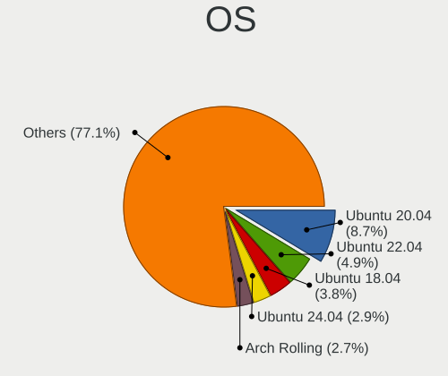

| Name                         | Desktops | Percent |
|------------------------------|----------|---------|
| Ubuntu 20.04                 | 1263     | 8.66%   |
| Ubuntu 22.04                 | 714      | 4.89%   |
| Ubuntu 18.04                 | 549      | 3.76%   |
| Ubuntu 24.04                 | 426      | 2.92%   |
| Arch Rolling                 | 394      | 2.7%    |
| Debian 12                    | 351      | 2.41%   |
| Linux Mint 22.1              | 299      | 2.05%   |
| OpenMandriva 4.3             | 273      | 1.87%   |
| OpenMandriva 4.2             | 273      | 1.87%   |
| Linux Mint 20.3              | 262      | 1.8%    |
| Debian 11                    | 259      | 1.78%   |
| Linux Mint 22.2              | 254      | 1.74%   |
| Pop!_OS 22.04                | 248      | 1.7%    |
| Manjaro                      | 242      | 1.66%   |
| Linux Mint 20.2              | 228      | 1.56%   |
| Zorin 17                     | 198      | 1.36%   |
| Linux Mint 21.2              | 194      | 1.33%   |
| Linux Mint 21.1              | 190      | 1.3%    |
| openSUSE Tumbleweed-XXXXXXXX | 174      | 1.19%   |
| Zorin 16                     | 159      | 1.09%   |
| Linux Mint 21.3              | 154      | 1.06%   |
| Linux Mint 20.1              | 146      | 1%      |
| Ubuntu 21.10                 | 144      | 0.99%   |
| Linux Mint 19.3              | 119      | 0.82%   |
| KDE neon 20.04               | 118      | 0.81%   |
| Arch                         | 116      | 0.8%    |
| Xubuntu 20.04                | 114      | 0.78%   |
| Ubuntu 20.10                 | 114      | 0.78%   |
| Linux Mint 20                | 110      | 0.75%   |
| OpenMandriva 23.08           | 108      | 0.74%   |
| Fedora 42                    | 108      | 0.74%   |
| Linux Mint 22                | 104      | 0.71%   |
| ArcoLinux Rolling            | 104      | 0.71%   |
| EndeavourOS Rolling          | 103      | 0.71%   |
| Ubuntu 21.04                 | 102      | 0.7%    |
| Bazzite 42                   | 99       | 0.68%   |
| Fedora 40                    | 94       | 0.64%   |
| Ubuntu 19.10                 | 93       | 0.64%   |
| OpenMandriva 23.03           | 93       | 0.64%   |
| Fedora 41                    | 93       | 0.64%   |

OS Family
---------

OS without a version

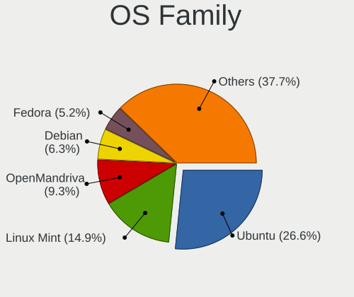

| Name          | Desktops | Percent |
|---------------|----------|---------|
| Ubuntu        | 3563     | 26.61%  |
| Linux Mint    | 1998     | 14.92%  |
| OpenMandriva  | 1243     | 9.28%   |
| Debian        | 842      | 6.29%   |
| Fedora        | 692      | 5.17%   |
| Arch          | 495      | 3.7%    |
| Manjaro       | 448      | 3.35%   |
| Zorin         | 447      | 3.34%   |
| Pop!_OS       | 431      | 3.22%   |
| openSUSE      | 343      | 2.56%   |
| Kubuntu       | 305      | 2.28%   |
| Xubuntu       | 225      | 1.68%   |
| KDE neon      | 193      | 1.44%   |
| ROSA          | 187      | 1.4%    |
| Bazzite       | 184      | 1.37%   |
| Gentoo        | 143      | 1.07%   |
| Nobara        | 132      | 0.99%   |
| LMDE          | 114      | 0.85%   |
| ArcoLinux     | 114      | 0.85%   |
| EndeavourOS   | 111      | 0.83%   |
| CachyOS       | 81       | 0.6%    |
| Ubuntu MATE   | 75       | 0.56%   |
| Elementary    | 75       | 0.56%   |
| BlackPanther  | 67       | 0.5%    |
| Ubuntu Unity  | 64       | 0.48%   |
| NixOS         | 55       | 0.41%   |
| Garuda Linux  | 55       | 0.41%   |
| Lubuntu       | 54       | 0.4%    |
| MX            | 50       | 0.37%   |
| Kali          | 38       | 0.28%   |
| TUXEDO OS     | 37       | 0.28%   |
| Endless       | 37       | 0.28%   |
| Ubuntu Budgie | 29       | 0.22%   |
| CentOS        | 29       | 0.22%   |
| Dts-distro    | 23       | 0.17%   |
| Clear Linux   | 21       | 0.16%   |
| Xero          | 18       | 0.13%   |
| SteamOS       | 18       | 0.13%   |
| Alpine        | 18       | 0.13%   |
| Ubuntu Studio | 16       | 0.12%   |

Kernel
------

Version of the Linux kernel

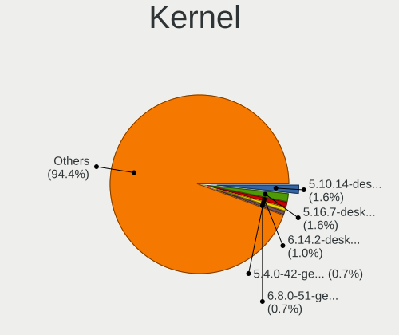

| Version                  | Desktops | Percent |
|--------------------------|----------|---------|
| 5.10.14-desktop-1omv4002 | 272      | 1.63%   |
| 5.16.7-desktop-1omv4003  | 261      | 1.56%   |
| 6.14.2-desktop-3omv2590  | 162      | 0.97%   |
| 5.4.0-42-generic         | 122      | 0.73%   |
| 6.8.0-51-generic         | 116      | 0.69%   |
| 5.4.0-58-generic         | 101      | 0.6%    |
| 6.8.0-52-generic         | 100      | 0.6%    |
| 5.15.0-56-generic        | 99       | 0.59%   |
| 6.4.11-desktop-1omv2390  | 93       | 0.56%   |
| 6.2.6-desktop-1omv2390   | 93       | 0.56%   |
| 6.1.1-desktop-1omv2290   | 86       | 0.51%   |
| 5.15.0-91-generic        | 84       | 0.5%    |
| 6.14.0-33-generic        | 80       | 0.48%   |
| 6.12.1-desktop-1omv2490  | 80       | 0.48%   |
| 5.4.0-52-generic         | 77       | 0.46%   |
| 5.15.0-58-generic        | 74       | 0.44%   |
| 6.8.0-60-generic         | 73       | 0.44%   |
| 6.6.2-desktop-1omv2390   | 73       | 0.44%   |
| 5.4.0-48-generic         | 70       | 0.42%   |
| 5.15.0-48-generic        | 70       | 0.42%   |
| 5.4.0-91-generic         | 66       | 0.39%   |
| 5.4.0-26-generic         | 66       | 0.39%   |
| 5.19.0-35-generic        | 66       | 0.39%   |
| 6.14.0-37-generic        | 63       | 0.38%   |
| 6.14.0-36-generic        | 60       | 0.36%   |
| 5.15.0-60-generic        | 60       | 0.36%   |
| 6.8.0-45-generic         | 58       | 0.35%   |
| 5.4.0-40-generic         | 58       | 0.35%   |
| 5.15.0-52-generic        | 58       | 0.35%   |
| 5.15.0-67-generic        | 56       | 0.33%   |
| 5.11.0-27-generic        | 55       | 0.33%   |
| 6.8.0-79-generic         | 53       | 0.32%   |
| 5.4.0-65-generic         | 53       | 0.32%   |
| 6.9.3-76060903-generic   | 52       | 0.31%   |
| 6.8.0-49-generic         | 52       | 0.31%   |
| 6.5.0-14-generic         | 51       | 0.3%    |
| 5.4.0-54-generic         | 51       | 0.3%    |
| 6.2.0-26-generic         | 50       | 0.3%    |
| 6.10.0-desktop-1omv2490  | 49       | 0.29%   |
| 5.15.0-76-generic        | 49       | 0.29%   |

Kernel Family
-------------

Linux kernel without a distro release

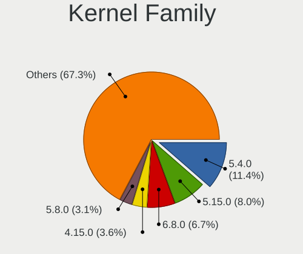

| Version | Desktops | Percent |
|---------|----------|---------|
| 5.4.0   | 1737     | 11.42%  |
| 5.15.0  | 1210     | 7.95%   |
| 6.8.0   | 1014     | 6.67%   |
| 4.15.0  | 548      | 3.6%    |
| 5.8.0   | 468      | 3.08%   |
| 5.11.0  | 446      | 2.93%   |
| 5.13.0  | 427      | 2.81%   |
| 6.14.0  | 413      | 2.71%   |
| 6.1.0   | 381      | 2.5%    |
| 6.5.0   | 356      | 2.34%   |
| 5.19.0  | 327      | 2.15%   |
| 6.2.0   | 289      | 1.9%    |
| 5.3.0   | 275      | 1.81%   |
| 5.10.14 | 274      | 1.8%    |
| 5.16.7  | 265      | 1.74%   |
| 5.10.0  | 250      | 1.64%   |
| 5.0.0   | 203      | 1.33%   |
| 6.11.0  | 199      | 1.31%   |
| 6.14.2  | 183      | 1.2%    |
| 4.18.0  | 148      | 0.97%   |
| 6.2.6   | 135      | 0.89%   |
| 6.4.11  | 97       | 0.64%   |
| 6.12.1  | 95       | 0.62%   |
| 6.1.1   | 95       | 0.62%   |
| 6.6.2   | 86       | 0.57%   |
| 6.17.7  | 75       | 0.49%   |
| 4.19.0  | 73       | 0.48%   |
| 5.14.21 | 69       | 0.45%   |
| 6.9.3   | 65       | 0.43%   |
| 6.16.4  | 65       | 0.43%   |
| 6.10.0  | 54       | 0.35%   |
| 6.4.0   | 47       | 0.31%   |
| 4.18.16 | 47       | 0.31%   |
| 6.12.10 | 44       | 0.29%   |
| 6.17.9  | 39       | 0.26%   |
| 5.3.18  | 39       | 0.26%   |
| 6.14.6  | 36       | 0.24%   |
| 5.14.0  | 36       | 0.24%   |
| 6.17.0  | 35       | 0.23%   |
| 4.4.0   | 34       | 0.22%   |

Kernel Major Ver.
-----------------

Linux kernel major version

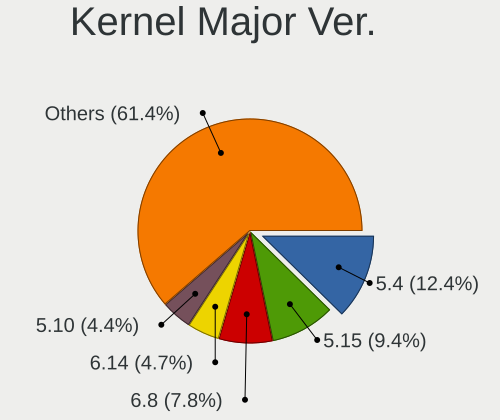

| Version | Desktops | Percent |
|---------|----------|---------|
| 5.4     | 1851     | 12.36%  |
| 5.15    | 1407     | 9.39%   |
| 6.8     | 1162     | 7.76%   |
| 6.14    | 703      | 4.69%   |
| 5.10    | 665      | 4.44%   |
| 6.1     | 658      | 4.39%   |
| 5.8     | 569      | 3.8%    |
| 4.15    | 551      | 3.68%   |
| 5.11    | 547      | 3.65%   |
| 6.5     | 511      | 3.41%   |
| 6.2     | 501      | 3.34%   |
| 5.13    | 495      | 3.3%    |
| 6.12    | 451      | 3.01%   |
| 5.19    | 404      | 2.7%    |
| 5.16    | 366      | 2.44%   |
| 6.6     | 342      | 2.28%   |
| 5.3     | 335      | 2.24%   |
| 6.11    | 326      | 2.18%   |
| 6.4     | 248      | 1.66%   |
| 6.17    | 246      | 1.64%   |
| 5.0     | 213      | 1.42%   |
| 4.18    | 200      | 1.34%   |
| 6.16    | 172      | 1.15%   |
| 6.10    | 169      | 1.13%   |
| 6.9     | 162      | 1.08%   |
| 5.14    | 160      | 1.07%   |
| 6.15    | 141      | 0.94%   |
| 6.0     | 118      | 0.79%   |
| 6.13    | 116      | 0.77%   |
| 5.9     | 114      | 0.76%   |
| 6.7     | 110      | 0.73%   |
| 5.18    | 109      | 0.73%   |
| 5.6     | 102      | 0.68%   |
| 4.9     | 100      | 0.67%   |
| 4.19    | 90       | 0.6%    |
| 5.17    | 86       | 0.57%   |
| 6.3     | 82       | 0.55%   |
| 5.12    | 72       | 0.48%   |
| 5.7     | 67       | 0.45%   |
| 5.5     | 48       | 0.32%   |

Arch
----

OS architecture (x86_64, i586, etc.)

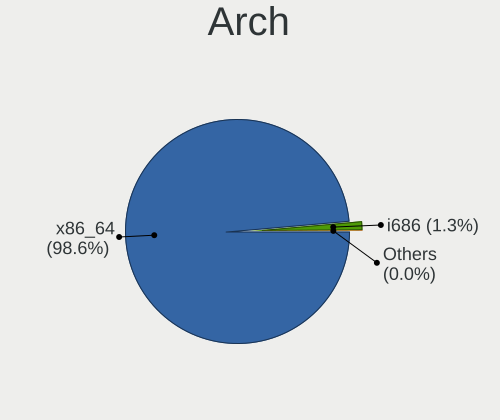

| Name     | Desktops | Percent |
|----------|----------|---------|
| x86_64   | 12572    | 98.6%   |
| i686     | 165      | 1.29%   |
| armv7l   | 4        | 0.03%   |
| ppc      | 2        | 0.02%   |
| i586     | 2        | 0.02%   |
| armv5tel | 2        | 0.02%   |
| riscv64  | 1        | 0.01%   |
| mips     | 1        | 0.01%   |
| aarch64  | 1        | 0.01%   |

DE
--

Desktop Environment

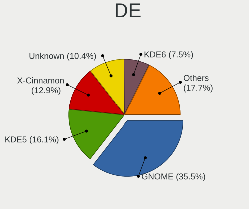

| Name              | Desktops | Percent |
|-------------------|----------|---------|
| GNOME             | 4828     | 35.54%  |
| KDE5              | 2185     | 16.08%  |
| X-Cinnamon        | 1746     | 12.85%  |
| Unknown           | 1411     | 10.39%  |
| KDE6              | 1013     | 7.46%   |
| XFCE              | 823      | 6.06%   |
| MATE              | 356      | 2.62%   |
| KDE               | 296      | 2.18%   |
| Cinnamon          | 130      | 0.96%   |
| LXQt              | 115      | 0.85%   |
| KDE4              | 114      | 0.84%   |
| Pantheon          | 77       | 0.57%   |
| i3                | 69       | 0.51%   |
| Unity             | 62       | 0.46%   |
| Budgie            | 60       | 0.44%   |
| LXDE              | 54       | 0.4%    |
| Hyprland          | 54       | 0.4%    |
| GNOME Classic     | 24       | 0.18%   |
| sway              | 21       | 0.15%   |
| GNOME Flashback   | 21       | 0.15%   |
| Deepin            | 16       | 0.12%   |
| COSMIC            | 12       | 0.09%   |
| awesome           | 10       | 0.07%   |
| icewm             | 9        | 0.07%   |
| Openbox           | 7        | 0.05%   |
| qtile             | 6        | 0.04%   |
| Endless:GNOME     | 6        | 0.04%   |
| chadwm            | 6        | 0.04%   |
| bspwm             | 6        | 0.04%   |
| lightdm-xsession  | 5        | 0.04%   |
| dwm               | 4        | 0.03%   |
| Yaru:ubuntu:GNOME | 3        | 0.02%   |
| xmonad            | 3        | 0.02%   |
| trinity           | 3        | 0.02%   |
| niri              | 3        | 0.02%   |
| herbstluftwm      | 3        | 0.02%   |
| enlightenment     | 3        | 0.02%   |
| sway:wlroots      | 2        | 0.01%   |
| Fluxbox           | 2        | 0.01%   |
| wayfire           | 1        | 0.01%   |

Display Server
--------------

X11 or Wayland

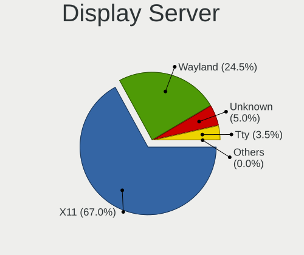

| Name        | Desktops | Percent |
|-------------|----------|---------|
| X11         | 8949     | 67.04%  |
| Wayland     | 3266     | 24.47%  |
| Unknown     | 662      | 4.96%   |
| Tty         | 465      | 3.48%   |
| Web         | 4        | 0.03%   |
| Unspecified | 2        | 0.01%   |

Display Manager
---------------

SDDM, LightDM, etc.

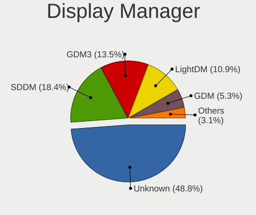

| Name                  | Desktops | Percent |
|-----------------------|----------|---------|
| Unknown               | 6538     | 48.82%  |
| SDDM                  | 2463     | 18.39%  |
| GDM3                  | 1812     | 13.53%  |
| LightDM               | 1464     | 10.93%  |
| GDM                   | 705      | 5.26%   |
| TDM                   | 234      | 1.75%   |
| KDM                   | 96       | 0.72%   |
| SLiM                  | 20       | 0.15%   |
| XDM                   | 17       | 0.13%   |
| GREETD                | 9        | 0.07%   |
| SLIMSKI               | 6        | 0.04%   |
| LXDM                  | 6        | 0.04%   |
| NODM                  | 5        | 0.04%   |
| LY-DM                 | 5        | 0.04%   |
| MDM                   | 4        | 0.03%   |
| WDM                   | 2        | 0.01%   |
| Ly                    | 2        | 0.01%   |
| FLY-DM                | 1        | 0.01%   |
| EMPTTY                | 1        | 0.01%   |
| DISPLAY-MANAGER-START | 1        | 0.01%   |
| COSMIC-GREETER        | 1        | 0.01%   |

OS Lang
-------

Language

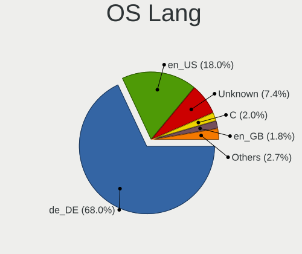

| Lang    | Desktops | Percent |
|---------|----------|---------|
| de_DE   | 8901     | 68%     |
| en_US   | 2360     | 18.03%  |
| Unknown | 973      | 7.43%   |
| C       | 265      | 2.02%   |
| en_GB   | 240      | 1.83%   |
| ru_RU   | 51       | 0.39%   |
| POSIX   | 39       | 0.3%    |
| en_DE   | 27       | 0.21%   |
| pl_PL   | 24       | 0.18%   |
| fr_FR   | 16       | 0.12%   |
| es_ES   | 16       | 0.12%   |
| it_IT   | 15       | 0.11%   |
| hu_HU   | 15       | 0.11%   |
| de_AT   | 15       | 0.11%   |
| C.UTF8  | 15       | 0.11%   |
| en_IE   | 14       | 0.11%   |
| nl_NL   | 10       | 0.08%   |
| de_CH   | 9        | 0.07%   |
| en_CA   | 7        | 0.05%   |
| ro_RO   | 6        | 0.05%   |
| en_DK   | 6        | 0.05%   |
| de_BE   | 6        | 0.05%   |
| el_GR   | 5        | 0.04%   |
| uk_UA   | 4        | 0.03%   |
| cs_CZ   | 4        | 0.03%   |
| UTF-8   | 3        | 0.02%   |
| tr_TR   | 3        | 0.02%   |
| de_IT   | 3        | 0.02%   |
| aa_DJ   | 3        | 0.02%   |
| ru_UA   | 2        | 0.02%   |
| pt_PT   | 2        | 0.02%   |
| hr_HR   | 2        | 0.02%   |
| en_NZ   | 2        | 0.02%   |
| en_BW   | 2        | 0.02%   |
| en_AU   | 2        | 0.02%   |
| de_LI   | 2        | 0.02%   |
| bs_BA   | 2        | 0.02%   |
| bg_BG   | 2        | 0.02%   |
| zh_CN   | 1        | 0.01%   |
| fr_BE   | 1        | 0.01%   |

Boot Mode
---------

EFI or BIOS

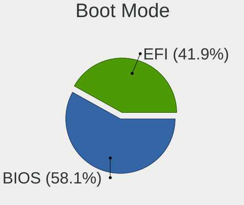

| Mode | Desktops | Percent |
|------|----------|---------|
| BIOS | 7633     | 58.08%  |
| EFI  | 5510     | 41.92%  |

Filesystem
----------

Type of filesystem

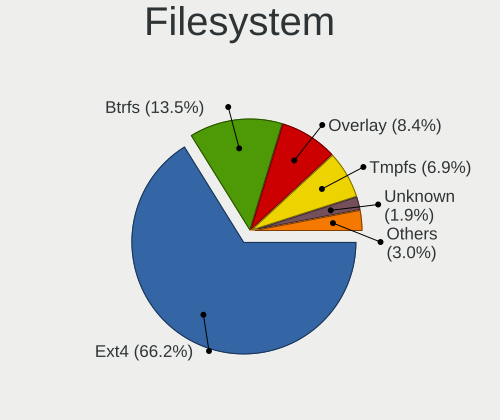

| Type          | Desktops | Percent |
|---------------|----------|---------|
| Ext4          | 8834     | 66.16%  |
| Btrfs         | 1808     | 13.54%  |
| Overlay       | 1125     | 8.43%   |
| Tmpfs         | 924      | 6.92%   |
| Unknown       | 259      | 1.94%   |
| Xfs           | 168      | 1.26%   |
| Zfs           | 109      | 0.82%   |
| Ext2          | 44       | 0.33%   |
| Ext3          | 43       | 0.32%   |
| F2fs          | 17       | 0.13%   |
| Rootfs        | 5        | 0.04%   |
| Reiserfs      | 5        | 0.04%   |
| Aufs          | 3        | 0.02%   |
| XXX4          | 2        | 0.01%   |
| XXXXXXX       | 1        | 0.01%   |
| XXXXX         | 1        | 0.01%   |
| XXXX          | 1        | 0.01%   |
| Ntfs          | 1        | 0.01%   |
| Jfs           | 1        | 0.01%   |
| Fuse.snapfuse | 1        | 0.01%   |
| Bcachefs      | 1        | 0.01%   |

Part. scheme
------------

Scheme of partitioning

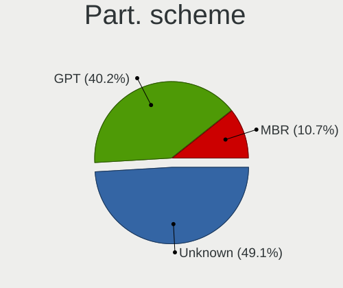

| Type    | Desktops | Percent |
|---------|----------|---------|
| Unknown | 6514     | 49.07%  |
| GPT     | 5341     | 40.23%  |
| MBR     | 1421     | 10.7%   |

Dual Boot with Linux/BSD
------------------------

Hosting more than one Linux/BSD

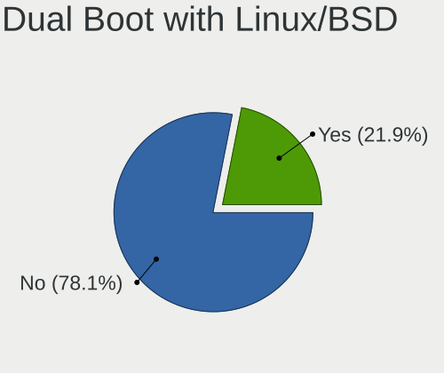

| Dual boot | Desktops | Percent |
|-----------|----------|---------|
| No        | 10330    | 78.1%   |
| Yes       | 2897     | 21.9%   |

Dual Boot (Win)
---------------

Hosting Linux and Windows

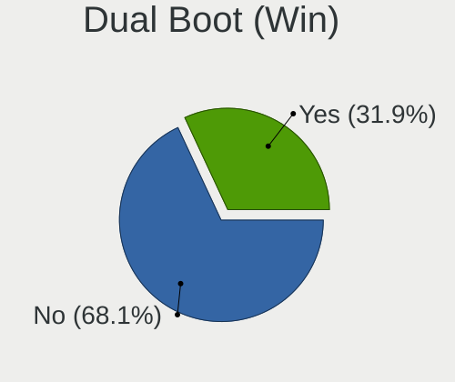

| Dual boot | Desktops | Percent |
|-----------|----------|---------|
| No        | 8930     | 68.05%  |
| Yes       | 4192     | 31.95%  |

Board
-----

Vendor
------

Motherboard manufacturer

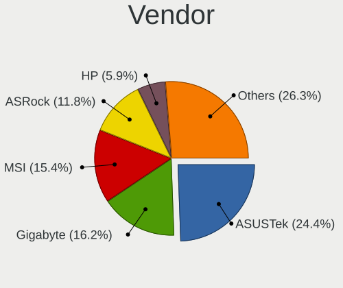

| Name                                 | Desktops | Percent |
|--------------------------------------|----------|---------|
| ASUSTek Computer                     | 3115     | 24.44%  |
| Gigabyte Technology                  | 2062     | 16.18%  |
| MSI                                  | 1963     | 15.4%   |
| ASRock                               | 1502     | 11.78%  |
| Hewlett-Packard                      | 753      | 5.91%   |
| Dell                                 | 579      | 4.54%   |
| Fujitsu                              | 538      | 4.22%   |
| Lenovo                               | 364      | 2.86%   |
| Acer                                 | 258      | 2.02%   |
| Medion                               | 243      | 1.91%   |
| Unknown                              | 183      | 1.44%   |
| Intel                                | 131      | 1.03%   |
| Biostar                              | 119      | 0.93%   |
| Fujitsu Siemens                      | 91       | 0.71%   |
| Foxconn                              | 73       | 0.57%   |
| Shuttle                              | 54       | 0.42%   |
| BESSTAR Tech                         | 51       | 0.4%    |
| Pegatron                             | 45       | 0.35%   |
| Shenzhen Meigao Electronic Equipment | 42       | 0.33%   |
| Packard Bell                         | 40       | 0.31%   |
| ASRockRack                           | 32       | 0.25%   |
| GEEKOM                               | 31       | 0.24%   |
| Inventec                             | 28       | 0.22%   |
| AZW                                  | 28       | 0.22%   |
| Apple                                | 28       | 0.22%   |
| Supermicro                           | 25       | 0.2%    |
| ECS                                  | 25       | 0.2%    |
| AMI                                  | 22       | 0.17%   |
| HC Technology.                       | 16       | 0.13%   |
| AOpen                                | 14       | 0.11%   |
| ZOTAC                                | 13       | 0.1%    |
| PC Engines                           | 12       | 0.09%   |
| Wortmann AG                          | 9        | 0.07%   |
| Hardkernel                           | 9        | 0.07%   |
| Alienware                            | 8        | 0.06%   |
| ABIT                                 | 8        | 0.06%   |
| PELADN                               | 7        | 0.05%   |
| IBM                                  | 7        | 0.05%   |
| EVGA                                 | 7        | 0.05%   |
| eMachines                            | 7        | 0.05%   |

Model
-----

Motherboard model

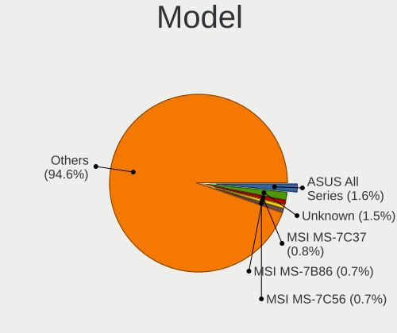

| Name                         | Desktops | Percent |
|------------------------------|----------|---------|
| ASUS All Series              | 200      | 1.57%   |
| Unknown                      | 195      | 1.53%   |
| MSI MS-7C37                  | 104      | 0.82%   |
| MSI MS-7B86                  | 95       | 0.75%   |
| MSI MS-7C56                  | 90       | 0.71%   |
| MSI MS-7A38                  | 67       | 0.53%   |
| ASUS PRIME A320M-K           | 62       | 0.49%   |
| MSI MS-7C91                  | 59       | 0.46%   |
| MSI MS-7C02                  | 55       | 0.43%   |
| ASRock B450M Pro4            | 53       | 0.42%   |
| ASUS ROG STRIX B550-F GAMING | 49       | 0.38%   |
| Gigabyte X570 AORUS ELITE    | 48       | 0.38%   |
| ASUS A0000001                | 48       | 0.38%   |
| MSI MS-7B89                  | 47       | 0.37%   |
| MSI MS-7B79                  | 47       | 0.37%   |
| ASUS PRIME B350-PLUS         | 46       | 0.36%   |
| Dell OptiPlex 7010           | 43       | 0.34%   |
| ASUS PRIME X370-PRO          | 43       | 0.34%   |
| ASUS M5A78L-M/USB3           | 43       | 0.34%   |
| Gigabyte B550 AORUS ELITE V2 | 38       | 0.3%    |
| ASUS A68HM-PLUS              | 38       | 0.3%    |
| Gigabyte 970A-DS3P           | 37       | 0.29%   |
| Dell OptiPlex 790            | 36       | 0.28%   |
| ASUS TUF Gaming B550-PLUS    | 35       | 0.27%   |
| ASRock B450 Pro4             | 34       | 0.27%   |
| MSI MS-7C52                  | 33       | 0.26%   |
| ASUS TUF Gaming X570-PLUS    | 33       | 0.26%   |
| MSI MS-7D75                  | 31       | 0.24%   |
| ASUS PRIME B450-PLUS         | 31       | 0.24%   |
| ASUS M5A97 R2.0              | 31       | 0.24%   |
| Gigabyte B550M DS3H          | 30       | 0.24%   |
| ASUS PRIME X470-PRO          | 30       | 0.24%   |
| MSI MS-7693                  | 29       | 0.23%   |
| Medion MS-7728               | 29       | 0.23%   |
| ASRock 970 Pro3 R2.0         | 29       | 0.23%   |
| MSI MS-7C35                  | 28       | 0.22%   |
| Gigabyte TERRA_PC            | 28       | 0.22%   |
| MSI MS-7817                  | 27       | 0.21%   |
| Dell OptiPlex 780            | 27       | 0.21%   |
| MSI MS-7A34                  | 26       | 0.2%    |

Model Family
------------

Motherboard model prefix

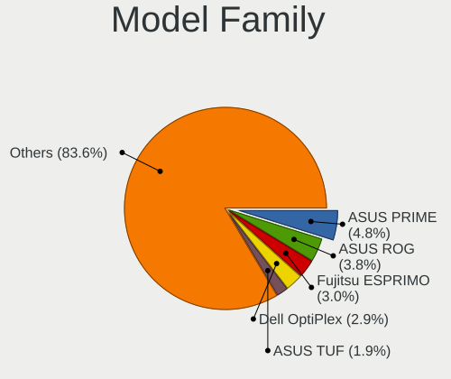

| Name                    | Desktops | Percent |
|-------------------------|----------|---------|
| ASUS PRIME              | 616      | 4.83%   |
| ASUS ROG                | 490      | 3.84%   |
| Fujitsu ESPRIMO         | 380      | 2.98%   |
| Dell OptiPlex           | 367      | 2.88%   |
| ASUS TUF                | 242      | 1.9%    |
| Lenovo ThinkCentre      | 207      | 1.62%   |
| ASUS All                | 200      | 1.57%   |
| Unknown                 | 195      | 1.53%   |
| HP Compaq               | 186      | 1.46%   |
| Acer Aspire             | 156      | 1.22%   |
| HP EliteDesk            | 135      | 1.06%   |
| ASUS M5A78L-M           | 118      | 0.93%   |
| Gigabyte X570           | 115      | 0.9%    |
| Gigabyte B550           | 112      | 0.88%   |
| Dell Precision          | 109      | 0.86%   |
| MSI MS-7C37             | 104      | 0.82%   |
| MSI MS-7B86             | 95       | 0.75%   |
| MSI MS-7C56             | 90       | 0.71%   |
| Gigabyte B450           | 86       | 0.67%   |
| HP ProDesk              | 80       | 0.63%   |
| ASRock B450M            | 74       | 0.58%   |
| ASRock B450             | 73       | 0.57%   |
| MSI MS-7A38             | 67       | 0.53%   |
| ASUS M5A97              | 67       | 0.53%   |
| ASRock 970              | 67       | 0.53%   |
| Gigabyte GA-78LMT-USB3  | 61       | 0.48%   |
| Gigabyte B550M          | 61       | 0.48%   |
| HP Pavilion             | 60       | 0.47%   |
| MSI MS-7C91             | 59       | 0.46%   |
| Gigabyte B450M          | 58       | 0.46%   |
| Lenovo IdeaCentre       | 56       | 0.44%   |
| MSI MS-7C02             | 55       | 0.43%   |
| Fujitsu CELSIUS         | 55       | 0.43%   |
| Lenovo ThinkStation     | 49       | 0.38%   |
| ASUS A0000001           | 48       | 0.38%   |
| ASRock X570             | 48       | 0.38%   |
| Acer Veriton            | 48       | 0.38%   |
| MSI MS-7B89             | 47       | 0.37%   |
| MSI MS-7B79             | 47       | 0.37%   |
| Fujitsu Siemens ESPRIMO | 46       | 0.36%   |

MFG Year
--------

Motherboard manufacture year

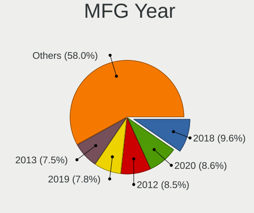

| Year    | Desktops | Percent |
|---------|----------|---------|
| 2018    | 1229     | 9.64%   |
| 2020    | 1091     | 8.56%   |
| 2012    | 1087     | 8.53%   |
| 2019    | 990      | 7.77%   |
| 2013    | 952      | 7.47%   |
| 2011    | 790      | 6.2%    |
| 2017    | 788      | 6.18%   |
| 2014    | 784      | 6.15%   |
| 2010    | 614      | 4.82%   |
| 2022    | 610      | 4.79%   |
| 2015    | 584      | 4.58%   |
| 2021    | 563      | 4.42%   |
| 2009    | 553      | 4.34%   |
| 2016    | 481      | 3.77%   |
| 2023    | 425      | 3.33%   |
| 2008    | 361      | 2.83%   |
| 2024    | 294      | 2.31%   |
| 2007    | 242      | 1.9%    |
| 2006    | 120      | 0.94%   |
| 2025    | 79       | 0.62%   |
| 2005    | 50       | 0.39%   |
| Unknown | 23       | 0.18%   |
| 2004    | 17       | 0.13%   |
| 2003    | 11       | 0.09%   |
| 2002    | 4        | 0.03%   |
| 2000    | 4        | 0.03%   |
| 2001    | 1        | 0.01%   |

Form Factor
-----------

Physical design of the computer

| Name    | Desktops | Percent |
|---------|----------|---------|
| Desktop | 12747    | 100%    |

Secure Boot
-----------

Enabled or disabled

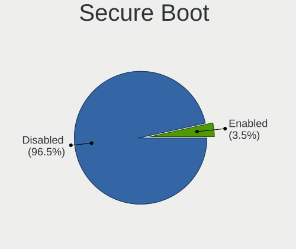

| State    | Desktops | Percent |
|----------|----------|---------|
| Disabled | 12381    | 96.53%  |
| Enabled  | 445      | 3.47%   |

Coreboot
--------

Have coreboot on board

| Used | Desktops | Percent |
|------|----------|---------|
| No   | 12723    | 99.81%  |
| Yes  | 24       | 0.19%   |

RAM Size
--------

Total RAM memory

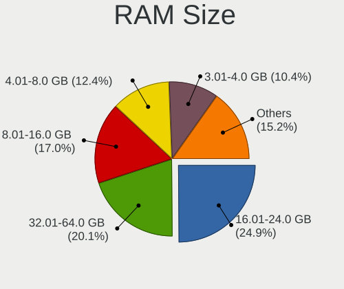

| Size in GB      | Desktops | Percent |
|-----------------|----------|---------|
| 16.01-24.0      | 3264     | 24.89%  |
| 32.01-64.0      | 2630     | 20.05%  |
| 8.01-16.0       | 2231     | 17.01%  |
| 4.01-8.0        | 1631     | 12.44%  |
| 3.01-4.0        | 1366     | 10.41%  |
| 64.01-256.0     | 1027     | 7.83%   |
| 24.01-32.0      | 618      | 4.71%   |
| 1.01-2.0        | 189      | 1.44%   |
| 2.01-3.0        | 98       | 0.75%   |
| 0.51-1.0        | 31       | 0.24%   |
| More than 256.0 | 19       | 0.14%   |
| 0.01-0.5        | 10       | 0.08%   |
| Unknown         | 2        | 0.02%   |

RAM Used
--------

Used RAM memory

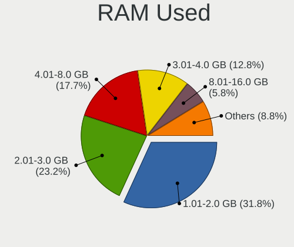

| Used GB     | Desktops | Percent |
|-------------|----------|---------|
| 1.01-2.0    | 4689     | 31.84%  |
| 2.01-3.0    | 3417     | 23.2%   |
| 4.01-8.0    | 2603     | 17.67%  |
| 3.01-4.0    | 1880     | 12.76%  |
| 8.01-16.0   | 850      | 5.77%   |
| 0.51-1.0    | 793      | 5.38%   |
| 16.01-24.0  | 173      | 1.17%   |
| 0.01-0.5    | 173      | 1.17%   |
| 32.01-64.0  | 63       | 0.43%   |
| 24.01-32.0  | 62       | 0.42%   |
| 64.01-256.0 | 18       | 0.12%   |
| 0           | 5        | 0.03%   |
| Unknown     | 2        | 0.01%   |

Total Drives
------------

Number of drives on board

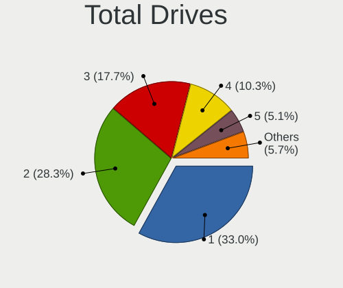

| Drives  | Desktops | Percent |
|---------|----------|---------|
| 1       | 4490     | 33.04%  |
| 2       | 3843     | 28.28%  |
| 3       | 2400     | 17.66%  |
| 4       | 1398     | 10.29%  |
| 5       | 687      | 5.05%   |
| 6       | 331      | 2.44%   |
| 7       | 160      | 1.18%   |
| 0       | 116      | 0.85%   |
| 8       | 73       | 0.54%   |
| 9       | 37       | 0.27%   |
| 10      | 19       | 0.14%   |
| 12      | 9        | 0.07%   |
| 11      | 8        | 0.06%   |
| 13      | 5        | 0.04%   |
| Unknown | 4        | 0.03%   |
| 17      | 3        | 0.02%   |
| 14      | 2        | 0.01%   |
| 32      | 1        | 0.01%   |
| 29      | 1        | 0.01%   |
| 23      | 1        | 0.01%   |
| 22      | 1        | 0.01%   |
| 20      | 1        | 0.01%   |
| 16      | 1        | 0.01%   |

Has CD-ROM
----------

Has CD-ROM on board

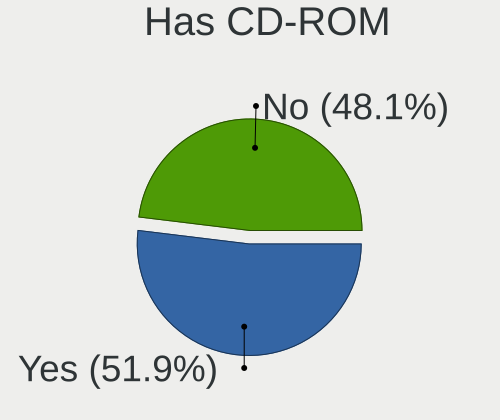

| Presented | Desktops | Percent |
|-----------|----------|---------|
| Yes       | 6727     | 51.93%  |
| No        | 6228     | 48.07%  |

Has Ethernet
------------

Has Ethernet on board

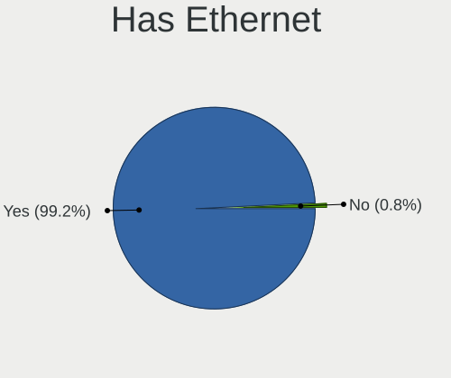

| Presented | Desktops | Percent |
|-----------|----------|---------|
| Yes       | 12650    | 99.22%  |
| No        | 100      | 0.78%   |

Has WiFi
--------

Has WiFi module

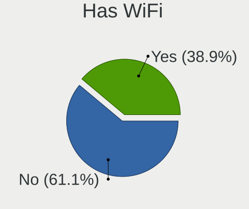

| Presented | Desktops | Percent |
|-----------|----------|---------|
| No        | 7932     | 61.09%  |
| Yes       | 5053     | 38.91%  |

Has Bluetooth
-------------

Has Bluetooth module

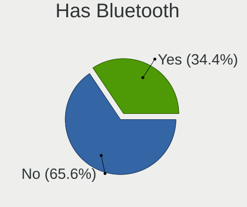

| Presented | Desktops | Percent |
|-----------|----------|---------|
| No        | 8537     | 65.6%   |
| Yes       | 4477     | 34.4%   |

Location
--------

Country
-------

Geographic location (country)

| Country | Desktops | Percent |
|---------|----------|---------|
| Germany | 12747    | 100%    |

City
----

Geographic location (city)

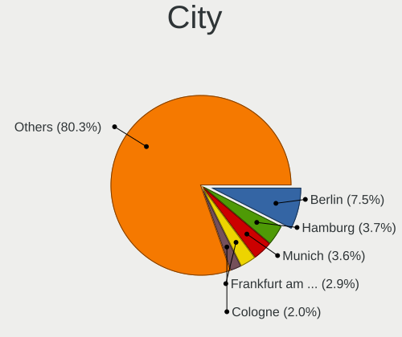

| City                  | Desktops | Percent |
|-----------------------|----------|---------|
| Berlin                | 1049     | 7.51%   |
| Hamburg               | 515      | 3.68%   |
| Munich                | 504      | 3.61%   |
| Frankfurt am Main     | 405      | 2.9%    |
| Cologne               | 278      | 1.99%   |
| Stuttgart             | 237      | 1.7%    |
| Leipzig               | 206      | 1.47%   |
| Düsseldorf           | 163      | 1.17%   |
| Nuremberg             | 159      | 1.14%   |
| Essen                 | 158      | 1.13%   |
| Dresden               | 140      | 1%      |
| Hanover               | 139      | 0.99%   |
| Mannheim              | 123      | 0.88%   |
| Dortmund              | 121      | 0.87%   |
| Karlsruhe             | 119      | 0.85%   |
| Bremen                | 103      | 0.74%   |
| Bonn                  | 95       | 0.68%   |
| Duisburg              | 87       | 0.62%   |
| Falkenstein           | 80       | 0.57%   |
| Wuppertal             | 74       | 0.53%   |
| Darmstadt             | 72       | 0.52%   |
| Augsburg              | 72       | 0.52%   |
| Bochum                | 69       | 0.49%   |
| Mainz                 | 67       | 0.48%   |
| Reutlingen            | 65       | 0.47%   |
| Chemnitz              | 65       | 0.47%   |
| Bielefeld             | 61       | 0.44%   |
| Braunschweig          | 59       | 0.42%   |
| Aachen                | 58       | 0.41%   |
| Wiesbaden             | 57       | 0.41%   |
| Halle                 | 57       | 0.41%   |
| Regensburg            | 55       | 0.39%   |
| Münster              | 55       | 0.39%   |
| Ludwigshafen am Rhein | 54       | 0.39%   |
| Kiel                  | 51       | 0.36%   |
| Heidelberg            | 51       | 0.36%   |
| Freiburg im Breisgau  | 51       | 0.36%   |
| Krefeld               | 48       | 0.34%   |
| Gelsenkirchen         | 45       | 0.32%   |
| Saarbrücken          | 43       | 0.31%   |

Drives
------

Drive Vendor
------------

Hard drive vendors

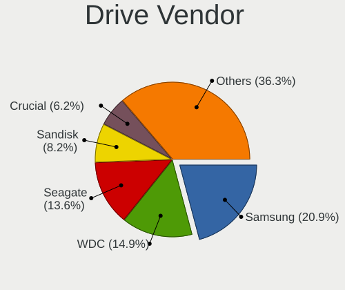

| Vendor                       | Desktops | Drives | Percent |
|------------------------------|----------|--------|---------|
| Samsung Electronics          | 5184     | 10325  | 20.87%  |
| WDC                          | 3701     | 6851   | 14.9%   |
| Seagate                      | 3384     | 5923   | 13.63%  |
| Sandisk                      | 2027     | 3296   | 8.16%   |
| Crucial                      | 1535     | 2372   | 6.18%   |
| Toshiba                      | 1222     | 1991   | 4.92%   |
| Intenso                      | 911      | 1364   | 3.67%   |
| Kingston                     | 881      | 1260   | 3.55%   |
| Hitachi                      | 637      | 935    | 2.56%   |
| Micron/Crucial Technology    | 372      | 577    | 1.5%    |
| Unknown                      | 338      | 758    | 1.36%   |
| Intel                        | 299      | 406    | 1.2%    |
| A-DATA Technology            | 209      | 289    | 0.84%   |
| Phison Electronics           | 196      | 268    | 0.79%   |
| Micron Technology            | 195      | 260    | 0.79%   |
| HGST                         | 192      | 334    | 0.77%   |
| Kingston Technology Company  | 180      | 257    | 0.72%   |
| OCZ                          | 161      | 215    | 0.65%   |
| Phison                       | 156      | 242    | 0.63%   |
| China                        | 133      | 164    | 0.54%   |
| SK hynix                     | 131      | 167    | 0.53%   |
| Transcend                    | 121      | 183    | 0.49%   |
| Patriot                      | 112      | 160    | 0.45%   |
| Silicon Motion               | 109      | 161    | 0.44%   |
| MAXIO Technology (Hangzhou)  | 105      | 152    | 0.42%   |
| Maxtor                       | 97       | 148    | 0.39%   |
| SPCC                         | 95       | 137    | 0.38%   |
| Corsair                      | 95       | 123    | 0.38%   |
| Shenzhen Longsys Electronics | 89       | 127    | 0.36%   |
| Verbatim                     | 82       | 132    | 0.33%   |
| Unknown                      | 79       | 106    | 0.32%   |
| JMicron Technology           | 73       | 92     | 0.29%   |
| ASMT                         | 73       | 103    | 0.29%   |
| ADATA Technology             | 64       | 81     | 0.26%   |
| PNY                          | 56       | 121    | 0.23%   |
| Leven                        | 55       | 75     | 0.22%   |
| Fanxiang                     | 48       | 71     | 0.19%   |
| Netac                        | 46       | 61     | 0.19%   |
| Lexar                        | 44       | 50     | 0.18%   |
| Hewlett-Packard              | 44       | 71     | 0.18%   |

Drive Model
-----------

Hard drive models

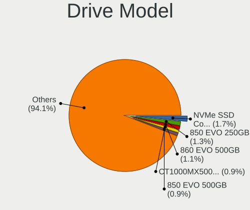

| Model                                                | Desktops | Percent |
|------------------------------------------------------|----------|---------|
| Samsung NVMe SSD Controller SM981/PM981/PM983 1TB    | 492      | 1.65%   |
| Samsung SSD 850 EVO 250GB                            | 385      | 1.29%   |
| Samsung SSD 860 EVO 500GB                            | 336      | 1.13%   |
| Crucial CT1000MX500SSD1 1TB                          | 277      | 0.93%   |
| Samsung SSD 850 EVO 500GB                            | 270      | 0.91%   |
| Samsung NVMe SSD Controller PM9A1/PM9A3/980PRO 1TB   | 264      | 0.89%   |
| Crucial CT500MX500SSD1 500GB                         | 238      | 0.8%    |
| Samsung SSD 860 EVO 1TB                              | 232      | 0.78%   |
| Toshiba DT01ACA100 1TB                               | 208      | 0.7%    |
| Seagate ST500DM002-1BD142 500GB                      | 199      | 0.67%   |
| SanDisk SSD PLUS 1000GB                              | 164      | 0.55%   |
| Samsung SSD 840 EVO 250GB                            | 160      | 0.54%   |
| Micron/Crucial P2 NVMe PCIe SSD 2TB                  | 159      | 0.53%   |
| Toshiba HDWD110 1TB                                  | 157      | 0.53%   |
| Seagate ST2000DM008-2FR102 2TB                       | 157      | 0.53%   |
| Samsung SSD 860 EVO 250GB                            | 151      | 0.51%   |
| Seagate ST1000DM010-2EP102 1TB                       | 144      | 0.48%   |
| SanDisk SSD PLUS 240GB                               | 141      | 0.47%   |
| Samsung SSD 870 QVO 1TB                              | 131      | 0.44%   |
| WDC WD10EZEX-08WN4A0 1TB                             | 128      | 0.43%   |
| Samsung SSD 980 1TB                                  | 128      | 0.43%   |
| Samsung NVMe SSD Drive 500GB                         | 127      | 0.43%   |
| Seagate ST4000DM004-2CV104 4TB                       | 126      | 0.42%   |
| Crucial CT240BX500SSD1 240GB                         | 126      | 0.42%   |
| Samsung SSD 840 EVO 120GB                            | 124      | 0.42%   |
| Unknown SD/MMC/MS PRO 2GB                            | 120      | 0.4%    |
| SanDisk SSD PLUS 480GB                               | 120      | 0.4%    |
| Toshiba DT01ACA200 2TB                               | 119      | 0.4%    |
| WDC WD20EZRZ-00Z5HB0 2TB                             | 117      | 0.39%   |
| Samsung SSD 870 EVO 1TB                              | 114      | 0.38%   |
| Crucial CT2000MX500SSD1 2TB                          | 111      | 0.37%   |
| Seagate ST1000DM003-1CH162 1TB                       | 110      | 0.37%   |
| Samsung SSD 970 EVO Plus 1TB                         | 109      | 0.37%   |
| Samsung SSD 860 QVO 1TB                              | 107      | 0.36%   |
| Samsung NVMe SSD Controller SM961/PM961/SM963 1024GB | 106      | 0.36%   |
| Samsung NVMe SSD Drive 1TB                           | 105      | 0.35%   |
| Seagate ST2000DM001-1ER164 2TB                       | 102      | 0.34%   |
| Unknown Compact Flash 977MB                          | 101      | 0.34%   |
| Kingston SA400S37240G 240GB SSD                      | 100      | 0.34%   |
| WDC WD40EZRZ-00GXCB0 4TB                             | 96       | 0.32%   |

HDD Vendor
----------

Hard disk drive vendors

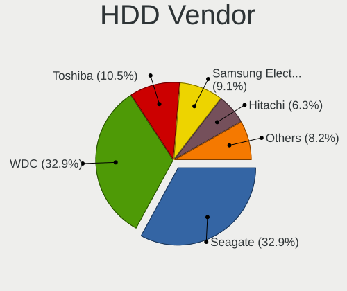

| Vendor              | Desktops | Drives | Percent |
|---------------------|----------|--------|---------|
| Seagate             | 3311     | 5799   | 32.92%  |
| WDC                 | 3306     | 6085   | 32.87%  |
| Toshiba             | 1058     | 1751   | 10.52%  |
| Samsung Electronics | 919      | 1455   | 9.14%   |
| Hitachi             | 637      | 935    | 6.33%   |
| HGST                | 192      | 334    | 1.91%   |
| Unknown             | 127      | 175    | 1.26%   |
| Intenso             | 111      | 175    | 1.1%    |
| Maxtor              | 95       | 143    | 0.94%   |
| JMicron Technology  | 49       | 63     | 0.49%   |
| Fujitsu             | 28       | 40     | 0.28%   |
| ASMT                | 27       | 45     | 0.27%   |
| ExcelStor           | 16       | 19     | 0.16%   |
| WD MediaMax         | 14       | 21     | 0.14%   |
| USB3.0              | 13       | 15     | 0.13%   |
| Apple               | 13       | 14     | 0.13%   |
| Hewlett-Packard     | 12       | 20     | 0.12%   |
| TO Exter            | 10       | 14     | 0.1%    |
| ASMedia             | 9        | 9      | 0.09%   |
| SSK                 | 7        | 9      | 0.07%   |
| Inateck             | 7        | 7      | 0.07%   |
| HGST HTS            | 5        | 5      | 0.05%   |
| USB                 | 4        | 5      | 0.04%   |
| SABRENT             | 4        | 24     | 0.04%   |
| IBM                 | 4        | 8      | 0.04%   |
| External            | 4        | 4      | 0.04%   |
| Dell                | 4        | 8      | 0.04%   |
| MDT                 | 3        | 3      | 0.03%   |
| Maxone              | 3        | 4      | 0.03%   |
| LaCie               | 3        | 3      | 0.03%   |
| IBM/Hitachi         | 3        | 3      | 0.03%   |
| IB-377U3            | 3        | 3      | 0.03%   |
| HPE                 | 3        | 7      | 0.03%   |
| China               | 3        | 4      | 0.03%   |
| ASM                 | 3        | 29     | 0.03%   |
| Quantum             | 2        | 2      | 0.02%   |
| MARVELL             | 2        | 2      | 0.02%   |
| Magnetic Data       | 2        | 3      | 0.02%   |
| LIO-ORG             | 2        | 3      | 0.02%   |
| KESU                | 2        | 2      | 0.02%   |

SSD Vendor
----------

Solid state drive vendors

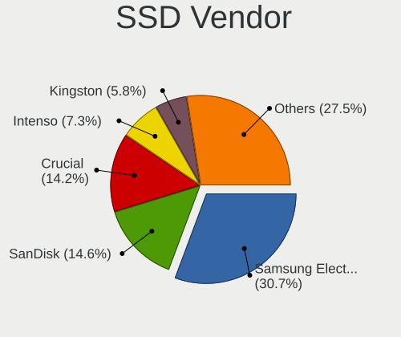

| Vendor              | Desktops | Drives | Percent |
|---------------------|----------|--------|---------|
| Samsung Electronics | 3006     | 5081   | 30.69%  |
| SanDisk             | 1426     | 2296   | 14.56%  |
| Crucial             | 1391     | 2139   | 14.2%   |
| Intenso             | 716      | 1032   | 7.31%   |
| Kingston            | 564      | 803    | 5.76%   |
| WDC                 | 400      | 585    | 4.08%   |
| A-DATA Technology   | 175      | 239    | 1.79%   |
| Intel               | 167      | 229    | 1.7%    |
| OCZ                 | 157      | 207    | 1.6%    |
| Toshiba             | 126      | 163    | 1.29%   |
| China               | 126      | 156    | 1.29%   |
| Micron Technology   | 119      | 160    | 1.21%   |
| Transcend           | 96       | 145    | 0.98%   |
| Patriot             | 93       | 136    | 0.95%   |
| SPCC                | 82       | 117    | 0.84%   |
| Verbatim            | 75       | 125    | 0.77%   |
| Leven               | 55       | 75     | 0.56%   |
| Unknown             | 55       | 75     | 0.56%   |
| Corsair             | 49       | 68     | 0.5%    |
| SK hynix            | 47       | 57     | 0.48%   |
| PNY                 | 44       | 104    | 0.45%   |
| Emtec               | 39       | 45     | 0.4%    |
| Apacer              | 39       | 44     | 0.4%    |
| Netac               | 38       | 52     | 0.39%   |
| ASMT                | 38       | 49     | 0.39%   |
| Fanxiang            | 37       | 55     | 0.38%   |
| SABRENT             | 33       | 40     | 0.34%   |
| SD                  | 29       | 62     | 0.3%    |
| LITEON              | 27       | 33     | 0.28%   |
| INNOVATION IT       | 25       | 38     | 0.26%   |
| Hewlett-Packard     | 24       | 36     | 0.25%   |
| Seagate             | 23       | 27     | 0.23%   |
| Team                | 22       | 30     | 0.22%   |
| LITEONIT            | 20       | 24     | 0.2%    |
| GOODRAM             | 19       | 25     | 0.19%   |
| Plextor             | 18       | 21     | 0.18%   |
| Mushkin             | 18       | 32     | 0.18%   |
| KingSpec            | 18       | 24     | 0.18%   |
| KingDian            | 17       | 22     | 0.17%   |
| Phison              | 16       | 54     | 0.16%   |

Drive Kind
----------

HDD or SSD

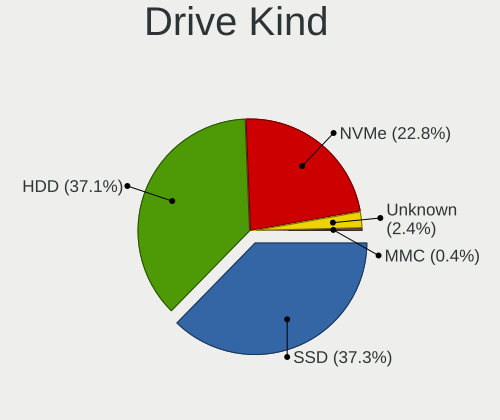

| Kind    | Desktops | Drives | Percent |
|---------|----------|--------|---------|
| SSD     | 7649     | 15142  | 37.32%  |
| HDD     | 7595     | 17296  | 37.05%  |
| NVMe    | 4680     | 8692   | 22.83%  |
| Unknown | 489      | 927    | 2.39%   |
| MMC     | 84       | 113    | 0.41%   |

Drive Connector
---------------

SATA, SAS, NVMe, etc.

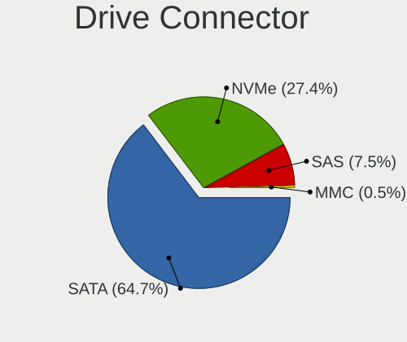

| Type | Desktops | Drives | Percent |
|------|----------|--------|---------|
| SATA | 11019    | 31054  | 64.65%  |
| NVMe | 4668     | 8592   | 27.39%  |
| SAS  | 1273     | 2411   | 7.47%   |
| MMC  | 84       | 113    | 0.49%   |

Drive Size
----------

Size of hard drive

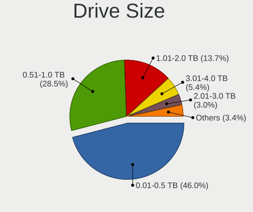

| Size in TB | Desktops | Drives | Percent |
|------------|----------|--------|---------|
| 0.01-0.5   | 7887     | 15431  | 45.95%  |
| 0.51-1.0   | 4888     | 8674   | 28.48%  |
| 1.01-2.0   | 2358     | 4294   | 13.74%  |
| 3.01-4.0   | 929      | 1771   | 5.41%   |
| 2.01-3.0   | 516      | 937    | 3.01%   |
| 4.01-10.0  | 440      | 1025   | 2.56%   |
| 10.01-20.0 | 134      | 288    | 0.78%   |
| 20.01-50.0 | 9        | 15     | 0.05%   |
| 0          | 3        | 3      | 0.02%   |

Space Total
-----------

Amount of disk space available on the file system

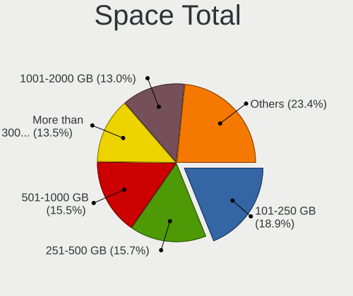

| Size in GB     | Desktops | Percent |
|----------------|----------|---------|
| 101-250        | 2660     | 18.9%   |
| 251-500        | 2216     | 15.75%  |
| 501-1000       | 2188     | 15.55%  |
| More than 3000 | 1894     | 13.46%  |
| 1001-2000      | 1825     | 12.97%  |
| 1-20           | 947      | 6.73%   |
| 2001-3000      | 881      | 6.26%   |
| Unknown        | 610      | 4.33%   |
| 51-100         | 576      | 4.09%   |
| 21-50          | 275      | 1.95%   |

Space Used
----------

Amount of used disk space

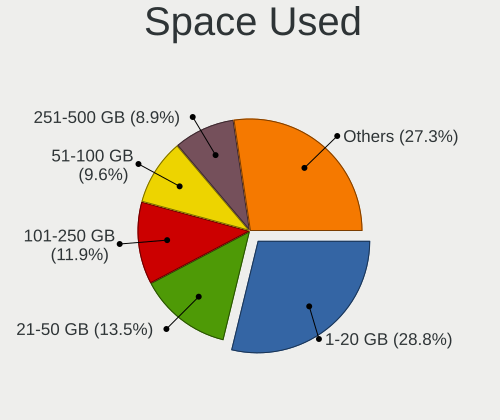

| Used GB        | Desktops | Percent |
|----------------|----------|---------|
| 1-20           | 4218     | 28.8%   |
| 21-50          | 1977     | 13.5%   |
| 101-250        | 1744     | 11.91%  |
| 51-100         | 1404     | 9.59%   |
| 251-500        | 1298     | 8.86%   |
| 501-1000       | 1274     | 8.7%    |
| 1001-2000      | 1004     | 6.86%   |
| More than 3000 | 669      | 4.57%   |
| Unknown        | 610      | 4.16%   |
| 2001-3000      | 428      | 2.92%   |
| 0              | 20       | 0.14%   |

Malfunc. Drives
---------------

Drive models with a malfunction

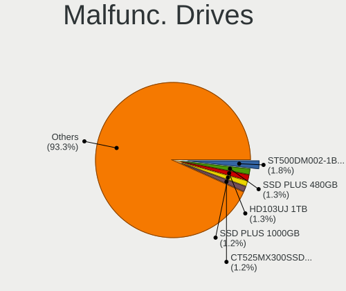

| Model                                                         | Desktops | Drives | Percent |
|---------------------------------------------------------------|----------|--------|---------|
| Seagate ST500DM002-1BD142 500GB                               | 25       | 52     | 1.77%   |
| SanDisk SSD PLUS 480GB                                        | 18       | 22     | 1.27%   |
| Samsung Electronics HD103UJ 1TB                               | 18       | 21     | 1.27%   |
| SanDisk SSD PLUS 1000GB                                       | 17       | 18     | 1.2%    |
| Crucial CT525MX300SSD1 528GB                                  | 17       | 19     | 1.2%    |
| WDC WD20EFRX-68EUZN0 2TB                                      | 15       | 22     | 1.06%   |
| Seagate ST31000528AS 1TB                                      | 13       | 16     | 0.92%   |
| Samsung Electronics HD103SI 1TB                               | 13       | 17     | 0.92%   |
| WDC WD20EARS-00MVWB0 2TB                                      | 12       | 16     | 0.85%   |
| WDC WD10EARS-00Y5B1 1TB                                       | 12       | 15     | 0.85%   |
| SanDisk SSD PLUS 240GB                                        | 12       | 16     | 0.85%   |
| WDC WD30EFRX-68EUZN0 3TB                                      | 11       | 14     | 0.78%   |
| Samsung Electronics HD501LJ 500GB                             | 11       | 30     | 0.78%   |
| WDC WD5000AAKS-007AA0 500GB                                   | 10       | 34     | 0.71%   |
| WDC WD20EARX-00PASB0 2TB                                      | 10       | 11     | 0.71%   |
| Seagate ST3500418AS 500GB                                     | 10       | 11     | 0.71%   |
| Samsung Electronics SP2504C 250GB                             | 10       | 12     | 0.71%   |
| Kingston SV300S37A120G 120GB SSD                              | 10       | 12     | 0.71%   |
| Seagate ST2000DM001-1CH164 2TB                                | 9        | 10     | 0.64%   |
| Samsung Electronics NVMe SSD Controller SM981/PM981/PM983 1TB | 9        | 10     | 0.64%   |
| Samsung Electronics HD502IJ 500GB                             | 9        | 11     | 0.64%   |
| WDC WDS240G2G0A-00JH30 240GB SSD                              | 8        | 10     | 0.56%   |
| WDC WD20EZRZ-00Z5HB0 2TB                                      | 8        | 14     | 0.56%   |
| Seagate ST1000DM003-9YN162 1TB                                | 8        | 12     | 0.56%   |
| Seagate ST1000DM003-1CH162 1TB                                | 8        | 10     | 0.56%   |
| Samsung Electronics HD154UI 1TB                               | 8        | 12     | 0.56%   |
| WDC WD10EADS-00L5B1 1TB                                       | 7        | 7      | 0.49%   |
| Seagate ST31000524AS 1TB                                      | 7        | 8      | 0.49%   |
| Seagate ST2000DL003-9VT166 2TB                                | 7        | 7      | 0.49%   |
| Seagate ST1000DM010-2EP102 1TB                                | 7        | 9      | 0.49%   |
| Samsung Electronics SSD 870 EVO 500GB                         | 7        | 7      | 0.49%   |
| Samsung Electronics SSD 870 EVO 1TB                           | 7        | 10     | 0.49%   |
| Samsung Electronics HD753LJ 752GB                             | 7        | 8      | 0.49%   |
| WDC WD5000AADS-00S9B0 500GB                                   | 6        | 7      | 0.42%   |
| WDC WD40EFRX-68N32N0 4TB                                      | 6        | 10     | 0.42%   |
| Toshiba DT01ACA100 1TB                                        | 6        | 10     | 0.42%   |
| Seagate ST9500325AS 500GB                                     | 6        | 8      | 0.42%   |
| Seagate ST3500413AS 500GB                                     | 6        | 9      | 0.42%   |
| Seagate ST3250410AS 250GB                                     | 6        | 7      | 0.42%   |
| Seagate ST2000DM001-1ER164 2TB                                | 6        | 6      | 0.42%   |

Malfunc. Drive Vendor
---------------------

Vendors of faulty drives

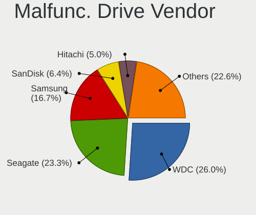

| Vendor                | Desktops | Drives | Percent |
|-----------------------|----------|--------|---------|
| WDC                   | 356      | 522    | 26.02%  |
| Seagate               | 319      | 430    | 23.32%  |
| Samsung Electronics   | 228      | 303    | 16.67%  |
| SanDisk               | 87       | 108    | 6.36%   |
| Hitachi               | 69       | 88     | 5.04%   |
| Toshiba               | 49       | 59     | 3.58%   |
| Crucial               | 49       | 69     | 3.58%   |
| Intenso               | 28       | 31     | 2.05%   |
| Intel                 | 25       | 26     | 1.83%   |
| Maxtor                | 21       | 36     | 1.54%   |
| Kingston              | 16       | 19     | 1.17%   |
| HGST                  | 14       | 16     | 1.02%   |
| A-DATA Technology     | 14       | 17     | 1.02%   |
| Micron Technology     | 9        | 10     | 0.66%   |
| Transcend             | 8        | 10     | 0.58%   |
| OCZ                   | 5        | 7      | 0.37%   |
| WD MediaMax           | 4        | 4      | 0.29%   |
| SK hynix              | 4        | 5      | 0.29%   |
| IBM                   | 4        | 7      | 0.29%   |
| ASMT                  | 4        | 5      | 0.29%   |
| Apple                 | 4        | 5      | 0.29%   |
| SPCC                  | 3        | 3      | 0.22%   |
| Plextor               | 3        | 3      | 0.22%   |
| MDT                   | 3        | 3      | 0.22%   |
| Corsair               | 3        | 3      | 0.22%   |
| ADATA Technology      | 3        | 3      | 0.22%   |
| XPG                   | 2        | 2      | 0.15%   |
| USB3.0                | 2        | 2      | 0.15%   |
| SD                    | 2        | 2      | 0.15%   |
| Realtek Semiconductor | 2        | 2      | 0.15%   |
| Patriot               | 2        | 2      | 0.15%   |
| INNOVATION IT         | 2        | 3      | 0.15%   |
| Hewlett-Packard       | 2        | 2      | 0.15%   |
| Fujitsu               | 2        | 4      | 0.15%   |
| ExcelStor             | 2        | 2      | 0.15%   |
| ASMedia               | 2        | 2      | 0.15%   |
| Verbatim              | 1        | 2      | 0.07%   |
| Unknown               | 1        | 1      | 0.07%   |
| TrekStor              | 1        | 1      | 0.07%   |
| TO Exter              | 1        | 1      | 0.07%   |

Malfunc. HDD Vendor
-------------------

Vendors of faulty HDD drives

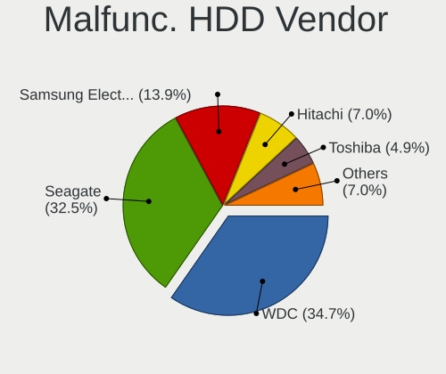

| Vendor              | Desktops | Drives | Percent |
|---------------------|----------|--------|---------|
| WDC                 | 341      | 502    | 34.69%  |
| Seagate             | 319      | 430    | 32.45%  |
| Samsung Electronics | 137      | 193    | 13.94%  |
| Hitachi             | 69       | 88     | 7.02%   |
| Toshiba             | 48       | 58     | 4.88%   |
| Maxtor              | 21       | 36     | 2.14%   |
| HGST                | 14       | 16     | 1.42%   |
| WD MediaMax         | 4        | 4      | 0.41%   |
| IBM                 | 4        | 7      | 0.41%   |
| Apple               | 4        | 5      | 0.41%   |
| MDT                 | 3        | 3      | 0.31%   |
| Intenso             | 3        | 3      | 0.31%   |
| ASMT                | 3        | 4      | 0.31%   |
| USB3.0              | 2        | 2      | 0.2%    |
| Hewlett-Packard     | 2        | 2      | 0.2%    |
| Fujitsu             | 2        | 4      | 0.2%    |
| ExcelStor           | 2        | 2      | 0.2%    |
| Unknown             | 1        | 1      | 0.1%    |
| TO Exter            | 1        | 1      | 0.1%    |
| IBM/Hitachi         | 1        | 1      | 0.1%    |
| IB                  | 1        | 1      | 0.1%    |
| ASMedia             | 1        | 1      | 0.1%    |

Malfunc. Drive Kind
-------------------

Kinds of faulty drives

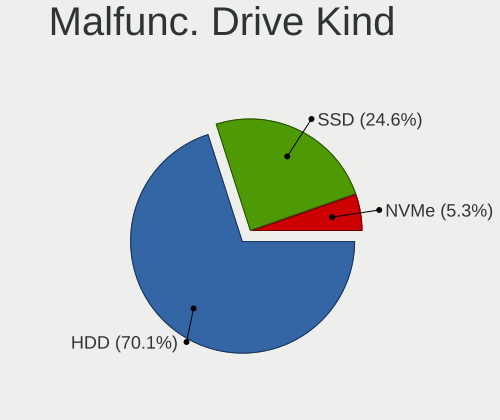

| Kind | Desktops | Drives | Percent |
|------|----------|--------|---------|
| HDD  | 894      | 1364   | 70.06%  |
| SSD  | 314      | 394    | 24.61%  |
| NVMe | 68       | 75     | 5.33%   |

Failed Drives
-------------

Failed drive models

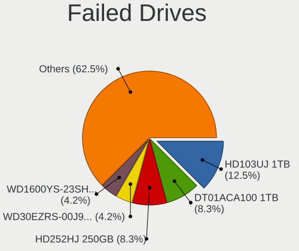

| Model                                                            | Desktops | Drives | Percent |
|------------------------------------------------------------------|----------|--------|---------|
| Samsung Electronics HD103UJ 1TB                                  | 3        | 5      | 12.5%   |
| Toshiba DT01ACA100 1TB                                           | 2        | 2      | 8.33%   |
| Samsung Electronics HD252HJ 250GB                                | 2        | 2      | 8.33%   |
| WDC WD30EZRS-00J99B0 3TB                                         | 1        | 1      | 4.17%   |
| WDC WD1600YS-23SHB0 160GB                                        | 1        | 1      | 4.17%   |
| TPH00800640GB 640GB                                              | 1        | 1      | 4.17%   |
| Toshiba MK3265GSX 320GB                                          | 1        | 1      | 4.17%   |
| Toshiba MK2555GSX 250GB                                          | 1        | 1      | 4.17%   |
| Toshiba MG03ACA300 3TB                                           | 1        | 1      | 4.17%   |
| Seagate ST3640323AS 640GB                                        | 1        | 1      | 4.17%   |
| Samsung Electronics SSD 980 500GB                                | 1        | 1      | 4.17%   |
| Samsung Electronics SSD 980 1TB                                  | 1        | 1      | 4.17%   |
| Samsung Electronics SSD 850 250GB                                | 1        | 1      | 4.17%   |
| Samsung Electronics NVMe SSD Controller SM961/PM961/SM963 1024GB | 1        | 1      | 4.17%   |
| Samsung Electronics MZVLB1T0HALR-00000 1TB                       | 1        | 2      | 4.17%   |
| Samsung Electronics MZNTY128HDHP-00000 128GB SSD                 | 1        | 2      | 4.17%   |
| Samsung Electronics MZ7LN256HCHP-00000 256GB SSD                 | 1        | 2      | 4.17%   |
| Maxtor STM3500320AS 500GB                                        | 1        | 1      | 4.17%   |
| Intenso SSD SATAIII 512GB                                        | 1        | 1      | 4.17%   |
| Hitachi HDP725040GLA360 400GB                                    | 1        | 1      | 4.17%   |

Failed Drive Vendor
-------------------

Failed drive vendors

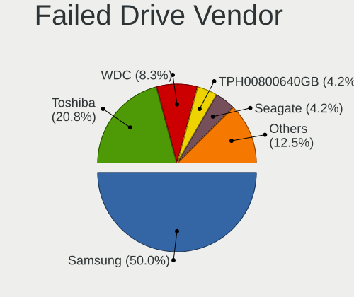

| Vendor              | Desktops | Drives | Percent |
|---------------------|----------|--------|---------|
| Samsung Electronics | 12       | 17     | 50%     |
| Toshiba             | 5        | 5      | 20.83%  |
| WDC                 | 2        | 2      | 8.33%   |
| TPH00800640GB       | 1        | 1      | 4.17%   |
| Seagate             | 1        | 1      | 4.17%   |
| Maxtor              | 1        | 1      | 4.17%   |
| Intenso             | 1        | 1      | 4.17%   |
| Hitachi             | 1        | 1      | 4.17%   |

Drive Status
------------

Number of failed and malfunc. drives

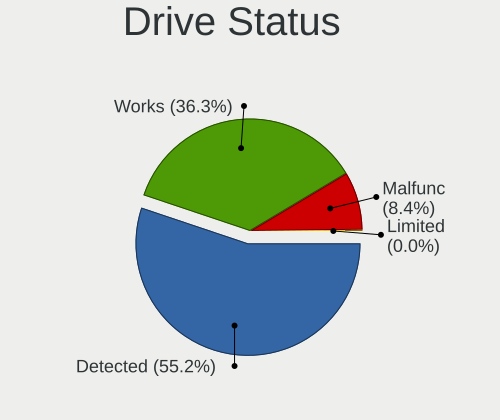

| Status   | Desktops | Drives | Percent |
|----------|----------|--------|---------|
| Detected | 7940     | 25519  | 55.15%  |
| Works    | 5222     | 14788  | 36.27%  |
| Malfunc  | 1209     | 1833   | 8.4%    |
| Failed   | 24       | 29     | 0.17%   |
| Limited  | 1        | 1      | 0.01%   |

Storage controller
------------------

Storage Vendor
--------------

Storage controller vendors

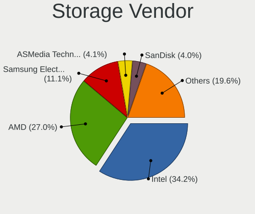

| Vendor                           | Desktops | Percent |
|----------------------------------|----------|---------|
| Intel                            | 6866     | 34.2%   |
| AMD                              | 5411     | 26.95%  |
| Samsung Electronics              | 2234     | 11.13%  |
| ASMedia Technology               | 829      | 4.13%   |
| SanDisk                          | 794      | 3.95%   |
| Micron/Crucial Technology        | 528      | 2.63%   |
| Kingston Technology Company      | 491      | 2.45%   |
| JMicron Technology               | 425      | 2.12%   |
| Phison Electronics               | 402      | 2%      |
| Marvell Technology Group         | 384      | 1.91%   |
| Nvidia                           | 306      | 1.52%   |
| Silicon Motion                   | 140      | 0.7%    |
| MAXIO Technology (Hangzhou)      | 135      | 0.67%   |
| ADATA Technology                 | 115      | 0.57%   |
| Shenzhen Longsys Electronics     | 114      | 0.57%   |
| VIA Technologies                 | 102      | 0.51%   |
| Micron Technology                | 90       | 0.45%   |
| SK hynix                         | 83       | 0.41%   |
| Adaptec                          | 65       | 0.32%   |
| Silicon Image                    | 60       | 0.3%    |
| Toshiba America Info Systems     | 59       | 0.29%   |
| Broadcom / LSI                   | 59       | 0.29%   |
| Seagate Technology               | 54       | 0.27%   |
| Realtek Semiconductor            | 53       | 0.26%   |
| LSI Logic / Symbios Logic        | 48       | 0.24%   |
| KIOXIA                           | 45       | 0.22%   |
| INNOGRIT                         | 23       | 0.11%   |
| Transcend                        | 16       | 0.08%   |
| Unknown                          | 12       | 0.06%   |
| Silicon Integrated Systems [SiS] | 11       | 0.05%   |
| Integrated Technology Express    | 11       | 0.05%   |
| OCZ Technology Group             | 10       | 0.05%   |
| 3ware                            | 10       | 0.05%   |
| Solid State Storage Technology   | 9        | 0.04%   |
| Netac Technology                 | 8        | 0.04%   |
| Hewlett-Packard                  | 8        | 0.04%   |
| Biwin Storage Technology         | 7        | 0.03%   |
| Hosin Global Electronics         | 6        | 0.03%   |
| Lite-On Technology               | 5        | 0.02%   |
| Solidigm                         | 4        | 0.02%   |

Storage Model
-------------

Storage controller models

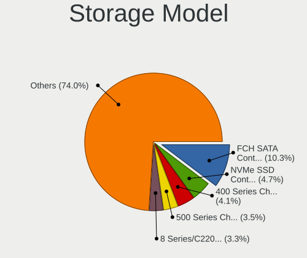

| Model                                                                                   | Desktops | Percent |
|-----------------------------------------------------------------------------------------|----------|---------|
| AMD FCH SATA Controller [AHCI mode]                                                     | 2530     | 10.3%   |
| Samsung NVMe SSD Controller SM981/PM981/PM983                                           | 1165     | 4.74%   |
| AMD 400 Series Chipset SATA Controller                                                  | 1014     | 4.13%   |
| AMD 500 Series Chipset SATA Controller                                                  | 866      | 3.52%   |
| Intel 8 Series/C220 Series Chipset Family 6-port SATA Controller 1 [AHCI mode]          | 823      | 3.35%   |
| AMD SB7x0/SB8x0/SB9x0 IDE Controller                                                    | 770      | 3.13%   |
| ASMedia ASM1061/ASM1062 Serial ATA Controller                                           | 745      | 3.03%   |
| AMD SB7x0/SB8x0/SB9x0 SATA Controller [AHCI mode]                                       | 656      | 2.67%   |
| Intel Q170/Q150/B150/H170/H110/Z170/CM236 Chipset SATA Controller [AHCI Mode]           | 638      | 2.6%    |
| AMD 600 Series Chipset SATA Controller                                                  | 541      | 2.2%    |
| Intel 6 Series/C200 Series Chipset Family 6 port Desktop SATA AHCI Controller           | 530      | 2.16%   |
| Intel 7 Series/C210 Series Chipset Family 6-port SATA Controller [AHCI mode]            | 529      | 2.15%   |
| Intel 200 Series PCH SATA controller [AHCI mode]                                        | 502      | 2.04%   |
| AMD SB7x0/SB8x0/SB9x0 SATA Controller [IDE mode]                                        | 450      | 1.83%   |
| Samsung NVMe SSD Controller PM9A1/PM9A3/980PRO                                          | 447      | 1.82%   |
| Intel Cannon Lake PCH SATA AHCI Controller                                              | 372      | 1.51%   |
| Intel SATA Controller [RAID mode]                                                       | 361      | 1.47%   |
| Intel NM10/ICH7 Family SATA Controller [IDE mode]                                       | 305      | 1.24%   |
| JMicron JMB363 SATA/IDE Controller                                                      | 258      | 1.05%   |
| Samsung NVMe SSD Controller SM961/PM961/SM963                                           | 256      | 1.04%   |
| Samsung NVMe SSD Controller 980 (DRAM-less)                                             | 245      | 1%      |
| Micron/Crucial P2 [Nick P2] / P3 / P3 Plus NVMe PCIe SSD (DRAM-less)                    | 235      | 0.96%   |
| Intel 82801G (ICH7 Family) IDE Controller                                               | 228      | 0.93%   |
| AMD 300 Series Chipset SATA Controller                                                  | 219      | 0.89%   |
| Samsung NVMe SSD Controller S4LV008[Pascal]                                             | 214      | 0.87%   |
| Intel Alder Lake-S PCH SATA Controller [AHCI Mode]                                      | 209      | 0.85%   |
| Intel 9 Series Chipset Family SATA Controller [AHCI Mode]                               | 204      | 0.83%   |
| AMD A320 Chipset SATA Controller [AHCI mode]                                            | 204      | 0.83%   |
| Intel Raptor Lake SATA AHCI Controller                                                  | 170      | 0.69%   |
| Intel 500 Series Chipset Family SATA AHCI Controller                                    | 168      | 0.68%   |
| Phison E12 NVMe Controller                                                              | 167      | 0.68%   |
| AMD X370 Series Chipset SATA Controller                                                 | 164      | 0.67%   |
| Sandisk WD Black SN850X NVMe SSD                                                        | 139      | 0.57%   |
| Intel 5 Series/3400 Series Chipset 6 port SATA AHCI Controller                          | 137      | 0.56%   |
| Kingston Company A2000 NVMe SSD [SM2263EN]                                              | 136      | 0.55%   |
| Nvidia MCP61 SATA Controller                                                            | 133      | 0.54%   |
| Intel 6 Series/C200 Series Chipset Family Desktop SATA Controller (IDE mode, ports 4-5) | 133      | 0.54%   |
| Intel 82801JI (ICH10 Family) SATA AHCI Controller                                       | 131      | 0.53%   |
| Intel 6 Series/C200 Series Chipset Family Desktop SATA Controller (IDE mode, ports 0-3) | 131      | 0.53%   |
| SanDisk Extreme Pro / WD Black SN750 / PC SN730 / Red SN700 NVMe SSD                    | 126      | 0.51%   |

Storage Kind
------------

Kind of storage controller (IDE, SATA, NVMe, SAS, ...)

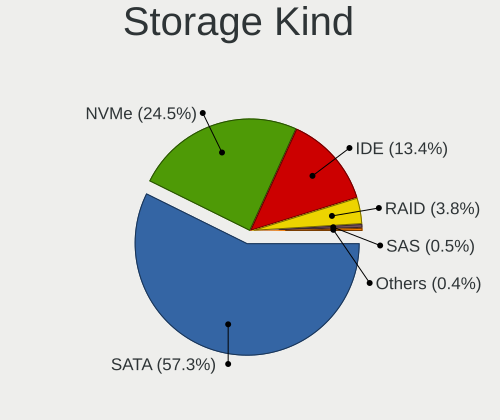

| Kind | Desktops | Percent |
|------|----------|---------|
| SATA | 11038    | 57.32%  |
| NVMe | 4711     | 24.46%  |
| IDE  | 2585     | 13.42%  |
| RAID | 733      | 3.81%   |
| SAS  | 105      | 0.55%   |
| SCSI | 86       | 0.45%   |

Processor
---------

CPU Vendor
----------

Processor vendors

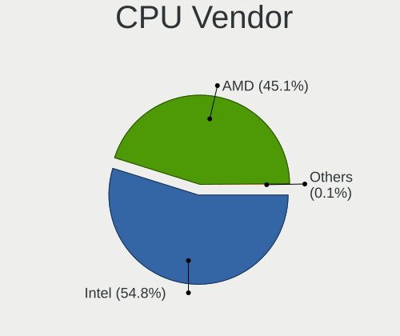

| Vendor                | Desktops | Percent |
|-----------------------|----------|---------|
| Intel                 | 6988     | 54.82%  |
| AMD                   | 5744     | 45.06%  |
| ARM                   | 4        | 0.03%   |
| CentaurHauls          | 3        | 0.02%   |
| Marvell Semiconductor | 2        | 0.02%   |
| Unknown               | 2        | 0.02%   |
| sifive,u74-mc         | 1        | 0.01%   |
| PowerMac3,6           | 1        | 0.01%   |
| PowerMac10,2          | 1        | 0.01%   |
| MIPS                  | 1        | 0.01%   |
| CyrixInstead          | 1        | 0.01%   |

CPU Model
---------

Processor models

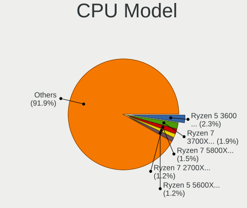

| Model                                       | Desktops | Percent |
|---------------------------------------------|----------|---------|
| AMD Ryzen 5 3600 6-Core Processor           | 300      | 2.33%   |
| AMD Ryzen 7 3700X 8-Core Processor          | 248      | 1.93%   |
| AMD Ryzen 7 5800X 8-Core Processor          | 187      | 1.45%   |
| AMD Ryzen 7 2700X Eight-Core Processor      | 152      | 1.18%   |
| AMD Ryzen 5 5600X 6-Core Processor          | 152      | 1.18%   |
| AMD Ryzen 5 2600 Six-Core Processor         | 147      | 1.14%   |
| AMD FX-8350 Eight-Core Processor            | 144      | 1.12%   |
| AMD Ryzen 9 5900X 12-Core Processor         | 143      | 1.11%   |
| Intel Core i5-6500 CPU @ 3.20GHz            | 130      | 1.01%   |
| Intel Core i5-3470 CPU @ 3.20GHz            | 130      | 1.01%   |
| AMD FX-6300 Six-Core Processor              | 126      | 0.98%   |
| AMD Ryzen 5 5600G with Radeon Graphics      | 118      | 0.92%   |
| Intel Core i7-6700K CPU @ 4.00GHz           | 115      | 0.89%   |
| Intel Core i7-3770 CPU @ 3.40GHz            | 112      | 0.87%   |
| AMD Ryzen 9 3900X 12-Core Processor         | 105      | 0.82%   |
| Intel Core i7-4790 CPU @ 3.60GHz            | 96       | 0.75%   |
| AMD Ryzen 7 7800X3D 8-Core Processor        | 96       | 0.75%   |
| Intel Core i7-4790K CPU @ 4.00GHz           | 92       | 0.72%   |
| Intel Core i5-2400 CPU @ 3.10GHz            | 92       | 0.72%   |
| AMD Ryzen 7 5700G with Radeon Graphics      | 91       | 0.71%   |
| AMD Ryzen 5 1600 Six-Core Processor         | 90       | 0.7%    |
| Intel Core i7-6700 CPU @ 3.40GHz            | 86       | 0.67%   |
| AMD Ryzen 5 3400G with Radeon Vega Graphics | 86       | 0.67%   |
| Intel Core 2 Duo CPU E8400 @ 3.00GHz        | 85       | 0.66%   |
| Intel Core i5-4570 CPU @ 3.20GHz            | 82       | 0.64%   |
| Intel Core i7-2600 CPU @ 3.40GHz            | 81       | 0.63%   |
| AMD Ryzen 9 5950X 16-Core Processor         | 81       | 0.63%   |
| Intel Core i3-2120 CPU @ 3.30GHz            | 79       | 0.61%   |
| AMD Ryzen 7 5800X3D 8-Core Processor        | 77       | 0.6%    |
| Intel Core i7-7700K CPU @ 4.20GHz           | 76       | 0.59%   |
| Intel Core i5-4590 CPU @ 3.30GHz            | 74       | 0.58%   |
| Intel Core i7-8700 CPU @ 3.20GHz            | 73       | 0.57%   |
| Intel Core i5-4460 CPU @ 3.20GHz            | 70       | 0.54%   |
| AMD Ryzen 3 2200G with Radeon Vega Graphics | 70       | 0.54%   |
| AMD Ryzen 5 2400G with Radeon Vega Graphics | 69       | 0.54%   |
| Intel Core i7-8700K CPU @ 3.70GHz           | 68       | 0.53%   |
| AMD Ryzen 5 2600X Six-Core Processor        | 68       | 0.53%   |
| Intel Core i7-4770 CPU @ 3.40GHz            | 67       | 0.52%   |
| AMD FX-4300 Quad-Core Processor             | 66       | 0.51%   |
| Intel Core 2 Quad CPU Q6600 @ 2.40GHz       | 62       | 0.48%   |

CPU Model Family
----------------

Processor model prefix

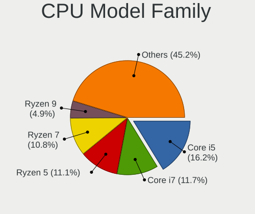

| Model                   | Desktops | Percent |
|-------------------------|----------|---------|
| Intel Core i5           | 2081     | 16.24%  |
| Intel Core i7           | 1505     | 11.75%  |
| AMD Ryzen 5             | 1420     | 11.08%  |
| AMD Ryzen 7             | 1387     | 10.82%  |
| AMD Ryzen 9             | 624      | 4.87%   |
| Other                   | 611      | 4.77%   |
| Intel Core i3           | 602      | 4.7%    |
| AMD FX                  | 573      | 4.47%   |
| Intel Xeon              | 525      | 4.1%    |
| Intel Celeron           | 323      | 2.52%   |
| Intel Core 2 Duo        | 283      | 2.21%   |
| Intel Core 2 Quad       | 250      | 1.95%   |
| Intel Pentium           | 214      | 1.67%   |
| AMD Phenom II X4        | 210      | 1.64%   |
| AMD Ryzen 3             | 178      | 1.39%   |
| AMD A8                  | 160      | 1.25%   |
| AMD Athlon II X2        | 154      | 1.2%    |
| Intel Core i9           | 152      | 1.19%   |
| Intel Pentium Dual-Core | 150      | 1.17%   |
| AMD A10                 | 149      | 1.16%   |
| AMD Athlon 64 X2        | 85       | 0.66%   |
| Intel Atom              | 83       | 0.65%   |
| AMD A4                  | 79       | 0.62%   |
| AMD Athlon II X4        | 78       | 0.61%   |
| AMD Ryzen 5 PRO         | 77       | 0.6%    |
| AMD Phenom II X6        | 71       | 0.55%   |
| AMD Ryzen Threadripper  | 68       | 0.53%   |
| Intel Pentium 4         | 61       | 0.48%   |
| Intel Core 2            | 58       | 0.45%   |
| AMD Athlon              | 57       | 0.44%   |
| AMD GX                  | 43       | 0.34%   |
| AMD A6                  | 34       | 0.27%   |
| AMD G                   | 33       | 0.26%   |
| AMD Ryzen 7 PRO         | 31       | 0.24%   |
| AMD Phenom              | 30       | 0.23%   |
| AMD Athlon X4           | 30       | 0.23%   |
| Intel Pentium D         | 29       | 0.23%   |
| Intel Pentium Silver    | 27       | 0.21%   |
| Intel Pentium Dual      | 26       | 0.2%    |
| AMD E                   | 22       | 0.17%   |

CPU Cores
---------

Number of processor cores

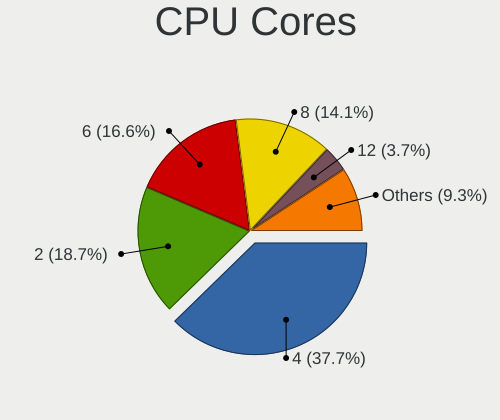

| Number  | Desktops | Percent |
|---------|----------|---------|
| 4       | 4844     | 37.7%   |
| 2       | 2403     | 18.7%   |
| 6       | 2128     | 16.56%  |
| 8       | 1807     | 14.06%  |
| 12      | 475      | 3.7%    |
| 16      | 367      | 2.86%   |
| 1       | 225      | 1.75%   |
| 3       | 203      | 1.58%   |
| 10      | 121      | 0.94%   |
| 14      | 86       | 0.67%   |
| 24      | 74       | 0.58%   |
| 20      | 43       | 0.33%   |
| 18      | 20       | 0.16%   |
| Unknown | 20       | 0.16%   |
| 32      | 14       | 0.11%   |
| 5       | 7        | 0.05%   |
| 28      | 4        | 0.03%   |
| 64      | 3        | 0.02%   |
| 36      | 2        | 0.02%   |
| 48      | 1        | 0.01%   |
| 22      | 1        | 0.01%   |

CPU Sockets
-----------

Number of sockets

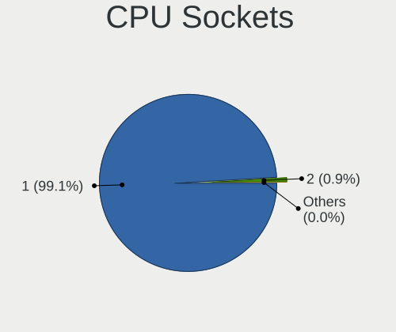

| Number | Desktops | Percent |
|--------|----------|---------|
| 1      | 12627    | 99.05%  |
| 2      | 111      | 0.87%   |
| 20     | 4        | 0.03%   |
| 4      | 4        | 0.03%   |
| 24     | 1        | 0.01%   |
| 14     | 1        | 0.01%   |

CPU Threads
-----------

Threads per core (Hyper-Threading)

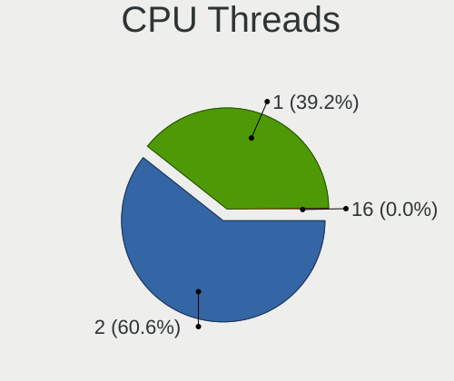

| Number  | Desktops | Percent |
|---------|----------|---------|
| 2       | 7769     | 60.64%  |
| 1       | 5019     | 39.18%  |
| Unknown | 20       | 0.16%   |
| 4       | 2        | 0.02%   |
| 16      | 1        | 0.01%   |

CPU Op-Modes
------------

CPU Operation Modes (32-bit, 64-bit)

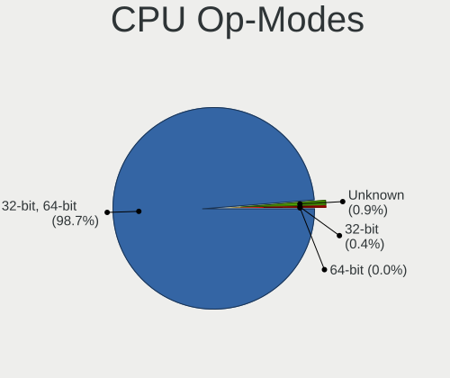

| Op mode        | Desktops | Percent |
|----------------|----------|---------|
| 32-bit, 64-bit | 12609    | 98.72%  |
| Unknown        | 115      | 0.9%    |
| 32-bit         | 47       | 0.37%   |
| 64-bit         | 1        | 0.01%   |

CPU Microcode
-------------

Microcode number

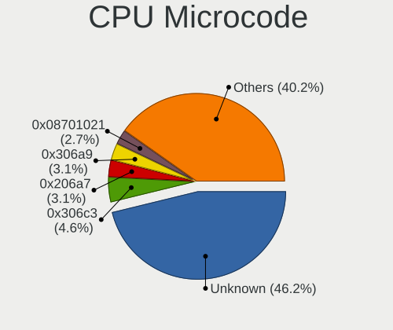

| Number     | Desktops | Percent |
|------------|----------|---------|
| Unknown    | 6237     | 46.19%  |
| 0x306c3    | 627      | 4.64%   |
| 0x206a7    | 422      | 3.13%   |
| 0x306a9    | 421      | 3.12%   |
| 0x08701021 | 365      | 2.7%    |
| 0x506e3    | 339      | 2.51%   |
| 0x1067a    | 322      | 2.38%   |
| 0x0800820d | 271      | 2.01%   |
| 0x06000852 | 253      | 1.87%   |
| 0x010000c8 | 241      | 1.78%   |
| 0x906ea    | 200      | 1.48%   |
| 0x906e9    | 161      | 1.19%   |
| 0x08701013 | 144      | 1.07%   |
| 0x06001119 | 144      | 1.07%   |
| 0x08108109 | 113      | 0.84%   |
| 0x6fb      | 103      | 0.76%   |
| 0x08001138 | 96       | 0.71%   |
| 0x0a201016 | 86       | 0.64%   |
| 0x106e5    | 82       | 0.61%   |
| 0x0600063e | 78       | 0.58%   |
| 0x0a20120a | 76       | 0.56%   |
| 0x0a50000d | 73       | 0.54%   |
| 0x906ed    | 68       | 0.5%    |
| 0x08001137 | 67       | 0.5%    |
| 0x010000db | 64       | 0.47%   |
| 0x08101016 | 62       | 0.46%   |
| 0xa0655    | 61       | 0.45%   |
| 0x0a201009 | 61       | 0.45%   |
| 0x0a601203 | 60       | 0.44%   |
| 0x08600106 | 60       | 0.44%   |
| 0xa0671    | 52       | 0.39%   |
| 0x306f2    | 51       | 0.38%   |
| 0xa0653    | 50       | 0.37%   |
| 0x106a5    | 50       | 0.37%   |
| 0x0810100b | 49       | 0.36%   |
| 0x06003106 | 49       | 0.36%   |
| 0x0a50000c | 48       | 0.36%   |
| 0x90672    | 46       | 0.34%   |
| 0x6fd      | 45       | 0.33%   |
| 0x010000dc | 45       | 0.33%   |

CPU Microarch
-------------

Microarchitecture

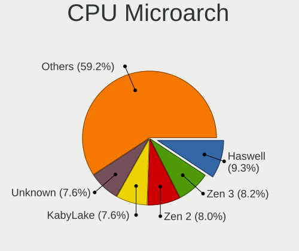

| Name             | Desktops | Percent |
|------------------|----------|---------|
| Haswell          | 1195     | 9.3%    |
| Zen 3            | 1051     | 8.18%   |
| Zen 2            | 1032     | 8.03%   |
| KabyLake         | 980      | 7.63%   |
| Unknown          | 977      | 7.61%   |
| IvyBridge        | 729      | 5.68%   |
| SandyBridge      | 723      | 5.63%   |
| Skylake          | 698      | 5.43%   |
| Piledriver       | 683      | 5.32%   |
| Zen+             | 663      | 5.16%   |
| K10              | 613      | 4.77%   |
| Penryn           | 560      | 4.36%   |
| Zen              | 484      | 3.77%   |
| Core             | 266      | 2.07%   |
| Alderlake Hybrid | 250      | 1.95%   |
| CometLake        | 234      | 1.82%   |
| Nehalem          | 221      | 1.72%   |
| Westmere         | 162      | 1.26%   |
| K8 Hammer        | 139      | 1.08%   |
| Silvermont       | 135      | 1.05%   |
| Bulldozer        | 113      | 0.88%   |
| NetBurst         | 101      | 0.79%   |
| Excavator        | 100      | 0.78%   |
| Goldmont plus    | 96       | 0.75%   |
| Steamroller      | 93       | 0.72%   |
| Broadwell        | 74       | 0.58%   |
| Icelake          | 69       | 0.54%   |
| Gracemont        | 59       | 0.46%   |
| Bonnell          | 58       | 0.45%   |
| Bobcat           | 54       | 0.42%   |
| Jaguar           | 48       | 0.37%   |
| Puma             | 41       | 0.32%   |
| Goldmont         | 41       | 0.32%   |
| K10 Llano        | 40       | 0.31%   |
| Tremont          | 25       | 0.19%   |
| TigerLake        | 14       | 0.11%   |
| P6               | 9        | 0.07%   |
| Lunarlake Hybrid | 7        | 0.05%   |
| K6               | 6        | 0.05%   |
| Sapphire Rapids  | 1        | 0.01%   |

Graphics
--------

GPU Vendor
----------

Vendors of graphics cards

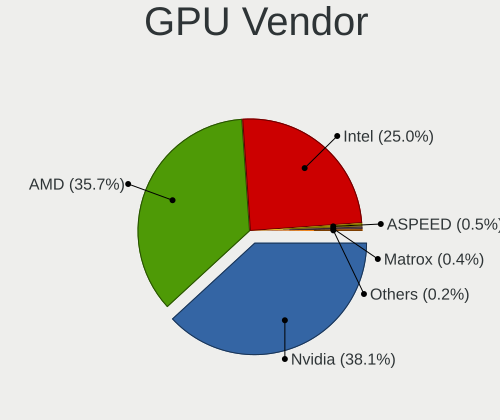

| Vendor                                       | Desktops | Percent |
|----------------------------------------------|----------|---------|
| Nvidia                                       | 5241     | 38.15%  |
| AMD                                          | 4911     | 35.74%  |
| Intel                                        | 3433     | 24.99%  |
| ASPEED Technology                            | 65       | 0.47%   |
| Matrox Electronics Systems                   | 55       | 0.4%    |
| ATI Technologies                             | 11       | 0.08%   |
| VIA Technologies                             | 8        | 0.06%   |
| S3 Graphics                                  | 6        | 0.04%   |
| Silicon Integrated Systems [SiS]             | 5        | 0.04%   |
| XGI Technology (eXtreme Graphics Innovation) | 2        | 0.01%   |
| Red Hat                                      | 1        | 0.01%   |
| Dome Imaging Systems                         | 1        | 0.01%   |

GPU Model
---------

Graphics card models

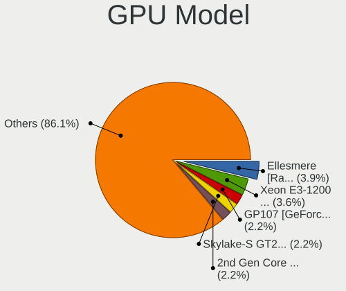

| Model                                                                       | Desktops | Percent |
|-----------------------------------------------------------------------------|----------|---------|
| AMD Ellesmere [Radeon RX 470/480/570/570X/580/580X/590]                     | 556      | 3.86%   |
| Intel Xeon E3-1200 v3/4th Gen Core Processor Integrated Graphics Controller | 513      | 3.56%   |
| Nvidia GP107 [GeForce GTX 1050 Ti]                                          | 311      | 2.16%   |
| Intel Skylake-S GT2 [HD Graphics 530]                                       | 310      | 2.15%   |
| Intel 2nd Generation Core Processor Family Integrated Graphics Controller   | 310      | 2.15%   |
| AMD Raphael                                                                 | 299      | 2.08%   |
| Intel CoffeeLake-S GT2 [UHD Graphics 630]                                   | 296      | 2.05%   |
| Nvidia GK208B [GeForce GT 710]                                              | 238      | 1.65%   |
| Intel Xeon E3-1200 v2/3rd Gen Core processor Graphics Controller            | 235      | 1.63%   |
| Nvidia GP106 [GeForce GTX 1060 6GB]                                         | 223      | 1.55%   |
| AMD Cezanne [Radeon Vega Series / Radeon Vega Mobile Series]                | 205      | 1.42%   |
| AMD Navi 10 [Radeon RX 5600 OEM/5600 XT / 5700/5700 XT]                     | 193      | 1.34%   |
| Nvidia GP108 [GeForce GT 1030]                                              | 191      | 1.33%   |
| AMD Picasso/Raven 2 [Radeon Vega Series / Radeon Vega Mobile Series]        | 189      | 1.31%   |
| Intel 4 Series Chipset Integrated Graphics Controller                       | 179      | 1.24%   |
| Nvidia GK208B [GeForce GT 730]                                              | 160      | 1.11%   |
| AMD Navi 22 [Radeon RX 6700/6700 XT/6750 XT / 6800M/6850M XT]               | 154      | 1.07%   |
| AMD Navi 21 [Radeon RX 6800/6800 XT / 6900 XT]                              | 151      | 1.05%   |
| Intel Kaby Lake-S GT2 [HD Graphics 630]                                     | 149      | 1.03%   |
| AMD Navi 31 [Radeon RX 7900 XT/7900 XTX/7900 GRE/7900M]                     | 148      | 1.03%   |
| Nvidia GM204 [GeForce GTX 970]                                              | 147      | 1.02%   |
| AMD Caicos [Radeon HD 6450/7450/8450 / R5 230 OEM]                          | 143      | 0.99%   |
| AMD Cedar [Radeon HD 5000/6000/7350/8350 Series]                            | 139      | 0.96%   |
| Nvidia GP104 [GeForce GTX 1070]                                             | 138      | 0.96%   |
| AMD Raven Ridge [Radeon Vega Series / Radeon Vega Mobile Series]            | 137      | 0.95%   |
| Nvidia GM206 [GeForce GTX 960]                                              | 125      | 0.87%   |
| Nvidia GM107 [GeForce GTX 750 Ti]                                           | 120      | 0.83%   |
| AMD Navi 23 [Radeon RX 6600/6600 XT/6600M]                                  | 119      | 0.83%   |
| AMD Granite Ridge [Radeon Graphics]                                         | 113      | 0.78%   |
| AMD Renoir [Radeon Vega Series / Radeon Vega Mobile Series]                 | 108      | 0.75%   |
| Nvidia TU117 [GeForce GTX 1650]                                             | 107      | 0.74%   |
| Nvidia GT218 [GeForce 210]                                                  | 107      | 0.74%   |
| Nvidia GP104 [GeForce GTX 1080]                                             | 107      | 0.74%   |
| Intel IvyBridge GT2 [HD Graphics 4000]                                      | 106      | 0.74%   |
| AMD Lexa PRO [Radeon 540/540X/550/550X / RX 540X/550/550X]                  | 106      | 0.74%   |
| AMD Vega 10 XL/XT [Radeon RX Vega 56/64]                                    | 102      | 0.71%   |
| Nvidia GA106 [GeForce RTX 3060 Lite Hash Rate]                              | 99       | 0.69%   |
| Intel 4th Generation Core Processor Family Integrated Graphics Controller   | 98       | 0.68%   |
| AMD RS780L [Radeon 3000]                                                    | 98       | 0.68%   |
| Intel CometLake-S GT2 [UHD Graphics 630]                                    | 92       | 0.64%   |

GPU Combo
---------

Combinations of graphics cards

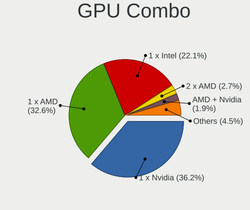

| Name                              | Desktops | Percent |
|-----------------------------------|----------|---------|
| 1 x Nvidia                        | 4711     | 36.24%  |
| 1 x AMD                           | 4236     | 32.58%  |
| 1 x Intel                         | 2871     | 22.08%  |
| 2 x AMD                           | 354      | 2.72%   |
| AMD + Nvidia                      | 248      | 1.91%   |
| Intel + Nvidia                    | 195      | 1.5%    |
| Intel + AMD                       | 92       | 0.71%   |
| 2 x Nvidia                        | 78       | 0.6%    |
| 1 x Matrox                        | 49       | 0.38%   |
| 1 x ASPEED                        | 49       | 0.38%   |
| Other                             | 37       | 0.28%   |
| 2 x Intel                         | 25       | 0.19%   |
| Nvidia + ASPEED                   | 10       | 0.08%   |
| 1 x VIA                           | 8        | 0.06%   |
| 1 x S3 Graphics                   | 6        | 0.05%   |
| 1 x SiS                           | 5        | 0.04%   |
| Nvidia + Matrox                   | 5        | 0.04%   |
| AMD + ASPEED                      | 5        | 0.04%   |
| Nvidia + XGI                      | 2        | 0.02%   |
| Intel + 2 x Nvidia                | 2        | 0.02%   |
| Intel + AMD + 1 x Nvidia          | 2        | 0.02%   |
| 5 x AMD                           | 1        | 0.01%   |
| 4 x Nvidia                        | 1        | 0.01%   |
| 2 x Intel + 1 x Nvidia            | 1        | 0.01%   |
| 2 x Intel + 1 x AMD               | 1        | 0.01%   |
| 2 x AMD + 1 x Nvidia + 1 x ASPEED | 1        | 0.01%   |
| 1 x Red Hat                       | 1        | 0.01%   |
| Nvidia + Dome Imaging Systems     | 1        | 0.01%   |
| 1 x Intel + 4 x AMD               | 1        | 0.01%   |
| 1 x Intel + 3 x Nvidia            | 1        | 0.01%   |
| AMD + Nvidia + 1 x ASPEED         | 1        | 0.01%   |
| AMD + Matrox                      | 1        | 0.01%   |

GPU Driver
----------

Free vs proprietary

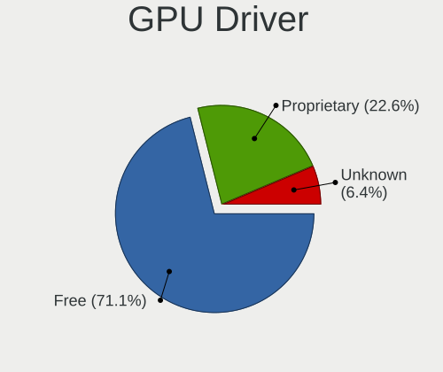

| Driver      | Desktops | Percent |
|-------------|----------|---------|
| Free        | 9322     | 71.09%  |
| Proprietary | 2957     | 22.55%  |
| Unknown     | 834      | 6.36%   |

GPU Memory
----------

Total video memory

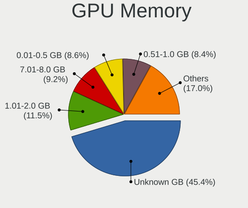

| Size in GB | Desktops | Percent |
|------------|----------|---------|
| Unknown    | 6111     | 45.36%  |
| 1.01-2.0   | 1549     | 11.5%   |
| 7.01-8.0   | 1239     | 9.2%    |
| 0.01-0.5   | 1153     | 8.56%   |
| 0.51-1.0   | 1127     | 8.37%   |
| 3.01-4.0   | 1006     | 7.47%   |
| 8.01-16.0  | 675      | 5.01%   |
| 5.01-6.0   | 363      | 2.69%   |
| 16.01-24.0 | 126      | 0.94%   |
| 2.01-3.0   | 109      | 0.81%   |
| 4.01-5.0   | 12       | 0.09%   |
| 24.01-32.0 | 2        | 0.01%   |

Monitor
-------

Monitor Vendor
--------------

Monitor vendors

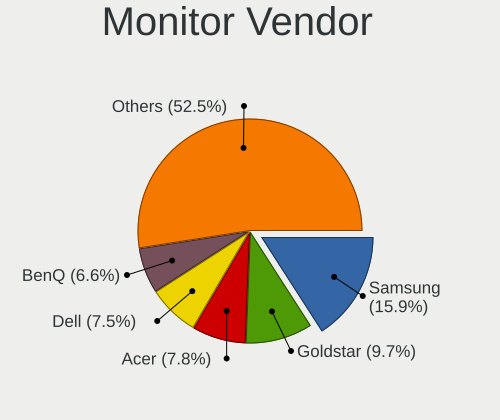

| Vendor               | Desktops | Percent |
|----------------------|----------|---------|
| Samsung Electronics  | 2259     | 15.9%   |
| Goldstar             | 1380     | 9.71%   |
| Acer                 | 1109     | 7.81%   |
| Dell                 | 1064     | 7.49%   |
| BenQ                 | 939      | 6.61%   |
| Ancor Communications | 676      | 4.76%   |
| Hewlett-Packard      | 656      | 4.62%   |
| AOC                  | 621      | 4.37%   |
| Philips              | 573      | 4.03%   |
| Iiyama               | 459      | 3.23%   |
| Fujitsu Siemens      | 404      | 2.84%   |
| Eizo                 | 337      | 2.37%   |
| ASUSTek Computer     | 323      | 2.27%   |
| Medion               | 257      | 1.81%   |
| Lenovo               | 232      | 1.63%   |
| ViewSonic            | 173      | 1.22%   |
| Unknown              | 162      | 1.14%   |
| NEC Computers        | 144      | 1.01%   |
| LG Electronics       | 142      | 1%      |
| HannStar             | 134      | 0.94%   |
| MSI                  | 127      | 0.89%   |
| Sony                 | 126      | 0.89%   |
| Gigabyte Technology  | 90       | 0.63%   |
| Compal               | 90       | 0.63%   |
| Panasonic            | 89       | 0.63%   |
| Vestel Elektronik    | 85       | 0.6%    |
| Belinea              | 85       | 0.6%    |
| Toshiba              | 68       | 0.48%   |
| Grundig              | 60       | 0.42%   |
| HKC                  | 59       | 0.42%   |
| Idek Iiyama          | 52       | 0.37%   |
| Unknown              | 50       | 0.35%   |
| Hitachi              | 48       | 0.34%   |
| Mi                   | 44       | 0.31%   |
| FUS                  | 37       | 0.26%   |
| HUAWEI               | 35       | 0.25%   |
| DENON                | 33       | 0.23%   |
| SKG                  | 32       | 0.23%   |
| Denver               | 32       | 0.23%   |
| CHD                  | 30       | 0.21%   |

Monitor Model
-------------

Monitor models

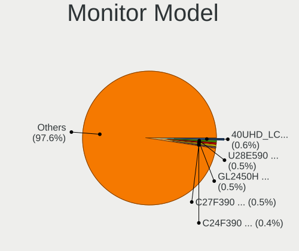

| Model                                                                 | Desktops | Percent |
|-----------------------------------------------------------------------|----------|---------|
| Vestel Elektronik 40UHD_LCD_TV VES3700 3840x2160 880x500mm 39.8-inch  | 85       | 0.56%   |
| Samsung Electronics U28E590 SAM0C4D 3840x2160 607x345mm 27.5-inch     | 80       | 0.52%   |
| BenQ GL2450H BNQ78A7 1920x1080 531x298mm 24.0-inch                    | 76       | 0.5%    |
| Samsung Electronics C27F390 SAM0D32 1920x1080 598x336mm 27.0-inch     | 70       | 0.46%   |
| Samsung Electronics C24F390 SAM0D2C 1920x1080 521x293mm 23.5-inch     | 61       | 0.4%    |
| Ancor Communications VS248 ACI2498 1920x1080 531x299mm 24.0-inch      | 57       | 0.37%   |
| Grundig WUXGA GRU4448 1360x768                                        | 56       | 0.37%   |
| AOC 27G2G4 AOC2702 1920x1080 598x336mm 27.0-inch                      | 55       | 0.36%   |
| Ancor Communications ASUS VS247 ACI249A 1920x1080 521x293mm 23.5-inch | 55       | 0.36%   |
| Goldstar Ultra HD GSM5B09 3840x2160 600x340mm 27.2-inch               | 54       | 0.35%   |
| Unknown                                                               | 50       | 0.33%   |
| Unknown LCD Monitor FFFF 2288x1287 2550x2550mm 142.0-inch             | 48       | 0.31%   |
| Acer S242HL ACR0216 1920x1080 531x299mm 24.0-inch                     | 44       | 0.29%   |
| Panasonic TV MEIA296 1920x1080 698x392mm 31.5-inch                    | 41       | 0.27%   |
| Dell U2412M DELA07A 1920x1200 518x324mm 24.1-inch                     | 40       | 0.26%   |
| AOC 24G2W1G3 AOC2402 1920x1080 527x296mm 23.8-inch                    | 39       | 0.26%   |
| Samsung Electronics S24F350 SAM0D20 1920x1080 521x293mm 23.5-inch     | 37       | 0.24%   |
| Goldstar Ultra HD GSM5B08 3840x2160 600x340mm 27.2-inch               | 37       | 0.24%   |
| Goldstar HDR 4K GSM7706 3840x2160 600x340mm 27.2-inch                 | 36       | 0.24%   |
| Goldstar LG IPS FULLHD GSM5AB8 1920x1080 480x270mm 21.7-inch          | 35       | 0.23%   |
| AOC G2460 AOC2460 1920x1080 531x299mm 24.0-inch                       | 33       | 0.22%   |
| Ancor Communications VS278 ACI27A1 1920x1080 598x336mm 27.0-inch      | 32       | 0.21%   |
| Goldstar HDR 4K GSM7707 3840x2160 600x340mm 27.2-inch                 | 31       | 0.2%    |
| Acer G246HL ACR02FF 1920x1080 531x299mm 24.0-inch                     | 31       | 0.2%    |
| Philips PHL 243V5 PHLC0D1 1920x1080 521x293mm 23.5-inch               | 30       | 0.2%    |
| BenQ GL2460 BNQ78CE 1920x1080 531x299mm 24.0-inch                     | 30       | 0.2%    |
| ASUSTek Computer VP28U AUS28B1 3840x2160 621x341mm 27.9-inch          | 30       | 0.2%    |
| Goldstar FULL HD GSM5B55 1920x1080 480x270mm 21.7-inch                | 29       | 0.19%   |
| AOC Q3279WG5B AOC3279 2560x1440 725x428mm 33.1-inch                   | 29       | 0.19%   |
| BenQ GW2780 BNQ78E6 1920x1080 598x336mm 27.0-inch                     | 28       | 0.18%   |
| AOC 24B1W1 AOC2401 1920x1080 527x296mm 23.8-inch                      | 28       | 0.18%   |
| Goldstar W2242 GSM5678 1680x1050 474x296mm 22.0-inch                  | 27       | 0.18%   |
| BenQ GL2760 BNQ78D5 1920x1080 598x336mm 27.0-inch                     | 27       | 0.18%   |
| BenQ GL2450 BNQ78A5 1920x1080 531x298mm 24.0-inch                     | 27       | 0.18%   |
| Ancor Communications ASUS VS228 ACI22FD 1920x1080 476x268mm 21.5-inch | 26       | 0.17%   |
| Toshiba TV TSB0108 1920x1080 698x393mm 31.5-inch                      | 25       | 0.16%   |
| Goldstar 32inch FHD GSM76F5 1920x1080 698x392mm 31.5-inch             | 25       | 0.16%   |
| Dell U2412M DELA07B 1920x1200 518x324mm 24.1-inch                     | 25       | 0.16%   |
| Samsung Electronics C32F391 SAM0D34 1920x1080 698x393mm 31.5-inch     | 24       | 0.16%   |
| Mi Monitor XMI3444 3440x1440 797x334mm 34.0-inch                      | 24       | 0.16%   |

Monitor Resolution
------------------

Monitor screen resolution

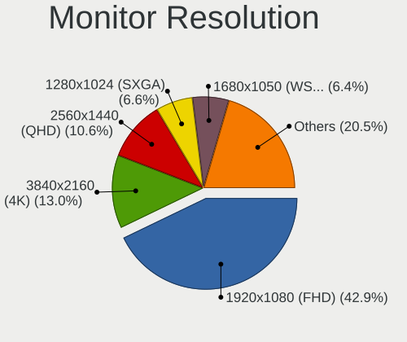

| Resolution         | Desktops | Percent |
|--------------------|----------|---------|
| 1920x1080 (FHD)    | 5890     | 42.85%  |
| 3840x2160 (4K)     | 1787     | 13%     |
| 2560x1440 (QHD)    | 1462     | 10.64%  |
| 1280x1024 (SXGA)   | 902      | 6.56%   |
| 1680x1050 (WSXGA+) | 886      | 6.45%   |
| 1920x1200 (WUXGA)  | 598      | 4.35%   |
| 3440x1440          | 439      | 3.19%   |
| Unknown            | 336      | 2.44%   |
| 3840x1080          | 213      | 1.55%   |
| 1440x900 (WXGA+)   | 176      | 1.28%   |
| 2560x1080          | 109      | 0.79%   |
| 1366x768 (WXGA)    | 106      | 0.77%   |
| 1920x540           | 91       | 0.66%   |
| 1600x1200          | 91       | 0.66%   |
| 1600x900 (HD+)     | 89       | 0.65%   |
| 1360x768           | 69       | 0.5%    |
| 1024x768 (XGA)     | 59       | 0.43%   |
| 2288x1287          | 54       | 0.39%   |
| 3840x1600          | 44       | 0.32%   |
| 2560x1600          | 36       | 0.26%   |
| 4480x1440          | 25       | 0.18%   |
| 3840x1200          | 24       | 0.17%   |
| 1280x720 (HD)      | 23       | 0.17%   |
| 2048x1152          | 16       | 0.12%   |
| 5760x2160          | 14       | 0.1%    |
| 3200x1080          | 14       | 0.1%    |
| 1400x1050          | 13       | 0.09%   |
| 3600x1080          | 12       | 0.09%   |
| 7680x2160          | 10       | 0.07%   |
| 5760x1080          | 9        | 0.07%   |
| 5120x1440          | 9        | 0.07%   |
| 3360x1080          | 7        | 0.05%   |
| 6400x2160          | 5        | 0.04%   |
| 5360x1440          | 5        | 0.04%   |
| 1280x960           | 5        | 0.04%   |
| 1280x768           | 5        | 0.04%   |
| 2560x2880          | 4        | 0.03%   |
| 2160x1440          | 4        | 0.03%   |
| 6000x1440          | 3        | 0.02%   |
| 5520x1080          | 3        | 0.02%   |

Monitor Diagonal
----------------

Diagonal size in inches

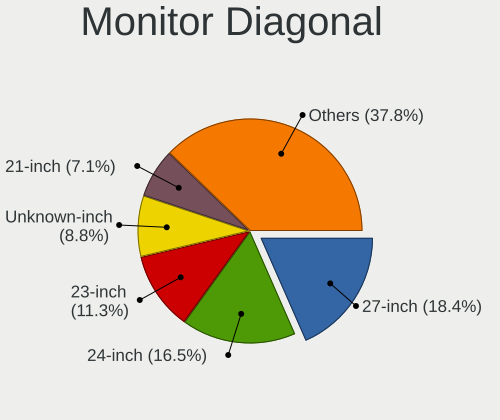

| Inches  | Desktops | Percent |
|---------|----------|---------|
| 27      | 2586     | 18.41%  |
| 24      | 2323     | 16.54%  |
| 23      | 1592     | 11.34%  |
| Unknown | 1240     | 8.83%   |
| 21      | 997      | 7.1%    |
| 19      | 766      | 5.45%   |
| 31      | 753      | 5.36%   |
| 22      | 716      | 5.1%    |
| 34      | 451      | 3.21%   |
| 84      | 299      | 2.13%   |
| 17      | 256      | 1.82%   |
| 20      | 213      | 1.52%   |
| 32      | 155      | 1.1%    |
| 54      | 141      | 1%      |
| 72      | 140      | 1%      |
| 40      | 140      | 1%      |
| 25      | 128      | 0.91%   |
| 18      | 116      | 0.83%   |
| 15      | 112      | 0.8%    |
| 48      | 81       | 0.58%   |
| 28      | 78       | 0.56%   |
| 65      | 68       | 0.48%   |
| 26      | 59       | 0.42%   |
| 142     | 48       | 0.34%   |
| 37      | 47       | 0.33%   |
| 16      | 38       | 0.27%   |
| 49      | 37       | 0.26%   |
| 33      | 37       | 0.26%   |
| 42      | 36       | 0.26%   |
| 63      | 33       | 0.23%   |
| 52      | 32       | 0.23%   |
| 43      | 32       | 0.23%   |
| 35      | 32       | 0.23%   |
| 39      | 28       | 0.2%    |
| 46      | 27       | 0.19%   |
| 36      | 26       | 0.19%   |
| 29      | 24       | 0.17%   |
| 47      | 18       | 0.13%   |
| 55      | 16       | 0.11%   |
| 57      | 12       | 0.09%   |

Monitor Width
-------------

Physical width

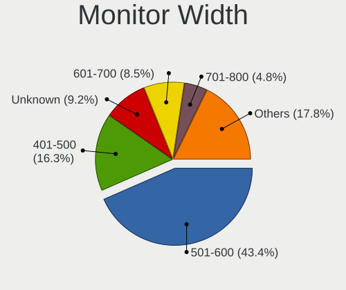

| Width in mm    | Desktops | Percent |
|----------------|----------|---------|
| 501-600        | 5859     | 43.43%  |
| 401-500        | 2195     | 16.27%  |
| Unknown        | 1240     | 9.19%   |
| 601-700        | 1143     | 8.47%   |
| 701-800        | 651      | 4.83%   |
| 351-400        | 642      | 4.76%   |
| 1001-1500      | 498      | 3.69%   |
| 1501-2000      | 460      | 3.41%   |
| 301-350        | 397      | 2.94%   |
| 801-900        | 252      | 1.87%   |
| 901-1000       | 72       | 0.53%   |
| More than 2000 | 52       | 0.39%   |
| 201-300        | 26       | 0.19%   |
| 101-200        | 4        | 0.03%   |

Aspect Ratio
------------

Proportional relationship between the width and the height

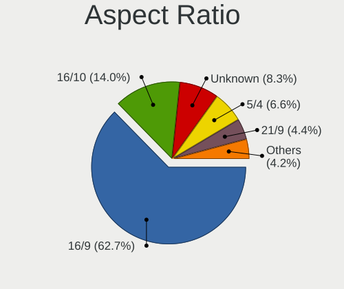

| Ratio   | Desktops | Percent |
|---------|----------|---------|
| 16/9    | 8040     | 62.66%  |
| 16/10   | 1795     | 13.99%  |
| Unknown | 1060     | 8.26%   |
| 5/4     | 841      | 6.55%   |
| 21/9    | 562      | 4.38%   |
| 4/3     | 205      | 1.6%    |
| 32/9    | 123      | 0.96%   |
| 3/2     | 82       | 0.64%   |
| 6/5     | 52       | 0.41%   |
| 1.00    | 50       | 0.39%   |
| 3.20    | 6        | 0.05%   |
| 0.56    | 6        | 0.05%   |
| 0.89    | 4        | 0.03%   |
| 2.00    | 2        | 0.02%   |
| 1.96    | 1        | 0.01%   |
| 0.62    | 1        | 0.01%   |
| 0.25    | 1        | 0.01%   |

Monitor Area
------------

Area in inch²

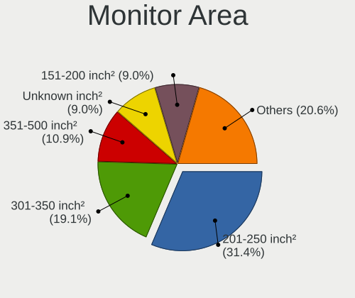

| Area in inch² | Desktops | Percent |
|----------------|----------|---------|
| 201-250        | 4314     | 31.4%   |
| 301-350        | 2623     | 19.09%  |
| 351-500        | 1500     | 10.92%  |
| Unknown        | 1240     | 9.02%   |
| 151-200        | 1235     | 8.99%   |
| 251-300        | 1022     | 7.44%   |
| More than 1000 | 853      | 6.21%   |
| 501-1000       | 447      | 3.25%   |
| 141-150        | 316      | 2.3%    |
| 101-110        | 104      | 0.76%   |
| 131-140        | 33       | 0.24%   |
| 111-120        | 16       | 0.12%   |
| 71-80          | 13       | 0.09%   |
| 121-130        | 8        | 0.06%   |
| 81-90          | 5        | 0.04%   |
| 1-40           | 4        | 0.03%   |
| 91-100         | 4        | 0.03%   |
| 61-70          | 2        | 0.01%   |
| 51-60          | 1        | 0.01%   |
| 41-50          | 1        | 0.01%   |

Pixel Density
-------------

Pixels per inch

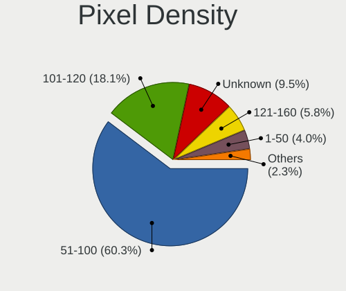

| Density       | Desktops | Percent |
|---------------|----------|---------|
| 51-100        | 7855     | 60.3%   |
| 101-120       | 2355     | 18.08%  |
| Unknown       | 1241     | 9.53%   |
| 121-160       | 756      | 5.8%    |
| 1-50          | 518      | 3.98%   |
| 161-240       | 296      | 2.27%   |
| More than 240 | 6        | 0.05%   |

Multiple Monitors
-----------------

Total monitors connected

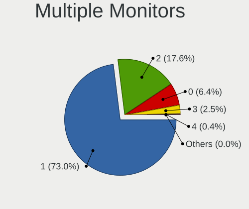

| Total | Desktops | Percent |
|-------|----------|---------|
| 1     | 9593     | 73.04%  |
| 2     | 2316     | 17.63%  |
| 0     | 847      | 6.45%   |
| 3     | 330      | 2.51%   |
| 4     | 46       | 0.35%   |
| 5     | 2        | 0.02%   |

Network
-------

Net Controller Vendor
---------------------

Controller vendors

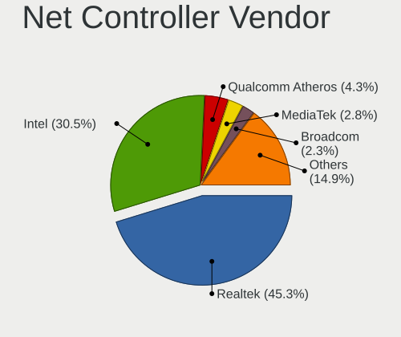

| Vendor                          | Desktops | Percent |
|---------------------------------|----------|---------|
| Realtek Semiconductor           | 7946     | 45.26%  |
| Intel                           | 5356     | 30.51%  |
| Qualcomm Atheros                | 748      | 4.26%   |
| MediaTek                        | 492      | 2.8%    |
| Broadcom                        | 399      | 2.27%   |
| TP-Link                         | 276      | 1.57%   |
| Nvidia                          | 255      | 1.45%   |
| Ralink Technology               | 227      | 1.29%   |
| Microsoft                       | 183      | 1.04%   |
| AVM                             | 155      | 0.88%   |
| Aquantia                        | 120      | 0.68%   |
| Marvell Technology Group        | 89       | 0.51%   |
| IMC Networks                    | 86       | 0.49%   |
| Ralink                          | 81       | 0.46%   |
| Broadcom Limited                | 78       | 0.44%   |
| Edimax Technology               | 73       | 0.42%   |
| D-Link System                   | 68       | 0.39%   |
| ASIX Electronics                | 63       | 0.36%   |
| Samsung Electronics             | 62       | 0.35%   |
| Qualcomm Atheros Communications | 57       | 0.32%   |
| D-Link                          | 56       | 0.32%   |
| ASUSTek Computer                | 51       | 0.29%   |
| NetGear                         | 43       | 0.24%   |
| VIA Technologies                | 33       | 0.19%   |
| Xiaomi                          | 31       | 0.18%   |
| Qualcomm Technologies           | 31       | 0.18%   |
| Mellanox Technologies           | 31       | 0.18%   |
| Belkin Components               | 27       | 0.15%   |
| Huawei Technologies             | 23       | 0.13%   |
| DisplayLink                     | 23       | 0.13%   |
| Sitecom Europe                  | 22       | 0.13%   |
| 3Com                            | 21       | 0.12%   |
| American Megatrends             | 19       | 0.11%   |
| Google                          | 13       | 0.07%   |
| QinHeng Electronics             | 12       | 0.07%   |
| ZyXEL Communications            | 11       | 0.06%   |
| Arduino SA                      | 11       | 0.06%   |
| ZyDAS                           | 9        | 0.05%   |
| Holtek Semiconductor            | 9        | 0.05%   |
| Lenovo                          | 8        | 0.05%   |

Net Controller Model
--------------------

Controller models

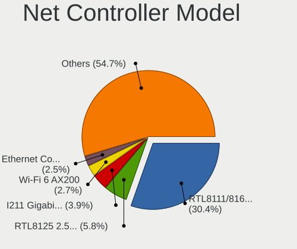

| Model                                                                  | Desktops | Percent |
|------------------------------------------------------------------------|----------|---------|
| Realtek RTL8111/8168/8211/8411 PCI Express Gigabit Ethernet Controller | 6074     | 30.38%  |
| Realtek RTL8125 2.5GbE Controller                                      | 1164     | 5.82%   |
| Intel I211 Gigabit Network Connection                                  | 785      | 3.93%   |
| Intel Wi-Fi 6 AX200                                                    | 547      | 2.74%   |
| Intel Ethernet Connection (2) I219-V                                   | 491      | 2.46%   |
| Intel Ethernet Controller I225-V                                       | 430      | 2.15%   |
| Intel 82579LM Gigabit Network Connection (Lewisville)                  | 406      | 2.03%   |
| Intel Ethernet Connection I217-LM                                      | 262      | 1.31%   |
| MediaTek MT7922 802.11ax PCI Express Wireless Network Adapter          | 239      | 1.2%    |
| Intel 82579V Gigabit Network Connection                                | 225      | 1.13%   |
| Intel Dual Band Wireless-AC 3168NGW [Stone Peak]                       | 208      | 1.04%   |
| Intel Ethernet Connection I217-V                                       | 204      | 1.02%   |
| Intel Wi-Fi 6E(802.11ax) AX210/AX1675* 2x2 [Typhoon Peak]              | 202      | 1.01%   |
| Realtek RTL8153 Gigabit Ethernet Adapter                               | 187      | 0.94%   |
| Realtek RTL88x2bu [AC1200 Techkey]                                     | 179      | 0.9%    |
| Intel Ethernet Connection (7) I219-V                                   | 178      | 0.89%   |
| Intel Ethernet Connection (2) I219-LM                                  | 169      | 0.85%   |
| Realtek RTL8821CE 802.11ac PCIe Wireless Network Adapter               | 158      | 0.79%   |
| Intel Ethernet Controller I226-V                                       | 151      | 0.76%   |
| Intel I210 Gigabit Network Connection                                  | 149      | 0.75%   |
| Intel Ethernet Connection (2) I218-V                                   | 126      | 0.63%   |
| Intel Wi-Fi 5(802.11ac) Wireless-AC 9x6x [Thunder Peak]                | 124      | 0.62%   |
| Realtek 802.11ac NIC                                                   | 121      | 0.61%   |
| Nvidia MCP61 Ethernet                                                  | 121      | 0.61%   |
| MediaTek MT7921K (RZ608) Wi-Fi 6E 80MHz                                | 120      | 0.6%    |
| Intel 82567LM-3 Gigabit Network Connection                             | 119      | 0.6%    |
| Intel 82574L Gigabit Network Connection                                | 112      | 0.56%   |
| Qualcomm Atheros AR8151 v2.0 Gigabit Ethernet                          | 96       | 0.48%   |
| Intel 700 Series Chipset CNVi WiFi                                     | 88       | 0.44%   |
| Realtek RTL810xE PCI Express Fast Ethernet controller                  | 87       | 0.44%   |
| TP-Link TL-WN823N v2/v3 [Realtek RTL8192EU]                            | 86       | 0.43%   |
| Realtek RTL8188EUS 802.11n Wireless Network Adapter                    | 84       | 0.42%   |
| Intel Ethernet Connection (7) I219-LM                                  | 83       | 0.42%   |
| Intel Cannon Lake PCH CNVi WiFi                                        | 79       | 0.4%    |
| Realtek RTL8852BE PCIe 802.11ax Wireless Network Controller            | 77       | 0.39%   |
| Microsoft Xbox 360 Wireless Adapter                                    | 75       | 0.38%   |
| AVM FRITZ!WLAN AC 860                                                  | 75       | 0.38%   |
| Microsoft Xbox Wireless Adapter for Windows                            | 73       | 0.37%   |
| Qualcomm Atheros Killer E220x Gigabit Ethernet Controller              | 71       | 0.36%   |
| Intel Alder Lake-S PCH CNVi WiFi                                       | 68       | 0.34%   |

Wireless Vendor
---------------

Wireless vendors

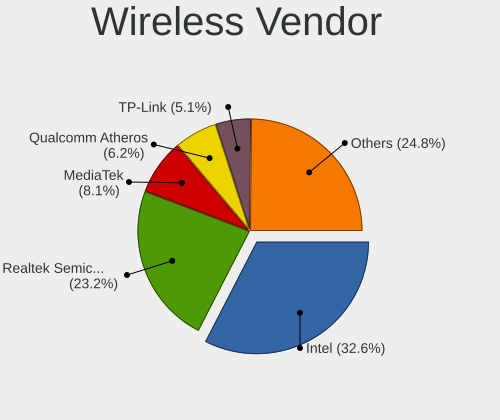

| Vendor                                | Desktops | Percent |
|---------------------------------------|----------|---------|
| Intel                                 | 1747     | 32.56%  |
| Realtek Semiconductor                 | 1245     | 23.21%  |
| MediaTek                              | 433      | 8.07%   |
| Qualcomm Atheros                      | 333      | 6.21%   |
| TP-Link                               | 274      | 5.11%   |
| Ralink Technology                     | 227      | 4.23%   |
| Microsoft                             | 180      | 3.36%   |
| AVM                                   | 155      | 2.89%   |
| Broadcom                              | 129      | 2.4%    |
| IMC Networks                          | 86       | 1.6%    |
| Ralink                                | 81       | 1.51%   |
| Edimax Technology                     | 73       | 1.36%   |
| Qualcomm Atheros Communications       | 57       | 1.06%   |
| D-Link                                | 52       | 0.97%   |
| D-Link System                         | 51       | 0.95%   |
| ASUSTek Computer                      | 51       | 0.95%   |
| NetGear                               | 43       | 0.8%    |
| Belkin Components                     | 23       | 0.43%   |
| Sitecom Europe                        | 22       | 0.41%   |
| Broadcom Limited                      | 14       | 0.26%   |
| ZyXEL Communications                  | 11       | 0.21%   |
| ZyDAS                                 | 9        | 0.17%   |
| Qualcomm Technologies                 | 8        | 0.15%   |
| Wacom                                 | 6        | 0.11%   |
| Linksys                               | 6        | 0.11%   |
| Philips (or NXP)                      | 4        | 0.07%   |
| Marvell Technology Group              | 4        | 0.07%   |
| Gemtek                                | 4        | 0.07%   |
| 802.11g Adapter [Linksys WUSB54GC v3] | 4        | 0.07%   |
| Tenda                                 | 3        | 0.06%   |
| Sweex                                 | 3        | 0.06%   |
| Realtek                               | 3        | 0.06%   |
| Accton Technology                     | 3        | 0.06%   |
| Wilocity                              | 2        | 0.04%   |
| Texas Instruments                     | 2        | 0.04%   |
| Sierra Wireless                       | 2        | 0.04%   |
| CyberTAN Technology                   | 2        | 0.04%   |
| AboCom Systems                        | 2        | 0.04%   |
| Z-Com                                 | 1        | 0.02%   |
| VIA Technologies                      | 1        | 0.02%   |

Wireless Model
--------------

Wireless models

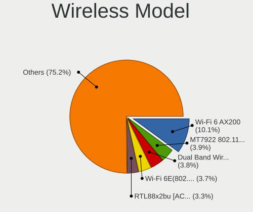

| Model                                                          | Desktops | Percent |
|----------------------------------------------------------------|----------|---------|
| Intel Wi-Fi 6 AX200                                            | 547      | 10.06%  |
| MediaTek MT7922 802.11ax PCI Express Wireless Network Adapter  | 214      | 3.94%   |
| Intel Dual Band Wireless-AC 3168NGW [Stone Peak]               | 208      | 3.83%   |
| Intel Wi-Fi 6E(802.11ax) AX210/AX1675* 2x2 [Typhoon Peak]      | 202      | 3.72%   |
| Realtek RTL88x2bu [AC1200 Techkey]                             | 179      | 3.29%   |
| Realtek RTL8821CE 802.11ac PCIe Wireless Network Adapter       | 158      | 2.91%   |
| Intel Wi-Fi 5(802.11ac) Wireless-AC 9x6x [Thunder Peak]        | 124      | 2.28%   |
| Realtek 802.11ac NIC                                           | 121      | 2.23%   |
| MediaTek MT7921K (RZ608) Wi-Fi 6E 80MHz                        | 120      | 2.21%   |
| Intel 700 Series Chipset CNVi WiFi                             | 88       | 1.62%   |
| TP-Link TL-WN823N v2/v3 [Realtek RTL8192EU]                    | 86       | 1.58%   |
| Realtek RTL8188EUS 802.11n Wireless Network Adapter            | 84       | 1.55%   |
| Intel Cannon Lake PCH CNVi WiFi                                | 79       | 1.45%   |
| Microsoft Xbox 360 Wireless Adapter                            | 75       | 1.38%   |
| AVM FRITZ!WLAN AC 860                                          | 75       | 1.38%   |
| Microsoft Xbox Wireless Adapter for Windows                    | 73       | 1.34%   |
| IMC Networks Mediao 802.11n WLAN [Realtek RTL8191SU]           | 68       | 1.25%   |
| Intel Wireless 7265                                            | 67       | 1.23%   |
| Realtek RTL8192CE PCIe Wireless Network Adapter                | 61       | 1.12%   |
| Intel Wireless 3165                                            | 61       | 1.12%   |
| Broadcom BCM4360 802.11ac Dual Band Wireless Network Adapter   | 59       | 1.09%   |
| Intel Wireless 8260                                            | 57       | 1.05%   |
| Realtek RTL8188CUS 802.11n WLAN Adapter                        | 54       | 0.99%   |
| Realtek RTL8192EE PCIe Wireless Network Adapter                | 48       | 0.88%   |
| Realtek RTL8192CU 802.11n WLAN Adapter                         | 48       | 0.88%   |
| Intel Wireless 7260                                            | 48       | 0.88%   |
| Edimax EW-7811Un 802.11n Wireless Adapter [Realtek RTL8188CUS] | 48       | 0.88%   |
| Qualcomm Atheros AR9485 Wireless Network Adapter               | 46       | 0.85%   |
| Intel Wireless 8265 / 8275                                     | 46       | 0.85%   |
| Intel Alder Lake-S PCH CNVi WiFi                               | 45       | 0.83%   |
| Ralink RT5370 Wireless Adapter                                 | 44       | 0.81%   |
| Realtek RTL8812AE 802.11ac PCIe Wireless Network Adapter       | 41       | 0.75%   |
| Qualcomm Atheros AR9287 Wireless Network Adapter (PCI-Express) | 41       | 0.75%   |
| Realtek RTL8822BE 802.11a/b/g/n/ac WiFi adapter                | 38       | 0.7%    |
| Qualcomm Atheros AR9271 802.11n                                | 36       | 0.66%   |
| AVM FRITZ WLAN N v2 [RT5572/rt2870.bin]                        | 36       | 0.66%   |
| TP-Link 802.11ac NIC                                           | 35       | 0.64%   |
| Realtek RTL8852BE PCIe 802.11ax Wireless Network Controller    | 35       | 0.64%   |
| Ralink RT2870/RT3070 Wireless Adapter                          | 35       | 0.64%   |
| Ralink MT7601U Wireless Adapter                                | 35       | 0.64%   |

Ethernet Vendor
---------------

Ethernet vendors

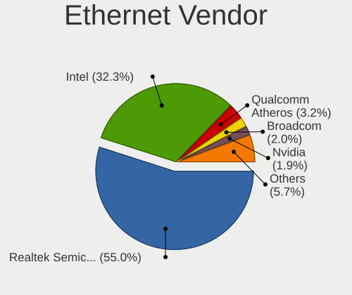

| Vendor                                 | Desktops | Percent |
|----------------------------------------|----------|---------|
| Realtek Semiconductor                  | 7560     | 54.97%  |
| Intel                                  | 4440     | 32.28%  |
| Qualcomm Atheros                       | 441      | 3.21%   |
| Broadcom                               | 276      | 2.01%   |
| Nvidia                                 | 255      | 1.85%   |
| Aquantia                               | 120      | 0.87%   |
| Marvell Technology Group               | 85       | 0.62%   |
| Broadcom Limited                       | 64       | 0.47%   |
| ASIX Electronics                       | 63       | 0.46%   |
| Samsung Electronics                    | 62       | 0.45%   |
| MediaTek                               | 50       | 0.36%   |
| VIA Technologies                       | 32       | 0.23%   |
| Xiaomi                                 | 31       | 0.23%   |
| Mellanox Technologies                  | 26       | 0.19%   |
| Qualcomm Technologies                  | 23       | 0.17%   |
| DisplayLink                            | 23       | 0.17%   |
| 3Com                                   | 21       | 0.15%   |
| American Megatrends                    | 19       | 0.14%   |
| Huawei Technologies                    | 17       | 0.12%   |
| D-Link System                          | 17       | 0.12%   |
| Google                                 | 13       | 0.09%   |
| Lenovo                                 | 8        | 0.06%   |
| ADMtek                                 | 8        | 0.06%   |
| Qualcomm                               | 7        | 0.05%   |
| Apple                                  | 7        | 0.05%   |
| ZTE WCDMA Technologies MSM             | 5        | 0.04%   |
| Emulex                                 | 5        | 0.04%   |
| Silicon Integrated Systems [SiS]       | 4        | 0.03%   |
| Netchip Technology                     | 4        | 0.03%   |
| Motorola PCS                           | 4        | 0.03%   |
| JMicron Technology                     | 4        | 0.03%   |
| D-Link                                 | 4        | 0.03%   |
| Sony Ericsson Mobile Communications AB | 3        | 0.02%   |
| QLogic                                 | 3        | 0.02%   |
| QinHeng Electronics                    | 3        | 0.02%   |
| ICS Advent                             | 3        | 0.02%   |
| Belkin Components                      | 3        | 0.02%   |
| TP-Link                                | 2        | 0.01%   |
| Suzhou Motorcomm Electronic Technology | 2        | 0.01%   |
| OPPO Electronics                       | 2        | 0.01%   |

Ethernet Model
--------------

Ethernet models

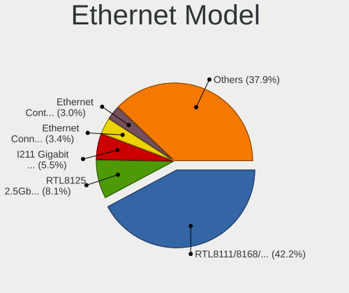

| Model                                                                          | Desktops | Percent |
|--------------------------------------------------------------------------------|----------|---------|
| Realtek RTL8111/8168/8211/8411 PCI Express Gigabit Ethernet Controller         | 6074     | 42.2%   |
| Realtek RTL8125 2.5GbE Controller                                              | 1164     | 8.09%   |
| Intel I211 Gigabit Network Connection                                          | 785      | 5.45%   |
| Intel Ethernet Connection (2) I219-V                                           | 491      | 3.41%   |
| Intel Ethernet Controller I225-V                                               | 430      | 2.99%   |
| Intel 82579LM Gigabit Network Connection (Lewisville)                          | 406      | 2.82%   |
| Intel Ethernet Connection I217-LM                                              | 262      | 1.82%   |
| Intel 82579V Gigabit Network Connection                                        | 225      | 1.56%   |
| Intel Ethernet Connection I217-V                                               | 204      | 1.42%   |
| Realtek RTL8153 Gigabit Ethernet Adapter                                       | 187      | 1.3%    |
| Intel Ethernet Connection (7) I219-V                                           | 178      | 1.24%   |
| Intel Ethernet Connection (2) I219-LM                                          | 169      | 1.17%   |
| Intel Ethernet Controller I226-V                                               | 151      | 1.05%   |
| Intel I210 Gigabit Network Connection                                          | 149      | 1.04%   |
| Intel Ethernet Connection (2) I218-V                                           | 126      | 0.88%   |
| Nvidia MCP61 Ethernet                                                          | 121      | 0.84%   |
| Intel 82567LM-3 Gigabit Network Connection                                     | 119      | 0.83%   |
| Intel 82574L Gigabit Network Connection                                        | 112      | 0.78%   |
| Qualcomm Atheros AR8151 v2.0 Gigabit Ethernet                                  | 96       | 0.67%   |
| Realtek RTL810xE PCI Express Fast Ethernet controller                          | 87       | 0.6%    |
| Intel Ethernet Connection (7) I219-LM                                          | 83       | 0.58%   |
| Qualcomm Atheros Killer E220x Gigabit Ethernet Controller                      | 71       | 0.49%   |
| Aquantia AQtion AQC107 NBase-T/IEEE 802.3an Ethernet Controller [Atlantic 10G] | 67       | 0.47%   |
| Realtek RTL-8100/8101L/8139 PCI Fast Ethernet Adapter                          | 64       | 0.44%   |
| Realtek RTL8126 5GbE Controller                                                | 63       | 0.44%   |
| Qualcomm Atheros AR8161 Gigabit Ethernet                                       | 63       | 0.44%   |
| Realtek RTL8169 PCI Gigabit Ethernet Controller                                | 62       | 0.43%   |
| ASIX AX88179 Gigabit Ethernet                                                  | 54       | 0.38%   |
| Marvell Group 88E8056 PCI-E Gigabit Ethernet Controller                        | 49       | 0.34%   |
| Intel 82566DM-2 Gigabit Network Connection                                     | 46       | 0.32%   |
| Samsung Galaxy series, misc. (tethering mode)                                  | 45       | 0.31%   |
| Intel Ethernet Connection (14) I219-V                                          | 45       | 0.31%   |
| Qualcomm Atheros Killer E2500 Gigabit Ethernet Controller                      | 44       | 0.31%   |
| Realtek RTL8852BE PCIe 802.11ax Wireless Network Controller                    | 42       | 0.29%   |
| Qualcomm Atheros AR8121/AR8113/AR8114 Gigabit or Fast Ethernet                 | 41       | 0.28%   |
| Broadcom NetLink BCM57781 Gigabit Ethernet PCIe                                | 39       | 0.27%   |
| Intel 82578DM Gigabit Network Connection                                       | 38       | 0.26%   |
| Qualcomm Atheros QCA8171 Gigabit Ethernet                                      | 37       | 0.26%   |
| Qualcomm Atheros Killer E2400 Gigabit Ethernet Controller                      | 37       | 0.26%   |
| Intel Ethernet Connection (2) I218-LM                                          | 37       | 0.26%   |

Net Controller Kind
-------------------

Ethernet, WiFi or modem

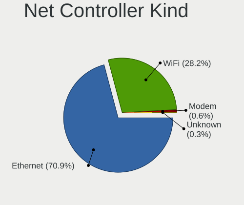

| Kind     | Desktops | Percent |
|----------|----------|---------|
| Ethernet | 12653    | 70.87%  |
| WiFi     | 5043     | 28.25%  |
| Modem    | 111      | 0.62%   |
| Unknown  | 46       | 0.26%   |

Used Controller
---------------

Currently used network controller

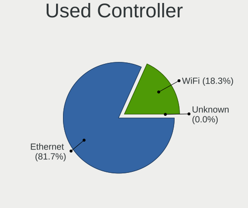

| Kind     | Desktops | Percent |
|----------|----------|---------|
| Ethernet | 10804    | 81.73%  |
| WiFi     | 2413     | 18.25%  |
| Unknown  | 2        | 0.02%   |

NICs
----

Total network controllers on board

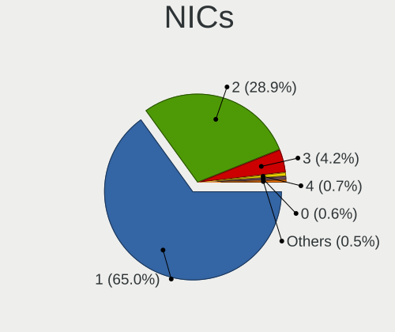

| Total | Desktops | Percent |
|-------|----------|---------|
| 1     | 8373     | 65.04%  |
| 2     | 3719     | 28.89%  |
| 3     | 542      | 4.21%   |
| 4     | 89       | 0.69%   |
| 0     | 81       | 0.63%   |
| 5     | 35       | 0.27%   |
| 6     | 18       | 0.14%   |
| 7     | 6        | 0.05%   |
| 8     | 5        | 0.04%   |
| 18    | 2        | 0.02%   |
| 9     | 2        | 0.02%   |
| 12    | 1        | 0.01%   |

IPv6
----

IPv6 vs IPv4

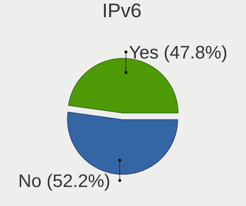

| Used | Desktops | Percent |
|------|----------|---------|
| No   | 6926     | 52.21%  |
| Yes  | 6340     | 47.79%  |

Bluetooth
---------

Bluetooth Vendor
----------------

Controller vendors

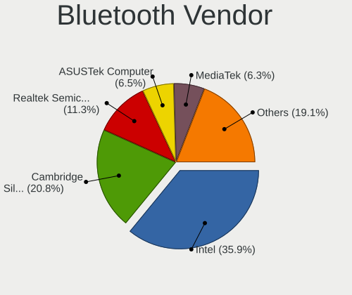

| Vendor                          | Desktops | Percent |
|---------------------------------|----------|---------|
| Intel                           | 1674     | 35.92%  |
| Cambridge Silicon Radio         | 970      | 20.82%  |
| Realtek Semiconductor           | 528      | 11.33%  |
| ASUSTek Computer                | 302      | 6.48%   |
| MediaTek                        | 294      | 6.31%   |
| Broadcom                        | 153      | 3.28%   |
| IMC Networks                    | 152      | 3.26%   |
| Foxconn / Hon Hai               | 138      | 2.96%   |
| TP-Link                         | 107      | 2.3%    |
| Qualcomm Atheros Communications | 92       | 1.97%   |
| Apple                           | 43       | 0.92%   |
| Integrated System Solution      | 32       | 0.69%   |
| Lite-On Technology              | 31       | 0.67%   |
| Unknown                         | 30       | 0.64%   |
| Edimax Technology               | 23       | 0.49%   |
| Belkin Components               | 19       | 0.41%   |
| Actions                         | 14       | 0.3%    |
| Realtek                         | 9        | 0.19%   |
| Logitech                        | 8        | 0.17%   |
| HTC (High Tech Computer)        | 8        | 0.17%   |
| Qcom                            | 4        | 0.09%   |
| Micro Star International        | 4        | 0.09%   |
| Dell                            | 4        | 0.09%   |
| SiW                             | 3        | 0.06%   |
| Conwise Technology              | 3        | 0.06%   |
| Motorola PCS                    | 2        | 0.04%   |
| Mercucys                        | 2        | 0.04%   |
| AVM                             | 2        | 0.04%   |
| TRENDnet                        | 1        | 0.02%   |
| Toshiba                         | 1        | 0.02%   |
| SINO WEALTH                     | 1        | 0.02%   |
| National Semiconductor          | 1        | 0.02%   |
| Microsoft                       | 1        | 0.02%   |
| i.Tech Dynamic Limited          | 1        | 0.02%   |
| Hewlett-Packard                 | 1        | 0.02%   |
| Fujitsu Siemens Computers       | 1        | 0.02%   |
| AICSemi                         | 1        | 0.02%   |

Bluetooth Model
---------------

Controller models

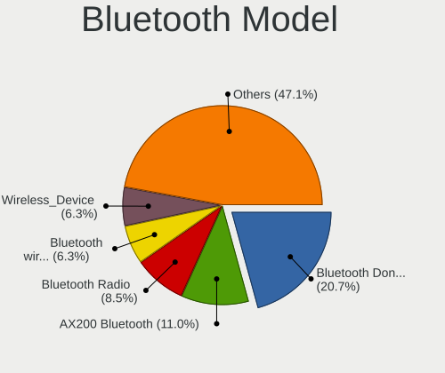

| Model                                                 | Desktops | Percent |
|-------------------------------------------------------|----------|---------|
| Cambridge Silicon Radio Bluetooth Dongle (HCI mode)   | 969      | 20.75%  |
| Intel AX200 Bluetooth                                 | 514      | 11.01%  |
| Realtek Bluetooth Radio                               | 399      | 8.54%   |
| Intel Bluetooth wireless interface                    | 296      | 6.34%   |
| MediaTek Wireless_Device                              | 293      | 6.27%   |
| Intel Wireless-AC 3168 Bluetooth                      | 200      | 4.28%   |
| Intel AX210 Bluetooth                                 | 191      | 4.09%   |
| Intel Bluetooth Device                                | 126      | 2.7%    |
| Intel AX201 Bluetooth                                 | 122      | 2.61%   |
| Intel Wireless-AC 9260 Bluetooth Adapter              | 117      | 2.51%   |
| TP-Link TP-T@- UB500 Adapter                          | 107      | 2.29%   |
| ASUS Broadcom BCM20702A0 Bluetooth                    | 106      | 2.27%   |
| Foxconn / Hon Hai Wireless_Device                     | 100      | 2.14%   |
| ASUS ASUS USB-BT500                                   | 98       | 2.1%    |
| Broadcom BCM20702A0 Bluetooth 4.0                     | 95       | 2.03%   |
| Intel Bluetooth 9460/9560 Jefferson Peak (JfP)        | 93       | 1.99%   |
| IMC Networks Wireless_Device                          | 71       | 1.52%   |
| IMC Networks Bluetooth Radio                          | 68       | 1.46%   |
| Realtek  Bluetooth 4.2 Adapter                        | 57       | 1.22%   |
| Qualcomm Atheros AR3011 Bluetooth                     | 48       | 1.03%   |
| Realtek Bluetooth 5.3 Radio                           | 38       | 0.81%   |
| Foxconn / Hon Hai Bluetooth Device                    | 38       | 0.81%   |
| ASUS Bluetooth Radio                                  | 35       | 0.75%   |
| Unknown                                               | 30       | 0.64%   |
| Apple Bluetooth Host Controller                       | 20       | 0.43%   |
| Edimax Bluetooth Device                               | 19       | 0.41%   |
| Realtek Bluetooth 5.4 Radio                           | 18       | 0.39%   |
| Intel Centrino Bluetooth Wireless Transceiver         | 18       | 0.39%   |
| Integrated System Solution Bluetooth Device           | 18       | 0.39%   |
| ASUS Bluetooth Adapter                                | 16       | 0.34%   |
| Qualcomm Atheros  Bluetooth Device                    | 15       | 0.32%   |
| Lite-On Bluetooth Device                              | 15       | 0.32%   |
| Belkin Components F8T065BF Mini Bluetooth 4.0 Adapter | 15       | 0.32%   |
| ASUS BCM20702A0                                       | 15       | 0.32%   |
| Qualcomm Atheros QCA61x4 Bluetooth 4.0                | 14       | 0.3%    |
| Integrated System Solution KY-BT100 Bluetooth Adapter | 14       | 0.3%    |
| Actions general adapter                               | 14       | 0.3%    |
| ASUS Qualcomm Bluetooth 4.1                           | 13       | 0.28%   |
| Apple Built-in Bluetooth 2.0+EDR HCI                  | 13       | 0.28%   |
| Lite-On Qualcomm Atheros QCA9377 Bluetooth            | 10       | 0.21%   |

Sound
-----

Sound Vendor
------------

Sound card vendors

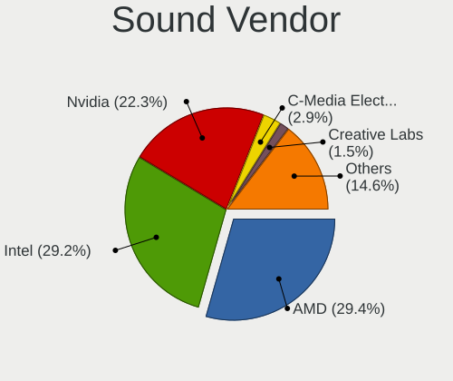

| Vendor                                       | Desktops | Percent |
|----------------------------------------------|----------|---------|
| AMD                                          | 6588     | 29.4%   |
| Intel                                        | 6549     | 29.23%  |
| Nvidia                                       | 5005     | 22.34%  |
| C-Media Electronics                          | 657      | 2.93%   |
| Creative Labs                                | 339      | 1.51%   |
| Logitech                                     | 309      | 1.38%   |
| ASUSTek Computer                             | 189      | 0.84%   |
| Texas Instruments                            | 147      | 0.66%   |
| GN Netcom                                    | 127      | 0.57%   |
| Focusrite-Novation                           | 124      | 0.55%   |
| Creative Technology                          | 120      | 0.54%   |
| Micro Star International                     | 119      | 0.53%   |
| JMTek                                        | 118      | 0.53%   |
| Kingston Technology                          | 114      | 0.51%   |
| Razer USA                                    | 109      | 0.49%   |
| SteelSeries ApS                              | 96       | 0.43%   |
| Corsair                                      | 75       | 0.33%   |
| VIA Technologies                             | 71       | 0.32%   |
| Plantronics                                  | 69       | 0.31%   |
| Generalplus Technology                       | 69       | 0.31%   |
| DSEA A/S                                     | 64       | 0.29%   |
| Yamaha                                       | 62       | 0.28%   |
| RODE Microphones                             | 57       | 0.25%   |
| Zoran Co. Personal Media Division (Nogatech) | 50       | 0.22%   |
| Hewlett-Packard                              | 45       | 0.2%    |
| BEHRINGER International                      | 45       | 0.2%    |
| Samson Technologies                          | 39       | 0.17%   |
| Realtek Semiconductor                        | 33       | 0.15%   |
| Dell                                         | 28       | 0.12%   |
| Sony                                         | 27       | 0.12%   |
| Jieli Technology                             | 27       | 0.12%   |
| ROCCAT                                       | 26       | 0.12%   |
| Native Instruments                           | 25       | 0.11%   |
| TerraTec Electronic                          | 23       | 0.1%    |
| Lautsprecher Teufel                          | 22       | 0.1%    |
| GYROCOM C&C                                  | 22       | 0.1%    |
| Blue Microphones                             | 22       | 0.1%    |
| KTMicro                                      | 21       | 0.09%   |
| USB MICROPHONE                               | 20       | 0.09%   |
| Thesycon Systemsoftware & Consulting         | 20       | 0.09%   |

Sound Model
-----------

Sound card models

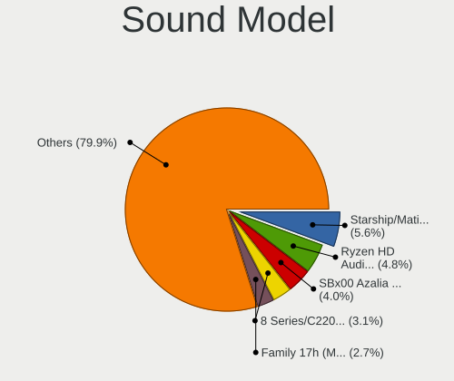

| Model                                                                             | Desktops | Percent |
|-----------------------------------------------------------------------------------|----------|---------|
| AMD Starship/Matisse HD Audio Controller                                          | 1524     | 5.63%   |
| AMD Ryzen HD Audio Controller                                                     | 1292     | 4.77%   |
| AMD SBx00 Azalia (Intel HDA)                                                      | 1071     | 3.95%   |
| Intel 8 Series/C220 Series Chipset High Definition Audio Controller               | 837      | 3.09%   |
| AMD Family 17h (Models 00h-0fh) HD Audio Controller                               | 733      | 2.71%   |
| Intel 6 Series/C200 Series Chipset Family High Definition Audio Controller        | 663      | 2.45%   |
| Intel 100 Series/C230 Series Chipset Family HD Audio Controller                   | 626      | 2.31%   |
| Intel 7 Series/C216 Chipset Family High Definition Audio Controller               | 609      | 2.25%   |
| AMD Ellesmere HDMI Audio [Radeon RX 470/480 / 570/580/590]                        | 570      | 2.1%    |
| Intel Xeon E3-1200 v3/4th Gen Core Processor HD Audio Controller                  | 568      | 2.1%    |
| Intel 200 Series PCH HD Audio                                                     | 521      | 1.92%   |
| AMD Navi 21/23 HDMI/DP Audio Controller                                           | 507      | 1.87%   |
| AMD Radeon High Definition Audio Controller                                       | 487      | 1.8%    |
| AMD FCH Azalia Controller                                                         | 438      | 1.62%   |
| AMD Renoir/Cezanne HDMI/DP Audio Controller                                       | 436      | 1.61%   |
| Nvidia GK208 HDMI/DP Audio Controller                                             | 420      | 1.55%   |
| Nvidia GP107GL High Definition Audio Controller                                   | 413      | 1.52%   |
| Intel Cannon Lake PCH cAVS                                                        | 393      | 1.45%   |
| AMD Raven/Raven2/Fenghuang HDMI/DP Audio Controller                               | 326      | 1.2%    |
| Intel NM10/ICH7 Family High Definition Audio Controller                           | 302      | 1.11%   |
| Nvidia GP104 High Definition Audio Controller                                     | 295      | 1.09%   |
| AMD Oland/Hainan/Cape Verde/Pitcairn HDMI Audio [Radeon HD 7000 Series]           | 292      | 1.08%   |
| AMD Navi 31 HDMI/DP Audio                                                         | 287      | 1.06%   |
| Nvidia GP106 High Definition Audio Controller                                     | 282      | 1.04%   |
| AMD Navi 10 HDMI Audio                                                            | 253      | 0.93%   |
| AMD Baffin HDMI/DP Audio [Radeon RX 550 640SP / RX 560/560X]                      | 237      | 0.87%   |
| Intel 82801JI (ICH10 Family) HD Audio Controller                                  | 232      | 0.86%   |
| Intel 5 Series/3400 Series Chipset High Definition Audio                          | 227      | 0.84%   |
| Nvidia GM107 High Definition Audio Controller [GeForce 940MX]                     | 218      | 0.8%    |
| Intel 9 Series Chipset Family HD Audio Controller                                 | 202      | 0.75%   |
| Nvidia GM204 High Definition Audio Controller                                     | 201      | 0.74%   |
| Nvidia GA104 High Definition Audio Controller                                     | 195      | 0.72%   |
| Intel Alder Lake-S HD Audio Controller                                            | 195      | 0.72%   |
| Nvidia GP108 High Definition Audio Controller                                     | 191      | 0.71%   |
| AMD Caicos HDMI Audio [Radeon HD 6450 / 7450/8450/8490 OEM / R5 230/235/235X OEM] | 190      | 0.7%    |
| Nvidia TU116 High Definition Audio Controller                                     | 184      | 0.68%   |
| AMD Cedar HDMI Audio [Radeon HD 5400/6300/7300 Series]                            | 179      | 0.66%   |
| Nvidia TU106 High Definition Audio Controller                                     | 175      | 0.65%   |
| Nvidia High Definition Audio Controller                                           | 175      | 0.65%   |
| C-Media Electronics Audio Adapter (Unitek Y-247A)                                 | 175      | 0.65%   |

Memory
------

Memory Vendor
-------------

Memory module vendors

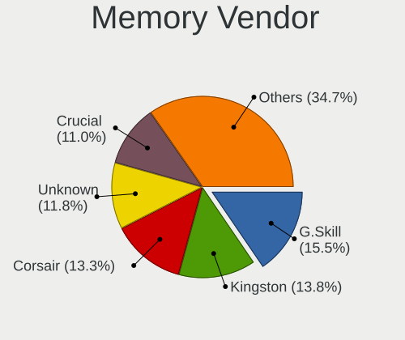

| Vendor                       | Desktops | Percent |
|------------------------------|----------|---------|
| G.Skill                      | 1087     | 15.48%  |
| Kingston                     | 966      | 13.75%  |
| Corsair                      | 931      | 13.26%  |
| Unknown                      | 832      | 11.85%  |
| Crucial                      | 770      | 10.96%  |
| Samsung Electronics          | 747      | 10.64%  |
| SK hynix                     | 502      | 7.15%   |
| Micron Technology            | 322      | 4.58%   |
| Nanya Technology             | 108      | 1.54%   |
| A-DATA Technology            | 103      | 1.47%   |
| Unknown                      | 92       | 1.31%   |
| Team                         | 78       | 1.11%   |
| Patriot                      | 53       | 0.75%   |
| Ramaxel Technology           | 46       | 0.65%   |
| Elpida                       | 27       | 0.38%   |
| Unknown (ABCD)               | 26       | 0.37%   |
| Transcend                    | 18       | 0.26%   |
| Avant                        | 16       | 0.23%   |
| Unifosa                      | 15       | 0.21%   |
| GOODRAM                      | 15       | 0.21%   |
| GeIL                         | 15       | 0.21%   |
| Lexar                        | 14       | 0.2%    |
| Apacer                       | 14       | 0.2%    |
| Patriot Memory               | 13       | 0.19%   |
| Unknown (0x0E9D)             | 11       | 0.16%   |
| Patriot Memory (PDP Systems) | 11       | 0.16%   |
| Lexar Co Limited             | 10       | 0.14%   |
| Toshiba                      | 8        | 0.11%   |
| Wodposit                     | 6        | 0.09%   |
| Timetec                      | 6        | 0.09%   |
| Qimonda                      | 6        | 0.09%   |
| Mushkin                      | 6        | 0.09%   |
| INNOVATION PC                | 6        | 0.09%   |
| Hewlett-Packard              | 6        | 0.09%   |
| TeamGroup                    | 5        | 0.07%   |
| PNY                          | 4        | 0.06%   |
| Golden Empire                | 4        | 0.06%   |
| Exceleram                    | 4        | 0.06%   |
| CSX                          | 4        | 0.06%   |
| Unknown (0x0B45)             | 3        | 0.04%   |

Memory Model
------------

Memory module models

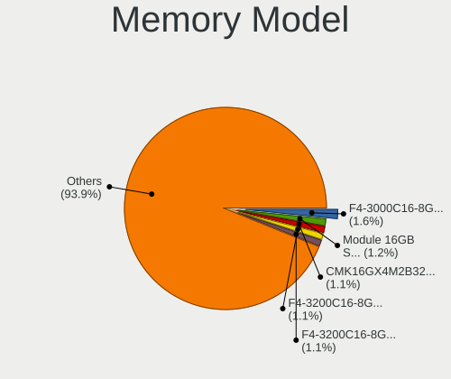

| Model                                                          | Desktops | Percent |
|----------------------------------------------------------------|----------|---------|
| G.Skill RAM F4-3000C16-8GISB 8GB DIMM DDR4 3200MT/s            | 122      | 1.6%    |
| Unknown                                                        | 92       | 1.2%    |
| Corsair RAM CMK16GX4M2B3200C16 8GB DIMM DDR4 3600MT/s          | 86       | 1.13%   |
| G.Skill RAM F4-3200C16-8GIS 8GB DIMM DDR4 3600MT/s             | 84       | 1.1%    |
| G.Skill RAM F4-3200C16-8GVKB 8GB DIMM DDR4 4000MT/s            | 83       | 1.09%   |
| G.Skill RAM F4-3200C16-16GVK 16GB DIMM DDR4 3600MT/s           | 70       | 0.92%   |
| G.Skill RAM F4-3200C16-16GIS 16GB DIMM DDR4 3600MT/s           | 65       | 0.85%   |
| Unknown RAM Module 4GB DIMM 1333MT/s                           | 49       | 0.64%   |
| Corsair RAM CMK32GX4M2E3200C16 16GB DIMM DDR4 3600MT/s         | 49       | 0.64%   |
| Unknown RAM Module 4096MB DIMM 1333MT/s                        | 42       | 0.55%   |
| Crucial RAM BLS8G3D1609DS1S00. 8GB DIMM DDR3 1800MT/s          | 42       | 0.55%   |
| Samsung RAM M378B5173QH0-CK0 4GB DIMM DDR3                     | 37       | 0.48%   |
| SK hynix RAM HMT351U6CFR8C-PB 4GB DIMM DDR3 1800MT/s           | 32       | 0.42%   |
| G.Skill RAM F4-3000C16-16GISB 16GB DIMM DDR4 3200MT/s          | 32       | 0.42%   |
| Unknown RAM Module 4GB DIMM DDR3 1333MT/s                      | 31       | 0.41%   |
| Corsair RAM CMK32GX4M2B3200C16 16GB DIMM DDR4 3800MT/s         | 31       | 0.41%   |
| Corsair RAM CMK16GX4M2B3000C15 8GB DIMM DDR4 3600MT/s          | 30       | 0.39%   |
| Unknown RAM Module 8GB DIMM DDR3 1600MT/s                      | 29       | 0.38%   |
| Samsung RAM M378A1K43CB2-CRC 8GB DIMM DDR4 3500MT/s            | 28       | 0.37%   |
| Unknown RAM Module 2048MB DIMM 1333MT/s                        | 27       | 0.35%   |
| Samsung RAM M378A1K43CB2-CTD 8GB DIMM DDR4 3266MT/s            | 27       | 0.35%   |
| Crucial RAM CT102464BA160B.C16 8GB DIMM DDR3 1600MT/s          | 27       | 0.35%   |
| Unknown (ABCD) RAM 123456789012345678 2GB DIMM LPDDR4 2133MT/s | 26       | 0.34%   |
| G.Skill RAM F4-3600C16-16GTZNC 16GiB DIMM DDR4 3600MT/s        | 26       | 0.34%   |
| Unknown RAM Module 2GB DIMM DDR2 800MT/s                       | 25       | 0.33%   |
| Unknown RAM Module 2GB DIMM 1333MT/s                           | 25       | 0.33%   |
| Corsair RAM CMX8GX3M2A1333C9 4GB DIMM DDR3 1333MT/s            | 24       | 0.31%   |
| Corsair RAM CMK16GX4M2A2666C16 8GB DIMM DDR4 3400MT/s          | 24       | 0.31%   |
| Corsair RAM CMK64GX4M2E3200C16 32GB DIMM DDR4 3600MT/s         | 23       | 0.3%    |
| SK hynix RAM HMT451U6AFR8C-PB 4GB DIMM DDR3 1600MT/s           | 22       | 0.29%   |
| G.Skill RAM F3-10666CL9-4GBNT 4GB DIMM DDR3 1600MT/s           | 22       | 0.29%   |
| Unknown RAM Module 4GB DIMM 1600MT/s                           | 21       | 0.28%   |
| Micron RAM 16JTF1G64AZ-1G6E1 8GB DIMM DDR3 1600MT/s            | 21       | 0.28%   |
| Kingston RAM KHX3200C16D4/8GX 8GB DIMM DDR4 3733MT/s           | 21       | 0.28%   |
| Kingston RAM KF3200C16D4/32GX 32GB DIMM DDR4 3933MT/s          | 21       | 0.28%   |
| Crucial RAM BLS4G3D1609DS1S00. 4GB DIMM DDR3 1600MT/s          | 21       | 0.28%   |
| Corsair RAM CMK32GX4M2A2666C16 16GB DIMM DDR4 2667MT/s         | 21       | 0.28%   |
| SK hynix RAM HMA81GU6AFR8N-UH 8GB DIMM DDR4 2400MT/s           | 20       | 0.26%   |
| Samsung RAM M378B5773DH0-CH9 2GB DIMM DDR3 1333MT/s            | 20       | 0.26%   |
| Patriot RAM 3200 C16 Series 8GB DIMM DDR4 3600MT/s             | 20       | 0.26%   |

Memory Kind
-----------

Memory module kinds

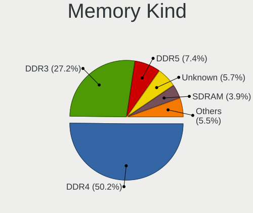

| Kind         | Desktops | Percent |
|--------------|----------|---------|
| DDR4         | 3191     | 50.19%  |
| DDR3         | 1729     | 27.19%  |
| DDR5         | 472      | 7.42%   |
| Unknown      | 365      | 5.74%   |
| SDRAM        | 250      | 3.93%   |
| DDR2         | 232      | 3.65%   |
| DDR          | 48       | 0.75%   |
| LPDDR4       | 41       | 0.64%   |
| DRAM         | 16       | 0.25%   |
| LPDDR5       | 9        | 0.14%   |
| LPDDR3       | 3        | 0.05%   |
| RAM          | 1        | 0.02%   |
| DDR2 FB-DIMM | 1        | 0.02%   |

Memory Form Factor
------------------

Physical design of the memory module

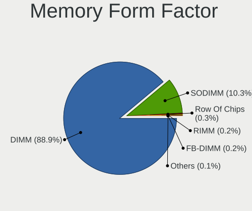

| Name            | Desktops | Percent |
|-----------------|----------|---------|
| DIMM            | 5557     | 88.88%  |
| SODIMM          | 642      | 10.27%  |
| Row Of Chips    | 21       | 0.34%   |
| RIMM            | 14       | 0.22%   |
| FB-DIMM         | 12       | 0.19%   |
| Chip            | 5        | 0.08%   |
| Proprietary Car | 1        | 0.02%   |

Memory Size
-----------

Memory module size

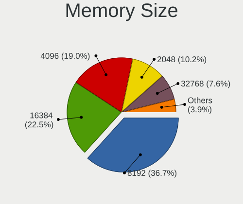

| Size  | Desktops | Percent |
|-------|----------|---------|
| 8192  | 2496     | 36.72%  |
| 16384 | 1531     | 22.52%  |
| 4096  | 1295     | 19.05%  |
| 2048  | 692      | 10.18%  |
| 32768 | 520      | 7.65%   |
| 1024  | 195      | 2.87%   |
| 512   | 29       | 0.43%   |
| 49152 | 23       | 0.34%   |
| 65536 | 5        | 0.07%   |
| 24576 | 5        | 0.07%   |
| 12288 | 2        | 0.03%   |
| 3072  | 2        | 0.03%   |
| 8000  | 1        | 0.01%   |
| 256   | 1        | 0.01%   |
| 16    | 1        | 0.01%   |

Memory Speed
------------

Memory module speed

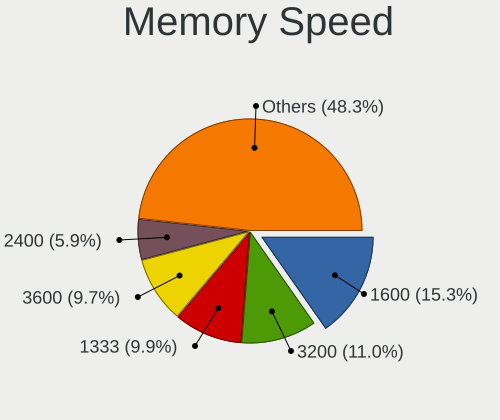

| Speed   | Desktops | Percent |
|---------|----------|---------|
| 1600    | 1063     | 15.28%  |
| 3200    | 763      | 10.97%  |
| 1333    | 691      | 9.93%   |
| 3600    | 672      | 9.66%   |
| 2400    | 410      | 5.89%   |
| 2667    | 379      | 5.45%   |
| 2133    | 316      | 4.54%   |
| 800     | 202      | 2.9%    |
| 6000    | 148      | 2.13%   |
| 3800    | 135      | 1.94%   |
| 667     | 133      | 1.91%   |
| 3733    | 131      | 1.88%   |
| 4000    | 129      | 1.85%   |
| 1800    | 117      | 1.68%   |
| 1866    | 113      | 1.62%   |
| 2666    | 107      | 1.54%   |
| Unknown | 106      | 1.52%   |
| 3000    | 103      | 1.48%   |
| 5600    | 92       | 1.32%   |
| 3400    | 83       | 1.19%   |
| 4800    | 81       | 1.16%   |
| 1867    | 72       | 1.04%   |
| 2933    | 71       | 1.02%   |
| 1066    | 54       | 0.78%   |
| 400     | 45       | 0.65%   |
| 3866    | 43       | 0.62%   |
| 6200    | 38       | 0.55%   |
| 3266    | 36       | 0.52%   |
| 3466    | 34       | 0.49%   |
| 6400    | 31       | 0.45%   |
| 5200    | 29       | 0.42%   |
| 3500    | 28       | 0.4%    |
| 2800    | 28       | 0.4%    |
| 12800   | 25       | 0.36%   |
| 1067    | 24       | 0.35%   |
| 3666    | 23       | 0.33%   |
| 3066    | 23       | 0.33%   |
| 3933    | 22       | 0.32%   |
| 3100    | 22       | 0.32%   |
| 1334    | 20       | 0.29%   |

Printers & scanners
-------------------

Printer Vendor
--------------

Printer device vendors

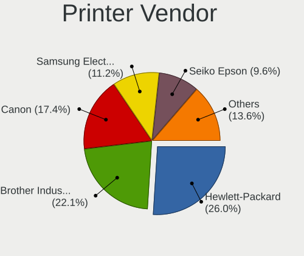

| Vendor                   | Desktops | Percent |
|--------------------------|----------|---------|
| Hewlett-Packard          | 221      | 26%     |
| Brother Industries       | 188      | 22.12%  |
| Canon                    | 148      | 17.41%  |
| Samsung Electronics      | 95       | 11.18%  |
| Seiko Epson              | 82       | 9.65%   |
| Kyocera                  | 22       | 2.59%   |
| Dymo-CoStar              | 21       | 2.47%   |
| Prolific Technology      | 20       | 2.35%   |
| QinHeng Electronics      | 12       | 1.41%   |
| Lexmark International    | 11       | 1.29%   |
| Xerox                    | 4        | 0.47%   |
| Ricoh                    | 4        | 0.47%   |
| STMicroelectronics       | 3        | 0.35%   |
| Oki Data                 | 3        | 0.35%   |
| Dell                     | 3        | 0.35%   |
| Magic Control Technology | 2        | 0.24%   |
| WinChipHead              | 1        | 0.12%   |
| Sharp                    | 1        | 0.12%   |
| Seiko Instruments        | 1        | 0.12%   |
| PM                       | 1        | 0.12%   |
| Pantum                   | 1        | 0.12%   |
| ICS Advent               | 1        | 0.12%   |
| GG IMAGE                 | 1        | 0.12%   |
| ATEN International       | 1        | 0.12%   |
| Apple                    | 1        | 0.12%   |
| Agere Systems (Lucent)   | 1        | 0.12%   |
| Unknown                  | 1        | 0.12%   |

Printer Model
-------------

Printer device models

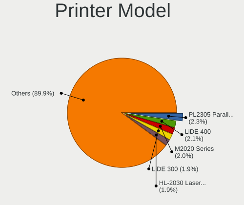

| Model                                | Desktops | Percent |
|--------------------------------------|----------|---------|
| Prolific PL2305 Parallel Port        | 20       | 2.33%   |
| Canon LiDE 400                       | 18       | 2.09%   |
| Samsung M2020 Series                 | 17       | 1.98%   |
| Canon LiDE 300                       | 16       | 1.86%   |
| Brother HL-2030 Laser Printer        | 16       | 1.86%   |
| Canon iP7200 series                  | 13       | 1.51%   |
| QinHeng CH340S                       | 12       | 1.4%    |
| Dymo-CoStar LabelWriter 450          | 11       | 1.28%   |
| HP ENVY 4520 series                  | 10       | 1.16%   |
| Seiko Epson ET-2710 Series           | 9        | 1.05%   |
| Samsung M2070 Series                 | 9        | 1.05%   |
| Samsung C48x Series                  | 8        | 0.93%   |
| HP OfficeJet 3830 series             | 8        | 0.93%   |
| HP OfficeJet 5200 series             | 7        | 0.81%   |
| HP DeskJet F4200 series              | 7        | 0.81%   |
| HP DeskJet 2700 series               | 7        | 0.81%   |
| Canon TR4500 series                  | 7        | 0.81%   |
| Brother HL-L2350DW series            | 7        | 0.81%   |
| Brother HL-3142CW series             | 7        | 0.81%   |
| Seiko Epson XP-2100 Series           | 6        | 0.7%    |
| Samsung ML-1640 Series Laser Printer | 6        | 0.7%    |
| HP Deskjet 3520 series               | 6        | 0.7%    |
| Canon PIXMA MX920 Series             | 6        | 0.7%    |
| Canon PIXMA MG3600 Series            | 6        | 0.7%    |
| Brother MFC-L2710DW series           | 6        | 0.7%    |
| Brother MFC-L2710DN series           | 6        | 0.7%    |
| Brother MFC-J1010DW                  | 6        | 0.7%    |
| Brother DCP-7030                     | 6        | 0.7%    |
| Samsung SCX-472x Series              | 5        | 0.58%   |
| HP Officejet Pro 8100                | 5        | 0.58%   |
| HP ENVY 5000 series                  | 5        | 0.58%   |
| HP DeskJet 4100 series               | 5        | 0.58%   |
| HP DeskJet 2600 series               | 5        | 0.58%   |
| Canon TS700 series                   | 5        | 0.58%   |
| Canon TR8500 series                  | 5        | 0.58%   |
| Brother HL-52x0 series               | 5        | 0.58%   |
| Brother HL-2130 series               | 5        | 0.58%   |
| Seiko Epson XP-3100 Series           | 4        | 0.47%   |
| Seiko Epson ET-4850 Series           | 4        | 0.47%   |
| Samsung SCX-3200 Series              | 4        | 0.47%   |

Scanner Vendor
--------------

Scanner device vendors

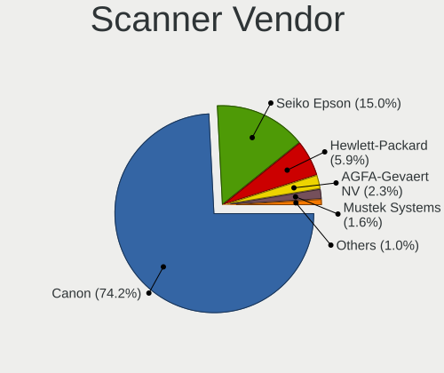

| Vendor                 | Desktops | Percent |
|------------------------|----------|---------|
| Canon                  | 227      | 74.18%  |
| Seiko Epson            | 46       | 15.03%  |
| Hewlett-Packard        | 18       | 5.88%   |
| AGFA-Gevaert NV        | 7        | 2.29%   |
| Mustek Systems         | 5        | 1.63%   |
| Plustek                | 1        | 0.33%   |
| Nikon                  | 1        | 0.33%   |
| Microtek International | 1        | 0.33%   |

Scanner Model
-------------

Scanner device models

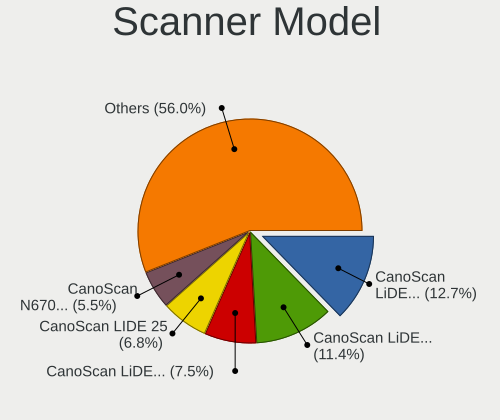

| Model                                                       | Desktops | Percent |
|-------------------------------------------------------------|----------|---------|
| Canon CanoScan LiDE 210                                     | 39       | 12.7%   |
| Canon CanoScan LiDE 220                                     | 35       | 11.4%   |
| Canon CanoScan LiDE 110                                     | 23       | 7.49%   |
| Canon CanoScan LIDE 25                                      | 21       | 6.84%   |
| Canon CanoScan N670U/N676U/LiDE 20                          | 17       | 5.54%   |
| Canon CanoScan LiDE 120                                     | 15       | 4.89%   |
| Canon CanoScan LiDE 100                                     | 15       | 4.89%   |
| Canon CanoScan LiDE 50/LiDE 35/LiDE 40                      | 10       | 3.26%   |
| Seiko Epson GT-F520/GT-F570 [Perfection 3590 PHOTO]         | 8        | 2.61%   |
| Canon CanoScan LiDE 90                                      | 8        | 2.61%   |
| Canon CanoScan LiDE 200                                     | 8        | 2.61%   |
| Canon CanoScan LiDE 60                                      | 7        | 2.28%   |
| Seiko Epson GT-F500/GT-F550 [Perfection 2480/2580 PHOTO]    | 5        | 1.63%   |
| Canon CanoScan N1240U/LiDE 30                               | 5        | 1.63%   |
| Seiko Epson Perfection V37/V370                             | 4        | 1.3%    |
| Seiko Epson GT-X770 [Perfection V500]                       | 4        | 1.3%    |
| Seiko Epson GT-9300UF [Perfection 2400 PHOTO]               | 4        | 1.3%    |
| Canon CanoScan 9000F Mark II                                | 4        | 1.3%    |
| Seiko Epson GT-6600U [Perfection 610]                       | 3        | 0.98%   |
| HP ScanJet 3970c                                            | 3        | 0.98%   |
| HP HP Scanjet 300                                           | 3        | 0.98%   |
| Canon CanoScan 8800F                                        | 3        | 0.98%   |
| AGFA-Gevaert NV SnapScan 1212U (?)                          | 3        | 0.98%   |
| Seiko Epson GT-F730 [GT-S630/Perfection V33/V330 Photo]     | 2        | 0.65%   |
| Seiko Epson GT-F670 [Perfection V200 Photo]                 | 2        | 0.65%   |
| Seiko Epson GT-F650 [GT-S600/Perfection V10/V100]           | 2        | 0.65%   |
| Seiko Epson GT-8200U/GT-8200UF [Perfection 1650/1650 PHOTO] | 2        | 0.65%   |
| Mustek Systems ScanExpress 1200 CU                          | 2        | 0.65%   |
| HP ScanJet Pro 2500 f1                                      | 2        | 0.65%   |
| HP ScanJet 82x0C                                            | 2        | 0.65%   |
| Canon CanoScan LiDE 700F                                    | 2        | 0.65%   |
| Canon CanoScan LiDE 70                                      | 2        | 0.65%   |
| Canon CanoScan LiDE 600F                                    | 2        | 0.65%   |
| Canon CanoScan 4400F                                        | 2        | 0.65%   |
| Canon CanoScan                                              | 2        | 0.65%   |
| Seiko Epson Scanner                                         | 1        | 0.33%   |
| Seiko Epson Perfection 660                                  | 1        | 0.33%   |
| Seiko Epson GT-X900 [Perfection V700/V750 Photo]            | 1        | 0.33%   |
| Seiko Epson GT-F700 [Perfection V350]                       | 1        | 0.33%   |
| Seiko Epson GT-9700F [Perfection 2450 PHOTO]                | 1        | 0.33%   |

Camera
------

Camera Vendor
-------------

Camera device vendors

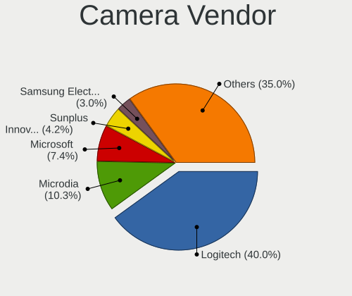

| Vendor                        | Desktops | Percent |
|-------------------------------|----------|---------|
| Logitech                      | 964      | 40.03%  |
| Microdia                      | 248      | 10.3%   |
| Microsoft                     | 179      | 7.43%   |
| Sunplus Innovation Technology | 101      | 4.19%   |
| Samsung Electronics           | 73       | 3.03%   |
| Generalplus Technology        | 56       | 2.33%   |
| Creative Technology           | 53       | 2.2%    |
| ARC International             | 49       | 2.03%   |
| MacroSilicon                  | 43       | 1.79%   |
| Realtek Semiconductor         | 36       | 1.5%    |
| Apple                         | 34       | 1.41%   |
| Trust                         | 32       | 1.33%   |
| Jieli Technology              | 27       | 1.12%   |
| Cubeternet                    | 25       | 1.04%   |
| Chicony Electronics           | 25       | 1.04%   |
| Z-Star Microelectronics       | 20       | 0.83%   |
| Valve Software                | 18       | 0.75%   |
| Razer USA                     | 18       | 0.75%   |
| GEMBIRD                       | 17       | 0.71%   |
| webcam                        | 16       | 0.66%   |
| SHENZHEN EMEET TECHNOLOGY     | 16       | 0.66%   |
| Sonix Technology              | 15       | 0.62%   |
| IMC Networks                  | 15       | 0.62%   |
| Philips (or NXP)              | 14       | 0.58%   |
| eMeet                         | 14       | 0.58%   |
| Elgato Systems                | 14       | 0.58%   |
| Tobii Technology AB           | 12       | 0.5%    |
| AVerMedia Technologies        | 10       | 0.42%   |
| SunplusIT                     | 9        | 0.37%   |
| KYE Systems (Mouse Systems)   | 9        | 0.37%   |
| Guillemot                     | 9        | 0.37%   |
| Google                        | 9        | 0.37%   |
| Unknown                       | 9        | 0.37%   |
| Alcor Micro                   | 8        | 0.33%   |
| WaveRider Communications      | 7        | 0.29%   |
| Quanta                        | 7        | 0.29%   |
| Huawei Technologies           | 7        | 0.29%   |
| Genesys Logic                 | 7        | 0.29%   |
| Arkmicro Technologies         | 7        | 0.29%   |
| Anker PowerConf C200          | 7        | 0.29%   |

Camera Model
------------

Camera device models

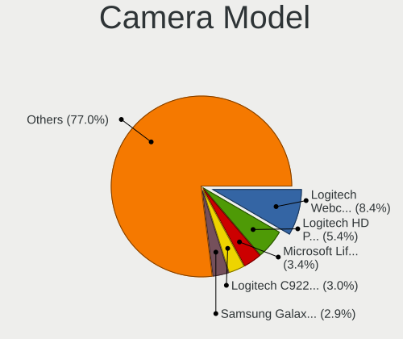

| Model                                    | Desktops | Percent |
|------------------------------------------|----------|---------|
| Logitech Webcam C270                     | 203      | 8.38%   |
| Logitech HD Pro Webcam C920              | 130      | 5.37%   |
| Microsoft LifeCam HD-3000                | 82       | 3.39%   |
| Logitech C922 Pro Stream Webcam          | 72       | 2.97%   |
| Samsung Galaxy series, misc. (MTP mode)  | 71       | 2.93%   |
| Logitech HD Webcam C525                  | 66       | 2.73%   |
| Microdia USB 2.0 Camera                  | 59       | 2.44%   |
| Logitech C920 PRO HD Webcam              | 49       | 2.02%   |
| Sunplus Integrated Camera                | 47       | 1.94%   |
| ARC International Camera                 | 46       | 1.9%    |
| Microdia Webcam Vitade AF                | 43       | 1.78%   |
| Logitech Webcam C310                     | 42       | 1.73%   |
| Microdia Camera                          | 37       | 1.53%   |
| Logitech BRIO Ultra HD Webcam            | 34       | 1.4%    |
| Sunplus Full HD webcam                   | 33       | 1.36%   |
| Logitech StreamCam                       | 32       | 1.32%   |
| Generalplus GENERAL WEBCAM               | 32       | 1.32%   |
| Apple iPhone 5/5C/5S/6/SE/7/8/X          | 32       | 1.32%   |
| MacroSilicon USB Video                   | 31       | 1.28%   |
| Microdia Sonix USB 2.0 Camera            | 29       | 1.2%    |
| Microdia CyberTrack H7                   | 28       | 1.16%   |
| Logitech Webcam C930e                    | 28       | 1.16%   |
| Logitech HD Webcam C510                  | 25       | 1.03%   |
| Jieli USB PHY 2.0                        | 25       | 1.03%   |
| Microsoft LifeCam Studio                 | 24       | 0.99%   |
| Logitech BRIO 4K Stream Edition          | 23       | 0.95%   |
| Logitech Webcam C170                     | 21       | 0.87%   |
| Logitech HD Webcam C910                  | 21       | 0.87%   |
| Logitech QuickCam Pro 9000               | 20       | 0.83%   |
| Creative Live! Cam Sync HD [VF0770]      | 20       | 0.83%   |
| Valve Software 3D Camera                 | 18       | 0.74%   |
| Logitech Webcam Pro 9000                 | 17       | 0.7%    |
| webcam webcam                            | 16       | 0.66%   |
| Logitech Logitech Webcam C925e           | 15       | 0.62%   |
| Logitech Webcam C250                     | 14       | 0.58%   |
| Logitech QuickCam E 3500                 | 14       | 0.58%   |
| Logitech QuickCam Communicate MP/S5500   | 14       | 0.58%   |
| Generalplus 808 Camera #9 (web-cam mode) | 14       | 0.58%   |
| Trust USB Camera                         | 13       | 0.54%   |
| Microsoft LifeCam HD-5000                | 13       | 0.54%   |

Security
--------

Fingerprint Vendor
------------------

Fingerprint sensor vendors

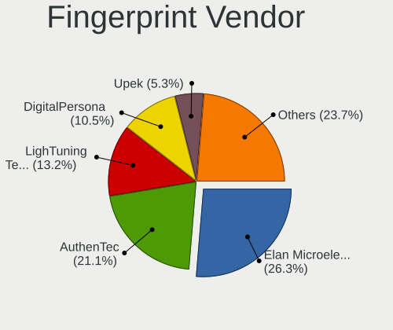

| Vendor                     | Desktops | Percent |
|----------------------------|----------|---------|
| Elan Microelectronics      | 10       | 26.32%  |
| AuthenTec                  | 8        | 21.05%  |
| LighTuning Technology      | 5        | 13.16%  |
| DigitalPersona             | 4        | 10.53%  |
| Upek                       | 2        | 5.26%   |
| Synaptics                  | 2        | 5.26%   |
| STMicroelectronics         | 2        | 5.26%   |
| Dell                       | 2        | 5.26%   |
| Validity Sensors           | 1        | 2.63%   |
| Shenzhen Goodix Technology | 1        | 2.63%   |
| Microsoft                  | 1        | 2.63%   |

Fingerprint Model
-----------------

Fingerprint sensor models

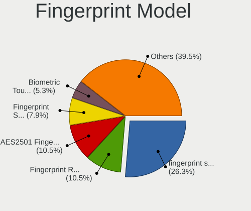

| Model                                                  | Desktops | Percent |
|--------------------------------------------------------|----------|---------|
| Elan fingerprint sensor [FeinTech FPS00200]            | 10       | 26.32%  |
| DigitalPersona Fingerprint Reader                      | 4        | 10.53%  |
| AuthenTec AES2501 Fingerprint Sensor                   | 4        | 10.53%  |
| LighTuning Fingerprint Sensor                          | 3        | 7.89%   |
| Upek Biometric Touchchip/Touchstrip Fingerprint Sensor | 2        | 5.26%   |
| Synaptics  WBDI Fingerprint Reader - USB 052           | 2        | 5.26%   |
| STMicroelectronics Fingerprint Reader                  | 2        | 5.26%   |
| LighTuning EgisTec Touch Fingerprint Sensor            | 2        | 5.26%   |
| Dell MS819 Wired Mouse With Fingerprint Reader         | 2        | 5.26%   |
| AuthenTec Fingerprint Sensor                           | 2        | 5.26%   |
| AuthenTec AES1600                                      | 2        | 5.26%   |
| Validity Sensors VFS 5011 fingerprint sensor           | 1        | 2.63%   |
| Shenzhen Goodix  Fingerprint Device                    | 1        | 2.63%   |
| Microsoft Fingerprint Reader                           | 1        | 2.63%   |

Chipcard Vendor
---------------

Chipcard module vendors

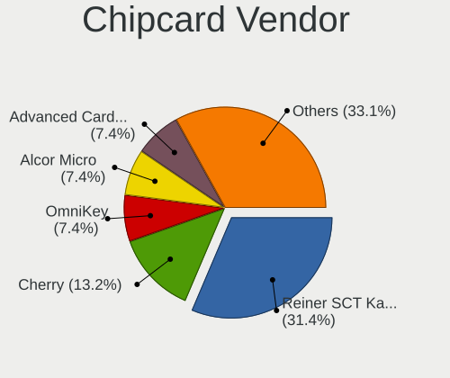

| Vendor                    | Desktops | Percent |
|---------------------------|----------|---------|
| Reiner SCT Kartensysteme  | 38       | 31.4%   |
| Cherry                    | 16       | 13.22%  |
| OmniKey                   | 9        | 7.44%   |
| Alcor Micro               | 9        | 7.44%   |
| Advanced Card Systems     | 9        | 7.44%   |
| Clay Logic                | 7        | 5.79%   |
| Kobil Systems             | 6        | 4.96%   |
| Fujitsu Siemens Computers | 6        | 4.96%   |
| SCM Microsystems          | 5        | 4.13%   |
| Yubico.com                | 3        | 2.48%   |
| Realtek Semiconductor     | 3        | 2.48%   |
| Gemalto (was Gemplus)     | 3        | 2.48%   |
| Chicony Electronics       | 3        | 2.48%   |
| Swissbit                  | 1        | 0.83%   |
| Lenovo                    | 1        | 0.83%   |
| In Focus Systems          | 1        | 0.83%   |
| Aladdin Knowledge Systems | 1        | 0.83%   |

Chipcard Model
--------------

Chipcard module models

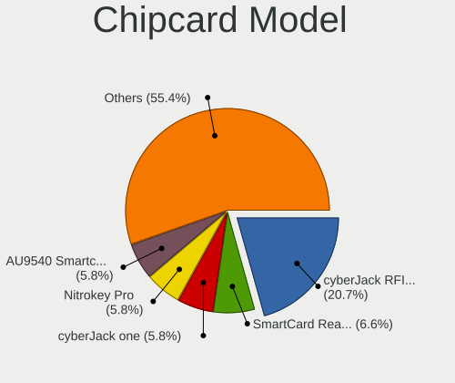

| Model                                                                      | Desktops | Percent |
|----------------------------------------------------------------------------|----------|---------|
| Reiner SCT Kartensysteme cyberJack RFID basis contactless smartcard reader | 25       | 20.66%  |
| Cherry SmartCard Reader Keyboard KC 1000 SC                                | 8        | 6.61%   |
| Reiner SCT Kartensysteme cyberJack one                                     | 7        | 5.79%   |
| Clay Logic Nitrokey Pro                                                    | 7        | 5.79%   |
| Alcor Micro AU9540 Smartcard Reader                                        | 7        | 5.79%   |
| Advanced Card Systems ACR122U                                              | 7        | 5.79%   |
| OmniKey CardMan 3021 / 3121                                                | 5        | 4.13%   |
| Reiner SCT Kartensysteme tanJack USB                                       | 4        | 3.31%   |
| Kobil Systems KOBIL Class 3 Reader                                         | 4        | 3.31%   |
| Yubico.com Yubikey 4/5 U2F+CCID                                            | 3        | 2.48%   |
| SCM Microsystems SCR335 SmartCard Reader                                   | 3        | 2.48%   |
| Realtek Semiconductor Smart Card Reader Interface                          | 3        | 2.48%   |
| Gemalto (was Gemplus) GemPC Twin SmartCard Reader                          | 3        | 2.48%   |
| Chicony Electronics HP Skylab USB Smartcard Keyboard                       | 3        | 2.48%   |
| Reiner SCT Kartensysteme cyberJack e-com/pinpad                            | 2        | 1.65%   |
| OmniKey CardMan 3121 (HID Technologies)                                    | 2        | 1.65%   |
| Kobil Systems Smart Token                                                  | 2        | 1.65%   |
| Fujitsu Siemens Computers Smartcard Reader D323                            | 2        | 1.65%   |
| Fujitsu Siemens Computers Keyboard KB100 SCR eSIG                          | 2        | 1.65%   |
| Cherry SmartTerminal ST-2xxx                                               | 2        | 1.65%   |
| Cherry SECURE BOARD 1.0                                                    | 2        | 1.65%   |
| Cherry KC 1000 SC Z                                                        | 2        | 1.65%   |
| Alcor Micro Watchdata W 1981                                               | 2        | 1.65%   |
| Advanced Card Systems ACR38 SmartCard Reader                               | 2        | 1.65%   |
| Swissbit iShield Key FIDO2                                                 | 1        | 0.83%   |
| SCM Microsystems uTrust 3700 F CL Reader                                   | 1        | 0.83%   |
| SCM Microsystems SCR331 SmartCard Reader                                   | 1        | 0.83%   |
| OmniKey CardMan Smart@Link                                                 | 1        | 0.83%   |
| OmniKey CardMan 5022                                                       | 1        | 0.83%   |
| Lenovo Smartcard Keyboard                                                  | 1        | 0.83%   |
| In Focus Systems EMV Smartcard Reader                                      | 1        | 0.83%   |
| Fujitsu Siemens Computers SmartCard Reader 2A                              | 1        | 0.83%   |
| Fujitsu Siemens Computers Keyboard KB SCR                                  | 1        | 0.83%   |
| Cherry SmartTerminal XX44                                                  | 1        | 0.83%   |
| CHERRY Smart Card Reader USB                                               | 1        | 0.83%   |
| Aladdin Knowledge Systems Token JC                                         | 1        | 0.83%   |

Unsupported
-----------

Unsupported Devices
-------------------

Total unsupported devices on board

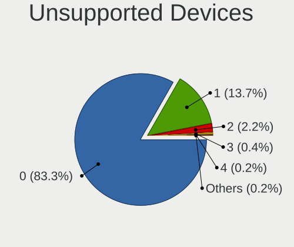

| Total | Desktops | Percent |
|-------|----------|---------|
| 0     | 10946    | 83.28%  |
| 1     | 1797     | 13.67%  |
| 2     | 286      | 2.18%   |
| 3     | 58       | 0.44%   |
| 4     | 31       | 0.24%   |
| 5     | 18       | 0.14%   |
| 6     | 3        | 0.02%   |
| 8     | 2        | 0.02%   |
| 7     | 2        | 0.02%   |

Unsupported Device Types
------------------------

Types of unsupported devices

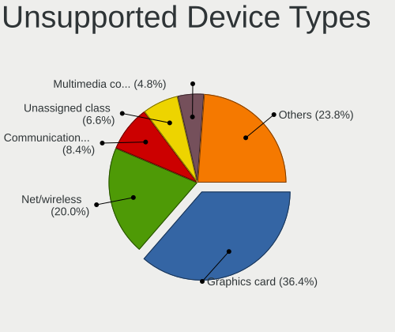

| Type                     | Desktops | Percent |
|--------------------------|----------|---------|
| Graphics card            | 945      | 36.36%  |
| Net/wireless             | 520      | 20.01%  |
| Communication controller | 218      | 8.39%   |
| Unassigned class         | 172      | 6.62%   |
| Multimedia controller    | 125      | 4.81%   |
| Sound                    | 114      | 4.39%   |
| Card reader              | 101      | 3.89%   |
| Chipcard                 | 70       | 2.69%   |
| Bluetooth                | 67       | 2.58%   |
| Camera                   | 48       | 1.85%   |
| Net/ethernet             | 47       | 1.81%   |
| Network                  | 45       | 1.73%   |
| Fingerprint reader       | 35       | 1.35%   |
| Storage/raid             | 32       | 1.23%   |
| Storage/ide              | 20       | 0.77%   |
| Dvb card                 | 11       | 0.42%   |
| Modem                    | 8        | 0.31%   |
| Tv card                  | 5        | 0.19%   |
| Storage/nvme             | 5        | 0.19%   |
| Firewire controller      | 4        | 0.15%   |
| Storage                  | 3        | 0.12%   |
| Unclassified device      | 2        | 0.08%   |
| Video                    | 1        | 0.04%   |
| Storage/ata              | 1        | 0.04%   |

