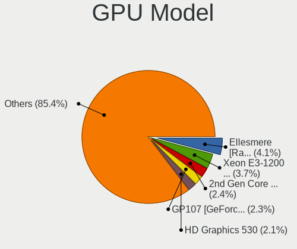

Linux in Germany - Tested Hardware & Statistics (Desktops)
----------------------------------------------------------

A project to collect tested hardware configurations for Linux in Germany.

Anyone can contribute to this report by the [hw-probe](https://github.com/linuxhw/hw-probe) tool:

    sudo -E hw-probe -all -upload

Please contribute! Especially if your hardware is rare.

Contents
--------

* [ Test Cases ](#test-cases)

* [ System ](#system)
  - [ OS                       ](#os)
  - [ OS Family                ](#os-family)
  - [ Kernel                   ](#kernel)
  - [ Kernel Family            ](#kernel-family)
  - [ Kernel Major Ver.        ](#kernel-major-ver)
  - [ Arch                     ](#arch)
  - [ DE                       ](#de)
  - [ Display Server           ](#display-server)
  - [ Display Manager          ](#display-manager)
  - [ OS Lang                  ](#os-lang)
  - [ Boot Mode                ](#boot-mode)
  - [ Filesystem               ](#filesystem)
  - [ Part. scheme             ](#part-scheme)
  - [ Dual Boot with Linux/BSD ](#dual-boot-with-linuxbsd)
  - [ Dual Boot (Win)          ](#dual-boot-win)

* [ Board ](#board)
  - [ Vendor                   ](#vendor)
  - [ Model                    ](#model)
  - [ Model Family             ](#model-family)
  - [ MFG Year                 ](#mfg-year)
  - [ Form Factor              ](#form-factor)
  - [ Secure Boot              ](#secure-boot)
  - [ Coreboot                 ](#coreboot)
  - [ RAM Size                 ](#ram-size)
  - [ RAM Used                 ](#ram-used)
  - [ Total Drives             ](#total-drives)
  - [ Has CD-ROM               ](#has-cd-rom)
  - [ Has Ethernet             ](#has-ethernet)
  - [ Has WiFi                 ](#has-wifi)
  - [ Has Bluetooth            ](#has-bluetooth)

* [ Location ](#location)
  - [ Country                  ](#country)
  - [ City                     ](#city)

* [ Drives ](#drives)
  - [ Drive Vendor             ](#drive-vendor)
  - [ Drive Model              ](#drive-model)
  - [ HDD Vendor               ](#hdd-vendor)
  - [ SSD Vendor               ](#ssd-vendor)
  - [ Drive Kind               ](#drive-kind)
  - [ Drive Connector          ](#drive-connector)
  - [ Drive Size               ](#drive-size)
  - [ Space Total              ](#space-total)
  - [ Space Used               ](#space-used)
  - [ Malfunc. Drives          ](#malfunc-drives)
  - [ Malfunc. Drive Vendor    ](#malfunc-drive-vendor)
  - [ Malfunc. HDD Vendor      ](#malfunc-hdd-vendor)
  - [ Malfunc. Drive Kind      ](#malfunc-drive-kind)
  - [ Failed Drives            ](#failed-drives)
  - [ Failed Drive Vendor      ](#failed-drive-vendor)
  - [ Drive Status             ](#drive-status)

* [ Storage controller ](#storage-controller)
  - [ Storage Vendor           ](#storage-vendor)
  - [ Storage Model            ](#storage-model)
  - [ Storage Kind             ](#storage-kind)

* [ Processor ](#processor)
  - [ CPU Vendor               ](#cpu-vendor)
  - [ CPU Model                ](#cpu-model)
  - [ CPU Model Family         ](#cpu-model-family)
  - [ CPU Cores                ](#cpu-cores)
  - [ CPU Sockets              ](#cpu-sockets)
  - [ CPU Threads              ](#cpu-threads)
  - [ CPU Op-Modes             ](#cpu-op-modes)
  - [ CPU Microcode            ](#cpu-microcode)
  - [ CPU Microarch            ](#cpu-microarch)

* [ Graphics ](#graphics)
  - [ GPU Vendor               ](#gpu-vendor)
  - [ GPU Model                ](#gpu-model)
  - [ GPU Combo                ](#gpu-combo)
  - [ GPU Driver               ](#gpu-driver)
  - [ GPU Memory               ](#gpu-memory)

* [ Monitor ](#monitor)
  - [ Monitor Vendor           ](#monitor-vendor)
  - [ Monitor Model            ](#monitor-model)
  - [ Monitor Resolution       ](#monitor-resolution)
  - [ Monitor Diagonal         ](#monitor-diagonal)
  - [ Monitor Width            ](#monitor-width)
  - [ Aspect Ratio             ](#aspect-ratio)
  - [ Monitor Area             ](#monitor-area)
  - [ Pixel Density            ](#pixel-density)
  - [ Multiple Monitors        ](#multiple-monitors)

* [ Network ](#network)
  - [ Net Controller Vendor    ](#net-controller-vendor)
  - [ Net Controller Model     ](#net-controller-model)
  - [ Wireless Vendor          ](#wireless-vendor)
  - [ Wireless Model           ](#wireless-model)
  - [ Ethernet Vendor          ](#ethernet-vendor)
  - [ Ethernet Model           ](#ethernet-model)
  - [ Net Controller Kind      ](#net-controller-kind)
  - [ Used Controller          ](#used-controller)
  - [ NICs                     ](#nics)
  - [ IPv6                     ](#ipv6)

* [ Bluetooth ](#bluetooth)
  - [ Bluetooth Vendor         ](#bluetooth-vendor)
  - [ Bluetooth Model          ](#bluetooth-model)

* [ Sound ](#sound)
  - [ Sound Vendor             ](#sound-vendor)
  - [ Sound Model              ](#sound-model)

* [ Memory ](#memory)
  - [ Memory Vendor            ](#memory-vendor)
  - [ Memory Model             ](#memory-model)
  - [ Memory Kind              ](#memory-kind)
  - [ Memory Form Factor       ](#memory-form-factor)
  - [ Memory Size              ](#memory-size)
  - [ Memory Speed             ](#memory-speed)

* [ Printers & scanners ](#printers--scanners)
  - [ Printer Vendor           ](#printer-vendor)
  - [ Printer Model            ](#printer-model)
  - [ Scanner Vendor           ](#scanner-vendor)
  - [ Scanner Model            ](#scanner-model)

* [ Camera ](#camera)
  - [ Camera Vendor            ](#camera-vendor)
  - [ Camera Model             ](#camera-model)

* [ Security ](#security)
  - [ Fingerprint Vendor       ](#fingerprint-vendor)
  - [ Fingerprint Model        ](#fingerprint-model)
  - [ Chipcard Vendor          ](#chipcard-vendor)
  - [ Chipcard Model           ](#chipcard-model)

* [ Unsupported ](#unsupported)
  - [ Unsupported Devices      ](#unsupported-devices)
  - [ Unsupported Device Types ](#unsupported-device-types)

Test Cases
----------

Total: 10190

| Vendor        | Model                       | Probe                                                      | Date         |
|---------------|-----------------------------|------------------------------------------------------------|--------------|
| ASUSTek       | PRIME A320M-K               | [afbe6b4362](https://linux-hardware.org/?probe=afbe6b4362) | Dec 31, 2022 |
| Dell          | 0PTTT9 A00                  | [7f2851fcf5](https://linux-hardware.org/?probe=7f2851fcf5) | Dec 31, 2022 |
| ASUSTek       | Crosshair IV Formula        | [da685b7ff8](https://linux-hardware.org/?probe=da685b7ff8) | Dec 31, 2022 |
| ASUSTek       | UN45                        | [bde2e2efb1](https://linux-hardware.org/?probe=bde2e2efb1) | Dec 31, 2022 |
| Medion        | MS-7728                     | [3d6078552c](https://linux-hardware.org/?probe=3d6078552c) | Dec 31, 2022 |
| MSI           | MS-7502 Fab D               | [9126e1035f](https://linux-hardware.org/?probe=9126e1035f) | Dec 31, 2022 |
| ASRock        | A320M-DGS                   | [a9df519d4f](https://linux-hardware.org/?probe=a9df519d4f) | Dec 31, 2022 |
| ASUSTek       | P5Q-PRO                     | [cec0830928](https://linux-hardware.org/?probe=cec0830928) | Dec 31, 2022 |
| MSI           | MAG B650 TOMAHAWK WIFI      | [b1220a23ad](https://linux-hardware.org/?probe=b1220a23ad) | Dec 31, 2022 |
| MSI           | MAG B650 TOMAHAWK WIFI      | [31343e35f0](https://linux-hardware.org/?probe=31343e35f0) | Dec 31, 2022 |
| ASUSTek       | Pro WS X570-ACE             | [fc2f55c02e](https://linux-hardware.org/?probe=fc2f55c02e) | Dec 31, 2022 |
| Fujitsu       | D3003-S2 S26361-D3003-S2    | [cb55beafca](https://linux-hardware.org/?probe=cb55beafca) | Dec 30, 2022 |
| Acer          | Aspire XC-1660 V:1.1        | [9c4b578c67](https://linux-hardware.org/?probe=9c4b578c67) | Dec 30, 2022 |
| Fujitsu       | D3003-S2 S26361-D3003-S2    | [938db016a2](https://linux-hardware.org/?probe=938db016a2) | Dec 30, 2022 |
| Dell          | 0HN7XN A00                  | [27fa9012d0](https://linux-hardware.org/?probe=27fa9012d0) | Dec 30, 2022 |
| MSI           | 760GM-P23                   | [06c8e21a6f](https://linux-hardware.org/?probe=06c8e21a6f) | Dec 30, 2022 |
| Acer          | Aspire XC-1660 V:1.1        | [c352c59c64](https://linux-hardware.org/?probe=c352c59c64) | Dec 30, 2022 |
| Gigabyte      | 970A-DS3P                   | [c841093094](https://linux-hardware.org/?probe=c841093094) | Dec 30, 2022 |
| MSI           | X99A RAIDER                 | [59f6170d5b](https://linux-hardware.org/?probe=59f6170d5b) | Dec 29, 2022 |
| MSI           | A320M-A PRO MAX             | [6a419b06d6](https://linux-hardware.org/?probe=6a419b06d6) | Dec 29, 2022 |
| ASRock        | B650M PG Riptide            | [614e6307eb](https://linux-hardware.org/?probe=614e6307eb) | Dec 29, 2022 |
| ASRock        | P67 Pro3                    | [47ea7331f5](https://linux-hardware.org/?probe=47ea7331f5) | Dec 29, 2022 |
| ASUSTek       | PRIME B360M-C               | [c38ca6386e](https://linux-hardware.org/?probe=c38ca6386e) | Dec 29, 2022 |
| Intel         | DP55WB AAE64798-206         | [2373b5141b](https://linux-hardware.org/?probe=2373b5141b) | Dec 29, 2022 |
| ASUSTek       | ROG STRIX B650E-I GAMING... | [e4c8909f2c](https://linux-hardware.org/?probe=e4c8909f2c) | Dec 29, 2022 |
| ASUSTek       | Z170 PRO GAMING/AURA        | [87e8ae1350](https://linux-hardware.org/?probe=87e8ae1350) | Dec 29, 2022 |
| MSI           | B450M PRO-VDH MAX           | [0447771b4f](https://linux-hardware.org/?probe=0447771b4f) | Dec 29, 2022 |
| MSI           | MPG Z490 GAMING EDGE WIF... | [a72887241e](https://linux-hardware.org/?probe=a72887241e) | Dec 29, 2022 |
| Unknown       | Freecom Silverstore HNCN... | [723fbcd23f](https://linux-hardware.org/?probe=723fbcd23f) | Dec 29, 2022 |
| ASUSTek       | P5K SE/EPU                  | [6eed1ad6e5](https://linux-hardware.org/?probe=6eed1ad6e5) | Dec 29, 2022 |
| ASUSTek       | P5K SE/EPU                  | [3f0c89985c](https://linux-hardware.org/?probe=3f0c89985c) | Dec 29, 2022 |
| Gigabyte      | Z77M-D3H                    | [f20c6365d3](https://linux-hardware.org/?probe=f20c6365d3) | Dec 28, 2022 |
| HP            | 339A                        | [eb2bb9bcec](https://linux-hardware.org/?probe=eb2bb9bcec) | Dec 28, 2022 |
| HP            | ProLiant ML30 Gen9          | [174e7e831b](https://linux-hardware.org/?probe=174e7e831b) | Dec 28, 2022 |
| MSI           | PRO Z690-A WIFI DDR4        | [a4292b855d](https://linux-hardware.org/?probe=a4292b855d) | Dec 28, 2022 |
| ASUSTek       | M5A78L-M LX                 | [a8b80cb4f6](https://linux-hardware.org/?probe=a8b80cb4f6) | Dec 28, 2022 |
| Dell          | 0JP3NX A01                  | [acbe3ce1ef](https://linux-hardware.org/?probe=acbe3ce1ef) | Dec 28, 2022 |
| BESSTAR Te... | F6BFC                       | [7c6adb6279](https://linux-hardware.org/?probe=7c6adb6279) | Dec 28, 2022 |
| ASRock        | B75 Pro3-M                  | [108f0c24de](https://linux-hardware.org/?probe=108f0c24de) | Dec 28, 2022 |
| BESSTAR Te... | F6BFC                       | [59b38f9b63](https://linux-hardware.org/?probe=59b38f9b63) | Dec 28, 2022 |
| MSI           | Z370 PC PRO                 | [367bcf2d16](https://linux-hardware.org/?probe=367bcf2d16) | Dec 28, 2022 |
| ASUSTek       | PRIME A320M-K               | [20c0841830](https://linux-hardware.org/?probe=20c0841830) | Dec 28, 2022 |
| ASUSTek       | PRIME Z790-P WIFI           | [7bb247e453](https://linux-hardware.org/?probe=7bb247e453) | Dec 28, 2022 |
| ASUSTek       | P5K SE/EPU                  | [ea64c817e2](https://linux-hardware.org/?probe=ea64c817e2) | Dec 28, 2022 |
| ASUSTek       | P5K SE/EPU                  | [b1c95f1d21](https://linux-hardware.org/?probe=b1c95f1d21) | Dec 28, 2022 |
| ASUSTek       | Z170M-PLUS                  | [6b61c9a811](https://linux-hardware.org/?probe=6b61c9a811) | Dec 28, 2022 |
| Dell          | 040DDP A01                  | [3548fd618d](https://linux-hardware.org/?probe=3548fd618d) | Dec 28, 2022 |
| HP            | 2B4B                        | [b07e2ecc23](https://linux-hardware.org/?probe=b07e2ecc23) | Dec 28, 2022 |
| Apple         | Mac-F221BEC8                | [85730ed1a1](https://linux-hardware.org/?probe=85730ed1a1) | Dec 28, 2022 |
| ASUSTek       | P8H61-M LE R2.0             | [b9fd8381a4](https://linux-hardware.org/?probe=b9fd8381a4) | Dec 27, 2022 |
| Apple         | Mac-F221BEC8                | [94ae481e51](https://linux-hardware.org/?probe=94ae481e51) | Dec 27, 2022 |
| Gigabyte      | B85M-D3H                    | [4283e3bb1e](https://linux-hardware.org/?probe=4283e3bb1e) | Dec 27, 2022 |
| ASUSTek       | PRIME B450-PLUS             | [ee1658b320](https://linux-hardware.org/?probe=ee1658b320) | Dec 27, 2022 |
| ASUSTek       | H97I-PLUS                   | [8f039f1be9](https://linux-hardware.org/?probe=8f039f1be9) | Dec 27, 2022 |
| HP            | 876C SMVB                   | [7926807626](https://linux-hardware.org/?probe=7926807626) | Dec 27, 2022 |
| Acer          | Aspire XC-780               | [0d90d1884c](https://linux-hardware.org/?probe=0d90d1884c) | Dec 27, 2022 |
| BESSTAR Te... | HM90                        | [01cd4c50dd](https://linux-hardware.org/?probe=01cd4c50dd) | Dec 26, 2022 |
| MSI           | Z390-A PRO                  | [9bfeb5727a](https://linux-hardware.org/?probe=9bfeb5727a) | Dec 26, 2022 |
| Gigabyte      | B150M-D2V DDR3-CF           | [cd90f1782c](https://linux-hardware.org/?probe=cd90f1782c) | Dec 26, 2022 |
| MSI           | B450M PRO-VDH MAX           | [410ac6980a](https://linux-hardware.org/?probe=410ac6980a) | Dec 25, 2022 |
| Gigabyte      | B150M-D2V DDR3-CF           | [78418bfaa6](https://linux-hardware.org/?probe=78418bfaa6) | Dec 25, 2022 |
| Fujitsu       | D3221-A1 S26361-D3221-A1    | [8855d29d69](https://linux-hardware.org/?probe=8855d29d69) | Dec 25, 2022 |
| Acer          | Aspire XC-704               | [c4e808c172](https://linux-hardware.org/?probe=c4e808c172) | Dec 25, 2022 |
| Acer          | Aspire XC-704               | [9f3adaa228](https://linux-hardware.org/?probe=9f3adaa228) | Dec 25, 2022 |
| Supermicro    | C2SBX                       | [1b275899d5](https://linux-hardware.org/?probe=1b275899d5) | Dec 25, 2022 |
| ASRock        | Q1900M                      | [051ff70bc8](https://linux-hardware.org/?probe=051ff70bc8) | Dec 25, 2022 |
| ASUSTek       | PRIME B450M-A               | [1fc8c5a4d4](https://linux-hardware.org/?probe=1fc8c5a4d4) | Dec 24, 2022 |
| ASRock        | X670E Pro RS                | [b7a0a3d703](https://linux-hardware.org/?probe=b7a0a3d703) | Dec 24, 2022 |
| ASUSTek       | PRIME Z790-P WIFI           | [e853f645cf](https://linux-hardware.org/?probe=e853f645cf) | Dec 24, 2022 |
| MSI           | B450 TOMAHAWK MAX           | [457612540c](https://linux-hardware.org/?probe=457612540c) | Dec 24, 2022 |
| ASUSTek       | ROG Maximus Z690 EXTREME    | [4d19273307](https://linux-hardware.org/?probe=4d19273307) | Dec 24, 2022 |
| ASUSTek       | P5K SE/EPU                  | [6e816fc83e](https://linux-hardware.org/?probe=6e816fc83e) | Dec 24, 2022 |
| ASUSTek       | WS C422 DC                  | [7be7c81575](https://linux-hardware.org/?probe=7be7c81575) | Dec 24, 2022 |
| ASUSTek       | WS C422 DC                  | [526414fd8f](https://linux-hardware.org/?probe=526414fd8f) | Dec 24, 2022 |
| MiTAC         | PD14RI                      | [eb02828e7c](https://linux-hardware.org/?probe=eb02828e7c) | Dec 24, 2022 |
| ASUSTek       | M5A78L-M/USB3               | [3dce1a76e7](https://linux-hardware.org/?probe=3dce1a76e7) | Dec 24, 2022 |
| HP            | 876C SMVB                   | [988b03aae5](https://linux-hardware.org/?probe=988b03aae5) | Dec 23, 2022 |
| MSI           | B550-A PRO                  | [a54a0884ce](https://linux-hardware.org/?probe=a54a0884ce) | Dec 23, 2022 |
| MSI           | B450-A PRO                  | [ee92214342](https://linux-hardware.org/?probe=ee92214342) | Dec 23, 2022 |
| ASUSTek       | ROG Maximus Z790 HERO       | [6ca59441d7](https://linux-hardware.org/?probe=6ca59441d7) | Dec 23, 2022 |
| Dell          | 0WMJ54 A01                  | [b0b07249ae](https://linux-hardware.org/?probe=b0b07249ae) | Dec 23, 2022 |
| ASRock        | Z97 Anniversary             | [c4e60094f3](https://linux-hardware.org/?probe=c4e60094f3) | Dec 23, 2022 |
| MSI           | H61MU-E35                   | [cb9ec3d5ad](https://linux-hardware.org/?probe=cb9ec3d5ad) | Dec 22, 2022 |
| MSI           | H61MU-E35                   | [bfdc9d1e12](https://linux-hardware.org/?probe=bfdc9d1e12) | Dec 22, 2022 |
| ASUSTek       | ROG Maximus Z790 HERO       | [e486047e83](https://linux-hardware.org/?probe=e486047e83) | Dec 22, 2022 |
| ASUSTek       | PRIME Z690M-HZ              | [4a8c08c437](https://linux-hardware.org/?probe=4a8c08c437) | Dec 22, 2022 |
| Dell          | 0H4VK7 A01                  | [c2f0c73bec](https://linux-hardware.org/?probe=c2f0c73bec) | Dec 22, 2022 |
| Lenovo        | 310B SDK0J40705 WIN 3425... | [abb4201228](https://linux-hardware.org/?probe=abb4201228) | Dec 22, 2022 |
| ASUSTek       | Z170-A                      | [9790670c6f](https://linux-hardware.org/?probe=9790670c6f) | Dec 22, 2022 |
| HP            | 8027                        | [752200e795](https://linux-hardware.org/?probe=752200e795) | Dec 22, 2022 |
| ASUSTek       | ROG CROSSHAIR VI EXTREME    | [0410f7cdcf](https://linux-hardware.org/?probe=0410f7cdcf) | Dec 22, 2022 |
| ASUSTek       | M5A78L-M/USB3               | [ec54aedcc6](https://linux-hardware.org/?probe=ec54aedcc6) | Dec 21, 2022 |
| HP            | 339A                        | [77b8b56b9d](https://linux-hardware.org/?probe=77b8b56b9d) | Dec 21, 2022 |
| HP            | 3047h                       | [f5492c4ad4](https://linux-hardware.org/?probe=f5492c4ad4) | Dec 21, 2022 |
| ASUSTek       | P8Z77-M PRO                 | [afc187a5af](https://linux-hardware.org/?probe=afc187a5af) | Dec 21, 2022 |
| Gigabyte      | Z97M-DS3H                   | [dca79c9d6d](https://linux-hardware.org/?probe=dca79c9d6d) | Dec 21, 2022 |
| ASUSTek       | M4A88T-M                    | [c646f359b8](https://linux-hardware.org/?probe=c646f359b8) | Dec 21, 2022 |
| ASRock        | X670E Taichi                | [e1b13226a4](https://linux-hardware.org/?probe=e1b13226a4) | Dec 21, 2022 |
| MSI           | MS-7318                     | [4622016059](https://linux-hardware.org/?probe=4622016059) | Dec 21, 2022 |
| Gigabyte      | B650 AORUS ELITE AX         | [58da003de3](https://linux-hardware.org/?probe=58da003de3) | Dec 21, 2022 |
| MSI           | B550-A PRO                  | [d2ebdf5627](https://linux-hardware.org/?probe=d2ebdf5627) | Dec 20, 2022 |
| MSI           | Z270 SLI PLUS               | [caaac44bac](https://linux-hardware.org/?probe=caaac44bac) | Dec 20, 2022 |
| ASUSTek       | PRIME B350-PLUS             | [5d3e747abe](https://linux-hardware.org/?probe=5d3e747abe) | Dec 20, 2022 |
| Acer          | Aspire XC-830               | [ee5a538a22](https://linux-hardware.org/?probe=ee5a538a22) | Dec 20, 2022 |
| ASUSTek       | M4A88T-M/USB3               | [52b5b53173](https://linux-hardware.org/?probe=52b5b53173) | Dec 19, 2022 |
| HP            | 0AA8h                       | [f04f3c4d42](https://linux-hardware.org/?probe=f04f3c4d42) | Dec 19, 2022 |
| ASUSTek       | M4A88T-M/USB3               | [64972eb902](https://linux-hardware.org/?probe=64972eb902) | Dec 19, 2022 |
| Gigabyte      | Z170X-Gaming 7              | [d7a2fa6abf](https://linux-hardware.org/?probe=d7a2fa6abf) | Dec 19, 2022 |
| ASRock        | Z170 Extreme6+              | [74b4357180](https://linux-hardware.org/?probe=74b4357180) | Dec 19, 2022 |
| Dell          | OptiPlex 7010               | [dd934b17d2](https://linux-hardware.org/?probe=dd934b17d2) | Dec 19, 2022 |
| ASUSTek       | Crosshair IV Formula        | [2c8eb65394](https://linux-hardware.org/?probe=2c8eb65394) | Dec 19, 2022 |
| ASRock        | B550M-ITX/ac                | [21a91196b1](https://linux-hardware.org/?probe=21a91196b1) | Dec 19, 2022 |
| AMI           | Cherry Trail CR             | [ad74aff6fa](https://linux-hardware.org/?probe=ad74aff6fa) | Dec 19, 2022 |
| Lenovo        | ThinkCentre M91p 4524WAP    | [0d5c4254b7](https://linux-hardware.org/?probe=0d5c4254b7) | Dec 19, 2022 |
| ASUSTek       | M2N-TE                      | [b67e414d65](https://linux-hardware.org/?probe=b67e414d65) | Dec 19, 2022 |
| HP            | 0AA8h                       | [0c11d6bb2a](https://linux-hardware.org/?probe=0c11d6bb2a) | Dec 18, 2022 |
| Gigabyte      | A520M DS3H                  | [4251c08b5d](https://linux-hardware.org/?probe=4251c08b5d) | Dec 18, 2022 |
| Dell          | 0M858N A00                  | [2eb73cbb7a](https://linux-hardware.org/?probe=2eb73cbb7a) | Dec 18, 2022 |
| ASUSTek       | ROG Maximus XI HERO         | [0d4ba683ce](https://linux-hardware.org/?probe=0d4ba683ce) | Dec 18, 2022 |
| ASUSTek       | PRIME B550M-A WIFI II       | [2d5d4c1d6b](https://linux-hardware.org/?probe=2d5d4c1d6b) | Dec 18, 2022 |
| Dell          | 06JWJY A00                  | [89ac693c2c](https://linux-hardware.org/?probe=89ac693c2c) | Dec 18, 2022 |
| ASUSTek       | ROG STRIX B550-F GAMING     | [d179359230](https://linux-hardware.org/?probe=d179359230) | Dec 18, 2022 |
| ASRock        | Z77 Extreme4                | [ac3472dcd0](https://linux-hardware.org/?probe=ac3472dcd0) | Dec 18, 2022 |
| Gigabyte      | MQLP3AP-WG                  | [bdb3b0161e](https://linux-hardware.org/?probe=bdb3b0161e) | Dec 18, 2022 |
| Dell          | 0C27VV A01                  | [91c790d54e](https://linux-hardware.org/?probe=91c790d54e) | Dec 18, 2022 |
| Gigabyte      | B550M DS3H                  | [d868b73cfb](https://linux-hardware.org/?probe=d868b73cfb) | Dec 18, 2022 |
| MSI           | A520M-A PRO                 | [164b37d0e5](https://linux-hardware.org/?probe=164b37d0e5) | Dec 18, 2022 |
| Gigabyte      | Z170X-Gaming 3              | [1773b79334](https://linux-hardware.org/?probe=1773b79334) | Dec 17, 2022 |
| Biostar       | H81MHV3 5.0                 | [57191b83bb](https://linux-hardware.org/?probe=57191b83bb) | Dec 17, 2022 |
| ASUSTek       | Crosshair IV Formula        | [c2eff145f7](https://linux-hardware.org/?probe=c2eff145f7) | Dec 17, 2022 |
| ASRock        | Z77 Extreme4                | [84c83fa399](https://linux-hardware.org/?probe=84c83fa399) | Dec 17, 2022 |
| ASUSTek       | ROG STRIX X470-F GAMING     | [67d1ddeefb](https://linux-hardware.org/?probe=67d1ddeefb) | Dec 17, 2022 |
| ASRock        | Z77 Pro4                    | [42cd781d07](https://linux-hardware.org/?probe=42cd781d07) | Dec 17, 2022 |
| Dell          | 0WR7PY A01                  | [5c1e2b0030](https://linux-hardware.org/?probe=5c1e2b0030) | Dec 17, 2022 |
| HP            | 8027                        | [07834099d5](https://linux-hardware.org/?probe=07834099d5) | Dec 17, 2022 |
| ASUSTek       | PRIME H670-PLUS D4          | [54132f7285](https://linux-hardware.org/?probe=54132f7285) | Dec 17, 2022 |
| ASUSTek       | ROG STRIX Z690-A GAMING ... | [ac15fdcc8b](https://linux-hardware.org/?probe=ac15fdcc8b) | Dec 16, 2022 |
| ASUSTek       | TUF B450-PLUS GAMING        | [fdb9e278dd](https://linux-hardware.org/?probe=fdb9e278dd) | Dec 16, 2022 |
| ASUSTek       | PRIME H510M-K               | [ca088f2039](https://linux-hardware.org/?probe=ca088f2039) | Dec 16, 2022 |
| HP            | 876C SMVB                   | [e214378eea](https://linux-hardware.org/?probe=e214378eea) | Dec 16, 2022 |
| ASUSTek       | Crosshair IV Formula        | [7739bbf37e](https://linux-hardware.org/?probe=7739bbf37e) | Dec 16, 2022 |
| ASUSTek       | Crosshair IV Formula        | [645efe8dd2](https://linux-hardware.org/?probe=645efe8dd2) | Dec 16, 2022 |
| MSI           | B450 TOMAHAWK MAX           | [10a60af5c6](https://linux-hardware.org/?probe=10a60af5c6) | Dec 16, 2022 |
| ASRock        | X570 Steel Legend           | [64bdae140b](https://linux-hardware.org/?probe=64bdae140b) | Dec 16, 2022 |
| Gigabyte      | X570 AORUS ELITE            | [d2dce9cbfd](https://linux-hardware.org/?probe=d2dce9cbfd) | Dec 16, 2022 |
| ASUSTek       | M5A99X EVO                  | [7139cd000e](https://linux-hardware.org/?probe=7139cd000e) | Dec 16, 2022 |
| Gigabyte      | B150-HD3P-CF                | [18b9f94390](https://linux-hardware.org/?probe=18b9f94390) | Dec 16, 2022 |
| Gigabyte      | B650 AORUS ELITE AX         | [adb08a48f3](https://linux-hardware.org/?probe=adb08a48f3) | Dec 15, 2022 |
| Acer          | Veriton N2620G              | [a626bf668e](https://linux-hardware.org/?probe=a626bf668e) | Dec 15, 2022 |
| Fujitsu       | D3223-A1 S26361-D3223-A1    | [827fabbd5f](https://linux-hardware.org/?probe=827fabbd5f) | Dec 15, 2022 |
| HP            | 876C SMVB                   | [c704265799](https://linux-hardware.org/?probe=c704265799) | Dec 15, 2022 |
| ASUSTek       | PRIME B550M-A               | [fdcf005f22](https://linux-hardware.org/?probe=fdcf005f22) | Dec 15, 2022 |
| HP            | 876C SMVB                   | [3a6fdcc184](https://linux-hardware.org/?probe=3a6fdcc184) | Dec 15, 2022 |
| Gigabyte      | B550M DS3H                  | [81092c4ca4](https://linux-hardware.org/?probe=81092c4ca4) | Dec 15, 2022 |
| Gigabyte      | B550 AORUS ELITE V2         | [8df2e8b58c](https://linux-hardware.org/?probe=8df2e8b58c) | Dec 15, 2022 |
| Lenovo        | NOK                         | [01d1b7fdb7](https://linux-hardware.org/?probe=01d1b7fdb7) | Dec 15, 2022 |
| Dell          | 04YP6J A02                  | [8753f49245](https://linux-hardware.org/?probe=8753f49245) | Dec 15, 2022 |
| MiTAC         | PD10EHI                     | [d62826c4b8](https://linux-hardware.org/?probe=d62826c4b8) | Dec 15, 2022 |
| ASUSTek       | Z170 PRO GAMING             | [77fcf302d4](https://linux-hardware.org/?probe=77fcf302d4) | Dec 14, 2022 |
| MSI           | A320M PRO-VD/S              | [9e9573c0c5](https://linux-hardware.org/?probe=9e9573c0c5) | Dec 14, 2022 |
| Fujitsu       | D3313-G1 S26361-D3313-G1    | [4651fa0db3](https://linux-hardware.org/?probe=4651fa0db3) | Dec 14, 2022 |
| Fujitsu       | D3544-A1 S26361-D3544-A1... | [75180b50a8](https://linux-hardware.org/?probe=75180b50a8) | Dec 14, 2022 |
| Dell          | 0GX297                      | [dbc7c02e0c](https://linux-hardware.org/?probe=dbc7c02e0c) | Dec 14, 2022 |
| Gigabyte      | B560M AORUS PRO AX          | [32a9ae4611](https://linux-hardware.org/?probe=32a9ae4611) | Dec 14, 2022 |
| ASRockRack    | X470D4U2-2T                 | [47c18717db](https://linux-hardware.org/?probe=47c18717db) | Dec 14, 2022 |
| Dell          | 0M5DCD A00                  | [5357f2124d](https://linux-hardware.org/?probe=5357f2124d) | Dec 14, 2022 |
| Lenovo        | ThinkCentre A70 7844H9G     | [aad5a91184](https://linux-hardware.org/?probe=aad5a91184) | Dec 14, 2022 |
| MSI           | A320M PRO-VD/S              | [c428800285](https://linux-hardware.org/?probe=c428800285) | Dec 14, 2022 |
| MSI           | MS-7318                     | [420ae8857b](https://linux-hardware.org/?probe=420ae8857b) | Dec 13, 2022 |
| Medion        | TJ4125                      | [6e2f722d4c](https://linux-hardware.org/?probe=6e2f722d4c) | Dec 13, 2022 |
| ASUSTek       | Z170 PRO GAMING             | [9b056bc9ff](https://linux-hardware.org/?probe=9b056bc9ff) | Dec 13, 2022 |
| Dell          | 08WKV3 A00                  | [f58a0ffbc3](https://linux-hardware.org/?probe=f58a0ffbc3) | Dec 13, 2022 |
| AMI           | Cherry Trail CR             | [868f4725db](https://linux-hardware.org/?probe=868f4725db) | Dec 12, 2022 |
| Biostar       | A960D+V2                    | [6dea2bd72f](https://linux-hardware.org/?probe=6dea2bd72f) | Dec 12, 2022 |
| ASRock        | B75M R2.0                   | [780eecc5e8](https://linux-hardware.org/?probe=780eecc5e8) | Dec 12, 2022 |
| Gigabyte      | H310M S2V                   | [6895902fe7](https://linux-hardware.org/?probe=6895902fe7) | Dec 12, 2022 |
| ASRock        | N68C-S UCC                  | [c405e5bd16](https://linux-hardware.org/?probe=c405e5bd16) | Dec 12, 2022 |
| ASUSTek       | PRIME X370-PRO              | [7fe77a3d6f](https://linux-hardware.org/?probe=7fe77a3d6f) | Dec 12, 2022 |
| MSI           | H310M PRO-M2                | [b470ff0f63](https://linux-hardware.org/?probe=b470ff0f63) | Dec 12, 2022 |
| ASRock        | N68C-S UCC                  | [6fa4a67111](https://linux-hardware.org/?probe=6fa4a67111) | Dec 12, 2022 |
| Fujitsu       | D3161-A1 S26361-D3161-A1    | [62f6fd5f8d](https://linux-hardware.org/?probe=62f6fd5f8d) | Dec 12, 2022 |
| ASRock        | H570 Steel Legend           | [ef9d66faf0](https://linux-hardware.org/?probe=ef9d66faf0) | Dec 11, 2022 |
| ASUSTek       | PRIME B450-PLUS             | [822e79aa3e](https://linux-hardware.org/?probe=822e79aa3e) | Dec 11, 2022 |
| Gigabyte      | F2A88XM-D3H                 | [cdc6f36d8c](https://linux-hardware.org/?probe=cdc6f36d8c) | Dec 11, 2022 |
| MSI           | B450M PRO-VDH MAX           | [6bf96cf0fc](https://linux-hardware.org/?probe=6bf96cf0fc) | Dec 11, 2022 |
| HP            | 1497                        | [475049bb79](https://linux-hardware.org/?probe=475049bb79) | Dec 10, 2022 |
| Apple         | Mac-F221BEC8                | [55a5f34bf0](https://linux-hardware.org/?probe=55a5f34bf0) | Dec 10, 2022 |
| ASUSTek       | PRIME X370-PRO              | [4bb3c91677](https://linux-hardware.org/?probe=4bb3c91677) | Dec 10, 2022 |
| HP            | 876C SMVB                   | [d6211ccceb](https://linux-hardware.org/?probe=d6211ccceb) | Dec 10, 2022 |
| ASUSTek       | ROG STRIX X570-I GAMING     | [9a14eb6994](https://linux-hardware.org/?probe=9a14eb6994) | Dec 10, 2022 |
| ASUSTek       | ROG STRIX X570-I GAMING     | [7c41dddf3f](https://linux-hardware.org/?probe=7c41dddf3f) | Dec 10, 2022 |
| BESSTAR Te... | B550                        | [d9fbac807d](https://linux-hardware.org/?probe=d9fbac807d) | Dec 10, 2022 |
| ASUSTek       | TUF Gaming A520M-PLUS WI... | [e8d8a922a2](https://linux-hardware.org/?probe=e8d8a922a2) | Dec 10, 2022 |
| ASRock        | Z790M-ITX WiFi              | [32b3218ae1](https://linux-hardware.org/?probe=32b3218ae1) | Dec 10, 2022 |
| ASUSTek       | PRIME B550M-A               | [3c18fca709](https://linux-hardware.org/?probe=3c18fca709) | Dec 09, 2022 |
| ASUSTek       | ROG STRIX X570-E GAMING     | [499627a7b9](https://linux-hardware.org/?probe=499627a7b9) | Dec 09, 2022 |
| HP            | 18E7                        | [9759493e06](https://linux-hardware.org/?probe=9759493e06) | Dec 09, 2022 |
| ASRock        | X300M-STX                   | [a6f72ec4e3](https://linux-hardware.org/?probe=a6f72ec4e3) | Dec 09, 2022 |
| ASUSTek       | M5A99X EVO                  | [62e7c35465](https://linux-hardware.org/?probe=62e7c35465) | Dec 09, 2022 |
| Fujitsu       | D3430-U1 S26361-D3430-U1    | [5db82eb3e7](https://linux-hardware.org/?probe=5db82eb3e7) | Dec 09, 2022 |
| Dell          | 0JP3NX A01                  | [db2f15960f](https://linux-hardware.org/?probe=db2f15960f) | Dec 08, 2022 |
| ASUSTek       | ROG STRIX Z370-E GAMING     | [e6c64e15dd](https://linux-hardware.org/?probe=e6c64e15dd) | Dec 08, 2022 |
| ASUSTek       | ROG CROSSHAIR VI EXTREME    | [3814024cdc](https://linux-hardware.org/?probe=3814024cdc) | Dec 08, 2022 |
| Medion        | TJ4125                      | [62b9f7158b](https://linux-hardware.org/?probe=62b9f7158b) | Dec 08, 2022 |
| MSI           | X370 GAMING PRO CARBON      | [bf01a239b1](https://linux-hardware.org/?probe=bf01a239b1) | Dec 08, 2022 |
| Fujitsu       | D3233-A1 S26361-D3233-A1    | [f8e4c21cce](https://linux-hardware.org/?probe=f8e4c21cce) | Dec 08, 2022 |
| Fujitsu       | D3233-A1 S26361-D3233-A1    | [7a0988dc52](https://linux-hardware.org/?probe=7a0988dc52) | Dec 08, 2022 |
| Gigabyte      | Z690 GAMING X DDR4          | [9ce2c75190](https://linux-hardware.org/?probe=9ce2c75190) | Dec 08, 2022 |
| ASUSTek       | PRIME A320M-K               | [543bb22214](https://linux-hardware.org/?probe=543bb22214) | Dec 08, 2022 |
| ASRock        | B550 Taichi                 | [0203e79add](https://linux-hardware.org/?probe=0203e79add) | Dec 08, 2022 |
| Dell          | 0M5DCD A00                  | [db7ce2f1a1](https://linux-hardware.org/?probe=db7ce2f1a1) | Dec 08, 2022 |
| Dell          | 0T7D40 A00                  | [170971ac17](https://linux-hardware.org/?probe=170971ac17) | Dec 08, 2022 |
| ASRock        | B550M-ITX/ac                | [1d97601be2](https://linux-hardware.org/?probe=1d97601be2) | Dec 08, 2022 |
| ASRock        | B550M-ITX/ac                | [4943e0aa12](https://linux-hardware.org/?probe=4943e0aa12) | Dec 08, 2022 |
| BESSTAR Te... | HM80                        | [ca1b93abed](https://linux-hardware.org/?probe=ca1b93abed) | Dec 08, 2022 |
| Gigabyte      | X570 AORUS ELITE            | [d6666dccec](https://linux-hardware.org/?probe=d6666dccec) | Dec 08, 2022 |
| MSI           | PRO Z790-A WIFI             | [9dfb20d74f](https://linux-hardware.org/?probe=9dfb20d74f) | Dec 08, 2022 |
| Unknown       | Unknown                     | [3a5aa82738](https://linux-hardware.org/?probe=3a5aa82738) | Dec 07, 2022 |
| HP            | ProLiant MicroServer Gen... | [c5c0e6d78a](https://linux-hardware.org/?probe=c5c0e6d78a) | Dec 07, 2022 |
| Unknown       | Unknown                     | [4d8d2c3a47](https://linux-hardware.org/?probe=4d8d2c3a47) | Dec 07, 2022 |
| ASUSTek       | P7P55 LX                    | [be0753651f](https://linux-hardware.org/?probe=be0753651f) | Dec 07, 2022 |
| ASUSTek       | STRIX Z270F GAMING          | [7766e8d043](https://linux-hardware.org/?probe=7766e8d043) | Dec 07, 2022 |
| Gigabyte      | B550 GAMING X V2            | [7ac17baea3](https://linux-hardware.org/?probe=7ac17baea3) | Dec 07, 2022 |
| HP            | 8460                        | [6089c30228](https://linux-hardware.org/?probe=6089c30228) | Dec 07, 2022 |
| MSI           | MAG B550 TOMAHAWK           | [a742429421](https://linux-hardware.org/?probe=a742429421) | Dec 06, 2022 |
| Gigabyte      | B450 AORUS PRO-CF           | [037c8e9cbc](https://linux-hardware.org/?probe=037c8e9cbc) | Dec 06, 2022 |
| Dell          | 0T7D40 A00                  | [8763fcfe9d](https://linux-hardware.org/?probe=8763fcfe9d) | Dec 06, 2022 |
| ASUSTek       | CROSSHAIR V FORMULA-Z       | [3a458bc7c5](https://linux-hardware.org/?probe=3a458bc7c5) | Dec 06, 2022 |
| ASUSTek       | TUF Gaming B550-PLUS        | [5be32d156a](https://linux-hardware.org/?probe=5be32d156a) | Dec 06, 2022 |
| ASRock        | B75M R2.0                   | [93dc9d7b3e](https://linux-hardware.org/?probe=93dc9d7b3e) | Dec 06, 2022 |
| ASUSTek       | P5K                         | [8e3fef0d6b](https://linux-hardware.org/?probe=8e3fef0d6b) | Dec 06, 2022 |
| HP            | 81B3                        | [7aa4bda274](https://linux-hardware.org/?probe=7aa4bda274) | Dec 06, 2022 |
| HP            | 81B3                        | [9a2e408cc4](https://linux-hardware.org/?probe=9a2e408cc4) | Dec 06, 2022 |
| Acer          | H57M01                      | [581e6bfb75](https://linux-hardware.org/?probe=581e6bfb75) | Dec 05, 2022 |
| HP            | 3047h                       | [8d023ce0c3](https://linux-hardware.org/?probe=8d023ce0c3) | Dec 05, 2022 |
| Lenovo        | ThinkCentre M58 7637AD4     | [fa5c9707de](https://linux-hardware.org/?probe=fa5c9707de) | Dec 05, 2022 |
| ASUSTek       | PRIME A320M-K               | [6487bbd7b7](https://linux-hardware.org/?probe=6487bbd7b7) | Dec 05, 2022 |
| ASUSTek       | Z170 PRO GAMING             | [60d47a3b37](https://linux-hardware.org/?probe=60d47a3b37) | Dec 05, 2022 |
| MSI           | MPG Z690 CARBON WIFI        | [7a88ea16d8](https://linux-hardware.org/?probe=7a88ea16d8) | Dec 04, 2022 |
| ASRock        | 970 Extreme3 R2.0           | [688fd5eed6](https://linux-hardware.org/?probe=688fd5eed6) | Dec 04, 2022 |
| ASUSTek       | ROG STRIX Z390-F GAMING     | [cff58a3529](https://linux-hardware.org/?probe=cff58a3529) | Dec 04, 2022 |
| Lenovo        | Kabini CRB 31900058 STD     | [4e1e3965a1](https://linux-hardware.org/?probe=4e1e3965a1) | Dec 04, 2022 |
| ASUSTek       | A55BM-PLUS                  | [ae8127fd3b](https://linux-hardware.org/?probe=ae8127fd3b) | Dec 04, 2022 |
| MiTAC         | PD10EHI                     | [fe6117c822](https://linux-hardware.org/?probe=fe6117c822) | Dec 04, 2022 |
| Fujitsu       | D3222-A1 S26361-D3222-A1    | [3272263f3b](https://linux-hardware.org/?probe=3272263f3b) | Dec 04, 2022 |
| ASUSTek       | M5A97 R2.0                  | [b3b5eb90e5](https://linux-hardware.org/?probe=b3b5eb90e5) | Dec 03, 2022 |
| MiTAC         | PD10EHI                     | [02780973f0](https://linux-hardware.org/?probe=02780973f0) | Dec 03, 2022 |
| Dell          | 0N826N A02                  | [e9f0634dd6](https://linux-hardware.org/?probe=e9f0634dd6) | Dec 03, 2022 |
| ASRock        | Z370 Pro4                   | [76cd787c24](https://linux-hardware.org/?probe=76cd787c24) | Dec 03, 2022 |
| Fujitsu       | D3602-A1 S26361-D3602-A1    | [6f57ed994c](https://linux-hardware.org/?probe=6f57ed994c) | Dec 03, 2022 |
| Lenovo        | SHARKBAY SDK0E50510 WIN     | [7fe4c21bf6](https://linux-hardware.org/?probe=7fe4c21bf6) | Dec 03, 2022 |
| Dell          | 0C27VV A01                  | [f39ec1d618](https://linux-hardware.org/?probe=f39ec1d618) | Dec 03, 2022 |
| Intel         | DP45SG AAE27733-401         | [bc19b3f6a3](https://linux-hardware.org/?probe=bc19b3f6a3) | Dec 02, 2022 |
| Biostar       | TPower X58                  | [320769fceb](https://linux-hardware.org/?probe=320769fceb) | Dec 02, 2022 |
| Gigabyte      | Z77M-D3H                    | [770621fcf5](https://linux-hardware.org/?probe=770621fcf5) | Dec 02, 2022 |
| Gigabyte      | Z77M-D3H                    | [80ef6435a3](https://linux-hardware.org/?probe=80ef6435a3) | Dec 02, 2022 |
| ASUSTek       | Z170 PRO GAMING             | [3f642a7844](https://linux-hardware.org/?probe=3f642a7844) | Dec 02, 2022 |
| ASUSTek       | TUF Gaming X570-PLUS        | [ee24c782fa](https://linux-hardware.org/?probe=ee24c782fa) | Dec 02, 2022 |
| ASUSTek       | H110M-R                     | [6d0d8627fb](https://linux-hardware.org/?probe=6d0d8627fb) | Dec 02, 2022 |
| ASUSTek       | P8H67                       | [31a7799a34](https://linux-hardware.org/?probe=31a7799a34) | Dec 01, 2022 |
| ASUSTek       | P7P55D                      | [0a012accfd](https://linux-hardware.org/?probe=0a012accfd) | Dec 01, 2022 |
| Fujitsu       | D3128-A1 S26361-D3128-A1    | [ad24dc05a0](https://linux-hardware.org/?probe=ad24dc05a0) | Dec 01, 2022 |
| Fujitsu       | D3128-A1 S26361-D3128-A1    | [0e38c9a3be](https://linux-hardware.org/?probe=0e38c9a3be) | Dec 01, 2022 |
| Lenovo        | SHARKBAY SDK0E50510 WIN     | [475ad82d2b](https://linux-hardware.org/?probe=475ad82d2b) | Nov 30, 2022 |
| Medion        | MS-7748                     | [0e92aa55ca](https://linux-hardware.org/?probe=0e92aa55ca) | Nov 30, 2022 |
| Medion        | MS-7800                     | [a5658a6933](https://linux-hardware.org/?probe=a5658a6933) | Nov 30, 2022 |
| ASUSTek       | ROG STRIX Z490-A GAMING     | [dc5ec6eb84](https://linux-hardware.org/?probe=dc5ec6eb84) | Nov 30, 2022 |
| Dell          | 0M5DCD A00                  | [e9fae02409](https://linux-hardware.org/?probe=e9fae02409) | Nov 30, 2022 |
| ASRock        | 970 Extreme3                | [4951da34da](https://linux-hardware.org/?probe=4951da34da) | Nov 30, 2022 |
| ASUSTek       | M5A78L-M LE/USB3            | [dd3801095f](https://linux-hardware.org/?probe=dd3801095f) | Nov 30, 2022 |
| ASUSTek       | M5A78L-M PLUS/USB3          | [efecce0072](https://linux-hardware.org/?probe=efecce0072) | Nov 30, 2022 |
| ASUSTek       | ROG STRIX B450-E GAMING     | [abcc431f9f](https://linux-hardware.org/?probe=abcc431f9f) | Nov 30, 2022 |
| ASUSTek       | PRIME X370-PRO              | [7f89d71e2e](https://linux-hardware.org/?probe=7f89d71e2e) | Nov 30, 2022 |
| ASRock        | N68-S3 UCC                  | [ede29d01f8](https://linux-hardware.org/?probe=ede29d01f8) | Nov 30, 2022 |
| Gigabyte      | 970A-DS3P                   | [22c7db0e68](https://linux-hardware.org/?probe=22c7db0e68) | Nov 30, 2022 |
| Gigabyte      | 970A-DS3P                   | [65493a981c](https://linux-hardware.org/?probe=65493a981c) | Nov 30, 2022 |
| Fujitsu       | D3162-A1 S26361-D3162-A1    | [b38075cef4](https://linux-hardware.org/?probe=b38075cef4) | Nov 29, 2022 |
| MSI           | MPG X570 GAMING EDGE WIF... | [c01a10b89d](https://linux-hardware.org/?probe=c01a10b89d) | Nov 29, 2022 |
| HP            | 18E4                        | [39b839e527](https://linux-hardware.org/?probe=39b839e527) | Nov 29, 2022 |
| ASRock        | N68-S3 UCC                  | [fd6f368580](https://linux-hardware.org/?probe=fd6f368580) | Nov 29, 2022 |
| Dell          | 0M859N A00                  | [95cf7fe257](https://linux-hardware.org/?probe=95cf7fe257) | Nov 29, 2022 |
| ASRock        | 960GM-GS3 FX                | [1474b9ee78](https://linux-hardware.org/?probe=1474b9ee78) | Nov 29, 2022 |
| ASUSTek       | TUF B450-PLUS GAMING        | [472530d650](https://linux-hardware.org/?probe=472530d650) | Nov 29, 2022 |
| ASUSTek       | Q170T                       | [99abcc63ab](https://linux-hardware.org/?probe=99abcc63ab) | Nov 29, 2022 |
| Medion        | H110H4-EM2                  | [38b9e166f2](https://linux-hardware.org/?probe=38b9e166f2) | Nov 29, 2022 |
| Gigabyte      | B450M DS3H-CF               | [a73d36e579](https://linux-hardware.org/?probe=a73d36e579) | Nov 29, 2022 |
| MSI           | X570-A PRO                  | [92ddd925db](https://linux-hardware.org/?probe=92ddd925db) | Nov 28, 2022 |
| ASRock        | Q1900M                      | [0a90a5d3a5](https://linux-hardware.org/?probe=0a90a5d3a5) | Nov 28, 2022 |
| HP            | 18E5                        | [e336f0ac13](https://linux-hardware.org/?probe=e336f0ac13) | Nov 28, 2022 |
| MSI           | Z77A-G43                    | [207d763813](https://linux-hardware.org/?probe=207d763813) | Nov 28, 2022 |
| ASUSTek       | TUF Gaming X570-PLUS        | [e3f55c7b9d](https://linux-hardware.org/?probe=e3f55c7b9d) | Nov 28, 2022 |
| Shuttle       | FS35V4                      | [46923496a3](https://linux-hardware.org/?probe=46923496a3) | Nov 28, 2022 |
| ASUSTek       | TUF Gaming X570-PLUS        | [54407c7caa](https://linux-hardware.org/?probe=54407c7caa) | Nov 28, 2022 |
| ASUSTek       | ROG STRIX B550-E GAMING     | [b0078eda9b](https://linux-hardware.org/?probe=b0078eda9b) | Nov 27, 2022 |
| Acer          | Veriton X4620G V1.0         | [37be4a2bf8](https://linux-hardware.org/?probe=37be4a2bf8) | Nov 27, 2022 |
| Medion        | TJ4125                      | [a1c7ac96d3](https://linux-hardware.org/?probe=a1c7ac96d3) | Nov 27, 2022 |
| MSI           | X570-A PRO                  | [c2c27cf47f](https://linux-hardware.org/?probe=c2c27cf47f) | Nov 27, 2022 |
| ASUSTek       | ROG STRIX B450-F GAMING ... | [a60076a8c2](https://linux-hardware.org/?probe=a60076a8c2) | Nov 27, 2022 |
| ASUSTek       | PRIME B365M-A               | [4f3216dfdc](https://linux-hardware.org/?probe=4f3216dfdc) | Nov 27, 2022 |
| ASUSTek       | PRIME B365M-A               | [498f0a31dc](https://linux-hardware.org/?probe=498f0a31dc) | Nov 27, 2022 |
| Gigabyte      | B550 AORUS ELITE V2         | [bbf4464c41](https://linux-hardware.org/?probe=bbf4464c41) | Nov 27, 2022 |
| Lenovo        | SHARKBAY SDK0E50510 WIN     | [1deadcff69](https://linux-hardware.org/?probe=1deadcff69) | Nov 27, 2022 |
| HP            | 18E4                        | [11c1530767](https://linux-hardware.org/?probe=11c1530767) | Nov 26, 2022 |
| MSI           | 970 GAMING                  | [82a3d83d20](https://linux-hardware.org/?probe=82a3d83d20) | Nov 26, 2022 |
| ASUSTek       | Rampage IV EXTREME          | [e70ff25b31](https://linux-hardware.org/?probe=e70ff25b31) | Nov 26, 2022 |
| ASRock        | H61M-DGS R2.0               | [189b3c0ea0](https://linux-hardware.org/?probe=189b3c0ea0) | Nov 26, 2022 |
| ASUSTek       | PRIME A320M-K               | [be12141830](https://linux-hardware.org/?probe=be12141830) | Nov 26, 2022 |
| ASUSTek       | PRIME A320M-K               | [f34d75bde0](https://linux-hardware.org/?probe=f34d75bde0) | Nov 26, 2022 |
| MSI           | B550-A PRO                  | [8d0b06aa1d](https://linux-hardware.org/?probe=8d0b06aa1d) | Nov 26, 2022 |
| Gigabyte      | GA-890GPA-UD3H              | [5b531b7b41](https://linux-hardware.org/?probe=5b531b7b41) | Nov 26, 2022 |
| Foxconn       | G41MXP/G41MXP-V             | [f8e0414c84](https://linux-hardware.org/?probe=f8e0414c84) | Nov 26, 2022 |
| Gigabyte      | X470 AORUS GAMING 5 WIFI... | [2a7b6d570f](https://linux-hardware.org/?probe=2a7b6d570f) | Nov 26, 2022 |
| Fujitsu       | D3221-A1 S26361-D3221-A1    | [a787a49407](https://linux-hardware.org/?probe=a787a49407) | Nov 25, 2022 |
| ASUSTek       | P8B75-M LX                  | [8522486d64](https://linux-hardware.org/?probe=8522486d64) | Nov 25, 2022 |
| Gigabyte      | Z390 UD                     | [06e25ffa57](https://linux-hardware.org/?probe=06e25ffa57) | Nov 25, 2022 |
| Acer          | Veriton L6620G v1.0         | [33f168992e](https://linux-hardware.org/?probe=33f168992e) | Nov 25, 2022 |
| Gigabyte      | B75M-D3H                    | [d70a6e41ba](https://linux-hardware.org/?probe=d70a6e41ba) | Nov 24, 2022 |
| ASRock        | 960GM-GS3 FX                | [1af92d9936](https://linux-hardware.org/?probe=1af92d9936) | Nov 24, 2022 |
| HP            | 339A                        | [52f957ef60](https://linux-hardware.org/?probe=52f957ef60) | Nov 24, 2022 |
| Dell          | 0MN1TX A01                  | [7f0ba24aad](https://linux-hardware.org/?probe=7f0ba24aad) | Nov 24, 2022 |
| Gigabyte      | Z390 UD                     | [447045be5d](https://linux-hardware.org/?probe=447045be5d) | Nov 24, 2022 |
| Fujitsu       | D3222-A1 S26361-D3222-A1    | [00f8658ee8](https://linux-hardware.org/?probe=00f8658ee8) | Nov 24, 2022 |
| ASRock        | FP6D4-P1                    | [5e52f1b520](https://linux-hardware.org/?probe=5e52f1b520) | Nov 24, 2022 |
| Lenovo        | ThinkCentre M91p 4524WAP    | [51f3e71650](https://linux-hardware.org/?probe=51f3e71650) | Nov 24, 2022 |
| Dell          | 0MN1TX A01                  | [8de6a24029](https://linux-hardware.org/?probe=8de6a24029) | Nov 24, 2022 |
| Lenovo        | 310B SDK0J40705 WIN 3425... | [7265ce493e](https://linux-hardware.org/?probe=7265ce493e) | Nov 23, 2022 |
| Medion        | TJ4125                      | [84084e5cdc](https://linux-hardware.org/?probe=84084e5cdc) | Nov 23, 2022 |
| Medion        | TJ4125                      | [810477dfd9](https://linux-hardware.org/?probe=810477dfd9) | Nov 23, 2022 |
| HP            | 18E4                        | [8dd5fdb580](https://linux-hardware.org/?probe=8dd5fdb580) | Nov 23, 2022 |
| Dell          | 0NDYHG A01                  | [0e693ae457](https://linux-hardware.org/?probe=0e693ae457) | Nov 23, 2022 |
| Gigabyte      | X470 AORUS GAMING 5 WIFI... | [58b3db6784](https://linux-hardware.org/?probe=58b3db6784) | Nov 23, 2022 |
| ASRock        | Q1900B-ITX                  | [7239c46e95](https://linux-hardware.org/?probe=7239c46e95) | Nov 23, 2022 |
| ASUSTek       | PRIME B450M-K               | [2438420107](https://linux-hardware.org/?probe=2438420107) | Nov 22, 2022 |
| ASUSTek       | P8H61-I LX                  | [a537f96848](https://linux-hardware.org/?probe=a537f96848) | Nov 22, 2022 |
| Gigabyte      | B550 AORUS ELITE V2         | [76ac354e17](https://linux-hardware.org/?probe=76ac354e17) | Nov 22, 2022 |
| ASUSTek       | Maximus IX HERO             | [587aa317bd](https://linux-hardware.org/?probe=587aa317bd) | Nov 22, 2022 |
| Gigabyte      | 970A-DS3P FX                | [d4d9cadf9f](https://linux-hardware.org/?probe=d4d9cadf9f) | Nov 22, 2022 |
| ASUSTek       | Pro WS C246-ACE             | [1a38780da8](https://linux-hardware.org/?probe=1a38780da8) | Nov 22, 2022 |
| Gigabyte      | A320M-S2H-CF                | [62048f37d6](https://linux-hardware.org/?probe=62048f37d6) | Nov 22, 2022 |
| ASUSTek       | PRIME B250M-PLUS            | [ba7795ec44](https://linux-hardware.org/?probe=ba7795ec44) | Nov 22, 2022 |
| Gigabyte      | B450 I AORUS PRO WIFI-CF    | [f2a00a7bb3](https://linux-hardware.org/?probe=f2a00a7bb3) | Nov 21, 2022 |
| HP            | 3647h                       | [8f77a73e9b](https://linux-hardware.org/?probe=8f77a73e9b) | Nov 21, 2022 |
| Gigabyte      | Z690 GAMING X DDR4          | [89e6ad23e9](https://linux-hardware.org/?probe=89e6ad23e9) | Nov 21, 2022 |
| Intel         | SKYBAY                      | [7c0566f0ba](https://linux-hardware.org/?probe=7c0566f0ba) | Nov 21, 2022 |
| ASUSTek       | M5A78L-M/USB3               | [f4e5d3bd1c](https://linux-hardware.org/?probe=f4e5d3bd1c) | Nov 21, 2022 |
| ASUSTek       | ROG STRIX H470-I GAMING     | [8b8ac358e4](https://linux-hardware.org/?probe=8b8ac358e4) | Nov 21, 2022 |
| ASRock        | 960GM-VGS3 FX               | [c5ecd06a6f](https://linux-hardware.org/?probe=c5ecd06a6f) | Nov 21, 2022 |
| Fujitsu       | D3162-C1 S26361-D3162-C1    | [79403c8f5d](https://linux-hardware.org/?probe=79403c8f5d) | Nov 20, 2022 |
| MSI           | A320M-A PRO MAX             | [486c850cd6](https://linux-hardware.org/?probe=486c850cd6) | Nov 20, 2022 |
| Gigabyte      | GA-890GPA-UD3H              | [41cca3d850](https://linux-hardware.org/?probe=41cca3d850) | Nov 20, 2022 |
| MSI           | X570-A PRO                  | [912f6ac7a3](https://linux-hardware.org/?probe=912f6ac7a3) | Nov 20, 2022 |
| Acer          | Aspire XC-780               | [bfc11805d9](https://linux-hardware.org/?probe=bfc11805d9) | Nov 20, 2022 |
| Acer          | Aspire XC-780               | [a992606b70](https://linux-hardware.org/?probe=a992606b70) | Nov 20, 2022 |
| ASUSTek       | PRIME Z590-A                | [ba2c2a39ed](https://linux-hardware.org/?probe=ba2c2a39ed) | Nov 20, 2022 |
| ASUSTek       | PRIME Z590-A                | [07985535f4](https://linux-hardware.org/?probe=07985535f4) | Nov 20, 2022 |
| Acer          | FX58M                       | [5e7abd5852](https://linux-hardware.org/?probe=5e7abd5852) | Nov 20, 2022 |
| Gigabyte      | B75M-D3H                    | [e5db58baec](https://linux-hardware.org/?probe=e5db58baec) | Nov 19, 2022 |
| Acer          | FX58M                       | [837da7d885](https://linux-hardware.org/?probe=837da7d885) | Nov 19, 2022 |
| ASUSTek       | X99-S                       | [b0bb31d7d9](https://linux-hardware.org/?probe=b0bb31d7d9) | Nov 19, 2022 |
| Gigabyte      | H81M-HD3                    | [d858d2656d](https://linux-hardware.org/?probe=d858d2656d) | Nov 19, 2022 |
| Acer          | Aspire TC-1760              | [a4f03aea9c](https://linux-hardware.org/?probe=a4f03aea9c) | Nov 19, 2022 |
| Intel         | DH55PJ AAE93812-303         | [bebe890c96](https://linux-hardware.org/?probe=bebe890c96) | Nov 19, 2022 |
| Unknown       | QNAP TS-221                 | [b9ff535a3f](https://linux-hardware.org/?probe=b9ff535a3f) | Nov 18, 2022 |
| Lenovo        | ThinkCentre M58 7373AJ5     | [ac213d4e52](https://linux-hardware.org/?probe=ac213d4e52) | Nov 18, 2022 |
| MSI           | X570-A PRO                  | [891ed6f2dc](https://linux-hardware.org/?probe=891ed6f2dc) | Nov 18, 2022 |
| MSI           | A75MA-P35                   | [10016f0246](https://linux-hardware.org/?probe=10016f0246) | Nov 17, 2022 |
| MSI           | H310M PRO-M2 PLUS           | [c5a1b3e5ae](https://linux-hardware.org/?probe=c5a1b3e5ae) | Nov 17, 2022 |
| Fujitsu       | D2912-A1 S26361-D2912-A1    | [169294b358](https://linux-hardware.org/?probe=169294b358) | Nov 17, 2022 |
| HP            | 8169                        | [6dd9ea2ef0](https://linux-hardware.org/?probe=6dd9ea2ef0) | Nov 17, 2022 |
| MSI           | X79A-GD45                   | [7f7b7354b8](https://linux-hardware.org/?probe=7f7b7354b8) | Nov 17, 2022 |
| MSI           | X79A-GD45                   | [42d08e1136](https://linux-hardware.org/?probe=42d08e1136) | Nov 17, 2022 |
| MSI           | B450M PRO-VDH MAX           | [9f45de6ee3](https://linux-hardware.org/?probe=9f45de6ee3) | Nov 17, 2022 |
| MSI           | A75MA-G55                   | [b678f31b24](https://linux-hardware.org/?probe=b678f31b24) | Nov 16, 2022 |
| Medion        | MS-7728                     | [813d86814d](https://linux-hardware.org/?probe=813d86814d) | Nov 16, 2022 |
| Fujitsu       | D3161-A1 S26361-D3161-A1    | [90662fa2e9](https://linux-hardware.org/?probe=90662fa2e9) | Nov 16, 2022 |
| MSI           | MEG X570 UNIFY              | [750d7eb0d7](https://linux-hardware.org/?probe=750d7eb0d7) | Nov 16, 2022 |
| ASRock        | N68-S3 UCC                  | [3f0f992387](https://linux-hardware.org/?probe=3f0f992387) | Nov 16, 2022 |
| ASRock        | FM2A68M-HD+                 | [e907b4c718](https://linux-hardware.org/?probe=e907b4c718) | Nov 15, 2022 |
| Gigabyte      | GA-A75M-UD2H                | [4da8ff348a](https://linux-hardware.org/?probe=4da8ff348a) | Nov 15, 2022 |
| Gigabyte      | GA-78LMT-S2P                | [ee8a80240d](https://linux-hardware.org/?probe=ee8a80240d) | Nov 15, 2022 |
| ASUSTek       | X79-DELUXE                  | [3005933159](https://linux-hardware.org/?probe=3005933159) | Nov 15, 2022 |
| Gigabyte      | B75M-D3H                    | [e7f0316884](https://linux-hardware.org/?probe=e7f0316884) | Nov 14, 2022 |
| ASUSTek       | PRIME X570-PRO              | [642a889fcc](https://linux-hardware.org/?probe=642a889fcc) | Nov 14, 2022 |
| ASUSTek       | PRIME A520M-A II            | [ff1f659f4e](https://linux-hardware.org/?probe=ff1f659f4e) | Nov 14, 2022 |
| ASUSTek       | PRIME A520M-A II            | [a316ed1e2c](https://linux-hardware.org/?probe=a316ed1e2c) | Nov 14, 2022 |
| ASRock        | 960GM-GS3 FX                | [b47205075c](https://linux-hardware.org/?probe=b47205075c) | Nov 14, 2022 |
| Intel         | H81                         | [738056c2ab](https://linux-hardware.org/?probe=738056c2ab) | Nov 14, 2022 |
| Dell          | 0C27VV A01                  | [5e87654e7a](https://linux-hardware.org/?probe=5e87654e7a) | Nov 14, 2022 |
| MSI           | B450 GAMING PLUS            | [2964de32f4](https://linux-hardware.org/?probe=2964de32f4) | Nov 13, 2022 |
| Gigabyte      | Z390 M-CF                   | [047686dabd](https://linux-hardware.org/?probe=047686dabd) | Nov 13, 2022 |
| ASUSTek       | SABERTOOTH Z170 MARK 1      | [f18af41d42](https://linux-hardware.org/?probe=f18af41d42) | Nov 13, 2022 |
| Unknown       | Unknown                     | [b89a0c7341](https://linux-hardware.org/?probe=b89a0c7341) | Nov 13, 2022 |
| Dell          | 04YP6J A02                  | [5ca546d877](https://linux-hardware.org/?probe=5ca546d877) | Nov 13, 2022 |
| Gigabyte      | GA-MA785GT-UD3H             | [4e3e53f7bb](https://linux-hardware.org/?probe=4e3e53f7bb) | Nov 12, 2022 |
| Gigabyte      | H87-HD3                     | [e5a8d4700d](https://linux-hardware.org/?probe=e5a8d4700d) | Nov 12, 2022 |
| ASRock        | X300M-STX                   | [6b2e935e07](https://linux-hardware.org/?probe=6b2e935e07) | Nov 12, 2022 |
| ASRock        | X300M-STX                   | [b071af765d](https://linux-hardware.org/?probe=b071af765d) | Nov 12, 2022 |
| ASUSTek       | M5A78L-M LX                 | [7998f1d9a3](https://linux-hardware.org/?probe=7998f1d9a3) | Nov 12, 2022 |
| ASUSTek       | PRIME A320M-K               | [f4ed581802](https://linux-hardware.org/?probe=f4ed581802) | Nov 11, 2022 |
| ASUSTek       | PRIME A320M-K               | [e06ab9c0b9](https://linux-hardware.org/?probe=e06ab9c0b9) | Nov 11, 2022 |
| MSI           | H110M ECO                   | [f7a8135cee](https://linux-hardware.org/?probe=f7a8135cee) | Nov 11, 2022 |
| Biostar       | TPower X58                  | [8662697d27](https://linux-hardware.org/?probe=8662697d27) | Nov 11, 2022 |
| ASUSTek       | P5K SE/EPU                  | [d5e58b3718](https://linux-hardware.org/?probe=d5e58b3718) | Nov 11, 2022 |
| MSI           | B550M PRO-VDH WIFI          | [518979e264](https://linux-hardware.org/?probe=518979e264) | Nov 11, 2022 |
| Gigabyte      | MZBSWAP-K4                  | [902fafd6cd](https://linux-hardware.org/?probe=902fafd6cd) | Nov 11, 2022 |
| Gigabyte      | Z270-HD3P-CF                | [578b9c0e61](https://linux-hardware.org/?probe=578b9c0e61) | Nov 11, 2022 |
| Gigabyte      | H81M-D2V                    | [6035f1ee45](https://linux-hardware.org/?probe=6035f1ee45) | Nov 11, 2022 |
| MSI           | X79A-GD45                   | [cb82895374](https://linux-hardware.org/?probe=cb82895374) | Nov 11, 2022 |
| Lenovo        | 310B SDK0J40705 WIN 3425... | [4c84942d2b](https://linux-hardware.org/?probe=4c84942d2b) | Nov 10, 2022 |
| ASUSTek       | PRIME X570-P                | [0e930e7a64](https://linux-hardware.org/?probe=0e930e7a64) | Nov 10, 2022 |
| Gigabyte      | X58A-UD3R                   | [14afa89833](https://linux-hardware.org/?probe=14afa89833) | Nov 10, 2022 |
| Dell          | 00V62H A01                  | [d5f5f32529](https://linux-hardware.org/?probe=d5f5f32529) | Nov 10, 2022 |
| Dell          | 0DR845                      | [c4d2b18dd8](https://linux-hardware.org/?probe=c4d2b18dd8) | Nov 10, 2022 |
| MSI           | D2415 S26361-D2415-A10      | [924e18bdcc](https://linux-hardware.org/?probe=924e18bdcc) | Nov 10, 2022 |
| ASUSTek       | P5Q-E                       | [a37be95e80](https://linux-hardware.org/?probe=a37be95e80) | Nov 10, 2022 |
| ASRock        | FM2A88X-ITX+                | [9347a32d59](https://linux-hardware.org/?probe=9347a32d59) | Nov 10, 2022 |
| Gigabyte      | H55M-UD2H                   | [d32e991d14](https://linux-hardware.org/?probe=d32e991d14) | Nov 10, 2022 |
| Dell          | 0C27VV A01                  | [9e5c4960c3](https://linux-hardware.org/?probe=9e5c4960c3) | Nov 10, 2022 |
| Dell          | 0C27VV A01                  | [a8c3b285d0](https://linux-hardware.org/?probe=a8c3b285d0) | Nov 10, 2022 |
| Gigabyte      | B75M-D3H                    | [b7619dbd72](https://linux-hardware.org/?probe=b7619dbd72) | Nov 10, 2022 |
| MSI           | MAG B550 TOMAHAWK           | [bf5e7a39a0](https://linux-hardware.org/?probe=bf5e7a39a0) | Nov 09, 2022 |
| Gigabyte      | Z170-HD3P-CF                | [faf531627e](https://linux-hardware.org/?probe=faf531627e) | Nov 09, 2022 |
| Fujitsu       | D3161-A1 S26361-D3161-A1    | [fb87099a0d](https://linux-hardware.org/?probe=fb87099a0d) | Nov 09, 2022 |
| ASUSTek       | PRIME A320M-K               | [fcd0449df8](https://linux-hardware.org/?probe=fcd0449df8) | Nov 09, 2022 |
| MSI           | MEG X570 UNIFY              | [f419558b59](https://linux-hardware.org/?probe=f419558b59) | Nov 09, 2022 |
| ASUSTek       | PRIME B350-PLUS             | [b2d88e2356](https://linux-hardware.org/?probe=b2d88e2356) | Nov 09, 2022 |
| Gigabyte      | X570S AORUS PRO AX          | [776a9bc0b6](https://linux-hardware.org/?probe=776a9bc0b6) | Nov 09, 2022 |
| Acer          | Aspire X1930                | [9cdf367d20](https://linux-hardware.org/?probe=9cdf367d20) | Nov 08, 2022 |
| ASRock        | FM2A68M-HD+                 | [a90c14df17](https://linux-hardware.org/?probe=a90c14df17) | Nov 08, 2022 |
| MSI           | Z77A-G43                    | [6dd1e1dc43](https://linux-hardware.org/?probe=6dd1e1dc43) | Nov 07, 2022 |
| Fujitsu       | D2950-A1 S26361-D2950-A1    | [5a88973f7b](https://linux-hardware.org/?probe=5a88973f7b) | Nov 07, 2022 |
| ASRock        | X300M-STX                   | [1fee3f08a9](https://linux-hardware.org/?probe=1fee3f08a9) | Nov 07, 2022 |
| ASRock        | 960GM-GS3 FX                | [ff0d4c2010](https://linux-hardware.org/?probe=ff0d4c2010) | Nov 07, 2022 |
| MSI           | MPG Z590 GAMING CARBON W... | [6987230f73](https://linux-hardware.org/?probe=6987230f73) | Nov 07, 2022 |
| Fujitsu       | D2917-A1 S26361-D2917-A1    | [640298162b](https://linux-hardware.org/?probe=640298162b) | Nov 07, 2022 |
| ASRock        | Z170 Extreme4               | [f0b56da15d](https://linux-hardware.org/?probe=f0b56da15d) | Nov 07, 2022 |
| Pegatron      | 2AB6                        | [c55efc41db](https://linux-hardware.org/?probe=c55efc41db) | Nov 06, 2022 |
| ASUSTek       | H97M-PLUS                   | [cb778b5593](https://linux-hardware.org/?probe=cb778b5593) | Nov 06, 2022 |
| Fujitsu       | D2991-A1 S26361-D2991-A1    | [c46066bcee](https://linux-hardware.org/?probe=c46066bcee) | Nov 06, 2022 |
| T-bao         | MINI PC V1.0                | [f24987d1f0](https://linux-hardware.org/?probe=f24987d1f0) | Nov 06, 2022 |
| T-bao         | MINI PC V1.0                | [dfa8b217aa](https://linux-hardware.org/?probe=dfa8b217aa) | Nov 06, 2022 |
| Fujitsu       | D3222-A1 S26361-D3222-A1    | [99f14194db](https://linux-hardware.org/?probe=99f14194db) | Nov 06, 2022 |
| MSI           | B450M MORTAR MAX            | [b5470f4f19](https://linux-hardware.org/?probe=b5470f4f19) | Nov 06, 2022 |
| Fujitsu       | D2991-A1 S26361-D2991-A1    | [c95e4aacac](https://linux-hardware.org/?probe=c95e4aacac) | Nov 06, 2022 |
| ASUSTek       | P5K                         | [6085242cc3](https://linux-hardware.org/?probe=6085242cc3) | Nov 06, 2022 |
| ASUSTek       | P5K                         | [7cddfe4e9a](https://linux-hardware.org/?probe=7cddfe4e9a) | Nov 06, 2022 |
| HP            | 1850                        | [948d3612b1](https://linux-hardware.org/?probe=948d3612b1) | Nov 05, 2022 |
| Gigabyte      | 990FXA-UD7                  | [d4d7721821](https://linux-hardware.org/?probe=d4d7721821) | Nov 05, 2022 |
| ASUSTek       | M5A78L-M LE/USB3            | [82e39bdaf1](https://linux-hardware.org/?probe=82e39bdaf1) | Nov 05, 2022 |
| Gigabyte      | Z77-DS3H                    | [e97900160b](https://linux-hardware.org/?probe=e97900160b) | Nov 05, 2022 |
| Lenovo        | ThinkCentre M90p 3282A9G    | [f60040c1b7](https://linux-hardware.org/?probe=f60040c1b7) | Nov 05, 2022 |
| Lenovo        | ThinkCentre M90p 3282A9G    | [cd87b011a0](https://linux-hardware.org/?probe=cd87b011a0) | Nov 05, 2022 |
| HP            | 3397                        | [9cb876048a](https://linux-hardware.org/?probe=9cb876048a) | Nov 05, 2022 |
| Unknown       | Unknown                     | [2032d5239e](https://linux-hardware.org/?probe=2032d5239e) | Nov 05, 2022 |
| Dell          | 0GX297                      | [fab653cbbe](https://linux-hardware.org/?probe=fab653cbbe) | Nov 04, 2022 |
| HP            | 339A                        | [77ddeeda51](https://linux-hardware.org/?probe=77ddeeda51) | Nov 04, 2022 |
| Fujitsu Si... | D2312-A3 S26361-D2312-A3    | [14dc45e331](https://linux-hardware.org/?probe=14dc45e331) | Nov 04, 2022 |
| HP            | 339A                        | [8ebb8b6522](https://linux-hardware.org/?probe=8ebb8b6522) | Nov 04, 2022 |
| Fujitsu       | D3061-B1 S26361-D3061-B1    | [0e897e5beb](https://linux-hardware.org/?probe=0e897e5beb) | Nov 04, 2022 |
| MSI           | B450-A PRO                  | [8ef3469319](https://linux-hardware.org/?probe=8ef3469319) | Nov 04, 2022 |
| MSI           | H510M PRO                   | [16980e0782](https://linux-hardware.org/?probe=16980e0782) | Nov 04, 2022 |
| Dell          | 00V62H A01                  | [d2ba0a8916](https://linux-hardware.org/?probe=d2ba0a8916) | Nov 04, 2022 |
| Fujitsu Si... | D2312-A3 S26361-D2312-A3    | [9aa8622017](https://linux-hardware.org/?probe=9aa8622017) | Nov 04, 2022 |
| Unknown       | Unknown                     | [8493dcc5e8](https://linux-hardware.org/?probe=8493dcc5e8) | Nov 04, 2022 |
| Dell          | 00V62H A01                  | [57bf24f3da](https://linux-hardware.org/?probe=57bf24f3da) | Nov 04, 2022 |
| HP            | 8056                        | [1a0c34fb50](https://linux-hardware.org/?probe=1a0c34fb50) | Nov 04, 2022 |
| ASUSTek       | P8Z77-V                     | [65c0f5965b](https://linux-hardware.org/?probe=65c0f5965b) | Nov 04, 2022 |
| MSI           | H510M PRO                   | [646aee082a](https://linux-hardware.org/?probe=646aee082a) | Nov 04, 2022 |
| ASRock        | 960GM-GS3 FX                | [f0ba8ee881](https://linux-hardware.org/?probe=f0ba8ee881) | Nov 03, 2022 |
| ASRock        | Q1900M                      | [97544ca916](https://linux-hardware.org/?probe=97544ca916) | Nov 03, 2022 |
| Gigabyte      | B75M-D3H                    | [6d8a634229](https://linux-hardware.org/?probe=6d8a634229) | Nov 03, 2022 |
| MSI           | X470 GAMING PLUS MAX        | [db852ba394](https://linux-hardware.org/?probe=db852ba394) | Nov 03, 2022 |
| Lenovo        | 3716                        | [5a04bbf315](https://linux-hardware.org/?probe=5a04bbf315) | Nov 03, 2022 |
| Gigabyte      | H310M H                     | [7a49c87643](https://linux-hardware.org/?probe=7a49c87643) | Nov 02, 2022 |
| Gigabyte      | H310M H                     | [382965c890](https://linux-hardware.org/?probe=382965c890) | Nov 02, 2022 |
| Medion        | MS-7707                     | [d02f67ee8f](https://linux-hardware.org/?probe=d02f67ee8f) | Nov 02, 2022 |
| MSI           | MPG B550I GAMING EDGE WI... | [77f847ca29](https://linux-hardware.org/?probe=77f847ca29) | Nov 02, 2022 |
| ASRock        | B450 Pro4                   | [5da1d76cd5](https://linux-hardware.org/?probe=5da1d76cd5) | Nov 02, 2022 |
| ASUSTek       | ROG STRIX Z490-G GAMING     | [706fb22c95](https://linux-hardware.org/?probe=706fb22c95) | Nov 02, 2022 |
| ASRock        | Q1900B-ITX                  | [6305a98777](https://linux-hardware.org/?probe=6305a98777) | Nov 02, 2022 |
| ASUSTek       | ROG STRIX X570-E GAMING     | [86bf890d23](https://linux-hardware.org/?probe=86bf890d23) | Nov 02, 2022 |
| ASUSTek       | ROG STRIX Z490-G GAMING     | [da6ecef3a7](https://linux-hardware.org/?probe=da6ecef3a7) | Nov 02, 2022 |
| HP            | 8054                        | [0f866b3605](https://linux-hardware.org/?probe=0f866b3605) | Nov 02, 2022 |
| ASRock        | N68C-GS UCC                 | [9430ecf81c](https://linux-hardware.org/?probe=9430ecf81c) | Nov 02, 2022 |
| Lenovo        | ThinkCentre A57 970274G     | [809e137f17](https://linux-hardware.org/?probe=809e137f17) | Nov 02, 2022 |
| Pegatron      | 2AD5                        | [0b91ee456b](https://linux-hardware.org/?probe=0b91ee456b) | Nov 02, 2022 |
| ASUSTek       | F2A55-M LK                  | [40cedc7d2c](https://linux-hardware.org/?probe=40cedc7d2c) | Nov 02, 2022 |
| MSI           | H97 GAMING 3                | [1a8c44ca83](https://linux-hardware.org/?probe=1a8c44ca83) | Nov 02, 2022 |
| Pegatron      | 2AD5                        | [5f90d4e478](https://linux-hardware.org/?probe=5f90d4e478) | Nov 02, 2022 |
| ASUSTek       | PRO B460M-C                 | [dcf7112b3d](https://linux-hardware.org/?probe=dcf7112b3d) | Nov 01, 2022 |
| ASUSTek       | PRO B460M-C                 | [a333f47ffa](https://linux-hardware.org/?probe=a333f47ffa) | Nov 01, 2022 |
| HP            | 1905                        | [df0d192970](https://linux-hardware.org/?probe=df0d192970) | Nov 01, 2022 |
| Gigabyte      | P55-UD6                     | [2898ec20b3](https://linux-hardware.org/?probe=2898ec20b3) | Nov 01, 2022 |
| ASUSTek       | M5A78L-M LX V2              | [50bd7a7436](https://linux-hardware.org/?probe=50bd7a7436) | Nov 01, 2022 |
| Dell          | 0C522T A01                  | [efee8139b0](https://linux-hardware.org/?probe=efee8139b0) | Nov 01, 2022 |
| Gigabyte      | Z170-HD3P-CF                | [5fd845ca54](https://linux-hardware.org/?probe=5fd845ca54) | Nov 01, 2022 |
| ASUSTek       | TUF Gaming X570-PLUS        | [6e577f6de5](https://linux-hardware.org/?probe=6e577f6de5) | Nov 01, 2022 |
| HP            | 339A                        | [68392c18c9](https://linux-hardware.org/?probe=68392c18c9) | Nov 01, 2022 |
| HP            | 1850                        | [b39eac8f74](https://linux-hardware.org/?probe=b39eac8f74) | Oct 31, 2022 |
| Gigabyte      | X99-SLI-CF                  | [d6bc77d638](https://linux-hardware.org/?probe=d6bc77d638) | Oct 31, 2022 |
| Gigabyte      | X570 AORUS ELITE            | [966eb5bb18](https://linux-hardware.org/?probe=966eb5bb18) | Oct 31, 2022 |
| Unknown       | Unknown                     | [7cce0a2867](https://linux-hardware.org/?probe=7cce0a2867) | Oct 31, 2022 |
| Gigabyte      | X570 AORUS ELITE            | [860f45c4c1](https://linux-hardware.org/?probe=860f45c4c1) | Oct 31, 2022 |
| HP            | 18E4                        | [89b197e8a9](https://linux-hardware.org/?probe=89b197e8a9) | Oct 31, 2022 |
| ASUSTek       | PRIME B450M-A II            | [c23efa8caa](https://linux-hardware.org/?probe=c23efa8caa) | Oct 31, 2022 |
| Gigabyte      | GA-770TA-UD3                | [4833a609c3](https://linux-hardware.org/?probe=4833a609c3) | Oct 31, 2022 |
| MSI           | MAG B550M MORTAR WIFI       | [56ee27b737](https://linux-hardware.org/?probe=56ee27b737) | Oct 31, 2022 |
| ASRock        | Z97 Extreme3                | [c741e4ffe8](https://linux-hardware.org/?probe=c741e4ffe8) | Oct 31, 2022 |
| Gigabyte      | X570 GAMING X               | [d6c135685f](https://linux-hardware.org/?probe=d6c135685f) | Oct 30, 2022 |
| ASUSTek       | A8N32-SLI-Deluxe            | [85389b6454](https://linux-hardware.org/?probe=85389b6454) | Oct 30, 2022 |
| Gigabyte      | Z77M-D3H                    | [83cd207e4e](https://linux-hardware.org/?probe=83cd207e4e) | Oct 30, 2022 |
| ASRock        | B550M Pro4                  | [078fd46e0a](https://linux-hardware.org/?probe=078fd46e0a) | Oct 30, 2022 |
| Shuttle       | FH61R                       | [26f86947ef](https://linux-hardware.org/?probe=26f86947ef) | Oct 30, 2022 |
| ASRock        | 960GM-VGS3 FX               | [ac82c6bda9](https://linux-hardware.org/?probe=ac82c6bda9) | Oct 30, 2022 |
| ASRock        | X570 Pro4                   | [d2407c253b](https://linux-hardware.org/?probe=d2407c253b) | Oct 30, 2022 |
| ASUSTek       | A8N32-SLI-Deluxe            | [55be6f23ce](https://linux-hardware.org/?probe=55be6f23ce) | Oct 30, 2022 |
| Medion        | MS-7707                     | [4f018e8577](https://linux-hardware.org/?probe=4f018e8577) | Oct 30, 2022 |
| MSI           | MS-7358                     | [3ddf4b8fff](https://linux-hardware.org/?probe=3ddf4b8fff) | Oct 30, 2022 |
| ASRock        | 960GM-VGS3 FX               | [5769997d2a](https://linux-hardware.org/?probe=5769997d2a) | Oct 29, 2022 |
| HP            | 0AECh D                     | [ee09a01e9e](https://linux-hardware.org/?probe=ee09a01e9e) | Oct 29, 2022 |
| ASRock        | Z77 Pro4                    | [5ab5790e5f](https://linux-hardware.org/?probe=5ab5790e5f) | Oct 29, 2022 |
| ASRock        | Z77 Pro4                    | [74cc7f147b](https://linux-hardware.org/?probe=74cc7f147b) | Oct 29, 2022 |
| Fujitsu       | D3161-A1 S26361-D3161-A1    | [068d4ec2e6](https://linux-hardware.org/?probe=068d4ec2e6) | Oct 29, 2022 |
| Fujitsu       | D3221-A1 S26361-D3221-A1    | [2c57f9b6a3](https://linux-hardware.org/?probe=2c57f9b6a3) | Oct 29, 2022 |
| Gigabyte      | X570 AORUS ELITE            | [836d9e4de1](https://linux-hardware.org/?probe=836d9e4de1) | Oct 29, 2022 |
| Gigabyte      | X570 AORUS ELITE            | [b7b7481628](https://linux-hardware.org/?probe=b7b7481628) | Oct 29, 2022 |
| Dell          | 0GY6Y8 A03                  | [1c95e9ba40](https://linux-hardware.org/?probe=1c95e9ba40) | Oct 28, 2022 |
| ASUSTek       | PRIME H670-PLUS D4          | [ce9a718851](https://linux-hardware.org/?probe=ce9a718851) | Oct 28, 2022 |
| ASRock        | Z87 Extreme6                | [a3056065b9](https://linux-hardware.org/?probe=a3056065b9) | Oct 28, 2022 |
| ASRock        | Z87 Extreme6                | [b9e3562398](https://linux-hardware.org/?probe=b9e3562398) | Oct 28, 2022 |
| HP            | 339A                        | [0fdbd7b1d7](https://linux-hardware.org/?probe=0fdbd7b1d7) | Oct 28, 2022 |
| ASUSTek       | ROG CROSSHAIR VI EXTREME    | [d66f4b6bd9](https://linux-hardware.org/?probe=d66f4b6bd9) | Oct 28, 2022 |
| Gigabyte      | B450 AORUS ELITE            | [81e31b481f](https://linux-hardware.org/?probe=81e31b481f) | Oct 27, 2022 |
| HP            | 894B 10                     | [56afe0f581](https://linux-hardware.org/?probe=56afe0f581) | Oct 27, 2022 |
| Gigabyte      | H370 HD3-CF                 | [275bc51aaf](https://linux-hardware.org/?probe=275bc51aaf) | Oct 27, 2022 |
| ASUSTek       | ROG CROSSHAIR VIII HERO     | [865ff52614](https://linux-hardware.org/?probe=865ff52614) | Oct 27, 2022 |
| ASUSTek       | ROG CROSSHAIR VIII HERO     | [4411ceb907](https://linux-hardware.org/?probe=4411ceb907) | Oct 27, 2022 |
| HP            | 2B17                        | [9e5c7e9258](https://linux-hardware.org/?probe=9e5c7e9258) | Oct 27, 2022 |
| Gigabyte      | B450M DS3H-CF               | [4659be383c](https://linux-hardware.org/?probe=4659be383c) | Oct 27, 2022 |
| HP            | 1494                        | [ce43cdfac1](https://linux-hardware.org/?probe=ce43cdfac1) | Oct 26, 2022 |
| HP            | 1494                        | [a23d74a9b3](https://linux-hardware.org/?probe=a23d74a9b3) | Oct 26, 2022 |
| ASUSTek       | Maximus VIII HERO           | [cb657f604d](https://linux-hardware.org/?probe=cb657f604d) | Oct 26, 2022 |
| Fujitsu       | D3498-A2 S26361-D3498-A2    | [d34926f87f](https://linux-hardware.org/?probe=d34926f87f) | Oct 26, 2022 |
| ASUSTek       | TUF Gaming B660M-PLUS D4    | [26c34998ae](https://linux-hardware.org/?probe=26c34998ae) | Oct 26, 2022 |
| Fujitsu       | D3313-A1 S26361-D3313-A1    | [8c97ee418a](https://linux-hardware.org/?probe=8c97ee418a) | Oct 26, 2022 |
| Fujitsu       | D3221-A1 S26361-D3221-A1    | [7a0f5285f2](https://linux-hardware.org/?probe=7a0f5285f2) | Oct 26, 2022 |
| ASRock        | B450 Pro4                   | [666aba57b3](https://linux-hardware.org/?probe=666aba57b3) | Oct 26, 2022 |
| MSI           | MPG Z490 GAMING EDGE WIF... | [ed68d3c49d](https://linux-hardware.org/?probe=ed68d3c49d) | Oct 26, 2022 |
| MSI           | MPG Z490 GAMING EDGE WIF... | [8248930fb7](https://linux-hardware.org/?probe=8248930fb7) | Oct 26, 2022 |
| ASRock        | FM2A78M-HD+                 | [2d0d5ac22b](https://linux-hardware.org/?probe=2d0d5ac22b) | Oct 26, 2022 |
| Fujitsu       | D2679-B1 S26361-D2679-Bx... | [8e957f305e](https://linux-hardware.org/?probe=8e957f305e) | Oct 26, 2022 |
| Gigabyte      | GA-MA770-UD3                | [ef555f6161](https://linux-hardware.org/?probe=ef555f6161) | Oct 25, 2022 |
| Fujitsu       | D3161-A1 S26361-D3161-A1    | [46d64e9947](https://linux-hardware.org/?probe=46d64e9947) | Oct 25, 2022 |
| MSI           | B450 GAMING PLUS MAX        | [bb655d6ea7](https://linux-hardware.org/?probe=bb655d6ea7) | Oct 25, 2022 |
| ASUSTek       | P5K-VM                      | [cc1ae5c7f4](https://linux-hardware.org/?probe=cc1ae5c7f4) | Oct 25, 2022 |
| ASUSTek       | TUF Gaming B550M-PLUS       | [3c65639aad](https://linux-hardware.org/?probe=3c65639aad) | Oct 25, 2022 |
| MSI           | B450M PRO-VDH MAX           | [c1ce4e70e0](https://linux-hardware.org/?probe=c1ce4e70e0) | Oct 25, 2022 |
| ASUSTek       | PRIME B550M-A               | [64e6199c96](https://linux-hardware.org/?probe=64e6199c96) | Oct 25, 2022 |
| Fujitsu       | D3161-A1 S26361-D3161-A1    | [4ef2a348fc](https://linux-hardware.org/?probe=4ef2a348fc) | Oct 25, 2022 |
| Hardkernel    | ODROID-H2                   | [6398e45c99](https://linux-hardware.org/?probe=6398e45c99) | Oct 24, 2022 |
| Gigabyte      | EP45-DS3L                   | [ee6005f3e7](https://linux-hardware.org/?probe=ee6005f3e7) | Oct 24, 2022 |
| Gigabyte      | EP45-DS3L                   | [b2a8d40905](https://linux-hardware.org/?probe=b2a8d40905) | Oct 24, 2022 |
| HP            | 2B17                        | [4a29395403](https://linux-hardware.org/?probe=4a29395403) | Oct 24, 2022 |
| ASUSTek       | PRIME A320M-K               | [c0b3f0d88e](https://linux-hardware.org/?probe=c0b3f0d88e) | Oct 24, 2022 |
| Gigabyte      | Z77-DS3H                    | [e894ec1b8d](https://linux-hardware.org/?probe=e894ec1b8d) | Oct 24, 2022 |
| ASUSTek       | STRIX Z270F GAMING          | [ce3e956a0a](https://linux-hardware.org/?probe=ce3e956a0a) | Oct 24, 2022 |
| ASUSTek       | PB62                        | [ddec39293d](https://linux-hardware.org/?probe=ddec39293d) | Oct 23, 2022 |
| ASUSTek       | P8Z68-V LX                  | [86cff422a6](https://linux-hardware.org/?probe=86cff422a6) | Oct 23, 2022 |
| Medion        | MS-7707                     | [e6d2f4c633](https://linux-hardware.org/?probe=e6d2f4c633) | Oct 23, 2022 |
| ASRock        | FM2A88X-ITX+                | [4865089bf5](https://linux-hardware.org/?probe=4865089bf5) | Oct 23, 2022 |
| MSI           | A320M PRO-M2 V2             | [1691497b7a](https://linux-hardware.org/?probe=1691497b7a) | Oct 23, 2022 |
| Unknown       | 1.0                         | [2a12c33601](https://linux-hardware.org/?probe=2a12c33601) | Oct 23, 2022 |
| MSI           | 760GM-P23                   | [21db3e8ee8](https://linux-hardware.org/?probe=21db3e8ee8) | Oct 23, 2022 |
| HP            | 3647h                       | [b65d5d4bff](https://linux-hardware.org/?probe=b65d5d4bff) | Oct 23, 2022 |
| ASRock        | FM2A68M-HD+                 | [1a49be478c](https://linux-hardware.org/?probe=1a49be478c) | Oct 22, 2022 |
| Gigabyte      | TRX40 DESIGNARE             | [16f90b14dc](https://linux-hardware.org/?probe=16f90b14dc) | Oct 22, 2022 |
| Acer          | Aspire TC-780               | [fd6c66dac7](https://linux-hardware.org/?probe=fd6c66dac7) | Oct 22, 2022 |
| MSI           | B550-A PRO                  | [52d3513a9c](https://linux-hardware.org/?probe=52d3513a9c) | Oct 22, 2022 |
| Lenovo        | 1036 SDK0K17763 WIN 1801... | [94f3d7aa9d](https://linux-hardware.org/?probe=94f3d7aa9d) | Oct 22, 2022 |
| HP            | 81C3                        | [8c2524a9ba](https://linux-hardware.org/?probe=8c2524a9ba) | Oct 22, 2022 |
| MSI           | MPG X570 GAMING EDGE WIF... | [edf45abefe](https://linux-hardware.org/?probe=edf45abefe) | Oct 21, 2022 |
| MSI           | B550-A PRO                  | [d17faed180](https://linux-hardware.org/?probe=d17faed180) | Oct 21, 2022 |
| Dell          | 0GM819                      | [e2ebe8bae1](https://linux-hardware.org/?probe=e2ebe8bae1) | Oct 21, 2022 |
| ASUSTek       | P8Z68-V GEN3                | [24a7381e8b](https://linux-hardware.org/?probe=24a7381e8b) | Oct 21, 2022 |
| MSI           | A320M-A PRO MAX             | [774861eae7](https://linux-hardware.org/?probe=774861eae7) | Oct 21, 2022 |
| ASRock        | N68-S                       | [3cfa7cd9f8](https://linux-hardware.org/?probe=3cfa7cd9f8) | Oct 21, 2022 |
| MSI           | H81M-E34                    | [b036f0d602](https://linux-hardware.org/?probe=b036f0d602) | Oct 21, 2022 |
| ASUSTek       | Z97-P                       | [f5b8282e1f](https://linux-hardware.org/?probe=f5b8282e1f) | Oct 21, 2022 |
| Lenovo        | 310B SDK0J40705 WIN 3425... | [8a5ccf8170](https://linux-hardware.org/?probe=8a5ccf8170) | Oct 21, 2022 |
| ASUSTek       | H97I-PLUS                   | [b403dcc362](https://linux-hardware.org/?probe=b403dcc362) | Oct 21, 2022 |
| HP            | 2B17                        | [649ee9692f](https://linux-hardware.org/?probe=649ee9692f) | Oct 21, 2022 |
| ASRock        | Q1900-ITX                   | [c9d76cd138](https://linux-hardware.org/?probe=c9d76cd138) | Oct 20, 2022 |
| Gigabyte      | B550 AORUS ELITE V2         | [7a1b569725](https://linux-hardware.org/?probe=7a1b569725) | Oct 20, 2022 |
| HP            | 1850                        | [786fd367d5](https://linux-hardware.org/?probe=786fd367d5) | Oct 20, 2022 |
| Acer          | Extensa M2610 V:1.0         | [1791236969](https://linux-hardware.org/?probe=1791236969) | Oct 20, 2022 |
| Acer          | Extensa M2610 V:1.0         | [e482e312c8](https://linux-hardware.org/?probe=e482e312c8) | Oct 20, 2022 |
| ASUSTek       | Z170 PRO GAMING             | [01338c4f3c](https://linux-hardware.org/?probe=01338c4f3c) | Oct 19, 2022 |
| ASRock        | B450 Pro4                   | [d7784759fb](https://linux-hardware.org/?probe=d7784759fb) | Oct 19, 2022 |
| MSI           | A320M PRO-M2 V2             | [7524f39579](https://linux-hardware.org/?probe=7524f39579) | Oct 19, 2022 |
| HP            | 3397                        | [b32a50dc29](https://linux-hardware.org/?probe=b32a50dc29) | Oct 19, 2022 |
| HP            | 876C SMVB                   | [384313312d](https://linux-hardware.org/?probe=384313312d) | Oct 19, 2022 |
| MSI           | 970A-G43                    | [cf36036d1d](https://linux-hardware.org/?probe=cf36036d1d) | Oct 18, 2022 |
| HP            | 0A58h                       | [4c8d533bb0](https://linux-hardware.org/?probe=4c8d533bb0) | Oct 18, 2022 |
| HP            | 3397                        | [549104078d](https://linux-hardware.org/?probe=549104078d) | Oct 18, 2022 |
| Gigabyte      | B450 AORUS ELITE            | [e0b5c85988](https://linux-hardware.org/?probe=e0b5c85988) | Oct 18, 2022 |
| Dell          | 09WH54 A00                  | [b16396bd74](https://linux-hardware.org/?probe=b16396bd74) | Oct 18, 2022 |
| ASRock        | X300M-STX                   | [549fe857a6](https://linux-hardware.org/?probe=549fe857a6) | Oct 18, 2022 |
| MSI           | B450M PRO-VDH MAX           | [71ab3d919c](https://linux-hardware.org/?probe=71ab3d919c) | Oct 18, 2022 |
| HP            | 8399                        | [2637ec62e5](https://linux-hardware.org/?probe=2637ec62e5) | Oct 18, 2022 |
| Lenovo        | ThinkCentre A70 7844H9G     | [1b0e52eddb](https://linux-hardware.org/?probe=1b0e52eddb) | Oct 18, 2022 |
| Fujitsu Si... | D1561 S26361-D1561          | [ac60151848](https://linux-hardware.org/?probe=ac60151848) | Oct 18, 2022 |
| ASRock        | X570 Phantom Gaming 4       | [98024d1066](https://linux-hardware.org/?probe=98024d1066) | Oct 17, 2022 |
| Gigabyte      | MZBSWAP-K4                  | [ef6d1400a3](https://linux-hardware.org/?probe=ef6d1400a3) | Oct 17, 2022 |
| Gigabyte      | M68MT-S2                    | [282e240d2b](https://linux-hardware.org/?probe=282e240d2b) | Oct 17, 2022 |
| Lenovo        | 310B SDK0J40705 WIN 3425... | [ca239da906](https://linux-hardware.org/?probe=ca239da906) | Oct 17, 2022 |
| ASRock        | Z87M Pro4                   | [cf5be4f1e6](https://linux-hardware.org/?probe=cf5be4f1e6) | Oct 17, 2022 |
| ASUSTek       | PRIME A520M-A II            | [cbf3a839e2](https://linux-hardware.org/?probe=cbf3a839e2) | Oct 17, 2022 |
| Acer          | MCP7A                       | [32f914d009](https://linux-hardware.org/?probe=32f914d009) | Oct 17, 2022 |
| MSI           | MEG X570 UNIFY              | [0ec570b33c](https://linux-hardware.org/?probe=0ec570b33c) | Oct 16, 2022 |
| ASRock        | B450M Pro4                  | [d55b50c6c7](https://linux-hardware.org/?probe=d55b50c6c7) | Oct 16, 2022 |
| ASRock        | B450M Pro4                  | [4af4c60051](https://linux-hardware.org/?probe=4af4c60051) | Oct 16, 2022 |
| MSI           | A75MA-G55                   | [79c4c3b21f](https://linux-hardware.org/?probe=79c4c3b21f) | Oct 16, 2022 |
| Dell          | 0W0CHX A00                  | [f305948282](https://linux-hardware.org/?probe=f305948282) | Oct 16, 2022 |
| Fujitsu       | D3413-A1 S26361-D3413-A1    | [62cacee577](https://linux-hardware.org/?probe=62cacee577) | Oct 16, 2022 |
| ASUSTek       | PRIME B250M-PLUS            | [c0feb12708](https://linux-hardware.org/?probe=c0feb12708) | Oct 16, 2022 |
| Lenovo        | SHARKBAY SDK0E50510 WIN     | [a897ba9d5d](https://linux-hardware.org/?probe=a897ba9d5d) | Oct 16, 2022 |
| MSI           | A320M-A PRO MAX             | [176bc5b449](https://linux-hardware.org/?probe=176bc5b449) | Oct 16, 2022 |
| HP            | 8027                        | [9f3d6e24b5](https://linux-hardware.org/?probe=9f3d6e24b5) | Oct 15, 2022 |
| Gigabyte      | GA-78LMT-USB3               | [b7ebef4e11](https://linux-hardware.org/?probe=b7ebef4e11) | Oct 15, 2022 |
| MSI           | MAG B560 TORPEDO            | [e4522a15ff](https://linux-hardware.org/?probe=e4522a15ff) | Oct 15, 2022 |
| MSI           | A320M-A PRO MAX             | [5f85879cf4](https://linux-hardware.org/?probe=5f85879cf4) | Oct 15, 2022 |
| Gigabyte      | X79S-UP5                    | [62f59af32c](https://linux-hardware.org/?probe=62f59af32c) | Oct 15, 2022 |
| Medion        | MS-7800                     | [8f5e15be42](https://linux-hardware.org/?probe=8f5e15be42) | Oct 15, 2022 |
| Gigabyte      | B75M-D3H                    | [7ead04b896](https://linux-hardware.org/?probe=7ead04b896) | Oct 14, 2022 |
| Gigabyte      | F2A55M-DS2                  | [1feb9942e8](https://linux-hardware.org/?probe=1feb9942e8) | Oct 14, 2022 |
| Fujitsu       | D3221-A1 S26361-D3221-A1    | [9554b1f29a](https://linux-hardware.org/?probe=9554b1f29a) | Oct 14, 2022 |
| Fujitsu       | D3062-A1 S26361-D3062-A1    | [60e6bd1280](https://linux-hardware.org/?probe=60e6bd1280) | Oct 14, 2022 |
| ASUSTek       | PRIME B365M-A               | [e025a87662](https://linux-hardware.org/?probe=e025a87662) | Oct 13, 2022 |
| ASUSTek       | PRIME B365M-A               | [df44c77cfa](https://linux-hardware.org/?probe=df44c77cfa) | Oct 13, 2022 |
| ASUSTek       | P8H67-V                     | [0a4b34dba9](https://linux-hardware.org/?probe=0a4b34dba9) | Oct 13, 2022 |
| ASUSTek       | PRIME A520M-A II            | [736d5cdccc](https://linux-hardware.org/?probe=736d5cdccc) | Oct 13, 2022 |
| MSI           | A320M PRO-M2 V2             | [6c895cb5df](https://linux-hardware.org/?probe=6c895cb5df) | Oct 13, 2022 |
| Gigabyte      | B450 AORUS PRO-CF           | [4bc8ad9e5f](https://linux-hardware.org/?probe=4bc8ad9e5f) | Oct 12, 2022 |
| BESSTAR Te... | UM350                       | [f58608a000](https://linux-hardware.org/?probe=f58608a000) | Oct 11, 2022 |
| HP            | 0A5Ch                       | [e45ea1b715](https://linux-hardware.org/?probe=e45ea1b715) | Oct 11, 2022 |
| ASUSTek       | P5K-VM                      | [4401db984a](https://linux-hardware.org/?probe=4401db984a) | Oct 11, 2022 |
| MSI           | B550M PRO-VDH WIFI          | [300975f708](https://linux-hardware.org/?probe=300975f708) | Oct 11, 2022 |
| ASUSTek       | PRIME X370-PRO              | [89070a8e96](https://linux-hardware.org/?probe=89070a8e96) | Oct 11, 2022 |
| HP            | 2171                        | [105af7e899](https://linux-hardware.org/?probe=105af7e899) | Oct 11, 2022 |
| ASUSTek       | P8H67-M LE                  | [4f4f9e3cef](https://linux-hardware.org/?probe=4f4f9e3cef) | Oct 11, 2022 |
| ASUSTek       | PRIME B550-PLUS             | [e8a439bb9d](https://linux-hardware.org/?probe=e8a439bb9d) | Oct 11, 2022 |
| MSI           | B550-A PRO                  | [0526dffee9](https://linux-hardware.org/?probe=0526dffee9) | Oct 11, 2022 |
| Gigabyte      | X299X DESIGNARE 10G         | [fd590a067e](https://linux-hardware.org/?probe=fd590a067e) | Oct 10, 2022 |
| MSI           | 970A-G43                    | [c9c2e07ada](https://linux-hardware.org/?probe=c9c2e07ada) | Oct 10, 2022 |
| MSI           | P67A-GD65                   | [009f3853bf](https://linux-hardware.org/?probe=009f3853bf) | Oct 10, 2022 |
| MSI           | 970A-G43                    | [0b6ff268e1](https://linux-hardware.org/?probe=0b6ff268e1) | Oct 10, 2022 |
| Gigabyte      | M68MT-S2                    | [9122f26c80](https://linux-hardware.org/?probe=9122f26c80) | Oct 09, 2022 |
| Fujitsu       | D3003-D1 S26361-D3003-D1    | [afba95481a](https://linux-hardware.org/?probe=afba95481a) | Oct 09, 2022 |
| Fujitsu       | D3224-A1 S26361-D3224-A1    | [37068529a1](https://linux-hardware.org/?probe=37068529a1) | Oct 09, 2022 |
| Fujitsu Si... | D2750-A2 S26361-D2750-A2    | [f8ffca88cc](https://linux-hardware.org/?probe=f8ffca88cc) | Oct 09, 2022 |
| Dell          | 0T568R A00                  | [f217db1e8b](https://linux-hardware.org/?probe=f217db1e8b) | Oct 09, 2022 |
| HP            | 2B4B                        | [b36dc773b0](https://linux-hardware.org/?probe=b36dc773b0) | Oct 09, 2022 |
| Lenovo        | SHARKBAY SDK0E50510 WIN     | [4965ccfef4](https://linux-hardware.org/?probe=4965ccfef4) | Oct 09, 2022 |
| Fujitsu       | D3224-A1 S26361-D3224-A1    | [f80d633c86](https://linux-hardware.org/?probe=f80d633c86) | Oct 09, 2022 |
| Acer          | Aspire XC-105               | [92ba1e0dd4](https://linux-hardware.org/?probe=92ba1e0dd4) | Oct 08, 2022 |
| ASRock        | A75M                        | [b3df324d02](https://linux-hardware.org/?probe=b3df324d02) | Oct 08, 2022 |
| MSI           | MPG X570 GAMING EDGE WIF... | [1335441845](https://linux-hardware.org/?probe=1335441845) | Oct 08, 2022 |
| MSI           | MPG Z590M GAMING EDGE WI... | [b9c9bb7f82](https://linux-hardware.org/?probe=b9c9bb7f82) | Oct 08, 2022 |
| HP            | 0AE8h C                     | [f0b3766b7e](https://linux-hardware.org/?probe=f0b3766b7e) | Oct 08, 2022 |
| HP            | 0AE8h C                     | [4a7d6ce6df](https://linux-hardware.org/?probe=4a7d6ce6df) | Oct 08, 2022 |
| ASRock        | A320M-DGS                   | [b602eb3419](https://linux-hardware.org/?probe=b602eb3419) | Oct 08, 2022 |
| ASRock        | H87 Pro4                    | [d61835444b](https://linux-hardware.org/?probe=d61835444b) | Oct 08, 2022 |
| Gigabyte      | X570 AORUS MASTER           | [937941b02e](https://linux-hardware.org/?probe=937941b02e) | Oct 08, 2022 |
| HP            | 3647h                       | [ddffa21a6e](https://linux-hardware.org/?probe=ddffa21a6e) | Oct 07, 2022 |
| ASUSTek       | P8H67-M LE                  | [9cd069f242](https://linux-hardware.org/?probe=9cd069f242) | Oct 07, 2022 |
| ASUSTek       | PRIME B550M-A               | [c203d7c388](https://linux-hardware.org/?probe=c203d7c388) | Oct 07, 2022 |
| ASUSTek       | Z170-K                      | [69c51c7d03](https://linux-hardware.org/?probe=69c51c7d03) | Oct 07, 2022 |
| ASUSTek       | WS X299 SAGE/10G            | [d0e2d24e97](https://linux-hardware.org/?probe=d0e2d24e97) | Oct 07, 2022 |
| Dell          | 0M9KCM A01                  | [6fa93f6da5](https://linux-hardware.org/?probe=6fa93f6da5) | Oct 07, 2022 |
| Lenovo        | MAHOBAY NO DPK              | [b457bc3cd2](https://linux-hardware.org/?probe=b457bc3cd2) | Oct 07, 2022 |
| Fujitsu       | D3417-B1 S26361-D3417-B1    | [aa89234022](https://linux-hardware.org/?probe=aa89234022) | Oct 07, 2022 |
| Gigabyte      | B360HD3PLM-CF               | [fc706adba7](https://linux-hardware.org/?probe=fc706adba7) | Oct 06, 2022 |
| Google        | Panther                     | [4040ad4267](https://linux-hardware.org/?probe=4040ad4267) | Oct 06, 2022 |
| Fujitsu       | D3071-S1 S26361-D3071-S1    | [852194f41b](https://linux-hardware.org/?probe=852194f41b) | Oct 06, 2022 |
| Dell          | 0C27VV A00                  | [0866f99d43](https://linux-hardware.org/?probe=0866f99d43) | Oct 06, 2022 |
| MSI           | 760GM-P23                   | [236a43a0ce](https://linux-hardware.org/?probe=236a43a0ce) | Oct 06, 2022 |
| MSI           | B550-A PRO                  | [de85238b42](https://linux-hardware.org/?probe=de85238b42) | Oct 05, 2022 |
| MSI           | X399 GAMING PRO CARBON A... | [1b399dcbb2](https://linux-hardware.org/?probe=1b399dcbb2) | Oct 05, 2022 |
| MSI           | X470 GAMING PRO MAX         | [2e45442f11](https://linux-hardware.org/?probe=2e45442f11) | Oct 05, 2022 |
| Fujitsu       | D3224-A1 S26361-D3224-A1    | [d69f58e683](https://linux-hardware.org/?probe=d69f58e683) | Oct 05, 2022 |
| MSI           | A520M-A PRO                 | [ce78c6c4ee](https://linux-hardware.org/?probe=ce78c6c4ee) | Oct 05, 2022 |
| ASUSTek       | M5A78L-M/USB3               | [b151ce6353](https://linux-hardware.org/?probe=b151ce6353) | Oct 04, 2022 |
| MSI           | H81M-E34                    | [ddae6a50ce](https://linux-hardware.org/?probe=ddae6a50ce) | Oct 04, 2022 |
| Gigabyte      | GA-890GPA-UD3H              | [bb43eb5333](https://linux-hardware.org/?probe=bb43eb5333) | Oct 04, 2022 |
| Inventec      | D CLASS A02                 | [851214001a](https://linux-hardware.org/?probe=851214001a) | Oct 04, 2022 |
| ASUSTek       | P6T DELUXE V2               | [1c6fd70d5f](https://linux-hardware.org/?probe=1c6fd70d5f) | Oct 04, 2022 |
| ASRock        | J4005M                      | [0216eb9ea3](https://linux-hardware.org/?probe=0216eb9ea3) | Oct 04, 2022 |
| Gigabyte      | B360M D2V                   | [e0bf78b6b1](https://linux-hardware.org/?probe=e0bf78b6b1) | Oct 04, 2022 |
| Unknown       | Intel X79                   | [3f0526bc2e](https://linux-hardware.org/?probe=3f0526bc2e) | Oct 04, 2022 |
| Biostar       | A960D+V2                    | [9199dbc3dc](https://linux-hardware.org/?probe=9199dbc3dc) | Oct 03, 2022 |
| Gigabyte      | B85M-D2V                    | [4e6047ec5b](https://linux-hardware.org/?probe=4e6047ec5b) | Oct 03, 2022 |
| Lenovo        | MAHOBAY Win8 Pro DPK TPG    | [08ff84f83f](https://linux-hardware.org/?probe=08ff84f83f) | Oct 03, 2022 |
| ASRock        | 990FX Extreme4              | [3f4ae9ce5e](https://linux-hardware.org/?probe=3f4ae9ce5e) | Oct 03, 2022 |
| Acer          | Predator G3-605             | [19cb18a1b3](https://linux-hardware.org/?probe=19cb18a1b3) | Oct 03, 2022 |
| MSI           | MEG X570 UNIFY              | [758fa4a1d6](https://linux-hardware.org/?probe=758fa4a1d6) | Oct 03, 2022 |
| ASUSTek       | A55BM-K                     | [7cb1df8ece](https://linux-hardware.org/?probe=7cb1df8ece) | Oct 02, 2022 |
| ASUSTek       | ROG STRIX B550-A GAMING     | [b1514ab047](https://linux-hardware.org/?probe=b1514ab047) | Oct 02, 2022 |
| MSI           | 970A-G43                    | [c8f6fa5b53](https://linux-hardware.org/?probe=c8f6fa5b53) | Oct 02, 2022 |
| ASUSTek       | M5A97 R2.0                  | [78ff851478](https://linux-hardware.org/?probe=78ff851478) | Oct 02, 2022 |
| Gigabyte      | H87-HD3                     | [bc172de17b](https://linux-hardware.org/?probe=bc172de17b) | Oct 02, 2022 |
| Biostar       | A75MG                       | [ba1785b4b6](https://linux-hardware.org/?probe=ba1785b4b6) | Oct 02, 2022 |
| MSI           | X370 XPOWER GAMING TITAN... | [9121550ca1](https://linux-hardware.org/?probe=9121550ca1) | Oct 02, 2022 |
| MSI           | B450M MORTAR MAX            | [6e3b616977](https://linux-hardware.org/?probe=6e3b616977) | Oct 02, 2022 |
| MSI           | MPG X570 GAMING EDGE WIF... | [b1caaffb40](https://linux-hardware.org/?probe=b1caaffb40) | Oct 02, 2022 |
| ASRock        | Z97 Anniversary             | [558ca4b56e](https://linux-hardware.org/?probe=558ca4b56e) | Oct 01, 2022 |
| ASUSTek       | ROG STRIX X570-F GAMING     | [ff1c77c45a](https://linux-hardware.org/?probe=ff1c77c45a) | Oct 01, 2022 |
| ASUSTek       | ROG STRIX B550-E GAMING     | [8a75a2c50b](https://linux-hardware.org/?probe=8a75a2c50b) | Oct 01, 2022 |
| MSI           | MAG B550 TOMAHAWK           | [a7268f8fba](https://linux-hardware.org/?probe=a7268f8fba) | Oct 01, 2022 |
| Lenovo        | ThinkCentre M58 9728AHG     | [a2bc7fc88f](https://linux-hardware.org/?probe=a2bc7fc88f) | Oct 01, 2022 |
| Medion        | MS-7366                     | [c8138f4ffe](https://linux-hardware.org/?probe=c8138f4ffe) | Oct 01, 2022 |
| Medion        | MS-7366                     | [c25c10b259](https://linux-hardware.org/?probe=c25c10b259) | Oct 01, 2022 |
| ASRock        | H87M Pro4                   | [bf8e635afa](https://linux-hardware.org/?probe=bf8e635afa) | Oct 01, 2022 |
| Fujitsu       | D2990-A2 S26361-D2990-A2    | [982b143d73](https://linux-hardware.org/?probe=982b143d73) | Oct 01, 2022 |
| MSI           | MAG B550 TOMAHAWK           | [151510a184](https://linux-hardware.org/?probe=151510a184) | Oct 01, 2022 |
| MSI           | X370 GAMING PLUS            | [2aa92cb043](https://linux-hardware.org/?probe=2aa92cb043) | Oct 01, 2022 |
| ASUSTek       | M4N72-E                     | [c1c308be2a](https://linux-hardware.org/?probe=c1c308be2a) | Oct 01, 2022 |
| MSI           | A55M-E33                    | [13bd049f55](https://linux-hardware.org/?probe=13bd049f55) | Sep 30, 2022 |
| MSI           | MEG X570 UNIFY              | [4d2e449699](https://linux-hardware.org/?probe=4d2e449699) | Sep 30, 2022 |
| ASUSTek       | M5A78L-M LX3                | [938523ed34](https://linux-hardware.org/?probe=938523ed34) | Sep 30, 2022 |
| ASRock        | H87M Pro4                   | [f8bb8b6de8](https://linux-hardware.org/?probe=f8bb8b6de8) | Sep 30, 2022 |
| MSI           | B450 GAMING PLUS MAX        | [c06e7e3586](https://linux-hardware.org/?probe=c06e7e3586) | Sep 30, 2022 |
| ASUSTek       | PRIME B450M-A               | [cfe1aba7e6](https://linux-hardware.org/?probe=cfe1aba7e6) | Sep 30, 2022 |
| MSI           | Z97 MPOWER                  | [f16a15a5b7](https://linux-hardware.org/?probe=f16a15a5b7) | Sep 30, 2022 |
| Gigabyte      | B660M DS3H AX DDR4          | [97e7d2d80f](https://linux-hardware.org/?probe=97e7d2d80f) | Sep 30, 2022 |
| ASUSTek       | EX-A320M-GAMING             | [33d5d34654](https://linux-hardware.org/?probe=33d5d34654) | Sep 30, 2022 |
| Lenovo        | ThinkCentre M58 9728AHG     | [773ae7f01e](https://linux-hardware.org/?probe=773ae7f01e) | Sep 30, 2022 |
| ASRock        | Q1900M                      | [e6804dc6b7](https://linux-hardware.org/?probe=e6804dc6b7) | Sep 29, 2022 |
| HP            | 3398                        | [c2190a0657](https://linux-hardware.org/?probe=c2190a0657) | Sep 29, 2022 |
| ASUSTek       | AM1I-A                      | [201c745d4e](https://linux-hardware.org/?probe=201c745d4e) | Sep 29, 2022 |
| ASRock        | Z97 Pro3                    | [7b34a50df8](https://linux-hardware.org/?probe=7b34a50df8) | Sep 28, 2022 |
| Gigabyte      | H81M-D2W                    | [467845e1c1](https://linux-hardware.org/?probe=467845e1c1) | Sep 28, 2022 |
| Medion        | MS-7707                     | [240ac993dc](https://linux-hardware.org/?probe=240ac993dc) | Sep 28, 2022 |
| MSI           | 2A9Ch                       | [16d3df803b](https://linux-hardware.org/?probe=16d3df803b) | Sep 28, 2022 |
| ASRock        | B450 Pro4                   | [9053250a2c](https://linux-hardware.org/?probe=9053250a2c) | Sep 27, 2022 |
| ASUSTek       | PRIME B550-PLUS             | [1e0110dd5c](https://linux-hardware.org/?probe=1e0110dd5c) | Sep 27, 2022 |
| ASRock        | Z97 Anniversary             | [6132513116](https://linux-hardware.org/?probe=6132513116) | Sep 27, 2022 |
| MSI           | B550-A PRO                  | [2a5a7aeb95](https://linux-hardware.org/?probe=2a5a7aeb95) | Sep 27, 2022 |
| Medion        | MS-7707                     | [a88f6ba4da](https://linux-hardware.org/?probe=a88f6ba4da) | Sep 27, 2022 |
| MSI           | X570-A PRO                  | [a26dee0cd5](https://linux-hardware.org/?probe=a26dee0cd5) | Sep 27, 2022 |
| Gigabyte      | GA-78LMT-USB3 R2 sex        | [63cd838fcc](https://linux-hardware.org/?probe=63cd838fcc) | Sep 27, 2022 |
| Medion        | MS-7728                     | [0b9b2ca570](https://linux-hardware.org/?probe=0b9b2ca570) | Sep 27, 2022 |
| Lenovo        | MAHOBAY NO DPK              | [1979013fa2](https://linux-hardware.org/?probe=1979013fa2) | Sep 27, 2022 |
| HP            | 1494                        | [aa2bd7da6c](https://linux-hardware.org/?probe=aa2bd7da6c) | Sep 26, 2022 |
| ASRock        | A75M-HVS                    | [75d51e6237](https://linux-hardware.org/?probe=75d51e6237) | Sep 26, 2022 |
| HP            | 0B40h                       | [d72bb749ff](https://linux-hardware.org/?probe=d72bb749ff) | Sep 26, 2022 |
| Lenovo        | Myrtle CRB SDK0J40700 WI... | [508c873693](https://linux-hardware.org/?probe=508c873693) | Sep 26, 2022 |
| Gigabyte      | X399 AORUS XTREME-CF        | [762ad6e460](https://linux-hardware.org/?probe=762ad6e460) | Sep 26, 2022 |
| ASUSTek       | B150-PLUS                   | [c64181dd6a](https://linux-hardware.org/?probe=c64181dd6a) | Sep 25, 2022 |
| ASRockRack    | X570D4U-2L2T                | [779faa3cfd](https://linux-hardware.org/?probe=779faa3cfd) | Sep 25, 2022 |
| Dell          | 0Y2MRG A00                  | [af1ab104ed](https://linux-hardware.org/?probe=af1ab104ed) | Sep 25, 2022 |
| ASRock        | B450M-HDV                   | [a1639d1654](https://linux-hardware.org/?probe=a1639d1654) | Sep 25, 2022 |
| ASRock        | J3160M                      | [c9cc54f48e](https://linux-hardware.org/?probe=c9cc54f48e) | Sep 25, 2022 |
| ASUSTek       | ROG STRIX B550-F GAMING     | [208c7988f7](https://linux-hardware.org/?probe=208c7988f7) | Sep 25, 2022 |
| ASRock        | QC5000M-ITX/PH              | [571b95c201](https://linux-hardware.org/?probe=571b95c201) | Sep 25, 2022 |
| ASUSTek       | P8Z77-V DELUXE              | [cd57bfa69c](https://linux-hardware.org/?probe=cd57bfa69c) | Sep 24, 2022 |
| ASUSTek       | P8Z77-V DELUXE              | [bad1de13cc](https://linux-hardware.org/?probe=bad1de13cc) | Sep 24, 2022 |
| Medion        | MS-7616                     | [72af7b904f](https://linux-hardware.org/?probe=72af7b904f) | Sep 24, 2022 |
| ASUSTek       | TUF Gaming B550-PLUS WIF... | [0daf5c5df5](https://linux-hardware.org/?probe=0daf5c5df5) | Sep 24, 2022 |
| Fujitsu Si... | MS-7504VP-PV                | [fa75c2dfde](https://linux-hardware.org/?probe=fa75c2dfde) | Sep 24, 2022 |
| MSI           | H510M PRO                   | [bb7475d072](https://linux-hardware.org/?probe=bb7475d072) | Sep 24, 2022 |
| ASRock        | X300M-STX                   | [c354f2b293](https://linux-hardware.org/?probe=c354f2b293) | Sep 24, 2022 |
| Lenovo        | NO DPK                      | [7bdaedd0f7](https://linux-hardware.org/?probe=7bdaedd0f7) | Sep 24, 2022 |
| Lenovo        | SHARKBAY SDK0E50510 WIN     | [fd63352b24](https://linux-hardware.org/?probe=fd63352b24) | Sep 24, 2022 |
| MSI           | MS-7358                     | [29d88b0c3b](https://linux-hardware.org/?probe=29d88b0c3b) | Sep 23, 2022 |
| Medion        | B460H6-EM                   | [9ab2a06631](https://linux-hardware.org/?probe=9ab2a06631) | Sep 23, 2022 |
| ASRock        | A320M-DVS R4.0              | [42deee504b](https://linux-hardware.org/?probe=42deee504b) | Sep 23, 2022 |
| ASUSTek       | PRIME B365M-A               | [c4c88d72ae](https://linux-hardware.org/?probe=c4c88d72ae) | Sep 23, 2022 |
| HP            | 0AA8h                       | [9c02e3fc31](https://linux-hardware.org/?probe=9c02e3fc31) | Sep 23, 2022 |
| Fujitsu Si... | MS-7504VP-PV                | [f0916efbf9](https://linux-hardware.org/?probe=f0916efbf9) | Sep 23, 2022 |
| Gigabyte      | B660I AORUS PRO DDR4        | [810c7883d4](https://linux-hardware.org/?probe=810c7883d4) | Sep 23, 2022 |
| HP            | 876C SMVB                   | [c6fbf7c631](https://linux-hardware.org/?probe=c6fbf7c631) | Sep 23, 2022 |
| HP            | 1494                        | [cd3778e7eb](https://linux-hardware.org/?probe=cd3778e7eb) | Sep 22, 2022 |
| HP            | 1494                        | [4a3ad3e89d](https://linux-hardware.org/?probe=4a3ad3e89d) | Sep 22, 2022 |
| MSI           | X470 GAMING PRO             | [a48daa11cd](https://linux-hardware.org/?probe=a48daa11cd) | Sep 22, 2022 |
| ASUSTek       | M5A78L-M LX3                | [75a6fc3a08](https://linux-hardware.org/?probe=75a6fc3a08) | Sep 22, 2022 |
| ASUSTek       | M5A99X EVO                  | [48f4738047](https://linux-hardware.org/?probe=48f4738047) | Sep 22, 2022 |
| ASUSTek       | M5A99X EVO                  | [a484071017](https://linux-hardware.org/?probe=a484071017) | Sep 22, 2022 |
| ASUSTek       | B85M-E                      | [07477a078f](https://linux-hardware.org/?probe=07477a078f) | Sep 22, 2022 |
| HP            | 3647h                       | [7c54133b32](https://linux-hardware.org/?probe=7c54133b32) | Sep 22, 2022 |
| ASUSTek       | Z97-PRO GAMER               | [f6e7ad269e](https://linux-hardware.org/?probe=f6e7ad269e) | Sep 22, 2022 |
| MSI           | 2A9C                        | [0c026ab669](https://linux-hardware.org/?probe=0c026ab669) | Sep 21, 2022 |
| BESSTAR Te... | UM350                       | [62a9723eb7](https://linux-hardware.org/?probe=62a9723eb7) | Sep 21, 2022 |
| ASUSTek       | A8N-SLI                     | [95d20defd7](https://linux-hardware.org/?probe=95d20defd7) | Sep 21, 2022 |
| MSI           | X470 GAMING PRO             | [5c64c61090](https://linux-hardware.org/?probe=5c64c61090) | Sep 21, 2022 |
| ASRock        | A75M-HVS                    | [0f81852612](https://linux-hardware.org/?probe=0f81852612) | Sep 21, 2022 |
| Lenovo        | ThinkCentre M81 5049W16     | [67067bfc09](https://linux-hardware.org/?probe=67067bfc09) | Sep 21, 2022 |
| MSI           | X470 GAMING PLUS MAX        | [ed6f75ec9f](https://linux-hardware.org/?probe=ed6f75ec9f) | Sep 20, 2022 |
| HP            | 1589                        | [da376a40a1](https://linux-hardware.org/?probe=da376a40a1) | Sep 20, 2022 |
| Gigabyte      | X570 I AORUS PRO WIFI       | [1869422fde](https://linux-hardware.org/?probe=1869422fde) | Sep 20, 2022 |
| ASUSTek       | M5A99X EVO                  | [c59de2d375](https://linux-hardware.org/?probe=c59de2d375) | Sep 20, 2022 |
| MSI           | B450M PRO-VDH MAX           | [06d6be8b85](https://linux-hardware.org/?probe=06d6be8b85) | Sep 20, 2022 |
| Lenovo        | SHARKBAY SDK0E50510 WIN     | [88b0561dbc](https://linux-hardware.org/?probe=88b0561dbc) | Sep 20, 2022 |
| Gigabyte      | EP45T-UD3R                  | [979765d106](https://linux-hardware.org/?probe=979765d106) | Sep 20, 2022 |
| Gigabyte      | GA-78LMT-USB3               | [a0a61b5d8c](https://linux-hardware.org/?probe=a0a61b5d8c) | Sep 20, 2022 |
| Gigabyte      | GA-78LMT-USB3               | [bb8e3ae62a](https://linux-hardware.org/?probe=bb8e3ae62a) | Sep 20, 2022 |
| ASUSTek       | TUF B450-PRO GAMING         | [37673aa4e2](https://linux-hardware.org/?probe=37673aa4e2) | Sep 20, 2022 |
| ASUSTek       | PRIME X470-PRO              | [a6857e4b03](https://linux-hardware.org/?probe=a6857e4b03) | Sep 19, 2022 |
| Dell          | 0GX297                      | [57e334a0c2](https://linux-hardware.org/?probe=57e334a0c2) | Sep 19, 2022 |
| ASUSTek       | ROG STRIX X570-F GAMING     | [7a1dbe2204](https://linux-hardware.org/?probe=7a1dbe2204) | Sep 19, 2022 |
| ASUSTek       | TUF B450-PRO GAMING         | [8c4a94cb33](https://linux-hardware.org/?probe=8c4a94cb33) | Sep 19, 2022 |
| Foxconn       | 2ADA                        | [736a1c0eec](https://linux-hardware.org/?probe=736a1c0eec) | Sep 19, 2022 |
| ASRock        | AB350M-HDV                  | [22b753798c](https://linux-hardware.org/?probe=22b753798c) | Sep 19, 2022 |
| ASRock        | Z97 Anniversary             | [8c308a3e22](https://linux-hardware.org/?probe=8c308a3e22) | Sep 19, 2022 |
| MSI           | Z590-A PRO                  | [42bc6e4e69](https://linux-hardware.org/?probe=42bc6e4e69) | Sep 19, 2022 |
| MSI           | MPG X570 GAMING EDGE WIF... | [a479d9ef5f](https://linux-hardware.org/?probe=a479d9ef5f) | Sep 19, 2022 |
| ASRock        | Z590M-ITX/ax                | [d202b0a504](https://linux-hardware.org/?probe=d202b0a504) | Sep 19, 2022 |
| ASUSTek       | TUF Gaming B550-PLUS        | [ca1b76cefe](https://linux-hardware.org/?probe=ca1b76cefe) | Sep 19, 2022 |
| Gigabyte      | EP45-UD3                    | [3a6ef7d23b](https://linux-hardware.org/?probe=3a6ef7d23b) | Sep 19, 2022 |
| Lenovo        | ThinkCentre M71e 3157AE2    | [9022058466](https://linux-hardware.org/?probe=9022058466) | Sep 19, 2022 |
| Gigabyte      | Z77-DS3H                    | [5de472d6c0](https://linux-hardware.org/?probe=5de472d6c0) | Sep 18, 2022 |
| ASUSTek       | M5A97 R2.0                  | [a7b0a5d6f3](https://linux-hardware.org/?probe=a7b0a5d6f3) | Sep 18, 2022 |
| ASUSTek       | P7H55-M LX/USB3             | [76eedbf647](https://linux-hardware.org/?probe=76eedbf647) | Sep 18, 2022 |
| MSI           | MPG B550 GAMING EDGE WIF... | [543fad9f1c](https://linux-hardware.org/?probe=543fad9f1c) | Sep 18, 2022 |
| ASUSTek       | P7H55-M LX/USB3             | [95015c9edb](https://linux-hardware.org/?probe=95015c9edb) | Sep 18, 2022 |
| Medion        | MS-7707                     | [df4472374c](https://linux-hardware.org/?probe=df4472374c) | Sep 18, 2022 |
| Medion        | MS-7707                     | [248b893ed4](https://linux-hardware.org/?probe=248b893ed4) | Sep 18, 2022 |
| ASUSTek       | ROG STRIX Z690-A GAMING ... | [21da8441d5](https://linux-hardware.org/?probe=21da8441d5) | Sep 18, 2022 |
| Lenovo        | ThinkStation D20 4158F76    | [d6b369855e](https://linux-hardware.org/?probe=d6b369855e) | Sep 18, 2022 |
| MSI           | MAG Z590 TORPEDO            | [2daced0309](https://linux-hardware.org/?probe=2daced0309) | Sep 17, 2022 |
| Biostar       | H410MH S2                   | [832dd81851](https://linux-hardware.org/?probe=832dd81851) | Sep 17, 2022 |
| ASUSTek       | M5A99X EVO                  | [5653a39e40](https://linux-hardware.org/?probe=5653a39e40) | Sep 17, 2022 |
| HP            | 0AECh D                     | [23adee752f](https://linux-hardware.org/?probe=23adee752f) | Sep 17, 2022 |
| Fujitsu       | D3617-A1 S26361-D3617-A1    | [51d9d832b7](https://linux-hardware.org/?probe=51d9d832b7) | Sep 17, 2022 |
| ASUSTek       | P8P67                       | [a790b35cc1](https://linux-hardware.org/?probe=a790b35cc1) | Sep 17, 2022 |
| Unknown       | Unknown                     | [e61dc9628f](https://linux-hardware.org/?probe=e61dc9628f) | Sep 17, 2022 |
| ASUSTek       | P5K                         | [4a3727841e](https://linux-hardware.org/?probe=4a3727841e) | Sep 17, 2022 |
| ASUSTek       | PRIME A520M-A II            | [0bec316a0b](https://linux-hardware.org/?probe=0bec316a0b) | Sep 17, 2022 |
| ASUSTek       | P8Z77-M                     | [c06544862e](https://linux-hardware.org/?probe=c06544862e) | Sep 16, 2022 |
| ASUSTek       | PRIME B365M-A               | [e191511194](https://linux-hardware.org/?probe=e191511194) | Sep 16, 2022 |
| Gigabyte      | 970A-DS3P                   | [c362a2f06e](https://linux-hardware.org/?probe=c362a2f06e) | Sep 16, 2022 |
| ASUSTek       | KCMA-D8                     | [dc8ecec94f](https://linux-hardware.org/?probe=dc8ecec94f) | Sep 16, 2022 |
| Dell          | 0X8582                      | [3498499960](https://linux-hardware.org/?probe=3498499960) | Sep 16, 2022 |
| Biostar       | A10N-8800E                  | [4a06fb8bfa](https://linux-hardware.org/?probe=4a06fb8bfa) | Sep 16, 2022 |
| HP            | 82F2 A01                    | [f97faeff54](https://linux-hardware.org/?probe=f97faeff54) | Sep 16, 2022 |
| ASUSTek       | ROG STRIX Z690-A GAMING ... | [081d4b1d50](https://linux-hardware.org/?probe=081d4b1d50) | Sep 16, 2022 |
| ASUSTek       | P8Z68-V LX                  | [07dd87b76b](https://linux-hardware.org/?probe=07dd87b76b) | Sep 16, 2022 |
| Lenovo        | ThinkStation D20 4158F76    | [45a3f96ced](https://linux-hardware.org/?probe=45a3f96ced) | Sep 16, 2022 |
| MSI           | B450-A PRO MAX              | [c63f6d45b4](https://linux-hardware.org/?probe=c63f6d45b4) | Sep 16, 2022 |
| ASUSTek       | P5K-VM                      | [b0242689c2](https://linux-hardware.org/?probe=b0242689c2) | Sep 16, 2022 |
| Fujitsu       | D3028-A1 S26361-D3028-A1    | [26699f7431](https://linux-hardware.org/?probe=26699f7431) | Sep 16, 2022 |
| Packard Be... | IMEDIA S3850                | [1fd4536a73](https://linux-hardware.org/?probe=1fd4536a73) | Sep 16, 2022 |
| Fujitsu       | D3028-A1 S26361-D3028-A1    | [b8262094b0](https://linux-hardware.org/?probe=b8262094b0) | Sep 16, 2022 |
| Gigabyte      | AB350N-Gaming WIFI-CF       | [dcaf7e8bd0](https://linux-hardware.org/?probe=dcaf7e8bd0) | Sep 15, 2022 |
| ASUSTek       | CROSSHAIR V FORMULA-Z       | [68749016d1](https://linux-hardware.org/?probe=68749016d1) | Sep 15, 2022 |
| Foxconn       | 2ADA                        | [812586d5e3](https://linux-hardware.org/?probe=812586d5e3) | Sep 15, 2022 |
| Fujitsu       | D3221-A1 S26361-D3221-A1    | [875435f3f0](https://linux-hardware.org/?probe=875435f3f0) | Sep 15, 2022 |
| Acer          | FMP55                       | [6721345b03](https://linux-hardware.org/?probe=6721345b03) | Sep 15, 2022 |
| Gigabyte      | EP45T-UD3R                  | [007e9d4205](https://linux-hardware.org/?probe=007e9d4205) | Sep 15, 2022 |
| HP            | 3048h                       | [34d67ab175](https://linux-hardware.org/?probe=34d67ab175) | Sep 15, 2022 |
| HP            | 876C SMVB                   | [adc81b2fd5](https://linux-hardware.org/?probe=adc81b2fd5) | Sep 15, 2022 |
| ASUSTek       | H97I-PLUS                   | [5269bfb990](https://linux-hardware.org/?probe=5269bfb990) | Sep 14, 2022 |
| MSI           | B450-A PRO MAX              | [f1c8ae3891](https://linux-hardware.org/?probe=f1c8ae3891) | Sep 14, 2022 |
| Gigabyte      | P35C-DS3R                   | [eb49db3a8c](https://linux-hardware.org/?probe=eb49db3a8c) | Sep 14, 2022 |
| HP            | 1495                        | [462389df36](https://linux-hardware.org/?probe=462389df36) | Sep 14, 2022 |
| ASUSTek       | Maximus VIII RANGER         | [832824de54](https://linux-hardware.org/?probe=832824de54) | Sep 14, 2022 |
| Gigabyte      | X470 AORUS GAMING 7 WIFI... | [e7cb70c141](https://linux-hardware.org/?probe=e7cb70c141) | Sep 14, 2022 |
| Gigabyte      | X470 AORUS ULTRA GAMING-... | [754d0f3a2b](https://linux-hardware.org/?probe=754d0f3a2b) | Sep 14, 2022 |
| Lenovo        | ThinkCentre M71e 3157AE2    | [d88e0026dc](https://linux-hardware.org/?probe=d88e0026dc) | Sep 14, 2022 |
| ASUSTek       | ROG STRIX X570-F GAMING     | [175c84f6ea](https://linux-hardware.org/?probe=175c84f6ea) | Sep 13, 2022 |
| Gigabyte      | B365M H                     | [20125b1c13](https://linux-hardware.org/?probe=20125b1c13) | Sep 13, 2022 |
| ASUSTek       | M5A99X EVO                  | [a27df20eda](https://linux-hardware.org/?probe=a27df20eda) | Sep 13, 2022 |
| ASUSTek       | M5A99X EVO                  | [ae9712f9b3](https://linux-hardware.org/?probe=ae9712f9b3) | Sep 13, 2022 |
| ASUSTek       | P7P55 LX                    | [cc28ed218f](https://linux-hardware.org/?probe=cc28ed218f) | Sep 13, 2022 |
| HP            | 876C SMVB                   | [15ec81ce9d](https://linux-hardware.org/?probe=15ec81ce9d) | Sep 13, 2022 |
| HP            | 3647h                       | [c40ded9736](https://linux-hardware.org/?probe=c40ded9736) | Sep 13, 2022 |
| MSI           | Z97 MPOWER                  | [a98aedda05](https://linux-hardware.org/?probe=a98aedda05) | Sep 13, 2022 |
| Fujitsu       | D3162-A1 S26361-D3162-A1    | [00bca0eeff](https://linux-hardware.org/?probe=00bca0eeff) | Sep 12, 2022 |
| ASUSTek       | CROSSHAIR V FORMULA-Z       | [717942ca91](https://linux-hardware.org/?probe=717942ca91) | Sep 12, 2022 |
| Shuttle       | XH310V2                     | [c99efae947](https://linux-hardware.org/?probe=c99efae947) | Sep 12, 2022 |
| ASRock        | B450 Pro4                   | [d750223c3f](https://linux-hardware.org/?probe=d750223c3f) | Sep 12, 2022 |
| Gigabyte      | H81M-D2V                    | [6da1838df1](https://linux-hardware.org/?probe=6da1838df1) | Sep 12, 2022 |
| Gigabyte      | MQLP3AP-00                  | [b7dd480183](https://linux-hardware.org/?probe=b7dd480183) | Sep 12, 2022 |
| Unknown       | Unknown                     | [637418c4f3](https://linux-hardware.org/?probe=637418c4f3) | Sep 12, 2022 |
| ASUSTek       | Pro WS 565-ACE              | [e8da6da2b0](https://linux-hardware.org/?probe=e8da6da2b0) | Sep 12, 2022 |
| ASUSTek       | PRIME X370-PRO              | [2228f0dc13](https://linux-hardware.org/?probe=2228f0dc13) | Sep 12, 2022 |
| HP            | 304Bh                       | [0a7bcbdd9e](https://linux-hardware.org/?probe=0a7bcbdd9e) | Sep 11, 2022 |
| Gigabyte      | 970A-DS3P                   | [581cd5c8f3](https://linux-hardware.org/?probe=581cd5c8f3) | Sep 11, 2022 |
| Gigabyte      | G1.Sniper Z97               | [445e54016b](https://linux-hardware.org/?probe=445e54016b) | Sep 11, 2022 |
| Pegatron      | Benicia                     | [1f8dceb256](https://linux-hardware.org/?probe=1f8dceb256) | Sep 11, 2022 |
| Gigabyte      | Z77-DS3H                    | [7532844cd7](https://linux-hardware.org/?probe=7532844cd7) | Sep 11, 2022 |
| Dell          | 0GY6Y8 A03                  | [675c43f981](https://linux-hardware.org/?probe=675c43f981) | Sep 11, 2022 |
| ASUSTek       | ROG STRIX B450-F GAMING     | [1e43753d7a](https://linux-hardware.org/?probe=1e43753d7a) | Sep 10, 2022 |
| ASRock        | G41M-S3                     | [2cdcaebd43](https://linux-hardware.org/?probe=2cdcaebd43) | Sep 10, 2022 |
| ASUSTek       | M5A78L/USB3                 | [49158d0782](https://linux-hardware.org/?probe=49158d0782) | Sep 10, 2022 |
| MSI           | B550-A PRO                  | [f1bdda02e5](https://linux-hardware.org/?probe=f1bdda02e5) | Sep 10, 2022 |
| ASRock        | J3455B-ITX                  | [41d44c11cc](https://linux-hardware.org/?probe=41d44c11cc) | Sep 10, 2022 |
| ASUSTek       | H81M-E                      | [1a9835fb13](https://linux-hardware.org/?probe=1a9835fb13) | Sep 10, 2022 |
| ASUSTek       | ROG STRIX B450-F GAMING     | [5aa9031e93](https://linux-hardware.org/?probe=5aa9031e93) | Sep 10, 2022 |
| ASUSTek       | ROG STRIX B450-F GAMING     | [81fcfbb095](https://linux-hardware.org/?probe=81fcfbb095) | Sep 10, 2022 |
| HP            | 3647h                       | [a6a28c7e12](https://linux-hardware.org/?probe=a6a28c7e12) | Sep 10, 2022 |
| Gigabyte      | Z77X-D3H                    | [a81bea8a93](https://linux-hardware.org/?probe=a81bea8a93) | Sep 10, 2022 |
| Gigabyte      | Z77X-D3H                    | [aea58c6ced](https://linux-hardware.org/?probe=aea58c6ced) | Sep 10, 2022 |
| Apple         | Mac-F42C88C8 Proto1         | [7c5a6e51dc](https://linux-hardware.org/?probe=7c5a6e51dc) | Sep 09, 2022 |
| ASUSTek       | PRIME B550M-A               | [98fd9b974e](https://linux-hardware.org/?probe=98fd9b974e) | Sep 09, 2022 |
| ASUSTek       | M5A78L-M/USB3               | [951a99cc8f](https://linux-hardware.org/?probe=951a99cc8f) | Sep 09, 2022 |
| ASUSTek       | ROG STRIX X570-E GAMING ... | [c6dac06569](https://linux-hardware.org/?probe=c6dac06569) | Sep 09, 2022 |
| ASRock        | B450M Pro4                  | [90b89510ba](https://linux-hardware.org/?probe=90b89510ba) | Sep 09, 2022 |
| Medion        | MS-7707                     | [b8489db42b](https://linux-hardware.org/?probe=b8489db42b) | Sep 08, 2022 |
| ASRock        | Q1900M                      | [aadbe54f8d](https://linux-hardware.org/?probe=aadbe54f8d) | Sep 08, 2022 |
| Fujitsu Si... | D2811-A1 S26361-D2811-A1    | [2c39df8b9f](https://linux-hardware.org/?probe=2c39df8b9f) | Sep 08, 2022 |
| MSI           | MPG X570 GAMING EDGE WIF... | [69216092ab](https://linux-hardware.org/?probe=69216092ab) | Sep 08, 2022 |
| ASRock        | B560 Steel Legend           | [1e26c1ce80](https://linux-hardware.org/?probe=1e26c1ce80) | Sep 08, 2022 |
| ASRock        | Q1900-ITX                   | [738bae7e52](https://linux-hardware.org/?probe=738bae7e52) | Sep 08, 2022 |
| ASUSTek       | PRIME B450M-K II            | [c7a272ed96](https://linux-hardware.org/?probe=c7a272ed96) | Sep 08, 2022 |
| ASRock        | Z390 Phantom Gaming 4S      | [146e7ebf49](https://linux-hardware.org/?probe=146e7ebf49) | Sep 08, 2022 |
| Pegatron      | Benicia                     | [95339a1bdd](https://linux-hardware.org/?probe=95339a1bdd) | Sep 08, 2022 |
| ASUSTek       | P8Z68-V GEN3                | [677554ca4b](https://linux-hardware.org/?probe=677554ca4b) | Sep 08, 2022 |
| HP            | 8460                        | [d74207aa28](https://linux-hardware.org/?probe=d74207aa28) | Sep 08, 2022 |
| ASUSTek       | H97-PRO                     | [fb4bfcf055](https://linux-hardware.org/?probe=fb4bfcf055) | Sep 07, 2022 |
| MSI           | MPG B550 GAMING PLUS        | [a45b18c4bb](https://linux-hardware.org/?probe=a45b18c4bb) | Sep 07, 2022 |
| Medion        | H110H4-EM                   | [1b22e5560d](https://linux-hardware.org/?probe=1b22e5560d) | Sep 07, 2022 |
| ASRock        | Z170 Extreme4               | [70e3d85420](https://linux-hardware.org/?probe=70e3d85420) | Sep 07, 2022 |
| ASRock        | X300M-STX                   | [52f4b6e022](https://linux-hardware.org/?probe=52f4b6e022) | Sep 07, 2022 |
| ASRock        | N68-S3 UCC                  | [31fdd16d2f](https://linux-hardware.org/?probe=31fdd16d2f) | Sep 07, 2022 |
| ASUSTek       | P8H77-V                     | [c92f578a36](https://linux-hardware.org/?probe=c92f578a36) | Sep 07, 2022 |
| Gigabyte      | H310M S2H                   | [9a5564db94](https://linux-hardware.org/?probe=9a5564db94) | Sep 06, 2022 |
| Dell          | 0GY6Y8 A02                  | [10ac4ee2cb](https://linux-hardware.org/?probe=10ac4ee2cb) | Sep 06, 2022 |
| ASUSTek       | P8H61-M LE/USB3             | [8a66fbdadd](https://linux-hardware.org/?probe=8a66fbdadd) | Sep 06, 2022 |
| Fujitsu       | D3222-A1 S26361-D3222-A1    | [dd20f0351c](https://linux-hardware.org/?probe=dd20f0351c) | Sep 06, 2022 |
| Fujitsu       | D3222-A1 S26361-D3222-A1    | [3aca46f88b](https://linux-hardware.org/?probe=3aca46f88b) | Sep 06, 2022 |
| ASRock        | N68-S3 UCC                  | [24647846ee](https://linux-hardware.org/?probe=24647846ee) | Sep 06, 2022 |
| MSI           | Z97-G43                     | [eeea153bb2](https://linux-hardware.org/?probe=eeea153bb2) | Sep 06, 2022 |
| Unknown       | Unknown                     | [b88c3e55b5](https://linux-hardware.org/?probe=b88c3e55b5) | Sep 06, 2022 |
| Unknown       | Unknown                     | [cc2c8ef4c8](https://linux-hardware.org/?probe=cc2c8ef4c8) | Sep 06, 2022 |
| ASUSTek       | PRIME Z690M-HZ              | [2c5b0be3af](https://linux-hardware.org/?probe=2c5b0be3af) | Sep 06, 2022 |
| MSI           | Z87-G41 PC Mate             | [775e007fc8](https://linux-hardware.org/?probe=775e007fc8) | Sep 05, 2022 |
| ASUSTek       | KGPE-D16                    | [75e6c71399](https://linux-hardware.org/?probe=75e6c71399) | Sep 05, 2022 |
| Gigabyte      | Z690 UD DDR4                | [322fd169c2](https://linux-hardware.org/?probe=322fd169c2) | Sep 05, 2022 |
| Lenovo        | SHARKBAY 0B98401 PRO        | [cbb8ba307c](https://linux-hardware.org/?probe=cbb8ba307c) | Sep 05, 2022 |
| Gigabyte      | Z370M DS3H-CF               | [e590a83122](https://linux-hardware.org/?probe=e590a83122) | Sep 05, 2022 |
| Gigabyte      | Z690 UD DDR4                | [8ff56070e0](https://linux-hardware.org/?probe=8ff56070e0) | Sep 05, 2022 |
| ASUSTek       | PRIME X299-A                | [b580e2e636](https://linux-hardware.org/?probe=b580e2e636) | Sep 05, 2022 |
| Fujitsu       | D3061-A1 S26361-D3061-A1    | [889306ad51](https://linux-hardware.org/?probe=889306ad51) | Sep 04, 2022 |
| AMI           | Cherry Trail CR             | [63136bf463](https://linux-hardware.org/?probe=63136bf463) | Sep 04, 2022 |
| HP            | 8054                        | [878115f808](https://linux-hardware.org/?probe=878115f808) | Sep 04, 2022 |
| ASUSTek       | Z87-A                       | [d57a581b09](https://linux-hardware.org/?probe=d57a581b09) | Sep 04, 2022 |
| Fujitsu       | D3061-A1 S26361-D3061-A1    | [319c882b9f](https://linux-hardware.org/?probe=319c882b9f) | Sep 04, 2022 |
| Gigabyte      | GA-970A-UD3                 | [670953f8b3](https://linux-hardware.org/?probe=670953f8b3) | Sep 04, 2022 |
| MSI           | H510M-A PRO                 | [7bb2d68f03](https://linux-hardware.org/?probe=7bb2d68f03) | Sep 04, 2022 |
| Gigabyte      | B560 AORUS PRO AX           | [fbd2e39516](https://linux-hardware.org/?probe=fbd2e39516) | Sep 04, 2022 |
| MSI           | B450-A PRO MAX              | [2be7ac6aad](https://linux-hardware.org/?probe=2be7ac6aad) | Sep 03, 2022 |
| Gigabyte      | GA-880GA-UD3H               | [14af0852b9](https://linux-hardware.org/?probe=14af0852b9) | Sep 03, 2022 |
| Gigabyte      | GA-970A-UD3                 | [f4c465d47c](https://linux-hardware.org/?probe=f4c465d47c) | Sep 03, 2022 |
| Gigabyte      | GA-880GA-UD3H               | [6c80288d39](https://linux-hardware.org/?probe=6c80288d39) | Sep 03, 2022 |
| ASRock        | Z370M-ITX/ac                | [0151fa47ef](https://linux-hardware.org/?probe=0151fa47ef) | Sep 03, 2022 |
| Gigabyte      | H77-D3H                     | [2d14cae483](https://linux-hardware.org/?probe=2d14cae483) | Sep 03, 2022 |
| Gigabyte      | H77-D3H                     | [b0b601dba0](https://linux-hardware.org/?probe=b0b601dba0) | Sep 03, 2022 |
| ASUSTek       | P8Z77-V PRO/THUNDERBOLT     | [793f82cda7](https://linux-hardware.org/?probe=793f82cda7) | Sep 03, 2022 |
| ASRockRack    | X470D4U2/1N1                | [0be6c5963d](https://linux-hardware.org/?probe=0be6c5963d) | Sep 02, 2022 |
| ASUSTek       | P8B WS                      | [bd82f7708c](https://linux-hardware.org/?probe=bd82f7708c) | Sep 02, 2022 |
| HP            | ProLiant MicroServer        | [b7aa18986d](https://linux-hardware.org/?probe=b7aa18986d) | Sep 02, 2022 |
| HP            | ProLiant MicroServer        | [7ab65a419a](https://linux-hardware.org/?probe=7ab65a419a) | Sep 02, 2022 |
| ASRock        | Q1900-ITX                   | [3f3708d874](https://linux-hardware.org/?probe=3f3708d874) | Sep 02, 2022 |
| Gigabyte      | B550M DS3H                  | [acdd27f635](https://linux-hardware.org/?probe=acdd27f635) | Sep 02, 2022 |
| HP            | 8054                        | [1586ce33d1](https://linux-hardware.org/?probe=1586ce33d1) | Sep 02, 2022 |
| Gigabyte      | B450M DS3H-CF               | [0789b27bdb](https://linux-hardware.org/?probe=0789b27bdb) | Sep 02, 2022 |
| Lenovo        | 1036 SDK0K17763 WIN 1801... | [3772ec2911](https://linux-hardware.org/?probe=3772ec2911) | Sep 02, 2022 |
| ASRockRack    | X470D4U2/1N1                | [2b524b9c24](https://linux-hardware.org/?probe=2b524b9c24) | Sep 01, 2022 |
| Gigabyte      | Z370 HD3-OP-CF              | [55f8dbfb24](https://linux-hardware.org/?probe=55f8dbfb24) | Sep 01, 2022 |
| Gigabyte      | Z370 HD3-OP-CF              | [ead5d021a7](https://linux-hardware.org/?probe=ead5d021a7) | Sep 01, 2022 |
| Gigabyte      | X150M-PRO ECC-CF            | [6db003ed3a](https://linux-hardware.org/?probe=6db003ed3a) | Sep 01, 2022 |
| Gigabyte      | X150M-PRO ECC-CF            | [2f21cd30ff](https://linux-hardware.org/?probe=2f21cd30ff) | Sep 01, 2022 |
| HP            | 81B4                        | [b81985e04e](https://linux-hardware.org/?probe=b81985e04e) | Aug 31, 2022 |
| Acidanther... | Mac-F60DEB81FF30ACF6 Mac... | [1dd7a06125](https://linux-hardware.org/?probe=1dd7a06125) | Aug 31, 2022 |
| ASRock        | Z77 Pro4-M                  | [d7c9a106e7](https://linux-hardware.org/?probe=d7c9a106e7) | Aug 31, 2022 |
| Packard Be... | WMCP78M                     | [93ead8d396](https://linux-hardware.org/?probe=93ead8d396) | Aug 31, 2022 |
| Gigabyte      | H61M-D2H-USB3               | [eb74fdbbbc](https://linux-hardware.org/?probe=eb74fdbbbc) | Aug 30, 2022 |
| Dell          | 0R230R A00                  | [0ea749e83c](https://linux-hardware.org/?probe=0ea749e83c) | Aug 30, 2022 |
| MSI           | X79A-GD45                   | [bb940d6220](https://linux-hardware.org/?probe=bb940d6220) | Aug 30, 2022 |
| Fujitsu       | D3348-B1 S26361-D3348-B1    | [9721d1f81d](https://linux-hardware.org/?probe=9721d1f81d) | Aug 30, 2022 |
| ASUSTek       | M2N-TE                      | [82e7cc26e7](https://linux-hardware.org/?probe=82e7cc26e7) | Aug 30, 2022 |
| ASRock        | B450M Pro4 R2.0             | [d0ca11a18a](https://linux-hardware.org/?probe=d0ca11a18a) | Aug 29, 2022 |
| ASRock        | B450M Pro4 R2.0             | [fb155ef3bd](https://linux-hardware.org/?probe=fb155ef3bd) | Aug 29, 2022 |
| ASRock        | B85 Pro4                    | [db3bc987b6](https://linux-hardware.org/?probe=db3bc987b6) | Aug 29, 2022 |
| HP            | 18E5                        | [c40ab0e3e3](https://linux-hardware.org/?probe=c40ab0e3e3) | Aug 29, 2022 |
| HP            | ProLiant MicroServer Gen... | [b613af8e42](https://linux-hardware.org/?probe=b613af8e42) | Aug 29, 2022 |
| ASUSTek       | TUF Gaming B550-PLUS        | [9fbdc83458](https://linux-hardware.org/?probe=9fbdc83458) | Aug 29, 2022 |
| ASUSTek       | TUF Gaming B550-PLUS        | [7b0113a203](https://linux-hardware.org/?probe=7b0113a203) | Aug 29, 2022 |
| ASRock        | N68-S                       | [9d18792f64](https://linux-hardware.org/?probe=9d18792f64) | Aug 29, 2022 |
| MSI           | B75A-G41                    | [1d0e275f3e](https://linux-hardware.org/?probe=1d0e275f3e) | Aug 28, 2022 |
| ASUSTek       | M2N68-AM SE2                | [0f71a52e11](https://linux-hardware.org/?probe=0f71a52e11) | Aug 28, 2022 |
| Unknown       | 1.0                         | [38ebf9fce3](https://linux-hardware.org/?probe=38ebf9fce3) | Aug 28, 2022 |
| ASUSTek       | P7P55-M                     | [7a73291019](https://linux-hardware.org/?probe=7a73291019) | Aug 28, 2022 |
| MSI           | MPG X570 GAMING PLUS        | [942675a80c](https://linux-hardware.org/?probe=942675a80c) | Aug 28, 2022 |
| MSI           | E350IA-E45                  | [d1d570a455](https://linux-hardware.org/?probe=d1d570a455) | Aug 28, 2022 |
| Gigabyte      | H67A-USB3-B3                | [b04fc1333e](https://linux-hardware.org/?probe=b04fc1333e) | Aug 28, 2022 |
| Lenovo        | SHARKBAY NOK                | [8571fd0486](https://linux-hardware.org/?probe=8571fd0486) | Aug 27, 2022 |
| Gigabyte      | B550 GAMING X V2            | [94e2f7cedc](https://linux-hardware.org/?probe=94e2f7cedc) | Aug 27, 2022 |
| HP            | 3647h                       | [c83122d4d4](https://linux-hardware.org/?probe=c83122d4d4) | Aug 27, 2022 |
| Dell          | 0G3HR7 A00                  | [500cf5a2b4](https://linux-hardware.org/?probe=500cf5a2b4) | Aug 27, 2022 |
| Dell          | 0G3HR7 A00                  | [f9671d44ad](https://linux-hardware.org/?probe=f9671d44ad) | Aug 27, 2022 |

...

See full list of test cases in the file [Test_Cases.md](</Location/Germany/Desktop/Test_Cases.md>).

System
------

OS
--

Installed operating systems

| Name                         | Desktops | Percent |
|------------------------------|----------|---------|
| Ubuntu 20.04                 | 1198     | 16.74%  |
| Ubuntu 18.04                 | 540      | 7.55%   |
| OpenMandriva 4.2             | 258      | 3.6%    |
| OpenMandriva 4.3             | 240      | 3.35%   |
| Ubuntu 22.04                 | 225      | 3.14%   |
| Linux Mint 20.2              | 221      | 3.09%   |
| Linux Mint 20.3              | 205      | 2.86%   |
| Debian 11                    | 154      | 2.15%   |
| Manjaro                      | 145      | 2.03%   |
| Ubuntu 21.10                 | 142      | 1.98%   |
| Linux Mint 20.1              | 141      | 1.97%   |
| Arch Rolling                 | 122      | 1.7%    |
| KDE neon 20.04               | 118      | 1.65%   |
| Arch                         | 116      | 1.62%   |
| Linux Mint 19.3              | 114      | 1.59%   |
| Ubuntu 20.10                 | 112      | 1.56%   |
| Linux Mint 20                | 107      | 1.5%    |
| Xubuntu 20.04                | 106      | 1.48%   |
| Ubuntu 21.04                 | 102      | 1.43%   |
| Zorin 16                     | 94       | 1.31%   |
| Ubuntu 19.10                 | 93       | 1.3%    |
| Ubuntu 19.04                 | 83       | 1.16%   |
| openSUSE Tumbleweed-XXXXXXXX | 74       | 1.03%   |
| Debian 10                    | 72       | 1.01%   |
| Kubuntu 20.04                | 64       | 0.89%   |
| Linux Mint 21                | 61       | 0.85%   |
| Pop!_OS 20.10                | 57       | 0.8%    |
| BlackPanther 18.1            | 54       | 0.75%   |
| Linux Mint 19.2              | 51       | 0.71%   |
| Pop!_OS 20.04                | 48       | 0.67%   |
| Fedora 33                    | 48       | 0.67%   |
| Pop!_OS 21.04                | 46       | 0.64%   |
| Fedora 36                    | 44       | 0.61%   |
| Fedora 32                    | 44       | 0.61%   |
| Gentoo 2.7                   | 43       | 0.6%    |
| ROSA R11                     | 41       | 0.57%   |
| ArcoLinux Rolling            | 40       | 0.56%   |
| Ubuntu 18.10                 | 39       | 0.54%   |
| Pop!_OS 22.04                | 39       | 0.54%   |
| Fedora 35                    | 38       | 0.53%   |

OS Family
---------

OS without a version

| Name          | Desktops | Percent |
|---------------|----------|---------|
| Ubuntu        | 2444     | 36.23%  |
| Linux Mint    | 888      | 13.17%  |
| OpenMandriva  | 555      | 8.23%   |
| Debian        | 286      | 4.24%   |
| Manjaro       | 276      | 4.09%   |
| Fedora        | 243      | 3.6%    |
| Arch          | 227      | 3.37%   |
| Pop!_OS       | 217      | 3.22%   |
| Xubuntu       | 178      | 2.64%   |
| ROSA          | 157      | 2.33%   |
| Zorin         | 140      | 2.08%   |
| openSUSE      | 138      | 2.05%   |
| Kubuntu       | 136      | 2.02%   |
| KDE neon      | 130      | 1.93%   |
| Gentoo        | 93       | 1.38%   |
| BlackPanther  | 56       | 0.83%   |
| Ubuntu Unity  | 51       | 0.76%   |
| ArcoLinux     | 46       | 0.68%   |
| Ubuntu MATE   | 44       | 0.65%   |
| Elementary    | 34       | 0.5%    |
| EndeavourOS   | 32       | 0.47%   |
| Endless       | 29       | 0.43%   |
| Lubuntu       | 28       | 0.42%   |
| LMDE          | 28       | 0.42%   |
| CentOS        | 25       | 0.37%   |
| Ubuntu Budgie | 23       | 0.34%   |
| Kali          | 21       | 0.31%   |
| Garuda Linux  | 17       | 0.25%   |
| Clear Linux   | 17       | 0.25%   |
| QTS           | 15       | 0.22%   |
| MX            | 11       | 0.16%   |
| LinuxFX       | 11       | 0.16%   |
| Ubuntu Studio | 9        | 0.13%   |
| RHEL          | 9        | 0.13%   |
| Solus         | 8        | 0.12%   |
| Reborn OS     | 8        | 0.12%   |
| Peppermint    | 8        | 0.12%   |
| Mageia        | 8        | 0.12%   |
| Artix         | 8        | 0.12%   |
| Parrot        | 7        | 0.1%    |

Kernel
------

Version of the Linux kernel

| Version                  | Desktops | Percent |
|--------------------------|----------|---------|
| 5.10.14-desktop-1omv4002 | 256      | 3.16%   |
| 5.16.7-desktop-1omv4003  | 238      | 2.94%   |
| 5.4.0-42-generic         | 119      | 1.47%   |
| 5.4.0-58-generic         | 100      | 1.23%   |
| 5.4.0-52-generic         | 77       | 0.95%   |
| 5.15.0-56-generic        | 71       | 0.88%   |
| 5.4.0-48-generic         | 70       | 0.86%   |
| 5.15.0-48-generic        | 68       | 0.84%   |
| 5.4.0-26-generic         | 64       | 0.79%   |
| 5.4.0-91-generic         | 62       | 0.77%   |
| 5.4.0-40-generic         | 58       | 0.72%   |
| 5.15.0-52-generic        | 55       | 0.68%   |
| 5.11.0-27-generic        | 54       | 0.67%   |
| 5.4.0-65-generic         | 53       | 0.65%   |
| 5.4.0-54-generic         | 51       | 0.63%   |
| 5.13.0-28-generic        | 47       | 0.58%   |
| 5.4.0-37-generic         | 46       | 0.57%   |
| 5.4.0-29-generic         | 46       | 0.57%   |
| 5.3.0-40-generic         | 46       | 0.57%   |
| 5.15.0-46-generic        | 46       | 0.57%   |
| 5.11.0-37-generic        | 46       | 0.57%   |
| 5.11.0-38-generic        | 45       | 0.56%   |
| 5.13.0-30-generic        | 44       | 0.54%   |
| 5.11.0-40-generic        | 44       | 0.54%   |
| 5.13.0-39-generic        | 43       | 0.53%   |
| 4.18.16-desktop-1bP      | 42       | 0.52%   |
| 5.4.0-88-generic         | 40       | 0.49%   |
| 5.4.0-81-generic         | 40       | 0.49%   |
| 5.15.0-47-generic        | 39       | 0.48%   |
| 5.8.0-43-generic         | 38       | 0.47%   |
| 5.15.0-53-generic        | 38       | 0.47%   |
| 5.8.0-53-generic         | 37       | 0.46%   |
| 5.4.0-80-generic         | 37       | 0.46%   |
| 5.4.0-72-generic         | 37       | 0.46%   |
| 5.4.0-33-generic         | 37       | 0.46%   |
| 5.8.0-44-generic         | 36       | 0.44%   |
| 5.4.0-70-generic         | 36       | 0.44%   |
| 5.11.0-41-generic        | 35       | 0.43%   |
| 5.11.0-25-generic        | 35       | 0.43%   |
| 5.8.0-7630-generic       | 34       | 0.42%   |

Kernel Family
-------------

Linux kernel without a distro release

| Version | Desktops | Percent |
|---------|----------|---------|
| 5.4.0   | 1648     | 22.23%  |
| 4.15.0  | 535      | 7.22%   |
| 5.8.0   | 467      | 6.3%    |
| 5.15.0  | 444      | 5.99%   |
| 5.11.0  | 443      | 5.98%   |
| 5.13.0  | 419      | 5.65%   |
| 5.3.0   | 275      | 3.71%   |
| 5.10.14 | 258      | 3.48%   |
| 5.16.7  | 242      | 3.26%   |
| 5.0.0   | 203      | 2.74%   |
| 4.18.0  | 145      | 1.96%   |
| 5.10.0  | 143      | 1.93%   |
| 4.19.0  | 67       | 0.9%    |
| 4.18.16 | 46       | 0.62%   |
| 5.19.0  | 44       | 0.59%   |
| 5.3.18  | 39       | 0.53%   |
| 4.4.0   | 34       | 0.46%   |
| 4.9.20  | 27       | 0.36%   |
| 4.9.60  | 25       | 0.34%   |
| 5.18.12 | 24       | 0.32%   |
| 5.17.1  | 24       | 0.32%   |
| 5.12.4  | 23       | 0.31%   |
| 5.14.0  | 22       | 0.3%    |
| 5.18.0  | 20       | 0.27%   |
| 5.9.11  | 19       | 0.26%   |
| 5.9.0   | 19       | 0.26%   |
| 5.9.16  | 17       | 0.23%   |
| 5.17.5  | 17       | 0.23%   |
| 4.12.14 | 17       | 0.23%   |
| 3.10.0  | 17       | 0.23%   |
| 5.6.14  | 16       | 0.22%   |
| 5.6.0   | 16       | 0.22%   |
| 5.11.16 | 16       | 0.22%   |
| 5.7.0   | 15       | 0.2%    |
| 5.16.0  | 15       | 0.2%    |
| 6.0.10  | 14       | 0.19%   |
| 5.9.8   | 14       | 0.19%   |
| 5.8.11  | 14       | 0.19%   |
| 5.7.9   | 13       | 0.18%   |
| 5.19.8  | 13       | 0.18%   |

Kernel Major Ver.
-----------------

Linux kernel major version

| Version | Desktops | Percent |
|---------|----------|---------|
| 5.4     | 1757     | 24%     |
| 5.15    | 591      | 8.07%   |
| 5.8     | 568      | 7.76%   |
| 5.11    | 539      | 7.36%   |
| 4.15    | 538      | 7.35%   |
| 5.10    | 531      | 7.25%   |
| 5.13    | 486      | 6.64%   |
| 5.3     | 335      | 4.58%   |
| 5.16    | 334      | 4.56%   |
| 5.0     | 213      | 2.91%   |
| 4.18    | 196      | 2.68%   |
| 5.19    | 118      | 1.61%   |
| 5.9     | 113      | 1.54%   |
| 5.18    | 103      | 1.41%   |
| 4.9     | 99       | 1.35%   |
| 5.6     | 92       | 1.26%   |
| 5.14    | 86       | 1.17%   |
| 4.19    | 84       | 1.15%   |
| 5.17    | 83       | 1.13%   |
| 6.0     | 82       | 1.12%   |
| 5.12    | 71       | 0.97%   |
| 5.7     | 67       | 0.92%   |
| 5.5     | 48       | 0.66%   |
| 4.4     | 38       | 0.52%   |
| 5.2     | 22       | 0.3%    |
| 4.14    | 17       | 0.23%   |
| 4.12    | 17       | 0.23%   |
| 4.1     | 17       | 0.23%   |
| 3.10    | 17       | 0.23%   |
| 5.1     | 14       | 0.19%   |
| 6.1     | 10       | 0.14%   |
| 4.13    | 8        | 0.11%   |
| 4.17    | 7        | 0.1%    |
| 4.20    | 6        | 0.08%   |
| 4.10    | 3        | 0.04%   |
| 4.2     | 2        | 0.03%   |
| 4.16    | 2        | 0.03%   |
| 4.8     | 1        | 0.01%   |
| 4.7     | 1        | 0.01%   |
| 4.6     | 1        | 0.01%   |

Arch
----

OS architecture (x86_64, i586, etc.)

| Name     | Desktops | Percent |
|----------|----------|---------|
| x86_64   | 6353     | 97.65%  |
| i686     | 145      | 2.23%   |
| armv7l   | 3        | 0.05%   |
| ppc      | 2        | 0.03%   |
| armv5tel | 2        | 0.03%   |
| aarch64  | 1        | 0.02%   |

DE
--

Desktop Environment

| Name              | Desktops | Percent |
|-------------------|----------|---------|
| GNOME             | 2586     | 37.77%  |
| KDE5              | 1183     | 17.28%  |
| Unknown           | 984      | 14.37%  |
| X-Cinnamon        | 707      | 10.33%  |
| XFCE              | 469      | 6.85%   |
| KDE               | 229      | 3.34%   |
| MATE              | 200      | 2.92%   |
| KDE4              | 94       | 1.37%   |
| Cinnamon          | 76       | 1.11%   |
| Unity             | 51       | 0.74%   |
| i3                | 39       | 0.57%   |
| Budgie            | 36       | 0.53%   |
| Pantheon          | 35       | 0.51%   |
| LXQt              | 33       | 0.48%   |
| LXDE              | 29       | 0.42%   |
| GNOME Classic     | 15       | 0.22%   |
| Deepin            | 14       | 0.2%    |
| GNOME Flashback   | 13       | 0.19%   |
| awesome           | 9        | 0.13%   |
| sway              | 7        | 0.1%    |
| qtile             | 5        | 0.07%   |
| bspwm             | 5        | 0.07%   |
| openbox           | 4        | 0.06%   |
| lightdm-xsession  | 4        | 0.06%   |
| trinity           | 3        | 0.04%   |
| herbstluftwm      | 3        | 0.04%   |
| DWM               | 3        | 0.04%   |
| Yaru:ubuntu:GNOME | 2        | 0.03%   |
| xmonad            | 1        | 0.01%   |
| ubuntustudio      | 1        | 0.01%   |
| pearl:GNOME       | 1        | 0.01%   |
| none+awesome      | 1        | 0.01%   |
| LeftWM            | 1        | 0.01%   |
| i3-with-shmlog    | 1        | 0.01%   |
| hyprland          | 1        | 0.01%   |
| enlightenment     | 1        | 0.01%   |
| chadwm            | 1        | 0.01%   |

Display Server
--------------

X11 or Wayland

| Name        | Desktops | Percent |
|-------------|----------|---------|
| X11         | 5419     | 80.88%  |
| Wayland     | 629      | 9.39%   |
| Unknown     | 468      | 6.99%   |
| Tty         | 182      | 2.72%   |
| Web         | 1        | 0.01%   |
| Unspecified | 1        | 0.01%   |

Display Manager
---------------

SDDM, LightDM, etc.

| Name    | Desktops | Percent |
|---------|----------|---------|
| Unknown | 3746     | 55.14%  |
| SDDM    | 1035     | 15.23%  |
| GDM3    | 658      | 9.69%   |
| LightDM | 581      | 8.55%   |
| GDM     | 414      | 6.09%   |
| TDM     | 234      | 3.44%   |
| KDM     | 94       | 1.38%   |
| XDM     | 13       | 0.19%   |
| SLiM    | 8        | 0.12%   |
| MDM     | 4        | 0.06%   |
| NODM    | 3        | 0.04%   |
| Ly      | 2        | 0.03%   |
| LXDM    | 2        | 0.03%   |

OS Lang
-------

Language

| Lang        | Desktops | Percent |
|-------------|----------|---------|
| de_DE       | 4375     | 65.48%  |
| en_US       | 1028     | 15.39%  |
| Unknown     | 879      | 13.16%  |
| C           | 109      | 1.63%   |
| en_GB       | 108      | 1.62%   |
| en_DE       | 23       | 0.34%   |
| POSIX       | 18       | 0.27%   |
| ru_RU       | 16       | 0.24%   |
| fr_FR       | 14       | 0.21%   |
| pl_PL       | 11       | 0.16%   |
| es_ES       | 9        | 0.13%   |
| de_AT       | 9        | 0.13%   |
| it_IT       | 8        | 0.12%   |
| nl_NL       | 6        | 0.09%   |
| hu_HU       | 6        | 0.09%   |
| en_IE       | 6        | 0.09%   |
| de_CH       | 6        | 0.09%   |
| en_CA       | 5        | 0.07%   |
| C.UTF8      | 5        | 0.07%   |
| ro_RO       | 3        | 0.04%   |
| en_DK       | 3        | 0.04%   |
| el_GR       | 3        | 0.04%   |
| de_BE       | 3        | 0.04%   |
| tr_TR       | 2        | 0.03%   |
| ru_UA       | 2        | 0.03%   |
| pt_PT       | 2        | 0.03%   |
| hr_HR       | 2        | 0.03%   |
| de_IT       | 2        | 0.03%   |
| cs_CZ       | 2        | 0.03%   |
| bs_BA       | 2        | 0.03%   |
| zh_CN       | 1        | 0.01%   |
| uk_UA       | 1        | 0.01%   |
| en_US-UTF-8 | 1        | 0.01%   |
| en_NZ       | 1        | 0.01%   |
| en_IL       | 1        | 0.01%   |
| en_AU       | 1        | 0.01%   |
| en_AT       | 1        | 0.01%   |
| de_LI       | 1        | 0.01%   |
| de_DE@utf8  | 1        | 0.01%   |
| de_DE.UTF8  | 1        | 0.01%   |

Boot Mode
---------

EFI or BIOS

| Mode | Desktops | Percent |
|------|----------|---------|
| BIOS | 4132     | 62.11%  |
| EFI  | 2521     | 37.89%  |

Filesystem
----------

Type of filesystem

| Type          | Desktops | Percent |
|---------------|----------|---------|
| Ext4          | 5028     | 75.55%  |
| Overlay       | 684      | 10.28%  |
| Btrfs         | 447      | 6.72%   |
| Unknown       | 254      | 3.82%   |
| Xfs           | 98       | 1.47%   |
| Zfs           | 46       | 0.69%   |
| Ext2          | 35       | 0.53%   |
| Ext3          | 34       | 0.51%   |
| Tmpfs         | 8        | 0.12%   |
| F2fs          | 8        | 0.12%   |
| Reiserfs      | 5        | 0.08%   |
| Rootfs        | 2        | 0.03%   |
| XXXXXXX       | 1        | 0.02%   |
| XXXXX         | 1        | 0.02%   |
| XXXX          | 1        | 0.02%   |
| Jfs           | 1        | 0.02%   |
| Fuse.snapfuse | 1        | 0.02%   |
| Aufs          | 1        | 0.02%   |

Part. scheme
------------

Scheme of partitioning

| Type    | Desktops | Percent |
|---------|----------|---------|
| Unknown | 4051     | 60.51%  |
| GPT     | 1806     | 26.98%  |
| MBR     | 838      | 12.52%  |

Dual Boot with Linux/BSD
------------------------

Hosting more than one Linux/BSD

| Dual boot | Desktops | Percent |
|-----------|----------|---------|
| No        | 5164     | 77.06%  |
| Yes       | 1537     | 22.94%  |

Dual Boot (Win)
---------------

Hosting Linux and Windows

| Dual boot | Desktops | Percent |
|-----------|----------|---------|
| No        | 4302     | 64.45%  |
| Yes       | 2373     | 35.55%  |

Board
-----

Vendor
------

Motherboard manufacturer

| Name                | Desktops | Percent |
|---------------------|----------|---------|
| ASUSTek Computer    | 1585     | 24.37%  |
| Gigabyte Technology | 1065     | 16.37%  |
| MSI                 | 962      | 14.79%  |
| ASRock              | 804      | 12.36%  |
| Hewlett-Packard     | 381      | 5.86%   |
| Dell                | 322      | 4.95%   |
| Fujitsu             | 275      | 4.23%   |
| Lenovo              | 194      | 2.98%   |
| Acer                | 156      | 2.4%    |
| Medion              | 142      | 2.18%   |
| Intel               | 71       | 1.09%   |
| Biostar             | 67       | 1.03%   |
| Fujitsu Siemens     | 66       | 1.01%   |
| Unknown             | 58       | 0.89%   |
| Foxconn             | 50       | 0.77%   |
| Pegatron            | 34       | 0.52%   |
| Shuttle             | 30       | 0.46%   |
| Packard Bell        | 28       | 0.43%   |
| BESSTAR Tech        | 20       | 0.31%   |
| Apple               | 16       | 0.25%   |
| Supermicro          | 15       | 0.23%   |
| ASRockRack          | 15       | 0.23%   |
| ECS                 | 13       | 0.2%    |
| AMI                 | 10       | 0.15%   |
| ZOTAC               | 7        | 0.11%   |
| AOpen               | 7        | 0.11%   |
| ABIT                | 7        | 0.11%   |
| EVGA                | 6        | 0.09%   |
| eMachines           | 6        | 0.09%   |
| Wortmann AG         | 5        | 0.08%   |
| IBM                 | 5        | 0.08%   |
| Hardkernel          | 5        | 0.08%   |
| PC Engines          | 4        | 0.06%   |
| Inventec            | 4        | 0.06%   |
| AZW                 | 4        | 0.06%   |
| Tekram Technology   | 3        | 0.05%   |
| Seco                | 3        | 0.05%   |
| AWOW                | 3        | 0.05%   |
| Alienware           | 3        | 0.05%   |
| WinFast             | 2        | 0.03%   |

Model
-----

Motherboard model

| Name                       | Desktops | Percent |
|----------------------------|----------|---------|
| ASUS All Series            | 114      | 1.75%   |
| Unknown                    | 64       | 0.98%   |
| MSI MS-7C37                | 59       | 0.91%   |
| MSI MS-7B86                | 52       | 0.8%    |
| MSI MS-7A38                | 41       | 0.63%   |
| ASUS PRIME A320M-K         | 36       | 0.55%   |
| ASUS PRIME B350-PLUS       | 33       | 0.51%   |
| MSI MS-7B89                | 31       | 0.48%   |
| ASUS M5A78L-M/USB3         | 31       | 0.48%   |
| MSI MS-7C02                | 30       | 0.46%   |
| Dell OptiPlex 7010         | 29       | 0.45%   |
| ASUS PRIME X370-PRO        | 28       | 0.43%   |
| ASRock B450M Pro4          | 27       | 0.42%   |
| Gigabyte X570 AORUS ELITE  | 26       | 0.4%    |
| Gigabyte 970A-DS3P         | 26       | 0.4%    |
| MSI MS-7B79                | 25       | 0.38%   |
| ASUS A68HM-PLUS            | 23       | 0.35%   |
| MSI MS-7C56                | 22       | 0.34%   |
| MSI MS-7693                | 22       | 0.34%   |
| Dell OptiPlex 790          | 22       | 0.34%   |
| MSI MS-7C91                | 21       | 0.32%   |
| Gigabyte GA-78LMT-USB3 6.0 | 21       | 0.32%   |
| ASUS A0000001              | 21       | 0.32%   |
| ASUS TUF Gaming X570-PLUS  | 20       | 0.31%   |
| ASUS PRIME B450M-A         | 20       | 0.31%   |
| ASRock B450 Pro4           | 20       | 0.31%   |
| ASRock 970 Pro3 R2.0       | 20       | 0.31%   |
| Gigabyte GA-78LMT-S2P      | 19       | 0.29%   |
| Dell OptiPlex 780          | 19       | 0.29%   |
| ASUS PRIME X470-PRO        | 19       | 0.29%   |
| ASUS M5A97 R2.0            | 19       | 0.29%   |
| MSI MS-7C52                | 18       | 0.28%   |
| MSI MS-7A32                | 18       | 0.28%   |
| Gigabyte B450M DS3H        | 18       | 0.28%   |
| ASUS TUF Gaming B550-PLUS  | 18       | 0.28%   |
| MSI MS-7816                | 17       | 0.26%   |
| Medion MS-7728             | 17       | 0.26%   |
| ASUS Z170 PRO GAMING       | 17       | 0.26%   |
| MSI MS-7A34                | 16       | 0.25%   |
| Gigabyte TERRA_PC          | 16       | 0.25%   |

Model Family
------------

Motherboard model prefix

| Name                    | Desktops | Percent |
|-------------------------|----------|---------|
| ASUS PRIME              | 290      | 4.46%   |
| Dell OptiPlex           | 208      | 3.2%    |
| Fujitsu ESPRIMO         | 187      | 2.87%   |
| ASUS ROG                | 156      | 2.4%    |
| HP Compaq               | 125      | 1.92%   |
| ASUS All                | 114      | 1.75%   |
| Lenovo ThinkCentre      | 110      | 1.69%   |
| Acer Aspire             | 101      | 1.55%   |
| ASUS TUF                | 86       | 1.32%   |
| ASUS M5A78L-M           | 76       | 1.17%   |
| Unknown                 | 64       | 0.98%   |
| Gigabyte X570           | 60       | 0.92%   |
| MSI MS-7C37             | 59       | 0.91%   |
| MSI MS-7B86             | 52       | 0.8%    |
| Dell Precision          | 49       | 0.75%   |
| ASRock 970              | 46       | 0.71%   |
| Gigabyte GA-78LMT-USB3  | 45       | 0.69%   |
| Gigabyte B450           | 44       | 0.68%   |
| ASUS M5A97              | 43       | 0.66%   |
| MSI MS-7A38             | 41       | 0.63%   |
| HP EliteDesk            | 40       | 0.61%   |
| ASRock B450             | 37       | 0.57%   |
| Gigabyte B550           | 36       | 0.55%   |
| Fujitsu CELSIUS         | 36       | 0.55%   |
| Gigabyte B450M          | 34       | 0.52%   |
| Fujitsu Siemens ESPRIMO | 33       | 0.51%   |
| Lenovo IdeaCentre       | 32       | 0.49%   |
| MSI MS-7B89             | 31       | 0.48%   |
| MSI MS-7C02             | 30       | 0.46%   |
| HP ProDesk              | 29       | 0.45%   |
| Gigabyte 970A-DS3P      | 29       | 0.45%   |
| ASRock B450M            | 29       | 0.45%   |
| Acer Veriton            | 28       | 0.43%   |
| MSI MS-7B79             | 25       | 0.38%   |
| Lenovo ThinkStation     | 25       | 0.38%   |
| ASUS A68HM-PLUS         | 23       | 0.35%   |
| ASRock Z77              | 23       | 0.35%   |
| MSI MS-7C56             | 22       | 0.34%   |
| MSI MS-7693             | 22       | 0.34%   |
| Dell Inspiron           | 22       | 0.34%   |

MFG Year
--------

Motherboard manufacture year

| Year    | Desktops | Percent |
|---------|----------|---------|
| 2012    | 677      | 10.41%  |
| 2018    | 669      | 10.28%  |
| 2019    | 562      | 8.64%   |
| 2013    | 553      | 8.5%    |
| 2011    | 521      | 8.01%   |
| 2017    | 461      | 7.09%   |
| 2020    | 439      | 6.75%   |
| 2014    | 419      | 6.44%   |
| 2010    | 412      | 6.33%   |
| 2009    | 358      | 5.5%    |
| 2015    | 294      | 4.52%   |
| 2016    | 266      | 4.09%   |
| 2008    | 259      | 3.98%   |
| 2021    | 202      | 3.11%   |
| 2007    | 184      | 2.83%   |
| 2006    | 90       | 1.38%   |
| 2022    | 57       | 0.88%   |
| 2005    | 39       | 0.6%    |
| 2004    | 15       | 0.23%   |
| Unknown | 12       | 0.18%   |
| 2003    | 9        | 0.14%   |
| 2000    | 4        | 0.06%   |
| 2002    | 2        | 0.03%   |
| 2001    | 1        | 0.02%   |

Form Factor
-----------

Physical design of the computer

| Name    | Desktops | Percent |
|---------|----------|---------|
| Desktop | 6505     | 100%    |

Secure Boot
-----------

Enabled or disabled

| State    | Desktops | Percent |
|----------|----------|---------|
| Disabled | 6353     | 97.32%  |
| Enabled  | 175      | 2.68%   |

Coreboot
--------

Have coreboot on board

| Used | Desktops | Percent |
|------|----------|---------|
| No   | 6497     | 99.88%  |
| Yes  | 8        | 0.12%   |

RAM Size
--------

Total RAM memory

| Size in GB      | Desktops | Percent |
|-----------------|----------|---------|
| 16.01-24.0      | 1724     | 25.96%  |
| 8.01-16.0       | 1340     | 20.17%  |
| 32.01-64.0      | 967      | 14.56%  |
| 3.01-4.0        | 961      | 14.47%  |
| 4.01-8.0        | 911      | 13.72%  |
| 64.01-256.0     | 322      | 4.85%   |
| 24.01-32.0      | 171      | 2.57%   |
| 1.01-2.0        | 146      | 2.2%    |
| 2.01-3.0        | 59       | 0.89%   |
| 0.51-1.0        | 26       | 0.39%   |
| More than 256.0 | 8        | 0.12%   |
| 0.01-0.5        | 5        | 0.08%   |
| Unknown         | 2        | 0.03%   |

RAM Used
--------

Used RAM memory

| Used GB     | Desktops | Percent |
|-------------|----------|---------|
| 1.01-2.0    | 2983     | 40.82%  |
| 2.01-3.0    | 1610     | 22.03%  |
| 4.01-8.0    | 928      | 12.7%   |
| 3.01-4.0    | 745      | 10.19%  |
| 0.51-1.0    | 560      | 7.66%   |
| 8.01-16.0   | 275      | 3.76%   |
| 0.01-0.5    | 96       | 1.31%   |
| 16.01-24.0  | 53       | 0.73%   |
| 32.01-64.0  | 26       | 0.36%   |
| 24.01-32.0  | 23       | 0.31%   |
| 64.01-256.0 | 5        | 0.07%   |
| 0           | 2        | 0.03%   |
| Unknown     | 2        | 0.03%   |

Total Drives
------------

Number of drives on board

| Drives  | Desktops | Percent |
|---------|----------|---------|
| 1       | 2350     | 34.4%   |
| 2       | 1989     | 29.12%  |
| 3       | 1144     | 16.75%  |
| 4       | 661      | 9.68%   |
| 5       | 333      | 4.87%   |
| 6       | 139      | 2.03%   |
| 0       | 73       | 1.07%   |
| 7       | 69       | 1.01%   |
| 8       | 30       | 0.44%   |
| 9       | 11       | 0.16%   |
| 10      | 10       | 0.15%   |
| 13      | 5        | 0.07%   |
| 12      | 4        | 0.06%   |
| 17      | 3        | 0.04%   |
| 11      | 3        | 0.04%   |
| Unknown | 3        | 0.04%   |
| 23      | 1        | 0.01%   |
| 22      | 1        | 0.01%   |
| 20      | 1        | 0.01%   |
| 16      | 1        | 0.01%   |

Has CD-ROM
----------

Has CD-ROM on board

| Presented | Desktops | Percent |
|-----------|----------|---------|
| Yes       | 4027     | 61.14%  |
| No        | 2560     | 38.86%  |

Has Ethernet
------------

Has Ethernet on board

| Presented | Desktops | Percent |
|-----------|----------|---------|
| Yes       | 6460     | 99.31%  |
| No        | 45       | 0.69%   |

Has WiFi
--------

Has WiFi module

| Presented | Desktops | Percent |
|-----------|----------|---------|
| No        | 4370     | 66.1%   |
| Yes       | 2241     | 33.9%   |

Has Bluetooth
-------------

Has Bluetooth module

| Presented | Desktops | Percent |
|-----------|----------|---------|
| No        | 4898     | 74.03%  |
| Yes       | 1718     | 25.97%  |

Location
--------

Country
-------

Geographic location (country)

| Country | Desktops | Percent |
|---------|----------|---------|
| Germany | 6505     | 100%    |

City
----

Geographic location (city)

| City                  | Desktops | Percent |
|-----------------------|----------|---------|
| Berlin                | 536      | 7.62%   |
| Hamburg               | 282      | 4.01%   |
| Munich                | 261      | 3.71%   |
| Frankfurt am Main     | 223      | 3.17%   |
| Cologne               | 134      | 1.91%   |
| Stuttgart             | 126      | 1.79%   |
| Leipzig               | 110      | 1.56%   |
| Essen                 | 77       | 1.09%   |
| Dsseldorf           | 74       | 1.05%   |
| Nuremberg             | 72       | 1.02%   |
| Mannheim              | 69       | 0.98%   |
| Karlsruhe             | 68       | 0.97%   |
| Dresden               | 68       | 0.97%   |
| Falkenstein           | 54       | 0.77%   |
| Dortmund              | 51       | 0.73%   |
| Duisburg              | 50       | 0.71%   |
| Bremen                | 43       | 0.61%   |
| Bonn                  | 39       | 0.55%   |
| Bochum                | 37       | 0.53%   |
| Wuppertal             | 35       | 0.5%    |
| Chemnitz              | 35       | 0.5%    |
| Hanover               | 34       | 0.48%   |
| Kiel                  | 32       | 0.46%   |
| Augsburg              | 32       | 0.46%   |
| Mainz                 | 31       | 0.44%   |
| Darmstadt             | 31       | 0.44%   |
| Mnster              | 30       | 0.43%   |
| Braunschweig          | 30       | 0.43%   |
| Wiesbaden             | 29       | 0.41%   |
| Krefeld               | 29       | 0.41%   |
| Regensburg            | 28       | 0.4%    |
| Reutlingen            | 27       | 0.38%   |
| Gelsenkirchen         | 26       | 0.37%   |
| Bielefeld             | 25       | 0.36%   |
| Ludwigshafen am Rhein | 24       | 0.34%   |
| Erfurt                | 24       | 0.34%   |
| Bamberg               | 24       | 0.34%   |
| Offenbach             | 23       | 0.33%   |
| Halle                 | 23       | 0.33%   |
| Garbsen               | 23       | 0.33%   |

Drives
------

Drive Vendor
------------

Hard drive vendors

| Vendor                    | Desktops | Drives | Percent |
|---------------------------|----------|--------|---------|
| Samsung Electronics       | 2553     | 4596   | 21.08%  |
| WDC                       | 2176     | 3820   | 17.97%  |
| Seagate                   | 1975     | 3260   | 16.31%  |
| SanDisk                   | 852      | 1287   | 7.04%   |
| Crucial                   | 717      | 1071   | 5.92%   |
| Toshiba                   | 658      | 986    | 5.43%   |
| Kingston                  | 432      | 584    | 3.57%   |
| Hitachi                   | 388      | 543    | 3.2%    |
| Intenso                   | 376      | 540    | 3.11%   |
| Unknown                   | 168      | 290    | 1.39%   |
| Intel                     | 164      | 226    | 1.35%   |
| Phison                    | 128      | 176    | 1.06%   |
| A-DATA Technology         | 119      | 158    | 0.98%   |
| OCZ                       | 105      | 134    | 0.87%   |
| HGST                      | 102      | 157    | 0.84%   |
| Maxtor                    | 70       | 108    | 0.58%   |
| Micron Technology         | 68       | 93     | 0.56%   |
| Micron/Crucial Technology | 58       | 87     | 0.48%   |
| Patriot                   | 55       | 84     | 0.45%   |
| Corsair                   | 55       | 71     | 0.45%   |
| Transcend                 | 50       | 60     | 0.41%   |
| China                     | 46       | 55     | 0.38%   |
| SPCC                      | 40       | 59     | 0.33%   |
| Silicon Motion            | 37       | 55     | 0.31%   |
| SK hynix                  | 35       | 41     | 0.29%   |
| ASMT                      | 30       | 40     | 0.25%   |
| JMicron Technology        | 29       | 32     | 0.24%   |
| Leven                     | 28       | 34     | 0.23%   |
| PNY                       | 24       | 32     | 0.2%    |
| WD MediaMax               | 21       | 24     | 0.17%   |
| XPG                       | 20       | 22     | 0.17%   |
| Hewlett-Packard           | 20       | 26     | 0.17%   |
| Apacer                    | 20       | 22     | 0.17%   |
| SABRENT                   | 17       | 18     | 0.14%   |
| LITEON                    | 17       | 19     | 0.14%   |
| Unknown                   | 16       | 23     | 0.13%   |
| Mushkin                   | 15       | 25     | 0.12%   |
| INNOVATION IT             | 15       | 18     | 0.12%   |
| Team                      | 14       | 18     | 0.12%   |
| Phison Electronics        | 14       | 21     | 0.12%   |

Drive Model
-----------

Hard drive models

| Model                           | Desktops | Percent |
|---------------------------------|----------|---------|
| Samsung SSD 850 EVO 250GB       | 229      | 1.59%   |
| Samsung SSD 860 EVO 500GB       | 179      | 1.24%   |
| Samsung SSD 850 EVO 500GB       | 156      | 1.08%   |
| Seagate ST500DM002-1BD142 500GB | 134      | 0.93%   |
| Samsung NVMe SSD Drive 500GB    | 126      | 0.88%   |
| Crucial CT1000MX500SSD1 1TB     | 125      | 0.87%   |
| Toshiba DT01ACA100 1TB          | 120      | 0.83%   |
| Samsung SSD 860 EVO 1TB         | 120      | 0.83%   |
| Crucial CT500MX500SSD1 500GB    | 111      | 0.77%   |
| Samsung NVMe SSD Drive 1TB      | 105      | 0.73%   |
| Toshiba HDWD110 1TB             | 89       | 0.62%   |
| Seagate ST1000DM010-2EP102 1TB  | 88       | 0.61%   |
| Samsung SSD 840 EVO 250GB       | 87       | 0.6%    |
| Seagate ST2000DM008-2FR102 2TB  | 81       | 0.56%   |
| Samsung SSD 860 EVO 250GB       | 79       | 0.55%   |
| WDC WD10EZEX-08WN4A0 1TB        | 74       | 0.51%   |
| Crucial CT240BX500SSD1 240GB    | 71       | 0.49%   |
| WDC WD20EZRZ-00Z5HB0 2TB        | 70       | 0.49%   |
| Seagate ST1000DM003-1CH162 1TB  | 69       | 0.48%   |
| Samsung SSD 970 EVO Plus 1TB    | 69       | 0.48%   |
| SanDisk SSD PLUS 1000GB         | 66       | 0.46%   |
| Toshiba DT01ACA200 2TB          | 65       | 0.45%   |
| Samsung SSD 970 EVO Plus 500GB  | 64       | 0.44%   |
| Samsung SSD 840 EVO 120GB       | 64       | 0.44%   |
| SanDisk SSD PLUS 240GB          | 63       | 0.44%   |
| Samsung HD103SJ 1TB             | 62       | 0.43%   |
| Unknown SD/MMC/MS PRO 64GB      | 61       | 0.42%   |
| SanDisk SSD PLUS 480GB          | 61       | 0.42%   |
| Seagate ST2000DM001-1ER164 2TB  | 60       | 0.42%   |
| Seagate ST4000DM004-2CV104 4TB  | 54       | 0.38%   |
| SanDisk SDSSDA240G 240GB        | 54       | 0.38%   |
| Samsung SSD 860 QVO 1TB         | 54       | 0.38%   |
| Samsung HD103UJ 1TB             | 54       | 0.38%   |
| Kingston SA400S37240G 240GB SSD | 53       | 0.37%   |
| WDC WD40EZRZ-00GXCB0 4TB        | 52       | 0.36%   |
| Samsung NVMe SSD Drive 250GB    | 52       | 0.36%   |
| WDC WD20EARX-00PASB0 2TB        | 51       | 0.35%   |
| Samsung HD501LJ 500GB           | 51       | 0.35%   |
| Seagate ST3500418AS 500GB       | 50       | 0.35%   |
| Seagate ST1000DM003-1ER162 1TB  | 50       | 0.35%   |

HDD Vendor
----------

Hard disk drive vendors

| Vendor              | Desktops | Drives | Percent |
|---------------------|----------|--------|---------|
| WDC                 | 1989     | 3468   | 33.67%  |
| Seagate             | 1943     | 3208   | 32.89%  |
| Samsung Electronics | 601      | 912    | 10.17%  |
| Toshiba             | 581      | 869    | 9.84%   |
| Hitachi             | 388      | 543    | 6.57%   |
| HGST                | 102      | 157    | 1.73%   |
| Maxtor              | 69       | 104    | 1.17%   |
| Unknown             | 64       | 82     | 1.08%   |
| Intenso             | 47       | 74     | 0.8%    |
| ASMT                | 27       | 36     | 0.46%   |
| Fujitsu             | 14       | 15     | 0.24%   |
| WD MediaMax         | 12       | 15     | 0.2%    |
| ExcelStor           | 9        | 10     | 0.15%   |
| USB3.0              | 5        | 5      | 0.08%   |
| Dell                | 4        | 8      | 0.07%   |
| Apple               | 4        | 4      | 0.07%   |
| Inateck             | 3        | 3      | 0.05%   |
| IBM/Hitachi         | 3        | 3      | 0.05%   |
| IBM                 | 3        | 4      | 0.05%   |
| HGST HTS            | 3        | 3      | 0.05%   |
| Hewlett-Packard     | 3        | 3      | 0.05%   |
| ASMedia             | 3        | 3      | 0.05%   |
| USB                 | 2        | 2      | 0.03%   |
| MDT                 | 2        | 2      | 0.03%   |
| MARVELL             | 2        | 2      | 0.03%   |
| Magnetic Data       | 2        | 3      | 0.03%   |
| KESU                | 2        | 2      | 0.03%   |
| HPE                 | 2        | 6      | 0.03%   |
| China               | 2        | 2      | 0.03%   |
| TPH00800640GB       | 1        | 1      | 0.02%   |
| TANDBERG            | 1        | 1      | 0.02%   |
| Synology            | 1        | 1      | 0.02%   |
| Quantum             | 1        | 1      | 0.02%   |
| PHD 3.0             | 1        | 2      | 0.02%   |
| Maxone              | 1        | 1      | 0.02%   |
| LIO-ORG             | 1        | 2      | 0.02%   |
| LaCie               | 1        | 1      | 0.02%   |
| JMicron Technology  | 1        | 1      | 0.02%   |
| IB                  | 1        | 2      | 0.02%   |
| Fantom              | 1        | 1      | 0.02%   |

SSD Vendor
----------

Solid state drive vendors

| Vendor              | Desktops | Drives | Percent |
|---------------------|----------|--------|---------|
| Samsung Electronics | 1540     | 2414   | 32.45%  |
| SanDisk             | 750      | 1122   | 15.8%   |
| Crucial             | 673      | 998    | 14.18%  |
| Kingston            | 300      | 397    | 6.32%   |
| Intenso             | 277      | 382    | 5.84%   |
| WDC                 | 188      | 249    | 3.96%   |
| OCZ                 | 101      | 126    | 2.13%   |
| A-DATA Technology   | 101      | 136    | 2.13%   |
| Intel               | 96       | 136    | 2.02%   |
| Toshiba             | 65       | 86     | 1.37%   |
| Micron Technology   | 56       | 75     | 1.18%   |
| Patriot             | 50       | 77     | 1.05%   |
| China               | 43       | 52     | 0.91%   |
| Transcend           | 40       | 42     | 0.84%   |
| SPCC                | 33       | 48     | 0.7%    |
| Corsair             | 31       | 43     | 0.65%   |
| Leven               | 27       | 33     | 0.57%   |
| JMicron Technology  | 22       | 24     | 0.46%   |
| PNY                 | 19       | 27     | 0.4%    |
| Apacer              | 18       | 20     | 0.38%   |
| SK hynix            | 17       | 20     | 0.36%   |
| LITEON              | 15       | 17     | 0.32%   |
| INNOVATION IT       | 15       | 18     | 0.32%   |
| Unknown             | 15       | 22     | 0.32%   |
| KingDian            | 14       | 15     | 0.29%   |
| Verbatim            | 13       | 19     | 0.27%   |
| Team                | 12       | 16     | 0.25%   |
| Seagate             | 12       | 15     | 0.25%   |
| Plextor             | 11       | 11     | 0.23%   |
| Netac               | 11       | 12     | 0.23%   |
| Mushkin             | 11       | 21     | 0.23%   |
| Hewlett-Packard     | 11       | 14     | 0.23%   |
| Unknown             | 10       | 11     | 0.21%   |
| LITEONIT            | 9        | 9      | 0.19%   |
| GOODRAM             | 9        | 13     | 0.19%   |
| Emtec               | 9        | 11     | 0.19%   |
| TO Exter            | 8        | 12     | 0.17%   |
| Phison              | 8        | 17     | 0.17%   |
| Drevo               | 8        | 14     | 0.17%   |
| TCSUNBOW            | 6        | 10     | 0.13%   |

Drive Kind
----------

HDD or SSD

| Kind    | Desktops | Drives | Percent |
|---------|----------|--------|---------|
| HDD     | 4453     | 9568   | 44.18%  |
| SSD     | 3805     | 6908   | 37.75%  |
| NVMe    | 1562     | 2515   | 15.5%   |
| Unknown | 211      | 353    | 2.09%   |
| MMC     | 48       | 61     | 0.48%   |

Drive Connector
---------------

SATA, SAS, NVMe, etc.

| Type | Desktops | Drives | Percent |
|------|----------|--------|---------|
| SATA | 5955     | 15925  | 73.36%  |
| NVMe | 1554     | 2494   | 19.15%  |
| SAS  | 560      | 925    | 6.9%    |
| MMC  | 48       | 61     | 0.59%   |

Drive Size
----------

Size of hard drive

| Size in TB | Desktops | Drives | Percent |
|------------|----------|--------|---------|
| 0.01-0.5   | 4533     | 8380   | 49.38%  |
| 0.51-1.0   | 2534     | 4333   | 27.6%   |
| 1.01-2.0   | 1107     | 1900   | 12.06%  |
| 3.01-4.0   | 434      | 777    | 4.73%   |
| 2.01-3.0   | 296      | 537    | 3.22%   |
| 4.01-10.0  | 221      | 432    | 2.41%   |
| 10.01-20.0 | 50       | 108    | 0.54%   |
| 20.01-50.0 | 4        | 8      | 0.04%   |
| 0          | 1        | 1      | 0.01%   |

Space Total
-----------

Amount of disk space available on the file system

| Size in GB     | Desktops | Percent |
|----------------|----------|---------|
| 101-250        | 1517     | 21.56%  |
| 251-500        | 1186     | 16.86%  |
| 501-1000       | 1058     | 15.04%  |
| 1001-2000      | 798      | 11.34%  |
| More than 3000 | 690      | 9.81%   |
| 1-20           | 544      | 7.73%   |
| 2001-3000      | 396      | 5.63%   |
| 51-100         | 336      | 4.78%   |
| Unknown        | 329      | 4.68%   |
| 21-50          | 182      | 2.59%   |

Space Used
----------

Amount of used disk space

| Used GB        | Desktops | Percent |
|----------------|----------|---------|
| 1-20           | 2461     | 33.76%  |
| 21-50          | 975      | 13.37%  |
| 101-250        | 828      | 11.36%  |
| 51-100         | 676      | 9.27%   |
| 251-500        | 586      | 8.04%   |
| 501-1000       | 565      | 7.75%   |
| 1001-2000      | 422      | 5.79%   |
| Unknown        | 329      | 4.51%   |
| More than 3000 | 258      | 3.54%   |
| 2001-3000      | 187      | 2.57%   |
| 0              | 3        | 0.04%   |

Malfunc. Drives
---------------

Drive models with a malfunction

| Model                                 | Desktops | Drives | Percent |
|---------------------------------------|----------|--------|---------|
| Seagate ST500DM002-1BD142 500GB       | 17       | 19     | 2.5%    |
| Samsung Electronics HD103UJ 1TB       | 12       | 12     | 1.76%   |
| Crucial CT525MX300SSD1 528GB          | 11       | 12     | 1.62%   |
| Samsung Electronics SP2504C 250GB     | 9        | 9      | 1.32%   |
| Samsung Electronics HD501LJ 500GB     | 9        | 12     | 1.32%   |
| WDC WD20EARS-00MVWB0 2TB              | 8        | 10     | 1.18%   |
| WDC WDS240G2G0A-00JH30 240GB SSD      | 7        | 7      | 1.03%   |
| WDC WD20EFRX-68EUZN0 2TB              | 6        | 9      | 0.88%   |
| WDC WD10EARS-00Y5B1 1TB               | 6        | 6      | 0.88%   |
| Seagate ST3500418AS 500GB             | 6        | 7      | 0.88%   |
| Seagate ST31000528AS 1TB              | 6        | 7      | 0.88%   |
| Samsung Electronics HD160JJ/ 160GB    | 6        | 9      | 0.88%   |
| Samsung Electronics HD103SI 1TB       | 6        | 6      | 0.88%   |
| WDC WD20EARX-00PASB0 2TB              | 5        | 5      | 0.74%   |
| Seagate ST1000DM003-9YN162 1TB        | 5        | 5      | 0.74%   |
| Seagate ST1000DM003-1CH162 1TB        | 5        | 7      | 0.74%   |
| SanDisk SSD PLUS 480GB                | 5        | 5      | 0.74%   |
| Samsung Electronics SSD 840 EVO 120GB | 5        | 6      | 0.74%   |
| Samsung Electronics HD753LJ 752GB     | 5        | 6      | 0.74%   |
| WDC WD5000AAKX-001CA0 500GB           | 4        | 5      | 0.59%   |
| WDC WD5000AADS-00S9B0 500GB           | 4        | 5      | 0.59%   |
| WDC WD40EFRX-68N32N0 4TB              | 4        | 8      | 0.59%   |
| WDC WD20EZRX-00DC0B0 2TB              | 4        | 5      | 0.59%   |
| WDC WD10EARS-22Y5B1 1TB               | 4        | 4      | 0.59%   |
| WDC WD10EADS-00L5B1 1TB               | 4        | 4      | 0.59%   |
| Toshiba DT01ACA100 1TB                | 4        | 4      | 0.59%   |
| Seagate ST9500325AS 500GB             | 4        | 6      | 0.59%   |
| Seagate ST1000DX001-1CM162 1TB        | 4        | 4      | 0.59%   |
| SanDisk SSD PLUS 240GB                | 4        | 4      | 0.59%   |
| SanDisk SSD PLUS 120 GB               | 4        | 4      | 0.59%   |
| Samsung Electronics HD642JJ 640GB     | 4        | 4      | 0.59%   |
| Samsung Electronics HD103SJ 1TB       | 4        | 4      | 0.59%   |
| Kingston SV300S37A120G 120GB SSD      | 4        | 5      | 0.59%   |
| Hitachi HDT721010SLA360 1TB           | 4        | 6      | 0.59%   |
| Hitachi HDS721010CLA332 1TB           | 4        | 5      | 0.59%   |
| WDC WD5003ABYZ-011FA0 500GB           | 3        | 3      | 0.44%   |
| WDC WD30EFRX-68EUZN0 3TB              | 3        | 4      | 0.44%   |
| WDC WD20EZRZ-00Z5HB0 2TB              | 3        | 8      | 0.44%   |
| WDC WD2000FYYZ-01UL1B1 2TB            | 3        | 6      | 0.44%   |
| WDC WD10JPVX-22JC3T0 1TB              | 3        | 3      | 0.44%   |

Malfunc. Drive Vendor
---------------------

Vendors of faulty drives

| Vendor              | Desktops | Drives | Percent |
|---------------------|----------|--------|---------|
| WDC                 | 175      | 236    | 26.48%  |
| Seagate             | 168      | 205    | 25.42%  |
| Samsung Electronics | 117      | 140    | 17.7%   |
| Hitachi             | 40       | 57     | 6.05%   |
| SanDisk             | 32       | 35     | 4.84%   |
| Crucial             | 22       | 24     | 3.33%   |
| Toshiba             | 20       | 21     | 3.03%   |
| Intel               | 11       | 11     | 1.66%   |
| Maxtor              | 10       | 16     | 1.51%   |
| HGST                | 10       | 10     | 1.51%   |
| Kingston            | 8        | 9      | 1.21%   |
| Intenso             | 8        | 9      | 1.21%   |
| Micron Technology   | 6        | 6      | 0.91%   |
| A-DATA Technology   | 4        | 4      | 0.61%   |
| WD MediaMax         | 3        | 3      | 0.45%   |
| IBM                 | 3        | 3      | 0.45%   |
| SK hynix            | 2        | 2      | 0.3%    |
| OCZ                 | 2        | 4      | 0.3%    |
| MDT                 | 2        | 2      | 0.3%    |
| Fujitsu             | 2        | 3      | 0.3%    |
| XPG                 | 1        | 1      | 0.15%   |
| USB3.0              | 1        | 1      | 0.15%   |
| Unknown             | 1        | 1      | 0.15%   |
| Transcend           | 1        | 1      | 0.15%   |
| TO Exter            | 1        | 1      | 0.15%   |
| SPCC                | 1        | 1      | 0.15%   |
| Plextor             | 1        | 1      | 0.15%   |
| OCZ-VERTEX2         | 1        | 1      | 0.15%   |
| Neo Forza           | 1        | 1      | 0.15%   |
| Mushkin             | 1        | 1      | 0.15%   |
| INNOVATION IT       | 1        | 1      | 0.15%   |
| IBM/Hitachi         | 1        | 1      | 0.15%   |
| IB                  | 1        | 1      | 0.15%   |
| GOODRAM             | 1        | 1      | 0.15%   |
| Corsair             | 1        | 1      | 0.15%   |
| Apple               | 1        | 1      | 0.15%   |

Malfunc. HDD Vendor
-------------------

Vendors of faulty HDD drives

| Vendor              | Desktops | Drives | Percent |
|---------------------|----------|--------|---------|
| WDC                 | 168      | 229    | 32.43%  |
| Seagate             | 168      | 205    | 32.43%  |
| Samsung Electronics | 87       | 103    | 16.8%   |
| Hitachi             | 40       | 57     | 7.72%   |
| Toshiba             | 20       | 21     | 3.86%   |
| Maxtor              | 10       | 16     | 1.93%   |
| HGST                | 10       | 10     | 1.93%   |
| WD MediaMax         | 3        | 3      | 0.58%   |
| IBM                 | 3        | 3      | 0.58%   |
| MDT                 | 2        | 2      | 0.39%   |
| Fujitsu             | 2        | 3      | 0.39%   |
| USB3.0              | 1        | 1      | 0.19%   |
| Unknown             | 1        | 1      | 0.19%   |
| IBM/Hitachi         | 1        | 1      | 0.19%   |
| IB                  | 1        | 1      | 0.19%   |
| Apple               | 1        | 1      | 0.19%   |

Malfunc. Drive Kind
-------------------

Kinds of faulty drives

| Kind | Desktops | Drives | Percent |
|------|----------|--------|---------|
| HDD  | 472      | 657    | 76.75%  |
| SSD  | 126      | 140    | 20.49%  |
| NVMe | 17       | 19     | 2.76%   |

Failed Drives
-------------

Failed drive models

| Model                                            | Desktops | Drives | Percent |
|--------------------------------------------------|----------|--------|---------|
| Samsung Electronics HD252HJ 250GB                | 2        | 2      | 13.33%  |
| Samsung Electronics HD103UJ 1TB                  | 2        | 2      | 13.33%  |
| WDC WD30EZRS-00J99B0 3TB                         | 1        | 1      | 6.67%   |
| WDC WD1600YS-23SHB0 160GB                        | 1        | 1      | 6.67%   |
| TPH00800640GB 640GB                              | 1        | 1      | 6.67%   |
| Toshiba MG03ACA300 3TB                           | 1        | 1      | 6.67%   |
| Seagate ST3640323AS 640GB                        | 1        | 1      | 6.67%   |
| Samsung Electronics SSD 850 250GB                | 1        | 1      | 6.67%   |
| Samsung Electronics MZVLB1T0HALR-00000 1TB       | 1        | 2      | 6.67%   |
| Samsung Electronics MZ7LN256HCHP-00000 256GB SSD | 1        | 2      | 6.67%   |
| Maxtor STM3500320AS 500GB                        | 1        | 1      | 6.67%   |
| Intenso SSD SATAIII 128GB                        | 1        | 1      | 6.67%   |
| Hitachi HDP725040GLA360 400GB                    | 1        | 1      | 6.67%   |

Failed Drive Vendor
-------------------

Failed drive vendors

| Vendor              | Desktops | Drives | Percent |
|---------------------|----------|--------|---------|
| Samsung Electronics | 7        | 9      | 46.67%  |
| WDC                 | 2        | 2      | 13.33%  |
| TPH00800640GB       | 1        | 1      | 6.67%   |
| Toshiba             | 1        | 1      | 6.67%   |
| Seagate             | 1        | 1      | 6.67%   |
| Maxtor              | 1        | 1      | 6.67%   |
| Intenso             | 1        | 1      | 6.67%   |
| Hitachi             | 1        | 1      | 6.67%   |

Drive Status
------------

Number of failed and malfunc. drives

| Status   | Desktops | Drives | Percent |
|----------|----------|--------|---------|
| Detected | 4267     | 12503  | 59.25%  |
| Works    | 2327     | 6068   | 32.31%  |
| Malfunc  | 592      | 816    | 8.22%   |
| Failed   | 15       | 17     | 0.21%   |
| Limited  | 1        | 1      | 0.01%   |

Storage controller
------------------

Storage Vendor
--------------

Storage controller vendors

| Vendor                           | Desktops | Percent |
|----------------------------------|----------|---------|
| Intel                            | 3665     | 39.33%  |
| AMD                              | 2571     | 27.59%  |
| Samsung Electronics              | 869      | 9.33%   |
| ASMedia Technology               | 390      | 4.19%   |
| JMicron Technology               | 268      | 2.88%   |
| Marvell Technology Group         | 252      | 2.7%    |
| Nvidia                           | 226      | 2.43%   |
| SanDisk                          | 188      | 2.02%   |
| Phison Electronics               | 176      | 1.89%   |
| Kingston Technology Company      | 141      | 1.51%   |
| Micron/Crucial Technology        | 115      | 1.23%   |
| VIA Technologies                 | 62       | 0.67%   |
| Silicon Motion                   | 59       | 0.63%   |
| Silicon Image                    | 43       | 0.46%   |
| Adaptec                          | 42       | 0.45%   |
| ADATA Technology                 | 36       | 0.39%   |
| Broadcom / LSI                   | 33       | 0.35%   |
| LSI Logic / Symbios Logic        | 30       | 0.32%   |
| Toshiba America Info Systems     | 20       | 0.21%   |
| SK hynix                         | 18       | 0.19%   |
| Seagate Technology               | 16       | 0.17%   |
| Realtek Semiconductor            | 14       | 0.15%   |
| Micron Technology                | 14       | 0.15%   |
| KIOXIA                           | 9        | 0.1%    |
| 3ware                            | 9        | 0.1%    |
| Integrated Technology Express    | 8        | 0.09%   |
| Silicon Integrated Systems [SiS] | 7        | 0.08%   |
| OCZ Technology Group             | 6        | 0.06%   |
| Lite-On Technology               | 4        | 0.04%   |
| Hewlett-Packard                  | 4        | 0.04%   |
| Shenzhen Longsys Electronics     | 3        | 0.03%   |
| Advanced System Products         | 3        | 0.03%   |
| Promise Technology               | 2        | 0.02%   |
| MAXIO Technology (Hangzhou)      | 2        | 0.02%   |
| Lite-On IT Corp. / Plextor       | 2        | 0.02%   |
| HighPoint Technologies           | 2        | 0.02%   |
| Apple                            | 2        | 0.02%   |
| ULi Electronics                  | 1        | 0.01%   |
| Tekram Technology                | 1        | 0.01%   |
| Solid State Storage Technology   | 1        | 0.01%   |

Storage Model
-------------

Storage controller models

| Model                                                                                   | Desktops | Percent |
|-----------------------------------------------------------------------------------------|----------|---------|
| AMD FCH SATA Controller [AHCI mode]                                                     | 1416     | 11.76%  |
| Samsung NVMe SSD Controller SM981/PM981/PM983                                           | 567      | 4.71%   |
| AMD 400 Series Chipset SATA Controller                                                  | 547      | 4.54%   |
| AMD SB7x0/SB8x0/SB9x0 IDE Controller                                                    | 523      | 4.34%   |
| Intel 8 Series/C220 Series Chipset Family 6-port SATA Controller 1 [AHCI mode]          | 434      | 3.61%   |
| AMD SB7x0/SB8x0/SB9x0 SATA Controller [AHCI mode]                                       | 428      | 3.56%   |
| ASMedia ASM1062 Serial ATA Controller                                                   | 365      | 3.03%   |
| Intel 6 Series/C200 Series Chipset Family 6 port Desktop SATA AHCI Controller           | 344      | 2.86%   |
| Intel 7 Series/C210 Series Chipset Family 6-port SATA Controller [AHCI mode]            | 335      | 2.78%   |
| Intel Q170/Q150/B150/H170/H110/Z170/CM236 Chipset SATA Controller [AHCI Mode]           | 321      | 2.67%   |
| AMD SB7x0/SB8x0/SB9x0 SATA Controller [IDE mode]                                        | 296      | 2.46%   |
| AMD 500 Series Chipset SATA Controller                                                  | 266      | 2.21%   |
| Intel NM10/ICH7 Family SATA Controller [IDE mode]                                       | 229      | 1.9%    |
| Intel 200 Series PCH SATA controller [AHCI mode]                                        | 228      | 1.89%   |
| Intel 82801G (ICH7 Family) IDE Controller                                               | 175      | 1.45%   |
| Intel Cannon Lake PCH SATA AHCI Controller                                              | 172      | 1.43%   |
| JMicron JMB363 SATA/IDE Controller                                                      | 170      | 1.41%   |
| Intel SATA Controller [RAID mode]                                                       | 162      | 1.35%   |
| Samsung NVMe SSD Controller SM961/PM961/SM963                                           | 132      | 1.1%    |
| AMD 300 Series Chipset SATA Controller                                                  | 129      | 1.07%   |
| Samsung NVMe SSD Controller PM9A1/PM9A3/980PRO                                          | 128      | 1.06%   |
| Intel 9 Series Chipset Family SATA Controller [AHCI Mode]                               | 125      | 1.04%   |
| AMD FCH SATA Controller D                                                               | 116      | 0.96%   |
| AMD X370 Series Chipset SATA Controller                                                 | 111      | 0.92%   |
| Nvidia MCP61 SATA Controller                                                            | 103      | 0.86%   |
| Intel 4 Series Chipset PT IDER Controller                                               | 97       | 0.81%   |
| Phison E12 NVMe Controller                                                              | 94       | 0.78%   |
| Intel 5 Series/3400 Series Chipset 6 port SATA AHCI Controller                          | 93       | 0.77%   |
| Nvidia MCP61 IDE                                                                        | 92       | 0.76%   |
| Intel 6 Series/C200 Series Chipset Family Desktop SATA Controller (IDE mode, ports 4-5) | 88       | 0.73%   |
| Intel 6 Series/C200 Series Chipset Family Desktop SATA Controller (IDE mode, ports 0-3) | 86       | 0.71%   |
| Intel 82801JI (ICH10 Family) SATA AHCI Controller                                       | 85       | 0.71%   |
| Kingston Company A2000 NVMe SSD                                                         | 78       | 0.65%   |
| Marvell Group 88SE9172 SATA 6Gb/s Controller                                            | 70       | 0.58%   |
| Intel 82801JD/DO (ICH10 Family) SATA AHCI Controller                                    | 66       | 0.55%   |
| Intel 500 Series Chipset Family SATA AHCI Controller                                    | 65       | 0.54%   |
| Intel 5 Series/3400 Series Chipset 4 port SATA IDE Controller                           | 62       | 0.52%   |
| Phison E16 PCIe4 NVMe Controller                                                        | 61       | 0.51%   |
| Intel C610/X99 series chipset 6-Port SATA Controller [AHCI mode]                        | 61       | 0.51%   |
| Intel 82801JI (ICH10 Family) 4 port SATA IDE Controller #1                              | 61       | 0.51%   |

Storage Kind
------------

Kind of storage controller (IDE, SATA, NVMe, SAS, ...)

| Kind | Desktops | Percent |
|------|----------|---------|
| SATA | 5420     | 58.34%  |
| IDE  | 1803     | 19.41%  |
| NVMe | 1590     | 17.11%  |
| RAID | 359      | 3.86%   |
| SAS  | 60       | 0.65%   |
| SCSI | 59       | 0.64%   |

Processor
---------

CPU Vendor
----------

Processor vendors

| Vendor                | Desktops | Percent |
|-----------------------|----------|---------|
| Intel                 | 3741     | 57.51%  |
| AMD                   | 2756     | 42.37%  |
| ARM                   | 3        | 0.05%   |
| Marvell Semiconductor | 2        | 0.03%   |
| PowerMac3,6           | 1        | 0.02%   |
| PowerMac10,2          | 1        | 0.02%   |
| Unknown               | 1        | 0.02%   |

CPU Model
---------

Processor models

| Model                                       | Desktops | Percent |
|---------------------------------------------|----------|---------|
| AMD Ryzen 5 3600 6-Core Processor           | 168      | 2.57%   |
| AMD Ryzen 7 3700X 8-Core Processor          | 140      | 2.14%   |
| AMD Ryzen 7 2700X Eight-Core Processor      | 104      | 1.59%   |
| AMD FX-8350 Eight-Core Processor            | 98       | 1.5%    |
| AMD FX-6300 Six-Core Processor              | 82       | 1.25%   |
| AMD Ryzen 5 2600 Six-Core Processor         | 78       | 1.19%   |
| Intel Core i7-6700K CPU @ 4.00GHz           | 74       | 1.13%   |
| Intel Core i5-3470 CPU @ 3.20GHz            | 73       | 1.12%   |
| AMD Ryzen 9 3900X 12-Core Processor         | 69       | 1.05%   |
| Intel Core 2 Duo CPU E8400 @ 3.00GHz        | 66       | 1.01%   |
| Intel Core i7-3770 CPU @ 3.40GHz            | 64       | 0.98%   |
| Intel Core i5-2400 CPU @ 3.10GHz            | 59       | 0.9%    |
| AMD Ryzen 5 3400G with Radeon Vega Graphics | 58       | 0.89%   |
| Intel Core i3-2120 CPU @ 3.30GHz            | 57       | 0.87%   |
| AMD Ryzen 5 1600 Six-Core Processor         | 57       | 0.87%   |
| Intel Core i7-4790K CPU @ 4.00GHz           | 56       | 0.86%   |
| AMD Ryzen 7 5800X 8-Core Processor          | 54       | 0.83%   |
| Intel Core 2 Quad CPU Q6600 @ 2.40GHz       | 49       | 0.75%   |
| Intel Core i5-6500 CPU @ 3.20GHz            | 48       | 0.73%   |
| Intel Core i5-4570 CPU @ 3.20GHz            | 48       | 0.73%   |
| AMD FX-4300 Quad-Core Processor             | 48       | 0.73%   |
| AMD Ryzen 3 2200G with Radeon Vega Graphics | 47       | 0.72%   |
| AMD Ryzen 5 5600X 6-Core Processor          | 46       | 0.7%    |
| Intel Core i7-4790 CPU @ 3.60GHz            | 45       | 0.69%   |
| AMD Ryzen 5 2600X Six-Core Processor        | 45       | 0.69%   |
| AMD Ryzen 5 2400G with Radeon Vega Graphics | 45       | 0.69%   |
| Intel Core i7-2600 CPU @ 3.40GHz            | 43       | 0.66%   |
| Intel Core i7-6700 CPU @ 3.40GHz            | 41       | 0.63%   |
| AMD Phenom II X4 955 Processor              | 41       | 0.63%   |
| AMD Phenom II X4 965 Processor              | 40       | 0.61%   |
| Intel Core i5-4590 CPU @ 3.30GHz            | 39       | 0.6%    |
| Intel Core i7-8700 CPU @ 3.20GHz            | 38       | 0.58%   |
| Intel Core i5-2500K CPU @ 3.30GHz           | 38       | 0.58%   |
| AMD Ryzen 7 2700 Eight-Core Processor       | 38       | 0.58%   |
| Intel Core i7-7700K CPU @ 4.20GHz           | 37       | 0.57%   |
| Intel Core i5-3570K CPU @ 3.40GHz           | 37       | 0.57%   |
| AMD Athlon II X2 250 Processor              | 37       | 0.57%   |
| Intel Core i7-8700K CPU @ 3.70GHz           | 36       | 0.55%   |
| Intel Core i7-2600K CPU @ 3.40GHz           | 36       | 0.55%   |
| Intel Core i5-4460 CPU @ 3.20GHz            | 36       | 0.55%   |

CPU Model Family
----------------

Processor model prefix

| Model                   | Desktops | Percent |
|-------------------------|----------|---------|
| Intel Core i5           | 1090     | 16.7%   |
| Intel Core i7           | 812      | 12.44%  |
| AMD Ryzen 5             | 625      | 9.58%   |
| AMD Ryzen 7             | 489      | 7.49%   |
| AMD FX                  | 387      | 5.93%   |
| Intel Core i3           | 343      | 5.26%   |
| Intel Xeon              | 298      | 4.57%   |
| Intel Core 2 Duo        | 213      | 3.26%   |
| Intel Core 2 Quad       | 179      | 2.74%   |
| Intel Celeron           | 178      | 2.73%   |
| AMD Ryzen 9             | 170      | 2.6%    |
| AMD Phenom II X4        | 147      | 2.25%   |
| Intel Pentium           | 133      | 2.04%   |
| Other                   | 115      | 1.76%   |
| Intel Pentium Dual-Core | 110      | 1.69%   |
| AMD Ryzen 3             | 109      | 1.67%   |
| AMD Athlon II X2        | 103      | 1.58%   |
| AMD A8                  | 98       | 1.5%    |
| AMD A10                 | 89       | 1.36%   |
| Intel Core i9           | 61       | 0.93%   |
| AMD Athlon II X4        | 56       | 0.86%   |
| Intel Atom              | 55       | 0.84%   |
| AMD A4                  | 55       | 0.84%   |
| AMD Athlon 64 X2        | 54       | 0.83%   |
| Intel Pentium 4         | 50       | 0.77%   |
| Intel Core 2            | 50       | 0.77%   |
| AMD Phenom II X6        | 38       | 0.58%   |
| AMD Athlon              | 36       | 0.55%   |
| AMD Ryzen 5 PRO         | 34       | 0.52%   |
| AMD Ryzen Threadripper  | 32       | 0.49%   |
| AMD Phenom              | 23       | 0.35%   |
| Intel Pentium Dual      | 21       | 0.32%   |
| Intel Pentium D         | 21       | 0.32%   |
| AMD A6                  | 21       | 0.32%   |
| AMD E                   | 19       | 0.29%   |
| AMD Ryzen 7 PRO         | 18       | 0.28%   |
| AMD Athlon X4           | 17       | 0.26%   |
| AMD Athlon 64           | 17       | 0.26%   |
| AMD Athlon Dual Core    | 15       | 0.23%   |
| Intel Pentium Silver    | 14       | 0.21%   |

CPU Cores
---------

Number of processor cores

| Number  | Desktops | Percent |
|---------|----------|---------|
| 4       | 2738     | 41.88%  |
| 2       | 1593     | 24.37%  |
| 6       | 899      | 13.75%  |
| 8       | 658      | 10.06%  |
| 1       | 169      | 2.58%   |
| 12      | 153      | 2.34%   |
| 3       | 139      | 2.13%   |
| 16      | 99       | 1.51%   |
| 10      | 40       | 0.61%   |
| Unknown | 20       | 0.31%   |
| 18      | 7        | 0.11%   |
| 14      | 7        | 0.11%   |
| 24      | 6        | 0.09%   |
| 32      | 5        | 0.08%   |
| 20      | 2        | 0.03%   |
| 5       | 2        | 0.03%   |
| 64      | 1        | 0.02%   |

CPU Sockets
-----------

Number of sockets

| Number | Desktops | Percent |
|--------|----------|---------|
| 1      | 6445     | 99.08%  |
| 2      | 60       | 0.92%   |

CPU Threads
-----------

Threads per core (Hyper-Threading)

| Number  | Desktops | Percent |
|---------|----------|---------|
| 2       | 3651     | 55.93%  |
| 1       | 2856     | 43.75%  |
| Unknown | 20       | 0.31%   |
| 4       | 1        | 0.02%   |

CPU Op-Modes
------------

CPU Operation Modes (32-bit, 64-bit)

| Op mode        | Desktops | Percent |
|----------------|----------|---------|
| 32-bit, 64-bit | 6384     | 97.79%  |
| Unknown        | 108      | 1.65%   |
| 32-bit         | 35       | 0.54%   |
| 64-bit         | 1        | 0.02%   |

CPU Microcode
-------------

Microcode number

| Number     | Desktops | Percent |
|------------|----------|---------|
| Unknown    | 1401     | 20.68%  |
| 0x306c3    | 479      | 7.07%   |
| 0x206a7    | 354      | 5.22%   |
| 0x306a9    | 352      | 5.19%   |
| 0x1067a    | 286      | 4.22%   |
| 0x08701021 | 270      | 3.98%   |
| 0x506e3    | 252      | 3.72%   |
| 0x06000852 | 220      | 3.25%   |
| 0x0800820d | 194      | 2.86%   |
| 0x010000c8 | 187      | 2.76%   |
| 0x906ea    | 153      | 2.26%   |
| 0x06001119 | 123      | 1.82%   |
| 0x906e9    | 122      | 1.8%    |
| 0x08701013 | 122      | 1.8%    |
| 0x6fb      | 92       | 1.36%   |
| 0x08108109 | 82       | 1.21%   |
| 0x08001138 | 74       | 1.09%   |
| 0x106e5    | 72       | 1.06%   |
| 0x0600063e | 61       | 0.9%    |
| 0x0a201009 | 56       | 0.83%   |
| 0x010000db | 55       | 0.81%   |
| 0x0a201016 | 54       | 0.8%    |
| 0x08001137 | 54       | 0.8%    |
| 0x906ed    | 51       | 0.75%   |
| 0xa0655    | 47       | 0.69%   |
| 0x08101016 | 47       | 0.69%   |
| 0x306f2    | 43       | 0.63%   |
| 0x106a5    | 43       | 0.63%   |
| 0x6fd      | 41       | 0.61%   |
| 0x0810100b | 41       | 0.61%   |
| 0xa0671    | 39       | 0.58%   |
| 0x20655    | 38       | 0.56%   |
| 0x06003106 | 37       | 0.55%   |
| 0x08600106 | 35       | 0.52%   |
| 0xa0653    | 34       | 0.5%    |
| 0x6f6      | 34       | 0.5%    |
| 0x20652    | 33       | 0.49%   |
| 0x406c4    | 32       | 0.47%   |
| 0x206d7    | 32       | 0.47%   |
| 0x10676    | 32       | 0.47%   |

CPU Microarch
-------------

Microarchitecture

| Name             | Desktops | Percent |
|------------------|----------|---------|
| Haswell          | 648      | 9.92%   |
| Zen 2            | 554      | 8.48%   |
| KabyLake         | 464      | 7.11%   |
| SandyBridge      | 462      | 7.08%   |
| Piledriver       | 459      | 7.03%   |
| IvyBridge        | 436      | 6.68%   |
| K10              | 415      | 6.36%   |
| Zen+             | 401      | 6.14%   |
| Penryn           | 399      | 6.11%   |
| Skylake          | 339      | 5.19%   |
| Zen              | 320      | 4.9%    |
| Zen 3            | 233      | 3.57%   |
| Core             | 216      | 3.31%   |
| Nehalem          | 145      | 2.22%   |
| Westmere         | 116      | 1.78%   |
| K8 Hammer        | 100      | 1.53%   |
| CometLake        | 95       | 1.45%   |
| Silvermont       | 87       | 1.33%   |
| NetBurst         | 82       | 1.26%   |
| Bulldozer        | 76       | 1.16%   |
| Unknown          | 64       | 0.98%   |
| Goldmont plus    | 54       | 0.83%   |
| Steamroller      | 52       | 0.8%    |
| Excavator        | 52       | 0.8%    |
| Bonnell          | 38       | 0.58%   |
| Alderlake Hybrid | 35       | 0.54%   |
| Broadwell        | 32       | 0.49%   |
| Bobcat           | 27       | 0.41%   |
| K10 Llano        | 26       | 0.4%    |
| Jaguar           | 26       | 0.4%    |
| Icelake          | 22       | 0.34%   |
| Goldmont         | 22       | 0.34%   |
| Puma             | 19       | 0.29%   |
| P6               | 5        | 0.08%   |
| K6               | 4        | 0.06%   |
| TigerLake        | 3        | 0.05%   |
| Tremont          | 2        | 0.03%   |

Graphics
--------

GPU Vendor
----------

Vendors of graphics cards

| Vendor                                       | Desktops | Percent |
|----------------------------------------------|----------|---------|
| Nvidia                                       | 2724     | 39.54%  |
| AMD                                          | 2363     | 34.3%   |
| Intel                                        | 1714     | 24.88%  |
| ASPEED Technology                            | 37       | 0.54%   |
| Matrox Electronics Systems                   | 33       | 0.48%   |
| ATI Technologies                             | 6        | 0.09%   |
| S3 Graphics                                  | 4        | 0.06%   |
| VIA Technologies                             | 3        | 0.04%   |
| Silicon Integrated Systems [SiS]             | 3        | 0.04%   |
| XGI Technology (eXtreme Graphics Innovation) | 2        | 0.03%   |
| Dome Imaging Systems                         | 1        | 0.01%   |

GPU Model
---------

Graphics card models

| Model                                                                                    | Desktops | Percent |
|------------------------------------------------------------------------------------------|----------|---------|
| AMD Ellesmere [Radeon RX 470/480/570/570X/580/580X/590]                                  | 320      | 4.5%    |
| Intel Xeon E3-1200 v3/4th Gen Core Processor Integrated Graphics Controller              | 274      | 3.85%   |
| Intel 2nd Generation Core Processor Family Integrated Graphics Controller                | 206      | 2.9%    |
| Nvidia GP107 [GeForce GTX 1050 Ti]                                                       | 175      | 2.46%   |
| Nvidia GK208B [GeForce GT 710]                                                           | 143      | 2.01%   |
| Intel Xeon E3-1200 v2/3rd Gen Core processor Graphics Controller                         | 135      | 1.9%    |
| Nvidia GP106 [GeForce GTX 1060 6GB]                                                      | 131      | 1.84%   |
| Intel CoffeeLake-S GT2 [UHD Graphics 630]                                                | 131      | 1.84%   |
| Intel 4 Series Chipset Integrated Graphics Controller                                    | 130      | 1.83%   |
| Intel HD Graphics 530                                                                    | 121      | 1.7%    |
| AMD Navi 10 [Radeon RX 5600 OEM/5600 XT / 5700/5700 XT]                                  | 112      | 1.58%   |
| AMD Picasso/Raven 2 [Radeon Vega Series / Radeon Vega Mobile Series]                     | 106      | 1.49%   |
| AMD Caicos [Radeon HD 6450/7450/8450 / R5 230 OEM]                                       | 101      | 1.42%   |
| AMD Cedar [Radeon HD 5000/6000/7350/8350 Series]                                         | 92       | 1.29%   |
| AMD Raven Ridge [Radeon Vega Series / Radeon Vega Mobile Series]                         | 87       | 1.22%   |
| Nvidia GP108 [GeForce GT 1030]                                                           | 86       | 1.21%   |
| Nvidia GM204 [GeForce GTX 970]                                                           | 82       | 1.15%   |
| Nvidia GK208B [GeForce GT 730]                                                           | 82       | 1.15%   |
| Nvidia GP104 [GeForce GTX 1070]                                                          | 80       | 1.13%   |
| Nvidia GT218 [GeForce 210]                                                               | 76       | 1.07%   |
| Intel HD Graphics 630                                                                    | 70       | 0.98%   |
| Nvidia GM206 [GeForce GTX 960]                                                           | 68       | 0.96%   |
| Intel IvyBridge GT2 [HD Graphics 4000]                                                   | 68       | 0.96%   |
| Nvidia GP104 [GeForce GTX 1080]                                                          | 66       | 0.93%   |
| AMD RS780L [Radeon 3000]                                                                 | 65       | 0.91%   |
| AMD Vega 10 XL/XT [Radeon RX Vega 56/64]                                                 | 64       | 0.9%    |
| Nvidia GM107 [GeForce GTX 750 Ti]                                                        | 63       | 0.89%   |
| Nvidia GF119 [GeForce GT 610]                                                            | 53       | 0.75%   |
| Intel 4th Generation Core Processor Family Integrated Graphics Controller                | 53       | 0.75%   |
| Nvidia TU117 [GeForce GTX 1650]                                                          | 52       | 0.73%   |
| Intel Atom/Celeron/Pentium Processor x5-E8000/J3xxx/N3xxx Integrated Graphics Controller | 51       | 0.72%   |
| AMD Cezanne [Radeon Vega Series / Radeon Vega Mobile Series]                             | 50       | 0.7%    |
| Intel CometLake-S GT2 [UHD Graphics 630]                                                 | 47       | 0.66%   |
| AMD Renoir                                                                               | 47       | 0.66%   |
| Nvidia GP107 [GeForce GTX 1050]                                                          | 46       | 0.65%   |
| AMD Lexa PRO [Radeon 540/540X/550/550X / RX 540X/550/550X]                               | 46       | 0.65%   |
| Intel GeminiLake [UHD Graphics 600]                                                      | 43       | 0.6%    |
| AMD Navi 14 [Radeon RX 5500/5500M / Pro 5500M]                                           | 43       | 0.6%    |
| Nvidia GP102 [GeForce GTX 1080 Ti]                                                       | 41       | 0.58%   |
| AMD Kaveri [Radeon R7 Graphics]                                                          | 38       | 0.53%   |

GPU Combo
---------

Combinations of graphics cards

| Name                              | Desktops | Percent |
|-----------------------------------|----------|---------|
| 1 x Nvidia                        | 2542     | 38.5%   |
| 1 x AMD                           | 2203     | 33.36%  |
| 1 x Intel                         | 1460     | 22.11%  |
| 2 x AMD                           | 79       | 1.2%    |
| Intel + Nvidia                    | 77       | 1.17%   |
| 2 x Nvidia                        | 53       | 0.8%    |
| AMD + Nvidia                      | 43       | 0.65%   |
| Intel + AMD                       | 36       | 0.55%   |
| 1 x Matrox                        | 30       | 0.45%   |
| 1 x ASPEED                        | 28       | 0.42%   |
| Other                             | 19       | 0.29%   |
| 1 x S3 Graphics                   | 4        | 0.06%   |
| Nvidia + ASPEED                   | 4        | 0.06%   |
| AMD + ASPEED                      | 4        | 0.06%   |
| 1 x VIA                           | 3        | 0.05%   |
| 1 x SiS                           | 3        | 0.05%   |
| Nvidia + Matrox                   | 3        | 0.05%   |
| 2 x Intel                         | 2        | 0.03%   |
| Nvidia + XGI                      | 2        | 0.03%   |
| Intel + AMD + 1 x Nvidia          | 2        | 0.03%   |
| 5 x AMD                           | 1        | 0.02%   |
| 4 x Nvidia                        | 1        | 0.02%   |
| 2 x AMD + 1 x Nvidia + 1 x ASPEED | 1        | 0.02%   |
| Nvidia + Dome Imaging Systems     | 1        | 0.02%   |
| 1 x Intel + 4 x AMD               | 1        | 0.02%   |
| Intel + 2 x Nvidia                | 1        | 0.02%   |

GPU Driver
----------

Free vs proprietary

| Driver      | Desktops | Percent |
|-------------|----------|---------|
| Free        | 4734     | 71.13%  |
| Proprietary | 1566     | 23.53%  |
| Unknown     | 355      | 5.33%   |

GPU Memory
----------

Total video memory

| Size in GB | Desktops | Percent |
|------------|----------|---------|
| Unknown    | 2467     | 36.19%  |
| 1.01-2.0   | 1017     | 14.92%  |
| 0.51-1.0   | 836      | 12.27%  |
| 0.01-0.5   | 737      | 10.81%  |
| 7.01-8.0   | 671      | 9.84%   |
| 3.01-4.0   | 613      | 8.99%   |
| 5.01-6.0   | 214      | 3.14%   |
| 8.01-16.0  | 157      | 2.3%    |
| 2.01-3.0   | 84       | 1.23%   |
| 16.01-24.0 | 12       | 0.18%   |
| 4.01-5.0   | 8        | 0.12%   |

Monitor
-------

Monitor Vendor
--------------

Monitor vendors

| Vendor               | Desktops | Percent |
|----------------------|----------|---------|
| Samsung Electronics  | 1182     | 16.8%   |
| Goldstar             | 689      | 9.79%   |
| Acer                 | 581      | 8.26%   |
| Dell                 | 529      | 7.52%   |
| BenQ                 | 486      | 6.91%   |
| Ancor Communications | 385      | 5.47%   |
| Hewlett-Packard      | 327      | 4.65%   |
| Philips              | 278      | 3.95%   |
| AOC                  | 275      | 3.91%   |
| Fujitsu Siemens      | 222      | 3.16%   |
| Iiyama               | 197      | 2.8%    |
| Eizo                 | 171      | 2.43%   |
| Medion               | 157      | 2.23%   |
| LG Electronics       | 102      | 1.45%   |
| Unknown              | 101      | 1.44%   |
| NEC Computers        | 88       | 1.25%   |
| ASUSTek Computer     | 85       | 1.21%   |
| Lenovo               | 81       | 1.15%   |
| HannStar             | 77       | 1.09%   |
| Sony                 | 69       | 0.98%   |
| ViewSonic            | 68       | 0.97%   |
| Belinea              | 50       | 0.71%   |
| Vestel Elektronik    | 48       | 0.68%   |
| Panasonic            | 47       | 0.67%   |
| Compal               | 45       | 0.64%   |
| Idek Iiyama          | 39       | 0.55%   |
| Toshiba              | 35       | 0.5%    |
| Grundig              | 35       | 0.5%    |
| MSI                  | 28       | 0.4%    |
| FUS                  | 25       | 0.36%   |
| Plain Tree Systems   | 19       | 0.27%   |
| Hitachi              | 19       | 0.27%   |
| HPN                  | 17       | 0.24%   |
| AUS                  | 17       | 0.24%   |
| HannStar Display     | 16       | 0.23%   |
| CHD                  | 15       | 0.21%   |
| Packard Bell         | 14       | 0.2%    |
| DENON                | 14       | 0.2%    |
| Unknown              | 13       | 0.18%   |
| Targa Visionary      | 12       | 0.17%   |

Monitor Model
-------------

Monitor models

| Model                                                                 | Desktops | Percent |
|-----------------------------------------------------------------------|----------|---------|
| Vestel Elektronik 40UHD_LCD_TV VES3700 3840x2160 890x500mm 40.2-inch  | 48       | 0.63%   |
| BenQ GL2450H BNQ78A7 1920x1080 531x298mm 24.0-inch                    | 45       | 0.59%   |
| Samsung Electronics U28E590 SAM0C4D 3840x2160 607x345mm 27.5-inch     | 32       | 0.42%   |
| Samsung Electronics C27F390 SAM0D32 1920x1080 598x336mm 27.0-inch     | 32       | 0.42%   |
| Grundig WXGA GRU4448 1600x1200                                        | 32       | 0.42%   |
| Goldstar Ultra HD GSM5B09 3840x2160 600x340mm 27.2-inch               | 30       | 0.4%    |
| Ancor Communications VS248 ACI2498 1920x1080 531x299mm 24.0-inch      | 30       | 0.4%    |
| Ancor Communications ASUS VS247 ACI249A 1920x1080 521x293mm 23.5-inch | 29       | 0.38%   |
| Samsung Electronics C24F390 SAM0D2C 1920x1080 521x293mm 23.5-inch     | 25       | 0.33%   |
| Dell U2412M DELA07A 1920x1200 518x324mm 24.1-inch                     | 25       | 0.33%   |
| Acer S242HL ACR0216 1920x1080 531x299mm 24.0-inch                     | 23       | 0.3%    |
| Goldstar IPS FULLHD GSM5AB8 1920x1080 480x270mm 21.7-inch             | 22       | 0.29%   |
| Goldstar HDR 4K GSM7707 3840x2160 600x340mm 27.2-inch                 | 22       | 0.29%   |
| Philips PHL 243V5 PHLC0D1 1920x1080 521x293mm 23.5-inch               | 21       | 0.28%   |
| Ancor Communications VS278 ACI27A1 1920x1080 598x336mm 27.0-inch      | 21       | 0.28%   |
| Panasonic TV MEIA296 1920x1080 698x392mm 31.5-inch                    | 20       | 0.26%   |
| Samsung Electronics S24F350 SAM0D20 1920x1080 520x290mm 23.4-inch     | 19       | 0.25%   |
| Dell U2412M DELA07B 1920x1200 518x324mm 24.1-inch                     | 19       | 0.25%   |
| Goldstar HDR 4K GSM7706 3840x2160 600x340mm 27.2-inch                 | 18       | 0.24%   |
| Goldstar W2242 GSM5678 1680x1050 474x296mm 22.0-inch                  | 17       | 0.22%   |
| Goldstar Ultra HD GSM5B08 3840x2160 600x340mm 27.2-inch               | 17       | 0.22%   |
| BenQ GL2450 BNQ78A5 1920x1080 531x298mm 24.0-inch                     | 17       | 0.22%   |
| Samsung Electronics LCD Monitor SyncMaster 1920x1080                  | 16       | 0.21%   |
| Goldstar ULTRAWIDE GSM59F1 2560x1080 798x334mm 34.1-inch              | 16       | 0.21%   |
| Goldstar 32inch FHD GSM76F5 1920x1080 698x392mm 31.5-inch             | 16       | 0.21%   |
| AOC 2460G5 AOC2460 1920x1080 531x299mm 24.0-inch                      | 16       | 0.21%   |
| Unknown LCD Monitor SAMSUNG                                           | 15       | 0.2%    |
| BenQ GL2760 BNQ78D5 1920x1080 598x336mm 27.0-inch                     | 15       | 0.2%    |
| AOC Q3279WG5B AOC3279 2560x1440 725x428mm 33.1-inch                   | 15       | 0.2%    |
| Toshiba TV TSB0108 1440x900 700x390mm 31.5-inch                       | 14       | 0.18%   |
| Samsung Electronics SyncMaster SAM027F 1680x1050 474x296mm 22.0-inch  | 14       | 0.18%   |
| Fujitsu Siemens P19-2 FUS0552 1280x1024 380x300mm 19.1-inch           | 14       | 0.18%   |
| AOC 24G2W1G5 AOC2402 1920x1080 527x296mm 23.8-inch                    | 14       | 0.18%   |
| Ancor Communications ASUS VS228 ACI22FD 1920x1080 476x268mm 21.5-inch | 14       | 0.18%   |
| Acer G246HL ACR02FF 1920x1080 531x299mm 24.0-inch                     | 14       | 0.18%   |
| Samsung Electronics U28E590 SAM0C4E 3840x2160 608x345mm 27.5-inch     | 13       | 0.17%   |
| Samsung Electronics LCD Monitor U28E590 3840x2160                     | 13       | 0.17%   |
| BenQ GL2460 BNQ78CE 1920x1080 531x299mm 24.0-inch                     | 13       | 0.17%   |
| Unknown                                                               | 13       | 0.17%   |
| Samsung Electronics SyncMaster SAM05CD 1920x1080                      | 12       | 0.16%   |

Monitor Resolution
------------------

Monitor screen resolution

| Resolution         | Desktops | Percent |
|--------------------|----------|---------|
| 1920x1080 (FHD)    | 3006     | 43.67%  |
| 3840x2160 (4K)     | 692      | 10.05%  |
| 1280x1024 (SXGA)   | 605      | 8.79%   |
| 1680x1050 (WSXGA+) | 552      | 8.02%   |
| 2560x1440 (QHD)    | 526      | 7.64%   |
| 1920x1200 (WUXGA)  | 332      | 4.82%   |
| Unknown            | 236      | 3.43%   |
| 3440x1440          | 121      | 1.76%   |
| 3840x1080          | 113      | 1.64%   |
| 1440x900 (WXGA+)   | 111      | 1.61%   |
| 1600x900 (HD+)     | 65       | 0.94%   |
| 2560x1080          | 61       | 0.89%   |
| 1366x768 (WXGA)    | 58       | 0.84%   |
| 1600x1200          | 56       | 0.81%   |
| 1920x540           | 43       | 0.62%   |
| 1360x768           | 42       | 0.61%   |
| 1024x768 (XGA)     | 33       | 0.48%   |
| 3840x1600          | 21       | 0.31%   |
| 4480x1440          | 19       | 0.28%   |
| 3840x1200          | 16       | 0.23%   |
| 2560x1600          | 14       | 0.2%    |
| 5760x2160          | 12       | 0.17%   |
| 1280x720 (HD)      | 12       | 0.17%   |
| 3200x1080          | 11       | 0.16%   |
| 2048x1152          | 10       | 0.15%   |
| 5120x1440          | 8        | 0.12%   |
| 3600x1080          | 8        | 0.12%   |
| 7680x2160          | 7        | 0.1%    |
| 5760x1080          | 7        | 0.1%    |
| 1400x1050          | 7        | 0.1%    |
| 3360x1080          | 4        | 0.06%   |
| 2288x1287          | 4        | 0.06%   |
| 1280x768           | 4        | 0.06%   |
| 6400x2160          | 3        | 0.04%   |
| 3360x1050          | 3        | 0.04%   |
| 7680x1440          | 2        | 0.03%   |
| 5520x1080          | 2        | 0.03%   |
| 5360x1440          | 2        | 0.03%   |
| 5280x1080          | 2        | 0.03%   |
| 5200x1200          | 2        | 0.03%   |

Monitor Diagonal
----------------

Diagonal size in inches

| Inches  | Desktops | Percent |
|---------|----------|---------|
| 27      | 1121     | 16.16%  |
| 24      | 1118     | 16.11%  |
| Unknown | 883      | 12.73%  |
| 23      | 809      | 11.66%  |
| 21      | 560      | 8.07%   |
| 19      | 493      | 7.1%    |
| 22      | 432      | 6.23%   |
| 31      | 209      | 3.01%   |
| 17      | 164      | 2.36%   |
| 20      | 143      | 2.06%   |
| 34      | 136      | 1.96%   |
| 84      | 135      | 1.95%   |
| 54      | 76       | 1.1%    |
| 72      | 67       | 0.97%   |
| 25      | 67       | 0.97%   |
| 32      | 63       | 0.91%   |
| 18      | 60       | 0.86%   |
| 40      | 43       | 0.62%   |
| 15      | 43       | 0.62%   |
| 28      | 31       | 0.45%   |
| 65      | 23       | 0.33%   |
| 16      | 23       | 0.33%   |
| 37      | 22       | 0.32%   |
| 33      | 20       | 0.29%   |
| 26      | 20       | 0.29%   |
| 48      | 19       | 0.27%   |
| 49      | 16       | 0.23%   |
| 52      | 14       | 0.2%    |
| 43      | 12       | 0.17%   |
| 39      | 12       | 0.17%   |
| 35      | 12       | 0.17%   |
| 50      | 11       | 0.16%   |
| 42      | 11       | 0.16%   |
| 29      | 10       | 0.14%   |
| 46      | 9        | 0.13%   |
| 55      | 7        | 0.1%    |
| 14      | 6        | 0.09%   |
| 60      | 5        | 0.07%   |
| 36      | 4        | 0.06%   |
| 30      | 4        | 0.06%   |

Monitor Width
-------------

Physical width

| Width in mm    | Desktops | Percent |
|----------------|----------|---------|
| 501-600        | 2780     | 41.33%  |
| 401-500        | 1291     | 19.19%  |
| Unknown        | 883      | 13.13%  |
| 351-400        | 416      | 6.18%   |
| 601-700        | 387      | 5.75%   |
| 301-350        | 227      | 3.37%   |
| 701-800        | 222      | 3.3%    |
| 1501-2000      | 205      | 3.05%   |
| 1001-1500      | 190      | 2.82%   |
| 801-900        | 90       | 1.34%   |
| 901-1000       | 19       | 0.28%   |
| 201-300        | 12       | 0.18%   |
| More than 2000 | 3        | 0.04%   |
| 101-200        | 2        | 0.03%   |

Aspect Ratio
------------

Proportional relationship between the width and the height

| Ratio   | Desktops | Percent |
|---------|----------|---------|
| 16/9    | 3707     | 57.17%  |
| 16/10   | 989      | 15.25%  |
| Unknown | 794      | 12.25%  |
| 5/4     | 559      | 8.62%   |
| 21/9    | 181      | 2.79%   |
| 4/3     | 124      | 1.91%   |
| 3/2     | 50       | 0.77%   |
| 32/9    | 36       | 0.56%   |
| 6/5     | 32       | 0.49%   |
| 1.00    | 5        | 0.08%   |
| 3.20    | 4        | 0.06%   |
| 0.56    | 2        | 0.03%   |
| 1.96    | 1        | 0.02%   |

Monitor Area
------------

Area in inch

| Area in inch | Desktops | Percent |
|----------------|----------|---------|
| 201-250        | 2276     | 33.41%  |
| 301-350        | 1135     | 16.66%  |
| Unknown        | 883      | 12.96%  |
| 151-200        | 783      | 11.49%  |
| 251-300        | 489      | 7.18%   |
| 351-500        | 477      | 7%      |
| More than 1000 | 354      | 5.2%    |
| 141-150        | 198      | 2.91%   |
| 501-1000       | 135      | 1.98%   |
| 101-110        | 42       | 0.62%   |
| 131-140        | 22       | 0.32%   |
| 71-80          | 6        | 0.09%   |
| 111-120        | 4        | 0.06%   |
| 91-100         | 3        | 0.04%   |
| 1-40           | 2        | 0.03%   |
| 81-90          | 1        | 0.01%   |
| 61-70          | 1        | 0.01%   |
| 121-130        | 1        | 0.01%   |

Pixel Density
-------------

Pixels per inch

| Density       | Desktops | Percent |
|---------------|----------|---------|
| 51-100        | 3974     | 61.26%  |
| 101-120       | 1018     | 15.69%  |
| Unknown       | 883      | 13.61%  |
| 121-160       | 261      | 4.02%   |
| 1-50          | 218      | 3.36%   |
| 161-240       | 132      | 2.03%   |
| More than 240 | 1        | 0.02%   |

Multiple Monitors
-----------------

Total monitors connected

| Total | Desktops | Percent |
|-------|----------|---------|
| 1     | 5019     | 75.47%  |
| 2     | 1057     | 15.89%  |
| 0     | 430      | 6.47%   |
| 3     | 126      | 1.89%   |
| 4     | 16       | 0.24%   |
| 5     | 2        | 0.03%   |

Network
-------

Net Controller Vendor
---------------------

Controller vendors

| Vendor                          | Desktops | Percent |
|---------------------------------|----------|---------|
| Realtek Semiconductor           | 3877     | 44.75%  |
| Intel                           | 2594     | 29.94%  |
| Qualcomm Atheros                | 483      | 5.57%   |
| Broadcom                        | 241      | 2.78%   |
| Nvidia                          | 195      | 2.25%   |
| Ralink Technology               | 146      | 1.69%   |
| TP-Link                         | 120      | 1.39%   |
| Microsoft                       | 87       | 1%      |
| AVM                             | 84       | 0.97%   |
| Marvell Technology Group        | 62       | 0.72%   |
| Broadcom Limited                | 59       | 0.68%   |
| IMC Networks                    | 58       | 0.67%   |
| Ralink                          | 53       | 0.61%   |
| D-Link System                   | 51       | 0.59%   |
| Edimax Technology               | 47       | 0.54%   |
| Aquantia                        | 42       | 0.48%   |
| Samsung Electronics             | 31       | 0.36%   |
| Qualcomm Atheros Communications | 31       | 0.36%   |
| MediaTek                        | 31       | 0.36%   |
| ASUSTek Computer                | 29       | 0.33%   |
| VIA Technologies                | 27       | 0.31%   |
| D-Link                          | 24       | 0.28%   |
| NetGear                         | 21       | 0.24%   |
| Belkin Components               | 20       | 0.23%   |
| Sitecom Europe                  | 15       | 0.17%   |
| Mellanox Technologies           | 14       | 0.16%   |
| ASIX Electronics                | 14       | 0.16%   |
| 3Com                            | 14       | 0.16%   |
| Huawei Technologies             | 13       | 0.15%   |
| DisplayLink                     | 13       | 0.15%   |
| Xiaomi                          | 10       | 0.12%   |
| Arduino SA                      | 8        | 0.09%   |
| ZyXEL Communications            | 7        | 0.08%   |
| Dresden Elektronik              | 7        | 0.08%   |
| American Megatrends             | 7        | 0.08%   |
| ZyDAS                           | 5        | 0.06%   |
| Holtek Semiconductor            | 5        | 0.06%   |
| Apple                           | 5        | 0.06%   |
| ADMtek                          | 5        | 0.06%   |
| Texas Instruments               | 4        | 0.05%   |

Net Controller Model
--------------------

Controller models

| Model                                                             | Desktops | Percent |
|-------------------------------------------------------------------|----------|---------|
| Realtek RTL8111/8168/8411 PCI Express Gigabit Ethernet Controller | 3283     | 34.03%  |
| Intel I211 Gigabit Network Connection                             | 442      | 4.58%   |
| Intel Wi-Fi 6 AX200                                               | 263      | 2.73%   |
| Intel Ethernet Connection (2) I219-V                              | 261      | 2.71%   |
| Intel 82579LM Gigabit Network Connection (Lewisville)             | 247      | 2.56%   |
| Realtek RTL8125 2.5GbE Controller                                 | 245      | 2.54%   |
| Intel 82579V Gigabit Network Connection                           | 146      | 1.51%   |
| Intel Ethernet Connection I217-V                                  | 118      | 1.22%   |
| Intel Ethernet Connection I217-LM                                 | 117      | 1.21%   |
| Intel Dual Band Wireless-AC 3168NGW [Stone Peak]                  | 106      | 1.1%    |
| Intel Ethernet Controller I225-V                                  | 104      | 1.08%   |
| Nvidia MCP61 Ethernet                                             | 97       | 1.01%   |
| Intel 82567LM-3 Gigabit Network Connection                        | 96       | 1%      |
| Intel Ethernet Connection (7) I219-V                              | 95       | 0.98%   |
| Realtek RTL88x2bu [AC1200 Techkey]                                | 94       | 0.97%   |
| Intel Ethernet Connection (2) I218-V                              | 78       | 0.81%   |
| Intel I210 Gigabit Network Connection                             | 76       | 0.79%   |
| Intel Ethernet Connection (2) I219-LM                             | 72       | 0.75%   |
| Intel Wireless-AC 9260                                            | 69       | 0.72%   |
| Qualcomm Atheros AR8151 v2.0 Gigabit Ethernet                     | 67       | 0.69%   |
| Intel 82574L Gigabit Network Connection                           | 66       | 0.68%   |
| Realtek RTL810xE PCI Express Fast Ethernet controller             | 56       | 0.58%   |
| Realtek RTL8188EUS 802.11n Wireless Network Adapter               | 55       | 0.57%   |
| Realtek RTL-8100/8101L/8139 PCI Fast Ethernet Adapter             | 48       | 0.5%    |
| Microsoft Xbox 360 Wireless Adapter                               | 47       | 0.49%   |
| IMC Networks Mediao 802.11n WLAN [Realtek RTL8191SU]              | 46       | 0.48%   |
| Qualcomm Atheros Killer E220x Gigabit Ethernet Controller         | 44       | 0.46%   |
| Realtek RTL8821CE 802.11ac PCIe Wireless Network Adapter          | 43       | 0.45%   |
| Realtek RTL8153 Gigabit Ethernet Adapter                          | 43       | 0.45%   |
| Qualcomm Atheros AR8161 Gigabit Ethernet                          | 43       | 0.45%   |
| TP-Link TL-WN823N v2/v3 [Realtek RTL8192EU]                       | 39       | 0.4%    |
| Realtek RTL8169 PCI Gigabit Ethernet Controller                   | 37       | 0.38%   |
| Aquantia AQC107 NBase-T/IEEE 802.3bz Ethernet Controller [AQtion] | 37       | 0.38%   |
| Realtek RTL8192CE PCIe Wireless Network Adapter                   | 35       | 0.36%   |
| Marvell Group 88E8056 PCI-E Gigabit Ethernet Controller           | 34       | 0.35%   |
| Realtek 802.11ac NIC                                              | 33       | 0.34%   |
| Qualcomm Atheros AR9485 Wireless Network Adapter                  | 33       | 0.34%   |
| Intel Wireless 8260                                               | 33       | 0.34%   |
| Intel 82566DM-2 Gigabit Network Connection                        | 33       | 0.34%   |
| AVM FRITZ!WLAN AC 860                                             | 33       | 0.34%   |

Wireless Vendor
---------------

Wireless vendors

| Vendor                                | Desktops | Percent |
|---------------------------------------|----------|---------|
| Intel                                 | 718      | 30.05%  |
| Realtek Semiconductor                 | 556      | 23.27%  |
| Qualcomm Atheros                      | 207      | 8.66%   |
| Ralink Technology                     | 146      | 6.11%   |
| TP-Link                               | 118      | 4.94%   |
| Microsoft                             | 87       | 3.64%   |
| AVM                                   | 84       | 3.52%   |
| Broadcom                              | 64       | 2.68%   |
| IMC Networks                          | 58       | 2.43%   |
| Ralink                                | 53       | 2.22%   |
| Edimax Technology                     | 47       | 1.97%   |
| D-Link System                         | 39       | 1.63%   |
| Qualcomm Atheros Communications       | 31       | 1.3%    |
| MediaTek                              | 29       | 1.21%   |
| ASUSTek Computer                      | 29       | 1.21%   |
| D-Link                                | 22       | 0.92%   |
| NetGear                               | 21       | 0.88%   |
| Belkin Components                     | 17       | 0.71%   |
| Sitecom Europe                        | 15       | 0.63%   |
| ZyXEL Communications                  | 7        | 0.29%   |
| Broadcom Limited                      | 7        | 0.29%   |
| ZyDAS                                 | 5        | 0.21%   |
| Philips (or NXP)                      | 4        | 0.17%   |
| Marvell Technology Group              | 4        | 0.17%   |
| Linksys                               | 4        | 0.17%   |
| Wacom                                 | 3        | 0.13%   |
| Gemtek                                | 2        | 0.08%   |
| 802.11g Adapter [Linksys WUSB54GC v3] | 2        | 0.08%   |
| Wilocity                              | 1        | 0.04%   |
| VIA Technologies                      | 1        | 0.04%   |
| Texas Instruments                     | 1        | 0.04%   |
| Sweex                                 | 1        | 0.04%   |
| Sierra Wireless                       | 1        | 0.04%   |
| PLANEX                                | 1        | 0.04%   |
| Intersil                              | 1        | 0.04%   |
| Fujitsu Siemens Computers             | 1        | 0.04%   |
| Fiberline                             | 1        | 0.04%   |
| Accton Technology                     | 1        | 0.04%   |

Wireless Model
--------------

Wireless models

| Model                                                                | Desktops | Percent |
|----------------------------------------------------------------------|----------|---------|
| Intel Wi-Fi 6 AX200                                                  | 263      | 10.86%  |
| Intel Dual Band Wireless-AC 3168NGW [Stone Peak]                     | 106      | 4.38%   |
| Realtek RTL88x2bu [AC1200 Techkey]                                   | 94       | 3.88%   |
| Intel Wireless-AC 9260                                               | 69       | 2.85%   |
| Realtek RTL8188EUS 802.11n Wireless Network Adapter                  | 55       | 2.27%   |
| Microsoft Xbox 360 Wireless Adapter                                  | 47       | 1.94%   |
| IMC Networks Mediao 802.11n WLAN [Realtek RTL8191SU]                 | 46       | 1.9%    |
| Realtek RTL8821CE 802.11ac PCIe Wireless Network Adapter             | 43       | 1.78%   |
| TP-Link TL-WN823N v2/v3 [Realtek RTL8192EU]                          | 39       | 1.61%   |
| Realtek RTL8192CE PCIe Wireless Network Adapter                      | 35       | 1.45%   |
| Realtek 802.11ac NIC                                                 | 33       | 1.36%   |
| Qualcomm Atheros AR9485 Wireless Network Adapter                     | 33       | 1.36%   |
| Intel Wireless 8260                                                  | 33       | 1.36%   |
| AVM FRITZ!WLAN AC 860                                                | 33       | 1.36%   |
| Intel Cannon Lake PCH CNVi WiFi                                      | 32       | 1.32%   |
| Realtek RTL8192CU 802.11n WLAN Adapter                               | 31       | 1.28%   |
| Intel Wireless 3165                                                  | 31       | 1.28%   |
| Edimax EW-7811Un 802.11n Wireless Adapter [Realtek RTL8188CUS]       | 31       | 1.28%   |
| Realtek RTL8188CUS 802.11n WLAN Adapter                              | 28       | 1.16%   |
| Microsoft XBOX ACC                                                   | 28       | 1.16%   |
| Broadcom BCM4360 802.11ac Wireless Network Adapter                   | 28       | 1.16%   |
| Realtek RTL8812AE 802.11ac PCIe Wireless Network Adapter             | 27       | 1.12%   |
| Ralink RT2870/RT3070 Wireless Adapter                                | 26       | 1.07%   |
| Intel Wireless 7260                                                  | 26       | 1.07%   |
| Qualcomm Atheros AR9287 Wireless Network Adapter (PCI-Express)       | 25       | 1.03%   |
| Intel Wireless 7265                                                  | 25       | 1.03%   |
| Intel Wi-Fi 6 AX210/AX211/AX411 160MHz                               | 25       | 1.03%   |
| Ralink RT5572 Wireless Adapter                                       | 24       | 0.99%   |
| Ralink RT5370 Wireless Adapter                                       | 24       | 0.99%   |
| Realtek RTL8192EE PCIe Wireless Network Adapter                      | 23       | 0.95%   |
| Intel Wireless 8265 / 8275                                           | 23       | 0.95%   |
| AVM FRITZ WLAN N v2 [RT5572/rt2870.bin]                              | 23       | 0.95%   |
| Qualcomm Atheros AR9271 802.11n                                      | 22       | 0.91%   |
| Realtek RTL8822BE 802.11a/b/g/n/ac WiFi adapter                      | 21       | 0.87%   |
| D-Link System DWA-140 RangeBooster N Adapter(rev.B2) [Ralink RT3072] | 21       | 0.87%   |
| Realtek RTL8821AE 802.11ac PCIe Wireless Network Adapter             | 20       | 0.83%   |
| Qualcomm Atheros AR9227 Wireless Network Adapter                     | 20       | 0.83%   |
| Qualcomm Atheros AR9462 Wireless Network Adapter                     | 19       | 0.78%   |
| Qualcomm Atheros AR93xx Wireless Network Adapter                     | 19       | 0.78%   |
| Ralink MT7601U Wireless Adapter                                      | 18       | 0.74%   |

Ethernet Vendor
---------------

Ethernet vendors

| Vendor                                 | Desktops | Percent |
|----------------------------------------|----------|---------|
| Realtek Semiconductor                  | 3669     | 52.95%  |
| Intel                                  | 2230     | 32.18%  |
| Qualcomm Atheros                       | 293      | 4.23%   |
| Nvidia                                 | 195      | 2.81%   |
| Broadcom                               | 179      | 2.58%   |
| Marvell Technology Group               | 58       | 0.84%   |
| Broadcom Limited                       | 52       | 0.75%   |
| Aquantia                               | 42       | 0.61%   |
| Samsung Electronics                    | 31       | 0.45%   |
| VIA Technologies                       | 26       | 0.38%   |
| ASIX Electronics                       | 14       | 0.2%    |
| 3Com                                   | 14       | 0.2%    |
| DisplayLink                            | 13       | 0.19%   |
| Mellanox Technologies                  | 12       | 0.17%   |
| D-Link System                          | 12       | 0.17%   |
| Xiaomi                                 | 10       | 0.14%   |
| Huawei Technologies                    | 9        | 0.13%   |
| American Megatrends                    | 7        | 0.1%    |
| Apple                                  | 5        | 0.07%   |
| ADMtek                                 | 5        | 0.07%   |
| Netchip Technology                     | 3        | 0.04%   |
| ZTE WCDMA Technologies MSM             | 2        | 0.03%   |
| TP-Link                                | 2        | 0.03%   |
| Sony Ericsson Mobile Communications AB | 2        | 0.03%   |
| Silicon Integrated Systems [SiS]       | 2        | 0.03%   |
| Qualcomm                               | 2        | 0.03%   |
| QLogic                                 | 2        | 0.03%   |
| MediaTek                               | 2        | 0.03%   |
| Lenovo                                 | 2        | 0.03%   |
| JMicron Technology                     | 2        | 0.03%   |
| ICS Advent                             | 2        | 0.03%   |
| HMD Global                             | 2        | 0.03%   |
| Google                                 | 2        | 0.03%   |
| Emulex                                 | 2        | 0.03%   |
| D-Link                                 | 2        | 0.03%   |
| Belkin Components                      | 2        | 0.03%   |
| Trident Microsystems                   | 1        | 0.01%   |
| Total Phase                            | 1        | 0.01%   |
| SysKonnect                             | 1        | 0.01%   |
| Sundance Technology Inc / IC Plus      | 1        | 0.01%   |

Ethernet Model
--------------

Ethernet models

| Model                                                             | Desktops | Percent |
|-------------------------------------------------------------------|----------|---------|
| Realtek RTL8111/8168/8411 PCI Express Gigabit Ethernet Controller | 3283     | 45.88%  |
| Intel I211 Gigabit Network Connection                             | 442      | 6.18%   |
| Intel Ethernet Connection (2) I219-V                              | 261      | 3.65%   |
| Intel 82579LM Gigabit Network Connection (Lewisville)             | 247      | 3.45%   |
| Realtek RTL8125 2.5GbE Controller                                 | 245      | 3.42%   |
| Intel 82579V Gigabit Network Connection                           | 146      | 2.04%   |
| Intel Ethernet Connection I217-V                                  | 118      | 1.65%   |
| Intel Ethernet Connection I217-LM                                 | 117      | 1.63%   |
| Intel Ethernet Controller I225-V                                  | 104      | 1.45%   |
| Nvidia MCP61 Ethernet                                             | 97       | 1.36%   |
| Intel 82567LM-3 Gigabit Network Connection                        | 96       | 1.34%   |
| Intel Ethernet Connection (7) I219-V                              | 95       | 1.33%   |
| Intel Ethernet Connection (2) I218-V                              | 78       | 1.09%   |
| Intel I210 Gigabit Network Connection                             | 76       | 1.06%   |
| Intel Ethernet Connection (2) I219-LM                             | 72       | 1.01%   |
| Qualcomm Atheros AR8151 v2.0 Gigabit Ethernet                     | 67       | 0.94%   |
| Intel 82574L Gigabit Network Connection                           | 66       | 0.92%   |
| Realtek RTL810xE PCI Express Fast Ethernet controller             | 56       | 0.78%   |
| Realtek RTL-8100/8101L/8139 PCI Fast Ethernet Adapter             | 48       | 0.67%   |
| Qualcomm Atheros Killer E220x Gigabit Ethernet Controller         | 44       | 0.61%   |
| Realtek RTL8153 Gigabit Ethernet Adapter                          | 43       | 0.6%    |
| Qualcomm Atheros AR8161 Gigabit Ethernet                          | 43       | 0.6%    |
| Realtek RTL8169 PCI Gigabit Ethernet Controller                   | 37       | 0.52%   |
| Aquantia AQC107 NBase-T/IEEE 802.3bz Ethernet Controller [AQtion] | 37       | 0.52%   |
| Marvell Group 88E8056 PCI-E Gigabit Ethernet Controller           | 34       | 0.48%   |
| Intel 82566DM-2 Gigabit Network Connection                        | 33       | 0.46%   |
| Intel Ethernet Connection (7) I219-LM                             | 31       | 0.43%   |
| Qualcomm Atheros Killer E2500 Gigabit Ethernet Controller         | 29       | 0.41%   |
| Intel 82578DM Gigabit Network Connection                          | 29       | 0.41%   |
| Qualcomm Atheros AR8121/AR8113/AR8114 Gigabit or Fast Ethernet    | 27       | 0.38%   |
| Broadcom NetLink BCM57781 Gigabit Ethernet PCIe                   | 25       | 0.35%   |
| Qualcomm Atheros QCA8171 Gigabit Ethernet                         | 24       | 0.34%   |
| Intel 82578DC Gigabit Network Connection                          | 24       | 0.34%   |
| Qualcomm Atheros Killer E2400 Gigabit Ethernet Controller         | 23       | 0.32%   |
| Broadcom NetLink BCM57780 Gigabit Ethernet PCIe                   | 23       | 0.32%   |
| Samsung Galaxy series, misc. (tethering mode)                     | 21       | 0.29%   |
| Realtek RTL-8110SC/8169SC Gigabit Ethernet                        | 21       | 0.29%   |
| Nvidia MCP73 Ethernet                                             | 21       | 0.29%   |
| Broadcom NetXtreme BCM5761 Gigabit Ethernet PCIe                  | 21       | 0.29%   |
| Broadcom NetXtreme BCM5754 Gigabit Ethernet PCI Express           | 21       | 0.29%   |

Net Controller Kind
-------------------

Ethernet, WiFi or modem

| Kind     | Desktops | Percent |
|----------|----------|---------|
| Ethernet | 6460     | 73.72%  |
| WiFi     | 2236     | 25.52%  |
| Modem    | 48       | 0.55%   |
| Unknown  | 19       | 0.22%   |

Used Controller
---------------

Currently used network controller

| Kind     | Desktops | Percent |
|----------|----------|---------|
| Ethernet | 5576     | 83.34%  |
| WiFi     | 1113     | 16.63%  |
| Unknown  | 2        | 0.03%   |

NICs
----

Total network controllers on board

| Total | Desktops | Percent |
|-------|----------|---------|
| 1     | 4674     | 71.47%  |
| 2     | 1551     | 23.72%  |
| 3     | 217      | 3.32%   |
| 4     | 37       | 0.57%   |
| 0     | 34       | 0.52%   |
| 5     | 11       | 0.17%   |
| 6     | 9        | 0.14%   |
| 7     | 3        | 0.05%   |
| 18    | 2        | 0.03%   |
| 12    | 1        | 0.02%   |
| 8     | 1        | 0.02%   |

IPv6
----

IPv6 vs IPv4

| Used | Desktops | Percent |
|------|----------|---------|
| No   | 4585     | 68.1%   |
| Yes  | 2148     | 31.9%   |

Bluetooth
---------

Bluetooth Vendor
----------------

Controller vendors

| Vendor                          | Desktops | Percent |
|---------------------------------|----------|---------|
| Intel                           | 657      | 37.27%  |
| Cambridge Silicon Radio         | 541      | 30.69%  |
| Realtek Semiconductor           | 131      | 7.43%   |
| ASUSTek Computer                | 124      | 7.03%   |
| Broadcom                        | 91       | 5.16%   |
| Qualcomm Atheros Communications | 60       | 3.4%    |
| IMC Networks                    | 24       | 1.36%   |
| Apple                           | 21       | 1.19%   |
| Lite-On Technology              | 20       | 1.13%   |
| Integrated System Solution      | 18       | 1.02%   |
| MediaTek                        | 15       | 0.85%   |
| Belkin Components               | 15       | 0.85%   |
| Logitech                        | 7        | 0.4%    |
| Edimax Technology               | 7        | 0.4%    |
| TP-Link                         | 6        | 0.34%   |
| HTC (High Tech Computer)        | 4        | 0.23%   |
| Qcom                            | 3        | 0.17%   |
| Motorola PCS                    | 2        | 0.11%   |
| Micro Star International        | 2        | 0.11%   |
| Foxconn / Hon Hai               | 2        | 0.11%   |
| Conwise Technology              | 2        | 0.11%   |
| Toshiba                         | 1        | 0.06%   |
| SINO WEALTH                     | 1        | 0.06%   |
| Realtek                         | 1        | 0.06%   |
| National Semiconductor          | 1        | 0.06%   |
| Microsoft                       | 1        | 0.06%   |
| i.Tech Dynamic Limited          | 1        | 0.06%   |
| Hewlett-Packard                 | 1        | 0.06%   |
| Fujitsu Siemens Computers       | 1        | 0.06%   |
| Dell                            | 1        | 0.06%   |
| AVM                             | 1        | 0.06%   |
| Unknown                         | 1        | 0.06%   |

Bluetooth Model
---------------

Controller models

| Model                                                 | Desktops | Percent |
|-------------------------------------------------------|----------|---------|
| Cambridge Silicon Radio Bluetooth Dongle (HCI mode)   | 540      | 30.61%  |
| Intel AX200 Bluetooth                                 | 237      | 13.44%  |
| Intel Bluetooth wireless interface                    | 145      | 8.22%   |
| Intel Wireless-AC 3168 Bluetooth                      | 101      | 5.73%   |
| Realtek Bluetooth Radio                               | 89       | 5.05%   |
| Intel Wireless-AC 9260 Bluetooth Adapter              | 67       | 3.8%    |
| ASUS Broadcom BCM20702A0 Bluetooth                    | 62       | 3.51%   |
| Broadcom BCM20702A0 Bluetooth 4.0                     | 59       | 3.34%   |
| Qualcomm Atheros AR3011 Bluetooth                     | 37       | 2.1%    |
| Intel Bluetooth 9460/9560 Jefferson Peak (JfP)        | 37       | 2.1%    |
| Intel AX201 Bluetooth                                 | 32       | 1.81%   |
| Realtek  Bluetooth 4.2 Adapter                        | 27       | 1.53%   |
| Intel AX210 Bluetooth                                 | 24       | 1.36%   |
| ASUS Bluetooth Radio                                  | 20       | 1.13%   |
| ASUS Bluetooth Device                                 | 17       | 0.96%   |
| MediaTek Wireless_Device                              | 15       | 0.85%   |
| Belkin Components F8T065BF Mini Bluetooth 4.0 Adapter | 11       | 0.62%   |
| Lite-On Bluetooth Device                              | 10       | 0.57%   |
| IMC Networks Bluetooth Radio                          | 10       | 0.57%   |
| ASUS Bluetooth Adapter                                | 10       | 0.57%   |
| Apple Bluetooth USB Host Controller                   | 10       | 0.57%   |
| Intel Bluetooth Device                                | 9        | 0.51%   |
| Integrated System Solution KY-BT100 Bluetooth Adapter | 9        | 0.51%   |
| Integrated System Solution Bluetooth Device           | 9        | 0.51%   |
| Qualcomm Atheros QCA61x4 Bluetooth 4.0                | 8        | 0.45%   |
| Realtek RTL8821A Bluetooth                            | 7        | 0.4%    |
| Logitech BT Mini-Receiver (HCI mode)                  | 7        | 0.4%    |
| Lite-On Qualcomm Atheros QCA9377 Bluetooth            | 7        | 0.4%    |
| ASUS Qualcomm Bluetooth 4.1                           | 7        | 0.4%    |
| Apple Built-in Bluetooth 2.0+EDR HCI                  | 7        | 0.4%    |
| TP-Link UB500 Adapter                                 | 6        | 0.34%   |
| Qualcomm Atheros  Bluetooth Device                    | 6        | 0.34%   |
| ASUS BCM20702A0                                       | 6        | 0.34%   |
| Intel Centrino Bluetooth Wireless Transceiver         | 5        | 0.28%   |
| Broadcom BCM2035 Bluetooth dongle                     | 5        | 0.28%   |
| Realtek RTL8723B Bluetooth                            | 4        | 0.23%   |
| Realtek Bluetooth 5.1 Radio                           | 4        | 0.23%   |
| Qualcomm Atheros Bluetooth USB Host Controller        | 4        | 0.23%   |
| IMC Networks Bluetooth Module                         | 4        | 0.23%   |
| IMC Networks BCM20702A0                               | 4        | 0.23%   |

Sound
-----

Sound Vendor
------------

Sound card vendors

| Vendor                    | Desktops | Percent |
|---------------------------|----------|---------|
| Intel                     | 3431     | 31.6%   |
| AMD                       | 3219     | 29.65%  |
| Nvidia                    | 2552     | 23.51%  |
| C-Media Electronics       | 305      | 2.81%   |
| Creative Labs             | 185      | 1.7%    |
| Logitech                  | 129      | 1.19%   |
| Texas Instruments         | 74       | 0.68%   |
| Kingston Technology       | 51       | 0.47%   |
| VIA Technologies          | 50       | 0.46%   |
| Creative Technology       | 48       | 0.44%   |
| JMTek                     | 47       | 0.43%   |
| Focusrite-Novation        | 47       | 0.43%   |
| GN Netcom                 | 45       | 0.41%   |
| Razer USA                 | 34       | 0.31%   |
| Plantronics               | 33       | 0.3%    |
| Yamaha                    | 29       | 0.27%   |
| ASUSTek Computer          | 29       | 0.27%   |
| SteelSeries ApS           | 25       | 0.23%   |
| Corsair                   | 25       | 0.23%   |
| Generalplus Technology    | 22       | 0.2%    |
| Samson Technologies       | 21       | 0.19%   |
| DSEA A/S                  | 21       | 0.19%   |
| RODE Microphones          | 19       | 0.18%   |
| BEHRINGER International   | 19       | 0.18%   |
| Sennheiser Communications | 18       | 0.17%   |
| TerraTec Electronic       | 14       | 0.13%   |
| GYROCOM C&C               | 12       | 0.11%   |
| Realtek Semiconductor     | 11       | 0.1%    |
| Native Instruments        | 11       | 0.1%    |
| Dell                      | 11       | 0.1%    |
| ROCCAT                    | 10       | 0.09%   |
| M-Audio                   | 10       | 0.09%   |
| Blue Microphones          | 10       | 0.09%   |
| USB MICROPHONE            | 9        | 0.08%   |
| Valve Software            | 8        | 0.07%   |
| Tenx Technology           | 8        | 0.07%   |
| Micro Star International  | 8        | 0.07%   |
| Cambridge Silicon Radio   | 8        | 0.07%   |
| AKAI Professional M.I.    | 8        | 0.07%   |
| XMOS                      | 7        | 0.06%   |

Sound Model
-----------

Sound card models

| Model                                                                             | Desktops | Percent |
|-----------------------------------------------------------------------------------|----------|---------|
| AMD SBx00 Azalia (Intel HDA)                                                      | 709      | 5.51%   |
| AMD Starship/Matisse HD Audio Controller                                          | 627      | 4.87%   |
| AMD Family 17h (Models 00h-0fh) HD Audio Controller                               | 471      | 3.66%   |
| Intel 8 Series/C220 Series Chipset High Definition Audio Controller               | 431      | 3.35%   |
| Intel 6 Series/C200 Series Chipset Family High Definition Audio Controller        | 425      | 3.3%    |
| Intel 7 Series/C216 Chipset Family High Definition Audio Controller               | 369      | 2.87%   |
| AMD Family 17h/19h HD Audio Controller                                            | 332      | 2.58%   |
| AMD Ellesmere HDMI Audio [Radeon RX 470/480 / 570/580/590]                        | 321      | 2.49%   |
| Intel 100 Series/C230 Series Chipset Family HD Audio Controller                   | 308      | 2.39%   |
| Intel Xeon E3-1200 v3/4th Gen Core Processor HD Audio Controller                  | 298      | 2.32%   |
| AMD FCH Azalia Controller                                                         | 265      | 2.06%   |
| Nvidia GK208 HDMI/DP Audio Controller                                             | 241      | 1.87%   |
| Nvidia GP107GL High Definition Audio Controller                                   | 239      | 1.86%   |
| Intel 200 Series PCH HD Audio                                                     | 239      | 1.86%   |
| Intel NM10/ICH7 Family High Definition Audio Controller                           | 225      | 1.75%   |
| AMD Raven/Raven2/Fenghuang HDMI/DP Audio Controller                               | 193      | 1.5%    |
| AMD Oland/Hainan/Cape Verde/Pitcairn HDMI Audio [Radeon HD 7000 Series]           | 179      | 1.39%   |
| Intel Cannon Lake PCH cAVS                                                        | 178      | 1.38%   |
| Nvidia GP104 High Definition Audio Controller                                     | 172      | 1.34%   |
| Nvidia GP106 High Definition Audio Controller                                     | 165      | 1.28%   |
| Intel 5 Series/3400 Series Chipset High Definition Audio                          | 159      | 1.24%   |
| AMD Navi 10 HDMI Audio                                                            | 155      | 1.2%    |
| Intel 82801JI (ICH10 Family) HD Audio Controller                                  | 150      | 1.17%   |
| AMD Caicos HDMI Audio [Radeon HD 6450 / 7450/8450/8490 OEM / R5 230/235/235X OEM] | 134      | 1.04%   |
| AMD Baffin HDMI/DP Audio [Radeon RX 550 640SP / RX 560/560X]                      | 130      | 1.01%   |
| Nvidia High Definition Audio Controller                                           | 127      | 0.99%   |
| Intel 82801I (ICH9 Family) HD Audio Controller                                    | 126      | 0.98%   |
| Intel 9 Series Chipset Family HD Audio Controller                                 | 122      | 0.95%   |
| Intel 82801JD/DO (ICH10 Family) HD Audio Controller                               | 115      | 0.89%   |
| AMD Cedar HDMI Audio [Radeon HD 5400/6300/7300 Series]                            | 115      | 0.89%   |
| Nvidia GM204 High Definition Audio Controller                                     | 113      | 0.88%   |
| AMD Renoir Radeon High Definition Audio Controller                                | 112      | 0.87%   |
| Nvidia GM107 High Definition Audio Controller [GeForce 940MX]                     | 111      | 0.86%   |
| Nvidia GF108 High Definition Audio Controller                                     | 110      | 0.85%   |
| Nvidia MCP61 High Definition Audio                                                | 99       | 0.77%   |
| Nvidia GF119 HDMI Audio Controller                                                | 94       | 0.73%   |
| Nvidia GK104 HDMI Audio Controller                                                | 93       | 0.72%   |
| Nvidia TU106 High Definition Audio Controller                                     | 92       | 0.71%   |
| AMD Trinity HDMI Audio Controller                                                 | 92       | 0.71%   |
| Nvidia TU104 HD Audio Controller                                                  | 89       | 0.69%   |

Memory
------

Memory Vendor
-------------

Memory module vendors

| Vendor              | Desktops | Percent |
|---------------------|----------|---------|
| Unknown             | 514      | 15.08%  |
| G.Skill             | 506      | 14.84%  |
| Kingston            | 440      | 12.91%  |
| Corsair             | 411      | 12.06%  |
| Crucial             | 388      | 11.38%  |
| Samsung Electronics | 373      | 10.94%  |
| SK hynix            | 240      | 7.04%   |
| Micron Technology   | 157      | 4.61%   |
| Nanya Technology    | 56       | 1.64%   |
| A-DATA Technology   | 53       | 1.55%   |
| Team                | 40       | 1.17%   |
| Unknown             | 26       | 0.76%   |
| Ramaxel Technology  | 25       | 0.73%   |
| Patriot             | 24       | 0.7%    |
| Elpida              | 16       | 0.47%   |
| Transcend           | 13       | 0.38%   |
| GeIL                | 12       | 0.35%   |
| Unknown (ABCD)      | 11       | 0.32%   |
| GOODRAM             | 8        | 0.23%   |
| Unifosa             | 7        | 0.21%   |
| Avant               | 6        | 0.18%   |
| Mushkin             | 4        | 0.12%   |
| CSX                 | 4        | 0.12%   |
| Toshiba             | 3        | 0.09%   |
| Timetec             | 3        | 0.09%   |
| Qimonda             | 3        | 0.09%   |
| Patriot Memory      | 3        | 0.09%   |
| Hewlett-Packard     | 3        | 0.09%   |
| Golden Empire       | 3        | 0.09%   |
| Exceleram           | 3        | 0.09%   |
| Aeneon              | 3        | 0.09%   |
| 48spaces            | 3        | 0.09%   |
| TakeMS              | 2        | 0.06%   |
| Swissbit            | 2        | 0.06%   |
| Silicon Power       | 2        | 0.06%   |
| S                   | 2        | 0.06%   |
| PNY                 | 2        | 0.06%   |
| Lexar               | 2        | 0.06%   |
| INNOVATION PC       | 2        | 0.06%   |
| ATP                 | 2        | 0.06%   |

Memory Model
------------

Memory module models

| Model                                                   | Desktops | Percent |
|---------------------------------------------------------|----------|---------|
| G.Skill RAM F4-3000C16-8GISB 8GB DIMM DDR4 3200MT/s     | 70       | 1.88%   |
| G.Skill RAM F4-3200C16-8GVKB 8GB DIMM DDR4 3866MT/s     | 44       | 1.18%   |
| Unknown RAM Module 4096MB DIMM 1333MT/s                 | 39       | 1.05%   |
| Corsair RAM CMK16GX4M2B3200C16 8GB DIMM DDR4 3600MT/s   | 39       | 1.05%   |
| G.Skill RAM F4-3200C16-8GIS 8192MB DIMM DDR4 3200MT/s   | 36       | 0.97%   |
| G.Skill RAM F4-3200C16-16GVK 16GB DIMM DDR4 3600MT/s    | 35       | 0.94%   |
| Unknown RAM Module 2048MB DIMM 1333MT/s                 | 27       | 0.72%   |
| Unknown                                                 | 26       | 0.7%    |
| Unknown RAM Module 4GB DIMM 1333MT/s                    | 23       | 0.62%   |
| G.Skill RAM F4-3200C16-16GIS 16GB DIMM DDR4 3600MT/s    | 23       | 0.62%   |
| Crucial RAM BLS8G3D1609DS1S00. 8GB DIMM DDR3 1600MT/s   | 22       | 0.59%   |
| SK hynix RAM HMT351U6CFR8C-PB 4096MB DIMM DDR3 1800MT/s | 20       | 0.54%   |
| Samsung RAM M378B5173QH0-CK0 4GB DIMM DDR3 1600MT/s     | 19       | 0.51%   |
| G.Skill RAM F3-10666CL9-4GBNT 4GB DIMM DDR3 1600MT/s    | 18       | 0.48%   |
| Corsair RAM CMX8GX3M2A1333C9 4GB DIMM DDR3 1333MT/s     | 18       | 0.48%   |
| Corsair RAM CMK32GX4M2B3200C16 16GB DIMM DDR4 3400MT/s  | 17       | 0.46%   |
| Crucial RAM CT102464BA160B.C16 8GB DIMM DDR3 1600MT/s   | 16       | 0.43%   |
| Corsair RAM CMK16GX4M2B3000C15 8GB DIMM DDR4 3200MT/s   | 16       | 0.43%   |
| Micron RAM 16JTF1G64AZ-1G6E1 8GB DIMM DDR3 1600MT/s     | 15       | 0.4%    |
| Kingston RAM KHX3200C16D4/8GX 8GB DIMM DDR4 3600MT/s    | 15       | 0.4%    |
| Unknown RAM Module 8192MB DIMM DDR3 1600MT/s            | 14       | 0.38%   |
| Unknown RAM Module 2048MB DIMM DDR2 800MT/s             | 14       | 0.38%   |
| SK hynix RAM HMT451U6AFR8C-PB 4GB DIMM DDR3 1600MT/s    | 14       | 0.38%   |
| Kingston RAM 99U5584-005.A00LF 4GB DIMM DDR3 1600MT/s   | 14       | 0.38%   |
| G.Skill RAM F4-3600C16-16GTZNC 16GB DIMM DDR4 3600MT/s  | 14       | 0.38%   |
| Crucial RAM BLS4G3D1609DS1S00. 4GB DIMM DDR3 1600MT/s   | 14       | 0.38%   |
| Corsair RAM CMZ8GX3M2A1600C9 4GB DIMM DDR3 1600MT/s     | 14       | 0.38%   |
| Unknown RAM Module 2GB DIMM 800MT/s                     | 13       | 0.35%   |
| Unknown RAM Module 2GB DIMM 1333MT/s                    | 13       | 0.35%   |
| Samsung RAM M378B5673FH0-CH9 2GB DIMM DDR3 1600MT/s     | 13       | 0.35%   |
| G.Skill RAM F4-3000C16-16GISB 16GB DIMM DDR4 3000MT/s   | 13       | 0.35%   |
| Unknown RAM Module 4GB DIMM 1600MT/s                    | 12       | 0.32%   |
| Samsung RAM M378A1K43CB2-CTD 8GB DIMM DDR4 3200MT/s     | 12       | 0.32%   |
| Samsung RAM M378A1K43CB2-CRC 8GB DIMM DDR4 3500MT/s     | 12       | 0.32%   |
| Micron RAM 8JTF51264AZ-1G6E1 4GB DIMM DDR3 1600MT/s     | 12       | 0.32%   |
| Kingston RAM KHX1600C9D3/4GX 4GB DIMM DDR3 2400MT/s     | 12       | 0.32%   |
| Corsair RAM CMK16GX4M2A2666C16 8GB DIMM DDR4 3400MT/s   | 12       | 0.32%   |
| Unknown RAM Module 8192MB DIMM 1333MT/s                 | 11       | 0.3%    |
| Unknown RAM Module 4GB DIMM DDR3 1333MT/s               | 11       | 0.3%    |
| Unknown RAM Module 4096MB DIMM 1600MT/s                 | 11       | 0.3%    |

Memory Kind
-----------

Memory module kinds

| Kind    | Desktops | Percent |
|---------|----------|---------|
| DDR4    | 1461     | 47.53%  |
| DDR3    | 1019     | 33.15%  |
| Unknown | 245      | 7.97%   |
| DDR2    | 157      | 5.11%   |
| SDRAM   | 130      | 4.23%   |
| DDR     | 32       | 1.04%   |
| LPDDR4  | 15       | 0.49%   |
| DDR5    | 10       | 0.33%   |
| DRAM    | 5        | 0.16%   |

Memory Form Factor
------------------

Physical design of the memory module

| Name            | Desktops | Percent |
|-----------------|----------|---------|
| DIMM            | 2814     | 92.99%  |
| SODIMM          | 191      | 6.31%   |
| FB-DIMM         | 9        | 0.3%    |
| RIMM            | 8        | 0.26%   |
| Row Of Chips    | 2        | 0.07%   |
| Proprietary Car | 1        | 0.03%   |
| Chip            | 1        | 0.03%   |

Memory Size
-----------

Memory module size

| Size  | Desktops | Percent |
|-------|----------|---------|
| 8192  | 1310     | 39.61%  |
| 4096  | 775      | 23.44%  |
| 16384 | 503      | 15.21%  |
| 2048  | 436      | 13.18%  |
| 1024  | 133      | 4.02%   |
| 32768 | 129      | 3.9%    |
| 512   | 18       | 0.54%   |
| 65536 | 1        | 0.03%   |
| 256   | 1        | 0.03%   |
| 16    | 1        | 0.03%   |

Memory Speed
------------

Memory module speed

| Speed   | Desktops | Percent |
|---------|----------|---------|
| 1600    | 642      | 19.14%  |
| 1333    | 434      | 12.94%  |
| 3200    | 390      | 11.63%  |
| 3600    | 220      | 6.56%   |
| 2400    | 212      | 6.32%   |
| 2133    | 179      | 5.34%   |
| 2667    | 177      | 5.28%   |
| 800     | 137      | 4.08%   |
| 667     | 96       | 2.86%   |
| 3000    | 69       | 2.06%   |
| Unknown | 66       | 1.97%   |
| 1866    | 60       | 1.79%   |
| 2666    | 54       | 1.61%   |
| 1867    | 52       | 1.55%   |
| 3866    | 47       | 1.4%    |
| 3400    | 44       | 1.31%   |
| 3733    | 39       | 1.16%   |
| 2933    | 38       | 1.13%   |
| 1800    | 34       | 1.01%   |
| 1066    | 34       | 1.01%   |
| 3466    | 30       | 0.89%   |
| 3800    | 28       | 0.83%   |
| 400     | 28       | 0.83%   |
| 2800    | 18       | 0.54%   |
| 1067    | 18       | 0.54%   |
| 1334    | 17       | 0.51%   |
| 533     | 13       | 0.39%   |
| 3666    | 12       | 0.36%   |
| 3500    | 12       | 0.36%   |
| 2048    | 11       | 0.33%   |
| 2000    | 9        | 0.27%   |
| 3100    | 8        | 0.24%   |
| 2465    | 8        | 0.24%   |
| 333     | 8        | 0.24%   |
| 4000    | 7        | 0.21%   |
| 3066    | 7        | 0.21%   |
| 2200    | 7        | 0.21%   |
| 1639    | 7        | 0.21%   |
| 4800    | 6        | 0.18%   |
| 3334    | 6        | 0.18%   |

Printers & scanners
-------------------

Printer Vendor
--------------

Printer device vendors

| Vendor                   | Desktops | Percent |
|--------------------------|----------|---------|
| Hewlett-Packard          | 136      | 28.94%  |
| Brother Industries       | 97       | 20.64%  |
| Canon                    | 81       | 17.23%  |
| Samsung Electronics      | 63       | 13.4%   |
| Seiko Epson              | 29       | 6.17%   |
| Kyocera                  | 12       | 2.55%   |
| Prolific Technology      | 11       | 2.34%   |
| Dymo-CoStar              | 10       | 2.13%   |
| QinHeng Electronics      | 8        | 1.7%    |
| Lexmark International    | 8        | 1.7%    |
| Ricoh                    | 3        | 0.64%   |
| Dell                     | 3        | 0.64%   |
| Xerox                    | 2        | 0.43%   |
| Magic Control Technology | 2        | 0.43%   |
| Seiko Instruments        | 1        | 0.21%   |
| Oki Data                 | 1        | 0.21%   |
| ATEN International       | 1        | 0.21%   |
| Agere Systems (Lucent)   | 1        | 0.21%   |
| Unknown                  | 1        | 0.21%   |

Printer Model
-------------

Printer device models

| Model                                                  | Desktops | Percent |
|--------------------------------------------------------|----------|---------|
| Samsung M2020 Series                                   | 11       | 2.32%   |
| Prolific PL2305 Parallel Port                          | 11       | 2.32%   |
| Brother HL-2030 Laser Printer                          | 11       | 2.32%   |
| QinHeng CH340S                                         | 8        | 1.69%   |
| Canon iP7200 series                                    | 8        | 1.69%   |
| Canon CanoScan LiDE 300                                | 8        | 1.69%   |
| Samsung C48x Series                                    | 7        | 1.48%   |
| HP ENVY 4520 series                                    | 7        | 1.48%   |
| Samsung M2070 Series                                   | 5        | 1.05%   |
| HP OfficeJet 3830 series                               | 5        | 1.05%   |
| HP DeskJet F4200 series                                | 5        | 1.05%   |
| Canon PIXMA MX920 Series                               | 5        | 1.05%   |
| Canon LiDE 400                                         | 5        | 1.05%   |
| Samsung SCX-472x Series                                | 4        | 0.84%   |
| Samsung ML-1640 Series Laser Printer                   | 4        | 0.84%   |
| HP Officejet Pro 8100                                  | 4        | 0.84%   |
| HP ENVY 4500 series                                    | 4        | 0.84%   |
| HP DeskJet 1110 series                                 | 4        | 0.84%   |
| Canon PIXMA MG3600 Series                              | 4        | 0.84%   |
| Brother HL-3142CW series                               | 4        | 0.84%   |
| Seiko Epson ME Office 600F/Stylus Office BX300F/TX300F | 3        | 0.63%   |
| Samsung M283x Series                                   | 3        | 0.63%   |
| Samsung C43x Series                                    | 3        | 0.63%   |
| HP OfficeJet Pro 7720 series                           | 3        | 0.63%   |
| HP OfficeJet Pro 69                                    | 3        | 0.63%   |
| HP OfficeJet 5200 series                               | 3        | 0.63%   |
| HP OfficeJet 4650 series                               | 3        | 0.63%   |
| HP Officejet 2620 series                               | 3        | 0.63%   |
| HP Deskjet 3520 series                                 | 3        | 0.63%   |
| HP DeskJet 2620 All-in-One Printer                     | 3        | 0.63%   |
| HP Deskjet 2540 series                                 | 3        | 0.63%   |
| Dymo-CoStar LabelWriter 450                            | 3        | 0.63%   |
| Canon TR8500 series                                    | 3        | 0.63%   |
| Canon PIXMA MX720 Series                               | 3        | 0.63%   |
| Canon PIXMA MX530 Series                               | 3        | 0.63%   |
| Canon PIXMA MG2500 Series                              | 3        | 0.63%   |
| Canon Pixma iP4500 Printer                             | 3        | 0.63%   |
| Brother MFC-L2710DW series                             | 3        | 0.63%   |
| Brother MFC-L2710DN series                             | 3        | 0.63%   |
| Brother MFC-J470DW                                     | 3        | 0.63%   |

Scanner Vendor
--------------

Scanner device vendors

| Vendor                 | Desktops | Percent |
|------------------------|----------|---------|
| Canon                  | 132      | 71.74%  |
| Seiko Epson            | 27       | 14.67%  |
| Hewlett-Packard        | 11       | 5.98%   |
| AGFA-Gevaert NV        | 7        | 3.8%    |
| Mustek Systems         | 5        | 2.72%   |
| Nikon                  | 1        | 0.54%   |
| Microtek International | 1        | 0.54%   |

Scanner Model
-------------

Scanner device models

| Model                                                         | Desktops | Percent |
|---------------------------------------------------------------|----------|---------|
| Canon CanoScan LiDE 210                                       | 20       | 10.87%  |
| Canon CanoScan LiDE 220                                       | 19       | 10.33%  |
| Canon CanoScan LIDE 25                                        | 14       | 7.61%   |
| Canon CanoScan LiDE 110                                       | 14       | 7.61%   |
| Canon CanoScan N670U/N676U/LiDE 20                            | 12       | 6.52%   |
| Canon CanoScan LiDE 120                                       | 9        | 4.89%   |
| Seiko Epson GT-F520/GT-F570 [Perfection 3590 PHOTO]           | 8        | 4.35%   |
| Canon CanoScan LiDE 100                                       | 7        | 3.8%    |
| Canon CanoScan LiDE 50/LiDE 35/LiDE 40                        | 5        | 2.72%   |
| Seiko Epson GT-X770 [Perfection V500]                         | 4        | 2.17%   |
| Seiko Epson GT-9300UF [Perfection 2400 PHOTO]                 | 4        | 2.17%   |
| Canon CanoScan LiDE 90                                        | 4        | 2.17%   |
| Canon CanoScan 9000F Mark II                                  | 4        | 2.17%   |
| Seiko Epson GT-F500/GT-F550 [Perfection 2480/2580 PHOTO]      | 3        | 1.63%   |
| HP ScanJet 3970c                                              | 3        | 1.63%   |
| Canon CanoScan N1240U/LiDE 30                                 | 3        | 1.63%   |
| Canon CanoScan LiDE 60                                        | 3        | 1.63%   |
| Canon CanoScan LiDE 200                                       | 3        | 1.63%   |
| Canon CanoScan 8800F                                          | 3        | 1.63%   |
| AGFA-Gevaert NV SnapScan 1212U (?)                            | 3        | 1.63%   |
| Mustek Systems ScanExpress 1200 CU                            | 2        | 1.09%   |
| Canon CanoScan LiDE 700F                                      | 2        | 1.09%   |
| Canon CanoScan LiDE 600F                                      | 2        | 1.09%   |
| Seiko Epson GT-F700 [Perfection V350]                         | 1        | 0.54%   |
| Seiko Epson GT-F650 [GT-S600/Perfection V10/V100]             | 1        | 0.54%   |
| Seiko Epson GT-9700F [Perfection 2450 PHOTO]                  | 1        | 0.54%   |
| Seiko Epson GT-9400UF [Perfection 3170]                       | 1        | 0.54%   |
| Seiko Epson GT-8700/GT-8700F [Perfection 1640SU/1640SU PHOTO] | 1        | 0.54%   |
| Seiko Epson GT-8200U/GT-8200UF [Perfection 1650/1650 PHOTO]   | 1        | 0.54%   |
| Seiko Epson GT-7700U [Perfection 1240U]                       | 1        | 0.54%   |
| Seiko Epson CC-570L [Stylus CX3100/CX3200]                    | 1        | 0.54%   |
| Nikon Coolscan LS 40 ED                                       | 1        | 0.54%   |
| Mustek Systems ScanExpress A3 USB 1200 PRO                    | 1        | 0.54%   |
| Mustek Systems ScanExpress A3 USB                             | 1        | 0.54%   |
| Mustek Systems ScanExpress 1200 CU Plus                       | 1        | 0.54%   |
| Microtek International USB1200 Scanner                        | 1        | 0.54%   |
| HP ScanJet Pro 2500 f1                                        | 1        | 0.54%   |
| HP ScanJet G3010                                              | 1        | 0.54%   |
| HP scanjet 8270                                               | 1        | 0.54%   |
| HP ScanJet 5590                                               | 1        | 0.54%   |

Camera
------

Camera Vendor
-------------

Camera device vendors

| Vendor                        | Desktops | Percent |
|-------------------------------|----------|---------|
| Logitech                      | 470      | 40.62%  |
| Microdia                      | 114      | 9.85%   |
| Microsoft                     | 111      | 9.59%   |
| Sunplus Innovation Technology | 42       | 3.63%   |
| Samsung Electronics           | 42       | 3.63%   |
| Creative Technology           | 31       | 2.68%   |
| Generalplus Technology        | 29       | 2.51%   |
| ARC International             | 26       | 2.25%   |
| Realtek Semiconductor         | 24       | 2.07%   |
| Chicony Electronics           | 16       | 1.38%   |
| Apple                         | 16       | 1.38%   |
| Trust                         | 14       | 1.21%   |
| Cubeternet                    | 14       | 1.21%   |
| Z-Star Microelectronics       | 13       | 1.12%   |
| Jieli Technology              | 13       | 1.12%   |
| GEMBIRD                       | 11       | 0.95%   |
| MacroSilicon                  | 10       | 0.86%   |
| Sonix Technology              | 9        | 0.78%   |
| Valve Software                | 8        | 0.69%   |
| IMC Networks                  | 8        | 0.69%   |
| HD 2MP WEBCAM                 | 8        | 0.69%   |
| Huawei Technologies           | 7        | 0.61%   |
| Genesys Logic                 | 6        | 0.52%   |
| Arkmicro Technologies         | 6        | 0.52%   |
| SJ-180517-N                   | 5        | 0.43%   |
| Razer USA                     | 5        | 0.43%   |
| Philips (or NXP)              | 5        | 0.43%   |
| Alcor Micro                   | 5        | 0.43%   |
| Sony                          | 4        | 0.35%   |
| KYE Systems (Mouse Systems)   | 4        | 0.35%   |
| Guillemot                     | 4        | 0.35%   |
| Xiaomi                        | 3        | 0.26%   |
| WaveRider Communications      | 3        | 0.26%   |
| Unknown                       | 3        | 0.26%   |
| SHENZHEN EMEET TECHNOLOGY     | 3        | 0.26%   |
| MediaTek                      | 3        | 0.26%   |
| Linux Foundation              | 3        | 0.26%   |
| Google                        | 3        | 0.26%   |
| Aveo Technology               | 3        | 0.26%   |
| YGTek                         | 2        | 0.17%   |

Camera Model
------------

Camera device models

| Model                                    | Desktops | Percent |
|------------------------------------------|----------|---------|
| Logitech Webcam C270                     | 108      | 9.27%   |
| Logitech HD Pro Webcam C920              | 54       | 4.64%   |
| Microsoft LifeCam HD-3000                | 50       | 4.29%   |
| Samsung Galaxy A5 (MTP)                  | 41       | 3.52%   |
| Logitech HD Webcam C525                  | 38       | 3.26%   |
| Microdia USB 2.0 Camera                  | 36       | 3.09%   |
| Logitech Webcam C310                     | 29       | 2.49%   |
| Logitech C922 Pro Stream Webcam          | 29       | 2.49%   |
| ARC International Camera                 | 24       | 2.06%   |
| Microdia Webcam Vitade AF                | 22       | 1.89%   |
| Microdia Sonix USB 2.0 Camera            | 21       | 1.8%    |
| Microdia Camera                          | 18       | 1.55%   |
| Logitech HD Webcam C510                  | 17       | 1.46%   |
| Sunplus SPCA2650 AV Camera               | 15       | 1.29%   |
| Generalplus GENERAL WEBCAM               | 15       | 1.29%   |
| Logitech Webcam C170                     | 14       | 1.2%    |
| Logitech C920 PRO HD Webcam              | 14       | 1.2%    |
| Apple iPhone5/5C/5S/6                    | 14       | 1.2%    |
| Logitech HD Webcam C910                  | 13       | 1.12%   |
| Jieli USB PHY 2.0                        | 13       | 1.12%   |
| Microsoft LifeCam Cinema                 | 12       | 1.03%   |
| Logitech Webcam Pro 9000                 | 12       | 1.03%   |
| Logitech Webcam C930e                    | 12       | 1.03%   |
| Creative Live! Cam Sync HD [VF0770]      | 12       | 1.03%   |
| Realtek Full HD Webcam                   | 11       | 0.94%   |
| Logitech StreamCam                       | 11       | 0.94%   |
| Logitech Webcam C250                     | 10       | 0.86%   |
| MacroSilicon USB Video                   | 9        | 0.77%   |
| Logitech Webcam B500                     | 9        | 0.77%   |
| Logitech QuickCam Pro 9000               | 9        | 0.77%   |
| Logitech QuickCam E 3500                 | 9        | 0.77%   |
| Logitech BRIO Ultra HD Webcam            | 9        | 0.77%   |
| Valve Software 3D Camera                 | 8        | 0.69%   |
| Sunplus HD 720P webcam                   | 8        | 0.69%   |
| HD 2MP WEBCAM HD 2MP WEBCAM              | 8        | 0.69%   |
| Generalplus 808 Camera #9 (web-cam mode) | 8        | 0.69%   |
| Creative Live! Cam Chat HD [VF0700]      | 8        | 0.69%   |
| Trust USB Camera                         | 7        | 0.6%    |
| Microsoft Microsoft LifeCam Studio     | 7        | 0.6%    |
| Microsoft LifeCam HD-5000                | 7        | 0.6%    |

Security
--------

Fingerprint Vendor
------------------

Fingerprint sensor vendors

| Vendor                     | Desktops | Percent |
|----------------------------|----------|---------|
| Elan Microelectronics      | 8        | 44.44%  |
| STMicroelectronics         | 2        | 11.11%  |
| AuthenTec                  | 2        | 11.11%  |
| Validity Sensors           | 1        | 5.56%   |
| Upek                       | 1        | 5.56%   |
| Synaptics                  | 1        | 5.56%   |
| Shenzhen Goodix Technology | 1        | 5.56%   |
| LighTuning Technology      | 1        | 5.56%   |
| DigitalPersona             | 1        | 5.56%   |

Fingerprint Model
-----------------

Fingerprint sensor models

| Model                                                  | Desktops | Percent |
|--------------------------------------------------------|----------|---------|
| Elan fingerprint sensor [FeinTech FPS00200]            | 8        | 44.44%  |
| STMicroelectronics Fingerprint Reader                  | 2        | 11.11%  |
| Validity Sensors VFS 5011 fingerprint sensor           | 1        | 5.56%   |
| Upek Biometric Touchchip/Touchstrip Fingerprint Sensor | 1        | 5.56%   |
| Synaptics  WBDI Fingerprint Reader - USB 052           | 1        | 5.56%   |
| Shenzhen Goodix  Fingerprint Device                    | 1        | 5.56%   |
| LighTuning EgisTec Touch Fingerprint Sensor            | 1        | 5.56%   |
| DigitalPersona Fingerprint Reader                      | 1        | 5.56%   |
| AuthenTec AES2501 Fingerprint Sensor                   | 1        | 5.56%   |
| AuthenTec AES1600                                      | 1        | 5.56%   |

Chipcard Vendor
---------------

Chipcard module vendors

| Vendor                    | Desktops | Percent |
|---------------------------|----------|---------|
| Reiner SCT Kartensysteme  | 19       | 31.15%  |
| Clay Logic                | 6        | 9.84%   |
| Cherry                    | 6        | 9.84%   |
| Alcor Micro               | 6        | 9.84%   |
| SCM Microsystems          | 4        | 6.56%   |
| OmniKey                   | 4        | 6.56%   |
| Fujitsu Siemens Computers | 4        | 6.56%   |
| Kobil Systems             | 3        | 4.92%   |
| Advanced Card Systems     | 3        | 4.92%   |
| Yubico.com                | 1        | 1.64%   |
| Realtek Semiconductor     | 1        | 1.64%   |
| Lenovo                    | 1        | 1.64%   |
| In Focus Systems          | 1        | 1.64%   |
| Chicony Electronics       | 1        | 1.64%   |
| Aladdin Knowledge Systems | 1        | 1.64%   |

Chipcard Model
--------------

Chipcard module models

| Model                                                                      | Desktops | Percent |
|----------------------------------------------------------------------------|----------|---------|
| Reiner SCT Kartensysteme cyberJack RFID basis contactless smartcard reader | 7        | 11.48%  |
| Reiner SCT Kartensysteme cyberJack one                                     | 7        | 11.48%  |
| Clay Logic Nitrokey Pro                                                    | 6        | 9.84%   |
| Cherry SmartCard Reader Keyboard KC 1000 SC                                | 4        | 6.56%   |
| Alcor Micro AU9540 Smartcard Reader                                        | 4        | 6.56%   |
| SCM Microsystems SCR335 SmartCard Reader                                   | 3        | 4.92%   |
| Reiner SCT Kartensysteme tanJack USB                                       | 3        | 4.92%   |
| OmniKey CardMan 3021 / 3121                                                | 3        | 4.92%   |
| Reiner SCT Kartensysteme cyberJack e-com/pinpad                            | 2        | 3.28%   |
| Kobil Systems KOBIL Class 3 Reader                                         | 2        | 3.28%   |
| Alcor Micro Watchdata W 1981                                               | 2        | 3.28%   |
| Advanced Card Systems ACR122U                                              | 2        | 3.28%   |
| Yubico.com Yubikey 4/5 U2F+CCID                                            | 1        | 1.64%   |
| SCM Microsystems SCR331 SmartCard Reader                                   | 1        | 1.64%   |
| Realtek Semiconductor Smart Card Reader Interface                          | 1        | 1.64%   |
| OmniKey CardMan 3121 (HID Technologies)                                    | 1        | 1.64%   |
| Lenovo Smartcard Keyboard                                                  | 1        | 1.64%   |
| Kobil Systems Smart Token                                                  | 1        | 1.64%   |
| In Focus Systems EMV Smartcard Reader                                      | 1        | 1.64%   |
| Fujitsu Siemens Computers Smartcard Reader D323                            | 1        | 1.64%   |
| Fujitsu Siemens Computers SmartCard Reader 2A                              | 1        | 1.64%   |
| Fujitsu Siemens Computers Keyboard KB100 SCR eSIG                          | 1        | 1.64%   |
| Fujitsu Siemens Computers Keyboard KB SCR                                  | 1        | 1.64%   |
| Chicony Electronics HP Skylab USB Smartcard Keyboard                       | 1        | 1.64%   |
| Cherry SmartTerminal XX44                                                  | 1        | 1.64%   |
| Cherry Smart Card Reader USB                                               | 1        | 1.64%   |
| Aladdin Knowledge Systems Token JC                                         | 1        | 1.64%   |
| Advanced Card Systems ACR38 SmartCard Reader                               | 1        | 1.64%   |

Unsupported
-----------

Unsupported Devices
-------------------

Total unsupported devices on board

| Total | Desktops | Percent |
|-------|----------|---------|
| 0     | 5609     | 84.17%  |
| 1     | 846      | 12.7%   |
| 2     | 153      | 2.3%    |
| 3     | 32       | 0.48%   |
| 5     | 12       | 0.18%   |
| 4     | 9        | 0.14%   |
| 8     | 1        | 0.02%   |
| 7     | 1        | 0.02%   |
| 6     | 1        | 0.02%   |

Unsupported Device Types
------------------------

Types of unsupported devices

| Type                     | Desktops | Percent |
|--------------------------|----------|---------|
| Graphics card            | 423      | 33.47%  |
| Net/wireless             | 252      | 19.94%  |
| Communication controller | 140      | 11.08%  |
| Unassigned class         | 88       | 6.96%   |
| Multimedia controller    | 64       | 5.06%   |
| Sound                    | 62       | 4.91%   |
| Card reader              | 50       | 3.96%   |
| Chipcard                 | 39       | 3.09%   |
| Camera                   | 25       | 1.98%   |
| Bluetooth                | 23       | 1.82%   |
| Fingerprint reader       | 17       | 1.34%   |
| Network                  | 15       | 1.19%   |
| Storage/raid             | 14       | 1.11%   |
| Net/ethernet             | 14       | 1.11%   |
| Storage/ide              | 13       | 1.03%   |
| Modem                    | 5        | 0.4%    |
| Dvb card                 | 5        | 0.4%    |
| Tv card                  | 4        | 0.32%   |
| Firewire controller      | 4        | 0.32%   |
| Storage                  | 3        | 0.24%   |
| Unclassified device      | 2        | 0.16%   |
| Video                    | 1        | 0.08%   |
| Storage/nvme             | 1        | 0.08%   |

